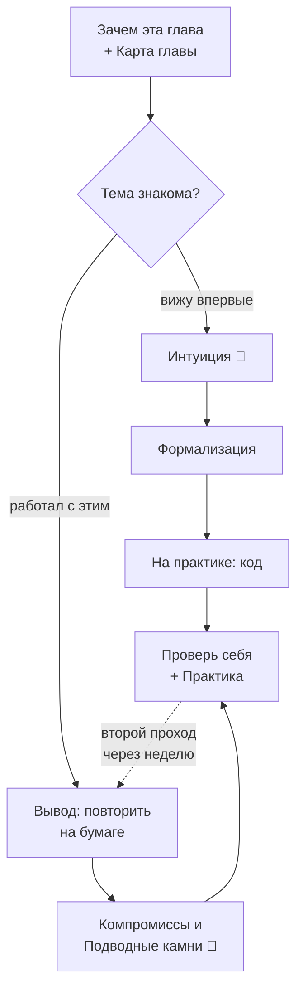

# Как пользоваться хендбуком

> **Зачем эта глава.** Объяснить, как устроена книга и как её читать, чтобы знание осталось.
> Двадцать минут здесь экономят недели: вы поймёте, почему части идут именно в этом порядке,
> что делать с каждой главой и как проверять, что тема действительно закрыта.

**Уровень:** для всех
**Как проработать:** чтение + упражнения

---

## Карта главы

- [1. Что это за книга и чем она не является](#1-что-это-за-книга-и-чем-она-не-является)
- [2. Как устроена каждая глава](#2-как-устроена-каждая-глава)
- [3. Разметка: как читать значки](#3-разметка-как-читать-значки)
- [4. Как читать](#4-как-читать) — подряд, и когда от этого можно отступить
- [5. Как работать с главой, чтобы знание осталось](#5-как-работать-с-главой-чтобы-знание-осталось)
- [6. Как отслеживать прогресс](#6-как-отслеживать-прогресс)
- [7. Частые вопросы](#7-частые-вопросы)

---

## 1. Что это за книга и чем она не является

Это **учебник**, написанный так, как объяснял бы преподаватель, который сам катал модели в прод
и сам проводил собеседования. Не конспект, не шпаргалка, не список тем.

Три принципа, на которых он построен:

**Первый: сначала проблема, потом решение.** Ни один метод здесь не вводится словами
«существует алгоритм X». Сначала показывается, что ломалось до него — и только потом появляется
метод как ответ на конкретную боль. Так знание цепляется за причину, а не висит в воздухе.

**Второй: формулы выводятся, а не цитируются.** Если в главе стоит формула, в ней разобран каждый
символ и показан каждый переход. Ровно на «очевидных» переходах люди и теряют нить, поэтому
пропусков нет. Это делает главы длиннее — и это осознанный выбор.

**Третий: вопросы с собеседований вплетены в объяснение, а не вынесены в отдельный раздел.**
Отдельный «список вопросов» — плохой инструмент: он провоцирует зубрёжку формулировок вместо
понимания. Здесь вместо этого по тексту расставлены врезки 💬 «На собеседовании» — в том месте,
где вы только что разобрали нужную теорию. Прочитав главу подряд, вы автоматически проходите
по всем вопросам, которые по этой теме задают.

**Чем это не является.** Не заменой практики: нельзя стать MLE, читая. Не справочником API —
для этого есть документация. И не сборником «100 вопросов для собеседования», хотя после
проработки вы ответите на большинство из них.

**Это книга, и читается она подряд.** Части выстроены так, что каждая опирается
на предыдущие: язык → ядро → представления → доказательства → инженерия → первая полная
система → обобщение. Порядок не декоративный, он проверяется автоматически: ни одна глава
не требует того, что идёт позже. Дойдёте до конца — будете знать то, что спрашивают
с middle+ MLE, и вам не придётся гадать, что читать дальше.

---

## 2. Как устроена каждая глава

Структура фиксированная, поэтому вы быстро научитесь ориентироваться:

| Блок | Что там | Можно ли пропустить |
|---|---|---|
| **Зачем эта глава** | какую инженерную задачу закрывает тема | нет, это ваш фильтр |
| **Карта главы** | оглавление с однострочниками | нет, по ней вы решаете, что читать |
| **Интуиция** | проблема на конкретном примере, почти без формул | 🌱 нет; 🧠 можно бегло |
| **Формализация** | строгая постановка, все обозначения | нет |
| **Вывод** | математика по шагам | 🌱 можно отложить на второй проход |
| **На практике** | код, поведение на реальных данных, гиперпараметры | нет |
| **Компромиссы** | когда метод — правильный выбор, когда нет | нет, это самый ценный блок для собеса |
| **Подводные камни** | грабли из продакшена: симптом → причина → решение | нет |
| **Проверь себя** | вопросы в формате собеседования с разбором | нет, это главный инструмент проверки |
| **Практика** | задачи с критериями «сделано правильно» | нет, если хотите уметь, а не «знать» |
| **Что читать дальше** | аннотированные источники | по желанию |

Заметьте асимметрию: пропускать можно почти только вывод и то временно. Блоки «Компромиссы»
и «Подводные камни» — это то, чем middle+ отличается от middle, и именно их обычно нет
в обычных курсах.

---

## 3. Разметка: как читать значки

По тексту расставлены врезки. Они не украшение — это навигация по глубине.

> 🌱 **База.** Минимальный путь через тему. Если вы видите тему впервые — читайте эти блоки,
> делайте практику и идите дальше. Вернётесь за глубиной позже.

> 🧠 **Middle+.** Углубление: детали, которые отличают «слышал» от «понимаю».
> Именно здесь лежат ответы на уточняющие вопросы интервьюера.

> 💬 **На собеседовании.** Реальный вопрос + разбор: что считается хорошим ответом,
> что интервьюер на самом деле проверяет, и какой ответ провальный.

> 📐 **Разбор формулы.** Медленный проход по формуле символ за символом.
> Для тех, у кого практика есть, а математика вызывает дискомфорт.

> ⌨️ **Руками.** Микро-задача на код, которую нужно сделать прямо сейчас, не подглядывая.
> Для тех, у кого теория идёт легче, чем клавиатура.

> ⚠️ **Типичная ошибка.** Что делают → к чему это приводит → как правильно.

Уровень главы указан в шапке: 🌱 база / 🎯 middle / 🧠 middle+. Если в шапке стоит 🧠,
а вы ещё не уверены в пререквизитах — сначала пройдите их, они перечислены там же.

Как эта разметка складывается в маршрут — на схеме: через одну и ту же главу идут два разных
пути, для того, кто видит тему впервые, и для того, кто уже с ней работал.



Смысл схемы — в пунктирной стрелке: первый проход главу не закрывает, через неделю вы
возвращаетесь в неё уже по второму маршруту, за выводом и 🧠-блоками.

---

## 4. Как читать

**Основной способ — подряд, от начала к концу.** Это не отговорка «мы не смогли выбрать»,
а следствие устройства: части выстроены по зависимостям, и в каждой главе строка
«Предварительно нужно» ссылается только назад. Идя по порядку, вы никогда не упираетесь
в незнакомое понятие и никогда не тратите силы на вопрос «а что дальше».

Стрелки ⬅️ ➡️ в подвале каждой главы ведут по этому же порядку — можно просто нажимать
«дальше» и не возвращаться в оглавление.

Пропускать части нельзя выборочно, но можно осознанно. Три случая, когда это оправдано:

**У вас скоро собеседование.** Тогда сначала [карта собеседования](03-interview-map.md):
она показывает, какая секция что проверяет. Закройте дыры точечно, а книгу дочитайте
после — иначе останутся связи, которых вы не увидите.

**Вы уже сильный в одной области.** Часть, которую знаете, всё равно стоит пролистать
по блокам «Проверь себя»: если ответы даются без запинки — идите дальше. Это быстрее,
чем читать, и честнее, чем пропустить.

**Вам нужен срез под конкретную вакансию.** [Короткие маршруты](02-tracks.md) — это
подмножества книги под RecSys, LLM, MLOps и другие профили. Маршрут не заменяет книгу,
он расставляет приоритеты внутри неё.

Отдельно стоит **[раздел 12 «Практика кода»](../12-coding/index.md)**: это не глава
в очереди, а тренажёр. В него заходят в любой момент, когда голова понимает, а руки
не пишут. Он никогда не бывает предпосылкой.

Перед первой содержательной частью стоит прочитать
**[сквозные линии книги](05-threads.md)**. Там выписаны восемь идей, которые возвращаются
в каждом разделе в новой одежде: если знать их заранее, дальше вы будете узнавать знакомое
вместо того, чтобы запоминать новое. Двадцать минут, которые окупаются на всей книге.

И ещё одно применение — справочное. [Глоссарий](06-glossary.md) и
[оглавление](../index.md) ведут в главу, где термин разобран по существу.

> 💬 **На собеседовании.** Самый частый вопрос к самой книге: «а за сколько её можно пройти?»
> Честный ответ: срок зависит не от числа страниц, а от того, сколько вы выводите на бумаге
> и пишете руками. Читать — быстро. Уметь — долго. Поэтому здесь нигде нет календаря:
> вместо него у каждой части написано, что конкретно вы должны уметь на выходе,
> и это единственный работающий критерий готовности.

---

## 5. Как работать с главой, чтобы знание осталось

Это самое важное место в этой главе. Подробное обоснование — в
[«Как учить, чтобы осталось в голове»](04-study-method.md), здесь — сам протокол.

**Шаг 1. Разведка (3 минуты).** Прочитайте «Зачем эта глава» и «Карту главы». Задайте себе
вопрос: что я уже знаю по этой теме? Попробуйте ответить *до* чтения — даже неудачная попытка
вспомнить резко улучшает последующее запоминание.

**Шаг 2. Первый проход (по разделам).** Читайте раздел, потом закрывайте экран и своими словами
проговаривайте, что поняли. Не «перечитывайте» — именно **вспоминайте**. Перечитывание создаёт
иллюзию знания, воспроизведение по памяти создаёт знание.

**Шаг 3. Формулы — с карандашом.** Каждый вывод повторите на бумаге сами. Не «просмотрите
глазами и согласитесь» — согласиться легко, воспроизвести трудно. Разница между этими двумя
состояниями и есть разница между провалом и успехом на технической секции.

**Шаг 4. Код — руками.** Наберите его сами, не копипастой. Потом сломайте: поменяйте параметр,
уберите строку, посмотрите, что произойдёт. Понимание кода — это умение предсказать,
что сломается.

**Шаг 5. «Проверь себя» — вслух и до открытия ответа.** Прочитали вопрос → закрыли глаза →
ответили вслух полностью, как на собеседовании → только потом раскрыли ответ и сравнили.
Если ответ был неполным — вернитесь к соответствующему разделу, а не просто прочитайте разбор.

**Шаг 6. Практика.** Задачи из раздела «Практика» — это не бонус, это проверка. Глава считается
пройденной, когда задачи сделаны, а не когда текст прочитан.

**Шаг 7. Возврат через интервалы.** Через 1 день, через неделю и через месяц вернитесь
к блоку «Проверь себя» этой главы. Только к вопросам, не к тексту. 10 минут — и материал
переезжает в долговременную память.

> ⚠️ **Типичная ошибка.** Читать хендбук как ленту: быстро, приятно, с ощущением «о, понятно».
> Это ощущение обманчиво — оно возникает от узнавания текста, а не от способности его
> воспроизвести. Проверка простая: закройте главу и объясните тему вслух пустой комнате.
> Если запинаетесь — вы её не знаете.

---

## 6. Как отслеживать прогресс

Заведите себе форк репозитория и отмечайте пройденное прямо в нём. Простой протокол,
который реально работает:

```markdown
- [x] 02-classic-ml/08-gradient-boosting.md — прочитано 12.03, вывод XGBoost повторён на бумаге,
      задачи 1-2 сделаны. Не понял до конца: почему min_child_weight — сумма гессианов. Вернуться.
- [ ] 02-classic-ml/09-boosting-in-practice.md
```

Три вещи в этой записи важны: дата (для интервальных повторений), что именно сделано
(не «прочитал», а «вывел / решил»), и **явная фиксация непонятого**. Последнее — самое ценное:
список ваших пробелов сам по себе становится планом подготовки.

Для повторений удобно завести колоду в Anki из вопросов блоков «Проверь себя»: вопрос на лицевой
стороне, короткий ответ — на обратной. 15 минут в день закрывают проблему забывания полностью.

---

## 7. Частые вопросы

<details>
<summary><b>Я не MLE, я аналитик / бэкендер / студент. Мне подойдёт?</b></summary>

Да, но начните с [трека смены домена](02-tracks.md#трек-6-смена-домена). Разделы
[математики](../01-math/01-linear-algebra.md) и [классического ML](../02-classic-ml/01-learning-theory.md)
самодостаточны — они не требуют опыта в ML. Разделы про продакшен предполагают, что вы понимаете,
что такое HTTP-сервис и контейнер; если нет — сначала [Docker и Kubernetes для MLE](../07-mlops/06-docker-and-k8s.md),
там есть минимальная база.
</details>

<details>
<summary><b>Нужно ли читать раздел математики, если я «просто хочу собеситься»?</b></summary>

Смотря на какой грейд. На middle математику спрашивают точечно: вывести градиент логистической
регрессии, объяснить bias-variance, посчитать вероятность в простой задаче. На middle+ добавляются
вопросы, где без понимания оптимизации и статистики ответить нельзя — например, почему Adam ведёт
себя иначе, чем SGD, или почему p-value не является вероятностью того, что гипотеза верна.

Практический совет: не читайте математику отдельным блоком «на всякий случай». Начните с
предметных разделов и проваливайтесь в математику по ссылкам-пререквизитам, когда упрётесь.
Так вы выучите ровно нужное и будете понимать, зачем оно.
</details>

<details>
<summary><b>Здесь нет раздела «вопросы с собеседований». Где он?</b></summary>

Его нет намеренно. Вопросы вплетены в главы — в блоках 💬 «На собеседовании» и «Проверь себя».
Причина в том, как устроена память: вопрос, разобранный сразу после соответствующей теории,
привязывается к пониманию. Вопрос из отдельного списка привязывается к формулировке — и рассыпается,
стоит интервьюеру переформулировать.

Если нужен именно обзор «что где спрашивают» — это [карта собеседования](03-interview-map.md):
там разложено по секциям и грейдам, с указанием, какие главы закрывают какую секцию.
</details>

<details>
<summary><b>Материал устареет — что делать?</b></summary>

Разделы [математики](../01-math/01-linear-algebra.md), [классического ML](../02-classic-ml/01-learning-theory.md),
[A/B-тестов](../06-ab-testing/01-experiment-design.md) и [валидации](../02-classic-ml/05-validation-and-leakage.md)
устаревают крайне медленно — там всё написанное будет верно и через десять лет.

Быстро меняются [LLM](../05-llm/01-llm-architecture.md), [LLM в рекомендациях](../10-recsys/11-llm-recsys.md)
и [инференс](../07-mlops/09-inference-optimization.md). В этих главах акцент сделан на **принципах**
(почему декодинг memory-bound, зачем нужен KV-кэш, что даёт низкоранговое приближение), а не на
названиях библиотек — принципы живут дольше. Конкретные инструменты помечены по состоянию на дату
и требуют проверки.
</details>

<details>
<summary><b>Нашёл ошибку / неточность. Что делать?</b></summary>

Открыть issue или PR — см. [CONTRIBUTING](../../CONTRIBUTING.md). Ошибка в учебнике тиражируется
дальше, поэтому её исправление ценнее, чем ещё одна новая глава.
</details>

---

## Что читать дальше

- [Короткие маршруты](02-tracks.md) — что читать сначала, если полный проход сейчас не помещается.
- [Карта собеседования MLE](03-interview-map.md) — из чего состоит воронка и что спрашивают на каждом грейде.
- [Как учить, чтобы осталось в голове](04-study-method.md) — обоснование протокола из [§5](#5-как-работать-с-главой-чтобы-знание-осталось) и подробный разбор методики.
- [Глоссарий](06-glossary.md) — если по ходу встретился незнакомый термин.

---

🏠 [Оглавление](../index.md) | ➡️ [Короткие маршруты](02-tracks.md)
