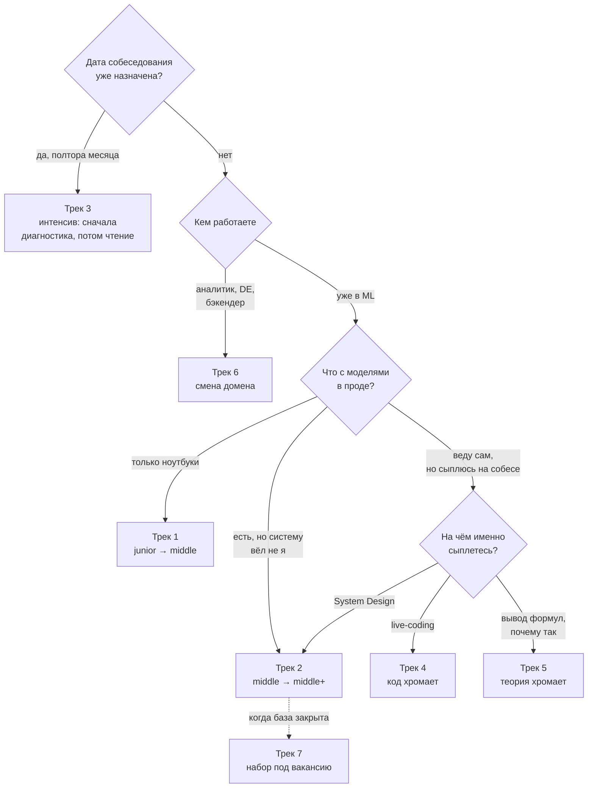

# Треки обучения

> **Зачем эта глава.** В хендбуке 117 глав. Читать их подряд — плохая идея: вы утонете
> на математике и бросите до того, как дойдёте до полезного. Здесь собраны готовые маршруты
> под конкретные ситуации, каждый — с порядком глав, оценкой времени и критерием «трек пройден».

**Уровень:** для всех
**Как проработать:** чтение + упражнения

---

## Карта главы

- [Как выбрать трек](#как-выбрать-трек)
- [Трек 1. Junior → Middle](#трек-1-junior--middle)
- [Трек 2. Middle → Middle+](#трек-2-middle--middle)
- [Трек 3. Интенсив: собеседование через 6 недель](#трек-3-интенсив-собеседование-через-6-недель)
- [Трек 4. Теория есть, код хромает](#трек-4-теория-есть-код-хромает)
- [Трек 5. Код есть, теория хромает](#трек-5-код-есть-теория-хромает)
- [Трек 6. Смена домена](#трек-6-смена-домена)
- [Трек 7. Специализация под вакансию](#трек-7-специализация-под-вакансию)
- [Общие правила работы с треком](#общие-правила-работы-с-треком)

---

## Как выбрать трек

Ответьте на два вопроса честно.

**Вопрос 1: что у вас уже есть?**

| Признак | Ваш стартовый уровень |
|---|---|
| Обучал модели только в ноутбуках, в прод ничего не выкатывал | старт трека 1 |
| Есть модели в проде, но пайплайн собирал не я / я не отвечал за мониторинг | старт трека 2 |
| Веду ML-сервисы, но проваливаюсь на теории или на выводе формул | трек 5 |
| Отлично объясняю теорию, но на live-coding туплю | трек 4 |
| Я аналитик / DE / бэкендер и хочу в MLE | трек 6 |
| Всё нормально, но собеседование через полтора месяца | трек 3 |

Порядок вопросов важнее самих ответов, и на схеме он виден: назначенная дата собеседования
перебивает всё остальное, а «чем именно я сыплюсь» спрашивается последним.

Обратите внимание на пунктир: трек 7 — не альтернатива остальным, а надстройка над треком 2,
браться за него до закрытия базы бессмысленно.

**Вопрос 2: чем вы готовы платить — временем или глубиной?**

Календарных сроков вы здесь не найдёте, и это осознанно. Скорость чтения различается в разы,
и «за сколько недель» — вопрос, на который нельзя ответить за другого человека. Кто-то
прочитает раздел за вечер и всё поймёт; кому-то на тот же раздел нужна неделя — и это ничего
не говорит о том, кто из них лучше пройдёт собеседование.

Время в этой работе съедает не чтение, а **три вещи**: вывод формул на бумаге, код с чистого
листа и прогоны вслух. Их нельзя ускорить чтением — только сделать или не сделать. Поэтому
у каждого трека вместо срока стоит **объём** (сколько глав) и **критерий завершения** (что вы
должны уметь). По ним и меряйте прогресс.

> ⚠️ **Типичная ошибка.** Выбрать трек «посложнее», чтобы не терять время. Результат обычно
> обратный: пропущенная база всплывает уточняющим вопросом на собеседовании, и ответить нечего.
> Если сомневаетесь между двумя треками — берите тот, что проще, и проходите его быстро,
> пропуская уже знакомое. Быстрый проход по знакомому материалу дёшев, дыра в базе — дорога.

---

## Трек 1. Junior → Middle

**Кому:** есть базовое понимание ML, обучали модели, но в проде не отвечали за систему целиком.
**Цель:** уверенно проходить секции «ML-теория» и «кодинг» на middle, не разваливаться на вопросах о валидации и метриках.

### Этап 1 — фундамент
1. [Постановка задачи обучения](../02-classic-ml/01-learning-theory.md) — bias-variance, ERM, переобучение
2. [Линейная регрессия и регуляризация](../02-classic-ml/02-linear-models.md)
3. [Логистическая регрессия](../02-classic-ml/03-logistic-regression.md)
4. [Метрики качества](../02-classic-ml/04-metrics.md) ← **самая частая тема на собесах этого грейда**
5. [Валидация и утечки](../02-classic-ml/05-validation-and-leakage.md) ← **вторая по частоте**
6. Подтянуть по ссылкам: [теория вероятностей](../01-math/02-probability.md), [статистика](../01-math/03-statistics.md)

### Этап 2 — деревья и ансамбли
7. [Решающие деревья](../02-classic-ml/06-decision-trees.md)
8. [Бэггинг и случайный лес](../02-classic-ml/07-bagging-random-forest.md)
9. [Градиентный бустинг](../02-classic-ml/08-gradient-boosting.md) ← ключевая глава, не пропускать вывод
10. [XGBoost, LightGBM, CatBoost](../02-classic-ml/09-boosting-in-practice.md)
11. [Дисбаланс классов и калибровка](../02-classic-ml/13-imbalance-and-calibration.md)

### Этап 3 — работа с данными
12. [Работа с признаками](../02-classic-ml/14-feature-engineering.md)
13. [Интерпретируемость](../02-classic-ml/15-interpretability.md)
14. [SVM, kNN и наивный Байес](../02-classic-ml/10-svm-knn-bayes.md)
15. [Кластеризация](../02-classic-ml/11-clustering.md)
16. [Снижение размерности](../02-classic-ml/12-dimensionality-reduction.md)

### Этап 4 — код и SQL
17. [Python, который спрашивают](../12-coding/01-python-for-mle.md)
18. [NumPy и pandas на скорость](../12-coding/02-numpy-pandas.md)
19. [SQL для MLE](../08-big-data/02-sql-for-mle.md) + [SQL: тренировка](../12-coding/05-sql-drills.md)
20. [Реализуем ML руками](../12-coding/03-ml-from-scratch.md)
21. [Алгоритмы для MLE-собеса](../12-coding/04-algorithms.md)

### Этап 5 — минимум про прод
22. [Жизненный цикл ML-системы](../07-mlops/01-ml-lifecycle.md)
23. [Упаковка модели](../07-mlops/04-model-packaging.md)
24. [Архитектуры сервинга](../07-mlops/05-serving-architectures.md)
25. [Что мониторить в ML-системе](../09-monitoring/01-what-to-monitor.md)
26. [Дизайн эксперимента](../06-ab-testing/01-experiment-design.md)

### Этап 6 — нейросети обзорно
27. [Нейросети и обратное распространение](../03-deep-learning/01-neural-nets-and-backprop.md)
28. [Как на самом деле обучается сеть](../03-deep-learning/02-training-dynamics.md)
29. [PyTorch на практике](../12-coding/06-pytorch-drills.md) + [PyTorch на практике](../03-deep-learning/05-pytorch-in-practice.md)

**Трек пройден, когда:** вы можете без подготовки вывести градиент логистической регрессии,
объяснить разницу между ROC-AUC и PR-AUC на примере, за 20 минут написать KMeans с нуля,
назвать четыре вида утечек и рассказать, как выкатывали бы модель в прод.

---

## Трек 2. Middle → Middle+

**Кому:** уверенно решаете ML-задачи, но на собеседованиях спотыкаетесь о системный дизайн,
продакшен-детали и «а почему именно так».
**Цель:** пройти ML System Design секцию, отвечать на уточняющие вопросы вглубь, а не вширь.

### Этап 1 — закрыть глубину в классике
Быстрый проход только по блокам 🧠 и «Подводные камни»:
[бустинг](../02-classic-ml/08-gradient-boosting.md) → [библиотеки бустинга](../02-classic-ml/09-boosting-in-practice.md)
→ [метрики](../02-classic-ml/04-metrics.md) → [калибровка](../02-classic-ml/13-imbalance-and-calibration.md)
→ [валидация и утечки](../02-classic-ml/05-validation-and-leakage.md)
→ [uplift и причинность](../02-classic-ml/17-uplift-and-causal.md)

### Этап 2 — продакшен
[Жизненный цикл](../07-mlops/01-ml-lifecycle.md) → [воспроизводимость и трекинг](../07-mlops/02-reproducibility-and-tracking.md)
→ [данные и feature store](../07-mlops/03-data-and-feature-store.md) → [сервинг](../07-mlops/05-serving-architectures.md)
→ [Docker и k8s](../07-mlops/06-docker-and-k8s.md) → [CI/CD для ML](../07-mlops/07-ci-cd-for-ml.md)
→ [стратегии выкатки](../07-mlops/08-deployment-strategies.md) → [оптимизация инференса](../07-mlops/09-inference-optimization.md)
→ [стоимость и ёмкость](../07-mlops/10-cost-and-capacity.md)

### Этап 3 — мониторинг
[Что мониторить](../09-monitoring/01-what-to-monitor.md) → [качество данных](../09-monitoring/02-data-quality.md)
→ [дрифт](../09-monitoring/03-drift-detection.md) → [деградация модели](../09-monitoring/04-model-degradation.md)
→ [стек наблюдаемости](../09-monitoring/05-observability-stack.md) → [инциденты](../09-monitoring/06-incidents-and-runbooks.md)
→ [переобучение](../09-monitoring/07-retraining.md)

### Этап 4 — эксперименты
[Дизайн эксперимента](../06-ab-testing/01-experiment-design.md) → [критерии](../06-ab-testing/02-statistical-criteria.md)
→ [снижение дисперсии](../06-ab-testing/03-variance-reduction.md) → [ловушки](../06-ab-testing/04-pitfalls.md)
→ [сложные схемы](../06-ab-testing/05-complex-designs.md)

### Этап 5 — данные в масштабе
[Хранение и форматы](../08-big-data/01-storage-and-formats.md) → [Spark: как он работает](../08-big-data/03-spark-fundamentals.md)
→ [Spark: производительность](../08-big-data/04-spark-tuning.md) → [потоковая обработка](../08-big-data/05-streaming.md)
→ [оркестрация](../08-big-data/06-orchestration.md)

### Этап 6 — System Design (2,5 недели) ← **ядро трека**
[Каркас ответа](../11-system-design/01-framework.md), затем **все** кейсы подряд, каждый —
сначала самостоятельно на бумаге за 40 минут, потом сверка с разбором:
[лента](../11-system-design/02-case-feed-ranking.md), [поиск](../11-system-design/03-case-search.md),
[антифрод](../11-system-design/04-case-fraud-detection.md), [RAG-ассистент](../11-system-design/05-case-rag-assistant.md),
[realtime-персонализация](../11-system-design/06-case-realtime-recsys.md), [отток и uplift](../11-system-design/07-case-churn-uplift.md),
[CTR в рекламе](../11-system-design/08-case-ads-ctr.md)

### Этап 7 — профильная глубина
Выберите одно направление и пройдите его целиком: [рекомендации](../10-recsys/01-recsys-foundations.md),
[LLM](../05-llm/01-llm-architecture.md) или [NLP](../04-nlp/01-text-representation.md).

**Трек пройден, когда:** вы проводите ML System Design за 45 минут по своей структуре,
без подсказок называете бюджет латентности по стадиям, объясняете, как ловили бы дрифт
без разметки, и знаете, чем ваш выбор архитектуры плох.

---

## Трек 3. Интенсив: собеседование через 6 недель

**Кому:** есть опыт, есть дата собеседования, нужно быстро закрыть дыры.
**Цель:** не выучить всё, а перестать сыпаться на предсказуемом.

Логика трека: **сначала диагностика, потом лечение**. Не начинайте с чтения.

**Неделя 0 (2 вечера). Диагностика.**
Пройдите блоки «Проверь себя» — только вопросы, без чтения глав — в: [метрики](../02-classic-ml/04-metrics.md),
[валидация](../02-classic-ml/05-validation-and-leakage.md), [бустинг](../02-classic-ml/08-gradient-boosting.md),
[внимание и трансформер](../03-deep-learning/04-attention-and-transformer.md),
[сервинг](../07-mlops/05-serving-architectures.md), [дрифт](../09-monitoring/03-drift-detection.md),
[дизайн эксперимента](../06-ab-testing/01-experiment-design.md).
Выпишите всё, где ответили неуверенно. Это ваш план.

**Недели 1–2. Ядро теории.** Дыры из диагностики + обязательный минимум:
[метрики](../02-classic-ml/04-metrics.md), [валидация и утечки](../02-classic-ml/05-validation-and-leakage.md),
[бустинг](../02-classic-ml/08-gradient-boosting.md), [калибровка](../02-classic-ml/13-imbalance-and-calibration.md),
[статистика](../01-math/03-statistics.md).

**Неделя 3. Код.** [Реализуем ML руками](../12-coding/03-ml-from-scratch.md) +
[NumPy и pandas](../12-coding/02-numpy-pandas.md) + [SQL: тренировка](../12-coding/05-sql-drills.md) +
[алгоритмы](../12-coding/04-algorithms.md). Норма: 3–4 задачи в день на время.

**Неделя 4. Продакшен.** [Сервинг](../07-mlops/05-serving-architectures.md),
[стратегии выкатки](../07-mlops/08-deployment-strategies.md), [мониторинг](../09-monitoring/01-what-to-monitor.md),
[дрифт](../09-monitoring/03-drift-detection.md), [A/B](../06-ab-testing/01-experiment-design.md) +
[ловушки A/B](../06-ab-testing/04-pitfalls.md).

**Неделя 5. System Design.** [Каркас](../11-system-design/01-framework.md) + 4 кейса,
каждый вслух с таймером, желательно с напарником.

**Неделя 6. Прогон.** Полные mock-интервью по всем секциям. Возврат только к тем темам,
где мок показал провал. Плюс [поведенческая секция](../14-career/02-behavioral.md) и
[процесс найма](../14-career/01-interview-process.md).

> ⚠️ **Типичная ошибка интенсива.** Тратить последнюю неделю на новые темы. Не надо: новое,
> выученное за 3 дня до собеседования, не воспроизводится под стрессом. Последняя неделя —
> только повторение и прогоны.

---

## Трек 4. Теория есть, код хромает

**Кому:** вы понимаете математику и можете объяснить любой алгоритм, но на live-coding
теряетесь, пишете медленно или «зависаете» на пустом файле.

Диагноз почти всегда один: **не хватает не знаний, а автоматизма**. Лечится только объёмом
написанного кода, но объём нужен правильный.

**Блок 1 (2 недели). Реализации из головы.**
[Реализуем ML руками](../12-coding/03-ml-from-scratch.md) — весь. Правило: каждую модель
пишете **с чистого листа, без подглядывания**, засекая время. Затем сравниваете с разбором,
находите, где застряли, и через два дня пишете эту же модель заново. Второй раз должен быть
вдвое быстрее — это и есть тренируемый навык.

Норма: линейная регрессия и kNN — 10 минут, логистическая регрессия — 15, KMeans — 20,
дерево решений — 40, бустинг — 60, attention — 25.

**Блок 2 (2 недели). Библиотечная беглость.**
[NumPy и pandas на скорость](../12-coding/02-numpy-pandas.md) и
[PyTorch: тренировка](../12-coding/06-pytorch-drills.md). Правило: любую задачу сначала решаете
циклом, потом переписываете векторизованно и замеряете ускорение. Цель — чтобы векторизованный
вариант приходил в голову первым.

**Блок 3 (1,5 недели). SQL.**
[SQL для MLE](../08-big-data/02-sql-for-mle.md) + [SQL: тренировка](../12-coding/05-sql-drills.md).
Оконные функции — до автоматизма: их спрашивают почти всегда.

**Блок 4 (1,5 недели). Алгоритмы.**
[Алгоритмы для MLE-собеса](../12-coding/04-algorithms.md). Уровень MLE-секции — обычно
easy/medium, задачи с упором на хэш-таблицы, два указателя, сортировки и простую динамику.
Гнаться за hard не нужно, нужна скорость на medium.

**Блок 5 (1 неделя). Инженерная гигиена.**
[Python, который спрашивают](../12-coding/01-python-for-mle.md) и
[Тесты и качество кода в ML](../12-coding/07-testing-and-code-quality.md). На middle+ смотрят
не только на то, что код работает, но и на то, как он написан.

**Трек пройден, когда:** вы пишете логистическую регрессию с нуля за 15 минут без справки,
решаете medium-задачу за 25 минут вслух с проговариванием, и оконный SQL-запрос пишете
без гугления синтаксиса.

---

## Трек 5. Код есть, теория хромает

**Кому:** вы отличный инженер, ваши сервисы работают, но на вопросе «выведите формулу»
или «почему так» начинается импровизация.

Диагноз: знание собрано из практики кусками, без несущей конструкции. Лечится не заучиванием,
а **повторным проходом по выводам с карандашом**.

**Блок 1 (2,5 недели). Математический минимум.** Не весь раздел, а именно то, что спрашивают:
[линейная алгебра](../01-math/01-linear-algebra.md) (проекции, SVD, матричные производные),
[вероятность](../01-math/02-probability.md) (Байес, распределения, ЦПТ),
[статистика](../01-math/03-statistics.md) (MLE, гипотезы, доверительные интервалы),
[оптимизация](../01-math/04-optimization.md) (выпуклость, SGD, Adam).
Правило блока: каждый вывод повторяете на бумаге. Читать глазами бесполезно.

**Блок 2 (2 недели). Несущая конструкция ML.**
[Постановка задачи обучения](../02-classic-ml/01-learning-theory.md) →
[линейные модели](../02-classic-ml/02-linear-models.md) → [логистическая регрессия](../02-classic-ml/03-logistic-regression.md)
→ [метрики](../02-classic-ml/04-metrics.md). Здесь важен не факт, а связность: почему
регуляризация = априорное распределение, почему log-loss = максимум правдоподобия.

**Блок 3 (2 недели). Ансамбли до дна.**
[Деревья](../02-classic-ml/06-decision-trees.md) → [лес](../02-classic-ml/07-bagging-random-forest.md)
→ [бустинг](../02-classic-ml/08-gradient-boosting.md) (полный вывод, включая формулу листа XGBoost)
→ [библиотеки](../02-classic-ml/09-boosting-in-practice.md).

**Блок 4 (2 недели). Нейросети до дна.**
[Backprop](../03-deep-learning/01-neural-nets-and-backprop.md) → [динамика обучения](../03-deep-learning/02-training-dynamics.md)
→ [внимание и трансформер](../03-deep-learning/04-attention-and-transformer.md) с реализацией
attention с нуля и проверкой размерностей.

**Блок 5 (1,5 недели). Статистика экспериментов.**
[Дизайн](../06-ab-testing/01-experiment-design.md) → [критерии](../06-ab-testing/02-statistical-criteria.md)
→ [снижение дисперсии](../06-ab-testing/03-variance-reduction.md) → [ловушки](../06-ab-testing/04-pitfalls.md).
Это та секция, где сильные инженеры чаще всего проваливаются.

**Трек пройден, когда:** вы выводите на доске log-loss из правдоподобия, формулу значения листа
в XGBoost и формулу размера выборки для A/B — без подсказок и без пауз «ну там ещё коэффициент».

---

## Трек 6. Смена домена

### 6А. Из аналитики / DS в MLE
Ваша сильная сторона — статистика, метрики, работа с данными. Дыра — инженерия.

[Python, который спрашивают](../12-coding/01-python-for-mle.md) →
[Тесты и качество кода](../12-coding/07-testing-and-code-quality.md) →
[Жизненный цикл ML-системы](../07-mlops/01-ml-lifecycle.md) → [упаковка модели](../07-mlops/04-model-packaging.md)
→ [сервинг](../07-mlops/05-serving-architectures.md) → [Docker и k8s](../07-mlops/06-docker-and-k8s.md)
→ [CI/CD](../07-mlops/07-ci-cd-for-ml.md) → [выкатка](../07-mlops/08-deployment-strategies.md)
→ [мониторинг целиком](../09-monitoring/01-what-to-monitor.md) → [Spark](../08-big-data/03-spark-fundamentals.md)
→ [System Design](../11-system-design/01-framework.md).

### 6Б. Из бэкенда / DE в MLE
Ваша сильная сторона — инженерия и системы. Дыра — ML-теория и метрики.

Полностью [классический ML](../02-classic-ml/01-learning-theory.md) (главы 1–15) →
[математика по пререквизитам](../01-math/03-statistics.md) → [валидация](../02-classic-ml/05-validation-and-leakage.md)
→ [метрики](../02-classic-ml/04-metrics.md) → [A/B-тесты](../06-ab-testing/01-experiment-design.md)
→ [нейросети](../03-deep-learning/01-neural-nets-and-backprop.md) →
профильный раздел ([рекомендации](../10-recsys/01-recsys-foundations.md) или [LLM](../05-llm/01-llm-architecture.md)).

### 6В. Внутри MLE: переход в другой домен
- **В рекомендации:** весь [раздел 06](../10-recsys/01-recsys-foundations.md) + [бандиты](../10-recsys/13-exploration-and-bandits.md)
  + [онлайн-оценка](../10-recsys/15-recsys-online-evaluation.md) + кейс [ленты](../11-system-design/02-case-feed-ranking.md). ~6 недель.
- **В LLM:** [трансформер](../03-deep-learning/04-attention-and-transformer.md) → весь
  [раздел 05](../05-llm/01-llm-architecture.md) + кейс [RAG-ассистента](../11-system-design/05-case-rag-assistant.md). ~7 недель.
- **В NLP:** весь [раздел 04](../04-nlp/01-text-representation.md) + [трансформер](../03-deep-learning/04-attention-and-transformer.md)
  + [LLM 01–07](../05-llm/01-llm-architecture.md). ~6 недель.

---

## Трек 7. Специализация под вакансию

Готовитесь к конкретной роли — берите профильный набор. Базой считается трек 2.

<b>RecSys Engineer</b>

Обязательно: весь [раздел 06](../10-recsys/01-recsys-foundations.md) целиком;
[метрики ранжирования](../02-classic-ml/04-metrics.md); [бустинг](../02-classic-ml/08-gradient-boosting.md);
[A/B в рекомендациях](../10-recsys/15-recsys-online-evaluation.md) и [сложные схемы A/B](../06-ab-testing/05-complex-designs.md)
(сетевые эффекты и каннибализация — любимая тема);
[feature store](../07-mlops/03-data-and-feature-store.md); кейсы [лента](../11-system-design/02-case-feed-ranking.md)
и [realtime-персонализация](../11-system-design/06-case-realtime-recsys.md).

Что спрашивают чаще всего: почему офлайн-метрики не сходятся с онлайном; как устроен ANN-индекс;
позиционный биас; холодный старт; бюджет латентности по стадиям.

<b>LLM / GenAI Engineer</b>

Обязательно: [трансформер](../03-deep-learning/04-attention-and-transformer.md) до последней размерности;
весь [раздел 05](../05-llm/01-llm-architecture.md); [инференс](../05-llm/05-inference-and-serving.md)
и [оптимизация инференса](../07-mlops/09-inference-optimization.md); [RAG](../05-llm/07-rag.md);
[оценка LLM](../05-llm/09-llm-evaluation.md); [стоимость](../07-mlops/10-cost-and-capacity.md);
кейс [RAG-ассистента](../11-system-design/05-case-rag-assistant.md).

Что спрашивают чаще всего: KV-кэш и его размер; почему декодинг memory-bound; LoRA и выбор ранга;
как оценивать RAG; как удешевить запрос вдвое.

<b>MLOps / ML Platform Engineer</b>

Обязательно: весь [раздел 07](../07-mlops/01-ml-lifecycle.md) и весь [раздел 09](../09-monitoring/01-what-to-monitor.md);
[Docker и k8s](../07-mlops/06-docker-and-k8s.md) глубоко; [оркестрация](../08-big-data/06-orchestration.md);
[потоковая обработка](../08-big-data/05-streaming.md); [распределённое обучение](../08-big-data/07-distributed-training.md);
[тесты в ML](../12-coding/07-testing-and-code-quality.md).

Что спрашивают чаще всего: train/serve skew; как устроен ваш CI для моделей; что делать
при p99-выбросах; как откатывать модель; сколько это стоит.

<b>Search / Ranking Engineer</b>

Обязательно: [обучение ранжированию](../10-recsys/07-learning-to-rank.md) и
[нейронное ранжирование](../10-recsys/08-neural-ranking.md); [двухбашенки и ANN](../10-recsys/06-two-tower-and-ann.md);
[метрики ранжирования](../02-classic-ml/04-metrics.md) и [офлайн-метрики рекомендаций](../10-recsys/02-metrics-offline.md);
[эмбеддинги](../04-nlp/02-embeddings.md); кейс [поиска](../11-system-design/03-case-search.md).

<b>NLP Engineer</b>

Обязательно: весь [раздел 04](../04-nlp/01-text-representation.md);
[трансформер](../03-deep-learning/04-attention-and-transformer.md); [BERT и энкодеры](../04-nlp/04-bert-and-encoders.md);
[LLM 01–06](../05-llm/01-llm-architecture.md); [NLP в продакшене](../04-nlp/06-nlp-in-production.md).

---

## Общие правила работы с треком

**Правило 1. Не пропускайте практику.** Глава без сделанных задач не считается пройденной.
Соблазн «сейчас прочитаю всё, а задачи потом» приводит к тому, что задачи не делаются никогда,
а на собеседовании обнаруживается, что руки ничего не помнят.

**Правило 2. Ведите список непонятого.** Каждый раз, когда что-то осталось мутным, пишите
это отдельной строкой. Раз в неделю возвращайтесь к списку. Именно эти строки интервьюер
и найдёт своим уточняющим вопросом.

**Правило 3. Повторяйте по интервалам.** Через день, через неделю, через месяц — блоки
«Проверь себя» пройденных глав. Без этого через два месяца от первых недель не останется
ничего. Подробнее — [как учить, чтобы осталось](04-study-method.md).

**Правило 4. Говорите вслух.** Собеседование — устный жанр. Умение объяснить в голове
и умение объяснить голосом — разные навыки, и второй тренируется отдельно. Объясняйте темы
вслух: коллеге, напарнику по подготовке или пустой комнате.

**Правило 5. Меняйте трек, если он не идёт.** Если вторую неделю буксуете на одном разделе —
скорее всего, не хватает пререквизита. Посмотрите шапку главы, пройдите пререквизит, вернитесь.
Это не отставание от плана, это и есть работа.

---

## Что читать дальше

- [Карта собеседования MLE](03-interview-map.md) — что именно спрашивают на каждой секции и каждом грейде.
- [Как учить, чтобы осталось в голове](04-study-method.md) — методика, на которой построены правила выше.
- [Оглавление](../index.md) — полная карта хендбука, если хотите собрать свой маршрут.

---

⬅️ [Как пользоваться хендбуком](01-how-to-use.md) | 🏠 [Оглавление](../index.md) | ➡️ [Карта собеседования MLE](03-interview-map.md)
