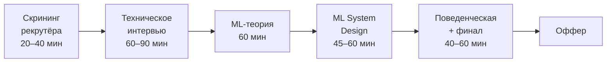

# Карта собеседования MLE

> **Зачем эта глава.** Показать воронку найма изнутри: из каких секций она состоит, что именно
> проверяет каждая, чем требования к junior отличаются от требований к middle+, и какие главы
> хендбука закрывают какую секцию. Это ваша карта: по ней вы поймёте, куда вкладывать время,
> а куда не стоит.

**Уровень:** для всех
**Время на проработку:** ~40 минут + честная самооценка по таблицам

---

## Карта главы

- [1. Как устроена воронка](#1-как-устроена-воронка)
- [2. Секция за секцией](#2-секция-за-секцией)
- [3. Что меняется от грейда к грейду](#3-что-меняется-от-грейда-к-грейду)
- [4. Как интервьюер ставит оценку](#4-как-интервьюер-ставит-оценку)
- [5. Почему отказывают крепким кандидатам](#5-почему-отказывают-крепким-кандидатам)
- [6. Карта: секция → главы хендбука](#6-карта-секция--главы-хендбука)
- [7. Проверь себя](#7-проверь-себя)
- [8. Что читать дальше](#8-что-читать-дальше)

---

## 1. Как устроена воронка

Состав секций различается между компаниями, но каркас устойчив:

Вариации, которые встречаются:

- **Компактный формат** (небольшие компании, стартапы): скрининг → одна большая техническая
  секция на 1,5–2 часа, где смешаны код, теория и обсуждение прошлых проектов → финал.
- **Расширенный формат** (крупные компании): добавляются отдельная секция по алгоритмам,
  отдельная по продакшену/инфраструктуре, иногда домашнее задание или разбор тестового.
- **Профильные секции**: на RecSys-роль добавляют секцию по рекомендациям, на LLM-роль —
  по инференсу и RAG, на MLOps-роль — по инфраструктуре.
- **Тестовое задание**: чаще на джуновские и мидловые позиции; на middle+ обычно заменяется
  разбором прошлых проектов.

> 🧠 **Откуда мы это знаем.** Каркас выше — не общее рассуждение: часть компаний публикует
> устройство своего найма сама. Т-Банк держит открытый репозиторий `Tinkoff/career` с разбивкой
> по секциям — для ML там ровно три технические: программирование, ML и дизайн ML-систем.
> Авито публикует `avito-tech/playbook` с описанием процесса: скоринг ~30 минут → техническое
> интервью 2–3 часа → финальная встреча, и явным правилом о повторной попытке через полгода.
> Если вы идёте в конкретную компанию — первым делом проверьте, нет ли у неё такого документа:
> он точнее любого пересказа.

> ⚠️ **Типичная ошибка.** Готовиться только к ML-теории, потому что она «главная».
> Публичной статистики отказов по секциям не публикует ни одна компания — и цифрам вроде
> «70% отсеиваются на алгосекции», гуляющим по сайтам-агрегаторам, верить не стоит. Но есть
> косвенный аргумент, который надёжнее: разборы от практикующих интервьюеров называют самыми
> частыми причинами провала **процедурные** вещи — не понял условие, поспешил писать, молчал,
> не проверил решение, не задал уточняющих вопросов. Ни одна из них не про незнание теории,
> и ни одна не лечится чтением. Распределяйте подготовку по числу секций, а не по своему интересу.

---

## 2. Секция за секцией

### 2.1 Скрининг рекрутёра

**Что проверяют:** соответствие вакансии, адекватность ожиданий по деньгам, мотивацию,
базовую вменяемость рассказа о себе.

**Формат:** разговор 20–40 минут. Иногда 3–5 простых технических вопросов от рекрутёра
по чек-листу («работали с бустингом?», «что такое переобучение?»).

**Что реально решает:** умение рассказать о своём опыте за 3–5 минут связно, с результатом
в цифрах. Не «занимался рекомендациями», а «отвечал за ранжирование в ленте, поднял CTR
на 6% за счёт перехода на двухбашенную модель на этапе кандидатов».

**Подготовка:** [процесс найма](../14-career/01-interview-process.md).

### 2.2 Техническое интервью: код

**Что проверяют:** умение писать работающий код в реальном времени, с проговариванием,
без залипаний на синтаксисе.

**Формат:** 1–2 задачи в общем редакторе, 45–60 минут. Уровень для MLE — обычно easy/medium
по классификации LeetCode, hard встречается редко и обычно не является блокирующим.

**Что спрашивают на практике:**
- Задачи на хэш-таблицы, два указателя, скользящее окно, сортировку с ключом, кучу для top-k.
- Задачи в ML-обёртке: «посчитайте top-k самых частых элементов в потоке», «реализуйте
  скользящее среднее», «сделайте reservoir sampling», «посчитайте IoU и NMS».
- Задачи на pandas/numpy: «векторизуйте этот цикл», «посчитайте метрику по группам».
- Реализация алгоритма ML с нуля: KMeans, логистическая регрессия, ROC-AUC, attention.
- SQL: оконные функции, сессионизация, когорты, топ-N в группе.

**Что оценивают, кроме правильности:** проговариваете ли вы ход мысли, уточняете ли вход,
обсуждаете ли сложность, тестируете ли решение.

**Подготовка:** [алгоритмы](../12-coding/04-algorithms.md), [ML с нуля](../12-coding/03-ml-from-scratch.md),
[NumPy и pandas](../12-coding/02-numpy-pandas.md), [SQL-тренировка](../12-coding/05-sql-drills.md).

### 2.3 ML-теория

**Что проверяют:** понимание, а не эрудицию. Практически любой вопрос имеет продолжение
«а почему?» и «а что будет, если...».

**Типичная траектория вопроса.** Интервьюер начинает с широкого и углубляется, пока вы
не остановитесь. Например:

> «Расскажите про градиентный бустинг» → «А почему обучаем на антиградиенте, а не на ошибке?» →
> «Выведите антиградиент для logloss» → «А что такое `min_child_weight`?» →
> «Почему бустинг хуже леса на шумных метках?»

Точка, где вы остановились, и есть ваша оценка. Поэтому глубина по ключевым темам
важнее ширины по редким.

**Ядро тем, которые спрашивают почти всегда:**
метрики и выбор порога · переобучение и bias-variance · регуляризация · валидация и утечки ·
бустинг · дисбаланс классов · работа с признаками · логистическая регрессия и её вывод ·
базовая статистика.

**Подготовка:** раздел [классического ML](../02-classic-ml/01-learning-theory.md) целиком,
плюс [статистика](../01-math/03-statistics.md).

### 2.4 ML System Design

**Что проверяют:** способность превратить расплывчатую задачу в инженерное решение.
Это секция с наибольшим весом на middle+ и главная причина отказов на этом грейде.

**Формат:** одна задача на 45–60 минут: «спроектируйте рекомендации», «сделайте антифрод»,
«постройте поиск», «сделайте ассистента по документации».

Здесь оценивают структуру мышления, связь ML с бизнесом, инженерную реалистичность
и осознание компромиссов — конкретные названия моделей весят меньше всего.

**Подготовка:** [каркас ответа](../11-system-design/01-framework.md) и все кейсы раздела 11.

### 2.5 Продакшен и инфраструктура

**Что проверяют:** доводили ли вы модели до пользователей или останавливались на ноутбуке.

**Что спрашивают:** как выкатывали модель · как считали фичи в проде и не разошлись ли они
с обучением · что мониторили · как ловили дрифт без разметки · что делали при инциденте ·
как часто переобучали и почему именно так · сколько это стоило.

Отличительная черта этой секции: **общие ответы не проходят**. «Мы использовали Docker
и Kubernetes» — это не ответ. Ответ — это конкретика: сколько реплик, какой таймаут,
что было фолбэком, что сломалось и как чинили.

**Подготовка:** разделы [MLOps](../07-mlops/01-ml-lifecycle.md) и
[мониторинг](../09-monitoring/01-what-to-monitor.md).

### 2.6 A/B-тесты и статистика экспериментов

**Что проверяют:** умеете ли вы доказать, что ваша модель принесла пользу.

**Что спрашивают:** как спланируете эксперимент · как посчитаете размер выборки ·
что такое p-value (и чем оно не является) · почему нельзя подглядывать · что такое SRM ·
как снизить дисперсию · что делать с ratio-метриками · что если результат незначим.

Эта секция часто проваливается у сильных инженеров: статистика ощущается «не своей» темой,
а спрашивают её строго.

**Подготовка:** раздел [A/B-тестов](../10-ab-testing/01-experiment-design.md) целиком.

### 2.7 Поведенческая секция и финал

**Что проверяют:** как вы работаете с людьми, с неопределённостью и с провалами.
На middle+ добавляется вопрос о влиянии: что изменилось в команде и в продукте благодаря вам.

**Типовые вопросы:** расскажите о проекте, который провалился · о конфликте с продактом
по поводу метрик · о случае, когда вы были не согласны с руководителем · о самом сложном
техническом решении и почему выбрали именно его · чему научились за последний год.

**Подготовка:** [поведенческая секция](../14-career/02-behavioral.md).

---

## 3. Что меняется от грейда к грейду

Главное, что нужно понять: **темы примерно одни и те же, меняется требуемая глубина
и зона ответственности**.

| Аспект | 🌱 Junior | 🎯 Middle | 🧠 Middle+ | Senior |
|---|---|---|---|---|
| **ML-теория** | знает, как работают базовые модели, называет метрики | понимает, почему метод работает; выводит основные формулы | выводит любую формулу ядра, знает границы применимости, спорит по существу | формирует подход в незнакомой области |
| **Метрики** | precision/recall/ROC-AUC | выбирает метрику под задачу, знает ограничения каждой | связывает ML-метрику с бизнес-метрикой, видит риск расхождения | ставит систему метрик для направления |
| **Код** | пишет рабочий код, иногда медленно | пишет уверенно, векторизует, знает сложность | пишет чисто и тестируемо, ревьюит других | задаёт инженерные стандарты команды |
| **Валидация** | знает про train/test и кросс-валидацию | строит корректную схему под данные, ловит очевидные утечки | видит неочевидные утечки, проектирует валидацию под продуктовый сценарий | ставит процесс, при котором утечки не проходят |
| **Прод** | «отдал модель, дальше не моё» | выкатил модель, **для деплоя и CI/CD идёт к DevOps** | **сам настраивает CI/CD**, оценивает компромисс «ценность модели vs стоимость деплоя» | CI/CD не только для моделей, но и для A/B; автоматический откат при дрифте |
| **System Design** | не спрашивают или очень мягко | может описать пайплайн по наводящим вопросам | ведёт секцию сам, по своей структуре, с числами | проектирует с учётом организационных ограничений |
| **Горизонт задачи** | 1–2 дня | 1–2 недели | от спринта до нескольких | квартал и больше, несколько команд |
| **Участие в найме** | нет | иногда как наблюдатель | проводит секции на junior/middle | проводит финальные, решает на дебрифах, участвует в калибровках |
| **A/B** | знает, что это такое | планирует и читает результат | знает ловушки, снижает дисперсию, работает со сложными схемами | ставит культуру экспериментов |
| **Автономность** | задачи ставят и декомпозируют | берёт задачу и доводит до результата | берёт расплывчатую проблему и превращает в план | находит проблемы, которые никто не сформулировал |
| **Влияние** | на свою задачу | на свой проект | на продукт и смежные команды | на направление |

> 💬 **На собеседовании.** Частый вопрос кандидатов: «на какой грейд мне идти?». Практическое
> правило: смотрите не на список технологий в вакансии, а на строки «Автономность» и
> «Горизонт задачи». Если вам всё ещё нужен человек, который декомпозирует задачу, — вы мидл,
> сколько бы фреймворков вы ни знали. Если вы берёте формулировку «у нас плохо с удержанием»
> и сами превращаете её в план с метриками и экспериментами — это уже middle+.

### Одна формула, которая объясняет всю таблицу

Публичные матрицы компетенций — российские и западные — сходятся в одном движении,
и оно описывает переход между грейдами лучше любого перечня навыков:

| | Метрики | ML-решение |
|---|---|---|
| **Middle** | считает метрику, которую дали | применяет известный подход |
| **Middle+** | связывает ML-метрику с бизнесом, видит расхождение между ними | выбирает из альтернатив, **называя компромиссы** |
| **Senior** | **критикует метрику и вводит новую**, валидную на всём жизненном цикле модели | **критикует и определяет подход в незнакомой области** |

Читается как «потребление → критика → создание». Ценно здесь то, что это совпадение двух
независимых публичных матриц (российской и западной), а не чьё-то мнение: значит, движение
описывает саму профессию, а не культуру конкретной компании.

> ⚠️ **Честная оговорка про слово «middle+».** Это не универсальный термин. Буквально такой
> грейд пишут единицы компаний; у других ему соответствует «Middle 2», внутренний код вроде
> E4/DS4, у западных — IC3, а во многих компаниях такой ступени нет вовсе. Не ищите это слово
> в вакансии: смотрите на описание ожиданий. В хендбуке «middle+» означает описанный выше набор,
> а не название строчки в чьей-то матрице.

### Отдельно: как выглядит «middle+» с точки зрения нанимающего

Это не «мидл, но получше». Ключевое отличие — **вы отвечаете за результат системы,
а не за качество модели**. Практические маркеры:

- вы называете стоимость и латентность решения, не дожидаясь вопроса;
- вы сами называете слабые места своего решения;
- у вас есть история про то, как вы что-то **не** стали делать, и почему это было правильно;
- вы говорите о метриках бизнеса, а не только о ROC-AUC;
- при возражении интервьюера вы меняете решение, если аргумент сильнее, — и объясняете почему.

---

## 4. Как интервьюер ставит оценку

Полезно понимать механику: почти везде интервьюер заполняет форму с сигналами, а не ставит
общую оценку «понравился/не понравился». Типичные категории:

| Категория | Что в неё попадает |
|---|---|
| **Глубина знаний** | смог ли углубиться на 2–3 уточняющих вопроса |
| **Практический опыт** | отвечает из своей практики или из прочитанного |
| **Структурность** | ответ организован или это поток сознания |
| **Коммуникация** | понятно объясняет, слышит вопрос, не спорит вхолостую |
| **Инженерная зрелость** | думает о поддержке, отказах, стоимости |
| **Обучаемость** | реагирует на подсказку, признаёт незнание без паники |

Два следствия, которые стоит использовать.

**Первое: «не знаю» — допустимый ответ, если он правильно оформлен.** Плохо: молчание или
попытка выдумать. Хорошо: «Точно не помню формулу, но идея такая-то; проверил бы вот так;
в похожей ситуации делал бы так». Это попадает в «обучаемость» и «структурность»
и стоит дороже, чем неуверенная выдумка, которую разберут по частям.

**Второе: интервьюер обычно на вашей стороне.** Уточняющий вопрос — почти всегда подсказка,
а не атака. Правильная реакция — «интересно, давайте разберём», а не защита позиции.

---

## 5. Почему отказывают крепким кандидатам

Список составлен по повторяющимся сценариям, а не по редким случаям.

**Знает «что», но не знает «почему».** Кандидат перечисляет методы, но на втором уточняющем
вопросе останавливается. Самый частый сценарий на middle. Лечится проработкой выводов,
а не расширением списка тем.

**Не структурирует ответ.** На system design прыгает между темами, не доходит до мониторинга.
Лечится каркасом и прогонами с таймером — [см. framework](../11-system-design/01-framework.md).

**Не связывает ML с бизнесом.** Говорит про ROC-AUC и ни разу — про то, зачем это компании.
На middle+ это блокирующий сигнал.

**Не был в проде.** Все истории заканчиваются на «обучил модель, метрика выросла».
Нет ответа на «а что было дальше». Лечится не чтением, а хотя бы одним доведённым до конца
пет-проектом с сервисом, мониторингом и нагрузкой.

**Проваливает статистику.** Не может корректно объяснить p-value, доверительный интервал,
почему нельзя подглядывать. Часто у сильных инженеров.

**Медленный код.** Теория отличная, но на live-coding уходит 40 минут на medium-задачу.
Лечится только объёмом практики на время.

**Защищает решение вместо обсуждения.** Воспринимает вопросы как атаку, спорит.
Попадает в «коммуникация» и часто перевешивает хорошую технику.

**Рассказывает «мы», а не «я».** Из ответа невозможно понять личный вклад. Рекрутёр и
нанимающий обязаны понять, что делали лично вы.

> 🧠 **Middle+.** Отдельный сценарий отказа, о котором мало говорят: **переусложнение**.
> Кандидат на вопрос про рекомендации для сервиса с 50 тысячами пользователей предлагает
> графовую нейросеть, стриминговый feature store и онлайн-дообучение. Это читается не как
> сила, а как отсутствие чувства масштаба. Умение сказать «здесь достаточно бустинга на
> двадцати признаках, а вот это я делать не буду, потому что поддержка дороже выигрыша» —
> сильный сигнал зрелости.

---

## 6. Карта: секция → главы хендбука

Используйте как чек-лист подготовки.

| Секция интервью | Что читать | Приоритет |
|---|---|---|
| **Код: алгоритмы** | [алгоритмы](../12-coding/04-algorithms.md), [Python](../12-coding/01-python-for-mle.md) | высокий |
| **Код: ML с нуля** | [ML руками](../12-coding/03-ml-from-scratch.md), [NumPy и pandas](../12-coding/02-numpy-pandas.md), [PyTorch-тренировка](../12-coding/06-pytorch-drills.md) | высокий |
| **Код: SQL** | [SQL для MLE](../08-big-data/02-sql-for-mle.md), [SQL-тренировка](../12-coding/05-sql-drills.md) | высокий |
| **ML-теория: ядро** | [теория обучения](../02-classic-ml/01-learning-theory.md), [линейные модели](../02-classic-ml/02-linear-models.md), [логрег](../02-classic-ml/03-logistic-regression.md), [метрики](../02-classic-ml/04-metrics.md) | критический |
| **ML-теория: ансамбли** | [деревья](../02-classic-ml/05-decision-trees.md), [лес](../02-classic-ml/06-bagging-random-forest.md), [бустинг](../02-classic-ml/07-gradient-boosting.md), [библиотеки](../02-classic-ml/08-boosting-in-practice.md) | критический |
| **ML-теория: данные** | [валидация и утечки](../02-classic-ml/13-validation-and-leakage.md), [признаки](../02-classic-ml/14-feature-engineering.md), [дисбаланс](../02-classic-ml/12-imbalance-and-calibration.md) | критический |
| **ML-теория: математика** | [статистика](../01-math/03-statistics.md), [оптимизация](../01-math/04-optimization.md), [вероятность](../01-math/02-probability.md) | средний |
| **Deep Learning** | [backprop](../03-deep-learning/01-neural-nets-and-backprop.md), [динамика обучения](../03-deep-learning/02-training-dynamics.md), [трансформер](../03-deep-learning/04-attention-and-transformer.md) | высокий |
| **NLP / LLM** | разделы [04](../04-nlp/01-text-representation.md) и [05](../05-llm/01-llm-architecture.md) | по профилю |
| **RecSys** | раздел [06](../06-recsys/01-recsys-foundations.md) | по профилю |
| **System Design** | [каркас](../11-system-design/01-framework.md) + все кейсы | критический на middle+ |
| **Продакшен** | разделы [07](../07-mlops/01-ml-lifecycle.md) и [09](../09-monitoring/01-what-to-monitor.md) | высокий |
| **Big Data** | [Spark](../08-big-data/03-spark-fundamentals.md), [форматы](../08-big-data/01-storage-and-formats.md), [стриминг](../08-big-data/05-streaming.md) | средний |
| **A/B-тесты** | раздел [10](../10-ab-testing/01-experiment-design.md) | высокий |
| **Поведенческая** | [поведенческая](../14-career/02-behavioral.md), [процесс найма](../14-career/01-interview-process.md) | средний |

«Критический» здесь означает: провал по этой строке блокирует оффер почти в любой компании.

---

## 7. Проверь себя

<b>Вопрос.</b> На какой секции чаще всего срезаются кандидаты уровня middle, идущие на middle+?

**Короткий ответ.** На ML System Design — из-за отсутствия структуры ответа и из-за того,
что решение не связывается с бизнес-целью, стоимостью и эксплуатацией.

**Развёрнуто.** Технически такие кандидаты обычно сильны: они знают модели и умеют их обучать.
Провал происходит в другом: ответ начинается с выбора модели вместо уточнения требований,
метрики называются ML-ные вместо бизнесовых, архитектура остаётся одной коробкой «модель»,
а мониторинг и выкатка не обсуждаются из-за нехватки времени. Лечится не новыми знаниями,
а каркасом и прогонами с таймером.

<b>Вопрос.</b> Сколько нужно готовиться к MLE-собеседованию?

**Короткий ответ.** Если база есть и вы работаете в ML — 6–8 недель по 8–10 часов в неделю.
Если переходите из смежной области — 3–4 месяца.

**Развёрнуто.** Реалистичная разбивка для подготовки с нуля к middle+: 2 недели на закрытие дыр
в ML-теории, 1,5–2 недели на код и SQL до автоматизма, 1 неделя на прод и мониторинг,
1 неделя на A/B, 1,5 недели на system design с прогонами, 1 неделя на моки и повторение.
Обещания «за неделю» нереалистичны: за неделю можно закрыть 2–3 конкретные дыры, но не
построить систему знаний. Порядок подготовки — в [треках](02-tracks.md).

<b>Вопрос.</b> Что отвечать, если не знаете ответа?

**Короткий ответ.** Честно сказать, что не помните точно, изложить то, что знаете вокруг темы,
и предложить, как бы вы это выяснили или проверили. Ни в коем случае не выдумывать
уверенным тоном.

**Развёрнуто.** Интервьюер оценивает не только знания, но и обучаемость с честностью.
Ответ «точно не помню формулу, но идея в том-то; проверил бы экспериментом вот так»
попадает в положительные сигналы. Выдумка попадает в отрицательные сразу и дважды:
как незнание и как ненадёжность — потому что теперь под вопросом все ваши предыдущие ответы.
Отдельно: если тема совсем не ваша (например, CV на RecSys-позиции), нормально сказать
«это не мой домен, я знаю только базово» — от middle+ не ждут экспертизы во всём.

<b>Вопрос.</b> Нужен ли pet-проект и что в нём должно быть?

**Короткий ответ.** Нужен, если в рабочем опыте не было доведения модели до пользователей.
Ценность проекта не в модели, а в том, что вокруг неё: сервис, тесты, мониторинг, документация.

**Развёрнуто.** Ноутбук с бустингом на Kaggle-датасете не добавляет почти ничего: такой опыт
предполагается по умолчанию. Ценно другое: HTTP-сервис с моделью, контейнер, тесты на данные
и на модель, метрики Prometheus и дашборд, описание того, какие компромиссы вы приняли и почему,
измеренная латентность под нагрузкой. Такой проект даёт материал для секции по продакшену
и для поведенческой — а именно там у кандидатов без прод-опыта пусто. Один доведённый до конца
проект лучше пяти начатых.

<b>Вопрос.</b> Как понять свой грейд до собеседования?

**Короткий ответ.** По уровню автономности и по зоне ответственности, а не по списку знакомых
технологий. Ориентир — таблица из §3.

**Развёрнуто.** Практический тест. Возьмите последнюю крупную задачу и честно ответьте:
кто её сформулировал и декомпозировал? Кто выбирал метрику? Кто решал, что делать не будем?
Кто отвечал, когда сломалось в проде? Если ответ на большинство вопросов «я» — это middle+.
Если задачи приходят декомпозированными, а за прод отвечает кто-то другой — это middle,
независимо от стажа. Стаж вообще плохой предиктор: пять лет однотипных задач могут
соответствовать двум годам разнообразных.

---

## 8. Что читать дальше

- [Треки обучения](02-tracks.md) — выберите маршрут под свою ситуацию и приступайте.
- [Как учить, чтобы осталось в голове](04-study-method.md) — протокол работы с материалом.
- [Каркас ответа на ML System Design](../11-system-design/01-framework.md) — секция с наибольшим
  весом на middle+.
- [Процесс найма изнутри](../14-career/01-interview-process.md) — резюме, проекты, что делать
  между этапами и после отказа.
- **Публичные матрицы компетенций** — если хотите свериться с первоисточником, а не с пересказом:
  `avito-tech/playbook` на GitHub (самая детальная русскоязычная, с отдельным файлом по DS-навыкам),
  `Tinkoff/career` (устройство секций собеседования), `DayMarket/data-skill-matrix`
  (редкий случай, когда «Middle+» выделен явной ступенью), `dropbox.github.io/dbx-career-framework`
  (западный фреймворк с ML-треком). Полезно посмотреть две-три и увидеть, что расходятся они
  в названиях, а сходятся — в ожиданиях.

---

⬅️ [Треки обучения](02-tracks.md) | 🏠 [Оглавление](../index.md) | ➡️ [Как учить, чтобы осталось в голове](04-study-method.md)
