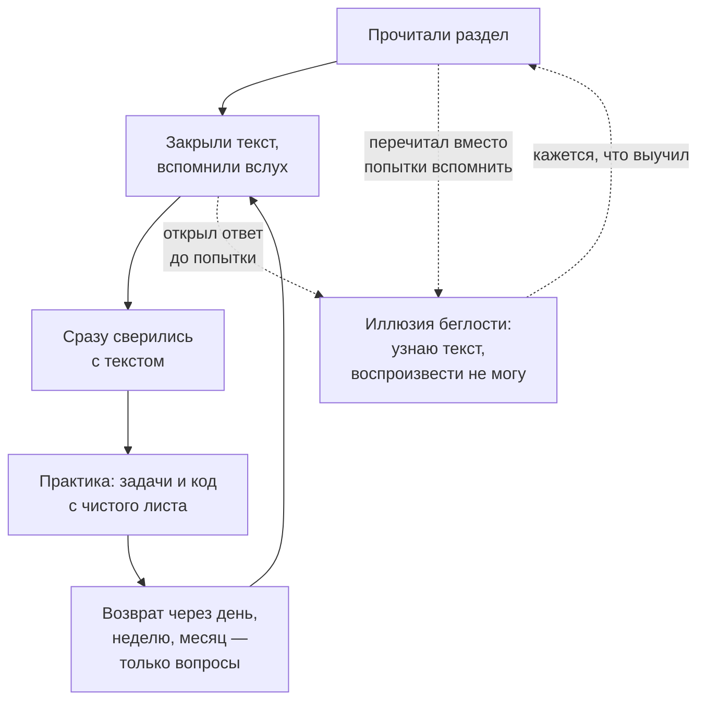

# Как учить, чтобы осталось в голове

> **Зачем эта глава.** Большинство людей учится способом, который надёжно создаёт ощущение
> понимания и почти не создаёт знания. Здесь разобрано, почему так происходит, что говорит
> об этом исследовательская литература по обучению, и как из этого собирается конкретный
> протокол работы с хендбуком. Эта глава окупается быстрее любой технической.

**Уровень:** для всех
**Как проработать:** и один вечер на настройку системы повторений

---

## Карта главы

- [1. Главная ловушка: иллюзия беглости](#1-главная-ловушка-иллюзия-беглости)
- [2. Активное воспроизведение](#2-активное-воспроизведение)
- [3. Интервальные повторения](#3-интервальные-повторения)
- [4. Разнесение и перемешивание](#4-разнесение-и-перемешивание)
- [5. Когнитивная нагрузка: почему сложное надо подавать порциями](#5-когнитивная-нагрузка-почему-сложное-надо-подавать-порциями)
- [6. Разобранные примеры и когда от них пора отказаться](#6-разобранные-примеры-и-когда-от-них-пора-отказаться)
- [7. Самообъяснение и метод Фейнмана](#7-самообъяснение-и-метод-фейнмана)
- [8. Осознанная практика](#8-осознанная-практика)
- [9. Тренируйте в том формате, в котором будут проверять](#9-тренируйте-в-том-формате-в-котором-будут-проверять)
- [10. Протокол: как это выглядит в календаре](#10-протокол-как-это-выглядит-в-календаре)
- [11. Отдельно: подготовка к собеседованию](#11-отдельно-подготовка-к-собеседованию)
- [12. Подводные камни](#12-подводные-камни)
- [13. Проверь себя](#13-проверь-себя)
- [14. Что читать дальше](#14-что-читать-дальше)

---

## 1. Главная ловушка: иллюзия беглости

Начнём с эксперимента, который стоит проделать над собой. Прочитайте любой абзац этой главы
дважды. Возникнет отчётливое ощущение: «понятно, знаю». Теперь закройте экран и перескажите
абзац вслух. Почти наверняка получится хуже, чем ожидалось.

Это явление называют **иллюзией беглости** (fluency illusion). Механизм такой: при повторном
чтении текст обрабатывается легче, чем при первом. Мозг интерпретирует эту лёгкость как признак
знания — хотя на самом деле она означает лишь узнавание. Узнавание («я это видел») и
воспроизведение («я могу это сказать») — разные операции, и на собеседовании требуется вторая.

Отсюда следует неприятный вывод: **методы обучения, которые ощущаются самыми приятными,
проигрывают при равном затраченном времени — и при этом сильнее всего переоцениваются
самим учащимся**. Перечитывание, подчёркивание, конспектирование «под диктовку» дают высокую
субъективную уверенность при скромной отдаче.

Здесь важно не перегнуть: это **не** значит, что подчёркивание и конспектирование не работают
вовсе. Обзоры эффективности учебных техник показывают у них ненулевой эффект — просто он
заметно меньше, чем у активного воспроизведения, а ощущение прогресса — заметно больше.
Проблема именно в этом разрыве: вы тратите час и чувствуете, что выучили, а проверка через
неделю показывает обратное.

И наоборот: методы, которые ощущаются трудными, дают лучший перенос знания. В литературе
по когнитивной психологии это называют **желательными трудностями** (desirable difficulties,
термин Роберта Бьорка).

Всё остальное в этой главе — про то, как систематически выбирать трудный путь там, где он окупается.

> ⚠️ **Типичная ошибка.** Судить о прогрессе по количеству прочитанных глав. Это метрика
> активности, а не результата. Правильная метрика — число тем, которые вы можете объяснить
> вслух без подглядывания, и число задач, которые решаются с чистого листа.

---

## 2. Активное воспроизведение

Самый мощный из известных приёмов — **retrieval practice**, извлечение из памяти.
Классическая серия экспериментов (Родигер и Карпике, 2006) устроена так: одна группа изучает
текст четыре раза подряд, вторая изучает один раз и трижды пытается воспроизвести по памяти.
Сразу после занятия первая группа выглядит лучше и чувствует себя увереннее. Через неделю
вторая группа помнит существенно больше.

Причина в том, что **попытка вспомнить сама по себе укрепляет след памяти** — сильнее,
чем повторное предъявление материала. Более того, работает даже неудачная попытка: если вы
попробовали вспомнить и не смогли, последующее чтение правильного ответа усваивается лучше,
чем если бы вы просто прочитали его сразу.

> ⚠️ **Важное условие.** Эффект неудачной попытки держится на **обратной связи сразу после неё**.
> Помучиться и не узнать правильный ответ — это просто потраченное время. Поэтому правило
> работы с блоком «Проверь себя» звучит целиком так: ответили вслух → **сразу** раскрыли разбор
> → сверились. Разрыв между попыткой и ответом убивает эффект.

Практические следствия для работы с хендбуком:

**Спрашивайте себя до чтения.** Прежде чем читать главу «Градиентный бустинг», потратьте
две минуты: что я про это знаю? как бы я объяснил? где у меня туман? Ответ будет неполным —
это нормально и даже полезно.

**Закрывайте текст после каждого раздела.** Прочитали раздел — закрыли, проговорили вслух
основную мысль, вернулись и сверились. Это удлиняет чтение примерно в полтора раза
и увеличивает удержание в разы.

**Блоки «Проверь себя» — не проверка, а инструмент обучения.** Разница принципиальная.
Проверка — это то, что делают в конце, чтобы узнать результат. Здесь же вопросы работают как
сам механизм запоминания. Поэтому правило: **сначала ответьте вслух полностью, потом
раскрывайте `
`**. Если раскрыть сразу, эффект теряется целиком.

**Пишите ответ, а не думайте его.** Мысль в голове всегда кажется связной. Письменный или
устный ответ обнажает дыры. Это дёшево и очень отрезвляет.

---

## 3. Интервальные повторения

Кривая забывания Эббингауза: без повторения материал теряется, и теряется быстрее всего
в начале. Здесь стоит сразу снять налёт наукообразности: классические числа Эббингауза получены
на **бессмысленных слогах и на одном испытуемом** (это верно и для современной репликации),
поэтому воспринимать их как точный график забывания вашего понимания бустинга нельзя.
Осмысленный, связанный материал забывается заметно медленнее. Качественный вывод от этого
не меняется: без возвратов знание рассыпается.

Второе уточнение — про сами интервалы. Расхожий совет «повторяйте через увеличивающиеся
промежутки» звучит убедительнее, чем показывают данные: в экспериментах расширяющееся
расписание выигрывает на немедленной проверке и **проигрывает** равномерному на отсроченной.
Решающим оказывается не форма расписания, а то, чтобы **первое воспроизведение было
достаточно трудным** — то есть чтобы вы не повторяли слишком рано, пока всё ещё «свежо».

Поэтому схема ниже — практичная эвристика для экономии времени, а не доказанный оптимум.
Главное в ней: возвраты есть, и первый из них не в тот же час.

Рабочая схема для технического материала:

| Повторение | Когда | Что делать | Время |
|---|---|---|---|
| 1-е | в тот же день, вечером | вспомнить 3–5 главных идей главы, не открывая её | 5 мин |
| 2-е | через 1 день | пройти блок «Проверь себя», не читая текст | 10 мин |
| 3-е | через 1 неделю | те же вопросы + попытаться воспроизвести ключевой вывод на бумаге | 15 мин |
| 4-е | через 1 месяц | только те вопросы, где были ошибки | 10 мин |

Итого около 40 минут на главу — против нескольких часов, которые уйдут на её повторное
изучение с нуля, если пропустить повторения.

**Инструмент.** Anki или любая другая система карточек. Карточки делаются прямо из блоков
«Проверь себя»: на лицевой стороне — вопрос в формулировке интервьюера, на обратной —
«короткий ответ». Не переносите развёрнутые объяснения в карточку: карточка тренирует
извлечение факта, а понимание тренируется другими способами.

Хорошие карточки для MLE:
- «Псевдоостаток для logloss?» → «$y_i - \sigma(F_{m-1}(x_i))$»
- «Почему в attention делят на $\sqrt{d_k}$?» → «Var$(q^\top k) = d_k$; иначе softmax насыщается и градиент затухает»
- «Формула размера KV-кэша?» → «$2 \cdot L \cdot h_{kv} \cdot d_{head} \cdot n \cdot B \cdot b$»

Плохая карточка: «Расскажи про бустинг» — слишком широко, извлечение не тренируется, вы просто
смотрите на ответ и киваете.

> 💬 **На собеседовании.** Это работает не только на подготовке. Первые 30 секунд ответа на любой
> технический вопрос — это извлечение из памяти под стрессом. Навык извлечения тренируется
> отдельно от навыка понимания, и именно он подводит людей, которые «всё знают, но растерялись».
> Если вы месяц отвечали на карточки, извлечение становится автоматическим.

---

## 4. Разнесение и перемешивание

Два родственных приёма, оба контринтуитивны.

**Разнесение (spacing).** Четыре занятия по часу с промежутками в несколько дней дают больше,
чем одно занятие на четыре часа. Причина та же: каждый возврат к материалу — это акт извлечения
из частично забытого состояния, а именно он и укрепляет память. Практический вывод для
хендбука: 1,5 часа пять раз в неделю лучше, чем 8 часов в воскресенье, даже при равном
суммарном времени.

**Перемешивание (interleaving).** Если решать подряд десять задач одного типа, вы быстро
входите в режим «применяю известный алгоритм» — и не тренируете главное умение:
**распознать, какой метод здесь нужен**. А на собеседовании и в работе задача приходит без
ярлыка «это на калибровку».

Но здесь нужна честность, потому что совет «перемешивайте всё» тиражируется шире, чем позволяют
данные. Мета-анализ перемешивания даёт положительный эффект в целом, умеренный на математических
задачах — и **отрицательный на заучивании слов и терминов**, где блочная подача выигрывает.
На объяснительных текстах значимого эффекта не находят вовсе.

Отсюда рабочее правило, которое учитывает **тип материала**:

| Что учите | Как лучше |
|---|---|
| Выбор метода под задачу (какую метрику взять, какая схема валидации нужна) | **перемешивать** — это ровно тот навык, который тренирует interleaving |
| Термины, определения, формулы наизусть | **блоками** — перемешивание здесь скорее мешает |
| Первое чтение объяснения новой темы | **блоками**, подряд: сначала связная картина |

> 🧠 **Middle+.** Второе ограничение — по уровню, а не по типу материала: перемешивание работает,
> когда базовое понимание каждой темы уже есть. Перемешивать то, что видите впервые, — просто хаос.
> Правильная последовательность: сначала блочно освоить тему до рабочего понимания, затем
> перемешивать при повторениях. Именно поэтому в [треках](02-tracks.md) главы идут блоками,
> а повторения — вперемешку. Оба ограничения нужны одновременно: они про разное.

---

## 5. Когнитивная нагрузка: почему сложное надо подавать порциями

Теория когнитивной нагрузки (Джон Свеллер) исходит из простого факта: рабочая память
удерживает очень немного элементов одновременно. Всё, что в неё не помещается, теряется.
Нагрузка бывает трёх видов:

- **Внутренняя** — сложность самого материала. Вывод формулы значения листа в XGBoost объективно
  сложнее, чем определение accuracy. Снизить нельзя, можно только разбить на части.
- **Посторонняя** — нагрузка от плохой подачи: непонятная нотация, разрозненные источники,
  необходимость держать в голове то, что можно было написать рядом. Её надо убирать.

> 🧠 **Middle+.** Раньше выделяли и третий вид — «полезную» (germane) нагрузку, то есть усилие,
> идущее на построение понимания. В более поздних версиях теории от неё как от **отдельного
> источника** нагрузки отказались: отделить её от внутренней не удалось, а схема «снизили
> постороннюю → автоматически выросла полезная» не подтвердилась. Практически это ничего не
> ломает, но делает совет операциональнее: не «максимизируйте полезную нагрузку» (непонятно,
> что делать руками), а **снижайте постороннюю и направляйте освободившийся ресурс на
> собственно сложность материала** — на вывод, а не на расшифровку обозначений.

Практические следствия:

**Не читайте главу с пятью вкладками.** Каждое переключение — трата рабочей памяти на
восстановление контекста, то есть чистая посторонняя нагрузка. Один источник за раз.

**Соблюдайте пререквизиты.** Если в шапке главы написано «нужна оптимизация», а вы её не знаете,
вы будете тратить рабочую память на разбор незнакомых обозначений вместо разбора сути.
Ощущаться это будет как «тема слишком сложная» — хотя проблема не в теме.

**Выводы формул — на бумаге, а не в голове.** Бумага — это внешняя память. Когда промежуточные
шаги записаны, рабочая память освобождается для понимания перехода, а не для удержания трёх
предыдущих строк.

**Делайте перерывы на границах смысловых блоков.** Прерваться посреди вывода — потерять контекст,
на восстановление которого уйдёт больше, чем сэкономлено.

---

## 6. Разобранные примеры и когда от них пора отказаться

Для новичка в теме **разобранный пример** (worked example) эффективнее самостоятельной попытки:
он показывает структуру решения, не заставляя тратить рабочую память на слепой поиск.
Это хорошо подтверждённый эффект.

Но у него есть обратная сторона — **эффект обращения экспертизы** (expertise reversal effect):
по мере роста компетентности разобранные примеры начинают **мешать**. Тот, кто уже понимает
тему, тратит усилия на сверку своего решения с чужим вместо того, чтобы решать сам.

Отсюда правило работы с кодом и выводами в хендбуке, зависящее от вашего уровня в конкретной теме:

| Ваш уровень в теме | Как работать с примером |
|---|---|
| Первый раз вижу | разобрать пример построчно, потом воспроизвести по памяти |
| Понимаю, но не писал | закрыть пример, написать сам, потом сверить |
| Уже писал | не смотреть вообще; открыть только для сравнения решений |

> ⚠️ **Ограничение, которое меняет практику.** Разобранные примеры хорошо работают на
> **удержании** и заметно хуже — на **переносе**: эффект не распространяется даже на умеренно
> изменённые задачи. Проще говоря, после разбора вы выучили шаблон, а не принцип.
> Отсюда обязательное продолжение: **после разобранного примера решите задачу с вариацией** —
> другие данные, другое условие, другая функция потерь. Без этого шага вся работа с примером
> тренирует узнавание, а не умение.

Это же объясняет, почему в главах сначала идёт вывод, а потом раздел «Практика»: постепенный
переход от «показываю» к «делай сам». Если вы уже сильны в теме — начинайте сразу с практики
и возвращайтесь к тексту точечно.

---

## 7. Самообъяснение и метод Фейнмана

**Самообъяснение** (self-explanation) — привычка после каждого шага задавать себе вопрос
«почему именно так?» и отвечать своими словами. Здесь есть тонкость с доказательствами, которую
стоит знать: классические работы Мишлен Чи, на которые обычно ссылаются, — **корреляционные**
(наблюдали, что сильные студенты объясняют себе больше слабых), и из них нельзя вывести
причинность. Экспериментальная база появилась позже: мета-анализ **индуцированного**
самообъяснения (когда людей просят это делать) по нескольким десяткам эффектов даёт устойчивый
средний выигрыш. То есть приём работает, но верить надо второй группе исследований, а не первой.

Конкретные вопросы, которые стоит задавать по ходу чтения:
- Почему здесь именно такая формула, а не другая?
- Что сломается, если убрать этот член?
- В каком случае это перестанет работать?
- Как это связано с тем, что я читал в предыдущей главе?

**Метод Фейнмана** — доведённая до предела версия того же. Протокол:

1. Возьмите чистый лист и напишите наверху название темы.
2. Объясните её **как для человека без ML-бэкграунда**, без жаргона.
3. Отметьте места, где вы сбились, начали использовать термины-заглушки или замялись.
4. Вернитесь к материалу **только по этим местам**.
5. Повторите.

Ценность метода в шаге 3: жаргон отлично маскирует непонимание. Фраза «бустинг обучается
на антиградиенте функции потерь» звучит компетентно и может произноситься без всякого понимания.
А вот объяснить то же самое без слова «антиградиент» получится только у того, кто понимает.

> ⌨️ **Руками.** Прямо сейчас, не открывая ничего: объясните на бумаге, почему при сильном
> дисбалансе классов ROC-AUC может ввести в заблуждение. Без терминов «TPR» и «FPR» —
> обычными словами, через то, что физически происходит. Если получилось меньше пяти строк
> или вы соскользнули на определения — тема не усвоена, и это ценная информация.

---

## 8. Осознанная практика

Понятие введено Андерсом Эрикссоном: продуктивная практика — не «наработка часов», а
целенаправленная работа над тем, что **пока не получается**, с немедленной обратной связью.
Четыре признака:

1. **Работа на границе способностей.** Не то, что уже умеете (это отдых), и не то, что
   пока непосильно (это фрустрация).
2. **Конкретная цель на сессию.** Не «поучу бустинг», а «выведу формулу значения листа
   без подсказок и объясню смысл min_child_weight».
3. **Немедленная обратная связь.** Решил — сразу проверил. Именно поэтому у каждой задачи
   в хендбуке есть критерий «сделано правильно».
4. **Повторение с исправлением.** Не получилось — разобрал ошибку — сделал заново.
   Не «прочитал разбор и пошёл дальше».

Самый частый сбой здесь — пункт 4. Люди решают задачу, смотрят разбор, кивают и переходят
к следующей. Прочитанный разбор не создаёт навыка: навык создаёт **повторное решение той же
задачи через день, уже самостоятельно**.

> 🧠 **Middle+. Сколько на самом деле объясняет «осознанная практика».** Вокруг этой концепции
> много магии, и её стоит снять. Во-первых, «правило 10 000 часов» придумал не Эрикссон,
> а популяризатор — в исходных работах такого правила нет. Во-вторых, мета-анализы показывают,
> что объём осознанной практики объясняет довольно скромную долю различий в результатах:
> единицы процентов в обучении и меньше процента в профессиональной деятельности; предзарегистрированные
> репликации дают эффект заметно слабее исходных работ.
>
> Почему четыре признака выше всё равно стоит соблюдать: каждый из них опирается на собственную,
> более прочную базу — извлечение из памяти, обратная связь, работа на границе способностей.
> Полезен не бренд «deliberate practice», а конкретные механизмы под ним.

---

## 9. Тренируйте в том формате, в котором будут проверять

Это самый недооценённый принцип из всех перечисленных, и при этом самый действенный.
Формулируется он так: **память избирательна к формату**. Тренировка переносится на проверку
тем лучше, чем сильнее совпадают операции, которые вы выполняли при обучении, с операциями,
которые от вас потребуются в момент проверки.

Хрестоматийный результат: практика на фактических вопросах («что такое X?») улучшает
последующие фактические вопросы — и **не улучшает** вопросы высокого порядка («как бы вы
применили X здесь?»). И наоборот. То есть натренировав определения, вы получите ровно умение
воспроизводить определения — и ничего больше.

Теперь переведём это в решения о том, как готовиться.

| Что вас ждёт на самом деле | Значит, тренировать надо так |
|---|---|
| Устно объяснить метод интервьюеру | **говорить вслух**, а не проговаривать в голове |
| Вывести формулу на доске | писать вывод **на бумаге от руки**, а не следить за ним глазами |
| Написать код в общем редакторе под наблюдением | писать **с чистого листа и на время**, желательно при ком-то |
| Выбрать метод под незнакомую задачу | решать **перемешанные** задачи без ярлыка темы |
| Провести ML System Design за 45 минут | прогонять кейс **целиком с таймером**, а не читать разборы |
| Ответить на уточняющий вопрос вглубь | после каждого ответа задавать себе «а почему?» ещё дважды |

Из этой таблицы следует неприятная вещь: **чтение хендбука не тренирует ни один из форматов,
в которых вас будут проверять**. Оно даёт материал. Навык даёт всё остальное — блоки
«Проверь себя» вслух, задачи из блока «Практика» с таймером, прогоны кейсов, объяснение
темы живому человеку.

> ⚠️ **Типичная ошибка.** Готовиться к устной секции чтением, а к live-coding — просмотром
> чужих решений. Оба формата ощущаются как подготовка и почти не переносятся на то, что реально
> потребуется. Проверка простая: если за последнюю неделю подготовки вы ни разу не говорили
> вслух и ни разу не писали код на время — вы готовились не к тому.

> 💬 **На собеседовании.** Этот принцип объясняет частый парадокс: человек знает тему,
> но «плывёт» на вопросе. Знание есть, а тренированной операции «достать это из памяти вслух,
> под чужим взглядом, за 30 секунд» — нет. Лечится только повторением в правильном формате.

---

## 10. Протокол: как это выглядит в календаре

Соберём всё в рабочую систему. Прежде чем раскладывать её по времени, посмотрите на схему:
она не про расписание, а про замкнутость цикла и про две точки, в которых он рвётся чаще всего.

Обе пунктирные ветки ведут в одно место: материал прошёл через глаза, но не прошёл через
извлечение — а ощущается это ровно так же, как правильная работа.

### Сессия (90 минут)

| Минуты | Что делаете | Какой принцип работает |
|---|---|---|
| 0–5 | повторение вопросов из вчерашней главы, не открывая её | извлечение + интервалы |
| 5–10 | разведка новой главы: «Зачем» + «Карта», попытка ответить до чтения | предварительное извлечение |
| 10–50 | чтение по разделам, после каждого — пересказ вслух; выводы на бумаге | самообъяснение, снижение посторонней нагрузки |
| 50–75 | практика: задачи и код с чистого листа | осознанная практика |
| 75–85 | блок «Проверь себя» вслух до раскрытия ответов | извлечение |
| 85–90 | записать 3 главные идеи и **список непонятого** | консолидация |

### Неделя

- 4–5 сессий вместо одного длинного дня (разнесение).
- Одна сессия целиком на повторение: перемешанные вопросы из всех глав недели.
- Одна тема объясняется вслух другому человеку или на запись (Фейнман).

### Месяц

- Ревизия списка непонятого: что закрылось, что осталось.
- Одно полное mock-интервью по пройденному.
- Пересборка Anki-колоды: удалить то, что стало автоматическим, добавить новое.

> ⚠️ **Типичная ошибка.** Строить идеальный график на 20 часов в неделю, продержаться пять дней
> и бросить. Регулярность важнее объёма: 5 часов в неделю в течение полугода дадут больше,
> чем 20 часов в течение трёх недель. Ставьте план, который выдержите в плохую неделю.

---

## 11. Отдельно: подготовка к собеседованию

Собеседование — отдельный навык, и он тренируется отдельно от знаний. Три вещи, которые
дают наибольший прирост.

**Говорите вслух.** Внутренняя речь бессвязна и это незаметно, пока вы не начнёте произносить.
Любая тема, которую вы «знаете», должна быть хотя бы раз произнесена вслух целиком. Минимальный
вариант — объяснять пустой комнате; это работает почти так же хорошо, как объяснять человеку.

**Тренируйте условия, а не только материал.** Live-coding под наблюдением ощущается совсем иначе,
чем решение той же задачи в одиночестве. Психология здесь та же, что в спорте: тренироваться
надо в условиях, приближенных к соревновательным. Отсюда — таймер на задачах, mock-интервью
с напарником, решение с проговариванием вслух.

**Ведите журнал провалов.** После каждого мока и каждого реального собеседования записывайте
вопросы, где поплыли. Этот список — самый ценный учебный материал, который у вас есть:
он показывает ваши настоящие границы, а не воображаемые.

**Последняя неделя — только повторение.** Новый материал, выученный за три дня, не воспроизводится
под стрессом. В последнюю неделю: карточки, mock-интервью, проговаривание вслух. Ничего нового.

---

## 12. Подводные камни

**Конспектирование вместо понимания.**
Симптом: красивый конспект, но объяснить не можете.
Причина: переписывание — пассивная операция, она создаёт ощущение работы без извлечения.
Что делать: конспектировать **по памяти после** чтения, а не во время. Тогда это превращается
в извлечение.

**Подглядывание в ответ «чтобы освежить».**
Симптом: вроде и отвечали на вопросы, но на собеседовании не вспоминается.
Причина: если открыть ответ до попытки, эффекта извлечения нет вообще — это обычное чтение.
Что делать: жёсткое правило — ответ вслух целиком до раскрытия, даже если кажется, что не знаете.
Неудачная попытка полезна.

**Бесконечный сбор материалов.**
Симптом: пять курсов, десять статей в закладках, ноль проработанных глав.
Причина: сбор материалов ощущается как продвижение и при этом не требует усилий.
Что делать: один источник до конца. Хендбук устроен так, чтобы быть этим одним источником.

**Пропуск практики «потому что понятно».**
Симптом: читаете быстро, всё ясно, а на live-coding ступор.
Причина: понимание и исполнение — разные навыки; второй тренируется только исполнением.
Что делать: правило «глава не пройдена без задач». Никаких исключений, особенно для тем,
которые кажутся простыми.

**Учить всё подряд без приоритетов.**
Симптом: три недели на редкую тему, а базовые метрики плывут.
Причина: интерес — плохой приоритизатор.
Что делать: приоритет задаёт частота на собеседованиях и ваш профиль; для этого есть
[треки](02-tracks.md) и [карта собеседования](03-interview-map.md).

**Оценивать себя по ощущению.**
Симптом: «эту тему я знаю» — а на вопросе разваливаетесь.
Причина: иллюзия беглости (см. [§1](#1-главная-ловушка-иллюзия-беглости)).
Что делать: единственный честный критерий — воспроизведение вслух без опоры. Всё остальное —
самообман.

---

## 13. Проверь себя

<b>Вопрос.</b> Почему перечитывание — плохой способ учиться, если после него материал кажется понятным?

**Короткий ответ.** Потому что ощущение понятности возникает от узнавания текста, а не от
способности его воспроизвести. Это иллюзия беглости: лёгкость обработки повторно прочитанного
текста мозг принимает за признак знания.

**Развёрнуто.** Узнавание и воспроизведение опираются на разные процессы. Перечитывание
тренирует первое, а на собеседовании и в работе нужно второе. Эксперименты на retrieval practice
показывают расхождение: сразу после занятия перечитывавшие выглядят не хуже, а через неделю
заметно проигрывают тем, кто тренировал извлечение. Практический вывод: заменить второе и
третье прочтение попыткой воспроизвести.

<b>Вопрос.</b> Что такое «желательные трудности» и как они применяются к работе с этим хендбуком?

**Короткий ответ.** Приёмы, которые делают процесс обучения субъективно труднее и медленнее,
но улучшают долгосрочное удержание и перенос: извлечение вместо перечитывания, интервалы вместо
зубрёжки подряд, перемешивание вместо блоков.

**Развёрнуто.** Применительно к хендбуку: отвечать на вопросы до раскрытия ответов; возвращаться
к главе через день и через неделю; писать код с чистого листа вместо копирования; смешивать
задачи разных тем при повторении; выводить формулы на бумаге, а не следить за выводом глазами.
Общий признак правильной работы — вам должно быть некомфортно. Комфортное обучение почти всегда
неэффективное.

<b>Вопрос.</b> Как понять, что глава действительно пройдена?

**Короткий ответ.** Три критерия: вы объясняете тему вслух без опоры на текст; отвечаете на все
вопросы блока «Проверь себя» до раскрытия; решили задачи раздела «Практика» с чистого листа
и они удовлетворяют критериям.

**Развёрнуто.** Формальные признаки вроде «прочитал» и «понял» не годятся — они опираются на
ощущения, а ощущения обманывают. Дополнительный сильный тест: объяснить тему человеку,
не знакомому с предметом, без жаргона. Если объяснение сваливается в термины — понимание неполное.
И отдельный критерий для тем, где есть вывод: воспроизвести вывод на бумаге через неделю после
чтения.

<b>Вопрос.</b> Сколько времени в неделю нужно и как его лучше распределить?

**Короткий ответ.** 8–10 часов для темпа из треков, распределённые на 4–5 сессий по 1,5–2 часа.
Одна длинная сессия в выходной работает значительно хуже при том же суммарном времени.

**Развёрнуто.** Причина — эффект разнесения: каждый возврат к материалу после частичного
забывания укрепляет память сильнее, чем непрерывная работа. Плюс когнитивная нагрузка:
после примерно двух часов плотной работы с выводами эффективность резко падает, и время
тратится на имитацию. При 4–5 часах в неделю треки просто растягиваются вдвое — это нормально,
регулярность важнее интенсивности.

<b>Вопрос.</b> Стоит ли делать карточки, и что на них писать?

**Короткий ответ.** Стоит — они автоматизируют извлечение и интервалы, то есть два самых сильных
приёма сразу. На карточку выносится узкий факт или формула, а не тема целиком.

**Развёрнуто.** Хорошая карточка требует конкретного ответа, который можно проверить:
«антиградиент logloss по логиту?», «условия применимости t-теста?», «формула размера KV-кэша?».
Плохая карточка — «расскажи про RAG»: на неё невозможно ответить проверяемо, и вы просто
смотрите на ответ. Карточки не заменяют понимание: они закрепляют уже понятое. Делать карточки
по теме, которую не разобрали, бессмысленно — получится зубрёжка формулировок, которая
рассыпается от первого уточняющего вопроса.

---

## 14. Что читать дальше

- **Brown, Roediger, McDaniel. «Make It Stick: The Science of Successful Learning» (2014)** —
  лучшее популярное изложение всего, что описано в этой главе, от самих исследователей.
  Если читать одну книгу об обучении — эту.
- **Ericsson, Pool. «Peak: Secrets from the New Science of Expertise» (2016)** —
  про осознанную практику: как устроена работа над тем, что не получается.
- **Sweller, Ayres, Kalyuga. «Cognitive Load Theory» (2011)** — академическое изложение
  теории когнитивной нагрузки, включая эффект обращения экспертизы. Для тех, кому нужна строгость.
  Важно читать вместе со следующим пунктом: книга описывает трёхкомпонентную версию теории,
  которую авторы позже пересмотрели.
- **Sweller, van Merriënboer, Paas. «Cognitive Architecture and Instructional Design:
  20 Years Later» (Educational Psychology Review, 2019)** — ревизия теории самими авторами;
  именно здесь germane load перестаёт быть отдельным видом нагрузки. Полезно как пример того,
  что и в педагогике результаты пересматриваются.
- **Мета-анализы, на которых стоят оговорки этой главы** — по перемешиванию (Brunmair & Richter, 2019),
  по индуцированному самообъяснению (Bisra et al., 2018), по осознанной практике
  (Macnamara et al., 2014). Их стоит открыть хотя бы ради разделов с ограничениями: там видно,
  насколько популярные пересказы сильнее исходных данных.
- **Работы Роберта Бьорка о desirable difficulties** (лаборатория Bjork Learning and Forgetting
  Lab, UCLA) — первоисточник по разнесению, перемешиванию и различию между обучением и
  сиюминутной продуктивностью.
- [Документация Anki](https://docs.ankiweb.net/) — если решите настроить систему повторений;
  достаточно раздела о колодах и о параметрах интервалов.

---

⬅️ [Карта собеседования MLE](03-interview-map.md) | 🏠 [Оглавление](../index.md) | ➡️ [Глоссарий](05-glossary.md)
