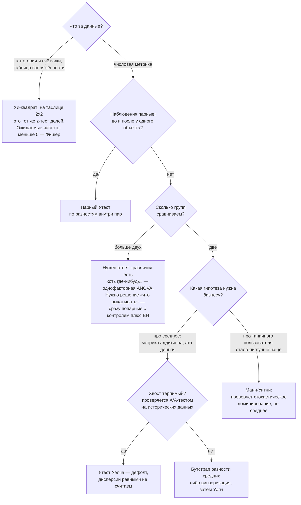

# Статистика и вывод

> **Зачем эта глава.** Статистика — это дисциплина принятия решений при недостатке данных, а
> именно этим MLE и занимается: решает, лучше ли новая модель, можно ли верить приросту метрики
> на валидации, какую функцию потерь писать. После главы вы сможете вывести MLE и MAP для
> типовых моделей, объяснить, откуда берутся L1/L2-регуляризация и кросс-энтропия, корректно
> построить и проинтерпретировать доверительный интервал, и не провалить блок про p-value —
> самый частый на собеседовании вопрос по статистике.

**Уровень:** 🎯 middle → 🧠 middle+
**Предварительно нужно:** [теория вероятностей](02-probability.md), [линейная алгебра](01-linear-algebra.md)
**Как проработать:** чтение + выводы руками + симуляции

---

## Карта главы

- [1. Три задачи инженера, ради которых нужна статистика](#1-три-задачи-инженера-ради-которых-нужна-статистика)
- [2. Генеральная совокупность, выборка, статистика](#2-генеральная-совокупность-выборка-статистика)
- [3. Точечное оценивание: три свойства оценки](#3-точечное-оценивание-три-свойства-оценки) — и полный вывод, почему делят на $n-1$
- [4. Метод максимального правдоподобия](#4-метод-максимального-правдоподобия) — откуда берутся все ваши функции потерь
- [5. MAP: откуда берётся регуляризация](#5-map-откуда-берётся-регуляризация) — L2 ↔ гаусс, L1 ↔ Лаплас
- [6. Доверительные интервалы](#6-доверительные-интервалы) — и их правильная интерпретация
- [7. Бутстрап](#7-бутстрап) — когда он спасает и когда врёт
- [8. Проверка гипотез](#8-проверка-гипотез) — H₀, H₁, p-value без мифов
- [9. Ошибки I и II рода, мощность, размер выборки](#9-ошибки-i-и-ii-рода-мощность-размер-выборки)
- [10. Критерии и условия их применимости](#10-критерии-и-условия-их-применимости)
- [11. Множественные сравнения](#11-множественные-сравнения) — Bonferroni, Holm, BH
- [12. Частотный и байесовский подходы](#12-частотный-и-байесовский-подходы)
- [13. Подводные камни](#13-подводные-камни)
- [14. Проверь себя](#14-проверь-себя)
- [15. Практика](#15-практика)
- [16. Что читать дальше](#16-что-читать-дальше)

---

## 1. Три задачи инженера, ради которых нужна статистика

Прежде чем формулы — три конкретные ситуации. Все три реальны, все три решаются одним аппаратом.

**Ситуация первая.** Вы прогнали две модели на одном отложенном тесте из 5000 объектов.
ROC-AUC старой — 0.812, новой — 0.819. Вопрос от продакта: «выкатываем?» Разница в 0.007 —
это улучшение или дрожание конкретной выборки? Если завтра пересчитать на другом тесте, знак
разницы сохранится?

**Ситуация вторая.** A/B-тест новой ранжирующей модели идёт неделю. Конверсия в контроле 4.10%,
в тесте 4.28%. p-value = 0.07. Менеджер говорит: «почти значимо, давайте покрутим ещё три дня».
Что здесь не так — и сколько дней вообще нужно было закладывать?

**Ситуация третья.** Вы пишете кастомную функцию потерь. Таргет — время до события, распределение
скошенное с длинным хвостом. MSE даёт модель, которая гонится за выбросами. Откуда взять
правильную функцию потерь, а не подбирать из списка в документации?

Первая и вторая — про **вывод** (inference): по конечной выборке сказать что-то о том, что будет
на всём потоке. Третья — про **оценивание** (estimation): функция потерь не берётся из воздуха,
она выводится из вероятностной модели данных. Это одна и та же теория, и её ядро — метод
максимального правдоподобия.

---

## 2. Генеральная совокупность, выборка, статистика

**Генеральная совокупность** (population) — это всё, о чём мы хотим сделать вывод. Не «все люди
на Земле», а конкретно: все пользователи, которые придут в приложение в ближайший месяц; все
транзакции, которые надо будет классифицировать; весь поток запросов в поиск. В ML генеральная
совокупность обычно формализуется как **распределение** $P(x, y)$, из которого приходят объекты.

**Выборка** (sample) $X_1, \dots, X_n$ — то, что у нас реально есть: $n$ наблюдений. Стандартное
допущение — они **независимы и одинаково распределены** (i.i.d., independent and identically
distributed). Это допущение почти всегда нарушено (пользователи заходят по нескольку раз, данные
имеют временную структуру), и половина ошибок в продакшн-статистике — именно отсюда.

**Статистика** (statistic) — любая функция от выборки, не зависящая от неизвестных параметров:
$T = T(X_1, \dots, X_n)$. Выборочное среднее $\bar X$, выборочная дисперсия, максимум, ROC-AUC,
посчитанный на тесте, — всё это статистики.

Ключевая мысль, ради которой написан весь раздел: **статистика — случайная величина.** Она
меняется от выборки к выборке, у неё есть собственное распределение — его называют
**выборочным распределением** (sampling distribution). Все доверительные интервалы, p-value и
критерии — это утверждения об этом распределении, а не о конкретном числе, которое вы увидели.

> 🌱 **База.** Представьте, что вы можете тысячу раз собрать новую выборку того же размера и
> тысячу раз посчитать ROC-AUC своей модели. Вы получите тысячу разных чисел — облако вокруг
> «истинного» качества. Ширина этого облака и есть то, чем занимается статистика. Одна выборка
> даёт вам одну точку из облака; задача — по одной точке оценить, насколько облако широкое.

Мы будем всюду пользоваться сквозными обозначениями: $n$ — размер выборки, $d$ — размерность
признакового пространства, $\theta$ — параметры (то, что оцениваем), $\hat\theta$ — оценка
параметра, $\alpha$ — уровень значимости, $\beta$ — вероятность ошибки II рода.

---

## 3. Точечное оценивание: три свойства оценки

Пусть данные порождены распределением с неизвестным параметром $\theta$ (это может быть среднее,
дисперсия, вероятность клика, вектор весов модели). **Оценка** (estimator) $\hat\theta_n$ — это
статистика, которой мы заменяем $\theta$. Оценок для одного и того же $\theta$ бывает много:
среднее и медиана обе оценивают центр симметричного распределения. Как выбирать?

Есть три свойства, которые спрашивают на собеседовании, и одна связывающая их формула.

### 3.1 Несмещённость

$$
\mathbb{E}\big[\hat\theta_n\big] = \theta \quad \text{для любого } \theta
$$

где $\mathbb{E}$ — математическое ожидание по всем возможным выборкам размера $n$.
Величину $\mathrm{bias}(\hat\theta_n) = \mathbb{E}[\hat\theta_n] - \theta$ называют **смещением**.

Несмещённость означает: если повторить эксперимент много раз, оценки будут в среднем попадать
в цель. Это приятное, но не священное свойство — ниже увидим, что за него иногда платят точностью.

### 3.2 Состоятельность

$$
\hat\theta_n \xrightarrow[n \to \infty]{P} \theta,
\qquad\text{то есть}\qquad
\forall \varepsilon > 0:\; \mathbb{P}\big(|\hat\theta_n - \theta| > \varepsilon\big) \to 0
$$

где $\xrightarrow{P}$ — сходимость по вероятности, $\varepsilon$ — произвольно малый порог.

Состоятельность (consistency) — это «с ростом данных оценка приходит куда надо». Свойство куда
более важное, чем несмещённость: несостоятельная оценка не чинится добавлением данных.
Достаточное условие: смещение и дисперсия стремятся к нулю.

### 3.3 Эффективность

Среди несмещённых оценок лучше та, у которой меньше дисперсия. Нижняя граница задаётся
**неравенством Крамера–Рао** (Cramér–Rao bound): для любой несмещённой оценки

$$
\mathrm{Var}\big(\hat\theta_n\big) \;\ge\; \frac{1}{I_n(\theta)},
\qquad
I_n(\theta) = -\,\mathbb{E}\!\left[\frac{\partial^2 \log p(X_{1:n} \mid \theta)}{\partial \theta^2}\right]
$$

где $I_n(\theta)$ — **информация Фишера** (Fisher information) выборки размера $n$,
$p(X_{1:n} \mid \theta)$ — плотность (или вероятность) выборки при параметре $\theta$.
Для i.i.d. выборки $I_n(\theta) = n \cdot I_1(\theta)$.

Оценку, достигающую границы, называют **эффективной**. Смысл информации Фишера — насколько остро
логарифм правдоподобия зависит от параметра: чем острее пик, тем точнее можно определить $\theta$.

Классический пример разницы: для нормального распределения выборочное среднее имеет дисперсию
$\sigma^2/n$ и эффективно, а выборочная медиана — дисперсию $\approx \pi\sigma^2/(2n)$, то есть
в $\pi/2 \approx 1.57$ раза больше. Проверим:

```python
import numpy as np

rng = np.random.default_rng(6)
n, R = 101, 200_000                      # R повторов эксперимента
x = rng.normal(0.0, 1.0, size=(R, n))    # каждая строка — своя выборка

var_mean = x.mean(axis=1).var()
var_med = np.median(x, axis=1).var()
print(f"Var(среднее)  = {var_mean:.6f}   теория 1/n      = {1/n:.6f}")
print(f"Var(медиана)  = {var_med:.6f}   теория pi/(2n)  = {np.pi/(2*n):.6f}")
print(f"отношение     = {var_med/var_mean:.3f}   теория pi/2     = {np.pi/2:.3f}")
# Var(среднее)  = 0.009906   теория 1/n      = 0.009901
# Var(медиана)  = 0.015484   теория pi/(2n)  = 0.015552
# отношение     = 1.563       теория pi/2     = 1.571
```

Проигрыш в 1.57 раза по дисперсии эквивалентен потере 36% данных. Но если в данных есть выбросы,
медиана выиграет с разгромным счётом — эффективность считается **при заданной модели**, и модель
может быть неверна.

### 3.4 Почему в выборочной дисперсии делят на $n-1$: полный вывод

Это самый частый «разминочный» вопрос по статистике, и большинство отвечает «потому что теряем
одну степень свободы» — фразой, которая ничего не объясняет. Выведем честно.

Пусть $X_1, \dots, X_n$ — i.i.d. с $\mathbb{E}X_i = \mu$ и $\mathrm{Var}(X_i) = \sigma^2$.
Рассмотрим «наивную» оценку дисперсии:

$$
\hat\sigma^2_{\text{наив}} = \frac{1}{n}\sum_{i=1}^{n}\big(X_i - \bar X\big)^2,
\qquad
\bar X = \frac{1}{n}\sum_{i=1}^{n} X_i
$$

где $\bar X$ — выборочное среднее.

Шаг 1. Вставим и вычтем $\mu$ внутри скобки и раскроем квадрат:

$$
\sum_{i=1}^{n}\big(X_i - \bar X\big)^2
= \sum_{i=1}^{n}\Big[(X_i - \mu) - (\bar X - \mu)\Big]^2
$$

$$
= \sum_{i=1}^{n}(X_i-\mu)^2 \;-\; 2(\bar X - \mu)\sum_{i=1}^{n}(X_i-\mu) \;+\; n\,(\bar X - \mu)^2
$$

Шаг 2. Заметим, что $\sum_{i=1}^n (X_i - \mu) = n\bar X - n\mu = n(\bar X - \mu)$.
Подставляем в средний член:

$$
-\,2(\bar X - \mu)\cdot n(\bar X-\mu) = -\,2n(\bar X - \mu)^2
$$

Складываем со третьим членом $+n(\bar X-\mu)^2$:

$$
\sum_{i=1}^{n}\big(X_i - \bar X\big)^2 \;=\; \sum_{i=1}^{n}(X_i-\mu)^2 \;-\; n\,(\bar X - \mu)^2
$$

Это уже содержательный результат: **сумма квадратов отклонений от выборочного среднего всегда
меньше суммы отклонений от истинного среднего** — ровно на $n(\bar X - \mu)^2 \ge 0$. Причина
проста: $\bar X$ подогнано под саму выборку, оно минимизирует сумму квадратов по определению.

Шаг 3. Берём математическое ожидание обеих частей.

$$
\mathbb{E}\left[\sum_{i=1}^{n}(X_i-\mu)^2\right] = \sum_{i=1}^{n}\mathbb{E}\big[(X_i-\mu)^2\big] = n\sigma^2
$$

$$
\mathbb{E}\big[(\bar X - \mu)^2\big] = \mathrm{Var}(\bar X) = \frac{\sigma^2}{n}
\quad\text{(из независимости: } \mathrm{Var}(\bar X) = \tfrac{1}{n^2}\cdot n\sigma^2\text{)}
$$

Отсюда:

$$
\mathbb{E}\left[\sum_{i=1}^{n}\big(X_i - \bar X\big)^2\right]
= n\sigma^2 - n\cdot\frac{\sigma^2}{n} = (n-1)\,\sigma^2
$$

Шаг 4. Вывод. Наивная оценка систематически занижает дисперсию:

$$
\mathbb{E}\big[\hat\sigma^2_{\text{наив}}\big] = \frac{n-1}{n}\,\sigma^2 < \sigma^2
$$

а деление на $n-1$ ровно компенсирует это:

$$
\boxed{\;S^2 = \frac{1}{n-1}\sum_{i=1}^{n}\big(X_i-\bar X\big)^2,
\qquad \mathbb{E}[S^2] = \sigma^2\;}
$$

где $S^2$ — **исправленная выборочная дисперсия** (в numpy это `np.var(x, ddof=1)`).

```python
import numpy as np

rng = np.random.default_rng(0)
n, R = 5, 200_000                                # маленькое n — эффект хорошо виден
x = rng.normal(10.0, 2.0, size=(R, n))           # истинная дисперсия = 4
ss = ((x - x.mean(axis=1, keepdims=True)) ** 2).sum(axis=1)

print(f"E[SS/n]     = {ss.mean()/n:.4f}   ожидаем (n-1)/n * 4 = {(n-1)/n*4:.4f}")
print(f"E[SS/(n-1)] = {(ss/(n-1)).mean():.4f}   ожидаем 4")
# E[SS/n]     = 3.2069   ожидаем (n-1)/n * 4 = 3.2000
# E[SS/(n-1)] = 4.0087   ожидаем 4
```

> 💬 **На собеседовании.** Спросят: «Почему в выборочной дисперсии делят на $n-1$, а не на $n$?»
> **Хороший ответ.** Потому что мы вычитаем не истинное среднее, а выборочное, которое подогнано
> под ту же выборку и минимизирует сумму квадратов. Из-за этого сумма квадратов отклонений
> систематически занижена: её матожидание равно $(n-1)\sigma^2$, а не $n\sigma^2$ — это
> выводится в три строки. Деление на $n-1$ делает оценку несмещённой. Полезное добавление:
> если истинное $\mu$ известно, делить надо на $n$, поправка нужна именно из-за оценки среднего.
> И ещё: $S^2$ несмещена для $\sigma^2$, но $S$ **не** несмещена для $\sigma$ — из-за
> нелинейности корня и неравенства Йенсена.
> **Плохой ответ.** «Мы теряем одну степень свободы» — верно по форме, но не объясняет ничего;
> следующим вопросом будет «а почему теряем?», и там разговор обычно и заканчивается.

> 🧠 **Middle+.** Несмещённость — не самоцель. Оценка $\frac{1}{n+1}\sum(X_i-\bar X)^2$ смещена,
> но для нормальных данных имеет **меньшую среднеквадратичную ошибку**, чем $S^2$. Общая формула:
> $\mathrm{MSE}(\hat\theta) = \mathrm{bias}^2(\hat\theta) + \mathrm{Var}(\hat\theta)$ — та самая
> декомпозиция, которую вы знаете как bias-variance tradeoff в ML. Регуляризованная регрессия
> тоже даёт смещённые оценки весов и выигрывает именно за счёт снижения дисперсии.
> Вот почему в машинном обучении несмещённость почти никогда не является целевым свойством.

---

## 4. Метод максимального правдоподобия

Теперь главный инструмент главы. **Метод максимального правдоподобия** (maximum likelihood
estimation, MLE) отвечает на вопрос: какое значение параметра делает наблюдаемые данные
наиболее правдоподобными?

### 4.1 Постановка

Пусть данные $X_1,\dots,X_n$ независимы и имеют плотность (или вероятность) $p(x \mid \theta)$.
**Функция правдоподобия** (likelihood) — это вероятность увидеть именно эту выборку как функция
параметра:

$$
L(\theta) = \prod_{i=1}^{n} p\big(X_i \mid \theta\big)
$$

где $\theta$ — переменная, а $X_i$ — зафиксированные наблюдения. Именно этот разворот и есть суть
метода: плотность мы читаем «наоборот», как функцию параметра при фиксированных данных.

Работать с произведением неудобно (переполнение при больших $n$, производная от произведения),
поэтому берут логарифм — он монотонен, значит точку максимума не сдвигает:

$$
\ell(\theta) = \log L(\theta) = \sum_{i=1}^{n} \log p\big(X_i \mid \theta\big),
\qquad
\hat\theta_{\mathrm{MLE}} = \arg\max_{\theta} \; \ell(\theta)
$$

$\ell(\theta)$ — **логарифмическое правдоподобие** (log-likelihood).

> 📐 **Разбор формулы.** Произведение — потому что наблюдения независимы, а вероятность
> совместного события для независимых величин перемножается. Логарифм превращает произведение в
> сумму: во-первых, сумма $n$ логарифмов не переполняется, тогда как произведение $10^6$ чисел
> вида $0.3$ обнулится в float64 уже на нескольких сотнях сомножителей; во-вторых, производная
> суммы считается почленно. Знак «минус» перед $\ell$ даёт то, что в коде называют
> **negative log-likelihood (NLL)** — то есть функцию потерь.

### 4.2 Вывод для распределения Бернулли

Задача: $n$ показов баннера, $k$ кликов. Оценить вероятность клика $\theta$.

Модель: $X_i \in \{0,1\}$, $\mathbb{P}(X_i = 1) = \theta$. Компактная запись вероятности одного
наблюдения (проверьте: при $x_i = 1$ остаётся $\theta$, при $x_i = 0$ остаётся $1-\theta$):

$$
p(x_i \mid \theta) = \theta^{x_i}(1-\theta)^{1-x_i}
$$

Логарифмическое правдоподобие:

$$
\ell(\theta) = \sum_{i=1}^{n}\Big[x_i \log\theta + (1-x_i)\log(1-\theta)\Big]
= k\log\theta + (n-k)\log(1-\theta)
$$

где $k = \sum_{i=1}^n x_i$ — число единиц (кликов).

Дифференцируем по $\theta$ и приравниваем к нулю:

$$
\frac{d\ell}{d\theta} = \frac{k}{\theta} - \frac{n-k}{1-\theta} = 0
$$

$$
k(1-\theta) = (n-k)\theta
\;\Longrightarrow\;
k - k\theta = n\theta - k\theta
\;\Longrightarrow\;
k = n\theta
\;\Longrightarrow\;
\boxed{\;\hat\theta_{\mathrm{MLE}} = \frac{k}{n}\;}
$$

Проверим, что это максимум, а не минимум:

$$
\frac{d^2\ell}{d\theta^2} = -\frac{k}{\theta^2} - \frac{n-k}{(1-\theta)^2} < 0
\quad\text{при } 0 < \theta < 1
$$

Функция строго вогнута — точка единственная и это максимум.

Информация Фишера для одного наблюдения: $I_1(\theta) = -\mathbb{E}[d^2 \log p / d\theta^2] = \frac{\theta}{\theta^2} + \frac{1-\theta}{(1-\theta)^2} = \frac{1}{\theta(1-\theta)}$.
Тогда граница Крамера–Рао равна $\frac{\theta(1-\theta)}{n}$ — и это в точности
$\mathrm{Var}(k/n)$. Оценка эффективна.

### 4.3 Вывод для нормального распределения

Модель: $X_i \sim \mathcal{N}(\mu, \sigma^2)$, оцениваем оба параметра.

$$
p(x_i \mid \mu, \sigma^2) = \frac{1}{\sqrt{2\pi\sigma^2}}\exp\!\left(-\frac{(x_i-\mu)^2}{2\sigma^2}\right)
$$

$$
\ell(\mu, \sigma^2) = -\frac{n}{2}\log(2\pi) - \frac{n}{2}\log\sigma^2
- \frac{1}{2\sigma^2}\sum_{i=1}^{n}(x_i - \mu)^2
$$

По $\mu$:

$$
\frac{\partial \ell}{\partial \mu} = \frac{1}{\sigma^2}\sum_{i=1}^{n}(x_i - \mu) = 0
\;\Longrightarrow\;
\sum_{i=1}^n x_i = n\mu
\;\Longrightarrow\;
\hat\mu_{\mathrm{MLE}} = \bar x
$$

По $\sigma^2$ (дифференцируем по $\sigma^2$ как по одной переменной, обозначим $v = \sigma^2$):

$$
\frac{\partial \ell}{\partial v} = -\frac{n}{2v} + \frac{1}{2v^2}\sum_{i=1}^{n}(x_i-\hat\mu)^2 = 0
$$

Умножаем обе части на $2v^2 \ne 0$:

$$
-\,n v + \sum_{i=1}^{n}(x_i-\hat\mu)^2 = 0
\;\Longrightarrow\;
\boxed{\;\hat\sigma^2_{\mathrm{MLE}} = \frac{1}{n}\sum_{i=1}^{n}(x_i - \bar x)^2\;}
$$

Обратите внимание: MLE даёт деление **на $n$**, то есть смещённую оценку дисперсии — ту самую,
которую мы разобрали в [§3.4](#34-почему-в-выборочной-дисперсии-делят-на-n-1-полный-вывод). Это фундаментальное свойство метода: **MLE в общем случае смещён.**
Он состоятелен и асимптотически эффективен, но при малых $n$ смещение может быть заметным.

> 💬 **На собеседовании.** Спросят: «MLE-оценка дисперсии смещена. Значит ли это, что MLE —
> плохой метод?» **Хороший ответ.** Нет. MLE обладает набором асимптотических свойств, которых
> достаточно для практики: состоятельность, асимптотическая нормальность
> $\sqrt{n}(\hat\theta - \theta) \to \mathcal{N}(0, I_1(\theta)^{-1})$, асимптотическая
> эффективность (достигает границы Крамера–Рао в пределе) и инвариантность к репараметризации:
> если $\hat\theta$ — MLE для $\theta$, то $g(\hat\theta)$ — MLE для $g(\theta)$.
> Именно инвариантность несовместима с несмещённостью: несмещённость при нелинейном $g$
> не сохраняется, так что требовать оба свойства сразу нельзя.
> **Плохой ответ.** «Да, поэтому используют несмещённые оценки» — в ML практически всё, что вы
> обучаете градиентным спуском, является MLE или MAP.

### 4.4 MLE — это ваша функция потерь: кросс-энтропия

Теперь связь, ради которой инженеру нужен этот раздел. Возьмём бинарную классификацию.
Модель выдаёт вероятность $p_i = p_\theta(y=1 \mid x_i)$ — например, $p_i = \sigma(\theta^\top x_i)$.

Правдоподобие выборки $\{(x_i, y_i)\}_{i=1}^n$, $y_i \in \{0,1\}$:

$$
L(\theta) = \prod_{i=1}^{n} p_i^{\,y_i}\,(1-p_i)^{1-y_i}
$$

$$
\ell(\theta) = \sum_{i=1}^{n}\Big[y_i \log p_i + (1-y_i)\log(1-p_i)\Big]
$$

Максимизация $\ell$ эквивалентна минимизации $-\frac{1}{n}\ell$:

$$
\boxed{\;\mathcal{L}(\theta) = -\frac{1}{n}\sum_{i=1}^{n}\Big[y_i\log p_i + (1-y_i)\log(1-p_i)\Big]\;}
$$

Это и есть **log-loss** (он же бинарная кросс-энтропия). Он не выбран по эстетическим
соображениям — он **выведен** из предположения, что метки порождены схемой Бернулли с параметром,
который предсказывает модель.

Для $K$ классов ровно так же: $p(y = c \mid x) = p_{\theta,c}(x)$, правдоподобие
$\prod_i p_{\theta, y_i}(x_i)$, откуда

$$
\mathcal{L}(\theta) = -\frac{1}{n}\sum_{i=1}^{n}\sum_{c=1}^{K} \mathbb{1}[y_i = c]\,\log p_{\theta,c}(x_i)
$$

где $\mathbb{1}[\cdot]$ — индикатор, $K$ — число классов. Связь с энтропией и KL-дивергенцией
разбирается в главе [теория информации](05-information-theory.md).

### 4.5 MLE — это ваша функция потерь: MSE

Регрессия. Предположим, что таргет порождён детерминированной функцией плюс гауссов шум:

$$
y_i = f_\theta(x_i) + \varepsilon_i, \qquad \varepsilon_i \sim \mathcal{N}(0, \sigma^2)\ \text{i.i.d.}
$$

где $f_\theta$ — модель (линейная, дерево, сеть — неважно), $\varepsilon_i$ — шум,
$\sigma^2$ — его дисперсия. Тогда $y_i \mid x_i \sim \mathcal{N}(f_\theta(x_i), \sigma^2)$ и

$$
\ell(\theta, \sigma^2) = -\frac{n}{2}\log(2\pi\sigma^2)
- \frac{1}{2\sigma^2}\sum_{i=1}^{n}\big(y_i - f_\theta(x_i)\big)^2
$$

Первое слагаемое от $\theta$ не зависит; $\frac{1}{2\sigma^2} > 0$ — положительная константа.
Значит,

$$
\arg\max_\theta \ell(\theta,\sigma^2)
= \arg\min_\theta \sum_{i=1}^{n}\big(y_i - f_\theta(x_i)\big)^2
$$

**MSE — это MLE при гауссовом шуме.** Отсюда сразу два практических следствия.

Первое: если шум **не** гауссов, MSE — не тот функционал. Для тяжёлых хвостов правдоподобнее
распределение Лапласа $p(\varepsilon) \propto e^{-|\varepsilon|/b}$, и его отрицательный логарифм
даёт $\sum|y_i - f_\theta(x_i)|$ — то есть **MAE**. Вот откуда берётся правило «MAE устойчивее
к выбросам»: оно не эвристика, а другое предположение о шуме.

Второе: для счётных таргетов (число заказов, число кликов) естественна модель Пуассона
$p(y\mid\lambda) = \frac{\lambda^y e^{-\lambda}}{y!}$ с $\lambda = e^{f_\theta(x)}$, и NLL даёт
$\sum_i \big(e^{f_\theta(x_i)} - y_i f_\theta(x_i)\big)$ — это `objective='poisson'` в бустинге.

> 💬 **На собеседовании.** Спросят: «Почему для классификации не используют MSE?»
> **Хороший ответ.** Три уровня. (1) Вероятностный: MSE соответствует гауссовскому шуму, а метки
> $\{0,1\}$ порождены Бернулли — log-loss является MLE для правильной модели данных, MSE нет.
> (2) Оптимизационный: MSE поверх сигмоиды даёт невыпуклую по весам функцию, а log-loss поверх
> сигмоиды — выпуклую. (3) Градиентный: у MSE с сигмоидой градиент содержит множитель
> $\sigma'(z) = p(1-p)$ и обнуляется в зоне насыщения — уверенно неправильный ответ перестаёт
> обучаться; у log-loss этот множитель сокращается и градиент равен $(p - y)x$.
> **Плохой ответ.** «MSE для регрессии, log-loss для классификации, так принято».

### 4.6 Границы метода

MLE не всесилен, и честный разговор о границах на собеседовании ценится.

- **Малые выборки.** Асимптотика не работает. Классика: $k=0$ кликов из $n=10$ показов даёт
  $\hat\theta = 0$ — модель утверждает, что клик невозможен. Лечится сглаживанием (что, как мы
  увидим, есть MAP с бета-приором).
- **Разделимые данные в логистической регрессии.** Если классы линейно разделимы, правдоподобие
  растёт монотонно при $\|\theta\|\to\infty$, максимум не достигается, веса улетают в
  бесконечность. Регуляризация обязательна — и это опять MAP.
- **Неверная модель.** MLE сходится к параметру, минимизирующему KL-дивергенцию между истинным
  распределением и вашим семейством. Если семейство неверно, вы получите «наилучшее приближение
  из неправильного класса» — и никакие данные это не исправят.

---

## 5. MAP: откуда берётся регуляризация

### 5.1 Идея

MLE спрашивает: при каком $\theta$ данные наиболее вероятны? Байесовский подход спрашивает
другое: какова вероятность параметров **после** того, как мы увидели данные? По формуле Байеса:

$$
p(\theta \mid D) = \frac{p(D \mid \theta)\, p(\theta)}{p(D)}
$$

где $D = \{(x_i,y_i)\}_{i=1}^n$ — данные, $p(D\mid\theta)$ — правдоподобие,
$p(\theta)$ — **априорное распределение** (prior) параметров, $p(\theta\mid D)$ —
**апостериорное распределение** (posterior), $p(D)$ — нормировка, не зависящая от $\theta$.

**MAP-оценка** (maximum a posteriori) — точка максимума апостериорного распределения:

$$
\hat\theta_{\mathrm{MAP}} = \arg\max_\theta \; p(\theta\mid D)
= \arg\max_\theta \Big[\log p(D\mid\theta) + \log p(\theta)\Big]
$$

Знаменатель выпал: он от $\theta$ не зависит. Осталось: **логарифм правдоподобия плюс логарифм
априорного распределения**. Второе слагаемое и есть регуляризатор.

### 5.2 Гауссов приор → L2-регуляризация: вывод

Возьмём линейную регрессию: $y_i = \theta^\top x_i + \varepsilon_i$, $\varepsilon_i \sim \mathcal{N}(0,\sigma^2)$, и независимый гауссов приор на каждый вес:
$\theta_j \sim \mathcal{N}(0, \tau^2)$, $j = 1,\dots,d$.

Логарифм приора:

$$
\log p(\theta) = \sum_{j=1}^{d}\left[-\frac{1}{2}\log(2\pi\tau^2) - \frac{\theta_j^2}{2\tau^2}\right]
= \underbrace{-\frac{d}{2}\log(2\pi\tau^2)}_{\text{константа}} \;-\; \frac{\|\theta\|_2^2}{2\tau^2}
$$

где $\|\theta\|_2^2 = \sum_j \theta_j^2$, $\tau^2$ — дисперсия приора, $d$ — число признаков.

Логарифм правдоподобия (из [§4.5](#45-mle--это-ваша-функция-потерь-mse), отбрасывая константы):

$$
\log p(D\mid\theta) = \text{const} \;-\; \frac{1}{2\sigma^2}\sum_{i=1}^{n}\big(y_i - \theta^\top x_i\big)^2
$$

Складываем, меняем знак (переходим от максимизации к минимизации) и выбрасываем константы:

$$
\hat\theta_{\mathrm{MAP}} = \arg\min_\theta
\left[\frac{1}{2\sigma^2}\sum_{i=1}^{n}\big(y_i - \theta^\top x_i\big)^2
+ \frac{1}{2\tau^2}\|\theta\|_2^2\right]
$$

Умножим целевую функцию на $\sigma^2 > 0$ — точка минимума не изменится:

$$
\boxed{\;\hat\theta_{\mathrm{MAP}} = \arg\min_\theta
\left[\frac{1}{2}\sum_{i=1}^{n}\big(y_i - \theta^\top x_i\big)^2 + \frac{\lambda}{2}\|\theta\|_2^2\right],
\qquad \lambda = \frac{\sigma^2}{\tau^2}\;}
$$

Это в точности **гребневая регрессия** (ridge regression). Причём вывод даёт не только форму
штрафа, но и смысл коэффициента: $\lambda$ — отношение дисперсии шума к дисперсии приора.
Много шума в данных ($\sigma^2$ велико) или уверенность, что веса малы ($\tau^2$ мало) — сильнее
регуляризация. Бесконечно широкий приор $\tau^2\to\infty$ даёт $\lambda\to 0$ и возвращает MLE.

### 5.3 Приор Лапласа → L1-регуляризация: вывод

Теперь возьмём приор Лапласа: $p(\theta_j) = \frac{1}{2b}\exp\!\big(-|\theta_j|/b\big)$,
где $b > 0$ — параметр масштаба.

$$
\log p(\theta) = \sum_{j=1}^{d}\left[-\log(2b) - \frac{|\theta_j|}{b}\right]
= \text{const} - \frac{\|\theta\|_1}{b},
\qquad \|\theta\|_1 = \sum_{j=1}^d |\theta_j|
$$

Повторяя шаги [§5.2](#52-гауссов-приор--l2-регуляризация-вывод) (те же преобразования, домножение на $\sigma^2$):

$$
\boxed{\;\hat\theta_{\mathrm{MAP}} = \arg\min_\theta
\left[\frac{1}{2}\sum_{i=1}^{n}\big(y_i - \theta^\top x_i\big)^2 + \lambda\|\theta\|_1\right],
\qquad \lambda = \frac{\sigma^2}{b}\;}
$$

Это **Lasso**. Почему L1 зануляет коэффициенты, а L2 — нет, видно из формы приора: у Лапласа
острый пик в нуле (плотность недифференцируема в нуле), у гауссианы — гладкая вершина. Острый
пик означает априорную веру в то, что многие веса ровно нулевые.

Формально это видно из решения в ортонормированном случае ($X^\top X = I$). Задача распадается
на $d$ независимых одномерных, и для L1 решение — **мягкий порог** (soft thresholding):

$$
\hat\theta_j = \mathrm{sign}\big(\theta_j^{\mathrm{OLS}}\big)\cdot
\max\big(|\theta_j^{\mathrm{OLS}}| - \lambda,\; 0\big)
$$

а для L2 — простое сжатие $\hat\theta_j = \theta_j^{\mathrm{OLS}}/(1+\lambda)$, которое никогда
не даёт точный ноль при конечном $\lambda$. Здесь $\theta_j^{\mathrm{OLS}}$ — решение без
регуляризации.

Проверим все три утверждения численно:

```python
import numpy as np
from scipy import optimize

rng = np.random.default_rng(7)

# --- L2: MAP с гауссовым приором == ridge с lambda = sigma^2 / tau^2 ---
n, d = 200, 5
X = rng.normal(size=(n, d))
theta_true = np.array([1.0, -2.0, 0.5, 0.0, 3.0])
sigma, tau = 1.5, 0.8
y = X @ theta_true + rng.normal(0.0, sigma, size=n)

lam2 = sigma**2 / tau**2
theta_ridge = np.linalg.solve(X.T @ X + lam2 * np.eye(d), X.T @ y)

neg_log_post = lambda t: np.sum((y - X @ t) ** 2) / (2 * sigma**2) + np.sum(t**2) / (2 * tau**2)
theta_map = optimize.minimize(neg_log_post, np.zeros(d)).x

print("lambda = sigma^2/tau^2 =", round(lam2, 4))
print("ridge:", np.round(theta_ridge, 5))
print("MAP  :", np.round(theta_map, 5))
# lambda = 3.5156
# ridge: [ 0.91647 -1.91084  0.21326 -0.09559  2.9415 ]
# MAP  : [ 0.91647 -1.91084  0.21326 -0.09559  2.9415 ]

# --- L1: мягкий порог против пропорционального сжатия ---
Q, _ = np.linalg.qr(rng.normal(size=(50, 5)))   # ортонормированный дизайн: Q^T Q = I
theta0 = np.array([2.0, -0.3, 0.05, 1.0, -0.02])
y2 = Q @ theta0
ols = Q.T @ y2                                   # при Q^T Q = I решение МНК = Q^T y
lam1 = 0.25

soft = np.sign(ols) * np.maximum(np.abs(ols) - lam1, 0.0)
print("OLS           :", np.round(ols, 4))
print("L1 (порог)    :", np.round(soft, 4))
print("L2 (сжатие)   :", np.round(ols / (1 + lam1), 4))
# OLS           : [ 2.   -0.3   0.05  1.   -0.02]
# L1 (порог)    : [ 1.75 -0.05  0.    0.75 -0.  ]
# L2 (сжатие)   : [ 1.6  -0.24  0.04  0.8  -0.016]
```

L1 обнулил два веса ровно, L2 их только уменьшил. Это и есть отбор признаков «встроенный
в функцию потерь».

> 💬 **На собеседовании.** Спросят: «Какая вероятностная интерпретация у L1- и L2-регуляризации?»
> **Хороший ответ.** Регуляризованная задача — это MAP-оценка. L2 соответствует независимому
> гауссову априорному распределению весов $\mathcal{N}(0,\tau^2)$ с $\lambda = \sigma^2/\tau^2$;
> L1 — априорному распределению Лапласа с $\lambda = \sigma^2/b$. Разреженность L1 объясняется
> острым пиком плотности Лапласа в нуле; в ортонормированном случае решение — мягкий порог,
> который точно зануляет коэффициенты меньше $\lambda$, тогда как L2 умножает их на
> $1/(1+\lambda)$ и никогда не даёт точный ноль. Полезное уточнение: MAP — это **мода**
> апостериорного распределения, и она не совпадает с байесовским средним; для Lasso, например,
> апостериорное среднее вообще не разрежено.
> **Плохой ответ.** «L1 даёт разреженность, потому что ромб касается линий уровня в углах» —
> геометрическая картинка верна, но это иллюстрация, а не объяснение и не ответ на вопрос
> про вероятностную интерпретацию.

> ⚠️ **Типичная ошибка.** Регуляризовать свободный член (intercept). Приор $\mathcal{N}(0,\tau^2)$
> на все параметры означает веру в то, что среднее значение таргета близко к нулю — обычно это
> бессмыслица. Следствие: предсказания смещаются к нулю тем сильнее, чем больше $\lambda$.
> Правильно: intercept не штрафовать (в `sklearn` так и сделано), а признаки — стандартизовать,
> иначе один и тот же $\lambda$ означает разную силу штрафа для признаков разного масштаба.

---

## 6. Доверительные интервалы

Точечная оценка без меры неопределённости почти бесполезна. «AUC новой модели 0.819» — это
0.819 ± 0.002 или 0.819 ± 0.04? В первом случае выкатываем, во втором нужно больше данных.

### 6.1 Построение

**Доверительный интервал** (confidence interval, CI) уровня $1-\alpha$ — это пара статистик
$\big(L(X_{1:n}),\, U(X_{1:n})\big)$ таких, что

$$
\mathbb{P}\big(L(X_{1:n}) \le \theta \le U(X_{1:n})\big) = 1 - \alpha
$$

где вероятность берётся **по случайности выборки** при фиксированном $\theta$, а $\alpha$ —
уровень значимости (обычно 0.05).

Разберём построение для среднего. Пусть $X_i$ i.i.d. с неизвестными $\mu$ и $\sigma^2$. Величина

$$
T = \frac{\bar X - \mu}{S/\sqrt{n}}
$$

где $S = \sqrt{S^2}$ — корень из исправленной выборочной дисперсии, при нормальных данных имеет
распределение Стьюдента с $n-1$ степенями свободы. Обозначим $t_{1-\alpha/2, \,n-1}$ — квантиль
уровня $1-\alpha/2$ этого распределения. Тогда по определению квантиля

$$
\mathbb{P}\left(-t_{1-\alpha/2,\,n-1} \le \frac{\bar X - \mu}{S/\sqrt{n}} \le t_{1-\alpha/2,\,n-1}\right) = 1-\alpha
$$

Разрешим неравенство относительно $\mu$ (умножаем на $S/\sqrt n > 0$, вычитаем $\bar X$,
умножаем на $-1$ с переворотом знаков):

$$
\boxed{\;\mathrm{CI}_{1-\alpha}(\mu) = \left[\;\bar X - t_{1-\alpha/2,\,n-1}\frac{S}{\sqrt n},\;\;
\bar X + t_{1-\alpha/2,\,n-1}\frac{S}{\sqrt n}\;\right]\;}
$$

Величина $S/\sqrt n$ — **стандартная ошибка среднего** (standard error, SE). Запомните её вид:
ширина интервала падает как $1/\sqrt n$. Чтобы сузить интервал вдвое, нужно **вчетверо** больше
данных — это самое практически важное следствие всей теории оценивания.

### 6.2 Правильная интерпретация

Здесь ловушка, на которой валятся даже сильные кандидаты.

**Неверно:** «с вероятностью 95% истинное $\mu$ лежит в интервале $[4.1, 4.7]$».
После того как выборка получена, интервал — это два конкретных числа, а $\mu$ — фиксированная
(пусть и неизвестная) константа. Вероятность того, что константа лежит между двумя другими
константами, равна 0 или 1, просто мы не знаем какая.

**Верно:** «процедура, которой построен этот интервал, покрывает истинное $\mu$ в 95% случаев
при повторении эксперимента». Вероятность — свойство **процедуры**, а не конкретного интервала.

Проверим это утверждение симуляцией — заодно увидим, что бывает, если подставить $z$-квантиль
вместо $t$ при малом $n$:

```python
import numpy as np
from scipy import stats

rng = np.random.default_rng(1)
R, n, mu_true, sigma_true = 100_000, 20, 5.0, 2.0

x = rng.normal(mu_true, sigma_true, size=(R, n))
m = x.mean(axis=1)
s = x.std(axis=1, ddof=1)                      # ddof=1 — исправленная дисперсия

t_crit = stats.t.ppf(0.975, df=n - 1)          # 2.093 при n = 20
lo, hi = m - t_crit * s / np.sqrt(n), m + t_crit * s / np.sqrt(n)
print(f"покрытие t-интервала: {((lo <= mu_true) & (mu_true <= hi)).mean():.4f}")

lo_z, hi_z = m - 1.96 * s / np.sqrt(n), m + 1.96 * s / np.sqrt(n)
print(f"покрытие z-интервала: {((lo_z <= mu_true) & (mu_true <= hi_z)).mean():.4f}")
# покрытие t-интервала: 0.9514
# покрытие z-интервала: 0.9373
```

Наивная подстановка 1.96 при $n=20$ даёт 93.7% покрытия вместо 95% — интервал слишком узкий,
потому что не учитывает, что $\sigma$ мы тоже оценили по этим же данным. При $n \gtrsim 100$
разница между $t$ и $z$ исчезает: $t_{0.975, 99} = 1.984$.

> 💬 **На собеседовании.** Спросят: «Что означает 95%-й доверительный интервал?»
> **Хороший ответ.** Это утверждение о процедуре: если бесконечно повторять эксперимент и каждый
> раз строить интервал этим способом, 95% построенных интервалов накроют истинное значение
> параметра. Про конкретный посчитанный интервал сказать «вероятность 95%» нельзя — в частотном
> подходе параметр не случаен. Если нужно утверждение вида «вероятность, что параметр в
> интервале, равна 95%», это байесовский **достоверный интервал** (credible interval), и он
> строится по апостериорному распределению.
> **Плохой ответ.** «95% данных попадают в интервал» — это описание перцентилей выборки, совсем
> другая величина, интервал для среднего в $\sqrt{n}$ раз уже.

---

## 7. Бутстрап

Формула из [§6.1](#61-построение) существует для среднего. А для медианы? Для ROC-AUC? Для отношения двух средних
(средний чек = выручка/заказы)? Для 95-го перцентиля латентности? Аналитических формул либо нет,
либо они выводятся с трудом и на кучу допущений.

**Бутстрап** (bootstrap, Эфрон, 1979) решает это в лоб: если выборочное распределение статистики
нам недоступно, приблизим его, сэмплируя из самой выборки.

### 7.1 Алгоритм

1. Есть выборка $X_1,\dots,X_n$ и статистика $\hat\theta = T(X_{1:n})$.
2. $B$ раз (обычно $B$ от 1000 до 10000) генерируем **бутстрап-выборку**: $n$ элементов
   из исходной **с возвращением**.
3. На каждой считаем $\hat\theta^*_b$, $b = 1..B$.
4. Разброс $\{\hat\theta^*_b\}$ используем как приближение разброса $\hat\theta$.

**Перцентильный интервал** (percentile bootstrap): границами берём эмпирические квантили
уровней $\alpha/2$ и $1-\alpha/2$ распределения $\{\hat\theta^*_b\}$.

Идея, стоящая за этим: эмпирическое распределение $\hat F_n$ (равномерное на наблюдениях) близко
к истинному $F$; значит, изменчивость статистики при сэмплировании из $\hat F_n$ близка
к изменчивости при сэмплировании из $F$.

```python
import numpy as np

def bootstrap_ci(x, stat, B=5000, alpha=0.05, seed=0):
    """Перцентильный бутстрап-интервал для произвольной статистики."""
    rng = np.random.default_rng(seed)
    n = len(x)
    idx = rng.integers(0, n, size=(B, n))       # (B, n) индексов с возвращением
    vals = stat(x[idx], axis=1)                 # stat должна поддерживать axis
    return np.percentile(vals, [100 * alpha / 2, 100 * (1 - alpha / 2)])

rng = np.random.default_rng(42)
sample = rng.lognormal(mean=0.0, sigma=1.0, size=500)   # скошенные данные: средний чек
print("среднее :", np.round(bootstrap_ci(sample, np.mean), 4))
print("медиана :", np.round(bootstrap_ci(sample, np.median), 4))
print("90-й перцентиль:", np.round(bootstrap_ci(sample, lambda a, axis: np.percentile(a, 90, axis=axis)), 4))
```

Три интервала одной строкой кода, для трёх разных статистик, без единой формулы — вот за что
бутстрап любят.

### 7.2 BCa: поправка на смещение и скошенность

Перцентильный интервал неявно предполагает, что распределение $\hat\theta^*$ симметрично
относительно $\hat\theta$ и что $\hat\theta$ не смещена. На скошенных данных это неверно, и
покрытие проседает. **BCa** (bias-corrected and accelerated) поправляет обе вещи: сдвигает
используемые квантили на две величины —

- $z_0$ — поправка на смещение: $z_0 = \Phi^{-1}\!\big(\frac{1}{B}\#\{\hat\theta^*_b < \hat\theta\}\big)$,
  где $\Phi^{-1}$ — квантильная функция стандартного нормального распределения. Если бутстрап-
  распределение центрировано на $\hat\theta$, доля равна 0.5 и $z_0 = 0$;
- $a$ — «ускорение»: мера скошенности, оцениваемая через jackknife (последовательное выбрасывание
  по одному наблюдению).

Скорректированные уровни квантилей:

$$
\alpha_{\text{low}} = \Phi\!\left(z_0 + \frac{z_0 + z_{\alpha/2}}{1 - a\,(z_0 + z_{\alpha/2})}\right),
\qquad
\alpha_{\text{high}} = \Phi\!\left(z_0 + \frac{z_0 + z_{1-\alpha/2}}{1 - a\,(z_0 + z_{1-\alpha/2})}\right)
$$

где $\Phi$ — функция распределения стандартной нормали, $z_q$ — её квантиль уровня $q$.
При $z_0 = a = 0$ формулы вырождаются в обычные перцентили.

В `scipy` это уже есть: `scipy.stats.bootstrap(..., method='BCa')`. На практике BCa даёт заметный
выигрыш на сильно скошенных данных и малых $n$; при $n$ в тысячи разница обычно в третьем знаке.

### 7.3 Когда бутстрап не работает

Бутстрап производит впечатление магии, и это опасно. Он **состоятелен** только для статистик,
достаточно гладко зависящих от эмпирического распределения. Классический контрпример — максимум:

```python
import numpy as np

rng = np.random.default_rng(3)

def coverage(sampler, stat, true_value, n, R=2000, B=1000):
    hits = 0
    for _ in range(R):
        x = sampler(n)
        idx = rng.integers(0, n, size=(B, n))
        vals = stat(x[idx], axis=1)
        lo, hi = np.percentile(vals, [2.5, 97.5])
        hits += lo <= true_value <= hi
    return hits / R

print("среднее lognormal, n=100:",
      coverage(lambda n: rng.lognormal(0, 1, n), np.mean, np.exp(0.5), 100))
print("максимум U(0,1), n=100 :",
      coverage(lambda n: rng.uniform(0, 1, n), np.max, 1.0, 100))
# среднее lognormal, n=100: 0.916
# максимум U(0,1), n=100 : 0.0
```

Покрытие для максимума — **ноль процентов**. Причина: бутстрап-выборка никогда не содержит
значений больше наблюдённого максимума, поэтому $\hat\theta^*_b \le \hat\theta < 1$ всегда, и
интервал физически не может накрыть истинное значение. Для экстремумов нужны другие методы
(теория экстремальных значений).

Список ситуаций, где бутстрап врёт, стоит держать в голове:

| Ситуация | Что происходит | Что делать |
|---|---|---|
| Статистика — экстремум (min, max, границы носителя) | несостоятелен, покрытие → 0 | теория экстремальных значений, параметрические модели |
| Зависимые наблюдения (временной ряд, повторные визиты пользователя) | занижает дисперсию, интервалы слишком узкие | блочный бутстрап, кластерный бутстрап по единице рандомизации |
| Очень малое $n$ (меньше ~20–30) | эмпирическое распределение слишком грубое | параметрический бутстрап или точные методы |
| Тяжёлые хвосты без конечной дисперсии | ЦПТ неприменима, бутстрап тоже | усечение/винзоризация, робастные статистики |
| Средний чек, CTR и другие отношения при разных единицах наблюдения | сэмплировать надо пользователей, а не события | бутстрап по единице рандомизации, дельта-метод |

> ⚠️ **Типичная ошибка.** Бутстрапить события, когда рандомизация была по пользователям.
> Симптом: интервал получается неправдоподобно узким, A/A-тесты «значимы» чаще, чем в 5% случаев.
> Причина: события одного пользователя коррелированы, а бутстрап по событиям считает их
> независимыми и занижает дисперсию. Правильно: ресэмплировать **пользователей целиком** со всеми
> их событиями.

---

## 8. Проверка гипотез

### 8.1 Конструкция

**Нулевая гипотеза** $H_0$ — утверждение, которое мы пытаемся опровергнуть: «эффекта нет»,
«средние равны», «распределения одинаковы». **Альтернативная** $H_1$ — то, что мы подозреваем.

Логика — от противного, и она несимметрична. Мы **не** доказываем $H_1$. Мы считаем, насколько
странными выглядели бы наблюдённые данные, если бы $H_0$ была верна. Если очень странно —
отвергаем $H_0$. Если не очень — **не отвергаем**, что совсем не то же самое, что «принимаем».

Механика: выбираем **тестовую статистику** $T$ — функцию от данных, чьё распределение при верной
$H_0$ известно. Считаем её значение $t_{\text{obs}}$ на реальных данных и смотрим, в какой части
нулевого распределения оно оказалось.

### 8.2 p-value: строгое определение

$$
\boxed{\;p = \mathbb{P}_{H_0}\big(T \ge t_{\text{obs}}\big)\;}
\qquad\text{(односторонний вариант)}
$$

где $\mathbb{P}_{H_0}$ — вероятность, вычисленная **в предположении, что $H_0$ верна**,
$T$ — тестовая статистика как случайная величина, $t_{\text{obs}}$ — её значение на наблюдённых
данных. Для двустороннего варианта берут $\mathbb{P}_{H_0}(|T| \ge |t_{\text{obs}}|)$.

Словами: **p-value — вероятность получить результат настолько же или более экстремальный, чем
наблюдённый, при условии что нулевая гипотеза верна.**

Здесь важны три слова, которые обычно проглатывают. «Настолько же **или более** экстремальный» —
это вероятность хвоста, а не точки. «**При условии** что $H_0$ верна» — это условная вероятность
данных при гипотезе, а не гипотезы при данных. И «**вероятность**» здесь берётся по случайности
данных при фиксированной гипотезе.

Ключевое свойство: **при верной $H_0$ p-value распределено равномерно на $[0,1]$** (для
непрерывных статистик). Отсюда и правило «отвергаем при $p < \alpha$»: доля ложных срабатываний
будет ровно $\alpha$.

```python
import numpy as np
from scipy import stats

rng = np.random.default_rng(0)
R = 100_000
a = rng.normal(0, 1, size=(R, 30))
b = rng.normal(0, 1, size=(R, 30))              # H0 верна: распределения одинаковы
p = stats.ttest_ind(a, b, axis=1).pvalue

print(f"доля p < 0.05: {(p < 0.05).mean():.4f}")
print(f"доля p < 0.01: {(p < 0.01).mean():.4f}")
print(f"доля p < 0.50: {(p < 0.50).mean():.4f}")
# доля p < 0.05: 0.0496
# доля p < 0.01: 0.0101
# доля p < 0.50: 0.5001
```

Равномерность видна: доля $p < c$ равна $c$. Запомните эту картинку — из неё следуют все правильные
ответы про p-value.

### 8.3 Чем p-value НЕ является

Этот блок спрашивают почти на каждом собеседовании, где вообще есть статистика. Разберём мифы
по одному.

**Миф 1: p — это вероятность того, что $H_0$ верна.**
Это перепутанная условная вероятность: $p = \mathbb{P}(\text{данные} \mid H_0)$, а не
$\mathbb{P}(H_0 \mid \text{данные})$. Они связаны формулой Байеса и различаются кардинально.
Численный пример. Тестируем 1000 гипотез, из них 10% истинно ненулевые. Мощность 80%, $\alpha$=0.05.
Тогда: $100 \times 0.8 = 80$ верных отвержений и $900 \times 0.05 = 45$ ложных. Из 125 «значимых»
результатов 45 ложные — 36%. То есть при $p < 0.05$ вероятность, что $H_0$ на самом деле верна,
составляет 36%, а вовсе не 5%. Эта величина зависит от доли истинных эффектов среди проверяемых
гипотез, которую p-value не знает и знать не может.

**Миф 2: p — это вероятность того, что результат получен случайно.**
Формулировка бессмысленна: «случайность» не событие с вероятностью. Обычно под этим имеют в виду
миф 1.

**Миф 3: маленькое p означает большой эффект.**
p зависит от размера эффекта **и от размера выборки**. При $n = 10^7$ разница в конверсии
0.001 п.п. даст $p < 10^{-6}$ и будет полностью бесполезна для бизнеса. Всегда отчитывайтесь
размером эффекта и доверительным интервалом, а не только p-value.

**Миф 4: $p > 0.05$ доказывает отсутствие эффекта.**
Не отвергли — значит, данных не хватило, чтобы отличить эффект от нуля. При мощности 30%
вы не увидите реальный эффект в 70% случаев. «Отсутствие доказательств не есть доказательство
отсутствия»: чтобы утверждать эквивалентность, нужен отдельный дизайн (equivalence testing, TOST)
или хотя бы доверительный интервал, целиком лежащий внутри границ практической незначимости.

**Миф 5: $1-p$ — вероятность, что результат воспроизведётся.**
Нет. Вероятность воспроизведения — это мощность при истинном размере эффекта, и при $p = 0.05$
она примерно 50%, а не 95%.

**Миф 6: $p = 0.049$ и $p = 0.051$ — качественно разные результаты.**
p-value — случайная величина с большой изменчивостью. Повторив тот же эксперимент, вы легко
получите 0.2 вместо 0.04. Порог 0.05 — конвенция, а не закон природы.

**Миф 7: p-value можно сравнивать между тестами как «силу доказательства».**
$p = 0.01$ в тесте на 100 наблюдениях и $p = 0.01$ на 10 миллионах говорят о совершенно разных
по величине эффектах.

> 💬 **На собеседовании.** Спросят: «Что такое p-value?» — и это проверка не на память,
> а на аккуратность формулировки.
> **Хороший ответ.** «Вероятность при верной нулевой гипотезе получить значение тестовой
> статистики не менее экстремальное, чем наблюдённое». Дальше сразу добавьте два уточнения,
> которых ждут: это **не** вероятность того, что $H_0$ верна (перепутанные условные вероятности —
> чтобы получить $\mathbb{P}(H_0\mid \text{данные})$, нужен приор на долю истинных эффектов);
> и малое p не означает большой эффект, потому что p зависит от $n$. Финальный штрих —
> сказать, что вы отчитываетесь размером эффекта и доверительным интервалом, а p-value идёт
> дополнением.
> **Плохой ответ.** «Вероятность ошибиться, отвергнув $H_0$» или «вероятность того, что различий
> нет» — оба неверны и оба звучат правдоподобно, поэтому их и ловят.

---

## 9. Ошибки I и II рода, мощность, размер выборки

### 9.1 Две ошибки

|  | $H_0$ верна | $H_1$ верна |
|---|---|---|
| **Отвергли $H_0$** | ошибка I рода, вероятность $\alpha$ | верное решение, вероятность $1-\beta$ (мощность) |
| **Не отвергли $H_0$** | верное решение, вероятность $1-\alpha$ | ошибка II рода, вероятность $\beta$ |

**Ошибка I рода** (type I error) — выкатили изменение, которого на самом деле нет.
Её вероятность мы задаём сами: это и есть $\alpha$, обычно 0.05.

**Ошибка II рода** (type II error) — не заметили реальное улучшение. Её вероятность $\beta$
не задаётся напрямую: она следует из дизайна эксперимента.

**Мощность** (power) $= 1 - \beta$ — вероятность обнаружить эффект, если он есть.
Отраслевой стандарт — 80%, то есть каждый пятый реальный эффект вы пропускаете. Это много,
и это осознанный компромисс со стоимостью эксперимента.

Ключевая асимметрия: $\alpha$ вы контролируете, $\beta$ — нет, пока не спланировали размер
выборки. Отсюда и почти все проблемы с A/B-тестами в продукте.

### 9.2 От чего зависит мощность: вывод формулы

Рассмотрим сравнение средних в двух группах по $n$ наблюдений в каждой, с известной
дисперсией $\sigma^2$ (при больших $n$ разница между $z$ и $t$ несущественна).

Статистика:

$$
Z = \frac{\bar X_B - \bar X_A}{\mathrm{SE}}, \qquad
\mathrm{SE} = \sqrt{\frac{\sigma^2}{n} + \frac{\sigma^2}{n}} = \sigma\sqrt{\frac{2}{n}}
$$

где $\bar X_A, \bar X_B$ — средние в контроле и тесте, $\mathrm{SE}$ — стандартная ошибка
разности (дисперсии независимых групп складываются).

При верной $H_0$ (истинная разность $\Delta = 0$) имеем $Z \sim \mathcal{N}(0,1)$, и мы отвергаем
$H_0$ при $|Z| > z_{1-\alpha/2}$, где $z_q$ — квантиль стандартного нормального распределения.

Пусть теперь истинная разность равна $\Delta > 0$. Тогда $\bar X_B - \bar X_A$ имеет среднее
$\Delta$, значит

$$
Z \sim \mathcal{N}\!\left(\frac{\Delta}{\mathrm{SE}},\; 1\right)
$$

Величину $\Delta/\mathrm{SE}$ называют **параметром нецентральности**. Мощность (пренебрегая
пренебрежимо малым вкладом противоположного хвоста):

$$
1-\beta = \mathbb{P}\big(Z > z_{1-\alpha/2}\big)
= 1 - \Phi\!\left(z_{1-\alpha/2} - \frac{\Delta}{\mathrm{SE}}\right)
= \Phi\!\left(\frac{\Delta}{\mathrm{SE}} - z_{1-\alpha/2}\right)
$$

Отсюда сразу читается всё, что нужно знать про мощность: она растёт с ростом $\Delta$
(больше эффект — легче найти), растёт с ростом $n$ (SE падает как $1/\sqrt n$) и падает
с ростом $\sigma$ (шумная метрика — плохая метрика).

Теперь решим уравнение относительно $n$. Требуем мощность $1-\beta$:

$$
\frac{\Delta}{\mathrm{SE}} - z_{1-\alpha/2} = z_{1-\beta}
\;\Longrightarrow\;
\frac{\Delta}{\sigma\sqrt{2/n}} = z_{1-\alpha/2} + z_{1-\beta}
$$

Возводим в квадрат и выражаем $n$:

$$
\frac{\Delta^2 n}{2\sigma^2} = \big(z_{1-\alpha/2}+z_{1-\beta}\big)^2
\;\Longrightarrow\;
\boxed{\;n = \frac{2\sigma^2\big(z_{1-\alpha/2}+z_{1-\beta}\big)^2}{\Delta^2}\;}
$$

где $n$ — размер **каждой** группы, $\Delta$ — минимальный эффект, который вы хотите
детектировать (**MDE**, minimum detectable effect), $\sigma^2$ — дисперсия метрики,
$z_{1-\alpha/2}$ и $z_{1-\beta}$ — квантили стандартной нормали. При $\alpha=0.05$, мощности 80%:
$z_{0.975}=1.96$, $z_{0.8}=0.84$, и $(1.96+0.84)^2 \approx 7.85$.

Три вывода, которые надо уметь произносить не задумываясь:

1. $n \propto 1/\Delta^2$. Хотите ловить эффект вдвое меньше — нужно **вчетверо** больше трафика.
2. $n \propto \sigma^2$. Снижение дисперсии метрики (CUPED, стратификация, обрезка выбросов) —
   самый дешёвый способ ускорить эксперименты; см. [снижение дисперсии](../06-ab-testing/03-variance-reduction.md).
3. Размер выборки надо считать **до** запуска. Формула требует оценку $\sigma$ — берут её
   из исторических данных.

```python
import numpy as np
from scipy import stats

def sample_size(delta, sigma, alpha=0.05, power=0.8):
    """Размер одной группы для двустороннего теста разности средних."""
    z_a = stats.norm.ppf(1 - alpha / 2)
    z_b = stats.norm.ppf(power)
    return int(np.ceil(2 * sigma**2 * (z_a + z_b) ** 2 / delta**2))

def power_of(delta, sigma, n, alpha=0.05):
    se = sigma * np.sqrt(2.0 / n)
    z_c = stats.norm.ppf(1 - alpha / 2)
    return stats.norm.sf(z_c - delta / se) + stats.norm.cdf(-z_c - delta / se)

n_req = sample_size(delta=0.2, sigma=1.0)
print("нужный n на группу:", n_req)                       # 393
print("аналитическая мощность:", round(power_of(0.2, 1.0, n_req), 4))   # 0.8006

# честная проверка симуляцией — на t-тесте Уэлча, а не на нормальном приближении
rng = np.random.default_rng(2)
R = 40_000
a = rng.normal(0.0, 1.0, size=(R, n_req))
b = rng.normal(0.2, 1.0, size=(R, n_req))
p = stats.ttest_ind(a, b, axis=1, equal_var=False).pvalue
print("эмпирическая мощность:", round((p < 0.05).mean(), 4))            # 0.8002

for n in (100, 393, 1000, 2000):
    print(f"  n={n:5d}  мощность={power_of(0.2, 1.0, n):.3f}")
#   n=  100  мощность=0.293
#   n=  393  мощность=0.801
#   n= 1000  мощность=0.994
#   n= 2000  мощность=1.000
```

> 💬 **На собеседовании.** Спросят: «A/B-тест показал $p = 0.2$. Значит ли это, что фича
> не работает?» **Хороший ответ.** Нет, это значит, что данных не хватило, чтобы отличить эффект
> от нуля. Прежде чем что-то заключать, я посмотрю на две вещи. Первое — доверительный интервал
> для эффекта: если он $[-0.5\%, +0.9\%]$, а бизнес-значимым считается +0.3%, то тест просто
> неинформативен, и «фича не работает» из него не следует. Второе — какую мощность закладывали:
> при мощности 40% пропустить реальный эффект — норма. Если нужно именно утверждать отсутствие
> эффекта, это отдельная задача — тест на эквивалентность с заранее заданными границами
> практической незначимости.
> **Плохой ответ.** «Значит, эффекта нет, откатываем» — путает «не отвергли $H_0$» с «доказали $H_0$».

---

## 10. Критерии и условия их применимости

Критериев много, но на практике MLE нужны семь. Важно не столько знать формулы (их посчитает
`scipy`), сколько понимать **условия применимости** — это и спрашивают.

### 10.1 Сводная таблица

| Критерий | Что проверяет | Условия | Когда выбирать | Функция scipy |
|---|---|---|---|---|
| **z-тест** | равенство средних/долей | $\sigma$ известна **или** $n$ велико (сотни+); независимость | доли, конверсии при больших $n$ | считается вручную или `proportions_ztest` в statsmodels |
| **t-тест Стьюдента** | равенство средних | нормальность (или большие $n$ + не слишком тяжёлые хвосты); **равенство дисперсий**; независимость | почти никогда: см. Уэлча | `ttest_ind(..., equal_var=True)` |
| **t-тест Уэлча** | равенство средних | то же, но дисперсии могут различаться | **дефолтный выбор** для сравнения средних | `ttest_ind(..., equal_var=False)` |
| **Парный t-тест** | равенство средних в связанных парах | пары зависимы, разности нормальны | до/после, один и тот же пользователь | `ttest_rel` |
| **Манн–Уитни (U)** | стохастическое доминирование $\mathbb{P}(X>Y)\ne 1/2$ | независимость, непрерывность; **не про средние** | сильно ненормальные данные, малые $n$ | `mannwhitneyu` |
| **Однофакторная ANOVA ($F$-тест)** | равенство средних сразу в $k \ge 3$ группах | нормальность (или большие $n_j$); **равенство дисперсий во всех группах**; независимость | омнибус-вопрос «различия есть хоть где-нибудь?»; отбор признаков через `f_classif` | `f_oneway` |
| **$\chi^2$** | независимость/согласие для категорий | счётные данные, ожидаемые частоты $\ge 5$ в каждой ячейке | SRM, таблицы сопряжённости | `chisquare`, `chi2_contingency` |

Таблица отвечает на вопрос «что требует этот критерий», но на практике вопрос обратный:
критерий надо выбрать. Обратите внимание на порядок вопросов — гипотеза выясняется **раньше**,
чем нормальность.



Главная развилка здесь — не «нормальны ли данные», а узел про гипотезу: ненормальность
уводит вас к бутстрапу, а к Манну–Уитни уводит только смена самого вопроса.
Следующие подразделы разбирают каждую из этих развилок; а если критериев будет несколько,
поверх любого исхода ляжет поправка на множественность из [§11](#11-множественные-сравнения).

### 10.2 Почему Уэлч, а не Стьюдент

Тест Стьюдента предполагает равные дисперсии и объединяет их в общую оценку (pooled variance).
Когда дисперсии различаются, а группы разного размера, он ломается — и ломается несимметрично.
Проверим:

```python
import numpy as np
from scipy import stats

rng = np.random.default_rng(1)
R = 100_000
# группы разного размера И разной дисперсии; H0 верна: оба средних = 0
a = rng.normal(0, 4, size=(R, 10))    # маленькая группа, БОЛЬШАЯ дисперсия
b = rng.normal(0, 1, size=(R, 50))    # большая группа, малая дисперсия

p_student = stats.ttest_ind(a, b, axis=1, equal_var=True).pvalue
p_welch = stats.ttest_ind(a, b, axis=1, equal_var=False).pvalue
print(f"Стьюдент: фактическая ошибка I рода = {(p_student < 0.05).mean():.4f}")
print(f"Уэлч:     фактическая ошибка I рода = {(p_welch < 0.05).mean():.4f}")
# Стьюдент: фактическая ошибка I рода = 0.3348
# Уэлч:     фактическая ошибка I рода = 0.0491
```

Тридцать три процента ложных срабатываний вместо пяти. Если поменять группы местами (маленькая
группа с маленькой дисперсией), Стьюдент становится наоборот сверхконсервативным — 0.02%.
Уэлч в обоих случаях держит уровень. Практический вывод: **используйте Уэлча по умолчанию**;
он не проигрывает Стьюденту почти ничего даже при равных дисперсиях. В `scipy.stats.ttest_ind`
для этого надо явно указать `equal_var=False` — дефолт там `True`.

### 10.3 Манн–Уитни: что он на самом деле проверяет

Критерий Манна–Уитни часто советуют как «непараметрическую замену t-теста для сравнения средних».
Это неверно и опасно. Он проверяет гипотезу $\mathbb{P}(X > Y) = 1/2$, то есть стохастическое
равенство, а не равенство средних. Когда формы распределений различаются, эти вещи расходятся:

```python
import numpy as np
from scipy import stats

rng = np.random.default_rng(5)
R, n = 5000, 2000
rej_t = rej_mw = 0
for _ in range(R):
    a = rng.normal(10, 1, size=n)
    # смесь: 90% около 9.5, 10% около 14.5 -> среднее ровно 0.9*9.5 + 0.1*14.5 = 10.0
    b = np.where(rng.uniform(size=n) < 0.9,
                 rng.normal(9.5, 1, size=n), rng.normal(14.5, 1, size=n))
    rej_t += stats.ttest_ind(a, b, equal_var=False).pvalue < 0.05
    rej_mw += stats.mannwhitneyu(a, b).pvalue < 0.05

print(f"средние РАВНЫ (10.0 и 10.0)")
print(f"  t-тест Уэлча отвергает H0 в {100*rej_t/R:.1f}% случаев")
print(f"  Манн-Уитни   отвергает H0 в {100*rej_mw/R:.1f}% случаев")
#   t-тест Уэлча отвергает H0 в 4.6% случаев
#   Манн-Уитни   отвергает H0 в 100.0% случаев
```

Средние равны, но Манн–Уитни уверенно «находит эффект» в 100% случаев — и он прав, потому что
проверяет не то. В продукте это критично: если ваша целевая метрика — суммарная выручка
(а она аддитивна, то есть определяется средним), Манн–Уитни может дать «значимый» результат
при нулевом влиянии на деньги.

> 💬 **На собеседовании.** Спросят: «Метрика — время на сайте, распределение сильно скошено
> с длинным хвостом. Какой критерий выберете?» **Хороший ответ.** Начну с вопроса, что именно
> нас интересует. Если бизнес-метрика — суммарное время (а значит среднее), то нужен тест на
> средние: при $n$ в десятки тысяч ЦПТ обычно спасает, и t-тест Уэлча по средним работает,
> но надо проверить, не слишком ли тяжёлый хвост — например, посмотреть A/A-тест на исторических
> данных и убедиться, что фактический уровень ошибки I рода около 5%. Если хвост совсем тяжёлый,
> варианты: бутстрап разности средних, обрезка/винзоризация верхнего перцентиля (это меняет
> определение метрики, поэтому решение надо согласовать), логарифмирование (но тогда мы тестируем
> геометрическое среднее — другую величину). Манн–Уитни возьму, только если продуктовый вопрос
> реально формулируется как «стало ли типичному пользователю лучше», потому что он проверяет
> стохастическое доминирование, а не среднее.
> **Плохой ответ.** «Данные ненормальные — значит Манн–Уитни», без разговора о том, какая
> гипотеза нам нужна.

### 10.4 Групп больше двух: ANOVA и F-статистика

Продакт приносит не один вариант, а три: старая карточка товара и два новых макета. Или
эксперимент с четырьмя ветками — контроль плюс три конфигурации ранжирования. Всё, что было
до сих пор, умеет сравнивать ровно две группы, и первое, что делает большинство, — гоняет
попарные t-тесты: при трёх группах их три, при четырёх — шесть.

Ломается тут два разных механизма, и путать их не стоит.

Первый — множественность: шесть проверок на уровне $\alpha = 0.05$ вместо одной, и вероятность
хотя бы одного ложного «нашли разницу» уходит далеко за 5% (числа — в [§11](#11-множественные-сравнения)).
Это лечится поправкой и никакого нового критерия не требует.

Второй тоньше. Каждый попарный t-тест оценивает шум **только по своим двум группам**, а данные
остальных выбрасывает. Если у вас есть основания считать разброс внутри всех групп одинаковым
(одна и та же метрика, одна и та же аудитория, отличается только показанный макет), то оценку
$\sigma^2$ можно строить по всем $N$ наблюдениям сразу — и она будет заметно точнее. Именно эту
идею и формализует ANOVA.

**Дисперсионный анализ** (analysis of variance, ANOVA) отвечает на вопрос «различаются ли средние
хоть где-нибудь» одним тестом уровня $\alpha$. Название сбивает с толку: гипотеза — про средние,
а «дисперсионным» анализ называется потому, что решение принимается сравнением двух оценок одной
и той же дисперсии.

#### Разложение суммы квадратов

Пусть есть $K$ групп; в группе $j$ — $n_j$ наблюдений $X_{ji}$, где $i = 1,\dots,n_j$ и
$j = 1,\dots,K$; всего $N = \sum_{j=1}^{K} n_j$ наблюдений. Групповые средние и общее среднее:

$$
\bar X_j = \frac{1}{n_j}\sum_{i=1}^{n_j} X_{ji},
\qquad
\bar X = \frac{1}{N}\sum_{j=1}^{K}\sum_{i=1}^{n_j} X_{ji} = \frac{1}{N}\sum_{j=1}^{K} n_j \bar X_j
$$

Проверяем $H_0: \mu_1 = \mu_2 = \dots = \mu_K$ против $H_1$: хотя бы одно равенство нарушено,
где $\mu_j$ — истинное среднее в группе $j$.

Возьмём полный разброс данных вокруг общего среднего — **общую сумму квадратов**:

$$
SS_{\text{tot}} = \sum_{j=1}^{K}\sum_{i=1}^{n_j}\big(X_{ji} - \bar X\big)^2
$$

Проделаем ровно тот же трюк, что в [§3.4](#34-почему-в-выборочной-дисперсии-делят-на-n-1-полный-вывод): вставим и вычтем групповое среднее.

$$
X_{ji} - \bar X = \underbrace{\big(X_{ji} - \bar X_j\big)}_{\text{разброс внутри группы}}
\;+\; \underbrace{\big(\bar X_j - \bar X\big)}_{\text{сдвиг группы от центра}}
$$

Возводим в квадрат и суммируем по всем $i$ и $j$:

$$
SS_{\text{tot}} = \sum_{j}\sum_{i}\big(X_{ji}-\bar X_j\big)^2
\;+\; 2\sum_{j}\big(\bar X_j - \bar X\big)\sum_{i}\big(X_{ji}-\bar X_j\big)
\;+\; \sum_{j} n_j\big(\bar X_j - \bar X\big)^2
$$

Смотрим на средний член. Внутренняя сумма равна
$\sum_{i=1}^{n_j}(X_{ji}-\bar X_j) = n_j \bar X_j - n_j \bar X_j = 0$ —
и это **точный ноль для каждой группы**, а не «примерно ноль»: групповое среднее по определению
есть та точка, отклонения от которой внутри группы в сумме гасятся. Перекрёстный член исчезает,
и остаётся тождество

$$
\boxed{\;SS_{\text{tot}} = \underbrace{\sum_{j}\sum_{i}\big(X_{ji}-\bar X_j\big)^2}_{SS_{\text{within}}}
\;+\; \underbrace{\sum_{j} n_j\big(\bar X_j - \bar X\big)^2}_{SS_{\text{between}}}\;}
$$

где $SS_{\text{within}}$ — **внутригрупповая** сумма квадратов (шум: насколько пользователи
внутри одного варианта не похожи друг на друга), $SS_{\text{between}}$ — **межгрупповая**
(сигнал: насколько варианты разъехались между собой).

Складываются они не по счастливой случайности, а потому что центрирование по собственному
среднему убивает линейный член — тот же механизм, который в [§3.4](#34-почему-в-выборочной-дисперсии-делят-на-n-1-полный-вывод) дал
$\sum_i (X_i-\bar X)^2 = \sum_i (X_i-\mu)^2 - n(\bar X-\mu)^2$. Геометрически это теорема
Пифагора: вектор данных раскладывается на две ортогональные компоненты, и длины складываются
в квадратах.

Так же раскладываются и степени свободы: $N - 1 = (N - K) + (K - 1)$. Слева — общее число
свободных отклонений от одного общего среднего, справа — $N-K$ (в каждой из $K$ групп одна
степень уходит на её собственное среднее) плюс $K-1$ (столько свободных отклонений у $K$
групповых средних вокруг общего).

#### Почему делим именно на эти числа

Здесь повторяется вывод из [§3.4](#34-почему-в-выборочной-дисперсии-делят-на-n-1-полный-вывод), только теперь для двух сумм сразу. Пусть внутри каждой группы
дисперсия одна и та же и равна $\sigma^2$.

Для внутригрупповой части ответ уже получен: в группе $j$ матожидание суммы квадратов отклонений
от собственного среднего равно $(n_j - 1)\sigma^2$. Суммируем по группам:

$$
\mathbb{E}\big[SS_{\text{within}}\big] = \sum_{j=1}^{K}(n_j-1)\,\sigma^2 = (N-K)\,\sigma^2
$$

Для межгрупповой считаем честно. При верной $H_0$ все наблюдения имеют одно среднее $\mu$.
Распишем $\bar X_j - \bar X = (\bar X_j - \mu) - (\bar X - \mu)$ и раскроем квадрат:

$$
\mathbb{E}\big[(\bar X_j - \bar X)^2\big]
= \mathbb{E}\big[(\bar X_j - \mu)^2\big]
- 2\,\mathbb{E}\big[(\bar X_j - \mu)(\bar X - \mu)\big]
+ \mathbb{E}\big[(\bar X - \mu)^2\big]
$$

Первое слагаемое — дисперсия среднего по группе: $\sigma^2/n_j$. Третье — дисперсия общего
среднего: $\sigma^2/N$. Второе считается через $\bar X = \frac{1}{N}\sum_l n_l \bar X_l$: группы
независимы, поэтому из суммы выживает единственное слагаемое с $l = j$, и

$$
\mathbb{E}\big[(\bar X_j - \mu)(\bar X - \mu)\big]
= \frac{1}{N}\sum_{l=1}^{K} n_l\,\mathbb{E}\big[(\bar X_j-\mu)(\bar X_l-\mu)\big]
= \frac{n_j}{N}\cdot\frac{\sigma^2}{n_j} = \frac{\sigma^2}{N}
$$

Подставляем: $\mathbb{E}[(\bar X_j - \bar X)^2] = \sigma^2/n_j - 2\sigma^2/N + \sigma^2/N$, то есть
$\sigma^2/n_j - \sigma^2/N$. Домножаем на $n_j$ и суммируем:

$$
\mathbb{E}\big[SS_{\text{between}}\big]
= \sum_{j=1}^{K} n_j\left(\frac{\sigma^2}{n_j} - \frac{\sigma^2}{N}\right)
= K\sigma^2 - \frac{\sigma^2}{N}\sum_{j=1}^{K} n_j
= (K-1)\,\sigma^2
$$

Значит, если поделить каждую сумму на её степени свободы, получатся две **несмещённые оценки
одной и той же $\sigma^2$**:

$$
MS_{\text{between}} = \frac{SS_{\text{between}}}{K-1},
\qquad
MS_{\text{within}} = \frac{SS_{\text{within}}}{N-K}
$$

**Средние квадраты** (mean squares) — это просто суммы квадратов, приведённые к одной шкале.

#### F-статистика

Отсюда критерий пишется сам собой: если $H_0$ верна, две оценки одной величины должны быть
близки, и их отношение — около единицы.

$$
\boxed{\;F = \frac{MS_{\text{between}}}{MS_{\text{within}}}
= \frac{SS_{\text{between}}\,/\,(K-1)}{SS_{\text{within}}\,/\,(N-K)}\;}
$$

Что происходит, когда $H_0$ неверна? Запишем $X_{ji} = \mu_j + \varepsilon_{ji}$, где
$\varepsilon_{ji}$ — шум с нулевым средним и дисперсией $\sigma^2$. Тогда
$\bar X_j - \bar X = (\mu_j - \bar\mu) + (\bar\varepsilon_j - \bar\varepsilon)$, где
$\bar\mu = \frac{1}{N}\sum_j n_j\mu_j$ — взвешенное среднее истинных средних. Матожидание
перекрёстного члена равно нулю (шум центрирован), поэтому тот же счёт даёт

$$
\mathbb{E}\big[SS_{\text{between}}\big] = (K-1)\,\sigma^2 + \sum_{j=1}^{K} n_j\big(\mu_j - \bar\mu\big)^2
$$

а $SS_{\text{within}}$ от $\mu_j$ не зависит вовсе — сдвиг всей группы не меняет разброса внутри
неё. Отсюда вся механика теста: знаменатель остаётся честной оценкой $\sigma^2$ при любой
альтернативе, числитель раздувается тем сильнее, чем дальше разъехались истинные средние.
**Поэтому критерий односторонний**: против $H_0$ свидетельствуют только большие $F$, маленькое
$F$ не значит ничего, кроме «сигнала не видно».

При нормальных данных и равных дисперсиях $SS_{\text{within}}/\sigma^2 \sim \chi^2_{N-K}$,
при верной $H_0$ ещё и $SS_{\text{between}}/\sigma^2 \sim \chi^2_{K-1}$, причём эти две величины
независимы (групповые средние и внутригрупповые отклонения — некоррелированные, а в совместно
нормальном случае и независимые, наборы). Отношение двух независимых хи-квадратов, поделённых
на свои степени свободы, — это **распределение Фишера** $F_{K-1,\,N-K}$; отсюда и буква в имени
статистики.

Отдельно стоит проверить вырожденный случай $K=2$: тогда $F$ равно **квадрату** t-статистики
Стьюдента — так же, как $\chi^2$ для таблицы 2×2 равен квадрату z-статистики
(см. [§10.5](#105-chi2-и-связь-с-z-тестом-долей)). Это не совпадение: и там, и там мы сравниваем модель
с одним общим параметром против модели с двумя.

#### Численный пример: F руками и через scipy

```python
import numpy as np
from scipy import stats

rng = np.random.default_rng(12)
# три варианта блока рекомендаций; метрика — просмотров карточек за сессию
groups = [rng.normal(8.00, 3.0, size=240),    # A — контроль
          rng.normal(8.35, 3.0, size=205),    # B
          rng.normal(9.00, 3.0, size=262)]    # C

K = len(groups)
n = np.array([len(g) for g in groups])
N = n.sum()
mu_j = np.array([g.mean() for g in groups])
all_x = np.concatenate(groups)
mu_all = all_x.mean()                       # общее среднее = взвешенное среднее групповых

ss_between = (n * (mu_j - mu_all) ** 2).sum()
ss_within = sum(((g - g.mean()) ** 2).sum() for g in groups)
ss_total = ((all_x - mu_all) ** 2).sum()

ms_between = ss_between / (K - 1)            # K-1 = 2
ms_within = ss_within / (N - K)              # N-K = 704
F = ms_between / ms_within
p = stats.f.sf(F, K - 1, N - K)              # хвост справа: значимы только большие F

print(f"средние: {np.round(mu_j, 3)}   общее: {mu_all:.3f}   N = {N}")
print(f"SS_b + SS_w = {ss_between:.3f} + {ss_within:.3f} = {ss_between + ss_within:.3f}")
print(f"SS_total    = {ss_total:.3f}")
print(f"MS_b = {ms_between:.3f}   MS_w = {ms_within:.3f}   (истинная sigma^2 = 9)")
print(f"руками: F = {F:.4f}  p = {p:.6f}")
print("scipy : F = {:.4f}  p = {:.6f}".format(*stats.f_oneway(*groups)))

# K = 2: F вырождается в квадрат t-статистики Стьюдента
t_ac = stats.ttest_ind(groups[0], groups[2], equal_var=True).statistic
print(f"две группы: t^2 = {t_ac ** 2:.4f}   F = {stats.f_oneway(groups[0], groups[2]).statistic:.4f}")

# то, ради чего всё затевалось: какой именно вариант выкатывать
p_raw = np.array([stats.ttest_ind(groups[0], g, equal_var=False).pvalue for g in groups[1:]])
p_bh = stats.false_discovery_control(p_raw, method="bh")
print(f"A-B, A-C: сырые p = {np.round(p_raw, 5)}   после BH = {np.round(p_bh, 5)}")
# средние: [8.042 8.476 9.037]   общее: 8.536   N = 707
# SS_b + SS_w = 125.240 + 6205.890 = 6331.130
# SS_total    = 6331.130
# MS_b = 62.620   MS_w = 8.815   (истинная sigma^2 = 9)
# руками: F = 7.1037  p = 0.000882
# scipy : F = 7.1037  p = 0.000882
# две группы: t^2 = 14.7675   F = 14.7675
# A-B, A-C: сырые p = [0.12832 0.00013]   после BH = [0.12832 0.00027]
```

Разложение сошлось до последнего знака, ручной $F$ совпал с `f_oneway`, а $t^2 = F$ на двух
группах — тоже. Обратите внимание на $MS_{\text{within}} = 8.82$ при истинной $\sigma^2 = 9$:
знаменатель действительно оценивает шум, тогда как $MS_{\text{between}} = 62.6$ раздут реальными
различиями между вариантами.

Но теперь посмотрите на последнюю строку — и на то, чего $F$-тест **не** сказал. Омнибус выдал
$p = 0.0009$: разница где-то есть. Где именно — пришлось выяснять попарными сравнениями, и
выяснилось, что вариант B от контроля неотличим ($p = 0.128$), а весь эффект сидит в варианте C.
Решение «выкатываем C» принято не F-тестом.

#### Зачем нужен омнибус — и почему в A/B к нему обычно не идут

Классическая схема (её называют защищённым LSD Фишера) двухшаговая: сначала $F$-тест, и только
если он значим — попарные сравнения. Логика в том, что при полностью верной $H_0$ ворота
пропускают дальше лишь в $\alpha$ доле случаев, а значит, семейная ошибка удерживается на уровне
$\alpha$ без всяких поправок.

Схема честная, но с двумя оговорками, о которых редко помнят.

Первая — техническая: гарантия на самом деле выполняется только при $K = 3$. При $K \ge 4$
возможна ситуация, когда часть групп различается (F закономерно значим, ворота открыты), а внутри
оставшейся равной подгруппы попарные тесты идут уже без всякой защиты и набирают ложных
срабатываний сколько хотят.

Вторая — продуктовая, и она важнее. Омнибус отвечает на вопрос «различаются ли варианты
хоть как-нибудь». Продукту этот вопрос не нужен: ему нужно «какой вариант выкатывать и на сколько
он лучше контроля». Значимый $F$ не называет пару, незначимый — не запрещает эффекту быть
в одной конкретной паре. В обоих случаях вы всё равно идёте к попарным сравнениям, и вопрос лишь
в том, тратить ли на ворота один шаг и часть находок.

Посчитаем цену. Контроль плюс три варианта, эффект есть ровно у одного из них — типичная
конфигурация мультивариантного теста.

```python
import numpy as np
from scipy import stats

def compare(delta, R=10_000, n=400, sigma=3.0, alpha=0.05, seed=4):
    """Контроль + 3 варианта; эффект delta есть только у последнего варианта."""
    rng = np.random.default_rng(seed)
    mu = np.array([0.0, 0.0, 0.0, delta])
    K = len(mu)
    g = rng.normal(mu[None, :, None], sigma, size=(R, K, n))

    m = g.mean(axis=2)                                     # средние групп, (R, K)
    grand = g.mean(axis=(1, 2))
    ss_b = n * ((m - grand[:, None]) ** 2).sum(axis=1)
    ss_w = ((g - m[:, :, None]) ** 2).sum(axis=(1, 2))
    p_f = stats.f.sf((ss_b / (K - 1)) / (ss_w / (K * n - K)), K - 1, K * n - K)

    # попарно каждый вариант против контроля: Уэлч, затем BH на трёх p-value
    p_pair = np.stack([stats.ttest_ind(g[:, 0, :], g[:, j, :], axis=1, equal_var=False).pvalue
                       for j in (1, 2, 3)], axis=1)
    p_sorted = np.sort(p_pair, axis=1)
    rej_bh = (p_sorted <= alpha * np.arange(1, 4) / 3).any(axis=1)   # критерий BH
    rej_f = p_f < alpha
    return rej_f.mean(), rej_bh.mean(), (rej_f & ~rej_bh).mean(), (rej_bh & ~rej_f).mean()

print("эффект  F значим  BH нашёл пару  F есть, пары нет  пара есть, F нет")
for delta in (0.0, 0.45):
    f, bh, only_f, only_bh = compare(delta)
    print(f"{delta:6.2f}  {f:8.3f}  {bh:13.3f}  {only_f:16.3f}  {only_bh:16.3f}")
# эффект  F значим  BH нашёл пару  F есть, пары нет  пара есть, F нет
#   0.00     0.048          0.048             0.018             0.018
#   0.45     0.566          0.413             0.182             0.029
```

Читаем. При нулевом эффекте обе процедуры держат 4.8% — попарные сравнения с поправкой BH
не нуждаются в воротах, чтобы не врать: поправка уже сделала свою работу. При эффекте 0.45
(это 0.15 стандартного отклонения) $F$-тест срабатывает чаще — в 56.6% против 41.3%, и это
ожидаемо: он не платит за множественность и оценивает шум по всем четырём группам.

Но посмотрите на две последние колонки. В 18.2% запусков $F$ значим, а ни одно попарное сравнение
поправку не проходит: вы знаете, что разница где-то есть, и не можете назвать вариант — выкатывать
нечего. И в 2.9% запусков наоборот: пара найдена, а ворота закрыты — при дисциплине «сначала
омнибус» эту находку пришлось бы выбросить. Мощность $F$-теста выше, но она измеряется в ответах
на вопрос, который никто не задавал.

Отсюда практика продуктовых платформ: при нескольких вариантах сразу считают $K-1$ сравнений
с контролем (три, а не шесть, — попарные сравнения вариантов между собой обычно не нужны) и
накрывают их поправкой. BH, а не Holm, потому что варианты в мультивариантном тесте — это
скрининг: цель не «ни одной ошибки», а «среди объявленных победителей доля ложных не выше 5%»
(разбор различия — в [§11.4](#114-что-выбирать)). Плюс попарный Уэлч не требует равенства дисперсий, а классическая
ANOVA требует — это тот же самый Стьюдент из [§10.2](#102-почему-уэлч-а-не-стьюдент), только на $K$ групп, и ломается
он так же. Гетероскедастичные версии существуют (ANOVA Уэлча в
`statsmodels.stats.oneway.anova_oneway(..., use_var='unequal')`, критерий Александера–Говерна
в `scipy.stats.alexandergovern`), но в A/B их берут редко — попарные сравнения решают ту же
задачу и дают ответ в нужной форме.

Где ANOVA действительно на своём месте — там, где омнибусный вопрос и есть настоящий:

- **Проверка, что фактор вообще влияет.** Прежде чем строить посегментную модель или отдельные
  правила под регионы, стоит спросить: метрика вообще зависит от региона? Здесь «есть ли
  различия хоть где-то» — ровно тот вопрос, который нужен, и одного числа достаточно.
- **Отбор признаков.** `sklearn.feature_selection.f_classif` — это буквально однофакторная ANOVA,
  посчитанная для каждого признака отдельно, где группами служат классы таргета;
  `SelectKBest(f_classif, k=...)` ранжирует признаки по этой $F$. Аналог для регрессии —
  `f_regression`. Знать, что там внутри, полезно: отсюда сразу видны границы приёма — он
  одномерный (взаимодействия не ловит) и предполагает примерно равный разброс внутри классов.
- **Сравнение вложенных моделей.** ANOVA — частный случай линейной регрессии на дамми-переменных,
  а $F$-статистика сравнивает модель со всеми групповыми средними против модели с одним общим.
  В этом виде она возвращается в главе про линейные модели как тест на значимость группы
  коэффициентов.

Если же после значимого $F$ нужны именно **все** попарные сравнения и вы готовы принять допущение
о равных дисперсиях, для этого есть точная процедура — критерий Тьюки (`scipy.stats.tukey_hsd`):
он контролирует FWER ровно для семейства всех пар и мощнее, чем Bonferroni поверх t-тестов.

> 💬 **На собеседовании.** Спросят: «Что такое ANOVA и когда вы её примените? У нас в тесте
> четыре ветки». **Хороший ответ.** ANOVA проверяет $H_0$ о равенстве средних сразу в $K$ группах.
> Механика: общая сумма квадратов раскладывается на межгрупповую и внутригрупповую — перекрёстный
> член равен нулю, потому что отклонения от собственного среднего внутри группы суммируются
> в ноль. Делим каждую на её степени свободы, $K-1$ и $N-K$, получаем две оценки одной и той же
> $\sigma^2$; их отношение — $F$-статистика, при $H_0$ имеет распределение Фишера $F_{K-1,N-K}$,
> критерий односторонний, потому что альтернатива только раздувает числитель. При $K=2$ это
> в точности квадрат t-статистики Стьюдента. Дальше — главное: в A/B я, скорее всего, до омнибуса
> не дойду. Он отвечает на вопрос «есть ли разница хоть где-нибудь», а продукту нужно «какой
> вариант выкатывать»; значимый $F$ пары не называет, и попарные сравнения всё равно понадобятся.
> Поэтому считаю $K-1$ сравнений каждой ветки с контролем t-тестом Уэлча и накрываю их поправкой
> Бенджамини–Хохберга. Плюс ANOVA требует равенства дисперсий во всех группах, а в мультивариантном
> тесте варианты меняют поведение и вместе с ним разброс. Где омнибус реально нужен — когда вопрос
> и правда омнибусный: влияет ли фактор вообще, или отбор признаков через `f_classif`, который
> и есть однофакторная ANOVA по каждому признаку.
> **Плохой ответ.** «ANOVA — это t-тест для нескольких групп» (не объясняет ни статистики,
> ни того, что она не называет пару) или «сделаю три t-теста» без единого слова о множественности.

### 10.5 $\chi^2$ и связь с z-тестом долей

Критерий $\chi^2$ для таблицы сопряжённости:

$$
\chi^2 = \sum_{\text{ячейки}} \frac{(O - E)^2}{E}
$$

где $O$ — наблюдённая частота в ячейке, $E$ — ожидаемая при верной $H_0$ (независимости).
Условие применимости: ожидаемые частоты не слишком малы — обычное правило $E \ge 5$ во всех
ячейках. При малых частотах используют точный критерий Фишера.

Полезный факт: для таблицы 2×2 критерий $\chi^2$ **эквивалентен** двустороннему z-тесту разности
долей, причём $\chi^2 = z^2$.

```python
import numpy as np
from scipy import stats

# 10 000 показов в каждой группе, 1200 и 1310 конверсий
table = np.array([[1200, 8800], [1310, 8690]])
chi2, p_chi, dof, expected = stats.chi2_contingency(table, correction=False)

p1, p2 = 1200 / 10_000, 1310 / 10_000
p_pool = (1200 + 1310) / 20_000
z = (p2 - p1) / np.sqrt(p_pool * (1 - p_pool) * (1 / 10_000 + 1 / 10_000))

print(f"chi2 = {chi2:.4f}, p = {p_chi:.4f}")
print(f"z    = {z:.4f}, z^2 = {z**2:.4f}, p = {2*stats.norm.sf(abs(z)):.4f}")
# chi2 = 5.5125, p = 0.0189
# z    = 2.3479, z^2 = 5.5125, p = 0.0189
```

Отдельное применение $\chi^2$, которое MLE встречает еженедельно, — **SRM** (sample ratio
mismatch): проверка, что трафик разделился в заданной пропорции. При ожидаемом 50/50 и
наблюдённых 10412/9588:

```python
chi2_srm, p_srm = stats.chisquare([10412, 9588], [10000, 10000])
print(f"SRM: chi2 = {chi2_srm:.2f}, p = {p_srm:.2e}")
# SRM: chi2 = 33.95, p = 5.66e-09
```

Такое p означает, что сплиттер сломан, и **результаты эксперимента читать нельзя** — какими бы
красивыми они ни были. Подробнее — в главе [ловушки A/B-тестов](../06-ab-testing/04-pitfalls.md).

---

## 11. Множественные сравнения

### 11.1 Проблема

Вы запустили один эксперимент, но смотрите 20 метрик. Или сравниваете 15 вариантов лендинга.
Или режете результат на 8 сегментов. При $\alpha = 0.05$ и $m$ независимых проверок вероятность
хотя бы одного ложного срабатывания:

$$
\mathrm{FWER} = 1 - (1-\alpha)^m
$$

где **FWER** (family-wise error rate) — вероятность совершить хотя бы одну ошибку I рода
во всём семействе проверок, $m$ — число проверок.

| $m$ | 1 | 5 | 10 | 20 | 100 |
|---|---|---|---|---|---|
| FWER при $\alpha=0.05$ | 0.05 | 0.226 | 0.401 | 0.642 | 0.994 |

При 20 метриках вы почти наверняка найдёте «значимую» — и она будет ложной. Именно так рождаются
презентации «фича не повлияла на выручку, но значимо улучшила метрику X у пользователей Android
старше 35 из Новосибирска».

### 11.2 Три процедуры

**Bonferroni.** Отвергаем $H_0^{(i)}$, если $p_i \le \alpha/m$. Контролирует FWER при **любой**
зависимости между тестами. Максимально прост и максимально консервативен.

**Holm (нисходящая процедура).** Сортируем $p_{(1)}\le p_{(2)}\le\dots\le p_{(m)}$. Идём
по порядку и сравниваем $p_{(k)}$ с $\frac{\alpha}{m-k+1}$. Останавливаемся на первом $k$,
где неравенство нарушилось; отвергаем всё до него. Тоже контролирует FWER при любой зависимости,
но **равномерно мощнее Bonferroni** — то есть отвергает не меньше гипотез никогда.
Практически: если вы используете Bonferroni, вместо него всегда можно взять Holm.

**Benjamini–Hochberg (BH).** Контролирует другую величину — **FDR** (false discovery rate),
ожидаемую **долю ложных** среди отвергнутых:

$$
\mathrm{FDR} = \mathbb{E}\left[\frac{V}{\max(R,1)}\right]
$$

где $V$ — число ложных отвержений, $R$ — общее число отвержений.

Процедура: сортируем $p_{(1)}\le\dots\le p_{(m)}$, находим наибольшее $k$, при котором
$p_{(k)} \le \frac{k}{m}\alpha$, и отвергаем все гипотезы с $p_{(1)},\dots,p_{(k)}$.

Разница в постановке принципиальная. FWER: «хочу, чтобы вероятность хотя бы одной ошибки была
не выше 5%». FDR: «согласен, что среди моих находок 5% ложных, лишь бы находки были».

### 11.3 Сравнение на симуляции

20 метрик, из них 4 реально изменились (эффект 3 стандартные ошибки), 16 — нет:

```python
import numpy as np
from scipy import stats

def bonferroni(p, alpha=0.05):
    return p <= alpha / len(p)

def holm(p, alpha=0.05):
    m = len(p); order = np.argsort(p); rej = np.zeros(m, dtype=bool)
    for k, i in enumerate(order):
        if p[i] <= alpha / (m - k):
            rej[i] = True
        else:
            break                                  # нисходящая процедура: обрываемся
    return rej

def benjamini_hochberg(p, alpha=0.05):
    m = len(p); order = np.argsort(p); p_sorted = p[order]
    below = np.where(p_sorted <= alpha * np.arange(1, m + 1) / m)[0]
    rej = np.zeros(m, dtype=bool)
    if len(below):
        rej[order[: below.max() + 1]] = True        # отвергаем ВСЁ до наибольшего подходящего k
    return rej

rng = np.random.default_rng(11)
m, m1, R = 20, 4, 20_000
truth = np.zeros(m, dtype=bool); truth[:m1] = True
methods = {"без поправки": lambda q: q <= 0.05, "Bonferroni": bonferroni,
           "Holm": holm, "BH (FDR)": benjamini_hochberg}
acc = {k: np.zeros(3) for k in methods}

for _ in range(R):
    z = rng.normal(0, 1, size=m); z[:m1] += 3.0    # 4 истинных эффекта
    p = 2 * stats.norm.sf(np.abs(z))
    for name, fn in methods.items():
        r = fn(p)
        fp, tp = (r & ~truth).sum(), (r & truth).sum()
        acc[name] += [fp > 0, fp / max(r.sum(), 1), tp / m1]

for name, v in acc.items():
    fwer, fdr, power = v / R
    print(f"{name:14s} FWER={fwer:.3f}  FDR={fdr:.3f}  найдено истинных={power:.3f}")
# без поправки   FWER=0.558  FDR=0.163  найдено истинных=0.852
# Bonferroni     FWER=0.038  FDR=0.015  найдено истинных=0.490
# Holm           FWER=0.043  FDR=0.016  найдено истинных=0.499
# BH (FDR)       FWER=0.136  FDR=0.040  найдено истинных=0.624
```

Читаем таблицу. Без поправки FWER = 56% — больше половины запусков дают хотя бы одну ложную
находку. Bonferroni и Holm держат FWER ниже 5%, но находят только половину истинных эффектов.
BH держит **FDR** на уровне 4% (не FWER — он у него 14%) и находит на четверть больше истинных
эффектов. Holm стабильно чуть мощнее Bonferroni, как и обещано теорией.

### 11.4 Что выбирать

- **Одна ключевая метрика решает судьбу эксперимента** — поправка не нужна. Заранее объявите
  её главной, остальные считайте вспомогательными и не принимайте по ним решений.
- **Несколько равноправных ключевых метрик, цена ложного вывода высока** (выкатка модели
  в прод, медицина, финансы) — Holm.
- **Скрининг: много гипотез, цель — отобрать кандидатов для дальнейшей проверки** (перебор
  признаков, сегментный анализ, отбор фич по корреляциям) — BH/FDR.
- **Guardrail-метрики** (проверки «не сломали ли мы что-то») — здесь поправка вредна: она
  снижает чувствительность именно там, где вы хотите ловить проблемы. Часто наоборот ослабляют
  порог.

> 💬 **На собеседовании.** Спросят: «Смотрим 15 метрик в A/B-тесте, одна значима с $p=0.03$.
> Что скажете?» **Хороший ответ.** Сначала — была ли эта метрика объявлена ключевой до запуска.
> Если нет, то $p = 0.03$ при 15 проверках почти ничего не значит: вероятность получить хотя бы
> одно $p<0.05$ при отсутствии всех эффектов равна $1-0.95^{15} \approx 0.54$. Поправка Holm
> потребует для минимального p-value порог $0.05/15 \approx 0.0033$ — не проходим. Дальше я бы
> проверил направление: согласуется ли находка с ключевой метрикой и с продуктовой гипотезой,
> и предложил бы подтверждающий эксперимент именно на эту метрику как на главную.
> **Плохой ответ.** «$p<0.05$, значит значимо, выкатываем» — это буквально определение
> p-hacking, пусть и непреднамеренного.

> ⚠️ **Типичная ошибка.** «Подглядывание» (peeking) — многократная проверка значимости по ходу
> набора данных с остановкой при первом $p<0.05$. Это тоже множественное сравнение, только по
> времени: при ежедневной проверке двухнедельного теста фактический уровень ошибки I рода
> вырастает примерно до 20–30%. Лечится либо фиксацией срока заранее, либо специальными
> последовательными методами (границы O'Brien–Fleming, mSPRT, always-valid CI).
> Подробности — в главе [ловушки A/B-тестов](../06-ab-testing/04-pitfalls.md).

---

## 12. Частотный и байесовский подходы

Разница не в формулах, а в том, что считается случайным.

**Частотный подход** (frequentist): параметр $\theta$ — фиксированная неизвестная константа,
случайны данные. Все утверждения — о долгосрочных частотах: «процедура покрывает истинное
значение в 95% повторений», «доля ложных срабатываний не выше 5%».

**Байесовский подход** (bayesian): параметр — случайная величина с распределением, отражающим
наше знание. Данные фиксированы (мы их видели). Утверждения — о вероятностях гипотез:
«вероятность, что вариант B лучше A, равна 0.93».

| | Частотный | Байесовский |
|---|---|---|
| Что случайно | данные | параметр |
| Основной объект | $p(D\mid\theta)$ | $p(\theta\mid D)$ |
| Интервал | доверительный (о процедуре) | достоверный (о параметре) |
| Нужен приор | нет | да, и результат от него зависит |
| Последовательный анализ | ломается без спецметодов | естественен |
| Вычисления | обычно дёшево | часто MCMC/вариационный вывод |

Честный разговор о применимости в продукте:

- **Байес удобен, когда есть настоящая априорная информация**: сотни прошлых экспериментов
  с известным распределением эффектов. Тогда приор — не философия, а данные, и он реально
  улучшает оценки (эмпирический байес).
- **Байес не спасает от подглядывания автоматически.** Утверждение «апостериорную вероятность
  можно смотреть когда угодно» верно только в том смысле, что она корректна как байесовская
  величина при данном приоре. Но если вы используете правило остановки «останавливаюсь, когда
  $\mathbb{P}(B>A) > 0.95$», частотные свойства этой процедуры (доля ложных выкаток) будут хуже
  заявленных при плохом приоре.
- **Байес хорошо отвечает на продуктовые вопросы.** «Вероятность, что B хуже A более чем
  на 1%» — прямой ответ, который менеджеру понятен; частотный аппарат такую формулировку даёт
  окольным путём.
- **Практика больших продуктовых платформ преимущественно частотная**: она проще
  стандартизуется, не требует согласования приоров между командами и даёт понятные гарантии
  на уровне организации («доля ложных выкаток не выше 5%»).

Одна связка, которую полезно помнить: **MAP — это байесовская постановка с частотным ответом.**
Мы строим апостериорное распределение, но потом берём из него одну точку (моду) и дальше
работаем с ней как с обычной оценкой. Полноценный байесовский подход использовал бы всё
распределение — например, усреднял предсказания по $\theta$.

---

## 13. Подводные камни

**Псевдорепликация: наблюдений много, независимых — мало.**
Симптом: A/A-тест на исторических данных даёт значимость чаще, чем в 5% случаев; интервалы
подозрительно узкие.
Причина: единица анализа не совпадает с единицей рандомизации. Рандомизировали пользователей,
а считаете статистику по событиям, которых у активного пользователя сотни.
Что делать: агрегировать до единицы рандомизации (одна строка = один пользователь), либо
использовать кластерный бутстрап/линеаризацию для ratio-метрик.

**ЦПТ «сработает» — а она не сработала.**
Симптом: при $n$ в десятки тысяч фактический уровень ошибки I рода не 5%, а 8–12%.
Причина: скорость сходимости в ЦПТ зависит от асимметрии распределения. Для метрик вида «выручка
на пользователя», где 99% нулей и редкие покупки на сотни тысяч, эффективный размер выборки
определяется числом ненулевых наблюдений, а не общим $n$.
Что делать: проверить A/A-тестом на исторических данных, винзоризовать хвост, использовать
бутстрап, разложить метрику на конверсию × средний чек.

**Выбор критерия после того, как посмотрели на результат.**
Симптом: «t-тест не дал значимости, попробуем Манна–Уитни, а если и он не даст — бутстрап».
Причина: перебор критериев — то же множественное сравнение, только неявное. Фактический уровень
ошибки I рода уходит далеко за 5%.
Что делать: фиксировать критерий в дизайне эксперимента до запуска.

**Оценка дисперсии по тем же данным, по которым считается эффект, при малом $n$.**
Симптом: интервалы для маленьких сегментов выглядят неправдоподобно узкими.
Причина: $S^2$ сама шумная величина; при $n < 30$ подстановка $z$ вместо $t$ даёт
недопокрытие (см. [§6.2](#62-правильная-интерпретация)).
Что делать: использовать $t$-квантили, не резать эксперимент на сегменты с малым $n$,
или применять иерархические модели, стягивающие оценки сегментов к общему среднему.

**Округление p-value до «значимо/незначимо» и потеря размера эффекта.**
Симптом: в отчёте только «p<0.05», решения принимаются по флагу.
Причина: культура «звёздочек» вместо оценок.
Что делать: в любом отчёте — точечная оценка эффекта, доверительный интервал, и уже потом
p-value. Решение принимается по интервалу относительно порога практической значимости.

**Бутстрап по неправильной единице.**
См. [§7.3](#73-когда-бутстрап-не-работает): ресэмплирование событий вместо пользователей систематически занижает дисперсию.
Симптом такой же, как у псевдорепликации.

---

## 14. Проверь себя

<details>
<summary><b>🌱 Вопрос.</b> Почему в формуле выборочной дисперсии стоит <code>n − 1</code>?</summary>

**Короткий ответ.** Потому что мы центрируем данные не истинным средним, а выборочным, которое
подогнано под ту же выборку. Из-за этого сумма квадратов отклонений систематически занижена:
её матожидание равно $(n-1)\sigma^2$. Деление на $n-1$ восстанавливает несмещённость.

**Развёрнуто.** Ключевое тождество: $\sum_i (X_i-\bar X)^2 = \sum_i (X_i-\mu)^2 - n(\bar X-\mu)^2$.
Первое слагаемое имеет матожидание $n\sigma^2$, второе — $n\cdot\sigma^2/n = \sigma^2$, разность
даёт $(n-1)\sigma^2$. Если истинное $\mu$ известно и мы центрируем по нему, поправка не нужна —
делим на $n$. Важное уточнение: $S^2$ несмещена для $\sigma^2$, но $S = \sqrt{S^2}$ **не**
несмещена для $\sigma$, потому что корень — вогнутая функция (неравенство Йенсена).

**Чего ждёт интервьюер:** что вы можете провести вывод в три строки, а не процитировать
«теряем степень свободы».

**Провал:** «так принято» или объяснение через степени свободы без содержания.
</details>

<details>
<summary><b>🎯 Вопрос.</b> Что такое p-value? Дайте строгое определение и назовите, чем оно не является.</summary>

**Короткий ответ.** Вероятность при верной нулевой гипотезе получить значение тестовой статистики
не менее экстремальное, чем наблюдённое: $p = \mathbb{P}_{H_0}(T \ge t_{\text{obs}})$.

**Развёрнуто.** Три вещи, которые обязательно назвать. (1) Это **не** $\mathbb{P}(H_0 \mid$ данные$)$
— условные вероятности перепутаны местами; чтобы получить вероятность гипотезы, нужен приор
на долю истинных эффектов. При 10% истинных эффектов, мощности 80% и $\alpha=0.05$ среди
«значимых» результатов ложными окажутся 36%, а не 5%. (2) Малое p **не** означает большой эффект:
p зависит и от размера эффекта, и от $n$; при $n=10^7$ любая мизерная разница станет значимой.
(3) $p > 0.05$ **не** доказывает отсутствие эффекта — это про недостаток мощности. Полезно
добавить, что при верной $H_0$ p-value распределено равномерно на $[0,1]$: именно отсюда
берётся правило «отвергаем при $p<\alpha$».

**Чего ждёт интервьюер:** аккуратности формулировки условной вероятности и понимания, что
p-value — характеристика данных при гипотезе, а не гипотезы при данных.

**Провал:** «вероятность того, что нулевая гипотеза верна» или «вероятность ошибиться».
</details>

<details>
<summary><b>🎯 Вопрос.</b> Выведите log-loss из метода максимального правдоподобия.</summary>

**Короткий ответ.** Модель предсказывает $p_i$ — параметр Бернулли для объекта $i$. Правдоподобие
выборки $\prod_i p_i^{y_i}(1-p_i)^{1-y_i}$; минус логарифм, делённый на $n$, и есть log-loss.

**Развёрнуто.** Записываем вероятность одного наблюдения компактно:
$p(y_i\mid x_i,\theta) = p_i^{y_i}(1-p_i)^{1-y_i}$ (проверяется подстановкой $y_i=0$ и $y_i=1$).
Из независимости — произведение по $i$. Логарифмируем:
$\ell(\theta)=\sum_i [y_i\log p_i + (1-y_i)\log(1-p_i)]$. Максимизация $\ell$ эквивалентна
минимизации $-\ell/n$, что и есть log-loss. Отсюда же следует, что log-loss — «правильная»
функция потерь именно для вероятностной постановки: её минимум достигается на истинных
вероятностях, то есть это **строго правильная** (strictly proper) функция потерь, и обученная
по ней модель стремится быть откалиброванной. Для $K$ классов вывод идентичен и даёт
категориальную кросс-энтропию.

**Чего ждёт интервьюер:** что функции потерь для вас — следствие вероятностных допущений,
а не список из документации.

**Провал:** «log-loss это кросс-энтропия из теории информации» — верно, но это другой вывод
и не ответ на заданный вопрос.
</details>

<details>
<summary><b>🎯 Вопрос.</b> Как связаны L2-регуляризация и байесовский подход?</summary>

**Короткий ответ.** L2-регуляризованная задача — это MAP-оценка при независимом гауссовом
априорном распределении весов $\theta_j \sim \mathcal{N}(0,\tau^2)$, причём
$\lambda = \sigma^2/\tau^2$, где $\sigma^2$ — дисперсия шума.

**Развёрнуто.** MAP максимизирует $\log p(D\mid\theta) + \log p(\theta)$. Для гауссова приора
$\log p(\theta) = \text{const} - \|\theta\|_2^2/(2\tau^2)$, для гауссова шума
$\log p(D\mid\theta) = \text{const} - \sum_i (y_i-\theta^\top x_i)^2/(2\sigma^2)$. Меняем знак,
домножаем на $\sigma^2$ — получаем ridge с $\lambda = \sigma^2/\tau^2$. Интерпретация $\lambda$
становится содержательной: сильнее шум или уже приор — сильнее регуляризация; при
$\tau^2 \to \infty$ приор становится неинформативным и MAP переходит в MLE. Аналогично приор
Лапласа даёт L1 с $\lambda = \sigma^2/b$. Важная оговорка: MAP — это **мода** апостериорного
распределения, а не полное байесовское решение; байесовское среднее для Lasso, например,
не разрежено.

**Чего ждёт интервьюер:** связи «регуляризация ↔ приор» и умения назвать, чем именно
$\lambda$ является.

**Провал:** «L2 не даёт весам расти» — описание эффекта вместо объяснения.
</details>

<details>
<summary><b>🎯 Вопрос.</b> Объясните смысл 95%-го доверительного интервала. Можно ли сказать, что параметр лежит в нём с вероятностью 0.95?</summary>

**Короткий ответ.** Нет. 95% — свойство процедуры: при многократном повторении эксперимента 95%
построенных интервалов накроют истинное значение. Конкретный посчитанный интервал либо содержит
параметр, либо нет.

**Развёрнуто.** В частотном подходе параметр — фиксированная константа, а случайны границы
интервала, потому что они функции выборки. После подстановки данных случайность исчезает,
и говорить о вероятности бессмысленно. Формулировку «параметр лежит здесь с вероятностью 0.95»
даёт байесовский **достоверный интервал** (credible interval), построенный по апостериорному
распределению; при неинформативном приоре численно он часто почти совпадает с доверительным,
но интерпретация принципиально другая. Практическое следствие: интервал ширины $\pm t\cdot S/\sqrt n$
сужается как $1/\sqrt n$, поэтому сузить его вдвое стоит вчетверо больше данных.

**Чего ждёт интервьюер:** различения «утверждение о процедуре» и «утверждение о параметре».
Это индикатор, что человек понимает частотную парадигму, а не пересказывает.

**Провал:** «95% значений попадают в интервал» — путает доверительный интервал с перцентильным
разбросом самих данных.
</details>

<details>
<summary><b>🎯 Вопрос.</b> От чего зависит мощность теста и как посчитать нужный размер выборки?</summary>

**Короткий ответ.** Мощность растёт с размером эффекта и размером выборки, падает с дисперсией
метрики и с ужесточением $\alpha$. Размер группы:
$n = 2\sigma^2(z_{1-\alpha/2}+z_{1-\beta})^2/\Delta^2$.

**Развёрнуто.** При истинной разности $\Delta$ статистика $Z$ сдвигается на $\Delta/\mathrm{SE}$,
где $\mathrm{SE}=\sigma\sqrt{2/n}$; мощность равна $\Phi(\Delta/\mathrm{SE} - z_{1-\alpha/2})$.
Приравняв это к $1-\beta$ и решив относительно $n$, получаем формулу. Практически из неё следуют
три вещи: $n \propto 1/\Delta^2$ (эффект вдвое меньше — данных вчетверо больше);
$n \propto \sigma^2$ (снижение дисперсии — самый дешёвый рычаг, отсюда важность CUPED и
стратификации); при $\alpha=0.05$ и мощности 80% множитель $(1.96+0.84)^2\approx 7.85$.
Для конверсий подставляют $\sigma^2 = p(1-p)$.

**Чего ждёт интервьюер:** что вы считаете размер выборки **до** эксперимента и понимаете,
какой рычаг дешевле крутить.

**Провал:** «наберём побольше данных и посмотрим» — это дизайн, в котором подглядывание
неизбежно.
</details>

<details>
<summary><b>🧠 Вопрос.</b> Когда бутстрап не работает?</summary>

**Короткий ответ.** Когда статистика негладко зависит от распределения (экстремумы), когда
наблюдения зависимы, при очень малых $n$ и при отсутствии конечной дисперсии.

**Развёрнуто.** Каноничный контрпример — максимум: бутстрап-выборка никогда не содержит значений
выше наблюдённого максимума, поэтому перцентильный интервал для истинного максимума имеет
покрытие ноль. В симуляции для $U(0,1)$, $n=100$, это ровно 0.000 против номинальных 0.95.
Вторая по частоте практическая проблема — зависимость: если рандомизация по пользователям,
а бутстрап по событиям, дисперсия систематически занижается и A/A-тесты начинают «находить»
эффекты; лечится ресэмплированием пользователей целиком (кластерный бутстрап). Для временных
рядов нужен блочный бутстрап, сохраняющий локальную автокорреляцию. И отдельно: бутстрап
оценивает изменчивость, но не исправляет смещение оценки — если статистика смещена, бутстрап
воспроизведёт это смещение.

**Чего ждёт интервьюер:** понимания, что бутстрап — не универсальная кнопка, и знания хотя бы
одного конкретного контрпримера.

**Провал:** «бутстрап работает всегда, он же непараметрический».
</details>

<details>
<summary><b>🎯 Вопрос.</b> В чём разница между Bonferroni, Holm и Benjamini–Hochberg? Что выберете?</summary>

**Короткий ответ.** Bonferroni и Holm контролируют FWER (вероятность хотя бы одной ошибки),
BH контролирует FDR (ожидаемую долю ложных среди отвергнутых). Holm равномерно мощнее
Bonferroni, BH мощнее обоих, но даёт более слабую гарантию.

**Развёрнуто.** Bonferroni: порог $\alpha/m$ для всех — прост, работает при любой зависимости,
консервативен. Holm: та же гарантия FWER, но пороги нисходящие $\alpha/(m-k+1)$, поэтому
он никогда не отвергает меньше гипотез, чем Bonferroni — использовать Bonferroni вместо Holm
смысла нет. BH: сортируем p-value и находим наибольшее $k$ с $p_{(k)} \le k\alpha/m$. В симуляции
на 20 метриках с 4 истинными эффектами: без поправки FWER 56%; Bonferroni FWER 4%, найдено 49%
истинных; Holm FWER 4%, найдено 50%; BH FDR 4% (при FWER 14%), найдено 62%. Выбор по контексту:
одна заранее объявленная ключевая метрика — поправка не нужна; несколько равноправных решающих
метрик — Holm; скрининг большого числа гипотез ради отбора кандидатов — BH.

**Чего ждёт интервьюер:** различения FWER и FDR как **разных величин**, а не «более и менее
строгих поправок».

**Провал:** «BH — это менее строгий Bonferroni».
</details>

<details>
<summary><b>🧠 Вопрос.</b> Почему t-тест Уэлча предпочтительнее теста Стьюдента?</summary>

**Короткий ответ.** Стьюдент требует равенства дисперсий; при нарушении вместе с неравными
размерами групп его фактический уровень ошибки I рода уходит далеко от номинального. Уэлч
не делает этого допущения и почти ничего не теряет, когда дисперсии всё же равны.

**Развёрнуто.** Стьюдент объединяет дисперсии в общую оценку с весами по размерам групп. Если
меньшая группа имеет бо́льшую дисперсию, объединённая оценка её недооценивает, статистика
раздувается — в симуляции ($n_1=10$, $\sigma_1=4$; $n_2=50$, $\sigma_2=1$) фактическая ошибка
I рода составляет 33% вместо 5%. В зеркальной ситуации тест становится сверхконсервативным.
Уэлч использует $\mathrm{SE}=\sqrt{s_1^2/n_1 + s_2^2/n_2}$ и приближение Уэлча–Саттертуэйта
для числа степеней свободы, удерживая уровень около 5% в обоих сценариях. Отдельная ловушка:
«сначала проверим равенство дисперсий тестом Левене, потом выберем критерий» — это двухшаговая
процедура, у которой свои проблемы с уровнем значимости; проще всегда брать Уэлча. В
`scipy.stats.ttest_ind` дефолт `equal_var=True`, то есть Стьюдент — параметр надо менять явно.

**Чего ждёт интервьюер:** знания, что дефолт в популярной библиотеке — не лучший выбор,
и понимания механизма поломки.

**Провал:** «разницы почти нет».
</details>

<details>
<summary><b>🧠 Вопрос.</b> Метрика скошена, есть длинный хвост. Взять Манна–Уитни вместо t-теста?</summary>

**Короткий ответ.** Только если продуктовый вопрос действительно про стохастическое доминирование.
Манн–Уитни проверяет $\mathbb{P}(X>Y)=1/2$, а не равенство средних, и при разных формах
распределений эти гипотезы расходятся.

**Развёрнуто.** Контрпример: контроль $\mathcal{N}(10,1)$; тест — смесь, где 90% около 9.5 и 10%
около 14.5. Средние равны ровно 10, но Манн–Уитни при $n=2000$ отвергает $H_0$ в 100% случаев,
а t-тест Уэлча — в 4.6%, как и положено. Если целевая метрика аддитивна (суммарная выручка,
суммарное время), решение принимается по среднему, и «значимость» по Манну–Уитни может привести
к выкатке фичи, которая денег не приносит. Что делать с тяжёлым хвостом на самом деле: проверить
фактический уровень ошибки I рода A/A-тестом на исторических данных; при необходимости —
бутстрап разности средних, винзоризация верхнего перцентиля (заранее согласованная, так как
меняет определение метрики), или декомпозиция метрики на конверсию и средний чек с отдельными
тестами.

**Чего ждёт интервьюер:** что вы связываете выбор критерия с продуктовой гипотезой,
а не с проверкой нормальности.

**Провал:** «данные ненормальные — значит непараметрический критерий».
</details>

<details>
<summary><b>🧠 Вопрос.</b> Модель A даёт AUC 0.812, модель B — 0.819 на одном тесте из 5000 объектов. Внедряем B?</summary>

**Короткий ответ.** Из двух чисел вывод не следует. Нужна оценка неопределённости разности,
причём с учётом того, что модели оценивались на **одной и той же** выборке — то есть их ошибки
скоррелированы.

**Развёрнуто.** План. (1) Считаем разность AUC и её доверительный интервал парным бутстрапом:
ресэмплируем **объекты** теста, на каждой бутстрап-выборке пересчитываем оба AUC и берём их
разность — так корреляция между моделями учитывается автоматически и интервал получается уже,
чем при независимом сравнении. (2) Проверяем единицу ресэмплирования: если в тесте по нескольку
объектов на пользователя, ресэмплировать надо пользователей. (3) Смотрим на интервал относительно
порога практической значимости: прирост 0.007 AUC может ничего не значить для продукта.
(4) Проверяем стабильность: разность на нескольких временных срезах и на ключевых сегментах —
устойчивый знак важнее величины на одном тесте. (5) Помним, что AUC — не бизнес-метрика:
финальное решение принимается по онлайн-эксперименту. Отдельно: если модель B выбрана из
двадцати кандидатов по этому же тесту, оценка 0.819 смещена вверх — это множественное сравнение.

**Чего ждёт интервьюер:** упоминания парного (а не независимого) сравнения и понимания, что
оффлайн-разница не заменяет A/B-тест.

**Провал:** «0.819 > 0.812, внедряем».
</details>

---

## 15. Практика

**Задача 1. Вывод (40 минут, на бумаге).**
Выведите MLE для трёх моделей: (а) экспоненциальное распределение с параметром $\lambda$;
(б) распределение Пуассона; (в) равномерное на $[0,\theta]$. Для последнего объясните, почему
стандартная схема «производная = 0» не работает и чему равна оценка. Проверьте несмещённость
каждой оценки.
*Критерий: для равномерного вы получили $\hat\theta = \max_i X_i$, показали, что она смещена вниз,
и вывели несмещённую поправку $\frac{n+1}{n}\max_i X_i$.*

**Задача 2. Симуляция покрытия (1 час).**
Напишите функцию, которая для заданного распределения, $n$ и метода построения интервала
(нормальное приближение, $t$, перцентильный бутстрап, BCa) оценивает фактическое покрытие
95%-го интервала для среднего. Прогоните для нормального, логнормального и распределения
Бернулли с $p=0.01$ при $n \in \{20, 100, 1000\}$.
*Критерий: у вас таблица 4×3×3, и вы можете объяснить каждую клетку, где покрытие ниже 0.93.
Для Бернулли с $p=0.01$ и $n=20$ ожидайте катастрофу — это и есть причина существования
интервала Уилсона.*

**Задача 3. Калькулятор мощности (45 минут).**
Реализуйте функции `sample_size(delta, sigma, alpha, power)` и `power(delta, sigma, n, alpha)`
для (а) разности средних, (б) разности конверсий. Постройте график: как меняется нужный $n$
при MDE от 0.5% до 5% относительного прироста при базовой конверсии 4%.
*Критерий: график гиперболический ($n\propto 1/\Delta^2$), и вы можете за 10 секунд ответить
на вопрос «сколько трафика нужно, чтобы поймать +1% относительного прироста конверсии».*

**Задача 4. A/A-тест на реальных данных (1.5 часа).**
Возьмите любой лог событий (или сгенерируйте с реалистичной структурой: пользователи с разным
числом событий, скошенное распределение чека). Тысячу раз случайно разделите пользователей
на две группы и посчитайте p-value t-теста для метрики «выручка на пользователя». Постройте
гистограмму p-value.
*Критерий: распределение равномерное, а доля $p<0.05$ близка к 0.05. Затем сломайте это
намеренно — считайте статистику по событиям вместо пользователей — и покажите, во сколько раз
вырос уровень ложных срабатываний.*

**Задача 5. Множественные сравнения (1 час).**
Реализуйте Bonferroni, Holm и BH (не подглядывая в `statsmodels`), проверьте на симуляции
из [§11.3](#113-сравнение-на-симуляции) и сравните с `statsmodels.stats.multitest.multipletests`.
*Критерий: ваши маски отвержений совпадают с библиотечными на всех сгенерированных наборах
p-value; вы можете объяснить, почему BH отвергает **все** гипотезы до наибольшего подходящего
$k$, а не только те, что прошли порог поодиночке.*

---

## 16. Что читать дальше

- **Wasserman L. «All of Statistics» (Springer, 2004)** — компактный справочник по всему, что
  в этой главе: оценивание, MLE, бутстрап, проверка гипотез. Главы 6–10. Лучший вариант, если
  нужен один учебник и мало времени.
- **Casella G., Berger R. «Statistical Inference» (2nd ed.)** — если нужна строгость: полные
  доказательства свойств MLE, достаточные статистики, теория оптимальных критериев.
  Читать выборочно, главы 7 и 8.
- **Efron B., Tibshirani R. «An Introduction to the Bootstrap» (1993)** — первоисточник
  по бутстрапу от его автора; там же вывод BCa и честный разбор случаев, когда метод не работает.
- [Wasserstein R., Lazar N. «The ASA Statement on p-Values: Context, Process, and Purpose»,
  *The American Statistician*, 2016](https://www.tandfonline.com/doi/full/10.1080/00031305.2016.1154108) —
  официальная позиция Американской статистической ассоциации: шесть принципов о том, чем
  p-value является и чем нет. Две страницы, которые стоит прочитать перед собеседованием.
- [Ioannidis J. «Why Most Published Research Findings Are False», *PLoS Medicine*, 2005](https://journals.plos.org/plosmedicine/article?id=10.1371/journal.pmed.0020124) —
  разбор того, как малая мощность, множественные сравнения и свобода в анализе превращают
  статистическую значимость в шум. Прямо переносится на A/B-тесты в продукте.
- **Kohavi R., Tang D., Xu Y. «Trustworthy Online Controlled Experiments» (Cambridge University
  Press, 2020)** — практический стандарт индустрии по A/B-тестам: дизайн, мощность, SRM, ловушки,
  культура принятия решений. Главы 17–19 — про статистику, остальное — про организацию процесса.
- **Deng A., Xu Y., Kohavi R., Walker T. «Improving the Sensitivity of Online Controlled
  Experiments by Utilizing Pre-Experiment Data» (WSDM 2013, Microsoft)** — статья про CUPED.
  Ищется по названию на сайте Microsoft Research; читать после того, как формула
  $n \propto \sigma^2$ станет для вас очевидной.
- **Benjamini Y., Hochberg Y. «Controlling the False Discovery Rate», *JRSS Series B*, 1995** —
  оригинальная статья про FDR. Стоит прочитать введение, чтобы понять, зачем вообще понадобилась
  величина, отличная от FWER.
- [Документация `scipy.stats`](https://docs.scipy.org/doc/scipy/reference/stats.html) —
  список критериев с точными формулировками нулевых гипотез. Читать не как справочник функций,
  а как справочник **гипотез**: в описании каждой функции написано, что именно она проверяет.
- [Документация `statsmodels`: статистические тесты и поправки](https://www.statsmodels.org/stable/stats.html) —
  здесь живут `multipletests` (все поправки на множественность), тесты пропорций и расчёты
  мощности, которых нет в scipy.

---

⬅️ [Теория вероятностей](02-probability.md) | 🏠 [Оглавление](../index.md) | ➡️ [Оптимизация](04-optimization.md)
