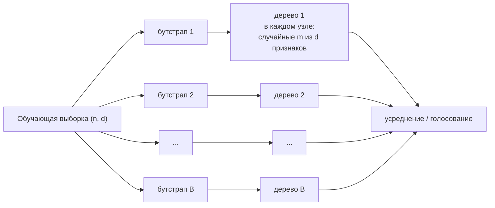

# Бэггинг и случайный лес

> **Зачем эта глава.** Случайный лес — самый надёжный табличный бейзлайн: он даёт приличное
> качество без тюнинга, честную оценку ошибки без отдельной валидационной выборки и почти
> не ломается на грязных данных. После этой главы вы сможете вывести долю $1 - 1/e$ уникальных
> объектов в бутстрапе, объяснить формулой, зачем нужен `max_features`, корректно пользоваться
> OOB-оценкой и аргументированно выбирать между лесом и бустингом, а не по привычке.

**Уровень:** 🌱 база → 🧠 middle+
**Предварительно нужно:** [решающие деревья](05-decision-trees.md), [постановка задачи обучения](01-learning-theory.md) (bias-variance), [теория вероятностей](../01-math/02-probability.md)
**Время на проработку:** ~4 часа (чтение + вывод + эксперименты)

---

## Карта главы

- [1. Проблема: дерево нестабильно](#1-проблема-дерево-нестабильно) — откуда вообще растёт идея усреднения
- [2. Бутстрап и магическое число 0.632](#2-бутстрап-и-магическое-число-0632) — вывод
- [3. Бэггинг: что именно даёт усреднение](#3-бэггинг-что-именно-даёт-усреднение) — точное тождество и разложение ошибки
- [4. Дисперсия среднего коррелированных величин](#4-дисперсия-среднего-коррелированных-величин) — ключевая формула главы
- [5. Случайный лес: декорреляция через max_features](#5-случайный-лес-декорреляция-через-max_features)
- [6. OOB-оценка](#6-oob-оценка) — бесплатная валидация и когда она врёт
- [7. ExtraTrees](#7-extratrees) — ещё больше случайности
- [8. Гиперпараметры на практике](#8-гиперпараметры-на-практике)
- [9. Когда лес лучше бустинга](#9-когда-лес-лучше-бустинга)
- [10. Подводные камни](#10-подводные-камни)
- [11. Проверь себя](#11-проверь-себя)
- [12. Практика](#12-практика)
- [13. Что читать дальше](#13-что-читать-дальше)

---

## 1. Проблема: дерево нестабильно

В [предыдущей главе](05-decision-trees.md) мы разобрали, почему решающее дерево — модель
с высокой дисперсией: жадный дискретный выбор в каждом узле означает, что почти равные
по выигрышу кандидаты выбираются фактически шумом, а решение в корне определяет всю
структуру ниже.

Запишем это на языке [разложения ошибки](01-learning-theory.md). В точке $x$ для
квадратичной потери:

$$
\mathbb{E}_{\mathcal{D}}\big[(y - \hat f_{\mathcal{D}}(x))^2\big]
\;=\;
\underbrace{\big(\mathbb{E}_{\mathcal{D}}[\hat f_{\mathcal{D}}(x)] - f^*(x)\big)^2}_{\text{смещение}^2}
\;+\;
\underbrace{\mathrm{Var}_{\mathcal{D}}\big[\hat f_{\mathcal{D}}(x)\big]}_{\text{дисперсия}}
\;+\;
\underbrace{\sigma_{\text{шум}}^2}_{\text{неустранимо}}
$$

где $\mathcal{D}$ — случайная обучающая выборка, $\hat f_{\mathcal{D}}$ — модель, обученная
на ней, $f^*(x) = \mathbb{E}[y \mid x]$ — идеальное предсказание, $\sigma^2_{\text{шум}}$ —
дисперсия шума в таргете.

У глубокого дерева первое слагаемое почти нулевое (оно может выразить что угодно), а
второе огромное. Естественный вопрос: **можно ли уменьшить дисперсию, не трогая смещение?**

Ответ из статистики известен: усредняйте. Если бы у нас было $B$ **независимых**
обучающих выборок $\mathcal{D}_1, \dots, \mathcal{D}_B$, мы бы обучили $B$ деревьев
и усреднили:

$$
\bar f(x) = \frac{1}{B}\sum_{b=1}^{B} \hat f_{\mathcal{D}_b}(x)
$$

Смещение не изменилось бы (среднее несмещённых — несмещённое; среднее одинаково
смещённых — так же смещено), а дисперсия упала бы в $B$ раз.

Беда в том, что $B$ независимых выборок у нас нет. Есть одна. Отсюда — бутстрап.

> 🌱 **База.** Логика в двух предложениях: одно дерево — это мнение эксперта, который
> сильно зависит от того, какие именно примеры ему показали. Показав разным экспертам
> разные (пересекающиеся) подборки примеров и усреднив их мнения, мы получаем ответ,
> который меньше зависит от случайностей конкретной выборки.

---

## 2. Бутстрап и магическое число 0.632

**Бутстрап-выборка** (bootstrap sample) — это $n$ объектов, выбранных из исходной выборки
размера $n$ **с возвращением**. Некоторые объекты попадут в неё несколько раз, некоторые —
ни разу. Именно вторая группа и даст нам бесплатную валидацию, поэтому посчитаем её размер.

### Вывод

Зафиксируем объект $i$. При одном извлечении вероятность выбрать именно его равна $1/n$,
значит, вероятность **не** выбрать — $1 - 1/n$. Извлечения независимы, их $n$ штук, поэтому

$$
\Pr[\text{объект } i \text{ не попал в бутстрап}] \;=\; \left(1 - \frac{1}{n}\right)^{n}
$$

Найдём предел. Логарифмируем и раскладываем $\ln(1-u) = -u - \frac{u^2}{2} - \frac{u^3}{3} - \dots$
при $u = 1/n$:

$$
n \ln\!\left(1 - \frac{1}{n}\right)
= n\left(-\frac{1}{n} - \frac{1}{2n^2} - \frac{1}{3n^3} - \dots\right)
= -1 - \frac{1}{2n} - \frac{1}{3n^2} - \dots
\;\xrightarrow[n \to \infty]{}\; -1
$$

Следовательно

$$
\left(1 - \frac{1}{n}\right)^{n} \;\xrightarrow[n\to\infty]{}\; e^{-1} \approx 0.3679
$$

и **доля уникальных объектов в бутстрап-выборке** стремится к

$$
\boxed{\;1 - e^{-1} \approx 0.632\;}
$$

Заметьте по разложению: сходимость идёт снизу и очень быстро — поправка порядка $\frac{1}{2n}$.

| $n$ | $(1-1/n)^n$ | доля уникальных |
|---|---|---|
| 10 | 0.3487 | 0.6513 |
| 100 | 0.3660 | 0.6340 |
| 1 000 | 0.3677 | 0.6323 |
| $\infty$ | 0.3679 | 0.6321 |

Уже на сотне объектов приближение верно с точностью до третьего знака.

> 📐 **Разбор формулы.** Есть второй, более наглядный путь. Число попаданий объекта $i$
> в бутстрап распределено биномиально $\mathrm{Bin}(n, 1/n)$ со средним ровно 1. При
> больших $n$ это распределение сходится к пуассоновскому $\mathrm{Poisson}(1)$, для
> которого $\Pr[k \text{ попаданий}] = \frac{e^{-1}}{k!}$. Отсюда сразу
> $\Pr[0] = e^{-1} \approx 0.368$, $\Pr[1] = e^{-1} \approx 0.368$,
> $\Pr[2] = e^{-1}/2 \approx 0.184$. То есть примерно 37% объектов не попадут вовсе,
> 37% попадут ровно один раз, остальные — по два и более. Кстати, это же объясняет,
> почему в реализациях бутстрап иногда делают через пуассоновские веса: для потоковых
> данных это позволяет не хранить выборку целиком.

```python
import numpy as np

rng = np.random.default_rng(0)
for n in (10, 100, 1_000, 10_000):
    fracs = [len(np.unique(rng.integers(0, n, n))) / n for _ in range(300)]
    print(f"n={n:6d}: эмпирически {np.mean(fracs):.4f}   теория {1 - (1 - 1/n)**n:.4f}")
# n=    10: эмпирически 0.6516   теория 0.6513
# n= 10000: эмпирически 0.6321   теория 0.6321
```

Две вещи, которые из этого следуют и которые надо помнить:

1. **Каждое дерево видит только ~63% уникальных объектов.** Значит, каждое дерево чуть
   хуже дерева, обученного на всей выборке, — бэггинг слегка **увеличивает смещение**.
   Он окупается только потому, что снижение дисперсии перевешивает.
2. **Оставшиеся ~37% — честная отложенная выборка для этого дерева.** На этом построена
   OOB-оценка (раздел 6).

> ⚠️ **Типичная ошибка.** Считать, что бутстрап-выборка «примерно такая же, как
> исходная». Она такая же по размеру, но повторы в ней меняют эффективные веса объектов:
> объект, попавший трижды, получает втрое больший вклад в критерий сплита. Именно эти
> случайные веса и создают разнообразие деревьев — без них все деревья на детерминированном
> алгоритме были бы идентичны.

---

## 3. Бэггинг: что именно даёт усреднение

**Бэггинг** (bagging = bootstrap aggregating, Breiman, 1996): обучаем $B$ моделей на $B$
независимых бутстрап-выборках и усредняем предсказания (для классификации — голосуем
или усредняем вероятности).

Что именно мы выигрываем? Есть точный ответ, не требующий никаких предположений.

### Тождество «ошибка ансамбля = средняя ошибка минус разнообразие»

Пусть $f_1(x), \dots, f_B(x)$ — предсказания членов ансамбля в точке $x$,
$\bar f(x) = \frac{1}{B}\sum_b f_b(x)$ — их среднее, $y$ — истинный ответ. Тогда

$$
\frac{1}{B}\sum_{b=1}^{B}\big(f_b(x) - y\big)^2
= \frac{1}{B}\sum_{b=1}^{B}\big(f_b(x) - \bar f(x)\big)^2 + \big(\bar f(x) - y\big)^2
$$

Проверяется в две строки: раскройте $f_b - y = (f_b - \bar f) + (\bar f - y)$, возведите
в квадрат и заметьте, что перекрёстный член содержит $\sum_b (f_b - \bar f) = 0$.
Переставим слагаемые:

$$
\boxed{\;\underbrace{\big(\bar f(x) - y\big)^2}_{\text{ошибка ансамбля}}
\;=\;
\underbrace{\frac{1}{B}\sum_{b}\big(f_b(x) - y\big)^2}_{\text{средняя ошибка члена}}
\;-\;
\underbrace{\frac{1}{B}\sum_{b}\big(f_b(x) - \bar f(x)\big)^2}_{\text{разнообразие (ambiguity)}}\;}
$$

Это тождество (Krogh & Vedelsby, 1995) даёт сразу два вывода:

- ошибка ансамбля **никогда не хуже** средней ошибки его членов — второе слагаемое
  неотрицательно. Для квадратичной потери усреднение не может навредить;
- выигрыш ансамбля **в точности равен разнообразию** его членов. Хотите лучший ансамбль —
  делайте модели более разными, не жертвуя их индивидуальным качеством. Весь дизайн
  случайного леса — про эту фразу.

> ⚠️ **Типичная ошибка.** Переносить это тождество на 0-1 потерю или на logloss. Оно верно
> **только для квадратичной потери**. При голосовании по большинству ансамбль может быть
> хуже среднего члена (классический пример: три классификатора с точностью 0.6, но
> ошибающиеся на одних и тех же объектах в двух случаях из трёх). Практически бэггинг
> и в классификации почти всегда помогает, но «математически гарантированно» — только
> для MSE.

```python
import numpy as np
from sklearn.datasets import make_regression
from sklearn.model_selection import train_test_split
from sklearn.tree import DecisionTreeRegressor

X, y = make_regression(n_samples=4000, n_features=30, n_informative=10,
                       noise=20.0, random_state=0)
X_tr, X_te, y_tr, y_te = train_test_split(X, y, test_size=0.3, random_state=0)


def fit_bagged_trees(n_trees, max_features, seed=0):
    """Возвращает матрицу (n_trees, n_test) предсказаний отдельных деревьев."""
    rng = np.random.default_rng(seed)
    n = len(y_tr)
    preds = np.empty((n_trees, len(y_te)))
    for b in range(n_trees):
        idx = rng.integers(0, n, n)                       # бутстрап: с возвращением
        tree = DecisionTreeRegressor(max_features=max_features,
                                     random_state=int(rng.integers(1 << 31)))
        tree.fit(X_tr[idx], y_tr[idx])
        preds[b] = tree.predict(X_te)
    return preds


def decompose(preds, y_true, name):
    mean_member = ((preds - y_true) ** 2).mean(axis=1).mean()     # средняя ошибка одного дерева
    ens = preds.mean(axis=0)
    ens_err = ((ens - y_true) ** 2).mean()                        # ошибка ансамбля
    ambiguity = ((preds - ens) ** 2).mean(axis=0).mean()          # разнообразие
    print(f"{name:18s} среднее дерево={mean_member:7.1f}  разнообразие={ambiguity:7.1f}  "
          f"ансамбль={ens_err:7.1f}  (проверка {mean_member - ambiguity:7.1f})")


for mf in (1.0, 0.5, 0.2):
    decompose(fit_bagged_trees(100, mf), y_te, f"max_features={mf}")
# Столбцы "ансамбль" и "проверка" совпадают до последнего знака — тождество точное.
# При уменьшении max_features растут ОБА: и ошибка отдельного дерева, и разнообразие.
# Ансамбль выигрывает, пока прирост разнообразия обгоняет ухудшение членов.
```

---

## 4. Дисперсия среднего коррелированных величин

Тождество выше описывает конкретную выборку. Теперь посмотрим на ситуацию в среднем
по случайности обучения — здесь появляется формула, которую на собеседовании спрашивают
чаще всего.

Зафиксируем точку $x$. Пусть $f_1(x), \dots, f_B(x)$ — предсказания деревьев, обученных
на разных бутстрап-выборках. Они одинаково распределены (обмениваемы), обозначим

$$
\mathrm{Var}\big[f_b(x)\big] = \sigma^2, \qquad
\mathrm{Corr}\big[f_b(x), f_{b'}(x)\big] = \rho \quad (b \ne b')
$$

Тогда

$$
\mathrm{Var}\!\left[\frac{1}{B}\sum_{b=1}^{B} f_b(x)\right]
= \frac{1}{B^2}\left[\sum_{b=1}^{B}\mathrm{Var}\big[f_b\big] + \sum_{b \ne b'}\mathrm{Cov}\big[f_b, f_{b'}\big]\right]
$$

Первая сумма содержит $B$ слагаемых по $\sigma^2$. Вторая — $B(B-1)$ слагаемых по
$\mathrm{Cov} = \rho\sigma^2$. Подставляем:

$$
= \frac{1}{B^2}\Big[B\sigma^2 + B(B-1)\rho\sigma^2\Big]
= \frac{\sigma^2}{B} + \frac{(B-1)\rho\sigma^2}{B}
$$

Приведём к каноническому виду:

$$
\boxed{\;\mathrm{Var}\!\left[\bar f(x)\right] \;=\; \rho\,\sigma^2 \;+\; \frac{1 - \rho}{B}\,\sigma^2\;}
$$

где $\sigma^2$ — дисперсия предсказания одного дерева в точке $x$, $\rho$ — попарная
корреляция предсказаний деревьев, $B$ — число деревьев.

> 📐 **Разбор формулы.** Два слагаемых живут своей жизнью.
> Второе, $\frac{1-\rho}{B}\sigma^2$, — это то, что убивается **количеством**: растёт $B$,
> слагаемое стремится к нулю. Именно поэтому «больше деревьев — не хуже».
> Первое, $\rho\sigma^2$, — это **пол**, ниже которого количество деревьев не опускает
> вообще никогда. При $\rho = 1$ (все деревья одинаковые) усреднение бесполезно: дисперсия
> осталась $\sigma^2$. При $\rho = 0$ (независимые) получаем классическое $\sigma^2/B$.
> Практический вывод: после какого-то $B$ добавлять деревья бессмысленно — вы упёрлись
> в $\rho\sigma^2$, и единственный способ идти дальше — **снижать $\rho$**.

Оценим порядок величины. У обычного бэггинга деревьев корреляция высокая: бутстрап-выборки
пересекаются примерно на 63% объектов, и если в данных есть один доминирующий признак,
все деревья возьмут его в корень. Типичные $\rho \approx 0.6$–$0.9$. Тогда при $B = 500$:

$$
\mathrm{Var}[\bar f] \approx 0.8\,\sigma^2 + \frac{0.2}{500}\sigma^2 \approx 0.8004\,\sigma^2
$$

Мы снизили дисперсию всего на 20%, и дальнейшее увеличение $B$ не даст почти ничего.
Вот **та самая проблема, которую решает случайный лес**.

---

## 5. Случайный лес: декорреляция через max_features

Идея Бреймана (2001): добавить второй источник случайности — **на каждом сплите
рассматривать не все $d$ признаков, а случайное подмножество из $m$ штук**.

Подчеркнём деталь, которую половина кандидатов формулирует неверно: подмножество
выбирается заново **в каждом узле**, а не один раз на дерево. Это существенно: иначе
дерево, которому не досталось важных признаков, было бы безнадёжно плохим.



### Почему это работает и почему это компромисс

Ограничение кандидатов бьёт ровно по механизму, который создаёт корреляцию: доминирующий
признак теперь попадает в кандидаты только с вероятностью $m/d$, и в остальных узлах
деревья вынуждены искать другие сплиты. Корреляция $\rho$ падает — падает и пол
$\rho\sigma^2$.

Но бесплатно это не бывает. Уменьшая $m$, мы делаем каждое отдельное дерево **хуже**:
в узле может просто не оказаться ни одного полезного признака, и сплит будет сделан
почти наугад. Средняя ошибка члена ансамбля растёт. В терминах тождества из раздела 3:
растёт и разнообразие (хорошо), и средняя ошибка члена (плохо). Есть внутренний оптимум.

Дефолты, от которых стоит отталкиваться:

| Задача | Рекомендация Бреймана / ESL | Дефолт scikit-learn |
|---|---|---|
| Классификация | $m = \lfloor\sqrt{d}\rfloor$ | `max_features='sqrt'` |
| Регрессия | $m = \lfloor d/3 \rfloor$ | `max_features=1.0` (все признаки) |

Расхождение в регрессии — не ошибка, а разные компромиссы: sklearn выбирает «бэггинг
по умолчанию», ESL — более декоррелированный вариант. **`max_features` в регрессии
надо подбирать**, дефолт часто далёк от оптимума.

Логика подбора: чем больше в данных **шумовых** признаков, тем больше должно быть $m$
(иначе в узел слишком часто не попадает ни одного информативного). Чем сильнее признаки
коррелированы между собой и чем сильнее доминирует один — тем меньше $m$.

```python
from sklearn.datasets import load_breast_cancer
from sklearn.ensemble import RandomForestClassifier

X, y = load_breast_cancer(return_X_y=True)
print("d =", X.shape[1])

for mf in ("sqrt", 0.2, 0.4, 0.7, 1.0):
    rf = RandomForestClassifier(n_estimators=500, max_features=mf, oob_score=True,
                                n_jobs=-1, random_state=0).fit(X, y)
    print(f"max_features={str(mf):5s}  OOB accuracy = {rf.oob_score_:.4f}")
# Оптимум обычно оказывается заметно левее 1.0: полный перебор признаков
# делает деревья слишком похожими друг на друга.
```

> 💬 **На собеседовании.** Спросят: «Зачем в случайном лесе `max_features`, если разнообразие
> уже обеспечено бутстрапом?»
> Хороший ответ: выпишите формулу
> $\mathrm{Var}[\bar f] = \rho\sigma^2 + \frac{1-\rho}{B}\sigma^2$. Бутстрап снижает второе
> слагаемое, но не первое. Пол $\rho\sigma^2$ снимается только уменьшением корреляции
> между деревьями, а главный источник корреляции — то, что все деревья хватают один
> и тот же сильный признак в корень. Случайный отбор $m$ из $d$ признаков **в каждом узле**
> ломает этот механизм. Цена — каждое дерево слабее, поэтому у $m$ есть внутренний оптимум:
> $\sqrt{d}$ для классификации, порядка $d/3$ для регрессии как стартовые значения.
> Плохой ответ: «чтобы деревья были разными» — верно, но не объясняет, почему бутстрапа
> недостаточно, и не даёт количественной картины.

> 🧠 **Middle+.** Есть тонкость про то, где лес всё-таки платит смещением. Если истинная
> зависимость определяется 3 признаками из 1000, то при $m = \sqrt{1000} \approx 32$
> вероятность, что в узел попадёт хотя бы один информативный признак, равна
> $1 - \binom{997}{32}/\binom{1000}{32} \approx 1 - (1 - 32/1000)^3 \approx 0.09$.
> Девять узлов из десяти строятся по шуму. В таких «разреженных» задачах лес заметно
> проигрывает, и правильный ход — либо резко увеличить $m$, либо сначала отобрать признаки.
> Это, кстати, один из немногих случаев, когда бустинг с `colsample_bytree=1.0` выигрывает
> у леса не на проценты, а в разы.

---

## 6. OOB-оценка

Мы выяснили, что каждый объект не попадает примерно в 37% бутстрап-выборок. Для объекта
$i$ обозначим $\mathcal{B}_i = \{ b : i \notin \text{бутстрап}_b \}$ — множество деревьев,
которые его **не видели**. Тогда

$$
\hat y_i^{\text{OOB}} \;=\; \frac{1}{|\mathcal{B}_i|}\sum_{b \in \mathcal{B}_i} f_b(x_i)
$$

— предсказание, полученное только теми деревьями, для которых объект $i$ был отложенной
выборкой. Ошибка, посчитанная по всем $\hat y_i^{\text{OOB}}$, называется **out-of-bag
оценкой** и не требует ни отдельного hold-out, ни кросс-валидации.

```python
from sklearn.model_selection import cross_val_score

rf = RandomForestClassifier(n_estimators=500, n_jobs=-1,
                            oob_score=True, random_state=0).fit(X, y)
cv = cross_val_score(RandomForestClassifier(n_estimators=500, n_jobs=-1, random_state=0),
                     X, y, cv=5, scoring="accuracy").mean()
print(f"OOB accuracy = {rf.oob_score_:.4f}   5-fold CV accuracy = {cv:.4f}")
# обычно расходятся в третьем знаке; OOB получена БЕСПЛАТНО, за одно обучение
```

### Чего OOB стоит и где она врёт

**Свойства.** OOB близка к leave-one-out по духу: каждый объект оценивается моделью,
его не видевшей. Но ансамбль, который его оценивает, состоит в среднем из $0.368B$
деревьев вместо $B$, поэтому OOB систематически **чуть пессимистична** — особенно
при малом $B$. При $B = 500$ эффективный ансамбль — 184 дерева, разница уже
пренебрежима; при $B = 20$ — нет.

**Где она врёт — три ситуации, и все три встречаются в проде.**

1. **Данные не i.i.d. по строкам.** Если в выборке есть группы (несколько заявок одного
   клиента, несколько сессий одного пользователя), объект «не в бутстрапе» всё равно
   имеет своих почти-близнецов внутри бутстрапа. OOB завышает качество ровно так же,
   как случайный K-fold вместо GroupKFold.
2. **Временная структура.** OOB перемешивает прошлое и будущее. Для задач с дрифтом
   она бесполезна как оценка продакшен-качества — нужен временной сплит
   ([глава 13](13-validation-and-leakage.md)).
3. **Препроцессинг сделан до леса.** Если target encoding, отбор признаков или импутация
   посчитаны на всей выборке, OOB этого не заметит: она валидирует только сам лес,
   а не пайплайн. Кросс-валидация всего `Pipeline` — заметит.

> 💬 **На собеседовании.** Спросят: «Что такое OOB-оценка и может ли она заменить
> кросс-валидацию?»
> Хороший ответ: OOB — усреднение предсказаний тех деревьев, для которых объект оказался
> вне бутстрапа; это примерно 37% деревьев на объект по формуле $e^{-1}$. Она бесплатна:
> одно обучение вместо $K$. Заменить CV может для быстрого подбора `max_features` и
> контроля сходимости по числу деревьев. Не может — если данные сгруппированы, если
> есть временная структура, если препроцессинг стоит до модели, или если нужна оценка
> разброса метрики (OOB даёт одно число, без доверительного интервала).
> Плохой ответ: «OOB — это то же самое, что кросс-валидация, только быстрее».

> ⌨️ **Руками.** Реализуйте OOB сами за 20 строк: храните для каждого дерева
> булеву маску «объект был в бутстрапе», после обучения соберите предсказания только
> по нулям маски, усредните и посчитайте метрику. Сравните со `rf.oob_score_`. Это
> лучший способ убедиться, что вы понимаете механизм, а не помните название параметра.

---

## 7. ExtraTrees

**Extremely Randomized Trees** (Geurts, Ernst, Wehenkel, 2006) — следующий шаг по той же
логике: если корреляция деревьев — главный враг, добавим случайности ещё.

Два отличия от случайного леса:

1. **Порог не оптимизируется, а бросается случайно.** Для каждого из $m$ признаков-кандидатов
   в узле берётся **один** случайный порог из равномерного распределения на диапазоне
   значений этого признака внутри узла. Лучший из этих $m$ случайных сплитов и выбирается.
   Сравните: в RF для каждого кандидата перебираются все возможные пороги.
2. **Бутстрап по умолчанию выключен** (`bootstrap=False` в sklearn): рандомизация сплитов
   уже даёт достаточное разнообразие, а обучение на полной выборке снижает смещение
   отдельного дерева.

Что это меняет:

| | Random Forest | Extra Trees |
|---|---|---|
| Выбор порога | оптимальный по критерию | один случайный на признак |
| Стоимость узла | $O(m \cdot n_{\text{узла}})$ + сортировка | $O(m \cdot n_{\text{узла}})$, без сортировки |
| Корреляция $\rho$ | средняя | ниже |
| Дисперсия отдельного дерева | ниже | выше |
| Смещение отдельного дерева | ниже | выше |
| Скорость обучения | 1× | обычно в 2–4 раза быстрее |
| Где выигрывает | средний случай | шумные данные, много признаков, слабый сигнал |

```python
import time
from sklearn.ensemble import RandomForestRegressor, ExtraTreesRegressor
from sklearn.metrics import r2_score

for Model in (RandomForestRegressor, ExtraTreesRegressor):
    t0 = time.perf_counter()
    m = Model(n_estimators=300, max_features=0.4, n_jobs=-1, random_state=0).fit(X_tr, y_tr)
    dt = time.perf_counter() - t0
    print(f"{Model.__name__:22s} R2={r2_score(y_te, m.predict(X_te)):.4f}  время={dt:.1f} c")
```

> 🧠 **Middle+.** Почему случайный порог не разрушает модель? Потому что дерево строит
> **много** уровней, и «неудачный» порог исправляется ниже: одна плохая ступенька
> в кусочно-постоянной аппроксимации компенсируется соседними. А главное — усреднение
> по сотням деревьев со случайными порогами даёт эффект, похожий на сглаживание:
> граница ансамбля ExtraTrees заметно более гладкая, чем у RF. На данных, где точное
> положение порога и правда важно (пороговые бизнес-правила, физические ограничения),
> ExtraTrees, наоборот, проигрывает.

Практический ориентир: ExtraTrees стоит попробовать всегда, когда используете RF, — это
одна строчка кода и часто бесплатные 1–3 пункта метрики плюс кратное ускорение. Особенно
на широких зашумлённых данных.

---

## 8. Гиперпараметры на практике

| Параметр (sklearn) | Что делает | Как настраивать |
|---|---|---|
| `n_estimators` | число деревьев $B$ | **не гиперпараметр качества**: больше — не хуже, только дольше. Ставьте столько, сколько позволяет бюджет; проверяйте по кривой OOB, где вышло на плато. Типично 300–1000 |
| `max_features` | размер подмножества признаков $m$ в узле | **главный рычаг**. Классификация: старт `'sqrt'`. Регрессия: старт 0.3–0.5, не дефолт 1.0. Перебирать по OOB |
| `min_samples_leaf` | минимальный размер листа | по умолчанию 1 — деревья растут до конца, так и задумано. Поднимать до 5–50 при шумной разметке и для экономии памяти |
| `max_depth` | ограничение глубины | обычно `None`. Ограничивать только ради памяти/латентности |
| `max_samples` | доля объектов в бутстрапе | < 1.0 ускоряет и дополнительно декоррелирует; на больших $n$ (10⁶+) ставьте 0.2–0.5 почти без потери качества |
| `bootstrap` | включать ли бутстрап | `True` для RF (нужен для OOB), `False` для ExtraTrees |
| `class_weight` | веса классов | `'balanced_subsample'` пересчитывает веса внутри каждой бутстрап-выборки — корректнее, чем `'balanced'` |
| `n_jobs` | параллелизм | `-1`. Деревья независимы, масштабируется почти линейно по ядрам |
| `criterion` | критерий сплита | трогать последним, эффект минимален |

### О памяти — это часто недооценивают

Полностью выращенное дерево на $n$ объектах имеет до $n$ листьев и порядка $2n$ узлов.
В sklearn один узел занимает около 60–80 байт вместе с массивом `value`. Прикинем для
$n = 10^6$ и $B = 500$:

$$
2 \cdot 10^6 \text{ узлов} \times 70 \text{ Б} \times 500 \approx 70\ \text{ГБ}
$$

Это не влезет никуда. На практике реальных листьев меньше (данные не все уникальны),
но порядок остаётся пугающим — и это главная причина, по которой на больших выборках
у леса **обязательно** ставят `min_samples_leaf=20..100` и `max_samples=0.3`. Заодно это
и главный аргумент в пользу бустинга при жёстком бюджете памяти: 500 деревьев глубины 6
дают 500 × 64 = 32 000 листьев против миллионов у леса.

> 💬 **На собеседовании.** Спросят: «Может ли случайный лес переобучиться, если добавлять
> деревья?»
> Хороший ответ: нет — Брейман показал, что ошибка обобщения леса сходится почти наверное
> при $B \to \infty$, что видно и из формулы дисперсии: рост $B$ только убирает слагаемое
> $\frac{1-\rho}{B}\sigma^2$, оставляя $\rho\sigma^2$. Практически кривая качества выходит
> на плато и там остаётся. Но важная оговорка: **лес переобучается по другим осям**.
> Полностью выращенные деревья на маленькой или шумной выборке дают ансамбль, который
> заметно лучше на трейне, чем на тесте, и там помогает `min_samples_leaf`. Так что
> «лес не переобучается» — неверная формулировка; верная — «лес не переобучается от
> увеличения числа деревьев».
> Плохой ответ: «случайный лес не переобучается» без оговорок; или «переобучается,
> надо подбирать `n_estimators` по валидации».

---

## 9. Когда лес лучше бустинга

Дефолтный рефлекс индустрии — «таблица → бустинг», и в среднем он оправдан: на
аккуратно оттюненных задачах бустинг обычно выше. Но есть класс ситуаций, где лес
не просто приемлем, а объективно лучший выбор.

**Лес выигрывает, когда:**

- **разметка грязная.** Бустинг последовательно концентрируется на объектах с большими
  остатками — а это ровно объекты с ошибочными метками. Лес усредняет и такие объекты
  «размазывает». На данных с 10–20% шума в метках разрыв бывает в пользу леса;
- **нет времени и/или выборки на честную валидацию.** Бустингу нужна отдельная выборка
  для ранней остановки; лесу — нет, у него OOB. Если данных 3000 строк и каждая
  отложенная сотня на счету, это решающий аргумент;
- **нужен быстрый надёжный бейзлайн.** RF с дефолтами и `n_jobs=-1` даёт результат
  за минуту и почти не чувствителен к гиперпараметрам. Бустинг с дефолтами может
  показать что угодно;
- **важна оценка неопределённости.** Разброс предсказаний по деревьям — готовый
  (пусть и не калиброванный) индикатор «модель не знает». На этом же построены
  quantile regression forests для предсказательных интервалов;
- **нужна тривиальная параллелизация и инкрементальность.** Деревья независимы:
  можно обучать на разных машинах и просто объединять (`warm_start`, конкатенация
  `estimators_`). Бустинг так не умеет в принципе;
- **лес — часть другой конструкции.** Proximity-матрица для кластеризации, Isolation
  Forest для аномалий ([глава 18](18-anomaly-detection.md)), RF-эмбеддинги листьев
  как признаки для линейной модели.

**Лес проигрывает, когда:**

| Ситуация | Почему |
|---|---|
| Нужен максимум качества на чистых табличных данных | бустинг с ранней остановкой систематически выше на 1–5 пунктов метрики |
| Много шумовых признаков при разреженном сигнале | `max_features` слишком часто не даёт узлу ни одного полезного признака (см. врезку в §5) |
| Жёсткий бюджет памяти или латентности | глубокие деревья в лесу тяжелее сотен мелких в бустинге |
| Категории высокой мощности | sklearn их не поддерживает нативно, а CatBoost/LightGBM — да |
| Нужна нестандартная функция потерь (квантильная, Poisson, ранжирование) | лес построен вокруг дисперсии/Джини; бустинг принимает любую дифференцируемую $L$ |
| Данные сильно несбалансированы | голосование большинством вырождается; веса помогают хуже, чем в бустинге |

> 💬 **На собеседовании.** Спросят: «У вас 50 тысяч строк, 200 признаков, разметка
> от асессоров с согласованностью около 0.75. Лес или бустинг?»
> Хороший ответ: начинаю с леса — при такой согласованности разметки в данных заведомо
> 15–25% шумных меток, а бустинг на них деградирует раньше и сильнее, потому что
> целенаправленно фокусируется на объектах с большими остатками. Плюс на 50 тысячах строк
> OOB даёт бесплатную оценку, и не приходится резать выборку на три части. Дальше:
> если лес показывает разумный результат, пробую бустинг с сильной регуляризацией
> (`min_child_samples` в сотни, глубина 4–5, `subsample` 0.7) и сравниваю на одной
> и той же схеме валидации. Если разрыв в пределах доверительного интервала — оставляю лес,
> он дешевле в поддержке.
> Плохой ответ: «бустинг, он всегда лучше».

---

## 10. Подводные камни

**OOB отличная, прод плохой.**
Симптом: `oob_score_` = 0.93, на живом трафике 0.80.
Причина: данные сгруппированы (несколько строк на пользователя/товар) или имеют временную
структуру — OOB такое не ловит, потому что бутстрап случайный по строкам.
Что делать: перейти на `GroupKFold` / временной сплит; OOB оставить как быстрый
индикатор сходимости по числу деревьев, а не как оценку продакшен-качества.

**Лес занял всю память и упал.**
Симптом: `MemoryError` при `n_estimators=1000` на выборке в миллион строк.
Причина: полностью выращенные деревья, порядка $2n$ узлов на дерево (см. §8).
Что делать: `min_samples_leaf=50`, `max_samples=0.3`, `max_depth=20`; проверить размер
через `sys.getsizeof` не получится — считайте по `sum(t.tree_.node_count for t in rf.estimators_)`.

**Вероятности леса плохо откалиброваны у краёв.**
Симптом: модель почти никогда не выдаёт вероятность выше 0.95 или ниже 0.05.
Причина: `predict_proba` — усреднение по деревьям; чтобы получить 0.99, нужно, чтобы
99% деревьев проголосовали одинаково, а разнообразие деревьев этому мешает по построению.
Усреднение стягивает вероятности к центру.
Что делать: калибровка (изотоническая или Platt) на отложенной выборке
([глава 12](12-imbalance-and-calibration.md)). Для ранжирования (ROC-AUC) это не нужно —
порядок сохраняется.

**Дисбаланс: лес предсказывает только мажоритарный класс.**
Симптом: recall редкого класса около нуля.
Причина: при доле позитивов 0.5% бутстрап-выборка содержит их столько же, и большинство
листьев чисто мажоритарные.
Что делать: `class_weight='balanced_subsample'`, `BalancedRandomForestClassifier`
из `imbalanced-learn` (балансирует внутри каждого бутстрапа), подбор порога по
`predict_proba`, метрики PR-AUC.

**`feature_importances_` леса выглядят убедительно и всё равно врут.**
Симптом: топ важностей стабилен, по нему приняли решение, эффекта нет.
Причина: MDI в лесу наследует смещение к признакам высокой мощности от отдельного
дерева, а бутстрап его даже усиливает (Strobl et al., 2007). Плюс коррелированные
признаки делят вклад произвольно.
Что делать: permutation importance на отложенной выборке; для коррелированных групп —
считать важность группы целиком (перемешивать все признаки группы сразу).

**Лес не улучшается от роста `n_estimators`, а обучение всё дольше.**
Симптом: 200 → 2000 деревьев, метрика не изменилась во втором знаке.
Причина: вы упёрлись в $\rho\sigma^2$ — пол из формулы дисперсии.
Что делать: не наращивать $B$, а снижать корреляцию: подбирать `max_features`,
пробовать ExtraTrees, убирать дубликаты признаков.

**Разные результаты при одинаковом `random_state`.**
Симптом: воспроизводимость ломается при смене `n_jobs`.
Причина: в sklearn сиды деревьев генерируются детерминированно и от `n_jobs` не зависят,
но порядок редукции чисел с плавающей точкой и версии библиотеки — зависят; плюс
`n_jobs` влияет на потребление памяти и может менять поведение при OOM.
Что делать: фиксировать версии в окружении, а воспроизводимость проверять тестом
([глава про воспроизводимость](../07-mlops/02-reproducibility-and-tracking.md)).

---

## 11. Проверь себя

<details>
<summary><b>🌱 Вопрос.</b> Объясните разницу между бэггингом и бустингом за минуту.</summary>

**Короткий ответ.** Бэггинг обучает модели **независимо и параллельно** на разных
бутстрап-выборках и усредняет — он борется с дисперсией. Бустинг обучает модели
**последовательно**, каждая исправляет ошибки предыдущих — он борется со смещением.

**Развёрнуто.** Разница проявляется во всём. Базовые модели: бэггингу нужны сильные
и переобученные (глубокие деревья), бустингу — слабые (глубина 3–8). Параллелизм:
бэггинг тривиально параллелится по деревьям, бустинг — только внутри одного дерева.
Число моделей: у бэггинга это не гиперпараметр качества (больше — не хуже), у бустинга
это главный рычаг переобучения. Чувствительность к шуму в метках: бэггинг устойчив,
бустинг деградирует. Валидация: лесу хватает OOB, бустингу нужна отдельная выборка
под раннюю остановку.

**Чего ждёт интервьюер:** что вы связываете каждый метод с той компонентой ошибки,
на которую он действует.

**Провал:** «оба строят много деревьев и усредняют».
</details>

<details>
<summary><b>🎯 Вопрос.</b> Какая доля объектов попадает в бутстрап-выборку? Выведите.</summary>

**Короткий ответ.** Примерно 63.2%, точнее $1 - (1-1/n)^n \to 1 - e^{-1}$.

**Развёрнуто.** Вероятность не выбрать фиксированный объект за одно извлечение равна
$1 - 1/n$; извлечений $n$ и они независимы, поэтому объект не попадёт в выборку с
вероятностью $(1-1/n)^n$. Логарифмируем: $n\ln(1-1/n) = n(-1/n - 1/(2n^2) - \dots) = -1 - 1/(2n) - \dots \to -1$, значит, предел равен $e^{-1} \approx 0.368$, а доля
уникальных — $0.632$. Сходимость очень быстрая: уже при $n = 100$ это 0.634.
Альтернативный вывод: число попаданий объекта — $\mathrm{Bin}(n, 1/n) \to \mathrm{Poisson}(1)$, и $\Pr[0] = e^{-1}$. Практическое следствие: оставшиеся 36.8% —
готовая отложенная выборка для конкретного дерева, на этом построена OOB-оценка.

**Чего ждёт интервьюер:** что вы можете провести вывод за 30 секунд, а не вспомнить
число «0.632».

**Провал:** «примерно две трети» без обоснования; или «63%, но это только для больших $n$»
без понимания, насколько быстро это сходится.
</details>

<details>
<summary><b>🧠 Вопрос.</b> Выведите дисперсию среднего $B$ одинаково распределённых
коррелированных предсказаний и объясните, что из неё следует для случайного леса.</summary>

**Короткий ответ.** $\mathrm{Var}[\bar f] = \rho\sigma^2 + \frac{1-\rho}{B}\sigma^2$.
Второе слагаемое убивается ростом $B$, первое — только снижением корреляции $\rho$,
чем и занимается `max_features`.

**Развёрнуто.** $\mathrm{Var}[\frac1B\sum_b f_b] = \frac{1}{B^2}(\sum_b \mathrm{Var}[f_b] + \sum_{b\ne b'}\mathrm{Cov}[f_b,f_{b'}]) = \frac{1}{B^2}(B\sigma^2 + B(B-1)\rho\sigma^2)$,
что после сокращения даёт искомое. Читается формула так: количество деревьев снимает
только «независимую» часть дисперсии; остаётся пол $\rho\sigma^2$. У обычного бэггинга
$\rho$ высока (0.6–0.9), потому что бутстрап-выборки пересекаются на 63% и все деревья
хватают один и тот же доминирующий признак в корень. Отбор случайных $m$ из $d$ признаков
**в каждом узле** ломает второй механизм и снижает $\rho$. Цена — отдельное дерево
становится слабее (растёт $\sigma^2$ и смещение), поэтому оптимум $m$ внутренний.

**Чего ждёт интервьюер:** самого вывода (это проверка владения ковариациями) и —
главное — интерпретации: почему «добавить ещё деревьев» перестаёт помогать.

**Провал:** написать $\sigma^2/B$ и на этом остановиться.
</details>

<details>
<summary><b>🎯 Вопрос.</b> Почему в случайном лесе деревья не обрезают?</summary>

**Короткий ответ.** Потому что нам нужны базовые модели с **низким смещением**;
их высокую дисперсию уберёт усреднение. Обрезка снижала бы дисперсию отдельного дерева,
но повышала бы смещение — а именно смещение усреднение не лечит.

**Развёрнуто.** Разложим ошибку: $\mathrm{bias}^2 + \mathrm{Var}$. Усреднение $B$
моделей не трогает смещение (среднее одинаково смещённых оценок смещено так же), но
снижает дисперсию до $\rho\sigma^2 + \frac{1-\rho}{B}\sigma^2$. Значит, оптимальная
базовая модель для бэггинга — та, у которой смещение минимально, пусть и ценой большой
дисперсии. Это ровно полностью выращенное дерево. Оговорка для практики: на очень шумной
разметке или маленькой выборке ограничение `min_samples_leaf` всё же помогает, потому что
у сильно переобученного дерева растёт не только дисперсия — оно ещё и заучивает шум,
общий у всех бутстрапов (шумные метки-то одни и те же). И отдельно — память: полное
дерево на миллионе строк весит десятки мегабайт.

**Чего ждёт интервьюер:** связки «какая компонента ошибки лечится усреднением».

**Провал:** «обрезка не нужна, потому что лес не переобучается».
</details>

<details>
<summary><b>🎯 Вопрос.</b> Что такое OOB-оценка и заменяет ли она кросс-валидацию?</summary>

**Короткий ответ.** Предсказание объекта только теми деревьями, для которых он оказался
вне бутстрапа (их около 37%). Заменяет CV для быстрого подбора параметров леса,
но не заменяет там, где есть группы, время или препроцессинг в пайплайне.

**Развёрнуто.** Механика: для каждого объекта собираем множество деревьев, его не видевших,
усредняем их предсказания, считаем метрику по всем объектам. Стоимость — ноль лишних
обучений. Свойства: оценка слегка пессимистична, потому что эффективный ансамбль в
$1/e$ раз меньше; при $B \ge 300$ разница пренебрежима. Когда врёт: (1) сгруппированные
данные — близнецы объекта остаются в бутстрапе, оценка завышена; (2) временная структура —
OOB перемешивает будущее с прошлым; (3) target encoding / отбор признаков сделаны до
леса — OOB их не проверяет; (4) нужен разброс метрики — OOB даёт одно число без
доверительного интервала.

**Чего ждёт интервьюер:** что вы знаете не только определение, но и границы применимости —
это отличает того, кто пользовался, от того, кто читал.

**Провал:** «OOB — это встроенная кросс-валидация, всегда можно её использовать».
</details>

<details>
<summary><b>🧠 Вопрос.</b> Чем ExtraTrees отличается от Random Forest и когда выигрывает?</summary>

**Короткий ответ.** ExtraTrees не оптимизирует порог: для каждого признака-кандидата
берётся один **случайный** порог, и лучший из этих случайных сплитов выбирается. Плюс
по умолчанию нет бутстрапа. Результат — ниже $\rho$, выше смещение отдельного дерева,
кратно быстрее обучение.

**Развёрнуто.** Оптимизация порога — второй по силе источник переобучения после выбора
признака: порог подгоняется под конкретные наблюдения. Убрав её, мы теряем точность
одного дерева, но резко увеличиваем разнообразие ансамбля; по тождеству
«ошибка ансамбля = средняя ошибка члена − разнообразие» это может выйти в плюс.
Плюс исчезает необходимость сортировать значения признака в узле — отсюда ускорение
в 2–4 раза. Выигрывает на шумных данных с большим числом признаков, где точное
положение порога всё равно определяется шумом. Проигрывает там, где пороги содержательны
(физические/бизнес-ограничения) и где выборка мала: случайные пороги не успевают
«усредниться».

**Чего ждёт интервьюер:** понимания, что рандомизация порога — это не «упрощение ради
скорости», а сознательный обмен смещения на разнообразие.

**Провал:** «ExtraTrees — это Random Forest без бутстрапа» — это только половина отличия
и не главная.
</details>

<details>
<summary><b>🎯 Вопрос.</b> Сколько деревьев брать в лес? Как понять, что хватит?</summary>

**Короткий ответ.** Столько, сколько позволяет бюджет: качество монотонно выходит на
плато и не деградирует. Точка «хватит» определяется по кривой OOB/валидационной метрики
от числа деревьев.

**Развёрнуто.** Из формулы $\rho\sigma^2 + \frac{1-\rho}{B}\sigma^2$ видно, что вклад
$B$ падает как $1/B$: переход с 100 на 200 деревьев убирает половину остаточного члена,
а с 1000 на 2000 — уже почти ничего. На практике 300–500 хватает почти всегда; сигнал
«хватит» — плато OOB в пределах шума за последние несколько сотен деревьев. В sklearn
удобно смотреть это через `warm_start=True`: наращивайте `n_estimators` и замеряйте
OOB на каждом шаге, не переобучая с нуля. Отдельно: `n_estimators` влияет на латентность
инференса линейно, поэтому в проде это ещё и вопрос SLA — иногда 200 деревьев с
качеством −0.001 предпочтительнее 1000.

**Чего ждёт интервьюер:** что вы не подбираете `n_estimators` кросс-валидацией как
обычный гиперпараметр.

**Провал:** «подберём по сетке вместе с остальными» — это трата вычислений на параметр,
у которого нет оптимума в середине.
</details>

<details>
<summary><b>🧠 Вопрос.</b> Всегда ли бэггинг улучшает модель? Для каких базовых моделей
он бесполезен?</summary>

**Короткий ответ.** Для квадратичной потери ансамбль никогда не хуже среднего члена
(это точное тождество), но полезен он только для **нестабильных** моделей. Для линейной
регрессии или kNN с большим $k$ бэггинг почти ничего не даёт и может слегка навредить.

**Развёрнуто.** Выигрыш бэггинга равен разнообразию членов:
$(\bar f - y)^2 = \frac1B\sum_b (f_b - y)^2 - \frac1B\sum_b (f_b - \bar f)^2$.
Если модель устойчива к возмущению выборки (линейная регрессия с регуляризацией, kNN
с $k=50$, наивный Байес), то все $f_b$ почти совпадают, разнообразие около нуля,
выигрывать нечего. При этом проигрыш есть: каждая модель обучена на ~63% уникальных
объектов, то есть чуть хуже полной. Итог — небольшой минус. Для деревьев картина
обратная: разнообразие огромно, оно и оплачивает потерю данных. Отдельная оговорка:
для 0-1 потери тождество не выполняется, и бэггинг теоретически может ухудшить
классификатор, хотя на практике это редкость.

**Чего ждёт интервьюер:** что вы понимаете условие применимости («нестабильность»),
а не считаете бэггинг универсальным улучшателем.

**Провал:** «бэггинг всегда помогает».
</details>

<details>
<summary><b>🎯 Вопрос.</b> Как получить из случайного леса оценку неопределённости предсказания?</summary>

**Короткий ответ.** Посмотреть на разброс предсказаний отдельных деревьев в этой точке:
`np.std([t.predict(x) for t in rf.estimators_])`. Для полноценных интервалов — quantile
regression forest: собрать все значения таргета из листьев, куда попал объект, и взять
квантили.

**Развёрнуто.** Разброс по деревьям измеряет дисперсию, вызванную случайностью обучения
(бутстрап + отбор признаков). Это **не** доверительный интервал и не предсказательный
интервал: он не учитывает неустранимый шум $\sigma^2_{\text{шум}}$ и систематически
занижен из-за корреляции деревьев. Тем не менее как относительный сигнал «здесь модель
не знает» он работает: аномально большой разброс обычно означает область, где обучающих
объектов мало. Для честных интервалов есть quantile regression forests (Meinshausen, 2006),
где в листьях хранят не среднее, а всё эмпирическое распределение таргета; в sklearn
это делается вручную через `rf.apply(X)`. Ещё один надёжный сигнал — доля объектов
трейна в тех же листьях: почти пустые листья означают экстраполяцию.

**Чего ждёт интервьюер:** что вы отличаете «разброс ансамбля» от «предсказательного
интервала» и не выдаёте первое за второе.

**Провал:** «стандартное отклонение по деревьям — это и есть доверительный интервал».
</details>

<details>
<summary><b>🎯 Вопрос.</b> Данные: 200 тысяч строк, 300 признаков, из них 250 — почти шум.
Лес показывает результат хуже логистической регрессии. Что происходит?</summary>

**Короткий ответ.** При `max_features='sqrt'` в узел попадает $\sqrt{300} \approx 17$
признаков, и вероятность, что среди них есть хоть один из 50 полезных, невелика —
значительная часть сплитов строится по шуму. Надо резко увеличить `max_features`
или предварительно отобрать признаки.

**Развёрнуто.** Посчитаем: вероятность, что в подмножестве из 17 нет ни одного из 50
информативных, примерно $(1 - 50/300)^{17} \approx 0.045$ — то есть на самом деле почти
всегда что-то полезное попадает. А вот если полезных признаков всего 3 из 300, то
$(1-3/300)^{17} \approx 0.84$: 84% узлов строятся вслепую. Это и есть «разреженный»
режим, где лес систематически слаб. Действия по порядку: (1) поднять `max_features`
до 0.5–1.0 и сравнить по OOB; (2) отобрать признаки (permutation importance, L1-модель,
adversarial validation на мусор); (3) проверить, не является ли зависимость
преимущественно линейной — если логистическая регрессия выигрывает, это сильный намёк;
(4) попробовать бустинг, который на каждом шаге видит все признаки и потому в разреженном
режиме устойчивее.

**Чего ждёт интервьюер:** количественного рассуждения о `max_features`, а не перебора
гиперпараметров наугад.

**Провал:** «лес плохо работает с большим числом признаков» без объяснения механизма.
</details>

<details>
<summary><b>🧠 Вопрос.</b> Можно ли обучать случайный лес распределённо и как?</summary>

**Короткий ответ.** Тривиально: деревья независимы. Обучаете подмножества деревьев
на разных машинах и объединяете списки моделей — качество идентично обучению на одной
машине при том же суммарном числе деревьев.

**Развёрнуто.** В sklearn это делается напрямую: обучить несколько `RandomForestClassifier`
с разными `random_state`, затем `rf_all.estimators_ = sum([m.estimators_ for m in models], [])`
и поправить `n_estimators`. Единственное требование — все машины должны видеть выборку
(или её представительную часть). Тонкость: если каждая машина видит **свою** часть данных,
а не всю, это уже не бэггинг, а другое приближение — деревья обучены на разных
распределениях, и корректность усреднения нужно обосновывать отдельно. Отдельно стоит
упомянуть `warm_start=True` — тот же приём внутри одного процесса для наращивания
ансамбля без переобучения. Контраст с бустингом здесь максимальный: там дерево $m$
нельзя начать до окончания дерева $m-1$, и распределённость делается только внутри
построения одного дерева.

**Чего ждёт интервьюер:** понимания, что параллелизм леса — структурное свойство,
а не деталь реализации.

**Провал:** «нужно использовать Spark MLlib» — это ответ про инструмент, а не про то,
почему это вообще возможно.
</details>

---

## 12. Практика

**Задача 1. Бэггинг с нуля (1.5 часа).**
Реализуйте класс `BaggingRegressorFromScratch` с параметрами `n_estimators`,
`max_features`, `max_samples`: бутстрап через `rng.integers`, хранение масок «объект был
в бутстрапе», методы `predict` и `oob_predict`. Сравните `oob_score` с 5-fold CV
на `load_diabetes`.
*Критерий: ваша OOB-оценка отличается от 5-fold CV не более чем на 0.02 по $R^2$,
и вы можете объяснить, почему она систематически чуть хуже.*

**Задача 2. Проверка формулы дисперсии (1 час).**
Сгенерируйте 30 независимых обучающих выборок из одного распределения. На каждой обучите
лес из $B$ деревьев. В фиксированной тестовой точке оцените: $\sigma^2$ (дисперсия
предсказания одного дерева по 30 повторам), $\rho$ (корреляция предсказаний двух деревьев
одного леса), и фактическую дисперсию предсказания леса. Сравните с
$\rho\sigma^2 + \frac{1-\rho}{B}\sigma^2$.
*Критерий: предсказанная и измеренная дисперсии совпадают в пределах 10–15%; при
уменьшении `max_features` вы наблюдаете падение $\rho$ и рост $\sigma^2$ одновременно.*

**Задача 3. Кривая по max_features (40 минут).**
На датасете с $d \ge 50$ постройте график OOB-метрики от `max_features` для значений
$\{0.05, 0.1, 0.2, 0.3, 0.5, 0.7, 1.0\}$, отдельно для задачи классификации и регрессии.
Наложите на тот же график время обучения.
*Критерий: у вас есть график с выраженным максимумом не на краю, и вы можете сказать,
насколько дефолт sklearn далёк от оптимума на ваших данных.*

**Задача 4. Устойчивость к шуму в метках (1 час).**
Возьмите бинарную задачу, испортите $q \in \{0, 5, 10, 20, 30\}$ процентов меток.
Для каждого $q$ обучите RF (дефолты) и LightGBM (с ранней остановкой) на одной схеме
валидации. Постройте две кривые «качество от $q$».
*Критерий: вы наблюдаете, что кривая бустинга падает быстрее, и можете объяснить механизм
(бустинг фокусируется на объектах с большими остатками, а испорченные метки — это
ровно они). Это одно из самых сильных практических различий двух методов.*

**Задача 5. Память и латентность (40 минут).**
Обучите RF на выборке $n = 2 \cdot 10^5$ с `min_samples_leaf` из $\{1, 5, 20, 100\}$.
Для каждого замерьте: суммарное число узлов (`sum(t.tree_.node_count for t in rf.estimators_)`),
размер `pickle`-файла модели, время предсказания на 10 000 объектов и метрику качества.
*Критерий: у вас есть таблица «min_samples_leaf → размер, латентность, качество»,
и вы можете назвать значение, дающее лучшее соотношение. Обычно качество почти не падает
до 20–50, а размер модели сокращается в разы.*

---

## 13. Что читать дальше

- [Breiman L. «Random Forests», Machine Learning 45(1), 2001](https://link.springer.com/article/10.1023/A:1010933404324) —
  первоисточник. Читать ради двух вещей: теоремы о сходимости ошибки обобщения при
  $B\to\infty$ (это и есть строгий ответ на «переобучается ли лес от числа деревьев»)
  и оценки обобщающей способности через «силу» деревьев и их корреляцию — прямой
  формальный аналог формулы из §4.
- **Breiman L. «Bagging Predictors», Machine Learning 24(2), 1996** — работа, где бэггинг
  и появился. Главное в ней — раздел про нестабильность: там прямо сказано, для каких
  базовых моделей бэггинг бесполезен и почему.
- **Hastie, Tibshirani, Friedman. «The Elements of Statistical Learning», гл. 15** —
  лучшее компактное изложение: формула $\rho\sigma^2 + \frac{1-\rho}{B}\sigma^2$, разбор
  `max_features`, OOB, и честное обсуждение того, где лес проигрывает бустингу.
  Раздел 15.4.2 отдельно про то, как лес ведёт себя при большом числе шумовых признаков.
- **Geurts P., Ernst D., Wehenkel L. «Extremely Randomized Trees», Machine Learning 63(1), 2006** —
  здесь есть то, чего нет в блогах: разбор, почему случайный порог не разрушает качество,
  и эксперименты по зависимости от степени рандомизации.
- **Strobl C. et al. «Bias in random forest variable importance measures», BMC
  Bioinformatics, 2007** — почему `feature_importances_` леса нельзя показывать бизнесу
  без оговорок; разбор вклада бутстрапа в это смещение.
- [Документация scikit-learn: Ensemble methods](https://scikit-learn.org/stable/modules/ensemble.html) —
  разделы про `RandomForest`, `ExtraTrees` и `Bagging`: точная семантика всех параметров
  и практические заметки о том, что sklearn делает не так, как в оригинальных статьях
  (в частности, усреднение вероятностей вместо голосования большинством).
- [Открытый курс ODS (mlcourse.ai)](https://mlcourse.ai/book/index.html), тема 5 —
  русскоязычный разбор бэггинга и случайного леса с визуализациями и кодом;
  хороший второй проход после этой главы.

---

⬅️ [Решающие деревья](05-decision-trees.md) | 🏠 [Оглавление](../index.md) | ➡️ [Градиентный бустинг](07-gradient-boosting.md)
