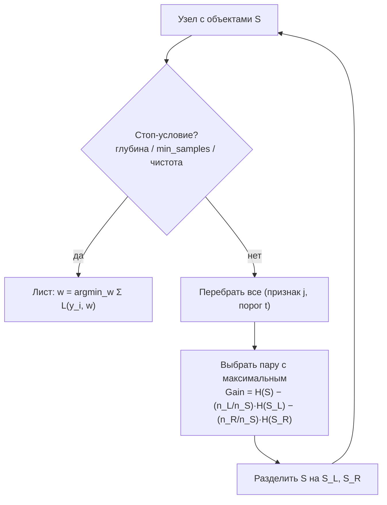

# Решающие деревья

> **Зачем эта глава.** Дерево решений — базовый кирпич всего табличного ML: из него собраны
> и случайный лес, и весь градиентный бустинг. После этой главы вы сможете вывести критерии
> Джини и энтропии и объяснить, чем они отличаются от доли ошибок; понять, почему жадное
> построение — это осознанный компромисс, а не оптимум; грамотно обрезать дерево;
> и — самое практически важное — не попасться на ловушку встроенных важностей признаков.

**Уровень:** 🌱 база → 🧠 middle+
**Предварительно нужно:** [постановка задачи обучения](01-learning-theory.md), [метрики качества](04-metrics.md), [теория информации](../01-math/05-information-theory.md)
**Как проработать:** чтение + вывод формул + код

---

## Карта главы

- [1. Интуиция: зачем вообще кусочно-постоянная модель](#1-интуиция-зачем-вообще-кусочно-постоянная-модель) — какую проблему закрывает дерево
- [2. Дерево как разбиение пространства на прямоугольники](#2-дерево-как-разбиение-пространства-на-прямоугольники) — что такое дерево как функция
- [3. Критерии информативности](#3-критерии-информативности) — вывод Джини, энтропии, дисперсии и почему не доля ошибок
- [4. Жадное построение и его цена](#4-жадное-построение-и-его-цена) — NP-полнота, XOR, близорукость
- [5. Пропуски и категории](#5-пропуски-и-категории) — суррогатные сплиты и альтернативы
- [6. Обрезка: cost-complexity pruning](#6-обрезка-cost-complexity-pruning) — полный алгоритм
- [7. Почему деревья нестабильны](#7-почему-деревья-нестабильны) — источник дисперсии и мостик к ансамблям
- [8. Важность признаков и её ловушка](#8-важность-признаков-и-её-ловушка) — смещение MDI
- [9. Компромиссы и границы применимости](#9-компромиссы-и-границы-применимости)
- [10. Подводные камни](#10-подводные-камни)
- [11. Проверь себя](#11-проверь-себя)
- [12. Практика](#12-практика)
- [13. Что читать дальше](#13-что-читать-дальше)

---

## 1. Интуиция: зачем вообще кусочно-постоянная модель

Линейная модель, которую мы разбирали в [главе 2](02-linear-models.md), даёт предсказание
$\hat y = w^\top x$. У неё есть жёсткое встроенное допущение: **эффект каждого признака
одинаков во всех точках пространства**. Прибавили к возрасту год — вклад в прогноз изменился
на $w_{\text{возраст}}$ независимо от того, живёт клиент в Москве или в Норильске.

Теперь возьмём типичную табличную задачу — скоринг заявки на кредит. Реальная зависимость
там выглядит так: «если доход выше 200 тысяч, то кредитная история почти не важна;
если ниже 50 тысяч — важна только она; а между 50 и 200 всё решает отношение платежа
к доходу». Это **взаимодействие** (interaction): вклад одного признака зависит от значений
других. Линейной моделью такое ловится только вручную — надо догадаться и выписать
произведения признаков.

Дерево решений устроено ровно под эту логику. Оно разрезает пространство признаков
на прямоугольные ячейки последовательными вопросами вида «признак $j$ меньше порога $t$?»
и в каждой ячейке выдаёт константу. Никаких предположений о форме зависимости, никакого
масштабирования, никаких требований к распределению — только рекурсивное деление.

> 🌱 **База.** Дерево — это формализованный список вопросов «да/нет», как в медицинском
> опроснике: «температура выше 38? → есть кашель? → был контакт с больным?». Каждый путь
> от корня до листа — одно правило. Модель отвечает не формулой, а тем, в какой лист
> вы попали.

Плата за эту гибкость — три вещи, о которых и будет вся глава: дерево строится **жадно**
(значит, не оптимально), оно **нестабильно** (значит, его надо усреднять) и его встроенные
**важности признаков врут** (значит, по ним нельзя принимать решения). Разберём каждую.

---

## 2. Дерево как разбиение пространства на прямоугольники

Пусть дана обучающая выборка $\{(x_i, y_i)\}_{i=1}^{n}$, где $x_i \in \mathbb{R}^d$ — вектор
признаков объекта $i$, $y_i$ — ответ ($y_i \in \{1,\dots,K\}$ для классификации на $K$ классов,
$y_i \in \mathbb{R}$ для регрессии), $n$ — число объектов, $d$ — число признаков.

Дерево задаёт разбиение пространства $\mathbb{R}^d$ на $T$ непересекающихся областей
$R_1, \dots, R_T$ (листья) и предсказывает:

$$
f(x) \;=\; \sum_{j=1}^{T} w_j \,\mathbb{1}\big[x \in R_j\big]
$$

где $R_j \subset \mathbb{R}^d$ — область (лист) номер $j$, $w_j$ — константа-предсказание
в этом листе, $\mathbb{1}[\cdot]$ — индикатор, $T$ — число листьев.

Важное ограничение: области $R_j$ не произвольные, а **осепараллельные прямоугольники**
(axis-aligned boxes), потому что каждый внутренний узел проверяет одно условие
$x^{(j)} \le t$ по одному признаку. Дерево не умеет провести диагональную границу — оно
аппроксимирует её лесенкой.

Значение в листе выбирается так, чтобы минимизировать потери внутри листа:

$$
w_j \;=\; \arg\min_{w} \sum_{i \,:\, x_i \in R_j} L(y_i, w)
$$

где $L$ — функция потерь. Для MSE это среднее $\bar y_{R_j}$, для MAE — медиана, для
классификации по доле ошибок — мажоритарный класс, а `predict_proba` возвращает доли
классов в листе.

Остаётся главный вопрос: **как выбрать сами области**? Перебрать все разбиения нельзя, поэтому
их строят рекурсивно сверху вниз, и на каждом шаге нужен численный ответ на вопрос
«насколько хорош этот сплит».



---

## 3. Критерии информативности

Обозначим через $S$ множество объектов текущего узла, $|S| = n_S$. Сплит делит его
на $S_L$ и $S_R$ размеров $n_L$ и $n_R$, $n_L + n_R = n_S$. Мерой «неоднородности» узла
назовём функцию $H(S)$ — impurity. Выигрыш от сплита:

$$
\mathrm{Gain}(S, j, t) \;=\; H(S) \;-\; \frac{n_L}{n_S} H(S_L) \;-\; \frac{n_R}{n_S} H(S_R)
$$

где $j$ — номер признака, $t$ — порог, а веса $n_L/n_S$ и $n_R/n_S$ нужны, чтобы маленький
чистый лист не перевешивал большой грязный.

Осталось выбрать $H$. И вот здесь есть неочевидное требование.

### 3.1 Почему $H$ обязана быть вогнутой

Обозначим вектор долей классов в узле $p = (p_1, \dots, p_K)$, где
$p_k = \frac{1}{n_S}\sum_{i \in S} \mathbb{1}[y_i = k]$. Заметьте ключевое соотношение:
доли классов родителя — это выпуклая комбинация долей потомков,

$$
p^{S} \;=\; \frac{n_L}{n_S}\, p^{S_L} \;+\; \frac{n_R}{n_S}\, p^{S_R}
$$

потому что счётчики классов просто складываются. Если $H$ **вогнута** как функция от $p$,
то по неравенству Йенсена

$$
H\!\left(\frac{n_L}{n_S} p^{S_L} + \frac{n_R}{n_S} p^{S_R}\right)
\;\ge\;
\frac{n_L}{n_S} H(p^{S_L}) + \frac{n_R}{n_S} H(p^{S_R})
$$

то есть $\mathrm{Gain} \ge 0$ **всегда**. Разбиение никогда не может увеличить средневзвешенную
неоднородность. Это не косметическое свойство: без него алгоритм мог бы выбирать сплиты
с отрицательным выигрышем, и критерий перестал бы быть критерием.

> 📐 **Разбор формулы.** Вогнутость означает «график лежит выше хорды». Родительский узел —
> это точка на отрезке между двумя дочерними распределениями. Значение вогнутой функции
> в точке отрезка не меньше, чем линейная интерполяция между концами — а линейная
> интерполяция здесь и есть средневзвешенная неоднородность потомков. Отсюда $\mathrm{Gain}\ge 0$.

### 3.2 Джини

$$
H_{\mathrm{Gini}}(S) \;=\; \sum_{k=1}^{K} p_k (1 - p_k) \;=\; 1 - \sum_{k=1}^{K} p_k^2
$$

где $p_k$ — доля объектов класса $k$ в узле, $K$ — число классов.

У этой формулы есть прямой вероятностный смысл, и на собеседовании его любят спрашивать.
Представьте классификатор, который на объекте из узла $S$ выдаёт класс, **случайно
выбирая его из распределения $p$** узла. Вероятность правильного ответа для истинного класса
$k$ равна $p_k$, а вероятность встретить объект класса $k$ — тоже $p_k$. Значит, вероятность
ошибки:

$$
\Pr[\text{ошибка}] \;=\; \sum_{k=1}^{K} p_k \cdot (1 - p_k) \;=\; H_{\mathrm{Gini}}(S)
$$

Джини — это **ожидаемая доля ошибок случайного классификатора, сэмплирующего из распределения
узла**. Максимум при равномерном распределении: $H_{\mathrm{Gini}} = 1 - 1/K$. Минимум 0 —
в чистом узле.

Второе полезное прочтение: $p_k(1-p_k) = \mathrm{Var}\big(\mathbb{1}[y = k]\big)$. Джини —
это сумма дисперсий индикаторов классов, то есть буквально тот же критерий дисперсии,
что используется в регрессии.

### 3.3 Энтропия

$$
H_{\mathrm{Ent}}(S) \;=\; -\sum_{k=1}^{K} p_k \log_2 p_k
$$

с соглашением $0 \log 0 = 0$. Это [энтропия Шеннона](../01-math/05-information-theory.md):
среднее число бит, нужное для кодирования метки объекта из узла. Выигрыш
$\mathrm{Gain}$ с энтропией называют **приростом информации** (information gain), и он равен
взаимной информации между меткой и результатом сплита.

Максимум при равномерном распределении: $\log_2 K$ бит. Для $K=2$ это ровно 1 бит.

### 3.4 Насколько Джини и энтропия различаются

Возьмём энтропию в натуральных единицах, $H = -\sum_k p_k \ln p_k$, и разложим логарифм.
Положим $u_k = 1 - p_k$, тогда $\ln p_k = \ln(1 - u_k) = -u_k - \frac{u_k^2}{2} - \dots$
Подставим:

$$
-\sum_{k} p_k \ln p_k
\;=\; \sum_{k} p_k \left(u_k + \frac{u_k^2}{2} + \dots\right)
\;=\; \underbrace{\sum_{k} p_k (1 - p_k)}_{H_{\mathrm{Gini}}} \;+\; \underbrace{\sum_{k} p_k \frac{(1-p_k)^2}{2} + \dots}_{\text{члены высших порядков}}
$$

Джини — это разложение энтропии по первому порядку. Отсюда практический вывод: **они
почти никогда не приводят к разным деревьям**. Энтропия чуть сильнее штрафует узлы, где
один класс близок к нулевой доле (логарифм уходит в минус бесконечность), поэтому
чуть охотнее выделяет мелкие чистые группы. Джини дешевле считать — нет логарифма.
В sklearn дефолт `criterion='gini'`, и менять его ради качества почти всегда бессмысленно.

> 💬 **На собеседовании.** Спросят: «В чём разница между критерием Джини и энтропией,
> что выбрать?»
> Хороший ответ: обе — вогнутые меры неоднородности, обе максимальны на равномерном
> распределении и равны нулю на чистом узле; Джини — это разложение энтропии до первого
> порядка, поэтому деревья получаются почти одинаковыми, а разница в качестве обычно
> в пределах шума. Джини считается быстрее (нет логарифма), энтропия чуть агрессивнее
> к редким классам. Практический выбор — оставить дефолт и потратить время на глубину
> и обрезку, они влияют на порядок сильнее.
> Плохой ответ: «энтропия точнее» или «Джини для регрессии, энтропия для классификации».

### 3.5 Почему не доля ошибок

Казалось бы, зачем эти конструкции, если нас интересует accuracy — возьмём
$H_{\mathrm{Err}}(S) = 1 - \max_k p_k$. Эта функция вогнута, но **не строго**: она
кусочно-линейна. Из-за этого она даёт нулевой выигрыш там, где сплит на самом деле
полезен. Классический пример (он есть в ESL, гл. 9.2, и его прямо просят разобрать
на собеседованиях):

Родительский узел: 400 объектов класса 0 и 400 класса 1.

- **Сплит A**: $(300, 100)$ и $(100, 300)$.
- **Сплит B**: $(200, 400)$ и $(200, 0)$.

Оба дают ровно 200 ошибок из 800, то есть по доле ошибок они **неразличимы**. Но сплит B
породил идеально чистый лист — с ним дальше работать намного проще.

```python
import numpy as np

def gini(counts):
    p = np.asarray(counts, dtype=float)
    p = p / p.sum()
    return 1.0 - np.sum(p ** 2)

def entropy(counts):
    p = np.asarray(counts, dtype=float)
    p = p / p.sum()
    p = p[p > 0]                       # соглашение 0·log0 = 0
    return -np.sum(p * np.log2(p))

def misclass(counts):
    p = np.asarray(counts, dtype=float)
    p = p / p.sum()
    return 1.0 - p.max()

def weighted(children, crit):
    """Средневзвешенная неоднородность потомков — вычитаемое в формуле Gain."""
    total = sum(sum(c) for c in children)
    return sum(sum(c) / total * crit(c) for c in children)

parent  = [400, 400]
split_a = [[300, 100], [100, 300]]
split_b = [[200, 400], [200, 0]]

for name, crit in [("доля ошибок", misclass), ("Джини", gini), ("энтропия", entropy)]:
    print(f"{name:12s} родитель={crit(parent):.4f}  "
          f"A={weighted(split_a, crit):.4f}  B={weighted(split_b, crit):.4f}")
# доля ошибок  родитель=0.5000  A=0.2500  B=0.2500   ← ничья, критерий слеп
# Джини        родитель=0.5000  A=0.3750  B=0.3333   ← B лучше
# энтропия     родитель=1.0000  A=0.8113  B=0.6887   ← B лучше
```

Строгая вогнутость Джини и энтропии — это и есть то, что позволяет им различать
«одинаково точные, но по-разному полезные» сплиты. Долю ошибок используют не при
построении, а при **обрезке** дерева (раздел 6), где нас уже интересует именно итоговое
качество, а не потенциал для дальнейшего деления.

### 3.6 Регрессия: критерий дисперсии

Для вещественного таргета берут

$$
H_{\mathrm{Var}}(S) \;=\; \frac{1}{n_S}\sum_{i \in S} \big(y_i - \bar y_S\big)^2,
\qquad \bar y_S = \frac{1}{n_S}\sum_{i \in S} y_i
$$

Это `criterion='squared_error'` в sklearn. У выигрыша здесь есть замечательно наглядная
замкнутая форма. Обозначим $\mathrm{SSE}(S) = \sum_{i\in S}(y_i - \bar y_S)^2$ — сумму
квадратов отклонений. Разложим сумму по родителю через потомков, используя тождество
$\sum_{i\in L}(y_i - \bar y_S)^2 = \mathrm{SSE}(S_L) + n_L(\bar y_L - \bar y_S)^2$:

$$
\mathrm{SSE}(S) = \mathrm{SSE}(S_L) + \mathrm{SSE}(S_R) + n_L(\bar y_L - \bar y_S)^2 + n_R(\bar y_R - \bar y_S)^2
$$

Подставим $\bar y_S = \frac{n_L \bar y_L + n_R \bar y_R}{n_S}$, откуда
$\bar y_L - \bar y_S = \frac{n_R}{n_S}(\bar y_L - \bar y_R)$ и симметрично
$\bar y_R - \bar y_S = \frac{n_L}{n_S}(\bar y_R - \bar y_L)$. Тогда

$$
n_L(\bar y_L - \bar y_S)^2 + n_R(\bar y_R - \bar y_S)^2
= \frac{n_L n_R^2 + n_R n_L^2}{n_S^2}(\bar y_L - \bar y_R)^2
= \frac{n_L n_R}{n_S}(\bar y_L - \bar y_R)^2
$$

Итого снижение суммы квадратов от сплита:

$$
\boxed{\;\mathrm{SSE}(S) - \mathrm{SSE}(S_L) - \mathrm{SSE}(S_R) \;=\; \frac{n_L\, n_R}{n_S}\,\big(\bar y_L - \bar y_R\big)^2\;}
$$

где $\bar y_L, \bar y_R$ — средние таргета в левой и правой частях.

> 📐 **Разбор формулы.** Читайте её как произведение двух вещей. Множитель
> $(\bar y_L - \bar y_R)^2$ — насколько сильно сплит **разводит** средние: чем дальше
> ушли группы, тем ценнее. Множитель $\frac{n_L n_R}{n_S}$ — насколько сплит
> **сбалансирован**: при $n_L = n_R = n_S/2$ он равен $n_S/4$ (максимум), а при
> $n_L = 1$ он равен примерно 1 (минимум). Отсюда сразу видно, почему деревья не любят
> отрезать по одному объекту: даже гигантская разница средних умножается на единицу.
> И одновременно видно, откуда берётся склонность к переобучению на выбросах: один
> объект с $y = 10^6$ создаёт разницу средних, которая перевесит любой баланс.

---

## 4. Жадное построение и его цена

Мы строим дерево рекурсивно: в каждом узле перебираем все признаки и все пороги, берём
лучший сплит, делим, повторяем. Это **жадный алгоритм** (greedy): решение в узле
принимается без учёта того, что произойдёт ниже.

Почему не построить оптимальное дерево? Потому что это доказуемо неподъёмно: задача
построения бинарного решающего дерева, оптимального по числу узлов, — NP-полная
(Hyafil & Rivest, 1976). Число возможных деревьев растёт быстрее любого разумного
бюджета: уже для $d$ бинарных признаков и глубины 3 число структур измеряется
миллионами, а на непрерывных признаках порогов $O(n)$ на признак.

### Стоимость перебора

Разберём, что именно происходит в узле, — это пригодится в [главе про библиотеки
бустинга](09-boosting-in-practice.md). Для непрерывного признака кандидатов на порог
$n_S - 1$ (середины между соседними уникальными значениями). Если значения признака
предварительно отсортированы, можно пройти их один раз слева направо, накапливая
статистики левой части, и получить все $\mathrm{Gain}$ за $O(n_S)$. По всем признакам —
$O(d \cdot n_S)$ на узел, плюс однократная сортировка $O(d\, n \log n)$. На всём дереве
глубины $D$ суммарно $O(D \cdot d \cdot n)$, потому что на каждом уровне объекты
распределены по узлам без пересечений.

Отсюда сразу практическая оценка: на $n = 10^6$, $d = 100$, $D = 8$ это порядка
$10^9$ операций — минуты на одном ядре. На $n = 10^8$ точный перебор уже нереален,
и появляются гистограммные приближения.

### Цена близорукости

Жадность стоит нам конкретной вещи: критерий не видит **взаимодействий, которые
проявляются только после двух сплитов**. Канонический пример — XOR.

```python
import numpy as np
from sklearn.tree import DecisionTreeClassifier, export_text

rng = np.random.default_rng(42)
n = 4000
x1 = rng.integers(0, 2, n)
x2 = rng.integers(0, 2, n)
y = x1 ^ x2                                    # XOR: по отдельности x1 и x2 независимы от y
x3 = np.where(rng.random(n) < 0.6, y, 1 - y)   # слабый признак: совпадает с y в 60% случаев

X = np.column_stack([x1, x2, x3]).astype(float)

for depth in (2, 3, 4):
    tree = DecisionTreeClassifier(max_depth=depth, random_state=0).fit(X, y)
    print(f"max_depth={depth}: accuracy на трейне = {tree.score(X, y):.3f}")

print(export_text(DecisionTreeClassifier(max_depth=2, random_state=0).fit(X, y),
                  feature_names=["x1", "x2", "x3"]))
# max_depth=2: ~0.60  — корень ушёл на x3, XOR не выучен
# max_depth=3: ~1.00  — уровень потрачен зря, но глубины хватило
```

Что произошло. Для $x_1$ и $x_2$ выигрыш **ровно нулевой**: маргинально каждый из них
независим от $y$. Для $x_3$ выигрыш положительный. Жадный критерий обязан выбрать $x_3$ —
и тратит корень на признак, который ничего фундаментально не объясняет. Настоящая
структура находится только на уровень ниже, и то если глубины хватило.

Последствия в реальных задачах:

- при агрессивной обрезке или `min_impurity_decrease > 0` XOR-подобная структура вырезается
  под корень: сплит с нулевым выигрышем просто не делается, и дерево останавливается;
- в высокой размерности среди сотен шумовых признаков всегда найдётся такой, у которого
  случайный выигрыш выше нулевого — и он займёт корень;
- чтобы выучить взаимодействие $k$ признаков, дереву нужна глубина не меньше $k$, а на
  каждом уровне число объектов делится примерно пополам — глубокие взаимодействия
  требуют экспоненциально много данных.

> 🧠 **Middle+.** Именно поэтому в бустинге неглубокие деревья работают лучше, чем
> кажется: `max_depth=6` означает «модель учитывает взаимодействия до шестого порядка»,
> но реально основную работу делают взаимодействия 2–3 порядка, а остальное добирается
> суммой сотен деревьев. Ансамбль частично лечит близорукость одного дерева: то, что
> первое дерево не заметило, попадает в остатки и достанется следующему.

> ⚠️ **Типичная ошибка.** Увидев низкое качество дерева, крутить `criterion` и
> `min_samples_split` → не получить эффекта → решить, что «деревья тут не работают».
> На самом деле порядок влияния гиперпараметров такой: глубина/число листьев ≫
> минимальные размеры узлов ≫ обрезка ≫ критерий. Критерий стоит трогать последним
> или не трогать вовсе.

---

## 5. Пропуски и категории

### 5.1 Что делать с пропуском

Дерево — одна из немногих моделей, которая может обрабатывать пропуски **честно**,
без придумывания значения. Существует три подхода, и их путают.

**Подход 1: отдельная ветвь / направление по умолчанию.** Объекты с пропуском в
признаке сплита отправляются целиком в одну сторону, причём сторона выбирается
максимизацией выигрыша: при переборе порога считают $\mathrm{Gain}$ дважды — с
пропусками слева и с пропусками справа — и запоминают лучший вариант.
Это и есть **sparsity-aware split finding** XGBoost; современный scikit-learn
(версии ≥ 1.4) делает то же самое для `DecisionTreeClassifier`/`Regressor`
со `splitter='best'`. Стоимость — ноль: перебор всё равно идёт только по
непропущенным значениям.

Ключевая мысль: такой подход **использует сам факт пропуска как сигнал**. Если
«не указан доход» коррелирует с дефолтом — модель это выучит. Импутация медианой
эту информацию уничтожает.

**Подход 2: суррогатные сплиты (surrogate splits).** Это оригинальный ответ CART
(Breiman et al., 1984). Идея: если основной признак недоступен, воспользуемся другим,
который делит выборку **похожим образом**.

Пусть основной сплит $s^*$ отправляет долю $\pi_L$ объектов налево и $\pi_R = 1-\pi_L$ направо.
Для кандидата-суррогата $s$ (сплит по другому признаку) обозначим через $p(s^*, s)$ долю
объектов, у которых оба признака доступны и которые $s$ отправляет **в ту же сторону**,
что и $s^*$. Тогда мера предсказательной связи:

$$
\lambda(s^*, s) \;=\; \frac{\min(\pi_L, \pi_R) \;-\; \big(1 - p(s^*, s)\big)}{\min(\pi_L, \pi_R)}
$$

где $\min(\pi_L, \pi_R)$ — доля ошибок «слепого» правила «отправить всех в большую ветвь»,
а $1 - p(s^*, s)$ — доля ошибок суррогата.

> 📐 **Разбор формулы.** В числителе — насколько суррогат лучше слепого правила,
> в знаменателе — нормировка на ошибку слепого правила. $\lambda = 1$ означает
> идеальное воспроизведение основного сплита, $\lambda \le 0$ — суррогат бесполезен
> (не лучше, чем «всех в большую сторону»), такие кандидаты отбрасывают. Суррогаты
> хранят в узле упорядоченными по $\lambda$; на инференсе перебирают их по очереди,
> пока не найдётся признак с непропущенным значением.

```python
import numpy as np

def surrogate_lambda(primary_left, x_sur, thresholds):
    """λ по CART: насколько хорошо признак-суррогат воспроизводит основной сплит.

    primary_left : bool-массив, кого основной сплит отправил налево
    x_sur        : значения признака-кандидата (без пропусков)
    thresholds   : пороги-кандидаты для суррогата
    """
    pi_left = primary_left.mean()
    blind = min(pi_left, 1.0 - pi_left)          # ошибка правила «всех в большую ветвь»
    if blind == 0.0:                             # вырожденный сплит — суррогат не нужен
        return None
    best = (None, None, -np.inf)
    for t in thresholds:
        for flip in (False, True):               # суррогат может быть «зеркальным»
            pred_left = (x_sur <= t) ^ flip
            err = (pred_left != primary_left).mean()
            lam = (blind - err) / blind
            if lam > best[2]:
                best = (t, flip, lam)
    return best                                   # (порог, зеркальность, λ)

rng = np.random.default_rng(0)
n = 5000
age = rng.normal(40, 12, n)
income = 0.8 * age + rng.normal(0, 6, n)          # коррелирует с возрастом
primary = age <= 40                                # основной сплит по возрасту

t_grid = np.quantile(income, np.linspace(0.05, 0.95, 19))
print(surrogate_lambda(primary, income, t_grid))
# (~35, False, ~0.6) — доход воспроизводит сплит по возрасту заметно лучше слепого правила
```

Важная честная оговорка: **scikit-learn суррогатные сплиты не реализует** — ни сейчас,
ни исторически. Их поддерживают `rpart` в R, коммерческие реализации CART и (частично)
`party`/`partykit`. Если на собеседовании спрашивают «как sklearn обрабатывает пропуски
в дереве», правильный ответ — «направлением по умолчанию, а не суррогатами».

**Подход 3: импутация до модели.** Работает, но платит информацией о самом факте
пропуска. Компромисс, который часто и используют на практике: импутировать значение
**и добавить бинарный признак-индикатор** `is_missing`. Тогда дерево может выучить
и «пропуск сам по себе сигнал», и «значение примерно такое».

> 💬 **На собеседовании.** Спросят: «Как дерево обрабатывает пропуски?»
> Хороший ответ: назовите три механизма и скажите, кто что использует. CART —
> суррогатные сплиты по мере предсказательной связи $\lambda$; XGBoost/LightGBM/
> современный sklearn — выученное направление по умолчанию, которое выбирается по
> тому же критерию выигрыша; классический путь — импутация плюс индикатор пропуска.
> Отдельно подчеркните: пропуск часто **информативен**, и слепая импутация медианой
> стирает сигнал. Плохой ответ: «деревья умеют работать с пропусками» без объяснения
> механизма, или «sklearn использует суррогатные сплиты» — это неверно.

### 5.2 Категориальные признаки

Для категориального признака с $q$ уровнями число возможных бинарных разбиений
множества уровней равно $2^{q-1} - 1$. При $q = 20$ это уже полмиллиона — перебор
дорог, а главное, при большом $q$ дерево почти гарантированно найдёт разбиение,
идеально режущее шум.

Для двух случаев есть точный трюк, снимающий экспоненту:

- **бинарная классификация**: отсортируйте уровни по доле положительного класса
  $p_k = \Pr[y = 1 \mid x^{(j)} = k]$ и рассматривайте только разбиения-префиксы.
  Оптимальное по Джини/энтропии разбиение гарантированно окажется среди этих
  $q-1$ вариантов (результат Fisher, 1958; в контексте деревьев — Breiman et al., 1984);
- **регрессия с MSE**: то же самое, но сортировка по среднему таргету $\bar y_k$ в уровне.

Именно этот приём используют LightGBM и CatBoost для нативной работы с категориями.
sklearn категории напрямую не поддерживает — их надо кодировать, и это отдельная
большая тема ([глава 14](14-feature-engineering.md)).

> ⚠️ **Типичная ошибка.** Закодировать категорию с 5000 уровней через `LabelEncoder`
> и подать в дерево → дерево начнёт делать сплиты вида `category_id <= 2317`, которые
> не имеют никакого смысла (порядок кодов произволен), но отлично режут обучающую
> выборку → катастрофическое переобучение. Либо one-hot (для малой мощности), либо
> target encoding с защитой от утечки, либо библиотека с нативной поддержкой.

---

## 6. Обрезка: cost-complexity pruning

Полностью выращенное дерево доводит ошибку на трейне до нуля: в пределе каждый объект
в своём листе. Значит, нужен механизм ограничения сложности. Их два семейства.

**Предобрезка** (pre-pruning, early stopping) — останавливать рост по правилам:
`max_depth`, `min_samples_split`, `min_samples_leaf`, `min_impurity_decrease`,
`max_leaf_nodes`. Дёшево, но близоруко ровно по той же причине, что и жадность:
сплит с нулевым выигрышем может открывать дорогу отличному сплиту уровнем ниже
(вспомните XOR).

**Постобрезка** (post-pruning) — вырастить дерево полностью, а потом отрезать ветви.
Она дороже, но не страдает от близорукости. Каноническая схема — **cost-complexity
pruning** из CART.

### 6.1 Функционал

Для дерева $T$ определим

$$
R_\alpha(T) \;=\; R(T) \;+\; \alpha\, |\tilde T|
$$

где $R(T) = \sum_{j=1}^{|\tilde T|} \frac{n_j}{n} H(S_j)$ — суммарная взвешенная
неоднородность листьев (для классификации обычно берут долю ошибок, для регрессии — SSE),
$|\tilde T|$ — число листьев дерева $T$, $\alpha \ge 0$ — цена одного листа.

При $\alpha = 0$ минимум достигается на полном дереве. При росте $\alpha$ выгодно
схлопывать ветви. Ключевой результат Бреймана: **для каждого $\alpha$ существует
единственное минимальное поддерево $T(\alpha)$, минимизирующее $R_\alpha$, и вся
последовательность таких поддеревьев вложена**:

$$
T_0 \supset T_1 \supset T_2 \supset \dots \supset \{\text{корень}\},
\qquad 0 = \alpha_0 < \alpha_1 < \dots < \alpha_{\max}
$$

То есть вместо перебора всех $\alpha$ достаточно построить конечную цепочку деревьев.

### 6.2 Алгоритм «слабейшего звена»

Для внутреннего узла $t$ обозначим $T_t$ — поддерево с корнем в $t$, $R(t)$ — вклад
узла, если схлопнуть его в лист. Сравним:

- оставить поддерево: $R(T_t) + \alpha |\tilde T_t|$;
- схлопнуть в лист: $R(t) + \alpha \cdot 1$.

Они сравниваются при

$$
g(t) \;=\; \frac{R(t) - R(T_t)}{|\tilde T_t| - 1}
$$

где $|\tilde T_t|$ — число листьев в поддереве $T_t$. Величина $g(t)$ — это то значение
$\alpha$, при котором поддерево перестаёт окупаться.

Алгоритм: найти узел с минимальным $g(t)$ («слабейшее звено»), схлопнуть его, записать
$\alpha_{k+1} = \min_t g(t)$, пересчитать и повторять до корня. Получаем цепочку деревьев
$T_0 \supset T_1 \supset \dots$ и соответствующих $\alpha_k$.

**Выбор $\alpha$** делается кросс-валидацией. Бреймановская рекомендация — правило
**одной стандартной ошибки** (1-SE rule): взять не $\alpha$ с минимальной CV-ошибкой,
а самое большое $\alpha$, чья ошибка не превышает минимум плюс одну стандартную ошибку.
Это даёт более простое дерево при статистически неотличимом качестве.

```python
import numpy as np
from sklearn.datasets import load_breast_cancer
from sklearn.model_selection import train_test_split, cross_val_score
from sklearn.tree import DecisionTreeClassifier
from sklearn.metrics import roc_auc_score

X, y = load_breast_cancer(return_X_y=True)
X_tr, X_te, y_tr, y_te = train_test_split(X, y, test_size=0.3, stratify=y, random_state=0)

full = DecisionTreeClassifier(random_state=0).fit(X_tr, y_tr)

# sklearn возвращает ровно ту цепочку α «слабейшего звена», что описана выше
path = full.cost_complexity_pruning_path(X_tr, y_tr)
alphas = path.ccp_alphas[:-1]        # последняя α схлопывает дерево в корень — она бесполезна

scores = [cross_val_score(DecisionTreeClassifier(random_state=0, ccp_alpha=a),
                          X_tr, y_tr, cv=5, scoring="roc_auc").mean()
          for a in alphas]

best_alpha = alphas[int(np.argmax(scores))]
pruned = DecisionTreeClassifier(random_state=0, ccp_alpha=best_alpha).fit(X_tr, y_tr)

print(f"листьев: {full.get_n_leaves()} -> {pruned.get_n_leaves()},  alpha={best_alpha:.5f}")
print("тест ROC-AUC полное :", round(roc_auc_score(y_te, full.predict_proba(X_te)[:, 1]), 4))
print("тест ROC-AUC после обрезки:", round(roc_auc_score(y_te, pruned.predict_proba(X_te)[:, 1]), 4))
# типичный результат: листьев ~25 -> ~6, AUC растёт примерно с 0.92 до 0.96
```

> 🧠 **Middle+.** В ансамблях обрезку почти не используют, и это не лень. В случайном
> лесе деревья намеренно растят до конца: нам нужны модели с **низким смещением и высокой
> дисперсией**, потому что дисперсию убьёт усреднение (см. [следующую главу](07-bagging-random-forest.md)).
> В бустинге, наоборот, деревья намеренно мелкие — там регуляризация зашита в shrinkage
> и в штраф за лист $\gamma$ (см. [главу 7, §5.4](08-gradient-boosting.md#54-критерий-выбора-сплита)). Cost-complexity
> pruning остаётся актуальной там, где дерево — конечная модель: интерпретируемые
> правила для бизнеса, медицина, регуляторные требования.

---

## 7. Почему деревья нестабильны

Одно дерево — модель с высокой дисперсией. Это не эмпирическое наблюдение, а следствие
устройства алгоритма, и объяснить механизм на собеседовании умеют далеко не все.

**Источник 1: дискретный выбор в корне.** Пусть два признака дают выигрыш 0.0412 и 0.0409.
Разница — шум. Но алгоритм не усредняет их, он **выбирает один**, и это решение
детерминирует всё дерево ниже. Малое возмущение данных переставляет их местами —
и структура меняется целиком.

**Источник 2: иерархичность.** Ошибка в корне не «размазывается», а умножается: каждый
из двух потомков теперь решает другую задачу на другой подвыборке.

**Источник 3: пороги привязаны к конкретным точкам данных.** Порог — середина между
двумя соседними значениями признака. Удалили один объект — порог сдвинулся.

Проверим руками:

```python
import numpy as np
from collections import Counter
from sklearn.datasets import load_breast_cancer
from sklearn.tree import DecisionTreeClassifier

data = load_breast_cancer()
X, y, names = data.data, data.target, data.feature_names
rng = np.random.default_rng(0)

roots = []
for _ in range(100):
    idx = rng.choice(len(y), size=len(y), replace=True)   # бутстрап-выборка того же размера
    t = DecisionTreeClassifier(max_depth=4, random_state=0).fit(X[idx], y[idx])
    roots.append(names[t.tree_.feature[0]])               # признак в корневом узле

for feat, cnt in Counter(roots).most_common():
    print(f"{cnt:4d}  {feat}")
# вы увидите 3-6 разных признаков в корне: они сильно коррелированы между собой,
# и выбор между ними определяется шумом бутстрапа
```

> 💬 **На собеседовании.** Спросят: «Почему одно дерево почти никогда не используют
> в проде, а лес и бустинг — постоянно?»
> Хороший ответ: у дерева высокая дисперсия по построению — жадный дискретный выбор
> в каждом узле делает модель разрывной функцией обучающей выборки. Смещение при этом
> можно сделать сколь угодно малым (растить глубже). Такая комбинация — идеальный вход
> для усреднения: бэггинг гасит дисперсию, почти не трогая смещение. Бустинг решает
> обратную задачу — берёт неглубокие деревья с высоким смещением и снижает смещение
> суммой. Одно дерево применяют там, где нужны читаемые правила и стабильность важнее
> точности.
> Плохой ответ: «одно дерево переобучается» — это верно, но не объясняет, почему сотня
> переобучающихся деревьев работает лучше.

Есть и практическое следствие, о котором редко думают: **нестабильность мешает
эксплуатации**. Переобучили дерево на данных, дополненных неделей новых событий, —
и структура правил изменилась целиком. Бизнесу, который на эти правила смотрит,
объяснить это невозможно. Если нужны стабильные правила, глубину придётся жёстко
ограничить (3–4 уровня) и зафиксировать список признаков.

---

## 8. Важность признаков и её ловушка

Дерево «бесплатно» отдаёт важности признаков. В sklearn это `feature_importances_` —
**mean decrease in impurity** (MDI), она же gain importance:

$$
\mathrm{Imp}(j) \;=\; \frac{1}{Z}\sum_{t \,:\, v(t) = j} \frac{n_t}{n}\,\mathrm{Gain}(t)
$$

где сумма идёт по всем внутренним узлам $t$, в которых сплит сделан по признаку $j$
($v(t)$ — признак узла $t$), $n_t$ — число объектов в узле, $\mathrm{Gain}(t)$ — выигрыш
этого сплита, $Z$ — нормировка, чтобы важности суммировались в единицу.

Формула выглядит невинно, но у неё два серьёзных дефекта.

### 8.1 Смещение в сторону признаков высокой мощности

Признак, у которого больше возможных порогов, получает **больше попыток** найти
случайно удачное разбиение. У бинарного признака порог один. У непрерывного признака
на выборке из $n$ объектов порогов до $n-1$. У категориального с $q$ уровнями —
до $2^{q-1}-1$ разбиений. Максимум по большему множеству кандидатов в среднем выше,
даже если все кандидаты — чистый шум.

Это классический эффект «максимума случайных величин», и он полностью аналогичен
переобучению при переборе гиперпараметров. Проверим:

```python
import numpy as np
import pandas as pd
from sklearn.tree import DecisionTreeClassifier

rng = np.random.default_rng(0)
n = 3000
y = rng.integers(0, 2, size=n)

X = pd.DataFrame({
    "signal_bin":  np.where(rng.random(n) < 0.75, y, 1 - y),  # РЕАЛЬНЫЙ сигнал, точность 75%
    "noise_bin":   rng.integers(0, 2, n),                     # шум, 2 уровня
    "noise_cat10": rng.integers(0, 10, n),                    # шум, 10 уровней
    "noise_cat100": rng.integers(0, 100, n),                  # шум, 100 уровней
    "noise_cont":  rng.normal(size=n),                        # шум, ~n порогов
})

tree = DecisionTreeClassifier(random_state=0).fit(X, y)   # без ограничения глубины
imp = pd.Series(tree.feature_importances_, index=X.columns).sort_values(ascending=False)
print(imp.round(3))
# noise_cont    ~0.55   ← чистый шум на первом месте
# noise_cat100  ~0.25
# signal_bin    ~0.12   ← единственный настоящий признак — на третьем
# noise_cat10   ~0.06
# noise_bin     ~0.01
```

Единственный информативный признак оказался позади двух шумовых. Причина не в данных —
в самой мере: непрерывный шум получил тысячи попыток, бинарный сигнал — одну.

Два усилителя эффекта:

- **MDI считается на обучающей выборке.** Она видит те же самые случайные удачи, которые
  и создали сплиты. Никакой независимой проверки нет по построению;
- **чем глубже дерево, тем хуже.** В глубоких узлах объектов мало, шум легко режется,
  и вклад таких сплитов всё равно попадает в сумму.

Ограничение глубины смягчает проблему, но не убирает: смещение остаётся и в лесе
(Strobl et al., «Bias in random forest variable importance measures», 2007).

### 8.2 Коррелированные признаки делят вклад произвольно

Если два признака почти дублируют друг друга, дерево использует один из них в корне,
и второй остаётся почти без работы. MDI отдаст первому большую важность, второму —
почти нулевую. Перезапустите с другим seed или на другой бутстрап-выборке — они
поменяются местами. Вывод «признак B неважен» здесь — прямая ошибка интерпретации:
верное утверждение — «признак B не добавляет информации **сверх** признака A».

### 8.3 Что делать

| Метод | Что измеряет | Достоинства | Ограничения |
|---|---|---|---|
| MDI (`feature_importances_`) | суммарный вклад в снижение impurity на трейне | бесплатно, есть всегда | смещение к высокой мощности, считается на трейне |
| Permutation importance на **отложенной** выборке | падение метрики при перемешивании признака | измеряет то, что нас правда волнует — качество; нет смещения по мощности | дорого ($d$ проходов), ломается на коррелированных признаках (создаёт нереальные объекты) |
| Drop-column importance | падение метрики при переобучении без признака | самая честная семантика | $d$ переобучений — обычно неподъёмно |
| SHAP (TreeSHAP) | вклад признака в каждое отдельное предсказание | локально и глобально, аддитивно, быстро для деревьев | своя интерпретация при корреляциях, см. [главу 15](15-interpretability.md) |

Минимальный рабочий рецепт: **permutation importance на отложенной выборке, усреднённая
по нескольким сидам**, плюс явный анализ корреляций между топовыми признаками.

```python
from sklearn.inspection import permutation_importance
from sklearn.model_selection import train_test_split

X_tr, X_te, y_tr, y_te = train_test_split(X, y, test_size=0.3, random_state=1, stratify=y)
tree = DecisionTreeClassifier(max_depth=4, random_state=0).fit(X_tr, y_tr)

# ВАЖНО: перемешиваем на ОТЛОЖЕННОЙ выборке — иначе повторим ошибку MDI
r = permutation_importance(tree, X_te, y_te, n_repeats=20, random_state=0, scoring="roc_auc")
print(pd.Series(r.importances_mean, index=X.columns).sort_values(ascending=False).round(4))
# теперь signal_bin с большим отрывом первый, у шумовых признаков важность около нуля
```

> 💬 **На собеседовании.** Спросят: «Продакт-менеджер смотрит на `feature_importances_`
> и требует убрать признаки с нулевой важностью. Что вы ему скажете?»
> Хороший ответ: объяснить два механизма. Первое — MDI смещена к признакам с большим
> числом возможных разбиений: непрерывный шумовой признак стабильно обгоняет полезный
> бинарный, и это воспроизводимо на синтетике за десять строк кода. Второе — при
> корреляции важность достаётся одному из дублей произвольно, поэтому «нулевая важность»
> означает «не добавляет сверх уже взятых», а не «бесполезен». Правильный инструмент
> для решения об удалении — permutation importance на отложенной выборке или прямая
> проверка: убрать признак, переобучить, сравнить метрику с доверительным интервалом.
> Плохой ответ: молча удалить признаки.

---

## 9. Компромиссы и границы применимости

**Дерево — правильный выбор, когда:**

- нужны **читаемые правила**, которые можно показать человеку и защитить перед
  регулятором. Дерево глубины 3–4 — это буквально десяток условий;
- данные разнородные: числа, категории, пропуски вперемешку, и нет времени на
  препроцессинг. Дереву не нужны ни масштабирование, ни нормализация распределений;
- зависимость кусочно-постоянная по своей природе (тарифные сетки, пороговые правила,
  сегменты).

**Дерево проигрывает, когда:**

| Ситуация | Почему | Что вместо |
|---|---|---|
| Настоящая зависимость гладкая или линейная | лесенка из порогов расходует ёмкость на аппроксимацию прямой | линейная модель, GAM |
| Граница классов диагональная | сплиты только осепараллельные, диагональ описывается ступеньками | линейная модель, SVM с ядром, поворот признаков через PCA |
| Нужна экстраполяция за диапазон трейна | крайний лист выдаёт константу — предсказание «замирает» | линейные модели, модели тренда |
| Нужны точные вероятности | доли классов в листе грубы: в листе из 5 объектов возможны только значения 0, 0.2, …, 1 | ансамбли + калибровка ([глава 12](13-imbalance-and-calibration.md)) |
| Мало данных, много признаков | шум режется идеально, обобщения нет | регуляризованная линейная модель |
| Нужна максимальная точность на табличке | одно дерево — почти всегда хуже ансамбля на 5–15 пунктов метрики | случайный лес, бустинг |

> 🌱 **База.** Практический ориентир: одно дерево в продакшене — это либо
> интерпретируемый бейзлайн, либо часть системы бизнес-правил. Как «модель для качества»
> его не берут почти никогда. Но понимать его обязательно: и лес, и бустинг — это
> надстройки над ровно тем алгоритмом, который разобран в разделах 3–4.

---

## 10. Подводные камни

**Дерево «идеально» предсказывает на трейне и случайно — на тесте.**
Симптом: accuracy 1.00 на обучении, около baseline на валидации.
Причина: дефолтный `DecisionTreeClassifier` в sklearn растит дерево до полной чистоты
(`max_depth=None`), то есть до одного объекта в листе.
Что делать: всегда явно задавать `max_depth` или `max_leaf_nodes` + `min_samples_leaf`,
либо использовать `ccp_alpha` с подбором по CV. Дефолты sklearn для дерева — это
«полное переобучение», и это осознанное решение библиотеки (дефолт разумен для
ансамблей, а не для одиночного дерева).

**ID-подобный признак утёк в модель.**
Симптом: почти идеальное качество на кросс-валидации, провал на новых данных;
в топе важностей — `user_id`, `order_id`, `timestamp`.
Причина: признак с $n$ уникальными значениями разрежет выборку как угодно.
Что делать: перед обучением проверять кардинальность признаков
(`X.nunique() / len(X)` близко к 1 — красный флаг) и явно исключать идентификаторы.
Разбор всех видов утечек — в [главе 13](05-validation-and-leakage.md).

**Классы дисбалансированы, дерево предсказывает только мажоритарный.**
Симптом: recall редкого класса равен нулю при высокой accuracy.
Причина: и Джини, и энтропия оптимизируют чистоту без учёта стоимости ошибок;
при доле позитивов 0.5% сплит по редкому классу почти не двигает критерий.
Что делать: `class_weight='balanced'` (взвешивает вклад объектов в счётчики классов),
подбор порога по `predict_proba`, метрики PR-AUC вместо accuracy
([глава 12](13-imbalance-and-calibration.md)).

**Важности используются как «значимость признака для бизнеса».**
Симптом: продуктовые решения принимаются по `feature_importances_`, при перезапуске
топ меняется.
Причина: смещение MDI к высокой мощности и произвольное деление вклада между
коррелированными признаками (раздел 8).
Что делать: permutation importance на отложенной выборке, усреднение по сидам,
доверительные интервалы; для решения «удалять ли» — контрольное переобучение без признака.

**Порог сплита выглядит абсурдно (`возраст <= 41.5`).**
Симптом: бизнес не понимает, почему именно 41.5.
Причина: порог — середина между двумя соседними наблюдёнными значениями, он
привязан к конкретным точкам выборки и не имеет содержательного смысла.
Что делать: если правила пойдут людям — заранее биннинговать признаки по осмысленным
границам и обучать дерево на бинах. Тогда пороги будут «возраст ≤ 40».

**После добавления новых данных структура дерева изменилась целиком.**
Симптом: переобучили на неделю свежих данных — правила другие, объяснить нечем.
Причина: нестабильность (раздел 7); коррелированные признаки меняются местами в корне.
Что делать: ограничить глубину, зафиксировать список признаков, следить за
стабильностью топ-сплитов между переобучениями; если стабильность критична — уходить
в ансамбль и работать с усреднёнными важностями, а не со структурой.

---

## 11. Проверь себя

<details>
<summary><b>🌱 Вопрос.</b> Нужно ли масштабировать признаки перед обучением дерева? Почему?</summary>

**Короткий ответ.** Не нужно. Сплит — это сравнение $x^{(j)} \le t$, и любое строго
монотонное преобразование признака переставляет пороги, но не меняет множество возможных
разбиений выборки.

**Развёрнуто.** Дерево работает не со значениями, а с **порядком** значений внутри
признака. Логарифм, стандартизация, ранговое преобразование — все они сохраняют порядок,
значит, множество кандидатов на разбиение остаётся тем же, и лучший сплит тоже.
Признаки при этом сравниваются **не между собой**, а каждый со своим порогом, поэтому
разные масштабы разных признаков тоже не мешают. Оговорка для middle+: гистограммные
реализации (LightGBM, XGBoost `hist`) бинингуют признак по квантилям, и при экстремально
скошенном распределении логарифмирование может слегка изменить границы бинов — эффект
есть, но он второго порядка.

**Чего ждёт интервьюер:** формулировку «инвариантность к монотонным преобразованиям»,
а не заученное «деревьям скейлинг не нужен».

**Провал:** «нужно, как для любой модели» или «не нужно, потому что дерево — не метрический метод»
(второе звучит похоже на правду, но не объясняет механизм).
</details>

<details>
<summary><b>🎯 Вопрос.</b> Почему в качестве критерия сплита не используют долю ошибок?</summary>

**Короткий ответ.** Она вогнута, но не строго — кусочно-линейна, поэтому даёт нулевой
выигрыш для сплитов, которые реально улучшают структуру.

**Развёрнуто.** Возьмите узел (400, 400). Сплит на (300,100)/(100,300) и сплит на
(200,400)/(200,0) дают ровно по 200 ошибок — по доле ошибок они неразличимы. Но второй
породил идеально чистый лист, что открывает лучшие возможности ниже. Джини (0.375 против
0.333) и энтропия (0.811 против 0.689) оба предпочитают второй. Причина в строгой
вогнутости: она заставляет критерий ценить «чистоту» сильнее, чем линейный по $p$
критерий. Долю ошибок при этом используют на этапе **обрезки**, где нас интересует
именно конечное качество, а не потенциал для дальнейших сплитов.

**Чего ждёт интервьюер:** знания конкретного контрпримера и понимания, что за требованием
стоит вогнутость, обеспечивающая $\mathrm{Gain}\ge 0$.

**Провал:** «доля ошибок недифференцируема» — дерево ничего не дифференцирует, аргумент не тот.
</details>

<details>
<summary><b>🎯 Вопрос.</b> Дерево обучилось, `feature_importances_` показывает, что главный признак —
`transaction_id`. Что произошло?</summary>

**Короткий ответ.** Утечка через идентификатор плюс смещение MDI к признакам высокой
мощности. Признак с $n$ уникальными значениями режет обучающую выборку как угодно.

**Развёрнуто.** Два эффекта накладываются. Первый — сама возможность: у признака с $n$
уникальными значениями есть $n-1$ кандидатов на порог, и почти всегда найдётся такой,
который случайно хорошо делит выборку; в глубоких узлах это тривиально. Второй —
MDI считается на трейне, поэтому эти случайные удачи попадают в сумму без всякой
проверки. Дополнительно `transaction_id` часто монотонно связан со временем, и тогда
это ещё и временная утечка: модель выучивает «после такого-то id фрод участился».
Действия: убрать идентификаторы из фич, проверить кардинальность всех признаков,
пересчитать важности как permutation importance на отложенной выборке, проверить
валидацию на временной сплит.

**Чего ждёт интервьюер:** что вы не просто скажете «утечка», а объясните механику
смещения MDI и предложите правильный инструмент измерения.

**Провал:** «просто уберём этот признак» без объяснения, почему он вообще оказался в топе.
</details>

<details>
<summary><b>🧠 Вопрос.</b> Выведите, чему равно снижение суммы квадратов при сплите в регрессионном дереве.</summary>

**Короткий ответ.** $\mathrm{SSE}(S) - \mathrm{SSE}(S_L) - \mathrm{SSE}(S_R) = \dfrac{n_L n_R}{n_S}\big(\bar y_L - \bar y_R\big)^2$.

**Развёрнуто.** Разложите сумму по родителю: для левой части
$\sum_{i\in L}(y_i - \bar y_S)^2 = \sum_{i\in L}(y_i - \bar y_L)^2 + n_L(\bar y_L - \bar y_S)^2$
(перекрёстный член зануляется, потому что $\sum_{i\in L}(y_i - \bar y_L) = 0$). Аналогично
для правой. Затем подставьте $\bar y_S = \frac{n_L\bar y_L + n_R\bar y_R}{n_S}$, откуда
$\bar y_L - \bar y_S = \frac{n_R}{n_S}(\bar y_L - \bar y_R)$, и сложите два слагаемых.
Читать результат надо как произведение «разведённость средних × сбалансированность
разбиения»: множитель $n_L n_R / n_S$ максимален при равном делении и падает до ~1 при
отрезании одного объекта. Это объясняет, почему деревья не любят отрезать одиночки —
и почему один выброс с огромным $y$ всё же может перевесить баланс.

**Чего ждёт интервьюер:** умения провести разложение, а не процитировать формулу;
и содержательной интерпретации двух множителей.

**Провал:** «критерий — просто дисперсия» без вывода.
</details>

<details>
<summary><b>🎯 Вопрос.</b> Чем предобрезка отличается от постобрезки и что лучше?</summary>

**Короткий ответ.** Предобрезка останавливает рост по правилам (`max_depth`,
`min_samples_leaf`, `min_impurity_decrease`), постобрезка растит дерево полностью
и отрезает ветви по cost-complexity. Постобрезка качественнее, предобрезка дешевле.

**Развёрнуто.** Предобрезка близорука: сплит с нулевым выигрышем может открывать
дорогу отличному сплиту уровнем ниже (XOR — ровно этот случай), а правило
«не делить, если выигрыш мал» такой сплит зарежет. Постобрезка от этого свободна:
дерево уже видело, что там ниже. Cost-complexity pruning минимизирует
$R_\alpha(T) = R(T) + \alpha|\tilde T|$, причём последовательность оптимальных
поддеревьев вложена, поэтому вместо перебора всех $\alpha$ строится конечная цепочка
через величину $g(t) = \frac{R(t)-R(T_t)}{|\tilde T_t|-1}$ («слабейшее звено»), а сам
$\alpha$ выбирается кросс-валидацией, часто с правилом одной стандартной ошибки.
На практике комбинируют: `max_depth` как грубый предохранитель от взрыва времени
обучения плюс `ccp_alpha` для тонкой настройки.

**Чего ждёт интервьюер:** понимания, что близорукость предобрезки — это та же жадность,
что и в самом построении.

**Провал:** «постобрезка — это когда убираем неважные признаки».
</details>

<details>
<summary><b>🧠 Вопрос.</b> Что такое суррогатные сплиты и зачем они нужны?</summary>

**Короткий ответ.** Запасные правила разбиения по другим признакам, максимально похоже
воспроизводящие основной сплит. Нужны, чтобы обработать объект с пропуском в основном
признаке на инференсе.

**Развёрнуто.** В CART для каждого узла помимо основного сплита $s^*$ хранят
отсортированный список суррогатов, оценённых мерой предсказательной связи
$\lambda(s^*, s) = \frac{\min(\pi_L,\pi_R) - (1 - p(s^*,s))}{\min(\pi_L,\pi_R)}$, где
$\pi_L,\pi_R$ — доли, уходящие налево и направо основным сплитом, а $p(s^*,s)$ — доля
объектов, отправленных суррогатом в ту же сторону. В числителе — превосходство над
«слепым» правилом «всех в большую ветвь», суррогаты с $\lambda \le 0$ отбрасываются.
На инференсе при пропуске идут по списку до первого доступного признака. Важное
уточнение: **scikit-learn суррогаты не реализует** — там (с версии 1.4) используется
другой механизм, направление по умолчанию, которое выбирается при обучении
максимизацией того же выигрыша. Так же поступают XGBoost и LightGBM. Побочная польза
суррогатов — диагностика: сильный суррогат означает почти дубликат признака.

**Чего ждёт интервьюер:** различения двух разных механизмов и знания, кто какой использует.

**Провал:** «суррогатный сплит — это когда пропуски заменяют средним».
</details>

<details>
<summary><b>🎯 Вопрос.</b> Почему одно дерево нестабильно, а лес — нет?</summary>

**Короткий ответ.** Дерево делает дискретный выбор в каждом узле, и малое возмущение
данных переставляет почти равные по выигрышу кандидаты, меняя всю структуру ниже.
Лес усредняет много таких выборов, и усреднение гасит эту дисперсию.

**Развёрнуто.** Механизм в трёх пунктах: (1) выбор признака в узле — argmax по почти
равным значениям, устойчивость нулевая; (2) иерархичность — ошибка в корне не
исправляется ниже, а порождает две другие подзадачи; (3) пороги привязаны к конкретным
наблюдениям. Проверяется за десять строк: обучите дерево на 100 бутстрап-выборках
и посмотрите на распределение признака в корне — на реальных данных с коррелированными
признаками вы увидите 3–6 разных вариантов. Отсюда прямой мостик к бэггингу: усреднение
$B$ моделей с попарной корреляцией $\rho$ и дисперсией $\sigma^2$ даёт дисперсию
$\rho\sigma^2 + \frac{1-\rho}{B}\sigma^2$ — второе слагаемое убивается ростом $B$,
а первое снижается декорреляцией деревьев.

**Чего ждёт интервьюер:** механизма, а не констатации «дерево переобучается».

**Провал:** «лес стабилен, потому что у него больше данных».
</details>

<details>
<summary><b>🧠 Вопрос.</b> Как эффективно перебрать сплиты по категориальному признаку
с 50 уровнями, не перебирая $2^{49}$ вариантов?</summary>

**Короткий ответ.** Отсортировать уровни по доле положительного класса (для бинарной
классификации) или по среднему таргету (для MSE-регрессии) и перебрать только $q-1$
разбиений-префиксов — оптимум гарантированно среди них.

**Развёрнуто.** Результат восходит к Fisher (1958) и вошёл в CART: при выпуклом критерии
оптимальное бинарное разбиение множества уровней всегда является префиксом в порядке
сортировки по условному среднему таргета. Это снижает сложность с $O(2^q)$ до
$O(q\log q)$. Ровно так делают LightGBM (`categorical_feature`) и CatBoost. Оборотная
сторона: перебор по «удобному» порядку — это ещё и мощный способ переобучиться,
особенно при редких уровнях, поэтому библиотеки добавляют ограничения
(`min_data_per_group`, `cat_smooth`, `max_cat_threshold` в LightGBM) и сглаживание
статистик. Для sklearn такого механизма нет — категории нужно кодировать вручную.

**Чего ждёт интервьюер:** знания, что нативная поддержка категорий — это не магия,
а конкретный алгоритм со своими рисками переобучения.

**Провал:** «нужно сделать one-hot» — работает, но не отвечает на вопрос и плохо
масштабируется по мощности.
</details>

<details>
<summary><b>🎯 Вопрос.</b> Дерево показывает вероятность 1.0 для части объектов. Можно ли
этому верить?</summary>

**Короткий ответ.** Нет. `predict_proba` дерева — это доля класса в листе; в чистом
листе она ровно 1.0 независимо от того, было там 3 объекта или 300.

**Развёрнуто.** Полностью выращенное дерево имеет чистые листья по построению, поэтому
выдаёт только 0 и 1 — калибровка отсутствует полностью, logloss улетает в бесконечность
при клиппинге. Даже при ограниченной глубине разрешение вероятности равно
$1/n_{\text{лист}}$: в листе из 5 объектов возможны только значения 0, 0.2, 0.4, 0.6,
0.8, 1.0. Что делать: увеличить `min_samples_leaf` (это одновременно и сглаживание
вероятности), перейти к ансамблю — усреднение по деревьям даёт непрерывный выход, —
и калибровать сверху (Platt / изотоническая регрессия). Если метрика — logloss или
Brier, одно дерево почти всегда проиграет даже логистической регрессии, при том что
по ROC-AUC может быть сопоставимо: AUC зависит только от порядка, а не от значений.

**Чего ждёт интервьюер:** различения «ранжирование» и «калиброванные вероятности».

**Провал:** «да, модель уверена».
</details>

<details>
<summary><b>🧠 Вопрос.</b> Почему дерево не может выучить зависимость $y = x_1 + x_2$
так же хорошо, как линейная модель?</summary>

**Короткий ответ.** Дерево аппроксимирует гладкую аддитивную функцию ступеньками
на осепараллельной сетке; чтобы приблизить сумму с точностью $\varepsilon$ по каждой
из $d$ координат, нужно порядка $(1/\varepsilon)^d$ листьев.

**Развёрнуто.** Проблема двойная. Во-первых, кусочная постоянность: линия $y = x_1 + x_2$
на плоскости требует диагональных границ уровня, а дерево умеет только вертикальные
и горизонтальные — получается «лестница». Во-вторых, дерево не использует **аддитивную
структуру**: линейная модель тратит $d$ параметров, дерево вынуждено покрывать
произведение диапазонов, и число листьев растёт экспоненциально по размерности.
Третье, часто забываемое: за пределами диапазона обучения предсказание константно —
никакой экстраполяции. Практическое следствие: если вы знаете, что зависимость
преимущественно линейная (цена от площади, выручка от трафика), либо берите линейную
модель, либо помогите дереву признаками-отношениями, либо стройте гибрид «линейная
модель + бустинг на остатках».

**Чего ждёт интервьюер:** понимания, что у деревьев есть встроенное индуктивное смещение,
и оно не универсально хорошее.

**Провал:** «дерево выучит, просто нужно больше глубины» — формально предел верен,
но игнорирует экспоненциальную цену.
</details>

<details>
<summary><b>🎯 Вопрос.</b> Что делает `min_samples_leaf` и чем отличается от `min_samples_split`?</summary>

**Короткий ответ.** `min_samples_split` — минимальный размер узла, чтобы его вообще
рассматривать для деления. `min_samples_leaf` — минимальный размер **каждого из
потомков**, иначе сплит запрещён. Второй параметр регуляризует сильнее.

**Развёрнуто.** Разница принципиальна. `min_samples_split=100` разрешит сплит узла из
100 объектов на 99 и 1 — а это ровно тот вырожденный сплит, что режет выброс.
`min_samples_leaf=20` такое запрещает: оба потомка обязаны быть не меньше 20.
На практике `min_samples_leaf` — основной инструмент борьбы с шумом; типичные значения
на выборках $10^4$–$10^6$: от 20 до нескольких сотен, чем шумнее данные, тем больше.
Есть и вариант `min_weight_fraction_leaf` — то же самое, но в долях суммарного веса,
что удобно при взвешивании классов. Прямая аналогия в бустинге — `min_child_weight`
(XGBoost, но там это сумма гессианов) и `min_data_in_leaf` (LightGBM).

**Чего ждёт интервьюер:** что вы понимаете, какой параметр реально предотвращает
вырожденные сплиты.

**Провал:** «это одно и то же, просто разные названия».
</details>

---

## 12. Практика

**Задача 1. Дерево с нуля (2 часа).**
Реализуйте `DecisionTreeRegressor` на numpy: рекурсивное построение, критерий дисперсии,
параметры `max_depth` и `min_samples_leaf`, метод `predict`. Для поиска сплита используйте
префиксные суммы: отсортируйте значения признака один раз и получите все кандидаты за
один проход, не пересчитывая среднее заново.
*Критерий: на `sklearn.datasets.load_diabetes` ваш $R^2$ на тесте отличается от
`DecisionTreeRegressor` с теми же параметрами не более чем на 0.02, а обучение на
$n=10^4$, $d=20$ занимает секунды, а не минуты (если минуты — вы пересчитываете
статистики внутри цикла).*

**Задача 2. Смещение важностей (40 минут).**
Воспроизведите эксперимент из раздела 8.1, но постройте график: по оси X — число
уникальных значений шумового признака (2, 5, 10, 50, 100, 500, 3000), по оси Y — его
MDI-важность. Повторите для `max_depth ∈ {3, 6, None}`.
*Критерий: у вас есть график, на котором видно монотонный рост важности шума с
мощностью, и вы можете объяснить, почему кривая для `max_depth=3` заметно ниже.*

**Задача 3. Cost-complexity pruning руками (1.5 часа).**
Реализуйте вычисление цепочки $\alpha_k$ по формуле $g(t)$: обойдите обученное дерево
sklearn через `tree_.children_left/children_right/impurity/n_node_samples`, найдите
слабейшее звено, схлопните, повторите. Сравните полученную последовательность
с `cost_complexity_pruning_path`.
*Критерий: ваши $\alpha_k$ совпадают со значениями sklearn с точностью до численной
погрешности (1e-9). Расхождение почти всегда означает, что вы забыли взвесить
impurity узла долей $n_t / n$.*

**Задача 4. Нестабильность и её последствия (1 час).**
На датасете с 20+ коррелированными признаками обучите 200 деревьев на бутстрап-выборках.
Посчитайте: (а) распределение признака в корне; (б) долю пар деревьев, у которых
совпадает признак корня; (в) среднее попарное согласие предсказаний на тесте.
Затем усредните предсказания всех 200 деревьев и сравните ROC-AUC с одиночным деревом.
*Критерий: вы получили прирост AUC от усреднения (обычно 3–10 пунктов) и можете связать
его величину с измеренным согласием деревьев — чем ниже согласие, тем больше выигрыш.
Это ровно тот эксперимент, который превращает [следующую главу](07-bagging-random-forest.md)
из формул в интуицию.*

---

## 13. Что читать дальше

- **Breiman, Friedman, Olshen, Stone. «Classification and Regression Trees» (CART), 1984** —
  первоисточник. Читать ради двух вещей, которых нет нигде больше в таком объёме:
  суррогатные сплиты с мерой предсказательной связи и полный разбор cost-complexity
  pruning с доказательством вложенности поддеревьев.
- **Hastie, Tibshirani, Friedman. «The Elements of Statistical Learning», гл. 9.2** —
  самое аккуратное короткое изложение: критерии, пример «400/400» из раздела 3.5,
  обсуждение категориальных признаков и нестабильности. 15 страниц, читаются за вечер.
- **Hyafil L., Rivest R. «Constructing Optimal Binary Decision Trees is NP-complete»,
  Information Processing Letters, 1976** — двухстраничная работа, ради которой стоит
  понять, почему жадность здесь не лень, а необходимость.
- **Strobl C. et al. «Bias in random forest variable importance measures: Illustrations,
  sources and a solution», BMC Bioinformatics, 2007** — систематический разбор смещения
  MDI: откуда берётся, как зависит от мощности признака и от бутстрапа, что с этим делать.
  Обязательно тем, кто принимает решения по важностям.
- [Документация scikit-learn: Decision Trees](https://scikit-learn.org/stable/modules/tree.html) —
  раздел «Tips on practical use» и «Minimal Cost-Complexity Pruning» содержат ровно те
  практические детали, которые чаще всего спрашивают: что делают параметры, как sklearn
  обрабатывает пропуски, чем `min_samples_leaf` отличается от `min_samples_split`.
- [Документация scikit-learn: Permutation feature importance](https://scikit-learn.org/stable/modules/permutation_importance.html) —
  короткий текст с честным разбором того, где permutation importance тоже ломается
  (коррелированные признаки). Читать сразу после раздела 8 этой главы.
- [Открытый курс ODS (mlcourse.ai)](https://mlcourse.ai/book/index.html), тема 3 —
  русскоязычное изложение деревьев и kNN с кодом и визуализациями разделяющих поверхностей;
  хорошо заходит как второй проход для тех, кому не хватает картинок.

---

⬅️ [Валидация и утечки](05-validation-and-leakage.md) | 🏠 [Оглавление](../index.md) | ➡️ [Бэггинг и случайный лес](07-bagging-random-forest.md)
