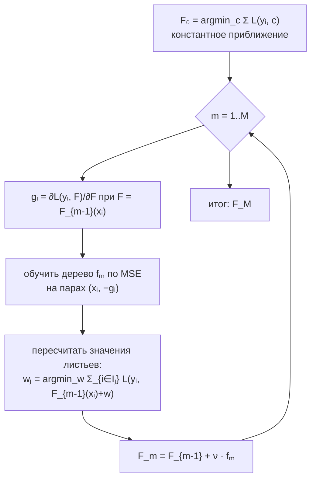

# Градиентный бустинг

> **Зачем эта глава.** Градиентный бустинг — рабочая лошадь табличного ML и самая частая тема
> технической секции на собеседовании MLE. После этой главы вы сможете вывести алгоритм с нуля,
> объяснить, почему формула значения листа в XGBoost выглядит именно так, и осмысленно
> настраивать модель, а не перебирать гиперпараметры вслепую.

**Уровень:** 🎯 middle → 🧠 middle+
**Предварительно нужно:** [решающие деревья](05-decision-trees.md), [бэггинг](06-bagging-random-forest.md), [оптимизация](../01-math/04-optimization.md), [логистическая регрессия](03-logistic-regression.md)
**Время на проработку:** ~6 часов (чтение + вывод формул руками + реализация)

---

## Карта главы

- [1. Проблема, из которой вырос бустинг](#1-проблема-из-которой-вырос-бустинг) — почему усреднения деревьев мало
- [2. Аддитивная модель и жадное построение](#2-аддитивная-модель-и-жадное-построение) — формальная постановка
- [3. Главная идея: градиентный спуск в пространстве функций](#3-главная-идея-градиентный-спуск-в-пространстве-функций) — сердце алгоритма
- [4. Разбор двух частных случаев](#4-разбор-двух-частных-случаев) — MSE и logloss
- [5. Второй порядок: как это делает XGBoost](#5-второй-порядок-как-это-делает-xgboost) — вывод формулы листа и gain
- [6. Регуляризация: чем на самом деле управляют гиперпараметры](#6-регуляризация-чем-на-самом-деле-управляют-гиперпараметры)
- [7. Реализация с нуля](#7-реализация-с-нуля)
- [8. Компромиссы: когда бустинг — правильный выбор](#8-компромиссы-когда-бустинг--правильный-выбор)
- [9. Подводные камни](#9-подводные-камни)
- [10. Проверь себя](#10-проверь-себя)
- [11. Практика](#11-практика)
- [12. Что читать дальше](#12-что-читать-дальше)

---

## 1. Проблема, из которой вырос бустинг

Начнём с того, что уже знаем. Одно решающее дерево небольшой глубины — модель со **высоким смещением**:
она грубо кусочно-постоянна и не способна выразить сложную зависимость. Одно глубокое дерево —
модель с **высокой дисперсией**: она идеально запоминает обучающую выборку и разваливается на новых данных.

Случайный лес решает вторую проблему: строим много глубоких деревьев на разных бутстрап-выборках
и усредняем. Дисперсия падает примерно как $\sigma^2\big(\rho + \frac{1-\rho}{B}\big)$, где $\rho$ —
корреляция между деревьями, $B$ — их число. Но заметьте, чего лес **не** делает: он никак не уменьшает
смещение. Все деревья решают одну и ту же задачу независимо, и если они систематически ошибаются
в одном и том же месте — усреднение эту ошибку сохранит.

> 🌱 **База.** Лес — это «спросить 500 экспертов независимо и усреднить ответы». Бустинг — это
> «спросить первого эксперта, посмотреть, где он ошибся, и позвать второго специально для того,
> чтобы чинить эти ошибки». Второй подход не усредняет мнения, а строит цепочку исправлений.

Отсюда идея: строить модели **последовательно**, и каждую следующую обучать на том, что предыдущие
не смогли объяснить. Тогда мы атакуем именно смещение — добавляя всё новые слагаемые, мы
постепенно наращиваем выразительность композиции.

Исторически первым был AdaBoost (1995): он перевзвешивал объекты — те, на которых ансамбль ошибался,
получали больший вес, и следующее дерево вынуждено было обратить на них внимание. Работало, но
выглядело как эвристика, привязанная к конкретной функции потерь. В 1999–2001 годах Фридман показал,
что AdaBoost — частный случай гораздо более общей конструкции: **градиентного спуска в пространстве
функций**. Именно её мы и разберём, потому что из неё бустинг выводится для *любой*
дифференцируемой функции потерь.

---

## 2. Аддитивная модель и жадное построение

Мы ищем предсказание в виде суммы базовых моделей:

$$
F_M(x) \;=\; F_0(x) \;+\; \nu\sum_{m=1}^{M} f_m(x)
$$

где $x \in \mathbb{R}^d$ — вектор признаков объекта, $f_m$ — базовая модель шага $m$ (почти всегда
неглубокое решающее дерево), $M$ — число итераций бустинга, $F_0$ — начальное приближение
(константа), $\nu \in (0, 1]$ — темп обучения (learning rate, он же shrinkage).

Хотелось бы подобрать все $f_1, \dots, f_M$ сразу, минимизируя суммарные потери. Это неподъёмная
задача: пространство наборов из $M$ деревьев необозримо. Поэтому применяют **жадную пошаговую
схему** (forward stagewise additive modeling): фиксируем всё, что построено раньше, и подбираем
только очередное слагаемое.

$$
f_m \;=\; \arg\min_{f \in \mathcal{H}} \; \sum_{i=1}^{n} L\big(y_i,\; F_{m-1}(x_i) + f(x_i)\big)
$$

где $n$ — размер обучающей выборки, $y_i$ — истинный ответ на объекте $i$, $L(y, \hat y)$ —
функция потерь, $\mathcal{H}$ — класс базовых моделей (деревья заданной глубины).

> 📐 **Разбор формулы.** Читаем справа налево. $F_{m-1}(x_i)$ — то, что ансамбль уже предсказывает
> на объекте $i$; это **фиксированное число**, не переменная. К нему прибавляется $f(x_i)$ —
> поправка, которую мы ищем. Функция потерь измеряет, насколько плоха сумма. Мы перебираем
> кандидатов $f$ в классе деревьев и берём того, кто даёт минимальную суммарную ошибку.
> Ключевое: мы **не переобучаем** предыдущие деревья, они заморожены навсегда.

Проблема в том, что решать этот минимум напрямую можно только для очень удобных $L$. Для MSE —
можно (увидим через минуту). Для logloss, MAE, Huber, квантильной потери, Poisson-потери — уже нет:
класс деревьев дискретен, аналитического решения не существует, а перебор невозможен.

Нужен приём, который сведёт любую $L$ к чему-то, что дерево умеет решать.

---

## 3. Главная идея: градиентный спуск в пространстве функций

Вот тот самый мысленный ход, ради которого стоит читать эту главу.

Обычный градиентный спуск минимизирует функцию по **параметрам**: мы имеем $w \in \mathbb{R}^d$,
считаем $\nabla_w \mathcal{L}$ и делаем шаг $w \leftarrow w - \eta \nabla_w \mathcal{L}$.

Теперь посмотрим на нашу задачу под другим углом. Суммарные потери на обучающей выборке зависят
от модели только через вектор её предсказаний:

$$
\mathbf{F} \;=\; \big(F(x_1),\, F(x_2),\, \dots,\, F(x_n)\big) \in \mathbb{R}^n
$$

Забудем на секунду, что $F$ — это функция, и будем считать $\mathbf{F}$ просто вектором из $n$
чисел, которые мы хотим подобрать. Тогда $\mathcal{L}(\mathbf{F}) = \sum_{i} L(y_i, F_i)$ — обычная
функция $n$ переменных, и мы умеем её минимизировать градиентным спуском:

$$
g_i \;=\; \left.\frac{\partial L(y_i, F_i)}{\partial F_i}\right|_{F_i = F_{m-1}(x_i)},
\qquad
\mathbf{F} \leftarrow \mathbf{F} - \eta\, \mathbf{g}
$$

где $g_i$ — частная производная потерь на объекте $i$ **по предсказанию** на этом объекте.
Величины $-g_i$ называют **псевдоостатками** (pseudo-residuals): это направление, в котором надо
сдвинуть предсказание на объекте $i$, чтобы потери упали быстрее всего.

Но здесь есть подвох, и на собеседовании его любят проверять. Вектор $-\mathbf{g}$ определён
**только в точках обучающей выборки**. Он говорит, как исправить предсказания на известных
объектах, и ничего не говорит о новых. Если мы просто прибавим $-\eta \mathbf{g}$ к предсказаниям
на трейне, мы получим идеальную подгонку под трейн и полное отсутствие модели.

Значит, шаг надо не просто сделать, а **обобщить на всё пространство признаков**. Для этого мы
приближаем вектор антиградиента деревом:

$$
f_m \;=\; \arg\min_{f \in \mathcal{H}} \sum_{i=1}^{n} \big(-g_i - f(x_i)\big)^2
$$

То есть **обучаем очередное дерево обычной регрессией по MSE на псевдоостатки**. Дерево — это
функция от $x$, поэтому оно даёт значение в любой точке, а не только на трейне. Оно приближает
направление наискорейшего убывания, сглаживая его до кусочно-постоянной функции — и в этом
сглаживании и заключается регуляризация: мы не идём точно по градиенту, мы идём по его
«обобщаемой тени».

> 🧠 **Middle+.** Обратите внимание на изящество: какой бы ни была исходная функция потерь —
> MAE, квантильная, Huber, Poisson, Cox — базовое дерево **всегда** решает одну и ту же задачу
> регрессии по MSE. Вся специфика $L$ спрятана в вычислении $g_i$. Именно поэтому одна библиотека
> поддерживает десятки objective'ов, не меняя код построения дерева.

### Уточнение шага: оптимальное значение в листе

Дерево, обученное по MSE на псевдоостатки, задаёт хорошее **разбиение** пространства, но значения
в листьях у него подобраны под квадратичную потерю, а наша $L$ может быть другой. Поэтому после
построения структуры дерева значения листьев пересчитывают, решая одномерную задачу в каждом листе:

$$
w_j \;=\; \arg\min_{w} \sum_{i \in I_j} L\big(y_i,\; F_{m-1}(x_i) + w\big)
$$

где $I_j = \{\, i : x_i \text{ попал в лист } j \,\}$ — множество индексов объектов листа $j$,
$w_j$ — значение, которое дерево выдаёт в этом листе.

Это отдельная маленькая задача оптимизации на каждый лист, и она решается быстро: одна переменная,
выпуклая функция. Для MSE ответ — среднее остатков; для MAE — медиана; для logloss — шаг Ньютона
(следующий раздел).

### Алгоритм целиком



Начальное приближение $F_0$ — константа, минимизирующая потери: для MSE это среднее $\bar y$,
для logloss — логит базовой частоты $\log\frac{\bar y}{1-\bar y}$, для MAE — медиана.

---

## 4. Разбор двух частных случаев

Общая схема становится понятной, когда подставишь в неё конкретные потери. Разберём две, которые
покрывают 90% практики и почти все вопросы на собеседовании.

### 4.1 Квадратичная потеря

$$
L(y, \hat y) = \tfrac12 (y - \hat y)^2
\qquad\Longrightarrow\qquad
\frac{\partial L}{\partial \hat y} = \hat y - y
\qquad\Longrightarrow\qquad
-g_i = y_i - F_{m-1}(x_i)
$$

Антиградиент — это буквально **остаток**: разница между правильным ответом и текущим предсказанием.
Отсюда классическое школьное объяснение «бустинг обучает каждое следующее дерево на ошибках
предыдущих». Оно верно, но **только для MSE**. Это ровно тот случай, где кандидат, выучивший
объяснение без вывода, спотыкается на уточняющем вопросе.

> 💬 **На собеседовании.** Спросят: «Правда ли, что бустинг обучается на остатках?»
> Хороший ответ: для квадратичной потери — да, потому что антиградиент по предсказанию равен
> $y - \hat y$. В общем случае дерево обучается на **антиградиенте функции потерь по предсказанию**,
> и это совпадает с остатком только при MSE. Для logloss, например, псевдоостаток равен
> $y_i - \sigma(F_{m-1}(x_i))$ — разности между меткой и предсказанной вероятностью, а вовсе не
> разности с логитом. Плохой ответ: «да, на остатках» — и точка.

### 4.2 Логистическая потеря (бинарная классификация)

Здесь важнейшая деталь: бустинг работает **в пространстве логитов**. Ансамбль предсказывает
вещественное число $F(x) \in \mathbb{R}$, а вероятность получается сигмоидой $p = \sigma(F) = \frac{1}{1+e^{-F}}$.

$$
L(y, F) = -\,y\log \sigma(F) \;-\; (1-y)\log\big(1 - \sigma(F)\big), \qquad y \in \{0, 1\}
$$

Продифференцируем. Пользуемся тем, что $\sigma'(F) = \sigma(F)\big(1-\sigma(F)\big)$ и обозначим $p = \sigma(F)$:

$$
\begin{aligned}
\frac{\partial L}{\partial F}
&= -y\,\frac{\sigma'(F)}{\sigma(F)} \;+\; (1-y)\,\frac{\sigma'(F)}{1-\sigma(F)} \\[4pt]
&= -y\,\frac{p(1-p)}{p} \;+\; (1-y)\,\frac{p(1-p)}{1-p} \\[4pt]
&= -y(1-p) + (1-y)p \\[4pt]
&= -y + yp + p - yp \;=\; p - y
\end{aligned}
$$

Итого:

$$
g_i = \sigma\big(F_{m-1}(x_i)\big) - y_i,
\qquad
-g_i = y_i - p_i
$$

Псевдоостаток — разность между меткой и предсказанной вероятностью. Он ограничен отрезком
$[-1, 1]$, что делает logloss заметно устойчивее к выбросам в разметке, чем MSE: одна ошибочная
метка не создаёт гигантский остаток.

Вторая производная (она понадобится в разделе 5):

$$
\frac{\partial^2 L}{\partial F^2} = \frac{\partial}{\partial F}\big(\sigma(F) - y\big) = p(1-p)
$$

Заметьте её поведение: она максимальна ($1/4$) при $p = 0.5$ и стремится к нулю, когда модель
уверена. Это будет иметь прямое практическое следствие — см. `min_child_weight` в разделе 6.

> ⚠️ **Типичная ошибка.** Считать, что при `objective='binary:logistic'` деревья предсказывают
> вероятности → пытаться интерпретировать значения листьев как вероятности или складывать их
> напрямую → получить бессмыслицу. Деревья складываются **в логитах**; сигмоида применяется один
> раз к итоговой сумме. Поэтому, кстати, `predict_raw`/`output_margin` возвращает логит, а не
> вероятность.

---

## 5. Второй порядок: как это делает XGBoost

Классический бустинг Фридмана использует только первую производную — это метод градиентного спуска.
XGBoost (Чен и Гестрин, 2016) сделал следующий шаг: раскладывать потери до **второго порядка**,
то есть применять метод Ньютона. Это даёт и более быструю сходимость, и — что важнее — **аналитическую
формулу для значения листа и для критерия сплита**, в которую естественным образом встроена
регуляризация.

Разберём вывод целиком: это ровно тот кусок, который отличает «пользовался XGBoost» от «понимаю XGBoost».

### 5.1 Разложение Тейлора

На шаге $m$ минимизируем регуляризованные потери:

$$
\mathcal{L}^{(m)} \;=\; \sum_{i=1}^{n} L\big(y_i,\; F_{m-1}(x_i) + f_m(x_i)\big) \;+\; \Omega(f_m)
$$

Разложим $L$ по второму аргументу вокруг точки $F_{m-1}(x_i)$ до второго порядка:

$$
\mathcal{L}^{(m)} \;\approx\; \sum_{i=1}^{n}
\Big[\, \underbrace{L\big(y_i, F_{m-1}(x_i)\big)}_{\text{константа}} \;+\; g_i\, f_m(x_i) \;+\; \tfrac12 h_i\, f_m(x_i)^2 \Big]
\;+\; \Omega(f_m)
$$

где

$$
g_i = \left.\frac{\partial L(y_i, F)}{\partial F}\right|_{F=F_{m-1}(x_i)},
\qquad
h_i = \left.\frac{\partial^2 L(y_i, F)}{\partial F^2}\right|_{F=F_{m-1}(x_i)}
$$

$g_i$ — градиент, $h_i$ — гессиан (в скалярном случае просто вторая производная) потерь на объекте $i$.
Константное слагаемое от $f_m$ не зависит и на минимизацию не влияет — выбросим его.

> 📐 **Разбор формулы.** Разложение Тейлора здесь — это способ заменить произвольную функцию потерь
> на параболу, которую мы умеем минимизировать точно. Мы «смотрим» на $L$ вблизи текущего
> предсказания и говорим: на маленьком шаге она ведёт себя как $g\cdot\delta + \tfrac12 h\,\delta^2$.
> Чем меньше шаг (а $\nu$ как раз его уменьшает), тем точнее приближение.

### 5.2 Регуляризация дерева

Дерево формализуем так: $f(x) = w_{q(x)}$, где $q : \mathbb{R}^d \to \{1,\dots,T\}$ — структура
дерева (правила, отправляющие объект в один из $T$ листьев), а $w \in \mathbb{R}^T$ — вектор
значений листьев. Штраф за сложность:

$$
\Omega(f) \;=\; \gamma\,T \;+\; \frac{\lambda}{2}\sum_{j=1}^{T} w_j^2
$$

где $T$ — число листьев, $\gamma \ge 0$ — штраф за каждый лист (аналог платы за добавление сплита),
$\lambda \ge 0$ — L2-регуляризация значений листьев.

### 5.3 Оптимальное значение листа

Сгруппируем сумму по объектам в сумму по листьям. Обозначим $I_j = \{ i : q(x_i) = j \}$ — объекты,
попавшие в лист $j$. Все объекты одного листа получают одно и то же значение $w_j$, поэтому:

$$
\tilde{\mathcal{L}}^{(m)}
= \sum_{j=1}^{T} \left[ \Big(\sum_{i \in I_j} g_i\Big) w_j
\;+\; \tfrac12 \Big(\sum_{i \in I_j} h_i + \lambda\Big) w_j^2 \right] \;+\; \gamma T
$$

Введём агрегаты листа:

$$
G_j = \sum_{i \in I_j} g_i, \qquad H_j = \sum_{i \in I_j} h_i
$$

Тогда для каждого листа получаем независимую квадратичную функцию одной переменной
$\varphi(w_j) = G_j w_j + \tfrac12 (H_j + \lambda) w_j^2$. Приравниваем производную к нулю:

$$
\varphi'(w_j) = G_j + (H_j + \lambda) w_j = 0
\qquad\Longrightarrow\qquad
\boxed{\;w_j^{*} = -\frac{G_j}{H_j + \lambda}\;}
$$

Это и есть та самая формула значения листа. Подставим её обратно, чтобы получить **качество
структуры дерева**:

$$
\tilde{\mathcal{L}}^{*} = -\frac12 \sum_{j=1}^{T} \frac{G_j^2}{H_j + \lambda} \;+\; \gamma T
$$

Чем меньше это число, тем лучше структура. Величина $\frac{G_j^2}{H_j+\lambda}$ работает как
«ценность листа» — аналог критерия Джини, но выведенный из функции потерь, а не постулированный.

### 5.4 Критерий выбора сплита

Теперь ясно, как выбирать разбиение. Пусть лист с объектами $I$ делится на левый $I_L$ и правый
$I_R$. Выигрыш — это разность качества до и после:

$$
\text{Gain} = \frac12\left[\frac{G_L^2}{H_L + \lambda} + \frac{G_R^2}{H_R + \lambda}
- \frac{(G_L + G_R)^2}{H_L + H_R + \lambda}\right] \;-\; \gamma
$$

где $G_L, H_L$ — суммы градиентов и гессианов по левой части, $G_R, H_R$ — по правой.

> 📐 **Разбор формулы.** Первые два слагаемых — ценность двух новых листьев, третье — ценность
> родителя, которого мы теряем. Множитель $\tfrac12$ — из квадратичного разложения. Вычитаемое
> $\gamma$ — плата за то, что листьев стало на один больше. Если выигрыш от разделения меньше
> $\gamma$, сплит не делается: **$\gamma$ — это порог «а стоит ли овчинка выделки»**, и он даёт
> pre-pruning прямо в критерии, без отдельной эвристики.

Проверим, что формула осмысленна. Возьмём logloss: $g_i = p_i - y_i$, $h_i = p_i(1-p_i)$.
Если в листе все объекты одного класса и модель их ещё не выучила ($p_i \approx 0.5$, $y_i = 1$),
то $G_j \approx -0.5|I_j|$, $H_j \approx 0.25|I_j|$, и значение листа
$w_j^* \approx \frac{0.5|I_j|}{0.25|I_j| + \lambda} \to 2$ при $\lambda \to 0$ — модель сдвигает
логит вверх, повышая предсказанную вероятность. Знак и порядок величины сходятся с интуицией.

> 💬 **На собеседовании.** Спросят: «Что означает `min_child_weight` в XGBoost?»
> Хороший ответ: это минимальная **сумма гессианов** в листе, а не минимальное число объектов
> (за это отвечает `min_child_samples` в LightGBM). Для регрессии с MSE $h_i \equiv 1$, поэтому
> сумма гессианов совпадает с числом объектов — отсюда путаница. А вот для logloss
> $h_i = p_i(1-p_i)$, и объекты, в которых модель уже уверена, вносят почти нулевой вклад.
> Практическое следствие: лист может содержать много объектов, но если все они «лёгкие», он
> считается ненадёжным и не создаётся. Это защита от переобучения именно на хвостах.
> Провал: «это минимальное количество объектов в листе» — формально неверно и выдаёт,
> что человек не читал, как устроен критерий.

---

## 6. Регуляризация: чем на самом деле управляют гиперпараметры

Бустинг с достаточным числом итераций **гарантированно** переобучится: мы последовательно
уменьшаем ошибку на трейне и рано или поздно доведём её до нуля. Поэтому вся практика работы
с бустингом — это управление тем, насколько быстро и насколько сложно он подгоняется.

| Механизм | Параметр (XGB / LGBM / CatBoost) | Что физически делает | Как влияет |
|---|---|---|---|
| Темп обучения | `eta` / `learning_rate` | умножает вклад каждого дерева на $\nu$ | меньше $\nu$ → меньше шаг → нужно больше деревьев, но лучше обобщение |
| Число итераций | `n_estimators` | длина суммы | главный рычаг переобучения; подбирается ранней остановкой |
| Сложность дерева | `max_depth` / `num_leaves` | выразительность одного слагаемого | глубже → выше порядок учитываемых взаимодействий признаков |
| Мин. вес листа | `min_child_weight` / `min_child_samples` | порог по $H_j$ или по числу объектов | режет листья, построенные на шуме |
| L2 на листья | `lambda` / `reg_lambda` / `l2_leaf_reg` | $\lambda$ в знаменателе $w_j^*$ | стягивает значения листьев к нулю, особенно в малых листьях |
| Штраф за лист | `gamma` / `min_split_gain` | вычитается из Gain | не даёт делать «сплиты ради сплитов» |
| Стохастичность по строкам | `subsample` / `bagging_fraction` | дерево видит долю объектов | декоррелирует деревья, ускоряет, регуляризует |
| Стохастичность по столбцам | `colsample_bytree` / `feature_fraction` | дерево видит долю признаков | то же + снижает доминирование сильного признака |

### Ключевой компромисс: $\nu$ против $M$

Shrinkage — самый важный регуляризатор бустинга. Умножая каждое дерево на $\nu < 1$, мы делаем
маленькие осторожные шаги, и ни одно дерево не может «протолкнуть» ансамбль в переобучение
в одиночку. Эмпирическое правило: **уменьшили $\nu$ вдвое — увеличьте $M$ примерно вдвое**.

Практический рецепт: зафиксируйте $\nu$ (0.05 при обучении финальной модели, 0.1–0.3 при быстрых
экспериментах), поставьте заведомо избыточное $M$ и включите раннюю остановку по валидационной
метрике. Тогда $M$ подбирается автоматически, и его не нужно тюнить перебором.

```python
import lightgbm as lgb

model = lgb.LGBMClassifier(
    learning_rate=0.05,
    n_estimators=5000,          # заведомо много: реальное число задаст ранняя остановка
    num_leaves=63,              # для LightGBM управляем числом листьев, а не глубиной
    min_child_samples=50,       # чем шумнее данные, тем больше
    subsample=0.8, subsample_freq=1,
    colsample_bytree=0.8,
    reg_lambda=1.0,
)
model.fit(
    X_train, y_train,
    eval_set=[(X_valid, y_valid)],
    eval_metric="auc",
    callbacks=[lgb.early_stopping(200), lgb.log_evaluation(100)],
)
print("лучшая итерация:", model.best_iteration_)
```

> ⚠️ **Типичная ошибка.** Использовать для ранней остановки ту же выборку, по которой потом
> отчитываются о качестве. Число итераций — такой же гиперпараметр, как и остальные: если он
> подобран по выборке, оценка на ней смещена вверх. Нужны **три** части: train / early-stopping /
> честный тест, либо ранняя остановка внутри фолдов кросс-валидации.

> 🧠 **Middle+.** О глубине: `max_depth=6` в XGBoost допускает взаимодействия шести признаков, но
> реально дерево редко использует всю глубину осмысленно. LightGBM растит деревья **leaf-wise**
> (выбирает лист с максимальным выигрышем и делит его), поэтому при одинаковом числе листьев его
> деревья глубже и асимметричнее — и `num_leaves` для него важнее `max_depth`. Соотношение
> $\text{num\_leaves} \le 2^{\text{max\_depth}}$: если выставить `num_leaves=1024` при
> `max_depth=6`, ограничение по листьям просто не сработает.

---

## 7. Реализация с нуля

Теория усваивается, когда её собираешь руками. Ниже — работающий градиентный бустинг для бинарной
классификации: логистическая потеря, ньютоновский пересчёт листьев, shrinkage, сабсэмплинг.
Структуру дерева строит `DecisionTreeRegressor` по псевдоостаткам, а значения листьев мы
пересчитываем сами — ровно по формуле $w_j^* = -G_j / (H_j + \lambda)$.

```python
import numpy as np
from sklearn.tree import DecisionTreeRegressor


class GradientBoostingBinary:
    """Градиентный бустинг для бинарной классификации (logloss, ньютоновские листья).

    Работает в пространстве логитов: F(x) — вещественное число, вероятность = sigmoid(F).
    """

    def __init__(self, n_estimators=200, learning_rate=0.1, max_depth=3,
                 subsample=1.0, reg_lambda=1.0, random_state=0):
        self.n_estimators = n_estimators
        self.learning_rate = learning_rate
        self.max_depth = max_depth
        self.subsample = subsample
        self.reg_lambda = reg_lambda
        self.random_state = random_state

    @staticmethod
    def _sigmoid(z):
        # устойчивая сигмоида: при больших |z| наивная формула переполняется
        out = np.empty_like(z, dtype=float)
        pos, neg = z >= 0, z < 0
        out[pos] = 1.0 / (1.0 + np.exp(-z[pos]))
        exp_z = np.exp(z[neg])
        out[neg] = exp_z / (1.0 + exp_z)
        return out

    def fit(self, X, y):
        X, y = np.asarray(X, dtype=float), np.asarray(y, dtype=float)
        n = len(y)
        rng = np.random.default_rng(self.random_state)

        # F0 = логит базовой частоты: константа, минимизирующая logloss
        p0 = np.clip(y.mean(), 1e-6, 1 - 1e-6)
        self.f0_ = np.log(p0 / (1.0 - p0))

        f = np.full(n, self.f0_)          # текущие логиты на обучающей выборке
        self.trees_, self.leaf_values_ = [], []

        for _ in range(self.n_estimators):
            p = self._sigmoid(f)
            grad = p - y                   # g_i = ∂L/∂F
            hess = p * (1.0 - p)           # h_i = ∂²L/∂F²

            # строим структуру дерева по антиградиенту — обычная MSE-регрессия
            if self.subsample < 1.0:
                idx = rng.choice(n, size=int(self.subsample * n), replace=False)
            else:
                idx = np.arange(n)

            tree = DecisionTreeRegressor(max_depth=self.max_depth, random_state=self.random_state)
            tree.fit(X[idx], -grad[idx])

            # ньютоновский пересчёт листьев: w_j = -G_j / (H_j + λ)
            # считаем по ТЕМ ЖЕ объектам, на которых строилась структура
            leaf_id = tree.apply(X[idx])
            values = {}
            for leaf in np.unique(leaf_id):
                mask = leaf_id == leaf
                g_sum = grad[idx][mask].sum()
                h_sum = hess[idx][mask].sum()
                values[leaf] = -g_sum / (h_sum + self.reg_lambda)

            # обновляем логиты на ВСЕЙ выборке (не только на подвыборке)
            leaf_all = tree.apply(X)
            update = np.array([values.get(leaf, 0.0) for leaf in leaf_all])
            f += self.learning_rate * update

            self.trees_.append(tree)
            self.leaf_values_.append(values)

        return self

    def decision_function(self, X):
        X = np.asarray(X, dtype=float)
        f = np.full(len(X), self.f0_)
        for tree, values in zip(self.trees_, self.leaf_values_):
            leaf = tree.apply(X)
            f += self.learning_rate * np.array([values.get(l, 0.0) for l in leaf])
        return f

    def predict_proba(self, X):
        p = self._sigmoid(self.decision_function(X))
        return np.column_stack([1.0 - p, p])

    def predict(self, X, threshold=0.5):
        return (self.predict_proba(X)[:, 1] >= threshold).astype(int)
```

Проверим, что это не игрушка, а рабочий алгоритм — сравним с реализацией sklearn:

```python
from sklearn.datasets import make_classification
from sklearn.model_selection import train_test_split
from sklearn.ensemble import GradientBoostingClassifier
from sklearn.metrics import roc_auc_score

X, y = make_classification(n_samples=20_000, n_features=30, n_informative=12,
                           flip_y=0.05, random_state=42)
X_tr, X_te, y_tr, y_te = train_test_split(X, y, test_size=0.25, random_state=42)

mine = GradientBoostingBinary(n_estimators=200, learning_rate=0.1,
                              max_depth=3, subsample=0.8).fit(X_tr, y_tr)
ref = GradientBoostingClassifier(n_estimators=200, learning_rate=0.1,
                                 max_depth=3, subsample=0.8, random_state=0).fit(X_tr, y_tr)

print("наш   ROC-AUC:", round(roc_auc_score(y_te, mine.predict_proba(X_te)[:, 1]), 4))
print("sklearn ROC-AUC:", round(roc_auc_score(y_te, ref.predict_proba(X_te)[:, 1]), 4))
# значения будут близки: расхождение в третьем знаке — это разница в деталях сабсэмплинга
```

> ⌨️ **Руками.** Не подглядывая, добавьте в класс: (1) регрессию с MSE — потребуется поменять
> `f0_`, `grad`, `hess` и убрать сигмоиду из предсказания; (2) раннюю остановку по валидационной
> выборке; (3) `staged_predict_proba`, отдающий предсказания после каждой итерации. Третий пункт
> позволит нарисовать кривые обучения и увидеть переобучение своими глазами — это упражнение
> стоит потраченного часа.

---

## 8. Компромиссы: когда бустинг — правильный выбор

Бустинг стал рефлексом: увидел таблицу — запустил CatBoost. Рефлекс в целом полезный, но
на собеседовании оценивают именно понимание границ.

**Бустинг — сильный выбор, когда:**

- данные табличные, разнородные (числа + категории + счётчики), признаков от десятков до тысяч;
- зависимость нелинейная, с взаимодействиями, но объектов не десятки миллиардов;
- нужны хорошие результаты быстро и без долгой возни с архитектурой;
- важна интерпретируемость на уровне важностей и SHAP.

**Бустинг проигрывает, когда:**

| Ситуация | Почему | Что вместо |
|---|---|---|
| Данные — сырой текст, звук, изображения | нужна выученная иерархия признаков, деревья не умеют работать с «сырым» сигналом | нейросети |
| Очень сильная и явная линейная зависимость + мало данных | деревья аппроксимируют прямую лесенкой, тратя ёмкость впустую | линейная/логистическая регрессия |
| Требуется экстраполяция за пределы диапазона трейна | предсказание дерева ограничено значениями листьев: за границей оно константно | линейные модели, специальные модели трендов |
| Крайне жёсткий бюджет латентности при огромном числе фич | сотни деревьев × глубина = много обращений к памяти | линейная модель, факторизация, дистилляция бустинга в маленькую модель |
| Нужны хорошо откалиброванные вероятности «из коробки» | logloss-бустинг с ранней остановкой обычно недокалиброван по краям | калибровка поверх (см. [главу о калибровке](12-imbalance-and-calibration.md)) |
| Данные строго последовательные с длинной памятью | деревья не моделируют временную структуру, её приходится вносить признаками | модели временных рядов, sequence-модели |

> 💬 **На собеседовании.** Спросят: «Бустинг или случайный лес — что выберете и почему?»
> Хороший ответ строится через условия, а не через «бустинг лучше». Бустинг обычно даёт выше
> качество при аккуратном тюнинге, но он чувствителен к гиперпараметрам, к шуму в разметке и
> обязательно требует валидации для ранней остановки. Лес почти не требует настройки, устойчив
> к шумной разметке, тривиально параллелится и даёт OOB-оценку без отдельной выборки. Если нужен
> надёжный бейзлайн за час или разметка грязная — лес. Если нужно выжать качество и есть время
> на валидацию — бустинг. Отдельный аргумент: бустинг с малым $\nu$ и ранней остановкой
> деградирует плавно, а лес просто упирается в потолок.

---

## 9. Подводные камни

**Шумные метки бьют по бустингу сильнее, чем по лесу.**
Симптом: качество на валидации растёт, потом устойчиво падает, причём рано (сотни итераций).
Причина: бустинг последовательно концентрируется на объектах с большими остатками, а объекты
с ошибочными метками — как раз такие. Он тратит ёмкость на заучивание шума.
Что делать: увеличить `min_child_weight`/`min_child_samples`, уменьшить глубину, включить
сабсэмплинг, при MSE-задачах перейти на Huber-потерю, почистить разметку.

**Ранняя остановка по «не той» метрике.**
Симптом: ROC-AUC на валидации отличный, но продуктовые метрики не растут.
Причина: остановились по метрике, не совпадающей с целевой (например, по logloss, когда важен
top-k precision, или по accuracy при сильном дисбалансе).
Что делать: `eval_metric` должен быть максимально близок к тому, по чему систему судят в проде.

**Утечка через target encoding категорий.**
Симптом: фантастическое качество на кросс-валидации, провал на тесте.
Причина: mean target encoding посчитан по всей выборке до разбиения — в признак попал ответ.
Что делать: считать кодировку внутри фолда, использовать out-of-fold-схему, либо взять CatBoost
с его ordered target statistics (см. [следующую главу](08-boosting-in-practice.md)).

**Кажущаяся стабильность feature importance.**
Симптом: важности прыгают от запуска к запуску, а бизнес по ним принимает решения.
Причина: `gain`-важность делит вклад между коррелированными признаками произвольно; при
перезапуске с другим seed расклад меняется.
Что делать: смотреть permutation importance на отложенной выборке или SHAP, усреднять по нескольким
сидам, а корреляции анализировать явно.

**Дисбаланс «лечат» `scale_pos_weight` и портят вероятности.**
Симптом: после взвешивания классов ROC-AUC не изменился, а logloss/калибровка ухудшились.
Причина: взвешивание меняет априорное распределение, и модель начинает предсказывать сдвинутые
вероятности. Ранжирование при этом почти не меняется.
Что делать: если нужно ранжирование — не трогать веса, а подбирать порог. Если нужны вероятности —
либо не взвешивать, либо калибровать после.

**Разное поведение на CPU и GPU, разные версии — разные числа.**
Симптом: не сходятся метрики после переезда обучения.
Причина: гистограммные алгоритмы на GPU используют другую агрегацию и порядок суммирования.
Что делать: фиксировать версии библиотек в требованиях, а воспроизводимость проверять как тест
(см. [воспроизводимость](../07-mlops/02-reproducibility-and-tracking.md)).

---

## 10. Проверь себя

<details>
<summary><b>🌱 Вопрос.</b> Объясните идею градиентного бустинга за две минуты, без формул.</summary>

**Короткий ответ.** Строим сумму простых моделей последовательно: каждая следующая обучается
предсказывать то, в какую сторону и насколько надо подвинуть текущее предсказание ансамбля,
чтобы функция потерь уменьшилась. Вклад каждой модели умножается на маленький коэффициент,
чтобы шаги были осторожными.

**Развёрнуто.** Ключевых элементов три. Первый — аддитивность: итог есть сумма деревьев, и
предыдущие никогда не переобучаются. Второй — направление: дерево учат не на исходном таргете,
а на антиградиенте функции потерь по предсказанию (для MSE это совпадает с остатком). Третий —
shrinkage: без него ансамбль быстро переобучится.

**Чего ждёт интервьюер:** что вы понимаете *последовательность* и *исправление ошибок*, и не
путаете бустинг с бэггингом.

**Провал:** «строим много деревьев и усредняем» — это описание случайного леса.
</details>

<details>
<summary><b>🎯 Вопрос.</b> Почему бустинг обучают на антиградиенте, а не просто на ошибке модели?</summary>

**Короткий ответ.** Потому что «ошибка» определена только для квадратичной потери. Антиградиент —
это обобщение остатка на любую дифференцируемую функцию потерь.

**Развёрнуто.** Мы минимизируем $\sum_i L(y_i, F(x_i))$. Рассматривая предсказания $F(x_i)$ как
переменные, получаем обычную задачу оптимизации, и направление наискорейшего убывания —
это $-\partial L/\partial F$. Для $L = \tfrac12(y-F)^2$ производная равна $F - y$, то есть
антиградиент — это остаток $y - F$. Для logloss антиградиент равен $y - \sigma(F)$: тоже «ошибка»,
но в терминах вероятности, а не логита. Для MAE антиградиент равен $\mathrm{sign}(y - F)$ — здесь
величина ошибки вообще не участвует, только её знак, поэтому MAE-бустинг устойчив к выбросам.

**Чего ждёт интервьюер:** понимания, что бустинг — это градиентный спуск, просто в пространстве
функций, и что специфика задачи заключена в производной потерь.

**Провал:** ответ «на остатках» без оговорок; неспособность назвать антиградиент для logloss.
</details>

<details>
<summary><b>🎯 Вопрос.</b> Что произойдёт, если поставить `learning_rate = 1.0`?</summary>

**Короткий ответ.** Каждое дерево будет вносить полный ньютоновский/градиентный шаг, ансамбль
очень быстро подгонится под трейн и почти наверняка переобучится; качество станет крайне
чувствительным к каждому отдельному дереву.

**Развёрнуто.** Shrinkage выполняет ту же роль, что маленький learning rate в SGD: он превращает
жадную оптимизацию в набор мелких шагов, что даёт эффект, похожий на L2-регуляризацию по
траектории. При $\nu = 1$ первые же деревья «съедают» весь сигнал и заодно значительную часть
шума, а последующие деревья вынуждены исправлять их перегибы. Практика: снижение $\nu$ с 1.0 до
0.1 при пропорциональном увеличении числа деревьев почти всегда улучшает обобщение. Обратная
сторона — время обучения растёт линейно по числу деревьев.

**Чего ждёт интервьюер:** связку «shrinkage ↔ регуляризация ↔ число итераций».

**Провал:** «модель будет учиться быстрее и это хорошо».
</details>

<details>
<summary><b>🧠 Вопрос.</b> Выведите формулу оптимального значения листа в XGBoost.</summary>

**Короткий ответ.** $w_j^{*} = -\dfrac{G_j}{H_j + \lambda}$, где $G_j$ и $H_j$ — суммы градиентов
и гессианов объектов листа, $\lambda$ — коэффициент L2-регуляризации листьев.

**Развёрнуто.** Раскладываем потери шага по Тейлору до второго порядка вокруг текущего
предсказания: $\sum_i [g_i f(x_i) + \tfrac12 h_i f(x_i)^2] + \Omega(f)$. Так как дерево постоянно
внутри листа, сумма по объектам превращается в сумму по листьям:
$\sum_j [G_j w_j + \tfrac12 (H_j + \lambda) w_j^2] + \gamma T$. Это набор независимых парабол,
каждую минимизируем точно: производная $G_j + (H_j+\lambda)w_j = 0$ даёт ответ. Подстановка
обратно даёт качество структуры $-\tfrac12\sum_j G_j^2/(H_j+\lambda) + \gamma T$, откуда и
получается формула Gain для сплита.

**Чего ждёт интервьюер:** что вы можете провести вывод, а не процитировать результат; особенно
важен переход «сумма по объектам → сумма по листьям».

**Провал:** попытка вывести через «средний остаток в листе» — это ответ для MSE-бустинга Фридмана,
а не для ньютоновской схемы.
</details>

<details>
<summary><b>🧠 Вопрос.</b> Бустинг переобучается с ростом числа деревьев — почему тогда в статьях пишут, что он «на удивление устойчив»?</summary>

**Короткий ответ.** Устойчивость наблюдается при малом learning rate и слабых базовых моделях:
ошибка на валидации выходит на плато и деградирует очень медленно, а не обрывается. Но с
достаточным числом итераций переобучение всё равно наступает, особенно на шумных метках.

**Развёрнуто.** Эффект объясняют через маржу (margin): даже после достижения нулевой ошибки на
трейне бустинг продолжает увеличивать уверенность в правильных ответах, что улучшает обобщение
в духе теории больших зазоров. Однако это верно для чистой разметки. При наличии шума модель
начинает уверенно заучивать неверные метки, и валидационная кривая уходит вниз. Практический
вывод один: ранняя остановка обязательна, а «устойчивость» не отменяет валидации.

**Чего ждёт интервьюер:** осведомлённости о разнице между теоретическими результатами и практикой
на грязных данных.

**Провал:** «бустинг не переобучается».
</details>

<details>
<summary><b>🎯 Вопрос.</b> Нужно ли масштабировать признаки перед бустингом? А кодировать категории?</summary>

**Короткий ответ.** Масштабировать не нужно — сплиты инвариантны к монотонным преобразованиям.
Категории кодировать нужно, если библиотека не поддерживает их нативно.

**Развёрнуто.** Дерево выбирает порог по значению признака; любое строго монотонное преобразование
(лог, стандартизация, ранг) переставляет пороги, но не меняет множество возможных разбиений,
поэтому качество не меняется. Исключения: гистограммные алгоритмы биннингуют признак, и при
экстремально скошенном распределении логарифмирование может изменить границы бинов и слегка
повлиять на результат. С категориями сложнее: one-hot для признака высокой мощности плодит
разреженные бинарные колонки, по которым дерево делает неэффективные сплиты; label encoding
навязывает ложный порядок; target encoding даёт лучший результат, но требует аккуратности с
утечкой. CatBoost и LightGBM умеют работать с категориями напрямую — обычно это и есть правильный
выбор.

**Чего ждёт интервьюер:** понимания, *почему* масштабирование не нужно (инвариантность к монотонным
преобразованиям), а не заученного «деревьям не нужен скейлинг».

**Провал:** «нужно всё стандартизировать, как для любой модели».
</details>

<details>
<summary><b>🧠 Вопрос.</b> Как бустинг ведёт себя при экстраполяции?</summary>

**Короткий ответ.** Никак не экстраполирует: за пределами диапазона обучающих значений предсказание
константно, равно значению крайнего листа.

**Развёрнуто.** Дерево разбивает пространство на прямоугольные области и в каждой выдаёт константу.
Крайняя область не ограничена сверху/снизу, поэтому все объекты за границей трейна попадают в неё
и получают одно и то же значение. Для суммы деревьев верно то же самое. Практическое следствие:
для задач с трендом (растущие продажи, инфляция, счётчики со временем) бустинг «в лоб» будет
занижать прогноз на будущем. Обходы: моделировать не уровень, а отклонение от тренда/сезонности;
использовать признаки-отношения вместо абсолютных значений; гибрид «линейная модель тренда +
бустинг на остатках».

**Чего ждёт интервьюер:** этот вопрос отделяет тех, кто применял бустинг к временным рядам,
от тех, кто читал про него.

**Провал:** «экстраполирует как линейная модель».
</details>

<details>
<summary><b>🎯 Вопрос.</b> Чем `subsample` в бустинге отличается от бутстрапа в случайном лесе?</summary>

**Короткий ответ.** В лесе бутстрап — выборка **с возвращением** того же размера, и он — основа
метода (без него деревья были бы одинаковыми). В бустинге `subsample` — выборка **без возвращения**
доли объектов, и это опциональная регуляризация (stochastic gradient boosting Фридмана).

**Развёрнуто.** Роли принципиально разные. Лесу бутстрап нужен, чтобы деревья различались:
декорреляция — единственный источник его выигрыша. Бустинг и без стохастичности строит разные
деревья, потому что на каждом шаге меняются псевдоостатки. Сабсэмплинг там добавляет шум,
который снижает переобучение и ускоряет обучение; типичные значения 0.5–0.9. Побочный эффект:
воспроизводимость требует фиксации seed, а слишком малая доля увеличивает дисперсию обучения.

**Чего ждёт интервьюер:** понимания, что источник разнообразия деревьев у этих методов разный.

**Провал:** «то же самое, только называется по-другому».
</details>

<details>
<summary><b>🧠 Вопрос.</b> Ваша модель на бустинге показывает AUC 0.95 на кросс-валидации и 0.78 на проде. Ваши действия?</summary>

**Короткий ответ.** Разрыв такого размера — почти наверняка утечка или расхождение распределений,
а не «переобучение гиперпараметров». Проверяю по порядку: лик в признаках, корректность схемы
валидации, train/serve skew, сдвиг распределения во времени.

**Развёрнуто.** План диагностики.
1. **Лик**: есть ли признак, который в момент предсказания физически недоступен (посчитан
   после события), или агрегат, посчитанный по всему датасету, включая будущее.
2. **Схема валидации**: если данные имеют временную природу, случайный K-fold завышает оценку;
   нужен временной сплит. Если есть группы (пользователи, сессии) — нужен GroupKFold.
3. **Train/serve skew**: считаются ли фичи в проде тем же кодом и по тем же источникам.
   Классика — разные дефолты для пропусков и разный порядок категорий.
4. **Сдвиг во времени**: сравнить распределения фич на обучении и на проде (PSI), проверить
   долю новых категорий.
5. **Контроль**: обучить модель на данных «до даты X», проверить на «после даты X» — если разрыв
   воспроизводится, это дрифт, а не бага пайплайна.

**Чего ждёт интервьюер:** структурированную диагностику с приоритетами, а не перебор идей.
Средний кандидат сразу начинает говорить про регуляризацию — это самый маловероятный источник
разрыва в 17 пунктов AUC.

**Провал:** «переобучилась, надо уменьшить глубину».
</details>

<details>
<summary><b>🎯 Вопрос.</b> Как параллелится бустинг, если он последовательный по своей природе?</summary>

**Короткий ответ.** Параллелится построение **одного** дерева — поиск лучшего сплита по признакам
и по бинам гистограммы, а также вычисление градиентов. Сама последовательность деревьев
параллелизации не поддаётся.

**Развёрнуто.** На каждой итерации самое дорогое — перебор кандидатов на разбиение. Гистограммный
подход строит для каждого признака гистограмму сумм градиентов и гессианов по бинам; это
независимая работа по признакам, легко раскладываемая по потокам и по GPU. Дополнительно
параллелятся вычисление $g_i, h_i$ (поэлементно) и применение модели. Существуют схемы
распределённого обучения (по признакам — feature parallel, по данным — data parallel,
voting parallel в LightGBM), но принцип «дерево $m$ нельзя начать до окончания дерева $m-1$»
остаётся. В отличие от бустинга, лес параллелится тривиально — все деревья независимы.

**Чего ждёт интервьюер:** понимания, где именно расположен параллелизм.

**Провал:** «бустинг не параллелится вообще».
</details>

<details>
<summary><b>🧠 Вопрос.</b> Что такое `gamma` (`min_split_loss`) и как она соотносится с обрезкой дерева?</summary>

**Короткий ответ.** $\gamma$ — штраф за добавление листа, который вычитается из выигрыша сплита.
Сплит делается только если $\text{Gain} > \gamma$. Это pre-pruning, встроенный прямо в критерий.

**Развёрнуто.** В классическом CART обрезку делают post-hoc: строят полное дерево, потом отрезают
ветви по cost-complexity. XGBoost выводит штраф из оптимизируемого функционала: в $\Omega(f)$ есть
слагаемое $\gamma T$, и оно естественным образом попадает в формулу Gain со знаком минус.
Практически: $\gamma = 0$ (дефолт) означает «делай любой сплит с положительным выигрышем»,
рост $\gamma$ делает деревья заметно консервативнее. Нюанс: XGBoost всё же строит дерево до
`max_depth` и потом отбрасывает ветви с отрицательным вкладом — то есть комбинирует оба подхода,
потому что «плохой» сплит может открыть дорогу хорошему на уровень ниже.

**Чего ждёт интервьюер:** связи между регуляризацией в функционале и практическим гиперпараметром.

**Провал:** путать $\gamma$ с $\lambda$ (L2 на значения листьев).
</details>

---

## 11. Практика

**Задача 1. Вывод (30 минут, на бумаге).**
Выведите $g_i$ и $h_i$ для трёх функций потерь: (а) Huber с порогом $\delta$; (б) Poisson-потери
$L = e^{F} - y F$; (в) квантильной потери с квантилем $\tau$. Для каждой напишите формулу
оптимального значения листа по ньютоновской схеме и объясните, что происходит там, где вторая
производная равна нулю.
*Критерий: вы понимаете, почему для MAE и квантильной потери библиотеки используют не чистый
Ньютон, а специальные приёмы.*

**Задача 2. Реализация (2 часа).**
Расширьте класс из раздела 7: добавьте регрессию с MSE и Huber, раннюю остановку и
`staged_decision_function`. Постройте графики train/valid loss по итерациям для трёх значений
`learning_rate` ∈ {0.3, 0.1, 0.03} при фиксированном бюджете в 1000 деревьев.
*Критерий: на графиках видно, что при 0.3 валидационная кривая разворачивается раньше и выше,
а при 0.03 модель не успевает сойтись за 1000 итераций.*

**Задача 3. Диагностика (1 час).**
Возьмите любой табличный датасет и намеренно испортите 10% меток (переверните класс).
Обучите бустинг и случайный лес с сопоставимыми настройками. Постройте валидационные кривые.
*Критерий: вы наблюдаете и умеете объяснить, почему бустинг деградирует, а лес — почти нет.*

**Задача 4. Тюнинг по шагам (1.5 часа).**
На датасете с 50+ признаками пройдите протокол: (1) бейзлайн с дефолтами и ранней остановкой;
(2) подбор сложности дерева; (3) подбор регуляризации листьев; (4) стохастичность; (5) снижение
`learning_rate` вдвое с удвоением бюджета итераций. Фиксируйте метрику после каждого шага.
*Критерий: у вас есть таблица «шаг → прирост метрики», и вы можете сказать, какие два шага дали
основной эффект. Обычно это ранняя остановка и сложность дерева, а не экзотические параметры.*

---

## 12. Что читать дальше

- [Friedman J. «Greedy Function Approximation: A Gradient Boosting Machine» (2001)](https://jerryfriedman.su.domains/ftp/trebst.pdf) —
  первоисточник. Читать ради разделов с выводом общей схемы и с частными случаями функций потерь;
  там же — обоснование shrinkage.
- [Friedman J. «Stochastic Gradient Boosting» (1999)](https://jerryfriedman.su.domains/ftp/stobst.pdf) —
  короткая работа про сабсэмплинг: откуда взялся `subsample` и сколько он реально даёт.
- [Chen T., Guestrin C. «XGBoost: A Scalable Tree Boosting System» (2016)](https://arxiv.org/abs/1603.02754) —
  раздел 2 содержит ровно тот вывод, что в §5 этой главы; раздел 3 — про алгоритм поиска сплитов
  и обработку разреженности. Обязательно для middle+.
- **Hastie, Tibshirani, Friedman. «The Elements of Statistical Learning», гл. 10** —
  наиболее аккуратное изложение бустинга как forward stagewise additive modeling и связи
  с AdaBoost через экспоненциальную потерю.
- [Документация LightGBM: Parameters Tuning](https://lightgbm.readthedocs.io/en/latest/Parameters-Tuning.html) —
  практический разбор, какие параметры на что влияют; полезно как чек-лист перед тюнингом.
- [Разбор бустинга в открытом курсе ODS (mlcourse.ai), тема 10](https://mlcourse.ai/book/topic10/topic10_gradient_boosting.html) —
  русскоязычное изложение с кодом; хорошо заходит как второй проход после этой главы.

---

⬅️ [Бэггинг и случайный лес](06-bagging-random-forest.md) | 🏠 [Оглавление](../index.md) | ➡️ [XGBoost, LightGBM, CatBoost](08-boosting-in-practice.md)
