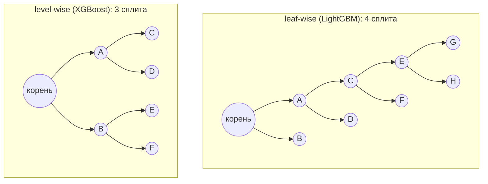

# XGBoost, LightGBM, CatBoost

> **Зачем эта глава.** Все три библиотеки реализуют один и тот же математический алгоритм из
> [предыдущей главы](07-gradient-boosting.md), но на реальных данных дают разное качество, разную
> скорость и разные способы отстрелить себе ногу. После этой главы вы сможете объяснить на
> собеседовании, чем именно они отличаются на уровне алгоритмов (а не «CatBoost умеет категории»),
> и осмысленно выбрать и настроить любую из них под конкретную задачу.

**Уровень:** 🎯 middle → 🧠 middle+
**Предварительно нужно:** [градиентный бустинг](07-gradient-boosting.md), [решающие деревья](05-decision-trees.md), [валидация и утечки](13-validation-and-leakage.md)
**Как проработать:** чтение + прогон протоколов тюнинга на своих данных

---

## Карта главы

- [1. Что осталось за скобками теории](#1-что-осталось-за-скобками-теории) — три инженерные проблемы, которых нет в формулах
- [2. XGBoost: поиск сплита в масштабе](#2-xgboost-поиск-сплита-в-масштабе) — exact vs approx vs hist, weighted quantile sketch, sparsity-aware split
- [3. LightGBM: за счёт чего он быстрее](#3-lightgbm-за-счёт-чего-он-быстрее) — leaf-wise, GOSS, EFB
- [4. CatBoost: борьба с утечкой через таргет](#4-catboost-борьба-с-утечкой-через-таргет) — ordered TS, ordered boosting, oblivious-деревья, комбинации
- [5. Сравнение по существу](#5-сравнение-по-существу) — таблица по девяти измерениям
- [6. Протоколы тюнинга](#6-протоколы-тюнинга) — пошагово для каждой библиотеки
- [7. Подводные камни](#7-подводные-камни)
- [8. Проверь себя](#8-проверь-себя)
- [9. Практика](#9-практика)
- [10. Что читать дальше](#10-что-читать-дальше)

---

## 1. Что осталось за скобками теории

В прошлой главе мы вывели всё, что нужно для бустинга: псевдоостатки, разложение Тейлора,
оптимальное значение листа $w_j^{*} = -G_j/(H_j+\lambda)$ и критерий Gain. С точки зрения
математики вопрос закрыт. Но если сесть и написать это по формулам в лоб, на реальном датасете
получится нечто, чем невозможно пользоваться. Разберём почему — из этих трёх проблем и выросли
все три библиотеки.

**Проблема 1: перебор сплитов — это узкое место, и оно растёт как $n \cdot d$.**
Чтобы найти лучшее разбиение в узле, надо для каждого признака перебрать все возможные пороги.
Наивно: отсортировать значения признака и просканировать, накапливая $G_L, H_L$. На $n = 10^6$
объектах и $d = 200$ признаках это $2\cdot10^8$ операций **на каждый узел**, а узлов в дереве
десятки, деревьев — тысячи. Плюс память: чтобы не сортировать заново, надо хранить отсортированные
индексы — 4 байта индекс + 4 байта значение на каждую пару (объект, признак), то есть
$10^6 \cdot 200 \cdot 8 = 1.6$ ГБ только на структуру для поиска. Это первое, что чинили в XGBoost
и что довели до предела в LightGBM.

**Проблема 2: реальные данные разрежены и дырявы.**
В типичной табличке есть пропуски, есть нули после one-hot, есть счётчики, которые не заполнены
у 90% пользователей. Наивный алгоритм на этом либо падает, либо требует импутации — а импутация
это домысливание данных, которого хотелось бы избежать.

**Проблема 3: категориальные признаки высокой мощности.**
`user_id`, `city`, `merchant_id`, `article_id` — сотни тысяч уровней. One-hot взрывает
размерность, label encoding навязывает ложный порядок, а mean target encoding — самый
эффективный способ — **течёт**: в признак объекта попадает его собственный таргет. Именно с этой
проблемы начинался CatBoost, и решение оказалось нетривиальным.

> 🌱 **База.** Если вы хотите быстро: все три библиотеки — это градиентный бустинг на деревьях
> из прошлой главы. Отличия — в том, как они ищут разбиения (быстро и приближённо, а не точно),
> как растят дерево (вширь или вглубь) и что делают с категориями. Практический вывод раздела 5:
> на широких числовых данных берите LightGBM, на данных с жирными категориями — CatBoost,
> XGBoost — универсальный дефолт, который есть везде.

---

## 2. XGBoost: поиск сплита в масштабе

### 2.1 Exact greedy: точно, но не масштабируется

Точный жадный алгоритм (exact greedy) делает ровно то, что написано в теории: для каждого признака
сортирует объекты узла по его значению и сканирует слева направо, на каждом шаге пересчитывая
префиксные суммы $G_L, H_L$ и проверяя Gain.

```python
import numpy as np

def best_split_exact(x, g, h, lam=1.0, gamma=0.0):
    """Точный поиск лучшего порога по одному числовому признаку.

    x — значения признака в узле (n_node,), g, h — градиенты и гессианы тех же объектов.
    Возвращает (лучший gain, порог). Это ровно формула Gain из главы 07.
    """
    order = np.argsort(x, kind="mergesort")   # stable sort: одинаковые значения не перемешиваются
    xs, gs, hs = x[order], g[order], h[order]

    G, H = gs.sum(), hs.sum()
    # префиксные суммы — чтобы не пересчитывать G_L, H_L заново на каждом пороге
    GL = np.cumsum(gs)[:-1]
    HL = np.cumsum(hs)[:-1]
    GR, HR = G - GL, H - HL

    gain = 0.5 * (GL**2 / (HL + lam) + GR**2 / (HR + lam) - G**2 / (H + lam)) - gamma

    # запрещаем резать между одинаковыми значениями признака: такой сплит нереализуем
    valid = xs[:-1] < xs[1:]
    gain = np.where(valid, gain, -np.inf)

    k = int(np.argmax(gain))
    return float(gain[k]), float(0.5 * (xs[k] + xs[k + 1]))
```

Стоимость: сортировка $O(n \log n)$ на признак (в XGBoost делается один раз, а дальше поддерживаются
блоки отсортированных индексов), скан $O(n_{\text{node}})$ на признак на узел. Точность максимальна —
рассматриваются все $n-1$ возможных порогов. Но при $n$ порядка миллионов и десятков тысяч узлов
за обучение это становится доминирующей стоимостью, а блоки отсортированных индексов не влезают
в память при больших $d$.

### 2.2 Approximate + weighted quantile sketch: откуда берутся кандидаты

Естественная идея: не перебирать все $n-1$ порогов, а взять, скажем, 250 «репрезентативных»
кандидатов — квантилей распределения признака. Вопрос: **квантилей чего?** Наивный ответ —
обычных квантилей значений признака. XGBoost даёт более точный ответ, и он выводится из уже
знакомой формулы.

Вспомним целевую функцию шага после разложения Тейлора (глава 07, §5.1):

$$
\tilde{\mathcal{L}}^{(m)} = \sum_{i=1}^{n}\Big[ g_i f_m(x_i) + \tfrac12 h_i f_m(x_i)^2 \Big] + \Omega(f_m)
$$

где $g_i, h_i$ — градиент и гессиан потерь на объекте $i$ по текущему предсказанию, $f_m$ —
строящееся дерево, $\Omega$ — штраф за сложность, $n$ — число объектов.

Выделим полный квадрат по $f_m(x_i)$:

$$
g_i f + \tfrac12 h_i f^2
= \tfrac12 h_i\Big(f^2 + 2\tfrac{g_i}{h_i} f\Big)
= \tfrac12 h_i\Big(f + \tfrac{g_i}{h_i}\Big)^2 - \frac{g_i^2}{2h_i}
$$

Второе слагаемое от $f$ не зависит. Значит,

$$
\tilde{\mathcal{L}}^{(m)} = \sum_{i=1}^{n} \tfrac12 h_i \Big( f_m(x_i) - \big(-\tfrac{g_i}{h_i}\big) \Big)^2 + \Omega(f_m) + \text{const}
$$

> 📐 **Разбор формулы.** Это самое полезное переписывание во всём XGBoost. Мы получили обычную
> **взвешенную регрессию по MSE**: таргет объекта $i$ равен $-g_i/h_i$ (ньютоновский шаг для
> одного объекта), а **вес объекта равен $h_i$** — его гессиану. Отсюда следует: объекты не
> равноценны для поиска сплита. Объект с большим $h_i$ сильнее влияет на функционал, чем объект
> с $h_i \approx 0$.

Раз вес объекта — это $h_i$, то и кандидаты в пороги надо выбирать так, чтобы они делили
на равные части **не количество объектов, а суммарный вес**. Формально вводится ранговая функция:

$$
r_k(z) \;=\; \frac{1}{\sum_{(x,\,h)\in D_k} h}\;\; \sum_{(x,\,h)\in D_k,\;\; x < z} h
$$

где $D_k = \{(x_{1k}, h_1), \dots, (x_{nk}, h_n)\}$ — множество пар «значение $k$-го признака,
гессиан» по всем объектам, $z$ — точка, в которой считаем ранг. $r_k(z) \in [0,1]$ — доля
суммарного гессиана, лежащая левее $z$.

Кандидаты $\{s_{k1}, s_{k2}, \dots, s_{kl}\}$ выбираются так, чтобы соседние отличались по рангу
не более чем на $\varepsilon$:

$$
|r_k(s_{k,j}) - r_k(s_{k,j+1})| < \varepsilon
\qquad\Longrightarrow\qquad
l \approx \frac{1}{\varepsilon}
$$

где $\varepsilon$ — параметр точности (`sketch_eps`); при $\varepsilon = 0.03$ получается около 33
кандидатов на признак. Структура данных, которая умеет строить такие взвешенные квантили за один
проход по распределённым данным с гарантией по ошибке, и называется **weighted quantile sketch** —
это и есть основной технический вклад статьи XGBoost.

Проверим осмысленность на logloss: $h_i = p_i(1-p_i)$. Объекты, где модель уже уверена
($p \to 0$ или $p \to 1$), получают почти нулевой вес и почти не влияют на выбор кандидатов.
Кандидаты сгущаются там, где модель ещё «сомневается», — ровно там, где сплит может что-то дать.

У приближённого алгоритма есть два режима:

- **global** — кандидаты считаются один раз на всё дерево (перед его построением). Дешевле, но
  на глубоких уровнях кандидаты уже плохо описывают распределение внутри маленького узла, поэтому
  нужно больше кандидатов (меньше $\varepsilon$).
- **local** — кандидаты пересчитываются в каждом узле. Дороже, но точнее на глубине; при
  одинаковом качестве требует меньше кандидатов.

В XGBoost это `tree_method='approx'`. А `tree_method='hist'` — ещё более прямолинейный вариант:
признаки один раз биннингуются в `max_bin` корзин (по умолчанию 256), и дальше алгоритм работает
исключительно с номерами корзин. Начиная с XGBoost 2.0 `hist` — метод по умолчанию.

### 2.3 Histogram: почему это в разы быстрее

Гистограммный подход меняет саму единицу работы. Значение признака заменяется на **номер корзины**
(1 байт вместо 4), а поиск сплита — на проход по корзинам.

| Этап | exact greedy | histogram |
|---|---|---|
| Предобработка | сортировка по каждому признаку, хранение блоков индексов | биннинг один раз: значение → `uint8` |
| Работа в узле | скан всех значений: $O(n_{\text{node}} \cdot d)$ | накопление гистограммы: $O(n_{\text{node}} \cdot d)$ |
| Перебор порогов | $O(n_{\text{node}} \cdot d)$ | $O(B \cdot d)$, где $B \le 256$ |
| Память на матрицу | ~8 байт на (объект, признак) | 1 байт на (объект, признак) |
| Трюк с братом | нет | гистограмма второго ребёнка = гистограмма родителя − гистограмма первого |

Численно: $n = 10^6$, $d = 200$. Exact держит ~1.6 ГБ отсортированных блоков и на каждый узел
делает $2\cdot10^8$ операций перебора порогов. Histogram держит 200 МБ матрицы корзин, накапливает
гистограмму за проход по объектам узла, а сам перебор порогов стоит $256 \cdot 200 \approx 5\cdot10^4$
операций — на три-четыре порядка меньше. Плюс **трюк с вычитанием гистограмм**: построив
гистограмму меньшего из двух детей, гистограмму второго получаем вычитанием из родительской, то
есть работа на уровне пропорциональна размеру меньших половин, а не всему узлу.

Цена: порог теперь может стоять только на границе корзины. На непрерывных признаках потеря обычно
в третьем знаке метрики; заметной она становится, когда важна тонкая граница (например, признак
«возраст» с бизнес-порогом 18, попавшим в середину корзины) или когда распределение признака имеет
длинный хвост и почти все объекты сидят в одной-двух корзинах.

> 💬 **На собеседовании.** Спросят: «Чем гистограммный поиск сплита отличается от точного и что
> мы теряем?» Хороший ответ: точный перебирает все $n-1$ порогов и требует хранить отсортированные
> значения; гистограммный заранее биннингует признак в ~256 корзин, после чего поиск сплита стоит
> $O(\text{bins} \times d)$ вместо $O(n \times d)$, а память падает примерно в 8 раз, потому что
> хранится `uint8` вместо float+index. Плюс появляется трюк с вычитанием гистограмм. Теряем
> точность порога — он привязан к границе корзины; обычно это стоит доли процента метрики, но на
> сильно скошенных признаках и на малых данных потеря заметнее. И отдельно: кандидаты в XGBoost
> выбираются не как обычные квантили, а как квантили, **взвешенные гессианами**, потому что
> целевая функция после разложения Тейлора — это взвешенная MSE с весами $h_i$.
> Плохой ответ: «histogram быстрее, потому что оптимизирован».

### 2.4 Sparsity-aware split finding: пропуски как направление по умолчанию

Второй важный вклад XGBoost — обработка разреженности **внутри алгоритма сплита**, без импутации.

Идея: у каждого сплита есть, помимо признака и порога, третий параметр — **направление по
умолчанию** (default direction). Объекты, у которых значение признака отсутствует, идут в эту
ветку. Направление не задаётся эвристикой, а **обучается**: перебираются оба варианта, и берётся
тот, у которого Gain выше.

Алгоритмически это делается за один дополнительный проход. Обозначим $I$ — объекты узла,
$I_{\text{miss}}$ — те из них, у кого признак отсутствует, $I_{\text{obs}} = I \setminus I_{\text{miss}}$.

1. Проход по $I_{\text{obs}}$ **по возрастанию** значения: пороги делят наблюдаемые значения, а все
   пропуски по построению отправляются вправо. Считаем Gain для каждого порога.
2. Проход по $I_{\text{obs}}$ **по убыванию**: теперь пропуски оказываются слева. Снова считаем Gain.
3. Берём лучший вариант из обоих проходов — он и задаёт (порог, направление по умолчанию).

Ключевое свойство: сложность — $O(|I_{\text{obs}}|)$, а не $O(|I|)$. Алгоритм **вообще не трогает
пропущенные значения**. Если матрица разрежена на 95%, поиск сплита работает в 20 раз быстрее, чем
на плотной матрице того же размера. Именно поэтому XGBoost исторически хорошо себя чувствовал на
one-hot-кодированных данных и на выходах TF-IDF.

Практическое следствие, о котором забывают: **ноль и пропуск — это разные вещи**, и XGBoost их
различает по параметру `missing` (по умолчанию `np.nan`). Но если вы передаёте `scipy.sparse`
матрицу, отсутствующие в ней элементы — это структурные нули, и они трактуются как пропуски.
Одна и та же матрица, поданная как плотная и как разреженная, даст разные модели.

> ⚠️ **Типичная ошибка.** Импутировать пропуски средним «чтобы XGBoost заработал» → терять
> информацию о самом факте пропуска, который часто предиктивен (не заполнил поле → другой сегмент
> пользователей) → получить модель хуже, чем на сырых `NaN`. Правильно: отдать `NaN` как есть и
> позволить алгоритму выучить направление. Если хочется и того, и другого — добавить явный
> бинарный флаг `is_missing` рядом.

### 2.5 Что ещё есть в XGBoost

- **Cache-aware access и out-of-core.** Доступ к градиентам по отсортированным индексам —
  случайный по памяти, что убивает кэш. XGBoost использует буфер префетча на поток, а для данных,
  не влезающих в RAM, — блочное сжатие и шардирование по дискам.
- **Level-wise рост по умолчанию** (`grow_policy='depthwise'`): дерево растёт уровнями до
  `max_depth`. Есть и `grow_policy='lossguide'` — тот же leaf-wise, что в LightGBM.
- **Нативные категории** (`enable_categorical=True`, начиная с 1.5–1.6): для признака малой
  мощности — one-hot внутри сплита (`max_cat_to_onehot`), для большой — partition-based split,
  где категории сортируются по $G_c/H_c$ и разрезаются как числовая ось.
- **`max_delta_step`** — ограничение на абсолютное значение листа. Единственный параметр, который
  реально помогает при экстремальном дисбалансе классов: там $H_j$ мал, и $w_j^* = -G_j/(H_j+\lambda)$
  может улететь в бесконечность.

---

## 3. LightGBM: за счёт чего он быстрее

LightGBM (Microsoft, 2017) исходит из того же гистограммного подхода, но добавляет три вещи,
каждая из которых бьёт по своей оси сложности. Стоимость построения дерева примерно
$O(n \cdot d)$: число объектов на число признаков. LightGBM атакует обе.

### 3.1 Leaf-wise рост: другая форма дерева

XGBoost по умолчанию растит дерево **по уровням** (level-wise): делит все листья текущего уровня,
потом переходит на следующий. LightGBM растит **по листьям** (leaf-wise, best-first): на каждом
шаге выбирает **тот лист во всём дереве**, разбиение которого даёт максимальный Gain, и делит
только его.



При фиксированном бюджете в $T$ листьев leaf-wise даёт **строго меньшую или равную** суммарную
потерю, чем level-wise: он тратит каждый сплит туда, где выигрыш максимален, а не поровну.
Level-wise вынужден делать сплиты в листьях, где Gain почти нулевой, — просто потому что «уровень
надо достроить». Отсюда и практическое наблюдение: LightGBM на равном числе листьев обычно даёт
метрику не хуже, а времени тратит меньше.

Обратная сторона — деревья получаются **глубокими и асимметричными**. Ветка, в которой лежит
сложный кусок данных, может уйти на глубину 20, при этом в её листьях будет по 30 объектов. Это
прямая дорога к переобучению на небольших выборках. Отсюда два вывода для настройки:

1. Главный параметр сложности в LightGBM — `num_leaves`, а не `max_depth`. Связь:
   $\text{num\_leaves} \le 2^{\text{max\_depth}}$; если поставить `num_leaves=1024` при
   `max_depth=6`, ограничение по листьям просто не сработает.
2. `min_data_in_leaf` (и `min_sum_hessian_in_leaf`) — не «косметика», а обязательный ограничитель
   глубины по существу. На $n < 10^4$ дефолт `num_leaves=31, min_data_in_leaf=20` часто уже
   переобучает.

> 💬 **На собеседовании.** Спросят: «Чем leaf-wise отличается от level-wise и когда leaf-wise
> вреден?» Хороший ответ: level-wise достраивает уровень целиком, leaf-wise на каждом шаге делит
> лист с максимальным Gain по всему дереву. При равном числе листьев leaf-wise даёт меньшую ошибку
> на обучении, потому что не тратит сплиты впустую, но растит несбалансированные глубокие ветки.
> На малых и шумных выборках это переобучение: несколько десятков объектов уезжают в собственный
> глубокий лист. Лечится `num_leaves`, `min_data_in_leaf` и `max_depth` как страховкой.
> И уточнение, которое ценят: level-wise/leaf-wise — это **свойство политики роста, а не
> библиотеки**: в XGBoost есть `grow_policy='lossguide'`, в LightGBM `max_depth` возвращает
> поведение, близкое к level-wise.

### 3.2 GOSS: сэмплирование, которое смотрит на градиенты

Обычный `subsample` выбрасывает случайную долю объектов. Но объекты неравноценны: объект с
большим $|g_i|$ — это объект, на котором модель сильно ошибается, он несёт основную информацию
о том, куда двигаться. Объект с $g_i \approx 0$ уже выучен.

**GOSS (Gradient-based One-Side Sampling)** использует это:

1. Отсортировать объекты по $|g_i|$ по убыванию.
2. Взять верхние $a \cdot 100\%$ — множество $A$ (все крупные градиенты сохраняем).
3. Из оставшихся $(1-a)\cdot 100\%$ случайно выбрать $b \cdot 100\%$ от **всей** выборки —
   множество $B$.
4. При подсчёте Gain градиенты объектов из $B$ домножить на коэффициент $\frac{1-a}{b}$.

Обучение идёт на $A \cup B$, то есть на $(a+b)$ доле данных. Четвёртый шаг — самое интересное:
без него мы систематически недооценивали бы вклад «лёгких» объектов, потому что взяли их лишь
малую часть. Множитель $\frac{1-a}{b}$ восстанавливает их суммарный вес.

Оценка выигрыша по признаку $j$ и порогу $d$ в GOSS выглядит так:

$$
\tilde{V}_j(d) = \frac{1}{n}\left(
\frac{\big(\sum_{x_i \in A_l} g_i + \frac{1-a}{b}\sum_{x_i \in B_l} g_i\big)^2}{n^j_l(d)}
+
\frac{\big(\sum_{x_i \in A_r} g_i + \frac{1-a}{b}\sum_{x_i \in B_r} g_i\big)^2}{n^j_r(d)}
\right)
$$

где $A_l = \{x_i \in A : x_{ij} \le d\}$ и $A_r = \{x_i \in A : x_{ij} > d\}$ — части множества
$A$, попавшие влево и вправо от порога $d$; $B_l, B_r$ — аналогично для $B$; $n^j_l(d)$ и
$n^j_r(d)$ — число объектов подвыборки слева и справа; $n$ — размер полной выборки; $a$ — доля
сохраняемых крупных градиентов, $b$ — доля досэмплированных мелких.

> 📐 **Разбор формулы.** Это дисперсионный критерий (сумма градиентов в квадрате, делённая на
> размер) — тот же по смыслу, что $G^2/(H+\lambda)$, только для случая $h_i \equiv \text{const}$.
> Ключевое место — множитель $\frac{1-a}{b}$ внутри скобок: он и только он делает оценку
> состоятельной. Авторы LightGBM доказывают, что ошибка такой оценки Gain убывает как
> $O(1/\sqrt{n})$ и что при разумных $a, b$ она меньше, чем ошибка от случайного сэмплирования
> той же доли данных.

Типичные значения: $a = 0.2$, $b = 0.1$ — обучение идёт на 30% данных при потере качества,
близкой к нулю. Включается через `boosting='goss'` (в LightGBM 4.x — `data_sample_strategy='goss'`).
Важно: **по умолчанию GOSS выключен**, дефолт — обычный `gbdt` без сэмплирования. Многие уверены,
что «LightGBM быстрый благодаря GOSS», и удивляются, узнав, что в дефолтном режиме его нет.

### 3.3 EFB: склейка взаимоисключающих признаков

Вторая ось — число признаков $d$. В разреженных данных многие признаки **взаимоисключающи**:
почти никогда не бывают ненулевыми одновременно. Классический пример — колонки одного one-hot
блока: `city_moscow`, `city_spb`, `city_kazan` — ровно одна из них равна 1.

**EFB (Exclusive Feature Bundling)** склеивает такие признаки в один. Механика склейки простая:
если признак $A$ принимает значения корзин $[0, 10)$, а признак $B$ — $[0, 20)$, то к значениям
$B$ добавляется смещение 10, и объединённый признак живёт в $[0, 30)$. По номеру корзины всегда
однозначно понятно, из какого исходного признака пришло значение, поэтому дерево может делать по
пучку те же сплиты, что делало бы по исходным признакам.

Проблема — как разбить признаки на пучки. Это задача раскраски графа: вершины — признаки, ребро
между двумя признаками весит столько, сколько раз они конфликтуют (оба ненулевые). Задача
NP-трудная, поэтому используется жадная эвристика: сортируем признаки по степени конфликтности,
идём по списку и кладём признак в первый пучок, где суммарный конфликт не превысит
$\gamma \cdot n$ (параметр `max_conflict_rate`). Небольшой процент конфликтов допускается
осознанно — качество почти не страдает, а число пучков падает резко.

Результат: сложность построения гистограмм падает с $O(n \cdot d)$ до $O(n \cdot d_{\text{bundle}})$,
где $d_{\text{bundle}}$ — число пучков. На данных из one-hot-блоков и хэшированных признаков
$d_{\text{bundle}}$ бывает в 5–20 раз меньше $d$.

### 3.4 Так почему он всё-таки быстрее

Сложим: гистограммы вместо точного перебора (общее с XGBoost hist), вычитание гистограмм,
leaf-wise (меньше сплитов на ту же ошибку), опционально GOSS (меньше объектов) и EFB (меньше
признаков), плюс аккуратная работа с кэшем и `uint8`-представление корзин.

Честные цифры: заявленное в статье LightGBM ускорение «до 20×» — это сравнение с **XGBoost на
exact-режиме** образца 2017 года. Сегодня XGBoost по умолчанию тоже гистограммный, и разрыв
гораздо скромнее: на плотных числовых данных обе библиотеки в одном порядке (LightGBM обычно
быстрее в 1.5–3 раза), а вот на широких разреженных данных с большим числом категорий преимущество
LightGBM за счёт EFB остаётся заметным.

### 3.5 Категории в LightGBM

LightGBM поддерживает категории нативно (`categorical_feature`), и делает это не через
target-статистики, а через **оптимальный разрез отсортированного списка категорий**. Внутри узла
категории сортируются по накопленной статистике вида $G_c/(H_c + \text{cat\_smooth})$, после чего
задача сводится к обычному поиску порога на числовой оси. Это опирается на классический результат
Фишера (1958) о том, что для выпуклого критерия оптимальное разбиение множества значений на две
группы достигается на одном из разрезов упорядоченного по среднему списка.

Плюс: не нужно one-hot, работает быстро. Минус, и он серьёзный: **никакой защиты от переобучения
на категориях высокой мощности здесь нет**. Категория, встретившаяся 3 раза, получит своё место в
сортировке по трём объектам, и дерево радостно её выделит. Параметры-ограничители:
`min_data_per_group`, `cat_smooth` (сглаживание статистики приором), `cat_l2`, `max_cat_threshold`.
На `user_id`-подобных признаках нативные категории LightGBM — плохая идея; там нужен либо
out-of-fold target encoding, либо CatBoost.

---

## 4. CatBoost: борьба с утечкой через таргет

CatBoost (Яндекс, 2017) вырос из одной конкретной проблемы: как использовать таргет для кодирования
категорий, не втащив в модель утечку. Разбираясь с ней, авторы обнаружили, что та же по природе
утечка есть **в самом градиентном бустинге**, — и получилось два связанных решения.

### 4.1 Почему наивный mean target encoding течёт

Target (mean) encoding заменяет категорию средним значением таргета по этой категории:

$$
\hat{x}^{(k)}_{i} \;=\; \frac{\sum_{j=1}^{n} \mathbb{1}\big[x^{(k)}_j = x^{(k)}_i\big]\cdot y_j \;+\; a\,P}
{\sum_{j=1}^{n} \mathbb{1}\big[x^{(k)}_j = x^{(k)}_i\big] \;+\; a}
$$

где $x^{(k)}_i$ — значение $k$-го категориального признака у объекта $i$, $y_j$ — таргет объекта
$j$, $\mathbb{1}[\cdot]$ — индикатор, $P$ — приор (обычно среднее таргета по всей выборке),
$a > 0$ — вес приора (сглаживание), $n$ — размер выборки.

Проблема: в числителе стоит **и собственный таргет объекта $i$**. Доведём до предела: пусть
категория уникальна, встречается один раз (`user_id`, `order_id`, `session_id`). Тогда сумма в
числителе — это ровно $y_i + aP$, а знаменатель — $1 + a$. Признак становится **обратимой
функцией от таргета**: по нему восстанавливается $y_i$ с точностью до констант. Дерево делает один
сплит и получает нулевую ошибку на трейне. На тесте категория новая, признак равен приору, и
модель предсказывает константу.

> ⚠️ **Типичная ошибка.** Посчитать target encoding по всей обучающей выборке, потом сделать
> K-fold и радоваться AUC 0.99 → на тесте/проде получить 0.5 → полдня искать баг в пайплайне.
> Кодировка должна считаться **строго внутри фолда** по обучающей части, либо через
> out-of-fold-схему, либо ordered TS (ниже).

Кажется, что задачу решает **leave-one-out**: исключим объект $i$ из статистики. Не решает —
и это красивый контрпример из статьи CatBoost. Пусть все $n$ объектов имеют одну и ту же категорию,
$s = \sum_j y_j$. LOO-кодировка:

$$
\hat{x}_i = \frac{s - y_i + a P}{n - 1 + a}
$$

Здесь $s$ — сумма всех таргетов, $y_i \in \{0,1\}$ — таргет объекта $i$, остальные обозначения
прежние. Значение принимает ровно **два** уровня: одно для объектов с $y_i = 0$, другое (меньшее)
для $y_i = 1$. Порог между ними разделяет классы идеально. Утечка никуда не делась, она просто
перевернулась.

```python
import numpy as np

# demo: LOO-кодировка на одной категории идеально восстанавливает таргет
rng = np.random.default_rng(0)
n, a, prior = 1000, 1.0, 0.3
y = (rng.random(n) < prior).astype(float)          # таргет не зависит ни от чего
s = y.sum()
loo = (s - y + a * prior) / (n - 1 + a)            # все объекты одной категории

print("уникальных значений признака:", len(np.unique(loo)))       # -> 2
thr = loo.mean()
print("точность порога по признаку:", ((loo < thr) == (y == 1)).mean())  # -> 1.0
# признак, не содержащий никакой информации, идеально разделяет классы на трейне
```

### 4.2 Ordered target statistics: приём с перестановкой

Что мы вообще хотим от кодировки? Два свойства:

- **P1 (нет сдвига).** Матожидание закодированного значения одинаково на обучении и на применении:
  $\mathbb{E}[\hat{x}_i \mid y_i = v]$ не должно зависеть от того, трейн это или тест.
- **P2 (данные не выбрасываются).** Все объекты используются и для обучения, и для расчёта
  статистики.

Простой holdout (посчитать кодировку на одной части, обучать на другой) даёт P1, но ломает P2:
половина данных теряется. LOO даёт P2, но ломает P1 — мы это только что видели.

**Ordered target statistics** решают обе. Идея заимствована из онлайн-обучения: введём
искусственное «время». Зафиксируем случайную перестановку $\sigma$ объектов и будем считать
статистику для объекта только по тем объектам, которые стоят **раньше** него в этой перестановке:

$$
\hat{x}^{(k)}_{\sigma(i)} \;=\;
\frac{\sum_{j < i} \mathbb{1}\big[x^{(k)}_{\sigma(j)} = x^{(k)}_{\sigma(i)}\big]\cdot y_{\sigma(j)} \;+\; a\,P}
{\sum_{j < i} \mathbb{1}\big[x^{(k)}_{\sigma(j)} = x^{(k)}_{\sigma(i)}\big] \;+\; a}
$$

где $\sigma$ — перестановка индексов объектов ($\sigma(i)$ — объект, стоящий на позиции $i$),
суммирование идёт по позициям $j < i$, то есть по «прошлому» объекта; $P$ — приор, $a$ — его вес.

> 📐 **Разбор формулы.** Собственный таргет $y_{\sigma(i)}$ в сумму не входит — утечки нет. Но, в
> отличие от holdout, объект всё равно участвует в статистике для всех, кто стоит после него, —
> данные не пропадают. Цена: объекты в начале перестановки получают кодировку по очень маленькой
> статистике (первый — вообще чистый приор), то есть их признак шумный. CatBoost компенсирует это,
> используя **несколько независимых перестановок** и меняя их между итерациями бустинга; дисперсия
> усредняется.

И критически важная деталь для практики: если данные временные, перестановку брать **нельзя** —
надо использовать естественный порядок времени. За это отвечает `has_time=True`. Без него CatBoost
перемешает объекты, и объект из января получит статистику по объектам из декабря — временная
утечка через кодировку.

```python
import numpy as np
from collections import defaultdict

def ordered_target_statistics(cat, y, a=1.0, prior=None, seed=0, perm=None):
    """Ordered TS: кодировка объекта считается только по его 'прошлому' в перестановке.

    cat — массив категорий (любой хешируемый dtype), y — бинарный/вещественный таргет.
    perm=None -> случайная перестановка; передайте np.arange(n) для временного порядка.
    """
    n = len(y)
    prior = float(y.mean()) if prior is None else float(prior)
    if perm is None:
        perm = np.random.default_rng(seed).permutation(n)

    sum_y = defaultdict(float)      # накопленная сумма таргета по категории
    cnt = defaultdict(float)        # накопленное число объектов по категории
    out = np.empty(n, dtype=float)

    for pos in perm:                # идём по перестановке: это и есть искусственное 'время'
        c = cat[pos]
        # используем состояние счётчиков ДО добавления текущего объекта -> его y не участвует
        out[pos] = (sum_y[c] + a * prior) / (cnt[c] + a)
        sum_y[c] += float(y[pos])
        cnt[c] += 1.0
    return out
```

Проверим, что это действительно снимает утечку, на признаке, в котором сигнала нет по построению:

```python
import numpy as np
from sklearn.tree import DecisionTreeClassifier
from sklearn.metrics import roc_auc_score
from sklearn.model_selection import train_test_split

rng = np.random.default_rng(42)
n, n_levels = 20_000, 4_000
cat = rng.integers(0, n_levels, size=n)           # ~5 объектов на категорию
y = (rng.random(n) < 0.3).astype(int)             # таргет НЕ зависит от cat

idx_tr, idx_te = train_test_split(np.arange(n), test_size=0.3, random_state=0)

# 1) наивная кодировка по всей обучающей выборке (включая собственный таргет)
prior = y[idx_tr].mean()
sums = np.bincount(cat[idx_tr], weights=y[idx_tr], minlength=n_levels)
cnts = np.bincount(cat[idx_tr], minlength=n_levels)
naive_map = (sums + 1.0 * prior) / (cnts + 1.0)
naive_tr, naive_te = naive_map[cat[idx_tr]], naive_map[cat[idx_te]]

# 2) ordered TS на обучающей выборке; на тесте — статистика по всему трейну (так и делает CatBoost)
ord_tr = ordered_target_statistics(cat[idx_tr], y[idx_tr], a=1.0, seed=1)
ord_te = naive_map[cat[idx_te]]

for name, ftr, fte in [("naive TE", naive_tr, naive_te), ("ordered TS", ord_tr, ord_te)]:
    clf = DecisionTreeClassifier(max_depth=6, random_state=0).fit(ftr.reshape(-1, 1), y[idx_tr])
    auc_tr = roc_auc_score(y[idx_tr], clf.predict_proba(ftr.reshape(-1, 1))[:, 1])
    auc_te = roc_auc_score(y[idx_te], clf.predict_proba(fte.reshape(-1, 1))[:, 1])
    print(f"{name:11s} train AUC={auc_tr:.3f}  test AUC={auc_te:.3f}")

# naive TE    train AUC=0.824  test AUC=0.501
# ordered TS  train AUC=0.519  test AUC=0.509
```

Вдумайтесь в первую строку: признак, **по построению** не содержащий ни бита информации о таргете,
даёт на обучении AUC 0.824. Ровно эту картину вы увидите на проде, если посчитаете кодировку не в
том месте пайплайна, — и ровно так выглядит «модель показывала 0.9 на CV, а в проде 0.5».

> 💬 **На собеседовании.** Спросят: «Почему mean target encoding течёт и как это чинят?»
> Хороший ответ: в статистику объекта попадает его собственный таргет; на категориях высокой
> мощности (в пределе — уникальных) признак становится обратимой функцией от $y$, модель
> запоминает трейн и не переносится. Чинят тремя способами: holdout (теряем данные), out-of-fold
> внутри кросс-валидации (стандарт в ручных пайплайнах), ordered target statistics в CatBoost —
> случайная перестановка задаёт искусственное время, статистика берётся только по «прошлому»
> объекта, поэтому утечки нет и данные не теряются. И бонусом: leave-one-out **не** решает
> проблему — на бинарном таргете кодировка принимает два значения, по которым $y$ восстанавливается
> порогом. Плохой ответ: «надо добавить сглаживание» — сглаживание уменьшает дисперсию, но утечку
> не убирает.

### 4.3 Prediction shift и ordered boosting

Теперь та же проблема, но на уровне самого бустинга. Вспомним, как считается псевдоостаток:

$$
g_i = \left.\frac{\partial L(y_i, F)}{\partial F}\right|_{F = F_{m-1}(x_i)}
$$

Обратите внимание на аргумент: $F_{m-1}(x_i)$ — предсказание модели, которая **обучалась на выборке,
включающей объект $i$**. Значит, $F_{m-1}(x_i)$ систематически ближе к $y_i$, чем предсказание на
новом объекте с тем же $x$. Следовательно, условное распределение $g_i \mid x_i$ на обучающей
выборке отличается от распределения $g \mid x$ на тестовой.

Это и есть **prediction shift** (сдвиг предсказаний). Дерево $f_m$ обучается приближать смещённый
антиградиент, поэтому оно смещено; смещение накапливается по итерациям. По природе это та же
утечка таргета, что и в target encoding, только через градиенты. Авторы CatBoost показывают, что
величина сдвига имеет порядок $O(1/n)$ на каждой итерации, то есть на больших выборках это не
катастрофа, а на выборках в десятки тысяч объектов — вполне ощутимо.

**Ordered boosting** — прямое лекарство. Идеальная (и неподъёмная) схема:

1. Зафиксировать перестановку $\sigma$ объектов.
2. Поддерживать $n$ вспомогательных моделей $M_1, \dots, M_n$, где $M_r$ обучена **только на первых
   $r$ объектах** перестановки.
3. Градиент для объекта на позиции $r$ считать по модели $M_{r-1}$ — той, что этого объекта не
   видела.

Это честно устраняет сдвиг, но требует хранить $n$ моделей и делать $O(n^2)$ работы. CatBoost
реализует практическую версию: поддерживается не $n$ моделей, а $\log_2 n$ — модели, обученные на
первых $2^r$ объектах, $r = 0, 1, \dots, \lfloor\log_2 n\rfloor$; градиент объекта на позиции $i$
берётся из модели с $r = \lfloor \log_2 i \rfloor$. Плюс используется несколько перестановок,
чтобы снизить дисперсию.

В библиотеке это `boosting_type`: `'Ordered'` — описанная схема, `'Plain'` — классический бустинг
(но с ordered TS для категорий). Режим выбирается автоматически в зависимости от размера выборки и
типа устройства: ordered-схема даёт выигрыш там, где сдвиг велик, — на небольших датасетах, а на
больших её накладные расходы не окупаются. Проверяйте дефолт в документации своей версии, он
менялся.

> 💬 **На собеседовании.** Спросят: «Что такое prediction shift и зачем нужен ordered boosting?»
> Хороший ответ: градиент объекта считается по модели, которая обучалась в том числе на этом
> объекте, поэтому распределение градиентов на трейне смещено относительно теста, и каждое
> следующее дерево наследует это смещение. Ordered boosting считает градиент объекта по модели,
> обученной только на «предшествующих» объектах в фиксированной перестановке; на практике вместо
> $n$ моделей держат $\log n$. Эффект заметен на малых и средних выборках, на миллионах объектов
> он мал — сдвиг порядка $O(1/n)$. Плохой ответ: «ordered boosting — это то же самое, что ordered
> target statistics» — нет, первое про градиенты, второе про кодировку категорий; они решают
> однотипную проблему в разных местах.

### 4.4 Oblivious (симметричные) деревья

Третья особенность CatBoost — форма дерева. По умолчанию (`grow_policy='SymmetricTree'`) на **всём
уровне** используется **один и тот же сплит**: одна и та же пара (признак, порог). Дерево глубины
$D$ — это ровно $D$ бинарных вопросов, одинаковых для всех объектов, и $2^D$ листьев.

Что это даёт:

**Регуляризация.** Дерево резко менее выразительно: вместо $2^D - 1$ независимых сплитов их $D$.
Отдельное дерево не может выделить узкую группу объектов «в обход» остальных, что защищает от
переобучения на шуме. Плата — деревьев нужно больше (типичный CatBoost — тысячи итераций против
сотен у LightGBM с большим `num_leaves`).

**Инференс.** Вот где это по-настоящему выстреливает. Номер листа объекта — это просто $D$-битное
число, где $r$-й бит — результат $r$-го сравнения:

```python
import numpy as np

def oblivious_apply(X, feature_idx, thresholds, leaf_values):
    """Инференс одного симметричного дерева: без ветвлений, полностью векторно.

    feature_idx: (D,) — индексы признаков по уровням; thresholds: (D,) — пороги;
    leaf_values: (2**D,) — значения листьев.
    """
    D = len(feature_idx)
    # бит уровня r: 1, если значение признака больше порога
    bits = (X[:, feature_idx] > thresholds).astype(np.int64)   # (n, D)
    powers = (1 << np.arange(D))                               # веса разрядов
    leaf_id = bits @ powers                                    # индекс листа как двоичное число
    return leaf_values[leaf_id]
```

В этом коде **нет ни одного условного перехода, зависящего от данных**. Обычное дерево на инференсе
делает цепочку непредсказуемых для процессора ветвлений с произвольным доступом к памяти — каждая
ошибка предсказания перехода стоит десятки тактов. Симметричное дерево — это $D$ сравнений и одно
обращение к плоскому массиву из $2^D$ float. Всё дерево целиком (при $D = 6$ это 6 индексов,
6 порогов и 64 значения) помещается в кэш. Отсюда заявленное CatBoost многократное преимущество на
инференсе — и это главный практический аргумент за него в сервисах с жёстким SLA по латентности.

Та же однородность делает симметричные деревья удобными для GPU: все объекты на уровне выполняют
одну и ту же операцию, никакой дивергенции варпов.

Если симметричность мешает (данные требуют сложных локальных правил), в CatBoost есть
`grow_policy='Depthwise'` и `'Lossguide'` — но вместе с ними теряется быстрый инференс.

> 💬 **На собеседовании.** Спросят: «Зачем CatBoost симметричные деревья?» Хороший ответ: две
> причины. Регуляризация — на уровне один сплит для всех, дерево не может подстроиться под узкую
> группу, что полезно на малых и шумных данных. И инференс — номер листа собирается как двоичное
> число из $D$ независимых сравнений, без data-dependent ветвлений и с одним обращением в плоский
> массив из $2^D$ значений; это векторизуется и ложится в кэш, поэтому предсказание в разы быстрее,
> чем у деревьев произвольной формы. Плата — меньшая выразительность одного дерева, компенсируется
> их количеством. Плохой ответ: «так исторически сложилось».

### 4.5 Комбинации категорий

Последний важный механизм. Пусть есть `city` и `device_type`. Сигнал может сидеть именно в паре
(«Москва + iOS»), а не в каждом признаке по отдельности. Обычное дерево ловит такие взаимодействия
сплитами на разных уровнях — но для категорий высокой мощности это очень дорого: нужно много
уровней, чтобы выделить конкретную пару значений.

CatBoost строит **комбинации категориальных признаков жадно, прямо во время роста дерева**: на
каждом новом сплите он рассматривает конкатенации всех категориальных признаков (и уже построенных
комбинаций), использованных в текущем дереве, со всеми категориальными признаками датасета. Новая
комбинация тут же превращается в числовой признак через ту же ordered TS. Первый уровень работает
с одиночными признаками, второй — с парами, третий — с тройками и так далее.

Глубина комбинаций ограничена `max_ctr_complexity` (по умолчанию 4). Это **самый дорогой по
времени параметр CatBoost**: число рассматриваемых комбинаций растёт комбинаторно. Если обучение
идёт часами на данных, где категорий десятки, первое, что стоит попробовать, — снизить
`max_ctr_complexity` до 1–2.

Отдельно: CatBoost различает **типы CTR-статистик** (`simple_ctr`, `combinations_ctr`): помимо
ordered TS по таргету есть `Counter` — просто частота категории, не использующая таргет и потому
не подверженная утечке. Для признаков, где важна популярность (сколько раз встречался товар),
частотная статистика часто информативнее target-based.

Порог `one_hot_max_size` определяет, с какого числа уровней признак идёт через CTR, а не через
one-hot. По умолчанию он маленький (единицы), то есть почти все категории обрабатываются
статистиками.

---

## 5. Сравнение по существу

Таблица ниже — про то, чем библиотеки отличаются **алгоритмически**. Дефолты меняются от версии
к версии, поэтому речь о смысловых различиях, а не о точных числах.

| Измерение | XGBoost | LightGBM | CatBoost |
|---|---|---|---|
| Поиск сплита | `hist` по умолчанию (с 2.0); есть `exact`, `approx` с weighted quantile sketch | гистограммный, вычитание гистограмм, опционально GOSS + EFB | гистограммный (`border_count`, по умолчанию 254 на CPU) |
| Рост дерева | level-wise (`depthwise`); есть `lossguide` | leaf-wise (best-first) с ограничением `num_leaves` | symmetric (oblivious) по умолчанию; есть `Depthwise`, `Lossguide` |
| Форма дерева | сбалансированное, до `max_depth` | глубокое, асимметричное | строго симметричное, ровно $2^{\text{depth}}$ листьев |
| Категории | нативно с 1.6: one-hot до `max_cat_to_onehot`, дальше partition-based по $G_c/H_c$ | нативно: оптимальный разрез списка, отсортированного по $G_c/H_c$; **без защиты от утечки** | ordered TS + автоматические комбинации признаков; главная фишка |
| Пропуски | sparsity-aware: направление по умолчанию обучается по Gain | `use_missing`, направление по умолчанию; `zero_as_missing` для разреженных | `nan_mode` (по умолчанию `Min`): пропуск трактуется как значение меньше всех |
| Prediction shift | не адресуется | не адресуется | `boosting_type='Ordered'` |
| Сэмплирование | `subsample` (строки), `colsample_by*` (столбцы) | `bagging_fraction` + `bagging_freq`, `feature_fraction`, GOSS | `bootstrap_type`: `Bernoulli`, `Bayesian`, `MVS`; `rsm` по признакам |
| Скорость обучения | база | обычно быстрее в 1.5–3× на широких/разреженных данных | медленнее (ordered-схема и CTR-комбинации), особенно при большом `max_ctr_complexity` |
| Скорость инференса | обычная | обычная | заметно выше за счёт oblivious-деревьев |
| Главный риск | много ручного тюнинга; легко забыть про разреженность | переобучение leaf-wise на малых данных; переобучение на нативных категориях | долгое обучение; неверный `has_time` на временных данных |
| Где выигрывает | универсальный дефолт, лучшая экосистема, надёжный GPU | много объектов и признаков, разреженность, жёсткий бюджет времени | много категорий высокой мощности, средние выборки, требования к латентности инференса |

Важная поправка к любой такой таблице: **при аккуратном тюнинге на большинстве задач разница в
качестве между тремя библиотеками меньше, чем разброс от смены seed**. Существенно они расходятся
на краях — на данных с жирными категориями (там CatBoost из коробки сильно впереди ручного
target encoding), на очень больших данных (там решает скорость LightGBM) и на латентности инференса.

> 💬 **На собеседовании.** Спросят: «Какую библиотеку выберете и почему?» Хороший ответ строится
> через условия задачи, а не через рейтинг. Много категорий высокой мощности и не хочется вручную
> писать out-of-fold-кодировки — CatBoost, там это встроено и корректно. Десятки миллионов строк,
> сотни признаков, нужно быстро перебирать гипотезы — LightGBM. Нужен предсказуемый универсальный
> инструмент с лучшей поддержкой в экосистеме (Spark, Dask, ONNX, куча обвязок) — XGBoost. Жёсткий
> SLA по латентности — CatBoost с симметричными деревьями. И честная оговорка: при равном тюнинге
> разница по качеству обычно в пределах шума, поэтому выбор чаще диктуется данными и инфраструктурой,
> а не «какая модель точнее». Плохой ответ: «CatBoost, он самый новый и точный».

---

## 6. Протоколы тюнинга

Общий принцип для всех трёх: **learning rate и число итераций не подбираются перебором**.
Фиксируем небольшой $\eta$, ставим заведомо избыточное число итераций и включаем раннюю остановку —
она подберёт длину сама. Всё остальное настраивается в порядке убывания влияния.

> ⚠️ **Типичная ошибка.** Ранняя остановка по той же выборке, на которой потом отчитываются о
> качестве. Число итераций — такой же гиперпараметр: если он подобран по выборке, оценка на ней
> смещена вверх. Нужны три части (train / early-stopping / тест) либо ранняя остановка внутри
> фолдов кросс-валидации.

### 6.1 XGBoost

```python
import numpy as np
import xgboost as xgb
from sklearn.metrics import roc_auc_score

# Шаг 0. Бейзлайн: только hist, маленький eta, ранняя остановка. Ничего не тюним.
params = dict(
    objective="binary:logistic",
    eval_metric="auc",
    tree_method="hist",
    learning_rate=0.05,
    max_depth=6,
    n_estimators=5000,          # заведомо много
    early_stopping_rounds=200,
    n_jobs=-1,
    random_state=0,
)
model = xgb.XGBClassifier(**params)
model.fit(X_tr, y_tr, eval_set=[(X_va, y_va)], verbose=200)
print("итераций до остановки:", model.best_iteration)
```

Дальше по шагам, фиксируя метрику после каждого:

1. **Сложность дерева.** `max_depth` ∈ {3, 4, 6, 8, 10} — обычно самый большой прирост.
   Одновременно `min_child_weight` ∈ {1, 5, 20, 100} по логарифмической сетке (напомню:
   это минимальная **сумма гессианов** в листе, а не число объектов). На шумных данных
   `min_child_weight` часто важнее глубины.
2. **Регуляризация.** `reg_lambda` ∈ {1, 5, 20, 100} (log-сетка), `gamma` ∈ {0, 0.1, 1, 10} —
   масштаб `gamma` зависит от масштаба потерь, поэтому сетку подбирают от нуля вверх, пока модель
   не начнёт заметно упрощаться. `reg_alpha` (L1) трогать в последнюю очередь: он полезен, когда
   признаков очень много и хочется занулять вклады.
3. **Стохастичность.** `subsample` ∈ [0.6, 1.0], `colsample_bytree` ∈ [0.4, 1.0]. При большом $d$
   есть смысл проверить `colsample_bylevel` / `colsample_bynode` — они декоррелируют сильнее.
4. **Категории и разреженность.** Если категории есть — `enable_categorical=True`,
   `max_cat_to_onehot` подобрать по мощности признаков. Проверить, что пропуски приходят как `NaN`,
   а не как импутированные нули.
5. **Дисбаланс.** `scale_pos_weight` — только если нужно ранжирование, не вероятности.
   `max_delta_step=1..10` при экстремальном дисбалансе (защищает от улетающих значений листьев).
6. **Финал.** `learning_rate` уменьшить в 2–5 раз, бюджет итераций увеличить настолько же,
   перезапустить с ранней остановкой. Затем усреднить 3–5 моделей с разными `random_state`.

### 6.2 LightGBM

```python
import lightgbm as lgb

params = dict(
    objective="binary",
    learning_rate=0.05,
    n_estimators=5000,
    num_leaves=31,              # главный параметр сложности в LightGBM
    min_child_samples=50,       # чем шумнее и меньше данные, тем больше
    max_depth=-1,               # без ограничения; включить как страховку, если переобучается
    subsample=0.8, subsample_freq=1,   # bagging_freq=0 -> бэггинг выключен, это частая ловушка
    colsample_bytree=0.8,
    reg_lambda=1.0,
    n_jobs=-1, random_state=0,
)
model = lgb.LGBMClassifier(**params)
model.fit(
    X_tr, y_tr,
    eval_set=[(X_va, y_va)], eval_metric="auc",
    callbacks=[lgb.early_stopping(200), lgb.log_evaluation(200)],
)
print("лучшая итерация:", model.best_iteration_)
```

1. **Пара `num_leaves` × `min_data_in_leaf`** — это главный шаг, и настраивать их надо вместе.
   `num_leaves` ∈ {15, 31, 63, 127, 255}, `min_data_in_leaf` ∈ {20, 50, 100, 300, 1000}. Правило
   большого пальца: увеличили `num_leaves` — увеличьте и `min_data_in_leaf`, иначе leaf-wise
   уедет в глубокие ветки на десяток объектов. На $n < 10^4$ начинайте с `num_leaves=15`.
2. **`max_depth` как предохранитель.** Если валидационная кривая разворачивается очень рано,
   поставьте `max_depth` в 6–10: это обрежет патологически глубокие ветки leaf-wise.
3. **Стохастичность.** `feature_fraction` ∈ [0.4, 1.0], `bagging_fraction` ∈ [0.5, 1.0]
   **обязательно вместе с `bagging_freq ≥ 1`** — без частоты бэггинг не включится.
4. **Регуляризация.** `lambda_l2` и `lambda_l1` по логарифмической сетке от $10^{-3}$ до $10$,
   `min_gain_to_split` от нуля вверх.
5. **Категории.** Если используете нативные: `cat_smooth` (вверх при переобучении),
   `cat_l2`, `min_data_per_group`, `max_cat_threshold`. Если категорий высокой мощности много и
   модель на них переобучается — либо OOF target encoding вручную, либо CatBoost.
6. **`max_bin`.** 255 по умолчанию. Понизить до 63 — быстрее и чуть регуляризованнее; повысить
   до 511 имеет смысл, только если признак реально требует тонких порогов.
7. **GOSS** — если упираетесь во время обучения: `boosting='goss'` (в 4.x
   `data_sample_strategy='goss'`), `top_rate=0.2`, `other_rate=0.1`. Проверьте метрику: иногда
   теряется больше, чем ожидалось.
8. **Финал** — тот же: LR вниз, итерации вверх, усреднение по сидам.

### 6.3 CatBoost

```python
from catboost import CatBoostClassifier, Pool

cat_cols = ["city", "device_type", "merchant_id"]   # имена или индексы колонок

train_pool = Pool(X_tr, y_tr, cat_features=cat_cols)
valid_pool = Pool(X_va, y_va, cat_features=cat_cols)

model = CatBoostClassifier(
    iterations=5000,
    # learning_rate CatBoost подбирает сам по размеру данных и числу итераций —
    # на первом прогоне его лучше не задавать вовсе
    depth=6,
    l2_leaf_reg=3.0,
    eval_metric="AUC",
    od_type="Iter", early_stopping_rounds=200,
    use_best_model=True,
    random_seed=0,
    verbose=200,
)
model.fit(train_pool, eval_set=valid_pool)
print("лучшая итерация:", model.get_best_iteration())
```

1. **Сначала — правильно объявить категории.** Передавайте `cat_features` как имена/индексы,
   а сами значения — строками или целыми (не `float`: CatBoost на float-категориях выдаст ошибку).
   Не кодируйте категории заранее: смысл библиотеки в том, что она сделает это лучше.
2. **`has_time`.** Если данные временные и валидация по времени — включите `has_time=True`,
   иначе перестановки перемешают порядок и статистика объекта из прошлого будет считаться
   по будущему.
3. **`depth`** ∈ {4, 6, 8, 10}. Помните: симметричное дерево глубины $D$ имеет $2^D$ листьев,
   поэтому `depth=10` — это уже 1024 листа. Выше 10 на CPU обычно неоправданно дорого.
4. **`l2_leaf_reg`** ∈ {1, 3, 10, 30, 100} — основной регуляризатор. Плюс `random_strength`
   (шум, добавляемый к оценке сплита) — вверх на шумных данных.
5. **Бутстрап.** `bootstrap_type='Bernoulli'` + `subsample` ∈ [0.6, 1.0] — самый предсказуемый
   вариант. `Bayesian` + `bagging_temperature` — альтернатива; `MVS` (minimal variance sampling) —
   сэмплирование, взвешенное по величине градиента, полезно на больших данных.
6. **Категориальные параметры.** `one_hot_max_size` — поднять до 10–20, если категорий немного
   (one-hot точнее CTR на маленькой мощности). `max_ctr_complexity` — **главный рычаг скорости**:
   снизьте до 1–2, если обучение слишком долгое; поднимите до 4, если ждёте сильных взаимодействий
   между категориями.
7. **`boosting_type`.** На выборках до ~50 тыс. объектов попробуйте `'Ordered'` явно — там
   prediction shift ощутим. На больших данных `'Plain'` (быстрее, разницы почти нет).
8. **`rsm`** (доля признаков на сплит) — на CPU ускоряет; учтите, что в ряде режимов CatBoost его
   не поддерживает и выдаст предупреждение.
9. **Финал.** Задайте `learning_rate` явно (в 2–3 раза меньше того, что подобрался автоматически),
   увеличьте `iterations`, перезапустите.

> 🧠 **Middle+.** Про порядок шагов. Опыт соревнований и продовых проектов сходится на том, что
> основной прирост дают: (1) ранняя остановка и адекватный learning rate, (2) сложность дерева
> (`max_depth` / `num_leaves` / `depth`) в паре с ограничением на размер листа, (3) корректная
> обработка категорий. Всё остальное — единицы третьего знака. Если вы потратили два дня на
> байесовскую оптимизацию 12 параметров и получили +0.0008 AUC, то время следовало вложить в
> признаки и в схему валидации. Байесовская оптимизация (Optuna, hyperopt) полезна, но её место —
> в конце протокола, а не вместо него.

---

## 7. Подводные камни

**LightGBM переобучается на маленькой выборке с дефолтами.**
Симптом: на $n \approx 5000$ валидационная метрика разворачивается через 50–80 итераций, при этом
train-loss уже почти нулевой.
Причина: leaf-wise при `num_leaves=31` и `min_data_in_leaf=20` строит глубокие ветки на десятках
объектов.
Что делать: `num_leaves` до 7–15, `min_data_in_leaf` до 50–200, добавить `max_depth=5..7`,
включить `feature_fraction`/`bagging_fraction`. Или взять CatBoost — симметричные деревья на малых
данных ведут себя устойчивее.

**Нативные категории LightGBM дают отличный CV и провал на новых данных.**
Симптом: разрыв train/valid небольшой, но на следующем временном срезе метрика падает.
Причина: категории с 2–5 наблюдениями получают собственные оптимальные разрезы; на новых данных
эти уровни либо не встречаются, либо ведут себя иначе.
Что делать: поднять `min_data_per_group` и `cat_smooth`, свернуть редкие уровни в `other`, либо
перейти на OOF target encoding / CatBoost.

**CatBoost на временных данных без `has_time`.**
Симптом: валидация по времени показывает завышенную метрику, прод — нет.
Причина: ordered TS с *случайной* перестановкой позволяет объекту получить статистику по объектам
из будущего.
Что делать: `has_time=True` и убедиться, что датасет отсортирован по времени.

**CatBoost обучается неприемлемо долго.**
Симптом: часы на данных, где LightGBM справляется за минуты.
Причина: комбинации категорий. При `max_ctr_complexity=4` и десятке категориальных признаков
пространство комбинаций огромно.
Что делать: `max_ctr_complexity=1..2`, `boosting_type='Plain'`, `one_hot_max_size` вверх для
признаков малой мощности, GPU (`task_type='GPU'` — CatBoost на GPU очень хорош именно на категориях).

**XGBoost и разреженные матрицы: нули превратились в пропуски.**
Симптом: модель, обученная на `scipy.sparse`, ведёт себя иначе, чем на плотном `numpy` с теми же
числами.
Причина: в CSR-матрице отсутствующие элементы структурно неотличимы от пропусков, и XGBoost
трактует их как `missing`.
Что делать: осознанно выбрать семантику. Если ноль — это значимое значение, подавайте плотную
матрицу или явно задайте `missing=np.nan` и убедитесь, что нули присутствуют явно.

**Разные `feature_importances_` в разных библиотеках — сравнивают несравнимое.**
Симптом: «в LightGBM топ-признак один, в XGBoost другой, кто врёт?».
Причина: по умолчанию LightGBM отдаёт `split` (число использований), XGBoost — `gain`, CatBoost —
`PredictionValuesChange`. Это три разные величины.
Что делать: явно запрашивать одинаковый тип (`importance_type='gain'`), а для принятия решений
использовать permutation importance на отложенной выборке или SHAP.

**Категории «поехали» между обучением и инференсом.**
Симптом: в проде предсказания сдвинуты, ошибок нет.
Причина: `pandas.Categorical` перекодировался — в проде другой набор уровней, другой порядок,
другие коды.
Что делать: сохранять словарь категорий вместе с моделью и применять его явно; для CatBoost
передавать категории строками (они хэшируются по значению, а не по порядковому номеру).

**Ранняя остановка по метрике, которая не совпадает с целевой.**
Симптом: AUC на валидации растёт, продуктовая метрика (precision@k, выручка) — нет.
Причина: `eval_metric` выбран по инерции.
Что делать: `eval_metric` должен быть максимально близок к тому, по чему систему судят в проде;
если целевая метрика не поддерживается — писать кастомную.

**После смены версии библиотеки метрики не воспроизводятся.**
Симптом: тот же код, тот же seed, другое число.
Причина: менялись дефолты (`tree_method` в XGBoost 2.0, `data_sample_strategy` в LightGBM 4.0,
дефолты CatBoost по режимам), менялись детали биннинга и порядок суммирования на GPU.
Что делать: пинить версии, класть их в артефакт модели и проверять воспроизводимость тестом
(см. [воспроизводимость](../07-mlops/02-reproducibility-and-tracking.md)).

---

## 8. Проверь себя

<details>
<summary><b>🎯 Вопрос.</b> Чем гистограммный поиск сплита отличается от точного? Что мы выигрываем и что теряем?</summary>

**Короткий ответ.** Точный перебирает все $n-1$ порогов по отсортированным значениям;
гистограммный заранее биннингует признак в ~256 корзин и ищет порог по корзинам. Выигрыш — время
и память; потеря — точность порога.

**Развёрнуто.** Стоимость перебора падает с $O(n_{\text{node}} \cdot d)$ до $O(B \cdot d)$, где
$B \le 256$; память — с ~8 байт на пару (объект, признак) до 1 байта, потому что хранится `uint8`.
Дополнительно работает трюк с вычитанием: гистограмма второго ребёнка получается вычитанием
гистограммы первого из родительской, поэтому реальная работа на уровне пропорциональна размеру
меньших половин. Потеря точности: порог привязан к границе корзины. Обычно это доли процента
метрики, но заметно, если распределение признака сильно скошено или если содержательная граница
попала внутрь корзины.

**Чего ждёт интервьюер:** понимания, что ускорение достигается сменой единицы работы (значение →
номер корзины), и осознания цены.

**Провал:** «histogram — это просто оптимизированная реализация без потерь».
</details>

<details>
<summary><b>🧠 Вопрос.</b> Почему в XGBoost кандидаты для приближённого поиска сплита выбираются по квантилям, взвешенным гессианами, а не по обычным квантилям?</summary>

**Короткий ответ.** Потому что после разложения Тейлора целевая функция шага — это взвешенная MSE
с весами $h_i$: $\sum_i \tfrac12 h_i (f(x_i) + g_i/h_i)^2$. Значит, «важность» объекта для выбора
сплита равна его гессиану, и делить надо суммарный гессиан, а не количество объектов.

**Развёрнуто.** Выделяем полный квадрат:
$g_i f + \tfrac12 h_i f^2 = \tfrac12 h_i (f + g_i/h_i)^2 - g_i^2/(2h_i)$, второе слагаемое от $f$
не зависит. Отсюда ранговая функция
$r_k(z) = \big(\sum_{x<z} h\big)\big/\big(\sum h\big)$, и кандидаты берутся так, чтобы соседние
отличались по рангу менее чем на $\varepsilon$; их получается около $1/\varepsilon$. Структура
данных, дающая такие квантили за один проход с гарантией по ошибке, — weighted quantile sketch,
и это основной технический результат статьи XGBoost. Содержательно: для logloss
$h_i = p_i(1-p_i)$, поэтому кандидаты сгущаются там, где модель ещё не уверена.

**Чего ждёт интервьюер:** умения связать «вес объекта = гессиан» с выбором порогов; это
проверка, что человек читал статью, а не только документацию.

**Провал:** «берутся перцентили признака» — это описание наивного варианта.
</details>

<details>
<summary><b>🎯 Вопрос.</b> Как XGBoost обрабатывает пропуски?</summary>

**Короткий ответ.** У каждого сплита есть обучаемое направление по умолчанию: объекты с пропуском
идут туда. Направление выбирается перебором обоих вариантов по критерию Gain.

**Развёрнуто.** Алгоритм делает два прохода по **наблюдаемым** значениям признака: по возрастанию
(пропуски условно справа) и по убыванию (пропуски слева), и берёт лучший найденный Gain. Сложность
пропорциональна числу непропущенных значений, поэтому на разреженных данных поиск сплита
ускоряется пропорционально плотности. Это и есть sparsity-aware split finding. Практический вывод:
импутировать пропуски перед XGBoost обычно вредно — вы стираете информацию о самом факте пропуска,
которая часто предиктивна. Отдельно надо следить за семантикой нулей: в `scipy.sparse` структурные
нули трактуются как пропуски.

**Чего ждёт интервьюер:** что вы знаете про default direction и понимаете, почему это лучше
импутации.

**Провал:** «XGBoost заполняет пропуски медианой».
</details>

<details>
<summary><b>🎯 Вопрос.</b> Что такое GOSS и почему при нём градиенты домножают на коэффициент?</summary>

**Короткий ответ.** GOSS оставляет все объекты с большими $|g_i|$ и случайно досэмплирует часть
объектов с малыми. Градиенты досэмплированных умножаются на $\frac{1-a}{b}$, чтобы восстановить
их суммарный вклад и не сместить оценку Gain.

**Развёрнуто.** Объекты с $|g| \approx 0$ уже выучены и почти не влияют на направление шага, но
их много. Берём топ-$a$ по модулю градиента (множество $A$) и случайные $b$ долей от остатка
(множество $B$); обучаемся на $A \cup B$, то есть на доле $(a+b)$ данных. Без масштабирования
вклад «лёгких» объектов был бы занижен в $\frac{1-a}{b}$ раз, и распределение данных исказилось бы —
критерий Gain стал бы смещённым. Множитель это исправляет. Типично $a=0.2$, $b=0.1$. Важная
деталь: GOSS **не включён по умолчанию**, дефолтный `boosting` — обычный `gbdt`.

**Чего ждёт интервьюер:** понимания, что сэмплирование по градиенту смещает распределение и что
именно множитель делает оценку состоятельной.

**Провал:** «GOSS выкидывает объекты с маленькими градиентами» — без второй половины (досэмплирование
и перевзвешивание) это описание неверно.
</details>

<details>
<summary><b>🧠 Вопрос.</b> Что делает EFB и на каких данных он реально помогает?</summary>

**Короткий ответ.** Склеивает взаимоисключающие признаки (редко ненулевые одновременно) в один,
разнося их значения по непересекающимся диапазонам корзин. Снижает эффективное число признаков.

**Развёрнуто.** Если признак $A$ занимает корзины $[0,10)$, а $B$ — $[0,20)$, к $B$ добавляется
смещение 10, и пучок живёт в $[0,30)$; по номеру корзины восстанавливается, из какого признака
пришло значение, поэтому дерево может делать те же сплиты. Разбиение признаков на пучки — задача
раскраски графа (вершины — признаки, рёбра взвешены числом конфликтов), NP-трудная; используется
жадная эвристика с допуском на небольшой процент конфликтов. Стоимость построения гистограмм
падает с $O(n \cdot d)$ до $O(n \cdot d_{\text{bundle}})$. Максимальный эффект — на данных из
one-hot-блоков, хэшированных и счётчиковых признаков; на плотной числовой таблице EFB не даёт
ничего, потому что взаимоисключающих признаков там нет.

**Чего ждёт интервьюер:** что вы понимаете условие применимости (разреженность), а не просто знаете
расшифровку аббревиатуры.

**Провал:** «EFB отбирает важные признаки» — это не отбор, а склейка без потери информации.
</details>

<details>
<summary><b>🎯 Вопрос.</b> Почему mean target encoding приводит к утечке и почему leave-one-out её не решает?</summary>

**Короткий ответ.** В статистику объекта попадает его собственный таргет. LOO его исключает, но
кодировка всё равно остаётся обратимой функцией от $y_i$: на бинарном таргете она принимает два
значения, и порог между ними идеально разделяет классы.

**Развёрнуто.** Наивный TE: на уникальной категории числитель равен $y_i + aP$, знаменатель $1+a$,
то есть признак — это линейная функция таргета. LOO для случая, когда все объекты в одной
категории: $\hat{x}_i = (s - y_i + aP)/(n-1+a)$, где $s = \sum_j y_j$. Объекты с $y_i=0$ получают
одно значение, с $y_i=1$ — строго меньшее. Дерево делает один сплит и восстанавливает таргет.
Работают три схемы: holdout (нет утечки, но теряем данные), out-of-fold (стандарт в ручных
пайплайнах), ordered TS в CatBoost — случайная перестановка задаёт искусственное время, статистика
считается только по «прошлому», данные не теряются.

**Чего ждёт интервьюер:** что вы можете привести конкретный механизм утечки, а не сказать
«ну там таргет подмешивается».

**Провал:** «достаточно добавить сглаживание приором» — сглаживание уменьшает дисперсию редких
категорий, но не устраняет присутствие $y_i$ в числителе.
</details>

<details>
<summary><b>🧠 Вопрос.</b> Что такое prediction shift? Чем он отличается от утечки в target encoding?</summary>

**Короткий ответ.** Градиент $g_i$ считается по модели $F_{m-1}$, обученной в том числе на объекте
$i$, поэтому условное распределение $g_i \mid x_i$ на трейне смещено относительно теста, и каждое
дерево наследует это смещение. Механизм тот же (собственный таргет объекта влияет на его признаки
для обучения), но место другое: не кодировка категорий, а сами псевдоостатки.

**Развёрнуто.** $F_{m-1}(x_i)$ ближе к $y_i$, чем предсказание на новом объекте с тем же $x$;
значит, $g_i$ систематически меньше по модулю, чем «честный» градиент. Дерево $f_m$ приближает
смещённый антиградиент, смещение накапливается по итерациям. Порядок величины — $O(1/n)$ на
итерацию, поэтому на миллионах объектов эффект мал, а на десятках тысяч заметен. Ordered boosting
устраняет его: градиент объекта на позиции $r$ в перестановке считается по модели, обученной
только на первых $r-1$ объектах. Наивно это $n$ моделей и $O(n^2)$ работы; CatBoost держит
$\log_2 n$ моделей (обученных на первых $2^r$ объектах) и несколько перестановок.

**Чего ждёт интервьюер:** различения двух механизмов и понимания, что ordered boosting — это про
градиенты, а ordered TS — про категории.

**Провал:** «prediction shift — это когда распределение данных в проде поменялось» (это дрифт,
совсем другое явление).
</details>

<details>
<summary><b>🎯 Вопрос.</b> Зачем CatBoost симметричные деревья? Какая за это плата?</summary>

**Короткий ответ.** Регуляризация и очень быстрый инференс. Плата — меньшая выразительность
одного дерева, компенсируется большим числом итераций.

**Развёрнуто.** На каждом уровне используется один и тот же сплит, поэтому дерево глубины $D$
задаётся $D$ парами (признак, порог) и массивом из $2^D$ значений. Инференс: $D$ независимых
сравнений собираются в $D$-битный индекс листа, дальше одно обращение в плоский массив. Нет
data-dependent ветвлений — нет промахов предсказателя переходов; всё дерево влезает в кэш;
операция векторизуется и отлично ложится на GPU. Регуляризационный эффект: дерево не может
выделить узкую группу объектов отдельным локальным правилом, что снижает переобучение на шуме,
особенно на малых выборках. Плата: чтобы выразить то же самое, нужно больше деревьев, поэтому
типичный CatBoost — тысячи итераций. Если симметричность мешает, есть `grow_policy='Depthwise'`
и `'Lossguide'`, но преимущество на инференсе при этом теряется.

**Чего ждёт интервьюер:** обеих причин; кандидаты обычно называют только регуляризацию и забывают
про инференс, хотя в проде это и есть главный аргумент.

**Провал:** «симметричные деревья точнее».
</details>

<details>
<summary><b>🧠 Вопрос.</b> Зачем CatBoost строит комбинации категориальных признаков, если дерево и так умеет ловить взаимодействия?</summary>

**Короткий ответ.** Дерево ловит взаимодействия сплитами на разных уровнях, но для категорий
высокой мощности это требует очень много уровней. Комбинация превращает пару признаков в один
CTR-признак, и взаимодействие ловится одним сплитом.

**Развёрнуто.** Чтобы выделить пару значений («Москва» и «iOS») сплитами, дереву нужно сначала
отделить нужное подмножество городов, потом внутри него — нужные устройства; при сотнях уровней
это дорого и статистически ненадёжно. CatBoost на каждом сплите жадно конкатенирует
категориальные признаки (и уже построенные комбинации), использованные в текущем дереве, со всеми
категориальными признаками датасета, и тут же кодирует комбинацию через ordered TS. Длина
комбинаций ограничена `max_ctr_complexity` (по умолчанию 4). Это же — главный источник времени
обучения: число комбинаций растёт комбинаторно, поэтому снижение `max_ctr_complexity` до 1–2 —
первое, что делают при слишком долгом обучении.

**Чего ждёт интервьюер:** понимания связи «высокая мощность → взаимодействия дорого выражать
сплитами» и знания, каким параметром это регулируется.

**Провал:** «CatBoost делает feature crossing, как в Wide&Deep» — на уровне лозунга похоже, но
здесь ключевое, что комбинация сразу кодируется ordered-статистикой и строится жадно во время
роста дерева.
</details>

<details>
<summary><b>🎯 Вопрос.</b> Датасет: 3 млн строк, 400 признаков, из них 15 категориальных с мощностью до 2 млн уровней. Что возьмёте и почему?</summary>

**Короткий ответ.** Начну с LightGBM на числовой части как быстрый бейзлайн, параллельно поставлю
CatBoost с `cat_features` — именно на таких категориях он выигрывает без ручной работы. Выбор
между ними сделаю по метрике на временной валидации и по бюджету обучения.

**Развёрнуто.** Мощность 2 млн — это `user_id`-подобный признак: one-hot невозможен, нативные
категории LightGBM переобучатся на редких уровнях, ручной OOF target encoding сделать можно, но
это лишний код и лишний источник багов. CatBoost делает это корректно и автоматически, плюс строит
комбинации, что часто и даёт основной прирост. Риск CatBoost — время обучения: 3 млн строк
и 15 категорий при `max_ctr_complexity=4` будут считаться долго, поэтому сразу ставлю 1–2 и
рассматриваю GPU. Обязательные вещи независимо от выбора: временной сплит валидации (для CatBoost
плюс `has_time=True`), контроль доли новых уровней категорий между train и valid, и явное решение,
что делать с уровнями, которых нет в обучении.

**Чего ждёт интервьюер:** что вы принимаете решение по свойствам данных и называете риски, а не
просто выбираете любимую библиотеку.

**Провал:** «CatBoost, он для категорий» — без упоминания стоимости обучения и без валидации
по времени.
</details>

<details>
<summary><b>🎯 Вопрос.</b> Почему `num_leaves` в LightGBM важнее, чем `max_depth`, а в XGBoost наоборот?</summary>

**Короткий ответ.** Потому что политика роста разная. LightGBM растит leaf-wise и ограничен
числом листьев; XGBoost по умолчанию растит level-wise и ограничен глубиной.

**Развёрнуто.** В level-wise дерево заполняет уровень целиком, поэтому `max_depth` прямо задаёт и
форму, и число листьев ($\le 2^{\text{max\_depth}}$). В leaf-wise дерево делит лист с максимальным
Gain где угодно, так что при `max_depth=-1` глубина определяется данными, а бюджет задаёт
`num_leaves`. Отсюда две практические вещи. Первая: `num_leaves` надо настраивать в паре с
`min_data_in_leaf`, иначе в глубокой ветке окажется десяток объектов. Вторая: `num_leaves` и
`max_depth` не независимы — при `max_depth=6` реально достижимо не более 64 листьев, и
`num_leaves=1024` просто не сработает. Замечу, что это свойство политики, а не библиотеки:
`grow_policy='lossguide'` в XGBoost даёт leaf-wise, и тогда там тоже важнее `max_leaves`.

**Чего ждёт интервьюер:** связи «политика роста → какой параметр является бюджетом сложности».

**Провал:** «в LightGBM просто такой API».
</details>

<details>
<summary><b>🧠 Вопрос.</b> Вы заменили XGBoost на LightGBM с «эквивалентными» параметрами и получили заметно худшую метрику. Что проверите?</summary>

**Короткий ответ.** Скорее всего, параметры не эквивалентны: `max_depth=6` в XGBoost — это до 64
листьев level-wise, а `num_leaves=31` в LightGBM при `max_depth=-1` — другая форма дерева. Плюс
разные дефолты бэггинга, регуляризации и обработки категорий.

**Развёрнуто.** Порядок проверки:
1. **Сложность.** Сопоставить бюджет: `num_leaves` ≈ $2^{\text{max\_depth}}$ как первое
   приближение, дальше подбирать. Проверить `min_child_weight` (сумма гессианов) против
   `min_child_samples` (число объектов) — это разные величины.
2. **Бэггинг.** В LightGBM `bagging_fraction` без `bagging_freq ≥ 1` не работает вовсе. Частая
   причина «потери» регуляризации при переносе.
3. **Регуляризация.** Дефолт `reg_lambda` в XGBoost равен 1, в LightGBM `lambda_l2` равен 0.
4. **Категории.** Если в XGBoost они шли как one-hot/числа, а в LightGBM объявлены нативными
   (или наоборот) — модели решают разные задачи.
5. **Пропуски и нули.** Проверить, не подавалась ли разреженная матрица, и совпадает ли
   трактовка нулей.
6. **Число итераций.** Дефолт `n_estimators` разный; при ранней остановке — совпадают ли метрика
   и терпение.

**Чего ждёт интервьюер:** системной миграции, а не «попробую другие параметры». Пункт про
`bagging_freq` и про разные дефолты `lambda` отличает человека, который реально переносил модели.

**Провал:** «LightGBM просто хуже на этих данных» без единой проверки.
</details>

---

## 9. Практика

**Задача 1. Утечка своими руками (40 минут).**
Возьмите код из §4.1–4.2. Сгенерируйте датасет, где категориальный признак не содержит **никакого**
сигнала (таргет независим), и постройте три версии признака: наивный TE по всей выборке, LOO,
ordered TS. Для каждой обучите неглубокое дерево и посчитайте AUC на трейне и на тесте.
*Критерий: у наивного TE и LOO train-AUC заметно выше 0.5 при test-AUC около 0.5; у ordered TS обе
величины около 0.5. Вы можете объяснить, откуда взялось конкретное число уникальных значений
LOO-признака.*

**Задача 2. Форма дерева и переобучение (1 час).**
На выборке из 5000 объектов обучите LightGBM с `num_leaves` ∈ {7, 31, 127} при фиксированных
`learning_rate=0.05` и бюджете 2000 итераций с ранней остановкой. Постройте валидационные кривые
и запишите, на какой итерации каждая разворачивается. Повторите на 200 000 объектов.
*Критерий: на маленькой выборке `num_leaves=127` разворачивается заметно раньше и на худшем уровне;
на большой разрыв между конфигурациями резко сокращается. Вы можете объяснить, почему размер
выборки меняет вывод.*

**Задача 3. Честное сравнение трёх библиотек (2 часа).**
Возьмите табличный датасет с 3+ категориальными признаками мощности хотя бы в сотни уровней.
Прогоните протоколы из §6 для всех трёх библиотек, фиксируя: метрику на едином отложенном тесте,
время обучения, время инференса на 100 000 объектов, пиковую память.
*Критерий: у вас таблица из четырёх колонок и вывод вида «CatBoost даёт +X на метрике ценой Y-кратного
времени обучения, но Z-кратно быстрее на инференсе». Если разница по метрике меньше разброса от
трёх разных seed — так и напишите: это правильный результат, а не неудача.*

**Задача 4. Симметричное дерево на numpy (40 минут).**
Реализуйте обучение одного oblivious-дерева глубины $D$: на каждом уровне переберите все пары
(признак, порог из гистограммы) и выберите **одну** пару, максимизирующую суммарный Gain по всем
текущим листьям сразу. Сравните итоговую потерю на трейне с обычным деревом той же глубины из
`DecisionTreeRegressor`.
*Критерий: ваше симметричное дерево даёт потерю не лучше обычного (так и должно быть), но
инференс через `oblivious_apply` из §4.4 работает быстрее, чем `tree.apply`, на батче в $10^6$
объектов. Вы понимаете, почему проигрыш по потере компенсируется числом деревьев.*

**Задача 5. Миграция (1 час).**
Обучите XGBoost с `max_depth=6` и подберите ему эквивалент в LightGBM так, чтобы метрики совпали
в пределах 0.002 AUC. Зафиксируйте, какие именно параметры пришлось изменить относительно наивного
переноса.
*Критерий: в вашем списке есть как минимум `num_leaves`, `min_child_samples`, `lambda_l2` и
`bagging_freq`. Если совпадения добиться не удалось — вы можете назвать, чем именно различаются
получившиеся деревья.*

---

## 10. Что читать дальше

- [Chen T., Guestrin C. «XGBoost: A Scalable Tree Boosting System» (2016)](https://arxiv.org/abs/1603.02754) —
  раздел 3 содержит ровно то, что разобрано в §2: приближённый алгоритм, weighted quantile sketch
  с доказательством и sparsity-aware split finding. Раздел 4 — про блоки, кэш и out-of-core;
  полезен, если вас спрашивают про инженерию, а не только про математику.
- **Ke G. et al. «LightGBM: A Highly Efficient Gradient Boosting Decision Tree», NeurIPS 2017** —
  оригинальная статья с выводом оценки Gain для GOSS и с формулировкой EFB как задачи раскраски
  графа. Доступна в открытых материалах конференции NeurIPS 2017; ищите по названию.
- [Prokhorenkova L. et al. «CatBoost: unbiased boosting with categorical features» (2017/2018)](https://arxiv.org/abs/1706.09516) —
  главный источник по §4. Разделы про target statistics (включая контрпример с leave-one-out) и
  про prediction shift с оценкой порядка $O(1/n)$ — обязательное чтение для middle+.
- [Dorogush A.V., Ershov V., Gulin A. «CatBoost: gradient boosting with categorical features support» (2018)](https://arxiv.org/abs/1810.11363) —
  короткая инженерная статья: комбинации признаков, oblivious-деревья, устройство GPU-реализации
  и замеры скорости инференса.
- [Документация LightGBM: Features](https://lightgbm.readthedocs.io/en/latest/Features.html) —
  сжатое описание histogram-подхода, leaf-wise, EFB и режимов распределённого обучения от авторов.
- [Документация LightGBM: Parameters Tuning](https://lightgbm.readthedocs.io/en/latest/Parameters-Tuning.html) —
  официальный чек-лист «что крутить против переобучения / за скорость»; хорошо ложится на
  протокол из §6.2.
- [Документация XGBoost: Categorical Data](https://xgboost.readthedocs.io/en/stable/tutorials/categorical.html) —
  как устроены нативные категории, что делает `max_cat_to_onehot` и какие ограничения остались.
- [Документация CatBoost](https://catboost.ai/docs/) — читайте разделы про параметры
  `boosting_type`, `has_time`, `max_ctr_complexity` и про CTR-типы: там детали, которых нет
  в статьях.
- [Grinsztajn L., Oyallon E., Varoquaux G. «Why do tree-based models still outperform deep learning on typical tabular data?» (2022)](https://arxiv.org/abs/2207.08815) —
  аккуратный бенчмарк с разбором причин: неровные функции, нерелевантные признаки, отсутствие
  инвариантности к вращению. Полезно, когда на собеседовании спрашивают «а почему не нейросеть».

---

⬅️ [Градиентный бустинг](07-gradient-boosting.md) | 🏠 [Оглавление](../index.md) | ➡️ [SVM, kNN и наивный Байес](09-svm-knn-bayes.md)
