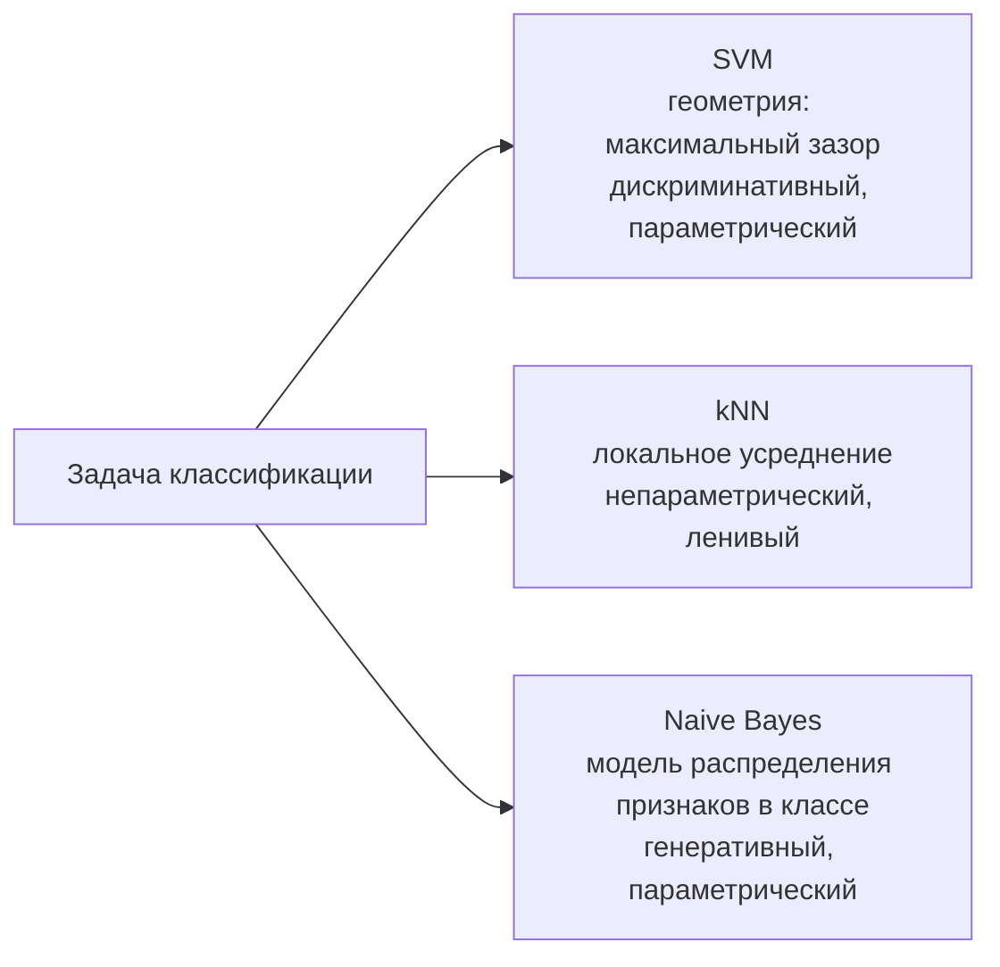

# SVM, kNN и наивный Байес

> **Зачем эта глава.** Три метода, которые редко выигрывают продовый бенчмарк, но почти всегда
> всплывают на собеседовании — потому что через них проверяют математическую зрелость. После этой
> главы вы сможете вывести двойственную задачу SVM и объяснить, откуда берутся опорные векторы,
> честно рассказать про kernel trick и условие Мерсера, показать на числах, почему kNN разваливается
> в высокой размерности, и объяснить, почему наивный Байес работает, хотя его главное допущение
> нарушено практически всегда.

**Уровень:** 🎯 middle → 🧠 middle+
**Предварительно нужно:** [линейная алгебра](../01-math/01-linear-algebra.md), [оптимизация](../01-math/04-optimization.md) (Лагранж, KKT), [теория вероятностей](../01-math/02-probability.md), [логистическая регрессия](03-logistic-regression.md)
**Как проработать:** чтение + вывод двойственной задачи руками + численные эксперименты

---

## Карта главы

- [1. Три ответа на один вопрос](#1-три-ответа-на-один-вопрос) — чем эти методы отличаются по существу
- [2. SVM: откуда берётся максимальный зазор](#2-svm-откуда-берётся-максимальный-зазор) — геометрия и постановка
- [3. Мягкий зазор и hinge loss](#3-мягкий-зазор-и-hinge-loss) — как SVM превращается в обычную задачу ERM
- [4. Двойственная задача и опорные векторы](#4-двойственная-задача-и-опорные-векторы) — полный вывод через Лагранжиан
- [5. Kernel trick и условие Мерсера](#5-kernel-trick-и-условие-мерсера) — почему это не «магия ядра»
- [6. SVM на практике](#6-svm-на-практике) — гиперпараметры, сложность, границы применимости
- [7. kNN: обучение без обучения](#7-knn-обучение-без-обучения) — метрики близости и веса
- [8. Проклятие размерности: численная демонстрация](#8-проклятие-размерности-численная-демонстрация) — почему расстояния вырождаются
- [9. Наивный Байес](#9-наивный-байес) — допущение, его нарушение и почему это часто не мешает
- [10. Компромиссы: что и когда выбирать](#10-компромиссы-что-и-когда-выбирать)
- [11. Подводные камни](#11-подводные-камни)
- [12. Проверь себя](#12-проверь-себя)
- [13. Практика](#13-практика)
- [14. Что читать дальше](#14-что-читать-дальше)

---

## 1. Три ответа на один вопрос

Задача одна и та же: есть выборка $\{(x_i, y_i)\}_{i=1}^{n}$, где $x_i \in \mathbb{R}^d$ — вектор
признаков, $y_i$ — метка класса. Нужно научиться предсказывать метку для нового объекта. Три метода
этой главы отвечают на неё принципиально по-разному, и именно это различие стоит держать в голове.

**SVM** говорит: граница между классами должна проходить как можно дальше от ближайших объектов.
Это чисто **геометрический** критерий, никакой вероятностной модели за ним нет.

**kNN** говорит: никакой границы вообще не нужно. Запомним всю выборку и будем спрашивать соседей.
Это **непараметрический** метод — модель не сжимает данные в конечный набор параметров $\theta$,
а хранит их целиком.

**Наивный Байес** говорит: смоделируем, как данные порождаются в каждом классе, а потом развернём
модель по формуле Байеса. Это **генеративный** подход — единственный из трёх, который умеет
отвечать на вопрос «а как выглядит типичный объект класса $k$?».

> 🌱 **База.** Если совсем коротко: SVM ищет самую широкую «просеку» между классами; kNN
> голосует по ближайшим соседям; наивный Байес считает, у какого класса больше шансов породить
> именно такой набор признаков. Дальше — почему каждый из этих трёх ответов ведёт к своей математике.



---

## 2. SVM: откуда берётся максимальный зазор

### 2.1 Проблема: линейных разделителей бесконечно много

Возьмём две линейно разделимые группы точек на плоскости. Провести прямую, которая их разделяет,
можно бесконечным числом способов, и все они дают **нулевую ошибку на обучении**. Перцептрон
остановится на первой попавшейся. Логистическая регрессия без регуляризации в этом случае вообще
уйдёт в бесконечность: правдоподобие растёт монотонно при увеличении $\|w\|$, и оптимума нет.

Между тем интуитивно ясно, что не все разделители одинаково хороши. Прямая, вплотную прижатая
к точкам одного класса, развалится от малейшего сдвига данных. Прямая, идущая ровно посередине
между классами, устойчива. Задача — превратить это «ровно посередине» в оптимизационный критерий.

### 2.2 Геометрия: расстояние до гиперплоскости

Гиперплоскость задаётся уравнением $w^\top x + b = 0$, где $w \in \mathbb{R}^d$ — вектор нормали,
$b \in \mathbb{R}$ — сдвиг. Метки удобно кодировать как $y_i \in \{-1, +1\}$ (не $\{0,1\}$ — увидим,
почему, через два шага).

Расстояние от точки $x_i$ до этой гиперплоскости:

$$
\rho(x_i) \;=\; \frac{|w^\top x_i + b|}{\|w\|_2}
$$

где $\|w\|_2 = \sqrt{\sum_{j=1}^{d} w_j^2}$ — евклидова норма нормали.

Теперь вспомним про метки. Если объект классифицирован верно, то знак $w^\top x_i + b$ совпадает
со знаком $y_i$, а значит произведение $y_i(w^\top x_i + b)$ положительно. Введём две величины:

$$
\hat\gamma_i = y_i\big(w^\top x_i + b\big)
\qquad\text{(функциональный отступ)},
\qquad
\gamma_i = \frac{\hat\gamma_i}{\|w\|_2}
\qquad\text{(геометрический отступ)}
$$

где $\hat\gamma_i$ — **отступ** (margin) объекта $i$ до нормировки, $\gamma_i$ — он же в единицах
расстояния. Отступ отрицателен ровно тогда, когда объект классифицирован неверно, и по модулю равен
расстоянию до границы. Это одна величина, в которую упакованы и «правильно ли» и «насколько уверенно».

> 📐 **Разбор формулы.** Умножение на $y_i$ — трюк, ради которого метки закодированы как $\pm 1$.
> Он снимает модуль: вместо «расстояние, и отдельно проверим знак» получаем одно число, знак
> которого — это корректность, а модуль — уверенность. Дальше вся теория SVM (и вся теория
> бустинга через margin) построена именно на $\hat\gamma_i$.

**Зазор** (margin) всей выборки — это минимальный геометрический отступ: $\gamma = \min_i \gamma_i$.
Мы хотим его максимизировать:

$$
\max_{w,\,b} \; \min_{i=1..n} \; \frac{y_i\big(w^\top x_i + b\big)}{\|w\|_2}
$$

### 2.3 Каноническая нормировка

Записанная задача неудобна: она имеет лишнюю степень свободы. Замена $(w, b) \to (cw, cb)$
при $c > 0$ не меняет ни гиперплоскость, ни геометрические отступы $\gamma_i$ — а вот
функциональные отступы $\hat\gamma_i$ умножаются на $c$. Значит, масштаб $\|w\|$ можно зафиксировать
как угодно, и это ничего не сломает. Фиксируем самым удобным способом:

$$
\min_{i=1..n} \; y_i\big(w^\top x_i + b\big) \;=\; 1
$$

Такая нормировка называется **канонической**. При ней ближайшие к границе объекты лежат ровно
на гиперплоскостях $w^\top x + b = \pm 1$, зазор равен $\gamma = 1/\|w\|_2$, а ширина всей полосы
между этими двумя гиперплоскостями — $2/\|w\|_2$.

Максимизировать $1/\|w\|$ — то же самое, что минимизировать $\|w\|$, то же самое, что минимизировать
$\tfrac12\|w\|^2$ (квадрат и множитель $\tfrac12$ добавлены, чтобы производная была чистой). Получаем
**задачу с жёстким зазором** (hard-margin SVM):

$$
\min_{w,\,b} \; \frac12 \|w\|_2^2
\qquad \text{при условии} \qquad
y_i\big(w^\top x_i + b\big) \ge 1, \quad i = 1,\dots,n
$$

где $n$ — число объектов, ограничение означает «каждый объект лежит на своей стороне и не ближе
чем на зазор». Это задача **квадратичного программирования**: выпуклая квадратичная целевая функция
при линейных ограничениях. У неё единственный минимум, и её умеют решать точно.

> 🧠 **Middle+.** Заметьте, что здесь произошло. Мы начали с задачи «максимизировать минимум
> отношения» — негладкой и невыпуклой на вид. Каноническая нормировка убрала масштабную
> неоднозначность и превратила её в гладкую выпуклую QP. Это стандартный приём: если у задачи есть
> инвариантность, зафиксируйте её явно, и задача упростится. То же самое делают в PCA (условие
> $\|v\| = 1$) и в нормировке эмбеддингов перед косинусным поиском.

---

## 3. Мягкий зазор и hinge loss

Hard-margin SVM бесполезен на реальных данных: если классы пересекаются хотя бы одним объектом,
допустимое множество пусто и задача не имеет решения вообще. Один выброс с перепутанной меткой
убивает модель.

Решение — разрешить нарушения, но брать за них плату. Вводим **переменные ослабления**
(slack variables) $\xi_i \ge 0$:

$$
\min_{w,\,b,\,\xi} \; \frac12\|w\|_2^2 \;+\; C\sum_{i=1}^{n}\xi_i
\qquad \text{при} \qquad
y_i\big(w^\top x_i + b\big) \ge 1 - \xi_i, \quad \xi_i \ge 0
$$

где $\xi_i$ — насколько объект $i$ «залез» внутрь полосы (или за границу), $C > 0$ — цена одной
единицы нарушения. Смысл $\xi_i$: при $\xi_i = 0$ объект вне полосы, при $0 < \xi_i < 1$ — внутри
полосы, но классифицирован верно, при $\xi_i > 1$ — классифицирован неверно.

Теперь ключевой переход, который многие пропускают. При фиксированных $w, b$ оптимальное $\xi_i$
находится тривиально: ограничения требуют $\xi_i \ge 1 - y_i(w^\top x_i + b)$ и $\xi_i \ge 0$,
а целевая функция штрафует $\xi_i$ и хочет сделать его как можно меньше. Значит:

$$
\xi_i^{*} \;=\; \max\Big(0,\; 1 - y_i\big(w^\top x_i + b\big)\Big)
$$

Подставим обратно и получим задачу **без ограничений**:

$$
\min_{w,\,b} \; \frac12\|w\|_2^2 \;+\; C\sum_{i=1}^{n} \max\Big(0,\; 1 - y_i\big(w^\top x_i + b\big)\Big)
$$

Функция $\ell_{\text{hinge}}(\hat\gamma) = \max(0, 1 - \hat\gamma)$ и есть **петлевая функция потерь**
(hinge loss). Разделим всё на $Cn$ и обозначим $\lambda = \frac{1}{2Cn}$:

$$
\min_{w,\,b} \; \frac{1}{n}\sum_{i=1}^{n} \max\Big(0,\; 1 - y_i\big(w^\top x_i + b\big)\Big)
\;+\; \lambda\|w\|_2^2
$$

Это обычная задача **минимизации эмпирического риска с L2-регуляризацией** — ровно того же вида,
что логистическая регрессия, только с другой функцией потерь. Вот и вся «магия» SVM: это линейная
модель с hinge loss и L2.

> 📐 **Разбор формулы.** Сравните три функции потерь как функции отступа $\hat\gamma = y\cdot f(x)$:
> - **0-1 loss**: $[\hat\gamma < 0]$ — то, что мы на самом деле хотим, но она разрывна и негладка,
>   оптимизировать нельзя;
> - **hinge**: $\max(0, 1-\hat\gamma)$ — выпуклая мажоранта 0-1, равна нулю при $\hat\gamma \ge 1$;
> - **logloss**: $\log(1 + e^{-\hat\gamma})$ — тоже выпуклая мажоранта, но строго положительная всюду.
>
> Разница между hinge и logloss ровно в одном месте: hinge **зануляется** при $\hat\gamma \ge 1$.
> Объект, уверенно классифицированный с запасом, вносит в потери **ровно ноль** и никак не влияет
> на решение. У logloss он вносит маленький, но ненулевой вклад — и потому влияет.

Из этого зануления следует всё остальное: разреженность решения, понятие опорного вектора и
отсутствие вероятностного выхода.

> 💬 **На собеседовании.** Спросят: «Чем SVM отличается от логистической регрессии?»
> Хороший ответ: функцией потерь и, как следствие, свойствами решения. Обе — линейные модели
> с L2-регуляризацией; SVM минимизирует hinge, логрегрессия — logloss. Hinge зануляется на объектах
> с отступом больше 1, поэтому решение SVM зависит только от объектов вблизи границы (опорных
> векторов) и устойчиво к далёким точкам; logloss учитывает все объекты, зато даёт откалиброванные
> вероятности, а SVM их не даёт — расстояние до границы не вероятность. Плюс исторически SVM
> удобнее ядруется. Плохой ответ: «SVM ищет максимальный зазор, а логрегрессия — вероятности»,
> без объяснения, что это одна и та же схема ERM с разной потерей.

---

## 4. Двойственная задача и опорные векторы

Прямую задачу можно решать напрямую — так работают `LinearSVC` и `SGDClassifier(loss='hinge')`.
Но двойственная форма даёт две вещи, ради которых стоит проделать вывод: **явное описание опорных
векторов** и **возможность подставить ядро**.

### 4.1 Лагранжиан

Возьмём задачу с мягким зазором в исходном виде (с ограничениями) и построим Лагранжиан. Для каждого
из двух семейств ограничений вводим свои множители: $\alpha_i \ge 0$ для
$y_i(w^\top x_i + b) - 1 + \xi_i \ge 0$ и $\mu_i \ge 0$ для $\xi_i \ge 0$.

$$
\mathcal{L}(w, b, \xi, \alpha, \mu)
= \frac12\|w\|_2^2 + C\sum_{i=1}^n \xi_i
- \sum_{i=1}^n \alpha_i\Big[y_i\big(w^\top x_i + b\big) - 1 + \xi_i\Big]
- \sum_{i=1}^n \mu_i \xi_i
$$

где $\alpha = (\alpha_1,\dots,\alpha_n)$ и $\mu = (\mu_1,\dots,\mu_n)$ — векторы множителей Лагранжа,
$C$ — параметр из прямой задачи. Задача выпуклая, ограничения линейные, поэтому условие Слейтера
выполнено и сильная двойственность имеет место: минимум прямой равен максимуму двойственной.

### 4.2 Условия стационарности

Приравниваем к нулю частные производные по прямым переменным.

По $w$:

$$
\frac{\partial \mathcal{L}}{\partial w} = w - \sum_{i=1}^n \alpha_i y_i x_i = 0
\qquad\Longrightarrow\qquad
\boxed{\; w = \sum_{i=1}^n \alpha_i y_i x_i \;}
$$

Уже здесь — важнейший факт: **оптимальный вектор весов есть линейная комбинация обучающих объектов**,
причём с коэффициентами $\alpha_i y_i$.

По $b$:

$$
\frac{\partial \mathcal{L}}{\partial b} = -\sum_{i=1}^n \alpha_i y_i = 0
\qquad\Longrightarrow\qquad
\sum_{i=1}^n \alpha_i y_i = 0
$$

По $\xi_i$:

$$
\frac{\partial \mathcal{L}}{\partial \xi_i} = C - \alpha_i - \mu_i = 0
\qquad\Longrightarrow\qquad
\alpha_i + \mu_i = C
$$

Так как $\mu_i \ge 0$, отсюда сразу следует $\alpha_i \le C$. Это знаменитое **box-ограничение**
$0 \le \alpha_i \le C$: параметр $C$ из прямой задачи превращается в потолок для двойственных
переменных.

### 4.3 Подстановка

Подставим найденные соотношения обратно в $\mathcal{L}$, слагаемое за слагаемым.

Первое: $\frac12\|w\|^2 = \frac12 \sum_{i=1}^n\sum_{j=1}^n \alpha_i\alpha_j y_i y_j\, x_i^\top x_j$.

Второе: $\sum_i \alpha_i y_i w^\top x_i = w^\top \sum_i \alpha_i y_i x_i = w^\top w = \|w\|^2 = \sum_{i,j} \alpha_i\alpha_j y_i y_j x_i^\top x_j$.

Третье: слагаемые с $b$ дают $-b\sum_i \alpha_i y_i = 0$ по второму условию стационарности.

Четвёртое: все слагаемые с $\xi_i$ собираются в $\sum_i \xi_i (C - \alpha_i - \mu_i) = 0$ по третьему
условию. Переменные ослабления исчезают полностью.

Собираем:

$$
\mathcal{L} = \frac12\sum_{i,j}\alpha_i\alpha_j y_iy_j x_i^\top x_j
- \sum_{i,j}\alpha_i\alpha_j y_iy_j x_i^\top x_j
+ \sum_i \alpha_i
= \sum_{i=1}^n \alpha_i - \frac12\sum_{i=1}^n\sum_{j=1}^n \alpha_i\alpha_j y_iy_j\, x_i^\top x_j
$$

Итоговая **двойственная задача**:

$$
\max_{\alpha} \;\; \sum_{i=1}^{n}\alpha_i \;-\; \frac12\sum_{i=1}^{n}\sum_{j=1}^{n}
\alpha_i\alpha_j\, y_i y_j\, x_i^\top x_j
\qquad \text{при} \qquad
0 \le \alpha_i \le C, \quad \sum_{i=1}^{n}\alpha_i y_i = 0
$$

где $\alpha_i$ — двойственная переменная объекта $i$, $C$ — верхняя граница из прямой задачи.

Обратите внимание на структуру: **признаки входят только через скалярные произведения**
$x_i^\top x_j$. Размерность $d$ в задаче больше нигде не фигурирует — есть только $n$ переменных
$\alpha_i$ и матрица попарных скалярных произведений размера $n\times n$. Это наблюдение и открывает
дверь ядрам (раздел 5).

### 4.4 Опорные векторы: чтение условий KKT

Условия дополняющей нежёсткости (complementary slackness) для нашей задачи:

$$
\alpha_i\Big[y_i\big(w^\top x_i + b\big) - 1 + \xi_i\Big] = 0,
\qquad
\mu_i\,\xi_i = 0,
\qquad
\alpha_i + \mu_i = C
$$

Разберём три возможных случая — это и есть содержательный смысл всей конструкции.

| Значение $\alpha_i$ | Что следует из KKT | Положение объекта | Название |
|---|---|---|---|
| $\alpha_i = 0$ | $\mu_i = C > 0 \Rightarrow \xi_i = 0$, ограничение неактивно | вне полосы, классифицирован верно с запасом | не опорный |
| $0 < \alpha_i < C$ | $\mu_i > 0 \Rightarrow \xi_i = 0$, и $y_i(w^\top x_i + b) = 1$ | ровно на границе полосы | свободный опорный вектор |
| $\alpha_i = C$ | $\mu_i = 0 \Rightarrow \xi_i \ge 0$ свободно | внутри полосы или с ошибкой | граничный опорный вектор |

**Опорные векторы** (support vectors) — это объекты с $\alpha_i > 0$. Только они входят в сумму
$w = \sum_i \alpha_i y_i x_i$; все остальные вносят нулевой вклад. Отсюда решающая функция:

$$
f(x) \;=\; \sum_{i \,:\, \alpha_i > 0} \alpha_i y_i \, x_i^\top x \;+\; b
$$

и предсказание $\hat y = \mathrm{sign}\, f(x)$.

Практических следствий три. Первое: **модель разрежена** — можно выбросить непорные объекты и
получить в точности ту же модель. Второе: **решение устойчиво** к далёким точкам — сдвиньте объект,
лежащий вне полосы, куда угодно (не пересекая полосу), и граница не шелохнётся. Третье, оборотная
сторона: **решение крайне чувствительно к объектам вблизи границы**, а значит и к шумным меткам
именно там.

Сдвиг $b$ вычисляется по свободным опорным векторам, для которых $y_i f(x_i) = 1$ выполнено точно:
$b = y_i - \sum_j \alpha_j y_j x_j^\top x_i$ для любого такого $i$ (на практике усредняют по всем).

> 💬 **На собеседовании.** Спросят: «Что такое опорный вектор и сколько их бывает?»
> Хороший ответ: объект с ненулевым двойственным множителем $\alpha_i$; по KKT это ровно те объекты,
> для которых ограничение активно, то есть лежащие на границе полосы или нарушающие её.
> Их доля растёт при уменьшении $C$ (полоса шире — больше объектов в неё попадает) и при
> уменьшении ширины RBF-ядра. Если опорными оказались почти все объекты — это диагностический
> сигнал: либо $C$ слишком мал, либо ядро подобрано плохо, либо данные не разделимы в этом
> пространстве. Плохой ответ: «это точки, ближайшие к границе» — верно только для hard-margin;
> в soft-margin опорными являются и все нарушители, включая грубо ошибочные.

---

## 5. Kernel trick и условие Мерсера

### 5.1 Проблема: явное отображение слишком дорого

Линейная модель не разделит классы, расположенные концентрическими кольцами. Стандартный выход —
добавить нелинейные признаки: перейти от $x$ к $\phi(x)$, где $\phi: \mathbb{R}^d \to \mathbb{R}^D$
поднимает объект в пространство большей размерности, и строить линейную модель уже там.

Проблема в цене. Полное полиномиальное отображение степени $p$ для $d$ признаков даёт
$\binom{d+p}{p}$ координат. При $d = 1000$ и $p = 3$ это порядка $1.7\cdot 10^8$ чисел на объект —
не помещается ни в память, ни в бюджет времени. А для некоторых полезных отображений $D = \infty$,
и построить их явно нельзя в принципе.

### 5.2 Наблюдение, из которого всё следует

Вернитесь к двойственной задаче. Признаки входят в неё **только** через скалярные произведения
$x_i^\top x_j$. То же верно и для решающей функции: $f(x) = \sum_i \alpha_i y_i x_i^\top x + b$.
Значит, если мы хотим работать в пространстве $\phi$, нам нужны не сами векторы $\phi(x_i)$,
а только числа $\phi(x_i)^\top \phi(x_j)$.

**Ядро** (kernel) — это функция, которая считает такое скалярное произведение напрямую, без
построения $\phi$:

$$
K(u, v) \;=\; \big\langle \phi(u),\, \phi(v) \big\rangle
$$

где $u, v \in \mathbb{R}^d$ — два объекта, $\phi$ — (возможно, бесконечномерное) отображение,
$\langle\cdot,\cdot\rangle$ — скалярное произведение в целевом пространстве.

Разберём на конкретике, что это значит. Возьмём $d = 2$ и $K(u,v) = (u^\top v)^2$:

$$
\begin{aligned}
(u^\top v)^2 &= (u_1v_1 + u_2v_2)^2 \\
&= u_1^2 v_1^2 + 2u_1u_2\,v_1v_2 + u_2^2 v_2^2 \\
&= \big\langle (u_1^2,\; \sqrt{2}\,u_1u_2,\; u_2^2),\;\; (v_1^2,\; \sqrt{2}\,v_1v_2,\; v_2^2) \big\rangle
\end{aligned}
$$

То есть $K(u,v) = (u^\top v)^2$ — это в точности скалярное произведение в пространстве всех
одночленов второй степени, где $\phi(u) = (u_1^2, \sqrt2 u_1u_2, u_2^2)$. Вычисление слева стоит
$O(d)$ операций, справа — $O(d^2)$ на построение векторов плюс $O(d^2)$ на произведение. При $p=3$
и $d=1000$ разрыв уже на восемь порядков. Вот и весь трюк: **мы никогда не строим $\phi$ явно**.

### 5.3 Условие Мерсера

Естественный вопрос: любую ли функцию двух аргументов можно назвать ядром? Нет. Нужен критерий,
гарантирующий, что за $K$ действительно стоит какое-то $\phi$.

**Условие Мерсера.** Симметричная функция $K(u,v) = K(v,u)$ является ядром (то есть существует
гильбертово пространство $\mathcal{H}$ и отображение $\phi: \mathbb{R}^d \to \mathcal{H}$
с $K(u,v) = \langle\phi(u),\phi(v)\rangle$) тогда и только тогда, когда для **любого** конечного
набора точек $x_1,\dots,x_m$ матрица Грама

$$
\mathbf{K} = \big[K(x_i, x_j)\big]_{i,j=1}^{m}
$$

**положительно полуопределена**, то есть $c^\top \mathbf{K}\, c \ge 0$ для всех $c \in \mathbb{R}^m$.

где $\mathbf{K}$ — матрица попарных значений ядра размера $m \times m$, $c$ — произвольный вектор
коэффициентов.

Зачем это нужно на практике, а не только в теории. Двойственная задача SVM — это максимизация
$\sum_i\alpha_i - \tfrac12 \alpha^\top Q \alpha$, где $Q_{ij} = y_iy_j K(x_i,x_j)$. Она выпуклая
(точнее, вогнутая по $\alpha$) **ровно тогда**, когда $Q$ положительно полуопределена, что
эквивалентно PSD матрицы Грама. Нарушите условие Мерсера — и вы получите невыпуклую задачу:
решатель может сойтись в локальный оптимум, не сойтись вовсе или выдать разные ответы при разном
порядке объектов. Это не абстрактный риск: популярное «сигмоидное ядро»
$K(u,v) = \tanh(\kappa\, u^\top v + c)$ является PSD не при всех $\kappa, c$, и LIBSVM явно
предупреждает об этом.

Проверять условие Мерсера вручную для каждой новой функции не нужно — достаточно знать правила
конструирования. Если $K_1, K_2$ — ядра, то ядрами являются и:

$$
a K_1 \;(a>0), \qquad K_1 + K_2, \qquad K_1 \cdot K_2, \qquad
g(u)\,K_1(u,v)\,g(v), \qquad \exp(K_1)
$$

где $g: \mathbb{R}^d \to \mathbb{R}$ — произвольная функция. Из этих правил выводятся все
стандартные ядра.

### 5.4 Три ядра, которые надо знать

**Линейное:** $K(u,v) = u^\top v$. Это отсутствие трюка; используется, когда $d$ велико (текст,
разреженные признаки) и данные и так почти разделимы.

**Полиномиальное:** $K(u,v) = (\kappa\, u^\top v + c)^p$, где $p$ — степень, $c \ge 0$ — сдвиг,
$\kappa > 0$ — масштаб. Соответствует пространству всех одночленов степени до $p$ (при $c > 0$)
или ровно $p$ (при $c = 0$). Практическая проблема: при больших $p$ значения ядра взрываются или
схлопываются к нулю, и обучение становится численно неустойчивым.

**Гауссово / RBF:** $K(u,v) = \exp\big(-\gamma\|u - v\|_2^2\big)$, где $\gamma > 0$ — параметр
ширины. Это ядро отвечает **бесконечномерному** пространству. Убедимся:

$$
\exp\big(-\gamma\|u-v\|^2\big)
= \underbrace{e^{-\gamma\|u\|^2}}_{g(u)} \cdot \underbrace{e^{-\gamma\|v\|^2}}_{g(v)} \cdot
\exp\big(2\gamma\, u^\top v\big),
\qquad
\exp\big(2\gamma\, u^\top v\big) = \sum_{k=0}^{\infty}\frac{(2\gamma)^k}{k!}\big(u^\top v\big)^k
$$

Ряд — это бесконечная сумма полиномиальных ядер всех степеней с положительными коэффициентами,
то есть ядро по правилам комбинирования; умножение на $g(u)g(v)$ тоже сохраняет свойство ядра.
Соответствующее $\phi$ имеет бесконечно много координат — и именно поэтому его невозможно построить
явно, а трюк с ядром становится не оптимизацией, а необходимостью.

> 🧠 **Middle+.** Полезная интуиция для RBF: $K(u,v) \in (0,1]$ и монотонно убывает с расстоянием.
> Решающая функция $f(x) = \sum_i \alpha_i y_i e^{-\gamma\|x_i - x\|^2} + b$ — это взвешенная сумма
> «колокольчиков», поставленных в опорные векторы. При очень большом $\gamma$ колокольчики узкие,
> каждый опорный вектор влияет только на свою окрестность — модель вырождается в 1-NN и
> переобучается. При очень малом $\gamma$ все $K(u,v) \approx 1$, различий между объектами нет —
> модель вырождается в константу. Отсюда практическое правило: $\gamma$ надо подбирать в масштабе
> $1/(\text{типичное квадратичное расстояние между объектами})$, что и делает
> `gamma='scale'` в scikit-learn.

> 💬 **На собеседовании.** Спросят: «В чём смысл kernel trick — мы же всё равно работаем
> в бесконечномерном пространстве, откуда экономия?»
> Хороший ответ: экономия в том, что нам никогда не нужны координаты в этом пространстве —
> двойственная задача и решающая функция зависят только от попарных скалярных произведений.
> Сложность определяется числом объектов $n$, а не размерностью $D$ спрямляющего пространства:
> матрица Грама имеет размер $n \times n$ независимо от того, $D = 3$ или $D = \infty$.
> Плата за это — квадратичная по $n$ память и решение, которое хранит опорные векторы, а не
> компактный вектор весов. Плохой ответ: «ядро делает данные линейно разделимыми» — это описание
> эффекта, а не механизма, и следующий вопрос («а как именно?») останется без ответа.

---

## 6. SVM на практике

```python
import numpy as np
from sklearn.datasets import make_circles
from sklearn.model_selection import train_test_split
from sklearn.pipeline import make_pipeline
from sklearn.preprocessing import StandardScaler
from sklearn.svm import SVC

X, y = make_circles(n_samples=2000, noise=0.12, factor=0.45, random_state=0)
X_tr, X_te, y_tr, y_te = train_test_split(X, y, test_size=0.3, random_state=0)

# StandardScaler обязателен: и hinge+L2, и RBF-ядро зависят от масштаба признаков.
# Без него признак с большим разбросом доминирует в ||u - v||^2 и в w.
model = make_pipeline(
    StandardScaler(),
    SVC(kernel="rbf", C=1.0, gamma="scale"),   # gamma='scale' = 1 / (d * Var(X))
).fit(X_tr, y_tr)

print("accuracy:", round(model.score(X_te, y_te), 3))
svc = model.named_steps["svc"]
print("опорных векторов:", svc.n_support_.sum(), "из", len(X_tr))
# доля опорных векторов — прямой индикатор сложности решения:
# близко к 100% означает, что модель фактически запоминает выборку
```

### Гиперпараметры, которые действительно двигают качество

| Параметр | Что делает | Куда крутить |
|---|---|---|
| `C` | цена нарушения зазора; $\lambda = 1/(2Cn)$ — сила L2 | больше $C$ → уже полоса, меньше опорных векторов, риск переобучения; меньше $C$ → мягче, устойчивее к шуму |
| `gamma` (RBF) | ширина колокольчика, $\gamma \sim 1/\sigma^2$ | больше $\gamma$ → локальнее и сложнее граница; подбирать вместе с `C` по логарифмической сетке |
| `kernel` | вид спрямляющего пространства | `linear` при $d \gg n$ и разреженных данных; `rbf` — дефолт для плотных числовых |
| `class_weight` | вес классов в hinge | `'balanced'` при дисбалансе — иначе минорный класс просто «оплачивается» слэками |

Стандартная сетка для поиска: $C \in \{10^{-2},\dots,10^{3}\}$, $\gamma \in \{10^{-4},\dots,10^{1}\}$,
обе логарифмические. Параметры сильно взаимодействуют, поэтому перебирать их надо совместно, а не по
очереди.

### Сложность: где проходит граница применимости

Обучение kernel-SVM решателем SMO стоит примерно $O(n^2 d)$ – $O(n^3)$ по времени и $O(n^2)$ по
памяти (матрица Грама, если её кэшировать целиком). Инференс — $O(n_{SV} \cdot d)$ на объект.

Практический ориентир: `SVC` с RBF комфортно работает до $n \approx 10^4$, терпимо до
$n \approx 5\cdot 10^4$, а на $10^6$ объектов не запустится в разумное время вообще. Именно поэтому
kernel-SVM ушёл из продакшена: бустинг на тех же данных обучается за минуты и обычно даёт качество
не хуже.

**Линейный** SVM — другое дело. `LinearSVC` (решатель liblinear) и `SGDClassifier(loss='hinge')`
масштабируются линейно по $n$ и прекрасно живут на разреженных данных высокой размерности. На задачах
вроде классификации текста по TF-IDF-признакам линейный SVM до сих пор — очень сильный и очень дешёвый
бейзлайн.

Промежуточный вариант, если хочется нелинейности при больших $n$, — **случайные признаки Фурье**
(`sklearn.kernel_approximation.RBFSampler` / `Nystroem`): построить явное приближение $\hat\phi(x)$
размерности $D \sim 10^3$ так, чтобы $\hat\phi(u)^\top\hat\phi(v) \approx K(u,v)$, и обучить поверх
него линейную модель. Получаем нелинейность за линейное время.

> ⚠️ **Типичная ошибка.** Интерпретировать `decision_function` SVM как вероятность или сравнивать
> её значения между разными обученными моделями → неверные пороги и сломанная калибровка.
> Это расстояние до границы в единицах $1/\|w\|$, а не вероятность. `SVC(probability=True)`
> не решает задачу «внутри», а обучает поверх модели сигмоиду Платта на кросс-валидации — это
> в 5+ раз дороже обучения и может противоречить `predict` в пограничных случаях. Если нужны
> вероятности — берите логистическую регрессию или калибруйте явно
> (см. [главу о калибровке](12-imbalance-and-calibration.md)).

---

## 7. kNN: обучение без обучения

### 7.1 Постановка

Метод $k$ ближайших соседей (k-nearest neighbours) устроен предельно просто. Обучение состоит
в запоминании выборки. Предсказание для объекта $x$:

1. Посчитать расстояния $\rho(x, x_i)$ до всех $n$ обучающих объектов.
2. Взять $k$ ближайших — множество $N_k(x)$.
3. Классификация: вернуть моду меток в $N_k(x)$. Регрессия: вернуть среднее.

Формально для классификации на $K$ классов:

$$
\hat y(x) \;=\; \arg\max_{c \in \{1..K\}} \sum_{i \in N_k(x)} w_i \cdot [\,y_i = c\,]
$$

где $N_k(x)$ — индексы $k$ ближайших к $x$ обучающих объектов, $w_i \ge 0$ — вес соседа,
$[\cdot]$ — индикатор, $K$ — число классов.

При $w_i \equiv 1$ это простое голосование. Вариант `weights='distance'` берёт
$w_i = 1/\rho(x, x_i)$ — ближние соседи весомее. Это заметно помогает при неоднородной плотности:
в разреженной области «ближайший» сосед может быть на другом конце пространства, и давать ему тот же
вес, что настоящему соседу в плотной области, — неправильно.

Параметр $k$ управляет компромиссом смещение–дисперсия напрямую: $k=1$ даёт нулевую ошибку на
обучении и высочайшую дисперсию (каждый шумовой объект создаёт вокруг себя свою область);
$k = n$ вырождается в константное предсказание — предельное смещение. Эффективное число степеней
свободы у kNN примерно $n/k$.

> ⚠️ **Типичная ошибка.** Оценивать kNN по ошибке на обучающей выборке при $k=1$ → получить
> идеальный ноль → решить, что модель прекрасна. При $k=1$ ближайший сосед объекта из обучающей
> выборки — он сам, ошибка тождественно нулевая и ничего не измеряет. kNN оценивают только
> на отложенных данных, а $k$ подбирают кросс-валидацией.

### 7.2 Метрика близости — это гиперпараметр, а не деталь

Всё поведение kNN определяется тем, что считается «близким». Основные варианты:

$$
\rho_{\text{Minkowski}}(u,v) = \Big(\sum_{j=1}^{d}|u_j - v_j|^p\Big)^{1/p}
$$

где $p = 2$ даёт евклидову метрику, $p = 1$ — манхэттенскую, $p \to \infty$ — Чебышёва.

$$
\rho_{\cos}(u,v) = 1 - \frac{u^\top v}{\|u\|_2\,\|v\|_2}
$$

— косинусное расстояние: игнорирует длину векторов, смотрит только на направление. Стандарт для
текстовых и эмбеддинговых представлений, где длина вектора отражает не смысл, а, например, длину
документа.

$$
\rho_{\text{Mahalanobis}}(u,v) = \sqrt{(u-v)^\top \Sigma^{-1} (u-v)}
$$

где $\Sigma$ — ковариационная матрица признаков. Эта метрика автоматически учитывает разброс и
корреляцию признаков: направления с большой дисперсией «сжимаются». Фактически это евклидово
расстояние после отбеливания данных.

Из последней формулы видно, почему **kNN обязательно требует масштабирования**. Евклидово расстояние —
это махаланобисово с $\Sigma = I$, то есть с неявным утверждением «все признаки одинаково важны и
одинаково разбросаны». Если один признак измеряется в рублях (разброс $10^5$), а другой — доля
(разброс $0.1$), то расстояние определяется исключительно первым, и остальные признаки просто
не существуют для модели.

> 💬 **На собеседовании.** Спросят: «Нужно ли масштабировать признаки для kNN? А для деревьев?»
> Хороший ответ: для kNN — обязательно, потому что метод оперирует расстояниями, а расстояние
> суммирует разности по координатам без учёта их масштаба; признак с большим разбросом подавит все
> остальные. Для деревьев — не нужно, потому что сплит выбирает порог по одному признаку и
> инвариантен к любому монотонному преобразованию. Тот же критерий работает для любой модели:
> зависит ли ответ от расстояний или от нормы весов — тогда масштабировать.
> Плохой ответ: «всегда масштабируем на всякий случай» — не объясняет, чем kNN отличается от дерева.

---

## 8. Проклятие размерности: численная демонстрация

Теперь главная слабость kNN, и заодно самое частое место, где кандидат отвечает заученным лозунгом
вместо понимания.

### 8.1 Что именно ломается

Утверждение «в высокой размерности всё далеко от всего» звучит эффектно, но неточно. Настоящая
проблема тоньше: **расстояния концентрируются**. Разница между расстоянием до ближайшего и до
самого дальнего соседа становится пренебрежимо малой по сравнению с самим расстоянием. Понятие
«ближайший» теряет смысл не потому, что все далеко, а потому, что все примерно одинаково далеко.

Посчитаем это аналитически для простейшего случая. Пусть координаты $u, v \sim U[0,1]^d$ независимы.
Разность одной координаты $t = u_j - v_j$ имеет треугольную плотность $f(t) = 1 - |t|$ на $[-1,1]$,
откуда:

$$
\mathbb{E}\big[t^2\big] = 2\int_0^1 t^2(1-t)\,dt = \tfrac16,
\qquad
\mathbb{E}\big[t^4\big] = 2\int_0^1 t^4(1-t)\,dt = \tfrac1{15}
$$

Значит для квадрата расстояния $S = \sum_{j=1}^d t_j^2$:

$$
\mathbb{E}[S] = \frac{d}{6},
\qquad
\mathrm{Var}[S] = d\left(\frac1{15} - \frac1{36}\right) = \frac{7d}{180}
$$

где $d$ — размерность, $S$ — квадрат евклидова расстояния между двумя случайными точками куба.

Относительный разброс:

$$
\frac{\sqrt{\mathrm{Var}[S]}}{\mathbb{E}[S]}
= \frac{\sqrt{7d/180}}{d/6}
= \sqrt{\frac{7 \cdot 36}{180\,d}}
= \sqrt{\frac{1.4}{d}} \;\xrightarrow[d\to\infty]{}\; 0
$$

Среднее расстояние растёт как $\sqrt{d}$, а его **относительный** разброс падает как $1/\sqrt{d}$.
Это и есть концентрация: все попарные расстояния сходятся к одному и тому же значению.

### 8.2 Проверяем на числах

```python
import numpy as np

rng = np.random.default_rng(0)
n_ref, n_pool = 200, 5000       # 200 запросов против пула из 5000 точек

print(f"{'d':>6} {'d_min':>8} {'d_max':>8} {'contrast':>9} {'rel_std':>8}")
for d in (2, 5, 10, 50, 100, 500, 1000):
    X = rng.random((n_pool, d))                  # равномерно в единичном кубе
    Q = rng.random((n_ref, d))
    # полная матрица расстояний запрос x пул
    D = np.sqrt(((Q[:, None, :] - X[None, :, :]) ** 2).sum(-1))
    dmin, dmax = D.min(1), D.max(1)
    contrast = ((dmax - dmin) / dmin).mean()     # относительный контраст расстояний
    rel_std = (D.std(1) / D.mean(1)).mean()      # концентрация: std/mean
    print(f"{d:>6} {dmin.mean():>8.3f} {dmax.mean():>8.3f} {contrast:>9.3f} {rel_std:>8.4f}")
```

Вывод:

```
     d    d_min    d_max  contrast  rel_std
     2    0.007    1.044   237.397   0.4419
     5    0.129    1.532    11.923   0.2633
    10    0.429    1.978     3.694   0.1790
    50    2.031    3.668     0.809   0.0777
   100    3.228    4.883     0.514   0.0551
   500    8.287    9.931     0.199   0.0246
  1000   12.081   13.728     0.136   0.0173
```

Читаем таблицу. При $d = 2$ самый дальний объект в 238 раз дальше ближайшего — «ближайший сосед»
означает что-то очень конкретное. При $d = 1000$ разница между ближайшим и самым дальним составляет
14% от расстояния до ближайшего: точка на расстоянии 12.08 и точка на расстоянии 13.73 практически
неразличимы, особенно если в признаках есть шум. Столбец `rel_std` падает ровно как предсказывает
теория: $\sqrt{1.4/d}$ для квадрата расстояния, что для самого расстояния даёт примерно вдвое
меньше — $0.059$ при $d=100$ против наблюдаемых $0.055$.

Формально этот результат известен как теорема Бейера, Гольдштейна, Рамакришнана и Шафта
(«When Is Nearest Neighbor Meaningful?», 1999): при широких условиях на распределение
$\frac{D_{\max} - D_{\min}}{D_{\min}} \to 0$ по вероятности при $d \to \infty$.

### 8.3 Что это значит для качества

Концентрация — не приговор сама по себе. Приговор — это когда размерность растёт за счёт
**неинформативных** признаков. Проверим:

```python
import numpy as np
from sklearn.datasets import make_classification
from sklearn.model_selection import train_test_split
from sklearn.neighbors import KNeighborsClassifier
from sklearn.ensemble import RandomForestClassifier

rng = np.random.default_rng(0)
X, y = make_classification(n_samples=4000, n_features=5, n_informative=5,
                           n_redundant=0, class_sep=1.5, random_state=0)

for n_noise in (0, 100, 500):
    # добавляем чистый гауссов шум: сигнал не меняется, размерность растёт
    Xn = np.hstack([X, rng.normal(size=(len(X), n_noise))])
    X_tr, X_te, y_tr, y_te = train_test_split(Xn, y, test_size=0.3, random_state=0)
    knn = KNeighborsClassifier(15).fit(X_tr, y_tr).score(X_te, y_te)
    rf = RandomForestClassifier(300, random_state=0, n_jobs=-1).fit(X_tr, y_tr).score(X_te, y_te)
    print(f"шумовых признаков {n_noise:>4}:  kNN {knn:.3f}   RF {rf:.3f}")
```

```
шумовых признаков    0:  kNN 0.972   RF 0.967
шумовых признаков  100:  kNN 0.917   RF 0.944
шумовых признаков  500:  kNN 0.828   RF 0.929
```

Сигнал в данных не изменился ни на йоту — те же пять информативных признаков, тот же class_sep.
Но kNN потерял 14 пунктов, а случайный лес — меньше 4. Причина в устройстве методов: в сумме
$\sum_j (u_j - v_j)^2$ пятьсот шумовых слагаемых просто заглушают пять полезных, и «соседи»
становятся случайными. Дерево же выбирает признаки по критерию и шумовые в сплиты почти не берёт.

**Отсюда практический вывод**: kNN нужно подавать не сырые признаки, а либо тщательно отобранные,
либо сжатое представление — PCA, эмбеддинги, обученную метрику. kNN поверх 128-мерных эмбеддингов
из нейросети работает отлично, а kNN поверх 500 сырых табличных признаков — почти никогда.

> 💬 **На собеседовании.** Спросят: «Почему kNN плохо работает в высокой размерности?»
> Хороший ответ: из-за концентрации расстояний. Матожидание расстояния между случайными точками
> растёт как $\sqrt d$, а его стандартное отклонение — как константа, поэтому относительный контраст
> $(D_{\max}-D_{\min})/D_{\min}$ падает как $O(1/\sqrt d)$; при $d\sim 10^3$ ближайший и самый дальний
> сосед отличаются на десяток процентов, и понятие соседства вырождается. Практически это проявляется
> не в самой размерности, а в доле неинформативных признаков: они входят в расстояние с тем же весом,
> что и полезные. Лечится отбором признаков, снижением размерности или обучением метрики.
> Плохой ответ: «потому что данных не хватает, чтобы покрыть пространство» — это про другой аспект
> проклятия размерности (нужен $O(\varepsilon^{-d})$ объём выборки) и не объясняет, почему деревья
> в тех же условиях держатся.

### 8.4 Как ускоряют kNN

Наивный поиск стоит $O(nd)$ на запрос — при $n = 10^7$ это неприемлемо. Ускорители:

- **KD-tree** — рекурсивное разбиение по координатам. Даёт $O(\log n)$ на запрос, но **только при
  малом $d$** (примерно до 20). Дальше отсечение ветвей перестаёт работать по той же причине —
  концентрация расстояний, — и дерево деградирует до полного перебора, при этом ещё и медленнее его
  из-за накладных расходов.
- **Ball-tree** — разбиение гипершарами вместо параллелепипедов. Терпит размерности повыше и работает
  с произвольными метриками, но принципиально проблему не решает.
- **ANN — приближённый поиск** (approximate nearest neighbours): HNSW, IVF-PQ, ScaNN. Отказываемся
  от гарантии точного ответа в обмен на скорость: recall@10 порядка 0.95–0.99 при ускорении
  в сотни раз. Это единственный работающий вариант при больших $n$ и $d \sim 10^2$–$10^3$;
  подробный разбор — в [главе про ANN-поиск](../10-recsys/06-two-tower-and-ann.md).

---

## 9. Наивный Байес

### 9.1 Проблема: оценить $p(x \mid y)$ невозможно в лоб

Байесовский классификатор оптимален: если бы мы знали истинные $p(y = k)$ и $p(x \mid y = k)$,
то правило

$$
\hat y(x) = \arg\max_{k}\; p(y = k)\,p(x \mid y = k)
$$

давало бы минимально возможную ошибку. Проблема в оценке $p(x \mid y = k)$ — совместного
распределения $d$ признаков. Для $d$ бинарных признаков в нём $2^d - 1$ свободных параметров
на каждый класс. При $d = 30$ это порядка $10^9$ параметров, а выборки у нас — тысячи объектов.
Оценить нечем.

### 9.2 Допущение

Наивный Байес разрубает узел радикальным предположением:

> **Признаки условно независимы при известном классе.**

$$
p(x \mid y = k) \;=\; \prod_{j=1}^{d} p\big(x_j \mid y = k\big)
$$

где $x_j$ — $j$-й признак объекта, $k \in \{1,\dots,K\}$ — класс. Число параметров падает
с экспоненциального до $O(Kd)$: для каждого класса и каждого признака — одномерное распределение.

Подставляем в правило Байеса и логарифмируем (произведение сотен вероятностей мгновенно уходит
в машинный ноль, поэтому в лог-пространстве работают всегда, а не «для удобства»):

$$
\hat y(x) = \arg\max_{k}\;\left[\;\log p(y = k) \;+\; \sum_{j=1}^{d}\log p\big(x_j \mid y = k\big)\right]
$$

где $p(y=k)$ — априорная вероятность класса, оцениваемая долей класса в выборке.

**Ключевое наблюдение**: правая часть — сумма слагаемых, каждое из которых зависит только от одного
признака. Для мультиномиальной и бернуллиевской версии эта сумма **линейна по $x$**, то есть наивный
Байес — это **линейный классификатор**, у которого веса не подбираются оптимизацией, а считаются
по закрытым формулам за один проход по данным. Отсюда его главное практическое достоинство: обучение
за $O(nd)$ без единой итерации.

### 9.3 Три версии для трёх типов признаков

**Мультиномиальный (multinomial NB)** — счётчики, классика для текста. Признак $x_j$ — сколько раз
слово $j$ встретилось в документе:

$$
\hat\theta_{kj} \;=\; \frac{N_{kj} + \alpha}{N_k + \alpha\,V}
$$

где $N_{kj}$ — суммарное число вхождений слова $j$ во все документы класса $k$,
$N_k = \sum_{j} N_{kj}$ — общее число словоупотреблений в классе $k$, $V = d$ — размер словаря,
$\alpha > 0$ — параметр сглаживания.

Сглаживание здесь не косметика. Без него ($\alpha = 0$) любое слово, ни разу не встреченное в классе
$k$, даёт $\hat\theta_{kj} = 0$, и всё произведение обнуляется: один незнакомый токен объявляет
класс невозможным независимо от остальных ста слов документа. **Сглаживание Лапласа** ($\alpha = 1$)
или Лидстоуна ($\alpha < 1$) — это MAP-оценка с сопряжённым априорным распределением Дирихле, а не
хак. В `sklearn.naive_bayes.MultinomialNB` параметр называется `alpha`, дефолт 1.0; на больших
словарях часто лучше 0.01–0.1.

**Бернуллиевский (Bernoulli NB)** — бинарные признаки «слово есть / слова нет». Отличие от
мультиномиального принципиальное: он **явно штрафует за отсутствие** слова, добавляя множитель
$(1 - \theta_{kj})$ для каждого отсутствующего признака. На коротких текстах (заголовки, запросы)
это обычно работает лучше, на длинных — хуже.

**Гауссовский (Gaussian NB)** — непрерывные признаки:

$$
p\big(x_j \mid y = k\big) = \frac{1}{\sqrt{2\pi\sigma_{kj}^2}}
\exp\left(-\frac{(x_j - \mu_{kj})^2}{2\sigma_{kj}^2}\right)
$$

где $\mu_{kj}$ и $\sigma^2_{kj}$ — выборочные среднее и дисперсия признака $j$ по объектам класса $k$.

> 🧠 **Middle+.** Гауссовский NB — это в точности QDA (квадратичный дискриминантный анализ)
> с **диагональной** ковариационной матрицей. Условная независимость признаков при гауссовой модели
> и есть требование диагональности $\Sigma_k$. Отсюда видна цена допущения: NB не способен уловить
> ни одной корреляции между признаками внутри класса. И отсюда же понятно, что делать, если
> корреляции важны, а данных мало: LDA (общая полная $\Sigma$) — разумный компромисс между
> диагональным NB и полным QDA.

### 9.4 Почему это работает, хотя допущение почти всегда ложно

В тексте слова «Нью» и «Йорк» зависимы чудовищно. В табличных данных признаки коррелируют всегда.
Допущение нарушено — а метод работает. Почему?

Ответ в различении двух задач: **оценка вероятностей** и **выбор argmax**. Для классификации
по 0-1 loss нам нужен только правильный argmax. Наивный Байес систематически ошибается в самих
вероятностях, но порядок классов при этом часто сохраняет.

Механизм такой: если два признака сильно коррелированы, NB учитывает их свидетельство **дважды**,
как будто это два независимых наблюдения. Логарифм отношения правдоподобий раздувается. Но
раздувается он в **ту же сторону** — знак не меняется, меняется только модуль. Argmax устойчив,
а вот вероятности уезжают к 0 и 1: типичный NB на тексте выдаёт `predict_proba` вроде
$0.99999$ и $10^{-5}$, что не имеет ничего общего с реальной уверенностью. Формальный анализ
условий, при которых NB оптимален по 0-1 loss несмотря на нарушенное допущение, дан в работе
Домингоса и Паццани (1997).

> ⚠️ **Типичная ошибка.** Использовать `predict_proba` наивного Байеса как вероятность —
> для порога, для ранжирования по риску, для расчёта ожидаемой выгоды → все пороги оказываются
> в области $0.9999$, а бизнес-логика ломается. NB — один из самых плохо откалиброванных
> классификаторов. Если нужны вероятности: калибруйте изотонической регрессией на отложенной
> выборке или берите логистическую регрессию.

### 9.5 Генеративный или дискриминативный: когда NB выигрывает у логрегрессии

Мультиномиальный NB и логистическая регрессия — обе линейные модели, различие в том, как ищутся
веса. NB моделирует $p(x, y)$ и получает веса из счётчиков; логрегрессия напрямую максимизирует
$p(y \mid x)$.

Ын и Джордан (2001) показали характерную картину: у логистической регрессии **ниже асимптотическая
ошибка**, но она достигает её медленнее — ей нужно порядка $O(d)$ объектов. Наивному Байесу хватает
$O(\log d)$ объектов, чтобы прийти к своей (более высокой) асимптоте. Пересечение кривых обучения
означает практическое правило:

- **мало данных относительно числа признаков** ($n \lesssim d$) — NB часто выигрывает;
- **много данных** — логрегрессия обгоняет и дальше не отдаёт преимущество.

Плюс NB даёт то, чего дискриминативные модели не дают вовсе: обучение за один проход, тривиальное
дообучение на новых данных (`partial_fit` — просто досчитать счётчики), работа при пропусках
(отсутствующий признак просто выкидывается из суммы) и осмысленное поведение при $n < d$.

```python
from sklearn.datasets import fetch_20newsgroups
from sklearn.feature_extraction.text import TfidfVectorizer
from sklearn.naive_bayes import MultinomialNB
from sklearn.pipeline import make_pipeline
from sklearn.metrics import accuracy_score

cats = ["sci.space", "rec.sport.hockey", "talk.politics.mideast", "comp.graphics"]
train = fetch_20newsgroups(subset="train", categories=cats, remove=("headers", "footers"))
test = fetch_20newsgroups(subset="test", categories=cats, remove=("headers", "footers"))

# alpha=0.1 вместо дефолтной 1.0: на большом словаре лапласово сглаживание
# с alpha=1 слишком сильно сдвигает оценки редких слов к равномерным
clf = make_pipeline(TfidfVectorizer(sublinear_tf=True, min_df=2), MultinomialNB(alpha=0.1))
clf.fit(train.data, train.target)
print("accuracy:", round(accuracy_score(test.target, clf.predict(test.data)), 3))
# ~0.85-0.90; обучение занимает доли секунды — это и есть ценность NB как бейзлайна
```

> 💬 **На собеседовании.** Спросят: «Почему наивный Байес называется наивным и мешает ли это?»
> Хороший ответ: наивность — в допущении условной независимости признаков при известном классе,
> которое почти всегда ложно. Мешает оно оценке вероятностей: коррелированные признаки учитываются
> как независимые свидетельства, лог-отношение правдоподобий раздувается, и `predict_proba`
> прижимается к 0 и 1. Но для 0-1 loss важен только argmax, а его знак от такого раздувания обычно
> не меняется — поэтому accuracy остаётся приличной. Отсюда практика: NB — отличный быстрый бейзлайн
> для текста и плохой источник вероятностей. Плохой ответ: «наивный, потому что простой».

---

## 10. Компромиссы: что и когда выбирать

Ни один из трёх методов сегодня не является дефолтом для табличных задач — там правит бустинг.
Но у каждого есть ниша, где он остаётся правильным выбором.

| Условие задачи | Метод | Почему |
|---|---|---|
| $d \gg n$, разреженные признаки (TF-IDF, one-hot) | линейный SVM | hinge + L2 хорошо работает при огромной размерности; liblinear быстр на разреженных матрицах |
| Нужен быстрый бейзлайн на тексте за минуту | MultinomialNB | обучение за один проход, ноль гиперпараметров кроме `alpha` |
| $n$ до нескольких тысяч, сложная нелинейная граница, признаков мало | RBF-SVM | ядро даёт гибкую границу без ручного конструирования признаков |
| Поиск похожих, рекомендации по контенту, эмбеддинги | kNN / ANN | сама задача формулируется как «найди ближайших» |
| Онлайн-обучение с постоянным потоком новых классов | NB или kNN | оба дообучаются без переобучения с нуля |
| Нужны калиброванные вероятности | ни один из трёх | SVM даёт расстояние, NB переуверен, kNN даёт дискретные доли $m/k$ |
| $n > 10^5$, табличные разнородные признаки | ни один из трёх | бустинг обучится быстрее и точнее |

Отдельно про kNN в проде. Как классификатор он используется редко, но как **компонент** —
повсеместно: retrieval-стадия в рекомендациях, поиск похожих товаров, дедупликация, few-shot
через ближайшие примеры, RAG-ретривер. Во всех этих случаях работает не `KNeighborsClassifier`,
а ANN-индекс поверх обученных эмбеддингов. То есть понимать kNN надо, а вот применять его к сырым
признакам — почти никогда.

---

## 11. Подводные камни

**SVM обучается часами и не заканчивается.**
Симптом: `SVC` на 200 тысячах объектов висит.
Причина: kernel-SVM имеет сложность между $O(n^2)$ и $O(n^3)$ и требует $O(n^2)$ памяти под матрицу
Грама.
Что делать: `LinearSVC`/`SGDClassifier(loss='hinge')` при линейном ядре; `Nystroem`/`RBFSampler`
плюс линейная модель, если нужна нелинейность; либо просто взять бустинг.

**Забыли масштабирование перед SVM или kNN.**
Симптом: качество на уровне случайного; модель фактически использует один признак.
Причина: и RBF-ядро (через $\|u-v\|^2$), и L2-регуляризация, и все метрики расстояния зависят
от масштаба.
Что делать: `StandardScaler` внутри `Pipeline` — именно внутри, иначе статистики скейлера утекут
из валидационных фолдов в обучение.

**Почти все объекты стали опорными векторами.**
Симптом: `n_support_` близко к размеру обучающей выборки, инференс медленный.
Причина: слишком малое $C$ (полоса шире всех данных) или слишком большое $\gamma$ (каждый объект
влияет только на себя).
Что делать: логарифмическая сетка по $C$ и $\gamma$ совместно; проверить, что данные отмасштабированы.

**kNN отлично работает офлайн и не укладывается в SLA в проде.**
Симптом: p99 латентности сотни миллисекунд.
Причина: точный поиск — $O(nd)$ на запрос, а KD-tree при $d > 20$ вырождается в полный перебор.
Что делать: ANN-индекс (HNSW/IVF-PQ), снижение размерности перед индексом, кэширование запросов.

**Наивный Байес выдаёт вероятности 0.0 и 1.0.**
Симптом: `predict_proba` возвращает вырожденные значения, ROC-AUC при этом приличный.
Причина: перемножение сотен зависимых множителей + недостаточное сглаживание.
Что делать: увеличить `alpha`; для вероятностей — калибровать; для ранжирования — использовать
`predict_log_proba` и разности логитов, они информативнее.

**kNN на данных с дисбалансом всегда предсказывает мажорный класс.**
Симптом: recall минорного класса около нуля при $k = 20$.
Причина: голосование большинством в разреженной области заполняется мажорным классом просто по
плотности.
Что делать: уменьшить $k$, взять `weights='distance'`, использовать порог по доле соседов
минорного класса, а не argmax.

**Утечка через масштабирование и через отбор признаков перед кросс-валидацией.**
Симптом: kNN/SVM показывает нереалистично высокое качество на CV, проваливается на тесте.
Причина: `StandardScaler` или `SelectKBest` применён ко всей выборке до разбиения — статистики
и выбор признаков видели валидационные объекты.
Что делать: всё в `Pipeline`, кросс-валидация поверх пайплайна
(см. [главу о валидации и утечках](13-validation-and-leakage.md)).

---

## 12. Проверь себя

<details>
<summary><b>🌱 Вопрос.</b> Что такое «максимальный зазор» и почему именно он?</summary>

**Короткий ответ.** Зазор — расстояние от разделяющей гиперплоскости до ближайшего объекта выборки.
SVM выбирает ту гиперплоскость, для которой это расстояние максимально: такая граница наиболее
устойчива к небольшим сдвигам данных.

**Развёрнуто.** Линейно разделяющих гиперплоскостей бесконечно много, и все они дают нулевую ошибку
на обучении — критерий «нет ошибок» их не различает. Нужен дополнительный принцип. Максимальный
зазор формализует идею «граница посередине»: чем шире полоса, в которой нет объектов, тем больший
шум в данных модель переживёт без изменения предсказаний. В канонической нормировке
$\min_i y_i(w^\top x_i + b) = 1$ зазор равен $1/\|w\|$, поэтому его максимизация эквивалентна
минимизации $\tfrac12\|w\|^2$ — выпуклая задача квадратичного программирования.

**Чего ждёт интервьюер:** что вы понимаете мотивацию, а не заучили постановку; и что вы связываете
максимизацию зазора с минимизацией нормы весов.

**Провал:** «зазор — это расстояние между классами» — зазор определён относительно границы, а не
между классами, и в soft-margin классы могут пересекаться.
</details>

<details>
<summary><b>🎯 Вопрос.</b> Зачем нужна каноническая нормировка $\min_i y_i(w^\top x_i + b) = 1$?</summary>

**Короткий ответ.** Она убирает лишнюю степень свободы: масштабирование $(w,b)\to(cw,cb)$ не меняет
гиперплоскость, поэтому исходная задача имеет бесконечно много эквивалентных решений и записывается
как максимизация отношения. Фиксация масштаба превращает её в гладкую выпуклую QP.

**Развёрнуто.** Исходно мы максимизируем $\min_i \frac{y_i(w^\top x_i+b)}{\|w\|}$. Числитель и
знаменатель растут одинаково при масштабировании — оптимум не определён однозначно. Требуя, чтобы
минимальный функциональный отступ равнялся единице, мы выбираем одного представителя из каждого
класса эквивалентности; при этом геометрический зазор становится равен $1/\|w\|$, и задача
принимает вид $\min \tfrac12\|w\|^2$ при $y_i(w^\top x_i + b) \ge 1$. Единица здесь произвольна —
можно было взять любую положительную константу, изменился бы только масштаб $w$.

**Чего ждёт интервьюер:** понимания, что это техника снятия инвариантности, а не магическое число.

**Провал:** «так удобнее считать» без объяснения, что именно неоднозначно.
</details>

<details>
<summary><b>🧠 Вопрос.</b> Выведите двойственную задачу SVM с мягким зазором.</summary>

**Короткий ответ.**
$\max_\alpha \sum_i \alpha_i - \tfrac12\sum_{i,j}\alpha_i\alpha_j y_iy_j x_i^\top x_j$
при $0 \le \alpha_i \le C$ и $\sum_i \alpha_i y_i = 0$.

**Развёрнуто.** Строим Лагранжиан с множителями $\alpha_i \ge 0$ для ограничения
$y_i(w^\top x_i+b) \ge 1-\xi_i$ и $\mu_i \ge 0$ для $\xi_i \ge 0$. Условия стационарности:
по $w$ даёт $w = \sum_i \alpha_i y_i x_i$; по $b$ — $\sum_i \alpha_i y_i = 0$; по $\xi_i$ —
$\alpha_i + \mu_i = C$, откуда с учётом $\mu_i \ge 0$ следует $\alpha_i \le C$. Подставляя обратно:
слагаемые с $\xi$ и с $b$ обнуляются, квадратичная часть даёт $-\tfrac12\sum_{i,j}\alpha_i\alpha_j y_iy_j x_i^\top x_j$, линейная — $\sum_i\alpha_i$. Задача выпуклая с линейными ограничениями,
условие Слейтера выполнено, поэтому двойственность сильная и решения совпадают.

**Чего ждёт интервьюер:** что вы сами доходите до box-ограничения $\alpha_i \le C$ и понимаете,
что признаки входят только через скалярные произведения.

**Провал:** воспроизвести ответ без вывода и не суметь объяснить, откуда взялось $\alpha_i \le C$.
</details>

<details>
<summary><b>🎯 Вопрос.</b> Как поведёт себя SVM, если удалить из обучающей выборки все не-опорные объекты?</summary>

**Короткий ответ.** Модель не изменится вообще — получится в точности та же гиперплоскость.

**Развёрнуто.** Из условия стационарности $w = \sum_i \alpha_i y_i x_i$, а по KKT $\alpha_i = 0$
для всех объектов с отступом строго больше 1. Такие объекты не входят в сумму, не влияют
на $b$ и не участвуют в решающей функции. Это отличает SVM от логистической регрессии, где logloss
на далёком объекте мал, но строго положителен, и потому этот объект влияет на решение.
Обратная сторона: SVM полностью определяется небольшим числом пограничных объектов и потому
чувствителен к шумным меткам именно возле границы — один неверно размеченный объект в полосе
сдвинет всё решение.

**Чего ждёт интервьюер:** знания KKT-условий не формально, а с содержательным следствием.

**Провал:** «качество немного упадёт» — признак того, что человек не связал $\alpha_i = 0$
с невлиянием объекта.
</details>

<details>
<summary><b>🧠 Вопрос.</b> Что такое условие Мерсера и что сломается, если его нарушить?</summary>

**Короткий ответ.** Симметричная функция $K$ является ядром тогда и только тогда, когда матрица
Грама $[K(x_i,x_j)]$ положительно полуопределена для любого конечного набора точек. При нарушении
двойственная задача перестаёт быть выпуклой.

**Развёрнуто.** PSD-условие гарантирует, что существует гильбертово пространство и отображение
$\phi$ с $K(u,v) = \langle\phi(u),\phi(v)\rangle$ — то есть что мы действительно считаем скалярное
произведение, а не произвольную функцию похожести. Практическое следствие видно из двойственной
задачи: она имеет вид $\max_\alpha \sum_i\alpha_i - \tfrac12\alpha^\top Q\alpha$ с
$Q_{ij} = y_iy_jK(x_i,x_j)$, и вогнутость требует PSD матрицы $Q$. Без этого SMO может не сойтись,
сойтись в локальный оптимум или давать разный ответ при разном порядке данных. Реальный пример —
сигмоидное ядро $\tanh(\kappa u^\top v + c)$, PSD не при всех параметрах. На практике новые ядра
не изобретают с нуля, а собирают из известных по правилам замыкания: сумма, произведение,
умножение на положительную константу, $g(u)K(u,v)g(v)$, экспонента.

**Чего ждёт интервьюер:** различения «функция похожести» и «ядро», плюс понимания связи PSD
с выпуклостью.

**Провал:** «условие Мерсера — что ядро должно быть симметричным» — симметрия необходима,
но далеко не достаточна.
</details>

<details>
<summary><b>🎯 Вопрос.</b> Что произойдёт с RBF-SVM при $\gamma \to \infty$ и при $\gamma \to 0$?</summary>

**Короткий ответ.** При $\gamma\to\infty$ модель вырождается в 1-NN и полностью переобучается;
при $\gamma\to 0$ — в константу (плюс линейную модель в пределе первого порядка).

**Развёрнуто.** $K(u,v) = e^{-\gamma\|u-v\|^2}$. При большом $\gamma$ ядро близко к нулю всюду,
кроме $u = v$: матрица Грама стремится к единичной, каждый объект становится опорным вектором
и влияет только на себя. На обучении — идеальное качество, на тесте — катастрофа. При малом
$\gamma$ все значения ядра близки к 1, объекты неразличимы, решающая функция почти постоянна.
Практически $\gamma$ подбирают вокруг $1/(d\cdot\mathrm{Var}(X))$ — это и есть `gamma='scale'`
в scikit-learn — и обязательно совместно с $C$, потому что оба параметра управляют
эффективной сложностью и сильно взаимодействуют.

**Чего ждёт интервьюер:** что вы понимаете $\gamma$ как масштаб локальности, а не «просто параметр».

**Провал:** перепутать направление — сказать, что большое $\gamma$ сглаживает.
</details>

<details>
<summary><b>🎯 Вопрос.</b> Как выбрать $k$ в kNN и что происходит при $k=1$ и при $k=n$?</summary>

**Короткий ответ.** Кросс-валидацией. $k=1$ — максимальная дисперсия и нулевая ошибка на обучении;
$k=n$ — константное предсказание, максимальное смещение.

**Развёрнуто.** $k$ управляет гладкостью решающей функции: эффективное число степеней свободы
примерно $n/k$. Малое $k$ даёт изрезанную границу, повторяющую каждый шумовой объект; большое $k$
усредняет по слишком широкой окрестности и размывает реальную структуру. Типичные значения —
от 5 до 50, часто берут нечётное для бинарной задачи, чтобы избежать ничьих. Важнее самого $k$
обычно две вещи: масштабирование признаков и `weights='distance'`, которое смягчает проблему
неоднородной плотности. Оценивать $k$ по ошибке на обучении нельзя: при $k=1$ она тождественно
нулевая, потому что ближайший сосед объекта — он сам.

**Чего ждёт интервьюер:** связки $k$ с bias-variance и знания про ловушку $k=1$ на трейне.

**Провал:** «$k = \sqrt{n}$» как единственный ответ — это эвристика, а не обоснование.
</details>

<details>
<summary><b>🧠 Вопрос.</b> Почему kNN плохо работает в высокой размерности? Дайте количественную оценку.</summary>

**Короткий ответ.** Из-за концентрации расстояний: относительный контраст
$(D_{\max}-D_{\min})/D_{\min}$ убывает как $O(1/\sqrt d)$, и понятие «ближайший» теряет смысл.

**Развёрнуто.** Для точек, равномерных в $[0,1]^d$, квадрат расстояния между двумя случайными
точками имеет $\mathbb{E}[S] = d/6$ и $\mathrm{Var}[S] = 7d/180$, откуда относительное стандартное
отклонение равно $\sqrt{1.4/d}$. Среднее растёт как $\sqrt d$, разброс — как константа: все
расстояния сходятся к одному значению. Численно: при $d=10$ самый дальний объект примерно
в 4.7 раза дальше ближайшего, при $d=1000$ — всего на 14%. Формальный результат —
теорема Бейера и соавторов (1999). Практически критична не сама размерность, а доля
неинформативных признаков: они входят в сумму квадратов с тем же весом, что и полезные,
и заглушают сигнал. Эксперимент: добавление 500 гауссовых шумовых признаков к пяти информативным
роняет accuracy kNN с 0.97 до 0.83, тогда как случайный лес теряет менее 4 пунктов.

**Чего ждёт интервьюер:** количественную формулировку вместо лозунга, и понимание, почему
деревья устойчивее.

**Провал:** «в многомерном пространстве данные разрежены, нужно экспоненциально много объектов» —
это верное, но другое утверждение, и оно не объясняет, почему kNN хуже дерева при том же $n$.
</details>

<details>
<summary><b>🎯 Вопрос.</b> В чём наивность наивного Байеса и почему он всё равно работает?</summary>

**Короткий ответ.** В допущении условной независимости признаков при известном классе. Работает
потому, что для 0-1 loss нужен только правильный argmax, а он к нарушению допущения устойчивее,
чем сами вероятности.

**Развёрнуто.** Допущение $p(x\mid y=k) = \prod_j p(x_j \mid y=k)$ снижает число параметров
с экспоненциального по $d$ до $O(Kd)$ — только благодаря ему модель вообще обучаема на реальных
выборках. Когда признаки коррелированы, NB засчитывает их свидетельство многократно, лог-отношение
правдоподобий раздувается по модулю, но обычно сохраняет знак — поэтому argmax остаётся верным,
а вероятности прижимаются к 0 и 1. Отсюда прямое практическое правило: NB годится как быстрый
классификатор и как бейзлайн, но его `predict_proba` нельзя использовать для порогов и для
расчёта ожидаемых величин без калибровки. Условия оптимальности NB по 0-1 loss при нарушенном
допущении разобраны у Домингоса и Паццани (1997).

**Чего ждёт интервьюер:** различения «оценить вероятность» и «выбрать класс».

**Провал:** «работает, потому что признаки на самом деле почти независимы» — в тексте это заведомо
неверно.
</details>

<details>
<summary><b>🎯 Вопрос.</b> Зачем в наивном Байесе сглаживание Лапласа?</summary>

**Короткий ответ.** Чтобы ни одна условная вероятность не была нулевой: один незнакомый признак
иначе обнуляет всё произведение и делает класс невозможным независимо от остальных свидетельств.

**Развёрнуто.** Оценка $\hat\theta_{kj} = N_{kj}/N_k$ равна нулю для любого слова, не встреченного
в классе $k$ на обучении. В лог-пространстве это $-\infty$, и апостериорная вероятность класса
становится нулевой при любых других признаках. Сглаживание $\hat\theta_{kj} = (N_{kj}+\alpha)/ (N_k + \alpha V)$ — это MAP-оценка с сопряжённым априорным распределением Дирихле с параметром
$\alpha$, то есть не хак, а корректный байесовский вывод. При $\alpha = 1$ (Лаплас) на большом
словаре сглаживание может оказаться слишком сильным и смазать различия между редкими словами;
на практике `alpha` подбирают, часто в диапазоне 0.01–1.

**Чего ждёт интервьюер:** знания, что это MAP с априорным Дирихле, а не «прибавим единичку,
чтобы не делить на ноль».

**Провал:** «чтобы избежать деления на ноль» — деления на ноль там нет, проблема в нуле в числителе.
</details>

<details>
<summary><b>🧠 Вопрос.</b> Когда наивный Байес обгонит логистическую регрессию, и почему?</summary>

**Короткий ответ.** Когда объектов мало относительно числа признаков. NB как генеративная модель
сходится к своей асимптоте за $O(\log d)$ объектов, логрегрессии нужно $O(d)$; асимптота при этом
у логрегрессии ниже.

**Развёрнуто.** Ын и Джордан (2001) сравнили пару «NB — логистическая регрессия» как генеративный
и дискриминативный варианты одной и той же линейной модели. Дискриминативная модель не делает
предположений о $p(x\mid y)$ и потому в пределе точнее, но ей нужно больше данных, чтобы оценить
веса. Генеративная модель вносит сильное (и неверное) допущение, что ограничивает её сверху, зато
резко снижает дисперсию оценок — на малых выборках это выигрыш. Кривые обучения пересекаются;
где именно — зависит от задачи. Практическое следствие: на маленьком размеченном корпусе текстов
NB — сильный бейзлайн, а при десятках тысяч документов линейная модель на TF-IDF почти всегда
обгоняет.

**Чего ждёт интервьюер:** понимания оси «генеративное vs дискриминативное» и того, что дело
в скорости сходимости, а не в «простоте».

**Провал:** «NB всегда хуже, это игрушка».
</details>

<details>
<summary><b>🎯 Вопрос.</b> Даёт ли SVM вероятности? Что делает `probability=True`?</summary>

**Короткий ответ.** Нет. `decision_function` — это отступ, расстояние до границы в единицах
$1/\|w\|$. `probability=True` обучает поверх SVM сигмоиду Платта на внутренней кросс-валидации.

**Развёрнуто.** Hinge loss не является правильной (proper) функцией потерь для оценки вероятностей:
она зануляется при отступе больше 1, поэтому модель не различает объект с отступом 1.5 и 15 —
для потерь они одинаковы. Значит из решения SVM вероятность в принципе не извлекается. Платт
предложил обучить одномерную логистическую регрессию $p = \sigma(a\cdot f(x) + b)$ по
кросс-валидационным предсказаниям; sklearn делает это при `probability=True`, что делает обучение
в несколько раз дороже (пятифолдовая CV внутри) и может приводить к рассогласованию `predict`
и `predict_proba` возле порога. Если вероятности важны — логистическая регрессия или явная
калибровка через `CalibratedClassifierCV`.

**Чего ждёт интервьюер:** понимания, что вероятности требуют proper loss, а hinge таковой не является.

**Провал:** «да, `decision_function` можно прогнать через сигмоиду» — без обучения параметров
сигмоиды это произвольное преобразование.
</details>

---

## 13. Практика

**Задача 1. Вывод (40 минут, на бумаге).**
Проделайте вывод двойственной задачи из [§4](#4-двойственная-задача-и-опорные-векторы) самостоятельно, не подглядывая. Затем ответьте:
(а) что изменится в двойственной задаче, если убрать сдвиг $b$ (положить его равным нулю);
(б) как выглядит двойственная задача для $\nu$-SVM, где вместо $C$ фиксируется доля опорных
векторов; (в) почему $\sum_i \alpha_i y_i = 0$ — это именно следствие наличия $b$.
*Критерий: вы можете объяснить, откуда берётся каждое ограничение, и не путаете $\alpha_i \le C$
с $\alpha_i \ge 0$.*

**Задача 2. Опорные векторы своими глазами (1 час).**
На двумерных синтетических данных (`make_blobs` с `cluster_std=1.5`) обучите `SVC(kernel='linear')`
для $C \in \{0.01, 0.1, 1, 100\}$. Для каждого нарисуйте границу, полосу $\pm 1$ и подсветите
опорные векторы (`svc.support_vectors_`). Постройте график «$C$ → число опорных векторов».
*Критерий: вы видите монотонное убывание числа опорных векторов с ростом $C$ и можете объяснить
его через ширину полосы, а не через «регуляризация».*

**Задача 3. Ядро руками (45 минут).**
Реализуйте функцию `rbf_kernel(X, Y, gamma)` на numpy без циклов (через
$\|u-v\|^2 = \|u\|^2 - 2u^\top v + \|v\|^2$). Проверьте совпадение с
`sklearn.metrics.pairwise.rbf_kernel` до $10^{-10}$. Затем убедитесь численно, что матрица Грама
положительно полуопределена (`np.linalg.eigvalsh` — все собственные значения $\ge -10^{-8}$),
и найдите такие $\kappa, c$, при которых матрица Грама сигмоидного ядра
$\tanh(\kappa u^\top v + c)$ имеет отрицательное собственное значение.
*Критерий: у вас есть конкретный контрпример к PSD для сигмоидного ядра — это лучшее доказательство,
что условие Мерсера не автоматическое.*

**Задача 4. Концентрация расстояний (1 час).**
Повторите эксперимент из [§8.2](#82-проверяем-на-числах), но для трёх распределений: равномерного в кубе, гауссова и
«разреженного» (координаты нулевые с вероятностью 0.99). Постройте график
`contrast` от $d$ в логарифмических осях.
*Критерий: вы обнаруживаете, что для разреженных данных концентрация наступает намного позже —
и можете объяснить, почему это спасает kNN на текстовых мешках слов, где $d \sim 10^5$.*

**Задача 5. NB против логрегрессии на кривой обучения (1.5 часа).**
На `fetch_20newsgroups` (4 категории) постройте кривые обучения для `MultinomialNB(alpha=0.1)`
и `LogisticRegression` при размерах обучающей выборки 50, 100, 200, 500, 1000, 2000 документов
(усредните по 10 случайным подвыборкам).
*Критерий: вы наблюдаете пересечение кривых и можете назвать примерный размер выборки, при котором
логрегрессия обгоняет NB на этих данных.*

**Задача 6. Калибровка (45 минут).**
Постройте кривые калибровки (`sklearn.calibration.calibration_curve`) для `MultinomialNB`,
`SVC(probability=True)` и `LogisticRegression` на одной задаче.
*Критерий: вы видите характерную S-образную кривую NB, прижатую к углам, и можете объяснить
её через перемножение зависимых множителей.*

---

## 14. Что читать дальше

- [Cortes C., Vapnik V. «Support-Vector Networks» (1995)](https://link.springer.com/article/10.1007/BF00994018) —
  первоисточник soft-margin SVM. Читать ради постановки и разбора двойственной задачи; изложение
  на удивление доступное.
- [Hsu C.-W., Chang C.-C., Lin C.-J. «A Practical Guide to Support Vector Classification»](https://www.csie.ntu.edu.tw/~cjlin/papers/guide/guide.pdf) —
  восемнадцать страниц от авторов LIBSVM: масштабирование, выбор ядра, сетка по $C$ и $\gamma$.
  Самый практичный текст про SVM, который существует.
- **Hastie, Tibshirani, Friedman. «The Elements of Statistical Learning», гл. 12 и 13** —
  гл. 12 даёт SVM как задачу регуляризации в RKHS (взгляд, объясняющий связь с ridge-регрессией
  и сплайнами), гл. 13 — kNN и прототипные методы, включая обсуждение проклятия размерности.
- **Bishop C. «Pattern Recognition and Machine Learning», гл. 6–7** — самое аккуратное изложение
  ядерных методов и разреженных ядерных машин; там же — вывод через RKHS и связь с гауссовскими
  процессами.
- **Beyer K. et al. «When Is "Nearest Neighbor" Meaningful?», ICDT 1999** — работа, в которой
  доказана теорема о концентрации расстояний из [§8](#8-проклятие-размерности-численная-демонстрация). Стоит прочитать хотя бы формулировку теоремы
  и условия, при которых она **не** выполняется, — это объясняет, почему kNN всё же работает
  на разреженных и на кластеризованных данных.
- **Ng A., Jordan M. «On Discriminative vs. Generative Classifiers: A Comparison of Logistic
  Regression and Naive Bayes», NIPS 2001** — про пересечение кривых обучения и про то,
  когда генеративная модель выигрывает.
- **Domingos P., Pazzani M. «On the Optimality of the Simple Bayesian Classifier under Zero-One
  Loss», Machine Learning, 1997** — формальный ответ на вопрос «почему наивный Байес работает,
  хотя допущение нарушено».
- [Документация scikit-learn: Support Vector Machines](https://scikit-learn.org/stable/modules/svm.html) —
  раздел про сложность и про практические советы; полезно как справка по параметрам и по
  особенностям многоклассовой схемы.
- [Документация scikit-learn: Nearest Neighbors](https://scikit-learn.org/stable/modules/neighbors.html) —
  разбор KD-tree/Ball-tree и границ их применимости по размерности.
- [Malkov Yu., Yashunin D. «Efficient and robust approximate nearest neighbor search using
  HNSW graphs» (2016)](https://arxiv.org/abs/1603.09320) — то, чем на самом деле реализуют kNN
  в проде; читать после этой главы, если работаете с эмбеддингами.

---

⬅️ [XGBoost, LightGBM, CatBoost](08-boosting-in-practice.md) | 🏠 [Оглавление](../index.md) | ➡️ [Кластеризация](10-clustering.md)
