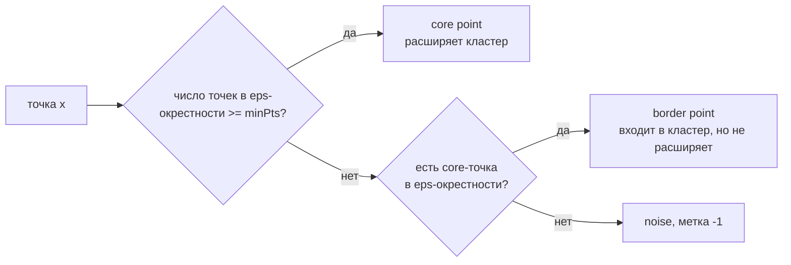

# Кластеризация

> **Зачем эта глава.** Кластеризация — единственная задача в классическом ML, у которой нет
> правильного ответа: нет разметки, нет функции потерь, согласованной с бизнесом, и почти нет
> способа честно проверить результат. После этой главы вы сможете доказать сходимость KMeans,
> вывести E- и M-шаги EM для гауссовой смеси, объяснить, почему DBSCAN находит луны, а KMeans нет,
> и — главное — аргументированно ответить на вопрос «сколько у вас кластеров и почему именно
> столько».

**Уровень:** 🎯 middle → 🧠 middle+
**Предварительно нужно:** [линейная алгебра](../01-math/01-linear-algebra.md), [теория вероятностей](../01-math/02-probability.md), [оптимизация](../01-math/04-optimization.md), [SVM, kNN и наивный Байес](09-svm-knn-bayes.md) (метрики близости и проклятие размерности)
**Как проработать:** чтение + вывод EM руками + эксперименты

---

## Карта главы

- [1. Задача без правильного ответа](#1-задача-без-правильного-ответа) — почему кластеризация сложнее классификации
- [2. KMeans: постановка и алгоритм](#2-kmeans-постановка-и-алгоритм)
- [3. Почему KMeans сходится: доказательство](#3-почему-kmeans-сходится-доказательство) — координатный спуск и монотонность инерции
- [4. Инициализация и k-means++](#4-инициализация-и-k-means)
- [5. Чувствительность к масштабу и к форме](#5-чувствительность-к-масштабу-и-к-форме) — где KMeans врёт
- [6. Иерархическая кластеризация](#6-иерархическая-кластеризация)
- [7. DBSCAN: кластеры как области плотности](#7-dbscan-кластеры-как-области-плотности) — core/border/noise и выбор eps
- [8. HDBSCAN](#8-hdbscan) — что чинит и какой ценой
- [9. GMM и алгоритм EM](#9-gmm-и-алгоритм-em) — полный вывод E- и M-шагов
- [10. Метрики качества кластеризации](#10-метрики-качества-кластеризации) — силуэт, ARI, NMI
- [11. Выбор числа кластеров](#11-выбор-числа-кластеров)
- [12. Компромиссы: что выбирать](#12-компромиссы-что-выбирать)
- [13. Подводные камни](#13-подводные-камни)
- [14. Проверь себя](#14-проверь-себя)
- [15. Практика](#15-практика)
- [16. Что читать дальше](#16-что-читать-дальше)

---

## 1. Задача без правильного ответа

В обучении с учителем всё честно: есть $y$, есть метрика, есть отложенная выборка. Кластеризация
устроена принципиально иначе. Дано только $X = \{x_1,\dots,x_n\}$, где $x_i \in \mathbb{R}^d$, и
требуется разбить объекты на $K$ групп «похожих». Что такое «похожие» — часть постановки задачи,
а не её решения.

Возьмите выборку пользователей маркетплейса. Их можно разбить по среднему чеку, по частоте покупок,
по категориям товаров, по времени суток активности, по устройству. Все пять разбиений **корректны**.
Какое из них правильное — зависит от того, что вы собираетесь с кластерами делать. Если рассылать
разные промо — нужна сегментация по чувствительности к цене. Если планировать склад — по категориям.
Алгоритм этого не знает и знать не может.

Отсюда три следствия, которые задают весь тон главы.

**Первое.** Выбор метрики близости и предобработки признаков влияет на результат сильнее, чем выбор
алгоритма. Смена масштаба одного признака переворачивает разбиение целиком (увидим на числах в §5).

**Второе.** Каждый алгоритм несёт **встроенное определение кластера**, и это определение — главное,
что о нём надо знать:

| Алгоритм | Что он называет кластером |
|---|---|
| KMeans | компактное шарообразное облако вокруг центроида |
| Ward / иерархическая | группа, слияние которой меньше всего увеличивает разброс |
| DBSCAN | связная область высокой плотности, окружённая областью низкой |
| GMM | выборка из одной гауссовой компоненты смеси |
| Спектральные методы | плотно связанная компонента графа близости |

Если ваши данные устроены не так, как считает алгоритм, — он всё равно выдаст разбиение, и оно
будет выглядеть убедительно. Кластеризация никогда не отвечает «не знаю».

**Третье.** Оценивать результат нечем. Внутренние метрики (силуэт, инерция) измеряют
самосогласованность разбиения, а не его полезность; они систематически предпочитают ту геометрию,
на которую заточены. Внешние метрики (ARI, NMI) требуют эталонной разметки, которой в реальной
задаче нет — иначе вы решали бы задачу классификации.

> 🌱 **База.** Практический вывод для новичка: кластеризация почти никогда не бывает конечной целью.
> Она — способ породить гипотезу («вот эти пользователи ведут себя по-другому»), которую дальше
> проверяют внешним критерием: A/B-тестом, метрикой downstream-модели, разметкой экспертом.
> Кластеризация, которую никто не проверил снаружи, не является результатом.

---

## 2. KMeans: постановка и алгоритм

### 2.1 Функционал

Зафиксируем число кластеров $K$. Ищем два объекта одновременно: разбиение объектов по кластерам
и положения центров. Минимизируем **инерцию** (within-cluster sum of squares, WCSS):

$$
J(z, \mu) \;=\; \sum_{i=1}^{n} \big\| x_i - \mu_{z_i} \big\|_2^2
$$

где $x_i \in \mathbb{R}^d$ — объект $i$, $n$ — число объектов, $K$ — число кластеров,
$z_i \in \{1,\dots,K\}$ — номер кластера, в который назначен объект $i$,
$\mu_k \in \mathbb{R}^d$ — центр (центроид) кластера $k$, $\mu = (\mu_1,\dots,\mu_K)$,
$z = (z_1,\dots,z_n)$.

Эквивалентная запись через множества $C_k = \{i : z_i = k\}$:

$$
J \;=\; \sum_{k=1}^{K}\sum_{i \in C_k} \big\|x_i - \mu_k\big\|_2^2
$$

Заметьте, что минимизируется здесь: суммарный **квадрат** евклидова расстояния до своего центра.
Именно из квадрата и из евклидовой нормы вытекут все свойства и все патологии метода.

### 2.2 Задача NP-трудна, поэтому алгоритм эвристический

Точная минимизация $J$ по всем разбиениям — NP-трудная задача (уже при $K = 2$ в произвольной
размерности и при $d = 2$ для произвольного $K$). Число разбиений $n$ объектов на $K$ непустых
групп — число Стирлинга второго рода, растущее как $K^n/K!$; при $n = 1000, K = 5$ это порядка
$10^{697}$. Перебор невозможен.

Алгоритм Ллойда (он же «алгоритм KMeans») — жадная эвристика:

1. Инициализировать $\mu_1,\dots,\mu_K$.
2. **Шаг назначения:** $z_i \leftarrow \arg\min_k \|x_i - \mu_k\|_2^2$ для всех $i$.
3. **Шаг обновления:** $\mu_k \leftarrow \dfrac{1}{|C_k|}\displaystyle\sum_{i \in C_k} x_i$ для всех $k$.
4. Повторять 2–3, пока назначения меняются.

Сложность одной итерации — $O(nKd)$. Число итераций на практике десятки, редко больше сотни.

> ⌨️ **Руками.** Реализуйте эти четыре строки на numpy за 15 минут, не подглядывая: матрица
> расстояний через broadcasting, `argmin` по оси кластеров, пересчёт центров через маску.
> Единственное неочевидное место — что делать с пустым кластером; см. §13.

---

## 3. Почему KMeans сходится: доказательство

Это вопрос, который отделяет «запускал KMeans» от «понимаю KMeans», и его действительно спрашивают.
Докажем, что инерция монотонно невозрастает и алгоритм останавливается за конечное число шагов.

### 3.1 KMeans — это координатный спуск

Функционал $J(z, \mu)$ зависит от двух групп переменных. Оптимизировать их совместно тяжело, но
при фиксированной одной группе минимум по другой находится **точно и в закрытой форме**. Это ровно
схема **блочного координатного спуска** (block coordinate descent), и два шага алгоритма Ллойда —
это два его шага.

**Шаг назначения — точная минимизация по $z$ при фиксированном $\mu$.**

Сумма $J = \sum_i \|x_i - \mu_{z_i}\|^2$ распадается на независимые слагаемые: значение $z_i$
влияет только на $i$-е слагаемое. Значит минимум по всему вектору $z$ достигается покомпонентно:

$$
z_i^{\text{new}} = \arg\min_{k \in \{1..K\}} \big\|x_i - \mu_k\big\|_2^2
$$

Отсюда сразу:

$$
J\big(z^{\text{new}}, \mu\big) \;\le\; J\big(z^{\text{old}}, \mu\big)
\tag{1}
$$

потому что для каждого $i$ новое слагаемое не больше старого (в худшем случае $z_i$ не изменился).

**Шаг обновления — точная минимизация по $\mu$ при фиксированном $z$.**

Здесь нужна лемма.

<details>
<summary><b>Лемма.</b> Среднее минимизирует сумму квадратов отклонений.</summary>

Для любого набора точек $\{x_i\}_{i \in C}$ с выборочным средним $\bar x = \frac{1}{|C|}\sum_{i\in C}x_i$
и любого вектора $c \in \mathbb{R}^d$:

$$
\sum_{i \in C}\|x_i - c\|^2 \;=\; \sum_{i\in C}\|x_i - \bar x\|^2 \;+\; |C|\cdot\|\bar x - c\|^2
$$

**Доказательство.** Добавим и вычтем $\bar x$:

$$
\begin{aligned}
\sum_{i\in C}\|x_i - c\|^2
&= \sum_{i\in C}\big\|(x_i - \bar x) + (\bar x - c)\big\|^2 \\
&= \sum_{i\in C}\|x_i-\bar x\|^2
 + 2\,(\bar x - c)^\top \underbrace{\sum_{i\in C}(x_i - \bar x)}_{= \,0 \text{ по определению } \bar x}
 + |C|\cdot\|\bar x - c\|^2
\end{aligned}
$$

Перекрёстный член зануляется, потому что сумма отклонений от среднего равна нулю. Второе слагаемое
неотрицательно и обращается в ноль только при $c = \bar x$. $\blacksquare$
</details>

Из леммы: при фиксированном разбиении сумма по кластеру $k$ минимизируется выбором $\mu_k = \bar x_{C_k}$,
то есть ровно шагом обновления. Отсюда:

$$
J\big(z, \mu^{\text{new}}\big) \;\le\; J\big(z, \mu^{\text{old}}\big)
\tag{2}
$$

### 3.2 Монотонность и конечность

Комбинируя (1) и (2), за одну полную итерацию $t \to t+1$:

$$
J\big(z^{(t+1)}, \mu^{(t+1)}\big)
\;\overset{(2)}{\le}\;
J\big(z^{(t+1)}, \mu^{(t)}\big)
\;\overset{(1)}{\le}\;
J\big(z^{(t)}, \mu^{(t)}\big)
$$

Инерция **не возрастает никогда**. Дальше — аргумент о конечности. Значение $J$ полностью
определяется разбиением $z$ (центры пересчитываются по нему однозначно). Разбиений конечное число.
Последовательность $J^{(t)}$ невозрастает, значит одно и то же разбиение не может встретиться дважды
с промежуточными изменениями — иначе $J$ вернулась бы к прежнему значению, пройдя через строго
меньшее, что невозможно. Следовательно, алгоритм не зацикливается и за конечное число шагов приходит
к разбиению, которое не меняется. **Это точка сходимости.**

Проверим численно, что монотонность выполняется буквально на каждом полушаге:

```python
import numpy as np
from sklearn.datasets import make_blobs


def kmeans_trace(X, K, seed=0, n_iter=7):
    """KMeans с логированием инерции ПОСЛЕ КАЖДОГО полушага.

    Нужен именно полушаговый лог: монотонность — свойство координатного спуска,
    и она обязана выполняться отдельно для шага назначения и для шага обновления.
    """
    rng = np.random.default_rng(seed)
    mu = X[rng.choice(len(X), K, replace=False)].astype(float)
    hist = []
    for _ in range(n_iter):
        D = ((X[:, None, :] - mu[None]) ** 2).sum(-1)      # (n, K) квадраты расстояний
        z = D.argmin(1)
        hist.append(D[np.arange(len(X)), z].sum())          # J после шага назначения
        for k in range(K):
            if (z == k).any():                              # пустой кластер оставляем на месте
                mu[k] = X[z == k].mean(0)
        D2 = ((X[:, None, :] - mu[None]) ** 2).sum(-1)
        hist.append(D2[np.arange(len(X)), z].sum())         # J после шага обновления
    return np.array(hist)


X, _ = make_blobs(n_samples=2000, centers=5, cluster_std=1.5, random_state=3)
h = kmeans_trace(X, K=5)
print(np.round(h, 1))
print("монотонно невозрастает:", bool(np.all(np.diff(h) <= 1e-8)))
```

```
[31346.3 18368.7 16516.3 15622.8 14841.7 13970.  12930.9 11752.9
 10474.7  9179.1  8618.8  8412.8  8337.2  8314.2]
монотонно невозрастает: True
```

> ⚠️ **Типичная ошибка.** Из монотонной сходимости заключить, что KMeans находит оптимум.
> Не находит. Координатный спуск гарантирует лишь остановку в точке, из которой ни один
> **отдельный** шаг не улучшает функционал. Классический контрпример: два далёких плотных
> кластера, в каждом из которых поставили по два центра, и третий кластер, оставшийся без центра
> вовсе. Ни одно переназначение и ни один пересчёт средних эту конфигурацию не исправят —
> она устойчива и при этом плоха. Именно поэтому существует `n_init`.

> 💬 **На собеседовании.** Спросят: «Гарантированно ли KMeans сходится? К чему именно?»
> Хороший ответ: гарантированно сходится за конечное число шагов, потому что это блочный
> координатный спуск по выпуклому квадратичному функционалу с точной минимизацией на каждом
> полушаге, а число разбиений конечно. Но сходится он к **локальному** минимуму, зависящему
> от инициализации: сама задача NP-трудна. Отсюда практика — несколько запусков (`n_init`) и
> умная инициализация (k-means++). Плохой ответ: «сходится к глобальному минимуму, потому что
> функционал выпуклый» — $J$ выпукла по $\mu$ при фиксированном $z$, но **не** совместно
> по $(z,\mu)$; $z$ вообще дискретна.

---

## 4. Инициализация и k-means++

Случайный выбор $K$ точек в качестве стартовых центров работает плохо ровно по одной причине:
с высокой вероятностью два центра попадут в один и тот же плотный кластер, а какой-то другой
кластер останется непокрытым. Чем больше $K$, тем вероятнее такая коллизия.

**k-means++** (Артур и Вассилвицкий, 2007) чинит это одной идеей — выбирать следующий центр
тем охотнее, чем он дальше от уже выбранных:

1. Первый центр $\mu_1$ — случайный объект выборки.
2. Для $k = 2,\dots,K$: обозначим $D(x) = \min_{j < k}\|x - \mu_j\|_2$ — расстояние от объекта $x$
   до ближайшего уже выбранного центра. Выбрать $\mu_k = x_i$ с вероятностью

$$
p(x_i) \;=\; \frac{D(x_i)^2}{\sum_{l=1}^{n} D(x_l)^2}
$$

где $D(x_i)$ — расстояние от объекта $i$ до ближайшего из уже выбранных центров, $n$ — размер выборки.
Это называется **$D^2$-семплированием**.

Обратите внимание, что это именно семплирование, а не «взять самый дальний». Если брать argmax,
метод будет цепляться за выбросы: самая далёкая точка — почти наверняка аномалия. Вероятностный
выбор пропорционально $D^2$ даёт компромисс: далёкие области получают приоритет, но одиночный
выброс редко перевешивает целый непокрытый кластер, потому что кластер вносит в сумму много слагаемых.

Теоретическая гарантия: $\mathbb{E}[J_{\text{++}}] \le 8(\ln K + 2)\, J_{\text{OPT}}$, где
$J_{\text{OPT}}$ — глобальный минимум инерции. Это единственная известная гарантия качества
для KMeans, и получается она **до единой итерации Ллойда** — только за счёт инициализации.

Практический эффект хорошо виден на задаче с большим $K$:

```python
import numpy as np
from sklearn.cluster import KMeans
from sklearn.datasets import make_blobs

X, _ = make_blobs(n_samples=6000, centers=25, cluster_std=0.8,
                  n_features=10, random_state=7)

for init in ("random", "k-means++"):
    # n_init=1: смотрим качество ОДНОГО запуска, иначе эффект инициализации замаскирован
    vals = np.array([KMeans(n_clusters=25, init=init, n_init=1, random_state=s)
                     .fit(X).inertia_ for s in range(30)])
    good = np.mean(vals <= vals.min() * 1.01)
    print(f"{init:>10}: среднее {vals.mean():9.0f}  лучшее {vals.min():9.0f} "
          f" худшее {vals.max():9.0f}  доля хороших запусков {good:.2f}")
```

```
    random: среднее    197343  лучшее    107176  худшее    294833  доля хороших запусков 0.03
 k-means++: среднее     39247  лучшее     37817  худшее     52122  доля хороших запусков 0.90
```

Разница в пять раз по средней инерции. Со случайной инициализацией только 3% запусков попадают
в 1% от лучшего результата — то есть при `n_init=1` вы почти наверняка получите мусор.
С k-means++ таких запусков 90%.

В scikit-learn `init='k-means++'` и `n_init` — дефолты (`n_init='auto'` с версии 1.4 подставляет
1 для k-means++ и 10 для random). При $K \gtrsim 20$ ставьте `n_init=10` явно.

> 🧠 **Middle+.** Стоимость k-means++ — $K$ последовательных проходов по данным, то есть $O(nKd)$,
> ровно как одна итерация Ллойда. Для больших данных существует **k-means||** (scalable k-means++):
> вместо одной точки за проход семплируют $O(K)$ точек за проход, укладываясь в $O(\log K)$ проходов,
> и затем кластеризуют полученных кандидатов. Это то, что реализовано в Spark MLlib. `MiniBatchKMeans`
> — другая история: там на каждой итерации берётся мини-батч, центры обновляются онлайн; качество
> чуть хуже, скорость на порядок выше, и это рабочий вариант при $n > 10^6$.

---

## 5. Чувствительность к масштабу и к форме

### 5.1 Масштаб

Инерция суммирует квадраты разностей по координатам без каких-либо весов. Признак с разбросом
в 100 раз большим вносит в расстояние в 10 000 раз больший вклад — остальные признаки перестают
существовать.

```python
import numpy as np
from sklearn.cluster import KMeans
from sklearn.datasets import make_blobs
from sklearn.metrics import adjusted_rand_score
from sklearn.preprocessing import StandardScaler

X, y = make_blobs(n_samples=2000, centers=3, cluster_std=1.0, n_features=2, random_state=0)
X_bad = X.copy()
X_bad[:, 1] *= 100          # как если бы второй признак был в рублях, а первый — долей

km = KMeans(3, n_init=10, random_state=0)
print("ARI без масштабирования:", round(adjusted_rand_score(y, km.fit_predict(X_bad)), 3))
print("ARI со StandardScaler  :", round(adjusted_rand_score(y, km.fit_predict(
    StandardScaler().fit_transform(X_bad))), 3))
```

```
ARI без масштабирования: 0.372
ARI со StandardScaler  : 0.792
```

Структура данных не изменилась ни на йоту — изменились только единицы измерения одной колонки.
Качество упало вдвое.

Важная тонкость: **StandardScaler — это не «правильный» ответ, а один из возможных.** Стандартизация
объявляет все признаки одинаково важными, что тоже произвольное решение. Если у вас 50 сильно
коррелированных признаков про деньги и 2 про поведение, стандартизация даст «денежному» блоку вес 50
против 2, и кластеры будут денежными. Альтернативы: `MinMaxScaler` (если важен диапазон, а не
дисперсия), отбеливание через PCA (снимает корреляции), ручные веса признаков по доменному смыслу.
Выбор здесь — часть постановки задачи, и его надо делать осознанно.

### 5.2 Форма

Шаг назначения делит пространство на **ячейки Вороного** — многогранники с плоскими границами.
Отсюда жёсткое ограничение: KMeans способен выделять только выпуклые, примерно сферические кластеры
сопоставимого размера. Три типичных провала:

```python
import numpy as np
from sklearn.cluster import KMeans, DBSCAN
from sklearn.mixture import GaussianMixture
from sklearn.datasets import make_moons
from sklearn.metrics import adjusted_rand_score

rng = np.random.default_rng(0)

# (а) вытянутые кластеры: разделены по y, но растянуты по x
A = rng.multivariate_normal([0, 0], [[10, 0], [0, 0.3]], 600)
B = rng.multivariate_normal([0, 4], [[10, 0], [0, 0.3]], 600)
Xe, ye = np.vstack([A, B]), np.r_[np.zeros(600), np.ones(600)]

# init_params='random_from_data' принципиально: дефолтная инициализация GMM — это KMeans,
# и она затаскивает EM в тот же локальный оптимум, что и KMeans
gmm = GaussianMixture(2, covariance_type="full", n_init=20,
                      init_params="random_from_data", random_state=1)
print("вытянутые:  KMeans ARI =",
      round(adjusted_rand_score(ye, KMeans(2, n_init=10, random_state=0).fit_predict(Xe)), 3),
      " GMM(full) ARI =", round(adjusted_rand_score(ye, gmm.fit_predict(Xe)), 3))

# (б) невыпуклые кластеры
Xm, ym = make_moons(n_samples=1500, noise=0.06, random_state=0)
print("луны:       KMeans ARI =",
      round(adjusted_rand_score(ym, KMeans(2, n_init=10, random_state=0).fit_predict(Xm)), 3),
      " DBSCAN ARI =",
      round(adjusted_rand_score(ym, DBSCAN(eps=0.15, min_samples=5).fit_predict(Xm)), 3))
```

```
вытянутые:  KMeans ARI = 0.006  GMM(full) ARI = 1.0
луны:       KMeans ARI = 0.255  DBSCAN ARI = 1.0
```

Первый случай — про **ковариацию**: кластеры разделены по одной оси, но растянуты по другой.
KMeans, у которого «расстояние» изотропно, разрежет данные поперёк вытянутости. GMM с полной
ковариационной матрицей видит форму компонент и справляется идеально. Второй случай — про
**выпуклость**: полумесяцы нельзя разделить плоскостью, и никакая центроидная модель тут не
поможет, а плотностной DBSCAN справляется без единой настройки формы.

Третий провал — **разные размеры кластеров**. Инерция суммирует квадраты, поэтому большой кластер
вносит больший вклад, и оптимум предпочитает разрезать его пополам, приклеив маленький соседний
кластер к чужому. Это не баг реализации, а прямое следствие функционала.

> 💬 **На собеседовании.** Спросят: «Какие предположения о данных делает KMeans?»
> Хороший ответ: четыре. (1) Кластеры выпуклые и изотропные — потому что назначение по евклидову
> расстоянию порождает ячейки Вороного с плоскими границами. (2) Кластеры сопоставимой дисперсии —
> потому что метрика одна на всех и не адаптируется к кластеру. (3) Кластеры сопоставимого размера —
> потому что инерция суммирует по объектам и «выгодно» резать крупные группы. (4) Признаки
> соизмеримы по масштабу — потому что квадрат разности не нормируется. Нарушение любого из четырёх
> даёт систематически неверное разбиение, причём алгоритм всё равно вернёт результат, выглядящий
> правдоподобно. Плохой ответ: «KMeans предполагает, что кластеры сферические» — верно, но это
> лишь одно предположение из четырёх, и без «почему».

---

## 6. Иерархическая кластеризация

Иерархические методы не требуют задавать $K$ заранее — они строят **всё дерево вложенных разбиений**
(дендрограмму), а $K$ выбирается потом, срезом дерева на нужной высоте.

Агломеративная схема (снизу вверх): начинаем с $n$ кластеров по одному объекту, на каждом шаге
сливаем два ближайших, пока не останется один. Вопрос только в том, что значит «ближайших» для
двух **множеств**. Это задаётся **связью** (linkage):

| Связь | Расстояние между кластерами $A$ и $B$ | Характер результата |
|---|---|---|
| single | $\min_{a\in A, b\in B}\rho(a,b)$ | находит вытянутые и невыпуклые формы; страдает от «цепочек» — два кластера склеиваются через мостик из шума |
| complete | $\max_{a\in A, b\in B}\rho(a,b)$ | компактные шары примерно равного диаметра; чувствителен к выбросам |
| average | $\frac{1}{\vert A\vert\,\vert B\vert}\sum_{a,b}\rho(a,b)$ | компромисс между single и complete |
| Ward | прирост инерции при слиянии | наиболее близок к KMeans; работает только с евклидовой метрикой |

Ward заслуживает отдельной формулы, потому что он самый употребимый. Он сливает ту пару, которая
меньше всего увеличивает суммарную инерцию, и этот прирост считается в закрытой форме:

$$
\Delta J(A, B) \;=\; \frac{|A|\,|B|}{|A| + |B|}\,\big\|\mu_A - \mu_B\big\|_2^2
$$

где $|A|, |B|$ — размеры сливаемых кластеров, $\mu_A, \mu_B$ — их центроиды. Множитель
$\frac{|A||B|}{|A|+|B|}$ — приведённая масса: сливать два больших кластера дороже, чем большой
с маленьким при том же расстоянии между центрами. Именно поэтому Ward даёт кластеры сопоставимого
размера — то же смещение, что у KMeans.

Главное практическое ограничение: агломеративная кластеризация требует матрицу попарных расстояний,
то есть $O(n^2)$ памяти и $O(n^2 \log n)$ – $O(n^3)$ времени. При $n = 10^5$ матрица расстояний
в float64 занимает 80 ГБ. Потолок применимости — примерно $n \sim 2\cdot 10^4$ без специальных
приёмов (`connectivity`-ограничения по графу соседства снижают сложность и часто улучшают результат).

Когда иерархическая кластеризация действительно нужна: когда важна сама **вложенная структура**
(таксономия товаров, филогения, уровни агрегации сегментов), и когда $n$ мал, а интерпретируемость
дендрограммы важнее скорости.

---

## 7. DBSCAN: кластеры как области плотности

### 7.1 Проблема, которую он решает

KMeans и Ward требуют знать $K$, дают выпуклые кластеры и обязаны назначить кластер **каждому**
объекту — включая шум и аномалии. В реальных данных это три отдельные проблемы. DBSCAN
(Эстер, Кригель, Сандер, Сюй, 1996) решает все три сразу, сменив определение кластера: кластер —
это **связная область высокой плотности**.

### 7.2 Определения

Два параметра: радиус $\varepsilon > 0$ и минимальное число точек $\text{minPts}$.
Обозначим $N_\varepsilon(x) = \{x_j : \rho(x, x_j) \le \varepsilon\}$ — $\varepsilon$-окрестность
точки $x$ (включая саму точку).

- **Корневая точка** (core point): $|N_\varepsilon(x)| \ge \text{minPts}$. Вокруг неё достаточно
  плотно.
- **Граничная точка** (border point): не корневая, но попадает в $\varepsilon$-окрестность
  какой-нибудь корневой. Она на краю кластера.
- **Шум** (noise): ни то, ни другое. DBSCAN помечает такие объекты меткой $-1$ и **не относит
  ни к какому кластеру**.

Кластер строится так: берём непосещённую корневую точку, забираем всю её окрестность, из каждой
новой корневой точки продолжаем расширение (обход в ширину), останавливаемся на граничных.
Формально кластер — класс эквивалентности отношения «плотностно-связаны»: $a$ и $b$ связаны,
если существует корневая точка, из которой обе достижимы цепочкой корневых точек с шагом
не больше $\varepsilon$.



> ⚠️ **Типичная ошибка.** Считать DBSCAN детерминированным. Граничная точка может попасть
> в $\varepsilon$-окрестность корневых точек **разных** кластеров; к какому она отойдёт, зависит
> от порядка обхода. Корневые точки распределяются детерминированно, граничные — нет. На практике
> это касается долей процента объектов, но если вы сравниваете два запуска на равенство меток —
> учитывайте.

### 7.3 Выбор eps по k-dist графику

Это самый частый вопрос про DBSCAN на собеседовании, и на него есть конкретный ответ.

$\text{minPts}$ выбирают из размерности: эвристика $\text{minPts} \ge d + 1$, на практике часто
$\text{minPts} = 2d$; для двумерных данных стандарт — 4–5. Больший $\text{minPts}$ даёт более
консервативный результат: больше шума, меньше ложных кластеров.

$\varepsilon$ подбирают по **графику k-расстояний**: для каждой точки считаем расстояние до её
$k$-го ближайшего соседа (берут $k = \text{minPts} - 1$ или $\text{minPts}$), сортируем эти значения
по убыванию и рисуем. График имеет характерную форму: пологая часть (точки внутри кластеров, у них
сосед близко) и резкий подъём в начале (точки-шум, у них ближайшие соседи далеко). **Колено** между
ними и есть кандидат в $\varepsilon$.

```python
import numpy as np
from sklearn.cluster import DBSCAN
from sklearn.datasets import make_moons
from sklearn.metrics import adjusted_rand_score
from sklearn.neighbors import NearestNeighbors

X, y = make_moons(n_samples=1500, noise=0.08, random_state=0)
min_samples = 5

nn = NearestNeighbors(n_neighbors=min_samples).fit(X)
dist, _ = nn.kneighbors(X)
kdist = dist[:, -1]                       # расстояние до min_samples-го соседа

# колено на k-dist графике обычно приходится на 90-97-й процентиль:
# всё, что выше, — точки, которые мы согласны объявить шумом
for q in (0.99, 0.95, 0.90, 0.80):
    print(f"квантиль {q:.2f}: k-dist = {np.quantile(kdist, q):.3f}")

print()
for eps in (0.05, 0.08, 0.10, 0.15, 0.25):
    lab = DBSCAN(eps=eps, min_samples=min_samples).fit_predict(X)
    n_cl = len(set(lab)) - (1 if -1 in lab else 0)
    print(f"eps={eps:.2f}  кластеров={n_cl:>3}  шум={np.mean(lab == -1):>5.1%}  "
          f"ARI={adjusted_rand_score(y, lab):.3f}")
```

```
квантиль 0.99: k-dist = 0.120
квантиль 0.95: k-dist = 0.080
квантиль 0.90: k-dist = 0.064
квантиль 0.80: k-dist = 0.052

eps=0.05  кластеров= 11  шум=10.1%  ARI=0.641
eps=0.08  кластеров=  2  шум=  1.5%  ARI=0.970
eps=0.10  кластеров=  2  шум=  0.4%  ARI=0.992
eps=0.15  кластеров=  2  шум=  0.1%  ARI=0.999
eps=0.25  кластеров=  1  шум=  0.0%  ARI=0.000
```

95-й процентиль $k$-расстояний даёт $\varepsilon = 0.08$ — и это сразу попадает в рабочую зону
(ARI 0.97). Обратите внимание на края: при $\varepsilon = 0.05$ кластеры рассыпаются на 11 осколков,
при $\varepsilon = 0.25$ схлопываются в один. Переход резкий — DBSCAN чувствителен к $\varepsilon$,
и подбирать его наугад бессмысленно.

### 7.4 Границы применимости

Главная слабость: **одна глобальная плотность на все данные**. Пара $(\varepsilon, \text{minPts})$
задаёт единый порог, поэтому если в данных есть и плотный кластер, и разреженный, DBSCAN не сможет
угодить обоим: при малом $\varepsilon$ разреженный кластер уйдёт в шум, при большом — плотные
кластеры сольются.

Вторая проблема — размерность. DBSCAN опирается на расстояния, а те концентрируются
(см. [§8 предыдущей главы](09-svm-knn-bayes.md#8-проклятие-размерности-численная-демонстрация)):
при $d \gtrsim 20$ разница между «плотно» и «разреженно» стирается, и подобрать $\varepsilon$
становится невозможно. Стандартный обход — сначала снизить размерность (PCA/UMAP), потом
кластеризовать.

Сложность: $O(n \log n)$ с пространственным индексом при малом $d$, $O(n^2)$ без индекса. Память
$O(n)$ — важное преимущество перед иерархической кластеризацией.

---

## 8. HDBSCAN

HDBSCAN (Кэмпелло, Мулави, Сандер, 2013) убирает главную проблему DBSCAN — единый $\varepsilon$ —
превращая его в иерархический метод. Идея в трёх шагах.

**Шаг 1. Взаимная достижимость.** Вводится преобразованная метрика:

$$
d_{\text{mreach}}(a, b) \;=\; \max\Big(\, \text{core}_k(a),\;\; \text{core}_k(b),\;\; \rho(a,b) \,\Big)
$$

где $\rho(a,b)$ — исходное расстояние, $\text{core}_k(x)$ — расстояние от $x$ до её $k$-го
ближайшего соседа (параметр `min_samples`), то есть локальная оценка «разреженности» вокруг $x$.

Смысл преобразования: точки в разреженных областях искусственно отодвигаются друг от друга,
а в плотных областях расстояние не меняется. Это делает метрику устойчивой к шуму и **выравнивает**
разные плотности: сравнение идёт не с глобальным порогом, а с локальной плотностью.

**Шаг 2. Иерархия.** Строится минимальное остовное дерево графа с весами $d_{\text{mreach}}$,
из него — дендрограмма single-linkage. Каждый уровень дендрограммы соответствует какому-то значению
$\varepsilon$: HDBSCAN буквально прогоняет DBSCAN для **всех** $\varepsilon$ сразу.

**Шаг 3. Выбор кластеров по стабильности.** Дерево сжимается: ветви размером меньше
`min_cluster_size` объявляются «отпадением точек», а не расщеплением. Затем для каждого узла
считается **устойчивость** (persistence): вводится $\lambda = 1/d_{\text{mreach}}$, и

$$
S(C) \;=\; \sum_{p \in C} \big(\lambda_p - \lambda_{\text{birth}}(C)\big)
$$

где $\lambda_{\text{birth}}(C)$ — значение $\lambda$, при котором кластер $C$ появился,
$\lambda_p$ — значение, при котором точка $p$ из него выпала. Содержательно $S(C)$ — «сколько
и как долго» кластер прожил при изменении порога плотности. Итоговое разбиение выбирается как
набор непересекающихся узлов дерева с максимальной суммарной устойчивостью.

Результат: **число кластеров не задаётся**, разные плотности обрабатываются корректно, из
гиперпараметров остаются `min_cluster_size` (интерпретируемый: минимальный размер группы, которую
вы готовы считать сегментом) и `min_samples` (консервативность по шуму).

```python
import numpy as np
from sklearn.cluster import DBSCAN, HDBSCAN
from sklearn.metrics import adjusted_rand_score

rng = np.random.default_rng(0)
X = np.vstack([
    rng.normal([0, 0], 0.3, size=(500, 2)),     # плотный кластер
    rng.normal([6, 6], 1.5, size=(500, 2)),     # разреженный кластер, sigma в 5 раз больше
    rng.uniform(-4, 11, size=(150, 2)),         # равномерный шум
])
y = np.r_[np.zeros(500), np.ones(500), -np.ones(150)]

for name, labels in [
    ("DBSCAN eps=0.4", DBSCAN(eps=0.4, min_samples=5).fit_predict(X)),
    ("DBSCAN eps=1.0", DBSCAN(eps=1.0, min_samples=5).fit_predict(X)),
    ("HDBSCAN", HDBSCAN(min_cluster_size=25).fit_predict(X)),
]:
    n_cl = len(set(labels)) - (1 if -1 in labels else 0)
    print(f"{name:>15}: кластеров={n_cl}  шум={np.mean(labels == -1):>5.1%}  "
          f"ARI={adjusted_rand_score(y, labels):.3f}")
```

```
 DBSCAN eps=0.4: кластеров=6  шум= 17.3%  ARI=0.811
 DBSCAN eps=1.0: кластеров=8  шум=  5.7%  ARI=0.884
        HDBSCAN: кластеров=2  шум=  9.2%  ARI=0.898
```

DBSCAN при обоих $\varepsilon$ дробит разреженный кластер на осколки — единого хорошего порога
просто не существует. HDBSCAN находит ровно два кластера и корректно помечает шум.

Цена: сложность около $O(n\log n)$ с индексом, но с ощутимо большей константой, чем у DBSCAN,
и заметно больше памяти на построение MST. С scikit-learn 1.3 доступен как
`sklearn.cluster.HDBSCAN`.

---

## 9. GMM и алгоритм EM

### 9.1 Проблема: жёсткое назначение теряет информацию

KMeans относит объект ровно к одному кластеру. Но точка ровно посередине между двумя центрами
не «принадлежит левому» — она неопределённа, и это ценная информация, которую жёсткое назначение
выбрасывает. Плюс KMeans не умеет описать форму кластера. Оба недостатка снимает вероятностная
модель.

**Смесь гауссиан** (Gaussian Mixture Model, GMM) предполагает, что данные порождены так: сначала
разыгрывается номер компоненты $k$ с вероятностью $\pi_k$, затем объект берётся из
$\mathcal{N}(\mu_k, \Sigma_k)$. Плотность:

$$
p(x \mid \theta) \;=\; \sum_{k=1}^{K} \pi_k\, \mathcal{N}\big(x \mid \mu_k, \Sigma_k\big)
$$

где $K$ — число компонент, $\pi_k \ge 0$ — вес компоненты, $\sum_k \pi_k = 1$;
$\mu_k \in \mathbb{R}^d$ — её среднее, $\Sigma_k \in \mathbb{R}^{d\times d}$ — ковариационная
матрица; $\theta = \{\pi_k, \mu_k, \Sigma_k\}_{k=1}^{K}$ — все параметры модели.

Хотим максимизировать логарифм правдоподобия:

$$
\ell(\theta) \;=\; \sum_{i=1}^{n} \log \left( \sum_{k=1}^{K}\pi_k\,\mathcal{N}\big(x_i \mid \mu_k, \Sigma_k\big) \right)
$$

Вот здесь и возникает трудность: **логарифм суммы**. Он не распадается на слагаемые по компонентам,
производная получается запутанной, и решения в закрытой форме нет. Если бы мы знали, из какой
компоненты пришёл каждый объект, задача распалась бы на $K$ независимых задач оценки гауссианы —
тривиальных. Знали бы параметры — легко посчитали бы, откуда пришёл каждый объект. Не знаем ни того,
ни другого. Это классическая ситуация для **EM-алгоритма**: чередовать два шага, каждый из которых
прост при фиксированном другом.

### 9.2 Латентные переменные и E-шаг

Введём скрытую переменную $z_i \in \{1,\dots,K\}$ — истинный номер компоненты объекта $i$.
При известном $\theta$ апостериорная вероятность того, что объект $i$ порождён компонентой $k$,
считается по формуле Байеса:

$$
\gamma_{ik} \;\equiv\; p\big(z_i = k \mid x_i, \theta\big)
\;=\; \frac{\pi_k\,\mathcal{N}\big(x_i \mid \mu_k, \Sigma_k\big)}
{\sum_{l=1}^{K}\pi_l\,\mathcal{N}\big(x_i \mid \mu_l, \Sigma_l\big)}
$$

где $\gamma_{ik} \in [0,1]$ — **ответственность** (responsibility) компоненты $k$ за объект $i$,
$\sum_{k}\gamma_{ik} = 1$ для каждого $i$. Числитель — совместная вероятность «компонента $k$ и
объект $x_i$», знаменатель — маргинальная плотность $p(x_i)$.

Это и есть **E-шаг**: посчитать $\gamma_{ik}$ при текущих параметрах $\theta^{\text{old}}$.
Именно ответственности — «мягкие» аналоги назначений $z_i$ в KMeans.

### 9.3 M-шаг: вывод формул

EM максимизирует не само $\ell(\theta)$, а его нижнюю оценку — ожидание полного лог-правдоподобия
при фиксированных ответственностях:

$$
Q\big(\theta, \theta^{\text{old}}\big)
= \sum_{i=1}^{n}\sum_{k=1}^{K} \gamma_{ik}\Big[\log \pi_k + \log \mathcal{N}\big(x_i \mid \mu_k, \Sigma_k\big)\Big]
$$

Обратите внимание: логарифм теперь стоит **внутри** суммы по компонентам, а не снаружи. Именно
поэтому M-шаг решается в закрытой форме. Обозначим эффективное число объектов компоненты:

$$
N_k \;=\; \sum_{i=1}^{n}\gamma_{ik}, \qquad \sum_{k=1}^{K} N_k = n
$$

**Вывод для $\mu_k$.** Логарифм гауссовой плотности:
$\log\mathcal{N}(x\mid\mu_k,\Sigma_k) = -\tfrac12(x-\mu_k)^\top\Sigma_k^{-1}(x-\mu_k) - \tfrac12\log\det\Sigma_k - \tfrac{d}{2}\log 2\pi$. Дифференцируем $Q$ по $\mu_k$
(пользуемся $\frac{\partial}{\partial\mu}(x-\mu)^\top A(x-\mu) = -2A(x-\mu)$ для симметричной $A$):

$$
\frac{\partial Q}{\partial \mu_k}
= \sum_{i=1}^{n}\gamma_{ik}\,\Sigma_k^{-1}\big(x_i - \mu_k\big) = 0
$$

Матрица $\Sigma_k^{-1}$ невырождена, умножаем слева на $\Sigma_k$:

$$
\sum_{i}\gamma_{ik}\,x_i = \mu_k\sum_i \gamma_{ik} = \mu_k N_k
\qquad\Longrightarrow\qquad
\boxed{\;\mu_k = \frac{1}{N_k}\sum_{i=1}^{n}\gamma_{ik}\,x_i\;}
$$

Это **взвешенное среднее** — прямое обобщение шага обновления KMeans, где вес объекта равен
ответственности вместо жёсткого 0/1.

**Вывод для $\Sigma_k$.** Дифференцируем по $\Sigma_k$ (используя
$\frac{\partial}{\partial\Sigma}\log\det\Sigma = \Sigma^{-1}$ и
$\frac{\partial}{\partial\Sigma}\,u^\top\Sigma^{-1}u = -\Sigma^{-1}uu^\top\Sigma^{-1}$):

$$
\frac{\partial Q}{\partial \Sigma_k}
= -\tfrac12\sum_i \gamma_{ik}\Big[\Sigma_k^{-1} - \Sigma_k^{-1}(x_i-\mu_k)(x_i-\mu_k)^\top\Sigma_k^{-1}\Big] = 0
$$

Умножая слева и справа на $\Sigma_k$:

$$
\boxed{\;\Sigma_k = \frac{1}{N_k}\sum_{i=1}^{n}\gamma_{ik}\,\big(x_i - \mu_k\big)\big(x_i - \mu_k\big)^\top\;}
$$

— взвешенная выборочная ковариация.

**Вывод для $\pi_k$.** Здесь есть ограничение $\sum_k \pi_k = 1$, поэтому нужен множитель Лагранжа:

$$
\frac{\partial}{\partial \pi_k}\left[\sum_{i,k}\gamma_{ik}\log\pi_k + \lambda\Big(\sum_k \pi_k - 1\Big)\right]
= \frac{N_k}{\pi_k} + \lambda = 0
\qquad\Longrightarrow\qquad
\pi_k = -\frac{N_k}{\lambda}
$$

Суммируем по $k$: $1 = -\frac{1}{\lambda}\sum_k N_k = -\frac{n}{\lambda}$, откуда $\lambda = -n$ и

$$
\boxed{\;\pi_k = \frac{N_k}{n}\;}
$$

— доля «мягкой массы» компоненты в выборке.

### 9.4 Почему EM монотонно улучшает правдоподобие

Для любого распределения $q(z)$ верно разложение:

$$
\log p(X \mid \theta) \;=\; \underbrace{\mathbb{E}_{q}\big[\log p(X, z \mid \theta)\big] + H(q)}_{\text{ELBO } \mathcal{F}(q,\theta)}
\;+\; \mathrm{KL}\big(q(z) \,\|\, p(z \mid X, \theta)\big)
$$

где $H(q)$ — энтропия $q$, $\mathrm{KL} \ge 0$ — расстояние Кульбака–Лейблера.

E-шаг выбирает $q(z) = p(z \mid X, \theta^{\text{old}})$ — тогда $\mathrm{KL} = 0$ и нижняя оценка
касается функции: $\mathcal{F}(q, \theta^{\text{old}}) = \log p(X\mid\theta^{\text{old}})$.
M-шаг максимизирует $\mathcal{F}$ по $\theta$, то есть не уменьшает её. А поскольку $\mathrm{KL}\ge 0$
всегда, итоговое $\log p(X\mid\theta^{\text{new}}) \ge \mathcal{F}(q,\theta^{\text{new}}) \ge \mathcal{F}(q,\theta^{\text{old}}) = \log p(X\mid\theta^{\text{old}})$. Правдоподобие не убывает
**никогда** — та же логическая конструкция, что и для KMeans, только вместо инерции здесь
правдоподобие, а вместо жёстких назначений — распределение $q$.

### 9.5 KMeans как предельный случай GMM

Зафиксируем $\Sigma_k = \sigma^2 I$ для всех $k$ и устремим $\sigma^2 \to 0$. Ответственность:

$$
\gamma_{ik} = \frac{\pi_k \exp\big(-\|x_i-\mu_k\|^2 / 2\sigma^2\big)}
{\sum_l \pi_l \exp\big(-\|x_i-\mu_l\|^2 / 2\sigma^2\big)}
$$

При $\sigma^2 \to 0$ экспонента с наименьшим $\|x_i - \mu_k\|^2$ доминирует над всеми остальными
экспоненциально сильно, и $\gamma_{ik} \to [\,k = \arg\min_l \|x_i-\mu_l\|\,]$ — жёсткое назначение.
M-шаг превращается в обычное среднее по кластеру. **KMeans — это EM для сферической гауссовой смеси
с нулевой дисперсией и равными весами.** Отсюда же понятно, откуда у KMeans берётся требование
сферичности и почему `covariance_type` в GMM — это ровно ручка, регулирующая, насколько мы от этого
предположения отходим.

| `covariance_type` | Параметров на компоненту | Что позволяет |
|---|---|---|
| `spherical` | 1 | шары разного радиуса |
| `diag` | $d$ | эллипсоиды, оси параллельны координатным |
| `tied` | $d(d+1)/2$ на все компоненты | одинаковая форма у всех кластеров (аналог LDA) |
| `full` | $Kd(d+1)/2$ | произвольные эллипсоиды; при большом $d$ переобучается |

### 9.6 Практика

```python
import numpy as np
from sklearn.mixture import GaussianMixture
from sklearn.datasets import make_blobs

X, y = make_blobs(n_samples=3000, centers=4, cluster_std=1.0, n_features=2, random_state=1)

gmm = GaussianMixture(
    n_components=4,
    covariance_type="full",
    reg_covar=1e-6,        # добавка к диагонали: без неё компонента может схлопнуться в точку
    n_init=10,             # EM тоже застревает в локальных максимумах
    random_state=0,
).fit(X)

proba = gmm.predict_proba(X)          # мягкие назначения (n, K)
print("доля объектов с максимальной ответственностью < 0.9:",
      round(float(np.mean(proba.max(1) < 0.9)), 3))
print("BIC:", round(gmm.bic(X), 1), " AIC:", round(gmm.aic(X), 1))
```

Величина `proba.max(1)` — прямой индикатор неопределённости назначения. Объекты, у которых она
низка, лежат на границе кластеров; в продуктовых сегментациях их часто исключают из воздействия,
чтобы не смешивать эффекты.

> ⚠️ **Типичная ошибка.** Правдоподобие GMM **неограниченно сверху**: если компонента сядет ровно
> на один объект и $\Sigma_k \to 0$, плотность в этой точке уйдёт в бесконечность. EM охотно
> находит такие вырождения, особенно при `covariance_type='full'`, большом $K$ и малом $n$.
> Симптом — предупреждения о вырожденной ковариации и компонента с $N_k \approx 1$. Лечится
> параметром `reg_covar` (добавка $\varepsilon I$ к каждой $\Sigma_k$) и ограничением $K$.

> 💬 **На собеседовании.** Спросят: «Чем GMM лучше KMeans?»
> Хороший ответ через различия модели, а не через «лучше». GMM даёт мягкие назначения — вероятности
> принадлежности, а не жёсткие метки, что важно, когда объекты на границе надо обрабатывать отдельно.
> GMM моделирует форму кластера ковариационной матрицей, поэтому справляется с вытянутыми и
> повёрнутыми кластерами, где KMeans режет поперёк. GMM — полноценная генеративная модель: можно
> считать правдоподобие нового объекта (детекция аномалий), сэмплировать, сравнивать модели по
> BIC/AIC, что даёт принципиальный способ выбирать $K$. Цена: параметров на порядок больше
> ($Kd(d+1)/2$ при `full`), поэтому при большом $d$ нужен `diag` или регуляризация; EM медленнее
> и так же застревает в локальных оптимумах. И KMeans — это ровно предельный случай GMM при
> $\Sigma \to 0$. Плохой ответ: «GMM точнее» — без объяснения, за счёт чего и какой ценой.

---

## 10. Метрики качества кластеризации

### 10.1 Внутренние: когда разметки нет

**Инерция** (WCSS) — сам минимизируемый функционал. Как метрика качества бесполезна:
монотонно убывает с ростом $K$ и при $K = n$ равна нулю. Использовать её можно только для сравнения
запусков при **одинаковом** $K$ (например, при выборе лучшей инициализации) и для метода локтя.

**Силуэт** (silhouette). Для объекта $i$, отнесённого к кластеру $C_{z_i}$:

$$
a(i) = \frac{1}{|C_{z_i}| - 1}\sum_{j \in C_{z_i},\, j \ne i}\rho(x_i, x_j),
\qquad
b(i) = \min_{k \ne z_i} \frac{1}{|C_k|}\sum_{j \in C_k}\rho(x_i, x_j)
$$

$$
s(i) = \frac{b(i) - a(i)}{\max\big(a(i),\, b(i)\big)} \;\in\; [-1, 1]
$$

где $a(i)$ — среднее расстояние от объекта $i$ до остальных объектов **своего** кластера
(мера компактности), $b(i)$ — среднее расстояние до объектов **ближайшего чужого** кластера
(мера отделимости), $\rho$ — используемая метрика.

Читается так: $s(i) \approx 1$ — объект глубоко внутри своего кластера; $s(i) \approx 0$ — он
на границе двух кластеров; $s(i) < 0$ — он ближе к чужому кластеру, чем к своему, то есть, вероятно,
отнесён неверно. Силуэт всей кластеризации — среднее $s(i)$.

Два ограничения, о которых надо помнить. Первое: сложность $O(n^2)$ по времени и памяти на матрицу
расстояний — при $n > 10^4$ считают на подвыборке (`sample_size` в `silhouette_score`). Второе, более
важное: силуэт **встроенно предпочитает компактные шарообразные кластеры**, потому что построен
на средних расстояниях. Оценивать им DBSCAN на лунах — методическая ошибка: он занизит оценку
правильному разбиению.

**Индексы Калински–Харабаса** (отношение межкластерной дисперсии к внутрикластерной) и
**Дэвиса–Болдина** имеют то же смещение к сферическим кластерам, но считаются за $O(n)$ — удобно
на больших данных.

### 10.2 Внешние: когда эталон есть

Эталонная разметка бывает в двух ситуациях: на бенчмарках при подборе метода и когда часть данных
размечена вручную для валидации.

**ARI** (Adjusted Rand Index). Базовый индекс Рэнда считает долю пар объектов, про которые два
разбиения «согласны» (обе вместе или обе врозь). Проблема индекса Рэнда: он даёт высокие значения
даже для случайных разбиений. ARI вычитает ожидаемое значение при случайной разметке:

$$
\mathrm{ARI} = \frac{\mathrm{RI} - \mathbb{E}[\mathrm{RI}]}{\max(\mathrm{RI}) - \mathbb{E}[\mathrm{RI}]}
$$

где $\mathrm{RI}$ — индекс Рэнда, $\mathbb{E}[\mathrm{RI}]$ — его матожидание при случайном
разбиении с теми же размерами кластеров. Свойства: $\mathrm{ARI} = 1$ при полном совпадении,
$\approx 0$ для случайного разбиения, может быть отрицательным. Инвариантен к перенумерации
кластеров и не требует совпадения числа кластеров в двух разбиениях.

**NMI** (Normalized Mutual Information):

$$
\mathrm{NMI}(U, V) = \frac{I(U; V)}{\text{mean}\big(H(U),\, H(V)\big)}
$$

где $U$ — эталонное разбиение, $V$ — полученное, $I(U;V)$ — взаимная информация, $H(\cdot)$ —
энтропия разбиения, `mean` — способ нормировки (арифметическое, геометрическое или максимум —
в sklearn задаётся `average_method`).

Ключевая практическая разница между ARI и NMI: **NMI систематически завышает оценку при дроблении
кластеров**. Разбейте каждый истинный кластер на 10 частей — взаимная информация почти не пострадает
(зная мелкий кластер, вы точно знаете крупный), а ARI обвалится, потому что все внутрикластерные
пары теперь «разъединены».

```python
import numpy as np
from sklearn.cluster import KMeans
from sklearn.datasets import make_blobs
from sklearn.metrics import (adjusted_rand_score, normalized_mutual_info_score,
                             silhouette_score)

X, y = make_blobs(n_samples=3000, centers=5, cluster_std=1.0, random_state=0)
for K in (5, 10, 20, 50):
    lab = KMeans(K, n_init=10, random_state=0).fit_predict(X)
    print(f"K={K:>3}  ARI={adjusted_rand_score(y, lab):.3f}  "
          f"NMI={normalized_mutual_info_score(y, lab):.3f}  "
          f"silhouette={silhouette_score(X, lab):.3f}")
```

```
K=  5  ARI=0.876  NMI=0.862  silhouette=0.556
K= 10  ARI=0.522  NMI=0.708  silhouette=0.325
K= 20  ARI=0.309  NMI=0.614  silhouette=0.326
K= 50  ARI=0.146  NMI=0.527  silhouette=0.326
```

При $K = 50$ вместо истинных 5 ARI упал в шесть раз (0.876 → 0.146), а NMI — всего вдвое
(0.862 → 0.527) и остался на уровне, который в отчёте выглядит прилично. Если вы сравниваете методы
с разным числом кластеров, отчитываться только по NMI — способ обмануть себя. Существует
скорректированная версия **AMI** (`adjusted_mutual_info_score`), которая эту проблему частично
снимает; при разном $K$ используйте её или ARI, а не сырой NMI.

> 💬 **На собеседовании.** Спросят: «Как вы оцените качество кластеризации, если разметки нет?»
> Хороший ответ идёт от постановки. Внутренние метрики (силуэт, Калински–Харабас) измеряют
> геометрическую самосогласованность и смещены в пользу сферических кластеров — они годятся,
> чтобы сравнить два запуска одного алгоритма, но не чтобы сравнить KMeans с DBSCAN. Устойчивость
> (stability): кластеризовать бутстрап-подвыборки и мерить согласованность разбиений по ARI —
> честный способ отличить настоящую структуру от артефакта. И главное — внешняя валидация:
> проверить, различаются ли кластеры по признакам, **не участвовавшим** в кластеризации; проверить,
> даёт ли сегментация прирост в downstream-задаче; показать кластеры эксперту домена.
> Кластеризация без внешней проверки — не результат. Плохой ответ: «посчитаю силуэт» и точка.

---

## 11. Выбор числа кластеров

Ни один способ не даёт «правильного» $K$ — их несколько, и они регулярно противоречат друг другу.
Это нормально: у задачи нет единственного ответа. Задача аналитика — выбрать $K$ осознанно и
уметь объяснить выбор.

**Метод локтя.** Строим $J(K)$ и ищем точку, после которой убывание резко замедляется. Идея:
до истинного $K$ добавление кластера убирает реальную структуру, после — просто дробит однородные
группы. Слабость: «локоть» часто не выражен, и глазомер даёт разброс в 2–3 кластера.

**Силуэт по $K$.** Берём $K$ с максимальным средним силуэтом. Работает лучше локтя, но систематически
смещён в сторону малого $K$ — компактные крупные группы дают более высокий силуэт.

**BIC/AIC для GMM.** Единственный принципиальный критерий, потому что GMM — вероятностная модель:

$$
\mathrm{BIC} = -2\,\ell(\hat\theta) + p\log n
$$

где $\ell(\hat\theta)$ — достигнутое лог-правдоподобие, $p$ — число свободных параметров модели
(растёт с $K$), $n$ — размер выборки. Выбираем $K$ с минимальным BIC. Штраф $p\log n$ строже,
чем у AIC ($2p$), поэтому BIC выбирает более экономные модели и обычно ближе к истине при большом $n$.

```python
import numpy as np
from sklearn.cluster import KMeans
from sklearn.datasets import make_blobs
from sklearn.metrics import silhouette_score
from sklearn.mixture import GaussianMixture

X, y = make_blobs(n_samples=3000, centers=4, cluster_std=1.0, n_features=2, random_state=1)
print(f"{'K':>3} {'inertia':>10} {'silhouette':>11} {'BIC(GMM)':>10}")
for K in range(2, 9):
    km = KMeans(K, n_init=10, random_state=0).fit(X)
    gm = GaussianMixture(K, n_init=5, random_state=0).fit(X)
    print(f"{K:>3} {km.inertia_:>10.0f} {silhouette_score(X, km.labels_):>11.3f} {gm.bic(X):>10.0f}")
```

```
  K    inertia  silhouette   BIC(GMM)
  2      22664       0.703      27294
  3      11605       0.584      25663
  4       5842       0.633      25237
  5       5298       0.544      25284
  6       4801       0.423      25336
  7       4283       0.350      25421
  8       3821       0.326      25421
```

Истинное число кластеров здесь — 4. Инерция даёт чёткий локоть на $K=4$ (падение 11605 → 5842,
дальше почти плато). BIC минимален ровно при $K=4$. А **силуэт максимален при $K=2$** — и это
не случайность, а проявление его смещения: два далёких «супер-кластера» из пары исходных выглядят
компактнее и отделённее, чем четыре настоящих. Вот наглядная иллюстрация, почему нельзя выбирать
$K$ по одной метрике.

**Анализ устойчивости.** Самый честный способ: кластеризовать несколько бутстрап-подвыборок при
каждом $K$ и мерить попарную согласованность разбиений (ARI на пересечении объектов). Истинное $K$
даёт стабильные разбиения, избыточное — разные при каждом запуске.

**Доменное ограничение.** Часто самый сильный аргумент. Если сегментов будет 40, а маркетинг может
запустить максимум 5 разных кампаний, то $K \le 5$ — и это не компромисс, а требование задачи.

> 💬 **На собеседовании.** Спросят: «Как выбрать число кластеров?»
> Хороший ответ перечисляет несколько способов и явно говорит, что они противоречат друг другу:
> локоть по инерции, максимум силуэта, минимум BIC для GMM, анализ устойчивости на бутстрапе,
> алгоритмы, вообще не требующие $K$ (DBSCAN, HDBSCAN). Плюс — обязательное упоминание, что
> итоговое $K$ почти всегда определяется тем, что с кластерами будут делать, и что число сегментов
> ограничено сверху операционными возможностями. Плохой ответ: «метод локтя» — и всё; это выдаёт,
> что человек кластеризовал только на учебных датасетах, где локоть виден невооружённым глазом.

---

## 12. Компромиссы: что выбирать

| Условие задачи | Метод | Почему |
|---|---|---|
| $n > 10^6$, нужна скорость, кластеры примерно шарообразные | MiniBatchKMeans | линейная сложность, онлайн-обновление центров |
| Кластеры вытянутые/повёрнутые, нужны вероятности принадлежности | GMM (`full` или `diag`) | ковариация моделирует форму, `predict_proba` даёт мягкие метки |
| Число кластеров неизвестно, есть шум и аномалии | HDBSCAN | не требует $K$, явно выделяет шум, терпит разную плотность |
| Кластеры произвольной формы, плотность примерно одна | DBSCAN | дешевле HDBSCAN, один понятный параметр $\varepsilon$ |
| Нужна вложенная таксономия, $n < 2\cdot10^4$ | Ward / average linkage | дендрограмма как результат, $K$ выбирается срезом |
| Данные — граф или матрица похожести, кластеры «связны, но не компактны» | спектральная кластеризация | работает с матрицей смежности, а не с координатами |
| $d > 50$ | сначала снижение размерности | все методы опираются на расстояния, которые в высокой размерности вырождаются |

Практический маршрут, который работает в большинстве задач: **масштабировать → снизить размерность
до 10–50 (PCA или UMAP) → KMeans как быстрый бейзлайн → HDBSCAN как проверка, есть ли структура
вообще → сравнить результаты между собой и с доменной интуицией.** Если KMeans и HDBSCAN дают
принципиально разные разбиения — это сигнал, что структура данных не такая, как предполагает
хотя бы один из них.

Отдельно про снижение размерности перед кластеризацией. PCA линеен и сохраняет глобальную геометрию —
безопасный выбор. UMAP и t-SNE искажают расстояния нелинейно, поэтому кластеризация в их
пространстве может выдумать кластеры, которых в данных нет; при этом на практике UMAP+HDBSCAN —
рабочая связка, если результат потом валидируется на исходных признаках. t-SNE для кластеризации
не используют вообще: он не сохраняет плотности и не даёт отображения для новых объектов
(см. [главу о снижении размерности](11-dimensionality-reduction.md)).

---

## 13. Подводные камни

**KMeans выдаёт разные кластеры при каждом запуске.**
Симптом: перезапустили — сегменты поехали, бизнес не понимает, что происходит.
Причина: локальные минимумы плюс отсутствие `random_state`.
Что делать: фиксировать `random_state`, ставить `n_init=10` и выше, переходить на k-means++.
Если разбиение всё равно неустойчиво — это диагноз данным: структуры может просто не быть,
проверьте анализом устойчивости.

**Пустой кластер на итерации.**
Симптом: `RuntimeWarning: Mean of empty slice`, число уникальных меток меньше $K$.
Причина: все объекты ушли к другим центрам, кластер остался без единого объекта.
Что делать: реализации переинициализируют такой центр — обычно самым удалённым от своего центроида
объектом. В своей реализации это надо предусмотреть явно, иначе получите NaN, который отравит
все последующие итерации.

**Забыли масштабирование.**
Симптом: все кластеры различаются ровно по одному признаку — тому, у которого больший разброс.
Причина: инерция суммирует квадраты разностей без нормировки.
Что делать: скейлер внутри `Pipeline`. Проверка на месте: посчитайте дисперсию каждого признака
внутри кластеров и между ними — если один признак объясняет всё, вы нашли проблему.

**Категориальные признаки закодировали one-hot и подали в KMeans.**
Симптом: центроиды имеют дробные значения в one-hot колонках, кластеры не интерпретируются.
Причина: евклидово расстояние на one-hot даёт $\sqrt{2}$ между любыми двумя разными категориями —
вся структура категории теряется, а признак с 100 категориями получает вес, несопоставимый
с числовым.
Что делать: k-prototypes (числовые + категориальные с разными метриками), Gower distance
с иерархической кластеризацией, либо кластеризовать эмбеддинги, а не сырые категории.

**GMM падает с вырожденной ковариацией.**
Симптом: `ConvergenceWarning`, компонента с одним объектом, правдоподобие уходит в бесконечность.
Причина: правдоподобие смеси неограниченно сверху — компонента может схлопнуться в точку.
Что делать: увеличить `reg_covar`, уменьшить $K$, перейти с `full` на `diag`, добавить данных.

**GMM повторяет ошибку KMeans.**
Симптом: GMM с `covariance_type='full'` даёт то же плохое разбиение, что и KMeans.
Причина: по умолчанию `init_params='kmeans'` — EM стартует из решения KMeans и остаётся
в его локальном оптимуме. На вытянутых кластерах из §5.2 это ронит ARI с 1.0 до 0.015.
Что делать: `init_params='random_from_data'` с большим `n_init`, либо явная инициализация.

**DBSCAN отправил 80% данных в шум.**
Симптом: почти все метки равны $-1$.
Причина: $\varepsilon$ слишком мал или `min_samples` слишком велик для данной плотности; либо
размерность слишком высока и расстояния сконцентрировались.
Что делать: построить k-dist график и взять $\varepsilon$ по колену; снизить размерность перед
кластеризацией; проверить, что признаки отмасштабированы.

**Кластеры отлично выглядят на t-SNE-картинке.**
Симптом: презентация с красивыми разноцветными островами, но сегменты не воспроизводятся
на новых данных.
Причина: t-SNE создаёт визуальные кластеры даже из однородного шума; расстояния и размеры пятен
на его картинке не имеют содержательной интерпретации.
Что делать: не кластеризовать в пространстве t-SNE и не использовать его как доказательство
наличия структуры. Проверять разделимость кластеров в исходном пространстве и на отложенных данных.

**Кластеризовали, а сегменты не различаются по бизнес-метрикам.**
Симптом: сегменты статистически различны по признакам, использованным для кластеризации,
и неразличимы по конверсии, чеку, оттоку.
Причина: кластеризовали не по тем признакам. Алгоритм честно нашёл структуру — просто эта структура
не связана с целью.
Что делать: включить в признаки то, что связано с целевым поведением; или отказаться от
кластеризации в пользу supervised-подхода — если у вас есть целевая метрика, задача, скорее всего,
не кластеризационная.

---

## 14. Проверь себя

<details>
<summary><b>🌱 Вопрос.</b> Опишите алгоритм KMeans и скажите, что он минимизирует.</summary>

**Короткий ответ.** Чередование двух шагов — назначить каждый объект ближайшему центру и пересчитать
центры как средние своих кластеров. Минимизируется инерция $J = \sum_i \|x_i - \mu_{z_i}\|^2$ —
суммарный квадрат евклидова расстояния до центра своего кластера.

**Развёрнуто.** Инициализируем $K$ центров (k-means++ по умолчанию). Шаг назначения:
$z_i = \arg\min_k\|x_i-\mu_k\|^2$. Шаг обновления: $\mu_k = \frac{1}{|C_k|}\sum_{i\in C_k}x_i$.
Повторяем до стабилизации меток. Сложность итерации $O(nKd)$. Важно, что минимизируется именно
квадрат евклидова расстояния: если бы минимизировалась сумма модулей, оптимальным «центром» была бы
медиана, и получился бы k-medians — другой алгоритм с другими свойствами.

**Чего ждёт интервьюер:** что вы называете функционал, а не только процедуру.

**Провал:** «делит данные на $K$ групп по похожести» — описание без функционала.
</details>

<details>
<summary><b>🧠 Вопрос.</b> Докажите, что KMeans сходится.</summary>

**Короткий ответ.** Оба шага — точная минимизация $J$ по одной группе переменных при фиксированной
другой, поэтому $J$ не возрастает; значений $J$ конечное число (по числу разбиений), значит
алгоритм останавливается за конечное число шагов.

**Развёрнуто.** Шаг назначения: $J = \sum_i\|x_i-\mu_{z_i}\|^2$ распадается на независимые
слагаемые по $i$, поэтому покомпонентный argmin даёт глобальный минимум по $z$ при фиксированном
$\mu$ — отсюда $J(z^{new},\mu)\le J(z^{old},\mu)$. Шаг обновления: по тождеству
$\sum_{i\in C}\|x_i-c\|^2 = \sum_{i\in C}\|x_i-\bar x\|^2 + |C|\|\bar x - c\|^2$ минимум по $c$
достигается на среднем, откуда $J(z,\mu^{new})\le J(z,\mu^{old})$. Значит за итерацию $J$
не возрастает. Значение $J$ однозначно определяется разбиением, разбиений конечное число,
и невозрастающая последовательность не может вернуться к пройденному значению через строго
меньшее — цикл невозможен. Важная оговорка: это сходимость к **локальному** минимуму; задача
глобальной минимизации инерции NP-трудна.

**Чего ждёт интервьюер:** что вы формулируете это как координатный спуск и приводите лемму про
среднее, а не машете руками.

**Провал:** «сходится, потому что задача выпуклая» — $J$ не является совместно выпуклой по $(z,\mu)$,
и $z$ вообще дискретна.
</details>

<details>
<summary><b>🎯 Вопрос.</b> Что делает k-means++ и зачем, если всё равно потом гоняем Ллойда?</summary>

**Короткий ответ.** Выбирает стартовые центры $D^2$-семплированием — каждый следующий центр берётся
с вероятностью, пропорциональной квадрату расстояния до ближайшего уже выбранного. Это резко снижает
вероятность попасть в плохой локальный минимум и даёт единственную существующую гарантию качества
для KMeans.

**Развёрнуто.** При случайной инициализации несколько центров с высокой вероятностью попадают
в один плотный кластер, оставляя другой кластер непокрытым; алгоритм Ллойда из такой конфигурации
не выберется — она устойчива. $D^2$-семплирование делает далёкие непокрытые области вероятными
кандидатами. Именно семплирование, а не argmax: argmax цеплялся бы за выбросы, а при семплировании
целый непокрытый кластер перевешивает одиночную аномалию, потому что даёт много слагаемых в сумму.
Гарантия: $\mathbb{E}[J] \le 8(\ln K + 2)J_{OPT}$ уже после инициализации, до итераций Ллойда.
На практике при $K=25$ доля запусков, попадающих в 1% от лучшего результата, вырастает с 3% до 90%.

**Чего ждёт интервьюер:** что вы понимаете, что проблема KMeans — инициализация, а не сходимость.

**Провал:** «выбирает самые удалённые точки» — это argmax-версия, и она хуже из-за выбросов.
</details>

<details>
<summary><b>🎯 Вопрос.</b> Нужно ли масштабировать признаки перед KMeans? А перед DBSCAN?</summary>

**Короткий ответ.** Перед обоими — да. Оба работают с евклидовыми расстояниями, а расстояние
суммирует квадраты разностей по координатам без нормировки, поэтому признак с большим разбросом
подавляет остальные.

**Развёрнуто.** Демонстрация: умножьте один из двух признаков на 100 — ARI KMeans на синтетических
блобах падает с 0.79 до 0.37, при том что структура данных не изменилась. У DBSCAN эффект ещё
острее: один параметр $\varepsilon$ на все координаты, и если у одного признака разброс на два
порядка больше, $\varepsilon$ становится осмысленным только для него. Важная оговорка:
`StandardScaler` — не «правильный» ответ, а одно из решений; он объявляет все признаки одинаково
важными. Если у вас 50 коррелированных признаков про деньги и 2 про поведение, стандартизация даст
денежному блоку вес 50 против 2. Альтернативы: PCA-отбеливание, ручные веса, доменная нормировка.

**Чего ждёт интервьюер:** что вы объясняете через устройство метрики и понимаете, что выбор
скейлера — часть постановки задачи.

**Провал:** «масштабируем всегда на всякий случай».
</details>

<details>
<summary><b>🎯 Вопрос.</b> Объясните core, border и noise в DBSCAN.</summary>

**Короткий ответ.** Core — точка, в $\varepsilon$-окрестности которой не менее `minPts` точек;
border — не core, но попадает в окрестность какой-то core; noise — ни то ни другое, помечается
меткой $-1$ и не относится ни к какому кластеру.

**Развёрнуто.** Кластер определяется как множество плотностно-связанных точек: расширение идёт
только через core-точки, border-точки присоединяются, но дальше не расширяют. Отсюда важное
следствие: результат для border-точек **не детерминирован** — точка может лежать в окрестности
core-точек двух разных кластеров, и её принадлежность зависит от порядка обхода. Второе следствие:
DBSCAN — единственный из базовых методов, который не обязан назначать кластер каждому объекту,
что делает его естественным детектором аномалий.

**Чего ждёт интервьюер:** точных определений плюс понимания, что расширение идёт только через core.

**Провал:** «шум — это выбросы» без определения через плотность.
</details>

<details>
<summary><b>🧠 Вопрос.</b> Как выбрать eps в DBSCAN?</summary>

**Короткий ответ.** По графику $k$-расстояний: для каждой точки посчитать расстояние до её $k$-го
соседа ($k \approx$ `minPts`), отсортировать по убыванию, найти колено. Обычно оно приходится
на 90–97-й процентиль распределения этих расстояний.

**Развёрнуто.** График имеет характерный вид: пологая часть — точки внутри кластеров, у которых
соседи рядом; резкий подъём в начале — точки-шум, у которых даже ближайшие соседи далеко. Колено
разделяет эти режимы. `minPts` подбирают из размерности: эвристика $\ge d+1$, часто $2d$, для
двумерных данных 4–5; больший `minPts` даёт больше шума и меньше ложных кластеров. Проверка выбора —
доля шума и число кластеров: при слишком малом $\varepsilon$ кластеры рассыпаются на осколки
и растёт шум, при слишком большом всё сливается в один. Переход резкий, поэтому просто перебрать
$\varepsilon$ по сетке без ориентира неэффективно. И отдельно: если в данных кластеры существенно
разной плотности, единого хорошего $\varepsilon$ **не существует** — тогда нужен HDBSCAN.

**Чего ждёт интервьюер:** конкретный воспроизводимый рецепт, а не «подбирается эмпирически».

**Провал:** «перебором по сетке» без упоминания k-dist графика.
</details>

<details>
<summary><b>🧠 Вопрос.</b> Что HDBSCAN добавляет к DBSCAN?</summary>

**Короткий ответ.** Убирает параметр $\varepsilon$ и умеет работать с кластерами разной плотности.
Он строит иерархию по всем значениям $\varepsilon$ сразу и выбирает кластеры по устойчивости
(persistence).

**Развёрнуто.** Три компонента. Первый — метрика взаимной достижимости
$d_{\text{mreach}}(a,b) = \max(\text{core}_k(a), \text{core}_k(b), \rho(a,b))$, которая раздвигает
точки в разреженных областях и потому выравнивает разные плотности. Второй — MST по этой метрике
и single-linkage дендрограмма: каждый её уровень эквивалентен DBSCAN с соответствующим $\varepsilon$.
Третий — сжатие дерева по `min_cluster_size` и выбор непересекающегося набора узлов с максимальной
суммарной устойчивостью $S(C) = \sum_{p\in C}(\lambda_p - \lambda_{\text{birth}}(C))$, где
$\lambda = 1/d_{\text{mreach}}$. Остаются два интерпретируемых параметра: минимальный размер
кластера и консервативность по шуму. Цена — большая константа по времени и памяти на MST.
На данных с плотным и разреженным кластером DBSCAN при любом $\varepsilon$ либо дробит разреженный
на осколки, либо теряет шум, а HDBSCAN находит оба.

**Чего ждёт интервьюер:** понимания, что HDBSCAN — это DBSCAN по всем $\varepsilon$ сразу плюс
критерий отбора.

**Провал:** «то же самое, только иерархическое» — без упоминания взаимной достижимости и
устойчивости.
</details>

<details>
<summary><b>🧠 Вопрос.</b> Выведите E- и M-шаги EM для гауссовой смеси.</summary>

**Короткий ответ.** E-шаг: $\gamma_{ik} = \frac{\pi_k\mathcal{N}(x_i|\mu_k,\Sigma_k)} {\sum_l \pi_l\mathcal{N}(x_i|\mu_l,\Sigma_l)}$. M-шаг: $N_k = \sum_i\gamma_{ik}$,
$\mu_k = \frac{1}{N_k}\sum_i \gamma_{ik}x_i$,
$\Sigma_k = \frac{1}{N_k}\sum_i\gamma_{ik}(x_i-\mu_k)(x_i-\mu_k)^\top$, $\pi_k = N_k/n$.

**Развёрнуто.** Прямая максимизация $\ell(\theta) = \sum_i \log\sum_k \pi_k\mathcal{N}(x_i|\mu_k,\Sigma_k)$
невозможна из-за логарифма суммы. Вводим латентные $z_i$ и максимизируем
$Q(\theta,\theta^{old}) = \sum_{i,k}\gamma_{ik}[\log\pi_k + \log\mathcal{N}(x_i|\mu_k,\Sigma_k)]$,
где логарифм уже внутри суммы. E-шаг — вычисление $\gamma_{ik}$ по формуле Байеса при текущих
параметрах. M-шаг: $\partial Q/\partial\mu_k = \sum_i\gamma_{ik}\Sigma_k^{-1}(x_i-\mu_k) = 0$
даёт взвешенное среднее; дифференцирование по $\Sigma_k$ даёт взвешенную ковариацию; для $\pi_k$
нужен множитель Лагранжа из-за $\sum_k\pi_k=1$, из $N_k/\pi_k + \lambda = 0$ и условия нормировки
получаем $\lambda=-n$, откуда $\pi_k = N_k/n$. Монотонность: $\log p(X|\theta) = \mathcal{F}(q,\theta) + \mathrm{KL}(q\|p(z|X,\theta))$; E-шаг обнуляет KL, M-шаг не уменьшает ELBO, значит правдоподобие
не убывает.

**Чего ждёт интервьюер:** что вы понимаете, зачем вообще нужны латентные переменные (логарифм суммы
→ сумма логарифмов), и можете провести хотя бы вывод для $\mu_k$.

**Провал:** воспроизвести формулы M-шага, не объяснив, откуда берётся $Q$ и почему нельзя
максимизировать $\ell$ напрямую.
</details>

<details>
<summary><b>🎯 Вопрос.</b> Как связаны KMeans и GMM?</summary>

**Короткий ответ.** KMeans — предельный случай EM для GMM при $\Sigma_k = \sigma^2 I$ и
$\sigma^2\to 0$: ответственности вырождаются в жёсткие назначения, а M-шаг превращается в обычное
среднее по кластеру.

**Развёрнуто.** В ответственности $\gamma_{ik}\propto \pi_k\exp(-\|x_i-\mu_k\|^2/2\sigma^2)$ при
$\sigma^2\to 0$ экспонента с наименьшим расстоянием доминирует экспоненциально сильно, и
$\gamma_{ik}\to[\,k=\arg\min_l\|x_i-\mu_l\|\,]$. Взвешенное среднее становится обычным. Отсюда
понятно происхождение всех ограничений KMeans: сферичность заложена в $\Sigma = \sigma^2 I$,
а игнорирование неопределённости — в пределе $\sigma^2\to 0$. И понятно, что даёт GMM взамен:
`covariance_type` управляет тем, насколько мы отходим от сферичности (`spherical` → `diag` →
`tied` → `full`), а `predict_proba` возвращает ту самую неопределённость, которую KMeans
выбрасывает.

**Чего ждёт интервьюер:** что вы видите общую схему «координатный спуск / EM» за обоими методами.

**Провал:** «GMM — это KMeans с вероятностями» без указания предельного перехода.
</details>

<details>
<summary><b>🎯 Вопрос.</b> Что такое силуэт и когда им нельзя пользоваться?</summary>

**Короткий ответ.** $s(i) = \frac{b(i)-a(i)}{\max(a(i),b(i))}$, где $a(i)$ — среднее расстояние
до своих, $b(i)$ — до ближайшего чужого кластера. Нельзя пользоваться для сравнения методов
с разной геометрией кластеров: силуэт встроенно предпочитает компактные шары.

**Развёрнуто.** Значения: $\approx 1$ — объект глубоко внутри кластера, $\approx 0$ — на границе,
$< 0$ — вероятно, отнесён неверно. Ограничения два. Вычислительное: $O(n^2)$ по времени и памяти,
при $n>10^4$ считают на подвыборке. Методологическое, более важное: силуэт построен на средних
расстояниях, поэтому вытянутый или невыпуклый кластер получит низкую оценку, даже если разбиение
идеально верно. Сравнивать по силуэту DBSCAN на лунах и KMeans на них же — методическая ошибка:
силуэт выберет неверное разбиение. Плюс на реальных данных силуэт часто максимален при $K=2$,
даже когда истинных кластеров четыре — в §11 это видно на числах.

**Чего ждёт интервьюер:** знания формулы и понимания встроенного смещения метрики.

**Провал:** «силуэт показывает качество кластеризации» без оговорок про геометрию.
</details>

<details>
<summary><b>🧠 Вопрос.</b> Чем ARI отличается от NMI и какую из них выбрать?</summary>

**Короткий ответ.** ARI работает с парами объектов и скорректирован на случайность; NMI — с
взаимной информацией разбиений. Ключевая разница: NMI слабо штрафует дробление кластеров, ARI —
сильно. При сравнении методов с разным числом кластеров берите ARI или AMI.

**Развёрнуто.** ARI считает долю пар, про которые два разбиения согласны, и вычитает ожидаемое
значение при случайной разметке: $\mathrm{ARI}=\frac{\mathrm{RI}-\mathbb{E}[\mathrm{RI}]} {\max\mathrm{RI}-\mathbb{E}[\mathrm{RI}]}$, откуда $\approx 0$ на случайном разбиении и 1 при
совпадении. NMI нормирует взаимную информацию на энтропии. Проблема сырого NMI: если раздробить
каждый истинный кластер на 10 частей, взаимная информация почти не пострадает (мелкий кластер
однозначно определяет крупный), а ARI обрушится, потому что все внутрикластерные пары стали
«разъединёнными». Численно: на пяти истинных кластерах при $K=50$ ARI падает с 0.876 до 0.146,
а NMI — только с 0.862 до 0.527, что в отчёте выглядит приемлемо. Для NMI существует
скорректированная версия AMI, которая частично снимает проблему. Обе метрики требуют эталонной
разметки, которой в реальной задаче обычно нет — их место в бенчмарках и в валидации на размеченной
подвыборке.

**Чего ждёт интервьюер:** конкретного примера, где метрики расходятся, а не общих слов про
«разные подходы».

**Провал:** «обе показывают согласованность с эталоном, разницы нет».
</details>

<details>
<summary><b>🎯 Вопрос.</b> Вы сделали сегментацию пользователей. Как доказать бизнесу, что она хорошая?</summary>

**Короткий ответ.** Не внутренними метриками. Тремя вещами: устойчивостью разбиения, различием
сегментов по признакам, **не** участвовавшим в кластеризации, и приростом в конкретной прикладной
задаче — лучше всего в A/B-тесте.

**Развёрнуто.** По порядку. (1) Устойчивость: кластеризовать бутстрап-подвыборки и померить
попарную согласованность по ARI. Если разбиение разваливается при пересемплировании — структуры
нет, и обсуждать нечего. (2) Внешняя валидность: взять признаки и метрики, которые в кластеризацию
не подавались (конверсия, чек, отток, LTV), и проверить, различаются ли сегменты по ним
статистически. Это защищает от тавтологии «сегменты различаются по тому, по чему я их и делил».
(3) Прикладная проверка: запустить разные воздействия на разные сегменты и измерить эффект
в A/B-тесте, либо показать, что добавление признака «сегмент» улучшает downstream-модель.
(4) Интерпретируемость: показать профили сегментов эксперту домена — если он не может дать им
названия, сегментация не будет использоваться независимо от метрик. Дополнительно: проверить
стабильность во времени — сегменты, которые перетасовываются каждую неделю, непригодны для
маркетинговых кампаний.

**Чего ждёт интервьюер:** что вы отличаете «алгоритм отработал» от «результат полезен» и знаете,
что внутренние метрики второе не доказывают.

**Провал:** «силуэт 0.6, значит хорошая кластеризация».
</details>

---

## 15. Практика

**Задача 1. KMeans с нуля (1 час).**
Реализуйте KMeans на numpy без циклов по объектам: k-means++ инициализация, оба шага, обработка
пустого кластера, лог инерции после **каждого полушага**. Сравните инерцию с
`sklearn.cluster.KMeans` при том же `random_state` и `n_init=1`.
*Критерий: ваш лог инерции монотонно невозрастает на всех полушагах, а итоговая инерция отличается
от sklearn не более чем на доли процента.*

**Задача 2. Цена инициализации (40 минут).**
На `make_blobs` с $K = 30$ и `n_features=10` запустите KMeans 50 раз с `init='random'` и 50 раз
с `init='k-means++'`, обе при `n_init=1`. Постройте гистограммы инерции.
*Критерий: у вас есть два явно разделённых распределения, и вы можете назвать, во сколько раз
отличаются медианы и какая доля случайных запусков попадает в 1% от лучшего результата.*

**Задача 3. Ломаем KMeans (1 час).**
Постройте три датасета, на которых KMeans систематически ошибается: (а) два вытянутых кластера,
разделённых по короткой оси; (б) два вложенных кольца; (в) один большой и один маленький кластер
рядом. Для каждого посчитайте ARI для KMeans, GMM(`full`, `init_params='random_from_data'`),
DBSCAN и HDBSCAN.
*Критерий: вы можете для каждого случая назвать, какое именно предположение KMeans нарушено,
и какой метод и почему справляется.*

**Задача 4. EM руками (1.5 часа).**
Реализуйте EM для одномерной смеси двух гауссиан (три параметра на компоненту: $\pi, \mu, \sigma^2$).
Логируйте лог-правдоподобие после каждого шага. Затем намеренно вызовите вырождение: поставьте
$\sigma^2$ одной компоненты очень малым и центрируйте её на одном объекте.
*Критерий: лог-правдоподобие монотонно неубывает на каждой итерации, а во втором эксперименте
вы наблюдаете его уход в $+\infty$ и понимаете, зачем нужен `reg_covar`.*

**Задача 5. k-dist график (40 минут).**
Для `make_moons(noise=0.08)` постройте отсортированный k-dist график при `min_samples` $\in \{3, 5, 10, 20\}$. Определите колено визуально, запустите DBSCAN с этим $\varepsilon$ и посчитайте
ARI. Затем прогоните $\varepsilon$ по сетке и найдите настоящий оптимум.
*Критерий: колено даёт $\varepsilon$, при котором ARI отличается от оптимального меньше чем на 0.05.
Вы можете объяснить, как `min_samples` смещает график.*

**Задача 6. Выбор K на реальных данных (1.5 часа).**
Возьмите любой табличный датасет (например, характеристики клиентов). Отмасштабируйте, снизьте
размерность PCA до 10 компонент. Постройте на одном графике четыре кривые по $K$ от 2 до 15:
инерция, силуэт, BIC для GMM, средний ARI между парами бутстрап-кластеризаций.
*Критерий: кривые дают как минимум два разных «оптимальных» $K$, и вы можете аргументированно
выбрать одно из них и объяснить, почему остальные критерии говорят иное.*

---

## 16. Что читать дальше

- [Arthur D., Vassilvitskii S. «k-means++: The Advantages of Careful Seeding» (2007)](https://theory.stanford.edu/~sergei/papers/kMeansPP-soda.pdf) —
  первоисточник $D^2$-семплирования с доказательством оценки $8(\ln K + 2)$. Читать ради самого
  доказательства: оно короткое и очень поучительное.
- **Ester M., Kriegel H.-P., Sander J., Xu X. «A Density-Based Algorithm for Discovering Clusters
  in Large Spatial Databases with Noise», KDD 1996** — оригинальная статья DBSCAN. Там же —
  исходное обоснование эвристики k-dist для выбора $\varepsilon$.
- **Campello R., Moulavi D., Sander J. «Density-Based Clustering Based on Hierarchical Density
  Estimates», PAKDD 2013** — статья про HDBSCAN: взаимная достижимость, дерево уплотнения,
  критерий устойчивости.
- **Bishop C. «Pattern Recognition and Machine Learning», гл. 9** — эталонное изложение KMeans,
  GMM и EM, включая вывод через ELBO и связь KMeans с GMM в пределе. Если читать одну главу
  по теме — эту.
- **Hastie, Tibshirani, Friedman. «The Elements of Statistical Learning», гл. 14.3** —
  кластеризация в контексте обучения без учителя: K-medoids, иерархические методы,
  gap statistic для выбора $K$.
- [Документация scikit-learn: Clustering](https://scikit-learn.org/stable/modules/clustering.html) —
  сравнительная таблица методов по масштабируемости и геометрии плюс знаменитая картинка
  «все алгоритмы на всех формах данных»; отличная шпаргалка перед выбором метода.
- [Документация HDBSCAN: How HDBSCAN Works](https://hdbscan.readthedocs.io/en/latest/how_hdbscan_works.html) —
  пошаговый разбор с иллюстрациями: взаимная достижимость, MST, сжатое дерево, отбор по
  устойчивости. Самое понятное объяснение метода из существующих.
- [Документация scikit-learn: Gaussian Mixture Models](https://scikit-learn.org/stable/modules/mixture.html) —
  про `covariance_type`, вырождение ковариаций и вариационный байесовский вариант
  (`BayesianGaussianMixture`), который умеет сам «выключать» лишние компоненты.

---

⬅️ [SVM, kNN и наивный Байес](09-svm-knn-bayes.md) | 🏠 [Оглавление](../index.md) | ➡️ [Снижение размерности](11-dimensionality-reduction.md)
