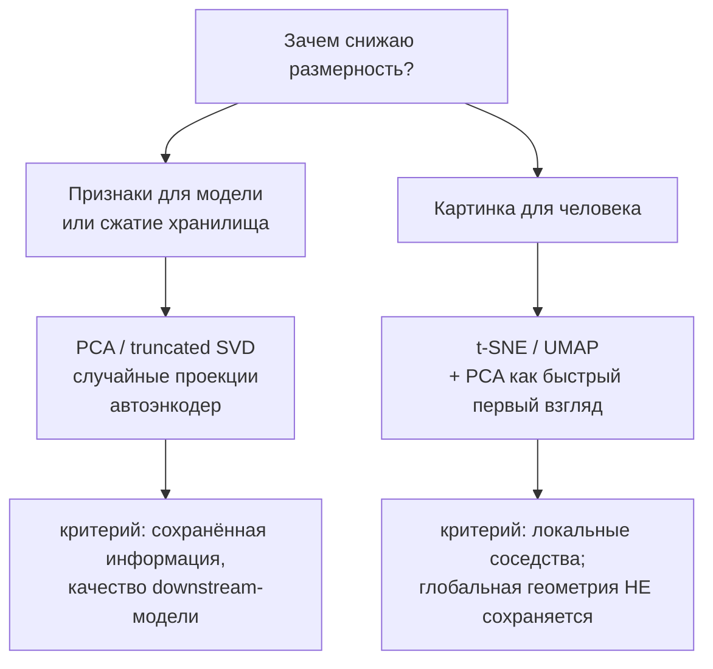

# Снижение размерности

> **Зачем эта глава.** Снижение размерности — это два разных ремесла, которые постоянно путают:
> сжатие данных для модели и рисование картинки для человека. После главы вы сможете вывести PCA
> двумя независимыми способами и показать, что это одна и та же задача, объяснить, почему PCA —
> это просто SVD центрированной матрицы, и — что важнее для практики — точно сказать, какие выводы
> **нельзя** делать по картинке t-SNE, даже если очень хочется.

**Уровень:** 🎯 middle → 🧠 middle+
**Предварительно нужно:** [линейная алгебра](../01-math/01-linear-algebra.md), [постановка задачи обучения](01-learning-theory.md), [кластеризация](10-clustering.md)
**Время на проработку:** ~5 часов (чтение + вывод формул руками + эксперименты с картинками)

---

## Карта главы

- [1. Три разные проблемы под одним словом](#1-три-разные-проблемы-под-одним-словом) — зачем вообще снижать размерность
- [2. PCA: постановка](#2-pca-постановка) — что дано, что ищем, зачем центрирование
- [3. Вывод первый: максимизация дисперсии](#3-вывод-первый-максимизация-дисперсии)
- [4. Вывод второй: минимизация ошибки реконструкции](#4-вывод-второй-минимизация-ошибки-реконструкции) — и почему это та же задача
- [5. PCA — это SVD](#5-pca--это-svd) — связь, truncated SVD, randomized SVD
- [6. Сколько компонент брать](#6-сколько-компонент-брать) — доля объяснённой дисперсии и её ловушки
- [7. PCA на практике](#7-pca-на-практике) — реализация с нуля и как это делает sklearn
- [8. t-SNE: что можно и чего нельзя читать по картинке](#8-t-sne-что-можно-и-чего-нельзя-читать-по-картинке)
- [9. UMAP](#9-umap) — чем отличается по существу
- [10. Автоэнкодеры](#10-автоэнкодеры) — когда нелинейность окупается
- [11. Случайные проекции и sketching](#11-случайные-проекции-и-sketching)
- [12. Когда снижение размерности вредит](#12-когда-снижение-размерности-вредит)
- [13. Подводные камни](#13-подводные-камни)
- [14. Проверь себя](#14-проверь-себя)
- [15. Практика](#15-практика)
- [16. Что читать дальше](#16-что-читать-дальше)

---

## 1. Три разные проблемы под одним словом

«Снизить размерность» звучит как одна задача, но за этими словами прячутся как минимум три разные,
и методы для них нужны разные. Если этого не различать, получается классическая ошибка:
человек делает t-SNE и подаёт две полученные координаты в градиентный бустинг.

**Проблема первая: данных много по ширине, а сигнала мало.** У вас 4000 признаков и 8000 объектов.
Половина признаков — почти копии друг друга (мультиколлинеарность), треть — шум. Линейная модель
на таких данных неустойчива: матрица $X^\top X$ близка к вырожденной, коэффициенты прыгают от
запуска к запуску. kNN вообще ломается — в высокой размерности все расстояния становятся почти
одинаковыми (подробный разбор проклятия размерности — в [главе про SVM и kNN](09-svm-knn-bayes.md)).
Хочется найти 50 «настоящих» направлений и работать в них.

**Проблема вторая: данные надо сжать ради ресурсов.** Эмбеддинги товаров размерности 768,
десять миллионов товаров — это 30 ГБ во float32. Для ANN-индекса и для онлайн-инференса это
дорого. Сжать до 128 измерений с потерей 3% качества поиска — отличная сделка.

**Проблема третья: надо посмотреть глазами.** У вас есть эмбеддинги пользователей, и вы хотите
понять, есть ли там структура: сегменты, аномалии, дубли. Человек умеет смотреть только на 2D
и 3D. Это задача **визуализации**, и у неё принципиально другой критерий качества: не «сохранить
информацию», а «не наврать глазу».

Ключевая мысль главы: методы для третьей задачи (t-SNE, UMAP) **непригодны** для первых двух,
а методы для первых двух (PCA) часто дают невнятную картинку в третьей. Это не недостаток
методов — это следствие того, что они оптимизируют разные вещи.



> 💬 **На собеседовании.** Спросят: «Можно ли использовать координаты t-SNE как признаки для
> модели?» Хороший ответ: нет, и по трём причинам. Первая — t-SNE в классической реализации
> не даёт отображения для новых точек: он оптимизирует координаты конкретных объектов, а не
> функцию $\mathbb{R}^d \to \mathbb{R}^2$, поэтому на инференсе вы физически не сможете посчитать
> признак. Вторая — результат зависит от инициализации и от того, какие объекты попали в выборку:
> добавили 100 новых точек — вся карта перестроилась. Третья — расстояния в t-SNE-пространстве
> не имеют содержательного смысла, поэтому модель будет учиться на артефактах алгоритма.
> Плохой ответ: «можно, это же эмбеддинг».

---

## 2. PCA: постановка

Метод главных компонент (Principal Component Analysis, PCA) отвечает на вопрос: **какое линейное
подпространство меньшей размерности сохраняет больше всего информации о данных?**

Дано: матрица объект-признак

$$
X \in \mathbb{R}^{n \times d}, \qquad X = \begin{pmatrix} x_1^\top \\ \vdots \\ x_n^\top \end{pmatrix}
$$

где $n$ — число объектов, $d$ — число признаков, $x_i \in \mathbb{R}^d$ — вектор-строка признаков
объекта $i$, записанная как столбец.

Ищем: ортонормированный базис $U_k = (u_1, \dots, u_k) \in \mathbb{R}^{d \times k}$, где
$k \le d$ — число главных компонент, $u_j \in \mathbb{R}^d$ — $j$-я компонента,
$u_j^\top u_l = \delta_{jl}$ (единица при $j = l$, ноль иначе). Проекция объекта на это
подпространство даст новое представление $z_i \in \mathbb{R}^k$.

> ⚠️ Обозначение $k$ здесь — число компонент, а не число классов. Число классов/кластеров в
> хендбуке обозначается $K$; в этой главе заглавная $K$ не используется, чтобы не путаться.

### Центрирование — не косметика, а часть определения

Прежде чем что-либо считать, из данных вычитают среднее по каждому признаку:

$$
\bar{x} = \frac{1}{n}\sum_{i=1}^{n} x_i, \qquad \tilde{x}_i = x_i - \bar{x}, \qquad
\tilde{X} = X - \mathbf{1}_n \bar{x}^\top
$$

где $\bar{x} \in \mathbb{R}^d$ — вектор средних по признакам, $\tilde{x}_i$ — центрированный
объект, $\mathbf{1}_n \in \mathbb{R}^n$ — вектор из единиц, $\tilde{X}$ — центрированная матрица.

Почему без этого нельзя? PCA ищет направления максимальной **дисперсии**, а дисперсия определена
относительно среднего. Если данные не центрированы, первая «компонента» будет указывать примерно
на центр облака — то есть просто на среднее значение, — и вы потратите одно из $k$ измерений
на кодирование константы.

> 📐 **Разбор на пальцах.** Возьмите облако точек, плотно сидящее вокруг точки $(100, 100)$
> с разбросом $\pm 1$. Без центрирования матрица $X^\top X$ доминируется слагаемым
> $n \bar{x}\bar{x}^\top$, и её главный собственный вектор — это направление $(1,1)/\sqrt{2}$,
> то есть направление на центр. Форма самого облака теряется. После центрирования облако
> сидит вокруг нуля, и главный вектор указывает вдоль его реальной вытянутости.

**А масштабирование?** Это уже вопрос выбора, а не обязательное требование. PCA чувствителен
к единицам измерения: если один признак — зарплата в рублях (разброс $10^5$), а другой — возраст
(разброс $10$), то первая компонента будет почти полностью совпадать с зарплатой, потому что
её дисперсия на девять порядков больше. Практическое правило:

- признаки в **разных единицах** — стандартизируйте (`StandardScaler`), тогда PCA работает
  с корреляционной матрицей, а не с ковариационной;
- признаки в **одних единицах и сравнимых масштабах** (пиксели изображения, компоненты эмбеддинга,
  спектральные интенсивности) — не стандартизируйте: разница дисперсий здесь содержательна,
  и стандартизация усилит шумные каналы.

---

## 3. Вывод первый: максимизация дисперсии

Возьмём произвольное направление — единичный вектор $u \in \mathbb{R}^d$, $\|u\|_2 = 1$.
Спроецируем на него центрированные данные:

$$
z_i = u^\top \tilde{x}_i \in \mathbb{R}
$$

где $z_i$ — координата объекта $i$ вдоль направления $u$ (скаляр).

Среднее проекций равно нулю, потому что $\sum_i \tilde{x}_i = 0$ по построению. Значит,
выборочная дисперсия проекций — это просто среднее квадратов:

$$
\operatorname{Var}(z) = \frac{1}{n}\sum_{i=1}^{n} z_i^2
= \frac{1}{n}\sum_{i=1}^{n} \big(u^\top \tilde{x}_i\big)^2
= \frac{1}{n}\sum_{i=1}^{n} u^\top \tilde{x}_i \tilde{x}_i^\top u
= u^\top \Big(\underbrace{\frac{1}{n}\tilde{X}^\top \tilde{X}}_{\Sigma}\Big) u
$$

где $\Sigma \in \mathbb{R}^{d \times d}$ — выборочная ковариационная матрица признаков.
Переход из третьего выражения в четвёртое — вынесение $u$ за знак суммы: $u$ от $i$ не зависит.

> 📐 **Разбор формулы.** $(u^\top \tilde{x}_i)^2$ — это скаляр в квадрате. Записываем его как
> произведение скаляра на себя же, но во втором сомножителе транспонируем (транспонирование
> скаляра ничего не меняет): $(u^\top \tilde{x}_i)(\tilde{x}_i^\top u)$. Теперь в середине стоит
> $\tilde{x}_i\tilde{x}_i^\top$ — матрица $d \times d$, и сумма таких матриц по всем $i$,
> делённая на $n$, есть определение выборочной ковариационной матрицы (для центрированных данных).
> Размерности сходятся: $(1 \times d)(d \times d)(d \times 1) = 1 \times 1$. ✔

Задача: найти направление максимальной дисперсии.

$$
u_1 = \arg\max_{u \in \mathbb{R}^d} \; u^\top \Sigma u \quad \text{при условии} \quad u^\top u = 1
$$

Ограничение обязательно: без него дисперсию можно раздуть до бесконечности, просто удлиняя $u$.
Решаем методом Лагранжа. Лагранжиан:

$$
\mathcal{L}(u, \lambda) = u^\top \Sigma u - \lambda\big(u^\top u - 1\big)
$$

где $\lambda \in \mathbb{R}$ — множитель Лагранжа.

Берём градиент по $u$ (пользуемся тем, что $\nabla_u (u^\top A u) = 2Au$ для симметричной $A$;
$\Sigma$ симметрична по построению) и приравниваем нулю:

$$
\nabla_u \mathcal{L} = 2\Sigma u - 2\lambda u = 0
\qquad\Longrightarrow\qquad
\boxed{\; \Sigma u = \lambda u \;}
$$

Это уравнение на **собственный вектор**. То есть направление, максимизирующее дисперсию проекции,
обязано быть собственным вектором ковариационной матрицы. Каким именно из $d$ штук?
Домножим равенство слева на $u^\top$ и вспомним, что $u^\top u = 1$:

$$
u^\top \Sigma u = \lambda\, u^\top u = \lambda
$$

Слева стоит ровно та дисперсия, которую мы максимизируем. Значит, **дисперсия проекции на
собственный вектор равна его собственному значению**, и максимум достигается на собственном
векторе с наибольшим $\lambda$. Первая главная компонента $u_1$ — собственный вектор,
отвечающий $\lambda_1 = \lambda_{\max}$.

### Вторая компонента и дальше

Вторую компоненту ищем среди направлений, **ортогональных первой**:

$$
u_2 = \arg\max_{u} \; u^\top \Sigma u \quad \text{при} \quad u^\top u = 1, \;\; u^\top u_1 = 0
$$

Лагранжиан теперь с двумя множителями: $\mathcal{L} = u^\top\Sigma u - \lambda(u^\top u - 1) - \mu\, u^\top u_1$,
где $\mu$ — второй множитель. Градиент:

$$
2\Sigma u - 2\lambda u - \mu u_1 = 0
$$

Домножим слева на $u_1^\top$. Первое слагаемое: $u_1^\top \Sigma u = (\Sigma u_1)^\top u = \lambda_1 u_1^\top u = 0$
(использовали симметричность $\Sigma$, определение $u_1$ и ограничение ортогональности).
Второе слагаемое: $-2\lambda\, u_1^\top u = 0$ по тому же ограничению. Третье: $-\mu\, u_1^\top u_1 = -\mu$.
Итого $\mu = 0$, и уравнение снова превращается в $\Sigma u = \lambda u$. По той же логике берём
наибольшее собственное значение среди оставшихся — то есть $\lambda_2$.

По индукции: **главные компоненты — это собственные векторы $\Sigma$, упорядоченные по убыванию
собственных значений**, а собственные значения — дисперсии данных вдоль этих направлений.
Поскольку $\Sigma$ симметрична и неотрицательно определена, все $\lambda_j \ge 0$ и собственные
векторы можно выбрать ортонормированными — то есть решение существует и корректно.

---

## 4. Вывод второй: минимизация ошибки реконструкции

Теперь зайдём с другой стороны, вообще не упоминая дисперсию. Поставим задачу **сжатия**:
хотим закодировать каждый объект $k$ числами так, чтобы по ним можно было максимально точно
восстановить исходный вектор.

Модель: объект приближается точкой на $k$-мерной аффинной плоскости

$$
\hat{x}_i = \mu + U_k z_i
$$

где $\mu \in \mathbb{R}^d$ — сдвиг плоскости (общий для всех объектов),
$U_k \in \mathbb{R}^{d\times k}$ — ортонормированный базис плоскости ($U_k^\top U_k = I_k$),
$z_i \in \mathbb{R}^k$ — код объекта $i$ (его координаты в этом базисе),
$\hat{x}_i \in \mathbb{R}^d$ — реконструкция.

Минимизируем суммарную квадратичную ошибку реконструкции:

$$
J(\mu, U_k, Z) = \sum_{i=1}^{n} \big\| x_i - \mu - U_k z_i \big\|_2^2
$$

где $Z = (z_1,\dots,z_n)$ — набор всех кодов.

### Шаг 1: оптимальный сдвиг

Дифференцируем по $\mu$:

$$
\frac{\partial J}{\partial \mu} = -2\sum_{i=1}^{n}\big(x_i - \mu - U_k z_i\big) = 0
\qquad\Longrightarrow\qquad
\mu = \bar{x} - U_k \bar{z}, \quad \bar{z} = \frac1n\sum_i z_i
$$

Замена $z_i \mapsto z_i - \bar{z}$ ничего не меняет в модели (сдвиг кодов поглощается в $\mu$),
поэтому без ограничения общности положим $\bar{z} = 0$. Тогда

$$
\mu^{*} = \bar{x}
$$

**Вот откуда берётся центрирование.** Оно не соглашение и не «хорошая практика» — это решение
задачи оптимизации по $\mu$. Оптимальная плоскость всегда проходит через центр масс данных.

### Шаг 2: оптимальный код при фиксированном базисе

Подставив $\mu = \bar{x}$, получаем $J = \sum_i \|\tilde{x}_i - U_k z_i\|^2$. Дифференцируем по $z_i$:

$$
\frac{\partial J}{\partial z_i} = -2 U_k^\top \big(\tilde{x}_i - U_k z_i\big) = 0
\qquad\Longrightarrow\qquad
U_k^\top \tilde{x}_i = \underbrace{U_k^\top U_k}_{= I_k} z_i
\qquad\Longrightarrow\qquad
z_i^{*} = U_k^\top \tilde{x}_i
$$

То есть код — это просто скалярные произведения с базисными векторами (ортогональная проекция).
Ничего умнее ортонормированный базис не позволяет.

### Шаг 3: подстановка и ключевой переход

Подставляем $z_i^{*}$ обратно. Обозначим $P = U_k U_k^\top$ — матрицу ортогонального проектора
на подпространство ($P^2 = P$, $P^\top = P$):

$$
J(U_k) = \sum_{i=1}^{n} \big\|\tilde{x}_i - P\tilde{x}_i\big\|^2
$$

Вектор $\tilde{x}_i - P\tilde{x}_i$ ортогонален вектору $P\tilde{x}_i$ (это и есть смысл слова
«ортогональный проектор»), поэтому работает теорема Пифагора:

$$
\|\tilde{x}_i\|^2 = \|P\tilde{x}_i\|^2 + \|\tilde{x}_i - P\tilde{x}_i\|^2
$$

Следовательно:

$$
J(U_k) = \sum_{i=1}^{n} \|\tilde{x}_i\|^2 \;-\; \sum_{i=1}^{n} \|P\tilde{x}_i\|^2
$$

Первая сумма **не зависит от $U_k$** — это просто суммарная энергия центрированных данных,
константа. Значит, минимизировать $J$ — то же самое, что **максимизировать** вторую сумму.
Раскроем её:

$$
\sum_{i=1}^{n}\|U_kU_k^\top \tilde{x}_i\|^2
= \sum_{i=1}^{n} \tilde{x}_i^\top U_k \underbrace{U_k^\top U_k}_{I_k} U_k^\top \tilde{x}_i
= \sum_{i=1}^{n} \big\|U_k^\top \tilde{x}_i\big\|^2
= \sum_{j=1}^{k}\sum_{i=1}^{n} \big(u_j^\top \tilde{x}_i\big)^2
= n\sum_{j=1}^{k} u_j^\top \Sigma u_j
$$

### Итог: две задачи — одна и та же

$$
\min_{U_k} \underbrace{\sum_{i=1}^n \|\tilde{x}_i - U_kU_k^\top\tilde{x}_i\|^2}_{\text{ошибка реконструкции}}
\quad\Longleftrightarrow\quad
\max_{U_k} \underbrace{\sum_{j=1}^{k} u_j^\top \Sigma u_j}_{\text{суммарная дисперсия проекций}}
$$

Справа стоит ровно та величина, которую мы максимизировали в разделе 3 (там — по одному
направлению за раз, здесь — сумма по $k$ направлениям сразу). Максимум достигается на первых
$k$ собственных векторах $\Sigma$, а значение максимума равно $n(\lambda_1 + \dots + \lambda_k)$.

Эта эквивалентность — не совпадение, а прямое следствие теоремы Пифагора: **энергия данных
делится на «объяснённую» проекцией и «потерянную»**, их сумма постоянна, поэтому максимизация
одной равносильна минимизации другой.

> 💬 **На собеседовании.** Спросят: «Выведите PCA». Хороший ответ — сразу уточнить, какой из
> двух эквивалентных выводов интересует, и показать, что вы знаете оба: через максимизацию
> дисперсии (Лагранж → уравнение на собственный вектор) и через минимизацию ошибки реконструкции
> (Пифагор → та же задача). Отдельный плюс — объяснить, почему они эквивалентны:
> $\|\tilde x\|^2 = \|\text{проекция}\|^2 + \|\text{остаток}\|^2$, первая величина фиксирована.
> Плохой ответ: «PCA берёт собственные векторы ковариационной матрицы» — это пересказ рецепта,
> а не вывод, и на уточняющий вопрос «а почему именно собственные векторы» ответа не будет.

---

## 5. PCA — это SVD

На практике никто не строит $\Sigma$ явно и не ищет её собственные векторы. Причин две:
матрица $\Sigma$ имеет размер $d \times d$ (при $d = 50\,000$ это 10 ГБ), и её вычисление
возводит числа в квадрат, теряя точность. Вместо этого применяют сингулярное разложение
(Singular Value Decomposition, SVD) прямо к $\tilde{X}$.

### Связь

Любую матрицу $\tilde{X} \in \mathbb{R}^{n\times d}$ можно разложить как

$$
\tilde{X} = U S V^\top
$$

где $U \in \mathbb{R}^{n\times r}$ — матрица левых сингулярных векторов ($U^\top U = I_r$),
$S = \operatorname{diag}(s_1, \dots, s_r)$ — диагональная матрица сингулярных чисел
$s_1 \ge s_2 \ge \dots \ge s_r \ge 0$, $V \in \mathbb{R}^{d\times r}$ — матрица правых
сингулярных векторов ($V^\top V = I_r$), $r = \operatorname{rank}(\tilde X) \le \min(n,d)$.

Подставим в определение ковариационной матрицы:

$$
\Sigma = \frac{1}{n}\tilde{X}^\top \tilde{X}
= \frac{1}{n} \big(USV^\top\big)^\top USV^\top
= \frac{1}{n} V S \underbrace{U^\top U}_{I_r} S V^\top
= V \left(\frac{S^2}{n}\right) V^\top
$$

Это в точности спектральное разложение $\Sigma$. Отсюда читаем два факта:

$$
u_j = v_j \quad (\text{$j$-й столбец } V), \qquad \lambda_j = \frac{s_j^2}{n}
$$

**Главные компоненты — это правые сингулярные векторы центрированной матрицы данных,
а собственные значения ковариации — квадраты сингулярных чисел, делённые на $n$.**

Сами проекции (их называют **счёта**, scores) получаются без отдельного умножения:

$$
Z = \tilde{X} V_k = U S V^\top V_k = U_k S_k
$$

где $V_k$ — первые $k$ столбцов $V$, $U_k$ — первые $k$ столбцов $U$,
$S_k$ — верхний левый блок $S$ размера $k \times k$.

> 🧠 **Middle+.** Почему SVD численно устойчивее. Если у матрицы $\tilde X$ число обусловленности
> $\kappa$, то у $\tilde X^\top \tilde X$ оно равно $\kappa^2$. При $\kappa = 10^{6}$ (вполне
> реально для коррелированных признаков) квадрат даёт $10^{12}$, что уже превышает точность
> float32 и съедает почти всю точность float64. SVD работает с $\tilde X$ напрямую и такого
> возведения в квадрат не делает. Именно поэтому `sklearn.decomposition.PCA` внутри вызывает
> `scipy.linalg.svd`, а не `numpy.linalg.eigh` от ковариации.

### Truncated SVD: когда центрировать нельзя

Иногда центрирование физически недопустимо. Классический случай — разреженная матрица:
TF-IDF-представление текстов ($n = 10^6$ документов, $d = 10^6$ термов, заполненность 0.01%)
или матрица взаимодействий user-item. Такая матрица занимает сотни мегабайт в разреженном
формате. Вычтите из неё среднее — и все нули превратятся в ненулевые числа: плотная матрица
$10^6 \times 10^6$ во float32 весит 4 терабайта. Задача становится нерешаемой.

Поэтому для разреженных данных используют **усечённое SVD** (truncated SVD) — то же разложение,
но **без центрирования**:

$$
X \approx U_k S_k V_k^\top
$$

В sklearn это класс `TruncatedSVD`; в NLP этот же приём исторически называют латентно-семантическим
анализом (Latent Semantic Analysis, LSA).

Отличие от PCA принципиальное и его любят спрашивать: truncated SVD максимизирует не дисперсию,
а сумму квадратов проекций **относительно нуля**. Если данные далеки от центра, первая компонента
уйдёт на кодирование среднего. Для TF-IDF это терпимо (данные и так неотрицательны и «растут
из нуля»), для произвольных числовых признаков — нет.

| | PCA | TruncatedSVD |
|---|---|---|
| Центрирование | обязательно | не делается |
| Вход | плотная матрица | плотная или разреженная |
| Что максимизирует | дисперсию проекций | норму проекций от нуля |
| Первая компонента | направление вытянутости облака | часто ≈ направление на центр облака |
| Типичное применение | числовые признаки, эмбеддинги | TF-IDF, bag-of-words, матрицы взаимодействий |

### Randomized SVD: как это считают на больших данных

Полное SVD матрицы $n \times d$ стоит $O(nd\min(n,d))$ — при $n = 10^6$, $d = 10^3$ это
$10^{12}$ операций, десятки минут. Но нам нужны не все $r$ компонент, а первые $k \ll d$.

Рандомизированный алгоритм (Halko, Martinsson, Tropp, 2011) использует простую идею: умножим
$X$ на случайную матрицу $\Omega \in \mathbb{R}^{d \times (k+p)}$ с гауссовыми элементами
($p \approx 10$ — «запас» oversampling). Столбцы произведения $Y = X\Omega$ — это случайные
линейные комбинации столбцов $X$, и с высокой вероятностью они «нащупывают» именно то
подпространство, где сосредоточена основная энергия матрицы. Ортогонализуем $Y$ (QR-разложение),
получаем базис $Q$, проецируем: $B = Q^\top X$ — матрица всего $(k+p) \times d$, её SVD дёшево.
Итоговая сложность $O(ndk)$ — при $k = 50$ это в 20 раз быстрее полного разложения на нашем примере.

Это и есть режим `svd_solver='randomized'`, который sklearn включает автоматически при
больших матрицах и малом $k$.

---

## 6. Сколько компонент брать

**Доля объяснённой дисперсии** (explained variance ratio) для $j$-й компоненты:

$$
\rho_j = \frac{\lambda_j}{\sum_{l=1}^{d}\lambda_l} = \frac{s_j^2}{\sum_{l=1}^{d} s_l^2}
$$

где $\lambda_j$ — $j$-е собственное значение $\Sigma$, $s_j$ — $j$-е сингулярное число $\tilde X$.
Знаменатель равен $\operatorname{tr}\Sigma$ — суммарной дисперсии всех признаков (след матрицы
равен сумме собственных значений).

Накопленная доля для $k$ компонент:

$$
R_k = \sum_{j=1}^{k}\rho_j
= 1 - \frac{\text{ошибка реконструкции при } k \text{ компонентах}}{\text{энергия центрированных данных}}
$$

Второе равенство — прямое следствие вывода из раздела 4: то, что не объяснено, ровно и есть
квадратичная ошибка реконструкции. Поэтому «95% объяснённой дисперсии» = «5% энергии данных
потеряно при сжатии».

Три способа выбрать $k$, в порядке убывания надёжности:

1. **По качеству downstream-задачи.** Если PCA — шаг предобработки перед моделью, то $k$ — обычный
   гиперпараметр, и подбирается он кросс-валидацией по метрике модели, а не по проценту дисперсии.
   Это единственный способ, который отвечает на правильный вопрос.
2. **По порогу накопленной дисперсии** (`n_components=0.95` в sklearn). Быстро и приемлемо для
   сжатия ради ресурсов. Но 95% — число из воздуха; для одних данных 95% дают 5 компонент,
   для других — 400.
3. **По «локтю» на графике собственных значений** (scree plot). Ищем, где кривая $\lambda_j$
   резко выполаживается. Работает, когда данные действительно имеют низкоранговую структуру
   плюс изотропный шум; на реальных данных «локоть» часто размыт, и метод превращается в гадание.

> ⚠️ **Типичная ошибка.** Считать, что «95% объяснённой дисперсии» значит «сохранили 95%
> полезной информации». Дисперсия — не информация. Если ваш таргет зависит от признака,
> у которого маленькая дисперсия (например, редкий бинарный флаг мошенничества, встречающийся
> у 0.1% объектов), PCA выбросит его в первую очередь: у такого признака дисперсия
> $\approx 0.001$, и он окажется в хвосте спектра. Вы сохранили 95% дисперсии и потеряли 100%
> сигнала. **PCA не знает о таргете.**

> 💬 **На собеседовании.** Спросят: «Как выбрать число главных компонент?» Хороший ответ
> начинается с уточняющего вопроса: «а зачем мы снижаем размерность?» Если ради качества модели —
> кросс-валидация по её метрике, $k$ как обычный гиперпараметр. Если ради памяти и латентности —
> порог накопленной дисперсии или прямо бюджет по байтам. Если ради визуализации — 2 или 3,
> вариантов нет. Отдельно стоит сказать, что порог 95% — эвристика без обоснования, и что
> максимальная дисперсия не гарантирует максимальной полезности для таргета. Плохой ответ:
> «берём 95% дисперсии» — без вопроса о цели и без оговорок.

---

## 7. PCA на практике

Соберём PCA из первых принципов и проверим, что он совпадает с библиотечным.

```python
import numpy as np


class PCAFromScratch:
    """PCA через SVD центрированной матрицы. Ровно то, что выведено в разделах 4-5."""

    def __init__(self, n_components):
        self.n_components = n_components

    def fit(self, X):
        X = np.asarray(X, dtype=float)
        n, d = X.shape

        # 1. Центрирование. Среднее ЗАПОМИНАЕМ: на transform новых данных
        #    нужно вычитать среднее ОБУЧАЮЩЕЙ выборки, иначе получим train/serve skew.
        self.mean_ = X.mean(axis=0)
        Xc = X - self.mean_

        # 2. SVD центрированной матрицы. full_matrices=False экономит память:
        #    нам не нужны все n левых векторов, достаточно min(n, d).
        U, S, Vt = np.linalg.svd(Xc, full_matrices=False)

        # 3. Знак сингулярных векторов не определён однозначно (u и -u одинаково валидны).
        #    Фиксируем его так же, как sklearn: наибольший по модулю элемент строки Vt — положителен.
        #    Без этого результаты двух запусков будут отличаться знаком компонент.
        max_abs_idx = np.argmax(np.abs(Vt), axis=1)
        signs = np.sign(Vt[np.arange(Vt.shape[0]), max_abs_idx])
        Vt *= signs[:, None]
        U *= signs[None, :]

        self.components_ = Vt[:self.n_components]                 # (k, d) — строки суть u_j
        # Несмещённая оценка дисперсии: делим на n-1, как это делает sklearn
        self.explained_variance_ = (S ** 2)[:self.n_components] / (n - 1)
        total_var = (S ** 2).sum() / (n - 1)
        self.explained_variance_ratio_ = self.explained_variance_ / total_var
        self.singular_values_ = S[:self.n_components]
        return self

    def transform(self, X):
        return (np.asarray(X, dtype=float) - self.mean_) @ self.components_.T

    def fit_transform(self, X):
        return self.fit(X).transform(X)

    def inverse_transform(self, Z):
        """Реконструкция: возвращаемся в исходное пространство с потерей информации."""
        return np.asarray(Z, dtype=float) @ self.components_ + self.mean_
```

Проверяем против sklearn и заодно убеждаемся в равенстве «непокрытая дисперсия = ошибка реконструкции»:

```python
from sklearn.datasets import load_digits
from sklearn.decomposition import PCA

X, _ = load_digits(return_X_y=True)      # 1797 объектов, 64 признака (пиксели 8x8)
k = 10

mine = PCAFromScratch(n_components=k).fit(X)
ref = PCA(n_components=k, svd_solver="full").fit(X)

print("макс. расхождение компонент:", np.abs(mine.components_ - ref.components_).max())
print("макс. расхождение долей дисперсии:",
      np.abs(mine.explained_variance_ratio_ - ref.explained_variance_ratio_).max())
# оба числа порядка 1e-13 — это машинная точность, реализации совпадают

Z = mine.transform(X)
X_rec = mine.inverse_transform(Z)

Xc = X - X.mean(axis=0)
rel_error = ((X - X_rec) ** 2).sum() / (Xc ** 2).sum()
print(f"относительная ошибка реконструкции: {rel_error:.4f}")
print(f"1 - накопленная доля дисперсии:      {1 - mine.explained_variance_ratio_.sum():.4f}")
# два числа совпадают до 4 знаков — это и есть теорема Пифагора из раздела 4
```

Кривая накопленной дисперсии — единственный график, который стоит смотреть перед выбором $k$:

```python
import numpy as np
from sklearn.decomposition import PCA

full = PCA().fit(X)                       # без n_components считаются все компоненты
cum = np.cumsum(full.explained_variance_ratio_)
for target in (0.80, 0.90, 0.95, 0.99):
    # searchsorted находит первый индекс, где накопленная доля достигает порога
    print(f"{target:.0%} дисперсии -> {np.searchsorted(cum, target) + 1} компонент из {X.shape[1]}")
```

> ⌨️ **Руками.** Реализуйте `PCAFromScratch` через `np.linalg.eigh(np.cov(X.T))` вместо SVD
> и сравните с версией выше на матрице, у которой два признака почти линейно зависимы
> (например, `X[:, 1] = X[:, 0] + 1e-7 * noise`). Посмотрите, где начинают расходиться
> последние собственные значения. Это упражнение на 20 минут даёт физическое ощущение того,
> что такое «число обусловленности в квадрате».

### Как встроить PCA в пайплайн без утечки

PCA обучается по данным, а значит, его нужно фитить **только на обучающей части фолда**.
Единственный надёжный способ — `Pipeline`:

```python
from sklearn.pipeline import Pipeline
from sklearn.preprocessing import StandardScaler
from sklearn.decomposition import PCA
from sklearn.linear_model import LogisticRegression
from sklearn.model_selection import GridSearchCV, StratifiedKFold

pipe = Pipeline([
    ("scaler", StandardScaler()),      # PCA чувствителен к масштабу -> скейлер ПЕРЕД ним
    ("pca", PCA(svd_solver="randomized", random_state=0)),
    ("clf", LogisticRegression(max_iter=2000)),
])

# k подбираем как обычный гиперпараметр — по метрике модели, а не по проценту дисперсии
grid = GridSearchCV(
    pipe,
    {"pca__n_components": [5, 10, 20, 40], "clf__C": [0.1, 1.0, 10.0]},
    cv=StratifiedKFold(5, shuffle=True, random_state=0),
    scoring="accuracy",
)
```

Внутри `GridSearchCV` и `scaler`, и `pca` переобучаются на каждом train-фолде заново.
Подробно про то, почему без пайплайна тут почти неизбежен лик, — в
[главе о валидации и утечках](13-validation-and-leakage.md).

---

## 8. t-SNE: что можно и чего нельзя читать по картинке

PCA — линейный метод. Если данные лежат на изогнутом многообразии (свёрнутый лист, спираль,
кластеры на сфере), линейная проекция их «схлопнет»: далёкие по многообразию точки окажутся
рядом на плоскости. Для визуализации это фатально.

t-SNE (t-distributed Stochastic Neighbor Embedding, van der Maaten & Hinton, 2008) решает другую
задачу: **сохранить соседства, а не расстояния**.

### Механика

Шаг 1. В исходном пространстве определяем условную вероятность того, что объект $j$ —
сосед объекта $i$:

$$
p_{j|i} = \frac{\exp\big(-\|x_i - x_j\|^2 / 2\sigma_i^2\big)}
{\sum_{l \ne i} \exp\big(-\|x_i - x_l\|^2 / 2\sigma_i^2\big)}, \qquad p_{i|i} = 0
$$

где $\sigma_i > 0$ — ширина гауссова ядра **своя для каждого объекта** $i$. Симметризуем:

$$
p_{ij} = \frac{p_{j|i} + p_{i|j}}{2n}
$$

Деление на $2n$ нужно, чтобы $\sum_{i\ne j} p_{ij} = 1$: получилось распределение на парах объектов.

Шаг 2. В целевом (двумерном) пространстве вводим аналогичное распределение, но с **тяжёлыми
хвостами** — ядром Стьюдента с одной степенью свободы (оно же распределение Коши):

$$
q_{ij} = \frac{\big(1 + \|y_i - y_j\|^2\big)^{-1}}
{\sum_{l \ne m} \big(1 + \|y_l - y_m\|^2\big)^{-1}}
$$

где $y_i \in \mathbb{R}^2$ — искомые координаты объекта $i$ на картинке.

Шаг 3. Минимизируем расхождение Кульбака — Лейблера между этими распределениями по координатам $y$:

$$
C(y_1,\dots,y_n) = \mathrm{KL}(P\,\|\,Q) = \sum_{i \ne j} p_{ij}\,\log\frac{p_{ij}}{q_{ij}}
$$

Оптимизация — градиентным спуском по $y_i$ (у градиента есть замкнутая форма, но она нам сейчас
не нужна). Заметьте: **переменные оптимизации — сами координаты точек**, а не параметры какой-либо
функции. Отсюда и следует отсутствие `transform` для новых объектов.

### Perplexity: единственный параметр, который надо понимать

Ширина $\sigma_i$ не задаётся вручную. Вместо этого пользователь задаёт **перплексию**
(perplexity) — эффективное число соседей, — а алгоритм для каждого объекта подбирает $\sigma_i$
бинарным поиском так, чтобы выполнялось:

$$
\mathrm{Perp}(P_i) = 2^{H(P_i)}, \qquad
H(P_i) = -\sum_{j \ne i} p_{j|i}\,\log_2 p_{j|i}
$$

где $H(P_i)$ — энтропия Шеннона распределения соседей объекта $i$ в битах.

> 📐 **Разбор формулы.** Если распределение $p_{\cdot|i}$ равномерно размазано ровно по $m$
> объектам, его энтропия равна $\log_2 m$, а $2^{H} = m$. Поэтому перплексия читается как
> «сколько соседей объект реально видит». Perplexity = 30 означает: подбери $\sigma_i$ так,
> чтобы у каждой точки было примерно 30 значимых соседей. В плотных областях $\sigma_i$
> получится маленькой, в разреженных — большой. **Это ключевой момент: t-SNE автоматически
> нормализует локальную плотность.**

Отсюда сразу следует главное ограничение метода, о котором ниже.

Типичные значения — 5–50; sklearn требует perplexity < $n$. При малой перплексии картинка
распадается на множество мелких сгустков (алгоритм видит только ближайших соседей), при большой —
структура размывается в одно облако.

### Асимметрия KL: почему сохраняется локальное, а не глобальное

Посмотрите на слагаемое $p_{ij}\log\frac{p_{ij}}{q_{ij}}$.

- Если $p_{ij}$ большое (точки близки в исходном пространстве), а $q_{ij}$ маленькое (мы развели
  их на картинке) — логарифм большой, штраф большой. **Разрывать близкие пары дорого.**
- Если $p_{ij}$ маленькое (точки далеки), а $q_{ij}$ большое (мы их сблизили) — слагаемое
  домножается на маленькое $p_{ij}$ и почти обнуляется. **Сближать далёкие пары почти бесплатно.**

Вот математическая причина, по которой t-SNE прекрасно сохраняет локальные соседства и
совершенно не обязан сохранять глобальную геометрию.

### 🚫 Что НЕЛЬЗЯ читать по картинке t-SNE

Это самый практически ценный список в главе. Каждый пункт — реальная ошибка интерпретации,
которую делают на ревью и на собеседовании.

**1. Размер кластера ничего не значит.** Из-за адаптивного $\sigma_i$ плотные области
«раздуваются», а разреженные — сжимаются. Плотный кластер из 20 точек может занять на картинке
больше места, чем рыхлый из 2000. Вывод «эта группа пользователей однородная, она компактная» —
неверен.

**2. Расстояние между кластерами ничего не значит.** Два соседних на картинке пятна могут быть
дальше друг от друга в исходном пространстве, чем два пятна на разных краях. KL-функционал
попросту не штрафует за неправильное взаимное расположение далёких групп. Вывод
«сегмент A ближе к сегменту B, чем к C» — неверен без проверки в исходном пространстве.

**3. Кластеры могут возникнуть на чистом шуме.** Прогоните t-SNE с малой перплексией на
изотропном гауссовом облаке — увидите отчётливые «сгустки». Их там нет; это артефакт того,
что метод обязан кого-то с кем-то сблизить.

**4. Одна картинка — не результат.** Разные `random_state` дают разные раскладки; разные
perplexity — качественно разные выводы. Правило: смотрите **минимум три** перплексии
(например, 5, 30, 100) и два-три сида. Структура, которая выживает во всех прогонах, скорее
всего реальна.

**5. Оси не имеют смысла.** В отличие от PCA, где ось — конкретная линейная комбинация признаков,
координаты t-SNE интерпретации не подлежат. Поворот и отражение картинки ничего не меняют.

**6. Форма кластеров (вытянутость, «хвосты», «мосты») чаще всего артефакт** незавершённой
оптимизации или неудачной инициализации.

**7. Нельзя сравнивать две карты, построенные независимо.** Карта «до эксперимента» и карта
«после» несопоставимы: это два независимых прогона стохастической оптимизации.

Что **можно**: утверждать, что точки, оказавшиеся в одном плотном сгустке, — близкие соседи
в исходном пространстве (и то стоит проверить). Всё остальное требует возврата к исходным данным.

> 💬 **На собеседовании.** Спросят: «Вы показываете t-SNE-визуализацию эмбеддингов, и на ней два
> кластера почти сливаются. Что это значит?» Хороший ответ: сам по себе — почти ничего.
> Взаимное расположение и расстояния между кластерами на t-SNE не интерпретируются, потому что
> KL-дивергенция асимметрична и почти не штрафует за искажение больших расстояний. Прежде чем
> делать вывод, я бы: (1) прогнал несколько перплексий и сидов и посмотрел, устойчива ли картина;
> (2) проверил гипотезу в исходном пространстве — например, посчитал среднее косинусное расстояние
> между центроидами групп или обучил простой классификатор «кластер A vs кластер B» и посмотрел
> на его качество. Если классификатор даёт AUC 0.99, кластеры прекрасно разделимы, как бы они
> ни выглядели на картинке. Плохой ответ: «значит, эти группы похожи».

### Практические детали, которые сильно влияют на результат

```python
import numpy as np
from sklearn.datasets import load_digits
from sklearn.decomposition import PCA
from sklearn.manifold import TSNE

X, y = load_digits(return_X_y=True)

# Стандартный рецепт: сначала PCA до ~50 компонент, потом t-SNE.
# Зачем: t-SNE считает попарные расстояния, а в исходной размерности они зашумлены
# и считаются медленно. PCA убирает шумовые направления и ускоряет шаг поиска соседей.
X50 = PCA(n_components=50, random_state=0).fit_transform(X)

for perplexity in (5, 30, 100):
    ts = TSNE(
        n_components=2,
        perplexity=perplexity,
        init="pca",          # НЕ 'random': PCA-инициализация заметно лучше сохраняет
                             # взаимное расположение крупных групп и делает прогоны стабильнее
        learning_rate="auto",
        random_state=0,
    )
    emb = ts.fit_transform(X50)
    print(f"perplexity={perplexity:3d}  KL после сходимости = {ts.kl_divergence_:.3f}")
    # Сравнивать KL между РАЗНЫМИ перплексиями бессмысленно: это разные функционалы.
    # Сравнивать между разными сидами при одной перплексии — можно.
```

Три вещи, которые стоит запомнить о запуске:

- **`init="pca"` вместо `"random"`.** Инициализация из PCA даёт воспроизводимость и заметно
  улучшает сохранение глобальной структуры. С версии 1.2 это дефолт в sklearn, но в старом
  коде и в туториалах повсеместно встречается `random`.
- **Предварительный PCA до 30–50 компонент** — почти всегда, если $d > 50$. Ускоряет и убирает шум.
- **Сложность.** Наивная реализация — $O(n^2)$ по памяти и времени. Барнс-Хат-аппроксимация
  (`method="barnes_hut"`, дефолт для 2D/3D) снижает до $O(n\log n)$, но всё равно на $n > 10^5$
  придётся ждать десятки минут. Для миллионов точек — либо сэмплирование, либо UMAP,
  либо специализированные реализации вроде openTSNE.

---

## 9. UMAP

UMAP (Uniform Manifold Approximation and Projection, McInnes, Healy, Melville, 2018) решает
ту же задачу визуализации, но иначе устроен. Формально он выведен из топологии (нечёткие
симплициальные множества), но инженерно различия сводятся к четырём пунктам.

**1. Другая функция потерь.** Вместо KL — бинарная кросс-энтропия между «нечёткими графами
соседства» исходного и целевого пространств:

$$
C_{\text{UMAP}} = \sum_{(i,j)} \Big[ v_{ij}\log\frac{v_{ij}}{w_{ij}}
+ (1 - v_{ij})\log\frac{1 - v_{ij}}{1 - w_{ij}} \Big]
$$

где $v_{ij} \in [0,1]$ — вес ребра между объектами $i$ и $j$ в исходном пространстве,
$w_{ij} \in [0,1]$ — вес того же ребра в целевом.

Обратите внимание на второе слагаемое: его нет в KL из t-SNE. Оно наказывает за то, что далёкие
пары оказались близко, — то есть UMAP имеет явную **отталкивающую** силу. Практическое следствие:
относительное расположение крупных групп сохраняется лучше, чем в t-SNE. Но «лучше» здесь не
значит «правильно»: доверять межкластерным расстояниям по-прежнему нельзя.

**2. Два содержательных параметра вместо одного.**

- `n_neighbors` — аналог перплексии: сколько соседей считать «локальной окрестностью».
  Малое (5–10) — акцент на мелкой структуре, крупное (50–200) — на общей форме.
- `min_dist` — минимальное расстояние между точками в целевом пространстве. Управляет только
  визуальной «плотностью упаковки»: 0.0 даёт плотные комки, 0.5 — рыхлое облако.
  На топологию не влияет, влияет на то, как вы её увидите.

**3. Есть `transform` для новых точек.** UMAP запоминает граф и умеет вкладывать новые объекты
в уже построенное пространство. Это делает его формально пригодным для инференса — но
воспроизводимость и стабильность вложения новых точек всё равно оставляют желать лучшего,
поэтому как признаки для продовой модели UMAP-координаты я бы всё равно не брал.

**4. Быстрее.** Приближённый поиск соседей (NN-descent) плюс негативное сэмплирование в
оптимизации: миллион точек — минуты, а не часы.

```python
# pip install umap-learn
import umap
from sklearn.datasets import load_digits

X, y = load_digits(return_X_y=True)

reducer = umap.UMAP(
    n_neighbors=15,     # локальность: меньше -> дробнее структура
    min_dist=0.1,       # только визуальная плотность, не топология
    metric="euclidean", # для эмбеддингов из нейросетей чаще уместна "cosine"
    random_state=42,    # ВНИМАНИЕ: фиксация сида отключает многопоточность -> медленнее
)
emb_train = reducer.fit_transform(X)
emb_new = reducer.transform(X[:100])   # чего t-SNE в sklearn не умеет в принципе
```

> 🧠 **Middle+.** Известное сравнение t-SNE и UMAP (Kobak & Linderman, 2021) показало, что
> заметная часть преимущества UMAP в сохранении глобальной структуры объясняется не функцией
> потерь, а **инициализацией**: UMAP по умолчанию стартует со спектрального вложения (аналог
> Laplacian Eigenmaps), а t-SNE исторически стартовал со случайных точек. Если запустить t-SNE
> с PCA-инициализацией, разрыв в сохранении глобальной структуры почти исчезает. Это хороший
> пример того, как «преимущество метода» на поверку оказывается деталью реализации — и хороший
> ответ на вопрос «UMAP или t-SNE».

| | t-SNE | UMAP |
|---|---|---|
| Функционал | KL(P‖Q), только притяжение близких | кросс-энтропия: притяжение + отталкивание |
| Ключевые параметры | perplexity | n_neighbors, min_dist |
| Вложение новых точек | нет (в sklearn) | есть (`transform`) |
| Скорость на $10^6$ точек | часы | минуты |
| Глобальная структура | плохо (лучше при `init="pca"`) | умеренно |
| Межкластерные расстояния | не интерпретируются | не интерпретируются |

---

## 10. Автоэнкодеры

PCA ограничен линейными подпространствами. Если данные лежат на нелинейном многообразии,
линейная плоскость приблизит их плохо. Автоэнкодер (autoencoder, AE) — та же задача минимизации
ошибки реконструкции, но кодировщик и декодировщик — произвольные нейросети.

$$
\min_{\theta,\phi} \; \frac{1}{n}\sum_{i=1}^{n} \big\| x_i - g_\phi\big(f_\theta(x_i)\big) \big\|_2^2
$$

где $f_\theta: \mathbb{R}^d \to \mathbb{R}^k$ — энкодер с параметрами $\theta$,
$g_\phi: \mathbb{R}^k \to \mathbb{R}^d$ — декодер с параметрами $\phi$,
$k < d$ — размерность узкого места (bottleneck).

### Ключевой факт: линейный автоэнкодер = PCA (почти)

Если убрать все нелинейности ($f_\theta(x) = W_e x$, $g_\phi(z) = W_d z$) и обучать по MSE,
то глобальный минимум достигается, когда $W_d W_e$ — проектор на **то же самое подпространство**,
которое находит PCA (результат Baldi & Hornik, 1989).

Но с важной оговоркой: **базис будет другим**. Градиентный спуск не даёт ни ортогональности
столбцов $W_d$, ни упорядоченности по дисперсии — он находит какое-то произвольное «вращение»
внутри правильного подпространства. Поэтому «первый нейрон узкого места» ≠ «первая главная
компонента». Проверить это можно так:

```python
import numpy as np
import torch
import torch.nn as nn
from sklearn.datasets import load_digits
from sklearn.decomposition import PCA

torch.manual_seed(0)
X, _ = load_digits(return_X_y=True)
Xc = (X - X.mean(0)) / (X.std(0) + 1e-8)         # AE, как и PCA, надо кормить центрированным
Xt = torch.tensor(Xc, dtype=torch.float32)
n, d, k = Xt.shape[0], Xt.shape[1], 10

# ЛИНЕЙНЫЙ автоэнкодер: bias=False, чтобы модель точно совпадала с постановкой PCA
enc, dec = nn.Linear(d, k, bias=False), nn.Linear(k, d, bias=False)
opt = torch.optim.Adam(list(enc.parameters()) + list(dec.parameters()), lr=1e-2)

for step in range(3000):
    opt.zero_grad()
    loss = ((dec(enc(Xt)) - Xt) ** 2).mean()
    loss.backward()
    opt.step()

# Сравниваем не веса, а ПОДПРОСТРАНСТВА: строим проекторы и смотрим их разницу.
# Проектор однозначно определён подпространством, в отличие от базиса.
W = dec.weight.detach().numpy()                  # (d, k) — столбцы натягивают подпространство AE
Q_ae, _ = np.linalg.qr(W)                        # ортонормируем базис AE
P_ae = Q_ae @ Q_ae.T

V = PCA(n_components=k).fit(Xc).components_.T    # (d, k) — базис PCA, уже ортонормирован
P_pca = V @ V.T

print("‖P_ae - P_pca‖_F =", round(float(np.linalg.norm(P_ae - P_pca)), 4))
# число близко к нулю: подпространства совпадают
print("совпадают ли базисы:", np.allclose(Q_ae, V, atol=1e-2))
# False: базисы разные, хотя подпространство одно
```

Отсюда практический вывод: **линейный автоэнкодер не имеет смысла** — PCA даст то же самое
точно, за один вызов SVD, детерминированно и с упорядоченными компонентами. Автоэнкодер
оправдан только когда есть нелинейность.

### Когда автоэнкодер действительно нужен

- **Данные с явно нелинейной структурой и их много** ($n$ от сотен тысяч). При $n \sim 10^3$
  автоэнкодер просто переобучится и запомнит выборку, а PCA останется устойчивым.
- **Нужны специфические свойства кода**: разреженность (sparse AE), устойчивость к шуму
  (denoising AE — на вход подаём испорченный объект, на выходе требуем чистый), вероятностная
  интерпретация и генерация (вариационный автоэнкодер, VAE).
- **Данные не векторные**: свёрточный AE для изображений, рекуррентный/трансформерный —
  для последовательностей. PCA тут не применим в принципе.
- **Поиск аномалий**: объекты с большой ошибкой реконструкции подозрительны. Подробнее —
  в [главе о поиске аномалий](18-anomaly-detection.md).

Цена: гиперпараметры (архитектура, $k$, регуляризация, learning rate $\eta$), недетерминированность,
необходимость GPU и валидации. Перед тем как брать AE, всегда стоит проверить, насколько от него
отстаёт PCA — разрыв часто оказывается меньше ожидаемого.

> ⚠️ **Типичная ошибка.** Обучить автоэнкодер на всём датасете (train + test) «потому что он
> unsupervised, таргет же не используется» → получить завышенную оценку качества downstream-модели.
> Энкодер видел тестовые объекты и подстроил под них представление. Формально таргет не утёк,
> но информация о распределении теста — утекла, и оценка смещена. То же касается PCA, скейлеров
> и любой обучаемой предобработки. Разбор — в [главе о валидации](13-validation-and-leakage.md).

---

## 11. Случайные проекции и sketching

Есть контринтуитивный результат, который стоит знать: чтобы приблизительно сохранить попарные
расстояния, **не нужно ничего обучать** — достаточно умножить данные на случайную матрицу.

**Лемма Джонсона — Линденштрауса.** Для любого набора из $n$ точек в $\mathbb{R}^d$ и любого
$\varepsilon \in (0, 1)$ существует отображение $\Pi: \mathbb{R}^d \to \mathbb{R}^k$ с

$$
k = O\!\left(\frac{\log n}{\varepsilon^2}\right)
$$

такое, что для всех пар $i, j$:

$$
(1-\varepsilon)\,\|x_i - x_j\|^2 \;\le\; \|\Pi x_i - \Pi x_j\|^2 \;\le\; (1+\varepsilon)\,\|x_i - x_j\|^2
$$

где $\varepsilon$ — допустимое относительное искажение расстояний, $k$ — размерность целевого
пространства.

Читаем внимательно: $k$ зависит **только от числа объектов $n$ и от точности $\varepsilon$,
и вообще не зависит от исходной размерности $d$**. Для $n = 10^6$ и $\varepsilon = 0.1$ получается
$k \approx 10^4$ — прямо скажем, немного, но это гарантия для наихудшего случая. На практике
работает существенно лучше оценки. И самое приятное: подходящее $\Pi$ можно просто **насэмплировать**
из гауссова распределения — с вероятностью, близкой к единице, оно подойдёт.

```python
from sklearn.random_projection import SparseRandomProjection, johnson_lindenstrauss_min_dim
import numpy as np

print(johnson_lindenstrauss_min_dim(n_samples=1_000_000, eps=0.1))   # оценка k из леммы

rng = np.random.default_rng(0)
X_big = rng.normal(size=(5000, 20_000))          # заведомо высокоразмерные данные

# SparseRandomProjection: матрица проекции разреженная (плотность ~1/sqrt(d)),
# поэтому умножение дешевле, а гарантии остаются те же
proj = SparseRandomProjection(n_components=1000, random_state=0)
X_small = proj.fit_transform(X_big)

# Проверяем искажение расстояний на случайных парах
idx = rng.choice(5000, size=(2000, 2))
d_before = np.linalg.norm(X_big[idx[:, 0]] - X_big[idx[:, 1]], axis=1)
d_after = np.linalg.norm(X_small[idx[:, 0]] - X_small[idx[:, 1]], axis=1)
ratio = d_after / d_before
print(f"искажение расстояний: медиана {np.median(ratio):.3f}, "
      f"диапазон [{ratio.min():.3f}, {ratio.max():.3f}]")
# все отношения сидят в узком коридоре вокруг 1 — расстояния сохранились
```

Когда это выигрывает у PCA: когда $d$ огромно, а обучать проекцию некогда или нельзя
(потоковые данные, распределённое хранилище, необходимость применить одно и то же
преобразование в разных сервисах без синхронизации модели). Родственные приёмы —
хеширование признаков (feature hashing / hashing trick) и **матричный sketching**:
построение компактного «эскиза» $B$ размера $\ell \times d$ вместо матрицы $A$ размера
$n \times d$ так, что $B^\top B \approx A^\top A$ (алгоритм Frequent Directions).
Sketching позволяет считать приближённое PCA в один проход по данным, не держа их в памяти —
это то, как PCA делают в Spark на терабайтных таблицах.

---

## 12. Когда снижение размерности вредит

Это раздел, ради которого стоит читать главу целиком. Снижение размерности выглядит как
бесплатное улучшение, и именно поэтому его лепят туда, где оно только вредит.

**1. Перед деревьями и бустингом — почти всегда лишнее и часто вредное.**
Дерево делает сплиты **вдоль осей координат**: `feature_17 < 0.42`. PCA поворачивает пространство,
и признак «возраст» превращается в «0.3·возраст − 0.7·доход + 0.2·город». Такие комбинации
дереву неудобны: чтобы выразить осевой сплит в повёрнутых координатах, нужна лестница из многих
сплитов. Плюс бустинг и так умеет игнорировать бесполезные признаки. Плюс вы теряете нативную
поддержку категорий и пропусков. Практика: на табличных данных PCA перед бустингом обычно
даёт минус к качеству, а не плюс.

**2. PCA не знает о таргете.** Направление максимальной дисперсии и направление, разделяющее
классы, — разные вещи, и они могут быть ортогональны. Каноническая иллюстрация: два вытянутых
гауссовых облака, смещённых друг относительно друга поперёк направления вытянутости. Первая
главная компонента идёт вдоль вытянутости, классы на ней полностью перемешаны; вторая
компонента — та, что разделяет — будет отброшена как «малодисперсная».

```python
import numpy as np
from sklearn.decomposition import PCA
from sklearn.discriminant_analysis import LinearDiscriminantAnalysis

rng = np.random.default_rng(0)
n = 2000
# Два класса: разброс огромный по оси 0, а разделяет их сдвиг по оси 1
base = rng.normal(size=(n, 2)) * np.array([10.0, 1.0])
y = rng.integers(0, 2, size=n)
X = base + np.outer(y, np.array([0.0, 3.0]))     # сдвиг только по оси 1

pc1 = PCA(n_components=1).fit(X)
print("первая компонента:", np.round(pc1.components_[0], 3))     # ~[1, 0] — ось разброса
print("доля дисперсии:", round(float(pc1.explained_variance_ratio_[0]), 3))  # ~0.97

z = pc1.transform(X).ravel()
# AUC проекции на PC1 около 0.5 — сигнал полностью потерян
from sklearn.metrics import roc_auc_score
print("AUC по PC1:", round(roc_auc_score(y, z), 3))

# LDA ищет направление, разделяющее классы, — и находит ось 1
lda = LinearDiscriminantAnalysis(n_components=1).fit(X, y)
print("AUC по LDA-компоненте:", round(roc_auc_score(y, lda.transform(X).ravel()), 3))
```

Если снижение размерности нужно именно для классификации, есть **supervised**-альтернативы:
LDA (линейный дискриминантный анализ), PLS (partial least squares), или просто отбор признаков
по важности. PCA — метод для случая «таргета нет или он не важен».

**3. Разреженные данные становятся плотными.** One-hot на 50 000 категорий занимает в CSR-формате
считанные мегабайты; после PCA до 300 компонент та же таблица на $10^7$ строк — это 12 ГБ
плотного float32. Линейные модели и бустинг на разреженных данных работают отлично; ломать
разреженность ради «снижения размерности» — почти всегда проигрыш по памяти.

**4. Теряется интерпретируемость — иногда критично.** В кредитном скоринге, медицине,
регуляторно-надзорных задачах требуется объяснение «почему отказ». Ответ «третья главная
компонента была слишком велика» неприемлем. То же касается SHAP: он посчитается по компонентам,
и обратно к исходным признакам вы его не развернёте однозначно.

**5. Когда $d$ и так мало.** При $d = 20$ и $n = 10^6$ снижать нечего: модель прекрасно
справится сама, а вы только добавите шаг предобработки, который надо синхронизировать
между обучением и продом.

**6. Когда полезный сигнал живёт в «хвосте» спектра.** Малодисперсные направления — это не
всегда шум. В сенсорных данных, в спектроскопии, в финансах именно мелкие отклонения бывают
информативны. PCA систематически выбрасывает их первыми.

**7. Координаты t-SNE/UMAP как признаки модели.** Разобрано выше: нет честного `transform`
(у t-SNE), нестабильность, бессмысленная метрика. Единственное исключение — если вы честно
зафиксировали UMAP-модель, воспроизводимо применяете её и на обучении, и в проде, и померили
прирост на честной валидации. Обычно прироста не оказывается.

> 💬 **На собеседовании.** Спросят: «У вас 5000 признаков и градиентный бустинг. Стоит ли
> применить PCA?» Хороший ответ: скорее нет, и я объясню почему, а потом предложу, что вместо.
> Деревья делают осевые сплиты, и вращение пространства делает границы менее выразимыми;
> бустинг сам справляется с нерелевантными признаками через выбор сплитов; и я потеряю
> интерпретируемость через SHAP. Что реально помогает при 5000 признаков: отбор по важности
> (permutation importance на честной валидации), удаление константных и дублирующихся колонок,
> ограничение `colsample_bytree` для скорости. Если проблема именно в скорости обучения —
> сначала измерю, где узкое место. PCA я бы рассматривал, если бы моделью была линейная
> регрессия или kNN, где мультиколлинеарность и проклятие размерности бьют напрямую.
> Плохой ответ: «да, PCA всегда помогает при большом числе признаков».

---

## 13. Подводные камни

**Забыли зафиксировать среднее и обучили PCA заново в проде.**
Симптом: качество на проде существенно ниже, чем на валидации, причём стабильно.
Причина: `fit_transform` вызывается на продовых данных вместо `transform` с обученными
параметрами. Компоненты и среднее получаются другими, и модель получает на вход
координаты в чужом базисе.
Что делать: PCA — часть модели, а не предобработки данных. Сериализуйте его вместе с моделью
(один `Pipeline` — один артефакт), а в проде вызывайте только `transform`.

**Знак компонент «прыгает» между запусками.**
Симптом: два прогона на одних и тех же данных дают компоненты, отличающиеся знаком; тесты
на равенство падают.
Причина: собственный вектор определён с точностью до знака — $u$ и $-u$ одинаково валидны.
Разные LAPACK-бэкенды и разные версии BLAS выбирают по-разному.
Что делать: не сравнивать веса напрямую. Сравнивать проекторы $U_kU_k^\top$, или модули
косинусов между векторами, или качество downstream-модели. Если нужен детерминизм —
фиксировать знак явно, как в коде раздела 7.

**Стандартизировали пиксели / компоненты эмбеддинга.**
Симптом: после `StandardScaler` + PCA качество упало, а спектр стал подозрительно плоским.
Причина: у части каналов дисперсия близка к нулю (мёртвые пиксели, вырожденные измерения
эмбеддинга). Стандартизация делит на почти нулевое стандартное отклонение и раздувает чистый
шум до масштаба сигнала.
Что делать: для однородных по природе признаков не стандартизировать (достаточно центрирования);
если стандартизация нужна, выбросить признаки с $\sigma$ ниже порога.

**PCA обучен на train+test.**
Симптом: разница между кросс-валидацией и продом в несколько процентных пунктов, необъяснимая
другими причинами.
Причина: любое обучаемое преобразование, подогнанное по всем данным, переносит информацию
о тестовом распределении в обучение.
Что делать: `Pipeline` + `cross_val_score`. Никаких `pca.fit_transform(X_all)` до сплита.

**t-SNE применяют к сырым данным размерности 5000.**
Симптом: считает часами, картинка мутная.
Причина: расстояния в очень высокой размерности зашумлены (проклятие размерности), а
барнс-хат-дерево строится плохо.
Что делать: PCA до 30–50 компонент перед t-SNE. Это стандарт, а не оптимизация.

**Выводы по картинке t-SNE утекли в продуктовое решение.**
Симптом: «мы видим на графике, что сегменты A и B почти сливаются, значит, их можно объединить».
Причина: межкластерные расстояния на t-SNE не интерпретируются.
Что делать: любую гипотезу с картинки проверять в исходном пространстве — классификатором
между группами, статистикой расстояний, silhouette по исходной метрике.

**PCA на данных с выбросами.**
Симптом: первая компонента указывает «в никуда» и объясняет 80% дисперсии, но проекция
всех нормальных точек скучковалась в одной точке.
Причина: дисперсия — квадратичная функция, один объект с координатой $10^6$ доминирует над
миллионом обычных.
Что делать: почистить выбросы до PCA (простая обрезка по квантилям или robust-скейлер),
либо использовать robust-варианты PCA.

---

## 14. Проверь себя

<details>
<summary><b>🌱 Вопрос.</b> Что делает PCA, если объяснять за минуту и без формул?</summary>

**Короткий ответ.** Находит новую систему координат, в которой первая ось направлена вдоль
максимального разброса данных, вторая — вдоль максимального оставшегося разброса и
перпендикулярна первой, и так далее. Оставив первые $k$ осей, мы получаем сжатие данных
с минимальной потерей.

**Развёрнуто.** Данные — облако точек в $d$-мерном пространстве. У облака есть форма: вдоль
одних направлений оно вытянуто, вдоль других — сплюснуто. PCA находит направления вытянутости
и упорядочивает их. Сплюснутые направления содержат мало информации, их можно отбросить.
Эквивалентно: PCA ищет $k$-мерную плоскость, к которой точки в среднем ближе всего, и заменяет
каждую точку её проекцией на эту плоскость.

**Чего ждёт интервьюер:** что вы можете объяснить метод нетехническому собеседнику
(продакту, аналитику), не потеряв сути.

**Провал:** «PCA уменьшает количество признаков» — это описание входа-выхода, а не метода.
</details>

<details>
<summary><b>🎯 Вопрос.</b> Почему перед PCA обязательно центрировать данные? Что будет, если не центрировать?</summary>

**Короткий ответ.** Потому что центрирование — часть решения задачи оптимизации: оптимальный
сдвиг аппроксимирующей плоскости равен среднему данных. Без центрирования первая «компонента»
уйдёт на кодирование направления от начала координат к центру облака.

**Развёрнуто.** В формулировке через реконструкцию мы минимизируем
$\sum_i \|x_i - \mu - U_kz_i\|^2$ по $\mu$, $U_k$, $z_i$. Дифференцирование по $\mu$ даёт
$\mu^{*} = \bar{x}$. В формулировке через дисперсию центрирование нужно потому, что дисперсия
по определению считается относительно среднего: $\frac1n\sum (u^\top x_i - u^\top\bar x)^2$.
Без вычитания среднего мы максимизируем $\frac1n\sum (u^\top x_i)^2 = u^\top(\Sigma + \bar x\bar x^\top)u$,
то есть добавляем ранг-1 слагаемое $\bar x\bar x^\top$, которое тянет решение к направлению
$\bar x$. При $\|\bar x\| \gg$ разброса данных первая компонента практически совпадёт с $\bar x/\|\bar x\|$.
Именно так работает `TruncatedSVD` — и это осознанный компромисс ради сохранения разреженности.

**Чего ждёт интервьюер:** понимания, что центрирование выводится, а не постулируется, и что
знание про TruncatedSVD как исключение.

**Провал:** «так принято» / «чтобы данные были нормализованы» (нормализация — это про масштаб,
а не про сдвиг).
</details>

<details>
<summary><b>🎯 Вопрос.</b> Как PCA связан с SVD? Почему на практике считают через SVD?</summary>

**Короткий ответ.** Главные компоненты — это правые сингулярные векторы центрированной матрицы
$\tilde X$, а собственные значения ковариации равны $s_j^2/n$. Через SVD считают ради численной
устойчивости и памяти.

**Развёрнуто.** Пусть $\tilde X = USV^\top$. Тогда
$\Sigma = \frac1n \tilde X^\top\tilde X = V\frac{S^2}{n}V^\top$, что и есть спектральное
разложение $\Sigma$: столбцы $V$ — собственные векторы, $s_j^2/n$ — собственные значения.
Проекции получаются как $Z = \tilde X V_k = U_kS_k$. Практические соображения: (1) явное
построение $\Sigma$ требует $O(d^2)$ памяти, что при $d = 10^5$ невозможно, а SVD этого не
требует; (2) число обусловленности $\tilde X^\top\tilde X$ равно квадрату числа обусловленности
$\tilde X$, поэтому на коррелированных признаках собственное разложение ковариации теряет
точность там, где SVD ещё работает.

**Чего ждёт интервьюер:** связки «PCA = SVD центрированной матрицы» плюс понимания, почему
это не просто эквивалентная запись, а практически важное различие.

**Провал:** «SVD — это другой метод снижения размерности».
</details>

<details>
<summary><b>🧠 Вопрос.</b> Покажите, что минимизация ошибки реконструкции и максимизация дисперсии проекций — одна и та же задача.</summary>

**Короткий ответ.** По теореме Пифагора норма центрированного вектора раскладывается на норму
проекции и норму остатка. Сумма по всем объектам первых двух величин постоянна, поэтому
максимизация одной эквивалентна минимизации другой.

**Развёрнуто.** Пусть $P = U_kU_k^\top$ — ортогональный проектор. Тогда
$\tilde x_i = P\tilde x_i + (\tilde x_i - P\tilde x_i)$, и слагаемые ортогональны, откуда
$\|\tilde x_i\|^2 = \|P\tilde x_i\|^2 + \|\tilde x_i - P\tilde x_i\|^2$. Суммируем по $i$:

$$
\underbrace{\sum_i\|\tilde x_i\|^2}_{\text{константа}}
= \underbrace{\sum_i\|P\tilde x_i\|^2}_{=\,n\sum_{j\le k} u_j^\top\Sigma u_j}
+ \underbrace{\sum_i\|\tilde x_i - P\tilde x_i\|^2}_{\text{ошибка реконструкции}}
$$

Левая часть от $U_k$ не зависит. Значит, минимум правого слагаемого достигается там же, где
максимум среднего. Среднее слагаемое — это ровно суммарная дисперсия проекций, умноженная на $n$.

**Чего ждёт интервьюер:** способности провести короткое, но полное рассуждение и назвать
ключевой шаг (ортогональность остатка проекции). Это хороший индикатор владения линейной алгеброй.

**Провал:** ответ «это известное свойство PCA» без вывода, либо попытка доказывать через
конкретные собственные векторы, не заметив, что эквивалентность верна для любого подпространства.
</details>

<details>
<summary><b>🎯 Вопрос.</b> Первые две компоненты объясняют 95% дисперсии. Значит ли это, что можно смело оставить две компоненты?</summary>

**Короткий ответ.** Нет. Дисперсия — не то же самое, что полезная для задачи информация.
Ответ зависит от того, зачем мы снижаем размерность.

**Развёрнуто.** Три сценария. (1) Сжатие ради памяти: да, 95% — разумный компромисс, ошибка
реконструкции составит 5% энергии данных. (2) Признаки для supervised-модели: нет, потому что
PCA не видит таргета. Возможна ситуация, когда сигнал живёт в третьей компоненте, объясняющей
0.5% дисперсии, — и вы его выбросите. Проверять надо кросс-валидацией по метрике модели.
(3) Визуализация: 95% на двух компонентах — хороший знак, что двумерная картинка честно
отражает структуру, но это редкость.

Отдельный тонкий момент: 95% на двух компонентах при $d = 500$ часто означает не «данные
низкоранговые», а «один-два признака имеют огромный масштаб и всё задавили». Первым делом
проверьте, стандартизованы ли признаки и нет ли выбросов.

**Чего ждёт интервьюер:** что вы не путаете дисперсию с информативностью и задаёте вопрос
о цели.

**Провал:** «да, 95% — это отлично, двух хватит».
</details>

<details>
<summary><b>🎯 Вопрос.</b> Чем TruncatedSVD отличается от PCA и когда нужен именно он?</summary>

**Короткий ответ.** TruncatedSVD не центрирует данные, поэтому работает с разреженными матрицами
без их «уплотнения». PCA центрирует и потому требует плотного представления.

**Развёрнуто.** Математически оба вычисляют усечённое SVD, но PCA применяет его к $\tilde X$,
а TruncatedSVD — к $X$. Практическое следствие: если вычесть среднее из разреженной
TF-IDF-матрицы, все нулевые элементы станут ненулевыми, и матрица $10^6\times10^6$ перестанет
помещаться в память. Поэтому в NLP и в рекомендациях используют TruncatedSVD (в NLP этот приём
известен как LSA). Плата: первая компонента может уйти на кодирование смещения от нуля, и
«доля объяснённой дисперсии» для неё интерпретируется иначе. Для неотрицательных данных,
растущих из нуля (счётчики, TF-IDF), это приемлемо.

**Чего ждёт интервьюер:** понимания, что различие не косметическое, а продиктовано физикой
памяти.

**Провал:** «это одно и то же, просто разные классы в sklearn».
</details>

<details>
<summary><b>🧠 Вопрос.</b> Что означает perplexity в t-SNE и как её выбирать?</summary>

**Короткий ответ.** Perplexity — это эффективное число соседей, которое видит каждая точка.
Через неё для каждого объекта подбирается своя ширина гауссова ядра $\sigma_i$ так, чтобы
$2^{H(P_i)}$ равнялось заданному значению.

**Развёрнуто.** Для каждого $i$ строится распределение $p_{\cdot|i}$ по остальным объектам
с ядром $\exp(-\|x_i-x_j\|^2/2\sigma_i^2)$. Его энтропия $H(P_i)$ измеряет, насколько
«размазано» внимание точки по соседям; $2^{H}$ — это то же самое в единицах «числа объектов».
Бинарным поиском находится $\sigma_i$, дающее нужную перплексию. Важное следствие: $\sigma_i$
адаптивна — в плотных областях она мала, в разреженных велика. Именно поэтому **размеры
кластеров на картинке не отражают их реальную плотность**.

Выбор: типично 5–50, и правильный ответ — «не выбирать одну, а посмотреть несколько».
Малая перплексия дробит данные на мелкие сгустки (в том числе на чистом шуме), большая —
размывает структуру. Ограничение: perplexity должна быть заметно меньше $n$.

**Чего ждёт интервьюер:** связки «perplexity → энтропия → адаптивная $\sigma_i$ → искажение
относительных плотностей».

**Провал:** «perplexity — это как число кластеров» или «это параметр скорости обучения».
</details>

<details>
<summary><b>🧠 Вопрос.</b> На t-SNE-картинке видно, что один кластер сильно больше остальных, а два других почти касаются. Какие выводы отсюда можно сделать?</summary>

**Короткий ответ.** Практически никаких. Размер кластера на t-SNE не отражает ни числа объектов,
ни их разброса; расстояние между кластерами не отражает расстояния в исходном пространстве.

**Развёрнуто.** Размер искажён адаптивной $\sigma_i$: перплексия фиксирует эффективное число
соседей у каждой точки, поэтому плотные области растягиваются, а разреженные сжимаются.
Взаимное расположение искажено асимметрией KL: слагаемое $p_{ij}\log(p_{ij}/q_{ij})$ почти
обнуляется для далёких пар (там $p_{ij}\approx 0$), то есть штрафа за неправильное размещение
далёких групп фактически нет.

Что делать вместо интерпретации картинки: (1) прогнать 3 перплексии × 2–3 сида и оставить
только то, что устойчиво; (2) проверить гипотезу количественно — посчитать расстояния между
центроидами в исходном пространстве, обучить классификатор «кластер A vs B» и посмотреть на
его AUC, посчитать silhouette по исходной метрике.

**Чего ждёт интервьюер:** этот вопрос отделяет тех, кто пользовался t-SNE для принятия решений,
от тех, кто вставлял картинку в презентацию.

**Провал:** «первый кластер самый многочисленный, а два других похожи между собой».
</details>

<details>
<summary><b>🎯 Вопрос.</b> Чем UMAP отличается от t-SNE? Что выбрать?</summary>

**Короткий ответ.** UMAP использует кросс-энтропию вместо KL (то есть имеет явное отталкивание
далёких пар), заметно быстрее, умеет вкладывать новые точки. t-SNE проще и лучше изучен.
Для больших данных — UMAP, для аккуратной локальной картины на десятках тысяч точек — оба.

**Развёрнуто.** Три существенных отличия. (1) Функционал: у t-SNE в KL есть только член
притяжения близких, у UMAP в кросс-энтропии есть и второй член, наказывающий за сближение
далёких, — отсюда лучшее сохранение общей формы. (2) Скорость: приближённый поиск соседей
(NN-descent) и негативное сэмплирование дают минуты вместо часов на миллионе точек.
(3) `transform` для новых объектов, которого у t-SNE в sklearn нет.

Существенная оговорка: работа Kobak & Linderman (2021) показала, что значительная часть
преимущества UMAP в сохранении глобальной структуры объясняется инициализацией — UMAP стартует
со спектрального вложения, а t-SNE исторически со случайного. С `init="pca"` t-SNE догоняет.
И общее для обоих: межкластерные расстояния не интерпретируются ни там, ни там.

**Чего ждёт интервьюер:** конкретики про функционал и инициализацию, а не «UMAP новее и лучше».

**Провал:** «UMAP лучше сохраняет глобальную структуру, поэтому по нему можно судить о
расстояниях между кластерами».
</details>

<details>
<summary><b>🧠 Вопрос.</b> Правда ли, что линейный автоэнкодер эквивалентен PCA?</summary>

**Короткий ответ.** Эквивалентен по **подпространству**, но не по базису. Глобальный минимум
MSE линейного AE достигается, когда его узкое место натягивает то же подпространство, что
первые $k$ главных компонент, однако веса не будут ни ортогональными, ни упорядоченными
по дисперсии.

**Развёрнуто.** Результат восходит к работе Baldi & Hornik (1989). Причина в том, что задача
инвариантна к обратимому линейному преобразованию кода: замена $W_e \mapsto AW_e$,
$W_d \mapsto W_dA^{-1}$ не меняет реконструкции, поэтому решение определено с точностью
до $\mathrm{GL}(k)$. PCA дополнительно фиксирует калибровку — ортонормированность и порядок
по убыванию дисперсии. Проверять эквивалентность надо сравнением проекторов $U_kU_k^\top$,
а не весов.

Практический вывод: линейный AE не имеет смысла — PCA даст то же самое детерминированно и
за один SVD. Автоэнкодер оправдан только при наличии нелинейности и достаточного объёма данных.

**Чего ждёт интервьюер:** аккуратности формулировки — «то же подпространство, другой базис» —
и понимания, откуда берётся неоднозначность.

**Провал:** «да, это в точности одно и то же» или «нет, автоэнкодер всегда лучше».
</details>

<details>
<summary><b>🎯 Вопрос.</b> Нужно ли делать PCA перед градиентным бустингом?</summary>

**Короткий ответ.** Обычно нет — чаще вредит. Дерево делает осевые сплиты, а PCA поворачивает
пространство, из-за чего простые границы становятся трудновыразимыми; бустинг и сам справляется
с нерелевантными признаками.

**Развёрнуто.** Три довода против. (1) Инвариантность: деревья инвариантны к монотонным
преобразованиям **каждого признака в отдельности**, но не к поворотам пространства — линейная
комбинация признаков для них тяжела. (2) Отбор: механизм выбора сплита уже игнорирует
неинформативные признаки, дополнительная фильтрация не нужна. (3) Потери: исчезает
интерпретируемость (SHAP по компонентам бесполезен бизнесу), ломается нативная работа
с категориями и пропусками, разреженность превращается в плотность.

Когда PCA перед моделью всё же оправдан: линейные модели при сильной мультиколлинеарности,
kNN и другие метрические методы в высокой размерности, кластеризация KMeans, а также случаи,
когда узкое место — память или латентность, и вы сознательно меняете качество на ресурсы.

**Чего ждёт интервьюер:** различения «инвариантность к монотонным преобразованиям признака»
и «инвариантность к вращению пространства».

**Провал:** «да, PCA всегда полезен, он убирает шум».
</details>

<details>
<summary><b>🧠 Вопрос.</b> Как снизить размерность 300-мерных эмбеддингов до 32 так, чтобы сохранить качество ANN-поиска? Что померите?</summary>

**Короткий ответ.** Начну с PCA (или PCA + повторная нормализация, если метрика косинусная),
померю recall@k относительно точного поиска в исходном пространстве при фиксированном бюджете
латентности, и сравню с альтернативами — PQ-квантизацией и обучаемой проекцией.

**Развёрнуто.** План. (1) Бейзлайн: точный поиск в 300 измерениях — эталон, относительно
которого считается recall@k (доля истинных соседей, найденных в сжатом пространстве).
(2) PCA до 32: обучить на репрезентативной выборке базы, применить и к базе, и к запросам
**одним и тем же** преобразованием. Если метрика косинусная, после проекции векторы надо
перенормировать. (3) Альтернативы: product quantization — она не снижает размерность,
а сжимает представление, и на том же бюджете памяти обычно даёт лучший recall; обучаемая
проекция (например, дистилляция большого энкодера в маленький) — если есть размеченные пары.
(4) Измерять надо не только recall@k, но и продуктовую метрику: сохранение recall@100 при
падении NDCG говорит о том, что вы потеряли именно топ.

Важная деталь: PCA для эмбеддингов из трансформеров часто убирает первую компоненту
специально — она нередко кодирует «частотность» и доминирует, портя косинусную близость
(приём известен как all-but-the-top).

**Чего ждёт интервьюер:** что вы формулируете метрику качества сжатия (recall@k против точного
поиска), а не рассуждаете абстрактно, и знаете про PQ как основную альтернативу.

**Провал:** «сделаю PCA до 32 и проверю explained variance ratio» — это измерение не той величины.
</details>

---

## 15. Практика

**Задача 1. Два вывода на бумаге (40 минут).**
Не подглядывая, выведите PCA обоими способами: (а) через максимизацию $u^\top\Sigma u$
с ограничением $\|u\|=1$ методом Лагранжа, включая доказательство того, что вторая компонента —
второй собственный вектор; (б) через минимизацию $\sum_i\|x_i - \mu - U_kz_i\|^2$, включая
вывод $\mu^{*} = \bar x$ и $z_i^{*} = U_k^\top\tilde x_i$. Покажите эквивалентность.
*Критерий: в пункте (б) вы явно называете теорему Пифагора и указываете, какое слагаемое
является константой относительно $U_k$.*

**Задача 2. PCA с нуля (1 час).**
Реализуйте класс из раздела 7 самостоятельно. Проверьте три равенства численно:
(1) `explained_variance_ratio_` совпадает с sklearn; (2) $1 - R_k$ равно относительной ошибке
реконструкции; (3) `components_ @ components_.T` равно единичной матрице.
Затем добавьте метод `n_components_for(threshold)`, возвращающий минимальное $k$ для заданной
накопленной доли дисперсии.
*Критерий: все три равенства выполняются с точностью $10^{-10}$, а знаки компонент
воспроизводимы между запусками.*

**Задача 3. Ловушка «дисперсия ≠ сигнал» (30 минут).**
Воспроизведите пример из раздела 12: два вытянутых класса, разделённых поперёк вытянутости.
Постройте зависимость AUC логистической регрессии от числа компонент PCA (от 1 до $d$)
и сравните с AUC на исходных признаках. Затем повторите на данных, где сигнал совпадает
с направлением максимальной дисперсии.
*Критерий: у вас есть два графика с качественно разным поведением, и вы можете объяснить,
чем данные отличались.*

**Задача 4. Дисциплина чтения t-SNE (1 час).**
На `load_digits` постройте сетку картинок 3×3: perplexity ∈ {5, 30, 100} × random_state ∈ {0, 1, 2},
все с `init="pca"`. Для каждой картинки запишите, какие пары цифр «сливаются».
*Критерий: у вас есть список наблюдений, устойчивых во всех девяти прогонах, и отдельный
список артефактов, встречающихся в одном-двух. Для одной устойчивой пары («4» и «9», например)
вы проверили гипотезу количественно — обучили классификатор между этими двумя классами
на исходных 64 признаках и посмотрели на его качество.*

**Задача 5. Сжатие эмбеддингов и recall@k (1.5 часа).**
Возьмите любой набор эмбеддингов (например, `fetch_20newsgroups` → TF-IDF → TruncatedSVD до 300).
Реализуйте измерение recall@10: для 1000 случайных запросов найдите точных 10 ближайших соседей
в 300 измерениях, затем сожмите базу до $k \in \{8, 16, 32, 64, 128\}$ и посчитайте долю
сохранённых соседей.
*Критерий: у вас есть кривая recall@10 от $k$, и вы можете назвать $k$, при котором
recall@10 ≥ 0.9. Отдельно: вы не забыли обучить PCA только на базе и применить к запросам
через `transform`.*

**Задача 6. Линейный автоэнкодер против PCA (1 час).**
Обучите линейный AE (код в разделе 10) и сравните с PCA тремя способами: по ошибке реконструкции,
по норме разности проекторов, по прямому сравнению весов.
*Критерий: ошибки реконструкции совпадают до третьего знака, проекторы совпадают,
веса — нет, и вы можете объяснить почему.*

---

## 16. Что читать дальше

- [van der Maaten L., Hinton G. «Visualizing Data using t-SNE», JMLR 2008](https://www.jmlr.org/papers/v9/vandermaaten08a.html) —
  первоисточник. Читать ради разделов 2–3: там вывод перплексии и объяснение, зачем в целевом
  пространстве понадобилось распределение Стьюдента (проблема скученности, crowding problem).
- [Wattenberg M., Viégas F., Johnson I. «How to Use t-SNE Effectively», Distill 2016](https://distill.pub/2016/misread-tsne/) —
  интерактивная статья с живыми примерами того, как t-SNE врёт: размеры кластеров, расстояния,
  кластеры на шуме. Обязательна к прочтению перед тем, как показывать кому-либо t-SNE-картинку.
- [McInnes L., Healy J., Melville J. «UMAP: Uniform Manifold Approximation and Projection», arXiv:1802.03426](https://arxiv.org/abs/1802.03426) —
  оригинал UMAP. Математическая часть тяжёлая; для практики достаточно разделов про алгоритм
  и параметры.
- [Understanding UMAP (Coenen, Pearce; Google PAIR)](https://pair-code.github.io/understanding-umap/) —
  практический аналог статьи из Distill, но про UMAP: что делают `n_neighbors` и `min_dist`
  на живых примерах.
- [Halko N., Martinsson P.-G., Tropp J. «Finding Structure with Randomness», arXiv:0909.4061](https://arxiv.org/abs/0909.4061) —
  теория рандомизированного SVD. Читать, если нужно понимать, что именно делает
  `svd_solver='randomized'` и когда он даёт неточный ответ.
- [Kingma D., Welling M. «Auto-Encoding Variational Bayes», arXiv:1312.6114](https://arxiv.org/abs/1312.6114) —
  VAE. Следующий шаг после обычного автоэнкодера: вероятностная модель латентного пространства.
- [Документация sklearn: Decomposing signals in components](https://scikit-learn.org/stable/modules/decomposition.html) —
  какие ещё бывают разложения (NMF, ICA, KernelPCA, SparsePCA) и в чём их постановка отличается
  от PCA. Полезно как карта методов.
- **Jolliffe I., Cadima J. «Principal component analysis: a review and recent developments»,
  Philosophical Transactions of the Royal Society A, 2016** — обзорная статья от автора
  канонической монографии по PCA; хороша разбором вариантов (робастный, разреженный,
  функциональный PCA) и типичных ошибок применения.
- **Hastie, Tibshirani, Friedman. «The Elements of Statistical Learning», гл. 14.5–14.9** —
  PCA, PCA через SVD, нелинейные обобщения (кернел-PCA, локально-линейное вложение, ISOMAP)
  и многомерное шкалирование в едином изложении.
- **Kobak D., Berens P. «The art of using t-SNE for single-cell transcriptomics»,
  Nature Communications, 2019** — самая практичная работа про настройку t-SNE: инициализация,
  масштабирование learning rate под размер выборки, работа с миллионами точек.

---

⬅️ [Кластеризация](10-clustering.md) | 🏠 [Оглавление](../index.md) | ➡️ [Дисбаланс классов и калибровка](12-imbalance-and-calibration.md)
