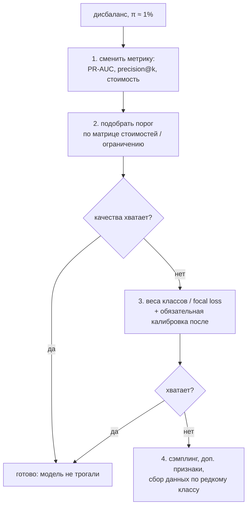

# Дисбаланс классов и калибровка

> **Зачем эта глава.** Фрод, отток, дефолт, редкие поломки, клики по баннеру — почти все ценные
> для бизнеса бинарные задачи имеют долю положительного класса от 0.01% до 5%. Вокруг дисбаланса
> накопился целый пласт ритуалов («обязательно сделайте SMOTE»), которые на практике чаще вредят,
> чем помогают. После этой главы вы будете понимать, что дисбаланс ломает на самом деле, какие
> рычаги решают проблему, а какие только маскируют её, и как получить от модели вероятности,
> которым можно верить и подставлять в формулу.

**Уровень:** 🎯 middle → 🧠 middle+
**Предварительно нужно:** [метрики качества](04-metrics.md), [логистическая регрессия](03-logistic-regression.md), [градиентный бустинг](07-gradient-boosting.md)
**Время на проработку:** ~5 часов (чтение + эксперимент + реализация калибровки)

---

## Карта главы

- [1. Что дисбаланс ломает на самом деле](#1-что-дисбаланс-ломает-на-самом-деле) — и что он не ломает
- [2. Рычаг первый: порог](#2-рычаг-первый-порог) — самый дешёвый и самый недооценённый
- [3. Рычаг второй: веса классов](#3-рычаг-второй-веса-классов) — что они делают с функцией потерь
- [4. Рычаг третий: сэмплинг и SMOTE](#4-рычаг-третий-сэмплинг-и-smote) — честный разбор с числами
- [5. Рычаг четвёртый: focal loss](#5-рычаг-четвёртый-focal-loss) — вывод и когда он уместен
- [6. Сводный эксперимент](#6-сводный-эксперимент) — все методы на одних данных
- [7. Калибровка: что это и как измерить](#7-калибровка-что-это-и-как-измерить) — reliability diagram, ECE, MCE
- [8. Методы калибровки](#8-методы-калибровки) — Platt, изотоническая, beta
- [9. Почему бустинг бывает недокалиброван](#9-почему-бустинг-бывает-недокалиброван)
- [10. Практический протокол](#10-практический-протокол)
- [11. Подводные камни](#11-подводные-камни)
- [12. Проверь себя](#12-проверь-себя)
- [13. Практика](#13-практика)
- [14. Что читать дальше](#14-что-читать-дальше)

---

## 1. Что дисбаланс ломает на самом деле

Начнём с диагноза, потому что почти вся путаница в этой теме — от неверного диагноза.

Пусть $n$ — размер выборки, $n_+$ — число объектов положительного (редкого) класса,
$\pi = n_+/n$ — его доля. Возьмём $\pi = 1\%$. Что именно перестаёт работать?

**Ломается accuracy — и это самое безобидное.** Модель, отвечающая «отрицательно» всегда,
даёт accuracy $= 1 - \pi = 99\%$. Это не проблема модели, это проблема метрики: accuracy неявно
предполагает равную цену ошибок и сопоставимые классы. Лечится сменой метрики, о чём подробно
в [главе о метриках](04-metrics.md), и больше мы к этому не возвращаемся.

**Ломается порог 0.5.** Логистическая регрессия или бустинг, обученные на logloss, будут выдавать
вероятности, сосредоточенные около $\pi$: типичное предсказание $0.005$–$0.05$. Порог 0.5
почти никогда не пересекается, и модель «ничего не находит» — при том, что её ранжирование может
быть отличным. Это не дефект обучения, это неверная интерпретация выхода.

**Ломается статистика редкого класса.** Вот это уже настоящая проблема, и её не чинят
перевзвешиванием. При $\pi = 1\%$ и $n = 10^4$ у вас всего 100 положительных примеров. Дерево
не может построить надёжный лист по трём объектам; оценка любой условной вероятности имеет
дисперсию порядка $p(1-p)/n_+$; регуляризация стягивает всё к базовой ставке. Модель
недообучена по редкому классу не потому, что её «не заставили обратить внимание», а потому,
что информации физически мало.

**Не ломается ранжирование как таковое.** Это контринтуитивно, но существенно: градиентный
бустинг с logloss на данных с $\pi = 1\%$ вполне способен выдать ROC-AUC 0.9. Функция потерь
logloss — строго правильный функционал оценивания, её минимум достигается на истинных условных
вероятностях, и никакого «перекоса в сторону мажоритарного класса» в ней не заложено.
Разговоры про «модель научится всегда предсказывать нулевой класс» верны для accuracy как
функции потерь (её никто не оптимизирует) и неверны для logloss.

> 🌱 **База.** Разделите в голове три вещи: (1) **метрика** — по чему вы судите;
> (2) **порог** — где вы проводите границу решения; (3) **модель** — насколько хорошо она
> упорядочивает объекты. Дисбаланс бьёт в основном по первым двум, и чинить его надо там же.
> Трогать третье (переобучать на искусственно сбалансированных данных) стоит только тогда,
> когда первые два уже исправлены и этого не хватило.

Отсюда порядок действий, который стоит выучить как последовательность, а не как меню:



---

## 2. Рычаг первый: порог

Самое дешёвое действие — не трогать модель вообще, а сдвинуть порог. Оптимальный порог
выводится из матрицы стоимостей (полный вывод — в [главе о метриках](04-metrics.md), §5):

$$
t^{*} = \frac{C_{FP} - C_{TN}}{\big(C_{FP} - C_{TN}\big) + \big(C_{FN} - C_{TP}\big)}
$$

где $C_{TP}, C_{FP}, C_{FN}, C_{TN}$ — стоимости соответствующих исходов. Если стоимости
неизвестны, порог задаётся ограничением: пропускной способностью команды проверки, минимально
допустимой precision или требуемым recall.

Насколько это работает на практике? На несбалансированном датасете ($\pi = 1.5\%$)
переход с порога 0.5 на подобранный по валидации:

```
порог 0.5:          F1=0.3158  precision=0.4719  recall=0.2373  срабатываний=89
порог подобранный:  F1=0.3699  precision=0.4155  recall=0.3333  срабатываний=142
```

Recall вырос в 1.4 раза при почти той же precision — без единой строчки изменений в модели.
Порог был подобран на валидационной выборке максимизацией $F_1$, а измерен на тестовой.

> 💬 **На собеседовании.** Спросят: «У вас 1% положительного класса. Что будете делать?»
> Хороший ответ начинается не с SMOTE, а с уточняющих вопросов: какая метрика, какое решение
> принимается по предсказанию, какая цена ошибок, сколько всего положительных примеров в
> абсолютных числах. Дальше — план по возрастанию инвазивности: сменить метрику на
> PR-AUC/precision@k, подобрать порог по стоимости, при необходимости добавить веса классов,
> и только потом думать о сэмплинге. Отдельно отмечу, что если положительных примеров меньше
> нескольких сотен, никакой ресэмплинг не создаст информацию, которой нет, — надо идти собирать
> данные или менять постановку (например, на поиск аномалий). Плохой ответ: «сделаю SMOTE,
> это стандартный подход при дисбалансе».

> ⚠️ **Типичная ошибка.** Подбирать порог на тестовой выборке → отчитываться завышенными
> precision/recall → в проде цифры хуже. Порог — гиперпараметр. Валидация для подбора, тест
> для отчёта. И проверяйте стабильность: если оптимальный порог сильно прыгает между фолдами,
> значит, вы подгоняетесь под шум, и лучше взять порог по ограничению (квантиль скоров),
> который устойчивее.

---

## 3. Рычаг второй: веса классов

### 3.1 Что происходит с функцией потерь

Взвешивание классов — это умножение вклада каждого объекта в суммарные потери на константу,
зависящую от его класса:

$$
\mathcal{L}_w = \frac{1}{n}\sum_{i=1}^{n} w_{y_i}\, L\big(y_i, F(x_i)\big),
\qquad
w_1 = \frac{n_-}{n_+}, \quad w_0 = 1
$$

где $w_{y_i}$ — вес класса объекта $i$, $L$ — исходная функция потерь (обычно logloss),
$F(x_i)$ — предсказание модели в логитах. Такое соотношение весов (`scale_pos_weight` в XGBoost,
`class_weight='balanced'` в sklearn, `is_unbalance` в LightGBM) уравнивает суммарный вес классов.

Механически это эквивалентно тому, как если бы каждый положительный объект встречался в выборке
$n_-/n_+$ раз. Отсюда сразу главное следствие: **модель начинает оценивать вероятности не в
исходном распределении, а в перевзвешенном**. Она отвечает на вопрос «какова вероятность фрода,
если бы фрод составлял 50% транзакций», а вы спрашиваете про реальные 1.5%.

Связь между смещённой вероятностью $p'$ и истинной $p$ выводится через отношение шансов.
Пусть отрицательные объекты входят в обучение с относительным весом $r = w_0/w_1$
(при взвешивании «balanced» $r = n_+/n_-$). Тогда

$$
\frac{p'}{1-p'} = \frac{1}{r}\cdot\frac{p}{1-p}
\qquad\Longleftrightarrow\qquad
\operatorname{logit}(p) = \operatorname{logit}(p') + \log r
$$

где $\operatorname{logit}(q) = \log\frac{q}{1-q}$. Формула красива тем, что коррекция — это
просто **сдвиг логита на константу**: ранжирование не меняется вообще, меняется только уровень.

> 📐 **Разбор формулы.** Байесовская интуиция: взвешивание меняет априорную вероятность класса,
> а правдоподобие $p(x \mid y)$ остаётся тем же. По теореме Байеса отношение апостериорных
> вероятностей есть произведение отношения априорных на отношение правдоподобий; меняя априорное
> в $1/r$ раз, мы в $1/r$ раз меняем и шансы. В логарифмической шкале умножение превращается
> в сложение — отсюда «сдвиг логита». Именно поэтому монотонные метрики (ROC-AUC) от взвешивания
> почти не страдают, а вероятностные (logloss, Brier) — рушатся.

### 3.2 Что взвешивание даёт и чего стоит

На практике веса делают три вещи, и только одна из них — та, ради которой их обычно применяют.

**Меняют критерий разбиения в деревьях.** Это единственный содержательный эффект: при подсчёте
Gain суммы градиентов и гессианов взвешиваются, и сплиты, полезные для редкого класса,
становятся выгоднее. Ранжирование действительно может улучшиться.

**Сдвигают уровень предсказаний.** Побочный и всегда вредный эффект: вероятности перестают быть
вероятностями.

**Взаимодействуют с регуляризацией.** Менее очевидно: `min_child_weight` в XGBoost — это порог
по сумме гессианов, а веса входят в гессианы. Выставив `scale_pos_weight=100`, вы неявно
ослабили ограничение на размер листа для редкого класса в 100 раз. Иногда это то, что нужно,
но чаще это незамеченный источник переобучения.

---

## 4. Рычаг третий: сэмплинг и SMOTE

### 4.1 Андерсэмплинг и оверсэмплинг

**Случайный андерсэмплинг** (random undersampling) выбрасывает часть объектов мажоритарного
класса. Плюс: обучение ускоряется в разы, что при $n = 10^8$ бывает решающим аргументом.
Минус очевиден: вы выбрасываете данные. При $\pi = 1.5\%$ балансировка до 1:1 означает потерю
97% выборки — вместе с ней уходят редкие паттерны отрицательного класса, и модель начинает
ошибаться на них.

Важно: после андерсэмплинга калибровка восстанавливается **точно**, по той же формуле сдвига
логита. Если вы оставили долю $r$ отрицательных объектов, то

$$
\operatorname{logit}(p) = \operatorname{logit}(p') + \log r
$$

```python
import numpy as np


def correct_undersampling(p_biased, keep_rate):
    """Возвращает вероятность в исходном распределении.

    keep_rate — доля негативов, оставленная при сэмплировании (r).
    Коррекция — сдвиг логита на log(r): ранжирование не меняется, уровень возвращается на место.
    """
    p_biased = np.clip(p_biased, 1e-9, 1 - 1e-9)
    logit = np.log(p_biased / (1 - p_biased)) + np.log(keep_rate)
    return 1.0 / (1.0 + np.exp(-logit))


print(correct_undersampling(np.array([0.5]), 0.1))    # [0.0909] — оставили 10% негативов
print(correct_undersampling(np.array([0.9]), 0.01))   # [0.0826] — оставили 1% негативов
```

**Случайный оверсэмплинг** (дублирование объектов редкого класса) не добавляет информации:
дубликаты не несут ничего нового, зато позволяют модели идеально запомнить каждый исходный
положительный объект — прямая дорога к переобучению. Для деревьев дублирование объекта
эквивалентно увеличению его веса, то есть это просто менее эффективная реализация взвешивания.

### 4.2 SMOTE: как он устроен

SMOTE (Synthetic Minority Over-sampling Technique, Chawla et al., 2002) пытается решить проблему
дубликатов, генерируя **новые** объекты меньшинства. Алгоритм умещается в четыре строки:

1. Взять объект меньшинства $x$.
2. Найти его $k$ ближайших соседей **среди объектов меньшинства** (обычно $k = 5$).
3. Случайно выбрать одного соседа $x^{nn}$.
4. Создать новый объект $x^{new} = x + \lambda\,(x^{nn} - x)$, где $\lambda \sim U[0,1]$.

То есть новые точки лежат на отрезках между существующими объектами редкого класса.

```python
import numpy as np
from sklearn.neighbors import NearestNeighbors


def smote(X_min, n_new, k=5, seed=0):
    """SMOTE: новый объект — точка на отрезке между объектом меньшинства и его случайным соседом."""
    rng = np.random.default_rng(seed)
    nn = NearestNeighbors(n_neighbors=k + 1).fit(X_min)
    _, idx = nn.kneighbors(X_min)                       # столбец 0 — сам объект, его пропускаем
    base = rng.integers(0, len(X_min), n_new)           # какой объект берём за основу
    nbr = idx[base, rng.integers(1, k + 1, n_new)]      # какого из k соседей берём
    lam = rng.random((n_new, 1))                        # где на отрезке ставим новую точку
    return X_min[base] + lam * (X_min[nbr] - X_min[base])
```

### 4.3 Почему на практике SMOTE чаще вредит

Разберём честно, потому что это один из самых частых вопросов на собеседовании и одно из самых
устойчивых заблуждений.

**Первое. SMOTE предполагает, что признаковое пространство непрерывно и выпукло по классу.**
Отрезок между двумя мошенническими транзакциями объявляется мошенническим. Для гауссовых
облаков в $\mathbb{R}^d$ (то есть для синтетики, на которой SMOTE и демонстрируют) это верно.
Для реальных табличных данных — почти никогда: там есть категории (среднее между «Москва» и
«Казань» бессмысленно), счётчики (2.7 покупки), one-hot-векторы (0.4 в трёх столбцах сразу),
монотонные ограничения (возраст 34.6, доход 87 431.2 при том, что зарплаты кратны тысяче).
Модель получает объекты, которых не бывает, и учится на артефактах генератора.

**Второе. В высокой размерности «между соседями» — это почти всегда пустота.** При $d \gtrsim 20$
объём шара сосредоточен у поверхности, все расстояния между точками становятся близкими, и
понятие «ближайший сосед меньшинства» теряет содержание. Интерполяция между двумя далёкими
точками порождает объект в области, где реальных данных нет вовсе.

**Третье. SMOTE размывает границу классов.** Если объекты меньшинства образуют несколько
разделённых кластеров, отрезок между кластерами проходит через территорию мажоритарного класса.
Синтетические объекты, попавшие туда, — это буквально ошибочные метки.

**Четвёртое. Калибровка ломается так же, как при взвешивании.** Доля положительных изменена
искусственно, и вероятности сдвигаются. Но, в отличие от чистого взвешивания, простой формулы
коррекции здесь нет: распределение признаков тоже изменилось.

**Пятое, и это главное.** Механизм, за счёт которого SMOTE «помогает» — усиление сигнала редкого
класса в функции потерь. Ровно того же эффекта можно добиться весами классов, дёшево и без
порчи распределения признаков. Систематические сравнения на реальных данных (Elor и
Averbuch-Elor, «To SMOTE, or not to SMOTE?», 2022; van den Goorbergh et al., JAMIA, 2022)
приходят к одному выводу: для сильных моделей (бустинг, случайный лес) с настроенными
гиперпараметрами и корректно выбранным порогом балансировка не даёт устойчивого прироста
ранжирующих метрик, но надёжно портит калибровку.

> 🧠 **Middle+.** Есть узкая ниша, где SMOTE и его варианты (Borderline-SMOTE, ADASYN)
> действительно работают: непрерывные признаки небольшой размерности, унимодальный редкий класс,
> слабая базовая модель (kNN, логистическая регрессия без регуляризации), очень мало
> положительных примеров. Классический пример — измерения датчиков в промышленности.
> Если ваш случай не такой, а это в 90% табличных задач так, — начните с весов классов
> и порога, а SMOTE держите как гипотезу, которую надо проверить, а не как обязательный шаг.

> ⚠️ **Типичная ошибка.** Применять SMOTE **до** разбиения на train/test → синтетические объекты,
> построенные по тестовым точкам, попадают в обучение → метрика на тесте фантастическая, в проде
> провал. Это утечка в чистом виде. Правило: любой ресэмплинг применяется **только к обучающей
> части и внутри каждого фолда кросс-валидации**. В sklearn это делается через
> `imblearn.pipeline.Pipeline`, а не через `sklearn.pipeline.Pipeline`, потому что обычный
> пайплайн применяет трансформацию и к валидационной части тоже.

---

## 5. Рычаг четвёртый: focal loss

### 5.1 Идея и формула

Focal loss придумали для детекции объектов (Lin et al., 2017), где дисбаланс экстремальный:
на изображении десятки тысяч фоновых окон-кандидатов и единицы объектов. Проблема там не только
в соотношении классов, но и в том, что подавляющее большинство отрицательных примеров —
**лёгкие**: модель уверенно и правильно относит их к фону, но их так много, что их суммарный
вклад в градиент заглушает вклад немногих трудных примеров.

Идея: домножить кросс-энтропию на множитель, который гасит вклад примеров, где модель уже права.

$$
\text{FL}(p_t) = -\,\alpha_t\,\big(1 - p_t\big)^{\gamma}\,\log p_t,
\qquad
p_t = \begin{cases} p, & y = 1 \\ 1 - p, & y = 0 \end{cases}
$$

где $p = \sigma(z)$ — предсказанная вероятность положительного класса, $z$ — логит,
$p_t$ — вероятность, назначенная моделью **истинному** классу объекта,
$\gamma \ge 0$ — параметр фокусировки, $\alpha_t \in (0,1)$ — балансирующий вес класса
($\alpha$ для положительных, $1-\alpha$ для отрицательных).

При $\gamma = 0$ и $\alpha_t = 1$ это обычная кросс-энтропия. Множитель $(1-p_t)^{\gamma}$
называют **модулирующим фактором**: он близок к 1, когда модель ошибается ($p_t \to 0$),
и стремится к нулю, когда модель уверенно права ($p_t \to 1$).

### 5.2 Насколько это меняет вклады

Посчитаем при $\gamma = 2$ (значение по умолчанию из статьи):

| $p_t$ | CE $= -\log p_t$ | $(1-p_t)^2$ | FL |
|---|---|---|---|
| 0.9 (лёгкий, модель права) | 0.1054 | 0.0100 | 0.001054 |
| 0.6 (трудный) | 0.5108 | 0.1600 | 0.081732 |

Отношение вкладов трудного примера к лёгкому: в обычной кросс-энтропии — 4.85 раза,
в focal loss — **77.6 раза**. То есть focal loss не столько борется с дисбалансом классов
(за это отвечает $\alpha$), сколько перераспределяет внимание с лёгких примеров на трудные —
и это разные вещи.

```python
import numpy as np


def focal_loss(z, y, gamma=2.0, alpha=0.25):
    """Focal loss по логитам z. p_t — вероятность, назначенная ИСТИННОМУ классу объекта."""
    p = 1.0 / (1.0 + np.exp(-z))
    p_t = np.where(y == 1, p, 1.0 - p)
    a_t = np.where(y == 1, alpha, 1.0 - alpha)
    return -a_t * (1.0 - p_t) ** gamma * np.log(np.clip(p_t, 1e-12, 1.0))


def focal_grad(z, y, gamma=2.0, alpha=0.25):
    """Градиент по логиту — то, что нужно передать в бустинг как custom objective."""
    p = 1.0 / (1.0 + np.exp(-z))
    p_t = np.where(y == 1, p, 1.0 - p)
    a_t = np.where(y == 1, alpha, 1.0 - alpha)
    log_pt = np.log(np.clip(p_t, 1e-12, 1.0))
    dL_dpt = a_t * (gamma * (1 - p_t) ** (gamma - 1) * log_pt - (1 - p_t) ** gamma / np.clip(p_t, 1e-12, 1.0))
    dpt_dz = np.where(y == 1, 1.0, -1.0) * p * (1 - p)   # цепное правило через сигмоиду
    return dL_dpt * dpt_dz


# проверка аналитического градиента конечными разностями — обязательный шаг для любого custom loss
z = np.array([-2.0, -0.5, 0.3, 1.7])
y = np.array([0, 1, 0, 1])
eps = 1e-6
numeric = (focal_loss(z + eps, y) - focal_loss(z - eps, y)) / (2 * eps)
print(np.round(focal_grad(z, y), 8))   # [ 0.00365321 -0.13153796  0.32212985 -0.00261383]
print(np.round(numeric, 8))            # [ 0.00365321 -0.13153796  0.32212985 -0.00261383]
```

### 5.3 Когда focal loss уместен, а когда нет

Уместен там, где он и родился: много лёгких отрицательных примеров, и проблема в том, что они
доминируют в градиенте. Это детекция, сегментация, ранжирование с огромным числом негативов,
обучение эмбеддингов с in-batch negatives.

На обычной табличной задаче с бустингом focal loss обычно **не** даёт прироста относительно
`scale_pos_weight`, зато требует custom objective, тюнинга двух параметров вместо одного
и — как и всё в этом разделе — ломает калибровку: focal loss не является правильным функционалом
оценивания, её минимум достигается **не** на истинных вероятностях. Если вам нужны вероятности,
после focal loss калибровка обязательна.

> 💬 **На собеседовании.** Спросят: «Что такое focal loss и когда его применять?»
> Хороший ответ: это кросс-энтропия, домноженная на $(1-p_t)^\gamma$, где $p_t$ — вероятность
> истинного класса; множитель гасит вклад примеров, на которых модель уже уверенно права.
> При $\gamma = 2$ трудный пример с $p_t = 0.6$ весит относительно лёгкого с $p_t = 0.9$
> в 78 раз больше, тогда как в обычной CE — только в 5. Ключевое уточнение: focal loss борется
> не с дисбалансом **классов** (для этого в ней отдельный множитель $\alpha$), а с дисбалансом
> **сложности** примеров. Родная область — детекция, где фоновых окон десятки тысяч.
> На табличных задачах обычно проигрывает простому взвешиванию по сложности внедрения и
> к тому же портит калибровку, так как не является proper scoring rule.
> Плохой ответ: «это лучшая функция потерь для дисбаланса».

---

## 6. Сводный эксперимент

Теория проверяется числами. Возьмём один датасет, один сплит, одну модель и прогоним все
рычаги. Данные: 60 000 объектов, 25 признаков, $\pi = 1.5\%$, 532 положительных объекта
в обучающей части. Модель — `GradientBoostingClassifier` с фиксированными гиперпараметрами.
Порог не трогаем: все метрики в таблице пороговые решения не используют.

| Что сделали | ROC-AUC | PR-AUC | logloss | ECE | средний $\hat p$ |
|---|---|---|---|---|---|
| без вмешательства | 0.7960 | 0.2457 | **0.0792** | **0.0037** | 0.0136 |
| веса классов (1:66) | **0.8190** | 0.3619 | 0.2598 | 0.1933 | 0.2080 |
| андерсэмплинг 1:1 | 0.8054 | 0.2148 | 0.5652 | 0.3538 | 0.3685 |
| андерсэмплинг + коррекция логита | 0.8054 | 0.2148 | 0.0628 | 0.0053 | 0.0189 |
| SMOTE до 1:1 | 0.7883 | 0.2689 | 0.3020 | 0.2104 | 0.2252 |
| SMOTE до 10% | 0.8115 | **0.3849** | 0.0802 | 0.0393 | 0.0539 |
| калибровка Платта поверх базовой | 0.7960 | 0.2457 | 0.0666 | 0.0044 | 0.0153 |
| изотоническая калибровка поверх базовой | 0.7985 | 0.2233 | **0.0579** | **0.0023** | 0.0152 |

Доля положительного класса в тесте — 1.5%, средний $\hat p$ должен быть примерно равен ей.

Что здесь видно, если читать честно, а не подгонять под тезис.

**Ранжирование действительно улучшается от взвешивания и от умеренного SMOTE.** PR-AUC вырос
с 0.246 до 0.362 (веса) и до 0.385 (SMOTE до 10%). Это реальный эффект, и утверждение
«балансировка вообще никогда не помогает» было бы неправдой. Оговорка существенная: данные
синтетические, признаки непрерывные и гауссовы — это **лучший возможный случай для SMOTE**.
На реальных табличных данных с категориями и счётчиками этот эффект систематически не
воспроизводится, что и показывают цитированные выше работы.

**Агрессивная балансировка до 1:1 хуже умеренной.** SMOTE до 1:1 просадил и ROC-AUC (0.796 → 0.788),
и PR-AUC относительно варианта «до 10%». Андерсэмплинг до 1:1 просадил PR-AUC ниже базовой линии
(0.246 → 0.215) — выбросили 97% данных, потеряли информацию об отрицательном классе.
Соотношение 1:1 не имеет никакого теоретического обоснования, это ритуал.

**Калибровка ломается всегда и предсказуемо.** Средний $\hat p$ при истинных 1.5% становится
20.8% (веса), 36.9% (андерсэмплинг), 22.5% (SMOTE) — то есть модель завышает вероятность
в 15–25 раз. ECE вырастает с 0.004 до 0.19–0.35. Любая формула, куда подставляется $\hat p$
(ожидаемый убыток, ставка в аукционе, резерв), после этого даёт бессмыслицу.

**Коррекция логита работает точно.** Строка «андерсэмплинг + коррекция»: ранжирующие метрики
не изменились ни на тысячную (сдвиг логита монотонен), а logloss упал с 0.565 до 0.063 и ECE
с 0.354 до 0.005. Один арифметический трюк полностью восстановил вероятности.

**Калибровка Платта не меняет ROC-AUC вообще, изотоническая — меняет.** Строка Платта:
ROC-AUC и PR-AUC совпадают с базовыми до четвёртого знака, потому что сигмоида от линейной
функции строго монотонна. Изотоническая: ROC-AUC чуть вырос (0.7960 → 0.7985), а PR-AUC
заметно упал (0.2457 → 0.2233) — она склеивает соседние скоры в блоки с одинаковым значением,
и в голове списка, где решается судьба precision@k, появляются связки. Это ровно тот эффект,
о котором предупреждает [глава о метриках](04-metrics.md), §3.3, и в задачах с ограниченным
бюджетом проверок он может оказаться дороже выигрыша в logloss.

---

## 7. Калибровка: что это и как измерить

### 7.1 Определение

Модель **откалибрована** (calibrated), если среди объектов, которым она приписала вероятность
$q$, доля положительных действительно равна $q$:

$$
\mathbb{P}\big(y = 1 \;\big|\; \hat p(x) = q\big) = q
\qquad \text{для всех } q \in [0, 1]
$$

где $\hat p(x)$ — предсказанная моделью вероятность положительного класса. Словами: если модель
сказала «0.3» на тысяче объектов, то положительными должны оказаться примерно триста.

Калибровка и разделяющая способность — **независимые** свойства. Модель, всегда выдающая
$\hat p \equiv \pi$, идеально откалибрована и совершенно бесполезна (ROC-AUC = 0.5). Модель
с ROC-AUC = 0.99, выдающая вероятности вдвое завышенные, отлично ранжирует и негодна для
подстановки в формулу. Поэтому калибровочные метрики никогда не используют в одиночку.

Калибровка обязательна, когда предсказание — вход в вычисление:

- ожидаемый убыток $= \hat p \cdot \text{сумма транзакции}$;
- ставка в аукционе $= \widehat{\text{CTR}} \cdot \text{bid}$ (иначе вы систематически
  переплачиваете или недоставляете);
- порог по матрице стоимостей — формула $t^*$ работает только с настоящими вероятностями;
- ансамблирование или каскад моделей, где выход одной подаётся на вход другой;
- любая коммуникация с человеком: «риск дефолта 12%» должно означать 12%.

Калибровка не важна, когда решение зависит только от порядка: отобрать топ-100 на проверку,
отсортировать выдачу, выбрать лучшего кандидата.

### 7.2 Reliability diagram

Проверяют калибровку графиком надёжности (reliability diagram, calibration curve): разбиваем
предсказания на бины, в каждом считаем средний предсказанный скор (confidence) и наблюдаемую
долю положительных (accuracy), рисуем точки. Идеальная калибровка — диагональ.

Точки **под** диагональю (наблюдаемая доля меньше предсказанной) — модель переуверена;
**над** диагональю — недоуверена.

```python
import numpy as np


def reliability_table(y_true, proba, n_bins=10, strategy="quantile"):
    """Строки (средний скор в бине, доля позитивов в бине, размер бина).

    strategy='quantile' — бины равного размера. Для несбалансированных задач это обязательно:
    при равноширинных бинах 99% предсказаний попадут в первый бин, и диаграмма будет пустой.
    """
    y_true = np.asarray(y_true, dtype=float)
    proba = np.asarray(proba, dtype=float)
    if strategy == "quantile":
        edges = np.unique(np.quantile(proba, np.linspace(0, 1, n_bins + 1)))
    else:
        edges = np.linspace(0.0, 1.0, n_bins + 1)
    bin_id = np.clip(np.digitize(proba, edges[1:-1], right=True), 0, len(edges) - 2)
    rows = []
    for b in range(len(edges) - 1):
        mask = bin_id == b
        if mask.sum() == 0:
            continue
        rows.append((proba[mask].mean(), y_true[mask].mean(), int(mask.sum())))
    return rows


def expected_calibration_error(y_true, proba, n_bins=10, strategy="quantile"):
    """ECE — средневзвешенное по бинам расхождение между уверенностью и частотой."""
    rows = reliability_table(y_true, proba, n_bins, strategy)
    n = len(y_true)
    return sum(cnt / n * abs(freq - conf) for conf, freq, cnt in rows)


def max_calibration_error(y_true, proba, n_bins=10, strategy="quantile"):
    """MCE — худший бин. Важен, когда решения принимаются в узкой зоне скоров."""
    rows = reliability_table(y_true, proba, n_bins, strategy)
    return max((abs(freq - conf) for conf, freq, _ in rows), default=0.0)


# демонстрация: берём заведомо калиброванные вероятности и портим их «переуверенностью»
rng = np.random.default_rng(0)
p_true = rng.beta(2, 5, 20_000)
y = (rng.random(20_000) < p_true).astype(int)          # метки согласованы с вероятностями

logit = np.log(p_true / (1 - p_true))
p_over = 1.0 / (1.0 + np.exp(-2.5 * logit))            # растянули логит: модель переуверена

print("ECE калиброванной:", round(expected_calibration_error(y, p_true), 5))    # 0.00322
print("ECE переуверенной:", round(expected_calibration_error(y, p_over), 5))    # 0.13576
print("ECE константы = base rate:", expected_calibration_error(y, np.full(len(y), y.mean())))  # 0.0

for conf, freq, cnt in reliability_table(y, p_over, n_bins=5):
    print(f"  предсказано {conf:.3f}  наблюдается {freq:.3f}  n={cnt}")
# предсказано 0.004  наблюдается 0.091  n=4000   <- сильно недооценивает риск внизу
# предсказано 0.025  наблюдается 0.185  n=4000
# предсказано 0.076  наблюдается 0.267  n=4000
# предсказано 0.202  наблюдается 0.365  n=4000
# предсказано 0.560  наблюдается 0.528  n=4000
```

### 7.3 ECE и его недостатки

$$
\text{ECE} = \sum_{b=1}^{B} \frac{n_b}{n}\,\Big\lvert \text{freq}(b) - \text{conf}(b) \Big\rvert,
\qquad
\text{MCE} = \max_{b}\Big\lvert \text{freq}(b) - \text{conf}(b) \Big\rvert
$$

где $B$ — число бинов, $n_b$ — число объектов в бине $b$, $\text{conf}(b)$ — средний
предсказанный скор в бине, $\text{freq}(b)$ — наблюдаемая доля положительных в бине.

У ECE три известных дефекта, о которых стоит знать, прежде чем ставить его в дашборд.

**Он зависит от биннинга.** Число бинов и стратегия (равноширинные vs равнонаполненные) меняют
значение, иногда в разы. Для несбалансированных задач равноширинные бины бесполезны: почти все
предсказания попадут в $[0, 0.1]$, и картина усреднится в один пиксель. Всегда используйте
квантильные бины и фиксируйте $B$ (обычно 10–20) во всех сравнениях.

**Он смещён вниз при малых бинах.** $\text{freq}(b)$ — оценка по $n_b$ объектам, и её случайное
отклонение от $\text{conf}(b)$ входит в ECE со знаком плюс всегда (модуль!). При маленьких бинах
ECE положителен даже для идеально калиброванной модели: в примере выше идеально калиброванные
вероятности дают ECE = 0.0032, а не 0. Сравнивать ECE моделей можно только при одинаковых $n$ и $B$.

**Он не является правильным функционалом оценивания.** Константный прогноз $\hat p \equiv \pi$
даёт $\text{ECE} = 0$ — идеальную калибровку при нулевой полезности. Поэтому ECE **всегда**
показывают вместе с метрикой разделяющей способности (ROC-AUC или PR-AUC) и/или вместе с
proper scoring rule (logloss, Brier).

> 💬 **На собеседовании.** Спросят: «Как проверить, что модель выдаёт корректные вероятности?»
> Хороший ответ: строю reliability diagram на отложенной выборке — квантильные бины, по оси $x$
> средний предсказанный скор, по оси $y$ наблюдаемая доля позитивов; идеал — диагональ. Численно
> — ECE и MCE, плюс Brier или logloss как proper scoring rule. Обязательно оговариваю две вещи:
> ECE зависит от биннинга и смещён вверх при малых бинах, поэтому сравниваю модели только при
> одинаковых настройках; и ECE в одиночку бессмысленен, потому что константа, равная базовой
> частоте, даёт ECE = 0. Ещё простая проверка на пять секунд, которая ловит 80% проблем:
> сравнить средний предсказанный скор с фактической долей положительных — если модель говорит
> 20% при реальных 1.5%, дальше можно не смотреть. Плохой ответ: «смотрю на logloss» — logloss
> смешивает калибровку и разделяющую способность и не показывает, в какую сторону смещение.

---

## 8. Методы калибровки

Общая схема одинакова: обучаем модель на train, получаем её скоры на **отдельной** выборке,
обучаем на этих скорах одномерную функцию $g: \mathbb{R} \to [0,1]$, минимизирующую расхождение
с метками, и в проде применяем $g(s(x))$.

> ⚠️ **Типичная ошибка.** Калибровать на обучающей выборке → модель на трейне переуверена
> (она эти объекты видела), калибратор выучит несуществующее смещение → в проде станет хуже,
> чем было. Нужна отдельная калибровочная выборка либо out-of-fold-схема:
> `CalibratedClassifierCV(estimator, cv=5)` обучает $K$ копий модели и калибрует на
> out-of-fold-предсказаниях. Если модель уже обучена и переобучать её нельзя, в современном
> scikit-learn это `CalibratedClassifierCV(FrozenEstimator(model), method=...)`, обученный
> на валидационной выборке.

### 8.1 Калибровка Платта (Platt scaling)

Логистическая регрессия одной переменной поверх скора модели:

$$
\hat p = \sigma\big(a\,s(x) + b\big) = \frac{1}{1 + \exp\big(-(a\,s(x) + b)\big)}
$$

где $s(x)$ — скор базовой модели (для бустинга — логит, для SVM — расстояние до гиперплоскости),
$a, b$ — два параметра, подбираемые минимизацией logloss на калибровочной выборке.

Свойства:

- **два параметра** — почти не переобучается, работает от нескольких сотен объектов;
- **строго монотонна** — ROC-AUC не меняется вообще (см. таблицу §6);
- **жёсткая параметрическая форма** — если реальная кривая калибровки не сигмоидальна
  (например, модель переуверена только сверху, а снизу нормальна), Платт её не выправит.

Исторически метод придумали для SVM (Platt, 1999), где выход — расстояние до гиперплоскости,
не имеющее вероятностного смысла. Для бустинга он тоже работает, если применять к логиту,
а не к уже сигмоидированной вероятности.

### 8.2 Изотоническая регрессия

Ищем произвольную **неубывающую** функцию $g$, минимизирующую квадратичную ошибку:

$$
g^{*} = \arg\min_{g \ \text{неубывающая}} \sum_{i=1}^{n_{\text{cal}}} \big(g(s_i) - y_i\big)^2
$$

где $n_{\text{cal}}$ — размер калибровочной выборки, $s_i$ — скор объекта $i$, $y_i$ — его метка.
Решение находит алгоритм PAVA (pool adjacent violators) за $O(n \log n)$: сортируем объекты
по скору, идём слева направо и, встретив нарушение монотонности, «схлопываем» соседние блоки
в один со средним значением, пока нарушений не останется.

Свойства:

- **непараметрическая** — выправляет калибровочную кривую любой формы;
- **жадная до данных** — при малой калибровочной выборке (меньше ~1000 объектов, а при сильном
  дисбалансе — меньше нескольких сотен положительных) переобучается и даёт ступенчатый мусор;
- **выход кусочно-постоянный** — соседние скоры склеиваются в блоки, появляются связки.
  Отсюда просадка PR-AUC в §6: в голове списка разрешение теряется;
- **не экстраполирует** — за пределами диапазона калибровочных скоров выдаёт константу.

### 8.3 Что выбрать

| Условия | Выбор |
|---|---|
| Калибровочная выборка < 1000 объектов или < 100 положительных | Платт |
| Много данных, кривая калибровки явно не сигмоидальна | изотоническая |
| Важна precision@k / порядок в голове списка | Платт (изотоническая создаёт связки) |
| Нужно исправить только сдвиг уровня после взвешивания/сэмплинга | сдвиг логита на $\log r$ — точная формула, калибратор не нужен |
| Нейросеть, многоклассовая задача | temperature scaling: $\hat p = \text{softmax}(z / T)$, один параметр $T$ |

Есть и промежуточный вариант — **beta-калибровка** (Kull et al., 2017):
$\hat p = \sigma\big(a\log s - b\log(1-s) + c\big)$, три параметра. Она гибче Платта на краях
диапазона (там, где как раз и живут интересные объекты при дисбалансе) и устойчивее
изотонической на малых выборках.

---

## 9. Почему бустинг бывает недокалиброван

Здесь принято повторять «бустинг плохо калиброван», но точная формулировка тоньше, и на
собеседовании ценится именно она.

**AdaBoost — да, и это следует из его функции потерь.** AdaBoost минимизирует экспоненциальную
потерю $\mathbb{E}[e^{-yF(x)}]$ при $y \in \{-1, +1\}$. Её популяционный минимум равен

$$
F^{*}(x) = \tfrac12 \log \frac{\mathbb{P}(y=1 \mid x)}{\mathbb{P}(y=-1 \mid x)}
$$

то есть **половине** логита, а не логиту. Значит, корректное преобразование в вероятность —
$\hat p = \sigma\big(2F(x)\big)$, а не $\sigma(F(x))$. Реализации, применяющие обычную сигмоиду
(или нормировку голосов), систематически сжимают предсказания к 0.5. На эксперименте с 15% шума
в метках AdaBoost из 300 деревьев даёт предсказания в диапазоне $[0.318, 0.722]$ — он физически
не способен сказать «0.95», — и ECE = 0.21:

```
предсказано 0.409   наблюдается 0.190      <- сильно переуверен снизу
предсказано 0.503   наблюдается 0.483
предсказано 0.619   наблюдается 0.918      <- сильно недоуверен сверху
```

Это классическая S-образная кривая надёжности, ради которой Никулеску-Мизил и Каруана
рекомендовали Платта поверх бустинга.

**Градиентный бустинг с logloss — калиброван неплохо, пока его не испортили.** Logloss — proper
scoring rule, её минимум и есть истинные вероятности, поэтому GB с ранней остановкой обычно
даёт приличную калибровку из коробки (в таблице §6 базовая модель имеет ECE = 0.0037 —
лучше, чем после калибровки Платта). Портят калибровку три вещи:

1. **Обучение сильно за точкой минимума валидационного logloss.** Модель продолжает
   уменьшать ошибку на трейне, выдавливая предсказания к 0 и 1. На эксперименте с 15% шума
   переход с 100 на 2000 деревьев: ROC-AUC 0.9005 → 0.9028 (чуть вырос), logloss 0.392 → 0.438
   (ухудшился), верхний бин уверенности 0.949 → 0.997 при наблюдаемой частоте 0.928 → 0.924.
   Модель стала утверждать «99.7%» там, где реальность 92%.
2. **Взвешивание классов и ресэмплинг** — механизм разобран в §3.1 и §6.
3. **Сильная регуляризация в обратную сторону**: очень малый $\nu$, большой $\lambda$ на листья,
   ранняя остановка задолго до оптимума — предсказания стягиваются к базовой ставке, модель
   становится **недо**уверенной.

**Случайный лес недокалиброван на краях по другой причине.** Его предсказание — доля деревьев,
проголосовавших за класс. Чтобы получить 0, все 500 деревьев должны сойтись, а из-за бутстрапа
и случайности признаков хотя бы одно почти всегда проголосует иначе. Предсказания «поджаты»
внутрь отрезка, кривая надёжности имеет обратную S-форму.

> 💬 **На собеседовании.** Спросят: «Почему у бустинга плохие вероятности и что с этим делать?»
> Хороший ответ разделяет случаи. У AdaBoost проблема структурная: он минимизирует
> экспоненциальную потерю, оптимум которой — половина логита, поэтому сигмоида от его выхода
> систематически сжата к 0.5. У градиентного бустинга с logloss оптимум — истинная вероятность,
> и при ранней остановке он калиброван вполне прилично; калибровку у него ломают взвешивание
> классов, ресэмплинг и обучение далеко за минимумом валидационного logloss. Что делать:
> сначала убрать причину — не взвешивать, если нужны вероятности, и останавливаться по logloss,
> а не по AUC; если взвешивание необходимо, скорректировать логит на $\log r$; и только потом
> ставить калибратор на отдельной выборке — Платта при малых данных, изотонический при больших.
> Плохой ответ: «бустинг всегда плохо калиброван, надо всегда делать изотоническую регрессию».

---

## 10. Практический протокол

Порядок действий, который стоит уметь проговорить целиком.

1. **Посчитайте абсолютные числа.** Не $\pi$, а $n_+$. Пятьсот положительных примеров и
   пятьсот тысяч — это две принципиально разные задачи, хотя $\pi$ может совпадать.
   При $n_+ < 100$ ML-постановка сомнительна: подумайте о правилах, о поиске аномалий
   ([глава 18](18-anomaly-detection.md)) или о сборе данных.
2. **Выберите метрику до обучения.** PR-AUC + precision@k при рабочем бюджете, плюс logloss,
   если предсказание идёт в формулу. Baseline PR-AUC = $\pi$ — держите его рядом.
3. **Обучите базовую модель без всяких вмешательств.** Это ваша точка отсчёта, и очень часто
   она оказывается лучшей.
4. **Стратифицируйте разбиения.** `StratifiedKFold` обязателен: при $\pi = 0.5\%$ обычный
   `KFold` легко даст фолд без единого положительного объекта.
5. **Подберите порог** по матрице стоимостей или по операционному ограничению — на валидации.
6. **Только теперь** пробуйте веса классов / focal loss / сэмплинг, каждый раз сравнивая
   с точкой отсчёта по выбранной метрике. Ресэмплинг применяйте внутри фолдов, не до сплита.
7. **Проверьте калибровку** reliability diagram + ECE + сравнением среднего $\hat p$ с $\pi$.
   Если ломали её на шаге 6 и вероятности нужны — калибруйте на отдельной выборке.
8. **Зафиксируйте мониторинг**: доля срабатываний, средний $\hat p$, ECE и $\pi$ во времени.
   Дрейф $\pi$ (сезонность мошенничества, изменение маркетинга) молча ломает и порог,
   и калибровку — см. [дрифт данных](../09-monitoring/03-drift-detection.md).

---

## 11. Подводные камни

**Ресэмплинг применён до разбиения на train/test.**
Симптом: PR-AUC на кросс-валидации 0.9, на отложенном тесте 0.2.
Причина: синтетические или дублированные объекты, построенные по тестовым точкам, попали
в обучение. Классическая утечка.
Что делать: ресэмплинг только внутри обучающей части каждого фолда; использовать
`imblearn.pipeline.Pipeline`, который умеет применять сэмплеры только на fit.

**После `scale_pos_weight` вероятности подставили в формулу ожидаемого убытка.**
Симптом: система резервирует денег в 20 раз больше, чем нужно; или ставка в аукционе завышена
и бюджет выгорает за час.
Причина: взвешивание сдвинуло априорное распределение, средний $\hat p$ стал 0.2 при реальных 0.015.
Что делать: либо не взвешивать, если нужны вероятности; либо скорректировать логит на $\log r$;
либо откалибровать на невзвешенной выборке.

**Калибратор обучен на обучающей выборке.**
Симптом: ECE на трейне идеальный, на тесте хуже, чем до калибровки.
Причина: на трейне модель переуверена относительно своего же поведения на новых данных;
калибратор выучил это несуществующее смещение и применил его к нормальным предсказаниям.
Что делать: отдельная калибровочная выборка или out-of-fold-схема.

**Изотоническая калибровка на маленькой выборке.**
Симптом: кривая калибровки после «исправления» стала ступенчатой, PR-AUC просел,
predict_proba выдаёт десяток различных значений.
Причина: PAVA схлопнул почти всё в несколько блоков — переобучение непараметрического метода.
Что делать: Платт или beta-калибровка; порог по объёму — не меньше нескольких сотен объектов
редкого класса в калибровочной выборке.

**Ранняя остановка по ROC-AUC, а вероятности нужны.**
Симптом: AUC растёт, продукт жалуется на «странные вероятности», logloss на валидации давно
развернулся вверх.
Причина: AUC нечувствителен к уровню предсказаний, и оптимум по AUC достигается позже оптимума
по logloss; между этими точками модель становится переуверенной.
Что делать: `eval_metric='logloss'` (или Brier) для ранней остановки, если предсказания —
вероятности; смотреть обе кривые.

**Дрейф базовой ставки $\pi$ сломал порог.**
Симптом: число срабатываний модели выросло втрое за неделю без релиза.
Причина: доля положительного класса изменилась (сезон, новая аудитория, атака), а порог
фиксирован в конфиге месяц назад.
Что делать: мониторить $\pi$ и распределение скоров; пересчитывать порог по расписанию;
для операционных ограничений задавать порог как квантиль текущего потока, а не как константу.

**ECE улучшили, а модель стала хуже.**
Симптом: ECE упал вдвое, продуктовая метрика не изменилась или просела.
Причина: ECE — не proper scoring rule; его можно улучшить, сжав предсказания к базовой ставке
и потеряв разрешающую способность.
Что делать: смотреть ECE только вместе с Brier/logloss и с ранжирующей метрикой; сравнивать
модели по proper scoring rule, а ECE использовать как диагностику направления смещения.

---

## 12. Проверь себя

<details>
<summary><b>🌱 Вопрос.</b> Доля положительного класса — 1%. Модель даёт accuracy 99%. Что вы скажете?</summary>

**Короткий ответ.** Что метрика выбрана неверно: ровно такую accuracy даёт модель, всегда
отвечающая «отрицательно». Прошу матрицу ошибок и перехожу на PR-AUC / precision@k / стоимость.

**Развёрнуто.** Accuracy неявно предполагает равную цену ошибок и сопоставимые классы; при
$\pi = 1\%$ константный прогноз даёт $1 - \pi = 99\%$. Смотреть надо на абсолютные числа:
сколько положительных объектов найдено и ценой скольких ложных срабатываний. Дальше метрика
выбирается из назначения системы: PR-AUC (её baseline равен $\pi$) для сравнения моделей,
precision@k и recall@k при известном бюджете проверок, ожидаемая стоимость при известной
матрице стоимостей.

**Чего ждёт интервьюер:** мгновенного распознавания и перехода к правильным метрикам.

**Провал:** «нужно сбалансировать классы» как первый ответ — это лечение симптома не той болезни.
</details>

<details>
<summary><b>🎯 Вопрос.</b> Расскажите, как работает SMOTE и почему вы бы его не применили.</summary>

**Короткий ответ.** SMOTE генерирует новые объекты меньшинства как точки на отрезках между
объектом и его $k$ ближайшими соседями того же класса. Не применил бы, потому что он
предполагает непрерывное выпуклое признаковое пространство, разваливается в высокой размерности
и на категориальных признаках, и всегда ломает калибровку — при том, что усиления сигнала
редкого класса дешевле добиться весами.

**Развёрнуто.** Алгоритм: берём $x$ из меньшинства, находим его $k$ соседей среди меньшинства,
выбираем случайного соседа $x^{nn}$, создаём $x^{new} = x + \lambda(x^{nn} - x)$,
$\lambda \sim U[0,1]$. Проблемы по порядку значимости. (1) Интерполяция между категориями
бессмысленна: среднее между «Москва» и «Казань» не существует; счётчики становятся дробными;
one-hot перестаёт быть one-hot. (2) В размерности $d \gtrsim 20$ все расстояния сближаются,
«ближайший сосед» теряет смысл, и точка «между» попадает туда, где данных нет. (3) Если
меньшинство образует несколько кластеров, отрезки между ними проходят по территории
мажоритарного класса — это генерация ошибочных меток. (4) Калибровка ломается, а простой
формулы коррекции, как при андерсэмплинге, здесь нет, потому что изменилось и распределение
признаков. (5) Систематические сравнения (Elor и Averbuch-Elor 2022; van den Goorbergh et al. 2022)
показывают, что для настроенного бустинга с корректно выбранным порогом балансировка не даёт
устойчивого прироста. Где SMOTE всё же работает: непрерывные признаки малой размерности,
унимодальный редкий класс, слабая базовая модель.

**Чего ждёт интервьюер:** что вы не повторяете рецепт из блога, а понимаете допущения метода.
Это один из самых надёжных вопросов-фильтров.

**Провал:** «SMOTE создаёт синтетические примеры и улучшает качество» без единой оговорки.
</details>

<details>
<summary><b>🎯 Вопрос.</b> Что делает `scale_pos_weight` и как это влияет на метрики?</summary>

**Короткий ответ.** Умножает вклад объектов положительного класса в функцию потерь. Ранжирующие
метрики меняет слабо (иногда в плюс), вероятностные — рушит: предсказания завышаются в разы.

**Развёрнуто.** Формально это $\mathcal{L}_w = \frac1n\sum_i w_{y_i} L(y_i, F(x_i))$ с
$w_1 = n_-/n_+$. Эффектов три. (1) Меняется критерий сплита: суммы градиентов и гессианов
взвешиваются, сплиты в пользу редкого класса становятся выгоднее — здесь возможен реальный
прирост PR-AUC. (2) Смещается уровень: модель оценивает вероятность в перевзвешенном
распределении, связь с истинной даётся сдвигом логита $\operatorname{logit}(p) = \operatorname{logit}(p') + \log r$.
В моём эксперименте средний предсказанный скор вырос с 0.014 до 0.208 при истинной доле 0.015,
logloss с 0.079 до 0.260, ECE с 0.004 до 0.193. (3) Побочно ослабляется `min_child_weight`,
потому что это порог по сумме гессианов, а веса входят в гессианы — легко получить переобучение
на редком классе, не заметив этого. Вывод: если нужны только ранги и порог — можно взвешивать;
если нужны вероятности — либо не взвешивать, либо корректировать логит, либо калибровать.

**Чего ждёт интервьюер:** знания механизма, а не только «усиливает редкий класс», и понимания,
что взвешивание — это не бесплатно.

**Провал:** «улучшает качество на несбалансированных данных».
</details>

<details>
<summary><b>🎯 Вопрос.</b> Что значит «модель откалибрована» и как это проверить?</summary>

**Короткий ответ.** Среди объектов с предсказанием $q$ доля положительных равна $q$:
$\mathbb{P}(y=1 \mid \hat p(x) = q) = q$. Проверяю reliability diagram + ECE, плюс сравниваю
средний $\hat p$ с фактической долей позитивов.

**Развёрнуто.** Строю калибровочную кривую на отложенной выборке: квантильные бины (для
несбалансированных задач равноширинные бесполезны, всё схлопнется в первый бин), по оси $x$ —
средний предсказанный скор в бине, по оси $y$ — наблюдаемая доля позитивов; идеал — диагональ,
точки под ней означают переуверенность. Численно — $\text{ECE} = \sum_b \frac{n_b}{n}|\text{freq}(b) - \text{conf}(b)|$
и MCE как худший бин. Три оговорки, которые надо назвать: ECE зависит от числа бинов и стратегии
биннинга; ECE смещён вверх при малых бинах и не равен нулю даже для идеальной модели; ECE не
proper scoring rule — константа, равная базовой частоте, даёт ECE = 0. Поэтому рядом всегда
Brier или logloss и ранжирующая метрика. Самая быстрая проверка: средний $\hat p$ против $\pi$.

**Чего ждёт интервьюер:** что вы отличаете калибровку от разделяющей способности и знаете
ограничения ECE.

**Провал:** «смотрю на logloss» — logloss смешивает оба свойства и не показывает направление
смещения.
</details>

<details>
<summary><b>🧠 Вопрос.</b> Чем калибровка Платта отличается от изотонической и когда что брать?</summary>

**Короткий ответ.** Платт — сигмоида от линейной функции скора, два параметра, строго монотонна,
не переобучается на малых данных. Изотоническая — произвольная неубывающая функция, находится
PAVA, гибче, но требует много данных и создаёт связки в скорах.

**Развёрнуто.** Платт: $\hat p = \sigma(a\,s(x) + b)$, параметры подбираются минимизацией logloss
на калибровочной выборке. Так как преобразование строго монотонно, ROC-AUC не меняется вообще —
в моём эксперименте до и после совпали до четвёртого знака. Ограничение: если реальная кривая
калибровки не сигмоидальна, форма не подойдёт. Изотоническая: минимизируем
$\sum_i (g(s_i) - y_i)^2$ по всем неубывающим $g$; PAVA схлопывает нарушающие монотонность
соседние блоки в средние значения за $O(n\log n)$. Она выправляет кривую любой формы и обычно
даёт лучший logloss/Brier, но: при малой выборке переобучается в ступеньку; выход кусочно-постоянный,
поэтому соседние скоры склеиваются — у меня PR-AUC просел с 0.2457 до 0.2233, что критично, если
метрика — precision@k; за пределами диапазона калибровочных скоров не экстраполирует.
Правило: меньше ~1000 объектов калибровочной выборки (или меньше нескольких сотен позитивов) —
Платт; много данных и явно несигмоидальная кривая — изотоническая; важен порядок в голове списка —
Платт. Промежуточный вариант — beta-калибровка с тремя параметрами, гибче на краях диапазона.

**Чего ждёт интервьюер:** знания эффекта на ранжирующие метрики и порога по объёму данных.

**Провал:** «изотоническая лучше, она непараметрическая».
</details>

<details>
<summary><b>🧠 Вопрос.</b> Почему бустинг бывает плохо калиброван?</summary>

**Короткий ответ.** У AdaBoost — структурно: экспоненциальная потеря даёт в оптимуме половину
логита, поэтому сигмоида от его выхода сжата к 0.5. У градиентного бустинга с logloss оптимум —
истинная вероятность, и калибровку ломают уже наши действия: взвешивание, ресэмплинг и обучение
далеко за минимумом валидационного logloss.

**Развёрнуто.** AdaBoost минимизирует $\mathbb{E}[e^{-yF(x)}]$, популяционный минимум
$F^*(x) = \frac12\log\frac{\mathbb{P}(y=1|x)}{\mathbb{P}(y=-1|x)}$. Корректно переводить в
вероятность через $\sigma(2F)$, а реализации часто применяют обычную сигмоиду или нормировку
голосов — предсказания получаются зажатыми: в эксперименте с 15% шума диапазон
$[0.318, 0.722]$, ECE = 0.21, при предсказании 0.62 фактическая частота 0.92. Классическая
S-образная кривая. Градиентный бустинг с logloss — proper scoring rule, и при ранней остановке
он калиброван прилично (ECE ~0.004 на моих данных). Портится он в трёх случаях: (1) обучение
сильно за минимумом валидационного logloss — переход со 100 на 2000 деревьев дал рост AUC
0.9005 → 0.9028 и **ухудшение** logloss 0.392 → 0.438, верхний бин 0.997 при реальных 0.924;
(2) веса классов и ресэмплинг сдвигают априорное распределение; (3) очень сильная регуляризация
даёт обратный эффект — недоуверенность, стягивание к базовой ставке. Лечение по порядку:
устранить причину (не взвешивать / остановиться по logloss), скорректировать логит там, где
есть точная формула, и только затем ставить калибратор на отдельной выборке.

**Чего ждёт интервьюер:** различения AdaBoost и GB и понимания, что «бустинг недокалиброван» —
это следствие функции потерь и наших действий, а не мистическое свойство.

**Провал:** «бустинг всегда плохо калиброван» без объяснения механизма.
</details>

<details>
<summary><b>🎯 Вопрос.</b> Вы сделали андерсэмплинг до 1:1. Как вернуть корректные вероятности?</summary>

**Короткий ответ.** Сдвинуть логит на $\log r$, где $r$ — доля оставленных отрицательных
объектов: $\operatorname{logit}(p) = \operatorname{logit}(p') + \log r$.

**Развёрнуто.** Андерсэмплинг меняет только априорное распределение классов, правдоподобие
$p(x \mid y)$ остаётся тем же. По теореме Байеса отношение шансов умножается на отношение
априорных вероятностей: $\frac{p'}{1-p'} = \frac1r \cdot \frac{p}{1-p}$, откуда после
логарифмирования получается сдвиг логита. Преобразование строго монотонно, поэтому ROC-AUC
и PR-AUC не меняются вообще — в моём эксперименте они совпали до четвёртого знака, а logloss
упал с 0.565 до 0.063 и ECE с 0.354 до 0.005. Пример: оставили 10% отрицательных, модель
говорит 0.5 → истинная вероятность $\sigma(\operatorname{logit}(0.5) + \log 0.1) = 0.091$.
Важная оговорка: формула точна только для чистого случайного андерсэмплинга. Для SMOTE она
неприменима, потому что там изменилось и распределение признаков; там нужна калибровка на
выборке с исходным балансом.

**Чего ждёт интервьюер:** знания именно формулы, а не «надо откалибровать». Это отличает
человека, который понимает, что происходит, от того, кто применяет рецепты.

**Провал:** «умножить вероятность на долю» — неверно, преобразование не линейно по вероятности.
</details>

<details>
<summary><b>🎯 Вопрос.</b> Что такое focal loss и чем она отличается от взвешивания классов?</summary>

**Короткий ответ.** $\text{FL} = -\alpha_t(1-p_t)^\gamma \log p_t$, где $p_t$ — вероятность
истинного класса. Взвешивание перераспределяет внимание между **классами**, focal loss — между
**лёгкими и трудными примерами** внутри любого класса.

**Развёрнуто.** Множитель $(1-p_t)^\gamma$ гасит вклад объектов, на которых модель уже уверенно
права. При $\gamma = 2$: объект с $p_t = 0.9$ получает множитель 0.01, объект с $p_t = 0.6$ —
0.16. В обычной кросс-энтропии трудный пример весит в 4.85 раза больше лёгкого, в focal loss —
в 77.6 раза. За баланс классов отвечает отдельный множитель $\alpha_t$, и это подчёркивает,
что перед нами два разных механизма. Родная задача — детекция объектов, где на изображении
десятки тысяч фоновых окон, каждое почти тривиальное, и их суммарный градиент заглушает
редкие объекты. На табличных задачах focal loss обычно не превосходит `scale_pos_weight`,
требует custom objective с ручным градиентом и гессианом, добавляет два гиперпараметра и
портит калибровку — она не является proper scoring rule, её минимум не в истинных вероятностях.

**Чего ждёт интервьюер:** различения «дисбаланс классов» и «дисбаланс сложности» и понимания,
что focal loss не универсальное лекарство.

**Провал:** «focal loss — это улучшенный вариант взвешивания классов».
</details>

<details>
<summary><b>🧠 Вопрос.</b> Модель после калибровки стала хуже по precision@100. Как такое возможно?</summary>

**Короткий ответ.** Почти наверняка использовали изотоническую регрессию: она кусочно-постоянна
и склеивает соседние скоры в блоки, из-за чего в голове списка появляются связки и порядок
внутри топа теряется.

**Развёрнуто.** PAVA схлопывает нарушающие монотонность соседние группы в блоки с общим
средним значением. В хвосте распределения скоров, где положительных объектов мало, блоки
получаются крупными, и десятки объектов получают ровно одну и ту же вероятность. Порядок
внутри блока становится произвольным (зависит от того, как сортировка разрешает связки),
и precision@k деградирует. В моём эксперименте изотоническая калибровка дала лучший logloss
(0.0579 против 0.0792) и лучший ECE (0.0023 против 0.0037), но PR-AUC упал с 0.2457 до 0.2233.
Что делать: если решение принимается по топ-$k$, брать Платта (строго монотонна, ранги не
меняет вообще) или beta-калибровку; либо применять изотоническую только для отчётности
о вероятностях, а ранжировать по исходному скору — это законно, потому что это две разные
задачи. Проверять эффект надо всегда: замерять ранжирующую метрику до и после калибровки.

**Чего ждёт интервьюер:** понимания механики PAVA и того, что калибровка — не бесплатное
улучшение.

**Провал:** «калибровка не может ухудшить метрики».
</details>

<details>
<summary><b>🎯 Вопрос.</b> Нужно ли балансировать классы, если метрика — ROC-AUC?</summary>

**Короткий ответ.** Как правило, нет. ROC-AUC не зависит от базовой ставки, и балансировка
даёт в лучшем случае небольшой и нестабильный прирост за счёт изменения критерия сплита,
а платить приходится калибровкой и риском переобучения.

**Развёрнуто.** В вывод ROC-AUC входят только условные распределения скоров, соотношение
$n_+ : n_-$ в формуле отсутствует, поэтому сам по себе дисбаланс метрику не портит.
Балансировка всё же меняет модель: взвешенные градиенты и гессианы дают другие сплиты, и
ранжирование может немного улучшиться — в моём эксперименте ROC-AUC вырос с 0.7960 до 0.8190.
Но: (1) эффект нестабилен и на реальных данных часто исчезает после нормального тюнинга
`min_child_samples`, `max_depth` и числа итераций; (2) андерсэмплинг до 1:1 в том же
эксперименте просадил PR-AUC ниже базовой линии, потому что выбросил 97% данных;
(3) калибровка ломается всегда. Разумный порядок: сначала настроить регуляризацию и порог,
затем проверить взвешивание как одну гипотезу среди прочих, честно сравнив с базовой моделью
на одном сплите.

**Чего ждёт интервьюер:** понимания, что балансировка — это не «подготовка данных», а изменение
задачи оптимизации, которое надо валидировать как любую другую гипотезу.

**Провал:** «балансировать нужно всегда, это стандартный препроцессинг».
</details>

<details>
<summary><b>🧠 Вопрос.</b> Число срабатываний модели выросло втрое за неделю. Модель не менялась. Что случилось?</summary>

**Короткий ответ.** Скорее всего, сдвинулось распределение входов или базовая ставка, а порог
зафиксирован константой. Проверяю по порядку: $\pi$, распределение скоров, распределение
признаков, целостность пайплайна фич.

**Развёрнуто.** План диагностики.
1. **Фактическая доля позитивов.** Если реально стало больше мошенничества (сезон, атака,
   новый партнёр), рост срабатываний корректен и модель работает.
2. **Распределение скоров.** Сравнить гистограмму скоров этой недели и месяца назад. Сдвиг
   вправо при неизменной $\pi$ означает, что модель стала переуверенной — почти всегда это
   изменение входных данных, а не модели.
3. **Дрейф признаков.** PSI по каждому признаку, доля новых категорий, доля пропусков.
   Типовая причина: поставщик данных изменил формат, и признак стал заполняться нулями.
4. **Пайплайн фич.** Не сменился ли код расчёта, не поехали ли дефолты для пропусков,
   не изменился ли порядок категорий после переобучения энкодера.
5. **Калибровка во времени.** Построить reliability diagram за прошлую неделю и за текущую:
   если кривая уехала, порог надо пересчитывать.
Профилактика: задавать порог не константой, а квантилью текущего потока (если бюджет проверок
фиксирован), и держать в мониторинге $\pi$, средний $\hat p$, долю срабатываний и ECE.

**Чего ждёт интервьюер:** структурированной диагностики и понимания связи «дрейф → порог →
нагрузка на операционную команду». Это типичный вопрос об инцидентах.

**Провал:** «модель переобучилась» — модель не менялась.
</details>

---

## 13. Практика

**Задача 1. Честное сравнение рычагов (2 часа).**
Возьмите реальный несбалансированный датасет (например, кредитный дефолт или отток) и
воспроизведите таблицу §6 на своих данных: базовая модель, веса классов, андерсэмплинг,
андерсэмплинг + коррекция логита, SMOTE до 1:1 и до 10%. Для каждого варианта посчитайте
ROC-AUC, PR-AUC, logloss, ECE и средний $\hat p$. Все ресэмплинги — строго внутри фолдов.
*Критерий: у вас есть таблица, из которой видно, что калибровка ломается везде, кроме
базовой модели и варианта с коррекцией; и вы можете объяснить каждую строку механизмом,
а не «так получилось».*

**Задача 2. Reliability diagram и ECE своими руками (1 час).**
Реализуйте `reliability_table`, `expected_calibration_error` и `max_calibration_error`
(скелет — в §7.2). Проверьте на трёх контролируемых случаях: (а) идеально калиброванные
вероятности (генерируйте $p$, потом $y \sim \text{Bernoulli}(p)$); (б) переуверенная модель
(растяните логит в 2.5 раза); (в) константа, равная базовой ставке. Сравните равноширинные
и квантильные бины при $\pi = 1\%$.
*Критерий: вы видите, что для (в) ECE = 0 при бесполезной модели, что для (а) ECE не равен нулю
из-за смещения биннинга, и что при равноширинных бинах и $\pi = 1\%$ диаграмма вырождается.*

**Задача 3. Калибровка и цена в топе (1 час).**
Обучите бустинг на несбалансированных данных, откалибруйте двумя способами (Платт и
изотоническая) на отдельной выборке. Замерьте до и после: ROC-AUC, PR-AUC, precision@100,
logloss, ECE. Посмотрите, сколько различных значений выдаёт `predict_proba` после изотонической
калибровки.
*Критерий: вы наблюдаете, что Платт сохраняет ROC-AUC точно, изотоническая даёт лучший logloss,
но создаёт связки и может просаживать precision@k, и умеете это объяснить через PAVA.*

**Задача 4. Focal loss как custom objective (1.5 часа).**
Выведите на бумаге градиент и гессиан focal loss по логиту, реализуйте их и подключите
как `objective` в LightGBM. Проверьте градиент конечными разностями до подключения
(см. код §5.2). Сравните с `scale_pos_weight` на одном и том же датасете по PR-AUC и по ECE.
*Критерий: аналитический градиент совпадает с численным до $10^{-6}$; вы можете сказать,
дал ли focal loss прирост относительно взвешивания на ваших данных, и во сколько раз
ухудшилась калибровка.*

**Задача 5. Дрейф базовой ставки (45 минут).**
Зафиксируйте обученную модель и порог. Симулируйте изменение $\pi$ от 0.5% до 5%
ресэмплингом тестовой выборки и постройте графики: число срабатываний, precision, recall,
средний $\hat p$, ECE как функции $\pi$.
*Критерий: вы можете назвать, какие из этих величин инвариантны к $\pi$, а какие нет,
и предложить, что именно вынести в мониторинг, чтобы поймать такой дрейф за день.*

---

## 14. Что читать дальше

- [Chawla N. et al. «SMOTE: Synthetic Minority Over-sampling Technique» (2002), JAIR 16](https://arxiv.org/abs/1106.1813) —
  первоисточник. Читать ради точной формулировки алгоритма и, что важнее, ради условий
  экспериментов: станет видно, на каких данных метод проверяли и почему результаты не переносятся.
- **Elor Y., Averbuch-Elor H. «To SMOTE, or not to SMOTE?» (2022)** — систематическое сравнение
  балансировки на десятках датасетов с сильными и слабыми моделями. Главный вывод: для сильных
  классификаторов после правильной настройки порога прирост исчезает. Лучший аргумент в споре
  «а давайте сделаем SMOTE».
- **van den Goorbergh R. et al. «The harm of class imbalance corrections for risk prediction
  models» (2022), JAMIA 29(9)** — та же тема со стороны медицинского прогнозирования, с акцентом
  на разрушение калибровки. Читать, если модель используется для оценки риска, а не только
  для сортировки.
- [Lin T.-Y. et al. «Focal Loss for Dense Object Detection» (2017)](https://arxiv.org/abs/1708.02002) —
  оригинальная статья про focal loss. Раздел 3 объясняет, почему проблема именно в лёгких
  примерах, а не в соотношении классов; там же — эксперименты по $\gamma$ и $\alpha$.
- **Niculescu-Mizil A., Caruana R. «Predicting Good Probabilities With Supervised Learning»
  (ICML 2005)** — работа, откуда пошла практика «бустинг + Платт». Содержит калибровочные
  кривые для десятка семейств моделей: наглядно видно, кто переуверен, кто недоуверен и почему.
- **Kull M., Silva Filho T., Flach P. «Beta calibration» (AISTATS 2017)** — про то, почему
  сигмоида Платта не всегда подходит по форме, и про трёхпараметрическую альтернативу.
  Полезно, когда Платт недокалибровывает края, а изотоническая переобучается.
- [Guo C. et al. «On Calibration of Modern Neural Networks» (2017)](https://arxiv.org/abs/1706.04599) —
  про то же самое в мире нейросетей: почему современные сети систематически переуверены и
  почему temperature scaling с одним параметром часто достаточно. Читать перед тем, как
  калибровать выход нейросети.
- [scikit-learn: Probability calibration](https://scikit-learn.org/stable/modules/calibration.html) —
  практический справочник: `CalibratedClassifierCV`, `calibration_curve`, схемы с out-of-fold
  и с замороженной моделью. Держать открытым при реализации.

---

⬅️ [Снижение размерности](11-dimensionality-reduction.md) | 🏠 [Оглавление](../index.md) | ➡️ [Валидация и утечки](13-validation-and-leakage.md)
