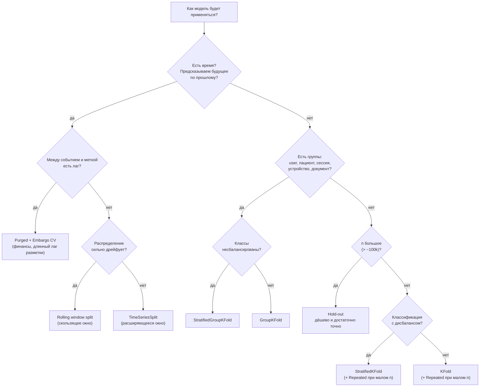
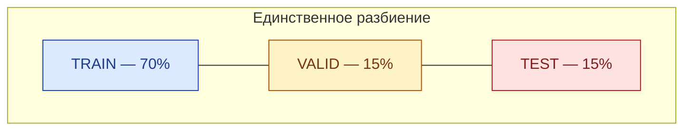
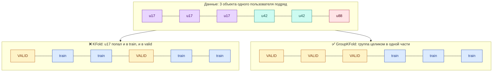
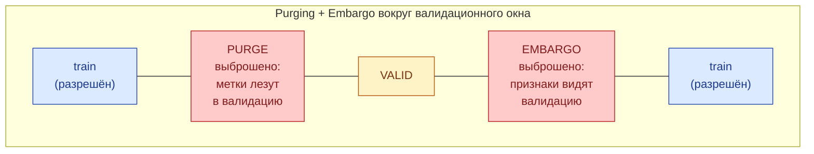
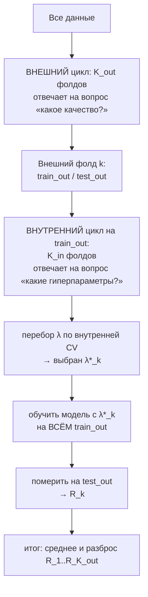
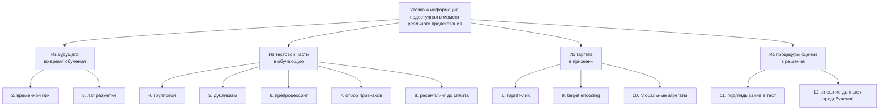
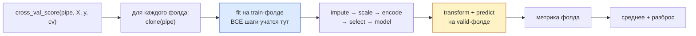

# Валидация и утечки

> **Зачем эта глава.** Неправильная схема валидации — самая дорогая ошибка в ML: она не роняет
> пайплайн, не выдаёт исключение и не портит метрики. Она тихо показывает вам AUC 0.94 вместо
> реального 0.71, вы выкатываете модель, и правда вскрывается через месяц на продовых деньгах.
> После этой главы вы будете выбирать схему сплита осознанно, оценивать не только среднее, но и
> **разброс** метрики, узнавать все двенадцать типовых видов утечки в чужом коде за пять минут
> и собирать пайплайн, в котором утечка технически невозможна.

**Уровень:** 🎯 middle → 🧠 middle+
**Предварительно нужно:** [постановка задачи обучения](01-learning-theory.md), [метрики качества](04-metrics.md), [статистика](../01-math/03-statistics.md)
**Время на проработку:** ~6 часов (чтение + воспроизведение экспериментов с ликами)

---

## Карта главы

- [1. Проблема: почему нельзя просто померить на трейне](#1-проблема-почему-нельзя-просто-померить-на-трейне)
- [2. Что именно мы оцениваем](#2-что-именно-мы-оцениваем) — формализация и три источника случайности
- [3. Каталог схем сплита](#3-каталог-схем-сплита) — восемь схем, когда какая
- [4. Вложенная кросс-валидация](#4-вложенная-кросс-валидация) — зачем и сколько стоит
- [5. Дисперсия оценки и доверительный интервал](#5-дисперсия-оценки-и-доверительный-интервал)
- [6. Полный каталог утечек](#6-полный-каталог-утечек) — двенадцать видов, симптом → механизм → лечение
- [7. Adversarial validation](#7-adversarial-validation)
- [8. Pipeline, в котором утечка технически невозможна](#8-pipeline-в-котором-утечка-технически-невозможна)
- [9. Воспроизводимость сплитов](#9-воспроизводимость-сплитов)
- [10. Протокол: как проверить чужую валидацию за 15 минут](#10-протокол-как-проверить-чужую-валидацию-за-15-минут)
- [11. Подводные камни](#11-подводные-камни)
- [12. Проверь себя](#12-проверь-себя)
- [13. Практика](#13-практика)
- [14. Что читать дальше](#14-что-читать-дальше)

---

## 1. Проблема: почему нельзя просто померить на трейне

Начнём с самого дна. Возьмём kNN с $k = 1$ и померим accuracy на обучающей выборке. Получим 100%:
у каждого объекта ближайший сосед — он сам. Модель бесполезна, метрика идеальна.

Это вырожденный пример, но он вскрывает суть: **ошибка на данных, по которым модель настраивалась,
не является оценкой ошибки на новых данных**. Она смещена вниз, причём величина смещения зависит
от ёмкости модели и неизвестна заранее.

Отсюда естественное решение — отложить часть данных и никогда не показывать её обучению.
Но дальше начинается то, что отличает инженера от джуниора. Отложенная выборка честна **только
если она действительно независима** от обучающей. А независимость нарушается десятками способов,
большинство из которых не видны в коде:

- если один и тот же пользователь есть и там, и там — модель может выучить пользователя,
  а не закономерность;
- если признак посчитан по всему датасету — тест повлиял на трейн через среднее;
- если данные упорядочены во времени, а сплит случайный — модель училась на будущем;
- если вы 40 раз меняли гиперпараметры, глядя на тест, — тест перестал быть тестом.

Каждый из этих случаев называется **утечкой** (leakage): информация, которой у модели не будет
в момент реального предсказания, просочилась в обучение. Утечка не ломает код. Она делает
оценку оптимистичной — иногда на пару процентных пунктов, иногда на тридцать.

> 🌱 **База.** Валидация — это симуляция будущего. Задайте себе вопрос: «в момент, когда модель
> будет делать это предсказание в проде, какая информация у неё будет?» Всё, чего не будет, —
> не должно участвовать в обучении и в оценке. Вся глава — про то, как этот принцип
> систематически соблюсти.

---

## 2. Что именно мы оцениваем

Введём обозначения. Есть неизвестное распределение $\mathcal{D}$ на парах $(x, y)$, где
$x \in \mathbb{R}^d$ — признаки, $y$ — целевая переменная. Есть выборка
$S = \{(x_i, y_i)\}_{i=1}^{n}$ из $\mathcal{D}$, где $n$ — число объектов. Алгоритм обучения
$\mathcal{A}$ по выборке и гиперпараметрам $\lambda$ строит модель:
$\hat f = \mathcal{A}(S, \lambda)$ с параметрами $\theta$.

Нас интересует **риск** — ожидаемая ошибка на новых данных:

$$
R(\hat f) = \mathbb{E}_{(x,y)\sim\mathcal{D}}\big[\,L\big(y,\ \hat f(x)\big)\,\big]
$$

где $L$ — функция потерь или метрика качества (в этой главе — любая метрика: accuracy, AUC, RMSE).

Риск ненаблюдаем: $\mathcal{D}$ мы не знаем. Наблюдаема лишь **эмпирическая оценка** на отложенных
данных $T$ размера $m$:

$$
\hat{R}_T(\hat f) = \frac{1}{m}\sum_{(x,y)\in T} L\big(y, \hat f(x)\big)
$$

где $T \cap S_{\text{train}} = \varnothing$ — тестовая выборка, $m = |T|$ — её размер.

> ⚠️ **Обозначения в этой главе.** $K$ занято под число фолдов — это устоявшаяся нотация
> (K-fold). Число классов, где оно понадобится, обозначаем $C$. $\lambda$ — вектор
> гиперпараметров, $\theta$ — обучаемые параметры модели.

### Три источника случайности — и почему это важно

Величина $\hat{R}_T$ — **случайная**. Три независимых источника её разброса:

1. **Какие объекты попали в тест.** Тестовая выборка — случайная подвыборка из $\mathcal{D}$.
   Даже при фиксированной модели разные тесты дадут разные числа. Этот источник убывает как
   $1/\sqrt{m}$.
2. **Какие объекты попали в трейн.** Обученные на разных подвыборках модели — разные модели
   с разным риском. Этот источник убывает как $1/\sqrt{n}$ и на малых выборках доминирует.
3. **Случайность самого обучения.** Инициализация весов, сабсэмплинг в бустинге, порядок батчей,
   недетерминизм GPU. Для нейросетей и бустинга это не мелочь: разброс по сидам легко даёт
   ±0.5 п.п. AUC.

Кросс-валидация усредняет по первым двум источникам, но не устраняет их. **Отчитываться одним
числом без оценки разброса — профессиональная небрежность**, и раздел 5 посвящён тому, как
разброс считать.

### Два разных вопроса, которые постоянно путают

- **Model selection:** какие гиперпараметры $\lambda$ выбрать? Нужна оценка, по которой мы
  **сравниваем** варианты. Она может быть смещённой — лишь бы смещение было одинаковым для всех.
- **Model assessment:** какое качество покажет выбранная модель в проде? Нужна **несмещённая**
  оценка.

Одна и та же выборка не может честно решать обе задачи. Как только вы выбрали по ней лучший
из 50 вариантов, оценка «лучшего» смещена вверх — вы взяли максимум из 50 шумных чисел.
Из этого противоречия и вырастает вложенная кросс-валидация (раздел 4).

> 💬 **На собеседовании.** Спросят: «У вас есть train/valid/test. Зачем три части, почему не две?»
> Хороший ответ: valid используется для выбора — гиперпараметров, числа итераций ранней остановки,
> порога классификации, набора признаков, самой модели. Каждый такой выбор «расходует» valid:
> оценка на нём становится смещённой вверх ровно потому, что мы взяли максимум по многим шумным
> измерениям. Test трогают один раз, в самом конце, чтобы получить несмещённое число для отчёта
> и для решения о выкате. Если после теста вы что-то поменяли и померили снова — у вас больше
> нет теста, есть второй валидационный набор. Плохой ответ: «так принято» или «test — это
> дополнительная проверка на переобучение».

---

## 3. Каталог схем сплита

Схема сплита обязана воспроизводить то, как модель будет применяться. Всё остальное — детали.
Ниже — восемь схем и условие, при котором каждая корректна.

Сначала — дерево решений. Это единственный способ не запутаться.



### 3.1 Hold-out



**Когда корректна.** Когда $n$ велико настолько, что $m = |T|$ обеспечивает нужную точность
оценки (см. раздел 5), и когда обучение дорогое. Ориентир: от 10⁵ объектов — hold-out обычно
достаточно; при 10³ он даёт неприемлемо шумную оценку.

**Чем платите.** Одно число без оценки разброса; модель обучена на 70% данных, а в прод пойдёт
обученная на 100% — значит, оценка слегка пессимистична.

### 3.2 K-fold

$$
\hat{R}_{\text{CV}} = \frac{1}{K}\sum_{k=1}^{K} \hat{R}_{T_k}\big(\mathcal{A}(S \setminus T_k, \lambda)\big)
$$

где $K$ — число фолдов, $T_k$ — $k$-й фолд (валидационная часть на итерации $k$),
$S \setminus T_k$ — остальные данные, на которых обучается модель итерации $k$.

```mermaid
flowchart TB
    subgraph f1["Итерация 1"]
    direction LR
    a1["VALID"]:::va --- a2["train"]:::tr --- a3["train"]:::tr --- a4["train"]:::tr --- a5["train"]:::tr
    end
    subgraph f2["Итерация 2"]
    direction LR
    b1["train"]:::tr --- b2["VALID"]:::va --- b3["train"]:::tr --- b4["train"]:::tr --- b5["train"]:::tr
    end
    subgraph f3["Итерация 3"]
    direction LR
    c1["train"]:::tr --- c2["train"]:::tr --- c3["VALID"]:::va --- c4["train"]:::tr --- c5["train"]:::tr
    end
    subgraph f45["Итерации 4 и 5 — аналогично"]
    direction LR
    d1["..."]:::tr
    end
    classDef tr fill:#dbeafe,stroke:#1e40af,color:#1e3a8a
    classDef va fill:#fef3c7,stroke:#b45309,color:#78350f
```



**Когда корректна.** Объекты независимы и одинаково распределены, времени в задаче нет.

**Выбор $K$.** Компромисс смещение/дисперсия/стоимость:

| $K$ | Смещение оценки | Дисперсия | Стоимость |
|---|---|---|---|
| 2–3 | сильно пессимистична (обучаемся на 50–67% данных) | низкая | дёшево |
| 5 | умеренная | умеренная | 5 обучений — рабочий дефолт |
| 10 | малая | выше, чем при 5 | 10 обучений |
| $n$ (LOO) | почти нулевая | высокая, модели почти идентичны | $n$ обучений, обычно нереально |

Дефолт — $K = 5$. При $n < 2000$ имеет смысл `RepeatedStratifiedKFold` (несколько независимых
разбиений с разными сидами): это единственный дешёвый способ увидеть, насколько ваша оценка
зависит от конкретного разбиения.

### 3.3 Stratified K-fold

Стратификация: доля каждого класса в каждом фолде совпадает с долей в полной выборке.

**Когда обязательна.** Классификация с дисбалансом или с малым $n$. При доле позитивного класса
1% и $K=5$ обычный `KFold` может выдать фолд, где позитивов почти нет, — ROC-AUC на нём
превратится в шум, а при совсем невезении класс вообще не встретится и метрика упадёт с ошибкой.

**Регрессия.** Стратификация тоже полезна: разбейте таргет на квантильные бины и стратифицируйте
по ним. Особенно если распределение таргета тяжелохвостое и один фолд может собрать все выбросы.

```python
import numpy as np
from sklearn.model_selection import StratifiedKFold

y_reg = np.random.default_rng(0).lognormal(size=5000)   # тяжёлый хвост
# Стратификация регрессии: бинуем таргет по децилям и стратифицируем по номеру бина
bins = np.quantile(y_reg, np.linspace(0, 1, 11)[1:-1])
strata = np.digitize(y_reg, bins)
cv = StratifiedKFold(n_splits=5, shuffle=True, random_state=0)
folds = list(cv.split(np.zeros_like(y_reg), strata))
print([round(y_reg[te].mean(), 3) for _, te in folds])   # средние по фолдам почти совпадают
```

### 3.4 Group K-fold



**Когда обязательна.** Когда единица независимости крупнее строки. Примеры, которые надо
уметь называть на собеседовании:

| Задача | Строка данных | Группа (ключ сплита) |
|---|---|---|
| Отток пользователей | пользователь-месяц | пользователь |
| Медицинская диагностика по снимкам | снимок | пациент |
| Рекомендации | взаимодействие | пользователь (или сессия) |
| Кредитный скоринг | заявка | клиент |
| Дефекты на производстве | фото детали | партия / станок |
| NER по документам | предложение | документ |
| Прогноз спроса по магазинам | магазин-день-SKU | магазин или SKU (зависит от задачи) |

Главный вопрос: **что будет новым в проде?** Если модель будет применяться к новым пользователям —
сплит по пользователям. Если к тем же пользователям, но в будущем — временной сплит.
Если и то, и другое — комбинация (см. 3.8).

`StratifiedGroupKFold` (sklearn ≥ 0.24) делает и то, и другое: группы не разрываются,
а баланс классов сохраняется приближённо.

### 3.5 TimeSeriesSplit — расширяющееся окно

```mermaid
flowchart TB
    subgraph t1["Итерация 1"]
    direction LR
    p1["train<br/>янв"]:::tr --- p2["VALID<br/>фев"]:::va --- p3["не используется"]:::un --- p4["не используется"]:::un
    end
    subgraph t2["Итерация 2"]
    direction LR
    q1["train<br/>янв"]:::tr --- q2["train<br/>фев"]:::tr --- q3["VALID<br/>мар"]:::va --- q4["не используется"]:::un
    end
    subgraph t3["Итерация 3"]
    direction LR
    r1["train<br/>янв"]:::tr --- r2["train<br/>фев"]:::tr --- r3["train<br/>мар"]:::tr --- r4["VALID<br/>апр"]:::va
    end
    classDef tr fill:#dbeafe,stroke:#1e40af,color:#1e3a8a
    classDef va fill:#fef3c7,stroke:#b45309,color:#78350f
    classDef un fill:#f1f5f9,stroke:#94a3b8,color:#475569
```



**Когда обязательна.** Всегда, когда в задаче есть время и предсказание делается «вперёд»:
спрос, отток, фрод, CTR, дефолт, любые логи. Формальный критерий — если в проде модель обучается
на данных до момента $t$ и применяется после $t$, то и в валидации должно быть так же.

**Ключевые детали, которые забывают:**

- **Валидационное окно должно быть равно продуктовому горизонту.** Если модель переобучается
  раз в месяц и работает месяц, валидируйте на месячных окнах, а не на одном дне.
- **Разрыв между train и valid.** Если признаки используют агрегаты за последние 7 дней,
  а метка становится известна через 14 дней, между обучением и валидацией должен быть зазор
  (см. 3.6), иначе обучающие агрегаты «заглядывают» в валидационный период.
- **Не перемешивать.** `TimeSeriesSplit` в sklearn работает по **порядку строк**, а не по колонке
  с датой. Данные обязаны быть отсортированы по времени. Это источник тихих ошибок номер один.

### 3.6 Rolling window — скользящее окно

Отличие от 3.5: обучающее окно не растёт, а сдвигается фиксированной длиной. Когда применять:
при сильном дрейфе, когда старые данные вредны, и когда в проде вы всё равно обучаетесь
на последних $W$ днях. Схема валидации обязана повторять продуктовую политику переобучения —
иначе вы оцениваете не ту систему, которую выкатываете.

### 3.7 Purged K-fold с эмбарго

Схема из финансового ML (López de Prado), но нужна везде, где **метка объекта становится
известна не сразу**, а через интервал.

Пример из практики: предсказываем дефолт по кредиту в течение 90 дней. Заявка от 1 марта
получает метку только 30 мая. Если в валидации оказалась заявка от 1 марта, а в обучении —
заявка от 15 апреля, то обучающий объект несёт информацию о периоде, пересекающемся с
валидационным. Метки перекрываются во времени → фолды не независимы.



- **Purge** — выбросить из обучения объекты, чей *период определения метки* пересекается
  с валидационным окном.
- **Embargo** — дополнительно выбросить объекты сразу *после* валидационного окна: их признаки
  (скользящие средние, счётчики) считаются по данным, попадающим в валидацию.

Ширина обеих зон = максимальный лаг разметки плюс максимальное окно агрегации признаков.

> 🧠 **Middle+.** Как понять, нужен ли purging, за одну минуту: для каждого объекта выпишите два
> момента времени — $t^{\text{feat}}$ (когда посчитаны признаки) и $t^{\text{label}}$ (когда стал
> известен таргет). Если для какой-то пары объектов $a$ (train) и $b$ (valid) выполняется
> $t^{\text{feat}}_a < t^{\text{label}}_b$ и $t^{\text{label}}_a > t^{\text{feat}}_b$ —
> интервалы пересекаются, и обычный временной сплит уже недостаточен.

### 3.8 Комбинированные схемы

Реальные задачи редко попадают ровно в одну ячейку. Три частых комбинации:

**Group + Time.** Рекомендации: тест — последние 2 недели, и внутри теста только те
взаимодействия, чьи пользователи в обучении не встречались. Так вы оцениваете одновременно
и «модель на будущем», и «модель на новых пользователях» — и, что важнее, видите их по отдельности.

**Два отдельных теста.** Стандарт зрелых команд: `test_time` (будущее, те же пользователи) и
`test_cold` (новые пользователи/товары). Разрыв между ними — прямое указание на проблему
холодного старта.

**Out-of-time + out-of-sample.** В скоринге: OOS-выборка (случайные клиенты того же периода)
показывает статистическую ошибку, OOT-выборка (следующий квартал) — устойчивость к дрейфу.
Разница OOS − OOT и есть цена дрейфа.

> 💬 **На собеседовании.** Спросят: «Как бы вы разбили данные для задачи предсказания оттока
> подписчиков?» Хороший ответ строится через два вопроса к постановке. Первый: применяется ли
> модель к тем же пользователям в будущем или к новым? Обычно к тем же — значит, основной сплит
> временной: обучение на данных до даты $t$, валидация на окне после $t$ длиной в продуктовый
> горизонт. Второй: как устроен таргет? Если отток определяется как «не заходил 30 дней»,
> то метка для событий последних 30 дней ещё не определена — эти строки надо либо выбросить,
> либо явно вынести в зону purge. Дополнительно: один пользователь порождает много строк
> (пользователь-месяц), поэтому даже внутри временного окна нужен контроль, чтобы один и тот же
> пользователь не оказался и в train, и в valid одного фолда — иначе модель выучит
> идентичность пользователя. И финально — валидацию делаю на нескольких последовательных окнах,
> чтобы увидеть стабильность, а не одно число. Плохой ответ: «StratifiedKFold, потому что классы
> несбалансированы».

---

## 4. Вложенная кросс-валидация

Вернёмся к противоречию из раздела 2. Если вы подобрали гиперпараметры по кросс-валидации и
отчитались лучшим значением $\hat{R}_{\text{CV}}$, эта оценка **смещена вверх**. Механизм простой:
вы взяли максимум из $N$ шумных величин, а $\mathbb{E}[\max_i Z_i] > \max_i \mathbb{E}[Z_i]$.
Величина смещения растёт с числом перебранных конфигураций и с шумностью оценки.

Насколько это серьёзно? Цитируемый результат Cawley и Talbot (JMLR, 2010): при малых выборках
и агрессивном переборе смещение достигает нескольких процентных пунктов — достаточно, чтобы
«победитель» бенчмарка оказался просто самой удачливой конфигурацией.

**Вложенная кросс-валидация** (nested CV) разделяет два цикла:



Ключевой момент: `test_out` **никогда** не участвовал в выборе $\lambda^{*}_k$. Поэтому среднее
$\frac{1}{K_{\text{out}}}\sum_k R_k$ — несмещённая оценка.

```python
import numpy as np
from sklearn.datasets import load_breast_cancer
from sklearn.pipeline import Pipeline
from sklearn.preprocessing import StandardScaler
from sklearn.svm import SVC
from sklearn.model_selection import GridSearchCV, StratifiedKFold, cross_val_score

X, y = load_breast_cancer(return_X_y=True)

pipe = Pipeline([("scaler", StandardScaler()), ("clf", SVC())])
grid = {"clf__C": [0.01, 0.1, 1, 10, 100], "clf__gamma": [1e-4, 1e-3, 1e-2, 1e-1]}

inner = StratifiedKFold(5, shuffle=True, random_state=0)
outer = StratifiedKFold(5, shuffle=True, random_state=1)

search = GridSearchCV(pipe, grid, cv=inner, scoring="roc_auc", n_jobs=-1)

# НЕвложенная оценка: то, что обычно печатают в отчёте. Смещена вверх.
naive = search.fit(X, y).best_score_

# Вложенная: cross_val_score сам обучает GridSearchCV на каждом внешнем train
# и меряет на внешнем test, которого поиск не видел
nested_scores = cross_val_score(search, X, y, cv=outer, scoring="roc_auc", n_jobs=-1)

print(f"невложенная оценка: {naive:.4f}")
print(f"вложенная:          {nested_scores.mean():.4f} ± {nested_scores.std():.4f}")
print(f"оптимистичное смещение: {naive - nested_scores.mean():+.4f}")
# Смещение обычно положительное. На этом лёгком датасете оно невелико (тысячные),
# но на малых и шумных данных с большой сеткой доходит до сотых.
```

**Стоимость.** $K_{\text{out}} \times K_{\text{in}} \times |\Lambda|$ обучений, где $|\Lambda|$ —
размер сетки. Для примера выше: $5 \times 5 \times 20 = 500$ обучений SVC. Для бустинга на
миллионах строк — неподъёмно.

**Когда можно без неё.**

- Есть отдельный тест, который вы трогаете ровно один раз. Тогда он и играет роль внешнего цикла.
  Это самый частый и практичный вариант.
- $n$ велико ($\gtrsim 10^5$), сетка мала, метрика стабильная. Смещение порядка десятых
  процентного пункта и на решения не влияет.

**Когда обязательна.**

- Малые данные ($n$ — сотни или тысячи): медицина, промышленность, любые дорогие разметки.
- Большая сетка или байесовская оптимизация с сотнями итераций.
- Вы сравниваете **алгоритмы** между собой (SVM vs бустинг vs логрег), и разница мала. Иначе
  выиграет тот, у кого шире сетка, а не тот, кто лучше.

> ⚠️ **Типичная ошибка.** Думать, что вложенная CV даёт вам «лучшие гиперпараметры». Не даёт:
> на каждом внешнем фолде выбирается свой $\lambda^{*}_k$, и они могут различаться. Nested CV
> оценивает качество **процедуры** «обучение + подбор гиперпараметров», а не одной модели.
> Финальную модель после этого обучают на всех данных с $\lambda$, выбранным по полной
> (невложенной) CV. Если $\lambda^{*}_k$ сильно скачут по фолдам — это сигнал, что подбор
> нестабилен и разница между конфигурациями лежит в шуме.

---

## 5. Дисперсия оценки и доверительный интервал

«AUC 0.847» — не результат. Результат — «AUC 0.847, 95% ДИ [0.831, 0.862]». Без второй части
нельзя ответить на главный вопрос ревью: **отличается ли новая модель от старой или это шум?**

### 5.1 Простейший случай: accuracy на hold-out

Каждый тестовый объект — испытание Бернулли: угадали или нет. При фиксированной модели число
верных ответов $\sim \mathrm{Binom}(m, a)$, где $a$ — истинная accuracy, $m$ — размер теста.
Отсюда стандартная ошибка:

$$
\mathrm{SE}(\hat a) = \sqrt{\frac{\hat a\,(1-\hat a)}{m}},
\qquad
\text{ДИ}_{95\%} \approx \hat a \pm 1.96\cdot \mathrm{SE}(\hat a)
$$

где $\hat a$ — наблюдённая доля верных ответов, $m$ — размер тестовой выборки,
1.96 — квантиль стандартного нормального распределения уровня 0.975.

Подставим числа, которые стоит помнить наизусть. При $\hat a = 0.9$:

| $m$ | SE | Полуширина 95% ДИ |
|---|---|---|
| 100 | 0.030 | ±5.9 п.п. |
| 1 000 | 0.0095 | ±1.9 п.п. |
| 10 000 | 0.0030 | ±0.6 п.п. |
| 100 000 | 0.00095 | ±0.19 п.п. |

**Отсюда практический вывод.** Чтобы уверенно отличить accuracy 0.90 от 0.91 на двух
**независимых** тестах, нужна SE разности $\sqrt{2\cdot 0.9\cdot 0.1/m} < 0.005$, то есть
$m \gtrsim 7\,000$ в каждом. На тесте из 500 объектов разница в 1 п.п. неотличима от шума —
и это самая частая причина, по которой «улучшение» не воспроизводится в проде.

> ⚠️ **Типичная ошибка.** Применять эту формулу к ROC-AUC. AUC — не среднее по независимым
> объектам, а U-статистика по **парам** объектов разных классов, и её дисперсия устроена иначе
> (существенно зависит от числа объектов **редкого** класса). Формула $\sqrt{a(1-a)/m}$ для AUC
> неверна. Для AUC используйте бутстрап или метод DeLong.

### 5.2 Бутстрап-интервал для любой метрики

Универсальный рецепт, работающий для AUC, F1, NDCG, RMSE и любой другой метрики:
пересэмплируйте **объекты тестовой выборки** с возвращением, каждый раз пересчитывайте метрику
на уже готовых предсказаниях, возьмите перцентили.

```python
import numpy as np
from sklearn.metrics import roc_auc_score


def bootstrap_ci(y_true, y_score, metric=roc_auc_score, n_boot=2000,
                 alpha=0.05, stratified=True, seed=0):
    """Перцентильный бутстрап-ДИ для метрики, посчитанной по готовым предсказаниям.

    Модель НЕ переобучается: мы оцениваем только дисперсию от состава тестовой выборки.
    Это нижняя граница реального разброса — вклад обучения тут не учтён.
    """
    rng = np.random.default_rng(seed)
    y_true, y_score = np.asarray(y_true), np.asarray(y_score)
    n = len(y_true)
    pos, neg = np.flatnonzero(y_true == 1), np.flatnonzero(y_true == 0)

    stats = []
    for _ in range(n_boot):
        if stratified:
            # Стратифицированный бутстрап сохраняет число позитивов в каждой реплике.
            # Без него при дисбалансе часть реплик останется без позитивов, и AUC не определится.
            idx = np.concatenate([rng.choice(pos, len(pos), replace=True),
                                  rng.choice(neg, len(neg), replace=True)])
        else:
            idx = rng.integers(0, n, n)
        stats.append(metric(y_true[idx], y_score[idx]))

    lo, hi = np.quantile(stats, [alpha / 2, 1 - alpha / 2])
    return float(np.mean(stats)), float(lo), float(hi)


# Демонстрация: как ширина интервала зависит от числа объектов редкого класса
from sklearn.datasets import make_classification
from sklearn.model_selection import train_test_split
from sklearn.linear_model import LogisticRegression

for weight in (0.5, 0.05, 0.01):
    X, y = make_classification(n_samples=20_000, n_features=20, n_informative=8,
                               weights=[1 - weight, weight], flip_y=0.02, random_state=0)
    X_tr, X_te, y_tr, y_te = train_test_split(X, y, test_size=0.3,
                                              stratify=y, random_state=0)
    p = LogisticRegression(max_iter=2000).fit(X_tr, y_tr).predict_proba(X_te)[:, 1]
    mean, lo, hi = bootstrap_ci(y_te, p)
    print(f"доля позитивов {weight:.0%}: позитивов в тесте {int(y_te.sum()):5d}, "
          f"AUC {mean:.4f}  ДИ [{lo:.4f}, {hi:.4f}]  ширина {hi - lo:.4f}")
# Ширина интервала растёт при уменьшении числа позитивов, хотя m не менялся:
# точность AUC определяется РЕДКИМ классом, а не общим размером теста.
```

### 5.3 Дисперсия кросс-валидации: почему $s/\sqrt{K}$ врёт

Соблазнительно посчитать среднее и стандартное отклонение по $K$ фолдам и объявить
$\mathrm{SE} = s/\sqrt{K}$. Это **неверно**, и понимать почему — хороший маркер зрелости.

Формула $s/\sqrt{K}$ предполагает независимость слагаемых. Но фолды зависимы: обучающие выборки
любых двух итераций пересекаются на доле $\frac{K-2}{K-1}$ объектов (при $K=5$ — на 75%).
Модели получаются похожими, их ошибки коррелируют, и наивная оценка **занижает** истинный разброс.

Для среднего $K$ коррелированных величин с попарной корреляцией $\rho$:

$$
\operatorname{Var}\Big(\frac{1}{K}\sum_{k=1}^{K} \hat{R}_k\Big)
= \frac{\sigma^2}{K}\Big(1 + (K-1)\rho\Big)
$$

где $\sigma^2$ — дисперсия оценки на одном фолде, $\rho$ — корреляция между оценками разных
фолдов. При $\rho = 0$ получаем привычное $\sigma^2/K$; при $\rho = 0.5$ и $K = 5$ дисперсия
втрое больше, то есть SE занижена в $\sqrt{3} \approx 1.7$ раза.

Хуже того: Bengio и Grandvalet (JMLR, 2004) доказали, что **несмещённого оценщика дисперсии
K-fold кросс-валидации, использующего только результаты фолдов, не существует** — $\rho$
принципиально не восстанавливается из самих оценок.

Что делать практически:

1. Считать $s/\sqrt{K}$, помня, что это **нижняя граница** SE. Если даже она перекрывает разницу
   между моделями — разницы точно нет.
2. Использовать `RepeatedStratifiedKFold` с 5–10 повторами и разными сидами. Разброс средних
   по повторам показывает вклад «какое именно разбиение выпало».
3. Для финального числа — бутстрап по объектам out-of-fold-предсказаний.
4. При сравнении моделей — **парный** тест, а не сравнение двух ДИ (следующий пункт).

### 5.4 Сравнение двух моделей: парность решает всё

Главная ошибка сравнения — смотреть на перекрытие доверительных интервалов. Интервалы могут
перекрываться, а разница при этом быть статистически значимой: модели меряются **на одних и тех
же объектах**, их ошибки сильно коррелированы, и дисперсия разности гораздо меньше суммы дисперсий.

Правильно — считать доверительный интервал **для разности**, сохраняя парность.

```python
import numpy as np
from scipy.stats import binomtest
from sklearn.metrics import roc_auc_score


def paired_bootstrap_delta(y_true, score_a, score_b, metric=roc_auc_score,
                           n_boot=2000, seed=0):
    """ДИ для разности метрик двух моделей. Ключ — ОДИН И ТОТ ЖЕ набор индексов
    для обеих моделей в каждой реплике: так сохраняется парность."""
    rng = np.random.default_rng(seed)
    y_true = np.asarray(y_true)
    pos, neg = np.flatnonzero(y_true == 1), np.flatnonzero(y_true == 0)

    deltas = []
    for _ in range(n_boot):
        idx = np.concatenate([rng.choice(pos, len(pos), replace=True),
                              rng.choice(neg, len(neg), replace=True)])
        deltas.append(metric(y_true[idx], np.asarray(score_a)[idx])
                      - metric(y_true[idx], np.asarray(score_b)[idx]))
    lo, hi = np.quantile(deltas, [0.025, 0.975])
    return float(np.mean(deltas)), float(lo), float(hi)


def mcnemar(y_true, pred_a, pred_b):
    """Тест Макнемара для сравнения двух классификаторов по ошибкам на одном тесте.

    Смотрит ТОЛЬКО на объекты, где модели разошлись: правильные и неправильные
    у обеих ничего не говорят о разнице.
    """
    a_ok = np.asarray(pred_a) == np.asarray(y_true)
    b_ok = np.asarray(pred_b) == np.asarray(y_true)
    n01 = int(np.sum(a_ok & ~b_ok))    # A прав, B ошибся
    n10 = int(np.sum(~a_ok & b_ok))    # B прав, A ошибся
    # При H0 «модели одинаковы» каждое расхождение — честная монетка
    p = binomtest(n01, n01 + n10, 0.5).pvalue if n01 + n10 > 0 else 1.0
    return n01, n10, float(p)
```

Если сравнение идёт по кросс-валидации, парность сохраняется на уровне фолдов: считайте разность
метрик **внутри каждого фолда** и стройте интервал для этих разностей. Это устраняет общий для
обеих моделей вклад «фолд оказался сложным».

> 💬 **На собеседовании.** Спросят: «Новая модель даёт AUC 0.853 против 0.847 у текущей.
> Выкатываем?» Хороший ответ: само по себе число ничего не решает — нужно понять, отличается ли
> +0.006 от нуля. Порядок действий: (1) обе модели меряю на одном и том же тесте и считаю ДИ
> для **разности** парным бутстрапом, а не сравниваю два независимых интервала; (2) проверяю
> стабильность по фолдам и по нескольким временным окнам — выигрыш, который есть в одном окне
> из пяти, это шум; (3) смотрю разбивку по сегментам: выигрыш может быть на нерелевантном
> сегменте, а на ключевом — проигрыш; (4) даже при значимой разнице офлайн-выигрыш такого
> размера обязан подтверждаться A/B-тестом, потому что AUC не равен деньгам; (5) считаю цену
> выката — новые фичи в проде, риск train/serve skew, новые зависимости. Плохой ответ:
> «0.853 больше 0.847, выкатываем».

---

## 6. Полный каталог утечек

Ниже — двенадцать видов утечки. Формат каждого: **симптом → механизм → как обнаружить →
как лечить**. Это раздел, к которому стоит возвращаться перед каждым релизом.



### Лик 1. Таргет-лик через признак-следствие

**Симптом.** ROC-AUC 0.98+ на задаче, где такого не бывает. Один признак забирает 80% важности.
Модель «слишком хороша».

**Механизм.** В признаки попала переменная, которая является следствием таргета или заполняется
одновременно с ним. Каноничные примеры:

| Задача | Признак-предатель | Почему |
|---|---|---|
| Дефолт по кредиту | `days_since_last_payment` | у дефолтников платежей нет вообще |
| Отток | `cancellation_reason_code` | заполняется в момент отмены |
| Фрод | `is_blocked` / `manual_review_flag` | ставится после разбора инцидента |
| Диагноз | `prescribed_drug` | назначается после постановки диагноза |
| Конверсия | `delivery_address_filled` | заполняется в процессе покупки |
| Отказ оборудования | `maintenance_ticket_id` | заводится по факту поломки |

**Как обнаружить.** Три приёма, в порядке скорости:
1. Обучить модель на каждом признаке по отдельности. Признак, дающий AUC > 0.9 в одиночку, —
   почти всегда лик.
2. Посмотреть топ важностей. Резкий обрыв (первый признак 0.7, остальные по 0.02) подозрителен.
3. Для каждого признака в топ-20 ответить письменно: «в какой момент времени физически
   записывается это значение и доступно ли оно за $\Delta t$ до предсказания?»

**Как лечить.** Единственный надёжный способ — **point-in-time correctness**: строить датасет так,
чтобы для каждого объекта брались только значения, актуальные на момент $t^{\text{pred}}$.
Это работа с данными, а не с моделью. Подробно — в [главе о feature store](../07-mlops/03-data-and-feature-store.md).

### Лик 2. Временной лик (look-ahead bias)

**Симптом.** Отличная кросс-валидация, провал на следующем месяце. Или: качество на случайном
KFold заметно выше, чем на временном сплите.

**Механизм.** Три подвида, и все три встречаются вместе:
- случайный сплит на данных с временной структурой — модель училась на будущем относительно
  валидации;
- признак-агрегат посчитан по всей истории: «средний чек пользователя» для строки от 1 марта
  включает покупки от 1 июня;
- нормализация/биннинг по всему периоду.

**Как обнаружить.** Прямая проверка: посчитайте метрику двумя схемами — `KFold(shuffle=True)`
и `TimeSeriesSplit`. Разрыв больше пары процентных пунктов — временной лик или сильный дрейф
(и то, и другое требует временного сплита).

```python
import numpy as np
import pandas as pd
from sklearn.model_selection import KFold, TimeSeriesSplit, cross_val_score
from sklearn.ensemble import HistGradientBoostingClassifier

rng = np.random.default_rng(0)
n, d = 20_000, 10
t = np.sort(rng.uniform(0, 1, n))                    # «время», отсортировано
X = rng.normal(size=(n, d))
# Зависимость дрейфует во времени: знак связи меняется на середине периода
w = np.where(t[:, None] < 0.5, 1.0, -1.0) * np.array([2.0] + [0.0] * (d - 1))
y = (rng.uniform(size=n) < 1 / (1 + np.exp(-(X * w).sum(1)))).astype(int)

model = HistGradientBoostingClassifier(random_state=0)
rand_cv = cross_val_score(model, X, y, cv=KFold(5, shuffle=True, random_state=0), scoring="roc_auc")
time_cv = cross_val_score(model, X, y, cv=TimeSeriesSplit(5), scoring="roc_auc")
print(f"случайный KFold : {rand_cv.mean():.3f}")     # высоко: видит обе эпохи
print(f"TimeSeriesSplit : {time_cv.mean():.3f}")     # ниже: честно предсказывает будущее
```

**Как лечить.** `TimeSeriesSplit` / rolling window; все агрегаты — только по прошлому
(expanding/rolling с закрытым правым краем); сортировка данных по времени как инвариант,
проверяемый ассертом.

### Лик 3. Лик через лаг разметки

**Симптом.** Временной сплит сделан, но продовое качество всё равно ниже валидационного.

**Механизм.** Метка объекта становится известна через $\Delta$ после события, и обучающие объекты
рядом с границей несут информацию о валидационном периоде (см. 3.7). Второй подвид: последние
$\Delta$ дней датасета имеют **неполные** метки — «отток за 30 дней» для события вчерашнего дня
всегда равен нулю, потому что 30 дней ещё не прошло. Модель учится, что «свежие = не ушли».

**Как обнаружить.** Постройте долю позитивного класса по дням. Провал в конце периода —
диагноз. Отдельно: сравните $t^{\text{label}} - t^{\text{feat}}$ по объектам, посмотрите на максимум.

**Как лечить.** Отрезать «незрелый» хвост данных (последние $\Delta$). Purge + embargo вокруг
валидационных окон.

### Лик 4. Групповой лик

**Симптом.** Валидация показывает 0.95, на новых пользователях/пациентах — 0.70.

**Механизм.** Одна сущность породила несколько строк, и они разошлись по train и valid.
Модель выучила саму сущность (её характерный шум, стиль, устройство, освещение снимка),
а не обобщаемую закономерность.

**Как обнаружить.** Одна строка кода — и её надо писать всегда:

```python
def assert_no_group_leak(groups, train_idx, valid_idx):
    """Инвариант: множества групп train и valid не пересекаются."""
    g = np.asarray(groups)
    overlap = set(g[train_idx]) & set(g[valid_idx])
    assert not overlap, f"групповой лик: {len(overlap)} общих групп, примеры {list(overlap)[:5]}"
```

**Как лечить.** `GroupKFold` / `StratifiedGroupKFold` / `GroupShuffleSplit`. Главная сложность
не техническая, а постановочная: **правильно определить ключ группы**. Задавайте вопрос:
«что в проде будет новым — новый пользователь или новый день у известного пользователя?»

### Лик 5. Лик через дубликаты и почти-дубликаты

**Симптом.** Качество завышено без видимой причины; при дедупликации падает.

**Механизм.** Полные дубли строк (двойная загрузка из источника, join, размноживший строки),
или почти-дубли: один и тот же товар от двух поставщиков, одно фото в разных разрешениях,
текст с изменённой пунктуацией, переопубликованная новость. Дубли попадают в обе части сплита,
и тест частично совпадает с трейном.

**Как обнаружить.**

```python
import pandas as pd

def duplicate_report(df: pd.DataFrame, key_cols=None):
    """Быстрая диагностика дублей перед сплитом."""
    exact = df.duplicated().sum()
    print(f"полных дублей строк: {exact} ({exact / len(df):.2%})")
    if key_cols:
        by_key = df.duplicated(subset=key_cols).sum()
        print(f"дублей по ключу {key_cols}: {by_key} ({by_key / len(df):.2%})")
    # Дубли по признакам при РАЗНЫХ метках — отдельная беда: неразрешимый шум разметки
    feat_cols = [c for c in df.columns if c != "target"]
    conflict = df.groupby(feat_cols, dropna=False)["target"].nunique()
    print(f"групп с противоречивыми метками: {int((conflict > 1).sum())}")
```

Для текстов — MinHash/SimHash или косинусная близость эмбеддингов с порогом ~0.95.
Для изображений — перцептивные хеши. Для табличных — хеш конкатенации ключевых колонок.

**Как лечить.** Дедупликация **до** сплита. Если дубли содержательны (реальные повторные события),
не удалять, а сгруппировать: кластер почти-дублей = группа для `GroupKFold`.

### Лик 6. Лик через препроцессинг

**Симптом.** Небольшой, но стабильный разрыв между CV и продом; на малых выборках — крупный.

**Механизм.** Любое **обучаемое** преобразование, подогнанное по всем данным до сплита:

| Преобразование | Что утекает |
|---|---|
| `StandardScaler` | среднее и дисперсия теста |
| `SimpleImputer(strategy="mean")` | среднее теста |
| `PCA`, `TruncatedSVD`, автоэнкодер | структура ковариации теста |
| `KBinsDiscretizer`, квантильный биннинг | квантили теста |
| `VarianceThreshold`, отбор по дисперсии | дисперсии теста |
| `TfidfVectorizer` (idf) | частоты слов в тесте |
| Клиппинг по перцентилям | перцентили теста |

**Насколько это критично?** Для скейлера при $n = 10^6$ — практически неощутимо. Для скейлера
при $n = 200$, для PCA, для tf-idf на маленьком корпусе — вполне ощутимо. Но проблема не в
величине эффекта: проблема в том, что если у вас в коде есть `fit` вне фолда, то рядом почти
наверняка есть и `fit` чего-то более опасного.

**Как лечить.** Правило без исключений: **любой `fit` живёт внутри `Pipeline`, а `Pipeline`
живёт внутри `cross_val_score`/`GridSearchCV`.** Раздел 8.

### Лик 7. Лик через отбор признаков вне фолда

**Симптом.** Прекрасная CV на данных, где сигнала нет вообще.

**Механизм.** Признаки отобраны по связи с таргетом на всём датасете, и только потом запущена
кросс-валидация. Каждый фолд валидируется на объектах, которые уже участвовали в отборе.
Это классический пример из ESL (раздел 7.10.2 «The Wrong and Right Way to Do Cross-validation»),
и он даёт впечатляюще неправильный результат на **чистом шуме**:

```python
import numpy as np
from sklearn.feature_selection import SelectKBest, f_classif
from sklearn.linear_model import LogisticRegression
from sklearn.pipeline import Pipeline
from sklearn.model_selection import cross_val_score, StratifiedKFold

rng = np.random.default_rng(0)
n, d = 200, 5000
X = rng.normal(size=(n, d))          # чистый шум
y = rng.integers(0, 2, size=n)       # метки независимы от X: истинный AUC = 0.5
cv = StratifiedKFold(5, shuffle=True, random_state=0)

# ❌ НЕПРАВИЛЬНО: отбор по всем данным, потом CV
sel = SelectKBest(f_classif, k=20).fit(X, y)      # видел ВСЕ метки, включая валидационные
X_sel = sel.transform(X)
wrong = cross_val_score(LogisticRegression(max_iter=1000), X_sel, y, cv=cv, scoring="roc_auc")

# ✅ ПРАВИЛЬНО: отбор — шаг пайплайна, переобучается на каждом train-фолде
pipe = Pipeline([("sel", SelectKBest(f_classif, k=20)),
                 ("clf", LogisticRegression(max_iter=1000))])
right = cross_val_score(pipe, X, y, cv=cv, scoring="roc_auc")

print(f"отбор до CV : AUC {wrong.mean():.3f}")   # заметно выше 0.5 — чистая иллюзия
print(f"отбор в CV  : AUC {right.mean():.3f}")   # около 0.5 — правда
```

Почему так происходит: из 5000 шумовых признаков всегда найдутся 20, случайно скоррелированных
с метками **этих конкретных 200 объектов**. Отбор запомнил метки валидационных объектов
и передал их модели через список колонок.

**Как лечить.** Селектор — шаг `Pipeline`. Это касается и «ручного» отбора: если вы глазами
посмотрели на корреляции с таргетом по всему датасету и выкинули колонки — вы уже сделали лик,
просто он не виден в коде.

### Лик 8. Лик через ресемплинг до сплита

**Симптом.** После добавления SMOTE метрика на CV взлетела, в проде не изменилась.

**Механизм.** SMOTE и любой oversampling создают **синтетические копии**, интерполируя
существующие объекты. Если ресемплинг сделан до сплита, копия объекта попадает в train,
а оригинал — в valid. Модель буквально видела ответ. Простой `RandomOverSampler` ещё честнее
в своей вредности: он кладёт точные дубли по обе стороны сплита.

**Как лечить.** Ресемплинг применяется **только к обучающей части каждого фолда** и никогда —
к валидационной (иначе метрика считается на несуществующих объектах). Обычный `sklearn.pipeline.Pipeline`
для этого не годится: он не умеет менять число строк. Нужен `imblearn.pipeline.Pipeline` —
он применяет сэмплер при `fit` и пропускает его при `predict`:

```python
# pip install imbalanced-learn
from imblearn.pipeline import Pipeline as ImbPipeline
from imblearn.over_sampling import SMOTE
from sklearn.preprocessing import StandardScaler
from sklearn.linear_model import LogisticRegression

pipe = ImbPipeline([
    ("scaler", StandardScaler()),
    ("smote", SMOTE(random_state=0)),        # сработает ТОЛЬКО на fit, на predict пропускается
    ("clf", LogisticRegression(max_iter=2000)),
])
```

Отдельно: подробный разбор того, почему oversampling часто вообще не нужен, —
в [главе о дисбалансе](12-imbalance-and-calibration.md).

### Лик 9. Лик через target encoding

**Симптом.** На CV бустинг с mean-encoding категорий даёт +0.05 AUC, на тесте — минус.

**Механизм.** Два уровня, и второй тоньше первого.

*Уровень 1 (грубый).* Кодировка посчитана по всему датасету:
$\text{enc}(c) = \frac{1}{|I_c|}\sum_{i \in I_c} y_i$, где $I_c$ — объекты категории $c$.
Валидационные метки прямо участвуют в значении признака. Это лик первого класса.

*Уровень 2 (тонкий).* Кодировка посчитана только по train — но для объекта $i$ его собственная
метка $y_i$ входит в среднее его категории. Для редкой категории с одним объектом кодировка
буквально равна метке этого объекта. Модель обучается верить кодировке абсолютно, а на валидации
кодировка так не работает. Лика в валидацию нет, но модель переобучена и калибровка сломана.

**Как лечить.** Три уровня защиты, применять вместе:

1. **Out-of-fold-кодировка.** Внутри обучающей части делаем свои $K'$ фолдов; значение для
   объекта считается по фолдам, в которые он не входит. Так $y_i$ не участвует в собственной
   кодировке.
2. **Сглаживание** к глобальному среднему:

$$
\text{enc}(c) = \frac{\sum_{i\in I_c} y_i + \alpha\,\bar{y}}{|I_c| + \alpha}
$$

где $|I_c|$ — число объектов категории $c$ в обучающей части, $\bar{y}$ — среднее таргета по всей
обучающей части, $\alpha > 0$ — сила сглаживания (типично 10–100). При $|I_c| \gg \alpha$
кодировка стремится к среднему по категории, при $|I_c| \ll \alpha$ — к глобальному среднему.
Именно так редкие категории перестают быть каналом утечки.

3. **Encoder — шаг Pipeline.** С sklearn 1.3 есть готовый `sklearn.preprocessing.TargetEncoder`,
   который делает внутреннее кросс-фиттинг сам:

```python
from sklearn.preprocessing import TargetEncoder
from sklearn.compose import ColumnTransformer
from sklearn.pipeline import Pipeline
from sklearn.ensemble import HistGradientBoostingClassifier

pre = ColumnTransformer([
    # TargetEncoder внутри fit_transform использует внутреннюю кросс-валидацию,
    # а в transform (на valid/test) — кодировку, обученную на всём train.
    ("cat", TargetEncoder(target_type="binary", cv=5, random_state=0), ["city", "device", "utm"]),
], remainder="passthrough")

pipe = Pipeline([("pre", pre), ("clf", HistGradientBoostingClassifier(random_state=0))])
```

Альтернатива — CatBoost с ordered target statistics: он решает ту же задачу на уровне алгоритма
(см. [главу о бустинге на практике](08-boosting-in-practice.md)).

### Лик 10. Лик через глобальные агрегаты и нормализацию по группе

**Симптом.** Признаки вида «отклонение от среднего», «ранг внутри категории», «доля от суммы»
дают большой прирост, который не воспроизводится.

**Механизм.** Признак `price / mean_price_by_category` считается по всему датасету. Среднее по
категории включает тестовые объекты, а через них — информацию о распределении теста. Более
опасный вариант: `count` категории по всему датасету — это прямая информация о том, сколько
объектов этой категории лежит в тесте, что в проде недоступно.

**Как обнаружить.** Просмотрите список признаков и отметьте все, в чьём вычислении участвует
`groupby(...).transform(...)`, `rank`, деление на агрегат, `value_counts`. Каждый такой признак
обязан иметь ответ на вопрос «по какому окну данных он посчитан».

**Как лечить.** Агрегаты считаются либо по обучающей части фолда (тогда это шаг Pipeline),
либо по строго прошлому периоду (тогда это point-in-time-признак). Промежуточных вариантов нет.

### Лик 11. Лик через подглядывание в тест

**Симптом.** Каждое улучшение на тесте всё меньше и меньше воспроизводится в проде.

**Механизм.** Тест использовался многократно: ранняя остановка по тесту, подбор порога по тесту,
выбор признаков по тесту, «а давай ещё один вариант попробуем». Каждое решение, принятое по
тесту, — это подгонка под него, и оценка смещается вверх. Формально это множественное сравнение:
максимум из $N$ шумных величин смещён примерно на $\mathrm{SE}\cdot\sqrt{2\ln N}$.
При SE = 0.01 и 100 попытках — около +0.03. Ровно столько «выигрыша» и рисуют
Kaggle-лидерборды перед shake-up.

**Как лечить.**

- Ранняя остановка — **только** по валидационной части, никогда по тесту. В бустинге:
  train / early-stopping-valid / test — три раздельные части.
- Порог классификации подбирается на валидации (см. [главу о метриках](04-metrics.md)).
- Тест открывается один раз. Ведите журнал: сколько раз вы к нему обращались.
- Если приходится обращаться многократно — считайте это вторым валидационным набором и держите
  третий, «замороженный», для финального решения.

### Лик 12. Лик через внешние данные и предобученные модели

**Симптом.** Модель с внешними эмбеддингами показывает нереалистичный прирост.

**Механизм.** Три подвида:
- предобученная модель (эмбеддер, LLM) видела ваши тестовые объекты на предобучении —
  критично для публичных бенчмарков и для датасетов, собранных из открытых источников;
- внешний признак (например, «рейтинг компании из открытого реестра») обновлён **после**
  момента предсказания и уже отражает исход;
- разметка получена частично с помощью модели, которую вы же и оцениваете.

**Как лечить.** Для внешних справочников — снапшоты с датой, точный point-in-time-джойн.
Для LLM-бенчмарков — свежие, приватные наборы и проверка на контаминацию.

> 💬 **На собеседовании.** Спросят: «Как понять, что у вас в датасете утечка?» Хороший ответ —
> назвать симптомы и протокол, а не определение. Симптомы: качество выше отраслевой нормы для
> этой задачи; один признак доминирует по важности; огромный разрыв между случайной CV и
> временным сплитом; провал на первой же неделе прода. Протокол: (1) обучаю модель на каждом
> признаке отдельно и смотрю на одиночные AUC; (2) для каждого признака из топа выясняю физический
> момент его записи; (3) сравниваю случайный сплит с временным и с групповым — три разных числа
> сразу показывают, какой именно тип независимости нарушен; (4) проверяю пересечение групп и
> дублей между фолдами ассертами; (5) грепаю код на `fit_transform` вне пайплайна.
> Плохой ответ: «утечка — это когда информация о таргете попадает в признаки» — верное определение
> и нулевая практическая ценность.

---

## 7. Adversarial validation

Приём, который отвечает на вопрос «а похож ли мой валидационный набор на то, где модель будет
работать?» — и заодно ловит несколько типов лика.

**Идея.** Забудем про исходный таргет. Разметим объекты обучающей выборки нулём, объекты
тестовой (или продовой) — единицей, и обучим классификатор отличать одно от другого.
Померим его ROC-AUC на кросс-валидации.

- **AUC ≈ 0.5** — распределения неотличимы. Случайный сплит корректен, дрейфа нет.
- **AUC ≈ 0.6–0.8** — есть систематический сдвиг. Валидация, построенная случайным сплитом,
  будет оптимистичной.
- **AUC ≈ 1.0** — есть признак-детектор. Почти всегда это `id`, `timestamp`, монотонный счётчик
  или артефакт выгрузки. Такой признак **обязан** быть удалён: он не несёт обобщаемого сигнала,
  зато позволяет модели «узнавать» период.

```python
import numpy as np
import pandas as pd
from sklearn.model_selection import cross_val_predict, StratifiedKFold
from sklearn.ensemble import HistGradientBoostingClassifier
from sklearn.metrics import roc_auc_score
from sklearn.inspection import permutation_importance


def adversarial_validation(X_train: pd.DataFrame, X_test: pd.DataFrame, seed=0):
    """AUC отличимости train от test + список признаков, которые их выдают."""
    X_all = pd.concat([X_train, X_test], ignore_index=True)
    is_test = np.r_[np.zeros(len(X_train)), np.ones(len(X_test))]

    clf = HistGradientBoostingClassifier(max_iter=200, random_state=seed)
    cv = StratifiedKFold(5, shuffle=True, random_state=seed)
    # cross_val_predict даёт out-of-fold вероятности: честная оценка отличимости
    oof = cross_val_predict(clf, X_all, is_test, cv=cv, method="predict_proba")[:, 1]
    auc = roc_auc_score(is_test, oof)

    clf.fit(X_all, is_test)
    imp = permutation_importance(clf, X_all, is_test, n_repeats=5,
                                 random_state=seed, scoring="roc_auc")
    culprits = (pd.Series(imp.importances_mean, index=X_all.columns)
                .sort_values(ascending=False).head(10))
    return auc, culprits, oof
```

**Что делать с результатом.** Три сценария, и они требуют разных действий:

1. **Виноват технический признак** (`row_id`, `created_at`, автоинкремент). Удалить. Это самая
   частая находка и самая дешёвая победа.
2. **Виноват содержательный признак** (доля нового устройства, средний чек, набор категорий) —
   это настоящий дрейф. Варианты: (а) построить валидацию из тех train-объектов, которые
   `oof`-модель считает наиболее «похожими на тест» — так валидация станет репрезентативной;
   (б) взвесить обучающие объекты весами $w_i = \frac{p_i}{1-p_i}$, где $p_i$ — вероятность
   «быть похожим на тест» (importance weighting); (в) выбросить самые «старые» объекты.
3. **AUC близка к 1 и виноваты сразу все признаки.** Train и test — из принципиально разных
   популяций (другая страна, другой продукт, другая система сбора). Ни одна схема валидации
   это не починит; надо разбираться с данными.

```python
# Сценарий 2(а): собираем валидацию из train-объектов, максимально похожих на test
auc, culprits, oof = adversarial_validation(X_train, X_test)
p_train = oof[:len(X_train)]                       # «похожесть на тест» для train-объектов
val_idx = np.argsort(-p_train)[:len(X_train) // 5]  # верхние 20% — самые «тестоподобные»
mask = np.zeros(len(X_train), dtype=bool)
mask[val_idx] = True
X_val_like_test, X_fit = X_train[mask], X_train[~mask]
```

> 🧠 **Middle+.** Adversarial validation ловит и утечки, которых вы не искали. Если в датасете
> есть строковый `hash_id`, закодированный ordinal-энкодером, или `index`, оставшийся после
> `reset_index()`, — adversarial-модель найдёт его мгновенно и покажет AUC 1.0. Это в буквальном
> смысле детектор «признаков, которых в проде не будет». Запускать его стоит один раз на старте
> проекта — это 10 минут работы, которые не раз спасали релизы.

---

## 8. Pipeline, в котором утечка технически невозможна

Все правила выше можно соблюдать вручную и всё равно однажды ошибиться. Инженерное решение —
сделать так, чтобы неправильный код **не мог быть написан**. В sklearn для этого есть `Pipeline`,
и понимать надо не синтаксис, а контракт.

### Контракт Pipeline

При вызове `pipeline.fit(X_train, y_train)`:
- каждый шаг вызывает `fit_transform(X, y)` — учится **только на переданных данных**;
- при `pipeline.predict(X_valid)` каждый шаг вызывает `transform(X)` — применяет
  **уже обученные** параметры.

При вызове `cross_val_score(pipeline, X, y, cv=cv)` библиотека делает `clone(pipeline)` для
каждого фолда и обучает с нуля. Ни один шаг не видит валидационных данных. **Это и есть гарантия.**



### Полный пример: числовые + категориальные + отбор + модель

```python
import numpy as np
import pandas as pd
from sklearn.compose import ColumnTransformer
from sklearn.pipeline import Pipeline
from sklearn.impute import SimpleImputer
from sklearn.preprocessing import StandardScaler, OneHotEncoder, TargetEncoder
from sklearn.feature_selection import SelectKBest, f_classif
from sklearn.linear_model import LogisticRegression
from sklearn.model_selection import GroupKFold, cross_validate

num_cols = ["age", "income", "n_orders"]
low_card_cat = ["device", "channel"]         # мало категорий → one-hot
high_card_cat = ["city", "utm_campaign"]     # много категорий → target encoding

numeric = Pipeline([
    # Медиана считается ТОЛЬКО по train-фолду: impute — обучаемый шаг
    ("impute", SimpleImputer(strategy="median")),
    ("scale", StandardScaler()),
])

preprocess = ColumnTransformer([
    ("num", numeric, num_cols),
    ("ohe", OneHotEncoder(handle_unknown="ignore", min_frequency=20), low_card_cat),
    # TargetEncoder использует y — именно поэтому он ОБЯЗАН быть внутри пайплайна
    ("te", TargetEncoder(target_type="binary", cv=5, random_state=0), high_card_cat),
], remainder="drop")   # drop, а не passthrough: явный белый список колонок

pipe = Pipeline([
    ("prep", preprocess),
    ("select", SelectKBest(f_classif, k=30)),     # отбор тоже внутри
    ("clf", LogisticRegression(max_iter=2000, C=1.0)),
])

# Групповой сплит: одна и та же сущность не может оказаться по обе стороны
cv = GroupKFold(n_splits=5)
scores = cross_validate(pipe, X_df, y, groups=groups, cv=cv,
                        scoring=["roc_auc", "average_precision"],
                        return_train_score=True, n_jobs=-1)

print(f"valid ROC-AUC: {scores['test_roc_auc'].mean():.4f} "
      f"± {scores['test_roc_auc'].std():.4f}")
print(f"train ROC-AUC: {scores['train_roc_auc'].mean():.4f}")
# Большой разрыв train − valid — переобучение. Малый разрыв при подозрительно высоком
# valid — повод искать лик, а не радоваться.
```

### Когда стандартных шагов не хватает: свой трансформер

Любую самописную логику (агрегаты, кодировки, клиппинг) надо оформлять трансформером,
а не функцией, вызываемой до сплита.

```python
import numpy as np
import pandas as pd
from sklearn.base import BaseEstimator, TransformerMixin


class GroupAggregateEncoder(BaseEstimator, TransformerMixin):
    """Признак «отклонение значения от среднего по группе».

    Средние запоминаются на fit (только train-фолд) и применяются на transform.
    Именно это отличает корректный признак от лика №10.
    """

    def __init__(self, group_col: str, value_col: str, smoothing: float = 20.0):
        self.group_col = group_col
        self.value_col = value_col
        self.smoothing = smoothing

    def fit(self, X: pd.DataFrame, y=None):
        stats = X.groupby(self.group_col)[self.value_col].agg(["sum", "count"])
        self.global_mean_ = float(X[self.value_col].mean())
        # Сглаживание: редкие группы стягиваются к глобальному среднему,
        # иначе группа из одного объекта даёт среднее, равное самому объекту
        self.group_mean_ = (
            (stats["sum"] + self.smoothing * self.global_mean_)
            / (stats["count"] + self.smoothing)
        ).to_dict()
        return self

    def transform(self, X: pd.DataFrame):
        # Неизвестная на train категория -> глобальное среднее. В проде это происходит постоянно.
        means = X[self.group_col].map(self.group_mean_).fillna(self.global_mean_)
        out = X.copy()
        out[f"{self.value_col}_dev_from_{self.group_col}"] = X[self.value_col] - means
        return out.drop(columns=[self.group_col])

    def get_feature_names_out(self, input_features=None):
        return np.asarray([f"{self.value_col}_dev_from_{self.group_col}"])
```

### Правила, которые делают лик невозможным

1. **Единственная точка входа данных — `fit(X, y)` внутри CV.** Ни одной строки
   `something.fit(...)` или `fit_transform(...)` вне пайплайна.
2. **`remainder="drop"` в `ColumnTransformer`.** Явный белый список колонок. Новая колонка в
   источнике не просочится в модель молча.
3. **Ранняя остановка бустинга — внутри фолда**, на подвыборке train-фолда, а не на валидации фолда.
4. **Ассерты как тесты.** Проверка непересечения групп и дат — не комментарий, а `assert`
   в коде сплиттера, который падает в CI.
5. **Артефакт = пайплайн целиком.** В прод уезжает один объект, включающий импьютер, скейлер,
   энкодеры и модель. Не «модель плюс скрипт предобработки» — иначе train/serve skew неизбежен.
6. **Ревью-грep.** Перед релизом: `grep -rn "fit_transform\|\.fit(" src/ | grep -v pipeline`.
   Каждое совпадение объяснить.

> ⌨️ **Руками.** Возьмите свой последний проект и попробуйте переписать всю предобработку
> в один `Pipeline`, который принимает сырой DataFrame и отдаёт предсказание. Почти наверняка
> вы найдёте два-три места, где что-то считалось «заранее по всем данным». Это упражнение
> на два часа — самое полезное из всех в этой главе.

---

## 9. Воспроизводимость сплитов

Валидация, которую нельзя повторить, — не валидация. Три уровня надёжности.

**Уровень 1: `random_state` везде.** В сплиттере, в модели, в сэмплере. Без этого две соседние
ячейки ноутбука дают разные числа, и вы неделю сравниваете шум.

**Уровень 2: детерминированный сплит по хешу идентификатора.** У `random_state` есть скрытая
проблема: он привязан к **порядку и составу** данных. Добавили за неделю 3% новых строк —
и `train_test_split(random_state=42)` перетасовал всё заново; объект, который был в тесте,
переехал в трейн. Сравнивать метрики «до» и «после» становится нельзя.

Решение — сплит как **функция от идентификатора объекта**, а не от порядка:

```python
import hashlib
import numpy as np


def stable_split(ids, test_fraction=0.2, salt="churn_model_v1"):
    """Детерминированный сплит по хешу id.

    Свойства, которых нет у train_test_split:
      * добавление новых объектов НЕ перемещает старые между частями;
      * результат одинаков в Python, в SQL и в Spark — нужен один и тот же хеш;
      * salt позволяет получить независимый сплит для другой задачи на тех же id.
    """
    def bucket(x):
        h = hashlib.md5(f"{salt}:{x}".encode("utf-8")).hexdigest()
        return int(h[:8], 16) / 0xFFFFFFFF     # равномерно в [0, 1)

    u = np.array([bucket(x) for x in ids])
    return u >= test_fraction, u < test_fraction    # (маска train, маска test)


# Проверка ключевого свойства: старые объекты не переезжают
ids_v1 = [f"user_{i}" for i in range(10_000)]
ids_v2 = ids_v1 + [f"user_{i}" for i in range(10_000, 11_000)]   # неделю спустя

tr1, te1 = stable_split(ids_v1)
tr2, te2 = stable_split(ids_v2)
same = (te1 == te2[:10_000]).all()
print("принадлежность старых объектов не изменилась:", same)   # True
print(f"доля теста: {te2.mean():.3f}")                          # ≈ 0.2
```

Это же свойство критично для консистентности между обучением и продом, для A/B-тестов
и для feature store: сплит переносим между системами, потому что MD5 везде одинаков.

**Уровень 3: сплит как артефакт.** Список `id` тестовой выборки сохраняется рядом с моделью
(в MLflow, в DVC, в объектном хранилище) вместе с версией кода и датой отсечки. Через полгода,
когда придётся разбираться, почему модель деградировала, это будет единственный способ
воспроизвести исходную оценку. Подробнее — в
[главе о воспроизводимости](../07-mlops/02-reproducibility-and-tracking.md).

> ⚠️ **Типичная ошибка.** Фиксировать `random_state` только в сплиттере, но не в модели.
> Бустинг с `subsample < 1`, случайный лес, любая нейросеть дают разброс по сидам, сопоставимый
> с разницей между конфигурациями гиперпараметров. Если вы отчитываетесь об улучшении в 0.002 AUC,
> сначала померьте разброс своей модели по 5 сидам при **одинаковых** настройках. Часто
> «улучшение» оказывается меньше этого разброса.

---

## 10. Протокол: как проверить чужую валидацию за 15 минут

Практическая процедура для код-ревью и для собеседования по System Design.

1. **Найти сплит.** Одна строка `train_test_split(X, y, random_state=42)` без `stratify`,
   без `groups` и без сортировки по времени — красный флаг в 90% случаев.
2. **Спросить про время.** «Есть ли в данных колонка с датой? Как модель работает в проде —
   предсказывает будущее?» Если да, а сплит случайный — стоп, дальше можно не смотреть.
3. **Спросить про единицу независимости.** «Может ли один пользователь дать две строки?»
   Если да и нет `GroupKFold` — стоп.
4. **Грепнуть `fit` вне пайплайна.** `grep -n "fit_transform" notebook.py`. Каждое вхождение
   до сплита — потенциальный лик 6–10.
5. **Посмотреть на топ-5 важностей** и спросить по каждому: «когда физически записывается
   это значение?»
6. **Спросить, сколько раз открывали тест.** Если ответ «не помню» — оценка смещена.
7. **Спросить про разброс.** «Какой доверительный интервал у этой метрики?» Отсутствие ответа
   означает, что все сравнения в проекте делались наугад.
8. **Сравнить три числа:** случайная CV, групповая CV, временной сплит. Разрывы между ними —
   карта того, какая независимость нарушена.

---

## 11. Подводные камни

**`TimeSeriesSplit` применён к неотсортированным данным.**
Симптом: временной сплит даёт то же качество, что случайный.
Причина: `TimeSeriesSplit` режет по **позициям строк**, а не по значениям даты. Если DataFrame
пришёл из `groupby` или из параллельного чтения parquet, порядок произвольный.
Что делать: `df = df.sort_values("event_time").reset_index(drop=True)` непосредственно перед
сплитом, плюс `assert df["event_time"].is_monotonic_increasing`.

**Стратификация применена к временному сплиту.**
Симптом: код с `StratifiedKFold` и колонкой даты в признаках.
Причина: попытка совместить несовместимое — стратификация требует перемешивания, что уничтожает
временной порядок.
Что делать: во временных задачах баланс классов контролируют выбором длины окна, а не
стратификацией. Если позитивов в окне слишком мало — окно надо удлинить.

**Ранняя остановка бустинга по той же выборке, на которой отчитываются.**
Симптом: `eval_set=[(X_valid, y_valid)]`, и потом метрика печатается на `X_valid`.
Причина: число деревьев — такой же гиперпараметр, и он подобран по этой выборке.
Что делать: три части, или ранняя остановка внутри каждого фолда по подвыборке train-фолда.

**Метрика посчитана на ресемплированной валидации.**
Симптом: после SMOTE precision вырос вдвое.
Причина: валидационная часть тоже подверглась oversampling, и в ней доля позитивов
искусственная. Precision зависит от базовой ставки напрямую.
Что делать: ресемплинг только на train (imblearn Pipeline), метрика — на исходном распределении.

**Кросс-валидация на данных, где таргет определён с разным горизонтом.**
Симптом: фолды с сильно разной долей позитивов, метрика скачет.
Причина: часть объектов «не дозрела» — окно наблюдения для них ещё не закрылось.
Что делать: явно посчитать зрелость каждого объекта, отрезать хвост.

**Валидация не воспроизводит частоту переобучения модели в проде.**
Симптом: офлайн-оценка стабильна, в проде качество плывёт внутри месяца.
Причина: валидировали на данных «сразу после обучения», а в проде модель работает
30 дней и к концу устаревает.
Что делать: мерить метрику по дням после даты обучения — получится кривая деградации,
из которой и следует частота переобучения (см. [главу о переобучении моделей](../09-monitoring/07-retraining.md)).

**Разные версии данных у разных экспериментов.**
Симптом: коллега не может воспроизвести ваш результат.
Причина: датасет пересобирался, а метрики сравниваются между версиями.
Что делать: версионировать датасет (DVC, снапшот таблицы, партиция с датой сборки)
и указывать версию рядом с метрикой.

**Пропуски заполнены до сплита «чтобы не мешались».**
Симптом: `df.fillna(df.mean(), inplace=True)` в первой ячейке ноутбука.
Причина: классический лик 6, и он же — гарантированный train/serve skew, потому что в проде
такого среднего не будет.
Что делать: `SimpleImputer` внутри пайплайна. Заодно подумайте, не является ли сам факт
пропуска признаком (часто является).

---

## 12. Проверь себя

<details>
<summary><b>🌱 Вопрос.</b> Зачем нужна кросс-валидация, если есть отложенная выборка?</summary>

**Короткий ответ.** Чтобы получить более устойчивую оценку и увидеть её разброс: одна отложенная
выборка даёт одно число, зависящее от того, какие объекты в неё случайно попали.

**Развёрнуто.** У hold-out два недостатка. Первый — дисперсия: при $n = 2000$ и тесте в 20%
на 400 объектах стандартная ошибка accuracy около 1.5 п.п., то есть «улучшение» в 1 п.п.
неотличимо от шума. Второй — потеря данных: модель обучается на 80%, и её качество ниже, чем
у финальной модели на 100%. K-fold использует каждый объект и для обучения, и для валидации
(в разных итерациях), даёт $K$ оценок вместо одной и позволяет хотя бы приблизительно оценить
разброс. Цена — $K$ обучений. При $n \gtrsim 10^5$ разница в точности оценки становится
несущественной, и hold-out обычно предпочтительнее по стоимости.

**Чего ждёт интервьюер:** что вы связываете выбор схемы с размером выборки и стоимостью обучения,
а не отвечаете «кросс-валидация точнее».

**Провал:** «кросс-валидация лучше, потому что данных больше» — данных столько же.
</details>

<details>
<summary><b>🎯 Вопрос.</b> Данные — логи покупок за два года. Как разбить на train/test?</summary>

**Короткий ответ.** Временным сплитом: обучение на данных до даты $t$, тест на окне после $t$,
длина окна равна продуктовому горизонту работы модели. Случайный сплит здесь некорректен.

**Развёрнуто.** Три причины против случайного сплита. (1) Модель в проде предсказывает будущее
по прошлому; случайный сплит даёт ей доступ к будущему и завышает оценку. (2) Признаки-агрегаты
(средний чек, счётчики за 30 дней) при случайном сплите почти неизбежно считаются по всему
периоду и переносят информацию через границу. (3) За два года распределение дрейфует —
ассортимент, цены, каналы; случайный сплит усредняет дрейф и скрывает деградацию.

Дополнительно нужно проверить: (а) не порождает ли один клиент много строк, попадающих в обе
части одного фолда; (б) не определён ли таргет с лагом (например, «вернулся в течение 60 дней») —
тогда последние 60 дней данных незрелые и нужен purge; (в) не стоит ли валидировать на нескольких
последовательных окнах, чтобы увидеть стабильность.

**Чего ждёт интервьюер:** что вы сразу спрашиваете про время и про определение таргета,
а не начинаете с `train_test_split`.

**Провал:** «`train_test_split` со `stratify=y`».
</details>

<details>
<summary><b>🎯 Вопрос.</b> Что такое утечка данных? Назовите пять разных механизмов.</summary>

**Короткий ответ.** Утечка — попадание в обучение информации, которой не будет в момент
реального предсказания. Механизмы: признак-следствие таргета, временной лик, групповой лик,
лик через обучаемый препроцессинг и лик через отбор признаков вне фолда.

**Развёрнуто.** (1) *Признак-следствие*: `cancellation_reason` при предсказании оттока
заполняется в момент отмены. (2) *Временной*: случайный сплит на данных с временной структурой,
или агрегат, посчитанный по всей истории включая будущее. (3) *Групповой*: один пациент дал
пять снимков, три в train, два в test — модель выучила пациента. (4) *Препроцессинг*:
`StandardScaler`/`PCA`/`SimpleImputer`, обученные до сплита. (5) *Отбор признаков*: топ-K
по корреляции с таргетом, посчитанный на всём датасете, — на чистом шуме даёт AUC 0.7 вместо 0.5.
Стоит добавить шестой: *target encoding* без out-of-fold-схемы, седьмой: *дубликаты* по обе
стороны сплита, восьмой: *подглядывание в тест* при многократном подборе.

**Чего ждёт интервьюер:** конкретных механизмов с примерами. Определение без примеров означает,
что человек читал, но не ловил лик руками.

**Провал:** одно определение и один пример.
</details>

<details>
<summary><b>🧠 Вопрос.</b> Вы сделали K-fold, получили AUC 0.83 ± 0.02 (std по фолдам). Можно ли сказать, что 95% ДИ примерно [0.79, 0.87]?</summary>

**Короткий ответ.** Нет. Во-первых, разброс по фолдам — это std отдельных оценок, а не
стандартная ошибка среднего. Во-вторых, даже $s/\sqrt{K}$ занижает истинную SE, потому что
фолды зависимы.

**Развёрнуто.** Наивно SE $= s/\sqrt{K} = 0.02/\sqrt{5} \approx 0.009$, и интервал был бы
$[0.81, 0.85]$. Но обучающие выборки соседних фолдов пересекаются на $\frac{K-2}{K-1}$ объектов
(75% при $K=5$), модели похожи, ошибки коррелированы. При корреляции $\rho$ дисперсия среднего
равна $\frac{\sigma^2}{K}(1 + (K-1)\rho)$, то есть при $\rho = 0.5$ и $K=5$ она втрое больше
наивной. Bengio и Grandvalet (2004) показали, что несмещённого оценщика дисперсии K-fold,
использующего только результаты фолдов, не существует: $\rho$ из них не восстанавливается.

Что делать на практике: считать $s/\sqrt{K}$ как **нижнюю границу**; запускать
`RepeatedStratifiedKFold` с разными сидами и смотреть разброс средних; для финального числа
строить бутстрап-интервал по out-of-fold-предсказаниям; при сравнении моделей — парный тест,
а не сравнение двух интервалов.

**Чего ждёт интервьюер:** понимания зависимости фолдов. Это один из самых надёжных вопросов,
отделяющих «умею запускать cross_val_score» от «понимаю, что меряю».

**Провал:** «да, ±2 std» — уверенное неверное утверждение.
</details>

<details>
<summary><b>🎯 Вопрос.</b> Почему нельзя сравнивать две модели по перекрытию их доверительных интервалов?</summary>

**Короткий ответ.** Потому что модели меряются на одних и тех же объектах, их ошибки сильно
коррелированы, и дисперсия разности значительно меньше суммы дисперсий. Нужен интервал
для **разности**, а не два отдельных интервала.

**Развёрнуто.** $\operatorname{Var}(A - B) = \operatorname{Var}(A) + \operatorname{Var}(B)
- 2\operatorname{Cov}(A, B)$. Когда обе модели ошибаются на одних и тех же трудных объектах,
ковариация велика, и разность меряется точнее, чем каждая величина по отдельности.
Практический рецепт: парный бутстрап (в каждой реплике берём **один и тот же** набор индексов
для обеих моделей и считаем разность метрик) или тест Макнемара по разошедшимся предсказаниям.
При сравнении по кросс-валидации — считать разность внутри каждого фолда.

Обратная ситуация тоже бывает: интервалы не перекрываются, но и разности верить нельзя —
например, если модели обучены на разных сплитах или сравниваются по разным тестам.

**Чего ждёт интервьюер:** знания о парности. Это стандартный вопрос, если в резюме есть A/B
или эксперименты.

**Провал:** «интервалы перекрываются, значит, разницы нет».
</details>

<details>
<summary><b>🧠 Вопрос.</b> Что такое вложенная кросс-валидация и когда она реально нужна?</summary>

**Короткий ответ.** Два вложенных цикла: внутренний подбирает гиперпараметры, внешний оценивает
качество. Нужна, когда данных мало, сетка большая, а результат сравнения моделей должен быть
несмещённым.

**Развёрнуто.** Если подобрать $\lambda$ по кросс-валидации и отчитаться лучшим значением
$\hat R_{\text{CV}}$, оценка смещена вверх: вы взяли максимум из многих шумных величин.
Nested CV на каждом внешнем фолде запускает полный подбор только на внешнем train и меряет
на внешнем test, который в подборе не участвовал. Цена — $K_{\text{out}}K_{\text{in}}|\Lambda|$
обучений.

Важное уточнение: nested CV оценивает качество **процедуры** (обучение + подбор), а не одной
конкретной модели — на разных внешних фолдах могут выбираться разные $\lambda$. Финальную модель
обучают на всех данных с $\lambda$, выбранным обычной CV.

Можно обойтись без неё, когда есть отдельный тест, открываемый один раз (он и есть внешний цикл),
или когда $n$ велико и сетка мала. Обязательна на малых данных (медицина, промышленность) и при
сравнении алгоритмов между собой.

**Чего ждёт интервьюер:** и механики, и оговорки про «оценивает процедуру, а не модель».

**Провал:** «вложенная CV даёт лучшие гиперпараметры».
</details>

<details>
<summary><b>🎯 Вопрос.</b> Что такое adversarial validation и что делать, если она даёт AUC 0.99?</summary>

**Короткий ответ.** Это классификатор «объект из train или из test». AUC 0.99 означает, что
выборки легко отличимы, и почти всегда виноват технический признак — id, timestamp, счётчик.
Его надо найти по важностям и удалить.

**Развёрнуто.** Механика: помечаем train нулём, test единицей, обучаем модель, смотрим
out-of-fold AUC. 0.5 — распределения совпадают; 0.6–0.8 — заметный сдвиг; ~1.0 — есть
признак-детектор. Дальше смотрим permutation importance и разбираемся с виновником.

Три сценария. (1) Виноват технический артефакт (`row_id`, `created_at`, автоинкремент) —
удалить; он не несёт обобщаемого сигнала, зато позволяет модели «узнавать» период.
(2) Виноват содержательный признак — это настоящий дрейф; тогда либо строим валидацию из
train-объектов, наиболее похожих на тест, либо взвешиваем обучение весами $p/(1-p)$
(importance weighting). (3) Виноваты все признаки сразу — популяции разные, это проблема
данных, а не валидации.

**Чего ждёт интервьюер:** что вы знаете приём и, главное, что делаете с результатом.
Многие называют метод, но не могут сказать, какое действие из него следует.

**Провал:** «значит, тест отличается от трейна, надо переобучить модель».
</details>

<details>
<summary><b>🧠 Вопрос.</b> Как сделать target encoding категориального признака, чтобы не словить утечку?</summary>

**Короткий ответ.** Out-of-fold: значение для объекта считается по данным, в которые он сам
не входит, плюс сглаживание к глобальному среднему, плюс сам энкодер — шаг Pipeline,
переобучаемый на каждом фолде.

**Развёрнуто.** Утечка тут двухуровневая. Грубый уровень — кодировка посчитана по всему датасету,
и валидационные метки прямо участвуют в признаке. Тонкий уровень — кодировка посчитана только
по train, но метка объекта входит в среднее его собственной категории; для категории из одного
объекта кодировка **равна** его метке. Лика в валидацию нет, но модель переобучена и научилась
доверять признаку, который на новых данных так не работает.

Защита: (1) OOF-схема — внутри train делаем $K'$ фолдов и кодируем объект по остальным;
(2) сглаживание $\text{enc}(c) = \frac{\sum_{i\in I_c} y_i + \alpha\bar y}{|I_c| + \alpha}$,
где $\alpha$ — сила сглаживания, $\bar y$ — среднее по train: редкие категории стягиваются к
глобальному среднему; (3) энкодер как шаг Pipeline — в sklearn ≥ 1.3 есть готовый `TargetEncoder`
с внутренним кросс-фиттингом. Альтернатива уровня алгоритма — ordered target statistics
в CatBoost.

**Чего ждёт интервьюер:** упоминания именно второго, тонкого уровня. Про «не считать по всему
датасету» говорят все; про собственную метку объекта — единицы.

**Провал:** «считаю кодировку только на train» — этого недостаточно.
</details>

<details>
<summary><b>🎯 Вопрос.</b> Модель показывает AUC 0.98. Это хорошо?</summary>

**Короткий ответ.** Это повод искать утечку. В большинстве продуктовых задач — отток, фрод,
дефолт, CTR, конверсия — 0.98 недостижимо, и такое число почти всегда означает, что в признаки
попало следствие таргета.

**Развёрнуто.** Порядок проверки. (1) Одиночные модели: обучить по одному признаку и посмотреть,
нет ли признака с AUC > 0.9 в одиночку. (2) Важности: резкий обрыв после первого признака —
подозрительно. (3) По каждому признаку из топа выяснить физический момент записи значения
и сравнить с моментом предсказания. (4) Сравнить случайный сплит с временным и групповым:
три сильно разных числа сразу показывают, какая независимость нарушена. (5) Проверить дубли
и пересечение групп между фолдами.

Есть задачи, где 0.98 нормально: распознавание символов, детекция явных технических аномалий,
задачи с почти детерминированной зависимостью. Ключ — сравнение с отраслевой нормой для
**этой** задачи и с тем, что показывала предыдущая модель.

**Чего ждёт интервьюер:** здорового скепсиса и протокола проверки. Кандидат, который радуется
0.98, — тревожный сигнал.

**Провал:** «отлично, модель готова к выкату».
</details>

<details>
<summary><b>🧠 Вопрос.</b> Почему нельзя делать SMOTE до разбиения на train/test?</summary>

**Короткий ответ.** SMOTE создаёт синтетические объекты интерполяцией существующих. Если сделать
его до сплита, интерполянт попадёт в train, а его «родители» — в test, и модель фактически
увидит тестовые объекты.

**Развёрнуто.** SMOTE берёт объект миноритарного класса, находит его $k$ ближайших соседей того
же класса и создаёт точку на отрезке между ними. Такая точка несёт информацию об обоих родителях.
При случайном сплите после ресемплинга родитель и потомок регулярно оказываются по разные
стороны — это прямая утечка. `RandomOverSampler` ещё хуже: он кладёт **точные копии** объекта
в обе части.

Вторая, независимая ошибка: ресемплировать валидационную часть. Тогда доля позитивов в ней
искусственная, а precision и PR-AUC зависят от базовой ставки напрямую — метрика станет
бессмысленной.

Правильно: сэмплер применяется только к обучающей части каждого фолда. Технически —
`imblearn.pipeline.Pipeline`, который вызывает сэмплер на `fit` и пропускает на `predict`.
Обычный `sklearn.pipeline.Pipeline` для этого не подходит, потому что его шаги не могут менять
число строк. И отдельный вопрос — нужен ли SMOTE вообще: чаще помогают веса классов и
правильный выбор порога.

**Чего ждёт интервьюер:** механизма («интерполяция между объектами»), а не общего «нельзя,
будет лик».

**Провал:** «SMOTE надо делать после сплита» без объяснения почему.
</details>

<details>
<summary><b>🎯 Вопрос.</b> В чём разница между `GroupKFold` и `StratifiedKFold`? Можно ли применить оба?</summary>

**Короткий ответ.** `StratifiedKFold` сохраняет баланс классов в фолдах, `GroupKFold` не даёт
объектам одной группы попасть в разные фолды. Совместить можно — `StratifiedGroupKFold`.

**Развёрнуто.** Это ортогональные требования. Стратификация борется с дисперсией оценки при
дисбалансе: без неё фолд может получить почти нулевую долю позитивов, и метрика на нём станет
шумом. Группировка борется со смещением оценки при зависимых наблюдениях: без неё модель выучит
идентичность сущности, и оценка будет завышена.

`StratifiedGroupKFold` (sklearn ≥ 0.24) решает задачу приближённо — точное решение
NP-трудно, поэтому баланс классов соблюдается не идеально. Важно: `GroupKFold` в sklearn
детерминирован и не имеет `shuffle`/`random_state`; если нужна рандомизация,
берите `GroupShuffleSplit` или `StratifiedGroupKFold(shuffle=True)`.

Отдельный практический момент: если групп мало (скажем, 8 магазинов), `GroupKFold` с $K=5$
даст фолды очень разного размера, и оценка будет крайне шумной. В такой ситуации честнее
leave-one-group-out и явный разговор о том, что оценка ненадёжна.

**Чего ждёт интервьюер:** понимания, что одно борется с дисперсией, другое со смещением.

**Провал:** «это два разных способа кросс-валидации, можно взять любой».
</details>

<details>
<summary><b>🧠 Вопрос.</b> Вы 200 раз проверили гипотезы на тестовой выборке и нашли конфигурацию, которая даёт +0.03 AUC. Что с этим числом не так?</summary>

**Короткий ответ.** Оно смещено вверх на величину порядка $\mathrm{SE}\cdot\sqrt{2\ln N}$.
При SE = 0.01 и $N = 200$ это около +0.03 — то есть весь ваш «выигрыш» объясним
множественным сравнением.

**Развёрнуто.** Максимум из $N$ независимых шумных величин с одинаковым средним растёт
как $\sqrt{2\ln N}$ стандартных отклонений. Вы не проверяли одну гипотезу — вы проверили 200
и отчитались о лучшей. Это то же самое, что искать значимость в 200 подгруппах A/B-теста.
Эффект известен как overfitting to the holdout / leaderboard overfitting и хорошо виден
на Kaggle: public-лидерборд систематически оптимистичнее private.

Что делать: (1) держать «замороженную» третью выборку, к которой обращаются один раз;
(2) вести счётчик обращений к тесту и признавать смещение; (3) проверять лучшую конфигурацию
на другом временном окне или на другой популяции — настоящий эффект воспроизведётся,
шум нет; (4) при большом переборе использовать вложенную CV.

**Чего ждёт интервьюер:** связки «подбор по тесту = множественное сравнение» с оценкой
порядка величины смещения.

**Провал:** «ничего, я же не обучал модель на тесте».
</details>

<details>
<summary><b>🎯 Вопрос.</b> Как встроить раннюю остановку бустинга в кросс-валидацию, не словив лик?</summary>

**Короткий ответ.** Внутри каждого фолда обучающая часть дополнительно делится: одна часть —
на обучение, другая — на раннюю остановку. Валидационная часть фолда для остановки не
используется никогда.

**Развёрнуто.** Число деревьев — гиперпараметр. Если остановиться по валидационной части фолда,
а потом на ней же отчитаться, метрика смещена вверх. На практике два рабочих варианта.

Первый: внутри фолда `train_test_split` обучающей части (например, 85/15), обучение с
`eval_set` на этих 15%, оценка на валидационной части фолда. Второй: подобрать число итераций
один раз на отдельной выборке, зафиксировать его как константу и дальше обучать без ранней
остановки — так делают, когда пайплайн должен быть детерминированным.

Есть и «внутренние» CV-функции библиотек — `lgb.cv`, `xgb.cv`, — которые делают раннюю остановку
по среднему по фолдам и возвращают оптимальное число итераций. Это корректно для подбора
числа итераций, но полученную метрику нельзя использовать как несмещённую оценку качества —
её надо мерить на отдельном тесте.

**Чего ждёт интервьюер:** осознания, что `n_estimators` — гиперпараметр, а не деталь обучения.

**Провал:** «передаю `eval_set=(X_valid, y_valid)` и печатаю метрику на `X_valid`».
</details>

---

## 13. Практика

**Задача 1. Воспроизвести пять ликов (2 часа).**
На синтетических данных воспроизведите и измерьте величину завышения оценки для:
(а) отбора признаков вне фолда на чистом шуме; (б) `StandardScaler`, обученного до сплита,
при $n = 200$; (в) target encoding без OOF; (г) SMOTE до сплита; (д) случайного сплита на
данных с дрейфующей во времени зависимостью.
*Критерий: для каждого пункта у вас есть два числа — «с ликом» и «без», — и вы можете объяснить,
почему величина эффекта именно такая. Для (б) эффект должен почти исчезнуть при $n = 100\,000$;
если он не исчез, вы измеряете что-то другое.*

**Задача 2. Доверительные интервалы (1 час).**
Реализуйте `bootstrap_ci` и `paired_bootstrap_delta` из раздела 5. На датасете с $\ge 50\,000$
объектов обучите две модели с близким качеством. Постройте: (а) ДИ каждой метрики;
(б) ДИ разности; (в) зависимость ширины ДИ от размера тестовой выборки (100, 1000, 10 000
объектов).
*Критерий: интервал для разности заметно уже, чем следовало бы из двух отдельных интервалов,
и вы можете объяснить это через ковариацию. График (в) выходит на кривую $\propto 1/\sqrt{m}$.*

**Задача 3. Три сплита — три числа (1 час).**
Возьмите датасет с колонками `user_id` и `event_time` (подойдёт любой лог; можно сгенерировать).
Посчитайте метрику тремя способами: `KFold(shuffle=True)`, `GroupKFold(user_id)`,
`TimeSeriesSplit`. Постройте таблицу.
*Критерий: числа различаются, и вы можете сказать, какая именно независимость нарушается
в каждой более оптимистичной схеме. Если все три совпали — объясните, почему в этих данных
нет ни групповой, ни временной зависимости.*

**Задача 4. Pipeline без лика (2 часа).**
Постройте `Pipeline` с: импьютером, скейлером числовых, one-hot для низкокардинальных категорий,
target encoding для высококардинальных, отбором признаков и моделью. Прогоните через
`cross_validate` с `GroupKFold`. Затем **намеренно** сломайте его — вынесите target encoding
наружу — и измерьте разницу.
*Критерий: разница воспроизводима и объяснима; в правильной версии нет ни одного вызова `fit`
вне пайплайна; в пайплайне стоит `remainder="drop"`.*

**Задача 5. Adversarial validation на реальных данных (1 час).**
Возьмите любой датасет с временной колонкой. Разделите на «раннюю» и «позднюю» половины,
запустите adversarial validation. Найдите топ-3 признака, отличающих периоды.
*Критерий: вы получили AUC и список виновников, и для каждого можете сказать — это технический
артефакт (удалить) или настоящий дрейф (учесть в схеме валидации). Затем удалите технические
артефакты и покажите, что AUC упала.*

**Задача 6. Вложенная CV и цена смещения (1.5 часа).**
На небольшом датасете ($n \le 1000$) сравните невложенную и вложенную оценку для сетки
из 50+ конфигураций. Повторите для сетки из 5 конфигураций.
*Критерий: у вас есть зависимость величины оптимистичного смещения от размера сетки, и она
растёт. Вы можете назвать число обучений в каждом случае.*

**Задача 7. Стабильный сплит (40 минут).**
Реализуйте `stable_split` из раздела 9. Проверьте три свойства: (а) добавление 10% новых id
не перемещает старые; (б) доля теста близка к заданной; (в) сплит воспроизводится после
перезапуска процесса и при перемешивании входного массива.
*Критерий: все три проверки — автоматические тесты, которые падают, если заменить хеш
на `np.random`.*

---

## 14. Что читать дальше

- [Документация sklearn: Cross-validation: evaluating estimator performance](https://scikit-learn.org/stable/modules/cross_validation.html) —
  полный список сплиттеров с картинками фолдов. Держите открытым при выборе схемы: там же
  разобраны `GroupKFold`, `StratifiedGroupKFold`, `TimeSeriesSplit` и предупреждения о i.i.d.
- [Документация sklearn: Common pitfalls and recommended practices](https://scikit-learn.org/stable/common_pitfalls.html) —
  официальный разбор утечек через препроцессинг и правильного использования `random_state`.
  Короткая страница, которую стоит прочитать целиком перед первым продовым проектом.
- [Документация sklearn: Pipelines and composite estimators](https://scikit-learn.org/stable/modules/compose.html) —
  `ColumnTransformer`, вложенные пайплайны, `get_feature_names_out`. База для раздела 8.
- [Raschka S. «Model Evaluation, Model Selection, and Algorithm Selection in Machine Learning», arXiv:1811.12808](https://arxiv.org/abs/1811.12808) —
  самый полный обзор темы в одном тексте: hold-out, бутстрап, .632+, вложенная CV, тесты
  для сравнения моделей (McNemar, 5×2cv). Читать разделы про доверительные интервалы и про
  сравнение алгоритмов.
- **Hastie, Tibshirani, Friedman. «The Elements of Statistical Learning», гл. 7** —
  разложение ошибки, оптимизм ошибки обучения, кросс-валидация. Раздел 7.10.2
  «The Wrong and Right Way to Do Cross-validation» — первоисточник примера с отбором признаков
  из лика 7.
- **Kaufman S., Rosset S., Perlich C. «Leakage in Data Mining: Formulation, Detection, and
  Avoidance», ACM TKDD, 2012** — единственная академическая работа, где утечка формализована.
  Вводит понятие «легитимности» признака относительно момента предсказания; полезна тем,
  что даёт язык для разговора с командой.
- **Bengio Y., Grandvalet Y. «No Unbiased Estimator of the Variance of K-Fold Cross-Validation»,
  JMLR, 2004** — доказательство того, почему $s/\sqrt{K}$ нельзя доверять. Короткая и важная работа.
- **Cawley G., Talbot N. «On Over-fitting in Model Selection and Subsequent Selection Bias
  in Performance Evaluation», JMLR, 2010** — эксперименты, показывающие величину смещения при
  подборе гиперпараметров без вложенной CV. Именно эту работу цитируют, когда требуют nested CV.
- **López de Prado M. «Advances in Financial Machine Learning», гл. 7** — purged K-fold,
  embargo, комбинаторная purged CV. Написано про финансы, но применимо везде, где метка
  созревает с лагом.
- **Kapoor S., Narayanan A. «Leakage and the Reproducibility Crisis in ML-based Science»,
  Patterns, 2023** — систематический разбор 300+ научных работ, в которых утечка привела
  к неверным выводам, с таксономией видов лика. Отрезвляющее чтение.

---

⬅️ [Дисбаланс классов и калибровка](12-imbalance-and-calibration.md) | 🏠 [Оглавление](../index.md) | ➡️ [Работа с признаками](14-feature-engineering.md)
