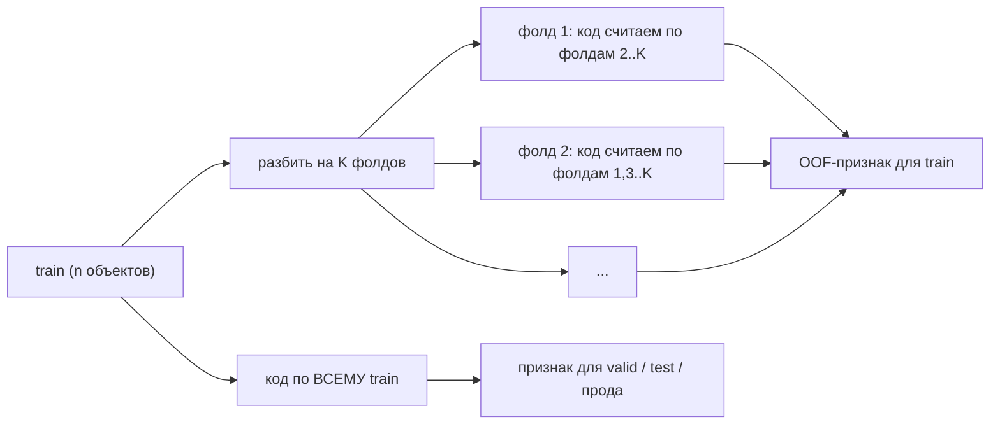
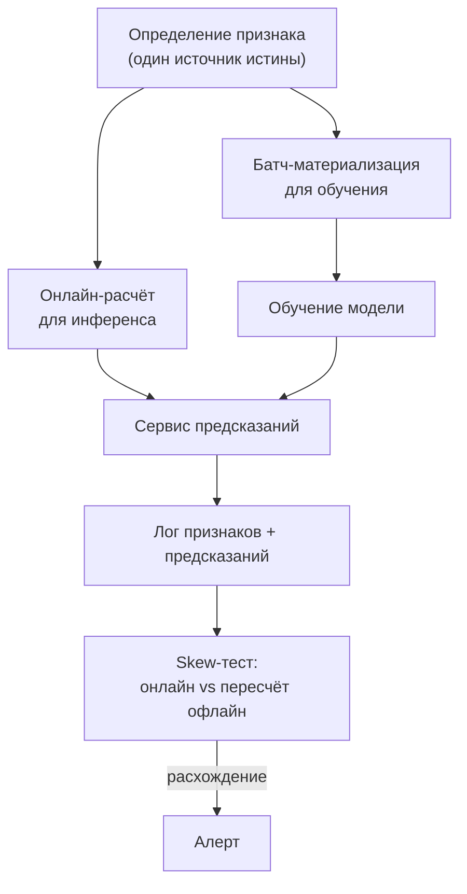

# Работа с признаками

> **Зачем эта глава.** Между «сырой таблицей из хранилища» и «матрицей, которую можно скормить
> модели» лежит слой работы, который на практике даёт больше прироста качества, чем смена
> алгоритма. Здесь разбирается весь этот слой: пропуски, выбросы, преобразования, кодировки
> категорий, признаки из времени, агрегаты, отбор признаков и — главное — как не сломать всё
> это в проде. После главы вы будете строить признаки так, чтобы их можно было посчитать
> в момент инференса ровно теми же числами, что и на обучении.

**Уровень:** 🎯 middle → 🧠 middle+
**Предварительно нужно:** [постановка задачи обучения](01-learning-theory.md), [валидация и утечки](05-validation-and-leakage.md), [решающие деревья](06-decision-trees.md), [линейные модели](02-linear-models.md)
**Как проработать:** чтение + реализация кодировок + практика

---

## Карта главы

- [1. Интуиция: признак — это подсказка модели](#1-интуиция-признак--это-подсказка-модели) — почему одна и та же таблица «трудная» для одной модели и «лёгкая» для другой
- [2. Пропуски](#2-пропуски) — MCAR/MAR/MNAR и что из них следует
- [3. Выбросы](#3-выбросы) — как отличить ошибку от редкой правды
- [4. Масштабирование](#4-масштабирование) — кому нужно, кому вредно
- [5. Нелинейные преобразования](#5-нелинейные-преобразования) — лог, Йео-Джонсон, квантильное, биннинг
- [6. Категориальные признаки](#6-категориальные-признаки) — one-hot, ordinal, target, count, hashing, эмбеддинги
- [7. Время как источник признаков](#7-время-как-источник-признаков) — календарь, циклические кодировки, лаги
- [8. Агрегаты и оконные признаки](#8-агрегаты-и-оконные-признаки) — point-in-time correctness
- [9. Высокая кардинальность](#9-высокая-кардинальность) — что ломается на миллионе категорий
- [10. Отбор признаков](#10-отбор-признаков) — фильтры, обёртки, встроенные, permutation, Boruta
- [11. Train/serve skew](#11-trainserve-skew) — почему офлайн 0.93, а онлайн 0.79
- [12. Подводные камни](#12-подводные-камни)
- [13. Проверь себя](#13-проверь-себя)
- [14. Практика](#14-практика)
- [15. Что читать дальше](#15-что-читать-дальше)

---

## 1. Интуиция: признак — это подсказка модели

Возьмём конкретную задачу: предсказать, опоздает ли доставка. В хранилище лежит таблица заказов
с колонками `order_ts`, `promised_ts`, `courier_id`, `warehouse_id`, `items_count`, `weight_kg`,
`distance_m`, `city`.

Отдадим это в модель как есть. Логистическая регрессия получит `distance_m` и `weight_kg` как два
независимых линейных вклада. Но опоздание зависит не от расстояния и не от веса по отдельности,
а от чего-то вроде «сколько минут нужно на маршрут при текущей загрузке склада» — то есть от
*отношения* и от *истории*. Линейная модель такое отношение выразить не может в принципе: она
складывает, а не делит.

Дадим ей признак `minutes_available = (promised_ts - order_ts) / 60` и `speed_needed_m_per_min =
distance_m / minutes_available`. Один признак — и задача стала почти линейно разделимой.

Теперь тот же датасет отдадим бустингу. Он найдёт взаимодействие `distance_m × minutes_available`
сам, но потратит на это несколько уровней глубины и много данных: чтобы аппроксимировать
гиперболу $x_1 / x_2$ прямоугольными разбиениями, нужно много сплитов. Явно посчитанное отношение
экономит ему ёмкость.

А `courier_id` — 40 000 уникальных значений — не поможет ни той, ни другой модели напрямую.
Идентификатор сам по себе бессмысленный: важно не *кто* курьер, а *какая у него история опозданий*.
Значит, `courier_id` нужно превратить в число — например, в долю опозданий этого курьера за
последние 30 дней. И вот здесь начинается самая опасная часть работы с признаками: если посчитать
эту долю по всему датасету, включая тот самый заказ, который мы предсказываем, — модель получит
ответ в признаке и покажет фантастическое качество, которое рассыплется в проде.

> 🌱 **База.** Три вещи, которые делает feature engineering: (1) переводит сырые типы в числа,
> которые модель умеет читать; (2) делает нужную зависимость *выразимой* в рамках выбранного
> класса моделей; (3) вносит знание о предметной области, которого в самих данных нет.
> Всё остальное в этой главе — детали этих трёх пунктов.

Ключевая мысль, которая пронизывает главу: **«хороший признак» не абсолютен, он определяется
парой (модель, задача)**. Логарифм цены критичен для линейной регрессии и почти бесполезен для
дерева. One-hot спасает линейную модель и вредит бустингу на признаке высокой мощности.
Поэтому дальше почти каждый приём сопровождается вопросом «для какой модели».

---

## 2. Пропуски

### 2.1 Три механизма пропусков

Различие между ними придумал Рубин в 1976 году, и это не академическая тонкость: от механизма
зависит, можно ли вообще восстановить несмещённую картину.

Введём обозначения. Пусть $X \in \mathbb{R}^{n \times d}$ — матрица признаков ($n$ объектов,
$d$ признаков), $R \in \{0,1\}^{n \times d}$ — матрица индикаторов наблюдаемости
($r_{ij} = 1$, если значение $x_{ij}$ наблюдается), $X_{\text{obs}}$ — наблюдаемая часть данных,
$X_{\text{mis}}$ — пропущенная часть.

**MCAR** (Missing Completely At Random) — вероятность пропуска не зависит ни от чего:

$$
P(R \mid X_{\text{obs}}, X_{\text{mis}}) = P(R)
$$

где $P(R \mid \cdot)$ — вероятность конкретной картины пропусков при условии данных.
Пример: датчик отваливался из-за случайных сбоев сети. Следствие: удаление строк с пропусками
даёт несмещённые оценки, теряется только объём выборки.

**MAR** (Missing At Random) — вероятность пропуска зависит только от наблюдаемых величин:

$$
P(R \mid X_{\text{obs}}, X_{\text{mis}}) = P(R \mid X_{\text{obs}})
$$

Пример: доход не заполняют чаще молодые пользователи, а возраст мы знаем. Следствие: пропуск
восстановим по остальным признакам — работают модельные импутации (регрессия на другие признаки,
`IterativeImputer`, kNN-импутация).

**MNAR** (Missing Not At Random) — вероятность пропуска зависит от самого пропущенного значения:

$$
P(R \mid X_{\text{obs}}, X_{\text{mis}}) \ne P(R \mid X_{\text{obs}})
$$

Пример: доход не указывают именно люди с очень высоким доходом. Или: поле «предыдущий работодатель»
пусто у тех, кто нигде не работал. Следствие: **восстановить значение из данных невозможно** — в
данных просто нет информации о том, что там было. Любая импутация внесёт смещение.

> 📐 **Разбор формулы.** Читайте эти три строчки как «от чего зависит вероятность увидеть дырку».
> В MCAR — ни от чего, дырки разбросаны как попало. В MAR — от того, что мы *видим*: значит,
> сама дырка несёт информацию, но эта информация уже есть в других колонках. В MNAR — от того,
> что мы *не видим*: дырка несёт информацию, которой больше нигде нет. Отсюда практический вывод:
> при MNAR факт пропуска надо сохранить как отдельный признак, а не «залечить» средним.

Отличить MCAR от MAR можно статистически (тест Литтла, сравнение распределений признаков в группах
«пропущено / не пропущено»). Отличить MAR от MNAR по данным **нельзя** — это всегда предположение,
которое обосновывается знанием о том, как данные собирались. Это ровно та ситуация, где нужно идти
к владельцу источника, а не к статистике.

### 2.2 Что делать на практике

Стратегия зависит и от механизма, и от модели.

| Приём | Когда уместен | Что ломает |
|---|---|---|
| Удалить строки | MCAR, пропусков < 1–2%, обучение | В проде строку удалить нельзя — придётся всё равно что-то предсказать |
| Удалить признак | Пропусков > 60–80% и признак не несёт сигнала фактом пропуска | Иногда именно факт пропуска и был сигналом |
| Константа-заглушка (`-999`, `"__NA__"`) | Деревья и бустинг | Для линейных моделей и kNN катастрофа: `-999` — это точка в пространстве |
| Среднее / медиана | Линейные модели, MCAR | Занижает дисперсию признака, размывает связи; для MNAR — вносит смещение |
| Модельная импутация (`IterativeImputer`, kNN) | MAR, признаков немного, обучение офлайн | Дорого в проде, требует сохранения всей модели импутации |
| Нативная обработка NaN | LightGBM, XGBoost, CatBoost, HistGradientBoosting | Ничего; это лучший вариант, если вы на бустинге |
| Индикатор пропуска `is_na` | Всегда, когда механизм подозревается MNAR | Плодит колонки; для d>1000 добавляйте выборочно |

Нативная обработка пропусков в бустинге устроена так: при поиске сплита объекты с NaN не
участвуют в подсчёте порога, а затем пробуются в левую и в правую ветку — выбирается направление,
дающее больший выигрыш. То есть дерево **выучивает**, куда отправлять пропуск, отдельно на каждом
сплите. Это заметно сильнее любой импутации: модель сама решает, «пропуск ближе к маленьким
значениям или к большим», причём по-разному в разных частях пространства.

```python
import numpy as np
import pandas as pd
from sklearn.model_selection import train_test_split
from sklearn.impute import SimpleImputer
from sklearn.pipeline import Pipeline
from sklearn.linear_model import LogisticRegression
from sklearn.preprocessing import StandardScaler

rng = np.random.default_rng(0)
n = 20_000
age = rng.normal(35, 12, n).clip(18, 80)
income = 20_000 + 900 * age + rng.normal(0, 15_000, n)
y = (income + rng.normal(0, 20_000, n) > 60_000).astype(int)

# MNAR: высокие доходы скрывают чаще — вероятность пропуска растёт с самим доходом
p_missing = 1 / (1 + np.exp(-(income - 80_000) / 20_000))
income_observed = np.where(rng.random(n) < p_missing, np.nan, income)

X = pd.DataFrame({"age": age, "income": income_observed})

# Индикатор считаем ДО импутации: после неё информация о пропуске потеряна навсегда
X["income_is_na"] = X["income"].isna().astype(int)

X_tr, X_te, y_tr, y_te = train_test_split(X, y, test_size=0.25, random_state=0)

# Импутер обучается ТОЛЬКО на train: медиана по всей выборке — это утечка статистики теста
pipe = Pipeline([
    ("impute", SimpleImputer(strategy="median")),
    ("scale", StandardScaler()),
    ("clf", LogisticRegression(max_iter=1000)),
]).fit(X_tr, y_tr)

from sklearn.metrics import roc_auc_score
print("с индикатором:", round(roc_auc_score(y_te, pipe.predict_proba(X_te)[:, 1]), 4))

pipe_no_flag = Pipeline([
    ("impute", SimpleImputer(strategy="median")),
    ("scale", StandardScaler()),
    ("clf", LogisticRegression(max_iter=1000)),
]).fit(X_tr.drop(columns=["income_is_na"]), y_tr)
print("без индикатора:", round(
    roc_auc_score(y_te, pipe_no_flag.predict_proba(X_te.drop(columns=["income_is_na"]))[:, 1]), 4))
# при MNAR индикатор даёт заметный прирост: сам факт пропуска коррелирует с таргетом
```

> 💬 **На собеседовании.** Спросят: «Как вы обрабатываете пропуски?»
> Плохой ответ, который слышат чаще всего: «заполняю медианой». Хороший ответ начинается с
> вопроса: *откуда взялся пропуск*. Если это MNAR (поле не заполняют определённые пользователи,
> событие не произошло, источник ещё не поставил данные) — факт пропуска сам по себе признак,
> и его надо сохранить индикатором, а не стирать импутацией. Если модель — бустинг, лучший
> вариант вообще ничего не заполнять: библиотека выучит направление для NaN на каждом сплите.
> И отдельно: импутер — часть модели, его статистики считаются на train и применяются к
> валидации и к проду, иначе получаем утечку и train/serve skew одновременно.

> ⚠️ **Типичная ошибка.** Посчитать `df.fillna(df.median())` на всём датафрейме до сплита →
> медиана впитала информацию из теста → оценка качества завышена, а в проде медиана вообще
> другая. Правильно: `SimpleImputer` внутри `Pipeline`, который фитится на train внутри
> кросс-валидации.

---

## 3. Выбросы

Выброс (outlier) — это не «значение далеко от среднего». Это значение, которое либо **ошибочно**
(опечатка, сбой, единица измерения перепутана), либо **редко и настоящее** (реальная покупка на
3 млн рублей). Это два разных случая, и лечатся они по-разному: ошибку надо чинить или удалять,
редкую правду — сохранять, но не давать ей доминировать в обучении.

### 3.1 Как находить

Правило трёх сигм ($|x - \bar{x}| > 3s$, где $\bar x$ — выборочное среднее, $s$ — выборочное
стандартное отклонение) популярно и почти всегда работает плохо. Причина: и $\bar x$, и $s$ сами
разрушаются выбросами. Один объект со значением $10^9$ раздувает $s$ настолько, что порог
$3s$ перестаёт кого-либо ловить, — эффект называется **маскировкой** (masking).

Робастные альтернативы:

$$
\text{IQR-правило: } x < Q_1 - 1.5\,\text{IQR} \quad\text{или}\quad x > Q_3 + 1.5\,\text{IQR},
\qquad \text{IQR} = Q_3 - Q_1
$$

где $Q_1, Q_3$ — первый и третий квартили признака, $\text{IQR}$ — межквартильный размах.
Квартили не чувствительны к отдельным экстремальным значениям, поэтому правило не маскируется.

$$
z^{\text{robust}}_i = \frac{0.6745\,(x_i - \operatorname{med}(x))}{\operatorname{MAD}(x)},
\qquad
\operatorname{MAD}(x) = \operatorname{med}\big(|x_i - \operatorname{med}(x)|\big)
$$

где $\operatorname{med}(x)$ — медиана признака, $\operatorname{MAD}$ — медианное абсолютное
отклонение, а множитель $0.6745$ приводит MAD к масштабу стандартного отклонения нормального
распределения (для $\mathcal{N}(\mu,\sigma^2)$ выполняется $\operatorname{MAD} \approx 0.6745\sigma$).
Порог $|z^{\text{robust}}| > 3.5$ — рабочий дефолт.

Многомерные выбросы (объект нормален по каждому признаку в отдельности, но комбинация невозможна —
«возраст 19, стаж 25 лет») одномерными правилами не ловятся. Для них — расстояние Махаланобиса,
Isolation Forest, LOF; подробно в [главе о поиске аномалий](18-anomaly-detection.md).

### 3.2 Что делать

| Действие | Когда |
|---|---|
| Удалить объект | Доказанная ошибка данных (отрицательный вес, дата в 1900 году) и объектов мало |
| Обрезать (clipping/winsorize) по квантилям 0.1% / 99.9% | Значение реально, но хвост мешает линейной модели |
| Логарифмировать | Тяжёлый правый хвост, признак положительный и мультипликативный по природе |
| Заменить на NaN и обработать как пропуск | Значение явно ошибочно, но удалять строку жалко |
| Ничего не делать | Модель — дерево или бустинг: сплит по порогу нечувствителен к тому, насколько далеко ушло значение |
| Сменить функцию потерь на робастную (Huber, MAE, квантильная) | Выбросы в **таргете**, а не в признаках |

Последняя строка важна: выбросы в таргете и в признаках — разные проблемы. Дерево устойчиво к
выбросам в признаках (порог $x < 5$ одинаково отработает и для $x=6$, и для $x=10^9$), но к
выбросам в таргете бустинг с MSE как раз крайне чувствителен — псевдоостаток огромен, и модель
начинает подгоняться под один объект. Именно поэтому для «денежных» таргетов часто берут
Huber или обучают на $\log(1+y)$.

> ⚠️ **Типичная ошибка.** Обрезать признак по квантилям, посчитанным на всей выборке, включая
> тест. Границы клиппинга — такой же обучаемый параметр, как коэффициенты модели: считаем на
> train, сохраняем, применяем к валидации и в проде. Иначе в проде появится значение выше любого
> виденного порога и поведение разойдётся.

---

## 4. Масштабирование

Масштабирование не улучшает признаки — оно устраняет вред от несопоставимости масштабов. Понять,
нужно ли оно, можно одним вопросом: **зависит ли обучение или предсказание от расстояний, сумм
или норм?**

| Семейство моделей | Нужно масштабирование? | Почему |
|---|---|---|
| Линейные с градиентным спуском, нейросети | Да, обязательно | Признаки разного масштаба дают вытянутые линии уровня функции потерь, единый $\eta$ подходит не всем координатам |
| Линейные с L1/L2 | Да, обязательно | Штраф $\lambda\|w\|$ одинаков для всех координат, а веса измеряются в «обратных единицах признака» — без масштабирования регуляризация бьёт по признакам с крупными единицами |
| kNN, SVM с RBF, KMeans, DBSCAN | Да, обязательно | Все они считают расстояния; признак в рублях (10⁵) полностью подавит признак-долю (10⁰) |
| PCA | Да (обычно) | PCA максимизирует дисперсию, а дисперсия зависит от единиц измерения |
| Наивный Байес | Нет | Работает с распределениями по каждому признаку отдельно |
| Деревья, RF, бустинг | Нет | Сплит инвариантен к любому строго монотонному преобразованию |
| Линейная регрессия через нормальное уравнение | Не влияет на решение | Но влияет на обусловленность $X^\top X$ при численном решении |

Основные варианты:

$$
\text{StandardScaler: } x' = \frac{x - \mu}{\sigma},
\qquad
\text{MinMax: } x' = \frac{x - x_{\min}}{x_{\max} - x_{\min}},
\qquad
\text{Robust: } x' = \frac{x - \operatorname{med}(x)}{\text{IQR}(x)}
$$

где $\mu, \sigma$ — среднее и стандартное отклонение признака на обучающей выборке,
$x_{\min}, x_{\max}$ — минимум и максимум на обучающей выборке, $\operatorname{med}$ и
$\text{IQR}$ — медиана и межквартильный размах.

Выбирать так: `StandardScaler` — дефолт; `RobustScaler` — если хвосты тяжёлые и вы не хотите
их резать; `MinMaxScaler` — если нужен ограниченный диапазон (например, вход в сеть с сигмоидой)
и вы уверены, что в проде не появятся значения вне диапазона train (иначе получите числа за
пределами $[0,1]$, что часто безобидно, но иногда ломает предположения кода).

> 🧠 **Middle+.** Для разреженных матриц (one-hot, TF-IDF) центрирование запрещено: вычитание
> среднего превращает нули в ненулевые значения и разрушает разреженность — матрица на 10⁶ × 10⁵
> перестанет помещаться в память. Используйте `StandardScaler(with_mean=False)` или `MaxAbsScaler`,
> который делит на максимум модуля и сохраняет нули нулями.

---

## 5. Нелинейные преобразования

Масштабирование — линейное, оно не меняет форму распределения. Иногда менять надо именно форму.

**Логарифм.** `np.log1p(x)` = $\log(1+x)$ применяется к неотрицательным величинам с тяжёлым правым
хвостом: цены, длительности, счётчики. Он превращает мультипликативные эффекты в аддитивные, а
это ровно то, что умеет линейная модель. Если реальная зависимость $y = a\cdot x_1^{b_1} x_2^{b_2}$,
то после логарифмирования и признаков, и таргета она становится строго линейной:
$\log y = \log a + b_1 \log x_1 + b_2 \log x_2$. Плюс `log1p` корректно обрабатывает нули.

**Йео-Джонсон и Бокс-Кокс.** Обобщение логарифма с подбираемым параметром $\lambda$:

$$
x^{(\lambda)}_{\text{BC}} =
\begin{cases}
\dfrac{x^{\lambda} - 1}{\lambda}, & \lambda \ne 0,\\[6pt]
\log x, & \lambda = 0,
\end{cases}
\qquad x > 0
$$

где $\lambda$ подбирается максимизацией правдоподобия в предположении, что преобразованная
величина нормальна. Бокс-Кокс требует строго положительных значений; Йео-Джонсон — его вариант,
работающий и для нулей, и для отрицательных чисел. В sklearn — `PowerTransformer`.

**Квантильное преобразование (rank-gauss).** Заменяем значение на его квантиль в обучающем
распределении, затем при желании прогоняем через обратную функцию нормального распределения:

$$
x' = \Phi^{-1}\big(\hat{F}_{\text{train}}(x)\big)
$$

где $\hat F_{\text{train}}$ — эмпирическая функция распределения признака на обучающей выборке,
$\Phi^{-1}$ — квантильная функция стандартного нормального распределения. Результат — идеально
нормальный признак, полностью нечувствительный к выбросам (они просто прижимаются к краям).
Приём популярен в соревнованиях для нейросетей на табличных данных. Плата: преобразование
монотонное, но нелинейное и «ступенчатое» на редких значениях, а расстояния между объектами
искажаются — иногда именно этого и не хотелось.

**Биннинг (дискретизация).** Разбиваем непрерывный признак на интервалы и заменяем значение
номером интервала (а дальше обычно one-hot). Это добавляет линейной модели кусочно-постоянную
гибкость почти даром — фактически превращает её в мини-дерево по одному признаку. Для бустинга
ручной биннинг почти всегда **вреден**: дерево и так строит оптимальные пороги по критерию, а вы
фиксируете свои, придуманные заранее, и выбрасываете информацию внутри бина.

**Взаимодействия и отношения.** `PolynomialFeatures(degree=2)` — механический способ получить все
попарные произведения, но на $d$ признаках он даёт $\mathcal{O}(d^2)$ колонок: при $d = 200$ это
20 тысяч признаков. На практике полезнее несколько *осмысленных* отношений (цена за килограмм,
конверсия = клики/показы, доля от среднего по категории), чем полный квадратичный базис.

> 💬 **На собеседовании.** Спросят: «Зачем логарифмировать таргет в задаче предсказания цены?»
> Хороший ответ: (1) распределение цен скошено вправо, MSE на исходной шкале даёт огромный вес
> дорогим объектам и модель фактически оптимизирует только их; (2) после логарифма ошибка
> становится относительной — модель штрафуется за «ошиблись в 1.5 раза», а не за «ошиблись на
> 500 тысяч», и это обычно ближе к бизнес-смыслу; (3) мультипликативные зависимости становятся
> аддитивными. Обязательно добавьте про обратное преобразование: наивный $\exp(\hat{y})$ даёт
> смещённую оценку **среднего** (по неравенству Йенсена $\mathbb{E}[e^{Z}] \ge e^{\mathbb{E}[Z]}$)
> — это оценка медианы, а не среднего. Если бизнесу нужна сумма по портфелю, нужна поправка
> (например, множитель $e^{\hat{\sigma}^2/2}$ при логнормальных остатках) или обучение с
> Tweedie/Gamma-потерей на исходной шкале. Плохой ответ: «чтобы данные стали нормальными» — без
> объяснения, кому и зачем эта нормальность нужна.

---

## 6. Категориальные признаки

Модель принимает числа. Категория — это метка. Всё содержание раздела — про то, каким числом её
заменить и не соврать.

### 6.1 One-hot encoding

Категория с $C$ уровнями превращается в $C$ бинарных колонок. Это единственная кодировка, которая
**не навязывает никакого порядка**, поэтому она правильна по умолчанию для линейных моделей и сетей.

Границы применимости жёсткие. При $C$ порядка нескольких сотен матрица становится очень широкой
и очень разреженной. Для деревьев это ещё и плохо по существу: сплит вида `is_category_A == 1`
отрезает одну категорию против всех остальных, поэтому чтобы выделить группу из 20 категорий,
дереву нужно 20 уровней глубины. Дерево на one-hot признаке высокой мощности систематически
недоиспользует его — это известный эффект, из-за которого LightGBM и CatBoost работают с
категориями нативно.

Отдельная деталь для линейных моделей: при наличии свободного члена $C$ колонок линейно зависимы
(их сумма — единичный вектор), матрица $X^\top X$ вырождена. Это «ловушка фиктивных переменных»
(dummy variable trap), лечится `drop='first'`. С L2-регуляризацией проблема исчезает сама, поэтому
на практике про неё часто забывают — но на собесе спрашивают.

Значения, не виденные на обучении, обязаны обрабатываться: `OneHotEncoder(handle_unknown='ignore')`
выдаст нулевую строку вместо исключения.

### 6.2 Ordinal / label encoding

Просто нумеруем категории: `{"low": 0, "mid": 1, "high": 2}`. Корректно, когда порядок реально
существует (образование, размер одежды, грейд). Для линейных моделей и kNN на *неупорядоченных*
категориях это ошибка: модель будет считать, что «Москва (7)» втрое дальше от «Казань (2)», чем
«Тула (5)», — бессмыслица, порождённая алфавитным порядком.

Для деревьев label encoding работает заметно лучше, чем кажется: дерево может серией сплитов
выделить произвольное подмножество номеров, и при достаточной глубине порядок перестаёт мешать.
Это не оптимально, но и не катастрофа — типичный рабочий бейзлайн.

### 6.3 Target (mean) encoding — и как не словить утечку

Заменяем категорию на статистику таргета внутри неё. Наивная версия:

$$
\hat{t}_c = \frac{1}{n_c}\sum_{i:\, x_i = c} y_i
$$

где $c$ — конкретное значение категории, $n_c$ — число объектов этой категории в обучающей
выборке, $y_i$ — таргет объекта $i$, $\hat t_c$ — код категории.

Здесь две проблемы, и обе фатальны, если их не решить.

**Проблема 1: редкие категории.** Если $n_c = 1$, то $\hat t_c = y_i$ — признак буквально равен
ответу для этого объекта. Модель мгновенно выучит «смотри только на эту колонку». Лечится
сглаживанием к глобальному среднему:

$$
\hat{t}_c = \frac{\sum_{i:\, x_i = c} y_i + \alpha\, \bar{y}}{n_c + \alpha}
$$

где $\bar y = \frac{1}{n}\sum_{i=1}^{n} y_i$ — глобальное среднее таргета, $\alpha > 0$ — сила
сглаживания (её смысл: «сколько виртуальных объектов со средним таргетом мы добавляем в каждую
категорию»). Это в точности апостериорное среднее в байесовской модели с бета-априором для
бинарного таргета. Практические значения $\alpha$: от 5 до 100, подбирается по валидации.
При $n_c \gg \alpha$ код стремится к среднему категории, при $n_c \ll \alpha$ — к глобальному
среднему. Микчи-Баррека в статье 2001 года предложил вариант со сглаживанием через сигмоиду от
$n_c$; идея та же.

**Проблема 2: утечка таргета.** Даже со сглаживанием код объекта $i$ посчитан с использованием
$y_i$. Модель на обучении видит признак, «подсказанный» ответом, и переобучается на него.
Симптом узнаваемый: на кросс-валидации отлично, на честном тесте провал.

Правильная схема — **out-of-fold**: код для объектов фолда $k$ считается только по объектам
остальных фолдов.



Обратите внимание на асимметрию: для обучающей выборки код считается out-of-fold (чтобы модель
не видела свой ответ), а для теста и прода — по всему train (там утечки нет, зато больше данных
и меньше дисперсия). Это выглядит непоследовательно, но именно так и надо.

```python
import numpy as np
import pandas as pd
from sklearn.model_selection import StratifiedKFold


class OutOfFoldTargetEncoder:
    """Target encoding со сглаживанием и out-of-fold схемой для train.

    fit_transform -> OOF-коды (для обучения модели)
    transform     -> коды по всему train (для valid/test/прода)
    """

    def __init__(self, alpha=20.0, n_splits=5, random_state=0):
        self.alpha = alpha
        self.n_splits = n_splits
        self.random_state = random_state

    def _fit_map(self, col, y):
        # суммы и счётчики по категориям — из них собирается сглаженное среднее
        df = pd.DataFrame({"c": col.values, "y": np.asarray(y, dtype=float)})
        agg = df.groupby("c")["y"].agg(["sum", "count"])
        prior = float(np.mean(y))
        return (agg["sum"] + self.alpha * prior) / (agg["count"] + self.alpha), prior

    def fit_transform(self, col, y):
        col = pd.Series(col).astype("object").reset_index(drop=True)
        y = np.asarray(y)
        out = np.empty(len(col), dtype=float)

        # стратификация по таргету: иначе в фолде может не оказаться позитивов
        skf = StratifiedKFold(self.n_splits, shuffle=True, random_state=self.random_state)
        for tr_idx, va_idx in skf.split(col.values.reshape(-1, 1), y):
            mapping, prior = self._fit_map(col.iloc[tr_idx], y[tr_idx])
            # категории, которых нет в обучающей части фолда, получают глобальное среднее
            out[va_idx] = col.iloc[va_idx].map(mapping).fillna(prior).to_numpy()

        # карта по всему train — её применяем к valid/test/проду
        self.mapping_, self.prior_ = self._fit_map(col, y)
        return out

    def transform(self, col):
        col = pd.Series(col).astype("object")
        return col.map(self.mapping_).fillna(self.prior_).to_numpy()


# демонстрация: категория с 5000 уровней и БЕЗ связи с таргетом
rng = np.random.default_rng(42)
n = 50_000
cat = rng.integers(0, 5000, n).astype(str)     # чистый шум
y = rng.integers(0, 2, n)                      # таргет независим от cat

enc = OutOfFoldTargetEncoder(alpha=20.0)
oof = enc.fit_transform(cat, y)
naive = pd.Series(cat).map(pd.DataFrame({"c": cat, "y": y}).groupby("c")["y"].mean()).to_numpy()

print("корреляция наивного кода с таргетом:", round(float(np.corrcoef(naive, y)[0, 1]), 4))
print("корреляция OOF-кода с таргетом:    ", round(float(np.corrcoef(oof, y)[0, 1]), 4))
# наивный код коррелирует с таргетом на пустом месте (это и есть утечка);
# OOF-код даёт корреляцию около нуля — как и должно быть для шумовой категории
```

> 🧠 **Middle+.** CatBoost решает ту же проблему иначе: он использует **упорядоченные целевые
> статистики** (ordered target statistics). Для случайной перестановки $\sigma$ объектов код
> объекта $\sigma_i$ считается только по объектам, стоящим раньше него в перестановке:
> $$
> \hat{t}_{\sigma_i} = \frac{\sum_{j < i} \mathbb{1}[x_{\sigma_j} = x_{\sigma_i}]\, y_{\sigma_j} + a\,p}{\sum_{j < i} \mathbb{1}[x_{\sigma_j} = x_{\sigma_i}] + a}
> $$
> где $\mathbb{1}[\cdot]$ — индикатор, $a > 0$ — сила сглаживания, $p$ — априорное значение
> (обычно среднее таргета по выборке). Это «онлайн»-аналог out-of-fold: каждому объекту доступно
> только прошлое. Чтобы уменьшить дисперсию на первых объектах перестановки, CatBoost использует
> несколько независимых перестановок. Детали — в [главе про библиотеки бустинга](09-boosting-in-practice.md).

Отдельная тонкость: **при временных данных out-of-fold по случайным фолдам недостаточно**. Код,
посчитанный по будущим объектам того же пользователя, — это временная утечка, даже если формально
объект вне своего фолда. Нужен либо `GroupKFold` по сущности, либо расчёт «только по прошлому»
с точки зрения времени события (см. [§8](#8-агрегаты-и-оконные-признаки)).

### 6.4 Count / frequency encoding

Заменяем категорию на число её появлений (или на частоту). Таргет не участвует — утечки нет,
кодировка тривиально считается в проде.

Работает удивительно часто: популярность категории сама по себе сигнал (популярный товар,
частый IP, частый тип устройства). Также служит грубым «доверием» к target-коду: пара признаков
(`target_enc`, `count`) даёт модели возможность самой решить, насколько доверять кодировке.
Недостаток: разные категории с одинаковой частотой становятся неотличимы (коллизия).

### 6.5 Hashing trick

Пропускаем строку через хеш-функцию и берём остаток по модулю $m$:

$$
j = h(c) \bmod m, \qquad \phi_j(x) = \phi_j(x) + \xi(c)
$$

где $h$ — хеш-функция (например, MurmurHash3), $m$ — заранее выбранный размер выходного
пространства, $j$ — индекс колонки, в которую попадает категория $c$, $\xi(c) \in \{-1, +1\}$ —
знаковая хеш-функция. Знак нужен, чтобы коллизии в среднем гасили друг друга: при случайных
знаках вклад двух столкнувшихся категорий не складывается систематически, и скалярные произведения
остаются несмещёнными.

Что это даёт: фиксированную размерность $m$ независимо от числа категорий, отсутствие словаря
(не нужно хранить маппинг и не нужно решать, что делать с новыми категориями), константную память.
Что это стоит: **коллизии** и потеря интерпретируемости — по индексу колонки нельзя понять, какая
это категория. Ожидаемое число сталкивающихся пар при $C$ уникальных категориях и $m$ корзинах
примерно $\binom{C}{2}/m$; на практике берут $m$ в 5–20 раз больше ожидаемого числа «важных»
категорий.

Область применения — потоковые задачи с открытым словарём: CTR-предсказание, где каждый день
появляются новые рекламные креативы, логи с пользовательскими строками, текстовые n-граммы.
В sklearn — `FeatureHasher`, в vowpal wabbit — базовый механизм.

### 6.6 Эмбеддинги категорий

Каждой категории сопоставляется обучаемый вектор $e_c \in \mathbb{R}^k$, где $k$ — размерность
эмбеддинга ($k \ll C$). Векторы обучаются вместе с моделью градиентным спуском под целевую задачу.
Идея пришла из NLP и была перенесена на табличные данные (Guo & Berkhahn, 2016, на задаче
прогноза продаж Rossmann).

Что это даёт: категории с похожим влиянием на таргет оказываются рядом в пространстве, и модель
делится статистикой между ними — это заметно лучше one-hot при большом $C$ и умеренном числе
наблюдений на категорию. Эвристика размерности: $k \approx \min(50,\ \lceil C^{1/4}\rceil \cdot 2)$
или просто $k \in \{8, 16, 32\}$ — точное значение обычно не критично.

Ограничение: эмбеддинги нужны, когда модель уже нейросеть. Ставить сеть только ради эмбеддингов
поверх бустинга редко окупается — исключение — когда эмбеддинги обучены на смежной задаче
(например, item2vec по истории кликов) и переиспользуются как готовые признаки.

### 6.7 Сводка

| Кодировка | Утечка возможна? | Новые категории | Размерность | Кому подходит |
|---|---|---|---|---|
| One-hot | нет | обрабатываются как нули | $C$ | линейные, сети; деревья при малом $C$ |
| Ordinal | нет | нужен `unknown_value` | 1 | деревья; линейные только при реальном порядке |
| Target/mean | **да, главный риск** | глобальное среднее | 1 | все, при OOF-схеме |
| Count / frequency | практически нет | 0 или отдельный код | 1 | все, как дополнение |
| Hashing | нет | автоматически | $m$ (фикс.) | потоковые задачи, открытый словарь |
| Эмбеддинги | нет (если обучается на train) | вектор `<unk>` | $k$ | нейросети |
| Нативные категории CatBoost/LightGBM | контролируется библиотекой | обрабатываются | — | бустинг |

---

## 7. Время как источник признаков

Колонка с меткой времени — самый недоиспользуемый ресурс в табличных задачах. Из одного
`timestamp` вытаскивают десяток признаков, и часть из них обычно попадает в топ важностей.

**Календарные компоненты.** Час, день недели, день месяца, месяц, номер недели, квартал, признак
выходного, признак праздника (нужен справочник по стране — для России критично из-за переносов),
признак «зарплатный период» (1–5 и 15–20 числа), номер дня от начала данных для учёта тренда.

**Разности.** `time_since_registration`, `time_since_last_order`, `time_until_promised_delivery`,
`time_since_last_login`. Почти всегда полезнее абсолютных меток: модель, обученная на абсолютных
датах, не переносится в будущее — в проде она встретит значения, которых не было в train, и
деревья будут отправлять их в крайний лист (см. про экстраполяцию в
[главе про бустинг](08-gradient-boosting.md)).

**Циклические кодировки.** Час 23 и час 0 находятся рядом на циферблате, но как числа они
максимально далеки. Для линейных моделей, kNN и сетей это прямая проблема: расстояние между
23:00 и 00:00 получается 23, а между 12:00 и 13:00 — 1. Решение — уложить время на окружность:

$$
x_{\sin} = \sin\!\left(\frac{2\pi t}{T}\right),
\qquad
x_{\cos} = \cos\!\left(\frac{2\pi t}{T}\right)
$$

где $t$ — значение циклической величины (час: $0..23$; день недели: $0..6$; месяц: $1..12$;
день года: $1..365$), $T$ — длина полного цикла ($24$, $7$, $12$, $365$). Пара
$(x_{\sin}, x_{\cos})$ однозначно кодирует положение на окружности, и евклидово расстояние между
двумя моментами становится монотонной функцией угловой разницы: соседние часы — близки,
23 и 0 — тоже близки.

```python
import numpy as np
import pandas as pd

ts = pd.to_datetime(pd.Series(["2024-03-01 23:30", "2024-03-02 00:15", "2024-03-02 12:00"]))
hour = ts.dt.hour + ts.dt.minute / 60.0

feats = pd.DataFrame({
    "hour_sin": np.sin(2 * np.pi * hour / 24),
    "hour_cos": np.cos(2 * np.pi * hour / 24),
})

def circ_dist(i, j):
    # евклидово расстояние в (sin, cos)-пространстве отражает близость на циферблате
    return float(np.linalg.norm(feats.iloc[i].to_numpy() - feats.iloc[j].to_numpy()))

print("23:30 vs 00:15 ->", round(circ_dist(0, 1), 3))   # ~0.196 — почти рядом
print("23:30 vs 12:00 ->", round(circ_dist(0, 2), 3))   # ~1.99 — противоположные точки цикла
```

> ⚠️ **Типичная ошибка.** Применять sin/cos-кодировку для бустинга «потому что так правильно».
> Дереву она не нужна и обычно мешает: по признаку `hour` дерево само сделает сплиты
> `hour < 6`, `hour >= 22`, а вот выделить «ночь» по паре `(sin, cos)` ему нужно два сплита
> в повёрнутом базисе — то есть сложнее. Циклическое кодирование — приём для моделей, которые
> считают расстояния или суммы: линейные, kNN, сети.

**Признаки-лаги и оконные статистики** по времени — отдельная большая тема; их устройство
разбирается в [главе о временных рядах](16-time-series.md), а корректность их расчёта — в
следующем разделе.

---

## 8. Агрегаты и оконные признаки

Одиночная строка редко содержит достаточно информации. Сигнал живёт в истории сущности:
у пользователя — в его предыдущих покупках, у товара — в его продажах, у продавца — в его
рейтинге за месяц. Агрегаты — самый продуктивный класс признаков в промышленных задачах, и
одновременно главный источник утечек.

**Групповые агрегаты.** Для каждой сущности считаем статистики: `count`, `mean`, `median`, `std`,
`min`, `max`, `nunique`, доли по подкатегориям. Отдельно полезны **относительные** признаки:
$x_i / \text{mean}(x \mid \text{группа})$ — «цена этого товара относительно средней цены в его
категории». Модель может получить такое отношение и сама, но только если и числитель, и
знаменатель ей даны, и только потратив глубину.

**Оконные признаки.** Статистика по истории сущности за окно: число заказов за 7/30/90 дней,
средний чек за месяц, доля отмен за квартал, время с последнего события. Разные окна дают разные
горизонты памяти, и модель обычно использует несколько.

### Point-in-time correctness

Вот главное правило, ради которого написан раздел: **агрегат для объекта, произошедшего в момент
$t$, должен использовать только данные, доступные строго до $t$.**

Нарушения этого правила выглядят безобидно и стоят дорого:

- посчитали `user_total_orders` по всей таблице заказов — для заказа от января в признак попали
  заказы за декабрь того же года;
- посчитали средний рейтинг товара за всё время — включая отзывы, оставленные после нашей покупки;
- взяли колонку `user_status` из текущего снапшота профиля — а статус мог измениться уже после
  события (классика: `is_fraudster` проставлен по итогам расследования).

```python
import numpy as np
import pandas as pd

df = pd.DataFrame({
    "user_id": [1, 1, 1, 2, 2],
    "ts": pd.to_datetime(["2024-01-01", "2024-01-05", "2024-01-09",
                          "2024-01-02", "2024-01-06"]),
    "amount": [100.0, 300.0, 50.0, 20.0, 80.0],
})
df = df.sort_values(["user_id", "ts"]).reset_index(drop=True)

g = df.groupby("user_id")["amount"]

# НЕПРАВИЛЬНО: среднее по всей истории пользователя, включая текущую и будущие строки
df["mean_all"] = g.transform("mean")

# ПРАВИЛЬНО: expanding-среднее со сдвигом на 1 — только строго прошлые события
df["mean_past"] = g.transform(lambda s: s.shift(1).expanding().mean())

# rolling по времени: окно 7 дней, тоже со сдвигом — иначе текущая сумма попадёт в признак
df["sum_7d_past"] = (
    df.set_index("ts")
      .groupby("user_id")["amount"]
      .transform(lambda s: s.shift(1).rolling("7D").sum())
      .to_numpy()
)

print(df)
# у первой строки каждого пользователя признаки NaN — истории ещё нет.
# Это нормально и правильно: заполните их отдельной константой или оставьте NaN для бустинга.
```

Отдельно: **NaN у первого события — это не баг, а честное отражение холодного старта**. Если вы
их «залечите» средним по всем пользователям, модель на обучении не увидит разницы между «новичок»
и «средний пользователь», а в проде новичков будет много.

> 💬 **На собеседовании.** Спросят: «Вы добавили агрегаты по пользователю, качество на валидации
> выросло с 0.78 до 0.91. Что вы проверите прежде, чем радоваться?»
> Хороший ответ: скачок такого размера от агрегатов — красный флаг утечки. Проверяю три вещи.
> (1) Point-in-time: считались ли агрегаты только по событиям строго до момента предсказания —
> и не только «до», а ещё и «доступным в тот момент» (данные могли доехать с задержкой).
> (2) Схема валидации: если объекты одного пользователя попали и в train, и в valid, то даже
> корректный по времени агрегат делится информацией между фолдами — нужен `GroupKFold` по
> `user_id` плюс временной сплит. (3) Есть ли среди агрегатов такие, которые физически невозможно
> посчитать в момент инференса (например, «доля возвратов за месяц», который ещё не закончился).
> Плохой ответ: «отлично, выкатываем».

> 🧠 **Middle+.** В продовых системах разрыв между «когда событие произошло» и «когда данные
> о нём доступны для расчёта признака» называется **лагом доставки данных**. Корректный офлайн-набор
> строится не по времени события, а по времени доступности: если агрегат по кликам обновляется раз
> в час, то признак для события в 10:05 должен использовать состояние на 10:00, а не на 10:05.
> Игнорирование этого даёт офлайн-качество, недостижимое онлайн, — самый частый вид train/serve
> skew в реальном времени. Инфраструктурная сторона вопроса — в
> [главе про feature store](../07-mlops/03-data-and-feature-store.md).

---

## 9. Высокая кардинальность

Признак «высокой кардинальности» (high-cardinality) — это когда $C$ (число уникальных значений)
сопоставимо с $n$ или хотя бы измеряется тысячами: `user_id`, `item_id`, `ip`, `zip_code`,
`search_query`, `device_model`.

Что конкретно ломается:

1. **One-hot** даёт матрицу шириной $C$ — при $C = 10^6$ это неподъёмно даже в разреженном виде
   для многих алгоритмов.
2. **Дерево** на label-encoded признаке высокой мощности переобучается: сплитов «выделить один
   конкретный id» много, и каждый из них по чистой случайности может дать выигрыш на трейне.
   Это тот же эффект, из-за которого критерий Джини смещён в пользу признаков с большим числом
   уровней (см. [главу про деревья](06-decision-trees.md)).
3. **Target encoding** без сглаживания превращается в утечку, потому что $n_c$ мал.
4. **Новые значения в проде** — почти гарантированы: завтра появятся новые товары и новые
   пользователи.

Что делать, по возрастанию сложности:

- **Схлопнуть редкие уровни.** Все категории с $n_c < \tau$ (типично $\tau \in [10, 100]$)
  заменить на `"__rare__"`. Порог считается на train и фиксируется. Дёшево и часто достаточно.
- **Иерархия.** `zip_code` → город → регион; `device_model` → бренд. Даёт признак меньшей
  мощности, который делит статистику между родственными значениями.
- **Count + сглаженный target encoding.** Пара признаков, где count работает как мера доверия.
- **Hashing** — если словарь открытый и поток большой.
- **Эмбеддинги** — если модель нейросетевая или если есть предобученные векторы со смежной задачи.
- **Отдать библиотеке.** CatBoost с `cat_features` и LightGBM с `categorical_feature` реализуют
  свои схемы (упорядоченные статистики и оптимальное разбиение категорий по сортировке
  градиентов). Обычно это лучший результат за наименьшие усилия.

> ⚠️ **Типичная ошибка.** Скармливать `user_id` в модель в любом виде, надеясь на «персонализацию».
> Для большинства пользователей в train будет 1–3 события, и модель либо запомнит их (утечка,
> нулевая генерализация), либо проигнорирует. Персонализация делается **агрегатами по пользователю**
> ([§8](#8-агрегаты-и-оконные-признаки)) или эмбеддингами, обученными на больших объёмах взаимодействий, — но не сырым id.

### 9.1 Текстовые поля в табличной задаче

Отдельный случай высокой кардинальности — свободный текст: название товара, комментарий,
поисковый запрос, адрес. Полноценная обработка текста — предмет
[раздела NLP](../04-nlp/01-text-representation.md), но в табличной задаче почти всегда работают
три уровня, и начинать надо с первого.

**Уровень 1: метапризнаки.** Длина строки в символах и словах, доля цифр, доля заглавных, число
знаков препинания, наличие эмодзи, наличие ссылки, язык. Это дёшево, не требует словаря, не
ломается на новых значениях и часто даёт основную долю прироста — особенно в задачах вокруг
качества контента и антифрода, где важна не семантика, а «форма» текста.

**Уровень 2: разреженные представления.** TF-IDF по словам и символьным n-граммам, затем
`TruncatedSVD` до 50–300 компонент — получаем плотные колонки, которые можно приклеить к
остальным признакам и отдать бустингу. Символьные n-граммы (`analyzer='char_wb'`, `ngram_range=(3,5)`)
хорошо работают на коротких зашумлённых строках с опечатками и на русском с его морфологией.

**Уровень 3: эмбеддинги предобученной модели.** Векторы из sentence-transformers или подобной
модели, сжатые SVD/PCA. Дают лучшее качество на семантике, но добавляют в прод зависимость от
инференса модели-энкодера — это стоит латентности и денег, и решение принимается по бюджету,
а не по метрике на валидации.

```python
from sklearn.feature_extraction.text import TfidfVectorizer
from sklearn.decomposition import TruncatedSVD
from sklearn.pipeline import make_pipeline

texts_train = ["красная футболка хлопок", "синие джинсы слим", "футболка белая оверсайз"]
texts_test = ["чёрная футболка"]

# char_wb устойчив к опечаткам и к русской морфологии лучше, чем word-токены
text_block = make_pipeline(
    TfidfVectorizer(analyzer="char_wb", ngram_range=(3, 5), min_df=1, max_features=50_000),
    TruncatedSVD(n_components=2, random_state=0),   # в реальной задаче 50-300
)
Z_train = text_block.fit_transform(texts_train)     # fit только на train
Z_test = text_block.transform(texts_test)           # transform на всём остальном
print(Z_train.shape, Z_test.shape)
```

---

## 10. Отбор признаков

Сначала о мотивации, потому что она не только в качестве. Признаки стоят денег: каждый требует
расчёта в проде (латентность), хранения, мониторинга на дрифт и поддержки при смене источника.
Модель на 800 признаках, из которых работают 60, — это технический долг, который придётся
обслуживать годами.

Плюс собственно статистика: шумовые признаки увеличивают дисперсию модели, а в бустинге ещё и
съедают долю сплитов (`colsample_bytree` выдаёт дереву случайное подмножество — чем больше мусора,
тем чаще дерево получает набор из одного мусора).

### 10.1 Фильтры (filter methods)

Оценивают признаки по одиночке, **не обучая модель**. Быстро, но слепо к взаимодействиям.

- **Нулевая/малая дисперсия** — `VarianceThreshold`. Константный признак бесполезен всегда.
- **Корреляция с таргетом** (Пирсон/Спирмен) — ловит только монотонную связь.
- **Взаимная информация** $I(X_j; Y)$ — ловит любую зависимость, включая немонотонную:
  $$
  I(X_j; Y) = \sum_{x}\sum_{y} p(x, y)\,\log \frac{p(x, y)}{p(x)\,p(y)}
  $$
  где $X_j$ — $j$-й признак, $Y$ — таргет, $p(x,y)$ — совместное распределение,
  $p(x), p(y)$ — маргинальные. $I = 0$ тогда и только тогда, когда признак и таргет независимы.
  В sklearn — `mutual_info_classif` / `mutual_info_regression` (оценка через ближайших соседей).
- **Взаимная корреляция между признаками** — из пары с $|\rho| > 0.95$ один можно выкинуть.

Главное ограничение фильтров формулируется одной фразой: **признак, бесполезный в одиночку, может
быть незаменим в паре**. Классический пример — XOR: каждый из двух признаков имеет нулевую
взаимную информацию с таргетом, а вместе они его определяют полностью. Поэтому фильтры годятся
для грубой предварительной чистки (снести константы и явные дубли), но не как основной механизм.

### 10.2 Обёртки (wrapper methods)

Перебирают подмножества признаков, **обучая модель на каждом**. Точнее фильтров, но дороже
на порядки.

- **Рекурсивное исключение (RFE)**: обучили модель, выкинули $k$ худших по встроенной важности,
  повторили. `RFECV` подбирает число признаков по кросс-валидации.
- **Прямой/обратный отбор (forward/backward selection)**: добавляем (убираем) по одному признаку,
  каждый раз выбирая тот, который максимально улучшает метрику на валидации.

Стоимость: forward selection на $d$ признаках требует $\mathcal{O}(d^2)$ обучений модели. При
$d = 500$ и минуте на обучение это 170 дней. Поэтому обёртки применяют либо при $d < 50$, либо
на уже отфильтрованном наборе.

Отдельная опасность: если отбор ведётся по той же выборке, на которой потом оценивается качество,
получаем **отбор-переобучение**. Нужна вложенная кросс-валидация: отбор — внутри фолда, оценка —
снаружи (см. [главу о валидации](05-validation-and-leakage.md)).

### 10.3 Встроенные (embedded methods)

Отбор происходит внутри обучения модели.

- **L1-регуляризация (Lasso)**: штраф $\lambda\|w\|_1$ имеет негладкий минимум в нуле, поэтому
  часть коэффициентов зануляется точно. `SelectFromModel(LogisticRegression(penalty='l1'))`.
  Важно: признаки должны быть отмасштабированы, иначе штраф несопоставим между координатами.
- **Важности деревьев** (`gain`, `split`) — быстро и «бесплатно», но со смещениями, которые
  разбираются в [следующей главе](15-interpretability.md): gain-важность делит вклад между
  коррелированными признаками произвольно и завышает признаки высокой мощности.

### 10.4 Permutation importance

Обучили модель, зафиксировали. Берём отложенную выборку, перемешиваем значения одного признака
и смотрим, насколько упала метрика:

$$
\mathrm{PI}_j = M(\text{модель}, D) - \frac{1}{B}\sum_{b=1}^{B} M\big(\text{модель}, D^{(j,b)}_{\text{perm}}\big)
$$

где $M$ — метрика качества (чем больше, тем лучше), $D$ — отложенная выборка, $D^{(j,b)}_{\text{perm}}$ —
та же выборка с случайно переставленными значениями признака $j$ (перестановка $b$ из $B$
повторов), $\mathrm{PI}_j$ — важность признака $j$.

Плюсы: измеряет то, что нас реально интересует — вклад в качество на новых данных; работает с
любой моделью; считается на валидации, а не на трейне. Минусы: $\mathcal{O}(d \cdot B)$ проходов
инференса; и — критично — при **коррелированных признаках** перестановка одного создаёт объекты,
которых не бывает в реальности (рост 190 см и вес 45 кг), а второй коррелированный признак
«подстраховывает» модель, и важность обоих занижается. Разбор этой ловушки — в
[главе про интерпретируемость](15-interpretability.md).

### 10.5 Boruta и null importance

**Boruta** (Курса и Рудницкий, 2010) строит статистический тест «полезнее ли признак, чем шум».
Схема:

1. Для каждого признака создаётся его **теневая копия** (shadow feature) — тот же столбец с
   случайно переставленными значениями. Ширина матрицы удваивается.
2. Обучается случайный лес, считаются важности всех $2d$ колонок.
3. Признак считается «выигравшим раунд», если его важность выше максимальной важности среди
   всех теневых копий.
4. Шаги 1–3 повторяются $B$ раз. Число побед признака сравнивается с биномиальным распределением
   $\mathrm{Bin}(B, 0.5)$: значимо больше — признак подтверждён, значимо меньше — отвергнут.

Ключевая идея: порог значимости берётся не из головы, а из максимума по шумовым копиям — то есть
из эмпирического распределения важности заведомо бесполезного признака. Boruta отбирает **все
релевантные** признаки (all-relevant), а не минимальный достаточный набор — это отличает его от
RFE и делает полезным для анализа, но не всегда для продовой экономии.

**Null importance** — облегчённая версия той же идеи: обучаем модель много раз на данных с
перемешанным *таргетом*, получаем распределение важностей «на пустом месте», и оставляем те
признаки, чья настоящая важность лежит выше, скажем, 99-го перцентиля шумового распределения.
Дешевле Boruta и хорошо ловит признаки, которые «важны» только из-за высокой кардинальности.

### 10.6 Практический протокол

```python
import numpy as np
from sklearn.datasets import make_classification
from sklearn.model_selection import train_test_split
from sklearn.inspection import permutation_importance
from sklearn.feature_selection import VarianceThreshold
from sklearn.ensemble import RandomForestClassifier
from sklearn.metrics import roc_auc_score

X, y = make_classification(n_samples=20_000, n_features=60, n_informative=10,
                           n_redundant=10, flip_y=0.03, random_state=0)
X_tr, X_va, y_tr, y_va = train_test_split(X, y, test_size=0.3, random_state=0)

# 1) фильтр: убрать константы (на реальных данных это снимает 5-20% колонок)
vt = VarianceThreshold(threshold=0.0).fit(X_tr)
X_tr, X_va = vt.transform(X_tr), vt.transform(X_va)

# 2) бейзлайн на всех признаках
model = RandomForestClassifier(n_estimators=300, min_samples_leaf=5,
                               n_jobs=-1, random_state=0).fit(X_tr, y_tr)
base = roc_auc_score(y_va, model.predict_proba(X_va)[:, 1])

# 3) permutation importance НА ВАЛИДАЦИИ: на train она измеряет запоминание, а не пользу
pi = permutation_importance(model, X_va, y_va, scoring="roc_auc",
                            n_repeats=10, random_state=0, n_jobs=-1)

# порог: важность значимо больше нуля (среднее минус два стандартных отклонения)
keep = np.where(pi.importances_mean - 2 * pi.importances_std > 0)[0]

model_small = RandomForestClassifier(n_estimators=300, min_samples_leaf=5,
                                     n_jobs=-1, random_state=0).fit(X_tr[:, keep], y_tr)
small = roc_auc_score(y_va, model_small.predict_proba(X_va[:, keep])[:, 1])

print(f"признаков: {X_tr.shape[1]} -> {len(keep)}")
print(f"ROC-AUC:   {base:.4f} -> {small:.4f}")
# типичный результат: признаков в 2-4 раза меньше при потере метрики в 3-м знаке
```

Порядок действий, который работает на практике: снести константы и дубли фильтрами → обучить
модель на всём → посмотреть permutation importance на валидации → отрезать хвост → **проверить,
что метрика не упала значимо** → повторить один раз. Больше двух-трёх итераций почти никогда не
нужно, а вот риск переобучить сам отбор растёт с каждой.

---

## 11. Train/serve skew

**Train/serve skew** — расхождение между тем, как признак считается при обучении, и тем, как он
считается при инференсе. Это причина №1 разрыва «офлайн 0.93, онлайн 0.79», и на собеседовании
уровня middle+ про это спрашивают почти всегда.

Откуда он берётся:

| Источник | Как выглядит | Пример |
|---|---|---|
| Два разных кода | Офлайн — SQL/Spark, онлайн — Python-сервис | Разное округление, разная обработка `NULL`, разный порядок джойна |
| Разные источники | Офлайн — хранилище, онлайн — сырой топик | В хранилище данные почищены дедупликацией, в топике — нет |
| Разное время | Офлайн — состояние на конец дня, онлайн — на момент запроса | Агрегат «за последние 30 дней» считается от разных точек отсчёта |
| Разные дефолты | Пропуск заполнен по-разному | Офлайн `fillna(0)`, онлайн — `None` → падает в `-999` |
| Разный порядок категорий | Кодировка не зафиксирована | `LabelEncoder` переобучен на новых данных → id категорий поехали |
| Разные версии | Библиотека обновилась | Изменился алгоритм токенизации/хеширования |
| Дрейф самих данных | Мир изменился | Появились новые категории, сменился формат телефона |

Как с этим бороться:

1. **Один код для расчёта признаков на обучении и в проде.** Это главное. Все остальные меры —
   компенсация того, что этот пункт не выполнен. Практические формы: общая библиотека
   трансформаций, вызываемая и из батч-джобы, и из сервиса; либо feature store, который
   материализует признаки офлайн и отдаёт их онлайн из одного определения.
2. **Пайплайн как артефакт.** Всё, что имеет обучаемое состояние (импутер, скейлер, кодировщик,
   границы клиппинга), сохраняется вместе с моделью — sklearn `Pipeline`/`ColumnTransformer`
   именно для этого и нужны. Никаких «применить те же преобразования вручную в сервисе».
3. **Логирование признаков на инференсе.** Сервис пишет в лог не только предсказание, но и
   вектор признаков, по которому он его сделал. Это единственный способ потом сравнить онлайновые
   значения с офлайновыми.
4. **Skew-тест.** Регулярная джоба: взять сэмпл залогированных онлайн-векторов, пересчитать те же
   признаки офлайновым кодом за тот же момент времени, сравнить. Расхождение выше порога — алерт.
5. **Тень (shadow deployment).** Новая модель получает реальный трафик, но её ответы не влияют
   на пользователя; сравниваем распределения предсказаний с офлайновыми. Подробно — в
   [главе про стратегии выкатки](../07-mlops/08-deployment-strategies.md).



> 💬 **На собеседовании.** Спросят: «Модель офлайн даёт ROC-AUC 0.93, в проде — 0.79. Ваши
> действия?» Хороший ответ — это упорядоченный по вероятности список гипотез, а не перечисление
> всего подряд. (1) Train/serve skew: сравниваю распределения признаков из продовых логов с
> обучающими — по каждому признаку PSI или KS; расхождение по одному-двум признакам сразу
> укажет место. (2) Утечка в обучении: есть ли признак, недоступный в момент предсказания;
> корректны ли агрегаты по времени. (3) Схема валидации: случайный K-fold на временных или
> сгруппированных данных завышает оценку. (4) Дрифт: сравниваю распределения train и текущего
> периода. (5) Разница метрик: онлайн-выборка не та же, что офлайн (другой трафик, другой
> фильтр). Первым делом смотрю логи признаков — это самая частая и самая быстро проверяемая
> причина. Плохой ответ: «модель переобучилась, надо добавить регуляризацию» — разрыв в 14
> пунктов AUC регуляризацией не объясняется.

---

## 12. Подводные камни

**Препроцессинг посчитан до сплита.**
Симптом: качество на кросс-валидации стабильно выше, чем на честном отложенном тесте, на 2–5 пунктов.
Причина: скейлер, импутер, отбор признаков или PCA обучены на всех данных — статистики теста
просочились в обучение.
Что делать: всё, что имеет `fit`, помещать внутрь `Pipeline` и передавать в `cross_val_score`
целиком. Проверка: если в коде есть `scaler.fit(X)` до `train_test_split` — это баг.

**Target encoding без out-of-fold.**
Симптом: важность target-кодированного признака в разы выше остальных; на тесте модель работает
как случайная.
Причина: код объекта посчитан с использованием его собственного таргета.
Что делать: OOF-схема ([§6.3](#63-target-mean-encoding--и-как-не-словить-утечку)), сглаживание, а при временных данных — расчёт только по прошлому.

**Агрегаты «по всей истории».**
Симптом: признаки вида `user_mean_amount` в топе важностей, качество на валидации подозрительно
высокое, в проде проседает.
Причина: агрегат включил будущее относительно момента предсказания.
Что делать: `shift(1)` перед `expanding`/`rolling`, сплит по времени, проверка «мог ли я посчитать
это значение вчера в 10:00».

**Признак, недоступный на инференсе.**
Симптом: модель отлично работает офлайн, а в сервисе половина признаков приходит пустыми.
Причина: признак существует только в хранилище и появляется через сутки после события
(например, финальный статус доставки, результат модерации).
Что делать: для каждого признака явно записать «в какой момент он становится известен» и
выбросить всё, что доступно позже момента предсказания. Это стоит делать до обучения, а не после.

**Новые категории в проде.**
Симптом: сервис падает с `ValueError: y contains previously unseen labels` либо тихо выдаёт
мусор на всех новых значениях.
Причина: кодировщик не настроен на unknown.
Что делать: `handle_unknown='ignore'` для one-hot, `unknown_value` для ordinal, глобальное среднее
для target encoding, hashing при открытом словаре. И мониторить долю неизвестных категорий как
метрику.

**Слишком много признаков «на всякий случай».**
Симптом: 1500 признаков, обучение идёт часами, permutation importance у 90% неотличима от нуля,
инференс не укладывается в SLA.
Причина: признаки добавлялись без проверки прироста.
Что делать: протокол из [§10.6](#106-практический-протокол); правило «новый признак живёт, только если дал измеримый прирост
на валидации»; отдельно считать стоимость признака в мс латентности.

**Дублирующиеся строки после джойна.**
Симптом: число строк после присоединения справочника выросло; метрики изменились без причины.
Причина: джойн «один ко многим» вместо «один к одному» — в справочнике оказались дубли ключа.
Что делать: проверять `df.shape` до и после каждого джойна как обязательный ассерт; проверять
уникальность ключа справочника.

**Дрифт признака, который стал «слишком хорошим».**
Симптом: признак резко вырывается в топ важностей после смены источника данных.
Причина: источник начал отдавать поле, которое косвенно содержит таргет (например, поле
заполняется оператором уже после наступления события).
Что делать: adversarial validation — обучить классификатор «train vs свежие данные»; признаки
с высокой важностью в нём либо дрейфуют, либо изменили семантику.

---

## 13. Проверь себя

<details>
<summary><b>🎯 Вопрос.</b> В чём разница между MCAR, MAR и MNAR и почему это важно инженеру, а не только статистику?</summary>

**Короткий ответ.** MCAR — пропуск не зависит ни от чего; MAR — зависит только от наблюдаемых
признаков; MNAR — зависит от самого пропущенного значения. Практический вывод: при MCAR можно
удалять строки, при MAR — восстанавливать по другим признакам, при MNAR — восстановить нельзя,
но факт пропуска сам по себе признак.

**Развёрнуто.** Формально механизм задаётся распределением индикаторов наблюдаемости $R$ при
условии данных: $P(R\mid X_{\text{obs}}, X_{\text{mis}})$ равно $P(R)$ для MCAR,
$P(R \mid X_{\text{obs}})$ для MAR и зависит от $X_{\text{mis}}$ для MNAR. Инженерное следствие
одно: **любая импутация — это модель**, и она несмещена только при MAR или MCAR. При MNAR
заполнение медианой систематически искажает распределение (например, занижает доходы, потому
что скрывают именно высокие). Поэтому при подозрении на MNAR добавляют бинарный индикатор
`is_na` — он сохраняет ровно ту информацию, которую импутация стирает. Отличить MAR от MNAR
по самим данным невозможно; это предположение, обосновываемое пониманием процесса сбора.

**Чего ждёт интервьюер:** что вы не начнёте с «заполняю медианой», а зададите вопрос о природе
пропуска, и что знаете про индикатор.

**Провал:** «MCAR, MAR, MNAR — это виды пропусков» без объяснения, что из каждого следует.
</details>

<details>
<summary><b>🌱 Вопрос.</b> Нужно ли масштабировать признаки для случайного леса? А для kNN? Почему?</summary>

**Короткий ответ.** Для леса — нет, для kNN — обязательно. Разница в том, зависит ли метод от
расстояний.

**Развёрнуто.** Дерево выбирает порог по одному признаку: условие $x_j < \theta$. Любое строго
монотонное преобразование признака переставляет пороги, но не меняет множество достижимых
разбиений — качество не меняется вообще. kNN считает евклидово расстояние
$\|x_i - x_{i'}\|_2^2 = \sum_j (x_{ij} - x_{i'j})^2$, где слагаемые складываются напрямую;
признак «доход в рублях» с масштабом $10^5$ полностью подавит признак «доля» с масштабом $10^0$,
и соседи будут определяться одним признаком. То же верно для SVM с RBF-ядром, KMeans, PCA и для
любой линейной модели с регуляризацией (штраф одинаков для всех координат, а веса выражены в
обратных единицах признака).

**Чего ждёт интервьюер:** объяснения через механизм («инвариантность к монотонным
преобразованиям» / «складываются квадраты разностей»), а не заученного правила.

**Провал:** «на всякий случай масштабирую всё».
</details>

<details>
<summary><b>🎯 Вопрос.</b> Объясните target encoding и как избежать утечки.</summary>

**Короткий ответ.** Категория заменяется сглаженным средним таргета внутри неё; для обучающей
выборки код считается out-of-fold, для теста и прода — по всему train.

**Развёрнуто.** Формула со сглаживанием:
$\hat t_c = \frac{\sum_{i: x_i=c} y_i + \alpha \bar y}{n_c + \alpha}$, где $n_c$ — размер
категории, $\bar y$ — глобальное среднее, $\alpha$ — сила сглаживания (сколько «виртуальных»
объектов со средним таргетом мы добавляем). Сглаживание решает проблему редких категорий: при
$n_c = 1$ несглаженный код равен ответу объекта. Но и со сглаживанием остаётся вторая проблема —
$y_i$ участвует в расчёте кода для самого объекта $i$. Поэтому для train используют K-fold-схему:
код для объектов фолда считается по остальным фолдам. Для валидации, теста и прода утечки нет,
поэтому там берут карту по всему train — данных больше, дисперсия меньше. При временных данных
даже OOF недостаточен: нужен расчёт «только по прошлому», иначе будущее одного пользователя
подсказывает его прошлое. CatBoost реализует это как ordered target statistics с несколькими
перестановками.

**Чего ждёт интервьюер:** формулу сглаживания, слово «out-of-fold» и понимание, что для train
и для теста схемы **разные**.

**Провал:** «считаю среднее таргета по категории на всём датасете» — это описание утечки.
</details>

<details>
<summary><b>🎯 Вопрос.</b> У признака 500 000 уникальных категорий. Ваши действия?</summary>

**Короткий ответ.** One-hot исключён. Варианты: схлопнуть редкие уровни, построить иерархию,
count + сглаженный target encoding, hashing trick, эмбеддинги, либо отдать категорию нативно
CatBoost/LightGBM.

**Развёрнуто.** Сначала уточняю природу признака. Если это идентификатор (user_id, item_id) —
он сам по себе бесполезен, нужны агрегаты по этой сущности, а не кодировка id. Если это
осмысленная категория с открытым словарём (поисковый запрос, модель устройства, IP) — выбор
зависит от того, стабилен ли словарь. Стабилен: схлопнуть хвост по порогу $n_c < \tau$, оставшиеся
закодировать target-кодировкой со сглаживанием плюс count как мера доверия. Не стабилен и поток
большой: hashing trick с $m$ в 5–20 раз больше числа «важных» категорий — фиксированная память,
новые значения обрабатываются автоматически, платим коллизиями и потерей интерпретируемости.
Есть иерархия (zip → город → регион): использовать несколько уровней одновременно. Модель
нейросетевая: эмбеддинги размерности 8–32.

**Чего ждёт интервьюер:** что вы отличаете идентификатор от категории и что знаете больше одного
приёма, называя условия применимости каждого.

**Провал:** «сделаю one-hot, sparse матрица справится».
</details>

<details>
<summary><b>🧠 Вопрос.</b> Почему циклическое кодирование часа через sin/cos помогает линейной модели и обычно не нужно бустингу?</summary>

**Короткий ответ.** Линейная модель и kNN работают с расстояниями и суммами, для них 23 и 0 —
далёкие числа; sin/cos возвращает их на соседние точки окружности. Дерево сравнивает с порогом,
и ему проще сделать два сплита по исходному часу.

**Развёрнуто.** Кодировка $x_{\sin} = \sin(2\pi t/T)$, $x_{\cos} = \cos(2\pi t/T)$ отображает
цикл длины $T$ на единичную окружность, и евклидово расстояние в этой паре монотонно зависит от
угловой разницы. Для линейной модели это даёт возможность выразить гладкую суточную волну двумя
коэффициентами (что эквивалентно первой гармонике ряда Фурье; для более сложной формы добавляют
пары с $2t$, $3t$). Дереву же нужен сплит по признаку, а «ночь» в исходных координатах — это
объединение $t < 6$ и $t \ge 22$, то есть два сплита; в координатах $(\sin, \cos)$ — тоже
разбиение, но по повёрнутым осям, что не проще. Плюс дерево не страдает от «разрыва» между 23
и 0, потому что не измеряет расстояний. Практический вывод: для бустинга давайте час как есть
(и, если нужно, отдельный бинарный признак «ночь»), для линейных и сетей — sin/cos.

**Чего ждёт интервьюер:** понимания, что полезность кодировки определяется классом модели.

**Провал:** «sin/cos всегда лучше, это правильный способ кодировать время».
</details>

<details>
<summary><b>🎯 Вопрос.</b> Чем permutation importance отличается от gain importance и когда каждая врёт?</summary>

**Короткий ответ.** Gain считается по обучающим данным из статистик сплитов, permutation — по
падению метрики на отложенной выборке при перемешивании признака. Gain смещена к признакам
высокой кардинальности; permutation ломается на коррелированных признаках.

**Развёрнуто.** Gain-важность суммирует выигрыш критерия по всем сплитам, где признак
использовался. Она считается на трейне, поэтому признак, по которому модель переобучилась
(например, идентификатор с тысячами уровней), получит высокую важность, не давая пользы на новых
данных. Permutation importance измеряет ровно то, что нужно: сколько качества на валидации мы
теряем, разрушив связь признака с таргетом. Но у неё своя слабость: если два признака сильно
коррелированы, при перестановке одного модель «добирает» информацию из второго, и важность обоих
занижается — вплоть до нуля у обоих при полном дублировании. Плюс перестановка порождает
нереалистичные комбинации значений, и модель оценивается вне области, на которой обучалась.
Обходы: считать важности по группам коррелированных признаков, использовать conditional
permutation, или смотреть SHAP.

**Чего ждёт интервьюер:** что вы знаете обе слабости и не считаете permutation importance
абсолютной истиной.

**Провал:** «permutation importance — самая правильная, ей и пользуюсь».
</details>

<details>
<summary><b>🧠 Вопрос.</b> Что такое train/serve skew и как вы будете его искать?</summary>

**Короткий ответ.** Расхождение между способом расчёта признаков на обучении и в проде. Ищу через
логирование признаков на инференсе и их сравнение с офлайновым пересчётом за тот же момент времени.

**Развёрнуто.** Источники: два разных кода (SQL на обучении, Python в сервисе), разные источники
данных, разное время расчёта агрегатов, разные дефолты для пропусков, «поехавшая» кодировка
категорий, разные версии библиотек. Диагностика: сервис пишет в лог финальный вектор признаков;
регулярная джоба берёт сэмпл этих векторов, пересчитывает те же признаки офлайновым пайплайном
на состояние данных в тот момент и сравнивает поколоночно — доля расхождений и их величина.
Дополнительно: PSI/KS между распределением признаков на обучении и в продовых логах, доля
неизвестных категорий, доля NaN. Профилактика важнее диагностики: один код для расчёта признаков
в обучении и в проде (общая библиотека или feature store), весь обучаемый препроцессинг —
внутри сохранённого пайплайна, а не переписанный руками в сервисе.

**Чего ждёт интервьюер:** что вы думаете о продовой стороне, а не только о ноутбуке; ключевые
слова — «логирование признаков», «один источник истины», «point-in-time».

**Провал:** «в проде считаю признаки тем же кодом» без объяснения, как это гарантируется и
как проверяется.
</details>

<details>
<summary><b>🎯 Вопрос.</b> У вас 2000 признаков и модель обучается 4 часа. Как сократить набор, ничего не потеряв?</summary>

**Короткий ответ.** Фильтры на константы и дубли → быстрая модель на всём → permutation importance
на валидации → отрезать хвост → проверить, что метрика не упала значимо. Одна-две итерации.

**Развёрнуто.** Порядок важен, потому что дорогие методы применяются к уже уменьшенному набору.
Шаг 1: `VarianceThreshold` и удаление точных дублей колонок — бесплатно, обычно снимает 5–20%.
Шаг 2: из пар с $|\rho| > 0.98$ оставить по одной. Шаг 3: обучить модель с уменьшенным числом
итераций (быстрый прокси) и посчитать permutation importance на отложенной выборке с $B \approx 5$
повторами; порог — «важность минус два стандартных отклонения выше нуля». Шаг 4 (если нужно
жёстче): null importance — сравнить настоящие важности с распределением важностей на
перемешанном таргете. Шаг 5: обязательная проверка — обучить на отобранном наборе и убедиться,
что метрика на честном тесте не упала за пределы доверительного интервала. Чего не делать:
отбирать по важностям, посчитанным на трейне; повторять отбор десять раз (переобучение самого
отбора); использовать forward selection при $d = 2000$ — это $\mathcal{O}(d^2)$ обучений.

**Чего ждёт интервьюер:** протокол с приоритетами и упоминание проверки, что качество не упало.

**Провал:** «возьму топ-100 по feature_importances_» без валидации и без понимания смещений
этой важности.
</details>

<details>
<summary><b>🧠 Вопрос.</b> Признак резко вырвался в топ важностей и дал +5 пунктов AUC. Что вы сделаете?</summary>

**Короткий ответ.** Заподозрю утечку и проверю: доступен ли признак в момент предсказания,
не заполняется ли он после наступления события, не содержит ли он таргет косвенно.

**Развёрнуто.** Прирост в 5 пунктов от одного признака бывает, но редко, и цена ошибки высока.
Проверки по порядку. (1) Временная доступность: когда физически появляется значение этого поля?
Классика утечки — поле, которое заполняет оператор уже после того, как событие разрешилось
(`refund_reason`, `manual_review_result`, `closed_at`). (2) Косвенное содержание таргета:
посмотреть распределение признака по классам — если оно почти сепарирует классы, это подозрительно.
(3) Как признак ведёт себя во времени: обучить на «до даты X», проверить на «после» — настоящий
сигнал сохраняется, утечка часто исчезает. (4) Пересчитать признак строго point-in-time и
посмотреть, остался ли прирост. (5) Спросить владельца источника, как поле заполняется — обычно
это самый быстрый путь.

**Чего ждёт интервьюер:** здорового скепсиса и знания, что утечки чаще всего прячутся в
«времени появления данных», а не в очевидном копировании таргета.

**Провал:** «отлично, добавляем в прод».
</details>

<details>
<summary><b>🎯 Вопрос.</b> Когда one-hot вреден и что вместо него?</summary>

**Короткий ответ.** При высокой кардинальности и при использовании деревьев. Альтернативы:
нативная обработка категорий в CatBoost/LightGBM, target encoding с OOF, count, hashing,
эмбеддинги.

**Развёрнуто.** Две разные причины. Первая — размерность: $C$ колонок при $C$ порядка $10^4$–$10^6$
делают матрицу неподъёмной и разрушают статистику по каждой колонке (в среднем $n/C$ единиц).
Вторая, менее известная, — механика дерева: сплит по one-hot колонке отрезает **одну** категорию
против всех остальных, поэтому чтобы выделить группу из $k$ категорий, дереву нужно $k$ уровней
глубины. При ограниченном `max_depth` дерево просто не может использовать такой признак
эффективно и предпочтёт ему любой числовой. Именно поэтому LightGBM реализует специальный
алгоритм разбиения категорий (сортировка уровней по накопленной статистике градиентов и поиск
оптимального разреза по отсортированному порядку), а CatBoost — упорядоченные целевые статистики.
Для линейных моделей и сетей one-hot остаётся корректным выбором при умеренном $C$ — там нет
проблемы «одна категория против всех», каждая получает свой вес.

**Чего ждёт интервьюер:** знания про механику дерева на one-hot, а не только про размерность.

**Провал:** «one-hot всегда правильный способ кодировать категории».
</details>

<details>
<summary><b>🧠 Вопрос.</b> Как правильно посчитать признак «средний чек пользователя за 30 дней» для обучающей выборки?</summary>

**Короткий ответ.** Для каждого события — среднее по заказам этого пользователя строго за 30 дней
**до момента события**, и только по данным, которые были доступны на тот момент.

**Развёрнуто.** Два разных требования, и оба обязательны. Первое — **point-in-time correctness**:
окно отсчитывается от времени события, а не от «сегодня» и не от конца датасета; текущий заказ в
окно не входит (`shift(1)` перед `rolling`). Второе — **доступность данных**: если пайплайн
обновляет агрегаты раз в час, то для события в 10:05 корректное значение — состояние на 10:00,
а не на 10:05; иначе офлайн получит информацию, которой онлайн не имел. Реализация на pandas:
отсортировать по `(user_id, ts)`, затем
`groupby("user_id")["amount"].transform(lambda s: s.shift(1).rolling("30D").mean())` с временным
индексом. У первых событий пользователя будет NaN — это правильно, так выглядит холодный старт;
заполнять его глобальным средним нельзя, иначе модель не научится отличать новичка. Отдельно:
валидацию при таких признаках делают по времени, а не случайным K-fold, иначе тот же
пользователь попадёт и в train, и в valid.

**Чего ждёт интервьюер:** двух вещей — `shift(1)`/строгое «до» и упоминания задержки доставки
данных. Второе называют редко, и оно сильно отличает middle+ от middle.

**Провал:** `groupby("user_id")["amount"].transform("mean")` — среднее по всей истории, включая
будущее.
</details>

<details>
<summary><b>🌱 Вопрос.</b> Зачем нужен `Pipeline` в sklearn, если можно применить преобразования вручную?</summary>

**Короткий ответ.** Чтобы обучаемое состояние препроцессинга (средние, границы, словари категорий)
фитилось только на обучающей части внутри каждого фолда и сохранялось вместе с моделью как один
артефакт.

**Развёрнуто.** Вручную почти неизбежно возникают две ошибки. Первая — утечка: `scaler.fit(X)`
до сплита означает, что среднее и дисперсия видели тест, а внутри кросс-валидации — что
статистики видели валидационный фолд. Оценка качества при этом оптимистично смещена. Вторая —
train/serve skew: преобразования, применённые вручную в ноутбуке, придётся заново переписать
в сервисе, и они разойдутся. `Pipeline` решает обе: `cross_val_score(pipe, X, y)` фитит весь
препроцессинг заново внутри каждого фолда, а `joblib.dump(pipe)` сохраняет модель вместе со
всеми словарями и статистиками. `ColumnTransformer` дополнительно позволяет применять разные
преобразования к числовым и категориальным колонкам в одном объекте.

**Чего ждёт интервьюер:** связки «Pipeline → нет утечки внутри CV → один артефакт в прод».

**Провал:** «Pipeline — это чтобы код был красивее».
</details>

---

## 14. Практика

**Задача 1. Утечка через target encoding (40 минут).**
Сгенерируйте датасет: 100 000 объектов, категориальный признак с 20 000 уровней, **независимый**
от бинарного таргета. Закодируйте его тремя способами: (а) наивным средним по всей выборке;
(б) сглаженным средним с $\alpha=50$ по всей выборке; (в) out-of-fold со сглаживанием. Обучите
на каждом варианте одинаковый бустинг и сравните ROC-AUC на train и на честном тесте.
*Критерий: в варианте (а) train-AUC близок к 1.0, test-AUC около 0.5; в (б) разрыв меньше, но
остаётся; в (в) обе метрики около 0.5. Вы можете объяснить, почему сглаживание уменьшает, но
не устраняет утечку.*

**Задача 2. Механизмы пропусков (1 час).**
Возьмите любой числовой датасет. Породите три версии с 30% пропусков в одном признаке: MCAR
(случайная маска), MAR (маска зависит от другого наблюдаемого признака), MNAR (маска зависит от
самого значения). Для каждой версии сравните четыре стратегии: удаление строк, медиана, медиана
+ индикатор, нативный NaN в LightGBM.
*Критерий: у вас есть таблица 3×4 с метрикой, и вы можете объяснить, почему индикатор даёт
прирост именно на MNAR и почти ничего не даёт на MCAR.*

**Задача 3. Point-in-time агрегаты (1.5 часа).**
Возьмите таблицу транзакций с колонками `user_id`, `ts`, `amount`, `is_fraud`. Постройте два
набора признаков: «наивный» (`groupby.transform('mean')` по всей истории) и корректный
(expanding/rolling со `shift(1)`). Обучите одну и ту же модель на обоих и оцените по временному
сплиту (train — первые 80% времени, test — последние 20%).
*Критерий: наивные признаки дают более высокую метрику на случайном K-fold и более низкую на
временном сплите. Вы можете показать это числами и объяснить механизм.*

**Задача 4. Отбор признаков с проверкой (1.5 часа).**
На датасете с 200+ признаками пройдите протокол [§10.6](#106-практический-протокол) и дополнительно реализуйте null importance:
обучите модель 30 раз на перемешанном таргете, соберите распределение важностей, оставьте
признаки выше 99-го перцентиля шума.
*Критерий: у вас есть кривая «число признаков → метрика на тесте», на ней видно плато, и вы
можете назвать точку, после которой удаление признаков начинает стоить качества. Дополнительно:
хотя бы один признак, попавший в топ по gain-важности, отсеивается null importance — объясните,
почему.*

**Задача 5. Skew-тест (1 час).**
Реализуйте функцию, которая принимает два датафрейма признаков (офлайновый расчёт и «онлайновый»
лог), выравнивает их по ключу события и возвращает по каждой колонке: долю расхождений, максимальное
абсолютное расхождение, долю NaN в каждом источнике. Проверьте её на искусственно испорченных
данных (сдвиньте одну колонку на константу, в другой замените NaN на 0).
*Критерий: функция находит обе поломки и не даёт ложных срабатываний на численном шуме порядка
$10^{-9}$ (сравнение вещественных чисел должно быть с допуском).*

---

## 15. Что читать дальше

- [scikit-learn: Preprocessing data](https://scikit-learn.org/stable/modules/preprocessing.html) —
  референс по всем скейлерам, `PowerTransformer`, `QuantileTransformer`, кодировщикам категорий;
  читать как справочник, обращая внимание на разделы про разреженные данные.
- [scikit-learn: Imputation of missing values](https://scikit-learn.org/stable/modules/impute.html) —
  `SimpleImputer`, `IterativeImputer`, `KNNImputer` и `add_indicator`; там же примеры, показывающие,
  когда модельная импутация окупается.
- [scikit-learn: Feature selection](https://scikit-learn.org/stable/modules/feature_selection.html) —
  фильтры, RFE, `SelectFromModel`; полезно прочитать целиком перед тем, как писать свой отбор.
- [Weinberger et al. «Feature Hashing for Large Scale Multitask Learning» (2009)](https://arxiv.org/abs/0902.2206) —
  первоисточник hashing trick; ради разбора, почему знаковое хеширование даёт несмещённые
  скалярные произведения и как оценивается вред коллизий.
- [Guo, Berkhahn «Entity Embeddings of Categorical Variables» (2016)](https://arxiv.org/abs/1604.06737) —
  как эмбеддинги категорий работают на табличных данных; читать ради части про то, что
  выученные векторы отражают реальную географию магазинов.
- [Prokhorenkova et al. «CatBoost: unbiased boosting with categorical features» (2018)](https://arxiv.org/abs/1706.09516) —
  разделы про target statistics и prediction shift: самое аккуратное объяснение, почему наивное
  mean encoding смещает модель и как это чинится упорядоченными статистиками.
- **Micci-Barreca D. «A Preprocessing Scheme for High-Cardinality Categorical Attributes in
  Classification and Prediction Problems» (SIGKDD Explorations, 2001)** — оригинальная статья про
  сглаженное target encoding и иерархические категории; найдётся по названию в ACM Digital Library.
- **Kursa M., Rudnicki W. «Feature Selection with the Boruta Package» (Journal of Statistical
  Software, 2010)** — описание алгоритма Boruta с обоснованием теневых признаков и биномиального
  теста; ищется по названию на сайте JSS.
- **Zheng A., Casari A. «Feature Engineering for Machine Learning» (O'Reilly, 2018)** — компактная
  книга-справочник по преобразованиям; лучшие главы — про биннинг, логарифмы и работу с текстом.
- [Документация LightGBM: Advanced Topics — Categorical Feature Support](https://lightgbm.readthedocs.io/en/latest/Advanced-Topics.html) —
  как именно библиотека разбивает категории и почему это лучше one-hot; короткий, но важный текст.
- [Документация Feast](https://docs.feast.dev/) — практическая сторона point-in-time correctness
  и разделения офлайн/онлайн-хранилищ признаков; читать вместе с
  [главой про feature store](../07-mlops/03-data-and-feature-store.md).

---

⬅️ [Дисбаланс классов и калибровка](13-imbalance-and-calibration.md) | 🏠 [Оглавление](../index.md) | ➡️ [Интерпретируемость](15-interpretability.md)
