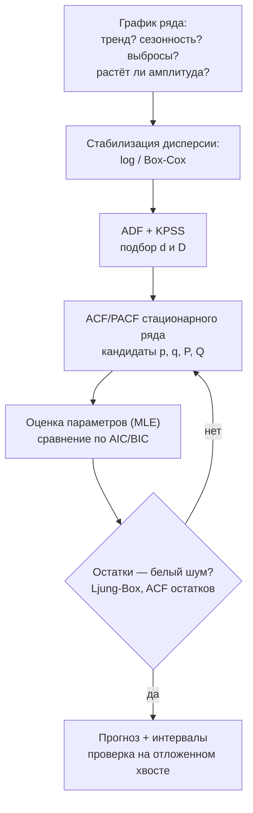
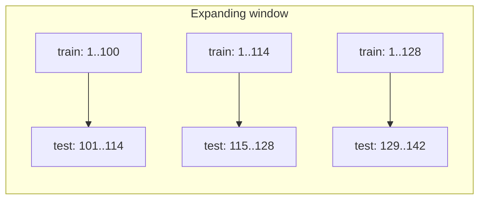

# Временные ряды

> **Зачем эта глава.** Прогнозирование спроса, нагрузки, выручки и оттока — это задачи, где
> обычный `train_test_split` даёт красивую цифру и бесполезную модель. После главы вы будете
> понимать, почему ряд нельзя обрабатывать как таблицу, уметь выводить ARIMA и Хольта-Винтерса
> из постановки задачи, строить ML-пайплайн на лагах без утечек и защищать выбор метрики
> на собеседовании.

**Уровень:** 🎯 middle → 🧠 middle+
**Предварительно нужно:** [теория вероятностей](../01-math/02-probability.md), [статистика](../01-math/03-statistics.md), [валидация и утечки](13-validation-and-leakage.md), [работа с признаками](14-feature-engineering.md), [градиентный бустинг](07-gradient-boosting.md)
**Время на проработку:** ~7 часов (чтение + вывод формул + сборка пайплайна)

---

## Карта главы

- [1. Чем ряд отличается от таблицы](#1-чем-ряд-отличается-от-таблицы) — почему i.i.d. сломан и что из этого следует
- [2. Разложение ряда: тренд, сезонность, остаток](#2-разложение-ряда-тренд-сезонность-остаток) — аддитивная и мультипликативная модели, STL
- [3. Стационарность и тесты](#3-стационарность-и-тесты) — определение, ADF, KPSS, дифференцирование
- [4. ACF и PACF: как читать и как подбирать p, q](#4-acf-и-pacf-как-читать-и-как-подбирать-p-q)
- [5. ARIMA и SARIMA](#5-arima-и-sarima) — вывод компонент, процедура Бокса–Дженкинса
- [6. Экспоненциальное сглаживание и Хольт-Винтерс](#6-экспоненциальное-сглаживание-и-хольт-винтерс)
- [7. ML-подход: лаги, окна, календарь](#7-ml-подход-лаги-окна-календарь)
- [8. Рекурсивная и прямая схемы прогноза](#8-рекурсивная-и-прямая-схемы-прогноза)
- [9. Валидация во времени](#9-валидация-во-времени)
- [10. Метрики: MAE, RMSE, MAPE, sMAPE, MASE](#10-метрики-mae-rmse-mape-smape-mase)
- [11. Prophet и современные подходы](#11-prophet-и-современные-подходы)
- [12. Компромиссы: что выбирать под задачу](#12-компромиссы-что-выбирать-под-задачу)
- [13. Подводные камни](#13-подводные-камни)
- [14. Проверь себя](#14-проверь-себя)
- [15. Практика](#15-практика)
- [16. Что читать дальше](#16-что-читать-дальше)

---

## 1. Чем ряд отличается от таблицы

Возьмём конкретную задачу: магазин продаёт товар, есть ежедневные продажи за три года, нужно
предсказать спрос на 14 дней вперёд, чтобы заказать поставку. Соблазн очевиден: сложить дату
в признаки, натравить CatBoost, отвалидироваться на случайных 20% и радоваться MAPE 8%.

Разберём, что здесь ломается.

**Наблюдения зависимы.** Классический supervised learning стоит на предположении, что пары
$(x_i, y_i)$ независимы и одинаково распределены. Продажи вчера и сегодня зависимы почти всегда:
знание $y_{t-1}$ радикально меняет распределение $y_t$. Именно эта зависимость — не помеха,
а **основной сигнал**: в рядах без внешних регрессоров прогнозировать больше нечем.

**Порядок несёт информацию, а перемешивание её уничтожает.** Если случайно раскидать дни по фолдам,
модель при предсказании 5 марта увидит в обучении 4 и 6 марта. В проде такой роскоши не будет:
там известно только прошлое. Оценка на случайном сплите систематически завышена, и разрыв
достигает разы, а не проценты.

**Распределение меняется со временем.** Тренд, инфляция, рост базы пользователей, смена ассортимента,
пандемия. Обучающая выборка и продовая среда — это не одно распределение, а два разных.

**Мы предсказываем не точку, а горизонт.** Заказ поставки требует прогноза на 14 дней, а не на
завтра. Ошибка на горизонте 14 устроена совсем иначе, чем на горизонте 1, и модель, идеальная
для $h=1$, может быть бесполезна для $h=14$.

> 🌱 **База.** Запомните три вещи, и половина ошибок исчезнет: (1) валидировать только «прошлое →
> будущее»; (2) любой признак должен быть вычислим в момент, когда прогноз реально делается;
> (3) первым делом строить наивный бейзлайн — «завтра будет как сегодня» или «как неделю назад».
> Модель, которая его не бьёт, не нужна.

Введём обозначения на всю главу. Ряд — это последовательность $y_1, y_2, \dots, y_T$, где $t$ —
момент времени, $T$ — длина истории. Горизонт прогноза обозначим $h$, а прогноз, сделанный в момент
$T$ на $h$ шагов вперёд, — $\hat y_{T+h \mid T}$. Если есть внешние признаки (цена, промо, погода),
обозначим их $x_t \in \mathbb{R}^d$. Сквозная нотация хендбука сохраняется: $n$ — число объектов
обучающей выборки (для ML-подхода это число пар «окно → таргет»), $d$ — число признаков,
$\theta$ — параметры модели, $\eta$ — learning rate.

---

## 2. Разложение ряда: тренд, сезонность, остаток

Прежде чем что-то моделировать, ряд полезно разложить на понятные части. Классическая
**аддитивная декомпозиция** (additive decomposition):

$$
y_t \;=\; T_t \;+\; S_t \;+\; R_t
$$

где $T_t$ — трендовая компонента (медленное изменение уровня), $S_t$ — сезонная компонента
с периодом $m$ (для дневных данных с недельной сезонностью $m = 7$, для месячных с годовой $m = 12$),
$R_t$ — остаток (всё, что не объяснено).

Альтернатива — **мультипликативная** (multiplicative decomposition):

$$
y_t \;=\; T_t \cdot S_t \cdot R_t
$$

Выбор между ними не эстетический. Посмотрите на график: если амплитуда сезонных колебаний растёт
вместе с уровнем ряда (в декабре продажи выше на 30%, а не на 300 штук) — модель мультипликативная.
Логарифмирование переводит её в аддитивную:

$$
\log y_t \;=\; \log T_t \;+\; \log S_t \;+\; \log R_t
$$

Это работает только при $y_t > 0$; для рядов с нулями используют $\log(1+y_t)$ и помнят, что
обратное преобразование смещено (об этом в подводных камнях).

На практике для разложения берут **STL** (Seasonal-Trend decomposition using Loess): тренд и
сезонность оцениваются локальной регрессией итеративно. В отличие от классической скользящей
средней, STL допускает медленно меняющуюся сезонность и устойчив к выбросам.

```python
# STL-разложение: смотрим, из чего состоит ряд, ДО того как что-то моделировать
import numpy as np
import pandas as pd
from statsmodels.tsa.seasonal import STL

rng = np.random.default_rng(0)
idx = pd.date_range("2021-01-01", periods=730, freq="D")
t = np.arange(730)
# синтетика: линейный тренд + недельная сезонность + шум
y = 100 + 0.05 * t + 8 * np.sin(2 * np.pi * t / 7) + rng.normal(0, 3, 730)
s = pd.Series(y, index=idx)

# period=7 — недельная сезонность; robust=True гасит влияние выбросов на оценку тренда
res = STL(s, period=7, robust=True).fit()
print("доля дисперсии, объяснённая остатком:",
      round(res.resid.var() / s.var(), 4))   # если ~1, сезонность/тренд не нашлись
print("амплитуда сезонной компоненты:", round(res.seasonal.max() - res.seasonal.min(), 2))
```

Зачем это нужно инженеру, а не аналитику: разложение сразу отвечает на вопросы «есть ли тренд
(значит, бустинг в лоб будет занижать)», «какой период сезонности (значит, какие лаги брать)»
и «насколько велик неустранимый шум (значит, какой MAE вообще достижим)».

> ⚠️ **Типичная ошибка.** Считать, что STL-разложение — это модель прогноза. Оно оценивает
> компоненты **на исторических данных**, используя и прошлое, и будущее относительно каждой точки
> (loess-сглаживание двустороннее). Использовать `res.trend` как признак для обучения — прямая
> утечка из будущего. Разложение — инструмент анализа; для прогноза нужна модель, которая
> продолжает компоненты вперёд.

---

## 3. Стационарность и тесты

### Что это и зачем

Почти вся классическая теория рядов построена на предположении **стационарности** (stationarity).
Причина простая: чтобы оценить, скажем, зависимость $y_t$ от $y_{t-1}$ по одной реализации ряда,
нужно, чтобы эта зависимость была одна и та же на всём протяжении. Если статистические свойства
плывут, усреднять по времени нечего.

Ряд **слабо стационарен** (weakly / covariance stationary), если

$$
\mathbb{E}[y_t] = \mu = \text{const}, \qquad
\operatorname{Var}[y_t] = \sigma^2 = \text{const}, \qquad
\operatorname{Cov}(y_t, y_{t+k}) = \gamma(k) \ \text{ зависит только от } k
$$

где $\mu$ — постоянное среднее, $\sigma^2$ — постоянная дисперсия, $\gamma(k)$ —
автоковариационная функция, $k$ — лаг (сдвиг во времени). Ключевое в третьем условии: ковариация
зависит от **расстояния** между точками, а не от их абсолютного положения.

Строгая стационарность требует неизменности всего совместного распределения при сдвиге; на практике
пользуются слабой, потому что её достаточно для линейных моделей и её можно проверить.

Ряд с трендом не стационарен (среднее растёт). Ряд с сезонностью не стационарен (среднее зависит
от месяца). Ряд с растущей амплитудой не стационарен (дисперсия растёт).

### Два теста, и почему их надо запускать вместе

**ADF** (Augmented Dickey–Fuller). Проверяет наличие **единичного корня** (unit root). Модель теста:

$$
\Delta y_t \;=\; \alpha \;+\; \beta t \;+\; \rho\, y_{t-1} \;+\; \sum_{j=1}^{p} \phi_j \Delta y_{t-j} \;+\; \varepsilon_t
$$

где $\Delta y_t = y_t - y_{t-1}$ — первая разность, $\alpha$ — константа, $\beta t$ — детерминированный
тренд (включается опционально), $\rho$ — ключевой коэффициент, $\phi_j$ — коэффициенты при лагах
разностей (те самые «augmented»-члены, которые убирают автокорреляцию остатков), $p$ — число
таких лагов, $\varepsilon_t$ — белый шум.

- $H_0$: $\rho = 0$ — единичный корень есть, ряд **не** стационарен.
- $H_1$: $\rho < 0$ — ряд стационарен.

Малое p-value → отвергаем $H_0$ → **ряд стационарен**.

**KPSS** (Kwiatkowski–Phillips–Schmidt–Shin). Гипотезы **перевёрнуты**:

- $H_0$: ряд стационарен (вокруг уровня или вокруг тренда).
- $H_1$: есть единичный корень.

Малое p-value → отвергаем $H_0$ → **ряд не стационарен**.

> 💬 **На собеседовании.** Спросят: «Чем ADF отличается от KPSS и зачем нужны оба?»
> Хороший ответ: у них противоположные нулевые гипотезы, поэтому они дают независимые сигналы,
> и их комбинация информативнее любого поодиночке. ADF не отверг $H_0$ — это ещё не доказательство
> нестационарности, это может быть просто нехватка мощности на коротком ряде. Четыре комбинации:
> ADF отверг + KPSS не отверг → уверенно стационарен; ADF не отверг + KPSS отверг → уверенно
> нестационарен, нужно дифференцирование; оба отвергли → противоречие, обычно значит, что ряд
> стационарен вокруг тренда (стоит проверить KPSS в trend-версии или продетрендить); оба не
> отвергли → данных мало, тесты бессильны, решайте по графику и по предметной области.
> Плохой ответ: «ADF проверяет стационарность» — без уточнения направления гипотезы это
> утверждение приводит к прямо противоположному выводу.

```python
from statsmodels.tsa.stattools import adfuller, kpss

def stationarity_report(x, name=""):
    """Запускаем оба теста и печатаем согласованный вывод.

    Тесты имеют противоположные H0, поэтому смотреть надо на пару решений,
    а не на одно p-value.
    """
    adf_p = adfuller(x, autolag="AIC")[1]
    # regression="c" — стационарность вокруг константы; "ct" — вокруг тренда
    kpss_p = kpss(x, regression="c", nlags="auto")[1]
    adf_stat = adf_p < 0.05    # True -> ADF говорит "стационарен"
    kpss_stat = kpss_p > 0.05  # True -> KPSS говорит "стационарен"
    verdict = {
        (True, True): "стационарен",
        (False, False): "нестационарен: нужно дифференцирование",
        (True, False): "противоречие: вероятно, стационарен вокруг тренда",
        (False, True): "противоречие: мало данных или структурный сдвиг",
    }[(adf_stat, kpss_stat)]
    print(f"{name}: ADF p={adf_p:.4f}, KPSS p={kpss_p:.4f} -> {verdict}")

stationarity_report(s.values, "исходный ряд")
stationarity_report(np.diff(s.values), "после d=1")
```

> ⚠️ **Типичная ошибка.** KPSS в `statsmodels` при выходе статистики за табличные границы
> возвращает обрезанное p-value (0.01 или 0.1) и печатает `InterpolationWarning`. Люди видят
> «p = 0.1» и думают «не отвергли, значит стационарен» — на самом деле это значит «p-value
> **не меньше** 0.1, точнее сказать нельзя». Смотреть надо и на саму статистику.

### Дифференцирование

Стандартный способ убрать тренд — взять разности:

$$
\Delta y_t = y_t - y_{t-1}, \qquad \Delta^2 y_t = \Delta(\Delta y_t) = y_t - 2y_{t-1} + y_{t-2}
$$

Порядок дифференцирования $d$ — это то самое «I» в ARIMA. Линейный тренд убирается при $d=1$,
квадратичный — при $d=2$. На практике $d \in \{0, 1, 2\}$; если понадобилось больше, это признак
того, что ряд надо было логарифмировать, а не дифференцировать дальше.

Сезонность убирают **сезонной разностью** с периодом $m$:

$$
\Delta_m y_t = y_t - y_{t-m}
$$

Порядок сезонного дифференцирования обозначают $D$; на практике $D \in \{0, 1\}$.

> ⚠️ **Типичная ошибка.** Дифференцировать «на всякий случай» ещё раз, когда ряд уже стационарен
> (overdifferencing). Это вносит в остатки искусственную MA-структуру, раздувает дисперсию прогноза
> и портит оценку параметров. Признак: после дополнительной разности ACF в лаге 1 резко уходит
> в район $-0.5$, а дисперсия ряда выросла, а не упала.

---

## 4. ACF и PACF: как читать и как подбирать p, q

### Определения

**Автокорреляционная функция** (ACF, autocorrelation function):

$$
\rho(k) \;=\; \frac{\operatorname{Cov}(y_t,\, y_{t-k})}{\operatorname{Var}(y_t)}
\;=\; \frac{\gamma(k)}{\gamma(0)}
$$

где $k$ — лаг, $\gamma(k)$ — автоковариация на лаге $k$, $\gamma(0) = \sigma^2$ — дисперсия ряда.
Значения лежат в $[-1, 1]$; $\rho(0) = 1$ по построению.

Проблема ACF: она измеряет **суммарную** связь, включая транзитивную. Если $y_t$ зависит только
от $y_{t-1}$, то $y_{t-1}$ зависит от $y_{t-2}$, и через эту цепочку $\rho(2)$ тоже окажется
ненулевой — хотя прямой связи между $y_t$ и $y_{t-2}$ нет.

**Частная автокорреляционная функция** (PACF, partial autocorrelation function) убирает
транзитивность: $\alpha(k)$ — это корреляция между $y_t$ и $y_{t-k}$ **после исключения влияния**
всех промежуточных лагов $y_{t-1}, \dots, y_{t-k+1}$. Формально $\alpha(k)$ равен коэффициенту
$\phi_{kk}$ при $y_{t-k}$ в регрессии

$$
y_t = \phi_{k1} y_{t-1} + \phi_{k2} y_{t-2} + \dots + \phi_{kk} y_{t-k} + \varepsilon_t
$$

где $\phi_{kj}$ — коэффициент при лаге $j$ в регрессии порядка $k$, $\varepsilon_t$ — остаток.

> 📐 **Разбор формулы.** Медленно. Чтобы получить PACF на лаге 3, мы строим регрессию $y_t$ сразу
> на три лага и берём коэффициент **при третьем**. Первые два лага в этой регрессии «съедают»
> всё, что объясняется цепочкой, и коэффициент при третьем показывает, добавляет ли третий лаг
> что-то сверх них. Ровно та же логика, что у частной корреляции в обычной статистике.

### Правило подбора p и q

Это классическая таблица Бокса–Дженкинса, и её спрашивают почти всегда.

| Поведение | ACF | PACF | Вывод |
|---|---|---|---|
| AR($p$) | затухает плавно (экспонента или затухающая синусоида) | **обрывается** после лага $p$ | берём $p$ = точка обрыва PACF, $q=0$ |
| MA($q$) | **обрывается** после лага $q$ | затухает плавно | берём $q$ = точка обрыва ACF, $p=0$ |
| ARMA($p,q$) | затухает | затухает | обе обрываются нечётко — подбираем по AIC |
| Нужно дифференцирование | затухает **очень медленно**, почти линейно | $\alpha(1) \approx 1$ | увеличиваем $d$ |

Почему так. Процесс AR($p$) по определению есть $y_t = \sum_{j=1}^{p}\phi_j y_{t-j} + \varepsilon_t$:
прямая связь есть ровно с $p$ последними лагами, поэтому PACF за пределами $p$ равна нулю.
Процесс MA($q$) есть $y_t = \varepsilon_t + \sum_{j=1}^{q}\theta_j\varepsilon_{t-j}$: наблюдения,
разнесённые больше чем на $q$, не делят ни одного общего шока, поэтому ACF за $q$ равна нулю.

«Обрывается» на графике означает «уходит внутрь доверительной полосы $\pm 1.96/\sqrt{T}$», где
$T$ — длина ряда. Эта полоса — приближённый 95%-й интервал для нулевой автокорреляции.

```python
import matplotlib
matplotlib.use("Agg")     # чтобы код работал и без дисплея
import matplotlib.pyplot as plt
from statsmodels.graphics.tsaplots import plot_acf, plot_pacf

d1 = np.diff(s.values)                       # смотрим коррелограммы УЖЕ стационарного ряда
fig, ax = plt.subplots(1, 2, figsize=(13, 4))
plot_acf(d1, lags=30, ax=ax[0])              # обрыв здесь -> порядок q
plot_pacf(d1, lags=30, ax=ax[1], method="ywm")  # обрыв здесь -> порядок p
fig.savefig("acf_pacf.png", dpi=110)
```

> 🧠 **Middle+.** Правило «смотри на обрыв» надёжно работает только на чистых синтетических AR/MA.
> На реальных данных коррелограммы редко выглядят как в учебнике, поэтому в проде порядки
> подбирают перебором по информационному критерию — AIC $= 2k - 2\ln \hat L$ или BIC
> $= k\ln T - 2\ln \hat L$, где $k$ — число оцениваемых параметров, $\hat L$ — максимум
> правдоподобия, $T$ — длина ряда. BIC штрафует сложность сильнее и на длинных рядах выбирает
> более экономные модели. Именно это делает `pmdarima.auto_arima` и `statsmodels`-обёртки:
> ACF/PACF остаются инструментом диагностики и понимания, а не единственным способом выбора.

---

## 5. ARIMA и SARIMA

### Из чего собирается

**AR($p$)** — авторегрессия: текущее значение объясняется своими же прошлыми значениями.

$$
y_t \;=\; c \;+\; \sum_{j=1}^{p} \phi_j\, y_{t-j} \;+\; \varepsilon_t
$$

где $c$ — константа, $\phi_j$ — коэффициент при лаге $j$, $p$ — порядок авторегрессии,
$\varepsilon_t \sim \mathcal{N}(0, \sigma^2)$ — белый шум (независимые одинаково распределённые
ошибки с нулевым средним).

**MA($q$)** — скользящее среднее по **ошибкам**, не по значениям:

$$
y_t \;=\; \mu \;+\; \varepsilon_t \;+\; \sum_{j=1}^{q} \theta_j\, \varepsilon_{t-j}
$$

где $\mu$ — среднее ряда, $\theta_j$ — коэффициент при шоке лага $j$, $q$ — порядок MA.
Интерпретация: система помнит не сами значения, а **неожиданности** — то, что не удалось
предсказать, — и они рассасываются в течение $q$ шагов. Всплеск спроса из-за разовой рекламы —
это шок $\varepsilon_t$, его эхо в следующие дни — это MA-часть.

**I($d$)** — интегрирование: модель применяется не к $y_t$, а к $\Delta^d y_t$, а прогноз потом
кумулятивно суммируется обратно.

Собираем **ARIMA($p,d,q$)**. Через оператор сдвига $B$ (backshift, $B y_t = y_{t-1}$) вся модель
записывается одной строкой:

$$
\underbrace{\Big(1 - \sum_{j=1}^{p}\phi_j B^j\Big)}_{\text{AR-полином } \phi(B)}
\underbrace{(1-B)^d}_{\text{интегрирование}} y_t
\;=\; c \;+\;
\underbrace{\Big(1 + \sum_{j=1}^{q}\theta_j B^j\Big)}_{\text{MA-полином } \theta(B)} \varepsilon_t
$$

где $B^j y_t = y_{t-j}$, $\phi(B)$ — авторегрессионный полином, $\theta(B)$ — полином скользящего
среднего, $(1-B)^d$ — оператор $d$-кратного дифференцирования. Такая запись не украшение:
условие стационарности формулируется как «все корни $\phi(B)=0$ лежат вне единичного круга»,
а условие обратимости MA — как то же самое для $\theta(B)$.

**SARIMA($p,d,q$)($P,D,Q$)$_m$** добавляет те же три компоненты, но на сезонных лагах:

$$
\Phi(B^m)\,\phi(B)\,(1-B^m)^D (1-B)^d\, y_t \;=\; \Theta(B^m)\,\theta(B)\,\varepsilon_t
$$

где $m$ — длина сезона, $\Phi(B^m)$ — сезонный AR-полином порядка $P$, $\Theta(B^m)$ — сезонный
MA-полином порядка $Q$, $D$ — порядок сезонного дифференцирования. Для дневных данных с недельной
сезонностью $m = 7$, для месячных с годовой $m = 12$, для почасовых с суточной $m = 24$.

> ⚠️ **Типичная ошибка.** Пытаться взять $m = 365$ для дневных данных с годовой сезонностью.
> SARIMA с таким $m$ либо не сойдётся, либо будет считаться часами: размерность пространства
> состояний растёт как $m$. Годовую сезонность в дневных данных моделируют не сезонной разностью,
> а **гармониками Фурье** как внешними регрессорами (ARIMAX / «динамическая гармоническая
> регрессия»): пары $\sin(2\pi k t/365.25)$, $\cos(2\pi k t/365.25)$ для $k = 1..K$, где $K$
> обычно 3–10 и подбирается по AIC.

### Процедура Бокса–Дженкинса



Ключевой шаг — диагностика остатков. Если модель захватила всю структуру, остатки должны быть
неотличимы от белого шума. Проверяют тестом Льюнга–Бокса (Ljung–Box):

$$
Q_{LB} = T(T+2)\sum_{k=1}^{K} \frac{\hat\rho^2(k)}{T-k}
$$

где $T$ — длина ряда, $K$ — число проверяемых лагов, $\hat\rho(k)$ — выборочная автокорреляция
остатков на лаге $k$. При $H_0$ («остатки — белый шум») статистика имеет распределение $\chi^2$
с $K - p - q$ степенями свободы. Малое p-value → в остатках осталась структура → модель недоспецифицирована.

```python
from statsmodels.tsa.statespace.sarimax import SARIMAX
from statsmodels.stats.diagnostic import acorr_ljungbox

train, test = s.iloc[:-28], s.iloc[-28:]

# (1,0,1) по тренду + (1,1,1) по недельной сезонности
model = SARIMAX(train, order=(1, 0, 1), seasonal_order=(1, 1, 1, 7),
                trend="t",                      # линейный детерминированный тренд
                enforce_stationarity=False)     # даём оптимизатору свободу; иначе часто не сходится
fit = model.fit(disp=False)

lb = acorr_ljungbox(fit.resid[10:], lags=[14], return_df=True)  # первые точки выкидываем: там прогрев
print("Ljung-Box p =", round(float(lb["lb_pvalue"].iloc[0]), 4))  # >0.05 -> остатки похожи на шум

fc = fit.get_forecast(steps=28)
pred = fc.predicted_mean
ci = fc.conf_int(alpha=0.05)     # доверительный интервал — то, чего почти не даёт ML-подход
print("MAE:", round(np.mean(np.abs(pred.values - test.values)), 3))
```

> 💬 **На собеседовании.** Спросят: «Когда вы возьмёте SARIMA, а не бустинг?»
> Хороший ответ через условия: один ряд или десятки, история 3–10 сезонов, нужны честные
> доверительные интервалы, нужна интерпретируемость («вклад тренда столько-то, сезонности
> столько-то»), нет богатых внешних признаков. Как только рядов тысячи, а объяснять надо
> промо, ценами, погодой и остатками на складе — выигрывает одна глобальная ML-модель
> на всех рядах сразу. Плохой ответ: «ARIMA устарела» — она остаётся сильным бейзлайном
> и регулярно бьёт нейросети на коротких рядах, что показали соревнования M-серии.

---

## 6. Экспоненциальное сглаживание и Хольт-Винтерс

ARIMA моделирует ряд через корреляции. Экспоненциальное сглаживание идёт с другой стороны:
явно описывает **состояние** ряда (уровень, тренд, сезонность) и правило его обновления.
Этот класс методов на удивление конкурентоспособен: в соревнованиях M3 и M4 варианты
экспоненциального сглаживания стабильно попадали в верхнюю часть таблицы.

### Простое экспоненциальное сглаживание (SES)

Идея: прогноз — взвешенное среднее прошлых наблюдений, где веса убывают экспоненциально.

$$
\hat y_{T+1 \mid T} \;=\; \alpha y_T + \alpha(1-\alpha) y_{T-1} + \alpha(1-\alpha)^2 y_{T-2} + \dots
$$

где $\alpha \in (0,1)$ — параметр сглаживания. Сумма весов $\alpha\sum_{j\ge 0}(1-\alpha)^j = 1$,
то есть это корректное взвешенное среднее.

Эту бесконечную сумму удобно свернуть в рекуррентную форму. Обозначим уровень $\ell_t$:

$$
\ell_t \;=\; \alpha y_t \;+\; (1-\alpha)\,\ell_{t-1},
\qquad
\hat y_{t+h \mid t} \;=\; \ell_t \quad \text{для любого } h \ge 1
$$

где $\ell_t$ — оценка текущего уровня ряда, $\alpha$ — вес нового наблюдения.

> 📐 **Разбор формулы.** Развернём рекурсию на два шага:
> $\ell_t = \alpha y_t + (1-\alpha)[\alpha y_{t-1} + (1-\alpha)\ell_{t-2}] =
> \alpha y_t + \alpha(1-\alpha) y_{t-1} + (1-\alpha)^2 \ell_{t-2}$. Продолжая, получаем ровно
> исходную бесконечную сумму. Практический смысл $\alpha$: при $\alpha \to 1$ модель верит только
> последнему наблюдению (реагирует мгновенно, но шумит), при $\alpha \to 0$ — почти не обновляется
> (гладко, но с запаздыванием). Это тот же компромисс bias–variance, только во времени.
> Обратите внимание на вторую формулу: **прогноз плоский**. SES не умеет тренда вообще —
> на любой горизонт он выдаёт одно и то же число.

### Метод Хольта: добавляем тренд

Плоский прогноз — очевидный дефект. Хольт добавил вторую компоненту состояния — наклон $b_t$:

$$
\begin{aligned}
\ell_t &= \alpha y_t + (1-\alpha)(\ell_{t-1} + b_{t-1}) \\[2pt]
b_t &= \beta(\ell_t - \ell_{t-1}) + (1-\beta) b_{t-1} \\[2pt]
\hat y_{t+h \mid t} &= \ell_t + h\, b_t
\end{aligned}
$$

где $b_t$ — оценка наклона (прирост за один шаг), $\beta \in (0,1)$ — параметр сглаживания тренда,
$h$ — горизонт. Первая строка: обновляя уровень, мы сравниваем новое наблюдение не со старым
уровнем, а со старым уровнем **плюс ожидаемый прирост**. Вторая: новый наклон — сглаженная смесь
свежего наблюдённого прироста $(\ell_t - \ell_{t-1})$ и старого наклона.

Проблема: линейный тренд, продлённый на 24 месяца, даёт абсурд. Поэтому на практике почти всегда
берут **затухающий тренд** (damped trend) с параметром $\varphi \in (0,1]$:

$$
\hat y_{t+h \mid t} = \ell_t + (\varphi + \varphi^2 + \dots + \varphi^h)\, b_t
$$

Сумма геометрической прогрессии сходится, и прогноз выходит на асимптоту
$\ell_t + \frac{\varphi}{1-\varphi} b_t$ вместо бесконечного роста. Типичное $\varphi \in [0.8, 0.98]$.
Демпфирование — одна из тех мелочей, которые дают заметный прирост на длинных горизонтах почти
бесплатно.

### Хольт-Винтерс: добавляем сезонность

Третья компонента состояния — сезонные индексы $s_t$. Аддитивный вариант:

$$
\begin{aligned}
\ell_t &= \alpha\,(y_t - s_{t-m}) + (1-\alpha)(\ell_{t-1} + b_{t-1}) \\[2pt]
b_t &= \beta\,(\ell_t - \ell_{t-1}) + (1-\beta)\, b_{t-1} \\[2pt]
s_t &= \gamma\,(y_t - \ell_{t-1} - b_{t-1}) + (1-\gamma)\, s_{t-m} \\[2pt]
\hat y_{t+h \mid t} &= \ell_t + h\,b_t + s_{t + h - m\lceil h/m \rceil}
\end{aligned}
$$

где $s_t$ — сезонный индекс момента $t$, $m$ — длина сезона, $\gamma \in (0,1)$ — параметр
сглаживания сезонности, $\lceil \cdot \rceil$ — округление вверх.

> 📐 **Разбор формулы.** Первая строка: чтобы обновить уровень, из наблюдения **вычитают** сезонный
> индекс годичной/недельной давности — то есть десезонализируют его. Третья строка: сезонный индекс
> обновляется по тому, насколько наблюдение отклонилось от «уровень + тренд». Последняя строка:
> индекс $t + h - m\lceil h/m\rceil$ — это способ сказать «возьми сезонный индекс того же места
> в сезоне из последнего полного цикла». Для $m=7$, $h=3$: $\lceil 3/7 \rceil = 1$, индекс
> равен $t - 4$ — тот же день недели, что и прогнозируемый.

Мультипликативный вариант получается заменой вычитания на деление: $\ell_t = \alpha (y_t / s_{t-m}) + \dots$
Он нужен, когда сезонная амплитуда пропорциональна уровню.

Всё семейство систематизировано как **ETS** (Error, Trend, Seasonal): три буквы кодируют тип
ошибки (A/M), тренда (N/A/Ad) и сезонности (N/A/M) — например, ETS(A,Ad,M). У ETS есть строгая
формулировка через модели пространства состояний, что даёт правдоподобие, AIC и доверительные
интервалы.

```python
from statsmodels.tsa.holtwinters import ExponentialSmoothing

hw = ExponentialSmoothing(
    train,
    trend="add", damped_trend=True,   # затухание почти всегда улучшает длинный горизонт
    seasonal="add", seasonal_periods=7,
    initialization_method="estimated",
).fit()                                # параметры alpha, beta, gamma, phi подбираются по MLE

pred_hw = hw.forecast(28)
print("alpha=%.3f beta=%.3f gamma=%.3f phi=%.3f" % (
    hw.params["smoothing_level"], hw.params["smoothing_trend"],
    hw.params["smoothing_seasonal"], hw.params["damping_trend"]))
print("MAE Holt-Winters:", round(np.mean(np.abs(pred_hw.values - test.values)), 3))
```

---

## 7. ML-подход: лаги, окна, календарь

Классические модели работают с одним рядом. Реальная задача чаще звучит иначе: 50 000 SKU в
300 магазинах, известны цены, промо, остатки, праздники. Здесь выигрывает **глобальная модель**
(global model): одна модель обучается на всех рядах сразу, и задача сводится к обычной табличной
регрессии.

Переход делается через построение матрицы «признаки → таргет» из истории.

### Три семейства признаков

**Лаги.** Значения ряда со сдвигом: $y_{t-1}, y_{t-7}, y_{t-14}, y_{t-28}, y_{t-364}$.
Выбор лагов не произволен: берут лаги, соответствующие пикам ACF, и обязательно лаги, кратные
сезону. Критично: **минимальный лаг определяется горизонтом**. Если прогноз строится на $h$ шагов
вперёд одной моделью, лаг $y_{t-1}$ для момента $t+h$ недоступен — в момент прогноза его ещё
не существует. Доступны лаги $\ge h$.

**Скользящие статистики.** Среднее, медиана, std, min/max, квантили по окну; экспоненциально
взвешенное среднее. Окно всегда сдвигается на тот же минимальный лаг.

**Календарь.** День недели, номер недели/месяца, флаг выходного, флаг праздника (с окнами
«за N дней до» и «N дней после»), номер дня в месяце (зарплатные пики), циклические кодировки
$\sin(2\pi \cdot \text{dow}/7)$, $\cos(2\pi \cdot \text{dow}/7)$ — последнее нужно линейным
моделям и нейросетям, деревьям достаточно обычного целого.

```python
def make_features(df, horizon, lags=(7, 14, 28, 364), windows=(7, 28, 91)):
    """Матрица признаков для ПРЯМОГО прогноза на horizon шагов вперёд.

    Все лаги и окна сдвинуты минимум на horizon: в момент, когда мы делаем
    прогноз на t+horizon, значения y за последние horizon шагов ещё неизвестны.
    Это главный источник утечек в задачах на ряды.
    """
    out = df.copy().sort_values(["series_id", "date"])
    g = out.groupby("series_id")["y"]

    for lag in lags:
        if lag < horizon:
            continue                       # такой лаг физически недоступен — пропускаем
        out[f"lag_{lag}"] = g.shift(lag)

    base = g.shift(horizon)                # опорный сдвиг для всех окон
    for w in windows:
        out[f"roll_mean_{w}"] = base.groupby(out["series_id"]).transform(
            lambda x: x.rolling(w, min_periods=max(2, w // 3)).mean())
        out[f"roll_std_{w}"] = base.groupby(out["series_id"]).transform(
            lambda x: x.rolling(w, min_periods=max(2, w // 3)).std())

    # отношение короткого окна к длинному: безразмерный признак «ускоряется или замедляется»
    out["trend_ratio"] = out["roll_mean_7"] / (out["roll_mean_91"] + 1e-6)

    dt = pd.to_datetime(out["date"])
    out["dow"] = dt.dt.dayofweek
    out["day"] = dt.dt.day
    out["month"] = dt.dt.month
    out["is_weekend"] = (out["dow"] >= 5).astype(int)
    out["week_of_year"] = dt.dt.isocalendar().week.astype(int)
    return out
```

> 🧠 **Middle+.** У глобальной модели есть нетривиальный плюс, за который её и любят: она
> **переносит знание между рядами**. Новый SKU без истории получает разумный прогноз, потому что
> модель выучила общие закономерности («перед праздником спрос растёт», «в понедельник провал»)
> на тысячах других рядов. Классическая модель на новом ряде просто не обучится. Плата — рядам
> нужна сопоставимость масштаба: товар с продажами 10 000/день и товар с 3/день в одной MSE-задаче
> конфликтуют, и второй будет полностью проигнорирован. Лечится нормировкой таргета на среднее
> ряда, обучением на $\log(1+y)$, взвешиванием объектов или Tweedie/Poisson-функцией потерь.

> ⚠️ **Типичная ошибка.** Использовать `rolling(...).mean()` без предварительного `shift`.
> Окно в pandas по умолчанию **включает текущую точку**, то есть в признак попадает сам таргет.
> Симптом: R² на валидации 0.999, в проде — мусор. Правило: сначала `shift(horizon)`, потом
> `rolling`. И тот же код должен использоваться для трейна и для инференса — иначе получите
> train/serve skew.

---

## 8. Рекурсивная и прямая схемы прогноза

Нужен прогноз на 14 дней. Есть два принципиально разных способа.

**Рекурсивная схема** (recursive / iterated). Обучаем **одну** модель на горизонт 1 шаг.
Прогнозируем $t+1$, подставляем предсказание как «наблюдение» и прогнозируем $t+2$, и так далее.

$$
\hat y_{T+1} = f(y_T, y_{T-1}, \dots), \qquad
\hat y_{T+2} = f(\hat y_{T+1}, y_T, \dots), \qquad \dots
$$

**Прямая схема** (direct). Обучаем **$h$ моделей**, каждая предсказывает свой горизонт напрямую
из данных, доступных в момент прогноза:

$$
\hat y_{T+k} = f_k(y_T, y_{T-1}, \dots), \qquad k = 1, \dots, h
$$

| Свойство | Рекурсивная | Прямая |
|---|---|---|
| Число моделей | 1 | $h$ (или одна с горизонтом как признаком) |
| Стоимость обучения | низкая | в $h$ раз выше |
| Накопление ошибки | **есть**: ошибка шага $k$ входит во вход шага $k+1$ | нет: каждая модель видит только реальные данные |
| Смещение | растёт с горизонтом (модель ест собственные предсказания — распределение входов смещается) | не накапливается |
| Дисперсия оценки | ниже (одна модель, все данные) | выше (каждая модель учится на своём срезе) |
| Доступные лаги | все, включая лаг 1 | только лаги $\ge k$ — информации меньше |
| Согласованность прогнозов | траектория гладкая | горизонты могут «прыгать» друг относительно друга |

> 💬 **На собеседовании.** Спросят: «Как будете прогнозировать на 30 дней вперёд — одной моделью
> или тридцатью?»
> Хороший ответ: это выбор между накоплением ошибки и потерей информации о ближних лагах.
> Рекурсивная схема дёшева и использует лаг 1, но её ошибка растёт нелинейно, потому что модель
> начинает получать на вход собственные предсказания — вход уходит из распределения обучения.
> Прямая схема не накапливает ошибку, но для горизонта 30 у неё нет лагов ближе 30-го, и на
> дальних горизонтах она часто вырождается в «предсказать среднее». На практике берут гибриды:
> одна модель с признаком `horizon` (экономит обучение и делит статистику между горизонтами),
> DirRec (прямая схема, но каждая следующая модель видит предсказания предыдущих) или
> multi-output модель, предсказывающую весь вектор из $h$ значений сразу — так делают N-BEATS
> и большинство нейросетевых архитектур. Плохой ответ: назвать один способ и не упомянуть
> компромисс.

> ⌨️ **Руками.** Возьмите ряд из раздела 2, обучите LightGBM на горизонт 1 и сравните две схемы
> на горизонте 14: рекурсивную и прямую (14 моделей). Постройте график MAE по горизонту
> $k = 1..14$ для обеих. Вы увидите, как кривые пересекаются: на малых $k$ выигрывает
> рекурсивная, на больших — прямая. Точка пересечения зависит от шума в ряде — это и есть
> ответ на вопрос «какую схему брать».

---

## 9. Валидация во времени

Правило одно: **обучающая часть всегда строго раньше проверочной**. Всё остальное — детали
реализации этого правила.

**Rolling origin** (он же walk-forward, он же time series cross-validation): фиксируем несколько
точек отсечки, для каждой обучаемся на всём, что до неё, и проверяемся на следующих $h$ точках.



Два варианта окна обучения:

- **Expanding window** — обучающая часть растёт. Берут, когда данных мало и старая история
  всё ещё релевантна.
- **Sliding window** — обучающая часть фиксированной длины и едет вперёд. Берут, когда
  распределение заметно меняется и старые данные скорее вредят, чем помогают.

**Gap (эмбарго).** Между train и test оставляют разрыв, если признаки используют окна,
захватывающие будущее относительно точки отсечки, или если таргет становится известен с
задержкой. Пример: таргет «вернулся ли клиент в течение 30 дней» — последние 30 дней истории
имеют неизвестный таргет, и между обучением и тестом нужен разрыв в 30 дней, иначе будет утечка.

```python
from sklearn.model_selection import TimeSeriesSplit

# gap задаётся в наблюдениях; для панельных данных сначала группируйте по дате
tscv = TimeSeriesSplit(n_splits=5, test_size=14, gap=7)
for fold, (tr_idx, va_idx) in enumerate(tscv.split(s.values)):
    print(f"fold {fold}: train [{tr_idx[0]}..{tr_idx[-1]}], "
          f"valid [{va_idx[0]}..{va_idx[-1]}]")
```

Несколько практических уточнений, которые отличают рабочую схему от учебной.

**Число фолдов и их репрезентативность.** Пять фолдов подряд в летние месяцы ничего не скажут
о качестве в декабре. Если сезонность сильная, фолды должны покрывать разные фазы сезона,
а лучше — включать сопоставимый период прошлого года.

**Валидационный горизонт равен продовому.** Если в проде вы строите прогноз на 14 дней раз в
неделю, валидируйтесь именно так: отсечки через 7 дней, тест — 14 дней. Оценка на горизонте 1,
когда в проде нужен 14, — самообман.

**Панельные данные режем по дате, а не по строкам.** Если в датасете 50 000 рядов, `TimeSeriesSplit`
по индексу строк перемешает ряды и даты. Отсечку задаём по календарной дате: всё, что до неё, —
train, всё после — valid, для всех рядов одновременно.

> ⚠️ **Типичная ошибка.** Подбирать гиперпараметры по последнему фолду и на нём же отчитываться
> о качестве. Число итераций бустинга и параметры — такие же объекты подбора, как и всё
> остальное. Нужны три уровня: обучение → валидация для подбора → финальный holdout
> из самого свежего куска, который вы смотрите **один раз**. Подробнее — в главе
> [валидация и утечки](13-validation-and-leakage.md).

---

## 10. Метрики: MAE, RMSE, MAPE, sMAPE, MASE

Обозначения: $y_t$ — факт, $\hat y_t$ — прогноз, $e_t = y_t - \hat y_t$ — ошибка, $H$ — число
точек, по которым считаем метрику (обычно длина тестового горизонта, просуммированная по рядам).

**MAE** (Mean Absolute Error):

$$
\mathrm{MAE} = \frac{1}{H}\sum_{t=1}^{H} |e_t|
$$

Минимизируется **медианой** условного распределения. Если бизнес несёт линейные потери от
ошибки в обе стороны — это правильная метрика. Не сравнима между рядами разного масштаба.

**RMSE** (Root Mean Squared Error):

$$
\mathrm{RMSE} = \sqrt{\frac{1}{H}\sum_{t=1}^{H} e_t^2}
$$

Минимизируется **средним**. Штрафует крупные промахи сильнее — брать, когда одна большая ошибка
хуже, чем много мелких (например, срыв поставки). Чувствительна к выбросам.

**MAPE** (Mean Absolute Percentage Error):

$$
\mathrm{MAPE} = \frac{100\%}{H}\sum_{t=1}^{H} \left|\frac{e_t}{y_t}\right|
$$

Безразмерна, поэтому её любит бизнес: «ошибаемся на 8%» понятно всем. И у неё три серьёзных
дефекта, которые обязательно надо назвать на собеседовании:

1. **Не определена при $y_t = 0$** и взрывается при малых $y_t$. Для прерывистого спроса
   (intermittent demand), где половина дней — нули, MAPE бесполезна.
2. **Асимметрична.** Занижение ограничено: при $\hat y_t = 0$ вклад ровно 100%. Завышение
   не ограничено ничем: при $y_t=1, \hat y_t=5$ вклад 400%. Оптимизируя MAPE, модель
   систематически **занижает** прогноз.
3. **Несопоставима между рядами** с разным средним уровнем: ряд со средним 3 даёт огромный MAPE
   при той же абсолютной точности, что ряд со средним 3000.

**sMAPE** (symmetric MAPE) — попытка починить асимметрию:

$$
\mathrm{sMAPE} = \frac{100\%}{H}\sum_{t=1}^{H} \frac{|e_t|}{(|y_t| + |\hat y_t|)/2}
$$

Симметрии в строгом смысле она не даёт: при $y_t=100,\hat y_t=110$ получаем 9.52%, а при
$y_t=100,\hat y_t=90$ — 10.53%. Знаменатель тоже может обнулиться. Границы: $[0\%, 200\%]$.
sMAPE стоит знать, потому что на ней считались соревнования M3/M4, но выбирать её как основную
метрику особых причин нет.

**MASE** (Mean Absolute Scaled Error) — метрика, которую стоит сделать основной:

$$
\mathrm{MASE} = \frac{\frac{1}{H}\sum_{t=1}^{H} |e_t|}
{\frac{1}{T-m}\sum_{t=m+1}^{T} |y_t - y_{t-m}|}
$$

где числитель — MAE прогноза на тесте, знаменатель — MAE **наивного сезонного прогноза**
(«будет как $m$ шагов назад»), посчитанный **на обучающей выборке**; $T$ — длина обучающей
части, $m$ — период сезонности ($m=1$ даёт несезонный наивный прогноз).

> 📐 **Разбор формулы.** Знаменатель — это масштаб, характерный для конкретного ряда:
> насколько ряд вообще меняется от сезона к сезону. Деление на него делает метрику
> безразмерной и **сравнимой между рядами**, при этом не деля на $y_t$ — значит, нули
> в ряде не ломают ничего. Интерпретация прямая: MASE $< 1$ — модель лучше наивного
> сезонного прогноза; MASE $= 0.7$ — ошибка на 30% меньше наивной; MASE $> 1$ — модель
> хуже, чем «повторить прошлую неделю», и её не надо катить в прод.

```python
def mase(y_true, y_pred, y_train, m=7):
    """MASE: MAE прогноза, поделённый на MAE сезонного наивного на трейне.

    Знаменатель считается ТОЛЬКО по обучающей части — иначе метрика зависит
    от тестовых данных и перестаёт быть честной при сравнении моделей.
    """
    y_true, y_pred, y_train = map(np.asarray, (y_true, y_pred, y_train))
    naive_mae = np.mean(np.abs(y_train[m:] - y_train[:-m]))
    if naive_mae == 0:                      # константный ряд: масштабировать не на что
        return np.nan
    return np.mean(np.abs(y_true - y_pred)) / naive_mae


def wape(y_true, y_pred):
    """WAPE (weighted MAPE): сумма модулей ошибок / сумма фактов.

    В отличие от MAPE, устойчива к нулям и агрегируется по портфелю рядов
    так, как это понимает бизнес: «мы промахнулись на X% от общего объёма».
    """
    y_true, y_pred = np.asarray(y_true), np.asarray(y_pred)
    return np.sum(np.abs(y_true - y_pred)) / max(np.sum(np.abs(y_true)), 1e-9)


print("MASE SARIMA:", round(mase(test.values, pred.values, train.values, m=7), 3))
print("MASE Holt-Winters:", round(mase(test.values, pred_hw.values, train.values, m=7), 3))
print("WAPE SARIMA:", round(wape(test.values, pred.values), 4))
```

> 💬 **На собеседовании.** Спросят: «Бизнес требует MAPE. Ваши действия?»
> Хороший ответ: не спорить с отчётностью, но не оптимизировать по ней. Объяснить, что MAPE
> асимметрична и толкает модель занижать прогноз — а в задаче пополнения склада занижение стоит
> дороже завышения, потому что это упущенные продажи. Предложить: для отчётности перед бизнесом —
> WAPE (сумма ошибок / сумма фактов), она интерпретируется так же в процентах, но не ломается
> на нулях и агрегируется по портфелю; для внутреннего сравнения моделей — MASE, потому что она
> сопоставима между рядами; для обучения — функция потерь, отражающая реальную асимметрию
> стоимости (пинбол-лосс на нужном квантиле, если недопоставка дороже перезапаса в $k$ раз).
> Плохой ответ: «MAPE плохая метрика» — и всё, без предложения альтернативы и без учёта того,
> что бизнесу нужна понятная цифра.

---

## 11. Prophet и современные подходы

**Prophet** (Taylor & Letham, Facebook, 2017) — не модель ряда в статистическом смысле, а
**регрессия по времени** с явными интерпретируемыми компонентами:

$$
y_t \;=\; g(t) \;+\; s(t) \;+\; h(t) \;+\; \varepsilon_t
$$

где $g(t)$ — тренд (кусочно-линейный с автоматически подбираемыми точками излома changepoints,
либо логистический с насыщением), $s(t)$ — сезонность рядами Фурье (несколько периодов
одновременно: недельная + годовая), $h(t)$ — эффекты праздников с настраиваемыми окнами
до и после, $\varepsilon_t$ — шум.

Сильные стороны честно перечисляются авторами: работает с пропусками и нерегулярной сеткой,
устойчив к выбросам, легко принимает список праздников, даёт интерпретируемое разложение
и разумные дефолты для аналитика без опыта в рядах. Слабые: почти не использует автокорреляцию
остатков (в отличие от ARIMA, он не «помнит» вчерашнюю ошибку), склонен к переподгонке
changepoints на шумных рядах и проигрывает бустингу там, где важны внешние признаки.
Независимые сравнения на M-соревнованиях показывают Prophet заметно ниже топа — воспринимайте
его как быстрый интерпретируемый бейзлайн, а не как цель.

Что происходит дальше:

- **Нейросетевые модели для панелей рядов.** DeepAR (авторегрессионный RNN, предсказывающий
  параметры распределения), N-BEATS (стек полносвязных блоков с базисным разложением на тренд
  и сезонность), Temporal Fusion Transformer (внимание + отдельная обработка статических,
  известных заранее и наблюдаемых признаков). Все они обучаются на **множестве** рядов сразу
  и на одном ряде смысла не имеют.
- **Отрезвляющий результат.** Работа «Are Transformers Effective for Time Series Forecasting?»
  показала, что простая линейная модель (DLinear) бьёт целый ряд трансформерных архитектур на
  стандартных бенчмарках — то есть заявленный прогресс частично объяснялся протоколом сравнения.
  Это ровно та осторожность, которую стоит демонстрировать на собеседовании.
- **Foundation-модели для рядов** (предобученные на миллионах рядов, применяемые zero-shot).
  Направление живое, но в проде пока нишевое: их выигрыш обычно виден на коротких рядах без
  внешних признаков.

Практический вывод, устойчивый уже лет десять: на табличных задачах прогнозирования с богатыми
внешними признаками и тысячами рядов **градиентный бустинг на правильно построенных лагах
остаётся сильнейшим бейзлайном при вменяемой стоимости**, и победители соревнований M5
(розничные продажи Walmart) это подтвердили. Нейросети выигрывают, когда рядов очень много,
они похожи друг на друга и нужен длинный горизонт.

---

## 12. Компромиссы: что выбирать под задачу

| Условия задачи | Разумный выбор | Почему |
|---|---|---|
| 1–50 рядов, история 3+ сезона, нужны интервалы | SARIMA / ETS | статистическая модель даёт правдоподобие и честные доверительные интервалы |
| Ряд короткий (< 2 сезонов) | наивный сезонный, SES, простое среднее | сложная модель не на чем обучиться, переобучится на шуме |
| Тысячи рядов + внешние признаки (цена, промо, остатки) | бустинг, одна глобальная модель | переносит знание между рядами, естественно ест признаки, тянет холодный старт |
| Прерывистый спрос (много нулей) | Croston, Tweedie-регрессия, квантильные модели | MSE-модель предскажет дробное среднее там, где спрос целочисленный и редкий |
| Нужны кванти­ли (уровень сервиса 95%) | квантильный бустинг, DeepAR, ETS с интервалами | точечный прогноз не отвечает на вопрос «сколько заказать, чтобы не сорвать поставку в 95% случаев» |
| Десятки тысяч похожих рядов, длинный горизонт | N-BEATS / TFT / DeepAR | нейросеть окупает свою цену только при большом объёме однородных данных |
| Нужна интерпретация для бизнеса, аналитик без опыта | Prophet, STL + ETS | явные компоненты «тренд / сезонность / праздники», которые можно показать |
| Сильный внешний шок (промо, локдаун, редизайн) | модель + явный регрессор события | иначе шок уедет в остатки и испортит оценку сезонности |

> 🌱 **База.** Порядок действий на новой задаче, который почти никогда не подводит:
> (1) построить график; (2) посчитать наивный сезонный прогноз и запомнить его MAE — это ваш
> ноль; (3) собрать честную схему валидации во времени; (4) ETS или SARIMA как первый бейзлайн;
> (5) бустинг на лагах, если есть внешние признаки; (6) сравнить по MASE. Всё, что не бьёт
> шаг (2), выкидывается независимо от того, сколько времени на него потрачено.

---

## 13. Подводные камни

**Утечка через скользящее окно.**
Симптом: метрика на валидации в разы лучше продовой, ошибка почти нулевая на всех горизонтах.
Причина: `rolling()` без `shift()` включает текущую точку; или агрегат посчитан по всему датасету
до сплита; или признак вроде «средние продажи товара за год» посчитан по полной истории,
включая будущее.
Что делать: все признаки строить функцией от истории до момента прогноза; тестировать это
явно — построить фичи для даты $t$ на полном датасете и на обрезанном до $t$ и сверить.

**Прогноз на 14 дней с лагом 1 в признаках.**
Симптом: офлайн-метрика отличная, в проде модель падает с ошибкой «признак отсутствует» или
получает NaN.
Причина: горизонт в валидации был 1, а в проде 14; лаги 1..13 в момент реального прогноза
ещё не существуют.
Что делать: строить признаки параметризованно от `horizon` (см. код в разделе 7) и валидироваться
на том же горизонте, что в проде.

**Обратное преобразование логарифма даёт смещённый прогноз.**
Симптом: модель обучена на $\log(1+y)$, метрики в лог-пространстве хорошие, а после
`np.expm1` прогноз систематически ниже факта.
Причина: $\mathbb{E}[e^{Z}] \ne e^{\mathbb{E}[Z]}$ (неравенство Йенсена). Экспонента от среднего
логарифма — это геометрическое среднее, а оно меньше арифметического. Обратное преобразование
даёт **медиану**, а не среднее.
Что делать: либо применять поправку $\hat y = \exp(\hat\mu + \hat\sigma^2/2)$ для логнормального
случая, либо сразу обучать модель с Poisson/Tweedie-функцией потерь на исходной шкале, либо
осознанно принять, что вы прогнозируете медиану (для MAE-задач это даже правильно).

**Праздники и «сдвигающиеся» даты.**
Симптом: модель стабильно ошибается на Пасхе, китайском Новом годе, Чёрной пятнице.
Причина: эти события не привязаны к фиксированной календарной дате, поэтому лаг 364 и признак
«день года» их не ловят.
Что делать: явный календарь событий с окнами до/после; признак «дней до ближайшего праздника»;
для регулярных дат — отдельный флаг, а не надежда на сезонность.

**Ретроспективный пересчёт истории.**
Симптом: модель, отлично работавшая на бэктесте, в проде хуже; расхождение стабильное.
Причина: исторические данные в хранилище пересчитаны задним числом (возвраты, отмены, корректировки
выручки), а в момент прогноза были доступны «сырые» значения. Классический пример нарушения
point-in-time correctness.
Что делать: хранить снимки данных на момент прогноза либо признак «версия данных»; при
бэктесте использовать те значения, которые были известны тогда. См.
[данные и feature store](../07-mlops/03-data-and-feature-store.md).

**Бустинг не экстраполирует тренд.**
Симптом: прогноз растущего ряда упирается в потолок последних наблюдений и уходит в горизонталь.
Причина: дерево выдаёт константу в листе; за пределами диапазона обучающих значений новых
значений взяться неоткуда.
Что делать: прогнозировать не уровень, а разность или отношение к скользящему среднему;
либо гибрид «линейная модель тренда + бустинг на её остатках»; либо явно передавать
десезонализированный/детрендированный таргет.

**Смена гранулярности и часовых поясов.**
Симптом: странные провалы в один день в году, дубли или пропуски в почасовых данных.
Причина: переход на летнее время, високосный год, агрегация в UTC при бизнес-логике в местном
времени.
Что делать: фиксировать таймзону явно на входе в пайплайн, ресемплить с явным `freq` и
проверять, что в ряде нет пропусков календарных точек.

---

## 14. Проверь себя

<details>
<summary><b>🌱 Вопрос.</b> Почему нельзя валидировать модель прогнозирования обычным K-fold?</summary>

**Короткий ответ.** Потому что случайное перемешивание даёт модели доступ к будущему: при
предсказании точки $t$ в обучающей части оказываются точки $t+1, t+2, \dots$, которых в проде
не существует. Оценка получается систематически завышенной.

**Развёрнуто.** Есть два независимых механизма завышения. Первый — прямой: соседние точки ряда
сильно коррелированы, и знание $y_{t+1}$ почти полностью определяет $y_t$. Второй — через
признаки: скользящие статистики, кодировки категорий, нормировки, посчитанные по всей выборке,
переносят информацию из будущих фолдов. Правильная схема — rolling origin: несколько точек
отсечки, обучение строго на прошлом, проверка на следующих $h$ точках, при необходимости
с зазором (gap) между ними.

**Чего ждёт интервьюер:** что вы назовёте оба механизма — и зависимость наблюдений, и утечку
через препроцессинг, — а не ограничитесь «данные упорядочены».

**Провал:** «K-fold можно, если shuffle=False» — это не решает проблему признаков и всё ещё
позволяет обучаться на будущем в фолдах, идущих раньше.
</details>

<details>
<summary><b>🎯 Вопрос.</b> Что такое стационарность и зачем она нужна?</summary>

**Короткий ответ.** Слабая стационарность — постоянство среднего и дисперсии и зависимость
ковариации только от лага, а не от абсолютного времени. Нужна потому, что оценивать параметры
модели мы можем только усреднением по времени, а это законно, если свойства ряда не меняются.

**Развёрнуто.** У нас одна реализация процесса, а не ансамбль. Оценка $\hat\rho(k)$ по этой одной
траектории имеет смысл, только если $\rho(k)$ одинакова на всём протяжении. Если есть тренд,
среднее плывёт, и выборочная автокорреляция будет близка к единице на всех лагах просто из-за
тренда — сигнала о структуре в ней не останется. Практическое следствие: ARIMA требует
стационарности после $d$-кратного дифференцирования; ETS и ML-подход формально её не требуют
(тренд и сезонность моделируются явно), но там появляется своя проблема — экстраполяция.

**Чего ждёт интервьюер:** понимания причины требования, а не заученного определения.

**Провал:** «стационарность — это когда график горизонтальный». Ряд может колебаться и быть
стационарным; может быть плоским визуально и нестационарным по дисперсии.
</details>

<details>
<summary><b>🎯 Вопрос.</b> Как по ACF и PACF определить порядки p и q?</summary>

**Короткий ответ.** Для AR($p$) PACF обрывается после лага $p$, ACF затухает плавно.
Для MA($q$) наоборот: ACF обрывается после лага $q$, PACF затухает. Если обе затухают —
это ARMA, порядки подбираются по AIC/BIC.

**Развёрнуто.** Причина в структуре процессов. В AR($p$) прямая связь есть ровно с $p$ последними
лагами, а PACF по определению измеряет именно прямую связь после исключения промежуточных, —
поэтому за $p$ она обнуляется. В MA($q$) наблюдения, отстоящие больше чем на $q$, не имеют ни
одного общего шока $\varepsilon$, поэтому обнуляется ACF. «Обрыв» на практике означает уход
внутрь полосы $\pm 1.96/\sqrt{T}$. Отдельный диагностический признак: очень медленное, почти
линейное затухание ACF и $\alpha(1)\approx 1$ говорят, что ряд не стационарен и нужно
дифференцирование, а не подбор $p$.

**Чего ждёт интервьюер:** что вы объясните *почему* именно так, а не воспроизведёте таблицу.

**Провал:** перепутать местами ACF и PACF — самая частая ошибка на этом вопросе.
</details>

<details>
<summary><b>🎯 Вопрос.</b> Чем MA-часть в ARIMA отличается от скользящего среднего значений?</summary>

**Короткий ответ.** MA в ARIMA — это скользящее среднее по **ошибкам** (шокам) модели, а не по
значениям ряда. Скользящее среднее значений — это сглаживающий фильтр, совсем другая вещь.

**Развёрнуто.** MA($q$): $y_t = \mu + \varepsilon_t + \sum_{j=1}^q \theta_j \varepsilon_{t-j}$.
Здесь $\varepsilon_{t-j}$ — непредсказанная часть прошлых наблюдений. Интерпретация: система
реагирует на неожиданности, и эффект неожиданности рассасывается за $q$ шагов. Разовая рекламная
акция даёт шок, а его эхо в следующие дни — это MA-структура. Ненаблюдаемость $\varepsilon$
приводит к практическому следствию: MA-часть нельзя оценить обычным МНК, нужна оптимизация
правдоподобия, поэтому ARIMA с большим $q$ иногда не сходится.

**Чего ждёт интервьюер:** знания, что MA работает с ненаблюдаемыми ошибками. Это чёткий маркер
«читал теорию» против «запускал auto_arima».

**Провал:** «MA — это среднее последних q значений».
</details>

<details>
<summary><b>🎯 Вопрос.</b> Объясните разницу между рекурсивным и прямым прогнозом. Что возьмёте на горизонт 30?</summary>

**Короткий ответ.** Рекурсивный — одна модель на шаг вперёд, применяемая итеративно к собственным
предсказаниям; прямой — отдельная модель на каждый горизонт. Первый накапливает ошибку, второй
теряет доступ к ближним лагам. На горизонте 30 обычно берут прямую схему или multi-output модель.

**Развёрнуто.** Рекурсивная схема дёшева, использует лаг 1 и даёт гладкую траекторию, но на шаге
$k$ модель получает на вход собственные предсказания — вход уходит из распределения, на котором
она обучалась, и смещение растёт нелинейно с горизонтом. Прямая схема обучает $f_k$ предсказывать
$y_{T+k}$ напрямую из данных, известных в момент $T$; ошибка не накапливается, но для $k=30$
доступны только лаги $\ge 30$, поэтому модель на дальних горизонтах часто вырождается в
«предсказать сезонное среднее». Компромиссы на практике: одна модель с горизонтом как признаком,
DirRec, или multi-output архитектура, выдающая весь вектор из $h$ значений.

**Чего ждёт интервьюер:** формулировку через компромисс «накопление ошибки против объёма
доступной информации», а не выбор одного варианта.

**Провал:** «прямой всегда лучше» либо незнание, что при прямой схеме лаги ближе горизонта недоступны.
</details>

<details>
<summary><b>🎯 Вопрос.</b> Что не так с MAPE и что предложите вместо?</summary>

**Короткий ответ.** MAPE не определена при нулевых фактах, взрывается при малых, асимметрична
(штраф за завышение не ограничен, за занижение ограничен 100%) и потому толкает модель занижать
прогноз. Альтернативы: WAPE для отчётности, MASE для сравнения моделей между рядами.

**Развёрнуто.** Асимметрия — главный практический вред: оптимизируя MAPE, вы получаете
систематически заниженный прогноз, а в задачах пополнения запаса занижение обычно дороже.
sMAPE проблему не решает (тоже несимметрична, знаменатель тоже может обнулиться), но её надо
знать из-за M-соревнований. WAPE = $\sum|e_t| / \sum|y_t|$ читается в процентах, устойчива к
нулям и корректно агрегируется по портфелю рядов. MASE делит MAE на MAE наивного сезонного
прогноза, посчитанного на трейне, поэтому безразмерна и сравнима между рядами, а порог
интерпретации встроен: MASE > 1 означает «хуже, чем повторить прошлый сезон».

**Чего ждёт интервьюер:** что вы назовёте именно асимметрию (а не только деление на ноль)
и предложите конкретную замену под конкретную задачу.

**Провал:** «MAPE плохая, берём RMSE» — RMSE не безразмерна и не решает задачу сравнения рядов.
</details>

<details>
<summary><b>🧠 Вопрос.</b> Почему бустинг плохо работает на рядах с трендом и что с этим делать?</summary>

**Короткий ответ.** Дерево выдаёт константу в листе, поэтому за пределами диапазона обучающих
значений таргета предсказание не растёт. Растущий ряд будет систематически недопрогнозирован.
Лечится сменой таргета: прогнозировать разность или отношение к скользящему среднему.

**Развёрнуто.** Формально: предсказание любого ансамбля деревьев ограничено множеством значений
листьев, а они — функции обучающих таргетов. Ни одна комбинация не даст значения выше максимума
на трейне. Три рабочих подхода. (1) Детрендирование: обучать на $y_t - \text{MA}_k(t)$ либо на
$y_t / \text{MA}_k(t)$, потом возвращать тренд аналитически. (2) Гибрид: линейная регрессия или
ETS ловит тренд и сезонность, бустинг обучается на её остатках с богатыми признаками — так
устроены многие победные решения. (3) Дифференцирование таргета: прогнозировать $\Delta y$,
затем кумулятивно суммировать; минус — накопление ошибки на длинном горизонте. Отдельно:
безразмерные признаки (отношения окон) устойчивее к смене уровня, чем абсолютные значения.

**Чего ждёт интервьюер:** этот вопрос отделяет тех, кто реально применял бустинг к рядам.

**Провал:** «добавим признак номер дня, и он выучит тренд». Дерево сделает по нему сплиты
и всё равно выдаст константу справа от последнего порога.
</details>

<details>
<summary><b>🧠 Вопрос.</b> Ряд — почасовая нагрузка на сервис. Какие сезонности вы ожидаете и как их закодируете?</summary>

**Короткий ответ.** Минимум три: суточная ($m=24$), недельная ($m=168$) и годовая. Кодировать
множественную сезонность через SARIMA нельзя — берут Фурье-гармоники как регрессоры либо
специализированные модели (TBATS, Prophet, MSTL) либо ML с календарными признаками.

**Развёрнуто.** SARIMA поддерживает ровно один сезонный период, и $m=168$ уже делает модель
очень тяжёлой. Рабочие варианты: (а) регрессия с Фурье-членами для каждого периода —
$\sin(2\pi k t/24), \cos(2\pi k t/24)$ для $k=1..K_1$ и то же для 168, а остатки моделировать
ARIMA (динамическая гармоническая регрессия); (б) MSTL — многосезонное STL-разложение;
(в) бустинг с признаками «час», «день недели», «час × день недели», праздники, плюс лаги
24, 168, 336. Дополнительно для нагрузки почти всегда нужны внешние регрессоры: релизы,
маркетинговые кампании, инциденты — без них модель будет объяснять их шумом.

**Чего ждёт интервьюер:** осознания, что множественная сезонность — отдельная проблема,
и знания хотя бы одного способа её решить.

**Провал:** «поставлю seasonal_periods=168 в SARIMA» без понимания, чем это кончится.
</details>

<details>
<summary><b>🎯 Вопрос.</b> Как понять, что модель прогнозирования пора переобучить?</summary>

**Короткий ответ.** По мониторингу ошибки на скользящем окне: если MASE на последних неделях
устойчиво растёт и выходит за исторический разброс — модель деградировала. Плюс триггеры по
дрейфу признаков и по появлению новых рядов/категорий.

**Развёрнуто.** Три уровня контроля. (1) Метрика: считаем MASE/WAPE на скользящем окне и
сравниваем с наивным бейзлайном, пересчитываемым тогда же — если разрыв схлопнулся, модель
перестала приносить пользу. (2) Остатки: если в ошибках прогноза появилась автокорреляция или
систематическое смещение (в среднем занижаем), значит структура ряда изменилась. (3) Данные:
доля новых SKU, изменение распределения цен, аномальная доля нулей. Практика — переобучение
по расписанию (для розницы обычно еженедельно) плюс внеплановое по триггеру. Подробнее —
в главе [переобучение моделей](../09-monitoring/07-retraining.md).

**Чего ждёт интервьюер:** конкретики про то, что именно мониторится, а не «следим за метриками».

**Провал:** «переобучаем каждый день, так надёжнее» — без оценки стоимости и риска нестабильности
прогнозов, на которые завязаны заказы поставщикам.
</details>

<details>
<summary><b>🧠 Вопрос.</b> Что такое прерывистый спрос и почему обычные модели на нём ломаются?</summary>

**Короткий ответ.** Прерывистый спрос (intermittent demand) — ряд, где большинство периодов нулевые,
а ненулевые редки и разного размера (запчасти, редкие SKU). MSE-модели предсказывают дробное
среднее, MAPE не определена, а бизнес-решение (заказывать или нет) требует целых чисел.

**Развёрнуто.** При 90% нулей оптимальный по MSE прогноз — примерно 0.1 штуки в день, что
бессмысленно как решение о заказе. Классический подход — метод Кростона: отдельно моделируется
размер ненулевого спроса и отдельно интервал между ненулевыми событиями, прогноз — их отношение
(есть варианты с поправкой на смещение — SBA). Современный подход — регрессия с
Tweedie-распределением (составное Пуассон-гамма, естественно моделирует «ноль с вероятностью $p$,
иначе положительная величина») или Poisson-функцией потерь; в бустинге это `objective='tweedie'`
с параметром `tweedie_variance_power` в диапазоне 1.1–1.9. Оценивать надо не точность точечного
прогноза, а либо агрегированную ошибку за период пополнения, либо квантильные метрики
(пинбол-лосс) на уровне сервиса.

**Чего ждёт интервьюер:** знания, что это отдельный класс задач со своими моделями и метриками.

**Провал:** «обучу обычный бустинг с MSE, ноль тоже число».
</details>

<details>
<summary><b>🧠 Вопрос.</b> Зачем в валидации временного ряда нужен gap между train и test?</summary>

**Короткий ответ.** Чтобы исключить утечку через признаки с окнами и через задержку появления
таргета. Без gap последние точки трейна и первые точки теста делят общую информацию.

**Развёрнуто.** Два конкретных сценария. Первый: таргет определяется с задержкой — «купит ли
клиент в течение 30 дней», «вернётся ли товар». Тогда для последних 30 дней обучающей части
таргет в реальном времени неизвестен, а значит, модель, обученная на них, использует информацию,
которой в проде не было; между train и test нужен разрыв, равный задержке. Второй: признаки
построены на окнах, и окно точки $t$ из теста пересекается с окном точки $t-1$ из трейна —
чем шире окно, тем больше пересечение. Размер gap выбирают как максимум из задержки таргета
и ширины самого длинного окна. Тот же приём в финансах называют purging + embargo.

**Чего ждёт интервьюер:** что вы приведёте конкретный механизм утечки, а не общее «на всякий случай».

**Провал:** «gap не нужен, если данные упорядочены».
</details>

---

## 15. Практика

**Задача 1. Диагностика ряда (40 минут).**
Возьмите любой публичный ряд с дневной гранулярностью (например, ежедневное число поездок,
посещений или продаж). Постройте STL-разложение, запустите ADF и KPSS до и после
дифференцирования, нарисуйте ACF/PACF стационарной версии и выпишите гипотезу о порядках
$(p,d,q)(P,D,Q)_m$.
*Критерий: вы можете назвать $d$, $D$ и $m$ с обоснованием из тестов и графиков, а не подобрать
их перебором.*

**Задача 2. Три бейзлайна и честная валидация (1.5 часа).**
Реализуйте rolling origin с 6 отсечками и горизонтом 14. Сравните на нём: наивный сезонный,
Хольта-Винтерса с демпфированием, SARIMA. Считайте MAE, MASE и WAPE, усредняя по фолдам.
*Критерий: у вас есть таблица «модель × фолд × метрика», и вы можете сказать, устойчиво ли
преимущество лучшей модели или оно держится на одном фолде.*

**Задача 3. ML-пайплайн без утечек (2 часа).**
Постройте признаки функцией `make_features(df, horizon)` из раздела 7 и обучите LightGBM для
$h = 1, 7, 14$. Напишите тест: для случайной даты $t$ вектор признаков, построенный на полном
датасете, должен **точно** совпадать с вектором, построенным на датасете, обрезанном по $t$.
*Критерий: тест проходит; если нет — вы нашли реальную утечку, и это ценнее самого прогноза.*

**Задача 4. Схемы прогноза (1 час).**
Сравните рекурсивную и прямую схемы на горизонте 14. Постройте график MAE по горизонту
$k=1..14$ для обеих.
*Критерий: вы видите точку пересечения кривых и можете объяснить, почему она находится именно
там, где находится, через шумность конкретного ряда.*

**Задача 5. Стоимость ошибки (45 минут).**
Предположим, что недопоставка стоит в 3 раза дороже перезапаса. Обучите квантильный бустинг
(`objective='quantile'`) на квантиле $\tau = 3/(3+1) = 0.75$ и сравните итоговые бизнес-издержки
с моделью, обученной на MAE.
*Критерий: вы показываете, что квантильная модель проигрывает по MAE, но выигрывает по деньгам,
и объясняете, почему $\tau$ равен именно $3/4$.*

---

## 16. Что читать дальше

- [Hyndman R., Athanasopoulos G. «Forecasting: Principles and Practice» (3-е изд.)](https://otexts.com/fpp3/) —
  бесплатный онлайн-учебник, де-факто стандарт по теме. Главы 3 (декомпозиция), 8
  (экспоненциальное сглаживание), 9 (ARIMA) и 5.8 (метрики, включая MASE) покрывают весь
  материал этой главы строже и с примерами. Если читать одну книгу по рядам — эту.
- [Документация statsmodels: Time Series Analysis](https://www.statsmodels.org/stable/tsa.html) —
  справочник по ADF/KPSS, SARIMAX, STL, ETS и диагностике остатков. Полезно как источник точных
  сигнатур и того, что именно возвращают тесты.
- [Prophet: документация и статья Taylor & Letham «Forecasting at Scale»](https://facebook.github.io/prophet/) —
  читать раздел про устройство тренда с changepoints и про то, как задаются праздники;
  полезно, чтобы понимать границы применимости, а не только API.
- [Oreshkin B. et al. «N-BEATS: Neural basis expansion analysis for interpretable time series forecasting» (2019)](https://arxiv.org/abs/1905.10437) —
  архитектура, победившая на данных M4; интересна идеей интерпретируемого базисного разложения
  на тренд и сезонность внутри нейросети.
- [Lim B. et al. «Temporal Fusion Transformers for Interpretable Multi-horizon Time Series Forecasting» (2019)](https://arxiv.org/abs/1912.09363) —
  как правильно разделять статические, известные заранее и наблюдаемые признаки; эта таксономия
  полезна даже если вы делаете бустинг.
- [Salinas D. et al. «DeepAR: Probabilistic Forecasting with Autoregressive Recurrent Networks» (2017)](https://arxiv.org/abs/1704.04110) —
  каноничный пример глобальной вероятностной модели; читать ради того, как получают
  предсказательные распределения, а не точки.
- [Zeng A. et al. «Are Transformers Effective for Time Series Forecasting?» (2022)](https://arxiv.org/abs/2205.13504) —
  отрезвляющая работа: простая линейная модель бьёт трансформеры на стандартных бенчмарках.
  Читать ради критики протоколов сравнения — это же умение пригодится на собеседовании.
- **Makridakis S. et al., отчёты о соревнованиях M4 (2020) и M5 (2022), International Journal
  of Forecasting** — эмпирическая база для утверждений «что реально работает»: победа
  комбинаций статистики и ML на M4 и доминирование градиентного бустинга на M5.

---

⬅️ [Интерпретируемость](15-interpretability.md) | 🏠 [Оглавление](../index.md) | ➡️ [Uplift и причинность](17-uplift-and-causal.md)
