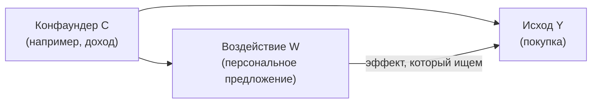

# Uplift и причинность

> **Зачем эта глава.** Модель оттока говорит, кто уйдёт. Она не говорит, кому звонить.
> Это разные задачи, и вторая требует другой математики. После главы вы сможете отличить
> предсказание отклика от предсказания эффекта, вывести uplift через potential outcomes,
> собрать S/T/X-learner, посчитать Qini руками и объяснить, почему в вашем эксперименте
> обзвон уменьшил конверсию.

**Уровень:** 🎯 middle → 🧠 middle+
**Предварительно нужно:** [статистика](../01-math/03-statistics.md), [метрики качества](04-metrics.md), [градиентный бустинг](07-gradient-boosting.md), [валидация и утечки](13-validation-and-leakage.md)
**Как проработать:** чтение + расчёт Qini руками + реализация метаобучателей

---

## Карта главы

- [1. Задача, которую не решает обычный ML](#1-задача-которую-не-решает-обычный-ml) — «кому звонить» против «кто уйдёт»
- [2. Potential outcomes: язык причинности](#2-potential-outcomes-язык-причинности) — ATE, ATT, CATE и фундаментальная проблема
- [3. Допущения, без которых всё рассыпается](#3-допущения-без-которых-всё-рассыпается) — SUTVA, unconfoundedness, positivity
- [4. Четыре типа клиентов и sleeping dogs](#4-четыре-типа-клиентов-и-sleeping-dogs)
- [5. Метаобучатели: S, T, X](#5-метаобучатели-s-t-x) — и трансформация класса
- [6. Uplift-деревья: критерий расщепления](#6-uplift-деревья-критерий-расщепления)
- [7. Оценка качества: uplift-кривая и Qini](#7-оценка-качества-uplift-кривая-и-qini) — с расчётом на числах
- [8. Когда эксперимента не было: конфаундеры](#8-когда-эксперимента-не-было-конфаундеры) — propensity score, DiD, IV
- [9. Компромиссы](#9-компромиссы)
- [10. Подводные камни](#10-подводные-камни)
- [11. Проверь себя](#11-проверь-себя)
- [12. Практика](#12-практика)
- [13. Что читать дальше](#13-что-читать-дальше)

---

## 1. Задача, которую не решает обычный ML

Задача от бизнеса: есть 10 миллионов клиентов, есть бюджет на обзвон 200 тысяч из них,
надо максимизировать число удержанных. Стандартный рефлекс — обучить модель оттока и звонить
топ-200 000 по вероятности ухода.

Разберём, почему это неправильно. Клиент, который уходит с вероятностью 0.95, — почти наверняка
уже принял решение. Звонок его не удержит: вы потратите ресурс и не получите ничего. Клиент
с вероятностью ухода 0.02 никуда не собирался — звонок ему тоже ничего не даёт. Ценность создают
те, кто **колеблется**: уйдёт без звонка, останется со звонком.

Более того, бывает хуже нейтрального. Клиент забыл про подписку и не пользуется ей полгода.
Звонок «мы хотим предложить вам скидку на продление» напоминает о существовании списаний,
и человек отменяет подписку. Ваше воздействие **создало** отток. Такие клиенты называются
sleeping dogs, и модель отклика их не отличает от остальных в принципе.

Формально: обычная модель оценивает $P(Y=1 \mid X=x)$ — вероятность события. Нам нужна
**разность** вероятностей при воздействии и без него:

$$
\tau(x) \;=\; P(Y=1 \mid X=x,\ \text{воздействие}) \;-\; P(Y=1 \mid X=x,\ \text{нет воздействия})
$$

где $Y \in \{0,1\}$ — целевое событие (остался, купил, кликнул), $X \in \mathbb{R}^d$ — признаки
клиента, $\tau(x)$ — **uplift**, он же приростный эффект.

> 🌱 **База.** Разница в одну фразу: модель отклика отвечает на «что произойдёт?», uplift-модель —
> на «что изменится, если я вмешаюсь?». Первое можно выучить по наблюдениям. Второе требует
> сравнить два мира — с воздействием и без, — и один из них вы никогда не увидите для конкретного
> клиента. Отсюда вся сложность.

Тот же вопрос возникает всюду, где есть управляющее воздействие: кому дать скидку (а не кто
купит), какому пользователю показать пуш (а не кто откроет приложение), кому одобрить лимит
(а не кто вернёт кредит), какое лечение назначить (а не кто выздоровеет).

> 💬 **На собеседовании.** Спросят: «У нас есть отличная модель оттока с AUC 0.85. Зачем нам uplift?»
> Хороший ответ: AUC 0.85 означает, что модель хорошо ранжирует по риску ухода, но кампания
> оптимизирует не риск, а **инкрементальные удержания**. Эти две величины коррелируют слабо и
> иногда отрицательно: самые рискованные клиенты часто наименее управляемы, а среди спокойных
> есть sleeping dogs, которых воздействие выталкивает. Проверить это можно прямо на данных:
> если у вас был честный A/B кампании, постройте uplift-кривую для ранжирования по модели оттока —
> обычно она оказывается близка к случайной, а иногда идёт ниже неё. Плохой ответ: «uplift —
> это более продвинутая модель оттока».

---

## 2. Potential outcomes: язык причинности

Формализм, на котором построено всё дальнейшее, — **потенциальные исходы** (potential outcomes,
модель Неймана–Рубина).

Для каждого объекта $i$ вводим бинарное воздействие $W_i \in \{0, 1\}$ (treatment: 1 — воздействовали,
0 — нет) и **два** потенциальных исхода:

- $Y_i(1)$ — что произошло бы с объектом $i$, если бы на него воздействовали;
- $Y_i(0)$ — что произошло бы с ним же, если бы не воздействовали.

Индивидуальный причинный эффект — их разность: $\tau_i = Y_i(1) - Y_i(0)$.

**Фундаментальная проблема причинного вывода** (fundamental problem of causal inference):
мы наблюдаем ровно один из двух исходов.

$$
Y_i^{\text{obs}} \;=\; W_i\, Y_i(1) \;+\; (1 - W_i)\, Y_i(0)
$$

где $Y_i^{\text{obs}}$ — фактически наблюдённый исход. Второй член пропадает при $W_i = 1$,
первый — при $W_i = 0$. То есть $\tau_i$ **никогда не наблюдаем ни для одного объекта**.
Это не проблема качества данных и не решается сбором большего датасета: контрфактический
исход физически отсутствует.

Отсюда единственный выход: перестать оценивать индивидуальный эффект и оценивать **средние
эффекты по группам**.

$$
\mathrm{ATE} \;=\; \mathbb{E}\big[Y(1) - Y(0)\big]
\qquad\text{(average treatment effect)}
$$

$$
\mathrm{ATT} \;=\; \mathbb{E}\big[Y(1) - Y(0) \mid W = 1\big]
\qquad\text{(average treatment effect on the treated)}
$$

$$
\mathrm{CATE}(x) \;=\; \tau(x) \;=\; \mathbb{E}\big[Y(1) - Y(0) \mid X = x\big]
\qquad\text{(conditional ATE)}
$$

где $\mathbb{E}$ — математическое ожидание по популяции, $X$ — вектор признаков.
ATE — общий эффект кампании (то, что измеряет A/B-тест). ATT — эффект на тех, кого реально
обработали (важно, когда воздействие получают не случайно). CATE — эффект как функция признаков,
и **именно CATE и есть uplift**.

> 📐 **Разбор формулы.** CATE — это ожидание разности, но записать его как разность ожиданий
> наблюдаемых величин нельзя без дополнительных допущений. Наивная попытка
> $\mathbb{E}[Y \mid X=x, W=1] - \mathbb{E}[Y \mid X=x, W=0]$ сравнивает **две разные группы
> объектов**: тех, кого обработали, и тех, кого нет. Если они различаются чем-то ещё, кроме
> воздействия, разность измеряет это «ещё», а не эффект. Условие, при котором наивная формула
> становится верной, — следующий раздел.

Тонкость нотации, из-за которой путаются: $\tau(x)$ — это разность **вероятностей**, а не
разность предсказаний одной модели. Величина $\tau(x)$ может быть отрицательной, и её
диапазон $[-1, 1]$ для бинарного $Y$. Типичный масштаб в маркетинге — единицы процентных пунктов,
и это создаёт главную практическую трудность: мы оцениваем маленькую разность двух шумных
величин, поэтому дисперсия оценки uplift существенно выше, чем у обычной модели отклика.

---

## 3. Допущения, без которых всё рассыпается

Три условия превращают наблюдаемые данные в оценку причинного эффекта. Их обязательно надо
уметь назвать.

**1. SUTVA** (Stable Unit Treatment Value Assumption). Два требования: (а) исход объекта зависит
только от **его собственного** воздействия, а не от воздействия на других (no interference);
(б) воздействие существует в одном варианте (no hidden variations).

Где ломается: реферальные программы (скидка другу влияет на меня), соцсети (пуш подруге приводит
её ко мне в чат), маркетплейсы (скидка одному покупателю выкупает товар, которого не достаётся
другому). При нарушении SUTVA индивидуальная рандомизация даёт смещённую оценку, и нужна
кластерная рандомизация — см. [сложные схемы A/B](../10-ab-testing/05-complex-designs.md).

**2. Unconfoundedness** (игнорируемость, conditional independence):

$$
\big(Y(1), Y(0)\big) \perp\!\!\!\perp W \;\mid\; X
$$

где $\perp\!\!\!\perp$ — знак независимости. Читается: при фиксированных наблюдаемых признаках $X$
назначение воздействия не зависит от потенциальных исходов. Иначе: **нет скрытых
конфаундеров** — переменных, влияющих одновременно и на назначение воздействия, и на исход.

В рандомизированном эксперименте это выполняется по построению: монетка не смотрит на $Y(0), Y(1)$.
На исторических данных — это допущение, которое нельзя проверить статистически. Можно только
рассуждать о механизме назначения и делать анализ чувствительности.

**3. Positivity / overlap**:

$$
0 < e(x) < 1 \quad \text{для всех } x \text{ с } p(x) > 0,
\qquad\text{где}\quad e(x) = P(W = 1 \mid X = x)
$$

где $e(x)$ — **propensity score** (склонность к воздействию), $p(x)$ — плотность признаков.
Читается: в каждой точке пространства признаков должны встречаться и обработанные, и
необработанные. Если менеджеры всегда звонят VIP-клиентам и никогда — остальным, для VIP нет
контрольной группы, и эффект на них не оценить никакими методами.

При выполнении всех трёх:

$$
\tau(x) \;=\; \mathbb{E}[Y \mid X = x,\, W = 1] \;-\; \mathbb{E}[Y \mid X = x,\, W = 0]
$$

то есть CATE становится вычислимой из наблюдаемых данных — и вот теперь можно применять ML.

> 💬 **На собеседовании.** Спросят: «Мы обучили uplift-модель на исторических данных кампании,
> где менеджеры сами выбирали, кому звонить. Что не так?»
> Хороший ответ: нарушена unconfoundedness. Менеджеры выбирали не случайно — они звонили тем,
> кого считали перспективными, опираясь в том числе на информацию, которой нет в признаках
> (тон предыдущего разговора, заметки в CRM). Модель выучит не эффект звонка, а признаки
> «кого менеджеры считали перспективным», и это будет коррелировать с исходом даже без всякого
> звонка. Плюс скорее всего нарушен overlap: некоторые сегменты обзванивали всегда. Что делать:
> проверить пересечение распределений через propensity score, обрезать области без перекрытия,
> использовать doubly robust оценки — но самое честное решение — потратить 5% трафика на
> рандомизированный holdout и обучаться на нём. Плохой ответ: «добавим больше признаков, и всё
> будет хорошо» — конфаундер по определению не наблюдаем.

---

## 4. Четыре типа клиентов и sleeping dogs

Для бинарного исхода и бинарного воздействия объекты делятся на четыре непересекающихся типа
по паре $(Y(0), Y(1))$:

| Тип | $Y(0)$ | $Y(1)$ | $\tau_i$ | Что делать |
|---|---|---|---|---|
| **Persuadables** (убеждаемые) | 0 | 1 | $+1$ | **воздействовать — вся ценность здесь** |
| **Sure things** (лояльные) | 1 | 1 | $0$ | не тратить бюджет: купят и так |
| **Lost causes** (безнадёжные) | 0 | 0 | $0$ | не тратить бюджет: не купят никак |
| **Sleeping dogs** (спящие собаки) | 1 | 0 | $-1$ | **не трогать: воздействие вредит** |

Проблема, которая делает задачу нетривиальной: **тип объекта ненаблюдаем**. Мы видим только
$(W_i, Y_i)$. Клиент с $W=1, Y=1$ — это persuadable или sure thing? Различить нельзя. Поэтому
uplift-модели оценивают не тип, а его ожидание: $\tau(x) = P(\text{persuadable} \mid x) - P(\text{sleeping dog} \mid x)$.

> 📐 **Разбор формулы.** Проверим: $\tau(x) = \mathbb{E}[Y(1) - Y(0)\mid x]$. Разность
> $Y(1) - Y(0)$ равна $+1$ ровно для persuadables, $-1$ для sleeping dogs и $0$ для остальных
> двух типов. Математическое ожидание величины, принимающей значения $\{-1, 0, +1\}$, есть
> $P(+1) - P(-1)$. Отсюда и следует запись. Практический вывод: uplift, равный нулю, может
> означать и «нет ни тех, ни других», и «поровну persuadables и sleeping dogs» — сегмент,
> внутри которого кампания кому-то помогает, а кому-то вредит.

Sleeping dogs — не теоретическая экзотика. Известные механизмы: напоминание об услуге, о которой
забыли; раздражение от навязчивой коммуникации; сообщение о скидке, обесценивающее недавнюю
покупку по полной цене; уведомление о сроке действия, подталкивающее к отмене. Именно из-за них
uplift-модель нужна не только для экономии бюджета, но и для защиты от отрицательного эффекта:
**правильно построенная кампания на топ-30% по uplift может дать больше удержаний, чем кампания
на 100% аудитории**. Это контринтуитивно, и это ровно то, что показывает Qini-кривая в разделе 7.

---

## 5. Метаобучатели: S, T, X

**Метаобучатель** (meta-learner) — схема, которая сводит оценку CATE к нескольким обычным задачам
регрессии/классификации, решаемым любым базовым алгоритмом (обычно бустингом). Введём обозначения:
$\mu_1(x) = \mathbb{E}[Y \mid X=x, W=1]$, $\mu_0(x) = \mathbb{E}[Y \mid X=x, W=0]$ — условные
средние исхода в группах воздействия и контроля; $n_1$ и $n_0$ — размеры этих групп.

### S-learner (single model)

Обучаем **одну** модель, добавив флаг воздействия $W$ как обычный признак:

$$
\hat\mu(x, w) \approx \mathbb{E}[Y \mid X=x, W=w],
\qquad
\hat\tau_S(x) = \hat\mu(x, 1) - \hat\mu(x, 0)
$$

Прогноз делаем дважды: подставляя $w=1$ и $w=0$ для одного и того же $x$, и вычитаем.

Плюс: одна модель, вся выборка, минимальная дисперсия. Минус, и он серьёзный: если эффект мал
по сравнению с влиянием остальных признаков, регуляризованная модель просто **не сделает ни одного
сплита по $W$** — важность бинарного флага с эффектом в 1 п.п. проигрывает признакам с эффектом
в 20 п.п. Тогда $\hat\tau_S(x) \equiv 0$. Это называют смещением к нулю (regularization bias),
и на практике S-learner часто выдаёт подозрительно гладкий, почти константный uplift.

Приём, отчасти лечащий проблему: явно добавить взаимодействия $W \cdot x_j$ для ключевых признаков,
либо использовать базовую модель, которая точно расщепится по $W$ (например, обучать с
`monotone_constraints` или искусственно повысить вес признака).

### T-learner (two models)

Обучаем **две независимые** модели — на группе воздействия и на контроле:

$$
\hat\tau_T(x) \;=\; \hat\mu_1(x) \;-\; \hat\mu_0(x)
$$

Плюс: нет смещения к нулю, обе модели свободно выучивают свою структуру. Минус: каждая модель
видит только часть данных, а вычитание **складывает** их ошибки. Если группы сильно
несбалансированы ($n_1 \ll n_0$, типичная ситуация: 5% трафика в кампании), модель $\hat\mu_1$
обучена на малой выборке и шумит, и весь шум переходит в $\hat\tau$. Плюс каждая модель
регуляризуется независимо, и их систематические ошибки не сокращаются.

### X-learner

Компромисс, придуманный именно для несбалансированных групп (Künzel et al., 2019). Три шага.

**Шаг 1.** Как в T-learner: обучаем $\hat\mu_0$ на контроле, $\hat\mu_1$ на воздействии.

**Шаг 2.** Импутируем индивидуальные эффекты, подставляя недостающий потенциальный исход:

$$
\tilde D_i \;=\; Y_i - \hat\mu_0(X_i) \quad \text{для } i: W_i = 1,
\qquad
\tilde D_i \;=\; \hat\mu_1(X_i) - Y_i \quad \text{для } i: W_i = 0
$$

где $\tilde D_i$ — оценка индивидуального эффекта объекта $i$. Для обработанного объекта
наблюдаемый $Y_i$ — это $Y_i(1)$, а $Y_i(0)$ мы подставляем из модели контроля. Для контрольного —
наоборот. Затем обучаем **две модели эффекта**: $\hat\tau_1(x)$ — регрессия $\tilde D$ на $X$
по обработанным объектам, $\hat\tau_0(x)$ — по контрольным.

**Шаг 3.** Смешиваем с весом:

$$
\hat\tau_X(x) \;=\; g(x)\,\hat\tau_0(x) \;+\; \big(1 - g(x)\big)\,\hat\tau_1(x),
\qquad g(x) = \hat e(x)
$$

где $\hat e(x)$ — оценка propensity score.

> 📐 **Разбор формулы.** Почему вес именно такой, а не наоборот. Пусть обработанных мало:
> $e(x)$ близок к нулю. Тогда $\hat\mu_0$ обучена на большой выборке и точна, значит,
> импутированные эффекты $\tilde D_i = Y_i - \hat\mu_0(X_i)$ для обработанных объектов почти
> не смещены — и $\hat\tau_1$, построенная на них, надёжна несмотря на малое число точек.
> А $\hat\tau_0$ строится на $\hat\mu_1(X_i) - Y_i$, где $\hat\mu_1$ обучена на маленькой
> выборке и шумит, — значит, её вклад надо уменьшить. В формуле при малом $e(x)$ вес
> $1 - g(x)$ у $\hat\tau_1$ близок к единице. Логика сходится.

### Трансформация класса

Отдельный приём, дающий одну модель без вычитания. При **сбалансированной рандомизации**
($e(x) = 1/2$) определим новый таргет:

$$
Z_i \;=\; Y_i W_i \;+\; (1 - Y_i)(1 - W_i)
$$

то есть $Z_i = 1$, если объект обработали и он откликнулся, **или** если не обработали и он
не откликнулся. Тогда

$$
P(Z = 1 \mid X = x) = \tfrac12\,\mu_1(x) + \tfrac12\big(1 - \mu_0(x)\big) = \tfrac12\big(\tau(x) + 1\big)
\quad\Longrightarrow\quad
\tau(x) = 2\,P(Z=1 \mid x) - 1
$$

Достаточно обучить обычный классификатор на $Z$ и линейно пересчитать вероятность. Красиво,
дёшево, но требует ровно 50/50 и теряет информацию (объекты «обработали и не откликнулся» и
«не обработали и откликнулся» склеиваются в один класс).

Общий вариант без требования баланса — **модифицированный исход** (Horvitz–Thompson transform):

$$
Y_i^{*} \;=\; Y_i\,\frac{W_i - e(X_i)}{e(X_i)\big(1 - e(X_i)\big)},
\qquad \mathbb{E}\big[Y^{*} \mid X=x\big] = \tau(x)
$$

где $e(X_i)$ — propensity score объекта $i$. Обычная регрессия $Y^*$ на $X$ даёт оценку CATE.
Цена — огромная дисперсия при $e(x)$ близких к 0 или 1, поэтому в чистом виде применяется редко;
на этой идее построены doubly robust оценки и R-learner.

```python
# Три метаобучателя руками. Данные: X (n, d), w (n,) в {0,1}, y (n,) в {0,1}
import numpy as np
from lightgbm import LGBMClassifier, LGBMRegressor

def s_learner(X_tr, w_tr, y_tr, X_te):
    """W как обычный признак. Риск: модель может его проигнорировать."""
    Xw = np.column_stack([X_tr, w_tr])
    m = LGBMClassifier(n_estimators=300, learning_rate=0.05, verbose=-1).fit(Xw, y_tr)
    ones = np.column_stack([X_te, np.ones(len(X_te))])
    zeros = np.column_stack([X_te, np.zeros(len(X_te))])
    return m.predict_proba(ones)[:, 1] - m.predict_proba(zeros)[:, 1]

def t_learner(X_tr, w_tr, y_tr, X_te):
    """Две независимые модели. Ошибки складываются, зато нет смещения к нулю."""
    m1 = LGBMClassifier(n_estimators=300, learning_rate=0.05, verbose=-1).fit(X_tr[w_tr == 1], y_tr[w_tr == 1])
    m0 = LGBMClassifier(n_estimators=300, learning_rate=0.05, verbose=-1).fit(X_tr[w_tr == 0], y_tr[w_tr == 0])
    return m1.predict_proba(X_te)[:, 1] - m0.predict_proba(X_te)[:, 1]

def x_learner(X_tr, w_tr, y_tr, X_te):
    """X-learner: импутация эффекта + взвешивание по propensity."""
    tr_idx, ct_idx = w_tr == 1, w_tr == 0
    m1 = LGBMClassifier(n_estimators=300, learning_rate=0.05, verbose=-1).fit(X_tr[tr_idx], y_tr[tr_idx])
    m0 = LGBMClassifier(n_estimators=300, learning_rate=0.05, verbose=-1).fit(X_tr[ct_idx], y_tr[ct_idx])

    # импутированные индивидуальные эффекты: недостающий потенциальный исход берём из модели
    d_treat = y_tr[tr_idx] - m0.predict_proba(X_tr[tr_idx])[:, 1]
    d_ctrl = m1.predict_proba(X_tr[ct_idx])[:, 1] - y_tr[ct_idx]

    tau1 = LGBMRegressor(n_estimators=300, learning_rate=0.05, verbose=-1).fit(X_tr[tr_idx], d_treat)
    tau0 = LGBMRegressor(n_estimators=300, learning_rate=0.05, verbose=-1).fit(X_tr[ct_idx], d_ctrl)

    # propensity: в рандомизированном эксперименте это константа, но модель не мешает
    e_model = LGBMClassifier(n_estimators=200, learning_rate=0.05, verbose=-1).fit(X_tr, w_tr)
    g = np.clip(e_model.predict_proba(X_te)[:, 1], 0.02, 0.98)   # обрезка спасает от взрыва весов
    return g * tau0.predict(X_te) + (1 - g) * tau1.predict(X_te)
```

> 🧠 **Middle+.** Есть ещё два класса, о которых стоит знать. **R-learner** (Nie & Wager) строится
> на разложении Робинсона: сначала оцениваются «мешающие» функции $m(x) = \mathbb{E}[Y\mid x]$ и
> $e(x)$, затем минимизируется $\sum_i \big[(Y_i - \hat m(X_i)) - (W_i - \hat e(X_i))\tau(X_i)\big]^2$ —
> то есть эффект оценивается по остаткам обеих величин. **DR-learner** использует doubly robust
> псевдоисход: оценка состоятельна, если верна **хотя бы одна** из моделей — исхода или
> propensity. Оба относятся к семейству Double/Debiased ML: ключевая идея — cross-fitting,
> когда мешающие функции оцениваются на одних фолдах, а эффект — на других, что убирает
> смещение от переобучения мешающих моделей.

---

## 6. Uplift-деревья: критерий расщепления

Метаобучатели переиспользуют обычные модели. Альтернатива — построить дерево, которое
**напрямую** оптимизирует различие эффекта между листьями.

Обычное дерево ищет сплит, максимизирующий чистоту по $Y$. Uplift-дерево ищет сплит,
максимизирующий **расхождение между распределениями исхода в группе воздействия и в контроле**.
Идея: хороший сплит отделяет подмножество, где воздействие сильно меняет исход, от подмножества,
где не меняет.

Пусть в узле $A$ доля откликов среди обработанных равна $p_T(A)$, среди контроля — $p_C(A)$.
Мера расхождения — любая дивергенция между двумя распределениями Бернулли. Три классических
варианта (Rzepakowski & Jaworski, 2012):

$$
D_{KL}(A) = p_T\log\frac{p_T}{p_C} + (1-p_T)\log\frac{1-p_T}{1-p_C}
$$

$$
D_{\text{Eucl}}(A) = (p_T - p_C)^2 + \big((1-p_T) - (1-p_C)\big)^2 = 2(p_T - p_C)^2
$$

$$
D_{\chi^2}(A) = \frac{(p_T - p_C)^2}{p_C} + \frac{\big((1-p_T)-(1-p_C)\big)^2}{1 - p_C}
$$

где $p_T = p_T(A)$, $p_C = p_C(A)$ — доли положительного исхода в группах воздействия и контроля
внутри узла $A$. Выигрыш сплита — прирост дивергенции при переходе от родителя к детям:

$$
\text{Gain} \;=\; \sum_{a \in \{L, R\}} \frac{|A_a|}{|A|}\, D(A_a) \;-\; D(A)
$$

где $A_L, A_R$ — левый и правый потомки, $|A|$ — число объектов в узле.

Свойства критериев различаются практически: KL чувствителен к малым $p_C$ (при $p_C \to 0$
взрывается), $\chi^2$ тоже, а евклидов — самый устойчивый, и его чаще берут по умолчанию.
Отдельный простой критерий — $\Delta\Delta p$: максимизировать $|(p_T(A_L) - p_C(A_L)) - (p_T(A_R) - p_C(A_R))|$, то есть буквально разницу uplift между детьми.

Дополнительно в критерий вводят штраф за дисбаланс групп внутри узла: если сплит создал лист,
где 200 обработанных и 3 контрольных, оценка $p_C$ там бессмысленна. Нормировочный член в
исходной работе штрафует именно за это.

> 🧠 **Middle+.** Отдельная ветка — **causal tree / causal forest** (Athey & Imbens, Wager & Athey).
> Их ключевой вклад — **honest splitting**: обучающая выборка делится пополам, одна половина
> используется для выбора структуры дерева, вторая — для оценки эффекта в листьях. Без этого
> оценка эффекта в листе смещена: мы выбрали сплит именно потому, что там большая разность,
> и та же разность используется как оценка — классическое переобучение на отборе. Honest-схема
> даёт асимптотически нормальные оценки и, что редкость в ML, **доверительные интервалы для
> CATE**. Цена — половина данных на оценку, что при слабом эффекте больно.

На практике готовые реализации: `causalml` (Uber) — метаобучатели, uplift-деревья и леса,
метрики; `EconML` (Microsoft) — DML, DR-learner, causal forest, инструментальные переменные;
`scikit-uplift` — метаобучатели и метрики в стиле sklearn, удобен для быстрого старта.

---

## 7. Оценка качества: uplift-кривая и Qini

Здесь ловушка, которая ломает большинство первых попыток: **правильный ответ $\tau_i$
не наблюдаем ни для одного объекта**, поэтому посчитать MAE или AUC между предсказанием и
истиной невозможно в принципе. Оценивать можно только качество **ранжирования** — и только
на группах.

### Идея

Возьмём тестовую выборку из **рандомизированного** эксперимента: обе группы, воздействие
назначено случайно. Отсортируем всех по предсказанному uplift по убыванию. Пойдём сверху вниз
и для каждой доли $k$ посчитаем, какой инкрементальный эффект мы получили бы, обработав только
эту верхушку.

Обозначения для верхних $k$ (доля от 0 до 1):
$N_T(k), N_C(k)$ — число обработанных и контрольных объектов среди верхних $k$;
$Y_T(k), Y_C(k)$ — число положительных исходов среди них.

**Uplift-кривая:**

$$
u(k) \;=\; \left(\frac{Y_T(k)}{N_T(k)} \;-\; \frac{Y_C(k)}{N_C(k)}\right)\big(N_T(k) + N_C(k)\big)
$$

**Кривая Qini** (Radcliffe, 2007) — тот же смысл, другая нормировка:

$$
g(k) \;=\; Y_T(k) \;-\; Y_C(k)\,\frac{N_T(k)}{N_C(k)}
$$

> 📐 **Разбор формулы.** В Qini мы берём число откликов среди обработанных в верхушке и вычитаем
> число откликов среди контрольных, **пересчитанное на размер группы воздействия**. Множитель
> $N_T(k)/N_C(k)$ нужен, потому что группы могут быть разного размера; без него мы бы сравнивали
> несравнимое. Результат читается в штуках: «сколько дополнительных конверсий даёт обработка
> верхних $k$». Разница между Qini и uplift-кривой — в способе масштабирования на разный размер
> групп; при равных группах ($N_T = N_C$) они пропорциональны. Обе кривые заканчиваются в одной
> точке при $k=1$: это суммарный эффект кампании на всю аудиторию, то есть ATE, выраженный
> в конверсиях.

Эталон для сравнения — **случайное ранжирование**: прямая из $(0, 0)$ в $(1, g(1))$. Модель
полезна ровно настолько, насколько её кривая идёт выше этой прямой.

**Коэффициент Qini** — площадь между кривой модели и случайной прямой (часто нормируют на
площадь для идеальной модели, чтобы получить число в $[0,1]$; в разных библиотеках нормировка
разная, при сравнении цифр это надо уточнять). Метрика **AUUC** (Area Under Uplift Curve) —
то же самое для uplift-кривой.

### Расчёт на числах

Разберём полностью, потому что на собеседовании иногда просят посчитать руками.

Эксперимент: 2000 клиентов, 1000 в группе воздействия, 1000 в контроле. Модель отранжировала всех
по предсказанному uplift; разобьём на 4 квартиля по 500 человек (в каждом 250 обработанных
и 250 контрольных).

| Квартиль | Отклики T (из 250) | Отклики C (из 250) | Uplift, п.п. |
|---|---|---|---|
| 1 (топ) | 60 (24.0%) | 40 (16.0%) | $+8.0$ |
| 2 | 45 (18.0%) | 40 (16.0%) | $+2.0$ |
| 3 | 35 (14.0%) | 37 (14.8%) | $-0.8$ |
| 4 (низ) | 25 (10.0%) | 38 (15.2%) | $-5.2$ |
| **Всего** | **165 (16.5%)** | **155 (15.5%)** | $+1.0$ |

Сначала общая картина: кампания на всю аудиторию дала $165 - 155 = 10$ дополнительных конверсий.
ATE $= 1$ п.п. Скромно, но положительно — обычный A/B сказал бы «эффект есть, катим».

Теперь Qini. Группы равны, поэтому $N_T(k)/N_C(k) = 1$, и $g(k) = Y_T(k) - Y_C(k)$ по накопленным
суммам:

| $k$ | $Y_T(k)$ | $Y_C(k)$ | $g(k)$ | Случайная прямая |
|---|---|---|---|---|
| 0.25 | 60 | 40 | **20** | 2.5 |
| 0.50 | 105 | 80 | **25** | 5.0 |
| 0.75 | 140 | 117 | **23** | 7.5 |
| 1.00 | 165 | 155 | **10** | 10.0 |

Главный результат виден сразу: **максимум кривой $g(k) = 25$ достигается при $k = 0.5$**.
Обработав половину аудитории — ту, которую модель поставила выше, — мы получаем 25 дополнительных
конверсий вместо 10 при обработке всех. То есть половина бюджета даёт эффект в 2.5 раза больше.
Причина в нижнем квартиле: там uplift отрицательный ($-5.2$ п.п.), это sleeping dogs, и
воздействие на них **уничтожает** 13 конверсий из уже заработанных.

Считаем коэффициент Qini по трапециям (шаг $\Delta k = 0.25$, точки включая $(0,0)$):

$$
\text{AUC}_{\text{Qini}} = 0.25\left[\frac{0+20}{2} + \frac{20+25}{2} + \frac{25+23}{2} + \frac{23+10}{2}\right]
= 0.25\,[10 + 22.5 + 24 + 16.5] = 0.25 \cdot 73 = 18.25
$$

Площадь под случайной прямой: $\tfrac12 \cdot 1 \cdot 10 = 5$.

$$
Q = 18.25 - 5 = 13.25
$$

Положительный и большой относительно масштаба задачи ($g(1) = 10$) — модель работает.

```python
def qini_curve(y, w, uplift_score, n_bins=10):
    """Кривая Qini: g(k) = Y_T(k) - Y_C(k) * N_T(k)/N_C(k).

    y — бинарный исход, w — флаг воздействия, uplift_score — предсказание модели.
    Возвращает доли k и значения g(k) в штуках дополнительных конверсий.
    """
    order = np.argsort(-np.asarray(uplift_score))       # сортировка по убыванию uplift
    y, w = np.asarray(y)[order], np.asarray(w)[order]
    n = len(y)
    ks, gs = [0.0], [0.0]
    for b in range(1, n_bins + 1):
        top = int(round(n * b / n_bins))
        nt, nc = w[:top].sum(), (1 - w[:top]).sum()
        if nt == 0 or nc == 0:                          # без обеих групп величина не определена
            continue
        yt, yc = y[:top][w[:top] == 1].sum(), y[:top][w[:top] == 0].sum()
        ks.append(b / n_bins)
        gs.append(yt - yc * nt / nc)
    return np.array(ks), np.array(gs)


def qini_coefficient(y, w, uplift_score, n_bins=10):
    """Площадь между кривой Qini и случайной прямой (без нормировки на идеальную модель)."""
    ks, gs = qini_curve(y, w, uplift_score, n_bins)
    auc_model = np.trapezoid(gs, ks) if hasattr(np, "trapezoid") else np.trapz(gs, ks)
    auc_random = 0.5 * ks[-1] * gs[-1]                  # треугольник под прямой (0,0)-(k_max, g_max)
    return auc_model - auc_random
```

Дополнительная метрика, которую любит бизнес и которую стоит считать всегда: **uplift@k** —
разность конверсий между T и C **только в верхних $k$**. В примере выше uplift@25% $= 8$ п.п.
Она отвечает на прямой вопрос «какой эффект даст кампания на топ-25% по модели».

> ⚠️ **Типичная ошибка.** Считать Qini на данных, где воздействие назначалось не случайно.
> Тогда разность $Y_T(k)/N_T(k) - Y_C(k)/N_C(k)$ включает не только эффект, но и различие групп,
> и красивая кривая ничего не говорит о качестве модели. Оценка uplift-модели **обязана**
> проводиться на рандомизированном holdout — это не рекомендация, а условие корректности.

> 💬 **На собеседовании.** Спросят: «Почему для uplift-модели нельзя использовать ROC-AUC?»
> Хороший ответ: ROC-AUC требует истинных меток для ранжируемых объектов, а истинный
> индивидуальный uplift $\tau_i$ ненаблюдаем — мы никогда не видим оба потенциальных исхода
> одного объекта. Поэтому метрики uplift групповые: мы сравниваем **средние** исходы T и C
> внутри верхушки ранжирования, а не предсказание с меткой. Следствие, которое стоит добавить:
> из-за групповой природы эти метрики очень шумные — доверительный интервал Qini на
> нескольких тысячах наблюдений огромен, и его надо оценивать бутстрапом. Отдельный ляп,
> который встречается в проде: посчитать AUC модели отклика внутри группы воздействия и
> назвать это качеством uplift-модели. Плохой ответ: «AUC можно, если аккуратно».

---

## 8. Когда эксперимента не было: конфаундеры

Всё выше предполагало рандомизацию. Часто её нет: есть исторические данные, где воздействие
получали не случайно. Тогда сначала надо восстановить сравнимость групп.

### Конфаундер

**Конфаундер** (confounder) — переменная, влияющая и на назначение воздействия, и на исход.
Именно он делает наивное сравнение групп неверным.



Классический пример: банк делает предложение клиентам с высоким доходом. У них выше и покупка.
Наивное сравнение припишет весь разрыв предложению, хотя он в основном объясняется доходом.

Отдельно стоит помнить обратную ошибку: **не всякую переменную можно контролировать**.
Если переменная лежит **на пути** воздействия к исходу (медиатор, например «клиент открыл письмо»),
её включение в модель заблокирует часть настоящего эффекта. Если переменная — общее **следствие**
воздействия и исхода (коллайдер), её включение **создаст** ложную связь там, где её не было.
Правило: контролировать надо причины воздействия, а не его последствия.

### Propensity score

Ключевой инструмент — **propensity score** $e(x) = P(W = 1 \mid X = x)$. Результат Розенбаума
и Рубина (1983): если unconfoundedness выполняется по всему вектору $X$, то она выполняется и
по одному скаляру $e(X)$. Это балансирующая оценка — вместо сопоставления по $d$ признакам
достаточно сопоставления по одному числу.

Три способа применения:

**Matching**: каждому обработанному объекту находим ближайший по $e(x)$ контрольный и сравниваем
попарно. Просто, интерпретируемо, теряет данные.

**IPW** (inverse propensity weighting) — взвешивание обратными склонностями:

$$
\hat\tau_{\text{IPW}} \;=\; \frac{1}{n}\sum_{i=1}^{n}\left(\frac{W_i Y_i}{\hat e(X_i)}
\;-\; \frac{(1 - W_i) Y_i}{1 - \hat e(X_i)}\right)
$$

где $n$ — размер выборки. Идея: объект, который «должен был» получить воздействие с вероятностью
0.1, но получил, представляет 10 похожих на него — поэтому его вес 10. Взвешивание восстанавливает
псевдо-рандомизированную выборку.

Практическая беда IPW очевидна из формулы: при $\hat e(X_i) \to 0$ вес взрывается, и одна
точка начинает определять всю оценку. Лечится обрезкой (clipping весов, обычно $e \in [0.05, 0.95]$),
стабилизированными весами и обязательной проверкой перекрытия — гистограммы $\hat e(x)$ в двух
группах должны существенно пересекаться.

**Doubly robust (AIPW)**: комбинация модели исхода и модели propensity. Свойство «двойной
устойчивости»: оценка состоятельна, если верна хотя бы одна из двух моделей. На практике это
стандарт, и именно на нём построены DR-learner и Double ML.

```python
def check_overlap(e_scores, w, bins=20):
    """Диагностика positivity: доля объектов в зонах без перекрытия групп.

    Если e-score обработанных и контрольных почти не пересекаются, никакая
    корректировка не спасёт — данных для сравнения просто нет.
    """
    e_t, e_c = e_scores[w == 1], e_scores[w == 0]
    lo = max(e_t.min(), e_c.min())
    hi = min(e_t.max(), e_c.max())
    out_of_support = np.mean((e_scores < lo) | (e_scores > hi))
    print(f"общая зона перекрытия: [{lo:.3f}, {hi:.3f}], вне неё {out_of_support:.1%} объектов")
    print("экстремальные веса:", np.mean((e_scores < 0.05) | (e_scores > 0.95)).round(4))
    return lo, hi
```

### Difference-in-Differences (DiD)

Работает, когда воздействие пришло к части объектов в известный момент времени, и есть данные
**до** и **после**. Оценка:

$$
\hat\tau_{\text{DiD}} \;=\;
\big(\bar Y^{\text{post}}_{T} - \bar Y^{\text{pre}}_{T}\big)
\;-\;
\big(\bar Y^{\text{post}}_{C} - \bar Y^{\text{pre}}_{C}\big)
$$

где $\bar Y^{\text{pre}}_{T}, \bar Y^{\text{post}}_{T}$ — средние исходы в группе воздействия
до и после, аналогично для контроля $C$.

Смысл: первая разность убирает всё, что постоянно во времени и специфично для группы (группы
могли изначально отличаться уровнем). Вторая разность убирает всё, что менялось во времени
одинаково для обеих групп (сезонность, общий тренд рынка).

Критическое допущение — **параллельные тренды** (parallel trends): в отсутствие воздействия
разрыв между группами остался бы прежним. Проверить его напрямую нельзя (это утверждение о
контрфактическом мире), но можно проверить косвенно: построить обе траектории за несколько
периодов до воздействия и убедиться, что они шли параллельно. Если до воздействия тренды
расходились, DiD даст смещённую оценку.

Типичное применение: регион запустили раньше остальных, конкурент ушёл с части рынков,
фича раскатана на часть платформ. См. также [квазиэксперименты](../10-ab-testing/05-complex-designs.md).

### Инструментальные переменные (IV)

Когда конфаундер есть и он ненаблюдаем, спасти может **инструмент** $Z$ — переменная, которая:

1. **релевантна**: влияет на воздействие, $\operatorname{Cov}(Z, W) \ne 0$;
2. удовлетворяет **exclusion restriction**: влияет на исход **только через** воздействие;
3. **независима** от ненаблюдаемых конфаундеров.

Оценка методом двухшаговых наименьших квадратов (2SLS): на первом шаге регрессируем $W$ на $Z$,
получаем $\hat W$; на втором регрессируем $Y$ на $\hat W$. Для одного бинарного инструмента
оценка сводится к формуле Вальда:

$$
\hat\tau_{\text{IV}} \;=\;
\frac{\mathbb{E}[Y \mid Z=1] - \mathbb{E}[Y \mid Z=0]}
{\mathbb{E}[W \mid Z=1] - \mathbb{E}[W \mid Z=0]}
$$

> 📐 **Разбор формулы.** Числитель — эффект инструмента на исход (intention-to-treat).
> Знаменатель — эффект инструмента на получение воздействия, то есть **доля тех, кого инструмент
> реально сдвинул**. Деление масштабирует ITT-эффект на эту долю. Пример: разослали приглашение
> в программу лояльности (это $Z$), вступили 20% ($\text{знаменатель} = 0.2$), средняя выручка
> выросла на 40 рублей ($\text{числитель}$). Эффект самого вступления $= 40/0.2 = 200$ рублей.
> Логика: если бы вступили все, кого приглашение сдвинуло, эффект на них должен быть в пять раз
> больше среднего по всей рассылке.

Важное ограничение: IV оценивает не ATE, а **LATE** (local average treatment effect) — эффект
на **комплаерах**, то есть на тех, чьё поведение инструмент изменил. Это может быть нерепрезентативная
подгруппа. Ещё одна ловушка — слабый инструмент: если знаменатель мал, оценка взрывается и
становится крайне нестабильной; проверяют F-статистикой первого шага (эмпирический порог — $F > 10$).

Самый чистый источник инструмента в продуктовой практике — **encouragement design**: рандомизируем
не само воздействие (его нельзя навязать), а приглашение к нему.

---

## 9. Компромиссы

| Ситуация | Разумный выбор | Почему |
|---|---|---|
| Есть рандомизированный эксперимент, эффект заметный, групп поровну | T-learner или uplift-лес | простые, нет смещения к нулю, данных хватает обеим моделям |
| Группа воздействия мала ($n_1 / n_0 < 0.2$) | X-learner или DR-learner | явно спроектированы под дисбаланс |
| Эффект очень слабый относительно шума | S-learner с явными взаимодействиями, либо честно признать, что модели не будет | при слабом сигнале дисперсия T-learner съедает эффект |
| Нужны доверительные интервалы для CATE | causal forest (honest) | единственное из перечисленного, что даёт корректный вывод |
| Наблюдательные данные, есть богатые признаки | DR/DML с cross-fitting + проверка overlap | двойная устойчивость снижает риск неверной спецификации |
| Есть до/после и естественное разделение | DiD | не требует моделирования механизма назначения |
| Конфаундер ненаблюдаем, но есть рандомизированное «приглашение» | IV / encouragement design | единственный способ, когда unconfoundedness заведомо нарушена |
| Мало данных, нужен быстрый результат | сегментация вручную + A/B по сегментам | uplift-модель на 5 000 наблюдений почти наверняка выучит шум |

Отдельный компромисс, о котором забывают: **uplift-модель дороже в эксплуатации**. Ей нужен
постоянный рандомизированный holdout — иначе через два цикла переобучения данные перестанут
быть пригодны для оценки эффекта, а модель начнёт учиться на собственных решениях. Это плата
за причинность, и её надо заложить в дизайн системы с самого начала.

---

## 10. Подводные камни

**Uplift-модель обучена на данных предыдущей кампании, где таргетинг делала прошлая модель.**
Симптом: качество на бэктесте отличное, в новой кампании эффекта нет.
Причина: воздействие назначалось не случайно, а по предыдущей модели — это и есть конфаундинг,
причём по признакам, которые сама модель и использует. Плюс petля обратной связи: данных о тех,
кого модель не выбирала, почти нет (нарушен overlap).
Что делать: держать постоянный рандомизированный holdout 5–10% трафика, обучать и валидировать
только на нём.

**Метрика посчитана на непересечённых группах.**
Симптом: Qini огромный, а в кампании эффект нулевой.
Причина: тест содержал не случайное разделение (например, контроль — те, до кого не дозвонились;
а не дозвонились до тех, кто хуже вовлечён).
Что делать: проверять баланс ковариат между T и C (SMD по каждому признаку, обычно требуют
$|SMD| < 0.1$), проверять SRM, проверять overlap по propensity.

**Слишком мелкая разбивка при расчёте кривой.**
Симптом: Qini-кривая скачет, при пересчёте на другом сплите картина меняется полностью.
Причина: в бине по 200 человек разность конверсий имеет стандартную ошибку в несколько
процентных пунктов — больше, чем сам эффект.
Что делать: 5–10 бинов, не больше; обязательно бутстрап-интервал для Qini; сравнивать модели
только если интервалы не пересекаются.

**Оптимизация не той величины.**
Симптом: модель хорошо ранжирует по uplift конверсии, а прибыль не растёт.
Причина: uplift по конверсии и uplift по деньгам — разные величины. Скидка увеличивает
вероятность покупки, но уменьшает маржу; суммарный эффект может быть отрицательным.
Что делать: моделировать uplift по целевой экономической величине (выручка, маржа) или
явно вычитать стоимость воздействия при выборе порога отсечки.

**Игнорирование стоимости воздействия при выборе порога.**
Симптом: кампания на «всех с положительным uplift» убыточна.
Причина: порог отсечки должен быть не $\tau(x) > 0$, а $\tau(x) \cdot V > c$, где $V$ — ценность
конверсии, $c$ — стоимость воздействия на одного клиента.
Что делать: считать порог из экономики, а не из знака; строить кривую «бюджет → инкрементальная
прибыль» и выбирать точку максимума.

**Sleeping dogs остались незамеченными из-за агрегации.**
Симптом: общий ATE положительный, кампанию раскатали, отток в одном сегменте вырос.
Причина: смотрели только на средний эффект. Отрицательный uplift в сегменте компенсировался
положительным в другом.
Что делать: смотреть uplift по децилям и по ключевым сегментам, а не только ATE; проверять,
что нижний дециль не уходит значимо в минус.

**Перенос модели на другой канал или другое предложение.**
Симптом: модель, обученная на SMS-кампании, не работает для email.
Причина: CATE определён относительно **конкретного** воздействия. Смена канала, текста или
размера скидки — это другое воздействие, и функция $\tau(x)$ у него другая.
Что делать: обучать модель на том воздействии, для которого она будет применяться; при
множестве вариантов — многоруковая постановка (uplift для каждого варианта) или контекстные
бандиты, см. [эксплорация и бандиты](../06-recsys/13-exploration-and-bandits.md).

---

## 11. Проверь себя

<details>
<summary><b>🌱 Вопрос.</b> В чём разница между моделью отклика и uplift-моделью?</summary>

**Короткий ответ.** Модель отклика оценивает $P(Y=1\mid x)$ — вероятность события. Uplift-модель
оценивает $\tau(x) = P(Y=1\mid x, W=1) - P(Y=1\mid x, W=0)$ — насколько воздействие изменяет
эту вероятность.

**Развёрнуто.** Ранжирования по этим величинам могут быть почти не связаны. Клиент с очень высокой
вероятностью покупки, скорее всего, купит и без скидки — эффект близок к нулю, а скидка — чистый
убыток. Клиент с очень низкой вероятностью не купит и со скидкой. Ценность создают те, у кого
велика **разность**. Практическое следствие: бюджет кампании надо распределять по uplift,
а не по вероятности отклика, и обученная на историческом отклике модель для этого не годится
в принципе, а не «работает чуть хуже».

**Чего ждёт интервьюер:** что вы приведёте конкретный пример, где две модели дают разные решения.

**Провал:** «uplift — это модель отклика с дополнительным признаком воздействия». Это описание
S-learner, а не ответ на вопрос о постановке задачи.
</details>

<details>
<summary><b>🎯 Вопрос.</b> Что такое фундаментальная проблема причинного вывода?</summary>

**Короткий ответ.** Для каждого объекта наблюдается только один из двух потенциальных исходов:
либо $Y_i(1)$, либо $Y_i(0)$. Индивидуальный эффект $\tau_i = Y_i(1) - Y_i(0)$ поэтому
принципиально ненаблюдаем.

**Развёрнуто.** Наблюдаемый исход равен $Y_i^{\text{obs}} = W_i Y_i(1) + (1-W_i) Y_i(0)$ —
контрфактический член всегда обнуляется. Это не проблема объёма данных: сколько ни собирай,
второй мир для конкретного объекта не появится. Следствия. Первое: оценивать можно только
средние эффекты по группам — ATE, ATT, CATE. Второе: для uplift-модели невозможно построить
обучающую выборку вида «объект → истинный эффект», поэтому метаобучатели работают через
косвенные конструкции. Третье: невозможны поточечные метрики качества — только групповые
(Qini, uplift@k).

**Чего ждёт интервьюер:** формулировки через потенциальные исходы и понимания, что из неё следуют
все особенности uplift-моделирования.

**Провал:** «просто нужно больше данных» или «можно взять похожего клиента как контрфакт» —
второе не решение, а именно то, что делают методы, и оно требует явных допущений.
</details>

<details>
<summary><b>🎯 Вопрос.</b> Сравните S-, T- и X-learner. Какой возьмёте при 5% трафика в кампании?</summary>

**Короткий ответ.** X-learner. При $n_1 \ll n_0$ он специально спроектирован: импутирует эффекты
через хорошо обученную модель контроля и взвешивает две оценки эффекта по propensity.

**Развёрнуто.** S-learner ставит $W$ обычным признаком; риск — регуляризация подавит слабый
признак и uplift выйдет почти нулевым. T-learner обучает две модели и вычитает; при 5% в
кампании модель $\hat\mu_1$ обучена на двадцатикратно меньшей выборке, шумит, и весь шум входит
в $\hat\tau$ напрямую. X-learner: сначала $\hat\mu_0$ (обучена на большом контроле, значит,
точна) и $\hat\mu_1$; затем импутация $\tilde D_i = Y_i - \hat\mu_0(X_i)$ для обработанных —
и регрессия $\hat\tau_1$ на этих малочисленных, но качественных таргетах; симметрично
$\hat\tau_0$; смешивание с весом $e(x)$ так, что при малом $e$ доминирует $\hat\tau_1$.
Альтернатива того же уровня — DR-learner с cross-fitting.

**Чего ждёт интервьюер:** конкретной механики X-learner, а не просто названия.

**Провал:** «возьму T-learner, он проще» — без упоминания дисбаланса, ради которого задан вопрос.
</details>

<details>
<summary><b>🎯 Вопрос.</b> Как измерить качество uplift-модели?</summary>

**Короткий ответ.** Только групповыми метриками на рандомизированном holdout: uplift-кривая,
кривая Qini и её коэффициент, uplift@k. Поточечные метрики невозможны, потому что истинный
$\tau_i$ ненаблюдаем.

**Развёрнуто.** Процедура: сортируем тест по предсказанному uplift, идём сверху вниз и для каждой
доли $k$ считаем инкрементальный эффект в верхушке — $g(k) = Y_T(k) - Y_C(k)\cdot N_T(k)/N_C(k)$.
Сравниваем с прямой случайного ранжирования, идущей из нуля в суммарный эффект. Коэффициент
Qini — площадь между ними. Интерпретация: максимум кривой показывает, какую долю аудитории
оптимально обрабатывать; если максимум достигается не в точке $k=1$, значит, в хвосте есть
sleeping dogs. Обязательное дополнение: бутстрап-интервал, потому что групповые метрики шумные.

**Чего ждёт интервьюер:** что вы сами назовёте требование рандомизированного holdout, а не
только формулу.

**Провал:** «посчитаю AUC uplift-модели» — сравнивать не с чем.
</details>

<details>
<summary><b>🧠 Вопрос.</b> Посчитайте Qini на данных: 4 квартиля по 250 T и 250 C, отклики T = 60/45/35/25, C = 40/40/37/38.</summary>

**Короткий ответ.** Кривая: $g(0.25)=20$, $g(0.5)=25$, $g(0.75)=23$, $g(1)=10$. Площадь по
трапециям $18.25$, площадь случайной прямой $5$, коэффициент Qini $= 13.25$. Максимум кривой
при $k=0.5$: обработка половины аудитории даёт 25 конверсий вместо 10 при обработке всех.

**Развёрнуто.** Группы равны, поэтому $N_T(k)/N_C(k)=1$ и $g(k)$ — просто разность накопленных
откликов. Накопленные $Y_T$: 60, 105, 140, 165. Накопленные $Y_C$: 40, 80, 117, 155. Разности
дают кривую. Трапеции с шагом 0.25 от точки $(0,0)$:
$0.25\,[10 + 22.5 + 24 + 16.5] = 18.25$. Случайная прямая из $(0,0)$ в $(1,10)$ даёт площадь
$10/2 = 5$. Итог $13.25$. Содержательный вывод важнее числа: uplift по квартилям равен
$+8.0, +2.0, -0.8, -5.2$ п.п., то есть нижний квартиль — sleeping dogs, и кампания на всю базу
уничтожает 13 конверсий, заработанных верхними квартилями.

**Чего ждёт интервьюер:** аккуратности в накопительных суммах и, главное, содержательного вывода
про точку максимума — цифра сама по себе никому не нужна.

**Провал:** посчитать uplift поквартильно, но не заметить, что оптимальная доля обработки — 50%,
а не 100%.
</details>

<details>
<summary><b>🎯 Вопрос.</b> Что такое sleeping dogs и как их обнаружить?</summary>

**Короткий ответ.** Клиенты с отрицательным индивидуальным эффектом: $Y(0)=1$, $Y(1)=0$ —
воздействие переводит их из «остался» в «ушёл». Обнаруживаются как сегменты с устойчиво
отрицательным uplift в нижних децилях uplift-кривой.

**Развёрнуто.** Механизмы реальны и понятны: напоминание об услуге, о которой забыли; раздражение
от частой коммуникации; сообщение о скидке, обесценивающее недавнюю покупку; уведомление о
продлении подписки. Обнаружение: строим uplift по децилям на рандомизированном holdout и смотрим
нижний дециль — если разность конверсий там значимо отрицательна (с учётом доверительного
интервала, а не просто по знаку), это они. Проверка на устойчивость обязательна: повторить на
другом периоде или на бутстрапе, потому что одна отрицательная разность в дециле легко может
быть шумом. Практическое следствие: исключение нижних децилей часто увеличивает суммарный эффект
кампании — то, что видно по максимуму Qini-кривой не в точке $k=1$.

**Чего ждёт интервьюер:** конкретный механизм из практики и метод обнаружения, а не пересказ
таблицы четырёх типов.

**Провал:** «это клиенты, которые не реагируют на кампанию» — это lost causes, у них эффект ноль,
а не отрицательный.
</details>

<details>
<summary><b>🧠 Вопрос.</b> Что такое propensity score и зачем он нужен, если у нас рандомизированный эксперимент?</summary>

**Короткий ответ.** $e(x) = P(W=1\mid X=x)$ — вероятность получить воздействие. В корректно
рандомизированном эксперименте он константа и для устранения смещения не нужен. Но он полезен
как диагностика и входит в формулу X-learner и в doubly robust оценки.

**Развёрнуто.** Основное применение — наблюдательные данные: результат Розенбаума–Рубина говорит,
что условная независимость по всему $X$ влечёт условную независимость по скаляру $e(X)$, поэтому
достаточно балансировать по одному числу (matching, IPW, стратификация). В эксперименте польза
другая. Первое — **диагностика**: обучаем классификатор $W$ по $X$; если он даёт AUC заметно
выше 0.5, рандомизация нарушена (утечка в сплите, неравномерная доставка, часть воздействий
не доехала) — это тот же приём, что adversarial validation. Второе — X-learner использует
$e(x)$ как вес смешивания. Третье — при частичном комплаенсе (письмо отправлено, но не всем
доставлено) фактическое воздействие уже не случайно, и propensity нужен по-настоящему.

**Чего ждёт интервьюер:** понимания, что propensity — не только про корректировку, но и про
проверку качества эксперимента.

**Провал:** «в эксперименте не нужен» — без упоминания диагностики и роли в метаобучателях.
</details>

<details>
<summary><b>🧠 Вопрос.</b> Объясните DiD и его ключевое допущение. Как его проверить?</summary>

**Короткий ответ.** DiD оценивает эффект как разность приростов: $(\bar Y^{post}_T - \bar Y^{pre}_T) - (\bar Y^{post}_C - \bar Y^{pre}_C)$. Допущение — параллельные тренды: без воздействия обе группы
менялись бы одинаково. Прямая проверка невозможна, косвенная — посмотреть на динамику до
воздействия.

**Развёрнуто.** Первая разность убирает постоянные различия между группами (уровень мог отличаться
изначально). Вторая убирает общие временные факторы (сезонность, рынок). Остаётся эффект —
но только если общие факторы действовали на группы **одинаково**. Проверка: построить траектории
за 4–8 периодов до воздействия и убедиться, что разрыв стабилен (event-study / placebo-тест на
предшествующем периоде). Типичные нарушения: воздействие пришло в регион именно потому, что там
уже начался рост (тогда тренды не параллельны); эффект наступил с задержкой (тогда окно «после»
подобрано неверно); композиция группы изменилась между периодами. Расширения на случай непараллельных
трендов — synthetic control, где контроль конструируется как взвешенная комбинация регионов,
подобранная так, чтобы совпасть с траекторией до воздействия.

**Чего ждёт интервьюер:** что вы назовёте именно параллельные тренды и предложите способ
их косвенной проверки.

**Провал:** «DiD не требует допущений, потому что мы вычитаем контроль».
</details>

<details>
<summary><b>🧠 Вопрос.</b> Когда нужны инструментальные переменные и какие требования к инструменту?</summary>

**Короткий ответ.** Когда конфаундер ненаблюдаем и корректировка по признакам невозможна.
Инструмент должен быть релевантен (влияет на воздействие), удовлетворять exclusion restriction
(влияет на исход только через воздействие) и быть независим от конфаундеров.

**Развёрнуто.** Оценка Вальда для бинарного инструмента: эффект инструмента на исход, делённый
на эффект инструмента на получение воздействия. В продукте самый чистый источник —
encouragement design: мы не можем заставить пользователя включить фичу, но можем случайно
разослать приглашение. Тогда приглашение — инструмент, включение — воздействие. Два предупреждения.
Первое: IV даёт LATE — эффект на комплаерах, то есть на тех, кого инструмент реально сдвинул;
это может быть узкая и нерепрезентативная подгруппа, и переносить оценку на всех нельзя.
Второе: слабый инструмент (маленький знаменатель) делает оценку крайне нестабильной и смещённой
в сторону наивной; проверяют F-статистикой первого шага, эмпирический порог $F > 10$.
Exclusion restriction в принципе непроверяем и обосновывается содержательно — например,
приглашение само по себе не должно менять поведение тех, кто фичу не включил, а это уже
сомнительно, если в приглашении был описан продукт.

**Чего ждёт интервьюер:** три условия и понимание, что оценивается LATE, а не ATE.

**Провал:** назвать только релевантность — она проверяема, и именно поэтому её все помнят,
а забывают про exclusion restriction, которая и есть настоящая проблема.
</details>

<details>
<summary><b>🎯 Вопрос.</b> Как выбрать порог отсечки для uplift-кампании?</summary>

**Короткий ответ.** Не по знаку uplift, а по экономике: обрабатывать объект стоит, если
$\tau(x)\cdot V > c$, где $V$ — ценность конверсии, $c$ — стоимость воздействия на клиента.
При ограниченном бюджете — брать топ-$k$, где $k$ определяется бюджетом.

**Развёрнуто.** Порог $\tau > 0$ корректен только при нулевой стоимости воздействия — что почти
никогда не так: звонок стоит рабочего времени, скидка — маржи, пуш — терпения пользователя.
Правильная процедура: построить на holdout кривую «доля обработанных → инкрементальная прибыль»,
где прибыль $= g(k)\cdot V - c\cdot N(k)$, и взять максимум либо точку, где упирается бюджет.
Отдельно надо учесть, что при скидке $\tau$ должен считаться по марже, а не по конверсии:
скидка повышает вероятность покупки и одновременно снижает доход с покупки, и знак суммарного
эффекта не очевиден. Ещё один слой — долгосрочность: разовый uplift по конверсии может
сопровождаться падением LTV, если вы приучили сегмент к скидкам.

**Чего ждёт интервьюер:** что вы переведёте задачу в деньги, а не остановитесь на ранжировании.

**Провал:** «обработаем всех с положительным uplift».
</details>

<details>
<summary><b>🧠 Вопрос.</b> Почему uplift-модели требуют больше данных, чем обычные?</summary>

**Короткий ответ.** Мы оцениваем разность двух шумных величин, и эта разность обычно на порядок
меньше каждой из них. Дисперсия оценки складывается, а сигнал уменьшается — отношение
сигнал/шум падает многократно.

**Развёрнуто.** Пусть конверсия в контроле 15%, в воздействии 16%. Каждую вероятность мы оцениваем
со стандартной ошибкой порядка $\sqrt{p(1-p)/n}$, а разность — с ошибкой
$\sqrt{p_T(1-p_T)/n_1 + p_C(1-p_C)/n_0}$. При $n_1=n_0=n/2$ и $p\approx 0.15$ чтобы стандартная
ошибка разности была хотя бы вчетверо меньше эффекта в 1 п.п., нужны десятки тысяч наблюдений —
и это для оценки **одного** ATE, а CATE требует того же в каждом сегменте. Отсюда практические
следствия: uplift-модели делают простыми (неглубокие деревья, сильная регуляризация), метрики
считают с бутстрапом, дробить аудиторию на много мелких сегментов бесполезно, а на выборках
в единицы тысяч uplift-моделирование обычно не имеет смысла — лучше сделать ручную сегментацию
и A/B по сегментам.

**Чего ждёт интервьюер:** количественной оценки, а не общих слов «uplift сложнее».

**Провал:** «нужно просто больше деревьев в модели».
</details>

---

## 12. Практика

**Задача 1. Синтетика с известной истиной (1 час).**
Сгенерируйте данные, где вы явно задаёте $\mu_0(x)$ и $\tau(x)$: например,
$\mu_0(x)=\sigma(x_1)$, $\tau(x) = 0.1\cdot\mathbb{1}[x_2>0] - 0.05\cdot\mathbb{1}[x_3>1]$,
$W$ — честная монетка. Обучите S-, T- и X-learner и сравните предсказанный uplift с истинным
по MAE (здесь это возможно, потому что истина известна вам, а не модели).
*Критерий: вы воспроизвели смещение S-learner к нулю и увидели, как оно усиливается при
уменьшении амплитуды $\tau$.*

**Задача 2. Qini руками (30 минут).**
Реализуйте `qini_curve` и `qini_coefficient` из раздела 7 без подглядывания и проверьте на
табличке из примера — должно получиться ровно $13.25$. Затем добавьте бутстрап-интервал
(200 ресэмплов).
*Критерий: интервал получается широким — вы понимаете, сколько данных нужно, чтобы утверждать,
что одна модель лучше другой.*

**Задача 3. Дисбаланс групп (1 час).**
На синтетике из задачи 1 меняйте долю воздействия: 50%, 20%, 10%, 5%. Постройте график
«доля воздействия → MAE предсказанного uplift» для T- и X-learner.
*Критерий: кривые расходятся при уменьшении доли, и вы можете объяснить, за счёт какого именно
шага X-learner держится дольше.*

**Задача 4. Конфаундинг (1 час).**
Сломайте рандомизацию: сделайте $P(W=1\mid x)=\sigma(2x_1)$ вместо константы. Посчитайте
наивную разность средних, затем IPW-оценку и сравните обе с истинным ATE. Постройте гистограммы
$\hat e(x)$ в двух группах.
*Критерий: наивная оценка смещена, IPW заметно ближе к истине; вы видите на гистограммах,
где перекрытие плохое, и понимаете, почему там нужна обрезка весов.*

**Задача 5. Экономика кампании (45 минут).**
Возьмите результаты задачи 1, задайте ценность конверсии $V = 1000$ и стоимость воздействия
$c = 50$. Постройте кривую «доля обработанных → инкрементальная прибыль» и найдите оптимальную
долю.
*Критерий: оптимум не совпадает ни с «все», ни с «все с положительным uplift», и вы можете
объяснить, чем именно определяется точка.*

---

## 13. Что читать дальше

- [Künzel S. et al. «Metalearners for estimating heterogeneous treatment effects using machine learning» (2017)](https://arxiv.org/abs/1706.03461) —
  первоисточник X-learner с аккуратным сравнением S/T/X; читать раздел про несбалансированные
  группы — там объяснение весов, которое мы разобрали в §5.
- [Athey S., Imbens G. «Recursive Partitioning for Heterogeneous Causal Effects» (2015)](https://arxiv.org/abs/1504.01132) —
  causal tree и идея honest splitting. Ключевое место — объяснение, почему без разделения выборки
  оценка эффекта в листе смещена.
- [Wager S., Athey S. «Estimation and Inference of Heterogeneous Treatment Effects using Random Forests» (2015)](https://arxiv.org/abs/1510.04342) —
  causal forest и доверительные интервалы для CATE. Единственный из перечисленных методов,
  дающий корректный статистический вывод.
- [Nie X., Wager S. «Quasi-Oracle Estimation of Heterogeneous Treatment Effects» (2017)](https://arxiv.org/abs/1712.04912) —
  R-learner и разложение Робинсона; читать, если нужно понимать, откуда берутся современные
  DML-подходы.
- [Chernozhukov V. et al. «Double/Debiased Machine Learning for Treatment and Structural Parameters» (2016)](https://arxiv.org/abs/1608.00060) —
  теоретическая база для cross-fitting и ортогонализации. Тяжёлая статья; минимум — понять,
  зачем нужен cross-fitting.
- [Hernán M., Robins J. «Causal Inference: What If»](https://miguelhernan.org/whatifbook) —
  бесплатная книга, лучший источник по допущениям, DAG, конфаундерам, коллайдерам и IV.
  Первая часть читается без специальной подготовки и вправляет интуицию про то, что можно
  и чего нельзя контролировать.
- [causalml (Uber)](https://github.com/uber/causalml) — метаобучатели, uplift-деревья и леса,
  метрики Qini/AUUC в одном месте; хорошая отправная точка для продовой реализации.
- [EconML (Microsoft / PyWhy)](https://github.com/py-why/EconML) — DML, DR-learner, causal forest,
  IV; сильнее в статистическом выводе, чем causalml.
- [scikit-uplift](https://github.com/maks-sh/scikit-uplift) — API в стиле sklearn, метрики и
  визуализации uplift-кривых; удобен для быстрых экспериментов и для обучения.
- **Radcliffe N. «Using control groups to target on predicted lift» (2007)** — работа, откуда
  происходит кривая Qini; полезна как исторический первоисточник терминологии.
- **Rzepakowski P., Jaworski S. «Decision trees for uplift modeling with single and multiple
  treatments» (Knowledge and Information Systems, 2012)** — критерии расщепления uplift-деревьев,
  разобранные в §6.

---

⬅️ [Временные ряды](16-time-series.md) | 🏠 [Оглавление](../index.md) | ➡️ [Поиск аномалий](18-anomaly-detection.md)
