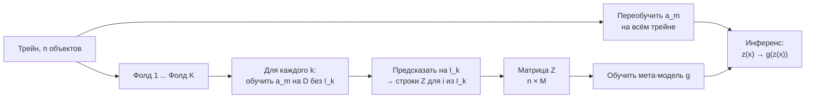

# Стекинг и блендинг

> **Зачем эта глава.** У вас есть бустинг с AUC 0.949, логистическая регрессия с 0.895 и kNN
> с 0.931 — и вопрос, можно ли собрать из них что-то лучше лучшей. Стекинг отвечает «да», но
> ровно при одном условии: мета-признаки построены out-of-fold. При наивной сборке вы получите
> идеальную цифру на обучении и модель хуже одиночного бустинга. После главы вы сможете
> построить корректный стекинг, объяснить утечку и словами, и формулой, и честно посчитать,
> окупает ли прирост в третьем знаке удвоение инфраструктуры.

**Уровень:** 🎯 middle → 🧠 middle+
**Предварительно нужно:** [бэггинг и случайный лес](06-bagging-random-forest.md), [градиентный бустинг](07-gradient-boosting.md), [валидация и утечки](13-validation-and-leakage.md), [постановка задачи обучения](01-learning-theory.md)
**Как проработать:** чтение + запуск кода из разделов 3 и 7 + разбор компромиссов

---

## Карта главы

- [1. Что не умеют бэггинг и бустинг](#1-что-не-умеют-бэггинг-и-бустинг) — откуда взялся третий вид ансамбля
- [2. Мета-признаки: что именно попадает на второй уровень](#2-мета-признаки-что-именно-попадает-на-второй-уровень) — постановка и обозначения
- [3. Почему предсказания на своём трейне — это утечка](#3-почему-предсказания-на-своём-трейне--это-утечка) — с числами
- [4. Out-of-fold: единственный корректный источник мета-признаков](#4-out-of-fold-единственный-корректный-источник-мета-признаков)
- [5. Блендинг: чем платит отложенная выборка](#5-блендинг-чем-платит-отложенная-выборка)
- [6. Почему мета-модель почти всегда линейная](#6-почему-мета-модель-почти-всегда-линейная)
- [7. Декорреляция: три бустинга с разными сидами не помогут](#7-декорреляция-три-бустинга-с-разными-сидами-не-помогут)
- [8. Многоуровневый стекинг: Netflix Prize, Kaggle и прод](#8-многоуровневый-стекинг-netflix-prize-kaggle-и-прод)
- [9. Цена инференса: латентность складывается, а хвост растёт](#9-цена-инференса-латентность-складывается-а-хвост-растёт)
- [10. Когда прирост в третьем знаке не окупает удвоение инфраструктуры](#10-когда-прирост-в-третьем-знаке-не-окупает-удвоение-инфраструктуры)
- [11. Подводные камни](#11-подводные-камни)
- [12. Проверь себя](#12-проверь-себя)
- [13. Практика](#13-практика)
- [14. Что читать дальше](#14-что-читать-дальше)

---

## 1. Что не умеют бэггинг и бустинг

У бэггинга и бустинга есть общая черта, которую редко проговаривают: **правило комбинации в них
задано заранее и ничему не учится**. Лес усредняет деревья с одинаковыми весами $1/B$. Бустинг
складывает деревья с весами, равными learning rate. В обоих случаях базовые модели — одного
семейства, и способ их сложить придуман человеком до начала обучения.

Теперь ситуация из реальной работы. На табличной задаче у вас лежат три модели разной природы:
бустинг (ловит взаимодействия, но экстраполировать не умеет), логистическая регрессия (ловит
глобальный линейный тренд, устойчива на редких сегментах) и kNN (ловит локальные сгустки, на
которых деревья строят слишком грубые разбиения). Они ошибаются **на разных объектах**. Ни
бэггинг, ни бустинг не дают способа их соединить: бэггинг требует однородности, бустинг —
последовательности.

Первое, что обычно пробуют, — усреднить предсказания. Иногда помогает, но у простого усреднения
есть жёсткий дефект: оно даёт логрегу с AUC 0.895 такой же вес, как бустингу с 0.949, и тянет
результат вниз (мы увидим это на числах в разделе 7). Второй заход — подобрать веса руками по
валидации. При двух моделях это работает, при пяти — превращается в перебор по сетке, который и
есть обучение модели, только медленное и без регуляризации.

Отсюда третий вид ансамбля: **стекинг** (stacking, stacked generalization, Wolpert 1992). Идея
в одной фразе: предсказания базовых моделей — это признаки, и над ними обучается ещё одна
модель, которая сама находит правило комбинации.

Терминология плавает, и на собеседовании это стоит проговорить явно. **Стекинг** — мета-признаки
получены кросс-валидацией (out-of-fold). **Блендинг** (blending) — мета-признаки получены на
отдельной отложенной выборке. Разделение закрепилось на Kaggle после Netflix Prize; в статьях
обоим часто говорят «stacking».

> 💬 **На собеседовании.** Спросят: «Чем стекинг отличается от бэггинга и бустинга?»
> Хороший ответ: во всех трёх мы складываем модели, но в бэггинге и бустинге веса фиксированы
> заранее и базовые модели однородны, а в стекинге правило комбинации — это отдельная обученная
> модель, и базовые могут быть какими угодно. Отсюда главное следствие: стекингу нужны честные
> мета-признаки, иначе мета-модель обучится на распределении, которого в инференсе не будет.
> Плохой ответ: «стекинг — это когда моделей много» — это описание любого ансамбля.

---

## 2. Мета-признаки: что именно попадает на второй уровень

Пусть дана обучающая выборка $D = \{(x_i, y_i)\}_{i=1}^{n}$, где $x_i \in \mathbb{R}^d$ — вектор
признаков, $y_i$ — ответ. Есть $M$ **алгоритмов обучения** $a_1, \dots, a_M$; запись
$a_m^{(S)}$ означает модель, полученную применением алгоритма $a_m$ к выборке $S \subseteq D$.

Для объекта $x$ строим **вектор мета-признаков**

$$
z(x) \;=\; \big(a_1^{(D)}(x),\; a_2^{(D)}(x),\; \dots,\; a_M^{(D)}(x)\big) \in \mathbb{R}^{M}
$$

и обучаем **мета-модель** $g:\mathbb{R}^M \to \mathbb{R}$. Итоговое предсказание — $F(x) = g(z(x))$.

Всё содержание главы упирается в один вопрос: **на каких парах $(z_i, y_i)$ обучать $g$**, где
$z_i$ — краткая запись для $z(x_i)$?
Мета-модель — обычная модель, и к ней применимо обычное требование из
[постановки задачи обучения](01-learning-theory.md): обучающие и тестовые пары должны быть из
одного распределения. В инференсе $z(x)$ — это предсказания базовых моделей на объекте, которого
они **не видели**. Значит, и при обучении $g$ мета-признаки должны быть предсказаниями на
невиданных объектах. Любой другой вариант — сдвиг распределения, который мы устроили себе сами.

Что конкретно кладут в $z$ для классификации: вероятность положительного класса, а лучше — логит
$\log\frac{p}{1-p}$, потому что линейная мета-модель работает в логит-шкале и не упирается в
насыщение у 0 и 1. Для многоклассовой задачи — $K-1$ столбец на модель (полный набор из $K$
вероятностей линейно зависим и портит обусловленность). Отдельный приём: добавить в $z$ несколько
исходных признаков — тогда мета-модель может выучить, что на сегменте «новые пользователи»
надо больше доверять логрегу. Работает, но резко повышает риск переобучения мета-уровня, так что
исходных признаков добавляют единицы, а не сотни.

> 🌱 **База.** Минимальный маршрут через тему: (1) обучите две-три непохожие модели и посмотрите,
> насколько они согласны — если корреляция их ошибок выше 0.95, дальше можно не идти; (2) возьмите
> `sklearn.ensemble.StackingClassifier` с `final_estimator=LogisticRegression()` и `cv=5` — он
> сам построит out-of-fold-признаки, и ошибиться будет почти невозможно; (3) сравните его с
> лучшей одиночной моделью на выборке, которую вы вообще не трогали. Всё остальное в этой главе —
> объяснение того, что происходит внутри этих трёх шагов и почему ручная реализация ломается.

---

## 3. Почему предсказания на своём трейне — это утечка

Самая наглядная демонстрация — 1-NN. Обучите его на $D$ и спросите предсказание для объекта
$x_i \in D$: ближайший сосед $x_i$ — это сам $x_i$, и модель вернёт ровно $y_i$. То есть
мета-признак **тождественно равен таргету**. Мета-модель честно выучит $g(z) = z_1$ и покажет
идеальное качество на обучении. В инференсе первый столбец $z$ превращается в метку соседа —
сигнал сильно слабее, — и вся конструкция рассыпается.

1-NN — предельный случай, но эффект есть у любой модели, которая хоть немного подгоняется под
обучающие данные. Строгая форма — теорема об оптимизме (Efron, 1986; ESL §7.4):

$$
\mathbb{E}\big[\mathrm{Err}_{\mathrm{in}}\big] \;-\; \mathbb{E}\big[\overline{\mathrm{err}}\big]
\;=\; \frac{2}{n}\sum_{i=1}^{n} \mathrm{Cov}\big(\hat y_i,\, y_i\big)
$$

где $\overline{\mathrm{err}}$ — средняя квадратичная ошибка на обучающей выборке,
$\mathrm{Err}_{\mathrm{in}}$ — ожидаемая ошибка на новых ответах в тех же точках $x_i$,
$\hat y_i = a^{(D)}(x_i)$ — предсказание модели, обученной на выборке, содержащей объект $i$,
а ковариация берётся по случайности ответов $y$ при фиксированных $x$.

> 📐 **Разбор формулы.** Левая часть — это ровно то, на сколько мы себя обманываем, оценивая
> качество по обучающей выборке. Правая говорит: обман в точности равен тому, насколько
> предсказание $\hat y_i$ «слушается» собственного ответа $y_i$. Если модель вообще не смотрит
> на $y_i$ (обучена без него), $\mathrm{Cov}(\hat y_i, y_i) = 0$ и обмана нет. Если модель
> запоминает, $\hat y_i = y_i$, то $\mathrm{Cov} = \mathrm{Var}(y_i) = \sigma^2$ и оптимизм
> равен $2\sigma^2$ — максимуму. Для линейной регрессии сумма ковариаций равна
> $\sigma^2 \cdot \operatorname{tr}(S)$, где $S$ — матрица-шляпа, а её след есть число
> эффективных степеней свободы. Мораль для стекинга: **величина утечки в мета-признаке равна
> гибкости базовой модели**. Именно поэтому наивный стекинг сильнее всего ломается там, где
> базовые модели самые сильные.

Проверим это численно. Три базовые модели, из них одна намеренно «запоминающая» (1-NN):

```python
import numpy as np
from sklearn.datasets import make_classification
from sklearn.model_selection import train_test_split, cross_val_predict, StratifiedKFold
from sklearn.linear_model import LogisticRegression
from sklearn.neighbors import KNeighborsClassifier
from sklearn.ensemble import HistGradientBoostingClassifier
from sklearn.pipeline import make_pipeline
from sklearn.preprocessing import StandardScaler
from sklearn.metrics import roc_auc_score

X, y = make_classification(n_samples=4000, n_features=20, n_informative=6,
                           n_redundant=4, class_sep=0.8, flip_y=0.05, random_state=42)
Xtr, Xte, ytr, yte = train_test_split(X, y, test_size=0.4, stratify=y, random_state=42)

base = {
    "knn1":   KNeighborsClassifier(n_neighbors=1),
    "logreg": make_pipeline(StandardScaler(), LogisticRegression(max_iter=1000)),
    "hgb":    HistGradientBoostingClassifier(max_iter=200, learning_rate=0.1, random_state=0),
}
cv = StratifiedKFold(n_splits=5, shuffle=True, random_state=42)

Z_naive = np.column_stack([m.fit(Xtr, ytr).predict_proba(Xtr)[:, 1] for m in base.values()])
Z_oof   = np.column_stack([cross_val_predict(m, Xtr, ytr, cv=cv, method="predict_proba")[:, 1]
                           for m in base.values()])
Z_test  = np.column_stack([m.predict_proba(Xte)[:, 1] for m in base.values()])

print(f"{'модель':8} {'AUC на своём трейне':>20} {'AUC out-of-fold':>16} {'AUC на тесте':>13}")
for j, name in enumerate(base):
    print(f"{name:8} {roc_auc_score(ytr, Z_naive[:, j]):>20.4f}"
          f" {roc_auc_score(ytr, Z_oof[:, j]):>16.4f} {roc_auc_score(yte, Z_test[:, j]):>13.4f}")

for tag, Z in (("наивный", Z_naive), ("OOF", Z_oof)):
    meta = LogisticRegression(max_iter=1000).fit(Z, ytr)
    print(f"\n{tag} стекинг: веса мета-модели "
          f"{dict(zip(base, [round(float(c), 2) for c in meta.coef_[0]]))}")
    print(f"  оценка, которую видит инженер: {roc_auc_score(ytr, meta.predict_proba(Z)[:, 1]):.4f}")
    print(f"  AUC на тесте:                  {roc_auc_score(yte, meta.predict_proba(Z_test)[:, 1]):.4f}")
```

Вывод:

```
модель    AUC на своём трейне  AUC out-of-fold  AUC на тесте
knn1                   1.0000           0.8246        0.8319
logreg                 0.8911           0.8859        0.8950
hgb                    1.0000           0.9508        0.9494

наивный стекинг: веса мета-модели {'knn1': 5.25, 'logreg': 1.25, 'hgb': 5.2}
  оценка, которую видит инженер: 1.0000
  AUC на тесте:                  0.9439

OOF стекинг: веса мета-модели {'knn1': 0.97, 'logreg': 0.69, 'hgb': 4.26}
  оценка, которую видит инженер: 0.9454
  AUC на тесте:                  0.9503
```

Читаем построчно. Первая таблица — иллюстрация формулы оптимизма: у 1-NN AUC на своём трейне
ровно 1.0000 при реальных 0.8319, у бустинга — тоже 1.0000 при реальных 0.9494, а у логрега
разрыв всего 0.8911 против 0.8950, потому что модель почти не гибкая. OOF-колонка при этом
предсказывает тест с точностью до третьего знака — это и есть честная оценка.

Дальше — цена ошибки. Наивная мета-модель дала 1-NN **самый большой вес** (5.25), потому что на
её обучающих данных этот столбец идеален. Инженер видит на выходе AUC 1.0000 и радуется. На тесте
получается 0.9439 — **хуже, чем один бустинг без всякого ансамбля** (0.9494). OOF-версия дала
1-NN вес 0.97, показала честную оценку 0.9454 и на тесте выдала 0.9503, то есть реальный, хоть
и скромный, прирост.

> ⚠️ **Типичная ошибка.** Обучить базовые модели на трейне, сделать `predict` на том же трейне
> и подать это мета-модели → мета-модель раздаёт веса пропорционально способности базовых
> моделей **запоминать**, а не обобщать, и оценка качества уходит в потолок → мета-признаки
> строятся только out-of-fold, а оценку ансамбля берут с внешней выборки, не участвовавшей
> в построении OOF.

> 💬 **На собеседовании.** Спросят: «Почему нельзя обучить мета-модель на предсказаниях
> базовых моделей по обучающей выборке?» Хороший ответ: потому что предсказание на объекте,
> который был в обучении, коррелирует с его собственным ответом — величина этой корреляции и
> есть оптимизм обучающей ошибки. Мета-модель видит признак, у которого в инференсе не будет
> такой связи с таргетом, и распределяет веса в пользу самых переобучающихся моделей. Плохой
> ответ: «получится переобучение» без объяснения механизма — это описание симптома.

---

## 4. Out-of-fold: единственный корректный источник мета-признаков

Процедура. Разбиваем индексы на $K$ непересекающихся фолдов $I_1, \dots, I_K$. Для каждого фолда
$k$ обучаем базовую модель на всём остальном и предсказываем внутри фолда:

$$
z_{im} \;=\; a_m^{\,(D \setminus I_k)}(x_i), \qquad i \in I_k
$$

где $z_{im}$ — $m$-й мета-признак объекта $i$, а $D \setminus I_k$ — обучающая выборка без фолда
$k$. Ключевое: пара $(x_i, y_i)$ не участвовала в обучении модели, которая породила $z_{im}$,
поэтому $\mathrm{Cov}(z_{im}, y_i)$ несёт ровно ту информацию, что будет в инференсе, — и ни
байтом больше. Обойдя все $K$ фолдов, получаем полную матрицу $Z \in \mathbb{R}^{n \times M}$
и обучаем на ней мета-модель.



Сколько брать фолдов. Чем больше $K$, тем ближе фолдовые модели к финальной (обученной на всём
трейне) и тем меньше рассогласование между обучением и инференсом мета-модели — но тем дороже:
стоимость линейна по $K$. Рабочий диапазон — 5 при дорогом обучении и 10 при дешёвом; $K = n$
(leave-one-out) стоит запредельно и даёт оценку с высокой дисперсией. Если базовых моделей
несколько, а данных мало (единицы тысяч объектов), помогает **повторённая** схема: два-три
прогона `RepeatedStratifiedKFold` с разными сидами и усреднение полученных матриц $Z$ — это
снижает зависимость мета-весов от конкретного разбиения примерно как бэггинг снижает дисперсию
дерева.

Что положить в инференс. Два варианта, и оба живые:

1. **Переобучить каждую базовую модель на всём трейне** и использовать её. Так делает
   `StackingClassifier` в sklearn. Дёшево (одна модель на алгоритм), но есть рассогласование:
   мета-модель настраивалась под модели, видевшие $\frac{K-1}{K}$ данных, а применяется к чуть
   более сильным. На практике сдвиг мал при $K \ge 5$.
2. **Сохранить все $K$ фолдовых моделей** и усреднять их предсказания. Рассогласования нет, плюс
   бесплатный бэггинг-эффект, но инференс дороже в $K$ раз, и в реестре моделей лежит $K \cdot M$
   артефактов. Это Kaggle-подход; в проде так делают редко.

> 🧠 **Middle+.** OOF-признаки честные, но не идеально честные. Во-первых, все $K$ моделей
> обучены на пересекающихся выборках, поэтому столбцы $Z$ слабо зависимы между строками — оценка
> качества мета-модели по тем же $Z$ чуть оптимистична. Во-вторых, гиперпараметры базовых моделей
> вы почти наверняка подбирали по той же кросс-валидации, и этот выбор уже «видел» все $y$.
> Строгий протокол — **вложенная кросс-валидация**: внешний цикл для оценки ансамбля, внутренний
> для OOF и тюнинга. Стоит это $K_{\text{out}} \cdot K_{\text{in}}$ обучений, поэтому в реальности
> чаще держат отдельный тест, который не трогали вообще (см. [валидацию и утечки](13-validation-and-leakage.md)).

Схема разбиения обязана совпадать с природой данных. Для временного ряда фолды строятся только
вперёд по времени, иначе базовая модель предскажет прошлое, зная будущее, и утечка вернётся с
другой стороны ([временные ряды](16-time-series.md)). Если в данных есть группы (пользователь,
магазин, устройство) — `GroupKFold`, иначе объекты одной группы окажутся по обе стороны.

> 💬 **На собеседовании.** Спросят: «У вас данные с временной структурой. Как построите
> мета-признаки?» Хороший ответ: только расширяющимся окном вперёд — обучаю базовые модели на
> периоде до $t$, предсказываю на $[t, t+\Delta)$, сдвигаю окно. Мета-признаки появляются не для
> всей выборки, а начиная с первого валидного окна, и мета-модель учится на меньшем объёме — это
> нормально и это цена корректности. Отдельно проговариваю, что мета-модель тоже стареет: её
> веса надо переобучать на скользящем окне, потому что соотношение сил базовых моделей меняется
> вместе с данными. Плохой ответ: «обычный `KFold` с `shuffle=True`, ведь мета-модель всё равно
> видит только предсказания» — предсказания как раз и сделаны моделью, знающей будущее.

> ⌨️ **Руками.** Напишите функцию `oof_predict(estimator, X, y, cv)`, возвращающую матрицу OOF
> без `cross_val_predict`: цикл по `cv.split(X, y)`, `clone(estimator)`, `fit` на train-части,
> запись в строки val-части. Пятнадцать строк. После этого добавьте второй возврат — список
> обученных фолдовых моделей, и вы получите оба варианта инференса из списка выше.

---

## 5. Блендинг: чем платит отложенная выборка

Блендинг устроен проще: делим трейн на две части, на первой обучаем базовые модели, на второй
получаем мета-признаки и обучаем мета-модель. Никакой кросс-валидации, одно обучение на модель,
невозможно случайно перепутать фолды. За эту простоту платят трижды.

Проверим на тех же данных: три модели (HistGradientBoosting, логрег, kNN на 25 соседях),
25% трейна под holdout, 10 разных разбиений — и OOF-стекинг на пяти фолдах для сравнения.

```python
# продолжение кода из раздела 3
def models():
    return [HistGradientBoostingClassifier(max_iter=200, random_state=0),
            make_pipeline(StandardScaler(), LogisticRegression(max_iter=1000)),
            make_pipeline(StandardScaler(), KNeighborsClassifier(n_neighbors=25))]

w, auc = [], []
for seed in range(10):                       # 10 разных holdout-разбиений одного и того же трейна
    Xa, Xh, ya, yh = train_test_split(Xtr, ytr, test_size=0.25, stratify=ytr, random_state=seed)
    ms = [m.fit(Xa, ya) for m in models()]
    Zh = np.column_stack([m.predict_proba(Xh)[:, 1] for m in ms])
    Zt = np.column_stack([m.predict_proba(Xte)[:, 1] for m in ms])
    meta = LogisticRegression(max_iter=1000).fit(Zh, yh)
    w.append(meta.coef_[0]); auc.append(roc_auc_score(yte, meta.predict_proba(Zt)[:, 1]))
w, auc = np.array(w), np.array(auc)
print("блендинг, 10 разных holdout-разбиений")
print("  веса мета-модели, среднее:", np.round(w.mean(0), 2), " ст.откл.:", np.round(w.std(0), 2))
print(f"  AUC на тесте: {auc.mean():.4f} ± {auc.std():.4f}  (разброс {auc.min():.4f}..{auc.max():.4f})")

Zo = np.column_stack([cross_val_predict(m, Xtr, ytr, cv=cv, method="predict_proba")[:, 1]
                      for m in models()])
ms = [m.fit(Xtr, ytr) for m in models()]
Zt = np.column_stack([m.predict_proba(Xte)[:, 1] for m in ms])
meta = LogisticRegression(max_iter=1000).fit(Zo, ytr)
print("OOF-стекинг, 5 фолдов")
print("  веса мета-модели:", np.round(meta.coef_[0], 2))
print(f"  AUC на тесте: {roc_auc_score(yte, meta.predict_proba(Zt)[:, 1]):.4f}")
```

Вывод:

```
блендинг, 10 разных holdout-разбиений
  веса мета-модели, среднее: [3.79 0.5  2.24]  ст.откл.: [0.21 0.4  0.49]
  AUC на тесте: 0.9478 ± 0.0009  (разброс 0.9464..0.9497)
OOF-стекинг, 5 фолдов
  веса мета-модели: [ 4.04 -0.23  3.05]
  AUC на тесте: 0.9495
```

Первая плата — **базовые модели видят меньше данных** (здесь 75% трейна вместо 100%). Вторая —
**мета-модель учится на 600 объектах вместо 2400**, и это видно по весам: у логрега среднее 0.50
при стандартном отклонении 0.40, то есть от разбиения к разбиению знак веса меняется. Мета-модель
просто не может решить, нужен ей логрег или нет. Третья — **результат зависит от разбиения**:
разброс итогового AUC 0.9464–0.9497 шириной в треть процентного пункта, то есть больше, чем весь
выигрыш от ансамбля.

Блендинг оправдан, когда обучение базовой модели стоит часы GPU и умножать его на $K$ нельзя;
когда данных много (при $n$ порядка миллионов даже 10% holdout — сотни тысяч объектов, и разброс
весов исчезает); и когда нужна быстрая проверка гипотезы «а даст ли ансамбль вообще что-нибудь».
На выборках в десятки тысяч объектов блендинг — плохой выбор, и приведённые числа показывают,
почему.

---

## 6. Почему мета-модель почти всегда линейная

Соблазн понятен: если предсказания — это признаки, поставим наверх бустинг, пусть найдёт хитрые
взаимодействия. На практике так почти никогда не делают, и причины конкретные.

**Мета-признаки почти вырождены.** Столбцы $Z$ — предсказания одного и того же таргета, их попарная
корреляция обычно 0.8–0.99. Пространство, в котором работает мета-модель, — это $M$ почти
коллинеарных осей. Найти в нём «взаимодействия» невозможно: их там нет, есть один сильный
общий фактор и небольшие индивидуальные отклонения. Гибкая модель в такой геометрии не находит
структуру, а подгоняется под шум OOF-процедуры.

**Остаточный оптимизм OOF надо чем-то давить.** Из врезки в разделе 4: $Z$ честные, но не
идеально. Линейная модель с $M$ параметрами (плюс регуляризация) физически не может
эксплуатировать эту тонкую структуру. Бустинг с сотней деревьев — может, и будет.

**Задача по сути и есть взвешивание.** Оптимальная комбинация некоррелированных несмещённых
оценок — линейная комбинация с весами, обратными дисперсиям. Если базовые модели откалиброваны,
искать нечего, кроме весов.

Что берут конкретно: `LogisticRegression` с L2 и $C$ порядка 0.1–1.0 для классификации,
`RidgeCV` для регрессии. Отдельно стоит **неотрицательный МНК** (NNLS, `scipy.optimize.nnls`).
Брейман в «Stacked Regressions» (1996) показал, что именно ограничение $\alpha_m \ge 0$ делает
стекинг устойчивым: без него мета-модель раздаёт большие положительные и отрицательные веса
сильно коррелированным моделям, и такая конструкция разваливается при малейшем сдвиге данных.
В выводе раздела 5 это видно прямо: OOF дал логрегу вес $-0.23$ — модель с AUC 0.895 вычитается.
Работает на этих данных, но это ровно тот вес, который слетит первым при дрейфе.

Реализуется ограничение в две строки: `scipy.optimize.nnls(Z, y)` для регрессии, а для
классификации — либо NNLS в логит-шкале, либо перебор весов на симплексе (при $M \le 5$ сетка
с шагом 0.05 считается за секунды и даёт веса, которые можно показать продакт-менеджеру).
Отдельный частный случай, который стоит держать в голове: если зафиксировать все веса равными
$1/M$, стекинг вырождается в простое усреднение. Это не деградация, а нормальный бейзлайн —
и когда обученные веса не бьют равные на честной валидации, ансамбль надо оставить усреднением:
меньше движущихся частей, нечему стареть.

> ⚠️ **Типичная ошибка.** Поставить наверх `CatBoost` с дефолтами и обрадоваться, что OOF-оценка
> ансамбля выросла на 0.01 → мета-бустинг выучил остаточную структуру самой OOF-процедуры
> (границы фолдов, разную силу фолдовых моделей), и на внешнем тесте прирост исчезает или
> становится отрицательным → мета-модель линейная и регуляризованная, а её качество мерится
> на выборке, не участвовавшей в построении $Z$.

> 💬 **На собеседовании.** Спросят: «Какую модель поставите вторым уровнем и почему?»
> Хороший ответ: линейную с регуляризацией, а при возможности — с ограничением на
> неотрицательность весов. Причина: мета-признаки почти коллинеарны, взаимодействий между ними
> нет по построению, а OOF-матрица содержит остаточный оптимизм, который гибкая модель сразу
> начнёт эксплуатировать. Бустинг наверху оправдан только когда в $z$ добавлены исходные признаки
> и мы осознанно ищем сегменты, где одна базовая модель систематически лучше другой. Плохой
> ответ: «CatBoost, он всегда лучше».

---

## 7. Декорреляция: три бустинга с разными сидами не помогут

Вернёмся к [разложению ошибки на смещение и разброс](01-learning-theory.md). Для простого
усреднения $M$ моделей, у каждой из которых дисперсия предсказания $\sigma^2$, а попарная
корреляция предсказаний равна $\rho$:

$$
\mathrm{Var}\Big(\frac{1}{M}\sum_{m=1}^{M} f_m(x)\Big) \;=\; \rho\,\sigma^2 \;+\; \frac{1-\rho}{M}\,\sigma^2
$$

Эту же формулу мы видели в [главе о бэггинге](06-bagging-random-forest.md). Второе слагаемое
убивается ростом $M$, первое — нет: **$\rho\sigma^2$ — это пол**, ниже которого усреднение не
опустится никогда. При $\rho = 0.98$ бесконечный ансамбль снимет 2% дисперсии.

Есть и точная формула, которая показывает то же самое без вероятностных допущений, —
разложение Крога–Ведельсбю (1995) для квадратичной ошибки, где
$\bar f(x) = \frac{1}{M}\sum_m f_m(x)$:

$$
\big(\bar f(x) - y\big)^2 \;=\; \frac{1}{M}\sum_{m=1}^{M}\big(f_m(x) - y\big)^2 \;-\; \frac{1}{M}\sum_{m=1}^{M}\big(f_m(x) - \bar f(x)\big)^2
$$

> 📐 **Разбор формулы.** Слева — ошибка ансамбля в точке $x$. Первое слагаемое справа — средняя
> ошибка участников. Второе — их разброс вокруг собственного среднего, «несогласие» (ambiguity).
> Тождество читается так: **ансамбль всегда не хуже среднего участника, и выигрыш в точности
> равен несогласию**. Если модели согласны ($f_m \equiv \bar f$), второе слагаемое ноль и
> ансамбль равен любому участнику. Отсюда прямое инженерное следствие: собирать в ансамбль надо
> модели, которые ошибаются в разных местах, а не модели, которые лучше всего работают
> поодиночке. Обратите внимание и на ловушку: несогласие можно нарастить, добавив плохую модель,
> но тогда вырастет и первое слагаемое. Поэтому простое усреднение неравных моделей проигрывает —
> нужен обученный вес.

Численно, на тех же данных. Группа A — три `GradientBoostingClassifier` с `subsample=0.8` и
сидами 0, 1, 2. Группа B — бустинг, логрег и kNN на 25 соседях. Корреляцию считаем по **ошибкам**
OOF-предсказаний, а не по самим предсказаниям:

```python
# продолжение кода из раздела 3
from sklearn.ensemble import GradientBoostingClassifier

def gb(seed):
    return GradientBoostingClassifier(n_estimators=200, learning_rate=0.1,
                                      max_depth=3, subsample=0.8, random_state=seed)

groups = {
    "три бустинга (сиды 0,1,2)": [gb(0), gb(1), gb(2)],
    "бустинг + логрег + kNN-25": [gb(0),
                                  make_pipeline(StandardScaler(), LogisticRegression(max_iter=1000)),
                                  make_pipeline(StandardScaler(), KNeighborsClassifier(n_neighbors=25))],
}

for tag, ms in groups.items():
    Z_o = np.column_stack([cross_val_predict(m, Xtr, ytr, cv=cv, method="predict_proba")[:, 1]
                           for m in ms])
    Z_t = np.column_stack([m.fit(Xtr, ytr).predict_proba(Xte)[:, 1] for m in ms])
    C = np.corrcoef((Z_o - ytr[:, None]).T)      # корреляция ошибок, а не предсказаний
    print(f"\n{tag}")
    print(f"  средняя парная корреляция ошибок: {C[np.triu_indices(3, k=1)].mean():.3f}")
    print(f"  AUC отдельных моделей на тесте:   "
          f"{[round(roc_auc_score(yte, Z_t[:, j]), 4) for j in range(3)]}")
    print(f"  простое усреднение, AUC на тесте: {roc_auc_score(yte, Z_t.mean(axis=1)):.4f}")
    meta = LogisticRegression(max_iter=1000).fit(Z_o, ytr)
    print(f"  OOF-стекинг, AUC на тесте:        "
          f"{roc_auc_score(yte, meta.predict_proba(Z_t)[:, 1]):.4f}")
```

Вывод:

```
три бустинга (сиды 0,1,2)
  средняя парная корреляция ошибок: 0.977
  AUC отдельных моделей на тесте:   [0.9439, 0.9457, 0.9447]
  простое усреднение, AUC на тесте: 0.9458
  OOF-стекинг, AUC на тесте:        0.9459

бустинг + логрег + kNN-25
  средняя парная корреляция ошибок: 0.830
  AUC отдельных моделей на тесте:   [0.9439, 0.895, 0.9313]
  простое усреднение, AUC на тесте: 0.9420
  OOF-стекинг, AUC на тесте:        0.9462
```

Три бустинга с разными сидами: корреляция ошибок 0.977, ансамбль даёт 0.9459 против 0.9457 у
лучшего участника — прирост в четвёртом знаке, то есть ничего, при тройной стоимости. Разнородная
группа: корреляция 0.830, стекинг даёт 0.9462 против 0.9439 у бустинга — прирост 0.0023.
Заодно видно предупреждение из разбора формулы: **простое усреднение** разнородной группы дало
0.9420, то есть **хуже одиночного бустинга**, потому что логрег с AUC 0.895 тянет среднее вниз.
Разнородность помогает только вместе с обученными весами.

> 💬 **На собеседовании.** Спросят: «Как выбирать модели в ансамбль?» Хороший ответ: по
> корреляции ошибок, а не по индивидуальному качеству. Считаю OOF-предсказания всех кандидатов,
> смотрю матрицу корреляций остатков и беру модели из разных «кустов»: бустинг, линейную,
> kNN/факторизацию, нейросеть. Модель с AUC на 0.02 хуже лучшей, но с корреляцией ошибок 0.7,
> полезнее второго бустинга с корреляцией 0.98. Плохой ответ: «беру топ-5 по метрике на
> валидации» — они почти всегда одного семейства и почти всегда сильно скоррелированы.

---

## 8. Многоуровневый стекинг: Netflix Prize, Kaggle и прод

Конструкцию можно повторить. Уровень 1 — тридцать базовых моделей, из которых собирается матрица
$Z^{(1)} \in \mathbb{R}^{n \times 30}$. Уровень 2 — уже не одна мета-модель, а несколько (Ridge,
неглубокий бустинг, маленькая нейросеть), каждая обучается на $Z^{(1)}$ **по своей** OOF-схеме,
и их OOF-предсказания дают $Z^{(2)} \in \mathbb{R}^{n \times 3}$. Уровень 3 — обычно просто
взвешенное среднее. Схема фолдов при этом обязана быть одна и та же на всех уровнях, иначе
объект, попавший в обучение уровня 1 на одном разбиении и в валидацию уровня 2 на другом,
протащит утечку через два этажа сразу, и найти её будет практически невозможно.

Так делали победители Netflix Prize (BellKor's Pragmatic Chaos, 2009): финальное решение,
взявшее приз в миллион долларов, было блендом более сотни моделей. Netflix заплатил приз, но
**в продакшен полный бленд не поставил** — компания в своём техблоге прямо написала, что
дополнительный прирост точности не оправдал инженерных усилий; внедрили только пару компонент
раннего решения (матричную факторизацию и RBM). Это, пожалуй, самый цитируемый в индустрии
пример разрыва между лидербордом и продом.

На Kaggle многоуровневый стекинг остался нормой для верхушки таблицы: там метрика — единственная
цель, инференс делается один раз офлайн на фиксированном тесте, а разница в четвёртом знаке
решает распределение призов. В проде трёхуровневых стеков практически нет, и причины ниже.

> 🧠 **Middle+.** Теоретическое обоснование стекинга дал не Kaggle, а Super Learner
> (van der Laan, Polley, Hubbard, 2007): кросс-валидационный выбор выпуклой комбинации из
> библиотеки алгоритмов удовлетворяет oracle-неравенству — асимптотически он не хуже лучшего
> алгоритма библиотеки с точностью до члена порядка $\sqrt{\log(M)/n}$. Отсюда два практических
> вывода. Первый: добавление в библиотеку плохой модели почти безвредно, платите вы только
> логарифмом от $M$. Второй: гарантия — «не хуже лучшего», а не «сильно лучше». Ожидать от
> стекинга скачка качества — неправильное чтение теории.

---

## 9. Цена инференса: латентность складывается, а хвост растёт

Первую ошибку делают ещё на этапе оценки: считают, что модели можно запустить параллельно и
получить $\max_m L_m$ вместо $\sum_m L_m$, где $L_m$ — латентность $m$-й модели. Так бывает не
всегда. Если базовым моделям нужны разные признаки, часть которых считается по цепочке (агрегаты из
фичестора, эмбеддинг из отдельного сервиса), то модели фактически последовательны, и латентность
складывается. Три модели по 15 мс — это 45 мс плюс мета-модель, а не 15.

Но даже при честном параллельном запуске выигрыш меньше ожидаемого, потому что p99 ансамбля —
это не p99 модели. Если $T_m$ — время ответа $m$-й модели, то

$$
P\big(\max_m T_m > t\big) \;=\; 1 \;-\; \prod_{m=1}^{M} P\big(T_m \le t\big)
$$

При $M = 5$ и независимых моделях, каждая из которых превышает свой порог $t$ с вероятностью
0.01, ансамбль превысит его с вероятностью $1 - 0.99^5 \approx 0.049$. То есть **то, что было
p99 для одной модели, становится p95 для ансамбля**; чтобы удержать p99 ансамбля, каждая модель
должна укладываться в свой p99.8. Практический вывод: параллелизация не спасает хвост, она его
ухудшает, и это одна из причин, по которым в онлайн-ранжировании предпочитают каскад
(дешёвый отбор кандидатов → дорогая модель на топе, см.
[learning to rank](../06-recsys/07-learning-to-rank.md)), а не ансамбль равноправных моделей.

К латентности добавляется всё остальное: $M$ пайплайнов обучения, $M$ наборов признаков в
фичесторе, $M$ моделей в мониторинге дрейфа, $M$ мест, где может протухнуть версия библиотеки.
Разбор инцидента «почему предсказание изменилось» на ансамбле из пяти моделей занимает в разы
больше времени, чем на одной (см. [инциденты и ранбуки](../09-monitoring/06-incidents-and-runbooks.md)).

Есть и менее очевидная статья расходов — **признаки**. Разнородность базовых моделей, ради
которой всё затевалось, обычно означает и разные наборы признаков: бустингу нужны счётчики и
категории, kNN — нормированные числовые, нейросети — эмбеддинги. Значит, в онлайне надо собрать
объединение всех трёх наборов, и p99 сбора признаков часто оказывается больше, чем p99 самих
моделей. Ансамбль, который в ноутбуке считается за миллисекунды, в сервисе упирается не в
матричные умножения, а в поход в фичестор ([serving-архитектуры](../07-mlops/05-serving-architectures.md)).

---

## 10. Когда прирост в третьем знаке не окупает удвоение инфраструктуры

В нашем примере стекинг дал +0.0023 AUC. Вопрос «стоит ли» решается не по дельте AUC, а по трём
проверкам подряд.

**Первая: воспроизводится ли прирост.** 0.0023 на одном тестовом сплите — это, скорее всего,
шум. Нужен повторённый протокол (5×2 CV или несколько временных сплитов) и разброс дельты.
Ориентир для интуиции: на тесте в 1600 объектов стандартная ошибка самой AUC составляет порядка
0.008 — вчетверо больше нашей дельты. Дельта, правда, оценивается точнее, чем каждая AUC по
отдельности, потому что модели сравниваются на одних и тех же объектах и их ошибки
скоррелированы, — но считать разброс дельты всё равно обязательно. Если стандартное отклонение
дельты сравнимо с самой дельтой, прироста нет, сколько бы знаков после запятой ни было в отчёте.

**Вторая: переживает ли прирост перевод в бизнес-метрику.** AUC интегральна по всем порогам,
а прод работает в одной точке. Прирост AUC, набранный в области низкого recall, может не дать
ничего в precision@k при бюджете ручной проверки в 500 заявок в день. Считать надо ту метрику,
по которой судят систему ([метрики качества](04-metrics.md)).

**Третья: сравните с альтернативами того же бюджета.** Один новый признак из ещё не подключённого
источника, месяц дополнительной разметки, исправление рассинхрона между офлайн- и
онлайн-признаками — каждое из этих действий на реальной задаче обычно даёт больше, чем второй
уровень моделей, и не добавляет постоянной операционной нагрузки.

Честная картина по индустрии: ансамбли из 2–3 моделей **разной природы** в проде встречаются
регулярно — например, бустинг плюс нейросеть в CTR-предсказании, где нейросеть приносит
последовательные и текстовые сигналы, недоступные деревьям. Многоуровневых стеков из десятков
моделей нет практически нигде. Компромиссный ход, который действительно работает: собрать
ансамбль офлайн, а в прод отправить **одну модель, обученную на его предсказаниях**
(дистилляция, см. [оптимизацию инференса](../07-mlops/09-inference-optimization.md)). Часть
прироста теряется, стоимость инференса остаётся однократной.

Где единого мнения нет: одни команды считают ансамбль нормальным продовым паттерном и живут с
двумя-тремя моделями годами, другие держат жёсткое правило «одна модель на одно решение» и любой
прирост забирают признаками. Оба подхода рабочие, и выбор определяется не качеством моделей, а
зрелостью платформы: если у вас автоматический пайплайн переобучения, реестр моделей и настроенный
мониторинг, вторая модель стоит дёшево; если каждая выкатка — это ручная работа на день, вторая
модель удваивает эту работу навсегда.

> 💬 **На собеседовании.** Спросят: «Вы получили +0.3% AUC от стекинга. Что делаете?»
> Хороший ответ: сначала проверяю, что это не шум сплита, потом пересчитываю в продуктовую
> метрику в рабочей точке, потом сравниваю стоимость — три модели вместо одной означают тройной
> инференс, тройной мониторинг и более долгий разбор инцидентов. Если прирост подтверждается и
> бизнес-эффект перекрывает эксплуатацию — везу; если нет — оставляю одиночную модель либо
> дистиллирую ансамбль в неё. Плохой ответ: «конечно, везу, метрика же выросла».

---

## 11. Подводные камни

**Мета-признаки посчитаны на данных, по которым подбирали гиперпараметры базовых моделей.**
Симптом: OOF-оценка ансамбля стабильно на 1–2 пункта выше, чем на отложенном тесте.
Причина: выбор гиперпараметров уже использовал все $y$, и «честность» OOF частичная.
Что делать: держать тест, не участвовавший ни в тюнинге, ни в построении OOF; при высокой цене
ошибки — вложенная кросс-валидация.

**Разные схемы разбиения для разных базовых моделей.**
Симптом: ансамбль хуже лучшей модели, веса выглядят случайными.
Причина: одна модель считала OOF на `KFold`, другая на `StratifiedKFold` с другим сидом; фолды
не совпадают, и объект оказывается «видимым» для одной модели и невидимым для другой.
Что делать: один объект `cv` на весь пайплайн, зафиксированный `random_state`, единый набор
индексов фолдов.

**Стекинг поверх плохо откалиброванных вероятностей.**
Симптом: линейная мета-модель работает хуже простого усреднения рангов.
Причина: одна модель выдаёт вероятности в диапазоне 0.2–0.4, другая 0.01–0.99; линейная
комбинация в шкале вероятностей смешивает несопоставимые величины.
Что делать: переходить к логитам либо к рангам, либо калибровать базовые модели
([калибровка](12-imbalance-and-calibration.md)).

**Утечка через препроцессинг внутри фолда.**
Симптом: OOF-оценка отличная, тест проваливается, хотя схема фолдов правильная.
Причина: `StandardScaler`, target encoding или отбор признаков посчитаны на всём трейне до
разбиения. Оборачивать в `Pipeline` — обязательно, тогда `cross_val_predict` пересчитает их
внутри каждого фолда ([валидация и утечки](13-validation-and-leakage.md)).

**Дубликаты объектов между фолдами.**
Симптом: kNN и деревья получают подозрительно высокие OOF-метрики.
Причина: один и тот же клиент/товар присутствует в нескольких строках, и его копия попала в
обучающую часть фолда. Что делать: дедупликация плюс `GroupKFold` по ключу сущности.

**Ансамбль сравнивают с одиночной моделью, обученной на других данных.**
Симптом: «стекинг даёт +0.01» — и никто не может это воспроизвести.
Причина: базовая модель для сравнения бралась со старым набором признаков или со старым сплитом,
а ансамбль собирали заново. Сравнение получается не «ансамбль против модели», а «новый пайплайн
против старого».
Что делать: бейзлайн — лучшая одиночная модель из того же набора кандидатов, на тех же данных,
на том же тесте; дельту считать только так.

**Ансамбль стареет неравномерно.**
Симптом: качество ансамбля падает быстрее, чем каждой отдельной модели.
Причина: веса мета-модели зафиксированы под старое соотношение сил, а при дрейфе оно меняется.
Что делать: переобучать мета-уровень чаще базового (он дешёвый) и мониторить веса как метрику
([дрейф](../09-monitoring/03-drift-detection.md)).

---

## 12. Проверь себя

<details>
<summary><b>🌱 Вопрос.</b> Объясните стекинг за минуту человеку, который знает бэггинг и бустинг.</summary>

**Короткий ответ.** Обучаем несколько разных моделей, берём их предсказания как новые признаки
и учим поверх ещё одну модель, которая находит правило комбинации. В отличие от бэггинга и
бустинга, веса не задаются заранее, а обучаются.

**Развёрнуто.** Критическая деталь — как получить обучающие данные для второго уровня. Предсказания
на объектах, которые базовая модель видела при обучении, использовать нельзя: они содержат
собственный ответ объекта. Поэтому мета-признаки строят кросс-валидацией: предсказание для
объекта делает модель, обученная без фолда, в котором он лежит.

**Чего ждёт интервьюер:** что вы назовёте обучаемое правило комбинации и сразу упомянете OOF.

**Провал:** «стекинг — это усреднение нескольких моделей». Усреднение — ансамбль с заранее
фиксированными весами, второго уровня в нём нет и обучать нечего.
</details>

<details>
<summary><b>🎯 Вопрос.</b> Покажите на конкретной модели, почему предсказания на трейне нельзя подавать мета-модели.</summary>

**Короткий ответ.** Возьмите 1-NN: для обучающего объекта ближайший сосед — он сам, предсказание
равно его метке. Мета-признак тождественно равен таргету, мета-модель отдаёт ему весь вес, а в
инференсе этот столбец превращается в метку ближайшего чужого объекта.

**Развёрнуто.** Общая форма — теорема об оптимизме: разрыв между обучающей и истинной ошибкой
равен $\frac{2}{n}\sum_i \mathrm{Cov}(\hat y_i, y_i)$. Ковариация тем больше, чем гибче модель,
поэтому наивный стекинг систематически переоценивает самые переобучающиеся базовые модели.
В примере из главы наивная схема дала 1-NN вес 5.25 и оценку AUC 1.0000, а на тесте получила
0.9439 — хуже одиночного бустинга с 0.9494.

**Чего ждёт интервьюер:** что вы объясните механизм, а не назовёте слово «переобучение».

**Провал:** «мета-модель переобучится» без указания на то, что именно распределение признака в
обучении и инференсе разное.
</details>

<details>
<summary><b>🎯 Вопрос.</b> Стекинг или блендинг — что выберете и по какому признаку?</summary>

**Короткий ответ.** По размеру данных и стоимости обучения. Мало данных и дешёвое обучение —
OOF-стекинг. Дорогое обучение (часы GPU) или очень большая выборка — блендинг.

**Развёрнуто.** Блендинг платит трижды: базовые модели видят меньше данных, мета-модель учится
на маленькой выборке, результат зависит от конкретного разбиения. В эксперименте главы на
2400 объектах трейна веса блендинга скакали так, что у логрега менялся знак, а итоговый AUC
гулял в диапазоне 0.9464–0.9497 — шире, чем весь выигрыш ансамбля. При выборке в миллионы
объектов эти эффекты исчезают, и блендинг становится разумным.

**Чего ждёт интервьюер:** решение через условия, а не «стекинг корректнее».

**Провал:** «блендинг — это неправильный стекинг».
</details>

<details>
<summary><b>🎯 Вопрос.</b> Почему ансамбль из трёх бустингов с разными сидами почти не даёт прироста?</summary>

**Короткий ответ.** Их ошибки скоррелированы почти единично, а дисперсия среднего снижается
только на некоррелированной части: $\mathrm{Var} = \rho\sigma^2 + \frac{1-\rho}{M}\sigma^2$.

**Развёрнуто.** В измерении главы средняя корреляция ошибок трёх бустингов с разными сидами —
0.977, и ансамбль дал 0.9459 против 0.9457 у лучшего участника. Разнородная группа
(бустинг + логрег + kNN) имела корреляцию 0.830 и дала 0.9462 против 0.9439. Разложение
Крога–Ведельсбю формулирует это точно: выигрыш ансамбля равен несогласию участников.

**Чего ждёт интервьюер:** формулу с $\rho$ или тождество «ошибка ансамбля = средняя ошибка минус
несогласие», а не общие слова про разнообразие.

**Провал:** «больше моделей — лучше».
</details>

<details>
<summary><b>🧠 Вопрос.</b> Какие модели поедут в прод: переобученные на всём трейне или фолдовые?</summary>

**Короткий ответ.** Оба варианта корректны. `StackingClassifier` переобучает на всём трейне —
дёшево, но мета-веса настраивались под чуть более слабые модели. Хранение $K$ фолдовых моделей
убирает рассогласование и добавляет бэггинг-эффект, но умножает инференс и число артефактов на $K$.

**Развёрнуто.** Рассогласование мало при $K \ge 5$: модель, обученная на 80% данных, близка к
модели на 100%. Оно становится заметным на малых выборках и на алгоритмах, чувствительных к
объёму (kNN, глубокие деревья без регуляризации). Если ансамбль работает офлайн-батчем, вариант
с $K$ моделями бесплатен по латентности и его берут чаще.

**Чего ждёт интервьюер:** что вы вообще осознаёте существование этого выбора.

**Провал:** уверенность, что фолдовые модели надо выбросить сразу после подсчёта OOF.
</details>

<details>
<summary><b>🧠 Вопрос.</b> Стекинг дал +0.3% AUC. Ваши действия?</summary>

**Короткий ответ.** Проверить устойчивость дельты на повторённом протоколе, перевести в
продуктовую метрику в рабочей точке, сравнить с операционной стоимостью $M$ моделей.

**Развёрнуто.** 0.003 AUC на одном сплите обычно лежит внутри шума; нужен разброс по нескольким
разбиениям. Дальше AUC пересчитывается в ту метрику, по которой судят систему: прирост,
набранный в зоне низкого recall, ничего не даст при фиксированном бюджете ручной проверки.
Наконец, стоимость: латентность складывается (а при параллельном запуске портится хвост — то,
что было p99 одной модели, при пяти моделях становится p95), плюс $M$ пайплайнов обучения и
мониторинга. Компромисс — дистиллировать ансамбль в одну модель.

**Чего ждёт интервьюер:** инженерное мышление, а не оптимизацию лидерборда.

**Провал:** «раз метрика выросла — катим».
</details>

<details>
<summary><b>🧠 Вопрос.</b> Есть ли у стекинга теоретические гарантии?</summary>

**Короткий ответ.** Да, oracle-неравенство Super Learner (van der Laan et al., 2007):
кросс-валидационный выбор комбинации асимптотически не хуже лучшего алгоритма библиотеки с
точностью до члена порядка $\sqrt{\log(M)/n}$.

**Развёрнуто.** Практических следствий два. Добавить в библиотеку слабый алгоритм почти
безопасно — плата логарифмическая по числу алгоритмов $M$. И одновременно: гарантия обещает
«не хуже лучшего», а не «существенно лучше». Реальный прирост берётся из декорреляции ошибок,
и если её нет, теория ничего не спасёт.

**Чего ждёт интервьюер:** что вы отличаете эмпирику Kaggle от доказанного результата.

**Провал:** «гарантий нет, это чистая эвристика».
</details>

---

## 13. Практика

**Задача 1. Воспроизвести утечку (30 минут).**
Запустите код из раздела 3, затем замените 1-NN на `DecisionTreeClassifier()` без ограничения
глубины и на `RandomForestClassifier(random_state=0)`. Постройте таблицу «модель → AUC на своём
трейне → OOF → тест → вес в наивной мета-модели».
*Критерий: вы видите монотонную связь между разрывом «трейн минус OOF» и весом в наивной
мета-модели, и можете назвать её теоретическую причину.*

**Задача 2. Собственный OOF (45 минут).**
Реализуйте `oof_predict` без `cross_val_predict`, с возвратом матрицы OOF и списка фолдовых
моделей. Сравните два инференса: переобучение на всём трейне против усреднения $K$ фолдовых
моделей. *Критерий: разница по AUC у вас меньше 0.002, и вы можете объяснить, почему на этих
данных она мала и когда была бы большой.*

**Задача 3. Отбор по корреляции ошибок (1 час).**
Возьмите шесть кандидатов (два бустинга, логрег, kNN, случайный лес, наивный Байес), посчитайте
матрицу корреляций OOF-ошибок и сравните два ансамбля: топ-3 по индивидуальному AUC и 3 модели,
выбранные жадно по минимуму корреляции.
*Критерий: вторая тройка не хуже первой при заметно более низкой средней корреляции; вы можете
показать это на числах, а не на словах.*

**Задача 4. Цена ансамбля (30 минут).**
Замерьте `predict_proba` каждой базовой модели на батче в 10 000 объектов (`time.perf_counter`,
5 повторов, берите медиану). Посчитайте суммарную латентность ансамбля и сопоставьте с приростом
метрики из задачи 3. *Критерий: у вас есть строка вида «+0.002 AUC ценой ×3.4 по времени
инференса», и вы формулируете решение «везти / не везти» с обоснованием.*

---

## 14. Что читать дальше

- **Wolpert D. «Stacked Generalization» (Neural Networks, 1992)** — первоисточник. Читать ради
  формулировки идеи «обучение на поведении обучающихся моделей» и ради того, что уже здесь
  требование кросс-валидационных мета-признаков сформулировано как обязательное.
- **Breiman L. «Stacked Regressions» (Machine Learning, 1996)** — работа, из которой пришло
  ограничение $\alpha_m \ge 0$. Главный результат: без неотрицательности стекинг регрессий
  нестабилен; с ней — надёжно бьёт лучшего участника.
- **Hastie T., Tibshirani R., Friedman J. «The Elements of Statistical Learning», §7.4–7.7 и §8.8** —
  теорема об оптимизме, эффективные степени свободы и раздел о стекинге. Формула из раздела 3
  этой главы — оттуда.
- **van der Laan M., Polley E., Hubbard A. «Super Learner» (Statistical Applications in Genetics
  and Molecular Biology, 2007)** — главное строгое обоснование стекинга; читать ради
  oracle-неравенства и понимания, что именно оно обещает.
- **Krogh A., Vedelsby J. «Neural Network Ensembles, Cross Validation and Active Learning»
  (NIPS 1995)** — разложение «ошибка ансамбля = средняя ошибка минус несогласие». Самая короткая
  дорога к пониманию, зачем нужна декорреляция.
- [Документация scikit-learn: Stacked generalization](https://scikit-learn.org/stable/modules/ensemble.html#stacked-generalization) —
  как устроены `StackingClassifier`/`StackingRegressor`, что именно они делают с `cv`,
  `passthrough` и переобучением базовых моделей на полном трейне.
- **Töscher A., Jahrer M., Bell R. «The BigChaos Solution to the Netflix Grand Prize» (2009)** —
  технический отчёт победителей: как устроен бленд из сотен моделей. Полезен как памятник эпохе
  и как аргумент в разговоре о том, почему такое не едет в прод.
- [Netflix Tech Blog: «Netflix Recommendations: Beyond the 5 Stars»](https://netflixtechblog.com/netflix-recommendations-beyond-the-5-stars-part-1-55838468f429) —
  здесь Netflix объясняет, почему призовой бленд не был внедрён целиком. Лучший из известных
  примеров разрыва между офлайн-метрикой и продакшеном.

---

⬅️ [Поиск аномалий](18-anomaly-detection.md) | 🏠 [Оглавление](../index.md) | ➡️ [Разбор ошибок модели](20-error-analysis.md)
