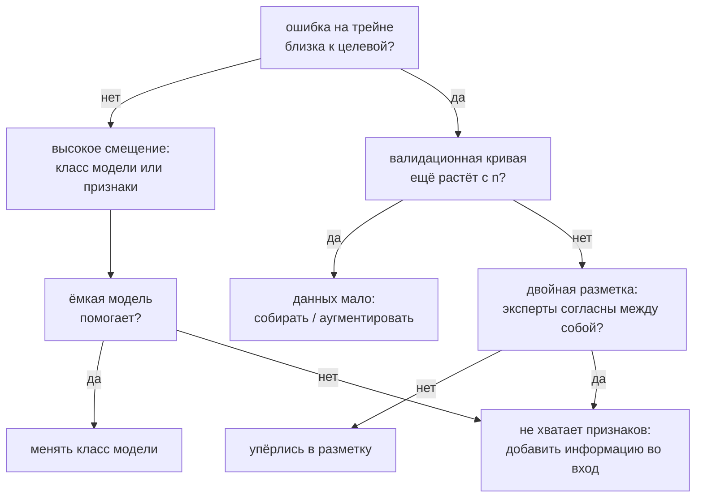

# Разбор ошибок модели

> **Зачем эта глава.** Метрика встала, идей больше нет — и начинается перебор гиперпараметров
> «на всякий случай». Здесь описан протокол, который заменяет угадывание измерением: как построить
> таксономию ошибок и посчитать вклад каждой категории, сколько объектов смотреть руками, как найти
> подгруппы, где модель систематически хуже, и как экспериментально отличить нехватку данных от
> нехватки признаков, узкого класса модели и грязной разметки. После главы у вас будет процедура,
> из которой выходит следующая гипотеза, а не список «попробовать ещё вот это».

**Уровень:** 🎯 middle → 🧠 middle+
**Предварительно нужно:** [постановка задачи обучения](01-learning-theory.md), [метрики качества](04-metrics.md), [валидация и утечки](05-validation-and-leakage.md), [интерпретируемость](15-interpretability.md)
**Как проработать:** чтение + разбор ста ошибок своей модели по протоколу

---

## Карта главы

- [1. Метрика упёрлась и начинается случайный перебор](#1-метрика-упёрлась-и-начинается-случайный-перебор) — сквозной пример и цена угадывания
- [2. Таксономия ошибок вместо угадывания](#2-таксономия-ошибок-вместо-угадывания) — категории, вклад, приоритет
- [3. Сколько ошибок смотреть глазами и почему смотрите вы](#3-сколько-ошибок-смотреть-глазами-и-почему-смотрите-вы)
- [4. Автоматический поиск слабых подгрупп](#4-автоматический-поиск-слабых-подгрупп) — slice discovery и его подтверждение
- [5. Четыре источника ошибки](#5-четыре-источника-ошибки) — точная декомпозиция и как её мерить
- [6. Больше данных или другая модель](#6-больше-данных-или-другая-модель) — кривые обучения
- [7. Признаки или класс модели](#7-признаки-или-класс-модели) — факторный эксперимент
- [8. Когда упёрлись в качество разметки](#8-когда-упёрлись-в-качество-разметки)
- [9. Ceiling analysis и ablative analysis](#9-ceiling-analysis-и-ablative-analysis) — потолок конвейера
- [10. Протокол одной итерации разбора](#10-протокол-одной-итерации-разбора)
- [11. Когда разбор ошибок не окупается](#11-когда-разбор-ошибок-не-окупается)
- [12. Подводные камни](#12-подводные-камни)
- [13. Проверь себя](#13-проверь-себя)
- [14. Практика](#14-практика)
- [15. Что читать дальше](#15-что-читать-дальше)

---

## 1. Метрика упёрлась и начинается случайный перебор

Сквозной пример на всю главу — сортировочный центр почты. Конверт едет по ленте, камера снимает
адресную зону, система читает шестизначный индекс. Прочитала — конверт уходит в нужный лоток сам;
не прочитала или прочитала неверно — конверт идёт в ручную досортировку, а это оператор, зарплата
и время.

Конвейер из четырёх этапов: локализация поля индекса на скане, сегментация поля на шесть отдельных
цифр, классификация каждой цифры, постобработка со сверкой по справочнику действующих индексов.
Замеры на 2000 размеченных конвертов: локализация срабатывает верно в 97% случаев, сегментация —
в 96%, классификатор цифры даёт 90.9% на отложенной выборке, справочник чинит примерно 70% случаев,
где ошиблись ровно в одной цифре. Итог — 74.7% конвертов уходят автоматически и правильно.
Цель квартала — 85%.

Дальше есть два способа действовать. Первый — знакомый: запустить `Optuna` на 300 испытаний,
попробовать другой бустинг, добавить аугментаций, подождать неделю. Второй — посмотреть, из чего
состоят оставшиеся 25.3%, и обнаружить, что 33% всех ошибок классификатора приходятся на одну
цифру, а четверть — на одну пару цифр, которую модель путает в обе стороны. Разница между
способами не в трудолюбии, а в том, что первый оптимизирует вслепую, а второй сначала измеряет,
где именно теряется качество.

Разбор ошибок (error analysis) — это протокол, который превращает «модель плохая» в упорядоченный
список исправлений с оценкой выигрыша каждого. Он не требует новых библиотек: нужны таблица,
терпение и готовность посмотреть на объекты, а не на агрегаты.

> 💬 **На собеседовании.** Спросят: «Модель встала на 0.71 macro-F1, две недели тюнинга ничего
> не дали. Что будете делать?»
> Хороший ответ: перестану тюнить и разберу ошибки. Беру 100–200 ошибочных объектов с валидации,
> размечаю их по категориям причин, считаю долю каждой категории и оценку выигрыша от её полного
> устранения. Параллельно строю таблицу метрик по сегментам и кривую обучения — это отвечает
> на вопрос, упёрлись мы в данные, в признаки, в класс модели или в разметку. Тюнинг возвращается
> в план только если разбор показал, что модель недообучена.
> Плохой ответ: «попробую CatBoost вместо LightGBM и подберу гиперпараметры получше» — это
> предложение продолжать делать то, что уже две недели не работает.

---

## 2. Таксономия ошибок вместо угадывания

Первый шаг — перестать смотреть на одно число. Средняя метрика по выборке — это результат
усреднения по очень разным группам объектов, и решение принимается не по среднему, а по составу.

Формально: разбиваем выборку на сегменты $c = 1, \dots, C$ (по значению категориального признака,
по бакету числового, по истинному классу, по источнику данных). Для сегмента $c$ фиксируем размер
$n_c$, число ошибок $m_c$ и долю ошибок $r_c = m_c / n_c$. Дальше считаем две величины.

$$
\text{lift}_c \;=\; \frac{r_c}{r}, \qquad
\Delta_c \;=\; \frac{n_c}{n}\, r_c \;=\; \frac{m_c}{n}
$$

где $n$ — размер выборки, $r = \frac{1}{n}\sum_c m_c$ — общая доля ошибок. Величина $\text{lift}_c$
показывает, во сколько раз в сегменте хуже, чем в среднем; $\Delta_c$ — на сколько упадёт **общая**
доля ошибок, если сегмент починить полностью.

Считать удобнее не сам $\Delta_c$, а его отношение к общей ошибке: $\Delta_c / r = m_c / \sum_c m_c$,
то есть «какую часть всех ошибок съедает сегмент». Деление на $r$ — деление на константу, порядок
сегментов от него не меняется, а число читается без пересчёта в уме. В коде ниже это колонка
`доля_ошибок`, и все оценки выигрыша в главе даны в этой шкале.

Lift и вклад нужны оба, и путать их дорого. Сегмент с lift 5 и долей в выборке 0.4% держит
$0.004 \cdot 5 = 2\%$ всех ошибок — им можно заниматься месяц и не сдвинуть метрику. Сегмент
с lift всего 1.3, но с половиной выборки, держит $0.5 \cdot 1.3 = 65\%$, то есть в тридцать раз
больше. Приоритет ставится по $\Delta_c$, а $\text{lift}_c$ подсказывает, где у проблемы есть
общая причина, которую вообще можно устранить.

Соберём такую таблицу для классификатора цифры. Модель — логистическая регрессия на скане,
приведённом к разрешению 4×4 (так его отдаёт камера сортировщика).

```python
import numpy as np
import pandas as pd
from sklearn.datasets import load_digits
from sklearn.linear_model import LogisticRegression
from sklearn.model_selection import train_test_split
from sklearn.pipeline import make_pipeline
from sklearn.preprocessing import StandardScaler


def pool2x2(X):
    """8x8 -> 4x4: то, что видит модель при сканировании в низком разрешении."""
    img = X.reshape(-1, 8, 8)
    return img.reshape(-1, 4, 2, 4, 2).mean(axis=(2, 4)).reshape(-1, 16)


X, y = load_digits(return_X_y=True)
X_tr, X_te, y_tr, y_te = train_test_split(X, y, test_size=0.3, random_state=42, stratify=y)

model = make_pipeline(StandardScaler(), LogisticRegression(max_iter=5000, random_state=0))
model.fit(pool2x2(X_tr), y_tr)
pred = model.predict(pool2x2(X_te))
err = (pred != y_te).astype(int)

print("точность на одной цифре:", round(1 - err.mean(), 4))
print("ошибок:", err.sum(), "из", len(y_te))
print("индекс из 6 цифр целиком:", round((1 - err.mean()) ** 6, 4))
```

```
точность на одной цифре: 0.9093
ошибок: 49 из 540
индекс из 6 цифр целиком: 0.5651
```

Теперь сегменты. Важная деталь: сегментировать надо по признакам, которые **не подаются в модель**
как входы, — по метаданным объекта. Иначе вы просто пересказываете то, что модель уже видела.
Здесь это характеристики самого скана: суммарный нажим пера, площадь тёмных пикселей, смещение
центра масс, плюс истинный класс.

```python
img = X_te.reshape(-1, 8, 8)          # исходный скан: метаданные объекта, а не признак модели
ink = img.sum(axis=(1, 2))            # суммарный нажим
rows_y, cols_x = np.mgrid[0:8, 0:8]

meta = pd.DataFrame({
    "цифра": y_te,
    "нажим": pd.qcut(ink, 3, labels=["слабый", "средний", "сильный"]),
    "площадь": pd.qcut((img > 4).sum(axis=(1, 2)), 3, labels=["тонкая", "средняя", "жирная"]),
    "сдвиг": pd.qcut((img * cols_x).sum(axis=(1, 2)) / ink, 3, labels=["влево", "центр", "вправо"]),
})


def segment_report(meta, err):
    base = err.mean()
    rows = []
    for col in meta.columns:
        for value, idx in meta.groupby(col, observed=True).groups.items():
            e = err[idx]
            rows.append({"признак": col, "сегмент": str(value), "n": len(e),
                         "ошибок": int(e.sum()), "err_rate": round(e.mean(), 3),
                         "доля_ошибок": round(e.sum() / err.sum(), 3),
                         "lift": round(e.mean() / base, 2)})
    return pd.DataFrame(rows).sort_values("err_rate", ascending=False)


print(segment_report(meta, err).head(8).to_string(index=False))
print(pd.Series([f"{t}->{p}" for t, p in zip(y_te[err == 1], pred[err == 1])])
      .value_counts().head(5).to_string())
```

```
признак сегмент   n  ошибок  err_rate  доля_ошибок  lift
  цифра       1  55      16     0.291        0.327  3.21
  цифра       8  52       9     0.173        0.184  1.91
  сдвиг  вправо 180      22     0.122        0.449  1.35
  нажим  слабый 182      22     0.121        0.449  1.33
  цифра       2  53       6     0.113        0.122  1.25
площадь  тонкая 232      25     0.108        0.510  1.19
площадь средняя 147      15     0.102        0.306  1.12
  цифра       5  55       5     0.091        0.102  1.00
8->1    7
1->8    5
5->9    4
1->9    4
2->8    3
```

Читаем. Цифра «1» занимает 10% выборки и даёт 32.7% всех ошибок — lift 3.2. Список пар под таблицей
говорит, где именно теряется: 8→1 и 1→8 вместе дают 12 ошибок из 49, то есть четверть всего.
Тонкая линия и слабый нажим тоже повышают ошибку, но умеренно.

Отсюда сразу считается приоритет. Полное устранение ошибок на цифре «1» поднимает точность на цифре
с 0.909 до 0.939, а сквозную долю автоматически разобранных конвертов — с 74.7% до 81.2%. Одна
категория ошибок — шесть с половиной процентных пунктов сквозной метрики. Ни один тюнинг
гиперпараметров такого не даст, и теперь это не догадка, а арифметика.

> ⚠️ **Типичная ошибка.** Ранжировать сегменты по `lift` и броситься чинить верхний.
> Возьмите выборку в 20 тысяч объектов с базовой ошибкой 4%. В хвостовом сегменте на 30 объектов
> lift 4 получается из 5 ошибок вместо 1.2 ожидаемых — это шум, а не сигнал. Но даже если он
> настоящий, чинить там нечего: 5 ошибок из 800 — это 0.6% всех ошибок. Сортируйте по $\Delta_c$
> (колонка `доля_ошибок`), а `lift` используйте как подсказку о наличии общей причины.
> И всегда смотрите на колонку `n`: сегменты меньше примерно 50 объектов интерпретировать нельзя.

Одномерные срезы дают только первый слой. Сегменты пересекаются, и агрегат по одному измерению
может прятать структуру: «слабый нажим» плох не сам по себе, а потому что среди слабонажимных
непропорционально много единиц. Практический приём — после того как найден верхний сегмент,
пересчитать таблицу **внутри него**: если lift по второму признаку внутри сегмента близок
к единице, второй признак был лишь коррелятом первого. Игнорирование этого даёт классический
эффект Симпсона — три «независимые находки», которые на самом деле одна.

> 🌱 **База.** Минимальная версия протокола, которая уже окупается: выгрузите ошибки модели
> в CSV, добавьте колонку «категория причины», заполните её руками для сотни строк,
> сделайте `value_counts()`. Всё остальное в этой главе — уточнения к этому действию.

---

## 3. Сколько ошибок смотреть глазами и почему смотрите вы

Таблица по сегментам говорит **где** ошибки, но не говорит **почему**. Категории причин
(«цифра обрезана при сегментации», «метка проставлена неверно», «почерк с петлёй», «скан
пересвечен») в данных не лежат — их порождает человек, глядя на объекты.

Сколько объектов смотреть? Вы оцениваете долю категории в ошибках, то есть биномиальную
пропорцию. Нужный размер выборки:

$$
n \;\ge\; \frac{z_{1-\alpha/2}^{2}\; p\,(1-p)}{\varepsilon^{2}}
$$

> 📐 **Разбор формулы.** $p$ — истинная доля категории среди ошибок, $\varepsilon$ — точность,
> с которой вы хотите её знать, $z_{1-\alpha/2}$ — квантиль стандартного нормального распределения
> ($1.96$ для 95%). Величина $p(1-p)$ максимальна при $p = 0.5$ и равна $0.25$ — берём худший
> случай, потому что $p$ заранее неизвестно. Подставляем $\varepsilon = 0.07$: получаем
> $n \ge 1.96^2 \cdot 0.25 / 0.07^2 = 196$. Отсюда и берётся канонический совет «посмотрите
> сотню-другую ошибок»: 200 объектов дают доли категорий с точностью около семи процентных
> пунктов, чего достаточно, чтобы отличить категорию на 40% от категории на 10%. Для
> $\varepsilon = 0.10$ хватит 96 объектов, для $\varepsilon = 0.05$ понадобится 384 —
> и вот последнее уже почти никогда не окупается.

Практически это значит: **100 ошибок — минимум, 200 — рабочий стандарт, больше 400 — трата
времени**. Если ошибок в валидации меньше сотни, смотрите все.

Как организовать. Заводите таблицу, где строка — один ошибочный объект, а колонки заполняются
по ходу просмотра. Обозначим через $\hat p_k$ вероятность класса $k$, которую модель выдала
на этом объекте; уверенностью модели называем $\max_k \hat p_k$ — вероятность того класса,
который она в итоге назвала.

| Колонка | Что в ней | Зачем |
|---|---|---|
| id объекта | ключ | чтобы вернуться и перепроверить |
| предсказание и метка | что модель сказала и что ожидалось | базовая пара |
| уверенность модели | $\max_k \hat p_k$ | разводит два разных диагноза, см. ниже |
| категория причины | из растущего словаря | главная колонка |
| метка верна | да / нет / спорно | отдельно от причины: это диагноз разметки |
| исправимо признаком | да / нет | заготовка для следующей гипотезы |
| комментарий | свободный текст | из него потом рождаются новые категории |

Словарь категорий не придумывается заранее. Первые 20–30 объектов смотрятся вообще без категорий,
только с комментариями; из комментариев вырастают 5–8 категорий; дальше идёт обычная разметка.
Если к концу просмотра в категории «прочее» больше 20% — словарь плохой, надо переразбить.

Уверенная и неуверенная ошибки — разные болезни, и лечатся они противоположно.
Ошибка при $\max_k \hat p_k \approx 0.35$ означает, что модель честно не знает ответа: объект лежит
у границы классов, и лечится это признаками или данными. Ошибка при $\max_k \hat p_k > 0.95$
означает, что модель уверенно выучила что-то неверное, и причин у этого ровно три: испорченная
метка, утечка, которая в проде не работает, или систематический сдвиг в подгруппе. Полезно сразу
делить журнал на две части и считать доли категорий в каждой отдельно — распределения обычно
оказываются совершенно разными, а действия из них следуют противоположные.

Почему это делает инженер, а не разметчики. Три причины, и все практические. Первая: разметчик
отвечает на вопрос «что здесь изображено», а вам нужен ответ на вопрос «почему модель здесь
ошиблась» — это разные вопросы, и второй требует знания, что модель видит на входе. Вторая:
категории рождаются по ходу просмотра, и человек, который не строил признаки, не заметит, что
три объекта подряд пришли из одного источника с другим форматом даты. Третья, самая важная:
разбор ошибок — это способ получить интуицию о данных, и делегировать его — значит делегировать
интуицию, ради которой всё затевалось. На отдачу разметчикам можно и нужно выносить проверку
меток на большой выборке, но не первичный разбор.

> 💬 **На собеседовании.** Спросят: «Вы говорите, что смотрите ошибки руками. Сколько именно
> и как это не превращается в бесконечность?»
> Хороший ответ: беру случайную выборку из ошибок валидации, обычно 150–200 объектов — это
> даёт доли категорий с точностью около 7 процентных пунктов при 95% доверии, чего хватает
> для расстановки приоритетов. Веду таблицу с колонками «категория причины», «метка верна»,
> «уверенность модели». Просмотр занимает два-три часа и заканчивается списком категорий
> с оценкой $\Delta_c$ для каждой. Дальше беру верхнюю по $\Delta_c$.
> Плохой ответ: «смотрю несколько примеров, чтобы понять» — на пяти объектах любая доля
> оценивается с ошибкой в 40 процентных пунктов, и приоритет из них не выводится.

> ⚠️ **Типичная ошибка.** Смотреть только самые уверенные ошибки (там, где модель ошиблась
> с вероятностью 0.99). Это смещённая выборка: уверенные ошибки почти всегда либо испорченные
> метки, либо редкие аномалии, и по ним нельзя оценить структуру массовых ошибок. Берите
> **случайную** выборку из всех ошибок, а уверенные разбирайте отдельным проходом — как
> кандидатов на проверку разметки (см. раздел 8).

---

## 4. Автоматический поиск слабых подгрупп

Ручной просмотр находит категории причин, но не находит подгруппы, заданные комбинацией признаков:
«клиенты младше 25 из региона X, пришедшие с мобильного» — такое глазами не увидеть.
Этим занимается **slice discovery** — автоматический поиск срезов данных с систематически
повышенной ошибкой.

Механика проще, чем звучит. Строим бинарный таргет «модель ошиблась на этом объекте», обучаем
на мета-признаках неглубокое интерпретируемое дерево и читаем листья с высокой долей ошибок
и приемлемым размером. Дерево здесь используется не как предсказатель, а как генератор
правил-кандидатов.

Ловушка на этом месте одна и она серьёзная. Дерево глубины 2 по четырём мета-признакам перебирает
сотни разбиений и **обязательно** найдёт что-то с высоким lift, даже если истинной структуры нет:
это классическая множественная проверка гипотез. Поэтому сразу разбиваем выборку пополам: на одной
половине ищем, на другой подтверждаем.

```python
from sklearn.tree import DecisionTreeClassifier

slice_feats = pd.DataFrame({                                  # мета-признаки, а не входы модели
    "нажим": ink.astype(float),
    "ширина": (img > 4).any(axis=1).sum(axis=1).astype(float),
    "центр_x": (img * cols_x).sum(axis=(1, 2)) / ink,
    "центр_y": (img * rows_y).sum(axis=(1, 2)) / ink,
})

perm = np.random.default_rng(1).permutation(len(err))
find, check = perm[: len(err) // 2], perm[len(err) // 2:]     # поиск и подтверждение

tree = DecisionTreeClassifier(max_depth=2, min_samples_leaf=20, random_state=0)
tree.fit(slice_feats.values[find], err[find])                 # цель — сам факт ошибки
T = tree.tree_


def leaf_rules(node=0, cond=()):
    """Разворачивает дерево в человекочитаемые правила листьев."""
    if T.children_left[node] == -1:
        yield node, " и ".join(cond) or "все"
        return
    name, thr = slice_feats.columns[T.feature[node]], T.threshold[node]
    yield from leaf_rules(T.children_left[node], cond + (f"{name} <= {thr:.0f}",))
    yield from leaf_rules(T.children_right[node], cond + (f"{name} > {thr:.0f}",))


lf, lc = tree.apply(slice_feats.values[find]), tree.apply(slice_feats.values[check])
report = [{"правило": rule, "n_поиск": int((lf == node).sum()),
           "err_поиск": round(err[find][lf == node].mean(), 3),
           "n_проверка": int((lc == node).sum()),
           "err_проверка": round(err[check][lc == node].mean(), 3)}
          for node, rule in leaf_rules()]
print("err_rate: поиск", round(err[find].mean(), 3), "проверка", round(err[check].mean(), 3))
print(pd.DataFrame(report).sort_values("err_поиск", ascending=False).to_string(index=False))
```

```
err_rate: поиск 0.081 проверка 0.1
                  правило  n_поиск  err_поиск  n_проверка  err_проверка
              ширина <= 4       28      0.250          27         0.148
ширина > 4 и нажим <= 270       24      0.208          28         0.179
 ширина > 4 и нажим > 270      218      0.046         215         0.084
```

Метод сам, без подсказок, нашёл срез «узкий силуэт» — а узкий силуэт при разрешении 4×4 это ровно
цифра «1», которую мы уже вытащили руками в разделе 2. Совпадение двух независимых процедур —
хороший признак, что находка настоящая.

И сразу видно то, ради чего делалась вторая половина: на поиске срез давал 0.250, на подтверждении
даёт 0.148 при базовых 0.100. Эффект реален, но **вдвое меньше** найденного. Это регрессия к
среднему: мы выбрали максимум из многих кандидатов, а максимум смещён вверх. Если бы вы отчитались
цифрой 0.250, вы бы завысили ожидаемый выигрыш вдвое и потом объясняли, куда он делся.

> 🧠 **Middle+.** Промышленные инструменты решают ту же задачу аккуратнее. `Slice Finder`
> (Chung et al., ICDE 2019) перебирает решётку срезов и применяет поправку на множественность
> ($\alpha$-investing), выдавая только статистически значимые. `Domino` и `Spotlight` работают
> в пространстве эмбеддингов и находят срезы там, где мета-признаков нет вообще: кластеризуют
> ошибочные объекты в латентном пространстве и описывают кластеры словами. Для табличных задач
> дерево по мета-признакам плюс подтверждающая половина закрывают 90% потребности; переходить
> к эмбеддингам стоит на тексте и картинках.

> ⚠️ **Типичная ошибка.** Искать срезы на тестовой выборке, а потом на ней же отчитываться
> об улучшении. Тест после этого сожжён: вы подобрали под него гипотезы. Slice discovery
> живёт на валидации (или на отдельной половине), тест трогается один раз в конце — та же
> дисциплина, что в [главе про валидацию](05-validation-and-leakage.md).

---

## 5. Четыре источника ошибки

Теперь ядро главы. Вы знаете, где ошибки и как они выглядят. Остаётся понять, **чем** они вызваны,
потому что от этого зависит, что делать: собирать данные, строить признаки, менять модель или
чинить разметку. Это четыре разных проекта с разной стоимостью, и перепутать их — значит потратить
квартал не туда.

Строгая декомпозиция строится как цепочка вложенных потолков. Обозначим:

- $e_0$ — ошибка текущей модели на отложенной выборке;
- $e_1$ — ошибка **того же класса моделей** на тех же признаках при неограниченной обучающей выборке;
- $e_2$ — ошибка наилучшего возможного предсказателя на **тех же признаках** (байесовская ошибка при данном описании объекта);
- $e_3$ — ошибка наилучшего предсказателя при **полной** информации об объекте.

По построению $e_0 \ge e_1 \ge e_2 \ge e_3 \ge 0$, откуда точное разложение:

$$
e_0 \;=\; \underbrace{(e_0 - e_1)}_{\text{мало данных}} \;+\; \underbrace{(e_1 - e_2)}_{\text{узок класс модели}} \;+\; \underbrace{(e_2 - e_3)}_{\text{не хватает признаков}} \;+\; \underbrace{e_3}_{\text{шум}}
$$

> 📐 **Разбор формулы.** Каждое слагаемое — это выигрыш от снятия ровно одного ограничения,
> при том что все более «внешние» ограничения уже сняты. $e_0 - e_1$ исчезнет, если вы
> удвоите-удесятерите выборку. $e_1 - e_2$ исчезнет, если возьмёте более ёмкий класс моделей.
> $e_2 - e_3$ исчезнет, если добавите во вход информацию, которой там сейчас нет (новый источник
> данных, более высокое разрешение, дополнительный признак). $e_3$ не исчезнет никогда: это
> внутренняя неоднозначность задачи плюс шум разметки. Важная честная оговорка: разложение
> **зависит от порядка** снятия ограничений — слагаемые взаимодействуют, и в разделе 7 вы увидите
> это на числах. Поэтому декомпозиция — инструмент для расстановки приоритетов, а не бухгалтерский
> баланс.

Первые два слагаемых — это ровно смещение и дисперсия из
[теории обучения](01-learning-theory.md), только записанные в терминах действий. Два последних
теория обычно сваливает в «неустранимую ошибку», хотя на практике именно они чаще всего и являются
узким местом.

Отдельно про $e_3$: наблюдать его напрямую нельзя, потому что наилучшего предсказателя у вас нет.
Стандартная замена — **человеческий уровень** (human-level performance): качество аккуратного
эксперта на тех же входных данных. Для восприятия — распознавание символов, речь, медицинские
снимки — это хорошее приближение байесовской ошибки, потому что человек и есть тот, кто
устанавливал разметку. Для задач, где человек систематически хуже статистики — предсказание
оттока, скоринг, прогноз спроса, — человеческий уровень бесполезен как ориентир, и вместо него
берут либо согласие аннотаторов (раздел 8), либо ошибку заведомо избыточной модели, обученной
на всех доступных данных. Разница принципиальна: в первом случае вы знаете, что близки к потолку;
во втором — только что не хуже текущих возможностей.

Каждую разность меряет свой эксперимент:

| Источник | Симптом | Эксперимент | Что делать, если он |
|---|---|---|---|
| Мало данных | ошибка на трейне низкая, разрыв с валидацией большой и сокращается с ростом $n$ | кривая обучения: валидационная кривая ещё растёт | размечать, аугментировать, собирать |
| Узок класс модели | ошибка **на трейне** высокая, разрыв маленький | обучить заведомо более ёмкую модель на тех же данных | сменить класс модели, ослабить регуляризацию, усложнить |
| Не хватает признаков | ёмкая модель на всех данных тоже упирается | дать модели дополнительную информацию и померить прирост | новые источники, [фичи](14-feature-engineering.md), другое разрешение входа |
| Шум разметки | уверенные ошибки на объектах, где эксперт согласен с моделью, а не с меткой | двойная разметка подвыборки, согласие аннотаторов | чистить метки, менять инструкцию, переразметить |



> 💬 **На собеседовании.** Спросят: «Как понять, чего модели не хватает — данных или сложности?»
> Хороший ответ: посмотреть на ошибку на **обучающей** выборке. Если модель не может выучить
> даже трейн до целевого уровня, добавление данных не поможет ничем — это смещение, лечится
> ёмкостью модели или признаками. Если трейн выучен, а валидация заметно хуже и разрыв
> сокращается при увеличении обучающей выборки — упёрлись в данные. Технически это делается
> одной кривой обучения на 4–5 точках. И обязательная третья ветка, о которой забывают:
> если и трейн выучен, и кривая вышла на плато, а качество всё равно не устраивает — значит,
> потолок задан признаками или разметкой, и надо мерить согласие аннотаторов.
> Плохой ответ: «попробую и то и другое» — это и есть перебор вместо диагностики.

---

## 6. Больше данных или другая модель

Кривая обучения (learning curve) — зависимость качества на трейне и на валидации от размера
обучающей выборки. Это самый дешёвый способ отделить «мало данных» от «мало модели»,
и его почти никогда не строят.

```python
from sklearn.model_selection import learning_curve

logreg = make_pipeline(StandardScaler(), LogisticRegression(max_iter=5000, random_state=0))


def show_curve(features, tag):
    sizes, train, val = learning_curve(
        logreg, features, y_tr, cv=5, train_sizes=[0.1, 0.25, 0.5, 0.75, 1.0],
        scoring="accuracy", shuffle=True, random_state=0, n_jobs=-1)
    print(tag)
    for n, t, v in zip(sizes, train.mean(1), val.mean(1)):
        print(f"  n={n:5d}  train={t:.3f}  val={v:.3f}  разрыв={t - v:.3f}")


show_curve(pool2x2(X_tr), "вход 4x4")
show_curve(X_tr, "вход 8x8")
```

```
вход 4x4
  n=  100  train=0.982  val=0.824  разрыв=0.158
  n=  251  train=0.955  val=0.850  разрыв=0.104
  n=  502  train=0.941  val=0.882  разрыв=0.059
  n=  753  train=0.934  val=0.898  разрыв=0.036
  n= 1005  train=0.930  val=0.895  разрыв=0.035
вход 8x8
  n=  100  train=1.000  val=0.881  разрыв=0.119
  n=  251  train=1.000  val=0.932  разрыв=0.068
  n=  502  train=1.000  val=0.949  разрыв=0.051
  n=  753  train=1.000  val=0.957  разрыв=0.043
  n= 1005  train=1.000  val=0.966  разрыв=0.034
```

Две кривые — два разных диагноза, и это надо уметь читать за десять секунд.

**Вход 4×4.** Точность на трейне падает с ростом выборки и застревает на 0.930 — модель не может
выучить даже обучающие данные. Разрыв всего 0.035 и почти не меняется между $n = 753$ и $n = 1005$,
валидационная кривая встала. Диагноз: доминирует смещение. Размечать ещё десять тысяч конвертов
бессмысленно — потолок этой конфигурации около 0.93 и он уже достигнут.

**Вход 8×8.** Трейн выучен идеально (1.000 на всех размерах), валидация растёт монотонно
и на последней точке ещё не вышла на плато. Диагноз: доминирует дисперсия, данные помогут.
Здесь заказ на разметку окупится.

Одна и та же модель, один и тот же датасет — противоположные решения. Разница только в том,
сколько информации доходит до модели на входе.

> ⚠️ **Типичная ошибка.** Строить кривую обучения по одному разбиению и делать выводы
> по разнице в третьем знаке. При $n = 100$ разброс валидационной оценки между фолдами легко
> достигает 3–4 процентных пунктов. Кривую строят по кросс-валидации (в `learning_curve`
> параметр `cv`) и смотрят не только на среднее, но и на разброс: если полосы train и val
> пересекаются, вывода нет.

> 🧠 **Middle+.** Плато валидационной кривой не означает, что данные бесполезны навсегда.
> Оно означает, что данные бесполезны **при этой ёмкости**. Классическая ошибка планирования —
> замерить кривую на модели с сильной регуляризацией, увидеть плато и закрыть проект по сбору
> данных. Правильный порядок: сначала убедиться, что модель способна переобучиться на трейне
> (то есть ёмкости хватает), и только потом делать вывод о пользе данных. Эмпирически кривая
> ошибки от размера выборки в логарифмических осях часто близка к прямой:
> $e(n) \approx \alpha n^{-\beta} + e_\infty$. Здесь $e(n)$ — ошибка при обучающей выборке
> размера $n$, $e_\infty \ge 0$ — остаток, который не убирается никаким объёмом данных
> при этой ёмкости, $\alpha > 0$ — масштабный множитель, $\beta > 0$ — скорость убывания
> (на практике обычно 0.1–0.5: чем меньше, тем дороже обходится каждый следующий пункт).
> По трём-четырём точкам эти три числа оцениваются подгонкой, и дальше видно, во сколько раз
> надо увеличить выборку ради нужного прироста. Обычно ответ вроде «в восемь раз ради полутора
> пунктов» и закрывает вопрос сам собой.

---

## 7. Признаки или класс модели

Кривая сказала, что на входе 4×4 мы упёрлись в смещение. Но смещение бывает от двух причин:
класс модели слишком узкий или на входе просто нет нужной информации. Различает их факторный
эксперимент: меняем оба фактора независимо и смотрим на все четыре комбинации.

```python
from sklearn.metrics import accuracy_score
from sklearn.svm import SVC

builders = {
    "логрег": lambda: make_pipeline(StandardScaler(), LogisticRegression(max_iter=5000, random_state=0)),
    "SVM-RBF": lambda: make_pipeline(StandardScaler(), SVC(C=10, random_state=0)),
}
inputs = {"4x4": (pool2x2(X_tr), pool2x2(X_te)), "8x8": (X_tr, X_te)}

grid = pd.DataFrame({name: {res: round(accuracy_score(y_te, build().fit(a, y_tr).predict(b)), 4)
                            for res, (a, b) in inputs.items()}
                     for name, build in builders.items()})
print(grid.to_string())
```

```
     логрег  SVM-RBF
4x4  0.9093   0.9685
8x8  0.9815   0.9815
```

Таблица из четырёх чисел отвечает на вопрос главы. При входе 4×4 смена класса модели даёт
+5.9 пункта — класс действительно был узок. При входе 8×8 смена класса не даёт **ничего**:
0.9815 против 0.9815, линейная модель на хороших признаках догоняет ядровую. И обратно:
повышение разрешения даёт логистической регрессии +7.2 пункта, а SVM — только +1.3.

Это и есть та самая зависимость от порядка, о которой предупреждала формула из раздела 5.
Спросить «сколько даёт смена модели» без указания признаков — вопрос без ответа: на бедном входе
5.9 пункта, на богатом ноль. Отсюда практическое правило: **факторы проверяются сеткой, а не по
одному**. Два фактора — четыре запуска, три фактора — восемь; это дешевле любого тюнинга и
даёт качественно другой вывод.

Для нашего конвейера вывод такой: узкое место — разрешение скана, а не выбор алгоритма.
Правильное действие — не менять модель, а поднять разрешение на входе, то есть договориться
с командой железа о другом режиме камеры. Это разговор не про ML, но именно к нему привёл
разбор ошибок.

> 💬 **На собеседовании.** Спросят: «У вас есть неделя. Что даст больше — новая архитектура
> или новые признаки?»
> Хороший ответ: это измеримо за полдня. Ставим сетку два на два: текущие признаки и текущая
> модель, текущие признаки и заведомо более ёмкая модель, расширенные признаки и текущая модель,
> и обе замены сразу. Смотрим приросты. Если ёмкая модель на текущих признаках не даёт ничего —
> архитектура не при чём, вопрос закрыт. Отдельно проверяем, не взаимодействуют ли факторы:
> прирост от признаков на слабой модели и на сильной обычно разный, и по одному замеру
> ошибиться легко.
> Плохой ответ: «признаки обычно важнее» — верное в среднем утверждение, которое ничего
> не говорит про конкретную задачу и заменяет измерение поверьем.

---

## 8. Когда упёрлись в качество разметки

Остался последний источник — $e_3$. Признак того, что упёрлись в него, узнаётся при ручном
разборе: вы смотрите на объект, соглашаетесь с моделью и не соглашаетесь с меткой. Если таких
объектов среди просмотренных ошибок больше 15–20%, дальше улучшать модель бессмысленно —
вы оптимизируете под шум.

Проверка делается двумя способами. **Прямой**: отдать 300–500 объектов на независимую повторную
разметку и посчитать согласие (для номинальных категорий — каппа Коэна, для нескольких
разметчиков — альфа Криппендорфа). Если два аккуратных эксперта расходятся на 12% объектов,
то 88% и есть человеческий потолок вашей задачи, и модель с точностью 0.86 близка к нему вплотную.
**Косвенный**: найти подозрительные метки автоматически. Идея восходит к confident learning:
считаем out-of-fold вероятности (обязательно out-of-fold — иначе модель просто запомнила метку,
см. [валидацию](05-validation-and-leakage.md)), берём вероятность **приписанной** метки и сортируем
по возрастанию. Метки, которым модель, ни разу их не видевшая, приписывает вероятность 0.01,
подозрительны.

Проверим, что приём вообще работает: испортим 5% меток известным образом и посмотрим,
находит ли процедура именно их.

```python
from sklearn.model_selection import cross_val_predict

rng = np.random.default_rng(0)
y_noisy = y_tr.copy()
k = int(0.05 * len(y_tr))
flipped = rng.choice(len(y_tr), size=k, replace=False)
y_noisy[flipped] = (y_tr[flipped] + rng.integers(1, 10, size=k)) % 10   # 5% испорченных меток

proba = cross_val_predict(logreg, X_tr, y_noisy, cv=5, method="predict_proba", n_jobs=-1)
p_self = proba[np.arange(len(y_noisy)), y_noisy]      # вероятность приписанной метки
order = np.argsort(p_self)                            # самые невероятные метки — первыми

is_flipped = np.zeros(len(y_tr), bool)
is_flipped[flipped] = True
for top in (k, 2 * k):
    hit = int(is_flipped[order[:top]].sum())
    print(f"top-{top:3d}: испорченных {hit:3d}  precision={hit / top:.2f}  recall={hit / k:.2f}")


def test_acc(labels, mask=None):
    idx = np.ones(len(labels), bool) if mask is None else mask
    m = make_pipeline(StandardScaler(), LogisticRegression(max_iter=5000, random_state=0))
    return accuracy_score(y_te, m.fit(X_tr[idx], labels[idx]).predict(X_te))


keep = np.ones(len(y_tr), bool)
keep[order[:2 * k]] = False
print("чистая разметка       :", round(test_acc(y_tr), 4))
print("5% шума               :", round(test_acc(y_noisy), 4))
print("шум + автоочистка     :", round(test_acc(y_noisy, keep), 4))
```

```
top- 62: испорченных  51  precision=0.82  recall=0.82
top-124: испорченных  62  precision=0.50  recall=1.00
чистая разметка       : 0.9815
5% шума               : 0.9111
шум + автоочистка     : 0.9611
```

Три вывода, каждый практический. Первый: **5% испорченных меток стоят 7 процентных пунктов
точности** — 0.9815 против 0.9111. Это больше, чем даёт любой разумный тюнинг, и объясняет,
почему чистка разметки часто оказывается самым выгодным действием. Второй: ранжирование работает —
в первых 62 подозрительных лежит 51 действительно испорченная метка. Третий и самый важный:
автоматическая чистка возвращает 5 пунктов из 7, но не все. Полностью потолок восстанавливает
только настоящая переразметка; автоматика — это способ **дёшево сформировать очередь на
переразметку**, а не замена ей.

> 💬 **На собеседовании.** Спросят: «Как понять, что вы упёрлись в качество разметки,
> а не в модель?»
> Хороший ответ: два измерения. Первое — согласие аннотаторов на подвыборке в 300–500 объектов;
> оно задаёт человеческий потолок, и если модель к нему подошла, дальше улучшать нечего.
> Второе — доля объектов с неверной меткой среди разобранных руками ошибок; больше 15–20% —
> это диагноз. Дополнительный сигнал: ранжируем обучающую выборку по out-of-fold вероятности
> приписанной метки и смотрим верхние сотни — если там систематически лежат объекты одного
> типа, значит, инструкция разметчикам неоднозначна на этом типе, и чинить надо инструкцию,
> а не модель.
> Плохой ответ: «данные всегда грязные, это нормально» — это отказ от измерения.

> ⌨️ **Руками.** Возьмите свою последнюю задачу, посчитайте out-of-fold вероятности, отсортируйте
> обучающую выборку по вероятности приписанной метки и посмотрите верхние 50 объектов.
> Займёт 20 минут. В моей практике этот приём ни разу не возвращал пустой список.

---

## 9. Ceiling analysis и ablative analysis

Всё предыдущее относилось к одной модели. Но в проде модель почти всегда стоит внутри конвейера,
и оптимизировать её в отрыве от соседей — способ потратить квартал на этап, который ничего не решает.

**Ceiling analysis** отвечает на вопрос: сколько даст **идеальный** компонент? Процедура: по очереди
заменяем каждый этап оракулом (то есть идеальным решением этого этапа) и меряем сквозную метрику.
Разность и есть потолок улучшения этого этапа.

Для нашего конвейера сквозная точность считается явно:

$$
A \;=\; p_{\text{loc}} \cdot p_{\text{seg}} \cdot \Big( p^{6} \;+\; r_{\text{dir}} \cdot 6\, p^{5}\,(1 - p) \Big)
$$

> 📐 **Разбор формулы.** $A$ — сквозная метрика: доля конвертов, которые ушли в автоматическую
> сортировку и попали в верный лоток. $p_{\text{loc}}$ — вероятность верно найти поле индекса
> на скане, $p_{\text{seg}}$ — вероятность верно разрезать поле на шесть цифр, $p$ — точность
> классификатора на одной цифре, $r_{\text{dir}}$ — доля случаев с одной ошибочной цифрой,
> которые чинит справочник индексов (буквы `dir` — от directory, так же названа переменная
> в коде; отдельный индекс нужен, чтобы не путать эту величину с общей долей ошибок $r$
> из раздела 2). Первое слагаемое в скобках, $p^{6}$, — все шесть цифр распознаны верно (цифры
> считаем независимыми). Второе — ровно одна цифра ошибочна: множитель $6$ это число способов
> выбрать, какая именно, $p^{5}$ — остальные пять верны, $(1-p)$ — эта одна неверна; из таких
> случаев справочник спасает долю $r_{\text{dir}}$. Случаи с двумя и более ошибками справочник
> не чинит — там слишком много кандидатов. Множители $p_{\text{loc}}$ и $p_{\text{seg}}$ стоят
> снаружи, потому что при провале любого из этих этапов конверт уходит в ручную обработку
> независимо от классификатора.

```python
BASE = dict(p_loc=0.970, p_seg=0.960, p_digit=0.9093, r_dir=0.70)


def end_to_end(p_loc, p_seg, p_digit, r_dir):
    """Доля конвертов, разобранных автоматически и правильно."""
    all_six_ok = p_digit ** 6
    exactly_one_bad = 6 * p_digit ** 5 * (1 - p_digit)
    return p_loc * p_seg * (all_six_ok + r_dir * exactly_one_bad)


base = end_to_end(**BASE)
ceiling = [{"этап": stage, "стало": round(end_to_end(**{**BASE, stage: 1.0}), 3),
            "прирост_пп": round(100 * (end_to_end(**{**BASE, stage: 1.0}) - base), 1)}
           for stage in BASE]
print("сквозная точность:", round(base, 4))
print(pd.DataFrame(ceiling).sort_values("прирост_пп", ascending=False).to_string(index=False))
print("апгрейд сканера 4x4 -> 8x8:", round(end_to_end(**{**BASE, "p_digit": 0.9815}), 4))
print("без справочника индексов  :", round(end_to_end(**{**BASE, "r_dir": 0.0}), 4))
```

```
сквозная точность: 0.7469
   этап  стало  прирост_пп
p_digit  0.931        18.4
  r_dir  0.841         9.5
  p_seg  0.778         3.1
  p_loc  0.770         2.3
апгрейд сканера 4x4 -> 8x8: 0.8984
без справочника индексов  : 0.5264
```

Приоритеты перестроились и стали бесспорными. Идеальная локализация даёт 2.3 пункта, идеальная
сегментация — 3.1. Работать над ними нельзя не потому, что они плохие, а потому что даже
безупречные они не решают задачу. Классификатор цифры даёт 18.4 пункта — вот где живёт качество.
А реально достижимое действие из раздела 7, повышение разрешения скана, приносит 15.2 пункта
из этих 18.4 и выводит конвейер на 89.8% при цели 85%. Квартальная цель закрыта одним
изменением, которое нашлось разбором ошибок, а не тюнингом.

Практическая сложность у ceiling analysis ровно одна: чтобы подменить этап оракулом, нужна
разметка **промежуточного** результата этого этапа — координаты поля индекса, границы цифр,
правильный текст. Такой разметки обычно нет, и на этом месте процедуру бросают. Обходов два.
Первый: разметить промежуточные выходы на маленькой выборке — 200–300 объектов дают потолки
с точностью в несколько пунктов, чего достаточно для расстановки приоритетов, а стоит это день
работы. Второй, когда даже это дорого: аналитическая модель конвейера, как формула выше, —
она требует только оценок вероятностей по этапам, а их можно получить из логов. Аналитическая
версия менее точна (независимость этапов почти всегда нарушена: плохо локализованное поле
сегментируется хуже среднего), но порядок величин она даёт верно, а решения принимаются
именно по порядку величин.

**Ablative analysis** — та же процедура в обратную сторону: по очереди **выключаем** компоненты
и смотрим, сколько теряем. Она отвечает на другой вопрос — не «куда вкладываться», а «что здесь
вообще работает». Последняя строка вывода: без справочника индексов сквозная точность падает
с 74.7% до 52.6%. Двадцать два пункта держатся на постобработке, которую в этой системе, вероятно,
писал стажёр за два дня. Такие находки — норма: в зрелых системах накапливаются костыли, про
которые никто не знает, критичны они или нет, и ablative-прогон это выясняет за час.

> 💬 **На собеседовании.** Спросят: «У вас пайплайн из четырёх этапов, и у одного из них
> локальная метрика заметно хуже, чем у остальных. Возьмётесь его улучшать?»
> Хороший ответ: не раньше, чем посчитаю потолки. Это ceiling analysis: по очереди подменяю
> каждый этап идеальным — беру для него ground truth — и меряю сквозную метрику; прирост и есть
> потолок вложений в этап. Этап может иметь худшее локальное качество и почти не влиять на итог:
> в нашем конвейере идеальная сегментация давала 3.1 пункта, а идеальный классификатор цифры —
> 18.4, хотя по локальной метрике сегментация выглядела не хуже. Обратной процедурой, ablative
> analysis, выключаю компоненты по одному и смотрю, что реально держит систему; там регулярно
> всплывают эвристики и постобработка, а не модель. Обе считаются за часы. Отдельно оговорюсь,
> что это не ablation study из статей — та выключает куски архитектуры сети, то есть говорит
> про модель, а не про конвейер.
> Плохой ответ: «конечно, он же худший» — локальная метрика этапа и его влияние на сквозную
> связаны только через устройство пайплайна, и без замера это гадание.

---

## 10. Протокол одной итерации разбора

Собираем всё в последовательность, которую можно выполнить за два-три дня и повторять
до исчерпания идей.

1. **Зафиксировать метрику и выборку.** Одна сквозная метрика (см. [главу о метриках](04-metrics.md)),
   валидация для разбора, тест не трогается. Записать текущее значение.
2. **Разложить по сегментам.** Таблица из раздела 2 по всем доступным метаданным.
   Выписать три-пять сегментов с наибольшим $\Delta_c$.
3. **Посмотреть 150–200 ошибок руками.** Заполнить журнал, вывести словарь категорий,
   посчитать долю каждой и оценку $\Delta_c$.
4. **Прогнать slice discovery** на мета-признаках с подтверждением на второй половине.
5. **Развести источники.** Кривая обучения плюс факторная сетка «признаки × класс модели»
   плюс оценка доли неверных меток.
6. **Посчитать потолки.** Ceiling analysis по этапам конвейера; если конвейер один —
   по категориям ошибок из шага 3.
7. **Сформулировать одну гипотезу** в виде «действие → ожидаемый прирост сквозной метрики →
   как проверим». Ожидаемый прирост берётся из шага 6, а не из ощущений.
8. **Проверить и записать результат** — в том числе отрицательный.

Восьмой пункт — тот, который отличает протокол от ритуала. Заведите файл `error-analysis.md`
в репозитории проекта: дата, гипотеза, ожидаемый прирост, фактический, вывод. Через три месяца
этот файл отвечает на вопрос «почему мы не пошли путём X» без археологии в чате, а расхождение
между ожидаемым и фактическим приростом — сам по себе источник знания о задаче. Хранить его
рядом с экспериментами (см. [воспроизводимость и трекинг](../07-mlops/02-reproducibility-and-tracking.md)).

> 🧠 **Middle+.** Гипотеза без ожидаемого прироста — не гипотеза. Если вы не можете до эксперимента
> назвать число, которое считаете успехом, вы не сможете и признать эксперимент неудачным:
> любой результат окажется «ну, немного помогло». Практика, которая это чинит: писать ожидание
> в трёх точках — пессимистичной, реалистичной, оптимистичной. Если даже оптимистичная не двигает
> продуктовую метрику, эксперимент не запускается.

Тот же протокол работает и после выкатки: деградация в проде разбирается ровно так же —
сегментной таблицей и ручным просмотром, только на свежих данных
(см. [деградацию модели](../09-monitoring/04-model-degradation.md)). Разница в том, что там
добавляется измерение времени: сегмент мог не «стать хуже», а просто вырасти в объёме.

---

## 11. Когда разбор ошибок не окупается

Честно о границах, потому что универсальным протокол не бывает.

**Ошибок слишком мало.** Если на валидации 12 ошибок, никакой таксономии не построить:
доли категорий оцениваются с точностью в 30 процентных пунктов. Единственное осмысленное
действие — увеличить валидационную выборку или смотреть все ошибки без статистики,
как отдельные случаи.

**Объекты нечитаемы человеком.** Разбор ошибок предполагает, что вы можете посмотреть на объект
и понять, что там. Для табличных данных из 400 анонимизированных признаков `f_137` это неверно:
глядя на строку чисел, категорию причины не назовёшь. Здесь протокол сжимается до сегментного
анализа и [интерпретируемости](15-interpretability.md) — SHAP на ошибочных объектах хотя бы
покажет, какие признаки толкнули модель не туда.

**Задача чисто ранжирующая с очень короткой обратной связью.** Если у вас рекомендательная лента
с миллионом событий в час и онлайн-экспериментами, дешевле выкатить пять вариантов в A/B, чем
неделю разбирать офлайновые ошибки, которые могут вообще не коррелировать с онлайн-метрикой.
Разбор здесь остаётся полезен, но как источник гипотез для A/B, а не как замена ему.

**Метрика не та.** Если офлайновая метрика слабо связана с тем, ради чего модель существует,
разбор ошибок будет добросовестно объяснять, почему модель плохо оптимизирует не ту величину.
Симптом узнаваем: категории ошибок выглядят осмысленно, исправления работают, сквозная метрика
растёт, продуктовая стоит. Сначала чините метрику (см. [главу о метриках](04-metrics.md)),
потом разбирайте ошибки — иначе вы аккуратно доедете не туда.

**Модель ещё явно недообучена.** Если первая версия дала 0.55 AUC при разумном бейзлайне 0.75,
разбирать нечего — сначала почините очевидное. Разбор ошибок — инструмент последней мили,
он окупается, когда простые ходы кончились.

И противоположная честность: разбор ошибок регулярно недооценивают там, где он окупается лучше
всего — в задачах со средним объёмом данных, дорогой разметкой и многоэтапным пайплайном. Там
неделя разбора обычно даёт больше, чем месяц тюнинга, и это не фигура речи, а следствие того,
что тюнинг двигает метрику на десятые доли пункта, а найденная категория ошибок — на единицы.

---

## 12. Подводные камни

**Разбор сделан на тесте, отчёт тоже по тесту.**
Симптом: все найденные улучшения на тесте подтверждаются, в проде эффекта нет.
Причина: вы подобрали гипотезы под тестовую выборку — это утечка через выбор гипотез.
Что делать: разбирать на валидации, тест открывать один раз в конце.

**Категории причин придуманы до просмотра.**
Симптом: 40% ошибок попадают в «прочее», категории не помогают принимать решения.
Причина: словарь взят из представлений о задаче, а не из данных.
Что делать: первые 30 объектов смотреть только с текстовыми комментариями, категории выводить
из них.

**Сегмент найден на 20 объектах.**
Симптом: lift 4, после исправления метрика не изменилась.
Причина: разброс доли ошибок на малом сегменте огромен; при 20 объектах 95%-интервал для доли
0.25 примерно от 0.09 до 0.49.
Что делать: считать бутстрап-интервал для каждого сегмента, отбрасывать всё меньше 50 объектов,
подтверждать на второй половине выборки.

**Улучшили сегмент, испортили остальное.**
Симптом: целевая группа стала лучше, общая метрика не сдвинулась или упала.
Причина: добавление веса сегменту или дообучение на нём смещает модель на всей выборке.
Что делать: после каждой правки смотреть таблицу по **всем** сегментам, а не только по целевому;
считать метрику по худшему сегменту как отдельный контроль.

**Разбор ошибок вместо проверки на утечку.**
Симптом: модель с фантастическим качеством, ошибок мало и они выглядят странно.
Причина: утечка. Разбор ошибок в такой модели бессмыслен — вы анализируете артефакт.
Что делать: сначала проверить схему валидации и признаки на утечку
(см. [валидацию и утечки](05-validation-and-leakage.md)), потом всё остальное.

**Ошибки разбирают по одному прогону модели.**
Симптом: категории и сегменты меняются от переобучения к переобучению, выводы не воспроизводятся.
Причина: часть ошибок нестабильна — объект у границы классов при другом seed классифицируется
верно, и в журнал попадает случайный набор.
Что делать: обучить 3–5 моделей с разными `random_state`, разбирать объекты, ошибочные
в большинстве прогонов, а нестабильные вынести в отдельную категорию — её размер сам по себе
хорошая оценка дисперсионной части ошибки.

**Найденная категория не превращается в действие.**
Симптом: аккуратная таблица категорий лежит в отчёте, изменений в коде нет.
Причина: категория сформулирована как наблюдение («модель плохо работает на коротких текстах»),
а не как действие с ожидаемым эффектом.
Что делать: каждая строка таксономии должна заканчиваться конкретным «добавить признак длины и
переобучить, ожидаем +1.2 пункта». Если действие не формулируется — категория выделена неверно.

---

## 13. Проверь себя

<details>
<summary><b>🎯 Вопрос.</b> Метрика не растёт третий спринт. С чего начнёте?</summary>

**Короткий ответ.** С разбора ошибок, а не с тюнинга: сегментная таблица, 150–200 ошибок
руками, кривая обучения. На выходе — одна гипотеза с ожидаемым приростом.

**Развёрнуто.** Порядок: (1) зафиксировать сквозную метрику и выборку для разбора; (2) построить
таблицу «сегмент → доля ошибок → вклад в общую ошибку → lift» по метаданным, не входящим в модель;
(3) посмотреть случайную выборку ошибок руками и вывести категории причин; (4) кривая обучения,
чтобы понять, упёрлись в данные или в смещение; (5) факторная сетка «признаки × класс модели»;
(6) ceiling analysis по этапам пайплайна. Тюнинг гиперпараметров возвращается в план, только если
диагностика показала недообучение.

**Чего ждёт интервьюер:** что вы предложите процедуру, а не список технологий.

**Провал:** «попробую другую модель и подберу гиперпараметры» — предложение продолжать то,
что уже три спринта не работает.
</details>

<details>
<summary><b>🎯 Вопрос.</b> Сколько ошибок нужно посмотреть руками и откуда это число?</summary>

**Короткий ответ.** 150–200. Из формулы размера выборки для биномиальной доли:
$n \ge z^2 p(1-p)/\varepsilon^2$, при $z = 1.96$, худшем $p = 0.5$ и точности
$\varepsilon = 0.07$ получается 196.

**Развёрнуто.** Вы оцениваете доли категорий ошибок, то есть пропорции. 200 объектов дают их
с точностью около 7 процентных пунктов — достаточно, чтобы отличить категорию на 40% от категории
на 10% и расставить приоритеты. Для $\varepsilon = 0.10$ хватит 96, для $\varepsilon = 0.05$
нужно уже 384, и такая точность приоритетов обычно не меняет. Выборка должна быть **случайной**
из всех ошибок: если смотреть только самые уверенные, вы увидите испорченные метки и редкие
аномалии, а не массовую структуру.

**Чего ждёт интервьюер:** что число обосновано, а не названо по памяти.

**Провал:** «посмотрю несколько примеров» — на пяти объектах доля оценивается с ошибкой
в 40 процентных пунктов.
</details>

<details>
<summary><b>🧠 Вопрос.</b> Как экспериментально отличить «мало данных» от «слишком простая модель»?</summary>

**Короткий ответ.** По ошибке на обучающей выборке. Модель не выучила трейн — это смещение,
данные не помогут. Трейн выучен, разрыв с валидацией большой и сокращается с ростом $n$ —
это дисперсия, данные помогут.

**Развёрнуто.** Инструмент — кривая обучения на 4–5 размерах выборки с кросс-валидацией.
Три характерных картины. (1) Трейн около 0.93 и не растёт, разрыв 0.03, обе кривые на плато:
доминирует смещение, размечать бесполезно. (2) Трейн 1.00, валидация растёт монотонно и ещё
не вышла на плато: данные окупятся. (3) Трейн 1.00, валидация на плато и ниже цели: ни данные,
ни ёмкость не помогут, потолок задан признаками или разметкой. Важная оговорка: плато на кривой
означает бесполезность данных **при текущей ёмкости** — сначала убедитесь, что модель вообще
способна переобучиться на трейне.

**Чего ждёт интервьюер:** что вы посмотрите на train-ошибку, а не только на валидационную.

**Провал:** «попробую и то и другое» — это перебор вместо диагностики.
</details>

<details>
<summary><b>🧠 Вопрос.</b> Как понять, что вы упёрлись в качество разметки?</summary>

**Короткий ответ.** Двумя измерениями: согласие независимых аннотаторов на подвыборке
(человеческий потолок) и доля объектов с неверной меткой среди разобранных руками ошибок.
Больше 15–20% неверных меток — диагноз.

**Развёрнуто.** Прямой способ: отдать 300–500 объектов на повторную независимую разметку,
посчитать каппу Коэна. Если эксперты расходятся на 12% объектов, потолок задачи около 88%,
и модель с 0.86 уже почти у него. Косвенный: посчитать out-of-fold вероятности, взять вероятность
приписанной метки и отсортировать по возрастанию — верх списка это кандидаты в ошибки разметки
(идея confident learning). На контролируемом эксперименте с 5% испорченных меток такой ранжир
даёт precision 0.82 в топе размером с истинное число ошибок. Цена вопроса измерима: 5% шума
в метках стоили 7 процентных пунктов точности. Автоматическая чистка вернула 5 из 7 — остальное
возвращает только переразметка, поэтому автоматика используется как очередь на переразметку,
а не как замена ей.

**Чего ждёт интервьюер:** упоминания согласия аннотаторов как способа задать потолок — это то,
о чём вспоминают реже всего.

**Провал:** «данные всегда грязные, это нормально» — отказ от измерения.
</details>

<details>
<summary><b>🎯 Вопрос.</b> Что такое ceiling analysis и чем он отличается от ablative analysis?</summary>

**Короткий ответ.** Ceiling analysis подменяет этап пайплайна идеальным и меряет прирост сквозной
метрики — это потолок вложений в этап. Ablative analysis выключает компонент и меряет падение —
это его текущий вклад.

**Развёрнуто.** Ceiling отвечает на вопрос «куда вкладываться», ablative — «что здесь вообще
работает». Пример из главы: в конвейере распознавания индекса идеальная локализация даёт
+2.3 пункта, идеальная сегментация +3.1, а идеальный классификатор цифры +18.4 — приоритет
однозначен, хотя локально сегментация выглядит не лучше классификатора. Ablative-прогон того же
конвейера показал, что выключение постобработки по справочнику роняет сквозную точность
с 74.7% до 52.6%: двадцать два пункта держатся на эвристике, про которую никто не помнил.
Обе процедуры считаются за часы и обязательны перед планированием квартала.

**Чего ждёт интервьюер:** понимания, что локальное качество этапа и его влияние на итог —
разные вещи.

**Провал:** оптимизировать этап потому, что у него хуже всех локальная метрика.
</details>

<details>
<summary><b>🎯 Вопрос.</b> Нашли сегмент с долей ошибок втрое выше средней. Действия?</summary>

**Короткий ответ.** Сначала посчитать его вклад в общую ошибку и размер, потом подтвердить
на независимой половине выборки, и только потом решать, стоит ли им заниматься.

**Развёрнуто.** Высокий lift сам по себе ничего не значит. Сегмент на 0.4% выборки с lift 5
даёт потолок улучшения в 2% ошибок — им можно заниматься месяц впустую. Приоритет ставится
по $\Delta_c = m_c/n$, то есть по доле сегмента в общей массе ошибок. Второе: если сегмент найден
автоматическим перебором, эффект почти наверняка завышен регрессией к среднему — в примере
из главы срез давал 0.250 на половине поиска и 0.148 на половине подтверждения при базовых 0.100.
Третье: после исправления обязательно проверить **все** сегменты, а не только целевой — правки
под группу часто портят остальное.

**Чего ждёт интервьюер:** что вы отделите lift от вклада и вспомните про подтверждение.

**Провал:** сразу начать чинить верхний по lift сегмент.
</details>

<details>
<summary><b>🎯 Вопрос.</b> Почему разбор ошибок не отдают разметчикам?</summary>

**Короткий ответ.** Потому что разметчик отвечает на вопрос «что здесь изображено», а нужен
ответ на «почему модель здесь ошиблась» — для второго надо знать, что модель видит на входе.

**Развёрнуто.** Три причины. Категории причин рождаются по ходу просмотра, и заметить, что три
объекта подряд пришли из источника с другим форматом даты, может только человек, строивший
признаки. Оценка «исправимо ли это признаком» требует знания пайплайна. И главное: разбор ошибок
даёт интуицию о данных, ради которой всё делается, — делегировать его значит делегировать
понимание задачи. На разметчиков корректно выносить проверку меток на большой выборке
и повторную разметку подвыборки для оценки согласия, но не первичный разбор.

**Чего ждёт интервьюер:** понимания, что это диагностическая процедура, а не рутина.

**Провал:** «это скучная работа, её надо автоматизировать».
</details>

<details>
<summary><b>🧠 Вопрос.</b> Кривая обучения: train 0.930, val 0.895, обе на плато. Диагноз и что дальше?</summary>

**Короткий ответ.** Доминирует смещение: модель не выучила даже трейн, разрыв всего 3.5 пункта
и не сокращается. Больше данных не поможет; надо повышать ёмкость или улучшать вход.

**Развёрнуто.** Дальше разводим две причины смещения факторным экспериментом: обучаем более ёмкую
модель на тех же признаках и текущую модель на обогащённых признаках, плюс обе замены сразу.
В примере из главы такая сетка дала: на бедном входе смена класса модели +5.9 пункта, на богатом
входе смена класса не даёт ничего, а обогащение входа даёт линейной модели +7.2 пункта, а ядровой
только +1.3. Вывод — узкое место в информации на входе, а не в алгоритме. Отсюда же важное
следствие: приросты факторов не складываются, их надо мерить сеткой, а не по одному.

**Чего ждёт интервьюер:** что вы прочитаете train-кривую, а не только валидационную,
и предложите факторный эксперимент вместо последовательного перебора.

**Провал:** «надо больше данных» — при таком train-плато это гарантированно потраченные деньги.
</details>

---

## 14. Практика

**Задача 1. Таксономия на своих данных (2 часа).**
Возьмите последнюю рабочую или учебную модель. Выгрузите ошибки валидации, отберите случайные 150,
заведите журнал с колонками из раздела 3 и разметьте. Посчитайте долю каждой категории
и $\Delta_c$.
*Критерий: у вас 5–8 категорий, «прочее» меньше 20%, и для верхней категории есть формулировка
действия с ожидаемым приростом в пунктах метрики.*

**Задача 2. Сегментная таблица с интервалами (1 час).**
Расширьте `segment_report` из раздела 2: добавьте бутстрап-интервал (1000 ресэмплов, фиксированный
`random_state`) для `err_rate` каждого сегмента и отфильтруйте сегменты, чей интервал накрывает
базовый уровень.
*Критерий: после фильтрации остаётся заметно меньше строк, и вы можете назвать, сколько
«находок» из исходной таблицы были шумом.*

**Задача 3. Три кривые обучения (1 час).**
Постройте кривые для трёх конфигураций: сильно регуляризованная модель, слабо регуляризованная,
модель на обогащённых признаках. Для каждой определите диагноз по протоколу раздела 6.
*Критерий: вы получаете три разные картины и для каждой называете действие; в частности, видите,
что плато у зарегуляризованной модели не означает бесполезность данных.*

**Задача 4. Поиск испорченных меток (1.5 часа).**
Испортите 3%, 5% и 10% меток обучающей выборки (фиксированный seed). Для каждого уровня постройте
кривую precision@k для процедуры из раздела 8 и измерьте, сколько точности возвращает
автоматическая чистка.
*Критерий: у вас таблица «уровень шума → потеря точности → возврат после чистки», и вы можете
сказать, при каком уровне шума чистка перестаёт окупаться.*

**Задача 5. Ceiling analysis своего пайплайна (1 час).**
Возьмите любой многоэтапный пайплайн (например, RAG: поиск → реранк → генерация или
детекция → трекинг → классификация). Подставьте ground truth на каждом этапе по очереди
и померьте сквозную метрику.
*Критерий: у вас таблица потолков по этапам, и хотя бы один этап оказался не там, где вы ожидали.*

---

## 15. Что читать дальше

- **Andrew Ng. «Machine Learning Yearning»** — короткая свободно распространяемая книга,
  из которой в индустрию пришли термины error analysis, ceiling analysis и eyeball dev set.
  Главы про размер выборки для ручного разбора и про сравнение с человеческим уровнем —
  прямой первоисточник разделов 3 и 8 этой главы.
- [Martin Zinkevich. «Rules of Machine Learning: Best Practices for ML Engineering»](https://developers.google.com/machine-learning/guides/rules-of-ml) —
  43 правила из практики Google. Правила про приоритет простых признаков и про измерение
  до оптимизации хорошо ложатся на протокол раздела 10.
- [Northcutt C., Jiang L., Chuang I. «Confident Learning: Estimating Uncertainty in Dataset Labels» (JAIR, 2021)](https://arxiv.org/abs/1911.00068) —
  теория под приёмом из раздела 8: почему ранжирование по out-of-fold вероятности приписанной
  метки находит именно ошибки разметки и при каких условиях оценка состоятельна.
- [Northcutt C., Athalye A., Mueller J. «Pervasive Label Errors in Test Sets Destabilize Machine Learning Benchmarks» (NeurIPS Datasets and Benchmarks, 2021)](https://arxiv.org/abs/2103.14749) —
  измерение доли ошибочных меток в ImageNet, MNIST, QuickDraw и других тестовых наборах.
  Отрезвляющее чтение перед тем, как гнаться за долями процента.
- **Chung Y., Kraska T., Polyzotis N., Tae K. H., Whang S. E. «Slice Finder: Automated Data Slicing
  for Model Validation», ICDE 2019** — как искать проблемные срезы с поправкой на множественную
  проверку гипотез; продолжение раздела 4 для тех, кому дерева по мета-признакам мало.
  Ищется по названию, препринт лежит на arXiv.
- **Eyuboglu S., Varma M., Saab K. et al. «Domino: Discovering Systematic Errors with Cross-Modal
  Embeddings», ICLR 2022** — slice discovery там, где мета-признаков нет: срезы ищутся
  в пространстве эмбеддингов и описываются текстом. Рабочий инструмент для картинок и текста.
- [Ribeiro M. et al. «Beyond Accuracy: Behavioral Testing of NLP Models with CheckList» (ACL, 2020)](https://arxiv.org/abs/2005.04118) —
  следующий шаг после разбора ошибок: превращение найденных категорий в регрессионные тесты
  поведения модели, чтобы починенное не ломалось обратно.
- [Документация scikit-learn: Validation curves and learning curves](https://scikit-learn.org/stable/modules/learning_curve.html) —
  точная семантика `learning_curve` и `validation_curve`, включая то, как считается разброс
  по фолдам. Полезно прочитать до того, как делать выводы по кривой.

---

⬅️ [Стекинг и блендинг](19-stacking-and-blending.md) | 🏠 [Оглавление](../index.md) | ➡️ [Нейросети и обратное распространение](../03-deep-learning/01-neural-nets-and-backprop.md)
