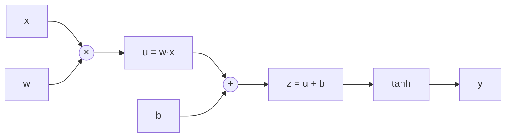

# Нейросети и обратное распространение

> **Зачем эта глава.** Backprop — это не «кнопка `loss.backward()`», а конкретный алгоритм,
> который вы обязаны уметь вывести на доске в матричной форме и с проверкой размерностей.
> Отсюда же растут все практические беды глубокого обучения: затухающие градиенты, мёртвые
> ReLU, NaN в лоссе. После этой главы вы сможете реализовать многослойную сеть и её градиенты
> на голом numpy, объяснить, почему autograd работает именно в обратном режиме, и по одному
> взгляду на нормы градиентов по слоям понять, что происходит с обучением.

**Уровень:** 🌱 база → 🧠 middle+
**Предварительно нужно:** [линейная алгебра](../01-math/01-linear-algebra.md), [оптимизация](../01-math/04-optimization.md), [логистическая регрессия](../02-classic-ml/03-logistic-regression.md)
**Как проработать:** чтение + вывод руками + реализация на numpy

---

## Карта главы

- [1. Где ломается линейная модель](#1-где-ломается-линейная-модель)
- [2. Многослойная сеть: формализация](#2-многослойная-сеть-формализация)
- [3. Универсальная аппроксимация: что теорема обещает и что нет](#3-универсальная-аппроксимация-что-теорема-обещает-и-что-нет)
- [4. Вычислительный граф](#4-вычислительный-граф)
- [5. Backprop: полный вывод](#5-backprop-полный-вывод)
- [6. Автодифференцирование: forward mode против reverse mode](#6-автодифференцирование-forward-mode-против-reverse-mode)
- [7. Реализация с нуля и проверка градиента](#7-реализация-с-нуля-и-проверка-градиента)
- [8. Функции активации](#8-функции-активации)
- [9. Затухание и взрыв градиентов](#9-затухание-и-взрыв-градиентов)
- [10. Компромиссы и границы](#10-компромиссы-и-границы)
- [11. Подводные камни](#11-подводные-камни)
- [12. Проверь себя](#12-проверь-себя)
- [13. Практика](#13-практика)
- [14. Что читать дальше](#14-что-читать-дальше)

> **Соглашение о буквах в этой главе.** $n$ — число объектов, $B$ — размер батча (мини-выборки),
> $d$ — размерность входа, $L$ — число слоёв, $d_l$ — ширина слоя $l$, $\theta$ — все обучаемые
> параметры, $\eta$ — learning rate. Прямой шрифт $L$ — это **число слоёв**, каллиграфическое
> $\mathcal{L}$ — **функция потерь** (loss). Их легко перепутать; на собеседовании тоже путают.

---

## 1. Где ломается линейная модель

Начнём с самой простой обучаемой конструкции — **перцептрона** (perceptron), придуманного
Розенблаттом в 1958 году. Это ровно линейная модель с пороговой функцией на выходе:

$$
\hat{y}(x) = \mathbb{1}\big[\, w^\top x + b > 0 \,\big]
$$

где $x \in \mathbb{R}^d$ — вектор признаков объекта, $w \in \mathbb{R}^d$ — веса, $b \in \mathbb{R}$ —
смещение (bias), $\mathbb{1}[\cdot]$ — индикатор, возвращающий 1, если условие выполнено, иначе 0.

Геометрически перцептрон проводит гиперплоскость и относит объекты к классам по тому, с какой
стороны от неё они лежат. Пока данные **линейно разделимы**, всё хорошо: есть даже теорема
о сходимости, гарантирующая, что простое правило обновления весов найдёт разделяющую гиперплоскость
за конечное число шагов.

### 1.1 XOR: контрпример на четырёх точках

Возьмём функцию «исключающее ИЛИ» на двух бинарных входах:

| $x_1$ | $x_2$ | XOR |
|---|---|---|
| 0 | 0 | 0 |
| 0 | 1 | 1 |
| 1 | 0 | 1 |
| 1 | 1 | 0 |

Докажем, что **ни один** перцептрон её не реализует. Пусть нашлись $w_1, w_2, b$, дающие правильные
ответы. Тогда из таблицы:

$$
\begin{aligned}
(0,0)\!: &\quad b \le 0 \\
(0,1)\!: &\quad w_2 + b > 0 \\
(1,0)\!: &\quad w_1 + b > 0 \\
(1,1)\!: &\quad w_1 + w_2 + b \le 0
\end{aligned}
$$

Сложим вторую и третью строки: $w_1 + w_2 + 2b > 0$. Из четвёртой строки $w_1 + w_2 \le -b$,
подставляем: $w_1 + w_2 + 2b \le -b + 2b = b \le 0$ (последнее — из первой строки). Получили
$w_1 + w_2 + 2b > 0$ и одновременно $w_1 + w_2 + 2b \le 0$. Противоречие.

Дело не в XOR как таковом, а в устройстве данных: два класса расположены «крест-накрест»,
и никакая прямая их не разделит. Именно этот результат (книга Минского и Паперта, 1969) заморозил
интерес к нейросетям почти на два десятилетия.

### 1.2 Как чинится: добавить скрытый слой

Достаточно одного скрытого слоя из двух ReLU-нейронов. Возьмём

$$
h_1 = \max(0,\; x_1 + x_2), \qquad h_2 = \max(0,\; x_1 + x_2 - 1), \qquad \hat{y} = h_1 - 2 h_2
$$

Проверим на всех четырёх точках: $(0,0) \to h=(0,0) \to 0$; $(0,1) \to h=(1,0) \to 1$;
$(1,0) \to h=(1,0) \to 1$; $(1,1) \to h=(2,1) \to 2 - 2 = 0$. Работает точно.

Что здесь произошло содержательно? Скрытый слой **изменил пространство признаков**. В координатах
$(h_1, h_2)$ точки классов уже линейно разделимы, и выходной нейрон — обычный линейный
классификатор поверх выученного представления. Это и есть главная идея глубокого обучения:
не подбирать признаки руками, а учить преобразование, после которого задача становится простой.

> 🌱 **База.** Если запомнить из этого раздела одно: нейросеть — это стопка обучаемых
> преобразований признакового пространства, а последний слой — обычная линейная модель поверх
> них. Вся «магия» в том, что промежуточные представления настраиваются под задачу
> градиентным спуском, а не придумываются человеком.

---

## 2. Многослойная сеть: формализация

Многослойный перцептрон (multilayer perceptron, MLP) — композиция $L$ слоёв. Для одного объекта
$x \in \mathbb{R}^{d}$ положим $a^{(0)} = x$ и для $l = 1, \dots, L$:

$$
z^{(l)} = W^{(l)} a^{(l-1)} + b^{(l)}, \qquad a^{(l)} = \phi^{(l)}\big(z^{(l)}\big)
$$

где $W^{(l)} \in \mathbb{R}^{d_l \times d_{l-1}}$ — матрица весов слоя $l$ ($d_0 = d$),
$b^{(l)} \in \mathbb{R}^{d_l}$ — вектор смещений, $z^{(l)} \in \mathbb{R}^{d_l}$ — **предактивации**
(pre-activations, они же логиты слоя), $\phi^{(l)}$ — поэлементная функция активации,
$a^{(l)} \in \mathbb{R}^{d_l}$ — активации слоя.

Выход сети $\hat{y} = a^{(L)}$ (для классификации на последнем слое активацию обычно не применяют,
а логиты отдают прямо в softmax внутри функции потерь — так численно устойчивее, см. [§11](#11-подводные-камни)).

Обучаемые параметры: $\theta = \{W^{(1)}, b^{(1)}, \dots, W^{(L)}, b^{(L)}\}$. Обучение — это
минимизация эмпирического риска

$$
\mathcal{L}(\theta) = \frac{1}{n}\sum_{i=1}^{n} \ell\big(f_\theta(x_i),\, y_i\big)
$$

где $\ell$ — функция потерь на одном объекте (кросс-энтропия, MSE), $f_\theta$ — сеть,
$n$ — число объектов обучающей выборки.

### 2.1 Почему нелинейность обязательна

Уберём активации, то есть положим $\phi^{(l)}(z) = z$. Тогда

$$
f(x) = W^{(L)}\big(W^{(L-1)}(\cdots W^{(1)} x + b^{(1)} \cdots) + b^{(L-1)}\big) + b^{(L)}
= \underbrace{\left(\prod_{l=L}^{1} W^{(l)}\right)}_{\tilde{W}} x + \tilde{b}
$$

где $\tilde{W} \in \mathbb{R}^{d_L \times d}$ — произведение всех матриц, $\tilde{b}$ — свёрнутый
вектор смещений. Композиция линейных отображений — снова линейное отображение. Сто слоёв
без активаций выражают ровно то же множество функций, что один слой, — только обучаются хуже.
Нелинейность между слоями — это единственное, что делает глубину осмысленной.

> 💬 **На собеседовании.** Спросят: «Что будет, если убрать все функции активации из глубокой
> сети?»
> Хороший ответ: сеть схлопнется в одно линейное отображение $\tilde{W} = W^{(L)}\cdots W^{(1)}$,
> выразительная сила станет как у линейной регрессии. При этом оптимизационная задача станет
> **хуже**, а не проще: параметризация избыточная и невыпуклая по $\theta$ (произведение матриц),
> появятся плохо обусловленные направления. Полезно добавить: ровно поэтому в низкоранговых
> адаптерах (LoRA) произведение $BA$ без нелинейности между ними — это осознанное ограничение
> ранга, а не «слой». Провал: «сеть не сможет учиться» — сможет, просто выучит линейную модель.

---

## 3. Универсальная аппроксимация: что теорема обещает и что нет

Формулировка, к которой сводятся результаты Цыбенко (1989) и Хорника (1991):

> Пусть $\phi$ — непостоянная, ограниченная и непрерывная функция (сигмоида подходит), $K \subset \mathbb{R}^d$ —
> компакт, $g: K \to \mathbb{R}$ — непрерывная функция, $\varepsilon > 0$. Тогда существуют
> натуральное $m$ и параметры $\{v_j, w_j, b_j\}_{j=1}^m$ такие, что
> $$\left| g(x) - \sum_{j=1}^{m} v_j\, \phi\big(w_j^\top x + b_j\big) \right| < \varepsilon \quad \text{для всех } x \in K$$

где $m$ — число нейронов скрытого слоя, $w_j \in \mathbb{R}^d$ и $b_j \in \mathbb{R}$ — параметры
$j$-го нейрона, $v_j \in \mathbb{R}$ — вес выходного слоя, $K$ — ограниченное замкнутое множество
(например, куб $[0,1]^d$).

То есть **сеть с одним скрытым слоем достаточной ширины приближает любую непрерывную функцию
на компакте с любой точностью**. Красиво. И почти бесполезно на практике — потому что теорема
не обещает четырёх вещей, а именно они и составляют реальную работу.

**Не обещает разумной ширины.** $m$ может расти экспоненциально по $d$. Для функций общего вида
это не артефакт доказательства, а нижняя оценка: чтобы покрыть куб размерности $d$ сеткой
с шагом $\varepsilon$, нужно $\varepsilon^{-d}$ ячеек. Есть классы функций, которые сеть глубины 3
представляет полиномиальным числом нейронов, а сеть глубины 2 — только экспоненциальным
(результаты о разделении по глубине, depth separation). Вот содержательный ответ на вопрос
«зачем глубина, если хватает одного слоя»: **глубина покупает экспоненциальную экономию
параметров** на функциях с композиционной структурой — а реальные данные (изображения, текст)
именно такие.

**Ничего не говорит об обучаемости.** Теорема — про *существование* весов, а не про то, что
SGD их найдёт. Задача минимизации $\mathcal{L}(\theta)$ невыпукла; в общем случае обучение
нейросети до глобального оптимума NP-трудно. То, что решение существует, и то, что оно находится
градиентным спуском за разумное время, — два независимых утверждения.

**Ничего не говорит об обобщении.** Аппроксимируется *известная* функция $g$ на всём компакте.
У нас нет $g$, у нас есть $n$ зашумлённых точек. Сеть, идеально приближающая эмпирические данные,
может быть сколь угодно плоха вне них. Всё, что вы знаете про bias-variance и регуляризацию
из [главы про постановку обучения](../02-classic-ml/01-learning-theory.md), остаётся в силе.

**Ничего не говорит о работе вне компакта.** Экстраполяция за пределы области обучающих данных
теоремой не покрыта вообще. Сеть с ReLU за пределами выпуклой оболочки обучающих точек
ведёт себя линейно — и это регулярная причина странных предсказаний в проде на сдвинутых данных.

> 💬 **На собеседовании.** Спросят: «Есть теорема об универсальной аппроксимации — зачем тогда
> глубокие сети?»
> Хороший ответ: теорема — про существование, а не про эффективность и обучаемость. Требуемая
> ширина может быть экспоненциальной по размерности входа, и для ряда классов функций доказано,
> что добавление слоя даёт экспоненциальное сокращение числа нейронов. Плюс глубина задаёт
> полезный индуктивный сдвиг: иерархия представлений соответствует структуре реальных данных.
> Плохой ответ: «глубокие сети точнее» — теорема утверждает, что по точности приближения
> широкой мелкой сети достаточно; выигрыш глубины в компактности и в оптимизации.

---

## 4. Вычислительный граф

Прежде чем выводить backprop, нужен правильный объект. Забудьте на минуту про «слои» —
любое вычисление это **направленный ациклический граф** (DAG): узлы — элементарные операции,
рёбра — потоки данных.

Возьмём один нейрон с tanh: $y = \tanh(w x + b)$.



Что нам нужно от такого графа? Для каждого узла — две вещи:

1. **Прямое правило**: как посчитать значение из значений родителей.
2. **Локальная производная**: как выразить $\partial(\text{выход узла}) / \partial(\text{вход узла})$
   через уже посчитанные величины.

Заметьте: локальная производная узла зависит **только** от него самого. Узел `×` знает, что
$\partial(uv)/\partial u = v$; узел `tanh` знает, что $\partial \tanh(z)/\partial z = 1 - \tanh^2(z)$,
и, что важно, значение $\tanh(z)$ уже посчитано на прямом проходе — переиспользуем.

Backprop — это применение цепного правила к такому графу в порядке, обратном топологической
сортировке. Каждый узел получает сверху $\bar{y} = \partial \mathcal{L}/\partial y$ (это называют
**adjoint**, или «градиент сверху», upstream gradient), умножает на свою локальную производную
и раздаёт результат родителям.

Два правила, которые надо помнить, потому что на них ошибаются:

- **Узел с несколькими потребителями суммирует** приходящие сверху градиенты. Если $x$ участвует
  в двух ветках графа, то $\partial\mathcal{L}/\partial x$ — сумма вкладов обеих. Отсюда
  `+=` в реализациях autograd и, кстати, отсюда же необходимость `optimizer.zero_grad()`.
- **Порядок обхода обязан быть топологическим**: нельзя обрабатывать узел, пока не пришли
  градиенты от *всех* его потребителей.

> 📐 **Разбор на пальцах.** Пусть $x = 0{,}7$, $w = -1{,}3$, $b = 0{,}4$.
> Прямой проход: $u = -0{,}91$, $z = -0{,}51$, $y = \tanh(-0{,}51) \approx -0{,}470$.
> Обратный: начинаем с $\bar{y} = 1$. Узел tanh: $\bar{z} = \bar{y}\cdot(1 - y^2) = 1 - 0{,}2209 \approx 0{,}779$.
> Узел `+`: сложение раздаёт градиент без изменения, $\bar{u} = 0{,}779$, $\bar{b} = 0{,}779$.
> Узел `×`: $\bar{w} = \bar{u}\cdot x = 0{,}779 \cdot 0{,}7 \approx 0{,}545$,
> $\bar{x} = \bar{u}\cdot w = 0{,}779\cdot(-1{,}3) \approx -1{,}013$.
> Мнемоника: **сложение копирует градиент, умножение меняет множители местами, max/ReLU
> маршрутизирует его в тот вход, который победил.**

---

## 5. Backprop: полный вывод

Теперь то, ради чего глава. Выведем градиенты MLP из [§2](#2-многослойная-сеть-формализация) полностью, без пропусков, и проверим
размерности на каждом шаге.

### 5.1 Ключевая величина: дельта слоя

Определим для каждого слоя $l$ вектор

$$
\delta^{(l)} \;\equiv\; \frac{\partial \mathcal{L}}{\partial z^{(l)}} \;\in\; \mathbb{R}^{d_l}
$$

где $z^{(l)}$ — предактивации слоя $l$, $d_l$ — его ширина. Это «сколько лосс изменится, если
чуть подвинуть предактивацию». Вся хитрость backprop в том, что $\delta$ считается рекуррентно
сверху вниз, а из $\delta$ градиенты по $W$ и $b$ получаются одной строкой.

Почему именно $z$, а не $a$? Потому что $z$ линейно зависит от параметров слоя — а значит
производная по параметрам получается тривиально. Это техническое решение, но оно определяет
всю структуру алгоритма.

### 5.2 Градиенты по параметрам через дельту

Распишем покомпонентно. Поскольку $z_i^{(l)} = \sum_{j} W_{ij}^{(l)} a_j^{(l-1)} + b_i^{(l)}$:

$$
\frac{\partial \mathcal{L}}{\partial W_{ij}^{(l)}}
= \sum_{k} \frac{\partial \mathcal{L}}{\partial z_k^{(l)}} \cdot \frac{\partial z_k^{(l)}}{\partial W_{ij}^{(l)}}
= \delta_i^{(l)} \, a_j^{(l-1)}
$$

(в сумме выживает единственное слагаемое $k = i$, потому что $W_{ij}^{(l)}$ входит только
в $z_i^{(l)}$; производная равна $a_j^{(l-1)}$).

В матричной форме это внешнее произведение:

$$
\boxed{\;\frac{\partial \mathcal{L}}{\partial W^{(l)}} = \delta^{(l)} \big(a^{(l-1)}\big)^{\top}\;}
\qquad
\boxed{\;\frac{\partial \mathcal{L}}{\partial b^{(l)}} = \delta^{(l)}\;}
$$

**Проверка размерностей.** $\delta^{(l)} \in \mathbb{R}^{d_l}$ — столбец,
$(a^{(l-1)})^\top \in \mathbb{R}^{1 \times d_{l-1}}$ — строка, произведение —
$\mathbb{R}^{d_l \times d_{l-1}}$. Совпадает с формой $W^{(l)}$. Это обязательная привычка:
**градиент по параметру всегда имеет форму самого параметра.** Если не сходится — ошибка в выводе.

### 5.3 Рекуррентное соотношение для дельты

Теперь главное — как получить $\delta^{(l)}$ из $\delta^{(l+1)}$. Величина $z_j^{(l)}$ влияет
на лосс только через активацию $a_j^{(l)} = \phi^{(l)}(z_j^{(l)})$, а та — через **все**
предактивации следующего слоя $z_k^{(l+1)}$. Значит:

$$
\delta_j^{(l)} = \frac{\partial \mathcal{L}}{\partial z_j^{(l)}}
= \sum_{k=1}^{d_{l+1}} \frac{\partial \mathcal{L}}{\partial z_k^{(l+1)}} \cdot \frac{\partial z_k^{(l+1)}}{\partial z_j^{(l)}}
= \sum_{k=1}^{d_{l+1}} \delta_k^{(l+1)} \cdot \frac{\partial z_k^{(l+1)}}{\partial z_j^{(l)}}
$$

Раскроем внутреннюю производную. Так как $z_k^{(l+1)} = \sum_{j'} W_{kj'}^{(l+1)} \phi^{(l)}(z_{j'}^{(l)}) + b_k^{(l+1)}$:

$$
\frac{\partial z_k^{(l+1)}}{\partial z_j^{(l)}} = W_{kj}^{(l+1)} \cdot \phi^{(l)\prime}\big(z_j^{(l)}\big)
$$

Подставляем и выносим общий множитель:

$$
\delta_j^{(l)} = \phi^{(l)\prime}\big(z_j^{(l)}\big) \sum_{k=1}^{d_{l+1}} W_{kj}^{(l+1)} \delta_k^{(l+1)}
$$

Сумма $\sum_k W_{kj}^{(l+1)} \delta_k^{(l+1)}$ — это $j$-я компонента вектора
$(W^{(l+1)})^{\top} \delta^{(l+1)}$ (транспонирование появилось само, из того, что суммирование
идёт по *первому* индексу $W$). Итого:

$$
\boxed{\;\delta^{(l)} = \Big[\big(W^{(l+1)}\big)^{\top} \delta^{(l+1)}\Big] \odot \phi^{(l)\prime}\big(z^{(l)}\big)\;}
$$

где $\odot$ — поэлементное (адамарово) произведение, $\phi^{(l)\prime}(z^{(l)})$ — вектор
производных активации, посчитанных поэлементно в точках $z^{(l)}$.

**Проверка размерностей.** $(W^{(l+1)})^\top \in \mathbb{R}^{d_l \times d_{l+1}}$,
$\delta^{(l+1)} \in \mathbb{R}^{d_{l+1}}$, произведение — $\mathbb{R}^{d_l}$; поэлементно
умножаем на вектор из $\mathbb{R}^{d_l}$; результат $\mathbb{R}^{d_l}$. Сходится.

> 📐 **Разбор смысла.** Формула читается так: «возьми ошибку следующего слоя, распредели её
> назад по тем же весам, по которым сигнал шёл вперёд (транспонированная матрица), и **погаси**
> в тех нейронах, где активация была в зоне насыщения (умножение на $\phi'$)». Прямой проход —
> $W$, обратный — $W^\top$. Эта симметрия — не совпадение: производная линейного отображения
> в обратном направлении и есть сопряжённое (транспонированное) отображение.

### 5.4 Инициализация рекурсии: последний слой

Осталось задать $\delta^{(L)}$. Общий вид: $\delta^{(L)} = \nabla_{a^{(L)}} \mathcal{L} \odot \phi^{(L)\prime}(z^{(L)})$.
На практике почти всегда встречается один из двух частных случаев, и оба стоит помнить наизусть.

**Случай 1: softmax + кросс-энтропия.** Пусть $z \equiv z^{(L)} \in \mathbb{R}^{K}$ — логиты
($K$ — число классов), $p_k = \dfrac{e^{z_k}}{\sum_{m} e^{z_m}}$ — softmax, $y$ — истинный класс,
$\ell = -\log p_y$. Тогда

$$
\frac{\partial \ell}{\partial z_k} = p_k - \mathbb{1}[k = y]
$$

<details>
<summary>Вывод (три строки, но их просят на собеседовании)</summary>

$\ell = -\log p_y = -z_y + \log \sum_m e^{z_m}$.

Дифференцируем по $z_k$: первый член даёт $-\mathbb{1}[k=y]$; второй —
$\dfrac{e^{z_k}}{\sum_m e^{z_m}} = p_k$.

Итого $\partial \ell/\partial z_k = p_k - \mathbb{1}[k=y]$, то есть в векторном виде
$\delta^{(L)} = p - y_{\text{onehot}}$.
</details>

**Случай 2: MSE на линейном выходе.** $\ell = \tfrac{1}{2}\|\hat{y} - y\|^2$, $\hat{y} = z^{(L)}$,
тогда $\delta^{(L)} = \hat{y} - y$.

В обоих случаях $\delta^{(L)}$ — это просто «предсказание минус правда». Совпадение не случайное:
и то и другое — канонические функции связи в обобщённых линейных моделях, и для них градиент
по логитам всегда имеет вид «ошибка».

### 5.5 Батчевая форма (та, что реально в коде)

В коде батч идёт **первой** осью, и матрицы транспонированы относительно учебниковой записи.
Пусть $A^{(l)} \in \mathbb{R}^{B \times d_l}$ — активации батча, $W^{(l)} \in \mathbb{R}^{d_{l-1} \times d_l}$
(так удобнее для `A @ W`), $b^{(l)} \in \mathbb{R}^{d_l}$. Тогда прямой проход:

$$
Z^{(l)} = A^{(l-1)} W^{(l)} + \mathbf{1}_B \big(b^{(l)}\big)^{\top}, \qquad A^{(l)} = \phi^{(l)}\big(Z^{(l)}\big)
$$

где $\mathbf{1}_B \in \mathbb{R}^{B}$ — вектор из единиц (broadcasting смещения по батчу),
$B$ — размер батча.

Обратный, с $\Delta^{(l)} \equiv \partial \mathcal{L}/\partial Z^{(l)} \in \mathbb{R}^{B \times d_l}$:

$$
\frac{\partial \mathcal{L}}{\partial W^{(l)}} = \big(A^{(l-1)}\big)^{\top} \Delta^{(l)},
\qquad
\frac{\partial \mathcal{L}}{\partial b^{(l)}} = \sum_{i=1}^{B} \Delta^{(l)}_{i,:},
\qquad
\Delta^{(l-1)} = \Big[\Delta^{(l)} \big(W^{(l)}\big)^{\top}\Big] \odot \phi^{(l-1)\prime}\big(Z^{(l-1)}\big)
$$

**Проверка размерностей построчно.**

| Выражение | Формы сомножителей | Результат | Должно быть |
|---|---|---|---|
| $(A^{(l-1)})^\top \Delta^{(l)}$ | $(d_{l-1} \times B) \cdot (B \times d_l)$ | $d_{l-1} \times d_l$ | форма $W^{(l)}$ ✓ |
| $\sum_i \Delta^{(l)}_{i,:}$ | суммирование по оси батча | $d_l$ | форма $b^{(l)}$ ✓ |
| $\Delta^{(l)} (W^{(l)})^\top$ | $(B \times d_l) \cdot (d_l \times d_{l-1})$ | $B \times d_{l-1}$ | форма $Z^{(l-1)}$ ✓ |

Заметьте важное: **градиент по весам суммируется по батчу** (свёртка по оси $B$ внутри
матричного умножения), а градиент по активациям — нет, у него батчевая ось сохраняется.
Отсюда следует, что делить на $B$ нужно **один раз** — либо усредняя лосс, либо усредняя
градиент, но не оба раза. Двойное деление — классическая причина «сеть учится, но в 64 раза
медленнее, чем ожидалось».

### 5.6 Сколько это стоит

Прямой проход слоя — умножение $(B \times d_{l-1})$ на $(d_{l-1} \times d_l)$: $O(B\, d_{l-1} d_l)$ операций.
Обратный проход требует **двух** таких умножений (градиент по весам и градиент по входу).
Отсюда универсальное правило:

$$
\text{стоимость(backward)} \approx 2 \times \text{стоимость(forward)}
$$

а полный шаг обучения (forward + backward) — примерно втрое дороже одного инференса. Это база
для любых прикидок бюджета обучения: правило «6 FLOPs на параметр на токен» для LLM (2 на forward
и 4 на backward) — прямое следствие. Подробнее — в главе про
[масштабирование](06-scaling-and-efficiency.md).

Память: чтобы посчитать $\Delta^{(l)}$, нужны сохранённые $Z^{(l)}$ (или $A^{(l)}$) со всего
прямого прохода. Отсюда линейный по глубине рост потребления памяти активациями и приём
gradient checkpointing — не хранить, а пересчитывать.

> 💬 **На собеседовании.** Спросят: «Почему backprop — это динамическое программирование,
> а не просто цепное правило?»
> Хороший ответ: цепное правило — тождество, оно не говорит, в каком порядке считать.
> Наивное применение (расписать производную каждого параметра как отдельное произведение
> по всем путям от параметра к лоссу) даёт экспоненциальное по глубине число слагаемых, потому
> что пути переиспользуются. Backprop мемоизирует промежуточный результат $\delta^{(l)}$ —
> общий для всех параметров слоя — и за счёт этого сводит стоимость к линейной по числу
> операций графа. Ровно как в динамическом программировании: перекрывающиеся подзадачи +
> кэш. Провал: «backprop — это цепное правило» без объяснения, что именно переиспользуется.

---

## 6. Автодифференцирование: forward mode против reverse mode

Есть четыре способа получить производную функции, заданной программой, и важно понимать,
почему в глубоком обучении выбран именно один.

**Численное дифференцирование.** $\dfrac{\partial f}{\partial \theta_i} \approx \dfrac{f(\theta + \varepsilon e_i) - f(\theta - \varepsilon e_i)}{2\varepsilon}$.
Ошибка складывается из ошибки усечения $O(\varepsilon^2)$ и ошибки округления $O(\epsilon_{\text{маш}}/\varepsilon)$;
оптимум для двойной точности — около $\varepsilon \sim 10^{-6}$, и даже там 6–8 верных знаков.
Стоимость — два прямых прохода **на каждый параметр**. Для модели на $10^8$ параметров это
исключено. Но как инструмент **отладки** на маленькой сети — незаменимо (см. [§7](#7-реализация-с-нуля-и-проверка-градиента)).

**Символьное дифференцирование.** Преобразование выражения в выражение (как в SymPy). Страдает
от «раздувания выражений»: производная композиции $L$ функций выписывается в формулу, растущую
экспоненциально, и переиспользование общих подвыражений теряется.

**Автодифференцирование (automatic differentiation, AD)** — не то и не другое. Оно вычисляет
производные **численно точно** (до машинной точности), применяя цепное правило к графу
элементарных операций. Два режима.

### 6.1 Forward mode

Идём по графу **в прямом порядке**, вместе с каждым значением протаскивая производную
по выбранному входу. Формально считается **произведение Якобиана на вектор** (JVP):

$$
\dot{y} = J \dot{x}, \qquad J = \frac{\partial f}{\partial x} \in \mathbb{R}^{n_{\text{out}} \times n_{\text{in}}}
$$

где $\dot{x} \in \mathbb{R}^{n_{\text{in}}}$ — заданное направление во входном пространстве
(«касательный вектор»), $\dot{y} \in \mathbb{R}^{n_{\text{out}}}$ — производная выхода вдоль
этого направления, $n_{\text{in}}$ — размерность входа, $n_{\text{out}}$ — размерность выхода.

Один прямой проход даёт производную по **одному** входному направлению. Чтобы получить полный
якобиан, нужно $n_{\text{in}}$ проходов. Память — константа: ничего хранить не надо.

### 6.2 Reverse mode

Идём по графу **в обратном порядке**, протаскивая производную лосса по промежуточным величинам.
Считается **произведение вектора на Якобиан** (VJP):

$$
\bar{x}^{\top} = \bar{y}^{\top} J
$$

где $\bar{y} \in \mathbb{R}^{n_{\text{out}}}$ — заданный вектор в выходном пространстве
(для скалярного лосса просто 1), $\bar{x} \in \mathbb{R}^{n_{\text{in}}}$ — искомый градиент.

Один обратный проход даёт производные по **всем** входам сразу. Чтобы получить полный якобиан,
нужно $n_{\text{out}}$ проходов. Плата — память: нужно хранить промежуточные значения прямого
прохода.

### 6.3 Почему в DL используют reverse mode

| Режим | Стоимость полного якобиана | Память | Когда выгоден |
|---|---|---|---|
| Forward | $n_{\text{in}} \times$ стоимость $f$ | $O(1)$ доп. | $n_{\text{in}} \ll n_{\text{out}}$ |
| Reverse | $n_{\text{out}} \times$ стоимость $f$ | $O(\text{размер графа})$ | $n_{\text{out}} \ll n_{\text{in}}$ |

В глубоком обучении $n_{\text{in}} = |\theta|$ — это $10^6 \dots 10^{11}$ параметров,
а $n_{\text{out}} = 1$ — скалярный лосс. Reverse mode даёт весь градиент **за один проход**,
стоимостью примерно в два прямых. Forward mode потребовал бы миллиард проходов. Вопрос закрыт.

Backprop — это в точности reverse-mode AD, применённый к нейросети. Термины «backprop»
и «reverse mode» часто используют как синонимы; строго говоря, backprop — частный случай.

> 🧠 **Middle+.** Forward mode в ML не мёртв, у него есть своя ниша: он естественно считает
> **произведение Гессиана на вектор** (HVP) в связке с reverse mode — приём
> «forward-over-reverse» стоит примерно как 2–4 обратных прохода и лежит в основе методов
> второго порядка, оценки кривизны, а также анализа резкости минимума. Также forward mode
> уместен, когда параметров мало, а выходов много (например, чувствительность
> дифференцируемого симулятора по нескольким физическим константам).

> 💬 **На собеседовании.** Спросят: «Почему autograd работает в обратном режиме и чем за это
> платят?»
> Хороший ответ: потому что лосс скалярный, а параметров много — reverse mode даёт градиент
> по всем параметрам за один проход, а forward потребовал бы прохода на параметр. Платят
> памятью: нужно хранить активации всего прямого прохода, поэтому потребление памяти при
> обучении растёт с глубиной и с размером батча, и именно поэтому существуют gradient
> checkpointing (пересчитывать вместо хранения) и `torch.no_grad()` для инференса.
> Провал: «потому что так быстрее» без указания на асимметрию $n_{\text{in}}$ и $n_{\text{out}}$.

---

## 7. Реализация с нуля и проверка градиента

Сначала — скалярный движок автодифференцирования на 60 строк. Он показывает, что autograd
внутри устроен просто: узел хранит значение, градиент, ссылки на родителей и замыкание,
умеющее раздать градиент назад.

```python
import math


class Value:
    """Скалярный узел вычислительного графа с reverse-mode автодифференцированием."""

    def __init__(self, data, parents=(), op=""):
        self.data = data
        self.grad = 0.0            # накапливаем: узел может использоваться несколько раз
        self._parents = parents
        self._backward = lambda: None   # как раздать градиент родителям
        self.op = op

    def __add__(self, other):
        other = other if isinstance(other, Value) else Value(other)
        out = Value(self.data + other.data, (self, other), "+")

        def _backward():
            # d(a+b)/da = 1 — сложение копирует градиент обоим родителям
            self.grad += out.grad
            other.grad += out.grad
        out._backward = _backward
        return out

    def __mul__(self, other):
        other = other if isinstance(other, Value) else Value(other)
        out = Value(self.data * other.data, (self, other), "*")

        def _backward():
            # d(ab)/da = b — множители "меняются местами"
            self.grad += other.data * out.grad
            other.grad += self.data * out.grad
        out._backward = _backward
        return out

    def tanh(self):
        t = math.tanh(self.data)
        out = Value(t, (self,), "tanh")

        def _backward():
            # переиспользуем t, посчитанный на прямом проходе: 1 - tanh^2
            self.grad += (1 - t * t) * out.grad
        out._backward = _backward
        return out

    def backward(self):
        topo, seen = [], set()

        def build(v):
            if id(v) in seen:
                return
            seen.add(id(v))
            for p in v._parents:
                build(p)
            topo.append(v)      # родители встают в список раньше потомка

        build(self)
        self.grad = 1.0
        for v in reversed(topo):   # обратная топологическая сортировка
            v._backward()


if __name__ == "__main__":
    x, w, b = Value(0.7), Value(-1.3), Value(0.4)
    y = (x * w + b).tanh()
    y.backward()

    z = 0.7 * -1.3 + 0.4
    s = 1 - math.tanh(z) ** 2      # аналитическая производная tanh в точке z
    assert abs(x.grad - s * -1.3) < 1e-12
    assert abs(w.grad - s * 0.7) < 1e-12
    assert abs(b.grad - s) < 1e-12
    print(f"y={y.data:.6f}  dy/dx={x.grad:.6f}  dy/dw={w.grad:.6f}  dy/db={b.grad:.6f}")
    # y=-0.469945  dy/dx=-1.012897  dy/dw=0.545406  dy/db=0.779152
```

Теперь то же самое, но на матрицах и с настоящим MLP. Это код из [§5.5](#55-батчевая-форма-та-что-реально-в-коде), буквально.

```python
import numpy as np


class MLP:
    """Многослойный перцептрон с ручным backprop. Батч идёт первой осью: (B, d)."""

    def __init__(self, sizes, seed=0):
        rng = np.random.default_rng(seed)
        # He-инициализация: дисперсия 2/fan_in. Почему именно так — в главе 02
        self.W = [rng.standard_normal((sizes[l], sizes[l + 1])) * np.sqrt(2.0 / sizes[l])
                  for l in range(len(sizes) - 1)]
        self.b = [np.zeros(sizes[l + 1]) for l in range(len(sizes) - 1)]
        self.L = len(self.W)

    def forward(self, X):
        # X: (B, d_0). Сохраняем A и Z — они нужны обратному проходу
        self.A, self.Z = [X], []
        a = X
        for l in range(self.L):
            z = a @ self.W[l] + self.b[l]                  # (B, d_{l+1})
            self.Z.append(z)
            # на последнем слое активацию не применяем: отдаём логиты в softmax внутри лосса
            a = np.maximum(z, 0.0) if l < self.L - 1 else z
            self.A.append(a)
        return a

    def backward(self, dL_dout):
        # dL_dout: (B, d_L) — градиент лосса по логитам, уже поделённый на B
        gW, gb = [None] * self.L, [None] * self.L
        delta = dL_dout
        for l in range(self.L - 1, -1, -1):
            if l < self.L - 1:
                delta = delta * (self.Z[l] > 0)            # производная ReLU: 1 при z>0, иначе 0
            gW[l] = self.A[l].T @ delta                    # (d_l, d_{l+1}) — форма W[l]
            gb[l] = delta.sum(axis=0)                      # сумма по батчу — форма b[l]
            delta = delta @ self.W[l].T                    # (B, d_l) — градиент по входу слоя
        return gW, gb


def softmax_ce(logits, y):
    """Кросс-энтропия по логитам + её градиент. Возвращает (loss, dL/dlogits)."""
    z = logits - logits.max(axis=1, keepdims=True)   # сдвиг: exp не переполнится
    p = np.exp(z)
    p /= p.sum(axis=1, keepdims=True)
    B = len(y)
    loss = -np.log(p[np.arange(B), y] + 1e-12).mean()
    grad = p.copy()
    grad[np.arange(B), y] -= 1.0                     # delta^(L) = p - onehot(y), см. §5.4
    return loss, grad / B                            # делим на B ровно один раз


if __name__ == "__main__":
    rng = np.random.default_rng(1)
    net = MLP([5, 7, 4, 3])
    X, y = rng.standard_normal((6, 5)), rng.integers(0, 3, size=6)

    loss, dlogits = softmax_ce(net.forward(X), y)
    gW, _ = net.backward(dlogits)

    # gradient checking: сравниваем аналитический градиент с центральной разностью
    eps = 1e-6
    for l in range(net.L):
        num = np.zeros_like(net.W[l])
        it = np.nditer(net.W[l], flags=["multi_index"])
        while not it.finished:
            i = it.multi_index
            old = net.W[l][i]
            net.W[l][i] = old + eps; lp, _ = softmax_ce(net.forward(X), y)
            net.W[l][i] = old - eps; lm, _ = softmax_ce(net.forward(X), y)
            net.W[l][i] = old
            num[i] = (lp - lm) / (2 * eps)
            it.iternext()
        rel = np.abs(num - gW[l]).max() / max(np.abs(num).max(), 1e-12)
        print(f"слой {l}: макс. относительная ошибка градиента {rel:.2e}")
        assert rel < 1e-6, "backprop расходится с численной проверкой"
# слой 0: макс. относительная ошибка градиента 4.18e-10
# слой 1: макс. относительная ошибка градиента 3.94e-10
# слой 2: макс. относительная ошибка градиента 3.69e-10
```

Относительная ошибка порядка $10^{-10}$ — это норма для двойной точности. Порог `1e-6`
не случаен: при `float64` расхождение выше $10^{-5}$ практически всегда означает ошибку в коде,
а не численный шум.

> ⌨️ **Руками.** Реализуйте `MLP` и `softmax_ce` с чистого листа, потом добавьте свой слой
> (например, `Dropout` или `LayerNorm`) и проверьте его gradient checking'ом. В PyTorch этому
> соответствует [`torch.autograd.gradcheck`](https://pytorch.org/docs/stable/generated/torch.autograd.gradcheck.html) —
> обязательный инструмент, когда вы пишете кастомный `autograd.Function`. Важная деталь:
> gradcheck нужно запускать в `float64`, в `float32` численная разность слишком шумная.

> ⚠️ **Типичная ошибка.** Проверять градиент на сети с ReLU в точке, где какая-то предактивация
> близка к нулю. ReLU негладкая в нуле, и центральная разность через излом даёт мусор.
> Что делать: проверять на tanh/sigmoid, либо отбрасывать координаты, где $|z| < 10^{-3}$.

---

## 8. Функции активации

Требования к активации: нелинейность (иначе [§2.1](#21-почему-нелинейность-обязательна)), дешёвое вычисление, и — критично —
**производная, не убивающая градиент**. Ниже все основные, с производными.

### 8.1 Сигмоида

$$
\sigma(z) = \frac{1}{1 + e^{-z}}, \qquad \sigma'(z) = \sigma(z)\big(1 - \sigma(z)\big)
$$

где $z \in \mathbb{R}$ — предактивация. Область значений $(0, 1)$, максимум производной —
$\sigma'(0) = 0{,}25$.

Три проблемы, из-за которых сигмоиду в скрытых слоях не используют с середины 2010-х:

1. **Насыщение.** При $|z| > 5$ производная меньше $0{,}007$: градиент через такой нейрон
   практически не проходит.
2. **Максимум производной 0,25 < 1.** Даже в лучшей точке слой ослабляет градиент вчетверо.
   На 20 слоях это множитель $0{,}25^{20} \approx 9 \cdot 10^{-13}$ — см. [§9](#9-затухание-и-взрыв-градиентов).
3. **Не центрирована в нуле.** Все выходы положительны, поэтому градиент по всем весам одного
   нейрона имеет одинаковый знак (он равен $\delta_i \cdot a_j$, а все $a_j > 0$) — веса
   вынуждены двигаться «зигзагом», сходимость замедляется.

Сигмоида остаётся на **выходе** бинарного классификатора и в вентилях LSTM/GRU — там нужен
именно ограниченный диапазон $(0,1)$.

### 8.2 Гиперболический тангенс

$$
\tanh(z) = \frac{e^{z} - e^{-z}}{e^{z} + e^{-z}} = 2\sigma(2z) - 1, \qquad \tanh'(z) = 1 - \tanh^2(z)
$$

Область значений $(-1, 1)$, максимум производной $\tanh'(0) = 1$. Это заметно лучше сигмоиды:
центрирован в нуле и не ослабляет градиент в линейной зоне. Насыщение при больших $|z|$ остаётся.
Живёт в RNN и в маленьких сетях.

### 8.3 ReLU

$$
\operatorname{ReLU}(z) = \max(0, z), \qquad
\operatorname{ReLU}'(z) = \begin{cases} 1, & z > 0 \\ 0, & z < 0 \end{cases}
$$

В нуле производной нет (излом); фреймворки договорились возвращать 0 — вероятность попасть
ровно в ноль на вещественных данных нулевая, так что это соглашение безвредно.

Почему ReLU выиграла:

- **Не насыщается справа.** Для $z > 0$ производная ровно 1 — градиент проходит без ослабления,
  сколько бы слоёв ни было. Это главная причина, по которой обучение сетей глубже 10 слоёв
  вообще стало возможным.
- **Дёшево.** Сравнение с нулём против экспоненты.
- **Разреженность.** Примерно половина нейронов при случайной инициализации выдаёт ноль,
  что даёт разреженные представления и экономит вычисления.

### 8.4 Dying ReLU и как чинят

**Симптом:** часть нейронов после нескольких сотен шагов выдаёт ноль на **всех** объектах
обучающей выборки и больше никогда не оживает. Эффективная ёмкость сети падает; при неудаче
может «умереть» 30–50% слоя.

**Причина, механически.** Если предактивация $z_i = w_i^\top a + b_i$ отрицательна на всех входах,
то $\operatorname{ReLU}'(z_i) = 0$, значит $\delta_i = 0$, значит градиент по $w_i$ и $b_i$
ровно ноль. Обновления нет — нейрон заморожен навсегда. Загнать нейрон в это состояние легко:
один слишком большой шаг (высокий $\eta$) толкает $b_i$ глубоко в минус. Второй частый источник —
агрессивный weight decay, вдавливающий смещение.

**Что делать (в порядке применения):**

- Уменьшить $\eta$ или добавить warmup — чаще всего проблема именно в первых шагах.
- LeakyReLU/ELU/GELU — активации с ненулевой производной слева.
- He-инициализация вместо Xavier (см. [главу 02](02-training-dynamics.md)) — она рассчитана
  именно под ReLU.
- Диагностика: логировать долю нулевых активаций по слоям. Устойчиво выше ~60% — сигнал.

### 8.5 LeakyReLU и PReLU

$$
\operatorname{LeakyReLU}(z) = \begin{cases} z, & z > 0 \\ \alpha z, & z \le 0\end{cases},
\qquad
\operatorname{LeakyReLU}'(z) = \begin{cases} 1, & z > 0 \\ \alpha, & z < 0\end{cases}
$$

где $\alpha$ — маленький положительный коэффициент, по умолчанию $0{,}01$. Градиент слева
не нулевой — мёртвый нейрон может ожить. PReLU — то же, но $\alpha$ обучаемый (свой на канал).
В GAN-ах традиционно берут $\alpha = 0{,}2$.

### 8.6 GELU

$$
\operatorname{GELU}(z) = z \cdot \Phi(z), \qquad \operatorname{GELU}'(z) = \Phi(z) + z\,\varphi(z)
$$

где $\Phi$ — функция распределения стандартного нормального закона, $\varphi$ — его плотность.
Интерпретация: ReLU умножает вход на детерминированный индикатор $\mathbb{1}[z>0]$, GELU —
на *вероятность* того, что вход больше случайного порога $\mathcal{N}(0,1)$. Получается гладкий
«мягкий вентиль».

Быстрая аппроксимация (её и считают в большинстве реализаций):

$$
\operatorname{GELU}(z) \approx 0{,}5\,z\left(1 + \tanh\left[\sqrt{\tfrac{2}{\pi}}\big(z + 0{,}044715\, z^3\big)\right]\right)
$$

GELU **немонотонна**: у неё минимум в точке $z \approx -0{,}752$ со значением $\approx -0{,}170$.
Именно эта «ямка» и гладкость — то, чем она отличается от ReLU. Стандарт в BERT, GPT-2/3.

### 8.7 SiLU (Swish)

$$
\operatorname{SiLU}(z) = z\,\sigma(z), \qquad \operatorname{SiLU}'(z) = \sigma(z)\big(1 + z(1 - \sigma(z))\big)
$$

Тоже немонотонна: минимум в $z \approx -1{,}278$ со значением $\approx -0{,}279$. Практически
неотличима от GELU по качеству, чуть дешевле. Основа SwiGLU в современных LLM (там она работает
как вентиль, см. [главу про трансформер](04-attention-and-transformer.md)).

### 8.8 Сводка

| Активация | Производная | Диапазон производной | Центрирована | Насыщается | Где применяют |
|---|---|---|---|---|---|
| $\sigma(z)$ | $\sigma(1-\sigma)$ | $(0;\,0{,}25]$ | нет | с обеих сторон | выход бинарной задачи, вентили LSTM |
| $\tanh(z)$ | $1-\tanh^2$ | $(0;\,1]$ | да | с обеих сторон | RNN, маленькие сети |
| ReLU | $\{0, 1\}$ | $\{0;\,1\}$ | нет | слева (жёстко) | CNN, дефолт до ~2018 |
| LeakyReLU | $\{\alpha, 1\}$ | $\{\alpha;\,1\}$ | почти | нет | когда ReLU умирает, GAN |
| GELU | $\Phi(z)+z\varphi(z)$ | $\approx[-0{,}13;\,1{,}08]$ | почти | нет | трансформеры (BERT, GPT) |
| SiLU | $\sigma(1+z(1-\sigma))$ | $\approx[-0{,}10;\,1{,}10]$ | почти | нет | современные LLM (в составе SwiGLU) |

> 💬 **На собеседовании.** Спросят: «Почему ReLU лучше сигмоиды?»
> Хороший ответ: в положительной полуоси производная ReLU ровно 1, поэтому произведение
> производных по слоям не затухает экспоненциально; у сигмоиды максимум производной 0,25,
> и уже на десятке слоёв градиент до нижних слоёв не доходит. Плюс ReLU дешевле и даёт
> разреженность. Обязательно добавить цену: ReLU умирает при отрицательных предактивациях
> (нулевой градиент навсегда), не центрирована и негладкая — поэтому в трансформерах её
> заменили на GELU/SiLU. Провал: «ReLU быстрее считается» как единственный аргумент —
> это самый слабый из настоящих доводов.

---

## 9. Затухание и взрыв градиентов

Это центральная проблема глубины, и на собеседовании её просят объяснить **механизмом**,
а не словами «градиенты затухают».

### 9.1 Откуда берётся экспонента

Разверните рекуррентное соотношение [§5.3](#53-рекуррентное-соотношение-для-дельты) от последнего слоя к первому:

$$
\delta^{(1)} = \left(\prod_{l=2}^{L} \operatorname{diag}\big(\phi'(z^{(l-1)})\big)\big(W^{(l)}\big)^{\top}\right) \delta^{(L)}
$$

где $\operatorname{diag}(v)$ — диагональная матрица из вектора $v$, произведение берётся
в порядке убывания $l$. Градиент нижнего слоя — это **произведение $L-1$ матриц**. Норма
произведения ведёт себя мультипликативно: если каждый множитель в среднем сжимает вектор
в $\gamma < 1$ раз, суммарное сжатие $\gamma^{L-1}$ — экспоненциальное затухание. Если
растягивает ($\gamma > 1$) — экспоненциальный взрыв. Ровно единица не удерживается сама собой:
это неустойчивое равновесие.

Грубая, но полезная оценка: $\gamma \approx \sigma_{\max}(W) \cdot \max \phi'$, где
$\sigma_{\max}(W)$ — наибольшее сингулярное число матрицы весов. Для сигмоиды $\max\phi' = 0{,}25$,
и даже при $\sigma_{\max}(W) = 2$ имеем $\gamma = 0{,}5$: на 30 слоях множитель $10^{-9}$.
Для ReLU $\max\phi' = 1$, и всё определяется весами — отсюда важность инициализации
(следующая глава).

### 9.2 Численный эксперимент

Соберём 20-слойную сеть шириной $d = 128$ и посмотрим на нормы градиентов по слоям при
одинаковой инициализации $W \sim \mathcal{U}(-1/\sqrt{d},\, 1/\sqrt{d})$ — это в точности
дефолт `nn.Linear` в PyTorch.

```python
import numpy as np

rng = np.random.default_rng(0)
L, d, B = 20, 128, 64                      # L слоёв, ширина d, батч B
X = rng.standard_normal((B, d))
Y = rng.standard_normal((B, 1))


def grad_norms_per_layer(act, dact):
    """Возвращает ‖dL/dW‖ для каждого слоя. Backprop — руками, как в §5.5."""
    Ws = [rng.uniform(-1 / np.sqrt(d), 1 / np.sqrt(d), (d, d)) for _ in range(L)]
    Wout = rng.uniform(-1 / np.sqrt(d), 1 / np.sqrt(d), (d, 1))

    A, Z, a = [X], [], X
    for W in Ws:
        z = a @ W
        Z.append(z)
        a = act(z)
        A.append(a)
    out = a @ Wout

    g = 2 * (out - Y) / B                  # dL/dout для MSE
    g = g @ Wout.T                         # (B, d)
    norms = []
    for l in range(L - 1, -1, -1):
        g = g * dact(Z[l])                 # погасить там, где активация насыщена
        norms.append(np.linalg.norm(A[l].T @ g))
        g = g @ Ws[l].T
    return norms[::-1]                     # от первого слоя к последнему


sig = lambda z: 1 / (1 + np.exp(-z))
setups = {
    "sigmoid": (sig, lambda z: sig(z) * (1 - sig(z))),
    "tanh":    (np.tanh, lambda z: 1 - np.tanh(z) ** 2),
    "relu":    (lambda z: np.maximum(z, 0), lambda z: (z > 0).astype(float)),
}
for name, (f, df) in setups.items():
    v = grad_norms_per_layer(f, df)
    print(f"{name:8s} слой 1: {v[0]:.2e}   слой 10: {v[9]:.2e}   слой 20: {v[19]:.2e}")
```

Вывод:

```
sigmoid  слой 1: 1.88e-17   слой 10: 2.22e-10   слой 20: 6.92e-02
tanh     слой 1: 4.17e-05   слой 10: 5.24e-05   слой 20: 5.45e-05
relu     слой 1: 3.91e-08   слой 10: 3.99e-08   слой 20: 3.16e-08
```

Читаем таблицу. У сигмоиды градиент первого слоя меньше градиента последнего в
$3{,}7 \cdot 10^{-16}$ раз — **пятнадцать порядков**. В `float32` (машинный эпсилон $\approx 1{,}2\cdot10^{-7}$)
такое обновление просто теряется при округлении: нижние слои не обучаются вообще, сеть
эквивалентна случайному признаковому преобразованию плюс обученная верхушка. У tanh и ReLU
нормы по слоям одного порядка — разброс в разы, а не в $10^{15}$.

> 🧠 **Middle+.** Обратите внимание, что у ReLU и tanh нормы почти плоские, хотя сами активации
> при такой инициализации затухают вперёд. Это не совпадение: градиент по весам слоя $l$
> равен $A^{(l)\top}\Delta^{(l)}$, и затухание активаций вперёд частично компенсируется
> затуханием дельт назад. Поэтому «плоские нормы градиентов» — необходимый, но **не достаточный**
> признак здоровья: смотреть надо и на статистики активаций тоже. Как за этим следить —
> в [главе про динамику обучения](02-training-dynamics.md).

### 9.3 Взрыв

Обратная беда: $\gamma > 1$. Симптом резче и заметнее — лосс скачком уходит в `inf` или `NaN`,
обычно за один шаг. При $\gamma = 1{,}5$ и 30 слоях множитель $1{,}5^{30} \approx 1{,}9\cdot10^{5}$;
шаг оптимизатора выбрасывает веса далеко, дальше активации переполняются.

Взрыв особенно характерен для RNN, где одна и та же матрица применяется $n$ раз подряд
(здесь $n$ — длина последовательности), и $\gamma = \sigma_{\max}(W)$ работает в чистом виде.

### 9.4 Арсенал средств

| Средство | Против чего | Механизм |
|---|---|---|
| Правильная инициализация (Xavier/He) | затухание и взрыв | ставит $\gamma \approx 1$ на старте |
| ReLU-подобные активации | затухание | убирает множитель $\max\phi' < 1$ |
| Остаточные связи | затухание | якобиан $I + \partial f/\partial x$ — единица не затухает |
| Нормализации (Batch/Layer/RMS) | и то и другое | удерживают масштаб активаций по слоям |
| Градиентный клиппинг | взрыв | обрезает норму градиента сверху |
| LSTM/GRU | затухание во времени | аддитивный путь для состояния ячейки |

Первые пять — предмет [следующей главы](02-training-dynamics.md), последнее — главы про
[RNN](03-cnn-and-rnn.md). Здесь важно понять, что все они атакуют **один и тот же**
мультипликативный механизм, просто с разных сторон.

> 💬 **На собеседовании.** Спросят: «Как отличить затухающий градиент от взрывающегося
> по симптомам?»
> Хороший ответ: взрыв виден мгновенно — `NaN`/`inf` в лоссе, обычно в первые десятки шагов,
> норма градиента подскакивает на порядки; лечится клиппингом и снижением $\eta$. Затухание
> коварнее: лосс **падает**, ошибок нет, но падает только за счёт верхних слоёв — нижние
> практически не двигаются. Диагностика: логировать $\|\partial\mathcal{L}/\partial W^{(l)}\|$
> и относительное изменение весов $\eta\|g_l\| / \|W_l\|$ по слоям; здоровое значение — порядка
> $10^{-3}$, если у нижних слоёв $10^{-7}$ — они стоят. Провал: «затухание — это когда градиент
> маленький» без указания, что маленький он **неравномерно по слоям**, и без способа проверить.

---

## 10. Компромиссы и границы

**Глубина против ширины.** Глубина даёт экспоненциальную экономию параметров на композиционных
функциях, но каждая новая пара слоёв ухудшает обусловленность оптимизации. Без остаточных связей
и нормализаций сети глубже ~20 слоёв практически не обучаются — это был реальный потолок
до ResNet (2015). С ними глубина стала почти бесплатной, и компромисс сместился: теперь ограничение —
память и латентность инференса, а не обучаемость.

**MLP против специализированных архитектур.** MLP не делает никаких предположений о структуре
входа: перестановка признаков не меняет задачу. Это честно, но дорого — сеть вынуждена выучивать
из данных то, что можно было заложить (локальность и трансляционную инвариантность в изображениях,
последовательность в тексте). При ограниченных данных выигрывает архитектура с правильным
индуктивным сдвигом; при очень больших данных разрыв сокращается (это, по сути, история ViT
против CNN).

**Нейросеть против бустинга на табличных данных.** На табличных данных с разнородными признаками
градиентный бустинг устойчиво выигрывает у MLP: он инвариантен к монотонным преобразованиям
признаков, из коробки работает с пропусками и категориями, требует меньше тюнинга. Нейросети
имеют смысл на табличке, когда нужны сквозные эмбеддинги категорий высокой мощности,
многозадачность или дообучение под меняющиеся данные. Подробный разбор — в
[главе про бустинг](../02-classic-ml/08-gradient-boosting.md).

**Ручной backprop против autograd.** Писать градиенты руками в проде не нужно. Но есть три
ситуации, где приходится: кастомная операция без производной во фреймворке, оптимизация памяти
(слить несколько операций в один `autograd.Function`), и отладка — когда autograd честно считает
градиент математически неверной формулы.

---

## 11. Подводные камни

**Не обнулили градиенты.**
Симптом: лосс ведёт себя странно, эффективный learning rate как будто растёт со временем.
Причина: в PyTorch `.grad` **накапливается** (это следствие правила «узел с несколькими
потребителями суммирует», [§4](#4-вычислительный-граф)). Без `optimizer.zero_grad()` градиенты складываются по всем шагам.
Что делать: `zero_grad()` перед `backward()`; при осознанном накоплении (gradient accumulation)
делить лосс на число шагов накопления.

**Софтмакс отдельно от кросс-энтропии.**
Симптом: `NaN` в лоссе, особенно в `float16`.
Причина: $\exp(z)$ при $z \sim 100$ переполняется, а $\log(0)$ даёт $-\infty$. Отдельные
`softmax` + `log` теряют устойчивость там, где комбинированная формула
$\log p_y = z_y - \log\sum_m e^{z_m}$ с вычитанием максимума устойчива.
Что делать: `nn.CrossEntropyLoss` на **логитах**, `F.log_softmax` вместо `log(softmax(...))`,
не ставить softmax последним слоем модели.

**Забыли `.detach()` в накоплении статистик.**
Симптом: память растёт от итерации к итерации, через сотни шагов — OOM.
Причина: `total_loss += loss` сохраняет ссылку на весь граф вычислений этого шага, и граф
не освобождается.
Что делать: `total_loss += loss.item()` или `.detach()`. Правило: всё, что уходит в логи,
метрики и списки, должно быть скаляром Python.

**Двойное усреднение по батчу.**
Симптом: обучение идёт, но заметно медленнее ожидаемого; подобранный на батче 32 learning rate
не переносится на батч 256.
Причина: лосс усреднён по батчу (`reduction='mean'`), а градиент дополнительно поделён на $B$
вручную.
Что делать: определиться, где происходит нормировка, и проверить: при удвоении батча норма
градиента не должна систематически меняться вдвое.

**Инициализация нулями.**
Симптом: сеть обучается как линейная модель, качество не растёт с шириной.
Причина: при $W = 0$ все нейроны слоя получают одинаковый градиент и остаются идентичными
навсегда — симметрия не нарушается. Разбор — в [следующей главе](02-training-dynamics.md).
Что делать: случайная инициализация нужного масштаба (He для ReLU, Xavier для tanh).
Смещения нулём — можно.

**`model.eval()` не вызван.**
Симптом: метрики на валидации хуже обучающих сильнее, чем объяснимо; результат меняется
от запуска к запуску.
Причина: dropout продолжает выбрасывать нейроны, BatchNorm обновляет running-статистики
по валидационным данным (что ещё и утечка).
Что делать: `model.eval()` + `torch.no_grad()` на валидации, `model.train()` обратно. Подробнее —
в [главе про PyTorch](05-pytorch-in-practice.md).

**Градиент течёт туда, куда не должен.**
Симптом: в схемах с teacher-моделью, target-сетью или дистилляцией лосс падает подозрительно
быстро, а качество не растёт.
Причина: забыли `.detach()` на «замороженной» ветке, и градиент обновляет то, что должно
быть константой.
Что делать: явно `detach()` или `torch.no_grad()` вокруг ветки; проверять
`p.grad is None` у параметров, которые не должны обучаться.

---

## 12. Проверь себя

<details>
<summary><b>🌱 Вопрос.</b> Почему однослойный перцептрон не может выучить XOR? Докажите.</summary>

**Короткий ответ.** Классы XOR не линейно разделимы: точки $(0,1)$ и $(1,0)$ одного класса
лежат по разные стороны от отрезка, соединяющего $(0,0)$ и $(1,1)$ другого класса. Формально
система неравенств на веса несовместна.

**Развёрнуто.** Пусть $w_1 x_1 + w_2 x_2 + b$ даёт правильные знаки. Из $(0,0)$: $b \le 0$.
Из $(0,1)$ и $(1,0)$: $w_2 + b > 0$ и $w_1 + b > 0$; сложив, $w_1 + w_2 + 2b > 0$.
Из $(1,1)$: $w_1 + w_2 + b \le 0$, то есть $w_1 + w_2 \le -b$, откуда
$w_1 + w_2 + 2b \le b \le 0$. Противоречие. Один скрытый слой из двух ReLU задачу решает:
$h_1 = \max(0, x_1+x_2)$, $h_2 = \max(0, x_1+x_2-1)$, $\hat y = h_1 - 2h_2$ — проверяется
на всех четырёх точках.

**Чего ждёт интервьюер:** не факта, а доказательства в две строки и понимания, что скрытый
слой меняет пространство признаков, а не «добавляет мощности».

**Провал:** «XOR нелинейная задача» без разбора и без явной конструкции решения.
</details>

<details>
<summary><b>🎯 Вопрос.</b> Выведите формулы backprop для MLP в матричном виде.</summary>

**Короткий ответ.** $\delta^{(L)} = \nabla_{a^{(L)}}\mathcal{L} \odot \phi'(z^{(L)})$;
$\delta^{(l)} = \big[(W^{(l+1)})^\top \delta^{(l+1)}\big] \odot \phi'(z^{(l)})$;
$\partial\mathcal{L}/\partial W^{(l)} = \delta^{(l)}(a^{(l-1)})^\top$;
$\partial\mathcal{L}/\partial b^{(l)} = \delta^{(l)}$.

**Развёрнуто.** Ключ — ввести $\delta^{(l)} = \partial\mathcal{L}/\partial z^{(l)}$ по
**предактивациям**: через них производная по параметрам слоя тривиальна. Рекуррентность
получается из того, что $z_j^{(l)}$ влияет на лосс через все $z_k^{(l+1)}$:
$\partial z_k^{(l+1)}/\partial z_j^{(l)} = W_{kj}^{(l+1)}\phi'(z_j^{(l)})$, суммирование
по первому индексу $W$ и даёт транспонирование. Проверка размерностей обязательна:
$\delta^{(l)}(a^{(l-1)})^\top$ — это $(d_l \times 1)\cdot(1 \times d_{l-1}) = d_l \times d_{l-1}$,
форма $W^{(l)}$. В батчевом коде оси переставлены: $\partial\mathcal{L}/\partial W^{(l)} = (A^{(l-1)})^\top\Delta^{(l)}$.

**Чего ждёт интервьюер:** что вы выводите, а не вспоминаете; что транспонирование появляется
из индексов, а не «потому что размерности не сходятся»; что вы сами проверяете формы.

**Провал:** написать «$\delta^{(l)} = W^{(l+1)}\delta^{(l+1)} \odot \phi'$» без транспонирования —
размерности не сойдутся, и это сразу видно.
</details>

<details>
<summary><b>🎯 Вопрос.</b> Чему равен градиент кросс-энтропии по логитам при softmax?</summary>

**Короткий ответ.** $\partial \ell/\partial z = p - y_{\text{onehot}}$, где $p$ — вектор
вероятностей softmax. Просто «предсказание минус правда».

**Развёрнуто.** $\ell = -\log p_y = -z_y + \log\sum_m e^{z_m}$. Производная первого члена
по $z_k$ равна $-\mathbb{1}[k=y]$, второго — $e^{z_k}/\sum_m e^{z_m} = p_k$. Отсюда
результат. Практическое следствие: якобиан softmax ($\alpha_i(\delta_{ij}-\alpha_j)$)
и производная логарифма сокращаются, поэтому комбинацию считают одной формулой — и численно
устойчивее, и дешевле. Именно поэтому `nn.CrossEntropyLoss` принимает логиты, а не вероятности,
и ставить softmax последним слоем модели — ошибка.

**Чего ждёт интервьюер:** вывода в две строки и понимания, почему softmax и CE не разделяют.

**Провал:** начать честно перемножать якобиан softmax на градиент log-loss и запутаться —
формально верно, но показывает, что вы не видели упрощения.
</details>

<details>
<summary><b>🧠 Вопрос.</b> Почему автодифференцирование в DL работает в обратном режиме?</summary>

**Короткий ответ.** Потому что $n_{\text{out}} = 1$ (скалярный лосс), а $n_{\text{in}} = |\theta|$
огромно. Reverse mode стоит $O(n_{\text{out}})$ проходов, forward — $O(n_{\text{in}})$.

**Развёрнуто.** Forward mode считает JVP $\dot y = J\dot x$: один проход даёт производную
по одному входному направлению, память константная. Reverse считает VJP $\bar x^\top = \bar y^\top J$:
один проход даёт производные по всем входам, но требует хранить активации прямого прохода.
При миллиардах параметров и одном скалярном выходе выбор очевиден. Цена — память:
отсюда gradient checkpointing (хранить каждый $k$-й слой, остальное пересчитывать —
память $O(\sqrt{L})$ ценой ~30% дополнительного времени) и `torch.no_grad()` на инференсе.
Стоимость обратного прохода — примерно два прямых, потому что на слой нужны два матричных
умножения вместо одного.

**Чего ждёт интервьюер:** формулировки через асимметрию размерностей входа и выхода
и понимания, чем платят.

**Провал:** «backprop — это и есть autograd» без различения режимов.
</details>

<details>
<summary><b>🎯 Вопрос.</b> Сеть из 30 слоёв с сигмоидами не обучается. Что происходит и что делать?</summary>

**Короткий ответ.** Затухающий градиент. Максимум $\sigma'$ равен 0,25, произведение
по слоям даёт множитель порядка $0{,}25^{30} \approx 10^{-18}$ — нижние слои не получают сигнала.

**Развёрнуто.** Градиент первого слоя — произведение $L-1$ матриц вида
$\operatorname{diag}(\phi')W^\top$. Норма произведения ведёт себя мультипликативно;
при среднем коэффициенте $\gamma < 1$ затухание экспоненциально по глубине. Диагностика:
логировать нормы $\|\partial\mathcal{L}/\partial W^{(l)}\|$ по слоям — при затухании они
различаются на порядки. Лечение по слоям важности: (1) ReLU/GELU вместо сигмоиды —
убирает множитель $<1$; (2) He-инициализация — ставит $\gamma\approx1$ на старте;
(3) остаточные связи — якобиан $I + \partial f/\partial x$ гарантирует «прямой провод»
для градиента; (4) нормализации. На практике почти всегда достаточно первых трёх.

**Чего ждёт интервьюер:** механизма (произведение якобианов), способа **проверить** гипотезу
и приоритизированного плана лечения, а не списка терминов.

**Провал:** «увеличить learning rate» — это лечит симптом наблюдения, а не причину,
и обычно приводит к расходимости верхних слоёв.
</details>

<details>
<summary><b>🎯 Вопрос.</b> Что такое dying ReLU и как его обнаружить?</summary>

**Короткий ответ.** Нейрон, у которого предактивация отрицательна на всех объектах: его
производная ровно 0, градиент по его весам ровно 0, обучение для него остановилось навсегда.

**Развёрнуто.** Механизм: $\operatorname{ReLU}'(z)=0$ при $z<0$, значит $\delta_i = 0$,
значит $\partial\mathcal{L}/\partial w_i = 0$. Загоняет в это состояние обычно слишком большой
шаг (высокий $\eta$), реже — сильный weight decay на смещениях. Обнаружение: хук на активациях,
считающий долю нулей по каналам; «мёртвый» — тот, у кого доля нулей 100% на всём валидационном
проходе. Лечение: снизить $\eta$ / добавить warmup, LeakyReLU или GELU, He-инициализация,
нормализация перед активацией. И отдельно: **разреженность сама по себе не беда**: ~50% нулей на объекте — норма и даже полезна; проблема именно в нейронах, нулевых
на всех объектах.

**Чего ждёт интервьюер:** различения «много нулей» и «нейрон мёртв» и конкретного способа
измерить.

**Провал:** «ReLU плохо работает с отрицательными числами».
</details>

<details>
<summary><b>🧠 Вопрос.</b> Что теорема об универсальной аппроксимации НЕ гарантирует?</summary>

**Короткий ответ.** Ни разумного числа нейронов, ни того, что градиентный спуск найдёт нужные
веса, ни обобщения на новые данные, ни адекватного поведения вне области обучения.

**Развёрнуто.** Теорема утверждает существование параметров, приближающих заданную непрерывную
функцию на компакте. Требуемая ширина может быть экспоненциальной по размерности входа;
для ряда классов функций доказано, что глубина даёт экспоненциальное сокращение (depth
separation). Оптимизация невыпуклая, и существование решения ничего не говорит о его
достижимости за разумное время. Обобщение — отдельная история: аппроксимируется известная
функция, а у нас $n$ шумных точек. Наконец, вне выпуклой оболочки обучающих данных ReLU-сеть
линейна, поэтому экстраполяция ненадёжна — регулярная причина странных предсказаний при
сдвиге распределения.

**Чего ждёт интервьюер:** зрелого понимания, что теорема о существовании ≠ практическая
гарантия. Это вопрос-фильтр против заучивания.

**Провал:** пересказать формулировку и остановиться.
</details>

<details>
<summary><b>🎯 Вопрос.</b> Во сколько раз обратный проход дороже прямого и почему?</summary>

**Короткий ответ.** Примерно вдвое: на каждый слой нужно два матричных умножения (градиент
по весам и градиент по входу) вместо одного. Полный шаг обучения ≈ 3× инференса.

**Развёрнуто.** Прямой проход слоя: $A^{(l-1)}W^{(l)}$ — одно умножение $O(B d_{l-1} d_l)$.
Обратный: $(A^{(l-1)})^\top\Delta^{(l)}$ и $\Delta^{(l)}(W^{(l)})^\top$ — два умножения того же
порядка. Отсюда практическое правило «6 FLOPs на параметр на токен» при обучении LLM:
2 на forward, 4 на backward. По памяти асимметрия сильнее: обратный проход требует хранить
активации всех слоёв, поэтому обучение упирается в память там, где инференс не упирается.

**Чего ждёт интервьюер:** умения оценить бюджет обучения на салфетке.

**Провал:** «backward дороже, потому что сложнее» без счёта умножений.
</details>

<details>
<summary><b>🧠 Вопрос.</b> Как проверить, что вы правильно реализовали градиент нового слоя?</summary>

**Короткий ответ.** Gradient checking: сравнить аналитический градиент с центральной конечной
разностью на маленьком примере в `float64`; относительная ошибка должна быть меньше $10^{-6}$.

**Развёрнуто.** $\frac{f(\theta+\varepsilon e_i)-f(\theta-\varepsilon e_i)}{2\varepsilon}$
имеет ошибку $O(\varepsilon^2)$ против $O(\varepsilon)$ у односторонней разности —
разница в качестве проверки принципиальная. Оптимальный $\varepsilon \sim 10^{-6}$ для
двойной точности. В PyTorch — `torch.autograd.gradcheck`, обязательно с `dtype=torch.float64`.
Три оговорки: не проверять в точках негладкости (ReLU около нуля даёт мусор), выключить
стохастику (dropout) и любой недетерминизм, использовать относительную, а не абсолютную ошибку.
Дополнительные дешёвые проверки: начальный лосс необученного классификатора ≈ $\ln K$;
модель должна переобучаться до нуля на одном батче из 8 объектов.

**Чего ждёт интервьюер:** что вы вообще знаете про gradient checking и понимаете его ограничения.

**Провал:** «посмотрю, падает ли лосс» — неверный градиент часто всё равно уменьшает лосс.
</details>

<details>
<summary><b>🧠 Вопрос.</b> Зачем в PyTorch нужен `optimizer.zero_grad()`?</summary>

**Короткий ответ.** Потому что `.grad` накапливается (`+=`), а не перезаписывается. Без
обнуления градиенты соседних шагов складываются.

**Развёрнуто.** Накопление — не баг, а следствие правил графа: если тензор участвует
в нескольких ветках, его градиент — сумма вкладов, и естественная реализация — `+=`.
Фреймворк не может знать, закончили ли вы формировать лосс. Это же свойство даёт бесплатный
gradient accumulation: сделать `backward()` несколько раз на микробатчах и один
`optimizer.step()` — получится эффективный батч больше, чем влезает в память (не забыв
поделить лосс на число микробатчей). Ещё одна деталь: `zero_grad(set_to_none=True)`
(дефолт в свежих версиях) не пишет нули, а ставит `None` — чуть быстрее и экономит память.

**Чего ждёт интервьюер:** связи «сумма по потребителям в графе → `+=` → нужно обнулять»
и знания про gradient accumulation.

**Провал:** «иначе градиенты будут неправильные» без объяснения, почему они накапливаются.
</details>

---

## 13. Практика

**Задача 1. MLP на numpy (90 минут).**
Реализуйте `MLP` с произвольным числом слоёв, ReLU и softmax-кросс-энтропией. Обучите
на «двух лунах» (`sklearn.datasets.make_moons(n_samples=1000, noise=0.2)`).
*Сделано правильно: gradient checking проходит с относительной ошибкой < $10^{-6}$ на всех слоях;
accuracy на отложенной выборке > 0,95; вы можете нарисовать границу решения и объяснить,
почему она кусочно-линейная.*

**Задача 2. XOR руками (20 минут).**
Не запуская обучение, подберите веса сети 2→2→1 с ReLU, точно реализующей XOR, отличные
от приведённых в [§1.2](#12-как-чинится-добавить-скрытый-слой). Затем обучите такую же сеть градиентным спуском из случайной
инициализации 20 раз с разными сидами.
*Сделано правильно: вы нашли решение аналитически; из 20 запусков часть **не** сошлась,
и вы можете объяснить почему (невыпуклость, мёртвые ReLU при неудачном старте).*

**Задача 3. Скалярный autograd (60 минут).**
Расширьте `Value` из [§7](#7-реализация-с-нуля-и-проверка-градиента) операциями `__pow__`, `exp`, `relu`, `__truediv__` и обратными
(`__radd__`, `__rmul__`). Соберите на нём нейрон и обучите его на 4 точках XOR.
*Сделано правильно: градиенты совпадают с `torch.autograd` на тех же входах с точностью $10^{-10}$;
тест на «ромбовидный» граф ($y = x\cdot x$ через одну переменную) даёт $dy/dx = 2x$ —
это проверка того, что вы накапливаете, а не перезаписываете градиент.*

**Задача 4. Карта затухания (45 минут).**
Постройте зависимость $\|\partial\mathcal{L}/\partial W^{(1)}\| / \|\partial\mathcal{L}/\partial W^{(L)}\|$
от глубины $L \in \{2, 5, 10, 20, 40\}$ для сигмоиды, tanh и ReLU.
*Сделано правильно: для сигмоиды график в логарифмической шкале — прямая; вы можете назвать
её наклон и связать его с $\max\sigma' = 0{,}25$.*

**Задача 5. Оживление мёртвых ReLU (45 минут).**
Обучите MLP из 4 слоёв с $\eta = 1$ (заведомо слишком большим), измерьте долю мёртвых нейронов
по слоям. Затем последовательно примените: снижение $\eta$, LeakyReLU, He-инициализацию.
*Сделано правильно: у вас есть таблица «вмешательство → доля мёртвых нейронов → финальное
качество», и вы можете сказать, какое вмешательство дало больший эффект и почему.*

---

## 14. Что читать дальше

- [Goodfellow I., Bengio Y., Courville A. «Deep Learning»](https://www.deeplearningbook.org) —
  главы 6 (глубокие сети прямого распространения) и 8 (оптимизация). Каноничный вывод backprop
  и обсуждение универсальной аппроксимации. Читать, если нужна строгость.
- [Nielsen M. «Neural Networks and Deep Learning»](http://neuralnetworksanddeeplearning.com) —
  глава 2 — самое понятное словесное объяснение backprop из существующих, с той же нотацией
  $\delta^{(l)}$, что и здесь. Первый выбор, если вывод в [§5](#5-backprop-полный-вывод) показался тяжёлым.
- [CS231n. Backpropagation, Intuitions](https://cs231n.github.io/optimization-2/) —
  разбор через вычислительный граф и «маршрутизацию» градиента. Лучший источник интуиции
  «сложение копирует, умножение меняет местами».
- [Baydin et al. «Automatic Differentiation in Machine Learning: a Survey» (2018)](https://arxiv.org/abs/1502.05767) —
  строгое разделение численного, символьного и автоматического дифференцирования, forward
  против reverse. Читать, чтобы перестать путать термины.
- [Karpathy A. «micrograd»](https://github.com/karpathy/micrograd) — скалярный autograd
  на ~150 строк, из которого вырос `Value` в [§7](#7-реализация-с-нуля-и-проверка-градиента). Сравните со своей реализацией из задачи 3.
- [He et al. «Delving Deep into Rectifiers» (2015)](https://arxiv.org/abs/1502.01852) —
  PReLU и инициализация под ReLU; здесь же аккуратный анализ дисперсии активаций по слоям.
- [Hendrycks D., Gimpel K. «Gaussian Error Linear Units (GELUs)» (2016)](https://arxiv.org/abs/1606.08415) —
  откуда взялась GELU и почему её интерпретируют как стохастический вентиль.
- [Ramachandran et al. «Searching for Activation Functions» (2017)](https://arxiv.org/abs/1710.05941) —
  Swish/SiLU, найденная автоматическим поиском; полезно как пример честного сравнения активаций.
- [Документация PyTorch: Autograd mechanics](https://pytorch.org/docs/stable/notes/autograd.html) —
  как устроен граф, что такое `requires_grad`, `detach`, in-place операции и почему они ломают
  обратный проход. Читать перед первым серьёзным проектом.
- Rumelhart D., Hinton G., Williams R. «Learning representations by back-propagating errors»
  (Nature, 1986) — статья, с которой backprop вошёл в обиход. Историческая ценность;
  математика там ровно та же, что в [§5](#5-backprop-полный-вывод).

---

⬅️ [Разбор ошибок модели](../02-classic-ml/20-error-analysis.md) | 🏠 [Оглавление](../index.md) | ➡️ [Как на самом деле обучается сеть](02-training-dynamics.md)
