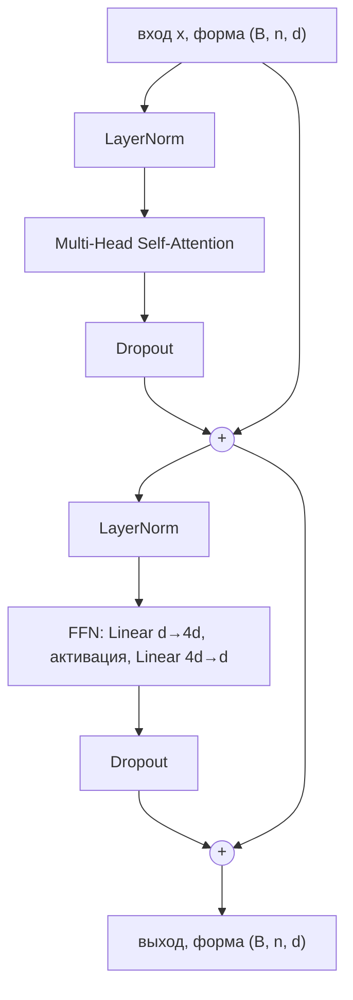

# Внимание и трансформер

> **Зачем эта глава.** Трансформер — это несущая конструкция всего современного ML: на нём стоят
> LLM, векторный поиск, ранжирование, мультимодальные модели. Его разбирают почти на каждом
> собеседовании уровня middle+, и разбирают глубоко: не «что такое attention», а «почему делим
> на корень из d_k», «сколько памяти съест KV-кэш» и «что сломается при pre-LN». После этой главы
> вы сможете реализовать трансформер с нуля и отследить каждую размерность.

**Уровень:** 🎯 middle → 🧠 middle+
**Предварительно нужно:** [нейросети и backprop](01-neural-nets-and-backprop.md), [динамика обучения](02-training-dynamics.md), [линейная алгебра](../01-math/01-linear-algebra.md), [softmax и энтропия](../01-math/05-information-theory.md)
**Как проработать:** чтение + реализация с нуля + проверка размерностей

---

## Карта главы

- [1. Проблема, из которой вырос attention](#1-проблема-из-которой-вырос-attention)
- [2. Внимание как мягкий поиск по словарю](#2-внимание-как-мягкий-поиск-по-словарю)
- [3. Scaled dot-product attention](#3-scaled-dot-product-attention)
- [4. Почему делим на корень из d_k](#4-почему-делим-на-корень-из-d_k)
- [5. Multi-head: зачем несколько голов](#5-multi-head-зачем-несколько-голов)
- [6. Позиционная информация](#6-позиционная-информация)
- [7. Блок трансформера целиком](#7-блок-трансформера-целиком)
- [8. Маскирование](#8-маскирование)
- [9. Сквозной проход по размерностям](#9-сквозной-проход-по-размерностям)
- [10. Реализация с нуля](#10-реализация-с-нуля)
- [11. Сложность, память и что из этого следует](#11-сложность-память-и-что-из-этого-следует)
- [12. Подводные камни](#12-подводные-камни)
- [13. Проверь себя](#13-проверь-себя)
- [14. Практика](#14-практика)
- [15. Что читать дальше](#15-что-читать-дальше)

---

## 1. Проблема, из которой вырос attention

Задача: перевести предложение с одного языка на другой. Классическая архитектура 2014 года —
seq2seq: рекуррентный энкодер читает исходное предложение слово за словом и сжимает его в один
вектор фиксированной длины (скрытое состояние последнего шага), а рекуррентный декодер
разворачивает этот вектор в перевод.

Здесь два фундаментальных изъяна.

**Изъян первый: бутылочное горлышко.** Всё предложение — хоть из пяти слов, хоть из пятидесяти —
обязано поместиться в один вектор размерности, скажем, 512. Информация о начале длинного
предложения к концу чтения оказывается размытой. Эмпирически качество перевода резко падало
на предложениях длиннее 30–40 слов.

**Изъян второй: последовательность вычислений.** Чтобы посчитать скрытое состояние на шаге $t$,
нужно сначала посчитать состояние на шаге $t-1$. Это делает обучение принципиально
непараллелизуемым по длине последовательности: GPU простаивает.

Attention (Bahdanau et al., 2014) чинил первый изъян: вместо одного вектора декодер получал доступ
ко **всем** скрытым состояниям энкодера и на каждом шаге сам решал, на какие из них смотреть.
Работало отлично — но рекуррентность, а значит и второй изъян, оставались.

Идея статьи «Attention Is All You Need» (2017) была радикальной: если attention так хорошо
связывает позиции, зачем вообще нужна рекуррентность? Уберём её полностью. Тогда все позиции
обрабатываются одновременно, обучение параллелится, а связь между любыми двумя словами становится
**прямой** — один шаг вместо цепочки из $|i-j|$ рекуррентных шагов.

> 🌱 **База.** Держите в голове одну метафору: attention — это способ для каждого слова
> «оглядеться по сторонам» и собрать себе контекст из других слов, самостоятельно решив,
> кто из них важен. Рекуррентная сеть передаёт информацию по цепочке, как испорченный телефон;
> attention даёт каждому слову прямой доступ ко всем остальным.

---

## 2. Внимание как мягкий поиск по словарю

Самое полезное представление об attention — это **дифференцируемый поиск по словарю**.

Обычный словарь (хэш-таблица): есть ключи $k_1, \dots, k_n$ и связанные с ними значения
$v_1, \dots, v_n$. Приходит запрос $q$, мы находим ключ, точно совпадающий с запросом, и возвращаем
его значение. Проблема: операция «найти точное совпадение» недифференцируема, её нельзя вставить
в нейросеть.

Attention делает то же самое, но мягко:

1. Считаем **похожесть** запроса на каждый ключ: $s_i = \text{sim}(q, k_i)$.
2. Превращаем похожести в веса, суммирующиеся в единицу: $\alpha = \text{softmax}(s)$.
3. Возвращаем **взвешенную сумму** значений: $\sum_i \alpha_i v_i$.

Если один ключ похож на запрос гораздо сильнее остальных, softmax даст ему вес, близкий к 1,
и мы получим почти обычный поиск. Если несколько ключей похожи одинаково — получим их смесь.
И всё это дифференцируемо, а значит обучаемо.

Теперь ключевой ход **self-attention**: запросы, ключи и значения делаются из **одной и той же**
последовательности. Каждое слово порождает свой запрос («что мне нужно из контекста?»), свой ключ
(«что я могу предложить другим?») и своё значение («что именно я передам тому, кто меня выберет»).

Пусть $X \in \mathbb{R}^{n \times d}$ — матрица входных векторов: $n$ токенов, каждый размерности
$d$ (обозначим $d = d_{\text{model}}$). Тогда

$$
Q = X W_Q, \qquad K = X W_K, \qquad V = X W_V
$$

где $W_Q, W_K \in \mathbb{R}^{d \times d_k}$ и $W_V \in \mathbb{R}^{d \times d_v}$ — обучаемые
матрицы проекций, $Q \in \mathbb{R}^{n \times d_k}$ — матрица запросов, $K \in \mathbb{R}^{n \times d_k}$ —
ключей, $V \in \mathbb{R}^{n \times d_v}$ — значений.

> 💬 **На собеседовании.** Спросят: «Зачем нужны три разные проекции — почему не использовать
> сам вектор токена в роли и запроса, и ключа, и значения?»
> Хороший ответ: три проекции разделяют три разные роли. Без них похожесть считалась бы как
> $x_i^\top x_j$ — симметричная функция, из-за чего «слово A смотрит на B» и «B смотрит на A»
> имели бы одинаковый вес, что содержательно неверно (прилагательное относится к существительному
> не так, как существительное к прилагательному). Разные $W_Q$ и $W_K$ делают матрицу похожестей
> несимметричной. Отдельная $W_V$ нужна, чтобы то, *по чему нас находят*, и то, *что мы отдаём*,
> могло различаться — иначе модель обязана была бы кодировать в одном векторе и «адрес», и «груз».
> Провал: «так придумали авторы статьи».

---

## 3. Scaled dot-product attention

Формула, которую нужно уметь написать не задумываясь:

$$
\operatorname{Attention}(Q, K, V) \;=\; \operatorname{softmax}\!\left(\frac{Q K^{\top}}{\sqrt{d_k}}\right) V
$$

где $Q \in \mathbb{R}^{n \times d_k}$, $K \in \mathbb{R}^{m \times d_k}$, $V \in \mathbb{R}^{m \times d_v}$,
$n$ — число запросов, $m$ — число ключей (в self-attention $m = n$), $d_k$ — размерность ключа,
softmax применяется **построчно**.

> 📐 **Разбор формулы по шагам.**
>
> **Шаг 1.** $QK^\top \in \mathbb{R}^{n \times m}$ — матрица скалярных произведений. Элемент
> $(i, j)$ равен $q_i^\top k_j$ — насколько $j$-й токен интересен $i$-му. Скалярное произведение
> здесь работает как мера согласованности направлений: чем ближе векторы по направлению и чем
> они длиннее, тем больше значение.
>
> **Шаг 2.** Деление на $\sqrt{d_k}$ — масштабирование, о нём отдельный раздел ниже.
>
> **Шаг 3.** Построчный softmax превращает каждую строку в распределение:
> $\alpha_{ij} = \dfrac{\exp(s_{ij})}{\sum_{j'} \exp(s_{ij'})}$, где $\sum_j \alpha_{ij} = 1$.
> Строка $i$ — это ответ на вопрос «как токен $i$ распределяет своё внимание по всем токенам».
>
> **Шаг 4.** Умножение на $V \in \mathbb{R}^{m \times d_v}$ даёт $\mathbb{R}^{n \times d_v}$:
> для каждого токена — взвешенная сумма значений с весами внимания.

Обратите внимание на два свойства, которые часто проверяют.

**Attention перестановочно-эквивариантен.** Если переставить входные токены, выход переставится
точно так же — но не изменится по содержанию. Иными словами, **self-attention не знает о порядке
слов вообще**. «Собака укусила человека» и «человек укусил собаку» для него неразличимы.
Отсюда неизбежность позиционных кодировок (раздел 6).

**Attention не смешивает измерения внутри токена сам по себе.** Он смешивает *токены*.
За смешивание признаков внутри одного токена отвечает FFN-подслой. Это разделение труда —
attention работает «поперёк последовательности», FFN — «вдоль вектора» — и есть суть блока
трансформера.

---

## 4. Почему делим на корень из d_k

Это самый частый уточняющий вопрос по трансформеру. Ответ выводится в три строки, и умение
его вывести отличает понимание от заучивания.

Предположим, что компоненты векторов $q$ и $k$ — независимые случайные величины с нулевым средним
и единичной дисперсией (это приближённо верно при разумной инициализации и нормализации входов).
Посмотрим на их скалярное произведение:

$$
q^{\top} k = \sum_{i=1}^{d_k} q_i k_i
$$

Математическое ожидание каждого слагаемого: $\mathbb{E}[q_i k_i] = \mathbb{E}[q_i]\,\mathbb{E}[k_i] = 0$
(по независимости). Дисперсия слагаемого:

$$
\operatorname{Var}(q_i k_i) = \mathbb{E}[q_i^2 k_i^2] - \big(\mathbb{E}[q_i k_i]\big)^2
= \mathbb{E}[q_i^2]\,\mathbb{E}[k_i^2] - 0 = 1 \cdot 1 = 1
$$

Слагаемые независимы, поэтому дисперсии складываются:

$$
\operatorname{Var}\big(q^{\top} k\big) = \sum_{i=1}^{d_k} \operatorname{Var}(q_i k_i) = d_k
\qquad\Longrightarrow\qquad
\operatorname{std}\big(q^{\top} k\big) = \sqrt{d_k}
$$

Вот и ответ. Типичный масштаб логитов растёт как $\sqrt{d_k}$. При $d_k = 64$ это ±8,
при $d_k = 128$ — уже ±11. Что делает softmax с логитами такого размаха? Он **насыщается**:
разница в 8 единиц между максимальным и остальными логитами даёт вес $e^8 \approx 3000$ к единице —
распределение вырождается почти в one-hot.

Почему это плохо — из-за градиента. Для softmax якобиан равен

$$
\frac{\partial \alpha_i}{\partial s_j} = \alpha_i(\delta_{ij} - \alpha_j)
$$

где $\delta_{ij}$ — символ Кронекера. Если $\alpha$ близко к one-hot, то все $\alpha_i$ либо ≈0,
либо ≈1, и произведение $\alpha_i(1 - \alpha_i)$ близко к нулю в обоих случаях. **Градиент
затухает, обучение останавливается.** Причём происходит это в самом начале обучения, когда
модель ещё ничего не выучила — то есть насыщение случайное, а не осмысленное.

Деление на $\sqrt{d_k}$ возвращает дисперсию логитов к единице независимо от размерности,
и softmax работает в своём чувствительном режиме.

> 🧠 **Middle+.** Полезная проверка понимания: почему именно $\sqrt{d_k}$, а не $d_k$?
> Потому что нормировать надо **стандартное отклонение**, а не дисперсию — мы хотим, чтобы
> сами логиты имели масштаб порядка единицы. Деление на $d_k$ пережало бы логиты в ноль,
> и softmax выдавал бы почти равномерное распределение: внимание перестало бы что-либо выделять.
> Второй вопрос той же серии: что если бы softmax заменили на что-то, не насыщающееся? Тогда
> масштабирование было бы не нужно — и действительно, в линейных вариантах attention его нет.

---

## 5. Multi-head: зачем несколько голов

Одна голова внимания вычисляет одно распределение весов на токен. Но связи в языке разнотипны:
синтаксическая зависимость, кореферентность («он» → «Иван»), тематическая близость, соседство.
Одно распределение вынуждено усреднять всё это.

Решение — считать $h$ независимых attention-ов параллельно, в подпространствах меньшей размерности:

$$
\operatorname{head}_i = \operatorname{Attention}\big(X W_Q^{(i)},\; X W_K^{(i)},\; X W_V^{(i)}\big),
\qquad i = 1, \dots, h
$$

$$
\operatorname{MHA}(X) = \operatorname{Concat}\big(\operatorname{head}_1, \dots, \operatorname{head}_h\big)\, W_O
$$

где $W_Q^{(i)}, W_K^{(i)} \in \mathbb{R}^{d \times d_k}$, $W_V^{(i)} \in \mathbb{R}^{d \times d_v}$,
$W_O \in \mathbb{R}^{h d_v \times d}$ — выходная проекция, $h$ — число голов.

Ключевая деталь: размерности голов выбирают так, что $d_k = d_v = d / h$. Тогда
$h \cdot d_v = d$, конкатенация возвращает исходную размерность, и **суммарная стоимость
multi-head равна стоимости одной головы полной размерности**. Мы получаем разнообразие
бесплатно — просто разрезав пространство на подпространства.

Практически проекции всех голов хранят одной матрицей $W_Q \in \mathbb{R}^{d \times d}$ и режут
результат на $h$ кусков через `reshape` — это одно матричное умножение вместо $h$ маленьких.

> 💬 **На собеседовании.** Спросят: «Что будет, если увеличить число голов при фиксированном
> $d_{\text{model}}$?»
> Хороший ответ: размерность каждой головы $d/h$ уменьшится. До некоторого предела это полезно —
> больше разных «взглядов» на контекст. Но когда $d_k$ становится слишком мал (меньше ~32),
> подпространство перестаёт вмещать осмысленную геометрию: скалярное произведение в маленькой
> размерности плохо различает направления, и головы начинают дублировать друг друга.
> Исследования показывают, что значительную часть голов обученного трансформера можно удалить
> почти без потери качества — то есть избыточность реальна. На практике $d_k$ держат в диапазоне
> 64–128. Провал: «чем больше голов, тем лучше».

> 🧠 **Middle+. GQA и MQA.** В современных LLM число голов для $Q$ и для $K, V$ различают:
> **Multi-Query Attention** оставляет одну общую пару $K, V$ на все головы запросов, **Grouped-Query
> Attention** — несколько групп. Мотивация чисто инженерная: KV-кэш при генерации занимает память,
> пропорциональную числу KV-голов, и именно он, а не веса, ограничивает длину контекста и размер
> батча. GQA с 8 KV-головами вместо 64 уменьшает кэш в 8 раз при почти неизменном качестве.
> Подробнее — в главе про [инференс LLM](../05-llm/05-inference-and-serving.md).

---

## 6. Позиционная информация

Как мы выяснили, self-attention не различает порядок. Позицию нужно внести явно. Есть три
основных подхода, и на собеседовании про них спрашивают всё чаще.

### 6.1 Синусоидальные кодировки (оригинальный трансформер)

К эмбеддингу токена прибавляется вектор, зависящий только от позиции:

$$
\text{PE}(pos,\, 2i) = \sin\!\left(\frac{pos}{10000^{2i/d}}\right),
\qquad
\text{PE}(pos,\, 2i+1) = \cos\!\left(\frac{pos}{10000^{2i/d}}\right)
$$

где $pos$ — номер позиции, $i$ — индекс пары измерений, $d$ — размерность модели.

Смысл: каждая пара измерений — это «стрелка часов», вращающаяся со своей частотой. Быстрые
частоты кодируют мелкие различия позиций, медленные — крупные. Это позиционный аналог двоичной
записи числа, только непрерывный.

Полезное свойство: $\text{PE}(pos + k)$ выражается как линейная комбинация $\text{PE}(pos)$
(поворот на фиксированный угол по формулам синуса и косинуса суммы) — значит, модель в принципе
способна выучить относительные сдвиги.

### 6.2 Обучаемые абсолютные (BERT, GPT-2)

Просто таблица эмбеддингов позиций, обучаемая вместе с моделью. Проще, работает не хуже,
но жёстко ограничивает максимальную длину: позиции за пределами обучающей длины не имеют
эмбеддинга, и модель на них не обобщается вообще.

### 6.3 RoPE — rotary position embedding (LLaMA, Qwen, большинство современных LLM)

Идея красивая: вместо того чтобы **прибавлять** позицию к вектору, будем **поворачивать** векторы
$q$ и $k$ на угол, пропорциональный позиции.

Разобьём вектор на пары координат. Пару $(x_{2i}, x_{2i+1})$ на позиции $m$ поворачиваем
матрицей поворота

$$
R_{m,i} = \begin{pmatrix} \cos m\theta_i & -\sin m\theta_i \\ \sin m\theta_i & \cos m\theta_i \end{pmatrix},
\qquad \theta_i = 10000^{-2i/d}
$$

где $m$ — позиция токена, $\theta_i$ — частота для $i$-й пары измерений.

Теперь ключевое свойство. Матрицы поворота удовлетворяют $R_a^\top R_b = R_{b-a}$. Поэтому
скалярное произведение повёрнутых запроса на позиции $m$ и ключа на позиции $n$:

$$
(R_m q)^{\top} (R_n k) \;=\; q^{\top} R_m^{\top} R_n k \;=\; q^{\top} R_{\,n-m}\, k
$$

Результат зависит **только от разности позиций** $n - m$, а не от абсолютных значений. Мы получили
относительное кодирование позиции, не добавив ни одного параметра и не тронув структуру attention.

Практические следствия: RoPE лучше обобщается на длины, невиданные при обучении, и допускает
расширение контекста интерполяцией частот (position interpolation, YaRN, NTK-aware scaling) —
именно так модели «растягивают» с 4k до 32k+ токенов.

### 6.4 ALiBi

Ещё проще: не трогаем векторы вообще, а прибавляем к логитам attention штраф за расстояние:

$$
s_{ij} \;=\; \frac{q_i^{\top} k_j}{\sqrt{d_k}} \;-\; m_h \cdot |i - j|
$$

где $m_h > 0$ — фиксированный наклон, свой для каждой головы $h$. Чем дальше токен, тем сильнее
штраф. Разные наклоны дают головам разный «радиус обзора»: с большим $m_h$ голова смотрит
локально, с маленьким — глобально. ALiBi хорошо экстраполируется на длинные последовательности
и не требует ни параметров, ни изменения векторов.

| Подход | Параметры | Экстраполяция на длину | Где используется |
|---|---|---|---|
| Синусоидальные | нет | средне | оригинальный трансформер |
| Обучаемые абсолютные | $L_{\max} \times d$ | нет | BERT, GPT-2 |
| RoPE | нет | хорошая (+ интерполяция) | LLaMA, Qwen, Mistral и большинство современных |
| ALiBi | нет | отличная | BLOOM, MPT |

> ⚠️ **Типичная ошибка.** Считать, что позиционные кодировки прибавляются один раз на входе
> и «работают дальше сами». Для абсолютных кодировок это так, а RoPE применяется **в каждом слое,
> к $q$ и $k$ перед вычислением логитов**, и не применяется к $V$. Путаница здесь ломает
> реализацию: модель обучается, но качество на длинном контексте разваливается.

---

## 7. Блок трансформера целиком

Блок состоит из двух подслоёв, каждый обёрнут в остаточную связь и нормализацию.



### 7.1 FFN

$$
\operatorname{FFN}(x) = W_2 \,\phi\big(W_1 x + b_1\big) + b_2
$$

где $W_1 \in \mathbb{R}^{d_{ff} \times d}$, $W_2 \in \mathbb{R}^{d \times d_{ff}}$, $\phi$ —
нелинейность (ReLU в оригинале, GELU в BERT/GPT, SwiGLU в современных LLM),
$d_{ff}$ — внутренняя размерность, обычно $4d$.

FFN применяется **к каждой позиции независимо и одинаково** (position-wise). Он не смешивает
токены — он преобразует вектор каждого токена по отдельности. И именно в нём лежит большая часть
параметров модели: $8d^2$ против $4d^2$ у attention.

> 🧠 **Middle+.** Про SwiGLU: $\operatorname{SwiGLU}(x) = \big(W_1 x \odot \sigma(\beta W_g x)\big)$,
> где $\odot$ — поэлементное умножение, а $W_g$ — дополнительная «вентильная» матрица. Появляется
> третья матрица, поэтому чтобы сохранить общее число параметров, $d_{ff}$ уменьшают
> примерно до $\tfrac{8}{3}d$ вместо $4d$. Мотивация — мультипликативное взаимодействие
> даёт более выразительную функцию при том же бюджете параметров; выигрыш небольшой, но
> устойчиво воспроизводится, поэтому SwiGLU стал стандартом.

### 7.2 Остаточные связи и нормализация: pre-LN против post-LN

В оригинальной статье нормализация стояла **после** сложения с остаточной связью:

$$
x \;\leftarrow\; \operatorname{LayerNorm}\big(x + \operatorname{Sublayer}(x)\big) \qquad \text{(post-LN)}
$$

Современные модели ставят её **перед** подслоем:

$$
x \;\leftarrow\; x + \operatorname{Sublayer}\big(\operatorname{LayerNorm}(x)\big) \qquad \text{(pre-LN)}
$$

Разница выглядит косметической, но она принципиальна. В pre-LN есть **чистый остаточный путь**
от входа к выходу, не проходящий ни через одну нормализацию: градиент течёт по нему без
искажения масштаба. В post-LN каждая остаточная сумма проходит через LayerNorm, и градиент
на глубоких моделях ведёт себя гораздо хуже — обучение расходится без аккуратного разогрева
(warmup) learning rate.

Практический итог: post-LN требует warmup и тщательного подбора LR, но при удачном обучении иногда
даёт чуть лучшее качество; pre-LN обучается устойчиво почти всегда. Все крупные LLM используют
pre-LN, часто с RMSNorm вместо LayerNorm:

$$
\operatorname{RMSNorm}(x) = \frac{x}{\sqrt{\frac{1}{d}\sum_{i=1}^{d} x_i^2 + \varepsilon}} \odot g
$$

где $g \in \mathbb{R}^d$ — обучаемый масштаб, $\varepsilon$ — константа для численной устойчивости.
RMSNorm отличается от LayerNorm тем, что **не вычитает среднее** — это дешевле, а качество
не страдает.

> 💬 **На собеседовании.** Спросят: «Почему в трансформере LayerNorm, а не BatchNorm?»
> Хороший ответ: BatchNorm нормализует по батчу для каждого признака, то есть статистики зависят
> от других объектов в батче. Для последовательностей переменной длины это ломается: в позиции 50
> в одних примерах есть токен, а в других — паддинг, и статистика считается по разному числу
> реальных элементов. Плюс на инференсе с батчем 1 (типичный случай генерации) BatchNorm
> вынужден пользоваться накопленными скользящими статистиками, что даёт расхождение train/inference.
> LayerNorm нормализует каждый токен по его собственным признакам — статистика не зависит ни от
> батча, ни от длины, поведение идентично на обучении и инференсе.
> Провал: «BatchNorm для картинок, LayerNorm для текста» — верно как факт, но не объясняет причину.

---

## 8. Маскирование

Есть два принципиально разных типа масок, и их путают.

**Маска паддинга.** В батче последовательности разной длины, короткие дополняются специальным
токеном. Attention не должен обращать на них внимание. Реализуется добавлением $-\infty$
(на практике большого отрицательного числа) к соответствующим логитам **до** softmax —
тогда после экспоненты вес станет ровно нулём.

**Причинная (каузальная) маска.** Нужна декодеру: при предсказании токена $t$ модель не имеет
права видеть токены $> t$, иначе задача становится тривиальной (ответ есть во входе), и на
инференсе, где будущего нет, модель развалится. Реализуется верхнетреугольной маской:

$$
s_{ij} \leftarrow \begin{cases} s_{ij}, & j \le i \\ -\infty, & j > i \end{cases}
$$

Именно причинная маска позволяет обучать языковую модель **параллельно по всем позициям сразу**:
за один проход мы получаем предсказания для всех $n$ позиций, каждое из которых опирается только
на левый контекст. Без маски пришлось бы делать $n$ проходов.

> ⚠️ **Типичная ошибка.** Применять маску **после** softmax, обнуляя веса. Тогда веса перестают
> суммироваться в единицу, масштаб выхода поплывёт, и модель будет обучаться, но плохо и
> непредсказуемо. Маскировать нужно логиты до softmax.

---

## 9. Сквозной проход по размерностям

Это упражнение стоит проделать один раз внимательно — после него трансформер перестаёт быть
магией. Возьмём конкретные числа: батч $B = 8$, длина $n = 512$, $d = 768$, голов $h = 12$,
значит $d_k = d_v = 768/12 = 64$, $d_{ff} = 3072$.

| Шаг | Операция | Форма на выходе |
|---|---|---|
| 1 | входные id токенов | $(8,\ 512)$ |
| 2 | эмбеддинги токенов | $(8,\ 512,\ 768)$ |
| 3 | + позиционная информация | $(8,\ 512,\ 768)$ |
| 4 | LayerNorm | $(8,\ 512,\ 768)$ |
| 5 | проекция $XW_Q$ (и так же $K$, $V$) | $(8,\ 512,\ 768)$ |
| 6 | reshape на головы: $(B, n, h, d_k)$ → transpose | $(8,\ 12,\ 512,\ 64)$ |
| 7 | логиты $QK^\top / \sqrt{d_k}$ | $(8,\ 12,\ 512,\ 512)$ |
| 8 | маска + softmax по последней оси | $(8,\ 12,\ 512,\ 512)$ |
| 9 | умножение на $V$ | $(8,\ 12,\ 512,\ 64)$ |
| 10 | transpose + reshape обратно | $(8,\ 512,\ 768)$ |
| 11 | выходная проекция $W_O$ | $(8,\ 512,\ 768)$ |
| 12 | остаточная связь | $(8,\ 512,\ 768)$ |
| 13 | LayerNorm → FFN: $W_1$ | $(8,\ 512,\ 3072)$ |
| 14 | активация → $W_2$ | $(8,\ 512,\ 768)$ |
| 15 | остаточная связь | $(8,\ 512,\ 768)$ |

Заметьте строку 7: тензор $(8, 12, 512, 512)$ — это $8 \cdot 12 \cdot 512^2 \approx 25{,}2$ млн чисел,
100 МБ в fp32, **на один слой**. Умножьте на 12 слоёв и на то, что для обратного прохода
активации нужно хранить — вот откуда берётся квадратичный расход памяти и почему FlashAttention
(который не материализует эту матрицу целиком) стал таким важным.

### Подсчёт параметров одного блока

- Attention: $W_Q, W_K, W_V, W_O$, каждая $d \times d$ → $4d^2$
- FFN: $W_1$ размера $d \times 4d$, $W_2$ размера $4d \times d$ → $8d^2$
- **Итого ≈ $12 d^2$ на слой** (плюс небольшие вклады смещений и параметров нормализации)

Для $d = 768$: $12 \cdot 768^2 \approx 7{,}1$ млн параметров на слой; 12 слоёв ≈ 85 млн —
это и есть порядок BERT-base (110 млн с учётом эмбеддингов словаря).

> ⌨️ **Руками.** Посчитайте число параметров модели с $d = 4096$, 32 слоями, словарём 32000
> и связанными (tied) эмбеддингами входа и выхода. Сравните с реальным размером LLaMA-подобной
> модели на 7B. Расхождение объяснит вам, сколько «весит» SwiGLU и GQA.

---

## 10. Реализация с нуля

Ниже — полный decoder-only блок на PyTorch. Он умышленно написан подробно: с явными reshape
и комментариями по формам, чтобы можно было проследить каждый шаг из таблицы выше.

```python
import math
import torch
import torch.nn as nn
import torch.nn.functional as F


class MultiHeadSelfAttention(nn.Module):
    """Многоголовое self-attention с опциональной причинной маской."""

    def __init__(self, d_model: int, n_heads: int, dropout: float = 0.1, causal: bool = True):
        super().__init__()
        assert d_model % n_heads == 0, "d_model должно делиться на число голов"
        self.d_model, self.n_heads = d_model, n_heads
        self.d_head = d_model // n_heads
        self.causal = causal

        # одна матрица на Q, K, V — эффективнее трёх отдельных умножений
        self.qkv = nn.Linear(d_model, 3 * d_model, bias=False)
        self.proj = nn.Linear(d_model, d_model, bias=False)
        self.attn_dropout = nn.Dropout(dropout)
        self.resid_dropout = nn.Dropout(dropout)

    def forward(self, x: torch.Tensor, pad_mask: torch.Tensor | None = None) -> torch.Tensor:
        # x: (B, n, d); pad_mask: (B, n), True на реальных токенах
        B, n, d = x.shape

        qkv = self.qkv(x)                                  # (B, n, 3d)
        q, k, v = qkv.chunk(3, dim=-1)                     # три раза (B, n, d)

        # (B, n, d) -> (B, n, h, d_head) -> (B, h, n, d_head)
        def to_heads(t):
            return t.view(B, n, self.n_heads, self.d_head).transpose(1, 2)

        q, k, v = to_heads(q), to_heads(k), to_heads(v)

        # логиты внимания: (B, h, n, n). Деление на sqrt(d_head) — см. раздел 4
        scores = (q @ k.transpose(-2, -1)) / math.sqrt(self.d_head)

        if self.causal:
            # верхнетреугольная маска: позиция i не видит j > i
            causal_mask = torch.ones(n, n, dtype=torch.bool, device=x.device).triu(diagonal=1)
            scores = scores.masked_fill(causal_mask, float("-inf"))

        if pad_mask is not None:
            # (B, n) -> (B, 1, 1, n): запрещаем смотреть НА паддинг
            scores = scores.masked_fill(~pad_mask[:, None, None, :], float("-inf"))

        # маскируем ДО softmax, иначе веса перестанут суммироваться в единицу
        attn = F.softmax(scores, dim=-1)
        attn = self.attn_dropout(attn)

        out = attn @ v                                     # (B, h, n, d_head)
        out = out.transpose(1, 2).contiguous().view(B, n, d)   # обратно в (B, n, d)
        return self.resid_dropout(self.proj(out))


class FeedForward(nn.Module):
    """Position-wise FFN: обрабатывает каждый токен независимо."""

    def __init__(self, d_model: int, d_ff: int | None = None, dropout: float = 0.1):
        super().__init__()
        d_ff = d_ff or 4 * d_model
        self.net = nn.Sequential(
            nn.Linear(d_model, d_ff),
            nn.GELU(),
            nn.Linear(d_ff, d_model),
            nn.Dropout(dropout),
        )

    def forward(self, x):
        return self.net(x)


class TransformerBlock(nn.Module):
    """Pre-LN блок: остаточный путь не проходит через нормализацию."""

    def __init__(self, d_model: int, n_heads: int, dropout: float = 0.1, causal: bool = True):
        super().__init__()
        self.ln1 = nn.LayerNorm(d_model)
        self.attn = MultiHeadSelfAttention(d_model, n_heads, dropout, causal)
        self.ln2 = nn.LayerNorm(d_model)
        self.ffn = FeedForward(d_model, dropout=dropout)

    def forward(self, x, pad_mask=None):
        x = x + self.attn(self.ln1(x), pad_mask)   # нормализуем ВХОД подслоя, не сумму
        x = x + self.ffn(self.ln2(x))
        return x


class TinyGPT(nn.Module):
    """Минимальная авторегрессионная языковая модель."""

    def __init__(self, vocab_size: int, d_model: int = 256, n_heads: int = 8,
                 n_layers: int = 6, max_len: int = 512, dropout: float = 0.1):
        super().__init__()
        self.tok_emb = nn.Embedding(vocab_size, d_model)
        self.pos_emb = nn.Embedding(max_len, d_model)
        self.drop = nn.Dropout(dropout)
        self.blocks = nn.ModuleList(
            TransformerBlock(d_model, n_heads, dropout, causal=True) for _ in range(n_layers)
        )
        self.ln_f = nn.LayerNorm(d_model)
        self.head = nn.Linear(d_model, vocab_size, bias=False)
        self.head.weight = self.tok_emb.weight   # tied embeddings: экономия параметров

    def forward(self, idx: torch.Tensor) -> torch.Tensor:
        # idx: (B, n) — индексы токенов
        B, n = idx.shape
        pos = torch.arange(n, device=idx.device)
        x = self.drop(self.tok_emb(idx) + self.pos_emb(pos))   # (B, n, d)
        for block in self.blocks:
            x = block(x)
        return self.head(self.ln_f(x))                          # (B, n, vocab)


# Проверка форм и обучаемости на случайных данных
if __name__ == "__main__":
    model = TinyGPT(vocab_size=1000, d_model=128, n_heads=4, n_layers=2, max_len=64)
    idx = torch.randint(0, 1000, (4, 32))
    logits = model(idx)
    assert logits.shape == (4, 32, 1000), logits.shape

    # обучающий шаг: предсказываем следующий токен, поэтому сдвигаем цели на 1
    loss = F.cross_entropy(logits[:, :-1].reshape(-1, 1000), idx[:, 1:].reshape(-1))
    loss.backward()
    print("параметров:", sum(p.numel() for p in model.parameters()))
    print("loss на случайных данных:", round(loss.item(), 3), "≈ ln(1000) =", round(math.log(1000), 3))
```

Последняя строка — важная привычка: на необученной модели с равномерным распределением
кросс-энтропия должна быть близка к $\ln(|V|)$. Если это не так, значит в коде ошибка
(чаще всего — неправильный сдвиг целей или маска). Такие «санитарные проверки» экономят часы отладки.

---

## 11. Сложность, память и что из этого следует

Пусть $n$ — длина последовательности, $d$ — размерность модели.

| Компонент | Время | Память (активации) |
|---|---|---|
| Проекции $Q, K, V, O$ | $O(n d^2)$ | $O(nd)$ |
| Логиты $QK^\top$ и умножение на $V$ | $O(n^2 d)$ | $O(h n^2)$ |
| FFN | $O(n d^2)$ | $O(n d_{ff})$ |

Отсюда два практических вывода, которые любят проверять.

**Вывод 1: квадратичность по длине проявляется не сразу.** При $n \ll d$ доминирует член
$O(nd^2)$ — то есть обычные матричные умножения, а не attention. Переход происходит примерно
при $n \sim d$. Для модели с $d = 4096$ последовательность длиной 512 «дешёвая», а 8192 — уже нет.
Поэтому утверждение «трансформер квадратичный, значит медленный» без указания режима неверно.

**Вывод 2: узкое место — память, а не арифметика.** Матрица $(B, h, n, n)$ материализуется в
HBM и читается обратно, и на длинных последовательностях время уходит на перегон данных между
памятью и вычислительными ядрами, а не на умножения. FlashAttention решает именно это: он
считает attention блоками в быстрой SRAM, никогда не выписывая полную матрицу в HBM.
Результат — тот же ответ, но кратно быстрее и линейная по $n$ память. Это не приближение,
а точное вычисление с другим порядком операций.

### KV-кэш

При авторегрессионной генерации на каждом шаге добавляется один токен. Наивно пришлось бы
пересчитывать $K$ и $V$ для всего префикса заново. Вместо этого их кэшируют. Размер кэша:

$$
\text{Память}_{KV} \;=\; 2 \cdot L \cdot h_{kv} \cdot d_{head} \cdot n \cdot B \cdot b
$$

где двойка — на $K$ и $V$, $L$ — число слоёв, $h_{kv}$ — число KV-голов, $d_{head}$ — размерность
головы, $n$ — длина контекста, $B$ — размер батча, $b$ — байт на число (2 для fp16/bf16).

Численный пример: $L = 32$, $h_{kv} = 32$, $d_{head} = 128$, $n = 4096$, $B = 1$, fp16:

$$
2 \cdot 32 \cdot 32 \cdot 128 \cdot 4096 \cdot 1 \cdot 2 \approx 2{,}1\ \text{ГБ}
$$

На один запрос. При батче 16 это уже 34 ГБ — больше, чем веса модели на 7B. Вот почему GQA
и PagedAttention появились не от хорошей жизни. Разбор — в главе про
[инференс LLM](../05-llm/05-inference-and-serving.md).

> 💬 **На собеседовании.** Спросят: «Как уменьшить квадратичную сложность attention?»
> Хороший ответ разбивается на три группы. Первая — **точные** методы, меняющие порядок вычислений,
> но не результат: FlashAttention (блочное вычисление, линейная память). Вторая — **разреженные**
> схемы: скользящее окно (Mistral), глобальные + локальные токены (Longformer, BigBird) —
> сложность $O(n \cdot w)$ ценой ограниченного поля зрения на слой, которое расширяется с глубиной.
> Третья — **линейные приближения**: Performer, Linear Attention, а также модели пространства
> состояний (Mamba), где сложность линейна по конструкции; качество на языковом моделировании
> исторически отставало, разрыв сокращается. Важно добавить: на практике первым делом смотрят,
> не упирается ли задача вообще в attention (см. вывод 1), и часто достаточно FlashAttention.
> Провал: назвать только «есть Linformer/Performer» без понимания, что они приближают.

---

## 12. Подводные камни

**Забыли маску паддинга.**
Симптом: качество проседает на батчах со смешанными длинами, при батче 1 всё хорошо.
Причина: attention честно распределяет часть внимания на паддинг-токены, размывая представление.
Что делать: маскировать логиты; проверять, что при добавлении паддинга выход на реальных
токенах не меняется — это отличный юнит-тест.

**Причинная маска не применена или применена не туда.**
Симптом: обучающая перплексия падает подозрительно быстро, генерация — бессмыслица.
Причина: модель подсматривает будущее, задача становится тривиальной. На инференсе будущего нет.
Что делать: тест — изменить токен на позиции $t$ и убедиться, что выходы на позициях $< t$
не изменились.

**Сравнение fp16 и `-inf` в маске.**
Симптом: NaN в лоссе на первой же итерации.
Причина: если целая строка логитов замаскирована в $-\infty$ (бывает для полностью паддинговых
последовательностей), softmax даёт $0/0$.
Что делать: использовать большое конечное отрицательное число вместо `-inf` и не допускать
полностью пустых строк.

**Post-LN без warmup.**
Симптом: лосс расходится в первые сотни шагов на модели глубже ~12 слоёв.
Причина: градиенты в post-LN плохо масштабируются по глубине.
Что делать: pre-LN, либо warmup на несколько тысяч шагов и меньший стартовый LR.

**Позиционные кодировки за пределами обученной длины.**
Симптом: модель отлично работает до 512 токенов и рассыпается на 600.
Причина: обучаемые абсолютные эмбеддинги позиций не определены за $L_{\max}$; даже RoPE
без интерполяции деградирует за пределами обучающей длины.
Что делать: RoPE + position interpolation/YaRN, обучение на длинных примерах, ALiBi.

**Веса attention приняли за объяснение.**
Симптом: в отчёте картинка «модель смотрит на слово X, значит она поняла связь».
Причина: веса внимания — не объяснение решения. Существуют разные распределения весов, дающие
одинаковый выход; на это есть отдельная литература («Attention is not Explanation»).
Что делать: относиться к картинкам внимания как к диагностике, а не как к доказательству.

---

## 13. Проверь себя

<details>
<summary><b>🎯 Вопрос.</b> Напишите формулу scaled dot-product attention и объясните каждый множитель.</summary>

**Короткий ответ.** $\operatorname{Attention}(Q,K,V) = \operatorname{softmax}\!\big(QK^\top/\sqrt{d_k}\big)V$.
$QK^\top$ — попарные похожести запросов и ключей; деление на $\sqrt{d_k}$ удерживает дисперсию
логитов около единицы; softmax по строкам превращает похожести в веса; умножение на $V$ даёт
взвешенную сумму значений.

**Развёрнуто.** Формы: $Q \in \mathbb{R}^{n\times d_k}$, $K \in \mathbb{R}^{m\times d_k}$,
$V \in \mathbb{R}^{m\times d_v}$, результат $\mathbb{R}^{n\times d_v}$. Строка $i$ результата —
это контекстный вектор для $i$-го запроса. В self-attention $Q, K, V$ получаются из одного входа
разными проекциями; в cross-attention (декодер смотрит на энкодер) $Q$ берётся из декодера,
а $K, V$ — из энкодера.

**Чего ждёт интервьюер:** что формула написана без запинки и что вы понимаете формы тензоров.
Часто следом просят посчитать размерности на конкретных числах.

**Провал:** написать формулу, но не суметь сказать, что именно суммируется в итоге.
</details>

<details>
<summary><b>🧠 Вопрос.</b> Почему делим именно на √d_k? Выведите.</summary>

**Короткий ответ.** Потому что при независимых компонентах с нулевым средним и единичной
дисперсией $\operatorname{Var}(q^\top k) = d_k$, то есть стандартное отклонение логитов растёт
как $\sqrt{d_k}$. Деление возвращает масштаб к единице и не даёт softmax насытиться.

**Развёрнуто.** $q^\top k = \sum_{i=1}^{d_k} q_i k_i$. Каждое слагаемое имеет нулевое среднее
и дисперсию $\mathbb{E}[q_i^2]\mathbb{E}[k_i^2] = 1$; слагаемые независимы, дисперсии складываются,
итого $d_k$. Без нормировки логиты имеют размах порядка $\pm\sqrt{d_k}$, softmax вырождается
в почти one-hot, а его якобиан $\alpha_i(\delta_{ij}-\alpha_j)$ обнуляется — градиент не течёт.
Делить на $d_k$ было бы перебором: логиты стали бы порядка $1/\sqrt{d_k}$ и внимание стало бы
почти равномерным.

**Чего ждёт интервьюер:** именно вывод про дисперсию, а не «чтобы значения не были большими».
Это маркерный вопрос, отделяющий прочитавших статью от читавших пересказы.

**Провал:** «чтобы нормализовать» без объяснения, откуда берётся корень.
</details>

<details>
<summary><b>🎯 Вопрос.</b> Почему трансформеру нужны позиционные кодировки, а RNN — нет?</summary>

**Короткий ответ.** Self-attention перестановочно-эквивариантен: он вычисляет одно и то же
независимо от порядка входов. RNN обрабатывает элементы последовательно, поэтому порядок
заложен в саму структуру вычислений.

**Развёрнуто.** Формально: если $P$ — матрица перестановки, то $\operatorname{Attention}(PX) = P\operatorname{Attention}(X)$.
Содержательно это значит, что без позиционной информации «кот съел мышь» и «мышь съела кота»
дадут одинаковый набор выходных векторов, просто в другом порядке — а значит и одинаковое
предсказание после агрегации. Позиционная информация вносится либо в эмбеддинги (абсолютные
кодировки), либо в вычисление attention (RoPE поворачивает $q$ и $k$; ALiBi добавляет штраф
к логитам).

**Чего ждёт интервьюер:** слова «перестановочная эквивариантность» или чёткое объяснение
этого свойства своими словами.

**Провал:** «потому что нет рекуррентности» — это причина, но её надо развернуть.
</details>

<details>
<summary><b>🧠 Вопрос.</b> Что такое RoPE и чем он лучше обучаемых позиционных эмбеддингов?</summary>

**Короткий ответ.** RoPE поворачивает пары координат $q$ и $k$ на угол, пропорциональный позиции.
Из свойства $R_m^\top R_n = R_{n-m}$ следует, что логит внимания зависит только от **разности**
позиций. Это даёт относительное кодирование без единого дополнительного параметра и хорошо
экстраполируется на длины сверх обучающей.

**Развёрнуто.** Обучаемые абсолютные эмбеддинги — таблица размера $L_{\max}\times d$: за пределами
$L_{\max}$ модель не определена вообще, и относительность позиций ей приходится выучивать
косвенно. RoPE встраивает относительность в саму операцию. Практическая ценность в том, что
частоты можно интерполировать (position interpolation, NTK-aware, YaRN) и расширять контекст
дообучением на небольшом объёме данных вместо переобучения с нуля. Важная деталь реализации:
RoPE применяется в каждом слое к $q$ и $k$, но не к $v$.

**Чего ждёт интервьюер:** знания свойства $R_m^\top R_n = R_{n-m}$ и понимания связи с
расширением контекста — это горячая тема.

**Провал:** «RoPE — это такие позиционные эмбеддинги в LLaMA».
</details>

<details>
<summary><b>🎯 Вопрос.</b> Сколько параметров в одном блоке трансформера?</summary>

**Короткий ответ.** Примерно $12 d^2$: $4d^2$ на четыре проекции attention ($W_Q, W_K, W_V, W_O$)
и $8d^2$ на FFN с расширением $4d$.

**Развёрнуто.** Attention: четыре матрицы $d\times d$. FFN: $d \times 4d$ и $4d \times d$.
Параметры LayerNorm ($2d$ на слой) и смещения пренебрежимо малы. Для $d=768$ выходит ~7,1 млн
на слой. Полная модель: $12 d^2 L + |V| d$ (эмбеддинги) — для BERT-base это ~85 млн + ~23 млн
эмбеддингов ≈ 110 млн. Полезно помнить, что **в FFN параметров вдвое больше, чем в attention** —
контринтуитивно, но именно так, и это объясняет, почему MoE делают именно на FFN-слоях.

**Чего ждёт интервьюер:** умения оценивать порядок величин без подглядывания — базовый навык
для планирования обучения и инференса.

**Провал:** не суметь оценить вообще.
</details>

<details>
<summary><b>🧠 Вопрос.</b> Оцените размер KV-кэша для модели с 32 слоями, 32 головами, d_head=128, контекстом 4096, батчем 8, в fp16.</summary>

**Короткий ответ.** $2 \cdot 32 \cdot 32 \cdot 128 \cdot 4096 \cdot 8 \cdot 2$ байт $\approx 17$ ГБ.

**Развёрнуто.** Формула: $2 \cdot L \cdot h_{kv} \cdot d_{head} \cdot n \cdot B \cdot b$.
Считаем: $32 \cdot 128 = 4096$ чисел на токен на слой на один из $K/V$; умножаем на 2 ($K$ и $V$),
на 32 слоя → 262144 числа на токен; на 4096 токенов → ~1,07 млрд чисел на один запрос;
на 2 байта → ~2,1 ГБ; на батч 8 → ~17 ГБ. Вывод: кэш легко превосходит веса модели, и именно он
ограничивает батч, а значит и throughput. Способы уменьшить: GQA/MQA (делит $h_{kv}$),
квантизация кэша, PagedAttention (устраняет фрагментацию, не уменьшая объём как таковой),
скользящее окно (ограничивает $n$).

**Чего ждёт интервьюер:** умения считать память в уме и понимания, что именно кэш — узкое место
инференса.

**Провал:** «зависит от модели» без попытки посчитать.
</details>

<details>
<summary><b>🎯 Вопрос.</b> В чём разница между encoder-only, decoder-only и encoder-decoder?</summary>

**Короткий ответ.** Encoder-only (BERT) — двунаправленное внимание без маски, обучение через MLM,
для понимания текста. Decoder-only (GPT) — причинная маска, next-token prediction, для генерации.
Encoder-decoder (T5, оригинальный трансформер) — энкодер видит вход целиком, декодер генерирует
с причинной маской и обращается к энкодеру через cross-attention.

**Развёрнуто.** Выбор диктуется задачей. Для классификации и получения эмбеддингов двунаправленный
контекст полезен: слово может уточняться тем, что идёт после него. Для генерации двунаправленность
невозможна — будущего ещё нет. Encoder-decoder исторически оптимален для seq2seq-задач с чётким
разделением вход/выход (перевод, суммаризация), но decoder-only с достаточным масштабом решает
их не хуже, если вход подать как префикс, — поэтому индустрия сошлась на decoder-only.
Практический критерий: нужны эмбеддинги или классификация — encoder; нужна генерация — decoder.

**Чего ждёт интервьюер:** связи «тип маски ↔ задача обучения ↔ применение».

**Провал:** «BERT для NLP, GPT для генерации» без объяснения через маску.
</details>

<details>
<summary><b>🧠 Вопрос.</b> Почему в трансформере LayerNorm, а не BatchNorm? И почему современные модели используют RMSNorm?</summary>

**Короткий ответ.** LayerNorm нормализует по признакам одного токена и потому не зависит ни от
размера батча, ни от длины и паддинга; BatchNorm зависит и от того, и от другого, что ломается
на последовательностях и на инференсе с батчем 1. RMSNorm — упрощение LayerNorm без вычитания
среднего: дешевле, качество то же.

**Развёрнуто.** BatchNorm считает статистики по батчу для каждого канала. В NLP «канал» —
это измерение эмбеддинга на конкретной позиции, и число реальных (непаддинговых) элементов
на позиции разное, статистика шумная. Плюс на генерации батч часто равен 1. LayerNorm свободен
от этих проблем: $\hat{x} = \frac{x - \mu}{\sqrt{\sigma^2 + \varepsilon}}\odot\gamma + \beta$,
где $\mu, \sigma$ считаются по $d$ признакам одного токена. RMSNorm отбрасывает центрирование:
$\hat{x} = \frac{x}{\sqrt{\frac1d\sum x_i^2 + \varepsilon}}\odot g$. Эксперименты показали, что
вклад вносит именно перемасштабирование, а не центрирование, — так что операцию убрали.

**Чего ждёт интервьюер:** причинного объяснения, а не запомненного факта.

**Провал:** «LayerNorm стабильнее» без указания, чем именно.
</details>

<details>
<summary><b>🧠 Вопрос.</b> Attention имеет сложность O(n²). Всегда ли это узкое место?</summary>

**Короткий ответ.** Нет. Проекции и FFN стоят $O(nd^2)$, attention — $O(n^2 d)$; attention
доминирует только когда $n$ сравнимо с $d$ или больше. При $n \ll d$ основное время уходит
на обычные матричные умножения.

**Развёрнуто.** Для $d = 4096$ и $n = 512$ отношение $n/d = 1/8$ — attention составляет малую
долю вычислений. При $n = 32768$ картина обратная. Отдельно важно, что даже когда attention
доминирует по FLOPs, реальное время часто определяется **памятью**: материализация матрицы
$(B,h,n,n)$ и её чтение из HBM. Поэтому FlashAttention, не меняя асимптотику по времени,
даёт кратное ускорение и линейную память. Практический порядок действий: сначала профилировать,
потом оптимизировать.

**Чего ждёт интервьюер:** что вы не повторяете мантру «квадратичная сложность — это проблема»,
а понимаете режимы.

**Провал:** «да, всегда, поэтому придумали линейные трансформеры».
</details>

<details>
<summary><b>🎯 Вопрос.</b> Что сломается, если убрать остаточные связи из трансформера?</summary>

**Короткий ответ.** Глубокая модель перестанет обучаться: градиент до нижних слоёв дойдёт
искажённым или затухшим, и качество рухнет тем сильнее, чем больше слоёв.

**Развёрнуто.** Остаточная связь $x + f(x)$ даёт в якобиане слагаемое-единицу: $\partial(x+f(x))/\partial x = I + \partial f/\partial x$.
Благодаря ему произведение якобианов по слоям не стремится к нулю экспоненциально. Второй эффект —
оптимизационный: блоку достаточно выучить *поправку* к тождественному отображению, а не всё
отображение целиком, что заметно упрощает задачу. Дополнительно в pre-LN остаточный путь идёт
без нормализаций вообще, что и делает эту схему устойчивой на десятках слоёв.

**Чего ждёт интервьюер:** упоминания единичного слагаемого в якобиане.

**Провал:** «будет хуже качество» без механизма.
</details>

<details>
<summary><b>🧠 Вопрос.</b> Можно ли по весам внимания понять, что «выучила» модель?</summary>

**Короткий ответ.** Ограниченно и с большой осторожностью. Веса внимания не являются объяснением
решения: существуют заметно различающиеся распределения весов, дающие один и тот же выход.

**Развёрнуто.** Есть несколько причин не доверять картинкам внимания как объяснению. Во-первых,
после attention идут $W_O$, FFN и остаточная связь — вклад позиции в итоговое предсказание
не пропорционален её весу. Во-вторых, в многослойной модели информация смешивается, и вес
в слое 8 говорит о смеси представлений, а не об исходных токенах. В-третьих, эмпирически
показано, что веса можно существенно изменить, сохранив предсказание. Практический вывод:
внимание годится как инструмент отладки (например, увидеть, что модель залипла на паддинге),
но не как доказательство для стейкхолдеров. Для атрибуции лучше подходят методы на градиентах
или абляции входа.

**Чего ждёт интервьюер:** здорового скепсиса; это вопрос на инженерную зрелость.

**Провал:** «да, attention показывает, на что модель смотрит» без оговорок.
</details>

---

## 14. Практика

**Задача 1. Реализация без подсказок (90 минут).**
С чистого листа напишите `MultiHeadSelfAttention` и `TransformerBlock`. Не подглядывая в раздел 10.
*Критерий: тест на формы проходит; тест на причинность (изменение токена $t$ не влияет на выходы
позиций $< t$) проходит; тест на паддинг (добавление паддинга не меняет выходы реальных токенов)
проходит.*

**Задача 2. Санитарные проверки (30 минут).**
Напишите три теста: (а) начальный лосс необученной модели ≈ $\ln|V|$; (б) модель способна
переобучиться на одном батче до лосса ≈ 0 за 200 шагов; (в) при `n_heads=1` и `d_head=d`
выход совпадает с одноголовым attention.
*Критерий: все три проходят. Тест (б) — самый полезный в реальной работе: если модель не может
переобучиться на одном батче, в коде ошибка, и обучать на полном датасете бессмысленно.*

**Задача 3. RoPE (60 минут).**
Реализуйте RoPE и подключите вместо обучаемых позиционных эмбеддингов.
*Критерий: численно проверьте свойство относительности — логит внимания между позициями
$(m, n)$ и между $(m+5, n+5)$ должен совпадать с точностью до ошибки вычислений.*

**Задача 4. Измерения (45 минут).**
Замерьте время прямого прохода при $n \in \{128, 256, 512, 1024, 2048\}$ и постройте график.
Определите по нему точку, где начинается квадратичный рост.
*Критерий: вы можете объяснить, почему точка перелома находится именно там, где находится,
через соотношение $n$ и $d$.*

**Задача 5. Обучение (2 часа).**
Обучите `TinyGPT` на любом небольшом текстовом корпусе (например, на собственных заметках)
до осмысленной генерации. Реализуйте сэмплирование с temperature и top-p.
*Критерий: при temperature → 0 генерация детерминирована и повторяется; при высокой — рассыпается.
Вы можете объяснить, что делает top-p и чем он лучше top-k.*

---

## 15. Что читать дальше

- [Vaswani et al. «Attention Is All You Need» (2017)](https://arxiv.org/abs/1706.03762) —
  первоисточник. Читать ради разделов 3.2 (attention) и 3.5 (позиционные кодировки);
  сноска про $\sqrt{d_k}$ — ровно то, что разобрано в §4.
- [Su et al. «RoFormer: Enhanced Transformer with Rotary Position Embedding» (2021)](https://arxiv.org/abs/2104.09864) —
  вывод RoPE. Раздел с доказательством свойства относительности стоит прочитать целиком.
- [Press et al. «Train Short, Test Long: Attention with Linear Biases» (2021)](https://arxiv.org/abs/2108.12409) —
  ALiBi и вообще хорошее обсуждение экстраполяции по длине.
- [Dao et al. «FlashAttention: Fast and Memory-Efficient Exact Attention with IO-Awareness» (2022)](https://arxiv.org/abs/2205.14135) —
  почему память важнее FLOPs. Обязательно для тех, кто идёт в инференс.
- [Xiong et al. «On Layer Normalization in the Transformer Architecture» (2020)](https://arxiv.org/abs/2002.04745) —
  строгий разбор pre-LN против post-LN и объяснение, почему post-LN требует warmup.
- [Ainslie et al. «GQA: Training Generalized Multi-Query Transformer Models» (2023)](https://arxiv.org/abs/2305.13245) —
  мотивация GQA и компромисс качество/память.
- [Jay Alammar. «The Illustrated Transformer»](https://jalammar.github.io/illustrated-transformer/) —
  визуальное объяснение. Полезно как *первый* проход, если тема совсем новая; после этой главы
  добавит немного.
- [Karpathy A. «nanoGPT»](https://github.com/karpathy/nanoGPT) — компактная референсная реализация
  decoder-only модели. Стоит прочитать целиком после того, как напишете свою: сравнение
  вашего кода с чужим — лучший способ найти собственные заблуждения.

---

⬅️ [Свёрточные и рекуррентные сети](03-cnn-and-rnn.md) | 🏠 [Оглавление](../index.md) | ➡️ [PyTorch на практике](05-pytorch-in-practice.md)
