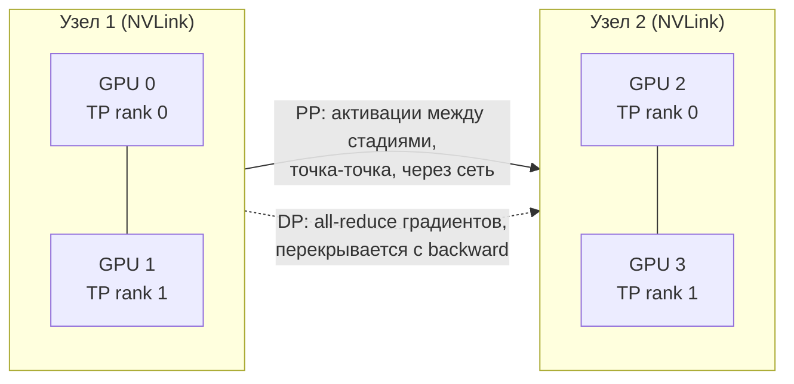
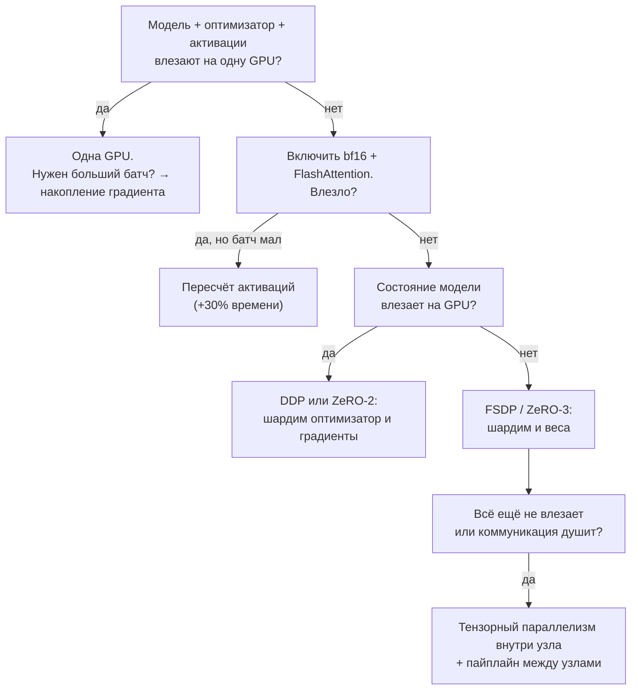

# Масштабирование обучения

> **Зачем эта глава.** Рано или поздно вы упираетесь в одно из двух: модель не влезает в память
> или обучается неприемлемо долго. Дальше начинается инженерия — смешанная точность, накопление
> градиента, пересчёт активаций, шардинг состояний оптимизатора, распределённое обучение.
> Это ровно тот набор, который спрашивают на позициях, связанных с LLM, и по которому мгновенно
> видно, обучал человек что-то крупнее одной GPU или нет. После этой главы вы сможете посчитать
> память обучения модели на 7B на салфетке, оценить срок обучения через правило 6ND, объяснить,
> что именно шардит ZeRO-3 и чем за это платит, и — начиная с первого раздела — считать
> на бумаге, во что упирается конкретное ядро и почему GPU загружен на 30 %.

**Уровень:** 🎯 middle → 🧠 middle+
**Предварительно нужно:** [PyTorch на практике](05-pytorch-in-practice.md), [внимание и трансформер](04-attention-and-transformer.md), [динамика обучения](02-training-dynamics.md)
**Как проработать:** чтение + расчёты + запуск DDP на двух устройствах

---

## Карта главы

- [1. Как устроена GPU и почему она простаивает](#1-как-устроена-gpu-и-почему-она-простаивает) — SM, память, тензорные ядра, roofline
- [2. Из чего складывается память обучения](#2-из-чего-складывается-память-обучения)
- [3. Считаем память для модели на 7B](#3-считаем-память-для-модели-на-7b)
- [4. Смешанная точность: fp16, bf16, tf32](#4-смешанная-точность-fp16-bf16-tf32)
- [5. Накопление градиента](#5-накопление-градиента)
- [6. Пересчёт активаций (gradient checkpointing)](#6-пересчёт-активаций-gradient-checkpointing)
- [7. DDP: как работает all-reduce](#7-ddp-как-работает-all-reduce)
- [8. ZeRO и FSDP: что шардится на каждой стадии](#8-zero-и-fsdp-что-шардится-на-каждой-стадии)
- [9. Тензорный и пайплайн параллелизм](#9-тензорный-и-пайплайн-параллелизм)
- [10. Как выбрать схему: дерево решений](#10-как-выбрать-схему-дерево-решений)
- [11. Бюджет обучения: правило 6ND](#11-бюджет-обучения-правило-6nd)
- [12. Подводные камни](#12-подводные-камни)
- [13. Проверь себя](#13-проверь-себя)
- [14. Практика](#14-практика)
- [15. Что читать дальше](#15-что-читать-дальше)

---

> 🌱 **База.** Обязательного здесь три вещи. Первая — разделение памяти на состояние модели
> (16 байт на параметр при AdamW и смешанной точности, от батча **не** зависит) и активации
> (растут с батчем и длиной контекста): от того, какое из двух слагаемых не влезло, зависит
> весь дальнейший выбор приёмов, и это [§2](#2-из-чего-складывается-память-обучения)–[§3](#3-считаем-память-для-модели-на-7b).
> Вторая — арифметическая интенсивность и точка перелома из [§1](#1-как-устроена-gpu-и-почему-она-простаивает):
> почему шаг обучения упирается не в вычислители, а в полосу памяти, и почему поэлементные
> операции нельзя ускорить ничем, кроме слияния ядер. Третья — MFU и правило $6ND$
> ([§1](#1-как-устроена-gpu-и-почему-она-простаивает) и [§11](#11-бюджет-обучения-правило-6nd)):
> они переводят жалобу «обучение медленное» в число и в деньги. Подразделы про SM, варпы
> и занятость читайте по диагонали — это словарь для профайлера, он понадобится, когда вы уже
> откроете Nsight, а не сейчас; [§9](#9-тензорный-и-пайплайн-параллелизм) про тензорный
> и пайплайн параллелизм пропустите целиком: его настраивают Megatron-LM и DeepSpeed, и до
> сотен карт он вам не встретится. Идти дальше можно, когда вы своими словами объясните,
> почему модель на 7B не обучается на карте с 80 ГБ, хотя инференс той же модели занимает 14 ГБ,
> и чем «`nvidia-smi` показывает 100 %» отличается от «карта делает полезную работу».

---

## 1. Как устроена GPU и почему она простаивает

Три наблюдения, которые невозможно объяснить, пока видеокарта остаётся чёрным ящиком
«оно быстро умножает матрицы».

**Первое.** Вы дополнили словарь языковой модели с 50 257 токенов до 50 304 — до ближайшего
числа, кратного 64. Параметров стало **больше**, строки 50 257–50 303 не встречаются в данных
никогда и их эмбеддинги не обучаются, а шаг обучения ускорился на несколько процентов.

**Второе.** Вы перевели обучение в bf16. Матричные умножения ускорились в разы, а LayerNorm,
GELU и softmax — ровно вдвое, ни на сколько больше, сколько их ни оптимизируй.

**Третье.** `nvidia-smi` показывает утилизацию 100 %, а MFU, посчитанный по правилу 6ND
([§11](#11-бюджет-обучения-правило-6nd)), — 18 %. Карта занята всё время, но полезной работы
делает пятую часть.

Ни одно из трёх не баг. Все три следуют из устройства железа, и модель, которая их объясняет,
умещается в четыре понятия: **SM**, **иерархия памяти**, **тензорные ядра** и **арифметическая
интенсивность**. В конце из них соберётся инструмент, которым решают, стоит ли вообще браться
за оптимизацию, — и он же нужен, чтобы отвечать на два самых частых вопроса про
производительность: «почему инференс не ускоряется» и «почему GPU загружен на 30 %».

### SM, warp и занятость

Видеокарта — это не «много ядер», а набор довольно самостоятельных процессоров: **потоковых
мультипроцессоров** (streaming multiprocessor, SM). У A100 их 108, у H100 — 132. Каждый SM
владеет собственным файлом регистров (65 536 32-битных регистров, то есть 256 КБ), собственной
быстрой памятью на 192 КБ и четырьмя планировщиками. Всё, что происходит на карте, происходит
внутри SM; глобальная память общая, а вычисления — нет.

Нити на SM исполняются группами по 32 — это **варп** (warp). Все 32 нити варпа на каждом такте
выполняют **одну и ту же инструкцию** над своими данными; модель называется SIMT. Отсюда первое
следствие: если ветвление внутри варпа развело нити по разным путям, обе ветки исполняются
**последовательно**, а часть нитей в это время простаивает под маской. Это дивергенция, и ровно
поэтому в вычислительных ядрах избегают ветвлений по данным.

Второе следствие важнее. Обращение в основную память карты стоит порядка 400–600 тактов.
Спрятать эту задержку кэшем нельзя: данные каждый раз новые. GPU прячет её иначе — SM держит
**резидентными** сразу много варпов (до 64 на A100, то есть до 2048 нитей) и, пока один варп
ждёт данные, планировщик выдаёт инструкции другому. Задержка маскируется не кэшированием,
а избытком параллелизма.

Доля резидентных варпов от максимума называется **занятостью** (occupancy). Ограничивают её
три ресурса SM, и первый — регистры: файл на 65 536 регистров делится между всеми нитями.

| Регистров на нить | Нитей на SM | Варпов | Занятость |
|---|---|---|---|
| 32 | 2048 | 64 | 100 % |
| 64 | 1024 | 32 | 50 % |
| 128 | 512 | 16 | 25 % |
| 255 (максимум) | 256 | 8 | 12,5 % |

Второй ресурс — те самые 192 КБ быстрой памяти на SM: если блок нитей запросил 96 КБ, на SM
поместятся только два блока. Третий — размер блока: 2048 нитей на SM не делятся нацело
на блоки по 768, останется дыра.

Здесь надо сказать неудобную правду, которую пропускают в туториалах: **занятость — не цель.**
Ядро с высокой арифметической интенсивностью (большое матричное умножение) специально написано
с огромным числом регистров на нить, работает при занятости 12–25 % и упирается в тензорные
ядра, а не в память; поднимать там занятость бессмысленно и вредно. Занятость важна ровно
там, где ядро ждёт память, — то есть для всего memory-bound. Формулировка, которую стоит
запомнить: занятость — это не «загрузка GPU», а запас варпов, которым планировщик прикрывает
ожидание памяти.

### Иерархия памяти: разрыв, из которого следует всё остальное

| Уровень | Объём (A100 80 ГБ) | Полоса, порядок | Задержка, порядок |
|---|---|---|---|
| Регистры | 256 КБ на SM, 27 МБ на карту | десятки ТБ/с | ~1 такт |
| SRAM: shared memory / L1 | 192 КБ на SM, ~20 МБ на карту | ~19 ТБ/с | ~30 тактов |
| L2 | 40 МБ на карту | ~5 ТБ/с | ~200 тактов |
| HBM («память видеокарты») | 80 ГБ | 2,0 ТБ/с | 400–600 тактов (~0,4 мкс) |
| RAM хоста через PCIe 4.0 x16 | сотни ГБ | ~25 ГБ/с | микросекунды |

Спецификация производителя даёт только объём HBM и её полосу; остальные строки получают
микробенчмарками (серия работ Jia и соавторов по архитектурам NVIDIA), поэтому это порядки,
а не паспортные значения.

Читать таблицу нужно отношениями. SRAM даёт примерно **в десять раз** большую полосу, чем HBM,
и в двадцать раз меньшую задержку. HBM, в свою очередь, в восемьдесят раз быстрее шины к хосту.
Оптимизация ядра почти всегда состоит в перетаскивании работы на строчку выше: посчитать
в регистрах то, что считалось через shared memory; уместить в shared то, что гонялось через HBM;
не выгружать на хост то, что дешевле пересчитать.

И одно число, которое стоит держать в голове постоянно. 2 ТБ/с звучит огромно, но A100 в bf16
выполняет $312\cdot10^{12}$ операций в секунду. Поделите одно на другое: карта успевает сделать
**153 операции на каждый прочитанный байт**. Ядро, которое делает меньше, упирается не
в вычислители, а в шину памяти — и тензорные ядра в это время просто стоят.

### Тензорные ядра: что они ускоряют и чего требуют

Обычное ядро CUDA умеет `a * b + c` над скалярами. **Тензорное ядро** (tensor core) выполняет
за одну инструкцию целое маленькое матричное умножение с накоплением — на Ampere это плитка
вида $16\times8\times16$ для bf16/fp16. Разница в пропускной способности не косметическая:

| Что считаем на A100 | Пик, TFLOP/s | Во сколько раз |
|---|---|---|
| fp32 на обычных ядрах (FFMA) | 19,5 | 1× |
| tf32 на тензорных ядрах | 156 | 8× |
| bf16/fp16 на тензорных ядрах | 312 | 16× |

Отсюда сразу два ограничения, которые объясняют «второе наблюдение» из начала раздела.

**Ограничение первое: ускоряется только матричное умножение.** Тензорные ядра умеют одну
операцию — умножение матриц (и свёртку, которая к нему сводится). Softmax, LayerNorm, GELU,
сложение остаточной связи, dropout — поэлементные и редукционные операции, к тензорным ядрам
отношения не имеющие вообще. Переход в bf16 ускоряет их ровно вдвое, потому что вдвое падает
объём читаемых байт, — и ни на сколько больше, потому что они и в fp32 упирались в память.
Если в вашей модели половина времени уходит на такие операции, максимум, что даст bf16
на этой половине, — двукратное ускорение, а не шестнадцатикратное. Считать выигрыш надо
по закону Амдала, а не по строчке «16×» из спецификации.

**Ограничение второе: размерности.** Тензорное ядро работает плитками, и библиотека (cuBLAS)
выбирает под ваши формы конкретное ядро с конкретным размером плитки — типично $128\times128$
или $128\times256$ на выход. Из этого следуют два разных эффекта, которые обычно путают.

**Квантование по плиткам** (tile quantization): если размерность не кратна плитке, последняя
плитка считается целиком, а используется частично.

| Размер выхода по столбцам | Плиток по 128 | Реально посчитано столбцов | Полезная доля |
|---|---|---|---|
| 256 | 2 | 256 | 100 % |
| 257 | 3 | 384 | 66,9 % |
| 384 | 3 | 384 | 100 % |
| 4096 | 32 | 4096 | 100 % |
| 4104 | 33 | 4224 | 97,2 % |

Один лишний столбец превращает 256 в 257 и выбрасывает треть работы ядра. Обратное тоже верно:
дополнить 4104 до 4224 бесплатно, потому что эти столбцы всё равно считаются.

**Квантование по волнам** (wave quantization): все плитки раскладываются по 108 SM волнами,
и последняя волна почти никогда не заполнена. Считаем для выхода $M\times N$ при плитке
$128\times128$:

| Выход | Плиток | Волн по 108 SM | Занятость последней волны | КПД |
|---|---|---|---|---|
| $1280\times1280$ | 100 | 0,93 | 92,6 % | 92,6 % |
| $1408\times1408$ | 121 | 1,12 | 12,0 % | 56,0 % |
| $1664\times1664$ | 169 | 1,56 | 56,5 % | 78,2 % |
| $4096\times4096$ | 1024 | 9,48 | 48,1 % | 94,8 % |

Прочитайте вторую и третью строки вместе. Расширив слой с 1280 до 1408, вы добавили 21 %
работы — и получили две волны вместо одной, то есть удвоение времени. Расширив дальше,
с 1408 до 1664, вы добавили ещё 40 % работы **бесплатно**: волн по-прежнему две. Эффект тем
слабее, чем больше матрица (при 4096 потери меньше 6 %), и реальные библиотеки его сглаживают,
перебирая несколько размеров плитки и разбивая матрицу по $K$ (split-K). Но полностью он
не исчезает, и именно он стоит за «первым наблюдением» про словарь на 50 304.

> ⚠️ **Типичная ошибка.** Считать размерности «математически красиво» и получить числа вроде
> $d_{ff} = \tfrac{8}{3}d$. При $d = 4096$ это 10 923 — не кратно ни 128, ни 64, ни даже 8.
> Результат: часть работы уходит в мусорные плитки, а на некоторых версиях cuBLAS ядро вообще
> сваливается с тензорного пути на обычный. Правильно — округлять вверх до кратного 128:
> в LLaMA-7B при $d = 4096$ размерность FFN равна 11 008, то есть ровно $86 \times 128$.
> Это не случайность и не «чтобы красивее». Практическое правило: ширина модели, размерность
> FFN, число голов, размер словаря и размер батча — кратные 64, лучше 128; при батче
> и длине последовательности кратность 8 обязательна, иначе тензорные ядра могут не включиться
> вовсе (для int8 — кратность 16).

### Арифметическая интенсивность и roofline: где проходит граница

Теперь соберём всё в одну модель. У ядра есть две работы: выполнить $W$ операций с плавающей
точкой и прогнать $Q$ байт через HBM. Карта характеризуется двумя пределами: пиковой
производительностью $P$ (операций в секунду) и полосой памяти $\beta$ (байт в секунду).
Обе работы идут одновременно, но ни одна не может закончиться быстрее своего предела:

$$
T \;\ge\; \max\left(\frac{W}{P},\; \frac{Q}{\beta}\right)
$$

где $T$ — время работы ядра. Достижимая производительность — это $W/T$:

$$
\frac{W}{T} \;\le\; \min\left(P,\; \beta\,\frac{W}{Q}\right) \;=\; \min\big(P,\; \beta\, I\big),
\qquad
I \;=\; \frac{W}{Q}
$$

где $I$ — **арифметическая интенсивность** (arithmetic intensity), число операций на байт,
прочитанный из HBM и записанный в неё.

> 📐 **Разбор формулы.** Правая часть — две прямые на графике «интенсивность → достижимые
> FLOP/s». Первая, $P$, горизонтальна: сколько ни давай данных, быстрее пика карта не считает.
> Вторая, $\beta I$, наклонная: при низкой интенсивности производительность прямо
> пропорциональна тому, сколько операций вы выжимаете из каждого байта. Их пересечение
> и называется **точкой перелома** (ridge point): $I^{*} = P/\beta$. График с этими двумя
> линиями и есть roofline — «крыша» и «стена под скатом». Слева от $I^{*}$ ядро **memory-bound**:
> вычислители ждут память, и ускорять арифметику бесполезно. Справа — **compute-bound**:
> память успевает, и упор в вычислители.

Точка перелома — свойство карты, и её надо посчитать один раз для своего железа. Ниже —
калькулятор, который сразу и определяет режим конкретного ядра.

```python
# Roofline-калькулятор: точка перелома карты и режим работы конкретного ядра.
# Входные числа — из спецификаций производителя; всё остальное считается.

CARDS = {                       # (пик, ФЛОП/с),        (полоса HBM, байт/с)
    "A100 80GB, bf16 (tensor)": (312e12, 2039e9),
    "A100 80GB, fp32 (без tensor cores)": (19.5e12, 2039e9),
    "H100 SXM, bf16 (tensor)": (989e12, 3352e9),
    "L4, bf16 (tensor)": (121e12, 300e9),
    "RTX 4090, bf16 (tensor)": (165e12, 1008e9),
}

print(f"{'карта и точность':<38} {'пик, TFLOP/s':>13} {'HBM, ГБ/с':>10} {'AI*, FLOP/байт':>15}")
for name, (peak, bw) in CARDS.items():
    print(f"{name:<38} {peak/1e12:>13.0f} {bw/1e9:>10.0f} {peak/bw:>15.0f}")


def regime(flops: float, bytes_: float, peak: float, bw: float) -> tuple[float, float, str]:
    """Возвращает (арифметическая интенсивность, доля пика, режим)."""
    ai = flops / bytes_
    attainable = min(peak, bw * ai)      # это и есть roofline: крыша плюс наклонная стена
    return ai, attainable / peak, "compute" if ai >= peak / bw else "memory"


PEAK, BW = CARDS["A100 80GB, bf16 (tensor)"]
b = 2                                    # байт на число в bf16
d = 4096                                 # ширина модели

OPS = {
    # имя:                              (FLOP,            прочитано+записано байт)
    "x + y (поэлементно, 1 элемент)":   (1,                3 * b),
    "GELU (1 элемент)":                 (10,               2 * b),
    "LayerNorm (строка d)":             (8 * d,            2 * d * b),
    "softmax (строка d)":               (5 * d,            2 * d * b),
    "matmul (1, d) x (d, d)":           (2 * d * d,        (d * d + 2 * d) * b),
    "matmul (256, d) x (d, d)":         (2 * 256 * d * d,  (d * d + 2 * 256 * d) * b),
    "matmul (8192, d) x (d, d)":        (2 * 8192 * d * d, (d * d + 2 * 8192 * d) * b),
}

print(f"\n{'операция (bf16, d=4096)':<34} {'AI':>8} {'доля пика A100':>16} {'режим':>9}")
for name, (fl, by) in OPS.items():
    ai, frac, mode = regime(fl, by, PEAK, BW)
    print(f"{name:<34} {ai:>8.2f} {frac:>15.1%} {mode:>9}")
```

```
карта и точность                        пик, TFLOP/s  HBM, ГБ/с  AI*, FLOP/байт
A100 80GB, bf16 (tensor)                         312       2039             153
A100 80GB, fp32 (без tensor cores)                20       2039              10
H100 SXM, bf16 (tensor)                          989       3352             295
L4, bf16 (tensor)                                121        300             403
RTX 4090, bf16 (tensor)                          165       1008             164

операция (bf16, d=4096)                  AI   доля пика A100     режим
x + y (поэлементно, 1 элемент)         0.17            0.1%    memory
GELU (1 элемент)                       2.50            1.6%    memory
LayerNorm (строка d)                   2.00            1.3%    memory
softmax (строка d)                     1.25            0.8%    memory
matmul (1, d) x (d, d)                 1.00            0.7%    memory
matmul (256, d) x (d, d)             227.56          100.0%   compute
matmul (8192, d) x (d, d)           1638.40          100.0%   compute
```

Здесь три вещи, которые стоит проговорить вслух.

**Точка перелома зависит от точности, а не только от карты.** У A100 в fp32 без тензорных ядер
она равна 10 — почти всё, что вы напишете, будет compute-bound, и оптимизировать надо
арифметику. Те же тензорные ядра подняли планку до 153, и половина операций трансформера
внезапно оказалась слева от неё. **Memory-bound — не свойство алгоритмов, а следствие того,
что вычислители за пятнадцать лет росли быстрее, чем память.** Именно поэтому слияние ядер
(о нём ниже) стало важной техникой в эпоху тензорных ядер, а не раньше.

**У дешёвых карт разрыв ещё хуже.** У L4 с GDDR6 точка перелома 403 — вчетверо дальше, чем
у fp32-A100. На таких картах memory-bound операции особенно болезненны, и рецепты, снятые
с A100, переносятся плохо.

**Roofline — верхняя граница, а не прогноз.** Реальное ядро может идти заметно ниже обеих
крыш: низкая занятость, конфликты банков shared memory, дивергенция, неудачная плитка.
Практическая ценность модели в другом: если посчитанная $I$ на порядок меньше $I^{*}$,
то **никакая** оптимизация арифметики не поможет, и все усилия надо направить на трафик.
Это решение принимается на бумаге за пять минут, до того как вы открыли профайлер.

### Почему поэлементные операции обречены, а большой matmul — нет

Посмотрите на пять первых строк нижней таблицы. У них общая черта: интенсивность не зависит
от размера тензора. Поэлементная операция над $n$ элементами читает $n$ чисел и записывает $n$
чисел, выполняя $c\,n$ операций, где $c$ — небольшая константа (1 для сложения, около 10
для GELU). Интенсивность:

$$
I_{\text{поэлементно}} \;=\; \frac{c\,n}{2\,n\,b} \;=\; \frac{c}{2b}
$$

где $b$ — байт на число. Величина $n$ сократилась. Увеличение батча, длины контекста, ширины
модели — ничто из этого не сдвигает такое ядро вправо по roofline. Оно memory-bound
**по построению**, и единственный способ что-то с ним сделать — уменьшить число походов
в память.

Матричное умножение устроено иначе. Для $(T\times d)\times(d\times d)$ операций
$2Td^2$, а байт примерно $d^2 b$ (веса) плюс $2Tdb$ (активации), откуда при $T \ll d$

$$
I_{\text{matmul}} \;\approx\; \frac{2Td^2}{d^2 b} \;=\; \frac{2T}{b} \;\overset{b=2}{=}\; T
$$

то есть в bf16 интенсивность численно равна числу токенов в одном умножении. Матрица весов
читается один раз и переиспользуется для всех $T$ токенов — вот откуда берётся выигрыш.
При $T = 1$ (генерация по одному токену) интенсивность равна 1, и это ровно та причина,
по которой инференс LLM упирается в память, а не в вычисления; подробный разбор — в
[главе про инференс LLM](../05-llm/05-inference-and-serving.md#2-арифметическая-интенсивность-главный-инструмент-главы).

Отсюда следует главный практический приём — **слияние ядер** (kernel fusion). Возьмём типичный
хвост трансформерного блока: сложение смещения, GELU, dropout, остаточная связь, LayerNorm.
Пять отдельных ядер — это пять пар «прочитать весь тензор из HBM, записать весь тензор
в HBM». Для активаций $(8, 2048, 4096)$ в bf16 — 128 МиБ на тензор:

| Вариант | Трафик HBM | Время на полосе 2039 ГБ/с |
|---|---|---|
| пять отдельных ядер | 1280 МиБ | 0,66 мс |
| одно слитое ядро | 256 МиБ | 0,13 мс |

Пятикратная разница, и ни одной операции с плавающей точкой не убрано. Слитое ядро читает
тензор один раз, держит значения **в регистрах**, прогоняет через всю цепочку и записывает
результат один раз. Делают это тремя способами: руками на CUDA или Triton; автоматически —
`torch.compile`, который как раз и генерирует слитые Triton-ядра (см.
[§11 предыдущей главы](05-pytorch-in-practice.md#11-профилирование-где-на-самом-деле-уходит-время));
готовыми реализациями из библиотек — `F.scaled_dot_product_attention`, слитый оптимизатор
(`fused=True` у AdamW), `apex.FusedLayerNorm`.

> 💬 **На собеседовании.** Спросят: «Как понять, во что упирается ваше ядро — в вычисления
> или в память?»
> Хороший ответ — счёт, а не инструмент. Считаю арифметическую интенсивность: сколько операций
> ядро делает на байт, прочитанный из HBM. Сравниваю с точкой перелома карты — отношением
> пиковой производительности к полосе памяти: у A100 в bf16 это 312 TFLOP/s на 2 ТБ/с, то есть
> около 153 операций на байт, у H100 — около 295. Если моя интенсивность заметно ниже, ядро
> memory-bound, и оптимизировать надо трафик: слияние, меньшая точность, переиспользование
> данных в SRAM. Если выше — compute-bound, и смысл имеют тензорные ядра, правильные
> размерности, лучшие библиотечные ядра. Дальше можно добавить, что для линейного слоя в bf16
> интенсивность численно равна числу токенов в умножении, поэтому вопрос «memory или compute»
> для трансформера сводится к вопросу «сколько токенов за раз». Проверяю гипотезу профайлером,
> но гипотеза строится на бумаге.
> Провал: «посмотрю в `nvidia-smi`» — там нет ни FLOPs, ни трафика.

### FlashAttention: не «ускоряет внимание», а перестаёт материализовать матрицу

Теперь применим roofline к самому обсуждаемому ядру. Наивное внимание считает так: перемножает
$Q K^\top$ и **записывает результат в HBM** — тензор $(B, h, n, n)$; читает его обратно, чтобы
применить softmax, и записывает снова; читает третий раз, чтобы умножить на $V$. Для одного
слоя при $B = 1$, $h = 32$, $n = 2048$, $d_{head} = 128$ в bf16:

| Вариант | Трафик HBM | Арифметическая интенсивность | Доля пика A100 (оценка сверху) |
|---|---|---|---|
| наивное внимание | 1344 МиБ | 48,8 | 31,9 % |
| FlashAttention | 64 МиБ | 1024 | 100 % |

Здесь 64 МиБ — это $Q$, $K$, $V$ и выход, то есть всё, что физически обязано пройти через HBM;
матрица весов внимания весит 256 МиБ сама по себе и в наивной схеме прогоняется через шину
пять раз. Число операций у обоих вариантов **одинаковое** — 68,7 ГФЛОП. Разница только
в трафике, и она в 21 раз.

Механизм ровно такой, как следует из roofline: не считать быстрее, а не выпускать данные
из SRAM. FlashAttention режет $Q$, $K$, $V$ на блоки, помещающиеся в 192 КБ shared memory,
и для каждого блока $Q$ проходит по всем блокам $K$ и $V$, накапливая результат. Проблема
в том, что softmax требует знать сумму по **всей** строке, а мы видим её по кускам. Решается
это онлайн-нормировкой: храним текущий максимум $m$ и текущую сумму экспонент $\ell$,
а при поступлении нового блока пересчитываем накопленный результат:

$$
m^{\text{нов}} = \max(m, m_{\text{блок}}),
\qquad
\ell^{\text{нов}} = e^{\,m - m^{\text{нов}}}\ell \;+\; e^{\,m_{\text{блок}} - m^{\text{нов}}}\ell_{\text{блок}}
$$

где $m$ и $\ell$ — накопленные максимум и сумма экспонент по уже просмотренным блокам строки,
$m_{\text{блок}}$ и $\ell_{\text{блок}}$ — те же величины для нового блока. Множители
$e^{\,m - m^{\text{нов}}}$ пересчитывают старое накопление к новому максимуму. Выход
масштабируется тем же множителем. Результат — **то же самое внимание**, а не приближение:
расходятся только младшие разряды, и ровно настолько, насколько отличается порядок
суммирования в плавающей точке.

Два практических следствия. Память активаций падает с $O(n^2)$ до $O(n)$: матрица $(B,h,n,n)$
не существует нигде, кроме регистров и SRAM, — при $n = 2048$ и батче 8 это разница между
2 ГБ в HBM и парой сотен килобайт на SM. И обратный проход не хранит $S$, а **пересчитывает** её из $Q, K, V$ прямо
в SRAM: лишние FLOPs дешевле, чем поход в HBM, — тот же обмен, что в пересчёте активаций
([§6](#6-пересчёт-активаций-gradient-checkpointing)), только выгодный без оговорок.

> 🧠 **Middle+.** Почему тогда FlashAttention не даёт 21-кратного ускорения на практике?
> Потому что после устранения трафика ядро становится compute-bound, и его потолок — уже
> не полоса памяти, а насколько хорошо оно грузит тензорные ядра. FlashAttention-1 достигал
> 25–40 % пика A100 из-за неудачного распределения работы между варпами; FlashAttention-2
> переставил циклы и вышел на 50–73 %; FlashAttention-3 добавил перекрытие softmax
> с матричными умножениями и поддержку FP8 на Hopper. Сквозное ускорение шага обучения —
> обычно от 1,3 до 3 раз, в зависимости от того, какую долю времени занимало внимание,
> то есть от отношения $n$ к $d$. И отдельно: на коротких последовательностях
> ($n \ll d$) выигрыша почти нет — там доминируют обычные проекции, а не внимание.

### MFU: roofline для всего обучения

Roofline отвечает на вопрос про одно ядро. Для всего обучения та же роль у **MFU** (Model FLOPs
Utilization) — доли пиковой производительности железа, которая ушла на полезные операции модели:

$$
\text{MFU} \;=\; \frac{6\,N\,D_{\text{шаг}}}{T_{\text{шаг}} \cdot P_{\text{peak}} \cdot N_{\text{GPU}}}
$$

где $N$ — число параметров модели, $D_{\text{шаг}}$ — число токенов в одном шаге обучения
(эффективный батч, умноженный на длину последовательности), $T_{\text{шаг}}$ — время шага
в секундах, $P_{\text{peak}}$ — пиковая производительность одной карты в используемой точности,
$N_{\text{GPU}}$ — число карт. Числитель — это оценка $6ND$, вывод шестёрки — в
[§11](#11-бюджет-обучения-правило-6nd).

Слово «Model» в названии существенно: в числителе стоят операции, которые **обязана** сделать
модель по своей математике, а не те, что фактически выполнило железо. Если вы включили пересчёт
активаций, карта делает дополнительный прямой проход — эти FLOPs реальны, но бесполезны,
и в MFU они не попадают. Метрика, которая считает и их, называется HFU (Hardware FLOPs
Utilization) и при полном пересчёте выше MFU примерно на треть. Ловушка тут в том, что HFU
можно поднять, добавив бессмысленной работы; MFU — нельзя, и поэтому сравнивают именно его.

Ориентиры. В статье про PaLM авторы отчитались о **46,2 % MFU** и назвали это лучшим известным
результатом для модели такого масштаба; типичное аккуратно настроенное обучение плотного
трансформера на A100/H100 даёт 35–50 %. Значения 20–35 % означают, что есть что чинить,
а ниже 20 % — что где-то капитальный простой. Что именно — почти всегда одна из пяти вещей:

| Причина низкого MFU | Как выглядит в профиле | Порядок потерь |
|---|---|---|
| Пайплайн данных не успевает | дыры на дорожке GPU, `cudaStreamSynchronize` в топе | до 50 % |
| Множество мелких memory-bound ядер | сотни запусков по 5–20 мкс, время размазано | 20–40 % |
| Коммуникация не перекрыта с вычислениями | ядра NCCL на критическом пути | 10–40 % |
| Пузырь пайплайна | простой стадий, формула $(P-1)/(m+P-1)$, [§9](#9-тензорный-и-пайплайн-параллелизм) | по формуле |
| Квантование по плиткам и волнам | GEMM работает на 60–80 % своего пика | 5–25 % |

Практическая ценность MFU в том, что он переводит инженерный спор в бюджетный. При MFU 15 %
удвоение числа карт даст меньше, чем устранение простоя, и это можно показать финансовому
отделу одним числом.

> 💬 **На собеседовании.** Спросят: «`nvidia-smi` показывает утилизацию 100 %, а обучение
> медленное. Как такое возможно?»
> Хороший ответ: `nvidia-smi` показывает **долю времени, в течение которой на карте выполнялось
> хоть какое-то ядро**, и ничего не говорит о том, полезная ли это работа и насколько загружены
> вычислители. Ядро, которое читает тензор из HBM и прибавляет к нему единицу, даст утилизацию
> 100 % при 0,1 % от пиковой производительности. Мерить надо MFU: полезные FLOPs модели
> ($6ND$ за шаг для трансформера) поделить на время шага и на пиковую производительность карт.
> Дальше — искать причину: сначала разделить «данные» и «вычисления» замером на одном
> фиксированном батче, потом смотреть профайлером на мелкие ядра, на коммуникацию и на
> синхронизации. Сильное продолжение — сказать, что промежуточная диагностика между этими
> двумя числами — занятость (occupancy) и достигнутая полоса памяти из Nsight Compute:
> если ядро упирается в полосу, всё правильно и надо фьюзить, а если ни в полосу, ни в пик,
> значит, проблема в занятости или в раскладке доступов.
> Провал: «утилизация 100 %, значит, GPU — узкое место, нужна карта помощнее».

---

## 2. Из чего складывается память обучения

Первый вопрос, который стоит задавать при любом OOM: **что именно не влезло?** Память обучения
состоит из четырёх слагаемых с принципиально разным поведением, и лечатся они разными средствами.

$$
M_{\text{total}} \;=\; \underbrace{M_{\text{params}} + M_{\text{grads}} + M_{\text{optim}}}_{\text{состояние модели}}
\;+\; \underbrace{M_{\text{act}}}_{\text{активации}} \;+\; M_{\text{tmp}}
$$

где $M_{\text{params}}$ — веса, $M_{\text{grads}}$ — градиенты, $M_{\text{optim}}$ — состояния
оптимизатора (для Adam — моменты первого и второго порядка плюс мастер-копия весов),
$M_{\text{act}}$ — сохранённые промежуточные активации для обратного прохода,
$M_{\text{tmp}}$ — временные буферы, фрагментация аллокатора и буферы коммуникации.

Ключевое различие:

- **Состояние модели** пропорционально числу параметров $N$ и **не зависит** от размера батча.
  Уменьшение батча его не спасёт. Лечится шардингом (ZeRO/FSDP) или выбором более дешёвого
  оптимизатора.
- **Активации** пропорциональны $B \cdot n \cdot d \cdot L$ — то есть батчу, длине
  последовательности, ширине и глубине. Лечатся уменьшением батча, накоплением градиента
  и пересчётом активаций.

Обозначим $\Psi = N$ — число параметров модели, и посчитаем состояние модели по байтам
на параметр для Adam.

| Компонент | fp32-обучение | Смешанная точность (AMP) |
|---|---|---|
| Веса | 4 | 2 (fp16/bf16) |
| Градиенты | 4 | 2 (fp16/bf16) |
| Мастер-копия весов fp32 | — | 4 |
| Adam: момент $m$ | 4 | 4 |
| Adam: момент $v$ | 4 | 4 |
| **Итого байт на параметр** | **16** | **16** |

Первый неприятный сюрприз: **смешанная точность не экономит память на состоянии модели**.
Она экономит на активациях (они вдвое легче) и ускоряет вычисления, но 16 байт на параметр
остаются 16 байтами. Это ровно то, что часто отвечают неверно на собеседовании.

Второй сюрприз — про оптимизатор. Adam стоит 12 байт на параметр (мастер-копия + два момента)
против 4 у SGD без момента и 8 у SGD с моментом. Для больших моделей это **три четверти**
состояния модели. Отсюда и появились 8-битные оптимизаторы (bitsandbytes) и Adafactor,
хранящий вместо полной матрицы $v$ её факторизованное приближение.

---

## 3. Считаем память для модели на 7B

Разберём конкретный, самый спрашиваемый случай: модель на 7 миллиардов параметров,
$L = 32$ слоя, $d = 4096$, $h = 32$ голов, длина контекста $n = 2048$, обучение в смешанной
точности с AdamW.

### Состояние модели

$$
M_{\text{state}} \;=\; 16\ \text{байт} \times 7\cdot10^{9} \;=\; 112\ \text{ГБ}
$$

Уже на этом шаге всё кончено: в 80 ГБ памяти A100/H100 состояние модели не помещается,
а мы ещё не начали считать активации. Отсюда простой вывод, который надо уметь произносить
мгновенно: **обучение модели на 7B на одной GPU без специальных техник невозможно**, тогда как
инференс той же модели в fp16 требует всего 14 ГБ.

### Активации

Для трансформерного слоя есть достаточно точная оценка из статьи Korthikanti et al.
(Megatron-LM, «Reducing Activation Recomputation in Large Transformer Models»). Память активаций
одного слоя при обучении в смешанной точности:

$$
M_{\text{act}}^{(1\ \text{слой})} \;=\; n \cdot B \cdot d \left(34 + 5\,\frac{h\, n}{d}\right)\ \text{байт}
$$

где $n$ — длина последовательности, $B$ — размер батча, $d$ — размерность модели, $h$ — число
голов внимания. Константа 34 собирается из сохранённых входов линейных слоёв, выходов
нормализаций, промежуточного тензора FFN размерности $4d$ и масок dropout; слагаемое
$5 h n / d$ — это матрица весов внимания размера $(B, h, n, n)$, та самая квадратичная по длине
(см. [§9 главы о трансформере](04-attention-and-transformer.md#9-сквозной-проход-по-размерностям)).

Подставим наши числа при $B = 1$:

$$
n B d = 2048 \cdot 1 \cdot 4096 = 8{,}39\cdot10^{6},
\qquad
5\,\frac{hn}{d} = 5\cdot\frac{32 \cdot 2048}{4096} = 80
$$

$$
M_{\text{act}}^{(1\ \text{слой})} = 8{,}39\cdot10^{6} \cdot (34 + 80) \approx 0{,}96\ \text{ГБ}
$$

$$
M_{\text{act}} = 32 \cdot 0{,}96 \approx 31\ \text{ГБ} \quad \text{при батче 1}
$$

При батче 8 — уже 245 ГБ. Активации растут линейно по батчу и линейно по длине (плюс
квадратичный член от матрицы внимания), и именно они, а не веса, обычно взрывают память
при попытке увеличить батч.

### Что с этим делать

| Приём | Что уменьшает | Во сколько раз | Цена |
|---|---|---|---|
| Смешанная точность | активации | ~2 | почти нет (при bf16) |
| Уменьшение батча | активации | линейно | хуже утилизация GPU |
| Накопление градиента | активации | линейно | нет (то же время) |
| Пересчёт активаций | активации | ~10–50 | +25–35 % времени |
| ZeRO-1 (шардинг оптимизатора) | состояние модели | до 4× при большом $N_{\text{GPU}}$ | нет |
| ZeRO-2 (+ градиенты) | состояние модели | до 8× | нет |
| ZeRO-3 / FSDP (+ веса) | состояние модели | до $N_{\text{GPU}}$× | +50 % коммуникации |
| 8-битный оптимизатор | состояние модели | 12 → 3–4 байта/параметр | лёгкая потеря точности |

> 💬 **На собеседовании.** Спросят: «Сколько памяти нужно, чтобы обучить модель на 7B?»
> Хороший ответ строится по слоям и с числами. Состояние модели при AdamW и смешанной точности —
> 16 байт на параметр, то есть 112 ГБ, и это не зависит от батча. Активации при $n=2048$
> и батче 1 — около 30 ГБ, растут линейно по батчу. Итого одной 80-гигабайтной карты не хватает
> даже на состояние. Дальше стоит сразу назвать план: пересчёт активаций сбивает вторую часть
> почти до нуля, ZeRO-2/FSDP делит первую на число GPU, и на 8×A100 обучение становится
> реальным. Полезно добавить контраст: инференс той же модели в fp16 — 14 ГБ плюс KV-кэш.
> Провал: «зависит от многого» без попытки посчитать, или «14 ГБ, ведь модель 7B в fp16» —
> это память **инференса**, а вопрос был про обучение.

---

## 4. Смешанная точность: fp16, bf16, tf32

### Проблема

Обучение в fp32 использует вчетверо больше памяти на активации и не задействует тензорные ядра,
которые на A100 дают в шестнадцать раз больше FLOPs, чем обычные
([§1](#1-как-устроена-gpu-и-почему-она-простаивает)). Хочется считать в 16 битах.
Мешает диапазон.

### Три формата

| Формат | Знак | Экспонента | Мантисса | Диапазон (по модулю) | Относительная точность |
|---|---|---|---|---|---|
| fp32 | 1 | 8 | 23 | $\sim10^{-38} \ldots 3\cdot10^{38}$ | $\sim10^{-7}$ |
| fp16 | 1 | 5 | 10 | $6\cdot10^{-5} \ldots 65\,504$ | $\sim5\cdot10^{-4}$ |
| bf16 | 1 | 8 | 7 | как у fp32 | $\sim4\cdot10^{-3}$ |
| tf32 | 1 | 8 | 10 | как у fp32 | $\sim5\cdot10^{-4}$ |

Читать таблицу надо так: **экспонента отвечает за диапазон, мантисса — за точность**.
У bf16 экспонента как у fp32, поэтому переполнений и исчезновений порядка не бывает вовсе;
платим младшими разрядами мантиссы. У fp16 наоборот: точность выше, но диапазон узкий.

Почему это критично именно для градиентов: их типичные значения на поздних стадиях обучения —
порядка $10^{-5} \ldots 10^{-8}$. Всё, что меньше $6\cdot10^{-5}$, в fp16 попадает в область
субнормальных чисел и быстро обнуляется. Градиент, ставший нулём, — это не «маленький градиент»,
это отсутствующий градиент.

### Loss scaling и GradScaler

Решение простое и красивое: раз градиенты слишком малы, домножим лосс на большое число $S$.
По линейности дифференцирования все градиенты умножатся на то же $S$ и уедут в рабочий диапазон
fp16. Перед шагом оптимизатора поделим обратно.

$$
\tilde{\mathcal{L}} = S \cdot \mathcal{L}
\quad\Longrightarrow\quad
\frac{\partial \tilde{\mathcal{L}}}{\partial \theta} = S \cdot \frac{\partial \mathcal{L}}{\partial \theta}
\quad\Longrightarrow\quad
g = \frac{1}{S}\,\frac{\partial \tilde{\mathcal{L}}}{\partial \theta}
$$

где $\mathcal{L}$ — исходная функция потерь, $S$ — коэффициент масштабирования (loss scale),
$\theta$ — параметры, $g$ — итоговый градиент для шага оптимизатора.

`torch.amp.GradScaler` подбирает $S$ **динамически**: стартует с большого значения (по умолчанию
$2^{16}$), при обнаружении `inf`/`NaN` в градиентах **пропускает шаг** и уменьшает $S$ вдвое,
а после нескольких тысяч успешных шагов подряд — увеличивает. Пропущенные шаги в начале обучения
(десятки штук) — норма, а не симптом поломки.

Для **bf16 масштабирование не нужно**: диапазон совпадает с fp32, недобор снизу невозможен.
Поэтому современный код на Ampere и новее пишут на bf16 без `GradScaler` — меньше движущихся
частей.

### Что нельзя считать в половинной точности

`torch.autocast` сам держит в fp32 операции, чувствительные к точности; знать этот список полезно,
потому что в собственных слоях его придётся соблюдать вручную:

- **Редукции по многим элементам** — суммы, средние, нормы. Складывая $10^6$ чисел в fp16,
  вы теряете точность катастрофически: когда накопленная сумма велика, малые слагаемые перестают
  на неё влиять (эффект поглощения). Отсюда — аккумуляторы всегда fp32.
- **Softmax и log-softmax**, а значит и функции потерь. Экспонента легко даёт переполнение fp16.
- **Статистики нормализаций** (LayerNorm, BatchNorm): среднее и дисперсия считаются в fp32.
- **Обновление весов.** Вот здесь тонкий момент, ради которого и держат мастер-копию fp32.
  Относительная разрешающая способность fp16 — около $5\cdot10^{-4}$. Если типичный вес
  $\sim10^{-2}$, а обновление $\eta \cdot g \sim 10^{-7}$, то отношение $10^{-5}$ **меньше**
  разрешения: при сложении обновление просто теряется, вес не меняется вообще. В fp32
  разрешение $\sim10^{-7}$, и обновление доходит.

```python
import torch
import torch.nn as nn

device = torch.device("cuda")
model = MyModel().to(device)
optimizer = torch.optim.AdamW(model.parameters(), lr=3e-4)

# bf16 доступен на Ampere (A100, RTX 30xx) и новее; на более старых картах — только fp16
use_bf16 = torch.cuda.is_bf16_supported()
amp_dtype = torch.bfloat16 if use_bf16 else torch.float16

# GradScaler нужен ТОЛЬКО для fp16: у bf16 диапазон fp32, недобора снизу нет
scaler = torch.amp.GradScaler("cuda", enabled=(amp_dtype is torch.float16))

for x, y in loader:
    x, y = x.to(device, non_blocking=True), y.to(device, non_blocking=True)
    optimizer.zero_grad(set_to_none=True)

    # autocast сам решит, какие операции считать в half, а какие оставить в fp32
    with torch.autocast(device_type="cuda", dtype=amp_dtype):
        logits = model(x)
        loss = nn.functional.cross_entropy(logits, y)   # сам лосс autocast держит в fp32

    scaler.scale(loss).backward()          # градиенты масштабированы на S

    scaler.unscale_(optimizer)             # ОБЯЗАТЕЛЬНО перед клиппингом:
                                           # иначе порог сравнивается с нормой, умноженной на S
    torch.nn.utils.clip_grad_norm_(model.parameters(), 1.0)

    scaler.step(optimizer)                 # пропустит шаг, если в градиентах inf/nan
    scaler.update()                        # подстроит S
```

Отдельно про **tf32**: на Ampere и новее матричные умножения по умолчанию выполняются
в формате tf32 (19 значащих бит), даже если тензоры объявлены как fp32. Это ускоряет обучение
почти вдвое ценой снижения точности матмулов до уровня fp16. Управляется флагами
`torch.backends.cuda.matmul.allow_tf32` и `torch.backends.cudnn.allow_tf32`. Если вы сравниваете
численные результаты с эталоном и они «поплыли на третьем знаке» — проверьте эти флаги.

> 💬 **На собеседовании.** Спросят: «fp16 или bf16 — что выбрать?»
> Хороший ответ: bf16, если железо поддерживает (Ampere+). У него экспонента как у fp32,
> поэтому нет ни переполнения, ни исчезновения градиентов, не нужен `GradScaler`, обучение
> устойчивее — особенно на больших моделях, где fp16 часто расходится. Цена — на 3 бита меньше
> мантиссы, то есть хуже относительная точность; на практике это компенсируется тем, что
> редукции и обновление весов всё равно идут в fp32. fp16 остаётся, когда карта старше Ampere
> (V100, T4) или когда важна точность отдельных значений, а диапазон под контролем.
> Полезно добавить, что ни тот, ни другой не экономят память на состоянии оптимизатора.
> Провал: «fp16 быстрее, bf16 точнее» — перепутаны роли экспоненты и мантиссы.

---

## 5. Накопление градиента

**Проблема.** Вы хотите обучать с батчем 512, потому что при меньшем батче обучение нестабильно
или так требует рецепт. В память влезает 8. Купить 64 GPU нельзя.

**Решение.** Разбить батч на $k$ микробатчей, сделать $k$ прямых и обратных проходов
без обновления весов и обновиться один раз. Градиенты, как мы помним из
[§4 предыдущей главы](05-pytorch-in-practice.md#4-autograd-граф-backward-detach-no_grad),
накапливаются в `.grad` сами — накопление градиента буквально ничего не делает, кроме как
не вызывает `zero_grad()`.

$$
B_{\text{eff}} \;=\; B_{\text{micro}} \cdot k \cdot N_{\text{GPU}}
$$

где $B_{\text{eff}}$ — эффективный размер батча, $B_{\text{micro}}$ — микробатч, помещающийся
в память, $k$ — число шагов накопления, $N_{\text{GPU}}$ — число устройств при распределённом
обучении.

```python
accum_steps = 8   # эффективный батч = B_micro * 8 * число GPU

optimizer.zero_grad(set_to_none=True)
for i, (x, y) in enumerate(loader):
    x, y = x.to(device, non_blocking=True), y.to(device, non_blocking=True)

    with torch.autocast(device_type="cuda", dtype=amp_dtype):
        # Делим на accum_steps, потому что градиенты СКЛАДЫВАЮТСЯ, а нам нужно среднее.
        # Забыть эту строку = увеличить эффективный learning rate в accum_steps раз.
        loss = criterion(model(x), y) / accum_steps

    scaler.scale(loss).backward()

    if (i + 1) % accum_steps == 0:
        scaler.unscale_(optimizer)
        torch.nn.utils.clip_grad_norm_(model.parameters(), 1.0)
        scaler.step(optimizer)
        scaler.update()
        optimizer.zero_grad(set_to_none=True)
        scheduler.step()        # расписание LR считает ОБНОВЛЕНИЯ, а не микробатчи
```

Три вещи, которые ломаются, если про них не подумать:

**1. Нормировка.** Деление на `accum_steps` обязательно, иначе градиент окажется в $k$ раз
больше, что эквивалентно умножению learning rate на $k$. Тонкость: если микробатчи разного
размера (последний неполный), корректнее взвешивать по числу объектов, а не делить на константу.

**2. Планировщик LR.** `scheduler.step()` должен вызываться на **обновление**, а не на микробатч.
Иначе расписание пробежит в $k$ раз быстрее, и обучение закончится с LR, близким к нулю,
задолго до конца.

**3. Это не полный эквивалент большого батча.** Накопление воспроизводит градиент большого
батча, но **не** статистики BatchNorm: они по-прежнему считаются по микробатчу.
Для сетей с BatchNorm накопление не заменяет большой батч. Для трансформеров с LayerNorm —
заменяет точно (с точностью до порядка суммирования в float).

**4. В связке с DDP** наивная реализация делает all-reduce на каждом микробатче — то есть
в $k$ раз больше коммуникации, чем нужно. Лечится контекстом `model.no_sync()` на всех
микробатчах, кроме последнего:

```python
from contextlib import nullcontext

is_last_micro = (i + 1) % accum_steps == 0
# no_sync отключает синхронизацию градиентов между процессами: коммуникация
# происходит только на последнем микробатче, когда градиент уже полный
sync_ctx = nullcontext() if is_last_micro else model.no_sync()
with sync_ctx:
    scaler.scale(loss).backward()
```

---

## 6. Пересчёт активаций (gradient checkpointing)

**Проблема.** Обратный проход требует активаций прямого прохода. Для трансформера
на 32 слоя это десятки гигабайт ([§3](#3-считаем-память-для-модели-на-7b)). Активации — самая большая статья расхода, и она растёт
с батчем, который хочется увеличивать.

**Решение.** Не хранить активации внутри блока вовсе. Сохранить только вход каждого блока,
а при обратном проходе **пересчитать** прямой проход этого блока заново и получить активации
на месте. Меняем память на вычисления.

Арифметика компромисса. Пусть сеть разбита на $L$ блоков. Без пересчёта храним $O(L)$ наборов
активаций. С пересчётом всех блоков храним $O(L)$ границ (они дёшевы: один тензор $B\times n\times d$
против десятка внутренних) плюс пиково активации **одного** блока. Если разбивать не по блокам,
а на $\sqrt{L}$ сегментов, получается классическая оценка $O(\sqrt{L})$ памяти при одном
дополнительном прямом проходе — результат работы Chen et al. (2016).

Цена по времени считается точно. Из разбора правила 6ND ([§11](#11-бюджет-обучения-правило-6nd)): прямой проход стоит $2ND$,
обратный — $4ND$, всего $6ND$. Пересчёт добавляет ещё один прямой проход, то есть $2ND$:

$$
\frac{6ND + 2ND}{6ND} \;=\; \frac{8}{6} \approx 1{,}33
$$

где $N$ — число параметров, $D$ — число обработанных токенов. То есть примерно **+33 % времени**
при полном пересчёте. На практике 25–35 %, потому что часть работы (например, attention
с FlashAttention) пересчитывается дешевле, а часть активаций всё равно кэшируется.

Для нашей модели на 7B пересчёт снижает активации с ~31 ГБ до примерно
$2 \cdot n \cdot B \cdot d \cdot L = 2 \cdot 2048 \cdot 1 \cdot 4096 \cdot 32 \approx 0{,}54$ ГБ
хранимых границ плюс около гигабайта на пик пересчёта одного слоя — то есть примерно в 20 раз.

```python
import torch
import torch.nn as nn
from torch.utils.checkpoint import checkpoint


class CheckpointedStack(nn.Module):
    """Стек блоков с опциональным пересчётом активаций."""

    def __init__(self, blocks: nn.ModuleList, use_checkpoint: bool = True):
        super().__init__()
        self.blocks = blocks
        self.use_checkpoint = use_checkpoint

    def forward(self, x):                      # x: (B, n, d)
        for block in self.blocks:
            if self.use_checkpoint and self.training:
                # use_reentrant=False — современная реализация: корректно работает
                # с kwargs, с torch.compile и не ломается при отсутствии grad у входа.
                # Состояние RNG сохраняется автоматически, поэтому dropout при пересчёте
                # даёт ТУ ЖЕ маску — иначе градиенты были бы неверными.
                x = checkpoint(block, x, use_reentrant=False)
            else:
                x = block(x)                   # на инференсе пересчёт бессмыслен
        return x
```

Практические замечания:

- **Пересчитывать надо не всё.** Селективный пересчёт (recompute только тяжёлых по памяти
  и дешёвых по вычислениям кусков — например, матрицы внимания, но не FFN) даёт почти всю
  экономию памяти за ~5 % времени вместо 33 %. Это основная идея статьи Korthikanti et al.
- **С FlashAttention** большая часть выигрыша от пересчёта attention уже получена: он не
  материализует матрицу $(B,h,n,n)$ — разбор механизма и трафика в
  [§1](#1-как-устроена-gpu-и-почему-она-простаивает), сложность внимания — в
  [§11 главы о трансформере](04-attention-and-transformer.md#11-сложность-память-и-что-из-этого-следует).
  Сначала включите его, потом смотрите, нужен ли ещё и пересчёт.
- **Внутри `torch.no_grad()` пересчёт не имеет смысла** и в некоторых версиях приводит
  к тому, что градиенты не считаются вообще — типичный источник «модель не учится» после
  добавления checkpointing.

---

## 7. DDP: как работает all-reduce

**Проблема.** Одна GPU обрабатывает батч за $t$ секунд. Хочется в $N$ раз быстрее.

**Data parallelism**: каждое из $N$ устройств держит **полную копию модели**, обрабатывает свою
часть батча и вычисляет свой градиент. Затем градиенты усредняются между всеми устройствами,
и все делают одинаковый шаг оптимизатора — копии остаются идентичными.

### Почему `DistributedDataParallel`, а не `DataParallel`

`nn.DataParallel` (DP) — старый однопроцессный вариант: один процесс Python управляет всеми GPU,
на каждом шаге рассылает копии модели, собирает выходы на GPU 0, там считает лосс и раздаёт
градиенты. Проблемы:

1. **GIL.** Один процесс Python не может параллельно управлять восемью устройствами: потоки
   упираются в глобальную блокировку интерпретатора.
2. **Асимметрия.** GPU 0 собирает выходы всех устройств и считает лосс — её память
   расходуется заметно больше, и она становится узким местом. Классический симптом:
   OOM на нулевой карте при свободных остальных.
3. **Репликация каждый шаг.** Модель копируется на устройства заново на каждой итерации.
4. **Не работает между узлами.**

`DistributedDataParallel` (DDP) — по процессу на GPU, никакого GIL, симметричная нагрузка,
коммуникация только градиентов, работает между узлами. Реальная разница в скорости на 8 GPU —
в разы. `DataParallel` в современном коде не используют; в документации PyTorch он прямо помечен
как нерекомендуемый.

### Ring all-reduce

Усреднение градиентов делается коллективной операцией **all-reduce**: на входе у каждого
из $N$ процессов свой вектор, на выходе у всех — сумма (или среднее). Наивная реализация
(все шлют всё одному, тот суммирует и рассылает) даёт нагрузку $O(N)$ на центральный узел.

Кольцевая реализация устроена умнее. Процессы образуют кольцо, буфер градиентов режется
на $N$ кусков, и выполняются две фазы:

1. **Reduce-scatter** ($N-1$ шагов): на каждом шаге процесс отправляет соседу один кусок
   и складывает полученный со своим. По завершении каждый процесс держит **полностью
   просуммированный** кусок номер $i$.
2. **All-gather** ($N-1$ шагов): просуммированные куски прокатываются по кольцу, пока
   у всех не окажутся все.

Объём переданных данных на процесс:

$$
V \;=\; 2\,\frac{N-1}{N}\, M
$$

где $M$ — размер градиента в байтах, $N$ — число процессов. При больших $N$ это стремится
к $2M$ — **не зависит от числа устройств**. Именно это свойство делает data parallelism
масштабируемым.

Для нашей модели на 7B в bf16: $M = 14$ ГБ, значит на каждом шаге каждый процесс отправляет
и принимает около 28 ГБ. При 300 ГБ/с NVLink — примерно 0,1 с только на коммуникацию.
Отсюда две оптимизации, которые DDP делает сам:

- **Бакетинг**: градиенты собираются в бакеты (по умолчанию 25 МБ) — крупные передачи
  эффективнее множества мелких;
- **Перекрытие с обратным проходом**: как только градиенты слоя готовы, их all-reduce
  запускается **параллельно** с вычислением градиентов нижних слоёв. Поэтому обратный проход
  идёт от верхних слоёв к нижним, и коммуникация верхних успевает завершиться, пока считаются
  нижние. При удачном перекрытии коммуникация почти бесплатна.

```python
# train_ddp.py — запуск: torchrun --nproc_per_node=8 train_ddp.py
import os
import torch
import torch.distributed as dist
from torch.nn.parallel import DistributedDataParallel as DDP
from torch.utils.data import DataLoader
from torch.utils.data.distributed import DistributedSampler


def main():
    # torchrun выставляет эти переменные сам
    local_rank = int(os.environ["LOCAL_RANK"])
    rank = int(os.environ["RANK"])
    world_size = int(os.environ["WORLD_SIZE"])

    dist.init_process_group(backend="nccl")   # nccl для GPU, gloo для CPU
    torch.cuda.set_device(local_rank)         # ДО переноса модели: иначе всё уедет на cuda:0
    device = torch.device("cuda", local_rank)

    model = MyModel().to(device)
    # BatchNorm считает статистики по локальному микробатчу — при батче 2-4 на устройство
    # это шум. SyncBatchNorm синхронизирует статистики между процессами.
    model = torch.nn.SyncBatchNorm.convert_sync_batchnorm(model)
    model = DDP(model, device_ids=[local_rank])

    sampler = DistributedSampler(dataset, num_replicas=world_size, rank=rank, shuffle=True)
    loader = DataLoader(dataset, batch_size=32, sampler=sampler,   # sampler вместо shuffle!
                        num_workers=4, pin_memory=True, drop_last=True)

    optimizer = torch.optim.AdamW(model.parameters(), lr=3e-4)

    for epoch in range(epochs):
        # без этой строки перестановка данных будет ОДИНАКОВОЙ во все эпохи —
        # молчаливый баг, заметный только по кривой обучения
        sampler.set_epoch(epoch)

        for x, y in loader:
            x, y = x.to(device, non_blocking=True), y.to(device, non_blocking=True)
            optimizer.zero_grad(set_to_none=True)
            loss = criterion(model(x), y)
            loss.backward()          # здесь же происходит all-reduce градиентов
            optimizer.step()

        if rank == 0:                # чекпоинт пишет ТОЛЬКО нулевой процесс
            torch.save(model.module.state_dict(), f"ckpt_{epoch}.pt")   # .module снимает обёртку DDP
        dist.barrier()               # остальные ждут, иначе рассинхрон на следующей эпохе

    dist.destroy_process_group()


if __name__ == "__main__":
    main()
```

> ⚠️ **Типичная ошибка.** Забыть `sampler.set_epoch(epoch)`. `DistributedSampler` использует
> номер эпохи как сид перестановки; без вызова сид остаётся нулевым, и все эпохи идут в одном
> и том же порядке. Ошибок не будет, обучение пойдёт — просто хуже, и понять почему очень трудно.

---

## 8. ZeRO и FSDP: что шардится на каждой стадии

DDP решает проблему скорости, но не памяти: на каждом устройстве лежит **полная** копия
состояния модели — те самые 112 ГБ для 7B. И это чистая избыточность: восемь устройств хранят
восемь идентичных копий одних и тех же моментов Adam.

**ZeRO** (Zero Redundancy Optimizer, Rajbhandari et al., 2019) убирает эту избыточность,
разрезая состояние модели между устройствами. Реализация в PyTorch называется **FSDP**
(Fully Sharded Data Parallel) и по смыслу соответствует ZeRO-3.

Три стадии, по нарастающей. Обозначим $\Psi$ — число параметров, $N$ — число устройств,
$K = 12$ — байт на параметр под состояние оптимизатора Adam (мастер-копия fp32 + два момента).

| Стадия | Что шардится | Память на устройство | Коммуникация относительно DDP |
|---|---|---|---|
| DDP | ничего | $(2 + 2 + K)\Psi = 16\Psi$ | 1× |
| **ZeRO-1** | состояния оптимизатора | $2\Psi + 2\Psi + \dfrac{K\Psi}{N}$ | 1× |
| **ZeRO-2** | + градиенты | $2\Psi + \dfrac{(2 + K)\Psi}{N}$ | 1× |
| **ZeRO-3 / FSDP** | + параметры | $\dfrac{(2 + 2 + K)\Psi}{N}$ | ~1,5× |

Логика каждой стадии:

**ZeRO-1.** Каждое устройство отвечает за обновление своей $1/N$ доли параметров, поэтому только
эту долю моментов Adam ему и нужно хранить. Градиенты по-прежнему считаются полностью, но вместо
all-reduce используется **reduce-scatter**: каждый получает просуммированный градиент только
своей доли. После шага оптимизатора обновлённые куски весов рассылаются all-gather. Суммарный
объём коммуникации тот же, что у all-reduce, — вспомните, что all-reduce и есть
reduce-scatter + all-gather. **Экономия бесплатна.**

**ZeRO-2.** Раз градиенты нужны только для обновления «своих» параметров, полный градиент
можно не хранить: после reduce-scatter лишние куски освобождаются немедленно. Коммуникация
опять не меняется.

**ZeRO-3 (FSDP).** Шардятся и сами веса. Но веса нужны **всем** для прямого прохода —
значит, перед вычислением каждого слоя его параметры приходится собирать all-gather,
использовать и тут же выбросить. То же на обратном проходе. Отсюда рост коммуникации:
вместо $2\Psi$ передаётся около $3\Psi$, то есть в 1,5 раза больше. Зато память падает
пропорционально числу устройств.

Числа для нашей 7B на 8×A100 (80 ГБ):

| Схема | Состояние модели на GPU | Влезает в 80 ГБ? |
|---|---|---|
| DDP | 112 ГБ | нет |
| ZeRO-1 | $28 + 84/8 = 38{,}5$ ГБ | да, но активациям тесно |
| ZeRO-2 | $14 + 98/8 = 26{,}3$ ГБ | да |
| ZeRO-3 | $112/8 = 14$ ГБ | да, с большим запасом |

```python
import functools
import torch
from torch.distributed.fsdp import FullyShardedDataParallel as FSDP, MixedPrecision
from torch.distributed.fsdp.wrap import transformer_auto_wrap_policy

# Ключевое решение — ЕДИНИЦА ШАРДИНГА. Оборачивать надо по блокам трансформера:
# слишком крупные единицы (вся модель) не дают экономии на пике,
# слишком мелкие (каждый Linear) дробят коммуникацию на неэффективные мелкие передачи.
auto_wrap_policy = functools.partial(
    transformer_auto_wrap_policy,
    transformer_layer_cls={TransformerBlock},   # ваш класс блока
)

model = FSDP(
    model,
    auto_wrap_policy=auto_wrap_policy,
    mixed_precision=MixedPrecision(
        param_dtype=torch.bfloat16,       # веса собираются в bf16 — вдвое меньше трафика
        reduce_dtype=torch.float32,       # а редукция градиентов в fp32: суммирование
        buffer_dtype=torch.bfloat16,      # тысяч значений в bf16 теряет точность
    ),
    device_id=torch.cuda.current_device(),
)
```

> 💬 **На собеседовании.** Спросят: «Чем ZeRO-3 отличается от ZeRO-2 и когда стоит платить
> за третью стадию?»
> Хороший ответ: ZeRO-2 шардит состояния оптимизатора и градиенты, но каждое устройство хранит
> полную копию весов; коммуникация при этом такая же, как у обычного DDP, — экономия достаётся
> бесплатно. ZeRO-3 шардит и веса, поэтому перед каждым слоем их приходится собирать all-gather
> и выбрасывать после использования: коммуникации примерно в полтора раза больше. Правило
> выбора: если после ZeRO-2 модель влезает с приличным батчем — берите ZeRO-2, он быстрее.
> ZeRO-3 нужен, когда даже полная копия весов не помещается, то есть примерно от 13B и выше
> на 80-гигабайтных картах, либо когда освободившаяся память нужна под активации длинного
> контекста. Дополнительно стоит сказать, что при ZeRO-3 критична скорость интерконнекта:
> на PCIe без NVLink накладные расходы могут съесть весь выигрыш.
> Провал: «ZeRO-3 лучше, он больше шардит».

---

## 9. Тензорный и пайплайн параллелизм

Data parallelism (включая FSDP) упирается в стену, когда **один слой** не помещается на одно
устройство или когда коммуникация ZeRO-3 становится дороже вычислений. Тогда режут саму модель.

### Тензорный параллелизм (tensor parallelism, TP)

Режем **отдельные матрицы** между устройствами. Конструкция из Megatron-LM подобрана так,
чтобы синхронизаций было как можно меньше.

Для FFN, состоящего из двух умножений $Y = \phi(X A) B$:

- матрицу $A$ режем **по столбцам**: $A = [A_1, A_2]$, тогда $XA = [XA_1, XA_2]$, и нелинейность
  $\phi$ применяется к каждому куску **независимо** — синхронизация не нужна;
- матрицу $B$ режем **по строкам**: $B = \begin{pmatrix} B_1 \\ B_2\end{pmatrix}$, тогда
  $Y = \phi(XA_1)B_1 + \phi(XA_2)B_2$ — сумма частичных результатов, то есть **один all-reduce**
  на весь блок.

где $X$ — вход блока, $A$ — матрица расширения ($d \times d_{ff}$), $B$ — матрица сжатия
($d_{ff} \times d$), $\phi$ — активация.

Для attention всё ещё естественнее: головы независимы, поэтому их просто раскладывают
по устройствам, а выходную проекцию $W_O$ режут по строкам — снова один all-reduce.

Итог: **два all-reduce на слой в прямом проходе и два в обратном**. Это очень частая
коммуникация на критическом пути, поэтому TP применяют **только внутри узла**, где есть NVLink
(сотни ГБ/с). Через сеть между узлами TP работает катастрофически медленно. Практическое
правило: $\text{TP} \le 8$, то есть в пределах одного сервера.

### Пайплайн параллелизм (pipeline parallelism, PP)

Режем модель **по слоям**: устройство 1 держит слои 1–8, устройство 2 — слои 9–16 и так далее.
Коммуникация минимальна — между стадиями передаются только активации на границе (тензор
$B \times n \times d$), причём точка-точка, а не коллективно. Поэтому PP хорошо работает
**через сеть, между узлами**.

Проблема — **пузырь** (bubble). Пока устройство 1 считает первый слой, остальные простаивают;
на обратном проходе — наоборот. Решение GPipe: разбить батч на $m$ микробатчей и запустить их
конвейером. Доля простоя:

$$
\text{bubble} \;=\; \frac{P - 1}{m + P - 1}
$$

где $P$ — число стадий пайплайна, $m$ — число микробатчей. При $P = 4$ и $m = 4$ простой
составляет 43 % — неприемлемо; при $m = 32$ — уже 8,6 %. Отсюда правило: **микробатчей должно
быть в разы больше, чем стадий** ($m \gtrsim 4P$).

Расписание **1F1B** (один forward, один backward, из PipeDream) даёт тот же пузырь, но заметно
меньший пик памяти: активации микробатча освобождаются раньше, потому что его обратный проход
запускается, не дожидаясь конца всех прямых.

### 3D-параллелизм

Три оси комбинируются, и порядок не произвольный, а диктуется стоимостью коммуникации:



- **TP** — внутри узла: самая частая коммуникация, нужен NVLink;
- **PP** — между узлами внутри группы: редкая коммуникация, только активации границ;
- **DP/FSDP** — поверх всего: all-reduce раз в шаг, хорошо перекрывается с вычислениями.

Именно так обучают модели на сотни миллиардов параметров (описано в статье Narayanan et al.
про PTD-P). Для middle+ достаточно понимать логику и уметь объяснить, почему порядок
именно такой; настраивать 3D-параллелизм руками вам, скорее всего, не придётся — этим
занимаются Megatron-LM и DeepSpeed.

---

## 10. Как выбрать схему: дерево решений



Практический порядок действий, от бесплатного к дорогому:

1. **bf16 + FlashAttention + `torch.compile`** — почти всегда чистый выигрыш и по памяти,
   и по скорости.
2. **Накопление градиента** — если нужен большой эффективный батч. Бесплатно по времени.
3. **Пересчёт активаций** — если активации доминируют. Стоит ~30 % времени, экономит в разы.
4. **ZeRO-2 / FSDP с `SHARD_GRAD_OP`** — если не влезает состояние модели. Бесплатно
   по коммуникации.
5. **ZeRO-3 / полный FSDP** — если не влезают и веса. +50 % коммуникации.
6. **TP + PP** — если и этого мало. Дорого по сложности, требует хорошего интерконнекта.

Ноль в этом списке — размерности. Прежде чем шардить и параллелить, убедитесь, что ширина
модели, размерность FFN, словарь и батч кратны 128: это правка на одну строку конфига, а стоит
она, по разбору квантования плиток и волн в [§1](#1-как-устроена-gpu-и-почему-она-простаивает),
единиц и десятков процентов времени.

А общая метрика, по которой оценивают качество всей настройки, — **MFU**; определение, формула
и разбор, что означает низкое значение, — там же, в [§1](#1-как-устроена-gpu-и-почему-она-простаивает).
Правило, ради которого он и нужен: пока MFU ниже 20 %, покупка новых карт даст меньше,
чем устранение простоя.

---

## 11. Бюджет обучения: правило 6ND

Самая полезная формула во всей главе, потому что она отвечает на вопрос менеджера
«сколько это будет стоить и когда будет готово».

$$
C \;\approx\; 6\,N\,D
$$

где $C$ — суммарное число операций с плавающей точкой (FLOPs) на обучение, $N$ — число
параметров модели, $D$ — число обработанных токенов.

### Откуда шестёрка

Разберём один линейный слой с матрицей $W \in \mathbb{R}^{m\times k}$ — в нём $mk$ параметров.

**Прямой проход**, $y = Wx$ для одного токена: $mk$ умножений и столько же сложений, то есть
$2mk$ FLOPs. Это **2 FLOPs на параметр на токен**.

**Обратный проход** считает две вещи:

- градиент по входу $\dfrac{\partial \mathcal{L}}{\partial x} = W^\top \dfrac{\partial \mathcal{L}}{\partial y}$
  — ещё одно умножение матрицы на вектор, $2mk$ FLOPs;
- градиент по весам $\dfrac{\partial \mathcal{L}}{\partial W} = \dfrac{\partial \mathcal{L}}{\partial y} x^\top$
  — внешнее произведение, снова $2mk$ FLOPs.

Итого обратный проход — **4 FLOPs на параметр на токен**, вдвое дороже прямого. Складываем:
$2 + 4 = 6$. Умножаем на число параметров $N$ и число токенов $D$ — получаем $6ND$.

Что формула **не** учитывает: вычисление матрицы внимания (в ней нет обучаемых параметров,
поэтому она выпадает из подсчёта «на параметр»), эмбеддинги, нормализации, softmax.
Поправка на attention составляет примерно $n/(12d)$ от основного члена: при $n = 2048$
и $d = 4096$ это около 4 % — в пределах точности оценки. Но при $n \sim d$ и больше поправка
становится существенной, и её надо учитывать.

Для **инференса** та же логика даёт $C \approx 2ND$ — только прямой проход.

### Полный расчёт для реальной модели

Обучаем модель на 7B на 2 триллионах токенов (масштаб LLaMA-2 7B).

**Шаг 1. Считаем FLOPs.**

$$
C = 6 \cdot 7\cdot10^{9} \cdot 2\cdot10^{12} = 8{,}4\cdot10^{22}\ \text{FLOPs}
$$

**Шаг 2. Считаем реальную производительность железа.** Пиковая производительность A100
в bf16 — 312 TFLOP/s. Реальная = пиковая × MFU
([§1](#1-как-устроена-gpu-и-почему-она-простаивает)). При MFU 40 %:

$$
P_{\text{eff}} = 0{,}4 \cdot 312\cdot10^{12} = 1{,}25\cdot10^{14}\ \text{FLOP/s}
$$

**Шаг 3. Делим.**

$$
T = \frac{8{,}4\cdot10^{22}}{1{,}25\cdot10^{14}} \approx 6{,}7\cdot10^{8}\ \text{секунд}
\;\approx\; 1{,}87\cdot10^{5}\ \text{GPU-часов}
$$

**Шаг 4. Переводим в понятные величины.** 187 тысяч GPU-часов — это:

- на 1024 GPU: $1{,}87\cdot10^{5}/1024 \approx 183$ часа ≈ **7,6 суток**;
- в деньгах при ~\$2 за A100-час в облаке: **порядка \$370 тысяч**.

Насколько это близко к реальности? В статье про LLaMA 2 для модели 7B указано около
184 тысяч GPU-часов на A100-80GB. Наша оценка — 187 тысяч. Расхождение меньше 2 %.
Формула на салфетке даёт результат, пригодный для планирования бюджета.

> 💬 **На собеседовании.** Спросят: «Сколько нужно вычислений, чтобы обучить модель на 7B?»
> Хороший ответ — вывод, а не заученное число: прямой проход стоит 2 FLOPs на параметр
> на токен, обратный вдвое больше (градиент по входу плюс градиент по весам), итого 6;
> значит $C = 6ND$. Дальше подставить: 7B × 2T токенов = $8{,}4\cdot10^{22}$ FLOPs,
> поделить на пик A100 в bf16 (312 TFLOP/s) с поправкой на MFU ~40 % — получаем около
> 190 тысяч GPU-часов, то есть неделя на тысяче карт. Сильный ход — упомянуть, что оценка
> сходится с опубликованными цифрами LLaMA 2, и что для инференса коэффициент 2, а не 6.
> Провал: назвать число без вывода (сразу видно, что заучено) или забыть про MFU
> и посчитать по пиковой производительности — ошибка в 2,5 раза.

> 🧠 **Middle+. Как выбрать $N$ и $D$ при фиксированном бюджете.** Правило 6ND говорит, во что
> обойдётся выбранная пара, но не подсказывает саму пару. На это отвечают законы масштабирования:
> Kaplan et al. (2020) предлагали при росте бюджета увеличивать в основном размер модели,
> Hoffmann et al. (2022, «Chinchilla») пересчитали и показали, что оптимально растить $N$ и $D$
> примерно **пропорционально**, около 20 токенов на параметр. Отдельно: если модель пойдёт
> в прод и будет обслуживать миллионы запросов, оптимум сдвигается ещё дальше в сторону
> маленькой модели и большего $D$ — обучение платится один раз, инференс каждый день.
> Разбор — в [главе про предобучение и законы масштабирования](../05-llm/02-pretraining-and-scaling.md).

---

## 12. Подводные камни

**NaN в лоссе через несколько сотен шагов на fp16.**
Симптом: обучение идёт, потом лосс становится `NaN`; `GradScaler` пропускает шаги подряд,
масштаб $S$ падает до единицы.
Причина: переполнение fp16 в активациях (не в градиентах) — типично в attention-логитах
или в остаточном потоке глубокой модели.
Что делать: перейти на bf16; если нельзя — проверить, что softmax и нормализации считаются
в fp32, добавить клиппинг градиента, снизить LR. Диагностика: зарегистрировать
forward-hook, печатающий `torch.isfinite(out).all()` по слоям, — найдёте слой, где всё ломается.

**`GradScaler` пропускает шаги в начале обучения.**
Симптом: первые 5–20 шагов оптимизатор не обновляет веса, в логах предупреждения.
Причина: это **нормальная работа** алгоритма — он подбирает начальный масштаб.
Что делать: ничего. Паниковать надо, если пропуски продолжаются постоянно — тогда см. пункт выше.

**Забыли разделить лосс на число шагов накопления.**
Симптом: при переходе на gradient accumulation обучение расходится или качество падает.
Причина: градиенты складываются, эффективный LR умножился на $k$.
Что делать: `loss = loss / accum_steps`; проверить, что `scheduler.step()` вызывается
на обновление, а не на микробатч.

**Накопление градиента в DDP без `no_sync()`.**
Симптом: gradient accumulation не ускорил ничего, время шага выросло пропорционально $k$.
Причина: all-reduce выполняется на каждом микробатче вместо одного раза за обновление.
Что делать: обернуть все микробатчи, кроме последнего, в `model.no_sync()`.

**DDP зависает на середине эпохи.**
Симптом: процессы висят без ошибок, потом падают по таймауту NCCL.
Причина, вариант 1: часть параметров не участвовала в вычислении лосса на каком-то ветвлении —
DDP ждёт градиенты, которых не будет. Вариант 2: разное число батчей у процессов (последний
неполный батч у одних есть, у других нет). Вариант 3: коллективная операция вызвана не всеми
процессами (например, логирование с `dist.all_reduce` под `if rank == 0`).
Что делать: `drop_last=True` в DataLoader; `find_unused_parameters=True` (но это стоит времени —
лучше исправить модель); все коллективные вызовы — вне условий по рангу; для отладки
`TORCH_DISTRIBUTED_DEBUG=DETAIL`.

**Забыли `sampler.set_epoch(epoch)`.**
Симптом: обучение работает, но качество хуже ожидаемого; кривая лосса имеет подозрительную
периодичность с периодом в эпоху.
Причина: порядок данных одинаков во всех эпохах.
Что делать: вызывать `set_epoch` в начале каждой эпохи.

**Эффективный батч вырос, а LR не изменили.**
Симптом: при переходе с 1 GPU на 8 обучение стало хуже, а не лучше.
Причина: $B_{\text{eff}}$ вырос в 8 раз, шум градиента упал, и прежний LR теперь слишком мал
(модель недоучивается за то же число шагов).
Что делать: линейное правило масштабирования (LR умножить на то же число, что и батч)
с обязательным warmup на несколько сотен шагов; для больших батчей лучше работает
корневое масштабирование ($\sqrt{k}$). Подробнее — в
[главе про динамику обучения](02-training-dynamics.md).

**BatchNorm в DDP считает статистики по локальному батчу.**
Симптом: качество при 8 GPU с батчем 4 на устройство заметно хуже, чем при 1 GPU с батчем 32.
Причина: BN нормализует по 4 примерам, а не по 32.
Что делать: `nn.SyncBatchNorm.convert_sync_batchnorm(model)` (стоит дополнительной
коммуникации) либо переход на GroupNorm/LayerNorm.

**Пересчёт активаций не дал экономии.**
Симптом: включили `checkpoint`, память не изменилась.
Причина: обёрнуты слишком мелкие модули (тогда экономить нечего) или пересчёт применён
на инференсе / под `no_grad` (там он бессмыслен). Ещё вариант: доминируют не активации,
а состояние оптимизатора.
Что делать: оборачивать по блокам трансформера; сначала измерить,
**что именно** занимает память (`torch.cuda.memory_summary()`), и лечить это.

**OOM происходит не на forward, а на первом `optimizer.step()`.**
Симптом: несколько шагов прошли, упало на шаге оптимизатора.
Причина: Adam создаёт буферы моментов **лениво**, при первом обновлении. Плюс 8 байт
на параметр возникают внезапно.
Что делать: закладывать состояние оптимизатора в расчёт заранее (см. [§2](#2-из-чего-складывается-память-обучения)); проверять память
после первого полного шага, а не после forward.

**Слишком мелкая гранулярность шардинга FSDP.**
Симптом: FSDP включили, память упала, скорость упала ещё сильнее.
Причина: обёрнут каждый `nn.Linear` — коммуникация раздроблена на множество мелких all-gather,
которые не перекрываются с вычислениями.
Что делать: `transformer_auto_wrap_policy` с классом блока трансформера как единицей.

**«Некруглые» размерности модели.**
Симптом: обучение настроено правильно — bf16, большой батч, данные успевают, — а MFU держится
на 25 %; в Nsight Compute видно, что GEMM-ядра выдают 60–70 % своего пика.
Причина: квантование по плиткам и волнам ([§1](#1-как-устроена-gpu-и-почему-она-простаивает)).
Ширина 1408 вместо 1664, словарь 50 257 вместо 50 304, $d_{ff}$, посчитанный как $\tfrac83 d$
без округления.
Что делать: округлить вверх до кратного 128 всё, что участвует в матричных умножениях:
ширину модели, размерность FFN, размер словаря, батч, длину последовательности. Правка
на одну строку конфига, эффект — единицы и десятки процентов.

**Оптимизировали ядро, которое занимало 8 % времени.**
Симптом: attention ускорили втрое, шаг обучения — на 5 %.
Причина: закон Амдала. При длинах $n \ll d$ во времени доминируют не внимание, а обычные
проекции и FFN.
Что делать: до оптимизации снять долю времени по типам ядер (`torch.profiler`, сортировка
по `self_cuda_time_total`) и умножить возможное ускорение на эту долю. Число, полученное
на бумаге за минуту, экономит недели.

---

## 13. Проверь себя

<details>
<summary><b>🧠 Вопрос.</b> Как определить, во что упирается операция — в вычисления или в память? Посчитайте для softmax.</summary>

**Короткий ответ.** Считаем арифметическую интенсивность — операций на байт трафика HBM —
и сравниваем с точкой перелома карты, то есть с отношением пиковой производительности
к полосе памяти. У softmax по строке длины $d$ интенсивность около 1,25, у A100 в bf16 точка
перелома 153. Значит, softmax memory-bound с запасом в сто раз.

**Развёрнуто.** Softmax читает $d$ чисел и записывает $d$ чисел, то есть $2db$ байт при $b$
байтах на число, и выполняет порядка $5d$ операций (максимум, вычитание, экспонента, сумма,
деление). В bf16 это $5d/(4d) = 1{,}25$ FLOP на байт. Точка перелома A100:
$312\cdot10^{12}$ операций в секунду на $2{,}0\cdot10^{12}$ байт в секунду — около 153.
Достижимая доля пика равна $\beta I / P \approx 0{,}8\,\%$. Отсюда практический вывод:
переписать softmax на более быструю арифметику бессмысленно, единственное, что работает, —
уменьшить трафик: слить softmax с соседними операциями или, как FlashAttention, вообще
не выпускать матрицу весов внимания из SRAM. Важная деталь: точка перелома зависит
от точности — у той же A100 без тензорных ядер, в fp32, она равна 10, и почти всё становится
compute-bound.

**Чего ждёт интервьюер:** что вы умеете посчитать оба числа, а не просто знаете слова
memory-bound и compute-bound.

**Провал:** «посмотрю в `nvidia-smi`» или «softmax дешёвый, там мало операций» — операций мало,
и именно поэтому он упирается в память.
</details>

<details>
<summary><b>🎯 Вопрос.</b> Что даёт слияние ядер (kernel fusion), если оно не убирает ни одной операции?</summary>

**Короткий ответ.** Оно убирает походы в HBM. Цепочка из пяти поэлементных операций — это пять
пар «прочитать весь тензор, записать весь тензор»; слитое ядро читает один раз, держит значения
в регистрах и записывает один раз. Для активаций $(8, 2048, 4096)$ в bf16 это 1280 МиБ трафика
против 256 МиБ, то есть впятеро меньше времени на той же полосе памяти.

**Развёрнуто.** Работает это потому, что поэлементные операции memory-bound по построению:
их интенсивность равна $c/(2b)$ и **не зависит** от размера тензора — увеличением батча
ситуацию не исправить. Способы слияния: `torch.compile`, который генерирует слитые
Triton-ядра автоматически; готовые слитые реализации (`F.scaled_dot_product_attention`,
`AdamW(fused=True)`, `apex.FusedLayerNorm`); собственное ядро на Triton, если профиль показал
именно этот участок. Обратная сторона: слитые ядра хуже отлаживаются, `torch.compile`
перекомпилируется на каждую новую форму входа, а на compute-bound участках (большие матричные
умножения) слияние не даёт ничего — там трафик и так амортизирован.

**Чего ждёт интервьюер:** связки «интенсивность → memory-bound → трафик → слияние»,
а не перечисления инструментов.

**Провал:** «меньше вызовов ядер, меньше накладных расходов» — накладные расходы на запуск
ядра составляют единицы микросекунд и объясняют лишь малую часть выигрыша.
</details>

<details>
<summary><b>🧠 Вопрос.</b> Почему размер батча или ширина слоя, кратные 64, могут работать быстрее некратных, хотя работы больше?</summary>

**Короткий ответ.** Из-за квантования по плиткам и по волнам. Тензорные ядра считают матричное
умножение плитками (типично $128\times128$), а плитки раскладываются по 108 SM волнами. Плитка,
заполненная наполовину, стоит столько же, сколько полная, а неполная волна занимает столько же
времени, сколько полная.

**Развёрнуто.** Квантование по плиткам: выход шириной 257 столбцов требует трёх плиток по 128,
то есть 384 посчитанных столбца — полезной работы 67 %. Квантование по волнам: выход
$1408\times1408$ даёт 121 плитку, что при 108 SM — 1,12 волны, то есть две волны, вторая из
которых занята на 12 %. Поэтому расширение слоя с 1280 до 1408 (плюс 21 % работы) удваивает
время, а дальнейшее расширение с 1408 до 1664 (ещё плюс 40 % работы) не стоит ничего.
Отсюда практика: округлять вверх все размерности, участвующие в матмулах, — известный пример
из nanoGPT, где словарь дополнили с 50 257 до 50 304, добавив никогда не используемые строки
эмбеддинга и получив ускорение. Дополнительно: кратность 8 нужна просто чтобы cuBLAS выбрала
тензорное ядро для fp16/bf16 (для int8 — 16), а кратность 128 — уже про плитки.

**Чего ждёт интервьюер:** что вы различаете два разных эффекта — выравнивание под тензорные
ядра и квантование плиток/волн, — и можете посчитать потери.

**Провал:** «степени двойки быстрее, так устроено железо» без механизма.
</details>

<details>
<summary><b>🎯 Вопрос.</b> Сколько памяти нужно для обучения модели на 7B параметров с AdamW в смешанной точности?</summary>

**Короткий ответ.** Состояние модели — 16 байт на параметр, то есть 112 ГБ: по 2 байта
на веса и градиенты в bf16, 4 на мастер-копию fp32 и по 4 на каждый из двух моментов Adam.
Плюс активации: около 30 ГБ при контексте 2048 и батче 1.

**Развёрнуто.** Ключевой момент, который проверяют: смешанная точность **не** уменьшает
состояние модели — она уменьшает активации и ускоряет вычисления. В чистом fp32 получается
те же 16 байт (4+4+4+4). Три четверти состояния занимает оптимизатор, поэтому 8-битный Adam
или Adafactor дают самую заметную экономию на этом слагаемом. Активации, в отличие от состояния,
растут линейно по батчу и по длине, и лечатся пересчётом или накоплением градиента.
Итог для 8×A100: без шардинга не влезает; с ZeRO-2 — 26 ГБ на карту, с ZeRO-3 — 14 ГБ.

**Чего ждёт интервьюер:** умения разложить память на слагаемые и посчитать, а не назвать
итоговое число.

**Провал:** «14 ГБ, модель же 7B в fp16» — это память инференса.
</details>

<details>
<summary><b>🎯 Вопрос.</b> fp16 или bf16? Зачем нужен GradScaler и почему для bf16 он не нужен?</summary>

**Короткий ответ.** bf16 предпочтительнее на Ampere и новее: у него 8 бит экспоненты, как
у fp32, поэтому диапазон тот же и градиенты не исчезают. У fp16 всего 5 бит экспоненты,
минимальное нормальное число ~$6\cdot10^{-5}$, а градиенты бывают $10^{-7}$ — они обнуляются.
`GradScaler` домножает лосс на $S$, чтобы поднять градиенты в рабочий диапазон, и делит обратно
перед шагом.

**Развёрнуто.** Цена bf16 — 7 бит мантиссы против 10 у fp16, то есть хуже относительная
точность. Это некритично, потому что все чувствительные операции (редукции, softmax,
статистики нормализаций, обновление весов) autocast всё равно держит в fp32. `GradScaler`
подбирает $S$ динамически: при `inf`/`NaN` пропускает шаг и уменьшает $S$ вдвое, после серии
успешных — увеличивает. Важная деталь реализации: перед клиппингом градиента нужен
`scaler.unscale_(optimizer)`, иначе порог сравнивается с нормой, умноженной на $S$,
и клиппинг не работает.

**Чего ждёт интервьюер:** различения ролей экспоненты и мантиссы, и понимания, зачем нужна
мастер-копия весов в fp32.

**Провал:** «bf16 точнее» — наоборот, у него меньше мантисса; он **устойчивее**.
</details>

<details>
<summary><b>🎯 Вопрос.</b> Что такое gradient accumulation и полностью ли он эквивалентен большому батчу?</summary>

**Короткий ответ.** Это $k$ прямых-обратных проходов без обновления весов: градиенты
накапливаются в `.grad`, шаг делается один раз. Эквивалент большого батча для градиента —
да, при условии деления лосса на $k$. Полный эквивалент — нет.

**Развёрнуто.** Не совпадает в трёх местах. Первое: BatchNorm считает статистики по микробатчу,
поэтому для CNN с BN накопление не заменяет большой батч (для трансформеров с LayerNorm —
заменяет). Второе: порядок суммирования в float отличается, результат совпадает лишь численно
приблизительно. Третье: в DDP наивная реализация делает all-reduce на каждом микробатче —
нужен `model.no_sync()` на всех, кроме последнего. Плюс организационные детали: `scheduler.step()`
вызывается на обновление, а не на микробатч, а клиппинг — только перед реальным шагом.

**Чего ждёт интервьюер:** оговорки про BatchNorm и про `no_sync` — они отделяют тех, кто
делал это руками.

**Провал:** «полностью эквивалентно» без оговорок.
</details>

<details>
<summary><b>🧠 Вопрос.</b> Что делает gradient checkpointing и какова цена?</summary>

**Короткий ответ.** Не хранит активации внутри блоков, а пересчитывает прямой проход блока
во время обратного. Память активаций падает в разы (при разбиении на $\sqrt{L}$ сегментов —
до $O(\sqrt{L})$), время растёт примерно на 33 %.

**Развёрнуто.** Оценка времени выводится из 6ND: прямой проход — $2ND$, обратный — $4ND$;
дополнительный прямой добавляет $2ND$, итого $8/6 \approx 1{,}33$. На практике 25–35 %.
Селективный пересчёт (только тяжёлые по памяти и дешёвые по вычислениям куски) даёт почти
всю экономию за ~5 % времени. Важные детали: PyTorch сохраняет состояние генератора случайных
чисел, чтобы dropout при пересчёте дал ту же маску (иначе градиенты были бы неверными);
использовать `use_reentrant=False`; на инференсе и под `no_grad` пересчёт бессмыслен.
Перед включением checkpointing стоит включить FlashAttention — он снимает основную часть
проблемы с матрицей внимания.

**Чего ждёт интервьюер:** конкретной цифры цены и понимания, что это компромисс
«память против времени», а не бесплатный трюк.

**Провал:** «экономит память» без указания цены.
</details>

<details>
<summary><b>🎯 Вопрос.</b> Почему DDP, а не DataParallel?</summary>

**Короткий ответ.** DDP — по процессу на GPU, поэтому нет GIL, нагрузка симметрична,
коммуницируются только градиенты, и работает между узлами. DataParallel — один процесс
на все карты: упирается в GIL, перегружает нулевую GPU сбором выходов и лосса, заново копирует
модель каждый шаг и не работает между узлами.

**Развёрнуто.** Симптом DataParallel, который узнают сразу: OOM на `cuda:0` при свободных
остальных картах. По скорости на 8 GPU разница кратная. Внутри DDP градиенты усредняются
кольцевым all-reduce: объём передачи на процесс $2M(N-1)/N \to 2M$, то есть **не растёт**
с числом устройств. Плюс DDP группирует градиенты в бакеты по 25 МБ и запускает коммуникацию
параллельно с продолжающимся обратным проходом — при хорошем перекрытии коммуникация почти
бесплатна.

**Чего ждёт интервьюер:** упоминания GIL и асимметрии нагрузки, а лучше — ещё и механики
перекрытия коммуникации с backward.

**Провал:** «DDP новее и быстрее».
</details>

<details>
<summary><b>🧠 Вопрос.</b> Что именно шардится в ZeRO-1, ZeRO-2 и ZeRO-3?</summary>

**Короткий ответ.** ZeRO-1 — состояния оптимизатора (мастер-веса fp32 и моменты Adam, 12 байт
на параметр). ZeRO-2 — дополнительно градиенты. ZeRO-3 (это и есть FSDP) — дополнительно сами
веса.

**Развёрнуто.** Память на устройство: DDP — $16\Psi$; ZeRO-1 — $4\Psi + 12\Psi/N$;
ZeRO-2 — $2\Psi + 14\Psi/N$; ZeRO-3 — $16\Psi/N$, где $\Psi$ — число параметров,
$N$ — число устройств. Коммуникация: у ZeRO-1 и ZeRO-2 она **такая же**, как у DDP, потому что
all-reduce и так раскладывается на reduce-scatter + all-gather — экономия достаётся бесплатно.
ZeRO-3 требует собирать веса перед каждым слоем в прямом и обратном проходе, отсюда рост
коммуникации примерно в 1,5 раза. Для 7B на 8 картах: 112 / 38,5 / 26,3 / 14 ГБ соответственно.

**Чего ждёт интервьюер:** что вы понимаете, почему первые две стадии бесплатны, а третья нет.

**Провал:** перечислить стадии, но не назвать цену ZeRO-3.
</details>

<details>
<summary><b>🧠 Вопрос.</b> Когда нужен тензорный параллелизм, а когда пайплайн? Почему их не путают местами?</summary>

**Короткий ответ.** Тензорный режет отдельные матрицы и требует двух all-reduce на слой —
это очень частая коммуникация, поэтому только внутри узла по NVLink, обычно TP ≤ 8. Пайплайн
режет модель по слоям, передаёт только активации на границах стадий точка-точка — поэтому
хорошо работает между узлами через обычную сеть.

**Развёрнуто.** В Megatron-схеме TP для FFN режет первую матрицу по столбцам (нелинейность
применяется независимо, синхронизация не нужна) и вторую по строкам (частичные суммы
складываются одним all-reduce). Attention режется просто по головам. Главный недостаток
пайплайна — пузырь простоя $(P-1)/(m+P-1)$: при 4 стадиях и 4 микробатчах простой 43 %,
при 32 микробатчах — 8,6 %; расписание 1F1B снижает ещё и пик памяти. На практике собирают
3D: TP внутри узла, PP между узлами, DP/FSDP поверх.

**Чего ждёт интервьюер:** связи «частота коммуникации ↔ требуемая скорость интерконнекта».
Это и есть суть выбора.

**Провал:** «TP делит по слоям, PP по тензорам» — перепутано.
</details>

<details>
<summary><b>🎯 Вопрос.</b> Оцените, сколько времени займёт обучение модели на 7B на 1 триллионе токенов на 256 GPU A100.</summary>

**Короткий ответ.** $C = 6ND = 6\cdot7\cdot10^9\cdot10^{12} = 4{,}2\cdot10^{22}$ FLOPs.
При MFU 40 % каждая A100 даёт $1{,}25\cdot10^{14}$ FLOP/s, 256 карт — $3{,}2\cdot10^{16}$.
Итого $\approx1{,}3\cdot10^{6}$ секунд ≈ **15 суток**.

**Развёрнуто.** Шестёрка выводится так: прямой проход — 2 FLOPs на параметр на токен,
обратный — 4 (градиент по входу плюс градиент по весам), сумма 6. Обязательно нужна поправка
на MFU: считать по пиковым 312 TFLOP/s означает ошибиться в 2,5 раза. Реалистичные значения
MFU для обучения LLM — 35–50 %; ниже 20 % указывает на простой (коммуникация, данные,
мелкие ядра). Формула не учитывает attention, эмбеддинги и нормализации; поправка на attention
составляет примерно $n/(12d)$ — около 4 % при $n=2048$, $d=4096$, но растёт с длиной контекста.
Для инференса коэффициент 2 вместо 6.

**Чего ждёт интервьюер:** вывода шестёрки и упоминания MFU. Это вопрос «умеете ли вы планировать
бюджет», и он почти всегда идёт следом за вопросом про память.

**Провал:** посчитать по пиковой производительности без MFU.
</details>

<details>
<summary><b>🎯 Вопрос.</b> Перешли с одной GPU на восемь через DDP. Качество упало. Почему?</summary>

**Короткий ответ.** Скорее всего, вырос эффективный размер батча (в 8 раз), а learning rate
и расписание остались прежними. Второй кандидат — BatchNorm, который теперь считает статистики
по локальному микробатчу.

**Развёрнуто.** При росте батча дисперсия оценки градиента падает, и оптимальный LR растёт.
Стандартный рецепт — линейное правило масштабирования (умножить LR на то же число, что и батч)
с warmup на несколько сотен шагов; без warmup большой LR на старте разваливает обучение.
Для очень больших батчей линейное правило перестаёт работать, чаще применяют корневое.
Число **шагов** при том же числе эпох уменьшилось в 8 раз — это тоже надо учесть в расписании.
Дополнительные подозреваемые: забытый `sampler.set_epoch`, BatchNorm без `SyncBatchNorm`,
и метрика, посчитанная только на нулевом ранге (то есть на 1/8 валидации).

**Чего ждёт интервьюер:** что вы понимаете связь «батч ↔ LR ↔ число шагов» и не считаете
масштабирование чисто инфраструктурной задачей.

**Провал:** «DDP не влияет на качество, значит дело в данных».
</details>

<details>
<summary><b>🧠 Вопрос.</b> Что такое MFU и зачем он нужен?</summary>

**Короткий ответ.** Model FLOPs Utilization — доля пиковой производительности железа, которая
уходит на полезные вычисления модели: $\text{MFU} = \dfrac{6ND/T}{P_{\text{peak}}\cdot N_{\text{GPU}}}$,
где $T$ — время обучения. Это единая метрика эффективности всей настройки.

**Развёрнуто.** MFU удобен тем, что сводит к одному числу качество работы всего стека:
загрузки данных, коммуникации, точности вычислений, размера батча, ядер. Ориентиры для обучения
LLM: 35–50 % — хорошо, 20–35 % — есть что чинить, ниже 20 % — где-то серьёзный простой.
Практическая ценность: MFU отвечает на вопрос «стоит ли покупать больше GPU или сначала
починить пайплайн». Если MFU 15 %, удвоение числа карт даст меньше, чем устранение простоя.
Родственная метрика — HFU (Hardware FLOPs Utilization), которая учитывает и «лишние» FLOPs
от пересчёта активаций; при включённом checkpointing HFU выше MFU примерно на треть.

**Чего ждёт интервьюер:** что вы мыслите в терминах эффективности, а не только «влезло /
не влезло».

**Провал:** спутать с утилизацией GPU из `nvidia-smi` — та показывает, что ядра чем-то заняты,
но не то, полезная ли это работа.
</details>

---

## 14. Практика

**Задача 1. Roofline своей карты (40 минут).**
Возьмите калькулятор из [§1](#1-как-устроена-gpu-и-почему-она-простаивает), подставьте пик
и полосу памяти своей GPU и посчитайте точку перелома. Затем измерьте реальную скорость трёх
ядер на возрастающих размерах: поэлементного сложения, `F.layer_norm` и `torch.matmul` при
$T \in \{1, 8, 64, 512, 4096\}$ — с прогревом и `torch.cuda.synchronize()`. Для каждого замера
посчитайте достигнутые FLOP/s и достигнутую полосу памяти.
*Критерий: у вас есть таблица «ядро → достигнутая полоса → достигнутые FLOP/s → доля
соответствующего предела». Поэлементное сложение и LayerNorm должны выйти на 60–90 % полосы
памяти и на доли процента вычислительного пика; matmul при $T = 4096$ — наоборот. Вы можете
назвать $T$, при котором ваша карта переходит из memory-bound в compute-bound, и сверить его
с посчитанной точкой перелома.*

**Задача 2. Цена некруглых размерностей (30 минут).**
Замерьте время `torch.matmul` для квадратных матриц со стороной 1280, 1408, 1664, 2048, 2049
и 4096 (bf16, с прогревом и синхронизацией). Постройте график «сторона → время» и «сторона →
достигнутые TFLOP/s».
*Критерий: график времени — не гладкая кубическая кривая, а лестница со ступеньками; вы можете
объяснить положение каждой ступеньки через число плиток $128\times128$ и число SM своей карты,
и назвать пару размерностей, где большая матрица считается не медленнее меньшей.*

**Задача 3. Калькулятор памяти (45 минут).**
Напишите функцию, которая по $N$, $L$, $d$, $h$, $n$, $B$, типу оптимизатора и схеме
(DDP / ZeRO-1 / ZeRO-2 / ZeRO-3, с пересчётом активаций и без) возвращает оценку памяти
на устройство.
*Критерий: для 7B, $n=2048$, $B=1$, AdamW, bf16 функция даёт ~112 ГБ состояния и ~31 ГБ
активаций; при ZeRO-3 на 8 GPU — ~14 ГБ состояния. Затем запустите реальное обучение
маленькой модели и сравните прогноз с `torch.cuda.max_memory_allocated()` — расхождение
до 20 % нормально, больше означает, что вы что-то забыли (подсказка: буферы коммуникации
и фрагментация).*

**Задача 4. Смешанная точность (45 минут).**
Возьмите обучающий цикл из [предыдущей главы](05-pytorch-in-practice.md#6-канонический-обучающий-цикл)
и добавьте AMP в трёх вариантах: fp16 с `GradScaler`, bf16 без него, чистый fp32.
*Критерий: у вас есть таблица «режим → время эпохи → пиковая память → финальный лосс».
Вы можете объяснить, почему память под состояние модели не изменилась, а под активации —
упала вдвое. Дополнительно: залогируйте `scaler.get_scale()` и посмотрите, как масштаб
подстраивается в первые сотни шагов.*

**Задача 5. Накопление и checkpointing (60 минут).**
Для одной и той же модели измерьте максимальный батч, влезающий в память, в четырёх режимах:
базовый, с накоплением градиента ×4, с пересчётом активаций, с обоими.
*Критерий: вы получили и объяснили числа; накопление не меняет пиковую память (оно меняет
эффективный батч), а пересчёт снижает её в разы ценой ~30 % времени. Проверьте, что
при равном эффективном батче итоговое качество совпадает в пределах шума.*

**Задача 6. DDP на практике (90 минут).**
Запустите обучение на двух устройствах через `torchrun`. Затем намеренно воспроизведите три бага:
уберите `sampler.set_epoch`, уберите `drop_last=True` при нечётном числе батчей,
поставьте `dist.all_reduce` под `if rank == 0`.
*Критерий: вы наблюдали симптомы каждого (соответственно: одинаковый порядок данных, зависание
на последнем батче, зависание с таймаутом NCCL) и можете объяснить механику. Дополнительно:
измерьте ускорение на 2 GPU относительно 1 — оно будет меньше двукратного; объясните,
куда делась разница.*

**Задача 7. Бюджет обучения (30 минут).**
Посчитайте по правилу 6ND время и стоимость обучения для трёх конфигураций: 1B на 20B токенов,
7B на 2T, 70B на 2T — на 64, 512 и 1024 A100 соответственно, при MFU 40 %.
*Критерий: ваши оценки для 7B и 70B сходятся с опубликованными цифрами LLaMA 2 (примерно
184 тыс. и 1,7 млн GPU-часов) в пределах 20 %. Если нет — ищите ошибку в MFU или в порядках.*

**Задача 8. Профиль MFU (45 минут).**
Измерьте MFU своего обучения: посчитайте $6ND$ за замеренный интервал, поделите на пиковую
производительность вашей карты за то же время.
*Критерий: вы получили число и можете назвать три конкретные вещи, которые его поднимут
в вашем случае. Проверьте гипотезы замером — типичные кандидаты: размер батча, `torch.compile`,
bf16, `num_workers`.*

---

## 15. Что читать дальше

- **Williams S., Waterman A., Patterson D. «Roofline: An Insightful Visual Performance Model
  for Multicore Architectures», Communications of the ACM, 2009** — первоисточник модели
  из [§1](#1-как-устроена-gpu-и-почему-она-простаивает). Написана про CPU, но вся логика
  «крыша плюс наклонная стена» и понятие точки перелома — оттуда.
- [NVIDIA: GPU Performance Background User's Guide](https://docs.nvidia.com/deeplearning/performance/dl-performance-gpu-background/index.html)
  и [Matrix Multiplication Background User's Guide](https://docs.nvidia.com/deeplearning/performance/dl-performance-matrix-multiplication/index.html) —
  официальный разбор арифметической интенсивности, требований тензорных ядер к размерностям
  и обоих видов квантования (по плиткам и по волнам). Самое короткое из того, что стоит прочитать
  перед подбором размерностей модели.
- [He H. «Making Deep Learning Go Brrrr From First Principles» (2022)](https://horace.io/brrr_intro.html) —
  лучший текст о трёх режимах (память, вычисления, накладные расходы) и о том, зачем нужен
  fusion. Читается за полчаса и меняет способ смотреть на профиль.
- [Dao et al. «FlashAttention: Fast and Memory-Efficient Exact Attention with IO-Awareness» (2022)](https://arxiv.org/abs/2205.14135) —
  разбор тайлинга и онлайн-softmax из [§1](#1-как-устроена-gpu-и-почему-она-простаивает),
  с точным подсчётом обращений к HBM. Продолжения:
  [FlashAttention-2](https://arxiv.org/abs/2307.08691) (перераспределение работы между варпами)
  и [FlashAttention-3](https://arxiv.org/abs/2407.08608) (асинхронность и FP8 на Hopper).
- [Chowdhery et al. «PaLM» (2022)](https://arxiv.org/abs/2204.02311) — раздел про эффективность
  обучения: определение MFU, разница с HFU и те самые 46,2 %.
- **Jia Z. и соавторы, серия «Dissecting the NVIDIA GPU Architecture via Microbenchmarking»** —
  откуда берутся задержки и полосы уровней памяти, которых нет в спецификациях. Читать, когда
  паспортных чисел перестанет хватать.
- [Micikevicius et al. «Mixed Precision Training» (2017)](https://arxiv.org/abs/1710.03740) —
  первоисточник: loss scaling, мастер-копия весов fp32, список операций, требующих полной
  точности. Раздел 3 — ровно материал [§4](#4-смешанная-точность-fp16-bf16-tf32).
- [Chen et al. «Training Deep Nets with Sublinear Memory Cost» (2016)](https://arxiv.org/abs/1604.06174) —
  откуда взялся gradient checkpointing и оценка $O(\sqrt{L})$.
- [Korthikanti et al. «Reducing Activation Recomputation in Large Transformer Models» (2022)](https://arxiv.org/abs/2205.05198) —
  точные формулы памяти активаций (использованы в [§3](#3-считаем-память-для-модели-на-7b)) и идея селективного пересчёта.
  Самая полезная статья для практических расчётов памяти.
- [Rajbhandari et al. «ZeRO: Memory Optimizations Toward Training Trillion Parameter Models» (2019)](https://arxiv.org/abs/1910.02054) —
  первоисточник трёх стадий с полным разбором памяти и коммуникации. Таблица из [§8](#8-zero-и-fsdp-что-шардится-на-каждой-стадии) — оттуда.
- [Zhao et al. «PyTorch FSDP: Experiences on Scaling Fully Sharded Data Parallel» (2023)](https://arxiv.org/abs/2304.11277) —
  как ZeRO-3 реализован в PyTorch, включая политики оборачивания и перекрытие коммуникации.
- [Li et al. «PyTorch Distributed: Experiences on Accelerating Data Parallel Training» (2020)](https://arxiv.org/abs/2006.15704) —
  внутреннее устройство DDP: бакетинг градиентов, перекрытие all-reduce с обратным проходом.
  Читать перед вопросами про DDP на собеседовании.
- [Shoeybi et al. «Megatron-LM: Training Multi-Billion Parameter Language Models Using Model Parallelism» (2019)](https://arxiv.org/abs/1909.08053) —
  тензорный параллелизм: почему первую матрицу режут по столбцам, а вторую по строкам.
- [Huang et al. «GPipe» (2018)](https://arxiv.org/abs/1811.06965) —
  пайплайн-параллелизм и формула пузыря.
- [Narayanan et al. «Efficient Large-Scale Language Model Training on GPU Clusters Using Megatron-LM» (2021)](https://arxiv.org/abs/2104.04473) —
  как комбинируют TP, PP и DP, откуда берутся правила «TP внутри узла» и метрика MFU.
- [Kaplan et al. «Scaling Laws for Neural Language Models» (2020)](https://arxiv.org/abs/2001.08361) —
  здесь появляется оценка $C \approx 6ND$ (приложение с подсчётом FLOPs) и первые законы
  масштабирования.
- [Hoffmann et al. «Training Compute-Optimal Large Language Models» (Chinchilla, 2022)](https://arxiv.org/abs/2203.15556) —
  пересмотр оптимального соотношения $N$ и $D$. Читать вместе с предыдущей.
- [PyTorch: Automatic Mixed Precision](https://pytorch.org/docs/stable/amp.html) и
  [рецепт AMP](https://pytorch.org/tutorials/recipes/recipes/amp_recipe.html) —
  актуальный API `autocast` и `GradScaler`, включая список операций, которые autocast
  оставляет в fp32.
- [PyTorch: Distributed Data Parallel notes](https://pytorch.org/docs/stable/notes/ddp.html) —
  практические детали DDP, включая `no_sync` и работу с неравномерными входами.
- [Karpathy A. «nanoGPT»](https://github.com/karpathy/nanoGPT) —
  компактный обучающий цикл, где AMP, накопление градиента, DDP и `torch.compile` собраны
  вместе на 300 строках. Лучший образец для копирования практик.

---

⬅️ [PyTorch на практике](05-pytorch-in-practice.md) | 🏠 [Оглавление](../index.md) | ➡️ [Обучение с подкреплением: необходимый минимум](07-rl-foundations.md)
