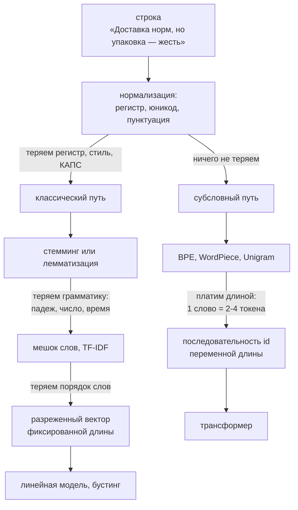

# Текст как данные

> **Зачем эта глава.** Любая модель умножает матрицы, а не читает буквы. Между сырым текстом
> и первым слоем сети лежит слой решений — нормализация, токенизация, размер словаря — который
> определяет, сколько вы заплатите за инференс, что модель вообще способна выразить и почему
> русский текст обходится вам в два-три раза дороже английского. После этой главы вы сможете
> обучить BPE-токенизатор руками, вывести TF-IDF с нуля, объяснить разницу между BPE, WordPiece
> и Unigram по критерию отбора и посчитать fertility токенизатора на своих данных.

**Уровень:** 🌱 база → 🎯 middle
**Предварительно нужно:** [теория информации](../01-math/05-information-theory.md), [работа с признаками](../02-classic-ml/14-feature-engineering.md), базовый Python
**Как проработать:** чтение + реализация BPE и TF-IDF с нуля

---

## Карта главы

- [1. Проблема: модель не умеет читать](#1-проблема-модель-не-умеет-читать)
- [2. Нормализация текста](#2-нормализация-текста)
- [3. Стемминг и лемматизация](#3-стемминг-и-лемматизация)
- [4. Мешок слов](#4-мешок-слов)
- [5. TF-IDF: вывод и разбор каждого множителя](#5-tf-idf-вывод-и-разбор-каждого-множителя)
- [6. n-граммы](#6-n-граммы)
- [7. OOV: где ломается словарное представление](#7-oov-где-ломается-словарное-представление)
- [8. Субсловная токенизация: общая идея](#8-субсловная-токенизация-общая-идея)
- [9. BPE: алгоритм по шагам](#9-bpe-алгоритм-по-шагам)
- [10. WordPiece: критерий правдоподобия](#10-wordpiece-критерий-правдоподобия)
- [11. Unigram LM и SentencePiece](#11-unigram-lm-и-sentencepiece)
- [12. Byte-level BPE](#12-byte-level-bpe)
- [13. Размер словаря и его цена](#13-размер-словаря-и-его-цена)
- [14. Русский язык: почему дороже](#14-русский-язык-почему-дороже)
- [15. Подводные камни](#15-подводные-камни)
- [16. Проверь себя](#16-проверь-себя)
- [17. Практика](#17-практика)
- [18. Что читать дальше](#18-что-читать-дальше)

---

## 1. Проблема: модель не умеет читать

Дан отзыв: «Доставка норм, но упаковка — жесть, коробка помялась». Нужно предсказать оценку.
Градиентный бустинг ждёт на входе вектор чисел фиксированной длины. Нейросеть ждёт тензор.
Строка — не то и не другое.

Значит, между текстом и моделью обязан быть **преобразователь**: функция, которая переводит
последовательность символов в последовательность чисел. И вот здесь начинаются решения,
каждое из которых что-то теряет.

Самое наивное — считать единицей текста слово. Разбили по пробелам, каждому слову дали номер,
получили последовательность индексов. Проблемы вылезают немедленно:

- «Коробка» и «коробки» — два разных индекса, никак не связанных. Модель обязана выучить
  каждую форму отдельно.
- Слово «помялась» может не встретиться в обучающем корпусе. Что делать на инференсе?
- В русском корпусе на 100 млн слов уникальных словоформ будет порядка миллиона.
  Матрица эмбеддингов $|V| \times d$ при $|V| = 10^6$ и $d = 768$ — это 768 млн параметров
  только на вход. Больше, чем вся остальная модель.

Отсюда — вся глава. Сначала разберём классический путь (нормализация → мешок слов → TF-IDF),
который до сих пор работает в проде там, где нужны скорость и интерпретируемость. Потом —
субсловную токенизацию, на которой стоят все трансформеры.

> 🌱 **База.** Держите в голове одну развилку. Либо мы **сжимаем словоформы** к общему корню
> (нормализация, стемминг, лемматизация) — это классический путь, он теряет грамматику,
> но делает словарь маленьким. Либо мы **режем слова на куски** (субсловная токенизация) —
> тогда ничего не теряем, словарь всё равно маленький, но последовательность становится длиннее.
> Трансформеры пошли по второму пути.

Вот эта развилка целиком; смотрите на подписи стрелок — там указано, что именно теряется
или чем платим на каждом шаге.



Главное на схеме — что потери необратимы и накапливаются: правый путь ничего не выбрасывает
и потому платит единственной валютой, длиной последовательности, к которой мы вернёмся в §13.

---

## 2. Нормализация текста

Нормализация — это приведение разных поверхностных написаний одной сущности к одному виду.
Каждый шаг здесь — компромисс, а не «best practice».

**Приведение к нижнему регистру.** Экономит словарь вдвое: «Москва» и «москва» — один токен.
Но убивает сигнал: в задаче NER «Роман» (имя) и «роман» (книга) различаются только регистром.
В классификации тональности КАПС — сильный признак эмоции. Правило: lowercase уместен для поиска
и тематической классификации, вреден для NER и для задач, где важен стиль.

**Юникодная нормализация (NFC/NFKC).** Одна и та же буква «й» может быть записана как единый
кодпоинт U+0439 или как «и» + комбинирующая краткость U+0306. Визуально одинаково, байтово —
разные строки, значит разные токены. `unicodedata.normalize("NFKC", s)` приводит к каноническому
виду. Это тот случай, когда шаг делают всегда: он ничего не теряет, а багов предотвращает много.
Сюда же — унификация «ё»/«е» (отдельное решение: в русском её часто схлопывают, теряя
различие «все»/«всё») и разных видов дефисов и кавычек.

**Удаление стоп-слов** (stop words). Убираем «и», «в», «на», «который». Для мешка слов
это осмысленно: они встречаются везде и почти не несут тематического сигнала — впрочем, IDF
и так придавит их почти в ноль. Для трансформеров это вредительство: предлог несёт синтаксис,
а «не» полностью переворачивает смысл. Классическая ошибка — прогнать текст через стандартный
список стоп-слов перед BERT и потерять отрицания.

**Удаление пунктуации и цифр.** Для поиска по темам — можно. Для задач, где важна структура
(извлечение сумм, дат, артикулов), — нельзя.

**Сегментация на предложения и токенизация на слова.** Пробелы — плохой разделитель даже для
русского: «в т.ч.», «10 000 руб.», «e-mail», «ул. Строителей, д. 5». Для классического пайплайна
берут готовые токенизаторы (`razdel` для русского, `nltk`, `spaCy`), а не `str.split()`.

> ⚠️ **Типичная ошибка.** Написать пайплайн нормализации один раз и применить его к обучению,
> а на инференсе повторить «примерно то же самое» другим кодом. Симптом: метрики в проде ниже
> офлайновых на несколько процентов без видимой причины. Причина: train/serve skew на уровне
> препроцессинга. Что делать: препроцессинг — часть артефакта модели, один и тот же объект,
> сериализуемый вместе с ней (в sklearn — `Pipeline`, в трансформерах — файлы токенизатора).

---

## 3. Стемминг и лемматизация

Обе процедуры решают одну задачу: схлопнуть словоформы одной лексемы в одну единицу, чтобы
модель не учила «коробка», «коробки», «коробкой» как три несвязанных признака.

**Стемминг** (stemming) — отсечение окончаний и суффиксов по набору правил. Классика — алгоритм
Портера и его реализация в семействе Snowball, где есть и русский вариант. Быстро (микросекунды),
без словарей, без контекста. Результат — не обязательно существующее слово:
«коробка» → «коробк», «бегущий» → «бегущ».

**Лемматизация** (lemmatization) — приведение к словарной форме (лемме) с опорой на
морфологический словарь: «коробки» → «коробка», «бежал» → «бежать». Медленнее на порядки,
требует словаря, зато результат осмыслен и стабилен.

Для английского разница невелика: морфология бедная, окончаний мало, стеммер справляется.
Для русского — принципиальная, и вот почему.

**Раз: количество форм.** У русского существительного 12 форм (6 падежей × 2 числа),
у прилагательного — под 30 (падежи × числа × роды × краткая форма × степени сравнения),
у глагола — несколько десятков. Одна лексема разворачивается в 20–50 словоформ. Английский
глагол даёт 4–5 форм. Именно поэтому словарь словоформ русского корпуса растёт кратно быстрее.

**Два: чередования в основе.** «Сон» → «сна», «бег» → «бежать», «рука» → «руке» (к→к',
беглые гласные, чередование согласных). Правила отсечения окончаний здесь просто не работают:
стеммер разведёт «сон» и «сна» по разным основам, а должен свести.

**Три: омонимия форм — и отсюда необходимость контекста.** «Стали» — это либо родительный падеж
от «сталь», либо прошедшее время от «стать». «Три» — числительное или императив от «тереть».
«Мыла» — от «мыло» или от «мыть». Однозначно лемматизировать такое **без контекста нельзя**.
Инструменты вроде `pymorphy2`/`pymorphy3` работают на уровне отдельного слова и возвращают список
разборов с оценками, выбирая наиболее вероятный априорно — то есть на омонимах регулярно ошибаются.
Контекстные лемматизаторы (Mystem с контекстным снятием омонимии, UDPipe, модели из проекта
Natasha, `spaCy` с русской моделью) точнее, но медленнее.

```python
# Сравнение стемминга и лемматизации на русском.
# nltk.SnowballStemmer доступен без загрузки данных; pymorphy3 ставится отдельно.
from nltk.stem.snowball import SnowballStemmer

stemmer = SnowballStemmer("russian")
words = ["коробка", "коробки", "коробкой", "стали", "бежал", "бежит", "сон", "сна"]
print([stemmer.stem(w) for w in words])
# ['коробк', 'коробк', 'коробк', 'стал', 'бежа', 'беж', 'сон', 'сна']
#                                          ^^^^^^^^^^^^^  ^^^^^^^^^^^^
#  «бежал»/«бежит» и «сон»/«сна» НЕ схлопнулись: чередование в основе стеммеру не по зубам
```

> 💬 **На собеседовании.** Спросят: «Почему в трансформерах не делают лемматизацию?»
> Хороший ответ: потому что она решает проблему, которой у трансформера нет, и создаёт три новые.
> Проблема, которую она решала, — взрыв словаря словоформ; субсловная токенизация закрывает её
> лучше, разбивая «коробкой» на «коробк» + «ой» без всякого словаря. Новые проблемы: (1) лемма
> выбрасывает грамматику — падеж, число, время, — а она несёт смысл («съел» ≠ «съест»);
> (2) лемматизация необратима, а для генеративной модели выход должен быть настоящим текстом;
> (3) это ещё одна внешняя зависимость с собственными ошибками на омонимах, которые модель уже
> не сможет исправить по контексту. Дополнительный аргумент: предобученная модель видела при
> обучении обычный текст, и лемматизированный вход для неё — сдвиг распределения.
> Плохой ответ: «трансформер и так всё понимает».

**Когда стемминг/лемматизация всё ещё нужны.** Полнотекстовый поиск (Elasticsearch с русским
анализатором лемматизирует и запрос, и документ — иначе запрос «купить коробку» не найдёт
документ со словом «коробки»), классические модели на TF-IDF, ключевые слова и тематическое
моделирование, нормализация справочников и товарных названий.

---

## 4. Мешок слов

**Мешок слов** (bag of words, BoW) — представление документа вектором длины $|V|$, где
$V$ — словарь корпуса, а компонента $j$ равна числу вхождений слова $j$ в документ.
Порядок слов теряется полностью: «собака укусила человека» и «человек укусил собаку» дают
одинаковый вектор.

Формально: корпус из $n$ документов, словарь $V$. Матрица «документ–термин»
$X \in \mathbb{R}^{n \times |V|}$, где $X_{ij}$ — число вхождений термина $j$ в документ $i$.

Что здесь плохо:

1. **Размерность.** $|V|$ — десятки и сотни тысяч. Матрица разреженная (в документе из 200 слов
   ненулевых компонент ≤ 200 из 100 000), поэтому её всегда хранят в разреженном формате CSR;
   плотное представление корпуса из миллиона документов физически не поместится в память.
2. **Все слова равнозначны.** Слово «и» встречается в каждом документе и даёт большой вклад
   в скалярное произведение, хотя не несёт информации. Это чинит IDF (раздел 5).
3. **Длина документа искажает сравнение.** Длинный документ имеет большие счётчики и потому
   «похож» на всё подряд. Это чинит нормализация.
4. **Нет семантики.** «Автомобиль» и «машина» — ортогональные векторы, их косинусная близость
   строго ноль. Это чинят эмбеддинги (следующая глава).

Несмотря на всё это, BoW/TF-IDF + линейная модель или бустинг остаётся живым бейзлайном:
обучается за секунды на миллионе документов, объясним (можно показать веса конкретных слов),
не требует GPU. На собеседовании ответ «взял бы сразу BERT» без упоминания бейзлайна —
плохой сигнал.

---

## 5. TF-IDF: вывод и разбор каждого множителя

Задача: взвесить слова так, чтобы вес был велик у слов, которые **характерны именно для этого
документа**. Интуиция в два шага: слово важно для документа, если (а) часто встречается в нём
и (б) редко встречается в остальных.

### 5.1 Множитель TF

$\text{tf}(t, d)$ — насколько документ $d$ «про» термин $t$. Простейший вариант — сырой счётчик
$f(t, d)$. Но здесь есть содержательная проблема: если слово «принтер» встретилось 20 раз,
документ не в 20 раз более «про принтеры», чем документ с одним вхождением. Отдача убывает.
Поэтому счётчик демпфируют логарифмом:

$$
\text{tf}(t, d) = 1 + \log f(t, d) \quad \text{при } f(t,d) > 0, \qquad \text{tf}(t,d) = 0 \text{ иначе}
$$

где $f(t, d)$ — число вхождений термина $t$ в документ $d$. Единица нужна, чтобы одно вхождение
давало вес 1, а не 0.

Альтернатива для корпусов с сильно разной длиной документов — нормировка на максимум:
$\text{tf} = 0.5 + 0.5\,\dfrac{f(t,d)}{\max_{t'} f(t', d)}$. В `sklearn.TfidfVectorizer`
по умолчанию используется сырой счётчик (`sublinear_tf=False`), и переключение
`sublinear_tf=True` часто даёт заметный прирост на длинных текстах — это бесплатный
гиперпараметр, о котором забывают.

### 5.2 Множитель IDF: откуда берётся логарифм

Здесь важно не заучить формулу, а увидеть, что она — **собственная информация события**.

Возьмём случайный документ из корпуса. Вероятность того, что он содержит термин $t$,
оценивается частотой:

$$
P(t \in d) \;=\; \frac{\text{df}(t)}{n}
$$

где $\text{df}(t)$ (document frequency) — число документов, содержащих $t$, а $n$ — общее число
документов.

Сколько информации несёт факт «этот документ содержит $t$»? По определению собственной информации
(см. [теорию информации](../01-math/05-information-theory.md)):

$$
I(t) \;=\; -\log P(t \in d) \;=\; \log \frac{n}{\text{df}(t)} \;\equiv\; \text{idf}(t)
$$

Вот и весь вывод. IDF — это **количество информации в биттах (или натах), которое сообщает
о документе присутствие в нём термина**. Слово, встречающееся во всех документах,
$\text{df} = n$, даёт $\log 1 = 0$ информации — и получает нулевой вес. Слово, встречающееся
в одном документе из миллиона, даёт $\log 10^6 \approx 13{,}8$ — максимальный вес.

Отсюда сразу видно, почему логарифм, а не просто $n/\text{df}$: без логарифма редкое слово
получило бы вес в миллион раз больше частого, и один опечаточный хапакс перевесил бы весь
документ. Логарифм сжимает шкалу до разумного диапазона 0–14.

Практическая формула требует сглаживания, иначе термин с $\text{df} = 0$ (встретился на
инференсе, но не в обучении) даёт деление на ноль. В `scikit-learn`:

$$
\text{idf}_{\text{sklearn}}(t) \;=\; \ln \frac{1 + n}{1 + \text{df}(t)} \;+\; 1
$$

Единицы в числителе и знаменателе — «как будто есть ещё один документ, содержащий все термины».
Внешняя $+1$ гарантирует, что вес термина, встречающегося везде, не обнулится совсем
(иначе такие термины полностью выпадали бы из представления, а иногда они нужны).

### 5.3 Произведение и нормализация

$$
\text{tf-idf}(t, d) \;=\; \text{tf}(t, d)\cdot \text{idf}(t)
$$

Термин получает большой вес, только если оба множителя велики: он частый **здесь** и редкий
**вообще**. Это ровно то, что мы хотели.

Последний шаг — L2-нормализация вектора документа:

$$
\tilde{x}_d \;=\; \frac{x_d}{\|x_d\|_2}, \qquad \|x_d\|_2 = \sqrt{\sum_{t \in V} \text{tf-idf}(t,d)^2}
$$

где $x_d \in \mathbb{R}^{|V|}$ — вектор документа $d$. После неё скалярное произведение двух
документов равно косинусной близости, и длина документа перестаёт влиять на сравнение.
Без нормализации длинные документы систематически «выигрывают» в поиске.

> 📐 **Разбор формулы.** Соберём всё вместе на числах. Корпус: $n = 1000$ документов.
> Документ $d$ — отзыв на 100 слов, слово «принтер» встретилось 4 раза, слово «и» — 6 раз.
> «Принтер» есть в 20 документах, «и» — в 1000.
>
> - $\text{tf}(\text{принтер}) = 1 + \ln 4 \approx 2{,}39$; $\quad \text{tf}(\text{и}) = 1 + \ln 6 \approx 2{,}79$.
>   По частоте «и» даже впереди.
> - $\text{idf}(\text{принтер}) = \ln(1001/21) + 1 \approx 3{,}87 + 1 = 4{,}87$;
>   $\quad \text{idf}(\text{и}) = \ln(1001/1001) + 1 = 1$.
> - Итог: «принтер» → $2{,}39 \cdot 4{,}87 \approx 11{,}6$; «и» → $2{,}79 \cdot 1 = 2{,}79$.
>
> Соотношение перевернулось в 4 раза в пользу содержательного слова. Именно IDF делает всю работу.

```python
# TF-IDF с нуля на разреженных матрицах: проверяем себя против sklearn.
import numpy as np
from collections import Counter
from scipy.sparse import csr_matrix


def fit_transform_tfidf(docs, sublinear_tf=False):
    """docs: список списков токенов. Возвращает (csr-матрица (n, |V|), словарь, idf)."""
    vocab = {t: j for j, t in enumerate(sorted({t for d in docs for t in d}))}
    n = len(docs)

    # df считаем по УНИКАЛЬНЫМ терминам документа — иначе это была бы не document frequency
    df = np.zeros(len(vocab))
    for d in docs:
        for t in set(d):
            df[vocab[t]] += 1

    idf = np.log((1.0 + n) / (1.0 + df)) + 1.0     # сглаживание как в sklearn

    rows, cols, vals = [], [], []
    for i, d in enumerate(docs):
        counts = Counter(t for t in d if t in vocab)
        for t, c in counts.items():
            j = vocab[t]
            tf = (1.0 + np.log(c)) if sublinear_tf else float(c)
            rows.append(i); cols.append(j); vals.append(tf * idf[j])

    X = csr_matrix((vals, (rows, cols)), shape=(n, len(vocab)))

    # L2-нормализация по строкам: после неё dot(x_i, x_j) == cosine(x_i, x_j)
    norms = np.sqrt(X.multiply(X).sum(axis=1)).A.ravel()
    norms[norms == 0] = 1.0
    X = csr_matrix(X / norms[:, None])
    return X, vocab, idf


if __name__ == "__main__":
    corpus = [
        "принтер печатает плохо принтер шумит",
        "доставка быстрая курьер вежливый",
        "принтер отличный доставка быстрая",
    ]
    docs = [s.split() for s in corpus]
    X, vocab, idf = fit_transform_tfidf(docs)
    print(X.shape)                                    # (3, 9)

    # сверка с эталоном
    from sklearn.feature_extraction.text import TfidfVectorizer
    ref = TfidfVectorizer(token_pattern=r"\S+").fit_transform(corpus)
    assert np.allclose(np.sort(X.toarray(), axis=1), np.sort(ref.toarray(), axis=1), atol=1e-9)
    print("совпало с sklearn")
```

Сортировка перед сравнением нужна потому, что порядок столбцов в словарях может отличаться;
значения при этом совпадают до машинной точности. Такая сверка «своя реализация против
библиотечной» — самый быстрый способ поймать ошибку в формуле.

> 🧠 **Middle+. BM25 — то, что реально стоит в поиске.** TF-IDF имеет два дефекта: TF растёт
> неограниченно, и нормировка на длину документа сделана грубо. BM25 чинит оба:
>
> $$
> \text{BM25}(q, d) \;=\; \sum_{t \in q} \text{idf}(t)\cdot
> \frac{f(t,d)\,(k_1 + 1)}{f(t,d) + k_1\Big(1 - b + b\,\dfrac{|d|}{\overline{|d|}}\Big)}
> $$
>
> где $q$ — запрос, $f(t,d)$ — частота термина в документе, $|d|$ — длина документа в токенах,
> $\overline{|d|}$ — средняя длина документа по корпусу, $k_1 \approx 1{,}2\ldots2{,}0$ управляет
> насыщением TF, $b \approx 0{,}75$ — силой поправки на длину. При $f \to \infty$ дробь стремится
> к $k_1 + 1$, то есть вклад термина **насыщается** — это главное отличие от TF-IDF.
> BM25 до сих пор входит в гибридный поиск любого серьёзного RAG-пайплайна, см.
> [главу про RAG](../05-llm/07-rag.md).

---

## 6. n-граммы

Мешок слов не знает порядка. Частичное лекарство — считать признаками не отдельные слова,
а **n-граммы**: подряд идущие последовательности из $n$ элементов.

Для «не очень хороший товар» биграммы слов: («не», «очень»), («очень», «хороший»),
(«хороший», «товар»). Теперь отрицание «не очень» — отдельный признак, и линейная модель может
дать ему свой вес. Это ровно тот случай, где униграммы проваливаются: «не» и «хороший»
по отдельности дают положительный сигнал.

Плата — комбинаторный взрыв. Если униграмм $|V|$, то теоретически биграмм $|V|^2$. На практике
реализуется малая доля, но словарь всё равно растёт в 5–20 раз, а каждая n-грамма встречается
реже, то есть оценивается по меньшей выборке. Отсюда стандартная практика:
`ngram_range=(1, 2)` плюс `min_df=2..5` (выбросить n-граммы, встретившиеся реже порога).
Триграммы слов почти всегда переобучение, кроме очень больших корпусов.

**Символьные n-граммы** — отдельный и недооценённый инструмент. `analyzer="char_wb"`,
`ngram_range=(3, 5)` в sklearn режет текст на куски по 3–5 символов внутри границ слова.
Что это даёт:

- устойчивость к опечаткам и морфологии без всякой лемматизации: «коробка» и «коробки»
  делят n-граммы «кор», «оро», «роб», «обк»;
- работу на языках со сложной морфологией и на смеси языков;
- хорошие результаты на коротких текстах — названиях товаров, поисковых запросах, адресах.

На задаче матчинга товарных названий символьные n-граммы + TF-IDF + косинус — сильный бейзлайн,
который иногда не удаётся побить эмбеддингами.

> ⌨️ **Руками.** Возьмите любой датасет коротких текстов, обучите логистическую регрессию
> на трёх представлениях: слова (1,1), слова (1,2), символы char_wb (3,5). Сравните F1
> и размер словаря. За 15 минут вы получите интуицию, которая дороже любой таблицы.

**n-граммные языковые модели.** Исторически на n-граммах строили и языковые модели:
$P(w_t \mid w_{t-n+1}, \ldots, w_{t-1})$ оценивалась как отношение счётчиков. Два фундаментальных
ограничения похоронили подход: экспоненциальный рост числа контекстов с $n$ (при $n = 5$
и $|V| = 10^5$ контекстов $10^{20}$, они никогда не будут наблюдены) и отсутствие обобщения —
модель не знает, что «синяя машина» и «синий автомобиль» похожи. Оба ограничения снимают
эмбеддинги и нейросетевые ЯМ; это тема [следующей главы](02-embeddings.md).

---

## 7. OOV: где ломается словарное представление

**OOV** (out-of-vocabulary) — слово, которого нет в словаре модели. Оно неизбежно:

- **Морфология.** Обучились на «коробка», встретили «коробочка».
- **Опечатки и разговорная речь.** «Достака», «прив», «нраица».
- **Новые сущности.** Названия товаров, бренды, имена, номера моделей: «RTX 5090»,
  «Xiaomi 14 Ultra».
- **Смена домена.** Модель обучена на новостях, применяется к медицинским выпискам.
- **Закон Ципфа.** Частота $r$-го по популярности слова падает примерно как $1/r$. Следствие:
  какой бы большой корпус вы ни взяли, доля слов, встретившихся ровно один раз (hapax legomena),
  остаётся порядка 40–50% от размера словаря. Хвост не заканчивается никогда.

Что делали классически:

| Приём | Что происходит | Чем плох |
|---|---|---|
| Токен `<UNK>` | все неизвестные слова → один индекс | «Xiaomi» и «нраица» становятся одним и тем же; для генерации катастрофа — модель выдаёт `<UNK>` |
| Огромный словарь | берём 500k слов | линейный рост эмбеддингов и выходного softmax; редкие слова всё равно недоучены |
| Символьная модель | единица = символ | словарь ~200, OOV нет вообще, но последовательности в 5–7 раз длиннее, а attention квадратичен по длине; модель тратит ёмкость на то, чтобы выучить слова из букв |

Ни один вариант не годится. Нужен компромисс между «слово» и «символ» — и это ровно то,
что делает субсловная токенизация.

> 💬 **На собеседовании.** Спросят: «Как современные модели обрабатывают OOV?»
> Хороший ответ: они его устраняют по построению. Субсловные токенизаторы держат в словаре
> все одиночные символы (а byte-level BPE — все 256 байт), поэтому любая строка гарантированно
> разложима: незнакомое слово просто распадётся на много мелких кусков. `<UNK>` в моделях
> с byte-level BPE (GPT-2 и все её потомки) не существует физически. Ценой становится не потеря
> информации, а **длина**: редкое или иноязычное слово стоит 5–10 токенов вместо одного, что
> напрямую бьёт по контексту и по стоимости.
> Плохой ответ: «есть токен UNK» — это ответ уровня 2015 года.

---

## 8. Субсловная токенизация: общая идея

Требования, которые мы хотим удовлетворить одновременно:

1. Словарь фиксированного размера (десятки тысяч, не миллионы).
2. Любая строка разложима — нет `<UNK>`.
3. Частые слова — один токен (эффективно по длине).
4. Редкие слова — разложимы на осмысленные куски, разделяющие представление с похожими словами.
5. Разложение детерминировано и обратимо: `decode(encode(s)) == s`.

Идея: обучить словарь **на данных**, статистически. Частые последовательности символов
становятся отдельными токенами; редкие остаются набором кусков. «Токенизатор» — это обученная
модель со своими параметрами (словарь и правила), и её тоже нужно версионировать, хранить
рядом с весами и не путать между чекпоинтами.

Три семейства алгоритмов различаются **критерием**, по которому строится словарь:

| Алгоритм | Направление | Критерий отбора | Где используется |
|---|---|---|---|
| BPE | снизу вверх (наращивание) | самая частая пара соседних токенов | GPT-2/3/4, LLaMA, RoBERTa |
| WordPiece | снизу вверх | пара с максимальным приростом правдоподобия | BERT, DistilBERT, ELECTRA |
| Unigram LM | сверху вниз (обрезание) | удалить токены, чьё удаление меньше всего роняет правдоподобие | T5, ALBERT, XLNet, mBART |

Отдельно стоит **SentencePiece** — это не алгоритм, а библиотека, реализующая BPE и Unigram
и решающая вопрос предварительной сегментации (раздел 11). Путать их — типичная ошибка на собесе.

---

## 9. BPE: алгоритм по шагам

**Byte Pair Encoding** пришёл из алгоритмов сжатия (Гейдж, 1994) и был перенесён в NMT
Сеннрихом с соавторами в 2015-м. Идея сжатия: найти самую частую пару соседних символов
и заменить её новым символом; повторить.

### 9.1 Обучение

**Вход:** корпус, целевой размер словаря.

**Шаг 0.** Посчитать частоты слов. Каждое слово представить как последовательность символов
с маркером конца слова (`</w>` или, в реализациях в стиле SentencePiece, префиксом `▁` в начале).
Маркер нужен, чтобы различать «кот» как отдельное слово и «кот» внутри слова «котёнок» —
без него токенизатор потерял бы информацию о границах и не смог бы восстановить пробелы.

Начальный словарь = все встретившиеся символы.

**Шаг 1.** Посчитать частоты всех соседних пар токенов по всему корпусу (с учётом частоты слов).

**Шаг 2.** Выбрать самую частую пару, слить её в один токен, добавить в словарь и **записать
правило слияния в список** (порядок слияний критичен — он и есть модель).

**Шаг 3.** Повторять шаги 1–2, пока размер словаря не достигнет целевого.

### 9.2 Пример с русскими словами

Корпус (частоты слов): `кот` × 5, `кота` × 3, `коту` × 2, `код` × 4.

Начальное представление:

```
к о т </w>      ×5
к о т а </w>    ×3
к о т у </w>    ×2
к о д </w>      ×4
```

| Шаг | Частоты пар (топ) | Слияние | Что стало |
|---|---|---|---|
| 1 | (к, о) = 14; (о, т) = 10; (т, `</w>`) = 5; (о, д) = 4 | **(к, о) → «ко»** | `ко т </w>`, `ко т а </w>`, `ко т у </w>`, `ко д </w>` |
| 2 | (ко, т) = 10; (т, `</w>`) = 5; (ко, д) = 4; (д, `</w>`) = 4 | **(ко, т) → «кот»** | `кот </w>`, `кот а </w>`, `кот у </w>`, `ко д </w>` |
| 3 | (кот, `</w>`) = 5; (ко, д) = 4; (д, `</w>`) = 4; (кот, а) = 3 | **(кот, `</w>`) → «кот`</w>`»** | появился токен целого слова «кот» |
| 4 | (ко, д) = 4; (д, `</w>`) = 4; (кот, а) = 3 | **(ко, д) → «код»** (ничья, тай-брейк детерминированный) | `код </w>` |
| 5 | (код, `</w>`) = 4; (кот, а) = 3; (а, `</w>`) = 3 | **(код, `</w>`) → «код`</w>`»** | целое слово «код» |
| 6 | (кот, а) = 3; (а, `</w>`) = 3; (кот, у) = 2 | **(кот, а) → «кота»** | основа + окончание начали склеиваться |

Смотрите, что получилось за 6 слияний. Слово «кот» получило собственный токен, потому что часто
встречается целиком. Формы «кота» и «коту» разложились как **основа + окончание**:
`кот` + `у</w>`. Именно этого мы хотели от морфологии — и получили без единого правила
и без морфологического словаря, чисто из статистики.

Заметьте и обратное: «код» слился в один токен вместе с «ко», хотя «ко» и «кот» — куски
совсем разных слов. BPE не знает морфологии, он знает частоты. Отсюда его известные артефакты:
одна и та же основа может дробиться по-разному в разных формах, а частая случайная
последовательность символов может стать токеном.

### 9.3 Применение к новому тексту

Слово разбивается на символы, затем **правила слияния применяются в том порядке, в котором
они были выучены**. Это принципиально: BPE — не «жадный поиск самых длинных подстрок в словаре»,
а воспроизведение истории слияний.

```python
# BPE-трейнер с нуля. Наивная реализация O(слияний × корпус) — для учебных корпусов достаточно;
# продакшен-версии (HF tokenizers, sentencepiece) используют инкрементальный пересчёт пар.
from collections import Counter

END = "</w>"


def merge_pair(symbols: tuple, pair: tuple, new_token: str) -> tuple:
    """Заменяет все НЕПЕРЕСЕКАЮЩИЕСЯ вхождения pair слева направо."""
    out, i = [], 0
    while i < len(symbols):
        if i < len(symbols) - 1 and (symbols[i], symbols[i + 1]) == pair:
            out.append(new_token)
            i += 2                      # пропускаем оба элемента пары
        else:
            out.append(symbols[i])
            i += 1
    return tuple(out)


def train_bpe(corpus: list[str], num_merges: int):
    word_freqs = Counter(w for line in corpus for w in line.lower().split())
    splits = {w: tuple(w) + (END,) for w in word_freqs}
    vocab = {s for sym in splits.values() for s in sym}
    merges = []

    for _ in range(num_merges):
        pair_freqs = Counter()
        for w, symbols in splits.items():
            f = word_freqs[w]
            for i in range(len(symbols) - 1):
                pair_freqs[(symbols[i], symbols[i + 1])] += f
        if not pair_freqs:
            break
        # тай-брейк по самой паре делает результат воспроизводимым между запусками
        best = max(pair_freqs, key=lambda p: (pair_freqs[p], p))
        new_token = best[0] + best[1]
        merges.append(best)
        vocab.add(new_token)
        splits = {w: merge_pair(s, best, new_token) for w, s in splits.items()}

    return merges, sorted(vocab)


def encode(word: str, merges: list[tuple]) -> tuple:
    """Применяем слияния СТРОГО в порядке обучения — это и есть модель BPE."""
    symbols = tuple(word.lower()) + (END,)
    for pair in merges:
        symbols = merge_pair(symbols, pair, pair[0] + pair[1])
    return symbols


if __name__ == "__main__":
    corpus = ["кот " * 5 + "кота " * 3 + "коту " * 2 + "код " * 4]
    merges, vocab = train_bpe(corpus, num_merges=6)
    for i, m in enumerate(merges, 1):
        print(i, m, "->", m[0] + m[1])

    print(encode("кот", merges))      # ('кот</w>',)          — одно слово, один токен
    print(encode("коту", merges))     # ('кот', 'у', '</w>')  — основа + окончание
    print(encode("котёнок", merges))  # ('кот', 'ё', 'н', 'о', 'к', '</w>') — незнакомое слово разложилось
```

Последняя строка — суть субсловного подхода: слово «котёнок» в корпусе не встречалось, но
токенизатор не сломался и даже сохранил связь с «кот».

> ⚠️ **Типичная ошибка.** Считать, что BPE-токен = морфема. Это не так и никогда не гарантировалось.
> Токенизатор оптимизирует длину, а не лингвистику. Практическое следствие: не пытайтесь читать
> смысл в отдельных токенах и не удивляйтесь, что «Санкт-Петербург» может распасться на пять
> кусков, а бессмысленное «ирова» — быть отдельным токеном.

---

## 10. WordPiece: критерий правдоподобия

WordPiece (Шустер и Накадзима, 2012; популяризован Google в GNMT и BERT) отличается от BPE
одной вещью — **чем именно измеряется «хорошесть» пары**.

BPE берёт самую частую пару. Проблема этого критерия: если два куска и так очень часты
по отдельности, их совместная встречаемость будет высокой просто по случайности, и слияние
не добавит информации. Пример: в русском корпусе пара (`т`, `ь`) окажется частой, но токен
`ть` мало что даёт — обе части и так есть.

WordPiece оценивает пару по приросту правдоподобия корпуса под униграммной языковой моделью.

**Вывод критерия.** Пусть текущая сегментация корпуса даёт счётчики токенов $c(t)$, а полное
число токенов $N = \sum_t c(t)$. Униграммная модель приписывает корпусу лог-правдоподобие

$$
\mathcal{L} \;=\; \sum_{t \in V} c(t)\,\log P(t), \qquad P(t) = \frac{c(t)}{N}
$$

где $c(t)$ — число вхождений токена $t$, $P(t)$ — его вероятность, $V$ — текущий словарь.

Сольём пару $(a, b)$, встречающуюся $c(ab)$ раз, в новый токен $ab$. Каждое такое вхождение
раньше давало вклад $\log P(a) + \log P(b)$, а теперь даёт $\log P(ab)$. С точностью до изменения
нормировки прирост равен

$$
\Delta\mathcal{L} \;\approx\; c(ab)\,\log \frac{P(ab)}{P(a)\,P(b)} \;=\; c(ab)\cdot \operatorname{PMI}(a, b)
$$

где $\operatorname{PMI}$ — поточечная взаимная информация (pointwise mutual information).
То есть WordPiece выбирает пару по произведению частоты на PMI, а не по одной частоте.
В практических реализациях (в том числе в `tokenizers` от HuggingFace) используется
непосредственно отношение

$$
\text{score}(a, b) \;=\; \frac{c(ab)}{c(a)\cdot c(b)}
$$

**Что это меняет содержательно.** Знаменатель штрафует слияние кусков, которые и сами по себе
частотны. Поэтому WordPiece охотнее выделяет **редкие, но устойчивые** сочетания — фактически
он ближе к морфемам, чем BPE. Обратная сторона: он реже склеивает целые частые слова, поэтому
при равном размере словаря даёт чуть более длинные последовательности.

**Различия в применении.** WordPiece кодирует новое слово **жадным поиском самого длинного
совпадения слева направо** (longest-match-first), а не воспроизведением истории слияний.
Куски, не начинающие слово, помечаются префиксом `##`: «коробки» → `кор`, `##об`, `##ки`.
Если на каком-то шаге ни один префикс не находится в словаре, всё слово заменяется на `[UNK]` —
да, в BERT `[UNK]` реально может появиться, в отличие от byte-level BPE.

> 💬 **На собеседовании.** Спросят: «Чем WordPiece отличается от BPE?»
> Хороший ответ строится по трём осям. **Критерий обучения**: BPE — максимум частоты пары,
> WordPiece — максимум прироста правдоподобия униграммной модели, что сводится к
> $c(ab)/(c(a)c(b))$, то есть к частоте, взвешенной на PMI. **Кодирование**: BPE применяет
> выученные слияния по порядку, WordPiece делает жадный longest-match с маркером `##`.
> **Поведение на OOV**: WordPiece может выдать `[UNK]`, byte-level BPE — никогда.
> Хорошо добавить: BERT использует WordPiece, GPT-семейство — byte-level BPE, T5/ALBERT — Unigram
> через SentencePiece.
> Плохой ответ: «BPE — частоты, WordPiece — тоже частоты, но у Google».

---

## 11. Unigram LM и SentencePiece

### 11.1 Unigram LM

BPE и WordPiece строят словарь **снизу вверх**, наращивая. Unigram (Кудо, 2018) идёт
**сверху вниз**: начинает с заведомо избыточного словаря-кандидата и выбрасывает лишнее.

Модель: последовательность токенов $\mathbf{x} = (x_1, \ldots, x_m)$ порождается независимо,

$$
P(\mathbf{x}) \;=\; \prod_{i=1}^{m} p(x_i), \qquad \sum_{x \in V} p(x) = 1
$$

где $p(x)$ — вероятность токена $x$, $m$ — число токенов в сегментации.

Ключевое отличие от BPE: сегментация здесь **не единственна**. Слово «коробки» можно разбить
как `кор|об|ки`, `коробк|и`, `к|о|р|о|б|к|и` — и у каждого варианта есть своя вероятность.
Лучшая сегментация ищется алгоритмом Витерби по решётке всех разбиений:

$$
\mathbf{x}^{*} \;=\; \arg\max_{\mathbf{x} \in S(X)} P(\mathbf{x})
$$

где $S(X)$ — множество всех сегментаций строки $X$ токенами из словаря.

**Обучение — EM плюс обрезание:**

1. Собрать большой словарь-кандидат (все подстроки до некоторой длины, отобранные по частоте;
   на практике его инициализируют, например, через suffix array или прогоном BPE).
2. **E-шаг**: посчитать ожидаемые частоты токенов, маргинализуя по всем сегментациям
   (forward-backward по решётке).
3. **M-шаг**: обновить $p(x)$ по ожидаемым частотам.
4. **Обрезание**: для каждого токена оценить $\text{loss}(x)$ — насколько упадёт суммарное
   лог-правдоподобие корпуса, если убрать $x$ из словаря (тогда придётся пересегментировать
   слова, где он использовался). Выбросить худшие ~20%, **обязательно сохранив все одиночные
   символы** — иначе потеряется гарантия разложимости.
5. Повторять 2–4, пока не достигнут целевой размер словаря.

Общий функционал, который максимизируется, — маргинальное правдоподобие корпуса
$\mathcal{L} = \sum_{s} \log \sum_{\mathbf{x} \in S(X^{(s)})} P(\mathbf{x})$, где $s$ нумерует
предложения корпуса.

**Что даёт вероятностная формулировка.** Во-первых, **subword regularization**: во время
обучения модели можно сэмплировать сегментацию из решётки, а не брать лучшую. Это аугментация
на уровне токенизации — модель видит одно и то же слово разбитым по-разному и становится
устойчивее к неоптимальной сегментации на инференсе. Прирост особенно заметен на малых корпусах
и на зашумлённых данных. Для BPE есть аналог — BPE-dropout: с вероятностью $p$ пропускать
случайные слияния. Во-вторых, вероятностная модель даёт осмысленный способ сравнивать
сегментации, а не просто «как получилось».

### 11.2 SentencePiece

Все описанные алгоритмы предполагали, что текст уже разбит на слова. А как быть с японским
и китайским, где пробелов нет? И как гарантировать, что `decode(encode(s)) == s` вплоть
до пробелов?

SentencePiece (Кудо и Ричардсон, 2018) решает это радикально: **вход — сырой поток Unicode,
пробел считается обычным символом** и заменяется на видимый маркер `▁` (U+2581).
Никакой предварительной сегментации на слова нет вообще.

Следствия, которые и делают SentencePiece стандартом:

- **Языконезависимость.** Одинаково работает на русском, японском, коде.
- **Обратимость (lossless).** Декодирование — это конкатенация токенов и замена `▁` на пробел.
  Двойные пробелы, переводы строк, отступы в коде восстанавливаются точно. Для генеративных
  моделей это обязательное свойство.
- Внутри может работать и BPE, и Unigram — это опция `model_type`.

> ⚠️ **Типичная ошибка.** Говорить «мы используем SentencePiece» как название алгоритма.
> SentencePiece — библиотека и формат; алгоритм внутри — BPE или Unigram, и это надо указывать.
> Симметричная ошибка — считать, что `▁` означает «начало слова» в смысле морфологии;
> это просто закодированный пробел.

---

## 12. Byte-level BPE

Даже с одиночными символами в словаре остаётся дыра: символов Unicode более 150 тысяч.
Держать их все в базовом алфавите нельзя (словарь взорвётся), а если не держать — эмодзи,
иероглиф или редкий диакритик снова дадут `<UNK>`.

Решение GPT-2: работать не с символами, а с **байтами** UTF-8. Базовый алфавит — ровно 256
элементов. Любая строка на любом языке — это последовательность байтов, значит **разложима
всегда**. `<UNK>` физически не существует. Дальше поверх байтов обучается обычный BPE.

Две инженерные детали, о которых спрашивают:

**Обратимое отображение байтов в символы.** Многие байты — управляющие символы, которые ломают
логи и файлы словаря. Поэтому GPT-2 использует биективное отображение 256 байтов в печатаемые
Unicode-символы. Из-за него в словаре видно `Ġ` вместо пробела и `Ċ` вместо перевода строки.

**Регулярное выражение предварительного разбиения.** Без него BPE склеил бы `собака.` и `собака,`
в разные токены, а числа — в произвольные куски. GPT-2 сначала режет текст регуляркой
на группы (слово с ведущим пробелом, число, пунктуация, пробелы), и слияния не пересекают
границы групп. В более поздних токенизаторах эту регулярку меняли, в частности заставляя
цифры дробиться поодиночке или тройками — потому что «2024» одним токеном мешает модели
делать арифметику.

**Цена для кириллицы.** В UTF-8 латинская буква — 1 байт, кириллическая — 2 байта. Значит
незнакомое русское слово в byte-level BPE распадается на вдвое большее число базовых единиц,
чем эквивалентное английское. Если токенизатор обучался преимущественно на английском
(как у GPT-2), русский текст платит дважды: и за отсутствие своих слов в словаре, и за
двухбайтность. Отсюда — следующий раздел.

---

## 13. Размер словаря и его цена

$|V|$ — гиперпараметр, и у него редкое свойство: он влияет одновременно на качество, память,
скорость обучения и стоимость инференса, причём в разные стороны.

**Что растёт с увеличением $|V|$:**

- **Параметры эмбеддингов.** Матрица входа $|V| \times d$ и выходная голова $|V| \times d$.
  Для $d = 4096$ и $|V| = 32{,}000$ — 131 млн параметров на матрицу; при $|V| = 128{,}000$ —
  524 млн. Если веса не связаны (untied), удваивайте. Для модели на 7B это 1,5–15% всех
  параметров; для модели на 0,5B — уже половина.
- **Память под логиты.** Тензор $(B, n, |V|)$ перед softmax. При $B = 8$, $n = 4096$,
  $|V| = 128{,}000$ в fp32 это 16 ГБ — на практике поэтому логиты считают в bf16 и/или
  порционно по позициям.
- **Недообученность редких токенов.** Токен, встретившийся в корпусе 50 раз, получает
  50 обновлений своей строки эмбеддинга. Его вектор останется близким к инициализации.
  Отсюда известные патологии — «glitch-токены», на которых модель ведёт себя странно.

**Что падает с увеличением $|V|$:**

- **Длина последовательности.** Больше слов кодируются одним токеном. Это самое денежное
  следствие: attention квадратичен по $n$, число шагов авторегрессионной генерации равно числу
  токенов, а API-биллинг считается в токенах.
- **Эффективный контекст.** В окно 8k при fertility 1,5 влезает вдвое больше текста, чем
  при fertility 3.

**Как выбирают на практике.** Считают fertility на целевом домене для нескольких кандидатов
и смотрят, где кривая «размер словаря → токенов на слово» выходит на плато. Обычно плато
наступает в районе 30–50k для одного языка и 100–250k для многоязычной модели. Ориентиры
реальных моделей: BERT — 30k WordPiece, GPT-2 — 50 257 byte-level BPE, LLaMA 2 — 32k,
LLaMA 3 — около 128k, современные многоязычные модели — 150–250k. Тренд последних лет —
в сторону увеличения, ровно потому, что стоимость инференса стала важнее стоимости эмбеддингов.

> 💬 **На собеседовании.** Спросят: «Большой словарь даёт вычислительные проблемы, маленький —
> проблемы с OOV. Как найти баланс?»
> Хороший ответ: сначала уточнить, что при субсловной токенизации OOV не бывает вовсе —
> проблема маленького словаря не в OOV, а в **длине** последовательностей и потере эффективного
> контекста. Дальше — измерить: обучить токенизаторы на нескольких размерах, посчитать fertility
> на репрезентативной выборке из целевого домена, построить кривую и взять точку выхода на плато.
> Проверить бюджет: доля эмбеддингов в общем числе параметров, размер тензора логитов, средняя
> длина запроса в токенах × цена. Отдельно — многоязычность: если модель обслуживает русский
> и английский, словарь надо обучать на смеси в нужных пропорциях, иначе один из языков будет
> платить fertility 3+.
> Плохой ответ: «32k, потому что так у всех».

> 🧠 **Middle+. Расширение словаря готовой модели.** Частая продуктовая задача: взять
> англоцентричную LLM и адаптировать под русский или под узкий домен (медицина, юриспруденция).
> Что нужно сделать:
> 1. Обучить дополнительный токенизатор на доменном корпусе, отобрать $k$ самых полезных
>    новых токенов (по вкладу в сокращение длины).
> 2. Сделать `model.resize_token_embeddings(len(tokenizer))` — увеличиваются **и** входная
>    матрица, **и** `lm_head` (если они связаны, изменится одна).
> 3. **Инициализировать новые строки не случайно.** Правильный приём: вектор нового токена =
>    среднее эмбеддингов его субтокенов в старом токенизаторе. Случайная инициализация даёт
>    всплеск лосса и долгое восстановление; в худшем случае модель ломается.
> 4. Дообучить на доменном корпусе — как минимум эмбеддинги, лучше модель целиком или с LoRA.
>
> Отвечать на вопрос «можно ли расширять токенизатор» просто «да» — недостаточно; ловят именно
> знание про resize и инициализацию.

---

## 14. Русский язык: почему дороже

Соберём всё, что делает русский текст дорогим.

**Морфология.** Одна лексема — десятки словоформ. Токенизатор, обученный на английском,
не видел русских основ и режет их на куски.

**Двухбайтность в UTF-8.** Кириллический символ — 2 байта. В byte-level BPE незнакомое
русское слово из 8 букв — это 16 базовых единиц против 8 для английского слова той же длины.

**Доля в обучающих корпусах.** В типичном веб-корпусе английский занимает более половины,
русский — единицы процентов. Значит и слияния BPE распределяются соответственно.

Итог измеряется одним числом.

### Fertility

**Fertility** токенизатора — среднее число токенов на одно слово:

$$
\text{fertility} \;=\; \frac{\text{число токенов после токенизации}}{\text{число слов в тексте}}
$$

где «слово» определяется независимо от токенизатора — например, разбиением по пробелам
или языковым токенизатором вроде `razdel`. Метрика имеет смысл только при фиксированном
определении слова, поэтому сравнивать fertility между статьями надо осторожно.

Для сравнения разноязычных текстов удобнее метрика, не зависящая от понятия слова, —
**символов на токен** (chars per token) или **байтов на токен**.

```python
# Измеряем fertility и chars-per-token. Работает с любым токенизатором,
# у которого есть метод encode -> список id.
import re
import statistics


def fertility_report(tokenizer, texts: list[str]) -> dict:
    """tokenizer: объект с .encode(text) -> list[int] (совместим с HF AutoTokenizer)."""
    n_tokens = n_words = n_chars = 0
    per_text = []
    word_re = re.compile(r"\w+", flags=re.UNICODE)   # фиксируем определение «слова»

    for t in texts:
        n_w = len(word_re.findall(t))
        if n_w == 0:
            continue
        n_t = len(tokenizer.encode(t))
        n_tokens += n_t
        n_words += n_w
        n_chars += len(t)
        per_text.append(n_t / n_w)

    return {
        "fertility": n_tokens / n_words,                 # токенов на слово (микро-среднее)
        "fertility_median": statistics.median(per_text), # устойчиво к выбросам-длинным текстам
        "chars_per_token": n_chars / n_tokens,           # чем больше, тем эффективнее кодирование
        "n_tokens": n_tokens,
    }


if __name__ == "__main__":
    # Пример использования с HuggingFace (требуется интернет при первом запуске):
    # from transformers import AutoTokenizer
    # tok = AutoTokenizer.from_pretrained("gpt2")
    # print(fertility_report(tok, ru_texts))
    #
    # Оффлайн-проверка на нашем BPE из раздела 9:
    class ToyTok:
        def __init__(self, merges): self.merges = merges
        def encode(self, text):
            ids = []
            for w in text.lower().split():
                ids += list(encode(w, self.merges))
            return ids

    merges, _ = train_bpe(["кот " * 5 + "кота " * 3 + "коту " * 2 + "код " * 4], 6)
    print(fertility_report(ToyTok(merges), ["кот код кота коту котёнок"]))
```

Порядок величин, который вы увидите на русском тексте (измеряйте на своих данных — цифры зависят
от домена):

| Токенизатор | Fertility на английском | Fertility на русском |
|---|---|---|
| GPT-2 (50k, англоцентричный byte-level BPE) | ~1,3 | ~3–4 |
| Многоязычный современный (100–200k) | ~1,2 | ~1,8–2,3 |
| Обученный на русском (ruBERT, ruGPT, ~30–50k) | — | ~1,4–1,8 |

**Во что это превращается в деньгах и латентности.** Fertility 3 вместо 1,5 означает:

- вдвое меньше текста влезает в окно контекста — короче история диалога, меньше документов в RAG;
- вдвое больше шагов декодирования на тот же ответ, а декодирование — последовательное,
  то есть латентность растёт линейно;
- вдвое больший счёт от API, если оно тарифицируется по токенам;
- вчетверо больше вычислений в attention на длинных входах (квадрат по $n$).

Это не микрооптимизация, а фактор 2 по стоимости всего сервиса. Проверка fertility выбранной
модели на своём домене — обязательный пункт при выборе LLM для русскоязычного продукта.

> 💬 **На собеседовании.** Спросят: «Ваш токенизатор режет важные доменные термины на бессмысленные
> куски. Что делать?»
> Хороший ответ — по возрастанию стоимости. (1) Измерить масштаб: fertility на доменных текстах
> против общих, список самых дробящихся терминов. (2) Если модель дообучается — расширить словарь
> доменными токенами с грамотной инициализацией новых эмбеддингов и дообучить
> (см. врезку выше). (3) Если модель используется как есть через API — работать на уровне
> промпта и данных: единообразное написание терминов, глоссарий в контексте, few-shot.
> (4) Радикальный вариант — обучить свой токенизатор и делать continued pretraining; это
> оправдано, только если домен большой и постоянный. Обязательно добавить: любое изменение
> токенизатора несовместимо со старыми весами и старым индексом эмбеддингов — всё придётся
> переиндексировать.
> Плохой ответ: «добавлю термины в словарь» без упоминания resize, инициализации и дообучения.

---

## 15. Подводные камни

**Разный препроцессинг на обучении и инференсе.**
Симптом: офлайн-метрики хорошие, в проде на 2–5% хуже, ошибки выглядят случайными.
Причина: в обучающем скрипте текст приводился к нижнему регистру и чистился регуляркой,
а в сервисе — другой регуляркой.
Что делать: препроцессинг — часть артефакта модели. Один класс, один сериализованный объект,
тест «одинаковый вход → одинаковые id» в CI.

**Токенизатор не совпал с чекпоинтом модели.**
Симптом: модель выдаёт бессмыслицу, лосс на дообучении стартует с огромного значения.
Причина: загрузили токенизатор от другой версии/модели. Индексы съехали — токен 1523 теперь
означает другое.
Что делать: грузить токенизатор из той же папки, что и веса; хранить хеш файла словаря
в метаданных модели.

**`<UNK>` в byte-level модели.**
Симптом: в декодированном тексте появляются символы замены или `<unk>`.
Причина: не байты, а неверная обработка суррогатных пар/битого UTF-8 на входе или ошибка
декодирования на выходе.
Что делать: валидировать вход (`errors="replace"` осознанно, а не по умолчанию), проверять
инвариант `decode(encode(s)) == s` на выборке реальных данных, включая эмодзи и смешанные языки.

**Обрезание (truncation) молча съедает ответ.**
Симптом: качество проседает именно на длинных документах.
Причина: `max_length=512` при среднем документе в 900 токенов; при fertility 3 на русском
такое случается вдвое чаще, чем ожидалось по числу слов.
Что делать: логировать распределение длин **в токенах**, а не в словах; выбирать стратегию
осознанно (усечение с головы/хвоста, чанкинг с перекрытием, модель с длинным контекстом).

**Стоп-слова перед трансформером.**
Симптом: модель перестала различать «товар пришёл» и «товар не пришёл».
Причина: «не» в стандартном списке стоп-слов.
Что делать: не применять классический препроцессинг к входу трансформера. Модель обучалась
на обычном тексте.

**Утечка через IDF.**
Симптом: кросс-валидация даёт завышенную оценку.
Причина: `TfidfVectorizer.fit()` вызван на всём датасете до разбиения, и статистика df посчитана
с учётом валидации.
Что делать: `fit` только на train внутри `Pipeline`, как и любой другой препроцессор;
см. [главу про утечки](../02-classic-ml/13-validation-and-leakage.md).

**Числа и идентификаторы.**
Симптом: модель путает 2019 и 2091, плохо считает.
Причина: токенизатор кодирует числа непредсказуемыми кусками, зависящими от частоты в корпусе.
Что делать: если задача про числа — проверить, как токенизатор их режет; современные модели
специально дробят цифры по одной или по три. В классических пайплайнах числа часто заменяют
на плейсхолдер `<NUM>` или выносят в отдельные признаки.

---

## 16. Проверь себя

<details>
<summary><b>🌱 Вопрос.</b> Что такое TF-IDF? Напишите формулу и объясните, откуда берётся логарифм в IDF.</summary>

**Короткий ответ.** $\text{tf-idf}(t,d) = \text{tf}(t,d)\cdot\log\frac{n}{\text{df}(t)}$:
частота термина в документе, умноженная на его редкость в корпусе. Логарифм — потому что
IDF есть собственная информация события «документ содержит термин $t$»:
$-\log P(t \in d) = \log(n/\text{df}(t))$.

**Развёрнуто.** $n$ — число документов, $\text{df}(t)$ — число документов с термином $t$.
Без логарифма отношение $n/\text{df}$ давало бы редкому слову вес в миллионы раз больше частого,
и один хапакс определял бы весь вектор; логарифм сжимает шкалу до 0–14. Дополнительно:
TF обычно демпфируют ($1 + \log f$), потому что 20-е вхождение слова добавляет меньше, чем 2-е;
в `sklearn` IDF сглажена как $\ln\frac{1+n}{1+\text{df}} + 1$, чтобы избежать деления на ноль
и полного обнуления вездесущих терминов; вектор документа L2-нормализуют, чтобы длина документа
не влияла на косинусную близость.

**Чего ждёт интервьюер:** что вы объясните IDF содержательно (через информацию/редкость),
а не процитируете формулу. Часто следом просят реализовать на доске.

**Провал:** «TF-IDF — это когда частое слово в документе и редкое в корпусе» без формулы
и без объяснения логарифма.
</details>

<details>
<summary><b>🌱 Вопрос.</b> Стемминг или лемматизация? Когда что выбираете, и почему для русского это сложнее?</summary>

**Короткий ответ.** Стемминг — быстрое отсечение окончаний по правилам, результат может не быть
словом. Лемматизация — приведение к словарной форме через морфологический словарь, медленнее,
но корректно. Для русского стемминг ломается на чередованиях в основе, а лемматизация — на
омонимии форм, которую без контекста снять нельзя.

**Развёрнуто.** Русская лексема даёт 20–50 словоформ против 4–5 у английской, поэтому
без нормализации словарь взрывается. Но правила отсечения не справляются с «сон/сна»,
«бег/бежать»: основа меняется. А лемматизация упирается в омонимию: «стали» — от «сталь»
или от «стать», «мыла» — от «мыло» или от «мыть». `pymorphy2`/`pymorphy3` работают на отдельном
слове и выбирают разбор априорно, то есть на омонимах ошибаются; контекстные инструменты
(Mystem, UDPipe, Natasha, spaCy) точнее и медленнее. Практический выбор: поиск и классические
модели на TF-IDF — лемматизация (в Elasticsearch она встроена в русский анализатор);
высоконагруженная фильтрация — стемминг; трансформеры — ни то, ни другое, субсловная
токенизация решает задачу лучше и без потери грамматики.

**Чего ждёт интервьюер:** знания, что это разные по стоимости и по качеству инструменты,
и понимания, что для русского вопрос острее, чем для английского.

**Провал:** «лемматизация лучше, всегда её» — без обсуждения стоимости, омонимии и того,
что для трансформеров она вредна.
</details>

<details>
<summary><b>🎯 Вопрос.</b> Как обучается BPE? Проведите по шагам на примере.</summary>

**Короткий ответ.** Слова режутся на символы плюс маркер конца слова. Дальше в цикле:
считаем частоты всех соседних пар по корпусу, самую частую сливаем в новый токен, добавляем
в словарь и записываем правило слияния. Повторяем до нужного размера словаря. Порядок
слияний — часть модели: при кодировании они применяются в том же порядке.

**Развёрнуто.** На корпусе `кот`×5, `кота`×3, `коту`×2, `код`×4 первые слияния будут
(к,о) → «ко» (частота 14), затем (ко,т) → «кот» (10), затем (кот,`</w>`) → целое слово «кот» (5).
В результате формы «кота»/«коту» кодируются как основа + окончание, а незнакомое «котёнок»
разложится на `кот` + отдельные символы — то есть OOV не возникает. Важные детали: маркер конца
слова нужен, чтобы различать «кот» как слово и «кот» как начало другого слова; тай-брейк при
равных частотах должен быть детерминированным, иначе токенизатор невоспроизводим; наивная
реализация O(слияний × корпус), продакшен-версии пересчитывают частоты инкрементально.

**Чего ждёт интервьюер:** что вы можете провести алгоритм руками на маленьком примере
и понимаете роль порядка слияний при кодировании.

**Провал:** «BPE находит частые подстроки и добавляет их в словарь» — не отражает ни итеративность,
ни то, что при кодировании воспроизводится история слияний.
</details>

<details>
<summary><b>🎯 Вопрос.</b> Чем WordPiece отличается от BPE по критерию выбора пары?</summary>

**Короткий ответ.** BPE берёт самую частую пару. WordPiece берёт пару, максимально
увеличивающую правдоподобие корпуса под униграммной моделью, что сводится к
$\text{score}(a,b) = c(ab)/(c(a)\cdot c(b))$ — то есть к частоте, взвешенной на PMI.

**Развёрнуто.** Лог-правдоподобие корпуса $\mathcal{L} = \sum_t c(t)\log P(t)$; слияние пары
$(a,b)$ меняет его примерно на $c(ab)\log\frac{P(ab)}{P(a)P(b)} = c(ab)\cdot\text{PMI}(a,b)$.
Знаменатель штрафует слияние кусков, которые и по отдельности часты, поэтому WordPiece выделяет
более «содержательные», близкие к морфемам сочетания. Отличия не только в обучении: WordPiece
кодирует жадным longest-match слева направо с префиксом `##` для неначальных кусков и может
выдать `[UNK]`, если ни один префикс не нашёлся; BPE применяет слияния по порядку и в
byte-level варианте `<UNK>` не имеет вовсе. BERT — WordPiece, GPT — byte-level BPE,
T5/ALBERT — Unigram через SentencePiece.

**Чего ждёт интервьюер:** формулу score или хотя бы слова «прирост правдоподобия / PMI».
Это отделяет тех, кто читал про токенизаторы, от тех, кто их использовал по инструкции.

**Провал:** «WordPiece — это BPE от Google».
</details>

<details>
<summary><b>🧠 Вопрос.</b> Что такое Unigram LM токенизация и чем она принципиально отличается от BPE?</summary>

**Короткий ответ.** Unigram идёт сверху вниз: начинает с большого словаря-кандидата и итеративно
выбрасывает токены, чьё удаление меньше всего снижает правдоподобие корпуса. Сегментация в нём
не единственна — это вероятностная модель, лучший разбор ищется Витерби, а альтернативные
разборы можно сэмплировать.

**Развёрнуто.** Модель: $P(\mathbf{x}) = \prod_i p(x_i)$; параметры $p(x)$ обучаются EM-алгоритмом
с маргинализацией по всем сегментациям, между итерациями словарь обрезается (одиночные символы
защищены от удаления, иначе теряется разложимость). Практическое преимущество — subword
regularization: во время обучения модели сегментацию сэмплируют, и модель становится устойчивее
к неоптимальному разбиению на инференсе; для BPE аналог — BPE-dropout. Ещё одно отличие: BPE
жадный и его словарь зависит от истории слияний, Unigram оптимизирует глобальный критерий.
Реализация обычно берётся из SentencePiece — библиотеки, которая дополнительно снимает
необходимость в предварительной сегментации на слова.

**Чего ждёт интервьюер:** понимания, что Unigram — вероятностная модель с неединственной
сегментацией, а не «ещё один способ склеивать куски».

**Провал:** назвать SentencePiece алгоритмом и на этом остановиться.
</details>

<details>
<summary><b>🎯 Вопрос.</b> Что такое byte-level BPE и зачем он нужен?</summary>

**Короткий ответ.** BPE, обученный поверх байтов UTF-8, а не символов. Базовый алфавит — 256
элементов, поэтому любая строка на любом языке разложима и `<UNK>` не существует по построению.

**Развёрнуто.** Мотив: символов Unicode более 150 тысяч, включить их все в базовый алфавит нельзя,
а не включить — значит получить `<UNK>` на эмодзи и редких письменностях. Байты решают вопрос
окончательно. Детали реализации: биективное отображение байтов в печатаемые символы (отсюда `Ġ`
вместо пробела в словаре GPT-2) и регулярное выражение предварительного разбиения, не дающее
слияниям пересекать границы слов, чисел и пунктуации. Цена: для кириллицы один символ — 2 байта,
поэтому незнакомое русское слово стоит вдвое больше базовых единиц, чем английское той же длины.
Используется в GPT-2/3/4, RoBERTa, LLaMA (в варианте через SentencePiece с byte fallback).

**Чего ждёт интервьюер:** связку «256 байтов → нет UNK» и понимание платы для неанглийских языков.

**Провал:** «это BPE, только быстрее».
</details>

<details>
<summary><b>🧠 Вопрос.</b> На что влияет размер словаря токенизатора? Как бы вы его выбирали для новой модели?</summary>

**Короткий ответ.** Больше словарь — короче последовательности (дешевле attention, меньше шагов
генерации, больше текста в контексте), но больше параметров в эмбеддингах и выходной голове,
больше память под логиты и хуже обучены редкие токены. Выбирают, измеряя fertility на целевом
домене и находя точку выхода кривой на плато.

**Развёрнуто.** Численно: матрица эмбеддингов $|V|\times d$; при $d = 4096$ переход с 32k
на 128k добавляет ~400 млн параметров на матрицу. Тензор логитов $(B, n, |V|)$ на длинном
контексте занимает десятки гигабайт. С другой стороны, fertility 3 вместо 1,5 удваивает
и стоимость запроса, и латентность генерации, и вчетверо увеличивает стоимость attention.
Практический протокол: обучить токенизаторы нескольких размеров на репрезентативной смеси
данных (с нужными пропорциями языков), посчитать fertility и chars-per-token на held-out выборке,
построить кривую, взять плато; отдельно проверить долю эмбеддингов в бюджете параметров.
Ориентиры: 30–50k для одного языка, 100–250k для многоязычных моделей.

**Чего ждёт интервьюер:** что вы назовёте обе стороны компромисса и предложите **измерение**,
а не число из памяти.

**Провал:** «маленький словарь → OOV» — при субсловной токенизации OOV не бывает.
</details>

<details>
<summary><b>🎯 Вопрос.</b> Что такое fertility токенизатора и почему это важно для русскоязычного продукта?</summary>

**Короткий ответ.** Fertility — среднее число токенов на слово. Для англоцентричных токенизаторов
на русском тексте она в 2–3 раза выше, чем на английском, и это прямо умножает стоимость,
латентность и потребление контекста.

**Развёрнуто.** Причины троякие: богатая морфология (словоформ много, целых слов в словаре мало),
двухбайтность кириллицы в UTF-8, малая доля русского в обучающих корпусах токенизаторов.
Следствия: вдвое меньше документов помещается в окно RAG; вдвое больше последовательных шагов
декодирования, а декодирование не параллелится; вдвое больший счёт от API; вчетверо больше
вычислений в attention на длинных входах. Меряется просто: число токенов, делённое на число слов
по фиксированному определению слова (обычно регулярка `\w+` или `razdel`). Кросс-языковое
сравнение честнее делать в chars-per-token. При выборе LLM для русского продукта fertility
на своём домене — обязательный пункт чек-листа наравне с качеством.

**Чего ждёт интервьюер:** что вы переводите лингвистический факт в деньги и латентность.

**Провал:** «русский просто хуже поддерживается» без метрики и без механизма.
</details>

<details>
<summary><b>🌱 Вопрос.</b> Зачем n-граммы в мешке слов и какая у них цена?</summary>

**Короткий ответ.** n-граммы возвращают часть информации о порядке, потерянной в BoW:
«не очень» становится отдельным признаком. Цена — рост словаря в 5–20 раз и разреженность,
поэтому их всегда сочетают с `min_df`.

**Развёрнуто.** Биграммы почти всегда полезны в задачах тональности и намерений именно из-за
отрицаний и устойчивых сочетаний; триграммы слов окупаются только на очень больших корпусах.
Отдельно стоит упомянуть символьные n-граммы (`char_wb`, 3–5): они дают устойчивость к опечаткам
и к морфологии без лемматизации и часто выигрывают на коротких текстах — названиях товаров,
поисковых запросах, адресах. n-граммные языковые модели как таковые умерли из-за экспоненциального
числа контекстов и полного отсутствия обобщения между похожими словами.

**Чего ждёт интервьюер:** что вы назовёте и словесные, и символьные n-граммы, и вспомните про
`min_df`.

**Провал:** «n-граммы улучшают качество» без цены и без указания, где именно.
</details>

<details>
<summary><b>🧠 Вопрос.</b> Вам нужно добавить в готовую LLM 5000 доменных токенов. Что конкретно вы сделаете?</summary>

**Короткий ответ.** Обучить доменный токенизатор, отобрать токены по вкладу в сокращение длины,
расширить словарь, сделать resize эмбеддингов и `lm_head`, инициализировать новые строки
средним по субтокенам старого токенизатора, дообучить на доменном корпусе.

**Развёрнуто.** Ключевые детали, на которых сыпятся. **Resize**: увеличивать нужно и входную
матрицу, и выходную голову; если веса связаны (tied), это одна матрица, и надо убедиться,
что связь сохранилась после resize. **Инициализация**: случайные векторы для новых токенов
дают скачок лосса и могут дестабилизировать обучение — правильный приём в том, чтобы взять
среднее (или взвешенное среднее) эмбеддингов кусков, на которые это слово разбивал старый
токенизатор. **Дообучение**: без него новые эмбеддинги бесполезны; минимально — обучить
только новые строки эмбеддингов, лучше — continued pretraining на доменных данных.
**Совместимость**: старые чекпоинты, старые векторные индексы и любые закешированные
токенизации становятся невалидными. И трезвая оценка: если домен маленький, вся эта операция
может не окупиться — сначала посчитайте, сколько токенов реально экономится.

**Чего ждёт интервьюер:** знания про resize + грамотную инициализацию. Это маркер того,
что человек делал адаптацию модели руками.

**Провал:** «добавлю токены в файл словаря».
</details>

<details>
<summary><b>🎯 Вопрос.</b> Зачем сегодня знать про TF-IDF, если есть эмбеддинги?</summary>

**Короткий ответ.** Потому что разреженный лексический поиск не заменяется плотным, а дополняет
его: BM25 ловит точные совпадения терминов, артикулов, редких имён — там, где эмбеддинги
«размывают» запрос. Гибридный поиск BM25 + dense — стандарт в RAG.

**Развёрнуто.** Три живых применения. **Первое** — бейзлайн: TF-IDF + линейная модель обучается
за секунды на миллионе документов без GPU и даёт понятную точку отсчёта; если BERT её не бьёт,
проблема в данных, а не в модели. **Второе** — гибридный ретривал: dense-эмбеддинги плохо
работают на редких сущностях (артикул «X5-2024-B»), которых не было в обучении энкодера,
а BM25 находит их точно; результаты объединяют, например, через RRF. **Третье** —
интерпретируемость и дешёвая фильтрация: можно показать, какие слова дали вклад, и отсечь
кандидатов до дорогой модели. Плюс TF-IDF-признаки иногда добавляют в бустинг рядом с
эмбеддингами, и они дают прирост.

**Чего ждёт интервьюер:** что вы не считаете классику мёртвой и знаете про гибридный поиск.

**Провал:** «TF-IDF устарел».
</details>

---

## 17. Практика

**Задача 1. TF-IDF с нуля (40 минут).**
Реализуйте `fit`/`transform` для TF-IDF на разреженных матрицах: сглаженная IDF, опция
`sublinear_tf`, L2-нормализация, корректная обработка терминов, отсутствующих в обучающем словаре.
*Сделано правильно: значения совпадают с `TfidfVectorizer` до 1e-9; `transform` на новом
документе с неизвестным словом не падает и не меняет размерность; косинусная близость двух
одинаковых документов ровно 1,0.*

**Задача 2. BPE-трейнер (60 минут).**
Напишите обучение и кодирование BPE. Обучите на любом русском тексте (например, на главе этой
книги) со словарями 500, 2000 и 8000 токенов.
*Сделано правильно: `encode` детерминирован и воспроизводим между запусками; при росте словаря
fertility монотонно падает; на словах, отсутствовавших в корпусе, кодирование не падает;
вы можете показать 10 первых слияний и объяснить каждое.*

**Задача 3. Fertility-аудит (30 минут).**
Возьмите 3–4 токенизатора (например, `gpt2`, многоязычный и русскоязычный) и посчитайте
fertility и chars-per-token на 200 текстах из вашего домена и на 200 английских текстах.
*Сделано правильно: у вас есть таблица с микро- и медианной fertility; вы можете сказать,
во сколько раз дороже обойдётся русский запрос на каждом токенизаторе и что это значит
для окна контекста в 8k.*

**Задача 4. Классический бейзлайн (60 минут).**
На любом датасете классификации текстов (отзывы, обращения в поддержку) сравните четыре
представления: BoW, TF-IDF слова (1,1), TF-IDF слова (1,2), TF-IDF символы `char_wb` (3,5) —
с одной и той же логистической регрессией.
*Сделано правильно: единый `Pipeline` с `fit` только на train (никаких утечек через IDF);
таблица «представление → F1 → размер словаря → время обучения»; вы можете объяснить, почему
победитель победил.*

**Задача 5. Инвариант обратимости (20 минут).**
Возьмите любой готовый токенизатор и проверьте `decode(encode(s)) == s` на 1000 текстах,
включающих эмодзи, двойные пробелы, переводы строк, смесь языков и код.
*Сделано правильно: вы нашли хотя бы один класс строк, где равенство нарушается (или доказали,
что не нарушается), и можете объяснить механизм.*

---

## 18. Что читать дальше

- [Sennrich et al. «Neural Machine Translation of Rare Words with Subword Units» (2015)](https://arxiv.org/abs/1508.07909) —
  первоисточник BPE в NLP. Читать ради алгоритма в разделе 3.2: он занимает полстраницы
  и объясняет всё.
- [Kudo «Subword Regularization: Improving NMT Models with Multiple Subword Candidates» (2018)](https://arxiv.org/abs/1804.10959) —
  Unigram LM и идея сэмплирования сегментаций. Раздел про EM и обрезание словаря — то, чего
  нет в популярных пересказах.
- [Kudo & Richardson «SentencePiece: A simple and language independent subword tokenizer» (2018)](https://arxiv.org/abs/1808.06226) —
  короткая инженерная статья про то, почему обратимость и отсутствие пре-токенизации важны.
- [Wu et al. «Google's Neural Machine Translation System» (2016)](https://arxiv.org/abs/1609.08144) —
  здесь описан WordPiece в том виде, в каком он попал в BERT (раздел 4.1), а заодно length
  penalty для beam search, к которой мы вернёмся в [главе про seq2seq](03-seq2seq-and-attention.md).
- [Provilkov et al. «BPE-Dropout: Simple and Effective Subword Regularization» (2019)](https://arxiv.org/abs/1910.13267) —
  как получить регуляризацию сегментации, не уходя с BPE. Полезно, если у вас мало данных.
- [Документация HuggingFace Tokenizers](https://huggingface.co/docs/tokenizers/index) и
  [обзор токенизаторов в Transformers](https://huggingface.co/docs/transformers/tokenizer_summary) —
  практика: как собрать токенизатор из нормализатора, пре-токенизатора, модели и декодера.
  Читать перед тем, как обучать свой.
- [Karpathy A. «minbpe»](https://github.com/karpathy/minbpe) — референсная реализация BPE
  и byte-level BPE на несколько сотен строк, с разбором регулярки GPT-2. Лучший способ
  проверить свою реализацию из задачи 2.
- [Jurafsky & Martin «Speech and Language Processing», 3rd ed.](https://web.stanford.edu/~jurafsky/slp3/) —
  главы 2 (регулярки, нормализация, BPE) и 6 (векторные представления, TF-IDF, PPMI).
  Бесплатный черновик, лучший академический учебник по классическому NLP.
- Petrov et al. «Language Model Tokenizers Introduce Unfairness Between Languages» (2023) —
  систематическое измерение fertility по десяткам языков и оценка того, во сколько раз дороже
  обходится неанглийский текст. Найти по названию; результаты подтверждают всё, что в [§14](#14-русский-язык-почему-дороже).
- [Документация pymorphy2](https://pymorphy2.readthedocs.io/) и
  [проект Natasha](https://github.com/natasha/natasha) — рабочие инструменты для русской
  морфологии и NER. Natasha полезна как готовый пайплайн: сегментация, морфология, синтаксис,
  NER на одном корпусе.
- [Snowball](https://snowballstem.org/) — описание стеммеров, включая русский, с исходными
  правилами. Полезно посмотреть, чтобы понять, насколько это грубый инструмент.

---

⬅️ [Масштабирование обучения](../03-deep-learning/06-scaling-and-efficiency.md) | 🏠 [Оглавление](../index.md) | ➡️ [Эмбеддинги](02-embeddings.md)
