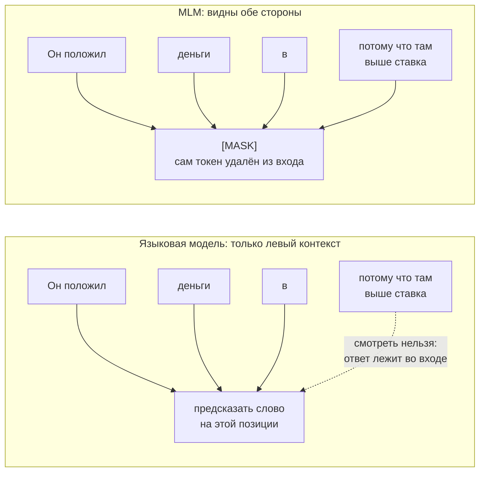

# BERT и семейство энкодеров

> **Зачем эта глава.** Энкодеры никуда не делись после появления LLM: классификация тикетов,
> NER, поиск дублей, ретривал для RAG, антифрод по тексту — всё это на проде до сих пор крутится
> на BERT-подобных моделях, потому что они на два порядка дешевле генеративной модели при том же
> или лучшем качестве. После этой главы вы будете понимать, что именно делает MLM, почему у BERT
> ровно такая схема маскирования, чем отличаются RoBERTa/ALBERT/DeBERTa/ELECTRA по существу,
> как правильно дообучать энкодер и как получить из него эмбеддинги, которые не врут.

**Уровень:** 🎯 middle → 🧠 middle+
**Предварительно нужно:** [внимание и трансформер](../03-deep-learning/04-attention-and-transformer.md),
[токенизация](01-text-representation.md), [эмбеддинги](02-embeddings.md),
[динамика обучения](../03-deep-learning/02-training-dynamics.md)
**Как проработать:** чтение + дообучение своей модели + извлечение эмбеддингов

---

## Карта главы

- [1. Проблема: почему однонаправленности мало](#1-проблема-почему-однонаправленности-мало)
- [2. Masked Language Modeling](#2-masked-language-modeling)
- [3. NSP и его тихая смерть](#3-nsp-и-его-тихая-смерть)
- [4. Архитектура BERT: что за токены и зачем](#4-архитектура-bert-что-за-токены-и-зачем)
- [5. Дообучение под задачу](#5-дообучение-под-задачу)
- [6. Потомки: что именно изменили](#6-потомки-что-именно-изменили)
- [7. Русскоязычные энкодеры](#7-русскоязычные-энкодеры)
- [8. Эмбеддинги предложений: как не сделать это неправильно](#8-эмбеддинги-предложений-как-не-сделать-это-неправильно)
- [9. Дистилляция энкодеров](#9-дистилляция-энкодеров)
- [10. Компромиссы: энкодер, LLM или TF-IDF](#10-компромиссы-энкодер-llm-или-tf-idf)
- [11. Подводные камни](#11-подводные-камни)
- [12. Проверь себя](#12-проверь-себя)
- [13. Практика](#13-практика)
- [14. Что читать дальше](#14-что-читать-дальше)

---

## 1. Проблема: почему однонаправленности мало

К 2018 году сложилась такая картина. Слова кодировались статическими векторами (word2vec, GloVe,
fastText — см. [главу про эмбеддинги](02-embeddings.md)), а под каждую задачу поверх них обучалась
своя маленькая модель — BiLSTM, свёртки, что угодно. У этого два изъяна.

**Изъян первый: слово имеет один вектор на все контексты.** «Замок» в «средневековый замок»
и в «сломался замок» получает один и тот же вектор. Модель под задачу вынуждена разгребать эту
неоднозначность сама, с нуля, на тех крохах размеченных данных, что у вас есть.

**Изъян второй: предобучается только слой эмбеддингов.** Вся остальная сеть инициализируется
случайно. То есть из огромного немаркированного корпуса вы вытащили информацию только про слова,
но не про синтаксис, не про согласование, не про то, как устроено предложение.

Первая волна ответа — ELMo и GPT-1 — предобучала **всю** сеть на языковом моделировании: предсказать
следующий токен по предыдущим. Здесь возникает естественное ограничение. Языковая модель
принципиально однонаправленна: чтобы предсказать токен $t$, нельзя показывать модели токены
$> t$, иначе задача вырождается (ответ лежит во входе). Значит, представление токена $t$ строится
только по левому контексту.

А для понимания текста левого контекста мало. В предложении «Он положил деньги в банк, потому что
там выше ставка» слово «банк» разрешается тем, что идёт **после** него. ELMo обходил это костылём:
обучал две независимые однонаправленные модели (слева направо и справа налево) и склеивал их
выходы. Но это не то же самое, что настоящая двусторонность: каждое направление внутри себя
не видит противоположного, и глубокого взаимодействия левого и правого контекста не возникает.

Вопрос, на который отвечает BERT: **как обучить по-настоящему двунаправленный трансформер, если
задача «предскажи следующий токен» этого не позволяет?**

> 🌱 **База.** Идея BERT в одном предложении: вместо «предскажи следующее слово» возьмём задачу
> «в тексте выкололи несколько слов — восстанови их». Тогда при восстановлении дырки можно честно
> смотреть в обе стороны, и никакой утечки нет — само слово из входа удалено.

На схеме — то же предложение про банк в двух режимах обучения; сравнивайте, откуда в каждом
приходят стрелки к предсказываемой позиции.



Ровно эта пунктирная стрелка и есть цена однонаправленности: подсказка про финансовое
учреждение стоит **справа**, и языковая модель ею воспользоваться не вправе. MLM выкупает
право смотреть направо, удалив предсказываемый токен из входа; счёт выставляется тем,
что обучающий сигнал идёт только с выколотых позиций.

---

## 2. Masked Language Modeling

### 2.1 Постановка

Пусть $x = (x_1, \dots, x_n)$ — последовательность из $n$ токенов. Выбираем случайное подмножество
позиций $M \subset \{1, \dots, n\}$, портим токены на этих позициях и получаем испорченный вход
$\tilde{x}$. Модель $f_\theta$ — двунаправленный трансформер-энкодер (архитектура ровно та,
что разобрана в [главе про трансформер](../03-deep-learning/04-attention-and-transformer.md),
без причинной маски) — должна восстановить исходные токены:

$$
\mathcal{L}_{\text{MLM}}(\theta) \;=\; -\,\mathbb{E}_{x,\,M}\left[\;\frac{1}{|M|}\sum_{i \in M} \log p_\theta\big(x_i \mid \tilde{x}\big)\right]
$$

где $\theta$ — параметры энкодера вместе с выходной головой, $M$ — множество замаскированных
позиций, $|M|$ — их количество, $p_\theta(x_i \mid \tilde{x})$ — вероятность, которую модель
приписывает истинному токену $x_i$ после softmax по всему словарю $V$, а математическое ожидание
берётся по текстам корпуса и по случайному выбору $M$.

Ключевая деталь, которую часто упускают: **лосс считается только по позициям из $M$.** Остальные
позиции в градиент не входят вообще. Отсюда сразу вытекает свойство, из-за которого MLM дорог:
за один проход по тексту вы получаете обучающий сигнал лишь с 15% токенов, тогда как causal LM
получает сигнал со **всех** позиций. Это одна из причин, почему BERT-подобные модели требуют
больше эпох по данным, чем GPT-подобные.

### 2.2 Почему именно 15%

Здесь работает компромисс между двумя силами.

**Снизу давит объём сигнала.** Чем меньше доля маскируемых токенов, тем меньше предсказаний на один
прямой проход, тем дороже обучение в пересчёте на единицу полезного градиента. Полный проход через
12 слоёв стоит одинаково, маскируете вы 5% или 40%; выгоднее выжимать больше.

**Сверху давит объём контекста.** Восстановить токен можно, только если вокруг остался осмысленный
контекст. Замаскируйте 50% — и модель окажется в ситуации, когда половина предложения выколота,
задача становится почти неразрешимой, а выученные представления — шумными. Плюс возникает
«перекрытие»: две соседние маски мешают восстановлению друг друга.

15% — эмпирически найденная точка в этом компромиссе, а не вывод из теории. Позднейшие работы
показали, что оптимум зависит от размера модели и режима обучения: большие модели выдерживают
и 40% маскирования, потому что у них хватает ёмкости достроить контекст, и обучаются при этом
эффективнее (Wettig et al., 2022). Так что правильный ответ на собеседовании — не «15% потому
что так в статье», а «15% — эмпирический компромисс между плотностью сигнала и сохранностью
контекста, и он не универсален».

### 2.3 Схема 80/10/10 — самая недооценённая деталь BERT

Наивная реализация: взял 15% позиций, заменил все на `[MASK]`, обучил. Так делать нельзя, и вот
почему.

Токен `[MASK]` — искусственный. Он встречается только при предобучении. На дообучении и на
инференсе его в тексте нет никогда. Возникает **рассогласование предобучения и применения**
(pretrain–finetune mismatch): модель училась строить хорошие представления в присутствии `[MASK]`,
а работать будет без него.

BERT разбивает выбранные 15% дальше:

| Что делаем с выбранным токеном | Доля | Зачем |
|---|---|---|
| заменяем на `[MASK]` | 80% | основная задача восстановления |
| заменяем на **случайный** токен из словаря | 10% | заставить модель не доверять входному токену |
| **оставляем как есть** | 10% | не дать модели выучить «на предсказываемой позиции всегда неверный токен» |

Разберём два последних пункта, потому что именно их спрашивают.

**Зачем 10% случайных.** Если бы порча сводилась только к `[MASK]`, модель могла бы разделить
позиции на два непересекающихся режима: «здесь `[MASK]` — надо думать» и «здесь настоящий токен —
можно просто скопировать его в представление». То есть контекстное представление **немаскированных**
токенов деградировало бы до «повторить сам себя». Случайная подстановка ломает эту стратегию:
теперь на любой позиции токен может оказаться неверным, и модель обязана строить представление
каждой позиции с оглядкой на контекст, а не только копировать вход. Это ровно то, что нам нужно
на инференсе, где мы читаем представления всех токенов.

**Зачем 10% оставить нетронутыми.** Если бы порча была «80% `[MASK]` + 20% случайный», модель
выучила бы полезное для неё, но вредное для нас правило: *на позиции, по которой считается лосс,
входной токен никогда не является ответом*. Тогда предсказание всегда смещалось бы прочь
от наблюдаемого токена. Оставляя 10% нетронутыми, мы делаем «токен на входе = ответ» вполне
вероятным событием, и распределение предсказаний остаётся честным.

Обратите внимание на несимметричность: доли 10% и 10% малы намеренно. Случайный шум портит данные,
и его переизбыток вредит; а нетронутые позиции дают почти бесплатный ответ (скопируй вход)
и не несут обучающего сигнала. Оба режима нужны как «прививка», а не как основная задача.

> 💬 **На собеседовании.** Спросят: «В BERT 15% токенов маскируются по схеме 80/10/10. Что сломается,
> если убрать 10% случайных?»
> Хороший ответ: модель начнёт различать позиции «с `[MASK]`» и «без `[MASK]`» и перестанет строить
> полноценные контекстные представления для немаскированных токенов — им достаточно будет копировать
> входной эмбеддинг. Для MLM-лосса это не страшно, но нас интересуют именно представления
> немаскированных токенов, потому что на дообучении и инференсе `[MASK]` нет вообще. Провал:
> «случайные токены — это регуляризация/аугментация» — слишком общо и не объясняет механизм.

### 2.4 Реализация маскирования

```python
import torch

def mask_tokens(input_ids: torch.Tensor,
                special_mask: torch.Tensor,
                mask_token_id: int,
                vocab_size: int,
                mlm_prob: float = 0.15):
    """Схема BERT 80/10/10.

    input_ids:    (B, n) — идентификаторы токенов
    special_mask: (B, n) — True на служебных токенах ([CLS], [SEP], [PAD]): их не портим
    Возвращает (испорченный вход, labels), где labels = -100 там, где лосс не считается.
    """
    labels = input_ids.clone()

    # выбираем позиции-кандидаты; служебные токены исключаем, иначе модель будет
    # тратить ёмкость на восстановление [PAD] — задача бессмысленная и вредная
    prob = torch.full(labels.shape, mlm_prob)
    prob.masked_fill_(special_mask, 0.0)
    selected = torch.bernoulli(prob).bool()                # (B, n)

    # CrossEntropyLoss по умолчанию игнорирует индекс -100:
    # так лосс считается ТОЛЬКО по выбранным 15% позиций
    labels[~selected] = -100

    corrupted = input_ids.clone()

    # 80% выбранных -> [MASK]
    to_mask = torch.bernoulli(torch.full(labels.shape, 0.8)).bool() & selected
    corrupted[to_mask] = mask_token_id

    # 10% выбранных -> случайный токен. 0.5 от ОСТАВШИХСЯ 20% как раз даёт 10%
    to_random = torch.bernoulli(torch.full(labels.shape, 0.5)).bool() & selected & ~to_mask
    random_ids = torch.randint(vocab_size, labels.shape, dtype=input_ids.dtype)
    corrupted[to_random] = random_ids[to_random]

    # оставшиеся 10% выбранных не трогаем — они и есть третья ветка схемы
    return corrupted, labels


if __name__ == "__main__":
    ids = torch.randint(5, 1000, (4, 32))
    special = torch.zeros_like(ids, dtype=torch.bool)
    special[:, 0] = True                                    # имитируем [CLS]
    corrupted, labels = mask_tokens(ids, special, mask_token_id=103, vocab_size=1000)
    # санитарная проверка: лосс считается примерно по 15% позиций, [CLS] не тронут
    print("доля позиций с лоссом:", (labels != -100).float().mean().item())
    assert (corrupted[:, 0] == ids[:, 0]).all()
```

> ⚠️ **Типичная ошибка.** Маскировать токены **один раз** при подготовке датасета и потом гонять
> по нему несколько эпох. Тогда модель видит одни и те же дырки в одних и тех же местах и начинает
> их запоминать. Правильно — маскировать на лету, при каждой выдаче батча (это и есть *динамическое
> маскирование*, которое RoBERTa сделала стандартом).

---

## 3. NSP и его тихая смерть

Помимо MLM, BERT обучался на второй задаче — **предсказании следующего предложения** (Next Sentence
Prediction, NSP). Модели подают пару сегментов A и B; в 50% случаев B — реальное продолжение A
в корпусе, в 50% — случайный сегмент из другого документа. По вектору токена `[CLS]` бинарный
классификатор говорит «IsNext / NotNext».

Мотивация была разумной: задачи вроде вывода следствия (NLI) и вопросно-ответных систем требуют
понимать **отношение между двумя текстами**, а MLM такому не учит.

Что пошло не так. RoBERTa (Liu et al., 2019) методично проверила варианты: с NSP, без NSP,
с сегментами из одного документа, из разных. Оказалось, что **убрать NSP и подавать модели
непрерывный поток текста до 512 токенов — лучше**, чем оставить NSP. Причина в том, что NSP
слишком лёгок: отличить продолжение того же документа от случайного куска другого документа можно
по **теме** — по пересечению лексики, — не разбираясь ни в каком дискурсе. Модель решает задачу
поверхностным признаком, полезного сигнала почти нет, а место в контексте отъедается.

ALBERT предложил починить, а не выбросить: заменить NSP на **предсказание порядка предложений**
(Sentence Order Prediction, SOP). Оба сегмента берутся из одного документа подряд, негативом
служит та же пара, но переставленная местами. Тематический шорткат исчезает — тема одинаковая
в обоих вариантах, — и модели приходится ловить дискурсивную связность. SOP даёт измеримый прирост.

Практический вывод: современные энкодеры (RoBERTa, DeBERTa, большинство русскоязычных) обучаются
**только на MLM** или на MLM + осмысленный аналог SOP. Если вы предобучаете свою модель — NSP
не берите.

> 💬 **На собеседовании.** Спросят: «Почему от NSP отказались?»
> Хороший ответ: NSP решается по тематическому пересечению слов, то есть даёт слабый и вырожденный
> сигнал, при этом отнимает половину контекста под второй сегмент. RoBERTa показала, что без NSP
> с непрерывными сегментами качество на GLUE выше. ALBERT показал, что проблема не в самой идее
> межпредложенческой задачи, а в конструкции негативов: SOP с перестановкой предложений одного
> документа работает. Провал: «NSP не помогал» — верно, но без объяснения почему это заученный факт.

---

## 4. Архитектура BERT: что за токены и зачем

Архитектурно BERT — это стек трансформерных блоков **без причинной маски**: каждый токен видит
всю последовательность в обе стороны. Всё остальное — как в
[главе про трансформер](../03-deep-learning/04-attention-and-transformer.md): multi-head attention,
FFN с расширением $4d$, остаточные связи, post-LN, GELU, обучаемые абсолютные позиционные эмбеддинги.

| Модель | $L$ (слоёв) | $d$ | голов | параметров | $d_{ff}$ |
|---|---|---|---|---|---|
| BERT-base | 12 | 768 | 12 | ~110 млн | 3072 |
| BERT-large | 24 | 1024 | 16 | ~340 млн | 4096 |

Токенизация — WordPiece, словарь 30522 сабтокена (для оригинальной английской модели),
максимальная длина 512 позиций — жёсткое ограничение, потому что позиционные эмбеддинги обучаемые
и таблица имеет ровно 512 строк.

### 4.1 Служебные токены

Вход всегда выглядит так:

```
[CLS] токены первого сегмента [SEP] токены второго сегмента [SEP]
```

**`[CLS]`** — токен-агрегатор в позиции 0. У него нет собственного смысла; он существует, чтобы
собрать на себя представление всей последовательности через self-attention и служить входом
классификационной головы. Важно понимать: `[CLS]` становится осмысленным **только если его этому
учили** — в BERT его учили под NSP, а при дообучении на вашу задачу его учит ваш лосс. Без обучения
вектор `[CLS]` — плохой эмбеддинг предложения (об этом в разделе 8).

**`[SEP]`** — разделитель сегментов. Нужен, потому что attention сам по себе не знает, где кончился
первый текст и начался второй.

**Segment embeddings** (они же token type ids) — обучаемая таблица из двух векторов, A и B,
прибавляемая к эмбеддингу каждого токена в зависимости от того, к какому сегменту он относится.
Без них модель различала бы сегменты только по положению `[SEP]`, что слабее.

Итоговый вход первого слоя:

$$
h^{(0)}_i \;=\; E_{\text{tok}}(x_i) \;+\; E_{\text{pos}}(i) \;+\; E_{\text{seg}}(s_i)
$$

где $E_{\text{tok}} \in \mathbb{R}^{|V| \times d}$ — таблица эмбеддингов токенов, $|V|$ — размер
словаря, $E_{\text{pos}} \in \mathbb{R}^{512 \times d}$ — таблица позиционных эмбеддингов,
$E_{\text{seg}} \in \mathbb{R}^{2 \times d}$ — таблица сегментных, $i$ — номер позиции,
$s_i \in \{0, 1\}$ — номер сегмента токена $i$. Затем сумма проходит через LayerNorm и dropout.

Пара «текст A / текст B» — не украшение, а рабочий инструмент. Так решаются все задачи о **паре
текстов**: NLI, парафраз, релевантность запрос–документ (cross-encoder для реранкинга в RAG),
extractive QA (вопрос как A, параграф как B). Двусторонний attention между сегментами — причина,
по которой cross-encoder точнее bi-encoder: токены запроса и документа взаимодействуют напрямую.

---

## 5. Дообучение под задачу

### 5.1 Голова

Предобученный энкодер отдаёт $H \in \mathbb{R}^{n \times d}$ — по вектору на токен. Голова
(head) — то, что превращает это в ответ задачи. Она маленькая и обучается с нуля:

| Задача | Что берём | Голова |
|---|---|---|
| Классификация текста | вектор `[CLS]` | Linear $d \to K$ |
| Многометочная классификация | вектор `[CLS]` | Linear $d \to K$ + сигмоида, BCE |
| Регрессия (например, тональность 0–5) | вектор `[CLS]` | Linear $d \to 1$, MSE |
| Разметка токенов (NER, POS) | все векторы $H$ | Linear $d \to K$ на каждый токен |
| Extractive QA | все векторы $H$ | два Linear $d \to 1$: логиты начала и конца ответа |
| Пара текстов (NLI, релевантность) | `[CLS]` от `A [SEP] B` | Linear $d \to K$ |

Здесь $K$ — число классов/меток, $d$ — размерность модели, $n$ — число токенов.

Заметьте: почти всё различие между задачами — это две строки кода. Именно поэтому схема
«предобучение + дообучение» вытеснила специализированные архитектуры.

### 5.2 Что размораживать

Три режима, и выбирают между ними не по вкусу, а по размеру данных.

**Заморозить всё, обучать только голову** (feature extraction). Энкодер — фиксированный
экстрактор признаков. Быстро, устойчиво к переобучению, но потолок качества низкий: представления
не адаптируются к вашему домену. Разумно при нескольких сотнях примеров или когда одну и ту же
модель делят десятки задач и вы хотите считать эмбеддинги один раз.

**Разморозить всё** (full fine-tuning). Стандарт. Требует хотя бы нескольких тысяч примеров,
даёт лучшее качество. Для BERT-base это дёшево: 5–10 минут на одной GPU для датасета в 20–50 тысяч
коротких текстов.

**Разморозить верхние слои.** Компромисс: нижние слои кодируют общие лексические и синтаксические
свойства, верхние — семантику и специфику задачи. Заморозив первые 6 из 12 слоёв, вы экономите
примерно треть памяти на градиенты и снижаете риск переобучения. Полезно при 1–3 тысячах примеров.

> 🧠 **Middle+.** Есть эмпирически устойчивая картина того, что кодируют слои BERT: нижние —
> морфология и поверхностные признаки, средние — синтаксис, верхние — семантика и информация,
> специфичная для задачи предобучения. Отсюда практическое следствие: если ваша задача
> синтаксическая (например, разметка частей речи), выигрыш даёт **не** последний слой,
> а конкатенация или усреднение слоёв 6–9. Проверять это дёшево — попробуйте.

### 5.3 Learning rate: главная ручка

Это место, где ломается больше всего дообучений. Предобученные веса содержат всю ценность модели.
Большой learning rate $\eta$ за первые сотни шагов разрушает их — **катастрофическое забывание**
(catastrophic forgetting). Симптом узнаваемый: лосс сначала падает, потом резко скачет вверх,
качество на валидации хуже, чем у логистической регрессии на TF-IDF.

Рабочие значения для энкодеров:

- $\eta \in [2 \cdot 10^{-5},\; 5 \cdot 10^{-5}]$ для тела модели, AdamW, weight decay 0.01;
- $\eta \approx 10^{-3}$ для головы (она случайная, ей нужно двигаться быстрее);
- warmup 6–10% шагов, дальше линейное или косинусное затухание;
- 2–4 эпохи. Больше — почти всегда переобучение на типичных датасетах в десятки тысяч примеров;
- батч 16–32 для base-моделей.

Дополнительный приём — **послойное затухание LR** (layer-wise learning rate decay, из ULMFiT):
слой $\ell$ получает $\eta_\ell = \eta_{\text{top}} \cdot \gamma^{\,L - \ell}$, где $L$ — общее число
слоёв, $\ell$ — номер слоя (снизу вверх), $\gamma \in [0.9, 0.95]$ — коэффициент затухания,
$\eta_{\text{top}}$ — learning rate верхнего слоя. Нижние слои двигаются медленнее, потому что
их знания универсальнее и портить их дороже. На больших моделях (large и выше) это ощутимо
стабилизирует обучение.

```python
from torch.optim import AdamW
from transformers import AutoModelForSequenceClassification

model = AutoModelForSequenceClassification.from_pretrained(
    "DeepPavlov/rubert-base-cased", num_labels=5
)

def layerwise_param_groups(model, base_lr=2e-5, head_lr=1e-3, decay=0.95, n_layers=12):
    """Нижним слоям — меньший LR: их представления универсальны, портить их дороже."""
    groups = []
    bert = model.bert

    # эмбеддинги — самый низ, самый маленький LR
    groups.append({"params": bert.embeddings.parameters(),
                   "lr": base_lr * decay ** n_layers})

    for i, layer in enumerate(bert.encoder.layer):
        # i=0 — нижний слой; показатель степени убывает к верхушке
        groups.append({"params": layer.parameters(),
                       "lr": base_lr * decay ** (n_layers - 1 - i)})

    # голова инициализирована случайно — ей нужен LR на два порядка больше
    groups.append({"params": model.classifier.parameters(), "lr": head_lr})
    return groups

optimizer = AdamW(layerwise_param_groups(model), weight_decay=0.01)
```

> ⚠️ **Типичная ошибка.** Взять дефолтный `lr=1e-3` из туториала по обучению сети с нуля.
> Для дообучения энкодера это в 20–50 раз больше нужного. Модель «забывает» предобучение
> за несколько сотен шагов, и вы получаете качество случайно инициализированного трансформера
> на маленьком датасете — то есть очень плохое.

> 💬 **На собеседовании.** Спросят: «Дообучили BERT на 3000 примеров, качество хуже, чем
> у TF-IDF + логрег. Что проверите?»
> Хороший ответ по порядку: (1) learning rate — не 1e-3 ли; (2) число эпох и переобучение —
> смотрим кривые train/val; (3) правильно ли токенизирован текст и не режется ли он truncation'ом
> на 128 токенов, когда сигнал в конце; (4) сбалансированы ли классы и не выродилось ли
> предсказание в мажоритарный класс; (5) при 3000 примерах имеет смысл заморозить нижние слои
> или взять модель поменьше; (6) а также — действительно ли задача требует семантики, потому что
> для задач, решаемых по ключевым словам, TF-IDF честно выигрывает и это нормальный результат.
> Провал: «нужно больше эпох» или «BERT слабый, возьмём large».

---

## 6. Потомки: что именно изменили

BERT — не финал, а первая рабочая точка. Дальше каждая модель чинила конкретный изъян.
Разбирайте их именно так: не «RoBERTa лучше», а «RoBERTa починила недообученность».

### 6.1 RoBERTa: BERT был просто недообучен

RoBERTa (Robustly optimized BERT approach) не меняет **ни одной** детали архитектуры. Меняется
рецепт обучения:

- **Динамическое маскирование.** BERT маскировал корпус заранее (десятью статичными копиями);
  RoBERTa генерирует маску на лету при каждом показе. Больше разнообразия, меньше запоминания.
- **Убран NSP**, вход — непрерывный поток предложений до 512 токенов (FULL-SENTENCES).
- **Больше данных**: ~160 ГБ текста против ~16 ГБ у BERT.
- **Больше батч и дольше обучение**: батчи до 8k последовательностей, больше шагов.
- **Byte-level BPE** со словарём 50k вместо WordPiece 30k — нет токена `[UNK]` в принципе,
  любая строка кодируется.

Результат: тот же BERT-large по архитектуре обгоняет себя же на несколько пунктов GLUE.
Главный урок статьи — методологический: **прежде чем усложнять архитектуру, проверьте, что
базовую модель обучили до конца.** На собеседовании это ценят выше, чем перечисление фич.

### 6.2 ALBERT: параметры, а не вычисления

Проблема, которую решает ALBERT: BERT-large на 340 млн параметров упирается в память, а попытка
сделать его шире упирается сразу. Два приёма.

**Факторизация эмбеддингов.** В BERT таблица эмбеддингов имеет размер $|V| \times d$, и при
$|V| = 30000$, $d = 1024$ это 31 млн параметров — почти 10% модели, притом что эмбеддинги
**контекстно-независимы**, а скрытые состояния — контекстно-зависимы. Нет причины требовать
одинаковой размерности. ALBERT вставляет промежуточную проекцию: сначала таблица
$|V| \times E$ с маленьким $E$, затем матрица $E \times d$:

$$
|V| \cdot d \;\longrightarrow\; |V| \cdot E + E \cdot d, \qquad E \ll d
$$

где $|V|$ — размер словаря, $d$ — размерность скрытых состояний, $E$ — размерность «сырых»
эмбеддингов. При $|V| = 30000$, $d = 1024$, $E = 128$: было $30000 \cdot 1024 \approx 30{,}7$ млн,
стало $30000 \cdot 128 + 128 \cdot 1024 \approx 3{,}97$ млн — в 7,7 раза меньше.

**Разделение параметров между слоями** (cross-layer parameter sharing). Все $L$ слоёв используют
**одни и те же** веса attention и FFN. Формально модель становится рекуррентной по глубине:
один блок применяется $L$ раз. Параметры падают в $L$ раз.

Итог: ALBERT-base — около 12 млн параметров против 110 млн у BERT-base при сопоставимом качестве.

> ⚠️ **Типичная ошибка.** Считать, что ALBERT быстрее. **Нет.** Разделение весов уменьшает
> **память под параметры**, но количество операций не меняется: вы всё равно прогоняете
> $L$ слоёв. ALBERT-xxlarge с 235 млн параметров медленнее BERT-large с 340 млн, потому что
> у него $d = 4096$. Если нужна скорость — это дистилляция и квантизация (разделы 9
> и [глава про NLP в проде](06-nlp-in-production.md)), а не ALBERT.

### 6.3 DeBERTa: разделённое внимание

Проблема. В BERT позиция прибавляется к эмбеддингу токена **до** первого слоя:
$h_i = E_{\text{tok}}(x_i) + E_{\text{pos}}(i)$. Дальше в attention считается скалярное произведение
сумм, и содержание перемешано с позицией необратимо. Между тем зависимость от относительной
позиции и зависимость от содержания — разные по природе вещи: «глубокое обучение» — сильная
биграмма именно потому, что слова стоят рядом, а не потому, что каждое из них само по себе
что-то значит.

DeBERTa (Decoding-enhanced BERT with disentangled attention) представляет каждый токен **двумя**
векторами: содержательным $H_i$ и относительно-позиционным $P_{i|j}$ (позиция $i$ относительно $j$).
Логит внимания раскладывается на осмысленные слагаемые:

$$
A_{ij} \;=\; \underbrace{H_i H_j^{\top}}_{\text{содержание}\to\text{содержание}}
\;+\; \underbrace{H_i P_{j|i}^{\top}}_{\text{содержание}\to\text{позиция}}
\;+\; \underbrace{P_{i|j} H_j^{\top}}_{\text{позиция}\to\text{содержание}}
$$

где $H_i, H_j$ — содержательные представления токенов $i$ и $j$ (после соответствующих проекций
в $Q$ и $K$), $P_{j|i}$ — вектор относительной позиции $j$ по отношению к $i$, $P_{i|j}$ —
симметрично. Четвёртое слагаемое (позиция→позиция) отбрасывается: при относительном кодировании
оно не несёт информации. Из-за трёх слагаемых масштабирование меняется с $\sqrt{d}$ на $\sqrt{3d}$
(по той же логике сложения дисперсий, что разобрана в
[главе про трансформер](../03-deep-learning/04-attention-and-transformer.md#4-почему-делим-на-корень-из-d_k)).

Абсолютная позиция всё же нужна — «магазин закрыт» и «закрыт магазин» различаются не только
относительными расстояниями. DeBERTa вносит её поздно, прямо перед выходным softmax MLM-головы
(enhanced mask decoder), чтобы не смешивать её с содержанием во всех слоях.

DeBERTa-v3 добавляет к этому обучение в стиле ELECTRA (см. ниже) и на момент написания остаётся
одним из сильнейших энкодеров своего размера — если вам нужен максимум качества на классификации
и вы не ограничены латентностью, это разумный дефолт для английского.

### 6.4 ELECTRA: сигнал со всех токенов

Проблема, ради которой ELECTRA придумана, названа в разделе 2.1: MLM даёт градиент только с 15%
позиций. 85% вычислений прямого прохода не порождают обучающего сигнала. Можно ли получать сигнал
со **всех** токенов?

Схема ELECTRA:

1. **Генератор** — маленькая MLM-модель (обычно 1/4–1/3 размера дискриминатора). Он получает
   замаскированный текст и заполняет дырки правдоподобными токенами.
2. **Дискриминатор** — основная модель. Он получает текст с подставленными генератором токенами
   и для **каждой** позиции решает бинарную задачу: этот токен оригинальный или подменённый
   (replaced token detection, RTD).

$$
\mathcal{L} \;=\; \mathcal{L}_{\text{MLM}}(\text{генератор}) \;+\; \lambda \cdot \mathcal{L}_{\text{RTD}}(\text{дискриминатор})
$$

$$
\mathcal{L}_{\text{RTD}} = -\,\mathbb{E}\left[\sum_{i=1}^{n} \Big( y_i \log D(\tilde{x}, i) + (1-y_i)\log\big(1 - D(\tilde{x}, i)\big)\Big)\right]
$$

где $n$ — длина последовательности, $\tilde{x}$ — текст после подстановок генератора,
$D(\tilde{x}, i) \in (0,1)$ — вероятность того, что токен на позиции $i$ подменён, $y_i \in \{0,1\}$ —
истинная метка подмены, $\lambda$ — вес задачи дискриминатора (в статье 50, потому что бинарный
лосс по величине много меньше softmax-лосса по словарю).

Почему это эффективнее:

- сигнал идёт со **всех** $n$ позиций, а не с $0{,}15n$;
- бинарная классификация дешевле softmax по словарю в 30 тысяч классов;
- задача содержательно труднее и «честнее»: генератор подставляет **правдоподобные** токены,
  поэтому отличить подмену нельзя по грубым признакам — нужен настоящий семантический разбор;
- у дискриминатора нет токена `[MASK]` на входе вообще, значит нет и pretrain–finetune mismatch,
  ради которого понадобилась схема 80/10/10.

Результат: ELECTRA-small достигает качества, для которого MLM-моделям нужно в разы больше compute.
Это важный аргумент, когда вы обучаете энкодер под свой домен с ограниченным бюджетом.

> 🧠 **Middle+. Почему это не GAN.** Генератор обучается обычным MLM-лоссом по правильным ответам,
> а **не** на то, чтобы обмануть дискриминатор. Градиент от дискриминатора в генератор не течёт:
> подстановка токена — дискретная операция, через неё нельзя продифференцировать напрямую.
> Авторы пробовали adversarial-вариант с обучением через RL — работало хуже. После предобучения
> генератор выбрасывается, в прод идёт только дискриминатор.

> 💬 **На собеседовании.** Спросят: «Чем ELECTRA принципиально отличается от BERT?»
> Хороший ответ: не архитектурой, а задачей предобучения. BERT восстанавливает замаскированные
> токены (сигнал с 15% позиций, softmax по словарю), ELECTRA определяет для каждого токена,
> подменён ли он (сигнал со 100% позиций, бинарный лосс) — отсюда кратно лучшая
> compute-эффективность. Стоит добавить, что генератор нужен только для порождения трудных
> негативов и в прод не идёт, и что это не GAN. Провал: «ELECTRA — это GAN для текста».

---

## 7. Русскоязычные энкодеры

Русский — язык с богатой морфологией и свободным порядком слов. Это бьёт по двум местам:
токенизация (одна лемма даёт десятки форм, и BPE, обученный на английском, режет их в крошку)
и позиционные признаки (порядок слов несёт меньше синтаксической информации, чем в английском).
Мультиязычный mBERT формально работает, но на русском проигрывает специализированным моделям:
его словарь тратит слишком мало места на кириллицу, из-за чего слово в среднем разбивается
на большее число сабтокенов, эффективная длина контекста падает, а качество вместе с ней.

Что реально используют:

| Модель | Размер | Когда выбирать |
|---|---|---|
| `cointegrated/rubert-tiny2` | ~29 млн параметров, $d = 312$, 3 слоя | высокий RPS, инференс на CPU, эмбеддинги «оптом»; заметно слабее base по качеству, но в 10+ раз быстрее |
| `DeepPavlov/rubert-base-cased` | ~180 млн, $d = 768$, 12 слоёв | рабочий дефолт для классификации и NER; инициализирован из mBERT с сокращённым под русский словарём |
| `ai-forever/ruBert-base` / `ruRoberta-large` | base ~178 млн / large ~355 млн | когда нужно качество, а латентность терпит; large — офлайн-обработка, батчевые задачи |
| `ai-forever/sbert_large_nlu_ru` и подобные sentence-модели | large | готовые эмбеддинги предложений «из коробки», без своего contrastive-обучения |
| Мультиязычные (`sentence-transformers/paraphrase-multilingual-*`, LaBSE) | разные | когда в потоке несколько языков или нужен кросс-язычный матчинг ru↔en |

Как выбирать на практике, по шагам:

1. Посчитайте **бюджет латентности**. Если у вас 500 RPS и 20 мс на текст на CPU — база
   не пройдёт, начинайте с tiny и смотрите, хватает ли качества.
2. Замерьте, **сколько сабтокенов** даёт токенизатор на вашем типичном тексте. Если средний
   документ разбивается в 1,5 раза длиннее, чем у конкурирующей модели, вы платите за это
   и памятью, и временем, и обрезкой контекста.
3. Проверьте **домен**. Модели, дообученные на разговорной речи (варианты `-conversational`),
   заметно лучше на отзывах, чатах и комментариях; модели на Википедии — на формальных текстах.
4. Не верьте лидербордам вслепую: замеряйте на **своей** выборке. Разница между base и large
   на конкретной прикладной задаче часто оказывается в пределах шума, а стоимость — в 3 раза выше.

Для задач семантического поиска на русском ориентируйтесь на бенчмарк ruMTEB (русская часть
семейства MTEB) — но опять же как на фильтр кандидатов, а не как на решение.

---

## 8. Эмбеддинги предложений: как не сделать это неправильно

Это тема, на которой сыпется больше всего людей, и она же самая практически ценная: на эмбеддингах
стоят поиск, дедупликация, кластеризация тикетов и ретривал для [RAG](../05-llm/07-rag.md).

### 8.1 Почему «взять `[CLS]`» — плохая идея

Каноническая ошибка: загрузить `bert-base`, прогнать текст, взять вектор `[CLS]`, посчитать
косинусную близость. Результат обычно хуже, чем у усреднённого word2vec. Причин две.

**Первая: `[CLS]` не обучали быть эмбеддингом.** Его учили под NSP — бинарную и, как мы выяснили,
вырожденную задачу. Он оптимизирован под «эти два сегмента из одного документа?», а не под
«насколько эти тексты близки по смыслу». В RoBERTa, где NSP убрали, `[CLS]` без дообучения
не обучен вообще ничему.

**Вторая: анизотропия.** Пространство контекстных представлений трансформера вырождено —
векторы лежат в узком конусе, и косинусная близость двух **случайных** текстов оказывается
высокой (нередко 0,7–0,9). Различающая способность метрики падает: у вас всё похоже на всё.
Это не баг конкретной модели, а системное свойство представлений, обученных на softmax
по словарю с частотным дисбалансом.

### 8.2 Что делать

**Mean pooling с учётом маски.** Простое усреднение векторов токенов работает заметно лучше
`[CLS]`. Критично — усреднять **только по реальным токенам**, исключая паддинг:

```python
import torch
from transformers import AutoTokenizer, AutoModel

model_name = "cointegrated/rubert-tiny2"
tokenizer = AutoTokenizer.from_pretrained(model_name)
model = AutoModel.from_pretrained(model_name).eval()

@torch.inference_mode()
def encode(texts: list[str], max_length: int = 256) -> torch.Tensor:
    batch = tokenizer(texts, padding=True, truncation=True,
                      max_length=max_length, return_tensors="pt")
    out = model(**batch).last_hidden_state              # (B, n, d)
    mask = batch["attention_mask"].unsqueeze(-1).float()  # (B, n, 1)

    # усредняем ТОЛЬКО по реальным токенам: паддинг тянет среднее в сторону
    # эмбеддинга [PAD] тем сильнее, чем длиннее паддинг — и близость начинает
    # зависеть от длины СОСЕДЕЙ ПО БАТЧУ, а не от смысла текста
    summed = (out * mask).sum(dim=1)                    # (B, d)
    emb = summed / mask.sum(dim=1).clamp(min=1e-9)      # (B, d)

    # L2-нормировка: после неё косинус = обычное скалярное произведение,
    # а значит можно использовать dot-product-индексы (FAISS IP)
    return torch.nn.functional.normalize(emb, p=2, dim=1)


if __name__ == "__main__":
    e = encode(["не приходит смс с кодом", "код подтверждения не доходит", "верните деньги"])
    print((e @ e.T).round(decimals=3))   # первые два должны быть ближе друг к другу
```

> ⚠️ **Типичная ошибка.** Забыть маску в pooling. Симптом коварный: качество зависит
> от **состава батча**, потому что длина паддинга определяется самым длинным текстом в батче.
> Один и тот же текст даёт разные векторы в разных батчах. Диагностика: закодируйте текст
> в одиночку и в компании длинного текста — векторы обязаны совпасть.

**Настоящее решение — contrastive-дообучение.** Ни `[CLS]`, ни mean pooling не дают геометрии,
в которой косинус означает «похоже по смыслу», просто потому что модель этому не учили.
Нужно обучить именно этому. Схема Sentence-BERT: два прохода одного и того же энкодера
(сиамская сеть), pooling, и лосс, который **сближает** пары «релевантно» и **раздвигает**
остальные.

Рабочий лосс на практике — InfoNCE с негативами из батча (в библиотеке `sentence-transformers`
он называется MultipleNegativesRankingLoss):

$$
\mathcal{L} \;=\; -\frac{1}{B}\sum_{i=1}^{B} \log \frac{\exp\big(\cos(u_i, v_i)/\tau\big)}{\sum_{j=1}^{B}\exp\big(\cos(u_i, v_j)/\tau\big)}
$$

где $B$ — размер батча, $u_i$ — эмбеддинг якоря (запроса) $i$, $v_i$ — эмбеддинг его позитива
(релевантного текста), $v_j$ при $j \ne i$ — позитивы **чужих** пар, служащие негативами
(in-batch negatives), $\cos$ — косинусная близость, $\tau > 0$ — температура (типично 0,02–0,1).

Три следствия, которые надо понимать:

1. **Размер батча — гиперпараметр качества, а не только скорости.** Каждый пример конкурирует
   с $B - 1$ негативами; чем больше $B$, тем труднее задача и тем острее геометрия.
   Отсюда трюки вроде GradCache и накопления негативов между шагами.
2. **Температура $\tau$ управляет жёсткостью.** Малая $\tau$ сильнее штрафует близкие негативы
   («hard negatives»), но делает обучение нестабильным.
3. **Hard negatives решают всё.** Случайные негативы из батча слишком лёгкие: «верните деньги»
   против «код не приходит» модель разведёт и без обучения. Настоящий прирост даёт добыча
   негативов, которые текущая модель ошибочно считает похожими (например, топ выдачи BM25,
   не являющийся ответом).

Если размеченных пар нет вообще — работает SimCSE: берём один и тот же текст, прогоняем дважды
через энкодер **с включённым dropout**, и два разных из-за dropout вектора объявляем позитивной
парой; все остальные тексты в батче — негативы. Аугментация бесплатная, а прирост над сырым BERT
большой. Это отличный бейзлайн, когда у вас есть только неразмеченный корпус вашего домена.

> 💬 **На собеседовании.** Спросят: «Как получить эмбеддинг предложения из BERT?»
> Хороший ответ строится по возрастанию качества: `[CLS]` без дообучения — плохо (его учили под
> NSP, плюс анизотропия); mean pooling по маске — заметно лучше и годится как быстрый бейзлайн;
> правильный ответ — брать модель, дообученную контрастивно (sentence-transformers), либо
> дообучить самому на своих парах с in-batch negatives и hard negatives. Отдельно упомянуть,
> что при поиске нужна L2-нормировка и что bi-encoder уступает cross-encoder по точности,
> поэтому в проде их комбинируют: bi-encoder отбирает кандидатов, cross-encoder переранжирует.
> Провал: «беру CLS, он же для этого и нужен».

---

## 9. Дистилляция энкодеров

Проблема прикладная: BERT-base на CPU обрабатывает короткий текст за десятки миллисекунд.
При 500 RPS и SLA в 30 мс это не проходит. Дистилляция (knowledge distillation) — способ
перенести поведение большой модели-учителя в маленькую модель-ученика.

**DistilBERT** — канонический пример. Ученик: 6 слоёв вместо 12, та же $d = 768$, инициализирован
**весами каждого второго слоя учителя** (это важно — случайная инициализация работает хуже).
Обучается на трёх лоссах сразу:

$$
\mathcal{L} \;=\; \alpha_{\text{ce}}\,\mathcal{L}_{\text{KD}} \;+\; \alpha_{\text{mlm}}\,\mathcal{L}_{\text{MLM}} \;+\; \alpha_{\cos}\,\mathcal{L}_{\cos}
$$

$$
\mathcal{L}_{\text{KD}} \;=\; T^2 \cdot \mathrm{KL}\Big(\operatorname{softmax}\big(z^{t}/T\big)\;\Big\|\;\operatorname{softmax}\big(z^{s}/T\big)\Big)
$$

где $z^{t}$ и $z^{s}$ — логиты учителя и ученика, $T$ — температура (обычно 2–4),
$\mathrm{KL}$ — дивергенция Кульбака–Лейблера, $\mathcal{L}_{\text{MLM}}$ — обычный MLM-лосс
по жёстким меткам, $\mathcal{L}_{\cos}$ — косинусный лосс между скрытыми состояниями учителя
и ученика (выравнивает не только выход, но и внутренние представления),
$\alpha_{\bullet}$ — веса слагаемых.

Множитель $T^2$ компенсирует то, что градиенты softmax с температурой масштабируются как $1/T^2$ —
без него вклад дистилляционного слагаемого зависел бы от выбора $T$.

Зачем вообще учиться у логитов, а не у правильных ответов? Потому что распределение учителя
несёт **больше информации**, чем one-hot метка: оно говорит не только «это класс 3», но и «класс 7
был близким вторым, а класс 2 исключён». Это то, что называют «тёмным знанием» (dark knowledge) —
информация о структуре сходства между классами, которой в жёсткой метке нет. Подробнее механика
KL и температуры — в [главе про теорию информации](../01-math/05-information-theory.md).

Результат DistilBERT: около 40% меньше параметров, примерно на 60% быстрее, ~97% качества
учителя на GLUE. Соотношение настолько выгодное, что дистилляция — первое, что стоит попробовать
при проблемах с латентностью.

Что ещё стоит знать:

- **TinyBERT** идёт дальше: дистиллирует послойно, включая матрицы внимания и скрытые состояния,
  и делает это дважды — на предобучении и на дообучении под задачу.
- **MiniLM** дистиллирует только self-attention последнего слоя (включая отношения между
  значениями $V$), что снимает необходимость подбирать соответствие слоёв учителя и ученика.
- **Дистилляция под конкретную задачу почти всегда выигрывает у общей.** Если вам нужен
  классификатор тикетов, дистиллируйте дообученного учителя на своём (пусть и неразмеченном!)
  трафике: у вас есть неограниченный поток входов, а метки даёт учитель.

> 💬 **На собеседовании.** Спросят: «У вас BERT-base не влезает в SLA. Что делать?»
> Хороший ответ по возрастанию усилий: (1) урезать `max_length` и включить динамический паддинг —
> часто это самый крупный и самый дешёвый выигрыш, потому что стоимость растёт с длиной;
> (2) экспортировать в ONNX Runtime; (3) квантизация в int8; (4) дистилляция в 6-слойную модель
> или переход на tiny; (5) кэширование эмбеддингов для повторяющихся текстов; (6) и только потом —
> более мощное железо. Подробности — в [главе про NLP в проде](06-nlp-in-production.md).
> Провал: «возьмём GPU».

---

## 10. Компромиссы: энкодер, LLM или TF-IDF

Вопрос «зачем BERT, если есть LLM» на собеседованиях звучит всё чаще, и правильный ответ —
не про моду, а про экономику и про свойства задачи.

**Когда энкодер — правильный выбор.**
Задача — классификация, разметка токенов или получение эмбеддингов; объём — от тысяч запросов
в секунду; латентность — десятки миллисекунд; есть хотя бы несколько тысяч размеченных примеров.
Дообученный rubert-base на своей задаче обычно **точнее** LLM с few-shot-промптом, потому что
он видел вашу разметку, а LLM — нет. И стоит он на 2–3 порядка дешевле за запрос.

**Когда LLM.**
Разметки нет или почти нет; классов много и они меняются; нужен свободный текст на выходе
(суммаризация, извлечение структуры, объяснение); задача требует рассуждения. Типовая
производственная схема: LLM размечает данные → на этой разметке дообучается энкодер → в прод идёт
энкодер. Так вы платите за LLM один раз, а не на каждый запрос.

**Когда TF-IDF + линейная модель.**
Задача решается по ключевым словам (спам, шаблонные обращения, детекция терминов); данных мало;
нужна интерпретируемость («какие слова повлияли») и мгновенное переобучение. Это не архаика —
это честный бейзлайн, который на существенной доле продуктовых задач не проигрывает энкодеру.
Всегда меряйте его первым: он занимает полчаса и задаёт планку, ниже которой опускаться нельзя.

**Двусторонность как ограничение.** Энкодер не умеет генерировать. Попытки использовать MLM для
генерации (заполнение дырок по одной) дают несогласованный текст, потому что при независимом
предсказании маскированных позиций модель не учитывает зависимости между ними — MLM моделирует
условные маргиналы, а не совместное распределение.

---

## 11. Подводные камни

**Токенизатор не от той модели.**
Симптом: модель выдаёт мусор, качество на уровне случайного, при этом код «работает».
Причина: идентификаторы токенов разных моделей несовместимы; токен 1543 у одной модели —
это совсем другое, чем у другой.
Что делать: загружать токенизатор и модель по одному и тому же имени чекпоинта и проверять
`tokenizer.vocab_size == model.config.vocab_size`.

**Truncation режет там, где сигнал.**
Симптом: на длинных документах качество проваливается, на коротких всё хорошо.
Причина: `max_length=128` по умолчанию во многих туториалах, а вывод в отзывах и жалобах
обычно **в конце**.
Что делать: посмотреть распределение длин в сабтокенах; либо увеличить `max_length`, либо
брать «голову + хвост» документа, либо резать на окна и агрегировать предсказания.

**Забыли `model.eval()` на инференсе.**
Симптом: предсказания для одного и того же текста меняются от вызова к вызову.
Причина: активный dropout.
Что делать: `model.eval()` и `torch.inference_mode()`. Тест на детерминизм — обязательный
юнит-тест сервиса.

**Дообучили с большим LR и потеряли предобучение.**
Симптом: лосс сначала падает, потом взлетает; валидация хуже TF-IDF.
Причина: катастрофическое забывание.
Что делать: $\eta = 2 \cdot 10^{-5}$, warmup, послойное затухание LR, clip градиентов по норме 1.0.

**Эмбеддинги считаются без нормировки, а индекс — на скалярном произведении.**
Симптом: в топе выдачи стабильно оказываются длинные тексты (или, наоборот, короткие).
Причина: без L2-нормировки скалярное произведение зависит от длины вектора, которая
коррелирует с длиной текста и частотностью его слов.
Что делать: нормировать эмбеддинги перед записью в индекс и перед запросом.

**Дисбаланс классов не учтён при дообучении.**
Симптом: высокая accuracy, F1 по редкому классу равен нулю.
Причина: модель сошлась к мажоритарному классу, для кросс-энтропии это локально выгодно.
Что делать: веса классов в лоссе, порог вместо argmax, метрики по классам, а не в среднем —
см. [дисбаланс и калибровку](../02-classic-ml/12-imbalance-and-calibration.md).

**Утечка через дубликаты.**
Симптом: офлайн-метрика великолепна, в проде — нет.
Причина: почти-дубликаты текстов попали и в train, и в test (типично для тикетов и отзывов,
где люди копируют шаблоны).
Что делать: дедупликация по нормализованному тексту и по эмбеддингам (порог косинуса ~0,95)
**до** сплита; групповой сплит по автору/сессии. См. [валидацию и утечки](../02-classic-ml/13-validation-and-leakage.md).

---

## 12. Проверь себя

<details>
<summary><b>🎯 Вопрос.</b> Что такое MLM и почему нельзя было просто обучить двунаправленную языковую модель?</summary>

**Короткий ответ.** MLM — восстановление случайно испорченных токенов по двустороннему контексту.
Обычная языковая модель предсказывает следующий токен, и если разрешить ей смотреть вправо,
целевой токен окажется во входе — задача выродится в копирование. Маскирование удаляет цель
из входа и тем самым делает двусторонний контекст безопасным.

**Развёрнуто.** Формально $\mathcal{L}_{\text{MLM}} = -\mathbb{E}\big[\frac{1}{|M|}\sum_{i\in M}\log p_\theta(x_i \mid \tilde{x})\big]$,
где $M$ — множество испорченных позиций, $\tilde x$ — испорченный вход. Цена двусторонности:
сигнал только с $|M| \approx 0{,}15n$ позиций против $n$ у causal LM, поэтому MLM менее
compute-эффективен — это и мотивировало ELECTRA. Ещё одно следствие: MLM моделирует условные
маргиналы $p(x_i \mid \tilde x)$ по отдельности, а не совместное распределение, поэтому
генерировать текст маскированной моделью плохо.

**Чего ждёт интервьюер:** понимания, что двунаправленность и next-token prediction несовместимы
в принципе, а не «в BERT так сделали».

**Провал:** «BERT предсказывает пропущенные слова» без объяснения, зачем вообще пропускать.
</details>

<details>
<summary><b>🧠 Вопрос.</b> Почему маскируют именно 15% и зачем схема 80/10/10?</summary>

**Короткий ответ.** 15% — эмпирический компромисс: меньше — мало сигнала на дорогой прямой проход,
больше — разрушается контекст, нужный для восстановления. 80/10/10 нужна, потому что токен `[MASK]`
не встречается на инференсе: 10% случайных заставляют модель строить контекстное представление
для каждого токена, а не копировать вход; 10% нетронутых не дают выучить правило «на предсказываемой
позиции входной токен всегда неверный».

**Развёрнуто.** Если оставить только `[MASK]`, модель разделит позиции на два режима и для
немаскированных позиций скатится к копированию входного эмбеддинга — а нам нужны именно
представления немаскированных токенов. Если добавить случайные, но не оставлять нетронутые,
предсказание систематически сместится прочь от наблюдаемого токена. Полезно добавить, что 15%
не универсальны: для больших моделей выгоднее маскировать больше (до 40%), что показано
в работе Wettig et al., 2022.

**Чего ждёт интервьюер:** ровно объяснения ролей двух десятипроцентных веток — это маркер того,
что человек читал статью, а не пересказ.

**Провал:** «10% случайных — это аугментация, 10% нетронутых — для регуляризации».
</details>

<details>
<summary><b>🎯 Вопрос.</b> Зачем нужны токены [CLS] и [SEP]?</summary>

**Короткий ответ.** `[CLS]` — позиция-агрегатор, на которую через self-attention собирается
представление всей последовательности; на неё вешают классификационную голову. `[SEP]` разделяет
сегменты, чтобы модель знала границу между текстами A и B.

**Развёрнуто.** Отдельный токен нужен потому, что у обычных токенов есть собственное содержание,
и класть на них ещё и роль агрегатора — конфликт задач. К сегментам дополнительно прибавляются
segment embeddings (два обучаемых вектора). Важная оговорка: `[CLS]` осмыслен только после
обучения под конкретную задачу; в предобученном виде он оптимизирован под NSP и как эмбеддинг
предложения работает плохо.

**Чего ждёт интервьюер:** связки «служебный токен → голова задачи» и понимания, что пара
сегментов — это механизм для задач на паре текстов (NLI, реранкинг, QA).

**Провал:** «[CLS] — это эмбеддинг предложения».
</details>

<details>
<summary><b>🎯 Вопрос.</b> Что RoBERTa изменила относительно BERT?</summary>

**Короткий ответ.** Ничего в архитектуре. Изменён рецепт: динамическое маскирование вместо
статического, убран NSP с переходом на непрерывные сегменты, в 10 раз больше данных, большие
батчи, дольше обучение, byte-level BPE со словарём 50k.

**Развёрнуто.** Главный вывод статьи методологический: BERT был **недообучен**, и корректно
подобранный режим обучения даёт прирост, сопоставимый с архитектурными новшествами. Практический
урок для собственных проектов: прежде чем менять архитектуру, убедитесь, что базовая модель
обучена до сходимости, данные не дублируются и гиперпараметры не взяты «на глаз».

**Чего ждёт интервьюер:** акцента на «архитектура та же» — это отделяет понимание от заучивания
списка моделей.

**Провал:** «RoBERTa — улучшенный BERT» без конкретики.
</details>

<details>
<summary><b>🧠 Вопрос.</b> ALBERT в 10 раз меньше BERT по параметрам. Он в 10 раз быстрее?</summary>

**Короткий ответ.** Нет. Разделение весов между слоями уменьшает объём параметров, но не число
операций: все $L$ слоёв всё равно выполняются. Скорость инференса примерно та же при равных
$L$ и $d$, а ALBERT-xxlarge с $d = 4096$ даже медленнее BERT-large.

**Развёрнуто.** Два приёма ALBERT — факторизация эмбеддингов
($|V| \cdot d \to |V| \cdot E + E \cdot d$) и cross-layer sharing — целятся в **память под
параметры**, что помогает обучать более широкие модели на том же железе. Для латентности нужны
другие инструменты: дистилляция (уменьшает $L$), квантизация (уменьшает стоимость операций),
уменьшение `max_length` (уменьшает $n$).

**Чего ждёт интервьюер:** различения «параметры» и «вычисления» — базовая инженерная грамотность,
которую проверяют именно этим вопросом.

**Провал:** «да, меньше параметров — значит быстрее».
</details>

<details>
<summary><b>🧠 Вопрос.</b> В чём идея disentangled attention в DeBERTa?</summary>

**Короткий ответ.** Содержание и позиция хранятся в отдельных векторах, и логит внимания
раскладывается на три слагаемых: содержание→содержание, содержание→позиция, позиция→содержание.
Позиция кодируется относительно, четвёртое слагаемое (позиция→позиция) отбрасывается как
неинформативное.

**Развёрнуто.** $A_{ij} = H_i H_j^\top + H_i P_{j|i}^\top + P_{i|j} H_j^\top$, где $H$ —
содержательные представления, $P$ — относительно-позиционные. В BERT позиция подмешана в эмбеддинг
до первого слоя и неотделима от содержания, из-за чего модель не может отдельно выучить
«эти слова важны, когда стоят рядом». Масштабирование меняется на $\sqrt{3d}$, так как складываются
три слагаемых. Абсолютная позиция вносится поздно, перед MLM-головой (enhanced mask decoder).
DeBERTa-v3 дополнительно переходит на ELECTRA-style обучение.

**Чего ждёт интервьюер:** понимания, что проблема — в раннем смешивании позиции с содержанием.

**Провал:** «DeBERTa использует относительные позиции» — это только половина идеи.
</details>

<details>
<summary><b>🎯 Вопрос.</b> Почему ELECTRA обучается эффективнее BERT при том же бюджете?</summary>

**Короткий ответ.** BERT получает градиент только с 15% позиций и решает softmax по словарю
из десятков тысяч классов. ELECTRA получает бинарный сигнал со **всех** позиций, и негативы
порождает генератор, то есть они правдоподобны и задача содержательно трудна. Плюс у дискриминатора
нет `[MASK]` на входе — исчезает рассогласование предобучения и дообучения.

**Развёрнуто.** $\mathcal{L} = \mathcal{L}_{\text{MLM}}(G) + \lambda\mathcal{L}_{\text{RTD}}(D)$
с $\lambda = 50$, потому что бинарный лосс на порядок меньше по величине. Генератор берут
в 1/4–1/3 размера дискриминатора: слишком сильный генератор делает задачу неразрешимой.
Важно: это не GAN — градиент от дискриминатора в генератор не течёт, потому что выбор токена
дискретен; генератор обучается обычным MLM. После предобучения генератор выбрасывают.

**Чего ждёт интервьюер:** формулировки «сигнал со всех токенов вместо 15%» и знания, что это не GAN.

**Провал:** «ELECTRA — это GAN, генератор обманывает дискриминатор».
</details>

<details>
<summary><b>🎯 Вопрос.</b> Как правильно получить эмбеддинг предложения из BERT?</summary>

**Короткий ответ.** Не брать `[CLS]` от предобученной модели. Минимум — mean pooling по маске
внимания с L2-нормировкой. Правильно — брать модель, дообученную контрастивно
(sentence-transformers), или дообучить самому на парах с in-batch negatives.

**Развёрнуто.** `[CLS]` без дообучения оптимизирован под NSP, а в RoBERTa-подобных моделях —
ни под что. Плюс пространство представлений анизотропно: случайные тексты имеют косинус 0,7–0,9,
и метрика плохо различает. Contrastive-обучение (InfoNCE, $\mathcal{L} = -\log\frac{\exp(\cos(u_i,v_i)/\tau)}{\sum_j \exp(\cos(u_i,v_j)/\tau)}$)
формирует геометрию, где косинус означает смысловую близость. Без разметки работает SimCSE:
позитивом служит тот же текст, прогнанный дважды с dropout. Отдельно: в pooling обязательно
учитывать `attention_mask`, иначе вектор зависит от паддинга, то есть от состава батча.

**Чего ждёт интервьюер:** знания, что задачу «эмбеддинг предложения» нужно ставить явно
и обучать под неё, а не надеяться на побочный продукт MLM.

**Провал:** «беру CLS» или «беру среднее» без упоминания маски и контрастивного обучения.
</details>

<details>
<summary><b>🧠 Вопрос.</b> Чем bi-encoder отличается от cross-encoder и когда что применять?</summary>

**Короткий ответ.** Bi-encoder кодирует тексты **независимо** и сравнивает векторы косинусом:
эмбеддинги можно посчитать заранее и искать по ANN-индексу за миллисекунды. Cross-encoder подаёт
пару в модель совместно (`A [SEP] B`) и выдаёт скор: точнее, потому что токены двух текстов
взаимодействуют напрямую через attention, но требует прогона модели на **каждую** пару.

**Развёрнуто.** Стоимость: bi-encoder — $O(1)$ прогонов на запрос плюс поиск по индексу;
cross-encoder — $O(N)$ прогонов при $N$ кандидатах, что при $N = 10^6$ неприемлемо. Отсюда
стандартная двухстадийная схема: bi-encoder (или BM25, или их гибрид) отбирает 50–200 кандидатов,
cross-encoder переранжирует. Именно так устроен ретривал в [RAG](../05-llm/07-rag.md) и в поиске.

**Чего ждёт интервьюер:** понимания, что выбор диктуется не качеством, а тем, можно ли
предпосчитать представления.

**Провал:** «cross-encoder лучше, будем использовать его» без оценки стоимости.
</details>

<details>
<summary><b>🎯 Вопрос.</b> Какие LR берут при дообучении BERT и почему такие маленькие?</summary>

**Короткий ответ.** $2\cdot10^{-5}$–$5\cdot10^{-5}$ для тела, около $10^{-3}$ для новой головы,
warmup 6–10% шагов, 2–4 эпохи. Маленькие — потому что предобученные веса и есть ценность модели:
большой шаг разрушает их за первые сотни итераций (катастрофическое забывание).

**Развёрнуто.** Голове нужен больший LR, потому что она инициализирована случайно и её градиенты
на старте велики; если дать ей тот же $2\cdot10^{-5}$, она будет догонять модель тысячи шагов,
а тело всё это время будет подстраиваться под шум необученной головы. Warmup нужен по той же
причине — дать голове «устаканиться» до того, как тело начнёт двигаться. Дополнительно применяют
послойное затухание $\eta_\ell = \eta_{\text{top}}\gamma^{L-\ell}$ с $\gamma \approx 0{,}95$.

**Чего ждёт интервьюер:** конкретных чисел и понимания, что голова и тело обучаются в разных режимах.

**Провал:** назвать 1e-3 или «как обычно».
</details>

<details>
<summary><b>🧠 Вопрос.</b> У вас 500 RPS, SLA 30 мс, BERT-base не проходит. Ваши действия по порядку?</summary>

**Короткий ответ.** Сначала дешёвое: динамический паддинг + бакетирование по длине, снижение
`max_length` до реально нужной, ONNX Runtime. Затем int8-квантизация. Затем дистилляция
в 6-слойную модель или переход на tiny. Кэш эмбеддингов для повторяющихся входов. Железо — последним.

**Развёрнуто.** Порядок именно такой, потому что первые шаги не трогают качество вообще. Стоимость
энкодера растёт по $n$ как минимум линейно (а attention — квадратично), поэтому сокращение
эффективной длины — самый крупный рычаг: если у вас `max_length=512`, а 95-й перцентиль
реальных текстов — 96 токенов, паддинг до фиксированных 512 сжигает вычисления впустую.
Квантизация int8 на CPU даёт обычно 2–4× при потере качества в пределах десятых долей пункта,
но требует замера. Дистилляция даёт ещё 2× ценой ~2–3% качества и нескольких дней работы.
Подробности — в главе про NLP в проде.

**Чего ждёт интервьюер:** инженерного порядка «сначала бесплатное, потом дорогое», а не
немедленного прыжка к дистилляции или к GPU.

**Провал:** «переедем на GPU» или «возьмём модель поменьше» как первый и единственный шаг.
</details>

---

## 13. Практика

**Задача 1. Реализуйте маскирование и проверьте его (40 минут).**
Напишите `mask_tokens` с нуля (раздел 2.4), не подглядывая.
*Критерий: на 100 батчах доля позиций с лоссом равна $0{,}15 \pm 0{,}01$; среди них доля `[MASK]`
$\approx 0{,}8$, доля изменённых на случайный $\approx 0{,}1$, доля нетронутых $\approx 0{,}1$;
служебные токены никогда не портятся.*

**Задача 2. Дообучение с послойным LR (90 минут).**
Возьмите любой русскоязычный датасет классификации (например, отзывы с оценками), дообучите
`cointegrated/rubert-tiny2` и `DeepPavlov/rubert-base-cased`.
*Критерий: обе модели побеждают бейзлайн TF-IDF + логрег по macro-F1; вы можете назвать, во сколько
раз tiny быстрее и сколько пунктов качества это стоило. Если base не побеждает TF-IDF —
у вас ошибка в LR или в truncation, найдите её.*

**Задача 3. Эксперимент с LR (30 минут).**
Дообучите одну и ту же модель с $\eta \in \{2\cdot10^{-5},\ 10^{-4},\ 10^{-3}\}$ и постройте кривые
обучения на одном графике.
*Критерий: вы видите катастрофическое забывание на $10^{-3}$ собственными глазами и можете описать,
как оно выглядит на графике (лосс падает, затем взлетает и не возвращается).*

**Задача 4. Эмбеддинги: три способа (60 минут).**
Соберите 300 пар «похоже / не похоже» из своей предметной области. Сравните на них
три способа получения эмбеддинга: `[CLS]` предобученной модели, mean pooling по маске,
готовая sentence-модель.
*Критерий: посчитан ROC-AUC разделения пар для каждого способа; вы можете объяснить порядок
результатов. Отдельно: покажите, что без учёта `attention_mask` вектор одного и того же текста
меняется в зависимости от батча.*

**Задача 5. SimCSE без разметки (2 часа).**
Возьмите неразмеченный корпус вашего домена (10–50 тысяч предложений) и дообучите tiny-модель
неконтролируемым SimCSE: один текст, два прохода с dropout, in-batch negatives, InfoNCE.
*Критерий: качество на вашей выборке пар из задачи 4 выше, чем у mean pooling без дообучения.
Дополнительно: измерьте среднюю косинусную близость случайных пар до и после — она должна
заметно упасть, это и есть уход от анизотропии.*

**Задача 6. Дистилляция под задачу (2 часа).**
Дистиллируйте дообученный в задаче 2 `rubert-base` в `rubert-tiny2`: учитель размечает
неразмеченные тексты мягкими метками, ученик обучается на KL с температурой $T = 3$ плюс
кросс-энтропия по имеющейся разметке.
*Критерий: ученик после дистилляции лучше, чем тот же ученик, обученный только на жёсткой разметке.
Если разницы нет — проверьте, что вы не забыли множитель $T^2$ и что учитель действительно
даёт неравномерные распределения (посмотрите на энтропию его предсказаний).*

---

## 14. Что читать дальше

- [Devlin et al. «BERT: Pre-training of Deep Bidirectional Transformers for Language Understanding» (2018)](https://arxiv.org/abs/1810.04805) —
  первоисточник. Читать ради раздела 3.1 (постановка MLM и обоснование 80/10/10) и приложения
  C.2 с абляциями; там же рекомендованные гиперпараметры дообучения.
- [Liu et al. «RoBERTa: A Robustly Optimized BERT Pretraining Approach» (2019)](https://arxiv.org/abs/1907.11692) —
  образцовое исследование абляций. Читать целиком: это лучший в NLP пример того, как отделять
  вклад рецепта обучения от вклада архитектуры.
- [Lan et al. «ALBERT: A Lite BERT for Self-supervised Learning of Language Representations» (2019)](https://arxiv.org/abs/1909.11942) —
  факторизация эмбеддингов, разделение параметров и обоснование SOP против NSP.
- [Clark et al. «ELECTRA: Pre-training Text Encoders as Discriminators Rather Than Generators» (2020)](https://arxiv.org/abs/2003.10555) —
  разбор compute-эффективности предобучения. Раздел с абляциями по размеру генератора объясняет,
  почему он должен быть маленьким.
- [He et al. «DeBERTa: Decoding-enhanced BERT with Disentangled Attention» (2020)](https://arxiv.org/abs/2006.03654) —
  вывод разложения логита внимания на три слагаемых и обоснование множителя $\sqrt{3d}$.
- [Sanh et al. «DistilBERT, a distilled version of BERT» (2019)](https://arxiv.org/abs/1910.01108) —
  компактная статья про тройной лосс дистилляции; читать перед тем, как дистиллировать своё.
- [Reimers & Gurevych «Sentence-BERT» (2019)](https://arxiv.org/abs/1908.10084) —
  почему `[CLS]` плох как эмбеддинг и как обучать сиамскую схему. Обязательно, если делаете поиск.
- [Gao et al. «SimCSE: Simple Contrastive Learning of Sentence Embeddings» (2021)](https://arxiv.org/abs/2104.08821) —
  contrastive без разметки и хорошее обсуждение анизотропии (alignment и uniformity).
- [Wettig et al. «Should You Mask 15% in Masked Language Modeling?» (2022)](https://arxiv.org/abs/2202.08005) —
  прямая проверка канонической цифры; читать, если собираетесь предобучать свою модель.
- [Kuratov & Arkhipov «Adaptation of Deep Bidirectional Multilingual Transformers for Russian Language» (2019)](https://arxiv.org/abs/1905.07213) —
  как делали ruBERT: перенос из mBERT, пересборка словаря под русский.
- [Документация sentence-transformers](https://www.sbert.net/) —
  практический референс по лоссам (MultipleNegativesRankingLoss, TripletLoss), pooling-стратегиям
  и обучению своей модели. Начинать с раздела Training Overview.
- [Документация HuggingFace Transformers](https://huggingface.co/docs/transformers) —
  разделы про `AutoModelFor*`, `Trainer` и `DataCollatorForLanguageModeling` (в нём как раз
  реализована схема 80/10/10 — полезно сравнить со своей реализацией из задачи 1).

---

⬅️ [Seq2seq и машинный перевод](03-seq2seq-and-attention.md) | 🏠 [Оглавление](../index.md) | ➡️ [Задачи NLP и их метрики](05-nlp-tasks-and-metrics.md)
