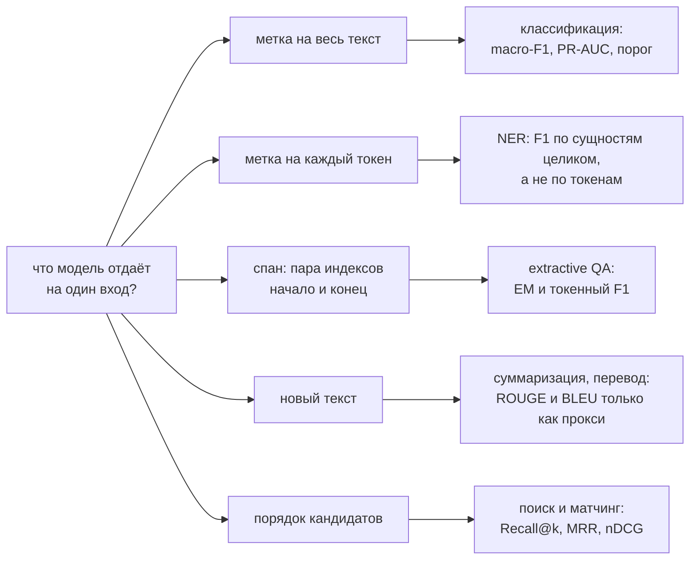

# Задачи NLP и их метрики

> **Зачем эта глава.** Выбор метрики в NLP — не формальность в конце проекта, а часть постановки
> задачи, и именно здесь дороже всего ошибаться: token-level F1 в NER показывает 0,92 при том,
> что модель не извлекла ни одной сущности целиком; ROUGE растёт, а люди говорят, что суммаризация
> стала хуже. После этой главы вы будете знать, как измеряется каждая типовая задача NLP, где
> метрика врёт, и сможете аргументированно объяснить это на собеседовании и на ревью проекта.

**Уровень:** 🎯 middle → 🧠 middle+
**Предварительно нужно:** [метрики качества](../02-classic-ml/04-metrics.md),
[BERT и энкодеры](04-bert-and-encoders.md), [seq2seq и декодирование](03-seq2seq-and-attention.md),
[текст как данные](01-text-representation.md)
**Как проработать:** чтение + реализация метрик руками

---

## Карта главы

- [1. Почему метрика — это часть постановки](#1-почему-метрика--это-часть-постановки)
- [2. Классификация текстов](#2-классификация-текстов)
- [3. NER: схемы разметки](#3-ner-схемы-разметки)
- [4. NER: метрики по сущностям](#4-ner-метрики-по-сущностям)
- [5. Extractive QA](#5-extractive-qa)
- [6. Суммаризация и ROUGE](#6-суммаризация-и-rouge)
- [7. Семантический поиск и матчинг](#7-семантический-поиск-и-матчинг)
- [8. Метрики генерации и их честные границы](#8-метрики-генерации-и-их-честные-границы)
- [9. Перплексия](#9-перплексия)
- [10. Разметка и согласованность аннотаторов](#10-разметка-и-согласованность-аннотаторов)
- [11. Подводные камни](#11-подводные-камни)
- [12. Проверь себя](#12-проверь-себя)
- [13. Практика](#13-практика)
- [14. Что читать дальше](#14-что-читать-дальше)

---

## 1. Почему метрика — это часть постановки

Возьмём реальную ситуацию. Продукт: извлечение из договоров сумм, дат и контрагентов, чтобы
автоматически заполнять карточку сделки. Модель обучена, разметка есть, метрика — F1 по токенам,
значение 0,94. Выкатили — операторы жалуются, что «ничего не работает».

Разбираемся. Модель почти всегда угадывает, что токен относится к сущности «контрагент»,
но регулярно ошибается на границе: захватывает лишнее слово или теряет первое. Токенов
она размечает правильно 94%. Но карточку заполняет **строка целиком**, и строка с ошибкой
на одном слове бесполезна ровно так же, как пустая. Доля полностью корректно извлечённых
контрагентов — 0,55.

Метрика была измерена честно. Она просто измеряла не то, что определяет пользу.

Отсюда рабочее правило, из которого стоит исходить во всей главе: **единица измерения метрики
должна совпадать с единицей, которую потребляет продукт.** Заполняем поле — считаем по полям.
Показываем список — считаем по спискам. Отдаём текст человеку — считать автоматической метрикой
можно только как прокси, и это надо проговаривать вслух.

> 🌱 **База.** Прежде чем считать что-либо, ответьте на три вопроса: (1) что именно является
> одним «объектом» с точки зрения пользы — токен, сущность, документ, ответ целиком?
> (2) какая ошибка дороже — пропуск или ложное срабатывание? (3) есть ли порог, ниже которого
> результат вообще не используется? Ответы диктуют метрику; всё остальное — техника.

Вся глава укладывается в одну развилку — идите по ней от вопроса «что модель отдаёт на один
вход»; ветка сразу задаёт и единицу подсчёта, и семейство метрик, и формат разметки.



Ветки не переставляются местами: если продукт потребляет сущность целиком, считать по токенам
нельзя, даже когда голова модели физически предсказывает метку каждого токена — [§4](#4-ner-метрики-по-сущностям)
показывает, во сколько раз при этом расходятся цифры.

---

## 2. Классификация текстов

### 2.1 Однометочная

Здесь ничего специфически текстового нет: precision, recall, F1, ROC-AUC, PR-AUC, log-loss,
выбор порога — всё разобрано в [главе про метрики](../02-classic-ml/04-metrics.md). Две
специфические оговорки для текста.

**Дисбаланс почти всегда сильный.** Категории обращений в поддержку распределены как степенной
закон: три темы дают 70% трафика, а хвост из сорока тем — по 0,1%. Смотреть macro-F1 обязательно:
micro-F1 (= accuracy при однометочной классификации) полностью определяется головой распределения
и не заметит, что модель не умеет ни один редкий класс.

**Классы протекают друг в друга.** «Проблема с оплатой» и «проблема с доставкой» пересекаются
на заказах, которые не доставили из-за неудачной оплаты. Прежде чем гнаться за качеством, стоит
посмотреть на матрицу ошибок и проверить, не путает ли модель ровно те пары классов, которые
путают и разметчики. Верхняя граница качества модели — согласованность аннотаторов (раздел 10).

### 2.2 Многометочная классификация

Задача: у одного текста может быть **несколько** меток одновременно. Обращение «не пришёл заказ
и списали дважды» — это и «доставка», и «оплата». Обращение «спасибо, всё отлично» — ноль меток.

Формально: для каждого объекта $i$ целевой вектор $y_i \in \{0,1\}^K$, где $K$ — число меток.
Модель выдаёт $\hat{p}_i \in [0,1]^K$. Ключевое отличие от многоклассовой задачи — **нет softmax**:
метки не конкурируют за вероятностную массу. Каждая метка — независимая бинарная задача:

$$
\mathcal{L} = -\frac{1}{n}\sum_{i=1}^{n}\sum_{k=1}^{K}\Big[y_{ik}\log \hat{p}_{ik} + (1-y_{ik})\log\big(1-\hat{p}_{ik}\big)\Big]
$$

где $n$ — число объектов, $K$ — число меток, $y_{ik} \in \{0,1\}$ — присутствие метки $k$
у объекта $i$, $\hat{p}_{ik} = \sigma(z_{ik})$ — сигмоида от логита. Это `BCEWithLogitsLoss`
в PyTorch (именно `WithLogits` — версия с сигмоидой внутри численно устойчивее).

Метрик здесь несколько, и они меряют разное:

| Метрика | Как считается | Что показывает |
|---|---|---|
| micro-F1 | TP, FP, FN суммируются по **всем** парам (объект, метка), потом одна F1 | качество, взвешенное по частоте меток; доминируют частые |
| macro-F1 | F1 считается для каждой метки, потом среднее | все метки равноправны; редкие видны |
| weighted-F1 | среднее F1 по меткам с весами = частота | компромисс, часто маскирует проблему |
| samples-F1 | F1 считается внутри каждого объекта, потом среднее по объектам | насколько хорош **набор** меток на одном тексте |
| Hamming loss | доля неверных ячеек матрицы $n \times K$ | «сколько бит ошиблись»; при разреженных метках почти всегда мал и бесполезен |
| subset accuracy | доля объектов с **точно** угаданным набором меток | самая строгая; правильная, если продукт потребляет набор целиком |

> ⚠️ **Типичная ошибка.** Отчитаться Hamming loss и обрадоваться. При $K = 50$ и в среднем
> двух метках на объект тривиальная модель «никогда ничего не предсказываю» даёт Hamming loss
> $2/50 = 0{,}04$ — выглядит отлично, а пользы ноль. Тот же дефект у accuracy при дисбалансе,
> только в новой обёртке.

**Порог подбирается для каждой метки отдельно.** Это главный практический приём многометочной
классификации, и его почти всегда забывают. Общий порог 0,5 оптимален только если все метки
одинаково частотны и модель одинаково хорошо калибрована на каждой, чего не бывает. Правильно:

```python
import numpy as np
from sklearn.metrics import f1_score

def tune_thresholds(y_true: np.ndarray, probs: np.ndarray, grid=np.arange(0.05, 0.96, 0.01)):
    """Подбираем порог отдельно для каждой метки на валидации.

    y_true, probs: (n, K). Возвращает вектор порогов (K,).
    Метки независимы (нет softmax), поэтому оптимизация покоординатная — это корректно
    для macro-F1 и не требует перебора 2^K комбинаций.
    """
    n, K = y_true.shape
    thresholds = np.full(K, 0.5)
    for k in range(K):
        # редкая метка без единого позитива на валидации: подбирать не на чем,
        # оставляем консервативный дефолт, иначе получим случайный порог
        if y_true[:, k].sum() == 0:
            continue
        scores = [f1_score(y_true[:, k], probs[:, k] >= t, zero_division=0) for t in grid]
        thresholds[k] = grid[int(np.argmax(scores))]
    return thresholds


if __name__ == "__main__":
    rng = np.random.default_rng(0)
    y = (rng.random((2000, 5)) < [0.5, 0.2, 0.1, 0.05, 0.02]).astype(int)
    # имитируем откалиброванные, но зашумлённые вероятности
    p = np.clip(y * 0.6 + rng.normal(0.2, 0.2, y.shape), 0, 1)
    th = tune_thresholds(y, p)
    base = f1_score(y, p >= 0.5, average="macro", zero_division=0)
    tuned = f1_score(y, p >= th, average="macro", zero_division=0)
    print(f"macro-F1: порог 0.5 -> {base:.3f}, подобранные пороги -> {tuned:.3f}")
```

Подбирать пороги надо на **отдельной** валидации, не на тесте, иначе вы переобучите пороги
и получите оптимистичную оценку. Это тот же лик, что и подбор гиперпараметров по тесту.

> 💬 **На собеседовании.** Спросят: «Чем многометочная классификация отличается от многоклассовой
> и что меняется в обучении?»
> Хороший ответ: в многоклассовой ровно одна метка верна, поэтому softmax + кросс-энтропия
> и метки конкурируют за вероятностную массу. В многометочной меток может быть ноль, одна или
> несколько, поэтому $K$ независимых сигмоид и BCE. Меняются метрики: micro/macro/samples-усреднение
> меряют разное, subset accuracy — самая строгая. Меняется инференс: порог подбирается для каждой
> метки отдельно на валидации. Стоит добавить, что BCE игнорирует зависимости между метками
> (если A почти всегда влечёт B, модель этого не знает), и если зависимости сильные — есть
> classifier chains и иерархические головы. Провал: «то же самое, только несколько классов».

### 2.3 Иерархические метки

Если метки образуют дерево («финансы → платежи → двойное списание»), плоская классификация теряет
структуру: ошибка внутри одной ветки дешевле, чем перепрыгивание в другую ветку. Практичные
варианты: обучать плоско по листьям и агрегировать вверх (просто, работает); либо считать метрику
с учётом иерархии — засчитывать частичное совпадение пути. Главное — договориться о стоимости
ошибок до обучения, а не после.

---

## 3. NER: схемы разметки

**Named Entity Recognition** — извлечение из текста упоминаний сущностей с их типами: персоны,
организации, локации, даты, суммы, номера договоров. Формально это не классификация текста,
а **разметка последовательности** (sequence labeling): каждому токену приписывается метка.

Здесь возникает нетривиальная проблема: сущность может занимать несколько токенов, и две сущности
одного типа могут стоять вплотную. Если размечать просто «PER / ORG / O», то «Иван Петров Мария
Сидорова» превратится в одну сущность из четырёх токенов вместо двух.

### 3.1 IO, BIO, BIOES

**IO** — простейшая: токен либо внутри сущности типа T (`I-T`), либо снаружи (`O`). Именно
она страдает описанной проблемой: соседние однотипные сущности склеиваются.

**BIO** (она же IOB2) — рабочий стандарт. Три префикса:

- `B-T` — **begin**, первый токен сущности типа T;
- `I-T` — **inside**, продолжение сущности типа T;
- `O` — **outside**, не сущность.

```
Иван    Петров   работает  в   Яндексе  с   2019  года
B-PER   I-PER    O         O   B-ORG    O   B-DATE O
```

Теперь «Иван Петров Мария Сидорова» разметится как `B-PER I-PER B-PER I-PER` — граница видна
по префиксу `B`. Число классов: $2 \cdot |T| + 1$, где $|T|$ — число типов сущностей.

**BIOES** (она же BILOU) добавляет ещё два префикса:

- `E-T` — **end**, последний токен многотокенной сущности;
- `S-T` — **single**, сущность из одного токена.

```
Иван    Петров   работает  в   Яндексе  с   2019   года
B-PER   E-PER    O         O   S-ORG    O   B-DATE E-DATE
```

Зачем сложнее? Схема даёт модели явный сигнал о **конце** сущности, а не только о начале.
Эмпирически на некоторых датасетах это добавляет доли пункта F1 — граница справа предсказывается
точнее. Цена: классов становится $4|T| + 1$, каждый класс получает меньше примеров, и на маленьких
датасетах BIOES проигрывает BIO. Практическое правило: начинайте с BIO, BIOES пробуйте как
эксперимент, если данных много.

> 🧠 **Middle+. Некорректные последовательности.** Модель предсказывает метки токенов независимо
> и легко выдаёт невозможные цепочки: `O I-PER I-PER` (внутри без начала) или `B-PER I-ORG`
> (смена типа посередине). Два способа справиться. Первый — **CRF-слой** поверх энкодера:
> он моделирует переходы между метками и на декодировании (алгоритм Витерби) выбирает лучшую
> **допустимую** последовательность целиком. Второй — постобработка по фиксированным правилам:
> `I-` без предшествующего `B-` того же типа трактуем как начало новой сущности (так делает
> «мягкий» режим стандартных библиотек). С сильным трансформерным энкодером выигрыш от CRF
> обычно невелик (доли пункта), а стоимость — усложнение обучения и замедление декодирования;
> на слабых энкодерах и на маленьких данных CRF помогает заметно.

### 3.2 Span-based подход

Альтернатива разметке токенов: не помечать токены, а напрямую **классифицировать промежутки**
(spans). Модель перебирает кандидатов $(i, j)$ — начало и конец — и для каждого решает, является
ли он сущностью и какого типа. Обычно ограничивают длину промежутка (скажем, до 10 токенов),
иначе кандидатов $O(n^2)$.

Что это даёт:

- **Вложенные сущности** (nested NER). «Правительство Москвы» — это ORG, а «Москва» внутри
  него — LOC. В BIO это невыразимо в принципе: у токена одна метка. Span-based берёт естественно.
- **Пересекающиеся сущности** и множественные типы у одного промежутка.
- Нет проблемы некорректных цепочек — промежуток либо предсказан, либо нет.

Что стоит: $O(n^2)$ кандидатов (при $n = 512$ и ограничении длины 10 — около 5 тысяч, терпимо),
сильный дисбаланс (подавляющее большинство промежутков — не сущности), и метрика оценки
меняется мало, потому что предсказание уже и так в терминах промежутков.

Ещё один вариант, полезный когда типов много и они меняются, — **свести NER к extractive QA**:
задавать вопрос «Найди в тексте организации» и извлекать промежутки, как в SQuAD (раздел 5).
Модель тогда обобщается на новые типы сущностей по формулировке вопроса.

---

## 4. NER: метрики по сущностям

### 4.1 Почему token-level F1 вводит в заблуждение

Это, пожалуй, самый частый содержательный вопрос по NER на собеседовании. Разберём на числах.

Пусть в тестовой выборке 100 сущностей, каждая длиной 5 токенов, всего 500 «сущностных» токенов.
Модель систематически ошибается на одну позицию: захватывает первый токен слева от сущности
и теряет последний.

**Считаем по токенам.** Из 5 токенов каждой сущности модель верно пометила 4, добавила 1 лишний.
TP = 400, FN = 100, FP = 100. Precision = recall = F1 = **0,80**. Выглядит как рабочая модель.

**Считаем по сущностям (strict).** Ни один предсказанный промежуток не совпал с эталонным
ни началом, ни концом. TP = 0, FP = 100, FN = 100. F1 = **0,00**.

Разрыв — 0,80 против 0,00 — и правы вторые. Если вы извлекаете название компании для заполнения
поля в CRM, «ООО Ромашка и» вместо «ООО Ромашка» — это не 80% пользы, это ноль пользы плюс
ручная правка.

Второй, менее очевидный дефект token-level метрики: она **взвешивает сущности по длине**.
Одна сущность из 12 токенов влияет на метрику как 12 сущностей из одного токена. Система,
хорошо находящая длинные адреса и плохо — короткие фамилии, по токенам выглядит отлично,
по сущностям — плохо.

> 💬 **На собеседовании.** Спросят: «Как вы оцениваете качество NER?»
> Хороший ответ: по сущностям, а не по токенам, потому что продукт потребляет сущность целиком.
> Стандарт — strict match из CoNLL: предсказание засчитывается, только если совпали и границы,
> и тип. Дальше — числовой пример: систематический сдвиг границы на один токен даёт token-F1
> около 0,8 и entity-F1 ровно 0. Стоит добавить, что для некоторых продуктов уместен partial
> match (если оператор всё равно проверяет глазами, пересечение полезно) и что тогда надо явно
> отдельно отчитываться по ошибкам типа и по ошибкам границ — это разные проблемы с разными
> лекарствами. Провал: «F1 по токенам» без оговорок.

### 4.2 Строгое и частичное совпадение

Схема оценки, восходящая к MUC и оформленная в SemEval, различает несколько исходов сравнения
предсказанного промежутка с эталонным:

| Исход | Границы | Тип | Комментарий |
|---|---|---|---|
| **COR** (correct) | точно совпали | совпал | идеал |
| **INC** (incorrect) | точно совпали | не совпал | найдено, но не то — например, ORG вместо LOC |
| **PAR** (partial) | пересекаются, но не равны | совпал | ошибка границы |
| **MIS** (missing) | — | — | сущность в эталоне есть, предсказания нет |
| **SPU** (spurious) | — | — | предсказание есть, в эталоне нет |

Из них строят режимы оценки:

- **strict** — засчитывается только COR. Это то, что считает стандартный скрипт CoNLL-2003
  и библиотека `seqeval` в строгом режиме. Дефолт для отчётности.
- **exact boundary** — границы точные, тип игнорируется. Показывает, насколько хорошо модель
  находит *где*, отдельно от *что*.
- **partial** — PAR засчитывается с весом 0,5. Полезно, когда человек всё равно проверяет.
- **type match** — достаточно пересечения границ при верном типе.

Разница между strict и exact boundary — диагностическая: если она велика, проблема в типах
(классы путаются, вероятно, разметка непоследовательна); если мала, а partial сильно выше strict —
проблема в границах (скорее всего, токенизация или несогласованные правила «включать ли титул,
кавычки, организационно-правовую форму»).

### 4.3 Реализация

Извлечение сущностей из BIO и подсчёт strict-F1 — код, который полезно написать руками
хотя бы раз, потому что именно в нём прячутся расхождения между вашими числами и числами коллег.

```python
def extract_entities(tags: list[str]) -> set[tuple[int, int, str]]:
    """BIO -> множество сущностей (start, end_exclusive, type).

    Мягкий режим: 'I-T' без предшествующего 'B-T' того же типа открывает новую сущность.
    Это ровно то, что делают стандартные библиотеки, и это надо знать: разные соглашения
    об обработке некорректных цепочек дают РАЗНЫЕ числа на одних и тех же предсказаниях.
    """
    entities, start, ent_type = set(), None, None

    def close(end: int):
        nonlocal start, ent_type
        if start is not None:
            entities.add((start, end, ent_type))
        start, ent_type = None, None

    for i, tag in enumerate(tags):
        if tag == "O":
            close(i)
        else:
            prefix, _, t = tag.partition("-")
            # новую сущность открывает 'B', а также 'I' при смене типа или после 'O'
            if prefix == "B" or start is None or t != ent_type:
                close(i)
                start, ent_type = i, t
    close(len(tags))
    return entities


def entity_f1(gold_seqs: list[list[str]], pred_seqs: list[list[str]]) -> dict:
    """Strict micro-F1 по сущностям: совпасть должны и границы, и тип."""
    tp = fp = fn = 0
    for gold, pred in zip(gold_seqs, pred_seqs):
        g, p = extract_entities(gold), extract_entities(pred)
        tp += len(g & p)
        fp += len(p - g)   # предсказали лишнее (SPU или неверные границы/тип)
        fn += len(g - p)   # пропустили (MIS или неверные границы/тип)
    precision = tp / (tp + fp) if tp + fp else 0.0
    recall = tp / (tp + fn) if tp + fn else 0.0
    f1 = 2 * precision * recall / (precision + recall) if precision + recall else 0.0
    return {"precision": precision, "recall": recall, "f1": f1, "tp": tp, "fp": fp, "fn": fn}


if __name__ == "__main__":
    gold = [["B-PER", "I-PER", "O", "O", "B-ORG"]]
    # модель сдвинула границу персоны и не нашла организацию
    pred = [["B-PER", "I-PER", "I-PER", "O", "O"]]
    print(entity_f1(gold, pred))   # f1 = 0.0: ни одна сущность не совпала целиком

    # token-level для сравнения: 4 из 5 меток верны -> выглядит прилично
    token_acc = sum(a == b for a, b in zip(gold[0], pred[0])) / len(gold[0])
    print("token accuracy:", token_acc)   # 0.8 — та самая иллюзия
```

В продакшене используйте `seqeval` — это де-факто стандарт, совместимый со скриптом CoNLL,
поддерживающий BIO/BIOES и строгий/мягкий режимы. Но понимать, что он делает, обязательно:
`seqeval` в режиме по умолчанию и в режиме `strict` с указанной схемой даёт **разные** числа.

> ⚠️ **Типичная ошибка.** Считать метрику по сабтокенам вместо слов. Трансформер режет
> «Сидорова» на `Сид ##ор ##ова`, и разметка распространяется на кусочки. Если считать F1
> по сабтокенам, число ни с чем не сопоставимо: оно зависит от токенизатора. Правильно —
> агрегировать предсказания обратно на уровень слов (обычно берут метку первого сабтокена слова),
> и только потом извлекать сущности и считать метрику.

---

## 5. Extractive QA

### 5.1 Постановка

Дано: вопрос $q$ и контекст (параграф) $c$. Ответ гарантированно является **непрерывным
фрагментом контекста**. Нужно найти его границы. Это постановка SQuAD, и она до сих пор
практически ценна: так работает извлечение фактов из документов, где галлюцинации недопустимы —
модель физически не может выдумать текст, она только указывает на него.

Реализация на энкодере проста: подаём `[CLS] вопрос [SEP] контекст [SEP]`, поверх выходов
вешаем два линейных слоя $d \to 1$, получая логиты начала $s_i$ и конца $e_i$ для каждой
позиции $i$. Обучаем двумя кросс-энтропиями — по правильной позиции начала и правильной позиции
конца. На инференсе выбираем пару:

$$
(\hat{i}, \hat{j}) = \arg\max_{i \le j,\; j - i < L_{\max}} \big(s_i + e_j\big)
$$

где $s_i$ — логит того, что ответ начинается на позиции $i$, $e_j$ — логит окончания на позиции
$j$, $L_{\max}$ — максимальная допустимая длина ответа (обычно 30 токенов).

Ограничения $i \le j$ и на длину — не косметика. Без них независимые argmax по началу и концу
регулярно дают «конец раньше начала» или ответ на пол-параграфа.

```python
import torch

def decode_span(start_logits: torch.Tensor, end_logits: torch.Tensor,
                context_mask: torch.Tensor, max_answer_len: int = 30):
    """Совместный выбор (start, end). Формы: (n,) для логитов и маски.

    context_mask: True на токенах КОНТЕКСТА (не вопроса, не служебных).
    Без совместного декодирования независимые argmax дают невалидные промежутки.
    """
    neg = torch.finfo(start_logits.dtype).min
    s = start_logits.masked_fill(~context_mask, neg)
    e = end_logits.masked_fill(~context_mask, neg)

    # матрица сумм: score[i, j] = s_i + e_j — совместный скор промежутка (i, j)
    score = s[:, None] + e[None, :]                                    # (n, n)

    n = score.shape[0]
    idx = torch.arange(n)
    valid = (idx[:, None] <= idx[None, :]) & (idx[None, :] - idx[:, None] < max_answer_len)
    score = score.masked_fill(~valid, neg)

    flat = int(score.argmax())
    return flat // n, flat % n     # (start, end) включительно


if __name__ == "__main__":
    torch.manual_seed(0)
    n = 12
    s_log, e_log = torch.randn(n), torch.randn(n)
    mask = torch.zeros(n, dtype=torch.bool)
    mask[4:] = True                          # первые 4 позиции — вопрос и [SEP]
    i, j = decode_span(s_log, e_log, mask, max_answer_len=5)
    assert 4 <= i <= j < n and j - i < 5
    print("span:", i, j)
```

### 5.2 EM и F1

Две канонические метрики SQuAD.

**Exact Match (EM)** — доля вопросов, где предсказанная строка после нормализации **точно**
совпала с эталонной. Нормализация обязательна и стандартизована: нижний регистр, удаление
пунктуации, удаление артиклей (для английского), схлопывание пробелов. Без неё «Москва.»
и «Москва» считались бы разными ответами, что бессмысленно.

**F1** — здесь это F1 по **множеству токенов** (мешку слов) предсказания и эталона:

$$
\text{precision} = \frac{|\text{pred} \cap \text{gold}|}{|\text{pred}|}, \qquad
\text{recall} = \frac{|\text{pred} \cap \text{gold}|}{|\text{gold}|}, \qquad
F_1 = \frac{2 \cdot \text{precision}\cdot\text{recall}}{\text{precision}+\text{recall}}
$$

где $\text{pred}$ и $\text{gold}$ — мультимножества токенов предсказанного и эталонного ответов,
пересечение считается с учётом кратности.

Зачем две метрики? EM строг и бинарен: «в 1980 году» против «1980» — это 0. F1 даёт частичный
кредит: 0,5. Реальная полезность обычно между ними, поэтому отчитываются оба числа. Если
эталонных ответов несколько (в SQuAD их три от разных аннотаторов), берут **максимум** метрики
по эталонам — это признание того, что правильных формулировок бывает несколько.

Обратите внимание на важное отличие от NER: здесь **осознанно** используется частичное совпадение
по токенам, потому что ответ на вопрос читает человек, и «1980» вместо «в 1980 году» полезно.
В NER, где строка идёт в поле базы данных, частичное совпадение бесполезно. Метрика следует
за потреблением — то самое правило из раздела 1.

### 5.3 SQuAD 2.0 и неотвечаемые вопросы

Первая версия SQuAD гарантировала, что ответ в контексте есть. Это создавало нездоровую модель
поведения: система училась всегда что-то выдавать, находя «самое похожее на ответ» место.
В реальном поиске по документам вопрос часто **не имеет** ответа в найденном фрагменте,
и выдать что-то — хуже, чем промолчать.

SQuAD 2.0 добавила неотвечаемые вопросы. Стандартный приём реализации: разрешить модели указывать
на позицию `[CLS]` как на «ответа нет». На инференсе сравнивают лучший скор реального промежутка
с «нулевым» скором $s_{\text{CLS}} + e_{\text{CLS}}$ и порог настраивают на валидации.

Практический вывод для продукта: **отдельно измеряйте качество отказа**. Модель, которая
на 90% отвечает верно, но на неотвечаемых вопросах уверенно выдумывает, в проде опаснее модели
с 80% ответов и честными отказами. Это ровно та же логика, что и в
[оценке RAG](../05-llm/07-rag.md).

---

## 6. Суммаризация и ROUGE

### 6.1 Две постановки

**Экстрактивная** суммаризация выбирает из исходного текста наиболее информативные предложения
и склеивает их. Плюсы: невозможно выдумать факт, легко объяснить выбор, дёшево. Минусы: результат
рваный, местоимения теряют антецеденты («Он подтвердил это» — кто и что?), нельзя сжать сильно.

**Абстрактивная** генерирует новый текст. Плюсы: связность, произвольная степень сжатия,
перефразирование. Минусы: галлюцинации — модель уверенно вписывает факты, которых в источнике
нет. Это главный производственный риск, и ROUGE его **не ловит** совсем.

### 6.2 ROUGE

ROUGE (Recall-Oriented Understudy for Gisting Evaluation) — семейство метрик, сравнивающих
кандидат с эталонным резюме по пересечению n-грамм. Ориентация на **полноту** заложена
в название: важнее не потерять содержание эталона, чем не добавить лишнего.

**ROUGE-N** — доля n-грамм эталона, покрытых кандидатом:

$$
\text{ROUGE-N}_{\text{recall}} \;=\; \frac{\sum_{g \in \mathcal{G}_N(\text{ref})} \min\big(c_{\text{cand}}(g),\, c_{\text{ref}}(g)\big)}{\sum_{g \in \mathcal{G}_N(\text{ref})} c_{\text{ref}}(g)}
$$

где $\mathcal{G}_N(\text{ref})$ — множество n-грамм эталонного резюме, $c_{\text{ref}}(g)$ —
сколько раз n-грамма $g$ встречается в эталоне, $c_{\text{cand}}(g)$ — сколько раз в кандидате,
минимум обеспечивает **клиппинг**: повторив n-грамму десять раз, кандидат не наберёт больше,
чем есть в эталоне. ROUGE-1 работает с униграммами (что сказано), ROUGE-2 — с биграммами
(насколько связно сказано).

Точность считается симметрично (в знаменателе — n-граммы кандидата), F-мера — как обычно.
На практике отчитываются F-мерой, но помните: чистый recall можно накрутить длиной, поэтому
всегда смотрите на длину выдачи вместе с метрикой.

**ROUGE-L** основана на наибольшей общей подпоследовательности (Longest Common Subsequence).
Подпоследовательность, в отличие от подстроки, допускает пропуски — значит, метрика терпима
к вставкам слов и не требует непрерывного совпадения:

$$
R_{\text{lcs}} = \frac{\text{LCS}(X, Y)}{m}, \qquad
P_{\text{lcs}} = \frac{\text{LCS}(X, Y)}{k}, \qquad
F_{\text{lcs}} = \frac{(1+\beta^2)\,R_{\text{lcs}} P_{\text{lcs}}}{R_{\text{lcs}} + \beta^2 P_{\text{lcs}}}
$$

где $X$ — эталон длины $m$ токенов, $Y$ — кандидат длины $k$ токенов, $\text{LCS}(X,Y)$ — длина
их наибольшей общей подпоследовательности, $\beta$ — вес полноты относительно точности
(в оригинальной реализации $\beta$ велик, то есть метрика почти чисто recall-ориентирована).

Вариант ROUGE-Lsum считает LCS по предложениям и суммирует — для многопредложенческих резюме
он корректнее, и именно его чаще всего имеют в виду, когда пишут «ROUGE-L» в статьях
по суммаризации.

```python
def lcs_length(a: list[str], b: list[str]) -> int:
    """Классическая динамика O(len(a) * len(b)) по памяти O(min)."""
    if len(a) < len(b):
        a, b = b, a
    prev = [0] * (len(b) + 1)
    for x in a:
        curr = [0] * (len(b) + 1)
        for j, y in enumerate(b, start=1):
            curr[j] = prev[j - 1] + 1 if x == y else max(prev[j], curr[j - 1])
        prev = curr
    return prev[-1]


def rouge_l(reference: str, candidate: str, beta: float = 1.2) -> dict:
    ref, cand = reference.lower().split(), candidate.lower().split()
    if not ref or not cand:
        return {"p": 0.0, "r": 0.0, "f": 0.0}
    l = lcs_length(ref, cand)
    r, p = l / len(ref), l / len(cand)
    # beta > 1 смещает F-меру в сторону полноты — так задумано в ROUGE
    f = ((1 + beta**2) * r * p / (r + beta**2 * p)) if r + p else 0.0
    return {"p": round(p, 3), "r": round(r, 3), "f": round(f, 3)}


if __name__ == "__main__":
    ref = "банк снизил ставку по ипотеке до семи процентов"
    print(rouge_l(ref, "ставку по ипотеке банк снизил до семи процентов"))  # перестановка
    print(rouge_l(ref, "банк повысил ставку по ипотеке до семи процентов")) # смысл обратный!
```

Запустите последние две строки и посмотрите на числа. Перестановка слов ощутимо роняет ROUGE-L,
хотя смысл сохранён полностью. Замена «снизил» на «повысил» — смысл **противоположный** —
роняет метрику меньше, потому что различается всего одно слово. Это и есть главный изъян
всех n-граммных метрик в одном примере.

### 6.3 Границы ROUGE

Что ROUGE не видит:

- **Фактическую корректность.** Резюме, где перепутаны стороны сделки или знак изменения,
  наберёт почти ту же ROUGE, что и верное. Для абстрактивной суммаризации это дисквалифицирующий
  недостаток, и его закрывают отдельными метриками фактологичности (NLI-модель проверяет,
  следует ли каждое утверждение резюме из источника) либо LLM-судьёй.
- **Синонимию и перефразирование.** «Снизил ставку» и «уменьшил процент» для ROUGE — ноль общего.
  Абстрактивные модели наказываются за то, ради чего их и берут.
- **Связность и читаемость.** Мешок n-грамм не про это.

ROUGE остаётся полезной как **регрессионная** метрика: она дёшева, воспроизводима и уверенно
ловит грубые деградации (модель начала выдавать пустое, обрезанное или зациклившееся). Как
метрика для принятия продуктовых решений — нет. Стандартный производственный компромисс: ROUGE
на каждом коммите как страховка от поломок, человеческая оценка или калиброванный LLM-судья
на релизах.

---

## 7. Семантический поиск и матчинг

Задача: по запросу найти релевантные документы, или найти дубликаты, или сматчить товар
из прайса поставщика с карточкой в каталоге. Технически это работа с эмбеддингами
(см. [раздел 8 предыдущей главы](04-bert-and-encoders.md#8-эмбеддинги-предложений-как-не-сделать-это-неправильно))
плюс ANN-индекс.

Метрики здесь — ранжирующие, и они детально разобраны в
[главе про офлайн-метрики рекомендаций](../06-recsys/02-metrics-offline.md). Ключевые:

- **Recall@k** — доля релевантных документов, попавших в топ-$k$. Главная метрика **ретривала**:
  если нужный документ не попал в топ-$k$, никакой реранкер и никакая LLM его уже не спасут.
  В RAG это метрика первой стадии, и на неё смотрят в первую очередь.
- **MRR** (Mean Reciprocal Rank) — среднее по запросам от $1/\text{rank}$ первого релевантного.
  Уместна, когда правильный ответ один: поиск карточки товара, дедупликация.
- **nDCG@k** — учитывает и позицию, и градуированную релевантность. Уместна, когда релевантных
  много и они разного качества.

Что специфично для текста и стоит проговорить.

**Разметка релевантности дорога и субъективна.** Для оценки нужны пары «запрос — релевантный
документ». Три источника: (1) логи кликов — дёшево и много, но смещено позиционным биасом
и не отражает релевантность напрямую; (2) ручная разметка асессорами — дорого, зато чисто;
(3) LLM-разметка — компромисс, но требует валидации на ручной подвыборке.

**Негативы определяют качество обучения.** Случайные негативы слишком лёгкие. Правильный
рецепт — hard negatives: документы, которые текущая модель или BM25 ставят высоко, но которые
нерелевантны. Это не тонкая настройка, а разница между рабочим и нерабочим ретривером.

**Гибрид почти всегда лучше чистого dense.** Плотные эмбеддинги плохо работают с точными
совпадениями: артикулы, номера договоров, редкие имена собственные, аббревиатуры. BM25 их
находит идеально. Комбинация BM25 + dense (например, через Reciprocal Rank Fusion) стабильно
обгоняет каждую компоненту по отдельности. Подробнее — в [главе про RAG](../05-llm/07-rag.md).

> 💬 **На собеседовании.** Спросят: «Какую метрику вы будете смотреть у ретривера в RAG?»
> Хороший ответ: Recall@k на первой стадии, потому что не попавший в кандидаты документ потерян
> безвозвратно, а $k$ определяется тем, сколько кандидатов переваривает реранкер и сколько
> контекста влезает в LLM. Дополнительно — nDCG@k, если реранкер есть и позиция важна, и метрика
> «покрытие», то есть доля запросов, для которых нашёлся хоть один релевантный документ. И отдельно:
> метрики ретривала и метрики генерации надо мерить **раздельно**, иначе не поймёте, кто виноват
> в плохом ответе. Провал: назвать одну метрику «качество ответа» на весь пайплайн.

---

## 8. Метрики генерации и их честные границы

### 8.1 BLEU

BLEU (Bilingual Evaluation Understudy) создана для машинного перевода и меряет **точность**:
какая доля n-грамм кандидата встречается в эталоне.

$$
\text{BLEU} \;=\; \text{BP}\cdot\exp\!\left(\sum_{n=1}^{N} w_n \log p_n\right)
$$

где $N$ — максимальный порядок n-грамм (обычно 4), $w_n$ — веса (обычно $1/N$ каждый),
$p_n$ — модифицированная точность по n-граммам порядка $n$, $\text{BP}$ — штраф за краткость.

Модифицированная точность с клиппингом:

$$
p_n = \frac{\sum_{C \in \text{корпус}} \sum_{g \in \mathcal{G}_n(C)} \min\big(c_C(g),\, \max_{r} c_r(g)\big)}{\sum_{C \in \text{корпус}} \sum_{g \in \mathcal{G}_n(C)} c_C(g)}
$$

где $C$ — предложение-кандидат, $\mathcal{G}_n(C)$ — множество его n-грамм порядка $n$,
$c_C(g)$ — число вхождений n-граммы $g$ в кандидат, $c_r(g)$ — число вхождений в эталон $r$,
максимум берётся по всем доступным эталонам. Клиппинг нужен, чтобы кандидат «the the the the»
не получил единичную точность.

Штраф за краткость:

$$
\text{BP} = \begin{cases} 1, & c > r \\[2pt] \exp\!\left(1 - \dfrac{r}{c}\right), & c \le r \end{cases}
$$

где $c$ — суммарная длина кандидатов в токенах, $r$ — суммарная длина ближайших по длине
эталонов. BP компенсирует то, что BLEU — метрика точности: без него оптимальной стратегией
было бы выдавать одно самое уверенное слово.

Три вещи о BLEU, которые надо знать наизусть:

1. **BLEU считается по корпусу, а не по предложению.** Суммы в числителе и знаменателе $p_n$
   идут по всему тестовому набору. Предложенческий BLEU («sentence BLEU») определён плохо:
   при отсутствии совпадений среди 4-грамм $\log p_4 = -\infty$, и приходится сглаживать.
   Усреднять sentence-BLEU по предложениям — **не** то же самое, что corpus BLEU.
2. **Числа несопоставимы между работами без указания токенизации.** BLEU зависит от того,
   как разбит текст, отделена ли пунктуация, приведён ли регистр. Расхождения достигают
   нескольких пунктов. Отсюда `sacreBLEU` — реализация с зафиксированной токенизацией
   и сигнатурой конфигурации; используйте только её.
3. **Геометрическое среднее обнуляется.** Если хоть одна $p_n = 0$, весь BLEU равен нулю.
   На коротких текстах это происходит постоянно.

### 8.2 METEOR

METEOR чинит два изъяна BLEU: жёсткое сравнение слов и игнорирование полноты.

Сопоставление кандидата и эталона идёт **поэтапно**: сначала точные совпадения, затем совпадения
по основе слова (стемминг), затем по синонимам из тезауруса. Итоговая оценка:

$$
F_{\text{mean}} = \frac{10 P R}{R + 9 P}, \qquad
\text{Penalty} = 0{,}5\left(\frac{\#\text{chunks}}{\#\text{matches}}\right)^{3}, \qquad
\text{METEOR} = F_{\text{mean}} \cdot (1 - \text{Penalty})
$$

где $P$ — точность униграммного сопоставления, $R$ — полнота, $\#\text{matches}$ — число
сопоставленных униграмм, $\#\text{chunks}$ — число непрерывных блоков, на которые распадается
сопоставление. Коэффициенты 10 и 9 в $F_{\text{mean}}$ означают, что полнота весит в 9 раз
больше точности — это подобрано под корреляцию с человеческими оценками.

Штраф за фрагментацию — содержательная идея: если сопоставленные слова идут подряд одним блоком,
$\#\text{chunks}$ мало и штраф мал; если те же слова разбросаны по предложению в другом порядке,
блоков много и штраф растёт. Так METEOR учитывает порядок, не требуя точных n-грамм.

METEOR коррелирует с человеческими оценками лучше BLEU, особенно на уровне предложений.
Цена: нужны языковые ресурсы (стеммер, тезаурус), качество которых для русского заметно ниже,
чем для английского.

### 8.3 BERTScore

Радикально иная идея: сравнивать не строки, а **эмбеддинги токенов**. Прогоняем эталон
и кандидат через предобученный энкодер, получаем контекстные векторы и сопоставляем токены
жадно по максимальной косинусной близости:

$$
R_{\text{BERT}} = \frac{1}{|x|}\sum_{x_i \in x} \max_{\hat{x}_j \in \hat{x}} \; \mathbf{v}(x_i)^{\top}\mathbf{v}(\hat{x}_j),
\qquad
P_{\text{BERT}} = \frac{1}{|\hat{x}|}\sum_{\hat{x}_j \in \hat{x}} \max_{x_i \in x} \; \mathbf{v}(x_i)^{\top}\mathbf{v}(\hat{x}_j)
$$

где $x$ — токены эталона, $\hat{x}$ — токены кандидата, $\mathbf{v}(\cdot)$ — L2-нормированный
контекстный эмбеддинг токена (поэтому скалярное произведение равно косинусу), $|x|$ и $|\hat{x}|$ —
длины. Итоговый $F_{\text{BERT}}$ — гармоническое среднее $P$ и $R$. Опционально каждый токен
взвешивается по IDF, чтобы служебные слова не разбавляли оценку.

Что даёт: «снизил» и «уменьшил» получают высокую близость, перефразирование не наказывается,
корреляция с людьми выше, чем у BLEU/ROUGE.

Чего не даёт: абсолютные значения не интерпретируемы (из-за анизотропии пространства сырые
значения жмутся к 0,8–0,95, поэтому применяют baseline rescaling); результат зависит от того,
какая модель взята для эмбеддингов — числа из разных работ несопоставимы; фактическую ошибку
BERTScore ловит слабо, потому что «снизил» и «повысил» в пространстве эмбеддингов близки
(они встречаются в одинаковых контекстах — это прямое следствие
[дистрибутивной гипотезы](02-embeddings.md)).

### 8.4 Честный итог по метрикам генерации

| Метрика | Что меряет | Корреляция с человеком | Когда применима |
|---|---|---|---|
| BLEU | точность по n-граммам + штраф за краткость | низкая на уровне предложения, приемлемая на корпусе | перевод, регрессионный контроль |
| ROUGE | полнота по n-граммам / LCS | средняя | суммаризация, регрессионный контроль |
| METEOR | униграммы со стеммингом и синонимами + фрагментация | выше BLEU | перевод, языки с ресурсами |
| BERTScore | близость контекстных эмбеддингов | выше n-граммных | перефразирование, абстрактивная генерация |
| COMET и подобные обучаемые | обучена предсказывать человеческую оценку | самая высокая для перевода | перевод, есть готовые модели |
| LLM-as-judge | что попросили в промпте | высокая при валидации судьи | открытая генерация, см. [оценку LLM](../05-llm/09-llm-evaluation.md) |

Общая правда, которую стоит уметь сформулировать: **все автоматические метрики генерации —
прокси**. Они сравнивают с одним-двумя эталонами, тогда как правильных ответов бесконечно много.
Известные исследования показали, что при сравнении сильных систем разница в BLEU в пределах
одного-двух пунктов не соответствует различию в человеческих оценках, а решения о выборе моделей
по BLEU регулярно оказывались ошибочными. Рабочая схема: автоматические метрики — для непрерывного
контроля и отсечения поломок, человеческая оценка (или валидированный LLM-судья) — для решений.

> 💬 **На собеседовании.** Спросят: «Почему BLEU критикуют и что использовать вместо неё?»
> Хороший ответ: BLEU меряет поверхностное совпадение n-грамм с одним эталоном, поэтому наказывает
> корректное перефразирование и не видит смысловых инверсий; на уровне предложения она почти
> не коррелирует с человеческими оценками; числа несопоставимы без фиксированной токенизации
> (для этого есть sacreBLEU). Замены по нарастанию: METEOR (стемминг и синонимы), BERTScore
> (эмбеддинги вместо строк), обучаемые метрики вроде COMET (прямо предсказывают человеческую
> оценку), LLM-судья с обязательной валидацией на размеченной подвыборке. Но BLEU не выбрасывают
> совсем: она дешёвая, детерминированная и отлично ловит регрессии в CI. Провал: «BLEU плохая,
> надо использовать BERTScore» — без понимания, что и BERTScore имеет свои дефекты.

---

## 9. Перплексия

Перплексия (perplexity) — метрика **самой языковой модели**, а не порождённого ею текста.
Это экспонента от средней кросс-энтропии на токен:

$$
\text{PPL}(x) \;=\; \exp\!\left(-\frac{1}{n}\sum_{i=1}^{n} \log p_\theta\big(x_i \mid x_{<i}\big)\right)
$$

где $x = (x_1, \dots, x_n)$ — тестовая последовательность из $n$ токенов, $x_{<i}$ — префикс
до позиции $i$, $p_\theta$ — вероятность, которую модель с параметрами $\theta$ приписывает
истинному токену. Сумма в экспоненте — это ровно средний log-loss, который вы и так минимизируете
при обучении: $\text{PPL} = \exp(\mathcal{L}_{\text{CE}})$.

**Как её интерпретировать.** Перплексия — это среднее геометрическое обратных вероятностей,
то есть **эффективное число равновероятных вариантов**, между которыми модель колеблется
на каждом шаге. PPL = 1 означает полную уверенность и всегда правильный ответ. PPL = 50 означает,
что модель в среднем «выбирает наугад из пятидесяти». Необученная модель с равномерным
распределением по словарю $|V|$ даёт $\text{PPL} = |V|$ — это отличная санитарная проверка
в начале обучения (та же логика, что и «начальный лосс должен быть $\ln|V|$»
из [главы про трансформер](../03-deep-learning/04-attention-and-transformer.md)).

**Чего перплексия не говорит.**

- **Числа несравнимы между моделями с разными токенизаторами.** Перплексия считается на токен;
  модель с мелким словарём режет текст на больше токенов, и каждый предсказать легче — PPL ниже
  «бесплатно». Сравнивать корректно только при одинаковой токенизации, либо переходить
  к перплексии на символ или на слово.
- **Числа несравнимы между доменами.** PPL на новостях и PPL на медицинских протоколах —
  разные величины. Сравнение имеет смысл только на фиксированном корпусе.
- **Низкая перплексия не означает полезность.** Модель может отлично моделировать распределение
  языка и при этом быть бесполезной как ассистент — она не обучена следовать инструкциям.
  Именно поэтому после предобучения делают SFT и выравнивание
  (см. [SFT и выравнивание](../05-llm/03-sft-and-alignment.md)), а качество меряют совсем другими
  метриками.
- **Перплексия падает от заучивания тестовых данных.** При протечке теста в обучающий корпус
  PPL становится обманчиво низкой. Для больших корпусов это реальная проблема.

Практическое применение: контроль хода предобучения, сравнение чекпоинтов одной модели,
оценка адаптации к домену (PPL до и после дообучения на своих текстах — быстрый и честный
показатель, что модель что-то усвоила), детекция аномального текста.

---

## 10. Разметка и согласованность аннотаторов

Любая метрика упирается в разметку. Если два человека размечают один и тот же текст по-разному,
то доля их несогласия — это **потолок**, выше которого модель не поднимется, а точнее — выше
которого измеренное качество перестаёт что-либо значить.

### 10.1 Каппа Коэна

Наивная мера согласия — доля совпадений $p_o$ (observed agreement). Её дефект очевиден на примере:
если 95% обращений относятся к классу «прочее», два аннотатора, ставящие «прочее» не глядя,
согласятся в 95% случаев. Согласие есть, информации нет.

Каппа Коэна корректирует наблюдаемое согласие на согласие, ожидаемое случайно:

$$
\kappa \;=\; \frac{p_o - p_e}{1 - p_e}
$$

где $p_o$ — доля объектов, по которым аннотаторы совпали, $p_e$ — вероятность случайного
совпадения, вычисленная из маргинальных распределений меток каждого аннотатора:

$$
p_e \;=\; \sum_{k=1}^{K} \frac{n^{(1)}_k}{N}\cdot\frac{n^{(2)}_k}{N}
$$

где $K$ — число классов, $N$ — число размеченных объектов, $n^{(1)}_k$ и $n^{(2)}_k$ — сколько
раз первый и второй аннотатор соответственно поставили класс $k$.

Смысл нормировки: $1 - p_e$ — это «пространство для улучшения» сверх случайного согласия,
а числитель — насколько его использовали. $\kappa = 1$ — полное согласие, $\kappa = 0$ —
согласие на уровне случайности, $\kappa < 0$ — систематическое расхождение (бывает при разном
понимании инструкции).

```python
import numpy as np

def cohen_kappa(a: np.ndarray, b: np.ndarray) -> float:
    """Каппа Коэна для двух аннотаторов. a, b: (N,) массивы меток."""
    labels = np.unique(np.concatenate([a, b]))
    n = len(a)
    p_o = float(np.mean(a == b))
    # ожидаемое согласие: произведение маргинальных долей по каждому классу
    p_e = sum((np.mean(a == k)) * (np.mean(b == k)) for k in labels)
    return (p_o - p_e) / (1 - p_e) if p_e < 1 else 1.0


if __name__ == "__main__":
    rng = np.random.default_rng(0)
    # 95% объектов класса 0: оба аннотатора почти всегда ставят 0
    truth = (rng.random(1000) < 0.05).astype(int)
    a = np.where(rng.random(1000) < 0.9, truth, 1 - truth)
    b = np.where(rng.random(1000) < 0.9, truth, 1 - truth)
    print("доля совпадений:", round(float(np.mean(a == b)), 3))  # высокая
    print("каппа:", round(cohen_kappa(a, b), 3))                 # заметно ниже
```

Запустите: доля совпадений будет высокой, каппа — ощутимо ниже. Разрыв и есть вклад дисбаланса.

**Как читать значения.** Общепринятая (хотя и условная) шкала Landis–Koch: $0{,}21$–$0{,}40$ —
слабое согласие, $0{,}41$–$0{,}60$ — умеренное, $0{,}61$–$0{,}80$ — существенное, выше $0{,}81$ —
почти полное. Для NLP-задач субъективной природы (тональность, токсичность, релевантность)
$\kappa$ около $0{,}6$ — уже нормальный результат; для объективных (NER на именах организаций)
ниже $0{,}8$ — сигнал, что инструкция плохая.

### 10.2 Больше двух аннотаторов и другие шкалы

- **Каппа Фляйсса** — обобщение на произвольное число аннотаторов, при этом не требующее,
  чтобы каждый объект размечали одни и те же люди.
- **Альфа Криппендорфа** — самая гибкая: работает с любым числом аннотаторов, с пропусками
  в разметке и с разными типами шкал (номинальная, порядковая, интервальная). Для порядковых
  задач вроде «оцени полезность от 1 до 5» это правильный выбор: она учитывает, что расхождение
  «4 против 5» меньше, чем «1 против 5».
- **Взвешенная каппа** — то же для порядковых шкал в случае двух аннотаторов.

### 10.3 Что с этим делать на практике

Порядок действий, который стоит уметь изложить:

1. Написать инструкцию с **пограничными примерами** — именно они порождают расхождения,
   а не типичные случаи.
2. Разметить пилотную выборку (100–300 объектов) минимум двумя людьми, посчитать $\kappa$.
3. Если $\kappa$ низка — **разобрать расхождения вручную**. Почти всегда обнаруживается,
   что несколько классов пересекаются по определению, или что инструкция молчит о конкретном
   типе случаев. Чинится уточнением инструкции или слиянием классов, а не увеличением объёма.
4. Пересчитать $\kappa$ после правки. Только когда согласие приемлемо — размечать основной объём.
5. Держать **золотой набор** с тройной разметкой и разрешением спорных случаев экспертом.
   Финальные метрики модели считать на нём.
6. Сообщать $\kappa$ вместе с метриками модели. Фраза «F1 = 0,78 при каппе аннотаторов 0,74»
   информативна; «F1 = 0,78» в отрыве — нет.

> 💬 **На собеседовании.** Спросят: «Модель показывает F1 = 0,85, заказчик недоволен. Ваши
> действия?»
> Хороший ответ начинается не с модели, а с измерения: (1) посмотреть согласованность
> аннотаторов — если $\kappa$ = 0,6, то 0,85 может быть выше реального потолка, и метрика
> измеряет шум разметки; (2) проверить, что единица метрики совпадает с единицей пользы —
> считаем по токенам, а продукт потребляет сущности целиком; (3) посмотреть метрики
> **по сегментам**, а не в среднем: заказчик, скорее всего, страдает от конкретного класса
> или типа документов, где качество 0,4; (4) посмотреть, какие ошибки дороже, и подвинуть порог
> под асимметрию цены. Провал: «дообучим на большем количестве данных».

---

## 11. Подводные камни

**Метрика считается по сабтокенам.**
Симптом: NER-метрика не воспроизводится у коллеги или скачет при смене модели.
Причина: F1 считается на уровне WordPiece/BPE, а он свой у каждой модели.
Что делать: агрегировать предсказания на уровень слов (метка первого сабтокена), извлекать
сущности и только потом считать.

**Мягкий и строгий режим `seqeval` дают разные числа.**
Симптом: ваш F1 отличается от опубликованного на том же датасете.
Причина: разные соглашения об обработке некорректных цепочек BIO и разные схемы (IOB1/IOB2/IOBES).
Что делать: явно фиксировать схему и режим в коде и в отчёте.

**Пороги подобраны на тесте.**
Симптом: офлайн-метрика заметно выше того, что видно в проде.
Причина: подбор $K$ порогов по тесту — это $K$ гиперпараметров, обученных на тесте.
Что делать: отдельная валидация для порогов; тест трогать один раз.

**ROUGE выросла — качество упало.**
Симптом: метрика вверх, отзывы пользователей вниз.
Причина: модель научилась копировать длинные фрагменты источника. Recall-ориентированная ROUGE
это поощряет, а полезность падает — резюме перестало быть резюме.
Что делать: смотреть на длину выдачи и на долю извлечённых дословно n-грамм вместе с ROUGE;
добавить проверку фактологичности.

**BLEU сравнивается между работами с разной токенизацией.**
Симптом: ваша модель «хуже опубликованной» на 3 пункта, хотя переводит не хуже.
Причина: BLEU не инвариантна к токенизации.
Что делать: `sacreBLEU` и публикация её сигнатуры.

**Перплексия улучшилась после смены токенизатора.**
Симптом: PPL упала на 30%, качество не изменилось.
Причина: новый токенизатор режет текст на больше токенов; предсказывать каждый легче.
Что делать: сравнивать PPL только при фиксированной токенизации либо приводить к перплексии
на символ.

**Тестовая выборка содержит почти-дубликаты обучающей.**
Симптом: превосходные офлайн-метрики, провал в проде.
Причина: шаблонные тексты (обращения, объявления, описания товаров) сильно пересекаются.
Что делать: дедупликация по эмбеддингам с порогом косинуса около 0,95 **до** сплита; групповой
сплит по автору/организации. См. [валидацию и утечки](../02-classic-ml/13-validation-and-leakage.md).

**Средняя метрика скрывает провальный сегмент.**
Симптом: метрика стабильна, жалобы растут.
Причина: качество упало на конкретном языке, домене или типе документов, а он мал по объёму.
Что делать: считать метрики по сегментам всегда; заводить алерты на сегменты, а не на среднее.

---

## 12. Проверь себя

<details>
<summary><b>🎯 Вопрос.</b> Почему в NER нельзя отчитываться F1 по токенам?</summary>

**Короткий ответ.** Потому что продукт потребляет сущность целиком, а token-level F1 даёт
частичный кредит за частично найденную сущность. Систематическая ошибка границы на один токен
даёт token-F1 около 0,8 и entity-F1 ровно 0.

**Развёрнуто.** Пример: 100 сущностей по 5 токенов, модель на каждой захватывает лишний токен
слева и теряет один справа. По токенам: TP = 400, FP = 100, FN = 100 → F1 = 0,80. По сущностям
(strict): ни один промежуток не совпал → F1 = 0. Второй дефект token-метрики — она взвешивает
сущности пропорционально их длине: одна сущность из 12 токенов влияет как 12 однотокенных.
Стандарт отрасли — strict entity-level F1 (CoNLL, `seqeval`): совпасть должны и границы, и тип.
Частичное совпадение уместно только если продукт им пользуется — например, оператор проверяет
результат глазами; тогда отчитываются раздельно по ошибкам границ и ошибкам типа.

**Чего ждёт интервьюер:** умения назвать конкретный численный контрпример, а не общего
«токены — это неправильно».

**Провал:** «F1 по токенам, всё же считается стандартно».
</details>

<details>
<summary><b>🎯 Вопрос.</b> Что такое BIO и зачем нужен префикс B?</summary>

**Короткий ответ.** BIO — схема разметки последовательности: `B-T` — начало сущности типа T,
`I-T` — продолжение, `O` — вне сущностей. Префикс `B` нужен, чтобы различать две **соседние**
однотипные сущности: без него «Иван Петров Мария Сидорова» склеилось бы в одну.

**Развёрнуто.** Число классов $2|T| + 1$. BIOES добавляет `E-` (конец) и `S-` (одиночная):
даёт модели явный сигнал о правой границе, что иногда добавляет доли пункта, но увеличивает
число классов до $4|T| + 1$ и требует больше данных. Отдельная проблема — некорректные цепочки
(`O I-PER`, `B-PER I-ORG`): решаются CRF-слоем с декодированием Витерби либо правилами
постобработки. Альтернатива всей схеме — span-based подход: прямая классификация промежутков,
единственный способ выразить вложенные сущности («Правительство Москвы» = ORG, «Москва» внутри
= LOC).

**Чего ждёт интервьюер:** понимания, что `B` решает конкретную проблему разграничения, а не
«так принято».

**Провал:** перечислить буквы без объяснения, зачем `B`.
</details>

<details>
<summary><b>🧠 Вопрос.</b> Чем EM отличается от F1 в SQuAD и зачем нужны обе?</summary>

**Короткий ответ.** EM — доля точных совпадений строки после нормализации, бинарная и строгая.
F1 — по мультимножеству токенов предсказания и эталона, даёт частичный кредит. Обе отчитываются,
потому что реальная полезность лежит между ними.

**Развёрнуто.** Нормализация стандартна и обязательна: нижний регистр, снятие пунктуации
и артиклей, схлопывание пробелов. «в 1980 году» против эталона «1980»: EM = 0, F1 = 0,5.
При нескольких эталонных ответах берут максимум метрики по эталонам. Обратите внимание
на контраст с NER: там частичное совпадение бесполезно (строка идёт в поле базы), здесь
полезно (ответ читает человек) — метрика следует за способом потребления. В SQuAD 2.0
добавлены неотвечаемые вопросы; модель указывает на `[CLS]`, а порог отказа настраивается
на валидации, и качество отказа надо мерить отдельно.

**Чего ждёт интервьюер:** понимания, почему для одной задачи строгое совпадение правильно,
а для другой — нет.

**Провал:** «F1 — это обычный F1» без уточнения, что он по токенам ответа.
</details>

<details>
<summary><b>🎯 Вопрос.</b> Напишите формулу ROUGE-L и объясните, чем она лучше ROUGE-2.</summary>

**Короткий ответ.** ROUGE-L строится на длине наибольшей общей подпоследовательности:
$R = \text{LCS}(X,Y)/m$, $P = \text{LCS}(X,Y)/k$, $F$ — их взвешенное гармоническое среднее.
В отличие от ROUGE-2, она не требует **непрерывного** совпадения: вставка слова внутрь фразы
не обнуляет совпадение.

**Развёрнуто.** $X$ — эталон длины $m$, $Y$ — кандидат длины $k$. Подпоследовательность допускает
пропуски, поэтому «банк снизил ставку» и «банк заметно снизил ставку» дают LCS = 3, тогда
как биграмма «снизил ставку» сохранится, а «банк снизил» пропадёт. Для многопредложенческих
резюме корректнее ROUGE-Lsum (LCS по предложениям с суммированием) — именно его обычно имеют
в виду в статьях. Общее ограничение всех вариантов: чувствительность к порядку слов
и полная слепота к смысловым инверсиям — замена «снизил» на «повысил» меняет одно слово,
а смысл на противоположный.

**Чего ждёт интервьюер:** формулы и понимания разницы между подпоследовательностью и подстрокой.

**Провал:** «ROUGE-L — это про длинные совпадения».
</details>

<details>
<summary><b>🧠 Вопрос.</b> Что не так с BLEU?</summary>

**Короткий ответ.** BLEU меряет поверхностное совпадение n-грамм с одним-двумя эталонами:
наказывает корректное перефразирование, слабо коррелирует с человеческими оценками на уровне
предложения, обнуляется при отсутствии совпадений среди 4-грамм и несопоставима между работами
без фиксированной токенизации.

**Развёрнуто.** $\text{BLEU} = \text{BP}\cdot\exp(\sum_n w_n \log p_n)$ — геометрическое среднее
модифицированных точностей со штрафом за краткость. Геометрическое среднее означает: одна
нулевая $p_n$ обнуляет всё. BLEU определена для **корпуса**, а не для предложения — усреднение
sentence-BLEU не эквивалентно corpus BLEU. Различия в токенизации дают расхождения в несколько
пунктов, отсюда sacreBLEU с фиксированной сигнатурой. Исследования показывали, что различия
в пределах 1–2 пунктов между сильными системами не соответствуют человеческим предпочтениям.
Что вместо: METEOR (стемминг, синонимы, штраф за фрагментацию), BERTScore (косинусная близость
контекстных эмбеддингов), обучаемые метрики (COMET), LLM-судья с валидацией. Но BLEU остаётся
полезной как дешёвая детерминированная регрессионная проверка в CI.

**Чего ждёт интервьюер:** конкретных механизмов, а не «BLEU устарела».

**Провал:** «BLEU не учитывает семантику» без деталей.
</details>

<details>
<summary><b>🎯 Вопрос.</b> Что такое перплексия и как её интерпретировать?</summary>

**Короткий ответ.** $\text{PPL} = \exp\big(-\frac1n\sum_i \log p_\theta(x_i \mid x_{<i})\big)$ —
экспонента средней кросс-энтропии на токен. Интерпретируется как эффективное число равновероятных
вариантов, между которыми модель колеблется на каждом шаге.

**Развёрнуто.** Это среднее геометрическое обратных вероятностей истинных токенов. Равномерная
модель по словарю $|V|$ даёт $\text{PPL} = |V|$ — удобная санитарная проверка в начале обучения.
Три ограничения, которые надо назвать: (1) несравнима между разными токенизаторами — модель
с мелким словарём получает более низкую PPL «бесплатно»; (2) несравнима между доменами;
(3) низкая PPL не означает полезности модели — она про моделирование распределения, а не про
следование инструкциям, поэтому после предобучения делают SFT и меряют совсем другим.
Плюс PPL обманчиво падает при протечке теста в обучающий корпус.

**Чего ждёт интервьюер:** интерпретации «эффективное число вариантов» и знания про
несопоставимость при разной токенизации.

**Провал:** «перплексия показывает качество модели» без оговорок.
</details>

<details>
<summary><b>🧠 Вопрос.</b> Зачем нужна каппа Коэна, если есть просто доля совпадений?</summary>

**Короткий ответ.** Доля совпадений завышена при дисбалансе классов: два аннотатора, всегда
ставящие мажоритарный класс, «согласны» на 95%. Каппа вычитает ожидаемое случайное согласие:
$\kappa = (p_o - p_e)/(1 - p_e)$.

**Развёрнуто.** $p_e = \sum_k \frac{n^{(1)}_k}{N}\cdot\frac{n^{(2)}_k}{N}$ — вероятность совпадения
при независимой разметке с теми же маргинальными частотами. Знаменатель $1 - p_e$ нормирует
на доступный запас улучшения сверх случайности. Шкала Landis–Koch: 0,41–0,60 — умеренное,
0,61–0,80 — существенное, выше 0,81 — почти полное согласие. Для более чем двух аннотаторов —
каппа Фляйсса; для порядковых шкал и пропусков — альфа Криппендорфа. Практический смысл:
согласованность аннотаторов — потолок осмысленности метрик модели, и низкая каппа означает,
что чинить надо инструкцию и определения классов, а не модель. Метрики модели стоит сообщать
вместе с каппой.

**Чего ждёт интервьюер:** понимания, что разметка — часть системы, и умения её измерить.

**Провал:** «каппа — это метрика согласия» без объяснения поправки на случайность.
</details>

<details>
<summary><b>🎯 Вопрос.</b> Чем многометочная классификация отличается от многоклассовой?</summary>

**Короткий ответ.** В многоклассовой ровно одна верная метка → softmax + кросс-энтропия,
метки конкурируют. В многометочной меток может быть ноль, одна или несколько → $K$ независимых
сигмоид + BCE, конкуренции нет. Меняются метрики и способ выбора порогов.

**Развёрнуто.** Метрики: micro-F1 (доминируют частые метки), macro-F1 (все метки равноправны,
видны редкие), samples-F1 (качество набора меток на одном объекте), subset accuracy (точное
совпадение набора — самая строгая), Hamming loss (почти бесполезна при разреженных метках:
тривиальный «ничего не предсказываю» даёт отличное значение). Порог подбирается **для каждой
метки отдельно** на валидации — общий 0,5 почти всегда субоптимален. Отдельно стоит упомянуть,
что BCE игнорирует зависимости между метками; если они сильны, помогают classifier chains
или иерархические головы.

**Чего ждёт интервьюер:** отсутствия softmax и понимания, что порог — на каждую метку.

**Провал:** «использую softmax с несколькими выходами».
</details>

<details>
<summary><b>🧠 Вопрос.</b> Какие метрики вы будете смотреть у семантического поиска и почему именно их?</summary>

**Короткий ответ.** Recall@k как главную метрику ретривала (не попавший в кандидаты документ
потерян окончательно), MRR — если правильный ответ один, nDCG@k — если релевантных много
и они разного качества. Плюс покрытие: доля запросов, где нашёлся хоть один релевантный документ.

**Развёрнуто.** Значение $k$ определяется тем, сколько кандидатов переваривает следующая стадия
(реранкер или LLM). Если реранкер обрабатывает 50, мерить Recall@1000 бессмысленно. Метрики
ретривала и генерации мерятся **раздельно**, иначе непонятно, кто виноват в плохом ответе.
Отдельные практические оговорки: разметка релевантности дорога и субъективна (логи кликов
смещены позиционным биасом, ручная разметка чиста, но дорога); качество обучения определяется
негативами, и hard negatives дают качественный скачок, а не косметический; плотные эмбеддинги
плохи на точных совпадениях (артикулы, номера, редкие имена), поэтому гибрид BM25 + dense
стабильно лучше.

**Чего ждёт интервьюер:** понимания, что Recall@k — метрика «не потерять», и умения связать $k$
с архитектурой пайплайна.

**Провал:** «точность поиска» без указания @k и без разделения стадий.
</details>

<details>
<summary><b>🎯 Вопрос.</b> Модель суммаризации улучшила ROUGE на 3 пункта. Что вы проверите перед выкаткой?</summary>

**Короткий ответ.** Длину выдачи, долю дословно скопированных фрагментов и фактическую
корректность. ROUGE recall-ориентирована, и её легко накрутить, удлинив резюме или начав
копировать источник.

**Развёрнуто.** Конкретные проверки: (1) распределение длин до и после — если выросло, часть
прироста ROUGE куплена длиной, а не качеством; (2) доля n-грамм резюме, встречающихся в источнике
дословно (extractiveness) — рост означает, что модель скатилась в копирование и перестала
суммировать; (3) фактологичность — прогнать NLI-модель «следует ли утверждение резюме
из источника» или LLM-судью; ROUGE смысловых инверсий не видит вообще; (4) слепая
человеческая оценка на 100–200 примерах — единственный способ принять решение. И только потом
выкатывать, желательно через A/B с продуктовыми метриками.

**Чего ждёт интервьюер:** понимания, что метрика — прокси, и умения назвать конкретные способы,
которыми её можно накрутить.

**Провал:** «ROUGE выросла, значит стало лучше».
</details>

---

## 13. Практика

**Задача 1. Entity-level F1 руками (60 минут).**
Реализуйте `extract_entities` и `entity_f1` для BIO и BIOES, не подглядывая в раздел 4.3.
*Критерий: на наборе тестов ваши числа совпадают с `seqeval` в строгом режиме; вы обработали
некорректные цепочки (`O I-PER`, `B-PER I-ORG`) и можете объяснить своё соглашение.*

**Задача 2. Демонстрация обмана token-level метрики (30 минут).**
Сконструируйте набор из 100 предложений и предсказаний, где token-F1 > 0,85, а entity-F1 = 0.
*Критерий: числа воспроизводятся; вы можете объяснить, какая именно систематическая ошибка
модели даёт такой разрыв и как это выглядело бы в продукте.*

**Задача 3. Пороги в многометочной задаче (60 минут).**
Возьмите датасет с многометочной разметкой (например, темы новостей), обучите классификатор,
сравните macro-F1 при общем пороге 0,5 и при порогах, подобранных на валидации.
*Критерий: прирост измерен; вы показали, что подбор порогов на тесте даёт завышенную оценку,
измерив разницу между «подобрали на валидации, замерили на тесте» и «подобрали и замерили
на тесте».*

**Задача 4. ROUGE-L и его слепые зоны (45 минут).**
Реализуйте ROUGE-L через LCS. Постройте три пары «эталон — кандидат»: (а) перефразирование
с сохранением смысла, (б) смысловая инверсия одним словом, (в) дословная копия куска источника.
*Критерий: вы получаете числа, демонстрирующие, что метрика наказывает (а), почти не замечает (б)
и поощряет (в), и можете объяснить каждое.*

**Задача 5. Согласованность аннотаторов (60 минут).**
Разметьте 100 текстов вдвоём (или разметьте сами дважды с перерывом в день), посчитайте каппу
Коэна и разберите все расхождения.
*Критерий: каппа посчитана; вы выписали, какие именно случаи вызвали расхождение, и переписали
инструкцию так, чтобы они разрешались однозначно. После правки каппа выросла.*

**Задача 6. Сравнение метрик генерации (90 минут).**
Возьмите 50 пар «эталон — кандидат» с человеческими оценками (можно разметить самому по шкале
1–5). Посчитайте BLEU, ROUGE-L, BERTScore и корреляцию Спирмена каждой с человеческой оценкой.
*Критерий: корреляции посчитаны и упорядочены; вы можете назвать конкретные примеры, где
n-граммные метрики радикально расходятся с человеческой оценкой, и объяснить причину.*

---

## 14. Что читать дальше

- [Rajpurkar et al. «SQuAD: 100,000+ Questions for Machine Comprehension of Text» (2016)](https://arxiv.org/abs/1606.05250) —
  постановка extractive QA и определение EM/F1 вместе с процедурой нормализации ответов.
- [Rajpurkar et al. «Know What You Don't Know: Unanswerable Questions for SQuAD» (2018)](https://arxiv.org/abs/1806.03822) —
  почему умение отказаться от ответа надо мерить отдельно; прямо применимо к RAG.
- [Papineni et al. «BLEU: a Method for Automatic Evaluation of Machine Translation» (2002)](https://aclanthology.org/P02-1040/) —
  первоисточник. Читать ради определения модифицированной точности с клиппингом и вывода BP.
- [Lin «ROUGE: A Package for Automatic Evaluation of Summaries» (2004)](https://aclanthology.org/W04-1013/) —
  определения ROUGE-N, ROUGE-L, ROUGE-W и ROUGE-S. Короткая и точная статья.
- [Banerjee & Lavie «METEOR: An Automatic Metric for MT Evaluation» (2005)](https://aclanthology.org/W05-0909/) —
  сопоставление со стеммингом и синонимами, штраф за фрагментацию.
- [Zhang et al. «BERTScore: Evaluating Text Generation with BERT» (2019)](https://arxiv.org/abs/1904.09675) —
  метрика на эмбеддингах, а также честный раздел про её ограничения и про baseline rescaling.
- [Post «A Call for Clarity in Reporting BLEU Scores» (2018)](https://arxiv.org/abs/1804.08771) —
  почему BLEU из разных статей несопоставимы и что делает sacreBLEU. Читать перед публикацией
  любых чисел BLEU.
- [Mathur et al. «Tangled up in BLEU» (2020)](https://arxiv.org/abs/2006.06264) —
  систематический разбор того, как метрики вводят в заблуждение при сравнении сильных систем.
- [Rei et al. «COMET: A Neural Framework for MT Evaluation» (2020)](https://arxiv.org/abs/2009.09022) —
  обучаемая метрика, предсказывающая человеческую оценку; текущий стандарт в оценке перевода.
- [Artstein & Poesio «Inter-Coder Agreement for Computational Linguistics» (2008)](https://aclanthology.org/J08-4004/) —
  исчерпывающий разбор каппы Коэна, каппы Фляйсса и альфы Криппендорфа с обсуждением, когда какую
  брать. Лучший источник по теме разметки.
- [seqeval](https://github.com/chakki-works/seqeval) — референсная реализация entity-level метрик,
  совместимая со скриптом CoNLL. Прочитайте исходник обработки некорректных цепочек: это объясняет
  расхождения в числах между командами.

---

⬅️ [BERT и семейство энкодеров](04-bert-and-encoders.md) | 🏠 [Оглавление](../index.md) | ➡️ [NLP в продакшене](06-nlp-in-production.md)
