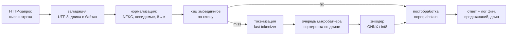

# NLP в продакшене

> **Зачем эта глава.** Между «модель показывает F1 = 0,91 в ноутбуке» и «сервис держит 400 RPS
> с p99 = 60 мс и не деградирует полгода» лежит слой инженерных решений, который в статьях
> не описывают: как синхронизировать препроцессинг, как батчить тексты разной длины, что резать
> и на каком месте, чем ускорять энкодер и как понять, что модель сломалась, если разметки нет.
> После этой главы вы сможете спроектировать текстовый сервис под заданный бюджет латентности
> и защитить это решение на секции ML System Design.

**Уровень:** 🎯 middle → 🧠 middle+
**Предварительно нужно:** [текст как данные](01-text-representation.md),
[BERT и семейство энкодеров](04-bert-and-encoders.md),
[задачи NLP и их метрики](05-nlp-tasks-and-metrics.md),
[внимание и трансформер](../03-deep-learning/04-attention-and-transformer.md)
**Время на проработку:** ~5 часов (чтение + замеры на своей машине)

---

## Карта главы

- [1. Что ломается между ноутбуком и сервисом](#1-что-ломается-между-ноутбуком-и-сервисом) — четыре типовых обрыва
- [2. Пайплайн предобработки и синхронизация с обучением](#2-пайплайн-предобработки-и-синхронизация-с-обучением) — токенизатор как часть модели
- [3. Почему длина текста определяет латентность](#3-почему-длина-текста-определяет-латентность) — счёт FLOPs и замеры
- [4. Батчинг переменной длины](#4-батчинг-переменной-длины) — dynamic padding, bucketing, микробатчи
- [5. Truncation strategy: как резать длинный текст](#5-truncation-strategy-как-резать-длинный-текст)
- [6. Ускорение энкодера](#6-ускорение-энкодера) — дистилляция, int8, ONNX Runtime
- [7. Кэширование эмбеддингов](#7-кэширование-эмбеддингов)
- [8. Мониторинг качества без разметки](#8-мониторинг-качества-без-разметки) — прокси-сигналы и дрифт
- [9. Нестандартный текст](#9-нестандартный-текст) — эмодзи, транслит, гомоглифы, мусор
- [10. Компромиссы под бюджет](#10-компромиссы-под-бюджет)
- [11. Подводные камни](#11-подводные-камни)
- [12. Проверь себя](#12-проверь-себя)
- [13. Практика](#13-практика)
- [14. Что читать дальше](#14-что-читать-дальше)

**Обозначения этой главы.** Помимо сквозных ($n$ — число объектов, $d$ — размерность признаков,
$K$ — число классов, $\theta$ — параметры), здесь понадобятся: $B$ — размер батча,
$T$ — длина последовательности в токенах, $L$ — число слоёв энкодера. Для трансформера
$d$ — это размер скрытого состояния $d_{\text{model}}$: он и играет роль «числа признаков»
на каждой позиции.

---

## 1. Что ломается между ноутбуком и сервисом

Возьмём конкретную задачу, которую в том или ином виде решали почти все: **классификация
обращений в поддержку** по 12 темам. Обучили `rubert-base`, на отложенной выборке macro-F1 = 0,88,
все довольны. Дальше сервис.

Вот что обычно происходит в первые три месяца.

**Неделя 1. Латентность в 6 раз хуже, чем в ноутбуке.** В ноутбуке вы мерили на батче из 64
предобработанных примеров. В проде приходит один запрос, батча нет, а токенизация,
сериализация и сеть добавляют своё. Ноутбучные «8 мс на объект» превращаются в «90 мс на запрос».

**Неделя 3. Качество на проде ниже офлайнового на 5 пунктов.** Причина находится не в модели:
в обучающем пайплайне текст проходил через `text.strip().lower()` и замену `ё → е`, а в сервисе
эти три строки написал другой человек и чуть иначе. Это [train/serve skew](../02-classic-ml/14-feature-engineering.md)
в чистом виде, только вместо числовых фич — строки, и заметить расхождение глазами почти невозможно.

**Месяц 2. p99 улетает при всплесках трафика.** Оказывается, 2% обращений — это пересланные
переписки на 4000 токенов. Они попадают в один батч с короткими и растягивают его до
`max_length`, потому что батч считается по самому длинному элементу.

**Месяц 5. Метрика тихо просела, и никто не заметил.** Появился новый продукт, в обращениях
пошла новая лексика, часть трафика — на казахском. Разметки нет, дашборд показывает
«всё зелёное», потому что мониторится только доступность сервиса.

> 🌱 **База.** Все четыре проблемы — не про модель. Модель одна и та же. Это проблемы
> *системы вокруг модели*: как текст к ней попадает, в какой форме, сколько его,
> и кто смотрит на результат. Именно об этом спрашивают на секции system design, когда
> задача формулируется как «сделайте классификатор тикетов».

Разберём их по порядку.

---

## 2. Пайплайн предобработки и синхронизация с обучением

### 2.1 Из чего состоит путь текста



Три вещи, которые новички пропускают. Первое: **валидация до нормализации** — иначе строка
на 5 МБ доедет до `unicodedata.normalize` и съест секунду CPU. Второе: **кэш стоит до
токенизации**, а не после — токенизация тоже стоит денег. Третье: **логирование
не опционально** — без записанных длин, предсказаний и уверенностей раздел 8 этой главы
реализовать невозможно.

### 2.2 Токенизатор — это часть модели, а не утилита

Главный источник расхождения train/serve в NLP — представление о токенизаторе как о вспомогательном
скрипте. На самом деле пара «веса + токенизатор» неразделима: словарь задаёт соответствие
`строка → id`, а матрица эмбеддингов задаёт соответствие `id → вектор`. Поменяли словарь —
все эмбеддинги указывают не туда.

Отсюда практическое правило: токенизатор версионируется, сохраняется и выкатывается **вместе
с весами**, одним артефактом (см. [упаковку модели](../07-mlops/04-model-packaging.md)).
То же касается кода нормализации, который стоит *перед* токенизатором: он такая же часть
контракта.

```python
# Один модуль препроцессинга импортируется и обучающим скриптом, и сервисом.
# Версия правил зашита в константу и попадает в имя артефакта и в ключ кэша:
# любое изменение правил — это новая версия модели, а не «мелкий фикс в сервисе».
import re
import unicodedata

NORMALIZER_VERSION = "ru-v3"

_SPACES = re.compile(r"\s+")
_REPEATS = re.compile(r"(.)\1{3,}", flags=re.UNICODE)


def _drop_invisible(text: str) -> str:
    # Cf — форматирующие символы (zero-width space, soft hyphen, BOM, RTL-override).
    # Глазом их не видно, но токенизатор режет по ним слово на куски,
    # а злоумышленник ими маскирует запрещённые слова от фильтра.
    # Cc — управляющие символы, включая \n и \t: схлопнем их в пробел.
    return "".join(
        " " if unicodedata.category(ch) == "Cc" else ch
        for ch in text
        if unicodedata.category(ch) != "Cf"
    )


def normalize(text: str, max_chars: int = 20_000) -> str:
    text = text[:max_chars]                      # защита от «вставили лог на 5 МБ»
    text = unicodedata.normalize("NFKC", text)   # ＣＯＯＬ → COOL, неразрывный пробел → обычный
    text = _drop_invisible(text)
    text = text.replace("ё", "е").replace("Ё", "Е")  # в русских корпусах ё пишут непоследовательно
    text = _REPEATS.sub(r"\1\1\1", text)         # «оооочень» → «ооочень»: режем хвост словаря
    return _SPACES.sub(" ", text).strip()
```

Проверим на реальных строках:

```python
cases = [
    "Ооооочень​  доставка!!!",   # zero-width space внутри слова
    "Всё\xad хорошо",            # soft hyphen и BOM
    "ЦЕНА — 1\xa0000 ₽",               # неразрывный пробел
    "m² № 5",                          # NFKC меняет и это — см. предупреждение ниже
]
for c in cases:
    print(repr(c), "->", repr(normalize(c)))
# 'Ооооочень​  доставка!!!' -> 'Оооочень доставка!!!'
# 'Всё\xad хорошо'         -> 'Все хорошо'
# 'ЦЕНА — 1\xa0000 ₽'            -> 'ЦЕНА — 1 000 ₽'
# 'm² № 5'                       -> 'm2 No 5'
```

> ⚠️ **Типичная ошибка.** Считать NFKC безобидным. Последняя строка показывает цену: `№` стало
> `No`, `m²` стало `m2`. Для отзывов это не важно, а для задачи «извлечь артикул из описания
> товара» — катастрофа: `1² ` и `12` перестают различаться. Выбор между NFC (только композиция,
> ничего не теряет) и NFKC (агрессивное «совместимое» разложение) — это решение под задачу,
> и его надо принимать осознанно, а не копировать из чужого репозитория.

### 2.3 Контрактный тест на препроцессинг

Расхождение обучения и прода нельзя поймать глазами, зато можно поймать тестом. Приём —
**золотой файл**: фиксируем набор входов и ожидаемых токенов, и CI падает, если что-то поехало.

```python
# tests/test_preprocessing_contract.py
import json
import hashlib

GOLDEN = [
    ("Ооооочень​  доставка!!!", "Оооочень доставка!!!"),
    ("Всё\xad хорошо", "Все хорошо"),
    ("  \t双 пробела  ", "双 пробела"),
]


def test_normalizer_is_stable():
    # Ловит непреднамеренное изменение правил: если правило поменяли осознанно,
    # надо поднять NORMALIZER_VERSION и переобучить/перевалидировать модель.
    for raw, expected in GOLDEN:
        assert normalize(raw) == expected, f"нормализация изменилась на {raw!r}"


def test_normalizer_is_idempotent():
    # Нормализация обязана быть идемпотентной: normalize(normalize(x)) == normalize(x).
    # Неидемпотентная нормализация означает, что повторная обработка (ретрай, бэкфилл)
    # даст другой текст — и офлайн-фичи разойдутся с онлайновыми.
    for raw, _ in GOLDEN:
        once = normalize(raw)
        assert normalize(once) == once


def test_tokenizer_fingerprint(tokenizer):
    # Отпечаток словаря: меняется при любой подмене токенизатора.
    vocab = tokenizer.get_vocab()
    digest = hashlib.sha256(json.dumps(vocab, sort_keys=True).encode()).hexdigest()
    assert digest[:12] == "a3f9c1d20b74"  # значение зафиксировано при обучении модели
```

Идемпотентность — недооценённое требование. Пример неидемпотентного правила: «схлопнуть
повторы до трёх» плюс «удалить повторяющиеся знаки препинания» в неудачном порядке; при
повторном применении строка меняется снова, и бэкфилл даёт не тот же результат, что онлайн.

> 💬 **На собеседовании.** Спросят: «Как вы гарантируете, что препроцессинг в обучении и в проде
> одинаков?» Хороший ответ: препроцессинг — общий импортируемый модуль, а не два скрипта;
> у него есть версия, которая входит в имя артефакта модели и в ключ кэша; на него есть
> golden-тест в CI и тест на идемпотентность; токенизатор сохраняется вместе с весами и
> проверяется по хэшу словаря; на проде логируются токенизированные длины, чтобы расхождение
> было видно на дашборде. Плохой ответ: «мы используем один и тот же `AutoTokenizer.from_pretrained`»
> — это не гарантирует ни версию библиотеки, ни идентичность нормализации, которая идёт до него.

### 2.4 Скорость самой токенизации

На коротких текстах токенизация — заметная доля бюджета. Реализация `tokenizers` на Rust
(«fast» токенизаторы) на порядок быстрее чистого Python и, что важнее, при батчевом вызове
освобождает GIL, то есть реально параллелится по потокам. Два следствия для сервиса:

- вызывать токенизатор **списком**, а не в цикле по одному тексту;
- не собирать `BatchEncoding` заново на каждый запрос, если текст уже был в кэше.

---

## 3. Почему длина текста определяет латентность

Все продовые решения в NLP так или иначе про длину. Поэтому посчитаем, как именно стоимость
зависит от $T$ — и заодно разберём вопрос, на котором сыплется большинство кандидатов.

### 3.1 Счёт операций в слое энкодера

Один слой трансформер-энкодера с размерностью $d$, длиной $T$ и расширением FFN в 4 раза
делает следующее (считаем умножение-с-накоплением за 2 операции):

$$
C_{\text{lin}}(T) = 2\cdot 4Td^2 \;+\; 2\cdot 8Td^2 \;=\; 24\,T\,d^2
$$

где первое слагаемое — четыре линейных проекции (запросы, ключи, значения и выходная проекция),
каждая размера $d \times d$ на $T$ позиций; второе — две матрицы FFN размера $d \times 4d$
и $4d \times d$; $T$ — число токенов, $d$ — размер скрытого состояния.

$$
C_{\text{att}}(T) = 2\cdot T^2 d \;+\; 2\cdot T^2 d \;=\; 4\,T^2 d
$$

где первое слагаемое — вычисление матрицы совместимости $QK^\top$ размера $T \times T$
(каждый элемент — скалярное произведение длины $d$), второе — умножение весов внимания
на матрицу значений. Суммирование по головам ничего не меняет: головы делят $d$ между собой.

Итого на $L$ слоёв:

$$
C(T) \;=\; L\big(24\,T\,d^2 \;+\; 4\,T^2 d\big)
$$

где $L$ — число слоёв энкодера.

### 3.2 Где на самом деле находится точка перелома

Квадратичное слагаемое сравнивается с линейным, когда

$$
4T^2 d = 24 T d^2 \quad\Longleftrightarrow\quad T = 6d
$$

Для BERT-base ($d = 768$) это $T = 4608$ токенов. То есть **на всём рабочем диапазоне
энкодера (до 512 токенов) внимание — не главный расход.** Проверим численно:

```python
def flops(T, L=12, d=768, ffn=4):
    lin = 2 * (4 * T * d * d) + 2 * (2 * ffn * T * d * d)  # проекции + FFN
    att = 2 * (2 * T * T * d)                              # QK^T и умножение на V
    return L * (lin + att), L * att / (L * (lin + att))

for T in (32, 64, 128, 256, 512):
    total, share = flops(T)
    print(f"T={T:4d}: {total/1e9:6.2f} GFLOP, доля внимания {share:5.1%}")
# T=  32:   5.47 GFLOP, доля внимания  0.7%
# T=  64:  11.02 GFLOP, доля внимания  1.4%
# T= 128:  22.35 GFLOP, доля внимания  2.7%
# T= 256:  45.90 GFLOP, доля внимания  5.3%
# T= 512:  96.64 GFLOP, доля внимания 10.0%
```

Переход с 128 на 512 токенов (в 4 раза длиннее) даёт рост стоимости в **4,3 раза**, а не в 16.
Замер на реальном стеке подтверждает: 12-слойный энкодер с $d=768$ на четырёх потоках CPU,
$B=1$, даёт 76 мс при $T=128$ и 313 мс при $T=512$ — отношение 4,1.

> 💬 **На собеседовании.** Спросят: «Внимание работает за $O(T^2)$. Во сколько раз медленнее
> будет BERT-base на 512 токенах по сравнению со 128?» Хороший ответ: примерно в 4–4,5 раза,
> а не в 16, потому что при $d = 768$ квадратичный член становится сопоставим с линейным только
> около $T \approx 6d \approx 4600$ токенов; на 512 токенах внимание — около 10% операций,
> всё остальное — обычные матричные умножения, линейные по $T$. Квадратичность становится
> определяющей у длинноконтекстных моделей и на этапе prefill у LLM. Плохой ответ: «в 16 раз,
> потому что $O(n^2)$» — формально верная асимптотика, применённая там, где константы решают.

> 🧠 **Middle+.** Есть второй эффект, которого нет в счёте FLOPs: память. Матрица весов внимания
> занимает $O(B\,h\,T^2)$ элементов, где $h$ — число голов. Для $B=32$, $h=12$, $T=512$ в fp32 это
> $32\cdot12\cdot512^2\cdot4$ байт ≈ 400 МБ **на слой** в наивной реализации. Именно поэтому
> длинные батчи выбивают OOM раньше, чем упираются в вычисления, и именно эту проблему решает
> FlashAttention, который не материализует матрицу целиком.

### 3.3 Батч и пропускная способность

Латентность одного запроса и пропускная способность сервиса — разные вещи, и их путают.
Разумная модель латентности батча:

$$
\Lambda(B, T) \;\approx\; \lambda_0 \;+\; \frac{B \cdot C(T)}{R}
$$

где $\Lambda$ — время обработки батча, $\lambda_0$ — постоянные накладные расходы (вызовы ядер,
копирование, синхронизация), $C(T)$ — операции на один объект из §3.1, $R$ — реальная
производительность железа в операциях в секунду. Пропускная способность тогда
$\text{RPS} = B / \Lambda(B, T)$, и она растёт с $B$ ровно до тех пор, пока $\lambda_0$ заметен
на фоне второго слагаемого.

Практический вывод, который часто удивляет: **на CPU с крупной моделью батчинг даёт мало.**
Замер того же 12-слойного энкодера, $T=128$:

| $B$ | латентность батча | на объект | RPS |
|---|---|---|---|
| 1 | 76 мс | 76 мс | 13,2 |
| 2 | 124 мс | 62 мс | 16,2 |
| 4 | 237 мс | 59 мс | 16,9 |
| 8 | 468 мс | 58 мс | 17,1 |
| 16 | 923 мс | 58 мс | 17,3 |

Выигрыш от батчинга здесь — 1,3 раза, потому что матричные умножения уже достаточно крупные,
чтобы загрузить ядра при $B=1$; дальше растёт только задержка. На GPU картина обратная: при
$B=1$ ускоритель простаивает, и переход к $B=32$ поднимает RPS в десятки раз при почти
неизменной латентности батча. **Поэтому «включите динамический батчинг» — правильный совет
для GPU и почти бесполезный для CPU-инференса тяжёлого энкодера.**

---

## 4. Батчинг переменной длины

### 4.1 Цена паддинга

Модель принимает прямоугольный тензор, а тексты имеют разную длину. Значит, короткие
дополняются служебным токеном до длины самого длинного в батче, и на этих позициях
вычисления выполняются впустую (маска внимания лишь запрещает *смотреть* на них, но матрицы
всё равно перемножаются).

Доля впустую потраченных вычислений в батче:

$$
w \;=\; 1 - \frac{\sum_{i=1}^{B} \ell_i}{B \cdot \max_i \ell_i} \;=\; 1 - \frac{\bar{\ell}}{\ell_{\max}}
$$

где $\ell_i$ — длина $i$-го текста в токенах, $B$ — размер батча, $\bar\ell$ — средняя длина
в батче, $\ell_{\max}$ — максимальная длина в батче.

> 📐 **Разбор формулы.** Числитель дроби — полезные токены, знаменатель — те, за которые заплатили.
> Ключевой момент: $\ell_{\max}$ — это максимум по **случайной выборке из $B$ элементов**.
> У распределения длин текстов тяжёлый правый хвост, и математическое ожидание максимума растёт
> с $B$: чем больше батч, тем выше шанс, что в него попадёт один длинный текст и растянет всех.
> Отсюда контринтуитивное следствие: при случайном формировании батчей **увеличение $B$ ухудшает
> долю полезной работы**.

### 4.2 Три стратегии и их цена

- **`padding='max_length'`** — дополнять всегда до предельной длины модели (например, 512).
  Даёт фиксированные формы тензоров, что нужно для статических графов и для некоторых
  компиляторов, но платит за это по-крупному.
- **Динамический паддинг (dynamic padding)** — дополнять до максимума *внутри батча*.
  Дефолтный разумный выбор.
- **Bucketing / length-grouped batching** — сначала сгруппировать похожие по длине,
  потом дополнять внутри батча. Максимальная экономия.

Посчитаем на реалистичном распределении длин (логнормальное: медиана 36 токенов,
p95 = 162, p99 = 298, обрезка на 512 — типичная картина для отзывов и тикетов):

```python
import numpy as np


def length_grouped_batches(lengths, batch_size, mega_batch=50, seed=0):
    """Батчи из объектов близкой длины — но без глобальной сортировки.

    Глобальная сортировка убила бы стохастичность обучения: батчи стали бы
    детерминированными, а длина текста почти всегда коррелирует с содержанием
    (длинные отзывы — чаще негативные), то есть батч перестал бы быть
    репрезентативной подвыборкой. Поэтому сортируем внутри окна из
    mega_batch * batch_size объектов и перемешиваем порядок готовых батчей.
    """
    lengths = np.asarray(lengths)
    rng = np.random.default_rng(seed)
    idx = rng.permutation(len(lengths))
    window_size = batch_size * mega_batch
    batches = []
    for start in range(0, len(idx), window_size):
        window = idx[start:start + window_size]
        window = window[np.argsort(lengths[window], kind="stable")]
        for b in range(0, len(window), batch_size):
            batches.append(window[b:b + batch_size])
    rng.shuffle(batches)
    return batches


def padding_waste(batches, lengths):
    lengths = np.asarray(lengths)
    useful = sum(int(lengths[b].sum()) for b in batches)
    computed = sum(len(b) * int(lengths[b].max()) for b in batches)
    return 1.0 - useful / computed, computed


rng = np.random.default_rng(42)
lengths = np.clip(rng.lognormal(mean=3.6, sigma=0.9, size=50_000).astype(int), 4, 512)

random_batches = [np.arange(i, min(i + 32, 50_000))
                  for i in range(0, 50_000, 32)]          # порядок уже случайный
bucketed = length_grouped_batches(lengths, batch_size=32)

w_rand, tok_rand = padding_waste(random_batches, lengths)
w_buck, tok_buck = padding_waste(bucketed, lengths)
print(f"padding='max_length':  {50_000 * 512 / 1e6:6.1f} млн токенов")
print(f"динамический паддинг:  {tok_rand / 1e6:6.1f} млн, впустую {w_rand:.0%}")
print(f"bucketing:             {tok_buck / 1e6:6.1f} млн, впустую {w_buck:.0%}")
# padding='max_length':   25.6 млн токенов
# динамический паддинг:   12.6 млн, впустую 78%
# bucketing:               3.0 млн, впустую 10%
```

Числа стоит запомнить: переход от `max_length` к динамическому паддингу дал 2 раза,
а добавление bucketing — ещё 4,2 раза. Суммарно **8,5 раза** на том же железе и той же модели,
без единой правки архитектуры. Ни одна квантизация столько не даёт.

> ⚠️ **Типичная ошибка.** Сортировать датасет по длине глобально «чтобы уж наверняка».
> Симптом: обучение сходится хуже, метрики скачут между эпохами. Причина: батчи перестали быть
> случайными подвыборками — длина коррелирует с классом, и модель видит длинную серию однородных
> батчей; на батч-нормализации и на адаптивных оптимизаторах это сказывается прямо. Правильно —
> сортировка внутри окна (как в коде выше) плюс перемешивание порядка батчей.

### 4.3 Микробатчинг в онлайне

В обучении объекты доступны все сразу. В онлайне запросы приходят по одному, и чтобы собрать
батч, надо **подождать**. Это осознанный обмен: добавляем к латентности окно ожидания $W$,
получаем взамен пропускную способность.

```python
import asyncio
import time
from dataclasses import dataclass


@dataclass
class _Job:
    text: str
    future: asyncio.Future


class MicroBatcher:
    """Собирает одиночные запросы в батч: либо набралось max_batch, либо истекло окно."""

    def __init__(self, infer_fn, max_batch=32, max_delay_ms=5.0):
        self.infer_fn = infer_fn                 # список строк -> список результатов
        self.max_batch = max_batch
        self.max_delay = max_delay_ms / 1000.0
        self.queue: asyncio.Queue = asyncio.Queue()
        self._worker = None

    async def start(self):
        self._worker = asyncio.create_task(self._loop())

    async def predict(self, text: str):
        job = _Job(text, asyncio.get_running_loop().create_future())
        await self.queue.put(job)
        return await job.future

    async def _collect(self):
        batch = [await self.queue.get()]         # первого ждём сколько угодно
        deadline = time.perf_counter() + self.max_delay
        while len(batch) < self.max_batch:
            left = deadline - time.perf_counter()
            if left <= 0:
                break
            try:
                batch.append(await asyncio.wait_for(self.queue.get(), left))
            except asyncio.TimeoutError:
                break                            # окно истекло — едем с тем, что есть
        return batch

    async def _loop(self):
        while True:
            batch = await self._collect()
            try:
                # сортировка внутри микробатча стоит микросекунды и режет паддинг:
                # это тот же bucketing, только на масштабе одного батча
                order = sorted(range(len(batch)), key=lambda i: len(batch[i].text))
                texts = [batch[i].text for i in order]
                # инференс блокирует поток, поэтому уносим его из event loop
                results = await asyncio.to_thread(self.infer_fn, texts)
                for position, i in enumerate(order):
                    batch[i].future.set_result(results[position])
            except Exception as exc:
                # без этого клиент повиснет до таймаута, а не получит 500
                for job in batch:
                    if not job.future.done():
                        job.future.set_exception(exc)
```

Проверка на модели инференса, время которого растёт с размером и длиной батча:

```python
def fake_encoder(texts):
    time.sleep(0.003 + 2e-5 * len(texts) * max(len(t) for t in texts))
    return [len(t) for t in texts]


async def main():
    for max_batch in (1, 8, 32):
        batcher = MicroBatcher(fake_encoder, max_batch=max_batch, max_delay_ms=5)
        await batcher.start()
        t0 = time.perf_counter()
        await asyncio.gather(*[batcher.predict("x" * (20 + i % 200)) for i in range(200)])
        dt = time.perf_counter() - t0
        print(f"max_batch={max_batch:2d}: 200 запросов за {dt * 1000:5.0f} мс, {200 / dt:4.0f} RPS")
        batcher._worker.cancel()

asyncio.run(main())
# max_batch= 1: 200 запросов за  1188 мс,  168 RPS
# max_batch= 8: 200 запросов за   585 мс,  342 RPS
# max_batch=32: 200 запросов за   573 мс,  349 RPS
```

Обратите внимание на насыщение между 8 и 32: дальше растёт только латентность. Готовые серверы
(Triton, TorchServe) делают ровно это, но с готовыми ручками `max_queue_delay` и
`preferred_batch_size` — писать своё стоит, только если нужна специфичная логика вроде
приоритетов или разделения на очереди по длине (подробнее — в главе
[архитектуры сервинга](../07-mlops/05-serving-architectures.md)).

> 🧠 **Middle+.** Продвинутый приём — **две очереди по длине**: короткие тексты (до 64 токенов)
> и длинные обрабатываются разными микробатчерами. Это спасает p99 у коротких запросов, которые
> иначе застревают в одном батче с длинными. Оценить эффект просто: латентность короткого запроса
> в общем батче пропорциональна $\ell_{\max}$ батча, то есть определяется хвостом распределения,
> а в раздельной схеме — своим собственным потолком.

---

## 5. Truncation strategy: как резать длинный текст

### 5.1 Выбор `max_length`

`max_length` — это не «512, потому что так у BERT». Это гиперпараметр, который выбирается
по распределению длин **вашего** трафика и по бюджету латентности. Протокол:

1. Токенизировать репрезентативную выборку продового трафика (не обучающую выборку — она
   часто отфильтрована).
2. Посмотреть квантили длины: p50, p90, p95, p99, максимум.
3. Взять кандидатов около p95–p99, округлив вверх до удобного числа.
4. Для каждого кандидата измерить: качество на валидации и латентность.
5. Выбрать точку, где качество перестаёт расти.

На данных из §4.2 (p95 = 162, p99 = 298) `max_length = 192` покрывает 96% текстов целиком
и стоит вчетверо дешевле, чем 512. Потеря качества обычно составляет доли пункта — потому что
для классификации тональности или темы решающая информация чаще в начале.

> ⚠️ **Типичная ошибка.** Ставить `max_length` по максимуму в обучающей выборке. Симптом:
> сервис в 5 раз медленнее, чем мог бы, а 99% запросов используют десятую часть выделенной длины.
> Причина: максимум — это статистика одного объекта, она не описывает распределение.
> Что делать: считать квантили, а долю усечённых текстов вывести на дашборд как метрику.

### 5.2 Что делать с тем, что не влезло

Четыре стратегии, все реально применяются:

| Стратегия | Как | Когда уместна |
|---|---|---|
| Head | взять первые $T$ токенов | новости, описания товаров, тикеты — суть в начале |
| Tail | взять последние $T$ | диалоги и переписки — важна последняя реплика |
| Head + tail | первые $a$ и последние $T - a$ токенов | документы с выводом в конце; в работе Sun et al. (2019) эта схема оказалась лучшей для классификации длинных текстов |
| Чанкинг с агрегацией | разбить на перекрывающиеся окна, прогнать все, агрегировать | когда важна информация в любом месте (поиск запрещёнки, юридические документы, NER) |

Head — умолчание почти во всех библиотеках, и именно поэтому про остальные забывают.

```python
def head_tail_truncate(token_ids, max_len, head=128, cls_id=101, sep_id=102):
    """Стратегия head+tail: сохраняем начало (тема, заголовок) и конец (вывод, итог).

    Служебные токены считаем отдельно: у BERT-подобных это [CLS] в начале и [SEP] в конце,
    и если про них забыть, готовая последовательность окажется на 2 токена длиннее лимита
    и будет молча обрезана библиотекой — уже по стратегии head.
    """
    body = [t for t in token_ids if t not in (cls_id, sep_id)]
    budget = max_len - 2
    if len(body) <= budget:
        return [cls_id] + body + [sep_id]
    tail = budget - head
    return [cls_id] + body[:head] + body[-tail:] + [sep_id]


ids = list(range(1000))
out = head_tail_truncate(ids, max_len=192, head=64)
print(len(out), out[:3], out[-3:])   # 192 [101, 0, 1] [997, 998, 102]
```

Чанкинг устроен сложнее: текст режется на окна длины $T$ с перекрытием (stride), каждое окно
прогоняется через модель, а предсказания агрегируются. Для классификации агрегируют логиты:

$$
z^{\text{doc}} = \max_{c \in \text{chunks}} z^{(c)}
\qquad\text{или}\qquad
z^{\text{doc}} = \frac{1}{|\text{chunks}|}\sum_{c} z^{(c)}
$$

где $z^{(c)} \in \mathbb{R}^K$ — вектор логитов на чанке $c$, $K$ — число классов,
$|\text{chunks}|$ — число чанков документа.

Максимум подходит для задач вида «есть ли в документе признак» (нашли в одном чанке — значит есть),
среднее — для задач «какова общая тональность документа». Выбор между ними — это выбор
агрегирующей семантики, и на собеседовании его полезно проговорить явно.

Цена чанкинга — линейный рост стоимости: документ на 2000 токенов при $T = 512$ и перекрытии
128 даёт 5 прогонов вместо одного. Для батч-задач это нормально, для онлайна с бюджетом 50 мс —
обычно нет.

> 💬 **На собеседовании.** Спросят: «Документ не влезает в 512 токенов. Что делаете?»
> Хороший ответ идёт от задачи: сначала уточняю, где в документе находится сигнал (в начале,
> в конце, где угодно) и какой бюджет латентности. Если сигнал в начале — head-усечение и замер
> доли усечённых. Если где угодно и это офлайн — чанкинг с агрегацией максимумом или средним,
> с перекрытием, чтобы сущность не разрезало пополам. Если онлайн и документы длинные системно —
> либо двухстадийная схема (дешёвый отбор релевантных фрагментов, затем модель), либо модель
> с длинным контекстом, но за это придётся заплатить латентностью. Отдельно проверю: может быть,
> достаточно предварительно вырезать шаблонные части (подписи, цитирование, HTML-мусор) — часто
> после этого 90% документов влезают. Плохой ответ: «возьму модель с контекстом 4096» без
> оценки цены и без проверки, что длина вообще нужна.

---

## 6. Ускорение энкодера

Порядок действий важен: сначала бесплатное (§4 — паддинг и батчинг), потом дешёвое
(рантайм и квантизация), и только потом дорогое (дистилляция, требующая обучения). Ниже —
измеренные значения для 12-слойного энкодера с $d = 768$, $B = 8$, $T = 128$, CPU, 4 потока.

| Что | Латентность батча | Ускорение | Размер весов |
|---|---|---|---|
| fp32, 12 слоёв | 562 мс | 1,0× | 340 МБ |
| int8 динамическая квантизация | 281 мс | 2,0× | 85 МБ |
| 6 слоёв (дистилляция), fp32 | 293 мс | 1,9× | 170 МБ |
| 6 слоёв + int8 | 181 мс | 3,1× | 43 МБ |

Заметьте: 6 слоёв + int8 дают не $2{,}0 \times 1{,}9 = 3{,}8$, а 3,1. Ускорения не перемножаются,
потому что часть работы (нормализации, softmax, активации, копирования) остаётся в fp32 и
не сокращается.

### 6.1 Квантизация до int8

Идея: заменить умножение вещественных чисел умножением 8-битных целых. Аффинное квантование
задаётся масштабом и нулевой точкой:

$$
s = \frac{\max_j |w_j|}{127},
\qquad
w^{q}_j = \operatorname{clip}\big(\operatorname{round}(w_j / s),\, -127,\, 127\big),
\qquad
\hat{w}_j = s \cdot w^{q}_j
$$

где $w_j$ — исходный вещественный вес, $s > 0$ — масштаб (scale), $w^q_j \in [-127, 127]$ —
целочисленное представление, $\hat w_j$ — восстановленное значение. Это **симметричная** схема:
нулевая точка равна нулю, что удобно для весов, распределённых примерно симметрично вокруг нуля.

Матричное умножение тогда выполняется в целых числах, а масштабы выносятся наружу:

$$
(XW)_{ij} \;\approx\; s_x s_w \sum_{k=1}^{d} x^{q}_{ik}\, w^{q}_{kj}
$$

где $X \in \mathbb{R}^{T \times d}$ — активации, $W \in \mathbb{R}^{d \times d'}$ — веса,
$s_x, s_w$ — масштабы активаций и весов, $x^q, w^q$ — их целочисленные представления,
$d'$ — выходная размерность слоя.

Выигрыш двойной: 8-битные операции на современных CPU выполняются векторными инструкциями
с большей пропускной способностью, и — главное — в 4 раза сокращается трафик памяти.
Для энкодеров при небольших батчах узкое место обычно именно память, а не арифметика.

**Динамическая квантизация** (dynamic quantization) — самый дешёвый вариант: веса квантуются
один раз офлайн, а масштаб активаций вычисляется на лету по фактическому минимуму и максимуму
каждого тензора. Калибровочные данные не нужны, риск минимальный.

```python
import torch
import torch.nn as nn

# Квантуем только nn.Linear: там сосредоточено ~98% операций энкодера,
# а LayerNorm и softmax в int8 дают заметную потерю точности при нулевой выгоде.
quantized = torch.ao.quantization.quantize_dynamic(
    encoder.eval(), {nn.Linear}, dtype=torch.qint8
)

# Обязательная проверка: не «упало ли качество», а насколько разошлись выходы.
# Косинус ниже 0.99 — сигнал искать проблемный слой, а не катастрофа сама по себе.
x = torch.randn(4, 128, 768)
with torch.inference_mode():
    ref, got = encoder(x), quantized(x)
cos = torch.nn.functional.cosine_similarity(ref.flatten(1), got.flatten(1)).mean()
print(f"косинусная близость выходов: {cos:.4f}")   # 0.9998
```

Косинус 0,9998 между выходами — типичная картина для динамической int8 на энкодерах;
на классификации падение метрики обычно в пределах 0,5 пункта. **Но проверять надо метрику,
а не косинус:** близость выходов ничего не гарантирует для объектов у границы решения.

Статическая квантизация (со сбором статистик активаций на калибровочной выборке) и
quantization-aware training дают чуть больше скорости и точности ценой заметно большей возни;
подробный разбор схем — в главе [PEFT и квантизация](../05-llm/04-peft-and-quantization.md).

### 6.2 ONNX Runtime

PyTorch — фреймворк для исследований: динамический граф, богатая семантика, накладные расходы
интерпретатора Python на каждый вызов. ONNX Runtime получает статический граф операций и может
делать то, чего рантайм PyTorch не делает по умолчанию: сращивать соседние операции
(fusion: `MatMul + Add + GeLU` в одно ядро), переиспользовать буферы, выбирать
специализированные реализации внимания. На CPU для энкодеров это обычно 1,5–2 раза сверх всего
остального; на GPU выигрыш меньше, потому что там `torch.compile` и так делает похожие вещи.

```python
import torch

# dynamic_axes — критично: без него граф зафиксирует конкретные B и T,
# и любой батч другой формы либо упадёт, либо будет молча переупакован.
torch.onnx.export(
    encoder.eval(),
    (torch.zeros(1, 16, dtype=torch.long), torch.ones(1, 16, dtype=torch.long)),
    "encoder.onnx",
    input_names=["input_ids", "attention_mask"],
    output_names=["logits"],
    dynamic_axes={
        "input_ids": {0: "batch", 1: "seq"},
        "attention_mask": {0: "batch", 1: "seq"},
        "logits": {0: "batch"},
    },
    opset_version=17,
)
```

```python
import numpy as np
import onnxruntime as ort

opts = ort.SessionOptions()
# Число потоков задаём явно. Дефолт — «все ядра», и при нескольких воркерах
# gunicorn это даёт K воркеров × K потоков: они дерутся за ядра, и latency растёт.
opts.intra_op_num_threads = 4
opts.graph_optimization_level = ort.GraphOptimizationLevel.ORT_ENABLE_ALL

session = ort.InferenceSession("encoder.onnx", opts, providers=["CPUExecutionProvider"])
logits = session.run(
    ["logits"],
    {"input_ids": np.zeros((8, 128), dtype=np.int64),
     "attention_mask": np.ones((8, 128), dtype=np.int64)},
)[0]
print(logits.shape)   # (8, num_labels)
```

> ⚠️ **Типичная ошибка.** Оверсабскрипция потоков. Симптом: подняли число воркеров вдвое,
> RPS не вырос или упал, p99 вырос втрое. Причина: каждый воркер стартует пул на все ядра
> (`OMP_NUM_THREADS` не задан), и потоки конкурируют. Что делать: явно задавать
> `OMP_NUM_THREADS`, `intra_op_num_threads`, `torch.set_num_threads` так, чтобы произведение
> на число воркеров равнялось числу выделенных ядер, и указывать `cpu limits` в манифесте k8s.

### 6.3 Дистилляция

Квантизация и рантайм не трогают модель. Дистилляция (distillation) — трогает: мы обучаем
маленькую модель-ученика воспроизводить поведение большой модели-учителя. Это единственный
способ получить кратное ускорение без потери качества уровня «единицы процентов», но он
требует обучения и данных.

Функция потерь Хинтона:

$$
\mathcal{L}_{\text{KD}}(\theta_s)
= \alpha\,\tau^{2}\,\mathrm{KL}\!\big(p^{\text{t}}_{\tau} \,\|\, p^{\text{s}}_{\tau}\big)
\;+\; (1 - \alpha)\,\mathrm{CE}\big(y,\, p^{\text{s}}_{1}\big)
$$

где $\theta_s$ — параметры ученика; $p^{\text{t}}_{\tau} = \operatorname{softmax}(z^{\text{t}}/\tau)$
и $p^{\text{s}}_{\tau} = \operatorname{softmax}(z^{\text{s}}/\tau)$ — «смягчённые» распределения
учителя и ученика; $z^{\text{t}}, z^{\text{s}} \in \mathbb{R}^K$ — их логиты;
$\tau \ge 1$ — температура; $\alpha \in [0,1]$ — вес мягкого слагаемого; $y$ — истинная метка;
$\mathrm{CE}$ — кросс-энтропия; $\mathrm{KL}$ — расхождение Кульбака — Лейблера.

> 📐 **Разбор формулы.** Зачем температура. При $\tau = 1$ учитель на уверенном объекте выдаёт
> что-то вроде $(0{,}99;\ 0{,}006;\ 0{,}004)$, и информация о том, что второй класс правдоподобнее
> третьего, тонет в округлении. Деление логитов на $\tau > 1$ сглаживает распределение и
> вытаскивает эту структуру («тёмное знание») наверх — именно она и есть то, чего нет
> в жёсткой метке. Множитель $\tau^2$ нужен, потому что градиент мягкого слагаемого по логитам
> ученика масштабируется как $1/\tau^2$; без компенсации изменение $\tau$ незаметно меняло бы
> и относительный вес двух слагаемых, и эффективный learning rate $\eta$.

Практика показывает, что для энкодеров одних логитов мало. Схемы уровня DistilBERT и TinyBERT
добавляют согласование внутренних представлений:

$$
\mathcal{L}_{\text{hid}} = \sum_{l \in \mathcal{M}} \big\| H^{\text{s}}_{l} W_{l} - H^{\text{t}}_{g(l)} \big\|_{F}^{2}
$$

где $H^{\text{s}}_{l} \in \mathbb{R}^{T \times d_s}$ — матрица скрытых состояний ученика на слое $l$,
$H^{\text{t}}_{g(l)} \in \mathbb{R}^{T \times d_t}$ — состояния учителя на сопоставленном слое $g(l)$,
$W_l \in \mathbb{R}^{d_s \times d_t}$ — обучаемая проекция (нужна, если размерности учителя
и ученика различаются), $\mathcal{M}$ — множество сопоставляемых слоёв,
$\|\cdot\|_F$ — фробениусова норма.

Инженерные детали, которые решают:

- **Инициализация ученика слоями учителя.** DistilBERT берёт каждый второй слой BERT.
  Обучение с нуля сходится хуже и дольше.
- **Данные без разметки.** Логиты учителя можно снять с любого неразмеченного текста — а его
  в проде сколько угодно. Это главное преимущество дистилляции над обучением маленькой модели
  напрямую.
- **Дистиллировать логиты, а не argmax.** Обучение на предсказанных метках учителя
  выбрасывает ровно ту информацию, ради которой всё затевалось.
- **Дистилляция под свою задачу бьёт универсальную.** Готовый `distilbert` — задача-агностичный
  ученик. Ученик, дистиллированный под ваши 12 классов на вашем трафике, обычно заметно лучше
  при том же размере.

> 💬 **На собеседовании.** Спросят: «Модель не укладывается в бюджет 50 мс. Что будете делать
> и в каком порядке?» Хороший ответ — по возрастанию цены: (1) померить, где реально уходит время
> (токенизация? паддинг? сама сеть? сериализация?) — часто половина бюджета тратится вне модели;
> (2) снизить `max_length` до p95 и включить сортировку по длине в микробатче — это бесплатно
> и даёт разы; (3) экспортировать в ONNX Runtime и включить динамическую int8 — день работы,
> 2–3 раза; (4) если не хватило — дистилляция в 6 или 4 слоя, это уже недели и данные;
> (5) в последнюю очередь — менять постановку: кэш, каскад «дешёвая модель отсеивает лёгкие
> случаи, дорогая разбирает спорные». Плохой ответ: сразу «возьмём GPU» — это ответ про бюджет
> компании, а не про инженерию, и он не проходит, если сервис уже на GPU.

---

## 7. Кэширование эмбеддингов

### 7.1 Когда кэш работает

Кэш имеет смысл, если один и тот же текст встречается многократно. Проверяется это за пять минут
на логах, но полезно понимать и теорию: частоты текстов в пользовательских потоках
(поисковые запросы, названия товаров, шаблонные сообщения) обычно подчиняются закону Ципфа —
частота элемента ранга $r$ пропорциональна $r^{-\alpha}$ с $\alpha \approx 1$.

Тогда доля трафика, покрываемая кэшем из $C$ самых частых элементов при $R$ различных всего:

$$
\mathrm{HitRate}(C) \;=\; \frac{\sum_{r=1}^{C} r^{-1}}{\sum_{r=1}^{R} r^{-1}}
\;\approx\; \frac{\ln C + \gamma}{\ln R + \gamma}
$$

где $C$ — ёмкость кэша в различных текстах, $R$ — общее число различных текстов в потоке,
$\gamma \approx 0{,}577$ — постоянная Эйлера — Маскерони (гармоническая сумма $\sum_{r\le C} 1/r$
приближается как $\ln C + \gamma$).

Подставим: $R = 10^6$ различных запросов, кэш на $C = 10^4$ (то есть 1% от их числа).
Получаем $\mathrm{HitRate} \approx 9{,}79 / 14{,}39 \approx 0{,}68$. **Кэш на 1% уникальных
текстов снимает две трети нагрузки** — вот почему для поисковых сценариев кэш всегда окупается.

И вот почему он не окупается для отзывов, комментариев и обращений в поддержку: там каждый
текст уникален, $\alpha$ фактически равна нулю, и hit rate будет околонулевым. Проверять надо
всегда: доля повторов в потоке — это одна строчка на логах.

### 7.2 Ключ кэша

```python
import hashlib
import numpy as np


class EmbeddingCache:
    """Кэш векторов. Вся суть — в ключе."""

    def __init__(self, backend, model_id: str, normalizer_version: str,
                 tokenizer_hash: str, dim: int = 768):
        self.backend = backend            # что угодно с get/set, например Redis
        self.dim = dim
        # Версии модели, нормализатора и токенизатора входят в ключ.
        # Благодаря этому выкатка новой версии НЕ требует сброса кэша:
        # старые ключи просто перестают запрашиваться и умирают по TTL,
        # а откат на предыдущую версию мгновенно снова попадает в свои горячие ключи.
        self.prefix = f"emb:{model_id}:{normalizer_version}:{tokenizer_hash[:12]}:"

    def _key(self, normalized_text: str) -> str:
        # Хэш, а не сам текст: ключи фиксированной длины, и в кэше не лежат
        # персональные данные в открытом виде.
        digest = hashlib.blake2b(normalized_text.encode("utf-8"), digest_size=16).hexdigest()
        return self.prefix + digest

    def get_many(self, texts):
        keys = [self._key(t) for t in texts]
        raw = self.backend.mget(keys)
        found, missing = {}, []
        for i, (key, blob) in enumerate(zip(keys, raw)):
            if blob is None:
                missing.append(i)
            else:
                found[i] = np.frombuffer(blob, dtype=np.float16).astype(np.float32)
        return found, missing, keys

    def set_many(self, keys, indices, vectors, ttl_seconds=7 * 24 * 3600):
        for i, vec in zip(indices, vectors):
            # float16 достаточно: ошибка представления на порядки меньше,
            # чем разброс самих эмбеддингов, а памяти вдвое меньше
            self.backend.setex(keys[i], ttl_seconds, vec.astype(np.float16).tobytes())
```

Память считается просто: вектор размерности $d$ во float16 занимает $2d$ байт. Для $d = 768$ —
1,5 КБ плюс накладные расходы хранилища, то есть около 2 КБ на текст. Десять миллионов
закэшированных текстов — примерно 20 ГБ. Это дорого для Redis и дёшево для локального SSD,
что и определяет выбор бэкенда.

> ⚠️ **Типичная ошибка.** Ключ по сырому тексту, а не по нормализованному. Симптом: hit rate
> в разы ниже ожидаемого. Причина: `"Доставка "`, `"доставка"` и `"ДОСТАВКА"` дают три разных
> ключа при одинаковом эмбеддинге. Обратная ошибка тоже бывает: ключ без версии нормализатора —
> тогда при изменении правил кэш продолжает отдавать векторы, посчитанные по старым правилам,
> и это самый неприятный вид бага, потому что сервис работает и не падает.

### 7.3 Двухуровневая схема

В горячем пути обычно ставят два уровня: локальный LRU в процессе (микросекунды, но своя копия
у каждого воркера) и общий Redis (доли миллисекунды по сети, но общий на весь кластер).
Локальный уровень снимает самые частые ключи и защищает Redis от штормов; общий выравнивает
hit rate между воркерами и переживает рестарты.

---

## 8. Мониторинг качества без разметки

Это самая частая тема на секции про эксплуатацию и самая слабая зона у кандидатов.
Формулировка задачи: **разметка приходит с задержкой в недели или не приходит вообще, а знать,
жива ли модель, надо сегодня.**

Начнём с честного признания, которое и хочет услышать интервьюер: **без меток качество измерить
нельзя.** Всё, что можно измерять — это (а) изменения на входе, (б) изменения в поведении модели.
Оба — необходимые, но не достаточные условия деградации. Дальше — как строить систему,
понимая это ограничение.

### 8.1 Три слоя прокси-сигналов

**Слой 1: сигналы токенизации.** Самые дешёвые и самые ранние.

- Квантили длины в токенах ($p_{50}$, $p_{95}$, $p_{99}$) — реагируют на смену формата входа.
- Доля усечённых текстов ($\ell_i > $ `max_length`).
- Доля неизвестных токенов `[UNK]` — в BPE-токенизаторах она почти всегда нулевая, поэтому
  любой ненулевой всплеск означает буквально «пришёл символ, которого модель никогда не видела».
- **Фертильность (fertility)** — среднее число токенов на слово:

$$
\mathrm{fert} = \frac{\text{число токенов}}{\text{число слов}}
$$

где числитель и знаменатель считаются по одному и тому же окну трафика.

Фертильность — лучший из дешёвых детекторов языкового дрифта. Русскоязычный токенизатор
на русском тексте даёт примерно 1,5–2,5 токена на слово; тот же токенизатор на английском,
казахском или на транслите даст 4–6, потому что слова рассыпаются на куски по два символа.
Всплеск фертильности означает: «в трафик пришло что-то, для чего этот токенизатор не строился» —
и это происходит **раньше**, чем метрика успевает просесть.

**Слой 2: поведение модели.**

- Распределение предсказанных классов — сравнивается с эталонным окном через PSI.
- Средняя уверенность $\max_k p_k$ и средняя энтропия предсказания.
- Доля объектов ниже порога уверенности («abstain rate»).

**Слой 3: эмбеддинги.** Дрифт в пространстве представлений ловит смысловые сдвиги, невидимые
на уровне слов: та же лексика, другой смысл (см. [дрифт данных](../09-monitoring/03-drift-detection.md)).

```python
import numpy as np


def psi(reference, current, bins=10, eps=1e-6):
    """Population Stability Index. Пороги-эвристики: <0.1 норма, 0.1-0.25 присмотреться, >0.25 тревога."""
    edges = np.quantile(reference, np.linspace(0, 1, bins + 1))
    edges[0], edges[-1] = -np.inf, np.inf          # хвосты не должны выпадать из гистограммы
    e = np.histogram(reference, edges)[0] / len(reference) + eps
    a = np.histogram(current, edges)[0] / len(current) + eps
    return float(np.sum((a - e) * np.log(a / e)))


def embedding_drift(reference, current, quantile=0.95, seed=0):
    """Два дешёвых индикатора дрифта эмбеддингов.

    centroid_shift — косинусное расстояние между средними векторами окон.
    Ловит общий сдвиг темы, но слеп к изменению формы облака.

    outlier_share — доля новых объектов, которые дальше от эталонного облака,
    чем 95% самих эталонных объектов. Ловит появление новой темы даже тогда,
    когда центроид почти не сдвинулся, потому что новое подмешано к старому.
    """
    rng = np.random.default_rng(seed)
    ref = reference / np.linalg.norm(reference, axis=1, keepdims=True)
    cur = current / np.linalg.norm(current, axis=1, keepdims=True)

    mu_r, mu_c = ref.mean(0), cur.mean(0)
    centroid_shift = 1.0 - float(mu_r @ mu_c / (np.linalg.norm(mu_r) * np.linalg.norm(mu_c)))

    # разбиваем эталон надвое, чтобы порог «своей» удалённости считался честно,
    # а не по тем же точкам, до которых меряем расстояние
    half = len(ref) // 2
    idx = rng.permutation(len(ref))
    anchors, probes = ref[idx[:half]], ref[idx[half:]]
    self_dist = 1.0 - (probes @ anchors.T).max(axis=1)
    threshold = np.quantile(self_dist, quantile)
    new_dist = 1.0 - (cur @ anchors.T).max(axis=1)
    return {"centroid_shift": round(centroid_shift, 4),
            "outlier_share": round(float((new_dist > threshold).mean()), 4)}


rng = np.random.default_rng(0)
ref = rng.normal(size=(2000, 64))
same = rng.normal(size=(1000, 64))                       # то же распределение
mixed = np.vstack([rng.normal(size=(800, 64)),           # 80% старого
                   rng.normal(loc=1.5, size=(200, 64))]) # 20% новой темы
print("без дрифта:", embedding_drift(ref, same))
print("20% новой темы:", embedding_drift(ref, mixed))
```

`outlier_share` при отсутствии дрифта держится около 0,05 по построению (мы взяли 95-й процентиль);
подмешивание новой темы поднимает его заметно выше — и, в отличие от сдвига центроида, реагирует
даже когда новое составляет меньшинство.

### 8.2 Языковой и тематический дрифт

Это два разных явления, и лечатся они по-разному.

**Языковой дрифт** — меняется *форма* текста: новый язык, транслит, сленг, эмодзи вместо слов,
шаблоны от бота вместо живых сообщений. Детекторы: фертильность, доля `[UNK]`, распределение
скриптов Unicode, детектор языка (fastText `lid.176` — 176 языков, работает за микросекунды).
Реакция: расширить обучающую выборку, при массовом появлении нового языка — либо отдельная
модель, либо многоязычная (mBERT, XLM-R, mE5). Быстрая заплатка: маршрутизировать чужой язык
на фолбэк-правила или на перевод.

**Тематический дрифт** — форма та же, а *содержание* новое: запустили новый продукт, началась
акция, случился инцидент. Токенизационные сигналы молчат — слова обычные. Ловится дрифтом
эмбеддингов и распределением предсказанных классов. Классический симптом: доля класса «прочее»
растёт, а модель при этом уверена в себе — она уверенно кладёт новую тему в неподходящий класс.

> 🧠 **Middle+.** Про уверенность как индикатор есть важная тонкость: нейросети под сдвигом
> распределения остаются **переуверенными**. Модель может отдавать 0,95 на объектах нового
> домена и ошибаться на половине из них. Поэтому падение средней уверенности — полезный сигнал
> (что-то поменялось), а её стабильность — не доказательство здоровья. Практический вывод:
> уверенность используем как детектор *изменения*, а не как оценку точности, и обязательно
> дополняем дрифтом эмбеддингов и выборочной разметкой.

### 8.3 Разметка всё равно нужна: как получить её дёшево

Прокси-метрики отвечают «что-то изменилось». Ответ на «стало ли хуже» дают только метки.
Рабочая схема, которую и ждут в ответе:

1. **Постоянный тонкий поток разметки.** 200–500 случайных объектов в неделю, размечаемых
   всегда, независимо от алертов. Это единственный источник несмещённой оценки качества
   во времени. Случайных — потому что выборка «где модель не уверена» даёт смещённую оценку.
2. **Целевая разметка по сигналу.** Ещё столько же — из зон, которые подсветили детекторы:
   объекты с низкой уверенностью, объекты-выбросы по эмбеддингу, новые сегменты.
   Это ускоряет диагностику, но в общую метрику качества не идёт.
3. **Естественная обратная связь.** Почти в каждой задаче есть отложенный сигнал: оператор
   переназначил тикет в другую очередь, пользователь переформулировал запрос, модератор отменил
   автоблокировку. Это шумные, смещённые, но бесплатные и быстрые метки —
   см. [деградацию модели](../09-monitoring/04-model-degradation.md).
4. **Дорогой судья на выборке.** Если есть более сильная модель (крупная LLM), можно раз в сутки
   прогонять через неё случайную тысячу объектов и использовать как приближённую разметку.
   Судью обязательно валидировать по согласию с человеком — иначе вы мониторите
   расхождение двух моделей, а не качество (см. [оценку LLM](../05-llm/09-llm-evaluation.md)).

> 💬 **На собеседовании.** Спросят: «Классификатор обращений в проде, разметка приходит через
> месяц. Как поймёте, что он деградировал, раньше?» Хороший ответ: строю три слоя сигналов —
> вход (квантили длины в токенах, доля усечённых, фертильность, доля `[UNK]`, распределение
> языков), поведение модели (распределение классов через PSI, средняя уверенность, доля отказов),
> представления (сдвиг центроида и доля выбросов по эмбеддингам). Все — по сегментам, а не
> только глобально: деградация обычно начинается в одном канале или на одном продукте и в общей
> метрике тонет. Параллельно держу постоянный поток случайной разметки на 200–500 объектов
> в неделю: только он даёт настоящую метрику, всё остальное — детекторы изменений. Отдельно
> проговариваю, что уверенность под сдвигом обманывает: сети переуверенны вне домена.
> Плохой ответ: «буду смотреть на среднюю уверенность модели» — одна метрика, к тому же
> с известным систематическим изъяном.

---

## 9. Нестандартный текст

Продовый текст не похож на корпус. Ниже — то, что реально приходит, и что с этим делать.

**Гомоглифы и смешение скриптов.** Кириллическая `а` (U+0430) и латинская `a` (U+0061)
выглядят одинаково. Это используют, чтобы обойти фильтры («кредит нaличными» с латинской `a`),
и это же случайно возникает при копировании. Для модели это разные токены, и слово рассыпается.

```python
import re
import unicodedata


def script_of(ch: str) -> str:
    name = unicodedata.name(ch, "")
    for script in ("CYRILLIC", "LATIN", "GREEK"):
        if script in name:
            return script
    return "OTHER"


def mixed_script_words(text: str):
    """Слова со смешанными алфавитами — маркер гомоглифной подмены.

    Это не повод отклонять запрос: в «iPhone 15 про» смешение законно.
    Это признак для лога и для фичи «текст выглядит подозрительно».
    """
    out = []
    for word in re.findall(r"\w+", text, flags=re.UNICODE):
        scripts = {script_of(c) for c in word if c.isalpha()}
        scripts.discard("OTHER")
        if len(scripts) > 1:
            out.append(word)
    return out


print(mixed_script_words("кредит нaличными"))   # ['нaличными'] — латинская 'a'
print(mixed_script_words("кредит наличными"))   # []
```

Формальный список визуально неразличимых символов ведёт консорциум Unicode (UTS #39,
«Security Mechanisms»); для боевого фильтра берут оттуда таблицу confusables и приводят
подозрительные слова к доминирующему скрипту.

**Эмодзи.** Не мусор: в задачах тональности они несут больше сигнала, чем половина слов.
Три стратегии — оставить как есть (современные токенизаторы их знают), заменить на текстовое
описание через `unicodedata.name` или `demoji`, или вырезать. Выбор проверяется экспериментом,
но безусловное удаление на задачах тональности почти всегда проигрывает. Техническая деталь:
многие эмодзи — это последовательности из нескольких кодовых точек, соединённых ZWJ (U+200D),
и наивное удаление символов категории `Cf` (как в §2.2) разрывает такие последовательности.
Если эмодзи важны — исключите ZWJ из фильтра.

**Транслит.** «privet kak dela» — для русскоязычной модели это набор `[UNK]`-подобных обрывков.
Детектируется по фертильности плюс по доле латиницы при кириллическом домене; лечится либо
транслитерацией на входе, либо добавлением транслита в обучающую выборку через аугментацию.

**Опечатки и растяжки.** «оооочень», «прив5т», раскладка («ghbdtn»). Растяжки схлопываются
регуляркой из §2.2. С опечатками системно борются двумя путями: символьные или subword-модели
(fastText, BPE) устойчивее word-level по построению; аугментация обучающей выборки случайными
опечатками даёт заметный прирост робастности почти бесплатно.

**Структурный мусор.** HTML-теги, markdown, подписи, цитирование предыдущих писем, футеры
«Отправлено с iPhone». Отдельная беда — цитирование: в переписке 90% текста может быть
процитированной историей, и модель классифицирует её, а не новое сообщение. Вырезание
цитирования простыми правилами часто даёт больший прирост качества, чем смена модели.

**Вырожденные входы.** Пустая строка, одни пробелы, одни знаки препинания, один эмодзи,
текст на 200 тысяч символов. Каждый из них хоть раз ронял продовый сервис. Контракт входа
должен быть явным: ограничение на размер в байтах (до декодирования), проверка на валидный UTF-8,
и определённое поведение на пустом входе — не исключение, а предсказание с флагом `low_confidence`.

> ⚠️ **Типичная ошибка.** Ограничивать длину в символах после декодирования. Симптом: воркер
> падает по OOM на запросе, который «проходит валидацию». Причина: проверка стоит после
> `json.loads`, то есть после того, как 50 МБ уже разобраны и лежат в памяти. Что делать:
> резать по `Content-Length` и по размеру тела на уровне веб-сервера, до парсинга.

---

## 10. Компромиссы под бюджет

Собственно инженерное решение — это выбор точки на кривой «качество / латентность / стоимость».
Ориентиры для текстовой классификации (одна машина, CPU, тексты около 100 токенов):

| Решение | Латентность, $B{=}1$ | Качество относительно BERT-base | Когда это правильный выбор |
|---|---|---|---|
| TF-IDF + линейная модель | < 1 мс | −5…−15 п. F1 | жёсткий бюджет, тысячи RPS, простые темы, нужен интерпретируемый бейзлайн |
| fastText | ~1 мс | −3…−10 п. | много языков, много шума, нужен быстрый старт |
| Дистиллят на 2–4 слоя | 10–25 мс | −1…−3 п. | типичный продовый компромисс для онлайна |
| 6 слоёв + int8 + ONNX | 25–40 мс | −0,5…−2 п. | когда качество важнее и бюджет позволяет |
| BERT-base fp32 | 70–90 мс | базовая точка | офлайн-батчи, малый RPS, GPU |
| LLM через API | 300–3000 мс | зависит от задачи | мало данных, много классов, задача меняется еженедельно |

Три правила, которые стоит держать в голове.

**Правило бейзлайна.** TF-IDF плюс логистическая регрессия обучаются за минуты и часто дают
0,85 от качества трансформера. Если разрыв меньше двух пунктов — трансформер в проде
не окупится ни латентностью, ни стоимостью поддержки. Этот замер должен быть сделан **до**
разговора про дистилляцию.

**Правило каскада.** Если распределение сложности объектов неоднородно (а оно почти всегда
неоднородно), каскад дешевле любой одной модели: быстрая модель обрабатывает поток, а объекты,
где она не уверена, уходят в тяжёлую. Средняя латентность:

$$
\bar\Lambda = \Lambda_{\text{fast}} + q\,\Lambda_{\text{slow}}
$$

где $\Lambda_{\text{fast}}$ и $\Lambda_{\text{slow}}$ — латентности дешёвой и дорогой моделей,
$q \in [0,1]$ — доля объектов, отправленных в дорогую. При $q = 0{,}1$, $\Lambda_{\text{fast}} = 2$ мс
и $\Lambda_{\text{slow}} = 80$ мс средняя латентность равна 10 мс — в восемь раз лучше, чем
гонять всё через тяжёлую модель. Цена: p99 определяется дорогой веткой, поэтому каскад улучшает
среднее и стоимость, но не хвост.

**Правило порядка.** Сначала измерить, где уходит время. Регулярно оказывается, что половина
бюджета тратится на сериализацию JSON, на сетевые перескоки или на токенизацию в цикле —
и оптимизация модели тут просто не туда направлена.

---

## 11. Подводные камни

**Разъехавшаяся нормализация обучения и прода.**
Симптом: офлайновая метрика стабильно выше продовой на 3–7 пунктов, никакого дрифта не видно.
Причина: в обучающем пайплайне и в сервисе разные реализации предобработки — разный порядок
операций, разные регулярки, разные версии библиотек.
Что делать: один импортируемый модуль на оба пути, golden-тест в CI, тест на идемпентность,
хэш словаря токенизатора в тесте, версия нормализатора в имени артефакта.

**`padding='max_length'` копипастом из туториала.**
Симптом: сервис в 5–8 раз медленнее расчётного, GPU-утилизация высокая, но полезной работы мало.
Причина: батч всегда дополняется до 512 независимо от реальных длин.
Что делать: динамический паддинг плюс сортировка внутри микробатча; вывести на дашборд
метрику $1 - \bar\ell/\ell_{\max}$ по батчам.

**Один длинный текст портит p99 для всех.**
Симптом: p50 = 20 мс, p99 = 400 мс при почти постоянном трафике.
Причина: редкий длинный текст попадает в батч и растягивает его; все соседи ждут.
Что делать: разделить очереди по длине, ограничить `max_length`, вынести длинные документы
в отдельный асинхронный путь с другим SLA.

**Кэш без версии в ключе.**
Симптом: после выкатки новой модели качество ниже, чем на валидации, и «подтягивается» несколько дней.
Причина: кэш отдаёт эмбеддинги, посчитанные старой моделью, а классификатор уже новый.
Что делать: `model_id` и версии нормализатора и токенизатора — в префикс ключа. Тогда выкатка
и откат не требуют инвалидации вообще.

**Квантизация проверена косинусом, а не метрикой.**
Симптом: косинус выходов 0,999, а F1 упал на 2 пункта.
Причина: расхождение сосредоточено ровно на объектах у границы решения — там, где решается
класс. Средняя близость этого не видит.
Что делать: мерить целевую метрику на честной выборке, отдельно смотреть на объектах с исходной
уверенностью в диапазоне 0,4–0,6.

**Оверсабскрипция потоков.**
Симптом: увеличили число воркеров, RPS не изменился, p99 вырос втрое.
Причина: каждый воркер поднял пул потоков на все ядра.
Что делать: `OMP_NUM_THREADS`, `intra_op_num_threads`, `torch.set_num_threads` и лимиты k8s
согласованы между собой.

**Молчаливое усечение до `max_length`.**
Симптом: на длинных документах качество непредсказуемо, воспроизвести на конкретном примере
не удаётся.
Причина: библиотека усекает молча, доля усечённых нигде не измеряется, и модель судит
по случайному куску.
Что делать: логировать долю усечённых как продуктовую метрику; при доле выше 5–10% —
менять стратегию (head+tail или чанкинг), а не `max_length` вслепую.

**Токенизатор обновился вместе с версией библиотеки.**
Симптом: после пересборки образа метрики поехали, код модели не менялся.
Причина: незапиненная версия `transformers`/`tokenizers`, изменившееся поведение нормализации
внутри токенизатора.
Что делать: пинить точные версии, хранить токенизатор в артефакте модели, а не тянуть из хаба
при старте — заодно это убирает зависимость старта сервиса от внешней сети.

---

## 12. Проверь себя

<details>
<summary><b>🌱 Вопрос.</b> Что такое dynamic padding и зачем он нужен?</summary>

**Короткий ответ.** Дополнение последовательностей до максимальной длины **внутри батча**,
а не до предельной длины модели. Экономит вычисления, потому что модель считает
$B \times \ell_{\max}$ токенов вместо $B \times 512$.

**Развёрнуто.** Модель принимает прямоугольный тензор, поэтому короткие тексты дополняются
служебным токеном. Маска внимания запрещает *смотреть* на паддинг, но матричные умножения
на этих позициях всё равно выполняются — за них платят. Доля потраченного впустую равна
$1 - \bar\ell / \ell_{\max}$ по батчу. На типичном распределении длин отзывов переход
с `padding='max_length'` (512) на динамический даёт около 2 раз, а добавление группировки
по длине — ещё 4 раза сверху.

**Чего ждёт интервьюер:** понимания, что паддинг — это реально потраченные вычисления,
а не «просто нули».

**Провал:** «маска внимания же всё равно занулит, разницы нет» — путает корректность и стоимость.
</details>

<details>
<summary><b>🎯 Вопрос.</b> Внимание квадратично по длине. Во сколько раз BERT-base на 512 токенах медленнее, чем на 128?</summary>

**Короткий ответ.** Примерно в 4–4,5 раза, а не в 16.

**Развёрнуто.** Стоимость слоя складывается из линейной по $T$ части (проекции $Q$, $K$, $V$, $O$
и FFN — вместе $24Td^2$) и квадратичной части внимания ($4T^2d$). Они сравниваются при
$T = 6d$, то есть при $d = 768$ — около 4600 токенов. На 512 токенах доля внимания около 10%
операций, на 128 — менее 3%. Поэтому рост стоимости почти линейный: 22,4 против 96,6 GFLOP,
отношение 4,3. Прямой замер на CPU даёт 76 мс против 313 мс, то есть 4,1.

**Чего ждёт интервьюер:** умения оценить порядок величины, а не процитировать асимптотику.
Это вопрос-фильтр: «в 16 раз» отвечает большинство.

**Провал:** «в 16 раз, потому что $O(n^2)$».
</details>

<details>
<summary><b>🎯 Вопрос.</b> Почему bucketing по длине нельзя реализовать глобальной сортировкой датасета?</summary>

**Короткий ответ.** Батчи перестают быть случайными подвыборками: длина коррелирует с содержанием,
и модель видит длинные серии однородных батчей, что портит сходимость.

**Развёрнуто.** Длина текста — не независимая от таргета величина: длинные отзывы чаще
негативные, длинные тикеты чаще относятся к сложным темам. При глобальной сортировке первые
итерации эпохи обучаются почти только на коротких, последние — почти только на длинных.
Это смещает статистики нормализаций, ломает предпосылки стохастического градиентного спуска
и делает обучение зависимым от порядка. Компромисс — сортировка внутри окна из
$\text{mega\_batch} \times B$ объектов плюс перемешивание порядка готовых батчей: паддинг режется
почти так же, а случайность сохраняется. В инференсе ограничения нет — там сортируйте сколько угодно.

**Чего ждёт интервьюер:** понимания, что оптимизация вычислений может незаметно поломать
статистические свойства обучения.

**Провал:** «отсортируем, это же просто быстрее».
</details>

<details>
<summary><b>🎯 Вопрос.</b> Как выбрать `max_length`?</summary>

**Короткий ответ.** По квантилям распределения длин продового трафика (обычно p95–p99),
с проверкой качества и латентности на нескольких кандидатах.

**Развёрнуто.** Порядок: токенизировать репрезентативную выборку **продового** трафика
(обучающая выборка часто отфильтрована и короче), посчитать p50/p95/p99, взять 2–3 кандидата
рядом с p95–p99, для каждого измерить метрику на валидации и латентность, выбрать точку,
где качество выходит на плато. Доля усечённых текстов после этого становится постоянной
продовой метрикой — её рост означает смену формата входа. Отдельно проверить, что усекается:
если сигнал в конце документа, head-усечение убивает качество, и нужен head+tail или чанкинг.

**Чего ждёт интервьюер:** что вы относитесь к `max_length` как к гиперпараметру
с измеримым эффектом, а не как к константе из конфига.

**Провал:** «512, это дефолт BERT».
</details>

<details>
<summary><b>🧠 Вопрос.</b> Разметка приходит через месяц. Как понять сегодня, что текстовая модель деградировала?</summary>

**Короткий ответ.** Прокси-сигналы в трёх слоях: вход (длины, доля усечённых, фертильность,
доля `[UNK]`, языки), поведение модели (распределение классов, уверенность, доля отказов),
представления (дрифт эмбеддингов). Плюс постоянный тонкий поток случайной разметки —
без него качество не измеряется в принципе.

**Развёрнуто.** Начинаю с признания границы метода: прокси измеряют *изменение*, а не *качество*.
Фертильность (токенов на слово) — самый ранний и дешёвый детектор языкового дрифта: она
подскакивает, как только в трафик приходит другой язык или транслит. Распределение предсказанных
классов через PSI ловит и prior shift, и поломки пайплайна. Дрифт эмбеддингов (сдвиг центроида
плюс доля объектов вне эталонного облака) ловит тематический дрифт, который на уровне слов
незаметен. Все метрики — по сегментам (канал, платформа, регион, продукт), иначе локальная
деградация тонет в общем среднем. И поверх — 200–500 случайных объектов в неделю на разметку:
только случайная выборка даёт несмещённую оценку, выборка «где модель не уверена» её завышает
или занижает непредсказуемо.

**Чего ждёт интервьюер:** понимания, что мониторинг без меток — это система *детекторов*,
и что кандидат знает границы каждого детектора.

**Провал:** «смотрю на среднюю уверенность модели» — единственная метрика, к тому же
систематически обманывающая: сети переуверенны вне домена.
</details>

<details>
<summary><b>🧠 Вопрос.</b> Фертильность токенизатора выросла с 1,8 до 3,4. Что случилось и что делать?</summary>

**Короткий ответ.** В трафик пришёл текст, для которого токенизатор не строился: другой язык,
транслит, много опечаток или мусор. Слова рассыпаются на мелкие куски, эффективная длина растёт,
качество падает.

**Развёрнуто.** Фертильность — это среднее число токенов на слово. У BPE-словаря, обученного
на русском, частые русские слова лежат целиком или в 2–3 кусках, отсюда 1,5–2,5. Текст,
которого в обучении токенизатора не было, разбирается на короткие фрагменты вплоть до отдельных
символов, и фертильность растёт вдвое-втрое. Диагностика по шагам: распределение скриптов Unicode
и детектор языка (fastText `lid.176`) отделяют «другой язык» от «транслита»; доля `[UNK]`
отделяет «незнакомые символы» от «незнакомых слов»; сегментация по каналу обычно сразу
показывает виновника — новую интеграцию или новый регион. Побочный эффект, о котором забывают:
выросшая фертильность — это ещё и рост латентности и рост доли усечённых, потому что тот же
текст теперь занимает вдвое больше токенов.

**Чего ждёт интервьюер:** знакомства с фертильностью как метрикой и умения довести сигнал
до причины, а не остановиться на «есть дрифт».

**Провал:** «переобучу модель на свежих данных» без диагностики — если пришёл новый язык,
переобучение на нём с тем же токенизатором почти не поможет.
</details>

<details>
<summary><b>🎯 Вопрос.</b> Дистилляция или квантизация — что выбрать для ускорения энкодера?</summary>

**Короткий ответ.** Сначала квантизацию: она стоит день работы, не требует данных и даёт
около 2 раз на CPU. Дистилляция даёт больше, но требует обучения, неразмеченных данных
и недель. Они не взаимоисключающие и складываются.

**Развёрнуто.** Квантизация не меняет модель, а меняет представление чисел: динамическая int8
квантует веса офлайн, а масштаб активаций считает на лету. Риск низкий, откат мгновенный,
на энкодерах падение метрики обычно в пределах 0,5 пункта. Дистилляция меняет саму модель:
ученик на 6 слоях даёт около 2 раз, на 4 слоях — около 3, но нужно обучение с согласованием
логитов и скрытых состояний, инициализация ученика слоями учителя, и — самое ценное — большой
корпус неразмеченного текста, на котором снимаются логиты учителя. Замер на 12-слойном энкодере
($B=8$, $T=128$, CPU): fp32 — 562 мс, int8 — 281 мс, 6 слоёв fp32 — 293 мс, 6 слоёв + int8 —
181 мс. Ускорения не перемножаются, потому что нормализации и softmax остаются в fp32.
Важная оговорка: до всего этого надо исправить паддинг и батчинг — там лежит выигрыш в разы,
и он бесплатный.

**Чего ждёт интервьюер:** приоритизации по соотношению «выигрыш / стоимость внедрения»
и понимания, что ускорения не мультипликативны.

**Провал:** «дистиллируем, DistilBERT же в 2 раза быстрее» — без замера, откуда именно
берётся текущая латентность.
</details>

<details>
<summary><b>🎯 Вопрос.</b> Что должно входить в ключ кэша эмбеддингов и почему?</summary>

**Короткий ответ.** Хэш нормализованного текста плюс идентификатор модели, версия нормализатора
и хэш словаря токенизатора.

**Развёрнуто.** Нормализованного, а не сырого: иначе `"Доставка "` и `"доставка"` дадут разные
ключи при одинаковом эмбеддинге, и hit rate упадёт в разы. Версии — потому что при их отсутствии
кэш продолжит отдавать векторы, посчитанные старой моделью или по старым правилам нормализации;
сервис при этом не падает, и баг живёт неделями. С версиями в ключе выкатка не требует
инвалидации: старые ключи просто перестают запрашиваться и умирают по TTL, а откат мгновенно
попадает в свои горячие ключи. Хэш вместо самого текста даёт фиксированную длину ключа и не хранит
персональные данные в открытом виде. Хранить лучше во float16 — вдвое меньше памяти при
пренебрежимой ошибке представления.

**Чего ждёт интервьюер:** понимания, что кэш — часть контракта модели, а не просто ускоритель.

**Провал:** ключ по сырому тексту без версии модели.
</details>

<details>
<summary><b>🧠 Вопрос.</b> Есть ли смысл кэшировать эмбеддинги в сервисе классификации отзывов?</summary>

**Короткий ответ.** Скорее нет: отзывы почти всегда уникальны, hit rate будет близок к нулю,
а кэш добавит латентность и сложность. Проверяется за пять минут по логам.

**Развёрнуто.** Кэш окупается там, где распределение текстов тяжёлое по частотам: поисковые
запросы, названия товаров, шаблонные уведомления. Для потока с ципфовскими частотами
($\alpha \approx 1$) кэш на 1% уникальных текстов покрывает около 2/3 трафика — это следует
из $\mathrm{HitRate}(C) \approx (\ln C + \gamma)/(\ln R + \gamma)$. Пользовательские отзывы —
противоположный случай: почти каждый текст уникален, повторов почти нет. Правильный ход:
посчитать по логам долю запросов, чей нормализованный текст встречался за окно, и принимать
решение по числу, а не по общим соображениям. Если повторов мало, но нагрузка велика,
кэшируют не эмбеддинги, а результаты дорогих внешних вызовов, либо агрегаты по сущностям
(товар, пользователь), а не по тексту.

**Чего ждёт интервьюер:** что вы проверяете применимость приёма, а не применяете его по инерции.

**Провал:** «кэш всегда полезен».
</details>

<details>
<summary><b>🎯 Вопрос.</b> Почему токенизатор надо сохранять вместе с весами модели?</summary>

**Короткий ответ.** Словарь задаёт соответствие «строка → id», матрица эмбеддингов — «id → вектор».
Это одна структура, разнесённая по двум файлам; рассинхронизация означает, что модель читает
чужие индексы.

**Развёрнуто.** Если словарь пересобрать (другая версия библиотеки, другой корпус, другой размер),
идентификаторы поедут, и строка «доставка» получит id, под которым в матрице эмбеддингов лежит
вектор совсем другого токена. Модель не упадёт — она выдаст осмысленно выглядящие,
но неправильные предсказания, и это худший вид отказа. Практика: токенизатор кладётся
в тот же артефакт, что и веса; версия библиотеки пинится; в CI стоит тест на хэш словаря;
сервис не тянет токенизатор из внешнего хаба при старте, чтобы не зависеть от сети и от того,
что там могли обновить. Код нормализации, идущий *перед* токенизатором, — такая же часть
контракта, и его версия входит в имя артефакта.

**Чего ждёт интервьюер:** понимания, что артефакт модели — это не только `.bin` с весами.

**Провал:** «токенизатор один и тот же, скачаем при старте».
</details>

<details>
<summary><b>🧠 Вопрос.</b> Вы включили динамический батчинг на CPU-сервисе, RPS почти не вырос. Почему?</summary>

**Короткий ответ.** На CPU крупная модель уже загружает ядра при $B = 1$: матричные умножения
достаточно велики, чтобы утилизировать векторные блоки. Батчинг помогает там, где ускоритель
простаивает — то есть в первую очередь на GPU и на маленьких моделях.

**Развёрнуто.** Латентность батча раскладывается как $\Lambda(B,T) \approx \lambda_0 + B\,C(T)/R$,
где $\lambda_0$ — фиксированные накладные расходы, $C(T)$ — операции на объект,
$R$ — пропускная способность железа. Пропускная способность $B/\Lambda$ растёт с $B$, пока
$\lambda_0$ сопоставим со вторым слагаемым. На GPU $\lambda_0$ (запуск ядер, синхронизация)
велик относительно работы при $B=1$, поэтому переход к $B=32$ поднимает RPS в разы. На CPU
с 12-слойным энкодером измеренная картина такая: $B=1$ — 13,2 RPS, $B=8$ — 17,1 RPS,
$B=16$ — 17,3 RPS. Выигрыш 1,3 раза, дальше только растёт латентность. Вывод: на CPU
оптимизировать надо не батч, а работу на объект — паддинг, `max_length`, int8, число слоёв.

**Чего ждёт интервьюер:** умения объяснить, *почему* приём не сработал, через модель стоимости,
а не через «CPU медленный».

**Провал:** «значит, надо ещё больше батч».
</details>

<details>
<summary><b>🎯 Вопрос.</b> Какие вырожденные входы должен корректно обрабатывать текстовый сервис?</summary>

**Короткий ответ.** Пустую строку и строку из пробелов, текст из одних знаков препинания или
одного эмодзи, очень длинный вход, невалидный UTF-8, текст с невидимыми символами
и со смешанными алфавитами.

**Развёрнуто.** Для каждого нужно определённое поведение, а не исключение. Пустой вход —
предсказание по умолчанию с флагом низкой уверенности плюс счётчик в мониторинге (всплеск
пустых входов — это баг клиента, и его надо увидеть). Длинный вход — резать по размеру тела
на уровне веб-сервера, до парсинга JSON, иначе валидация «по длине строки» сработает уже
после того, как 50 МБ разобраны в память. Невидимые символы (категория Unicode `Cf`:
zero-width space, soft hyphen, BOM) удаляются в нормализации — с оговоркой, что ZWJ внутри
эмодзи-последовательностей трогать нельзя. Смешанные алфавиты внутри слова — не повод отклонять
запрос («iPhone про» законен), но полезный признак для лога и для антифрод-фичи.
Все эти случаи должны быть в тестах сервиса, потому что они приходят гарантированно.

**Чего ждёт интервьюер:** инженерной паранойи и явного контракта входа.

**Провал:** «валидируем, что строка не пустая» и всё.
</details>

---

## 13. Практика

**Задача 1. Профиль длин и выбор `max_length` (1 час).**
Возьмите любой русскоязычный корпус коротких текстов (отзывы, новости, вопросы). Токенизируйте,
постройте распределение длин, посчитайте p50/p90/p95/p99. Для `max_length` ∈ {64, 128, 192, 256, 512}
измерьте: долю усечённых текстов, метрику на валидации, латентность при $B=1$ и $B=16$.
*Критерий: у вас есть таблица из пяти строк и обоснованный выбор; вы можете назвать, какой
процент качества стоит каждое удвоение длины.*

**Задача 2. Bucketing (1 час).**
Реализуйте `length_grouped_batches` самостоятельно и посчитайте суммарное число обработанных
токенов для трёх режимов: `max_length`, динамический паддинг со случайными батчами, bucketing.
Проверьте, как выигрыш зависит от $B$ ∈ {8, 32, 128} и от `mega_batch` ∈ {5, 50, 500}.
*Критерий: вы видите, что при случайных батчах доля впустую потраченного растёт с $B$, а при
bucketing — почти не растёт, и умеете объяснить это через распределение максимума.*

**Задача 3. Ускорение (3 часа).**
Возьмите готовый энкодер, измерьте базовую латентность при $B \in \{1, 8, 32\}$. Примените
последовательно: (а) динамическую int8, (б) экспорт в ONNX Runtime, (в) усечение до 6 слоёв
без дообучения. После каждого шага замерьте латентность, размер и метрику на валидации.
*Критерий: у вас есть таблица «шаг → ускорение → потеря качества»; вы можете объяснить,
почему ускорения не перемножаются, и почему пункт (в) без дистилляции сильно роняет метрику,
а с дистилляцией — нет.*

**Задача 4. Мониторинг без разметки (2 часа).**
Возьмите размеченный датасет, разделите на «эталонное окно» и «текущее окно». Во втором
искусственно создайте три сценария: (1) 20% текстов заменены на английские, (2) добавлена новая
тема, отсутствующая в обучении, (3) все тексты усечены до 20 токенов. Реализуйте детекторы
из §8 и проверьте, какие срабатывают в каком сценарии.
*Критерий: вы получили матрицу «сценарий × детектор» и можете сказать, какой детектор слеп
к какому виду дрифта. В частности: фертильность ловит (1) и молчит на (2); дрифт эмбеддингов
ловит (2); квантили длины ловят (3).*

**Задача 5. Контракт входа (1 час).**
Напишите тесты на нормализатор из §2.2: идемпотентность, устойчивость к пустому входу,
к строке из 10⁶ символов, к невалидным суррогатам, к тексту из одних невидимых символов,
к эмодзи с ZWJ (например, «семья» из нескольких кодовых точек).
*Критерий: все тесты зелёные, а нормализатор ни на одном входе не бросает исключение
и не возвращает `None`. Отдельно проверьте, что эмодзи с ZWJ не разваливается на части.*

---

## 14. Что читать дальше

- [DistilBERT, a distilled version of BERT (Sanh et al., 2019)](https://arxiv.org/abs/1910.01108) —
  каноническая рецептура дистилляции энкодера: инициализация слоями учителя, тройная функция
  потерь, честные замеры. Читать перед тем, как дистиллировать своё.
- [Distilling the Knowledge in a Neural Network (Hinton et al., 2015)](https://arxiv.org/abs/1503.02531) —
  первоисточник температуры и множителя $\tau^2$. Короткая статья, стоит прочесть целиком:
  почти все последующие схемы — её вариации.
- [TinyBERT (Jiao et al., 2019)](https://arxiv.org/abs/1909.10351) и
  [MiniLM (Wang et al., 2020)](https://arxiv.org/abs/2002.10957) — согласование не только логитов,
  но и внутренних представлений и матриц внимания. Отсюда берут идеи, когда двух слоёв мало.
- [Well-Read Students Learn Better (Turc et al., 2019)](https://arxiv.org/abs/1908.08962) —
  набор маленьких BERT-ов и разбор, что важнее: предобучение ученика или дистилляция.
  Полезно, когда выбираете размер ученика.
- [How to Fine-Tune BERT for Text Classification? (Sun et al., 2019)](https://arxiv.org/abs/1905.05583) —
  систематическое сравнение стратегий усечения (head, tail, head+tail) и режимов дообучения
  на длинных документах. Именно отсюда рекомендация head+tail.
- [Q8BERT: Quantized 8Bit BERT (Zafrir et al., 2019)](https://arxiv.org/abs/1910.06188) —
  что происходит с качеством энкодера при 8 битах и где нужен quantization-aware training.
- [Sentence-BERT (Reimers, Gurevych, 2019)](https://arxiv.org/abs/1908.10084) и
  [Making Monolingual Sentence Embeddings Multilingual (Reimers, Gurevych, 2020)](https://arxiv.org/abs/2004.09813) —
  как получать эмбеддинги предложений, которые имеет смысл кэшировать, и как перенести
  качественную английскую модель на русский дистилляцией.
- [Документация ONNX Runtime](https://onnxruntime.ai/docs/) и
  [Hugging Face Optimum](https://huggingface.co/docs/optimum/index) — практические рецепты
  экспорта, оптимизации графа и квантизации. Читать как справочник во время работы.
- [Padding and truncation в документации Transformers](https://huggingface.co/docs/transformers/pad_truncation) —
  точная семантика `padding`, `truncation`, `only_second`, `stride`. Стоит прочитать один раз
  внимательно: половина ошибок с длинами берётся из непонимания этих флагов.
- [UAX #15: Unicode Normalization Forms](https://www.unicode.org/reports/tr15/) и
  [UTS #39: Unicode Security Mechanisms](https://www.unicode.org/reports/tr39/) —
  чем NFC отличается от NFKC и как устроены таблицы визуально неразличимых символов.
  Первое читать перед выбором нормализации, второе — если делаете фильтр контента.
- [fastText: определение языка](https://fasttext.cc/docs/en/language-identification.html) —
  модель `lid.176`, 176 языков, микросекунды на текст. Базовый инструмент для детекции
  языкового дрифта.
- [Gretton et al. «A Kernel Two-Sample Test» (JMLR, 2012)](https://www.jmlr.org/papers/v13/gretton12a.html) —
  строгая версия того, что в §8 сделано эвристикой: как корректно проверять, что две выборки
  векторов пришли из разных распределений. Читать, если строите серьёзный детектор дрифта
  эмбеддингов.
- **Sculley et al., «Hidden Technical Debt in Machine Learning Systems» (NeurIPS, 2015)** —
  классическая работа Google про то, что код модели составляет малую долю системы.
  Разделы про glue code и про entanglement объясняют, почему препроцессинг ломается чаще модели.

Смежные главы хендбука: [оптимизация инференса](../07-mlops/09-inference-optimization.md) —
общая техника ускорения, не только для текста; [архитектуры сервинга](../07-mlops/05-serving-architectures.md) —
как устроен сам сервис; [дрифт данных](../09-monitoring/03-drift-detection.md) — математика
детекторов; [LLM в продакшене](../05-llm/11-llm-in-production.md) — те же вопросы,
но для генеративных моделей, где цена ошибки в длине на порядок выше.

---

⬅️ [Задачи NLP и их метрики](05-nlp-tasks-and-metrics.md) | 🏠 [Оглавление](../index.md) | ➡️ [Устройство современной LLM](../05-llm/01-llm-architecture.md)
