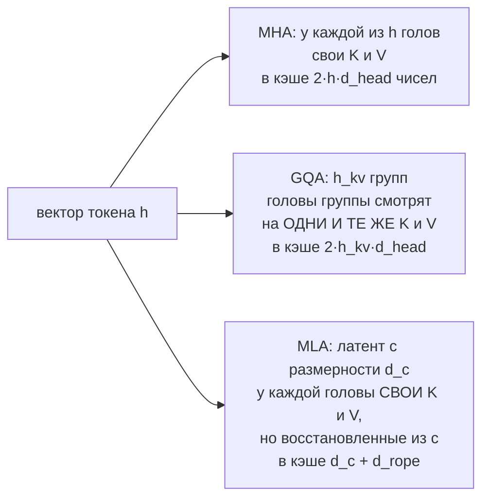

# Устройство современной LLM

> **Зачем эта глава.** Между трансформером из статьи 2017 года и моделью, которую вы сегодня
> поднимаете через vLLM, лежит десяток инженерных замен — каждая сделана ради конкретной
> проблемы: памяти, скорости, устойчивости обучения. На собеседовании спрашивают именно про них:
> «чем блок LLaMA отличается от ванильного», «что такое активные параметры в MoE»,
> «сколько GPU нужно на 70B». После этой главы вы сможете по конфигу модели за минуту посчитать
> её параметры, память под веса и KV-кэш и объяснить каждое архитектурное решение через проблему.

**Уровень:** 🎯 middle → 🧠 middle+
**Предварительно нужно:** [внимание и трансформер](../03-deep-learning/04-attention-and-transformer.md),
[текст как данные и токенизация](../04-nlp/01-text-representation.md),
[масштабирование обучения](../03-deep-learning/06-scaling-and-efficiency.md)
**Как проработать:** чтение + расчёты + сборка блока

---

## Карта главы

- [1. Что вообще поменялось со времён GPT-2](#1-что-вообще-поменялось-со-времён-gpt-2)
- [2. Почему победил decoder-only](#2-почему-победил-decoder-only)
- [3. Современный блок: пять замен и зачем каждая](#3-современный-блок-пять-замен-и-зачем-каждая)
- [4. Считаем параметры: откуда берётся «8B»](#4-считаем-параметры-откуда-берётся-8b)
- [5. MoE: знания как у большой модели, цена как у маленькой](#5-moe-знания-как-у-большой-модели-цена-как-у-маленькой)
- [6. Словарь и токенизатор — тоже часть архитектуры](#6-словарь-и-токенизатор--тоже-часть-архитектуры)
- [7. Длина контекста и её цена](#7-длина-контекста-и-её-цена)
- [8. Как делают 128k: сжатие KV и растягивание позиций](#8-как-делают-128k-сжатие-kv-и-растягивание-позиций)
- [9. Что значит «7B» в терминах железа](#9-что-значит-7b-в-терминах-железа)
- [10. Как выбирают конфигурацию: компромиссы](#10-как-выбирают-конфигурацию-компромиссы)
- [11. Подводные камни](#11-подводные-камни)
- [12. Проверь себя](#12-проверь-себя)
- [13. Практика](#13-практика)
- [14. Что читать дальше](#14-что-читать-дальше)

---

## 1. Что вообще поменялось со времён GPT-2

Полезно начать с честного признания: **несущая конструкция не менялась**. Стек одинаковых блоков,
в каждом — self-attention и position-wise FFN, обёрнутые в остаточные связи. Всё, что разбиралось
в главе [«Внимание и трансформер»](../03-deep-learning/04-attention-and-transformer.md), работает
и сегодня без единой поправки.

Изменилось другое: каждый компонент блока заменили на более дешёвый или более устойчивый аналог.
Ни одна из замен сама по себе не даёт прорыва — типичный выигрыш от каждой измеряется единицами
процентов качества или десятками процентов памяти. Но их шесть-семь, и вместе они превращают
модель, которую тяжело обучать и дорого обслуживать, в модель, которую можно обучать на 16 тысячах
GPU и запускать на ноутбуке.

| Компонент | Оригинальный трансформер / GPT-2 | Современная LLM | Какую проблему чинит |
|---|---|---|---|
| Нормализация | LayerNorm, post-LN (в GPT-2 уже pre-LN) | RMSNorm, pre-LN | расходимость на глубине, стоимость нормализации |
| Активация в FFN | ReLU / GELU, $d_{ff}=4d$ | SwiGLU, $d_{ff}\approx\tfrac{8}{3}d\cdot k$ | качество при том же бюджете параметров |
| Позиции | обучаемая таблица позиций | RoPE | нет обобщения за пределы обученной длины |
| Attention | MHA (все головы имеют свои $K,V$) | GQA (обычно 8 KV-голов) | KV-кэш ограничивает батч и контекст |
| Смещения (bias) | есть у всех Linear | убраны почти везде | стабильность обучения, чуть меньше памяти |
| FFN-слой | плотный | опционально MoE (top-k экспертов) | больше знаний без роста FLOPs |
| Словарь | 50 257 (byte-level BPE) | 128k–256k | мультиязычность и стоимость токена |
| Контекст | 1024 токена | 8k–1M | длинные документы, RAG, агенты |
| Dropout | 0.1 | 0.0 при претрейне | на 10¹³ токенах переобучения нет, dropout только замедляет |

Дальше — по каждой строке: что было не так и почему заменили именно на это.

> 🌱 **База.** Если вы впервые видите тему: держите в голове, что «современная LLM» — это
> тот же трансформер-декодер, у которого (а) поменяли нормализацию и активацию на более дешёвые,
> (б) поменяли способ кодировать позицию, (в) сократили число ключей/значений ради памяти.
> Разделы 3.1–3.4 читайте, разделы 4–8 — обязательны, они про расчёты, которые спрашивают всегда.

---

## 2. Почему победил decoder-only

В 2018–2020 годах конкурировали три семейства: encoder-only (BERT), encoder-decoder (T5, BART)
и decoder-only (GPT). К 2023-му вся генеративная индустрия оказалась в decoder-only. Это не мода,
у сходимости есть четыре конкретных причины.

**Причина 1: плотность обучающего сигнала.** BERT маскирует ~15% токенов и получает градиент
только от них. Decoder-only с причинной маской предсказывает **каждый** токен последовательности:
за один проход по батчу из $B$ последовательностей длины $n$ вы получаете $B\cdot n$ обучающих
примеров вместо $0{,}15\cdot B\cdot n$. При прочих равных это примерно в 6–7 раз больше сигнала
на тот же объём вычислений. Когда данных 10¹³ токенов и каждый FLOP на счету, это решающий довод.

**Причина 2: отсутствие рассогласования обучение/инференс.** У MLM токен `[MASK]` существует только
при обучении — на инференсе его нет, и модель работает в режиме, которого не видела. У causal LM
режим один и тот же: продолжить префикс.

**Причина 3: универсальность интерфейса.** Encoder-decoder требует явного деления «вход → выход».
Перевод в него ложится идеально, а диалог с историей, вызов инструментов, дописывание кода —
уже с натяжкой. Decoder-only просто конкатенирует всё в один поток токенов: системный промпт,
историю, документы из RAG, ответ. Одна модель закрывает любой формат задачи без изменения
архитектуры.

**Причина 4: дешевле инженерно.** Один стек слоёв вместо двух, нет cross-attention, проще
тензорный и пайплайн-параллелизм, проще KV-кэш. Меньше сущностей — меньше мест, где ломается.

Эмпирическая проверка тоже есть: систематическое сравнение архитектур и целей предобучения
при фиксированном бюджете ([Wang et al., 2022](https://arxiv.org/abs/2204.05832)) показало,
что для zero-shot-обобщения выигрывает связка «causal decoder + полноценное языковое
моделирование», тогда как encoder-decoder с denoising лучше после дообучения под конкретную задачу.
Индустрия выбирала первое.

> 💬 **На собеседовании.** Спросят (Ozon, middle): «В чём основная разница между BERT и GPT?»
> Хороший ответ строится через маску: у BERT внимание двунаправленное, маски будущего нет,
> обучается через MLM — восстановление 15% замаскированных токенов; применяется там, где нужен
> вектор текста (классификация, эмбеддинги, реранкер). У GPT причинная маска, обучение через
> предсказание следующего токена, каждый токен даёт градиент; применяется для генерации,
> и при этом любая задача сводится к генерации через промпт. Дальше стоит добавить, почему
> индустрия сошлась на втором: плотность сигнала, отсутствие `[MASK]` на инференсе, единый формат
> входа. И честную оговорку: encoder-модели никуда не делись — в поиске и RAG кросс-энкодерный
> реранкер и bi-encoder для эмбеддингов почти всегда энкодерные, потому что там нужен
> двунаправленный контекст и не нужна генерация.
> Провал: «BERT — для понимания, GPT — для генерации» без объяснения через маску и цель обучения.

---

## 3. Современный блок: пять замен и зачем каждая

### 3.1 RMSNorm вместо LayerNorm

LayerNorm делает две вещи: вычитает среднее (центрирование) и делит на стандартное отклонение
(масштабирование). RMSNorm выбрасывает первое:

$$
\operatorname{RMSNorm}(x) = \frac{x}{\sqrt{\dfrac{1}{d}\sum_{i=1}^{d} x_i^2 + \varepsilon}} \odot g
$$

где $x \in \mathbb{R}^{d}$ — вектор одного токена, $d$ — размерность модели, $g \in \mathbb{R}^{d}$ —
обучаемый поканальный масштаб, $\varepsilon$ — константа численной устойчивости (обычно $10^{-5}$
или $10^{-6}$), $\odot$ — поэлементное умножение.

Проблема, которую это решает, — не качество, а **стоимость**. LayerNorm требует двух проходов
по вектору (сначала среднее, потом дисперсия относительно него) и хранит два обучаемых вектора
($\gamma$ и $\beta$). RMSNorm — один проход и один вектор. На уровне ядра CUDA это заметная
экономия: нормализация вызывается $2L$ раз за проход, она memory-bound, и лишнее чтение тензора
стоит реального времени. Экономия параметров ничтожна ($d$ на слой), экономия времени —
единицы процентов от прохода. Качество, как показали эксперименты авторов RMSNorm, не страдает:
работает именно перемасштабирование, а не центрирование.

> ⚠️ **Типичная ошибка.** Считать сумму квадратов в bf16. У bf16 всего 8 бит мантиссы; сумма
> 4096 слагаемых накапливает ошибку, и нормализация начинает «шуметь». Все рабочие реализации
> приводят вход к fp32 внутри нормализации и возвращают обратно. Симптом при нарушении —
> лосс обучается, но с плато и странными скачками; ловится сравнением с fp32-эталоном.

Расположение — **pre-LN**: нормализация стоит на входе подслоя, остаточный путь идёт мимо неё.
Почему именно так и что ломается при post-LN — разобрано в
[главе про трансформер, §7.2](../03-deep-learning/04-attention-and-transformer.md#72-остаточные-связи-и-нормализация-pre-ln-против-post-ln).
Здесь важно добавить одну деталь, специфичную для LLM: у чистого pre-LN дисперсия остаточного
потока растёт с глубиной (каждый блок добавляет своё), поэтому в конце стека всегда стоит
финальный RMSNorm перед выходной проекцией. Часть моделей дополнительно нормализует $q$ и $k$
перед вычислением логитов (QK-norm) — это лечит взрывы логитов внимания на моделях глубже ~40 слоёв.

### 3.2 SwiGLU вместо ReLU

$$
\operatorname{SwiGLU}(x) = \big(\operatorname{SiLU}(W_{\text{gate}}\,x) \odot W_{\text{up}}\,x\big)\,W_{\text{down}}^{\top},
\qquad \operatorname{SiLU}(z) = z\,\sigma(z) = \frac{z}{1+e^{-z}}
$$

где $x \in \mathbb{R}^{d}$ — вектор токена, $W_{\text{gate}}, W_{\text{up}} \in \mathbb{R}^{d_{ff}\times d}$ —
матрицы «вентиля» и «подъёма», $W_{\text{down}} \in \mathbb{R}^{d \times d_{ff}}$ — матрица возврата
в размерность модели, $d_{ff}$ — внутренняя размерность FFN, $\sigma$ — сигмоида.

Проблема: обычный FFN $W_2\,\phi(W_1 x)$ — это композиция линейного и поэлементно-нелинейного
преобразований, взаимодействия между координатами внутри FFN нет вообще. Вентиль вводит
**мультипликативное** взаимодействие: одна ветвь решает, что пропустить, вторая — что именно.
Выигрыш небольшой, но воспроизводимый на разных масштабах, поэтому SwiGLU стал дефолтом.

Ключевая деталь, которую спрашивают: матриц стало **три вместо двух**, и чтобы не раздуть
параметры, $d_{ff}$ уменьшают примерно до $\tfrac{8}{3}d$ (тогда $3 \cdot \tfrac{8}{3} d^2 = 8d^2$ —
ровно как у классического $4d$ с двумя матрицами). На практике результат ещё округляют вверх
до кратного 256 ради эффективности тензорных ядер. Отсюда «странные» числа в конфигах:
у Llama-2-7B $d_{ff} = 11008$ при $d = 4096$ (а $\tfrac{8}{3}\cdot 4096 \approx 10923$),
у Llama-3-8B — 14336, потому что там бюджет FFN сознательно увеличили.

### 3.3 RoPE вместо обучаемых позиций

Механика RoPE разобрана в
[главе про трансформер, §6.3](../03-deep-learning/04-attention-and-transformer.md#63-rope--rotary-position-embedding-llama-qwen-большинство-современных-llm).
Здесь — почему это архитектурное решение, а не деталь.

Обучаемая таблица позиций размера $L_{\max}\times d$ жёстко фиксирует максимальную длину:
за $L_{\max}$ у модели просто нет параметров. Расширить контекст можно только переобучением.
RoPE не добавляет ни одного параметра, а положение входит в вычисление через угол поворота,
поэтому окно растягивается **дообучением на небольшом объёме данных** — интерполяцией частот.
Практически это делают, увеличивая базу $\theta_{\text{base}}$: у Llama 2 она равна 10 000
при контексте 4k, у Llama 3.1 — 500 000 при контексте 128k. Именно возможность дешёво
растянуть контекст и сделала RoPE стандартом: расширение окна перестало быть новым претрейном
и стало финальной стадией обучения на нескольких десятках миллиардов токенов.

### 3.4 GQA вместо MHA

Это единственная замена, мотивированная не качеством, а прямо арифметикой памяти.

При генерации мы кэшируем $K$ и $V$ всего префикса. Размер кэша:

$$
M_{KV} \;=\; 2 \cdot L \cdot h_{kv} \cdot d_{\text{head}} \cdot n \cdot B \cdot b
$$

где двойка — на $K$ и $V$, $L$ — число слоёв, $h_{kv}$ — число KV-голов, $d_{\text{head}}$ —
размерность головы, $n$ — длина контекста в токенах, $B$ — число одновременных запросов,
$b$ — байт на число (2 для fp16/bf16).

Заметьте: в формуле нет числа голов запросов $h_q$. Кэш зависит только от $h_{kv}$. Grouped-Query
Attention этим и пользуется: голов запросов оставляем много (они дают разнообразие «взглядов»),
а групп ключей/значений — мало; каждая KV-голова обслуживает $h_q/h_{kv}$ голов запросов.
Multi-Query Attention — крайний случай $h_{kv}=1$.

Числа для Llama-3-8B ($L=32$, $h_{kv}=8$, $d_{\text{head}}=128$, bf16): на один токен
$2\cdot 32\cdot 8\cdot 128\cdot 2 = 131\,072$ байт = **128 КиБ**. При MHA (было бы $h_{kv}=32$)
это 512 КиБ — в четыре раза больше. На контексте 8192 токенов: 1 ГиБ против 4 ГиБ **на один запрос**.
На батче из 32 запросов — 32 ГиБ против 128 ГиБ. Разница между «влезает в одну H100» и «не влезает
никуда».

Почему почти все выбирают именно **8 KV-голов**? Две причины. Первая — качество: замеры авторов GQA
показывают, что переход от MHA к 8 группам почти не теряет качества, а к 1 группе (MQA) уже теряет
заметно. Вторая, чисто инженерная: типовой тензорный параллелизм для больших моделей — 8 GPU,
и при $h_{kv}=8$ каждой карте достаётся ровно одна KV-голова, без репликации кэша между картами.

### 3.5 Мелочи, которые всё равно спрашивают

**Убрали bias.** У Linear-слоёв в attention и FFN нет смещений. Причины: (а) с pre-LN среднее
на входе подслоя и так контролируется нормализацией, польза от bias минимальна; (б) без bias
обучение стабильнее на больших масштабах; (в) экономия параметров и одна операция меньше.
Выходная проекция словаря тоже без bias.

**Dropout = 0.** При претрейне на 10¹³ токенах модель видит каждый пример примерно один раз —
переобучаться не на чем, а dropout добавляет шум в градиент и замедляет сходимость. Dropout
возвращают на этапе дообучения на маленьких датасетах, где переобучение реально.

**Связанные эмбеддинги (tied embeddings).** Матрица входных эмбеддингов и выходная проекция
на словарь могут быть одной матрицей. Для маленьких моделей это существенная экономия
(см. расчёт в [§6](#6-словарь-и-токенизатор--тоже-часть-архитектуры)), для больших — от связывания чаще отказываются: две отдельные матрицы дают
чуть лучшее качество, а их доля в общем размере уже мала.

### Собираем блок целиком

```python
# Современный decoder-блок: RMSNorm + GQA + RoPE + SwiGLU. Все замены из §3 в одном месте.
import torch
import torch.nn as nn
import torch.nn.functional as F


class RMSNorm(nn.Module):
    def __init__(self, d: int, eps: float = 1e-6):
        super().__init__()
        self.eps = eps
        self.weight = nn.Parameter(torch.ones(d))   # только масштаб, никакого сдвига

    def forward(self, x: torch.Tensor) -> torch.Tensor:
        dtype = x.dtype
        x32 = x.float()                              # сумма квадратов по 4096 элементам в bf16 шумит
        rms = torch.rsqrt(x32.pow(2).mean(-1, keepdim=True) + self.eps)
        return (x32 * rms).to(dtype) * self.weight


class SwiGLU(nn.Module):
    def __init__(self, d: int, d_ff: int | None = None):
        super().__init__()
        # три матрицы вместо двух -> сжимаем d_ff до 8/3 d, чтобы бюджет параметров остался 8d^2
        d_ff = d_ff or 256 * ((int(8 * d / 3) + 255) // 256)   # округление под тензорные ядра
        self.gate = nn.Linear(d, d_ff, bias=False)
        self.up = nn.Linear(d, d_ff, bias=False)
        self.down = nn.Linear(d_ff, d, bias=False)

    def forward(self, x):
        return self.down(F.silu(self.gate(x)) * self.up(x))


def build_rope_cache(n: int, d_head: int, base: float = 10000.0, device="cpu"):
    """Косинусы/синусы углов поворота. base растят (до 5e5), когда растягивают контекст."""
    inv_freq = 1.0 / (base ** (torch.arange(0, d_head, 2, device=device).float() / d_head))
    angles = torch.outer(torch.arange(n, device=device).float(), inv_freq)  # (n, d_head/2)
    return angles.cos(), angles.sin()


def apply_rope(x: torch.Tensor, cos: torch.Tensor, sin: torch.Tensor) -> torch.Tensor:
    """x: (B, h, n, d_head). Поворачиваем соседние пары координат (x_2i, x_2i+1)."""
    x1, x2 = x[..., 0::2], x[..., 1::2]
    cos, sin = cos[None, None], sin[None, None]
    rotated = torch.stack([x1 * cos - x2 * sin, x1 * sin + x2 * cos], dim=-1)
    return rotated.flatten(-2)


class GroupedQueryAttention(nn.Module):
    def __init__(self, d_model: int, n_heads: int, n_kv_heads: int):
        super().__init__()
        assert n_heads % n_kv_heads == 0
        self.n_heads, self.n_kv_heads = n_heads, n_kv_heads
        self.d_head = d_model // n_heads
        self.rep = n_heads // n_kv_heads          # сколько голов запросов на одну KV-голову
        self.wq = nn.Linear(d_model, n_heads * self.d_head, bias=False)
        self.wk = nn.Linear(d_model, n_kv_heads * self.d_head, bias=False)   # узкая!
        self.wv = nn.Linear(d_model, n_kv_heads * self.d_head, bias=False)   # узкая!
        self.wo = nn.Linear(n_heads * self.d_head, d_model, bias=False)

    def forward(self, x, cos, sin):
        B, n, _ = x.shape
        q = self.wq(x).view(B, n, self.n_heads, self.d_head).transpose(1, 2)
        k = self.wk(x).view(B, n, self.n_kv_heads, self.d_head).transpose(1, 2)
        v = self.wv(x).view(B, n, self.n_kv_heads, self.d_head).transpose(1, 2)
        q, k = apply_rope(q, cos, sin), apply_rope(k, cos, sin)   # RoPE — к q и k, но НЕ к v
        # боевые ядра не материализуют копии, а читают одну KV-голову для группы запросов
        k = k.repeat_interleave(self.rep, dim=1)
        v = v.repeat_interleave(self.rep, dim=1)
        out = F.scaled_dot_product_attention(q, k, v, is_causal=True)
        return self.wo(out.transpose(1, 2).reshape(B, n, -1))


class ModernBlock(nn.Module):
    def __init__(self, d_model: int, n_heads: int, n_kv_heads: int):
        super().__init__()
        self.attn_norm = RMSNorm(d_model)
        self.attn = GroupedQueryAttention(d_model, n_heads, n_kv_heads)
        self.ffn_norm = RMSNorm(d_model)
        self.ffn = SwiGLU(d_model)

    def forward(self, x, cos, sin):
        x = x + self.attn(self.attn_norm(x), cos, sin)   # pre-LN: остаточный путь чист
        x = x + self.ffn(self.ffn_norm(x))
        return x


if __name__ == "__main__":
    d_model, n_heads, n_kv_heads, n = 512, 8, 2, 64
    block = ModernBlock(d_model, n_heads, n_kv_heads)
    cos, sin = build_rope_cache(n, d_model // n_heads)
    x = torch.randn(2, n, d_model)
    y = block(x, cos, sin)
    assert y.shape == x.shape
    # проверка причинности: правка последнего токена не должна менять выход предыдущих
    x2 = x.clone()
    x2[:, -1] = torch.randn(2, d_model)
    assert torch.allclose(block(x2, cos, sin)[:, :-1], y[:, :-1], atol=1e-5)
    print("параметров в блоке:", sum(p.numel() for p in block.parameters()))
```

> 💬 **На собеседовании.** Спросят (ZinBrains, middle): «Опишите архитектуру трансформера
> по блокам» — и почти всегда добьют: «а чем блок LLaMA отличается от блока из Attention Is All
> You Need?»
> Хороший ответ идёт по списку с указанием мотива: RMSNorm вместо LayerNorm (дешевле, центрирование
> не нужно); pre-LN (чистый остаточный путь, обучается без warmup-костылей); SwiGLU вместо ReLU
> с $d_{ff}\approx\tfrac{8}{3}d$ (мультипликативный вентиль при том же бюджете); RoPE вместо
> обучаемой таблицы позиций, применяется в каждом слое к $q$ и $k$ (относительность + дешёвое
> растягивание контекста); GQA вместо MHA (KV-кэш в 4–8 раз меньше); нет bias, нет dropout;
> нет энкодера и cross-attention.
> Провал: перечислить названия («там RMSNorm, SwiGLU, RoPE») без указания, что именно каждое чинит.
> Это ровно тот ответ, по которому отличают «читал changelog» от «понимаю».

---

## 4. Считаем параметры: откуда берётся «8B»

Умение за минуту посчитать модель по конфигу — базовый навык. Считаем по слоям.

**Attention одного слоя.** Матрицы $W_Q \in \mathbb{R}^{d\times d}$ и $W_O \in \mathbb{R}^{d\times d}$
всегда полные; $W_K$ и $W_V$ при GQA сужены до $d \times h_{kv}d_{\text{head}}$:

$$
P_{\text{attn}} = 2d^2 + 2\,d\,h_{kv}\,d_{\text{head}}
$$

где $d$ — размерность модели, $h_{kv}$ — число KV-голов, $d_{\text{head}} = d/h_q$ — размерность
головы, $h_q$ — число голов запросов.

**FFN одного слоя** (SwiGLU, три матрицы):

$$
P_{\text{ffn}} = 3\,d\,d_{ff}
$$

**Эмбеддинги:** $|V|\cdot d$ на вход и столько же на выходную проекцию, если они не связаны;
$|V|$ — размер словаря.

**Итого:**

$$
P = L\big(2d^2 + 2\,d\,h_{kv}\,d_{\text{head}} + 3\,d\,d_{ff}\big) \;+\; (1\ \text{или}\ 2)\cdot |V|\,d
$$

где $L$ — число слоёв. Параметрами нормализаций ($2d$ на слой) пренебрегаем — это доли процента.

```python
# Считалка параметров по конфигу. Чистый Python, запускается где угодно.
def count_params(d, n_layers, n_heads, n_kv_heads, d_ff, vocab,
                 tied=False, n_experts=1, top_k=1):
    d_head = d // n_heads
    attn = 2 * d * d + 2 * d * n_kv_heads * d_head
    ffn_one = 3 * d * d_ff
    total_per_layer = attn + n_experts * ffn_one
    active_per_layer = attn + top_k * ffn_one          # что реально считается на токен
    emb = vocab * d * (1 if tied else 2)
    return (n_layers * total_per_layer + emb,
            n_layers * active_per_layer + emb)


CONFIGS = {
    # (d, L, h_q, h_kv, d_ff, |V|, tied, экспертов, top_k)
    "Llama-2-7B":   (4096, 32, 32, 32, 11008,  32000, False, 1, 1),
    "Llama-2-70B":  (8192, 80, 64,  8, 28672,  32000, False, 1, 1),
    "Llama-3-8B":   (4096, 32, 32,  8, 14336, 128256, False, 1, 1),
    "Llama-3-70B":  (8192, 80, 64,  8, 28672, 128256, False, 1, 1),
    "Mixtral-8x7B": (4096, 32, 32,  8, 14336,  32000, False, 8, 2),
}

for name, cfg in CONFIGS.items():
    total, active = count_params(*cfg)
    print(f"{name:14s} всего {total/1e9:6.2f}B   активных {active/1e9:6.2f}B")
```

Вывод (округляя):

| Модель | Расчёт | Заявлено |
|---|---|---|
| Llama-2-7B | 6,74B | 6,74B |
| Llama-2-70B | 68,98B | ~70B |
| Llama-3-8B | 8,03B | 8,03B |
| Llama-3-70B | 70,55B | ~70,6B |
| Mixtral-8x7B | 46,70B всего / 12,88B активных | 46,7B / 12,9B |

Совпадение до третьей значащей цифры — формула точная, а не «примерно». Разберите на примере
Llama-3-8B, куда уходят параметры:

- attention на слой: $2\cdot 4096^2 + 2\cdot 4096\cdot 8\cdot 128 = 33{,}55 + 8{,}39 = 41{,}9$ млн;
- FFN на слой: $3\cdot 4096\cdot 14336 = 176{,}2$ млн — **в 4,2 раза больше, чем attention**;
- 32 слоя: $32 \cdot 218{,}1 = 6{,}98$ млрд;
- эмбеддинги: $128256\cdot 4096 = 525$ млн, и столько же на выходную проекцию → 1,05 млрд, то есть
  **13% всей модели уходит на словарь**.

Два вывода, которые обычно оказываются неожиданными. Первый: основная масса модели — это FFN,
а не attention; отсюда и то, что MoE делают именно на FFN-слоях ([§5](#5-moe-знания-как-у-большой-модели-цена-как-у-маленькой)). Второй: у моделей в диапазоне
1–8B словарь на 128k занимает от 10 до 40% параметров — вот почему у Llama-3.2-1B эмбеддинги
связывают, а у 8B уже нет.

> ⌨️ **Руками.** Возьмите `config.json` любой открытой модели с HuggingFace
> (`hidden_size`, `num_hidden_layers`, `num_attention_heads`, `num_key_value_heads`,
> `intermediate_size`, `vocab_size`, `tie_word_embeddings`) и подставьте в `count_params`.
> Сойдётся с числом в карточке модели — вы умеете читать конфиг.

---

## 5. MoE: знания как у большой модели, цена как у маленькой

**Проблема.** Качество растёт с числом параметров, но вычисления на токен растут вместе с ним:
плотная модель на $N$ параметров тратит примерно $2N$ FLOPs на токен и на обучении, и на инференсе.
Хочется вместить больше знаний, не платя за них при каждом токене.

**Идея.** Знания живут в FFN. Заменим один FFN на $E$ независимых FFN («экспертов») и будем
для каждого токена выбирать $k$ из них — обычно $k=2$ (Mixtral) или $k=8$ из 256 (DeepSeek-V3).
Тогда параметров становится в $E$ раз больше, а вычислений — только в $k$ раз.

Формально MoE-слой:

$$
y = \sum_{i \in \mathcal{T}_k(x)} g_i(x)\cdot \operatorname{FFN}_i(x),
\qquad
g(x) = \operatorname{softmax}\big(W_r x\big)
$$

где $x$ — вектор токена после нормализации, $W_r \in \mathbb{R}^{E \times d}$ — матрица роутера
(маршрутизатора), $g(x) \in \mathbb{R}^{E}$ — распределение по экспертам, $\mathcal{T}_k(x)$ —
множество индексов $k$ экспертов с наибольшими $g_i$, $\operatorname{FFN}_i$ — $i$-й эксперт.
Веса выбранных экспертов обычно ренормируют, чтобы они суммировались в единицу.

Роутинг **потокенный, а не позапросный**: соседние токены одного предложения могут уйти к разным
экспертам. Это важно понимать: «эксперт по медицине» — это миф, распределение получается
не по темам, а по чему-то ближе к синтаксическим и поверхностным признакам токена.

### Проблема балансировки и loss, который её чинит

Роутер обучается вместе с моделью и склонен к **вырождению**: пара экспертов получает почти все
токены, обучается быстрее, становится ещё привлекательнее для роутера — положительная обратная
связь. Остальные эксперты не получают градиента и остаются мусором. Плюс инженерная беда:
эксперты распределены по GPU, и перекос в роутинге означает, что одна карта работает,
а семь ждут.

Лечится вспомогательным лоссом балансировки (auxiliary load balancing loss):

$$
\mathcal{L}_{\text{aux}} = \alpha \cdot E \sum_{i=1}^{E} f_i \, P_i
$$

где $E$ — число экспертов, $f_i$ — доля токенов батча, отправленных к эксперту $i$,
$P_i$ — средняя по батчу вероятность, которую роутер назначил эксперту $i$,
$\alpha$ — вес слагаемого (типично 0,01).

> 📐 **Разбор формулы.** Почему произведение $f_i P_i$, а не, скажем, $\sum f_i^2$? Потому что
> $f_i$ — это счётчик, он недифференцируем по параметрам роутера. $P_i$ дифференцируем. Их
> произведение даёт градиент, который снижает вероятности у перегруженных экспертов
> (там, где $f_i$ велико, множитель при $P_i$ велик). При равномерной загрузке
> $f_i = P_i = 1/E$, и сумма равна $E\cdot E \cdot \tfrac{1}{E^2} = 1$ — минимум. При полном
> вырождении (все токены к одному эксперту с вероятностью 1) сумма равна $E$. То есть значение
> лосса напрямую читается как «во сколько раз мы хуже равномерного».

Вторая типичная добавка — **router z-loss**, штраф на величину логитов роутера:
$\mathcal{L}_z = \tfrac{1}{T}\sum_t \big(\log\sum_j e^{x^{(t)}_j}\big)^2$, где $x^{(t)}$ — логиты
роутера для токена $t$, $T$ — число токенов. Он держит логиты маленькими и спасает
softmax роутера от переполнения в bf16 — MoE без него часто ловит NaN на больших масштабах.

```python
# Роутер MoE: top-k, ренормировка весов, лосс балансировки и z-loss.
import torch
import torch.nn as nn
import torch.nn.functional as F


def balance_loss(probs: torch.Tensor, top_i: torch.Tensor, n_experts: int, k: int):
    """probs: (T, E) — распределение роутера; top_i: (T, k) — индексы выбранных экспертов."""
    # f_i — доля токенов, ушедших к эксперту i (делим на k, чтобы f суммировалась в 1)
    assign = F.one_hot(top_i, n_experts).sum(1).float()      # (T, E)
    f = assign.mean(0) / k
    P = probs.mean(0)                                        # средняя вероятность эксперта
    return n_experts * torch.sum(f * P)   # 1.0 при идеальном балансе, E при полном коллапсе


class TopKRouter(nn.Module):
    def __init__(self, d_model: int, n_experts: int, k: int = 2):
        super().__init__()
        self.gate = nn.Linear(d_model, n_experts, bias=False)
        self.n_experts, self.k = n_experts, k

    def forward(self, x: torch.Tensor):
        """x: (T, d) — все токены батча одним списком."""
        logits = self.gate(x).float()                        # (T, E), softmax роутера — в fp32
        probs = F.softmax(logits, dim=-1)
        top_p, top_i = probs.topk(self.k, dim=-1)            # (T, k)
        top_p = top_p / top_p.sum(-1, keepdim=True)          # веса выбранных -> сумма 1

        aux = balance_loss(probs, top_i, self.n_experts, self.k)
        # z-loss держит логиты маленькими: без него softmax роутера переполняется в bf16
        z_loss = torch.logsumexp(logits, dim=-1).pow(2).mean()
        return top_i, top_p, aux, z_loss


if __name__ == "__main__":
    torch.manual_seed(0)
    E, K, T = 8, 2, 4096
    router = TopKRouter(d_model=64, n_experts=E, k=K)
    _, _, aux, z_loss = router(torch.randn(T, 64))
    print(f"необученный роутер: aux = {aux:.3f}   (идеальный баланс = 1.0)")

    # полный коллапс: вся вероятностная масса и оба слота top-k — на эксперта 0
    probs = torch.zeros(T, E)
    probs[:, 0] = 1.0
    top_i = torch.zeros(T, K, dtype=torch.long)
    print(f"коллапс на одного:  aux = {balance_loss(probs, top_i, E, K):.3f}   (максимум = E = {E})")
```

У необученного роутера значение близко к единице — распределение почти равномерно; при полном
вырождении оно равно ровно $E$. Это удобно на практике: `aux` логируется как есть и читается
как «во сколько раз загрузка хуже идеальной», отдельная гистограмма по экспертам для дежурного
мониторинга не нужна.

### Что это стоит на практике

**Память — по полным параметрам, вычисления — по активным.** Mixtral 8x7B: 46,7 млрд параметров
(93 ГБ в bf16 — не влезает в одну H100 на 80 ГБ), но на каждый токен считает как модель на 12,9 млрд.
Отсюда и привычка писать «активные параметры»: они предсказывают латентность и стоимость обучения,
а полные — требования к VRAM.

DeepSeek-V3 доводит идею до предела: 671 млрд параметров всего, 37 млрд активных, 256 роутируемых
экспертов плюс один общий на слой, top-8. Проверим на нём формулу бюджета обучения
(разбирается в [следующей главе](02-pretraining-and-scaling.md)): $6\cdot N_{\text{active}}\cdot D = 6\cdot 37\cdot10^{9}\cdot 14{,}8\cdot10^{12} \approx 3{,}3\cdot10^{24}$ FLOPs. Отчёт заявляет
2,79 млн GPU-часов H800 — это $\approx 3{,}3\cdot10^{14}$ FLOPS на карту, то есть треть
пикового bf16. Сходится: **для MoE в бюджете считают активные параметры**.

Цена, которую платят:

- **VRAM.** Нужно держать всех экспертов резидентно, даже если на токен работают двое.
- **Батчинг работает против вас.** При батче в 256 токенов почти все эксперты окажутся востребованы,
  и вы прочитаете из памяти веса всех экспертов — экономия FLOPs остаётся, экономия трафика памяти
  исчезает. MoE тем выгоднее, чем меньше батч.
- **Коммуникации.** Эксперты шардируются по GPU (expert parallelism), маршрутизация — это all-to-all
  обмен на каждом MoE-слое. На медленном интерконнекте выигрыш съедается.
- **Capacity factor и выброшенные токены.** У каждого эксперта фиксированная ёмкость
  $\text{capacity} = \text{CF}\cdot T/E$ (типично $\text{CF}=1{,}0\ldots1{,}25$); токены сверх неё
  просто проходят мимо FFN по остаточной связи. Слишком маленький CF — теряете сигнал,
  слишком большой — платите памятью.
- **Дообучение сложнее.** Роутер на маленьком доменном датасете быстро перекашивается,
  и MoE переобучается охотнее плотной модели того же активного размера.

> 💬 **На собеседовании.** Спросят (middle+): «Объясните технологию, которая стоит за Mixtral,
> в чём её плюсы и минусы?»
> Хороший ответ: это sparse MoE — в каждом блоке FFN заменён на 8 экспертов, роутер выбирает
> для каждого **токена** двух, выходы складываются с весами softmax. Всего 46,7 млрд параметров,
> активных 12,9 млрд: качество ближе к плотной модели на 30–40B, скорость — как у 13B.
> Плюсы: лучшее качество на FLOP, дешёвый инференс при малых батчах. Минусы: VRAM считается
> по полному размеру (93 ГБ в bf16), нужен балансировочный лосс и z-loss, иначе роутер вырождается
> и обучение ловит NaN; на больших батчах экономия трафика памяти пропадает; all-to-all между GPU;
> дообучать тяжелее. И обязательно проговорить, что «эксперт» — не про тематику: роутинг
> потокенный и специализация не интерпретируется.
> Провал: «это ансамбль из восьми моделей по 7B» — принципиально неверно, эксперты сидят внутри
> одного блока, а attention общий.

---

## 6. Словарь и токенизатор — тоже часть архитектуры

Токенизатор часто считают препроцессингом. На самом деле размер словаря $|V|$ — такой же
гиперпараметр архитектуры, как $d$ или $L$, и он влияет сразу на четыре вещи.

**1. Параметры и память.** Эмбеддинги + выходная проекция: $2|V|d$. Для $d=4096$: словарь 32k —
262 млн параметров, словарь 128k — 1,05 млрд. На модели 8B разница почти в 10% размера.

**2. Вычисления на каждом шаге генерации.** Выходная проекция — это умножение $(1\times d)$
на $(d\times|V|)$, то есть $2|V|d$ FLOPs на токен. Для 128k и $d{=}4096$ это 1,05 GFLOP,
при общих $2N \approx 16$ GFLOP на токен — около 6,5% всей арифметики декодирования.

**3. Длина последовательности.** Это самый недооценённый пункт. Всё, что вы платите за контекст —
KV-кэш, квадратичное внимание, деньги за токены в API — платится **за токены, а не за символы**.
Ключевая метрика — **фертильность** (fertility): среднее число токенов на слово. Англоцентричный
словарь на 32k даёт на английском ~1,3 токена на слово, а на русском легко 3 и больше: кириллица
уходит в байтовый fallback и слово рассыпается на куски по 1–2 символа. Переход с фертильности 3,5
на 2,0 — это на 43% меньше токенов: на 43% дешевле API, на 43% меньше KV-кэш и в 1,75 раза больше
реального текста в том же окне контекста.

**4. Качество на редких токенах.** Чем больше словарь, тем реже встречается каждый отдельный токен
и тем меньше обновлений получает его строка эмбеддинга. Хвост словаря обучается плохо.

```python
# Измеряем фертильность токенизатора на своём тексте. Требует: pip install transformers
from transformers import AutoTokenizer

TEXT_RU = ("Градиентный бустинг строит аддитивную модель, последовательно добавляя "
           "деревья, каждое из которых приближает антиградиент функции потерь.")

for name in ["meta-llama/Llama-2-7b-hf", "meta-llama/Meta-Llama-3-8B"]:
    tok = AutoTokenizer.from_pretrained(name)          # часть моделей требует принятия лицензии
    n_tokens = len(tok.encode(TEXT_RU, add_special_tokens=False))
    n_words = len(TEXT_RU.split())
    print(f"{name:30s} |V|={tok.vocab_size:>7}  токенов={n_tokens:>3}  "
          f"фертильность={n_tokens / n_words:.2f}")
```

Запустите это на своём домене — на юридических текстах, на логах, на коде. Цифра, которую
вы получите, напрямую превращается в счёт за инференс. Отдельно измерьте на английском:
разница между языками покажет, сколько вы переплачиваете за то, что модель обучали не под вас.

> 💬 **На собеседовании.** Спросят (middle+): «На что влияет размер словаря токенизатора?
> Как вы будете его выбирать, если обучаете модель с нуля?»
> Хороший ответ разбивает на два эффекта, которые тянут в разные стороны. Больше словарь →
> короче последовательности → меньше FLOPs на текст, меньше KV-кэш, больше текста влезает
> в контекст. Но: растут эмбеддинги и выходной softmax ($2|V|d$ параметров и FLOPs на каждый шаг),
> и редкие токены недообучаются. Выбор — по фертильности на **целевом** корпусе: увеличиваем
> словарь, пока кривая «фертильность vs $|V|$» ощутимо падает, и останавливаемся на выполаживании.
> Ориентиры на момент написания: 32k хватает для одноязычной английской модели, 128k–256k —
> для мультиязычной. Для русского языка англоцентричный словарь на 32k — это прямой перерасход
> в 2–3 раза, поэтому русскоязычные модели либо обучают свой токенизатор, либо расширяют
> существующий. Follow-up, которым добивают: «что нужно сделать при добавлении новых токенов?» —
> ресайзнуть матрицу эмбеддингов и `lm_head`, а новые строки инициализировать не случайно,
> а средним по сабтокенам исходного слова, иначе первые тысячи шагов модель будет чинить
> собственный ввод.
> Провал: «чем больше словарь, тем лучше».

---

## 7. Длина контекста и её цена

«Почему в трансформерах есть ограничение на количество токенов?» — вопрос, на котором сыплются,
отвечая «потому что квадратичная сложность». Причин четыре, и они разной природы.

**Причина 1: квадратичные вычисления при prefill.** Обработка промпта длины $n$ стоит по attention

$$
F_{\text{attn}} \approx 2\,L\,n^2\,d
$$

FLOPs, где $L$ — число слоёв, $d$ — размерность модели. Откуда двойка: две матричные операции
($QK^\top$ и умножение на $V$), каждая по $2n^2d$ FLOPs, но при причинной маске нужен только
нижний треугольник — вдвое меньше. (Наивная реализация, считающая полную матрицу и потом
маскирующая, платит $4Ln^2d$ — ещё один довод за FlashAttention с флагом `is_causal`.)
Остальная модель стоит $2Nn$, где $N$ — число параметров. Attention начинает доминировать,
когда $2Ln^2d > 2Nn$, то есть при

$$
n > \frac{N}{L\,d}
$$

Для Llama-3-8B: $8{,}03\cdot10^9 / (32\cdot4096) \approx 61\,000$ токенов. То есть на типовых
длинах «квадратичность» — это добавка, а не главный член: на 8k внимание съедает около 12%
prefill, на 32k — треть, и только на 128k становится вдвое дороже всей остальной модели.

**Причина 2: линейный, но огромный KV-кэш.** По формуле из [§3.4](#34-gqa-вместо-mha) для Llama-3-8B это 128 КиБ
на токен:

| Контекст | KV-кэш на 1 запрос (8B, GQA-8) | KV-кэш на 1 запрос (70B, GQA-8) |
|---|---|---|
| 4k | 0,5 ГиБ | 1,25 ГиБ |
| 8k | 1 ГиБ | 2,5 ГиБ |
| 32k | 4 ГиБ | 10 ГиБ |
| 128k | 16 ГиБ | 40 ГиБ |

Прочитайте последнюю ячейку внимательно. 70B в int4 весит ~39 ГБ, а один запрос на 128k токенов
добавляет 40 ГиБ (≈43 ГБ) кэша — вместе они уже не помещаются в карту на 80 ГБ. Чтобы обслужить
**хотя бы один** такой запрос, придётся квантизовать ещё и кэш. Throughput при этом падает
в десятки раз относительно работы на коротких контекстах, а цена запроса взлетает соответственно.

**Причина 3: модель не обучалась на такой длине.** Позиционное кодирование за пределами обучающей
длины ведёт себя непредсказуемо. RoPE спасает частично: растягивание требует отдельной стадии
дообучения с увеличенной базой $\theta_{\text{base}}$ и данными нужной длины, которых в природе
мало — длинных документов в вебе на порядки меньше, чем коротких.

**Причина 4: качество не масштабируется вместе с окном.** Даже когда модель формально принимает
128k, точность извлечения факта из середины контекста падает (эффект «lost in the middle»),
а внимание размазывается: softmax по 128 тысячам позиций даёт каждой позиции мало массы.
Заявленное окно и полезное окно — разные числа, и полезное надо мерить своим тестом.

> 💬 **На собеседовании.** Спросят (middle): «Почему в трансформерах есть ограничение
> на количество токенов? Как его увеличить?»
> Хороший ответ: ограничение складывается из четырёх вещей — квадратичный prefill, линейный
> по длине KV-кэш (который на длинных контекстах превышает веса модели), позиционное кодирование,
> не обученное на этой длине, и деградация качества в середине окна. Увеличивают комбинацией:
> RoPE с увеличенной базой + дообучение на длинных данных (position interpolation, NTK-aware,
> YaRN) для позиций; FlashAttention для prefill (точное вычисление без материализации матрицы
> $n\times n$); GQA, квантизация кэша, PagedAttention и скользящее окно — для памяти. И контрольный
> вопрос себе: а нужен ли длинный контекст вообще, или задача решается RAG дешевле — 128k токенов
> контекста на каждый запрос стоят дороже, чем поиск по индексу.
> Провал: «квадратичная сложность» одним словом, без разделения prefill/decode и без KV-кэша.

Детальный разбор prefill/decode, PagedAttention и инфраструктуры кэша — в главе
[«Инференс LLM»](05-inference-and-serving.md). Архитектурные способы уменьшить кэш и растянуть
окно — прямо сейчас.

---

## 8. Как делают 128k: сжатие KV и растягивание позиций

Предыдущий раздел закончился неприятной таблицей: у 70B с GQA-8 один запрос на 128k токенов
требует 40 ГиБ кэша — больше, чем весят её собственные веса в int4. GQA этот разрыв не закрывает:
она уже применена, а идти дальше некуда — MQA ($h_{kv}=1$) экономит ещё немного и заметно теряет
в качестве. Значит, нужны другие множители в формуле $2Lh_{kv}d_{\text{head}}nBb$, и ниже — четыре
способа их атаковать плюс отдельный сюжет про то, как вообще заставить позиционное кодирование
работать на длине, которой модель не видела.

### 8.1 MLA: сжимать не число голов, а сам кэш

**Что не так с GQA.** Она уменьшает $h_{kv}$ тем, что заставляет несколько голов запросов смотреть
на **одни и те же** ключи и значения. Это прямая потеря выразительности: головы для того
и заводились, чтобы смотреть на контекст по-разному. Замеры авторов GQA показывают, что до восьми
групп потеря почти незаметна, а дальше растёт — значит, ось исчерпана.

**Наблюдение, из которого выросла альтернатива.** Посмотрите, откуда берутся $K$ и $V$ одного
токена. Это $2 h\, d_{\text{head}}$ чисел, но все они получены линейными отображениями из одного
и того же вектора $h_t \in \mathbb{R}^{d}$. Если бы эти отображения имели ранг меньше, чем размер
выхода, кэш хранил бы избыточность. **Multi-head latent attention** (MLA, DeepSeek-V2, 2024)
делает эту избыточность явной: сжимает токен в низкоразмерный латент и кэширует **его**, а ключи
и значения каждой головы получает разжатием.

$$
c_t = W^{DKV} h_t, \qquad
k_t^{(i)} = W^{UK}_i c_t, \qquad
v_t^{(i)} = W^{UV}_i c_t
$$

где $h_t \in \mathbb{R}^{d}$ — вектор токена $t$ после нормализации,
$W^{DKV} \in \mathbb{R}^{d_c \times d}$ — матрица сжатия (down-projection),
$c_t \in \mathbb{R}^{d_c}$ — латент, $d_c \ll h\,d_{\text{head}}$ — его размерность,
$W^{UK}_i, W^{UV}_i \in \mathbb{R}^{d_{\text{head}} \times d_c}$ — матрицы разжатия
(up-projection) для головы $i$. В кэше лежит только $c_t$.

Здесь и проходит граница с GQA, и её надо уметь произнести одним предложением: **в GQA головы
делят сами векторы $K$ и $V$, в MLA они делят только их хранилище.** У каждой головы своя матрица
разжатия, а значит свои ключи и значения — разнообразие «взглядов» сохраняется полностью.

**Возражение, которое возникает сразу:** разжимать на каждом шаге — это лишние умножения, decode
и так упирается в память, а мы добавили работы. Возражение снимается тем, что разжатие
**не выполняется вообще**. Распишем логит внимания:

$$
\big(q_t^{(i)}\big)^{\top} k_s^{(i)}
= \big(W^{Q}_i h_t\big)^{\top} W^{UK}_i c_s
= h_t^{\top} \big(W^{Q}_i\big)^{\top} W^{UK}_i \, c_s
$$

> 📐 **Разбор формулы.** Смотрите на среднюю часть: $\big(W^{Q}_i\big)^{\top} W^{UK}_i$ —
> произведение двух **обученных и неизменных** матриц. Оно не зависит ни от $t$, ни от $s$,
> поэтому его можно перемножить один раз при загрузке модели и получить одну матрицу
> $d \times d_c$. Тогда запрос сразу проецируется в пространство латента, и скалярное произведение
> считается с $c_s$ напрямую: ключ $k_s$ никогда не материализуется. То же самое проделывается
> с $W^{UV}_i$ — она «проглатывается» выходной проекцией $W^O$. Этот приём называют поглощением
> матриц (absorption), и без него MLA был бы просто способом сэкономить память ценой вычислений.

**Дальше вмешивается RoPE, и отсюда странности конфига.** С поворотами логит выглядит так:
$h_t^{\top} (W^{Q}_i)^{\top} R_{t-s} W^{UK}_i c_s$ — матрица поворота $R_{t-s}$ встала **между**
двумя матрицами и зависит от разности позиций. Перемножить их заранее больше нельзя, поглощение
ломается. Решение DeepSeek: разделить голову на две части. Основная (у V3 — 128 измерений)
позиций не несёт и поглощается; маленькая отдельная часть (64 измерения) несёт RoPE, кэшируется
как есть и **одна на все головы**. Отсюда и берутся `qk_nope_head_dim` и `qk_rope_head_dim`
в конфиге, которые иначе выглядят как произвол.

Считаем кэш DeepSeek-V3 ($L=61$, $d_c = 512$, позиционная часть 64, bf16):

$$
(512 + 64)\cdot 61 \cdot 2 = 70\,272\ \text{байт} = 68{,}6\ \text{КиБ на токен}
$$

Сопоставьте с числами из [§7](#7-длина-контекста-и-её-цена): у Llama-3-8B — 128 КиБ на токен, у 70B — 320 КиБ.
Модель на 671 млрд параметров держит кэш **почти вдвое меньше, чем восьмимиллиардная**. Контекст
128k стоит 8,6 ГиБ на запрос вместо 40 ГиБ. В терминах GQA то же самое звучит так: по объёму кэша
MLA эквивалентна $(512+64)/(2\cdot128) = 2{,}25$ группы — в 3,5 раза экономнее привычных восьми
групп, почти на уровне MQA, но без её потерь в качестве.



Цена, которую платят за MLA:

- **Это решение претрейна.** Готовый чекпойнт с GQA в MLA не превращается (попытки конверсии
  существуют, но стандартом не стали) — либо модель обучена так, либо нет.
- **Вычислений на токен больше.** Поглощённые матрицы крупнее исходных, и на prefill это реальный
  прирост FLOPs. На decode он бесплатен: там всё равно ждали память.
- **Ядра.** MLA не подставляется в FlashAttention как есть, ей нужны свои ядра (FlashMLA и аналоги
  в движках). Отставание экосистемы — обычная причина, по которой архитектурно выгодная модель
  первые месяцы обслуживается хуже, чем должна.

> 💬 **На собеседовании.** Спросят (middle+, вопрос 2025–2026 годов): «Как DeepSeek сжал KV-кэш?
> Чем MLA отличается от GQA?»
> Хороший ответ: GQA уменьшает число KV-голов, заставляя головы запросов смотреть на одни и те же
> ключи, — это потеря выразительности, и дальше восьми групп идти дорого. MLA кэширует не $K$
> и $V$, а низкоразмерный латент $c_t = W^{DKV} h_t$; ключи и значения каждой головы восстанавливаются
> своими матрицами разжатия, то есть головы делят хранилище, а не векторы. Разжатие на инференсе
> не выполняется: произведение $(W^{Q})^{\top} W^{UK}$ постоянно и поглощается проекцией запроса,
> внимание считается прямо в пространстве латента. RoPE ломает это поглощение, потому что поворот
> встаёт между матрицами и зависит от разности позиций, — отсюда отдельная маленькая позиционная
> часть головы, общая для всех голов. Числа: DeepSeek-V3 — 68,6 КиБ на токен против 320 КиБ
> у Llama-3-70B, по объёму это эквивалент GQA с 2,25 группы.
> Провал: «MLA — это GQA с меньшим числом голов» или «там низкоранговое сжатие» без объяснения,
> почему разжатие ничего не стоит.

### 8.2 Общий кэш между слоями

В формуле кэша есть множитель $L$, и он тоже атакуем. **Cross-layer attention** (CLA, Brandon
et al., 2024): слой $2i$ считает $K$ и $V$, слой $2i+1$ берёт их готовыми и считает только свои
запросы. Кэш делится пополам, параметров становится меньше, а вычислений — столько же.

Логика та же, что у GQA, но по другой оси: там делились головы внутри слоя, здесь — слои между
собой. И цена такая же по природе: у соседних слоёв больше нет свободы смотреть на контекст
по-разному. По замерам авторов на группах из двух слоёв потеря качества меньше, чем от эквивалентного
по памяти уменьшения размерности головы; на группах из четырёх и больше — уже заметна.

Комбинируется это со всем остальным. Инженеры Character.AI публично описывали связку из MQA,
чередования локальных и глобальных слоёв и разделения кэша между слоями, которая дала сокращение
кэша больше чем на порядок и сделала обслуживание диалогов экономически возможным. Родственная
идея — YOCO (Sun et al., 2024): кэш считается один раз глобально, а верхняя половина стека
переиспользует его целиком.

Практическая оговорка: разделение кэша между слоями плохо дружит с пайплайн-параллелизмом —
общий кэш приходится тащить через границу стадии. На одной карте это бесплатно, в многоузловой
сборке — нет.

### 8.3 Скользящее окно и разреженное внимание

Следующий множитель — $n$. Скользящее окно (sliding window attention) просто запрещает токену
смотреть дальше чем на $W$ позиций назад. Кэш перестаёт расти: в формуле вместо $n$ появляется
$\min(n, W)$, и на длинном контексте это отличие в разы.

Возражение «модель же ослепнет за окном» верно лишь отчасти, и разобрать его полезно. Токен
на первом слое видит $W$ позиций назад. На втором слое он смотрит на токены, каждый из которых
уже вобрал в себя свои $W$ назад, — то есть косвенно достаёт до $2W$. После $L$ слоёв
теоретическое рецептивное поле равно $L\cdot W$: у Mistral 7B с окном 4096 и 32 слоями это ровно
131 072 токена. Честная часть этого рассуждения заканчивается словом «теоретическое»: информация
на каждом шаге проходит через узкое место — свёртку в один вектор, — и практическая дальность
оказывается заметно меньше. Точное извлечение факта с расстояния в десять окон работать не будет.

Отсюда гибридные схемы, которые сейчас и стали стандартом: часть слоёв локальные, часть —
полноценные глобальные. У Gemma 3, например, на один глобальный слой приходится пять локальных
с окном 1024. Посчитаем, что это даёт на контексте 128k: доля кэша относительно полного внимания
равна $\tfrac{5}{6}\cdot\tfrac{1024}{131072} + \tfrac{1}{6} = 0{,}173$, то есть кэш меньше
в 5,8 раза. Обратите внимание, что почти весь остаток — это глобальные слои: локальные
на длинном контексте практически бесплатны, и вся арифметика сводится к тому, сколько глобальных
слоёв вы оставили.

Отдельно стоит **разреженное внимание** (sparse attention): каждый запрос читает не весь кэш,
а отобранный блок — по фиксированному шаблону (Longformer, BigBird) или по обучаемому отбору
(NSA у DeepSeek, MoBA, 2025). Здесь есть ловушка, на которой путаются: разреженность уменьшает
**вычисления и трафик чтения**, но не объём хранения — кэшировать всё равно нужно всё, потому
что заранее неизвестно, какой блок понадобится будущему токену. Это лечит квадратичный prefill
и memory-bound внимание на decode, но не спасает от OOM.

### 8.4 Attention sinks: почему нельзя просто выбрасывать старые токены

Раз кэш линеен по $n$, напрашивается самое простое: держать последние $W$ токенов, старые
выбрасывать. На готовой модели, обученной с полным вниманием, это даёт результат, который
и породил целое направление.

**Наблюдение.** Перплексия не деградирует плавно. Она взрывается ровно в тот момент, когда
из кэша уходят **первые несколько токенов последовательности** — те, что стоят в самом начале
и обычно не несут никакого смысла. Xiao et al. (StreamingLLM, 2023) посмотрели на карты внимания
и увидели, куда уходит масса: непропорционально большая её доля во всех слоях и головах
приходится на первые 1–4 позиции, независимо от того, что там за токены.

**Объяснение.** Softmax обязан суммироваться в единицу. Голова, которой на данном шаге не нужно
ничего конкретного, всё равно вынуждена куда-то положить свою массу — иначе выход внимания
исказится. Модель обучается сливать излишек на позиции, видимые **всем** токенам, а при причинной
маске такая позиция гарантированно одна: самая первая. Эти позиции и называют **стоками внимания**
(attention sinks). Выбросив их, вы не удалили «неважные токены» — вы убрали сливной клапан,
и лишняя масса перераспределилась на настоящие токены, испортив их вклад.

**Приём, который из этого следует.** Держать в кэше первые 4 токена **всегда**, а остальное —
скользящим окном. Перплексия остаётся стабильной на миллионах токенов при постоянном размере
кэша.

> ⚠️ **Типичная ошибка.** Считать, что StreamingLLM «расширяет контекст до бесконечности».
> Не расширяет. Модель по-прежнему не может использовать то, что вышло из окна: приём даёт
> **бесконечную потоковую генерацию при ограниченной памяти**, а не память о начале разговора.
> Для бесконечного диалога с ботом это ровно то, что нужно; для вопроса «найди пункт в договоре
> на сотой странице» — бесполезно. Путаница между «не ломается» и «помнит» — самый частый провал
> на этом вопросе.

Два следствия, которые превращают наблюдение в инженерию. Первое: современные модели заводят
**обученный сток** — дополнительное слагаемое в знаменателе softmax, которому не соответствует
никакой токен (так сделано в GPT-OSS и в ряде других открытых моделей). Тогда голове не приходится
захватывать реальные позиции под слив, и выбрасывание старых токенов перестаёт быть травматичным.
Второе: именно в стоковых позициях живут активационные выбросы, которые ломают квантизацию —
это одна из причин, по которой квантовать KV-кэш ранних токенов агрессивно нельзя
(см. [PEFT и квантизацию](04-peft-and-quantization.md)).

> 💬 **На собеседовании.** Спросят (middle+): «Почему нельзя просто хранить в KV-кэше последние
> N токенов и выбрасывать старые?»
> Хороший ответ: потому что модель обучалась с полным вниманием и использует первые позиции
> как сток — softmax обязан распределить единицу массы, а голове часто нечего искать, и излишек
> сливается на позиции, видимые всем токенам. Убрали первые токены — масса перераспределилась
> на содержательные, и перплексия взрывается скачком, а не деградирует плавно. Рабочий вариант:
> закрепить первые 4 токена плюс скользящее окно (StreamingLLM); современные модели решают
> это чище — обученным стоком в знаменателе softmax. И обязательная оговорка: это даёт
> бесконечную потоковую генерацию при ограниченной памяти, но не расширяет то, что модель
> реально помнит.
> Провал: «старые токены не нужны, внимание всё равно смотрит на ближайшие».

### 8.5 RoPE-скейлинг и YaRN: что делают с частотами

Память мы уменьшили. Осталась причина 3 из [§7](#7-длина-контекста-и-её-цена) — модель не обучалась на такой длине.
Разберём, что именно ломается и как это чинят.

В RoPE пара координат $(2i, 2i{+}1)$ вращается на угол $m\theta_i$, где $m$ — позиция токена,
а частота

$$
\theta_i = \text{base}^{-2i/d_{\text{head}}}, \qquad
\lambda_i = \frac{2\pi}{\theta_i} = 2\pi\,\text{base}^{\,2i/d_{\text{head}}}
$$

где $\lambda_i$ — длина волны пары $i$ в токенах, $\text{base}$ — база (10 000 в исходном RoPE),
$d_{\text{head}}$ — размерность головы, $i = 0,\ldots,d_{\text{head}}/2 - 1$.

```python
# Длины волн RoPE и что с ними делают три способа растянуть контекст.
import math

D_HEAD, BASE, L_TRAIN, S = 128, 10_000.0, 8192, 16      # растягиваем 8k -> 128k

# Пара координат (2i, 2i+1) вращается с частотой theta_i, длина волны — 2*pi/theta_i.
wavelen = [2 * math.pi * BASE ** (2 * i / D_HEAD) for i in range(D_HEAD // 2)]
turns = [L_TRAIN / w for w in wavelen]                  # полных оборотов внутри окна обучения

print(f"самая быстрая пара: длина волны {wavelen[0]:.1f} токена, "
      f"оборотов внутри окна {L_TRAIN}: {turns[0]:.0f}")
print(f"самая медленная:    длина волны {wavelen[-1]:.0f} токенов, "
      f"оборотов: {turns[-1]:.2f} — даже одного не делает")
print(f"пар, успевающих сделать хотя бы оборот: {sum(t >= 1 for t in turns)} из {len(wavelen)}")

# YaRN: полностью интерполируем только «медленные» пары (меньше alpha оборотов),
# «быстрые» (больше beta оборотов) оставляем как есть, между ними — линейный переход.
ALPHA, BETA = 1.0, 32.0
full = sum(t < ALPHA for t in turns)
none = sum(t > BETA for t in turns)
print(f"\nYaRN при s={S}: интерполируем полностью {full} пар, не трогаем {none}, "
      f"плавный переход у {len(wavelen) - full - none}")
sqrt_inv_t = 0.1 * math.log(S) + 1                       # множитель на q и k
print(f"поправка температуры внимания: q и k домножаются на {sqrt_inv_t:.3f}, "
      f"логиты растут в {sqrt_inv_t ** 2:.3f} раза")
print(f"для сравнения, position interpolation делит на s частоты всех {len(wavelen)} пар")
```

```
самая быстрая пара: длина волны 6.3 токена, оборотов внутри окна 8192: 1304
самая медленная:    длина волны 54410 токенов, оборотов: 0.15 — даже одного не делает
пар, успевающих сделать хотя бы оборот: 50 из 64

YaRN при s=16: интерполируем полностью 14 пар, не трогаем 26, плавный переход у 24
поправка температуры внимания: q и k домножаются на 1.277, логиты растут в 1.631 раза
для сравнения, position interpolation делит на s частоты всех 64 пар
```

Прочитайте первые три строки внимательно — в них вся суть. Быстрые пары с длиной волны 6 токенов
кодируют «кто рядом с кем»: за окно обучения они прокрутились 1300 раз и видели все возможные
углы. Медленные пары с длиной волны 54 тысячи токенов кодируют «в какой части документа мы
находимся»: внутри окна 8k они не сделали даже одного оборота, то есть модель видела лишь узкий
сектор их углов. Четырнадцать пар из шестидесяти четырёх вообще не завершили период.

Отсюда сразу понятно, что ломается при **экстраполяции** — при попытке подать позицию 40 000
модели, обученной на 8 192. Медленные пары попадают в углы, которых в обучении не было ни разу;
логит внимания как функция позиции уходит в область, где он ничем не откалиброван. Результат —
не постепенная деградация, а развал.

**Position interpolation** (Chen et al., 2023) чинит это в лоб: подаёт вместо позиции $m$
значение $m/s$, где $s$ — коэффициент растяжения. Никаких невиданных углов больше нет — все
позиции ужаты в тот диапазон, на котором модель обучалась. Дообучение на длинных данных после
такой правки занимает тысячу шагов вместо нового претрейна, и в 2023 году это был прорыв.

Но заметьте, за что заплатили. Деление на $s$ применяется ко **всем** парам одинаково, в том числе
к быстрым. Соседние токены, которые различались углом $\theta_0 \approx 1$ радиан, теперь
различаются углом $1/s$. При $s=16$ шестнадцать соседних позиций укладываются в тот угловой
интервал, который раньше занимала одна, — и модель теряет разрешение ровно там, где оно нужнее
всего: на локальном порядке слов. Это и есть ответ на вопрос «почему наивная интерполяция портит
близкий контекст»: она тратит точность быстрых частот на задачу, которую решают медленные.

**NTK-aware интерполяция** (bloc97, 2023) исправляет это одним движением: вместо позиций меняется
база. Увеличив $\text{base}$, вы растягиваете длины волн неравномерно — множитель
$\text{base}^{2i/d_{\text{head}}}$ почти не трогает $i=0$ и сильно действует на большие $i$.
Быстрые пары остаются как были, медленные интерполируются. Именно этот приём и стоит за строчкой
из [§3.3](#33-rope-вместо-обучаемых-позиций): у Llama 2 база 10 000 при контексте 4k, у Llama 3.1 — 500 000 при 128k.

**YaRN** (Peng et al., 2023) доводит идею до явного правила. Для каждой пары считается, сколько
полных оборотов она успевает сделать внутри обученного окна: $r_i = L_{\text{train}}/\lambda_i$.
Дальше три режима: $r_i > \beta$ (по умолчанию 32) — пара видела все углы, не трогаем совсем;
$r_i < \alpha$ (по умолчанию 1) — пара не сделала оборота, интерполируем полностью; между ними —
линейный переход. По выводу программы: при растяжении в 16 раз полностью интерполируются 14 пар,
26 остаются нетронутыми, 24 попадают в переходную зону.

Вторая, менее известная половина YaRN — **поправка температуры внимания**. Растянув позиции,
вы изменили распределение логитов: они стали ближе друг к другу, энтропия внимания выросла,
и оно «размазалось». YaRN возвращает остроту, домножая $q$ и $k$ на константу
$\sqrt{1/t} = 0{,}1\ln s + 1$ (подобрана авторами подгонкой кривой по перплексии); логиты
при этом растут в $1/t$ раз. Стоит это ноль: константа вносится в веса один раз при подготовке
модели. По замерам авторов вся связка достигает целевого качества примерно на порядок меньшим
числом токенов дообучения, чем position interpolation.

Общая оговорка ко всем трём методам, без которой ответ неполон: **ни один из них не работает
без стадии дообучения на длинных данных**. Они делают позиционное кодирование корректным,
но паттерны внимания на дистанции 100 000 токенов модель всё равно должна увидеть. И полезное
окно после растяжения по-прежнему меньше формального (причина 4 из [§7](#7-длина-контекста-и-её-цена)) — мерить своим
needle-in-a-haystack обязательно.

> 💬 **На собеседовании.** Спросят (middle+): «У вас модель с окном 8k, нужен контекст 128k.
> Что делаете?»
> Хороший ответ: разделить задачу на память и позиции. По памяти — посчитать кэш
> ($128\text{k} \times 128$ КиБ = 16 ГиБ на запрос у 8B), после чего честно сравнить с RAG:
> если знаний много и они статичны, поиск дешевле на два порядка. Если длинный контекст всё-таки
> нужен: квантизация кэша в fp8, скользящее окно или гибридные слои, при выборе модели —
> предпочесть MLA или CLA. По позициям — RoPE-скейлинг: наивная интерполяция ужимает все частоты
> одинаково и портит локальный порядок, поэтому берут NTK-aware (увеличение базы) или YaRN,
> который решает по каждой паре координат отдельно, исходя из того, сколько оборотов она делает
> внутри обученного окна, и добавляет поправку температуры внимания. Плюс обязательная стадия
> дообучения на длинных документах и замер реального полезного окна.
> Провал: «поставим rope_scaling в конфиге» — работать будет, качество на близком контексте
> просядет, и объяснить почему человек не сможет.

---

## 9. Что значит «7B» в терминах железа

Самый частый практический вопрос: **влезет или нет**. Считается в три слагаемых.

$$
M_{\text{total}} \;=\; \underbrace{N \cdot \frac{\text{bits}}{8}}_{\text{веса}}
\;+\; \underbrace{2\,L\,h_{kv}\,d_{\text{head}}\,n\,B\,\frac{\text{bits}_{KV}}{8}}_{\text{KV-кэш}}
\;+\; \underbrace{M_{\text{overhead}}}_{\text{контекст CUDA, активации, фрагментация}}
$$

где $N$ — число параметров, $\text{bits}$ — разрядность весов, $\text{bits}_{KV}$ — разрядность
кэша, остальные обозначения как в [§3.4](#34-gqa-вместо-mha). $M_{\text{overhead}}$ на практике 1–3 ГБ на процесс
плюс активации prefill.

### Веса

| Формат | Байт на параметр | 8B | 70B | 405B |
|---|---|---|---|---|
| fp32 | 4 | 32 ГБ | 282 ГБ | 1,6 ТБ |
| fp16 / bf16 | 2 | 16 ГБ | 141 ГБ | 810 ГБ |
| int8 | 1 | 8 ГБ | 71 ГБ | 405 ГБ |
| int4 (с групповыми масштабами) | ≈0,55 | 4,4 ГБ | 39 ГБ | 223 ГБ |

Почему у int4 не ровно 0,5 байта: квантизация групповая, на каждые 128 весов хранится масштаб
(fp16) и ноль-точка. Это добавляет $(16+4)/128 \approx 0{,}16$ бита на вес, а популярный
формат `Q4_K_M` в GGUF в среднем даёт ~4,8 бита. Отсюда практическое правило: **файл модели
в 4-битном формате весит примерно $0{,}6\cdot N$ гигабайт**.

### Сквозной расчёт: поднимаем 70B

Задача: Llama-3-70B, 16 одновременных запросов, контекст 8k, нужно уложиться в разумное железо.

1. **KV на токен:** $2\cdot 80\cdot 8\cdot 128\cdot 2 = 327\,680$ байт = 320 КиБ.
2. **KV на запрос при 8k:** $320\ \text{КиБ}\cdot 8192 = 2{,}5$ ГиБ ≈ 2,7 ГБ.
3. **KV на 16 запросов:** 40 ГиБ ≈ 43 ГБ.
4. **Веса в bf16:** 141 ГБ → итого ~186 ГБ. Нужны 4×A100-80 или 4×H100. Работает, дорого.
5. **Веса в int8:** 71 ГБ → итого ~116 ГБ. Хватает 2×H100-80.
6. **Веса в int4:** 39 ГБ → итого ~84 ГБ. Впритык не влезает в одну H100-80. Варианты:
   срезать батч до 12 (кэш 32 ГБ, итого ~73 ГБ), квантизовать KV-кэш в int8
   (кэш 21,5 ГБ, итого ~62 ГБ — с запасом) или взять H200 на 141 ГБ.

Этот расчёт — типовой ответ на вопрос «сколько GPU нужно». Обратите внимание: решение
поменялось не из-за модели, а из-за **батча и контекста**. Это и есть главный вывод раздела.

### Сколько токенов в секунду

Декодирование memory-bound: на каждый сгенерированный токен нужно прочитать из HBM все веса
(и весь KV-кэш). Верхняя граница скорости при батче 1:

$$
\text{tok/s} \;\lesssim\; \frac{\text{Пропускная способность памяти}}{M_{\text{weights}} + M_{KV}}
$$

Для 8B в bf16 (16 ГБ) на H100 SXM (3,35 ТБ/с): $3350/16 \approx 209$ токенов/с — теоретический
потолок; на практике 100–150. На A100-80 (2,0 ТБ/с): потолок ~125, практика 70–90. Та же модель
в int4 (4,4 ГБ) на H100: потолок ~760 — вот почему квантизация ускоряет генерацию почти линейно,
хотя FLOPs не изменились. Подробно — в главе [«Инференс LLM»](05-inference-and-serving.md).

> 💬 **На собеседовании.** Спросят (middle+): «Сколько памяти нужно, чтобы обслуживать 70B?
> Какие GPU возьмёте?»
> Хороший ответ начинается с уточняющего вопроса: какой батч, какая длина контекста, какая
> целевая латентность, можно ли квантизовать. Потом — расчёт вслух: веса $N\cdot$ байт на параметр,
> плюс KV-кэш $2Lh_{kv}d_{\text{head}}nB\cdot b$, плюс пара гигабайт накладных. Дальше вилка
> вариантов: bf16 на 4 картах, int8 на двух, int4 на одной при умеренном батче. И честная
> оговорка про качество: int8 практически бесплатен, int4 в среднем стоит небольшой деградации,
> которую надо проверить на своих задачах, а не на MMLU.
> Провал: «70B — это 140 гигабайт» и точка. Без KV-кэша ответ неполный, а именно кэш обычно
> и определяет, сколько запросов вы обслужите.

> 🧠 **Middle+. А сколько нужно для обучения?** Для инференса нужны только веса. При обучении
> в mixed precision с AdamW на каждый параметр приходится: bf16-веса (2 байта) + bf16-градиент
> (2) + fp32-мастер-копия (4) + первый момент fp32 (4) + второй момент fp32 (4) ≈ **16 байт
> на параметр**, плюс активации. Для 7B это 112 ГБ только под состояния — до единого байта
> активаций. Отсюда весь арсенал: ZeRO/FSDP (шардировать состояния), gradient checkpointing
> (не хранить активации), LoRA (не иметь моментов для замороженных весов). Разбор —
> в [«Масштабировании обучения»](../03-deep-learning/06-scaling-and-efficiency.md)
> и в [«PEFT и квантизации»](04-peft-and-quantization.md).

---

## 10. Как выбирают конфигурацию: компромиссы

Допустим, вам дали бюджет и надо решить, какой модель быть. Ниже — реальные развилки.

**Глубина против ширины.** При фиксированном числе параметров ($\approx 12d^2L$ для плотной модели)
можно делать модель глубокой и узкой или мелкой и широкой. Широкая лучше параллелится
(тензорный параллелизм режет по $d$, а пайплайн-параллелизм по $L$ добавляет «пузыри»
в конвейере) и быстрее декодирует: глубина — это последовательные шаги, их нельзя совместить.
Глубокая на равном числе параметров обычно чуть лучше по качеству. Отсюда типовые пропорции:
$d/L \approx 100\text{–}130$ (у Llama-3-8B — 128, у 70B — 102).

**$h_{kv}$: качество против кэша.** 8 KV-голов — компромисс по умолчанию. Меньше (MQA) —
кэш ещё вдвое-впятеро меньше, но качество проседает заметнее, и на TP=8 придётся реплицировать
кэш между картами. Радикальная альтернатива всей этой оси — MLA ([§8.1](#81-mla-сжимать-не-число-голов-а-сам-кэш)), но её нельзя
добавить постфактум: это решение принимается до претрейна.

**Словарь: стоимость токена против размера модели.** См. [§6](#6-словарь-и-токенизатор--тоже-часть-архитектуры). Для модели меньше 3B большой словарь
съедает непозволительную долю параметров, для 70B он почти бесплатен.

**Плотная модель против MoE.** MoE выигрывает, когда вы упираетесь в бюджет обучения (FLOPs),
и проигрывает, когда упираетесь в VRAM инференса или обслуживаете большие батчи. Практическое
правило: если вы обучаете фронтир-модель на своём кластере — MoE; если раздаёте модель, которую
пользователи будут запускать на одной карте — плотная.

**Контекст: длинное окно против RAG.** 128k токенов контекста на каждый запрос — это 16–40 ГиБ
кэша и секунды на prefill. Если знания статичны и их много, поиск по индексу дешевле
на два порядка. Длинный контекст оправдан там, где документ действительно нужен целиком:
код репозитория, длинный диалог, юридический договор. Разбор развилки —
в главе [«RAG»](07-rag.md).

---

## 11. Подводные камни

**Считаете память модели как «параметры × 2» и удивляетесь OOM.**
Симптом: 70B в bf16 «должна влезть» в 2×80 ГБ, а сервер падает при первых же запросах.
Причина: забыт KV-кэш; при батче 16 и контексте 8k это ещё 40 ГиБ, плюс активации prefill,
плюс фрагментация.
Что делать: считать по формуле из [§9](#9-что-значит-7b-в-терминах-железа); в vLLM явно задавать `gpu_memory_utilization`
и `max_model_len`, чтобы движок заранее зарезервировал пул под кэш и падал не в проде,
а на старте.

**Расширили словарь и получили мусор на выходе.**
Симптом: после добавления доменных токенов модель первые часы дообучения генерирует бессвязицу,
качество на старых задачах падает.
Причина: новые строки эмбеддингов и `lm_head` инициализированы случайно, их норма несопоставима
с обученными; модель тратит обучение на починку собственного входа.
Что делать: инициализировать новые строки средним эмбеддингов сабтокенов исходного слова
(а выходные — средним соответствующих строк `lm_head`), первые шаги обучать только новые строки.

**Перепутали конвенцию RoPE при переносе весов.**
Симптом: чужие веса загружаются, форма сходится, лосс на инференсе огромный.
Причина: две конвенции разбиения на пары — соседние координаты `(x0,x1),(x2,x3),…`
и «половинки» `(x_i, x_{i+d/2})`. Они эквивалентны с точностью до перестановки координат,
но не взаимозаменяемы без перестановки весов.
Что делать: сверять численно — прогнать один слой с эталонной реализацией и сравнить выходы.

**Ждёте от MoE ускорения на большом батче.**
Симптом: Mixtral в проде под нагрузкой не быстрее плотной 30B, хотя «активных всего 12,9B».
Причина: при большом батче задействуются все эксперты, и вы читаете из HBM веса всех восьми;
экономятся FLOPs, но не трафик памяти, а декодирование memory-bound.
Что делать: мерить throughput на своём профиле нагрузки, а не по числу активных параметров;
для больших батчей сравнивать с плотной моделью честным бенчмарком.

**Верите заявленному размеру контекстного окна.**
Симптом: модель заявляет 128k, а на 40k начинает терять факты из середины.
Причина: окно расширяли дообучением на ограниченном объёме длинных данных; полезная длина
меньше формальной.
Что делать: собрать свой needle-in-a-haystack на своих документах и найти реальную границу;
планировать промпты под неё.

**Считаете bias-и и нормализации при подсчёте параметров.**
Симптом: расчёт не сходится с карточкой модели на несколько процентов.
Причина: чаще наоборот — забыли, что при `tie_word_embeddings=false` выходная проекция
считается отдельно, а это до 13% модели.
Что делать: проверять флаг связывания в конфиге; на моделях меньше 3B он почти всегда `true`.

---

## 12. Проверь себя

<details>
<summary><b>🎯 Вопрос.</b> Чем блок современной LLM отличается от блока из «Attention Is All You Need»?</summary>

**Короткий ответ.** RMSNorm вместо LayerNorm и pre-LN вместо post-LN; SwiGLU вместо ReLU
с $d_{ff}\approx\tfrac{8}{3}d$; RoPE вместо обучаемых/синусоидальных позиций, применяется в каждом
слое к $q$ и $k$; GQA вместо MHA; убраны bias и dropout; нет энкодера и cross-attention.

**Развёрнуто.** Каждая замена решает свою проблему. RMSNorm — дешевле (один проход вместо двух,
один обучаемый вектор вместо двух), центрирование оказалось необязательным. Pre-LN даёт чистый
остаточный путь и убирает необходимость в тонкой настройке warmup на глубоких моделях.
SwiGLU вводит мультипликативный вентиль; третья матрица компенсируется сжатием $d_{ff}$,
чтобы бюджет остался $8d^2$. RoPE делает зависимость логита внимания функцией разности позиций
и позволяет растягивать контекст интерполяцией частот вместо переобучения. GQA сокращает KV-кэш
в $h_q/h_{kv}$ раз — обычно в 4–8; это чисто память инференса, качество почти не меняется.

**Чего ждёт интервьюер:** связки «замена → проблема». Список названий без мотивов читается
как пересказ release notes.

**Провал:** «там RMSNorm, SwiGLU и RoPE» — и молчание на вопрос «зачем».
</details>

<details>
<summary><b>🎯 Вопрос.</b> Почему индустрия сошлась на decoder-only архитектуре?</summary>

**Короткий ответ.** Плотность обучающего сигнала (градиент с каждого токена, а не с 15% как
у MLM), отсутствие рассогласования обучение/инференс, универсальный интерфейс «всё — один поток
токенов» и более простая инженерия (один стек, нет cross-attention, простой KV-кэш).

**Развёрнуто.** MLM даёт сигнал только с замаскированных позиций — примерно в 6–7 раз меньше
на тот же объём вычислений; на масштабах 10¹³ токенов это решающе. Токен `[MASK]` на инференсе
не существует — модель работает в невиданном режиме. Encoder-decoder требует явного деления
«вход/выход», что плохо ложится на диалог, вызовы инструментов и дописывание кода, тогда как
decoder-only просто конкатенирует всё в префикс. Систематическое сравнение архитектур при
фиксированном бюджете подтвердило преимущество causal decoder для zero-shot. Оговорка: энкодеры
живы там, где нужен вектор, а не генерация, — эмбеддинги и кросс-энкодерные реранкеры.

**Чего ждёт интервьюер:** аргумент про плотность сигнала — он отделяет понимание от заученного
«GPT для генерации».

**Провал:** «decoder-only лучше» без механизма.
</details>

<details>
<summary><b>🧠 Вопрос.</b> Посчитайте параметры Llama-3-8B по конфигу: d=4096, 32 слоя, 32 головы, 8 KV-голов, d_ff=14336, словарь 128256, эмбеддинги не связаны.</summary>

**Короткий ответ.** ≈8,03 млрд.

**Развёрнуто.** $d_{\text{head}} = 4096/32 = 128$. Attention на слой:
$2\cdot4096^2 + 2\cdot4096\cdot(8\cdot128) = 33{,}55 + 8{,}39 = 41{,}9$ млн.
FFN (SwiGLU, три матрицы): $3\cdot4096\cdot14336 = 176{,}2$ млн. Итого на слой 218,1 млн,
на 32 слоя — 6,98 млрд. Эмбеддинги: $128256\cdot4096 = 525$ млн, выходная проекция ещё 525 млн →
1,05 млрд. Всего 8,03 млрд. Два наблюдения: FFN в 4,2 раза тяжелее attention (поэтому MoE делают
на FFN), и словарь съедает 13% модели (поэтому у моделей меньше 3B эмбеддинги связывают).

**Чего ждёт интервьюер:** что вы помните структуру формулы и не забудете про три матрицы SwiGLU
и суженные $W_K,W_V$ при GQA.

**Провал:** посчитать FFN как $2\cdot d\cdot d_{ff}$ (забыв про вентиль) или $W_K$ как полную
$d\times d$ (забыв про GQA).
</details>

<details>
<summary><b>🧠 Вопрос.</b> Объясните GQA и MQA. Во сколько раз они уменьшают KV-кэш и что при этом теряется?</summary>

**Короткий ответ.** В MHA у каждой из $h_q$ голов свои $K,V$. GQA оставляет $h_{kv} < h_q$ групп,
каждая обслуживает $h_q/h_{kv}$ голов запросов; MQA — крайний случай $h_{kv}=1$. Кэш уменьшается
ровно в $h_q/h_{kv}$ раз, потому что в формуле $2Lh_{kv}d_{\text{head}}nBb$ фигурирует только
$h_{kv}$.

**Развёрнуто.** Мотив чисто инженерный: на длинном контексте кэш превышает веса модели и именно
он ограничивает батч, а значит throughput. Типовой выбор $h_{kv}=8$: качество почти не отличается
от MHA (в отличие от MQA, где потери заметны), и при тензорном параллелизме на 8 GPU каждой карте
достаётся ровно одна KV-голова без репликации. Числа для Llama-3-8B: 128 КиБ на токен против
512 КиБ у MHA; на контексте 8k — 1 ГиБ против 4 ГиБ на запрос. Теряется немного качества
и часть разнообразия «взглядов» на контекст: головы одной группы вынуждены смотреть на одни
и те же ключи.

**Чего ждёт интервьюер:** формулу кэша и понимание, что число голов **запросов** в неё не входит.

**Провал:** «GQA — это когда меньше голов» — неверно, голов запросов столько же.
</details>

<details>
<summary><b>🧠 Вопрос.</b> Что такое MoE, что такое «активные параметры» и почему их считают отдельно?</summary>

**Короткий ответ.** MoE заменяет FFN на $E$ экспертов; роутер выбирает для каждого токена $k$
из них. Полные параметры определяют требования к VRAM, активные ($\approx$ attention + $k$
экспертов) — вычисления на токен, а значит латентность и бюджет обучения.

**Развёрнуто.** Mixtral 8x7B: 46,7 млрд всего, 12,9 млрд активных при top-2 из 8. Память —
93 ГБ в bf16, скорость — как у 13B. Формула бюджета обучения $C\approx 6ND$ для MoE берёт
$N$ активное: у DeepSeek-V3 (671B всего, 37B активных, 14,8T токенов) это даёт
$\approx3{,}3\cdot10^{24}$ FLOPs, что сходится с заявленными 2,79 млн H800-часов.
Обязательные добавки при обучении: балансировочный лосс $\alpha E\sum_i f_i P_i$ (иначе роутер
вырождается на пару экспертов) и router z-loss (иначе логиты роутера переполняются в bf16).
Оговорка: выгода MoE падает с ростом батча, потому что задействуются все эксперты и трафик
памяти возвращается.

**Чего ждёт интервьюер:** различения «память по полным, вычисления по активным» и знания,
что балансировка — не деталь, а условие работоспособности.

**Провал:** «MoE — это ансамбль моделей».
</details>

<details>
<summary><b>🎯 Вопрос.</b> На что влияет размер словаря и как его выбрать для новой модели?</summary>

**Короткий ответ.** Больше словарь → короче последовательности (дешевле контекст, дешевле API,
больше текста в окне), но больше эмбеддинги и выходной softmax ($2|V|d$ параметров и FLOPs
на каждый шаг) и хуже обучены редкие токены. Выбирают по фертильности на целевом корпусе:
растят $|V|$, пока кривая падает, и останавливаются на выполаживании.

**Развёрнуто.** Для $d=4096$: словарь 32k — 262 млн параметров, 128k — 1,05 млрд.
На модели 8B это 3% против 13%. Практические ориентиры на момент написания: 32k для одноязычной
английской, 128k–256k для мультиязычной. Для русского англоцентричный словарь на 32k даёт
фертильность в 2–3 раза выше — это прямой перерасход на каждом токене. При расширении словаря
надо ресайзнуть эмбеддинги и `lm_head` и инициализировать новые строки средним по сабтокенам,
а не случайно.

**Чего ждёт интервьюер:** слова «фертильность» и понимания, что длина последовательности —
это деньги.

**Провал:** обсуждать только OOV и не упомянуть стоимость.
</details>

<details>
<summary><b>🧠 Вопрос.</b> Оцените память, нужную чтобы обслуживать Llama-3-70B на 16 запросов с контекстом 8k.</summary>

**Короткий ответ.** Веса + кэш + накладные. В bf16 ≈186 ГБ (4 карты по 80), в int8 ≈116 ГБ (две),
в int4 ≈84 ГБ (одна впритык не тянет; с int8-кэшем — 62 ГБ, влезает с запасом).

**Развёрнуто.** KV на токен: $2\cdot80\ \text{слоёв}\cdot8\ \text{KV-голов}\cdot128\cdot2\ \text{байта} = 320$ КиБ. На 8192 токенов — 2,5 ГиБ на запрос, на 16 запросов — 40 ГиБ ≈ 43 ГБ. Веса: 141 ГБ в bf16,
71 в int8, ~39 в int4. Плюс 1–3 ГБ на процесс и активации prefill. Главный вывод: конфигурация
железа определяется не только размером модели, а произведением «батч × контекст» — при батче 64
и контексте 32k кэш составит 640 ГиБ и утопит любую разумную сборку.

**Чего ждёт интервьюер:** что вы сначала спросите про батч и контекст, а потом посчитаете.

**Провал:** «70B — это 140 ГБ, берём две A100».
</details>

<details>
<summary><b>🎯 Вопрос.</b> Почему у трансформера ограничен контекст и что делают, чтобы его расширить?</summary>

**Короткий ответ.** Четыре причины: квадратичный prefill ($\approx 2Ln^2d$), линейно растущий
KV-кэш, позиционное кодирование, не обученное на такой длине, и деградация качества в середине
окна. Расширяют RoPE с увеличенной базой + дообучением на длинных данных, FlashAttention для
prefill, GQA/квантизацией кэша/PagedAttention для памяти.

**Развёрнуто.** Attention начинает доминировать в prefill при $n > N/(Ld)$ — для 8B это ~61k
токенов, то есть до этого «квадратичность» не главная беда. Главная — кэш: на 128k у 70B это
40 ГиБ на один запрос, больше чем веса в int4. Позиции: RoPE позволяет интерполировать частоты
(position interpolation, NTK-aware, YaRN), но всё равно требует стадии дообучения на длинных
примерах, которых в вебе мало. Качество: «lost in the middle» — точность извлечения из середины
окна ниже, чем с краёв, поэтому заявленное окно и полезное окно надо различать и мерить своим
тестом.

**Чего ждёт интервьюер:** разделения prefill и decode и упоминания KV-кэша — без него ответ
считается неполным.

**Провал:** «потому что $O(n^2)$».
</details>

<details>
<summary><b>🎯 Вопрос.</b> Зачем в современных LLM RMSNorm вместо LayerNorm и почему pre-LN?</summary>

**Короткий ответ.** RMSNorm не вычитает среднее: один проход по вектору вместо двух и один
обучаемый вектор вместо двух, качество то же — работает перемасштабирование, а не центрирование.
Pre-LN даёт остаточный путь без нормализаций, поэтому глубокая модель обучается устойчиво
и без тонкой настройки warmup.

**Развёрнуто.** Нормализация вызывается $2L$ раз за проход и является memory-bound операцией,
так что лишнее чтение тензора стоит реального времени; на масштабе претрейна это проценты
бюджета. Важная деталь реализации: сумму квадратов считают в fp32 даже когда модель в bf16,
иначе накопленная ошибка по 4096 слагаемым портит нормализацию. У pre-LN есть побочный эффект —
дисперсия остаточного потока растёт с глубиной, поэтому в конце стека всегда стоит финальный
RMSNorm; часть моделей дополнительно нормализует $q$ и $k$ (QK-norm) против взрыва логитов
внимания на глубоких конфигурациях.

**Чего ждёт интервьюер:** ответа «центрирование не даёт вклада» и понимания, что мотив
экономический.

**Провал:** «RMSNorm точнее».
</details>

<details>
<summary><b>🧠 Вопрос.</b> Почему в FFN современных моделей три матрицы, а $d_{ff}$ не $4d$, а примерно $\tfrac{8}{3}d$?</summary>

**Короткий ответ.** SwiGLU добавляет вентильную матрицу: параметров стало $3dd_{ff}$ вместо
$2d\cdot4d = 8d^2$. Чтобы сохранить бюджет, берут $d_{ff} = \tfrac{8}{3}d$, тогда
$3d\cdot\tfrac{8}{3}d = 8d^2$.

**Развёрнуто.** Смысл вентиля — мультипликативное взаимодействие: $\operatorname{SiLU}(W_g x) \odot (W_u x)$, одна ветвь решает «сколько пропустить», вторая «что именно». Обычный FFN такого
взаимодействия не имеет вовсе. Выигрыш в качестве небольшой, но воспроизводится на разных
масштабах, поэтому стало стандартом. На практике $\tfrac{8}{3}d$ округляют вверх до кратного 256
ради тензорных ядер — отсюда 11008 у Llama-2-7B при $d=4096$. Некоторые модели сознательно берут
больше (14336 у Llama-3-8B), сдвигая бюджет в сторону FFN.

**Чего ждёт интервьюер:** арифметики $3\cdot\tfrac{8}{3} = 8$ — она показывает, что вы понимаете,
откуда взялась «странная» константа.

**Провал:** «SwiGLU лучше активация» без разговора о бюджете параметров.
</details>

<details>
<summary><b>🧠 Вопрос.</b> Что произойдёт, если обучать MoE без балансировочного лосса?</summary>

**Короткий ответ.** Роутер выродится: несколько экспертов заберут почти все токены, обучатся
быстрее, станут ещё привлекательнее — положительная обратная связь. Остальные останутся
необученными, эффективная ёмкость модели схлопнется до пары экспертов, а GPU с «холодными»
экспертами будут простаивать.

**Развёрнуто.** Лосс $\mathcal{L}_{\text{aux}} = \alpha E\sum_i f_i P_i$ решает это через
дифференцируемый множитель $P_i$: там, где доля токенов $f_i$ велика, градиент давит на
вероятность. При равномерной загрузке значение равно 1, при полном коллапсе — $E$, так что
метрику удобно логировать как есть. Отдельно нужен router z-loss, штрафующий
$(\log\sum_j e^{x_j})^2$: без него логиты роутера растут и softmax переполняется в bf16 —
классическая причина NaN при обучении MoE. Также следят за долей выброшенных токенов
(при capacity factor 1,0–1,25 часть токенов не влезает в ёмкость эксперта и проходит мимо FFN).

**Чего ждёт интервьюер:** понимания, что балансировка — условие работоспособности, а не
косметика; бонусом — знание z-loss.

**Провал:** «эксперты сами разделятся по темам».
</details>

<details>
<summary><b>🧠 Вопрос.</b> Как DeepSeek сжал KV-кэш? Чем MLA отличается от GQA?</summary>

**Короткий ответ.** GQA уменьшает число KV-голов, заставляя головы запросов смотреть на одни
и те же $K$ и $V$. MLA кэширует не $K$ и $V$, а низкоразмерный латент $c_t = W^{DKV} h_t$,
из которого каждая голова восстанавливает **свои** ключи и значения своей матрицей разжатия.
Головы делят хранилище, а не векторы.

**Развёрнуто.** Ключевой инженерный трюк — поглощение: логит равен
$h_t^{\top}(W^{Q}_i)^{\top} W^{UK}_i c_s$, а произведение $(W^{Q}_i)^{\top} W^{UK}_i$ постоянно,
поэтому его перемножают один раз и складывают с проекцией запроса. Ключи вообще не
материализуются, внимание считается прямо в пространстве латента, и разжатие на инференсе
не стоит ничего. RoPE это поглощение ломает: поворот $R_{t-s}$ встаёт между матрицами и зависит
от разности позиций — отсюда разделение головы на непозиционную часть (поглощается) и маленькую
позиционную (64 измерения у DeepSeek-V3, общая для всех голов, кэшируется как есть). Числа:
$(512+64)\cdot61\cdot2 = 68{,}6$ КиБ на токен у модели на 671 млрд параметров против 320 КиБ
у Llama-3-70B; по объёму это эквивалент GQA с 2,25 группы. Цена: решение принимается на претрейне,
на prefill растут FLOPs, и нужны отдельные ядра внимания.

**Чего ждёт интервьюер:** формулировки «делят хранилище, а не векторы» и понимания, почему
разжатие бесплатно. Бонус — объяснение, откуда взялась отдельная RoPE-часть головы.

**Провал:** «MLA — это GQA с ещё меньшим числом голов» или «низкоранговое сжатие $K$ и $V$»
без слова про поглощение.
</details>

<details>
<summary><b>🧠 Вопрос.</b> У вас модель с окном 8k, нужно 128k. Что вы сделаете с позиционным
кодированием и почему наивная интерполяция портит близкий контекст?</summary>

**Короткий ответ.** Пары координат RoPE имеют разные длины волн: быстрые (6 токенов) кодируют
локальный порядок, медленные (десятки тысяч) — положение в документе. Наивная интерполяция делит
на $s$ все частоты одинаково, поэтому убивает разрешение быстрых пар. NTK-aware поднимает базу
и трогает медленные сильнее быстрых; YaRN решает по каждой паре отдельно.

**Развёрнуто.** $\theta_i = \text{base}^{-2i/d_{\text{head}}}$, длина волны
$\lambda_i = 2\pi/\theta_i$. При $d_{\text{head}}=128$ и базе 10 000 самая быстрая пара имеет
период 6,3 токена и внутри окна 8k прокручивается 1300 раз — все углы видены; самая медленная
имеет период 54 тысячи токенов и не делает даже одного оборота. Экстраполяция ломается именно
на медленных парах: они попадают в невиданный сектор углов. Position interpolation подаёт $m/s$
и убирает невиданные углы, но соседние токены начинают различаться углом в $s$ раз меньшим —
теряется локальный порядок. NTK-aware вместо позиций увеличивает базу, из-за чего множитель
$\text{base}^{2i/d}$ почти не трогает $i=0$ (так сделано в Llama 3.1: база 500 000 при 128k).
YaRN формализует: считает $r_i = L_{\text{train}}/\lambda_i$, при $r_i > 32$ не трогает пару,
при $r_i < 1$ интерполирует полностью, между — линейный переход; плюс поправка температуры
внимания ($q$ и $k$ домножаются на $0{,}1\ln s + 1$) против размазывания softmax. Обязательная оговорка: ни один
из методов не работает без дообучения на длинных данных, и полезное окно всё равно меньше
формального — мерить своим needle-in-a-haystack.

**Чего ждёт интервьюер:** что вы свяжете «частота» с «длиной волны» и объясните деградацию
близкого контекста механизмом, а не словом «искажает».

**Провал:** «поставим rope_scaling в конфиге» или «YaRN лучше PI» без объяснения различия.
</details>

<details>
<summary><b>🎯 Вопрос.</b> Модель 7B в fp16 занимает 14 ГБ. Почему она не влезает в карту на 16 ГБ?</summary>

**Короткий ответ.** Кроме весов нужны KV-кэш, активации prefill и накладные расходы рантайма
(контекст CUDA, буферы фреймворка) — суммарно ещё несколько гигабайт даже при батче 1.

**Развёрнуто.** Для Llama-2-7B (MHA, 32 KV-головы) кэш составляет 512 КиБ на токен: контекст 4096
даёт 2 ГиБ на один запрос. Плюс ~1–2 ГБ на контекст CUDA и буферы, плюс активации при обработке
промпта, которые растут с длиной. 14 + 2 + 2 уже превышают 16. Варианты: квантизовать веса
(int8 → 7 ГБ, int4 → ~4,4 ГБ), ограничить `max_model_len`, квантизовать кэш, выбрать модель
с GQA — у Llama-3-8B при бо́льшем размере кэш вчетверо меньше.

**Чего ждёт интервьюер:** что вы держите в голове все три слагаемых памяти, а не только веса.

**Провал:** «нужно чуть больше из-за оверхеда» без чисел.
</details>

---

## 13. Практика

**Задача 1. Калькулятор модели (40 минут).**
Расширьте `count_params` из [§4](#4-считаем-параметры-откуда-берётся-8b) так, чтобы он принимал путь к `config.json` с HuggingFace
и дополнительно печатал: долю параметров в attention / FFN / эмбеддингах, память весов
в fp16/int8/int4, KV-кэш на токен и на заданный контекст.
*Критерий: на трёх разных моделях (плотная маленькая, плотная большая, MoE) расчёт сходится
с заявленным числом параметров с точностью лучше 1%.*

**Задача 2. Цена GQA (30 минут).**
Для Llama-2-7B ($h_{kv}=32$) и Llama-3-8B ($h_{kv}=8$) постройте таблицу «максимальный батч
при контексте 4k/8k/32k на карте 80 ГБ, веса в bf16».
*Критерий: вы получаете, что более крупная модель обслуживает больше запросов, и можете
объяснить это одним предложением.*

**Задача 3. Фертильность своего домена (30 минут).**
Возьмите 200–300 предложений из своего рабочего домена на русском и на английском.
Измерьте фертильность двумя-тремя токенизаторами.
*Критерий: вы называете, во сколько раз дороже вам обходится русский текст, и переводите это
в проценты стоимости запроса при заданной цене за 1M токенов.*

**Задача 4. Роутер MoE (45 минут).**
Допишите к `TopKRouter` полноценный MoE-слой: $E$ экспертов `SwiGLU`, диспетчеризация токенов,
сборка выхода, capacity factor с выбрасыванием лишних токенов.
*Критерий: (а) при обучении на синтетической задаче с балансировочным лоссом дисперсия загрузки
экспертов падает, без него — растёт; (б) при `capacity_factor=1.0` доля выброшенных токенов
ненулевая и уменьшается при 1,25; (в) выход слоя совпадает с наивной реализацией «посчитать всех
экспертов и взвесить» с точностью до 1e-5.*

**Задача 5. Сборка модели (90 минут).**
Соберите из `ModernBlock` полную языковую модель (эмбеддинги, стек блоков, финальный RMSNorm,
`lm_head`) на ~20 млн параметров и обучите на любом небольшом корпусе.
*Критерий: начальный лосс ≈ $\ln|V|$; модель переобучается на одном батче до лосса ≈0;
замена GQA на MHA при равном числе параметров даёт похожее качество, но кэш больше в $h_q/h_{kv}$
раз — вы это измеряете, а не предполагаете.*

**Задача 6. Поглощение матриц в MLA (60 минут).**
Реализуйте на numpy или torch два пути вычисления логитов внимания для одного слоя MLA:
наивный (сжали токен в латент → разжали в $K$ каждой головы → скалярное произведение с $Q$)
и с поглощением (перемножили $(W^{Q}_i)^{\top} W^{UK}_i$ заранее и умножили запрос на латент
напрямую). Посчитайте объём кэша в обоих случаях. Затем добавьте RoPE к $q$ и $k$.
*Критерий: (а) логиты двух путей совпадают с точностью до 1e-5, а кэш во втором пути меньше
в $2h\,d_{\text{head}}/d_c$ раз; (б) после добавления RoPE к обеим ветвям пути расходятся,
и вы можете одним предложением объяснить, почему из этого следует отдельная позиционная часть
головы.*

---

## 14. Что читать дальше


- [Мультимодальность](../13-optional/03-multimodal.md) — как к разобранному здесь
  decoder-стеку приделывают вход другой модальности, и почему это оказалось так дёшево.
- [Touvron et al. «LLaMA: Open and Efficient Foundation Language Models» (2023)](https://arxiv.org/abs/2302.13971) —
  раздел 2 читать как чек-лист современного блока: там прямо перечислено, что и у кого
  позаимствовано (RMSNorm из GPT-3-подобных практик, SwiGLU из PaLM, RoPE из GPTNeo).
- [Grattafiori et al. «The Llama 3 Herd of Models» (2024)](https://arxiv.org/abs/2407.21783) —
  самый подробный публичный отчёт о том, как реально принимаются архитектурные решения:
  конфиги 8B/70B/405B, обоснование GQA, стадия расширения контекста.
- [Ainslie et al. «GQA: Training Generalized Multi-Query Transformer Models» (2023)](https://arxiv.org/abs/2305.13245) —
  замеры качество/память для разного числа KV-групп; отсюда «магическая» восьмёрка.
- [Shazeer «GLU Variants Improve Transformer» (2020)](https://arxiv.org/abs/2002.05202) —
  двухстраничная статья, из которой вырос SwiGLU. Полезна честностью: автор прямо пишет,
  что объяснения эффекту нет, есть только замеры.
- [Zhang, Sennrich «Root Mean Square Layer Normalization» (2019)](https://arxiv.org/abs/1910.07467) —
  почему центрирование можно выбросить.
- [Fedus et al. «Switch Transformers» (2021)](https://arxiv.org/abs/2101.03961) —
  канон по MoE: балансировочный лосс, capacity factor, инженерия роутинга.
- [Jiang et al. «Mixtral of Experts» (2024)](https://arxiv.org/abs/2401.04088) и
  [DeepSeek-AI «DeepSeek-V3 Technical Report» (2024)](https://arxiv.org/abs/2412.19437) —
  два разных подхода к MoE: 8 крупных экспертов top-2 против 256 мелких + общий, top-8.
  Второй отчёт стоит читать целиком ради раздела про экономику обучения.
- [DeepSeek-AI «DeepSeek-V2: A Strong, Economical, and Efficient Mixture-of-Experts Language Model» (2024)](https://arxiv.org/abs/2405.04434) —
  первоисточник MLA. Читать раздел 2.1 целиком: там и вывод поглощения матриц, и объяснение,
  почему RoPE потребовал отдельной позиционной части головы.
- [Brandon et al. «Reducing Transformer Key-Value Cache Size with Cross-Layer Attention» (2024)](https://arxiv.org/abs/2405.12981) —
  разделение кэша между слоями и честные графики «память против качества» в сравнении
  с простым уменьшением размерности головы.
- [Xiao et al. «Efficient Streaming Language Models with Attention Sinks» (2023)](https://arxiv.org/abs/2309.17453) —
  откуда взялись стоки внимания. Ценна не приёмом, а наблюдением: карты внимания в разделе 3
  объясняют половину странностей квантизации KV-кэша.
- [Chen et al. «Extending Context Window of Large Language Models via Positional Interpolation» (2023)](https://arxiv.org/abs/2306.15595)
  и [Peng et al. «YaRN: Efficient Context Window Extension of Large Language Models» (2023)](https://arxiv.org/abs/2309.00071) —
  пара «наивная интерполяция → почастотная». Вторую читать ради разбора длин волн: это лучшее
  объяснение, почему нельзя ужимать все частоты одинаково.
- [Jiang et al. «Mistral 7B» (2023)](https://arxiv.org/abs/2310.06825) —
  скользящее окно в проде и рассуждение про рецептивное поле $L\cdot W$; полезно сравнить
  с тем, что показывают замеры на длинных задачах.
- [Wang et al. «What Language Model Architecture and Pretraining Objective Work Best for Zero-Shot Generalization?» (2022)](https://arxiv.org/abs/2204.05832) —
  контролируемое сравнение архитектур; эмпирическая основа для ответа «почему decoder-only».
- [Документация HuggingFace Transformers по LLaMA](https://huggingface.co/docs/transformers/model_doc/llama) —
  сверять свои реализации RoPE и GQA с рабочим кодом; там же смысл всех полей `config.json`.

---

⬅️ [NLP в продакшене](../04-nlp/06-nlp-in-production.md) | 🏠 [Оглавление](../index.md) | ➡️ [Предобучение и законы масштабирования](02-pretraining-and-scaling.md)
