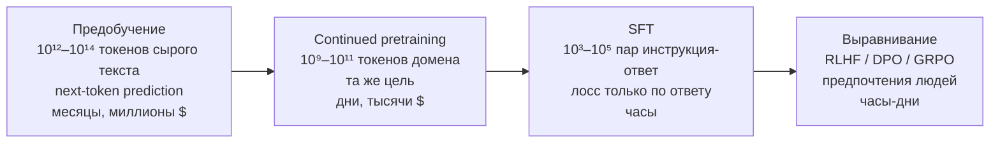

# Предобучение и законы масштабирования

> **Зачем эта глава.** Предобучение — единственный этап, где модель получает знания; всё
> остальное (SFT, RLHF, RAG) только меняет форму доступа к ним. Здесь разбирается, откуда берут
> данные и почему их чистка важнее архитектуры, как из трёх строк арифметики получается формула
> бюджета $C \approx 6ND$, в чём именно Kaplan разошёлся с Chinchilla и почему сегодня маленькие
> модели сознательно «перетренировывают». После главы вы сможете прикинуть стоимость обучения
> модели заданного размера, объяснить выбор «сколько токенов на параметр» и не попасться
> на вопросе про перплексию и emergent abilities.

**Уровень:** 🎯 middle → 🧠 middle+
**Предварительно нужно:** [устройство современной LLM](01-llm-architecture.md),
[теория информации](../01-math/05-information-theory.md),
[внимание и трансформер](../03-deep-learning/04-attention-and-transformer.md),
[масштабирование обучения](../03-deep-learning/06-scaling-and-efficiency.md)

**Как проработать:** чтение + расчёты + реализация дедупликации

---

## Карта главы

- [1. Что такое предобучение и почему это отдельная дисциплина](#1-что-такое-предобучение-и-почему-это-отдельная-дисциплина)
- [2. Данные: где берут и как чистят](#2-данные-где-берут-и-как-чистят)
- [3. Дедупликация и почему без неё нельзя](#3-дедупликация-и-почему-без-неё-нельзя)
- [4. Next-token prediction: почему этого достаточно](#4-next-token-prediction-почему-этого-достаточно)
- [5. Бюджет вычислений: откуда берётся C ≈ 6ND](#5-бюджет-вычислений-откуда-берётся-c--6nd)
- [6. Kaplan против Chinchilla](#6-kaplan-против-chinchilla)
- [7. Compute-optimal против inference-optimal](#7-compute-optimal-против-inference-optimal)
- [8. Emergent abilities и критика](#8-emergent-abilities-и-критика)
- [9. Перплексия: что она меряет и где врёт](#9-перплексия-что-она-меряет-и-где-врёт)
- [10. Continued pretraining против SFT](#10-continued-pretraining-против-sft)
- [11. Curriculum и порядок данных](#11-curriculum-и-порядок-данных)
- [12. Подводные камни](#12-подводные-камни)
- [13. Проверь себя](#13-проверь-себя)
- [14. Практика](#14-практика)
- [15. Что читать дальше](#15-что-читать-дальше)

---

> 🌱 **База.** Обязательного здесь четыре вещи. Первая — граница из
> [§1](#1-что-такое-предобучение-и-почему-это-отдельная-дисциплина): знания появляются только
> в предобучении и continued pretraining, а SFT и выравнивание меняют форму ответа; из этого
> выводится весь выбор «CPT / SFT / RAG» в [§10](#10-continued-pretraining-против-sft). Вторая —
> тезис [§2](#2-данные-где-берут-и-как-чистят): при фиксированной архитектуре качество
> определяется данными, и дубликаты ([§3](#3-дедупликация-и-почему-без-неё-нельзя)) обесценивают
> тот самый объём корпуса, которым вы отчитываетесь. Третья — $C \approx 6ND$
> из [§5](#5-бюджет-вычислений-откуда-берётся-c--6nd): единственный способ перевести «обучим
> модель» в GPU-часы и в деньги. Четвёртая — компромисс «параметры против токенов»
> ([§6](#6-kaplan-против-chinchilla)–[§7](#7-compute-optimal-против-inference-optimal)):
> Chinchilla говорит, что при фиксированном бюджете обучения $N$ и $D$ растят пропорционально
> (≈20 токенов на параметр), а все, кто раздаёт модели, сознательно уходят от этого оптимума
> в сторону маленьких моделей — потому что оптимизируют другую величину, с учётом инференса.
> Механику MinHash и LSH с S-образной кривой и кодом в [§3](#3-дедупликация-и-почему-без-неё-нельзя)
> и [§11](#11-curriculum-и-порядок-данных) про порядок данных при первом чтении пролистайте:
> это инструкции для того, кто сам собирает корпус и ведёт прогон, а не выбирает готовую модель.
> Дальше идите, когда сможете своими словами объяснить, почему Llama-3-8B обучали на 15 триллионах
> токенов, хотя при её бюджете compute-оптимум — это 78B на 1,55 трлн, и почему тысяча примеров
> SFT не научит модель вашему домену.

---

## 1. Что такое предобучение и почему это отдельная дисциплина

Жизненный цикл LLM состоит из четырёх стадий, и путать их — самая частая ошибка на собеседовании.



Ключевое различие проходит по одной линии: **знания появляются только на первых двух стадиях**.
SFT и выравнивание почти не добавляют фактов — они учат форме ответа, следованию инструкции
и тому, что считать приемлемым. Модель, которая не видела при предобучении устройство вашей CRM,
не выучит его по тысяче примеров SFT: она научится уверенно говорить о ней неправду.

Отсюда правило выбора инструмента, которое надо уметь произнести:

| Что нужно | Чем делается | Почему |
|---|---|---|
| Новые знания, новый язык, новый домен | continued pretraining | нужен объём ≫ 10⁹ токенов, чтобы факт закрепился |
| Новый формат, стиль, следование инструкции | SFT | достаточно 10³–10⁵ примеров |
| Предпочтения по «хорошо/плохо» при равной корректности | RLHF/DPO | сравнения дешевле эталонов |
| Факты, которые меняются, и требование цитируемости | RAG | знания в индексе, а не в весах |

> 💬 **На собеседовании.** Спросят (middle+): «Объясните все этапы обучения LLM. От какого
> из них мы можем отказаться и в каких случаях?»
> Хороший ответ: от предобучения отказываются практически всегда — берут готовую базовую модель;
> обучать с нуля имеет смысл, только если у вас есть домен/язык, который в открытых моделях
> представлен плохо, и при этом есть терабайты своего текста и бюджет от миллиона долларов.
> Continued pretraining нужен, когда домен специфичен (медицинские записи, код на внутреннем
> DSL, редкий язык) и объём текста измеряется миллиардами токенов; иначе вы только испортите
> модель забыванием. SFT не пропускают почти никогда — базовая модель не умеет вести диалог,
> она умеет продолжать текст. От выравнивания можно отказаться, если продукт закрытый,
> пользователи внутренние и вопрос безопасности решается фильтрами; но если модель говорит
> с внешними людьми, RLHF/DPO нужен и для полезности, и для отказов. Отдельно стоит сказать,
> что при жёстком бюджете типовой рабочий путь — базовая модель + LoRA-SFT + RAG, без своего
> претрейна вообще.
> Провал: перечислить четыре стадии как обязательные и не назвать критерий отказа.

---

## 2. Данные: где берут и как чистят

Практический опыт последних лет свёлся к тезису, который стоит запомнить: **при фиксированной
архитектуре и бюджете качество модели определяется качеством данных**. Архитектурные изменения
дают проценты, чистка данных — десятки процентов.

### 2.1 Источники и объёмы

Основа — веб. Common Crawl (некоммерческий краулер, публикующий дампы примерно раз в месяц)
даёт сырьё, из которого сделаны почти все открытые корпуса:

| Корпус | Объём | Что это |
|---|---|---|
| C4 (2019) | ~750 ГБ английского текста | один дамп CC, эвристическая чистка; данные для T5 |
| The Pile (2020) | 825 ГиБ, 22 источника | веб + книги + arXiv + GitHub + PubMed + субтитры |
| RefinedWeb (2023) | ~5 трлн токенов (600 млрд опубликовано) | только веб, но агрессивно отфильтрованный |
| Dolma (2024) | ~3 трлн токенов | открытый корпус с полностью опубликованным пайплайном |
| FineWeb (2024) | ~15 трлн токенов | 96 дампов CC, чистка с абляциями на каждом шаге |

Порядок величин, который полезно держать в голове: один дамп Common Crawl — это порядка
2–3 млрд веб-страниц и сотни терабайт сырых данных; после извлечения текста и всех фильтров
от него остаётся **единицы процентов**. Для сравнения: вся английская Википедия — примерно
4–5 млрд токенов, то есть 0,03% от корпуса на 15 трлн. Веб не заменить курируемыми источниками:
их просто не хватает по объёму.

### 2.2 Конвейер фильтрации

Порядок шагов почти одинаков у всех, кто публиковал пайплайн:

1. **Извлечение текста из HTML.** Из WARC (сырой HTML) — специализированными экстракторами,
   которые отбрасывают навигацию, футеры и рекламу. Качество этого шага влияет на итог
   сильнее, чем кажется: из WET-файлов (готовый текст от Common Crawl) получается заметно
   более мусорный корпус.
2. **Определение языка.** Классификатор (обычно fastText) с порогом уверенности ~0,65.
   Отсекает не только чужие языки, но и бессвязный текст — у него низкая уверенность
   по любому языку.
3. **Чёрные списки URL и доменов.** Порнография, спам-фермы, агрегаторы-клоны.
4. **Эвристики качества.** Канонический набор — правила из отчёта Gopher: выбросить документы
   короче 50 или длиннее 100 000 слов; со средней длиной слова вне диапазона 3–10 символов;
   с долей строк, оканчивающихся на «…», больше 30%; где меньше 80% слов содержат хотя бы одну
   букву; где нет минимум двух стоп-слов из короткого списка. Каждое правило ловит свой вид
   мусора: списки товаров, дампы баз, машинный перевод, спам-ключевики.
5. **Фильтры повторов внутри документа.** Доля дублирующихся строк, абзацев, n-грамм.
   Ловит автосгенерированные страницы и «стены» одинаковых блоков.
6. **Модельный классификатор качества.** Лёгкий классификатор (fastText или линейная модель
   поверх эмбеддингов), обученный отличать «референсный» текст (Википедия, книги, отобранные
   вручную страницы, инструкционные данные) от случайного веба. По публичным абляциям это
   **самый результативный отдельный шаг** — он даёт больший прирост, чем все эвристики вместе.
7. **PII и токсичность.** Маскирование телефонов, адресов, e-mail; фильтр по классификатору
   токсичности — с осторожностью, потому что агрессивная фильтрация вырезает целые социолекты.
8. **Деконтаминация.** Удаление из обучения текстов, пересекающихся с тестовыми наборами
   бенчмарков. Обычно по n-граммам (совпадение 13-граммы — повод выбросить документ).
9. **Дедупликация.** Отдельный раздел ниже — это самый дорогой и самый недооценённый шаг.

> ⚠️ **Типичная ошибка.** Настраивать фильтры «на глаз», глядя на примеры. Правильный протокол —
> **абляции**: обучить одинаковую маленькую модель (100–500 млн параметров, 10–30 млрд токенов)
> на корпусе с фильтром и без, сравнить по фиксированному набору задач. Один прогон стоит
> сотни долларов и часы, а решение принимается на месяцы вперёд. Все публичные пайплайны
> (Dolma, FineWeb, DCLM) построены именно так, и в их отчётах видно, что интуиция про
> «хороший текст» регулярно не подтверждается.

### 2.3 Соотношение доменов

Смесь — такой же гиперпараметр, как learning rate. Два исторических примера, которые полезно
помнить, потому что их приводят как эталон:

| GPT-3 (2020), доля в обучающей смеси | | LLaMA-1 (2023), доля | |
|---|---|---|---|
| Common Crawl (фильтрованный) | 60% | CommonCrawl | 67,0% |
| WebText2 | 22% | C4 | 15,0% |
| Books1 | 8% | GitHub | 4,5% |
| Books2 | 8% | Wikipedia | 4,5% |
| Wikipedia | 3% | Books | 4,5% |
| | | arXiv | 2,5% |
| | | StackExchange | 2,0% |

Обратите внимание на важную деталь у GPT-3: Википедия составляет 3% смеси, хотя по объёму
это доли процента корпуса — её **пересэмплировали**, показав модели около 3,4 раза, тогда как
Common Crawl прошёл менее одного раза. Это и есть управление смесью: качественные источники
повторяют, мусорные — прореживают.

Два эффекта, которые обычно спрашивают:

- **Код улучшает рассуждения на естественном языке.** Наблюдение воспроизводилось многократно:
  добавление 5–20% кода в смесь поднимает качество на задачах со структурированным выводом
  и многошаговым рассуждением, даже если модель никогда не будут просить писать код.
  Гипотеза — код даёт длинные цепочки строгих зависимостей, которых мало в вебе.
- **Мультиязычность не бесплатна.** Доля языка в корпусе примерно определяет качество на нём.
  Если русского в смеси 1%, ждать от модели уровня английского бессмысленно, и никакой SFT
  это не починит — это ровно тот случай, когда нужен continued pretraining.

Подбирают смесь либо перебором на маленьких моделях, либо алгоритмически: существуют методы,
которые обучают маленькую «прокси»-модель и оптимизируют веса доменов так, чтобы минимизировать
наихудшую по доменам потерю (подход DoReMi и его вариации).

---

## 3. Дедупликация и почему без неё нельзя

**Проблема.** Веб чудовищно избыточен: одни и те же тексты копируются агрегаторами,
лицензионные соглашения повторяются на миллионах сайтов, новостная заметка расходится
по сотне перепечаток. В опубликованном анализе C4 нашлась 61-словная фраза, встречающаяся
в корпусе **61 036 раз**. Без дедупликации ваш «корпус на 3 трлн токенов» на деле содержит
существенно меньше уникального текста, и вы не знаете, насколько меньше.

Четыре следствия, каждое из которых само по себе достаточно, чтобы делать дедупликацию:

1. **Запоминание вместо обобщения.** Вероятность того, что модель выдаст последовательность
   дословно, растёт **сверхлинейно** с числом её копий в обучении. Модели, обученные
   на дедуплицированных данных, воспроизводят обучающий текст примерно на порядок реже.
   Это прямой юридический и приватностный риск: дословная выдача чужого текста
   или персональных данных.
2. **Загрязнение оценки.** Дубликаты пересекают границу train/validation, перплексия
   на валидации оказывается заниженной, и вы принимаете решения по испорченной метрике.
3. **Потраченный бюджет.** Повторное обучение на том же тексте даёт всё меньше — вы платите
   FLOPs за то, что модель уже видела.
4. **Неконтролируемое изменение смеси.** Если один домен дублирован сильнее другого,
   ваши тщательно подобранные проценты в [§2.3](#23-соотношение-доменов) на деле не соблюдаются.

### Как это делают

**Точная дедупликация документов** — тривиально: хэш нормализованного текста, схлопывание
одинаковых. Ловит только буквальные копии.

**Near-duplicate дедупликация** — MinHash + LSH. Механика:

1. Документ превращается в множество **шинглов** — n-грамм слов (обычно $n=5$).
2. Для каждой из $h$ независимых хэш-функций берём минимум по всем шинглам. Получается
   **сигнатура** длины $h$. Ключевое свойство: вероятность того, что у двух документов
   совпадёт значение в конкретной позиции сигнатуры, равна их коэффициенту Жаккара
   $s = |A \cap B| / |A \cup B|$, где $A$ и $B$ — множества шинглов двух документов.
3. Сигнатура режется на $b$ бэндов по $r$ строк ($h = b\cdot r$). Документы, совпавшие
   хотя бы в одном бэнде целиком, становятся кандидатами.

Вероятность того, что пара документов с похожестью $s$ попадёт в кандидаты:

$$
P(s) \;=\; 1 - \big(1 - s^{\,r}\big)^{b}
$$

где $s$ — коэффициент Жаккара между множествами шинглов, $r$ — число строк в бэнде,
$b$ — число бэндов, $h = br$ — длина сигнатуры.

Это S-образная кривая, и её точка перегиба — тот порог похожести, который вы фактически
задаёте. Для типовой конфигурации $r=8$, $b=14$ (то есть $h=112$):

| Похожесть $s$ | 0,5 | 0,6 | 0,7 | 0,75 | 0,8 | 0,9 |
|---|---|---|---|---|---|---|
| $P(s)$ | 0,05 | 0,21 | 0,57 | 0,77 | 0,92 | 0,9996 |

Порог получается около 0,75 — ровно то, что обычно и хотят: перепечатку ловим, две разные
статьи на одну тему оставляем.

**Дедупликация подстрок.** Отдельный приём: строим суффиксный массив по всему корпусу и вырезаем
повторяющиеся подстроки длиннее порога (например, 50 токенов). В отличие от документной, ловит
случай «в целом разные документы, но с общим большим куском» — типичная ситуация с шаблонными
дисклеймерами.

```python
# MinHash + LSH на чистом Python: механика без библиотек. Запускается как есть.
import hashlib
from collections import defaultdict

N_PERM, N_BANDS, K_SHINGLE = 112, 14, 5
ROWS = N_PERM // N_BANDS          # 8 строк в бэнде -> порог похожести ~0.75


def shingles(text: str, k: int = K_SHINGLE) -> set[str]:
    words = text.lower().split()
    if len(words) < k:
        return {" ".join(words)}
    return {" ".join(words[i:i + k]) for i in range(len(words) - k + 1)}


def _h(s: str, seed: int) -> int:
    # blake2b с ключом-сидом играет роль независимой хэш-функции (перестановки)
    digest = hashlib.blake2b(s.encode(), digest_size=8,
                             key=seed.to_bytes(8, "big")).digest()
    return int.from_bytes(digest, "big")


def signature(sh: set[str]) -> tuple[int, ...]:
    return tuple(min(_h(s, seed) for s in sh) for seed in range(N_PERM))


def jaccard(a: set[str], b: set[str]) -> float:
    return len(a & b) / len(a | b)


def estimate_jaccard(sig_a, sig_b) -> float:
    # оценка Жаккара = доля совпавших позиций сигнатуры
    return sum(x == y for x, y in zip(sig_a, sig_b)) / N_PERM


def dedup(docs: list[str]) -> list[int]:
    """Возвращает индексы документов, оставшихся после схлопывания near-duplicates."""
    buckets: dict[tuple[int, int], list[int]] = defaultdict(list)
    sigs = [signature(shingles(d)) for d in docs]
    removed: set[int] = set()
    for i, sig in enumerate(sigs):
        if i in removed:
            continue
        for band in range(N_BANDS):
            key = (band, hash(sig[band * ROWS:(band + 1) * ROWS]))
            for j in buckets[key]:
                if j not in removed and estimate_jaccard(sigs[i], sigs[j]) > 0.75:
                    removed.add(i)          # оставляем первое вхождение
                    break
            if i in removed:
                break
        if i not in removed:
            for band in range(N_BANDS):
                buckets[(band, hash(sig[band * ROWS:(band + 1) * ROWS]))].append(i)
    return [i for i in range(len(docs)) if i not in removed]


BASE = ("Градиентный бустинг строит аддитивную модель последовательно добавляя деревья "
        "каждое из которых приближает антиградиент функции потерь на обучающей выборке "
        "поэтому качество ансамбля растёт с числом итераций пока не начинается переобучение "
        "которое контролируют темпом обучения подвыборкой и ограничением глубины деревьев")

if __name__ == "__main__":
    docs = [
        BASE,
        BASE + " а также ранней остановкой по валидации",   # перепечатка с дописанной концовкой
        BASE,                                                # точная копия
        ("Случайный лес усредняет предсказания деревьев обученных на бутстрап-выборках "
         "что снижает дисперсию ансамбля без роста смещения и почти не требует подбора "
         "гиперпараметров кроме числа деревьев и размера случайного подмножества признаков"),
    ]
    a, b = shingles(docs[0]), shingles(docs[1])
    print(f"истинный Жаккар 0 и 1: {jaccard(a, b):.3f}, "
          f"оценка по сигнатуре: {estimate_jaccard(signature(a), signature(b)):.3f}")
    print("осталось после дедупликации:", dedup(docs))   # -> [0, 3]
```

Вывод: истинный Жаккар 0,850, оценка по сигнатуре 0,848; документы 1 и 2 схлопнуты в 0.
Обратите внимание на разрыв между истинным значением и оценкой — сигнатура из 112 хэшей даёт
стандартную ошибку $\sqrt{s(1-s)/h} \approx 0{,}034$ при $s = 0{,}85$. Практическое следствие:
порог нельзя ставить впритык к нужной похожести, иначе часть дубликатов проскочит; либо снижайте
порог, либо увеличивайте $h$ (ошибка падает как $1/\sqrt{h}$, а стоимость растёт линейно).

Инженерная реальность: на корпусе в 10¹³ токенов это распределённая задача на весь корпус
целиком, а не потоковый фильтр — сигнатуры всех документов надо сравнить между собой.
Дедупликация обычно оказывается самым тяжёлым шагом пайплайна по вычислениям и по коду.

> 💬 **На собеседовании.** Спросят (middle+): «Вы обучаете модель, и она иногда выдаёт куски
> обучающих данных дословно. Что пошло не так и как чинить?»
> Хороший ответ: главная причина — дубликаты в корпусе; вероятность дословной выдачи растёт
> сверхлинейно с числом копий, поэтому первый шаг — дедупликация (точная по хэшу, near-duplicate
> через MinHash+LSH с порогом ~0,75, плюс дедупликация подстрок суффиксным массивом). Дальше:
> проверить, не переобучаемся ли мы (сколько эпох по данным реально прошло), добавить PII-скрабинг,
> на инференсе — фильтр выхода по n-граммному совпадению с обучающим индексом и увеличенная
> температура/штраф за повторы. И отдельно — деконтаминация относительно бенчмарков, иначе
> вы ещё и метрики себе испортили.
> Провал: предложить «уменьшить число эпох» как единственную меру.

---

## 4. Next-token prediction: почему этого достаточно

Цель предобучения — одна-единственная:

$$
\mathcal{L}(\theta) \;=\; -\frac{1}{T}\sum_{t=1}^{T} \log p_{\theta}\big(x_t \mid x_1, \dots, x_{t-1}\big)
$$

где $x_1,\dots,x_T$ — последовательность токенов, $T$ — их число, $p_\theta$ — распределение,
задаваемое моделью с параметрами $\theta$, а сумма берётся по всем позициям (благодаря причинной
маске все они считаются за один проход).

Естественный вопрос: почему такая примитивная цель порождает модель, которая решает задачи,
никогда не встречавшиеся в явном виде? Три ответа, и их полезно уметь произнести подряд.

**Ответ 1: любая задача — частный случай предсказания токена.** Текст «Вопрос: столица Франции?
Ответ:» имеет продолжение, и чтобы предсказать его правильно, надо знать факт. Текст
«def is_prime(n):» имеет продолжение, и чтобы предсказать его, надо понимать алгоритм.
Текст «Переведи на английский: кот» — и так далее. Задача предсказания следующего токена
на достаточно разнообразном корпусе **содержит в себе** все задачи, которые в этом корпусе описаны.

**Ответ 2: минимизация кросс-энтропии — это сжатие.** Оптимальный код для последовательности
имеет длину $-\log_2 p(x)$ бит. Модель, минимизирующая кросс-энтропию, — это построение лучшего
компрессора текста. А хороший компрессор обязан уловить всё, что делает текст предсказуемым:
грамматику, факты, арифметику, стиль автора, логику рассуждения. Понимание здесь не побочный
эффект, а единственный способ сжимать сильнее.

**Ответ 3: плотность сигнала и отсутствие разметки.** Каждый токен — обучающий пример, и разметка
не нужна вообще. Это единственная известная цель, которая масштабируется до 10¹³ примеров.
Сравните: MLM даёт градиент с 15% позиций, любая supervised-задача требует людей.

### Где эта цель не работает

Честность требует назвать границы, потому что про них спрашивают.

- **Teacher forcing и exposure bias.** При обучении префикс всегда правильный (взят из данных);
  при генерации модель продолжает **свой собственный** текст, в котором уже могут быть ошибки.
  Распределения расходятся, ошибки накапливаются — отсюда сваливание в повторы на длинной генерации.
- **Цель — правдоподобие, а не истина и не польза.** Модель учится писать то, что *вероятно*
  в интернете, а не то, что верно. Уверенная чушь в вебе встречается часто, значит модель её
  воспроизведёт. Починка — не в претрейне, а в SFT и выравнивании.
- **Нет горизонта планирования.** Лосс поштокенный: модель не оптимизируется за связность
  на тысячу токенов вперёд напрямую.
- **Факт закрепляется только повторением.** Утверждение, встреченное в корпусе один раз, почти
  наверняка не будет воспроизведено. Это ключ к пониманию, почему continued pretraining требует
  миллиардов токенов, а не сотен документов.

> 💬 **На собеседовании.** Спросят (middle): «Почему предсказания следующего токена достаточно,
> чтобы модель научилась рассуждать?»
> Хороший ответ: потому что предсказание — это сжатие, а сжимать текст лучше всего умеет тот,
> кто уловил порождающую его структуру; и потому что любая задача, описанная в корпусе, является
> частным случаем «продолжи текст». Плюс аргумент масштаба: это единственная цель, дающая градиент
> с каждого токена и не требующая разметки. Обязательно добавить границу: цель моделирует
> правдоподобие, а не истину и не полезность — отсюда галлюцинации и необходимость SFT/RLHF;
> и teacher forcing создаёт расхождение между обучением и генерацией.
> Провал: «эмерджентность» вместо механизма.

---

## 5. Бюджет вычислений: откуда берётся C ≈ 6ND

Это формула, которую спрашивают чаще любой другой в теме масштабирования, и вывод у неё
короткий.

**Шаг 1. Прямой проход.** Основная работа модели — матричные умножения. В умножении вектора
на матрицу каждый вес участвует ровно один раз: одно умножение и одно сложение — **2 FLOPs
на параметр на токен**. Значит прямой проход стоит $2N$ FLOPs на токен, где $N$ — число
параметров (для MoE — активных).

**Шаг 2. Обратный проход.** Для каждого слоя нужно посчитать два градиента: по входу
(чтобы пробросить дальше вниз) и по весам. Каждый — матричное умножение того же размера,
что и прямое. Итого обратный проход ≈ вдвое дороже прямого: $4N$ FLOPs на токен.

**Шаг 3. Складываем.**

$$
C \;\approx\; (2N + 4N)\cdot D \;=\; 6\,N\,D
$$

где $C$ — суммарные вычисления обучения в FLOPs, $N$ — число (активных) параметров,
$D$ — число обучающих токенов.

> 📐 **Что формула игнорирует.** В $2N$ не входит attention: скалярные произведения запросов
> с ключами не используют параметры вообще. Их вклад на токен составляет примерно $2Lnd$ FLOPs
> в прямом проходе, где $L$ — число слоёв, $n$ — длина контекста, $d$ — размерность модели
> (двойка вместо четвёрки — потому что при причинной маске токен в среднем смотрит только
> на $n/2$ предшественников). Относительная добавка к $2N$ равна $2Lnd / 2N = Lnd/N$.
> Для Llama-3-8B при $n = 8192$: $32\cdot8192\cdot4096 / 8{,}03\cdot10^9 \approx 0{,}13$ —
> то есть $6ND$ занижает бюджет на 13%. При контексте 128k занижение будет уже двукратным.
> Практическое правило: **$6ND$ точна с ошибкой в единицы процентов, пока $n \ll N/(Ld)$**,
> и это выполняется для типовых претрейнов на 4–8k.

**Проверка формулы на известных моделях.**

```python
# Бюджет обучения: 6ND с поправкой на attention + перевод в GPU-часы и деньги.
def train_flops(n_params, n_tokens, n_layers=None, d_model=None, ctx=None):
    base = 6 * n_params * n_tokens
    if None in (n_layers, d_model, ctx):
        return base
    # добавка attention: 3 * 2*L*n*d на токен (fwd + bwd), т.е. втрое от прямого прохода
    return base + 3 * 2 * n_layers * ctx * d_model * n_tokens


def gpu_hours(flops, peak_tflops=989.0, mfu=0.35):
    return flops / (peak_tflops * 1e12 * mfu) / 3600


MODELS = [
    # имя,          N,        D,        L,   d,     контекст
    ("GPT-3 175B",  175e9,   300e9,     96,  12288, 2048),
    ("Chinchilla",   70e9,   1.4e12,    80,   8192, 2048),
    ("Llama-2-7B",  6.74e9,  2.0e12,    32,   4096, 4096),
    ("Llama-3-8B",  8.03e9, 15.0e12,    32,   4096, 8192),
    ("Llama-3-70B", 70.6e9, 15.0e12,    80,   8192, 8192),
]

for name, n, d, L, dm, ctx in MODELS:
    c_simple = train_flops(n, d)
    c_full = train_flops(n, d, L, dm, ctx)
    h = gpu_hours(c_full)
    print(f"{name:12s} 6ND={c_simple:.2e}  с attention={c_full:.2e} "
          f"({(c_full/c_simple - 1)*100:4.1f}% сверху)  ~{h/1e6:.2f} млн GPU-ч @MFU 35%")
```

Для GPT-3 формула даёт $6\cdot175\cdot10^9\cdot300\cdot10^9 = 3{,}15\cdot10^{23}$ FLOPs —
совпадает с оценкой из оригинальной статьи ($3{,}14\cdot10^{23}$) до третьей значащей цифры.
Это лучшая проверка, что вы всё поняли правильно.

**Перевод в деньги.** GPU-часы считаются как $C/(\text{MFU}\cdot\text{пиковая производительность})$,
где MFU (model FLOPs utilization) — доля пиковой производительности, которую реально удаётся
использовать. Ориентиры на момент написания: пик bf16 у H100 — около 990 TFLOPS, реальный MFU
на хорошо настроенном кластере 35–45% для крупных моделей и заметно ниже (15–25%) для маленьких,
где коммуникации не окупаются. При цене аренды \$2–3 за GPU-час:

| Бюджет $C$ | GPU-часов H100 @ MFU 35% | Стоимость @ \$2,5/ч |
|---|---|---|
| 10²³ | ~80 тыс. | ~\$200 тыс. |
| 10²⁴ | ~800 тыс. | ~\$2 млн |
| 10²⁵ | ~8 млн | ~\$20 млн |
| 10²⁶ | ~80 млн | ~\$200 млн |

Реальные отчёты дают в 1,5–3 раза больше из-за перезапусков после сбоев, отладочных прогонов
и неидеального MFU. Это тоже полезно произнести: разница между теоретической сметой
и фактическим счётом — не ошибка расчёта, а нормальная надбавка за эксплуатацию кластера
на тысячи узлов.

---

## 6. Kaplan против Chinchilla

**Постановка задачи.** У вас есть бюджет $C$. Вы можете потратить его на большую модель,
обученную на малом числе токенов, или на маленькую, обученную на большом. Что даст меньший лосс?

### Что показал Kaplan (2020)

Первая систематическая работа установила, что лосс — гладкая степенная функция каждого из трёх
ресурсов при отсутствии дефицита двух других:

$$
L(N) \propto N^{-0{,}076}, \qquad L(D) \propto D^{-0{,}095}, \qquad L(C) \propto C^{-0{,}050}
$$

где $N$ — число параметров без учёта эмбеддингов, $D$ — число токенов, $C$ — вычисления.
Уже это было сильным результатом: качество предсказуемо, его можно планировать.

Практический вывод Kaplan: при оптимальном распределении бюджета $N_{\text{opt}} \propto C^{0{,}73}$,
а $D_{\text{opt}} \propto C^{0{,}27}$. То есть **растить надо в первую очередь модель**,
данные — почти по остаточному принципу. Индустрия послушалась: GPT-3 — 175 млрд параметров
на 300 млрд токенов, менее двух токенов на параметр. Gopher — 280 млрд на 300 млрд токенов.

### Что показал Chinchilla (2022)

Авторы обучили более 400 моделей от 70 млн до 16 млрд параметров, аккуратно варьируя число
токенов, и получили принципиально другой ответ:

$$
N_{\text{opt}} \propto C^{\,\approx 0{,}50}, \qquad D_{\text{opt}} \propto C^{\,\approx 0{,}50}
$$

**Модель и данные надо растить одинаково.** В точке их бюджета ($5{,}76\cdot10^{23}$ FLOPs,
столько же, сколько потратили на Gopher) оптимум оказался 70 млрд параметров на 1,4 трлн
токенов — то есть **примерно 20 токенов на параметр**. Chinchilla на 70B обошла Gopher на 280B
почти на всех бенчмарках при равном бюджете обучения и при этом вчетверо дешевле в инференсе.

Отсюда рабочая формула, которую стоит запомнить наизусть. Из $D = 20N$ и $C = 6ND$ следует
$C = 120N^2$, а значит

$$
N_{\text{opt}} = \sqrt{\frac{C}{120}}, \qquad D_{\text{opt}} = 20\,N_{\text{opt}}
$$

| Бюджет $C$, FLOPs | Compute-optimal $N$ | $D$ |
|---|---|---|
| 10²¹ | 2,9 млрд | 58 млрд токенов |
| 10²² | 9,1 млрд | 183 млрд |
| 10²³ | 29 млрд | 577 млрд |
| 10²⁴ | 91 млрд | 1,8 трлн |
| 10²⁵ | 289 млрд | 5,8 трлн |
| 10²⁶ | 913 млрд | 18,3 трлн |

Проверьте себя на GPT-3: его бюджет $3{,}15\cdot10^{23}$ FLOPs, значит compute-optimal был бы
$\sqrt{3{,}15\cdot10^{23}/120} \approx 51$ млрд параметров на 1,0 трлн токенов. Вместо этого
обучили 175 млрд на 300 млрд — модель в 3,4 раза больше нужного и сильно недообученная.

### Почему пересмотрели: в чём именно расхождение

Это и есть содержательная часть вопроса, а не «Chinchilla уточнил Kaplan».

**Причина 1 (главная): расписание learning rate.** У Kaplan длина косинусного расписания LR
была задана один раз, независимо от того, сколько шагов реально делал конкретный прогон. Модель,
обученная на меньшем числе токенов, останавливалась в точке, где LR ещё не спал до минимума —
а лосс в этой точке систематически завышен. В результате «обучать дольше» выглядело менее
выгодным, чем оно есть, и оптимум смещался в сторону больших моделей. Chinchilla согласовывал
длину цикла косинуса с числом шагов каждого прогона — и это меняло вывод.

**Причина 2: что считать за $N$.** Kaplan исключал из $N$ параметры эмбеддингов. На маленьких
моделях эмбеддинги составляют существенную долю (см. расчёт в
[предыдущей главе](01-llm-architecture.md#4-считаем-параметры-откуда-берётся-8b)), и исключение
искажает форму зависимости именно там, где набирается статистика для экстраполяции.

**Причина 3: гиперпараметры не подстраивались под масштаб.** Оптимальные размер батча
и learning rate зависят от размера модели; фиксированные значения делают часть точек
несправедливо плохими.

Ни одна из этих причин не является «ошибкой в математике» — это методологические различия,
и именно поэтому вопрос хороший: он проверяет, понимаете ли вы, что законы масштабирования
измеряются, а не выводятся.

> 🧠 **Middle+. Честная оговорка про сам Chinchilla.** Работа даёт три независимых способа оценки
> оптимума. Первые два (перебор по кривым и IsoFLOP-профили) сходятся на экспонентах ≈0,5/0,5.
> Третий — параметрическая подгонка
> $L(N,D) = E + A/N^{\alpha} + B/D^{\beta}$ с опубликованными константами
> $E=1{,}69$, $A=406{,}4$, $B=410{,}7$, $\alpha=0{,}34$, $\beta=0{,}28$. Минимизируя эту функцию
> при ограничении $C = 6ND$, получаем $N \propto C^{\beta/(\alpha+\beta)}$ и
> $D \propto C^{\alpha/(\alpha+\beta)}$ — то есть 0,45 и 0,55. Подставив реальный бюджет,
> вы получите соотношение существенно больше 20 токенов на параметр, что противоречит
> собственному выводу статьи. Попытка воспроизведения 2024 года
> ([Besiroglu et al.](https://arxiv.org/abs/2404.10102)) показала, что опубликованные константы
> третьего подхода плохо согласуются с данными самой статьи, а переоценка возвращает результат
> к экспонентам первых двух подходов. Мораль: пользуйтесь правилом «≈20 токенов на параметр»
> как ориентиром, но помните, что это эмпирическая точка, а не физическая константа —
> и она сдвигается вместе с качеством данных и архитектурой.

> 💬 **На собеседовании.** Спросят (middle): «Объясните scaling law». Почти всегда добьют:
> «в чём разница между Kaplan и Chinchilla?»
> Хороший ответ: законы масштабирования — эмпирические степенные зависимости лосса от числа
> параметров, числа токенов и бюджета вычислений; их ценность в том, что качество большой модели
> предсказывается по прогонам маленьких, и решение о запуске принимается заранее. Kaplan (2020)
> получил, что при фиксированном бюджете модель надо растить намного быстрее данных
> ($N \propto C^{0,73}$) — отсюда GPT-3 на 175B и всего 300B токенов. Chinchilla (2022) при более
> аккуратной методологии получил равное масштабирование, оптимум ≈20 токенов на параметр,
> и подтвердил экспериментом: 70B на 1,4T бьёт 280B на 300B при равном компьюте. Главная причина
> расхождения — у Kaplan расписание LR не согласовывалось с длиной прогона, из-за чего короткие
> прогоны выглядели хуже, чем они есть; дополнительно — исключение эмбеддингов из $N$
> и неподстроенные гиперпараметры. Полезно закончить рабочей формулой: $C = 6ND$,
> $N_{\text{opt}} = \sqrt{C/120}$.
> Провал: «Chinchilla сказал, что данных надо больше» без объяснения, что именно было измерено
> неправильно.

---

## 7. Compute-optimal против inference-optimal

Chinchilla отвечает на вопрос «как получить минимальный лосс за фиксированный бюджет
**обучения**». Но модель обучают один раз, а инференс идёт годами. Полная стоимость владения:

$$
C_{\text{total}} \;=\; \underbrace{6\,N\,D_{\text{train}}}_{\text{обучение}} \;+\; \underbrace{2\,N\,D_{\text{inf}}}_{\text{инференс}}
$$

где $D_{\text{inf}}$ — суммарное число токенов (входных и сгенерированных), которые модель
обработает за свою жизнь, а $2N$ — стоимость одного токена на инференсе (только прямой проход).

Посчитаем на Llama-3-8B. Обучение: $6\cdot8{,}03\cdot10^9\cdot15\cdot10^{12} = 7{,}2\cdot10^{23}$
FLOPs. Compute-optimal при таком бюджете дал бы $\sqrt{7{,}2\cdot10^{23}/120} \approx 78$ млрд
параметров на 1,55 трлн токенов. Meta вместо этого обучила модель **в десять раз меньше нужного**
на данных **в десять раз больше нужного** — 1870 токенов на параметр против рекомендованных 20,
то есть в 94 раза «пере-обучила» по Chinchilla.

Зачем? Потому что дальше эту модель раздают миллионам пользователей. Пусть за жизнь она обработает
$10^{13}$ токенов. Инференс модели на 8B: $2\cdot8\cdot10^9\cdot10^{13} = 1{,}6\cdot10^{23}$ FLOPs.
Инференс модели на 78B: $1{,}56\cdot10^{24}$ — **вдвое больше, чем весь бюджет обучения**.
Экономия $1{,}4\cdot10^{24}$ FLOPs с лихвой окупает то, что 8B чуть хуже 78B по лоссу.

| Модель | $D/N$ | Chinchilla-оптимум | Что этим сказали |
|---|---|---|---|
| GPT-3 175B | 1,7 | 20 | сильно недообучена (до Chinchilla) |
| Chinchilla 70B | 20 | 20 | ровно оптимум обучения |
| Llama-2-7B | 297 | 20 | ×15 сверх оптимума |
| Llama-3-8B | 1870 | 20 | ×94 сверх оптимума |
| Llama-3-70B | 212 | 20 | ×11 сверх оптимума |

Тренд читается однозначно: **все, кто раздаёт модели, обучают их далеко за пределом
compute-optimal**. Формально это анализировали работы про учёт инференса в законах масштабирования
(например, [Sardana & Frankle, 2024](https://arxiv.org/abs/2401.00448)): если ожидаемый объём
инференса известен, оптимум смещается в сторону меньших моделей и большего числа токенов,
и смещение тем сильнее, чем популярнее будет модель.

Отдача, разумеется, убывающая. Переход от 20 к 200 токенам на параметр даёт заметный прирост,
от 200 к 2000 — уже небольшой; но платят за него один раз, а экономят на каждом запросе.
Ограничитель здесь другой: **данные заканчиваются**. Обучать 8B на 15 трлн токенов можно только
если у вас есть 15 трлн качественных токенов, а их в открытом вебе конечное количество.

> 💬 **На собеседовании.** Спросят (middle+): «Chinchilla говорит 20 токенов на параметр.
> Почему тогда Llama-3-8B обучали на 15 триллионах — это же 1870?»
> Хороший ответ: Chinchilla минимизирует лосс при фиксированном бюджете **обучения**. Это верный
> ответ на неверный вопрос, если модель потом обслуживает миллионы запросов: полная стоимость
> равна $6ND_{\text{train}} + 2ND_{\text{inf}}$, и при большом $D_{\text{inf}}$ выгоднее взять
> модель поменьше и доучить её сверх compute-оптимума. Для 8B при $10^{13}$ токенов инференса
> экономия относительно compute-оптимальной 78B превышает весь бюджет обучения. Плюс два
> практических довода: маленькая модель влезает в одну карту (а это качественный скачок
> по доступности) и даёт меньшую латентность. Ограничение — убывающая отдача и конечность
> качественных данных.
> Провал: «Chinchilla устарел». Он не устарел, он про другую целевую функцию.

---

## 8. Emergent abilities и критика

**Наблюдение (2022).** На ряде задач качество моделей остаётся на уровне случайного угадывания
при росте масштаба, а затем в некоторой точке резко подскакивает. Примеры из канонической работы:
трёхзначное сложение, многошаговая арифметика с цепочкой рассуждений, задача word-in-context,
транслитерация. Такие способности назвали **эмерджентными** (emergent abilities) — «отсутствующими
в меньших моделях и присутствующими в бо́льших».

Вывод, который из этого сделали: качество больших моделей нельзя экстраполировать по маленьким,
и надо просто обучать больше, чтобы узнать, что получится.

**Критика (2023).** Работа с говорящим названием «Are Emergent Abilities of Large Language Models
a Mirage?» показала, что резкость скачка в значительной мере — **артефакт выбранной метрики**.

Механизм простой. Пусть ответ состоит из $k$ токенов, и метрика — точное совпадение (exact match).
Если модель предсказывает каждый токен верно с вероятностью $p$, то вероятность полностью
правильного ответа $\approx p^k$. Гладкое улучшение $p$ превращается в резкий скачок $p^k$:

| Точность на токен $p$ | 0,60 | 0,70 | 0,80 | 0,90 | 0,95 |
|---|---|---|---|---|---|
| Exact match на 5 токенов ($p^5$) | 0,078 | 0,168 | 0,328 | 0,590 | 0,774 |

По оси «точность на токен» изменение плавное и предсказуемое. По оси «exact match» — почти
ступенька. Если заменить метрику на непрерывную (правдоподобие правильного ответа, расстояние
редактирования, Brier score), «эмерджентность» на многих задачах исчезает и кривая становится
гладкой.

**Как относиться к этому на практике.** Обе стороны правы, и уметь произнести обе — признак
зрелости.

- Для **планирования обучения** метрику надо брать непрерывную. Иначе вы не сможете предсказать
  качество большой модели по маленьким прогонам, а это главная практическая ценность законов
  масштабирования.
- Для **продукта** ступенька реальна. Пользователю не нужен «рост логарифма правдоподобия
  на 0,1» — ему нужен правильный ответ целиком. Если ваша метрика успеха бинарная, то и качество
  продукта скачет.
- Отдельно: часть заявленных «эмерджентностей» объяснялась банальным загрязнением бенчмарков.
  Прежде чем радоваться скачку, проверьте деконтаминацию.

> ⚠️ **Типичная ошибка.** Занять одну из двух крайних позиций — «эмерджентность доказывает,
> что модель что-то поняла» или «эмерджентности не существует». Обе одинаково неверны:
> резкость кривой действительно во многом создаётся метрикой, но это не отменяет того,
> что за порогом модель решает задачу, а до него — нет. Правильная формулировка: способность
> появляется постепенно, а измеряется ступенчато.

---

## 9. Перплексия: что она меряет и где врёт

**Определение.**

$$
\mathrm{PPL} \;=\; \exp\!\left(-\frac{1}{T}\sum_{t=1}^{T}\log p_{\theta}\big(x_t \mid x_{<t}\big)\right)
$$

где $T$ — число токенов в оценочном тексте, $p_\theta(x_t\mid x_{<t})$ — вероятность, которую
модель приписала фактическому токену $x_t$, логарифм натуральный.

Перплексия — это просто экспонента от кросс-энтропии в натах. Интерпретация:
**эффективный размер выбора**. PPL = 10 означает, что модель в среднем колеблется между
десятью равновероятными вариантами. Нижняя граница — 1 (модель уверена и права), верхняя
для необученной модели — $|V|$.

Именно перплексию (точнее, лосс) минимизируют законы масштабирования из [§6](#6-kaplan-против-chinchilla), и именно она
предсказуема по $N$ и $D$. Это её главная ценность: перплексия — единственная метрика LLM,
которая ведёт себя гладко и планируется заранее.

### Четыре способа обмануться перплексией

**1. Она несопоставима между разными токенизаторами.** Это ловушка номер один. PPL считается
на токен, а разные токенизаторы режут один и тот же текст на разное число токенов. Модель
с крупным словарём делает меньше предсказаний, но каждое сложнее — её PPL выше при том же
качестве.

Числовой пример. Модель A: словарь 32k, PPL 9,0, фертильность 2,5 токена на слово.
Модель B: словарь 128k, PPL 12,0, фертильность 1,75. На тексте в 1000 слов:

- A: $2500$ токенов $\times \ln 9{,}0 = 2500 \times 2{,}197 = 5493$ ната;
- B: $1750$ токенов $\times \ln 12{,}0 = 1750 \times 2{,}485 = 4349$ нат.

Модель B описывает тот же текст **дешевле**, хотя её перплексия «хуже» на треть. Правильная
метрика для сравнения — **бит на байт**:

$$
\mathrm{BPB} \;=\; \frac{1}{\ln 2}\cdot\frac{\sum_{t=1}^{T}\big[-\log p_\theta(x_t\mid x_{<t})\big]}{\text{число байт в тексте}}
$$

Если наш текст занимает 6000 байт: A даёт $5493/0{,}693/6000 = 1{,}32$ бита на байт,
B — $1{,}05$. Теперь сравнение корректно.

**2. Она зависит от оценочного корпуса.** PPL 8 на Википедии и PPL 8 на чатах — разные вещи.
Число само по себе не значит ничего; значит только сравнение двух моделей на **одном
и том же** тексте.

**3. Загрязнение занижает её.** Если оценочный текст (или его near-duplicate) попал в обучение,
перплексия улучшится без всякого улучшения модели. См. [§3](#3-дедупликация-и-почему-без-неё-нельзя).

**4. Низкая перплексия ≠ полезная модель.** Это главный содержательный предел. PPL меряет
правдоподобие продолжения, а не корректность ответа, не следование инструкции и не безопасность.
Практическое следствие, которое стоит знать: после SFT и выравнивания перплексия модели
на сыром вебе обычно **растёт** — модель перестаёт моделировать веб и начинает моделировать
ответы ассистента. Это не деградация; это значит, что задача поменялась. Оценивать выровненную
модель перплексией на вебе бессмысленно.

```python
# Перплексия и бит-на-байт: почему их нельзя путать. Только стандартная библиотека.
import math

def bits_per_byte(total_nats: float, n_bytes: int) -> float:
    return total_nats / math.log(2) / n_bytes

TEXT_BYTES, N_WORDS = 6000, 1000
for name, ppl, fertility in [("модель A (|V|=32k)", 9.0, 2.5),
                             ("модель B (|V|=128k)", 12.0, 1.75)]:
    n_tokens = N_WORDS * fertility
    total_nats = n_tokens * math.log(ppl)          # кросс-энтропия на токен = ln(PPL)
    print(f"{name:22s} PPL={ppl:5.1f}  токенов={n_tokens:6.0f}  "
          f"нат всего={total_nats:7.0f}  BPB={bits_per_byte(total_nats, TEXT_BYTES):.3f}")
```

> 💬 **На собеседовании.** Спросят (middle): «Что такое перплексия? На чём её считают?»
> И добьют (middle+): «Почему опасно полагаться на перплексию при оценке LLM?»
> Хороший ответ: PPL — экспонента кросс-энтропии на токен, интерпретируется как эффективное
> число равновероятных вариантов; это единственная метрика LLM, которая гладко масштабируется
> и потому используется в законах масштабирования. Опасности: она несопоставима между моделями
> с разными токенизаторами (надо переводить в бит-на-байт), зависит от корпуса оценки, занижается
> при загрязнении, и главное — не коррелирует напрямую с полезностью: после SFT/RLHF перплексия
> на вебе растёт, а модель становится лучше для пользователя. Для оценки продукта нужны
> задачные метрики, golden set и LLM-as-judge с валидацией судьи.
> Провал: «перплексия показывает, насколько модель уверена» — и всё.

Подробно про оценку — в главе [«Оценка LLM»](09-llm-evaluation.md).

---

## 10. Continued pretraining против SFT

Разница между «дообучить» и «предобучить дальше» — вопрос, который постоянно путают,
хотя это два разных инструмента под две разные задачи.

| | Continued pretraining | SFT |
|---|---|---|
| Данные | сырой текст домена | пары «инструкция → ответ» в чат-шаблоне |
| Объём | 10⁹–10¹¹ токенов | 10³–10⁵ примеров |
| Лосс | по всем токенам | маскирован: только по токенам ответа |
| Learning rate | 10–30% от пикового претрейна, с повторным warmup | 1e-5…2e-5 (full FT), 1e-4…2e-4 (LoRA) |
| Эпох | обычно <1 (один проход) | 1–3 |
| Что меняет | знания, язык, домен, длину контекста | формат, стиль, следование инструкции |
| Главный риск | катастрофическое забывание | переобучение, потеря общих способностей |
| Стоимость | дни на кластере, тысячи \$ | часы на одной-двух картах |

**Когда нужен continued pretraining.** Три ситуации:

1. **Язык.** Модель обучали на корпусе, где вашего языка 1–2%. Никакой SFT не создаст
   недостающие знания о языке — нужны десятки миллиардов токенов на нём.
2. **Домен с собственным словарём и структурой.** Медицинские записи, юридические документы,
   код на внутреннем DSL, логи промышленного оборудования. Признак того, что нужен именно CPT:
   базовая модель делает грубые ошибки *в терминологии*, а не в формате ответа.
3. **Расширение контекста.** Растягивание окна с 8k до 128k — это стадия continued pretraining
   с увеличенной базой RoPE и данными нужной длины.

**Как не сломать модель.** Ключевые практики:

- **Replay.** Подмешивать 1–5% данных исходного распределения (или их приближение — открытый
  веб-корпус). Это самое дешёвое средство против забывания.
- **Повторный warmup и умеренный LR.** Стартовать с пикового LR претрейна — гарантированный
  способ выбить модель из найденного минимума. Типично берут 10–30% и делают короткий warmup.
- **Мерить забывание, а не только улучшение.** Обязательно держать регрессионный набор
  из общих задач и следить за ним каждые несколько сотен шагов. Улучшение на домене
  при падении на общих задачах — очень частый и очень болезненный результат.
- **Достаточный объём.** Continued pretraining на 50 млн токенов почти всегда даёт чистый минус:
  забывание уже началось, а знания ещё не закрепились. Ниже примерно миллиарда токенов
  лучше не начинать — берите SFT или RAG.

> ⚠️ **Типичная ошибка.** Называть continued pretraining «просто файнтюнингом на своих данных»
> и запускать его на том же датасете, что готовили под SFT. Это разные объёмы (10⁹ против 10⁴),
> разный лосс (по всем токенам против только по ответу) и разные риски. Если у вас есть
> размеченные пары «вопрос — ответ», это данные для SFT; сырой текст домена — данные для CPT;
> меняющиеся факты — данные для индекса RAG, а не для весов.

---

## 11. Curriculum и порядок данных

Наивно кажется, что при перемешанных данных порядок не важен. На практике важен, и по двум
разным причинам.

**Причина 1: расписание learning rate.** К концу обучения LR приближается к нулю, и веса почти
не меняются. Данные, показанные на низком LR, влияют на модель непропорционально сильно —
это своего рода эффект недавности, встроенный в оптимизацию.

Отсюда практика, ставшая стандартом: **отжиг на качественных данных** (annealing, midtraining).
Последние 1–10% токенов претрейна подают из специально отобранной смеси — учебники, задачи
с решениями, код, математика, данные инструкционного вида — при линейно спадающем к нулю LR.
Прирост на задачных бенчмарках получается несопоставимо большой относительно доли токенов.
Обратная сторона: если в конец случайно попадёт мусорный домен, вы получите модель со стойким
специфическим акцентом.

**Причина 2: перемешивание против блочности.** Если данные идут блоками (сначала весь GitHub,
потом вся Википедия), модель успевает специализироваться и забывать. Глобальное перемешивание
корпуса — не косметика, а необходимость; на практике это отдельная инженерная задача,
потому что корпус не помещается в память и шафл делают на уровне шардов и внутри буфера.

**Сколько раз можно показывать одни и те же данные.** Вопрос стал актуальным, когда качественные
данные начали заканчиваться. Систематическое исследование обучения в условиях дефицита данных
показало практичный ответ: **до ~4 эпох повторение почти эквивалентно свежим данным**; дальше
отдача быстро падает, и после примерно 16 эпох дополнительные проходы не дают почти ничего.
Это переводится в простое правило планирования: если данных не хватает на нужный $D$, можно
смело умножить их на 4, а вот на 20 — нет, лучше потратить бюджет на модель поменьше.

**Curriculum по длине.** Отдельная, чисто экономическая практика: основную часть претрейна ведут
на коротком контексте (4–8k), а расширение до 32k–128k делают финальной стадией на нескольких
десятках миллиардов токенов. Причина понятна из [§5](#5-бюджет-вычислений-откуда-берётся-c--6nd): attention квадратичен по длине, и обучать
15 трлн токенов сразу на 128k было бы абсурдно дорого.

**Классический curriculum «от простого к сложному»** — тот, что из педагогики, — в претрейне LLM
устойчивого эффекта не показал. Работает не «сложность», а **качество** (отжиг) и **пропорции
доменов** (перевзвешивание смеси). Это полезная поправка к интуиции: порядок важен, но
не в том смысле, в каком кажется.

---

## 12. Подводные камни

**Считаете размер корпуса до дедупликации.**
Симптом: «у нас 3 трлн токенов», а модель ведёт себя как обученная на 1 трлн, и рано выходит
на плато.
Причина: дубликаты. Уникального текста заметно меньше заявленного, а дублированные фрагменты
съедают бюджет и провоцируют запоминание.
Что делать: считать токены **после** дедупликации и указывать это в отчёте; замерять долю
удалённого на каждом шаге пайплайна.

**Валидация лежит в обучении.**
Симптом: валидационная перплексия подозрительно близка к обучающей, а на реальных задачах
качество не подтверждается.
Причина: near-duplicate валидационных документов попал в train — точная дедупликация этого
не ловит.
Что делать: дедуплицировать train против val/test той же MinHash-процедурой, а не только
внутри train; деконтаминировать по n-граммам относительно всех бенчмарков, которыми
будете отчитываться.

**Планируете обучение по $6ND$ на длинном контексте.**
Симптом: смета сходится, фактические GPU-часы больше на 30–100%.
Причина: $6ND$ игнорирует attention, а на контексте 32k+ его вклад перестаёт быть добавкой.
Что делать: пользоваться поправкой $L n d/N$ из [§5](#5-бюджет-вычислений-откуда-берётся-c--6nd); при контексте 128k закладывать двукратный
запас.

**Continued pretraining на маленьком корпусе.**
Симптом: после дообучения на 30 млн токенов домена модель стала хуже везде, включая домен.
Причина: объёма не хватает, чтобы закрепить знания, но хватает, чтобы сместить распределение
и запустить забывание.
Что делать: ниже ~1 млрд токенов не начинать CPT; вместо него SFT (если проблема в формате)
или RAG (если проблема в фактах). Если CPT всё-таки нужен — replay 1–5%, LR 10–30% от пикового,
регрессионный набор.

**Сравниваете модели по перплексии с разными токенизаторами.**
Симптом: «наша модель лучше, у неё PPL 9 против 12».
Причина: разное число токенов на один и тот же текст.
Что делать: считать бит-на-байт на одном и том же тексте, а лучше — задачные метрики.

**Отжиг на данных, которые не проверили.**
Симптом: модель после финальной стадии начала отвечать в странном формате или на другом языке.
Причина: смесь отжига идёт на почти нулевом LR и запоминается непропорционально сильно;
любой перекос в ней виден в поведении.
Что делать: относиться к annealing-смеси как к самой ответственной части корпуса — ручной
просмотр выборки, отдельные абляции, фиксированные пропорции.

**Экстраполируете качество по бинарной метрике.**
Симптом: маленькие модели показывают 0% на задаче, и вы делаете вывод, что задача нерешаема.
Причина: exact match на многотокенном ответе — это $p^k$, он остаётся около нуля, пока $p$
не станет большим.
Что делать: логировать непрерывные метрики (правдоподобие правильного ответа, точность на токен),
по ним строить прогноз, а бинарные использовать для отчёта продукту.

---

## 13. Проверь себя

<details>
<summary><b>🎯 Вопрос.</b> Объясните scaling law. Зачем они нужны на практике?</summary>

**Короткий ответ.** Это эмпирические степенные зависимости лосса от числа параметров, числа
обучающих токенов и бюджета вычислений. Практическая ценность — предсказуемость: качество
большой модели оценивается по серии прогонов маленьких, и решение о многомиллионном запуске
принимается заранее.

**Развёрнуто.** Форма зависимости: $L(N,D) = E + A/N^{\alpha} + B/D^{\beta}$, где $E$ —
неустранимая часть (энтропия самого текста), а два слагаемых — недостаток модели и недостаток
данных. Бюджет связан с ресурсами формулой $C \approx 6ND$. Зная закон, вы отвечаете на вопросы
«какого размера модель обучать за $X$ долларов», «сколько данных нужно собрать», «стоит ли
покупать ещё тысячу GPU». Важная оговорка: законы измеряются для конкретных данных, архитектуры
и оптимизатора; смена качества данных сдвигает константы, поэтому свои прогоны абляций всё равно
нужны.

**Чего ждёт интервьюер:** слова «предсказуемость» и понимания, что закон — инструмент
планирования, а не философия.

**Провал:** «чем больше модель, тем лучше».
</details>

<details>
<summary><b>🧠 Вопрос.</b> Откуда берётся формула C ≈ 6ND? Выведите.</summary>

**Короткий ответ.** В матричном умножении каждый параметр даёт одно умножение и одно сложение —
2 FLOPs на параметр на токен; прямой проход $2N$, обратный вдвое дороже ($4N$), итого $6N$
на токен, умножаем на $D$ токенов.

**Развёрнуто.** Обратный проход дороже потому, что для каждого слоя считаются два градиента:
по входу (для проброса дальше) и по весам — каждый по стоимости равен прямому умножению.
Формула игнорирует attention (там нет параметров): его вклад на токен ≈ $2Lnd$ в прямом проходе,
относительная добавка $Lnd/N$. Для Llama-3-8B при контексте 8192 это 13%, при 128k — около 200%.
Проверка на GPT-3: $6\cdot175\cdot10^9\cdot300\cdot10^9 = 3{,}15\cdot10^{23}$ FLOPs, что совпадает
с опубликованной оценкой. Для MoE в формулу подставляют **активные** параметры.

**Чего ждёт интервьюер:** именно рассуждения «2 FLOPs на параметр, backward ×2», а не заученной
константы 6.

**Провал:** «шестёрка — это эмпирический коэффициент».
</details>

<details>
<summary><b>🧠 Вопрос.</b> В чём именно Kaplan разошёлся с Chinchilla и почему пересмотрели выводы?</summary>

**Короткий ответ.** Kaplan получил $N_{\text{opt}} \propto C^{0{,}73}$ (растить в основном модель),
Chinchilla — $\propto C^{0{,}5}$ для обоих ресурсов, то есть ≈20 токенов на параметр. Главная
причина расхождения — у Kaplan косинусное расписание LR не согласовывалось с длиной конкретного
прогона, из-за чего короткие прогоны оценивались в точке с ещё не спавшим LR и выглядели хуже,
чем они есть.

**Развёрнуто.** Две дополнительные причины: Kaplan исключал эмбеддинги из $N$, что искажает
зависимость именно на маленьких моделях, откуда и берётся статистика для экстраполяции;
и гиперпараметры (батч, LR) не подстраивались под масштаб. Chinchilla подтвердил свой вывод
прямым экспериментом: 70B на 1,4T токенов бьёт Gopher 280B на 300B при равном бюджете — и вчетверо
дешевле в инференсе. Рабочая формула: $C = 120N^2$, $N_{\text{opt}} = \sqrt{C/120}$,
$D = 20N$. Честная оговорка: параметрический фит самого Chinchilla (третий из трёх подходов)
внутренне не согласуется с двумя остальными; воспроизведение 2024 года это показало, так что
«20» — эмпирический ориентир, а не константа.

**Чего ждёт интервьюер:** конкретики про методологию. Ответ «Chinchilla уточнил» не проходит.

**Провал:** назвать только числа без причины расхождения.
</details>

<details>
<summary><b>🎯 Вопрос.</b> Chinchilla говорит 20 токенов на параметр. Почему Llama-3-8B обучали на 15 трлн?</summary>

**Короткий ответ.** Chinchilla оптимизирует только бюджет обучения. Модель, которую раздают
миллионам пользователей, тратит на инференсе больше, чем на обучении, поэтому выгоднее взять
модель меньше и доучить её далеко за compute-оптимум.

**Развёрнуто.** Полная стоимость $C = 6ND_{\text{train}} + 2ND_{\text{inf}}$. Бюджет обучения
Llama-3-8B — $7{,}2\cdot10^{23}$ FLOPs; compute-optimal при нём был бы ≈78B на 1,55T токенов.
При $10^{13}$ токенов инференса модель на 78B потратит $1{,}56\cdot10^{24}$ FLOPs — вдвое больше
всего бюджета обучения, тогда как 8B потратит $1{,}6\cdot10^{23}$. Плюс качественный фактор:
8B влезает в одну карту, а 78B — нет. Ограничения: убывающая отдача (переход 200→2000 токенов
на параметр даёт мало) и конечность качественных данных.

**Чего ждёт интервьюер:** различения целевых функций «минимум лосса за бюджет обучения» и
«минимум полной стоимости владения».

**Провал:** «просто данных стало больше».
</details>

<details>
<summary><b>🧠 Вопрос.</b> Зачем нужна дедупликация корпуса и как её делают технически?</summary>

**Короткий ответ.** Дубликаты вызывают запоминание (модель выдаёт обучающий текст дословно),
загрязняют валидацию, тратят бюджет и незаметно ломают заданные пропорции доменов. Делают
в три уровня: точная по хэшу, near-duplicate через MinHash+LSH, дедупликация подстрок
через суффиксный массив.

**Развёрнуто.** MinHash: документ → множество 5-граммных шинглов → сигнатура из $h$ минимумов
независимых хэшей (совпадение позиции сигнатуры имеет вероятность, равную Жаккару) →
разрезание на $b$ бэндов по $r$ строк; кандидаты — совпавшие хотя бы в одном бэнде. Вероятность
попадания в кандидаты $P(s) = 1-(1-s^r)^b$ — S-кривая с порогом около 0,75 при $r=8, b=14$.
Мотивация числами: в C4 нашли 61-словную фразу, повторяющуюся 61 036 раз; вероятность дословной
выдачи растёт сверхлинейно с числом копий, а дедуплицированные модели воспроизводят обучающий
текст примерно на порядок реже. Отдельно обязательна деконтаминация относительно бенчмарков.

**Чего ждёт интервьюер:** механику MinHash+LSH и хотя бы одно последствие, кроме «данных меньше».

**Провал:** «убираем одинаковые документы по хэшу» — это ловит только точные копии.
</details>

<details>
<summary><b>🎯 Вопрос.</b> Что такое перплексия и почему на неё опасно полагаться?</summary>

**Короткий ответ.** Экспонента кросс-энтропии на токен, интерпретируется как эффективное число
равновероятных вариантов. Опасна тем, что несопоставима между токенизаторами, зависит от корпуса
оценки, занижается при загрязнении и не отражает полезность модели.

**Развёрнуто.** $\mathrm{PPL} = \exp(-\frac{1}{T}\sum \log p_\theta(x_t\mid x_{<t}))$. Для сравнения
моделей с разными словарями надо переводить в бит-на-байт: модель с крупным словарём делает меньше
предсказаний, каждое сложнее, и её PPL выше при том же качестве. Числовой пример: PPL 9,0 при
фертильности 2,5 даёт 1,32 бита на байт, а PPL 12,0 при фертильности 1,75 — 1,05, то есть вторая
модель лучше, несмотря на худшую PPL. Главный содержательный предел: после SFT/RLHF перплексия
на сыром вебе растёт, а модель становится полезнее — потому что задача поменялась. Ценность PPL
в другом: это единственная метрика LLM, которая гладко масштабируется и потому используется
для прогноза качества.

**Чего ждёт интервьюер:** бит-на-байт и понимания, что PPL и полезность — разные оси.

**Провал:** «перплексия — насколько модель удивлена» и всё.
</details>

<details>
<summary><b>🧠 Вопрос.</b> Что такое emergent abilities и в чём состоит критика этого понятия?</summary>

**Короткий ответ.** Наблюдение, что на ряде задач качество скачкообразно появляется после
некоторого масштаба. Критика: скачок в значительной мере создаётся метрикой — exact match
на ответе из $k$ токенов ведёт себя как $p^k$, поэтому плавное улучшение $p$ выглядит ступенькой;
на непрерывных метриках кривые гладкие.

**Развёрнуто.** Числовая иллюстрация: рост точности на токен с 0,7 до 0,9 меняет exact match
на пяти токенах с 0,17 до 0,59 — «скачок» из плавного изменения. Практические выводы двойные:
для планирования масштабирования нужны непрерывные метрики (правдоподобие правильного ответа,
точность на токен), иначе прогноз невозможен; для продукта ступенька реальна, потому что
пользователю нужен полностью правильный ответ. Отдельная поправка: часть заявленных
эмерджентностей объяснялась загрязнением бенчмарков, поэтому перед выводами — деконтаминация.

**Чего ждёт интервьюер:** механизма $p^k$ и способности удержать обе стороны спора.

**Провал:** «эмерджентность — доказательство, что модель понимает».
</details>

<details>
<summary><b>🎯 Вопрос.</b> Чем continued pretraining отличается от SFT? Когда что применять?</summary>

**Короткий ответ.** CPT — то же предсказание следующего токена на сыром тексте нового домена,
миллиарды токенов, даёт **знания**. SFT — обучение на парах «инструкция → ответ» с лоссом только
по ответу, тысячи примеров, даёт **поведение**. Знания — CPT, формат — SFT, меняющиеся факты — RAG.

**Развёрнуто.** Признак, что нужен CPT: модель ошибается в терминологии домена или плохо владеет
языком — это дефицит знаний, тысячей примеров не лечится. Признак, что нужен SFT: модель знает
предмет, но отвечает не в том формате, не следует инструкции, не умеет отказывать. Практика CPT:
LR 10–30% от пикового с повторным warmup, обычно меньше одной эпохи, replay 1–5% исходного
распределения против забывания, регрессионный набор общих задач с проверкой каждые несколько
сотен шагов. Порог входа: ниже ~1 млрд токенов CPT обычно вреден — забывание уже началось,
знания ещё нет.

**Чего ждёт интервьюер:** решающего дерева «знания / формат / актуальные факты», а не «зависит».

**Провал:** называть CPT «файнтюнингом на своих данных».
</details>

<details>
<summary><b>🧠 Вопрос.</b> Сколько эпох можно обучаться на одних и тех же данных?</summary>

**Короткий ответ.** По исследованиям обучения в условиях дефицита данных: до примерно 4 эпох
повторение почти эквивалентно свежим данным; дальше отдача быстро падает, после ~16 эпох
дополнительные проходы практически бесполезны.

**Развёрнуто.** Вопрос стал практическим, когда упёрлись в объём качественного текста в вебе.
Правило планирования: если для нужного $D$ данных не хватает вчетверо — можно повторить;
если не хватает на порядок — лучше уменьшить модель и оставить $D$ реалистичным, потому что
лишние эпохи бюджет тратят, а лосс не двигают. Параллельно работают два других рычага:
качественная фильтрация (даёт больше, чем повторение) и синтетические данные (со своими рисками
вырождения распределения). Отдельно помните: «эпоха» имеет смысл только после дедупликации,
иначе часть текста вы и так видите многократно.

**Чего ждёт интервьюер:** конкретного числа и понимания связи с дефицитом данных.

**Провал:** «одна эпоха, LLM не переобучаются».
</details>

<details>
<summary><b>🎯 Вопрос.</b> Что такое annealing (отжиг) в конце претрейна и зачем он нужен?</summary>

**Короткий ответ.** Финальные 1–10% токенов подают из специально отобранной высококачественной
смеси при LR, спадающем к нулю. Данные, показанные на низком LR, влияют на веса непропорционально
сильно, поэтому такая стадия даёт большой прирост на задачных бенчмарках при маленькой доле
токенов.

**Развёрнуто.** Типичный состав смеси отжига: учебные тексты, задачи с решениями, код, математика,
данные инструкционного вида, отобранные вручную источники. Механизм — тот же эффект недавности,
что делает опасной любую ошибку в этой смеси: перекос в сторону одного языка или домена даёт
модели стойкий акцент, который потом видно в поведении. Практика: смесь отжига проверяют
вручную, абляции по ней делают отдельно, пропорции фиксируют. Смежная практика того же рода —
курс по длине контекста: основной претрейн на 4–8k, расширение до 32k–128k финальной стадией,
потому что attention квадратичен и обучать всё на длинном окне абсурдно дорого.

**Чего ждёт интервьюер:** связи «низкий LR → сильное влияние» — это объясняет, почему стадия
работает.

**Провал:** «это просто дообучение на хороших данных» без упоминания LR.
</details>

<details>
<summary><b>🧠 Вопрос.</b> Как бы вы обучили LLM с нуля? Опишите пайплайн и скажите, когда за это вообще берутся.</summary>

**Короткий ответ.** Берутся редко: когда нужного языка или домена нет в открытых моделях,
есть терабайты своего текста и бюджет от миллиона долларов. Пайплайн: сбор и чистка данных →
дедупликация → токенизатор → выбор $N$ и $D$ по бюджету → распределённое обучение → отжиг →
SFT → выравнивание → оценка.

**Развёрнуто.** По шагам с числами. (1) Данные: определить домены и пропорции, построить фильтры,
проверить их абляциями на моделях 100–500M. (2) Дедупликация — MinHash+LSH и деконтаминация.
(3) Токенизатор обучить на целевом распределении, размер выбрать по кривой фертильности.
(4) Бюджет: $N_{\text{opt}} = \sqrt{C/120}$, но если модель пойдёт в прод — сознательно сдвинуть
в сторону меньшего $N$ и большего $D$ (inference-optimal). (5) Инфраструктура: FSDP/ZeRO,
bf16, gradient checkpointing, чекпоинты каждые N минут (на тысяче узлов сбои — норма),
мониторинг лосса и норм градиентов. (6) Контекст: обучать на 4–8k, расширять в конце.
(7) Отжиг на качественной смеси. (8) SFT и выравнивание. (9) Оценка: свой golden set,
а не публичные бенчмарки, которые могли протечь. Правильный ответ обязательно содержит фразу
«в большинстве случаев мы этого не делаем»: берётся открытая база + continued pretraining
или SFT.

**Чего ждёт интервьюер:** трезвости в оценке целесообразности плюс знания, что чистка данных —
основная часть работы, а не запуск обучения.

**Провал:** начать с выбора архитектуры и числа слоёв.
</details>

---

## 14. Практика

**Задача 1. Калькулятор бюджета (40 минут).**
Напишите функцию, которая по $N$, $D$, длине контекста, числу слоёв и $d$ считает FLOPs
(с поправкой на attention), GPU-часы при заданном MFU и стоимость при заданной цене за GPU-час.
Прогоните на пяти известных моделях.
*Критерий: для GPT-3 получается $\approx3{,}1\cdot10^{23}$ FLOPs; вы можете объяснить, почему
фактические GPU-часы из отчётов больше расчётных, и назвать два источника расхождения.*

**Задача 2. Compute-optimal против реальности (30 минут).**
Для десяти открытых моделей найдите $N$ и $D$ (из карточек и технических отчётов), посчитайте
$D/N$ и compute-optimal $N$ по $\sqrt{C/120}$. Постройте график «во сколько раз модель
перетренирована» по годам.
*Критерий: тренд виден и вы можете объяснить его через $C = 6ND_{\text{train}} + 2ND_{\text{inf}}$.*

**Задача 3. Дедупликация (60 минут).**
Возьмите любой открытый текстовый корпус на 10–100 тысяч документов. Реализуйте (или используйте
код из [§3](#3-дедупликация-и-почему-без-неё-нельзя)) MinHash+LSH и измерьте: долю удалённых документов, распределение размеров кластеров
дубликатов, три самых частых дублирующихся фрагмента.
*Критерий: (а) экспериментальная кривая $P(s)$ совпадает с теоретической
$1-(1-s^r)^b$ в пределах шума; (б) вы можете назвать, какая доля токенов корпуса была лишней,
и объяснить, как это изменило бы планирование $D$.*

**Задача 4. Кривая масштабирования своими руками (2 часа).**
Обучите четыре маленькие языковые модели (например, 2M, 8M, 30M, 120M параметров) на одном
корпусе при фиксированном $D/N = 20$ и постройте зависимость финального лосса от $C$
в логарифмических осях.
*Критерий: точки ложатся на прямую; вы оцениваете показатель степени и предсказываете лосс
пятой модели до того, как её обучите — с ошибкой меньше 5%.*

**Задача 5. Перплексия и токенизаторы (45 минут).**
Возьмите две открытые модели с разными словарями и посчитайте на одном и том же тексте
перплексию и бит-на-байт.
*Критерий: вы демонстрируете случай, когда ранжирование моделей по PPL и по BPB различается,
и объясняете, почему BPB — правильная метрика для сравнения.*

**Задача 6. Проверка на забывание (60 минут).**
Возьмите маленькую открытую модель, сделайте continued pretraining на узком домене
(10–50 млн токенов) с replay 0% и с replay 5%. Замерьте качество на домене и на общем
регрессионном наборе.
*Критерий: вы наблюдаете забывание при replay 0% и показываете, что replay 5% его смягчает;
вы можете назвать, при каком объёме домена CPT вообще имеет смысл.*

---

## 15. Что читать дальше

- [Kaplan et al. «Scaling Laws for Neural Language Models» (2020)](https://arxiv.org/abs/2001.08361) —
  первая работа, показавшая предсказуемость. Читать ради самой идеи и ради приложения
  с оценкой FLOPs, откуда растёт $6ND$.
- [Hoffmann et al. «Training Compute-Optimal Large Language Models» (2022)](https://arxiv.org/abs/2203.15556) —
  Chinchilla. Три подхода к оценке оптимума и эксперимент против Gopher; читать целиком,
  это самая цитируемая работа темы.
- [Besiroglu et al. «Chinchilla Scaling: A replication attempt» (2024)](https://arxiv.org/abs/2404.10102) —
  что не сходится в параметрическом фите Chinchilla. Хорошая прививка от веры в цифры
  из чужих статей.
- [Sardana & Frankle «Beyond Chinchilla-Optimal: Accounting for Inference in Language Model Scaling Laws» (2024)](https://arxiv.org/abs/2401.00448) —
  формализация того, почему модели сегодня перетренировывают.
- [Lee et al. «Deduplicating Training Data Makes Language Models Better» (2021)](https://arxiv.org/abs/2107.06499) —
  дедупликация, MinHash, эффекты на запоминание и на загрязнение валидации.
- [Muennighoff et al. «Scaling Data-Constrained Language Models» (2023)](https://arxiv.org/abs/2305.16264) —
  сколько эпох можно повторять данные; ответ «до четырёх» родом отсюда.
- [Penedo et al. «The RefinedWeb Dataset for Falcon LLM» (2023)](https://arxiv.org/abs/2306.01116) —
  подробный разбор конвейера фильтрации веба с абляциями; лучший вход в тему «как чистят данные».
- [Wei et al. «Emergent Abilities of Large Language Models» (2022)](https://arxiv.org/abs/2206.07682)
  и [Schaeffer et al. «Are Emergent Abilities of Large Language Models a Mirage?» (2023)](https://arxiv.org/abs/2304.15004) —
  читать строго парой, в этом порядке. Отличный пример того, как выбор метрики меняет вывод.
- [Rae et al. «Scaling Language Models: Methods, Analysis & Insights from Training Gopher» (2021)](https://arxiv.org/abs/2112.11446) —
  приложение с правилами фильтрации MassiveText; те самые эвристики, которые с тех пор
  копируют все.

---

⬅️ [Устройство современной LLM](01-llm-architecture.md) | 🏠 [Оглавление](../index.md) | ➡️ [SFT и выравнивание](03-sft-and-alignment.md)
