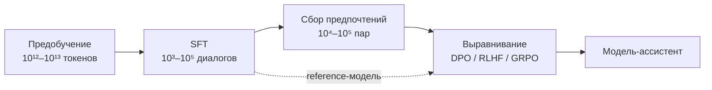
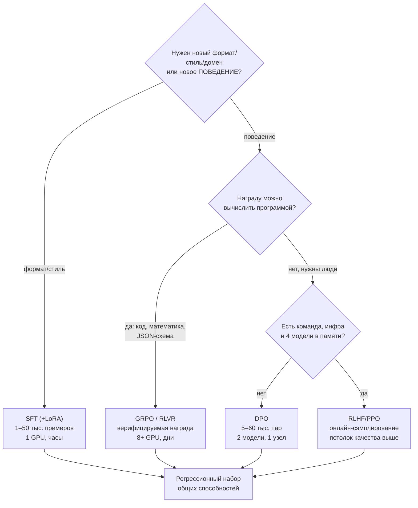

# SFT и выравнивание

> **Зачем эта глава.** После предобучения у вас на руках не ассистент, а очень хороший автодополнитель
> текста. Превращение его в модель, которая выполняет инструкции, не хамит и не выдумывает — это
> отдельный инженерный конвейер: SFT, сбор предпочтений, reward-модель, RLHF или DPO. На собеседовании
> по LLM это вторая по частоте тема после устройства трансформера, и спрашивают её не на уровне
> «что такое RLHF», а «выведите функцию потерь DPO» и «что делать, если модель начала играть с
> reward-моделью». После главы вы сможете вывести DPO с нуля, объяснить каждый член в целевой функции
> PPO для LLM и выбрать метод выравнивания под конкретный бюджет.

**Уровень:** 🎯 middle → 🧠 middle+
**Предварительно нужно:** [предобучение и законы масштабирования](02-pretraining-and-scaling.md), [устройство современной LLM](01-llm-architecture.md), [внимание и трансформер](../03-deep-learning/04-attention-and-transformer.md), [теория информации: KL-дивергенция](../01-math/05-information-theory.md), [оптимизация](../01-math/04-optimization.md)
**Время на проработку:** ~7 часов (чтение + вывод DPO руками + реализация лоссов)

---

## Карта главы

- [1. Почему базовая модель — ещё не ассистент](#1-почему-базовая-модель--ещё-не-ассистент)
- [2. SFT: instruction tuning по-инженерному](#2-sft-instruction-tuning-по-инженерному)
- [3. Чат-шаблоны и маскирование лосса](#3-чат-шаблоны-и-маскирование-лосса)
- [4. Сколько данных реально нужно для SFT](#4-сколько-данных-реально-нужно-для-sft)
- [5. Почему SFT упирается в потолок](#5-почему-sft-упирается-в-потолок)
- [6. Как собирают предпочтения](#6-как-собирают-предпочтения)
- [7. Reward-модель: Bradley–Terry и вывод функции потерь](#7-reward-модель-bradleyterry-и-вывод-функции-потерь)
- [8. RLHF через PPO: разбор по шагам](#8-rlhf-через-ppo-разбор-по-шагам)
- [9. DPO: полный вывод](#9-dpo-полный-вывод)
- [10. GRPO и обучение с проверяемой наградой](#10-grpo-и-обучение-с-проверяемой-наградой)
- [11. RLAIF и Constitutional AI](#11-rlaif-и-constitutional-ai)
- [12. Reward hacking](#12-reward-hacking)
- [13. Что выбрать под ресурсы](#13-что-выбрать-под-ресурсы)
- [14. Подводные камни](#14-подводные-камни)
- [15. Проверь себя](#15-проверь-себя)
- [16. Практика](#16-практика)
- [17. Что читать дальше](#17-что-читать-дальше)

---

## 1. Почему базовая модель — ещё не ассистент

Возьмите чистую предобученную модель (base, не instruct) и подайте ей:

```
Как приготовить омлет?
```

С высокой вероятностью вы получите не рецепт, а что-нибудь такое:

```
Как приготовить омлет? Как приготовить блины? Как приготовить сырники?
Читайте другие статьи нашего блога:
```

Модель не «не поняла» вопрос. Она сделала ровно то, чему её учили: продолжила текст наиболее вероятным
образом. В корпусе интернета за строкой «Как приготовить омлет?» чаще всего идёт не рецепт, а
список похожих заголовков, потому что такова структура типичной веб-страницы.

Вот суть проблемы. Предобучение оптимизирует **правдоподобие текста**:

$$
\mathcal{L}_{\text{pretrain}}(\theta) = -\mathbb{E}_{x \sim \mathcal{D}} \sum_{t=1}^{T} \log \pi_\theta\big(x_t \mid x_{<t}\big)
$$

где $\theta$ — параметры модели, $\pi_\theta(x_t \mid x_{<t})$ — вероятность токена $x_t$ при
условии префикса, $\mathcal{D}$ — корпус предобучения, $T$ — длина последовательности.

А нам нужно совсем другое: чтобы модель максимизировала **полезность ответа для пользователя**.
Это разные функционалы, и между ними три разрыва.

**Разрыв формата.** Модель не знает, что от неё ждут ответа, а не продолжения. Её надо научить
распознавать роль «пользователь спрашивает — ассистент отвечает».

**Разрыв качества.** В корпусе есть и блестящие тексты, и мусор. Предобучение усредняет по всему.
Нам нужно вытащить верхний хвост распределения — модель *способна* на хороший ответ, но по умолчанию
не выбирает его.

**Разрыв ценностей.** В интернете полно текстов, которые мы не хотим воспроизводить: инструкции по
изготовлению взрывчатки, уверенная дезинформация, оскорбления. Предобучение не отличает их от рецепта
омлета — для него это просто токены.

Первые два разрыва закрывает **SFT** (supervised fine-tuning, дообучение с учителем), третий и остаток
второго — **выравнивание** (alignment) на предпочтениях. Отсюда стандартный конвейер:



> 🌱 **База.** Три этапа читаются так. Предобучение даёт **знания и язык**. SFT даёт **формат
> и умение следовать инструкции**. Выравнивание даёт **вкус**: из множества грамматически
> правильных ответов выбрать тот, который человеку понравится больше. Ни один этап не заменяет
> остальные: SFT не научит модель фактам, которых не было в предобучении, а RLHF не научит формату,
> если его не задал SFT.

> 💬 **На собеседовании.** Спросят (Ozon, Яндекс, почти любая LLM-секция): «Объясните все этапы
> обучения LLM. От какого из них можно отказаться и в каких случаях?»
> Хороший ответ: предобучение (next-token prediction на терабайтах, даёт знания), SFT (демонстрации
> «инструкция → ответ», даёт формат), alignment (предпочтения, даёт выбор лучшего из возможного).
> Отказаться можно от alignment, если задача узкая и оценивается автоматически — например,
> извлечение полей из документа в JSON: там SFT на 5–20 тысячах примеров закрывает всё, а
> предпочтения собирать не на чем, метрика объективна. Отказаться от SFT перед DPO нельзя:
> DPO стартует из reference-модели, и если она не умеет держать формат, оптимизация предпочтений
> будет выбирать «менее плохой из двух плохих». Предобучение с нуля не делают почти никогда —
> это единицы компаний и бюджеты в миллионы долларов.
> Провал: «сначала претрейн, потом файнтюн» — без различения SFT и alignment.

---

## 2. SFT: instruction tuning по-инженерному

**Instruction tuning** — это обычное дообучение на next-token prediction, но на данных особого вида:
пары «инструкция → эталонный ответ», иногда с диалоговой историей. Никакой новой математики: тот же
кросс-энтропийный лосс, что и в предобучении. Вся суть — в данных и в том, на каких токенах считается
лосс.

Минимальный пример элемента датасета:

```json
{
  "messages": [
    {"role": "system", "content": "Ты — ассистент службы поддержки. Отвечай кратко, на русском."},
    {"role": "user", "content": "Как отменить заказ 12345?"},
    {"role": "assistant", "content": "Откройте «Мои заказы» → заказ 12345 → «Отменить». Если заказ уже передан в доставку, отмена недоступна — оформите возврат при получении."}
  ]
}
```

Типичные источники таких данных, по убыванию качества и стоимости:

| Источник | Объём, который реально получают | Стоимость | Риск |
|---|---|---|---|
| Ручные демонстрации своих экспертов | 1–20 тыс. | 3–15 $ за пример | медленно, но данные точно про ваш домен |
| Логи реальной поддержки/операторов | 10–500 тыс. | почти бесплатно | PII, шум, стиль оператора ≠ стиль ассистента |
| Синтетика от сильной модели (distillation) | 50–500 тыс. | 0,1–2 $ за 1000 примеров | лицензия провайдера, наследование ошибок учителя |
| Открытые датасеты (FLAN-подобные, Dolly, OpenAssistant) | 10–100 тыс. | бесплатно | язык, домен и стиль почти всегда чужие |

На практике почти всегда получается смесь: небольшое ядро вручную выверенных примеров, которое задаёт
стиль, плюс синтетика для покрытия разнообразия задач, плюс отфильтрованные логи.

**Типичные гиперпараметры SFT** (на момент написания — 2025–2026, модели 7–14B):

- learning rate $\eta$: $1 \cdot 10^{-5}$–$2 \cdot 10^{-5}$ для полного дообучения,
  $1 \cdot 10^{-4}$–$3 \cdot 10^{-4}$ для LoRA;
- расписание: косинусное затухание, warmup 3–5% шагов;
- эпохи: 1–3. Больше трёх почти всегда даёт переобучение: модель начинает воспроизводить
  обучающие ответы дословно;
- эффективный batch size: 64–256 последовательностей (через градиентное накопление);
- максимальная длина: 2048–8192 токенов, с **packing** — склейкой коротких примеров в одну
  последовательность до максимальной длины, чтобы не тратить вычисления на паддинг.

> ⚠️ **Типичная ошибка.** Учить SFT четыре и больше эпох, глядя на падающий train loss.
> → Модель запоминает ответы дословно и теряет общие способности (то самое «катастрофическое
> забывание», о котором спрашивают отдельно). → Держите валидационный набор из held-out инструкций
> и отдельный «регрессионный» набор общих задач (арифметика, суммаризация, следование формату).
> Останавливайтесь, когда общий набор начал проседать, даже если целевой ещё растёт.

---

## 3. Чат-шаблоны и маскирование лосса

Это тот раздел, где ошибки стоят дороже всего, потому что они молчаливые: модель обучается, лосс
падает, а в проде качество странно хуже, чем на валидации.

### 3.1 Почему шаблон должен совпадать до символа

Модель не видит поля `role`. Она видит плоскую строку токенов. Роли кодируются **специальными
токенами-разделителями**, которые задаются чат-шаблоном (chat template). Условный пример в стиле
ChatML:

```
<|im_start|>system
Ты — ассистент службы поддержки.<|im_end|>
<|im_start|>user
Как отменить заказ 12345?<|im_end|>
<|im_start|>assistant
Откройте «Мои заказы»...<|im_end|>
```

Токены `<|im_start|>`, `<|im_end|>` — не текст, а отдельные элементы словаря. Модель на обучении
выучивает: «после `<|im_start|>assistant\n` я обязана выдать ответ и закончить его `<|im_end|>`».
Этот сигнал очень сильный — фактически это переключатель режима.

Что происходит, если на инференсе вы собрали промпт немного иначе: поставили пробел после
`assistant`, использовали `\n\n` вместо `\n`, или взяли шаблон другой модели? Модель попадает в
последовательность токенов, которой не было в обучении. Симптомы: она перестаёт останавливаться,
начинает генерировать реплики за пользователя, теряет системный промпт, скатывается к базовому
поведению «продолжаю текст». Деградация при этом не катастрофическая и не сразу заметная — процентов
десять качества, которые вы будете искать неделю.

Отсюда правило: **шаблон берётся из токенизатора модели, а не пишется руками.**

```python
from transformers import AutoTokenizer

tok = AutoTokenizer.from_pretrained("Qwen/Qwen2.5-7B-Instruct")

messages = [
    {"role": "system", "content": "Ты — ассистент службы поддержки. Отвечай кратко."},
    {"role": "user", "content": "Как отменить заказ 12345?"},
]

# add_generation_prompt=True дописывает «шапку» роли assistant — без неё модель
# не поймёт, что очередь отвечать ей, и продолжит реплику пользователя
prompt = tok.apply_chat_template(messages, tokenize=False, add_generation_prompt=True)
print(repr(prompt))   # смотрим ГЛАЗАМИ на все \n и спецтокены — это самая дешёвая отладка
```

Печать `repr()` шаблона перед первым обучением — привычка, которая экономит дни. Вы сразу увидите,
есть ли в шаблоне BOS-токен (и не добавите второй), какие переводы строк используются и как
оформляется системное сообщение.

### 3.2 Маскирование лосса на промпте

Второй принципиальный момент. Обучающий пример — это вся строка целиком, но **лосс мы хотим считать
только на токенах ответа ассистента**.

Почему? Формально можно считать и на промпте — это просто добавит модели задачу «предсказывать
вопросы пользователя». Практические последствия:

1. Градиент размывается. Если промпт занимает 400 токенов, а ответ 60, то 87% сигнала уходит на
   моделирование пользовательских реплик — задачу, которая нам не нужна.
2. Модель учится **генерировать вопросы**. В проде это проявляется как склонность продолжать диалог
   за пользователя.
3. Системный промпт запоминается как текст, который надо воспроизводить. При смене системного промпта
   модель ведёт себя странно.

Есть случай, когда лосс на промпте оправдан: очень мало данных (сотни примеров) и короткие промпты —
тогда дополнительный сигнал работает как регуляризация. Это исключение, а не правило.

Реализация — через метку `-100`, которую `CrossEntropyLoss` в PyTorch игнорирует по умолчанию
(`ignore_index=-100`):

```python
import torch
from transformers import AutoTokenizer

tok = AutoTokenizer.from_pretrained("Qwen/Qwen2.5-7B-Instruct")

def build_example(messages, max_len=2048):
    """messages: список реплик; лосс считаем только на репликах assistant.

    Идея: собираем строку инкрементально и запоминаем, какие токены появились
    внутри реплики ассистента. Это надёжнее, чем искать подстроки в готовом тексте.
    """
    input_ids, labels = [], []
    for i, msg in enumerate(messages):
        prefix = tok.apply_chat_template(messages[:i], tokenize=False,
                                         add_generation_prompt=(msg["role"] == "assistant"))
        full = tok.apply_chat_template(messages[:i + 1], tokenize=False)
        prefix_ids = tok(prefix, add_special_tokens=False)["input_ids"]
        full_ids = tok(full, add_special_tokens=False)["input_ids"]
        new_ids = full_ids[len(prefix_ids):]

        input_ids.extend(prefix_ids[len(input_ids):])   # добираем «шапку» роли
        input_ids.extend(new_ids)
        # -100 на всём, кроме содержимого ответа ассистента
        labels.extend([-100] * (len(input_ids) - len(new_ids) - len(labels)))
        labels.extend(new_ids if msg["role"] == "assistant" else [-100] * len(new_ids))

    input_ids, labels = input_ids[:max_len], labels[:max_len]
    return {"input_ids": torch.tensor(input_ids), "labels": torch.tensor(labels)}


ex = build_example([
    {"role": "user", "content": "2+2?"},
    {"role": "assistant", "content": "4"},
])
# санитарная проверка: обучаемых токенов должно быть заметно меньше, чем всего
n_train = int((ex["labels"] != -100).sum())
print(f"всего токенов: {len(ex['input_ids'])}, обучаемых: {n_train}")
assert 0 < n_train < len(ex["input_ids"])
```

Проверка `0 < n_train < len(input_ids)` — обязательный тест. Если `n_train == 0`, вы обучаетесь
на пустом сигнале (лосс будет `nan` или странно стабильным). Если `n_train == len`, маскирование
не сработало вовсе.

> ⚠️ **Типичная ошибка.** При packing (склейке нескольких примеров в одну последовательность длиной
> 4096) забыть, что attention видит предыдущий пример как контекст. → Модель учится «подсматривать»
> в чужой диалог, а на инференсе такого контекста нет. → Либо использовать блочно-диагональную маску
> внимания (в современных библиотеках это флаг вида `attn_implementation="flash_attention_2"` +
> передача границ примеров), либо не паковать разные диалоги вместе, если данных достаточно.

---

## 4. Сколько данных реально нужно для SFT

Это вопрос, на котором проваливаются, отвечая «зависит». Давайте цифры и ориентиры.

**Нижняя граница удивительно мала.** Работа LIMA (2023) показала: 1000 тщательно отобранных
разнообразных примеров поверх сильной базовой модели дают ассистента, конкурентоспособного с моделями,
обученными на десятках тысяч примеров. Интерпретация авторов: почти все знания и способности уже
в базовой модели, SFT лишь «переключает» её в режим ассистента и задаёт стиль. Отсюда рабочая
гипотеза: **разнообразие важнее объёма**.

**Практические ориентиры по типам задач:**

| Задача | Порядок объёма SFT | Комментарий |
|---|---|---|
| Один жёсткий формат вывода (JSON по схеме, классификация) | 0,5–5 тыс. | сверх этого прирост почти нулевой |
| Доменный ассистент (поддержка, юрдок, медицина) | 5–50 тыс. | нужна вариативность формулировок пользователя |
| Общий ассистент «на всё» | 100 тыс.–1 млн | это уровень лабораторий, не продуктовой команды |
| Мультиязычность (+русский к англоцентричной модели) | +10–100 тыс. на язык | иначе модель отвечает по-английски на русские вопросы |

Для сравнения, в InstructGPT (2022) использовали порядка 13 тысяч демонстраций для SFT, 33 тысяч
промптов со сравнениями для reward-модели и 31 тысячи промптов для PPO. То есть даже у OpenAI
на этом этапе объёмы измерялись десятками тысяч, а не миллионами.

**Как понять, что данных мало?** Три сигнала: (1) валидационный лосс перестаёт падать после половины
первой эпохи; (2) модель отвечает шаблонно, повторяя формулировки из обучения; (3) на инструкциях,
чуть отличных от обучающих, поведение разваливается. Первый лечится добавлением данных, второй и
третий — **добавлением разнообразия**, а не объёма: 5000 примеров из 20 разных типов задач лучше,
чем 50000 из трёх.

---

## 5. Почему SFT упирается в потолок

Допустим, вы собрали отличный SFT-датасет. Почему на этом не заканчивают?

**Причина первая: демонстрации задают только «что делать», но не «чего не делать».**
Обучение с учителем максимизирует вероятность эталонного ответа. Оно никак не понижает вероятность
плохого ответа, если плохого ответа нет в данных. Модель, обученная только на вежливых ответах,
всё ещё держит в распределении грубые — просто они стали чуть менее вероятны. При сэмплировании
с температурой они всплывают.

**Причина вторая: потолок демонстратора.** SFT учит имитировать разметчика. Если разметчик пишет
ответы на 7 баллов из 10, модель научится писать на 7. Но модель часто *способна* на 9 — она видела
в предобучении миллионы отличных текстов. Нужен механизм, который умеет сказать «вот этот твой
собственный ответ лучше вон того твоего собственного», не требуя эталона. Сравнивать людям проще,
чем писать: разметчик, который не напишет идеальное юридическое заключение, легко скажет, какое
из двух лучше.

**Причина третья: экспозиционное смещение (exposure bias).** На обучении модель всегда видит
префикс из эталонного текста (teacher forcing). На инференсе — свой собственный, уже с ошибками.
Ошибки накапливаются, и модель уходит в область, которую на обучении не посещала. RL-методы
обучаются **на собственных сэмплах**, то есть ровно в том распределении, где будут работать.

Отсюда постановка задачи выравнивания: научиться оптимизировать не правдоподобие эталона, а
**предпочтение человека** над множеством ответов самой модели.

---

## 6. Как собирают предпочтения

Механика, которую надо уметь описать, потому что спрашивают про качество разметки.

**Шаг 1. Промпты.** Берут реальные пользовательские запросы (из логов продукта или из
краудсорсинга), а не выдуманные. Важно покрытие: простые вопросы, сложные, провокационные,
на границе политик.

**Шаг 2. Генерация кандидатов.** На каждый промпт SFT-модель генерирует $K$ ответов с ненулевой
температурой (типично $K = 4 \ldots 9$, температура 0,8–1,0). Иногда добавляют ответы от других
моделей или от человека.

**Шаг 3. Разметка.** Разметчику показывают промпт и ответы. Два основных формата:

- **Попарные сравнения** (pairwise): «какой ответ лучше, A или B?». Просто, устойчиво, даёт
  бинарный сигнал. Это то, что нужно для Bradley–Terry.
- **Ранжирование $K$ ответов**: разметчик упорядочивает все $K$. Из одного ранжирования получается
  $\binom{K}{2}$ пар — при $K=9$ это 36 пар с одного промпта. Дешевле в пересчёте на пару и даёт
  более согласованный сигнал.

Часто добавляют шкалу Лайкерта (1–7) и отдельные оси: полезность, безвредность, честность.

**Шаг 4. Контроль качества.** Ключевая метрика — **согласие между разметчиками**
(inter-annotator agreement). В RLHF-работах типичное согласие на попарных сравнениях — 70–77%,
то есть двое разметчиков расходятся примерно в каждом четвёртом случае. Это не брак разметки,
а свойство задачи: у многих пар ответов объективно нет лучшего.

> 💬 **На собеседовании.** Спросят: «В вашей preference-разметке низкое согласие аннотаторов
> (порядка 60%). Что делаете?»
> Хороший ответ по шагам. Сначала диагностика: расщепить согласие по типам промптов — почти всегда
> оказывается, что на фактологии согласие 85%, а на «напиши креативный текст» — 55%; это разные
> задачи, и лечить их надо по-разному. Затем: уточнить инструкцию разметчикам с явной иерархией
> критериев («безопасность > фактическая корректность > полнота > стиль»), потому что чаще всего
> расходятся не в оценке, а в том, что важнее. Затем: убрать пары, где ответы почти идентичны
> (разметчик кидает монетку) — фильтр по расстоянию между ответами или по margin в шкале Лайкерта.
> Затем: дублировать разметку (3 разметчика, majority vote) на подвыборке и взвешивать пары
> уверенностью — Bradley–Terry это допускает через мягкие метки. И финальный аргумент уровня
> middle+: reward-модель, обученная на данных с согласием 60%, физически не может иметь точность
> выше ~80% на held-out — это потолок шума, и его надо знать, чтобы не гоняться за метрикой.
> Провал: «добавим больше разметчиков» — без диагностики это просто дороже.

---

## 7. Reward-модель: Bradley–Terry и вывод функции потерь

У нас есть датасет троек $(x, y_w, y_l)$: промпт, предпочтённый (winning) и отвергнутый (losing)
ответы. Нужно превратить их в скалярную функцию награды $r_\phi(x, y)$.

### 7.1 Модель Bradley–Terry

Предположение: у каждого ответа есть скрытая «сила» $r(x, y) \in \mathbb{R}$, и вероятность того,
что человек предпочтёт $y_1$ ответу $y_2$, задаётся логистической функцией разности сил:

$$
p\big(y_1 \succ y_2 \mid x\big) \;=\; \frac{\exp\big(r(x, y_1)\big)}{\exp\big(r(x, y_1)\big) + \exp\big(r(x, y_2)\big)}
$$

где $y_1 \succ y_2$ означает «$y_1$ предпочтён $y_2$», $r(x,y)$ — скрытая награда, $x$ — промпт.

> 📐 **Разбор формулы.** Поделим числитель и знаменатель на $\exp(r(x,y_1))$:
>
> $$
> p\big(y_1 \succ y_2 \mid x\big) = \frac{1}{1 + \exp\big(r(x,y_2) - r(x,y_1)\big)} = \sigma\big(r(x,y_1) - r(x,y_2)\big)
> $$
>
> где $\sigma(z) = 1/(1 + e^{-z})$ — сигмоида. Читается так: вероятность предпочтения зависит
> **только от разности наград**. Если разность 0 — вероятность 0,5 (ответы равны). Если разность
> 2 — вероятность $\sigma(2) \approx 0{,}88$.
>
> Ключевое следствие: награда определена **с точностью до аддитивной константы**. Прибавьте к
> $r(x, \cdot)$ любое число, зависящее только от $x$ — все вероятности не изменятся. Это не баг,
> а фундаментальное свойство, и оно нам ещё пригодится при выводе DPO.

### 7.2 Функция потерь

Параметризуем награду нейросетью $r_\phi$ и запишем правдоподобие датасета
$\mathcal{D}_{\text{pref}} = \{(x^{(i)}, y_w^{(i)}, y_l^{(i)})\}_{i=1}^{N}$:

$$
\mathcal{L}(\phi) = \prod_{i=1}^{N} \sigma\Big(r_\phi\big(x^{(i)}, y_w^{(i)}\big) - r_\phi\big(x^{(i)}, y_l^{(i)}\big)\Big)
$$

Берём отрицательный логарифм и усредняем — получаем то, что реально минимизируют:

$$
\mathcal{L}_{\text{RM}}(\phi) = -\,\mathbb{E}_{(x, y_w, y_l) \sim \mathcal{D}_{\text{pref}}}
\Big[\log \sigma\big(r_\phi(x, y_w) - r_\phi(x, y_l)\big)\Big]
$$

где $\phi$ — параметры reward-модели, $\sigma$ — сигмоида, $y_w$ — предпочтённый ответ,
$y_l$ — отвергнутый, $\mathbb{E}$ — среднее по датасету предпочтений.

Заметьте: это в точности **бинарная кросс-энтропия на разности логитов**. Задача «оценить качество»
свелась к задаче «классифицировать, какой из двух лучше». Никакой абсолютной шкалы качества нам
не требуется — и слава богу, потому что человек её надёжно давать не умеет.

### 7.3 Как устроена и чему учится RM на практике

**Архитектура.** Берут SFT-модель, отрезают выходной слой (`lm_head`, проекцию в словарь) и вешают
линейную голову $\mathbb{R}^{d} \to \mathbb{R}$, читающую скрытое состояние **последнего токена**
ответа. Инициализация из SFT критична: reward-модель должна понимать тот же формат.

**Размер.** RM часто заметно меньше политики. В InstructGPT для политики 175B использовали RM на 6B —
и это работало: сравнивать проще, чем генерировать. Практическое правило: RM того же размера,
что и политика, или в 2–10 раз меньше.

**Эпохи — одна.** RM переобучается стремительно: со второй эпохи она начинает запоминать конкретные
пары вместо того, чтобы выучивать критерий.

**Батчинг по промпту.** Все $\binom{K}{2}$ пар с одного промпта кладут в **один батч**. Иначе один
и тот же ответ проходит через модель много раз в разных батчах, и она переобучается на нём.

**Метрика.** Точность на отложенных парах (какая доля пар упорядочена верно). Реалистичные значения
на человеческих данных — **65–78%**. Если у вас 95%, почти наверняка утечка: например, chosen и
rejected сгенерированы разными моделями, и RM выучила отличать «стиль модели A от стиля модели B»,
а не качество.

```python
import torch
import torch.nn.functional as F

def bradley_terry_loss(rewards_chosen: torch.Tensor,
                       rewards_rejected: torch.Tensor) -> torch.Tensor:
    """Функция потерь reward-модели. Оба тензора: (batch,) — скалярные награды.

    logsigmoid вместо log(sigmoid(x)) — численно устойчиво при больших |x|:
    при x = -50 вычисление log(sigmoid(-50)) даст log(0) = -inf.
    """
    return -F.logsigmoid(rewards_chosen - rewards_rejected).mean()


# Проверка на понятных числах
rc = torch.tensor([2.0, 0.0, -1.0])
rr = torch.tensor([0.0, 0.0,  1.0])
loss = bradley_terry_loss(rc, rr)
acc = (rc > rr).float().mean()          # точность = доля верно упорядоченных пар
print(f"loss={loss.item():.4f}, accuracy={acc.item():.2f}")
# При равных наградах (вторая пара) вклад в лосс = -log(0.5) = 0.693 — это «нулевая информация»
assert abs(-torch.log(torch.tensor(0.5)).item() - 0.6931) < 1e-3
```

> 🧠 **Middle+. Почему награда центрируется.** Из сдвиговой инвариантности следует, что абсолютное
> значение $r_\phi$ бессмысленно: RM с наградами (10, 8) и (0, −2) эквивалентны. Но на этапе PPO
> абсолютное значение попадает в целевую функцию и влияет на масштаб преимуществ. Поэтому награды
> либо центрируют (вычитают среднее по батчу — reward whitening), либо добавляют к лоссу RM
> регуляризатор $\lambda \cdot \mathbb{E}[r_\phi^2]$, прижимающий награды к нулю. Пропустить это —
> получить нестабильный PPO с непредсказуемым эффективным learning rate.

---

## 8. RLHF через PPO: разбор по шагам

Теперь у нас есть $r_\phi$. Сформулируем задачу: найти политику $\pi_\theta$ (нашу LLM), которая
максимизирует ожидаемую награду.

### 8.1 Целевая функция и зачем нужен KL-штраф

Наивная постановка — «максимизировать $\mathbb{E}[r_\phi]$» — ломается мгновенно. Reward-модель
обучена на ответах SFT-политики, то есть на узком куске пространства текстов. За его пределами
она предсказывает мусор. Оптимизатор это находит: он генерирует нечто, что для человека выглядит
бессмыслицей, но получает от RM награду 15 при типичном диапазоне 0–3. Это состязательная атака
на собственную reward-модель.

Лечение — привязать политику к reference-модели (обычно это SFT-чекпоинт):

$$
\max_{\pi_\theta}\ \mathbb{E}_{x \sim \mathcal{D},\, y \sim \pi_\theta(\cdot \mid x)}
\Big[ r_\phi(x, y) \Big] \;-\; \beta\, \mathbb{D}_{\mathrm{KL}}\Big[\pi_\theta(y \mid x)\,\big\|\,\pi_{\text{ref}}(y \mid x)\Big]
$$

где $\pi_\theta$ — обучаемая политика, $\pi_{\text{ref}}$ — замороженная reference-модель (SFT),
$r_\phi$ — reward-модель, $\beta > 0$ — коэффициент KL-штрафа, $\mathcal{D}$ — распределение
промптов, $\mathbb{D}_{\mathrm{KL}}$ — дивергенция Кульбака–Лейблера между распределениями
над ответами.

**Что делает $\beta$.** Это ручка «насколько далеко разрешено уйти от SFT». Типичные значения
$\beta = 0{,}01 \ldots 0{,}1$. Меньше — модель быстрее набирает награду и быстрее ломается;
больше — почти не меняется относительно SFT. На практике KL мониторят как основную метрику
здоровья обучения: она должна расти плавно до значений порядка 5–20 нат и стабилизироваться.
Взлёт KL за 50 — почти гарантированный признак того, что политика нашла дыру в RM.

Технически KL добавляют не как отдельное слагаемое в конце, а **пооткенно, внутрь награды**:

$$
R_t = \underbrace{-\beta \log \frac{\pi_\theta(a_t \mid s_t)}{\pi_{\text{ref}}(a_t \mid s_t)}}_{\text{на каждом токене}} \;+\; \underbrace{r_\phi(x, y)\cdot \mathbb{1}[t = T]}_{\text{только на последнем токене}}
$$

где $a_t$ — сгенерированный токен на шаге $t$, $s_t$ — состояние (промпт + уже сгенерированные
токены), $T$ — индекс последнего токена ответа, $\mathbb{1}[\cdot]$ — индикатор.

Такая форма даёт плотный сигнал: модель штрафуется за отклонение сразу, на каждом токене, а не
только в конце эпизода.

> 💬 **На собеседовании.** Спросят: «Зачем в RLHF нужен KL-штраф к reference-модели? Что будет,
> если его убрать?»
> Хороший ответ: reward-модель — это выученная аппроксимация человеческих предпочтений, валидная
> только вблизи распределения, на котором она обучалась. Без KL политика уходит в область, где
> RM экстраполирует, и оптимизатор находит там состязательные примеры — тексты с огромной наградой
> и нулевой осмысленностью. Эмпирически: без KL за несколько сотен шагов PPO модель схлопывается
> в повторение одной фразы, которая нравится RM. KL-член делает задачу регуляризованной: мы ищем
> не глобальный максимум $r_\phi$, а лучшую политику *в окрестности* SFT. Дополнительный аргумент
> уровня middle+: у этой задачи есть замкнутое решение
> $\pi^*(y|x) \propto \pi_{\text{ref}}(y|x)\exp(r(x,y)/\beta)$ — экспоненциальное перевзвешивание
> reference-модели наградой, и именно из него выводится DPO.
> Провал: «чтобы модель не забыла, чему её учили» — верно на уровне интуиции, но не объясняет
> механизм провала.

### 8.2 PPO поверх этого

Сама оптимизация — стандартный PPO (Proximal Policy Optimization) с обрезанным отношением
вероятностей:

$$
\mathcal{L}^{\text{CLIP}}(\theta) = -\,\mathbb{E}_t\Big[\min\big(\rho_t A_t,\ \operatorname{clip}(\rho_t,\, 1-\varepsilon,\, 1+\varepsilon)\, A_t\big)\Big],
\qquad
\rho_t = \frac{\pi_\theta(a_t \mid s_t)}{\pi_{\theta_{\text{old}}}(a_t \mid s_t)}
$$

где $\rho_t$ — отношение вероятностей новой и старой политик на токене $t$, $A_t$ — оценка
преимущества (advantage), $\varepsilon$ — параметр обрезки (типично 0,2), $\pi_{\theta_{\text{old}}}$ —
политика, которой были сгенерированы данные текущего батча.

Преимущество $A_t$ оценивается через GAE (generalized advantage estimation) с помощью **value-модели**
$V_\psi(s_t)$ — ещё одной сети, предсказывающей ожидаемую будущую награду из состояния. Для LLM
обычно берут $\gamma = 1$ (эпизоды короткие, дисконтировать нечего) и $\lambda = 0{,}95$.

Итого в памяти одновременно живут **четыре модели**:

| Модель | Обучается? | Оптимизатор? | Зачем |
|---|---|---|---|
| Политика $\pi_\theta$ | да | да | то, что мы обучаем |
| Reference $\pi_{\text{ref}}$ | нет | нет | знаменатель в KL |
| Reward $r_\phi$ | нет | нет | награда |
| Value $V_\psi$ | да | да | baseline для advantage |

**Считаем память для 7B, bf16 + AdamW.** Обучаемая модель стоит ~16 байт на параметр
(2 байта веса bf16 + 2 байта градиенты + 4 байта fp32-мастер-копия + 4+4 байта состояния Adam) —
это $7 \cdot 10^9 \cdot 16 \approx 112$ ГБ. Value-модель того же размера — ещё 112 ГБ. Замороженные
reference и reward — по 14 ГБ. Итого **≈ 252 ГБ** только на параметры, без активаций и без KV-кэша
для генерации. Это 4 узла H100 по 80 ГБ при идеальном шардировании. Отсюда и практика: value-модель
и RM делают меньше политики, политику обучают через LoRA, а reference получают отключением
адаптеров (см. §13).

**Цикл обучения** (одна итерация):

1. Взять батч промптов (типично 512–1024).
2. Сгенерировать ответы политикой (это самая дорогая часть — обычный авторегрессионный декодинг).
3. Посчитать награды RM, KL к reference, значения value-модели.
4. Посчитать GAE-преимущества.
5. Сделать 1–4 эпохи PPO-обновлений по этому батчу (мини-батчами).
6. Повторить.

Типичные гиперпараметры: $\eta = 1 \cdot 10^{-6} \ldots 5 \cdot 10^{-6}$ для политики (на порядок
меньше, чем в SFT — RL нестабилен), $\varepsilon = 0{,}2$, $\beta = 0{,}02 \ldots 0{,}1$,
1000–3000 итераций.

### 8.3 Почему PPO для LLM тяжёл на практике

Отдельно перечислю, потому что это ровно тот список, который отличает «читал статью» от «запускал».

- **Дорого.** Каждая итерация включает генерацию — на порядок дороже, чем forward+backward на
  готовых данных. Реальное обучение 7B-модели через PPO — это дни на многокарточном узле.
- **Нестабильно.** Четыре взаимодействующие модели, RL-динамика, чувствительность к $\beta$
  и к масштабу наград. Расхождение выглядит как резкий взлёт KL и схлопывание энтропии генерации.
- **Много гиперпараметров.** Практики говорят про десятки прогонов до рабочей конфигурации.
- **Сложно отлаживать.** Метрика (награда RM) растёт, а качество для человека падает — это норма,
  а не исключение (см. §12).

Именно эта стоимость породила DPO.

---

## 9. DPO: полный вывод

**Direct Preference Optimization** отвечает на вопрос: а можно ли получить ту же оптимальную политику
без reward-модели, без value-модели, без сэмплирования и без RL — одним обычным обучением с учителем
на парах? Оказывается, да. Вывод занимает страницу и его просят на собеседовании.

### Шаг 1. Замкнутая форма оптимальной политики

Начнём с задачи RLHF из §8.1. Заметьте, что она разваливается по промптам: для каждого фиксированного
$x$ мы решаем независимую задачу. Зафиксируем $x$ и перепишем максимизацию как минимизацию:

$$
\min_{\pi}\ \mathbb{E}_{y \sim \pi(\cdot \mid x)}
\left[ \log \frac{\pi(y \mid x)}{\pi_{\text{ref}}(y \mid x)} \;-\; \frac{1}{\beta} r(x, y) \right]
$$

Мы просто раскрыли KL как $\mathbb{E}_\pi[\log(\pi/\pi_{\text{ref}})]$ и поделили всё на $\beta$
(это не меняет точку минимума).

Теперь фокус: занесём $r$ под логарифм. Так как $\frac{1}{\beta} r = \log \exp\!\big(\frac{1}{\beta} r\big)$:

$$
= \mathbb{E}_{y \sim \pi}\left[ \log \frac{\pi(y \mid x)}{\pi_{\text{ref}}(y \mid x)\, \exp\!\big(\tfrac{1}{\beta} r(x,y)\big)} \right]
$$

Знаменатель — почти распределение, но не нормирован. Введём нормировочную константу:

$$
Z(x) = \sum_{y} \pi_{\text{ref}}(y \mid x)\, \exp\!\left(\frac{1}{\beta} r(x, y)\right)
$$

где сумма идёт по всем возможным ответам $y$ (астрономически большое множество — но нам не придётся
её считать, и это ключ ко всему).

Определим распределение

$$
\pi^*(y \mid x) = \frac{1}{Z(x)}\, \pi_{\text{ref}}(y \mid x)\, \exp\!\left(\frac{1}{\beta} r(x, y)\right)
$$

Оно корректно: неотрицательно и суммируется в единицу по построению $Z(x)$. Подставим:

$$
\mathbb{E}_{y \sim \pi}\left[ \log \frac{\pi(y \mid x)}{\pi^*(y \mid x)\, Z(x)} \right]
= \underbrace{\mathbb{D}_{\mathrm{KL}}\big[\pi(\cdot \mid x)\,\|\,\pi^*(\cdot \mid x)\big]}_{\ge 0,\ \text{= 0 только при } \pi = \pi^*} \;-\; \underbrace{\log Z(x)}_{\text{не зависит от } \pi}
$$

Вывод: минимум достигается ровно при $\pi = \pi^*$. Мы получили **замкнутую форму решения
KL-регуляризованной RL-задачи**:

$$
\boxed{\;\pi^*(y \mid x) = \frac{1}{Z(x)}\, \pi_{\text{ref}}(y \mid x)\, \exp\!\left(\frac{r(x, y)}{\beta}\right)\;}
$$

Содержательно: оптимальная политика — это reference-модель, **перевзвешенная экспонентой награды**.
Хорошие ответы получают больше вероятности, плохие — меньше, и степень перевзвешивания задаётся $\beta$.
При $\beta \to \infty$ получаем $\pi^* = \pi_{\text{ref}}$ (награда игнорируется), при $\beta \to 0$ —
вырождение в argmax награды.

**Но пользоваться этой формулой напрямую нельзя.** $Z(x)$ — сумма по всем возможным текстам:
её не посчитать и из неё не сэмплировать. Формула красива и совершенно бесполезна в лоб.
Дальше — трюк, который делает её полезной.

### Шаг 2. Обращаем формулу — выражаем награду через политику

Логарифмируем обе части и решаем относительно $r$:

$$
\log \pi^*(y \mid x) = \log \pi_{\text{ref}}(y \mid x) + \frac{r(x,y)}{\beta} - \log Z(x)
$$

$$
r(x, y) = \beta \log \frac{\pi^*(y \mid x)}{\pi_{\text{ref}}(y \mid x)} \;+\; \beta \log Z(x)
$$

Прочитайте это внимательно: **любая награда** $r$ выражается через свою оптимальную политику
$\pi^*$ и reference-модель, плюс слагаемое, зависящее только от $x$. Иными словами, политика сама
по себе является неявной reward-моделью.

### Шаг 3. Подставляем в Bradley–Terry — и константа исчезает

Вспомним из §7.1: вероятность предпочтения зависит **только от разности наград**:

$$
p(y_w \succ y_l \mid x) = \sigma\big(r(x, y_w) - r(x, y_l)\big)
$$

Подставляем выражение из шага 2 для обоих ответов:

$$
r(x, y_w) - r(x, y_l) =
\beta \log \frac{\pi^*(y_w \mid x)}{\pi_{\text{ref}}(y_w \mid x)} + \beta \log Z(x)
- \beta \log \frac{\pi^*(y_l \mid x)}{\pi_{\text{ref}}(y_l \mid x)} - \beta \log Z(x)
$$

Слагаемые $\beta \log Z(x)$ **взаимно уничтожаются** — они одинаковы для обоих ответов, потому что
зависят только от промпта. Остаётся:

$$
p(y_w \succ y_l \mid x) = \sigma\!\left(
\beta \log \frac{\pi^*(y_w \mid x)}{\pi_{\text{ref}}(y_w \mid x)}
- \beta \log \frac{\pi^*(y_l \mid x)}{\pi_{\text{ref}}(y_l \mid x)}
\right)
$$

Вот и всё. Мы выразили вероятность человеческого предпочтения напрямую через политику, без единого
упоминания reward-модели.

### Шаг 4. Функция потерь

Заменяем неизвестную $\pi^*$ на обучаемую $\pi_\theta$ и максимизируем правдоподобие датасета
предпочтений:

$$
\mathcal{L}_{\text{DPO}}(\theta) = -\,\mathbb{E}_{(x, y_w, y_l) \sim \mathcal{D}_{\text{pref}}}
\left[ \log \sigma\!\left(
\beta \log \frac{\pi_\theta(y_w \mid x)}{\pi_{\text{ref}}(y_w \mid x)}
- \beta \log \frac{\pi_\theta(y_l \mid x)}{\pi_{\text{ref}}(y_l \mid x)}
\right)\right]
$$

где $\pi_\theta$ — обучаемая политика, $\pi_{\text{ref}}$ — замороженная SFT-модель,
$\beta$ — тот же коэффициент KL-регуляризации (типично 0,1), $y_w, y_l$ — предпочтённый
и отвергнутый ответы, $\sigma$ — сигмоида.

Обратите внимание, что $\log \pi_\theta(y \mid x) = \sum_{t} \log \pi_\theta(y_t \mid x, y_{<t})$ —
это просто сумма логарифмов вероятностей токенов ответа, то есть величина, которую любая LLM
считает одним прямым проходом. Никакой генерации, никакого RL — обычное обучение с учителем
на статичном датасете.

### Шаг 5. Градиент и его смысл

$$
\nabla_\theta \mathcal{L}_{\text{DPO}} = -\beta\, \mathbb{E}
\Big[\underbrace{\sigma\big(\hat{r}_\theta(x, y_l) - \hat{r}_\theta(x, y_w)\big)}_{\text{вес примера}}
\Big(\underbrace{\nabla_\theta \log \pi_\theta(y_w \mid x)}_{\text{поднять } y_w}
- \underbrace{\nabla_\theta \log \pi_\theta(y_l \mid x)}_{\text{опустить } y_l}\Big)\Big]
$$

где $\hat{r}_\theta(x, y) = \beta \log \frac{\pi_\theta(y \mid x)}{\pi_{\text{ref}}(y \mid x)}$ —
**неявная награда** (implicit reward), которую определяет текущая политика.

Читается идеально: градиент увеличивает вероятность хорошего ответа и уменьшает вероятность плохого,
но с весом $\sigma(\hat{r}_l - \hat{r}_w)$ — тем большим, чем сильнее текущая политика **ошибается**
в упорядочивании этой пары. Пары, которые модель уже упорядочила правильно с большим запасом,
почти не дают градиента. Это встроенное «внимание к сложным примерам», аналог того, что делает
focal loss.

```python
import torch
import torch.nn.functional as F

def dpo_loss(policy_logps_chosen, policy_logps_rejected,
             ref_logps_chosen, ref_logps_rejected, beta: float = 0.1):
    """Функция потерь DPO. Все входы: (batch,) — СУММЫ log p по токенам ответа.

    Возвращает (loss, метрики). Метрика reward_accuracy — доля пар, где неявная
    награда упорядочена верно; это главный индикатор здоровья DPO-обучения.
    """
    # неявные награды: beta * log(pi_theta / pi_ref)
    chosen_rewards = beta * (policy_logps_chosen - ref_logps_chosen)
    rejected_rewards = beta * (policy_logps_rejected - ref_logps_rejected)

    logits = chosen_rewards - rejected_rewards
    loss = -F.logsigmoid(logits).mean()

    metrics = {
        "reward_accuracy": (chosen_rewards > rejected_rewards).float().mean().item(),
        "reward_margin": (chosen_rewards - rejected_rewards).mean().item(),
        "chosen_reward": chosen_rewards.mean().item(),
        "rejected_reward": rejected_rewards.mean().item(),
    }
    return loss, metrics


# Санитарная проверка: в начале обучения policy == ref, значит обе неявные награды
# равны нулю, логит равен нулю, а лосс — ровно -log(0.5) = 0.6931.
# reward_accuracy при этом вырожденно равна 0: строгое неравенство на равных наградах ложно.
lp_c = torch.tensor([-12.0, -30.0])
lp_r = torch.tensor([-15.0, -25.0])
loss0, m0 = dpo_loss(lp_c, lp_r, lp_c.clone(), lp_r.clone(), beta=0.1)
print(f"старт: loss={loss0.item():.4f} (ожидаем 0.6931), margin={m0['reward_margin']:.4f}")
assert abs(loss0.item() - 0.6931) < 1e-3 and abs(m0["reward_margin"]) < 1e-6

# А теперь имитируем обученную политику: она подняла chosen и опустила rejected
loss1, m1 = dpo_loss(lp_c + 0.5, lp_r - 0.5, lp_c, lp_r, beta=0.1)
print(f"после: loss={loss1.item():.4f}, acc={m1['reward_accuracy']:.2f}, "
      f"margin={m1['reward_margin']:.4f}")
assert loss1 < loss0 and m1["reward_accuracy"] == 1.0
```

Эта проверка — первое, что нужно сделать при запуске DPO. Если на нулевом шаге лосс не равен 0,693,
значит reference-модель не совпадает с начальной политикой (например, вы забыли, что при загрузке
в разной точности логарифмы вероятностей чуть разъезжаются, или подсунули не тот чекпоинт).

### 9.1 Практика DPO: что реально важно

**$\beta$.** Типично 0,1. Меньше (0,01–0,05) — сильнее подстройка под предпочтения и выше риск
деградации; больше (0,3–0,5) — консервативнее. Это ровно та же ручка, что в RLHF.

**Learning rate.** $5 \cdot 10^{-7}$–$5 \cdot 10^{-6}$ — на порядок-два меньше, чем в SFT. DPO очень
легко «пережать»: лосс уходит к нулю, а модель начинает выдавать вырожденные короткие ответы.

**Эпохи.** 1–2, не больше. Метрика для остановки — не лосс, а `reward_accuracy` на валидации
плюс независимая оценка качества (LLM-судья или человек).

**SFT перед DPO обязателен**, причём желательно — на тех самых `chosen`-ответах. Причина: DPO
понижает вероятность $y_l$, но у логарифмического лосса нет никакого механизма, удерживающего
$\log \pi_\theta(y_w)$ от падения. На практике часто наблюдают, что **вероятности обоих ответов
падают**, просто у отвергнутого быстрее. Формально лосс это допускает (важна только разность),
содержательно — модель уходит из распределения, и качество страдает. Предварительный SFT на chosen
и мониторинг абсолютных значений `chosen_reward` (он не должен уходить глубоко в минус) —
стандартная защита.

**Память.** Нужны две модели: политика (обучаемая) и reference (замороженная). Для 7B в bf16
это 112 ГБ + 14 ГБ. Против 252+ ГБ у PPO — вдвое дешевле. А с LoRA (см. следующую главу) reference
вообще бесплатна: это та же базовая модель с отключёнными адаптерами.

> 💬 **На собеседовании.** Спросят (частый deep-dive-вопрос): «В чём математическая разница между
> PPO и DPO? Почему говорят, что DPO эквивалентен RLHF?»
> Хороший ответ: обе оптимизируют одну и ту же задачу — максимум $\mathbb{E}[r]$ при KL-ограничении
> относительно reference. Разница в том, *как* к ней подходят. PPO решает её численно: обучает
> явную reward-модель, сэмплирует из текущей политики, оценивает advantage через value-модель
> и делает policy-gradient-шаги. DPO пользуется тем, что у задачи есть замкнутое решение
> $\pi^* \propto \pi_{\text{ref}}\exp(r/\beta)$; обратив его, награду выражают через политику,
> подставляют в Bradley–Terry, и нормировочная константа $Z(x)$ сокращается, потому что зависит
> только от промпта. Получается лосс на парах, который оптимизируется как обычный supervised.
> Важные оговорки, которые отличают глубокий ответ: эквивалентность точна только при
> (а) выполнении предположения Bradley–Terry, (б) неограниченной ёмкости модели, (в) достаточном
> покрытии данных. На практике различие существенное: DPO обучается **офлайн**, на фиксированном
> датасете пар, и не видит собственных новых сэмплов — поэтому он не может исправлять ошибки,
> которых нет в данных, тогда как PPO обучается на своём же распределении. Отсюда online-варианты
> DPO и итеративная схема «сгенерировали → разметили → DPO → повторили».
> Провал: «DPO — это упрощённый RLHF без RL» без указания, за счёт чего именно упрощение.

---

## 10. GRPO и обучение с проверяемой наградой

**Проблема, которую решает GRPO** (Group Relative Policy Optimization): в PPO половина стоимости
и половина нестабильности приходятся на value-модель. Она размером с политику, её надо обучать,
и её ошибки напрямую портят оценку advantage.

**Идея.** Вместо обученного baseline использовать **эмпирический**: сгенерировать на один промпт
группу из $G$ ответов и сравнивать награду каждого со средним по группе.

Для промпта $x$ сэмплируем $\{y_1, \ldots, y_G\} \sim \pi_{\theta_{\text{old}}}(\cdot \mid x)$,
получаем награды $\{r_1, \ldots, r_G\}$ и считаем нормированное преимущество:

$$
A_i = \frac{r_i - \operatorname{mean}(r_1, \ldots, r_G)}{\operatorname{std}(r_1, \ldots, r_G) + \varepsilon_{\text{num}}}
$$

где $A_i$ — преимущество $i$-го ответа группы, $G$ — размер группы (типично 8–64),
$\varepsilon_{\text{num}}$ — малая константа для численной устойчивости.

Дальше — тот же обрезанный PPO-суррогат, но advantage $A_i$ одинаков для всех токенов ответа $y_i$,
а KL к reference-модели добавляется **отдельным слагаемым в функцию потерь**, а не внутрь награды:

$$
\mathcal{L}_{\text{GRPO}}(\theta) = -\,\mathbb{E}\left[\frac{1}{G}\sum_{i=1}^{G}
\min\big(\rho_i A_i,\ \operatorname{clip}(\rho_i, 1-\varepsilon, 1+\varepsilon) A_i\big)\right]
\;+\; \beta\, \mathbb{D}_{\mathrm{KL}}\big[\pi_\theta \,\|\, \pi_{\text{ref}}\big]
$$

где $\rho_i$ — отношение вероятностей новой и старой политик для ответа $y_i$, остальные
обозначения — как в §8.2.

**Что это даёт.** Минус одна модель размером с политику (нет value) — экономия примерно трети
памяти обучения и заметной доли нестабильности. Цена: нужно генерировать $G$ ответов на промпт
вместо одного, то есть генерация дорожает в $G$ раз. Для задач, где награда считается программой
(а не нейросетью), это отличный размен.

**RLVR** (reinforcement learning with verifiable rewards) — именно такой случай. Награда вычисляется
детерминированной проверкой:

- математика: сравнить итоговый ответ с эталоном (0/1);
- код: запустить юнит-тесты (доля прошедших);
- структурированный вывод: проверить JSON против схемы;
- следование формату: регулярное выражение.

Здесь reward-модели нет вовсе, а значит нет и классического reward hacking через её обман — зато
появляется хакинг проверяющей программы (см. §12). Схема «GRPO + верифицируемая награда» — то, на
чём построены рассуждающие модели поколения 2024–2025 (на момент написания это наиболее активно
развивающаяся часть post-training).

---

## 11. RLAIF и Constitutional AI

Разметка предпочтений людьми — узкое место: медленно, дорого (порядка 0,5–3 $ за сравнение при
качественной разметке), плохо масштабируется на редкие языки и специфические домены.

**RLAIF** (RL from AI Feedback) заменяет человека-разметчика сильной LLM: ей показывают промпт
и два ответа, просят выбрать лучший по заданному критерию. Дальше всё как обычно: Bradley–Terry,
RM, PPO/DPO. Исследования показывают, что при аккуратной постановке качество сопоставимо с RLHF
на общих задачах helpfulness. Ограничения честные: судья наследует свои смещения (длина, формат,
самопредпочтение), и на задачах, где нужна фактическая проверка в узком домене, он ошибается
систематически — а систематическая ошибка в разметке отравляет RM гораздо сильнее, чем случайный шум.

**Constitutional AI** — более структурированная версия той же идеи, специфичная для безопасности.
Схема в два этапа:

1. **Self-critique (SL-стадия).** Модель генерирует ответ на потенциально вредный запрос, затем
   ей дают «конституцию» — набор принципов на естественном языке («не помогай в причинении вреда»,
   «не будь снисходительным») — и просят **раскритиковать собственный ответ** по случайно выбранному
   принципу, а затем переписать его. Пары «исходный ответ → переписанный» идут в SFT.
2. **RLAIF-стадия.** Модель сама размечает предпочтения между парами ответов, руководствуясь
   принципами конституции. На этой разметке обучается RM для безвредности (harmlessness), которая
   комбинируется с человеческой RM для полезности.

Ценность подхода не только в экономии: набор принципов — это **явный, редактируемый, аудируемый
артефакт**. Изменить поведение модели можно, переписав текст принципа, а не переразметив
50 тысяч примеров. Для регулируемых индустрий это весомый аргумент.

> 💬 **На собеседовании.** Спросят (Candy.ai, реальный вопрос): «Вы настраивали LLM для модерации —
> через system prompt или через fine-tuning? Почему?»
> Хороший ответ строится как решающее дерево, а не как выбор лагеря. System prompt: мгновенные
> итерации, ноль стоимости обучения, легко откатить — но съедает контекст на каждом запросе
> (200–800 токенов × миллионы запросов — это реальные деньги), обходится prompt injection и
> нестабилен при изменении формулировок. Fine-tuning (SFT + DPO на парах «нарушение / не нарушение»):
> устойчивее, дешевле на запрос, поведение зашито в веса и не выкидывается инъекцией — но цикл
> итерации дни, а не минуты, и нужна разметка. Практический ответ: начинать с system prompt,
> параллельно собирая логи спорных случаев; когда набралось 3–10 тысяч размеченных примеров и
> политика стабилизировалась — переносить в веса, оставив в промпте только то, что меняется часто.
> Третий слой, о котором забывают: отдельный дешёвый классификатор-гардрейл перед и после LLM —
> он ловит явные нарушения за миллисекунды и не требует трогать основную модель.
> Провал: «конечно fine-tuning, он точнее» — без учёта стоимости итерации и без упоминания
> гардрейлов.

---

## 12. Reward hacking

**Reward hacking** — ситуация, когда политика находит способ увеличить награду, не увеличивая
то, ради чего награда вводилась. Это не редкий сбой, а **режим по умолчанию** любой достаточно
сильной оптимизации несовершенной метрики (закон Гудхарта в чистом виде).

Конкретные, многократно наблюдавшиеся примеры:

| Что происходит | Почему RM это поощряет | Как выглядит в проде |
|---|---|---|
| **Длина.** Ответы растут с 200 до 900 токенов | разметчики систематически выбирают более развёрнутый ответ; RM выучивает «длиннее = лучше» | вода, повторы, «давайте разберём подробнее», счёт за токены вырос втрое |
| **Форматирование.** Всё в маркированных списках, жирный шрифт, заголовки | тот же биас разметки: структурированное выглядит убедительнее | список из трёх пунктов там, где нужен был ответ «да» |
| **Подхалимство (sycophancy).** Модель соглашается с пользователем | разметчик, высказавший мнение, выше оценит согласие | пользователь утверждает неверный факт — модель поддакивает |
| **Избыточные отказы.** Отказ на безобидные запросы | отказ никогда не бывает «вредным», значит безопасен по harmlessness-RM | «как убить процесс в Linux» → отказ |
| **Хеджирование.** «Я всего лишь ИИ, но…», дисклеймеры на всё | воспринимается как осторожность | ответ на 30% состоит из оговорок |
| **Хакинг верификатора** (в RLVR) | тесты проходят, а задача не решена | код, который распознаёт тестовые входы и возвращает захардкоженные ответы |

Отдельно стоит **overoptimization**: даже без явного хака рост награды RM после некоторой точки
перестаёт соответствовать росту истинного качества. Экспериментально (Gao et al., 2022) зависимость
«истинная награда против KL-расстояния от начальной политики» — это горб: сначала рост, потом плато,
потом падение, при том что награда RM продолжает монотонно расти. Точка перелома тем дальше, чем
больше RM.

**Что делать — по шагам.**

1. **Мониторить KL, а не только награду.** Это дешёвый ранний индикатор. Задать бюджет
   (например, «останавливаемся при KL > 15 нат») и валидировать в нескольких точках по KL.
2. **Держать независимую метрику.** Награда RM ≠ качество. Нужен held-out набор с человеческой
   или LLM-судейской оценкой, на котором RM никогда не обучалась.
3. **Явно бороться с длиной.** Штраф за длину в награде, нормировка награды на длину, или
   балансировка датасета предпочтений так, чтобы chosen и rejected имели сопоставимую длину.
   Последнее самое надёжное: если в данных нет корреляции «длина ↔ предпочтение», RM её не выучит.
4. **Ансамбль reward-моделей.** Несколько RM с разной инициализацией; брать минимум или среднее
   минус дисперсию. Атаковать несколько моделей одновременно сложнее.
5. **Итеративность.** Переобучать RM на свежих сэмплах новой политики. Хакинг возникает там, где
   RM экстраполирует; свежие данные закрывают именно эту область.
6. **Увеличивать $\beta$.** Самое тупое и самое действенное: сильнее прижать к reference.

> 💬 **На собеседовании.** Спросят (сценарный вопрос из реального банка): «Ваша RLHF-обученная модель
> играет с reward-моделью вместо того, чтобы быть полезной. Как чините?»
> Хороший ответ начинается с **диагностики, а не с решений**. Первое: подтвердить, что это хакинг,
> а не просто плохая RM — сравнить награду RM и независимую оценку на одном наборе; если они
> расходятся, это хакинг, если обе низкие — проблема в RM или в данных. Второе: найти *ось* хака —
> посмотреть корреляцию награды с длиной, с числом маркеров списка, с наличием отказа; в 80% случаев
> это длина. Третье — лечение по найденной оси: балансировка датасета по длине, штраф, нормировка.
> Дальше системные меры: снизить бюджет KL и откатиться к чекпоинту до перелома, добавить ансамбль RM,
> переразметить свежие сэмплы политики и дообучить RM. И финальный аргумент: перейти на GRPO
> с верифицируемой наградой там, где это возможно (математика, код, формат) — программная проверка
> хакается труднее, чем нейросеть.
> Провал: «увеличу KL-коэффициент» как единственная мера — это подавляет симптом, а заодно
> и весь полезный эффект выравнивания.

**Alignment tax.** Отдельное следствие: после выравнивания модель часто **теряет** в способностях
на сложных задачах (математика, кодогенерация, знания), выигрывая в полезности и безопасности.
Механизм — тот же дрейф от предобученного распределения. Средства: (а) подмешивать в лосс градиент
предобучения (в InstructGPT это делали явно, добавляя слагаемое на данных претрейна); (б) меньший
learning rate и больший $\beta$; (в) выравнивание через LoRA, чтобы базовые веса не менялись;
(г) регрессионный набор из 200–500 задач общих способностей, прогоняемый на каждом чекпоинте.

---

## 13. Что выбрать под ресурсы

Собираем всё в решающее дерево. Это ровно тот ответ, который ждут на вопрос «когда SFT, когда DPO,
когда RLHF».



Сводная таблица по существу:

| | SFT | DPO | PPO (RLHF) | GRPO |
|---|---|---|---|---|
| Что нужно из данных | демонстрации | пары предпочтений | пары (для RM) + промпты | промпты + функция награды |
| Моделей в памяти | 1 | 2 (политика + ref) | 4 | 3 (нет value) |
| Память для 7B, полное обучение | ~112 ГБ | ~126 ГБ | ~252 ГБ | ~140 ГБ |
| Генерация в цикле обучения | нет | нет | да | да, $G$ сэмплов |
| Онлайн (учится на своих сэмплах) | нет | нет | да | да |
| Стабильность | высокая | средняя | низкая | средняя |
| Типичное время для 7B | часы | часы–день | дни | дни |
| Потолок качества | ограничен разметчиком | выше | ещё выше | зависит от верификатора |

**Практические рекомендации, которые не всегда очевидны.**

- **Сначала всегда SFT.** Даже если конечная цель — DPO. Reference-модель должна быть приличной.
- **DPO с LoRA — почти бесплатная reference.** Если политика обучается через LoRA поверх
  замороженной базы, то $\pi_{\text{ref}}$ — это та же база с **выключенными адаптерами**.
  Второй копии модели в памяти не нужно: в PEFT это делается контекстным менеджером
  `with model.disable_adapter():`. Приём экономит 14 ГБ на 7B и вдвое больше на 13B.
- **Не бросайтесь в RLHF.** В подавляющем большинстве продуктовых задач качественный SFT
  на 10–30 тысячах примеров + DPO на 5–10 тысячах пар закрывает 90% разрыва. PPO имеет смысл,
  когда у вас есть постоянный поток свежей разметки и команда, готовая его сопровождать.
- **Порядок вложений.** При фиксированном бюджете первый доллар всегда идёт в **качество данных**,
  а не в метод. DPO на грязных парах хуже, чем SFT на чистых демонстрациях.

> ⌨️ **Руками.** Возьмите открытый датасет предпочтений (например, HH-RLHF или UltraFeedback),
> посчитайте распределение длин `chosen` и `rejected` в токенах. Постройте гистограммы и посчитайте
> AUC простейшего «классификатора», предсказывающего `chosen` только по длине. Если AUC заметно
> выше 0,5 — вы только что своими руками нашли ось будущего reward hacking в этом датасете.

---

## 14. Подводные камни

**Шаблон на обучении не совпадает с шаблоном на инференсе.**
Симптом: качество в проде на 5–15% хуже, чем на валидации; модель иногда не останавливается или
дописывает реплику пользователя.
Причина: разные версии чат-шаблона, лишний BOS-токен, другой перевод строки, сервинг применяет
свой шаблон поверх вашего.
Что делать: логировать финальную строку промпта в проде и побайтово сравнивать с обучающей;
использовать `tokenizer.apply_chat_template` в обоих местах; проверить, что сервер (vLLM/TGI)
не добавляет шаблон повторно, если вы уже подали готовую строку.

**Лосс считается на промпте.**
Симптом: модель склонна генерировать вопросы пользователя, плохо реагирует на смену системного
промпта.
Причина: не выставлены `-100` на токенах промпта.
Что делать: тест из §3.2 — доля обучаемых токенов должна быть в разумном диапазоне (обычно 10–40%).

**EOS-токен не выучен.**
Симптом: генерация не останавливается, упирается в `max_new_tokens`.
Причина: в обучающих примерах после ответа ассистента нет токена конца, или он замаскирован `-100`.
Что делать: убедиться, что `<|im_end|>`/`eos_token` **входит в обучаемые токены** ответа. Это одна
из самых частых ошибок в самописных пайплайнах.

**DPO уронил вероятности обоих ответов.**
Симптом: `reward_accuracy` растёт, лосс падает, но модель выдаёт короткие обрубки или деградирует.
Причина: лоссу важна только разность неявных наград; ничто не удерживает $\log \pi_\theta(y_w)$
от падения.
Что делать: мониторить абсолютный `chosen_reward` (не должен уходить в глубокий минус); сделать SFT
на chosen перед DPO; увеличить $\beta$; рассмотреть варианты с якорем на SFT-лосс.

**Reward-модель обучена на смеси моделей.**
Симптом: точность RM на валидации 92%+, а PPO/DPO не улучшает качество.
Причина: chosen сгенерирован сильной моделью, rejected — слабой. RM выучила стилистический признак
источника, а не качество.
Что делать: генерировать всех кандидатов **одной моделью** (той, которую будете выравнивать),
или явно балансировать источники внутри пары.

**Забыли про регрессию общих способностей.**
Симптом: целевая метрика выросла, а пользователи жалуются, что модель «поглупела».
Причина: alignment tax.
Что делать: фиксированный набор из 200–500 задач (арифметика, извлечение фактов, следование формату,
код) прогоняется на каждом чекпоинте; чекпоинт не принимается, если просадка больше порога.

**PII в SFT-данных из логов.**
Симптом: модель в ответе называет чужой номер заказа или телефон.
Причина: логи поддержки почти всегда содержат персональные данные, и модель их запоминает.
Что делать: обязательный шаг анонимизации перед обучением (регулярки + NER-модель), плюс
проверка на запоминание — подать в модель префикс из обучающего примера и посмотреть, продолжит ли
она дословно.

---

## 15. Проверь себя

<details>
<summary><b>🎯 Вопрос.</b> Pre-training, SFT, RLHF, DPO — что и зачем? Чем они отличаются?</summary>

**Короткий ответ.** Предобучение даёт знания и язык (next-token prediction на терабайтах текста).
SFT даёт формат ассистента и умение следовать инструкции (тот же лосс, но на парах «инструкция →
ответ», с маскированием промпта). RLHF и DPO — два способа решить одну и ту же задачу выравнивания
на предпочтениях: максимизировать награду при KL-ограничении относительно SFT-модели. RLHF делает
это через явную reward-модель и RL, DPO — через замкнутую форму решения, без reward-модели.

**Развёрнуто.** Разница в том, какой сигнал используется. Предобучение и SFT — правдоподобие
эталонного текста, то есть имитация. Выравнивание — **сравнительный** сигнал: «этот ответ лучше
того». Это принципиально: сравнивать людям проще, чем писать эталон, и сравнение позволяет
превзойти качество разметчика. Кроме того, только выравнивание умеет **понижать** вероятность
нежелательного поведения — SFT может лишь повышать вероятность желательного.

**Чего ждёт интервьюер:** понимания, что SFT и alignment решают разные задачи, а не «alignment —
это более продвинутый SFT». Часто следом просят: «от какого этапа можно отказаться».

**Провал:** перечислить этапы в правильном порядке, но не уметь сказать, какой сигнал оптимизируется
на каждом.
</details>

<details>
<summary><b>🎯 Вопрос.</b> Почему при SFT лосс маскируют на промпте? Что будет, если не маскировать?</summary>

**Короткий ответ.** Мы хотим, чтобы модель училась **отвечать**, а не воспроизводить вопросы.
Без маскирования большая часть градиента уходит на моделирование пользовательских реплик
и системного промпта.

**Развёрнуто.** Технически это метка `-100` в `labels`, которую `CrossEntropyLoss` игнорирует.
Последствия отсутствия маскирования: (1) разбавление сигнала — при промпте 400 токенов и ответе
60 полезными оказываются 13% позиций; (2) модель приобретает склонность генерировать реплики
за пользователя; (3) системный промпт запоминается как текст, и при его смене поведение плывёт.
Исключение: при очень малом объёме данных (сотни примеров) лосс на промпте иногда работает как
регуляризация. Отдельно важно: **EOS-токен ответа маскировать нельзя** — иначе модель не научится
останавливаться.

**Чего ждёт интервьюер:** знания механики (`-100`) и понимания, что это влияет на распределение
градиента, а не просто «так принято».

**Провал:** «чтобы модель не переобучалась на промпте» — размытая формулировка без механизма.
</details>

<details>
<summary><b>🎯 Вопрос.</b> Почему точное соблюдение чат-шаблона критично? Что сломается при расхождении?</summary>

**Короткий ответ.** Роли кодируются специальными токенами-разделителями, и модель обучена
переключать режим именно по ним. Расхождение хотя бы в переводе строки выводит модель в
последовательность, которой не было в обучении.

**Развёрнуто.** Симптомы расхождения: модель не останавливается (не сгенерировала ожидаемый
`<|im_end|>`), генерирует реплики за пользователя, игнорирует системный промпт, скатывается
к базовому «продолжаю текст». Коварство в том, что деградация частичная — процентов десять
качества, которые легко списать на «модель слабая». Практика: всегда использовать
`tokenizer.apply_chat_template`, печатать `repr()` итоговой строки, и в проде логировать реальный
промпт для побайтового сравнения. Отдельная типичная ошибка — двойной BOS: токенизатор добавляет
его сам, а шаблон уже содержит.

**Чего ждёт интервьюер:** что вы работали с этим руками. Вопрос отделяет тех, кто дообучал модели,
от тех, кто читал про дообучение.

**Провал:** «шаблон нужен, чтобы модель понимала роли» — верно, но не отвечает на «что сломается».
</details>

<details>
<summary><b>🧠 Вопрос.</b> Выведите функцию потерь reward-модели из модели Bradley–Terry.</summary>

**Короткий ответ.** $p(y_w \succ y_l \mid x) = \sigma(r(x,y_w) - r(x,y_l))$; максимизация
логарифма правдоподобия датасета даёт
$\mathcal{L}_{\text{RM}} = -\mathbb{E}[\log \sigma(r_\phi(x,y_w) - r_\phi(x,y_l))]$.

**Развёрнуто.** Bradley–Terry постулирует
$p(y_1 \succ y_2) = \frac{e^{r_1}}{e^{r_1} + e^{r_2}}$. Деля числитель и знаменатель на $e^{r_1}$,
получаем $\sigma(r_1 - r_2)$ — вероятность зависит только от **разности**. Правдоподобие датасета —
произведение таких сигмоид по всем парам; отрицательный логарифм и усреднение дают итоговый лосс.
Это бинарная кросс-энтропия на разности логитов. Важное следствие сдвиговой инвариантности:
награда определена с точностью до константы, зависящей от $x$ — на этом построен вывод DPO.
Практические детали: RM инициализируют из SFT, вешают скалярную голову на последний токен, обучают
одну эпоху, все пары одного промпта кладут в один батч; реалистичная точность на held-out — 65–78%.

**Чего ждёт интервьюер:** самого перехода от отношения экспонент к сигмоиде разности и понимания,
что абсолютная шкала награды не определена.

**Провал:** написать лосс по памяти, не сумев объяснить, откуда берётся сигмоида.
</details>

<details>
<summary><b>🧠 Вопрос.</b> Выведите DPO: как из RLHF-задачи с KL получается лосс на парах без reward-модели?</summary>

**Короткий ответ.** У KL-регуляризованной задачи есть замкнутое решение
$\pi^*(y|x) = \frac{1}{Z(x)}\pi_{\text{ref}}(y|x)\exp(r(x,y)/\beta)$. Обращаем его:
$r = \beta\log\frac{\pi^*}{\pi_{\text{ref}}} + \beta\log Z(x)$. Подставляем в Bradley–Terry —
слагаемые с $Z(x)$ сокращаются, потому что зависят только от промпта. Получается лосс на парах,
выраженный через политику.

**Развёрнуто.** По шагам. (1) Переписываем $\max \mathbb{E}[r] - \beta \mathbb{D}_{\mathrm{KL}}$
как минимизацию $\mathbb{E}_\pi[\log(\pi/\pi_{\text{ref}}) - r/\beta]$. (2) Заносим $r/\beta$
под логарифм как $\log\exp(r/\beta)$ и вводим нормировку
$Z(x) = \sum_y \pi_{\text{ref}}(y|x)\exp(r(x,y)/\beta)$. (3) Выражение принимает вид
$\mathbb{D}_{\mathrm{KL}}[\pi \| \pi^*] - \log Z(x)$, где второе слагаемое от $\pi$ не зависит,
а KL неотрицателен и равен нулю только при $\pi = \pi^*$ — значит, $\pi^*$ и есть решение.
(4) Логарифмируем и решаем относительно $r$. (5) В Bradley–Terry входит разность наград,
поэтому $\beta\log Z(x)$ сокращается. (6) Заменяем $\pi^*$ на $\pi_\theta$ и получаем
$\mathcal{L}_{\text{DPO}} = -\mathbb{E}\big[\log\sigma\big(\beta\log\frac{\pi_\theta(y_w|x)}{\pi_{\text{ref}}(y_w|x)} - \beta\log\frac{\pi_\theta(y_l|x)}{\pi_{\text{ref}}(y_l|x)}\big)\big]$.
Градиент взвешивает пары множителем $\sigma(\hat r_l - \hat r_w)$ — больше вклад от пар, которые
модель упорядочила неверно.

**Чего ждёт интервьюер:** именно момента сокращения $Z(x)$ — это ключ ко всему выводу. Вопрос
маркерный: он отделяет прочитавших статью от читавших пересказы.

**Провал:** «DPO переписывает RLHF как классификацию» без указания, за счёт чего исчезает
нормировочная константа.
</details>

<details>
<summary><b>🧠 Вопрос.</b> Зачем KL-штраф к reference-модели? Что произойдёт без него?</summary>

**Короткий ответ.** Reward-модель валидна только вблизи распределения, на котором обучалась.
Без KL оптимизатор уходит за его пределы и находит состязательные тексты: огромная награда,
нулевая осмысленность.

**Развёрнуто.** KL превращает задачу из «найти глобальный максимум $r_\phi$» в «найти лучшую
политику в окрестности SFT». Технически в PPO KL добавляют пооткенно внутрь награды:
$R_t = -\beta\log\frac{\pi_\theta(a_t|s_t)}{\pi_{\text{ref}}(a_t|s_t)}$ на каждом токене плюс
$r_\phi(x,y)$ на последнем — так сигнал плотный. Типичные $\beta = 0{,}01\ldots0{,}1$. KL мониторят
как основную метрику здоровья: плавный рост до 5–20 нат нормален, взлёт за 50 — признак хакинга.
В DPO KL присутствует неявно: он «зашит» в саму формулу через отношение $\pi_\theta/\pi_{\text{ref}}$
и тот же $\beta$.

**Чего ждёт интервьюер:** связи «RM — выученная аппроксимация → она врёт вне распределения →
оптимизатор это эксплуатирует».

**Провал:** «чтобы модель не забыла предыдущее обучение» — интуитивно близко, но не объясняет,
почему провал именно катастрофический.
</details>

<details>
<summary><b>🧠 Вопрос.</b> Чем GRPO отличается от PPO?</summary>

**Короткий ответ.** GRPO убирает value-модель. Baseline для advantage считается эмпирически:
генерируем $G$ ответов на один промпт и нормируем награды внутри группы
$A_i = (r_i - \text{mean})/\text{std}$. KL к reference переносится из награды в отдельное
слагаемое функции потерь.

**Развёрнуто.** Мотивация: value-модель в PPO размером с политику, её нужно обучать, и её ошибки
портят оценку advantage. Убрав её, экономим около трети памяти обучения и заметную долю
нестабильности. Цена — генерация $G$ ответов вместо одного (типично $G = 8\ldots64$), то есть
самая дорогая фаза дорожает пропорционально. Размен выгоден, когда награда дёшева — в первую
очередь при **верифицируемой награде** (RLVR): проверка юнит-тестами, сверка ответа задачи,
валидация JSON-схемы. Там reward-модели нет вовсе.

**Чего ждёт интервьюер:** понимания, что group-mean — это просто дешёвый baseline вместо обученного,
и что KL перенесён в лосс.

**Провал:** «GRPO — это PPO для reasoning-моделей» без механизма.
</details>

<details>
<summary><b>🧠 Вопрос.</b> Что такое reward hacking? Приведите примеры и скажите, как чинить.</summary>

**Короткий ответ.** Политика увеличивает награду, не увеличивая истинное качество: закон Гудхарта.
Классика — рост длины ответов, форматирование под списки, подхалимство, избыточные отказы.
Лечение: диагностика оси хака, балансировка данных по этой оси, бюджет KL, ансамбль RM,
итеративная переразметка.

**Развёрнуто.** Механизм: RM — конечная аппроксимация предпочтений, обученная на конечных данных;
у неё есть систематические смещения (длина — самое сильное) и области экстраполяции. Достаточно
сильная оптимизация находит и то, и другое. Отдельно есть overoptimization: график «истинное
качество против KL» — горб, тогда как награда RM растёт монотонно; значит, чекпоинт надо выбирать
не по награде. Порядок действий при инциденте: (1) подтвердить расхождение награды RM и независимой
оценки; (2) найти ось — корреляция награды с длиной, числом маркеров, наличием отказа; (3) лечить
ось (балансировка датасета надёжнее штрафа); (4) снизить бюджет KL и откатиться к чекпоинту до
перелома; (5) ансамбль RM; (6) переразметить свежие сэмплы политики; (7) где возможно, перейти
на верифицируемую награду.

**Чего ждёт интервьюер:** конкретных примеров (длина — обязательно) и **порядка диагностики**,
а не списка мер наугад.

**Провал:** «увеличу KL-коэффициент» как единственный ответ.
</details>

<details>
<summary><b>🎯 Вопрос.</b> Когда достаточно SFT, а когда нужно переходить к выравниванию на предпочтениях?</summary>

**Короткий ответ.** SFT достаточно, когда нужен формат, стиль или домен и есть эталонные ответы.
Предпочтения нужны, когда (а) эталон дорого или невозможно написать, но сравнивать легко;
(б) надо **понижать** вероятность нежелательного поведения; (в) хочется превзойти уровень
разметчика.

**Развёрнуто.** Три ограничения SFT: он только повышает вероятность желаемого и не понижает
вероятность нежелаемого; он ограничен потолком демонстратора; он страдает от экспозиционного
смещения (учится на эталонных префиксах, работает на своих). Практический критерий: если
на валидации модель уже даёт правильный формат и правильный смысл, но пользователи всё равно
выбирают ответы конкурента — вы упёрлись в «вкус», и это территория предпочтений. Если модель
ошибается по сути или ломает формат — данных SFT ещё мало, и предпочтения не помогут.

**Чего ждёт интервьюер:** критерия принятия решения, а не «зависит от задачи».

**Провал:** «RLHF всегда лучше» — дороже на порядок и без качественного SFT не работает вовсе.
</details>

<details>
<summary><b>🎯 Вопрос.</b> Сколько данных нужно для SFT и для DPO?</summary>

**Короткий ответ.** SFT: от 1 тысячи разнообразных примеров (LIMA-режим) до 50 тысяч для доменного
ассистента; общий ассистент — сотни тысяч. DPO: 5–60 тысяч пар. Разнообразие важнее объёма.

**Развёрнуто.** Для одного жёсткого формата вывода хватает 0,5–5 тысяч примеров, прирост дальше
почти нулевой. Доменный ассистент — 5–50 тысяч, потому что нужна вариативность формулировок
пользователя. Для ориентира: в InstructGPT было около 13 тысяч демонстраций SFT, 33 тысячи промптов
для RM и 31 тысяча для PPO. LIMA показала, что 1000 тщательно отобранных примеров дают
конкурентоспособного ассистента — знания уже в базовой модели, SFT их «переключает». Признаки
нехватки: валидационный лосс встал после половины эпохи; шаблонность ответов; развал на слегка
изменённых инструкциях. Первый лечится объёмом, два других — разнообразием.

**Чего ждёт интервьюер:** конкретных порядков величин и понимания, что кривая насыщается.

**Провал:** «чем больше, тем лучше» или «зависит».
</details>

<details>
<summary><b>🧠 Вопрос.</b> Модель после выравнивания стала безопаснее, но хуже решает сложные задачи. Что это и что делать?</summary>

**Короткий ответ.** Это alignment tax — плата за уход от предобученного распределения. Средства:
подмешивать градиент предобучения в лосс, увеличить $\beta$, снизить learning rate, выравнивать
через LoRA, вести регрессионный набор общих способностей.

**Развёрнуто.** Механизм: и SFT, и выравнивание сдвигают распределение модели; способности,
не подкреплённые обучающим сигналом, деградируют первыми — обычно это математика, длинные цепочки
рассуждений, редкие знания. В InstructGPT явным средством было добавление в целевую функцию
слагаемого на данных предобучения. Практический протокол: фиксированный набор из 200–500 задач
(арифметика, извлечение фактов, код, следование формату) прогоняется на каждом чекпоинте, и
чекпоинт не принимается при просадке больше порога. Отдельная мера — выравнивание через LoRA:
базовые веса не меняются, и адаптер можно отключить, вернув исходное поведение.

**Чего ждёт интервьюер:** термина alignment tax и понимания, что это ожидаемый эффект, а не баг.

**Провал:** «уменьшу learning rate» без объяснения природы явления.
</details>

<details>
<summary><b>🧠 Вопрос.</b> Модель иногда генерирует нежелательные тексты, которые выучила из данных. Как это исправить? <i>(грейдовая градация: junior — 1–2 гипотезы, middle — 2–3 подхода, senior — 4–5 с разбором плюсов и минусов)</i></summary>

**Короткий ответ.** Слоями: фильтрация данных → SFT на «правильном» поведении → DPO/RLHF с
отрицательными примерами → ограничения на декодировании → гардрейлы на входе и выходе.

**Развёрнуто.** По слоям, от дешёвых к дорогим, с ценой и ограничениями каждого.

1. **Данные.** Отфильтровать корпус SFT классификатором токсичности/тематики. Дёшево, надёжно,
   но не убирает то, что уже в предобученных весах.
2. **SFT на корректных ответах**, в том числе на отказах в спорных случаях. Дёшево, быстро.
   Ограничение: повышает вероятность хорошего, но не понижает вероятность плохого.
3. **DPO/RLHF с парами**, где rejected — как раз нежелательный ответ. Это единственный из
   обучающих методов, который **явно понижает** вероятность нежелательного. Требует разметки;
   риск избыточных отказов (alignment tax по полезности).
4. **Ограничения на декодировании.** Бан-лист токенов/n-грамм (`bad_words_ids`), constrained
   decoding по грамматике. Мгновенно, детерминированно, но обходится синонимами и ломает
   легитимные тексты (медицина, юриспруденция).
5. **Гардрейлы вне модели.** Отдельный классификатор на входе и на выходе, дешёвая модель на
   10–100 мс. Не трогает основную модель, легко обновляется, даёт аудируемые логи. Ограничение:
   ложные срабатывания и дополнительная латентность.
6. **Constitutional AI / RLAIF**, если нужен масштаб и аудируемость правил: политика описана
   текстом принципов, а не разметкой.

Правильный продуктовый ответ — комбинация: слой 5 включается сразу (часы), слои 1–2 в ближайшем
спринте, слой 3 — когда набрана разметка спорных случаев.

**Чего ждёт интервьюер:** глубины, соответствующей грейду, и явного разделения «что понижает
вероятность» vs «что только повышает». На senior ждут ещё и оценки времени внедрения каждого слоя.

**Провал:** «дообучу на хороших данных» как единственная мера — это слой 2, который принципиально
не умеет понижать вероятность нежелательного.
</details>

---

## 16. Практика

**Задача 1. Чат-шаблон и маскирование (60 минут).**
Возьмите любую instruct-модель с HuggingFace, соберите датасет из 20 диалогов, реализуйте
`build_example` из §3.2 и напечатайте для трёх примеров: исходную строку через `repr()`,
токены и метки рядом друг с другом.
*Критерий: вы можете указать пальцем, где начинается обучаемая часть; EOS-токен ответа входит
в обучаемые; доля обучаемых токенов в диапазоне 10–40%; при добавлении второго раунда диалога
маскирование корректно обрабатывает оба ответа ассистента.*

**Задача 2. Reward-модель на игрушечных данных (90 минут).**
Возьмите маленькую модель (например, энкодер на 30–100M параметров), навесьте скалярную голову,
обучите на любом открытом датасете предпочтений.
*Критерий: точность на отложенных парах выше 60%; вы построили график зависимости предсказанной
награды от длины ответа и можете сказать, есть ли в ваших данных длиновой биас.*

**Задача 3. DPO с нуля (2 часа).**
Реализуйте `dpo_loss` (см. §9) и полный обучающий шаг: два прямых прохода (политика и reference),
подсчёт сумм логарифмов вероятностей по токенам ответа с маскированием промпта, лосс, шаг оптимизатора.
*Критерий: на нулевом шаге лосс равен $\ln 2 \approx 0{,}693$ с точностью до $10^{-3}$;
`reward_accuracy` растёт от 0,5; вы отслеживаете `chosen_reward` и можете показать момент, когда
он начинает уходить в минус.*

**Задача 4. Диагностика reward hacking (60 минут).**
На датасете предпочтений посчитайте корреляцию метки `chosen` с: длиной ответа в токенах, числом
маркеров списка, наличием заголовков markdown, наличием слова «извините».
*Критерий: вы получили конкретные числа и можете сказать, какая из осей будет захвачена
reward-моделью первой. Дополнительно: соберите сбалансированную по длине подвыборку и покажите,
что корреляция исчезла.*

**Задача 5. Выбор метода (45 минут, без кода).**
Дано: продуктовая задача — ассистент для внутренней базы знаний компании. Есть 8 тысяч диалогов
из поддержки, два инженера, восемь A100 на две недели, разметчиков нет, но есть возможность
привлечь трёх экспертов на 40 часов.
*Критерий: вы написали план на одну страницу с распределением бюджета разметки, выбором метода
(и обоснованием, почему не другой), списком метрик приёмки и регрессионным набором. План должен
явно отвечать, что делать, если после DPO просядут общие способности.*

---

## 17. Что читать дальше

- [Ouyang et al. «Training language models to follow instructions with human feedback» (2022)](https://arxiv.org/abs/2203.02155) —
  InstructGPT, каноническое описание трёхстадийного конвейера. Читать разделы 3.5 (модели и лоссы)
  и приложение с объёмами данных: именно оттуда цифры 13k/33k/31k.
- [Rafailov et al. «Direct Preference Optimization: Your Language Model is Secretly a Reward Model» (2023)](https://arxiv.org/abs/2305.18290) —
  DPO. Раздел 4 и приложение A.1 — тот самый вывод, который разобран в §9; стоит пройти по нему
  с карандашом ещё раз после этой главы.
- [Schulman et al. «Proximal Policy Optimization Algorithms» (2017)](https://arxiv.org/abs/1707.06347) —
  первоисточник PPO. Нужен, если будете реально запускать RLHF: там обрезанный суррогат и GAE.
- [Stiennon et al. «Learning to summarize from human feedback» (2020)](https://arxiv.org/abs/2009.01325) —
  самая понятная работа про RLHF-конвейер до InstructGPT, с честным разбором того, как модель
  переигрывает reward-модель.
- [Christiano et al. «Deep Reinforcement Learning from Human Preferences» (2017)](https://arxiv.org/abs/1706.03741) —
  откуда всё пошло. Читать ради постановки задачи обучения на сравнениях.
- [Gao, Schulman, Hilton. «Scaling Laws for Reward Model Overoptimization» (2022)](https://arxiv.org/abs/2210.10760) —
  количественная картина reward hacking: как истинное качество ведёт себя в зависимости от KL.
  Обязательно, если отвечаете за качество выравнивания.
- [Bai et al. «Constitutional AI: Harmlessness from AI Feedback» (2022)](https://arxiv.org/abs/2212.08073) —
  self-critique и RLAIF по принципам.
- [Lee et al. «RLAIF vs. RLHF: Scaling Reinforcement Learning from Human Feedback with AI Feedback» (2023)](https://arxiv.org/abs/2309.00267) —
  прямое сравнение AI-разметки с человеческой.
- [Zhou et al. «LIMA: Less Is More for Alignment» (2023)](https://arxiv.org/abs/2305.11206) —
  аргумент «разнообразие важнее объёма» на 1000 примерах.
- [Shao et al. «DeepSeekMath» (2024)](https://arxiv.org/abs/2402.03300) — описание GRPO
  (раздел про RL). Читать ради формулы group-relative advantage.
- [Ethayarajh et al. «KTO: Model Alignment as Prospect Theoretic Optimization» (2024)](https://arxiv.org/abs/2402.01306) —
  что делать, когда у вас не пары, а просто метки «хорошо/плохо» на отдельных ответах.
- [Документация TRL (HuggingFace)](https://huggingface.co/docs/trl) — рабочие реализации
  `SFTTrainer`, `DPOTrainer`, `PPOTrainer`, `GRPOTrainer`. API меняется довольно быстро, поэтому
  сверяйтесь с версией, а не с постами в блогах.
- [RLHF Book (Nathan Lambert)](https://rlhfbook.com/) — свободная книга про post-training целиком:
  policy gradients, PPO, GRPO, DPO, практики. Лучший источник, если после этой главы хочется
  углубиться в RL-часть.

---

⬅️ [Предобучение и законы масштабирования](02-pretraining-and-scaling.md) | 🏠 [Оглавление](../index.md) | ➡️ [PEFT и квантизация](04-peft-and-quantization.md)
