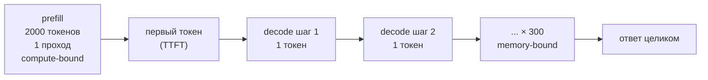
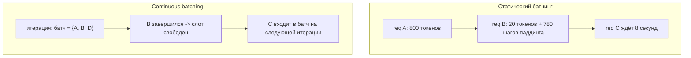

# Инференс LLM

> **Зачем эта глава.** Обучение LLM делают единицы, а обслуживают её в проде почти все. И именно
> здесь ломается интуиция, наработанная на классическом ML: модель, которая «влезла в память»,
> внезапно выдаёт 15 токенов в секунду; батч в 64 раза больше почти не ухудшает задержку;
> квантизация ускоряет генерацию, не меняя число операций. После этой главы вы сможете объяснить
> каждый из этих эффектов через одну величину — арифметическую интенсивность, посчитать размер
> KV-кэша и требуемое железо под заданный RPS, и осмысленно выбрать между vLLM-настройками,
> а не копировать чужой конфиг.

**Уровень:** 🎯 middle → 🧠 middle+
**Предварительно нужно:** [внимание и трансформер](../03-deep-learning/04-attention-and-transformer.md), [устройство современной LLM](01-llm-architecture.md), [PEFT и квантизация](04-peft-and-quantization.md), [архитектуры сервинга](../07-mlops/05-serving-architectures.md)
**Время на проработку:** ~8 часов (чтение + расчёты + прогон бенчмарка)

---

## Карта главы

- [1. Два разных вычисления внутри одного запроса](#1-два-разных-вычисления-внутри-одного-запроса)
- [2. Арифметическая интенсивность: главный инструмент главы](#2-арифметическая-интенсивность-главный-инструмент-главы)
- [3. KV-кэш: зачем он и сколько весит](#3-kv-кэш-зачем-он-и-сколько-весит)
- [4. Почему батчинг разгоняет throughput и почти не трогает latency](#4-почему-батчинг-разгоняет-throughput-и-почти-не-трогает-latency)
- [5. Continuous batching: планирование на уровне итерации](#5-continuous-batching-планирование-на-уровне-итерации)
- [6. PagedAttention: виртуальная память для KV-кэша](#6-pagedattention-виртуальная-память-для-kv-кэша)
- [7. Chunked prefill: как перестать ронять TPOT длинными промптами](#7-chunked-prefill-как-перестать-ронять-tpot-длинными-промптами)
- [8. Speculative decoding](#8-speculative-decoding)
- [9. FlashAttention и квантизация KV-кэша](#9-flashattention-и-квантизация-kv-кэша)
- [10. Сэмплирование: чем крутить и что это делает](#10-сэмплирование-чем-крутить-и-что-это-делает)
- [11. Метрики: TTFT, TPOT, throughput, goodput](#11-метрики-ttft-tpot-throughput-goodput)
- [12. Расчёт железа под нагрузку](#12-расчёт-железа-под-нагрузку)
- [13. Подводные камни](#13-подводные-камни)
- [14. Проверь себя](#14-проверь-себя)
- [15. Практика](#15-практика)
- [16. Что читать дальше](#16-что-читать-дальше)

---

## 1. Два разных вычисления внутри одного запроса

Начнём с наблюдения, которое любой из нас видел в интерфейсе чат-бота: после отправки запроса
есть пауза, а потом текст льётся ровным потоком. Пауза и поток — это не «модель думает, а потом
пишет». Это две физически разные фазы вычисления, у которых разные узкие места, разные метрики
и разные способы оптимизации. Их путают чаще всего, и именно на этом строится собеседовательный
вопрос «почему первый токен медленнее остальных».

**Фаза 1 — prefill (предзаполнение).** Модель получает промпт целиком: скажем, 2000 токенов.
Она прогоняет их через все слои **за один проход**, параллельно по всем позициям — ровно так же,
как на обучении, с причинной маской. На выходе получается распределение для позиции 2001,
из которого сэмплируется первый токен ответа. Побочный, но главный продукт этой фазы — ключи
и значения ($K$ и $V$) для всех 2000 позиций во всех слоях. Их сохраняют.

**Фаза 2 — decode (декодирование).** Дальше модель генерирует авторегрессионно: один токен
за один проход. На шаге $t$ на вход подаётся **ровно один** новый токен, а весь предыдущий
контекст берётся из сохранённых $K$ и $V$. Чтобы получить 300 токенов ответа, нужно 300 проходов
через всю модель, и распараллелить их нельзя: токен $t+1$ зависит от токена $t$.



Разница в форме данных колоссальна. В prefill матричное умножение имеет вид
$(2000 \times d) \times (d \times d)$ — это большая, «жирная» операция, ради которой тензорные
ядра GPU и созданы. В decode то же умножение имеет вид $(1 \times d) \times (d \times d)$ —
это умножение вектора на матрицу. Число операций упало в 2000 раз, а вот **прочитать из памяти
матрицу весов** пришлось ровно столько же. Считать почти нечего, а память гонять всё равно надо.

Отсюда и берётся главное утверждение главы, которое нужно уметь произнести на собеседовании
и, что важнее, обосновать: **prefill упирается в вычисления (compute-bound), decode упирается
в пропускную способность памяти (memory-bound)**.

> 🌱 **База.** Метафора: prefill — это когда вы читаете страницу целиком, decode — когда вы
> пишете от руки букву за буквой, и перед каждой буквой заново достаёте с полки все справочники.
> Достать справочники (веса модели из памяти GPU) стоит одинаково, пишете вы одну букву или сто.
> Вся инженерия инференса — про то, как выписать за одну «ходку к полке» побольше букв.

---

## 2. Арифметическая интенсивность: главный инструмент главы

Формализуем интуицию. Для любой операции на GPU определим **арифметическую интенсивность**
(arithmetic intensity, AI):

$$
\text{AI} \;=\; \frac{\text{число операций с плавающей точкой (FLOP)}}{\text{число байт, прочитанных и записанных в HBM}}
$$

где HBM (high bandwidth memory) — основная память видеокарты, та самая, объём которой указан
в названии (80 ГБ у H100). Единица измерения AI — FLOP на байт.

У каждой карты есть своя «точка перелома» (ridge point) — отношение пиковой вычислительной
производительности к пропускной способности памяти:

$$
\text{AI}^{*} \;=\; \frac{\text{peak FLOP/s}}{\text{bandwidth (байт/с)}}
$$

Если AI операции меньше $\text{AI}^{*}$, операция memory-bound: вычислители простаивают, ожидая
данные. Если больше — compute-bound. Это модель roofline, и она объясняет 90% того, что
происходит на инференсе.

| Карта | Пик BF16 (плотный), TFLOP/s | Пропускная способность HBM | $\text{AI}^{*}$, FLOP/байт |
|---|---|---|---|
| NVIDIA A100 80GB SXM | ≈ 312 | ≈ 2,0 ТБ/с | ≈ 153 |
| NVIDIA H100 SXM | ≈ 990 | ≈ 3,35 ТБ/с | ≈ 295 |

Числа даны на момент написания и для плотных (без структурной разреженности) матричных
операций; сверяйтесь со спецификацией конкретной SKU.

### Считаем AI для линейного слоя

Возьмём один линейный слой с матрицей весов $W \in \mathbb{R}^{d_{in} \times d_{out}}$
и вход из $T$ токенов.

$$
\text{FLOP} = 2\,T\,d_{in}\,d_{out}, \qquad
\text{байт} \approx \underbrace{d_{in} d_{out} b}_{\text{веса}} + \underbrace{T(d_{in}+d_{out})b}_{\text{активации}}
$$

где $T$ — число токенов, обрабатываемых одновременно, $b$ — байт на число (2 для bf16),
двойка в FLOP — потому что умножение с накоплением (MAC) — это две операции.

При $T \ll d_{in}, d_{out}$ слагаемое с активациями пренебрежимо, и мы получаем удивительно
простой результат:

$$
\text{AI} \;\approx\; \frac{2\,T\,d_{in}d_{out}}{d_{in}d_{out}\,b} \;=\; \frac{2T}{b} \;\overset{b=2}{=}\; T
$$

где $T$ — число токенов в одном матричном умножении.

> 📐 **Разбор.** Формула говорит буквально следующее: **арифметическая интенсивность линейных
> слоёв в bf16 численно равна числу токенов, которые вы обрабатываете за один проход.** Веса
> читаются один раз и переиспользуются для всех $T$ токенов — чем больше $T$, тем больше пользы
> с каждого прочитанного байта.

Теперь подставим числа.

**Prefill с промптом 2000 токенов:** $T = 2000$, AI = 2000 ≫ 295. Глубоко compute-bound.
Ускорить можно только увеличив число операций в секунду: тензорные ядра, FP8, лучшие ядра,
больше карт.

**Decode с батчем 1:** $T = 1$, AI = 1 ≪ 295. Мы используем **одну трёхсотую** вычислительной
мощности карты. Всё остальное время карта ждёт память.

**Decode с батчем 256:** $T = 256$ (по одному новому токену от каждой из 256 последовательностей,
и все они умножаются на одни и те же веса), AI = 256 — почти дошли до перелома. Вот откуда
берётся всё, что написано ниже про батчинг.

### Отдельно про само внимание

Линейные слои — не единственная работа при decode. Есть ещё чтение KV-кэша. Посчитаем его AI
для одного слоя и одной последовательности длины $n$:

$$
\text{FLOP}_{\text{attn}} \approx \underbrace{2\,n\,h\,d_{head}}_{QK^\top} + \underbrace{2\,n\,h\,d_{head}}_{\alpha V} = 4\,n\,h\,d_{head},
\qquad
\text{байт}_{\text{attn}} \approx 2\,n\,h_{kv}\,d_{head}\,b
$$

$$
\text{AI}_{\text{attn}} \;=\; \frac{4\,n\,h\,d_{head}}{2\,n\,h_{kv}\,d_{head}\,b} \;=\; \frac{2h}{h_{kv}\,b} \;\overset{b=2}{=}\; \frac{h}{h_{kv}}
$$

где $h$ — число голов запросов, $h_{kv}$ — число KV-голов (см.
[GQA/MQA](01-llm-architecture.md)), $d_{head}$ — размерность головы, $n$ — длина контекста.

Обратите внимание на два свойства этого результата.

Во-первых, $n$ сократилось: длина контекста не влияет на интенсивность внимания, она влияет
только на абсолютный объём.

Во-вторых, и это ключевое: **$T$ (батч) в формулу не входит**. Каждая последовательность имеет
свой собственный KV-кэш, и увеличение батча увеличивает и объём чтения, и объём вычислений
одинаково. Для MHA ($h = h_{kv}$) получаем AI = 1, для GQA 32/8 — AI = 4. И то и другое
чудовищно далеко от 295.

Вывод, который редко проговаривают: батчинг лечит memory-bound характер **линейных слоёв**,
но **не лечит внимание**. Поэтому на длинных контекстах и больших батчах внимание начинает
доминировать во времени decode-шага, и там уже помогают только GQA, квантизация кэша и
специальные ядра (FlashDecoding и родственные).

> 💬 **На собеседовании.** Спросят (middle+): «Какие узкие места бывают в пайплайне инференса
> LLM на современном GPU?»
> Хороший ответ: разделить фазы. Prefill compute-bound — его AI равна длине промпта, она в разы
> выше точки перелома карты (≈295 FLOP/байт у H100), поэтому там борются за MFU: FlashAttention,
> FP8, тензорный параллелизм. Decode memory-bound — его AI равна размеру батча, и при батче 1
> мы используем доли процента вычислителей, а всё время уходит на чтение весов из HBM. Отсюда
> три следствия: батчинг даёт почти линейный рост throughput; квантизация весов ускоряет decode,
> хотя FLOPs не меняются; а внимание остаётся memory-bound при любом батче, потому что KV-кэш
> у каждой последовательности свой.
> Провал: «упирается в GPU» или «в память» без разделения фаз и без числа.

---

## 3. KV-кэш: зачем он и сколько весит

### Зачем

На шаге decode нам нужно посчитать внимание нового токена ко всему префиксу. Для этого нужны
$K$ и $V$ всех предыдущих позиций. Они не зависят от нового токена — значит, пересчитывать их
бессмысленно: это ровно те же числа, что были получены на предыдущих шагах.

Без кэша генерация $m$ токенов после промпта длины $n$ стоила бы
$O\big(\sum_{t=n}^{n+m} t \cdot d^2\big)$ — квадратично по длине. С кэшем — линейно.
Практически разница на контексте в тысячи токенов — десятки раз.

> ⚠️ **Типичная ошибка.** «Кэшируем $Q$, $K$ и $V$». Нет: $Q$ **не кэшируется**. Запрос нужен
> только для текущей позиции — старые запросы больше никогда не понадобятся, потому что каждая
> позиция уже получила свой выход. Кэшируются именно $K$ и $V$, потому что к ним обращаются
> все будущие позиции. Это классический уточняющий вопрос, на котором ловят «слышал про кэш».

### Сколько весит

$$
M_{KV} \;=\; 2 \cdot L \cdot h_{kv} \cdot d_{head} \cdot n \cdot B \cdot b
$$

где двойка — на $K$ и $V$; $L$ — число слоёв; $h_{kv}$ — число KV-голов; $d_{head}$ — размерность
головы; $n$ — длина контекста в токенах (промпт + сгенерированное); $B$ — число одновременно
обслуживаемых последовательностей; $b$ — байт на элемент (2 для fp16/bf16, 1 для fp8/int8).

Удобно считать в два шага: сначала «сколько байт на один токен», потом умножать.

**Llama-3-8B** ($L=32$, $h_{kv}=8$, $d_{head}=128$, bf16):

$$
2 \cdot 32 \cdot 8 \cdot 128 \cdot 2 = 131\,072\ \text{байт} = 128\ \text{КиБ на токен}
$$

- контекст 8k на один запрос: $8192 \cdot 128\ \text{КиБ} = 1{,}0$ ГиБ;
- 64 одновременных запроса по 8k: **64 ГиБ** — при том что веса модели занимают 16 ГБ.
  На H100-80 это уже не влезает.

**Llama-2-7B** (MHA, $h_{kv}=32$): 512 КиБ на токен — вчетверо больше. Именно этот расчёт
и заставил индустрию перейти на GQA.

**Llama-3-70B** ($L=80$, $h_{kv}=8$, $d_{head}=128$): $2\cdot80\cdot8\cdot128\cdot2 = 320$ КиБ
на токен; контекст 8k → 2,5 ГиБ на запрос.

```python
# Калькулятор KV-кэша и «влезет ли». Запускается как есть.
def kv_bytes_per_token(n_layers: int, n_kv_heads: int, d_head: int, dtype_bytes: int = 2) -> int:
    """Байт KV-кэша на один токен одной последовательности. Двойка — на K и на V."""
    return 2 * n_layers * n_kv_heads * d_head * dtype_bytes


def fits(gpu_gb: float, weights_gb: float, per_token: int,
         seq_len: int, batch: int, overhead_gb: float = 3.0) -> tuple[bool, float]:
    """Помещается ли конфигурация; возвращает (влезло, сколько ГБ занято)."""
    kv_gb = per_token * seq_len * batch / 1e9
    total = weights_gb + kv_gb + overhead_gb
    return total <= gpu_gb, total


llama3_8b = kv_bytes_per_token(n_layers=32, n_kv_heads=8, d_head=128)
llama2_7b = kv_bytes_per_token(n_layers=32, n_kv_heads=32, d_head=128)   # MHA — вчетверо больше
print(f"Llama-3-8B (GQA): {llama3_8b / 1024:.0f} КиБ/токен")
print(f"Llama-2-7B (MHA): {llama2_7b / 1024:.0f} КиБ/токен")

for batch in (16, 32, 64, 128):
    ok, total = fits(gpu_gb=80, weights_gb=16, per_token=llama3_8b, seq_len=8192, batch=batch)
    print(f"batch={batch:3d}, ctx=8k: {total:6.1f} ГБ -> {'влезает' if ok else 'OOM'}")
```

> 💬 **На собеседовании.** Спросят (middle+): «Посчитайте размер KV-кэша». Это буквальная
> формулировка из банков вопросов, и её задают, чтобы проверить, умеете ли вы считать VRAM,
> а не перечислять техники.
> Хороший ответ: назвать формулу $2 L h_{kv} d_{head} n B b$, объяснить каждый множитель,
> посчитать «байт на токен» для конкретной модели и умножить. Сильный ход — сразу сказать,
> к чему это приводит: кэш линеен по батчу и по длине, поэтому именно он, а не веса, ограничивает
> максимальное число одновременных запросов, а значит и throughput.
> Провал: «зависит от модели» без попытки посчитать; или посчитать без множителя 2 на $K$ и $V$;
> или использовать $h$ вместо $h_{kv}$ у модели с GQA.

---

## 4. Почему батчинг разгоняет throughput и почти не трогает latency

Соберём модель времени одного decode-шага. Мы читаем веса (один раз на весь батч) и KV-кэш
(свой у каждой последовательности):

$$
t_{\text{step}} \;\approx\; \max\!\left(
\frac{M_{w} + B \cdot M_{kv}^{(1)}}{\text{BW}_{\text{eff}}},\;
\frac{2 N B}{\text{FLOPS}_{\text{eff}}}
\right)
$$

где $M_w$ — объём весов в байтах, $M_{kv}^{(1)}$ — KV-кэш одной последовательности,
$B$ — размер батча, $\text{BW}_{\text{eff}}$ — реально достижимая пропускная способность
(обычно 65–80% от пиковой), $N$ — число параметров модели, $\text{FLOPS}_{\text{eff}}$ —
реально достижимая производительность.

Подставим Llama-3-8B в bf16 на H100: $M_w = 16$ ГБ, $\text{BW}_{\text{eff}} = 2{,}4$ ТБ/с,
$\text{FLOPS}_{\text{eff}} = 500$ ТФЛОПС, средняя длина контекста 1024 токена
($M_{kv}^{(1)} = 1024 \cdot 128\ \text{КиБ} = 0{,}134$ ГБ).

| Батч $B$ | Чтение за шаг | TPOT | Throughput | Ускорение |
|---|---|---|---|---|
| 1 | 16,1 ГБ | 6,7 мс | 149 ток/с | 1,0× |
| 8 | 17,1 ГБ | 7,1 мс | 1 130 ток/с | 7,6× |
| 32 | 20,3 ГБ | 8,5 мс | 3 800 ток/с | 25× |
| 64 | 24,6 ГБ | 10,2 мс | 6 300 ток/с | 42× |
| 128 | 33,2 ГБ | 13,8 мс | 9 300 ток/с | 62× |
| 256 | 50,3 ГБ | 21,0 мс | 12 200 ток/с | 82× |
| 512 | 84,6 ГБ | — | — | не влезает в 80 ГБ |

Прочитайте таблицу внимательно, потому что она содержит главный практический факт сервинга LLM:
**увеличив батч в 256 раз, мы ухудшили задержку на токен в 3 раза, а пропускную способность
подняли в 82 раза.** Это соотношение и есть причина, по которой любой серьёзный сервинг
LLM — батчевый.

Механизм прост: 16 ГБ весов читаются один раз независимо от батча. При $B=1$ эти 16 ГБ окупаются
одним токеном, при $B=256$ — двумястами пятьюдесятью шестью. Растёт только вклад KV-кэша,
и он линеен по батчу — именно поэтому кривая throughput постепенно выполаживается, а на
$B=512$ мы упираемся уже не во время, а в объём памяти.

> ⚠️ **Типичная ошибка.** Сказать «батчинг ухудшает латентность» и остановиться. Ухудшает,
> но не так, как думают: TPOT растёт медленно, а вот **время ожидания в очереди** при статическом
> батчинге растёт быстро, и именно оно портит пользовательский опыт. Чинится это не отказом
> от батчинга, а сменой его схемы — см. следующий раздел.

---

## 5. Continuous batching: планирование на уровне итерации

### Проблема статического батчинга

Классическая схема (её называют static batching): собрали $B$ запросов, прогнали их вместе
до конца, вернули результаты, взяли следующие $B$. Для классификатора это идеально. Для генерации
— катастрофа, и вот почему.

Длины ответов в батче разные: один запрос завершится через 20 токенов, другой через 800.
Все шаги после 20-го первый запрос «генерирует» паддинг: он занимает слот в батче, за него
читается KV-кэш, но полезной работы нет. При типичном разбросе длин ответов полезная загрузка
батча падает до 30–50%.

Хуже другое: новый запрос, пришедший через 5 мс после старта батча, ждёт завершения **самого
длинного** запроса в батче. При ответе в 800 токенов и TPOT 10 мс это 8 секунд ожидания
до начала обработки.

### Решение

**Continuous batching** (его же называют iteration-level scheduling, in-flight batching) —
планирование на уровне одной итерации генерации, а не на уровне запроса. Идея, предложенная
в системе Orca (Yu et al., OSDI 2022) и ставшая стандартом:

1. После **каждого** decode-шага планировщик пересматривает состав батча.
2. Завершившиеся последовательности немедленно покидают батч, освобождая слот и память.
3. Ждущие запросы немедленно занимают освободившееся место — им делается prefill,
   и со следующей итерации они декодируют вместе со всеми.



Эффект: полезная загрузка батча приближается к 100%, ожидание в очереди падает с «время самого
длинного ответа» до «время одной итерации» при наличии свободной памяти. В статье про vLLM
и в последующих замерах прирост throughput относительно наивного сервинга — в разы; конкретное
число зависит от разброса длин: чем он выше, тем больше выигрыш.

> 💬 **На собеседовании.** Спросят (middle+): «Что такое continuous batching и чем он отличается
> от статического?»
> Хороший ответ: статический батчинг группирует **запросы** и держит группу до завершения самого
> длинного; continuous batching планирует **итерации** — после каждого шага генерации завершённые
> последовательности выбывают, а ожидающие входят. Выигрыш двойной: нет холостых шагов на
> уже завершённых запросах и нет ожидания head-of-line в очереди. Ограничение: чтобы новый запрос
> вошёл в батч, для него должна быть свободная память под KV-кэш — поэтому continuous batching
> идёт в паре с PagedAttention, иначе фрагментация съедает выигрыш.
> Провал: «это когда батч динамически подстраивается» — это описание динамического батчинга
> (объединения запросов в окне ожидания), а он про другое и применяется к обычным моделям.

---

## 6. PagedAttention: виртуальная память для KV-кэша

Continuous batching создаёт новую проблему: память под KV-кэш нужно выдавать и забирать
динамически, а сколько токенов сгенерирует запрос — заранее неизвестно.

### Как было

Наивная реализация выделяет каждой последовательности **непрерывный** буфер на максимально
возможную длину: `max_model_len` токенов. Если модель поддерживает 8192, а запрос уложился
в 300 токенов, 96% выделенной памяти простаивает. Это внутренняя фрагментация. Плюс внешняя:
после ухода нескольких запросов свободная память нарезана на куски, в которые новый большой
запрос не помещается, хотя суммарно места хватает. Замеры авторов vLLM показали, что в таких
системах полезно использовалось 20–40% памяти, отведённой под кэш.

### Как стало

**PagedAttention** переносит на KV-кэш идею страничной виртуальной памяти из операционных систем:

- Память под кэш нарезается на **блоки** фиксированного размера — обычно 16 токенов на блок
  на слой.
- Каждая последовательность описывается **таблицей блоков** (block table): логический индекс
  блока → физический адрес. Блоки одной последовательности физически лежат где угодно.
- Ядро внимания умеет читать $K$ и $V$ по таблице, а не по непрерывному адресу.

Следствия:

**Фрагментация исчезает.** Внешней нет вообще (все блоки одного размера), внутренняя ограничена
последним, неполным блоком — в среднем полблока, то есть 8 токенов на последовательность вместо
тысяч. Использование памяти под кэш поднимается выше 95%.

**Появляется разделение памяти между запросами.** Если два запроса имеют общий префикс (общий
системный промпт, общий few-shot-блок, параллельное сэмплирование $n$ вариантов одного промпта),
их таблицы могут указывать на **одни и те же физические блоки**. Копирование происходит только
при записи — copy-on-write, как в fork(). Это техническая основа prefix caching (см. §7 и
[главу про прод](11-llm-in-production.md)).

**Появляется вытеснение.** Если памяти не хватило, планировщик может выгрузить (swap) или
просто отбросить (recompute) кэш низкоприоритетной последовательности и пересчитать его позже.
Раньше вариантов, кроме отказа в обслуживании, не было.

> 🧠 **Middle+.** Важно чётко разделять: PagedAttention **не уменьшает** объём KV-кэша — те же
> 128 КиБ на токен. Он убирает **потери** на фрагментацию и предзаполнение. Уменьшают объём
> другие вещи: GQA/MQA (делит $h_{kv}$), квантизация кэша (делит $b$), скользящее окно и
> компрессия кэша (ограничивают $n$). Путаница здесь — частая причина неточного ответа.

> ⚠️ **Типичная ошибка.** Считать `gpu_memory_utilization` в vLLM долей памяти под KV-кэш.
> На самом деле это доля **всей** памяти карты, которую движок имеет право занять: сюда входят
> веса, активации и кэш. Кэш получает остаток. Поэтому при значении 0,90 на H100-80 и модели
> на 16 ГБ под кэш уйдёт примерно $0{,}90\cdot80 - 16 - \text{overhead} \approx 53$ ГБ,
> а не 72.

---

## 7. Chunked prefill: как перестать ронять TPOT длинными промптами

Теперь у нас есть смешанная нагрузка: одни запросы в фазе prefill, другие в фазе decode.
Как их совмещать?

Наивный планировщик отдаёт приоритет prefill: пришёл запрос — обработали промпт, потом вернулись
к декодированию. Проблема в том, что prefill промпта на 8000 токенов для модели 8B занимает
порядка 8000 · 16 ГФЛОП / 445 ТФЛОПС ≈ 290 мс. Всё это время **все остальные пользователи
не получают ни одного токена**. В логах это выглядит как регулярные всплески TPOT с 10 мс
до 300 мс — поток текста у пользователя «заикается».

**Chunked prefill** (предложен в системе SARATHI, Agrawal et al., 2023) режет prefill на куски
фиксированного размера — скажем, по 512 токенов — и подмешивает по одному куску в каждый
decode-батч. Планировщик формирует батч с бюджетом токенов `max_num_batched_tokens`: сначала
берёт все активные decode-последовательности (по одному токену каждая), потом добивает остаток
бюджета куском чьего-то prefill.

Компромисс честный и его надо проговаривать:

| | Prefill-приоритет | Chunked prefill |
|---|---|---|
| TTFT для длинных промптов | лучше | чуть хуже (prefill растянут) |
| TPOT для активных запросов | всплески до сотен мс | ровный |
| Утилизация GPU | скачет | выше и стабильнее |
| p99 по TPOT | плохой | хороший |

Практически: если у вас интерактивный чат со стримингом, ровный TPOT важнее, чем 30 мс
на TTFT, и chunked prefill нужен. Если у вас офлайн-обработка документов, где важна только
общая пропускная способность, он менее интересен.

Радикальное развитие той же идеи — **разнесение фаз** (disaggregated serving, системы
Splitwise и DistServe, 2024): prefill выполняется на одном пуле GPU, decode — на другом,
KV-кэш передаётся между ними по быстрому интерконнекту. Это позволяет подбирать под каждую фазу
своё железо и свою степень параллелизма. На момент написания подход есть в проде у крупных
провайдеров и постепенно появляется в открытых движках.

```python
# vLLM: типовой конфиг под интерактивный чат. Актуально на момент написания (осень 2025),
# API движка меняется — сверяйтесь с docs.vllm.ai.
from vllm import LLM, SamplingParams

llm = LLM(
    model="meta-llama/Meta-Llama-3-8B-Instruct",
    dtype="bfloat16",
    gpu_memory_utilization=0.90,   # доля ВСЕЙ памяти карты движку, не только под кэш
    max_model_len=8192,            # больше окно -> меньше запросов влезет в кэш
    enable_prefix_caching=True,    # переиспользовать KV общего префикса между запросами
    enable_chunked_prefill=True,   # ровный TPOT вместо всплесков на длинных промптах
    max_num_batched_tokens=2048,   # бюджет токенов на итерацию: меньше -> ровнее TPOT
    kv_cache_dtype="fp8",          # вдвое меньше кэш -> вдвое больше одновременных запросов
)

params = SamplingParams(temperature=0.7, top_p=0.95, max_tokens=512, repetition_penalty=1.05)
for out in llm.generate(["Объясни, что такое KV-кэш, за три предложения."], params):
    print(out.outputs[0].text)
```

---

## 8. Speculative decoding

Вернёмся к главному факту: при батче 1 мы используем сотую долю вычислителей. Возникает
естественный вопрос — нельзя ли потратить простаивающие FLOPs на что-то полезное?

Можно. **Спекулятивное декодирование** (speculative decoding) устроено так:

1. Дешёвая **черновая модель** (draft model) — например, 1B рядом с 70B, или отдельные
   предсказательные головы поверх той же модели — генерирует $\gamma$ токенов подряд
   (типично $\gamma = 3\ldots8$). Это быстро: модель маленькая.
2. Большая **целевая модель** (target model) прогоняет все $\gamma+1$ позиций **за один проход**.
   Для неё это prefill-подобная операция с $T = \gamma+1$, то есть почти бесплатная относительно
   одного decode-шага — она всё равно была memory-bound.
3. Специальная процедура принятия (modified rejection sampling) принимает префикс черновика
   и отбрасывает остаток начиная с первого «неугаданного» токена; на месте отказа
   сэмплируется токен из скорректированного распределения.

Ключевое свойство, ради которого метод и признан: **распределение выходов в точности совпадает
с распределением целевой модели**. Это не приближение и не «почти то же самое» — это математически
эквивалентная процедура сэмплирования. Доказательство есть в обеих исходных статьях
(Leviathan et al., 2022; Chen et al., 2023).

### Сколько это даёт

Пусть $\alpha$ — вероятность принять очередной черновой токен (acceptance rate). Тогда ожидаемое
число токенов, полученных за один вызов целевой модели:

$$
\mathbb{E}[\text{токенов}] \;=\; \frac{1 - \alpha^{\gamma+1}}{1 - \alpha}
$$

где $\alpha \in (0,1)$ — вероятность принятия одного токена, $\gamma$ — длина черновика.
Формула — сумма геометрической прогрессии: первый токен принимается с вероятностью $\alpha$,
первые два — $\alpha^2$, и так далее, плюс всегда гарантированный один токен от целевой модели.

Ускорение с учётом стоимости черновика:

$$
\text{speedup} \;=\; \frac{1 - \alpha^{\gamma+1}}{(1-\alpha)\,(1 + \gamma c)}
$$

где $c$ — отношение стоимости одного шага черновой модели к стоимости одного шага целевой
(для пары 1B/70B это порядка 0,02–0,05).

Посчитаем: $\alpha = 0{,}7$, $\gamma = 4$, $c = 0{,}05$:

$$
\mathbb{E}[\text{токенов}] = \frac{1-0{,}7^5}{0{,}3} = \frac{0{,}832}{0{,}3} = 2{,}77;
\qquad
\text{speedup} = \frac{2{,}77}{1 + 0{,}2} = 2{,}3\times
$$

```python
# От чего зависит выигрыш спекулятивного декодирования — считаем, а не гадаем.
def spec_speedup(alpha: float, gamma: int, draft_cost_ratio: float) -> tuple[float, float]:
    """alpha — доля принятых токенов, gamma — длина черновика,
    draft_cost_ratio — стоимость шага черновой модели в долях от целевой."""
    expected_tokens = (1 - alpha ** (gamma + 1)) / (1 - alpha)
    cost = 1 + gamma * draft_cost_ratio
    return expected_tokens, expected_tokens / cost


for alpha in (0.5, 0.7, 0.9):
    for gamma in (1, 3, 5, 8):
        tokens, speedup = spec_speedup(alpha, gamma, draft_cost_ratio=0.05)
        print(f"alpha={alpha}, gamma={gamma}: {tokens:.2f} токенов/проверку, ускорение {speedup:.2f}x")
```

Запустив это, вы увидите две вещи. Во-первых, при низком $\alpha$ увеличение $\gamma$ почти
не помогает: черновик всё равно отвергается на втором-третьем токене, а платить за него
приходится. Во-вторых, при $\alpha = 0{,}9$ и $\gamma = 8$ ускорение подбирается к 4×.

### От чего зависит $\alpha$ и когда метод не работает

$\alpha$ — это согласованность черновой и целевой моделей. Она высокая, когда:
- черновая модель обучена на тех же данных и токенизаторе (идеально — дистиллирована из целевой);
- текст предсказуем: код, разметка, структурированный вывод, шаблонные ответы — там $\alpha$
  доходит до 0,85–0,95;
- температура низкая (при greedy согласованность максимальна).

И низкая на творческой генерации при высокой температуре, на редких доменах и на длинных
рассуждениях.

**Главное ограничение, которое надо назвать самому.** Спекулятивное декодирование окупается
только в **memory-bound** режиме, то есть при малом батче. Когда сервер работает под нагрузкой
с батчем 128, GPU уже загружен вычислениями, и проверка $\gamma+1$ позиций для каждой из 128
последовательностей — это реальные дополнительные FLOPs. Выигрыш падает, а при высоком отказе
черновика метод уходит в минус по throughput. Поэтому в проде его включают либо для одиночных
низколатентных запросов (интерактивный агент, автодополнение кода), либо адаптивно: планировщик
отключает спекуляцию при росте нагрузки.

Варианты без отдельной черновой модели: **Medusa** (несколько дополнительных голов поверх
последнего слоя предсказывают токены $t+1, t+2, \ldots$), **EAGLE** (черновик строится
по признакам предпоследнего слоя целевой модели), **n-gram / prompt lookup decoding** (черновик
берётся копированием из самого промпта — бесплатно и отлично работает в задачах вроде
суммаризации и редактирования, где ответ во многом повторяет вход).

> 💬 **На собеседовании.** Спросят (middle+): «Что такое speculative decoding и когда его
> использовать?»
> Хороший ответ: механизм (draft → одна проверка целевой моделью → rejection sampling,
> сохраняющий распределение), формула ожидаемого числа токенов, зависимость от acceptance rate
> и — обязательно — оговорка про режим: метод конвертирует свободные FLOPs в скорость, поэтому
> помогает при малом батче и деградирует при высокой загрузке. Плюс упомянуть варианты без
> отдельной модели и то, что качество не меняется по построению.
> Провал: «модель предсказывает несколько токенов вперёд, поэтому быстрее» — без объяснения,
> почему проверка дешёвая, и без условия применимости.

---

## 9. FlashAttention и квантизация KV-кэша

### FlashAttention

Устройство attention и то, почему матрица $(B, h, n, n)$ не должна материализоваться в HBM,
разобрано в главе про [внимание и трансформер](../03-deep-learning/04-attention-and-transformer.md#11-сложность-память-и-что-из-этого-следует).
Здесь важны только выводы для инференса.

FlashAttention — это **точное** вычисление внимания с другим порядком операций: блочная
обработка в быстрой SRAM с онлайн-пересчётом softmax, без записи полной матрицы весов в HBM.
Никакого приближения, результат бит-в-бит сопоставим (с точностью до порядка суммирования).

- **На prefill** он даёт основной выигрыш: убирает $O(n^2)$ обращений к HBM и снижает пиковую
  память с квадратичной до линейной по $n$. Именно он делает длинные контексты вообще возможными.
- **На decode** классический FlashAttention помогает мало: там $n_q = 1$, матрица весов —
  вектор, материализовать нечего. Для decode нужны другие ядра (FlashDecoding и родственные),
  которые распараллеливают чтение KV-кэша по длине контекста, а не по батчу и головам —
  иначе при батче 1 и длинном контексте загружены единицы SM из сотни.

Практический вывод: в 2025 году вам почти никогда не надо включать это руками — vLLM, SGLang,
TensorRT-LLM и `transformers` подтягивают подходящее ядро сами. Знать надо, чтобы (а) понимать
профиль и (б) не путать точный метод с приближёнными.

### Квантизация KV-кэша

Раз кэш ограничивает батч, а батч определяет throughput, уменьшение $b$ в формуле $M_{KV}$ —
самый прямой рычаг. Переход bf16 → fp8 (формат E4M3) или int8 **вдвое** уменьшает кэш:

- Llama-3-8B, контекст 8k: 1,0 ГиБ на запрос → 0,5 ГиБ;
- на H100-80 с весами 16 ГБ доступно ~55 ГБ под кэш: 55 запросов вместо 55/2 — то есть батч
  вырастает вдвое;
- по таблице из §4 удвоение батча в memory-bound режиме даёт прирост throughput примерно
  в 1,4–1,8× (не в 2×, потому что растёт и объём чтения кэша).

Что с качеством. Кэш квантизуют **по-канально с масштабами** (per-head или per-channel scales),
и на большинстве задач деградация в пределах шума. Тонкие места:
- ключи $K$ чувствительнее значений $V$ — там есть выбросы по каналам, поэтому иногда $K$
  оставляют в 8 битах, а $V$ жмут сильнее;
- int4-кэш уже заметно бьёт по длинному контексту и по задачам точного извлечения фактов
  («найди число в документе»);
- ошибки **накапливаются**: квантованные $K,V$ ранних токенов влияют на все последующие шаги.
  Поэтому проверять надо не на коротких промптах, а на своей реальной длине контекста.

Ещё один смежный рычаг — **FP8 для весов и активаций** на картах Hopper/Ada: он ускоряет и
prefill (вдвое больше FLOPs), и decode (вдвое меньше чтения весов). На момент написания это
основной «бесплатный» апгрейд для тех, у кого есть H100/H200/L40S.

---

## 10. Сэмплирование: чем крутить и что это делает

На выходе модели — вектор логитов $z \in \mathbb{R}^{|V|}$ по словарю. Как из него получить токен —
отдельное решение, влияющее на качество сильнее, чем принято думать.

### Температура

$$
p_i \;=\; \frac{\exp(z_i / T)}{\sum_{j=1}^{|V|} \exp(z_j / T)}
$$

где $z_i$ — логит токена $i$, $T > 0$ — температура, $|V|$ — размер словаря.

$T \to 0$ вырождает распределение в one-hot по argmax (это ровно **greedy decoding**;
на практике библиотеки при `temperature=0` просто переключаются на argmax, чтобы не делить
на ноль). $T = 1$ — исходное распределение модели. $T > 1$ сглаживает: редкие токены получают
больше шансов.

Типичные значения: **0** для извлечения данных, классификации, генерации кода, любого случая,
где нужна воспроизводимость; **0,6–0,8** для делового текста и ассистента; **0,9–1,1** для
творческой генерации. Выше 1,2 в проде почти не встречается — растёт доля бессвязного.

### Top-k

Оставляем $k$ токенов с наибольшими логитами, остальным ставим $-\infty$, перенормируем.
Типично $k = 40\ldots50$.

Слабое место: $k$ фиксировано, а «уверенность» модели — нет. Там, где распределение острое
(после «Столица Франции —»), 40 кандидатов включают заведомый мусор. Там, где оно плоское
(начало абзаца), 40 кандидатов могут отсечь много осмысленного.

### Top-p (nucleus sampling)

Сортируем токены по убыванию вероятности и берём **минимальный** префикс, суммарная вероятность
которого не меньше $p$:

$$
S_p = \arg\min_{S \subseteq V} |S| \quad \text{при условии} \quad \sum_{i \in S} p_i \ge p
$$

где $S_p$ — «ядро» (nucleus), $p \in (0, 1]$ — порог массы.

Размер ядра **адаптивен**: на уверенных шагах в него попадает 1–3 токена, на неуверенных —
сотни. Это и есть ответ на вопрос «чем top-p лучше top-k». Типично $p = 0{,}9\ldots0{,}95$.
Метод предложен в статье про вырождение генерации (Holtzman et al., 2019), где заодно показано,
почему чистый greedy и beam search на открытой генерации скатываются в повторы: они выбирают
слишком вероятные продолжения, а человеческий текст статистически «менее вероятен», чем максимум
модели.

### Штрафы за повторы

Три разных механизма, которые постоянно путают:

- **repetition penalty** (мультипликативный, из работы про CTRL): логиты уже встречавшихся
  токенов делятся на $\theta > 1$, если положительны, и умножаются на $\theta$, если отрицательны
  (именно так реализовано в `transformers`). Типично $\theta = 1{,}05\ldots1{,}15$; выше 1,2
  начинает ломать нормальный текст — модель перестаёт повторять артикли, имена, термины.
- **frequency penalty** (аддитивный): $z_i \leftarrow z_i - \alpha \cdot \text{count}_i$ —
  штраф растёт с числом вхождений.
- **presence penalty** (аддитивный): $z_i \leftarrow z_i - \beta \cdot \mathbb{1}[\text{count}_i > 0]$ —
  фиксированный штраф за сам факт появления.

Порядок применения важен: сначала штрафы к логитам, затем температура, затем top-k/top-p,
затем сэмплирование. Если сделать наоборот, штраф применится к уже обрезанному распределению
и почти ничего не изменит.

```python
# Сэмплирование с нуля: порядок операций такой же, как в transformers/vLLM.
import torch


def sample_next(logits: torch.Tensor, generated: list[int], *, temperature: float = 1.0,
                top_k: int = 0, top_p: float = 1.0, repetition_penalty: float = 1.0) -> int:
    """logits: (vocab,) — сырые логиты последней позиции. Возвращает id следующего токена."""
    logits = logits.clone()

    # 1) Штраф за повторы — ДО температуры, иначе он почти не влияет на итоговое распределение.
    if repetition_penalty != 1.0 and generated:
        idx = torch.tensor(sorted(set(generated)), device=logits.device)
        seen = logits[idx]
        logits[idx] = torch.where(seen < 0, seen * repetition_penalty, seen / repetition_penalty)

    # 2) Greedy — это предел при T -> 0; отдельная ветка, чтобы не делить на ноль.
    if temperature <= 0:
        return int(torch.argmax(logits))
    logits = logits / temperature

    # 3) Top-k: жёсткая отсечка по рангу.
    if top_k > 0:
        kth = torch.topk(logits, min(top_k, logits.numel())).values[-1]
        logits[logits < kth] = float("-inf")

    # 4) Top-p: адаптивная отсечка по накопленной массе.
    if top_p < 1.0:
        sorted_logits, sorted_idx = torch.sort(logits, descending=True)
        cumprobs = torch.softmax(sorted_logits, dim=-1).cumsum(dim=-1)
        remove = cumprobs - torch.softmax(sorted_logits, dim=-1) >= top_p  # самый вероятный всегда остаётся
        logits[sorted_idx[remove]] = float("-inf")

    probs = torch.softmax(logits, dim=-1)
    return int(torch.multinomial(probs, num_samples=1))


if __name__ == "__main__":
    torch.manual_seed(0)
    logits = torch.tensor([5.0, 4.5, 1.0, 0.5, -2.0, -3.0])
    print("greedy      :", sample_next(logits, [], temperature=0.0))
    print("T=1, top_p=0.9:", [sample_next(logits, [], temperature=1.0, top_p=0.9) for _ in range(10)])
    print("T=2, top_p=1.0:", [sample_next(logits, [], temperature=2.0) for _ in range(10)])
```

### Что выбирать

| Задача | Настройки | Почему |
|---|---|---|
| Извлечение полей, классификация, JSON | `temperature=0` | нужна воспроизводимость и максимум точности |
| Генерация кода | `temperature=0…0.2`, `top_p=0.95` | синтаксис не терпит творчества |
| Ассистент, деловой текст | `temperature=0.7`, `top_p=0.95`, `repetition_penalty=1.05` | баланс связности и живости |
| Творческий текст, идеи | `temperature=0.9…1.1`, `top_p=0.95` | нужно разнообразие |
| Перевод, суммаризация | `temperature=0…0.3` либо beam search | задача близка к «одному правильному ответу» |
| Self-consistency, ансамбль ответов | `temperature=0.7…1.0`, $n$ сэмплов | нужна вариативность для голосования |

> 💬 **На собеседовании.** Спросят (junior/middle): «Объясните температуру, top-k и top-p.
> Что происходит при temperature=0?»
> Хороший ответ: температура — делитель логитов перед softmax, она меняет остроту распределения,
> но не порядок токенов; при $T \to 0$ это greedy decoding, детерминированный argmax. Top-k
> отсекает по фиксированному рангу, top-p — по накопленной вероятностной массе, поэтому размер
> отбора адаптивен: на уверенных шагах узкий, на неуверенных широкий. Сильное дополнение —
> почему greedy плох на открытой генерации: он скатывается в повторы, потому что человеческий
> текст не является цепочкой самых вероятных токенов.
> Провал: «температура делает модель креативнее» без формулы и «top-p лучше top-k» без объяснения
> адаптивности.

> ⚠️ **Типичная ошибка.** Ждать полной детерминированности при `temperature=0` на сервере
> с батчингом. Argmax детерминирован, а вот сами логиты — нет: порядок редукции в матричных
> операциях зависит от размера батча и выбранного ядра, и разница в последнем бите fp16
> изредка меняет argmax при близких логитах. На практике это даёт единицы процентов расхождений
> между прогонами. Если нужна воспроизводимость на уровне «бит в бит» — фиксируйте батч
> и версию движка, а лучше не полагайтесь на это в тестах.

---

## 11. Метрики: TTFT, TPOT, throughput, goodput

Одна цифра «латентность» здесь не работает — нужны четыре.

**TTFT (time to first token)** — от прихода запроса до первого токена ответа. Складывается
из ожидания в очереди и времени prefill:

$$
\text{TTFT} \;\approx\; t_{\text{queue}} \;+\; \frac{2 N n_{\text{prompt}}}{\text{FLOPS}_{\text{eff}}}
$$

где $N$ — число параметров, $n_{\text{prompt}}$ — длина промпта, $\text{FLOPS}_{\text{eff}}$ —
достижимая производительность (обычно 35–50% от пиковой на prefill).

Для 8B и промпта 800 токенов при 445 ТФЛОПС: $2\cdot8\cdot10^9\cdot800/445\cdot10^{12} \approx 29$ мс.
Для 70B и промпта 8000 токенов на четырёх картах (эффективно ~1500 ТФЛОПС):
$2\cdot70\cdot10^9\cdot8000/1{,}5\cdot10^{15} \approx 750$ мс. Разница в 25 раз — вот почему
на длинных контекстах TTFT становится главной проблемой, и вот зачем нужен prefix caching.

**TPOT (time per output token)**, он же ITL (inter-token latency) — среднее время между
токенами в потоке. Именно он определяет, «льётся» текст или «капает». Ориентир: человек
комфортно читает 6–10 токенов в секунду, так что TPOT ниже ~100 мс уже воспринимается как
«быстрее, чем я читаю»; ниже 30 мс разницу почти не заметно.

**Полная задержка:**

$$
\text{Latency} \;=\; \text{TTFT} \;+\; \text{TPOT} \cdot (n_{\text{out}} - 1)
$$

где $n_{\text{out}}$ — число сгенерированных токенов. Обратите внимание: при ответе в 500 токенов
и TPOT 20 мс генерация занимает 10 секунд, и оптимизация TTFT со 100 мс до 30 мс не меняет
ничего. Всегда смотрите, какое слагаемое доминирует.

**Throughput** — измеряют в выходных токенах в секунду на систему (или на GPU) и в запросах
в секунду. Не путайте с «токенами в секунду на пользователя» — это $1/\text{TPOT}$, совсем
другая величина.

**Goodput** — число запросов в секунду, укладывающихся **одновременно во все** SLO. Это самая
честная метрика сервинга, и вот зачем она нужна.

Представьте, что вы максимизируете throughput: поднимаете батч до 512, ставите prefill-приоритет,
получаете 14 000 ток/с в отчёте. При этом TPOT вырос до 40 мс с всплесками до 300, а TTFT
под нагрузкой — до 5 секунд. Если ваш SLO «TTFT p95 < 1 с и TPOT p95 < 50 мс», то **ни один**
запрос его не выполняет: throughput 14 000, goodput 0. Метрика goodput делает этот провал
видимым, а «средний throughput» — маскирует.

> 💬 **На собеседовании.** Спросят (middle+): «Как вы измеряете производительность LLM-инференса?»
> Хороший ответ: назвать четыре величины и связать их с фазами. TTFT определяется prefill
> и очередью, TPOT — decode-шагом, полная задержка — их линейной комбинацией с длиной ответа,
> throughput — суммарной пропускной способностью системы. Дальше — обязательно про компромисс:
> throughput и латентность тянут в разные стороны через размер батча, поэтому осмысленная целевая
> метрика — goodput под заданными SLO. И про перцентили: смотреть p95/p99, а не среднее, потому
> что continuous batching даёт длинный хвост для запросов, попавших в момент пиковой нагрузки.
> Провал: назвать только «latency и throughput» без разделения TTFT/TPOT — сразу видно, что
> человек не отлаживал стриминг.

---

## 12. Расчёт железа под нагрузку

Это задача, которую дают на system design: «сколько GPU нужно под такую нагрузку». Разберём
её целиком.

**Дано.** Ассистент внутри продукта. Пик 20 RPS. Средний промпт 800 токенов (системный промпт
плюс контекст диалога), средний ответ 300 токенов. SLO: TTFT p95 < 1 с, TPOT p95 < 50 мс.
Модель — Llama-3-8B в bf16. Железо — H100-80.

**Шаг 1. Переводим RPS в потоки токенов.**

- prefill: $20 \cdot 800 = 16\,000$ входных токенов/с;
- decode: $20 \cdot 300 = 6\,000$ выходных токенов/с.

**Шаг 2. Считаем ёмкость одной карты по prefill.**

Стоимость прямого прохода — примерно $2N$ FLOP на токен, для 8B это 16 ГФЛОП. При эффективных
445 ТФЛОПС (45% MFU):

$$
\text{ёмкость}_{\text{prefill}} = \frac{445 \cdot 10^{12}}{16 \cdot 10^{9}} \approx 27\,800\ \text{ток/с}
$$

Значит наш поток prefill займёт $16\,000/27\,800 = 0{,}58$ карто-секунды в секунду.

**Шаг 3. Считаем ёмкость по decode.**

Берём таблицу из §4. Нужный уровень параллелизма определяется законом Литтла: среднее число
одновременных запросов = RPS × среднее время в системе. Время в системе ≈ TTFT + 300·TPOT ≈
0,03 + 300·0,010 ≈ 3,03 с, значит одновременно в работе примерно $20 \cdot 3{,}03 \approx 61$
запрос. По таблице при батче 64 карта выдаёт ≈ 6 300 ток/с при TPOT 10,2 мс.

Наш поток decode 6 000 ток/с займёт $6\,000/6\,300 = 0{,}95$ карто-секунды в секунду.

**Шаг 4. Складываем и добавляем запас.**

$$
0{,}58 + 0{,}95 = 1{,}53\ \text{карты при 100\% утилизации}
$$

Целиться в 100% нельзя: очереди при пуассоновском потоке взрывают p95 задолго до этого. Разумный
таргет средней утилизации — 60–70%:

$$
\frac{1{,}53}{0{,}65} \approx 2{,}4 \;\Rightarrow\; \textbf{3 карты H100-80}
$$

Три карты также дают N+1: переживание выхода одной из строя без нарушения SLO.

**Шаг 5. Проверяем память.** На каждой карте: веса 16 ГБ + KV на ~21 запрос по 1100 токенов
(0,134 ГБ) ≈ 2,9 ГБ + накладные 3 ГБ ≈ 22 ГБ из 80. Памяти вагон — значит, окно контекста
можно поднять до 32k или включить более агрессивный батчинг под пиковые всплески.

**Шаг 6. Проверяем SLO.** TTFT ≈ 29 мс prefill + очередь. При утилизации 50% и chunked prefill
очередь добавляет десятки миллисекунд — укладываемся с запасом. TPOT 10 мс против SLO 50 мс —
запас пятикратный, что даёт свободу поднять батч в пиках.

```python
# Тот же расчёт как функция — удобно прогонять сценарии на собеседовании и в планировании.
def gpus_needed(rps: float, prompt_tokens: int, output_tokens: int,
                n_params: float, eff_tflops: float, decode_capacity_tok_s: float,
                target_utilization: float = 0.65) -> dict:
    flop_per_token = 2 * n_params
    prefill_capacity = eff_tflops * 1e12 / flop_per_token          # токенов/с на карту
    prefill_load = rps * prompt_tokens / prefill_capacity          # карто-секунд в секунду
    decode_load = rps * output_tokens / decode_capacity_tok_s
    raw = prefill_load + decode_load
    return {
        "prefill_capacity_tok_s": round(prefill_capacity),
        "prefill_load_gpus": round(prefill_load, 2),
        "decode_load_gpus": round(decode_load, 2),
        "gpus_at_100pct": round(raw, 2),
        "gpus_recommended": -(-raw // target_utilization),          # округление вверх
    }


print(gpus_needed(rps=20, prompt_tokens=800, output_tokens=300,
                  n_params=8e9, eff_tflops=445, decode_capacity_tok_s=6300))
# Тот же ассистент, но на 70B: FLOPs на токен растут в 8.75 раза, ёмкость decode падает
print(gpus_needed(rps=20, prompt_tokens=800, output_tokens=300,
                  n_params=70e9, eff_tflops=445 * 4, decode_capacity_tok_s=1400))
```

> ⚠️ **Типичная ошибка.** Считать по среднему RPS и забыть про профиль нагрузки. Если 70%
> дневного трафика приходится на четыре часа, вам нужна ёмкость под пик, а не под среднее —
> либо автоскейлинг с учётом того, что подъём пода с 16-гигабайтной моделью занимает 2–5 минут
> (загрузка образа, весов, прогрев CUDA-графов). Отсюда практика: держать «тёплый» минимум
> реплик и скейлить по глубине очереди, а не по загрузке GPU.

> 🧠 **Middle+. Когда расчёт врёт.** Три систематические поправки. (1) Распределение длин
> ответов имеет тяжёлый хвост: средний ответ 300 токенов может означать, что 5% запросов
> генерируют 2000 — они занимают слоты кэша и портят p99. (2) Реальный MFU на prefill сильно
> зависит от распределения длин промптов: много коротких промптов — низкий MFU, даже с chunked
> prefill. (3) Тензорный параллелизм не бесплатен: TP=4 даёт не 4× ёмкости, а 3–3,5× из-за
> all-reduce после каждого блока; на карточках без NVLink потери ещё выше. Поэтому итог расчёта
> обязательно проверяется нагрузочным тестом (`vllm bench serve`, LLMPerf или собственный
> генератор с реалистичным распределением длин).

---

## 13. Подводные камни

**«Модель влезла, но OOM на десятом запросе».**
Симптом: сервер стартует, единичные запросы работают, под нагрузкой падает с CUDA OOM.
Причина: считали только веса, забыли, что KV-кэш линеен по батчу и длине.
Что делать: считать по формуле §3; в vLLM ограничить `max_num_seqs` и `max_model_len`,
включить `kv_cache_dtype="fp8"`; проверять метрику загрузки кэша, а не только память процесса.

**Огромный throughput в отчёте, недовольные пользователи.**
Симптом: бенчмарк показывает 12 000 ток/с, а в поддержку пишут «бот тормозит».
Причина: throughput мерили офлайн-прогоном с огромным батчем; в интерактивном режиме важны
TTFT и TPOT p95, а они под таким батчем разваливаются.
Что делать: мерить goodput под целевыми SLO и с реалистичным профилем прихода запросов
(пуассоновский поток, а не «залить 1000 запросов разом»).

**Регулярные всплески TPOT.**
Симптом: поток текста «заикается» примерно раз в несколько секунд.
Причина: длинный prefill блокирует decode-итерации.
Что делать: включить chunked prefill и снизить `max_num_batched_tokens`; в тяжёлых случаях —
отдельный пул под длинные запросы или разнесение фаз.

**Квантизовали модель, скорость не выросла.**
Симптом: int4-веса, а токенов в секунду столько же.
Причина: вы в compute-bound режиме — либо большой батч, либо тяжёлый prefill; там квантизация
весов не помогает, а деквантизация ещё и добавляет работы.
Что делать: понять, в каком режиме вы находитесь (посчитать AI); при большом батче
оптимизировать иначе — FP8-вычисления, GQA, квантизация кэша.

**Спекулятивное декодирование замедлило прод.**
Симптом: на ноутбуке ускорение 2,5×, в проде throughput упал на 20%.
Причина: в проде батч большой, GPU уже compute-bound, а проверка $\gamma+1$ позиций для каждой
последовательности — это реальные лишние FLOPs при низком acceptance rate.
Что делать: включать адаптивно по нагрузке; мерить acceptance rate на своём трафике
(если ниже ~0,6 — метод почти бесполезен); рассмотреть prompt lookup вместо отдельной модели.

**Prefix caching не срабатывает.**
Симптом: включили, TTFT не изменился, hit rate почти ноль.
Причина: динамическая часть промпта стоит **в начале** (метка времени, id пользователя,
случайно упорядоченные документы) — общий префикс разрушен на первом же токене.
Что делать: жёстко зафиксировать порядок: стабильный системный промпт и few-shot → длинный
общий контекст → переменная часть в самом конце. Это же правило действует и для платного
prompt caching у провайдеров (см. [главу про прод](11-llm-in-production.md)).

**Ответы обрываются на середине.**
Симптом: генерация заканчивается на полуслове, в JSON нет закрывающей скобки.
Причина: упёрлись в `max_tokens` или в `max_model_len` (промпт + ответ не помещаются в окно).
Что делать: логировать `finish_reason` и алертить на долю `length`; закладывать бюджет
на ответ при сборке промпта; для структурированного вывода — валидация и повтор.

**Разные результаты на одинаковых запросах при `temperature=0`.**
Симптом: тест «модель отвечает одинаково» падает раз в сто прогонов.
Причина: нестабильность редукции в матричных операциях при разном составе батча.
Что делать: не строить тесты на побитовом совпадении; проверять свойства ответа
(валидность схемы, наличие ключевых фактов), а не строку целиком.

---

## 14. Проверь себя

<details>
<summary><b>🎯 Вопрос.</b> Почему первый токен генерируется дольше остальных?</summary>

**Короткий ответ.** Потому что до первого токена выполняется prefill — прогон всего промпта
через все слои; дальше каждый следующий токен — это один проход с одним новым токеном на входе,
а весь контекст берётся из KV-кэша.

**Развёрнуто.** Prefill обрабатывает $n_{\text{prompt}}$ позиций за раз, его стоимость
$\approx 2 N n_{\text{prompt}}$ FLOP. Для 8B и промпта 800 токенов это ~13 ТФЛОП — десятки
миллисекунд. Decode-шаг стоит $2N$ FLOP, то есть в $n_{\text{prompt}}$ раз меньше по вычислениям,
но требует прочитать все веса из HBM, поэтому упирается не в арифметику, а в память. Отсюда
и две метрики: TTFT для первой фазы, TPOT для второй. Практическое следствие: чем длиннее
промпт, тем хуже TTFT (линейно, а с учётом внимания — сверхлинейно), и это чинится prefix
caching и chunked prefill, а не «ускорением модели».

**Чего ждёт интервьюер:** разделения на две фазы и понимания, что у них разные узкие места.

**Провал:** «модель сначала думает, потом пишет» или «первый токен требует инициализации».
</details>

<details>
<summary><b>🧠 Вопрос.</b> Почему decode memory-bound, а prefill compute-bound? Обоснуйте числом.</summary>

**Короткий ответ.** Арифметическая интенсивность линейного слоя в bf16 численно равна числу
токенов в проходе. Для prefill это длина промпта (сотни-тысячи), для decode — размер батча
(часто единицы). Точка перелома у H100 ≈ 295 FLOP/байт.

**Развёрнуто.** FLOP $= 2 T d_{in} d_{out}$, байт $\approx d_{in} d_{out} b$ (веса читаются
один раз), значит AI $= 2T/b = T$ при $b=2$. При $T = 2000$ (prefill) мы далеко справа
от перелома — карта считает. При $T = 1$ (decode, батч 1) мы используем ~1/295 вычислительной
мощности, и всё время уходит на перегон 16 ГБ весов из HBM. Отсюда три проверяемых следствия:
батчинг почти линейно поднимает throughput decode; квантизация весов ускоряет decode, не меняя
FLOPs; и увеличение батча свыше ~300 перестаёт помогать, потому что мы переходим в compute-bound.
Отдельно: у самого внимания AI $= h/h_{kv}$ и от батча не зависит — оно memory-bound всегда.

**Чего ждёт интервьюер:** roofline-рассуждение с конкретной точкой перелома, а не общие слова.

**Провал:** «decode медленный, потому что последовательный» — это верно про параллелизм,
но не объясняет, почему он не использует GPU.
</details>

<details>
<summary><b>🧠 Вопрос.</b> Посчитайте размер KV-кэша для Llama-3-8B при контексте 8k и батче 32.</summary>

**Короткий ответ.** ≈ 32 ГиБ. По формуле $2 L h_{kv} d_{head} n B b$:
$2\cdot32\cdot8\cdot128\cdot8192\cdot32\cdot2$ байт.

**Развёрнуто.** Считать удобно в два шага. Байт на токен:
$2\cdot32\cdot8\cdot128\cdot2 = 131\,072 = 128$ КиБ. Дальше $128\ \text{КиБ} \cdot 8192 = 1$ ГиБ
на запрос, $\cdot 32 = 32$ ГиБ на батч. Вместе с весами (16 ГБ) и накладными — около 51 ГБ,
влезает в H100-80, но батч 64 уже нет. Рычаги уменьшения: GQA (уже применён — с MHA было бы
128 ГиБ), квантизация кэша в fp8 (16 ГиБ), скользящее окно или компрессия кэша (уменьшают $n$),
меньшее `max_model_len`. PagedAttention объём не уменьшает — он убирает потери на фрагментацию.

**Чего ждёт интервьюер:** формулу с правильными множителями (двойка на $K$/$V$, $h_{kv}$,
а не $h$) и вывод «кэш, а не веса, ограничивает батч».

**Провал:** взять $h = 32$ вместо $h_{kv} = 8$, забыть множитель 2 или ответить «зависит».
</details>

<details>
<summary><b>🎯 Вопрос.</b> Объясните компромисс между батчингом и латентностью в LLM-сервинге.</summary>

**Короткий ответ.** В memory-bound режиме увеличение батча почти не увеличивает время шага
(веса читаются один раз на весь батч), поэтому throughput растёт почти линейно, а TPOT — слабо.
Портится не TPOT, а время ожидания в очереди и p99.

**Развёрнуто.** Численно для 8B на H100: батч 1 → TPOT 6,7 мс и 149 ток/с; батч 256 → TPOT
21 мс и 12 200 ток/с. То есть в 256 раз больше пропускной способности ценой трёхкратного TPOT.
Ограничения два: память (KV-кэш линеен по батчу — на батче 512 при контексте 1k мы уже не влезаем
в 80 ГБ) и переход в compute-bound при батче порядка точки перелома. Правильная целевая метрика —
goodput: сколько запросов в секунду укладывается в SLO по TTFT и TPOT одновременно. Continuous
batching плюс chunked prefill позволяют держать большой батч, не разрушая интерактивность.

**Чего ждёт интервьюер:** чтобы вы не повторяли «батч ухудшает латентность», а объяснили,
какая именно латентность и почему, желательно с числами.

**Провал:** «надо найти баланс» без механизма.
</details>

<details>
<summary><b>🧠 Вопрос.</b> Что такое continuous batching и чем он отличается от статического?</summary>

**Короткий ответ.** Статический батчинг держит группу запросов до завершения самого длинного;
continuous batching пересматривает состав батча после каждой итерации генерации — завершившиеся
выбывают, ждущие входят.

**Развёрнуто.** Проблема статического батчинга двойная. Первая: разброс длин ответов — запрос
на 20 токенов ещё 780 шагов занимает слот впустую, полезная загрузка падает до 30–50%. Вторая:
head-of-line blocking — новый запрос ждёт завершения всей группы, при ответе в 800 токенов
и TPOT 10 мс это 8 секунд. Continuous batching (Orca, 2022) планирует на уровне итерации,
устраняя обе. Условие работоспособности — динамическое управление памятью под KV-кэш, поэтому
он идёт в паре с PagedAttention: иначе новый запрос некуда положить.

**Чего ждёт интервьюер:** слов «на уровне итерации, а не запроса» и понимания связки
с PagedAttention.

**Провал:** спутать с динамическим батчингом (окно ожидания для склейки запросов) — это другая
техника из мира обычных моделей.
</details>

<details>
<summary><b>🧠 Вопрос.</b> Что такое PagedAttention и какую проблему он решает?</summary>

**Короткий ответ.** Это страничная организация KV-кэша: память нарезана на блоки фиксированного
размера (обычно 16 токенов), каждая последовательность описана таблицей блоков. Решает проблему
фрагментации памяти и делает возможным разделение общего префикса между запросами.

**Развёрнуто.** До него движки выделяли непрерывный буфер под `max_model_len` на каждый запрос:
при реальном ответе в 300 токенов из 8192 выделенных простаивало 96%. Плюс внешняя фрагментация
после ухода запросов. Полезное использование памяти под кэш было 20–40%; с PagedAttention —
выше 95%, внутренняя фрагментация ограничена последним неполным блоком. Побочные, но важные
эффекты: copy-on-write позволяет нескольким последовательностям делить блоки общего префикса
(основа prefix caching и дешёвого параллельного сэмплирования), а также появляется вытеснение
кэша при нехватке памяти вместо отказа в обслуживании. Что PagedAttention **не** делает:
не уменьшает объём кэша как таковой.

**Чего ждёт интервьюер:** аналогии с виртуальной памятью ОС и чёткого разделения «убирает потери»
против «уменьшает объём».

**Провал:** «это оптимизация внимания» — метод про управление памятью, а не про математику
attention.
</details>

<details>
<summary><b>🧠 Вопрос.</b> Что такое speculative decoding, какое ускорение даёт и когда не работает?</summary>

**Короткий ответ.** Дешёвая черновая модель генерирует $\gamma$ токенов, целевая проверяет их
за один проход, процедура принятия сохраняет распределение целевой модели. Ускорение
$\frac{1-\alpha^{\gamma+1}}{(1-\alpha)(1+\gamma c)}$ — обычно 1,5–3×. Не работает при большом
батче.

**Развёрнуто.** Механизм окупается потому, что проверка $\gamma+1$ позиций для целевой модели
стоит почти столько же, сколько один decode-шаг: мы всё равно были memory-bound, а лишние
позиции — это лишние FLOPs, которых у нас в избытке. При $\alpha=0{,}7$, $\gamma=4$, $c=0{,}05$
получаем 2,77 токена на проверку и ускорение ~2,3×. $\alpha$ высок на предсказуемом тексте
(код, структурированный вывод, шаблоны — до 0,9) и низок на творческой генерации при высокой
температуре. Главное ограничение: под нагрузкой с большим батчем GPU уже compute-bound, и лишние
FLOPs становятся реальной ценой — throughput может упасть. Варианты без отдельной модели:
Medusa (дополнительные головы), EAGLE (черновик по признакам слоя), prompt lookup
(копирование n-грамм из промпта — идеально для суммаризации и редактирования).

**Чего ждёт интервьюер:** понимания, что качество не меняется по построению, и условия
применимости по режиму нагрузки.

**Провал:** «модель угадывает несколько токенов вперёд» без объяснения, почему верификация
дешёвая.
</details>

<details>
<summary><b>🎯 Вопрос.</b> Объясните temperature, top-k и top-p. Какая стратегия декодирования
используется при temperature=0?</summary>

**Короткий ответ.** Температура делит логиты перед softmax и меняет остроту распределения,
не меняя порядок токенов. Top-k оставляет $k$ лучших по рангу, top-p — минимальный набор
с суммарной вероятностью не ниже $p$. При `temperature=0` это greedy decoding.

**Развёрнуто.** $p_i = \exp(z_i/T)/\sum_j \exp(z_j/T)$. При $T\to0$ распределение вырождается
в one-hot по argmax; библиотеки на практике переключаются на argmax напрямую. Преимущество top-p
над top-k — адаптивность: на шаге, где модель уверена, ядро состоит из 1–3 токенов, где
не уверена — из сотен; фиксированный $k$ в первом случае впускает мусор, во втором отсекает
осмысленное. Типовые связки: `T=0` для извлечения и кода, `T=0.7, top_p=0.95` для ассистента.
Полезное дополнение — почему greedy плох на открытой генерации: он выбирает самые вероятные
продолжения, а человеческий текст статистически не является цепочкой максимумов, отсюда
скатывание в повторы (Holtzman et al., 2019).

**Чего ждёт интервьюер:** формулу температуры и объяснение адаптивности top-p, а не список
названий.

**Провал:** «температура — это креативность», «top-p лучше, чем top-k» без причины.
</details>

<details>
<summary><b>🧠 Вопрос.</b> Как измерить производительность инференса? Назовите метрики и их
компромисс.</summary>

**Короткий ответ.** TTFT (до первого токена, определяется prefill и очередью), TPOT (между
токенами, определяется decode-шагом), полная задержка $=\text{TTFT}+\text{TPOT}\cdot(n_{out}-1)$,
throughput (выходных токенов/с на систему) и goodput — запросов/с, укладывающихся во все SLO
одновременно.

**Развёрнуто.** Компромисс проходит через размер батча: больше батч — выше throughput, но хуже
TPOT и особенно время ожидания. Поэтому «средний throughput» — обманчивая цель: конфигурация
с 14 000 ток/с может иметь goodput = 0, если TPOT p95 вылезает за SLO. Мерить надо на реалистичном
профиле прихода запросов (пуассоновский поток заданного RPS, реальное распределение длин
промптов и ответов), смотреть p95/p99, и обязательно отдельно — TTFT и TPOT, потому что чинятся
они разными средствами: TTFT — prefix caching, chunked prefill, тензорный параллелизм;
TPOT — квантизация весов, GQA, спекулятивное декодирование, меньший батч.

**Чего ждёт интервьюер:** чтобы вы связали каждую метрику с фазой и с конкретным средством
её улучшения.

**Провал:** «латентность и throughput».
</details>

<details>
<summary><b>🧠 Вопрос.</b> Что такое chunked prefill и зачем он нужен?</summary>

**Короткий ответ.** Разбиение prefill длинного промпта на куски (обычно по 512 токенов),
которые подмешиваются в decode-батчи. Нужен, чтобы длинный prefill не блокировал генерацию
у остальных пользователей.

**Развёрнуто.** Без него планировщик обрабатывает промпт целиком: prefill 8000 токенов
для 8B — около 290 мс, и всё это время активные запросы не получают токенов. В логах это
всплески TPOT с 10 до 300 мс, у пользователя — «заикание» потока. Chunked prefill формирует
батч с бюджетом `max_num_batched_tokens`: сначала все активные decode-последовательности,
затем остаток бюджета отдаётся куску чьего-то prefill. Цена — чуть худший TTFT для длинных
промптов (prefill растянут во времени) и небольшая потеря MFU на prefill. Выигрыш — ровный
TPOT и лучший p99. Радикальное развитие идеи — разнесение фаз по разным пулам GPU
(Splitwise, DistServe).

**Чего ждёт интервьюер:** понимания, что это про планирование, и умения назвать цену, а не
только выгоду.

**Провал:** спутать с разбиением документа на чанки в RAG.
</details>

<details>
<summary><b>🧠 Вопрос.</b> KV-кэш растёт слишком быстро при длинных последовательностях.
Что делаете?</summary>

**Короткий ответ.** По порядку: GQA/MQA (уменьшает $h_{kv}$), квантизация кэша в fp8/int8
(уменьшает $b$ вдвое), PagedAttention (убирает фрагментацию), ограничение окна и sliding-window
attention (уменьшает $n$), prefix caching (не хранить одно и то же дважды), в крайнем случае —
вытеснение/пересчёт и уменьшение `max_num_seqs`.

**Развёрнуто.** Смотрим на формулу $2Lh_{kv}d_{head}nBb$ и по очереди бьём по каждому множителю.
$h_{kv}$ — архитектурное решение, менять на готовой модели нельзя, но можно выбрать модель
с GQA (даёт 4× относительно MHA). $b$ — квантизация кэша, самый дешёвый рычаг: fp8 даёт 2×
почти бесплатно, int4 — 4×, но заметно бьёт по длинному контексту и по точному извлечению
фактов. $n$ — sliding window (Mistral-подобные модели), компрессия и выбрасывание неважных
токенов, суммаризация истории диалога. $B$ — просто ограничение конкурентности, ухудшает
throughput. Плюс PagedAttention, который не уменьшает объём, но возвращает 50–70% памяти,
терявшейся на фрагментации. И архитектурно: если контекст нужен из-за большого объёма знаний —
это аргумент в пользу RAG вместо длинного окна.

**Чего ждёт интервьюер:** системного перебора по множителям формулы, а не одного названия.

**Провал:** «включим PagedAttention» как единственный ответ.
</details>

<details>
<summary><b>🧠 Вопрос.</b> Сколько GPU нужно, чтобы обслуживать 20 RPS с промптом 800 и ответом
300 токенов на модели 8B?</summary>

**Короткий ответ.** Порядка 1,5 карты H100 при стопроцентной утилизации, то есть на практике
3 карты с учётом запаса на пики и отказоустойчивости.

**Развёрнуто.** Считаем в четыре шага. (1) Потоки: 16 000 входных и 6 000 выходных токенов/с.
(2) Ёмкость prefill: $2N = 16$ ГФЛОП на токен, при 445 ТФЛОПС эффективных — 27 800 ток/с,
значит нагрузка 0,58 карты. (3) Ёмкость decode при батче ~64: около 6 300 ток/с при TPOT
10 мс, значит нагрузка 0,95 карты. Требуемый батч подтверждается законом Литтла:
$20 \cdot 3{,}03\ \text{с} \approx 61$ одновременных запросов. (4) Итого 1,53 карты при 100%,
делим на целевую утилизацию 0,65 → 2,4 → округляем до 3. Память проверяем отдельно: 16 ГБ весов
плюс ~3 ГБ кэша на карту — с большим запасом, узкое место здесь вычислительное, а не memory
capacity. Обязательная оговорка: расчёт валидируется нагрузочным тестом на реальном распределении
длин, потому что тяжёлый хвост ответов и разброс длин промптов сдвигают и MFU, и p99.

**Чего ждёт интервьюер:** структуры расчёта (потоки → ёмкость по каждой фазе → сложение →
запас) и понимания, что prefill и decode считаются по-разному.

**Провал:** «одна A100 потянет» без расчёта, либо расчёт только по памяти.
</details>

---

## 15. Практика

**Задача 1. Калькулятор ёмкости (40 минут).**
Напишите функцию, которая по параметрам модели ($L$, $h_{kv}$, $d_{head}$, $N$, тип весов),
параметрам карты (память, BW, TFLOPS) и профилю нагрузки (RPS, длины промпта и ответа) выдаёт:
максимальный батч по памяти, ожидаемый TPOT, throughput, TTFT и число нужных карт.
*Критерий: для Llama-3-8B на H100 при контексте 8k получается батч ≤ 55 и TPOT в диапазоне
7–15 мс; при переключении `kv_cache_dtype` на fp8 максимальный батч удваивается.*

**Задача 2. Измерить memory-bound на своей карте (60 минут).**
Возьмите любую модель, которая влезает (хоть 1B), и замерьте `tokens/s` при батчах
1, 2, 4, 8, 16, 32, 64. Постройте два графика: throughput(B) и TPOT(B).
*Критерий: до некоторого $B^*$ throughput растёт почти линейно, а TPOT почти не меняется;
вы можете объяснить положение точки перегиба через AI и точку перелома вашей карты, и оценить
эффективную пропускную способность памяти по наклону.*

**Задача 3. KV-кэш руками (60 минут).**
Реализуйте генерацию с KV-кэшем и без него для маленькой decoder-only модели (можно взять
`TinyGPT` из [главы про трансформер](../03-deep-learning/04-attention-and-transformer.md#10-реализация-с-нуля)).
Замерьте время генерации 200 токенов в обоих режимах.
*Критерий: выходы совпадают токен в токен при `temperature=0`; ускорение с кэшем растёт
с длиной контекста; вы можете объяснить, почему $Q$ не кэшируется.*

**Задача 4. Сэмплирование и его эффекты (45 минут).**
Возьмите код из §10 и на реальной модели сгенерируйте по 20 продолжений одного промпта при
`T ∈ {0, 0.3, 0.7, 1.0, 1.5}` и `top_p ∈ {0.5, 0.9, 1.0}`. Посчитайте для каждой настройки
долю повторяющихся 4-грамм и distinct-2 (доля уникальных биграмм).
*Критерий: вы видите на числах, как повторы растут при низкой температуре и как бессвязность
растёт при высокой; можете назвать настройку, которую поставите в проде для ассистента,
и обосновать.*

**Задача 5. Нагрузочный тест и goodput (90 минут).**
Поднимите vLLM с моделью на 1–8B. Сгенерируйте пуассоновский поток запросов с реалистичным
распределением длин (например, lognormal с медианой 600 и хвостом до 4000 токенов). Снимите
TTFT и TPOT по перцентилям при RPS = 1, 2, 5, 10, 20. Постройте кривую goodput при SLO
«TTFT p95 < 1 с, TPOT p95 < 50 мс».
*Критерий: у вас есть точка, после которой goodput начинает падать, хотя throughput ещё растёт;
вы можете назвать, какая именно метрика первой пробивает SLO и что бы вы включили, чтобы
сдвинуть эту точку вправо.*

**Задача 6. Prefix caching (45 минут).**
Возьмите промпт с длинным (2000+ токенов) общим системным блоком и коротким пользовательским
вопросом. Замерьте TTFT с `enable_prefix_caching=True` и без. Затем сломайте префикс, поставив
метку времени в начало промпта, и повторите замер.
*Критерий: вы получили ускорение TTFT в разы в первом случае и его полное исчезновение
во втором; можете сформулировать правило сборки промпта одним предложением.*

---

## 16. Что читать дальше

- [Kwon et al. «Efficient Memory Management for Large Language Model Serving with PagedAttention» (2023)](https://arxiv.org/abs/2309.06180) —
  статья про vLLM. Читать ради разделов про фрагментацию и про copy-on-write разделение блоков;
  там же измерения, откуда берутся числа «20–40% полезного использования памяти».
- [Leviathan et al. «Fast Inference from Transformers via Speculative Decoding» (2022)](https://arxiv.org/abs/2211.17192) —
  первоисточник спекулятивного декодирования с выводом формулы ожидаемого числа принятых токенов.
- [Chen et al. «Accelerating Large Language Model Decoding with Speculative Sampling» (2023)](https://arxiv.org/abs/2302.01318) —
  параллельная работа DeepMind; полезна доказательством, что распределение выходов сохраняется.
- [Dao et al. «FlashAttention: Fast and Memory-Efficient Exact Attention with IO-Awareness» (2022)](https://arxiv.org/abs/2205.14135)
  и [«FlashAttention-2» (2023)](https://arxiv.org/abs/2307.08691) — почему память важнее FLOPs.
  Обязательно, если планируете читать профили и понимать, куда уходит время.
- [Ainslie et al. «GQA: Training Generalized Multi-Query Transformer Models from Multi-Head Checkpoints» (2023)](https://arxiv.org/abs/2305.13245)
  и [Shazeer «Fast Transformer Decoding: One Write-Head is All You Need» (2019)](https://arxiv.org/abs/1911.02150) —
  откуда взялись MQA и GQA и какой ценой они уменьшают кэш.
- [Holtzman et al. «The Curious Case of Neural Text Degeneration» (2019)](https://arxiv.org/abs/1904.09751) —
  введение nucleus sampling и лучшее объяснение, почему greedy и beam search вырождаются
  на открытой генерации.
- [Документация vLLM](https://docs.vllm.ai/) — первоисточник по `enable_chunked_prefill`,
  `enable_prefix_caching`, `kv_cache_dtype`, спекулятивному декодированию и встроенному
  бенчмарку. API меняется быстро — всегда сверяйтесь с версией, которую поднимаете.
- [Документация HuggingFace Transformers: генерация](https://huggingface.co/docs/transformers/main/en/llm_tutorial) —
  параметры `generate`, `GenerationConfig`, стратегии декодирования и статический KV-кэш.
  Полезно, чтобы понимать, что именно движки делают за вас.
- Orca (Yu et al., OSDI 2022) — статья, где введён iteration-level scheduling; SARATHI
  (Agrawal et al., 2023) — chunked prefill; Splitwise и DistServe (2024) — разнесение
  prefill и decode. Эти три работы стоит найти по названию: они объясняют, почему современные
  движки устроены именно так.

---

⬅️ [PEFT и квантизация](04-peft-and-quantization.md) | 🏠 [Оглавление](../index.md) | ➡️ [Промптинг и структурированный вывод](06-prompting-and-structured-output.md)
