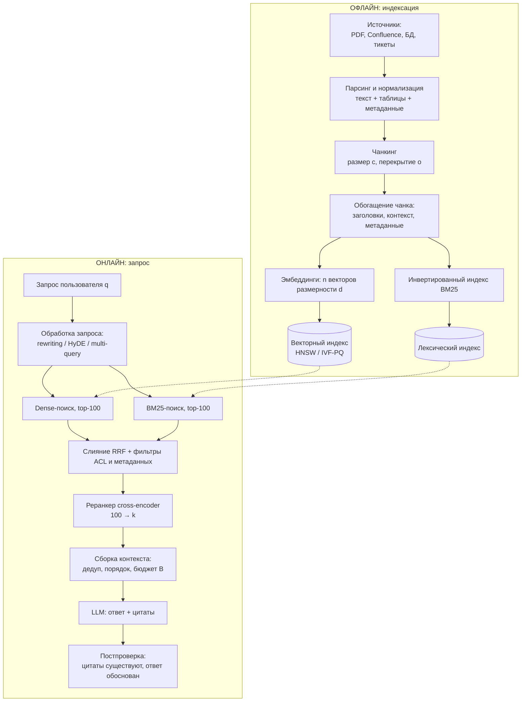

# RAG

> **Зачем эта глава.** RAG — самый частый способ заставить LLM отвечать по данным, которых она
> не видела при обучении, и самая частая тема продуктовых секций собеседования по LLM.
> После этой главы вы сможете спроектировать пайплайн от парсинга документов до цитат в ответе,
> обосновать каждый его элемент числами, отдельно измерить качество поиска и качество генерации
> и по этим измерениям понять, что именно чинить.

**Уровень:** 🎯 middle → 🧠 middle+
**Предварительно нужно:** [эмбеддинги](../04-nlp/02-embeddings.md), [текст как данные](../04-nlp/01-text-representation.md),
[двухбашенные модели и ANN-поиск](../10-recsys/06-two-tower-and-ann.md),
[промптинг](06-prompting-and-structured-output.md), [метрики качества](../02-classic-ml/04-metrics.md)
**Как проработать:** чтение + сборка минимального пайплайна + прогон оценки

---

## Карта главы

- [1. Проблема: чего LLM не знает и почему](#1-проблема-чего-llm-не-знает-и-почему) — откуда вообще берётся RAG
- [2. RAG или дообучение: сравнение по осям](#2-rag-или-дообучение-сравнение-по-осям) — самый частый вопрос на собесе
- [3. Пайплайн целиком](#3-пайплайн-целиком) — схема и бюджет латентности
- [4. Чанкинг](#4-чанкинг) — стратегии, вывод правила для перекрытия, влияние размера на recall
- [5. Эмбеддинги и векторные базы](#5-эмбеддинги-и-векторные-базы) — что индексируем и чем ищем
- [6. Гибридный поиск: BM25 + dense](#6-гибридный-поиск-bm25--dense) — почему он почти всегда лучше
- [7. Реранкинг](#7-реранкинг) — cross-encoder и цена за качество
- [8. Работа с запросом: rewriting, HyDE, multi-query](#8-работа-с-запросом-rewriting-hyde-multi-query)
- [9. Сборка контекста: сколько, в каком порядке](#9-сборка-контекста-сколько-в-каком-порядке) — lost in the middle и порядок ради кэша
- [10. Оценка RAG](#10-оценка-rag) — retrieval и generation по отдельности
- [11. Диагностика: плохой поиск или плохая генерация](#11-диагностика-плохой-поиск-или-плохая-генерация)
- [12. Продвинутые схемы и их настоящая цена](#12-продвинутые-схемы-и-их-настоящая-цена) — self-RAG, CRAG, GraphRAG
- [13. Подводные камни](#13-подводные-камни)
- [14. Проверь себя](#14-проверь-себя)
- [15. Практика](#15-практика)
- [16. Что читать дальше](#16-что-читать-дальше)

**Сквозные обозначения главы.** $n$ — число чанков в индексе (объектов поиска), $d$ — размерность
эмбеддинга, $k$ — число чанков, которые ретривер отдаёт наверх (top-$k$), $c$ — размер чанка
в токенах, $o$ — перекрытие соседних чанков в токенах, $B$ — бюджет контекста в токенах,
$q$ — запрос пользователя, $\theta$ — параметры модели. Параметр насыщения BM25 обозначен $k_1$ —
это не то же самое, что $k$.

---

## 1. Проблема: чего LLM не знает и почему

Начнём с конкретной ситуации, а не с определения.

Вы делаете ассистента для поддержки внутри компании. Пользователь спрашивает: «Какой лимит
на возврат по тарифу «Бизнес» после 1 марта?». Модель уровня GPT-4 отвечает уверенно, связно,
грамматически безупречно — и полностью неправильно. Она никогда не видела вашей тарифной сетки:
эти документы лежат во внутреннем хранилище, их не было в предобучении и не будет.

Разберём, почему это не решается ни промптом, ни «просто взять модель побольше».

**Первое.** Всё, что модель «знает», записано в её весах $\theta$ на этапе предобучения
(см. [предобучение и законы масштабирования](02-pretraining-and-scaling.md)). Знания — это
свойство весов, а не свойство архитектуры. Модель на 400 миллиардов параметров знает больше
про Википедию, но ровно столько же (то есть ничего) про ваши внутренние регламенты.

**Второе.** У знаний в весах есть дата отсечки. Тарифы поменяются в апреле — модель об этом
не узнает никогда, потому что предобучение не запускают ради изменения одной строки.

**Третье, и самое неприятное.** Модель не умеет молчать о том, чего не знает. Она обучена
предсказывать правдоподобное продолжение, и «не знаю» почти никогда не является самым
правдоподобным продолжением после вопроса. Отсюда галлюцинации: правдоподобная форма при
отсутствующем содержании.

**Четвёртое.** Даже если бы модель знала ответ, она не может показать источник. В корпоративном
продукте ответ без ссылки на документ часто бесполезен: пользователь не может его проверить,
а юрист — на него сослаться.

> 🌱 **База.** RAG (Retrieval-Augmented Generation, генерация с извлечением) — это простая идея:
> перед тем как отвечать, найди в своей базе кусочки документов, относящиеся к вопросу, положи
> их в промпт и попроси модель отвечать **только по ним**. Модель перестаёт вспоминать и начинает
> читать. Ровно так же поступает человек: не пытается вспомнить пункт регламента наизусть,
> а открывает регламент.

Формально мы меняем то, что подаётся на вход генератору. Было:

$$
p_\theta(a \mid q)
$$

где $q$ — вопрос пользователя, $a$ — ответ, $\theta$ — параметры LLM. Стало:

$$
p_\theta\big(a \mid q,\; \mathcal{C}(q)\big),
\qquad
\mathcal{C}(q) = \big(z_{(1)}, z_{(2)}, \dots, z_{(k)}\big)
$$

где $\mathcal{C}(q)$ — контекст, собранный из $k$ извлечённых чанков $z_{(j)}$, упорядоченных
по релевантности. Сами чанки берутся из индекса $\mathcal{Z} = \{z_1, \dots, z_n\}$ — корпуса,
разрезанного на фрагменты.

> 📐 **Разбор формулы.** Параметры $\theta$ не меняются — это ключевое. Мы не трогаем модель,
> мы меняем условие, при котором она генерирует. Вся инженерия RAG — это инженерия функции
> $\mathcal{C}(\cdot)$: как разрезать корпус, чем искать, сколько взять и в каком порядке
> положить. Генератор при этом остаётся чёрным ящиком, который можно заменить одной строчкой
> конфига.

Оригинальная работа (Lewis et al., 2020) была устроена сложнее: там ретривер обучался совместно
с генератором, а маргинализация шла по извлечённым документам. В продакшене от этого осталась
только идея; практически везде RAG сегодня — это два независимых модуля, соединённых через промпт.
Это огромное инженерное преимущество: их можно улучшать и измерять по отдельности. Мы к этому
вернёмся в разделах 10 и 11 — там это станет главной мыслью главы.

---

## 2. RAG или дообучение: сравнение по осям

Вопрос «RAG или файнтюн?» задают почти на каждом собеседовании по LLM, и почти всегда ждут
не выбора, а **разбора по осям**. Ответ «RAG дешевле» — слабый: он верен не всегда и не отвечает
на вопрос «а что если нужно и то и другое».

Держите в голове одну разделяющую формулировку:

> **Дообучение меняет поведение модели. RAG меняет её осведомлённость.**

Если модель отвечает не то, что надо знать — это RAG. Если отвечает не так, как надо отвечать —
это дообучение. Разберём это по измерениям.

| Ось | Промптинг | RAG | Дообучение (SFT / LoRA) |
|---|---|---|---|
| Что меняем | форму запроса | вход генератора | веса $\theta$ |
| Новые фактические знания | нет (только то, что влезло в промпт вручную) | **да, любой объём** | частично и ненадёжно |
| Свежесть данных | ручная | **минуты после индексации** | цикл переобучения (дни–недели) |
| Формат, стиль, тон, доменный жаргон | частично | **нет** | **да, это его основное применение** |
| Ссылки на источник | нет | **есть по построению** | нет |
| Разграничение доступа (ACL) | нет | **естественно: фильтр в поиске** | невозможно: веса общие для всех |
| Удаление данных по требованию | — | **удалить из индекса** | переобучить с нуля |
| Стоимость входа | ~0 | индекс, векторная БД, пайплайн ETL | GPU-часы + разметка |
| Стоимость запроса | базовая | **+2–8k токенов промпта, +30–300 мс на поиск** | базовая |
| Латентность | минимальная | выше на время retrieval + rerank | минимальная |
| Отладка ошибки | «поменяем промпт» | **видно, что нашли и что не нашли** | «где-то в весах» |
| Поведение при отсутствии знания | галлюцинирует | можно заставить сказать «не нашёл» | галлюцинирует |

Три вывода, которые стоит проговаривать вслух на собеседовании.

**Вывод первый: дообучение — плохой способ заливать факты.** Это контринтуитивно, поэтому
объясню механику. Чтобы факт закрепился в весах, он должен встретиться в обучении многократно
и в разных формулировках; одиночное упоминание в SFT-датасете модель либо не запомнит, либо
запомнит вместе с формой вопроса, и на переформулировке развалится. Хуже того, дообучение
на новых фактах провоцирует катастрофическое забывание и *усиливает* галлюцинации: модель
получает сигнал «на вопросы этого типа надо уверенно отвечать», не получив надёжного механизма
извлечения. Работы, сравнивавшие инъекцию знаний через файнтюн и через RAG на одном корпусе
(например, Ovadia et al., «Fine-Tuning or Retrieval?», 2023), устойчиво показывают преимущество
RAG на фактических вопросах — включая факты, которые модель уже видела в предобучении.

**Вывод второй: RAG — плохой способ менять поведение.** Если модель отвечает не в том формате,
не тем тоном, не использует ваш внутренний жаргон, игнорирует инструкции — извлечение документов
это не починит. Здесь работает SFT/LoRA (см. [PEFT и квантизация](04-peft-and-quantization.md)).

**Вывод третий: это не «или».** Типичная зрелая система — LoRA-адаптер, который учит модель
формату ответа и следованию инструкции «отвечай только по контексту, иначе скажи, что не нашёл»,
плюс RAG, который приносит факты. Отдельный частый приём — дообучение **эмбеддера**, а не
генератора: об этом в разделе 5.

> 💬 **На собеседовании.** Спросят: «Что выберете: RAG или fine-tuning?»
> Хороший ответ начинается с уточняющего вопроса: «Проблема в том, что модель не знает фактов,
> или в том, что она неправильно себя ведёт?» Дальше — по осям: если знания меняются чаще, чем
> раз в месяц, нужны ссылки на источники или есть разграничение доступа — RAG безальтернативен.
> Если проблема в формате, стиле, следовании доменной инструкции, если нужна низкая латентность
> и компактная модель — дообучение. Если и то и другое — оба, и это нормальная архитектура.
> Отдельно стоит добавить: прежде чем строить что-либо, попробуйте промптинг с ручным контекстом
> на 30 примерах — это стоит два часа и часто закрывает половину гипотез.
> Плохой ответ: «RAG, потому что дешевле» — без разбора, что именно ломается.

> 💬 **На собеседовании.** Спросят: «Нужен ли RAG, если у модели контекст на миллион токенов?»
> Хороший ответ: длинный контекст решает одну проблему из пяти. Он не решает: (1) стоимость —
> префилл линеен по числу токенов, и класть 500k токенов на каждый запрос экономически бессмысленно,
> когда релевантны 2k; (2) латентность — TTFT растёт вместе с длиной префилла
> (см. [инференс LLM](05-inference-and-serving.md)); (3) деградацию внимания — качество на длинном
> контексте неравномерно по позиции (раздел 9); (4) разграничение доступа — нельзя показать
> пользователю только его документы, если корпус целиком в промпте; (5) масштаб — корпуса
> в компаниях измеряются гигабайтами, а не мегабайтами. Длинный контекст изменил RAG количественно:
> стало нормально класть 10–20 чанков вместо 3 и делать чанки крупнее. Но поиск никуда не делся —
> он просто перестал быть таким узким горлышком.
> Плохой ответ: «длинный контекст убил RAG».

---

## 3. Пайплайн целиком

Прежде чем разбирать компоненты, посмотрим на систему целиком. Полезно сразу видеть, что она
состоит из **двух независимых пайплайнов**: офлайнового (индексация) и онлайнового (запрос).
Они имеют разные SLA, разную стоимость и ломаются по-разному.



Типовой бюджет латентности для интерактивного ассистента с целью p95 около 3 секунд до первого
токена — полезно держать в голове порядки величин:

| Стадия | Типичное время | Комментарий |
|---|---|---|
| Обработка запроса (без LLM) | 1–5 мс | нормализация, разбор фильтров |
| Query rewriting через LLM | 200–600 мс | самая дорогая необязательная стадия |
| Dense-поиск, ANN, $n \sim 10^6$ | 5–30 мс | HNSW; см. [ANN-поиск](../10-recsys/06-two-tower-and-ann.md) |
| BM25-поиск | 10–50 мс | зависит от длины запроса и размера индекса |
| Слияние + фильтры | 1–5 мс | чистая арифметика |
| Реранкер, 100 пар, GPU | 50–200 мс | линейно по числу пар |
| Префилл LLM, 4k токенов | 100–500 мс | зависит от модели и железа |
| Генерация ответа | 1–5 с | стримингом воспринимается лучше |

Отсюда сразу читается инженерный вывод: **поиск почти никогда не является узким местом по
латентности**. Дорого стоят LLM-вызовы — переписывание запроса и сама генерация. Поэтому
оптимизация «давайте выкинем BM25, он медленный» почти всегда ошибочна, а «давайте добавим
ещё три LLM-вызова на переписывание» — почти всегда дорога.

---

## 4. Чанкинг

Почему вообще нельзя индексировать документ целиком? Три причины, и они разной природы.

1. **Ограничение контекста.** Документ на 80 страниц не влезет в промпт, а если влезет — см. пункт 3.
2. **Разбавление эмбеддинга.** Вектор длинного документа — это усреднённая семантика всего
   документа сразу. Запрос про один конкретный пункт плохо матчится с «средним по документу».
3. **Шум в контексте.** Даже если документ влез, 79 нерелевантных страниц активно мешают
   генератору (раздел 9).

Значит, режем. Вопрос — как.

### 4.1 Стратегии

**Фиксированный размер (fixed-size).** Режем на куски по $c$ токенов с перекрытием $o$.
Просто, предсказуемо по стоимости, полностью игнорирует структуру: заголовок отрывается от текста,
таблица рвётся посередине, предложение обрывается на полуслове.

```python
from typing import Iterator


def chunk_by_tokens(tokens: list[str], size: int, overlap: int) -> Iterator[list[str]]:
    """Скользящее окно по токенам. Работает с любым токенизатором — на вход список токенов."""
    if overlap >= size:
        # иначе окно не сдвигается вперёд и получается бесконечный цикл
        raise ValueError("перекрытие должно быть строго меньше размера чанка")
    step = size - overlap
    start = 0
    while start < len(tokens):
        yield tokens[start:start + size]
        if start + size >= len(tokens):
            break          # последний чанк уже покрыл хвост, не плодим дубли
        start += step
```

**По структуре (recursive / structure-aware).** Режем по иерархии разделителей: сначала по
двойным переводам строки (абзацы), если кусок всё ещё длинный — по одиночным, потом по
предложениям, потом по словам. Так граница чанка почти всегда совпадает со смысловой границей.
Это дефолт для 90% задач.

```python
def split_recursive(text: str, max_len: int, separators: list[str]) -> list[str]:
    """Режем по самому крупному разделителю; куски-переростки — по следующему в иерархии.

    separators передаются от крупного к мелкому, например ["\\n\\n", "\\n", ". ", " "].
    """
    if len(text) <= max_len:
        return [text]
    if not separators:
        # структуры не осталось — жёсткий фолбэк по символам, чтобы не вернуть переросток
        return [text[i:i + max_len] for i in range(0, len(text), max_len)]

    sep, rest = separators[0], separators[1:]
    chunks: list[str] = []
    buf = ""
    for part in text.split(sep):
        candidate = part if not buf else buf + sep + part
        if len(candidate) <= max_len:
            buf = candidate                     # копим, пока влезает: мелкие абзацы склеиваем
            continue
        if buf:
            chunks.append(buf)
        if len(part) > max_len:
            chunks.extend(split_recursive(part, max_len, rest))
            buf = ""
        else:
            buf = part
    if buf:
        chunks.append(buf)
    return chunks
```

**Семантический (semantic chunking).** Считаем эмбеддинг каждого предложения, идём по тексту
и ставим границу там, где косинусная близость соседних предложений резко падает — то есть где
меняется тема. Звучит элегантно, на практике даёт неоднозначный результат: стоимость индексации
растёт (эмбеддинг каждого предложения), порог падения близости приходится подбирать вручную,
а выигрыш над структурным чанкингом на хорошо размеченных документах обычно в пределах шума.
Работает заметно лучше там, где структуры нет вовсе: расшифровки звонков, сплошные логи,
OCR-выхлоп без разметки.

**Parent-document (small-to-big).** Самая полезная схема из «продвинутых». Индексируем мелкие
чанки ($c \approx 150$–$300$ токенов) — по ним точнее ищется. Но в контекст отдаём **родителя**:
раздел или страницу целиком, из которых этот мелкий чанк был вырезан. Мы разделяем две функции,
которые в наивной схеме конфликтуют: *единица поиска* должна быть маленькой, а *единица чтения* —
большой и самодостаточной.

**Контекстные заголовки (contextual chunk headers).** К каждому чанку приписываем путь по
структуре документа: «Документ: Регламент возвратов v4 → Раздел 3. Тарифы → 3.2 Бизнес».
Копеечный приём с большим эффектом: чанк «лимит составляет 50 000 ₽» без заголовка не находится
ни по одному осмысленному запросу, потому что в нём нет ни слова «тариф», ни слова «возврат».

**Контекстное обогащение (contextual retrieval).** Развитие предыдущего: перед индексацией
прогоняем чанк через дешёвую LLM с промптом «напиши 1–2 предложения, объясняющих место этого
фрагмента в документе», и приписываем результат к тексту чанка. Anthropic в 2024 году отчитались,
что на их наборе такое обогащение эмбеддингов снизило долю провалов поиска в top-20 на 35%
(с 5.7% до 3.7%), вместе с обогащённым BM25 — на 49%, а с добавлением реранкера — на 67%
(до 1.9%). Цена: один LLM-вызов на каждый чанк при индексации. На корпусе в 100 тысяч чанков
это уже ощутимые деньги, но это разовая офлайновая трата, которую снимает префиксное кэширование.

### 4.2 Сколько перекрытия — это выводится, а не угадывается

Перекрытие обычно ставят «на глаз»: 10–20%. Но нужное значение выводится точно, и это хороший
кандидат в ответ на собесе.

Пусть ответ на вопрос содержится в непрерывном фрагменте длиной $a$ токенов (одно-два предложения,
строка таблицы, определение). Чанки берутся окном длины $c$ с шагом $s = c - o$. Спросим:
с какой вероятностью этот фрагмент **целиком** попадёт хотя бы в один чанк?

Окна начинаются в позициях $0, s, 2s, \dots$. Фрагмент занимает позиции $[x, x + a)$. Возьмём
ближайшее окно, начинающееся не позже $x$: его старт $js$, где $j = \lfloor x/s \rfloor$.
Фрагмент целиком внутри этого окна, когда

$$
x + a \;\le\; js + c
\qquad\Longleftrightarrow\qquad
(x \bmod s) \;\le\; c - a
$$

где $x \bmod s = x - js$ — смещение начала фрагмента относительно старта окна, равномерно
распределённое на $[0, s)$. Отсюда при $a \le c$:

$$
P_{\text{целый}} \;=\; \min\!\left(1,\; \frac{c - a}{c - o}\right)
$$

где $c$ — размер чанка в токенах, $o$ — перекрытие в токенах, $a$ — длина фрагмента с ответом,
$P_{\text{целый}}$ — вероятность того, что фрагмент не разрезан границей чанка.

> 📐 **Разбор формулы.** Посмотрите, что происходит при $o = a$: числитель $c - a$ и знаменатель
> $c - o$ совпадают, вероятность равна единице. Это **точная гарантия**: если перекрытие не меньше
> длины ответного фрагмента, фрагмент никогда не будет разрезан — он обязательно целиком попадёт
> хотя бы в одно окно. При $o = 0$ вероятность равна $1 - a/c$: фрагмент в 100 токенов при чанке
> в 500 будет разорван в каждом пятом случае.

Практический вывод: **перекрытие должно быть порядка длины типичного самодостаточного ответа**.
Для фактологического QA это 1–3 предложения, то есть 50–100 токенов; при чанке 400–600 токенов
получаем те самые 10–20%, но теперь мы знаем, откуда они. Для документов с длинными определениями
или многострочными табличными записями перекрытие надо увеличивать.

> ⚠️ **Типичная ошибка.** Ставить перекрытие 50% «на всякий случай» → индекс раздувается вдвое,
> в top-$k$ попадают три почти одинаковых чанка, и контекст на 4000 токенов содержит 1500 токенов
> дублей → полезная информация вытесняется. Перекрытие надо не максимизировать, а подбирать под
> длину ответного фрагмента, и обязательно дедуплицировать пересечения при сборке контекста.

### 4.3 Как размер чанка влияет на recall и на точность

Здесь два эффекта тянут в разные стороны, и это надо уметь объяснить.

**Эффект первый: разбавление сигнала.** Эмбеддинг чанка — это одна точка в $\mathbb{R}^d$,
которая должна представлять весь его текст. Пусть полезная для запроса часть занимает $a$ из $c$
токенов; обозначим долю сигнала $\alpha = a / c$. Возьмём грубую линейную модель: вектор чанка
складывается из вектора ответа $v_{\text{ans}}$ и вектора остального текста $v_{\text{rest}}$
с весами по доле токенов, оба единичной длины и ортогональны, а запрос совпадает с $v_{\text{ans}}$.
Тогда

$$
\cos\big(q,\; v_{\text{chunk}}\big)
= \frac{\alpha}{\sqrt{\alpha^2 + (1-\alpha)^2}}
$$

где $\alpha = a/c$ — доля релевантных токенов в чанке, $v_{\text{chunk}} = \alpha\, v_{\text{ans}} + (1-\alpha)\, v_{\text{rest}}$,
$\cos(\cdot,\cdot)$ — косинусная близость.

Подставим числа: при $\alpha = 1$ близость 1.00; при $\alpha = 0.5$ — 0.71; при $\alpha = 0.25$ —
0.32; при $\alpha = 0.1$ — 0.11. Реальные энкодеры, конечно, не усредняют линейно, и абсолютные
числа будут другими. Но направление эффекта воспроизводится всегда: **чем длиннее чанк, тем слабее
он «звенит» на узкий фактический запрос**, и тем легче его обгоняет чанк, который целиком про эту тему.

**Эффект второй: потеря самодостаточности.** Мелкий чанк теряет референты. «Он не применяется
в этом случае» — кому «он», в каком «этом случае»? Даже найденный, такой чанк бесполезен генератору,
а иногда вреден: модель домыслит недостающее. Кроме того, мелкие чанки чаще режут ответ пополам
(формула из 4.2).

Сводим в таблицу — типичные режимы, которые стоит знать наизусть:

| $c$, токенов | Retrieval-точность на узких вопросах | Самодостаточность чанка | Сколько влезет в $B = 4000$ | Когда это правильный выбор |
|---|---|---|---|---|
| 100–200 | очень высокая | низкая | ~20–40 | FAQ, глоссарии, короткие карточки; либо как «дети» в parent-document |
| 300–500 | высокая | средняя | ~8–13 | **дефолт** для документации и статей |
| 600–1000 | средняя | высокая | ~4–6 | нормативка, длинные рассуждения, где важен весь абзац целиком |
| 1500+ | низкая | очень высокая | ~2–3 | только parent-document (ищем по мелким, отдаём крупные) |

И важное уточнение про метрики, на котором путаются даже опытные инженеры. Фраза «recall растёт
с размером чанка» верна и неверна одновременно — всё зависит от того, что фиксировано:

- **При фиксированном $k$** (взяли ровно 5 чанков) увеличение $c$ почти всегда повышает recall:
  вы просто показываете больше текста. Это неинформативное сравнение.
- **При фиксированном бюджете $B$** (в контекст влезает $k \approx B/c$ чанков) картина меняется:
  крупные чанки дают меньше независимых «попыток» попасть в ответ, и на корпусе с разнородными
  документами recall падает.
- **Точность контекста** (доля релевантных токенов среди показанных) монотонно падает с ростом $c$
  почти всегда — просто потому, что вместе с ответом вы тащите его окружение.

> 💬 **На собеседовании.** Спросят: «Как выбрать размер чанка?»
> Хороший ответ: не угадывать, а измерять — но измерять правильно. Собираю 100–200 размеченных
> пар (вопрос, чанк-с-ответом), фиксирую **бюджет контекста в токенах**, а не число чанков,
> и строю recall@budget для $c \in \{128, 256, 512, 1024\}$. Отдельно смотрю точность контекста.
> До измерения даю априорный ответ: 300–500 токенов с перекрытием около длины типичного ответного
> фрагмента, границы по структуре документа, заголовок раздела приписан к каждому чанку.
> И сразу добавляю, что если вопросы разнородны по гранулярности — часть про определения,
> часть про целые процедуры — правильный ответ не «одно число», а parent-document: ищем по мелким,
> отдаём крупные.
> Плохой ответ: «512, так в туториале» — или сравнение recall@5 для разных $c$ без фиксации бюджета.

### 4.4 Отдельная боль: таблицы, PDF и всё, что не является плоским текстом

Самый частый источник провала боевого RAG — не эмбеддинги и не реранкер, а парсер. Что ломается:

- **Таблица, разрезанная чанкингом**, теряет шапку. Строка «Бизнес | 50 000 | 14» без заголовков
  столбцов бессмысленна. Лечение: таблицы вырезать до чанкинга как атомарные объекты; если таблица
  большая — резать по строкам, повторяя шапку в каждом куске; хранить как Markdown, а не как
  «текст, слитый пробелами».
- **Двухколоночный PDF**, прочитанный наивным экстрактором, даёт перемешанные строки из обеих колонок.
  Текст выглядит как текст, эмбеддинги считаются, поиск не работает, и никто не понимает почему.
  Лечение: layout-aware парсинг, а перед запуском — глазами прочитать 20 случайных чанков.
- **Сканы и картинки** — без OCR это просто пустые страницы в индексе. Диаграммы и графики стоит
  прогонять через VLM с промптом «опиши, что показано» и индексировать описание.
- **Списки**, разрезанные посередине, теряют вводную фразу («Возврат невозможен, если:»),
  и оставшиеся пункты меняют смысл на противоположный.

> ⌨️ **Руками.** Перед тем как оптимизировать поиск, распечатайте 20 случайных чанков из своего
> индекса и прочитайте их как посторонний человек. Вопрос к каждому: «можно ли по этому фрагменту
> ответить на вопрос, не видя остального документа?» Это упражнение на 30 минут регулярно находит
> больше проблем, чем неделя тюнинга гиперпараметров поиска.

---

## 5. Эмбеддинги и векторные базы

Механика dense-поиска подробно разобрана в главе про [эмбеддинги](../04-nlp/02-embeddings.md),
а устройство ANN-индексов — в главе про [двухбашенные модели и ANN-поиск](../10-recsys/06-two-tower-and-ann.md).
Здесь — только то, что специфично для RAG.

### 5.1 Что происходит при поиске

Энкодер $E(\cdot)$ переводит текст в вектор $\mathbb{R}^d$. Индексируем все чанки, при запросе
кодируем $q$ и ищем ближайших:

$$
\hat{R}^{(k)}(q) \;=\; \operatorname*{arg\,top-}k_{\,z \in \mathcal{Z}} \;\; \frac{E(q)^\top E(z)}{\|E(q)\|\,\|E(z)\|}
$$

где $\mathcal{Z}$ — множество из $n$ чанков, $E(q), E(z) \in \mathbb{R}^d$ — эмбеддинги запроса
и чанка, $\hat{R}^{(k)}(q)$ — множество $k$ найденных чанков.

Такой энкодер называют **би-энкодером** (bi-encoder): запрос и документ кодируются
**независимо друг от друга**. Это и есть источник его главного свойства — все $n$ векторов чанков
считаются заранее, офлайн, а в рантайме остаётся одно кодирование запроса и поиск по индексу.
Ровно это свойство мы потеряем в разделе 7, и ровно за его потерю заплатим латентностью.

```python
from sentence_transformers import SentenceTransformer
import numpy as np

# multilingual-e5 — рабочая мультиязычная модель, нормально держит русский
model = SentenceTransformer("intfloat/multilingual-e5-base")

chunks = [
    "Возврат по тарифу «Бизнес» возможен в течение 14 дней, лимит 50 000 рублей.",
    "Тариф «Старт» не предполагает возврата после активации.",
    "Служба поддержки работает круглосуточно, среднее время ответа 4 минуты.",
]
question = "какой лимит возврата на бизнес-тарифе"

# e5 обучалась с префиксами query:/passage: — без них качество падает на несколько пунктов
doc_emb = model.encode(["passage: " + c for c in chunks],
                       normalize_embeddings=True, batch_size=64)
q_emb = model.encode("query: " + question, normalize_embeddings=True)

# векторы нормированы ⇒ скалярное произведение и есть косинус, отдельной нормировки не нужно
sims = doc_emb @ q_emb
order = np.argsort(-sims)
for i in order:
    print(round(float(sims[i]), 3), chunks[i][:60])
```

> ⚠️ **Типичная ошибка.** Забыть служебные префиксы у моделей семейства e5 / bge / gte или
> перепутать их местами (запрос закодировать как `passage:`). Модель не упадёт, метрики просто
> тихо просядут на несколько пунктов recall, и вы будете искать проблему в чанкинге. Всегда
> читайте карточку модели: у каждого семейства свои соглашения, и они несовместимы.

### 5.2 Как выбирать модель эмбеддингов

Порядок действий, а не список моделей (список устареет к моменту, когда вы это читаете):

1. **Язык.** Для русского берите мультиязычные или специально обученные под русский модели.
   Ориентир — бенчмарки MTEB и его русская часть ruMTEB; команды SberDevices и X5 Tech публиковали
   разборы на Хабре, что и как там измеряется.
2. **Размерность $d$ и стоимость.** $d = 384$ против $d = 1024$ — это разница в 2.7 раза по памяти
   индекса и по времени поиска. На корпусе в $n = 10^7$ чанков при $d = 1024$ и `float32` голые
   векторы занимают $10^7 \times 1024 \times 4 = 41$ ГБ — это уже вопрос про железо, а не про качество.
   Модели с matryoshka-обучением позволяют обрезать вектор до первых $d' < d$ координат с небольшой
   потерей качества — удобный рычаг.
3. **Длина входа.** Если модель обучалась на 512 токенах, а вы кормите ей чанки по 1000 — хвост
   либо обрежется молча, либо будет обработан плохо. Согласуйте $c$ с окном энкодера.
4. **Квантизация.** Скалярная квантизация в `int8` даёт 4-кратную экономию памяти при потере recall
   обычно в пределах 1–2%; бинарная — 32-кратную, но требует переоценки (rescoring) top-кандидатов
   исходными векторами. Это стандартный приём на больших корпусах.
5. **Дообучение эмбеддера.** Самый недооценённый рычаг. Если у вас доменный жаргон, внутренние
   аббревиатуры, коды продуктов — общая модель их не понимает, потому что не видела. Собрать
   5–20 тысяч пар (вопрос, релевантный чанк) из логов поиска или сгенерировать LLM по вашим
   документам, дообучить контрастивно (см. [двухбашенные модели](../10-recsys/06-two-tower-and-ann.md)
   про in-batch negatives) — и получить прирост recall@10 на 5–15 пунктов. Это обычно дешевле
   и надёжнее, чем любая перестройка архитектуры пайплайна.

### 5.3 Векторная база: что это на самом деле

Полезно развести три вещи, которые часто путают:

- **Векторный индекс** — структура данных для приближённого поиска: HNSW, IVF-PQ, ScaNN. Это
  библиотека (FAISS), а не сервис. Она не умеет ни фильтровать по метаданным, ни обновляться
  транзакционно, ни жить в кластере.
- **Векторная БД** — сервис вокруг индекса: Qdrant, Weaviate, Milvus. Добавляет фильтры по
  метаданным, репликацию, persistence, обновление документов, разграничение доступа.
- **Векторный плагин к обычной БД** — pgvector в PostgreSQL, dense_vector в Elasticsearch/OpenSearch.
  Проигрывает специализированным решениям на десятках миллионов векторов, но выигрывает во всём
  остальном: одна база, одни транзакции, один бэкап, привычная эксплуатация.

> 🧠 **Middle+.** Практическое правило: до нескольких миллионов чанков берите pgvector, если
> PostgreSQL у вас и так есть. Экономия на эксплуатации перевешивает разницу в латентности
> (десятки миллисекунд там, где весь запрос длится секунды). Отдельная векторная БД становится
> оправданной, когда вектора перестают влезать в память одной машины, нужен realtime-апсерт
> миллионов документов или сложная фильтрация с высокой селективностью.

**Фильтрация по метаданным** заслуживает отдельного абзаца, потому что это главный источник
неожиданных провалов. Есть два способа совместить ANN-поиск с фильтром «только документы,
доступные этому пользователю»:

- **Post-filter**: найти top-100 по вектору, потом отфильтровать. Быстро, но если пользователю
  доступен 1% корпуса, из 100 кандидатов выживет в среднем один — и recall обрушится.
- **Pre-filter / фильтрация внутри обхода графа**: индекс учитывает предикат прямо во время поиска.
  Так умеют Qdrant, Weaviate, современный pgvector с частичными индексами. Правильный выбор для ACL.

> ⚠️ **Типичная ошибка.** Реализовать разграничение доступа как post-filter → у пользователей
> с узким доступом ассистент «ничего не находит», хотя документы есть → команда неделю чинит
> эмбеддинги. Симптом узнаваемый: качество резко зависит от роли пользователя. Лечение: pre-filter
> либо отдельные индексы (коллекции) на группу доступа.

---

## 6. Гибридный поиск: BM25 + dense

Тезис раздела: **чистый векторный поиск почти всегда хуже, чем векторный вместе с лексическим.**
Это не «ещё одна оптимизация», а базовая конфигурация. Разберём, почему.

### 6.1 Что умеет и чего не умеет каждый из них

Dense-поиск работает в семантическом пространстве. Он найдёт «отказ от покупки» по запросу
«как вернуть товар», потому что эти фразы близки по смыслу. Но у него есть системная слепота:

- **Редкие точные токены.** Артикул `ZX-4471-B`, номер регламента `П-14.3`, имя функции
  `calculate_vat_rate`, фамилия, номер договора. Токенизатор разобьёт их на подслова, энкодер
  усреднит — и `ZX-4471-B` окажется близко к `ZX-4472-B`. Для поиска по коду это катастрофа.
- **Отрицания и мелкие смысловые различия.** «Возврат возможен» и «возврат невозможен» имеют
  высокую косинусную близость: они про одно и то же, отличаются одной морфемой.
- **Домены, не покрытые обучением.** Внутренние аббревиатуры компании для модели — шум.
- **Длинный хвост запросов.** Модель хорошо обобщает то, что похоже на обучающие данные,
  и плохо — то, что не похоже.

BM25 (лексический поиск по инвертированному индексу) слеп ровно в дополнительных местах:
он не понимает синонимы и перефразировки. Зато точное совпадение редкого термина он найдёт
всегда и объяснит, почему нашёл.

$$
\mathrm{BM25}(q, z) \;=\; \sum_{t \in q} \mathrm{IDF}(t) \cdot
\frac{f(t, z)\,(k_1 + 1)}{f(t, z) + k_1\Big(1 - b + b\,\dfrac{|z|}{\mathrm{avgdl}}\Big)}
$$

где $t$ — токен запроса $q$, $f(t, z)$ — частота токена $t$ в чанке $z$, $|z|$ — длина чанка
в токенах, $\mathrm{avgdl}$ — средняя длина чанка по индексу, $k_1 \approx 1.2$–$1.5$ — параметр
насыщения частоты, $b \approx 0.75$ — сила поправки на длину документа,
$\mathrm{IDF}(t) = \ln\!\big(1 + \frac{n - \mathrm{df}(t) + 0.5}{\mathrm{df}(t) + 0.5}\big)$,
$\mathrm{df}(t)$ — число чанков, содержащих $t$, $n$ — общее число чанков.

> 📐 **Разбор формулы.** Три идеи в одном выражении. Первая: $\mathrm{IDF}$ — редкое слово важнее
> частого, «ZX-4471» весит несравнимо больше, чем «в». Вторая: **насыщение** — дробь по $f(t,z)$
> растёт, но выходит на плато $\mathrm{IDF}\cdot(k_1+1)$; десятое вхождение слова почти не добавляет
> релевантности, в отличие от наивного TF. Третья: **нормировка на длину** через $b$ — длинный
> документ имеет больше шансов случайно содержать слово, и за это его штрафуют. Именно эти три
> поправки отличают BM25 от TF-IDF и делают его сильным бейзлайном, который до сих пор не стыдно
> показывать рядом с нейросетями.

```python
import math
from collections import Counter
import numpy as np


class BM25:
    """Okapi BM25 с IDF в варианте Lucene (всегда положителен)."""

    def __init__(self, corpus_tokens: list[list[str]], k1: float = 1.5, b: float = 0.75):
        self.k1, self.b = k1, b
        self.n = len(corpus_tokens)
        self.tf = [Counter(doc) for doc in corpus_tokens]
        self.doc_len = np.array([len(doc) for doc in corpus_tokens], dtype=float)
        self.avgdl = float(self.doc_len.mean())

        df = Counter()
        for doc in corpus_tokens:
            df.update(set(doc))          # set: считаем документы, а не вхождения
        self.idf = {t: math.log(1.0 + (self.n - c + 0.5) / (c + 0.5)) for t, c in df.items()}

    def scores(self, query_tokens: list[str]) -> np.ndarray:
        # знаменатель не зависит от токена запроса — считаем один раз
        length_norm = self.k1 * (1.0 - self.b + self.b * self.doc_len / self.avgdl)
        out = np.zeros(self.n)
        for t in set(query_tokens):
            if t not in self.idf:
                continue                 # токена нет в корпусе — вклад ровно нулевой
            f = np.array([tf.get(t, 0) for tf in self.tf], dtype=float)
            out += self.idf[t] * f * (self.k1 + 1.0) / (f + length_norm)
        return out
```

### 6.2 Как склеивать два ранжирования: RRF

Наивная идея — взвешенная сумма скоров: $s = \lambda\, s_{\text{dense}} + (1-\lambda)\, s_{\text{bm25}}$.
Она плохо работает, и причина конкретна: **скоры несопоставимы**. Косинус живёт в $[-1, 1]$,
BM25 не ограничен сверху и зависит от длины запроса, от размера корпуса, от статистики токенов.
Нормировать их (min-max по выдаче) можно, но нормировка нестабильна: она зависит от того, какие
именно документы попали в выдачу, и один документ-выброс сдвигает всю шкалу.

Поэтому стандартом стало **слияние по рангам** — Reciprocal Rank Fusion (Cormack et al., SIGIR 2009):

$$
\mathrm{RRF}(z) \;=\; \sum_{r \in \mathcal{R}} \frac{1}{C + \mathrm{rank}_r(z)}
$$

где $\mathcal{R}$ — множество ранжирований (у нас два: dense и BM25), $\mathrm{rank}_r(z)$ —
позиция чанка $z$ в ранжировании $r$ (начиная с 1; если чанка там нет — слагаемое ноль),
$C$ — сглаживающая константа, по умолчанию 60.

> 📐 **Разбор формулы.** Мы выбрасываем абсолютные скоры и оставляем только порядок — то, что
> сопоставимо между любыми системами. Константа $C$ управляет тем, насколько сильно первое место
> отличается от десятого: при $C = 60$ вклады первого и десятого места равны $1/61$ и $1/70$ —
> разница всего 13%, то есть RRF довольно демократичен и охотно поднимает документ, который
> в обоих списках был «неплох», над документом, который в одном списке первый, а в другом
> отсутствует. Уменьшая $C$, вы делаете слияние агрессивнее к топу.

```python
def reciprocal_rank_fusion(rankings: list[list[int]], c: int = 60,
                           weights: list[float] | None = None) -> list[tuple[int, float]]:
    """rankings — списки id чанков, каждый уже отсортирован по релевантности своей системой."""
    if weights is None:
        weights = [1.0] * len(rankings)
    fused: dict[int, float] = {}
    for ranking, w in zip(rankings, weights):
        for rank, doc_id in enumerate(ranking, start=1):
            fused[doc_id] = fused.get(doc_id, 0.0) + w / (c + rank)
    return sorted(fused.items(), key=lambda kv: -kv[1])


# использование: два независимых поиска по 100 кандидатов, слияние, затем реранк
dense_top = [12, 7, 3, 45, 9]     # id чанков от векторного поиска
bm25_top = [3, 88, 12, 5, 41]     # id чанков от BM25
print(reciprocal_rank_fusion([dense_top, bm25_top])[:3])
# чанк 3 и чанк 12 всплывают наверх: их нашли обе системы — это сильный сигнал согласия
```

Веса позволяют сместить баланс: для корпуса с обилием артикулов и кодов имеет смысл дать BM25
вес побольше, для корпуса из связного текста — dense. Но начинать всегда стоит с равных весов.

### 6.3 Почему гибрид почти всегда выигрывает

Причина не в том, что «два лучше одного», а в **некоррелированности ошибок**. Dense и BM25
промахиваются на разных запросах: первый — на редких точных токенах и отрицаниях, второй — на
перефразировках. Если бы они ошибались вместе, слияние ничего бы не дало. Именно потому, что их
слепые зоны почти не пересекаются, объединение выдач повышает recall сильнее, чем увеличение $k$
у любого из них по отдельности.

Второй механизм — **согласие как сигнал**. Документ, попавший в топ обеих систем, релевантен
с гораздо большей вероятностью, чем документ из топа одной. RRF это учитывает автоматически.

Бенчмарк BEIR (Thakur et al., 2021) — обязательное чтение по теме — показал вещь, которая
в 2021 году многих отрезвила: BM25 обгонял многие обученные dense-ретриверы при переносе на новый
домен, потому что dense-модели переобучались на распределение обучающих запросов. С тех пор
эмбеддеры сильно улучшились, но урок остался: **лексический бейзлайн нельзя выбрасывать, его
надо складывать**.

Цена гибрида честная и небольшая: второй индекс (инвертированный, он компактный), +10–50 мс
латентности (два поиска идут параллельно), плюс инженерная работа по морфологии — для русского
языка BM25 требует лемматизации или хотя бы стемминга, иначе «возврата» и «возврату» будут
разными токенами.

> 💬 **На собеседовании.** Спросят: «Что такое гибридный поиск и зачем нужен RRF?»
> Хороший ответ: гибрид — параллельный запуск лексического (BM25) и векторного поиска с последующим
> слиянием выдач. Нужен потому, что их ошибки некоррелированы: dense не видит редкие точные токены
> (артикулы, номера, коды, аббревиатуры) и плохо различает отрицания, BM25 не понимает синонимы.
> RRF складывает не скоры, а обратные ранги, потому что скоры двух систем несопоставимы по шкале
> и min-max-нормировка нестабильна: она зависит от состава выдачи. Формула $\sum_r 1/(C + \text{rank}_r)$,
> $C = 60$ по умолчанию. Дополнительный аргумент: документ, найденный обеими системами, релевантен
> с большей вероятностью — RRF это учитывает бесплатно.
> Плохой ответ: «складываем косинус и BM25 с весами 0.5/0.5» — вопрос сразу переходит в «а как вы
> их нормировали?», и там разговор обычно заканчивается.

---

## 7. Реранкинг

Гибридный поиск отдал 100 кандидатов. В контекст влезет 5. Как выбрать?

Можно взять просто первые 5 по RRF. Но у поиска первого этапа есть принципиальное ограничение,
и оно вытекает из архитектуры би-энкодера: запрос и документ кодируются **независимо**. Их
взаимодействие сводится к одному скалярному произведению в конце — модель не может «посмотреть
на документ глазами запроса». Вся информация о документе сжата в $d$ чисел ещё до того, как
запрос появился.

**Cross-encoder** снимает это ограничение: он подаёт пару `[CLS] запрос [SEP] документ [SEP]`
в трансформер и возвращает одно число — оценку релевантности. Токены запроса и документа
взаимодействуют через self-attention на всех слоях. Модель видит, что слово «лимит» из запроса
относится именно к «50 000», а «Бизнес» — к названию тарифа, а не к общему слову.

$$
s_{\text{cross}}(q, z) = \mathrm{CE}_\theta\big([q; z]\big) \in \mathbb{R}
$$

где $\mathrm{CE}_\theta$ — трансформер-классификатор с параметрами $\theta$, $[q; z]$ — конкатенация
запроса и чанка с разделителями, $s_{\text{cross}}$ — скор релевантности.

Плата очевидна и неустранима: **эмбеддинг документа больше нельзя посчитать заранее**. Скор
зависит от пары, а пар $n$ штук на каждый запрос. Прогнать cross-encoder по всему корпусу
из $10^6$ чанков нереально — отсюда каскад:

$$
\underbrace{n = 10^6}_{\text{корпус}}
\;\xrightarrow{\text{ANN} + \text{BM25} + \text{RRF}}\;
\underbrace{100}_{\text{кандидаты}}
\;\xrightarrow{\text{cross-encoder}}\;
\underbrace{k = 5}_{\text{контекст}}
$$

Это ровно та же многостадийная схема, что в рекомендательных системах
(см. [постановку задачи рекомендаций](../10-recsys/01-recsys-foundations.md)): дешёвый ретривер
обеспечивает **recall**, дорогой ранжировщик — **precision в топе**. Разделение труда, а не дублирование.

```python
from sentence_transformers import CrossEncoder
import numpy as np

# bge-reranker-v2-m3 — мультиязычный реранкер, нормально работает с русским
reranker = CrossEncoder("BAAI/bge-reranker-v2-m3", max_length=512)

question = "какой лимит возврата на бизнес-тарифе"
candidates = [
    "Тариф «Старт» не предполагает возврата после активации.",
    "Возврат по тарифу «Бизнес» возможен в течение 14 дней, лимит 50 000 рублей.",
    "Бизнес-центр компании расположен по адресу ул. Лимитная, 5.",
]

scores = reranker.predict([(question, c) for c in candidates])
top = np.argsort(-scores)[:2]     # оставляем в контексте только лучшие
for i in top:
    print(round(float(scores[i]), 3), candidates[i])
# третий кандидат — ловушка для лексического поиска («лимит», «бизнес»);
# cross-encoder видит, что это адрес, а не условие тарифа, и опускает его вниз
```

### 7.1 Сколько кандидатов подавать на реранк

Латентность реранкера линейна по числу пар. Порядок величин для базового реранкера на GPU:
100 пар по 512 токенов — примерно 50–150 мс, 500 пар — уже 250–700 мс. Отсюда практика:

| Число кандидатов | Прирост качества | Латентность | Когда осмысленно |
|---|---|---|---|
| 20–30 | небольшой | 20–40 мс | жёсткий SLA, простые вопросы |
| 50–100 | **основной прирост** | 50–150 мс | **дефолт** |
| 200–500 | ещё немного | 250–700 мс | офлайн-режим, аналитика, сложные вопросы |
| 1000+ | почти нулевой | секунды | практически никогда |

Правило: реранкер способен поднять наверх только то, что ретривер уже нашёл. Если recall@100
у первого этапа равен 0.7, никакой реранкер не даст итогового качества выше 0.7. **Сначала
чините recall, потом добавляйте реранк** — обратный порядок работ встречается постоянно и всегда
разочаровывает.

> 💬 **На собеседовании.** Спросят: «Зачем нужен реранкер, если эмбеддинги уже отсортировали
> документы по релевантности?»
> Хороший ответ: потому что би-энкодер кодирует запрос и документ независимо и сводит их
> взаимодействие к одному скалярному произведению — вся информация о документе сжата в $d$ чисел
> ещё до того, как стал известен запрос. Cross-encoder пропускает пару через self-attention
> и видит взаимодействие токенов напрямую, поэтому различает случаи, где совпадают слова, но
> не совпадает смысл. Плата — невозможность предвычисления: скор зависит от пары, поэтому
> cross-encoder применим только к сотне кандидатов, а не к корпусу. Это классический каскад:
> дешёвый этап даёт recall, дорогой — precision. Практический нюанс: реранкер не может исправить
> плохой recall первого этапа, он только переупорядочивает уже найденное.
> Плохой ответ: «реранкер точнее, поэтому лучше» — без объяснения, почему тогда им не искать сразу.

> 🧠 **Middle+.** Между би-энкодером и cross-encoder есть промежуточное звено — **late interaction**
> (ColBERT): документ представляется не одним вектором, а набором векторов по токенам, и скор
> считается как сумма максимальных близостей токенов запроса к токенам документа. Взаимодействие
> есть, но оно вынесено за пределы трансформера, поэтому документные векторы всё ещё можно
> предвычислить. Цена — размер индекса: вместо одного вектора на чанк хранится по вектору на токен,
> и индекс раздувается на порядок или больше (ColBERTv2 борется с этим квантизацией остатков).
> Знать про этот компромисс полезно: он показывает, что «би-энкодер против cross-encoder» — это
> не дихотомия, а шкала «когда именно происходит взаимодействие запроса с документом».

---

## 8. Работа с запросом: rewriting, HyDE, multi-query

До сих пор мы улучшали то, **по чему** ищем. Теперь — то, **чем** ищем. Проблема в том, что
пользовательский запрос часто плохо приспособлен для поиска:

- **Слишком короткий и неоднозначный.** «А лимит?» — без предыдущей реплики диалога бессмысленно.
- **Разговорный, не совпадающий с языком документов.** Пользователь пишет «как отменить подписку»,
  документ называется «Порядок расторжения абонентского договора».
- **Многосоставный.** «Чем отличаются тарифы Старт и Бизнес по лимитам и по срокам?» — это два
  разных запроса, и один вектор их не представляет: усреднённый вектор окажется между темами
  и не попадёт ни в одну.

### 8.1 Переписывание запроса (query rewriting)

Самая важная и самая часто забываемая разновидность — **разрешение контекста диалога**.
LLM получает историю переписки и текущую реплику и переписывает её в самодостаточный вопрос:

```
История: — Расскажи про тариф Бизнес. — Это тариф для юрлиц...
Реплика: — А лимит?
Переписанный запрос: «Какой лимит возврата на тарифе Бизнес?»
```

Без этой стадии многотуровый ассистент не работает вовсе: поиск по строке «А лимит?» вернёт
случайный шум. Это первое, что нужно внедрить в диалоговом RAG, и часто это даёт больший прирост,
чем всё остальное вместе взятое.

Второй вид — **расширение и нормализация**: развернуть аббревиатуры, добавить синонимы из
доменного словаря, привести к терминологии документов. Здесь часто достаточно словаря синонимов
без всякой LLM — и это на порядок дешевле по латентности.

### 8.2 Multi-query: несколько формулировок

Генерируем LLM 3–5 переформулировок запроса, ищем по каждой, объединяем выдачи через RRF.

Работает потому, что промах dense-поиска часто зависит от конкретной формулировки: одна фраза
попала в «яму» пространства эмбеддингов, другая — нет. Несколько независимых попыток повышают
recall примерно так же, как ансамблирование понижает дисперсию.

Отдельный подвид — **декомпозиция**: разбить составной вопрос на подвопросы, искать по каждому
отдельно, объединить контексты. Для вопроса про два тарифа это единственный способ получить
в контексте оба.

Цена: один LLM-вызов на генерацию вариантов (+200–500 мс) и $m$-кратное увеличение нагрузки
на поиск. Поиск дешёвый, так что реально платим за LLM-вызов.

### 8.3 HyDE

HyDE (Hypothetical Document Embeddings, Gao et al., 2022) — приём, который на первый взгляд
кажется абсурдным, а потом становится очевидным.

Идея: попросить LLM **выдумать** ответ на вопрос — без всякого поиска, из головы. Ответ,
скорее всего, фактически неверен. Но искать мы будем не по вопросу, а по эмбеддингу этого
выдуманного ответа.

Зачем? Потому что мы устраняем **асимметрию запроса и документа**. Вопрос «какой лимит возврата
на бизнесе?» и текст «Возврат по тарифу «Бизнес» возможен в течение 14 дней, лимит 50 000 рублей»
имеют разную форму: вопрос против утверждения, разговорная лексика против канцелярской, 6 слов
против 40. Эмбеддинг вопроса живёт в «области вопросов» пространства, эмбеддинг документа —
в «области документов». Галлюцинированный ответ выглядит как документ: это утверждение, той же
длины, в том же регистре, с той же лексикой. Он попадает в правильную область пространства,
и ближайшие к нему настоящие документы оказываются релевантными.

$$
\hat{R}^{(k)}_{\text{HyDE}}(q) = \operatorname*{arg\,top-}k_{\,z \in \mathcal{Z}}\;
\cos\Big(E\big(\mathrm{LLM}(q)\big),\; E(z)\Big)
$$

где $\mathrm{LLM}(q)$ — сгенерированный без доступа к базе гипотетический ответ на $q$,
$E(\cdot)$ — энкодер, $\cos$ — косинусная близость, $\hat{R}^{(k)}_{\text{HyDE}}$ — итоговая выдача.

Когда HyDE помогает: zero-shot-сценарии без дообученного под домен эмбеддера; научные и
технические домены с формальным языком документов; сильная асимметрия «короткий вопрос —
длинный документ».

Когда вредит: узкодоменные факты, которых модель не знает вообще, — она нагаллюцинирует про
соседнюю тему, и поиск уедет в сторону. Эффект «уверенный промах» здесь сильнее, чем у обычного
поиска: неверная галлюцинация не просто бесполезна, она активно уводит.

> ⚠️ **Типичная ошибка.** Внедрить HyDE и убрать поиск по исходному запросу. Правильно — искать
> **и** по оригиналу, **и** по гипотетическому ответу, а результаты слить через RRF. Тогда неудачная
> галлюцинация не обрушивает выдачу: её просто перевесит второе ранжирование.

### 8.4 Сколько всего этого нужно

Каждая стадия обработки запроса — это либо LLM-вызов (сотни миллисекунд и деньги), либо
дополнительный поиск. Приоритет внедрения по соотношению «польза / цена»:

1. **Разрешение контекста диалога** — обязательно, если ассистент многотуровый. Без него ничего
   не работает.
2. **Словарь синонимов и раскрытие аббревиатур** — почти бесплатно, часто заметный эффект.
3. **Декомпозиция составных вопросов** — включать по классификатору: LLM-вызов только тогда,
   когда в запросе действительно несколько подвопросов.
4. **Multi-query** — если позволяет бюджет латентности.
5. **HyDE** — если эмбеддер общий и не дообучен под домен. Если вы дообучили эмбеддер на своих
   парах (раздел 5.2), HyDE обычно перестаёт давать прирост: асимметрия уже вылечена в самой модели.

Правильный порядок работ: **сначала дообучить эмбеддер, потом смотреть, нужны ли трюки с запросом.**
Обратный порядок приводит к пайплайну из пяти LLM-вызовов там, где хватило бы одного хорошего
энкодера.

---

## 9. Сборка контекста: сколько, в каком порядке

Реранкер отдал упорядоченный список. Осталось решить два вопроса, которые почему-то считают
техническими, хотя они влияют на качество сильнее половины предыдущих стадий.

### 9.1 Сколько чанков класть

Есть монотонный плюс и два минуса.

**Плюс:** recall растёт с $k$ монотонно. Чем больше показали — тем выше шанс, что ответ там есть.

**Минус первый — деньги и латентность.** Токены промпта — основная статья расходов в RAG.
При $k = 10$ и $c = 500$ это 5000 токенов контекста на каждый запрос, и они умножаются на число
запросов. Префилл при этом растёт по времени примерно линейно (см. [инференс LLM](05-inference-and-serving.md)),
что напрямую бьёт по TTFT.

**Минус второй, и он важнее — активный вред нерелевантных документов.** Это не «модель просто
проигнорирует лишнее». Топикально похожий, но неверный чанк — например, условия возврата
по *другому* тарифу — сбивает модель с толку сильнее, чем полное отсутствие контекста.
Она склеит два источника, возьмёт число не оттуда, и получится ответ, который выглядит
обоснованным и содержит ссылку на документ — но неверный. Это худший класс ошибок в RAG,
потому что он неотличим от правильного ответа без проверки.

Из этих трёх сил складывается практическое правило: **широко искать, узко подавать**.
Ретривер отдаёт 100–200 кандидатов, реранкер отбирает 3–10. Дефолт для фактологического QA —
$k = 5$ после реранка. Для аналитических и обзорных вопросов («сравни подходы», «собери все
упоминания») — $k = 15$–$30$, но там и другой промпт, и другая метрика качества.

Дополнительная опора для решения: если реранкер выдаёт калиброванный скор, можно резать не по $k$,
а по порогу — «берём всё, что выше $\tau$, но не более $k_{\max}$». Тогда на узкий фактический
вопрос уйдёт два чанка, а на широкий — двадцать. Порог $\tau$ подбирается по размеченной выборке.

### 9.2 Lost in the middle: порядок имеет значение

Работа Liu et al., «Lost in the Middle» (2023), проверила очевидную на первый взгляд гипотезу:
если нужный документ лежит в контексте, модель его использует. Оказалось, что использует
неравномерно. Качество как функция **позиции** нужного документа среди $k$ поданных имеет
U-образную форму: высокое в начале, высокое в конце, проседающее в середине. В экспериментах
с двадцатью документами у ряда моделей качество при золотом документе в середине падало ниже,
чем в режиме вообще без контекста.

Причины связывают с распределением внимания (позиционные кодировки и обученные паттерны внимания
дают систематическое преимущество началу и концу последовательности) и с эффектами обучения
на данных, где важное чаще стоит в начале инструкции или в конце. Современные модели с длинным
контекстом ослабили эффект, но не устранили: провал в середине по-прежнему воспроизводится
в тестах «иголка в стоге сена» при большом числе отвлекающих документов.

Три инженерных следствия:

1. **Не подавать чанки в случайном порядке.** Порядок — управляемый параметр, и его надо задавать
   сознательно.
2. **Самое релевантное — по краям.** Простая эвристика: первый по реранкеру — в начало, второй —
   в конец, третий — в начало, и так далее «змейкой».
3. **Меньше чанков — меньше середины.** При $k = 3$ проблемы позиции почти нет. Это ещё один
   аргумент в пользу агрессивного реранкинга.

```python
def build_context(ranked_chunks: list[str], max_tokens: int, count_tokens) -> list[str]:
    """Отбираем по бюджету и раскладываем «змейкой»: самое релевантное — по краям контекста.

    count_tokens(text) -> int  — токенизатор той же модели, что будет генерировать ответ.
    """
    selected, used = [], 0
    for chunk in ranked_chunks:
        need = count_tokens(chunk)
        if used + need > max_tokens:
            continue          # не break: следующий чанк может оказаться короче и влезть
        selected.append(chunk)
        used += need

    head, tail = [], []
    for i, chunk in enumerate(selected):
        (head if i % 2 == 0 else tail).append(chunk)
    return head + tail[::-1]   # порядок релевантности: 1, 3, 5, ..., 6, 4, 2


# демонстрация на «токенизаторе» из слов — видно, что 1-й и 2-й оказались по краям
chunks = [f"чанк-{i} " + "текст " * 10 for i in range(1, 6)]
print([c.split()[0] for c in build_context(chunks, 100, lambda t: len(t.split()))])
# ['чанк-1', 'чанк-3', 'чанк-5', 'чанк-4', 'чанк-2'] — 1-й и 2-й оказались по краям
```

### 9.3 Что ещё делает промпт

Сам промпт генератора — не оформление, а часть системы качества. Обязательный минимум:

- **Явный запрет на внешние знания:** «отвечай строго по приведённым фрагментам». Без этого модель
  смешивает контекст с параметрическим знанием, и вы не сможете отличить, откуда взялся факт.
- **Явное разрешение сдаться:** «если во фрагментах нет ответа, так и напиши». Модель по умолчанию
  не считает «не знаю» допустимым ответом — это надо разрешить в явном виде, и это единственный
  способ получить честный отказ вместо галлюцинации.
- **Нумерация фрагментов и требование цитировать номера.** Это даёт и проверяемость для пользователя,
  и автоматическую проверку: если модель сослалась на фрагмент [7], а фрагментов было пять, ответ
  можно отклонить программно.
- **Метаданные в шапке фрагмента:** источник, дата, раздел. Тогда модель может сама сказать
  «согласно регламенту от 12.03», а вы — разрешать конфликты по дате.
- **Дедупликация.** Перекрывающиеся чанки из соседних окон дают почти одинаковый текст. Дубли
  тратят бюджет и создают ложное ощущение подтверждения одного и того же факта из «разных» источников.

> 💬 **На собеседовании.** Спросят: «Ваш RAG галлюцинирует, хотя правильный документ в контексте есть.
> Что делаете?»
> Хороший ответ идёт по стадиям. Сначала проверяю позицию: где именно в контексте лежал нужный
> фрагмент — если в середине среди двадцати чанков, это lost in the middle, и лечится сокращением $k$
> и переупорядочиванием. Потом смотрю на отвлекающие фрагменты: часто в контексте лежит топикально
> похожий, но неверный кусок (условия другого тарифа), и модель склеивает два источника — лечится
> реранкером и порогом отсечки. Дальше промпт: есть ли явный запрет использовать внешние знания
> и явное разрешение сказать «не нашёл». Затем — требование цитировать номера фрагментов
> и автоматическая проверка цитат на выходе, это ловит часть случаев программно. И только потом
> думаю про смену модели генератора: слабая модель хуже держит инструкцию «только по контексту».
> Плохой ответ: «добавим в промпт «не галлюцинируй»».

### 9.4 Порядок склейки промпта и кэш

До сих пор порядок фрагментов обсуждался только с точки зрения качества ответа. Есть вторая сила,
которая тянет его в другую сторону, и в проде она обычно оказывается заметнее.

Ситуация. RAG-сервис по внутренней базе: $k = 10$, $c = 500$, то есть 5000 токенов контекста
плюс инструкции. На Llama-3-8B один prefill такого промпта — около 180 мс, и это основная часть
TTFT. Треть вопросов приходит по одним и тем же двум десяткам популярных документов. В движке
честно включён `enable_prefix_caching`, а hit rate — единицы процентов.

Причина в том, что префиксный кэш переиспользует состояние только при **точном совпадении всего,
что стоит слева от токена**. Промпт вида `[инструкция][документ A][документ B]…[вопрос]` даёт
общий префикс ровно до первого документа: дальше набор и порядок фрагментов свои у каждого запроса.
Хуже того, даже когда ретривер вернул те же самые десять документов, реранкер под другую
формулировку вопроса расставит их иначе — а перестановок у десяти документов 3,6 млн, и совпадение
порядка практически невероятно. Совпадение **множества** документов при этом вполне вероятно —
и вся разница в том, умеет ли ваша сборка промпта превратить одинаковые множества в одинаковые
префиксы.

Отсюда правило сборки: **слои по частоте изменения, от самого стабильного к самому изменчивому**.

| Слой | Что в нём | Как часто меняется | Попадает в кэш |
|---|---|---|---|
| 0 | системный промпт, инструкции, few-shot, схема ответа | при выкатке | всегда |
| 1 | стабильный контекст задачи: глоссарий, описание продукта | раз в дни | почти всегда |
| 2 | найденные фрагменты в **каноническом** порядке (по id документа) | при смене набора | при повторе набора |
| 3 | вопрос пользователя и переменные (дата, id сессии) | каждый запрос | никогда |

Ключевой пункт — слой 2. Сортировка фрагментов по идентификатору документа, а не по скору
реранкера, стоит ноль строк кода и превращает «повторился набор» в «попал в кэш». Она же
и конфликтует с тем, что написано в [§9.2](#92-lost-in-the-middle-порядок-имеет-значение): раскладка «змейкой» ставит лучший фрагмент
по краям и ломает канонический порядок.

Разрешать конфликт честно, а не догматически:

- При $k \le 5$ спорить почти не о чем: провал в середине на таких длинах слабый, а выигрыш
  по TTFT реальный — берите канонический порядок.
- При большом $k$ компромисс — канонический порядок внутри блока фрагментов плюс короткое
  напоминание в конце промпта («основной источник — фрагмент [3]»), которое ставит самое
  релевантное на «сильную» позицию, не трогая префикс.
- Единственный способ выбрать — измерить обе величины: hit rate префиксного кэша и качество
  ответов на своём наборе. Универсального ответа тут нет, и заявлять его не стоит.

Когда порядок исправлен, а общий кусок всё равно стоит не в начале (например, у всех запросов
общий большой документ, но перед ним — разный контекст диалога), остаётся не-префиксное
переиспользование кэша: готовые $K,V$ фрагментов и пересчёт малой доли токенов ради восстановления
перекрёстного внимания. Механика, цена в хранилище и условия окупаемости разобраны
в [главе про инференс, §10.4](05-inference-and-serving.md#104-не-префиксное-переиспользование-почему-rag-проходит-мимо-кэша).

> 💬 **На собеседовании.** Спросят (middle+): «У вашего RAG высокий TTFT. Что сделаете, кроме
> уменьшения $k$?»
> Хороший ответ: посмотреть на промпт как на префикс. Разложить его по слоям от стабильного
> к изменчивому: инструкции и few-shot в начало, найденные фрагменты в каноническом порядке
> (по id, а не по скору реранкера), вопрос и всё переменное — в самый конец. Метка времени
> или id пользователя в начале системного промпта обнуляют кэш целиком, и это самая частая
> причина нулевого hit rate. Дальше — маршрутизация: за балансировщиком round-robin выбрасывает
> прогретый кэш, нужна привязка по префиксу. И оговорка про конфликт с lost in the middle:
> канонический порядок спорит с раскладкой по релевантности, поэтому решают замером обеих метрик,
> а при $k \le 5$ вопрос почти не стоит.
> Провал: «включим prefix caching» — если он уже включён, ответ не двигает дело с места.

---

## 10. Оценка RAG

Это самый важный раздел главы. Если вы запомните из неё одну вещь, пусть это будет она:

> **RAG нельзя мерить одной метрикой.** Ретривер и генератор — две системы с разными отказами,
> и агрегированная оценка «ответ хороший / плохой» не говорит, что чинить.

Разберём, почему это не педантизм.

Допустим, end-to-end-качество вашего ассистента 0.62. Что делать? Улучшать чанкинг? Менять
эмбеддер? Брать модель побольше? Переписывать промпт? Число 0.62 не даёт ни малейшей подсказки —
а каждая из гипотез стоит недели. Более того, метрики маскируют друг друга: генератор может
вытянуть ответ из собственных параметрических знаний при полном провале поиска (и качество будет
приемлемым — ровно до момента, когда вопрос коснётся ваших внутренних данных); а идеальный поиск
может быть загублен генератором, который игнорирует контекст.

Поэтому измеряем два блока раздельно.

### 10.1 Метрики поиска

Нужен размеченный набор: вопрос → идентификаторы чанков, содержащих ответ. Это единственная
дорогая часть; 100–300 примеров уже дают рабочий сигнал, и часть из них можно сгенерировать
LLM по документам (взять чанк, попросить придумать вопрос, ответ на который в нём есть),
но выборочная ручная проверка обязательна.

$$
\mathrm{Recall@}k = \frac{1}{|Q|}\sum_{q \in Q} \frac{\big|R_q \cap \hat{R}^{(k)}(q)\big|}{|R_q|}
$$

где $Q$ — набор оценочных запросов, $R_q$ — множество релевантных чанков для запроса $q$
(размеченная истина), $\hat{R}^{(k)}(q)$ — множество из $k$ чанков, возвращённых ретривером.

$$
\mathrm{MRR@}k = \frac{1}{|Q|}\sum_{q \in Q} \frac{1}{\mathrm{rank}_q},
\qquad
\mathrm{rank}_q = \min\{\, j \le k \;:\; \hat{R}_{(j)}(q) \in R_q \,\}
$$

где $\mathrm{rank}_q$ — позиция первого релевантного чанка в выдаче (если релевантных в top-$k$
нет, слагаемое считается нулём), $\hat{R}_{(j)}(q)$ — чанк на $j$-й позиции.

**Recall@k — главная метрика ретривера в RAG.** Логика простая и жёсткая: чего нет в контексте,
того генератор не придумает (а если придумает — это галлюцинация, которую мы как раз и боремся).
Recall@k задаёт **потолок качества всей системы**.

**MRR отвечает на другой вопрос** — насколько высоко стоит первый релевантный. Он важен из-за
lost in the middle и из-за отсечки по $k$: релевантный чанк на 47-й позиции формально попал
в recall@50, но в контекст не поедет. Ограничение MRR: он смотрит только на первый попавшийся
релевантный документ. Если для вопроса нужны три чанка одновременно (мультихоп, сравнение),
MRR этого не покажет — тут нужны MAP или nDCG, которые учитывают все релевантные.
Полный разбор этих метрик — в главе про [офлайн-метрики рекомендаций](../10-recsys/02-metrics-offline.md);
математика ранжирования одна и та же.

```python
import math


def recall_at_k(retrieved: list[int], relevant: set[int], k: int) -> float:
    """Доля релевантных чанков, попавших в top-k. Потолок качества всей RAG-системы."""
    if not relevant:
        return float("nan")            # вопрос без разметки в оценку не берём
    return len(set(retrieved[:k]) & relevant) / len(relevant)


def mrr_at_k(retrieved: list[int], relevant: set[int], k: int) -> float:
    """Обратный ранг первого релевантного: насколько высоко стоит первое попадание."""
    for rank, doc_id in enumerate(retrieved[:k], start=1):
        if doc_id in relevant:
            return 1.0 / rank
    return 0.0


def ndcg_at_k(retrieved: list[int], relevant: set[int], k: int) -> float:
    """Учитывает ВСЕ релевантные и их позиции — нужен, когда для ответа нужно несколько чанков."""
    gains = [1.0 if d in relevant else 0.0 for d in retrieved[:k]]
    dcg = sum(g / math.log2(i + 2) for i, g in enumerate(gains))
    ideal = sum(1.0 / math.log2(i + 2) for i in range(min(len(relevant), k)))
    return dcg / ideal if ideal > 0 else 0.0


# пример: релевантны чанки 3 и 12, ретривер поставил 12 вторым, а 3 — четвёртым
retrieved = [7, 12, 45, 3, 9]
relevant = {3, 12}
print(recall_at_k(retrieved, relevant, 5),   # 1.0  — оба нашлись
      round(mrr_at_k(retrieved, relevant, 5), 3),    # 0.5 — первое попадание на 2-й позиции
      round(ndcg_at_k(retrieved, relevant, 5), 3))   # 0.651 — учтены обе позиции
```

Отдельно стоит знать про **context precision** и **context recall** в формулировке фреймворка
Ragas: там релевантность считается не по разметке чанков, а по утверждениям (claims) эталонного
ответа — какая доля утверждений эталона выводится из извлечённого контекста. Это удобно, когда
размечать чанки дорого, а эталонные ответы уже есть.

### 10.2 Метрики генерации

Здесь измеряется другое: **что модель сделала с тем контекстом, который ей дали**. Оценка идёт
при фиксированном контексте, иначе снова смешаем два источника ошибок.

**Faithfulness (обоснованность, groundedness).** Доля утверждений в ответе, которые следуют
из контекста:

$$
\mathrm{Faithfulness} = \frac{\big|\{\, u \in U(a) \;:\; \mathcal{C} \models u \,\}\big|}{|U(a)|}
$$

где $a$ — сгенерированный ответ, $U(a)$ — множество атомарных утверждений, извлечённых из ответа,
$\mathcal{C}$ — поданный контекст, $\mathcal{C} \models u$ означает «утверждение $u$ выводится
из контекста». Проверку выполняет LLM-судья или NLI-модель.

Это **главная метрика генератора в RAG** и прямой прокси галлюцинаций. Её ключевое свойство:
она не требует эталонного ответа. Достаточно контекста и ответа.

**Answer relevance (релевантность ответа).** Отвечает ли ответ на заданный вопрос — независимо
от того, верен ли он. Ragas реализует это остроумно: по ответу генерируется несколько вопросов,
на которые он мог бы быть ответом, и считается средняя косинусная близость этих вопросов
к исходному. Ловит уходы в сторону и пустые отписки.

**Answer correctness.** Совпадает ли ответ с эталонным по существу. Требует разметки, зато
это ближе всего к тому, что волнует продукт.

**Correct refusal.** Когда ответа в контексте нет — сказала ли модель об этом? Метрика, про которую
забывают, а она напрямую связана с доверием к системе. Оценочный набор обязан содержать вопросы,
ответа на которые в корпусе нет.

**Citation accuracy.** Существуют ли процитированные фрагменты и подтверждают ли они то, к чему
приписаны. Проверяется частично программно.

Почему faithfulness и answer relevance нужны обе — на паре примеров:

| Ответ | Faithfulness | Answer relevance | Что произошло |
|---|---|---|---|
| Дословный пересказ нерелевантного фрагмента | высокая | низкая | нашли не то, но честно пересказали |
| Верный по сути ответ с придуманным числом | низкая | высокая | нашли то, но модель дофантазировала |
| «В предоставленных документах ответа нет» при том, что он там есть | высокая (нечего проверять) | низкая | генератор не увидел ответ |
| Правильный ответ с корректной ссылкой | высокая | высокая | целевое поведение |

```python
import re


def faithfulness(answer_claims: list[str], context: str, entails) -> float:
    """Доля утверждений ответа, подтверждаемых контекстом.

    entails(claim, context) -> bool — любой вердиктор: LLM-судья, NLI-модель или человек.
    Вынесен параметром, потому что именно он определяет стоимость и надёжность оценки.
    """
    if not answer_claims:
        return float("nan")
    return sum(1 for c in answer_claims if entails(c, context)) / len(answer_claims)


# демонстрация с примитивным вердиктором: проверяем наличие ключевого числа в контексте
ctx = "Возврат по тарифу «Бизнес» возможен в течение 14 дней, лимит 50 000 рублей."
claims_good = ["лимит возврата 50 000 рублей", "срок возврата 14 дней"]
claims_bad = ["лимит возврата 50 000 рублей", "комиссия составляет 3 процента"]

def naive_entails(claim: str, context: str) -> bool:
    # в проде здесь LLM-судья или NLI-модель; для демонстрации сверим числа из утверждения
    nums = re.findall(r"\d+", claim)
    if not nums:
        return True                # утверждение без чисел этот вердиктор проверить не может
    return all(num in context for num in nums)

print(faithfulness(claims_good, ctx, naive_entails))   # 1.0
print(faithfulness(claims_bad, ctx, naive_entails))    # 0.5 — про комиссию в контексте ничего нет
```

> ⚠️ **Типичная ошибка.** Использовать LLM-судью, не проверив самого судью. Судья — это модель
> со своими смещениями: он предпочитает длинные ответы, ответы своей же модели-родственника,
> и уверенный тон. Минимум: разметить руками 50–100 примеров, посчитать согласие судьи с человеком
> (Cohen's kappa), и не доверять метрике, пока согласие ниже согласия двух людей между собой.
> Подробнее — в главе про [оценку LLM](09-llm-evaluation.md).

### 10.3 Что мерить в проде

Офлайн-набор нужен для итераций, но он стареет. В продакшене работают прокси:

- доля ответов «не нашёл» (резкий рост — сломалась индексация или упал ретривер);
- доля ответов без цитат либо с несуществующими цитатами (программная проверка, дешёвая);
- распределение скора реранкера у топ-1 (сдвиг вниз — дрифт запросов или деградация индекса);
- явная обратная связь (палец вверх/вниз) и неявная (переформулировал вопрос, ушёл в чат
  с человеком, скопировал ответ);
- доля запросов, где top-1 не изменился после реранка (индикатор, что реранкер перестал работать).

---

## 11. Диагностика: плохой поиск или плохая генерация

Теперь соберём из метрик рабочий инструмент. Задача: по измерениям определить, какой из двух
модулей — узкое место. Есть приём, который решает её почти всегда, и его стоит знать наизусть.

**Эксперимент с золотым контекстом (oracle context).** Прогоняем оценочный набор дважды:
один раз с реальным контекстом от ретривера, второй раз — подставив вручную размеченный
правильный контекст. Разница между двумя прогонами и есть цена ретривера.

$$
\underbrace{\mathrm{Q}_{\text{oracle}} - \mathrm{Q}_{\text{real}}}_{\text{потери на поиске}},
\qquad
\underbrace{1 - \mathrm{Q}_{\text{oracle}}}_{\text{потолок генератора}}
$$

где $\mathrm{Q}_{\text{real}}$ — качество ответов при контексте от ретривера,
$\mathrm{Q}_{\text{oracle}}$ — качество при идеальном контексте, обе величины в $[0, 1]$.

Дальше всё просто: сравниваем два числа и чиним то, которое больше. Никаких гаданий.

```python
import numpy as np


def diagnose(dataset, chunks, retrieve, generate, judge, k=5):
    """Разделяет вклад ретривера и генератора в итоговое качество.

    dataset : список dict с ключами question, gold_chunk_ids, gold_answer
    chunks  : dict chunk_id -> текст чанка
    retrieve(question, k) -> список chunk_id
    generate(question, context) -> ответ модели
    judge(answer, gold_answer) -> оценка в [0, 1]
    """
    recall, q_real, q_oracle = [], [], []
    for ex in dataset:
        got = retrieve(ex["question"], k)
        gold = set(ex["gold_chunk_ids"])
        recall.append(len(set(got) & gold) / len(gold))

        real_ctx = "\n\n".join(chunks[i] for i in got)
        oracle_ctx = "\n\n".join(chunks[i] for i in ex["gold_chunk_ids"])

        q_real.append(judge(generate(ex["question"], real_ctx), ex["gold_answer"]))
        q_oracle.append(judge(generate(ex["question"], oracle_ctx), ex["gold_answer"]))

    r, qr, qo = float(np.mean(recall)), float(np.mean(q_real)), float(np.mean(q_oracle))
    return {
        "recall@k": r,
        "quality_real": qr,
        "quality_oracle": qo,
        "retrieval_gap": qo - qr,   # сколько теряем из-за того, что нашли не то
        "generation_gap": 1.0 - qo, # потолок: столько теряем даже при идеальном контексте
    }
```

Интерпретация — матрица два на два. Она отвечает на вопрос «что делать» без обсуждений:

| | $\mathrm{Q}_{\text{oracle}}$ высокое (≥0.85) | $\mathrm{Q}_{\text{oracle}}$ низкое |
|---|---|---|
| **Recall@k высокий** | Система в норме. Остаточные потери — порядок чанков, шум в контексте, дубли. Крутить $k$, реранкер, промпт. | **Виноват генератор.** Контекст правильный, ответ плохой: промпт, формат, слабая модель, слишком длинный контекст. Смена модели или инструкции. |
| **Recall@k низкий** | **Виноват ретривер.** Генератор справляется, когда ему дают материал. Чанкинг, эмбеддер, гибрид, реранк, обработка запроса. | Сломано всё сразу. Почти всегда это парсинг документов: в индексе лежит мусор. Начинать с чтения чанков глазами. |

Практическое замечание: у большинства команд, впервые собравших RAG, диагноз — левый нижний угол.
Ретривер отвечает за 70–90% потерь качества. Соблазн «взять модель побольше» силён, но модель
побольше не найдёт того, чего ей не дали.

Дополнительные разрезы, когда основной диагноз поставлен:

- **По типам запросов.** Фактические / сравнительные / мультихоп / «нет ответа в корпусе».
  Провал часто сосредоточен в одном типе: мультихоп-вопросы требуют итеративного поиска,
  а не более крупного $k$.
- **По длине запроса.** Короткие запросы обычно проваливает dense-поиск (мало сигнала).
- **По документам.** Если провалы сосредоточены на PDF определённого формата — это парсер.
- **По времени.** Деградация после даты $X$ — сломался инкрементальный апдейт индекса.

> 💬 **На собеседовании.** Спросят: «У RAG-сервиса в проде упало качество. Что делаете?»
> Хороший ответ — по слоям, от дешёвого к дорогому. Сначала инфраструктура: жив ли индекс,
> не упал ли шард, не изменилась ли версия модели эмбеддингов (при обновлении энкодера индекс
> надо перестроить полностью — старые и новые векторы несовместимы, и это классический тихий
> инцидент). Потом данные: не сломался ли парсер после обновления источника, не изменился ли
> формат выгрузки, растёт ли доля пустых чанков. Потом измерение: прогнать регрессионный набор
> и посчитать recall@k и oracle-эксперимент — это сразу локализует, ретривер или генератор.
> Потом дрифт запросов: сравнить распределение запросов недели с базовым периодом, посмотреть
> на новые темы. И только потом гипотезы про модель.
> Плохой ответ: «попробуем другой эмбеддер» — до всякой локализации.

---

## 12. Продвинутые схемы и их настоящая цена

Раздел про то, о чём любят спрашивать и что редко нужно. Каждую схему разберём честно: что даёт
и во что обходится.

### 12.1 Self-RAG

Идея (Asai et al., 2023): научить модель самой решать, **когда** искать, и самой критиковать
результат. Модель дообучается генерировать специальные рефлексивные токены: нужен ли поиск,
релевантен ли найденный фрагмент, подтверждается ли им сгенерированное, полезен ли ответ в целом.
На инференсе эти токены управляют пайплайном и позволяют отбрасывать плохие ветки.

Что даёт: адаптивность (на вопрос «привет» поиск не запускается) и встроенную самопроверку.

Цена: **нужно дообучать генератор** с разметкой рефлексивных токенов — то есть вы больше не можете
менять модель одной строчкой конфига. Плюс несколько проходов генерации на запрос. Для большинства
продуктов дешевле получить 80% эффекта двумя отдельными компонентами: лёгкий классификатор
«нужен ли поиск» на входе и проверка faithfulness на выходе. Обе части заменяемы и отлаживаются
независимо.

### 12.2 Corrective RAG (CRAG)

Идея (Yan et al., 2024): поставить после ретривера лёгкий **оценщик релевантности**, который
классифицирует выдачу в одно из трёх состояний — «уверенно релевантно», «уверенно нерелевантно»,
«неоднозначно». В первом случае контекст очищается (разбиение на полоски и отбрасывание шумных),
во втором запускается запасной источник (например, веб-поиск), в третьем комбинируются оба пути.

Что даёт: систему, которая не отвечает уверенно по мусору. Это прямая борьба с худшим классом
ошибок RAG.

Цена: +1 вызов оценщика на запрос (лёгкая модель — десятки миллисекунд, это приемлемо) и,
в плохой ветке, латентность внешнего поиска — сотни миллисекунд или секунды. И надо где-то взять
запасной источник: во внутрикорпоративном RAG веб-поиск обычно не является допустимым фолбэком.

Практический вывод: **упрощённая версия CRAG стоит почти ничего и внедряется почти всегда** —
порог по скору реранкера. Если топ-1 после реранка ниже $\tau$, не отвечаем по контексту,
а говорим «не нашёл» либо переспрашиваем. Это ловит значительную часть провалов recall
за одну строчку кода.

### 12.3 GraphRAG

Идея (Edge et al., Microsoft, 2024): построить из корпуса граф знаний. LLM проходит по всем чанкам
и извлекает сущности и связи; на графе выделяются сообщества (алгоритмом Лейдена); для каждого
сообщества LLM пишет резюме. При глобальном вопросе («какие основные темы в корпусе?»,
«как связаны эти два проекта?») ответ собирается map-reduce по резюме сообществ.

Что даёт: возможность отвечать на **глобальные, обзорные** вопросы, которые обычному RAG
недоступны в принципе. Обычный RAG отвечает на «что написано про X» — он не может ответить на
«о чём вообще этот корпус», потому что ответа нет ни в одном чанке.

Цена, и она большая:

- **Индексация.** Каждый чанк проходит через LLM минимум один раз (извлечение сущностей),
  затем ещё раз при суммаризации сообществ. Это на один-два порядка дороже, чем посчитать
  эмбеддинги того же корпуса: эмбеддинг миллиона токенов — копейки, извлечение сущностей
  из миллиона токенов сильной моделью — заметные деньги и часы работы.
- **Обновление.** Добавили документ — граф и сообщества, вообще говоря, надо пересобирать.
  Инкрементальность здесь болезненна, тогда как в векторном индексе это просто upsert.
- **Запрос.** Глобальный режим — это map-reduce по многим резюме, то есть несколько LLM-вызовов
  на один вопрос: секунды латентности и кратная стоимость.
- **Качество на точечных вопросах.** На «какой лимит по тарифу Бизнес» GraphRAG не лучше обычного
  векторного поиска, а часто хуже: извлечение сущностей теряет детали.

Практический вывод: GraphRAG — специализированный инструмент под конкретный класс задач
(аналитика по корпусу, связи между сущностями, расследования). Ставить его как замену обычному
RAG — дорогая ошибка. Более дешёвая альтернатива для мультихоп-вопросов — итеративный поиск:
модель задаёт подзапрос, читает результат, формулирует следующий подзапрос. Это 2–4 обычных
LLM-вызова вместо перестройки всей индексации.

### 12.4 Иерархическая суммаризация (RAPTOR)

Идея (Sarthi et al., 2024): рекурсивно кластеризовать чанки, суммаризовать каждый кластер,
кластеризовать суммаризации — и так вверх, получая дерево. Поиск идёт по всем уровням сразу,
поэтому в контекст могут попасть и деталь, и обобщение над ней.

Промежуточный по стоимости вариант между обычным RAG и GraphRAG: LLM-вызовы нужны только для
суммаризаций (их сильно меньше, чем чанков), обновление всё ещё болезненно. Разумный выбор, если
вопросы смешанные: часть точечных, часть обзорных.

> 💬 **На собеседовании.** Спросят: «Что такое GraphRAG и когда он лучше обычного RAG?»
> Хороший ответ: обычный RAG отвечает на локальные вопросы — «что сказано про X» — потому что
> ответ лежит в одном-двух чанках. Он принципиально не может ответить на глобальный вопрос
> «какие основные темы в корпусе», потому что такого чанка не существует. GraphRAG строит граф
> сущностей и связей, выделяет сообщества и суммаризует их, и на глобальный вопрос отвечает
> агрегацией по резюме. Цена: индексация на один-два порядка дороже (LLM по всему корпусу),
> обновление требует пересборки, глобальный запрос — несколько LLM-вызовов. На точечных вопросах
> выигрыша нет. Поэтому это дополнение к векторному поиску под конкретный класс вопросов,
> а не замена. Если задача — мультихоп, начинать надо не с GraphRAG, а с итеративного поиска.
> Плохой ответ: «GraphRAG — это продвинутый RAG, он лучше» — без единого слова про стоимость.

---

## 13. Подводные камни

**Индекс построен старой версией эмбеддера.**
Симптом: после деплоя качество упало до уровня случайного, при этом всё работает и ошибок в логах нет.
Причина: обновили модель эмбеддингов, а индекс не перестроили. Векторы старой и новой модели живут
в разных пространствах; косинус между ними — шум.
Что делать: версию модели эмбеддингов хранить в метаданных коллекции и проверять на старте сервиса;
перестройку индекса делать через синюю/зелёную коллекцию с атомарным переключением алиаса.

**Разграничение доступа реализовано как post-filter.**
Симптом: у части пользователей ассистент «ничего не находит», у остальных всё хорошо.
Причина: сначала берут top-100 по вектору, потом отсеивают недоступное; при узком доступе
выживает 1–2 документа.
Что делать: фильтрация внутри поиска (pre-filter) либо отдельные коллекции на группу доступа.

**Парсер молча деградировал.**
Симптом: качество плавно падает неделями, жалоб «сломалось» нет.
Причина: источник поменял формат выгрузки, парсер стал терять таблицы или колонку.
Что делать: мониторить распределение длин чанков, долю чанков без букв, долю пустых, число чанков
на документ. Это дешёвые проверки, которые ловят проблему за день, а не за квартал.

**Дубликаты документов в индексе.**
Симптом: контекст занят пятью версиями одного текста, ответ уверенный и устаревший.
Причина: одна и та же инструкция лежит в трёх местах в трёх редакциях, и все проиндексированы.
Что делать: дедупликация при индексации (хэш нормализованного текста, MinHash/SimHash для
почти-дублей), явное поле «актуальная версия», при конфликте — предпочтение по дате и явное
указание даты в контексте.

**Противоречивые источники.**
Симптом: на один и тот же вопрос ассистент отвечает по-разному в зависимости от формулировки.
Причина: в корпусе есть два документа с разными ответами (старый и новый регламент), и в контекст
попадает то один, то другой.
Что делать: дата в метаданных и в шапке чанка; инструкция генератору «при противоречии предпочитай
более свежий и укажи на расхождение»; отдельный алерт на такие случаи — это сигнал не для модели,
а для владельца контента.

**Оценочный набор без вопросов «ответа нет».**
Симптом: на тестах всё отлично, в проде пользователи ловят уверенные выдумки.
Причина: в оценочном наборе на каждый вопрос есть ответ, поэтому метрика не штрафует за
неспособность отказаться.
Что делать: 10–20% оценочного набора — вопросы, ответа на которые в корпусе нет, с эталоном
«не нашёл». Мерить correct refusal отдельно.

**Реранкер обрезает контекст модели.**
Симптом: длинные чанки ранжируются странно, качество на них ниже.
Причина: у реранкера `max_length=512`, а чанк на 1000 токенов; хвост отбрасывается, и оценка
считается по началу.
Что делать: согласовать длину чанка с окном реранкера либо считать скор по окнам и брать максимум.

**Стоимость выросла в разы после «улучшения».**
Симптом: качество +3 пункта, счёт за месяц +200%.
Причина: добавили query rewriting, multi-query, HyDE и большой $k$ — и каждый запрос стал стоить
четыре LLM-вызова и 12 тысяч токенов промпта.
Что делать: считать стоимость запроса как метрику наравне с качеством; включать дорогие стадии
по классификатору сложности запроса, а не всегда; использовать префиксное кэширование
(см. [LLM в продакшене](11-llm-in-production.md)).

---

## 14. Проверь себя

<details>
<summary><b>🌱 Вопрос.</b> Объясните, что такое RAG и зачем он нужен, если модели и так много знают.</summary>

**Короткий ответ.** RAG — это поиск релевантных фрагментов по вашей базе перед генерацией
и подстановка их в промпт. Нужен потому, что знания модели зафиксированы в весах на момент
предобучения: там нет ваших внутренних документов, нет вчерашних изменений и нет возможности
сослаться на источник.

**Развёрнуто.** Четыре проблемы, которые он закрывает: приватные данные, которых не было
в обучении; актуальность (индекс обновляется за минуты, предобучение — нет); проверяемость
(ответ со ссылкой на документ); разграничение доступа (фильтр в поиске, а не в весах).
Формально мы не меняем $\theta$, а меняем условие: вместо $p_\theta(a \mid q)$ генерируем
$p_\theta(a \mid q, \mathcal{C}(q))$, где $\mathcal{C}(q)$ — извлечённый контекст. Вся инженерия
RAG — это инженерия функции $\mathcal{C}$.

**Чего ждёт интервьюер:** что вы отличаете «знания в весах» от «знания в контексте» и называете
не только приватность, но и актуальность с атрибуцией.

**Провал:** «RAG нужен, чтобы модель не галлюцинировала» — как единственная причина. RAG снижает
галлюцинации, но не устраняет: модель прекрасно галлюцинирует и поверх правильного контекста.
</details>

<details>
<summary><b>🎯 Вопрос.</b> Когда вы выберете дообучение вместо RAG?</summary>

**Короткий ответ.** Когда проблема не в знаниях, а в поведении: формат ответа, стиль, следование
доменной инструкции, доменный жаргон. Плюс когда нужна минимальная латентность и стоимость запроса
без длинного контекста.

**Развёрнуто.** Разделяющая формулировка: дообучение меняет поведение, RAG меняет осведомлённость.
Заливать факты дообучением плохо по механике — одиночное упоминание в SFT либо не запоминается,
либо запоминается вместе с формой вопроса, а сам процесс усиливает уверенные галлюцинации.
Работы, сравнивавшие оба подхода на одном корпусе, устойчиво показывают преимущество RAG на
фактических вопросах. Дообучение выигрывает там, где надо изменить распределение выходов: формат
JSON, тон поддержки, следование внутреннему регламенту ответа. Отдельный важный случай: дообучение
**эмбеддера** под домен — это часть RAG, а не альтернатива ему, и обычно самый выгодный рычаг.

**Чего ждёт интервьюер:** что вы разберёте по осям (свежесть, атрибуция, ACL, стоимость, формат)
и не будете противопоставлять там, где нужны оба.

**Провал:** «файнтюн, чтобы модель выучила нашу базу знаний».
</details>

<details>
<summary><b>🎯 Вопрос.</b> Как выбрать размер чанка и перекрытие?</summary>

**Короткий ответ.** Размер — измерением recall при фиксированном **бюджете контекста в токенах**,
не при фиксированном $k$; априорный дефолт 300–500 токенов. Перекрытие — порядка длины типичного
самодостаточного ответного фрагмента, обычно 50–100 токенов.

**Развёрнуто.** Перекрытие выводится. Если ответ занимает $a$ токенов, чанк — $c$, шаг —
$s = c - o$, то вероятность, что фрагмент не разрезан границей, равна $\min(1, (c-a)/(c-o))$.
При $o \ge a$ она равна единице — это точная гарантия. По размеру действуют два встречных
эффекта: разбавление сигнала (длинный чанк слабее матчится с узким запросом, в грубой линейной
модели косинус падает примерно как доля релевантных токенов) и потеря самодостаточности
(короткий чанк теряет референты и режет ответ). Сравнивать recall@5 для разных $c$ бессмысленно:
крупные чанки всегда выиграют просто потому, что показывают больше текста. Фиксировать надо бюджет.
Если вопросы разной гранулярности — правильный ответ не одно число, а parent-document: ищем
по мелким чанкам, отдаём крупные.

**Чего ждёт интервьюер:** методологию измерения (что фиксируем) и понимание обоих эффектов.
Вывод формулы для перекрытия — сильный бонус.

**Провал:** «512 и 50, как в туториале».
</details>

<details>
<summary><b>🎯 Вопрос.</b> Почему гибридный поиск обычно лучше чисто векторного?</summary>

**Короткий ответ.** Потому что ошибки BM25 и dense-поиска некоррелированы: dense не видит редкие
точные токены (артикулы, коды, аббревиатуры) и путается на отрицаниях, BM25 не понимает синонимы.
Объединение выдач повышает recall сильнее, чем рост $k$ у любого по отдельности.

**Развёрнуто.** Слепота dense-поиска системная: токенизатор дробит `ZX-4471-B` на подслова,
энкодер усредняет, и близкие коды сливаются. Отрицание меняет один морфемный кусок, а косинус
почти не меняется. BM25 находит точное совпадение всегда и объясняет, почему нашёл. Складывать
надо не скоры (они несопоставимы по шкале, а min-max-нормировка нестабильна и зависит от состава
выдачи), а ранги — через RRF: $\sum_r 1/(C + \mathrm{rank}_r)$, $C = 60$. Бонус: документ, попавший
в топ обеих систем, релевантен с большей вероятностью, и RRF это учитывает автоматически.
Бенчмарк BEIR показал, что BM25 обгонял многие обученные dense-ретриверы при переносе на новый
домен — это главный аргумент против выбрасывания лексического поиска.

**Чего ждёт интервьюер:** аргумент про некоррелированность ошибок и понимание, почему складывают
именно ранги.

**Провал:** «BM25 устарел, эмбеддинги лучше».
</details>

<details>
<summary><b>🎯 Вопрос.</b> Почему cross-encoder не используют для поиска сразу, если он точнее?</summary>

**Короткий ответ.** Потому что его скор зависит от пары «запрос-документ», и документные
представления нельзя посчитать заранее. Прогнать его по $10^6$ чанков на каждый запрос невозможно.

**Развёрнуто.** Би-энкодер кодирует запрос и документ независимо, поэтому все $n$ векторов
считаются офлайн, а онлайн остаётся ANN-поиск за миллисекунды. Cross-encoder пропускает
конкатенацию пары через self-attention: качество выше, но $n$ прогонов на запрос — это секунды
или минуты. Отсюда каскад: гибридный поиск даёт 100 кандидатов за десятки миллисекунд,
cross-encoder переупорядочивает их за 50–150 мс. Ровно та же схема, что «кандидаты → ранжирование»
в рекомендациях. Важное ограничение: реранкер поднимает наверх только то, что уже нашлось,
и не может исправить низкий recall первого этапа.

**Чего ждёт интервьюер:** понимания, что определяет возможность предвычисления, и знания
про каскадную архитектуру.

**Провал:** «cross-encoder медленный» — без объяснения, почему именно.
</details>

<details>
<summary><b>🧠 Вопрос.</b> Что такое lost in the middle и как вы это учитываете?</summary>

**Короткий ответ.** Качество использования контекста зависит от позиции нужного фрагмента:
U-образная кривая, высокая точность в начале и конце, провал в середине. Учитываю сокращением
числа чанков и сознательным упорядочиванием — самое релевантное по краям.

**Развёрнуто.** Эффект показан в работе Liu et al. (2023): в экспериментах с двадцатью документами
у ряда моделей качество при золотом документе в середине падало ниже, чем вообще без контекста.
Причины связывают с распределением внимания по позициям и с тем, что в обучающих данных важное
чаще стоит по краям. Практика: агрессивный реранк до 3–10 чанков (при $k = 3$ середины почти нет),
раскладка «змейкой» (1-й в начало, 2-й в конец, 3-й в начало), дедупликация, отсечка по порогу
скора реранкера вместо фиксированного $k$. Отдельно: топикально похожие, но неверные чанки вредят
сильнее, чем отсутствие контекста, — поэтому «положим побольше на всякий случай» плохая стратегия.

**Чего ждёт интервьюер:** знания эффекта и конкретных инженерных действий, а не только названия статьи.

**Провал:** «современные модели с длинным контекстом это уже решили».
</details>

<details>
<summary><b>🧠 Вопрос.</b> Как оценивать качество RAG-системы?</summary>

**Короткий ответ.** Двумя независимыми блоками метрик: качество поиска (recall@k как главная,
MRR/nDCG для порядка) и качество генерации при фиксированном контексте (faithfulness, answer
relevance, correct refusal). Одной метрикой нельзя — она не говорит, что чинить.

**Развёрнуто.** Recall@k задаёт потолок всей системы: чего нет в контексте, того генератор
не придумает. MRR отвечает за позицию первого попадания и важен из-за отсечки по $k$
и lost in the middle; при нескольких релевантных чанках нужен nDCG или MAP. На стороне генерации
главная метрика — faithfulness: доля утверждений ответа, выводимых из контекста; она не требует
эталона. Answer relevance ловит уходы в сторону. Correct refusal обязателен, и оценочный набор
должен содержать вопросы без ответа в корпусе. Почему нельзя одной метрикой: агрегат маскирует
взаимную компенсацию — генератор может вытянуть ответ из параметрических знаний при полном провале
поиска, и вы узнаете об этом только на приватных данных. Инструмент разделения — эксперимент
с золотым контекстом: прогон с реальным и с эталонным контекстом; разница — цена ретривера,
недобор при эталонном — потолок генератора.

**Чего ждёт интервьюер:** разделение двух подсистем и осмысленный выбор метрик под каждую,
плюс упоминание LLM-судьи с оговоркой, что судью надо валидировать.

**Провал:** «считаем ROUGE/BLEU между ответом и эталоном» — эти метрики почти ничего не говорят
о фактической верности.
</details>

<details>
<summary><b>🧠 Вопрос.</b> Recall@10 равен 1.0, а precision@10 низкая. Чем это плохо для генератора?</summary>

**Короткий ответ.** Тем, что вместе с ответом в контекст едут 8–9 нерелевантных, но топикально
похожих чанков. Они разбавляют внимание, толкают к смешиванию источников и вытесняют полезное
из «удобных» позиций начала и конца.

**Развёрнуто.** Три конкретных механизма. Первый — lost in the middle: чем больше чанков, тем выше
шанс, что нужный окажется в проседающей середине. Второй — отвлекающие фрагменты: чанк про
условия *другого* тарифа опаснее пустоты, потому что модель склеит два источника и выдаст
правдоподобный неверный ответ со ссылкой. Третий — стоимость и латентность: токены промпта
это основная статья расходов, а префилл линеен по длине. Лечение: реранкер и отсечка по порогу
скора, а не по фиксированному $k$; дедупликация; для разнообразия при широких запросах — MMR,
чтобы не забивать контекст десятью перифразами одного факта.

**Чего ждёт интервьюер:** понимания, что лишний контекст не нейтрален, а вреден, с указанием
механизмов.

**Провал:** «ничего страшного, модель проигнорирует лишнее».
</details>

<details>
<summary><b>🎯 Вопрос.</b> Чем RAG отличается от few-shot с подбором ближайших примеров?</summary>

**Короткий ответ.** Тем, что индексируется и как используется. В few-shot-KNN ищутся **примеры
решения задачи** (пары вход-выход), чтобы задать модели поведение. В RAG ищутся **фрагменты знаний**,
которые становятся фактическим основанием ответа.

**Развёрнуто.** Механика похожа: и там и там эмбеддинг запроса, поиск ближайших, подстановка
в промпт. Отличается назначение и, как следствие, всё остальное. В few-shot-KNN индекс — это
обучающая выборка с ответами, промпт говорит «делай по аналогии», метрика качества — качество
на целевой задаче, ссылки на источники не нужны и бессмысленны. В RAG индекс — корпус документов,
промпт говорит «отвечай только по этим фрагментам», метрики разделены на retrieval и generation,
цитаты обязательны. Кроме того, в RAG критична актуальность и разграничение доступа, а в
few-shot-KNN — нет. На практике их часто совмещают: динамические примеры задают формат, RAG
приносит факты.

**Чего ждёт интервьюер:** различения «извлекаем поведение» и «извлекаем знание».

**Провал:** «это одно и то же».
</details>

<details>
<summary><b>🧠 Вопрос.</b> Ваш RAG проваливает вопросы, требующие соединить факты из двух документов. Что делать?</summary>

**Короткий ответ.** Увеличение $k$ здесь почти не помогает: проблема не в объёме, а в том, что
второй факт не находится по исходному запросу. Нужна декомпозиция вопроса или итеративный поиск.

**Развёрнуто.** Механика провала: вопрос «в каком отделе работает руководитель проекта X»
требует сначала узнать, кто руководитель (документ A), а потом — где он работает (документ B).
Запрос к документу B невозможно сформулировать, пока не прочитан A, — поэтому одношаговый поиск
структурно не способен найти оба. Решения по возрастанию стоимости: (1) декомпозиция запроса
на подвопросы через LLM и объединение контекстов — работает, когда подвопросы независимы;
(2) итеративный поиск: модель ищет, читает, формулирует следующий подзапрос — 2–4 LLM-вызова,
работает и при зависимых шагах; (3) чанкинг с расширением по ссылкам: подтягивать в контекст
документы, на которые ссылается найденный; (4) GraphRAG — если такие вопросы составляют основную
массу и вы готовы платить за индексацию LLM по всему корпусу. Начинать надо со второго пункта:
он даёт основную часть эффекта без перестройки индексации.

**Чего ждёт интервьюер:** понимания, что мультихоп — структурная, а не количественная проблема,
и упорядоченного списка решений по стоимости.

**Провал:** «увеличим k до 50».
</details>

<details>
<summary><b>🎯 Вопрос.</b> Как реализовать разграничение доступа к документам в RAG?</summary>

**Короткий ответ.** Фильтрацией **внутри** векторного поиска (pre-filter) по метаданным доступа
или отдельными коллекциями на группу доступа. Post-filter после top-k использовать нельзя.

**Развёрнуто.** Post-filter (взять top-100 по вектору, потом отсеять недоступное) обрушивает
recall у пользователей с узким доступом: если человеку доступен 1% корпуса, из 100 кандидатов
выживет в среднем один. Симптом узнаваемый: качество резко зависит от роли пользователя.
Правильно — фильтрация во время обхода индекса, это поддерживают Qdrant, Weaviate, pgvector
с частичными индексами. Второй вариант — физически разные коллекции по группам доступа: проще
и надёжнее, но плохо масштабируется при большом числе пересекающихся групп. Отдельно важно:
права надо проверять **на момент запроса**, а не на момент индексации, потому что они меняются;
и проверять повторно на выдаче, потому что цитата в ответе — это тоже утечка. Дополнительный
риск — утечка через сам факт существования документа: «по вашему запросу найдено 0 документов»
для одного пользователя и «найдено 5» для другого само по себе является сигналом.

**Чего ждёт интервьюер:** знание разницы pre/post-filter и понимание, что это вопрос безопасности,
а не только качества.

**Провал:** «отфильтруем результаты после поиска».
</details>

<details>
<summary><b>🧠 Вопрос.</b> Как поддерживать индекс в актуальном состоянии при постоянно меняющихся документах?</summary>

**Короткий ответ.** Инкрементальная переиндексация по событиям изменения с дедупликацией по хэшу
чанка, версионированием документов и атомарным переключением коллекции при смене модели эмбеддингов.

**Развёрнуто.** Рабочая схема. Источник публикует событие об изменении документа (или опрашивается
по времени модификации). Документ перепарсивается, режется на чанки, для каждого считается хэш
нормализованного текста; неизменившиеся чанки не переэмбеддятся — на длинных документах это
экономит основную часть работы. Удалённые чанки удаляются из обоих индексов, иначе в выдаче
появятся фантомы удалённых документов, и это прямой инцидент. Каждый чанк несёт метаданные:
document_id, version, valid_from, source. Полная перестройка нужна только при смене модели
эмбеддингов — тогда строится новая коллекция и алиас переключается атомарно. Отдельная задача —
конфликт версий: если в индексе остались старые редакции, генератору нужно явно сообщать даты
и инструктировать предпочитать свежее. Мониторинг: возраст самого старого чанка, лаг индексации,
доля документов с ошибкой парсинга.

**Чего ждёт интервьюер:** что вы думали про удаление и про смену модели, а не только про добавление.

**Провал:** «раз в сутки перестраиваем индекс с нуля» — для больших корпусов это и дорого,
и оставляет сутки неактуальности.
</details>

<details>
<summary><b>🧠 Вопрос.</b> Документы в вашем RAG повторяются, а hit rate префиксного кэша около нуля.
Почему и что вы измените в сборке промпта?</summary>

**Короткий ответ.** Префиксный кэш переиспользует состояние только при точном совпадении всего
левого контекста. Фрагменты стоят в середине промпта и переставляются реранкером под каждый
запрос, поэтому общий префикс кончается на первом же документе. Лечится раскладкой промпта
по слоям от стабильного к изменчивому и каноническим порядком фрагментов.

**Развёрнуто.** Слои: инструкции, few-shot и схема ответа → стабильный контекст задачи →
найденные фрагменты, отсортированные по идентификатору документа, а не по скору реранкера →
вопрос и всё переменное (дата, id сессии) в самом конце. Смысл сортировки по id: даже когда
ретривер вернул тот же набор документов, порядок по релевантности под другую формулировку будет
другим, а перестановок у десяти документов миллионы — совпадение множества вероятно, совпадение
порядка нет. Числа, ради которых это делается: при $k = 10$ и $c = 500$ prefill 5000 токенов
на 8B — около 180 мс, и это основная часть TTFT. Обязательная оговорка про конфликт
с lost in the middle: канонический порядок противоречит раскладке лучших фрагментов по краям,
поэтому решают замером обеих метрик, а при $k \le 5$ вопрос почти не стоит. Если общий кусок
принципиально не может быть префиксом — остаётся не-префиксное переиспользование кэша
(CacheBlend и родственные), но у него своя цена в хранилище.

**Чего ждёт интервьюер:** понимания, что кэш ключуется по всему левому контексту, и готовности
назвать конфликт с порядком по релевантности, а не только выгоду.

**Провал:** «включим prefix caching» или «уменьшим $k$» — первое обычно уже включено,
второе бьёт по recall.
</details>

---

## 15. Практика

**Задача 1. Минимальный гибридный ретривер (2 часа).**
Возьмите любой корпус документов на русском (например, набор статей или внутреннюю документацию
открытого проекта). Соберите: структурный чанкинг из раздела 4, BM25 из раздела 6, dense-поиск
на любой мультиязычной модели, слияние RRF. Разметьте 50 пар (вопрос, релевантный чанк).
Посчитайте recall@10 для трёх конфигураций: только BM25, только dense, гибрид.
*Критерий: гибрид не хуже лучшего из двух на всей выборке, и вы можете показать конкретные
запросы, где BM25 спас dense, и наоборот. Если гибрид хуже — ищите баг в слиянии или
в токенизации для BM25 (для русского нужна лемматизация).*

**Задача 2. Кривая «размер чанка → recall» (1.5 часа).**
На том же корпусе постройте recall при фиксированном бюджете контекста $B = 2000$ токенов
для $c \in \{128, 256, 512, 1024\}$, беря $k = \lfloor B/c \rfloor$. Отдельно постройте
recall@5 для тех же $c$.
*Критерий: две кривые ведут себя по-разному, и вы умеете объяснить почему. Recall@5 монотонно
растёт с $c$ (показываем больше текста), recall@budget имеет максимум в середине диапазона.
Если этого не видно — проверьте, что $k$ действительно пересчитывается под каждый $c$.*

**Задача 3. Проверка формулы перекрытия (40 минут).**
Численно проверьте формулу $P_{\text{целый}} = \min(1, (c-a)/(c-o))$: сгенерируйте синтетический
текст, вставьте в случайные позиции «ответные» фрагменты длины $a$, нарежьте окнами $(c, o)$
и посчитайте долю фрагментов, попавших целиком хотя бы в один чанк. Проверьте для
$a \in \{20, 50, 100\}$ и $o \in \{0, 50, 100\}$ при $c = 400$.
*Критерий: эмпирические доли совпадают с формулой в пределах статистической погрешности,
и при $o \ge a$ доля равна ровно 1.0.*

**Задача 4. Диагностика узкого места (2 часа).**
Соберите оценочный набор из 60 вопросов, из которых 12 — вопросы, ответа на которые в корпусе нет.
Реализуйте функцию `diagnose` из раздела 11 (в роли `judge` — LLM-судья или ручная разметка).
Получите четыре числа: recall@k, quality_real, quality_oracle, и оба гэпа.
*Критерий: вы называете виновника (ретривер или генератор) и подкрепляете это числами, а не
интуицией. Отдельно посчитан correct refusal на 12 вопросах без ответа — если он ниже 0.5,
у вас проблема с промптом, а не с поиском.*

**Задача 5. Цена реранкера (1 час).**
Замерьте recall@5 и MRR@5 до и после cross-encoder-реранка при числе кандидатов
$\in \{20, 50, 100, 200\}$, одновременно замеряя латентность p50/p95.
*Критерий: у вас есть таблица «кандидатов → прирост MRR → миллисекунды», по которой можно принять
инженерное решение. Типичный результат: основной прирост между 20 и 100, дальше плато при
линейном росте времени.*

**Задача 6. Отвлекающие документы (1 час).**
Возьмите набор, где ретривер работает хорошо. Искусственно добавляйте в контекст $m$ топикально
похожих, но нерелевантных чанков, $m \in \{0, 2, 5, 10\}$, сохраняя правильный чанк.
Замеряйте faithfulness и долю верных ответов.
*Критерий: вы видите деградацию с ростом $m$ и можете назвать её величину в пунктах. Это самый
убедительный аргумент в пользу реранкера, который можно показать команде.*

**Задача 7. Порядок склейки против кэша (1 час).**
Возьмите поток из 200 вопросов, где документы повторяются (сгенерируйте повторы явно: 20 популярных
документов на 200 запросов). Соберите промпт двумя способами — фрагменты в порядке реранкера
и фрагменты в каноническом порядке по id — и прогоните оба через движок с включённым префиксным
кэшем. Снимите hit rate, TTFT p50/p95 и качество ответов на размеченной части.
*Критерий: у вас есть таблица «порядок → hit rate → TTFT → качество», и вы можете сказать,
при каком $k$ канонический порядок перестаёт быть бесплатным. Дополнительно: поставьте метку
времени в начало системного промпта и убедитесь, что hit rate обнуляется — это самый быстрый
способ увидеть, как устроен ключ кэша.*

---

## 16. Что читать дальше

- [Lewis et al. «Retrieval-Augmented Generation for Knowledge-Intensive NLP Tasks» (2020)](https://arxiv.org/abs/2005.11401) —
  первоисточник термина. Читать ради постановки задачи и понимания, чем исходный RAG (обучаемый
  ретривер, маргинализация по документам) отличается от того, что сегодня строят в проде.
- [Karpukhin et al. «Dense Passage Retrieval for Open-Domain QA» (2020)](https://arxiv.org/abs/2004.04906) —
  как обучают би-энкодер для поиска: in-batch negatives, hard negatives. Основа для дообучения
  своего эмбеддера, а это самый выгодный рычаг качества.
- [Thakur et al. «BEIR: A Heterogeneous Benchmark for Zero-shot Evaluation of IR Models» (2021)](https://arxiv.org/abs/2104.08663) —
  та самая работа, где BM25 обошёл многие обученные dense-ретриверы при переносе на новый домен.
  Обязательна, если хотите аргументированно защищать гибридный поиск.
- [Liu et al. «Lost in the Middle: How Language Models Use Long Contexts» (2023)](https://arxiv.org/abs/2307.03172) —
  U-образная кривая по позиции. Читать раздел с экспериментами: там видно, при каком числе
  документов эффект становится заметным.
- [Gao et al. «Precise Zero-Shot Dense Retrieval without Relevance Labels» (HyDE, 2022)](https://arxiv.org/abs/2212.10496) —
  короткая и изящная работа; полезна как пример того, что асимметрия «запрос против документа»
  бывает важнее качества энкодера.
- [Es et al. «Ragas: Automated Evaluation of Retrieval Augmented Generation» (2023)](https://arxiv.org/abs/2309.15217)
  и [документация Ragas](https://docs.ragas.io/) — определения faithfulness, answer relevance,
  context precision/recall и, что важнее, то, как именно их считают. Берите как готовый каркас
  оценки, но валидируйте судью на своих данных.
- [Asai et al. «Self-RAG» (2023)](https://arxiv.org/abs/2310.11511) и
  [Yan et al. «Corrective Retrieval Augmented Generation» (2024)](https://arxiv.org/abs/2401.15884) —
  две схемы адаптивного поиска. Читать вместе: они решают одну задачу разной ценой, и сравнение
  этой цены — хороший материал для секции system design.
- [Edge et al. «From Local to Global: A Graph RAG Approach to Query-Focused Summarization» (2024)](https://arxiv.org/abs/2404.16130) —
  GraphRAG от Microsoft. Смотреть на раздел про стоимость индексации: там честно написано,
  сколько LLM-вызовов это стоит.
- [Sarthi et al. «RAPTOR: Recursive Abstractive Processing for Tree-Organized Retrieval» (2024)](https://arxiv.org/abs/2401.18059) —
  иерархическая суммаризация как компромисс между обычным RAG и GraphRAG.
- [Anthropic. «Introducing Contextual Retrieval» (2024)](https://www.anthropic.com/news/contextual-retrieval) —
  инженерный разбор с числами: насколько снижается доля провалов поиска от контекстного обогащения
  чанков, обогащённого BM25 и реранкера. Хороший пример того, как надо измерять улучшения RAG.
- [Khattab, Zaharia. «ColBERT» (2020)](https://arxiv.org/abs/2004.12832) — late interaction,
  промежуточное звено между би-энкодером и cross-encoder. Читать ради понимания шкалы
  «когда происходит взаимодействие запроса с документом».
- **Manning, Raghavan, Schütze. «Introduction to Information Retrieval»** ([свободно доступна на сайте Стэнфорда](https://nlp.stanford.edu/IR-book/)) —
  главы про инвертированный индекс, оценку ранжирования и BM25. Всё, что сегодня называют
  «продвинутым RAG», стоит на этом фундаменте; глава про оценку особенно полезна.
- [Malkov, Yashunin. «Efficient and robust approximate nearest neighbor search using HNSW graphs» (2016)](https://arxiv.org/abs/1603.09320) —
  устройство основного индекса векторных БД. Разбор с параметрами `M` и `efSearch` —
  в главе про [ANN-поиск](../10-recsys/06-two-tower-and-ann.md).
- [RAG Techniques (NirDiamant)](https://github.com/NirDiamant/RAG_Techniques) — каталог приёмов
  с исполняемыми ноутбуками: реранкинг, query rewriting, гибридный поиск, self-RAG. Полезен как
  справочник реализаций, а не как источник методологии.
- [Разборы ruMTEB и русскоязычных эмбеддингов от SberDevices](https://habr.com/ru/companies/sberdevices/articles/831150/) —
  как устроен бенчмарк для русского языка и что смотреть при выборе энкодера под русский RAG.
  Вопрос «какую модель эмбеддингов возьмёте для русского» на собеседованиях звучит регулярно.

---

⬅️ [Промптинг и структурированный вывод](06-prompting-and-structured-output.md) | 🏠 [Оглавление](../index.md) | ➡️ [Агенты и вызов инструментов](08-agents-and-tools.md)
