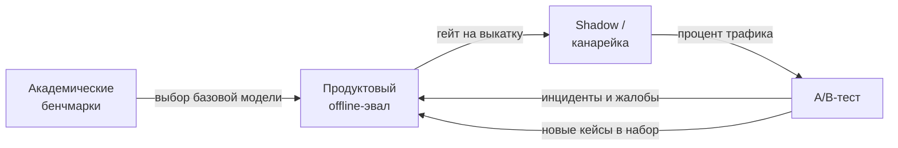

# Оценка LLM

> **Зачем эта глава.** «Модель стала лучше» — самое трудное утверждение в LLM-проекте: его нельзя
> проверить одной цифрой, а привычные метрики классификации здесь не работают. После этой главы вы
> сможете собрать эвал-набор под конкретный продукт, построить и **провалидировать** LLM-судью,
> посчитать рейтинги моделей из парных сравнений, отличить сигнал от шума в A/B и объяснить на
> собеседовании, почему высокое место в лидерборде почти ничего не говорит о пользе в вашей задаче.

**Уровень:** 🎯 middle → 🧠 middle+
**Предварительно нужно:** [метрики качества](../02-classic-ml/04-metrics.md),
[задачи NLP и их метрики](../04-nlp/05-nlp-tasks-and-metrics.md),
[RAG](07-rag.md), [агенты и вызов инструментов](08-agents-and-tools.md),
[статистика и вывод](../01-math/03-statistics.md)
**Как проработать:** чтение + сборка мини-эвала + расчёт согласия с разметкой

---

## Карта главы

- [1. Проблема: почему «точность» тут не считается](#1-проблема-почему-точность-тут-не-считается) — откуда берётся вся сложность
- [2. Три этажа оценки](#2-три-этажа-оценки) — бенчмарки, продуктовые эвалы, онлайн
- [3. Бенчмарки и их протечка в обучение](#3-бенчмарки-и-их-протечка-в-обучение) — contamination, как её ловят
- [4. Почему лидерборды слабо предсказывают пользу](#4-почему-лидерборды-слабо-предсказывают-пользу) — четыре независимых причины
- [5. Метрики по задачам](#5-метрики-по-задачам) — что чем измерять и чем не надо
- [6. LLM-as-a-judge](#6-llm-as-a-judge) — режимы, смещения, как их гасить
- [7. Валидация судьи против человека](#7-валидация-судьи-против-человека) — согласие, каппа, потолок
- [8. Парные сравнения: Bradley–Terry и Elo](#8-парные-сравнения-bradleyterry-и-elo) — полный вывод
- [9. Разметка и её согласованность](#9-разметка-и-её-согласованность) — инструкция как продукт
- [10. Регрессионный набор под продукт](#10-регрессионный-набор-под-продукт) — эвалы как код
- [11. Offline vs online](#11-offline-vs-online) — что ловит каждый и чего не ловит
- [12. Подводные камни](#12-подводные-камни)
- [13. Проверь себя](#13-проверь-себя)
- [14. Практика](#14-практика)
- [15. Что читать дальше](#15-что-читать-дальше)

**Сквозные обозначения главы.** $n$ — число примеров в эвал-наборе (объектов), $K$ — число
сравниваемых моделей, $\theta_i$ — сила (skill) модели $i$ в модели Брэдли–Терри, $\eta$ — шаг
обновления в Elo, $p_{ij}$ — вероятность того, что модель $i$ выиграет у модели $j$, $x$ — вход
(запрос), $y$ — ответ модели, $y^\*$ — эталонный ответ, если он есть.

---

## 1. Проблема: почему «точность» тут не считается

Возьмём типичную задачу классификации. У объекта есть один правильный класс, у модели — один
предсказанный, и метрика получается механически: совпало или нет. Даже там есть тонкости (порог,
дисбаланс, калибровка — см. [главу о метриках](../02-classic-ml/04-metrics.md)), но сама процедура
измерения не вызывает вопросов.

Теперь возьмём LLM. Пользователь пишет: *«Составь письмо клиенту, который третий месяц не платит
по счёту, но мы хотим сохранить отношения»*. Модель выдаёт текст. Он правильный?

Правильных ответов здесь бесконечно много, и они **не сравнимы посимвольно**. Два письма могут
отличаться в каждом слове и оба быть отличными. Третье может отличаться от лучшего на одно слово
(«обязаны» вместо «просим») и быть катастрофой для отношений с клиентом. Функция «качество» здесь:

- **не имеет замкнутой формы** — её нельзя вычислить из $(x, y)$ арифметически;
- **зависит от контекста, которого нет во входе** — тон компании, история отношений, юридические
  ограничения;
- **многомерна** — фактическая корректность, полнота, тон, длина, структура, отсутствие выдумок;
  эти оси конфликтуют, и продукт по-разному их взвешивает;
- **имеет разброс у самих людей** — два опытных менеджера разойдутся в оценке одного и того же письма.

> 🌱 **База.** Если очень коротко: в классическом ML вы сравниваете предсказание с истиной. В LLM
> истины часто нет вообще — есть лишь *суждение* о том, насколько ответ полезен. А суждение
> приходится либо покупать у людей (дорого, медленно, шумно), либо аппроксимировать другой моделью
> (дёшево, быстро, смещённо). Вся глава — про то, как жить между этими двумя вариантами.

Отсюда следует главный организационный вывод, который стоит усвоить раньше всех формул:
**оценка LLM — это не метрика, а система измерений.** У неё есть свои источники смещения, свой шум,
своя стоимость и своя валидация. К ней надо относиться как к отдельному инженерному артефакту,
который вы разрабатываете, тестируете и версионируете наравне с моделью.

> 💬 **На собеседовании.** Спросят: «Как вы поймёте, что новая версия промпта лучше старой?»
> Хороший ответ начинается с уточнения: лучше **по какому критерию** и **на каком распределении
> запросов**. Дальше — конкретика: фиксированный регрессионный набор из реальных логов, разбитый
> по типам запросов; детерминированные проверки там, где они возможны (формат, наличие обязательных
> полей, срабатывание инструмента); парные сравнения судьёй с перестановкой позиций там, где
> нужны суждения; доверительный интервал на разницу, а не голое «стало 78% вместо 74%»; и
> обязательно — просмотр 20–30 примеров, где новая версия проиграла. Плохой ответ: «прогоню на
> MMLU» или «посмотрю, ответы стали красивее».

---

## 2. Три этажа оценки

Полезно сразу развести три разных вида измерения, потому что их постоянно путают, и путаница
приводит к бессмысленным спорам.

| Этаж | Что измеряет | Кому нужен | Типичный носитель |
|---|---|---|---|
| **Академические бенчмарки** | общие способности базовой модели | тем, кто выбирает базовую модель или обучает свою | MMLU, GSM8K, HumanEval, BIG-bench |
| **Продуктовые эвалы (offline)** | качество на *вашем* распределении запросов | команде продукта, каждый день | свой набор кейсов + судья + проверки |
| **Онлайн-метрики** | реальное влияние на пользователя и бизнес | всей компании, при выкатке | A/B, прокси-сигналы, жалобы |

Ключевая мысль: **это не три уровня точности одного и того же измерения, это три разных измерения.**
Модель может быть лучше на бенчмарках и хуже в вашем продукте. Может выигрывать на продуктовом
эвале и проигрывать в A/B (например, потому что стала медленнее). Может выигрывать в A/B по
краткосрочной метрике и проигрывать по удержанию через два месяца.



Стрелка «обратно» здесь не украшение: **каждый инцидент в проде обязан превратиться в кейс
регрессионного набора.** Именно так эвал-набор со временем начинает предсказывать прод — он
буквально составлен из того, где вы уже обжигались.

---

## 3. Бенчмарки и их протечка в обучение

### 3.1 Что такое бенчмарк и зачем он был нужен

Академический бенчмарк — фиксированный набор задач с известными ответами, на котором сравнивают
модели. Классика:

- **MMLU** — 57 предметных областей, вопросы с четырьмя вариантами ответа, от школьной математики
  до юриспруденции. Метрика — доля правильных вариантов.
- **GSM8K** — арифметические текстовые задачи уровня начальной школы; ответ — число, проверяется
  точным совпадением.
- **HumanEval** — 164 задачи на генерацию кода на Python; ответ проверяется **запуском тестов**,
  а не сравнением текста.
- **BIG-bench** — сборник из сотен разнородных заданий, задуманный как проверка на широту.

Они сыграли свою роль: до них сравнение моделей было соревнованием в убедительности демо. Но у них
есть встроенный дефект, который со временем стал доминирующим.

### 3.2 Протечка данных (data contamination)

**Проблема.** Бенчмарк публикуется в открытом доступе — иначе им нельзя пользоваться. Предобучение
LLM идёт по большому срезу интернета. Значит, тестовые примеры бенчмарка с высокой вероятностью
оказываются **внутри обучающей выборки**. Модель не решает задачу, а вспоминает ответ.

Это в точности та же **утечка (data leakage)**, что и в табличном ML
(см. [валидация и утечки](../02-classic-ml/13-validation-and-leakage.md)), только масштаб другой:
никто не может гарантировать, чего нет в 15 триллионах токенов.

Формы протечки, по возрастанию коварности:

1. **Прямая.** Тестовый пример дословно есть в обучающем корпусе. Ловится n-граммным пересечением.
2. **Перефразированная.** Та же задача с переставленными словами, переведённая туда-обратно или
   переписанная другой моделью. N-граммный фильтр её не видит.
3. **Через решения.** Самой задачи нет, но есть блог с разбором именно этой задачи, GitHub-репозиторий
   с решениями бенчмарка, обсуждение на форуме.
4. **Через дообучение.** Кто-то собрал SFT-набор «на основе публичных бенчмарков», и он утёк в
   инструкционный микс — уже после предобучения, где фильтровать никто не думал.

> ⚠️ **Типичная ошибка.** Считать, что дедупликация по точному совпадению строк решает проблему
> протечки → отчитываться о «чистом» бенчмарке → получить завышенную оценку. Правильно: считать
> протечку **неустранимой по умолчанию** и строить выводы на приватных наборах, которые вы
> держите у себя.

### 3.3 Как обнаруживают протечку

Три практических приёма, о которых полезно знать.

**Канареечные строки (canary strings).** В сам файл бенчмарка вшивается уникальный случайный
идентификатор с просьбой исключать любые тексты, его содержащие. Если модель способна воспроизвести
канарейку — она видела файл. Приём честный, но полагается на добросовестность тех, кто собирает
корпус, и не помогает против перефразировок.

**Свежий параллельный набор.** Самый убедительный метод: собрать **новый** набор задач по той же
методике и того же уровня сложности, что и старый бенчмарк, и сравнить результаты. Именно так была
устроена проверка GSM8K: авторы GSM1k собрали новые задачи в том же формате и обнаружили, что часть
моделей теряет заметную долю точности на свежих задачах, тогда как другие держат уровень. Разница
между падением на новом наборе и результатом на старом — это и есть оценка «сколько было
запоминания».

**Тест на перестановку вариантов.** Дешёвый и очень практичный приём для задач с вариантами ответа.
Если модель действительно решает задачу, перестановка вариантов A/B/C/D не должна менять её ответ
(по существу). Если модель запомнила «правильный ответ — C», то после перестановки она начнёт
ошибаться систематически. Родственный вариант — сравнить перплексию на оригинальной формулировке
и на её перемешанных версиях: аномально низкая перплексия именно на канонической формулировке —
признак того, что модель видела ровно этот текст.

```python
# Тест на позиционное запоминание в задачах с вариантами ответа.
# Идея: правильный ответ переставляем на все K позиций. Модель, которая РЕШАЕТ,
# должна выбирать один и тот же вариант по смыслу; модель, которая ВСПОМНИЛА
# позицию, начнёт «плыть».
import itertools
import numpy as np


def permutation_consistency(ask_model, question, options, correct_idx, n_perm=4, seed=0):
    """ask_model(question, options) -> индекс выбранного варианта (int).

    Возвращает (accuracy_по_перестановкам, доля_согласованных_ответов).
    Согласованность считаем по СОДЕРЖАНИЮ варианта, а не по букве.
    """
    rng = np.random.default_rng(seed)
    correct_text = options[correct_idx]
    chosen_texts, hits = [], []

    for _ in range(n_perm):
        perm = rng.permutation(len(options))          # новая раскладка вариантов
        shuffled = [options[j] for j in perm]
        picked = ask_model(question, shuffled)        # индекс в НОВОЙ раскладке
        chosen_texts.append(shuffled[picked])
        hits.append(shuffled[picked] == correct_text)

    # доля перестановок, где модель выбрала тот же по смыслу вариант, что и чаще всего
    most_common = max(set(chosen_texts), key=chosen_texts.count)
    consistency = chosen_texts.count(most_common) / len(chosen_texts)
    return float(np.mean(hits)), consistency
```

Если `accuracy` высокая, а `consistency` низкая — модель угадывает, а не решает. Если обе высокие —
как минимум ответ устойчив.

> 💬 **На собеседовании.** Спросят: «Модель показывает 92% на вашем бенчмарке. Что вы проверите
> в первую очередь?» Хороший ответ: не празднование, а три проверки — (1) нет ли протечки: собрать
> свежие примеры по той же методике и сравнить; (2) устойчивость: перестановка вариантов,
> перефразировка вопроса, смена порядка few-shot примеров; (3) разбиение по срезам: 92% в среднем
> может складываться из 99% на лёгком большинстве и 40% на редком, но дорогом классе запросов.
> Плохой ответ: «отлично, выкатываем».

---

## 4. Почему лидерборды слабо предсказывают пользу

Протечка — только одна из причин. Даже безупречно чистый лидерборд плохо предсказывает, поможет ли
модель именно вам. Причин ровно четыре, и они независимы.

**Причина 1: другое распределение входов.** Лидерборд измеряет качество на распределении $P_{\text{bench}}(x)$,
а ваш продукт живёт на $P_{\text{prod}}(x)$. Если ваши пользователи пишут короткие запросы на русском
с опечатками и внутренними аббревиатурами компании, то результат на англоязычных академических
вопросах говорит о вашем случае примерно столько же, сколько результат на шахматах.

**Причина 2: другая целевая функция.** Бенчмарк почти всегда меряет «правильность ответа». Продукту
часто важнее другое: не выдумать факт, признать незнание, уложиться в формат JSON, не превысить
латентность, не сказать лишнего про конкурентов. Модель, которая на 3 пункта точнее, но на 20%
чаще выдумывает, — для вас хуже.

**Причина 3: закон Гудхарта.** *Когда мера становится целью, она перестаёт быть хорошей мерой.*
Как только лидерборд начинает влиять на продажи и найм, на него начинают оптимизироваться — иногда
честно (дообучение на задачах похожего типа), иногда нет (протечка). В обоих случаях связь
«место в таблице → польза» слабеет.

**Причина 4: разрешающая способность.** Разница в 0.5 пункта на наборе из 1000 примеров
статистически не отличима от нуля. Стандартная ошибка доли при $p \approx 0.8$ и $n = 1000$:

$$
\mathrm{SE} = \sqrt{\frac{p(1-p)}{n}} = \sqrt{\frac{0.8 \cdot 0.2}{1000}} \approx 0.0126
$$

где $p$ — доля правильных ответов, $n$ — число примеров в наборе. То есть 95%-й доверительный
интервал — примерно $\pm 2.5$ процентных пункта. Соседние строчки лидерборда, отличающиеся на
1–2 пункта, статистически **неразличимы**, хотя выглядят как упорядоченный рейтинг.

> 🧠 **Middle+.** Отдельная тонкость: результаты на лидербордах обычно приводятся без доверительных
> интервалов и без указания, сколько конфигураций промпта/декодинга перепробовали. Если попробовать
> 20 вариантов промпта и опубликовать лучший, это классическая проблема множественных сравнений
> (см. [ловушки A/B](../10-ab-testing/04-pitfalls.md)): максимум из 20 шумных оценок систематически
> смещён вверх. Поэтому корректное сравнение требует фиксировать протокол *до* прогонов.

**Что из этого следует практически.** Лидерборды полезны ровно для одного: **сузить список
кандидатов**. Из десятка моделей выбрать три-четыре, которые в принципе в нужном классе. Дальше —
только свой набор.

---

## 5. Метрики по задачам

Универсальной метрики нет, но по типам задач всё довольно определённо. Ниже — рабочая таблица,
которую стоит держать в голове.

| Тип задачи | Чем мерить | Чем НЕ мерить и почему |
|---|---|---|
| Классификация / роутинг интентов | accuracy, macro-F1, матрица ошибок | «оценкой судьи» — здесь есть однозначная истина, судья только добавит шум |
| Извлечение полей (структурный вывод) | точность по полям, доля валидного JSON по схеме, exact match после нормализации | BLEU/ROUGE — они меряют перекрытие текста, а не корректность поля |
| Генерация кода | `pass@k` — доля задач, решённых запуском тестов | текстовое сходство с эталоном: корректный код может выглядеть как угодно |
| Суммаризация | судья по рубрике (полнота / фактичность / длина) + проверка на выдумки | только ROUGE: он поощряет копирование фраз, а не понимание |
| Открытый диалог, письма, объяснения | парные сравнения (§8) + рубрики судьи | perplexity: она про правдоподобие текста, а не про полезность |
| RAG-ответ | отдельно retrieval (recall@k, MRR) и generation (groundedness, наличие цитат) | одна сквозная цифра — она скрывает, что именно сломалось |
| Агент с инструментами | task success rate, число шагов, доля корректных вызовов, стоимость | качество финального текста: агент может красиво отчитаться о невыполненной работе |

### 5.1 `pass@k` — единственная метрика с честным выводом

Для кода метрика формализуется точно, и на собеседовании это любят. Пусть для задачи мы сгенерировали
$n$ независимых решений, из которых $c$ прошли тесты. Мы хотим оценить вероятность того, что среди
случайно выбранных $k$ решений ($k \le n$) окажется хотя бы одно правильное.

Считаем через дополнение. Число способов выбрать $k$ решений из $n$ равно $\binom{n}{k}$; из них
«все неправильные» — $\binom{n-c}{k}$ способов. Значит:

$$
\text{pass@}k = 1 - \frac{\binom{n-c}{k}}{\binom{n}{k}}
$$

где $n$ — число сгенерированных решений на задачу, $c$ — сколько из них прошли тесты,
$k$ — сколько попыток мы «даём» модели в целевом сценарии, $\binom{a}{b}$ — биномиальный коэффициент.
По набору задач эта величина усредняется.

> 📐 **Разбор формулы.** Наивная оценка «сгенерируй $k$ штук, посмотри, есть ли правильная» —
> несмещённая, но очень шумная: при $k=1$ это просто бросок монеты на каждой задаче. Формула выше
> позволяет сгенерировать много ($n \gg k$) решений один раз и получить **низкодисперсионную**
> оценку для любого $k$. Если $c = 0$, дробь равна 1 и `pass@k` = 0 — задача не решена ни разу.
> Если $c > n - k$, то $\binom{n-c}{k} = 0$ и `pass@k` = 1 — правильных так много, что промахнуться
> невозможно.

```python
import numpy as np


def pass_at_k(n_samples, n_correct, k):
    """Несмещённая оценка pass@k для одной задачи.

    Считаем через произведение, а не через биномиальные коэффициенты:
    C(n-c, k) / C(n, k) = prod_{i=0}^{k-1} (n - c - i) / (n - i).
    Так не переполняемся на больших n и не теряем точность.
    """
    if n_samples - n_correct < k:      # правильных больше, чем можно промахнуться
        return 1.0
    idx = np.arange(k)
    return float(1.0 - np.prod((n_samples - n_correct - idx) / (n_samples - idx)))


# Пример: сгенерировали 20 решений, 3 прошли тесты
for k in (1, 5, 10):
    print(f"pass@{k:<2} = {pass_at_k(20, 3, k):.3f}")
# pass@1  = 0.150   <- как и ожидалось, 3/20
# pass@5  = 0.564
# pass@10 = 0.895
```

Обратите внимание на разрыв: `pass@1` = 0.15, а `pass@10` = 0.90. Это не «модель стала лучше» —
это разные продуктовые сценарии. `pass@1` описывает автодополнение, где пользователь видит один
вариант. `pass@10` описывает агента, который может перегенерировать и прогнать тесты сам.
**Выбирайте $k$ по тому, сколько попыток реально есть у системы**, а не по тому, где цифра красивее.

> ⚠️ **Типичная ошибка.** Отчитываться о `pass@10` для продукта, где пользователю показывается один
> ответ → завышенная оценка в 4–6 раз → неприятный разговор после выката.

---

## 6. LLM-as-a-judge

### 6.1 Проблема, которую решает судья

Человеческая разметка — золотой стандарт качества и худший выбор по операционным характеристикам:
одна оценка ответа стоит от десятков рублей до нескольких сотен (для экспертных доменов), занимает
минуты и не масштабируется на 500 прогонов эвала в день. Итерация по промпту при таком цикле
обратной связи невозможна.

**LLM-as-a-judge** — попытка аппроксимировать человеческое суждение другой LLM. Модели-судье дают
инструкцию (рубрику), вход, ответ (или два ответа) и просят вынести вердикт. Стоимость падает в
сотни раз, задержка — с часов до секунд.

Цена такого решения — систематические смещения. Разбираем их по одному, потому что каждое требует
своего противоядия.

### 6.2 Три режима судейства

| Режим | Что даём судье | Когда применять | Слабое место |
|---|---|---|---|
| **Pointwise (оценка по шкале)** | один ответ + рубрика | нужна абсолютная оценка, мониторинг во времени | шкала «плавает» между прогонами и версиями судьи |
| **Pairwise (сравнение)** | два ответа на один запрос | сравнение двух версий системы | не даёт абсолютного уровня, только «кто лучше» |
| **Reference-based** | ответ + эталон | есть эталонные ответы от экспертов | требует эталонов; наказывает за корректные альтернативы |

Практическое правило: **для сравнения версий используйте pairwise, для мониторинга во времени —
pointwise с рубрикой и фиксированной версией судьи.** Pairwise заметно устойчивее: судье не нужно
калибровать абстрактную шкалу, достаточно локального сравнения.

### 6.3 Смещения судьи

**Позиционное смещение (position bias).** Судья систематически предпочитает ответ, стоящий на
определённой позиции — чаще первый. Это не мелочь: в исследованиях LLM-судей позиционный эффект
может достигать десятков процентных пунктов, а на слабых судьях доходить до того, что перестановка
меняет вердикт в большинстве случаев.

Измеряется прямо: показываем судье пару $(A, B)$ и пару $(B, A)$ и считаем долю случаев, где вердикт
согласован.

$$
\text{Consistency} = \frac{1}{n}\sum_{i=1}^{n} \mathbb{1}\!\left[\, v_i(A,B) \ \text{соответствует}\ v_i(B,A) \,\right]
$$

где $n$ — число пар в наборе, $v_i(\cdot,\cdot)$ — вердикт судьи на $i$-й паре при заданном порядке,
$\mathbb{1}[\cdot]$ — индикатор. «Соответствует» значит: если в первом порядке победил $A$, то во
втором должен победить тот же $A$ (то есть вердикт «второй»).

Лечится **усреднением по перестановкам**: прогоняем каждую пару дважды и засчитываем победу только
при согласованном вердикте, иначе — ничья. Это удваивает стоимость и стоит того.

**Смещение к длине (verbosity / length bias).** При прочих равных судья предпочитает более длинный
ответ. Механика понятна: длинный ответ выглядит более полным, чаще содержит хоть что-то релевантное
и вызывает эвристику «старались». Эффект настолько силён, что для лидербордов на основе судей
разрабатывают отдельные поправки: например, длина-контролируемая версия AlpacaEval оценивает, каким
был бы вердикт при равной длине ответов, устраняя вклад многословности.

Практические противоядия:
- явно включить длину в рубрику («избыточная длина без нового содержания — недостаток»);
- логировать длину ответов и **смотреть на неё как на guardrail-метрику**: если победившая версия
  систематически на 40% длиннее, вы, возможно, измерили только длину;
- в парных сравнениях балансировать: если одна версия систематически длиннее, добавить в анализ
  разбиение по бакетам длины.

**Смещение к своему стилю (self-preference / self-enhancement).** Модель-судья склонна выше оценивать
тексты, порождённые ею самой или моделью того же семейства — просто потому что они ближе к её
собственному распределению: та же структура, те же вводные обороты, та же манера разбивать на
пункты. Если вы выбираете между моделью A и моделью B, а судья — это модель A, результат нельзя
считать нейтральным.

Противоядия: брать судью **из третьего семейства**; либо использовать ансамбль из 2–3 судей разных
семейств и брать большинство; либо в критичных случаях перепроверять спорные вердикты человеком.

**Смещение к уверенному тону.** Ответ, сформулированный уверенно, судья оценивает выше ответа с
оговорками — даже если оговорки уместны и фактически ответ хуже. Это опасно ровно там, где вам
нужна честность модели о своём незнании. Лечится явным пунктом рубрики: «признание неопределённости
при отсутствии данных — достоинство, а не недостаток».

**Смещение шкалы и «слипание» оценок.** Если просить судью оценить от 1 до 10, распределение оценок
почти всегда вырождается: 7 и 8 занимают 80% массы, а разница между 7 и 8 не воспроизводится между
прогонами. Дискретная шкала на 3–4 уровня с **словесными якорями** работает намного стабильнее:

```
1 — ответ неверен по существу или содержит выдуманные факты
2 — частично верен, но упущено существенное или нарушен формат
3 — верен и полон, но есть недостатки в подаче
4 — верен, полон, соответствует формату и тону
```

### 6.4 Судья на практике

Ниже — рабочая реализация парного судьи с перестановкой позиций и подсчётом согласованности.
Функция `call_llm` абстрагирует провайдера: подставьте свой клиент.

```python
import json
import re
from dataclasses import dataclass


JUDGE_PROMPT = """Ты — строгий оценщик ответов ассистента службы поддержки.

Критерии в порядке приоритета:
1. Фактическая корректность: нет утверждений, не подтверждённых контекстом.
2. Полнота: закрыт вопрос пользователя, а не соседний.
3. Соответствие формату и тону инструкции.
4. Лаконичность: избыточная длина без нового содержания — НЕДОСТАТОК.
   Более длинный ответ не является лучшим сам по себе.
5. Честность: признание нехватки данных лучше уверенной выдумки.

Запрос пользователя:
<query>{query}</query>

Ответ 1:
<answer_1>{a1}</answer_1>

Ответ 2:
<answer_2>{a2}</answer_2>

Сначала кратко (не более 3 предложений) сопоставь ответы по критериям.
Затем верни ТОЛЬКО одну строку JSON:
{{"winner": "1" | "2" | "tie", "reason": "<до 15 слов>"}}"""


@dataclass
class PairVerdict:
    winner: str      # "A", "B" или "tie" — уже в терминах систем, а не позиций
    consistent: bool # совпали ли вердикты при двух порядках


def _parse(raw: str) -> str:
    """Достаём последний JSON-объект из ответа судьи.

    Судья часто пишет рассуждение до JSON — поэтому берём ПОСЛЕДНЕЕ вхождение,
    а не первое: в рассуждении могут встретиться фигурные скобки.
    """
    matches = re.findall(r"\{[^{}]*\}", raw)
    if not matches:
        return "tie"                      # не распарсили — считаем ничьёй, не роняем прогон
    try:
        return json.loads(matches[-1]).get("winner", "tie")
    except json.JSONDecodeError:
        return "tie"


def judge_pair(call_llm, query: str, answer_a: str, answer_b: str) -> PairVerdict:
    """Парное сравнение с перестановкой позиций.

    call_llm(prompt: str) -> str. Судью зовём дважды: A/B и B/A.
    Победа засчитывается ТОЛЬКО при согласованном вердикте — так мы
    вычитаем позиционное смещение вместо того, чтобы его игнорировать.
    """
    v1 = _parse(call_llm(JUDGE_PROMPT.format(query=query, a1=answer_a, a2=answer_b)))
    v2 = _parse(call_llm(JUDGE_PROMPT.format(query=query, a1=answer_b, a2=answer_a)))

    # переводим позиции в имена систем
    first = {"1": "A", "2": "B", "tie": "tie"}[v1]
    second = {"1": "B", "2": "A", "tie": "tie"}[v2]   # порядок был обратный

    if first == second:
        return PairVerdict(winner=first, consistent=True)
    return PairVerdict(winner="tie", consistent=False)


def run_judge(call_llm, cases):
    """cases: список словарей {query, answer_a, answer_b}."""
    verdicts = [judge_pair(call_llm, c["query"], c["answer_a"], c["answer_b"]) for c in cases]
    n = len(verdicts)
    wins_a = sum(v.winner == "A" for v in verdicts)
    wins_b = sum(v.winner == "B" for v in verdicts)
    consistency = sum(v.consistent for v in verdicts) / n
    return {
        "n": n,
        "win_rate_a": wins_a / n,
        "win_rate_b": wins_b / n,
        "tie_rate": (n - wins_a - wins_b) / n,
        "position_consistency": consistency,   # ниже 0.7 — судье нельзя верить
    }
```

Показатель `position_consistency` — это ваш индикатор здоровья судьи. Если он ниже примерно 0.7,
судья по существу бросает монету: меняйте модель судьи, упрощайте рубрику или разбивайте оценку
на несколько узких вопросов вместо одного общего.

> 💬 **На собеседовании.** Спросят: «Какие смещения есть у LLM-as-a-judge и как вы с ними боретесь?»
> Хороший ответ перечисляет **механизм, измерение и лечение** для каждого: позиционное — измеряется
> согласованностью при swap, лечится усреднением по перестановкам; к длине — измеряется корреляцией
> вердикта с разностью длин, лечится рубрикой, контролем длины и разбиением по бакетам;
> к своему стилю — лечится судьёй из другого семейства или ансамблем; к уверенному тону — явным
> пунктом рубрики. И главное: **судья сам должен быть провалидирован против человеческой разметки**,
> иначе это измерительный прибор без поверки. Плохой ответ: «GPT-судья хорошо коррелирует с людьми,
> это известно».

---

## 7. Валидация судьи против человека

Это тот раздел, который отличает инженера от пользователя фреймворков. Судья — измерительный
прибор. Прибор без поверки не имеет права влиять на решения.

### 7.1 Процедура

1. Соберите **золотой набор**: 150–300 случаев, репрезентативных по типам запросов. Меньше 100 —
   доверительные интервалы будут шире, чем интересующие вас эффекты.
2. Разметьте его людьми — минимум двумя независимо, лучше тремя. Спорные случаи разберите отдельно
   (adjudication) и зафиксируйте решение в инструкции.
3. Прогоните судью на том же наборе.
4. Посчитайте согласие судья↔человек **и** человек↔человек.
5. Сравните: судья считается пригодным, если его согласие с людьми **близко к согласию людей между
   собой**. Это и есть потолок: судья не может быть «точнее» самой разметки.

### 7.2 Метрики согласия

Голая доля совпадений обманывает: если 80% ответов хорошие, то оба оценщика, всегда говорящие
«хорошо», совпадут в 80% случаев, не сообщив ничего. Поэтому берут **каппу Коэна (Cohen's kappa)**,
которая вычитает согласие «по случайности»:

$$
\kappa = \frac{p_o - p_e}{1 - p_e}
$$

где $p_o$ — наблюдаемая доля совпадений двух оценщиков, $p_e$ — ожидаемая доля совпадений при
независимых оценщиках с теми же маргинальными распределениями меток.

$$
p_e = \sum_{c=1}^{C} \hat{p}^{(1)}_c \cdot \hat{p}^{(2)}_c
$$

где $C$ — число возможных меток, $\hat{p}^{(1)}_c$ — доля меток класса $c$ у первого оценщика,
$\hat{p}^{(2)}_c$ — у второго.

> 📐 **Разбор формулы.** Числитель $p_o - p_e$ — «сколько согласия сверх случайного». Знаменатель
> $1 - p_e$ — «сколько согласия сверх случайного было максимально возможно». Отношение даёт
> нормированную величину: $\kappa = 1$ — идеальное согласие, $\kappa = 0$ — не лучше случайного,
> $\kappa < 0$ — систематически расходятся. Ориентиры интерпретации: 0.2–0.4 — слабое,
> 0.4–0.6 — умеренное, 0.6–0.8 — существенное, выше 0.8 — почти полное. Для *субъективных*
> задач вроде «какой ответ полезнее» согласие людей редко превышает 0.6–0.7 — и это нормально,
> просто задача такая.

Для упорядоченных шкал (1–4) берут **взвешенную каппу**: расхождение «3 против 4» штрафуется меньше,
чем «1 против 4». Для более чем двух разметчиков и пропусков — **альфу Криппендорфа**.

```python
import numpy as np
from sklearn.metrics import cohen_kappa_score, confusion_matrix
from scipy.stats import spearmanr


def validate_judge(human_1, human_2, judge, labels=None):
    """Полная поверка судьи. Все три массива — метки на ОДНОМ наборе кейсов.

    human_1, human_2 — метки двух независимых разметчиков;
    judge — метки LLM-судьи.
    """
    human_1 = np.asarray(human_1)
    human_2 = np.asarray(human_2)
    judge = np.asarray(judge)

    # потолок: насколько люди согласны между собой
    kappa_hh = cohen_kappa_score(human_1, human_2, labels=labels)

    # согласие судьи с каждым из людей
    kappa_j1 = cohen_kappa_score(judge, human_1, labels=labels)
    kappa_j2 = cohen_kappa_score(judge, human_2, labels=labels)
    kappa_judge = 0.5 * (kappa_j1 + kappa_j2)

    # для упорядоченной шкалы полезна и ранговая корреляция:
    # она ловит систематический сдвиг шкалы (судья строже/мягче, но порядок тот же)
    rho, _ = spearmanr(judge, 0.5 * (human_1 + human_2))

    return {
        "kappa_human_human": kappa_hh,          # потолок
        "kappa_judge_human": kappa_judge,       # что достиг судья
        "ratio_to_ceiling": kappa_judge / kappa_hh if kappa_hh > 0 else float("nan"),
        "spearman_judge_vs_human": rho,
        "confusion_judge_vs_human1": confusion_matrix(human_1, judge, labels=labels),
    }


# Синтетический пример: судья систематически мягче людей на верхнем краю шкалы
rng = np.random.default_rng(0)
truth = rng.integers(1, 5, size=200)
h1 = np.clip(truth + rng.integers(-1, 2, size=200), 1, 4)
h2 = np.clip(truth + rng.integers(-1, 2, size=200), 1, 4)
jd = np.clip(truth + rng.integers(0, 2, size=200), 1, 4)   # сдвиг вверх — «мягкий судья»

report = validate_judge(h1, h2, jd, labels=[1, 2, 3, 4])
for k, v in report.items():
    if k != "confusion_judge_vs_human1":
        print(f"{k}: {v:.3f}" if isinstance(v, float) else f"{k}: {v}")
```

Смотрите на `ratio_to_ceiling`. Если он около 0.85–1.0 — судья работает не хуже среднего человека
и им можно пользоваться. Если 0.4 — судья измеряет что-то своё, и решения по нему принимать нельзя.

**Матрица ошибок судьи против человека — самая полезная часть отчёта.** Она показывает не «насколько
плох», а **где** плох. Типичная картина: судья хорошо отличает 1 от 4, но не различает 2 и 3. Вывод:
схлопните шкалу до трёх уровней, и качество измерения вырастет.

> 🧠 **Middle+.** Валидировать судью надо не один раз, а при каждой смене его модели или версии
> промпта. Провайдеры обновляют модели; вердикты «того же» судьи могут поплыть. Практика:
> версия судьи (модель + промпт + параметры декодинга) — часть конфигурации эксперимента, а
> золотой набор прогоняется как регрессионный тест при её изменении. Отдельно: температура судьи
> должна быть нулевой или близкой к нулю, иначе к смещению добавляется дисперсия.

---

## 8. Парные сравнения: Bradley–Terry и Elo

### 8.1 Зачем вообще парные сравнения

Абсолютные оценки плохо воспроизводятся: «7 из 10» у одного человека и у другого — разные вещи, а
у одного и того же человека в понедельник и в пятницу — тоже разные. **Сравнение** устойчивее:
«какой из двух ответов лучше» — вопрос, на который люди отвечают согласованнее, потому что здесь
не нужна общая шкала.

Но парные сравнения дают «сырые» победы и поражения. Нужен способ превратить их в единый рейтинг,
который позволяет сравнивать модели, никогда не встречавшиеся напрямую. Этим занимается модель
Брэдли–Терри.

### 8.2 Вывод модели Брэдли–Терри

**Постановка.** Есть $K$ моделей. Каждой приписываем скрытый параметр «силы» $\theta_i \in \mathbb{R}$.
Постулируем, что вероятность победы модели $i$ над моделью $j$ зависит только от разности сил:

$$
p_{ij} = \Pr(i \succ j) = \sigma(\theta_i - \theta_j) = \frac{1}{1 + e^{-(\theta_i - \theta_j)}}
$$

где $\theta_i$ — сила модели $i$, $\sigma(\cdot)$ — логистическая сигмоида, $p_{ij}$ — вероятность
победы $i$ над $j$. Заметьте: при $\theta_i = \theta_j$ получаем $p_{ij} = 0.5$ — равные силы дают
честную монету; параметры определены с точностью до общей аддитивной константы (сдвиг всех $\theta$
на одно и то же число ничего не меняет), поэтому нужна нормировка.

**Правдоподобие.** Пусть $w_{ij}$ — число побед $i$ над $j$ в наблюдениях. Логарифм правдоподобия:

$$
\ell(\theta) = \sum_{i \ne j} w_{ij}\,\log \sigma(\theta_i - \theta_j)
$$

где сумма идёт по всем упорядоченным парам, $\theta = (\theta_1, \dots, \theta_K)$.

**Ключевое наблюдение.** Это в точности логарифмическое правдоподобие **логистической регрессии**
без свободного члена, если для каждого матча построить признаковый вектор $z \in \mathbb{R}^K$ так:

$$
z_m = \begin{cases}
+1, & m = i \ \text{(победитель)} \\
-1, & m = j \ \text{(проигравший)} \\
0, & \text{иначе}
\end{cases}
$$

и таргет $y = 1$. Тогда $\theta^\top z = \theta_i - \theta_j$, и логистическая регрессия по
$(z, y)$ оценивает ровно наши силы. Это не аналогия — это тождество, и оно даёт бесплатно всё:
градиенты, регуляризацию, готовый оптимизатор.

Градиент по $\theta_i$ (для одного матча $i$ против $j$, где выиграл $i$):

$$
\frac{\partial}{\partial \theta_i}\log\sigma(\theta_i - \theta_j) = 1 - \sigma(\theta_i - \theta_j) = 1 - p_{ij}
$$

Читается прямо: если модель выиграла, а по текущей оценке должна была ($p_{ij} \approx 1$), градиент
почти нулевой — новой информации нет. Если выиграла неожиданно ($p_{ij} \approx 0$), градиент близок
к 1 — сила растёт сильно. **Это и есть логика Elo**, к которой мы сейчас придём.

**L2-регуляризация** здесь не косметика: если какая-то модель выиграла все свои матчи, ММП-оценка
уходит в $+\infty$. Штраф $\lambda\|\theta\|_2^2$ удерживает решение конечным и одновременно решает
проблему ненаблюдаемого сдвига.

```python
import numpy as np
from sklearn.linear_model import LogisticRegression


def bradley_terry(matches, model_names, reg=1e-3, scale=400.0, base=1000.0):
    """Оценка сил моделей из парных сравнений через логистическую регрессию.

    matches: список кортежей (winner_name, loser_name). Ничьи передавайте
             ДВУМЯ записями в обе стороны — это стандартный приём: ничья
             эквивалентна половине победы каждому.
    scale/base: перевод в «шкалу Elo» — чисто косметика для читаемости.
    """
    idx = {name: i for i, name in enumerate(model_names)}
    K = len(model_names)

    X = np.zeros((len(matches), K))
    for row, (win, lose) in enumerate(matches):
        X[row, idx[win]] = 1.0
        X[row, idx[lose]] = -1.0
    y = np.ones(len(matches))

    # Одноклассовый таргет ломает LogisticRegression, поэтому дублируем выборку
    # с обратным знаком признаков и меткой 0 — это то же правдоподобие.
    X_full = np.vstack([X, -X])
    y_full = np.concatenate([y, np.zeros(len(matches))])

    clf = LogisticRegression(fit_intercept=False, C=1.0 / reg, max_iter=2000)
    clf.fit(X_full, y_full)
    theta = clf.coef_[0]
    theta = theta - theta.mean()                      # фиксируем ненаблюдаемый сдвиг

    elo = base + scale / np.log(10.0) * theta         # перевод логитов в шкалу Elo
    return dict(sorted(zip(model_names, elo), key=lambda kv: -kv[1]))


def bootstrap_ci(matches, model_names, n_boot=500, alpha=0.05, seed=0):
    """Доверительные интервалы рейтингов бутстрапом по матчам.

    Без интервалов рейтинг-таблица вводит в заблуждение: разница в 5 пунктов
    при 200 матчах статистически неотличима от нуля.
    """
    rng = np.random.default_rng(seed)
    m = len(matches)
    samples = {name: [] for name in model_names}
    for _ in range(n_boot):
        resampled = [matches[i] for i in rng.integers(0, m, size=m)]
        try:
            r = bradley_terry(resampled, model_names)
        except ValueError:
            continue                                   # редкий вырожденный ресемпл — пропускаем
        for name, val in r.items():
            samples[name].append(val)
    lo, hi = 100 * alpha / 2, 100 * (1 - alpha / 2)
    return {
        name: (float(np.percentile(v, lo)), float(np.percentile(v, hi)))
        for name, v in samples.items() if v
    }


# Демонстрация на синтетике с известной истиной
rng = np.random.default_rng(42)
names = ["model_A", "model_B", "model_C", "model_D"]
true_theta = {"model_A": 1.2, "model_B": 0.4, "model_C": 0.0, "model_D": -0.9}

matches = []
for _ in range(1500):
    i, j = rng.choice(names, size=2, replace=False)
    p = 1.0 / (1.0 + np.exp(-(true_theta[i] - true_theta[j])))
    matches.append((i, j) if rng.random() < p else (j, i))

ratings = bradley_terry(matches, names)
cis = bootstrap_ci(matches, names, n_boot=200)
for name, r in ratings.items():
    lo, hi = cis[name]
    print(f"{name}: {r:7.1f}  [{lo:7.1f}, {hi:7.1f}]")
```

Порядок восстановится корректно, а интервалы покажут, какие соседние модели на самом деле
неразличимы. **Публиковать рейтинг без интервалов — значит выдавать шум за упорядоченность.**

### 8.3 Elo как онлайн-приближение

Elo, придуманный для шахмат, — это тот же Брэдли–Терри, но обучаемый **стохастическим градиентным
подъёмом по одному матчу за раз**. Выведем связь.

В шахматной параметризации ожидаемый результат:

$$
E_{ij} = \frac{1}{1 + 10^{(R_j - R_i)/400}}
$$

где $R_i, R_j$ — рейтинги игроков, 400 — масштабный коэффициент (разница в 400 пунктов даёт
шансы 10:1). Подставив $R = \frac{400}{\ln 10}\theta$, получаем ровно $E_{ij} = \sigma(\theta_i - \theta_j)$ —
это та же формула, записанная по основанию 10 вместо $e$.

Правило обновления после матча:

$$
R_i \leftarrow R_i + \eta\,(S_i - E_{ij}), \qquad R_j \leftarrow R_j - \eta\,(S_i - E_{ij})
$$

где $S_i \in \{0, 0.5, 1\}$ — фактический результат для игрока $i$ (поражение / ничья / победа),
$E_{ij}$ — ожидаемый результат, $\eta$ — шаг обновления (в шахматах его называют K-фактором,
типичные значения 10–40).

> 📐 **Разбор формулы.** Величина $(S_i - E_{ij})$ — это в точности градиент логарифма правдоподобия
> по $\theta_i$, который мы вывели выше: «факт минус ожидание». Значит, Elo — это SGD с постоянным
> шагом $\eta$ по функции потерь Брэдли–Терри. Отсюда все его свойства: он **онлайновый** (обновляется
> по одному наблюдению), **не сходится к ММП-решению** (постоянный шаг не даёт сойтись, рейтинг
> всё время «дрожит») и **зависит от порядка матчей** — модель, сыгравшая первые матчи против
> слабых соперников, получит другой путь, чем при обратном порядке.

**Практический вывод для оценки LLM.** Если у вас офлайн-набор сравнений — считайте Брэдли–Терри
методом максимального правдоподобия, а не Elo: результат не зависит от порядка, есть доверительные
интервалы, есть регуляризация. Elo нужен там, где сравнения приходят потоком и рейтинг надо
обновлять непрерывно (краудсорсинговые арены, где модели постоянно добавляются). Именно это отличие
и лежит в основе того, что публичные арены сравнения LLM со временем перешли от «онлайнового Elo»
к оценке Брэдли–Терри с бутстрап-интервалами по всей истории голосований.

> 💬 **На собеседовании.** Спросят: «Чем Elo отличается от Bradley–Terry?» Хороший ответ:
> Bradley–Terry — вероятностная модель $\Pr(i \succ j) = \sigma(\theta_i - \theta_j)$, параметры
> которой оцениваются ММП по всей истории матчей сразу; Elo — онлайн-приближение той же модели
> стохастическим градиентным шагом $\eta(S - E)$, зависящее от порядка матчей и не сходящееся
> точно. Bradley–Terry сводится к логистической регрессии с признаками $+1/-1$, что даёт готовые
> инструменты: регуляризацию, доверительные интервалы бутстрапом, диагностику. Плохой ответ:
> «Elo — это про шахматы, а BT — про статистику».

### 8.4 Чего парные сравнения не дают

- **Абсолютного уровня.** Модель может быть первой в рейтинге и при этом непригодной для продукта.
  Рейтинг говорит «лучше остальных», а не «достаточно хороша».
- **Транзитивности.** Модель Брэдли–Терри её *постулирует*, но реальные предпочтения могут быть
  нетранзитивны: A выигрывает у B на кодинге, B у C на текстах, C у A на диалоге. Если разброс
  по типам задач большой, единый рейтинг усредняет несравнимое. Лечение — считать рейтинги
  **по срезам запросов** отдельно.
- **Защиты от нерепрезентативной выборки пар.** Если 80% сравнений — это лёгкие вопросы, рейтинг
  описывает лёгкие вопросы. Схема выбора пар — часть дизайна эксперимента, а не деталь реализации.

---

## 9. Разметка и её согласованность

Всё в этой главе упирается в человеческую разметку: она валидирует судью, она формирует золотой
набор, она разрешает спорные случаи. Качество разметки — потолок качества всей системы измерений.

**Инструкция — это продукт, а не памятка.** Хорошая инструкция для разметчика содержит:

1. Определение задачи в одном абзаце — что именно оценивается и от чьего лица.
2. Шкалу с **словесными якорями** и по 2 примера на каждый уровень.
3. Явный порядок приоритетов критериев (что важнее: корректность или тон?).
4. Правила для краевых случаев: что делать, если оба ответа плохи; если вопрос двусмысленный;
   если ответ верен, но не отвечает на заданное.
5. Список того, что **не** должно влиять на оценку: длина сама по себе, форматирование,
   вежливость без содержания.

**Протокол.** Пилот на 30–50 примерах → замер каппы → разбор всех расхождений → правка инструкции →
повтор. Обычно требуется 2–3 итерации, чтобы каппа вышла на плато. Плато и есть внутренняя сложность
задачи: если после трёх итераций $\kappa = 0.45$, значит, задача действительно субъективна, и
эвал придётся строить с учётом этого шума (больше примеров, более грубая шкала).

**Overlap.** Держите 15–25% примеров размеченными минимум двумя людьми — это ваш непрерывный
монитор качества разметки. Если каппа поехала вниз, значит, либо в поток пришёл новый тип запросов,
не описанный в инструкции, либо у разметчиков «замылился глаз».

> ⚠️ **Типичная ошибка.** Отдать разметку без пилота и без overlap, получить 5000 меток и обнаружить,
> что два разметчика по-разному поняли шкалу → весь набор нужно перезаливать. Расчёт согласия на
> первых 50 примерах стоит один день и спасает недели.

---

## 10. Регрессионный набор под продукт

Это самый недооценённый и самый полезный артефакт. Он не про «сравнить модели» — он про
«не сломать то, что работало».

### 10.1 Откуда берутся кейсы

| Источник | Что даёт | Доля в наборе |
|---|---|---|
| Реальные логи (стратифицированная выборка по типам запросов) | покрытие основного распределения | 40–50% |
| Инциденты и жалобы пользователей | защита от повторения известных провалов | 20–30% |
| Краевые случаи, придуманные вручную | пустой ввод, чужой язык, попытка обмануть, противоречивый запрос | 15–20% |
| Регуляторные и политические ограничения | то, что нельзя нарушать никогда | 10% |

Пропорции ориентировочные, но принцип жёсткий: **набор, собранный только из придуманных кейсов,
не предсказывает прод; набор, собранный только из логов, не защищает от редких катастроф.**

### 10.2 Структура одного кейса

```python
from dataclasses import dataclass, field
from typing import Callable, Any


@dataclass
class EvalCase:
    case_id: str
    query: str
    slice: str                                   # тип запроса: "refund", "tech_support", ...
    context: dict[str, Any] = field(default_factory=dict)   # документы для RAG, история, профиль
    # Детерминированные проверки — быстрые, дешёвые, без судьи.
    # Каждая: (имя, функция ответ -> bool)
    assertions: list[tuple[str, Callable[[str], bool]]] = field(default_factory=list)
    # Рубрика для судьи — если детерминированных проверок недостаточно
    rubric: str | None = None
    # Известный уровень качества на текущей проде — база для сравнения
    baseline_score: float | None = None
    severity: str = "normal"                     # "blocking" — регресс блокирует релиз
```

Разделение на `assertions` и `rubric` — принципиальное. Детерминированные проверки:

- **валидность формата**: JSON парсится и соответствует схеме;
- **обязательные элементы**: указан номер заказа, есть ссылка на источник;
- **запреты**: не упомянут конкурент, нет обещания сроков, нет персональных данных из контекста;
- **инструменты**: вызван нужный инструмент с корректными аргументами;
- **числа**: сумма в ответе совпадает с суммой в контексте.

Они бесплатны, детерминированы и ловят большую часть регрессов. Судья нужен только там, где
проверить программно нельзя. Практическое правило: **если проверку можно написать регуляркой или
парсером — пишите её, а не зовите судью.**

### 10.3 Гейт в CI

```python
import numpy as np
from scipy import stats


def run_suite(system_fn, cases, judge_fn=None):
    """system_fn(query, context) -> str. judge_fn(case, answer) -> float в [0, 1]."""
    rows = []
    for case in cases:
        answer = system_fn(case.query, case.context)
        passed = {name: bool(fn(answer)) for name, fn in case.assertions}
        score = judge_fn(case, answer) if (judge_fn and case.rubric) else None
        rows.append({
            "case_id": case.case_id,
            "slice": case.slice,
            "severity": case.severity,
            "assertions_passed": all(passed.values()) if passed else True,
            "assertion_detail": passed,
            "judge_score": score,
        })
    return rows


def gate(rows_new, rows_base, alpha=0.05):
    """Решение о допуске новой версии.

    Два разных правила:
      1) blocking-кейсы — жёсткий гейт, никакой статистики: сломал -> стоп;
      2) агрегатная метрика — статистический тест, потому что она шумная.
    """
    # 1) жёсткие проверки
    broken = [
        r["case_id"] for r, b in zip(rows_new, rows_base)
        if r["severity"] == "blocking" and b["assertions_passed"] and not r["assertions_passed"]
    ]
    if broken:
        return {"decision": "block", "reason": "blocking regressions", "cases": broken}

    # 2) парный тест по кейсам, где есть оценка судьи.
    # Парный (а не независимый) — потому что кейсы ОДНИ И ТЕ ЖЕ: это резко
    # снижает дисперсию, ровно как парный t-тест против двухвыборочного.
    pairs = [
        (r["judge_score"], b["judge_score"])
        for r, b in zip(rows_new, rows_base)
        if r["judge_score"] is not None and b["judge_score"] is not None
    ]
    if not pairs:
        return {"decision": "pass", "reason": "no judged cases"}

    new_s, base_s = map(np.array, zip(*pairs))
    diff = new_s - base_s
    # Уилкоксон, а не t-тест: оценки судьи дискретны и распределение далеко от нормального
    stat, p = stats.wilcoxon(diff) if np.any(diff != 0) else (0.0, 1.0)
    mean_diff = float(diff.mean())

    if p < alpha and mean_diff < 0:
        return {"decision": "block", "reason": f"significant drop {mean_diff:+.3f}, p={p:.4f}"}
    return {"decision": "pass", "reason": f"delta {mean_diff:+.3f}, p={p:.4f}"}
```

Два момента, которые стоит понять.

**Почему парный тест.** Кейсы одни и те же для обеих версий, значит дисперсия «сложности кейса»
вычитается. Это тот же эффект, что даёт CUPED в A/B-тестах
(см. [снижение дисперсии](../10-ab-testing/03-variance-reduction.md)) — только здесь он достаётся
бесплатно, самим дизайном.

**Почему blocking-кейсы вне статистики.** Если система перестала правильно отказывать в выдаче
персональных данных — это не «статистически незначимое ухудшение на 1 кейсе», это стоп. Некоторые
свойства не усредняются.

### 10.4 Флаки-тесты из-за сэмплирования

При `temperature > 0` один и тот же кейс даёт разные ответы, и тест становится нестабильным.
Варианты решения, по убыванию предпочтительности:

1. **Фиксировать `temperature = 0`** для эвал-прогонов. Полного детерминизма это не даёт (батчинг
   и параллельные редукции на GPU вносят недетерминизм в порядок суммирования), но дисперсию режет
   на порядок.
2. **Усреднять по $m$ прогонам** ($m = 3\ldots5$) там, где сэмплирование — часть продукта. Дороже,
   зато честно отражает то, что видит пользователь.
3. **Смягчать проверки**: вместо «ответ содержит ровно эту строку» — «ответ содержит номер заказа
   в любом виде».

> ⚠️ **Типичная ошибка.** Ставить в CI жёсткое сравнение сгенерированного текста с эталоном →
> тест краснеет при любом изменении формулировки → команда привыкает игнорировать красный CI →
> настоящий регресс проезжает незамеченным. Проверяйте **свойства** ответа, а не его текст.

---

## 11. Offline vs online

### 11.1 Что ловит каждый

| | Offline-эвал | Онлайн (A/B) |
|---|---|---|
| Скорость обратной связи | минуты | дни–недели |
| Стоимость итерации | центы | недели работы + риск для пользователей |
| Что измеряет | качество на зафиксированном распределении | реальное поведение пользователей |
| Чего не видит | изменение распределения запросов, латентность, привыкание, «пользователь просто не стал читать» | ничего из того, что не выражено в метриках; редкие катастрофы теряются в шуме |
| Роль | гейт, быстрый цикл, защита от регрессов | финальный арбитр |

**Правильная связка**: offline фильтрует кандидатов и блокирует регрессы, online принимает решение.
Пропускать offline нельзя — вы будете тратить недели A/B на заведомо плохие версии. Заменять им
online тоже нельзя — офлайн-набор не знает, что пользователи начнут задавать вопросы, которых в нём нет.

### 11.2 Метрики онлайна для LLM-продукта

Отложенной разметки в момент выката нет — нужны **прокси-сигналы**, доступные немедленно:

- **Явная обратная связь**: 👍/👎. Плюс: прямой сигнал. Минус: отвечает 1–3% пользователей, и
  сильно смещённо — недовольные активнее.
- **Регенерация / переформулировка запроса** в течение короткого окна. Один из лучших неявных
  сигналов неудачи: пользователь не получил желаемого и пробует снова.
- **Копирование ответа** (в чат-продуктах и ассистентах для кода) — сигнал полезности.
- **Правка ответа перед отправкой** (в сценариях «черновик для оператора») — метрика редакционного
  расстояния между черновиком и отправленным текстом. Это одна из самых информативных метрик:
  она числовая, непрерывная и напрямую отражает сэкономленное время.
- **Эскалация на человека** в саппорт-сценариях — прямой прокси провала.
- **Guardrail-метрики**: p95-латентность, стоимость на диалог, доля отказов, доля срабатываний
  фильтров. Они не должны деградировать, даже если основная метрика выросла.

**Отдельно про длину и «многословие».** Если новая версия победила и по метрикам, и по судье, но
ответы стали в полтора раза длиннее — проверьте, не выросла ли латентность и не упало ли
дочитывание. Многословие — самый частый способ выиграть у судьи, ничего не улучшив.

### 11.3 Дизайн A/B для LLM

Особенности, которых нет в обычных A/B (общая теория — в разделе
[A/B-тестирование](../10-ab-testing/01-experiment-design.md)):

- **Единица рандомизации — пользователь, а не запрос.** Внутри диалога переключать версии нельзя:
  ответы станут несогласованными, и вы измерите не качество, а хаос.
- **Огромная дисперсия метрик.** Доля 👎 — редкое событие; ratio-метрики вроде «правок на диалог»
  имеют тяжёлые хвосты. Нужен либо большой размер выборки, либо снижение дисперсии
  (CUPED по предпериодной активности пользователя работает хорошо).
- **Эффект новизны.** Первые дни после смены поведения ассистента метрики шумят: часть пользователей
  реагирует на изменение как таковое. Смотрите на стабилизированный период.
- **Долгосрочные эффекты не видны за неделю.** Ассистент, который льстит и всегда соглашается,
  может выиграть краткосрочные метрики удовлетворённости и проиграть доверие через квартал.
  Отсюда практика holdout-групп на длинном горизонте.

> 💬 **На собеседовании.** Спросят: «Офлайн-метрика выросла на 6%, A/B не показал ничего. Ваши
> действия?» Хороший ответ — по порядку проверить четыре гипотезы: (1) **мощность** — хватило ли
> выборки, чтобы вообще увидеть ожидаемый эффект; посчитать MDE до того, как объявлять «нет
> эффекта»; (2) **несовпадение распределений** — сравнить распределение запросов в эвал-наборе и
> в проде: возможно, улучшение пришлось на срез, который в проде составляет 3% трафика;
> (3) **несовпадение метрик** — офлайн мерил качество текста, а онлайн-метрика зависит от
> латентности, которая выросла; (4) **потолок** — пользователи и раньше были удовлетворены,
> дополнительное качество не конвертируется в поведение. Плохой ответ: «A/B шумный, доверяю
> офлайну» — это ровно тот случай, когда офлайн-метрика оптимизирована на себя.

---

## 12. Подводные камни

**Судья, обученный или подобранный на том же наборе, где вы принимаете решения.**
Симптом: судья прекрасно согласуется с людьми на золотом наборе, но решения по нему в проде не
подтверждаются.
Причина: промпт судьи и рубрику итеративно правили, глядя на тот же набор — классическое
переобучение на валидации.
Что делать: держать **два** размеченных набора — на одном настраивать судью, на втором (никогда не
использованном для настройки) проверять итог. Ровно как train/valid/test.

**Эвал-набор устарел, а метрика растёт.**
Симптом: качество на наборе стабильно улучшается, жалоб в проде не меньше.
Причина: распределение запросов уехало (новая функциональность, сезонность, новая аудитория), а
набор собран год назад.
Что делать: ежеквартально пересобирать 20–30% набора из свежих логов; отслеживать долю продовых
запросов, «похожих» на кейсы набора (по эмбеддингам — расстояние до ближайшего кейса).

**Средняя метрика скрывает провал в важном срезе.**
Симптом: общая оценка 4.2/5, а поток жалоб от корпоративных клиентов.
Причина: корпоративный сегмент — 4% запросов; его провал незаметен в среднем.
Что делать: всегда отчитываться **по срезам** и заводить отдельные пороги на бизнес-критичных
срезах. Средняя цифра — для отчёта, срезы — для решений.

**Победа за счёт длины.**
Симптом: судья и 👍 говорят «лучше», а латентность и стоимость выросли, дочитывание упало.
Причина: verbosity bias судьи + человеческая эвристика «длиннее = старательнее».
Что делать: логировать длину как guardrail; проводить сравнение при контроле длины; включить
лаконичность в рубрику явным пунктом.

**Ничьи разъезжаются с изменением судьи.**
Симптом: доля ничьих скакнула с 15% до 40% после обновления модели-судьи, и все сравнения потеряли
разрешающую способность.
Причина: новая версия судьи стала осторожнее, чаще выбирает «tie».
Что делать: версия судьи — часть конфигурации эксперимента; при смене прогонять золотой набор
заново и пересчитывать калибровку; не сравнивать между собой прогоны с разными версиями судьи.

**Оценка агента по финальному тексту.**
Симптом: агент «отчитывается» об успешно выполненной задаче, метрика высокая, а задача не выполнена.
Причина: судья читает только финальное сообщение, где агент уверенно описывает результат.
Что делать: мерить **исход**, а не отчёт — проверять состояние системы (создана ли запись, отправлено
ли письмо, проходят ли тесты), а также промежуточные шаги: доля корректных вызовов инструментов,
число шагов, зацикливания.

**Утечка контекста в эвал через few-shot.**
Симптом: качество на эвал-наборе резко выросло после «улучшения промпта».
Причина: в few-shot-примеры промпта попали кейсы из эвал-набора (или очень похожие).
Что делать: держать примеры промпта и эвал-набор в разных файлах и проверять пересечение
автоматически — по точному совпадению и по близости эмбеддингов.

**Забыли про стоимость измерения.**
Симптом: полный прогон эвала занимает 4 часа и стоит столько, что его запускают раз в неделю.
Причина: судья вызывается на всех кейсах, с перестановкой, в трёх повторах.
Что делать: двухуровневая схема — быстрый набор (100–200 кейсов, только детерминированные проверки,
минуты, на каждый коммит) и полный (1000+ кейсов с судьёй, перед релизом).

---

## 13. Проверь себя

<details>
<summary><b>🌱 Вопрос.</b> Почему нельзя просто взять accuracy для оценки LLM-ассистента?</summary>

**Короткий ответ.** Потому что у большинства запросов нет единственного правильного ответа: качество
многомерно (корректность, полнота, тон, формат, отсутствие выдумок) и зависит от контекста, которого
нет во входе.

**Развёрнуто.** Accuracy требует функции «предсказание = истина». Для генерации такой функции нет:
два совершенно разных текста могут быть одинаково хороши, а два почти идентичных — различаться
кардинально по одному слову. Там, где однозначная истина есть (классификация интентов, извлечение
полей, код с тестами), accuracy и `pass@k` применимы и должны применяться — это дешевле и надёжнее
судьи. Там, где её нет, качество приходится либо покупать у людей, либо аппроксимировать судьёй,
и в обоих случаях мы измеряем *суждение*, а не истину.

**Чего ждёт интервьюер:** понимания, что задача измерения принципиально другая, и что кандидат
различает подзадачи, где детерминированные метрики работают, и где нет.

**Провал:** «нужно взять BLEU» — это метрика перекрытия n-грамм, она не отражает корректность и
почти не коррелирует с полезностью на открытых задачах.
</details>

<details>
<summary><b>🎯 Вопрос.</b> Что такое протечка бенчмарка в обучающие данные и как её обнаружить?</summary>

**Короткий ответ.** Тестовые примеры публичного бенчмарка попадают в предобучающий корпус, и модель
воспроизводит запомненный ответ вместо решения задачи. Обнаруживают свежим параллельным набором,
канареечными строками и тестами на устойчивость к перестановкам/перефразировкам.

**Развёрнуто.** Формы протечки: дословная (ловится n-граммным пересечением), перефразированная
(не ловится), через разборы и репозитории с решениями, через SFT-миксы, собранные «по мотивам»
бенчмарков. Самый убедительный метод обнаружения — собрать новый набор задач по той же методике и
сравнить: если модель теряет на свежих задачах существенно больше, чем другие, это признак
запоминания. Дешёвый практический тест — перестановка вариантов ответа: решающая модель сохранит
выбор по смыслу, запомнившая — начнёт ошибаться. Практический вывод: считать публичные бенчмарки
загрязнёнными по умолчанию и опираться на приватные наборы.

**Чего ждёт интервьюер:** что вы знаете про contamination и не принимаете цифры лидербордов за
чистую монету; бонус — если назовёте конкретную методику (свежий параллельный набор).

**Провал:** «производители дедуплицируют данные, так что проблемы нет».
</details>

<details>
<summary><b>🎯 Вопрос.</b> Перечислите смещения LLM-as-a-judge и способы борьбы с каждым.</summary>

**Короткий ответ.** Позиционное (лечится усреднением по перестановкам), к длине (рубрика + контроль
длины как guardrail), к своему стилю (судья другого семейства или ансамбль), к уверенному тону
(явный пункт рубрики), «слипание» шкалы (грубая шкала с якорями).

**Развёрнуто.** Позиционное: судья предпочитает ответ на определённой позиции; измеряется долей
согласованных вердиктов при перестановке $(A,B) \to (B,A)$; если согласованность ниже ~0.7, судье
верить нельзя. Verbosity bias: при прочих равных выигрывает более длинный ответ; отсюда возникли
длина-контролируемые версии лидербордов на основе судей. Self-preference: модель выше оценивает
собственные тексты и тексты своего семейства — критично, если судья участвует в сравнении.
Смещение к уверенности: осторожный корректный ответ проигрывает уверенному неверному. Шкала:
десятибалльная вырождается в 7–8; берите 3–4 уровня с текстовыми якорями. И ключевое: судья
обязан быть провалидирован против человеческой разметки — с расчётом каппы и сравнением с потолком
«человек–человек».

**Чего ждёт интервьюер:** структурного ответа «механизм → измерение → лечение», а не списка
названий.

**Провал:** назвать только позиционное смещение и не упомянуть валидацию судьи.
</details>

<details>
<summary><b>🧠 Вопрос.</b> Выведите модель Брэдли–Терри и объясните её связь с логистической регрессией и с Elo.</summary>

**Короткий ответ.** $\Pr(i \succ j) = \sigma(\theta_i - \theta_j)$. Логарифм правдоподобия совпадает
с логистической регрессией на признаках $+1$ у победителя, $-1$ у проигравшего, без свободного члена.
Elo — стохастический градиентный подъём по этому же правдоподобию с постоянным шагом.

**Развёрнуто.** Постулируем силу $\theta_i$ и вероятность победы, зависящую только от разности сил.
Логарифм правдоподобия: $\ell(\theta) = \sum_{i \ne j} w_{ij}\log\sigma(\theta_i - \theta_j)$, где
$w_{ij}$ — число побед $i$ над $j$. Построив для каждого матча вектор $z$ с $+1$ на позиции
победителя и $-1$ на позиции проигравшего, получаем $\theta^\top z = \theta_i - \theta_j$ — то есть
ровно логистическую регрессию. Отсюда бесплатно берутся L2-регуляризация (без неё модель с 100%
побед уходит в бесконечность) и доверительные интервалы бутстрапом по матчам. Градиент по $\theta_i$
равен $1 - \sigma(\theta_i - \theta_j)$, то есть «факт минус ожидание» — и это в точности правило
обновления Elo $R_i \leftarrow R_i + \eta(S_i - E_{ij})$. Отличия Elo: онлайновость, зависимость от
порядка матчей, отсутствие сходимости к ММП из-за постоянного шага. Параметры BT определены с
точностью до общего сдвига — нужна нормировка (например, вычесть среднее).

**Чего ждёт интервьюер:** что вы можете провести вывод, а не назвать формулу; особенно ценится
переход «BT ⇒ логистическая регрессия» и связь градиента с правилом Elo.

**Провал:** сказать, что Elo и BT — одно и то же, или не назвать проблему бесконечности параметров
при идеальном результате.
</details>

<details>
<summary><b>🎯 Вопрос.</b> Как вы провалидируете LLM-судью? Что будет критерием приемлемости?</summary>

**Короткий ответ.** Собрать золотой набор 150–300 кейсов, разметить минимум двумя людьми независимо,
посчитать каппу человек–человек (потолок) и каппу судья–человек; судья приемлем, если его согласие
близко к потолку.

**Развёрнуто.** Голая доля совпадений вводит в заблуждение при несбалансированных метках, поэтому
берём каппу Коэна $\kappa = (p_o - p_e)/(1 - p_e)$, для упорядоченных шкал — взвешенную, для
многих разметчиков — альфу Криппендорфа. Критерий: отношение каппы судьи к каппе людей около
0.85–1.0. Важно смотреть не только на число, но и на матрицу ошибок судьи против человека: она
показывает, какие уровни шкалы судья не различает — обычно это повод огрубить шкалу. Отдельно:
валидация повторяется при каждой смене модели или промпта судьи, поэтому версия судьи — часть
конфигурации эксперимента; температура судьи должна быть нулевой. И нужно два размеченных набора:
на одном настраиваем судью, на втором проверяем — иначе переобучимся на валидации.

**Чего ждёт интервьюер:** понимания, что судья — измерительный прибор, требующий поверки, и что
потолок задаётся согласием людей, а не 100%.

**Провал:** «сравню с GPT-4 как с эталоном» — эталоном является человеческая разметка, иначе вы
измеряете согласие двух моделей.
</details>

<details>
<summary><b>🎯 Вопрос.</b> Объясните `pass@k`. Почему её оценивают формулой с биномиальными коэффициентами, а не просто «сгенерировали k раз»?</summary>

**Короткий ответ.** `pass@k` — вероятность, что среди $k$ сэмплов есть хотя бы один корректный.
Формула $1 - \binom{n-c}{k}/\binom{n}{k}$ даёт несмещённую и **низкодисперсионную** оценку из
$n \gg k$ сгенерированных решений.

**Развёрнуто.** Наивная процедура «сгенерировать ровно $k$ и посмотреть» тоже несмещённая, но очень
шумная: при $k=1$ это буквально бросок монеты на каждой задаче. Генерируя $n = 20\ldots200$ решений
один раз, мы получаем оценку сразу для любых $k \le n$ и с меньшей дисперсией. Числитель
$\binom{n-c}{k}$ — число способов выбрать $k$ решений исключительно из неправильных; отношение к
$\binom{n}{k}$ — вероятность «все $k$ промахнулись». Практически важно: выбор $k$ должен
соответствовать продукту. `pass@1` — сценарий, где пользователь видит один ответ; `pass@10` — агент,
который может перегенерировать и сам прогнать тесты. Разница между ними легко достигает нескольких
раз, поэтому отчёт по `pass@10` для однопопыточного продукта — это завышение.

**Чего ждёт интервьюер:** понимания, что это оценка с уменьшенной дисперсией, и что $k$ выбирается
по продуктовому сценарию.

**Провал:** «pass@k — это top-k accuracy».
</details>

<details>
<summary><b>🧠 Вопрос.</b> Офлайн-метрика выросла на 6%, A/B не показал эффекта. Что вы будете проверять?</summary>

**Короткий ответ.** По порядку: мощность A/B, совпадение распределений запросов, совпадение того,
что мерят офлайн и онлайн, и потолок метрики.

**Развёрнуто.** (1) **Мощность.** Посчитать MDE при фактическом размере выборки: если минимально
детектируемый эффект — 3%, а реальный эффект 1%, «нет эффекта» означает «не хватило данных», а не
«не работает». (2) **Распределение.** Сравнить состав эвал-набора и продового трафика по срезам:
типичный случай — улучшение пришлось на срез, составляющий 3% запросов. (3) **Разные метрики.**
Офлайн мерил качество текста; онлайн-метрика зависит ещё от латентности, длины ответа и того,
дочитывают ли ответ. Проверить guardrail-метрики: не выросла ли p95-латентность, не стали ли ответы
длиннее. (4) **Потолок.** Если пользователи и так удовлетворены, дополнительное качество не
конвертируется в поведение — нужна более чувствительная метрика (доля регенераций, редакционное
расстояние). (5) Отдельно проверить, не переобучен ли офлайн-эвал: не подбирались ли промпт и рубрика
судьи на том же наборе, где меряется результат.

**Чего ждёт интервьюер:** структурированной диагностики с приоритетами, а не «A/B шумный».

**Провал:** «доверяю офлайн-метрике, выкатываем» — это описание ровно того случая, когда офлайн
оптимизирован сам на себя.
</details>

<details>
<summary><b>🎯 Вопрос.</b> Что должно попасть в регрессионный эвал-набор продукта и в каких пропорциях?</summary>

**Короткий ответ.** Примерно половина — стратифицированная выборка реальных логов, четверть —
инциденты и жалобы, пятая часть — краевые случаи, остальное — регуляторные запреты. Каждый
инцидент в проде обязан превратиться в кейс.

**Развёрнуто.** Набор только из логов не защищает от редких катастроф; набор только из придуманных
кейсов не предсказывает прод. У каждого кейса — идентификатор, срез, контекст, набор
детерминированных проверок, при необходимости рубрика для судьи и уровень критичности. Правило:
если проверку можно написать парсером или регуляркой (валидность JSON, наличие номера заказа,
отсутствие упоминания конкурента, факт вызова инструмента), пишите её — это дешевле и надёжнее
судьи. Гейт двухконтурный: blocking-кейсы блокируют релиз без всякой статистики, агрегатная метрика
проверяется парным тестом по одним и тем же кейсам. Набор надо освежать: 20–30% кейсов пересобирать
из новых логов ежеквартально, иначе метрика будет расти при неизменном потоке жалоб.

**Чего ждёт интервьюер:** что вы относитесь к эвалу как к коду с версионированием и CI, а не как
к разовому файлу.

**Провал:** «возьмём 100 случайных запросов из логов» — без срезов, без инцидентов, без краевых
случаев.
</details>

<details>
<summary><b>🧠 Вопрос.</b> Судья говорит, что версия B лучше в 62% случаев. Насколько вы этому верите?</summary>

**Короткий ответ.** Пока не проверено четыре вещи — не верю: согласованность при перестановке
позиций, разница в длине ответов, размер выборки с доверительным интервалом, и валидация судьи
против людей.

**Развёрнуто.** (1) **Позиционная согласованность.** Если судья менял вердикт при swap в 40% пар,
62% — это в основном позиционный эффект. Считаем win-rate только по согласованным вердиктам.
(2) **Длина.** Если ответы B в среднем на 40% длиннее, часть преимущества — verbosity bias;
проверяем, сохраняется ли эффект внутри бакетов по длине. (3) **Статистика.** При $n = 200$ и
$p = 0.62$ стандартная ошибка $\sqrt{0.62 \cdot 0.38 / 200} \approx 0.034$, то есть интервал
примерно $[0.55, 0.69]$ — эффект есть, но его величина известна плохо; при $n = 50$ интервал уже
накрывает 0.5. (4) **Поверка судьи.** Если каппа судьи с людьми 0.3 при потолке 0.65, судья измеряет
не то, что мы думаем. (5) Дополнительно — посмотреть глазами 20 проигранных кейсов: часто
обнаруживается, что судья наказывает за корректный, но непривычный формат.

**Чего ждёт интервьюер:** привычки требовать доверительный интервал и проверять инструмент, прежде
чем принимать решение по его показаниям.

**Провал:** «62% > 50%, значит B лучше, выкатываем».
</details>

<details>
<summary><b>🎯 Вопрос.</b> Как оценивать RAG-систему? Почему одной метрики недостаточно?</summary>

**Короткий ответ.** Отдельно retrieval (recall@k, MRR, доля запросов с найденным ответом) и отдельно
generation (обоснованность ответа контекстом, корректность цитат, полнота). Сквозная метрика не
говорит, что чинить.

**Развёрнуто.** Провал в RAG имеет два разных источника, и лечатся они по-разному: если нужный
документ не попал в контекст, менять промпт бессмысленно — надо работать с чанкингом, эмбеддингами,
гибридным поиском и реранкером; если документ был в контексте, а ответ всё равно неверный —
проблема в генерации, промпте или длине контекста. Поэтому диагностика строится как двухшаговая:
сначала проверяем, содержится ли ответ в извлечённых чанках (это можно проверить и автоматически,
и разметкой), потом — насколько ответ обоснован ими. Отдельная важная метрика — **groundedness**:
доля утверждений в ответе, подтверждаемых контекстом; она напрямую ловит галлюцинации.
Дополнительно меряют долю корректных цитат и долю уместных отказов «в контексте нет информации».
Подробный разбор — в [главе о RAG](07-rag.md).

**Чего ждёт интервьюер:** понимания декомпозиции retrieval/generation и того, что метрика должна
указывать на компонент, который надо чинить.

**Провал:** «посчитаю ROUGE ответа против эталона».
</details>

<details>
<summary><b>🧠 Вопрос.</b> Почему нельзя оценивать агента по качеству его финального сообщения?</summary>

**Короткий ответ.** Агент может уверенно отчитаться о невыполненной работе. Мерить надо исход
(состояние мира), а не отчёт о нём.

**Развёрнуто.** Судья, читающий только финальный текст, оценивает связность и убедительность
отчёта — а это ровно то, в чём LLM хороша независимо от того, выполнена ли задача. Правильная
схема: (1) **исходная проверка** — программно проверить состояние: создана ли запись в базе,
отправлено ли письмо, проходят ли тесты, изменился ли файл; (2) **процессные метрики** — доля
корректных вызовов инструментов (правильное имя и валидные аргументы), число шагов до успеха,
доля зацикливаний, доля срабатываний ограничителя по числу шагов; (3) **стоимость и латентность** —
у агентов они на порядок выше, чем у одиночного вызова, и это часть качества. Текст финального
сообщения оценивается отдельно и только как канал коммуникации. Подробнее об устройстве агентов —
[глава об агентах](08-agents-and-tools.md).

**Чего ждёт интервьюер:** различения «отчёт» и «результат»; это отделяет тех, кто выводил агентов
в прод.

**Провал:** «попрошу судью оценить, справился ли агент, по его ответу».
</details>

<details>
<summary><b>🎯 Вопрос.</b> Зачем считать каппу, если есть доля совпадений?</summary>

**Короткий ответ.** Доля совпадений завышена при несбалансированных метках: если 85% ответов
хорошие, два оценщика, всегда говорящие «хорошо», совпадут в 85% случаев, не сообщив ничего. Каппа
вычитает согласие, ожидаемое по случайности.

**Развёрнуто.** $\kappa = (p_o - p_e)/(1 - p_e)$, где $p_o$ — наблюдаемое согласие, $p_e$ —
ожидаемое при независимых оценщиках с теми же маргинальными распределениями. Числитель — согласие
сверх случайного, знаменатель — максимально возможное согласие сверх случайного. $\kappa = 0$
означает «не лучше монетки», отрицательные значения — систематическое расхождение. Для упорядоченных
шкал используют взвешенную каппу, чтобы расхождение на один уровень штрафовалось меньше, чем на
три; для более двух разметчиков и пропусков — альфу Криппендорфа. Важный практический ориентир:
для субъективных задач «какой ответ полезнее» согласие людей редко выше 0.6–0.7, и это не дефект
процесса, а свойство задачи — от судьи нельзя требовать больше этого потолка.

**Чего ждёт интервьюер:** понимания проблемы дисбаланса и того, что у согласия есть потолок.

**Провал:** «совпало 90%, значит разметка отличная» — при 90% доле одного класса это ноль информации.
</details>

---

## 14. Практика

**Задача 1. Судья с поверкой (3 часа).**
Возьмите 60 пар «запрос — два ответа» (можно сгенерировать двумя версиями промпта на любой открытой
модели). Разметьте их сами и попросите разметить коллегу — независимо. Реализуйте парного судью
с перестановкой позиций. Посчитайте: каппу человек–человек, каппу судья–человек, позиционную
согласованность судьи, корреляцию вердикта с разностью длин ответов.
*Критерий: у вас есть таблица из четырёх чисел и обоснованный вывод — можно ли этому судье доверять
принятие решений. Если позиционная согласованность ниже 0.7, вы объясняете, что именно измените.*

**Задача 2. Bradley–Terry руками (1.5 часа).**
Реализуйте оценку сил из §8.2 **без sklearn** — на numpy, градиентным подъёмом по логарифму
правдоподобия с L2-регуляризацией. Сравните результат с реализацией через `LogisticRegression`.
Затем реализуйте Elo и прогоните те же матчи в двух разных случайных порядках.
*Критерий: BT-оценки совпадают с sklearn до третьего знака; Elo-рейтинги в двух порядках отличаются
заметно, и вы можете объяснить почему через постоянный шаг SGD.*

**Задача 3. Детектор протечки (1.5 часа).**
Возьмите 100 вопросов с вариантами ответа из любого открытого набора. Реализуйте тест на
перестановку вариантов из §3.3 и прогоните на двух моделях разного размера. Постройте график
«accuracy против consistency».
*Критерий: вы можете назвать примеры, где модель отвечает правильно, но неустойчиво к перестановке,
и объяснить, почему такие ответы нельзя засчитывать как решение задачи.*

**Задача 4. Регрессионный набор и гейт (3 часа).**
Соберите набор из 40 кейсов для любой узкой задачи (например, извлечение полей из письма в JSON):
25 «типовых», 10 краевых (пустой ввод, другой язык, противоречивые данные), 5 blocking (утечка
персональных данных в ответ). Напишите детерминированные проверки. Реализуйте гейт из §10.3.
Внесите в промпт намеренную регрессию и убедитесь, что гейт её ловит.
*Критерий: гейт блокирует релиз на blocking-кейсе даже при улучшении средней метрики, и вы можете
объяснить, почему это правильное поведение.*

**Задача 5. Разрешающая способность (1 час, на бумаге + код).**
Посчитайте, сколько парных сравнений нужно, чтобы отличить win-rate 0.55 от 0.50 при $\alpha = 0.05$
и мощности 0.8. Затем — сколько нужно для 0.52 против 0.50. Проверьте расчёт симуляцией.
*Критерий: у вас есть числа и понимание, что типичный «эвал на 50 примерах» физически не может
детектировать улучшения меньше нескольких десятков процентных пунктов.*

---

## 15. Что читать дальше

- [Zheng L. et al. «Judging LLM-as-a-Judge with MT-Bench and Chatbot Arena» (2023)](https://arxiv.org/abs/2306.05685) —
  базовая работа по LLM-as-a-judge: измерение позиционного смещения, verbosity bias и
  self-enhancement bias, а также сопоставление вердиктов судьи с человеческими предпочтениями.
  Обязательно к прочтению перед тем, как строить судью.
- [Chiang W.-L. et al. «Chatbot Arena: An Open Platform for Evaluating LLMs by Human Preference» (2024)](https://arxiv.org/abs/2403.04132) —
  как устроена краудсорсинговая арена: схема выбора пар, переход от Elo к Bradley–Terry,
  доверительные интервалы бутстрапом. Читать ради инженерной части, а не ради таблицы результатов.
- [Wang P. et al. «Large Language Models are not Fair Evaluators» (2023)](https://arxiv.org/abs/2305.17926) —
  прицельно про позиционное смещение и приёмы его калибровки; короткая и полезная.
- [Zhou et al. «Don't Make Your LLM an Evaluation Benchmark Cheater» / Yang S. et al. «Rethinking Benchmark and Contamination for Language Models with Rephrased Samples» (2023)](https://arxiv.org/abs/2311.04850) —
  про перефразированную протечку, которую не ловит n-граммная дедупликация.
- [Zhang H. et al. «A Careful Examination of Large Language Model Performance on Grade School Arithmetic» (2024)](https://arxiv.org/abs/2405.00332) —
  GSM1k: как собирают свежий параллельный набор и что он показывает про запоминание. Лучший пример
  методики «проверь бенчмарк новым бенчмарком».
- [Dubois Y. et al. «Length-Controlled AlpacaEval» (2024)](https://arxiv.org/abs/2404.04475) —
  количественная поправка на смещение к длине в лидербордах на основе судей; полезно, даже если
  вы не используете AlpacaEval, как образец того, как формализуют поправку на смещение.
- [Liang P. et al. «Holistic Evaluation of Language Models (HELM)» (2022)](https://arxiv.org/abs/2211.09110) —
  манифест многомерной оценки: почему одну модель нельзя описать одним числом. Читать введение и
  раздел про сценарии.
- [Chen M. et al. «Evaluating Large Language Models Trained on Code» (2021)](https://arxiv.org/abs/2107.03374) —
  первоисточник `pass@k` с выводом несмещённой оценки (раздел 2).
- [Es S. et al. «RAGAS: Automated Evaluation of Retrieval Augmented Generation» (2023)](https://arxiv.org/abs/2309.15217) —
  разложение оценки RAG на компоненты: faithfulness, answer relevance, context relevance.
- [EleutherAI lm-evaluation-harness](https://github.com/EleutherAI/lm-evaluation-harness) —
  де-факто стандартный инструмент прогона академических бенчмарков; полезно посмотреть, как
  устроены сами задачи и насколько результат зависит от деталей формата промпта.

---

⬅️ [Агенты и вызов инструментов](08-agents-and-tools.md) | 🏠 [Оглавление](../index.md) | ➡️ [Безопасность и ограничители](10-llm-safety-and-guardrails.md)
