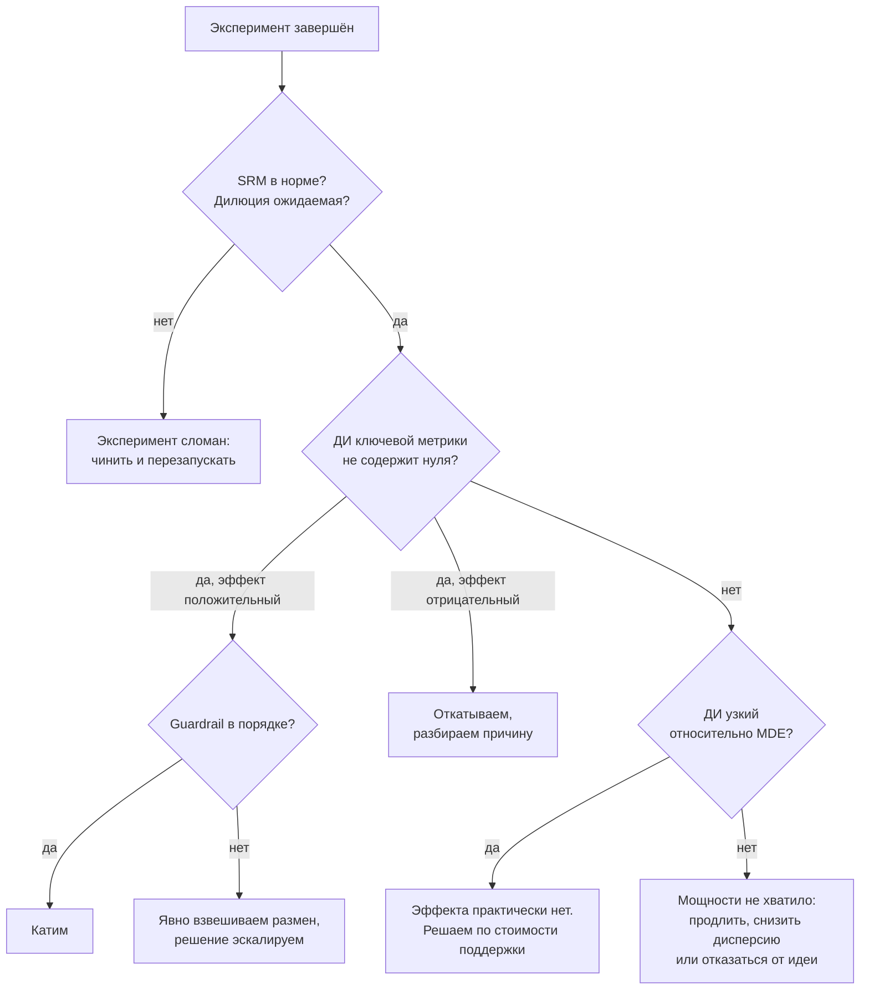

# Дизайн эксперимента

> **Зачем эта глава.** Половина провальных A/B-тестов проваливается ещё до запуска — на этапе,
> когда решают, что мерить, кого делить и сколько ждать. После главы вы сможете превратить
> расплывчатое «давайте потестим новую модель» в эксперимент с зафиксированной гипотезой,
> посчитанным размером выборки и понятным правилом принятия решения — и объяснить каждое
> из этих решений на собеседовании.

**Уровень:** 🎯 middle → 🧠 middle+
**Предварительно нужно:** [теория вероятностей](../01-math/02-probability.md), [статистика и вывод](../01-math/03-statistics.md), [метрики качества](../02-classic-ml/04-metrics.md)
**Как проработать:** чтение + расчёты + упражнения

---

## Карта главы

- [1. Зачем эксперимент: причинность против корреляции](#1-зачем-эксперимент-причинность-против-корреляции)
- [2. Гипотеза: как её формулируют инженеры, а не мечтатели](#2-гипотеза-как-её-формулируют-инженеры-а-не-мечтатели)
- [3. Иерархия метрик](#3-иерархия-метрик)
- [4. Единица рандомизации](#4-единица-рандомизации)
- [5. MDE и размер выборки: полный вывод](#5-mde-и-размер-выборки-полный-вывод)
- [6. Мощность и как её повышать](#6-мощность-и-как-её-повышать)
- [7. Длительность эксперимента](#7-длительность-эксперимента)
- [8. A/A-тест: что он на самом деле проверяет](#8-aa-тест-что-он-на-самом-деле-проверяет)
- [9. Чек-лист запуска](#9-чек-лист-запуска)
- [10. Результат незначим. Что делать](#10-результат-незначим-что-делать)
- [11. Подводные камни](#11-подводные-камни)
- [12. Проверь себя](#12-проверь-себя)
- [13. Практика](#13-практика)
- [14. Что читать дальше](#14-что-читать-дальше)

---

## 1. Зачем эксперимент: причинность против корреляции

Начнём с истории, которая случается в каждой второй команде.

Вы выкатили новую модель ранжирования на всех пользователей во вторник. Смотрите на дашборд
через неделю: конверсия в заказ выросла с 4.1% до 4.3%. Плюс 5% относительно — отличный
результат, идём к руководителю за премией.

Что на самом деле произошло за эту неделю? Маркетинг запустил кампанию в контекстной рекламе,
и в трафике стало больше «горячих» пользователей. Погода испортилась, и люди чаще заказывали
доставку. Прошлая неделя была короткой из-за праздника. Конкурент поднял цены. Плюс к этому
неделя на неделю в вашем сервисе и без всяких изменений гуляет на ±3%.

Ваши 5% — это сумма эффекта модели и всего перечисленного. Разложить эту сумму на слагаемые
по историческим данным нельзя: у вас нет и не будет наблюдения «что случилось бы на этой же
неделе с этим же трафиком, если бы модель осталась старая».

### Формализация: потенциальные исходы

Это не философия, а конкретная математическая проблема. Для каждого пользователя $i$ введём
два числа:

$$
Y_i(1) \;-\; \text{исход при воздействии},\qquad Y_i(0) \;-\; \text{исход без воздействия}
$$

где $Y_i(\cdot)$ — интересующая нас величина для пользователя $i$ (например, 1, если он сделал
заказ, и 0 иначе, или сумма его покупок в рублях), аргумент $1$ означает «пользователь получил
новую версию», $0$ — «получил старую». Это и есть **потенциальные исходы** (potential outcomes)
в подходе Неймана — Рубина.

Причинный эффект на пользователе — это разность $Y_i(1) - Y_i(0)$. Средний причинный эффект
по популяции:

$$
\text{ATE} = \mathbb{E}\big[\,Y_i(1) - Y_i(0)\,\big]
$$

где $\text{ATE}$ (average treatment effect) — среднее по всем пользователям значение
индивидуального эффекта, $\mathbb{E}[\cdot]$ — математическое ожидание по популяции
пользователей.

**Фундаментальная проблема причинного вывода:** для конкретного $i$ мы наблюдаем ровно одно
из двух чисел. Если человек попал в новую версию, мы никогда не узнаем, что он сделал бы
в старой.

Теперь посмотрим, что мы вообще можем измерить. Пусть $T_i \in \{0,1\}$ — индикатор того,
в какую группу попал пользователь $i$. Наблюдаемая разность средних между группами
раскладывается так:

$$
\underbrace{\mathbb{E}[Y_i \mid T_i = 1] - \mathbb{E}[Y_i \mid T_i = 0]}_{\text{то, что мы измеряем}}
=
\underbrace{\mathbb{E}\big[Y_i(1) - Y_i(0) \mid T_i = 1\big]}_{\text{эффект на тех, кто получил воздействие}}
+
\underbrace{\mathbb{E}[Y_i(0) \mid T_i = 1] - \mathbb{E}[Y_i(0) \mid T_i = 0]}_{\text{смещение отбора}}
$$

где $Y_i$ — фактически наблюдённый исход, то есть $Y_i = Y_i(T_i)$; первое слагаемое справа —
средний эффект на подвергшихся воздействию (ATT, average treatment effect on the treated);
второе слагаемое — разница между группами в том, что было бы **без всякого воздействия**.

> 📐 **Разбор формулы.** Вывод в две строки. Запишем $\mathbb{E}[Y \mid T=1] = \mathbb{E}[Y(1) \mid T=1]$
> — в группе воздействия наблюдается именно $Y(1)$. Прибавим и вычтем $\mathbb{E}[Y(0) \mid T=1]$:
> $\mathbb{E}[Y(1)\mid T{=}1] - \mathbb{E}[Y(0)\mid T{=}0] = \big(\mathbb{E}[Y(1)\mid T{=}1] - \mathbb{E}[Y(0)\mid T{=}1]\big) + \big(\mathbb{E}[Y(0)\mid T{=}1] - \mathbb{E}[Y(0)\mid T{=}0]\big)$.
> Первая скобка — эффект, вторая — смещение. Ничего кроме сложения и вычитания одного и того же
> здесь не происходит.

Вот и весь смысл эксперимента: **рандомизация обнуляет второе слагаемое**. Если группа
назначается монеткой, независимой от всего остального, то $T_i$ независим от пары
$(Y_i(0), Y_i(1))$, значит $\mathbb{E}[Y(0) \mid T=1] = \mathbb{E}[Y(0) \mid T=0]$ и смещение
равно нулю. Тогда наблюдаемая разность средних — несмещённая оценка ATE.

Сравнение «до/после», сравнение самоотобравшихся групп («те, кто пользуется новой фичей,
покупают больше»), сравнение регионов, где раскатили и где нет — во всех этих случаях второе
слагаемое живо, и вы измеряете эффект плюс неизвестную вам добавку.

> 💬 **На собеседовании.** Спросят: «Зачем A/B-тест, если можно посмотреть метрику до и после
> выката?» Хороший ответ: сравнение до/после не изолирует эффект — в разность попадают
> сезонность, изменение состава трафика, параллельные релизы и внешние события; формально
> это означает ненулевое слагаемое смещения отбора в разложении наблюдаемой разности.
> Рандомизация нужна именно для того, чтобы группы были сопоставимы по всему, кроме
> воздействия, включая **ненаблюдаемые** факторы — этим она отличается от матчинга
> и регрессионных поправок, которые выравнивают только то, что вы догадались измерить.
> Плохой ответ: «до/после — это неточно, там шум» — шум лечится размером выборки, а смещение
> не лечится никаким размером.

> 🌱 **База.** Если запомнить из раздела одну вещь: эксперимент нужен не для точности, а для
> **сопоставимости**. Точность даёт объём данных, сопоставимость даёт только случайное
> назначение групп.

---

## 2. Гипотеза: как её формулируют инженеры, а не мечтатели

«Проверим, лучше ли новая модель» — это не гипотеза. По ней невозможно ни посчитать размер
выборки, ни принять решение: слово «лучше» не определено.

Рабочая гипотеза содержит пять элементов:

1. **Что меняем** — конкретное изменение, доступное для реализации и отката.
2. **Механизм** — почему это должно сработать. Формулировка механизма ловит идеи, которые
   не выдерживают проговаривания вслух.
3. **Какая метрика сдвинется и в какую сторону** — одна ключевая метрика, зафиксированная заранее.
4. **Насколько** — ожидаемый размер эффекта. Без него не считается выборка.
5. **На ком и когда** — сегмент и горизонт.

Пример: «Если в карточке товара показать блок "с этим товаром покупают" на основе новой
двухбашенной модели вместо правила "из той же категории", то пользователи будут чаще находить
дополняющие товары, и **средний чек** вырастет на **1.5% и более** у авторизованных
пользователей мобильного приложения в течение двух недель после показа блока».

Такую формулировку уже можно перевести в статистическую пару гипотез:

$$
H_0: \Delta = 0 \qquad\text{против}\qquad H_1: \Delta \neq 0
$$

где $\Delta = \mu_B - \mu_A$ — разность истинных средних значений ключевой метрики в тестовой
группе $B$ и контрольной $A$.

Обратите внимание на две вещи. Во-первых, $H_0$ — это «эффекта нет», и по умолчанию мы
защищаем именно её: бремя доказательства на изменении, а не на статус-кво. Во-вторых,
альтернатива двусторонняя. Соблазн взять одностороннюю ($H_1: \Delta > 0$) велик — так нужно
меньше данных — но он почти всегда ошибочен: вам жизненно важно узнать и про падение тоже,
а односторонний тест этого не увидит.

> ⚠️ **Типичная ошибка.** Формулировать гипотезу после того, как посмотрели данные. Это
> называется HARKing (hypothesizing after the results are known), и оно превращает эксперимент
> в генератор случайных «открытий». Практическое лекарство: заводить документ дизайна
> эксперимента до запуска, в нём фиксировать ключевую метрику, MDE, длительность, правило
> остановки и список guardrail-метрик — и не менять его после старта. В зрелых компаниях этот
> документ ревьюит второй человек.

---

## 3. Иерархия метрик

Одна метрика не бывает достаточной. Практика больших экспериментальных платформ (Microsoft,
Booking, Netflix, Яндекс) сходится к четырёхуровневой схеме.

| Тип | Что это | Роль в решении | Пример |
|---|---|---|---|
| **Ключевая** (OEC, primary) | то, ради чего эксперимент; ровно одна | по ней принимается решение «катим / не катим» | выручка на пользователя, конверсия в заказ |
| **Прокси** (proxy, surrogate) | быстрая и чувствительная замена медленной цели | помогает понять механизм и итерироваться | CTR блока, глубина просмотра, доля сессий с поиском |
| **Guardrail** | то, что не должно ухудшиться | право вето независимо от ключевой | латентность p95, доля ошибок 5xx, число жалоб, отписки |
| **Контрметрика** (counter-metric) | цена, которую вы осознанно можете заплатить за победу | заранее описанный компромисс | при росте пушей — доля отключивших уведомления |

Разница между guardrail и контрметрикой тонкая, и терминология в компаниях гуляет. Практически
удобно различать так: **guardrail** — это общая гигиена системы, он один и тот же для всех
экспериментов платформы (латентность, ошибки, крэши, отписки, жалобы). **Контрметрика** —
специфична для конкретной гипотезы и отвечает на вопрос «а за счёт чего мы выиграли?».
Увеличили длину ленты — контрметрика «доля пользователей, долиставших до конца». Сделали
рекомендации агрессивнее — контрметрика «доля возвратов товара».

```mermaid
flowchart TB
    BIZ["Бизнес-цель<br/>выручка, удержание<br/>месяцы, огромная дисперсия"]
    KEY["Ключевая метрика (OEC)<br/>выручка на пользователя за 14 дней"]
    PROXY["Прокси-метрики<br/>CTR, конверсия, глубина<br/>дни, чувствительны"]
    GUARD["Guardrail<br/>латентность, ошибки,<br/>отписки, жалобы"]
    COUNTER["Контрметрики<br/>цена победы<br/>возвраты, усталость"]

    BIZ -->|"выбираем измеримый<br/>суррогат"| KEY
    KEY -->|"объясняют механизм"| PROXY
    KEY -.->|"право вето"| GUARD
    KEY -.->|"проверка компромисса"| COUNTER
```



### Свойства хорошей ключевой метрики

**Чувствительность.** Метрика должна успевать сдвинуться за срок эксперимента. Годовое удержание
идеально по смыслу и бесполезно на практике: ждать год нельзя, а дисперсия такова, что MDE
будет неприлично большим.

**Направленность.** Рост метрики должен однозначно означать «стало лучше». Классический
контрпример: «число поисковых запросов на пользователя». Оно растёт и когда поиск стал
популярнее (хорошо), и когда поиск стал плохо находить и людям приходится переспрашивать
(плохо). Такую метрику нельзя делать ключевой без дополнительного разреза.

**Устойчивость к накрутке.** Если метрику можно двинуть, ухудшив продукт, рано или поздно
кто-то так и сделает. CTR двигается кликбейтом, время в приложении — запутанной навигацией,
число сессий — принудительными разлогинами.

**Считаемость сейчас.** Метрика должна вычисляться из логов, которые уже пишутся, без ручной
разметки и без задержки в недели.

> 💬 **На собеседовании.** Спросят: «Ключевая метрика выросла, guardrail по латентности
> ухудшился на 30 мс. Катите?» Хороший ответ строится не на «да/нет», а на процедуре:
> guardrail имеет право вето, но порог вето должен быть определён **до** эксперимента
> (например, «p95 не хуже чем на 20 мс»), иначе решение превратится в спор. Дальше — оценка
> размена: известно, что рост латентности сам по себе снижает вовлечённость, и этот эффект
> уже включён в измеренную ключевую метрику, если задержка была реальной в эксперименте.
> Значит, вопрос в другом: не перегружаем ли мы систему в пике и не сломается ли она при
> 100% трафика — то есть в мощности и рисках, а не в статистике. Плохой ответ: «латентность
> +30 мс — ерунда, катим».

> 🧠 **Middle+.** Отдельный сорт метрик — **диагностические** (debug metrics): доля пользователей,
> увидевших изменение вообще; размер выборок в группах; доля запросов с фолбэком. Они ничего
> не говорят о качестве продукта, но именно они первыми показывают, что эксперимент сломан.
> Если из тестовой группы изменение реально увидели 12% пользователей, а вы считаете эффект
> на всей группе, то измеренный эффект размыт в 8 раз (это называется **разбавление**, dilution),
> и незначимый результат не означает отсутствие эффекта. Разбавление не только диагностика,
> но и рычаг: если долю затронутых можно вычислить в обеих группах, эффект считают
> на триггерной популяции и пересчитывают обратно, что сокращает нужную выборку в разы —
> см. [триггерный анализ](03-variance-reduction.md#10-триггерный-анализ-измерять-там-где-эффект-возможен).

---

## 4. Единица рандомизации

Единица рандомизации (randomization unit) — то, что вы делите монеткой. Основные варианты:

| Единица | Когда уместна | Чем платите |
|---|---|---|
| **Пользователь** (user_id) | почти всегда, если пользователь авторизован | нужен стабильный идентификатор |
| **Устройство / cookie** | анонимный трафик | один человек с двух устройств попадёт в обе группы |
| **Сессия** | изменения, не влияющие на долгую память пользователя | один человек видит разный опыт, нельзя мерить удержание |
| **Запрос** | инфраструктурные изменения, невидимые пользователю | наблюдения зависимы, эффект «размазан» |
| **Кластер** (город, продавец, сообщество) | есть перетекание эффекта между людьми | резкое падение числа единиц → падение мощности |
| **Интервал времени** (switchback) | маркетплейсы, ценообразование, логистика | сложный анализ, автокорреляция |

Базовое правило: **единица рандомизации должна быть не мельче, чем то, на что распространяется
эффект, и не мельче, чем единица анализа**.

### Что ломается при неверном выборе

**Непоследовательный опыт.** Рандомизация по запросу или сессии для видимого пользователю
изменения означает, что человек то видит новую кнопку, то не видит. Кроме того, что это плохой
продукт, это ещё и меняет измеряемое: вы измеряете эффект «мигающего» интерфейса, а не нового.

**Нарушение независимости наблюдений.** Пусть вы рандомизируете по запросу, а метрику считаете
по запросам. Запросы одного пользователя коррелированы: активный пользователь генерирует сотни
похожих запросов. Стандартная формула дисперсии среднего $\sigma^2/n$ предполагает независимость;
при внутрикластерной корреляции $\rho$ и среднем размере кластера $m$ истинная дисперсия
примерно в $1 + (m-1)\rho$ раз больше:

$$
\mathrm{Var}(\bar{X}) \approx \frac{\sigma^2}{n}\big(1 + (m-1)\rho\big)
$$

где $\bar{X}$ — выборочное среднее по всем $n$ наблюдениям, $\sigma^2$ — дисперсия одного
наблюдения, $m$ — среднее число наблюдений на одного пользователя, $\rho$ — коэффициент
внутриклассовой корреляции (intraclass correlation), то есть доля дисперсии, объясняемая
различиями между пользователями. Множитель $1 + (m-1)\rho$ называют **эффектом дизайна**
(design effect).

Числа отрезвляют: при $m = 20$ запросах на пользователя и умеренной $\rho = 0.1$ дисперсия
занижена в $1 + 19 \cdot 0.1 = 2.9$ раза, стандартная ошибка — в 1.7 раза, и тест, который
вы считаете тестом уровня 5%, на самом деле работает на уровне примерно 20%. Каждый пятый
«успешный» эксперимент — ложное срабатывание.

**Перетекание эффекта (interference).** Если пользователи взаимодействуют — в соцсети,
в маркетплейсе, где продавец с ограниченным складом обслуживает обе группы, — то контроль
перестаёт быть контролем. Тестовая группа переманивает товар/внимание/курьеров у контрольной,
и эффект переоценивается. Лечится кластерной рандомизацией или switchback — это тема главы
[сложные схемы](05-complex-designs.md).

**Смена единицы после старта.** Иногда команда рандомизирует по пользователю, а метрику считает
по сессиям («так больше данных»). Это тот же эффект дизайна: наблюдений много, а независимых
единиц столько же, сколько пользователей. Корректный путь — либо считать метрику на уровне
пользователя, либо использовать методы для ratio-метрик из главы
[статистические критерии](02-statistical-criteria.md).

> ⚠️ **Типичная ошибка.** Рандомизировать по `session_id` ради экономии трафика и получить
> в три раза более узкие доверительные интервалы, чем на самом деле. Симптом — A/A-тесты
> на той же схеме дают значимые различия чаще, чем в 5% случаев. Если вы видите такое,
> первым делом проверяйте, совпадает ли единица рандомизации с единицей анализа.

---

## 5. MDE и размер выборки: полный вывод

Это тот кусок главы, который спрашивают почти на каждом собеседовании про A/B, и почти никто
не может вывести формулу, хотя вывод занимает страницу.

### Постановка

Метрика измеряется на уровне единицы рандомизации: пользователь $i$ даёт число $X_i$ (выручка,
1/0-конверсия, число сессий). Считаем, что наблюдения независимы и одинаково распределены
внутри каждой группы, дисперсия в обеих группах одинакова и равна $\sigma^2$, размер каждой
группы — $n$.

Оценка эффекта — разность выборочных средних:

$$
\hat{\Delta} = \bar{X}_B - \bar{X}_A,\qquad
\bar{X}_A = \frac{1}{n}\sum_{i \in A} X_i,\quad \bar{X}_B = \frac{1}{n}\sum_{i \in B} X_i
$$

где $A$ и $B$ — множества пользователей контрольной и тестовой групп, по $n$ человек в каждом.

**Шаг 1. Дисперсия оценки.** Группы независимы, поэтому дисперсии складываются:

$$
\mathrm{Var}(\hat{\Delta}) = \mathrm{Var}(\bar{X}_B) + \mathrm{Var}(\bar{X}_A)
= \frac{\sigma^2}{n} + \frac{\sigma^2}{n} = \frac{2\sigma^2}{n}
$$

Отсюда стандартная ошибка эффекта:

$$
\mathrm{SE} = \sigma\sqrt{\frac{2}{n}}
$$

где $\mathrm{SE}$ (standard error) — стандартное отклонение оценки $\hat{\Delta}$.

Вот откуда берётся двойка в итоговой формуле: **мы дважды платим за шум** — один раз в контроле,
один раз в тесте. Это первое место, где кандидаты спотыкаются: помнят «двойку», но не знают,
что она означает.

**Шаг 2. Статистика критерия и порог.** По центральной предельной теореме при больших $n$

$$
Z = \frac{\hat{\Delta}}{\mathrm{SE}} \;\sim\; \mathcal{N}(0, 1) \quad \text{при верной } H_0
$$

где $\mathcal{N}(0,1)$ — стандартное нормальное распределение. Двусторонний критерий уровня
$\alpha$ отвергает $H_0$, когда $|Z| > z_{1-\alpha/2}$, где $z_q$ — квантиль уровня $q$
стандартного нормального распределения ($z_{0.975} = 1.96$ при $\alpha = 0.05$).

**Шаг 3. Мощность.** Пусть на самом деле эффект равен $\Delta > 0$. Тогда
$\hat{\Delta} \sim \mathcal{N}(\Delta, \mathrm{SE}^2)$, и вероятность обнаружить эффект
(**мощность**, power) равна

$$
1-\beta = \mathbb{P}\big(|Z| > z_{1-\alpha/2} \;\big|\; \Delta\big)
\approx \mathbb{P}\big(Z > z_{1-\alpha/2} \;\big|\; \Delta\big)
$$

где $\beta$ — вероятность ошибки II рода (не заметить существующий эффект). Вторым хвостом
пренебрегаем: при $\Delta > 0$ вероятность случайно уйти в глубокий минус ничтожна.

Стандартизуем относительно истинного среднего $\Delta$:

$$
\mathbb{P}\left(\frac{\hat{\Delta} - \Delta}{\mathrm{SE}} > z_{1-\alpha/2} - \frac{\Delta}{\mathrm{SE}}\right)
= 1 - \Phi\left(z_{1-\alpha/2} - \frac{\Delta}{\mathrm{SE}}\right)
$$

где $\Phi$ — функция распределения стандартного нормального закона, а дробь
$(\hat{\Delta} - \Delta)/\mathrm{SE}$ распределена как $\mathcal{N}(0,1)$.

**Шаг 4. Решаем относительно $n$.** Требуем, чтобы мощность была не ниже $1-\beta$:

$$
1 - \Phi\left(z_{1-\alpha/2} - \frac{\Delta}{\mathrm{SE}}\right) = 1-\beta
\;\Longleftrightarrow\;
\Phi\left(z_{1-\alpha/2} - \frac{\Delta}{\mathrm{SE}}\right) = \beta
$$

Применяем $\Phi^{-1}$ к обеим частям и пользуемся симметрией нормального распределения
($z_\beta = -z_{1-\beta}$):

$$
z_{1-\alpha/2} - \frac{\Delta}{\mathrm{SE}} = z_\beta = -z_{1-\beta}
\;\Longleftrightarrow\;
\frac{\Delta}{\mathrm{SE}} = z_{1-\alpha/2} + z_{1-\beta}
$$

Подставляем $\mathrm{SE} = \sigma\sqrt{2/n}$:

$$
\Delta = (z_{1-\alpha/2} + z_{1-\beta})\,\sigma\sqrt{\frac{2}{n}}
$$

и выражаем $n$:

$$
\boxed{\;n = \frac{2\,(z_{1-\alpha/2} + z_{1-\beta})^2\,\sigma^2}{\Delta^2}\;}
$$

где $n$ — **размер одной группы** (всего нужно $2n$ пользователей), $\sigma^2$ — дисперсия
метрики на уровне единицы рандомизации, $\Delta$ — минимальный эффект, который вы хотите
уверенно обнаруживать (MDE, minimum detectable effect), $\alpha$ — допустимая вероятность
ложного срабатывания, $1-\beta$ — требуемая мощность.

### Что означает каждый множитель

| Множитель | Смысл | Что будет, если его изменить |
|---|---|---|
| $2$ | шум считается дважды: в контроле и в тесте | при неравном сплите заменяется на $1/(w(1-w))/2$, см. ниже |
| $(z_{1-\alpha/2} + z_{1-\beta})^2$ | «плата за строгость»: чем меньше готовы ошибаться, тем больше данных | при $\alpha=0.05$, $1-\beta=0.8$ равно $(1.96+0.84)^2 \approx 7.85$ |
| $\sigma^2$ | шум самой метрики | вдвое более шумная метрика (в терминах $\sigma$) требует вчетверо больше данных |
| $1/\Delta^2$ | амбициозность | желание ловить вдвое меньший эффект удорожает эксперимент вчетверо |

Подставив стандартные $\alpha = 0.05$ и $1-\beta = 0.8$, получаем инженерное правило,
которое стоит помнить наизусть:

$$
n \approx \frac{16\,\sigma^2}{\Delta^2}
$$

потому что $2 \cdot 7.85 = 15.7 \approx 16$. Эта формула — то, что вы пишете на доске
на собеседовании за пять секунд.

> 📐 **Разбор формулы для доли.** Если метрика бинарная (конверсия), то $X_i \in \{0,1\}$,
> $\mathbb{E}[X_i] = p$ и $\sigma^2 = p(1-p)$ — дисперсию не нужно оценивать отдельно, она
> вычисляется из базовой конверсии. Формула превращается в
> $n = 2(z_{1-\alpha/2}+z_{1-\beta})^2 p(1-p)/\Delta^2$, где $p$ — конверсия в контроле,
> $\Delta$ — абсолютный прирост конверсии (не относительный!). Путаница «абсолютный против
> относительного» — источник ошибок на порядок: прирост «на 5%» от базы 4% — это либо
> $\Delta = 0.05$, либо $\Delta = 0.002$, разница в размере выборки в 625 раз.

### Неравный сплит

Пусть доля трафика в тесте равна $w \in (0,1)$, всего пользователей $N$, тогда в тесте $wN$,
в контроле $(1-w)N$:

$$
\mathrm{Var}(\hat{\Delta}) = \frac{\sigma^2}{wN} + \frac{\sigma^2}{(1-w)N}
= \frac{\sigma^2}{N}\cdot\frac{1}{w(1-w)}
$$

Функция $w(1-w)$ максимальна при $w = 0.5$, то есть **сплит 50/50 минимизирует дисперсию**
при фиксированном общем трафике. Сравните: при $w = 0.5$ множитель $1/(w(1-w)) = 4$,
при $w = 0.1$ он равен $11.1$ — то есть тесту 10/90 нужно в 2.8 раза больше суммарного
трафика для той же мощности. Это ответ на частый вопрос «давайте раскатим на 5%, чтобы
не рисковать»: риск снижается, стоимость эксперимента растёт почти втрое.

### Расчёт в коде

```python
# Размер выборки и MDE: формулы + проверка симуляцией.
# Проверка симуляцией здесь не украшение: она ловит ошибки в квантилях
# (односторонний/двусторонний) и в единицах измерения эффекта.
import numpy as np
from scipy import stats


def sample_size_per_group(sigma: float, mde: float,
                          alpha: float = 0.05, power: float = 0.8) -> float:
    """Сколько пользователей нужно в КАЖДОЙ группе при сплите 50/50."""
    z_alpha = stats.norm.ppf(1 - alpha / 2)   # двусторонний критерий -> alpha/2
    z_beta = stats.norm.ppf(power)            # z_{1-beta}: ppf(0.8) = 0.8416
    return 2 * (z_alpha + z_beta) ** 2 * sigma ** 2 / mde ** 2


def mde_from_n(sigma: float, n: int, alpha: float = 0.05, power: float = 0.8) -> float:
    """Обратная задача: какой эффект мы вообще способны поймать на имеющемся трафике."""
    z_alpha = stats.norm.ppf(1 - alpha / 2)
    z_beta = stats.norm.ppf(power)
    return (z_alpha + z_beta) * sigma * np.sqrt(2.0 / n)


def sample_size_proportion(p_baseline: float, relative_lift: float,
                           alpha: float = 0.05, power: float = 0.8) -> float:
    """Для конверсии дисперсия известна из базовой доли: sigma^2 = p(1-p).
    relative_lift задаётся в долях: 0.02 = «плюс 2% относительно базы»."""
    delta_abs = p_baseline * relative_lift      # переводим относительный лифт в абсолютный
    sigma = np.sqrt(p_baseline * (1 - p_baseline))
    return sample_size_per_group(sigma, delta_abs, alpha, power)


# --- Пример 1: конверсия 5%, хотим ловить относительный прирост 2% ---
n_conv = sample_size_proportion(p_baseline=0.05, relative_lift=0.02)
print(f"Конверсия: {n_conv:,.0f} пользователей в группе")   # ~746 000

# --- Пример 2: выручка на пользователя, среднее 500 р, sd 1500 р (тяжёлый хвост) ---
n_rev = sample_size_per_group(sigma=1500, mde=500 * 0.01)   # ловим +1% к среднему чеку
print(f"Выручка: {n_rev:,.0f} пользователей в группе")      # ~1 413 000

# --- Пример 3: обратная задача. Есть 200 000 пользователей в группе. Что поймаем? ---
mde_abs = mde_from_n(sigma=1500, n=200_000)
print(f"MDE при 200k: {mde_abs:.2f} р = {mde_abs / 500:.2%} относительно среднего")
```

Проверим формулу симуляцией — это единственный способ убедиться, что вы не перепутали
квантили:

```python
def empirical_power(n: int, effect: float, sigma: float,
                    n_sim: int = 5000, alpha: float = 0.05, seed: int = 0) -> float:
    """Доля симуляций, где двусторонний тест обнаружил эффект.
    Используем t-тест Уэлча — именно им считают в проде, и он не предполагает
    равенства дисперсий (см. следующую главу)."""
    rng = np.random.default_rng(seed)
    a = rng.normal(0.0, sigma, size=(n_sim, n))
    b = rng.normal(effect, sigma, size=(n_sim, n))
    _, pvals = stats.ttest_ind(b, a, axis=1, equal_var=False)
    return float((pvals < alpha).mean())


sigma, mde = 1.0, 0.1
n_needed = int(np.ceil(sample_size_per_group(sigma, mde)))
print(n_needed)                                   # 1570
print(empirical_power(n_needed, mde, sigma))      # ~0.80 — формула не врёт

# А теперь то, ради чего стоит запускать симуляцию: цена экономии на выборке.
print(empirical_power(n_needed // 2, mde, sigma))  # ~0.52 — половина экспериментов впустую
```

Последняя строчка — самый полезный вывод главы для практика. Эксперимент на половине нужной
выборки не «чуть менее точный»: он в половине случаев не увидит реально существующий эффект,
и команда сделает вывод «не работает».

> 💬 **На собеседовании.** Спросят: «Как посчитать, сколько нужно данных для A/B?»
> Хороший ответ: назвать формулу $n = 2(z_{1-\alpha/2}+z_{1-\beta})^2\sigma^2/\Delta^2$
> на группу, объяснить каждый множитель (двойка — две группы; сумма квантилей — плата
> за $\alpha$ и за мощность; $\sigma^2$ — дисперсия метрики на уровне рандомизации;
> $\Delta$ — MDE), упомянуть правило $16\sigma^2/\Delta^2$ и **сразу задать встречный вопрос**:
> абсолютный или относительный эффект, какая единица рандомизации, ratio-метрика или нет.
> Плохой ответ: «посчитаю в онлайн-калькуляторе» — калькулятор действительно используют,
> но вопрос проверяет, понимаете ли вы, что в него вводить.

---

## 6. Мощность и как её повышать

Мощность $1-\beta$ — вероятность обнаружить эффект, если он действительно есть заданного
размера. Отраслевой стандарт — 80%, то есть **каждый пятый настоящий эффект вы пропустите**.
Это не «почти всегда найдём», это довольно грубый инструмент, и понимание этого меняет
отношение к отрицательным результатам.

Из формулы видно четыре рычага. Перечислю в порядке убывания практической полезности.

**1. Уменьшить $\sigma^2$.** Самый недооценённый рычаг, потому что он ничего не стоит
пользователям и не требует ждать дольше.

- **CUPED и регрессионная корректировка** — используют данные до эксперимента, чтобы вычесть
  предсказуемую часть метрики. Типичная экономия 20–50% дисперсии на метриках с сильной
  автокорреляцией (выручка, число сессий). Полный вывод — в главе
  [снижение дисперсии](03-variance-reduction.md).
- **Стратификация** по стране/платформе/сегменту активности — убирает межстратовую дисперсию.
- **Винзоризация / клиппинг выбросов.** Один пользователь, купивший на миллион, может в одиночку
  двигать среднее. Обрезка верхнего перцентиля (например, 99.9%) резко снижает $\sigma$,
  но меняет определение метрики — порог должен быть зафиксирован до эксперимента
  и одинаков в обеих группах.
- **Выбор менее шумной метрики.** Конверсия (доля покупателей) почти всегда менее шумная,
  чем выручка на пользователя. Иногда правильный ход — сделать ключевой метрикой конверсию,
  а выручку держать как guardrail.
- **Триггерный анализ.** Если изменение видит малая доля аудитории, самый сильный рычаг —
  считать эффект только на тех, у кого условие показа сработало, и пересчитывать его на всю
  аудиторию. Выигрыш измеряется не процентами, а разами нужного трафика; цена — контрфактическое
  логирование, которое надо заложить до запуска. Вывод формулы выигрыша —
  в [§10 главы о снижении дисперсии](03-variance-reduction.md#10-триггерный-анализ-измерять-там-где-эффект-возможен).

**2. Увеличить $n$.** Больше трафика в эксперимент (доля от 100% трафика), дольше эксперимент,
меньше параллельных экспериментов, конкурирующих за пользователей.

**3. Увеличить $\Delta$.** Звучит как жульничество, но это осмысленное продуктовое решение:
делайте смелые изменения. Эксперимент, проверяющий сдвиг кнопки на два пикселя, статистически
безнадёжен — эффект, если он есть, ниже любого достижимого MDE. Лучше проверить радикальную
версию, а если сработает — искать минимальную реализацию.

**4. Ослабить $\alpha$.** Технически работает, практически почти всегда плохая идея: вы просто
переносите ошибки из одной корзины в другую. Иногда оправдано для дешёвых обратимых изменений
(например, $\alpha = 0.1$ для правок текста), но должно быть решением платформы, а не автора
эксперимента.

### Откуда брать MDE

Формула требует числа $\Delta$, и это число нельзя взять из воздуха. Три законных источника,
в порядке предпочтения.

**Экономический.** Считаем, при каком эффекте изменение окупается. Пример: разработка и
поддержка фичи стоят 3 млн ₽ в год; годовая выручка сервиса 2 млрд ₽; значит изменение должно
дать не меньше 0.15% выручки, чтобы выйти в ноль. Ловить эффект меньше 0.15% бессмысленно —
даже подтвердив его, вы не примете решение выкатывать. Это самый сильный аргумент в разговоре
с продуктом.

**Исторический.** Соберите распределение эффектов прошлых экспериментов в вашей компании.
В зрелых продуктах картина обычно такая: медианный эффект близок к нулю, около 60–70%
экспериментов не показывают ничего, а «хорошим» считается эффект 0.5–2%. Если ваш MDE 5% —
вы почти наверняка ничего не поймаете; если 0.1% — вам не хватит трафика. Историческое
распределение калибрует ожидания лучше любой интуиции.

**Ресурсный (последний по качеству).** Считаем MDE от того трафика, который есть:
$\Delta = (z_{1-\alpha/2}+z_{1-\beta})\sigma\sqrt{2/n}$. Это не выбор MDE, а признание
ограничений. Полезно как проверка реализуемости: если доступный трафик даёт MDE 8%,
а исторические эффекты порядка 1%, эксперимент не нужно запускать вообще — вы потратите
две недели, чтобы получить неинформативный результат.

> ⚠️ **Типичная ошибка.** Подставить в формулу «ожидаемый эффект» вместо «минимально
> интересного эффекта». Это разные величины: ожидаемый — то, во что вы верите (и обычно
> завышен), MDE — граница, ниже которой результат перестаёт менять решение. Подставив
> оптимистичный ожидаемый эффект, вы получите заниженную выборку и недомощный эксперимент.

### Проклятие победителя

> 🧠 **Middle+.** Есть неочевидное следствие низкой мощности, о котором на собеседованиях
> спрашивают редко, а в жизни оно встречается постоянно. Если мощность мала, то условие
> «результат оказался значимым» само по себе является отбором: пройти порог значимости
> смогли только те эксперименты, где случайный шум сработал **в вашу пользу**. Поэтому
> **измеренный эффект у значимых результатов систематически завышен** — это называют
> проклятием победителя (winner's curse) или ошибкой типа M (magnitude).
>
> Численно: при мощности 20% и истинном эффекте, равном половине MDE, средний измеренный
> эффект среди значимых результатов оказывается в 2–3 раза больше истинного. Отсюда
> знакомая всем картина: эксперимент обещал +3%, раскатили, годовая выручка выросла на 0.5%.
> Лечится не «более строгим порогом», а мощностью: при мощности 80% завышение падает
> до нескольких процентов от величины эффекта. Второе лекарство — репликация: повторный
> эксперимент даёт несмещённую оценку, потому что для него условия отбора нет.

> 🧠 **Middle+.** Есть пятый рычаг, о котором редко говорят: **сменить единицу анализа
> на более мелкую при той же единице рандомизации**. Пример — метрика «конверсия сессии»
> вместо «конверсия пользователя» при рандомизации по пользователю. Наблюдений становится
> больше, но независимых единиц столько же; наивно применять t-тест нельзя (см. [§4](#4-единица-рандомизации)), однако
> корректные методы для ratio-метрик — дельта-метод и линеаризация из главы
> [статистические критерии](02-statistical-criteria.md) — действительно дают выигрыш
> в чувствительности, потому что используют внутрипользовательскую информацию.

---

## 7. Длительность эксперимента

Размер выборки говорит, сколько пользователей нужно. Длительность — отдельный вопрос,
и она определяется не только накоплением выборки.

### Недельные циклы

Поведение пользователей циклично: будни отличаются от выходных не на проценты, а в разы —
и по трафику, и по составу аудитории, и по конверсии. B2B-сервис живёт по будням, развлечения
по выходным.

Отсюда жёсткое правило: **длительность эксперимента кратна семи дням**. Не «неделя и ещё три
дня». Иначе в выборку попадёт лишний кусок будней или выходных, и хотя рандомизация формально
защищает от смещения (обе группы получают одни и те же дни), интерпретация страдает: измеренный
эффект относится к искажённому миксу дней и хуже переносится на будущее.

Практический минимум — **одна полная неделя**, типичный срок — **две недели**, для метрик
с отложенным эффектом (удержание, повторные покупки) — 3–4 недели.

### Эффект новизны и эффект привыкания

**Эффект новизны** (novelty effect): пользователи реагируют на изменение просто потому,
что оно новое. Новый баннер кликают из любопытства. В первые дни эффект завышен и затухает.

**Эффект привыкания / первичности** (primacy effect): обратная ситуация. Пользователи привыкли
к старому интерфейсу, новый их сначала сбивает, метрика падает, потом восстанавливается
и превышает базу. В первые дни эффект занижен.

Оба искажают короткие эксперименты, причём в разные стороны, поэтому «просто заложить запас»
не помогает. Как диагностировать:

- Постройте эффект **по дням от начала эксперимента для пользователя** (а не по календарным
  дням). Затухающий тренд — признак новизны.
- Сравните эффект на **новых пользователях** (впервые пришедших во время эксперимента, для них
  нет «старой версии» и нет эффекта новизны) и на **старожилах**. Сильное расхождение —
  сигнал тревоги.
- Если эффект есть только в первые 2–3 дня и потом нуль — почти наверняка новизна,
  и раскатывать нельзя.

> ⚠️ **Типичная ошибка.** Остановить эксперимент на третий день, потому что «уже значимо
> и очень красиво». Здесь складываются два греха: подглядывание (о нём — глава
> [ловушки](04-pitfalls.md)) и эффект новизны. Результат — раскатанное изменение, эффект
> которого через месяц равен нулю, и никто уже не помнит, почему его выкатывали.

### Длительность не заменяет пользователей

Тонкость, которую почти всегда упускают: если метрика считается **на пользователя**, удвоение
длительности не удваивает $n$ вдвое. Новых пользователей приходит меньше, чем было в первую
неделю (значительная часть аудитории — возвращающиеся), зато у каждого накапливается больше
данных, что меняет и $\sigma$, и само определение метрики.

Практическое следствие: если по расчёту нужно 760 тысяч пользователей в группе, а в сутки
в эксперимент попадает 50 тысяч уникальных, то нельзя просто поделить и получить 15 дней —
на второй день большинство пользователей будут теми же самыми. Нужно считать **накопленное
число уникальных пользователей**, а его кривая насыщается.

```python
# Оценка длительности через накопление уникальных пользователей.
# Простейшая модель: доля возвращающихся пользователей постоянна.
import numpy as np


def days_to_reach(target_per_group: float, daily_active: int,
                  traffic_share: float, new_user_ratio: float = 0.35) -> int:
    """daily_active — уникальных пользователей в сутки во всём сервисе;
    traffic_share — доля трафика, отданная в ОДНУ группу эксперимента;
    new_user_ratio — какая доля дневной аудитории ещё не участвовала в эксперименте
                     (её надо оценивать по своим логам, 0.35 здесь — иллюстрация)."""
    cumulative, day = 0.0, 0
    daily_in_group = daily_active * traffic_share
    while cumulative < target_per_group and day < 365:
        # первый день даёт всех, дальше — только новых для эксперимента
        cumulative += daily_in_group if day == 0 else daily_in_group * new_user_ratio
        day += 1
    return day


need = 760_000
d = days_to_reach(need, daily_active=1_000_000, traffic_share=0.5)
print(f"Нужно ~{d} дней; округляем вверх до кратности 7 -> {int(np.ceil(d / 7) * 7)} дней")
```

Модель грубая, и её параметр `new_user_ratio` нужно оценить по собственным логам, а не брать
из примера. Но она сразу показывает нужный порядок: обычно счёт идёт не на дни, а на недели.

---

## 8. A/A-тест: что он на самом деле проверяет

A/A-тест — эксперимент, в котором обе группы получают одинаковый продукт. Разницы быть
не должно. Зачем тогда его гонять?

Затем, что вы проверяете не продукт, а **свою измерительную установку**. Конкретно:

**1. Корректность разбиения.** Хеш-функция и соль должны давать равномерное разбиение,
независимое от разбиений в других экспериментах. Классический баг: соль не меняется между
экспериментами, и пользователи, попавшие в тест эксперимента №1, систематически попадают
в тест эксперимента №2.

**2. SRM — несовпадение размеров групп** (sample ratio mismatch). Если вы делили 50/50,
а в логах 50.4% / 49.6% при миллионе пользователей — это не случайность, а баг: перекос такого
размера при $N = 10^6$ имеет вероятность порядка $10^{-15}$. Причины: разное логирование
в группах, редирект, потеря событий при ошибках новой версии, боты. SRM — главный
и самый недооценённый индикатор сломанного эксперимента; подробнее в главе
[ловушки](04-pitfalls.md).

**3. Корректность оценки дисперсии и реальный уровень значимости.** Вот главное. Прогнав
**много** A/A-тестов (например, 1000 случайных разбиений исторических данных), вы получаете
1000 p-value. Если всё честно, они должны быть **равномерно распределены на $[0,1]$**,
и доля $p < 0.05$ должна быть близка к 5%. Если доля больше — ваша процедура завышает
значимость (типичные причины: зависимые наблюдения из [§4](#4-единица-рандомизации), неверная формула для ratio-метрик,
тяжёлые хвосты, подглядывание). Если меньше — вы теряете мощность.

**4. Предсуществующие различия.** Иногда системы персонализации или предыдущие эксперименты
оставляют «след»: пользователи, ранее побывавшие в тесте, уже отличаются. A/A ловит и это.

> ⚠️ **Типичная ошибка.** Провести **один** A/A-тест, получить $p = 0.31$ и заключить
> «система корректна». Один тест не проверяет ничего: при исправной системе p-value —
> случайная величина, равномерная на $[0,1]$, так что 0.31 столь же ожидаем, как 0.03.
> И наоборот: получить $p = 0.02$ в одном A/A-тесте и запаниковать — это происходит
> в 5% случаев по определению. Проверять надо **распределение** p-value по многим прогонам.

```python
# A/A на исторических данных: 1000 случайных разбиений одной и той же выборки.
# Ловим завышение уровня значимости на скошенной метрике (выручка).
import numpy as np
from scipy import stats

rng = np.random.default_rng(42)

# Выручка на пользователя: 90% нулей + логнормальный хвост — типичная форма для e-commerce.
n_users = 40_000
buys = rng.random(n_users) < 0.10
revenue = np.where(buys, rng.lognormal(mean=7.0, sigma=1.5, size=n_users), 0.0)

pvals = []
for _ in range(1000):
    idx = rng.permutation(n_users)          # случайное деление пополам = честный A/A
    a, b = revenue[idx[:n_users // 2]], revenue[idx[n_users // 2:]]
    pvals.append(stats.ttest_ind(a, b, equal_var=False).pvalue)

pvals = np.array(pvals)
print(f"Доля p < 0.05: {(pvals < 0.05).mean():.3f}")        # должно быть ~0.05
# Тест Колмогорова–Смирнова на равномерность — формальная проверка калибровки
print(f"KS против U[0,1]: p = {stats.kstest(pvals, 'uniform').pvalue:.3f}")
```

Если на ваших реальных данных доля $p < 0.05$ окажется 0.09 — не запускайте эксперименты,
пока не найдёте причину. Каждый второй ваш «успех» будет выдуманным.

> 💬 **На собеседовании.** Спросят: «Зачем нужен A/A-тест?» Хороший ответ: это проверка
> измерительной системы, а не продукта — корректность сплиттера, отсутствие SRM, калибровка
> критерия. Ключевая мысль: смотреть надо на **распределение p-value по многим A/A-прогонам**
> (равномерность и доля отвержений около $\alpha$), а не на один p-value. Отдельный бонус —
> A/A на исторических данных даёт эмпирическую оценку дисперсии метрики для расчёта MDE
> без предположений о распределении. Плохой ответ: «чтобы убедиться, что группы одинаковые» —
> одинаковыми их делает рандомизация, а A/A проверяет, что вы правильно измеряете.

---

## 9. Чек-лист запуска

Пройдите его до старта. Каждый пункт закрывает конкретный способ потерять эксперимент.

**Дизайн**

1. **Гипотеза записана** в формате «изменение → механизм → метрика → размер эффекта → сегмент
   и срок» и заревьюена вторым человеком.
2. **Ключевая метрика ровно одна**, зафиксирована письменно вместе с точным определением
   (окно агрегации, что делаем с выбросами, кого включаем в знаменатель).
3. **Список guardrail-метрик и контрметрик** зафиксирован с порогами вето.
4. **Единица рандомизации выбрана и обоснована**, совпадает с единицей анализа либо для
   ratio-метрики выбран корректный критерий.
5. **MDE согласован с продуктом**: эффект такого размера действительно меняет решение.
   Если 0.3% прироста никого не заинтересует — нет смысла ловить 0.3%.
6. **Размер выборки посчитан** по формуле с реальной $\sigma$, оценённой на исторических
   данных (а не взятой из головы).
7. **Длительность посчитана** через накопление уникальных пользователей, кратна 7 дням,
   не короче недели.

**Техника**

8. **Сплиттер проверен**: соль эксперимента уникальна, разбиение стабильно (пользователь
   не мигрирует между группами), проверено на A/A.
9. **Логирование готово**: событие «пользователь увидел изменение» пишется в обеих группах,
   иначе вы не сможете посчитать разбавление.
10. **Мониторинг SRM настроен** с алертом в первый же час.
11. **Проверено на дырявость**: изменение реально не «протекает» в контроль (общие кэши,
    общие рекомендательные индексы, обучение модели на данных обеих групп).
12. **Есть кнопка отката** и человек, который её нажмёт, и критерии, при которых он это сделает
    (например, падение guardrail сверх порога или рост ошибок).

**Процесс**

13. **Правило остановки зафиксировано**: смотрим результат тогда-то, промежуточные просмотры —
    только на guardrail и SRM, не на ключевую метрику.
14. **Список сегментов для разреза определён заранее** (платформа, новые/старые, страна) —
    чтобы потом не заниматься поиском выигрышной подгруппы.
15. **Записано, какое решение принимаем при каком исходе** — включая случай «незначимо».

> 🧠 **Middle+.** Пункт 15 — самый недооценённый. Полезная практика: до запуска написать
> три абзаца — «что мы сделаем, если эффект положительный», «если отрицательный»,
> «если незначимый». Если на третий абзац нечего ответить, скорее всего эксперимент
> не нужен: вы уже решили катить.

---

## 10. Результат незначим. Что делать

Это самый частый исход и самый плохо обрабатываемый.

**Первое: незначимо ≠ эффекта нет.** Отсутствие отвержения $H_0$ означает лишь, что данные
совместимы с нулевым эффектом. Они, как правило, совместимы и с эффектом $+2\%$, и с $-2\%$.

**Второе: смотрите на доверительный интервал, а не на p-value.** Это единственно правильный
способ отчитаться о незначимом результате. Три принципиально разных ситуации:

| Ситуация | 95% ДИ для эффекта | Вывод |
|---|---|---|
| Узкий ДИ вокруг нуля | $[-0.3\%,\ +0.4\%]$ | эффекта практически нет; изменение можно катить, если оно упрощает систему, или отклонить |
| Широкий ДИ | $[-4\%,\ +5\%]$ | эксперимент **неинформативен**: мощности не хватило, вы ничего не узнали |
| ДИ смещён, но задевает нуль | $[-0.1\%,\ +2.6\%]$ | сигнал есть, но подтверждения нет — повод на репликацию, а не на выкат |

Разница между первой и второй строкой — принципиальная, а p-value в обеих может быть 0.4.
Отчёт «эффекта нет, p = 0.4» скрывает эту разницу и потому непрофессионален.

Тот же разговор можно вести и в другом аппарате: байесовская постановка отвечает
не «значимо или нет», а «с какой вероятностью B лучше» и «сколько мы потеряем, выбрав его»,
и вторая величина прямо сравнивается с порогом практической значимости. Численно при больших
выборках это те же самые данные в другой записи — разбор с выводом и честным сравнением
в [§12 главы о критериях](02-statistical-criteria.md#12-байесовский-ab-те-же-данные-другой-вопрос).

**Третье: проверьте, не сломан ли эксперимент.** Перед тем как объявлять отрицательный
результат, пройдите короткий список: SRM? какая доля тестовой группы реально увидела изменение
(разбавление)? совпало ли фактическое число пользователей с плановым? не было ли инцидента
в середине эксперимента? В моей практике примерно каждый третий «нулевой» результат
объясняется тем, что изменение фактически не доехало до пользователей.

**Четвёртое: не начинайте копать сегменты в поисках победы.** Разрезав данные на 20 сегментов,
вы почти гарантированно найдёте один со значимым эффектом — это чистая множественная проверка
гипотез (см. [ловушки](04-pitfalls.md)). Легально: смотреть заранее зафиксированные сегменты
с поправкой на множественность и трактовать найденное как **гипотезу для следующего
эксперимента**, а не как результат.

**Пятое: если нужно доказать именно отсутствие эффекта** — например, при рефакторинге,
удалении фичи или переезде на более дешёвую модель, — то это отдельная задача: **тест
эквивалентности**. Формулируется зеркально: $H_0$ — «эффект больше порога $\delta$ по модулю»,
и её надо отвергнуть. На практике достаточно проверить, что весь доверительный интервал
лежит внутри «зоны безразличия» $[-\delta, +\delta]$, где $\delta$ — заранее согласованная
с продуктом граница практической незначимости. Именно так корректно выглядит вывод
«новая модель не хуже старой».



> 💬 **На собеседовании.** Спросят: «A/B показал p = 0.2. Ваши действия?» Хороший ответ:
> сначала проверю целостность эксперимента (SRM, доля увидевших изменение, инциденты),
> затем посмотрю **доверительный интервал**: если он узкий и лежит внутри зоны практической
> незначимости — вывод «эффекта нет», решение принимаем по стоимости поддержки; если широкий —
> эксперимент просто недомощный, и правильный ответ «мы ничего не узнали», а не «не работает».
> Дальше — оценю MDE постфактум и решу, стоит ли продлевать или применять снижение дисперсии.
> Плохой ответ: «p > 0.05, значит гипотеза неверна, закрываем» — это подмена «не доказали»
> на «доказали, что нет».

---

## 11. Подводные камни

**Метрика определена расплывчато.**
Симптом: аналитик и разработчик посчитали «конверсию» и получили разные числа.
Причина: не зафиксированы окно агрегации, знаменатель (все пользователи или только увидевшие),
обработка выбросов, часовой пояс.
Что делать: определение метрики хранить в коде (SQL/библиотека метрик), а не в голове;
эксперимент считать тем же кодом, что и дашборд.

**MDE взят с потолка, дисперсия — тоже.**
Симптом: посчитали «нужно 50 тысяч пользователей», через две недели интервал шириной в 10%.
Причина: $\sigma$ подставлена по памяти или взята для другой метрики; для выручки с тяжёлым
хвостом она обычно в 2–4 раза больше, чем ожидают.
Что делать: оценивать $\sigma$ на исторических данных за тот же период календаря, что
и планируемый эксперимент, и на той же единице рандомизации.

**Эксперимент запущен без логирования показа изменения.**
Симптом: эффект близок к нулю, а качественно фича явно хороша.
Причина: изменение видит малая доля тестовой группы (например, блок показывается только тем,
у кого нашлись рекомендации), а эффект считается по всей группе — разбавление.
Что делать: логировать факт «изменение применено» и уметь считать эффект на подвыборке
затронутых с корректной поправкой; всегда докладывать долю затронутых.

**Параллельные эксперименты пересекаются.**
Симптом: два эксперимента дают взаимоисключающие результаты по одной метрике.
Причина: изменения взаимодействуют (оба меняют одну и ту же выдачу), а рандомизация
не ортогональна.
Что делать: использовать независимые соли и слоистую (layered) схему платформы;
конфликтующие эксперименты разводить по слоям или по времени.

**Тест остановили, «как только стало значимо».**
Симптом: очень много успешных экспериментов и никакого роста бизнес-метрик за год.
Причина: подглядывание раздувает вероятность ложного срабатывания с 5% до 20–30%.
Что делать: фиксировать дату остановки заранее либо использовать последовательные методы
(см. [ловушки](04-pitfalls.md)).

**Сплит по cookie у сервиса с авторизацией.**
Симптом: SRM в норме, эффект систематически меньше ожидаемого.
Причина: один человек с телефона и с ноутбука попадает в обе группы; эффект размывается,
плюс нарушается независимость.
Что делать: рандомизировать по стабильному user_id для авторизованных, а анонимный трафик
анализировать отдельно.

**Забыли про сезонность и календарь.**
Симптом: эксперимент, шедший через «чёрную пятницу», показал странный эффект.
Причина: аномальный период меняет и уровень метрики, и её дисперсию, а иногда и знак эффекта.
Что делать: не планировать эксперименты на аномальные периоды; если попали — отметить в отчёте
и по возможности повторить.

**Единственный эксперимент как основание для крупного решения.**
Симптом: раскатили изменение, через квартал бизнес-метрика не выросла на обещанное.
Причина: значимый результат на уровне 5% воспроизводится не всегда; плюс эффекты не складываются
линейно.
Что делать: для дорогих решений — репликация эксперимента, holdout-группа на длинный горизонт
(см. [сложные схемы](05-complex-designs.md)).

---

## 12. Проверь себя

<details>
<summary><b>🌱 Вопрос.</b> Почему нельзя просто сравнить метрику до и после выката?</summary>

**Короткий ответ.** Потому что в разность попадёт всё, что изменилось за это время, кроме
вашего изменения: сезонность, состав трафика, параллельные релизы, внешние события.
Формально — не обнуляется слагаемое смещения отбора.

**Развёрнуто.** Наблюдаемая разность средних раскладывается на причинный эффект плюс разницу
между группами в том, что было бы без воздействия. При сравнении «до/после» группы — это
«пользователи прошлой недели» и «пользователи этой недели», и они различаются во всём.
Рандомизация делает $T$ независимым от потенциальных исходов, поэтому вторая компонента
зануляется. Никакое увеличение объёма данных смещение не убирает: оно сужает интервал вокруг
неправильного числа.

**Чего ждёт интервьюер:** различения «шум» и «смещение», а не общих слов про надёжность.

**Провал:** «до/после менее точно, там больше шума».
</details>

<details>
<summary><b>🎯 Вопрос.</b> Выведите формулу размера выборки для A/B-теста.</summary>

**Короткий ответ.** $n = 2(z_{1-\alpha/2} + z_{1-\beta})^2\sigma^2/\Delta^2$ на группу;
при $\alpha = 0.05$ и мощности 0.8 это $\approx 16\sigma^2/\Delta^2$.

**Развёрнуто.** Дисперсия разности средних при равных группах: $2\sigma^2/n$, отсюда
$\mathrm{SE} = \sigma\sqrt{2/n}$. Критерий отвергает $H_0$ при $|\hat\Delta|/\mathrm{SE} > z_{1-\alpha/2}$.
Под альтернативой $\hat\Delta \sim \mathcal{N}(\Delta, \mathrm{SE}^2)$, мощность равна
$1 - \Phi(z_{1-\alpha/2} - \Delta/\mathrm{SE})$. Приравняв её к $1-\beta$, получаем
$\Delta/\mathrm{SE} = z_{1-\alpha/2} + z_{1-\beta}$, подставляем SE и решаем относительно $n$.
Двойка возникает из сложения дисперсий двух групп; при неравном сплите с долей $w$ множитель
$2$ заменяется на $1/(w(1-w))$ для общего $N$, и минимум достигается при $w = 0.5$.

**Чего ждёт интервьюер:** что вы понимаете происхождение каждого множителя, особенно двойки
и суммы квантилей, а не воспроизводите формулу по памяти.

**Провал:** написать формулу с $z_{1-\alpha}$ вместо $z_{1-\alpha/2}$ и не заметить,
что это односторонний критерий; или подставить относительный лифт вместо абсолютного.
</details>

<details>
<summary><b>🎯 Вопрос.</b> Базовая конверсия 4%, хотим ловить относительный прирост 5%. Сколько нужно пользователей?</summary>

**Короткий ответ.** Порядка 150 тысяч на группу, около 300 тысяч суммарно.

**Развёрнуто.** Абсолютный эффект $\Delta = 0.04 \cdot 0.05 = 0.002$. Дисперсия бинарной
метрики $\sigma^2 = p(1-p) = 0.04 \cdot 0.96 = 0.0384$. По правилу $n \approx 16\sigma^2/\Delta^2 = 16 \cdot 0.0384 / 4\cdot10^{-6} = 0.6144 / 4\cdot10^{-6} \approx 153{,}600$. С точным
множителем $2 \cdot 2.8016^2 = 15.7$ получится примерно то же. Важно проговорить: это
пользователи, попавшие в эксперимент и учтённые в знаменателе метрики, а не «все MAU»;
и если сплит не 50/50, суммарно нужно больше.

**Чего ждёт интервьюер:** умения перевести относительный лифт в абсолютный и посчитать
в уме с точностью до порядка.

**Провал:** подставить $\Delta = 0.05$ и получить в 625 раз меньшую выборку.
</details>

<details>
<summary><b>🎯 Вопрос.</b> Что такое мощность и что делать, если её не хватает?</summary>

**Короткий ответ.** Мощность — вероятность обнаружить эффект заданного размера, если он есть;
стандарт 80%. Рычаги: снизить дисперсию, увеличить выборку или длительность, увеличить MDE,
в крайнем случае ослабить $\alpha$.

**Развёрнуто.** Приоритет — снижение дисперсии, потому что оно бесплатно для пользователей:
CUPED и регрессионная корректировка на предэкспериментальных данных, стратификация,
винзоризация выбросов, выбор менее шумной метрики. Затем — больше трафика и больше времени
(с оговоркой, что для пользовательских метрик время добавляет уникальных пользователей
нелинейно). Увеличение MDE — это продуктовое решение «проверяем смелое изменение вместо
косметического». Ослабление $\alpha$ переносит ошибки из одной корзины в другую и должно быть
политикой платформы, а не выбором автора эксперимента.

**Чего ждёт интервьюер:** что вы назовёте снижение дисперсии первым, а не «нальём больше
трафика».

**Провал:** «увеличим порог значимости до 0.1» как основной ответ.
</details>

<details>
<summary><b>🎯 Вопрос.</b> Как выбрать единицу рандомизации и чем опасен неверный выбор?</summary>

**Короткий ответ.** Единица должна быть не мельче того, на что распространяется эффект,
и совпадать с единицей анализа. По умолчанию — пользователь. Неверный выбор даёт зависимые
наблюдения, заниженную дисперсию и раздутую долю ложных срабатываний.

**Развёрнуто.** При рандомизации по запросу/сессии наблюдения одного пользователя
коррелированы; истинная дисперсия среднего примерно в $1 + (m-1)\rho$ раз больше наивной,
где $m$ — среднее число наблюдений на пользователя, $\rho$ — внутриклассовая корреляция.
При $m = 20$, $\rho = 0.1$ это почти трёхкратное занижение дисперсии и фактический уровень
значимости около 20% вместо 5%. Отдельно: мелкая единица ломает пользовательский опыт
(мигающий интерфейс) и делает невозможным измерение долгих метрик вроде удержания.
Крупная единица (кластер, город) нужна при перетекании эффекта между пользователями,
но резко снижает эффективное число независимых единиц и, значит, мощность.

**Чего ждёт интервьюер:** конкретики про зависимость наблюдений и эффект дизайна, а не «ну,
обычно берут пользователя».

**Провал:** «по запросу — так больше данных, значит точнее».
</details>

<details>
<summary><b>🎯 Вопрос.</b> Зачем нужен A/A-тест и как понять, что он прошёл успешно?</summary>

**Короткий ответ.** Он проверяет измерительную систему: сплиттер, логирование, отсутствие SRM,
калибровку критерия. Успех определяется по **распределению p-value во многих A/A-прогонах**:
оно должно быть равномерным, а доля $p < 0.05$ — около 5%.

**Развёрнуто.** Один A/A-тест не информативен: при исправной системе p-value равномерно
распределён, и любое конкретное значение ожидаемо. Практика — прогнать сотни-тысячи случайных
разбиений на исторических данных (или на живом трафике) и проверить равномерность, например
критерием Колмогорова — Смирнова. Завышенная доля отвержений указывает на зависимость
наблюдений, неверную формулу для ratio-метрик или тяжёлые хвосты. Побочная польза: A/A
на исторических данных даёт эмпирическую оценку $\sigma$ для расчёта MDE.

**Чего ждёт интервьюер:** мысли «проверяем не продукт, а инструмент» и понимания, что смотреть
надо на распределение, а не на единичный результат.

**Провал:** «один A/A показал p = 0.3, значит всё хорошо».
</details>

<details>
<summary><b>🧠 Вопрос.</b> Почему эксперимент должен длиться кратно неделе и не меньше недели?</summary>

**Короткий ответ.** Поведение пользователей имеет недельную периодичность; неполный цикл даёт
искажённый микс дней, из-за чего результат хуже переносится на будущее. Плюс короткие
эксперименты искажены эффектами новизны и привыкания.

**Развёрнуто.** Будни и выходные различаются по объёму трафика, составу аудитории и конверсии
часто в разы. Рандомизация защищает от смещения (обе группы видят одни и те же дни), но не
от нерепрезентативности: эффект, измеренный на «десяти будних днях и трёх выходных», относится
к этому миксу. Отдельная причина — динамика эффекта во времени: новизна завышает эффект
в первые дни, привыкание к старому интерфейсу занижает его. Диагностика — построить эффект
по дням жизни пользователя в эксперименте и сравнить новых пользователей со старожилами.
Для метрик с отложенной реализацией (повторные покупки, удержание) неделя мала в принципе:
нужен горизонт, покрывающий типичный цикл возврата.

**Чего ждёт интервьюер:** что вы назовёте и недельную сезонность, и динамику эффекта,
а не только «чтобы набрать выборку».

**Провал:** «пока не наберём нужное n» — это ответ про выборку, а не про длительность.
</details>

<details>
<summary><b>🧠 Вопрос.</b> Чем guardrail-метрика отличается от контрметрики и от ключевой?</summary>

**Короткий ответ.** Ключевая — по ней принимается решение, она одна. Guardrail — общая гигиена
системы с правом вето (латентность, ошибки, жалобы), одинакова для всех экспериментов.
Контрметрика — специфичная для гипотезы «цена победы», которая показывает, за счёт чего
получен выигрыш.

**Развёрнуто.** Ключевую нельзя размножать: две ключевые метрики означают отсутствие правила
принятия решения и повышают вероятность ложного успеха. Guardrail-пороги должны быть заданы
до эксперимента, иначе решение «падение p95 на 30 мс — это много или мало» превращается
в спор о вкусах. Контрметрика отвечает на вопрос «что мы разменяли»: при росте частоты пушей —
доля отключивших уведомления, при более агрессивных рекомендациях — доля возвратов,
при более длинной ленте — доля долиставших. Терминология в компаниях различается, и на
собеседовании стоит явно сказать, какое различение вы используете.

**Чего ждёт интервьюер:** понимания, что метрик несколько и роли у них разные, а решение
принимается по одной.

**Провал:** перечислить десять метрик без указания, какая из них решающая.
</details>

<details>
<summary><b>🎯 Вопрос.</b> Что вы напишете в отчёте, если результат незначим?</summary>

**Короткий ответ.** Доверительный интервал эффекта, фактический MDE, долю затронутых
пользователей и проверку целостности (SRM). Вывод формулирую как «данные совместимы
с отсутствием эффекта в пределах $\pm x\%$», а не «эффекта нет».

**Развёрнуто.** Ключевое различение: узкий интервал вокруг нуля — содержательный результат
(«эффект меньше практически значимой границы»), широкий интервал — отсутствие результата
(«мощности не хватило, мы ничего не узнали»). p-value в обоих случаях может быть одинаковым,
поэтому докладывать только его нельзя. Если задача была именно доказать отсутствие эффекта
(рефакторинг, удаление фичи, переход на более дешёвую модель), то это тест эквивалентности:
проверяем, что весь ДИ лежит внутри заранее согласованной зоны безразличия $[-\delta, \delta]$.

**Чего ждёт интервьюер:** чтобы вы не путали «не отвергли $H_0$» с «доказали $H_0$»
и умели отличать информативный нулевой результат от неинформативного.

**Провал:** «гипотеза не подтвердилась, закрываем».
</details>

<details>
<summary><b>🧠 Вопрос.</b> Продукт просит раскатить на 5% трафика «для безопасности». Что скажете?</summary>

**Короткий ответ.** Что это осмысленно как этап канареечной выкатки, но плохо как дизайн
эксперимента: при сплите 5/95 нужно почти в три раза больше суммарного трафика, чем при 50/50,
для той же мощности.

**Развёрнуто.** Дисперсия разности равна $\frac{\sigma^2}{N}\cdot\frac{1}{w(1-w)}$, где $w$ —
доля тестовой группы. При $w = 0.5$ множитель равен 4, при $w = 0.05$ — 21, то есть более чем
пятикратный рост дисперсии при том же $N$. Правильная схема: сначала короткая канареечная фаза
на 1–5% для проверки технических рисков (ошибки, латентность, крэши), затем — полноценный
эксперимент на 50/50. Если ограничение по риску жёсткое, компромисс 20/80 стоит уже лишь
в 1.6 раза дороже 50/50, а не втрое.

**Чего ждёт интервьюер:** что вы посчитаете цену несимметричного сплита, а не просто согласитесь
или откажетесь.

**Провал:** «конечно, 5% — тоже нормально».
</details>

<details>
<summary><b>🧠 Вопрос.</b> Эксперимент показал +3%, раскатили — годовая выручка выросла на 0.5%. Как это объяснить?</summary>

**Короткий ответ.** Скорее всего сработало проклятие победителя: при низкой мощности значимыми
становятся преимущественно те эксперименты, где шум сыграл в плюс, поэтому измеренный эффект
у победителей систематически завышен. Плюс возможны эффект новизны и нелинейное сложение
эффектов при раскатке.

**Развёрнуто.** Условие «результат значим» — это отбор, и он смещает оценку: пройти порог
при малой мощности могут только реализации с благоприятным шумом. Формально это ошибка
типа M (magnitude): при мощности 20% средний измеренный эффект среди значимых результатов
превышает истинный в разы. Диагностика и лечение: считать эксперименты с мощностью 80% и выше,
для дорогих решений делать репликацию (у неё нет условия отбора, поэтому оценка несмещённая),
держать долгосрочную holdout-группу и сверять сумму заявленных эффектов с фактическим ростом
бизнес-метрики. Дополнительные объяснения того же разрыва — затухший эффект новизны и то,
что эффекты нескольких выкаченных изменений не складываются линейно.

**Чего ждёт интервьюер:** знания, что значимость — это отбор, и что он смещает величину
эффекта, а не только вероятность ошибки.

**Провал:** «значит, A/B врёт» или «просто изменилась сезонность».
</details>

<details>
<summary><b>🧠 Вопрос.</b> Как вы поймёте, что наблюдаемый эффект — это эффект новизны?</summary>

**Короткий ответ.** По динамике эффекта во времени жизни пользователя в эксперименте и по
сравнению новых пользователей со старожилами.

**Развёрнуто.** Строим оценку эффекта не по календарным дням, а по дням с момента первого
попадания пользователя в эксперимент: эффект новизны выглядит как затухающая кривая. Второй
инструмент — когортное сравнение: у пользователей, впервые пришедших уже во время эксперимента,
нет «старого опыта», поэтому у них нет ни новизны, ни привыкания; если эффект у них
существенно меньше — значит, у старожилов мы измеряли реакцию на изменение как таковое.
Практический вывод: если эффект держится только 2–3 дня, раскатывать нельзя; если он растёт
со временем — возможен эффект привыкания и эксперимент стоит продлить.

**Чего ждёт интервьюер:** конкретной методики диагностики, а не признания «да, такое бывает».

**Провал:** «подождём подольше» без указания, на что смотреть.
</details>

---

## 13. Практика

**Задача 1. Калькулятор размера выборки (40 минут).**
Напишите функцию, принимающую базовое значение метрики, тип метрики (доля / непрерывная),
$\sigma$ (для непрерывной), относительный MDE, $\alpha$, мощность и долю трафика в тесте,
и возвращающую размеры обеих групп. Отдельно — обратную функцию `mde_from_n`.
*Сделано правильно: для доли 5% и относительного лифта 2% при 50/50 функция даёт ~746 тыс.
на группу; при сплите 10/90 суммарный трафик оказывается в 2.78 раза больше, чем при 50/50;
проверка симуляцией даёт эмпирическую мощность 0.79–0.81.*

**Задача 2. Оценка дисперсии на своих данных (30 минут).**
Возьмите любой открытый или рабочий датасет с метрикой на пользователя (выручка, число
событий). Посчитайте $\sigma$ и посмотрите, как меняется требуемое $n$, если (а) обрезать
верхние 0.1% значений, (б) взять логарифм, (в) заменить метрику на бинарную «был ли хоть один
заказ».
*Сделано правильно: вы получили таблицу «вариант метрики → $\sigma$ → нужное $n$» и можете
объяснить, почему бинаризация обычно требует меньше данных и что при этом теряется
(нечувствительность к размеру чека).*

**Задача 3. A/A-симуляция на скошенных данных (45 минут).**
Сгенерируйте выручку как «90% нулей + логнормальный хвост», прогоните 2000 A/A-разбиений
и постройте гистограмму p-value для трёх вариантов: t-тест Уэлча на сырых данных, t-тест
на винзоризованных по 99.9-му перцентилю данных, t-тест на выборке в 10 раз меньшего размера.
*Сделано правильно: на больших выборках доля $p<0.05$ близка к 0.05 во всех вариантах;
на маленькой выборке с сырыми данными она заметно отклоняется, и вы можете объяснить это
недостаточностью ЦПТ при сильной асимметрии (подробности — в следующей главе).*

**Задача 4. Эффект дизайна (30 минут).**
Смоделируйте данные с кластерной структурой: 5000 пользователей, у каждого от 5 до 50 событий,
причём среднее пользователя случайно (это и создаёт $\rho$). Прогоните A/A, рандомизируя
по пользователю, но считая t-тест по событиям.
*Сделано правильно: доля ложных срабатываний заметно превышает 5% (обычно 15–30% в зависимости
от $\rho$), и она падает до 5%, если агрегировать метрику до уровня пользователя.*

**Задача 5. Документ дизайна эксперимента (40 минут).**
Возьмите любое изменение из своего продукта и напишите одностраничный документ по чек-листу
из [§9](#9-чек-лист-запуска), включая три абзаца «что делаем, если эффект положительный / отрицательный / незначимый».
*Сделано правильно: документ читается вторым человеком, и он может по нему запустить
эксперимент без дополнительных вопросов; расчёт длительности приведён числами, а не словами.*

---

## 14. Что читать дальше

- **Kohavi, Tang, Xu. «Trustworthy Online Controlled Experiments: A Practical Guide to A/B
  Testing» (Cambridge University Press, 2020)** — главная книга по теме, написанная людьми,
  построившими экспериментальную платформу Microsoft. Главы про OEC, единицу рандомизации
  и институциональные памятки — прямое продолжение этой главы.
- [exp-platform.com](https://exp-platform.com/) — архив статей команды Microsoft ExP,
  включая «Online Controlled Experiments at Large Scale» (KDD 2013) и работы про SRM.
  Ценность в том, что это отчёты о реальных провалах, а не учебные примеры.
- [Evan Miller. «How Not To Run An A/B Test»](https://www.evanmiller.org/how-not-to-run-an-ab-test.html) —
  короткая заметка про подглядывание с наглядной симуляцией. Прочитать до того, как захочется
  остановить тест пораньше.
- [Evan Miller. Sample Size Calculator](https://www.evanmiller.org/ab-testing/sample-size.html) —
  калькулятор для долей; полезен как сверка вашей собственной реализации из задачи 1.
- **Georgi Georgiev. «Statistical Methods in Online A/B Testing» (2019)** — детальный разбор
  мощности, MDE и последовательных методов с инженерным уклоном.
- [Google. «Rules of Machine Learning»](https://developers.google.com/machine-learning/guides/rules-of-ml) —
  правила 1–10 и раздел про метрики хорошо ложатся на [§3](#3-иерархия-метрик) этой главы.
- Следующие главы раздела: [статистические критерии](02-statistical-criteria.md) — как
  считать значимость правильно; [снижение дисперсии](03-variance-reduction.md) — как получить
  ту же мощность дешевле; [ловушки](04-pitfalls.md) — как не потерять корректный дизайн
  на этапе анализа.

---

⬅️ [Переобучение моделей](../09-monitoring/07-retraining.md) | 🏠 [Оглавление](../index.md) | ➡️ [Статистические критерии на практике](02-statistical-criteria.md)
