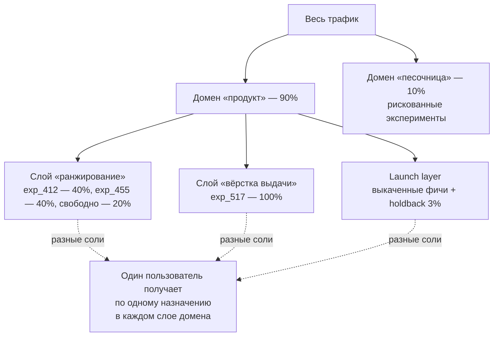

# Платформа экспериментов

> **Зачем эта глава.** Все предыдущие главы раздела считают один эксперимент, а в компании
> их одновременно двести — и все они трогают один и тот же продукт и одних и тех же людей.
> Здесь разбираемся, как из одного потока трафика получить много независимых экспериментов:
> что такое слои и домены, как пользователь превращается в вариант через хеш с солью,
> почему рехеширование посреди теста уничтожает половину эффекта, что нужно записать в момент
> показа, чтобы потом честно посчитать эффект на триггерной популяции, и сколько экспериментов
> вообще помещается в ваш трафик.

**Уровень:** 🎯 middle → 🧠 middle+
**Предварительно нужно:** [дизайн эксперимента](01-experiment-design.md), [статистические критерии](02-statistical-criteria.md), [снижение дисперсии](03-variance-reduction.md), [ловушки A/B-тестов](04-pitfalls.md)
**Как проработать:** чтение + упражнения

---

## Карта главы

- [1. Что ломается, когда экспериментов становится много](#1-что-ломается-когда-экспериментов-становится-много)
- [2. Слои и домены: как из одного трафика сделать много](#2-слои-и-домены-как-из-одного-трафика-сделать-много)
- [3. Хеширование пользователя в вариант](#3-хеширование-пользователя-в-вариант)
- [4. Соль: зачем она нужна и что ломает её смена](#4-соль-зачем-она-нужна-и-что-ломает-её-смена)
- [5. Проверяем сплиттер: равномерность и ортогональность](#5-проверяем-сплиттер-равномерность-и-ортогональность)
- [6. Counterfactual logging: фундамент триггерного анализа](#6-counterfactual-logging-фундамент-триггерного-анализа)
- [7. Ёмкость платформы: сколько экспериментов помещается в трафик](#7-ёмкость-платформы-сколько-экспериментов-помещается-в-трафик)
- [8. Хранилище метрик и единое определение метрики](#8-хранилище-метрик-и-единое-определение-метрики)
- [9. Автоматика запуска: SRM, A/A и guardrails](#9-автоматика-запуска-srm-aa-и-guardrails)
- [10. Что из этого нужно небольшой команде](#10-что-из-этого-нужно-небольшой-команде)
- [11. Подводные камни](#11-подводные-камни)
- [12. Проверь себя](#12-проверь-себя)
- [13. Практика](#13-практика)
- [14. Что читать дальше](#14-что-читать-дальше)

---

## 1. Что ломается, когда экспериментов становится много

Пока эксперимент один, вопросов нет: половина пользователей сюда, половина туда. Проблема
появляется на числе, которое в средней продуктовой компании достигается за квартал: сорок команд,
у каждой две-три гипотезы в работе. Есть ровно два наивных способа раздать им трафик, и оба
не работают.

**Наивный способ первый: нарезать трафик на непересекающиеся куски.** Каждому эксперименту
свои 2% пользователей, никто ни с кем не пересекается, интерференции нет. Красиво и мертво:
размер выборки на группу упал в пятьдесят раз, а MDE, который по формуле из
[главы про дизайн](01-experiment-design.md#5-mde-и-размер-выборки-полный-вывод) ведёт себя
как $\Delta \propto \sigma\sqrt{2/n}$, вырос в $\sqrt{50} \approx 7$ раз. Эксперимент, который
ловил прирост в 0.5%, теперь ловит только 3.5%. Таких эффектов в зрелом продукте не бывает,
и вся платформа превращается в машину по производству незначимых результатов.

**Наивный способ второй: пустить все эксперименты на всю аудиторию независимо, но без
координации.** Трафик не теряется, зато теряется смысл чисел. Разберём, почему именно.

Пусть метрика пользователя $i$ складывается из базового уровня и вкладов двух одновременно
идущих экспериментов:

$$
Y_i = \mu + \alpha T^{(1)}_i + \beta T^{(2)}_i + \gamma\, T^{(1)}_i T^{(2)}_i + \varepsilon_i
$$

где $\mu$ — средний уровень метрики без всяких изменений, $T^{(1)}_i \in \{0, 1\}$ и
$T^{(2)}_i \in \{0, 1\}$ — индикаторы того, что пользователь попал в тестовую группу первого
и второго эксперимента, $\alpha$ и $\beta$ — их истинные эффекты, $\gamma$ — эффект
взаимодействия (столько добавляется сверх суммы, когда фичи работают вместе),
$\varepsilon_i$ — шум с нулевым средним.

Аналитик первого эксперимента считает обычную разность средних. Обозначим
$p_{11} = \mathbb{P}(T^{(2)} = 1 \mid T^{(1)} = 1)$ — доля пользователей второго эксперимента
среди тестовой группы первого, и $p_{10} = \mathbb{P}(T^{(2)} = 1 \mid T^{(1)} = 0)$ — то же
среди контрольной. Тогда

$$
\begin{aligned}
\mathbb{E}\big[Y \mid T^{(1)} = 1\big] &= \mu + \alpha + \beta p_{11} + \gamma p_{11}, \\
\mathbb{E}\big[Y \mid T^{(1)} = 0\big] &= \mu + \beta p_{10}, \\
\hat{\Delta}_1 \;\to\; \alpha &+ \underbrace{\beta\,(p_{11} - p_{10})}_{\text{чужой эффект}}
\;+\; \underbrace{\gamma\, p_{11}}_{\text{взаимодействие}}
\end{aligned}
$$

Второе слагаемое — чистое смещение: **эффект чужого эксперимента протёк в вашу оценку**.
Он появляется ровно тогда, когда $p_{11} \neq p_{10}$, то есть когда распределения по двум
экспериментам скоррелированы. А они скоррелированы всегда, если обе команды хешируют
пользователя одной и той же функцией без разделяющего ключа: тогда $p_{11} = 1$, $p_{10} = 0$,
и в оценку первого эксперимента целиком въезжает эффект второго. Численно: второй эксперимент
даёт честные $\beta = +1.5\%$, корреляция назначений даёт $p_{11} - p_{10} = 0.3$ — и первый
эксперимент получает фантомные $+0.45\%$ при типичном MDE в 0.5%. Половина карточки
результата — не ваш эффект.

Теперь ключевое наблюдение, из которого растёт вся конструкция главы. Если сделать назначения
**независимыми**, то $p_{11} = p_{10} = 0.5$, второе слагаемое обнуляется, и остаётся
$\hat{\Delta}_1 \to \alpha + \gamma/2$. Смещения нет; есть честная интерпретация — вы измерили
эффект своей фичи **в той среде, где половина пользователей уже находится под вторым
экспериментом**. Это ровно то, что нужно продукту: раскатывать вы будете тоже в среду,
полную чужих изменений.

> 🌱 **База.** Вся идея платформы экспериментов в одном предложении: пользователь одновременно
> участвует в десятке экспериментов, и это нормально — при условии, что распределения по этим
> экспериментам статистически независимы. Независимость даёт бесплатный трафик: каждый
> эксперимент видит все 100% аудитории.

> ⚠️ **Типичная ошибка.** Две команды берут `user_id % 2` как сплит и запускают эксперименты
> в один день. Назначения совпадают полностью: обе тестовые группы — одни и те же люди.
> Итог: оба эксперимента показывают сумму двух эффектов, обе команды раскатывают свою фичу,
> суммарный прирост оказывается вдвое меньше обещанного. Правильно — включать в ключ хеша
> идентификатор эксперимента, см. [§4](#4-соль-зачем-она-нужна-и-что-ломает-её-смена).

---

## 2. Слои и домены: как из одного трафика сделать много

Независимость назначений решает задачу не полностью. Есть пары экспериментов, которые
независимыми быть не должны, — те, что физически конфликтуют. Если один эксперимент меняет
формулу ранжирования, а второй — тоже формулу ранжирования, пользователь не может получить
обе: параметр один. Здесь нужна не независимость, а взаимоисключение.

Отсюда двухуровневая конструкция, введённая в инженерную практику работой Google
об overlapping-инфраструктуре (Tang и др., KDD 2010) и с тех пор воспроизведённая примерно
всеми крупными платформами.

**Слой (layer)** — независимая копия рандомизации всей аудитории. Каждый пользователь получает
ровно одно назначение в каждом слое. Внутри слоя эксперименты **взаимоисключающие**
(mutually exclusive): они делят между собой 100% трафика слоя, и пользователь попадает
максимум в один из них. Между слоями назначения **ортогональны** (orthogonal): попадание
в эксперимент слоя 1 ничего не говорит о попадании в эксперимент слоя 2.

Правило разнесения по слоям простое и механическое: **если два эксперимента могут изменить
один и тот же параметр запроса — они обязаны жить в одном слое.** Слой — это, по сути, группа
параметров системы, которыми владеет одна команда: слой ранжирования, слой вёрстки выдачи,
слой пуш-уведомлений, слой ценообразования.

**Домен (domain)** — кусок трафика со своей собственной системой слоёв внутри. Домены нужны
в двух ситуациях: когда команде нужна изолированная песочница (эксперименты с высоким риском
не должны пересекаться с продуктовыми), и когда эксперимент требует взаимоисключения сразу
с несколькими слоями — тогда его кладут в отдельный домен целиком.



**Launch layer** — отдельный слой, куда переезжают победившие эксперименты. Логика такая:
эксперимент выиграл, его надо раскатать на 100%, но удалять код и конфиг сразу опасно —
нужен способ выключить фичу одним движением и нужна возможность мерить её долгосрочный эффект.
Поэтому фича переезжает в launch layer, где по умолчанию включена всем, а в обычном слое
освобождается место под следующий эксперимент. Это важная деталь ёмкости: без launch layer
слой постепенно забивается «навсегда включёнными» экспериментами и перестаёт принимать новые.

**Holdback** (он же долгосрочный holdout) — те самые 1–5% трафика в launch layer, которым фича
не выдаётся месяцами. Он платит за себя в двух случаях: когда эффект накапливается или,
наоборот, рассасывается (эффект новизны из [главы про ловушки](04-pitfalls.md#6-эффект-новизны-и-привыкания)),
и когда нужно посчитать суммарный вклад всех решений команды за квартал — сумма отдельных A/B
почти никогда не сходится с реальностью. Подробнее про долгосрочные схемы —
в [сложных дизайнах](05-complex-designs.md#8-holdout-группы-и-долгосрочный-эффект).

> 💬 **На собеседовании.** Спросят: «У вас сто экспериментов одновременно. Как сделать,
> чтобы они не мешали друг другу?» Хороший ответ: разнести по слоям — внутри слоя
> эксперименты взаимоисключающие и делят 100% трафика слоя, между слоями назначения
> ортогональны за счёт разных солей в хеше; в один слой кладутся эксперименты, которые
> трогают один и тот же параметр системы. Оценка каждого эксперимента при этом остаётся
> несмещённой, потому что чужие эксперименты сбалансированы между вашими группами;
> измеряете вы эффект «в текущей среде», и это то, что нужно. Плохой ответ: «дать каждому
> эксперименту свой процент трафика» — это убивает мощность в десятки раз.

> 🧠 **Middle+.** Ортогональность не защищает от взаимодействия $\gamma$ — она делает его
> усреднённым по среде, а не устраняет. Если два эксперимента заведомо взаимодействуют сильно
> (обе фичи борются за одно и то же место на экране), правильный ход — не «положиться
> на ортогональность», а собрать факторный дизайн: один эксперимент на четыре группы
> (контроль, A, B, A+B), где $\gamma$ оценивается явно как
> $\hat{\gamma} = \bar{Y}_{AB} - \bar{Y}_A - \bar{Y}_B + \bar{Y}_{\text{ctrl}}$. Цена — вчетверо
> больше выборки на ту же мощность по взаимодействию, поэтому так делают редко и осознанно.

---

## 3. Хеширование пользователя в вариант

Назначение обязано вычисляться, а не храниться. Хранить таблицу «пользователь → вариант»
для сотни экспериментов и сотни миллионов пользователей — это отдельная база в критическом
пути запроса, с репликацией и инвалидацией. Вместо этого назначение считают функцией
от идентификатора: детерминированно, за микросекунды, на любой реплике и в любом языке.

Требований к такой функции ровно четыре:

1. **Детерминированность.** Один и тот же ответ на бэкенде, в мобильном клиенте и в SQL
   аналитика. Отсюда прямое следствие: сплиттер — одна библиотека с тестами на согласованность,
   а не три независимые реализации.
2. **Равномерность.** Бакеты должны наполняться одинаково при любом виде идентификаторов —
   последовательных числовых, UUID, хешей телефона.
3. **Независимость между ключами.** Разбиение по слою 1 не должно ничего знать о разбиении
   по слою 2. Это свойство лавинности (avalanche): изменение одного бита входа переворачивает
   в среднем половину битов выхода.
4. **Дешевизна.** Функция вызывается на каждый запрос по числу слоёв, бюджет — единицы
   микросекунд.

Каноническая конструкция:

$$
b(u) = \Big(\text{int}\big(\mathrm{hash}(\,s \,\Vert\, u\,)\big)\Big) \bmod B,
\qquad
\text{вариант} = v\big(b(u)\big)
$$

где $u$ — идентификатор единицы рандомизации (не обязательно пользователь: cookie, устройство,
сессия или кластер — см. [§4 главы про дизайн](01-experiment-design.md#4-единица-рандомизации)),
$s$ — соль, $\Vert$ — конкатенация строк через разделитель, $\mathrm{hash}$ — хеш-функция
с лавинным эффектом, $B$ — число бакетов (обычно 1000 или 10000), $b(u) \in \{0,\dots,B-1\}$ —
номер бакета, $v(\cdot)$ — таблица «диапазон бакетов → вариант».

📐 **Зачем промежуточный слой бакетов.** Можно было бы брать остаток сразу по числу вариантов.
Бакеты дают три вещи, каждая из которых на практике оказывается нужной.

*Плавная раскатка без перетасовки.* Эксперимент начинают с 5% и расширяют до 50%. Если
диапазоны вложены — контроль растёт снизу, $[0, k)$, тест сверху, $[B - k, B)$, — то при
увеличении $k$ ни один уже назначенный пользователь варианта не меняет. Если же пересчитывать
доли через модуль по новому числу групп, при каждом расширении половина пользователей
переезжает, и вы получаете рехеширование из [§4](#4-соль-зачем-она-нужна-и-что-ломает-её-смена)
со всеми последствиями.

*Единица агрегации для статистики.* Бакет — готовая единица для бутстрэпа по бакетам
и для линеаризации ratio-метрик (см. [§8 главы про критерии](02-statistical-criteria.md#8-линеаризация)):
вместо ста миллионов строк аналитика работает с тысячей чисел на группу.

*Хирургия.* Бакет, в который попал бот-фарм или один аномальный корпоративный клиент,
можно исключить из анализа целиком — по обеим группам симметрично.

Про выбор хеш-функции спорить почти не о чем: подойдёт любая с лавинным эффектом. MD5 и SHA-1
криптографически мертвы, но здесь от них не требуется стойкость — только перемешивание,
и они годятся; MurmurHash3, xxHash, CityHash быстрее в разы. Чего использовать **нельзя**:

- **Встроенный `hash()` в Python.** Он рандомизируется при старте процесса:

  ```
  $ for s in 1 2 3; do PYTHONHASHSEED=$s python3 -c "print(hash('user_42'))"; done
  1899357954126748570
  1169875098684776662
  -1635165845295027938
  ```

  Один и тот же пользователь получает разный вариант на разных воркерах и разный вариант
  после каждого деплоя.
- **`String.hashCode()` в Java как «тот же хеш» в аналитике.** Он детерминирован, но это
  не MD5: если бэкенд считает назначение им, а питоновский пайплайн — через `hashlib`,
  группы в проде и в анализе разные. Симптом — идеальный SRM: 50/50 в проде и 50/50
  в аналитике, но это разные 50%.
- **Арифметику по идентификатору** (`user_id % 2`, последняя цифра телефона). Идентификаторы
  почти всегда несут структуру: последовательная нумерация по дате регистрации, префикс
  шарда, диапазон, выданный партнёру пачкой. Остаток по модулю эту структуру сохраняет,
  и группы получаются систематически разными по составу.

---

## 4. Соль: зачем она нужна и что ломает её смена

Соль (salt) — строка, которую подмешивают к идентификатору перед хешированием. Формально —
единственный способ получить из одной хеш-функции много независимых разбиений: функция одна,
входы разные, выходы некоррелированы.

Практический формат соли — составной ключ:

```
salt = "<layer_id>:<experiment_id>:<version>"
```

Каждый компонент отвечает за свой вид независимости. `layer_id` разводит слои между собой.
`experiment_id` разводит эксперименты внутри слоя, идущие в разное время: без него пользователь,
попавший в тест эксперимента №1, попадёт в тест и эксперимента №2, и №3 — и накопленный
эффект от прошлых экспериментов (carryover) будет систематически сидеть в тестовой группе.
`version` — ручка для намеренного перезапуска: тот же эксперимент, новое разбиение.

Порядок конкатенации имеет значение только для читаемости, но разделитель обязателен.
Ключ `"exp1" + "23"` и ключ `"exp12" + "3"` совпадают, если склеивать без двоеточия, —
это реальный класс багов на численных идентификаторах.

### Что происходит при смене соли посреди эксперимента

Соль поменяли на пятый день двухнедельного теста — потому что переименовали эксперимент,
раскатили новую версию конфига, поправили формат ключа. Назначение пересчиталось, примерно
половина пользователей переехала в другую группу. Что стало с результатом?

Разложим метрику пользователя на до и после момента рехеширования. Пусть $\tau \in [0,1]$ —
доля метрики, накопленная до рехеширования (для аддитивных метрик вроде выручки или числа
сессий это примерно доля прошедшего времени), $\alpha$ — истинный эффект на полном горизонте,
$W_{\text{pre}}$ и $W_{\text{post}}$ — принадлежность тестовой группе до и после рехеширования.
Анализ идёт по текущему, то есть по $W_{\text{post}}$. Тогда

$$
\begin{aligned}
\mathbb{E}\big[Y \mid W_{\text{post}} = 1\big]
&= \mu + (1-\tau)\alpha + \tau\alpha\cdot\mathbb{P}\big(W_{\text{pre}} = 1 \mid W_{\text{post}} = 1\big), \\
\mathbb{E}\big[Y \mid W_{\text{post}} = 0\big]
&= \mu + \tau\alpha\cdot\mathbb{P}\big(W_{\text{pre}} = 1 \mid W_{\text{post}} = 0\big).
\end{aligned}
$$

Новая соль независима от старой, поэтому обе вероятности равны $1/2$, и разность средних даёт

$$
\hat{\Delta} \;\to\; (1 - \tau)\,\alpha
$$

**Первая часть эксперимента не просто теряется — она разбавляет вторую.** До момента
рехеширования тестовые и контрольные пользователи перемешаны поровну в обеих новых группах,
их вклад в разность строго нулевой, а в знаменатель дисперсии он входит полностью.

Числа: рехеширование на седьмой день из четырнадцати даёт $\tau = 0.5$, измеренный эффект
падает вдвое. Эксперимент, спроектированный на мощность 0.8 (то есть на $z = 2.8$ при эффекте
ровно в MDE), получает $z = 1.4$ и мощность 0.29. Чтобы вернуть мощность, нужно в
$1/(1-\tau)^2 = 4$ раза больше выборки. При $\tau = 0.25$ — мощность 0.56 и рост выборки
в 1.78 раза.

И это оптимистичная оценка. Она предполагает, что пользователь, побывавший в тесте
и вернувшийся в контроль, ничего не унёс с собой. В реальности он уже увидел новый интерфейс,
научился им пользоваться или, наоборот, разозлился и удалил приложение — эффект переноса
делает контрольную группу «подпорченной», и затухание получается сильнее, чем $(1-\tau)$.

> ⚠️ **Типичная ошибка.** Аналитик восстанавливает группы задним числом: берёт список
> `user_id`, вызывает текущий сплиттер с текущим конфигом и считает метрики. Всё сходится,
> SRM в норме, результат — мусор, потому что в проде в те дни действовала другая соль.
> Правильно: **назначение логируется как событие в момент его вычисления** (кто, когда,
> какой слой, какой эксперимент, какой вариант, какая версия конфига), а анализ читает лог,
> а не пересчитывает функцию. Это же спасает при смене реализации сплиттера.

> 💬 **На собеседовании.** Спросят: «Зачем в хеш добавляют соль и что будет, если её
> поменять во время эксперимента?» Хороший ответ: соль делает разбиения независимыми —
> между слоями и между последовательными экспериментами в одном слое, иначе одни и те же
> люди систематически попадают в тест и тащат carryover. Смена соли на середине даёт
> независимое перераспределение: измеренный эффект затухает в $(1-\tau)$ раз, где $\tau$ —
> доля метрики до рехеширования, а требуемая выборка растёт как $1/(1-\tau)^2$; плюс
> добавляется эффект переноса, которого модель затухания не учитывает. Правильная реакция —
> перезапустить эксперимент с чистого листа, а не «досчитать оставшиеся дни».
> Плохой ответ: «ничего страшного, разбиение всё равно случайное».

---

## 5. Проверяем сплиттер: равномерность и ортогональность

Сплиттер — тот компонент платформы, где баг не виден глазами и не падает в мониторинге:
эксперименты идут, отчёты рисуются, просто числа неправильные. Поэтому его проверяют
численно, а не рассуждением.

```python
# Сплиттер платформы: хеш с солью -> бакет -> вариант.
import hashlib
import numpy as np
from scipy.stats import chisquare, chi2_contingency

N_BUCKETS = 1000


def bucket(user_id: str, salt: str, n_buckets: int = N_BUCKETS) -> int:
    """MD5 берём не ради стойкости, а ради лавинности: соседние ключи расходятся полностью."""
    key = f"{salt}:{user_id}".encode()          # разделитель обязателен: "exp1"+"23" == "exp12"+"3"
    digest = hashlib.md5(key).digest()
    return int.from_bytes(digest[:8], "big") % n_buckets


def assign(user_id: str, salt: str, splits):
    """splits — список (имя варианта, ширина в бакетах); диапазоны идут подряд от нуля."""
    b = bucket(user_id, salt)
    edge = 0
    for name, width in splits:
        edge += width
        if b < edge:
            return name
    return None                                  # бакет вне эксперимента: свободный трафик слоя


users = [f"user_{i}" for i in range(200_000)]
SPL = [("control", 500), ("test", 500)]

# 1. Равномерность по бакетам внутри одного слоя.
counts = np.bincount([bucket(u, "layer_rank:exp_412:v1") for u in users], minlength=N_BUCKETS)
stat, p = chisquare(counts)
print(f"бакеты: min={counts.min()} max={counts.max()} mean={counts.mean():.1f} "
      f"chi2={stat:.1f} df={N_BUCKETS - 1} p={p:.3f}")

# 2. Ортогональность двух слоёв: таблица сопряжённости и хи-квадрат.
a = np.array([assign(u, "layer_rank:exp_412:v1", SPL) for u in users])
b = np.array([assign(u, "layer_ui:exp_517:v1", SPL) for u in users])
tab = np.array([[np.sum((a == x) & (b == y)) for y in ("control", "test")]
                for x in ("control", "test")])
stat2, p2, dof, _ = chi2_contingency(tab, correction=False)
print("две разные соли:\n", tab, f"\nchi2={stat2:.2f} df={dof} p={p2:.3f}")

# 3. Контрпример: соль забыли развести по слоям.
c = np.array([assign(u, "layer_rank:exp_412:v1", SPL) for u in users])
tab_bad = np.array([[np.sum((a == x) & (c == y)) for y in ("control", "test")]
                    for x in ("control", "test")])
stat3, p3, dof3, _ = chi2_contingency(tab_bad, correction=False)
print("одна соль на два слоя:\n", tab_bad, f"\nchi2={stat3:.1f} df={dof3} p={p3:.3g}")

# 4. Цена смены соли: сколько пользователей переедет.
a2 = np.array([assign(u, "layer_rank:exp_412:v2", SPL) for u in users])
print(f"после смены версии соли вариант сменили {(a != a2).mean():.4f} пользователей")
```

Вывод:

```
бакеты: min=153 max=246 mean=200.0 chi2=978.4 df=999 p=0.674
две разные соли:
 [[49918 49807]
 [50018 50257]] 
chi2=0.61 df=1 p=0.434
одна соль на два слоя:
 [[ 99725      0]
 [     0 100275]] 
chi2=200000.0 df=1 p=0
после смены версии соли вариант сменили 0.5000 пользователей
```

Читаем построчно. Заполнение бакетов колеблется от 153 до 246 при среднем 200 — это нормальный
пуассоновский разброс, а не перекос: $\chi^2 = 978.4$ при 999 степенях свободы, $p = 0.67$,
гипотеза равномерности не отвергается. Разброс в 20% на бакет пугает начинающих, но при
двухстах наблюдениях стандартное отклонение — $\sqrt{200} \approx 14$, то есть наблюдаемая
картина ровно такая, какой должна быть.

Таблица сопряжённости двух слоёв заполнена почти идеально: около 50 000 в каждой клетке,
$\chi^2 = 0.61$ при одной степени свободы, $p = 0.43$. Знание варианта в слое ранжирования
не даёт никакой информации о варианте в слое вёрстки — это и есть ортогональность,
измеренная численно.

Контрпример показывает, как выглядит поломка: диагональная матрица, вне диагонали нули,
$\chi^2 = 200\,000$ при одной степени свободы, $p$ неотличим от нуля. Все «тестовые»
в одном слое — те же люди, что «тестовые» в другом. Именно эта ситуация даёт смещение
$\beta(p_{11} - p_{10})$ из [§1](#1-что-ломается-когда-экспериментов-становится-много).

Последняя строка — цена смены соли: ровно половина аудитории меняет вариант. Не «немного
перетасовалось», а 50%.

> 🧠 **Middle+.** Одна таблица сопряжённости — слабая проверка: при десяти слоях пар
> сорок пять, и одно-два значения $p < 0.05$ там будут просто по определению уровня
> значимости. На тех же 200 000 пользователей и десяти слоях (соли
> `layer_0:exp_412:v1` … `layer_9:exp_412:v1`) получается 45 пар,
> из них ровно одна с $p < 0.05$ (минимальное $p = 0.040$, медиана 0.59) — картина в точности
> такая, какой обязана быть при истинной независимости. Правильная проверка сплиттера — это
> не одно число, а распределение p-value по всем парам слоёв: оно должно быть равномерным
> на $[0, 1]$. Ровно та же логика, что в многократном A/A-тесте
> из [§8 главы про дизайн](01-experiment-design.md#8-aa-тест-что-он-на-самом-деле-проверяет).

---

## 6. Counterfactual logging: фундамент триггерного анализа

Вот задача, на которой ломается большинство самодельных платформ. Команда добавила блок
«похожие товары», который показывается, только если для карточки нашлось не меньше трёх похожих.
Условие выполняется у 6% пользователей. Эксперимент запущен на всю аудиторию. Как посчитать
эффект?

**Считать по всей группе** — честно, но бессмысленно: 94% пользователей вообще не видели
изменения, их вклад в разность нулевой, а в дисперсию — полный. Эффект разбавлен в шестнадцать
раз и утонет в шуме.

**Сравнить «тех, кто видел блок» в тесте со всей контрольной группой** — уже нечестно.
Те, кто видел блок, — это пользователи, дошедшие до подходящих карточек, то есть более активная
подгруппа. Вы сравниваете отобранных с неотобранными и меряете не фичу, а активность.

**Сравнить «тех, кто видел» с «теми, кто увидел бы»** — вот это правильно. Но данных для
правой части не существует: код, который проверяет «нашлось ли три похожих», в контрольной
группе просто не выполняется. Условие триггера в контроле никому не известно.

Отсюда решение, которое и называется **counterfactual logging** (контрфактическое
логирование): в контрольной группе выполнять ровно то же вычисление, что и в тестовой,
и записывать факт «здесь бы сработало» — **не показывая ничего**. Пользователь контроля видит
старый продукт; лог знает, что он входит в триггерную популяцию.

Что именно надо записать в момент принятия решения — минимальный состав события:

| Поле | Зачем |
|---|---|
| `unit_id`, `request_id`, `ts_decision` | склейка с метриками; окна метрик считаются от момента триггера, а не от старта эксперимента |
| `layer_id`, `experiment_id`, `variant`, `config_version` | какое именно назначение действовало; спасает при смене соли и конфига |
| `triggered` (bool) | тот самый контрфактический флаг, одинаково вычисленный в обеих группах |
| `trigger_reason` | какой предикат сработал или почему не сработал — без этого отладка расхождений невозможна |
| `payload_id` (хеш набора кандидатов) | что было бы показано: нужно для офлайн-метрик и off-policy оценки |
| `model_version`, `feature_snapshot_id` | воспроизводимость: через месяц модель уже другая |

Три условия, без которых триггерный анализ остаётся смещённым:

**Симметрия кода.** Предикат триггера должен быть одним и тем же куском кода в обеих группах,
а не «примерно такой же логикой» в контроле. Любое расхождение реализаций даёт разные
триггерные популяции, а это уже не эксперимент.

**Инвариантность триггера к варианту.** Если новая логика меняет само условие срабатывания —
например, новая модель находит похожие товары чаще, — то триггерные популяции в группах
разные по составу, и отбор происходит **после** воздействия. Это классический post-treatment
selection, и он смещает оценку в любую сторону. Рабочий выход: триггерить обе группы
по инвариантному предикату (старому, доступному до применения фичи), а изменение самой доли
срабатывания докладывать отдельной метрикой.

**Фиксация момента.** Пользователи входят в триггерную популяцию в разное время. Все окна
метрик и все ковариаты для CUPED отсчитываются от индивидуального момента триггера — про эту
тонкость подробно сказано в [главе про снижение дисперсии](03-variance-reduction.md#4-требования-к-ковариате).

### Сколько это даёт

Пусть $q$ — доля триггернувшихся, $\alpha_{\text{trig}}$ — эффект на триггерной популяции,
$\sigma$ — стандартное отклонение метрики, $N$ — размер группы. Эффект на всей популяции
разбавлен: $\alpha_{\text{all}} = q\,\alpha_{\text{trig}}$. Сравним z-статистики:

$$
z_{\text{all}} = \frac{q\,\alpha_{\text{trig}}\sqrt{N}}{\sigma\sqrt{2}},
\qquad
z_{\text{trig}} = \frac{\alpha_{\text{trig}}\sqrt{qN}}{\sigma_{\text{trig}}\sqrt{2}},
\qquad
\frac{z_{\text{trig}}}{z_{\text{all}}} = \frac{1}{\sqrt{q}}\cdot\frac{\sigma}{\sigma_{\text{trig}}}
$$

где $\sigma_{\text{trig}}$ — стандартное отклонение метрики внутри триггерной популяции.
Если бы дисперсия внутри триггерной популяции была такой же, выигрыш составлял бы ровно
$1/\sqrt{q}$: при $q = 0.06$ это в 4.1 раза по z, то есть **в 17 раз меньше нужной выборки**.
На практике $\sigma_{\text{trig}} > \sigma$, потому что триггернувшиеся активнее, и реальный
выигрыш меньше. Проверим:

```python
# Триггерный анализ против анализа по всей группе: считаем, сколько даёт контрфактический флаг.
import numpy as np
from scipy import stats

rng = np.random.default_rng(7)
N = 400_000          # пользователей в группе
Q = 0.06             # доля тех, у кого срабатывает новый блок
LIFT = 0.03          # эффект среди затронутых: +3% к их метрике


def group(treated: bool):
    trig = rng.random(N) < Q                     # предикат триггера от варианта не зависит
    base = rng.lognormal(mean=0.0, sigma=1.0, size=N)
    base[trig] *= 1.6                            # триггернувшиеся активнее — так почти всегда
    if treated:
        base[trig] *= (1 + LIFT)
    return base, trig


y_c, t_c = group(False)
y_t, t_t = group(True)


def z(a, b):
    d = a.mean() - b.mean()
    se = np.sqrt(a.var(ddof=1) / len(a) + b.var(ddof=1) / len(b))
    return d, d / se


d_all, z_all = z(y_t, y_c)
d_trg, z_trg = z(y_t[t_t], y_c[t_c])             # в контроле знаем t_c только благодаря логу
print(f"вся популяция:    diff={d_all:+.5f}  z={z_all:+.2f}  p={2 * stats.norm.sf(abs(z_all)):.4f}")
print(f"триггерная:       diff={d_trg:+.5f}  z={z_trg:+.2f}  p={2 * stats.norm.sf(abs(z_trg)):.4g}")
print(f"пересчёт на всех: diff_trg * q = {d_trg * Q:+.5f}")
print(f"выигрыш в z:      {z_trg / z_all:.2f}x   (1/sqrt(q) = {1 / np.sqrt(Q):.2f}x)")
```

```
вся популяция:    diff=+0.00584  z=+1.14  p=0.2554
триггерная:       diff=+0.10293  z=+3.26  p=0.001111
пересчёт на всех: diff_trg * q = +0.00618
выигрыш в z:      2.87x   (1/sqrt(q) = 4.08x)
```

Один и тот же эксперимент: по всей популяции $p = 0.26$ и вывод «эффекта нет», по триггерной —
$p = 0.001$ и уверенный положительный результат. Выигрыш в z составил 2.87 раза вместо
теоретических 4.08 — разницу съела повышенная дисперсия активных пользователей, и это
типичная картина, а не дефект симуляции.

Обратите внимание на третью строку: эффект на триггерной популяции $+0.103$, умноженный
на долю триггера $q = 0.06$, даёт $+0.0062$ — практически ту же величину, что прямая оценка
по всей популяции $+0.0058$. Это и есть правило доклада результата: **триггерный эффект
показывает силу фичи, произведение на долю триггера показывает вклад в продукт.**
В карточке эксперимента должны быть оба числа, иначе «+10% на триггерной популяции» переедет
в квартальный отчёт как «+10% выручки».

Плата за контрфактическое логирование реальна: в контроле приходится считать то, что не будет
показано, — вызывать модель, ходить в индекс похожих товаров, тратить бюджет latency.
Стандартный компромисс — считать контрфактику не для всей контрольной группы, а для её
случайной подвыборки (например, 20%); тогда триггерный анализ ведётся на этой подвыборке,
и мощность считается по ней.

> 💬 **На собеседовании.** Спросят: «Ваша фича видна пяти процентам пользователей.
> Как измерить её эффект?» Хороший ответ: считать по всей группе — разбавление в двадцать раз;
> сравнивать увидевших со всем контролем — смещение отбора, потому что увидевшие активнее;
> правильно — контрфактическое логирование: в контроле выполняется тот же предикат триггера
> и пишется флаг «сработало бы», анализ идёт на триггерной популяции обеих групп. Выигрыш
> по z порядка $1/\sqrt{q}$, на практике меньше из-за большей дисперсии активных. В отчёт
> идут обе цифры — эффект на триггерных и он же, умноженный на долю триггера. Guardrail-метрики
> при этом считаются на всей популяции, чтобы поймать вред за пределами триггера.
> Плохой ответ: «отфильтровать тех, кто видел блок, в обеих группах» — в контроле блока нет,
> фильтровать не по чему.

---

## 7. Ёмкость платформы: сколько экспериментов помещается в трафик

Вопрос «сколько экспериментов мы можем крутить одновременно» звучит как менеджерский,
но у него есть точный ответ. Внутри одного слоя эксперименты делят трафик, значит, число
одновременных экспериментов в слое — это

$$
C_{\text{layer}} = \frac{N}{2n}
= \frac{N\,\Delta^2}{4\,(z_{1-\alpha/2} + z_{1-\beta})^2\,\sigma^2}
$$

где $N$ — число доступных единиц рандомизации за период эксперимента, $n$ — требуемый размер
одной группы из формулы [§5 главы про дизайн](01-experiment-design.md#5-mde-и-размер-выборки-полный-вывод),
двойка в знаменателе — потому что эксперименту нужны две группы, $\Delta$ — MDE,
$\sigma$ — стандартное отклонение метрики, $z_{1-\alpha/2}$ и $z_{1-\beta}$ — квантили
нормального распределения для уровня значимости и мощности.

Подставим типичные значения: $\alpha = 0.05$, мощность $0.8$, то есть
$2(z_{1-\alpha/2}+z_{1-\beta})^2 \approx 15.7$; коэффициент вариации метрики
$\sigma/\mu = 2$ (обычная картина для выручки на пользователя с тяжёлым хвостом);
$N = 20$ млн пользователей за две недели.

| MDE (относительный) | $n$ на группу | Экспериментов в слое |
|---|---|---|
| 0.5% | 2 510 000 | 4.0 |
| 1% | 628 000 | 15.9 |
| 2% | 157 000 | 63.7 |

Отсюда сразу видно, почему слои — не украшение архитектуры. При MDE 0.5% один слой держит
четыре эксперимента; восемь слоёв дают тридцать два, и это уже похоже на рабочую платформу.
Отсюда же видно, почему снижение дисперсии — прямой множитель ёмкости: CUPED, срезающий
дисперсию на 30%, уменьшает $n$ в 1.43 раза и во столько же раз увеличивает число
одновременных экспериментов в слое. Тридцать процентов дисперсии — это не «немного точнее»,
это плюс сорок три процента пропускной способности всей компании
(см. [снижение дисперсии](03-variance-reduction.md#6-сколько-это-экономит-на-самом-деле)).

Но настоящий потолок ёмкости обычно не в трафике. Ограничителей три, и все три жёстче:

**Число реально независимых поверхностей.** Нельзя объявить пятьдесят слоёв, если в продукте
десять мест, куда можно вносить изменения. Слои отражают устройство системы, а не желание
запустить побольше.

**Множественные сравнения на уровне платформы.** Двести экспериментов по двадцать метрик —
четыре тысячи проверок в неделю. При $\alpha = 0.05$ это две сотни ложных срабатываний,
каждое из которых кто-то понесёт в ревью как открытие. Это главный недооценённый ограничитель:
платформа, где нет иерархии метрик (одна ключевая, остальные — диагностика) и контроля FDR
из [§4 главы про ловушки](04-pitfalls.md#4-множественные-сравнения), начинает генерировать
шум быстрее, чем знание.

**Люди.** Двести экспериментов — это двести дизайн-документов, двести разборов результата
и двести решений. Компании упираются в это раньше, чем в трафик.

> 💬 **На собеседовании.** Спросят: «Сколько A/B-тестов вы можете гонять одновременно?»
> Хороший ответ: посчитать. Внутри слоя ёмкость равна $N/2n$, где $n$ считается из MDE,
> дисперсии и мощности; при 20 млн пользователей за две недели, коэффициенте вариации 2
> и MDE 1% это шестнадцать экспериментов на слой, а общее число — это число слоёв,
> умноженное на ёмкость, причём слои определяются архитектурой продукта, а не желанием.
> И сразу назвать реальный потолок: множественные сравнения и число людей, способных
> разобрать результат. Плохой ответ: назвать число без формулы.

---

## 8. Хранилище метрик и единое определение метрики

Симптом, по которому узнают платформу без метрик-стора: на ревью эксперимента полчаса
спорят не о решении, а о том, чья цифра конверсии правильная — 3.1% из дашборда команды
или 3.4% из ноутбука аналитика. Причина всегда одна и та же: «конверсия» в двух местах
посчитана по-разному, и обе версии по-своему разумны.

Определение метрики — это шесть решений, каждое из которых можно принять двумя способами:

- **единица наблюдения** — пользователь, сессия, заказ или пара «пользователь-день»;
- **числитель** — какое событие считается успехом и в какой момент оно засчитывается
  (клик по кнопке или подтверждённый платёж);
- **знаменатель** — все пользователи группы, активные, или дошедшие до шага;
- **фильтры** — боты, внутренние сотрудники, тестовые заказы, страны;
- **окно** — сколько дней после входа в эксперимент учитывается и что делать с пользователями,
  вошедшими в последний день;
- **обработка хвостов** — винзоризация, обрезка, логарифм
  (см. [тяжёлые хвосты](02-statistical-criteria.md#10-тяжёлые-хвосты)).

Хранилище метрик (metrics store) — это репозиторий, где все шесть решений записаны кодом,
у каждой метрики есть владелец и версия, а вычисление идёт из одного места и для дашбордов,
и для карточек экспериментов. Три вещи, которые оно обязано делать помимо самого определения:

**Регистрировать роль метрики.** Ключевая, прокси или guardrail — по классификации
из [§3 главы про дизайн](01-experiment-design.md#3-иерархия-метрик). Роль определяет,
как метрика читается в карточке: по ключевой принимают решение, по guardrail останавливают
эксперимент, прокси служат объяснением. Без явной роли все двадцать метрик равноправны,
и каждый читает карточку как ему удобнее.

**Хранить предвычисленный слой фактов.** Обычно это таблица «пользователь × день × метрика»,
по которой скорборд любого эксперимента собирается агрегацией за минуты, а не пересчётом
сырых логов за часы. Ровно тот же приём, что и в
[feature store](../07-mlops/03-data-and-feature-store.md): один раз посчитали — много раз
использовали, и все используют одно и то же.

**Хранить историю чувствительности.** Для каждой метрики — её дисперсия и доля экспериментов,
в которых она сдвигалась значимо. Метрика, не сдвинувшаяся ни разу за двести экспериментов,
не является guardrail — она является украшением карточки, и её надо либо убрать, либо
заменить более чувствительным прокси.

**Версионирование определений** — та часть, о которой забывают. Определение метрики меняется:
поменяли правило фильтрации ботов, добавили новый тип платежа. Молчаливый пересчёт всей истории
новым определением делает несопоставимыми прошлые и будущие эксперименты. Правило: смена
определения — новая версия, старые эксперименты остаются на старой, а решение о бэкфилле
принимается явно и документируется.

---

## 9. Автоматика запуска: SRM, A/A и guardrails

Платформа с двумя сотнями экспериментов не может полагаться на внимательность запускающего.
Проверки, которые в главе про дизайн описаны как чек-лист для человека, здесь становятся кодом,
без которого эксперимент не стартует.

**До запуска.** Конфигурация проверяется на конфликты: заняты ли бакеты слоя, не пересекается ли
эксперимент с другим в том же слое, объявлены ли ключевая метрика и MDE, зарегистрированы ли
guardrails. Отдельно — короткий A/A-прогон или A/A на исторических данных: при 1000 случайных
разбиений доля $p < 0.05$ должна быть близка к 5%, иначе сломана либо дисперсия, либо
единица анализа. Механика — в [§8 главы про дизайн](01-experiment-design.md#8-aa-тест-что-он-на-самом-деле-проверяет).

**Во время эксперимента.** Ежедневно и автоматически:

- **SRM** — проверка соотношения размеров групп $\chi^2$-критерием. Порог тут не обычные 0.05:
  проверка гоняется каждый день по каждому эксперименту, и при двухстах экспериментах пять
  процентов ложных тревог — это десять паник в день. Практика, идущая от Microsoft
  (Fabijan и др., KDD 2019), — порог около 0.0005. Сработал SRM — эксперимент не анализируют
  вообще, а идут искать баг: см. [§5 главы про ловушки](04-pitfalls.md#5-srm-сигнал-после-которого-эксперимент-не-анализируют).
- **Guardrails с автоматической остановкой.** Пробой по времени ответа, по ошибкам, по числу
  крешей — это остановка эксперимента без обсуждения, по заранее записанному порогу. Здесь
  автоматика уместна, потому что решение однозначное: вреда быть не должно.
- **Закон Туаймена (Twyman's law).** Любая цифра, которая выглядит слишком хорошо, скорее всего
  неверна. Полезное автоправило: эффект больше 10–20% по ключевой метрике на первый день
  порождает не праздник, а карточку «проверь инструментирование» — почти всегда это
  двойное логирование, потерянные события в одной из групп или сломанный фильтр ботов.

**Чего автоматизировать не надо.** Решения о раскатке. Соблазн повесить правило «значимо
и guardrails зелёные — катим» велик, но оно превращает платформу в машину по накоплению
ложных срабатываний и оптимизации прокси-метрик. Платформа считает; решает человек,
глядя на всю карточку целиком, включая размер эффекта, а не только его значимость
(см. [культуру принятия решений](04-pitfalls.md#11-культура-принятия-решений)).

> ⚠️ **Типичная ошибка.** Ежедневный дашборд с p-value на каждый день эксперимента и без
> всякой пометки. Формально это просто мониторинг, фактически — приглашение к подглядыванию:
> кто-нибудь обязательно остановит эксперимент в день, когда стало значимо. Если дашборд
> нужен (а он нужен для guardrails), ключевую метрику на нём показывают либо с границами
> последовательного теста, либо вообще без p-value до плановой даты — механика
> в [§3 главы про ловушки](04-pitfalls.md#3-что-делать-последовательные-тесты).

---

## 10. Что из этого нужно небольшой команде

Всё описанное выше — устройство платформы компании, которая гоняет сотни экспериментов.
Публичные ориентиры: Google описал слои, домены и launch layer в KDD-статье 2010 года
и с тех пор это фактический стандарт терминологии; Microsoft через ExP прогоняет десятки
тысяч экспериментов в год по всем продуктам и оттуда же пришла практика жёстких порогов
по SRM; Booking.com, по публичным описаниям, держит порядка тысячи одновременных тестов
и строит культуру вокруг того, что эксперимент может запустить любой сотрудник;
в Яндексе разбиение по бакетам с солью и линеаризация ratio-метрик описаны публично
(Будылин и др., WSDM 2018) и решают ровно задачу ёмкости — как выжать мощность
из имеющегося трафика.

Соблазн скопировать эту архитектуру целиком в команду из десяти человек с четырьмя
экспериментами в квартал заканчивается предсказуемо: полгода на платформу, ноль экспериментов.
Порядок внедрения, который окупается сразу:

**Шаг 1 — сплиттер как библиотека и лог назначений.** Один файл на сто строк: хеш с солью,
бакеты, конфиг эксперимента в JSON. Плюс запись события назначения в общий лог. Это день
работы и он закрывает большую часть будущих проблем: воспроизводимость, отсутствие
пересечений, возможность разобрать эксперимент через полгода.

**Шаг 2 — метрики кодом и автоматический SRM.** Определение метрики в одном месте, SQL или
Python, с версией. SRM-проверка в пять строк. Это закрывает главный источник неверных
выводов — расхождение определений и незамеченный перекос групп.

**Шаг 3 — один слой.** Не восемь. Пока экспериментов меньше пяти одновременно, взаимоисключение
внутри единственного слоя и есть правильный дизайн: оно даёт полную гарантию отсутствия
интерференции, а трафика на четыре эксперимента хватит. Второй слой заводят тогда, когда
первый начал упираться в ёмкость по формуле из [§7](#7-ёмкость-платформы-сколько-экспериментов-помещается-в-трафик).

**Шаг 4 — контрфактический флаг там, где фича видна не всем.** Даже если это просто булево
поле в логе показа. Оно превращает безнадёжный эксперимент (эффект разбавлен в двадцать раз)
в измеримый.

Чего маленькой команде **не** нужно: доменов, launch layer, автоматической раскатки, встроенных
бандитов, байесовских дашбордов. Всё это решает проблемы масштаба, которых у вас нет,
и создаёт проблемы поддержки, которые у вас будут.

> 🧠 **Middle+.** Полезная рамка для ответа на вопрос «как бы вы строили платформу» —
> лестница зрелости из книги Kohavi, Tang, Xu: *crawl* (единицы экспериментов, всё руками,
> главное — научиться считать метрику одинаково), *walk* (десятки, появляются метрики кодом,
> автоматический SRM и A/A), *run* (сотни, нужны слои, ёмкость, контроль FDR),
> *fly* (тысячи, эксперимент запускает любой сотрудник, платформа — часть процесса разработки).
> Ошибка проектирования почти всегда в том, что команда на стадии *crawl* строит инструменты
> стадии *run*.

---

## 11. Подводные камни

**Одна соль на всю платформу.**
Симптом: два эксперимента показывают подозрительно похожий эффект по одной метрике;
таблица сопряжённости назначений диагональная.
Причина: в ключ хеша не входит идентификатор эксперимента или слоя.
Что делать: соль вида `layer:experiment:version`, регрессионный тест на ортогональность
пар слоёв как часть CI платформы.

**Соль поменялась незаметно.**
Симптом: середина эксперимента, скачок SRM, эффект внезапно поехал к нулю.
Причина: переименовали эксперимент, поменяли формат ключа, обновили библиотеку сплиттера.
Что делать: считать соль частью неизменяемой конфигурации эксперимента; при вынужденной
смене — перезапуск с нуля, а не «досчитаем оставшееся»; помнить про множитель $(1-\tau)$
из [§4](#4-соль-зачем-она-нужна-и-что-ломает-её-смена).

**Назначение восстанавливают задним числом.**
Симптом: аналитика и прод расходятся в составе групп на единицы процентов, SRM в проде чистый.
Причина: анализ вызывает сплиттер заново вместо чтения лога назначений.
Что делать: лог назначений — источник истины; сплиттер в аналитике допустим только как
сверка с логом.

**Фича видна не всем, а анализ по всей группе.**
Симптом: эффект близок к нулю при явно рабочей фиче, доверительный интервал широкий.
Причина: разбавление триггерной популяции; контрфактического флага нет, честно посчитать
нельзя даже задним числом.
Что делать: добавить контрфактическое логирование до запуска — после запуска эти данные
уже не восстановить.

**Триггер зависит от варианта.**
Симптом: доли триггернувшихся в группах различаются (например, 6.0% против 7.3%),
а эффект на триггерной популяции выглядит странно большим или отрицательным.
Причина: новая логика меняет само условие срабатывания, отбор происходит после воздействия.
Что делать: триггерить по инвариантному предикату, разницу в доле срабатывания докладывать
отдельной метрикой, а не прятать внутрь эффекта.

**Слой забился навсегда включёнными экспериментами.**
Симптом: свободных бакетов нет, новые эксперименты стоят в очереди неделями.
Причина: победившие эксперименты не выводятся из слоя, а остаются в нём на 100%.
Что делать: launch layer и регламент переезда; эксперимент в обычном слое имеет дату смерти.

**Двести экспериментов, двадцать метрик, никакой поправки.**
Симптом: значимых результатов много, годовой рост метрик не соответствует их сумме.
Причина: четыре тысячи проверок в неделю без контроля FDR и без иерархии метрик.
Что делать: одна ключевая метрика на эксперимент фиксируется до запуска, остальные —
диагностика без права принятия решения; на диагностический набор — контроль FDR.

---

## 12. Проверь себя

<details>
<summary><b>🎯 Вопрос.</b> Как устроена платформа, позволяющая крутить двести экспериментов одновременно?</summary>

**Короткий ответ.** Трафик режется не на куски, а на слои. Внутри слоя эксперименты
взаимоисключающие и делят 100% трафика слоя; между слоями назначения ортогональны,
что достигается разными солями в хеше. Каждый эксперимент видит всю аудиторию, интерференции
между слоями нет по построению.

**Развёрнуто.** Если раздать каждому эксперименту свой процент трафика, размер выборки падает
пропорционально числу экспериментов, а MDE растёт как корень из него — при пятидесяти
экспериментах в 7 раз. Слоистая схема решает это: пользователь одновременно участвует
в эксперименте каждого слоя. Оценка остаётся несмещённой, потому что чужие эксперименты
сбалансированы между вашими группами: при независимых назначениях
$p_{11} = p_{10} = 0.5$ и слагаемое $\beta(p_{11}-p_{10})$ обнуляется. В один слой кладут
эксперименты, которые могут изменить один и тот же параметр системы. Домены — куски трафика
со своей системой слоёв, launch layer — место для выкаченных фич с holdback-группой.

**Чего ждёт интервьюер:** что вы понимаете разницу между «взаимоисключающие» и «ортогональные»
и можете объяснить, почему пересечение экспериментов допустимо.

**Провал:** «каждому эксперименту выделяется свой сегмент пользователей».
</details>

<details>
<summary><b>🎯 Вопрос.</b> Почему в хеш добавляют соль? Что будет, если её не добавить?</summary>

**Короткий ответ.** Соль — единственный способ получить много независимых разбиений из одной
хеш-функции. Без неё все эксперименты назначают одних и тех же людей в тест, и эффекты
эксперимента смешиваются друг с другом и с carryover от прошлых запусков.

**Развёрнуто.** Соль — составной ключ `layer:experiment:version`. `layer` разводит слои,
`experiment` разводит последовательные эксперименты внутри слоя (иначе пользователи,
привыкшие к прошлому изменению, снова окажутся в тесте), `version` — ручка для намеренного
перезапуска. Численно поломка выглядит как диагональная таблица сопряжённости назначений:
$\chi^2$ порядка $2\cdot 10^5$ на 200 тысячах пользователей при одной степени свободы вместо
$\chi^2 \approx 0.6$. Обязательная деталь — разделитель в ключе: без него `"exp1"+"23"`
и `"exp12"+"3"` дают один хеш.

**Чего ждёт интервьюер:** что вы назовёте оба вида независимости — между слоями
и между экспериментами во времени.

**Провал:** «соль нужна для безопасности, чтобы нельзя было угадать группу».
</details>

<details>
<summary><b>🧠 Вопрос.</b> Эксперимент идёт неделю из двух, и вы поменяли соль. Что стало с результатом?</summary>

**Короткий ответ.** Измеренный эффект затухает в $(1-\tau)$ раз, где $\tau$ — доля метрики,
накопленная до рехеширования. При смене ровно посередине эффект падает вдвое, мощность —
с 0.80 до 0.29, а для восстановления мощности нужно вчетверо больше данных.

**Развёрнуто.** Новая соль независима от старой, поэтому в каждой новой группе бывшие тестовые
и бывшие контрольные перемешаны поровну. Их вклад в разность средних строго нулевой,
а в дисперсию — полный: $\hat{\Delta} \to (1-\tau)\alpha$. Требуемая выборка растёт как
$1/(1-\tau)^2$. Оценка оптимистична: она не учитывает эффект переноса — пользователь,
успевший поработать с новой версией и вернувшийся в контроль, унёс с собой опыт, и контроль
перестал быть чистым. Правильная реакция — перезапуск с нуля и новой солью, а не попытка
досчитать оставшиеся дни или починить анализ.

**Чего ждёт интервьюер:** что вы посчитаете затухание, а не ограничитесь словами «результаты
испортятся».

**Провал:** «разбиение всё равно случайное, значит, всё в порядке».
</details>

<details>
<summary><b>🧠 Вопрос.</b> Что такое counterfactual logging и зачем оно нужно?</summary>

**Короткий ответ.** Это выполнение логики триггера в контрольной группе с записью факта
«здесь бы сработало» — без показа изменения. Без него нельзя выделить сопоставимую триггерную
популяцию в контроле, а значит, нельзя честно посчитать эффект фичи, которую видит малая
доля пользователей.

**Развёрнуто.** Три варианта анализа фичи, видимой у 6% пользователей: по всей группе — эффект
разбавлен в 16 раз; «увидевшие в тесте против всего контроля» — смещение отбора, потому что
увидевшие активнее; «увидевшие против тех, кто увидел бы» — правильно, но требует данных,
которых в контроле нет, если их не залогировать. В момент решения пишутся: идентификатор
единицы и запроса, время решения, слой, эксперимент, вариант, версия конфига, флаг триггера,
причина триггера, идентификатор того, что было бы показано, версии модели и признаков.
Выигрыш по z-статистике порядка $1/\sqrt{q}$; в симуляции при $q=0.06$ он составил 2.87 раза
вместо теоретических 4.08, разницу съела повышенная дисперсия активных пользователей.
Обязательные условия: один и тот же код триггера в обеих группах и независимость предиката
триггера от варианта.

**Чего ждёт интервьюер:** что вы назовёте конкретный состав записи и понимаете, что задним
числом эти данные не восстановить.

**Провал:** «отфильтруем в обеих группах тех, кто видел блок».
</details>

<details>
<summary><b>🎯 Вопрос.</b> Как посчитать, сколько экспериментов вы можете запустить одновременно?</summary>

**Короткий ответ.** Ёмкость слоя — $N/2n$, где $N$ — доступные пользователи за период,
$n = 2(z_{1-\alpha/2}+z_{1-\beta})^2\sigma^2/\Delta^2$ — размер группы. Общая ёмкость — это
ёмкость слоя, умноженная на число слоёв, а число слоёв определяется архитектурой продукта.

**Развёрнуто.** При $\alpha=0.05$, мощности 0.8, коэффициенте вариации 2 и 20 млн пользователей
за две недели: MDE 1% даёт 628 тысяч на группу и шестнадцать экспериментов в слое,
MDE 0.5% — 2.5 млн на группу и всего четыре. Снижение дисперсии — прямой множитель ёмкости:
CUPED, срезающий 30% дисперсии, даёт плюс 43% экспериментов. Реальный потолок обычно не
в трафике, а в множественных сравнениях (двести экспериментов по двадцать метрик — четыре
тысячи проверок в неделю, две сотни ложных срабатываний при $\alpha = 0.05$) и в числе людей,
способных разобрать результат.

**Чего ждёт интервьюер:** формулу и хотя бы один нестатистический ограничитель.

**Провал:** назвать число без расчёта.
</details>

<details>
<summary><b>🎯 Вопрос.</b> Зачем нужен launch layer и holdback?</summary>

**Короткий ответ.** Launch layer — место, куда переезжают выкаченные фичи, чтобы освободить
бакеты обычного слоя и сохранить возможность мгновенно выключить фичу. Holdback — 1–5%
трафика внутри него, которым фича не выдаётся, для измерения долгосрочного эффекта.

**Развёрнуто.** Без launch layer слой постепенно забивается «навсегда включёнными»
экспериментами и перестаёт принимать новые — это самая частая причина, по которой ёмкость
платформы падает без видимой причины. Holdback решает две задачи: ловит эффекты новизны
и привыкания, которые за две недели теста не проявляются, и позволяет померить суммарный
вклад всех решений команды за квартал — сумма отдельных A/B почти никогда не совпадает
с холдаутом.

**Чего ждёт интервьюер:** понимание, что раскатка на 100% — это не конец эксперимента,
а смена режима.

**Провал:** «после победы эксперимент удаляют».
</details>

<details>
<summary><b>🧠 Вопрос.</b> Какую хеш-функцию взять для сплиттера и что использовать нельзя?</summary>

**Короткий ответ.** Любую с лавинным эффектом: MurmurHash3, xxHash, CityHash, годятся
и MD5/SHA-1 — стойкость здесь не нужна, нужно перемешивание. Нельзя: питоновский `hash()`
(рандомизируется при старте процесса), разные реализации на бэкенде и в аналитике,
арифметику по идентификатору вроде `user_id % 2`.

**Развёрнуто.** `hash('user_42')` при разных `PYTHONHASHSEED` даёт разные числа —
один пользователь получает разный вариант на разных воркерах и после каждого деплоя.
`String.hashCode()` в Java детерминирован, но не совпадает с `hashlib.md5` в питоновском
пайплайне: в проде 50/50 и в аналитике 50/50, но это разные половины, и SRM такую поломку
не ловит. Остаток по идентификатору сохраняет структуру идентификаторов — последовательность
по дате регистрации, префиксы шардов, диапазоны, выданные партнёрам пачкой, — и даёт
систематически разные по составу группы.

**Чего ждёт интервьюер:** что вы назовёте не только «какую взять», но и конкретный механизм
поломки хотя бы одного плохого варианта.

**Провал:** «нужна криптографически стойкая функция, поэтому SHA-256».
</details>

<details>
<summary><b>🎯 Вопрос.</b> Зачем платформе единое хранилище определений метрик?</summary>

**Короткий ответ.** Чтобы «конверсия» означала одно и то же в дашборде, в карточке
эксперимента и в ноутбуке аналитика. Определение — это шесть решений (единица наблюдения,
числитель, знаменатель, фильтры, окно, обработка хвостов), и разойтись можно по каждому.

**Развёрнуто.** Метрики-стор хранит определения кодом, с версией и владельцем, регистрирует
роль метрики (ключевая, прокси, guardrail), держит предвычисленный слой фактов
«пользователь × день», чтобы скорборд собирался за минуты, и накапливает историю
чувствительности — дисперсию и долю экспериментов, где метрика двигалась. Метрика,
не двинувшаяся ни разу за двести экспериментов, не работает как guardrail. Смена определения
оформляется как новая версия: молчаливый пересчёт истории делает прошлые и будущие
эксперименты несопоставимыми.

**Чего ждёт интервьюер:** конкретику про то, из чего состоит определение, а не общие слова
про «единый источник правды».

**Провал:** «чтобы все смотрели в один дашборд».
</details>

<details>
<summary><b>🧠 Вопрос.</b> Какие проверки платформа должна делать автоматически и какие не должна?</summary>

**Короткий ответ.** Автоматически: конфликты слоя и бакетов при запуске, A/A на исторических
данных, ежедневный SRM с порогом около 0.0005, остановка по guardrail-порогам, флаг
на слишком большой эффект. Не автоматически: решение о раскатке.

**Развёрнуто.** Порог SRM ниже обычного 0.05 именно потому, что проверка гоняется ежедневно
по каждому эксперименту: при двухстах экспериментах пятипроцентный уровень даёт десяток
ложных тревог в день. Сработавший SRM означает не «поправку», а «эксперимент не анализируем,
идём искать баг». Автоостановка по guardrails уместна, потому что решение однозначно: вреда
быть не должно. А правило «значимо и guardrails зелёные — катим» превращает платформу
в машину ложных срабатываний: без иерархии метрик и контроля FDR двести экспериментов
по двадцать метрик дают около двухсот ложных значимостей в неделю.

**Чего ждёт интервьюер:** что вы отделите проверки корректности (автоматизируются) от решений
(не автоматизируются).

**Провал:** «платформа сама решает, катить или нет, — это же объективно».
</details>

---

## 13. Практика

**Задача 1. Сплиттер и его тесты (40 минут).**
Реализуйте функцию `assign(unit_id, layer_id, experiment_id, version, splits)`, возвращающую
вариант или `None` для свободного трафика слоя. Напишите к ней четыре теста:
детерминированность (два вызова дают одно и то же), равномерность по бакетам
($\chi^2$ на 1000 бакетов), ортогональность пар слоёв (таблица сопряжённости
и $\chi^2$-критерий), вложенность при раскатке (расширение теста с 5% до 20% не меняет вариант
ни одному уже назначенному пользователю).
*Сделано правильно: четвёртый тест проходит только при зеркальных диапазонах — контроль растёт
от нуля вверх, тест от $B$ вниз. Если вы реализовали доли через модуль по числу групп,
тест падает, и вы понимаете почему.*

**Задача 2. Цена рехеширования (30 минут).**
Симулируйте эксперимент на 14 дней: 200 тысяч пользователей, дневная метрика — логнормальная,
истинный эффект +2% на дневную метрику в тестовой группе. На день $d$ примените новую соль
и посчитайте измеренный эффект по финальному назначению. Постройте зависимость измеренного
эффекта от $d = 0, 2, 4, \dots, 14$.
*Сделано правильно: точки ложатся на прямую $(1 - d/14)\cdot\alpha$ в пределах шума;
вы можете объяснить, почему зависимость линейная, и сказать, при каком $d$ мощность падает
ниже 0.5.*

**Задача 3. Триггерный анализ с контрфактикой (40 минут).**
Возьмите код из [§6](#6-counterfactual-logging-фундамент-триггерного-анализа) и добавьте
третий сценарий: триггер **зависит** от варианта — в тесте срабатывает у 7.5% пользователей,
в контроле у 6%, причём дополнительные 1.5% — это менее активные пользователи. Посчитайте
эффект на триггерной популяции.
*Сделано правильно: оценка смещена вниз (в тестовой популяции появились менее активные),
вы можете назвать величину смещения и объяснить, почему сравнение перестало быть
экспериментом, а стало наблюдательным исследованием.*

**Задача 4. Ёмкость вашей платформы (30 минут, без кода).**
Для знакомого вам продукта посчитайте: сколько уникальных пользователей за две недели,
каков коэффициент вариации ключевой метрики, какой MDE осмыслен для бизнеса. Подставьте
в формулу ёмкости слоя из [§7](#7-ёмкость-платформы-сколько-экспериментов-помещается-в-трафик).
Затем выпишите список поверхностей продукта, которые изменяются независимо, — это верхняя
оценка числа слоёв. Перемножьте и сравните с реальным числом экспериментов, которые команда
проводит за квартал.
*Сделано правильно: у вас получилось два числа — теоретическая ёмкость и фактическая загрузка,
и вы можете назвать, что именно является узким местом: трафик, число слоёв или люди.
В большинстве команд фактическая загрузка оказывается на порядок ниже теоретической ёмкости,
и это правильный повод не строить платформу, а запускать эксперименты.*

---

## 14. Что читать дальше

- **Tang, Agarwal, O'Brien, Meyer. «Overlapping Experiment Infrastructure: More, Better,
  Faster Experimentation» (KDD 2010)** — первоисточник по слоям, доменам и launch layer.
  Терминология, которой пользуются все, пришла отсюда; читать ради устройства
  [§2](#2-слои-и-домены-как-из-одного-трафика-сделать-много) в оригинале.
- **Kohavi, Tang, Xu. «Trustworthy Online Controlled Experiments» (Cambridge University Press,
  2020)** — главы про архитектуру платформы, лестницу зрелости (crawl-walk-run-fly),
  триггерный анализ и институциональные памятки. Самая близкая к этой главе книга целиком.
- **Fabijan, Gupchup, Gupta, Omhover, Qin, Vermeer, Dmitriev. «Diagnosing Sample Ratio Mismatch
  in Online Controlled Experiments: A Taxonomy and Rules of Thumb for Practitioners» (KDD 2019)** —
  откуда взялся порог 0.0005 и как систематизировать причины SRM; прямое продолжение
  [§9](#9-автоматика-запуска-srm-aa-и-guardrails).
- **Deng, Lu, Litz. «Trustworthy Analysis of Online A/B Tests: Pitfalls, Challenges
  and Solutions» (WSDM 2017)** — про триггерный анализ и разбавление, включая корректный
  пересчёт триггерного эффекта на всю популяцию.
- **Будылин, Друтса, Кацев, Цой. «Consistent Transformation of Ratio Metrics for Efficient
  Online Controlled Experiments» (WSDM 2018)** — работа Яндекса про линеаризацию ratio-метрик;
  практический способ поднять ёмкость платформы, не трогая трафик.
- **Thomke. «Building a Culture of Experimentation» (Harvard Business Review, 2020)** —
  разбор Booking.com: не про хеши, а про то, почему платформа существует только вместе
  с процессом и правом любого сотрудника запустить тест.
- [Снижение дисперсии](03-variance-reduction.md) — глава этого хендбука про то, как один
  и тот же трафик превратить в большее число экспериментов; прямое продолжение
  [§7](#7-ёмкость-платформы-сколько-экспериментов-помещается-в-трафик).
- [Ловушки A/B-тестов](04-pitfalls.md) — SRM, множественные сравнения и подглядывание
  в подробностях; всё то, что платформа автоматизирует в [§9](#9-автоматика-запуска-srm-aa-и-guardrails).

---

⬅️ [Бандиты против A/B](06-bandits-vs-ab.md) | 🏠 [Оглавление](../index.md) | ➡️ [Каркас ответа](../11-system-design/01-framework.md)
