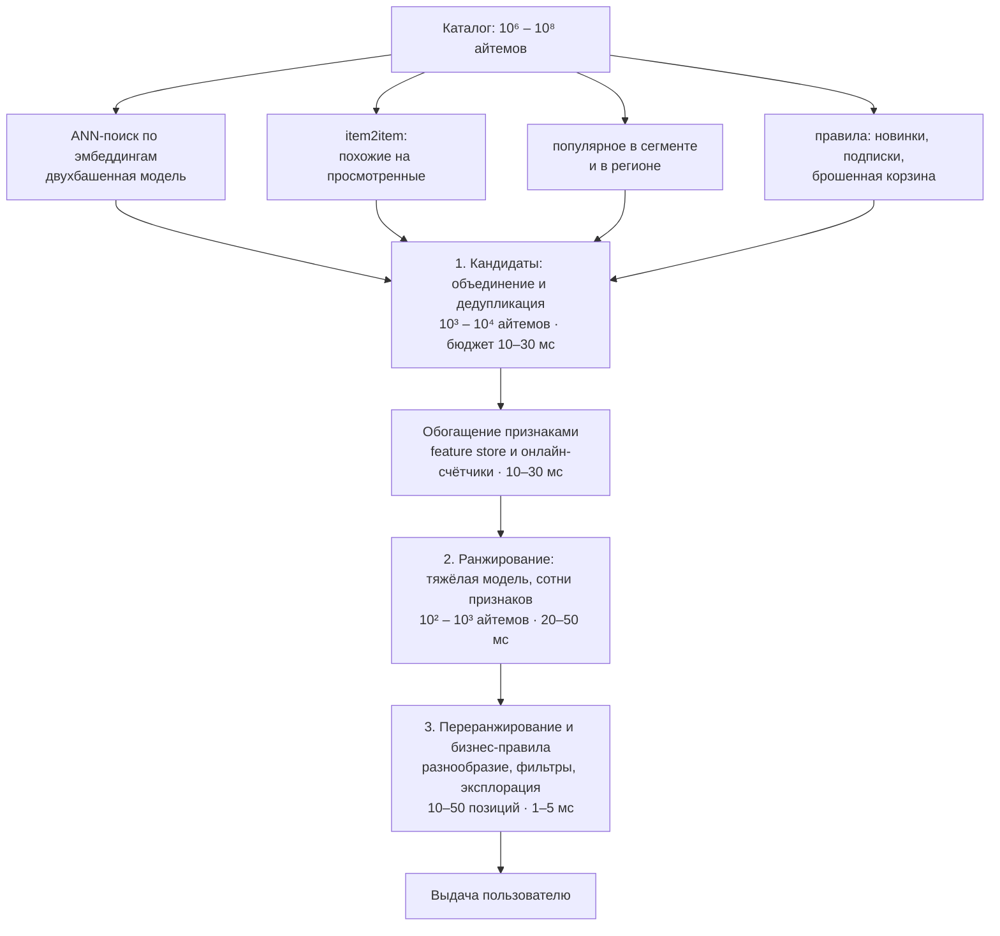

# Постановка задачи рекомендаций

> **Зачем эта глава.** Рекомендации — не «ещё одна классификация с другим таргетом». Это задача
> с принципиально другой постановкой: у неё нет честных негативов, обучающие данные порождены
> той самой системой, которую мы улучшаем, а оценивается не отдельный объект, а список целиком.
> После этой главы вы будете понимать, откуда берётся многостадийная архитектура, почему
> «просто отранжировать весь каталог» физически невозможно, и что именно у вас спросят,
> когда попросят «спроектировать ленту».

**Уровень:** 🌱 база → 🎯 middle
**Предварительно нужно:** [Постановка задачи обучения](../02-classic-ml/01-learning-theory.md), [Метрики качества](../02-classic-ml/04-metrics.md), [Валидация и утечки](../02-classic-ml/13-validation-and-leakage.md)
**Как проработать:** чтение + эксперименты с матрицей взаимодействий

---

## Карта главы

- [1. Почему это не задача классификации](#1-почему-это-не-задача-классификации) — четыре различия, из которых растёт весь домен
- [2. Формализация: матрица взаимодействий](#2-формализация-матрица-взаимодействий) — нотация, которую мы держим сквозь весь раздел
- [3. Явная и неявная обратная связь](#3-явная-и-неявная-обратная-связь) — explicit vs implicit, и почему победил implicit
- [4. Разреженность и длинный хвост: цифры](#4-разреженность-и-длинный-хвост-цифры) — сколько на самом деле нулей
- [5. Многостадийная архитектура](#5-многостадийная-архитектура) — кандидаты → ранжирование → правила, и арифметика, которая это диктует
- [6. Типы рекомендательных задач](#6-типы-рекомендательных-задач) — top-N, next-item, CTR, bundle, similar items
- [7. Конфликт целей](#7-конфликт-целей) — релевантность против разнообразия, бизнеса и удержания
- [8. Что считается хорошей рекомендацией](#8-что-считается-хорошей-рекомендацией)
- [9. Компромиссы: когда персонализация не нужна](#9-компромиссы-когда-персонализация-не-нужна)
- [10. Подводные камни](#10-подводные-камни)
- [11. Проверь себя](#11-проверь-себя)
- [12. Практика](#12-практика)
- [13. Что читать дальше](#13-что-читать-дальше)

---

## 1. Почему это не задача классификации

Начнём с ловушки, в которую попадает почти каждый, кто приходит в рекомендации из табличного ML.

Кажется, что всё просто. Есть логи: пользователь $u$ посмотрел товар $i$ — значит, пара $(u, i)$
это класс 1. Пользователь не посмотрел — класс 0. Собираем признаки пользователя и товара,
обучаем CatBoost предсказывать вероятность взаимодействия, ранжируем по этой вероятности.
Задача решена?

Нет. И полезно понять, ровно в каких четырёх местах эта схема ломается — потому что весь
дальнейший раздел построен как ответ на эти четыре проблемы.

**Первое: у вас нет честных негативов.** Пользователь не купил дрель. Что это значит?
Возможных объяснений три: (а) дрель ему не нужна, (б) дрель ему нужна, но он её не видел,
(в) дрель ему нужна, он её видел, но купил такую же в другом месте. В логах все три случая
выглядят одинаково — как отсутствие записи. В классификации мы предполагаем, что метка
$y$ известна для каждого объекта обучающей выборки; здесь известна только метка «1», а «0»
мы *конструируем сами*, и от того, как именно мы это делаем, качество меняется сильнее,
чем от выбора архитектуры модели. Формально: данные пропущены **не случайно**
(missing not at random, MNAR).

Посмотрите, во что это выливается численно. Каталог маркетплейса — $10^7$ товаров, история
пользователя — 100 позиций. Если наивно объявить негативами всё остальное, получим
$10^7 - 100 \approx 10^7$ «нулей» на 100 «единиц»: дисбаланс 1 к 100 000, причём почти
все нули — ложные (пользователь эти товары просто не видел). Оптимальная по log-loss модель
на таких данных предсказывает константу $10^{-5}$ и формально прекрасна. Ранжирование
от этого не улучшается никак.

**Второе: обучающая выборка порождена самой системой.** Пользователь может кликнуть только
по тому, что ему показали. Показала — предыдущая версия вашей модели. Значит, в логах
переизбыток того, что старая модель считала хорошим, и полное отсутствие данных о том,
что она считала плохим. Обучая новую модель на этих логах, вы учите её воспроизводить
старую. Это **петля обратной связи** (feedback loop), и она не лечится увеличением объёма
данных — больше данных означает лишь более уверенное воспроизведение той же политики.

**Третье: оценивается список, а не объект.** В классификации предсказания независимы:
качество на объекте $A$ не зависит от того, что модель сказала про объект $B$. В рекомендациях
пользователю показывают **ранжированный список** из $k$ позиций, и его ценность нелинейна:
десять почти одинаковых футболок — плохой список, даже если каждая по отдельности релевантна.
Плюс позиция важна: первая строка выдачи получает в разы больше внимания, чем пятая.
Функция полезности определена на списке, а не на элементе — отсюда весь аппарат метрик
ранжирования (глава [Офлайн-метрики](02-metrics-offline.md)).

**Четвёртое: распределение с длинным хвостом.** В классификации дисбаланс 1:100 считается
тяжёлым случаем. В рекомендациях типичная картина: 3–5% каталога собирают 80% взаимодействий,
а 30–50% айтемов не имеют вообще ни одного. Причём хвост — это не шум, который можно отбросить:
в маркетплейсе именно из хвоста складывается ассортиментное преимущество, а «популярное»
пользователь и так найдёт поиском.

> 💬 **На собеседовании.** Спросят: «Чем задача рекомендаций отличается от бинарной
> классификации?» Хороший ответ перечисляет различия по существу: (1) негативы не наблюдаются,
> их приходится сэмплировать, и данные MNAR; (2) обучающая выборка — результат работы предыдущей
> версии системы, поэтому офлайн-оценка смещена в её пользу; (3) оптимизируется качество
> ранжированного списка длины $k$, а не поточечная вероятность, из-за чего метрики —
> NDCG/MAP, а не ROC-AUC; (4) экстремальный дисбаланс и длинный хвост каталога.
> Плохой ответ: «в рекомендациях больше данных и надо использовать коллаборативную фильтрацию» —
> это перечисление методов вместо разбора постановки.

---

## 2. Формализация: матрица взаимодействий

Договоримся о нотации — она сквозная для всего раздела 06.

Пусть $U$ — множество пользователей, $I$ — множество айтемов (товаров, треков, видео, статей).
Индексы: $u \in U$ — пользователь, $i \in I$ — айтем. Мощности обозначим $|U|$ и $|I|$;
там, где в остальном хендбуке $n$ — число объектов, в рекомендациях объектами ранжирования
служат айтемы, то есть $n = |I|$.

Все наблюдения складываются в **матрицу взаимодействий** (interaction matrix)

$$
R \in \mathbb{R}^{|U| \times |I|}, \qquad
r_{ui} = \begin{cases}
\text{сила взаимодействия пользователя } u \text{ с айтемом } i, & (u,i) \in \mathcal{O} \\
\text{не наблюдалось}, & (u,i) \notin \mathcal{O}
\end{cases}
$$

где $\mathcal{O} = \{(u,i)\}$ — множество наблюдённых пар (те ячейки, для которых у нас есть
хоть какое-то событие в логах), $r_{ui}$ — значение взаимодействия: оценка, факт покупки,
число прослушиваний, время просмотра.

> ⚠️ **Типичная ошибка.** Записать «не наблюдалось» как $r_{ui} = 0$ и обучать модель на всей
> матрице как на обычной регрессии → модель выучит, что почти всё нерелевантно, и станет
> предсказывать константу около нуля. Разница между «наблюдали ноль» и «не наблюдали»
> — центральная в этом домене. В явной обратной связи ненаблюдённые ячейки **выбрасывают**
> из функции потерь; в неявной — включают, но с малым весом (см. [Неявная обратная
> связь](04-implicit-feedback.md)).

Большинство моделей раздела строят для каждого пользователя и каждого айтема
**латентные векторы** (latent factors)

$$
p_u \in \mathbb{R}^{k}, \qquad q_i \in \mathbb{R}^{k}, \qquad
\hat r_{ui} = p_u^{\top} q_i
$$

где $k$ — размерность латентного пространства (типично 32–256 в проде; на MovieLens хватает
32–64), $p_u$ — вектор предпочтений пользователя, $q_i$ — вектор свойств айтема,
$\hat r_{ui}$ — предсказанная сила взаимодействия.

Символ $k$ несёт в рекомендациях двойную нагрузку: это и размерность латентного пространства,
и отсечка списка в метриках («top-$k$»). Путаницы обычно не возникает, потому что контексты
не пересекаются, но в этой главе $k$ — почти всегда **отсечка top-$k$**, а размерность
факторов я буду называть явно.

**Задача top-N-рекомендаций** формулируется так: для пользователя $u$ построить упорядоченный
список

$$
\mathrm{Top}_k(u) = \operatorname*{arg\,top-}k_{\;i \in I \setminus I_u^{\text{seen}}} \hat r_{ui}
$$

где $I_u^{\text{seen}}$ — айтемы, которые пользователь уже видел или купил и которые
не нужно показывать снова (для музыки и продуктовых корзин это правило, наоборот, вредно —
там повторы нормальны). То есть мы ищем $k$ айтемов с наибольшим предсказанным скором среди
всего доступного каталога. Запомните эту формулу: именно из неё вырастет весь разговор
про латентность в разделе 5.

---

## 3. Явная и неявная обратная связь

**Явная обратная связь** (explicit feedback) — это когда пользователь сознательно выразил
своё отношение: поставил оценку 1–5, лайк/дизлайк, добавил в избранное. Классика жанра —
Netflix Prize (2006–2009), где задача формулировалась как предсказание оценки от 1 до 5
и метрикой был RMSE.

Такие данные удобны: есть настоящий таргет, есть градация силы предпочтения, есть негативы
(оценка «1» — это честный негатив). Проблема одна, зато убийственная: **их почти нет**.
Доля пользователей, ставящих оценки, измеряется единицами процентов, и эти пользователи
не репрезентативны — оценки ставят те, кто испытал сильную эмоцию, обычно на крайних
позициях шкалы. Плюс люди врут: ставят пять звёзд документальному фильму про экологию,
а смотрят реалити-шоу.

**Неявная обратная связь** (implicit feedback) — это следы поведения: клик, просмотр, добавление
в корзину, покупка, дослушивание трека, время на странице. Такие данные есть по всем
пользователям и их на 2–3 порядка больше.

| | Явная (explicit) | Неявная (implicit) |
|---|---|---|
| Что наблюдаем | оценку $r_{ui} \in \{1..5\}$ | факт события и его интенсивность |
| Объём | 1–5% пользователей | ~100% пользователей |
| Негативы | есть (низкие оценки) | **отсутствуют** |
| Шум | смещение самоотбора, «социально одобряемые» оценки | случайные клики, боты, шеринг аккаунта, автоплей |
| Что означает отсутствие записи | пользователь не оценил | либо не видел, либо не понравилось — неразличимо |
| Постановка | регрессия / предсказание оценки | ранжирование, обучение с положительными примерами |
| Метрика | RMSE, MAE | Recall@k, NDCG@k, MAP@k |

Практический вывод, который на собеседовании ждут в явном виде: **явная обратная связь
как основная цель обучения мертва**. Netflix отказался от пятибалльных оценок в пользу
«палец вверх/вниз» ещё в 2017 году, и почти все продакшен-системы обучаются на неявных
сигналах. Явные оценки, когда они есть, используются как дополнительный признак или как
корректирующий сигнал, а не как таргет.

Но с неявной обратной связью появляется своя тонкость. Событие «клик» несёт не силу
предпочтения, а **уверенность в том, что предпочтение есть**. Схема Ху–Корена–Волински
(Hu, Koren, Volinsky, ICDM 2008) формализует это так:

$$
c_{ui} = 1 + \alpha\, r_{ui}, \qquad
b_{ui} = \begin{cases} 1, & r_{ui} > 0 \\ 0, & r_{ui} = 0 \end{cases}
$$

где $r_{ui}$ — наблюдаемая интенсивность (число прослушиваний, минуты просмотра),
$b_{ui}$ — бинарное «предпочтение есть / не выражено», $c_{ui}$ — вес уверенности,
$\alpha$ — коэффициент масштабирования (типично 10–40). Смысл: все пары входят в функцию
потерь, но ненаблюдённые — с минимальным весом $c_{ui} = 1$, а тысяча прослушиваний трека
даёт вес $1 + 1000\alpha$. Полный вывод — в главе [Неявная обратная связь](04-implicit-feedback.md).

### Иерархия сигналов: что именно считать позитивом

Неявная обратная связь — это не одно событие, а воронка, и выбор уровня, который вы объявите
позитивом, определяет и объём данных, и их чистоту. Порядки величин для e-commerce
(для медиа воронка короче, но структура та же):

| Сигнал | Событий на активного пользователя в день | Конверсия из предыдущего уровня | Насколько надёжно означает «нравится» |
|---|---|---|---|
| Показ (impression) | $10^2$–$10^3$ | — | никак: пользователь мог не долистать до него |
| Клик, открытие карточки | 10–50 | CTR 1–5% | слабо: заголовок или картинка могли обмануть |
| Глубокое взаимодействие (>30 с, скролл карточки) | 3–15 | 20–50% от кликов | средне |
| Добавление в корзину или избранное | 0.5–3 | 5–15% от кликов | сильно |
| Покупка | 0.05–0.5 | 20–40% от корзины | очень сильно |
| Покупка без возврата, повторная покупка | — | 85–95% от покупок | максимально, но сигнал приходит через дни–недели |

Компромисс очевиден и неустраним: **чем глубже сигнал, тем он чище, тем его меньше и тем
позже он приходит**. Обучение на кликах даёт на два порядка больше данных, но учит модель
кликбейту. Обучение на покупках без возврата даёт правильную цель, но данных хватает
только на популярные товары, и модель узнаёт о вчерашнем событии через две недели, когда
истечёт срок возврата.

Стандартный выход — не выбирать, а комбинировать: многозадачная модель с отдельной головой
на каждый уровень воронки и взвешенным итоговым скором (см.
[Нейронное ранжирование](08-neural-ranking.md)). Дешёвая альтернатива для одной модели —
взвешенные позитивы: клик с весом 1, корзина с весом 3, покупка с весом 10.

> 💬 **На собеседовании.** Спросят: «Что вы возьмёте за позитив при обучении ленты?»
> Хороший ответ начинается с уточняющего вопроса — какую бизнес-метрику двигаем. Дальше:
> клик как единственный таргет опасен, потому что он максимизируется кликбейтом и
> коррелирует с позицией показа, а не с качеством; поэтому берут «глубокий» сигнал
> (досмотр, время, покупка) либо многозадачную схему с несколькими головами. Отдельно стоит
> проговорить задержку сигнала: если позитив определяется как «покупка без возврата»,
> обучающая выборка отстаёт на срок возврата, и это надо закладывать в расписание
> переобучения. Плохой ответ: «клик» — без обсуждения последствий.

> 💬 **На собеседовании.** Спросят: «У вас есть только логи покупок. Где взять негативы?»
> Хороший ответ разбирает варианты и их смещения. (1) Считать негативами случайные
> непросмотренные айтемы — просто, но большинство таких пар пользователь и не видел, поэтому
> «негатив» слабый; зато не вносит популярностного смещения. (2) Сэмплировать пропорционально
> популярности — «жёсткие» негативы, модель лучше учится отделять хиты, но усиливает
> popularity bias. (3) Использовать **показы без клика** (impressions) — самый честный негатив,
> потому что пользователь объект видел и не выбрал; требует логировать выдачу, чего часто
> не делают заранее. (4) Обучаться попарно (BPR): не нужен абсолютный негатив, нужна
> только пара «взаимодействовал > не взаимодействовал». Плохой ответ: «возьмём все
> невзаимодействовавшие пары как нули» — для каталога в $10^7$ это $10^{14}$ строк
> и вырожденная задача.

---

## 4. Разреженность и длинный хвост: цифры

Абстрактное «матрица разреженная» не помогает. Помогают числа.

| Датасет / система | Пользователей | Айтемов | Взаимодействий | Плотность | Разреженность |
|---|---|---|---|---|---|
| MovieLens-1M | 6 040 | 3 706 | 1 000 209 | 4.47% | 95.5% |
| Netflix Prize | 480 189 | 17 770 | 100 480 507 | 1.18% | 98.8% |
| MovieLens-20M | 138 493 | 27 278 | 20 000 263 | 0.53% | 99.47% |
| MovieLens-25M | 162 541 | 62 423 | 25 000 095 | 0.25% | 99.75% |
| Маркетплейс (порядок) | $10^7$ | $10^7$ | $10^9$ | 0.001% | **99.999%** |

Плотность считается тривиально:

$$
\text{density} = \frac{|\mathcal{O}|}{|U| \cdot |I|}, \qquad
\text{sparsity} = 1 - \text{density}
$$

где $|\mathcal{O}|$ — число наблюдённых пар.

Обратите внимание на закономерность: **чем крупнее и «реальнее» система, тем разреженнее
матрица**. Академические датасеты специально фильтруют (типичный фильтр — «оставить
пользователей и айтемы, у которых ≥5 взаимодействий»), и это поднимает плотность на порядок.
Отсюда систематическая проблема: метод, отлично работающий на MovieLens с плотностью 0.5%,
может развалиться на проде с плотностью 0.001%. Когда вам показывают результаты на
«отфильтрованном по 5-core» датасете, спрашивайте, что стало с холодным хвостом.

> 🌱 **База.** Прикиньте на пальцах. В каталоге маркетплейса $10^7$ товаров. Активный
> пользователь за год взаимодействует с сотней. Сто из десяти миллионов — это одна ячейка
> из ста тысяч, то есть 99.999% матрицы пустые. Любой метод, которому нужно «посмотреть
> на всю матрицу», умрёт: даже в float32 плотное хранение $10^7 \times 10^7$ потребовало бы
> $4\cdot10^{14}$ байт — 400 терабайт. Поэтому в рекомендациях **всё** живёт в разреженных
> форматах (CSR/COO) и в списках, а не в плотных матрицах.

Посмотрим на это кодом. Сгенерируем правдоподобный лог с степенным распределением
популярности айтемов и логнормальным распределением активности пользователей — и померяем,
как выглядит хвост.

```python
import numpy as np
from scipy.sparse import csr_matrix

rng = np.random.default_rng(0)
n_users, n_items = 50_000, 200_000

# популярность айтемов — степенной закон: p(i) ~ 1 / rank^1.1.
# Показатель ~1.0–1.3 эмпирически близок к реальным каталогам медиа и e-commerce.
item_prior = 1.0 / np.power(np.arange(1, n_items + 1), 1.1)
item_prior /= item_prior.sum()

# активность пользователей тоже неоднородна: логнормаль даёт правдоподобный
# разрыв между «зашёл раз» и «сидит каждый день»
user_activity = rng.lognormal(mean=2.5, sigma=1.2, size=n_users)
user_prior = user_activity / user_activity.sum()

n_events = 2_000_000
users = rng.choice(n_users, size=n_events, p=user_prior)
items = rng.choice(n_items, size=n_events, p=item_prior)

# CSR — единственный разумный формат: плотная матрица 50k x 200k заняла бы 40 ГБ
R = csr_matrix((np.ones(n_events, dtype=np.float32), (users, items)),
               shape=(n_users, n_items))
R.sum_duplicates()      # схлопываем повторные события в одну ячейку
R.data[:] = 1.0         # бинаризуем: сейчас нас интересует только факт взаимодействия

nnz = R.nnz
print(f"уникальных пар (u, i): {nnz:,}")
print(f"плотность: {nnz / (n_users * n_items):.6%}")

item_pop = np.asarray(R.sum(axis=0)).ravel()
cum = np.cumsum(np.sort(item_pop)[::-1]) / item_pop.sum()
n80 = int(np.searchsorted(cum, 0.80) + 1)
print(f"80% взаимодействий дают {n80:,} айтемов = {n80 / n_items:.2%} каталога")
print(f"айтемов без единого взаимодействия: {(item_pop == 0).sum() / n_items:.2%}")

deg = np.diff(R.indptr)   # длина истории каждого пользователя
print("история пользователя: медиана %d, p90 %d, p99 %d, максимум %d"
      % (np.median(deg), np.percentile(deg, 90), np.percentile(deg, 99), deg.max()))
```

Вывод (детерминирован при `seed=0`):

```
уникальных пар (u, i): 1,430,892
плотность: 0.014309%
80% взаимодействий дают 8,203 айтемов = 4.10% каталога
айтемов без единого взаимодействия: 38.08%
история пользователя: медиана 17, p90 64, p99 190, максимум 2079
```

Три следствия, которые определяют всю инженерную работу дальше:

1. **4% каталога дают 80% сигнала.** Модель, обученная без специальных мер, выучит
   популярность и будет рекомендовать хиты. Это даст неплохие офлайн-метрики и
   бесполезный продукт: хиты пользователь и так найдёт.
2. **38% айтемов не имеют ни одного взаимодействия.** Для них коллаборативный сигнал
   отсутствует в принципе — нужны контентные признаки (холодный старт, глава
   [Холодный старт и смещения](12-cold-start-and-bias.md)).
3. **Медиана истории — 17, а p99 — 190.** Модель, настроенная на «типичного» пользователя
   с сотней взаимодействий, не работает на половине аудитории. Смотрите метрики **по
   сегментам длины истории**, а не только в среднем.

> 🧠 **Middle+.** Про «5-core»-фильтрацию стоит знать отдельно, потому что она объясняет
> половину разрыва между статьями и практикой. Академический протокол обычно отбрасывает
> пользователей и айтемы, у которых меньше пяти взаимодействий, и повторяет это итеративно
> до сходимости. На нашем синтетическом логе такой фильтр выбросил бы примерно 38% айтемов
> (у них ноль взаимодействий) плюс весь хвост с 1–4 событиями — то есть подавляющее
> большинство каталога, — и поднял бы плотность на порядок. Обученная и измеренная на
> остатке модель отчитывается о качестве в мире, где холодного старта не существует.
> Когда вы переносите такой метод в прод, разрыв в метриках выглядит как «мы что-то
> сломали», хотя ломать было нечего: задача просто другая. Вывод: всегда спрашивайте
> у чужих результатов, какая фильтрация применялась, а в своих экспериментах держите
> отдельный неотфильтрованный контур оценки.

---

## 5. Многостадийная архитектура

Теперь главный инженерный вопрос главы. Мы записали идеальную формулу:

$$
\mathrm{Top}_k(u) = \operatorname*{arg\,top-}k_{\;i \in I} \hat r_{ui}
$$

Почему её нельзя посчитать в лоб?

**Арифметика.** Пусть каталог $|I| = 10^7$. Ранкер — нейросеть или бустинг, использующий
кросс-признаки пользователя и айтема (совпадение категории, история покупок в этой категории,
цена относительно среднего чека пользователя). Оптимистичная оценка стоимости одного скоринга
с батчингом — **10 микросекунд на айтем**. Тогда полный проход по каталогу:

$$
10^7 \times 10\,\mu s = 10^8\,\mu s = 100\ \text{секунд}
$$

на один запрос. Бюджет на ответ — примерно **100–200 мс**. Разрыв в три порядка.
И это без учёта того, что сотни признаков на каждую пару нужно ещё вытащить из хранилища.

Отсюда рождается **каскад**: последовательность стадий, где каждая следующая дороже
на объект, но работает с всё меньшим числом объектов.



Разберём стадии по существу.

### Стадия 1: отбор кандидатов (candidate generation, retrieval)

Задача — из $10^7$ айтемов за единицы миллисекунд достать $10^3$–$10^4$, среди которых
почти наверняка есть всё релевантное. Ключевое слово — **recall**: здесь мы не пытаемся
угадать порядок, мы обязаны не потерять хорошее. Ошибка на этой стадии неисправима:
чего не было в кандидатах, того не будет в выдаче никогда.

Как достигается скорость: модель обязана быть **факторизуемой**. То есть скор должен
раскладываться на независимо вычислимые части — $\hat r_{ui} = p_u^\top q_i$. Тогда
все $q_i$ считаются заранее и складываются в ANN-индекс (HNSW, IVF-PQ), а онлайн остаётся
посчитать один $p_u$ и сделать поиск ближайших соседей. HNSW достаёт top-1000 из $10^7$
векторов размерности 128 за **1–5 мс** на одном ядре при recall@1000 порядка 0.95
(подробно — в главе [Двухбашенные модели и ANN-поиск](06-two-tower-and-ann.md)).

Практически кандидаты всегда собирают из **нескольких источников параллельно**: ANN
по двухбашенной модели, item2item по последним просмотрам, популярное в регионе,
персональные подписки, бизнес-списки (акции, новинки). Каждый источник даёт 100–1000
кандидатов, всё объединяется и дедуплицируется. Смысл смеси — покрыть разные режимы:
двухбашенная модель хороша для «тёплых» пользователей, item2item — для сессионного
интента, популярное — для холодных.

### Стадия 2: ранжирование (ranking)

Здесь можно позволить себе тяжёлую модель: градиентный бустинг на сотнях признаков или
нейросеть с вниманием к истории (DIN/DIEN, MMoE — глава
[Нейронное ранжирование](08-neural-ranking.md)). Никакой факторизуемости не требуется:
можно считать кросс-признаки, смотреть на всю историю пользователя, использовать
онлайн-счётчики свежести.

Бюджет: 20–50 мс на 300–1000 кандидатов, то есть 20–150 микросекунд на айтем.
Это в 10–100 раз дороже per-item, чем retrieval — и именно поэтому кандидатов
должно быть тысячи, а не миллионы.

Часто ранкер предсказывает не одну величину, а несколько: $P(\text{клик})$,
$P(\text{покупка} \mid \text{клик})$, ожидаемое время просмотра — и скор собирается
как взвешенная комбинация. Это уже мостик к многозадачным моделям.

### Стадия 3: переранжирование и бизнес-правила (re-ranking)

На вход приходят сотни отранжированных айтемов, на выход — десятки позиций реальной выдачи.
Что здесь происходит:

- **разнообразие**: не показывать пять товаров одного бренда подряд (MMR, DPP, простые
  квоты «не больше 2 из категории в топ-10»);
- **бизнес-правила**: приоритет своих товаров, ограничение доли рекламы, гарантированные
  слоты для новинок;
- **жёсткие фильтры**: нет в наличии, не доставляется в регион, 18+, уже куплено,
  показывали 5 раз и не кликнули;
- **эксплорация**: подмешать 1–2 неуверенных айтема, чтобы собрать данные (глава
  [Эксплорация и бандиты](13-exploration-and-bandits.md)).

Бюджет — единицы миллисекунд, поэтому здесь почти всегда эвристики и лёгкие жадные
алгоритмы, а не обучаемые модели.

### Каскад одной таблицей

| | 1. Кандидаты | 2. Ранжирование | 3. Переранжирование |
|---|---|---|---|
| Вход | весь каталог, $10^6$–$10^8$ | $10^3$–$10^4$ | $10^2$–$10^3$ |
| Выход | $10^3$–$10^4$ | $10^2$–$10^3$ | 10–50 позиций |
| Бюджет | 10–30 мс | 20–50 мс | 1–5 мс |
| Стоимость на айтем | ~1 мкс (амортизированно, через ANN) | 20–150 мкс | работа со списком целиком |
| Класс модели | обязана быть факторизуемой: $p_u^\top q_i$, ANN, предвычисленные списки | любая: GBDT, DNN с кросс-признаками и вниманием к истории | жадные алгоритмы, правила, квоты |
| Целевая метрика | Recall@1000 | NDCG@10, LogLoss | метрики списка и сессии |
| Признаки | эмбеддинги, агрегаты истории | полный набор, включая онлайн-счётчики | атрибуты айтемов и списка |
| Цена ошибки | релевантное потеряно навсегда | плохой порядок в топе | нарушены бизнес-ограничения |

Читая таблицу сверху вниз, легко увидеть логику: на каждой стадии мы **платим за объект
на порядок больше и обрабатываем на порядок меньше объектов**. Произведение остаётся
примерно постоянным — это и есть бюджет.

> 💬 **На собеседовании.** Спросят: «Почему нельзя обойтись одной моделью, которая сразу
> выдаёт финальный список?» Хороший ответ — арифметика: полный проход тяжёлой модели по
> каталогу в $10^7$ айтемов стоит на 3–4 порядка больше доступного бюджета в 100 мс, поэтому
> первая стадия обязана быть факторизуемой ($p_u^\top q_i$), чтобы предвычислить айтемы
> и свести поиск к ANN. И добавить второй, менее очевидный аргумент: у стадий **разные
> целевые метрики** — retrieval оптимизирует recall@1000 (не потерять), ранкер оптимизирует
> NDCG@10 (правильно упорядочить), переранжирование оптимизирует полезность списка целиком.
> Одна модель не может оптимизировать три разных функционала на трёх разных масштабах.
> Плохой ответ: «так принято» или «одна модель переобучится».

> 🧠 **Middle+.** Каскад имеет неприятное свойство: стадии обучаются **независимо**, а
> работают последовательно. Ранкер обучается на данных, где кандидаты пришли от текущего
> retrieval, поэтому он никогда не видел айтемов, которые retrieval не достаёт, и не умеет
> их оценивать. Обратно: retrieval обучается на позитивах, которые прошли через ранкер.
> Возникает рассогласование целей каскада (train/serve mismatch между стадиями). Приёмы
> борьбы: обучать ранкер с добавлением случайных негативов из каталога (а не только из
> реальных кандидатов); дистиллировать ранкер в retrieval-модель; логировать выдачу
> **каждой стадии**, а не только финальную, чтобы уметь мерить recall кандидатов
> относительно того, что в итоге купили.

---

## 6. Типы рекомендательных задач

«Рекомендации» — это зонтичный термин. За ним стоят разные постановки, у каждой своя метрика
и своя архитектура. На системном дизайне первое, что нужно сделать, — уточнить, какая именно
задача решается.

| Постановка | Что предсказываем | Где встречается | Основная метрика |
|---|---|---|---|
| **Top-N рекомендации** | список $k$ айтемов для $u$ | главная страница, «для вас» | Recall@k, NDCG@k, MAP@k |
| **Next-item / сессионные** | следующий айтем в последовательности | лента коротких видео, музыка, сессия в магазине | HitRate@k, MRR, NDCG@k |
| **Предсказание CTR** | $P(\text{клик} \mid u, i, \text{контекст})$ | реклама, аукцион | LogLoss, ROC-AUC, калибровка |
| **Similar items** | список похожих на $i$ | карточка товара, «с этим смотрят» | CTR карусели, покрытие |
| **Bundle / complementary** | что докупить к $i$ | корзина, «часто покупают вместе» | конверсия в допродажу |
| **Slate / whole-page** | оптимальный набор и раскладка блоков | главная страница целиком | метрики сессии |

Разница между ними не косметическая. Пример: **similar items** и **complementary items** —
почти противоположные задачи. К купленному айфону «похожие» — это другие смартфоны
(бессмысленно, человек только что купил телефон), а «дополняющие» — чехол, зарядка,
защитное стекло. Модель, обученная на ко-встречаемости в истории, выучит первое; чтобы
получить второе, нужна ко-встречаемость **в одной корзине** плюс правило «другая категория».

Отдельно про **предсказание CTR**: это единственная из перечисленных постановок, где нужны
**калиброванные** вероятности, а не только правильный порядок. Причина — аукцион: ставка
считается как $\text{eCPM} = \text{bid} \times \hat P(\text{клик})$, и если модель систематически
завышает вероятности вдвое, экономика площадки ломается, хотя ранжирование не меняется.
Здесь ROC-AUC недостаточно, нужен LogLoss и калибровочные кривые (см.
[Дисбаланс классов и калибровка](../02-classic-ml/12-imbalance-and-calibration.md)).

### Контекст: третье измерение задачи

В классическом ML объект фиксирован: у него есть признаки, и они не зависят от момента
предъявления. В рекомендациях предсказание зависит от **тройки** $(u, i, \text{контекст})$,
и контекст меняет ответ радикально. Один и тот же пользователь в 8 утра в понедельник
с телефона по дороге на работу и в 22:00 в субботу с телевизора — это, с точки зрения
модели, два разных запроса. В контекст входят: время суток и день недели, устройство
и размер экрана, точка входа (главная, карточка товара, пуш, поисковая выдача), гео,
погода в доставке еды, текущее содержимое корзины, последние 5 событий сессии.

Практическое следствие: обучающая выборка должна хранить контекст **на момент показа**,
а не текущее состояние. Если вы соберёте признак «город пользователя» из актуального
профиля, а пользователь переехал, вы обучитесь на будущем — это утечка через
point-in-time некорректность (см.
[Данные и feature store](../07-mlops/03-data-and-feature-store.md)).

> ⚠️ **Типичная ошибка.** Взять постановку next-item, а метрику мерить как top-N по всей
> истории пользователя за месяц. Next-item предполагает, что «правильный ответ» ровно один
> — следующее событие; top-N предполагает множество релевантных айтемов. Метрики
> несопоставимы: Recall@10 при одном релевантном айтеме равен HitRate@10 и не может
> превышать 1, а при 200 релевантных айтемах он ограничен сверху величиной $10/200 = 0.05$.
> Сравнивать такие числа между статьями/экспериментами нельзя (подробнее — в главе
> [Офлайн-метрики](02-metrics-offline.md)).

---

## 7. Конфликт целей

Рекомендательная система почти никогда не оптимизирует одну величину. И цели друг другу
противоречат — не иногда, а системно.

**Релевантность против разнообразия.** Максимально релевантная выдача для человека,
купившего беговые кроссовки, — ещё десять пар беговых кроссовок. Каждая позиция по
отдельности отличная, список — мусор. Формально: модель максимизирует
$\sum_{i \in \mathrm{Top}_k} \hat r_{ui}$, а полезность списка **субаддитивна** —
второй похожий айтем добавляет меньше, чем первый. Лечится на стадии переранжирования
(MMR, DPP) ценой снижения средней релевантности.

**Точность против покрытия.** Самый простой способ поднять офлайн-метрики — сдвинуться
к популярному. Популярное угадывается лучше, потому что по нему больше данных. Но система,
рекомендующая топ-100 хитов всем, не создаёт ценности: пользователь нашёл бы их сам.
В маркетплейсе есть и прямое бизнес-требование — продавать длинный хвост, иначе селлеры
уходят.

**Краткосрочные клики против долгосрочного удержания.** Кликбейт максимизирует CTR
сегодня и снижает retention через месяц. Это самый болезненный конфликт, потому что
короткая метрика измеряется мгновенно и точно, а длинная — через недели и с огромной
дисперсией.

Разберём на числах, почему он так тяжело ловится. Пусть эксперимент поднял CTR на 4% —
такой эффект на выборке в миллион пользователей виден за два дня с запасом по мощности.
Одновременно он уронил недельный возврат на 0.3%. Чтобы задетектировать сдвиг retention
на 0.3 процентного пункта при базовом уровне 40%, нужно на порядок больше наблюдений
и минимум две недели наблюдения — то есть в стандартном двухнедельном A/B этот эффект
просто не проявится. Решение принимается по CTR, изменение катится, и через квартал
команда обнаруживает необъяснимое снижение DAU. Практический ответ: обучать на «глубоких»
сигналах (досмотр, повторный визит, покупка без возврата), а не на клике; ставить
**guardrail-метрики** в A/B; держать долгосрочный холдаут — группу, которая месяцами
не получает изменений и служит опорной точкой (см.
[Онлайн-оценка рекомендаций](15-recsys-online-evaluation.md)).

**Пользователь против площадки против поставщика.** В маркетплейсе три стороны:
покупателю нужен лучший товар, площадке — маржа и реклама, продавцу — показы.
Это многосторонняя (multi-stakeholder) оптимизация, и она обычно реализуется как
линейная комбинация в финальном скоре:

$$
\text{score}(u, i) = \sum_{t=1}^{T} w_t \cdot \hat y_t(u, i)
$$

где $\hat y_t(u,i)$ — предсказание $t$-й головы модели (вероятность клика, вероятность
покупки, ожидаемая маржа, штраф за повтор бренда), $w_t$ — вес цели, $T$ — число целей.

> 💬 **На собеседовании.** Спросят: «Как подбираются веса $w_t$ в таком скоре?»
> Хороший ответ: не градиентным спуском — этих весов нет в функции потерь, они задают
> продуктовый компромисс. На практике: (1) привести все головы к сопоставимой шкале
> (калибровка, нормировка на квантили), иначе вес будет компенсировать масштаб, а не
> важность; (2) подбирать веса **A/B-тестами** или байесовской оптимизацией по онлайн-метрике;
> (3) фиксировать guardrail-метрики, которые нельзя ухудшать. И честно добавить, что
> в проде эти веса обычно вынесены в конфиг и меняются продактами без переобучения модели —
> это фича, а не костыль. Плохой ответ: «подберём на валидации по NDCG» — офлайн-метрика
> не видит маржу и удержание, ради которых веса и вводились.

---

## 8. Что считается хорошей рекомендацией

Соберём критерии в явный список — именно его стоит проговорить, когда на системном дизайне
просят определить успех.

Хорошая рекомендация:

1. **Релевантна** — пользователь действительно взаимодействует с ней.
2. **Неочевидна** — он не нашёл бы её сам за 10 секунд. Рекомендовать зубную пасту тому,
   кто покупает её каждый месяц, — не рекомендация, а напоминание (полезное, но
   персонализация тут ни при чём).
3. **Своевременна** — интент имеет срок годности. Рекомендация зимней резины в мае
   бесполезна; рекомендация корма для собаки через месяц после покупки — идеальна.
4. **Объяснима** — «потому что вы смотрели X» повышает доверие и CTR, а заодно даёт
   продукту рычаг обратной связи («не показывать похожее»).
5. **Разнообразна в рамках списка** — покрывает несколько гипотез об интересе, а не одну.
6. **Не вредит долгосрочно** — не загоняет пользователя в пузырь и не выжигает
   доверие кликбейтом.

Заметьте, что первые два пункта в напряжении: самый релевантный айтем часто самый
очевидный. Это ровно тот компромисс, который метрика **serendipity** пытается измерить
(глава [Офлайн-метрики](02-metrics-offline.md), раздел про метрики за пределами точности).

Полезно сразу увидеть, как этот список превращается в измеримое. Каждому критерию
соответствует своя метрика — и почти ни один из них не покрывается точностью:

| Критерий | Офлайн | Онлайн |
|---|---|---|
| Релевантна | NDCG@k, Recall@k, MAP@k | CTR, конверсия, время потребления |
| Неочевидна | serendipity, novelty относительно популярностного бейзлайна | доля кликов по айтемам вне топ-популярного |
| Своевременна | метрика в разбивке по свежести айтема | конверсия по времени с момента интента |
| Объяснима | доля выдачи с валидным объяснением | CTR блоков с подписью «потому что вы смотрели» |
| Разнообразна | ILD@k, число категорий в топ-k | глубина скролла, число просмотренных категорий |
| Не вредит долгосрочно | покрытие каталога, концентрация показов | retention, DAU, долгосрочный холдаут |

Если из этой таблицы вы измеряете только первую строку — вы оптимизируете одну шестую
задачи. Именно поэтому следующая глава посвящена метрикам целиком, а не одному абзацу
про NDCG.

---

## 9. Компромиссы: когда персонализация не нужна

Полезно уметь сказать «здесь рекомендательная система не нужна» — на собеседовании это
ценится выше, чем готовность строить two-tower на любой вопрос.

| Ситуация | Почему персонализация не окупается | Что делать вместо |
|---|---|---|
| Каталог из 50 позиций | пользователь просматривает его целиком за минуту | хорошая сортировка и фильтры |
| Меньше ~1000 активных пользователей в неделю | коллаборативного сигнала нет, любая модель переобучится | популярное + контентные правила |
| Покупка раз в 5 лет (недвижимость, авто) | нет истории, интент выражен явно поиском | поиск с фасетами, лидогенерация |
| Строгая регуляторика (медицина, финансы) | нужна объяснимость и аудит каждого показа | правила + контентная фильтрация |
| Сильный явный интент прямо сейчас | пользователь **сказал**, что хочет, — не надо угадывать | качественный поиск; рекомендации в дополнительных блоках |

И общее правило про бейзлайн. Прежде чем строить матричную факторизацию, посчитайте
**«популярное за последние 7 дней в сегменте пользователя»**. Этот бейзлайн стыдно
силён: в ряде продуктов он даёт 60–80% от онлайн-эффекта сложной модели, потому что
популярность коррелирует с качеством и с сезоном. Если ваша модель его не бьёт —
проблема не в гиперпараметрах, а в постановке или в данных.

> ⚠️ **Типичная ошибка.** Сравнивать новую модель только с предыдущей версией модели.
> Известная критика (Ferrari Dacrema et al., RecSys 2019) показала: значительная часть
> опубликованных нейросетевых рекомендательных моделей при честной настройке проигрывает
> аккуратно оттюненным простым бейзлайнам — item-kNN и матричной факторизации. Всегда
> держите в наборе сравнения: случайный, популярное, item-kNN, iALS.

---

## 10. Подводные камни

**Модель рекомендует то, что пользователь уже купил.**
Симптом: в топе выдачи товары из истории покупок, метрики офлайн отличные.
Причина: в обучении не исключены уже потреблённые айтемы; коллаборативная модель
естественно даёт им максимальный скор — они же в истории.
Что делать: фильтровать $I_u^{\text{seen}}$ на стадии переранжирования, но **не механически**:
для расходников, продуктов и музыки повтор — нормальное и желаемое поведение. Правило
должно быть категорийным, а не глобальным.

**Метрики офлайн растут, онлайн ничего не меняется.**
Симптом: NDCG@10 вырос на 15%, A/B показывает ноль.
Причина: офлайн-оценка проводилась на логах, порождённых старой моделью, и новая модель
просто лучше воспроизводит старую политику. Либо улучшение пришло из популярностного
смещения, которое офлайн вознаграждается, а онлайн — нет.
Что делать: смотреть на прирост в сегментах (холодные пользователи, хвост каталога),
считать coverage и novelty вместе с точностью, оценивать на данных из
эксплорационного бакета со случайной выдачей.

**Каскад теряет релевантное на первой стадии.**
Симптом: ранкер «хороший», но выдача бедная; при ручной проверке очевидно подходящие
товары в выдаче не появляются.
Причина: их не было среди кандидатов. Recall кандидатов никто не мерил.
Что делать: ввести метрику **recall кандидатов** относительно фактических покупок:
какая доля айтемов, которые пользователь в итоге купил, вообще попала в список кандидатов.
Норма — 0.8–0.95; если меньше, чинить нужно retrieval, а не ранкер.

**Популярностное смещение усиливается со временем.**
Симптом: через несколько циклов переобучения выдача схлопывается в узкий набор хитов,
coverage падает.
Причина: петля обратной связи. Модель показывает популярное → по нему набирается больше
взаимодействий → оно становится ещё популярнее в следующем обучении.
Что делать: эксплорация (случайная доля трафика или бандиты), сэмплирование негативов
пропорционально популярности, штраф за популярность в скоре, мониторинг Gini/энтропии
распределения показов.

**Айтемы «умирают» между обучением и показом.**
Симптом: пользователь кликает на рекомендацию и видит «нет в наличии».
Причина: модель и индекс обновляются раз в сутки, а сток меняется ежеминутно.
Что делать: жёсткие фильтры по актуальному состоянию — обязательно **онлайн**, на стадии
переранжирования; никогда не полагаться на то, что модель «выучит» отсутствие товара.

**Обучение на кликах без учёта позиции.**
Симптом: модель уверенно предсказывает, что первый элемент выдачи получит клик — и это
почти всё, что она выучила.
Причина: позиционный биас. Вероятность клика — это произведение вероятности «посмотрел»
(зависит от позиции) и «понравилось» (зависит от релевантности). Без разделения модель
учит первое.
Что делать: IPS-взвешивание по propensity позиции, позиция как признак с занулением
на инференсе, обучение на парах внутри одной выдачи (см.
[Обучение ранжированию](07-learning-to-rank.md)).

---

## 11. Проверь себя

<details>
<summary><b>🌱 Вопрос.</b> Чем задача рекомендаций принципиально отличается от бинарной классификации?</summary>

**Короткий ответ.** Нет наблюдаемых негативов, обучающие данные порождены самой системой,
оптимизируется качество списка, а не отдельного объекта, и распределение взаимодействий
имеет тяжёлый хвост.

**Развёрнуто.** (1) Отсутствие записи $(u,i)$ неотличимо от «не понравилось» и от «не видел»,
данные пропущены не случайно (MNAR), негативы приходится конструировать сэмплированием.
(2) Логи содержат только то, что показала предыдущая версия системы, — офлайн-оценка
систематически смещена в пользу текущей политики. (3) Метрика определена на ранжированном
списке длины $k$ и учитывает позицию (NDCG, MAP), а не поточечную вероятность. (4) 3–5%
каталога дают ~80% взаимодействий, треть айтемов не имеет ни одного.

**Чего ждёт интервьюер:** что вы говорите про постановку и природу данных, а не перечисляете
алгоритмы. Это первый вопрос на секции — он калибрует, стоит ли идти вглубь.

**Провал:** «в рекомендациях используется коллаборативная фильтрация» — ответ про инструменты,
а не про задачу.
</details>

<details>
<summary><b>🌱 Вопрос.</b> Что такое explicit и implicit feedback, и что вы будете использовать в проде?</summary>

**Короткий ответ.** Explicit — сознательные оценки (звёзды, лайки), implicit — следы поведения
(клики, просмотры, покупки). В проде базой служит implicit: его на 2–3 порядка больше и он
есть по всем пользователям.

**Развёрнуто.** Explicit даёт настоящий таргет и настоящие негативы, но покрывает единицы
процентов аудитории и страдает от самоотбора: оценки ставят люди с сильной эмоцией,
распределение бимодальное. Implicit покрывает всех, но не содержит негативов — отсутствие
клика означает либо «не понравилось», либо «не показали». Практическая схема: обучаться
на implicit (iALS, BPR, two-tower), явные сигналы использовать как признак или как
дополнительную голову многозадачной модели. Отдельно стоит различать «сила» и «уверенность»:
в implicit количество прослушиваний — это уверенность в наличии предпочтения, а не его сила.

**Чего ждёт интервьюер:** понимания, почему индустрия ушла от предсказания оценок (постановка
Netflix Prize) к ранжированию по неявным сигналам.

**Провал:** «implicit хуже, потому что там нет оценок».
</details>

<details>
<summary><b>🎯 Вопрос.</b> Матрица взаимодействий 10⁷ × 10⁷. Как вы её храните и почему нельзя обучать модель «на всех парах»?</summary>

**Короткий ответ.** Только разреженно (CSR/COO) — плотное хранение потребовало бы ~400 ТБ
в float32. Обучение на всех парах невозможно: $10^{14}$ пар, из которых $\sim 10^9$ позитивных,
то есть 99.999% «негативов» — это в основном непоказанные айтемы, а не отказы.

**Развёрнуто.** Хранится список наблюдённых пар: индексы + значения. Обучение строится
одним из двух способов. Первый — включить все пары, но с весами (схема iALS): за счёт
специальной структуры задачи шаг ALS считается за $O(|\mathcal{O}|k^2 + |I|k^2)$, а не
за $O(|U||I|k)$ — трюк с предвычислением $Q^\top Q$. Второй — сэмплировать негативы:
на каждый позитив брать несколько случайных айтемов (BPR, two-tower с in-batch negatives).
Ключевая мысль: «все пары» никогда не материализуются в памяти, работа идёт либо через
алгебраический трюк, либо через сэмплирование.

**Чего ждёт интервьюер:** численную оценку и знание, что существует два принципиально разных
способа обойти проблему.

**Провал:** «возьмём отрицательный сэмплинг» без объяснения, зачем он нужен и что теряется.
</details>

<details>
<summary><b>🎯 Вопрос.</b> Зачем нужна многостадийная архитектура? Нельзя ли обойтись одной моделью?</summary>

**Короткий ответ.** Из-за бюджета латентности: тяжёлая модель по каталогу в $10^7$ айтемов
стоит на 3–4 порядка больше доступных 100 мс. Плюс у стадий разные целевые функционалы.

**Развёрнуто.** Считаем: 10 мкс на скоринг айтема × $10^7$ = 100 секунд на запрос. Значит,
первая стадия обязана быть факторизуемой — скор вида $p_u^\top q_i$ позволяет предвычислить
все $q_i$ офлайн и свести онлайн-задачу к поиску ближайших соседей (HNSW: top-1000 из $10^7$
за 1–5 мс). Вторая стадия работает уже с $10^3$ кандидатами, поэтому может использовать
кросс-признаки, историю, онлайн-счётчики. Третья — с сотнями, поэтому может решать
комбинаторные задачи на списке (разнообразие). Метрики разные: retrieval судят по
recall@1000, ранкер — по NDCG@10, переранжирование — по метрикам списка и сессии.
Дополнительно каскад даёт организационную гибкость: команды работают над стадиями независимо.

**Чего ждёт интервьюер:** конкретные числа. Ответ «потому что так масштабируется» без
арифметики читается как заученный.

**Провал:** назвать стадии, но не суметь объяснить, что именно делает первую стадию быстрой
(факторизуемость + предвычисление + ANN).
</details>

<details>
<summary><b>🎯 Вопрос.</b> Какой бейзлайн вы построите первым и почему?</summary>

**Короткий ответ.** «Популярное за последние 7 дней» с сегментацией по региону/платформе
и фильтром уже потреблённого. Он дёшев, стабилен и служит фолбэком в проде.

**Развёрнуто.** Ценность этого бейзлайна тройная. Во-первых, он даёт нижнюю границу:
если сложная модель его не бьёт, дело не в модели. Во-вторых, он же становится
production-фолбэком, когда падает сервис эмбеддингов или ANN-индекс — выдача должна
деградировать, а не исчезать. В-третьих, он проявляет проблемы данных: если «популярное»
показывает мусор, то и обучение на этих логах даст мусор. Важная деталь — окно: популярность
без ограничения по времени вырождается в вечные хиты, окно 1–7 дней ловит сезонность
и тренды. Следующий бейзлайн — item-kNN по ко-встречаемости; он часто оказывается
неожиданно сильным.

**Чего ждёт интервьюер:** инженерной зрелости — понимания, что бейзлайн нужен не для галочки,
а как измерительный прибор и как страховка.

**Провал:** «начну с ALS/two-tower» — пропущен шаг, который в реальном проекте выполняется
в первый день.
</details>

<details>
<summary><b>🧠 Вопрос.</b> Что такое петля обратной связи в рекомендациях и как её обнаружить в проде?</summary>

**Короткий ответ.** Модель обучается на логах, порождённых ею же: показанное собирает
взаимодействия, взаимодействия усиливают его вес при следующем обучении. Со временем
выдача схлопывается. Обнаруживается по падению покрытия каталога и росту концентрации
показов.

**Развёрнуто.** Механизм: $P(\text{клик по } i) = P(\text{показали } i) \cdot P(\text{клик} \mid \text{показали})$.
В логах мы видим только произведение, а модель обучается на нём как на релевантности.
Айтем, которому не повезло не попасть в выдачу, не набирает статистики и не попадает
в выдачу никогда. Диагностика: (1) доля каталога, попавшая хотя бы в один показ за неделю
(coverage), в динамике; (2) коэффициент Джини или энтропия распределения показов по айтемам;
(3) доля показов у топ-1% айтемов; (4) «время до первого показа» для новых айтемов.
Лечение: эксплорационный бакет со случайной или ε-greedy выдачей (обычно 1–5% трафика —
он же даёт непредвзятые данные для честной офлайн-оценки), IPS-коррекция при обучении,
явные квоты на новинки и хвост, бандиты для холодных айтемов.

**Чего ждёт интервьюер:** что вы (а) понимаете механизм, (б) можете назвать конкретную
метрику мониторинга, (в) знаете, что эксплорация нужна не только для качества, но и как
источник непредвзятых данных.

**Провал:** «это когда модель переобучается» — путаница с переобучением; здесь проблема
в данных, а не в ёмкости модели.
</details>

<details>
<summary><b>🧠 Вопрос.</b> Пользователь купил кофемашину. Что рекомендовать дальше?</summary>

**Короткий ответ.** Не другие кофемашины. Нужны дополняющие товары — капсулы, средство
от накипи, чашки — и это другая задача, чем «похожие товары».

**Развёрнуто.** Similar items и complementary items требуют разных обучающих сигналов.
Похожие извлекаются из ко-встречаемости в просмотрах одной сессии (человек сравнивает
альтернативы). Дополняющие — из ко-встречаемости в **одной корзине** или в покупках
одного пользователя со сдвигом по времени, обычно с ограничением «другая категория».
Дальше нужен временной аспект: расходники (капсулы) рекомендуются с периодичностью,
оцениваемой по типичному циклу потребления, — это уже задача предсказания времени
следующей покупки, а не ранжирования. И обязательный слой правил: подавлять категорию
крупной покупки на $T$ дней после неё. На собеседовании полезно проговорить, что эта
задача решается не одной моделью, а комбинацией сигналов + продуктовыми правилами.

**Чего ждёт интервьюер:** продуктового мышления и понимания, что «релевантность» по
коллаборативной модели и «полезность» — разные вещи.

**Провал:** «модель сама разберётся, если обучить на покупках».
</details>

<details>
<summary><b>🎯 Вопрос.</b> Почему в рекомендациях не используют ROC-AUC как основную метрику?</summary>

**Короткий ответ.** ROC-AUC оценивает глобальный порядок всех пар и не учитывает позицию:
поднять релевантный айтем с 5000-го места на 500-е она вознаграждает так же, как с 5-го
на 1-е. А пользователь видит только первые $k$ позиций.

**Развёрнуто.** ROC-AUC — вероятность того, что случайный позитив ранжирован выше случайного
негатива. При каталоге в $10^7$ подавляющее большинство пар «позитив–негатив» состоит
из очевидно нерелевантных негативов, и они дают почти весь вклад в метрику. В результате
AUC 0.95 достижим моделью, которая при этом ужасна в топ-10. Метрики ранжирования
(NDCG@k, MAP@k) вводят дисконт по позиции и отсечку — они мерят ровно то, что видит
пользователь. Исключение: задача предсказания CTR в рекламе, где ROC-AUC уместен как
метрика поточечного качества, но и там основной метрикой является LogLoss из-за требования
калибровки.

**Чего ждёт интервьюер:** связки «метрика должна отражать то, что видит пользователь»
и знания, что у AUC нет отсечки.

**Провал:** «AUC плохо работает при дисбалансе» — верно для PR-AUC-аргумента, но не
объясняет главного: отсутствия учёта позиции.
</details>

<details>
<summary><b>🧠 Вопрос.</b> Как вы будете рекомендовать товар, добавленный в каталог сегодня?</summary>

**Короткий ответ.** Коллаборативного сигнала нет, поэтому эмбеддинг строится из контента
(текст описания, изображения, категория, бренд, цена), а дальше нужен управляемый показ,
чтобы набрать первые взаимодействия.

**Развёрнуто.** Три уровня решения. (1) **Контентный эмбеддинг**: обучить проекцию из
признаков айтема в то же пространство, где живут коллаборативные $q_i$, и подставлять её,
пока данных мало (гибридные модели — LightFM, two-tower с контентной башней). (2) **Перенос
от соседей**: инициализировать $q_i$ средним по эмбеддингам айтемов той же категории/бренда.
(3) **Эксплорация**: выделить квоту показов новинкам, либо использовать бандита с
неопределённостью — Thompson sampling естественно даёт больше показов айтемам с широким
апостериорным распределением. Важный практический момент: холодный старт айтема надо
решать до того, как он появится, — фича-пайплайн должен уметь выдавать признаки нового
товара в момент его создания, иначе даже готовая модель не поможет.

**Чего ждёт интервьюер:** различения трёх видов холодного старта (пользователь, айтем,
система) и понимания, что эксплорация — это часть решения, а не отдельная тема.

**Провал:** «переобучим модель, и она подхватит» — новый товар не наберёт взаимодействий,
если его не показывать, а показывать его модель не будет, пока нет взаимодействий.
</details>

<details>
<summary><b>🎯 Вопрос.</b> Как устроен бюджет латентности рекомендательного сервиса?</summary>

**Короткий ответ.** Порядка 100–200 мс p99 на весь ответ. Внутри: кандидаты 10–30 мс,
получение признаков 10–30 мс, ранжирование 20–50 мс, переранжирование 1–5 мс, остальное —
сеть и сериализация.

**Развёрнуто.** Бюджет задаётся сверху продуктом: страница должна отрисоваться примерно
за 300 мс, из которых рекомендациям достаётся часть. Дальше он разрезается по стадиям,
и каждая стадия получает жёсткий таймаут с фолбэком: не успел ANN — берём предвычисленный
список; не успел ранкер — отдаём кандидатов в порядке источника. Самая недооценённая
статья расхода — **обогащение признаками**: сотни признаков на тысячу кандидатов
означают десятки тысяч чтений, и без батчинга и локального кэша это легко превращается
в 100+ мс. Смотреть надо на p99, а не на среднее: пользователь ощущает хвост, и таймаут
одной стадии не должен обрушивать весь ответ. Подробный разбор — в главе
[Рекомендации в продакшене](14-recsys-in-production.md).

**Чего ждёт интервьюер:** что вы называете числа и упоминаете фолбэки. Кандидат, который
не думал про деградацию, — красный флаг для позиции middle+.

**Провал:** «зависит от системы» без порядков величин.
</details>

<details>
<summary><b>🧠 Вопрос.</b> Ваша модель улучшила офлайн-метрики на 15%, но A/B показал ноль. Ваши действия?</summary>

**Короткий ответ.** Проверяю по порядку: совпадает ли офлайн-постановка с продовой,
не пришёл ли прирост из популярностного смещения, не теряется ли он на стадиях после
модели, и хватило ли мощности A/B.

**Развёрнуто.** План. (1) **Совпадение постановок**: офлайн мерили на всех пользователях,
а онлайн модель применяется только к части трафика или только в одном блоке? Офлайн
ранжировали весь каталог, а онлайн — кандидатов от другого retrieval? (2) **Источник
прироста**: разложить метрику по сегментам — если весь прирост в популярных айтемах
и активных пользователях, онлайн он не проявится, потому что этим пользователям и так
хорошо. (3) **Каскад**: возможно, улучшение съедено переранжированием и бизнес-правилами —
проверить метрики до и после этой стадии. (4) **Смещение оценки**: офлайн-выборка порождена
старой моделью, новая модель могла «выиграть» тем, что ближе к ней воспроизводит логи.
Проверка на эксплорационном бакете со случайной выдачей снимает этот эффект. (5) **Мощность
эксперимента**: посчитать MDE — возможно, эффект есть, но 15% NDCG соответствуют 0.3%
конверсии, а тест ловит только 1%. (6) **Guardrail**: не выросла ли латентность настолько,
что съела выигрыш качеством.

**Чего ждёт интервьюер:** структурированной диагностики с приоритетами. Средний кандидат
сразу предлагает «переобучить с другими гиперпараметрами» — это самая маловероятная причина.

**Провал:** «офлайн и онлайн всегда расходятся, это нормально» — верно, но это не ответ,
а отказ от анализа.
</details>

---

## 12. Практика

**Задача 1. Анатомия датасета (40 минут).**
Возьмите MovieLens-25M (или любой доступный лог взаимодействий). Посчитайте: плотность
матрицы; долю каталога, дающую 80% взаимодействий; долю айтемов без взаимодействий;
распределение длины истории пользователя (медиана, p90, p99). Постройте кривую Лоренца
популярности айтемов и коэффициент Джини.
*Критерий: у вас есть таблица с числами и вы можете сказать, какая доля пользователей
имеет историю короче 5 — это те, на ком коллаборативные методы не работают.*

**Задача 2. Бейзлайны (1 час).**
Реализуйте три рекомендателя: случайный, «топ по популярности за всё время», «топ
по популярности за последние 7 дней». Для всех трёх исключайте уже просмотренное.
Сравните по Recall@10 на временном сплите.
*Критерий: недельная популярность заметно бьёт глобальную; вы можете объяснить почему.
Если не бьёт — проверьте, есть ли в данных временной тренд.*

**Задача 3. Каскад на салфетке (30 минут, без кода).**
Дано: каталог 20 млн товаров, 5 млн DAU, пиковый RPS 8000, бюджет ответа 150 мс p99,
ранкер — CatBoost на 300 признаках, ~40 мкс на айтем. Спроектируйте каскад: сколько
кандидатов, из скольких источников, сколько идёт в ранкер, что делает переранжирование.
Посчитайте требуемое число ядер для стадии ранжирования.
*Критерий: у вас сходится арифметика «кандидаты × стоимость на айтем ≤ бюджет стадии»,
и вы явно назвали, что происходит при таймауте каждой стадии.*

**Задача 4. Постановка (30 минут, письменно).**
Выберите продукт (доставка еды, онлайн-кинотеатр, маркетплейс, музыка) и напишите
одностраничную постановку: какие есть блоки рекомендаций, какая задача решается в каждом
(top-N / next-item / similar / complementary), какой сигнал считается позитивом, что
считается негативом, какая метрика офлайн и какая онлайн.
*Критерий: для каждого блока позитив и негатив определены операционально — так, чтобы
по этому определению можно было написать SQL-запрос к логам.*

---

## 13. Что читать дальше

- **Hu Y., Koren Y., Volinsky C. «Collaborative Filtering for Implicit Feedback Datasets»
  (ICDM 2008)** — работа, задавшая схему «предпочтение + уверенность» и алгоритм iALS.
  Читать ради разделов 3–4: там формально показано, почему нельзя просто выбросить
  ненаблюдённые ячейки. Ищите по названию, PDF доступен на сайте Yifan Hu.
- [Rendle S. et al. «BPR: Bayesian Personalized Ranking from Implicit Feedback» (2009/2012)](https://arxiv.org/abs/1205.2618) —
  вторая базовая постановка для implicit: попарное ранжирование вместо поточечной регрессии.
  В контексте этой главы важна мотивационная часть — разбор, почему поточечная постановка
  на неявных данных концептуально неверна.
- **Covington P., Adams J., Sargin E. «Deep Neural Networks for YouTube Recommendations»
  (RecSys 2016)** — каноническое описание двухстадийной архитектуры «candidate generation →
  ranking» с реальными числами и честным разбором инженерных решений (включая знаменитый
  трюк с обучением на «следующем просмотре» вместо случайного holdout). Есть в открытом
  доступе на research.google.
- [Ferrari Dacrema M., Cremonesi P., Jannach D. «Are We Really Making Much Progress?
  A Worrying Analysis of Recent Neural Recommendation Approaches» (2019)](https://arxiv.org/abs/1907.06902) —
  обязательное чтение перед тем, как поверить любой статье с новой архитектурой.
  Показывает, что аккуратно настроенные простые бейзлайны бьют большинство «нейросетевых
  прорывов».
- [Документация библиотеки `implicit`](https://implicit.readthedocs.io/) — практический
  инструмент для iALS/BPR на разреженных матрицах; полезно посмотреть на API, чтобы понять,
  в каком виде данные вообще подаются в такие модели.
- **Netflix Technology Blog** (`netflixtechblog.com`) — серия постов про рекомендации,
  калибровку и переход от предсказания оценок к ранжированию; лучший источник по продуктовой
  стороне вопроса. Искать по тегу recommendations.

---

⬅️ [LLM в продакшене](../05-llm/11-llm-in-production.md) | 🏠 [Оглавление](../index.md) | ➡️ [Офлайн-метрики рекомендаций](02-metrics-offline.md)
