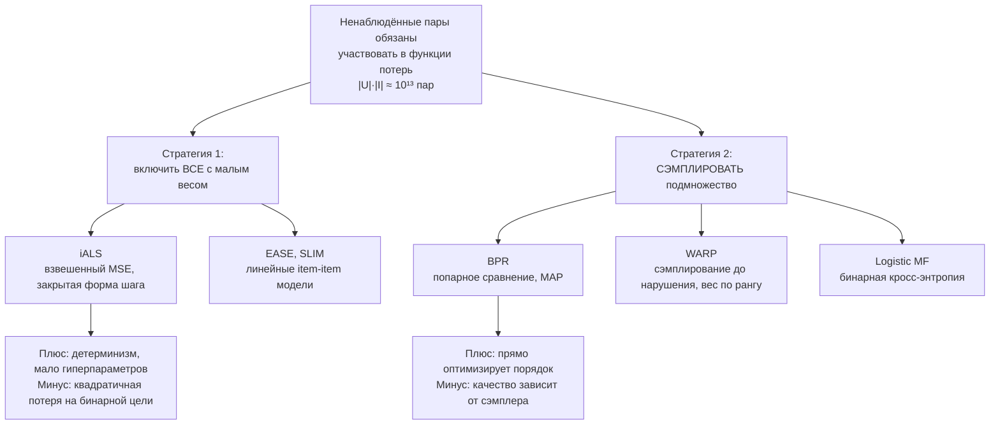

# Неявная обратная связь

> **Зачем эта глава.** В реальной системе оценок почти нет: есть клики, просмотры и покупки,
> и нет ни одного явного «мне не понравилось». Из этого надо построить ранжирование. После главы
> вы сможете вывести шаг ALS для взвешенной факторизации и объяснить, почему его сложность
> не зависит от размера каталога; вывести функцию потерь BPR из максимума апостериорной
> вероятности; и осмысленно выбирать схему сэмплирования негативов, понимая, что именно
> она делает с моделью.

**Уровень:** 🎯 middle → 🧠 middle+
**Предварительно нужно:** [коллаборативная фильтрация](03-collaborative-filtering.md), [офлайн-метрики](02-metrics-offline.md), [оптимизация](../01-math/04-optimization.md), [логистическая регрессия](../02-classic-ml/03-logistic-regression.md)
**Как проработать:** чтение + два вывода руками + реализация iALS и BPR

---

## Карта главы

- [1. Мир без негативов](#1-мир-без-негативов) — что на самом деле означает ноль в матрице
- [2. Две стратегии: взвесить всё или сэмплировать](#2-две-стратегии-взвесить-всё-или-сэмплировать)
- [3. iALS: полный вывод](#3-ials-полный-вывод) — confidence, закрытая форма, трюк с $Q^\top Q$
- [4. BPR: ранжирование как попарное сравнение](#4-bpr-ранжирование-как-попарное-сравнение) — вывод из MAP
- [5. WARP: почему AUC мало](#5-warp-почему-auc-мало)
- [6. Логистическая матричная факторизация](#6-логистическая-матричная-факторизация)
- [7. Сэмплирование негативов](#7-сэмплирование-негативов) — инженерное сердце главы
- [8. Что выбирать](#8-что-выбирать)
- [9. Подводные камни](#9-подводные-камни)
- [10. Проверь себя](#10-проверь-себя)
- [11. Практика](#11-практика)
- [12. Что читать дальше](#12-что-читать-дальше)

---

## 1. Мир без негативов

В предыдущей главе мы работали с оценками: пользователь поставил 2 — значит, не понравилось,
поставил 5 — понравилось. У модели были и позитивы, и негативы, и обучение сводилось к регрессии.

Теперь посмотрите на реальный лог реального сервиса. Доля пользователей, оставляющих оценки,
редко превышает единицы процентов, а в маркетплейсах и лентах контента её нет вовсе. Зато есть
события: показ, клик, добавление в корзину, покупка, дослушивание трека, время просмотра.
Это **неявная обратная связь** (implicit feedback), и у неё есть свойство, которое ломает всю
предыдущую главу: **все наблюдения положительные**.

Попробуем применить FunkSVD напрямую. Обучаем по наблюдённым ячейкам, таргет $r_{ui} = 1$
для всех наблюдений. Что минимизирует модель?

$$
\sum_{(u,i) \in \mathcal{K}} \big(1 - p_u^\top q_i\big)^2
$$

где $\mathcal{K}$ — множество наблюдённых пар, $p_u \in \mathbb{R}^k$ и $q_i \in \mathbb{R}^k$ —
латентные векторы пользователя и айтема, $k$ — размерность латентного пространства.

Оптимум достигается, когда $p_u^\top q_i = 1$ **для всех пар**. Например, при
$p_u = q_i = (1, 0, \dots, 0)$ для всех $u$ и $i$. Ошибка равна нулю, ранжирование —
случайное. Модель выучила ровно ничего.

Вывод, который стоит запомнить дословно: **в задаче с неявной обратной связью ненаблюдённые
пары обязаны участвовать в функции потерь**. Иначе задача вырождена. Весь вопрос в том, *как*
именно они участвуют, — и на этом разделяются все методы главы.

### Что означает ноль

Прежде чем решать, разберёмся, что мы вообще знаем про пару $(u, i)$, которой нет в логе.
Отсутствие взаимодействия — это смесь четырёх принципиально разных событий:

1. **Айтем не был показан.** Пользователь физически не мог с ним взаимодействовать.
2. **Показан, но не замечен.** Был на 40-й позиции, до которой не доскроллили.
3. **Замечен и отвергнут.** Вот это — единственный настоящий негатив.
4. **Интересен, но взаимодействие произошло вне системы.** Купил в офлайне, посмотрел у друга.

Оцените пропорции. Активный пользователь за месяц видит $10^2$–$10^3$ показов при каталоге
в $10^6$ айтемов. Значит, **более 99.9 % нулей в матрице — это категория 1**: «мы никогда
не показывали». Считать их негативами — заведомая ошибка, но и игнорировать нельзя (см. выше).

Отсюда центральная идея всех implicit-методов: ноль — это **слабое** свидетельство отсутствия
интереса, а единица — **сильное** свидетельство наличия. Разница в силе и есть то, что модели
должны кодировать.

> 💬 **На собеседовании.** Спросят: «Почему в implicit-задаче нельзя просто обучаться на
> наблюдённых взаимодействиях, как на оценках?» Хороший ответ: потому что все таргеты равны
> единице, и функционал минимизируется тривиально — достаточно сделать все скалярные произведения
> равными 1, ранжирование при этом произвольное. Ненаблюдённые пары должны входить в функцию
> потерь; вопрос только в том, войдут ли они все с малым весом (iALS) или через сэмплирование
> (BPR/WARP). Сильное дополнение: заметить, что ноль в матрице — это смесь «не показали»,
> «не заметил» и «отверг», причём первая категория составляет 99.9 %, и поэтому логи **показов**
> (impressions) — самый ценный источник настоящих негативов, если их пишут.
> Плохой ответ: «поставим нули как негативы» без обсуждения того, что это значит.

> ⚠️ **Типичная ошибка.** Не логировать показы. Без них вы навсегда остаётесь с матрицей
> «взаимодействие / неизвестно» и вынуждены угадывать негативы сэмплированием. С логом показов
> вы получаете категорию «показали и не кликнул» — настоящий негатив, на котором обучается
> ранкер второй стадии. Стоимость логирования показов — заметный объём данных (на порядок-два
> больше кликов), но это самая окупаемая статья расходов в рекомендательной инфраструктуре.

### Что стоит в ячейках

Для implicit удобно разделить два числа:

$$
y_{ui} = \begin{cases} 1, & r_{ui} > 0 \\ 0, & r_{ui} = 0 \end{cases}
\qquad\qquad
c_{ui} = 1 + \alpha\, r_{ui}
$$

где $r_{ui} \ge 0$ — «сила» взаимодействия (число прослушиваний, доля просмотра, факт покупки),
$y_{ui} \in \{0, 1\}$ — бинарный индикатор факта взаимодействия, $c_{ui} \ge 1$ —
**уверенность** (confidence) в том, что $y_{ui}$ отражает истинное предпочтение,
$\alpha > 0$ — параметр, задающий, насколько сильно повторные взаимодействия повышают уверенность.

> 📐 **Разбор формулы.** Разделение на «что мы предсказываем» ($y$) и «насколько мы уверены» ($c$)
> — ключевой ход всей главы. Модель предсказывает бинарное предпочтение, а вклад каждой пары
> в функцию потерь взвешивается уверенностью. Единица в $c_{ui} = 1 + \alpha r_{ui}$ означает:
> даже про ненаблюдённую пару у нас есть минимальная уверенность (что предпочтения нет), и она
> одинакова для всех таких пар. Слагаемое $\alpha r_{ui}$ добавляет уверенности пропорционально
> числу взаимодействий: трек, прослушанный 50 раз, — куда более надёжный позитив, чем
> прослушанный один раз. При $\alpha = 40$ и $r_{ui} = 1$ уверенность равна 41, то есть один
> клик весит в 41 раз больше, чем один «не-клик».

Практическая деталь: $r_{ui}$ почти никогда не берут сырым. Число прослушиваний имеет тяжёлый
хвост, и один фанат с 5000 прослушиваний перекосит модель. Стандартные преобразования:
$r_{ui} \to \log(1 + r_{ui}/\varepsilon)$ или BM25-взвешивание (в библиотеке `implicit` —
функция `bm25_weight`), которое дополнительно штрафует популярные айтемы.

---

## 2. Две стратегии: взвесить всё или сэмплировать

Раз ненаблюдённые пары должны попасть в функционал, а их $|U| \cdot |I| \approx 10^{13}$,
возникает вычислительная развилка. Есть ровно два выхода, и они породили два семейства методов.



Первая стратегия кажется безумной — как можно просуммировать $10^{13}$ слагаемых? Оказывается,
можно, если функция потерь квадратичная: тогда суммы сворачиваются в матричные произведения,
и стоимость шага становится не зависящей от числа ненаблюдённых пар. Это iALS, и вывод этого
трюка — самая содержательная математика главы.

Вторая стратегия честно признаёт, что все пары не перебрать, и заменяет полную сумму
несмещённой (или намеренно смещённой) оценкой по подвыборке. Тогда вопрос «как сэмплировать»
становится главным вопросом качества, и ему посвящён раздел 7.

---

## 3. iALS: полный вывод

Метод предложен в работе Hu, Koren, Volinsky «Collaborative Filtering for Implicit Feedback
Datasets» (ICDM 2008). Он же — то, что запускается командой `implicit.als.AlternatingLeastSquares`
и до сих пор является бейзлайном, который трудно побить.

### 3.1 Функционал

$$
\mathcal{L}(P, Q) \;=\; \sum_{u \in U}\sum_{i \in I} c_{ui}\,\big(y_{ui} - p_u^\top q_i\big)^2 \;+\; \lambda\left(\sum_{u \in U}\|p_u\|_2^2 + \sum_{i \in I}\|q_i\|_2^2\right)
$$

где $P \in \mathbb{R}^{|U| \times k}$ и $Q \in \mathbb{R}^{|I| \times k}$ — матрицы латентных
векторов (строки — $p_u$ и $q_i$), $\lambda \ge 0$ — коэффициент L2-регуляризации,
остальные обозначения из раздела 1.

Обратите внимание на пределы суммирования: по **всем** парам $|U| \times |I|$, а не только
по наблюдённым. Это принципиально отличает iALS от FunkSVD из предыдущей главы, где сумма шла
по $\mathcal{K}$.

### 3.2 Почему ALS, а не SGD

Задача невыпукла по паре $(P, Q)$, но выпукла по $P$ при фиксированном $Q$ и наоборот — это
обычная квадратичная задача наименьших квадратов, у которой есть **закрытое решение**. Отсюда
схема **чередующихся наименьших квадратов** (alternating least squares, ALS): фиксируем $Q$,
находим оптимальное $P$ целиком; фиксируем $P$, находим $Q$; повторяем 15–30 раз.

Каждый полушаг **гарантированно не увеличивает** функционал, поэтому алгоритм монотонно
сходится к стационарной точке. Плюс: шаги по разным пользователям независимы, значит,
тривиально параллелятся. Минус: каждый шаг дороже, чем шаг SGD.

### 3.3 Вывод шага для $p_u$

Зафиксируем $Q$. Функционал распадается на независимые задачи по пользователям — слагаемые
с разными $u$ не связаны:

$$
J(p_u) \;=\; \sum_{i \in I} c_{ui}\,\big(y_{ui} - p_u^\top q_i\big)^2 \;+\; \lambda\,\|p_u\|_2^2
$$

Дифференцируем по вектору $p_u$. Производная квадрата: внешняя функция даёт множитель
$2 c_{ui}(y_{ui} - p_u^\top q_i)$, внутренняя производная $\partial(y_{ui} - p_u^\top q_i)/\partial p_u = -q_i$:

$$
\nabla_{p_u} J \;=\; -2\sum_{i \in I} c_{ui}\,\big(y_{ui} - p_u^\top q_i\big)\,q_i \;+\; 2\lambda\, p_u
$$

Приравняем к нулю и раскроем скобки. Заметим, что $\big(p_u^\top q_i\big) q_i = q_i q_i^\top p_u$
(скаляр можно переставить, и получается матрица $k \times k$, умноженная на вектор):

$$
\sum_{i \in I} c_{ui}\, q_i q_i^\top\, p_u \;+\; \lambda\, p_u \;=\; \sum_{i \in I} c_{ui}\, y_{ui}\, q_i
$$

Соберём в матричную форму. Введём $C^u = \operatorname{diag}(c_{u1}, \dots, c_{u|I|})$ —
диагональную матрицу уверенностей пользователя $u$, и $y_u \in \mathbb{R}^{|I|}$ — вектор его
бинарных предпочтений. Тогда $\sum_i c_{ui} q_i q_i^\top = Q^\top C^u Q$ и
$\sum_i c_{ui} y_{ui} q_i = Q^\top C^u y_u$:

$$
\big(Q^\top C^u Q + \lambda I_k\big)\, p_u \;=\; Q^\top C^u y_u
$$

$$
\boxed{\;p_u \;=\; \big(Q^\top C^u Q + \lambda I_k\big)^{-1} Q^\top C^u y_u\;}
$$

где $I_k$ — единичная матрица $k \times k$.

Проверим размерности: $Q^\top$ имеет размер $k \times |I|$, $C^u$ — $|I| \times |I|$,
$Q$ — $|I| \times k$, произведение — $k \times k$; правая часть — $k \times |I|$ на
$|I| \times |I|$ на $|I| \times 1$ = вектор длины $k$. Сходится.

### 3.4 Трюк, ради которого всё это работает

Формула выше красива, но в лоб неприменима. Вычисление $Q^\top C^u Q$ требует $O(|I| k^2)$
операций **на каждого пользователя**: при $|U| = 10^7$, $|I| = 10^6$, $k = 64$ это
$4 \cdot 10^{16}$ операций на одну итерацию. Никогда не досчитается.

Спасает наблюдение: $C^u$ отличается от единичной матрицы только на позициях, где было
взаимодействие. Действительно, $c_{ui} - 1 = \alpha r_{ui}$, и $r_{ui} = 0$ для всех
$i \notin N(u)$. Запишем $C^u = I + (C^u - I)$:

$$
Q^\top C^u Q \;=\; Q^\top Q \;+\; Q^\top \big(C^u - I\big) Q \;=\; \underbrace{Q^\top Q}_{\text{общее для всех } u} \;+\; \underbrace{\sum_{i \in N(u)} \alpha\, r_{ui}\, q_i q_i^\top}_{\text{только по истории } u}
$$

Первое слагаемое **не зависит от $u$**: его считают один раз на всю итерацию за $O(|I| k^2)$.
Второе — сумма по истории пользователя, $O(|N(u)| k^2)$.

Правая часть сворачивается ещё проще. Поскольку $y_{ui} = 0$ для $i \notin N(u)$, все
ненаблюдённые слагаемые обнуляются:

$$
Q^\top C^u y_u \;=\; \sum_{i \in I} c_{ui}\, y_{ui}\, q_i \;=\; \sum_{i \in N(u)} \big(1 + \alpha r_{ui}\big)\, q_i
$$

Итоговая стоимость одного пользователя: $O\big(|N(u)|\,k^2 + k^3\big)$ — где $k^3$ идёт на
решение системы (разложение Холецкого). Стоимость полной итерации:

$$
O\Big(\underbrace{(|U| + |I|)\,k^3}_{\text{решение систем}} \;+\; \underbrace{n\,k^2}_{\text{накопление по истории}} \;+\; \underbrace{(|U| + |I|)\,k^2}_{\text{предвычисление } P^\top P,\, Q^\top Q}\Big)
$$

где $n = |\mathcal{K}|$ — число наблюдённых взаимодействий.

**Числа от размера каталога и числа пользователей зависят линейно, а не квадратично.**
Подставим: $|U| = 10^7$, $|I| = 10^6$, $n = 10^8$, $k = 64$. Тогда
$(|U| + |I|)k^3 \approx 2.9 \cdot 10^{12}$ и $n k^2 = 4 \cdot 10^{11}$ — суммарно порядка
$3 \cdot 10^{12}$ операций на итерацию, что на многоядерной машине или небольшом кластере
считается за минуты. Разница с наивной формулой — четыре порядка.

> 💬 **На собеседовании.** Спросят: «В iALS сумма идёт по всем парам пользователь-айтем.
> Как это вообще считается?» Хороший ответ — воспроизвести трюк. Матрица уверенностей
> $C^u$ отличается от единичной только на истории пользователя, потому что $c_{ui} - 1 = \alpha r_{ui}$
> и $r_{ui} = 0$ вне истории. Поэтому $Q^\top C^u Q = Q^\top Q + \sum_{i \in N(u)} \alpha r_{ui} q_i q_i^\top$:
> первое слагаемое считается один раз за итерацию и переиспользуется всеми пользователями,
> второе — только по истории, длина которой десятки. Правая часть тоже сворачивается к сумме
> по истории, потому что $y_{ui} = 0$ вне неё. Итог: сложность итерации линейна по числу
> пользователей, айтемов и наблюдений, при том что формально мы оптимизируем по $10^{13}$ парам.
> Плохой ответ: «библиотека как-то оптимизирована».

> 🧠 **Middle+.** Куб по $k$ становится заметен при $k \gtrsim 128$. Стандартное решение —
> заменить точное решение системы на несколько шагов метода сопряжённых градиентов (Takács et al.,
> RecSys 2011): 3–5 итераций CG дают практически то же качество за $O(k^2)$ вместо $O(k^3)$.
> В библиотеке `implicit` это поведение по умолчанию. Второй практический нюанс из более поздних
> работ Rendle с соавторами: регуляризацию полезно масштабировать числом наблюдений,
> $\lambda_u = \lambda\,(|N(u)| + \gamma)^{\nu}$ с $\nu \approx 1$, иначе активные пользователи
> регуляризуются относительно слабее редких — это заметно двигает метрики и объясняет часть
> разрыва между «iALS из коробки» и «iALS, настроенный как надо».

### 3.5 Реализация

```python
import numpy as np
from scipy import sparse


def als_half_step(X: sparse.csr_matrix, Y: np.ndarray, reg: float, alpha: float) -> np.ndarray:
    """Пересчитывает ВСЕ векторы одной стороны при фиксированной другой.

    X — разреженная матрица взаимодействий той стороны, которую пересчитываем
        (для шага по пользователям это user x item, для шага по айтемам — транспонированная).
    Y — зафиксированная матрица факторов другой стороны, (m x k).
    """
    k = Y.shape[1]
    YtY = Y.T @ Y                      # предвычисляем ОДИН раз: это и есть весь трюк
    eye = np.eye(k)
    out = np.zeros((X.shape[0], k))

    for row in range(X.shape[0]):
        lo, hi = X.indptr[row], X.indptr[row + 1]
        if lo == hi:
            continue                    # пустая история: вектор остаётся нулевым,
                                        # предсказание для такого пользователя = 0 для всех айтемов
        idx = X.indices[lo:hi]
        r = X.data[lo:hi]
        Yi = Y[idx]                     # (|N| x k) — факторы из истории
        cm1 = alpha * r                 # c - 1, ненулевое только здесь

        # A = YᵀY + Σ_{i∈N} (c_i - 1) y_i y_iᵀ + λI
        A = YtY + (Yi * cm1[:, None]).T @ Yi + reg * eye
        # b = Σ_{i∈N} c_i y_i,  так как y_ui = 0 вне истории
        b = ((1.0 + cm1)[:, None] * Yi).sum(axis=0)

        out[row] = np.linalg.solve(A, b)   # Холецкий под капотом: O(k³)
    return out


def ials_fit(R: sparse.csr_matrix, k=64, reg=0.05, alpha=40.0, n_iter=15, seed=0):
    """iALS (Hu, Koren, Volinsky). R — матрица user x item со значениями r_ui >= 0."""
    rng = np.random.default_rng(seed)
    P = rng.normal(0, 0.01, (R.shape[0], k))
    Q = rng.normal(0, 0.01, (R.shape[1], k))
    Rt = R.T.tocsr()
    for _ in range(n_iter):
        P = als_half_step(R, Q, reg, alpha)
        Q = als_half_step(Rt, P, reg, alpha)
    return P, Q
```

В проде, конечно, используют библиотеку — она делает то же самое, но на C++ с многопоточностью
и опционально на GPU:

```python
import implicit
from implicit.nearest_neighbours import bm25_weight

# R — scipy.sparse матрица user x item с сырыми счётчиками взаимодействий.
# BM25 сглаживает тяжёлый хвост счётчиков и штрафует популярные айтемы —
# без этого один трек, прослушанный 5000 раз, перекосит всю модель.
Cui = bm25_weight(R, K1=1.2, B=0.75).tocsr()
Cui = (40.0 * Cui).tocsr()      # масштаб alpha; в свежих версиях есть параметр alpha=

model = implicit.als.AlternatingLeastSquares(
    factors=64,                  # типично 64-256; больше — дороже инференс и индекс
    regularization=0.05,         # взаимодействует с alpha: подбирать вместе
    iterations=20,               # обычно выходит на плато к 15-30
    random_state=0,
)
model.fit(Cui)                   # в implicit >= 0.5 fit принимает матрицу user x item

ids, scores = model.recommend(
    userid=42, user_items=Cui[42], N=10, filter_already_liked_items=True
)
```

Типичные значения гиперпараметров, от которых стоит отталкиваться: `factors` 64–256,
`regularization` 0.01–0.1, `alpha` 1–40, `iterations` 15–30. Главное, что надо помнить:
$\alpha$ и $\lambda$ **связаны**. Увеличив $\alpha$, вы увеличили масштаб всех весов в первом
слагаемом функционала, и старое $\lambda$ стало относительно слабее. Перебирать их независимо —
потерянное время.

---

## 4. BPR: ранжирование как попарное сравнение

### 4.1 Проблема, которую решает BPR

iALS минимизирует квадратичную ошибку между $p_u^\top q_i$ и бинарной меткой. Но нас не
интересует, попадёт ли скор в единицу: нас интересует **порядок**. Пользователю показывают
top-10, и важно лишь то, что позитивы стоят выше негативов.

Формализуем это напрямую. Вместо «предскажи значение» скажем: для каждого пользователя $u$
и каждой пары «айтем из истории $i$, айтем не из истории $j$» модель должна выдать
$\hat x_{ui} > \hat x_{uj}$. Это **попарная** (pairwise) постановка, и она лежит в основе
BPR — Bayesian Personalized Ranking (Rendle et al., UAI 2009).

Обучающее множество:

$$
D_S \;=\; \big\{\,(u, i, j) \;:\; u \in U,\; i \in N(u),\; j \in I \setminus N(u)\,\big\}
$$

где $N(u)$ — история пользователя. Размер $D_S$ — порядка $n \cdot |I|$, то есть $10^{14}$
троек: перебрать нельзя, будем сэмплировать.

### 4.2 Вывод функции потерь

Пусть $\Theta$ — все параметры модели (в случае MF это $P$ и $Q$), $>_u$ — истинный порядок
предпочтений пользователя $u$. Ищем максимум апостериорной вероятности параметров:

$$
p\big(\Theta \mid >_u\big) \;\propto\; p\big(>_u \mid \Theta\big)\; p(\Theta)
$$

**Шаг 1: правдоподобие.** Предполагаем, что пользователи независимы, а порядок каждой пары
при данных $\Theta$ независим от других пар. Тогда произведение по всем пользователям
разворачивается в произведение по тройкам:

$$
\prod_{u \in U} p\big(>_u \mid \Theta\big) \;=\; \prod_{(u,i,j) \in D_S} p\big(i >_u j \mid \Theta\big)
$$

**Шаг 2: вероятность одного сравнения.** Вводим вещественную функцию
$\hat x_{uij}(\Theta) = \hat x_{ui} - \hat x_{uj}$ — насколько модель предпочитает $i$ перед $j$,
и превращаем её в вероятность сигмоидой:

$$
p\big(i >_u j \mid \Theta\big) \;=\; \sigma\big(\hat x_{uij}\big), \qquad \sigma(z) = \frac{1}{1 + e^{-z}}
$$

Это ровно та же конструкция, что в модели Брэдли–Терри для парных сравнений: разность
«сил» превращается в вероятность победы.

**Шаг 3: априорное распределение.** Полагаем $\Theta \sim \mathcal{N}(0, \lambda_\Theta^{-1} I)$ —
нормальное с нулевым средним. Логарифм плотности:

$$
\ln p(\Theta) \;=\; -\frac{\lambda_\Theta}{2}\,\|\Theta\|_2^2 \;+\; \text{const}
$$

**Шаг 4: собираем.** Логарифм апостериорной плотности (обозначения авторов — BPR-OPT):

$$
\text{BPR-OPT} \;=\; \ln p\big(\Theta \mid >_u\big) \;=\; \sum_{(u,i,j) \in D_S} \ln \sigma\big(\hat x_{uij}\big) \;-\; \lambda\,\|\Theta\|_2^2
$$

где $\lambda$ — коэффициент регуляризации (константа $1/2$ поглощена). Максимизируем это,
то есть минимизируем

$$
\mathcal{L}_{\text{BPR}} \;=\; -\sum_{(u,i,j) \in D_S} \ln \sigma\big(\hat x_{ui} - \hat x_{uj}\big) \;+\; \lambda\,\|\Theta\|_2^2
$$

> 📐 **Разбор формулы.** $\ln\sigma(z)$ — это знакомая по логистической регрессии функция:
> при большом положительном $z$ она близка к нулю (потерь нет, порядок правильный), при большом
> отрицательном ведёт себя как $z$ (штраф растёт линейно). Отличие от логистической регрессии
> в том, что аргументом служит **разность** скоров, а не скор одного объекта. Поэтому модель
> ничего не должна знать про абсолютную величину скора — только про относительный порядок.
> Прямое следствие: скоры BPR **не являются вероятностями** и не калиброваны. Если вам нужна
> вероятность клика (для расчёта ожидаемой выручки, например), BPR не подходит.

### 4.3 Градиенты

Дифференцируем одно слагаемое. Обозначим $x = \hat x_{uij}$. Используем
$\sigma'(x) = \sigma(x)\big(1 - \sigma(x)\big)$:

$$
\frac{\partial}{\partial \theta}\Big(-\ln \sigma(x)\Big)
\;=\; -\frac{\sigma'(x)}{\sigma(x)}\cdot\frac{\partial x}{\partial \theta}
\;=\; -\big(1 - \sigma(x)\big)\cdot\frac{\partial x}{\partial \theta}
\;=\; -\,\sigma(-x)\,\frac{\partial x}{\partial \theta}
$$

Множитель $\sigma(-x)$ — это «насколько модель ещё не права». Если порядок уже выучен
($x$ велико), $\sigma(-x) \approx 0$ и обновления почти нет. Это очень важно для раздела 7:
**лёгкие негативы перестают давать градиент**.

Для матричной факторизации $\hat x_{ui} = p_u^\top q_i$, значит
$x = p_u^\top q_i - p_u^\top q_j = p_u^\top (q_i - q_j)$, и частные производные:

$$
\frac{\partial x}{\partial p_u} = q_i - q_j, \qquad
\frac{\partial x}{\partial q_i} = p_u, \qquad
\frac{\partial x}{\partial q_j} = -\,p_u
$$

Правила обновления SGD (обозначим $g = \sigma(-x)$, $\eta$ — темп обучения):

$$
p_u \leftarrow p_u + \eta\big(g\,(q_i - q_j) - \lambda\, p_u\big)
$$
$$
q_i \leftarrow q_i + \eta\big(g\,p_u - \lambda\, q_i\big), \qquad
q_j \leftarrow q_j + \eta\big(-g\,p_u - \lambda\, q_j\big)
$$

Смысл: вектор пользователя двигается в сторону разности «позитив минус негатив»; позитивный
айтем притягивается к пользователю, негативный отталкивается. За один шаг обновляются ровно
три вектора — стоимость $O(k)$.

```python
import numpy as np
from scipy import sparse


def bpr_fit(R: sparse.csr_matrix, k=64, lr=0.05, reg=0.01, n_epochs=20, seed=0):
    """BPR-MF с равномерным сэмплированием негативов. R — бинарная user x item."""
    n_users, n_items = R.shape
    rng = np.random.default_rng(seed)
    P = rng.normal(0, 0.1, (n_users, k))
    Q = rng.normal(0, 0.1, (n_items, k))

    users, items = R.nonzero()
    # множества истории нужны, чтобы не выдать позитив за негатив (ложный негатив)
    seen = [set(R.indices[R.indptr[u]:R.indptr[u + 1]].tolist()) for u in range(n_users)]

    for _ in range(n_epochs):
        for t in rng.permutation(len(users)):
            u, i = int(users[t]), int(items[t])
            j = int(rng.integers(n_items))
            while j in seen[u]:                 # отвергающая выборка
                j = int(rng.integers(n_items))

            pu, qi, qj = P[u].copy(), Q[i].copy(), Q[j].copy()
            x = float(pu @ (qi - qj))
            # g = σ(-x); clip защищает от переполнения exp при больших |x|
            g = 1.0 / (1.0 + np.exp(np.clip(x, -30.0, 30.0)))

            P[u] += lr * (g * (qi - qj) - reg * pu)
            Q[i] += lr * (g * pu - reg * qi)
            Q[j] += lr * (-g * pu - reg * qj)
    return P, Q
```

### 4.4 Что на самом деле оптимизирует BPR

Посмотрите на определение AUC для одного пользователя:

$$
\text{AUC}(u) \;=\; \frac{1}{|N(u)| \cdot |I \setminus N(u)|} \sum_{i \in N(u)}\;\sum_{j \notin N(u)} \mathbb{1}\big[\hat x_{ui} > \hat x_{uj}\big]
$$

где $\mathbb{1}[\cdot]$ — индикатор. Это доля правильно упорядоченных пар. BPR заменяет
недифференцируемый индикатор на гладкую $\sigma$ — то есть **BPR оптимизирует сглаженный
суррогат AUC**.

И вот здесь скрыт его главный недостаток. AUC считает все пары равнозначными. Поднять позитив
с 10 000-й позиции на 5 000-ю — такой же вклад в AUC, как поднять его с 10-й на 5-ю. Но
пользователь видит только первые десять. Метрики, которые волнуют продукт (precision@10,
NDCG@10), чувствительны только к верхушке, а BPR распределяет усилия равномерно.

---

## 5. WARP: почему AUC мало

WARP (Weighted Approximate-Rank Pairwise loss, Weston et al., 2011, изначально для аннотации
изображений) чинит именно это. Идея в двух ходах.

**Ход 1: сэмплировать до нарушения.** Для пары $(u, i)$ тянем негативы $j$ равномерно **до тех
пор**, пока не найдём нарушающий: такой, что $\hat x_{uj} + m > \hat x_{ui}$, где $m > 0$ —
отступ (margin). Пусть потребовалось $N$ попыток.

**Ход 2: оценить ранг позитива по числу попыток.** Если нарушение нашлось с первой попытки,
значит, нарушителей много — позитив стоит низко. Если потребовалось 500 попыток — позитив
уже почти на вершине. Формально, если доля нарушителей равна $\rho$, то математическое ожидание
числа попыток равно $1/\rho$, откуда оценка ранга:

$$
\hat r \;=\; \left\lfloor \frac{|I| - 1}{N} \right\rfloor
$$

где $|I| - 1$ — число кандидатов в негативы, $N$ — сколько попыток понадобилось.

**Вес по рангу.** Потери домножаются на неубывающую функцию ранга:

$$
L(\hat r) \;=\; \sum_{t=1}^{\hat r} \frac{1}{t} \;\approx\; \ln \hat r + \gamma_E
$$

где $\gamma_E \approx 0.577$ — постоянная Эйлера. Итоговая потеря для тройки:

$$
\ell_{\text{WARP}} \;=\; L(\hat r)\cdot \max\big(0,\; m - \hat x_{ui} + \hat x_{uj}\big)
$$

> 📐 **Разбор формулы.** Гармонический вес растёт **логарифмически**. Это ровно та форма, которая
> нужна: разница между рангом 1 и рангом 10 велика ($L(1) = 1$, $L(10) \approx 2.93$), а между
> рангом 1000 и 10 000 — мала ($L \approx 7.5$ против $9.8$). То есть модель тратит основные
> усилия на то, чтобы дотолкать позитив в верхушку, и почти не тратит их на безнадёжные случаи.
> Это принципиально отличается от BPR, где все пары равнозначны, и объясняет, почему WARP
> обычно выигрывает по precision@k, а BPR — по AUC.

**Цена.** В начале обучения нарушитель находится с первой-второй попытки. Ближе к концу модель
уже ранжирует хорошо, и на поиск нарушителя уходят сотни попыток — эпоха резко замедляется.
Поэтому число попыток ограничивают сверху (в LightFM это параметр `max_sampled`, по умолчанию 10);
если за лимит нарушитель не нашёлся, обновления просто не происходит.

```python
from lightfm import LightFM
from lightfm.evaluation import precision_at_k, auc_score

# train / test — scipy.sparse COO-матрицы взаимодействий user x item
for loss in ("bpr", "warp"):
    model = LightFM(no_components=64, loss=loss, learning_rate=0.05,
                    item_alpha=1e-6, user_alpha=1e-6, max_sampled=10, random_state=0)
    model.fit(train, epochs=30, num_threads=8)
    p10 = precision_at_k(model, test, train_interactions=train, k=10).mean()
    auc = auc_score(model, test, train_interactions=train).mean()
    print(f"{loss:>4}: precision@10 = {p10:.4f}, AUC = {auc:.4f}")
    # Ожидаемая картина: warp выигрывает по precision@10, bpr — не хуже по AUC.
    # Это прямое следствие того, ЧТО именно каждая функция потерь оптимизирует.
```

> 💬 **На собеседовании.** Спросят: «В чём разница между BPR и WARP?» Хороший ответ: обе —
> попарные потери на неявной обратной связи, но BPR взвешивает все пары одинаково и потому
> оптимизирует сглаженный AUC, а WARP оценивает ранг позитива по числу попыток до нахождения
> нарушителя и домножает потерю на логарифмически растущий вес ранга — то есть концентрируется
> на верхушке выдачи. Следствие: WARP обычно лучше по precision@k и NDCG@k, BPR — сопоставим
> или лучше по AUC, и он дешевле, потому что не тратит время на поиск нарушителя. Отличное
> дополнение: заметить, что «сэмплировать до нарушения» — это по сути адаптивный майнинг
> hard negatives, встроенный в функцию потерь. Плохой ответ: «WARP просто лучше».

---

## 6. Логистическая матричная факторизация

Ещё один способ обойтись без выдуманных вещественных таргетов — признать, что задача бинарная,
и взять кросс-энтропию. Такой метод описал Кристофер Джонсон (Spotify) в работе
«Logistic Matrix Factorization for Implicit Feedback Data» (2014); он реализован как
`implicit.lmf.LogisticMatrixFactorization`.

Модель: вероятность того, что пользователю $u$ нравится айтем $i$,

$$
p\big(y_{ui} = 1\big) \;=\; \sigma\big(x_{ui}\big), \qquad x_{ui} = p_u^\top q_i + b_u + b_i
$$

где $b_u, b_i \in \mathbb{R}$ — смещения пользователя и айтема (та же роль, что в
[предыдущей главе](03-collaborative-filtering.md)).

Логарифм апостериорной плотности с учётом уверенности $\alpha r_{ui}$:

$$
\ln p \;=\; \sum_{u \in U}\sum_{i \in I}\Big[\alpha\, r_{ui}\, x_{ui} \;-\; \big(1 + \alpha\, r_{ui}\big)\ln\big(1 + e^{x_{ui}}\big)\Big] \;-\; \frac{\lambda}{2}\Big(\|P\|_F^2 + \|Q\|_F^2\Big)
$$

где $\|\cdot\|_F$ — норма Фробениуса, остальное как раньше.

> 📐 **Разбор формулы.** Читайте это как взвешенную логистическую регрессию: каждая пара
> $(u,i)$ даёт $\alpha r_{ui}$ «положительных наблюдений» и одно «отрицательное». Продифференцируем
> по $x_{ui}$:
> $$\frac{\partial \ln p}{\partial x_{ui}} = \alpha r_{ui} - \big(1 + \alpha r_{ui}\big)\sigma\big(x_{ui}\big)$$
> Приравняв к нулю, получаем целевую вероятность в оптимуме:
> $$\sigma\big(x_{ui}^{*}\big) = \frac{\alpha r_{ui}}{1 + \alpha r_{ui}}$$
> Вот это очень наглядно. При $r_{ui} = 0$ целевая вероятность равна нулю — модель толкает
> скор вниз. При $r_{ui} = 1$ и $\alpha = 40$ она равна $40/41 \approx 0.976$. При $r_{ui} = 10$
> — уже $0.9975$. То есть уверенность **насыщается**: разница между одним и десятью
> взаимодействиями существенна, между десятью и ста — почти нет. Это гораздо более
> здравое поведение, чем линейный рост веса в iALS.

Обучают LMF стохастическим градиентным спуском с AdaGrad. В отличие от iALS, закрытой формы нет,
поэтому полная сумма по всем парам недоступна — на практике негативы **сэмплируют** (в `implicit`
это параметр `neg_prop`, задающий, сколько негативов приходится на позитив).

Когда LMF предпочтительнее iALS: когда нужна калиброванная вероятность (кросс-энтропия для этого
подходит, квадратичная потеря на бинарной цели — плохо), и когда данные сильно перекошены по
частоте. Когда хуже: когда нужен детерминированный, быстро сходящийся бейзлайн без настройки
темпа обучения.

---

## 7. Сэмплирование негативов

Всё, что не iALS, требует выбирать негативы. Это не техническая деталь реализации: **выбор
сэмплера меняет то, какую задачу решает модель**, часто сильнее, чем архитектура. На практике
переход от равномерного сэмплирования к продуманному даёт больший прирост, чем удвоение $k$.

Разберём четыре схемы.

### 7.1 Равномерное (uniform)

$j \sim \text{Uniform}(I)$. Просто, дёшево, несмещённо относительно каталога.

Проблема — в тяжёлом хвосте. Случайный айтем из каталога в $10^6$ позиций почти наверняка
никому не интересен. Модель сразу учится ставить ему низкий скор, и множитель градиента
$\sigma(-x)$ обращается почти в ноль. Через несколько эпох подавляющее большинство
сэмплированных троек не даёт никакого обновления — вычисления есть, обучения нет.

Что модель успевает выучить: «популярное лучше непопулярного». Что не успевает: различать
внутри популярного, а именно там и живёт настоящая персонализация.

### 7.2 По популярности (popularity-based)

$$
p(j) \;\propto\; \operatorname{freq}(j)^{\beta}
$$

где $\operatorname{freq}(j)$ — частота айтема в логах, $\beta \in [0, 1]$ — параметр сглаживания.
При $\beta = 0$ получаем равномерное, при $\beta = 1$ — пропорционально популярности.
Значение $\beta = 0.75$ пришло из word2vec и стало фактическим стандартом.

Такие негативы **труднее**: они популярны, значит, модель по умолчанию даёт им высокий скор,
значит, $\sigma(-x)$ не вырождается и градиент есть. Побочный эффект, часто полезный: популярные
айтемы систематически «прижимаются» вниз, что частично компенсирует popularity bias.

Риск: доля **ложных негативов** (false negatives) растёт. Популярный айтем, которого нет
в истории пользователя, вполне мог бы ему понравиться — просто не показали. Мы учим модель
понижать то, что стоило бы поднять.

### 7.3 In-batch

В батче из $B$ пар $(u_1, i_1), \dots, (u_B, i_B)$ для пользователя $u_a$ негативами служат
айтемы $i_b$ при $b \ne a$. Эмбеддинги уже посчитаны, поэтому все $B \times B$ скоров
получаются одним матричным произведением — негативы достаются практически бесплатно.
При $B = 4096$ это 4095 негативов на позитив вместо одного.

Ключевой нюанс: распределение таких негативов пропорционально **популярности** (популярный
айтем чаще попадает в батч), причём мы не выбирали это, оно возникло само. Чтобы модель
не переучилась на понижение популярного, скор корректируют:

$$
s'(u, i) \;=\; s(u, i) \;-\; \ln Q(i)
$$

где $Q(i)$ — вероятность попадания айтема $i$ в батч (оценивается по частотам потоково),
$s$ — исходный скор. Это **logQ-коррекция**; подробный разбор — в
[главе про двухбашенные модели](06-two-tower-and-ann.md), где in-batch negatives являются
основным режимом обучения.

Ограничение: в батче не может быть больше негативов, чем размер батча, и все они «из потока»,
то есть хвост каталога модель почти не видит. Отсюда практика смешивать in-batch негативы
с равномерными из полного каталога.

### 7.4 Hard negatives

Берём текущую модель, ищем ею top-$k$ айтемов для пользователя, выкидываем настоящие позитивы,
остальное объявляем негативами. Это айтемы, которые модель считает подходящими, а
взаимодействия не было — максимально информативный сигнал.

Практическая реализация: раз в несколько эпох прогоняем ANN-индекс (FAISS/HNSW) по текущим
эмбеддингам и обновляем пул негативов. Стоимость заметна, поэтому обновляют не каждый шаг.

Риски, оба серьёзные:

1. **Ложные негативы.** Самые «трудные» негативы — это чаще всего айтемы, которые пользователю
   как раз понравились бы. Обучаясь их понижать, модель учится ошибке.
2. **Нестабильность.** Градиенты большие, обучение легко расходится или коллапсирует в
   вырожденное решение.

Поэтому чистые hard negatives обычно работают **хуже**, чем чистые случайные. В разборе
поискового ранжирования Facebook («Embedding-based Retrieval in Facebook Search», KDD 2020)
описан именно такой результат, и рабочим рецептом оказалось смешивание с большим перевесом
лёгких негативов. Ещё один популярный приём — **semi-hard**: брать негативы не из самой
верхушки, а из середины списка (скажем, с позиций 100–1000), где сигнал ещё силён, а риск
ложного негатива уже мал.

### 7.5 Сводка и главное правило

| Схема | Стоимость | Сила градиента | Риск ложных негативов | Когда применять |
|---|---|---|---|---|
| Uniform | ~0 | падает до нуля к концу обучения | минимальный | бейзлайн, старт обучения |
| Popularity ($\beta \approx 0.75$) | ~0 (alias-метод) | стабильно высокая | средний | почти всегда как замена uniform |
| In-batch | ~0 (переиспользуем батч) | высокая | средний, нужна logQ-коррекция | обучение двухбашенных моделей |
| Hard (top-$k$ модели) | высокая (нужен ANN) | максимальная | высокий | добавка к лёгким, на поздних эпохах |
| Показы без клика | стоимость логирования | реалистичная | минимальный | стадия ранжирования |

> 💬 **На собеседовании.** Спросят: «Как вы выбираете негативы?» Хороший ответ строится вокруг
> одного принципа: **распределение негативов при обучении должно соответствовать распределению
> кандидатов, которые модель увидит на инференсе**. Для стадии отбора кандидатов модель на
> инференсе сравнивает пользователя со **всем каталогом**, поэтому негативы должны сэмплироваться
> из всего каталога (uniform или по популярности, часто in-batch с logQ-коррекцией). Для стадии
> ранжирования модель на инференсе видит только те 500–1000 айтемов, которые прошли отбор,
> поэтому негативами должны быть **реальные показы без клика**, а не случайные айтемы из каталога.
> Дальше можно добавить про hard negatives: они дают сильнейший градиент, но чистое обучение
> на них обычно хуже, чем на случайных, из-за ложных негативов, поэтому их смешивают с лёгкими
> и берут не с самой верхушки. Плохой ответ: «сэмплируем случайные айтемы» — для ранкера это
> прямой путь к модели, у которой офлайн AUC 0.95, а онлайн эффекта нет.

> ⚠️ **Типичная ошибка.** Обучить ранкер на случайных негативах и радоваться AUC 0.97. Задача
> «отличить купленный товар от случайного товара из каталога» тривиальна: достаточно выучить
> популярность и категорию. Реальная задача ранкера — «отличить купленный товар от товара,
> который мы показали рядом и который не купили», и она несравнимо труднее. Симптом: огромный
> разрыв между офлайн-метрикой и онлайн-эффектом. Что делать: обучать ранкер на показах.

---

## 8. Что выбирать

| Условие | Метод | Обоснование |
|---|---|---|
| Нужен надёжный бейзлайн за день | iALS | детерминирован, 3 гиперпараметра, сходится за 15–20 итераций, зрелая реализация в `implicit` |
| Метрика — top-$k$ (precision@10, NDCG@10) | WARP | вес по рангу концентрирует обучение на верхушке |
| Нужна калиброванная вероятность | Logistic MF или ранкер с logloss | попарные потери калибровку не дают в принципе |
| Есть контентные признаки, много холодных айтемов | LightFM (WARP + признаки) | см. [главу 05](05-factorization-machines.md) |
| Каталог $> 10^7$, обучение на GPU, длинные истории | двухбашенные модели | см. [главу 06](06-two-tower-and-ann.md) |
| Данные очень разреженные, $\vert N(u)\vert < 5$ у большинства | iALS с сильной регуляризацией | сэмплирующие методы на коротких историях нестабильны |

Полезное отрезвление: в работе Rendle с соавторами
[«Neural Collaborative Filtering vs. Matrix Factorization Revisited»](https://arxiv.org/abs/2005.09683)
и в последующих работах про iALS показано, что аккуратно настроенная матричная факторизация
на неявной обратной связи обыгрывает многие нейросетевые модели, публиковавшиеся как её
превосходящие. Практический вывод: **сначала доведите iALS до настоящего максимума** (включая
масштабирование регуляризации числом взаимодействий и подбор $\alpha$), и только потом сравнивайте
с чем-то сложным. Иначе вы сравниваете свою хорошую нейросеть с чужим плохим бейзлайном.

---

## 9. Подводные камни

**Все взаимодействия считаются одинаковыми.**
Симптом: модель рекомендует то, что кликают, но не покупают; конверсия падает при росте CTR.
Причина: в матрицу свалены клики, добавления в корзину и покупки с одинаковым весом, а это
события разной ценности.
Что делать: задавать $r_{ui}$ как взвешенную сумму событий (например, клик = 1, корзина = 3,
покупка = 10) либо обучать отдельные модели и смешивать; на стадии ранжирования — многозадачная
модель ([глава 08](08-neural-ranking.md)).

**Автоплей и рекомендательный шум попадают в позитивы.**
Симптом: рекомендации сходятся к одному жанру; в топе — то, что стоит первым по умолчанию.
Причина: событие «трек проиграл, потому что был следующим в автоплее» записано как предпочтение.
Что делать: фильтровать по доле прослушивания/просмотра (например, засчитывать только > 30 %),
отделять органические взаимодействия от рекомендованных, взвешивать по позиции показа.

**Петля обратной связи.**
Симптом: покрытие каталога падает от недели к неделе, метрики офлайн растут, онлайн — стагнируют.
Причина: модель обучается на логах, которые сама же и сгенерировала. Айтем, не попавший в выдачу,
не получает взаимодействий, значит, в следующий раз попадёт с ещё меньшей вероятностью.
Что делать: резервировать долю трафика под эксплорацию, логировать вероятность показа для
последующей IPS-коррекции, следить за покрытием как за guardrail-метрикой
(см. [главу 12](12-cold-start-and-bias.md) и [главу 13](13-exploration-and-bandits.md)).

**Оценка на сэмплированных негативах.**
Симптом: в статье/эксперименте одна модель лучше, в проде — другая.
Причина: популярный протокол «ранжируем 1 позитив среди 100 случайных негативов» даёт метрику,
которая может **менять порядок моделей** по сравнению с ранжированием полного каталога
(Krichene, Rendle, KDD 2020).
Что делать: оценивать на полном каталоге. Это дороже, но при $|I| \le 10^6$ и батчевом
умножении вполне посильно.

**$\alpha$ и $\lambda$ подобраны независимо.**
Симптом: сетка по $\lambda$ даёт плоскую картину, качество не растёт.
Причина: рост $\alpha$ увеличивает масштаб первого слагаемого функционала, и оптимальное
$\lambda$ сдвигается пропорционально.
Что делать: перебирать пару $(\alpha, \lambda)$ по сетке, а не по очереди.

**Утечка времени в implicit-данных.**
Симптом: офлайн-метрики нереалистично высоки.
Причина: случайное разбиение взаимодействий даёт модели видеть будущие события пользователя.
В implicit это особенно вредно: сессии сильно коррелированы во времени, и половина сессии
в трейне делает вторую половину тривиальной.
Что делать: временной сплит по глобальной дате, а не по пользователю
(см. [офлайн-метрики](02-metrics-offline.md)).

---

## 10. Проверь себя

<details>
<summary><b>🌱 Вопрос.</b> Чем задача с неявной обратной связью отличается от задачи с оценками?</summary>

**Короткий ответ.** Нет негативных примеров: все наблюдения положительные, а отсутствие
взаимодействия не означает, что не понравилось. Плюс нет градаций: и клик, и покупка — просто
«было», а не «на 5 из 5».

**Развёрнуто.** Три следствия. (1) Задача перестаёт быть регрессией и становится задачей
ранжирования: нам важен порядок, а не значение. (2) Ненаблюдённые пары обязаны участвовать
в функции потерь, иначе оптимум тривиален (достаточно предсказывать константу на всех
наблюдениях). (3) Метрики меняются: RMSE неприменим, нужны recall@k, NDCG@k, MAP.
Зато данных на два-три порядка больше: оценки оставляют единицы процентов пользователей,
кликают все.

**Чего ждёт интервьюер:** что вы сразу называете отсутствие негативов главным отличием
и понимаете, что это меняет постановку задачи, а не только данные.

**Провал:** «в implicit просто вместо оценок стоят единицы» — верно формально, но не показывает
понимания последствий.
</details>

<details>
<summary><b>🎯 Вопрос.</b> Что означает ноль в матрице взаимодействий?</summary>

**Короткий ответ.** Смесь четырёх событий: не показали, показали но не заметил, заметил и
отверг, взаимодействовал вне системы. Настоящий негатив — только третье, а доминирует первое.

**Развёрнуто.** Оцените порядок: пользователь за месяц видит $10^2$–$10^3$ показов при каталоге
в $10^6$, значит, более 99.9 % нулей — «мы никогда не показывали». Отсюда два практических
вывода. Первый: нули надо трактовать как слабое свидетельство отсутствия интереса, а не как
жёсткий негатив — это ровно то, что делает схема уверенности $c_{ui} = 1 + \alpha r_{ui}$,
где ненаблюдённая пара весит 1, а наблюдённая 41. Второй, более важный инженерно: логи
**показов** превращают часть нулей категории 1 в честные негативы категории 3, и именно на них
надо обучать модель ранжирования второй стадии. Если показы не пишутся, вы навсегда обречены
угадывать негативы сэмплированием.

**Чего ждёт интервьюер:** понимания, что вы думали про данные, а не только про алгоритмы;
упоминание логирования показов — сильный сигнал продакшен-опыта.

**Провал:** «ноль значит не понравилось».
</details>

<details>
<summary><b>🧠 Вопрос.</b> Выведите шаг ALS для iALS и объясните, почему его сложность не зависит от числа айтемов.</summary>

**Короткий ответ.**
$p_u = (Q^\top C^u Q + \lambda I_k)^{-1} Q^\top C^u y_u$, а трюк в том, что
$Q^\top C^u Q = Q^\top Q + \sum_{i \in N(u)} \alpha r_{ui}\, q_i q_i^\top$, где первое слагаемое
считается один раз на всю итерацию.

**Развёрнуто.** Фиксируем $Q$; функционал распадается по пользователям. Для одного $u$:
$J(p_u) = \sum_{i \in I} c_{ui}(y_{ui} - p_u^\top q_i)^2 + \lambda\|p_u\|^2$.
Градиент: $-2\sum_i c_{ui}(y_{ui} - p_u^\top q_i)q_i + 2\lambda p_u$. Приравниваем нулю,
пользуемся $(p_u^\top q_i)q_i = q_i q_i^\top p_u$, получаем нормальное уравнение
$(Q^\top C^u Q + \lambda I_k)p_u = Q^\top C^u y_u$.
Наивно $Q^\top C^u Q$ стоит $O(|I|k^2)$ на пользователя. Но $c_{ui} - 1 = \alpha r_{ui}$ равно
нулю вне истории, поэтому $C^u = I + (C^u - I)$ даёт
$Q^\top C^u Q = Q^\top Q + \sum_{i \in N(u)} \alpha r_{ui} q_i q_i^\top$: первое слагаемое общее
для всех пользователей, второе — только по истории, $O(|N(u)|k^2)$. Правая часть тоже
сворачивается к $\sum_{i \in N(u)}(1 + \alpha r_{ui}) q_i$, потому что $y_{ui} = 0$ вне истории.
Итог: $O((|U| + |I|)k^3 + nk^2)$ на итерацию — линейно по всем размерам. Куб по $k$ убирается
методом сопряжённых градиентов.

**Чего ждёт интервьюер:** это «водораздельный» вопрос. Он проверяет, читали ли вы статью или
только запускали библиотеку. Ценится не заученная формула, а способность объяснить, откуда
берётся $Q^\top Q$ и почему его можно вынести за скобки цикла по пользователям.

**Провал:** сказать, что iALS суммирует только по наблюдённым ячейкам — это описание FunkSVD,
а не iALS, и оно противоречит самой идее confidence-схемы.
</details>

<details>
<summary><b>🎯 Вопрос.</b> Что такое confidence в iALS и зачем формула $c_{ui} = 1 + \alpha r_{ui}$?</summary>

**Короткий ответ.** Это вес наблюдения в функции потерь. Модель предсказывает бинарное
предпочтение $y_{ui}$, а уверенность $c_{ui}$ говорит, насколько сильно штрафовать за ошибку
на этой паре.

**Развёрнуто.** Разделение «что предсказываем» и «насколько уверены» — центральная идея работы
Hu–Koren–Volinsky. Единица гарантирует, что каждая ненаблюдённая пара всё же входит в
функционал с минимальным весом: без этого задача вырождается. Слагаемое $\alpha r_{ui}$ растёт
с числом взаимодействий: трек, прослушанный 50 раз, — более надёжное свидетельство, чем
прослушанный один. При $\alpha = 40$ один клик весит в 41 раз больше, чем один «не-клик».
Практические оговорки: $r_{ui}$ обычно логарифмируют или BM25-взвешивают, иначе тяжёлый хвост
счётчиков перекашивает модель; $\alpha$ и $\lambda$ подбираются совместно, потому что рост
$\alpha$ меняет масштаб всего первого слагаемого. Слабое место схемы: рост веса **линеен**,
хотя содержательно уверенность должна насыщаться — эту проблему решает логистическая
факторизация, где целевая вероятность равна $\alpha r/(1 + \alpha r)$.

**Чего ждёт интервьюер:** понимание роли единицы (она не косметическая) и связи $\alpha$ с $\lambda$.

**Провал:** «это просто вес, чтобы популярное было важнее».
</details>

<details>
<summary><b>🧠 Вопрос.</b> Выведите функцию потерь BPR.</summary>

**Короткий ответ.**
$\mathcal{L} = -\sum_{(u,i,j)} \ln \sigma(\hat x_{ui} - \hat x_{uj}) + \lambda\|\Theta\|^2$,
получается как минус логарифм апостериорной плотности при бернуллиевском правдоподобии парных
сравнений и гауссовском априорном распределении параметров.

**Развёрнуто.** Пишем $p(\Theta \mid >_u) \propto p(>_u \mid \Theta)p(\Theta)$. Предполагая
независимость пользователей и независимость парных сравнений при данных параметрах,
правдоподобие раскладывается в произведение по тройкам $(u, i, j)$, где $i$ из истории,
$j$ — нет. Вероятность одного сравнения моделируем как $\sigma(\hat x_{ui} - \hat x_{uj})$
(модель Брэдли–Терри). Априорное $\Theta \sim \mathcal{N}(0, \lambda_\Theta^{-1}I)$ даёт
$-\frac{\lambda_\Theta}{2}\|\Theta\|^2$ в логарифме. Складываем, меняем знак — получаем формулу.
Градиент: $\partial(-\ln\sigma(x))/\partial\theta = -\sigma(-x)\,\partial x/\partial\theta$, где
$\sigma(-x)$ — «насколько модель ещё не права». Для MF
$\partial x/\partial p_u = q_i - q_j$, $\partial x/\partial q_i = p_u$,
$\partial x/\partial q_j = -p_u$; за шаг обновляются ровно три вектора.
Важное следствие: BPR оптимизирует сглаженный суррогат AUC, потому что AUC — это в точности доля
правильно упорядоченных пар «позитив–негатив», а $\sigma$ заменяет в ней индикатор.

**Чего ждёт интервьюер:** аккуратной байесовской цепочки (правдоподобие → априор → апостериор),
а не просто «это логлосс на разностях». И следующего шага — связи с AUC.

**Провал:** не суметь объяснить, откуда берётся регуляризатор, или назвать скоры BPR
вероятностями.
</details>

<details>
<summary><b>🎯 Вопрос.</b> BPR даёт AUC 0.93, но precision@10 хуже, чем у простого популярного бейзлайна. Как так?</summary>

**Короткий ответ.** BPR оптимизирует AUC, а AUC взвешивает все пары одинаково: улучшение
порядка глубоко в хвосте засчитывается так же, как улучшение в верхушке. Продукту важна только
верхушка.

**Развёрнуто.** AUC для пользователя — доля пар «позитив выше негатива» среди всех пар. Поднять
позитив с позиции 10 000 на 5 000 даёт тот же вклад, что поднять с 10-й на 5-ю. Модель, хорошо
разделяющая «интересное вообще» и «неинтересное вообще», получает высокий AUC, ничего не сделав
для top-10. Решения: (1) взять WARP, где потеря домножается на логарифмический вес оценённого
ранга и обучение концентрируется на верхушке; (2) использовать hard negatives — тогда даже
попарная потеря начинает работать на верхушке; (3) перейти к listwise-подходу
([глава 07](07-learning-to-rank.md)). Отдельно: если популярный бейзлайн выигрывает по
precision@10, стоит проверить сплит — при случайном разбиении по времени популярное часто
выигрывает искусственно.

**Чего ждёт интервьюер:** связки «функция потерь ↔ метрика», понимания, что метрика оптимизации
и метрика оценки должны согласовываться.

**Провал:** «модель недообучилась, надо больше эпох».
</details>

<details>
<summary><b>🎯 Вопрос.</b> Как вы сэмплируете негативы и почему именно так?</summary>

**Короткий ответ.** По принципу: распределение негативов на обучении должно соответствовать
распределению кандидатов, которые модель встретит на инференсе. Для отбора кандидатов — из всего
каталога (uniform / по популярности / in-batch); для ранжирования — реальные показы без клика.

**Развёрнуто.** Равномерные негативы дёшевы, но к концу обучения перестают давать градиент:
случайный айтем из миллионного каталога тривиально отличается от позитива, множитель $\sigma(-x)$
обнуляется. Сэмплирование по $\operatorname{freq}(j)^{0.75}$ даёт более трудные негативы и
попутно ослабляет popularity bias, но повышает долю ложных негативов. In-batch negatives
бесплатны (переиспользуем эмбеддинги батча), дают тысячи негативов на позитив, но их
распределение пропорционально популярности и требует logQ-коррекции $s' = s - \ln Q(i)$.
Hard negatives (top-$k$ текущей модели через ANN) дают максимальный сигнал, но чистое обучение
на них обычно хуже случайных из-за ложных негативов и нестабильности — на практике их смешивают
с лёгкими и берут не с самой верхушки, а с позиций порядка 100–1000.
Отдельно и важнее всего: для ранкера негативы обязаны быть показами. Задача «отличить покупку
от случайного товара» решается популярностью и категорией; задача «отличить покупку от товара,
показанного рядом и не купленного» — это и есть реальная работа ранкера.

**Чего ждёт интервьюер:** принципа соответствия train/serve, а не перечисления схем.

**Провал:** «сэмплируем случайные, это стандарт» без обсуждения стадии пайплайна.
</details>

<details>
<summary><b>🧠 Вопрос.</b> Почему hard negatives могут ухудшить модель?</summary>

**Короткий ответ.** Самые трудные негативы — это чаще всего ложные негативы: айтемы, которые
пользователю понравились бы, но их просто не показали. Обучаясь их понижать, модель учит ошибку.

**Развёрнуто.** Механика: hard negative по определению — то, что текущая модель считает
подходящим. Если модель уже неплоха, «подходящее, но без взаимодействия» с высокой вероятностью
означает «мы не показали», а не «пользователь отверг» — вспомните, что 99.9 % нулей относятся
к категории «не показывали». Второй эффект — нестабильность: градиенты от hard negatives велики,
обучение может расходиться или коллапсировать. Третий — сдвиг распределения: обучаясь только
на верхушке, модель теряет способность отсеивать очевидно нерелевантное, что бьёт по recall
на стадии кандидатов.
Рабочие приёмы: смешивать (большая доля лёгких, малая — трудных); брать semi-hard из середины
списка (позиции 100–1000); фильтровать кандидаты в негативы по контентным правилам (тот же
бренд/категория, что и позитив, — подозрительно); использовать реальные показы, где статус
«показали и не кликнул» известен точно.

**Чего ждёт интервьюер:** понимания природы ложных негативов именно в implicit-данных и знания
практических рецептов смешивания.

**Провал:** «hard negatives всегда лучше, это же более информативный сигнал».
</details>

<details>
<summary><b>🎯 Вопрос.</b> iALS или BPR — что выберете и почему?</summary>

**Короткий ответ.** Как бейзлайн — iALS: он детерминирован, имеет три гиперпараметра, сходится
за 15–20 итераций и не требует настройки сэмплера. BPR/WARP — когда важна метрика top-$k$
и когда нужна гибкость (признаки, произвольная модель скора).

**Развёрнуто.** iALS оптимизирует взвешенную квадратичную ошибку по **всей** матрице,
и это его сила: каждый ненаблюдённый айтем действительно является негативом с весом 1,
никакого сэмплирования нет, результат воспроизводим. Слабость: квадратичная потеря на бинарной
цели, и оптимизируется не порядок. BPR оптимизирует порядок напрямую, легко расширяется
(вместо $p_u^\top q_i$ можно подставить любую дифференцируемую модель, включая нейросеть
с признаками), но качество сильно зависит от сэмплера, обучение стохастично, а по метрикам
top-$k$ он проигрывает WARP.
Важное дополнение, которое ценят: в работах Rendle с соавторами показано, что аккуратно
настроенный iALS обыгрывает многие нейросетевые модели, которые публиковались как его
превосходящие. Поэтому практический порядок такой: сначала выжать iALS полностью (включая
масштабирование регуляризации числом взаимодействий), и только потом сравнивать с чем-то
сложнее.

**Чего ждёт интервьюер:** умения выбирать по условиям и скепсиса к «модель новее — значит лучше».

**Провал:** «BPR современнее» или «ALS устарел».
</details>

<details>
<summary><b>🧠 Вопрос.</b> Как оценивать implicit-модель офлайн, чтобы результат не разошёлся с онлайном?</summary>

**Короткий ответ.** Временной сплит, ранжирование по полному каталогу (а не по сотне
сэмплированных негативов), ранжирующие метрики плюс guardrail-метрики покрытия и новизны.

**Развёрнуто.** Четыре правила. (1) Сплит по глобальной дате: обучение на данных до $T$,
оценка после. Случайное разбиение даёт модели подсматривать будущее внутри сессии, и метрики
завышаются в разы. (2) Ранжировать полный каталог. Протокол «1 позитив против 100 случайных
негативов» удобен, но, как показали Krichene и Rendle, может менять порядок моделей по сравнению
с полным ранжированием. (3) Смотреть не одну метрику: recall@k характеризует стадию кандидатов,
NDCG@k — качество порядка, покрытие каталога и новизна ловят вырождение в популярное. (4) Помнить
про смещение логов: тестовые взаимодействия порождены прошлой системой, поэтому офлайн-оценка
систематически благоволит моделям, похожим на действующую. Полностью это лечится только
онлайн-экспериментом; частично — off-policy оценкой с IPS
([глава 13](13-exploration-and-bandits.md)).

**Чего ждёт интервьюер:** чтобы вы назвали временной сплит и полный каталог сразу, а не после
подсказки; упоминание смещения логов — сигнал зрелости.

**Провал:** «делаем train_test_split и считаем recall@10».
</details>

---

## 11. Практика

**Задача 1. iALS с нуля (2 часа).**
Реализуйте `als_half_step` из раздела 3.5, но добавьте наивную версию (без разложения
$C^u = I + (C^u - I)$) и замерьте время обеих на матрице $10^4 \times 10^3$ с плотностью 1 %.
*Критерий: вы получили ускорение в десятки раз, можете объяснить его формулой сложности,
и убедились, что результаты совпадают с точностью до численной погрешности.*

**Задача 2. Влияние $\alpha$ (1 час).**
На MovieLens-20M, бинаризовав рейтинги $\ge 4$ в единицы, обучите iALS при
$\alpha \in \{1, 5, 20, 60\}$ и $\lambda \in \{0.01, 0.05, 0.2\}$ — полная сетка. Метрика —
recall@20 на временном сплите.
*Критерий: у вас есть тепловая карта, на которой видно, что оптимальные $\alpha$ и $\lambda$
движутся вместе, и вы можете объяснить, почему.*

**Задача 3. BPR против WARP (1.5 часа).**
Обучите LightFM с `loss="bpr"` и `loss="warp"` при прочих равных. Померьте AUC и precision@10.
*Критерий: WARP выигрывает по precision@10, BPR не проигрывает по AUC, и вы можете объяснить
результат через то, что именно оптимизирует каждая функция потерь.*

**Задача 4. Сэмплер решает (2 часа).**
Возьмите свою реализацию BPR и добавьте три сэмплера: uniform, popularity ($\beta = 0.75$),
hard (топ-100 текущей модели, обновляется каждые 5 эпох, позитивы исключены). Сравните recall@20,
NDCG@20 и покрытие каталога.
*Критерий: вы наблюдаете, что popularity обычно выигрывает у uniform; что чистые hard negatives
дают либо большой выигрыш, либо провал; и что покрытие каталога у разных сэмплеров различается
в разы. Вы можете объяснить каждое из наблюдений.*

**Задача 5. Ложные негативы (1 час).**
Возьмите датасет с временной меткой. Для сэмплированных hard negatives проверьте, какая доля
из них на самом деле встречается в **будущих** взаимодействиях пользователя.
*Критерий: вы получили конкретное число (обычно единицы процентов для uniform и заметно больше
для hard) и можете использовать его как аргумент в пользу смешивания негативов.*

---

## 12. Что читать дальше

- **Hu Y., Koren Y., Volinsky C. «Collaborative Filtering for Implicit Feedback Datasets»,
  ICDM 2008** — первоисточник iALS. Раздел с выводом ALS-шага — ровно то, что разобрано
  в §3; читать обязательно, если собираетесь отвечать на вопрос про $Q^\top Q$.
- [Rendle S. et al. «BPR: Bayesian Personalized Ranking from Implicit Feedback» (2009)](https://arxiv.org/abs/1205.2618) —
  первоисточник BPR. Ценность не только в функции потерь, но и в общей постановке: там же
  показано, что BPR — это фреймворк, в который можно подставить любую модель скора, включая
  kNN и tensor factorization.
- **Weston J., Bengio S., Usunier N. «WSABIE: Scaling Up To Large Vocabulary Image Annotation»,
  IJCAI 2011** — откуда взялся WARP. Задача другая (аннотация изображений), но механика
  «сэмплируй до нарушения, взвесь по оценённому рангу» — та же.
- **Johnson C. «Logistic Matrix Factorization for Implicit Feedback Data», NIPS 2014 workshop** —
  короткая работа из Spotify; полезна разбором того, почему кросс-энтропия уместнее квадратичной
  потери на бинарной цели.
- [Rendle S. et al. «Neural Collaborative Filtering vs. Matrix Factorization Revisited» (2020)](https://arxiv.org/abs/2005.09683) —
  экспериментальное опровержение популярного тезиса «MLP лучше скалярного произведения».
  Читать ради методологии сравнения бейзлайнов.
- [Dacrema M. F., Cremonesi P., Jannach D. «Are We Really Making Much Progress?» (2019)](https://arxiv.org/abs/1907.06902) —
  воспроизводимость в RecSys: из 18 нейросетевых методов 11 не удалось воспроизвести, а
  большинство остальных проигрывают аккуратно настроенным простым бейзлайнам. Лучшая прививка
  от гонки за архитектурами.
- [Документация implicit](https://implicit.readthedocs.io/en/latest/) — реализации ALS, BPR
  и Logistic MF на C++/CUDA, `bm25_weight`, готовые методы `recommend` и
  `similar_items`. Основной рабочий инструмент для этой главы.
- [Документация LightFM](https://making.lyst.com/lightfm/docs/home.html) — BPR и WARP
  с поддержкой признаков; удобна, чтобы сравнить функции потерь на одинаковой модели.

---

⬅️ [Коллаборативная фильтрация](03-collaborative-filtering.md) | 🏠 [Оглавление](../index.md) | ➡️ [Факторизационные машины и гибриды](05-factorization-machines.md)
