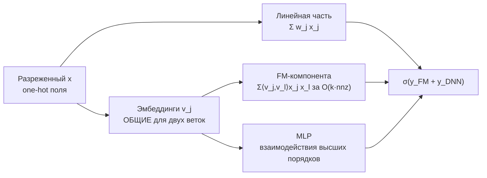

# Факторизационные машины и гибриды

> **Зачем эта глава.** Матричная факторизация умеет работать только с парой «пользователь–айтем».
> Как только появляются контекст, контентные признаки и холодные айтемы, нужна модель, которая
> факторизует взаимодействия **любых** признаков. После главы вы сможете вывести свёртку
> квадратичного члена факторизационной машины до линейной сложности, объяснить, почему FM
> справляется с разреженностью там, где полиномиальная регрессия бессильна, и аргументированно
> ответить, где FM до сих пор обыгрывают нейросети.

**Уровень:** 🎯 middle → 🧠 middle+
**Предварительно нужно:** [коллаборативная фильтрация](03-collaborative-filtering.md), [неявная обратная связь](04-implicit-feedback.md), [линейные модели](../02-classic-ml/02-linear-models.md), [работа с признаками](../02-classic-ml/14-feature-engineering.md)
**Время на проработку:** ~4.5 часа (чтение + вывод свёртки руками + реализация FM)

---

## Карта главы

- [1. Стена, в которую упирается матричная факторизация](#1-стена-в-которую-упирается-матричная-факторизация)
- [2. Почему полиномиальная регрессия не работает на разреженных данных](#2-почему-полиномиальная-регрессия-не-работает-на-разреженных-данных)
- [3. Факторизационные машины](#3-факторизационные-машины) — модель и связь с MF
- [4. Свёртка квадратичного члена](#4-свёртка-квадратичного-члена) — главный вывод главы
- [5. FFM: разные поля требуют разной геометрии](#5-ffm-разные-поля-требуют-разной-геометрии)
- [6. Wide & Deep и DeepFM](#6-wide--deep-и-deepfm)
- [7. Контентные признаки, гибриды и LightFM](#7-контентные-признаки-гибриды-и-lightfm)
- [8. Где FM всё ещё сильнее нейросетей](#8-где-fm-всё-ещё-сильнее-нейросетей)
- [9. Подводные камни](#9-подводные-камни)
- [10. Проверь себя](#10-проверь-себя)
- [11. Практика](#11-практика)
- [12. Что читать дальше](#12-что-читать-дальше)

---

## 1. Стена, в которую упирается матричная факторизация

В предыдущих главах модель имела ровно один вид: $\hat r_{ui} = p_u^\top q_i$ плюс смещения.
Вся информация о мире умещалась в два идентификатора. Теперь посмотрите, что реально доступно
в момент, когда надо выдать рекомендацию:

- про пользователя: город, устройство, возраст аккаунта, сегмент, история за сессию;
- про айтем: категория, бренд, цена, дата появления, теги, эмбеддинг картинки или описания;
- про контекст: время суток, день недели, тип экрана, откуда пришёл, что было в предыдущем клике.

Матричная факторизация не может использовать ничего из этого. Более того, у неё есть жёсткое
ограничение: **айтем без истории не имеет вектора вообще**. В сервисе, где каждый день
появляются десятки тысяч новых объявлений или товаров, это не мелкая проблема, а половина
каталога.

Хочется модель, которая принимает обычный вектор признаков $x \in \mathbb{R}^d$ — как линейная
регрессия — но при этом умеет то, ради чего мы вообще занимались факторизацией: моделировать
**взаимодействия** между признаками через низкоразмерные векторы. Именно это делают
факторизационные машины (factorization machines, FM), предложенные Штеффеном Рендлом в 2010 году.

Обозначения этой главы: $x \in \mathbb{R}^d$ — вектор признаков одного объекта, $d$ — число
признаков (после one-hot-кодирования это миллионы), $x_j$ — $j$-я координата, $n$ — число
объектов обучающей выборки, $k$ — размерность латентного пространства, $y$ — таргет
(клик, покупка, оценка).

> 🌱 **База.** Устройство вектора $x$ для рекомендаций почти всегда одинаковое: это конкатенация
> one-hot-блоков. Первый блок — индикатор пользователя (одна единица среди миллионов нулей),
> второй — индикатор айтема, дальше блоки категорий, города, времени суток и так далее. Такой
> вектор колоссально длинный ($d \sim 10^7$) и почти пустой: ненулевых координат обычно 20–100.
> Все алгоритмы главы устроены так, чтобы стоимость зависела от числа ненулей, а не от $d$.

---

## 2. Почему полиномиальная регрессия не работает на разреженных данных

Естественный первый ход — добавить в линейную модель все попарные произведения:

$$
\hat y_{\text{poly2}}(x) \;=\; w_0 \;+\; \sum_{j=1}^{d} w_j x_j \;+\; \sum_{j=1}^{d}\sum_{l=j+1}^{d} w_{jl}\, x_j x_l
$$

где $w_0 \in \mathbb{R}$ — свободный член, $w \in \mathbb{R}^d$ — веса линейной части,
$w_{jl} \in \mathbb{R}$ — вес пары признаков $(j, l)$.

Две беды, и вторая смертельна.

**Беда первая — число параметров.** Их $d(d-1)/2$. При $d = 10^6$ это $5 \cdot 10^{11}$ весов.
Не влезет никуда.

**Беда вторая — и вот она принципиальная.** Посмотрите на градиент по $w_{jl}$:

$$
\frac{\partial \hat y}{\partial w_{jl}} \;=\; x_j x_l
$$

Он отличен от нуля, **только если оба признака ненулевые одновременно**. Возьмём наш вектор:
$x_j$ — индикатор пользователя Алиса, $x_l$ — индикатор фильма «Терминатор». Тогда $w_{jl}$
обучается исключительно на тех строках, где Алиса взаимодействовала с «Терминатором».
А таких строк в разреженных данных ноль или одна.

То есть параметр, отвечающий за конкретную пару, оценивается по нулю наблюдений — и остаётся
на значении инициализации. А значит, полиномиальная модель ничего не может сказать ни про одну
пару, которой не было в обучении. Но именно такие пары и составляют задачу рекомендаций:
мы предсказываем для тех сочетаний, которых **не** видели.

> ⚠️ **Типичная ошибка.** Считать, что проблема polynomial regression — в количестве параметров,
> и пытаться решить её хешированием или отбором признаков. Количество — вторично. Первично то,
> что параметры пар **статистически независимы**: между $w_{\text{Алиса,Терминатор}}$ и
> $w_{\text{Алиса,Чужой}}$ нет никакой связи, поэтому опыт с одним фильмом не переносится на
> другой. Любое решение, сохраняющее независимые веса пар, эту проблему не лечит.

---

## 3. Факторизационные машины

Идея FM: не хранить вес каждой пары, а **факторизовать** матрицу весов пар. Каждому признаку
$j$ сопоставим вектор $v_j \in \mathbb{R}^k$, а вес пары получим как скалярное произведение:

$$
w_{jl} \;\approx\; \langle v_j, v_l \rangle \;=\; \sum_{f=1}^{k} v_{jf}\, v_{lf}
$$

Модель целиком:

$$
\hat y_{\text{FM}}(x) \;=\; w_0 \;+\; \sum_{j=1}^{d} w_j x_j \;+\; \sum_{j=1}^{d}\sum_{l=j+1}^{d} \langle v_j, v_l\rangle\, x_j x_l
$$

где $V \in \mathbb{R}^{d \times k}$ — матрица латентных векторов признаков (строка $j$ — это
$v_j$), $v_{jf}$ — $f$-я координата вектора признака $j$, остальное как в разделе 2.

Число параметров: $1 + d + dk$ вместо $1 + d + d(d-1)/2$. При $d = 10^6$ и $k = 16$ это
$1.7 \cdot 10^7$ вместо $5 \cdot 10^{11}$ — в тридцать тысяч раз меньше.

### Почему это чинит главную беду

Посмотрите теперь на градиент по $v_{jf}$ (полная формула — в следующем разделе):
он отличен от нуля всегда, когда $x_j \ne 0$, **независимо от того, какой признак стоит
партнёром**. Вектор Алисы обучается на всех её взаимодействиях; вектор «Терминатора» — на всех
пользователях, которые его смотрели. И тогда $\langle v_{\text{Алиса}}, v_{\text{Терминатор}}\rangle$
даёт осмысленную оценку **для пары, которой в данных не было ни разу**.

Это и есть переиспользование информации между взаимодействиями. Низкоранговое ограничение
$w_{jl} = \langle v_j, v_l\rangle$ работает как регуляризатор с содержательным смыслом:
оно заставляет модель объяснять все пары через общее $k$-мерное пространство, и потому
знание про одни пары переносится на другие.

> 💬 **На собеседовании.** Спросят: «Чем FM лучше полиномиальной регрессии второй степени?»
> Хороший ответ — не про число параметров, а про статистику. В poly2 вес $w_{jl}$ получает
> градиент, только когда оба признака одновременно ненулевые; в разреженных данных
> (one-hot пользователя × one-hot айтема) это означает «пара встретилась в обучении», а
> подавляющее большинство пар не встречалось ни разу, поэтому их веса просто не обучаются.
> В FM параметром является вектор **признака**, а не пары: $v_j$ обновляется на каждом примере,
> где $x_j \ne 0$, с любым партнёром. Поэтому FM способна оценить взаимодействие для невиданной
> пары. Число параметров ($dk$ против $d^2/2$) — приятное следствие, а не суть.
> Плохой ответ: «FM экономит память».

### FM обобщает матричную факторизацию

Проверим это явно. Пусть $x$ — конкатенация двух one-hot-блоков: индикатор пользователя $u$
и индикатор айтема $i$. Тогда в $x$ ровно две единицы.

Линейная часть даёт $w_0 + w_u + w_i$ — это в точности $\mu + b_u + b_i$ из
[главы про CF](03-collaborative-filtering.md).

Квадратичная часть: пары ненулевых признаков — только одна, $(u, i)$, потому что внутри
one-hot-блока ненулевая координата единственна. Получаем $\langle v_u, v_i\rangle$.

Итого:

$$
\hat y_{\text{FM}}(x) \;=\; w_0 + w_u + w_i + \langle v_u, v_i \rangle
$$

— буквально матричная факторизация со смещениями. Добавьте в $x$ третий блок «время суток» —
и модель автоматически получит взаимодействия «пользователь × время» и «айтем × время».
Добавьте блок «предыдущий просмотренный айтем» — получите модель с учётом последовательности.

Именно поэтому FM называют обобщением: подбирая структуру $x$, из неё получают MF, SVD++,
факторизацию с контекстом и ещё десяток моделей, каждая из которых в своё время публиковалась
отдельной статьёй.

---

## 4. Свёртка квадратичного члена

Формула FM выглядит дорого: двойная сумма по $d$ признакам — это $O(d^2 k)$ операций. При
$d = 10^6$ невозможно. Но она сворачивается до линейной, и этот вывод — самое частое
математическое задание по теме на собеседовании. Разберём его целиком, без пропусков.

**Шаг 1. От суммы по парам $j < l$ к полной двойной сумме.**

Полная двойная сумма $\sum_{j}\sum_{l}$ считает каждую неупорядоченную пару $\{j, l\}$ с
$j \ne l$ **дважды** (как $(j,l)$ и как $(l,j)$) и вдобавок включает диагональные члены $j = l$.
Значит:

$$
\sum_{j=1}^{d}\sum_{l=j+1}^{d} \langle v_j, v_l\rangle x_j x_l
\;=\;
\frac{1}{2}\left(\sum_{j=1}^{d}\sum_{l=1}^{d} \langle v_j, v_l\rangle x_j x_l \;-\; \sum_{j=1}^{d} \langle v_j, v_j\rangle x_j x_j\right)
$$

**Шаг 2. Раскроем скалярное произведение.**

$\langle v_j, v_l\rangle = \sum_{f=1}^{k} v_{jf} v_{lf}$. Подставим:

$$
= \frac{1}{2}\left(\sum_{j=1}^{d}\sum_{l=1}^{d}\sum_{f=1}^{k} v_{jf} v_{lf}\, x_j x_l \;-\; \sum_{j=1}^{d}\sum_{f=1}^{k} v_{jf}^2\, x_j^2\right)
$$

**Шаг 3. Вынесем сумму по $f$ наружу.**

Все три суммы конечны, порядок суммирования менять можно:

$$
= \frac{1}{2}\sum_{f=1}^{k}\left(\sum_{j=1}^{d}\sum_{l=1}^{d} v_{jf} x_j\, v_{lf} x_l \;-\; \sum_{j=1}^{d} v_{jf}^2 x_j^2\right)
$$

**Шаг 4. Двойная сумма разделяется на произведение.**

Ключевой момент: во внутренней двойной сумме множитель $v_{jf}x_j$ не зависит от $l$, а
$v_{lf}x_l$ не зависит от $j$. Значит, сумма произведений равна произведению сумм:

$$
\sum_{j=1}^{d}\sum_{l=1}^{d} v_{jf} x_j\, v_{lf} x_l
\;=\;
\left(\sum_{j=1}^{d} v_{jf} x_j\right)\left(\sum_{l=1}^{d} v_{lf} x_l\right)
\;=\;
\left(\sum_{j=1}^{d} v_{jf} x_j\right)^{2}
$$

**Результат.**

$$
\boxed{\;\sum_{j=1}^{d}\sum_{l=j+1}^{d} \langle v_j, v_l\rangle x_j x_l
\;=\;
\frac{1}{2}\sum_{f=1}^{k}\left[\left(\sum_{j=1}^{d} v_{jf} x_j\right)^{2} - \sum_{j=1}^{d} v_{jf}^2 x_j^2\right]\;}
$$

> 📐 **Разбор формулы.** Смотрите на структуру: для каждого измерения $f$ надо один раз пройти
> по признакам и накопить два числа — сумму $S_f = \sum_j v_{jf} x_j$ и сумму квадратов
> $\sum_j v_{jf}^2 x_j^2$. Дальше одно возведение в квадрат и вычитание. То есть весь
> квадратичный член считается за **два прохода по признакам** вместо перебора пар.
> Интуиция за формулой знакома по школьному тождеству
> $\sum_{j<l} a_j a_l = \frac{1}{2}\big[(\sum_j a_j)^2 - \sum_j a_j^2\big]$: «сумма попарных
> произведений = (квадрат суммы минус сумма квадратов) пополам». FM применяет его покоординатно
> в латентном пространстве.

**Сложность.** Прямой подсчёт — $O(k d)$. Но $x$ разрежен, а слагаемые с $x_j = 0$ ничего не
вносят, поэтому реально это

$$
O\big(k \cdot \operatorname{nnz}(x)\big)
$$

где $\operatorname{nnz}(x)$ — число ненулевых координат. При $k = 16$ и
$\operatorname{nnz}(x) = 50$ это 800 умножений-сложений на объект — доли микросекунды на CPU.
Ровно поэтому FM до сих пор живут в рекламных системах с бюджетом в единицы миллисекунд
на десятки тысяч кандидатов.

> 🧠 **Middle+.** В оригинальной статье Рендла эта сложность записана как $O(kn)$, потому что
> там $n$ обозначает число **признаков**. В нашей сквозной нотации число признаков — это $d$,
> а $n$ — число объектов, поэтому у нас $O(kd)$. Если на собеседовании услышите «FM работает
> за $O(kn)$» — это та же формула в нотации первоисточника, спорить не о чем.

### Градиенты

Из свёрнутой формы градиенты выписываются сразу. Обозначим $S_f = \sum_{l=1}^{d} v_{lf} x_l$ —
величину, которая уже посчитана на прямом проходе:

$$
\frac{\partial \hat y}{\partial w_0} = 1,
\qquad
\frac{\partial \hat y}{\partial w_j} = x_j,
\qquad
\frac{\partial \hat y}{\partial v_{jf}} = x_j\, S_f \;-\; v_{jf}\, x_j^2
$$

> 📐 **Разбор формулы.** Производная по $v_{jf}$ читается так: «вклад признака $j$ во
> взаимодействия по измерению $f$ — это его собственное значение, умноженное на суммарный
> сигнал всех признаков $S_f$, минус его же вклад в эту сумму (чтобы не взаимодействовать
> с самим собой)». Поскольку $S_f$ уже вычислена, **все** градиенты получаются за
> $O(k \cdot \operatorname{nnz}(x))$ — столько же, сколько прямой проход. Именно эта симметрия
> делает FM дешёвой в обучении.

### Реализация

```python
import numpy as np
from scipy import sparse


def fm_predict(X, w0, w, V):
    """Предсказание FM по свёрнутой формуле. X — плотная или scipy.sparse (n x d), V — (d x k)."""
    if sparse.issparse(X):
        Xw = np.asarray(X @ w).ravel()
        XV = np.asarray(X @ V)                       # (n, k) — это S_f для каждого объекта
        X2V2 = np.asarray(X.multiply(X) @ (V ** 2))  # (n, k)
    else:
        Xw = X @ w
        XV = X @ V
        X2V2 = (X ** 2) @ (V ** 2)
    interaction = 0.5 * (XV ** 2 - X2V2).sum(axis=1)
    return w0 + Xw + interaction


def fm_predict_naive(x, w0, w, V):
    """Прямой перебор пар — O(d² k). Нужен только чтобы проверить свёртку."""
    out = w0 + float(x @ w)
    d = len(x)
    for j in range(d):
        for l in range(j + 1, d):
            out += float(V[j] @ V[l]) * x[j] * x[l]
    return out


# Проверка: свёрнутая формула должна совпадать с перебором пар с точностью до float-погрешности
rng = np.random.default_rng(0)
d, k = 40, 8
w0 = 0.3
w = rng.normal(0, 0.5, d)
V = rng.normal(0, 0.2, (d, k))
x = rng.normal(0, 1.0, d) * (rng.random(d) < 0.3)    # разреженный вектор

fast = fm_predict(x[None, :], w0, w, V)[0]
slow = fm_predict_naive(x, w0, w, V)
print(f"свёртка: {fast:.10f}   перебор: {slow:.10f}   разница: {abs(fast - slow):.2e}")
# разница порядка 1e-13 — вывод верен
```

> ⌨️ **Руками.** Запустите эту проверку и увеличьте `d` до 400. Замерьте время обеих функций
> `time.perf_counter`. Отношение должно расти примерно как $d/2k$. Это упражнение на 10 минут,
> после которого вывод из раздела 4 запоминается навсегда.

Обучаемая версия на PyTorch — она же основа для DeepFM из раздела 6:

```python
import torch
import torch.nn as nn


class FM(nn.Module):
    """FM для разреженных категориальных признаков.

    Вход — индексы ненулевых признаков (n_fields на объект), а не разреженный вектор:
    для one-hot полей все x_j равны 1, поэтому суммы превращаются в суммы эмбеддингов.
    """

    def __init__(self, n_features: int, k: int = 16):
        super().__init__()
        self.linear = nn.Embedding(n_features, 1)     # w_j
        self.emb = nn.Embedding(n_features, k)        # v_j
        self.bias = nn.Parameter(torch.zeros(1))      # w_0
        nn.init.zeros_(self.linear.weight)
        nn.init.normal_(self.emb.weight, std=0.01)    # не нулями: иначе градиент по V нулевой

    def forward(self, idx: torch.LongTensor) -> torch.Tensor:
        """idx: (batch, n_fields) — индексы активных признаков (по одному на поле)."""
        linear = self.bias + self.linear(idx).sum(dim=1).squeeze(-1)

        v = self.emb(idx)                             # (batch, n_fields, k)
        sum_sq = v.sum(dim=1).pow(2)                  # (Σ_j v_jf)²
        sq_sum = v.pow(2).sum(dim=1)                  # Σ_j v_jf²
        interaction = 0.5 * (sum_sq - sq_sum).sum(dim=1)

        return linear + interaction                   # логит; сигмоида — внутри BCEWithLogitsLoss
```

Обратите внимание на приём с `nn.Embedding`: для one-hot-полей $x_j \in \{0, 1\}$, поэтому
$\sum_j v_{jf} x_j$ — это просто сумма эмбеддингов активных признаков. Никакого разреженного
вектора длины $10^7$ материализовывать не нужно; в память попадают только `n_fields`
эмбеддингов на объект. Так устроены все продовые реализации.

---

## 5. FFM: разные поля требуют разной геометрии

У FM есть неочевидное ограничение. Вектор $v_j$ **один** — он используется и когда признак
взаимодействует с айтемом, и когда с городом, и когда со временем суток.

Но это разные по природе взаимодействия. «Пользователь × айтем» — это вкус. «Пользователь ×
устройство» — это поведенческий паттерн. Требовать, чтобы одно и то же $k$-мерное представление
одинаково хорошо обслуживало оба, — сильное ограничение.

**Field-aware FM** (FFM, Juan et al., RecSys 2016) снимает его. Признаки группируются в **поля**
(field): все индикаторы пользователей — поле «user», все индикаторы товаров — поле «item»,
все города — поле «city». Обозначим $F(j)$ — поле признака $j$. Теперь у каждого признака
не один вектор, а по одному на каждое **чужое** поле:

$$
\hat y_{\text{FFM}}(x) \;=\; w_0 \;+\; \sum_{j=1}^{d} w_j x_j \;+\; \sum_{j=1}^{d}\sum_{l=j+1}^{d} \big\langle v_{j,\,F(l)},\; v_{l,\,F(j)} \big\rangle\, x_j x_l
$$

где $v_{j, F(l)} \in \mathbb{R}^k$ — вектор признака $j$, предназначенный для взаимодействия
с полем, к которому принадлежит $l$.

Что это стоит и что даёт:

| | FM | FFM |
|---|---|---|
| Параметров на признак | $k$ | $k \cdot F$ ($F$ — число полей) |
| Типичное $k$ | 16–128 | 4–10 |
| Сложность предсказания | $O(k \cdot \operatorname{nnz})$ | $O(k \cdot \operatorname{nnz}^2)$ |
| Свёртка квадратичного члена | есть | **нет** |
| Устойчивость | умеренно склонна к переобучению | переобучается очень быстро |

Отсутствие свёртки — принципиальный момент, и его любят спрашивать. Трюк из раздела 4 работал
потому, что $v_j$ был один и его можно было вынести в общую сумму $S_f$. В FFM вектор зависит
от партнёра, поэтому вынести нечего: приходится честно перебирать пары. При
$\operatorname{nnz} = 40$ это 1600 скалярных произведений на объект — терпимо для рекламы,
но в 40 раз дороже FM.

Практическая специфика FFM: он переобучается за 1–10 эпох, поэтому ранняя остановка обязательна,
и почти всегда используется сильная L2-регуляризация с малым $k$. Именно FFM выигрывал крупные
CTR-соревнования на данных Criteo и Avazu в 2014–2015 годах; в продакшене его применяют реже
из-за стоимости и капризности.

---

## 6. Wide & Deep и DeepFM

### 6.1 Wide & Deep

Работа Google (2016, для рекомендаций в Google Play) поставила вопрос иначе: не «какую модель
взаимодействий выбрать», а «как совместить два разных типа обобщения».

- **Wide-часть** — линейная модель по разреженным признакам и **вручную сконструированным
  кросс-произведениям**: например, признак «установлено=Netflix И показывается=Pandora».
  Она отвечает за **запоминание** (memorization): точное воспроизведение сочетаний, которые
  реально встречались в логах и реально работали.
- **Deep-часть** — эмбеддинги категорий, склеенные и поданные в MLP. Она отвечает за
  **обобщение** (generalization): близкие в эмбеддинг-пространстве сочетания получают близкие
  предсказания, в том числе те, которых в данных не было.

$$
P(y = 1 \mid x) \;=\; \sigma\Big(w_{\text{wide}}^\top\big[x,\; \phi(x)\big] \;+\; w_{\text{deep}}^\top a^{(L)} \;+\; b\Big)
$$

где $\phi(x)$ — вектор кросс-произведений (равно 1, если все входящие признаки активны),
$a^{(L)}$ — выход последнего слоя MLP, $w_{\text{wide}}$ и $w_{\text{deep}}$ — веса
соответствующих частей, $b$ — свободный член, $\sigma$ — сигмоида.

Две детали, о которых спрашивают.

**Это совместное обучение, а не ансамбль.** Обе части обучаются одним обратным проходом по
общей функции потерь. В ансамбле каждая модель училась бы независимо и должна была быть сильной
сама по себе; здесь части дополняют друг друга, и wide-часть может быть совсем маленькой
(в оригинале — только кросс-произведения установленных и показанных приложений).

**Разные оптимизаторы.** Wide-часть обучалась FTRL-Proximal с L1 (даёт разреженное решение
на миллионах кросс-признаков), deep-часть — AdaGrad. Это редкий, но осмысленный случай, когда
в одной модели два оптимизатора.

Главная боль: $\phi(x)$ пишется руками. Инженер должен догадаться, что именно скрестить, —
а число кандидатов квадратично.

> 💬 **На собеседовании.** Спросят: «Что даёт wide-часть, а что deep-часть в Wide & Deep?»
> Хороший ответ через компромисс «запоминание против обобщения». Wide запоминает конкретные
> частые сочетания и на них точна; она не обобщает на невиданное, но и не выдумывает.
> Deep обобщает через плотные эмбеддинги, покрывает редкие и невиданные сочетания, но при
> сильной разреженности склонна к **избыточному** обобщению — рекомендует правдоподобное,
> но неуместное, потому что сгладила пространство там, где реальная функция изрезана.
> Вместе они закрывают слабости друг друга, обучаясь совместно. Слабое место схемы —
> ручное конструирование кросс-признаков для wide-части; именно его убирает DeepFM,
> подставляя вместо wide-части FM-компоненту. Плохой ответ: «wide для линейных зависимостей,
> deep для нелинейных» — формально не то: wide-часть с кросс-произведениями как раз
> моделирует нелинейности, просто заданные вручную.

### 6.2 DeepFM

DeepFM (Guo et al., 2017) делает ровно один, но правильный ход: заменяет wide-часть на FM
и **делит эмбеддинги** между FM-компонентой и нейросетью.

$$
\hat y \;=\; \sigma\big(y_{\text{FM}} + y_{\text{DNN}}\big)
$$

где $y_{\text{FM}}$ — выход FM-компоненты (линейная часть плюс попарные взаимодействия по
формуле из раздела 4), $y_{\text{DNN}}$ — выход MLP над конкатенацией тех же эмбеддингов.

Что даёт разделение эмбеддингов: FM-компонента обучает векторы на явном сигнале второго порядка
(попарные взаимодействия), MLP — на сигнале высших порядков, и оба градиента текут в одну и ту
же таблицу эмбеддингов. Не нужны ни ручные кроссы, ни предобучение, ни отдельная настройка
двух моделей.



Дальнейшая эволюция — модели с **явными** кроссами высоких порядков: Deep & Cross Network (DCN)
добавляет слои вида $x_{l+1} = x_0 x_l^\top w_l + b_l + x_l$, где каждый слой поднимает порядок
взаимодействия на единицу. Смысл тот же: MLP теоретически может выучить произведения признаков,
но на практике делает это плохо, поэтому произведения задают архитектурно.

Честная оговорка про величину выигрыша. На публичных CTR-бенчмарках (Criteo, Avazu) разрыв
между хорошо настроенной FM и DeepFM/DCN обычно составляет 0.2–0.6 % AUC. В рекламной системе
с большим оборотом это заметные деньги; в продукте с миллионом показов в день это шум, который
потонет в вариативности A/B-теста. Вдобавок в литературе по CTR известна проблема
воспроизводимости: часть заявленных приростов исчезает при честной настройке бейзлайнов.

---

## 7. Контентные признаки, гибриды и LightFM

### 7.1 Таксономия гибридов

Слово «гибрид» в рекомендациях означает четыре разные вещи, и их полезно различать явно.

| Схема | Как устроена | Когда применяют |
|---|---|---|
| **На уровне признаков** | все сигналы (id, контент, контекст) идут в одну модель | FM, LightFM, нейросетевые ранкеры — основной современный вариант |
| **На уровне скоров** | несколько моделей считают скор, финальный — их взвешенная сумма | быстро внедряется, легко откатить; веса подбираются по онлайну |
| **Каскад** | контентная модель для холодных, CF для тёплых | простая логика, но резкий переход между режимами |
| **Двухстадийная** | контентная/CF-модель порождает признаки для ранкера | стандарт в проде: скор iALS и косинус контентных эмбеддингов — фичи для бустинга |

FM по своей конструкции — гибрид на уровне признаков: контентные признаки просто добавляются
блоками в $x$. Айтем, у которого нет истории, всё равно имеет представление — сумму векторов
своих категорий, бренда, тегов. Это и есть решение холодного старта средствами модели, а не
костылями.

### 7.2 LightFM

LightFM — практичная и очень популярная реализация этой идеи для неявной обратной связи.
Модель:

$$
p_u \;=\; \sum_{f \in F_u} e^{U}_f, \qquad q_i \;=\; \sum_{f \in F_i} e^{I}_f
$$

$$
\hat x_{ui} \;=\; p_u^\top q_i \;+\; \sum_{f \in F_u}\beta^{U}_f \;+\; \sum_{f \in F_i}\beta^{I}_f
$$

где $F_u$ — множество признаков пользователя $u$, $F_i$ — множество признаков айтема $i$,
$e^{U}_f, e^{I}_f \in \mathbb{R}^k$ — обучаемые эмбеддинги признаков, $\beta^U_f, \beta^I_f
\in \mathbb{R}$ — обучаемые смещения признаков.

> 📐 **Разбор формулы.** Вектор пользователя — не отдельный параметр, а **сумма векторов его
> признаков**. Если в качестве признака взять индикатор самого пользователя, получится ровно
> обычная MF: $p_u = e^U_{\text{id}=u}$. Если индикатор не добавлять, получится чисто контентная
> модель, работающая для абсолютно нового пользователя. Между этими крайностями — непрерывный
> спектр: чем больше содержательных признаков, тем лучше холодный старт и тем ниже потолок
> персонализации на тёплых данных. Обучается всё это функциями потерь из
> [предыдущей главы](04-implicit-feedback.md): BPR или WARP.

Точность формулировки, которая отличает понимание от использования: LightFM — **не** FM
в смысле Рендла. FM моделирует взаимодействия всех пар признаков, включая пары внутри одной
стороны («город пользователя × его возраст»). LightFM моделирует только взаимодействия
«сумма признаков пользователя × сумма признаков айтема» — то есть строго между сторонами.
Это ограничение делает модель дешевле и устойчивее, но выразительность ниже.

```python
import numpy as np
from scipy import sparse
from lightfm import LightFM
from lightfm.evaluation import precision_at_k

# interactions: (|U| x |I|) разреженная матрица взаимодействий
# item_features: (|I| x n_item_features) — например, [one-hot категории | one-hot бренда | id айтема]
model = LightFM(
    no_components=64,
    loss="warp",            # ранговая потеря: оптимизирует верхушку выдачи, см. главу 04
    learning_rate=0.05,
    item_alpha=1e-6,        # L2 на эмбеддинги признаков айтемов
    user_alpha=1e-6,
    random_state=0,
)
model.fit(train, item_features=item_features, epochs=30, num_threads=8)

# Ключевой эксперимент: качество на айтемах, которых НЕ БЫЛО в обучении.
# У них нет id-эмбеддинга, но есть эмбеддинги категории и бренда — значит, скор посчитается.
p10_warm = precision_at_k(model, test_warm, item_features=item_features,
                          train_interactions=train, k=10).mean()
p10_cold = precision_at_k(model, test_cold, item_features=item_features, k=10).mean()
print(f"precision@10  тёплые: {p10_warm:.4f}   холодные: {p10_cold:.4f}")
# Чистая MF на холодных айтемах дала бы ровно 0 — у них нет вектора.
```

> ⚠️ **Типичная ошибка.** Подать в `item_features` только контентные признаки, забыв
> индикатор самого айтема. Тогда два товара с одинаковой категорией и брендом становятся
> **неразличимыми**: у них тождественные векторы и одинаковый скор. Симптом — резкое падение
> качества на тёплых айтемах при отличном холодном старте. Правильно: конкатенировать
> `identity_matrix(|I|)` с матрицей контентных признаков, чтобы у айтема был и персональный
> вектор, и общие с похожими.

---

## 8. Где FM всё ещё сильнее нейросетей

Вопрос звучит на собеседованиях в форме «зачем вам FM, если есть DeepFM/трансформеры».
Ответ — через условия.

**1. Объём данных $10^5$–$10^7$ примеров.** Нейросетевой ранкер с миллионами параметров на
таком объёме переобучается или требует такой регуляризации, что теряет преимущество. FM —
билинейная модель с явным низкоранговым ограничением, она устойчива на малых данных
и почти не требует тюнинга архитектуры.

**2. Много категориальных признаков, мало числовых.** Это ровно та структура, под которую
FM спроектирована. MLP над эмбеддингами будет решать ту же задачу, но окольным путём:
эмпирически известно, что полносвязные слои плохо аппроксимируют произведения признаков.

**3. Жёсткий бюджет латентности и стоимости.** Инференс FM — $O(k \cdot \operatorname{nnz})$,
это сотни операций на кандидата, без GPU, с тривиальным батчингом. Нейросетевой ранкер
на тех же признаках стоит в 10–100 раз дороже. Когда надо отранжировать 1000 кандидатов
за 20 мс на CPU-инстансе, FM выигрывает не качеством, а тем, что вообще влезает в бюджет.

**4. Интерпретируемость.** Вклад каждой пары признаков — это конкретное число
$\langle v_j, v_l\rangle x_j x_l$, его можно вывести в лог и показать аналитику. У MLP такого
разложения нет (только приближённое, через SHAP и его допущения).

**5. Как компонент, а не как финальная модель.** Очень частый продовый паттерн: FM (или iALS)
даёт скор и/или эмбеддинги, которые идут **признаками** в бустинг второй стадии
(см. [обучение ранжированию](07-learning-to-rank.md)). Здесь FM не соревнуется с нейросетью,
а поставляет ей сигнал, который бустинг сам по себе выучить не может — потому что деревья
не умеют факторизовать категории высокой мощности.

**Где нейросети выигрывают уверенно:** объёмы от $10^8$ примеров; последовательный сигнал
(история как последовательность, а не как множество — см.
[последовательные рекомендации](09-sequential-recsys.md)); мультимодальный контент (картинки,
тексты); многозадачность (клик + покупка + время просмотра одной моделью —
[глава 08](08-neural-ranking.md)).

> 💬 **На собеседовании.** Спросят: «Почему бы просто не взять нейросеть вместо FM?»
> Хороший ответ: потому что выбор определяется объёмом данных, структурой признаков и бюджетом
> инференса, а не новизной метода. При $10^6$ примеров и трёх десятках категориальных полей
> FM даёт качество на уровне DeepFM при на порядок меньшей стоимости и без тюнинга архитектуры;
> разрыв на публичных CTR-бенчмарках между настроенной FM и глубокими моделями — доли процента
> AUC, что для многих продуктов ниже порога различимости в A/B. Нейросети окупаются, когда есть
> $10^8$+ примеров, последовательный или мультимодальный сигнал, либо когда нужна многозадачность.
> Сильное дополнение: упомянуть, что FM часто используется не как финальная модель, а как
> поставщик признаков для бустинга, и в этой роли её вообще нечем заменить.
> Плохой ответ: «FM устарели».

---

## 9. Подводные камни

**Числовые признаки поданы сырыми.**
Симптом: модель ведёт себя странно, качество прыгает от запуска к запуску, градиенты взрываются.
Причина: в FM признаки перемножаются ($x_j x_l$), и признак «цена = 45 000» доминирует над
бинарными индикаторами на пять порядков. Латентные векторы такого признака получают огромные
градиенты.
Что делать: числовые признаки биннить в категории (квантильные корзины) — это стандартная
практика в CTR-моделях; либо, если оставлять числовыми, обязательно масштабировать
и логарифмировать тяжёлые хвосты.

**Категории высокой мощности с 1–3 наблюдениями на значение.**
Симптом: переобучение, отличный трейн, никакой валидации; на новых данных много значений
признака, которых модель не видела.
Причина: у значения с тремя наблюдениями вектор $v_j \in \mathbb{R}^{16}$ подгоняется по трём
точкам — это чистый шум.
Что делать: отсекать редкие значения по частоте (порог 5–20 наблюдений), сливая их в общее
значение `__rare__`; уменьшать $k$; усиливать L2.

**Коллизии хеширования.**
Симптом: качество внезапно перестаёт расти с ростом данных; необъяснимые провалы в отдельных
сегментах.
Причина: hashing trick при слишком малом размере таблицы склеивает разные признаки в один
параметр. При $10^8$ уникальных значений и таблице на $2^{22}$ коллизии массовые.
Что делать: считать долю коллизий явно; увеличивать размер таблицы (память дешевле качества);
хешировать отдельно по полям, а не в общее пространство.

**Разъехались признаки между обучением и продом.**
Симптом: офлайн-метрики хорошие, онлайн — заметно хуже, и разрыв стабилен.
Причина: порядок one-hot-колонок, версии словарей, дефолты для пропусков в обучающем пайплайне
и в сервинге посчитаны разным кодом.
Что делать: одна библиотека преобразования признаков для обучения и инференса; тест, который
прогоняет один и тот же объект через оба пути и сравнивает векторы
(см. [feature store и train/serve skew](../07-mlops/03-data-and-feature-store.md)).

**FFM выкрутили как FM.**
Симптом: FFM переобучается на второй эпохе, качество ниже FM.
Причина: у FFM в $F$ раз больше параметров на признак, а $k$ оставили таким же, как в FM.
Что делать: $k$ для FFM брать 4–10, включать раннюю остановку по эпохам (типично 1–10),
усиливать L2.

**Эмбеддинги нового айтема стартуют с нуля.**
Симптом: новые товары не показываются даже при наличии контентных признаков.
Причина: в схеме, где у айтема есть личный вектор, при инициализации нулём или малым шумом
скор нового айтема близок к смещению и проигрывает всем тёплым.
Что делать: инициализировать личный вектор нового айтема средним по его категории; либо
использовать LightFM-подобную схему, где вектор — сумма признаков и личная компонента
появляется постепенно; либо резервировать слоты выдачи под эксплорацию
([глава 12](12-cold-start-and-bias.md)).

---

## 10. Проверь себя

<details>
<summary><b>🧠 Вопрос.</b> Выведите, как квадратичный член FM считается за линейное время.</summary>

**Короткий ответ.**
$\sum_{j<l}\langle v_j, v_l\rangle x_j x_l = \frac{1}{2}\sum_{f=1}^{k}\big[(\sum_j v_{jf}x_j)^2 - \sum_j v_{jf}^2 x_j^2\big]$,
что даёт $O(k \cdot \operatorname{nnz}(x))$ вместо $O(d^2 k)$.

**Развёрнуто.** Четыре шага. (1) Сумма по парам $j < l$ равна половине разности полной двойной
суммы и диагонали, потому что полная сумма учитывает каждую неупорядоченную пару дважды и
добавляет члены $j = l$. (2) Раскрываем $\langle v_j, v_l\rangle = \sum_f v_{jf}v_{lf}$.
(3) Меняем порядок суммирования, вынося $\sum_f$ наружу. (4) Внутри для фиксированного $f$
двойная сумма $\sum_j \sum_l (v_{jf}x_j)(v_{lf}x_l)$ распадается в произведение двух одинаковых
сумм, то есть в квадрат $S_f = \sum_j v_{jf}x_j$.
Практическое следствие: на прямом проходе достаточно накопить $S_f$ и $\sum_j v_{jf}^2 x_j^2$,
причём $S_f$ переиспользуется в градиенте
$\partial \hat y/\partial v_{jf} = x_j S_f - v_{jf}x_j^2$, поэтому и обучение стоит
$O(k \cdot \operatorname{nnz})$.

**Чего ждёт интервьюер:** живого вывода у доски, особенно шага «двойная сумма = произведение
сумм». Это тот вопрос, где заученный результат без вывода не засчитывается.

**Провал:** сказать «там квадрат суммы минус сумма квадратов» и не суметь объяснить, откуда
берётся множитель $1/2$ и вычитание диагонали.
</details>

<details>
<summary><b>🎯 Вопрос.</b> Чем FM принципиально лучше полиномиальной регрессии второй степени?</summary>

**Короткий ответ.** В poly2 вес пары обучается только на примерах, где оба признака ненулевые
одновременно; в разреженных данных таких примеров ноль или один. В FM параметром является вектор
признака, он обучается на всех примерах с этим признаком, поэтому взаимодействие оценивается
даже для пары, которой в данных не было.

**Развёрнуто.** Градиент по $w_{jl}$ равен $x_j x_l$ — он ненулевой лишь при совместной
активности. Для one-hot пользователя и айтема это означает «пара (пользователь, айтем)
встретилась в логе», а именно такие пары мы и хотим предсказывать в невиданном виде.
FM накладывает низкоранговое ограничение $w_{jl} = \langle v_j, v_l\rangle$: это одновременно
и сжатие ($dk$ параметров вместо $d^2/2$), и — что важнее — механизм переноса информации между
взаимодействиями. Вектор пользователя учится на всех его фильмах, вектор фильма — на всех его
зрителях, и их скалярное произведение осмысленно для новой пары.
Побочно: FM ещё и считается быстрее — за $O(k \cdot \operatorname{nnz})$ против
$O(\operatorname{nnz}^2)$ у poly2.

**Чего ждёт интервьюер:** чтобы главным аргументом была статистическая оценимость параметров,
а не экономия памяти.

**Провал:** «в FM меньше параметров, поэтому она меньше переобучается» — верно, но это следствие,
а не причина, и не объясняет способность предсказывать невиданные пары.
</details>

<details>
<summary><b>🎯 Вопрос.</b> Покажите, что матричная факторизация — частный случай FM.</summary>

**Короткий ответ.** Возьмите $x$ = конкатенация one-hot пользователя и one-hot айтема. Тогда
FM превращается в $w_0 + w_u + w_i + \langle v_u, v_i\rangle$ — MF со смещениями.

**Развёрнуто.** В таком $x$ ровно две ненулевые координаты. Линейная часть даёт $w_u + w_i$,
что вместе с $w_0$ есть в точности $\mu + b_u + b_i$. В квадратичной части ненулевой вклад
даёт только одна пара — $(u, i)$, потому что внутри one-hot-блока ненулевая координата
единственна, и произведения внутри блока равны нулю. Получаем $\langle v_u, v_i\rangle$.
Далее естественно продолжить: добавив блок «время суток», получаем факторизацию с контекстом;
добавив блок «множество ранее просмотренных айтемов» с нормировкой $1/\sqrt{|N(u)|}$ —
получаем SVD++. Именно поэтому Рендл описывал FM как общую модель, из которой специализированные
факторизационные модели выводятся выбором структуры признаков.

**Чего ждёт интервьюер:** способности связать главы между собой и понимания, что FM — это
язык описания моделей, а не ещё один алгоритм.

**Провал:** сказать «да, похоже», не показав, куда деваются остальные пары признаков.
</details>

<details>
<summary><b>🎯 Вопрос.</b> Что даёт wide-часть, а что deep-часть в Wide & Deep?</summary>

**Короткий ответ.** Wide запоминает конкретные частые сочетания признаков (memorization),
deep обобщает на редкие и невиданные через плотные эмбеддинги (generalization). Обучаются
совместно одной функцией потерь.

**Развёрнуто.** Wide — линейная модель по разреженным признакам и ручным кросс-произведениям;
она точна там, где данных много, и не выдумывает лишнего, но не покрывает невиданные сочетания.
Deep — MLP над эмбеддингами; он покрывает разреженные области, но при сильной разреженности
склонен к **избыточному** обобщению: сглаживает пространство там, где настоящая функция изрезана,
и рекомендует правдоподобное, но неуместное. Совместное обучение (а не ансамбль) позволяет
wide-части быть маленькой и чинить именно те случаи, где deep ошибается.
Инженерная деталь, которую редко помнят: в оригинале части обучались разными оптимизаторами —
wide через FTRL-Proximal с L1 (разреженное решение на миллионах кроссов), deep через AdaGrad.
Слабость схемы — ручное конструирование $\phi(x)$; её убирает DeepFM, ставя на место wide-части
FM-компоненту с общими с нейросетью эмбеддингами.

**Чего ждёт интервьюер:** пары «запоминание / обобщение» и понимания, что это совместное
обучение.

**Провал:** «wide для линейного, deep для нелинейного» — кросс-произведения в wide-части
как раз нелинейны.
</details>

<details>
<summary><b>🧠 Вопрос.</b> Почему в FFM нельзя применить тот же трюк со свёрткой, что в FM?</summary>

**Короткий ответ.** Потому что вектор признака в FFM зависит от поля партнёра, и его нельзя
вынести в общую сумму $S_f$ — суммировать по всем $j$ одну и ту же величину больше не получается.

**Развёрнуто.** Свёртка FM работала на том, что $v_j$ участвует в любой паре одним и тем же
вектором; поэтому $\sum_j\sum_l \langle v_j, v_l\rangle x_j x_l$ раскладывается в
$\sum_f (\sum_j v_{jf}x_j)^2$. В FFM слагаемое — $\langle v_{j,F(l)}, v_{l,F(j)}\rangle$, и оба
множителя зависят от партнёра; общей суммы, не зависящей от $l$, не существует. Следствие:
сложность $O(k \cdot \operatorname{nnz}^2)$ вместо $O(k \cdot \operatorname{nnz})$ — при 40
активных полях это в 40 раз дороже. Отсюда практика: в FFM берут маленькое $k$ (4–10) и
компенсируют его тем, что векторов на признак теперь $F$ штук. Ещё FFM резко переобучается,
обучение занимает единицы эпох и требует ранней остановки.

**Чего ждёт интервьюер:** понимания, что свёртка — это не оптимизация реализации, а следствие
конкретной алгебраической структуры модели.

**Провал:** «в FFM тоже можно, просто никто не реализовал».
</details>

<details>
<summary><b>🎯 Вопрос.</b> Как FM решает холодный старт айтема?</summary>

**Короткий ответ.** Айтем в FM представлен не только личным индикатором, но и блоками
контентных признаков — категория, бренд, теги. Их векторы обучены на других айтемах, поэтому
у нового объекта есть осмысленное представление с нулевого дня.

**Развёрнуто.** В чистой MF вектор $q_i$ обучается только по взаимодействиям айтема $i$;
без них он остаётся на инициализации, и айтем невозможно отранжировать. В FM вклад айтема —
это сумма взаимодействий всех его активных признаков с признаками пользователя. У нового
кроссовка бренда X в категории «обувь» векторы `бренд=X` и `категория=обувь` уже обучены
на сотнях других товаров, и скалярные произведения с векторами пользователя дадут разумный
скор. По мере накопления взаимодействий личный вектор айтема набирает силу и начинает
отличать его от «среднего товара бренда X».
Важные оговорки. (1) Индикатор самого айтема обязательно нужно оставлять в признаках, иначе
товары с одинаковыми атрибутами станут неразличимыми. (2) Модель всё равно не покажет холодный
айтем, если ранжирование по скору проигрывает тёплым, — нужна явная эксплорация. (3) Тот же
механизм работает и для холодного пользователя, если у него есть признаки (регион, устройство,
источник трафика).

**Чего ждёт интервьюер:** понимания механизма (представление как сумма признаков), а не просто
«FM умеет контент».

**Провал:** «FM использует контентные признаки, поэтому холодного старта нет» — холодный старт
остаётся, просто из «нечем ранжировать» превращается в «ранжируем грубо».
</details>

<details>
<summary><b>🎯 Вопрос.</b> В каких случаях вы возьмёте FM, а не нейросетевую модель?</summary>

**Короткий ответ.** Малые и средние данные ($10^5$–$10^7$), преобладание категориальных
признаков, жёсткий бюджет латентности на CPU, потребность в интерпретируемости, а также
роль поставщика признаков для бустинга.

**Развёрнуто.** Аргументы по убыванию веса. (1) Данные: билинейная модель с низкоранговым
ограничением устойчива там, где MLP с миллионами весов переобучается. (2) Стоимость: инференс
FM — сотни операций на кандидата, без GPU; нейросетевой ранкер на порядок-два дороже, и при
бюджете «1000 кандидатов за 20 мс на CPU» это решающий фактор. (3) Разрыв в качестве:
на публичных CTR-бенчмарках между настроенной FM и DeepFM/DCN обычно 0.2–0.6 % AUC — в рекламе
это деньги, в среднем продукте ниже порога различимости в A/B. (4) Интерпретируемость: вклад
каждой пары признаков — конкретное число. (5) Композиция: скор FM и её эмбеддинги как признаки
для бустинга второй стадии — очень частый и очень эффективный продовый паттерн.
Обратная сторона честности: нейросети выигрывают уверенно при $10^8$+ примеров, при
последовательном сигнале, при мультимодальном контенте и при многозадачности.

**Чего ждёт интервьюер:** выбора по условиям и знания порядка величины разрыва в качестве.

**Провал:** «FM устарели, сейчас все используют трансформеры».
</details>

<details>
<summary><b>🧠 Вопрос.</b> Чем LightFM отличается от FM Рендла?</summary>

**Короткий ответ.** LightFM моделирует взаимодействие только между суммой признаков пользователя
и суммой признаков айтема; FM моделирует взаимодействия всех пар признаков, включая пары внутри
одной стороны.

**Развёрнуто.** В LightFM $p_u = \sum_{f \in F_u} e^U_f$, $q_i = \sum_{f \in F_i} e^I_f$,
и скор равен $p_u^\top q_i$ плюс сумма смещений признаков. Раскрыв скалярное произведение сумм,
получаем $\sum_{f \in F_u}\sum_{g \in F_i} \langle e^U_f, e^I_g\rangle$ — то есть все
кросс-стороннние пары, но ни одной пары «признак пользователя × другой признак пользователя».
В FM таких ограничений нет. Практические следствия: LightFM дешевле, устойчивее и проще в
настройке, но не может выразить, скажем, взаимодействие «возраст × город» пользователя.
Второе отличие — функции потерь: LightFM изначально заточен под неявную обратную связь и
предлагает BPR/WARP, тогда как FM в libFM обучается под регрессию или классификацию.
Общее у них главное: и то и другое — гибрид на уровне признаков, решающий холодный старт
через представление объекта как суммы векторов его атрибутов.

**Чего ждёт интервьюер:** точности в различении похоже названных моделей — сигнал, что вы
читали, а не только запускали.

**Провал:** «LightFM — это реализация FM».
</details>

<details>
<summary><b>🎯 Вопрос.</b> Как готовить числовые признаки для FM?</summary>

**Короткий ответ.** Обычно их биннят в категории (квантильные корзины) и подают как one-hot.
Если оставлять числовыми — обязательно масштабировать, потому что в квадратичном члене
признаки перемножаются.

**Развёрнуто.** В FM квадратичный вклад равен $\langle v_j, v_l\rangle x_j x_l$: величина
признака входит множителем. Признак «цена = 45 000» рядом с бинарными индикаторами даёт
произведения на пять порядков больше, его латентный вектор получает огромные градиенты и
доминирует над всем остальным. Варианты решения: (1) квантильное биннирование в 20–100
корзин с последующим one-hot — стандарт в CTR-моделях, заодно ловит нелинейности;
(2) масштабирование в $[0, 1]$ плюс логарифмирование тяжёлых хвостов; (3) подать признак
и как число, и как бины — модель сама решит, что использовать.
Дополнительная деталь: для бинарных признаков $x_j^2 = x_j$, поэтому вычитаемое в свёрнутой
формуле упрощается — это объясняет, почему все продовые реализации работают с индексами
активных признаков, а не с векторами.

**Чего ждёт интервьюер:** понимания, что мультипликативная структура модели диктует требования
к масштабу признаков (в отличие от деревьев, которым масштаб безразличен).

**Провал:** «FM, как и деревьям, масштаб не важен».
</details>

---

## 11. Практика

**Задача 1. Вывод и проверка (40 минут).**
Выведите свёртку квадратичного члена на бумаге, не подглядывая, затем запустите проверку из
раздела 4 при $d \in \{20, 100, 400\}$ и замерьте время обеих реализаций.
*Критерий: разница предсказаний порядка $10^{-13}$, а отношение времён растёт линейно по $d$.
Вы можете объяснить, почему множитель $1/2$ и почему вычитается сумма квадратов.*

**Задача 2. FM с нуля (2 часа).**
Обучите `FM` из раздела 4 на любом CTR-подобном датасете (подойдут Criteo/Avazu-сэмплы или
синтетика с 20 категориальными полями). Сравните с логистической регрессией на тех же one-hot
признаках и с логистической регрессией плюс 10 ручных кросс-признаков.
*Критерий: FM обыгрывает чистую логрегрессию по ROC-AUC; вы можете назвать, какие ручные кроссы
приблизили логрегрессию к FM, и объяснить, почему FM нашла их «сама».*

**Задача 3. Влияние $k$ и частотного порога (1 час).**
На тех же данных переберите $k \in \{4, 8, 16, 32, 64\}$ и порог отсечения редких значений
категорий $\in \{1, 5, 20\}$. Постройте тепловую карту валидационного AUC.
*Критерий: вы видите, что при низком пороге большие $k$ переобучаются, и можете объяснить это
через число наблюдений на параметр.*

**Задача 4. Холодный старт с LightFM (1.5 часа).**
Разделите айтемы на «тёплые» и «холодные» (последние появились после даты сплита). Обучите три
модели: только id-признаки (эквивалент MF), только контентные признаки, id + контент. Померьте
precision@10 отдельно на тёплых и на холодных.
*Критерий: у вас есть таблица 3 × 2, где чистая MF даёт ноль на холодных, чистый контент
проигрывает на тёплых, а комбинация выигрывает в обоих столбцах или близка к лучшей.
Вы можете объяснить каждую клетку.*

**Задача 5. FM как поставщик признаков (1.5 часа).**
Обучите FM, затем добавьте её скор и косинус между $p_u$ и $q_i$ как два признака в
градиентный бустинг вместе с обычными табличными признаками. Сравните бустинг без этих
признаков и с ними.
*Критерий: прирост метрики есть и заметен; вы можете объяснить, почему бустинг не может
выучить этот сигнал сам (деревья не факторизуют категории высокой мощности).*

---

## 12. Что читать дальше

- **Rendle S. «Factorization Machines», ICDM 2010** — первоисточник. Раздел с выводом свёртки
  квадратичного члена — ровно то, что разобрано в §4; там же показано, как MF, SVD++ и
  ещё несколько моделей получаются выбором структуры признаков.
- **Rendle S. «Factorization Machines with libFM», ACM TIST, 2012** — практическая версия
  той же работы: обучение через SGD, ALS и MCMC, разбор гиперпараметров. Полезна, если будете
  реализовывать FM сами.
- **Juan Y. et al. «Field-aware Factorization Machines for CTR Prediction», RecSys 2016** —
  FFM и опыт победы в CTR-соревнованиях. Ценно разделом про регуляризацию и раннюю остановку:
  там честно написано, насколько модель капризна.
- [Cheng H.-T. et al. «Wide & Deep Learning for Recommender Systems» (2016)](https://arxiv.org/abs/1606.07792) —
  первоисточник пары «memorization / generalization». Читать ради постановки вопроса и
  инженерных деталей (два оптимизатора, размеры эмбеддингов, конвейер обучения в Google Play).
- [Guo H. et al. «DeepFM: A Factorization-Machine based Neural Network for CTR Prediction» (2017)](https://arxiv.org/abs/1703.04247) —
  как убрать ручные кроссы, разделив эмбеддинги между FM и MLP. Короткая и понятная.
- [Wang R. et al. «Deep & Cross Network for Ad Click Predictions» (2017)](https://arxiv.org/abs/1708.05123) —
  явные взаимодействия высоких порядков через cross-слои; полезно как продолжение линии
  «не надейся, что MLP выучит произведения».
- [Naumov M. et al. «Deep Learning Recommendation Model for Personalization and Recommendation Systems» (2019)](https://arxiv.org/abs/1906.00091) —
  DLRM от Meta: как та же идея (эмбеддинги категорий + явные попарные взаимодействия + MLP)
  выглядит в промышленном масштабе, включая обсуждение памяти под таблицы эмбеддингов.
- [Kula M. «Metadata Embeddings for User and Item Cold-start Recommendations» (2015)](https://arxiv.org/abs/1507.08439)
  и [документация LightFM](https://making.lyst.com/lightfm/docs/home.html) — модель из §7
  и её реализация; в документации есть готовый пример эксперимента на холодный старт.

---

⬅️ [Неявная обратная связь](04-implicit-feedback.md) | 🏠 [Оглавление](../index.md) | ➡️ [Двухбашенные модели и ANN-поиск](06-two-tower-and-ann.md)
