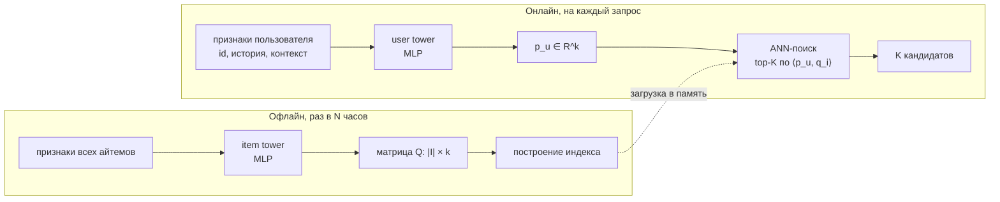
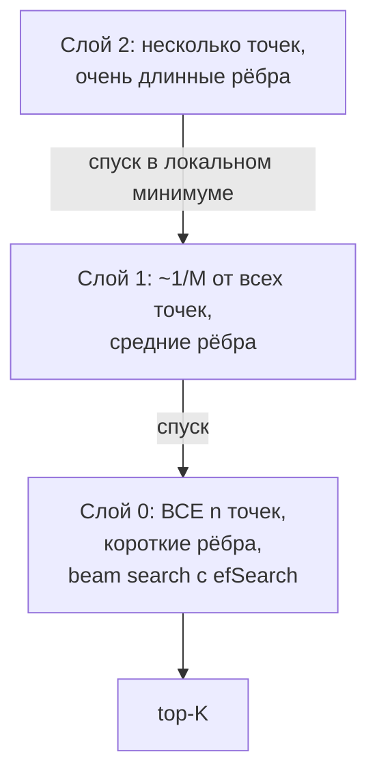

# Двухбашенные модели и ANN-поиск

> **Зачем эта глава.** Отбор кандидатов — единственная стадия рекомендаций, где приходится
> за десяток миллисекунд заглянуть в весь каталог. Двухбашенная модель и приближённый поиск
> ближайших соседей — стандартный ответ индустрии на эту задачу. После главы вы сможете вывести
> logQ-коррекцию, а не процитировать её; объяснить, почему башни обязаны быть независимыми;
> и выбрать между HNSW и IVF-PQ, оперируя памятью, recall и временем построения, а не словом «FAISS».

**Уровень:** 🎯 middle → 🧠 middle+
**Предварительно нужно:** [постановка задачи рекомендаций](01-recsys-foundations.md), [офлайн-метрики](02-metrics-offline.md), [неявная обратная связь](04-implicit-feedback.md), [факторизационные машины](05-factorization-machines.md), [PyTorch на практике](../03-deep-learning/05-pytorch-in-practice.md)
**Как проработать:** чтение + вывод logQ + сборка индекса и замеры

---

## Карта главы

- [1. Арифметика, из которой вырастает вся конструкция](#1-арифметика-из-которой-вырастает-вся-конструкция) — почему полный скоринг невозможен
- [2. Архитектура двух башен](#2-архитектура-двух-башен) — формализация и главное ограничение
- [3. Почему разделение обязательно](#3-почему-разделение-обязательно) — офлайн-айтемы, онлайн-пользователь
- [4. Обучение: от полного софтмакса к in-batch негативам](#4-обучение-от-полного-софтмакса-к-in-batch-негативам)
- [5. logQ-коррекция: вывод](#5-logq-коррекция-вывод) — сердце главы
- [6. Температура и нормировка](#6-температура-и-нормировка)
- [7. Собираем модель на torch](#7-собираем-модель-на-torch)
- [8. Задача ANN-поиска](#8-задача-ann-поиска) — что мы разменяли и на что
- [9. HNSW](#9-hnsw) — многослойный граф, M, efConstruction, efSearch
- [10. IVF и product quantization](#10-ivf-и-product-quantization)
- [11. Что выбирать](#11-что-выбирать) — таблица решений и FAISS
- [12. Индекс в продакшене](#12-индекс-в-продакшене) — обновление, версии, шардирование
- [13. Фильтрация при ANN-поиске](#13-фильтрация-при-ann-поиске) — почему это тяжело
- [14. Компромиссы и границы](#14-компромиссы-и-границы)
- [15. Подводные камни](#15-подводные-камни)
- [16. Проверь себя](#16-проверь-себя)
- [17. Практика](#17-практика)
- [18. Что читать дальше](#18-что-читать-дальше)

---

## 1. Арифметика, из которой вырастает вся конструкция

Начнём с чисел, потому что вся архитектура выводится из них, а не из моды.

Пользователь открыл главную страницу маркетплейса. Каталог — $10^8$ SKU (порядок Ozon или
Wildberries). Бюджет на весь ответ — 200 мс от прихода запроса до отдачи HTML, и это уже щедро:
в ленте коротких видео целятся в 100 мс. Из этих 200 мс сеть, сериализация, сбор фич и рендер
съедают больше половины; на ML остаётся 50–80 мс.

Теперь допустим, что у нас есть отличная ранжирующая модель — градиентный бустинг на 300 деревьев
или нейросеть с вниманием к истории. Пусть она скорит один айтем за 20 микросекунд (оптимистично
для бустинга с сотней признаков). Скоринг всего каталога:

$$
10^8 \cdot 20\ \text{мкс} \;=\; 2000\ \text{с} \;\approx\; 33\ \text{минуты}
$$

на один запрос. Даже на 1000 ядер это 2 секунды. Это не «медленно» — это на четыре порядка мимо.

Отсюда многостадийная воронка, которую мы ввели в [первой главе раздела](01-recsys-foundations.md):
кто-то должен за единицы миллисекунд сузить $10^8$ до $10^2$–$10^3$, и только потом включается
тяжёлая модель. Этого «кого-то» называют **отбором кандидатов** (candidate generation, retrieval).

| Стадия | Вход | Выход | Бюджет | Модель |
|---|---|---|---|---|
| Отбор кандидатов | $10^7$–$10^8$ | $10^2$–$10^3$ на канал | 10–20 мс | простая, факторизуемая |
| Грубое ранжирование | $10^3$–$10^4$ | $10^2$–$10^3$ | 5–15 мс | лёгкая нейросеть/линейная |
| Точное ранжирование | $10^2$–$10^3$ | тот же список со скорами | 20–40 мс | GBDT или тяжёлая нейросеть |
| Реранкинг и правила | $10^2$ | $10^1$ | 5–10 мс | эвристики, MMR, фильтры |

> 🌱 **База.** Воронка — это не «архитектурная красота», а прямое следствие того, что стоимость
> скоринга линейна по числу кандидатов, а бюджет фиксирован. Чем ближе к пользователю, тем меньше
> кандидатов и тем дороже разрешено считать каждого.

Требование к модели отбора формулируется жёстко: она должна уметь находить top-$K$ по каталогу
**не перебирая каталог**. Единственная широко работающая конструкция, которая это позволяет, —
представить релевантность как **функцию расстояния между двумя векторами**. Тогда поиск top-$K$
превращается в геометрическую задачу, для которой есть сублинейные алгоритмы.

Из этого требования и рождается двухбашенная модель.

---

## 2. Архитектура двух башен

**Двухбашенная модель** (two-tower model, она же DSSM — deep structured semantic model, по названию
работы Microsoft 2013 года о семантическом поиске) состоит из двух независимых нейросетей:

$$
\mathbf{p}_u \;=\; f_\theta(x_u), \qquad \mathbf{q}_i \;=\; g_\phi(x_i), \qquad
s(u, i) \;=\; \langle \mathbf{p}_u, \mathbf{q}_i \rangle
$$

где $u$ — пользователь (или, шире, контекст запроса), $i$ — айтем, $x_u$ — вектор признаков
пользователя, $x_i$ — вектор признаков айтема, $f_\theta$ — **пользовательская башня** (user tower)
с параметрами $\theta$, $g_\phi$ — **айтемная башня** (item tower) с параметрами $\phi$,
$\mathbf{p}_u, \mathbf{q}_i \in \mathbb{R}^k$ — латентные векторы, $k$ — размерность латентного
пространства, $s(u,i)$ — скор релевантности, $\langle\cdot,\cdot\rangle$ — скалярное произведение.

> 📐 **Разбор формулы.** Три вещи, которые надо увидеть сразу.
> Первое: $\mathbf{p}_u$ зависит **только** от $x_u$, $\mathbf{q}_i$ — **только** от $x_i$.
> Ни одна из башен не видит другую сторону.
> Второе: всё взаимодействие между пользователем и айтемом сжато в одно число — скалярное
> произведение. Это чудовищно бедная форма взаимодействия по сравнению с тем, что умеет
> ранжирующая модель, и это осознанная жертва.
> Третье: обозначения $\mathbf{p}_u$ и $\mathbf{q}_i$ те же, что в [матричной
> факторизации](03-collaborative-filtering.md), и это не совпадение. Two-tower — прямое обобщение
> MF: если башни сделать таблицами эмбеддингов по id, получится ровно MF.

Что кладут в башни:

**Пользовательская башня** — id пользователя (эмбеддинг), агрегаты истории (усреднённые или
attention-взвешенные эмбеддинги последних 50–200 взаимодействий), демография, контекст
(время суток, устройство, платформа, страна), краткосрочные счётчики за сессию.

**Айтемная башня** — id айтема, категория, бренд, продавец, цена в бакетах, текстовые эмбеддинги
названия и описания, эмбеддинг картинки, возраст айтема, агрегированные счётчики популярности.

Типичные размеры: $k = 64$–$256$. Меньше 32 — не хватает ёмкости для каталога в миллионы;
больше 512 — растёт и память индекса, и латентность поиска, а качество выходит на плато.
Многие векторные хранилища накладывают собственные ограничения (например, 256 или 1024),
и это иногда определяет выбор за вас.



---

## 3. Почему разделение обязательно

Здесь — главный вопрос главы, и на собеседовании он звучит буквально так: «почему двухбашенная
модель позволяет быстро отбирать кандидатов?»

Ответ в том, что **вычисление $\mathbf{q}_i$ не зависит от запроса**. Значит, его можно вынести
за пределы онлайн-пути целиком.

Раз в несколько часов батч-джоб прогоняет айтемную башню по всему каталогу и получает матрицу
$Q \in \mathbb{R}^{|\mathcal{I}| \times k}$, где $|\mathcal{I}|$ — размер каталога. Для $10^7$
айтемов и $k=128$ во float32 это $10^7 \cdot 128 \cdot 4 = 5.1$ ГБ — влезает в RAM одной машины.
По этой матрице строится ANN-индекс. Онлайн остаётся:

1. один forward pass пользовательской башни — 0.5–3 мс на CPU для MLP из двух-трёх слоёв;
2. один ANN-запрос по индексу — 1–10 мс.

Итого 5–15 мс на всю стадию отбора. Это укладывается в бюджет.

Теперь посмотрим, что было бы, если склеить башни. Пусть модель — **сеть взаимодействия**
(interaction network, cross-encoder): вход $[\mathbf{p}_u;\, \mathbf{q}_i;\, \mathbf{p}_u \odot \mathbf{q}_i]$,
сверху MLP. Такая модель почти всегда точнее: она видит произведения признаков пользователя
и айтема на всех слоях, а не только одно скалярное произведение. Но её выход **не факторизуется**:
$s(u,i) = \mathrm{MLP}(\dots)$ нельзя записать как расстояние между двумя точками, которые не зависят
друг от друга. А значит:

- нельзя предпосчитать айтемную часть — MLP надо прогонять для каждой пары;
- нельзя построить индекс — индексируются векторы, а не функции двух аргументов;
- поиск top-$K$ вырождается в полный перебор.

> 💬 **На собеседовании.** Спросят: «Почему в two-tower нельзя использовать cross-фичи
> user×item?» Хороший ответ: потому что любая cross-фича делает скор нефакторизуемым, а
> факторизуемость — единственное, ради чего эта архитектура существует. Как только $s(u,i)$
> перестаёт быть функцией вида $\langle f(x_u), g(x_i)\rangle$, теряется возможность предпосчитать
> $\mathbf{q}_i$ офлайн и найти top-$K$ через ANN, и мы возвращаемся к перебору каталога.
> Дальше стоит добавить, где cross-фичи всё-таки живут: на стадии ранжирования, где кандидатов
> уже сотни, и полный перебор по ним стоит копейки. Плохой ответ: «модель станет слишком тяжёлой» —
> дело не в тяжести, а в невозможности индексирования.

> ⚠️ **Типичная ошибка.** Добавить в пользовательскую башню фичу «средний CTR этого пользователя
> по категории кандидата». Она выглядит как user-фича, но зависит от айтема — башня перестаёт быть
> функцией только от $x_u$. На обучении всё сойдётся и метрики будут прекрасные, а в проде окажется,
> что вектор пользователя нельзя посчитать, не зная кандидата. Такие фичи ловятся простым правилом:
> **в user-башню можно класть только то, что вычислимо до того, как мы узнали каталог**.

Есть промежуточная конструкция — **late interaction**: каждая сторона отдаёт не один вектор,
а несколько (например, по вектору на каждый «интерес» пользователя), а скор считается как максимум
или сумма скалярных произведений по парам. Она частично возвращает выразительность, оставаясь
индексируемой: multi-vector retrieval поддерживается тем же ANN, просто индекс становится в
несколько раз больше. В рекомендациях это применяют для многоинтересных пользователей, в поиске
известно как ColBERT-подобный подход.

---

## 4. Обучение: от полного софтмакса к in-batch негативам

Задача обучения формулируется как «предсказать следующий айтем из всего каталога»:

$$
P(i \mid u) \;=\; \frac{\exp\big(s(u,i)\big)}{\sum_{j \in \mathcal{I}} \exp\big(s(u,j)\big)}
$$

где $\mathcal{I}$ — весь каталог. Функция потерь — отрицательный логарифм правдоподобия
наблюдённых взаимодействий:

$$
\mathcal{L} \;=\; -\frac{1}{|\mathcal{D}|}\sum_{(u,i)\in\mathcal{D}} \log P(i \mid u)
$$

где $\mathcal{D}$ — множество наблюдённых пар (клики, покупки, досмотры).

Проблема очевидна: знаменатель — сумма по $10^7$–$10^8$ айтемам, и он нужен на каждом объекте
каждого батча. Это столь же неподъёмно, как и скоринг всего каталога в проде.

Здесь работает тот же приём, что в word2vec (см. [эмбеддинги](../04-nlp/02-embeddings.md)):
заменить полную сумму оценкой по выборке негативов. Есть три варианта, откуда их брать.

**Равномерные негативы из каталога.** Сэмплируем $m$ айтемов случайно. Просто, но негативы
получаются слишком лёгкими: случайный товар из $10^8$ почти наверняка не имеет отношения
к пользователю, модель отделяет его от позитива тривиально и перестаёт учиться уже после нескольких
эпох. Смягчение — сэмплировать пропорционально популярности в степени $\alpha$
(классика word2vec — $\alpha = 0.75$).

**In-batch негативы.** Ключевая идея: в батче из $B$ пар $(u_1,i_1),\dots,(u_B,i_B)$ айтем $i_j$
при $j \ne l$ уже посчитан айтемной башней — используем его как негатив для пользователя $u_l$.
Мы получаем $B-1$ негативов на каждый позитив **бесплатно**: ни одного дополнительного прохода
по башне. Именно поэтому большой батч в two-tower не просто ускоряет обучение, а улучшает качество:
$B = 8192$ даёт 8191 негатив на пример против 8191 отдельно посчитанного вектора при
явном сэмплировании.

Логиты складываются в матрицу $B \times B$:

$$
Z_{lj} \;=\; s(u_l, i_j) \;=\; \langle \mathbf{p}_{u_l}, \mathbf{q}_{i_j}\rangle,
\qquad
\mathcal{L} \;=\; -\frac{1}{B}\sum_{l=1}^{B} \log \frac{\exp(Z_{ll})}{\sum_{j=1}^{B}\exp(Z_{lj})}
$$

где $B$ — размер батча, диагональ $Z_{ll}$ — позитивные пары, всё остальное — негативы.
Это буквально `cross_entropy` с таргетом `arange(B)`.

**Hard negatives.** Самые полезные негативы — те, которые модель ошибочно считает релевантными.
Их берут из выдачи предыдущей версии ретривера или из промежуточной стадии грубого ранжирования:
показали, но не кликнули; попали в top-100 кандидатов, но не в финальную выдачу. Дают заметный
прирост Recall@K, но требуют осторожности: слишком сложные негативы — это часто **ложные негативы**
(false negatives), то есть релевантные айтемы, которые пользователь просто не увидел. На них модель
учится не тому.

Практика, к которой сходится индустрия, — **смесь**: in-batch негативы как основа, плюс
подмешанные равномерные (это исправляет перекос выборки в сторону популярного), плюс небольшая
доля hard negatives. Работа Google о mixed negative sampling — ровно про эту смесь.

> 🧠 **Middle+.** In-batch негативы делают батч единицей семантики, а не только вычислений.
> Из этого следуют два неочевидных инженерных требования. Первое: **нельзя** формировать батч
> из событий одного пользователя или одной сессии — тогда «негативы» окажутся его же релевантными
> айтемами. Батч должен быть перемешан глобально. Второе: при распределённом обучении негативы
> по умолчанию берутся только из локального под-батча каждого GPU; чтобы получить эффект большого
> батча, нужен `all_gather` эмбеддингов айтемов по всем воркерам. Без него увеличение числа GPU
> не увеличивает число негативов, и качество не растёт так, как вы ожидали от роста batch size.

---

## 5. logQ-коррекция: вывод

Теперь самое важное. In-batch негативы бесплатны, но у них есть системный дефект, и вопрос о нём —
главный водораздел на собеседованиях по ретривалу.

### 5.1 В чём именно дефект

Айтем попадает в батч с вероятностью, пропорциональной его частоте в обучающих данных.
Популярный товар с миллионом кликов в день встретится в батчах в тысячи раз чаще, чем товар
из хвоста. Значит, **в роли негатива он тоже будет выступать в тысячи раз чаще**.

Функция потерь давит скор негатива вниз. Популярный айтем получает эту «прижимающую» силу
несоразмерно часто — и модель систематически **занижает** его скор относительно того, что дал бы
честный полный софтмакс по каталогу. Практический симптом: обученная модель перестаёт выдавать
очевидные бестселлеры, Recall@K падает, а офлайн-эксперименты «с равномерными негативами против
in-batch» дают противоречивые результаты, пока не разберёшься с этим смещением.

### 5.2 Формально: sampled softmax

Мы хотим оценить нормировку $\sum_{j\in\mathcal{I}}\exp(s(u,j))$, имея только выборку $S$ из
распределения $Q$, где $Q(j)$ — вероятность попадания айтема $j$ в выборку. Стандартный приём —
**оценка через важностное сэмплирование** (importance sampling):

$$
\sum_{j \in \mathcal{I}} \exp\big(s(u,j)\big)
\;=\; \mathbb{E}_{j \sim Q}\!\left[\frac{\exp\big(s(u,j)\big)}{Q(j)}\right]
\;\approx\; \frac{1}{|S|}\sum_{j \in S} \frac{\exp\big(s(u,j)\big)}{Q(j)}
$$

где $S$ — множество сэмплированных негативов, $|S|$ — его размер. Равенство слева — просто
определение матожидания: $\mathbb{E}_{j\sim Q}[h(j)] = \sum_j Q(j) h(j)$, и при
$h(j) = \exp(s(u,j))/Q(j)$ множители $Q(j)$ сокращаются.

Теперь заметьте, что деление на $Q(j)$ внутри экспоненты — это вычитание логарифма снаружи:

$$
\frac{\exp\big(s(u,j)\big)}{Q(j)} \;=\; \exp\Big(s(u,j) - \log Q(j)\Big)
$$

Значит, вместо того чтобы возиться с весами, достаточно **исправить сами логиты**:

$$
\boxed{\;s^{c}(u, j) \;=\; s(u,j) \;-\; \log Q(j)\;}
$$

где $s^c$ — скорректированный логит, $Q(j)$ — вероятность того, что айтем $j$ попадёт в выборку
негативов. Для in-batch схемы $Q(j)$ — это просто **частота айтема $j$ в обучающем потоке**.
Функция потерь принимает вид обычной кросс-энтропии по скорректированным логитам:

$$
\mathcal{L} \;=\; -\frac{1}{B}\sum_{l=1}^{B}
\log \frac{\exp\big(s^{c}(u_l, i_l)\big)}{\sum_{j=1}^{B}\exp\big(s^{c}(u_l, i_j)\big)}
$$

> 📐 **Разбор формулы.** Читаем смысл поправки. У популярного айтема $Q(j)$ велико, $\log Q(j)$ —
> большое число, поэтому из его логита вычитается много: во время обучения он **искусственно
> ослаблен**. Чтобы он всё-таки выиграл софтмакс там, где он действительно был кликнут, башни
> обязаны выдать ему **больший сырой скор** $s(u,j)$. Так модель компенсирует то, что этот айтем
> слишком часто попадался ей в роли негатива. У редкого айтема $Q(j)$ мало, $-\log Q(j)$ —
> большая положительная добавка, его логит во время обучения искусственно завышен, и требования
> к сырому скору мягче.

### 5.3 Критическая деталь: на инференсе коррекции нет

Коррекция существует ровно для того, чтобы сделать **оценку полного софтмакса несмещённой**.
Никакого отношения к предсказанию она не имеет. В проде ANN-индекс ищет по сырому скору
$\langle \mathbf{p}_u, \mathbf{q}_i\rangle$: индекс не знает и не должен знать частоты айтемов.

Это стандартный вопрос-ловушка. Формулировка, которую стоит запомнить дословно:
**`cosine(p_u, q_i) − log Q(i)` при обучении, чистый `cosine(p_u, q_i)` на инференсе.**

> 💬 **На собеседовании.** Спросят: «Что такое logQ-коррекция и зачем она нужна?»
> Хороший ответ. In-batch негативы сэмплируются пропорционально популярности, поэтому популярные
> айтемы непропорционально часто оказываются в роли негатива и получают заниженный скор. Sampled
> softmax чинится важностным сэмплированием: чтобы оценка нормировки была несмещённой, надо делить
> $\exp(s)$ на вероятность сэмплирования, что эквивалентно вычитанию $\log Q(i)$ из логита.
> Применяется только на обучении, на инференсе используется сырой скор. $Q(i)$ на практике
> оценивают потоково — как обратную величину среднего интервала между появлениями айтема в потоке,
> либо просто как частоту в скользящем окне.
> Плохой ответ №1: «это борьба с popularity bias» — формально это борьба со смещением **сэмплера**,
> а не продуктовое подавление популярного; если нужно именно последнее, это отдельный множитель,
> который применяют уже на инференсе и настраивают по A/B.
> Плохой ответ №2: «вычитаем log популярности везде, включая прод» — тогда вы получите ретривер,
> который систематически прячет бестселлеры, и очень удивитесь падению конверсии.

### 5.4 Как оценивают $Q(i)$

Простой способ — посчитать частоты по обучающему датасету и захардкодить их в таблицу. Работает,
пока каталог статичен.

Способ для потокового обучения (его описывают в работе Google о sampling-bias-corrected two-tower):
поддерживаем два хэш-массива фиксированного размера. В первом храним номер шага, когда айтем
встретился в последний раз; во втором — экспоненциально сглаженную оценку интервала $\Delta_i$
между появлениями. При новой встрече на шаге $t$:

$$
\Delta_i \leftarrow (1-\beta)\,\Delta_i + \beta\,(t - A_i), \qquad A_i \leftarrow t,
\qquad \hat{Q}(i) = \frac{1}{\Delta_i}
$$

где $A_i$ — номер шага последней встречи айтема $i$, $\Delta_i$ — сглаженная оценка интервала,
$\beta \in (0,1)$ — коэффициент сглаживания (обычно 0.01–0.05), $\hat Q(i)$ — оценка вероятности
встретить айтем на произвольном шаге. Плюс подхода: он автоматически отслеживает изменение
популярности во времени и не требует отдельного прохода по данным.

---

## 6. Температура и нормировка

Две технические детали, без которых обучение either не сходится, either сходится не туда.

**L2-нормировка выходов башен.** Без неё модель может увеличивать скор, раздувая **норму**
вектора, а не поворачивая его в нужную сторону. Норма — это одно число «насколько айтем вообще
популярен», и модель охотно скатывается в её оптимизацию, потому что это дешевле, чем учить
направление. После нормировки $\|\mathbf{p}_u\| = \|\mathbf{q}_i\| = 1$ скалярное произведение
становится косинусом, и вся ёмкость уходит в направление.

Побочный эффект: косинус лежит в $[-1, 1]$, значит, максимальная разница логитов равна 2.
Софтмакс от таких логитов почти равномерен, градиенты крошечные, обучение стоит на месте.
Отсюда — **температура**:

$$
s(u,i) \;=\; \frac{\langle \mathbf{p}_u, \mathbf{q}_i\rangle}{\tau}
$$

где $\tau > 0$ — температура. Типичные значения для косинуса: $\tau \in [0.02, 0.2]$, чаще всего
0.05–0.1. Меньшее $\tau$ обостряет распределение: софтмакс концентрируется на самых близких
негативах, и обучение фактически превращается в работу с hard negatives. Слишком малое $\tau$
делает обучение неустойчивым — модель начинает гоняться за шумными ложными негативами.

$\tau$ можно сделать обучаемым параметром (так делают в контрастивном обучении, например в CLIP),
но в рекомендациях его чаще фиксируют и подбирают по валидационному Recall@K: это один
из 2–3 гиперпараметров, которые реально двигают метрику.

> ⚠️ **Типичная ошибка.** Забыть про порядок: сначала делим на $\tau$, потом вычитаем $\log Q$.
> Если сделать наоборот, эффективная сила коррекции умножится на $1/\tau$, то есть при $\tau = 0.05$
> вырастет в 20 раз, и модель уедет в противоположную крайность — начнёт переоценивать хвост.
> Порядок «температура, затем коррекция» соответствует выводу из §5.2, где $s$ — это уже итоговый
> логит.

---

## 7. Собираем модель на torch

Код ниже исполняем целиком: синтетические данные с реалистичным степенным распределением
популярности, две башни, in-batch софтмакс с logQ-коррекцией.

```python
import numpy as np
import torch
import torch.nn as nn
import torch.nn.functional as F

torch.manual_seed(0)
rng = np.random.default_rng(0)

N_USERS, N_ITEMS, K = 20_000, 50_000, 64   # K — размерность латентного пространства


class Tower(nn.Module):
    """Одна башня: эмбеддинг id + плотные признаки -> MLP -> L2-нормированный вектор."""

    def __init__(self, n_ids, n_dense, k=K, emb_dim=64, hidden=128):
        super().__init__()
        self.emb = nn.Embedding(n_ids, emb_dim)
        self.mlp = nn.Sequential(
            nn.Linear(emb_dim + n_dense, hidden), nn.ReLU(),
            nn.Linear(hidden, k),
        )

    def forward(self, ids, dense):
        h = torch.cat([self.emb(ids), dense], dim=1)
        # L2-нормировка: иначе модель оптимизирует норму (прокси популярности),
        # а не направление вектора, и косинусная геометрия ломается
        return F.normalize(self.mlp(h), dim=1)


def in_batch_loss(p_u, q_i, log_q, tau=0.05):
    """Sampled softmax по in-batch негативам с logQ-коррекцией.

    p_u   : (B, K) векторы пользователей
    q_i   : (B, K) векторы позитивных айтемов; q_i[j] при j != l — негатив для u_l
    log_q : (B,)   log вероятности попадания айтема в батч (оценка частоты)
    """
    logits = p_u @ q_i.t() / tau              # (B, B): сначала температура...
    logits = logits - log_q.unsqueeze(0)      # ...потом коррекция, по колонкам (по айтемам)
    target = torch.arange(p_u.size(0), device=p_u.device)   # позитивы на диагонали
    return F.cross_entropy(logits, target)


# --- синтетические данные с длинным хвостом: популярность ~ степенной закон ---
pop = 1.0 / np.power(np.arange(1, N_ITEMS + 1), 0.9)
pop /= pop.sum()
log_q_table = torch.tensor(np.log(pop), dtype=torch.float32)   # оценка log Q(i)

user_tower = Tower(N_USERS, n_dense=8)
item_tower = Tower(N_ITEMS, n_dense=4)
opt = torch.optim.AdamW(
    list(user_tower.parameters()) + list(item_tower.parameters()), lr=3e-3
)

B = 512
for step in range(300):
    u = torch.from_numpy(rng.integers(0, N_USERS, B))
    # позитивы сэмплируем по популярности — так же, как они приходят в реальном потоке
    i = torch.from_numpy(rng.choice(N_ITEMS, size=B, p=pop))
    u_dense = torch.randn(B, 8)
    i_dense = torch.randn(B, 4)

    p_u = user_tower(u, u_dense)
    q_i = item_tower(i, i_dense)
    loss = in_batch_loss(p_u, q_i, log_q_table[i])

    opt.zero_grad()
    loss.backward()
    opt.step()
    if step % 100 == 0:
        print(f"step {step:4d}  loss {loss.item():.4f}")
```

Инференс разделён ровно так, как в проде:

```python
@torch.no_grad()
def build_item_matrix(batch=4096):
    """Офлайн: один раз прогоняем ВЕСЬ каталог через item-башню."""
    item_tower.eval()
    out = []
    for start in range(0, N_ITEMS, batch):
        ids = torch.arange(start, min(start + batch, N_ITEMS))
        out.append(item_tower(ids, torch.zeros(len(ids), 4)))
    return torch.cat(out).numpy().astype("float32")   # (N_ITEMS, K)


Q = build_item_matrix()
print("матрица айтемов:", Q.shape, f"{Q.nbytes / 2**20:.1f} МБ")
```

> ⌨️ **Руками.** Обучите ту же модель дважды: с `logits - log_q` и без. Затем для 1000 случайных
> пользователей посчитайте среднюю популярность (ранг по частоте) айтемов из top-20. Без коррекции
> средний ранг окажется заметно выше (айтемы менее популярны), чем с ней — это и есть то самое
> занижение популярного, которое чинит logQ. Упражнение занимает 20 минут и делает формулу
> из §5 осязаемой.

---

## 8. Задача ANN-поиска

Матрица $Q$ построена. Осталось на каждый запрос находить

$$
\mathrm{top}\text{-}K(u) \;=\; \operatorname*{arg\,max}_{i \in \mathcal{I}}^{\,K}\;
\langle \mathbf{p}_u, \mathbf{q}_i\rangle
$$

где $K$ — число возвращаемых кандидатов (обычно 100–1000 на один канал отбора).

Точный перебор стоит $n \cdot k$ умножений-сложений, где $n = |\mathcal{I}|$ — число векторов
в индексе. Для $n = 10^7$, $k = 128$ это $1.28 \cdot 10^9$ операций на запрос. Хорошо
векторизованный BLAS-`sgemm` на современном ядре выдаёт порядка $5\cdot10^{10}$ флопс, то есть
~25 мс на одном ядре и ~3 мс на восьми. Формально влезает в бюджет для одного запроса — и полностью
разваливается при 1000 RPS, потому что вы упираетесь в чистый счёт: нужно 25 секунд CPU-времени
в секунду, то есть 25+ ядер только на поиск, при этом каждая машина обязана держать полную копию
матрицы в RAM.

> 🌱 **База.** Точный поиск не «слишком медленный» — он **линейный по каталогу**. Любой рост
> каталога или RPS бьёт по стоимости напрямую. Приближённый поиск покупает сублинейность
> ценой того, что мы иногда возвращаем не совсем те объекты.

**Приближённый поиск ближайших соседей** (approximate nearest neighbor, ANN) отказывается
от гарантии точности. Качество измеряют так:

$$
\mathrm{recall@}K \;=\; \frac{\big|\, \mathcal{A}_K(u) \,\cap\, \mathcal{E}_K(u) \,\big|}{K}
$$

где $\mathcal{A}_K(u)$ — top-$K$, выданный индексом, $\mathcal{E}_K(u)$ — точный top-$K$
(посчитанный полным перебором на отложенном наборе запросов).

> ⚠️ **Типичная ошибка.** Путать **recall индекса** и **recall стадии отбора**. Первый измеряет,
> насколько ANN согласуется с точным перебором по той же модели, — это чисто инженерная величина,
> и типовой рабочий диапазон 0.90–0.98. Второй измеряет, какая доля релевантных айтемов
> (по логам будущих взаимодействий) попала в $K$ кандидатов, — это продуктовая метрика качества
> ретривера, и она бывает 0.2–0.6. Из «recall = 0.95» без уточнения интервьюер не поймёт, о чём вы,
> и обязательно переспросит.

Кривая recall/latency — главный артефакт при выборе индекса. У каждого метода есть параметр,
который её двигает: `efSearch` у HNSW, `nprobe` у IVF. Инженерная работа состоит в том, чтобы
для целевого recall (скажем, 0.95) сравнить методы по p99-латентности и по памяти.

---

## 9. HNSW

**HNSW** (hierarchical navigable small world) — граф-ориентированный метод, сегодня фактический
стандарт для индексов, помещающихся в память.

### 9.1 Идея: жадный спуск по графу близости

Построим граф, где каждая вершина — вектор, а рёбра ведут к близким векторам. Тогда поиск
превращается в навигацию: стартуем из произвольной вершины, смотрим соседей, переходим в того,
кто ближе к запросу, повторяем. Останавливаемся, когда все соседи дальше текущей вершины.

Проблема голого графа близости в том, что он «близорук»: если стартовая вершина далеко от цели,
придётся сделать очень много мелких шагов. Лечится добавлением дальних рёбер — так устроены
графы малого мира (small world), где среднее расстояние между вершинами растёт логарифмически.

HNSW организует дальние рёбра иерархически. Строится $L$ слоёв:

- **слой 0** содержит все $n$ векторов и только короткие рёбра;
- каждый следующий слой — случайное подмножество предыдущего, рёбра в нём соединяют более далёкие
  точки (потому что точек мало, ближайший сосед далеко).

Максимальный слой точки выбирается случайно из экспоненциального распределения:

$$
\ell \;=\; \big\lfloor -\ln(\mathrm{Uniform}(0,1)) \cdot m_L \big\rfloor,
\qquad m_L = \frac{1}{\ln M}
$$

где $\ell$ — верхний слой, на который попадает вставляемая точка, $M$ — параметр «число связей»
(ниже), $m_L$ — нормировочный множитель. При таком выборе доля точек, доживающих до слоя $\ell$,
падает геометрически примерно в $M$ раз на слой, и число слоёв растёт как $\log_M n$.

Поиск: стартуем с единственной точки входа на верхнем слое, жадно спускаемся к запросу, доходим
до локального минимума, переходим на слой ниже с этой же точки, повторяем. На слое 0 вместо жадного
спуска работает поиск лучом (beam search) со списком кандидатов размера `efSearch`.



### 9.2 Параметры и что они делают

| Параметр | Что это физически | Типичные значения | На что влияет |
|---|---|---|---|
| `M` | число двунаправленных рёбер на вершину в слоях выше нуля; на слое 0 разрешено $2M$ | 16–64 | память и потолок recall; выше `M` — лучше связность и recall, больше RAM |
| `efConstruction` | размер динамического списка кандидатов при **вставке** точки | 100–500 | качество графа и время построения; после построения не меняется |
| `efSearch` | размер списка кандидатов при **запросе** | 40–500 | recall против латентности; **меняется на лету, без перестроения** |

Последняя строка — практически важнейшее свойство HNSW. `efSearch` можно крутить прямо в рантайме:
подняли под ночной трафик ради recall, опустили в пик ради латентности. Ни IVF-PQ, ни любой метод
с обучаемым квантованием такой гибкости в одном параметре не даёт (у IVF есть `nprobe`, но там
диапазон полезных значений уже, а качество упирается в квантование).

### 9.3 Память и время построения

Память = векторы + граф:

$$
\mathrm{RAM} \;\approx\; \underbrace{n \cdot k \cdot 4}_{\text{векторы float32}}
\;+\; \underbrace{n \cdot 2M \cdot 4 \cdot \kappa}_{\text{списки соседей (id по 4 байта)}}
$$

где $\kappa \approx 1.1$–$1.15$ учитывает верхние слои (они дают лишь несколько процентов, потому
что точек там мало). Посчитаем для $n = 10^7$, $k = 128$, $M = 32$:

- векторы: $10^7 \cdot 128 \cdot 4 = 5.1$ ГБ;
- граф: $10^7 \cdot 64 \cdot 4 \cdot 1.1 \approx 2.8$ ГБ;
- итого ~8 ГБ, то есть **примерно 1.5–2× от сырых векторов**.

Для $n = 10^8$ то же самое даёт ~80 ГБ — уже требуется либо машина с большой памятью, либо
шардирование, либо переход на сжатие.

Время построения — главная слабость. Вставка одной точки стоит примерно
$O(\text{efConstruction} \cdot M \cdot \log n)$ вычислений расстояний, и построение
индекса на $10^7 \times 128$ с `M=32, efConstruction=200` занимает от десятков минут до нескольких
часов на многоядерном сервере. Это надо закладывать в расписание пересчёта эмбеддингов.

Удаление в HNSW нативно не поддерживается: библиотеки (`hnswlib`, FAISS) помечают точку удалённой,
но рёбра к ней остаются, и граф постепенно деградирует. При высокой оборачиваемости каталога это
означает регулярное полное перестроение.

---

## 10. IVF и product quantization

### 10.1 IVF: инвертированный файл

Идея пришла из текстового поиска. Разобьём пространство на $n_\text{list}$ ячеек с помощью
k-means по обучающей подвыборке векторов; центры $c_1,\dots,c_{n_\text{list}}$ называют
**грубым квантователем** (coarse quantizer). Каждый вектор приписывается к ближайшему центру —
получается $n_\text{list}$ списков («инвертированные списки»).

Поиск: считаем расстояние от запроса до всех $n_\text{list}$ центров, берём `nprobe` ближайших
ячеек и перебираем **только их содержимое**.

Доля просмотренного каталога:

$$
\text{доля} \;\approx\; \frac{n_\text{probe}}{n_\text{list}},
\qquad
\text{стоимость запроса} \;\approx\; \underbrace{n_\text{list}\cdot k}_{\text{выбор ячеек}}
\;+\; \underbrace{\frac{n_\text{probe}}{n_\text{list}}\cdot n \cdot k}_{\text{перебор списков}}
$$

где $n_\text{list}$ — число ячеек, $n_\text{probe}$ — число просматриваемых ячеек, $n$ — число
векторов, $k$ — размерность. Оптимум по этой формуле достигается при $n_\text{list} \sim \sqrt{n}$;
на практике берут $n_\text{list}$ от $\sqrt{n}$ до $4\sqrt{n}$ — для $10^7$ векторов это
4096–16384, для $10^8$ — 16384–65536.

Откуда берётся потеря recall: истинный ближайший сосед может лежать в ячейке, которую мы не
просмотрели, — это происходит, когда запрос попадает вблизи границы между ячейками. Рост `nprobe`
лечит именно это. Типичные значения `nprobe` = 8–64 для recall 0.9–0.98.

### 10.2 Product quantization: как сжать вектор в 16 байт

IVF сокращает **число** просматриваемых векторов, но каждый по-прежнему хранится целиком.
Для $10^8$ векторов по 512 байт это 51 ГБ — дорого. **Product quantization** (PQ) сжимает сам вектор.

Разрежем вектор $\mathbf{q}_i \in \mathbb{R}^{k}$ на $m$ подвекторов равной длины $k/m$:

$$
\mathbf{q}_i \;=\; \big[\, \mathbf{q}_i^{(1)},\ \mathbf{q}_i^{(2)},\ \dots,\ \mathbf{q}_i^{(m)} \,\big],
\qquad \mathbf{q}_i^{(j)} \in \mathbb{R}^{k/m}
$$

Для каждого подпространства $j$ отдельно обучим k-means на $2^b$ центров (кодовую книгу
$\mathcal{C}^{(j)} = \{c^{(j)}_1,\dots,c^{(j)}_{2^b}\}$). Тогда вектор кодируется $m$ номерами
центров — по $b$ бит каждый:

$$
\mathrm{code}(\mathbf{q}_i) \;=\; \big(\, t_1,\ \dots,\ t_m \,\big),
\qquad t_j = \operatorname*{arg\,min}_{t}\ \big\| \mathbf{q}_i^{(j)} - c^{(j)}_t \big\|
$$

где $m$ — число подвекторов, $b$ — число бит на подвектор (почти всегда $b = 8$, то есть 256
центров и ровно один байт), $t_j$ — номер выбранного центра в $j$-м подпространстве.

Арифметика сжатия: $k = 128$, float32 — это 512 байт. При $m = 16$, $b = 8$ код занимает 16 байт.
**Сжатие в 32 раза.** Для $10^8$ векторов: 1.6 ГБ вместо 51 ГБ.

Число различимых векторов при этом равно $(2^b)^m = 256^{16} = 2^{128}$ — то есть кодовая книга
неявно огромна, хотя обучили мы всего $16 \times 256 = 4096$ центров. В этом весь фокус
«произведения»: мы строим декартово произведение маленьких книг.

### 10.3 Как считается расстояние по кодам

Ключ к скорости — **асимметричное вычисление** (asymmetric distance computation, ADC): запрос
не квантуют, квантуют только базу.

Для скалярного произведения (наш случай — косинус на нормированных векторах):

$$
\langle \mathbf{p}_u, \mathbf{q}_i \rangle \;\approx\;
\sum_{j=1}^{m} \big\langle\, \mathbf{p}_u^{(j)},\ c^{(j)}_{t_j} \,\big\rangle
$$

где $\mathbf{p}_u^{(j)}$ — $j$-й подвектор запроса, $c^{(j)}_{t_j}$ — центр, которым закодирован
$j$-й подвектор айтема.

При приходе запроса один раз строим таблицу $T$ размера $m \times 2^b$:
$T[j][t] = \langle \mathbf{p}_u^{(j)}, c^{(j)}_t \rangle$. Это $m \cdot 2^b \cdot (k/m) = 2^b \cdot k$
умножений — для $k=128$, $b=8$ всего 32768 операций, копейки. После этого расстояние до **любого**
закодированного айтема — это $m$ обращений в таблицу и $m-1$ сложение. При $m=16$ — 16 чтений
из массива, помещающегося в кэш L1, вместо 128 умножений с чтением 512 байт из RAM.

Именно поэтому PQ ускоряет не только за счёт памяти, но и за счёт кэша: узкое место точного
перебора — не флопсы, а пропускная способность памяти.

```python
# PQ из первых принципов: кодирование и ADC-таблица — 30 строк, чтобы увидеть механику
import numpy as np
from sklearn.cluster import KMeans

rng = np.random.default_rng(0)
n, k, m, n_centroids = 20_000, 64, 8, 256      # 8 подвекторов по 8 измерений, 256 центров
sub = k // m
X = rng.standard_normal((n, k)).astype("float32")
X /= np.linalg.norm(X, axis=1, keepdims=True)

# обучаем m независимых кодовых книг — по одной на подпространство
books = []
codes = np.empty((n, m), dtype=np.uint8)
for j in range(m):
    km = KMeans(n_clusters=n_centroids, n_init=3, random_state=0)
    codes[:, j] = km.fit_predict(X[:, j * sub:(j + 1) * sub])
    books.append(km.cluster_centers_.astype("float32"))   # (256, sub)

print("сырые векторы:", X.nbytes // 2**10, "КиБ;  коды:", codes.nbytes // 2**10, "КиБ")

def adc_scores(query):
    """Скор по всем айтемам через таблицу поиска: m обращений на айтем вместо k умножений."""
    # таблица: для каждого подпространства — скаляры запроса со всеми 256 центрами
    table = np.stack([books[j] @ query[j * sub:(j + 1) * sub] for j in range(m)])  # (m, 256)
    # суммируем по подпространствам, беря нужный центр по коду
    return table[np.arange(m)[None, :], codes].sum(axis=1)                          # (n,)

q = X[7]
approx = adc_scores(q)
exact = X @ q
top_approx = set(np.argsort(-approx)[:10])
top_exact = set(np.argsort(-exact)[:10])
print("recall@10 у PQ:", len(top_approx & top_exact) / 10)
```

### 10.4 IVF-PQ и почему кодируют остаток

В связке IVF+PQ кодируют не сам вектор, а **остаток** относительно центра ячейки:
$r_i = \mathbf{q}_i - c_{\text{ячейки}(i)}$. Остатки имеют существенно меньшую дисперсию, чем
исходные векторы, и та же кодовая книга описывает их точнее. Это заметно поднимает recall
при том же числе байт.

Родственный приём — **OPQ** (optimized PQ): перед разрезанием вектор поворачивают обученной
ортогональной матрицей так, чтобы дисперсия равномерно распределилась по подпространствам.
Если признаки в векторе сильно неоднородны по масштабу (а после MLP так бывает), OPQ даёт
+2–5 пунктов recall бесплатно по памяти.

---

## 11. Что выбирать

Сначала — честное предупреждение: **до $10^6$ векторов ANN не нужен**. $10^6 \times 128$ float32 —
это 512 МБ и один `sgemm` на батч запросов; на современном CPU точный поиск займёт единицы
миллисекунд, а вы сэкономите себе целый класс проблем (recall, перестроение, версионирование).
Ответ «взял бы IndexFlatIP, пока каталог меньше миллиона» на собеседовании звучит зрело.

| Ситуация | Индекс | Почему |
|---|---|---|
| $n \lesssim 10^6$, важна точность | `Flat` (точный) | recall = 1.0, память $n k \cdot 4$, латентность приемлема |
| $10^6 \lesssim n \lesssim 3\cdot10^7$, RAM хватает, нужен минимальный p99 | `HNSW` | лучший recall/latency, `efSearch` крутится в рантайме |
| $n \gtrsim 10^7$, RAM в дефиците | `IVF-PQ` / `OPQ+IVF-PQ` | сжатие 16–64×, быстрое построение и перестроение |
| Каталог часто и сильно меняется | `IVF` (+PQ) | обучение квантователя переиспользуется, добавление дешёвое |
| Есть GPU и нужна пропускная способность батчами | `IVF-PQ` на GPU | FAISS-GPU даёт кратный throughput на батчах запросов |
| Нужен максимум качества на единицу памяти для MIPS | `ScaNN` | анизотропное квантование заточено под скалярное произведение |

Порядок величин, который полезно держать в голове (это ориентиры, а не гарантии — конкретика
зависит от размерности, распределения и железа): на индексе в $10^7$ векторов размерности 128
HNSW при recall@10 ≈ 0.95 даёт единицы миллисекунд на запрос в одном потоке, IVF-PQ при том же
recall — того же порядка или чуть медленнее, но потребляет в 20–30 раз меньше памяти, а строится
в разы быстрее. Именно этот размен — **память и время построения против latency и recall** —
и есть содержание вопроса «HNSW или IVF-PQ?».

FAISS собирает индексы из строк-рецептов через `index_factory`:

```python
import faiss
import numpy as np
import time

rng = np.random.default_rng(0)
n, k = 500_000, 64
X = rng.standard_normal((n, k)).astype("float32")
faiss.normalize_L2(X)                       # косинус == скалярное произведение на сфере
queries = X[:1000].copy()

# точный индекс — эталон для измерения recall
flat = faiss.IndexFlatIP(k)
flat.add(X)
_, gt = flat.search(queries, 10)

def bench(index, name, train=True):
    t0 = time.perf_counter()
    if train and not index.is_trained:
        index.train(X)
    index.add(X)
    build = time.perf_counter() - t0

    t0 = time.perf_counter()
    _, res = index.search(queries, 10)
    latency = (time.perf_counter() - t0) / len(queries) * 1000

    recall = np.mean([len(set(a) & set(b)) / 10 for a, b in zip(res, gt)])
    print(f"{name:26s} build {build:6.1f} c  |  {latency:5.2f} мс/запрос  |  recall@10 {recall:.3f}")

# METRIC_INNER_PRODUCT обязателен: по умолчанию FAISS считает L2
hnsw = faiss.index_factory(k, "HNSW32", faiss.METRIC_INNER_PRODUCT)
hnsw.hnsw.efConstruction = 200
hnsw.hnsw.efSearch = 64                     # этот параметр меняется без перестроения индекса
bench(hnsw, "HNSW32 (efSearch=64)", train=False)

ivfpq = faiss.index_factory(k, "OPQ16_64,IVF4096,PQ16", faiss.METRIC_INNER_PRODUCT)
ivfpq.nprobe = 16                           # аналог efSearch: recall против латентности
bench(ivfpq, "OPQ+IVF4096+PQ16 (np=16)")

print("память: сырые векторы", X.nbytes // 2**20, "МиБ; PQ16-коды",
      n * 16 // 2**20, "МиБ")
```

> 💬 **На собеседовании.** Спросят: «HNSW или IVF-PQ — что выберете и почему?»
> Хороший ответ начинается с уточняющих вопросов: сколько векторов, какая размерность, какой
> бюджет RAM на реплику, как часто меняется каталог и нужны ли удаления. Дальше — размен:
> HNSW даёт лучший recall при данной латентности и позволяет крутить `efSearch` в рантайме,
> но ест 1.5–3× памяти от сырых векторов, долго строится и не умеет удалять. IVF-PQ сжимает
> в десятки раз, строится и перестраивается быстро, добавление в списки дёшево, но recall упирается
> в ошибку квантования, и параметр `nprobe` управляет им грубее. На $10^7$ векторов с запасом
> по RAM — HNSW; на $10^8$ или при жёстком бюджете памяти — OPQ+IVF-PQ, при необходимости
> с GPU. Плохой ответ: «HNSW точнее, берём его» — без чисел по памяти и без вопроса
> про размер каталога.

---

## 12. Индекс в продакшене

Модель обучена, индекс собран — начинается самое неприятное.

### 12.1 Два независимых цикла обновления

Различают **пересчёт эмбеддингов** и **переобучение модели**, и путать их дорого.

*Пересчёт эмбеддингов* (те же веса башен, свежие признаки айтемов): раз в 1–6 часов батч-джоб
прогоняет каталог через item-башню и перестраивает индекс. Изменения плавные, старый и новый
индекс живут в одном пространстве.

*Переобучение модели* (новые веса $\phi$): **все** векторы айтемов меняются, и они несовместимы
со старыми. Здесь возникает главная ловушка.

> ⚠️ **Типичная ошибка.** Выкатить новую версию user-башни, пока в памяти лежит индекс, построенный
> старой item-башней. Формально всё работает: векторы той же размерности, ANN честно ищет ближайших.
> Фактически вы ищете в **чужом пространстве**, и выдача становится случайной. Симптом коварен:
> сервис не падает, ошибок нет, метрики качества проседают в разы за минуты.
> Лечится дисциплиной: **версия модели — часть контракта индекса**. Индекс хранится с тегом версии,
> сервис при загрузке сверяет тег с версией своей user-башни и отказывается стартовать при
> расхождении. Раскатка — только атомарной парой «новая башня + новый индекс».

### 12.2 Инкрементальность и «дельта-индекс»

Полное перестроение HNSW на $10^7$ векторах занимает десятки минут. Но новые айтемы появляются
непрерывно, и для маркетплейса или новостной ленты задержка в час означает, что свежий контент
не рекомендуется вообще — это прямая потеря и главная часть холодного старта айтема.

Рабочий паттерн (концептуально это то же, что сегменты в Lucene):

1. **Основной индекс** — полное перестроение по расписанию, раз в несколько часов.
2. **Дельта-индекс** — маленький `Flat`-индекс на новые айтемы, перестраивается каждые 1–5 минут.
   При $10^4$–$10^5$ новых айтемов точный перебор по нему занимает доли миллисекунды.
3. Поиск идёт по обоим, результаты сливаются по скору: берём top-$K$ из каждого, объединяем,
   сортируем, отдаём top-$K$.
4. При очередном полном перестроении дельта поглощается и обнуляется.

Схема даёт свежесть минут при стоимости полного перестроения раз в несколько часов, и она же
решает проблему удалений: удалённые айтемы попадают в bitmap-фильтр и отсекаются на выдаче,
а физически исчезают при следующем перестроении.

### 12.3 Выкатка и шардирование

Новый индекс не «включают» — его **прогревают**. Порядок: собрать → загрузить в память реплики →
прогнать фиксированный набор эталонных запросов и сверить recall@K с точным перебором → прогреть
кэши страниц → атомарно переключить указатель. Проверка recall на фиксированном наборе запросов
должна быть автоматическим гейтом: испорченный индекс (недообученный квантователь, обрезанный
батч эмбеддингов) выглядит валидным, но даёт recall 0.3.

Шардирование при $n > 10^8$: разрезаем каталог по хэшу `item_id` на $S$ шардов, каждый шард ищет
свой top-$K$, координатор сливает $S \cdot K$ результатов и берёт глобальный top-$K$. Recall
при таком слиянии почти не страдает: разрезание по хэшу не коррелирует с геометрией, поэтому
глобальные ближайшие соседи распределены по шардам равномерно. Реплики шардов добавляются
под RPS независимо.

---

## 13. Фильтрация при ANN-поиске

Отдельная тема, которую почти никогда не проговаривают в статьях и почти всегда спрашивают
на системном дизайне.

Реальный запрос к ретриверу почти никогда не звучит «найди ближайшие векторы». Он звучит:
«найди ближайшие векторы **среди товаров, которые есть на складе в этом регионе, не 18+,
не от заблокированного продавца и которые пользователь ещё не видел**».

Проблема в том, что ANN-структуры строятся **без учёта предикатов**, и любой фильтр ломает их
предположения.

**Постфильтрация** — искать top-$K'$ с запасом и фильтровать после. Если предикат пропускает долю
$\rho$ айтемов, то в среднем нужно $K' \approx K/\rho$. При $\rho = 0.5$ (умеренный фильтр)
достаточно взять $2K$ — приемлемо. При $\rho = 0.01$ нужно $100K$, то есть 100 000 кандидатов
вместо 1000: латентность взлетает, а гарантии всё равно нет — можно получить пустой результат.

**Префильтрация внутри обхода** — передать в индекс bitmap разрешённых id и пропускать
запрещённые вершины. Здесь HNSW ведёт себя плохо, и причина структурная: жадный обход опирается
на связность графа. Если 99% вершин запрещены, разрешённые оказываются в графе далеко друг
от друга, обход застревает в локальных минимумах, и recall обваливается — при том, что время
поиска растёт, потому что алгоритм блуждает. IVF страдает меньше: он и так линейно сканирует
списки, и проверка бита в маске почти ничего не стоит; надо лишь поднять `nprobe`, чтобы набрать
достаточно прошедших фильтр.

Что делают на практике:

1. **Разделять индексы по грубому предикату.** Отдельный индекс на регион, язык, крупную
   категорию. Фильтр становится бесплатным (выбором индекса), но память умножается на число
   разделов, а хвостовые разделы получают маленькие индексы с плохим recall. Работает, когда
   разделов единицы-десятки и они естественны (страна, язык интерфейса).
2. **Переключаться на точный перебор при высокой селективности.** Если разрешённое множество
   меньше $10^4$–$10^5$ айтемов, брутфорс по нему быстрее и точнее любого ANN. Практический
   рецепт: оценить размер разрешённого множества по счётчикам, и ниже порога идти в exact-ветку.
3. **Оставлять в ретривале только жёсткие и дешёвые фильтры,** а мягкие ограничения переносить
   на ранжирование, где кандидатов уже сотни. «Нет на складе» — жёсткий фильтр, ему место
   в ретривале. «Слишком дорого для этого пользователя» — мягкое, ему место в скоре ранкера.
4. **Exposure filtering через фильтр Блума.** «Уже видел» — самый частый фильтр и самый неприятный
   для индекса, потому что он персональный: разделить индекс по нему нельзя. Решение — держать
   на пользователя фильтр Блума показанных айтемов и отсекать после поиска, с запасом по $K$.
   Арифметика: для $10^4$ показанных айтемов при 1% ложноположительных нужно
   $-n\ln p / (\ln 2)^2 \approx 9.6 \cdot 10^4$ бит ≈ 12 КБ на пользователя. Ложноположительные
   здесь означают, что 1% нормальных айтемов будет молча выброшен — приемлемая цена за компактность.

> 💬 **На собеседовании.** Спросят: «Как обеспечить отбор 200 кандидатов за 20 мс на каталоге
> в 100 миллионов?» Каркас хорошего ответа: item-эмбеддинги считаются офлайн и лежат в ANN-индексе,
> шардированном по хэшу item_id (например, 8 шардов по 12.5M векторов, OPQ+IVF-PQ по 16–32 байта
> на вектор — это порядка 2–3 ГБ на шард); онлайн считаем один forward пользовательской башни
> (1–3 мс), рассылаем запрос по шардам параллельно, каждый отдаёт свой top-200 за 2–5 мс,
> координатор сливает и берёт глобальный top-200; жёсткие фильтры (сток, регион) применяются
> внутри сканирования через bitmap, «уже видел» — фильтром Блума после слияния с запасом
> по $K$ процентов на 20–30; дельта-индекс на свежие айтемы обновляется раз в минуту.
> Отдельно стоит назвать, что мы мониторим: recall@200 индекса относительно точного перебора
> на фиксированном наборе запросов и p99 латентности по шардам.

---

## 14. Компромиссы и границы

**Two-tower — правильный выбор, когда:**

- каталог от $10^6$ и выше, полный перебор ранкером невозможен;
- есть достаточно взаимодействий, чтобы обучить эмбеддинги (сотни миллионов событий);
- нужен один канал отбора, который работает и для тёплых, и для холодных айтемов
  (контентные признаки в item-башне дают вектор новому айтему сразу).

**Two-tower — не тот инструмент, когда:**

| Ситуация | Почему | Что вместо |
|---|---|---|
| Каталог до $10^5$ | ANN не нужен, полный скоринг ранкером влезает в бюджет | сразу ранжирование по всем |
| Мало взаимодействий (стартап, новая вертикаль) | модель не выучит эмбеддинги, скатится в популярное | контентная близость, item2vec, простые правила |
| Задача «похожие на текущий» (i2i) | здесь запрос — сам айтем, и качество даёт item-item близость | i2i-индекс по эмбеддингам айтемов, co-occurrence |
| Нужна точная оценка вероятности события | скалярное произведение не калибровано и не обязано им быть | ранкер с калибровкой ([глава 8](08-neural-ranking.md)) |
| Сильная зависимость от cross-фич (цена относительно бюджета пользователя, расстояние доставки) | это принципиально нефакторизуемые признаки | ранжирование; в ретривале — географическое партиционирование |

Отдельный честный пункт: **один ретривер редко бывает достаточным**. В проде почти всегда работает
**multi-path recall** — несколько каналов отбора: two-tower, item-item по последним взаимодействиям,
популярное в категории, «купившие это покупают то», свежее, персональные подписки. Каждый канал
даёт свои 100–500 кандидатов, объединение идёт в грубое ранжирование. Причина не в том, что
two-tower плоха, а в том, что разные каналы ошибаются по-разному, и объединение повышает
покрытие интересов. Ответ «поставлю two-tower, и всё» на системном дизайне читается как отсутствие
продового опыта.

---

## 15. Подводные камни

**Модель схлопывается в популярность.**
Симптом: у всех пользователей примерно одинаковый top-100, покрытие каталога 1–2%.
Причина: нет logQ-коррекции при in-batch негативах, либо негативы только равномерные и слишком
лёгкие, либо в user-башне почти нет персональных признаков и она выродилась в константу.
Что делать: включить коррекцию; замерить покрытие каталога и энтропию выдачи как обязательную
метрику обучения; проверить, что user-башня действительно зависит от истории (занулить историю
и посмотреть, изменилась ли выдача).

**Recall индекса отличный, продуктовый recall — нет.**
Симптом: recall@100 против точного перебора 0.98, а доля будущих покупок, попавших в кандидаты, — 0.15.
Причина: индекс идеально воспроизводит **плохую модель**. ANN здесь ни при чём.
Что делать: разделить две метрики в мониторинге и в отчётах. Улучшать модель (негативы, признаки,
свежесть), а не крутить `efSearch`.

**Ложные негативы в hard negatives.**
Симптом: добавили hard negatives из показов без клика — офлайн-метрика упала.
Причина: «показали и не кликнул» — это очень шумный негатив. Значительная часть таких айтемов
релевантна, пользователь их просто не заметил (позиционный биас, см. [главу 7](07-learning-to-rank.md)).
Что делать: не брать всё подряд — фильтровать по позиции показа (негативы только с верхних
позиций, которые пользователь точно видел), ограничивать долю hard negatives 10–30%, обязательно
смешивать с равномерными.

**Train/serve skew в признаках башни.**
Симптом: офлайн Recall@100 = 0.45, онлайн — заметно ниже, и разрыв не объясняется ничем.
Причина: признаки пользователя в обучении считались по полному дню логов, а в проде собираются
из онлайн-хранилища с задержкой; или «последние 50 действий» в обучении включали действия
**после** целевого события.
Что делать: point-in-time корректность при сборке обучающей выборки, единый код вычисления фич
для обучения и сервинга, регулярная сверка распределений онлайн-фич с обучающими.

**Эмбеддинги протухли, а никто не заметил.**
Симптом: медленная деградация CTR на протяжении недель без единого алерта.
Причина: батч пересчёта эмбеддингов упал, сервис продолжает работать со старым индексом.
Что делать: экспортировать возраст индекса как метрику и алертить на неё; включать в health-check
не только «индекс загружен», но и «индекс не старше N часов»; отслеживать долю каталога,
покрытую индексом.

**Нормировка потеряна на инференсе.**
Симптом: качество упало на порядок сразу после выкатки, при этом обучение выглядело нормальным.
Причина: в обучении векторы нормировались (`F.normalize`), а в джобе построения индекса шаг
нормировки забыли, либо в FAISS выбрали `METRIC_L2` вместо `METRIC_INNER_PRODUCT`.
Что делать: тест на согласованность — взять 100 пользователей, посчитать top-10 точным перебором
в python и через индекс, сравнить; такой тест ловит почти все ошибки склейки.

---

## 16. Проверь себя

<details>
<summary><b>🎯 Вопрос.</b> Почему двухбашенная модель позволяет быстро отбирать кандидатов?</summary>

**Короткий ответ.** Потому что скор факторизуется: $s(u,i) = \langle f(x_u), g(x_i)\rangle$.
Айтемная часть не зависит от запроса, поэтому считается офлайн для всего каталога и складывается
в ANN-индекс. Онлайн остаётся один forward пользовательской башни и один поиск по индексу.

**Развёрнуто.** Стоимость точного скоринга каталога линейна: $10^8$ айтемов × 20 мкс на айтем —
это десятки минут на запрос. Two-tower превращает поиск top-$K$ в геометрическую задачу поиска
ближайших соседей, для которой существуют сублинейные структуры (граф HNSW, инвертированные
списки IVF). Бюджет стадии: 0.5–3 мс на user-башню, 1–10 мс на ANN, итого 5–15 мс вместо минут.
Плата — крайне бедное взаимодействие между сторонами: всего одно скалярное произведение вместо
произвольной функции от пары.

**Чего ждёт интервьюер:** слов «факторизуется», «item-эмбеддинги считаются офлайн», «user-эмбеддинг
в рантайме» и понимания, что именно эта независимость и есть причина скорости.

**Провал:** «потому что модель простая и быстрая» — простота ни при чём, важна независимость башен.
</details>

<details>
<summary><b>🧠 Вопрос.</b> Что такое logQ-коррекция? Выведите её.</summary>

**Короткий ответ.** Поправка $s^c(u,i) = s(u,i) - \log Q(i)$, где $Q(i)$ — вероятность попадания
айтема в выборку негативов. Она делает sampled softmax несмещённой оценкой полного софтмакса
и компенсирует то, что популярные айтемы слишком часто оказываются in-batch негативами.
Применяется только на обучении.

**Развёрнуто.** Полный софтмакс требует суммы $\sum_{j\in\mathcal I}\exp(s(u,j))$ по всему каталогу.
Оцениваем её важностным сэмплированием:
$\sum_j \exp(s(u,j)) = \mathbb{E}_{j\sim Q}[\exp(s(u,j))/Q(j)] \approx \frac{1}{|S|}\sum_{j\in S}\exp(s(u,j))/Q(j)$.
Деление на $Q(j)$ внутри экспоненты равно вычитанию $\log Q(j)$ снаружи, поэтому достаточно
скорректировать логиты. Практический эффект: у популярного айтема $\log Q$ велико, его логит
на обучении принудительно занижается, и, чтобы он всё-таки выиграл там, где был кликнут, башни
обязаны дать ему больший сырой скор. Без коррекции модель систематически недооценивает популярное
и перестаёт выдавать бестселлеры. $Q(i)$ оценивают потоково — по среднему интервалу между
появлениями айтема.

**Чего ждёт интервьюер:** что вы понимаете источник смещения (сэмплер, а не данные) и знаете,
что на инференсе коррекции нет.

**Провал:** «вычитаем log популярности, чтобы бороться с popularity bias» — путает коррекцию
сэмплера с продуктовым подавлением популярного; отдельный провал — применить коррекцию на инференсе.
</details>

<details>
<summary><b>🎯 Вопрос.</b> Как формировать негативы для двухбашенной модели?</summary>

**Короткий ответ.** Основа — in-batch негативы (бесплатны, их $B-1$ штук на позитив), плюс
подмешанные равномерные из каталога, плюс небольшая доля hard negatives из выдачи предыдущего
ретривера. In-batch обязательно с logQ-коррекцией.

**Развёрнуто.** Равномерные негативы слишком легки: случайный айтем из $10^8$ отделяется тривиально,
градиент быстро вырождается. In-batch дают распределение $\propto$ популярности — это ближе
к реальности, но вносит смещение, которое чинит logQ. Hard negatives (показали и не кликнул,
попал в кандидаты, но не в выдачу) дают наибольший прирост Recall@K, но содержат ложные негативы —
релевантные айтемы, которых пользователь не увидел. Поэтому их долю ограничивают (10–30%)
и фильтруют по позиции показа. Дополнительно: батч нельзя собирать из одной сессии, иначе
«негативы» окажутся релевантными; при распределённом обучении нужен `all_gather` эмбеддингов,
иначе число негативов не растёт с числом GPU.

**Чего ждёт интервьюер:** что вы обучали такую модель, а не читали про неё: упоминания смеси,
false negatives и связи batch size с качеством.

**Провал:** «сэмплируем случайные айтемы» — и всё.
</details>

<details>
<summary><b>🎯 Вопрос.</b> Как работает индекс IVF в FAISS?</summary>

**Короткий ответ.** k-means разбивает пространство на $n_\text{list}$ ячеек, каждый вектор
приписан к ближайшему центру, при запросе просматриваются только `nprobe` ближайших к запросу
ячеек. `nprobe` — ручка «скорость против recall».

**Развёрнуто.** Стоимость запроса складывается из выбора ячеек ($n_\text{list}\cdot k$ операций)
и перебора их содержимого ($\frac{n_\text{probe}}{n_\text{list}} n k$). Оптимум по сумме —
при $n_\text{list} \sim \sqrt n$; на практике берут от $\sqrt n$ до $4\sqrt n$. Потеря recall
возникает у границ ячеек: истинный сосед может лежать в непросмотренной ячейке. IVF требует
обучения квантователя (`train`) на подвыборке, зато добавление новых векторов после этого дёшево,
что делает его удобным при часто меняющемся каталоге. В комбинации с PQ хранятся не сами векторы,
а PQ-коды остатка относительно центра ячейки, что даёт сжатие в десятки раз.

**Чего ждёт интервьюер:** названия `nprobe` и `nlist`, понимания, откуда берётся потеря recall,
и того, что IVF надо обучать.

**Провал:** «FAISS сам всё делает» или описание IVF как дерева.
</details>

<details>
<summary><b>🧠 Вопрос.</b> Объясните product quantization: как хранится вектор и как считается расстояние.</summary>

**Короткий ответ.** Вектор режется на $m$ подвекторов, в каждом подпространстве обучается своя
кодовая книга на $2^b$ центров, вектор хранится как $m$ байт (при $b=8$). Расстояние считается
через таблицу поиска: для запроса один раз строим $m\times 2^b$ скаляров, дальше расстояние
до любого айтема — $m$ обращений в таблицу.

**Развёрнуто.** При $k=128$, $m=16$, $b=8$: 512 байт → 16 байт, сжатие 32×. Число различимых
кодов $(2^8)^{16} = 2^{128}$ при всего $16\times256 = 4096$ обученных центрах — в этом смысл
«произведения» книг. Расстояние асимметрично (ADC): запрос не квантуется, что уменьшает ошибку.
Построение таблицы стоит $2^b \cdot k$ операций (~32 тыс. для $k=128$), после чего скоринг
кандидата — 16 чтений из кэша L1 вместо 128 умножений с чтением 512 байт из RAM; выигрыш идёт
в основном от памяти, а не от флопсов. В IVF-PQ кодируют остаток относительно центра ячейки —
у остатков меньше дисперсия, и та же книга описывает их точнее. OPQ добавляет обученный поворот
перед разрезанием, выравнивая дисперсию по подпространствам.

**Чего ждёт интервьюер:** что вы можете объяснить механику, а не просто сказать «PQ сжимает векторы».

**Провал:** «PQ — это когда мы уменьшаем размерность» — размерность не меняется, меняется
представление.
</details>

<details>
<summary><b>🎯 Вопрос.</b> Что делают параметры M, efConstruction и efSearch в HNSW?</summary>

**Короткий ответ.** `M` — число рёбер на вершину (память и потолок recall), `efConstruction` —
ширина поиска при вставке (качество графа и время построения), `efSearch` — ширина поиска
при запросе (recall против латентности, меняется в рантайме).

**Развёрнуто.** `M` = 16–64; память графа примерно $n\cdot 2M\cdot 4$ байт, поэтому HNSW в сумме
занимает 1.5–3× от сырых векторов. `efConstruction` = 100–500: чем больше, тем аккуратнее
выбираются соседи при вставке и тем выше потолок качества, но построение $10^7$ векторов
и так занимает от десятков минут до часов. `efSearch` = 40–500 — единственный из трёх, который
можно менять без перестроения; это делает HNSW удобным для динамической подстройки под нагрузку.
Важная слабость: удаления нативно не поддерживаются, только пометка, и при высокой оборачиваемости
каталога граф деградирует — нужно полное перестроение.

**Чего ждёт интервьюер:** что вы этот индекс настраивали, а не только читали о нём.
Сильный сигнал — упомянуть, что `efSearch` крутится на лету, а `M`/`efConstruction` — нет.

**Провал:** перепутать `efConstruction` и `efSearch`.
</details>

<details>
<summary><b>🧠 Вопрос.</b> Почему фильтрация при ANN-поиске — сложная задача?</summary>

**Короткий ответ.** Индекс построен без учёта предиката. Постфильтрация требует брать
top-$K/\rho$ кандидатов и не даёт гарантий при малой доле прошедших $\rho$; префильтрация ломает
связность графа в HNSW, и recall обваливается.

**Развёрнуто.** При $\rho = 0.01$ постфильтрация требует 100× кандидатов — латентность растёт,
результат может оказаться пустым. Префильтрация через bitmap разрешённых id для HNSW опасна:
жадный обход опирается на связность, а в подграфе из 1% вершин пути между разрешёнными точками
рвутся, поиск застревает в локальных минимумах. IVF переносит фильтрацию легче — он и так линейно
сканирует списки, проверка бита дёшева, надо лишь поднять `nprobe`.
Практические решения: отдельные индексы по грубому предикату (регион, язык); переключение
на точный перебор, когда разрешённое множество меньше $10^4$–$10^5$; перенос мягких ограничений
на стадию ранжирования; фильтр Блума для «уже видел» (~12 КБ на пользователя при $10^4$ показов
и 1% ложноположительных) с запасом по $K$.

**Чего ждёт интервьюер:** понимания, что фильтры — не «просто `WHERE`», и знания хотя бы двух
стратегий с их ценой.

**Провал:** «отфильтруем результат после поиска» без обсуждения селективности.
</details>

<details>
<summary><b>🎯 Вопрос.</b> Как обновляется ANN-индекс в проде? Что если каталог меняется каждую минуту?</summary>

**Короткий ответ.** Основной индекс перестраивается по расписанию (раз в 1–6 часов), поверх него
живёт маленький точный дельта-индекс на свежие айтемы, обновляемый каждые 1–5 минут; поиск идёт
по обоим, результаты сливаются. Выкатка — атомарной парой «модель + индекс» с проверкой recall
на эталонных запросах.

**Развёрнуто.** Полное перестроение HNSW на $10^7$ векторах — десятки минут, и это нормально
для основного индекса, но неприемлемо для свежести. Дельта-индекс на $10^4$–$10^5$ айтемов —
это `IndexFlatIP`, точный перебор по нему занимает доли миллисекунды. Удаления решаются
bitmap-фильтром на выдаче, физически удаляются при следующем перестроении. Критично: при
переобучении модели меняются **все** векторы, старый индекс несовместим; версия модели должна быть
частью контракта индекса, иначе получите тихую катастрофу — сервис работает, качество случайно.
Гейт перед переключением: recall@K нового индекса против точного перебора на фиксированном наборе
запросов; возраст индекса — отдельная метрика с алертом.

**Чего ждёт интервьюер:** понимания, что индекс — часть релиз-контура, а не статический артефакт.

**Провал:** «перестраиваем ночью» без ответа на вопрос о свежих айтемах.
</details>

<details>
<summary><b>🧠 Вопрос.</b> Зачем нужна температура в two-tower и как её выбирать?</summary>

**Короткий ответ.** После L2-нормировки скор лежит в $[-1,1]$, максимальная разница логитов равна 2,
софтмакс почти равномерен и градиенты вырождаются. Деление на $\tau \approx 0.05$–$0.1$ обостряет
распределение.

**Развёрнуто.** Малое $\tau$ переносит вес градиента на самые близкие негативы, то есть фактически
превращает in-batch схему в обучение на hard negatives; слишком малое делает обучение
неустойчивым, потому что модель начинает гоняться за ложными негативами. Подбирают по
валидационному Recall@K — это один из немногих гиперпараметров, который реально двигает метрику.
Отдельно: сначала делим на $\tau$, потом вычитаем $\log Q$; обратный порядок умножает силу
коррекции на $1/\tau$ (в 20 раз при $\tau=0.05$) и уводит модель в переоценку хвоста.

**Чего ждёт интервьюер:** связки «нормировка → узкий диапазон логитов → нужна температура»
и понимания, что $\tau$ регулирует жёсткость негативов.

**Провал:** «температура как в LLM, регулирует случайность» — здесь она не про сэмплирование.
</details>

<details>
<summary><b>🎯 Вопрос.</b> Recall индекса 0.99, но продуктовые метрики не выросли. Ваши действия?</summary>

**Короткий ответ.** Recall индекса измеряет согласие ANN с точным перебором **по той же модели**.
Если модель плохая, идеальный индекс воспроизводит её плохо. Диагностику надо вести по продуктовому
recall стадии, а не по инженерному.

**Развёрнуто.** План. (1) Посчитать recall стадии: какая доля будущих взаимодействий попала в top-$K$
кандидатов — на отложенном по времени периоде. (2) Проверить покрытие каталога и энтропию выдачи:
схлопывание в популярное — самая частая причина. (3) Проверить признаки user-башни на train/serve
skew и на point-in-time корректность. (4) Проверить, не блокируется ли выигрыш дальше по воронке:
ретривер отдал хороших кандидатов, а ранкер их не поднял — тогда прирост будет только после
переобучения ранкера на новом распределении кандидатов. (5) Проверить фильтры: возможно, новые
кандидаты массово отсекаются бизнес-правилами.

**Чего ждёт интервьюер:** что вы различаете метрики по стадиям и понимаете, что улучшение
одной стадии не транслируется в продукт автоматически.

**Провал:** предложение «поднять efSearch ещё выше».
</details>

---

## 17. Практика

**Задача 1. Эффект logQ (1.5 часа).**
Возьмите MovieLens-20M или любой implicit-датасет со степенным распределением популярности.
Обучите two-tower дважды: с коррекцией и без. Для 1000 случайных пользователей посчитайте
Recall@100, покрытие каталога (доля уникальных айтемов в объединении выдач) и медианный
популярностный ранг айтемов из top-20.
*Критерий: с коррекцией медианный популярностный ранг айтемов в выдаче становится выше
(айтемы популярнее), Recall@100 растёт, а покрытие каталога падает умеренно, а не обваливается.
Вы можете объяснить каждый из трёх сдвигов.*

**Задача 2. Кривая recall/latency (1.5 часа).**
На случайной матрице $10^6 \times 128$ постройте три индекса FAISS: `HNSW32`, `IVF4096,Flat`,
`OPQ16_128,IVF4096,PQ16`. Для каждого пройдите по сетке `efSearch` / `nprobe` и постройте график
«recall@10 против p99-латентности», отметив на нём потребление памяти.
*Критерий: у вас есть график, по которому вы можете указать, при каком recall какой индекс
выигрывает, и назвать точку, где IVF-PQ становится единственным вариантом по памяти.*

**Задача 3. PQ руками (1 час).**
Расширьте код из §10.3: добавьте кодирование остатков относительно центров k-means (IVF-PQ)
и сравните recall@10 с обычным PQ при том же числе байт на вектор.
*Критерий: кодирование остатков даёт заметно более высокий recall при равном размере кода,
и вы можете объяснить причину через дисперсию остатков.*

**Задача 4. Фильтрация (1 час).**
Для индекса из задачи 2 сгенерируйте булев атрибут с долей истинных значений
$\rho \in \{0.5, 0.1, 0.01\}$. Реализуйте постфильтрацию с адаптивным $K'$ и замерьте, как растёт
латентность и какая доля запросов возвращает меньше 10 результатов.
*Критерий: у вас есть таблица «$\rho$ → необходимый $K'$ → латентность → доля неполных ответов»,
и вы можете назвать порог $\rho$, ниже которого разумнее перейти на точный перебор
по разрешённому множеству.*

**Задача 5. Тест на согласованность (30 минут).**
Напишите pytest-тест, который берёт 100 случайных пользователей, считает top-10 точным перебором
в numpy и через собранный индекс и падает, если пересечение меньше 8 из 10.
*Критерий: тест ловит подмену `METRIC_INNER_PRODUCT` на `METRIC_L2` и пропуск L2-нормировки —
проверьте это, намеренно сломав пайплайн.*

---

## 18. Что читать дальше

- [Malkov Yu., Yashunin D. «Efficient and robust approximate nearest neighbor search using
  Hierarchical Navigable Small World graphs» (2016)](https://arxiv.org/abs/1603.09320) —
  первоисточник HNSW. Читать разделы про выбор соседей и про роль $m_L$: там объяснено,
  почему граф остаётся связным и откуда логарифмическая сложность.
- [Johnson J., Douze M., Jégou H. «Billion-scale similarity search with GPUs» (2017)](https://arxiv.org/abs/1702.08734) —
  инженерия FAISS: как IVF-PQ ложится на GPU и почему k-selection был узким местом.
- [Douze M. et al. «The Faiss library» (2024)](https://arxiv.org/abs/2401.08281) —
  свежий обзор всей библиотеки от авторов; лучший источник, чтобы понять логику `index_factory`
  и что в какой комбинации имеет смысл.
- [Guo R. et al. «Accelerating Large-Scale Inference with Anisotropic Vector Quantization» (2020)](https://arxiv.org/abs/1908.10396) —
  ScaNN. Ключевая идея: для скалярного произведения ошибку квантования надо штрафовать
  анизотропно — вдоль направления вектора она важнее, чем поперёк.
- **Jégou H., Douze M., Schmid C. «Product Quantization for Nearest Neighbor Search» (IEEE TPAMI, 2011)** —
  оригинал PQ. Читать ради вывода ADC и анализа ошибки квантования; статья доступна на страницах
  авторов и в цифровой библиотеке IEEE.
- **Yi X. et al. «Sampling-Bias-Corrected Neural Modeling for Large Corpus Item Recommendations»
  (RecSys 2019, Google)** — та самая работа про logQ-коррекцию в two-tower и потоковую оценку
  частот айтемов. Ищите по названию в публикациях Google Research.
- **Yang J. et al. «Mixed Negative Sampling for Learning Two-tower Neural Networks in
  Recommendations» (Google, 2020)** — про смесь in-batch и равномерных негативов;
  короткая и практичная.
- [Документация FAISS (wiki репозитория)](https://github.com/facebookresearch/faiss/wiki) —
  разделы «Guidelines to choose an index» и «Faiss indexes» стоит прочитать целиком перед тем,
  как выбирать индекс: там есть готовое дерево решений по размеру данных и памяти.
- [hnswlib](https://github.com/nmslib/hnswlib) — референсная реализация HNSW с понятным API;
  читать README ради семантики `max_elements`, `ef` и пометки удалённых элементов.
- [Документация implicit](https://benfred.github.io/implicit/) — если нужно быстро получить
  бейзлайн-эмбеддинги айтемов через iALS перед тем, как обучать нейросетевые башни.

---

⬅️ [Факторизационные машины и гибриды](05-factorization-machines.md) | 🏠 [Оглавление](../index.md) | ➡️ [Обучение ранжированию](07-learning-to-rank.md)
