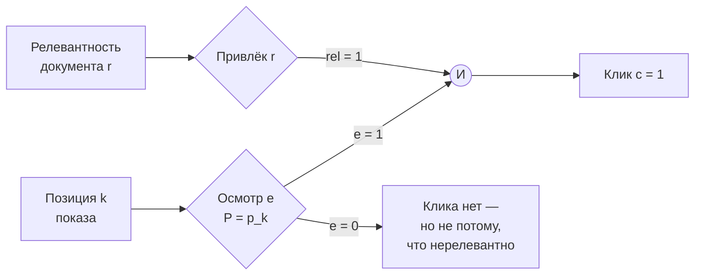

# Обучение ранжированию

> **Зачем эта глава.** Ранжирование — это не классификация, у которой поменяли метрику отчёта.
> Целевая функция здесь разрывная, обучающие метки берутся из кликов, а клики врут из-за позиции
> показа. После главы вы сможете вывести функцию потерь RankNet на бумаге, объяснить, почему
> LambdaRank задаёт **градиент**, а не лосс, собрать LambdaMART в LightGBM с осмысленными
> параметрами и построить IPS-коррекцию позиционного биаса с честной оценкой propensity.

**Уровень:** 🎯 middle → 🧠 middle+
**Предварительно нужно:** [офлайн-метрики рекомендаций](02-metrics-offline.md), [градиентный бустинг](../02-classic-ml/07-gradient-boosting.md), [метрики качества](../02-classic-ml/04-metrics.md), [двухбашенные модели и ANN](06-two-tower-and-ann.md)
**Время на проработку:** ~7 часов (чтение + вывод λ руками + прогон LambdaMART на MSLR)

---

## Карта главы

- [1. Почему классификация здесь ломается](#1-почему-классификация-здесь-ломается) — интуиция на числах
- [2. Формализация задачи LTR](#2-формализация-задачи-ltr)
- [3. Три подхода и что теряет каждый](#3-три-подхода-и-что-теряет-каждый) — pointwise, pairwise, listwise
- [4. Почему NDCG нельзя оптимизировать напрямую](#4-почему-ndcg-нельзя-оптимизировать-напрямую)
- [5. RankNet: вероятностная модель пары и вывод лосса](#5-ranknet-вероятностная-модель-пары-и-вывод-лосса)
- [6. LambdaRank: определяем градиент, а не функцию потерь](#6-lambdarank-определяем-градиент-а-не-функцию-потерь)
- [7. LambdaMART: λ внутри бустинга](#7-lambdamart-λ-внутри-бустинга)
- [8. Признаки для ранжирования](#8-признаки-для-ранжирования)
- [9. Обучение на кликах](#9-обучение-на-кликах) — как из логов получаются метки
- [10. Позиционный биас и IPS-коррекция](#10-позиционный-биас-и-ips-коррекция)
- [11. Компромиссы и границы](#11-компромиссы-и-границы)
- [12. Подводные камни](#12-подводные-камни)
- [13. Проверь себя](#13-проверь-себя)
- [14. Практика](#14-практика)
- [15. Что читать дальше](#15-что-читать-дальше)

---

## 1. Почему классификация здесь ломается

Стадия кандидатов отдала нам 500 товаров, у нас 40 мс и надо решить, что показать на первых
десяти позициях. Естественный первый ход: обучить бинарный классификатор «купит / не купит»,
отсортировать по вероятности. Это работает — это правильный бейзлайн, и в проде такое живёт годами.
Но у него есть три конкретных дефекта, которые видно на числах.

**Дефект первый: лосс считает не то, что считает бизнес.** Возьмём два запроса. По первому в
кандидатах 500 товаров и 1 релевантный, по второму — 20 товаров и 8 релевантных. Log-loss
складывает вклады всех 520 объектов в одну кучу, и 500 негативов из первого запроса дают ~96%
всех слагаемых. Модель будет тратить ёмкость на то, чтобы точнее сказать «0.001 вместо 0.003»
на заведомом мусоре первого запроса. При этом NDCG@10 обоих запросов весит одинаково.

**Дефект второй: важна не вероятность, а порядок.** Если модель предсказала для правильного
товара 0.31, а для мусора 0.30 — порядок верный, NDCG@10 идеален, log-loss ужасен. И наоборот:
можно улучшить log-loss, подтянув абсолютные значения на хвосте, и не сдвинуть выдачу вообще.
Оптимизируем одно, отчитываемся другим.

**Дефект третий: позиции не равноценны.** Discount в NDCG — $1/\log_2(1+r)$: позиция 1 весит
$1{,}00$, позиция 2 — $0{,}63$, позиция 5 — $0{,}39$, позиция 10 — $0{,}29$, позиция 50 — $0{,}18$.
Перестановка объектов между позициями 1 и 2 меняет метрику на порядок сильнее, чем между 49 и 50.
Классификатору это неизвестно: он одинаково штрафует ошибку в любом месте списка.

Соберём это в один пример. У запроса пять документов, метки $(4,3,0,0,0)$, а модель расставила их
так, что на позициях 1 и 2 оказались нулевые документы, на 3-й — документ с меткой 4, на 4-й —
с меткой 3. Выдача по меткам: $(0,0,4,3,0)$, NDCG@5 такой выдачи — $0{,}54$. Переберём все десять
возможных обменов пар:

| Обмен позиций | NDCG@5 после | Δ |
|---|---|---|
| 1 ↔ 3 | 0,93 | **+0,39** |
| 1 ↔ 4 | 0,75 | +0,21 |
| 2 ↔ 3 | 0,64 | +0,10 |
| 2 ↔ 4 | 0,61 | +0,07 |
| 1↔2, 1↔5, 2↔5 | 0,54 | 0,00 |
| 4 ↔ 5 | 0,53 | −0,02 |
| 3 ↔ 4 | 0,51 | −0,03 |
| 3 ↔ 5 | 0,45 | −0,09 |

Разброс полезности обменов — от +0,39 до −0,09, то есть почти на порядок между лучшим и
следующими. Обучение обязано знать, какие обмены дорогие, а какие бессмысленны. **Learning to rank
(LTR)** — это про то, как эту информацию завести внутрь градиента.

> 🌱 **База.** Если вы впервые видите тему: LTR — это семейство методов, которые обучают модель
> не «предсказать метку объекта», а «расставить объекты одного запроса в правильном порядке».
> Практический вывод — 90% продовых ранжировщиков это LambdaMART (§7), и достаточно уметь его
> настроить и объяснить смысл λ.

---

## 2. Формализация задачи LTR

Данные приходят сгруппированными по **запросам** (query, в рекомендациях — «показ»,
«сессия», «impression»). Обозначим:

- $q \in \mathcal{Q}$ — запрос; в рекомендациях это пара (пользователь, контекст) в момент показа;
- $D_q = \{d_{q,1}, \dots, d_{q,n_q}\}$ — список документов-кандидатов запроса $q$, $n_q$ — их число;
- $x_{q,i} \in \mathbb{R}^d$ — вектор признаков пары (запрос, документ), $d$ — число признаков;
- $y_{q,i} \in \{0,1,\dots,L\}$ — метка релевантности; в академических датасетах $L=4$
  (0 — «нерелевантно», 4 — «идеально»), в проде часто $\{0,1\}$ из кликов;
- $f_\theta: \mathbb{R}^d \to \mathbb{R}$ — модель, выдающая **скор** $s_{q,i} = f_\theta(x_{q,i})$;
  $\theta$ — параметры;
- $\pi_q$ — перестановка, полученная сортировкой $D_q$ по убыванию $s_{q,i}$;
- $r_{q,i}$ — позиция документа $i$ в $\pi_q$, нумерация с единицы.

Качество меряем метрикой, зависящей от перестановки и меток. Основная — NDCG:

$$
\mathrm{DCG@}k(\pi_q, y_q) = \sum_{i \,:\, r_{q,i} \le k} \frac{2^{y_{q,i}} - 1}{\log_2(1 + r_{q,i})},
\qquad
\mathrm{NDCG@}k = \frac{\mathrm{DCG@}k}{\mathrm{IDCG@}k}
$$

где числитель $2^{y}-1$ — **выигрыш** (gain), экспоненциальный по релевантности: документ с $y=4$
стоит $15$, а с $y=1$ — $1$, то есть в 15 раз больше; знаменатель $\log_2(1+r)$ — **скидка за
позицию** (discount); $\mathrm{IDCG@}k$ — DCG идеальной перестановки (сортировка по убыванию $y$),
он нормирует метрику в $[0,1]$ и делает запросы сравнимыми между собой.

Задача: найти $\theta$, максимизирующее $\mathbb{E}_q\left[\mathrm{NDCG@}k(\pi_q, y_q)\right]$.
Подробный разбор NDCG и её альтернатив — в [главе про офлайн-метрики](02-metrics-offline.md).

> 📐 **Разбор формулы.** Почему выигрыш экспоненциальный, а скидка логарифмическая? Экспонента —
> продуктовое решение: один документ с $y=4$ должен перевешивать несколько с $y=1$, иначе модель
> будет набивать выдачу «серединкой». Логарифм — эмпирическая модель внимания: вероятность
> посмотреть на позицию убывает медленнее, чем $1/r$, но быстрее, чем константа. Обе функции —
> соглашение, а не закон природы; в LightGBM выигрыш задаётся параметром `label_gain` и его можно
> переопределить под свою экономику.

---

## 3. Три подхода и что теряет каждый

### Pointwise

Смотрим на каждую пару (запрос, документ) независимо и решаем задачу регрессии или классификации:
$\mathcal{L} = \sum_{q}\sum_{i} \ell(f_\theta(x_{q,i}), y_{q,i})$. Ранжируем сортировкой скоров.

Что теряется: (а) вся групповая структура — модель не знает, что документы конкурируют внутри
запроса; (б) баланс вкладов — запрос с 500 кандидатами доминирует над запросом с 20 (см. §1);
(в) позиционная неравноценность. Плюс: калиброванный выход, простое обучение, любая библиотека
из коробки, лёгкая отладка. Именно поэтому pointwise-CTR остаётся стандартом в рекламе, где
калиброванная вероятность нужна для аукциона (см. [следующую главу](08-neural-ranking.md)).

### Pairwise

Учимся на парах: для документов $i$ и $j$ одного запроса с $y_i > y_j$ модель должна дать
$s_i > s_j$. Лосс — функция разности скоров, задача становится бинарной классификацией пар.
Групповая структура учтена, абсолютные значения скоров больше не важны — важен только их порядок.

Что теряется: **все пары считаются одинаково важными**. Пара (позиция 1, позиция 2) и пара
(позиция 199, позиция 200) вносят равный вклад, хотя первая двигает NDCG@10, а вторая — нет.
Плюс комбинаторика: у запроса с $n=500$ кандидатами до $n^2/2 = 125\,000$ пар, а число запросов
может быть миллионы. Отсюда усечения и сэмплирование пар.

### Listwise

Функция потерь определена на всём списке сразу. Две ветки:

- **Вероятностные**: ListNet вводит распределение «вероятность быть первым» и минимизирует
  кросс-энтропию между распределением по меткам и по скорам:

$$
P_s(i) = \frac{e^{s_i}}{\sum_{k=1}^{n_q} e^{s_k}}, \qquad
P_y(i) = \frac{e^{\phi(y_i)}}{\sum_{k=1}^{n_q} e^{\phi(y_k)}}, \qquad
\mathcal{L}_q = -\sum_{i=1}^{n_q} P_y(i)\,\log P_s(i)
$$

  где $s_i$ — скор документа $i$, $y_i$ — его метка, $\phi$ — монотонное преобразование метки
  (обычно тождественное или $2^{y}-1$), $n_q$ — число документов запроса, $P_s$ и $P_y$ —
  распределения «быть первым» по скорам и по меткам, $\mathcal{L}_q$ — потеря на запросе.
  В бинарном случае ($y \in \{0,1\}$, один позитив) это вырождается в обычный softmax
  cross-entropy — сегодня самый популярный listwise-лосс в нейронных ранжировщиках, потому что
  дёшев, стабилен и напрямую переиспользует негативы батча. ListMLE вместо распределения на
  первом месте максимизирует правдоподобие всей правильной перестановки по модели Плакетта — Льюса.
- **Прямые аппроксимации метрики**: SoftRank, ApproxNDCG, NeuralNDCG — заменяют жёсткую сортировку
  гладкой. Например, ApproxNDCG заменяет позицию $r_i$ на её гладкую оценку
  $\hat r_i = 1 + \sum_{j \ne i}\sigma\!\left((s_j - s_i)/\tau\right)$, где $\sigma$ — сигмоида,
  а $\tau > 0$ — температура сглаживания: при $\tau \to 0$ сумма сигмоид стремится к точному
  числу документов выше $i$, то есть к истинной позиции. Подставив $\hat r_i$ в формулу NDCG,
  получаем дифференцируемую функцию. Цена — новый гиперпараметр $\tau$: слишком большой размывает
  метрику, слишком маленький возвращает нулевые градиенты.

Что теряется: точный перебор перестановок факториален, поэтому все listwise-лоссы — приближения;
качество сильно зависит от длины списка и от того, сколько негативов в нём осталось после
сэмплирования; батчить списки переменной длины дороже. И главное — прирост над хорошо настроенным
pairwise на табличных признаках обычно оказывается в пределах шума.

| Подход | Что оптимизирует | Что игнорирует | Где применяют |
|---|---|---|---|
| Pointwise | абсолютную релевантность объекта | конкуренцию внутри запроса, позиции | CTR в рекламе, когда нужна калибровка |
| Pairwise | порядок внутри пары | вес позиции, длину списка | RankNet, RankSVM, базовый `rank:pairwise` |
| Pairwise + вес метрики | порядок, взвешенный по вкладу в метрику | — (компромисс между строгостью и практикой) | **LambdaRank / LambdaMART — стандарт** |
| Listwise | распределение по всему списку | — (но приближённо) | нейронные ранжировщики, softmax-лосс |

> 💬 **На собеседовании.** Спросят: «Чем pairwise-подход лучше pointwise?» Хороший ответ: он
> убирает из задачи абсолютную шкалу и сравнивает документы только внутри запроса, поэтому
> запросы с разным числом кандидатов и разной «средней релевантностью» перестают конфликтовать,
> а модель перестаёт тратить ёмкость на точность вероятностей там, где важен только порядок.
> И сразу назовите цену: все пары равнозначны, хотя вклад в NDCG у них различается на порядок —
> именно это и чинит LambdaRank. Плохой ответ: «pairwise точнее» без объяснения механизма.

---

## 4. Почему NDCG нельзя оптимизировать напрямую

Здесь любят срезать кандидатов, и ответ «она недифференцируема» без продолжения засчитывают
как неполный. Разберём точно.

NDCG зависит от скоров **только через порядок**: $\mathrm{NDCG} = M(\pi(s))$, где $\pi(s)$ —
перестановка, полученная сортировкой. Возьмём один скор $s_i$ и начнём его плавно увеличивать.
Пока $s_i$ не догнал ближайшего соседа сверху, перестановка не меняется и метрика **константна** —
производная ровно ноль. В момент, когда $s_i$ сравнивается с $s_j$, порядок скачком меняется, и
метрика прыгает на конечную величину — производная не существует.

$$
\frac{\partial\, \mathrm{NDCG}}{\partial s_i} = 0 \quad \text{почти всюду}, \qquad
\text{не определена в точках } s_i = s_j
$$

Итог: функция кусочно-постоянная. Градиентный спуск на ней не работает не потому, что «сложно
посчитать производную», а потому, что производная есть и она **нулевая** — сигнала для шага нет.

Отсюда три стратегии, и все три живут в индустрии:

1. **Оптимизировать суррогат** (log-loss, hinge, RankNet-лосс) и надеяться, что он коррелирует
   с метрикой. Просто, но связь косвенная.
2. **Сгладить метрику**: заменить индикатор «$i$ выше $j$» на $\sigma(s_i - s_j)$ и получить
   дифференцируемое приближение NDCG (SoftRank, ApproxNDCG). Честно, но дороже и чувствительно
   к температуре сглаживания.
3. **Не определять лосс вообще, а задать градиент руками** — это LambdaRank. Ход неортодоксальный,
   но именно он выиграл.

---

## 5. RankNet: вероятностная модель пары и вывод лосса

RankNet (Burges et al., ICML 2005) начинает с вероятностной постановки: превратим «$i$ должен
быть выше $j$» в вероятностное утверждение и применим максимум правдоподобия.

Определим вероятность того, что модель ставит $i$ выше $j$, как логистическую функцию
разности скоров:

$$
P_{ij} \;=\; P(i \rhd j) \;=\; \frac{1}{1 + e^{-\sigma (s_i - s_j)}}
$$

где $s_i = f_\theta(x_i)$ и $s_j = f_\theta(x_j)$ — скоры документов одного запроса, $\sigma > 0$ —
параметр формы сигмоиды (масштаб; при $\sigma \to \infty$ вероятность вырождается в жёсткое
сравнение), $\rhd$ читается «ранжируется выше».

Целевую вероятность зададим через $S_{ij} \in \{-1, 0, +1\}$: $+1$, если $y_i > y_j$; $-1$, если
$y_i < y_j$; $0$, если метки равны. Тогда

$$
\bar{P}_{ij} = \tfrac{1}{2}\,(1 + S_{ij})
$$

то есть $1$ при $y_i > y_j$, $0$ при $y_i < y_j$ и $0{,}5$ при равенстве — «модель не должна
предпочитать никого».

Функция потерь — кросс-энтропия между целевым и модельным распределением:

$$
C_{ij} = -\bar{P}_{ij}\log P_{ij} - (1 - \bar{P}_{ij})\log(1 - P_{ij})
$$

Подставим $P_{ij}$ и обозначим $\Delta s = s_i - s_j$. Заметим, что
$\log P_{ij} = -\log\left(1 + e^{-\sigma \Delta s}\right)$ и
$\log(1 - P_{ij}) = -\sigma \Delta s - \log\left(1 + e^{-\sigma\Delta s}\right)$ (второе — потому что
$1 - P_{ij} = e^{-\sigma\Delta s}/(1+e^{-\sigma\Delta s})$). Подставляя:

$$
C_{ij} = \bar P_{ij}\log\!\left(1 + e^{-\sigma\Delta s}\right)
+ (1-\bar P_{ij})\left[\sigma \Delta s + \log\!\left(1 + e^{-\sigma\Delta s}\right)\right]
$$

$$
C_{ij} = \tfrac{1}{2}\left(1 - S_{ij}\right)\sigma\,\Delta s \;+\; \log\!\left(1 + e^{-\sigma \Delta s}\right)
$$

Проверим частные случаи. При $S_{ij} = +1$ первое слагаемое зануляется и
$C_{ij} = \log(1 + e^{-\sigma\Delta s})$ — это softplus: почти ноль, когда $i$ уверенно выше $j$,
и линейно растёт, когда порядок нарушен. При $S_{ij} = 0$ получаем
$C_{ij} = \tfrac{\sigma\Delta s}{2} + \log(1+e^{-\sigma\Delta s})$ — минимум в $\Delta s = 0$,
то есть равные метки тянут скоры друг к другу.

Теперь градиент. Дифференцируем по $s_i$:

$$
\frac{\partial C_{ij}}{\partial s_i}
= \sigma\left[\frac{1}{2}(1 - S_{ij}) - \frac{1}{1 + e^{\sigma(s_i - s_j)}}\right]
= -\,\frac{\partial C_{ij}}{\partial s_j}
$$

Антисимметрия важна практически: одна вычисленная величина обслуживает оба документа пары, что
вдвое сокращает работу. Для наиболее частого случая $S_{ij} = +1$ введём обозначение

$$
\lambda_{ij} \;=\; \frac{\sigma}{1 + e^{\sigma (s_i - s_j)}} \;>\; 0
$$

Читается так: $\lambda_{ij}$ — **сила**, с которой пара тянет документ $i$ вверх, а $j$ вниз.
Когда $s_i \gg s_j$ (порядок уже правильный), знаменатель огромен и сила близка к нулю — пара
«решена». Когда $s_i \ll s_j$ (грубая ошибка), $\lambda_{ij} \to \sigma$ — максимальная тяга.

Суммарный сигнал для документа $i$ — сумма по всем парам, где он участвует:

$$
\lambda_i \;=\; \sum_{j\,:\, y_i > y_j} \lambda_{ij} \;-\; \sum_{j\,:\, y_j > y_i} \lambda_{ji}
$$

где первая сумма — все пары, в которых $i$ должен быть выше (тянут вверх), вторая — где ниже
(тянут вниз). Именно это и есть «стрелка», которую в статьях Burges рисует рядом с документом.

---

## 6. LambdaRank: определяем градиент, а не функцию потерь

RankNet обучен, а NDCG почему-то не растёт. Классический пример из работ Microsoft Research:
выдача из 15 документов, два релевантных стоят на позициях 1 и 15. RankNet видит 13 нарушенных
пар для документа с позиции 15 и всего 0 — для документа с позиции 1, поэтому вкладывает всю
энергию в то, чтобы поднять нижний документ с 15-й на 10-ю. С точки зрения числа правильных пар
это большой успех. С точки зрения NDCG@10 — почти ничего: скидка на позиции 10 составляет
$0{,}29$ против $0{,}63$ на позиции 2. Полезнее было бы поднять нижний документ хотя бы
на 5-ю позицию, но RankNet эту разницу не различает.

Ключевое наблюдение авторов: **для градиентного обучения нужен не лосс, а его градиент**. Если мы
умеем написать правдоподобный градиент напрямую, лосс можно не выводить вообще. А раз мы его
пишем руками, туда можно завести информацию о метрике.

LambdaRank домножает силу пары на модуль изменения метрики при обмене этих двух документов
местами:

$$
\lambda_{ij}^{\text{Lambda}} \;=\; \underbrace{\frac{\sigma}{1 + e^{\sigma(s_i - s_j)}}}_{\text{из RankNet}} \cdot \Big|\Delta \mathrm{NDCG}_{ij}\Big|
$$

где $|\Delta \mathrm{NDCG}_{ij}|$ — насколько изменится NDCG запроса, если поменять местами
документы $i$ и $j$ в **текущей** выдаче, оставив остальные на местах.

Эту величину можно выписать в замкнутой форме. При обмене меняются только два слагаемых DCG:
было $g_i d_i + g_j d_j$, стало $g_i d_j + g_j d_i$, где $g_i = 2^{y_i}-1$ — выигрыш, а
$d_i = 1/\log_2(1 + r_i)$ — скидка позиции $r_i$. Значит

$$
\Big|\Delta \mathrm{NDCG}_{ij}\Big| \;=\; \frac{\left|\,(2^{y_i} - 2^{y_j})\left(\dfrac{1}{\log_2(1+r_i)} - \dfrac{1}{\log_2(1+r_j)}\right)\right|}{\mathrm{IDCG}}
$$

где $y_i, y_j$ — метки релевантности, $r_i, r_j$ — текущие позиции документов после сортировки
по скорам, $\mathrm{IDCG}$ — нормировка запроса. Двойка $2^{y}$ вместо $2^{y}-1$ появляется потому,
что единицы в разности сокращаются.

Разберём, что эта формула делает с обучением:

- Если метки равны ($y_i = y_j$), первый множитель равен нулю — пара не даёт сигнала. Правильно:
  их порядок не влияет на метрику.
- Если документы стоят рядом внизу списка ($r_i = 199$, $r_j = 200$), разность скидок
  $\approx 0{,}0001$ — сигнал практически подавлен.
- Если один документ на позиции 1, а второй на 2, и метки различаются ($y=4$ против $y=0$),
  множитель максимален — это самая дорогая ошибка.

То есть градиент сам расставляет приоритеты по влиянию на метрику. Заменив NDCG на MAP или MRR,
получим LambdaRank под другую метрику — механика не меняется.

> 🧠 **Middle+.** Долгое время LambdaRank оставался эвристикой: градиент есть, а функции, чьим
> градиентом он является, никто не предъявил. Позже группа из Google в работе «The LambdaLoss
> Framework for Ranking Metric Optimization» (CIKM 2018) показала, что λ-градиенты соответствуют
> оптимизации явно выписанного вероятностного лосса на скрытых перестановках (решается
> EM-подобной схемой), и что этот лосс — верхняя граница для метрики. Практический вывод: под
> λ-схему есть теория, и в её рамках выводятся аналоги под ARP и другие метрики. На собеседовании
> знание, что «LambdaRank потом обосновали через LambdaLoss», — сильный сигнал.

Посчитаем λ руками — двадцать строк, чтобы увидеть механику целиком.

```python
import numpy as np
from scipy.special import expit          # expit(x) = 1/(1+e^{-x}), численно устойчива

def lambdas_for_query(scores, labels, sigma=1.0, truncation=None):
    """
    scores — (n,) скоры модели для документов ОДНОГО запроса
    labels — (n,) градации релевантности (0..4)
    Возвращает lam (направление сдвига скора) и w (кривизна для ньютоновского шага).
    """
    n = len(scores)
    gains = 2.0 ** labels - 1.0
    idcg = float(np.sum(np.sort(gains)[::-1] / np.log2(np.arange(2, n + 2))))
    if idcg == 0.0:                       # ни одного релевантного документа —
        return np.zeros(n), np.zeros(n)   # такой запрос не несёт сигнала, его выбрасывают

    order = np.argsort(-scores)           # текущая перестановка
    rank = np.empty(n, dtype=np.int64)
    rank[order] = np.arange(1, n + 1)     # rank[i] — позиция документа i, с единицы
    discount = 1.0 / np.log2(rank + 1.0)
    if truncation is not None:            # пары целиком ниже среза метрику не двигают
        discount = np.where(rank <= truncation, discount, 0.0)

    # |ΔNDCG| для всех пар сразу: (g_i - g_j) * (d_i - d_j) / IDCG
    delta = np.abs(np.subtract.outer(gains, gains) *
                   np.subtract.outer(discount, discount)) / idcg

    s_diff = np.subtract.outer(scores, scores)      # s_diff[i, j] = s_i - s_j
    rho = expit(-sigma * s_diff)                    # = 1 / (1 + e^{σ(s_i - s_j)})
    pair_lam = sigma * rho * delta                  # сила пары
    pair_w = sigma * sigma * rho * (1.0 - rho) * delta   # |∂λ/∂s| — вторая производная

    better = np.greater.outer(labels, labels)       # better[i, j] = (y_i > y_j)
    L = pair_lam * better                           # ненулевые только «правильные» пары
    W = pair_w * better
    lam = L.sum(axis=1) - L.sum(axis=0)             # тянут вверх минус тянут вниз
    w = W.sum(axis=1) + W.sum(axis=0)               # кривизна складывается по модулю
    return lam, w
```

> ⌨️ **Руками.** Возьмите `labels = np.array([4, 3, 0, 0, 0])` и `scores = np.array([0., 0., 3., 2., 1.])`
> (модель поставила релевантные документы на позиции 4 и 5) и посчитайте λ. Убедитесь, что у
> документа с меткой 4 λ самая большая по модулю, а у трёх нулевых документов λ отрицательные.
> Затем сдвиньте скор первого документа на $+\lambda_1$ и пересчитайте NDCG@5 — она должна вырасти.

---

## 7. LambdaMART: λ внутри бустинга

LambdaRank описывал, как обучать нейросеть. LambdaMART — тот же градиент, но подставленный в
градиентный бустинг над деревьями (MART = Multiple Additive Regression Trees). Это до сих пор
сильнейший ранжировщик на табличных признаках и дефолтный выбор в проде.

Механика (подробности бустинга — в [соответствующей главе](../02-classic-ml/07-gradient-boosting.md)):

1. Инициализируем $s_{q,i}^{(0)} = 0$ для всех пар (запрос, документ).
2. На шаге $m$ сортируем документы каждого запроса по текущим скорам, считаем $\lambda_{q,i}$
   и кривизну $w_{q,i}$ по формулам §6.
3. Обучаем регрессионное дерево, приближающее $\lambda$ (то есть $\lambda$ играет роль
   антиградиента, а признаки — обычные $x_{q,i}$).
4. Значение в листе $k$ считаем ньютоновским шагом, а не средним:

$$
\gamma_k \;=\; \frac{\sum_{i \in L_k} \lambda_i}{\sum_{i \in L_k} w_i + \mu}
$$

где $L_k$ — множество объектов, попавших в лист $k$, $\lambda_i$ — их λ-градиенты, $w_i$ —
кривизна, $\mu > 0$ — регуляризатор (в LightGBM это `lambda_l2`), защищающий от деления на
почти-ноль.

5. Обновляем скоры: $s_i^{(m)} = s_i^{(m-1)} + \eta \cdot \gamma_{k(i)}$, где $\eta$ — темп
   обучения (learning rate), $k(i)$ — лист, в который попал объект $i$.

Ключевая особенность: **λ пересчитываются на каждой итерации**, потому что зависят от текущего
порядка, а порядок меняется после каждого дерева. Это дороже обычного бустинга примерно в
$O(\bar n)$ раз на группу, где $\bar n$ — средний размер запроса, отсюда параметр усечения.

Рабочий конфиг LightGBM — числа, с которых стоит начинать на датасете масштаба MSLR-WEB30K
(30 тыс. запросов, ~3,7 млн строк, 136 признаков, метки 0–4):

```python
import lightgbm as lgb
import numpy as np

def make_groups(qid):
    """LightGBM ждёт длины групп подряд идущих запросов: [n_q1, n_q2, ...].
    Данные ОБЯЗАНЫ быть отсортированы так, чтобы строки одного запроса шли подряд."""
    change = np.flatnonzero(qid[1:] != qid[:-1]) + 1
    bounds = np.concatenate(([0], change, [len(qid)]))
    return np.diff(bounds)

train = lgb.Dataset(X_tr, label=y_tr, group=make_groups(qid_tr))
valid = lgb.Dataset(X_va, label=y_va, group=make_groups(qid_va), reference=train)

params = {
    "objective": "lambdarank",
    "metric": "ndcg",
    "ndcg_eval_at": [5, 10],
    "lambdarank_truncation_level": 20,   # пары считаем только внутри топ-20 текущей выдачи:
                                         # ниже |ΔNDCG| всё равно исчезающе мал, а пар — O(n²)
    "label_gain": [0, 1, 3, 7, 15],      # 2^rel - 1 для rel = 0..4; список должен покрывать все метки
    "lambdarank_norm": True,             # нормировка λ по запросу: гасит доминирование
                                         # запросов с сотнями кандидатов
    "learning_rate": 0.05,
    "num_leaves": 63,
    "min_data_in_leaf": 100,             # на 3,7 млн строк меньше 50 — верный путь к переобучению
    "feature_fraction": 0.8,
    "bagging_fraction": 0.8,
    "bagging_freq": 1,
    "lambda_l2": 5.0,
    "num_threads": 16,
    "verbosity": -1,
}

model = lgb.train(
    params, train, num_boost_round=3000, valid_sets=[valid],
    callbacks=[lgb.early_stopping(150), lgb.log_evaluation(100)],
)
```

Порядки величин, которых стоит ожидать. На MSLR-WEB30K такой конфиг даёт NDCG@10 около 0.50–0.52
(современные сильные результаты — примерно 0.52–0.54; линейный pointwise-бейзлайн — около 0.42–0.45),
обучение до ранней остановки на 16 потоках CPU — десятки минут. Инференс 500 кандидатов на
1000 деревьев глубины 6 — порядка 3–8 мс на одном ядре, то есть в бюджет 40 мс укладывается
с запасом; это и есть причина, по которой LambdaMART не спешат менять на нейросети.

Альтернативы в других библиотеках: в XGBoost — `objective="rank:ndcg"` (в версиях 2.x переработан:
появились `lambdarank_pair_method` и `lambdarank_num_pair_per_sample`); в CatBoost —
`YetiRank`/`YetiRankPairwise`, где вместо детерминированного |ΔNDCG| используется сэмплирование
перестановок, что часто помогает на шумных кликовых метках.

> 💬 **На собеседовании.** Спросят: «Что такое λ в LambdaRank?» Хороший ответ: это не производная
> какой-то заранее выписанной функции потерь, а **сконструированный градиент**: берём градиент
> RankNet-лосса по паре, $\sigma/(1+e^{\sigma(s_i-s_j)})$, и домножаем на $|\Delta \mathrm{NDCG}_{ij}|$ —
> изменение метрики при обмене этих документов местами. Так информация о метрике, которую нельзя
> продифференцировать, попадает в обучение через вес пары. Плохой ответ: «LambdaRank оптимизирует
> NDCG напрямую» — нет, напрямую её оптимизировать нельзя, в этом весь смысл конструкции.

---

## 8. Признаки для ранжирования

Ранжирующая модель работает на **паре** (запрос, документ), и признаки распадаются на четыре
семейства. Это деление стоит держать в голове: на system design его спрашивают почти всегда.

| Семейство | Примеры | Зависит от | Где считается |
|---|---|---|---|
| **Запросные** | длина запроса, язык, частотность, категория интента, время суток, устройство | только $q$ | онлайн, из запроса |
| **Документные** | цена, рейтинг, возраст, CTR за 7/30 дней, число отзывов, качество карточки | только $d$ | офлайн, обновление раз в сутки — раз в час |
| **Парные (matching)** | BM25 и TF-IDF по полям, косинус эмбеддингов, скор двухбашенки, доля совпавших токенов, совпадение категории | $q \times d$ | онлайн |
| **Персональные** | покупал ли в этой категории, видел ли этот товар, расстояние до его центроида интересов, число показов за сессию | $u \times d$ | онлайн + офлайн-агрегаты |

Три практических правила.

**Скоры предыдущих стадий — признаки следующей.** Косинус из двухбашенки, BM25 из лексического
поиска, скор старой модели — все они идут в ранжировщик как обычные колонки. Это дёшево (уже
посчитано на отборе кандидатов) и обычно попадает в топ-5 по важности.

**Признаки-счётчики требуют временного разделения.** «CTR товара» — самый сильный и самый опасный
признак: если считать его по тому же периоду, из которого взят таргет, получите утечку и
провал в проде. Считайте счётчики строго по данным **до** момента показа (point-in-time),
как в [главе про feature store](../07-mlops/03-data-and-feature-store.md).

**Позиция показа — не признак.** Она известна в логах, но недоступна на инференсе. Если завести
её как обычную колонку, модель выучит «первая позиция ⇒ высокий CTR» и на проде вы подадите
константу, разрушив всё остальное. Корректная работа с позицией — §10.

Порядок величин, чтобы понимать, о каком объёме идёт речь. В академических датасетах признаков
136 (MSLR) или ~700 (Yahoo LTR Challenge). В продовом ранжировщике маркетплейса типично
150–500 колонок, из которых половина — счётчики в разных окнах (1 час / 1 день / 7 дней / 30 дней)
для разных срезов. Важности обычно распределяются так: 3–5 признаков дают половину прироста
метрики (скор предыдущей стадии, CTR документа, персональная близость), следующие 30 — ещё треть,
остальные — хвост, который стоит держать только пока он не мешает считать фичи в бюджет.

> ⚠️ **Типичная ошибка.** Наращивать число признаков, не считая их стоимость в онлайне. Признак,
> требующий отдельного похода в хранилище на 3 мс, при бюджете 40 мс на ранжирование обязан
> окупаться не «плюсом к NDCG», а плюсом, который переживёт A/B. Полезная дисциплина: для каждого
> нового признака фиксировать в описании его латентность и источник — тогда разговор
> «выкинуть ли его» становится инженерным, а не вкусовым.

---

## 9. Обучение на кликах

Ручная разметка релевантности $0..4$ — это академические датасеты и крупный веб-поиск.
В типичном продукте меток нет, есть логи. Из них надо построить $y_{q,i}$.

**Уровень 0: бинарный клик.** $y = 1$, если кликнули, иначе $0$. Работает, но зашумлён: случайные
клики, кликбейт, мисклики на мобильных (доля мискликов у нижнего края экрана заметно выше).

**Уровень 1: градуированные метки по глубине действия.** Разная сила сигнала — разная метка:

| Действие | Метка $y$ | Комментарий |
|---|---|---|
| показ без клика | 0 | но см. §10 — возможно, документ просто не увидели |
| клик с быстрым возвратом (<10 с) | 0 | «dissatisfied click», часто хуже, чем отсутствие клика |
| клик с dwell time > 30 с | 1 | порог подбирается по распределению, а не берётся из статьи |
| добавление в корзину / избранное | 2 | |
| покупка | 4 | |

Пороги dwell time надо **измерять**: постройте гистограмму времени на карточке и найдите
провал между «отскок» и «прочитал». В маркетплейсах он обычно в районе 15–40 с, в новостях выше,
в коротком видео измеряют долю просмотра, а не секунды.

**Уровень 2: относительные предпочтения (Joachims).** Вместо абсолютных меток извлекаем пары.
Базовое правило — **«клик выше пропуска»** (click > skip-above): если пользователь кликнул на
позицию 4, то документы на позициях 1–3 он с высокой вероятностью **видел** и отверг, значит
пара (документ с позиции 4) $\rhd$ (документ с позиции 1..3) — валидное предпочтение. Ценность
правила в том, что оно опирается на сравнение внутри области, которую пользователь точно
просмотрел, и поэтому частично устойчиво к позиционному биасу.

### Как это выглядит в коде сборки датасета

Обучающая выборка ранжировщика собирается из логов показов, а не из логов кликов — это первое,
что надо зафиксировать. Каждая строка — один показанный документ; группа — один показ (impression).

```sql
-- Spark SQL / Trino: сборка обучающей таблицы за один день
WITH shown AS (
    SELECT
        i.impression_id,                      -- это и есть qid: одна группа = один показ
        i.user_id,
        i.item_id,
        i.position,                           -- нужна ТОЛЬКО для IPS-весов, не как признак
        i.ts,
        i.max_seen_position,                  -- максимальная позиция, до которой докрутили
        i.features                            -- map<string, double>: фичи, залогированные
    FROM impressions i                        -- в МОМЕНТ предсказания — против train/serve skew
    WHERE i.dt = DATE '2026-07-20'
      AND i.is_bot = false
),
labeled AS (
    SELECT
        s.*,
        CASE
            WHEN o.order_id IS NOT NULL                     THEN 4   -- покупка
            WHEN c.added_to_cart                            THEN 2   -- корзина
            WHEN c.dwell_ms >= 30000                        THEN 1   -- содержательный клик
            WHEN c.click_id IS NOT NULL AND c.dwell_ms < 10000 THEN 0 -- отскок = не позитив
            ELSE 0
        END AS label
    FROM shown s
    LEFT JOIN clicks c
           ON c.impression_id = s.impression_id AND c.item_id = s.item_id
    LEFT JOIN orders o                                       -- атрибуция заказа к показу
           ON o.user_id = s.user_id AND o.item_id = s.item_id
          AND o.ts BETWEEN s.ts AND s.ts + INTERVAL '24' HOUR
)
SELECT *
FROM labeled
WHERE position <= COALESCE(max_seen_position, position)   -- ниже глубины просмотра — не негатив
  AND impression_id IN (                                   -- группы без единого позитива
      SELECT impression_id FROM labeled GROUP BY impression_id HAVING MAX(label) > 0
  )                                                        -- выбрасываем: IDCG = 0
ORDER BY impression_id;                                    -- строки группы обязаны идти подряд
```

Три момента, которые здесь принципиальны и часто теряются: фичи берутся **из лога показа**, а не
пересчитываются задним числом; фильтр по глубине просмотра убирает мнимые негативы; сортировка
по `impression_id` в конце — то, без чего массив `group` в LightGBM разъедется с данными.

Что ещё нужно решить перед первым обучением:

- **Сессии без кликов.** Их обычно 60–80% от всех показов. Выбрасывать целиком — терять
  информацию о непривлекательных выдачах; оставлять все — раздувать данные негативами.
  Практика: оставлять сэмплированную долю (5–20%) и следить, чтобы это не сломало калибровку.
- **Глубина просмотра.** Документы ниже последнего клика (или ниже максимальной прокрутки, если
  она логируется) не считаем негативами — пользователь до них не дошёл.
- **Дедупликация и роботы.** Один пользователь с 4000 показов за час — это скрапер; такие сессии
  надо резать по перцентилю, иначе они переобучат модель на свой профиль.
- **Временной сплит.** Обучение на прошлом, валидация на будущем, зазор в сутки между ними, чтобы
  не протекли отложенные конверсии. Случайный сплит по строкам завышает офлайн-метрику
  и не воспроизводится в A/B.

> ⚠️ **Типичная ошибка.** Взять «показанные и не кликнутые» как надёжные негативы и удивляться,
> почему модель не воспроизводит офлайн-прирост онлайн. Отсутствие клика — это смесь
> «не релевантно» и «не увидел», и вторая компонента растёт с позицией. Ровно этим занимается
> следующий раздел.

---

## 10. Позиционный биас и IPS-коррекция

### Модель клика

Стандартная рабочая модель — **позиционная** (position-based model, PBM). Клик происходит,
только если пользователь **осмотрел** позицию и документ ему **релевантен**, и эти два события
независимы:

$$
P(c_i = 1) \;=\; \underbrace{P(e_i = 1 \mid k_i)}_{p_{k_i}} \cdot \underbrace{P(\text{rel}_i = 1)}_{r_i}
$$

где $c_i$ — индикатор клика по документу $i$, $e_i$ — индикатор осмотра (examination), $k_i$ —
позиция, на которой документ был показан **логирующей политикой**, $p_k$ — **propensity**
(вероятность осмотра позиции $k$, не зависящая от документа), $r_i$ — истинная релевантность
документа для этого запроса.



Отсюда видно, в чём беда: наблюдаемая частота кликов $\hat{r}_i \approx p_{k_i} r_i$ систематически
занижена для нижних позиций. Обучаясь на сырых кликах, модель выучивает не релевантность,
а **произведение релевантности на популярность позиции**, то есть воспроизводит выдачу
предыдущей модели. Это и есть петля обратной связи: то, что показывали выше, получает больше
кликов, получает более высокий скор, показывается ещё выше.

### IPS: как это чинится

Идея из причинного вывода: **обратное взвешивание по склонности** (inverse propensity scoring).
Если событие наблюдается с вероятностью $p$, взвесим его на $1/p$ — и математическое ожидание
восстановится. Эмпирический риск в LTR-форме:

$$
\hat{\mathcal{R}}_{\mathrm{IPS}}(f) \;=\; \frac{1}{|\mathcal{Q}|}\sum_{q \in \mathcal{Q}} \;\sum_{i \,:\, c_{q,i} = 1} \frac{\Delta\!\left(i \mid f, D_q\right)}{p_{k_{q,i}}}
$$

где $\mathcal{Q}$ — множество залогированных запросов, $c_{q,i}=1$ отбирает только кликнутые
документы, $\Delta(i \mid f, D_q)$ — потеря, зависящая от позиции документа $i$ в выдаче,
которую строит **обучаемая** модель $f$ (например, $\mathrm{rank}_f(i)$ или
$-1/\log_2(1+\mathrm{rank}_f(i))$), $p_{k_{q,i}}$ — propensity позиции, на которой документ
показала **логирующая** политика.

Проверим несмещённость. Возьмём ожидание по случайности кликов при фиксированной выдаче логгера:
$\mathbb{E}[c_{q,i}] = p_{k_{q,i}} \cdot r_{q,i}$, поэтому

$$
\mathbb{E}_c\!\left[\hat{\mathcal{R}}_{\mathrm{IPS}}\right]
= \frac{1}{|\mathcal{Q}|}\sum_q \sum_{i} \frac{p_{k_{q,i}}\, r_{q,i}}{p_{k_{q,i}}}\,\Delta(i \mid f, D_q)
= \frac{1}{|\mathcal{Q}|}\sum_q \sum_{i} r_{q,i}\,\Delta(i \mid f, D_q)
$$

Правая часть — риск, который мы считали бы, зная истинную релевантность $r_{q,i}$. Propensity
сократилась, смещение позиции ушло. Это результат Joachims et al. (WSDM 2017), и обратите
внимание на два условия его применимости: нужна **строгая положительность** ($p_k > 0$ для всех
позиций, иначе делим на ноль и часть пространства невосстановима) и корректная модель клика
(PBM без учёта соседей — упрощение; каскадные модели описывают реальность точнее).

### Откуда берутся $p_k$

Оценка propensity — самая практичная часть темы, и именно её проваливают.

**Рандомизация выдачи (result randomization).** Самый честный способ: на небольшой доле трафика
(0,5–2%) случайно переставляем топ-$k$ или меняем местами позицию 1 и позицию $k$ (swap
intervention). Поскольку документ попадает на позицию случайно, отношение CTR на позиции $k$ к
CTR на позиции 1 даёт $p_k/p_1$. Нормируем $p_1 = 1$. Цена: заметная просадка метрик на этой доле
трафика, поэтому эксперимент делают коротким и на малом проценте.

**Intervention harvesting.** Бесплатная альтернатива: собрать пары показов одного и того же
документа по одному и тому же запросу, где он оказался на разных позициях из-за естественных
причин (A/B-тесты разных моделей, обновления индекса, шум). Отношение CTR между позициями даёт
ту же оценку без специальной рандомизации.

**Regression-EM.** Совместно оцениваем $p_k$ и $r_i$ по логам EM-алгоритмом: на E-шаге считаем
апостериорные вероятности осмотра для некликнутых показов, на M-шаге пересчитываем $p_k$ и
переобучаем модель релевантности. Подход из работы Wang et al. (WSDM 2018, Google) для
персонального поиска; не требует вмешательства в выдачу, но чувствителен к спецификации модели.

Практическая параметризация: $p_k = (1/k)^\eta$, где $\eta$ — параметр силы биаса, оцениваемый
по данным. В полусинтетических экспериментах Joachims et al. использовали $\eta = 1$; на реальных
поверхностях $\eta$ измеряется в диапазоне примерно от 0,5 (лента с бесконечным скроллом,
внимание распределено ровнее) до 1,5 и выше (десктопный поиск, где всё решают первые три позиции).
**Измеряйте своё значение, не берите из статьи.**

### Дисперсия: главный практический риск

Веса $1/p_k$ растут как $k^\eta$: при $\eta = 1$ клик с 50-й позиции получает вес 50. Один такой
клик может перевесить полсотни обычных. Стандартные приёмы:

```python
import numpy as np

def ips_weights(positions, eta=1.0, tau=0.1):
    """positions — 1-based позиции, на которых кликнутые документы показала прод-модель.
    tau — клиппинг propensity снизу: ограничивает вес сверху величиной 1/tau."""
    p = np.power(1.0 / np.asarray(positions, dtype=float), eta)
    p = np.maximum(p, tau)          # tau=0.1 → максимальный вес 10, а не 50
    return 1.0 / p

# в LambdaMART веса заводятся на уровне строк обучающей выборки
w = np.ones(len(y_tr))
clicked = y_tr > 0
w[clicked] = ips_weights(pos_tr[clicked], eta=0.9, tau=0.1)
train = lgb.Dataset(X_tr, label=y_tr, group=make_groups(qid_tr), weight=w)
```

- **Клиппинг** $\hat p_k = \max(p_k, \tau)$ с $\tau \in [0{,}05;\,0{,}2]$: вносит небольшое
  смещение, но радикально режет дисперсию. Почти всегда выигрышный размен.
- **Self-normalized IPS (SNIPS)**: делим сумму взвешенных потерь на сумму весов. Слегка смещённая,
  но заметно более устойчивая оценка.
- **Проверка эффективного размера выборки**: $n_{\text{eff}} = (\sum w_i)^2 / \sum w_i^2$.
  Если $n_{\text{eff}}$ упал ниже ~10% от $n$, оценка держится на нескольких наблюдениях —
  усиливайте клиппинг.

### Более дешёвая альтернатива: позиция как отдельный вход

Если рандомизацию трафика согласовать не удаётся (типичная ситуация), есть инженерный обходной
путь, известный по работе Huawei под названием PAL и по описанию рекомендательной системы YouTube
(«Recommending What Video to Watch Next», RecSys 2019): подать позицию в модель, но **изолированно**
от остальных признаков.

Модель раскладывается на два блока: основной, видящий только «честные» признаки, и мелкий блок
(shallow tower), видящий позицию и пару контекстных признаков. Их выходы складываются до сигмоиды:

$$
P(c = 1 \mid x, k) = \sigma\big(f_\theta(x) + b_\phi(k)\big)
$$

где $f_\theta(x)$ — скор релевантности от основной модели, $b_\phi(k)$ — поправка на позицию $k$
от вспомогательного блока, $\sigma$ — сигмоида. На инференсе $b_\phi$ просто **выбрасывают** и
ранжируют по $f_\theta(x)$ — позиционная составляющая уже впитала биас и не портит основной скор.

Ограничение честно: это работает только для аддитивно разделимых архитектур, то есть для
нейросетей. В бустинге позицию изолировать нельзя — дерево свободно смешивает её с любым другим
признаком, поэтому для GBDT остаются IPS-веса или двухэтапная схема (обучить дебиасинг отдельно,
скорректировать метки, затем учить LambdaMART).

> 💬 **На собеседовании.** Спросят: «Как обучать ранжирование на кликах, если верхние позиции
> получают больше кликов просто потому, что они верхние?» Хороший ответ строится по шагам:
> (1) назвать модель клика — PBM, $P(c) = p_k \cdot r$; (2) сказать, что наивное обучение выучивает
> произведение и замыкает петлю обратной связи; (3) предложить IPS-взвешивание $1/p_k$ и показать
> в одну строку, почему оно несмещённое; (4) обязательно сказать, **откуда возьмутся $p_k$** —
> рандомизация на 1% трафика, intervention harvesting или regression-EM; (5) упомянуть дисперсию
> и клиппинг. Плохой ответ: «добавим позицию как признак» без оговорки, что на инференсе её нет
> и что для деревьев этот трюк не работает.

---

## 11. Компромиссы и границы

**LambdaMART или нейронный ранжировщик?** На плотных табличных признаках (сотни числовых колонок:
счётчики, BM25, скоры стадий) бустинг остаётся сильнее и дешевле — обучается за минуты, скорит
за микросекунды, не требует GPU. Нейросети выигрывают, когда в признаках есть **разреженные
сущности высокой мощности** (миллионы item_id), **последовательности** (история пользователя)
или **текст/картинки**. Реалистичная стратегия для команды из трёх человек: LambdaMART как основа
плюс эмбеддинги от отдельно обученной сети в качестве признаков.

**Pairwise или listwise?** Если метка — градация релевантности от асессоров и список короткий
(до 50), listwise-softmax работает отлично. Если метка бинарная и кликовая, а список длинный,
LambdaMART с усечением обычно надёжнее.

**Когда LTR не нужен вообще.** Если кандидатов меньше 10 и позиции почти равноценны (карусель
на три элемента); если ключевая метрика — калиброванная вероятность для аукциона или для порога
бизнес-правила (LTR-скоры не откалиброваны в принципе — это разности, а не вероятности);
если данных меньше нескольких тысяч запросов — LambdaMART переобучится, а pointwise-модель
с регуляризацией выживет.

**Офлайн-прирост не переносится онлайн.** Это норма, а не аномалия. Три главные причины:
смещение обучающих данных (учимся на том, что показывала старая модель), позиционный биас без
коррекции и разрыв между NDCG и деньгами. Ожидайте, что +3% NDCG@10 превратятся в +0,5% CTR
или в ноль, и планируйте A/B заранее — см. [онлайн-оценку рекомендаций](15-recsys-online-evaluation.md).

**Как понять, что прирост NDCG вообще реален.** Разница в 0,002 NDCG@10 между двумя конфигами —
это почти всегда шум. Единица наблюдения здесь — **запрос**, а не строка, поэтому доверительный
интервал строится бутстрапом по запросам: 1000 ресэмплов множества запросов с возвращением,
для каждого — средний NDCG@10, перцентили 2,5% и 97,5% дают интервал. На тестовой выборке
из 6 тыс. запросов (типичный fold MSLR) полуширина интервала обычно порядка 0,004–0,006, то есть
приросты меньше половины пункта неразличимы. Ещё честнее — парный бутстрап (ресэмплим запросы и
сравниваем **разность** метрик двух моделей на одних и тех же запросах): он убирает дисперсию
самой выборки запросов и различает эффекты вдвое меньше. Заведите это в код сравнения моделей
один раз — и половина «улучшений» отвалится сама.

> 💬 **На собеседовании.** Спросят: «LambdaMART или нейронная сеть для ранжирования?»
> Хороший ответ — через условия и цену: на плотных табличных признаках (счётчики, BM25,
> скоры предыдущих стадий) LambdaMART обычно сильнее, обучается за минуты на CPU, скорит
> 500 кандидатов за единицы миллисекунд и не требует GPU. Нейросеть выигрывает, когда в данных
> есть разреженные сущности мощностью выше $10^5$, последовательность истории или текст с
> картинками — то есть когда нужны обучаемые эмбеддинги, а не кодирование. Разумный промежуточный
> шаг — обучить эмбеддинги отдельно и подать их в бустинг как признаки. Плохой ответ: «нейросеть,
> она современнее» без единого слова про латентность и объём данных.

---

## 12. Подводные камни

**Группы разъехались с данными.**
Симптом: NDCG на валидации подозрительно высокий или, наоборот, обучение идёт «в никуда».
Причина: массив `group` в LightGBM не соответствует порядку строк — данные перемешали после
формирования групп, или строки одного запроса не идут подряд.
Что делать: формировать группы **после** финальной сортировки по `qid`; добавить assert
`group.sum() == len(y)`; проверить на 5 запросах вручную, что границы совпадают.

**Запросы без релевантных документов.**
Симптом: обучение медленнее ожидаемого, NDCG нестабилен между запусками.
Причина: у запросов, где все метки нули, IDCG = 0, NDCG не определён; библиотеки трактуют такие
группы по-разному (LightGBM по умолчанию считает их NDCG равным 1, что искажает средний уровень).
Что делать: выбрасывать такие группы из обучения и явно решать, что с ними делать в отчётной
метрике — и фиксировать это решение в коде расчёта, чтобы цифры были сравнимы между экспериментами.

**Утечка через счётчики.**
Симптом: офлайн NDCG@10 = 0.71, онлайн эффект нулевой; в важностях признаков на первом месте
«CTR документа».
Причина: CTR посчитан по всему периоду, включая день таргета, и содержит информацию о будущем.
Что делать: point-in-time-агрегаты со сдвигом; проверка «обучиться без этого признака» —
если метрика падает на 15+ пунктов, это почти наверняка лик.

**Модель выучила старую выдачу.**
Симптом: новая модель воспроизводит порядок предыдущей с корреляцией Кендалла 0.9+, A/B даёт ноль.
Причина: обучение на кликах без коррекции биаса; фактически цель — «предскажи, что показал бы
прошлый ранжировщик».
Что делать: IPS-веса или shallow tower; постоянная доля случайной эксплорации (1–5%) в проде
как источник несмещённых данных; мониторить долю новых документов, попадающих в топ-10.

**Усечение выставлено неверно.**
Симптом: обучение занимает часы, качество не растёт после 300 итераций.
Причина: `lambdarank_truncation_level` по умолчанию 30, а в группах по 500–2000 кандидатов
это всё равно много пар; либо наоборот, усечение стоит 5, а метрика отчёта — NDCG@20.
Что делать: выставлять усечение по целевой метрике плюс небольшой запас (для NDCG@10 —
уровень 15–30) и мерить время итерации: рост усечения вдвое обычно даёт заметный рост времени
при приросте метрики в пределах шума.

**Скоры LTR попали туда, где нужны вероятности.**
Симптом: бизнес-правило «показывать, если вероятность покупки > 0,3» перестало работать после
перехода на LambdaMART.
Причина: λ-обучение фиксирует только разности скоров, абсолютный уровень произволен и плавает
между переобучениями.
Что делать: держать отдельную калиброванную pointwise-модель для порогов и смешивания либо
калибровать скор ранжировщика изотонической регрессией на отложенной выборке
(см. [дисбаланс и калибровку](../02-classic-ml/12-imbalance-and-calibration.md)).

**Дисперсия IPS съела эксперимент.**
Симптом: метрика на валидации скачет между запусками на несколько пунктов при одинаковом сиде.
Причина: несколько кликов с глубоких позиций получили веса 50–100 и определяют результат.
Что делать: клиппинг $\tau = 0{,}1$, контроль $n_{\text{eff}}$, переход на SNIPS, ограничение
глубины логируемой выдачи (не взвешивать клики ниже позиции 20 — их слишком мало для надёжной
оценки).

---

## 13. Проверь себя

<details>
<summary><b>🎯 Вопрос.</b> В чём принципиальная разница между обучением ранжированию и бинарной классификацией?</summary>

**Короткий ответ.** В классификации объекты независимы и оценивается абсолютная метка;
в ранжировании объекты сгруппированы по запросу, оценивается их взаимный порядок, и вклад
позиции в метрику неравномерен — верх списка важнее низа.

**Развёрнуто.** Три следствия. Первое: лосс должен нормироваться по запросу, иначе запросы с
большим числом кандидатов доминируют. Второе: абсолютные значения скоров не важны, важны только
разности, поэтому LTR-модели не откалиброваны. Третье: метрика (NDCG, MAP, MRR) — функция
перестановки, а не значений, поэтому она кусочно-постоянна по скорам и напрямую не оптимизируется.

**Чего ждёт интервьюер:** что вы назовёте группировку по запросу и неравнозначность позиций,
а не просто «ранжирование сортирует».

**Провал:** «это то же самое, только потом сортируем по вероятности».
</details>

<details>
<summary><b>🎯 Вопрос.</b> Почему нельзя оптимизировать NDCG градиентным спуском?</summary>

**Короткий ответ.** NDCG зависит от скоров только через порядок сортировки, поэтому она
кусочно-постоянна: её производная по любому скору равна нулю почти всюду и не существует в точках
равенства скоров. Градиент есть, но он нулевой — шага из него не получить.

**Развёрнуто.** Плавно увеличивая $s_i$, мы не меняем метрику до тех пор, пока не произойдёт
обгон соседа, после чего она скачком меняется на конечную величину. Варианты обхода: суррогатный
лосс (RankNet, log-loss), гладкая аппроксимация метрики (SoftRank, ApproxNDCG — сигмоида вместо
индикатора «выше»), либо конструирование градиента вручную (LambdaRank).

**Чего ждёт интервьюер:** формулировку «производная нулевая почти всюду», а не расплывчатое
«недифференцируема».

**Провал:** «NDCG недифференцируема, поэтому используют log-loss» — верно наполовину и не
объясняет, почему это вообще проблема.
</details>

<details>
<summary><b>🧠 Вопрос.</b> Выведите функцию потерь RankNet.</summary>

**Короткий ответ.** Задаём $P_{ij} = \sigma_{\text{logistic}}(\sigma(s_i - s_j))$ как вероятность,
что $i$ выше $j$, целевую $\bar P_{ij} = \frac{1}{2}(1+S_{ij})$, берём кросс-энтропию и получаем
$C_{ij} = \frac{1}{2}(1-S_{ij})\sigma(s_i-s_j) + \log(1+e^{-\sigma(s_i-s_j)})$.

**Развёрнуто.** $S_{ij} \in \{-1,0,1\}$ кодирует, кто релевантнее. При $S_{ij}=1$ лосс сводится к
softplus $\log(1+e^{-\sigma\Delta s})$: он почти нулевой при правильном порядке и растёт линейно
при нарушении. Градиент
$\partial C/\partial s_i = \sigma\left[\frac{1}{2}(1-S_{ij}) - \frac{1}{1+e^{\sigma\Delta s}}\right] = -\partial C/\partial s_j$; антисимметрия позволяет считать одну величину на пару. Для $S_{ij}=1$
это $-\sigma/(1+e^{\sigma \Delta s})$ — та самая сила, которую LambdaRank потом домножает
на $|\Delta\mathrm{NDCG}|$.

**Чего ждёт интервьюер:** что вы дойдёте до градиента и заметите антисимметрию — это переход
к следующему вопросу про λ.

**Провал:** назвать «это логистическая регрессия на разностях» и остановиться, не выписав градиент.
</details>

<details>
<summary><b>🧠 Вопрос.</b> Что такое λ в LambdaRank и почему говорят, что там нет функции потерь?</summary>

**Короткий ответ.** λ — сконструированный вручную градиент: градиент RankNet по паре,
домноженный на $|\Delta \mathrm{NDCG}_{ij}|$. Функцию потерь, чьим градиентом это является,
изначально не выписывали — брали сразу градиент, потому что для обучения нужен только он.

**Развёрнуто.** $\lambda_{ij} = \frac{\sigma}{1+e^{\sigma(s_i-s_j)}}\cdot|\Delta\mathrm{NDCG}_{ij}|$,
где $|\Delta\mathrm{NDCG}_{ij}| = |(2^{y_i}-2^{y_j})(d_i - d_j)|/\mathrm{IDCG}$ и
$d_r = 1/\log_2(1+r)$. Итоговый сигнал документа — сумма сил по всем парам, где он выше, минус
сумма, где ниже. Эффект: пары с равными метками не дают сигнала, пары глубоко внизу подавлены,
пары в топе получают максимальный вес. Позже (LambdaLoss, CIKM 2018) показали, что этот градиент
соответствует явному вероятностному лоссу, ограничивающему метрику сверху.

**Чего ждёт интервьюер:** понимания, что нестандартный ход — задать градиент, а не лосс, и что
именно множитель $|\Delta\mathrm{NDCG}|$ вносит знание о метрике.

**Провал:** «LambdaRank напрямую оптимизирует NDCG».
</details>

<details>
<summary><b>🎯 Вопрос.</b> Что такое LambdaMART и чем отличается от LambdaRank?</summary>

**Короткий ответ.** LambdaMART — это λ-градиенты, подставленные в градиентный бустинг над
деревьями вместо обычного антиградиента. LambdaRank описывал ту же идею для нейросети.

**Развёрнуто.** На каждой итерации: сортируем документы запроса по текущим скорам, считаем
$\lambda_i$ и кривизну $w_i = |\partial \lambda_i / \partial s_i|$, обучаем дерево на приближение
$\lambda_i$, значение листа берём ньютоновским шагом $\sum \lambda_i / (\sum w_i + \mu)$,
обновляем скоры с темпом $\eta$. Важно, что λ пересчитываются каждую итерацию — они зависят
от текущего порядка. В LightGBM это `objective="lambdarank"`; ключевые параметры —
`lambdarank_truncation_level`, `label_gain`, `lambdarank_norm` и корректный массив `group`.

**Чего ждёт интервьюер:** что вы назовёте пересчёт λ на каждой итерации и ньютоновский шаг
в листе, а не ограничитесь «бустинг вместо нейросети».

**Провал:** путать LambdaMART с обычным `rank:pairwise`, где веса метрики нет.
</details>

<details>
<summary><b>🎯 Вопрос.</b> Почему нельзя просто добавить позицию показа как признак?</summary>

**Короткий ответ.** Позиция известна в обучении, но недоступна на инференсе — на проде вы
подставите константу, и модель, сильно опиравшаяся на этот признак, деградирует. Плюс для
деревьев позиция неотделима от остальных признаков: она войдёт в сплиты вперемешку с ними.

**Развёрнуто.** Позиция — сильнейший предиктор клика, поэтому GBDT построит на ней большую часть
верхних сплитов, а остальные признаки останутся недоучены. При подстановке константы на инференсе
разрушится вся структура. Корректные решения: IPS-взвешивание по $1/p_k$; либо аддитивная
архитектура $\sigma(f_\theta(x) + b_\phi(k))$ с отбрасыванием $b_\phi$ на инференсе — но она
требует нейросети, где выходы блоков складываются до нелинейности.

**Чего ждёт интервьюер:** что вы назовёте и train/serve-проблему, и ограничение аддитивности
для деревьев.

**Провал:** «добавим позицию, а в проде поставим 1» без обсуждения последствий.
</details>

<details>
<summary><b>🧠 Вопрос.</b> Напишите IPS-оценку риска для LTR и докажите её несмещённость.</summary>

**Короткий ответ.**
$\hat{\mathcal{R}}_{\mathrm{IPS}}(f) = \frac{1}{|\mathcal{Q}|}\sum_q\sum_{i: c_{q,i}=1}\frac{\Delta(i\mid f, D_q)}{p_{k_{q,i}}}$.
Несмещённость: $\mathbb{E}[c_{q,i}] = p_{k_{q,i}} r_{q,i}$, propensity сокращается, остаётся
$\sum_q\sum_i r_{q,i}\Delta(i \mid f, D_q)$ — риск при известной релевантности.

**Развёрнуто.** Модель клика — PBM: $P(c=1) = p_k \cdot r$, где $p_k$ зависит только от позиции
показа логирующей политикой, а $r$ — от документа. Суммирование идёт только по кликнутым
документам, $\Delta$ считается по позиции в выдаче обучаемой модели. Условия: $p_k > 0$ для всех
позиций, корректность модели клика, известные (оценённые) $p_k$. Практика: клиппинг
$\max(p_k, \tau)$ против взрыва дисперсии, контроль $n_{\text{eff}} = (\sum w)^2/\sum w^2$,
оценка $p_k$ через рандомизацию 1% трафика, intervention harvesting или regression-EM.

**Чего ждёт интервьюер:** формулу, одну строку вывода и — обязательно — ответ на «откуда возьмёте
$p_k$». Кандидаты, знающие формулу, но не знающие, как оценить propensity, встречаются постоянно.

**Провал:** сказать «взвесим на $1/k$» без модели клика и без источника оценок.
</details>

<details>
<summary><b>🎯 Вопрос.</b> Как из логов кликов получить метки для обучения ранжированию?</summary>

**Короткий ответ.** Градуировать по глубине действия (показ → клик с длинным dwell time →
корзина → покупка), отсекать быстрые возвраты как негативы, не считать негативами то, что было
ниже глубины просмотра, и извлекать относительные пары по правилу «клик выше пропуска».

**Развёрнуто.** Бинарный клик — рабочий, но шумный старт. Дальше: пороги dwell time измеряются
по гистограмме (провал обычно в районе 15–40 с для карточек товара), сессии без кликов
сэмплируются (их 60–80%), роботные сессии режутся по перцентилю числа показов, сплит строго
временной с зазором на отложенные конверсии. Правило «click > skip-above» даёт пары, устойчивые
к позиционному биасу, потому что сравнивает только внутри просмотренной области.

**Чего ждёт интервьюер:** конкретики про глубину просмотра и про то, что «нет клика» ≠ «нерелевантно».

**Провал:** «клик — единица, показ без клика — ноль», и на этом всё.
</details>

<details>
<summary><b>🧠 Вопрос.</b> Офлайн NDCG@10 выросла на 4%, A/B показал ноль. Что проверите?</summary>

**Короткий ответ.** Утечку в признаках, соответствие офлайн-выборки прод-трафику, позиционный
биас в метках, и то, действительно ли новая модель меняет выдачу, а не переставляет хвост.

**Развёрнуто.** Порядок диагностики: (1) корреляция Кендалла между топ-10 старой и новой модели —
если 0.95+, изменения просто не доехали до пользователя; (2) точечная проверка признаков на
point-in-time-корректность (переобучение без топ-1 признака по важности); (3) сравнение
распределений признаков в обучении и в онлайн-логах — train/serve skew; (4) NDCG посчитана на
кликах без IPS — тогда она измеряет соответствие старой выдаче, а не релевантность;
(5) чувствительность A/B: хватило ли мощности, чтобы увидеть реальный эффект в 0,3–0,5%.

**Чего ждёт интервьюер:** что вы начнёте с проверки данных и метрик, а не с идей «взять модель
получше».

**Провал:** «офлайн и онлайн всегда расходятся» без плана диагностики.
</details>

<details>
<summary><b>🎯 Вопрос.</b> Когда listwise-подход предпочтительнее pairwise?</summary>

**Короткий ответ.** Когда список короткий и полный (все кандидаты в батче), метки градуированные
и надёжные, а модель — нейросеть, где softmax по списку считается за один проход. При длинных
списках и шумных бинарных кликах pairwise с усечением обычно надёжнее.

**Развёрнуто.** Listwise-лоссы (ListNet, ListMLE, softmax cross-entropy, ApproxNDCG) видят весь
список, поэтому естественно моделируют конкуренцию и не требуют явного взвешивания пар. Цена:
приближение перестановочных вероятностей, зависимость от длины списка и сложность батчинга.
Pairwise с λ-весами даёт похожий эффект дешевле и стабильнее на данных с длинными хвостами,
что и объясняет живучесть LambdaMART.

**Чего ждёт интервьюер:** ответа через условия (длина списка, тип меток, тип модели), а не
через «listwise современнее».

**Провал:** «listwise лучше, потому что учитывает весь список».
</details>

<details>
<summary><b>🧠 Вопрос.</b> Зачем в LightGBM параметр `lambdarank_truncation_level` и как его выбрать?</summary>

**Короткий ответ.** Он ограничивает, до какой позиции текущей выдачи строятся пары. Без него
работа растёт как $O(n^2)$ на группу, а пары из глубины списка всё равно имеют
$|\Delta \mathrm{NDCG}| \approx 0$. Выбирают по целевой метрике: для NDCG@10 — уровень 15–30.

**Развёрнуто.** Разность скидок между позициями 199 и 200 составляет порядка $10^{-4}$, поэтому
такие пары приносят шум и время, но не сигнал. Слишком маленькое усечение (например, 5 при
отчётной NDCG@20) приводит к тому, что модель не учится на диапазоне, который вы измеряете.
Проверять надо экспериментом: удвоить усечение, сравнить прирост метрики с ростом времени
итерации — обычно прирост в пределах доверительного интервала, а время растёт заметно.

**Чего ждёт интервьюер:** что вы связываете параметр и с вычислительной стоимостью, и
с формой дисконта NDCG.

**Провал:** «это регуляризация».
</details>

<details>
<summary><b>🎯 Вопрос.</b> Почему скоры LambdaMART нельзя интерпретировать как вероятности?</summary>

**Короткий ответ.** λ-обучение определено только через разности скоров внутри запроса: прибавьте
константу ко всем скорам группы — градиенты не изменятся. Абсолютный уровень произволен, шкала
не имеет вероятностного смысла.

**Развёрнуто.** Практические последствия: нельзя ставить глобальные пороги («показывать при
> 0,3»), нельзя смешивать скор с другими вероятностями в аукционе или формуле бизнес-логики,
нельзя сравнивать скоры между запросами. Если вероятность нужна — держите отдельную
pointwise-модель либо калибруйте скор ранжировщика изотонической регрессией на отложенной
выборке, помня, что калибровка будет условной на запросе.

**Чего ждёт интервьюер:** понимания инвариантности к сдвигу и того, где это ломает продукт.

**Провал:** уверенно применять сигмоиду к выходу LambdaMART и называть результат вероятностью клика.
</details>

---

## 14. Практика

**Задача 1. λ руками (40 минут).**
Реализуйте функцию из §6 самостоятельно, не подглядывая, и проверьте три инварианта на игрушечном
запросе из 5 документов: (а) $\sum_i \lambda_i = 0$ при отсутствии усечения; (б) λ для документов
с одинаковой меткой равны нулю, если у них нет других соседей с иной меткой; (в) шаг
$s \leftarrow s + 0{,}1\lambda$ не уменьшает NDCG@5.
*Сделано правильно: все три инварианта выполняются, и вы можете объяснить, почему сумма λ равна нулю.*

**Задача 2. LambdaMART на MSLR (1,5 часа).**
Скачайте MSLR-WEB10K (fold 1), обучите LightGBM с конфигом из §7. Затем обучите pointwise-бейзлайн
(`objective="regression"` на тех же метках) и сравните NDCG@10 на тесте с бутстрап-интервалом
по запросам.
*Сделано правильно: LambdaMART обгоняет pointwise минимум на 2 пункта NDCG@10, и интервалы
не пересекаются. Если разрыв меньше — ищите ошибку в массиве `group`.*

**Задача 3. Цена усечения (30 минут).**
Прогоните обучение из задачи 2 с `lambdarank_truncation_level` ∈ {5, 15, 30, 100}, зафиксируйте
NDCG@10 и время до ранней остановки.
*Сделано правильно: у вас есть таблица «усечение → метрика → время», и вы можете назвать
значение, после которого прирост метрики перестаёт окупать время.*

**Задача 4. Симуляция позиционного биаса (1,5 часа).**
Возьмите обученную в задаче 2 модель как «истинную релевантность». Сгенерируйте синтетические
клики по PBM с $p_k = (1/k)^{1{,}0}$ на выдаче простого бейзлайна. Обучите две модели на этих
кликах: наивную и с IPS-весами (клиппинг $\tau = 0{,}1$). Сравните NDCG@10 обеих на **истинных**
метках.
*Сделано правильно: IPS-версия статистически значимо ближе к «истинной» модели, а наивная
воспроизводит порядок бейзлайна (Кендалл выше 0,8 с логирующей политикой).*

**Задача 5. Оценка propensity (1 час).**
На тех же синтетических логах восстановите $p_k$ методом swap-интервенции: рандомизируйте
позиции 1 и $k$ на 5% сессий и оцените $p_k/p_1$ по отношению CTR.
*Сделано правильно: восстановленные $p_k$ отличаются от истинных меньше чем на 15% для $k \le 10$,
и вы можете сказать, сколько показов нужно для такой точности.*

---

## 15. Что читать дальше

- [Burges C. «From RankNet to LambdaRank to LambdaMART: An Overview» (Microsoft Research, 2010)](https://www.microsoft.com/en-us/research/publication/from-ranknet-to-lambdarank-to-lambdamart-an-overview/) —
  первоисточник и лучший текст по теме: весь путь от вероятностной модели пары до бустинга,
  с выводами и с честным разбором того, почему λ работает. Читать целиком, это ~20 страниц.
- [Joachims T., Swaminathan A., Schnabel T. «Unbiased Learning-to-Rank with Biased Feedback» (WSDM 2017)](https://arxiv.org/abs/1608.04468) —
  каноническая работа по IPS в ранжировании: постановка, доказательство несмещённости,
  swap-интервенции для оценки propensity. Раздел про дисперсию особенно полезен на практике.
- **Wang X. et al. «The LambdaLoss Framework for Ranking Metric Optimization» (CIKM 2018, Google)** —
  теоретическое обоснование λ-градиентов через явный вероятностный лосс; ищется по названию
  в публикациях Google Research. Читать после §6, если хочется закрыть вопрос «а лосс-то где».
- **Wang X. et al. «Position Bias Estimation for Unbiased Learning to Rank in Personal Search»
  (WSDM 2018)** — regression-EM: как оценить propensity без вмешательства в выдачу. Практично
  для тех, кому не согласуют рандомизацию трафика.
- **Chuklin A., Markov I., de Rijke M. «Click Models for Web Search» (Morgan & Claypool, 2015)** —
  короткая книга обо всех моделях клика (PBM, каскадная, DBN, UBM) и о том, как их обучать.
  Нужна, когда PBM перестаёт объяснять ваши данные.
- [Документация LightGBM: параметры](https://lightgbm.readthedocs.io/en/latest/Parameters.html) —
  разделы про `lambdarank` и `label_gain`. Читать перед первым запуском, а не после.
- [MSLR: Microsoft Learning to Rank Datasets](https://www.microsoft.com/en-us/research/project/mslr/) —
  WEB10K/WEB30K, стандартный полигон для экспериментов из §14.
- [allRank](https://github.com/allegro/allRank) — PyTorch-библиотека LTR от Allegro с реализациями
  ListNet, ListMLE, ApproxNDCG, NeuralNDCG. Полезна, чтобы потрогать listwise-лоссы руками.
- [TensorFlow Ranking](https://github.com/tensorflow/ranking) — промышленная библиотека Google;
  ценна документацией по unbiased LTR и готовыми реализациями propensity-взвешенных лоссов.

---

⬅️ [Двухбашенные модели и ANN-поиск](06-two-tower-and-ann.md) | 🏠 [Оглавление](../index.md) | ➡️ [Нейронное ранжирование](08-neural-ranking.md)
