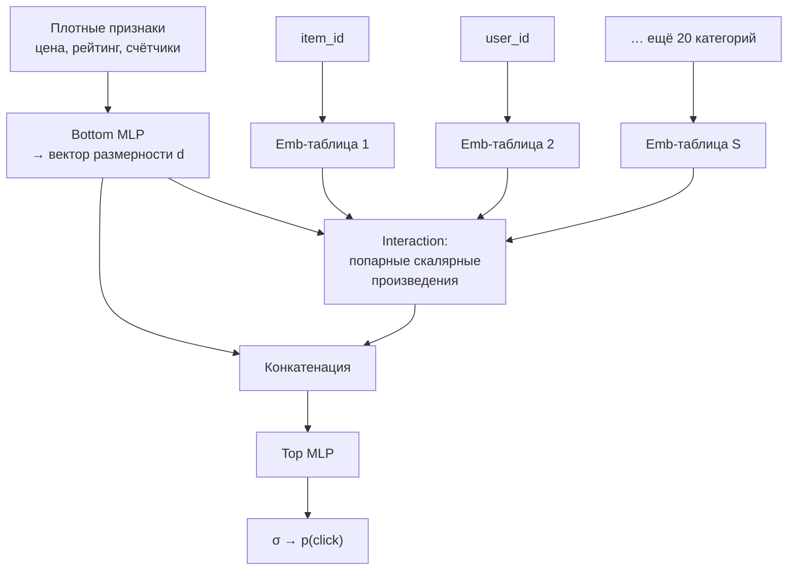

# Нейронное ранжирование

> **Зачем эта глава.** Бустинг из предыдущей главы упирается в три стены: миллионы категорий,
> история пользователя переменной длины и несколько конфликтующих целей одновременно. Нейронные
> ранжировщики строятся вокруг этих трёх проблем. После главы вы сможете посчитать память под
> эмбеддинг-таблицы до того, как запустите обучение, вывести поправку к вероятности после
> даунсэмплинга негативов, объяснить, чем MMoE отличается от shared-bottom, и сказать, почему
> некалиброванный CTR в рекламном аукционе — это не «неточность», а прямые убытки.

**Уровень:** 🎯 middle → 🧠 middle+
**Предварительно нужно:** [обучение ранжированию](07-learning-to-rank.md), [факторизационные машины](05-factorization-machines.md), [двухбашенные модели и ANN](06-two-tower-and-ann.md), [дисбаланс и калибровка](../02-classic-ml/12-imbalance-and-calibration.md), [внимание и трансформер](../03-deep-learning/04-attention-and-transformer.md)

**Как проработать:** чтение + сборка DLRM и DIN на torch + расчёт памяти

---

## Карта главы

- [1. Где кончается бустинг](#1-где-кончается-бустинг) — три стены на конкретных числах
- [2. Эмбеддинги категорий высокой мощности](#2-эмбеддинги-категорий-высокой-мощности) — размерность, память, hashing trick
- [3. DLRM: рабочая лошадка CTR-предсказания](#3-dlrm-рабочая-лошадка-ctr-предсказания)
- [4. DIN: внимание к истории относительно кандидата](#4-din-внимание-к-истории-относительно-кандидата)
- [5. DIEN: интерес, который меняется во времени](#5-dien-интерес-который-меняется-во-времени)
- [6. Многозадачность: shared-bottom, MMoE, PLE](#6-многозадачность-shared-bottom-mmoe-ple)
- [7. Калибровка CTR и аукцион](#7-калибровка-ctr-и-аукцион)
- [8. Обучение при дисбалансе 1:500](#8-обучение-при-дисбалансе-1500)
- [9. Онлайн-дообучение](#9-онлайн-дообучение)
- [10. Компромиссы и границы](#10-компромиссы-и-границы)
- [11. Подводные камни](#11-подводные-камни)
- [12. Проверь себя](#12-проверь-себя)
- [13. Практика](#13-практика)
- [14. Что читать дальше](#14-что-читать-дальше)

---

## 1. Где кончается бустинг

LambdaMART из [предыдущей главы](07-learning-to-rank.md) — правильный дефолт, и менять его надо
только под конкретную причину. Причин ровно три, и все три — про форму данных, а не про моду.

**Стена первая: категории высокой мощности.** У вас 50 млн товаров и 30 млн пользователей.
Дерево умеет работать с категориальным признаком через набор сплитов по значениям, но при
кардинальности $10^7$ это либо невозможно, либо вырождается в one-hot-разреженность, на которой
деревья строят бессмысленно глубокие ветвления. Target encoding спасает частично: он сжимает
`item_id` до одного числа (средний CTR), но выбрасывает всю структуру — после кодирования два
товара с CTR 3% неразличимы, хотя один из них дрель, а другой помада.

**Стена вторая: последовательность переменной длины.** История пользователя — это 200 событий
разной давности. Чтобы подать её в бустинг, нужно свернуть в фиксированный вектор агрегатов:
«покупок в категории за 30 дней», «средняя цена». При этом теряется главное: **какие именно
элементы истории релевантны текущему кандидату**. Человек, купивший дрель, шуруповёрт и
кроссовки, при показе перфоратора должен активировать первые два события и проигнорировать
третье. Агрегат этого не умеет — он усредняет всё сразу.

**Стена третья: несколько целей.** Продукту нужны и клик, и глубина просмотра, и покупка,
и отсутствие жалобы. Бустинг обучается под одну функцию потерь; четыре цели — четыре модели,
четыре пайплайна, четыре набора признаков, и никакого переноса знаний между ними, хотя данные
и признаки одни и те же.

Нейросеть решает все три: обучаемые эмбеддинги вместо кодирования, внимание вместо агрегатов,
общие слои с несколькими головами вместо четырёх моделей. Платим за это памятью, GPU и
латентностью — дальше вся глава про то, сколько именно.

> 🌱 **База.** Минимальный маршрут: [§2](#2-эмбеддинги-категорий-высокой-мощности) (эмбеддинги и hashing trick), [§3](#3-dlrm-рабочая-лошадка-ctr-предсказания) (DLRM — базовая
> архитектура CTR), [§7](#7-калибровка-ctr-и-аукцион) (калибровка). Этого хватает, чтобы разговаривать про нейронный
> ранжировщик и не путать его с двухбашенкой.

---

## 2. Эмбеддинги категорий высокой мощности

### Сколько это стоит в гигабайтах

Эмбеддинг-таблица — обычная матрица $E \in \mathbb{R}^{|V| \times d}$, где $|V|$ — мощность
словаря (число уникальных значений категории), $d$ — размерность эмбеддинга. Прямой проход —
это индексация строки, обратный — обновление только тех строк, которые встретились в батче.

Память в байтах: $|V| \cdot d \cdot b$, где $b$ — размер элемента (4 для fp32, 2 для fp16/bf16).
Но при обучении с Adam на каждый параметр держатся ещё два состояния оптимизатора (первый и
второй момент), то есть **множитель 3** для fp32.

Посчитаем реальный маркетплейс:

| Признак | $\|V\|$ | $d$ | Веса, fp32 | С состоянием Adam |
|---|---|---|---|---|
| `item_id` | 50 млн | 64 | 12,8 ГБ | 38,4 ГБ |
| `user_id` | 30 млн | 32 | 3,8 ГБ | 11,5 ГБ |
| `category_id` | 20 тыс. | 32 | 2,6 МБ | 7,7 МБ |
| `brand_id` | 300 тыс. | 24 | 29 МБ | 86 МБ |
| `city_id` | 2 тыс. | 16 | 0,1 МБ | 0,4 МБ |
| **Итого** | | | **~16,7 ГБ** | **~50 ГБ** |

Вывод, который надо сделать до написания кода: **две крупные таблицы не помещаются в GPU
вместе с остальным обучением**. Отсюда три инженерных решения — sparse-оптимизаторы без
хранения полного состояния (Adagrad с одним аккумулятором на строку вместо Adam с двумя),
шардирование таблиц по нескольким GPU (model parallelism для эмбеддингов + data parallelism
для MLP — ровно то, ради чего написан TorchRec) и сокращение самих таблиц.

### Как выбирать $d$

Эвристики, которые действительно используют:

- $d \approx |V|^{1/4}$ — «правило Google»: для 50 млн даёт $\approx 84$;
- $d = \min(600,\; \lceil 1.6\,|V|^{0.56}\rceil)$ — правило fast.ai, более щедрое на малых словарях;
- практический диапазон: 8–16 для категорий до тысячи значений, 32–64 для миллионов, редко выше 128.

Все три — отправная точка, а не ответ. Реальный выбор делается перебором по валидации, и
зависимость обычно быстро выходит на плато: переход с 32 на 64 даёт заметный прирост, с 64 на 128 —
уже в пределах шума при удвоении памяти. Дешёвая эвристика: смотрите на **число примеров на строку
таблицы**. Если у товара в среднем 20 показов в обучающей выборке, вектор из 128 чисел он
не выучит — переобучится на шум.

### Hashing trick

Проблема не только в памяти. `item_id` — открытый словарь: каждый день появляются новые товары,
и таблица фиксированного размера с ними ничего сделать не может. Решение — **хеширование
признаков** (hashing trick, feature hashing): вместо словаря «id → строка таблицы» берём
хеш-функцию

$$
h(\text{id}) = \mathrm{hash}(\text{id}) \bmod B
$$

где $B$ — число корзин (размер таблицы), выбираемое нами, а не данными. Словарь не нужен вообще,
новые id обслуживаются мгновенно, память фиксирована.

Цена — **коллизии**: разные товары попадают в одну строку и делят вектор. Оценим долю
пострадавших. При $|V|$ идентификаторах и $B$ корзинах вероятность, что конкретный id делит
корзину хотя бы с одним другим:

$$
P(\text{коллизия}) = 1 - \left(1 - \frac{1}{B}\right)^{|V| - 1} \approx 1 - e^{-|V|/B}
$$

где $|V|/B$ — коэффициент загрузки. При $B = 10\,|V|$ коллизию ловят ~9,5% идентификаторов,
при $B = |V|$ — уже 63%. То есть «захешируем 50 млн товаров в 1 млн корзин» означает, что
практически каждая корзина смешивает полсотни разных товаров.

Три приёма, которые делают хеширование рабочим:

**Гибрид «голова + хвост».** Топ-N частотных id (например, миллион товаров, дающих 90% показов)
получают персональные строки таблицы; всё остальное хешируется в общий пул. Коллизии бьют
по хвосту, где данных и так мало, а голова остаётся чистой. Это главный приём — коллизия у
популярного товара стоит несравнимо дороже.

**Мультихеш.** Две независимые хеш-функции, два эмбеддинга, их сумма. Вероятность, что два id
совпадут **по обоим** хешам, — квадрат одиночной, то есть при загрузке 0,1 это 1%.

**Quotient-Remainder (композиционные эмбеддинги, Shi et al., Facebook, KDD 2020).** Идентификатор
раскладывается в пару $(\lfloor \text{id}/m \rfloor,\; \text{id} \bmod m)$, для каждой части своя
таблица. Память падает с $|V|d$ до $(|V|/m + m)\,d$: при $|V| = 5\cdot10^7$ и $m = 7000$ это
7143 + 7000 ≈ 14 тыс. строк вместо 50 млн, а каждый id всё ещё имеет уникальную комбинацию.

```python
import torch
import torch.nn as nn

class HybridEmbedding(nn.Module):
    """Частотный гибрид: голова — персональные строки, хвост — хеш.
    top_ids — тензор id, отсортированных по убыванию частоты (голова словаря)."""

    def __init__(self, top_ids: torch.Tensor, n_hash_buckets: int, dim: int):
        super().__init__()
        # lookup id -> индекс головы; -1 означает "в голову не попал"
        max_id = int(top_ids.max().item()) + 1
        table = torch.full((max_id,), -1, dtype=torch.long)
        table[top_ids] = torch.arange(len(top_ids))
        self.register_buffer("head_index", table)

        self.head = nn.Embedding(len(top_ids), dim)
        self.tail = nn.Embedding(n_hash_buckets, dim)
        self.n_hash_buckets = n_hash_buckets
        nn.init.normal_(self.head.weight, std=0.01)   # мелкая инициализация:
        nn.init.normal_(self.tail.weight, std=0.01)   # эмбеддинги входят в скор мультипликативно

    def forward(self, ids: torch.Tensor) -> torch.Tensor:
        # id больше словаря головы (новый товар) обязан уйти в хвост, а не схлопнуться
        # на последнюю строку: clamp без этой проверки — тихий баг, который ловится месяцами
        in_range = ids < self.head_index.numel()
        head_pos = torch.where(in_range,
                               self.head_index[ids.clamp(max=self.head_index.numel() - 1)],
                               torch.full_like(ids, -1))
        in_head = head_pos >= 0
        # хеш считаем для всех, но используем только там, где головы нет: без ветвлений на GPU
        bucket = (ids * 2654435761) % self.n_hash_buckets   # множитель Кнута, дешёвый хеш
        out = torch.where(in_head.unsqueeze(-1),
                          self.head(head_pos.clamp(min=0)),
                          self.tail(bucket))
        return out
```

> 💬 **На собеседовании.** Спросят: «Что такое hashing trick и чем он опасен?» Хороший ответ:
> это замена словаря хеш-функцией по модулю $B$ — фиксированная память и мгновенная обработка
> новых id ценой коллизий, доля которых $\approx 1 - e^{-|V|/B}$. Опасность в том, что коллизии
> бьют неравномерно: популярный товар делит вектор со случайным мусором и деградирует сильнее,
> чем хвост, хотя приносит основную часть трафика. Лечится частотным гибридом, мультихешем или
> QR-разложением. Плохой ответ: «коллизии редки, ими можно пренебречь» — при типичных загрузках
> 0,1–0,5 они совсем не редки.

---

## 3. DLRM: рабочая лошадка CTR-предсказания

DLRM (Deep Learning Recommendation Model, Naumov et al., Meta, 2019) — не самая изощрённая
архитектура, но она задаёт скелет, вокруг которого построена половина продовых CTR-моделей.
Её ценность в том, что она явно разделяет плотные и разреженные признаки и делает их
взаимодействие **явным**, а не надеется, что MLP сам разберётся.



Формально. Пусть $x_{\text{dense}} \in \mathbb{R}^{m}$ — плотные признаки ($m$ — их число),
$x_0 = \mathrm{MLP}_{\text{bottom}}(x_{\text{dense}}) \in \mathbb{R}^{d}$ — их представление,
приведённое к той же размерности $d$, что и эмбеддинги; $e_1,\dots,e_S \in \mathbb{R}^{d}$ —
эмбеддинги $S$ категориальных признаков. Складываем всё в матрицу
$Z = [x_0; e_1; \dots; e_S] \in \mathbb{R}^{(S+1)\times d}$ и берём все попарные скалярные
произведения:

$$
\mathrm{Int}(Z) \;=\; \big\{\, z_a^\top z_b \;:\; 1 \le a < b \le S+1 \,\big\}
\;\in\; \mathbb{R}^{\frac{(S+1)S}{2}}
$$

где $z_a$ — $a$-я строка $Z$, а результат — вектор из $\frac{(S+1)S}{2}$ чисел (строго верхний
треугольник матрицы Грама $ZZ^\top$). Финальный скор:

$$
\hat p \;=\; \sigma\Big(\mathrm{MLP}_{\text{top}}\big([\,x_0 \,\|\, \mathrm{Int}(Z)\,]\big)\Big)
$$

где $\|$ — конкатенация, $\sigma$ — сигмоида, $\hat p$ — предсказанная вероятность клика.

**Почему скалярное произведение, а не просто конкатенация всех эмбеддингов в большой MLP?**
Это ровно логика [факторизационных машин](05-factorization-machines.md): взаимодействие пары
категорий естественно выражается через $\langle v_i, v_j\rangle$, и MLP приходится выучивать
эту билинейную форму с нуля, тратя на неё параметры и данные. DLRM даёт её даром. Плюс размер:
конкатенация 26 эмбеддингов по 64 — это вход 1664, первый слой MLP на 512 нейронов даст
850 тыс. параметров; interaction сжимает то же самое до $27\cdot26/2 = 351$ числа.

> 📐 **Разбор формулы.** Проверим размерности на конкретном примере. $S = 26$ категорий,
> $d = 64$. Тогда $Z$ — матрица $27 \times 64$, $ZZ^\top$ — $27 \times 27$, строгий верхний
> треугольник — 351 элемент. Вход top-MLP: $64 + 351 = 415$. Скрытые слои, скажем,
> $415 \to 512 \to 256 \to 1$: примерно $415\cdot512 + 512\cdot256 + 256 \approx 344$ тыс.
> параметров. То есть «мозг» модели — доли процента от её веса; 99,9% — эмбеддинг-таблицы.
> Это главный структурный факт про CTR-модели, и из него следуют все решения по инфраструктуре.

```python
def dlrm_interaction(x0: torch.Tensor, embs: torch.Tensor) -> torch.Tensor:
    """x0   — (B, d)     выход bottom MLP
       embs — (B, S, d)  эмбеддинги категориальных признаков
       Возвращает (B, d + S(S+1)/2)."""
    z = torch.cat([x0.unsqueeze(1), embs], dim=1)          # (B, S+1, d)
    gram = torch.bmm(z, z.transpose(1, 2))                 # (B, S+1, S+1)
    n = z.size(1)
    # строго верхний треугольник: диагональ — это ||z||², она не несёт информации о взаимодействии
    idx_r, idx_c = torch.triu_indices(n, n, offset=1, device=z.device)
    inter = gram[:, idx_r, idx_c]                          # (B, S(S+1)/2)
    return torch.cat([x0, inter], dim=1)
```

Что важно знать про DLRM в проде, помимо архитектуры: обучение почти всегда гибридно-параллельное
(таблицы шардируются между GPU по строкам, MLP реплицируется), эмбеддинги обновляются
разреженно (`sparse=True` в `nn.Embedding` плюс `SparseAdam`/`Adagrad`, иначе шаг оптимизатора
трогает всю таблицу целиком и обучение встаёт), а на инференсе таблицы часто выносят в отдельный
сервис или в память CPU с квантизацией до int8 — качество почти не страдает, а память падает в 4 раза.

---

## 4. DIN: внимание к истории относительно кандидата

DLRM сворачивает историю пользователя в один вектор (сумма или среднее эмбеддингов посещённых
товаров). Вернёмся к примеру из [§1](#1-где-кончается-бустинг): история — дрель, шуруповёрт, кроссовки, детская книжка,
чайник. Средний вектор — это «среднее по всему интересу», размытая точка, одинаковая для любого
кандидата. Когда мы скорим перфоратор, нам нужны только дрель и шуруповёрт.

DIN (Deep Interest Network, Zhou et al., Alibaba, KDD 2018) чинит это одним изменением:
представление пользователя вычисляется **относительно кандидата**.

$$
v_U(A) \;=\; \sum_{j=1}^{H} a\big(e_j,\, v_A\big) \cdot e_j
$$

где $H$ — длина истории (обычно 50–200 последних событий), $e_j \in \mathbb{R}^{d}$ — эмбеддинг
$j$-го элемента истории, $v_A \in \mathbb{R}^{d}$ — эмбеддинг скорируемого кандидата
(target item), $a(\cdot,\cdot)$ — **локальный активационный блок** (local activation unit),
выдающий скалярный вес, а $v_U(A)$ — итоговое представление пользователя, своё для каждого
кандидата.

Блок $a$ — маленький MLP, на вход которому подают не просто пару, а её явные взаимодействия:

$$
a(e_j, v_A) \;=\; \mathrm{MLP}\big([\,e_j \,\|\, v_A \,\|\, e_j - v_A \,\|\, e_j \odot v_A\,]\big)
$$

где $\odot$ — покомпонентное произведение, $\|$ — конкатенация. Разность и произведение
добавлены потому, что двухслойному MLP тяжело выучить «похожесть» из голой конкатенации, а
$e_j \odot v_A$ и $e_j - v_A$ дают её почти напрямую.

Одна деталь отличает DIN от обычного attention и её любят спрашивать: **веса не нормируются
softmax'ом**. В классическом внимании $\sum_j a_j = 1$, здесь — нет. Причина продуктовая:
сумма весов кодирует **интенсивность** интереса. Пользователь, у которого в истории 20 событий
про инструменты, должен дать более сильный сигнал, чем тот, у кого одно, а softmax это
различие стирает.

```python
class DINAttention(nn.Module):
    def __init__(self, dim: int, hidden: int = 64):
        super().__init__()
        self.mlp = nn.Sequential(
            nn.Linear(dim * 4, hidden), nn.PReLU(),
            nn.Linear(hidden, hidden // 2), nn.PReLU(),
            nn.Linear(hidden // 2, 1),
        )

    def forward(self, hist, cand, mask):
        """hist — (B, H, d) история; cand — (B, d) кандидат; mask — (B, H) bool, True = реальное событие."""
        c = cand.unsqueeze(1).expand_as(hist)                      # (B, H, d)
        feats = torch.cat([hist, c, hist - c, hist * c], dim=-1)   # (B, H, 4d)
        w = self.mlp(feats).squeeze(-1)                            # (B, H)
        w = w.masked_fill(~mask, 0.0)   # паддинг не должен вносить вклад;
                                        # обнуляем вес, а НЕ ставим -inf: softmax тут не применяется
        return torch.bmm(w.unsqueeze(1), hist).squeeze(1)          # (B, d) — взвешенная сумма
```

Стоимость: скоринг $N$ кандидатов требует $N$ проходов по истории, то есть $O(N \cdot H)$ вместо
$O(H)$. При $N = 500$ и $H = 100$ это 50 тыс. вычислений активационного блока на один запрос.
Практические ходы: батчить всех кандидатов одним тензором (история копируется, но GPU это
переваривает), урезать $H$ до 50, применять DIN только на финальной стадии к 50–100 кандидатам,
а более грубую модель — к остальным.

---

## 5. DIEN: интерес, который меняется во времени

DIN относится к истории как к множеству: перестановка событий ничего не меняет. Но интерес
эволюционирует — человек, который месяц изучал ремонт, а последнюю неделю смотрит детские
товары, находится в другой точке, чем тот же набор событий в обратном порядке.

DIEN (Deep Interest Evolution Network, Zhou et al., Alibaba, AAAI 2019) добавляет два слоя.

**Слой извлечения интереса.** GRU по последовательности эмбеддингов истории, скрытое состояние
$h_t$ трактуется как «интерес в момент $t$». Проблема: обучающий сигнал приходит только с конца
последовательности (клик по кандидату), поэтому промежуточные $h_t$ ничем не контролируются.
Решение — **вспомогательный лосс** (auxiliary loss): состояние $h_t$ должно предсказывать
**следующее реальное** событие $e_{t+1}$ и отличать его от случайно засэмплированного $\hat e_{t+1}$:

$$
\mathcal{L}_{\text{aux}} = -\frac{1}{N}\sum_{u=1}^{N}\sum_{t}\Big[\log \sigma\big(h_t^\top e_{t+1}\big) + \log\big(1 - \sigma(h_t^\top \hat e_{t+1})\big)\Big]
$$

где $N$ — число пользователей в батче, $t$ пробегает позиции истории, $h_t$ — состояние GRU,
$e_{t+1}$ — эмбеддинг фактически следующего события, $\hat e_{t+1}$ — эмбеддинг случайного
негатива, $\sigma$ — сигмоида. Общий лосс: $\mathcal{L} = \mathcal{L}_{\text{target}} + \alpha\,\mathcal{L}_{\text{aux}}$,
где $\alpha$ — вес (в статье порядка единицы), а $\mathcal{L}_{\text{target}}$ — обычный log-loss
по клику.

**Слой эволюции интереса — AUGRU** (GRU with attentional update gate). Считаем внимание $a_t$
состояния $h_t$ к кандидату (как в DIN) и умножаем на него **вентиль обновления**:

$$
\tilde{u}_t = a_t \cdot u_t, \qquad
h'_t = (1 - \tilde{u}_t) \odot h'_{t-1} + \tilde{u}_t \odot \tilde{h}_t
$$

где $u_t \in (0,1)^{d}$ — стандартный update gate GRU, $a_t \in (0,1)$ — вес внимания к кандидату,
$\tilde h_t$ — кандидат на новое состояние GRU, $h'_t$ — состояние второго GRU, $\odot$ —
покомпонентное умножение. Смысл: шаги истории, нерелевантные кандидату, почти не обновляют
состояние ($\tilde u_t \approx 0$ — состояние копируется), релевантные — обновляют сильно.
В отличие от простого домножения $h_t$ на $a_t$, здесь внимание влияет на **динамику**, а не
на выход, и не искажает масштаб состояния.

Честная оценка: DIEN дороже DIN примерно вдвое по латентности (два рекуррентных прохода вместо
одного взвешенного суммирования) и заметно капризнее в обучении — вспомогательный лосс требует
подбора $\alpha$ и качественного сэмплирования негативов. Прирост в опубликованных экспериментах
измеряется долями процента AUC. В проде переход DIN → DIEN окупается редко; чаще следующим шагом
берут трансформер по истории — см. [последовательные рекомендации](09-sequential-recsys.md).

> 💬 **На собеседовании.** Спросят: «Зачем в DIN внимание, если можно просто усреднить историю?»
> Хороший ответ: усреднение даёт одно представление пользователя на все кандидаты, поэтому
> модель не может использовать историю **избирательно** — сигнал от трёх релевантных событий
> тонет в сотне нерелевантных. DIN считает веса как функцию пары (элемент истории, кандидат),
> поэтому представление пользователя разное для дрели и для платья. И добавьте деталь про
> отсутствие softmax: сумма весов несёт интенсивность интереса, нормировка её бы уничтожила.
> Плохой ответ: «внимание работает лучше» без механизма.

---

## 6. Многозадачность: shared-bottom, MMoE, PLE

### Зачем несколько целей

Клик — плохая единственная цель, и это знает любой, кто видел, во что превращается лента при
чистой оптимизации CTR: кликбейт, шок-контент, дешёвые товары с яркими картинками. Продукту
нужен набор:

| Цель | Тип | Частота срабатывания | Роль |
|---|---|---|---|
| клик | бинарная | 1–5% | основной сигнал, много данных |
| глубина просмотра / dwell time | регрессия | на кликнувших | отсекает кликбейт |
| добавление в корзину | бинарная | 0,1–0,5% | ближе к деньгам |
| покупка | бинарная | 0,01–0,1% | бизнес-цель, мало данных |
| скрытие / жалоба | бинарная | <0,1% | guardrail |

Финальный скор собирается вручную из голов, например
$\text{score} = p_{\text{click}}^{w_1} \cdot p_{\text{buy}}^{w_2} \cdot \mathbb{E}[\text{dwell}]^{w_3} \cdot (1 - p_{\text{hide}})^{w_4}$,
где $w_k$ — веса, подбираемые A/B-тестами, а не обучением. Мультипликативная форма популярна
потому, что она устойчива к разным масштабам голов и легко даёт «вето»: близкая к единице
вероятность жалобы обнуляет скор.

Второй мотив — **перенос знаний**: покупок в 100 раз меньше, чем кликов, и отдельная модель
покупки недоучится. В общей сети слои, выученные на обильном кликовом сигнале, дают редкой
задаче хорошее представление даром.

### Shared-bottom и его проблема

Простейшая схема: общий стек слоёв $f(x)$ и по маленькой голове на задачу:

$$
y_k = h^k\big(f(x)\big), \qquad k = 1,\dots,K
$$

где $f$ — общее «дно» (shared bottom), $h^k$ — башня задачи $k$, $K$ — число задач.
Работает отлично, когда задачи коррелируют. Когда нет — возникает **отрицательный перенос**
(negative transfer): градиенты задач тянут общие веса в разные стороны, и обе задачи получаются
хуже, чем при раздельном обучении. Классический пример конфликта: «клик» и «жалоба» —
шокирующий контент максимизирует первое и второе одновременно.

### MMoE

MMoE (Multi-gate Mixture-of-Experts, Ma et al., Google, KDD 2018) заменяет единое дно набором
**экспертов** и даёт каждой задаче свой **вентиль** (gate), решающий, как их смешать:

$$
g^k(x) = \mathrm{softmax}\big(W_{g}^{k} x\big), \qquad
f^k(x) = \sum_{i=1}^{n} g^k(x)_i \cdot f_i(x), \qquad
y_k = h^k\big(f^k(x)\big)
$$

где $n$ — число экспертов (обычно 4–8 одинаковых по архитектуре MLP), $f_i(x)$ — выход $i$-го
эксперта, $W_g^k$ — матрица вентиля задачи $k$ (обучаемая, размер $n \times \dim(x)$),
$g^k(x)_i$ — вес $i$-го эксперта для задачи $k$ (веса неотрицательны и суммируются в единицу),
$h^k$ — башня задачи, $y_k$ — её выход.

Что это даёт: если задачи конфликтуют, вентили просто разъедутся — задача «клик» будет
опираться на экспертов 1–2, задача «жалоба» на 3–4, и конфликта градиентов не возникнет.
Если задачи близки, вентили сойдутся и мы получим тот же перенос знаний, что у shared-bottom.
Модель **сама выбирает** степень разделения по данным, а не по решению архитектора. Цена
минимальна: вентили — одна матрица на задачу, а эксперты по сумме параметров сопоставимы с
одним крупным shared-bottom.

```python
class MMoE(nn.Module):
    def __init__(self, in_dim, expert_dim, n_experts=4, n_tasks=3, tower_hidden=64):
        super().__init__()
        self.experts = nn.ModuleList(
            nn.Sequential(nn.Linear(in_dim, expert_dim), nn.ReLU(),
                          nn.Linear(expert_dim, expert_dim), nn.ReLU())
            for _ in range(n_experts)
        )
        # по одному вентилю на задачу — в этом весь смысл "multi-gate"
        self.gates = nn.ModuleList(nn.Linear(in_dim, n_experts) for _ in range(n_tasks))
        self.towers = nn.ModuleList(
            nn.Sequential(nn.Linear(expert_dim, tower_hidden), nn.ReLU(),
                          nn.Linear(tower_hidden, 1))
            for _ in range(n_tasks)
        )

    def forward(self, x):
        e = torch.stack([f(x) for f in self.experts], dim=1)     # (B, n_experts, expert_dim)
        outs = []
        for gate, tower in zip(self.gates, self.towers):
            w = torch.softmax(gate(x), dim=-1).unsqueeze(-1)     # (B, n_experts, 1)
            mixed = (e * w).sum(dim=1)                           # (B, expert_dim)
            outs.append(tower(mixed).squeeze(-1))                # логит задачи
        return outs   # список из n_tasks логитов; сигмоиду применяем в лоссе
```

### PLE

PLE (Progressive Layered Extraction, Tang et al., Tencent, RecSys 2020) отвечает на наблюдение,
что MMoE всё ещё демонстрирует **эффект качелей** (seesaw): улучшение одной задачи сопровождается
падением другой, потому что все эксперты остаются общими и конкуренция за них сохраняется.
PLE делает разделение явным: часть экспертов закрепляется за конкретной задачей
(task-specific), часть остаётся общей (shared). Вентиль задачи $k$ смешивает **только своих
экспертов и общих**, но не чужих специфичных. Такие блоки складываются в несколько уровней,
и на каждом уровне разделение углубляется.

Практический порядок выбора: начинайте с shared-bottom (он проще и часто достаточен), переходите
к MMoE, если видите, что добавление второй задачи ухудшило первую, и к PLE — если MMoE не
устранил качели при трёх и более разнородных задачах.

> 💬 **На собеседовании.** Спросят: «Чем MMoE лучше shared-bottom?» Хороший ответ: shared-bottom
> навязывает всем задачам одно представление, поэтому при слабо связанных или конфликтующих
> задачах градиенты дерутся за общие веса и возникает отрицательный перенос. MMoE вводит $n$
> экспертов и по вентилю на задачу, $f^k(x) = \sum_i g^k(x)_i f_i(x)$, — степень разделения
> становится обучаемым параметром: близкие задачи используют одних экспертов, конфликтующие
> расходятся. Сильное дополнение: назвать эффект качелей и PLE как следующий шаг.
> Плохой ответ: «MMoE — это ансамбль».

---

## 7. Калибровка CTR и аукцион

В рекомендациях достаточно правильного порядка. В рекламе — нет, и это самое частое место,
где ломается перенос интуиции из RecSys в AdTech.

Рекламный аукцион ранжирует объявления по **ожидаемой выручке за тысячу показов**:

$$
\mathrm{eCPM} \;=\; 1000 \cdot \mathrm{bid} \cdot \hat p_{\text{CTR}}
$$

где $\mathrm{bid}$ — ставка рекламодателя за клик (в рублях), $\hat p_{\text{CTR}}$ — наша
предсказанная вероятность клика. В аукционе второй цены победитель платит цену, вычисляемую
из eCPM следующего участника:

$$
\mathrm{price}_{(1)} \;=\; \frac{\mathrm{eCPM}_{(2)}}{1000 \cdot \hat p^{(1)}_{\text{CTR}}}
$$

где нижние индексы в скобках — место в ранжировании по eCPM. Обратите внимание: $\hat p$ входит
в формулу цены **напрямую**, а не через порядок. Если модель систематически завышает CTR в
полтора раза для какого-то сегмента, объявления этого сегмента выигрывают показы, которых
не заслуживают, а списанная цена оказывается неверной. Монотонное преобразование скоров,
безвредное для NDCG, здесь уносит деньги. То же самое верно для любого бюджетирования
(«потратить дневной бюджет равномерно»), для расчёта ROI и для порогов бизнес-правил.

**Как измерять калибровку.** Одного числа мало, нужны три:

$$
\mathrm{CalibRatio} = \frac{\sum_{i} \hat p_i}{\sum_{i} y_i}
$$

где $\hat p_i$ — предсказание для показа $i$, $y_i \in \{0,1\}$ — факт клика. Идеал — 1,0;
допустимый коридор в проде обычно 0,95–1,05. Считать надо **по сегментам** — по позиции,
по рекламодателю, по устройству, по времени суток: глобальная единица легко скрывает
перекос +30% на мобильных и −30% на десктопе.

$$
\mathrm{NE} = \frac{-\frac{1}{N}\sum_i \big[y_i \log \hat p_i + (1-y_i)\log(1-\hat p_i)\big]}{-\big[\bar p \log \bar p + (1-\bar p)\log(1-\bar p)\big]}
$$

**Нормализованная энтропия** (normalized entropy, из работы Facebook про предсказание кликов,
2014): log-loss модели, делённый на log-loss константного предсказания фоновым CTR $\bar p$.
Значение меньше 1 означает, что модель лучше константы; типичные продовые значения 0,75–0,90,
и улучшение на 0,001 считается значимым. Нормировка нужна потому, что сырой log-loss зависит
от фонового CTR и несравним между днями и площадками.

Третье — **калибровочная кривая**: разбиваем предсказания на 20 бинов по квантилям и строим
средний $\hat p$ против фактического CTR бина. Она показывает **форму** ошибки, а не только знак.

**Чем калибровать.** Изотоническая регрессия на отложенной по времени выборке — стандарт;
Platt scaling (логистическая регрессия на логите) — когда данных мало. Ключевое: калибратор
обучается **после** модели, на данных, которые модель не видела, и его надо переобучать чаще,
чем саму модель, — фоновый CTR плывёт быстрее, чем ранжирующая способность. Детали методов —
в [главе про калибровку](../02-classic-ml/12-imbalance-and-calibration.md).

---

## 8. Обучение при дисбалансе 1:500

CTR в баннерной рекламе — 0,05–0,5%, в товарных рекомендациях — 1–5%, в поиске — 10–30%.
На нижней границе это один положительный пример на две тысячи отрицательных. Логи за сутки
сервиса на 3000 показов/с — это 260 млн строк, из которых кликов около полумиллиона.

**Главный приём — даунсэмплинг негативов.** Оставляем все позитивы и долю $w$ негативов
($w = 0{,}01$–$0{,}1$). Обучающая выборка сжимается в 10–50 раз, обучение ускоряется во столько же,
качество ранжирования практически не страдает. Но предсказания модели теперь смещены вверх —
она обучалась на выборке, где кликов искусственно больше.

Поправка выводится за три строки. Пусть $q$ — истинная вероятность клика, $p$ — вероятность
в пересэмплированной выборке. Позитив попадает в выборку с вероятностью 1, негатив — с
вероятностью $w$. По формуле Байеса для выборки:

$$
p \;=\; \frac{q \cdot 1}{q \cdot 1 + (1-q)\cdot w}
$$

Разрешим относительно $q$: $p\,q + p(1-q)w = q \Rightarrow pw = q(1 - p + pw) \Rightarrow$

$$
\boxed{\;q \;=\; \frac{p\,w}{p\,w + 1 - p}\;} \qquad\text{или эквивалентно}\qquad
q \;=\; \frac{p}{p + (1-p)/w}
$$

где $q$ — калиброванная вероятность, которую отдаём в аукцион, $p$ — сырой выход модели,
$w \in (0,1]$ — доля сохранённых негативов. Проверка предельных случаев: при $w = 1$ (ничего
не выбрасывали) $q = p$; при $p = 0{,}5$ и $w = 0{,}01$ получаем $q \approx 0{,}0099$ — вернулись
к правдоподобному масштабу CTR.

```python
import numpy as np

def undo_negative_downsampling(p: np.ndarray, w: float) -> np.ndarray:
    """p — предсказания модели, обученной на выборке, где сохранена доля w негативов."""
    return p * w / (p * w + 1.0 - p)

# Проверка на синтетике: CTR 0.4%, оставили 2% негативов
rng = np.random.default_rng(0)
q_true = rng.uniform(0.001, 0.02, size=100_000)
w = 0.02
p_biased = q_true / (q_true + (1 - q_true) * w)     # что видела бы модель на такой выборке
assert np.allclose(undo_negative_downsampling(p_biased, w), q_true, atol=1e-9)
```

Что **не** стоит делать, если нужен калиброванный выход:

- **Веса классов** (`pos_weight` в `BCEWithLogitsLoss`) — то же смещение, что у даунсэмплинга,
  но без экономии времени обучения. Если применяете, поправку надо считать по той же формуле
  с $w = 1/\text{pos\_weight}$.
- **Focal loss** — он намеренно искажает распределение, занижая вклад «лёгких» примеров.
  Для чистого ранжирования допустим, для аукциона — нет: восстановить вероятность аналитически
  после focal loss нельзя, только эмпирической калибровкой.
- **Oversampling позитивов** — дублирует один и тот же клик, увеличивает переобучение на
  редких пользователях и раздувает время обучения. Даунсэмплинг негативов почти всегда лучше.

Три вещи, которые надо контролировать помимо этого. Метрика: accuracy бесполезна (константный
ноль даёт 99,6%), смотрите на ROC-AUC, PR-AUC и NE. Размер батча: при CTR 0,3% и батче 512
в среднем полтора позитива на батч — градиент чудовищно шумный, поднимайте батч до 4–16 тыс.
Инициализация выходного смещения: ставьте $b_0 = \log\frac{\bar p}{1-\bar p}$, иначе первые тысячи
шагов модель тратит на то, чтобы просто спуститься к правильному среднему уровню.

> 💬 **На собеседовании.** Спросят: «Вы засэмплировали негативы 1:20 — что произойдёт с
> предсказаниями и как это исправить?» Хороший ответ: предсказания окажутся систематически
> завышенными, потому что апостериорная вероятность клика в выборке отличается от истинной;
> исправляется аналитически, $q = pw/(pw + 1 - p)$, где $w$ — доля сохранённых негативов;
> ранжирование при этом не меняется (преобразование монотонно), но для аукциона, бюджетов
> и порогов поправка обязательна. Сильное дополнение: сказать, что после поправки всё равно
> надо проверить калибровочную кривую по сегментам — аналитическая формула чинит средний
> уровень, но не форму. Плохой ответ: «сэмплирование на калибровку не влияет».

---

## 9. Онлайн-дообучение

CTR-модели протухают быстрее, чем почти любые другие. Причины конкретные: каталог обновляется
ежедневно, рекламные кампании стартуют и заканчиваются в течение часов, тренды и сезонность
двигают фоновый CTR, а собственная выдача меняет распределение данных. Типичная деградация
NE у модели, не обновлявшейся неделю, — заметная и монотонная.

**Три режима, по возрастанию сложности.**

| Режим | Задержка данных | Инфраструктура | Когда выбирать |
|---|---|---|---|
| Полное переобучение по расписанию | 12–24 ч | обычный батчевый пайплайн | старт любого проекта, стабильный каталог |
| Инкрементальное дообучение | 15 мин – 2 ч | сохранение состояния оптимизатора, частые чекпоинты | каталог/кампании меняются за часы |
| Потоковое обучение | секунды–минуты | Kafka + онлайн-тренер + шардированные таблицы | реклама, новости, короткое видео |

Практическая рекомендация: **полное переобучение раз в неделю + инкрементальное раз в час**.
Полное нужно, чтобы стряхнуть накопленный дрейф и переинициализировать протухшие строки таблиц;
инкрементальное — чтобы догонять свежесть.

**Что ломается в инкрементальном режиме и что с этим делать.**

*Катастрофическое забывание.* Дообучение только на последнем часе смещает модель к текущему
распределению и разрушает знание о редких сегментах. Лечение: буфер повторов (replay) —
подмешивать 10–30% примеров из случайной недели истории; заниженный learning rate на дообучении
(обычно 1/5–1/10 от базового).

*Отложенная конверсия.* Клик виден сразу, покупка — через часы или дни. Если формировать
обучающие метки через 30 минут после показа, все поздние конверсии окажутся негативами и модель
систематически занизит вероятность покупки. Варианты: окно ожидания (обучаем на данных
$T-24\,\text{ч}$, теряя свежесть), либо явная модель задержки конверсии с перевзвешиванием
(классическая постановка — Chapelle, «Modeling Delayed Feedback in Display Advertising», KDD 2014).

*Рост эмбеддинг-таблиц.* Новые id прибывают непрерывно, и таблица растёт без ограничений.
Нужна политика вытеснения: удалять строки, не встречавшиеся $N$ дней или получившие меньше
$M$ обновлений, — и делать это в момент полного переобучения, а не на лету.

*Оптимизатор.* Для потокового режима традиционно берут FTRL-Proximal (Google, «Ad Click
Prediction: a View from the Trenches», KDD 2013) — он даёт разреженные веса и покоординатные
темпы обучения, что критично для миллионов редких признаков. Для нейросетей аналог —
Adagrad/RowWiseAdagrad на эмбеддингах: каждая строка таблицы получает свой шаг, обратно
пропорциональный накопленной частоте обновлений.

**Обязательные защитные механизмы.** Автоматически обновляемая модель — это выкатка без
человека, поэтому: (1) валидация на «завтрашних» данных перед промоутом (обучились до
$T$, проверили на $T \ldots T+\Delta$); (2) гейт по NE — если хуже текущей прод-модели, промоут
отменяется; (3) проверка калибровки перед выкаткой — CalibRatio вне коридора 0,95–1,05
блокирует релиз; (4) снапшоты каждые 15–30 минут и возможность отката на любой из последних
суток; (5) мониторинг распределения предсказаний — сдвиг среднего $\hat p$ более чем на 10% за
час почти всегда означает поломку пайплайна фич, а не изменение поведения пользователей.
Подробнее — в [главе про переобучение моделей](../09-monitoring/07-retraining.md).

> ⚠️ **Типичная ошибка.** Настроить непрерывное дообучение и не настроить непрерывную валидацию.
> Один битый час логов (упал джоб фичей, все счётчики пришли нулями) уезжает в модель, модель
> уезжает в прод, и деградация обнаруживается через сутки по бизнес-метрике. Гейт по офлайн-метрике
> на свежих данных стоит один день работы и окупается на первом же инциденте.

---

## 10. Компромиссы и границы

**Нейросеть или бустинг.** Переходить на нейронный ранжировщик стоит, когда выполнены хотя бы два
условия: (а) есть категории мощностью выше $10^5$, где target encoding теряет структуру;
(б) нужна история пользователя как последовательность, а не как агрегаты; (в) целей три и больше;
(г) объём обучающих данных — сотни миллионов показов и выше. Если ни одно не выполняется,
LambdaMART обгонит нейросеть по качеству на единицу затраченного инженерного времени.

**Цена перехода в числах.** Бустинг: обучение десятки минут на CPU, инференс 500 кандидатов за
3–8 мс на ядре, модель — сотни мегабайт, переобучение запускает один человек скриптом.
Нейронный ранжировщик уровня DLRM+DIN: обучение часы на нескольких GPU, инференс требует
батчинга и обычно GPU или тщательно оптимизированного CPU-рантайма, модель — десятки гигабайт
с шардированием, вокруг неё нужен онлайн-пайплайн фич, сервис эмбеддингов и постоянная валидация.
Это не «в полтора раза дороже», это другой класс эксплуатационной сложности.

**Сложность архитектуры против качества данных.** Порядок отдачи почти всегда такой: качество
и свежесть признаков → корректность обучающей выборки (позиционный биас, утечки) → многозадачность →
архитектура взаимодействий. Замена DIN на DIEN даёт доли процента AUC; починка позиционного
биаса из [прошлой главы](07-learning-to-rank.md) — единицы процентов онлайн-метрики.

**AUC растёт, деньги нет.** Стандартная ситуация. Проверяйте: считается ли AUC внутри показа
(GAUC — усреднённая по пользователям/запросам) или глобально; глобальный AUC легко растёт за счёт
разделения «активные vs неактивные пользователи», что никак не улучшает порядок внутри выдачи.
Для ранжирования смотрите на GAUC и NE, для аукциона — дополнительно на калибровку.

---

## 11. Подводные камни

**Эмбеддинги новых id не обучены, но выдаются как обычные.**
Симптом: новые товары показываются с случайными скорами — то в топе, то на дне; жалобы от
категорийных менеджеров на непредсказуемость.
Причина: строка таблицы инициализирована шумом и ни разу не обновлялась, но модель обращается
с ней как с обученной.
Что делать: инициализировать эмбеддинги новых id средним по категории/бренду, а не случайно;
завести признак «число показов id в обучении» и дать модели возможность на него опираться;
на первые часы жизни товара опираться на контентные признаки (см. [холодный старт](12-cold-start-and-bias.md)).

**Коллизии хеша убили популярный товар.**
Симптом: у одного из топовых SKU CTR внезапно упал вдвое после переобучения, признаки не менялись.
Причина: изменился размер хеш-таблицы или seed, и товар склеился с мусорным id.
Что делать: фиксировать seed и $B$ в конфиге модели наравне с весами; частотный гибрид с
персональными строками для топ-N; алерт на резкое изменение среднего скора по топ-1000 товарам
после переобучения.

**Калибровка развалилась по сегментам при идеальном общем CalibRatio.**
Симптом: глобальное отношение 1,00, а по мобильному трафику 1,35 и по десктопу 0,78.
Причина: калибратор обучен глобально и усредняет противоположные смещения.
Что делать: считать калибровку по сегментам всегда; при устойчивом расхождении обучать
отдельные калибраторы на срезах (устройство, площадка, тип креатива) или добавлять сегмент
как признак в калибратор.

**Многозадачная модель уронила основную метрику.**
Симптом: добавили голову «жалоба», AUC клика упал на 0,004.
Причина: отрицательный перенос при shared-bottom плюс неудачные веса лоссов — редкая задача
с большим весом перетягивает общие слои.
Что делать: перейти на MMoE/PLE; нормировать вклад задач (веса лоссов обратно пропорциональны
частоте события или подобранные по градиентной норме); всегда сравнивать многозадачную модель
с однозадачным бейзлайном по каждой цели отдельно, а не только суммарно.

**Train/serve skew в истории пользователя.**
Симптом: офлайн GAUC 0,78, онлайн эффект нулевой.
Причина: в обучении «последние 100 событий» собирались из офлайн-таблицы и включали события,
случившиеся **после** момента показа; в проде история приходит из онлайн-хранилища с задержкой
в секунды и обрезана.
Что делать: point-in-time-сборка последовательностей, логирование реально использованной истории
в момент предсказания и обучение именно на ней, регулярная сверка длины и состава истории
между обучением и продом.

**Sparse-градиенты не включены.**
Симптом: одна эпоха на 200 млн строк идёт сутки, GPU загружен на 15%.
Причина: `nn.Embedding(..., sparse=False)` плюс Adam — каждый шаг оптимизатора трогает всю
таблицу целиком, то есть десятки гигабайт на батч из тысячи строк.
Что делать: `sparse=True` и `SparseAdam`/`Adagrad` для таблиц, обычный оптимизатор для MLP
(две группы параметров); проверить профилировщиком, что время уходит не в шаг оптимизатора.

**Инференс не влезает в бюджет из-за DIN.**
Симптом: p99 латентности 120 мс при бюджете 40 мс, растёт линейно по числу кандидатов.
Причина: активационный блок применяется к $N \times H$ парам, при $N=500$ и $H=200$ это
100 тыс. проходов MLP на запрос.
Что делать: урезать $H$ до 50 (вклад событий старше месяца обычно мал), применять DIN только
к топ-100 после дешёвой стадии, кэшировать эмбеддинги истории на уровне пользователя между
запросами сессии, квантизовать модель до int8.

---

## 12. Проверь себя

<details>
<summary><b>🎯 Вопрос.</b> Когда нейронный ранжировщик оправдан, а когда стоит остаться на бустинге?</summary>

**Короткий ответ.** Нейросеть — когда есть категории мощностью $>10^5$, история как
последовательность, три и более целей, и сотни миллионов обучающих примеров. Иначе LambdaMART
даст сопоставимое качество на порядок дешевле.

**Развёрнуто.** Деревья не умеют работать с миллионами id (target encoding сжимает их до одного
числа и теряет структуру), не видят историю как последовательность и обучаются под одну цель.
Нейросеть закрывает всё три пункта, но приносит эксплуатационную сложность другого класса:
десятки гигабайт эмбеддингов, шардирование таблиц, GPU или оптимизированный CPU-рантайм,
онлайн-пайплайн фич. Разумная траектория: LambdaMART как основа, эмбеддинги от отдельной сети
как признаки, полный переход — когда упёрлись в потолок.

**Чего ждёт интервьюер:** ответа через условия и стоимость владения, а не «нейросети современнее».

**Провал:** «нейросети всегда лучше на больших данных».
</details>

<details>
<summary><b>🎯 Вопрос.</b> Как посчитать память под эмбеддинг-таблицы и что делать, если не влезает?</summary>

**Короткий ответ.** $|V| \cdot d \cdot b$ байт, где $b$ = 4 для fp32; при обучении с Adam умножить
на 3 (веса + два момента). Не влезает — хешировать хвост, уменьшать $d$, шардировать таблицы
между GPU, брать оптимизатор с одним состоянием на строку.

**Развёрнуто.** Пример: 50 млн товаров × 64 × 4 Б = 12,8 ГБ весов, ~38 ГБ с состоянием Adam —
одна таблица уже не помещается на 40-гигабайтную карту. Решения по порядку дешевизны: снизить
$d$ (с 64 до 32 — вдвое, при потере качества обычно в пределах шума); RowWiseAdagrad вместо Adam
(одно состояние на строку вместо двух на параметр); частотный гибрид «голова + хеш» для хвоста;
QR-разложение id; шардирование по GPU (model parallel для таблиц + data parallel для MLP,
как в TorchRec); int8-квантизация таблиц на инференсе.

**Чего ждёт интервьюер:** что вы посчитаете число, а не скажете «много».

**Провал:** не учесть состояние оптимизатора — типичная ошибка, дающая трёхкратный промах.
</details>

<details>
<summary><b>🧠 Вопрос.</b> В чём идея DLRM и почему там скалярные произведения, а не большой MLP?</summary>

**Короткий ответ.** DLRM приводит плотные признаки через bottom-MLP к размерности эмбеддингов,
затем считает все попарные скалярные произведения между эмбеддингами и этим вектором, и подаёт
их вместе с плотной частью в top-MLP. Скалярное произведение — явная форма парного взаимодействия
из факторизационных машин; MLP пришлось бы выучивать её с нуля.

**Развёрнуто.** $Z = [x_0; e_1;\dots;e_S]$, interaction — строгий верхний треугольник $ZZ^\top$,
то есть $S(S+1)/2$ чисел. При $S=26$, $d=64$ это 351 признак вместо 1664-мерной конкатенации;
top-MLP получается в разы меньше и учится быстрее. Структурный факт: 99%+ параметров модели —
это эмбеддинг-таблицы, MLP — доли процента, поэтому вся инфраструктура строится вокруг таблиц.

**Чего ждёт интервьюер:** связи с FM и понимания, где в модели находится масса параметров.

**Провал:** описать DLRM как «MLP над конкатенацией эмбеддингов».
</details>

<details>
<summary><b>🎯 Вопрос.</b> Что делает DIN и чем его внимание отличается от обычного?</summary>

**Короткий ответ.** DIN вычисляет представление пользователя как взвешенную сумму эмбеддингов
истории, где веса зависят от скорируемого кандидата: $v_U(A) = \sum_j a(e_j, v_A)\,e_j$. Отличие
от классического внимания — веса не нормируются softmax'ом.

**Развёрнуто.** Блок $a$ — маленький MLP на входе $[e_j\|v_A\|e_j - v_A\|e_j\odot v_A]$; разность
и произведение добавлены, чтобы не заставлять сеть выучивать похожесть из голой конкатенации.
Отсутствие softmax намеренное: сумма весов кодирует интенсивность интереса, и пользователь с
двадцатью релевантными событиями должен давать более сильный сигнал, чем с одним. Цена —
$O(N\cdot H)$ вычислений на запрос при $N$ кандидатах и истории длины $H$, поэтому DIN обычно
применяют только на финальной стадии к 50–100 кандидатам.

**Чего ждёт интервьюер:** формулу, объяснение «зачем именно относительно кандидата» и знание
детали про softmax.

**Провал:** «DIN — это трансформер по истории».
</details>

<details>
<summary><b>🧠 Вопрос.</b> Зачем в DIEN вспомогательный лосс?</summary>

**Короткий ответ.** Обучающий сигнал приходит только от финального клика, поэтому промежуточные
скрытые состояния GRU ничем не контролируются. Вспомогательный лосс заставляет $h_t$ предсказывать
следующее реальное событие и отличать его от случайного негатива.

**Развёрнуто.**
$\mathcal{L}_{\text{aux}} = -\frac{1}{N}\sum_u\sum_t[\log\sigma(h_t^\top e_{t+1}) + \log(1-\sigma(h_t^\top \hat e_{t+1}))]$,
общий лосс $\mathcal{L} = \mathcal{L}_{\text{target}} + \alpha\mathcal{L}_{\text{aux}}$. Без него
GRU на длинной истории обучается плохо: градиент от единственной метки на конце размывается.
Второй элемент DIEN — AUGRU, где вес внимания к кандидату умножает update gate, так что
нерелевантные шаги истории почти не меняют состояние. На практике прирост DIEN над DIN —
доли процента AUC при двукратной латентности, поэтому в проде переход часто не окупается.

**Чего ждёт интервьюер:** понимания проблемы «нет супервизии на промежуточных состояниях»
и честной оценки соотношения выгоды и стоимости.

**Провал:** назвать вспомогательный лосс регуляризацией без объяснения, что он супервизирует.
</details>

<details>
<summary><b>🎯 Вопрос.</b> Зачем в ранжировании несколько целей и как из них собирается один скор?</summary>

**Короткий ответ.** Одна цель (клик) вырождается в кликбейт и не отражает бизнес; нужны глубина
просмотра, покупка и guardrail-цели вроде жалобы. Скор собирается вручную, обычно мультипликативно
с весами, подбираемыми A/B-тестом.

**Развёрнуто.** Пример:
$\text{score} = p_{\text{click}}^{w_1}\cdot p_{\text{buy}}^{w_2}\cdot \mathbb{E}[\text{dwell}]^{w_3}\cdot(1-p_{\text{hide}})^{w_4}$.
Мультипликативная форма устойчива к разным масштабам голов и даёт «вето» при высокой вероятности
негативного события. Веса — продуктовое решение, а не результат обучения: они кодируют, сколько
кликов стоит одна покупка. Второй мотив многозадачности — перенос знаний: покупок в сотню раз
меньше, чем кликов, и общие слои дают редкой задаче представление, которое она сама не выучит.

**Чего ждёт интервьюер:** и продуктового мотива (кликбейт), и инженерного (перенос знаний),
и понимания, что веса подбираются экспериментом.

**Провал:** «обучим сумму лоссов с равными весами» без обсуждения масштабов и конфликтов.
</details>

<details>
<summary><b>🧠 Вопрос.</b> Чем MMoE отличается от shared-bottom и что такое эффект качелей?</summary>

**Короткий ответ.** Shared-bottom даёт всем задачам одно представление, и при конфликтующих
задачах возникает отрицательный перенос. MMoE вводит $n$ экспертов и по softmax-вентилю на задачу:
$f^k(x) = \sum_i g^k(x)_i f_i(x)$ — степень разделения становится обучаемой. Эффект качелей —
ситуация, когда улучшение одной задачи неизбежно сопровождается ухудшением другой; PLE борется
с ним, закрепляя часть экспертов за конкретными задачами.

**Развёрнуто.** Механизм отрицательного переноса: градиенты слабо связанных задач указывают в
разные стороны, общие веса получают их сумму и не удовлетворяют никого. Вентили MMoE позволяют
задачам «разъехаться» по экспертам без изменения архитектуры. PLE идёт дальше: эксперты делятся
на task-specific и shared, вентиль задачи видит только своих и общих, блоки складываются
в несколько уровней. Порядок внедрения: shared-bottom → MMoE при признаках конфликта → PLE
при трёх и более разнородных задачах.

**Чего ждёт интервьюер:** формулы вентиля и понимания, что MMoE — про **обучаемую** степень
шеринга.

**Провал:** описать MMoE как ансамбль моделей.
</details>

<details>
<summary><b>🧠 Вопрос.</b> Вы обучали CTR-модель на выборке, где оставили 5% негативов. Что не так с предсказаниями?</summary>

**Короткий ответ.** Они систематически завышены. Восстанавливаются аналитически:
$q = pw/(pw + 1 - p)$, где $p$ — выход модели, $w = 0{,}05$ — доля сохранённых негативов,
$q$ — истинная вероятность.

**Развёрнуто.** Вывод: позитив попадает в выборку с вероятностью 1, негатив — с $w$, поэтому
$p = q/(q + (1-q)w)$; разрешая относительно $q$, получаем формулу. Преобразование монотонно,
поэтому порядок ранжирования не меняется — для чистой рекомендательной выдачи поправка
не обязательна. Но для рекламного аукциона она критична: $\mathrm{eCPM} = 1000\cdot\mathrm{bid}\cdot\hat p$,
и цена во втором аукционе делится на $\hat p$ напрямую, так что смещение в 1,5 раза — это
неверные списания и перекос распределения показов. После аналитической поправки обязательно
проверить калибровочную кривую по сегментам: формула чинит средний уровень, но не форму ошибки.

**Чего ждёт интервьюер:** вывода формулы и понимания разницы «ранжирование ↔ калиброванная
вероятность».

**Провал:** «сэмплирование не влияет, ведь порядок сохраняется» — верно только для чистого
ранжирования.
</details>

<details>
<summary><b>🎯 Вопрос.</b> Почему калибровка CTR критична в рекламе и как вы её измеряете?</summary>

**Короткий ответ.** Потому что $\hat p$ входит в eCPM и в формулу списываемой цены напрямую,
а не через порядок. Измеряется CalibRatio $=\sum\hat p/\sum y$ по сегментам, нормализованной
энтропией и калибровочной кривой по 20 квантильным бинам.

**Развёрнуто.** $\mathrm{eCPM} = 1000\cdot\mathrm{bid}\cdot\hat p$; во втором аукционе
$\mathrm{price}_{(1)} = \mathrm{eCPM}_{(2)}/(1000\,\hat p_{(1)})$. Систематическое завышение
$\hat p$ для сегмента означает, что он выигрывает показы незаслуженно и цена считается неверно.
CalibRatio должен лежать в 0,95–1,05 и считаться по срезам — глобальная единица маскирует
+35% на мобильных и −22% на десктопе. NE = log-loss модели / log-loss константы $\bar p$;
нормировка делает значения сравнимыми между днями с разным фоновым CTR. Калибруют изотонической
регрессией на отложенной по времени выборке, переобучая калибратор чаще самой модели.

**Чего ждёт интервьюер:** формулу аукциона и понимания, что монотонные преобразования, безвредные
для NDCG, здесь стоят денег.

**Провал:** «калибровка — это про accuracy» или предложение калибровать на обучающей выборке.
</details>

<details>
<summary><b>🎯 Вопрос.</b> Как организовать онлайн-дообучение CTR-модели и что может пойти не так?</summary>

**Короткий ответ.** Полное переобучение раз в неделю плюс инкрементальное раз в 15–60 минут
с сохранением состояния оптимизатора. Ломается на катастрофическом забывании, отложенных
конверсиях, неограниченном росте таблиц и на битых данных, попадающих в модель без валидации.

**Развёрнуто.** Защитные механизмы обязательны: валидация на данных, следующих за окном обучения;
гейт по NE относительно текущей прод-модели; проверка CalibRatio перед промоутом; снапшоты
каждые 15–30 минут с возможностью отката за сутки; алерт на сдвиг среднего предсказания больше
10% за час. Забывание лечится replay-буфером (10–30% примеров из истории) и пониженным LR.
Отложенные конверсии — окном ожидания или моделью задержки. Рост таблиц — политикой вытеснения
по давности и частоте, применяемой при полном переобучении. Оптимизаторы: FTRL для линейных
моделей, RowWiseAdagrad для эмбеддингов.

**Чего ждёт интервьюер:** что вы говорите про валидацию и откат, а не только про частоту
обновлений.

**Провал:** «настроим стриминг и модель всегда будет свежей» без единого гейта.
</details>

<details>
<summary><b>🧠 Вопрос.</b> AUC модели вырос на 0,005, онлайн-эффекта нет. Что проверите первым делом?</summary>

**Короткий ответ.** Как считался AUC: глобально или внутри показа (GAUC). Глобальный AUC растёт
за счёт разделения активных и неактивных пользователей, что не улучшает порядок внутри одной
выдачи — а пользователь видит именно её.

**Развёрнуто.** Дальше по списку: калибровка (если она уехала, скор мог начать неправильно
смешиваться с бизнес-логикой); train/serve skew в истории и признаках реального времени;
доля кандидатов, для которых модель вообще меняет порядок (корреляция Кендалла топ-10 со старой
моделью); мощность самого A/B — эффект в 0,3% при недельном тесте может быть просто не виден.
GAUC считается как средневзвешенный AUC по пользователям/показам, и именно он коррелирует
с онлайном заметно лучше глобального.

**Чего ждёт интервьюер:** знания про GAUC и умения строить диагностику по шагам.

**Провал:** сразу предлагать «обучить модель побольше».
</details>

---

## 13. Практика

**Задача 1. Бюджет памяти (30 минут).**
Для каталога 20 млн товаров, 10 млн пользователей, 15 дополнительных категорий (от 100 до
500 тыс. значений) посчитайте память под таблицы при $d$ по правилу $|V|^{1/4}$ для fp32 и для
обучения с Adam. Затем посчитайте, как меняется ответ при частотном гибриде (голова — 1 млн
товаров, хвост — 2 млн корзин) и при переходе на RowWiseAdagrad.
*Сделано правильно: у вас таблица из четырёх колонок с числами и вывод, влезает ли обучение
на одну карту 80 ГБ.*

**Задача 2. DLRM на torch (1,5 часа).**
Соберите модель: bottom MLP, 5 эмбеддинг-таблиц, interaction из [§3](#3-dlrm-рабочая-лошадка-ctr-предсказания), top MLP. Обучите на
синтетике, где таргет зависит от произведения двух конкретных эмбеддингов. Затем замените
interaction на конкатенацию эмбеддингов и сравните скорость сходимости.
*Сделано правильно: версия с interaction сходится к тому же качеству минимум вдвое быстрее
по числу шагов — вы увидели своими глазами, зачем нужен явный билинейный член.*

**Задача 3. Коллизии хеша (45 минут).**
Возьмите распределение частот id по закону Ципфа ($10^6$ уникальных значений). Для загрузок
$|V|/B \in \{0{,}1;\ 0{,}5;\ 1;\ 5\}$ посчитайте: долю id с коллизией и **долю показов**,
затронутых коллизией. Затем повторите для частотного гибрида с головой в 10% id.
*Сделано правильно: доля затронутых показов у гибрида на порядок ниже, чем доля затронутых id, —
и вы можете объяснить, почему эти два числа так сильно расходятся.*

**Задача 4. Даунсэмплинг и калибровка (1 час).**
Сгенерируйте датасет с CTR 0,5%, обучите логистическую регрессию на полных данных и на выборке
с $w = 0{,}02$. Сравните ROC-AUC (должен совпасть в пределах шума) и CalibRatio (должен разъехаться).
Примените поправку из [§8](#8-обучение-при-дисбалансе-1500) и постройте калибровочные кривые всех трёх вариантов.
*Сделано правильно: AUC совпадает, CalibRatio до поправки ≈ 25–50, после поправки — в коридоре
0,95–1,05, а кривая после поправки ложится на диагональ.*

**Задача 5. MMoE против shared-bottom (1,5 часа).**
Постройте синтетику с двумя задачами, у которых можно регулировать корреляцию таргетов
(например, две линейные функции от общего входа с параметром угла между векторами весов).
Обучите shared-bottom и MMoE при корреляции 0,9 и при 0,1.
*Сделано правильно: при высокой корреляции разница в пределах шума, при низкой MMoE заметно
выигрывает по обеим задачам — вы воспроизвели отрицательный перенос и убедились, что вентили
действительно разъезжаются (посмотрите на средние веса $g^k$).*

---

## 14. Что читать дальше

- [Naumov M. et al. «Deep Learning Recommendation Model for Personalization and Recommendation Systems» (2019)](https://arxiv.org/abs/1906.00091) —
  оригинал DLRM от Meta. Читать ради раздела про параллелизм: там объясняют, почему таблицы
  шардируют, а MLP реплицируют.
- [Zhou G. et al. «Deep Interest Network for Click-Through Rate Prediction» (KDD 2018)](https://arxiv.org/abs/1706.06978) —
  DIN. Кроме внимания, там есть два практичных сюжета: активация Dice и mini-batch-aware
  регуляризация для гигантских разреженных слоёв.
- [Zhou G. et al. «Deep Interest Evolution Network for Click-Through Rate Prediction» (AAAI 2019)](https://arxiv.org/abs/1809.03672) —
  DIEN: вспомогательный лосс и AUGRU. Читать после DIN, ради понимания, что даёт явное
  моделирование эволюции интереса и сколько это стоит.
- **Ma J. et al. «Modeling Task Relationships in Multi-task Learning with Multi-gate
  Mixture-of-Experts» (KDD 2018, Google)** — оригинал MMoE. Ключевой для главы раздел —
  синтетические эксперименты с регулируемой корреляцией задач; задача 5 из [§13](#13-практика) воспроизводит
  именно его.
- **Tang H. et al. «Progressive Layered Extraction (PLE)» (RecSys 2020, Tencent)** — эффект
  качелей и его лечение. Лучшая работа по многозадачности в рекомендациях за последние годы;
  ищется по названию в ACM Digital Library.
- **Zhao Z. et al. «Recommending What Video to Watch Next: A Multitask Ranking System»
  (RecSys 2019, Google)** — описание продовой системы YouTube: MMoE на несколько целей плюс
  shallow tower для позиционного биаса из [прошлой главы](07-learning-to-rank.md). Самый
  полезный текст, если нужно увидеть, как всё это собирается вместе.
- **He X. et al. «Practical Lessons from Predicting Clicks on Ads at Facebook» (ADKDD 2014)** —
  откуда взялись нормализованная энтропия и формула поправки после даунсэмплинга негативов.
  Старая, но по калибровке и по инженерии CTR не устарела.
- **McMahan H.B. et al. «Ad Click Prediction: a View from the Trenches» (KDD 2013, Google)** —
  FTRL-Proximal, память под признаки, вероятностное отбрасывание редких признаков, мониторинг
  калибровки. Читать ради инженерной части, а не ради алгоритма.
- [TorchRec](https://github.com/pytorch/torchrec) — библиотека PyTorch для рекомендательных
  моделей с шардированными эмбеддингами. Смотреть `EmbeddingBagCollection` и планировщик
  шардирования, чтобы понять, как считается размещение таблиц по устройствам.
- [DeepCTR-Torch](https://github.com/shenweichen/DeepCTR-Torch) — компактные реализации DIN,
  DIEN, DeepFM, MMoE в одном стиле. Удобно, чтобы за вечер сравнить архитектуры на одних данных.

---

⬅️ [Обучение ранжированию](07-learning-to-rank.md) | 🏠 [Оглавление](../index.md) | ➡️ [Последовательные рекомендации](09-sequential-recsys.md)
