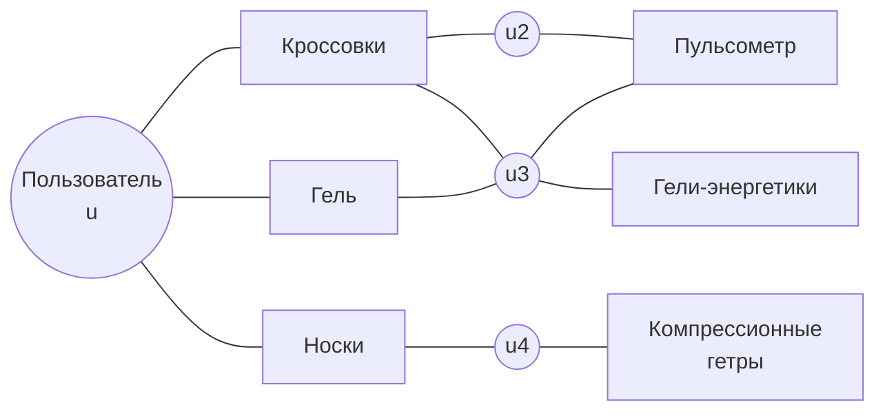

# Графовые рекомендации

> **Зачем эта глава.** Матрица взаимодействий — это на самом деле граф, и матричная факторизация
> видит в нём только рёбра длины 1. Графовые нейросети умеют собирать сигнал с соседей второго
> и третьего порядка, и на разреженных данных это иногда даёт заметный прирост, а иногда —
> дорогую инфраструктуру ради шума. После главы вы сможете вывести формулу распространения
> LightGCN, объяснить, что именно из GCN выбросили и почему стало лучше, посчитать бюджет
> обучения на графе в сотни миллионов рёбер и — главное — честно ответить, когда графовую
> модель делать не надо.

**Уровень:** 🎯 middle → 🧠 middle+
**Предварительно нужно:** [коллаборативная фильтрация](03-collaborative-filtering.md), [неявная обратная связь](04-implicit-feedback.md), [двухбашенные модели и ANN](06-two-tower-and-ann.md), [нейросети и backprop](../03-deep-learning/01-neural-nets-and-backprop.md)
**Как проработать:** чтение + реализация LightGCN + сравнение с честным бейзлайном

---

## Карта главы

- [1. Матрица взаимодействий — это граф](#1-матрица-взаимодействий--это-граф) — интуиция и что даёт второй хоп
- [2. Формализация: биграф user–item](#2-формализация-биграф-useritem)
- [3. Message passing: общая схема](#3-message-passing-общая-схема)
- [4. GCN и его адаптация к рекомендациям](#4-gcn-и-его-адаптация-к-рекомендациям)
- [5. GraphSAGE и сэмплирование соседей](#5-graphsage-и-сэмплирование-соседей)
- [6. PinSage: графовая модель, которая доехала до прода](#6-pinsage-графовая-модель-которая-доехала-до-прода)
- [7. LightGCN: что убрали и почему стало лучше](#7-lightgcn-что-убрали-и-почему-стало-лучше)
- [8. Over-smoothing](#8-over-smoothing)
- [9. Масштабирование: считаем бюджет](#9-масштабирование-считаем-бюджет)
- [10. Когда графы дают прирост, а когда это оверинжиниринг](#10-когда-графы-дают-прирост-а-когда-это-оверинжиниринг)
- [11. Подводные камни](#11-подводные-камни)
- [12. Проверь себя](#12-проверь-себя)
- [13. Практика](#13-практика)
- [14. Что читать дальше](#14-что-читать-дальше)

---

## 1. Матрица взаимодействий — это граф

Возьмём пользователя, который на маркетплейсе купил ровно три вещи: беговые кроссовки,
гель для мышц и спортивные носки. Три взаимодействия — это всё, что у нас про него есть.

Матричная факторизация из [главы про неявный фидбек](04-implicit-feedback.md) строит вектор
$p_u$ так, чтобы он хорошо предсказывал именно эти три товара. Три обучающих сигнала на 64
параметра — это переобучение в чистом виде: вектор пользователя получится шумным, а рекомендации
по нему — случайными в пределах спортивной категории.

Теперь посмотрим на те же данные иначе. Нарисуем двудольный граф: слева пользователи, справа
товары, ребро — факт взаимодействия. У нашего пользователя три ребра. Но у каждого из этих
трёх товаров есть свои рёбра — к сотням других покупателей. А у тех покупателей — свои товары.



Пульсометр находится на расстоянии трёх рёбер от нашего пользователя, и добраться до него можно
двумя разными путями (через `u2` и через `u3`). Это уже не шум: два независимых пути — это сигнал
«люди, похожие на вас по этим трём покупкам, дальше берут пульсометр». Классическая
item-based CF такое тоже ловит, но только на два хопа (товар → пользователи → товары) и обычно
одним фиксированным правилом усреднения.

**Идея графовых рекомендаций ровно в этом:** обучить модель, которая явно распространяет
информацию по рёбрам на несколько шагов, и делает это не эвристикой, а обучаемым (или хотя бы
аккуратно нормированным) преобразованием.

> 🌱 **База.** Если убрать всю математику, графовая рекомендательная модель делает одну вещь:
> итеративно **усредняет эмбеддинг узла с эмбеддингами его соседей**. После одного раунда вектор
> пользователя = смесь векторов его товаров. После двух — в него подмешались векторы пользователей
> с пересекающимися вкусами. После трёх — товары, до которых он ещё не добрался. Всё остальное
> в этой главе — детали того, *как именно* усреднять и как это посчитать на графе в миллиард рёбер.

---

## 2. Формализация: биграф user–item

Пусть $\mathcal{U}$ — множество пользователей, $|\mathcal{U}| = m$; $\mathcal{I}$ — множество
айтемов, $|\mathcal{I}| = n_{\text{it}}$. Матрица взаимодействий $R \in \{0,1\}^{m \times n_{\text{it}}}$,
где $R_{ui} = 1$, если пользователь $u$ взаимодействовал с айтемом $i$.

Строим неориентированный двудольный граф $G = (\mathcal{V}, \mathcal{E})$ с множеством вершин
$\mathcal{V} = \mathcal{U} \cup \mathcal{I}$, $|\mathcal{V}| = N = m + n_{\text{it}}$, и матрицей
смежности

$$
A = \begin{pmatrix} 0 & R \\ R^\top & 0 \end{pmatrix} \in \{0,1\}^{N \times N}
$$

где верхний левый блок нулевой, потому что рёбер «пользователь–пользователь» в этом графе нет,
нижний правый — потому что нет рёбер «айтем–айтем». Блок $R$ задаёт рёбра от пользователей
к айтемам, $R^\top$ — те же рёбра в обратную сторону.

Диагональная матрица степеней $D \in \mathbb{R}^{N \times N}$:

$$
D_{vv} = \sum_{w=1}^{N} A_{vw} = |\mathcal{N}(v)|
$$

где $\mathcal{N}(v)$ — множество соседей вершины $v$: для пользователя это его айтемы,
для айтема — его пользователи. Для пользователя $u$ будем писать $\mathcal{N}_u$, для айтема $i$ —
$\mathcal{N}_i$.

Симметрично нормированная матрица смежности:

$$
\tilde{A} = D^{-1/2} A D^{-1/2}, \qquad \tilde{A}_{vw} = \frac{A_{vw}}{\sqrt{|\mathcal{N}(v)|\,|\mathcal{N}(w)|}}
$$

Эта нормировка — не украшение, и её стоит понять сейчас, потому что дальше она встретится
в каждой формуле.

> 📐 **Разбор формулы.** Почему делим на **корень** произведения степеней, а не на степень одного узла?
>
> Вариант $D^{-1}A$ (делим на степень получателя) — это обычное среднее по соседям. Оно
> симметрично не относительно узлов: популярный айтем с миллионом покупателей будет вносить
> в каждого из них такой же вклад, как нишевый айтем с тремя покупателями. А популярный айтем
> сообщает о вкусе почти ничего — его купили все.
>
> Множитель $1/\sqrt{|\mathcal{N}_i|}$ гасит вклад популярных айтемов, а $1/\sqrt{|\mathcal{N}_u|}$
> — вклад пользователей-«всеядных» с огромной историей. Это ровно тот же приём, что нормировка
> в косинусной мере и в item-based CF: делим на корни из обеих норм, а не на одну.
> Побочный бонус: $\tilde{A}$ симметрична, её спектр лежит в $[-1, 1]$, поэтому многократное
> умножение на неё не взрывает величины эмбеддингов.

---

## 3. Message passing: общая схема

Почти все графовые нейросети (graph neural networks, GNN) описываются одной схемой из двух шагов,
повторённых $K$ раз. Обозначим $h_v^{(k)} \in \mathbb{R}^{d_k}$ — представление вершины $v$
после $k$ раундов, $d_k$ — его размерность.

$$
m_v^{(k+1)} = \operatorname{AGG}\Big(\big\{\, h_w^{(k)} : w \in \mathcal{N}(v) \,\big\}\Big),
\qquad
h_v^{(k+1)} = \operatorname{UPD}\big(h_v^{(k)},\; m_v^{(k+1)}\big)
$$

где $\operatorname{AGG}$ — агрегатор сообщений от соседей (сумма, среднее, max-pooling, внимание),
обязан быть инвариантным к порядку соседей, потому что у множества соседей порядка нет;
$m_v^{(k+1)}$ — агрегированное сообщение; $\operatorname{UPD}$ — функция обновления, которая
смешивает старое состояние вершины с сообщением (конкатенация + линейный слой, сумма, GRU-ячейка).

**Ключевое свойство:** после $K$ раундов представление вершины зависит от всех вершин,
достижимых за $K$ шагов по рёбрам. В двудольном графе это значит:

| $K$ | Что попадает в эмбеддинг пользователя $u$ |
|---|---|
| 1 | айтемы, с которыми $u$ взаимодействовал |
| 2 | + пользователи, у которых есть общий айтем с $u$ (аналог user-based CF) |
| 3 | + айтемы этих пользователей (аналог item-based CF через второй порядок) |
| 4 | + пользователи, связанные через два общих айтема — сигнал уже сильно размыт |

Обратите внимание на нечётность/чётность: в двудольном графе за нечётное число шагов
из пользователя вы попадаете в айтемы, за чётное — в пользователей. Поэтому «полезная» глубина
для рекомендаций — обычно 2–4, и это не эмпирическое совпадение, а следствие структуры графа.

---

## 4. GCN и его адаптация к рекомендациям

Стандартный свёрточный слой на графе (graph convolutional network, GCN) из работы Кипфа
и Веллинга выглядит так:

$$
H^{(k+1)} = \sigma\big(\tilde{A}\, H^{(k)} W^{(k)}\big)
$$

где $H^{(k)} \in \mathbb{R}^{N \times d_k}$ — матрица представлений всех вершин на слое $k$
(строка — вершина), $W^{(k)} \in \mathbb{R}^{d_k \times d_{k+1}}$ — обучаемая матрица
преобразования признаков, $\sigma$ — нелинейность (ReLU), $\tilde{A}$ — нормированная матрица
смежности из §2 (в оригинале — с добавленными петлями, $\tilde{A} = \hat{D}^{-1/2}(A+I)\hat{D}^{-1/2}$).

Здесь три операции подряд: **распространение** ($\tilde{A}H$), **преобразование признаков**
($\cdot\,W$) и **нелинейность** ($\sigma$). Запомните это разделение — весь сюжет §7 про то,
что две из трёх оказались лишними.

Прямой перенос GCN на рекомендации упирается в два несовпадения.

**Первое: у вершин нет признаков.** В задаче, для которой GCN придумывали (классификация узлов
в цитатных сетях), у каждой вершины есть вектор признаков — мешок слов статьи. В коллаборативной
постановке у пользователя нет ничего, кроме его id. Решение: $H^{(0)}$ — это обучаемая
таблица эмбеддингов $E \in \mathbb{R}^{N \times d}$, ровно как в матричной факторизации.
То есть модель учит и «начальные» эмбеддинги, и веса распространения.

**Второе: трансдуктивность.** Обучаемая таблица эмбеддингов означает, что для нового
пользователя эмбеддинга нет и взять его негде — надо переобучать. Это тот же холодный старт,
что у MF, графовая свёртка его не решает. Решают его или контентными признаками на входе
(тогда $H^{(0)}$ — проекция контента), или индуктивной схемой из §5.

Промежуточным шагом между GCN и практикой была **NGCF** (neural graph collaborative filtering),
где в сообщение добавили ещё и покомпонентное произведение векторов:

$$
e_u^{(k+1)} = \sigma\Big( W_1 e_u^{(k)} + \sum_{i \in \mathcal{N}_u} \frac{1}{\sqrt{|\mathcal{N}_u|\,|\mathcal{N}_i|}}\big( W_1 e_i^{(k)} + W_2 (e_i^{(k)} \odot e_u^{(k)}) \big) \Big)
$$

где $e_u^{(k)}, e_i^{(k)} \in \mathbb{R}^{d}$ — эмбеддинги пользователя и айтема на слое $k$,
$W_1, W_2 \in \mathbb{R}^{d \times d}$ — обучаемые матрицы, $\odot$ — покомпонентное умножение
(оно моделирует «резонанс» между вкусом пользователя и свойством айтема), $\sigma$ — LeakyReLU.

NGCF действительно обошла MF на бенчмарках, и на пару лет стала стандартной точкой отсчёта.
А потом выяснилось, что она обходит MF **не благодаря** $W_1$, $W_2$ и $\sigma$, а вопреки им.
К этому вернёмся в §7.

---

## 5. GraphSAGE и сэмплирование соседей

Полнографовая формула $H^{(k+1)} = \sigma(\tilde{A}H^{(k)}W^{(k)})$ требует держать в памяти
весь граф и все представления всех вершин. На графе в 500 млн рёбер это неподъёмно
(расчёт — в §9). Нужна mini-batch схема.

**GraphSAGE** (SAmple and aggreGatE) решает это двумя идеями.

**Идея 1: сэмплирование фиксированного числа соседей.** Вместо всех соседей вершины берём
случайную подвыборку размера $S_k$ на слое $k$. Тогда для одной целевой вершины подграф,
нужный для вычисления её эмбеддинга на слое $K$, содержит не более $\prod_{k=1}^{K} S_k$ вершин.
Типичные значения: $S = (25, 10)$ для двух слоёв — то есть 25 соседей на первом хопе и 10
на втором, итого до 250 вершин на одну целевую.

**Идея 2: индуктивность.** Обучаются не эмбеддинги вершин, а **функции агрегации**. Эмбеддинг
вершины вычисляется из признаков её окрестности:

$$
h_v^{(k)} = \sigma\Big( W^{(k)} \cdot \operatorname{CONCAT}\big(h_v^{(k-1)},\; \operatorname{AGG}_k(\{h_w^{(k-1)} : w \in \mathcal{S}_k(v)\})\big) \Big)
$$

где $\mathcal{S}_k(v) \subseteq \mathcal{N}(v)$ — сэмплированное подмножество соседей размера $S_k$,
$\operatorname{AGG}_k$ — агрегатор слоя $k$ (среднее, max-pooling через MLP или LSTM по случайной
перестановке), $W^{(k)}$ — обучаемая матрица слоя, $\operatorname{CONCAT}$ — конкатенация
собственного представления с агрегатом соседей (важно: **не** сумма — так модель может
взвешивать «себя» и «окружение» по-разному).

Индуктивность даёт главное: новый узел, у которого появились рёбра и признаки, получает
эмбеддинг **без переобучения** — просто прогоном через выученные агрегаторы. Для рекомендаций
это прямой ответ на холодный старт айтема: залили новый товар с контентными признаками,
он получил пару рёбер — эмбеддинг посчитан.

> ⚠️ **Типичная ошибка.** Наивно расширять число слоёв, считая, что «глубже — больше контекста».
> Взрыв окрестности (neighbor explosion) экспоненциален: при $S=25$ на слой три слоя дают
> до $25^3 = 15\,625$ вершин на одну целевую, и батч из 1024 целевых вершин раздувается
> в подграф на ~16 млн вершин. Загрузка признаков для него станет узким местом раньше, чем GPU
> успеет что-то посчитать. Практический предел для sampling-схем — 2–3 слоя;
> для большей глубины берут другие схемы (Cluster-GCN, GraphSAINT) или линейные модели (§7).

> 💬 **На собеседовании.** Спросят: «Чем GraphSAGE принципиально отличается от GCN?»
> Хороший ответ: двумя вещами. Первая — mini-batch обучение через сэмплирование фиксированного
> числа соседей, что делает стоимость шага не зависящей от размера графа. Вторая, более важная —
> индуктивность: GCN учит эмбеддинг каждой вершины как параметр и для новой вершины бесполезен,
> GraphSAGE учит **функции агрегации**, поэтому эмбеддинг новой вершины считается на лету
> из её признаков и окрестности. Плохой ответ: «GraphSAGE — это GCN с сэмплированием» —
> он упускает индуктивность, а именно она решает холодный старт.

---

## 6. PinSage: графовая модель, которая доехала до прода

PinSage — это GraphSAGE, доведённый Pinterest до графа масштаба ~3 млрд вершин (пины и доски)
и ~18 млрд рёбер. Ценность статьи не в архитектуре, а в инженерных решениях, каждое из которых
закрывает конкретную проблему масштаба.

**Проблема 1: случайные соседи — плохие соседи.** У популярной доски миллион пинов, и случайные
25 из них не представляют её содержание. Решение — **важность соседей через случайные блуждания**
(random walks). Из целевой вершины запускается много коротких блужданий с перезапуском, считается,
сколько раз каждая вершина была посещена, и в окрестность берётся топ-$T$ по нормированному числу
визитов ($T = 50$ в статье). Это приближение персонализированного PageRank относительно целевой
вершины.

Два следствия. Первое: окрестность стала осмысленной — в неё попадают вершины, тесно связанные
с целевой, а не случайные. Второе: появились **веса** — нормированные счётчики визитов
$\alpha_w$, — и агрегация делается взвешенной (importance pooling):

$$
m_v = \gamma\Big(\big\{\, \alpha_w \cdot \operatorname{ReLU}(Q h_w + q) \;:\; w \in \mathcal{S}(v) \,\big\}\Big)
$$

где $h_w$ — представление соседа $w$, $Q$ и $q$ — обучаемые матрица и вектор смещения,
$\alpha_w$ — нормированный вес визитов ($\sum_w \alpha_w = 1$), $\gamma$ — симметричная
агрегация (в PinSage — взвешенная сумма). Далее $m_v$ конкатенируется с собственным
представлением вершины и пропускается через ещё один линейный слой с ReLU и $L_2$-нормировкой.

**Проблема 2: где брать признаки вершин.** В PinSage они есть и это принципиально: визуальный
эмбеддинг картинки + текстовый эмбеддинг аннотации + структурные признаки (лог степени вершины).
Именно поэтому модель индуктивная и работает на новых пинах. Чисто коллаборативная графовая
модель без признаков этого не умеет.

**Проблема 3: негативы.** Случайный негатив из каталога в 3 млрд объектов отличить тривиально —
градиент быстро уходит в ноль. Схема PinSage: 500 общих негативов на батч (шарятся между всеми
примерами батча — экономия на forward pass) плюс **hard negatives** — объекты с рангом
примерно 2000–5000 по персонализированному PageRank относительно запроса. Они похожи, но
не релевантны, и именно они учат тонким различиям. Вводятся **curriculum-ом**: на первой эпохе
только простые негативы, дальше по одному hard-негативу за эпоху. Без curriculum обучение
с hard negatives с самого начала расходится или сходится вдвое медленнее.

**Проблема 4: инференс.** Наивный проход по всем 3 млрд вершин с сэмплированием пересчитывает
одни и те же промежуточные представления много раз. Решение — MapReduce-джоба, которая
считает слои **послойно**: сначала для всех вершин слой 1, материализует результат, потом
слой 2 поверх него. Каждое представление считается ровно один раз.

**Проблема 5: подготовка данных не успевает за GPU.** Producer-consumer: CPU-процессы строят
подграфы и собирают признаки, GPU только считает. Без этого GPU простаивает большую часть времени —
это, кстати, самая частая практическая проблема при обучении GNN, и на неё жалуются все.

Офлайн PinSage обошла лучший из бейзлайнов Pinterest примерно в 2.5 раза по hit-rate
и примерно в 1.6 раза по MRR — цифры такого порядка на graph-задаче с богатыми контентными
признаками правдоподобны именно потому, что бейзлайны там были контентные, а PinSage добавила
к контенту структуру графа.

> 💬 **На собеседовании.** Спросят: «Почему в PinSage соседей выбирают случайными блужданиями,
> а не просто всех/случайных?» Хороший ответ: у вершин в реальном графе степени распределены
> по степенному закону, и равномерная выборка из миллиона соседей даёт нерепрезентативную
> и шумную окрестность. Блуждания дают приближение персонализированного PageRank: отбирают
> топ-50 действительно связанных вершин и заодно возвращают веса, по которым делается взвешенная
> агрегация. Дополнительно фиксированный $T=50$ делает размер тензора константным, что нужно
> для эффективного батчинга. Плохой ответ: «чтобы было быстрее» — скорость здесь побочный эффект.

---

## 7. LightGCN: что убрали и почему стало лучше

Теперь самая поучительная история раздела.

Авторы LightGCN взяли NGCF и провели абляцию: последовательно выкинули из формулы
преобразование признаков ($W_1$, $W_2$) и нелинейность ($\sigma$). Ожидание — качество
упадёт. Реальность — качество **выросло**, причём монотонно: убрали $W$ — стало лучше,
убрали ещё и $\sigma$ — стало ещё лучше.

Итоговая формула распространения:

$$
e_u^{(k+1)} = \sum_{i \in \mathcal{N}_u} \frac{1}{\sqrt{|\mathcal{N}_u|}\sqrt{|\mathcal{N}_i|}}\, e_i^{(k)},
\qquad
e_i^{(k+1)} = \sum_{u \in \mathcal{N}_i} \frac{1}{\sqrt{|\mathcal{N}_i|}\sqrt{|\mathcal{N}_u|}}\, e_u^{(k)}
$$

где $e_u^{(k)}, e_i^{(k)} \in \mathbb{R}^d$ — эмбеддинги пользователя и айтема после $k$ раундов
распространения, $\mathcal{N}_u$ и $\mathcal{N}_i$ — множества соседей, $d$ — размерность
(обычно 64). Никаких обучаемых матриц, никаких активаций — только взвешенное суммирование.
В матричном виде это просто

$$
E^{(k+1)} = \tilde{A} E^{(k)} = \tilde{A}^{k+1} E^{(0)}
$$

где $E^{(k)} \in \mathbb{R}^{N \times d}$ — матрица всех эмбеддингов, $\tilde{A}$ — нормированная
смежность из §2, $E^{(0)}$ — единственные обучаемые параметры модели.

Финальное представление — **комбинация слоёв**, а не выход последнего:

$$
e_u = \sum_{k=0}^{K} \alpha_k e_u^{(k)}, \qquad \alpha_k = \frac{1}{K+1}
$$

где $K$ — число раундов распространения (в статье лучшие результаты на $K = 3$),
$\alpha_k$ — вес слоя, зафиксированный равномерным. Предсказание — скалярное произведение
$\hat{y}_{ui} = e_u^\top e_i$, обучение — BPR-лосс (см. [неявную обратную связь](04-implicit-feedback.md)).

### Почему выбрасывание слоёв улучшило качество

Три причины, и все три стоит уметь назвать.

**1. Признаков нет — преобразовывать нечего.** $W$ в GCN осмысленна, когда $H^{(0)}$ — это
реальные признаки (мешок слов, картинка): матрица учит проекцию из пространства признаков
в пространство представлений. Здесь $H^{(0)} = E^{(0)}$ — уже обучаемые эмбеддинги, живущие
в произвольном базисе. Любое линейное преобразование их пространства можно поглотить
в сами эмбеддинги. $W$ не добавляет выразительности, зато добавляет $K d^2$ параметров,
которые надо обучить на разреженных данных, — и они переобучаются.

**2. Нелинейность здесь скорее вредит.** Композиция ReLU и слоёв делает оптимизацию тяжелее
(градиенты через $K$ нелинейностей на разреженном сигнале), а выигрыша в выразительности
не даёт: целевая функция — скалярное произведение, и модель всё равно должна уложить
предпочтения в линейно разделимую геометрию.

**3. Комбинация слоёв решает over-smoothing (§8) и даёт self-connection.** Слагаемое $k=0$
в сумме — это исходный эмбеддинг: он не даёт вершине «раствориться» в соседях. Слагаемые
$k=1,\dots,K$ дают многомасштабность: близкие и дальние соседи входят с разными весами.
Формально $e_u = \frac{1}{K+1}\sum_k (\tilde{A}^k E^{(0)})_u$ — это низкочастотный фильтр
на графе, и авторы прямо показывают связь такой схемы с APPNP-подобным распространением.

На стандартных бенчмарках (Gowalla ~30 тыс. пользователей / ~41 тыс. айтемов / ~1 млн
взаимодействий, Yelp2018, Amazon-Book) LightGCN даёт порядка 16% относительного прироста
recall@20 над NGCF в среднем — при том, что обучаемых параметров у неё **меньше**
(только таблица эмбеддингов), а шаг обучения дешевле.

```python
# LightGCN целиком: распространение + BPR. Всё, что есть в модели, — одна таблица эмбеддингов.
import torch
import torch.nn.functional as F


def build_norm_adj(user_idx, item_idx, n_users, n_items):
    """Ã = D^{-1/2} A D^{-1/2} для биграфа в разреженном виде.
    Нумерация вершин: [0, n_users) — пользователи, [n_users, n_users+n_items) — айтемы."""
    n_nodes = n_users + n_items
    src = torch.cat([user_idx, item_idx + n_users])          # оба направления ребра:
    dst = torch.cat([item_idx + n_users, user_idx])          # граф неориентированный
    deg = torch.zeros(n_nodes)
    deg.scatter_add_(0, src, torch.ones(src.numel()))
    deg.clamp_(min=1.0)                                      # изолированный узел -> без деления на 0
    vals = deg[src].pow(-0.5) * deg[dst].pow(-0.5)           # 1 / sqrt(|N_v| |N_w|)
    idx = torch.stack([src, dst])
    return torch.sparse_coo_tensor(idx, vals, (n_nodes, n_nodes)).coalesce()


class LightGCN(torch.nn.Module):
    def __init__(self, n_users, n_items, dim=64, n_layers=3):
        super().__init__()
        self.n_users, self.n_layers = n_users, n_layers
        self.emb = torch.nn.Embedding(n_users + n_items, dim)
        torch.nn.init.normal_(self.emb.weight, std=0.1)      # std=0.1 — дефолт из статьи

    def propagate(self, norm_adj):
        e = self.emb.weight
        acc = e                                              # слой k=0 входит с тем же весом 1/(K+1)
        for _ in range(self.n_layers):
            e = torch.sparse.mm(norm_adj, e)                 # один раунд message passing
            acc = acc + e
        acc = acc / (self.n_layers + 1)                      # alpha_k = 1/(K+1)
        return acc[:self.n_users], acc[self.n_users:]


def bpr_step(model, norm_adj, u, pos, neg, lam=1e-4):
    """u, pos, neg — LongTensor одинаковой длины B: тройки (пользователь, позитив, негатив)."""
    eu_all, ei_all = model.propagate(norm_adj)
    eu, ep, en = eu_all[u], ei_all[pos], ei_all[neg]
    loss = -F.logsigmoid((eu * ep).sum(-1) - (eu * en).sum(-1)).mean()
    # регуляризуем ИСХОДНЫЕ эмбеддинги (слой 0), а не результат распространения:
    # иначе штраф размазывается по графу и фактически зависит от степеней вершин
    e0 = model.emb.weight
    reg = e0[u].pow(2).sum() + e0[pos + model.n_users].pow(2).sum() + e0[neg + model.n_users].pow(2).sum()
    return loss + lam * reg / u.numel()
```

> 💬 **На собеседовании.** Спросят: «Что именно убрали в LightGCN по сравнению с NGCF и почему
> качество выросло?» Хороший ответ: убрали матрицы преобразования признаков и нелинейные
> активации, оставили только нормированное суммирование по соседям плюс взвешенную комбинацию
> выходов всех слоёв. Выросло потому, что в чисто коллаборативной постановке входы — это уже
> обучаемые эмбеддинги, и линейное преобразование над ними избыточно (его можно поглотить
> в сами эмбеддинги), зато добавляет $Kd^2$ параметров, переобучающихся на разреженных данных;
> нелинейность же усложняет оптимизацию, не давая выразительности. Плохой ответ: «упростили,
> чтобы было быстрее» — скорость здесь следствие, а вопрос был про качество.

---

## 8. Over-smoothing

Возьмём формулу $E^{(K)} = \tilde{A}^K E^{(0)}$ и увеличим $K$. Что будет в пределе?

$\tilde{A}$ — симметричная стохастически нормированная матрица, её собственные значения лежат
в $[-1, 1]$, а наибольшее равно 1. При многократном умножении компоненты, отвечающие
собственным значениям $|\lambda| < 1$, затухают как $\lambda^K$, и остаётся проекция
на собственный вектор с $\lambda = 1$. Для связной компоненты этот вектор пропорционален
$D^{1/2}\mathbf{1}$ — то есть **зависит только от степеней вершин, а не от их идентичности**.

Практический смысл: при большом $K$ эмбеддинги всех вершин в компоненте связности сходятся
к одному и тому же вектору с точностью до масштаба, зависящего от популярности.
Модель вырождается в «рекомендовать популярное». Это и есть **over-smoothing**
(чрезмерное сглаживание).

**Как это выглядит на практике:**

- метрика растёт от $K=1$ к $K=2$, ещё чуть-чуть к $K=3$, и падает на $K \ge 4$;
- средняя попарная косинусная близость эмбеддингов айтемов растёт с $K$: на $K=2$ она порядка
  0.1–0.3, на $K=6$ уходит к 0.9+;
- в выдаче резко растёт доля популярных айтемов, покрытие каталога падает.

**Диагностика в две строки.** Считайте на валидации среднюю косинусную близость по случайной
паре из 10 тыс. айтемов и покрытие каталога (доля уникальных айтемов, попавших в топ-10
хотя бы одному пользователю). Если при увеличении $K$ первая растёт, а вторая падает —
это over-smoothing, а не «модель ещё не сошлась».

**Что с этим делают:**

| Приём | Что делает | Цена |
|---|---|---|
| Комбинация слоёв ($\alpha_k$) | сохраняет вклад малых $K$, включая $k=0$ | бесплатно, это дефолт LightGCN |
| Residual / initial connection (APPNP-стиль) | на каждом шаге подмешивает $E^{(0)}$ с весом $\beta$ | один гиперпараметр |
| Ограничение $K \le 3$ | тупо не даём сглаживанию накопиться | теряем дальний сигнал |
| Dropout на рёбрах (edge dropout) | случайно выкидываем долю рёбер на каждом шаге обучения | регуляризация, +1 гиперпараметр |
| Контрастивная регуляризация (SGL, SimGCL) | штрафует схлопывание представлений | усложняет обучение, +2–3 гиперпараметра |

> 🧠 **Middle+.** Тонкость, которую редко проговаривают: комбинация слоёв **маскирует**
> over-smoothing, но не устраняет его. Если $K=8$ и $\alpha_k = 1/9$, вклад слоёв 4–8 —
> это почти одинаковый «популярностный» вектор, добавленный с суммарным весом $5/9$
> ко всем пользователям одинаково. Формально он частично поглощается общей константой,
> и качество почти не падает — но вы платите память и время за слои, которые ничего не несут.
> Правильная проверка: сравнить $K=8$ с $K=3$ не только по NDCG, но и по покрытию и по времени
> обучения. Почти всегда $K=3$ выигрывает по совокупности.

---

## 9. Масштабирование: считаем бюджет

Разберём на конкретных числах: маркетплейс, 10 млн активных пользователей, 5 млн айтемов,
500 млн взаимодействий за окно обучения. $N = 15$ млн вершин, $|\mathcal{E}| = 500$ млн рёбер,
в матрице $\tilde{A}$ ненулевых элементов $\text{nnz} = 2|\mathcal{E}| = 10^9$ (граф
неориентированный). Размерность $d = 64$, fp32.

**Память под эмбеддинги:** $15 \cdot 10^6 \times 64 \times 4\text{ Б} = 3.84$ ГБ.
Плюс столько же под градиенты, плюс два состояния Adam — итого ~15 ГБ. Уже больше половины
40-гигабайтной карты, и это только параметры. Отсюда первый вывод: **используйте SGD
или Adagrad с разреженными градиентами**, а не Adam, либо шардируйте таблицу.

**Память под структуру графа:** CSR-представление — $10^9$ индексов по 4 байта = 4 ГБ,
плюс $10^9$ весов fp32 = 4 ГБ. Веса можно не хранить: они вычисляются из степеней
($\text{deg}$ — 60 МБ), это экономит 4 ГБ.

**Стоимость одного полнографового раунда распространения.** Sparse-dense произведение
$\tilde{A}E$ — операция, ограниченная памятью, а не арифметикой. На каждый ненулевой элемент
надо прочитать строку эмбеддинга соседа: $64 \times 4 = 256$ байт. Итого
$10^9 \times 256\text{ Б} = 256$ ГБ трафика на слой. При пропускной способности HBM ~1.5 ТБ/с
и реальной эффективности случайного gather'а порядка 30–50% получаем **~0.4–0.6 с на слой**
только на forward. Для $K=3$ и с обратным проходом — **~3–4 с на один шаг оптимизации**.

Вот здесь и ломается наивный LightGCN. Каноническая реализация распространяет **весь граф
на каждом шаге**, а батч BPR-троек — тысячи. При 500 млн взаимодействий и батче 8192
одна эпоха — 61 тыс. шагов, то есть 61 тыс. $\times$ 3.5 с $\approx$ **60 часов на эпоху**.
Неприемлемо.

**Что делают на самом деле** (в порядке возрастания сложности):

1. **Увеличить батч радикально.** Распространение не зависит от батча, поэтому его стоимость
   амортизируется: батч $10^6$ троек вместо 8192 сокращает число шагов в 120 раз при том же
   числе просмотренных примеров. Эпоха превращается в ~500 шагов и ~30 минут. Цена — надо
   поднимать learning rate и следить за сходимостью BPR на больших батчах.
2. **Сэмплирование подграфов.** Cluster-GCN: METIS-разбиение графа на, скажем, 15 тыс. кластеров,
   батч — объединение нескольких кластеров, распространение только внутри батча. GraphSAINT:
   сэмплируем подграф случайными блужданиями и корректируем смещение весами. Обе схемы
   превращают полнографовый шаг в шаг на подграфе из ~10⁶ рёбер, то есть в единицы миллисекунд.
3. **Сэмплирование соседей** (GraphSAGE/PinSage) — когда у вершин есть признаки и нужна
   индуктивность. Помните про взрыв окрестности из §5.
4. **Отказаться от обучения распространения вообще.** Раз LightGCN линеен, $\tilde{A}^k E^{(0)}$
   можно посчитать один раз после обучения обычной MF/двухбашенки — это уже не «графовая
   нейросеть», а постпроцессинг эмбеддингов, и работает он неожиданно прилично.

**Инференс — вот где хорошая новость.** После обучения распространение считается **офлайн**,
один раз: получаем финальные $e_u$ и $e_i$, кладём айтемы в HNSW-индекс. Онлайн-стоимость
графовой модели ровно такая же, как у двухбашенки: один лукап эмбеддинга пользователя
(~1 мс из Redis) плюс ANN-поиск (~5–15 мс на 5 млн айтемов при recall@100 ≈ 0.95).
Графовая часть в онлайне не участвует вообще.

Отсюда важный практический вывод: **графовая модель дорога в обучении и бесплатна в инференсе.**
Это принципиально отличает её от, скажем, LLM-ранкера. Если вы можете позволить себе ночной
пересчёт — латентность не аргумент против графов.

> ⚠️ **Типичная ошибка.** Пересчитывать распространение только для «активных» пользователей,
> чтобы сэкономить. Не работает: $\tilde{A}^K$ связывает всех, и эмбеддинг активного пользователя
> зависит от эмбеддингов неактивных через общие айтемы. Либо считаете весь граф, либо явно
> обрезаете его (например, только взаимодействия за 180 дней) и честно фиксируете, что модель
> видит усечённый граф.

---

## 10. Когда графы дают прирост, а когда это оверинжиниринг

Самый честный раздел главы. Графовые рекомендации — тема, где разрыв между статьями
и продом особенно широкий, и на собеседовании ценится именно трезвость.

### Когда графовая модель реально помогает

**Данные разреженные, а граф связный.** Медиана взаимодействий на пользователя 3–10,
но у айтемов есть плотные хабы, через которые сигнал распространяется. Именно этот режим
дают академические бенчмарки, и именно в нём LightGCN обходит MF. Плотность Gowalla —
около 0.08% заполнения матрицы, и это ключевое условие результата.

**Граф гетерогенный и несёт информацию сверх «кликов».** Pinterest: пин принадлежит доске,
доска — пользователю, у пина есть визуальные признаки. Соцсеть: дружба, подписки, репосты.
Маркетплейс: товар → продавец → другие товары продавца, товар → категория → бренд.
Вот здесь графовая модель даёт то, чего простой CF физически не может: она использует рёбра,
которых нет в матрице взаимодействий.

**Нужна индуктивность по контенту.** Новый товар с картинкой и описанием получает эмбеддинг
из окрестности сразу, без переобучения (§5). Для каталога, где ежедневно появляются десятки
тысяч новых SKU, это осязаемая ценность.

### Когда это оверинжиниринг

**Данные плотные и сильно последовательные.** Если у медианного пользователя 200 событий
и следующая покупка предсказывается по последним пяти, вся сила — в порядке, а не в структуре
графа. [SASRec](09-sequential-recsys.md) вас обойдёт, и обойдёт дёшево.

**У вас уже хорошо настроенная двухбашенка с признаками.** Графовое распространение — это,
по сути, регуляризация через соседей. Хорошая двухбашенка с богатыми контентными признаками,
правильными негативами и logQ-коррекцией забирает большую часть того же сигнала.
Прирост от графа поверх неё в отчётах индустрии — обычно единицы процентов офлайн,
а онлайн зачастую в пределах шума.

**Каталог в сотни миллионов при команде из трёх человек.** Инфраструктура графового обучения
(построение графа, METIS-разбиение или сэмплирование, распределённое обучение, пересчёт
и валидация эмбеддингов) — это отдельный сервис, который надо поддерживать годами.
Задайте себе вопрос: если прирост окажется 1% NDCG, вы всё равно будете это держать?

**Вы не сравнились с честными бейзлайнами.** Это главное. Есть работы, показывающие,
что значительная часть прироста графовых моделей воспроизводится линейными item-item
моделями с правильной нормировкой — например, EASE (замкнутая формула для регуляризованного
item-item автоэнкодера) или спектральными фильтрами на том же $\tilde{A}$ без обучения вообще.
EASE решается **одним обращением матрицы** $n_{\text{it}} \times n_{\text{it}}$ и на многих
бенчмарках стоит вплотную к LightGCN. Если вы не прогнали EASE и настроенный iALS,
вы не знаете, что вам дал граф.

> 💬 **На собеседовании.** Спросят: «Стали бы вы внедрять графовую модель в нашу систему?»
> Хороший ответ строится от условий: «Зависит от трёх вещей. Первое — плотность: если медиана
> взаимодействий на пользователя больше пары десятков, выигрыш от распространения по графу
> будет мал, там лучше сработают последовательные модели. Второе — есть ли рёбра сверх кликов:
> продавцы, категории, соцсвязи. Если есть — граф даёт информацию, недоступную CF, и это сильный
> аргумент. Третье — сравнивались ли мы с EASE и настроенным iALS: без этого замера непонятно,
> за что платим. Я бы начал с офлайн-эксперимента LightGCN против этих бейзлайнов на нашем
> временном сплите, и внедрял бы, только если прирост устойчиво больше 3–5% NDCG@10 и
> подтверждается на A/B». Плохой ответ: «Да, графовые модели показывают SOTA на бенчмарках».

> 🧠 **Middle+.** Отдельно стоит понимать, что часть выигрыша графовых моделей в статьях —
> артефакт протокола оценки: сэмплированные метрики (ранжирование против 100 негативов),
> случайный, а не временной сплит, слабо настроенные бейзлайны. Это ровно та же критика,
> что в [главе про последовательные модели](09-sequential-recsys.md), и она применима здесь
> в полной мере. Умение сказать это вслух и назвать конкретный протокол, которому вы доверяете
> (временной сплит, полное ранжирование по каталогу, сравнение с настроенными iALS/EASE) —
> сильный сигнал зрелости.

---

## 11. Подводные камни

**Утечка через граф при валидации.**
Симптом: офлайн-метрики отличные, в A/B — ноль.
Причина: граф построен по **всем** взаимодействиям, включая тестовые. Распространение
$\tilde{A}^K$ протаскивает информацию о тестовом ребре в эмбеддинги через 2, 4, ... хопов,
даже если само ребро из обучающего лосса исключено.
Что делать: строить $\tilde{A}$ **только** по обучающей части. При временном сплите — только
по взаимодействиям до момента отсечки. Это самая частая и самая дорогая ошибка в графовых
рекомендациях.

**Adam съел память.**
Симптом: OOM на карте, где эмбеддинги занимают четверть памяти.
Причина: Adam хранит два состояния на параметр — итого $\times 3$ к размеру таблицы,
и плотный градиент по всей таблице на каждом шаге.
Что делать: `torch.optim.SparseAdam` или Adagrad с `sparse=True` в `nn.Embedding`,
либо шардирование таблицы между картами, либо оптимизатор без состояний (SGD с momentum на CPU).

**Взрыв окрестности в даталоадере.**
Симптом: GPU загружен на 15%, обучение упирается в CPU.
Причина: сборка подграфов и признаков не успевает за расчётом; при $S=(25,10,10)$ на батч
в 1024 приходится собрать миллионы вершин.
Что делать: producer-consumer с несколькими воркерами (как в PinSage), уменьшить $S$
и число слоёв, перейти на Cluster-GCN/GraphSAINT, кэшировать признаки часто встречающихся хабов.

**Изолированные вершины ломают нормировку.**
Симптом: NaN в эмбеддингах через несколько шагов.
Причина: $D_{vv} = 0$ для вершины без рёбер, $0^{-1/2} = \infty$.
Что делать: `clamp(min=1)` на степенях (как в коде §7) либо выкинуть изолированные вершины
из графа и обрабатывать их отдельной контентной моделью.

**Хабы доминируют в агрегации.**
Симптом: рекомендации схлопываются к популярному, покрытие каталога падает.
Причина: даже с симметричной нормировкой айтем с миллионом рёбер участвует в миллионе сообщений;
плюс over-smoothing (§8).
Что делать: обрезать степени (взять топ-$T$ соседей, как PinSage), edge dropout,
уменьшить $K$, добавить в лосс штраф за популярность или дебиасинг из
[главы про смещения](12-cold-start-and-bias.md).

**Граф протух.**
Симптом: качество медленно деградирует между переобучениями.
Причина: эмбеддинги посчитаны по графу недельной давности, новые айтемы и новая активность
в них не отражены.
Что делать: пересчёт распространения по расписанию (для трансдуктивной модели — вместе
с переобучением), для новых айтемов — фолбэк на контентный эмбеддинг до следующего пересчёта.
Если новых айтемов много — это аргумент за индуктивную схему (§5), а не за более частый пересчёт.

---

## 12. Проверь себя

<details>
<summary><b>🌱 Вопрос.</b> Что даёт графовая модель по сравнению с матричной факторизацией, если данные те же самые?</summary>

**Короткий ответ.** Явное использование связей высокого порядка. MF учит эмбеддинги
только по прямым рёбрам (user–item), графовая модель распространяет сигнал на 2–4 хопа,
подмешивая в вектор пользователя информацию о похожих пользователях и о товарах,
до которых он ещё не добирался.

**Развёрнуто.** Формально MF — это графовая модель с $K=0$: эмбеддинг вершины зависит только
от неё самой (и от лосса на её рёбрах). При $K=2$ эмбеддинг пользователя становится функцией
от эмбеддингов пользователей с пересекающимся вкусом, при $K=3$ — от товаров этих пользователей.
Это работает как сглаживание/регуляризация: у пользователя с тремя взаимодействиями вектор
перестаёт быть шумным, потому что подтягивается к центру окрестности. Отсюда следствие:
выигрыш максимален на разреженных данных и стремится к нулю на плотных, где у MF и так
достаточно сигнала.

**Чего ждёт интервьюер:** понимания, что графовая свёртка — это про связи высокого порядка
и про регуляризацию, а не «более современная архитектура».

**Провал:** «графовые сети мощнее, они лучше моделируют данные».
</details>

<details>
<summary><b>🎯 Вопрос.</b> Почему в нормировке стоит $1/\sqrt{|\mathcal{N}_u||\mathcal{N}_i|}$, а не $1/|\mathcal{N}_u|$?</summary>

**Короткий ответ.** Симметричная нормировка гасит вклад и популярных айтемов, и пользователей
с огромной историей, а также делает матрицу $\tilde{A}$ симметричной со спектром в $[-1,1]$,
что не даёт эмбеддингам взрываться при многократном умножении.

**Развёрнуто.** $1/|\mathcal{N}_u|$ — это обычное среднее по соседям: сообщение
от айтема, купленного миллионом людей, приходит с тем же весом, что от нишевого товара.
Но популярный айтем почти не несёт информации о вкусе. Множитель $1/\sqrt{|\mathcal{N}_i|}$
это чинит — ровно как нормировка в косинусной мере. Второй множитель $1/\sqrt{|\mathcal{N}_u|}$
не даёт «всеядным» пользователям доминировать в эмбеддингах айтемов. Спектральное следствие:
$\tilde{A} = D^{-1/2}AD^{-1/2}$ подобна стохастической матрице $D^{-1}A$, её собственные
значения лежат в $[-1,1]$, поэтому $\tilde{A}^K$ не растёт по норме — распространение
устойчиво при любом $K$.

**Чего ждёт интервьюер:** что вы понимаете нормировку как борьбу с популярностью, а не как
техническую деталь из статьи.

**Провал:** «так в формуле GCN».
</details>

<details>
<summary><b>🎯 Вопрос.</b> Что такое over-smoothing и как вы его обнаружите?</summary>

**Короткий ответ.** При большом числе слоёв $\tilde{A}^K$ сходится к проекции на главный
собственный вектор, и эмбеддинги всех вершин компоненты связности становятся почти одинаковыми —
модель вырождается в «рекомендовать популярное». Обнаруживается по росту средней попарной
косинусной близости эмбеддингов и падению покрытия каталога при увеличении $K$.

**Развёрнуто.** Собственные значения $\tilde{A}$ лежат в $[-1,1]$, максимальное равно 1;
при возведении в степень $K$ все компоненты с $|\lambda|<1$ затухают как $\lambda^K$,
остаётся вектор, зависящий только от степеней вершин. Практически: NDCG растёт до $K=2\text{–}3$
и падает при $K \ge 4$. Диагностика — две метрики на валидации: средняя косинусная близость
случайных пар айтемов (растёт) и доля каталога, попадающая в топ-10 (падает).
Лечение: комбинация слоёв с весами $\alpha_k$ (включая $k=0$), residual к исходному
эмбеддингу в стиле APPNP, edge dropout, ограничение $K \le 3$, контрастивная регуляризация.
Важная тонкость: комбинация слоёв маскирует проблему, но не устраняет — при $K=8$ верхние слои
просто добавляют всем одинаковый вектор.

**Чего ждёт интервьюер:** спектрального объяснения плюс конкретной диагностики, а не только
термина.

**Провал:** «модель переобучается, когда слоёв много».
</details>

<details>
<summary><b>🧠 Вопрос.</b> Что конкретно убрали в LightGCN и почему это улучшило качество?</summary>

**Короткий ответ.** Убрали матрицы преобразования признаков ($W$) и нелинейные активации,
оставив только нормированное суммирование по соседям и взвешенную комбинацию выходов всех
слоёв. Качество выросло примерно на 16% relative recall@20 над NGCF при меньшем числе
параметров.

**Развёрнуто.** $W$ в GCN нужна, чтобы проецировать реальные признаки вершин в пространство
представлений. В чисто коллаборативной постановке признаков нет, вход — сама обучаемая таблица
эмбеддингов; любое линейное преобразование её пространства поглощается в сами эмбеддинги,
то есть $W$ не добавляет выразительности, но добавляет $Kd^2$ параметров, которые
переобучаются на разреженных данных. Нелинейность усложняет оптимизацию (градиент через $K$
ReLU на разреженном сигнале), а целевая функция всё равно скалярное произведение.
Что оставили и почему это важно: комбинация $e_u = \sum_k \alpha_k e_u^{(k)}$ включает
слой $k=0$, что играет роль self-connection и одновременно смягчает over-smoothing.
Побочный эффект — модель стала линейной по $E^{(0)}$, значит распространение можно
предпосчитать один раз офлайн.

**Чего ждёт интервьюер:** объяснения «почему», а не списка удалённых компонент; и понимания,
что вывод специфичен для постановки без признаков.

**Провал:** «упростили ради скорости» или «нелинейности вообще не нужны в GNN».
</details>

<details>
<summary><b>🎯 Вопрос.</b> Как обучать GNN на графе, который не помещается в память одной карты?</summary>

**Короткий ответ.** Три семейства приёмов: сэмплирование соседей (GraphSAGE/PinSage),
сэмплирование подграфов (Cluster-GCN на METIS-разбиении, GraphSAINT на случайных блужданиях)
и, для линейных моделей вроде LightGCN, — радикальное увеличение батча, чтобы амортизировать
стоимость полнографового распространения.

**Развёрнуто.** Сэмплирование соседей фиксирует $S_k$ соседей на слой, стоимость шага
перестаёт зависеть от размера графа, но окрестность растёт как $\prod_k S_k$ — практический
предел 2–3 слоя. Сэмплирование подграфов режет граф на куски и распространяет внутри куска:
шаг дешёвый и глубина не ограничена, но теряются межкластерные рёбра (Cluster-GCN)
или нужна коррекция смещения (GraphSAINT). Для LightGCN есть четвёртый путь: раз она линейна,
распространение считается один раз после обучения, а само обучение можно вести
на предпосчитанных представлениях. Отдельно про память: Adam утраивает размер таблицы
эмбеддингов, поэтому берут разреженные оптимизаторы или шардируют таблицу.

**Чего ждёт интервьюер:** что вы назовёте минимум два разных подхода и объясните
их компромиссы, а не просто «будем сэмплировать».

**Провал:** «возьмём больше GPU».
</details>

<details>
<summary><b>🎯 Вопрос.</b> Чем PinSage отличается от GraphSAGE?</summary>

**Короткий ответ.** Тремя вещами: окрестность выбирается случайными блужданиями (топ-50
по числу визитов) вместо равномерного сэмплирования, агрегация взвешенная по важности визитов,
и вокруг всего этого построена production-инженерия — curriculum с hard negatives,
MapReduce-инференс, producer-consumer подготовка батчей.

**Развёрнуто.** Равномерная выборка соседей на графе со степенным распределением степеней даёт
шумную окрестность: у доски с миллионом пинов случайные 50 ничего не представляют.
Блуждания приближают персонализированный PageRank относительно целевой вершины и заодно
дают веса $\alpha_w$ для importance pooling. Hard negatives (ранги ~2000–5000 по PPR)
нужны потому, что на каталоге в миллиарды объектов случайный негатив отличить тривиально;
их вводят curriculum-ом, иначе обучение не сходится. MapReduce-инференс убирает
экспоненциальный повторный пересчёт при полном проходе по графу.

**Чего ждёт интервьюер:** акцента на инженерии, а не на архитектуре — статья ценна именно этим.

**Провал:** «PinSage — это GraphSAGE для картинок».
</details>

<details>
<summary><b>🧠 Вопрос.</b> Решает ли графовая модель холодный старт?</summary>

**Короткий ответ.** Частично и только в индуктивном варианте. Трансдуктивная модель
(LightGCN, NGCF) для вершины без рёбер бесполезна ровно так же, как MF. Индуктивная
(GraphSAGE/PinSage) считает эмбеддинг из контентных признаков и окрестности, поэтому
объект с несколькими рёбрами и признаками получает вектор без переобучения.

**Развёрнуто.** Различайте три холодных старта. Айтем без рёбер, но с контентом: индуктивная
модель справляется, трансдуктивная — нет. Айтем с 2–3 рёбрами: здесь графовая модель
объективно сильнее MF, потому что подтягивает вектор к окрестности и не даёт ему быть
чистым шумом — это её основной режим выигрыша. Совсем новый пользователь без единого
взаимодействия: не решает никто, нужны контентные/контекстные модели и эксплорация
(см. [холодный старт и смещения](12-cold-start-and-bias.md)). Практический паттерн:
графовая модель для тёплой части каталога + контентная модель как фолбэк + пересчёт
эмбеддингов ночью.

**Чего ждёт интервьюер:** разделения трансдуктивного и индуктивного случая — это главная
развилка в вопросе.

**Провал:** «да, граф решает холодный старт, потому что использует связи».
</details>

<details>
<summary><b>🎯 Вопрос.</b> Насколько дорого обходится графовая модель в онлайне?</summary>

**Короткий ответ.** Практически ничего не стоит: распространение считается офлайн один раз,
в рантайме остаются финальные эмбеддинги, лукап пользователя из key-value хранилища (~1 мс)
и ANN-поиск по айтемам (~5–15 мс). Онлайн-профиль такой же, как у двухбашенки.

**Развёрнуто.** Это принципиальное отличие графовых моделей от, например, ранжирования
трансформером или LLM: вся сложность вынесена в обучение и офлайн-пересчёт. Дорого другое —
обучение (сотни ГБ трафика на слой на большом графе), поддержка пайплайна построения графа
и регулярный пересчёт эмбеддингов. Для индуктивной модели возможен и онлайн-режим (посчитать
эмбеддинг нового айтема на лету), но и он редко нужен чаще, чем раз в несколько минут,
и делается отдельным батч-джобом.

**Чего ждёт интервьюер:** что вы отделяете стоимость обучения от стоимости инференса
и не отвергаете графы «из-за латентности».

**Провал:** «графы медленные, в реалтайме не применимы».
</details>

<details>
<summary><b>🧠 Вопрос.</b> Как вы построите валидацию для графовой рекомендательной модели?</summary>

**Короткий ответ.** Временной сплит; граф $\tilde{A}$ строится **только** по обучающим
взаимодействиям; полное ранжирование по каталогу, а не по сэмплированным негативам;
сравнение с настроенными iALS и EASE, а не только с MF из коробки.

**Развёрнуто.** Главная ловушка — утечка через структуру: если ребро попало в тест, но осталось
в графе, распространение $\tilde{A}^K$ протащит информацию о нём в эмбеддинги через чётное
число хопов, и метрика будет завышена в разы. Второй момент — сэмплированные метрики
(ранжирование против 100 негативов) искажают порядок моделей, поэтому считаем полные
recall@20/NDCG@20. Третий — бейзлайны: значительная часть эффекта графовых моделей
воспроизводится линейными item-item схемами, поэтому без настроенных iALS и EASE
результат интерпретировать нельзя. Четвёртый — покрытие каталога и доля популярных айтемов
как guardrail, потому что графовое сглаживание системно смещает выдачу к популярному.

**Чего ждёт интервьюер:** упоминания утечки через граф — это специфичная для темы ошибка,
и её знание отличает практика от читателя статей.

**Провал:** «случайный сплит 80/20 и recall@20».
</details>

<details>
<summary><b>🎯 Вопрос.</b> Когда вы бы отказались от графовой модели?</summary>

**Короткий ответ.** Когда данные плотные и сильно последовательные (там выигрывают SASRec-подобные
модели); когда уже есть настроенная двухбашенка с контентными признаками и прирост от графа
в пределах шума; когда нет рёбер сверх «кликов», то есть граф не несёт новой информации;
и когда команда не потянет поддержку отдельного пайплайна ради 1–2% NDCG.

**Развёрнуто.** Полезное правило: графовое распространение — это регуляризация через соседей,
и её ценность обратно пропорциональна количеству сигнала на пользователя. Медиана 3–10
взаимодействий — граф может дать много; медиана 200 — почти ничего. Второе правило:
если единственные рёбра в графе — это те же самые взаимодействия, что уже в матрице,
вы получаете то, что можно приблизить item-item моделью; ценность появляется, когда
в граф добавлены другие типы рёбер (продавец, категория, соцсвязи, сессия). И обязательно —
измерение против EASE/iALS перед принятием решения.

**Чего ждёт интервьюер:** способности сказать «не надо» с аргументами. Это ценится выше,
чем перечисление архитектур.

**Провал:** «графы всегда лучше, это SOTA».
</details>

---

## 13. Практика

**Задача 1. LightGCN с нуля (2 часа).**
Возьмите MovieLens-1M, сделайте временной сплит (последние 20% событий каждого пользователя —
в тест), реализуйте код из §7 и обучите с $K \in \{0,1,2,3,4,6\}$.
*Сделано правильно, если: (а) граф строится только по обучающей части — проверьте явно,
что ни одно тестовое ребро не попало в `norm_adj`; (б) при $K=0$ модель численно совпадает
с обычной MF на BPR; (в) кривая recall@20 по $K$ имеет максимум в районе 2–3 и падает дальше.*

**Задача 2. Диагностика over-smoothing (40 минут).**
Для каждой обученной модели из задачи 1 посчитайте среднюю косинусную близость по 10 тыс.
случайных пар айтемов и покрытие каталога в топ-10.
*Сделано правильно, если: вы получили монотонно растущую близость по $K$ и построили график,
на котором точка максимума recall@20 заметно левее точки, где близость превышает 0.5.*

**Задача 3. Честный бейзлайн (1 час).**
Реализуйте EASE: замкнутое решение $B = I - P \cdot \operatorname{diag}(1/\operatorname{diag}(P))$,
где $P = (X^\top X + \lambda I)^{-1}$, $X$ — бинарная матрица взаимодействий, после чего
диагональ $B$ обнуляется. Сравните с LightGCN на том же сплите.
*Сделано правильно, если: у вас есть таблица «модель × recall@20 × NDCG@20 × время обучения»,
и вы можете сказать одной фразой, окупает ли LightGCN разницу во времени. Если EASE
проигрывает меньше 3% — это ваш ответ на вопрос из §10.*

**Задача 4. Взрыв окрестности руками (30 минут).**
На графе MovieLens посчитайте (без обучения) средний размер $K$-хоповой окрестности
для $K = 1, 2, 3$ при полном обходе и при сэмплировании $S = 25, 10, 10$.
*Сделано правильно, если: вы получили конкретные числа и можете объяснить, при каком $K$
полный обход перестаёт помещаться в память и почему сэмплирование это чинит.*

**Задача 5. Утечка через граф (30 минут).**
Обучите LightGCN дважды: с графом по обучающей части и с графом по всем данным.
*Сделано правильно, если: вторая модель показывает заметно более высокий recall@20 на тесте,
и вы можете объяснить механику протечки через чётное число хопов. Запомните величину разрыва —
это цена самой частой ошибки в теме.*

---

## 14. Что читать дальше

- [Kipf T., Welling M. «Semi-Supervised Classification with Graph Convolutional Networks» (2016)](https://arxiv.org/abs/1609.02907) —
  исходный GCN. Читать ради вывода нормировки $D^{-1/2}AD^{-1/2}$ из спектральной свёртки:
  это объясняет, откуда взялся корень.
- [Hamilton W., Ying R., Leskovec J. «Inductive Representation Learning on Large Graphs» (2017)](https://arxiv.org/abs/1706.02216) —
  GraphSAGE. Ключевые разделы: сэмплирование соседей и сравнение агрегаторов
  (mean / LSTM / max-pool).
- [Ying R. et al. «Graph Convolutional Neural Networks for Web-Scale Recommender Systems» (2018)](https://arxiv.org/abs/1806.01973) —
  PinSage. Читать целиком как инженерный текст: раздел про curriculum с hard negatives
  и про MapReduce-инференс полезнее архитектурной части.
- [Wang X. et al. «Neural Graph Collaborative Filtering» (2019)](https://arxiv.org/abs/1905.08108) —
  NGCF. Нужна как точка отсчёта, чтобы понять, что именно удаляли в LightGCN.
- [He X. et al. «LightGCN: Simplifying and Powering Graph Convolution Network for Recommendation» (2020)](https://arxiv.org/abs/2002.02126) —
  главная статья главы. Смотреть таблицу абляций: там по шагам видно, как удаление
  каждой компоненты влияет на метрику.
- [Li Q., Han Z., Wu X.-M. «Deeper Insights into Graph Convolutional Networks for Semi-Supervised Learning» (2018)](https://arxiv.org/abs/1801.07606) —
  формальный анализ over-smoothing: почему глубокие GCN вырождаются.
- [Chiang W.-L. et al. «Cluster-GCN: An Efficient Algorithm for Training Deep and Large Graph Convolutional Networks» (2019)](https://arxiv.org/abs/1905.07953)
  и [Zeng H. et al. «GraphSAINT: Graph Sampling Based Inductive Learning Method» (2019)](https://arxiv.org/abs/1907.04931) —
  два практичных способа обучать глубокие GNN на больших графах. Читать, когда упрётесь
  во взрыв окрестности.
- [Steck H. «Embarrassingly Shallow Autoencoders for Sparse Data» (2019)](https://arxiv.org/abs/1905.03375) —
  EASE. Обязательный бейзлайн: замкнутое решение без обучения, которое на многих датасетах
  стоит вплотную к графовым моделям. Прочитайте до того, как начнёте внедрять LightGCN.
- **Wu J. et al. «Self-supervised Graph Learning for Recommendation» (SIGIR 2021)** —
  SGL: контрастивная регуляризация поверх LightGCN, один из немногих приростов, который
  устойчиво воспроизводится. Ищите по названию: точный arXiv-идентификатор мы не смогли
  подтвердить, а ссылка наугад хуже её отсутствия.
- [Документация DGL](https://www.dgl.ai/) и [PyTorch Geometric](https://pytorch-geometric.readthedocs.io/) —
  рабочие инструменты: сэмплеры соседей, разбиения графа, распределённое обучение.
  Начинать с их примеров, а не со своей реализации, если граф больше десятка миллионов рёбер.

---

⬅️ [Последовательные рекомендации](09-sequential-recsys.md) | 🏠 [Оглавление](../index.md) | ➡️ [LLM в рекомендациях](11-llm-recsys.md)
