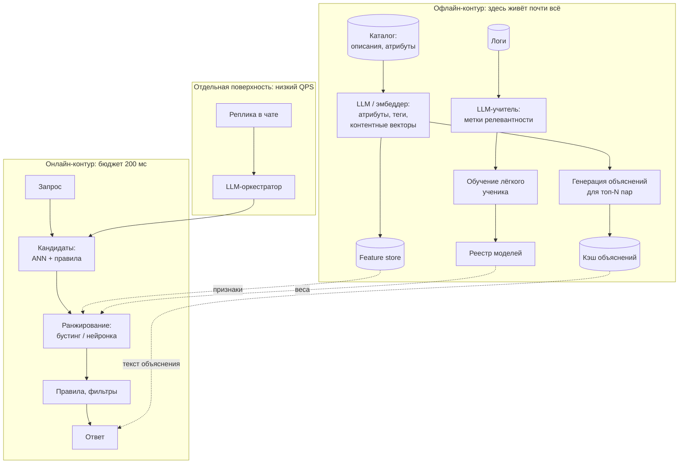
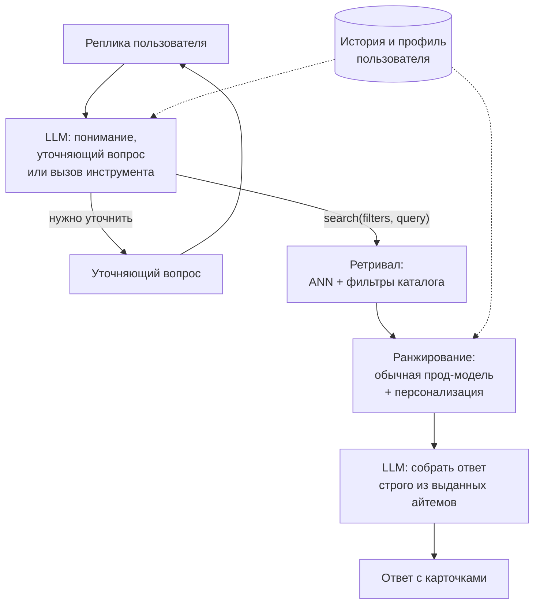

# LLM в рекомендациях

> **Зачем эта глава.** Про LLM в рекомендациях написано в сотни раз больше статей, чем внедрено
> систем, и разрыв между «в статье» и «в проде» здесь больше, чем в любой другой теме хендбука.
> Эта глава разделяет их явно: что реально катится (эмбеддинги контента, дистилляция, понимание
> запросов), что катится точечно (объяснения, диалог), а что пока живёт на датасетах Amazon Beauty
> (LLM-ранкер в горячем пути, генеративный ретривал). После главы вы сможете посчитать стоимость
> LLM-ранжирования на своём трафике за две минуты, объяснить механику semantic IDs и RQ-VAE,
> и грамотно ответить на собеседовании, где LLM в рекомендациях помогает, а где это способ сжечь
> бюджет.

**Уровень:** 🎯 middle → 🧠 middle+
**Предварительно нужно:** [двухбашенные модели и ANN](06-two-tower-and-ann.md), [обучение ранжированию](07-learning-to-rank.md), [последовательные рекомендации](09-sequential-recsys.md), [инференс LLM](../05-llm/05-inference-and-serving.md), [LLM в продакшене](../05-llm/11-llm-in-production.md)
**Как проработать:** чтение + расчёт бюджета + прототип дистилляции

---

## Карта главы

- [1. Что LLM знает такого, чего не знает ваша рекомендательная система](#1-что-llm-знает-такого-чего-не-знает-ваша-рекомендательная-система)
- [2. Барьер: считаем латентность и деньги до того, как начали](#2-барьер-считаем-латентность-и-деньги-до-того-как-начали)
- [3. LLM-эмбеддинги контента: паттерн, который работает](#3-llm-эмбеддинги-контента-паттерн-который-работает)
- [4. LLM-as-ranker](#4-llm-as-ranker) — zero/few-shot, позиционный биас, форматы
- [5. Генеративный ретривал и semantic IDs](#5-генеративный-ретривал-и-semantic-ids) — RQ-VAE и TIGER
- [6. P5 и инструкционная парадигма](#6-p5-и-инструкционная-парадигма)
- [7. Диалоговые рекомендации](#7-диалоговые-рекомендации)
- [8. Объяснения рекомендаций](#8-объяснения-рекомендаций)
- [9. Дистилляция: главный практический паттерн](#9-дистилляция-главный-практический-паттерн)
- [10. Сводка: что в проде, а что в статьях](#10-сводка-что-в-проде-а-что-в-статьях)
- [11. Подводные камни](#11-подводные-камни)
- [12. Проверь себя](#12-проверь-себя)
- [13. Практика](#13-практика)
- [14. Что читать дальше](#14-что-читать-дальше)

---

## 1. Что LLM знает такого, чего не знает ваша рекомендательная система

Начнём с честного вопроса: у вас уже есть двухбашенка на кандидатах, CatBoost на ранжировании,
500 признаков и год логов. Что LLM может добавить к этому?

Ответ: **ровно четыре вещи**, и ни одна из них не «лучше предсказывает клики».

**1. Мировое знание о содержании айтемов.** Ваша модель знает, что товар с id 8471293 часто
покупают вместе с товаром 1029384. Она не знает, что первый — это набор для приготовления рамена,
а второй — палочки, что рамен японский, что к нему уместны водоросли нори, и что человек,
купивший книгу про Мураками, статистически ближе к японской кухне, чем к итальянской.
Эти связи есть в тексте описаний, но обычная модель видит текст как мешок токенов
или как эмбеддинг фиксированного энкодера. LLM видит семантику.

**2. Холодный старт.** Новый товар без единого взаимодействия для коллаборативной модели —
это ноль. Для LLM это описание, которое можно понять и разместить в семантическом пространстве
рядом с похожими. То же для нового домена, новой категории, нового рынка. Это самая
осязаемая, самая дешёвая и самая часто внедряемая польза — про неё [§3](#3-llm-эмбеддинги-контента-паттерн-который-работает).

**3. Объяснения на естественном языке.** «Потому что вы смотрели X» — это шаблон.
«Похоже на "Тьму", но с более мягким финалом и без временных петель» — это то, что шаблоном
не порождается, а на кликабельность карточки влияет.

**4. Диалог.** Пользователь может сказать «что-нибудь как вчера, но покороче и не про войну» —
и ни один клик такой запрос не выражает. Появляется новый канал ввода предпочтений, которого
в классической рекомендательной системе просто не было.

### Где LLM не нужны — и это большинство случаев

**Она не знает поведения ваших пользователей.** Коллаборативный сигнал — «эти двое похожи,
потому что оба смотрели одни и те же 40 роликов» — в весах LLM отсутствует физически.
Ни один промпт не восстановит его из текста. Поэтому на плотных данных с богатой историей
LLM в роли предсказателя проигрывает обычной модели, обученной на этих данных, — и проигрывает
не на проценты.

**Она не влезает в бюджет горячего пути.** Лента отдаётся за 150–250 мс, LLM-ранжирование
сотни кандидатов занимает секунды. Это не «оптимизируем позже», это разница в два порядка
(расчёт в [§2](#2-барьер-считаем-латентность-и-деньги-до-того-как-начали)).

**Она не калибрована.** Ранжирующая модель отдаёт $p(\text{click})$, который потом смешивается
с $p(\text{buy})$, ставкой рекламодателя и бизнес-правилами. LLM отдаёт порядок или текст.
Превратить это в откалиброванную вероятность нельзя без отдельной модели поверх.

**Ей нельзя доверить свежесть.** Модель обучена до какой-то даты; ваш каталог живёт сегодня.
Всё актуальное всё равно приходит из вашей системы, LLM в лучшем случае интерпретирует.

### Куда LLM физически встраивается

Полезно сразу зафиксировать картинку. Многостадийная архитектура из
[главы про постановку задачи](01-recsys-foundations.md) никуда не девается — LLM появляется
в ней в конкретных точках, и почти все эти точки лежат в офлайн-контуре.



Обратите внимание: в горячем пути ленты LLM не появляется ни разу. Она заходит туда только
через отдельную поверхность с низким QPS (чат) или через артефакты, которые она произвела
заранее — признаки, веса ученика, кэш объяснений.

> 💬 **На собеседовании.** Спросят: «Заменит ли LLM классические рекомендательные системы?»
> Хороший ответ: нет, потому что источники сигнала разные. Коллаборативный сигнал — это
> статистика поведения ваших пользователей, её в весах LLM нет и быть не может; она приходит
> только из ваших логов. LLM приносит мировое знание о содержании айтемов и язык как интерфейс.
> Поэтому продуктивная схема — не замена, а разделение труда: LLM работает офлайн над
> пониманием контента и над обучающим сигналом, а в горячем пути стоит лёгкая модель,
> обученная на поведении, возможно — дистиллированная из LLM. Плохой ответ: «Да, LLM понимают
> пользователей лучше» — это выдаёт человека, который не считал ни латентность, ни деньги.

---

## 2. Барьер: считаем латентность и деньги до того, как начали

Этот раздел стоит вторым намеренно. Почти любая дискуссия про LLM в рекомендациях
заканчивается здесь, и лучше прийти к этому сразу.

Зафиксируем систему: лента маркетплейса, 3000 RPS в пике, ~200 млн запросов рекомендаций
в сутки, бюджет ответа 200 мс, каталог 5 млн товаров, на ранжирование приходит 500 кандидатов.

### Сценарий A: LLM ранжирует кандидатов в онлайне

Соберём промпт. Инструкция — ~200 токенов. История пользователя: 50 последних товаров
по ~20 токенов на название = 1000 токенов. Кандидаты: возьмём даже не 500, а топ-100
после предварительного отсева, по ~20 токенов = 2000 токенов. Итого **~3200 входных токенов**.
Выход — перестановка идентификаторов, ~300 токенов.

**Через API.** Возьмём дешёвую модель уровня «mini/flash»: порядка \$0.3 за 1 млн входных и \$1.2 за 1 млн выходных токенов (порядок величины; конкретные цены смотрите у провайдера
на день расчёта).

$$
C_{\text{req}} = 3200 \cdot 0.3\cdot10^{-6} + 300 \cdot 1.2\cdot10^{-6} \approx 0.00096 + 0.00036 \approx 1.3\cdot10^{-3}\ \text{USD}
$$

где $C_{\text{req}}$ — стоимость одного запроса, первое слагаемое — вход, второе — выход.

Полторы десятых цента за запрос. Умножаем на 200 млн запросов в сутки:

$$
C_{\text{day}} = 2\cdot10^{8} \cdot 1.3\cdot10^{-3} \approx 2.6\cdot10^{5}\ \text{USD/сутки} \approx 95\ \text{млн USD/год}
$$

Для сравнения: вся инфраструктура рекомендательной системы такого масштаба обычно стоит
единицы миллионов долларов в год. Мы получили **превышение бюджета в 20–50 раз**
на самой дешёвой модели. На фронтир-модели (\$10–15 за 1 млн входных) — ещё в 30 раз больше.

**Свой хостинг.** Возьмём модель на 8 млрд параметров в bf16 на H100.
Prefill: примерно $2P$ FLOP на токен, где $P$ — число параметров, то есть
$2 \cdot 8\cdot10^9 = 1.6\cdot10^{10}$ FLOP/токен. При реально достижимых ~400 TFLOPS это
$4\cdot10^{14} / 1.6\cdot10^{10} = 25\,000$ токенов/с. Наши 3200 токенов промпта — **~130 мс
чистого счёта GPU**, и это уже больше половины всего бюджета ответа.
Декодирование 300 токенов memory-bound: вес модели 16 ГБ, HBM ~2 ТБ/с, шаг ~8 мс;
при батче 64 это ~2.4 с на батч, то есть ~37 мс на запрос амортизированно.
Итого ~170 мс GPU-времени на запрос → **~6 запросов в секунду на одну H100**.
Для 3000 RPS нужно **~500 карт**. При \$2 за GPU-час это ~\$24 тыс./сутки, ~\$8.7 млн/год —
дешевле API в десять раз, но всё ещё на порядок дороже существующего ранкера.

**Латентность.** Даже если деньги найдутся: 300 выходных токенов при реалистичных под нагрузкой
100–200 токенах/с — это **1.5–3 секунды** только на генерацию. Бюджет 200 мс. Разница
не устраняется оптимизацией, она структурная: авторегрессионная генерация длинного ответа
несовместима с лентой.

```python
# Калькулятор, который стоит держать под рукой и доставать на каждом обсуждении «а давайте LLM»
def llm_cost_per_day(
    rps_avg,                 # средний RPS (не пиковый!) — по нему считаются деньги
    prompt_tokens,
    output_tokens,
    price_in_per_mtok,       # USD за 1 млн входных токенов
    price_out_per_mtok,      # USD за 1 млн выходных токенов
    coverage=1.0,            # доля трафика, на которую пускаем LLM
):
    """Возвращает (стоимость в сутки, стоимость в год) в USD."""
    req_per_day = rps_avg * 86400 * coverage
    cost_req = (prompt_tokens * price_in_per_mtok + output_tokens * price_out_per_mtok) / 1e6
    per_day = req_per_day * cost_req
    return per_day, per_day * 365


# Лента: LLM ранжирует топ-100 кандидатов на всём трафике
print(llm_cost_per_day(2300, 3200, 300, 0.3, 1.2))          # (~258k/сутки, ~94M/год)

# Тот же LLM, но только на 1% трафика и только для новых пользователей
print(llm_cost_per_day(2300, 3200, 300, 0.3, 1.2, coverage=0.01))   # (~2.6k/сутки, ~0.9M/год)

# Офлайн-эмбеддинги каталога: 50 тыс. новых товаров в сутки по 100 токенов, дешёвый эмбеддер
new_items_tokens = 50_000 * 100
print(new_items_tokens * 0.02 / 1e6)                        # ~0.10 USD в сутки
```

Последняя строка — главный вывод главы, выраженный числом. **Десять центов в сутки против
четверти миллиона.** Разница между «LLM понимает контент офлайн» и «LLM ранжирует в горячем
пути» — шесть порядков. Всё, что дальше в этой главе работает в проде, находится ближе
к десяти центам.

### Три рычага, которые реально снижают счёт

Прежде чем отказываться от идеи, посчитайте, что дают стандартные приёмы. Ни один из них
не спасает сценарий A, но в жизнеспособных сценариях они меняют экономику в разы.

**Префиксное кэширование.** Если промпт начинается с длинной неизменной части (инструкция,
few-shot примеры, описание правил), провайдеры и локальные движки умеют переиспользовать
её KV-кэш и считают такие токены существенно дешевле или не считают вовсе. Практический
приём: всё постоянное — строго в начало промпта, всё переменное (история, кандидаты) —
в конец. Порядок влияет на счёт напрямую: перепутаете — кэш не сработает ни разу.
При инструкции в 800 токенов из 3200 это до четверти входной стоимости.

**Семантическое кэширование по ключу, а не по строке.** В рекомендациях запросы повторяются
чаще, чем кажется: «мужские кроссовки 43» приходит тысячи раз в сутки в разных написаниях.
Нормализуйте (регистр, опечатки, порядок слов, синонимы), хешируйте — и повторные запросы
уходят в Redis за ~1 мс вместо секунды и нуля долларов вместо цента. На поисковых нагрузках
это снимает 60–80% вызовов. Для персонализированных промптов кэш работает хуже: ключ
включает пользователя, попаданий почти нет. Отсюда правило — **кэшируйте то, что зависит
от айтема или запроса, а не от пользователя**.

**Батчинг в офлайне.** Массовый прогон по каталогу — это не онлайн-запросы: его можно
пустить через batch-API провайдера (обычно вдвое дешевле) или на своём железе с крупными
батчами и полной утилизацией GPU. Разница между «5 млн запросов по одному» и «5 млн
в батчах» — не только деньги, но и часы против суток.

Сложите: префиксный кэш минус ~20% входа, семантический кэш минус 70% вызовов, batch-API
минус 50% на офлайне. Сценарий A из \$95 млн/год превращается в ~\$25 млн/год — и всё равно
не поедет. А вот сценарий «LLM на 1% трафика» из \$0.9 млн превращается в ~\$250 тыс.,
и это уже обсуждаемая цифра.

> ⚠️ **Типичная ошибка.** Считать стоимость по пиковому RPS (получите завышение в ~1.5–2 раза,
> потому что среднесуточный трафик ниже пикового) или, наоборот, по среднему, когда считаете
> **железо** (там нужен пик плюс запас). Правило: деньги за API считаем по среднему RPS,
> количество GPU — по пиковому с коэффициентом 1.3 на хвосты.

> 🧠 **Middle+.** Из расчёта следуют все жизнеспособные схемы, и их полезно уметь назвать
> списком: (1) вынести LLM в офлайн — считать один раз на айтем, а не на запрос; (2) урезать
> покрытие — пускать LLM только на 0.1–1% трафика, где она реально нужна (холодные пользователи,
> редкие запросы); (3) кэшировать — если запрос повторяется, ответ берётся из кэша,
> а в рекомендациях повторяемость запросов на удивление высока для похожих сегментов;
> (4) дистиллировать — заплатить один раз за разметку и держать в проде дешёвую модель ([§9](#9-дистилляция-главный-практический-паттерн));
> (5) уменьшить выход — заставить модель отдавать не перестановку, а один токен ([§4](#4-llm-as-ranker)).
> Любое предложение «поставим LLM в рекомендации» должно попадать в одну из этих пяти категорий,
> иначе оно не поедет.

---

## 3. LLM-эмбеддинги контента: паттерн, который работает

Самое ценное применение LLM в рекомендациях — самое скучное. Никакого диалога и генерации:
берём описание айтема, прогоняем через текстовую модель, получаем вектор, используем его как
признак или как эмбеддинг для холодного старта.

### Какую проблему это решает

У вас есть двухбашенка. Эмбеддинг айтема в ней собирается из id-эмбеддинга плюс несколько
категориальных признаков. Для товара, у которого 10 тыс. взаимодействий, id-эмбеддинг обучен
отлично. Для товара, залитого сегодня, id-эмбеддинг — это шум инициализации, и никакой
коллаборативный сигнал его не спасёт, пока не наберётся хотя бы сотня взаимодействий.
Медиана «времени до вменяемого эмбеддинга» на маркетплейсах — недели, а карточка живёт
в топе продаж первые дни или никогда.

Текстовый эмбеддинг доступен **в момент заливки товара**. Он не заменяет коллаборативный
сигнал, но закрывает разрыв.

### Как это делают на практике

**Шаг 1. Собрать текст айтема.** Не только название: название + бренд + категория +
ключевые атрибуты + первые 200 символов описания. Порядок важен — самое информативное вперёд,
потому что при обрезке по длине потеряется хвост. Мусор (SEO-простыни, «доставка по всей
России») выкидывать: он одинаков у всех товаров и убивает различимость.

**Шаг 2. Выбрать модель.** Для русского языка — многоязычные эмбеддеры класса `multilingual-e5-large`
или `bge-m3` (открытые, self-hosted, 512–1024 измерения) либо API-эмбеддеры.
Полноценная генеративная LLM для этого не нужна и вредна по деньгам: специализированный
эмбеддер на 300–600 млн параметров даёт качество не хуже на задаче семантической близости
и стоит в сотни раз дешевле.

**Шаг 3. Не использовать сырой вектор напрямую.** Это ключевой момент, который пропускают.
Пространство текстовых эмбеддингов оптимизировано под семантическую близость, а не под
совстречаемость: «красное платье» и «красное платье» из разных категорий будут рядом,
хотя покупают их разные люди. Нужен **адаптер** — обучаемая проекция из текстового пространства
в пространство вашей рекомендательной модели:

$$
e_i = \mathrm{MLP}_\phi\big(t_i\big) \;+\; \mathbb{1}[c_i \ge c_{\min}] \cdot v_i
$$

где $t_i \in \mathbb{R}^{1024}$ — замороженный текстовый эмбеддинг айтема $i$,
$\mathrm{MLP}_\phi$ — обучаемая проекция (обычно два слоя, $1024 \to 256 \to d$),
$v_i \in \mathbb{R}^{d}$ — обучаемый id-эмбеддинг айтема, $c_i$ — число взаимодействий айтема,
$c_{\min}$ — порог «прогретости» (типично 50–200), $\mathbb{1}[\cdot]$ — индикатор.
То есть холодный айтем живёт только на контенте, а прогретый получает поправку от
коллаборативного сигнала.

Такая схема — прямой аналог того, что делает UniSRec: текстовые представления айтемов
приводятся к общему пространству адаптером, а не берутся сырыми.

**Шаг 4. Инженерия.** Эмбеддинги считаются батчевым джобом. Для 5 млн товаров при 100 токенах
на товар это 500 млн токенов — единицы долларов на дешёвом эмбеддере или несколько GPU-часов
на своём. Ежедневный инкремент — только новые и изменённые карточки, обычно 1% каталога,
то есть центы. Храним в том же хранилище, откуда ранкер берёт признаки.
Версионируем: смена модели эмбеддера — это несовместимое изменение, старые и новые векторы
нельзя смешивать в одном индексе.

> ⚠️ **Типичная ошибка.** Пересчитать эмбеддинги новой моделью и залить их в тот же ANN-индекс
> поверх старых. Пространства разные, косинус между старым и новым вектором ничего не значит,
> выдача разваливается, а по метрикам это выглядит как «дрифт». Правильно: строим полностью
> новый индекс, прогоняем shadow, переключаемся атомарно.

> 💬 **На собеседовании.** Спросят: «Как решить холодный старт для новых товаров?»
> Хороший ответ: сначала назвать контентные эмбеддинги — текстовые (описание, название,
> атрибуты) и визуальные, приведённые обучаемым адаптером в пространство рекомендательной модели,
> с постепенным перевесом в сторону id-эмбеддинга по мере накопления взаимодействий; затем
> добавить эксплорацию — принудительный показ новинок небольшой доле трафика, чтобы получить
> первые сигналы; и назвать метрику, по которой это оценивается (доля показов у товаров
> младше N дней, время до первых 100 взаимодействий). Плохой ответ: «используем LLM» без
> объяснения, откуда берётся вектор, как он попадает в модель и сколько стоит.

### Тот же приём для запросов и для профиля

Айтемы — не единственная сущность, у которой есть текст.

**Понимание поисковых запросов.** Классические модели слепы на длинном хвосте: запрос
«что подарить брату-рыбаку на 23 февраля» встречается три раза за год, статистики нет,
BM25 находит слово «рыбак», а нужен подарочный сценарий. LLM превращает такой запрос
в структуру: намерение (подарок), получатель (мужчина, взрослый), интерес (рыбалка),
повод (23 февраля), диапазон цен, список категорий-кандидатов. Дальше работает обычный
поиск по этим фильтрам.

Экономика здесь сходится потому, что **запросы кэшируются**. Распределение запросов
тяжелохвостое, но не бесконечное: нормализуете запрос (регистр, опечатки, порядок слов),
считаете хеш, кладёте разбор в кэш с TTL в недели. Даже при 30% уникальных запросов
в сутки от 20 млн поисков — это 6 млн вызовов, что уже дорого; но если пускать LLM только
на запросы с плохой выдачей (меньше $k$ результатов или низкий CTR по истории), остаётся
0.1–1%, то есть 20–200 тыс. вызовов в сутки, порядка \$30–300 в сутки. Это укладывается
в бюджет. Именно такие разборы публиковали команды маркетплейсов (Instacart писала об этом
применительно к поиску по продуктам): паттерн «LLM на длинном хвосте запросов плюс
агрессивный кэш» сейчас один из самых внедряемых.

**Суммаризация профиля пользователя.** История в 500 событий не влезает ни в промпт,
ни в интерпретируемый признак. LLM офлайн сжимает её в короткий текстовый портрет:
«интересуется бегом и триатлоном, покупает средний ценовой сегмент, чувствителен к скидкам,
последние две недели смотрит зимнюю экипировку». Дальше портрет либо эмбеддится и становится
признаком, либо кладётся в промпт диалогового ассистента.

Здесь нужна честная оговорка: как **признак для ранкера** такой портрет обычно проигрывает
прямым агрегатам поведения (доли категорий, средний чек, свежесть) — они точнее и на порядки
дешевле. Реальная ценность портрета там, где нужен именно текст: в промпте ассистента,
в объяснениях, в персонализированных заголовках подборок. Не делайте суммаризацию профиля
ради ранжирования, не измерив сначала прирост над обычными агрегатами.

> ⚠️ **Типичная ошибка.** Класть в текстовый портрет, который считается раз в сутки, свежую
> активность. Он мгновенно устаревает: человек за час поменял намерение, а портрет говорит
> про прошлую неделю. Разделяйте: медленная часть (устойчивые интересы) — от LLM раз в неделю,
> быстрая часть (последние N событий) — из стрима как есть, без всякой суммаризации.

---

## 4. LLM-as-ranker

Идея простая: дать модели профиль пользователя и список кандидатов, попросить упорядочить.
На этом идея заканчивается и начинаются проблемы.

### Три формата и почему выбирают listwise

**Pointwise:** «оцени по шкале 1–10, насколько этот фильм подойдёт пользователю».
Один вызов на кандидата — при 100 кандидатах это 100 вызовов, стоимость умножается на 100.
Плюс оценки плохо сопоставимы между вызовами: модель не видит контекста остальных кандидатов.

**Pairwise:** «какой из двух подойдёт лучше?». Качество лучше, но $O(k^2)$ вызовов
или $O(k\log k)$ при сортировке — всё равно десятки вызовов.

**Listwise:** весь список в одном промпте, на выходе перестановка. Один вызов —
и эмпирически на рекомендательных данных listwise работает лучше pointwise.
Это же и стандарт в поисковом реранкинге (подход RankGPT). Ограничение — длина контекста:
больше 100–200 кандидатов в один промпт обычно не влезает осмысленно, дальше применяют
скользящее окно: ранжируем последние 20, сдвигаем окно на 10, повторяем.

### Как выглядит рабочий промпт

Абстрактное «дайте модели профиль и кандидатов» скрывает несколько решений, каждое
из которых влияет на качество сильнее, чем выбор модели.

```
Ты ранжируешь товары для конкретного пользователя интернет-магазина.

История покупок и просмотров, САМЫЕ СВЕЖИЕ СВЕРХУ (в скобках — сколько дней назад):
1. Кроссовки Asics Gel-Nimbus 26, беговые (2 дня)
2. Гель для восстановления мышц (2 дня)
3. Пульсометр Garmin HRM-Dual (9 дней)
...
20. Термос 0.5 л (240 дней)

Кандидаты (порядок случайный, он НЕ несёт информации о релевантности):
[A] Компрессионные гетры CEP, для бега
[B] Кофемашина капсульная
...
[T] Носки беговые Asics, 3 пары

Правила:
- Опирайся в первую очередь на 5 самых свежих событий, они отражают текущее намерение.
- Не предполагай свойств товара, которых нет в названии.
- Верни ТОЛЬКО перестановку букв через запятую, от самого подходящего к наименее.
Формат ответа: T,A,...
```

Что здесь сделано намеренно:

**Свежие события сверху и явные давности.** Модели плохо восстанавливают порядок
из голого списка; явная разметка времени и инструкция «опирайся на последние 5» — самое
дешёвое улучшение качества в этой задаче. Работы по zero-shot ранжированию отдельно
показывают, что recency-focused промптинг даёт заметный прирост.

**Буквы вместо id.** Модель не должна воспроизводить длинные числовые идентификаторы —
она их путает и склеивает. Короткие метки (буквы или числа 1–20) сокращают выход
в разы (300 токенов вместо 1500) и почти убирают ошибки формата.

**Явная дисквалификация порядка кандидатов.** Не устраняет позиционный биас (см. ниже),
но немного ослабляет его.

**Только перестановка на выходе.** Никаких рассуждений: рассуждение — это выходные токены,
самые дорогие и самые медленные. Если качество без них проседает, дешевле поднять
качество кандидатов, чем платить за chain-of-thought на каждом запросе.

Few-shot здесь работает, но осторожно: два-три примера с чужими историями и правильными
перестановками улучшают следование формату и стабильность, но добавляют 500–1500 входных
токенов к каждому запросу — то есть 20–50% к стоимости. Проверяйте, окупается ли:
часто достаточно одного примера только для формата ответа.

### Позиционный биас в промпте

Главная методическая проблема. Языковая модель **не безразлична к порядку кандидатов
в промпте**. Если перемешать список и спросить снова, ответ изменится — иногда сильно.
Модели систематически предпочитают элементы в начале списка (а в некоторых постановках —
в конце), и этот эффект того же порядка, что и реальный сигнал релевантности.

Это ровно тот же биас, что в [LLM-as-a-judge](../05-llm/09-llm-evaluation.md), и лечится
он так же — **бутстрапом по порядку**: прогоняем $M$ раз со случайными перестановками
кандидатов и агрегируем ранги.

```python
import random
from collections import defaultdict


def debiased_llm_rank(candidates, rank_fn, n_shuffles=5, seed=0):
    """Убирает позиционный биас промпта усреднением по случайным перестановкам.

    candidates : list[str]  — идентификаторы/названия кандидатов
    rank_fn    : callable(list[str]) -> list[str]
                 принимает список кандидатов в некотором порядке,
                 возвращает их же в порядке убывания релевантности (вызов LLM)
    """
    rng = random.Random(seed)
    borda = defaultdict(float)              # счёт Борда: чем меньше средний ранг, тем лучше
    for _ in range(n_shuffles):
        shuffled = candidates[:]
        rng.shuffle(shuffled)
        ordered = rank_fn(shuffled)
        # штрафуем позицией: первый элемент получает 0, последний — len-1
        for pos, item in enumerate(ordered):
            borda[item] += pos
        # кандидаты, которых модель "потеряла" (галлюцинация или обрезка),
        # получают худший возможный ранг — иначе они несправедливо всплывут наверх
        for item in candidates:
            if item not in ordered:
                borda[item] += len(candidates)
    return sorted(candidates, key=lambda x: borda[x])


# Проверка на детерминированном "ранкере", который всегда любит первый элемент промпта:
# без бутстрапа результат полностью определялся бы исходным порядком.
def biased_ranker(items):
    return items                             # худший возможный ранкер: возвращает как дали

print(debiased_llm_rank(["a", "b", "c", "d"], biased_ranker, n_shuffles=50))
# порядок близок к случайному, а не к исходному — биас размазан, что и требовалось
```

Цена бутстрапа — умножение стоимости на $M$. При $M=5$ и расчёте из [§2](#2-барьер-считаем-латентность-и-деньги-до-того-как-начали) запрос стоит уже
не \$0.0013, а \$0.0065. Это ещё одна причина, по которой LLM-ранкер не живёт в горячем пути.

### Другие проблемы, которые вылезают сразу

**Биас популярности.** LLM знает мир — а значит, знает известные фильмы, книги и бренды лучше,
чем нишевые. Она систематически двигает наверх популярное, то есть ровно то, что
рекомендательная система и так умеет, и ровно то, с чем боретесь вы (см.
[холодный старт и смещения](12-cold-start-and-bias.md)).

**Галлюцинации айтемов.** Модель выдаёт в ответе объект, которого не было в списке кандидатов,
или переформулированное название, которое не мэтчится на id. Лечится констрейнтами
на декодирование (grammar/structured output) и обязательной валидацией ответа против входного
списка — как в коде выше.

**Плохое восприятие порядка истории.** Модель, которой дали 50 просмотров списком, слабо
различает, что было вчера, а что полгода назад. Работы по zero-shot ранжированию отдельно
отмечают, что помогает явная разметка свежести в промпте («последние три просмотра, самый
свежий первый») и few-shot примеры.

**Отсутствие калибровки.** Порядок есть, вероятности нет. Для смешивания с другими сигналами
(цена, маржа, реклама, бизнес-правила) нужна шкала, а её надо строить отдельно.

### Где LLM-ранкер всё-таки применим

Не в ленте на 3000 RPS. Применим там, где **низкий QPS и высокая цена ошибки**:

- реранкинг в поиске по редким/длиннохвостым запросам (доли процента трафика, но именно там
  классические модели слепы);
- подборки, которые собираются офлайн: e-mail-рассылка, витрина «специально для вас»,
  пересчитываемая раз в сутки;
- новые пользователи в первую сессию, когда коллаборативного сигнала нет вовсе;
- как **учитель для дистилляции** — про это [§9](#9-дистилляция-главный-практический-паттерн), и это самое частое реальное применение.

> 💬 **На собеседовании.** Спросят: «Вы дали LLM 50 кандидатов, она их упорядочила.
> Какие проблемы вы ожидаете?» Хороший ответ по пунктам: позиционный биас — результат зависит
> от порядка кандидатов в промпте, лечится бутстрапом по перестановкам с агрегацией рангов
> (и это умножает стоимость); биас популярности — модель тянет вверх известное, что усиливает
> и без того существующий popularity bias; галлюцинации — нужна валидация ответа против списка
> кандидатов; отсутствие калиброванных вероятностей — нечего смешивать с ценой и маржой;
> и стоимость с латентностью, из-за которых схема в принципе не живёт в горячем пути.
> Плохой ответ: «проверю качество на офлайн-метрике» — вопрос был не про метрику.

---

## 5. Генеративный ретривал и semantic IDs

Самая интересная в инженерном смысле идея этой главы. Она заслуживает подробного разбора,
даже если в вашем проде её не будет.

### Проблема, которую решают

Классический ретривал: обучили двухбашенку, посчитали эмбеддинги 5 млн айтемов, построили
HNSW-индекс, на запрос считаем эмбеддинг пользователя и ищем ближайших соседей.
Всё работает, но есть три ноющих места.

**Первое: эмбеддинг айтема — это атом.** У товара с двадцатью взаимодействиями вектор шумный,
и никакая информация от похожих товаров в него не перетекает — он отдельный обучаемый параметр.

**Второе: индекс — отдельная система.** Его надо строить, обновлять, шардировать, следить
за recall'ом. Каждое обновление модели требует полной перестройки.

**Третье: память.** Таблица эмбеддингов на 5 млн айтемов × 128 измерений × 4 байта = 2.5 ГБ,
на 500 млн айтемов — 250 ГБ. Она растёт линейно по каталогу.

Идея генеративного ретривала: **не искать айтем, а сгенерировать его идентификатор**.
Тогда индекса нет вообще — есть модель, которая по истории пользователя авторегрессионно
порождает id следующего айтема.

Наивная версия («пусть модель генерирует число 8471293») не работает: между id 8471293
и 8471294 нет никакой связи, модель должна выучить 5 млн произвольных строк наизусть.
Нужны **осмысленные идентификаторы** — такие, у которых близкие айтемы имеют близкие коды.
Это и есть **semantic IDs**.

### RQ-VAE: как получить semantic ID

Механика: берём контентный эмбеддинг айтема и квантуем его в последовательность из нескольких
дискретных токенов методом **остаточной квантизации** (residual quantization, RQ).

Пусть $x_i \in \mathbb{R}^{D}$ — контентный эмбеддинг айтема $i$ (например, из текстового
энкодера, $D = 768$). Энкодер $E_\theta$ сжимает его в латент $z = E_\theta(x_i) \in \mathbb{R}^{d}$,
$d \approx 32$. Дальше — $L$ уровней квантизации, у каждого свой кодбук
$\mathcal{C}^{(l)} = \{e^{(l)}_1, \dots, e^{(l)}_{V}\}$ из $V$ векторов размерности $d$
(типично $L = 3$, $V = 256$).

Алгоритм:

$$
r_0 = z, \qquad c_l = \arg\min_{k \in \{1..V\}} \big\| r_{l-1} - e^{(l)}_k \big\|_2, \qquad r_l = r_{l-1} - e^{(l)}_{c_l}
$$

где $r_l$ — остаток после $l$ уровней квантизации, $c_l \in \{1..V\}$ — выбранный код на уровне
$l$, $e^{(l)}_{c_l}$ — соответствующий вектор кодбука. Реконструкция:
$\hat{z} = \sum_{l=1}^{L} e^{(l)}_{c_l}$, затем декодер $D_\psi(\hat{z}) \approx x_i$.

Semantic ID айтема — это кортеж $(c_1, c_2, \dots, c_L)$.

Функция потерь:

$$
\mathcal{L} = \underbrace{\|x_i - D_\psi(\hat z)\|_2^2}_{\text{реконструкция}} \;+\; \sum_{l=1}^{L}\Big(\underbrace{\big\|\mathrm{sg}[r_{l-1}] - e^{(l)}_{c_l}\big\|_2^2}_{\text{обучение кодбука}} + \beta \underbrace{\big\|r_{l-1} - \mathrm{sg}[e^{(l)}_{c_l}]\big\|_2^2}_{\text{commitment}}\Big)
$$

где $\mathrm{sg}[\cdot]$ — stop-gradient (градиент не проходит через аргумент),
$\beta$ — вес commitment-слагаемого (типично 0.25), которое не даёт латенту убегать
от кодбука. Первое слагаемое в скобках двигает векторы кодбука к остаткам, второе —
остатки к векторам кодбука.

> 📐 **Разбор формулы.** Зачем **остаточная** квантизация, а не просто одна большая таблица
> на $256^3 = 16.7$ млн кодов? Потому что обучить кодбук на 16.7 млн векторов невозможно —
> большинство кодов не получит ни одного примера. Остаточная схема декомпозирует: первый
> уровень грубо делит пространство на 256 областей («крупная категория»), второй уточняет
> внутри области ещё на 256 («подкатегория/стиль»), третий — ещё раз («конкретный оттенок»).
> Каждый кодбук обучается на всех айтемах, а выразительность перемножается.
> Отсюда главное свойство: **айтемы с общим префиксом семантически близки.** Два товара
> с ID `(17, 203, 44)` и `(17, 203, 91)` совпадают по двум уровням — это «почти одно и то же»,
> и модель, которая выучила что-то про первый, автоматически знает кое-что про второй.

Коллизии неизбежны: разные айтемы могут получить одинаковый кортеж. Решение — добавить
четвёртый, «разрешающий» токен: порядковый номер айтема внутри группы коллизий.

```python
import torch


class ResidualQuantizer(torch.nn.Module):
    """Ядро RQ-VAE: L кодбуков по V векторов. Возвращает коды и квантованный вектор."""

    def __init__(self, n_levels=3, codebook_size=256, dim=32):
        super().__init__()
        self.codebooks = torch.nn.ParameterList(
            [torch.nn.Parameter(torch.randn(codebook_size, dim) * 0.05) for _ in range(n_levels)]
        )

    def forward(self, z):
        """z: (B, dim). Возвращает codes (B, L) и z_hat (B, dim)."""
        residual = z
        codes, z_hat = [], torch.zeros_like(z)
        commit_loss = z.new_zeros(())
        for cb in self.codebooks:
            # расстояния до всех векторов кодбука: (B, V)
            dist = torch.cdist(residual, cb)
            idx = dist.argmin(dim=1)                       # ближайший код на этом уровне
            e = cb[idx]                                    # (B, dim)
            # два слагаемых лосса: кодбук тянется к остатку, остаток — к кодбуку
            commit_loss = commit_loss + \
                torch.nn.functional.mse_loss(e, residual.detach()) + \
                0.25 * torch.nn.functional.mse_loss(residual, e.detach())
            # straight-through: вперёд идёт квантованное, назад — градиент как будто без квантизации
            e_st = residual + (e - residual).detach()
            z_hat = z_hat + e_st
            residual = residual - e.detach()               # остаток для следующего уровня
            codes.append(idx)
        return torch.stack(codes, dim=1), z_hat, commit_loss


# Быстрая проверка механики на синтетике
q = ResidualQuantizer(n_levels=3, codebook_size=64, dim=16)
z = torch.randn(8, 16)
codes, z_hat, loss = q(z)
print(codes.shape, z_hat.shape, float(loss))    # (8, 3) (8, 16) — три кода на объект
```

### TIGER: ретривал как генерация

Теперь собираем систему. Каждый айтем заменён на кортеж токенов. История пользователя
$(i_1, i_2, \dots, i_T)$ превращается в плоскую последовательность токенов длины $T \cdot L$.
Обучаем seq2seq-трансформер (в оригинале — небольшой T5-подобный, порядка десятков миллионов
параметров, а не LLM) предсказывать semantic ID следующего айтема авторегрессионно.

На инференсе — beam search шириной $B$ по $L$ шагам. Каждый шаг выбирает следующий токен
из словаря размера $V=256$, а не из 5 млн айтемов. Чтобы не породить несуществующий ID,
декодирование ограничивают **префиксным деревом** (trie) реальных идентификаторов каталога.

Ограничение декодирования — обязательная часть схемы, иначе beam уверенно порождает
кортежи, которым не соответствует ни один товар. Реализуется префиксным деревом:

```python
class SemanticIdTrie:
    """Префиксное дерево реальных semantic ID: на каждом шаге декодирования
    отдаёт множество допустимых следующих токенов."""

    def __init__(self, ids):
        self.root = {}
        for code in ids:                       # code — кортеж вида (17, 203, 44)
            node = self.root
            for tok in code:
                node = node.setdefault(tok, {})
            node["__end__"] = True

    def allowed(self, prefix):
        node = self.root
        for tok in prefix:
            node = node.get(tok)
            if node is None:
                return set()                   # такого префикса в каталоге нет
        return {k for k in node if k != "__end__"}


trie = SemanticIdTrie([(17, 203, 44), (17, 203, 91), (17, 8, 5), (200, 1, 1)])
print(trie.allowed(()))          # {17, 200}      — первый токен
print(trie.allowed((17,)))       # {203, 8}       — что можно после 17
print(trie.allowed((17, 203)))   # {44, 91}       — два реальных товара
print(trie.allowed((17, 99)))    # set()          — тупик, ветку отбрасываем
```

На каждом шаге beam search логиты по недопустимым токенам обнуляются (ставятся в $-\infty$
перед softmax), поэтому все сгенерированные последовательности гарантированно соответствуют
существующим айтемам. Стоимость проверки — один словарный лукап на луч на шаг, то есть ничто
по сравнению с форвардом модели.

Что это даёт по сравнению с ANN:

| Свойство | Двухбашенка + ANN | Генеративный ретривал (TIGER) |
|---|---|---|
| Что хранится | таблица эмбеддингов + индекс | кодбуки ($3 \times 256 \times 32$ float) + веса модели |
| Новый айтем | нужен эмбеддинг + перестройка индекса | получает ID из контента сразу, модель может его сгенерировать |
| Обобщение | между айтемами не переносится | общий префикс = общее знание |
| Стоимость поиска | $O(\log n)$ по индексу, ~5–15 мс | $L$ шагов декодирования с beam $B$ |
| Разнообразие | через постобработку | управляется температурой/beam напрямую |
| Обновление модели | перестройка индекса | переобучение и **перегенерация всех ID** |

Заявленные приросты в оригинальной работе — заметные (десятки процентов относительного
Recall@5 над SASRec и S³-Rec) на трёх подмножествах Amazon Reviews (Beauty, Sports, Toys).
Отдельно показан выигрыш на холодных айтемах: айтем, не встречавшийся в обучении, всё равно
получает semantic ID и может быть сгенерирован.

### Честно: почему этого мало где в проде

**Датасеты маленькие.** Amazon Beauty — порядка десятков тысяч айтемов. Каталог маркетплейса —
миллионы. При $256^3$ доступных кодов и 5 млн айтемов средняя группа коллизий содержит
несколько айтемов, и «разрешающий» токен начинает нести существенную долю информации,
теряя семантичность. Приходится увеличивать $L$ или $V$, а это удлиняет декодирование
и усложняет обучение.

**Обновление ID — операционный кошмар.** Переобучили RQ-VAE — все идентификаторы каталога
поменялись. Это значит: переобучить генеративную модель целиком, инвалидировать все кэши,
пересобрать все офлайн-джобы, которые используют ID. В системе, где ретривал обновляется
еженедельно, это неприемлемо. Приходится замораживать RQ-VAE надолго, а он деградирует
по мере дрейфа каталога.

**Латентность не выигрывает.** $L=4$ шага декодирования с beam $B=50$ на трансформере —
это несколько миллисекунд на GPU. ANN по 5 млн айтемов на CPU — 5–15 мс. Разница
не принципиальна, а GPU в ретривале — это новая статья расходов.

**Разнообразие и фильтры.** Beam search склонен генерировать айтемы с общими префиксами,
то есть семантически однотипные. Плюс все продуктовые фильтры (наличие, регион, возрастные
ограничения, уже купленное) применяются **после** генерации, и если beam выдал 100 кандидатов,
из которых 90 отфильтровались, вы остались с десятью. У ANN есть pre-filtering.

**Что из этого реально поехало:** semantic IDs **как признак**, а не как механизм ретривала.
Кодовые токены айтема подаются в обычную ранжирующую модель как категориальные фичи —
и это даёт обобщение на новые и редкие айтемы, потому что редкий айтем делит префикс
с частыми. Такой кейс публиковала команда Google применительно к ранжированию в YouTube
(работа «Better Generalization with Semantic IDs: A Case Study in Ranking for Recommendations»,
RecSys 2024) — там semantic IDs заменяют разреженные id-признаки в существующей модели,
никакой генеративный ретривал не строится.

> 💬 **На собеседовании.** Спросят: «Что такое semantic IDs и зачем они нужны?»
> Хороший ответ: это дискретное представление айтема в виде короткой последовательности токенов,
> полученное остаточной квантизацией (RQ-VAE) его контентного эмбеддинга; ключевое свойство —
> семантически близкие айтемы получают общий префикс. Это даёт две вещи: возможность
> сформулировать ретривал как генерацию последовательности токенов вместо поиска по ANN-индексу
> (TIGER), и — что важнее на практике — обобщение между айтемами, потому что модель, выучившая
> что-то про частый айтем, автоматически переносит это на редкий с тем же префиксом.
> Главные проблемы: коллизии на больших каталогах, необходимость перегенерировать все
> идентификаторы при переобучении квантизатора и невозможность применить продуктовые фильтры
> до генерации. Плохой ответ: «это когда айтемы кодируются токенами вместо id» — верно,
> но не отвечает на «зачем».

---

## 6. P5 и инструкционная парадигма

Отдельная линия работ: свести **все** рекомендательные задачи к генерации текста.
Каноническая работа — P5 (Pretrain, Personalized Prompt, and Predict Paradigm).

Идея: взять T5, придумать шаблоны промптов для пяти семейств задач — предсказание оценки,
последовательная рекомендация, прямая рекомендация (выбрать из списка), генерация объяснения,
суммаризация отзыва — и обучить одну модель на всех сразу.

```
Задача «оценка»:    "What star rating do you think user_23 will give item_7391?"  -> "4"
Задача «next-item»: "Here is the purchase history of user_23: item_1, item_88, ...
                     I wonder what is the next item to recommend. Can you help?"  -> "item_402"
Задача «объяснение»:"Generate an explanation for user_23 about item_7391"         -> "..."
```

Что здесь ценно концептуально: **единый интерфейс**. Одна модель закрывает и предсказание,
и объяснение, и обобщается на новые формулировки задач zero-shot.

Что здесь не работает практически:

- **id как токены.** `item_7391` разбивается токенизатором на куски, между которыми нет
  семантики — та же проблема, которую в [§5](#5-генеративный-ретривал-и-semantic-ids) решают semantic IDs. Обобщение на новые айтемы
  почти отсутствует.
- **масштаб.** Каталог в миллионы айтемов не помещается в словарь и не выучивается.
- **сравнение с бейзлайнами.** Воспроизведения P5 показали, что при аккуратной настройке
  сильные последовательные бейзлайны (SASRec с полной кросс-энтропией) сопоставимы или лучше —
  та же история, что описана в [главе про последовательные модели](09-sequential-recsys.md).
- **стоимость.** Генеративный форвард на каждое предсказание вместо скалярного произведения.

Практический вывод: P5 стоит знать как идею («рекомендация как языковая задача») и как
предшественника TIGER, но не как архитектуру для внедрения.

### Инструкционное дообучение: что оно реально даёт

Наследники P5 — линия работ, где открытую LLM на 7–13 млрд параметров дообучают
на рекомендательных инструкциях (TALLRec, InstructRec и подобные). Механика простая:
собирают датасет вида «вот история пользователя, вот кандидат — понравится или нет?»
и дообучают LoRA-адаптером (см. [PEFT и квантизацию](../05-llm/04-peft-and-quantization.md)).

Что показывают эксперименты и что из этого стоит унести:

- **Дообучение резко улучшает следование формату и снижает галлюцинации.** Zero-shot модель
  постоянно ломает формат ответа; после нескольких тысяч примеров эта проблема исчезает.
  Это самый надёжный эффект, и он же самый скучный.
- **Выигрыш концентрируется в режиме малых данных.** На датасетах, где у пользователя
  единицы взаимодействий, дообученная LLM обходит обученные с нуля модели — ей помогает
  предобучение. По мере роста плотности преимущество исчезает, и специализированная модель
  на ваших логах выигрывает. Это ровно тот же вывод, что в [§1](#1-что-llm-знает-такого-чего-не-знает-ваша-рекомендательная-система): LLM приносит внешнее знание,
  а не поведенческую статистику.
- **Стоимость не меняется.** Дообученная модель на 7B в горячем пути стоит столько же,
  сколько недообученная той же величины. Все расчёты [§2](#2-барьер-считаем-латентность-и-деньги-до-того-как-начали) остаются в силе.

Отсюда практическое место инструкционных моделей в реальном пайплайне: они хороши как
**учителя** — стабильный формат, разумное качество на холодных срезах, разовая стоимость
прогона по конечному пулу. Ставить их в онлайн имеет смысл только на поверхностях
из [§7](#7-диалоговые-рекомендации) и на срезах трафика из [§4](#4-llm-as-ranker).

---

## 7. Диалоговые рекомендации

Здесь у LLM есть честное преимущество: **латентность перестаёт быть барьером**. Пользователь
в чате готов ждать секунду-две, а стриминг ответа делает ожидание невидимым. Плюс QPS чата
на порядки ниже, чем QPS ленты, — значит и деньги сходятся.

Задача разговорной рекомендательной системы (conversational recommender system, CRS) —
за несколько реплик выяснить, что нужно, и предложить. До LLM это делали пайплайном:
классификатор намерения, извлечение слотов, менеджер диалога, шаблонный генератор.
Каждый компонент требовал разметки, и системы получались хрупкими.

### Рабочая архитектура

Ключевая ошибка — просить LLM порекомендовать «из головы». Она сгенерирует названия,
которых нет в каталоге, или которые есть, но недоступны. Правильная схема — **LLM
как оркестратор, каталог как источник истины** (это по сути RAG, см.
[главу про RAG](../05-llm/07-rag.md)):



Что здесь принципиально:

1. **Айтемы приходят только из ретривала.** LLM формирует запрос (структурированные фильтры
   плюс текст), но не придумывает товары. В промпт генерации ответа кладутся конкретные
   карточки, и модель обязана ссылаться только на них.
2. **Персонализация остаётся у вашей модели.** LLM не знает, что этот пользователь никогда
   не берёт дороже 5 тыс. рублей — это знает ранкер. Поэтому ранжирование внутри диалога
   делает обычная прод-модель, а не LLM.
3. **Уточняющий вопрос — самостоятельная ценность.** Хорошая CRS задаёт 1–2 вопроса,
   которые максимально сужают пространство. Плохая задаёт пять и раздражает.
4. **Состояние диалога** ведём явно (структура с накопленными фильтрами), а не полагаясь
   на то, что модель «помнит» из контекста.

### Состояние диалога и стоимость

Два инженерных момента, на которых валятся первые версии ассистентов.

**Состояние держим структурой, а не контекстом.** Соблазн — просто накапливать историю
реплик и полагаться на то, что модель «помнит». Проблемы: контекст растёт линейно
(а вместе с ним стоимость каждой следующей реплики), модель теряет ограничения из середины
длинного диалога, и вы не можете показать пользователю, какие фильтры сейчас применены.
Правильно — вести явный объект состояния и пересобирать промпт из него:

```python
from dataclasses import dataclass, field


@dataclass
class DialogState:
    """Явное состояние диалога: то, что попадёт в ретривал, а не в промпт-простыню."""
    query_text: str = ""
    filters: dict = field(default_factory=dict)      # {"price_max": 5000, "category": "бег"}
    excluded_items: list = field(default_factory=list)   # "это уже видел / не подходит"
    turn: int = 0

    def apply(self, update: dict) -> "DialogState":
        """LLM возвращает СТРУКТУРУ обновления, а не текст. Состояние меняем детерминированно."""
        self.filters.update(update.get("filters", {}))
        self.excluded_items += update.get("exclude", [])
        self.query_text = update.get("query_text", self.query_text)
        self.turn += 1
        return self

    def to_prompt_block(self) -> str:
        # Короткая сводка вместо всей истории реплик: стоимость промпта не растёт с диалогом
        parts = [f"Запрос: {self.query_text}"] if self.query_text else []
        parts += [f"{k}={v}" for k, v in sorted(self.filters.items())]
        if self.excluded_items:
            parts.append(f"исключить: {len(self.excluded_items)} шт.")
        return "; ".join(parts)


s = DialogState()
s.apply({"query_text": "куртка для бега зимой", "filters": {"price_max": 8000}})
s.apply({"filters": {"color": "не чёрный"}, "exclude": ["item_331"]})
print(s.to_prompt_block())
# Запрос: куртка для бега зимой; color=не чёрный; price_max=8000; исключить: 1 шт.
```

**Стоимость сходится, но её надо посчитать.** Диалог — это несколько вызовов на сессию:
понимание реплики (~500 входных токенов), формирование ответа с карточками (~1500 входных,
~200 выходных). Три-четыре реплики за сессию — порядка 6 тыс. входных и 600 выходных токенов,
то есть ~\$0.0025 за сессию на дешёвой модели. При 500 тыс. диалогов в сутки это ~\$1250
в сутки, ~\$450 тыс. в год — уже ощутимо, и это при том, что диалог использует малая доля
аудитории. Отсюда обязательные меры: лимит реплик на сессию, кэш ответов на типовые запросы,
и роутинг — простые реплики («покажи ещё», «дешевле») обрабатываются правилами без вызова LLM.
Роутинг обычно снимает 30–50% вызовов.

### Чем это оценивать

Основная сложность CRS — не в модели, а в оценке. Офлайн-метрики next-item здесь плохо
работают: диалог мог пойти иначе. Что используют:

- **успех задачи** (task success rate): доля диалогов, закончившихся кликом/добавлением
  в корзину/покупкой;
- **число реплик до успеха** — прокси на эффективность уточнений;
- **доля галлюцинаций** — ответы, содержащие айтемы вне выданного списка; должна быть
  измеряемо близка к нулю, это guardrail;
- **LLM-as-a-judge** на релевантность ответа реплике — с валидацией судьи на ручной разметке
  (см. [оценку LLM](../05-llm/09-llm-evaluation.md));
- **A/B** по продуктовым метрикам — единственная настоящая проверка.

Реалистичный статус: диалоговые рекомендации катятся в проде как **отдельная поверхность**
(ассистент, поиск с уточнением), а не как замена ленты. И их вклад в общие метрики обычно
измеряется процентами трафика, а не заменой основного канала.

---

## 8. Объяснения рекомендаций

Самое лёгкое во внедрении и самое опасное в исполнении.

Лёгкое, потому что объяснения генерируются **офлайн** для (пользователь, айтем) пар, которые
уже отобраны, кэшируются, и стоимость размазывается. Опасное — потому что тут легко получить
красивую ложь.

### Faithfulness против plausibility

LLM, которой дали пользователя и товар и попросили объяснить, напишет убедительный текст
**в любом случае** — в том числе если товар попал в выдачу из-за баги, из-за рекламы
или потому что он просто популярен. Это называется **post-hoc рационализация**:
объяснение правдоподобно (plausible), но не соответствует реальной причине (not faithful).

Практический эффект вредный вдвойне. Во-первых, пользователь получает ложное обещание
и разочаровывается на карточке — растёт отказ, падает доверие. Во-вторых, ложное объяснение
маскирует ошибки системы от вас самих.

### Как делать правильно

**Объяснение генерируется из доказательств, а не из воздуха.** В промпт кладём не «объясни,
почему этот товар подойдёт», а конкретные факты, извлечённые из системы:

```
Пользователь недавно смотрел: «беговые кроссовки Asics Gel», «гель для мышц».
Товар попал в выдачу: источник кандидатов — item2item от «беговые кроссовки Asics Gel»,
близость 0.83; топ-признаки ранкера — совпадение категории (0.31), бренд просмотрен ранее (0.22).
Атрибуты товара: компрессионные гетры, бренд CEP, для бега, размер L в наличии.

Напиши одно предложение (до 90 символов), объясняющее связь. Используй ТОЛЬКО факты выше.
Не упоминай цену, скидки и не обещай свойств, которых нет в атрибутах.
```

**Три обязательных ограничителя:**

1. **Источник фактов.** Атрибуты — из карточки товара, связь — из фактического источника
   кандидатов и из топ-признаков ранкера. Если объяснить нечем (товар пришёл из «популярного»),
   то честный вывод — **не показывать объяснение**, а не выдумывать.
2. **Валидация на выходе.** Автоматическая проверка: все упомянутые атрибуты присутствуют
   в карточке; нет запрещённых сущностей (цена, скидка, обещания доставки); длина в лимите.
   Не прошло — фолбэк на шаблон «Похоже на то, что вы смотрели».
3. **Кэш и офлайн.** Генерируем для топ-N пар пользователь×айтем ночью, храним, в онлайне
   только читаем. Стоимость: 10 млн объяснений × ~400 входных и ~30 выходных токенов
   на дешёвой модели ≈ 10 млн × \$0.00016 ≈ **\$1600 за полный прогон**, а инкрементально
   на новые пары — десятки долларов в сутки. Это укладывается в бюджет.

**Что мерить.** Не «качество текста». Мерить: CTR карточки с объяснением против без (A/B),
отказ после клика (если он вырос — объяснения обещают лишнее), долю фолбэков на шаблон,
и вручную — faithfulness на выборке в 200 примеров: соответствует ли объяснение реальной
причине попадания в выдачу.

> ⚠️ **Типичная ошибка.** Оценивать объяснения по тому, «нравятся ли они» на просмотре
> глазами. Красивое объяснение может врать, и вы это увидите только по росту отказов
> и жалоб. Всегда есть ручная проверка faithfulness на выборке и guardrail на отказ после клика.

---

## 9. Дистилляция: главный практический паттерн

Если из главы надо унести одну мысль, то эту. **LLM в рекомендациях чаще всего живёт
не в проде, а в пайплайне подготовки данных для того, что в проде.**

Логика прямая. LLM дорога в инференсе и умна. Лёгкая модель дёшева и глупа. Значит: платим
за LLM **один раз офлайн** на конечном наборе примеров, получаем от неё сигнал, и обучаем
на этом сигнале лёгкую модель, которая работает в горячем пути за миллисекунды.

### Четыре формы дистилляции в рекомендациях

**Форма 1: дистилляция в признаки (самая простая и самая частая).**
LLM офлайн размечает **айтемы**, а не запросы: извлекает атрибуты из описания
(«для кого», «повод», «стиль», «уровень подготовки»), нормализует категорию, генерирует теги,
считает эмбеддинг. Результат кладётся в feature store и становится обычными фичами
существующего ранкера. Количество вызовов — размер каталога (конечное!), а не размер трафика.
5 млн товаров × \$0.0002 = \$1000 разово, дальше центы в день на новинки.

**Форма 2: дистилляция меток релевантности.**
Для поиска и для реранкинга: LLM размечает пары (запрос, документ) метками релевантности,
на этой разметке обучается кросс-энкодер на 100–400 млн параметров, который в проде
отвечает за 5–20 мс. Это ровно то, что делали авторы RankGPT: перегнали листовое ранжирование
крупной модели в существенно меньший кросс-энкодер, и он на бенчмарках обошёл специализированные
модели на порядок большего размера. Экономика: 1 млн размеченных пар × \$0.002 = \$2000 разово
против \$95 млн/год за онлайн-инференс из [§2](#2-барьер-считаем-латентность-и-деньги-до-того-как-начали).

**Форма 3: дистилляция эмбеддингов.**
Учитель — большой текстовый энкодер, ученик — маленький (или вообще линейная проекция),
обучается воспроизводить косинусную геометрию учителя на вашем каталоге. Даёт возможность
считать эмбеддинги для миллионов айтемов ежедневно на CPU.

**Форма 4: дистилляция рассуждения в лёгкую модель.**
LLM генерирует не только метку, но и обоснование, а ученик обучается на метке (рассуждение
используется как способ улучшить качество меток учителя, а не как выход ученика).
Работает, но заметно дороже — рассуждение это выходные токены.

### Рабочий рецепт

1. **Выберите узкое место.** Не «улучшим рекомендации», а конкретно: холодные айтемы плохо
   ранжируются; длиннохвостые запросы дают пустую выдачу; категории заведены неточно.
   Дистилляция окупается только если понятно, где именно она даст сигнал, которого нет.
2. **Соберите пул примеров.** 100 тыс. – 1 млн. Важно: пул должен быть **смещён к проблемной
   зоне** (холодные айтемы, редкие запросы), а не быть равномерной выборкой из трафика —
   на типичном трафике ваша модель и так хороша, учитель там ничего не добавит.
3. **Посчитайте стоимость учителя** калькулятором из [§2](#2-барьер-считаем-латентность-и-деньги-до-того-как-начали) **до** запуска. Если получилось
   больше нескольких тысяч долларов — сокращайте пул или берите модель дешевле.
4. **Выберите форму таргета.** Жёсткая метка (релевантно/нет) — просто, но теряет информацию.
   Мягкая (оценка 0–4, или ранги внутри списка) — лучше, особенно для попарного лосса ученика.
   Для листового учителя берите ранги и обучайте ученика pairwise-лоссом
   (см. [обучение ранжированию](07-learning-to-rank.md)).
5. **Провалидируйте учителя на ручной разметке.** 300–500 примеров, размеченных людьми.
   Если согласие учителя с людьми ниже согласия людей между собой — учитель не годится,
   и дистиллировать его шум бессмысленно. Этот шаг пропускают чаще всего, и это главная
   причина провалов.
6. **Обучите ученика** — CatBoost на фичах, включающих LLM-признаки, или компактный
   кросс-энкодер. Ученик почти всегда должен видеть **и** поведенческие признаки:
   дистиллированный сигнал дополняет их, а не заменяет.
7. **Валидируйте против прода, а не против учителя.** Метрика — не «согласие с LLM»,
   а офлайн-метрика на вашем временном сплите и затем A/B. Ученик, идеально копирующий учителя,
   может быть хуже текущей модели: учитель не видел поведения.
8. **Обновляйте.** Учитель прогоняется по расписанию на новых айтемах/запросах,
   ученик переобучается вместе с остальным пайплайном.

> 💬 **На собеседовании.** Спросят: «Как бы вы использовали LLM в рекомендациях при бюджете
> 200 мс и 3000 RPS?» Хороший ответ: не в горячем пути. Считаю вслух: 3200 входных токенов
> на запрос при 200 млн запросов в сутки — это порядка сотни миллионов долларов в год через API
> и сотни GPU при своём хостинге, плюс латентность генерации в секундах. Поэтому LLM уходит
> в офлайн: размечает каталог (конечное число вызовов, тысячи долларов разово), генерирует
> обучающий сигнал для лёгкой модели, считает контентные эмбеддинги для холодного старта.
> В горячем пути остаётся то, что и было — двухбашенка на кандидатах и бустинг на ранжировании,
> но с новыми признаками. Если очень нужен LLM онлайн — только на узком срезе трафика
> с высокой ценой ошибки и с кэшированием. Плохой ответ: «поставим маленькую модель, будет
> быстро» — без расчёта это не ответ.

> 🧠 **Middle+.** Тонкость дистилляции, которую стоит проговаривать: вы дистиллируете
> **не модель, а конкретную способность**. «Дистиллировать GPT в рекомендательную систему»
> — бессмысленная формулировка, потому что рекомендательная задача определяется вашими данными,
> которых у учителя нет. Осмысленная формулировка: «дистиллировать способность LLM понимать,
> что товар с таким описанием относится к категории "снаряжение для трейлраннинга", в фичу
> ранкера». Разница в том, что во втором случае у вас есть определённая задача, на которой
> учитель объективно сильнее, и её можно измерить отдельно.

### Чего дистилляция не даёт

Три честных ограничения, которые стоит проговорить до запуска проекта.

**Ученик не станет лучше учителя на задаче учителя.** Верхняя граница качества — качество
разметки. Если согласие учителя с людьми по каппе Коэна 0.75, ученик выше не поднимется,
а обычно осядет на 0.70–0.73. Поэтому вопрос «а достаточно ли 0.73 для продукта» надо
задавать **до** того, как потрачены деньги на разметку миллиона примеров.

**Дистиллированный сигнал устаревает вместе с каталогом.** Атрибуты, извлечённые
из описаний год назад, не знают про новые категории, бренды и изменившуюся терминологию.
Нужен регулярный прогон учителя на дельте — это постоянная статья расходов, а не разовая.
Закладывайте её в стоимость владения: обычно 5–15% от стоимости первого полного прогона
в месяц.

**Дистилляция не переносит того, чего у учителя нет.** Учитель не видел ваших логов,
поэтому дистиллировать «предсказание клика» бессмысленно — вы получите дорогое приближение
здравого смысла вместо поведенческой статистики. Проверка простая: если задачу может решить
человек, глядя только на карточку товара и не зная ваших пользователей, — дистилляция
уместна. Если для ответа нужен доступ к логам — нет, эту задачу решает обычная модель
на ваших данных.

---

## 10. Сводка: что в проде, а что в статьях

| Применение | Где считается | Стоимость на масштабе 200 млн запросов/сутки | Статус |
|---|---|---|---|
| Контентные эмбеддинги айтемов | офлайн, батч | центы–доллары в сутки | **в проде широко** |
| Извлечение атрибутов и тегов из описаний | офлайн, батч | тысячи \$ разово + центы/сутки | **в проде широко** | | Понимание поисковых запросов (расширение, исправление, длинный хвост) | офлайн-кэш + онлайн на редких запросах | сотни–тысячи \$/мес | **в проде** |
| Дистилляция в ранкер / кросс-энкодер | офлайн разметка, лёгкий ученик онлайн | тысячи \$ разово | **в проде, главный паттерн** | | Semantic IDs как признаки ранжирования | офлайн | стоимость обучения RQ-VAE | **в проде точечно** (крупные компании) | | Генерация объяснений | офлайн для топ-N пар, кэш | ~\$1–2 тыс. на полный прогон | **в проде точечно** |
| Диалоговые рекомендации / ассистент | онлайн, низкий QPS | зависит от объёма чата | **в проде как отдельная поверхность** |
| LLM-ранкер на срезе трафика (<1%, холодные пользователи) | онлайн | сотни тысяч \$/год | **пилоты** | | LLM-ранкер на всём трафике ленты | онлайн | десятки–сотни млн \$/год | **не поедет** |
| Генеративный ретривал (TIGER) как замена ANN | онлайн | GPU в ретривале + операционные риски | **в статьях**, промышленных подтверждений мало |
| P5-подобная единая генеративная модель | онлайн | неприемлемо | **в статьях** |

> 🌱 **База.** Если вы читаете эту главу впервые и хотите унести три факта: (1) LLM в рекомендациях
> почти всегда работает **офлайн**, а не на запрос пользователя; (2) её главная польза —
> понимание **содержания айтемов**, а не поведения пользователей; (3) правильный вопрос
> при любом предложении «добавим LLM» — «сколько вызовов на запрос и сколько это стоит в сутки».

### Что спрашивают на собеседованиях по этой теме

Тема свежая, поэтому вопросы по ней задают не для проверки заученного, а чтобы понять,
отличаете ли вы хайп от инженерии. Практически всё сводится к четырём сюжетам.

**Сюжет 1: «Как бы вы применили LLM в нашей рекомендательной системе?»** Открытый вопрос,
и ценится в нём структура: разделить офлайн и онлайн, назвать конкретное узкое место
(холодные айтемы, длинный хвост запросов), посчитать порядок стоимости вслух и предложить
самый дешёвый вариант первым. Кандидат, который начинает с «поставим LLM ранжировать»,
теряет балл в первой же фразе.

**Сюжет 2: расчёт бюджета.** Прямо просят прикинуть деньги и латентность. Здесь достаточно
уметь разложить промпт на компоненты, умножить на цены и на трафик, и отдельно сказать
про время генерации. Точность до множителя 2 не важна — важно, что вы вообще считаете.
Это самый частый способ отличить практика от читателя новостей.

**Сюжет 3: механика одной конкретной вещи.** Обычно semantic IDs / RQ-VAE (алгоритм
остаточной квантизации по шагам, зачем префиксы, откуда коллизии) либо LLM-as-ranker
(позиционный биас и как его убирают). Реже — как устроена дистилляция и как валидируют
учителя. Это единственная часть, которую надо именно знать.

**Сюжет 4: критическое чтение.** «Вот статья, где LLM бьёт SASRec на MovieLens — стоит
внедрять?» Ждут упоминания утечки через предобучение (модель видела датасет), проблем
протокола (сэмплированные негативы, случайный сплит, ненастроенные бейзлайны) и предложения
проверить на свежих внутренних данных.

Отдельно: почти всегда хорошо заходит фраза «я бы этого не делал, и вот почему» с расчётом.
В этой теме умение отказаться аргументированно ценится выше, чем знание десяти архитектур.

---

## 11. Подводные камни

**Утечка через мировое знание при офлайн-оценке.**
Симптом: LLM-ранкер показывает выдающийся NDCG на публичном датасете, в A/B — ничего.
Причина: модель видела этот датасет (MovieLens, Amazon Reviews) на предобучении и «помнит»
популярность и связи. Плюс она знает будущее относительно даты вашего сплита.
Что делать: оценивать на свежих внутренних данных, датированных позже отсечки обучения модели,
и обязательно проверять, не воспроизводит ли «предсказание» просто популярность.
Контроль — сравнение с бейзлайном «топ популярных»: если LLM его не обходит с запасом,
вы измеряете память, а не понимание.

**Стоимость посчитана по пилоту.**
Симптом: на пилоте 1000 запросов стоило \$2, решили катить, через неделю счёт на \$80 тыс.
Причина: линейная экстраполяция без учёта того, что покрытие вырастет со 100% пилотного среза
до 100% реального трафика, а он в 200 тыс. раз больше.
Что делать: считать бюджет на полном трафике **до** пилота, калькулятором из [§2](#2-барьер-считаем-латентность-и-деньги-до-того-как-начали), и заранее
ставить жёсткий лимит расходов на уровне шлюза.

**Позиционный биас промпта принят за качество модели.**
Симптом: сравнили два промпта, один заметно лучше; после перемешивания кандидатов разница исчезла.
Причина: в лучшем промпте релевантные кандидаты случайно оказались ближе к началу.
Что делать: любое сравнение промптов — только с рандомизацией порядка кандидатов
и агрегацией по нескольким прогонам.

**Галлюцинированные айтемы доехали до пользователя.**
Симптом: в выдаче или в тексте ассистента товар, которого нет в каталоге или который
недоступен в регионе.
Причина: ответ модели не валидировался против источника истины.
Что делать: жёсткая проверка — каждый упомянутый айтем матчится на id из выданного ретривалом
списка, немэтчащееся отбрасывается; метрика «доля ответов с невалидными айтемами» как guardrail
с алертом на любое значение выше нуля.

**Дистилляция шума.**
Симптом: ученик отлично воспроизводит учителя (согласие 0.9), но в A/B хуже текущей модели.
Причина: учителя не валидировали на людях; он систематически ошибается в вашем домене
(например, не понимает специфичные категории), и ученик выучил ошибки.
Что делать: шаг 5 рецепта из [§9](#9-дистилляция-главный-практический-паттерн) — ручная валидация учителя на 300–500 примерах перед массовым
прогоном. И всегда валидировать ученика против прод-модели, а не против учителя.

**Смена версии модели провайдера поменяла поведение.**
Симптом: качество признаков/меток изменилось без единого коммита в вашем коде.
Причина: провайдер обновил модель под тем же алиасом.
Что делать: пиновать версию модели явно, держать регрессионный набор из 500 примеров
с зафиксированными ожидаемыми ответами и прогонять его перед каждым переходом на новую версию
(см. [LLM в продакшене](../05-llm/11-llm-in-production.md)).

**Семантические ID «поплыли» после переобучения квантизатора.**
Симптом: после переобучения RQ-VAE метрики упали, кэши бесполезны, офлайн-джобы сломались.
Причина: идентификаторы айтемов не стабильны между обучениями квантизатора.
Что делать: замораживать кодбуки надолго, новые айтемы квантовать замороженным энкодером,
переобучение планировать как миграцию с двойной записью и параллельным прогоном — либо
использовать semantic IDs только как признаки, где сдвиг переживается легче.

**Промпт правится «на горячую» и никем не версионируется.**
Симптом: качество признаков или объяснений скакнуло, в git ничего не менялось, виновного нет.
Причина: промпт лежит в конфиге сервиса или в админке и правится без ревью, хотя фактически
это код модели.
Что делать: промпт — в репозитории, с версией, ревью и регрессионным набором; каждый
артефакт, произведённый LLM, помечается версией промпта и версией модели, иначе вы не сможете
разделить эффекты при разборе инцидента.

**LLM-признаки заслонили поведенческие.**
Симптом: добавили LLM-эмбеддинги в ранкер, офлайн-метрика выросла, в A/B — падение
на активных пользователях.
Причина: модель переоценила семантическую близость, вытеснив поведенческие признаки,
которые сильнее ровно на тех, у кого много истории.
Что делать: смотреть метрики **по сегментам** активности отдельно (холодные, средние,
активные). Нормальная картина — прирост на холодных и нейтраль на активных. Падение
на активных означает, что новые признаки надо ограничить сегментом или пересобрать
взвешивание, как в формуле из [§3](#3-llm-эмбеддинги-контента-паттерн-который-работает).

**Латентность p99 убита хвостами LLM.**
Симптом: p50 приемлемый, p99 — секунды, конверсия падает.
Причина: время генерации у LLM имеет тяжёлый хвост (длинный ответ, ретрай, очередь у провайдера).
Что делать: жёсткий таймаут (например, 300 мс) с фолбэком на обычный ранкер, ограничение
`max_tokens`, отдельный SLI «доля запросов с фолбэком». Никогда не ставьте LLM в путь
без синхронного фолбэка.

---

## 12. Проверь себя

<details>
<summary><b>🌱 Вопрос.</b> Зачем вообще LLM в рекомендациях, если у нас есть логи поведения?</summary>

**Короткий ответ.** За тем, чего в логах нет: за пониманием содержания айтемов, за
семантикой для холодного старта, за языком как интерфейсом (объяснения, диалог).
Коллаборативный сигнал LLM не приносит — он есть только в ваших логах.

**Развёрнуто.** Разделите источники информации. Поведение пользователей — из логов, и здесь
обученная на них модель непобедима. Содержание айтемов — из текста и картинок, и здесь LLM
приносит мировое знание, которого нет ни в id-эмбеддинге, ни в категориальном дереве.
Отсюда практическая польза концентрируется там, где поведенческого сигнала мало или нет:
новый айтем, новый пользователь, редкий запрос, новая категория, новый рынок. Плюс отдельный
класс задач, которых раньше просто не существовало: объяснить рекомендацию словами
и принять предпочтение, выраженное фразой.

**Чего ждёт интервьюер:** понимания, что LLM и рекомендательная модель дополняют друг друга
разными типами сигнала, а не конкурируют.

**Провал:** «LLM умнее, она лучше предскажет, что понравится пользователю».
</details>

<details>
<summary><b>🎯 Вопрос.</b> Посчитайте вслух, сколько будет стоить LLM-ранжирование в ленте на 3000 RPS.</summary>

**Короткий ответ.** Порядка 3 тыс. входных и 300 выходных токенов на запрос, ~200 млн запросов
в сутки, дешёвая модель — это ~\$0.0013 за запрос, ~\$260 тыс. в сутки, ~\$95 млн в год.
На своём хостинге — ~500 H100 при 6 запросах в секунду на карту. И то, и другое на два порядка
выше бюджета типичной рекомендательной инфраструктуры.

**Развёрнуто.** Раскладка промпта: инструкция ~200 токенов, история 50 айтемов × 20 = 1000,
кандидаты 100 × 20 = 2000. Выход — перестановка ~300 токенов. Дальше умножение на цены
провайдера и на трафик. Для своего хостинга считаем prefill как $2P$ FLOP на токен
(для 8B это 16 GFLOP), делим на реальные ~400 TFLOPS — получаем ~130 мс только на prefill,
плюс декодирование. Отдельно от денег — латентность: генерация 300 токенов даже
при 200 токенах/с это 1.5 с при бюджете 200 мс. Вывод: схема не жизнеспособна ни по деньгам,
ни по времени; жизнеспособны офлайн-использование, срез трафика, кэш и дистилляция.

**Чего ждёт интервьюер:** что вы умеете считать порядок величины в уме и не боитесь сказать
«это не поедет». Точность до множителя 2 никого не волнует, важна структура расчёта.

**Провал:** «дорого, но можно оптимизировать» без единого числа.
</details>

<details>
<summary><b>🎯 Вопрос.</b> Что такое позиционный биас в LLM-ранжировании и как с ним бороться?</summary>

**Короткий ответ.** Результат зависит от порядка кандидатов в промпте: модели систематически
предпочитают элементы в начале списка. Лечится бутстрапом — несколько прогонов со случайными
перестановками и агрегацией рангов (счёт Борда), ценой умножения стоимости на число прогонов.

**Развёрнуто.** Это тот же эффект, что при использовании LLM в роли судьи. Величина смещения
сопоставима с реальным сигналом релевантности, поэтому без рандомизации любое сравнение
промптов или моделей недостоверно. Дополнительно помогают: явная нумерация кандидатов,
инструкция «оценивай независимо от порядка» (помогает слабо), и снижение числа кандидатов
в одном промпте. Рядом стоят две смежные проблемы: биас популярности (модель тянет вверх
известные бренды и произведения) и галлюцинация айтемов вне списка — последнее лечится
валидацией ответа против входного множества кандидатов и структурированным выводом.

**Чего ждёт интервьюер:** что вы знаете про рандомизацию порядка и понимаете, что она
умножает стоимость — то есть видите компромисс, а не только приём.

**Провал:** «попрошу модель быть объективной в промпте».
</details>

<details>
<summary><b>🧠 Вопрос.</b> Объясните механику semantic IDs и RQ-VAE.</summary>

**Короткий ответ.** Контентный эмбеддинг айтема сжимается энкодером и квантуется остаточно:
на каждом из $L$ уровней выбирается ближайший вектор из кодбука размера $V$, из вектора
вычитается выбранный код, остаток идёт на следующий уровень. Кортеж выбранных индексов
$(c_1,\dots,c_L)$ и есть semantic ID; ключевое свойство — семантически близкие айтемы
получают общий префикс.

**Развёрнуто.** Обучение — VAE-подобное: лосс = реконструкция исходного эмбеддинга из суммы
выбранных кодов + слагаемое, тянущее коды к остаткам, + commitment-слагаемое с весом ~0.25,
тянущее остатки к кодам; градиент через argmin пробрасывается straight-through.
Типичная конфигурация — $L=3$, $V=256$, то есть 16.7 млн различимых кодов; коллизии
разрешаются дополнительным порядковым токеном. Зачем остаточная схема, а не один большой
кодбук: обучить 16.7 млн центроидов невозможно, а три кодбука по 256 обучаются каждый
на всех данных, при этом выразительность перемножается. Применения: генеративный ретривал
(TIGER — seq2seq генерирует ID следующего айтема, декодирование ограничено префиксным
деревом реальных ID) и — практичнее — semantic IDs как категориальные признаки в обычной
ранжирующей модели, что даёт обобщение на редкие и новые айтемы.

**Чего ждёт интервьюер:** алгоритма остаточной квантизации по шагам и понимания, зачем нужен
именно префиксный характер кода.

**Провал:** «айтемы кодируются токенами, чтобы модель могла их генерировать» — описание
без механики.
</details>

<details>
<summary><b>🧠 Вопрос.</b> В чём преимущество генеративного ретривала перед ANN-поиском и почему его мало где внедрили?</summary>

**Короткий ответ.** Преимущества: обобщение между айтемами через общий префикс, готовность
к холодному старту (новый айтем получает ID из контента и может быть сгенерирован),
отсутствие отдельного ANN-индекса. Мешают: коллизии на больших каталогах, нестабильность
идентификаторов при переобучении квантизатора, невозможность применить продуктовые фильтры
до генерации и отсутствие выигрыша по латентности.

**Развёрнуто.** Заявленные приросты получены на небольших публичных наборах (подмножества
Amazon Reviews в десятки тысяч айтемов). При каталоге в миллионы $256^3$ кодов уже не хватает,
растёт доля коллизий, и разрешающий токен перестаёт быть семантичным. Операционно
самое болезненное — что переобучение RQ-VAE меняет ID всех айтемов: это инвалидирует кэши,
ломает офлайн-джобы и требует полного переобучения генеративной модели, тогда как ANN-индекс
перестраивается независимо. Плюс beam search выдаёт семантически однотипных кандидатов
и не умеет pre-filtering по наличию/региону/возрасту. Поэтому в индустрию поехала более
скромная версия идеи: semantic IDs как признаки в существующем ранкере.

**Чего ждёт интервьюер:** способности назвать операционные, а не только модельные ограничения.
Про кэши и перегенерацию ID вспоминают единицы.

**Провал:** «генеративный ретривал быстрее, потому что не нужен индекс».
</details>

<details>
<summary><b>🎯 Вопрос.</b> Как вы решите холодный старт нового товара с помощью LLM?</summary>

**Короткий ответ.** Считаем текстовый (и визуальный) эмбеддинг карточки в момент заливки,
пропускаем через обучаемый адаптер в пространство рекомендательной модели, используем вместо
id-эмбеддинга, пока не накопится порог взаимодействий; параллельно даём товару долю
эксплорационных показов.

**Развёрнуто.** Важны три детали. Первая: сырой текстовый эмбеддинг напрямую не годится —
пространство семантической близости не совпадает с пространством совстречаемости, нужен
адаптер (MLP), обученный вместе с рекомендательной моделью. Вторая: смешивание должно быть
плавным — вес id-эмбеддинга растёт с числом взаимодействий, иначе на пороге получите скачок
качества. Третья: эмбеддер — специализированная модель на сотни миллионов параметров,
а не генеративная LLM; это в сотни раз дешевле при том же качестве на задаче близости.
Плюс операционка: батчевый пересчёт, версионирование эмбеддингов, отдельный индекс
при смене модели. Метрика успеха — доля показов и время до первых N взаимодействий
у товаров младше недели.

**Чего ждёт интервьюер:** упоминания адаптера и плавного перехода к коллаборативному сигналу.
Без них ответ выглядит как пересказ идеи.

**Провал:** «положим эмбеддинг описания в ANN-индекс рядом с обученными эмбеддингами».
</details>

<details>
<summary><b>🎯 Вопрос.</b> Что такое дистилляция знаний LLM в рекомендациях и зачем она нужна?</summary>

**Короткий ответ.** Платим за дорогую модель один раз офлайн на конечном наборе примеров,
получаем от неё сигнал (метки релевантности, атрибуты айтемов, эмбеддинги) и обучаем на нём
лёгкую модель, которая работает в горячем пути за миллисекунды. Это основной способ
получить пользу от LLM в рекомендациях, укладываясь в бюджет.

**Развёрнуто.** Ключ в том, что число вызовов учителя определяется размером **каталога
или пула примеров**, а не размером трафика: разметить 5 млн товаров стоит порядка тысячи
долларов разово, а обслуживать 200 млн запросов в сутки — сотню миллионов в год. Формы:
дистилляция в признаки (атрибуты, теги, эмбеддинги — самая частая), дистилляция меток
релевантности в кросс-энкодер, дистилляция эмбеддингов в лёгкий энкодер. Критичные шаги
рецепта: пул примеров смещён к проблемной зоне (холодные айтемы, редкие запросы),
учитель провалидирован на ручной разметке до массового прогона, ученик валидируется
против прод-модели, а не против учителя, и ученик видит поведенческие признаки в дополнение
к дистиллированным.

**Чего ждёт интервьюер:** экономического аргумента (конечное число вызовов против трафика)
и шага валидации учителя.

**Провал:** «дистиллируем GPT в нашу модель» — формулировка без задачи и без измерения.
</details>

<details>
<summary><b>🎯 Вопрос.</b> Как правильно сделать объяснения рекомендаций через LLM?</summary>

**Короткий ответ.** Генерировать офлайн для отобранных пар, подавая в промпт **конкретные
доказательства** (источник кандидата, топ-признаки ранкера, атрибуты карточки), валидировать
выход на упоминание только реальных атрибутов, и не показывать объяснение вовсе, если
объяснять нечем.

**Развёрнуто.** Главный риск — post-hoc рационализация: модель напишет убедительный текст
даже если товар попал в выдачу из-за популярности или ошибки. Это вредно дважды: пользователь
получает ложное обещание (растёт отказ после клика), и вы теряете возможность заметить сбой
системы. Отсюда три ограничителя: факты только из системы, автоматическая проверка вывода
против карточки с фолбэком на шаблон, и honest-abstain, когда причины нет. Измерять надо
не «качество текста», а CTR карточки в A/B, отказ после клика, долю фолбэков и вручную —
faithfulness на выборке 200 примеров. Экономика приемлемая: офлайн-генерация для топ-N пар
с кэшем стоит порядка тысячи долларов на полный прогон.

**Чего ждёт интервьюер:** различения faithfulness и plausibility. Это то, что отделяет
инженера от энтузиаста.

**Провал:** «попросим LLM объяснить, почему товар подходит пользователю».
</details>

<details>
<summary><b>🧠 Вопрос.</b> Почему нельзя доверять офлайн-результатам LLM-рекомендаторов на публичных датасетах?</summary>

**Короткий ответ.** MovieLens и Amazon Reviews с высокой вероятностью были в обучающей выборке
модели, поэтому она «помнит» популярность и связи, а также знает события после даты вашего
сплита. Плюс типичные протоколы (сэмплированные метрики, случайный сплит, слабо настроенные
бейзлайны) сами по себе завышают результат.

**Развёрнуто.** Утечка через предобучение — специфичная для LLM проблема: модель не предсказывает,
а вспоминает. Диагностика — сравнение с бейзлайном «топ популярных» на том же протоколе:
если LLM не обходит его существенно, вы измеряете память о популярности. Второй слой проблем
общий для области и разобран в [главе про последовательные модели](09-sequential-recsys.md):
ранжирование против 100 сэмплированных негативов переворачивает порядок моделей,
случайный сплит вместо временного даёт утечку из будущего, а бейзлайны в статьях настроены
хуже предлагаемого метода. Правильный протокол: свежие внутренние данные позже даты отсечки
модели, временной сплит, полное ранжирование по каталогу, настроенные бейзлайны, и финальная
проверка только в A/B.

**Чего ждёт интервьюер:** что вы вспомните про утечку через предобучение — это первое,
что должно приходить в голову при виде «LLM бьёт SOTA на MovieLens».

**Провал:** принять цифры из статьи за оценку применимости в вашей системе.
</details>

<details>
<summary><b>🎯 Вопрос.</b> Где в рекомендательной системе LLM онлайн всё-таки оправдана?</summary>

**Короткий ответ.** Там, где QPS низкий, а цена ошибки высокая: диалоговый ассистент, реранкинг
редких длиннохвостых запросов в поиске, первая сессия нового пользователя без истории,
и любые офлайн-поверхности вроде e-mail-подборок. Плюс всегда с таймаутом и фолбэком.

**Развёрнуто.** Критерий простой: посчитайте число вызовов в сутки. Если это миллионы —
не поедет; если тысячи или десятки тысяч — считайте дальше. Диалог особенно удобен тем,
что латентность там не барьер (пользователь готов ждать, стриминг маскирует задержку),
а объём запросов на порядки ниже ленты. Редкие запросы в поиске — потому что там классические
модели слепы из-за отсутствия статистики, и доля трафика мала. Во всех случаях обязательны:
жёсткий таймаут (порядка 300 мс — 1 с в зависимости от поверхности), синхронный фолбэк
на обычную модель, кэширование по нормализованному ключу и лимит расходов на уровне шлюза.

**Чего ждёт интервьюер:** что вы выбираете применение по объёму трафика и цене ошибки,
а не по «интересности».

**Провал:** «везде, где нужно улучшить качество».
</details>

<details>
<summary><b>🧠 Вопрос.</b> Как правильно кэшировать LLM в рекомендательной системе?</summary>

**Короткий ответ.** Кэшировать то, что зависит от айтема или от запроса, и не пытаться
кэшировать то, что зависит от пользователя. Плюс отдельно — префиксный кэш промпта:
всё постоянное (инструкция, few-shot) строго в начало, всё переменное — в конец.

**Развёрнуто.** Три уровня. Первый — префиксное кэширование KV: неизменная часть промпта
переиспользуется движком или тарифицируется дешевле, но только если она физически стоит
в начале; перепутанный порядок обнуляет эффект. Второй — семантический кэш по
нормализованному ключу: приводим запрос к канону (регистр, опечатки, порядок слов, синонимы),
хешируем, кладём результат в Redis с TTL. На поисковых нагрузках это снимает 60–80% вызовов,
потому что распределение запросов тяжелохвостое, но верхушка очень плотная. Третий —
материализация: результаты для айтемов (атрибуты, эмбеддинги, объяснения) считаются
батчем и живут в feature store, а не в кэше вообще. Что кэшировать нельзя: персонализированные
промпты — ключ включает пользователя, попаданий почти нет, а память на кэш тратится.
Отдельно про инвалидацию: при смене версии модели или промпта кэш надо версионировать
ключом, иначе будете смешивать ответы двух разных систем и не поймёте, что мерите.

**Чего ждёт интервьюер:** различения «кэшируемо по айтему/запросу» и «не кэшируемо
по пользователю» — это главный водораздел, определяющий, поедет ли схема экономически.

**Провал:** «поставим кэш перед LLM» без разговора о ключе и об инвалидации.
</details>

<details>
<summary><b>🧠 Вопрос.</b> Ваша команда предлагает заменить двухбашенку генеративным ретривалом. Что вы скажете?</summary>

**Короткий ответ.** Попрошу сначала измерить три вещи: сколько коллизий даст RQ-VAE на нашем
каталоге, как мы будем применять продуктовые фильтры до генерации и что произойдёт с системой
при переобучении квантизатора. И предложу компромисс: внедрить semantic IDs как признаки
в существующий ранкер — это даёт большую часть выигрыша по обобщению без операционных рисков.

**Развёрнуто.** Аргументы против прямой замены. Первый — коллизии: при $256^3$ кодов
и миллионах айтемов группы коллизий велики, разрешающий токен несемантичен, качество ID падает.
Второй — фильтры: наличие, регион, возрастные ограничения, уже купленное применяются после
генерации, и из beam на 100 кандидатов может остаться десяток; у ANN есть pre-filtering.
Третий — стабильность ID: переобучение квантизатора меняет идентификаторы всех айтемов,
что инвалидирует кэши, ломает офлайн-джобы и требует полного переобучения генеративной модели.
Четвёртый — латентности мы не выигрываем: несколько шагов декодирования с beam на GPU против
5–15 мс ANN на CPU. Пятый — опубликованные приросты получены на небольших датасетах,
промышленных подтверждений замены ретривала мало. Компромисс с semantic IDs как признаками
проверяется за спринт и не создаёт нового критичного сервиса.

**Чего ждёт интервьюер:** умения сказать «нет» аргументированно и предложить меньшую версию
той же идеи. Это сигнал сеньорности.

**Провал:** согласиться, потому что «это SOTA», или отказать, потому что «сложно».
</details>

---

## 13. Практика

**Задача 1. Калькулятор бюджета (30 минут).**
Расширьте функцию из [§2](#2-барьер-считаем-латентность-и-деньги-до-того-как-начали): добавьте расчёт числа GPU для self-hosted варианта (по формуле
$2P$ FLOP на входной токен для prefill и memory-bound оценке для декодирования) и сравнение
«API против своего хостинга» по точке безубыточности.
*Сделано правильно, если: вы можете назвать, при каком суточном объёме запросов свой хостинг
становится дешевле API, и объяснить, почему точка зависит от отношения входных токенов
к выходным.*

**Задача 2. Позиционный биас руками (1 час).**
Возьмите любую доступную LLM, 20 фильмов из MovieLens и профиль пользователя. Попросите
ранжировать 10 раз со случайными перестановками кандидатов. Посчитайте: (а) среднюю
корреляцию Кендалла между прогонами; (б) среднюю позицию в ответе для кандидата, стоявшего
в промпте первым.
*Сделано правильно, если: вы получили численную оценку нестабильности и можете сказать,
сколько прогонов бутстрапа нужно, чтобы дисперсия итогового ранга упала до приемлемой.*

**Задача 3. RQ-VAE на своих данных (2 часа).**
Возьмите текстовые эмбеддинги 50 тыс. товаров (или книг из любого открытого датасета),
обучите RQ-VAE из [§5](#5-генеративный-ретривал-и-semantic-ids) с $L=3$, $V=256$.
*Сделано правильно, если: (а) доля коллизий (айтемов с одинаковым кортежем) посчитана;
(б) вы показали, что айтемы с общим префиксом $(c_1)$ действительно принадлежат похожим
категориям — например, через долю совпадения категории внутри группы против случайной базы;
(в) вы можете сказать, при каком размере каталога $L=3$, $V=256$ перестанет хватать.*

**Задача 4. Дистилляция за один день (3 часа).**
Выберите узкую задачу: «определить, относится ли товар к категории X по описанию».
Разметьте LLM 5 тыс. примеров, обучите на них лёгкий классификатор поверх эмбеддингов,
измерьте согласие с учителем и качество на 300 примерах, размеченных вручную.
*Сделано правильно, если: у вас есть три числа — согласие ученик↔учитель, качество учителя
против людей, качество ученика против людей — и вы можете объяснить, почему второе число
важнее первого.*

**Задача 5. Аудит объяснений (1 час).**
Сгенерируйте 50 объяснений для реальных пар (пользователь, айтем), где вы знаете фактический
источник кандидата. Проверьте вручную, сколько объяснений соответствуют реальной причине.
*Сделано правильно, если: вы получили процент faithful-объяснений и нашли минимум один
пример убедительной, но полностью выдуманной причины. Если не нашли — увеличьте выборку,
он там есть.*

---

## 14. Что читать дальше

- [Rajput S. et al. «Recommender Systems with Generative Retrieval» (2023)](https://arxiv.org/abs/2305.05065) —
  TIGER. Главная статья [§5](#5-генеративный-ретривал-и-semantic-ids). Смотреть раздел про RQ-VAE и про обработку коллизий,
  а также эксперименты на холодных айтемах.
- [Lee D. et al. «Autoregressive Image Generation using Residual Quantization» (2022)](https://arxiv.org/abs/2203.01941) —
  откуда взялась остаточная квантизация. Полезно для понимания, почему уровней несколько
  и как устроен лосс.
- [Hou Y. et al. «Large Language Models are Zero-Shot Rankers for Recommender Systems» (2023)](https://arxiv.org/abs/2305.08845) —
  систематический разбор LLM-ранкера: позиционный биас, биас популярности, проблема
  восприятия порядка истории, приёмы вроде бутстрапа и recency-focused промптинга.
- [Sun W. et al. «Is ChatGPT Good at Search? Investigating Large Language Models as Re-Ranking Agents» (2023)](https://arxiv.org/abs/2304.09542) —
  RankGPT: листовое ранжирование скользящим окном и дистилляция способности ранжировать
  в существенно меньшую специализированную модель. Ключевая работа для [§9](#9-дистилляция-главный-практический-паттерн).
- [Geng S. et al. «Recommendation as Language Processing (RLP): A Unified Pretrain, Personalized Prompt & Predict Paradigm (P5)» (2022)](https://arxiv.org/abs/2203.13366) —
  P5. Читать ради идеи единого интерфейса и ради понимания, почему id-как-токены не масштабируются.
- [Hou Y. et al. «Towards Universal Sequence Representation Learning for Recommender Systems» (2022)](https://arxiv.org/abs/2206.05941) —
  UniSRec: как правильно приводить текстовые представления айтемов в пространство
  рекомендательной модели адаптером. Прямая опора для [§3](#3-llm-эмбеддинги-контента-паттерн-который-работает).
- **Singh A. et al. «Better Generalization with Semantic IDs: A Case Study in Ranking for Recommendations», RecSys 2024** —
  кейс Google по использованию semantic IDs как признаков в ранжировании YouTube.
  Лучший аргумент в пользу «скромной» версии идеи из [§5](#5-генеративный-ретривал-и-semantic-ids).
- **Ferrari Dacrema M. et al. «Are We Really Making Much Progress?» (2019)** и связанные работы
  по воспроизводимости — методологический фундамент для критической оценки любых заявленных
  приростов в этой области; подробнее в [главе про последовательные модели](09-sequential-recsys.md).
- [Глава про инференс LLM](../05-llm/05-inference-and-serving.md) — если хотите считать
  латентность и железо точнее, чем в [§2](#2-барьер-считаем-латентность-и-деньги-до-того-как-начали): prefill vs decode, KV-cache, continuous batching.
- [Глава про LLM в продакшене](../05-llm/11-llm-in-production.md) — роутинг моделей,
  префиксное кэширование, пиннинг версий, дистилляция как общий паттерн.
- Инженерные блоги команд, которые публично описывали LLM в поиске и рекомендациях
  (Instacart — понимание поисковых запросов и длинный хвост; Netflix — переход к единой
  foundation-модели персонализации; Spotify — генерация описаний подборок). Ищите их
  по названиям компаний: это лучший источник реальных чисел и ограничений, которых нет в статьях.

---

⬅️ [Графовые рекомендации](10-graph-recsys.md) | 🏠 [Оглавление](../index.md) | ➡️ [Холодный старт и смещения](12-cold-start-and-bias.md)
