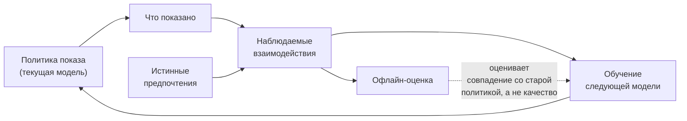
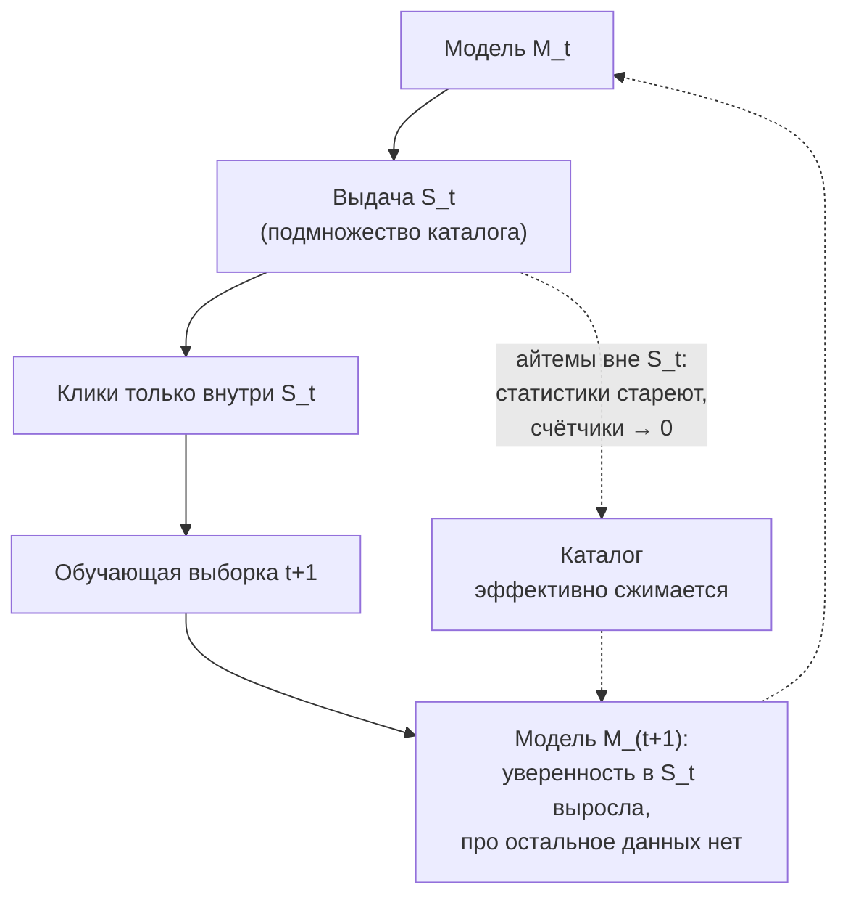

# Холодный старт и смещения

> **Зачем эта глава.** Рекомендательная система обучается на данных, которые сама же и породила:
> отклик виден только на то, что было показано. Отсюда весь букет — популярное становится ещё
> популярнее, новое не пробивается, офлайн-метрики растут, а выдача вырождается. Здесь разбираем
> три вида холодного старта и разные решения для каждого, механику popularity/position/selection
> bias, петлю обратной связи как процесс во времени и рабочие способы дебиасинга с ценой каждого
> в потерянных кликах.

**Уровень:** 🎯 middle → 🧠 middle+
**Предварительно нужно:** [постановка задачи рекомендаций](01-recsys-foundations.md), [офлайн-метрики](02-metrics-offline.md), [неявная обратная связь](04-implicit-feedback.md), [двухбашенные модели](06-two-tower-and-ann.md), [обучение ранжированию](07-learning-to-rank.md)
**Как проработать:** чтение + симуляция петли + расчёт бюджета эксплорации

---

## Карта главы

- [1. Одна причина, много симптомов](#1-одна-причина-много-симптомов)
- [2. Три холодных старта — три разные задачи](#2-три-холодных-старта--три-разные-задачи)
- [3. Холодный старт пользователя](#3-холодный-старт-пользователя)
- [4. Холодный старт айтема](#4-холодный-старт-айтема)
- [5. Холодный старт системы](#5-холодный-старт-системы)
- [6. Popularity bias: механизм и как его измерить](#6-popularity-bias-механизм-и-как-его-измерить)
- [7. Позиционный биас: измерение через интервенции](#7-позиционный-биас-измерение-через-интервенции)
- [8. Selection bias и MNAR](#8-selection-bias-и-mnar)
- [9. Петля обратной связи и вырождение выдачи](#9-петля-обратной-связи-и-вырождение-выдачи)
- [10. Дебиасинг: IPS, doubly robust, случайная примесь](#10-дебиасинг-ips-doubly-robust-случайная-примесь)
- [11. Компромиссы и границы](#11-компромиссы-и-границы)
- [12. Подводные камни](#12-подводные-камни)
- [13. Проверь себя](#13-проверь-себя)
- [14. Практика](#14-практика)
- [15. Что читать дальше](#15-что-читать-дальше)

---

## 1. Одна причина, много симптомов

Возьмём маркетплейс: 50 млн активных SKU в каталоге, 300 тыс. новых карточек в сутки,
20 млн DAU, лента на главной из 10 позиций, около 500 млн показов товаров в день.

Смотрим на логи за месяц и видим четыре вещи.

1. **1% товаров собрал 62% всех показов.** Половина каталога не показана ни разу.
2. **Товар, добавленный вчера, имеет медианную вероятность попасть в ленту 0.** Его нет ни в одном
   ANN-индексе, у него нет ни одного взаимодействия, ранжирующая модель для него предсказывает
   что-то около среднего по категории и проигрывает товарам с 5000 заказов.
3. **CTR первой позиции 6,1%, десятой — 1,0%.** Разница в шесть раз. Мы не знаем, насколько это
   разница в качестве товаров, а насколько — в том, что до десятой позиции доскроллили не все.
4. **Новый пользователь без истории видит ту же выдачу, что и все остальные новички**, и уходит
   в 1,6 раза чаще.

Все четыре симптома — следствия одного факта:

> Рекомендательная система наблюдает отклик **только на то, что показала сама**. Обучающая выборка
> порождается предыдущей версией модели, а не природой.

В статистике это называется **смещение отбора** (selection bias), в причинном выводе — обучение
на данных **наблюдательного** (observational), а не экспериментального происхождения. Обычное
обучение с учителем молча предполагает, что выборка репрезентативна. В рекомендациях это
предположение нарушено конструктивно, и нарушено моделью, которую мы же и обучаем.

Дальше — по симптомам: сначала холодный старт (нет данных вообще), потом смещения (данные есть,
но кривые), потом петля (смещение усиливает себя со временем).

---

## 2. Три холодных старта — три разные задачи

Кандидаты на собесе почти всегда сваливают их в кучу и отвечают «покажем популярное». Это ответ
только для одного из трёх случаев, причём для самого простого.

| Что холодное | Что именно неизвестно | Чем закрываем | Кто страдает |
|---|---|---|---|
| **Пользователь** | эмбеддинг пользователя, история | контекст, онбординг, look-alike, сессионные модели | конверсия новичков, удержание первого дня |
| **Айтем** | эмбеддинг айтема, статистики отклика | контентные признаки, контентная башня, квота трафика | поставщики, полнота каталога, свежесть |
| **Система** | вообще всё: нет матрицы взаимодействий | правила, контент, перенос из смежного домена, ручные подборки | сам факт запуска продукта |

Отличия принципиальные. Холодный старт пользователя **решается за минуты** — как только человек
кликнул три раза, у нас есть сессионная история. Холодный старт айтема **не решается сам** —
если товар не показывать, он никогда не наберёт взаимодействий; это самоподдерживающаяся ловушка,
и её приходится ломать принудительно. Холодный старт системы — вообще не ML-задача на первом этапе.

> 💬 **На собеседовании.** Спросят: «Как решить проблему холодного старта?» Хороший ответ начинается
> с встречного разделения: «Холодный старт бывает трёх видов, и решения у них разные. Уточните,
> про какой говорим — про нового пользователя, новый айтем или запуск системы с нуля?» Дальше
> разбираете один и упоминаете, чем отличаются остальные. Плохой ответ: «покажем самое популярное» —
> это закрывает только пользователя, и то плохо: популярное одинаково для всех и не даёт системе
> узнать о человеке ничего нового.

---

## 3. Холодный старт пользователя

### Что у нас есть до первого клика

Даже про анонима известно больше, чем кажется. Полезно выписать это явно, потому что на схеме
это отдельная ветка признаков, доступная **из запроса**, без похода в feature store:

- **Контекст запроса**: время суток, день недели, устройство (мобильное/десктоп), ОС, гео по IP,
  язык интерфейса.
- **Источник трафика**: поисковая выдача с запросом «купить коляску» — это уже почти сегмент;
  реферал из рекламной кампании — известен креатив, на который человек кликнул.
- **Точка входа**: карточка товара, категория, лендинг акции. Item-to-item рекомендации на карточке
  вообще не требуют знания пользователя — они персонализируются контекстом.
- **Первые события сессии**: два просмотра карточек — это уже последовательность, на которой
  работает сессионная модель (см. [последовательные рекомендации](09-sequential-recsys.md)).

Отсюда практическое правило: для анонима **лучшая персонализация — не пользовательская, а
контекстная и сессионная**. Модель, которая принимает на вход последние 3–5 просмотров сессии,
догоняет полноценную персонализацию быстрее, чем кажется.

### Где проходит граница «холодный / тёплый»

Не назначайте порог на глаз, измерьте его. Постройте кривую качества по числу взаимодействий:

```python
import numpy as np
import pandas as pd

def quality_by_history_len(df: pd.DataFrame, bins=(0, 1, 3, 5, 10, 20, 50, 10**9)) -> pd.DataFrame:
    """df: user_id, n_interactions (на момент предсказания), ndcg_cf, ndcg_content.
    Ключ: n_interactions считается ДО целевого события, иначе получите утечку."""
    df = df.assign(bucket=pd.cut(df.n_interactions, bins=bins, right=False))
    out = df.groupby("bucket", observed=True)[["ndcg_cf", "ndcg_content"]].agg(["mean", "count"])
    return out

# Типичная картина на e-commerce: до ~5 взаимодействий контентная/популярная модель
# выигрывает у коллаборативной, после ~10 — проигрывает ей уверенно.
```

Точка пересечения кривых и есть ваша граница. На практике она лежит в диапазоне **3–10
взаимодействий** и зависит от того, насколько «широки» интересы: в доставке еды хватает двух
заказов, в книгах нужно 15+.

Реализация — обычно **гибрид с переключением по уверенности**, а не жёсткий if:

$$
s(u, i) \;=\; \alpha(n_u)\, s_{\text{CF}}(u, i) \;+\; \bigl(1 - \alpha(n_u)\bigr)\, s_{\text{content}}(u, i),
\qquad \alpha(n_u) = \frac{n_u}{n_u + n_0}
$$

где $s_{\text{CF}}$ — скор коллаборативной модели, $s_{\text{content}}$ — скор контентной
(или популярной по сегменту) модели, $n_u$ — число взаимодействий пользователя $u$ на момент
запроса, $n_0$ — параметр сглаживания: при $n_u = n_0$ вклады равны. Берут $n_0$ примерно равным
найденной точке пересечения кривых, то есть 5–10. Формула — та же байесовская усадка (shrinkage),
что и в сглаживании средних по группе.

### Онбординг: платим вниманием, покупаем данные

Явный опрос при регистрации («выберите 5 интересных вам жанров / магазинов / категорий») —
это не UX-украшение, а **покупка данных за отток**. Каждый экран онбординга теряет часть
пользователей, поэтому он должен окупаться.

Что важно в дизайне выбора:

- **Показывать не топ популярных, а покрывающее множество.** Если предложить 30 самых популярных
  фильмов, ответы почти не различают людей: все выбирают одно и то же, информации ноль. Правильный
  набор — по 2–3 представителя из разных кластеров каталога, при этом каждый достаточно известен,
  чтобы про него было мнение. Формально: максимизируем взаимную информацию между ответом и
  профилем; практически — кластеризуем айтемы по эмбеддингам и берём популярных представителей
  кластеров.
- **Адаптивность.** Второй экран зависит от первого: выбрал «фантастику» — уточняем внутри неё.
  Классическая схема — дерево вопросов, где следующий вопрос максимально уменьшает неопределённость.
- **Ограничение по длине.** 1–2 экрана, 15–30 айтемов на экран. Дальше отток съедает выгоду.

Итог онбординга — не «профиль», а стартовый эмбеддинг: усредняем (обычно взвешенно) эмбеддинги
выбранных айтемов и получаем начальный $u$, который дальше уточняется поведением.

### Look-alike

Если про пользователя известны хоть какие-то атрибуты (гео, устройство, источник, партнёрские
сегменты), можно взять **средний профиль похожих пользователей**: обучаем модель, которая по
атрибутам предсказывает эмбеддинг из коллаборативной модели, и подставляем предсказание вместо
неизвестного.

$$
\hat u \;=\; g_\psi(x_u), \qquad \psi = \arg\min_\psi \sum_{u \in \mathcal{U}_{\text{warm}}} \bigl\| g_\psi(x_u) - u \bigr\|_2^2
$$

где $x_u$ — вектор доступных атрибутов пользователя, $u$ — его эмбеддинг из обученной
коллаборативной модели, $g_\psi$ — регрессионная модель (от линейной до MLP), $\mathcal{U}_{\text{warm}}$ —
множество пользователей с длинной историей, на которых эмбеддинг надёжен, $\psi$ — её параметры.
Это ровно та же идея, что и контентная башня для айтемов из [§4](#4-холодный-старт-айтема), только со стороны пользователя.

> ⚠️ **Типичная ошибка.** Обучать $g_\psi$ на всех пользователях подряд, включая тех, у кого
> 2 взаимодействия. Их эмбеддинги — почти шум (регуляризатор тянет их к нулю), и модель учится
> предсказывать этот шум. Фильтруйте обучающее множество по длине истории: 20+ взаимодействий.

---

## 4. Холодный старт айтема

Здесь ловушка: чтобы товар начал получать показы, ему нужны взаимодействия; чтобы получить
взаимодействия, нужны показы. Разорвать её можно двумя способами — дать айтему **признаки,
не зависящие от истории**, и дать ему **гарантированный трафик**.

### Контентные признаки и контентная башня

Стандартное решение в двухбашенной архитектуре: башня айтема принимает на вход не (только)
обучаемый эмбеддинг `item_id`, а **контентные признаки**:

| Источник | Что даёт | Стоимость |
|---|---|---|
| Категория, бренд, цена, атрибуты | грубая, но мгновенно доступная локализация в пространстве | ~0 |
| Текст (название, описание) через энкодер | семантическая близость к похожим товарам | 5–20 мс на карточку офлайн |
| Изображение через CV-энкодер | важно в моде, интерьере, еде | 10–50 мс на карточку офлайн |
| Эмбеддинги от LLM | лучшее качество на длинном хвосте, см. [LLM в рекомендациях](11-llm-recsys.md) | десятки миллисекунд и деньги |
| Идентичность продавца/автора | наследование репутации: у нового товара известного продавца априори выше конверсия | ~0 |

Ключевой инженерный приём — **обучать модель так, чтобы она умела работать без id-эмбеддинга**.
Если у башни есть и id-эмбеддинг, и контент, при обычном обучении id перетянет на себя всё:
он информативнее для тёплых айтемов, которых в выборке подавляющее большинство. Лечится
принудительным дропаутом идентификатора: с вероятностью $p_{\text{drop}} \approx 0{,}1{-}0{,}3$
зануляем id-эмбеддинг и заставляем модель предсказывать по контенту.

```python
import torch
import torch.nn as nn

class ItemTower(nn.Module):
    """Башня айтема, устойчивая к холодному старту: id можно выбросить, контент остаётся."""
    def __init__(self, n_items: int, d_id: int, d_content: int, d_out: int, p_drop_id: float = 0.2):
        super().__init__()
        self.id_emb = nn.Embedding(n_items + 1, d_id, padding_idx=0)  # 0 — «id неизвестен»
        self.mlp = nn.Sequential(nn.Linear(d_id + d_content, 256), nn.ReLU(), nn.Linear(256, d_out))
        self.p_drop_id = p_drop_id

    def forward(self, item_id: torch.Tensor, content: torch.Tensor) -> torch.Tensor:
        if self.training and self.p_drop_id > 0:
            # маскируем часть id прямо в батче: модель обязана выучить путь «только контент»
            mask = torch.rand_like(item_id, dtype=torch.float) < self.p_drop_id
            item_id = torch.where(mask, torch.zeros_like(item_id), item_id)
        z = torch.cat([self.id_emb(item_id), content], dim=-1)
        return nn.functional.normalize(self.mlp(z), dim=-1)
```

Проверка, что это сработало: посчитайте офлайн-метрику отдельно на подмножестве холодных айтемов,
принудительно занулив им id. Если качество на холодных проваливается в ноль — модель контент
проигнорировала.

### Кластерный recall и look-alike для айтемов

Дешёвая альтернатива для тех, у кого нет контентной башни: кластеризуем тёплые айтемы по
коллаборативным эмбеддингам (например, k-means на 5–20 тыс. кластеров), обучаем классификатор
«контентные признаки → кластер», новый айтем относим к кластеру и **наследуем** ему усреднённый
эмбеддинг кластера с небольшим шумом. Работает хуже честной контентной башни, но внедряется
за неделю и не требует переучивать retrieval.

### Квота трафика (traffic control)

Признаков мало — нужно ещё принудительно показать. Схема, которая работает в проде:

1. Каждый новый айтем получает **гарантированный бюджет показов**: например, 1000 показов
   в первые 48 часов, распределённых по релевантному сегменту аудитории (не случайно по всем).
2. После набора бюджета считаем его CTR/CVR и сравниваем с категорийным бенчмарком.
3. Прошёл — переходит в общий пул и дальше конкурирует на общих основаниях. Не прошёл — бюджет
   не продлевается.

Откуда берётся число 1000? Из требуемой точности оценки. Стандартная ошибка доли:

$$
\mathrm{se}(\hat p) = \sqrt{\frac{p(1-p)}{n}}, \qquad
\frac{\mathrm{se}(\hat p)}{p} = \sqrt{\frac{1-p}{p\,n}}
$$

где $p$ — истинный CTR айтема, $\hat p$ — его оценка по $n$ показам, $\mathrm{se}$ — стандартная
ошибка оценки. Хотим оценить CTR уровня $p = 0{,}02$ с относительной погрешностью 25%:
$n = (1-p)/(p \cdot 0{,}25^2) = 0{,}98 / 0{,}00125 \approx 780$ показов. Отсюда «около тысячи».
А чтобы **статистически различить** два айтема с CTR 2% и 3% (мощность 80%, уровень 5%), нужно уже

$$
n \;\approx\; \frac{(z_{1-\alpha/2} + z_{1-\beta})^2 \,\bigl(p_1(1-p_1) + p_2(1-p_2)\bigr)}{(p_1 - p_2)^2}
= \frac{2{,}80^2 \cdot (0{,}0196 + 0{,}0291)}{0{,}0001} \approx 3800
$$

показов на каждый, где $z_{1-\alpha/2} = 1{,}96$ и $z_{1-\beta} = 0{,}84$ — квантили стандартного
нормального распределения для уровня значимости $\alpha = 0{,}05$ и мощности $1 - \beta = 0{,}8$,
$p_1, p_2$ — сравниваемые CTR. Отсюда честный вывод: **на 1000 показов вы отличите хороший товар
от катастрофического, но не хороший от чуть менее хорошего.** Это ровно та задача, для которой
существуют бандиты — они распределяют бюджет адаптивно вместо фиксированной квоты, см.
[следующую главу](13-exploration-and-bandits.md).

Цена квоты считается так же просто: 300 тыс. новых карточек × 1000 показов = 300 млн показов
в первые двое суток, при 500 млн показов в день это 30% всего трафика — очевидно неподъёмно.
Значит, квоту дают не всем: либо срезают по предфильтру (прошли модерацию, продавец с рейтингом,
категория с дефицитом предложения), либо снижают до 100–200 показов, либо ограничивают числом
«новинок» на выдачу (не более 1 из 10 позиций). Считать этот бюджет **до** внедрения — обязательно.

> 💬 **На собеседовании.** Спросят: «Как решить проблему нового контента, который алгоритм не
> показывает?» Хороший ответ содержит обе половины: (1) признаки — контентная башня с дропаутом
> id, чтобы у айтема был эмбеддинг с нулевого дня; (2) трафик — гарантированная квота показов
> с расчётом, сколько показов нужно для оценки CTR с заданной точностью, и оценкой стоимости
> квоты в процентах трафика. Плюс метрика: доля новых айтемов, получивших ≥N показов за 48 часов.
> Плохой ответ: «добавим контентные признаки» — без второй половины айтем всё равно проигрывает
> тёплым конкурентам в ранжировании и показов не получит.

---

## 5. Холодный старт системы

Нового продукта пока нет, матрицы взаимодействий нет, обучать нечего. Последовательность действий,
которая экономит месяцы:

1. **Неперсонализированный бейзлайн.** Топ по продажам/просмотрам за окно, с разбивкой по
   категории и гео. Это уже 50–70% ценности от финальной системы и запускается за дни.
2. **Контентная близость.** Item-to-item по текстам и атрибутам — работает без единого клика
   и сразу закрывает самую конверсионную поверхность (блок «похожие» на карточке).
3. **Правила и ручные подборки.** Редакторские полки, ассоциативные правила из чеков
   («купили вместе»), сезонность. Не стыдно: они дают данные, на которых потом учится модель.
4. **Перенос из смежного домена.** Если у компании есть другой продукт с той же аудиторией,
   пользовательские эмбеддинги переносятся; если каталог пересекается с чужим публичным — можно
   переносить айтемные.
5. **Осознанная эксплорация с первого дня.** Пока данных мало, случайная примесь стоит дёшево
   (терять почти нечего) и приносит непредвзятый датасет, который через полгода будет бесценен
   для оценки propensity. Это тот редкий случай, когда 5–10% случайного трафика оправданы.

Отдельно про метрики: **первые месяцы им нельзя верить**. Разреженность такая, что офлайн-NDCG
скачет от сплита к сплиту, а A/B не набирает мощность. Решение — смотреть на грубые индикаторы
(доля сессий с кликом в блок, глубина каталога) и не принимать решений по шумным дельтам.

---

## 6. Popularity bias: механизм и как его измерить

### Пять мест, где рождается перекос

Popularity bias — не один эффект, а сумма пяти, и лечится каждый по-своему.

1. **Данные.** У популярного айтема тысячи взаимодействий, у хвостового — три. Эмбеддинг первого
   обучен, второго — почти на уровне инициализации, и регуляризатор тянет его к нулю. При
   скалярном произведении вектор около нуля даёт скор около нуля — хвост проигрывает автоматически.
2. **Смещения (bias terms) в модели.** В матричной факторизации член $b_i$ впитывает популярность
   айтема напрямую (см. [коллаборативную фильтрацию](03-collaborative-filtering.md)). Это полезно
   для точности предсказания и разрушительно для разнообразия.
3. **Функция потерь.** При обучении с сэмплированным софтмаксом популярный айтем чаще встречается
   как позитив. Это чинится **logQ-коррекцией** — вычитанием $\log \hat q_i$ из логита при обучении,
   полный вывод в [главе про двухбашенные модели](06-two-tower-and-ann.md). Обратный эффект даёт
   in-batch-сэмплирование негативов: популярный чаще попадает в негативы и потому наказывается —
   именно баланс этих двух сил и настраивают.
4. **Критерий ранжирования.** Мы сортируем по $P(\text{клик})$. Априорная вероятность клика по
   популярному айтему выше при любом пользователе, поэтому **оптимальное по точности ранжирование
   само по себе смещено к популярному**. Это не баг модели, это свойство целевой функции.
5. **Петля обратной связи.** Показали популярное → собрали ещё взаимодействий по популярному →
   усилили. Механику разбираем в [§9](#9-петля-обратной-связи-и-вырождение-выдачи).

### Метрики, которыми это меряют

Метрика точности перекос не видит вообще: recall@10 может расти, пока каталог схлопывается.
Нужен отдельный набор, считаемый **по распределению показов (экспозиции), а не по кликам**.

**Коэффициент Джини по экспозиции.** Основная метрика концентрации:

$$
G \;=\; \frac{\sum_{j=1}^{M} (2j - M - 1)\, x_{(j)}}{M \sum_{j=1}^{M} x_{(j)}}
$$

где $M$ — число айтемов в каталоге, $x_{(j)}$ — число показов $j$-го айтема после сортировки
по возрастанию ($x_{(1)} \le x_{(2)} \le \dots \le x_{(M)}$). $G = 0$ — все айтемы показаны
одинаково часто, $G \to 1$ — все показы достались одному айтему.

**Доля хвоста.** Разбиваем каталог по популярности в обучающих данных на голову (top-1% или
top-20% айтемов) и хвост; считаем долю показов, доставшуюся хвосту. Метрика понятнее Джини для
продуктовых обсуждений.

**Покрытие каталога (aggregate diversity, coverage@k)** — число уникальных айтемов, попавших хоть
кому-то в топ-$k$, делённое на размер каталога. Считается за сутки.

**Усиление (amplification).** Самая важная и чаще всего забываемая: сравниваем концентрацию
в **рекомендациях** с концентрацией во **входных данных**. $\Delta G = G_{\text{показы}} - G_{\text{исторические взаимодействия}}$. Если $\Delta G > 0$ — система не просто отражает
неравномерность спроса, она её **добавляет**. Именно этот разговор нужен продукту: «мир неравномерен»
— не оправдание, если вы неравномерность усиливаете.

```python
import numpy as np

def gini(exposure: np.ndarray) -> float:
    """exposure — вектор длины M: число показов каждого айтема каталога, включая нули."""
    x = np.sort(np.asarray(exposure, dtype=float))
    total = x.sum()
    if total <= 0:
        return 0.0
    M = x.size
    idx = np.arange(1, M + 1)
    return float(((2 * idx - M - 1) * x).sum() / (M * total))

def tail_share(exposure: np.ndarray, train_pop: np.ndarray, head_frac: float = 0.01) -> float:
    """Доля показов, ушедшая айтемам вне головы каталога.
    Голова определяется по популярности В ОБУЧАЮЩИХ данных, иначе метрика самоподтверждается."""
    n_head = max(1, int(len(train_pop) * head_frac))
    head = np.argsort(-train_pop)[:n_head]
    mask = np.ones(len(exposure), dtype=bool)
    mask[head] = False
    return float(exposure[mask].sum() / max(exposure.sum(), 1))
```

Ежедневный мониторинг — обычный SQL-запрос по логам показов:

```sql
-- концентрация экспозиции за вчера: сколько уникальных айтемов и какая доля у топ-1%
WITH imp AS (
    SELECT item_id, count(*) AS n
    FROM recs_impressions
    WHERE dt = current_date - 1
    GROUP BY item_id
),
ranked AS (
    SELECT n,
           row_number() OVER (ORDER BY n DESC) AS rk,
           count(*)     OVER ()                AS m,
           sum(n)       OVER ()                AS total
    FROM imp
)
SELECT max(m)                                                        AS distinct_items,
       sum(n) FILTER (WHERE rk <= greatest(m / 100, 1))::float
           / max(total)                                             AS top1pct_share
FROM ranked;
```

Порогов «правильного» Джини не существует — важна **динамика**: алерт ставится на рост
$G$ более чем на 0,02 за неделю или на падение `distinct_items` более чем на 10%.

### Что с этим делают

- **logQ-коррекция при обучении retrieval** — самый чистый способ, потому что правит причину,
  а не следствие; после коррекции скор приближается к PMI, а не к вероятности клика.
- **Сэмплирование негативов по $p_i^{0{,}75}$** — компромисс между равномерным и популярностным
  (та же эвристика, что в word2vec), детали в [главе про неявную обратную связь](04-implicit-feedback.md).
- **Штраф в реранкинге**: $s'(u,i) = s(u,i) - \lambda \log(1 + \text{pop}_i)$, где $\text{pop}_i$ —
  число показов айтема за окно, $\lambda$ — сила штрафа, подбираемая по допустимой просадке CTR.
  Топорно, зато управляемо и не требует переучивать модель.
- **Квоты на выдачу**: не более $k$ айтемов из головы в топ-10, минимум 1 хвостовой.
  Легко объяснить продукту, легко откатить.
- **Калибровка по профилю пользователя**: доля жанров/категорий в выдаче должна повторять их долю
  в истории пользователя. Идея калиброванных рекомендаций (Steck, RecSys 2018) — она борется
  не с популярностью вообще, а с вытеснением редких интересов конкретного человека.

Цена у всех одна: краткосрочный CTR падает. Порядок — единицы процентов относительных при
умеренных настройках. Вопрос всегда в том, окупается ли это ростом долгосрочного удержания,
а ответ на него даёт только длинный holdout-эксперимент, см.
[онлайн-оценку](15-recsys-online-evaluation.md).

---

## 7. Позиционный биас: измерение через интервенции

Механику позиционного биаса, модель клика PBM и IPS-коррекцию лоссов разбирает
[глава про обучение ранжированию](07-learning-to-rank.md). Здесь — та часть, которая относится
к смещениям как к явлению системы, и которую чаще всего проваливают на собеседовании:
**откуда берутся числа $p_k$**.

Напомним модель: клик = осмотр × релевантность,

$$
P(c = 1 \mid i, k) \;=\; p_k \cdot r_i
$$

где $c$ — индикатор клика, $i$ — айтем, $k$ — позиция показа, $p_k$ — вероятность осмотра позиции
$k$ (propensity, не зависит от айтема), $r_i$ — вероятность клика при условии осмотра
(«истинная» релевантность). Задача — оценить вектор $(p_1, \dots, p_K)$ с точностью до общего
множителя; обычно нормируют $p_1 = 1$.

### Способ 1. Рандомизация выдачи (RandTop-k)

На доле трафика $\varepsilon$ (обычно 0,5–2%) случайно перемешиваем топ-$k$ позиций. Айтем попадает
на позицию случайно и независимо от своей релевантности, поэтому наблюдаемый CTR позиции — это
$\bar r \cdot p_k$ с одной и той же средней релевантностью $\bar r$ на всех позициях. Отношение
даёт propensity напрямую:

$$
\hat p_k = \frac{\mathrm{CTR}_k^{\text{rand}}}{\mathrm{CTR}_1^{\text{rand}}}
$$

Плюс: непредвзято и просто. Минус: дорого — на этом трафике выдача случайная, CTR падает в разы.

### Способ 2. Swap-интервенция (RandPair)

Дешевле: не перемешиваем всё, а меняем местами позицию 1 и позицию $k$ у случайной доли запросов.
Айтем, который модель поставила первым, оказывается на позиции $k$ — сравниваем CTR **одного и
того же множества айтемов** на двух позициях. Просадка качества гораздо меньше, чем при полном
перемешивании, потому что состав топа не меняется, меняется только порядок двух элементов.

```python
import numpy as np
import pandas as pd

def estimate_propensities_from_swap(log: pd.DataFrame, k_max: int = 10) -> np.ndarray:
    """log: item_id, shown_pos (1..k_max), clicked (0/1) — только трафик swap-эксперимента,
    где айтем с позиции 1 случайно менялся местами с позицией k.
    Возвращает p_k, нормированные на p_1 = 1."""
    ctr = log.groupby("shown_pos")["clicked"].mean()
    p = np.array([ctr.get(k, np.nan) for k in range(1, k_max + 1)], dtype=float)
    return p / p[0]

# Типичный результат на десктопной выдаче: [1.0, 0.62, 0.45, 0.36, 0.30, 0.25, 0.22, 0.19, 0.17, 0.15]
# Ленты с бесконечным скроллом дают более пологую кривую: p_10 ≈ 0.35–0.5.
```

Сколько нужно трафика: чтобы отличить $p_{10} = 0{,}15$ от $p_{10} = 0{,}20$ при базовом CTR 5%
на позиции 1, нужны десятки тысяч показов на позицию — то есть при 500 млн показов в день
эксперимент на 0,5% трафика набирает статистику за часы. Это дёшево; главный барьер обычно
не статистический, а организационный — согласовать намеренное ухудшение выдачи.

### Способ 3. Intervention harvesting

Бесплатно: рандомизация уже произошла естественным путём. Возьмите пары показов **одного и того же
айтема по одному и тому же запросу/контексту**, где он оказался на разных позициях из-за A/B-тестов
разных моделей, обновления индекса или изменения выдачи во времени. Отношение CTR между позициями
внутри таких пар даёт оценку $p_k / p_{k'}$ без специального эксперимента. Ограничение: набор
пар смещён к айтемам, которые «болтаются» между позициями, — то есть к пограничным по релевантности.

### Способ 4. Regression-EM

Оцениваем $p_k$ и $r_i$ совместно EM-алгоритмом по обычным логам, без интервенций (подход Wang et al.,
WSDM 2018). Не требует портить выдачу, но результат зависит от корректности спецификации модели
клика: если реальность ближе к каскадной модели (пользователь просматривает сверху вниз и
останавливается после клика), PBM даст смещённые $p_k$.

> 🧠 **Middle+.** Позиционный биас — частный случай более широкой проблемы **биаса доверия**
> (trust bias): пользователи чаще кликают верхние результаты не только потому, что чаще их видят,
> но и потому, что доверяют системе. Разделить осмотр и доверие в рамках PBM нельзя — оба эффекта
> сидят в $p_k$. Практическое следствие: propensity, оценённые рандомизацией, включают доверие,
> и корректировать на них — правильно, если ваша цель «что бы человек выбрал при равном внимании»,
> и слишком агрессивно, если цель — предсказание фактического поведения.

---

## 8. Selection bias и MNAR

### Что именно пропущено и почему это важно

Матрица взаимодействий пуста на 99,9%. Вопрос — **как** она пуста.

- **MCAR** (missing completely at random) — пропуски не связаны ни с чем. Тогда наблюдаемая
  выборка репрезентативна, и всё стандартное обучение корректно.
- **MAR** (missing at random) — вероятность пропуска зависит только от **наблюдаемых** величин.
- **MNAR** (missing not at random) — вероятность пропуска зависит от **самого пропущенного
  значения**. Пользователь не поставил фильму оценку в том числе потому, что фильм ему не нравится
  и он его не смотрел.

Рекомендации — канонический MNAR. Прямое следствие: средняя оценка по наблюдаемым данным
систематически **завышена**. Известное эмпирическое подтверждение — датасет Yahoo! R3: там есть
обычные оценки, которые пользователи ставили сами, и отдельно оценки, которые те же пользователи
поставили **случайно выбранным** трекам. Распределения расходятся радикально: в самостоятельно
выбранных доминируют высокие оценки, в случайно предъявленных — низкие. Тот же эффект в датасете
Coat (Schnabel et al.), собранном специально для изучения дебиасинга.

Практическое следствие для офлайн-оценки: **метрика, посчитанная на наблюдаемых взаимодействиях,
измеряет не качество рекомендаций, а качество предсказания того, что и так произошло**. Модель,
которая просто рекомендует популярное, выигрывает на таком тесте у модели, которая ищет новое —
не потому, что лучше, а потому, что тест собран прошлой политикой показа.



### Как с этим борются

Три уровня, по возрастанию цены и честности:

1. **Ничего не делать, но знать.** Признать, что офлайн-метрика — прокси, и всегда валидировать её
   A/B-тестом. Минимальный допустимый уровень зрелости.
2. **Взвешивание по propensity** ([§10](#10-дебиасинг-ips-doubly-robust-случайная-примесь)) — восстанавливаем несмещённость оценки, если умеем оценить
   вероятность показа.
3. **Небольшой непредвзятый датасет.** Постоянно держим 0,1–1% трафика на равномерно случайной
   выдаче и на нём считаем «золотые» метрики. Дорого по CTR, но это **единственный** источник
   данных, свободный от политики показа. На нём же оценивают propensity-модель для остального
   трафика.

> 💬 **На собеседовании.** Спросят (реальная формулировка из Яндекса): «Какие смещения возникают
> при проектировании рекомендательной системы и как их избежать?» Сильный ответ перечисляет
> четыре с механикой каждого: **selection/exposure bias** — учимся только на показанном, лечится
> propensity-взвешиванием и случайной примесью; **position bias** — клик зависит от позиции,
> лечится IPS или изолированной bias-башней; **popularity bias** — модель усиливает голову
> каталога, лечится logQ-коррекцией и реранкингом, измеряется Джини и долей хвоста;
> **feedback loop** — все предыдущие усиливают себя во времени, лечится эксплорацией и
> мониторингом концентрации. Провал: назвать только position bias и остановиться.

---

## 9. Петля обратной связи и вырождение выдачи

### Механизм

Возьмём процесс по дням, а не в статике. На дне $t$:

1. Модель $M_t$ ранжирует каталог и показывает пользователям множество $S_t$.
2. Пользователи кликают внутри $S_t$; всё, что не показано, отклика не получает.
3. Логи дня $t$ добавляются в обучающую выборку.
4. Модель $M_{t+1}$ обучается на выборке, где айтемы вне $S_t$ выглядят как «неинтересные»
   (нет кликов), а айтемы из $S_t$ — как «интересные».
5. Возврат к шагу 1.

Каждая итерация **сужает** множество, о котором система вообще имеет свежую информацию. Айтем,
не попавший в показы, стареет: его статистики устаревают, счётчики за 30 дней падают до нуля,
и в следующем ранжировании он проигрывает ещё увереннее. Это положительная обратная связь
с сокращающимся вниманием — динамическая система с притягивающим состоянием, в котором показывается
маленькое подмножество каталога.



### Что именно вырождается

Три разных эффекта, которые полезно называть по отдельности:

- **Концентрация каталога.** Растёт Джини по экспозиции, падает число уникальных показанных
  айтемов. Симптом, который видно первым.
- **Гомогенизация между пользователями.** Выдачи разных людей становятся похожими. Измеряется
  средним попарным пересечением топ-10 у случайных пар пользователей (или средним косинусом
  профилей выдачи). Ровно этот эффект описывают работы про «алгоритмическое конфаундирование»:
  система, обученная на собственных логах, снижает разнообразие **между** пользователями, даже
  когда точность растёт.
- **Сужение внутри пользователя** («пузырь фильтров»). Доля новых для человека категорий в выдаче
  падает от недели к неделе. Измеряется долей показов из категорий, с которыми пользователь
  не взаимодействовал в прошлом.

Теоретический разбор с моделью «интерес пользователя меняется под влиянием показов» есть в работе
Jiang et al. «Degenerate Feedback Loops in Recommender Systems» (DeepMind, AIES 2019): вырождение
происходит и без изменения предпочтений (за счёт данных), и особенно быстро — если показы сами
сдвигают интересы. Ключевой практический вывод оттуда: **скорость вырождения зависит от объёма
эксплорации, и даже небольшая случайная примесь заметно замедляет процесс.**

### Симуляция за 30 строк

Понять петлю лучше всего, воспроизведя её. Синтетический мир: истинная привлекательность айтемов
фиксирована и нам известна (в реальности — нет), «модель» — сглаженный эмпирический CTR,
на каждый запрос приходит случайный пул кандидатов из 200 айтемов, из которого берётся топ-10.
Один прогон — около 3 секунд.

```python
import numpy as np

def run(eps: float, days=60, M=2000, U=2000, K=10, C=200, seed=0):
    """eps — вероятность отдать слот случайному кандидату вместо предсказанного лучшим.
    M — каталог, U — запросов в день, K — слотов в выдаче, C — размер пула кандидатов."""
    rng = np.random.default_rng(seed)
    true_ctr = rng.beta(1.2, 30, size=M)            # истинная привлекательность, модели неизвестна
    clicks, shows, log = np.zeros(M), np.zeros(M), []

    for day in range(days):
        daily = np.zeros(M)
        for _ in range(U):
            pool = rng.choice(M, C, replace=False)
            # априор 1/50 = 0.02: непоказанный айтем не «нулевой», но и не фаворит
            score = (clicks[pool] + 1.0) / (shows[pool] + 50.0)
            slate = pool[np.argsort(-score)[:K]]
            explore = rng.random(K) < eps
            if explore.any():                        # эксплорация по слотам, а не по сессиям
                slate = slate.copy()
                slate[explore] = rng.choice(pool, explore.sum(), replace=False)
            daily[slate] += 1
            clicks[slate] += rng.random(K) < true_ctr[slate]
        shows += daily
        x = np.sort(daily); m = x.size
        gini = ((2 * np.arange(1, m + 1) - m - 1) * x).sum() / (m * x.sum())
        log.append((day, gini, int((daily > 0).sum()), (daily * true_ctr).sum() / daily.sum()))
    return log, np.sort(true_ctr)[-K:].mean()        # потолок: средний CTR K лучших айтемов мира

for eps in (0.0, 0.01, 0.05, 0.1):
    log, ceiling = run(eps)
    d0, d59 = log[0], log[-1]
    print(f"eps={eps}: день 0 — уник={d0[2]}, Gini={d0[1]:.3f}; "
          f"день 59 — уник={d59[2]}, Gini={d59[1]:.3f}, CTR={d59[3]:.4f} (потолок {ceiling:.4f})")
```

Результат прогона:

| $\varepsilon$ | Уникальных айтемов, день 0 | Уникальных, день 59 | Джини, день 59 | CTR показа, день 59 |
|---|---|---|---|---|
| 0 | 1731 | **198** | 0,946 | 0,109 |
| 0,01 | 1607 | 356 | 0,945 | 0,121 |
| 0,05 | 1731 | 881 | 0,928 | **0,129** |
| 0,10 | 1772 | 1342 | 0,895 | 0,127 |

Потолок (средний CTR десяти объективно лучших айтемов) — 0,198.

Читаем таблицу внимательно, здесь три отдельных вывода.

**Первый.** Без эксплорации каталог схлопывается почти в девять раз: 1731 → 198 айтемов за два
месяца. Дальше состав почти не меняется — система нашла устойчивое состояние.

**Второй.** При этом CTR **растёт** (0,072 в начале → 0,109), и по дашборду качества всё прекрасно.
Именно поэтому петлю нельзя увидеть метриками отклика.

**Третий, самый важный.** Эксплорация не только сохраняет разнообразие, но и даёт **больше кликов**
в долгую: 0,129 при $\varepsilon = 0{,}05$ против 0,109 при $\varepsilon = 0$. Жадная система
заперлась на айтемах, которым повезло в первые дни, и до истинно лучших (0,198) не добралась
ни одна конфигурация. При $\varepsilon = 0{,}1$ CTR уже чуть ниже, чем при 0,05, — цена разведки
начинает перевешивать. Оптимум по $\varepsilon$ существует, он не в нуле, и находить его
формально — тема [следующей главы](13-exploration-and-bandits.md).

> ⚠️ **Типичная ошибка.** Диагностировать петлю по метрикам качества. CTR при вырождении обычно
> **не падает**, а иногда растёт — система всё точнее показывает то, на что точно кликнут.
> Падают долгосрочные метрики (возвраты, разнообразие покупок, доля активных продавцов), а они
> шумные и медленные. Ловить петлю нужно метриками экспозиции, а не метриками отклика.

---

## 10. Дебиасинг: IPS, doubly robust, случайная примесь

### IPS: восстановление среднего

Общая идея: если событие наблюдается с вероятностью $P$, взвесим наблюдение на $1/P$ — и
математическое ожидание восстановится. Для рекомендаций (Schnabel et al., «Recommendations as
Treatments», ICML 2016) оценка риска выглядит так:

$$
\hat{R}_{\mathrm{IPS}}(\hat{Y}) \;=\; \frac{1}{|\mathcal{U}| \cdot |\mathcal{I}|}
\sum_{(u,i)\,:\,O_{u,i}=1} \frac{\delta_{u,i}(Y, \hat{Y})}{P_{u,i}}
$$

где $\mathcal{U}$ — множество пользователей, $\mathcal{I}$ — множество айтемов,
$O_{u,i} \in \{0,1\}$ — индикатор того, что взаимодействие пары $(u,i)$ наблюдалось,
$P_{u,i} = P(O_{u,i} = 1)$ — propensity, вероятность наблюдения, $\delta_{u,i}(Y, \hat{Y})$ —
потеря на паре (например, $(Y_{u,i} - \hat{Y}_{u,i})^2$ или вклад пары в метрику),
$Y$ — истинные значения, $\hat{Y}$ — предсказания модели.

Несмещённость проверяется в одну строку: $\mathbb{E}_O[O_{u,i}] = P_{u,i}$, поэтому

$$
\mathbb{E}_O\!\left[\hat{R}_{\mathrm{IPS}}\right] = \frac{1}{|\mathcal{U}||\mathcal{I}|}
\sum_{u,i} \frac{P_{u,i}\,\delta_{u,i}}{P_{u,i}} = \frac{1}{|\mathcal{U}||\mathcal{I}|}\sum_{u,i}\delta_{u,i}
$$

— то есть полный риск по всем парам, который мы и хотели бы посчитать, если бы наблюдали всё.

Два условия применимости, о которых обязаны спросить: **строгая положительность**
($P_{u,i} > 0$ для всех пар — то, что никогда не показывалось, восстановить нельзя в принципе)
и **корректность модели propensity** (если $P_{u,i}$ оценены неверно, несмещённость теряется).

Проблема IPS — дисперсия. Веса $1/P_{u,i}$ для редко показываемых пар огромны, и одна такая пара
перевешивает тысячи обычных. Стандартные средства:

- **клиппинг** $\hat P = \max(P, \tau)$, обычно $\tau \in [0{,}01;\,0{,}1]$: вносим небольшое
  смещение, режем дисперсию в разы;
- **самонормировка (SNIPS)** — делим на сумму весов вместо деления на $N$;
- **контроль эффективного размера выборки** $n_{\text{eff}} = (\sum_i w_i)^2 / \sum_i w_i^2$,
  где $w_i$ — веса; если $n_{\text{eff}}$ упал ниже 10% от числа наблюдений, оценке верить нельзя.

### Doubly robust: две попытки вместо одной

DR комбинирует IPS с **импутацией**: обучаем вспомогательную модель $\hat\delta_{u,i}$,
предсказывающую потерю для любой пары (в том числе ненаблюдаемой), и корректируем её IPS-поправкой
только там, где есть наблюдение:

$$
\hat{R}_{\mathrm{DR}} \;=\; \frac{1}{|\mathcal{U}||\mathcal{I}|}\sum_{u,i}
\left[ \hat\delta_{u,i} \;+\; \frac{O_{u,i}\,\bigl(\delta_{u,i} - \hat\delta_{u,i}\bigr)}{P_{u,i}} \right]
$$

где $\hat\delta_{u,i}$ — предсказание вспомогательной (импутационной) модели, остальные обозначения
те же. Свойство «двойной устойчивости» следует прямо из формулы:

- если propensity **верны** ($\hat P = P$), то $\mathbb{E}_O$ второго слагаемого равно
  $\delta_{u,i} - \hat\delta_{u,i}$, и сумма даёт $\delta_{u,i}$ — оценка несмещена **при любой**
  импутационной модели;
- если импутация **верна** ($\hat\delta = \delta$), второе слагаемое тождественно равно нулю,
  и оценка равна $\frac{1}{|\mathcal{U}||\mathcal{I}|}\sum \delta_{u,i}$ — несмещена **при любых**
  propensity.

Достаточно, чтобы **одна из двух** моделей была правильной — отсюда название. Бонусом DR обычно
имеет меньшую дисперсию, чем чистый IPS: импутация берёт на себя основную часть сигнала, а
взвешивается только остаток.

> 💬 **На собеседовании.** Спросят: «Что такое IPS и почему он ломается, если propensity оценены
> неверно? Что такое doubly robust?» Хороший ответ: IPS взвешивает наблюдения на $1/P$ и несмещён
> **при условии**, что $P$ — истинная вероятность наблюдения и что она строго положительна. Ошибка
> в $P$ переносится в оценку линейно, а маленькие $P$ дают взрывную дисперсию — поэтому на практике
> клиппинг и SNIPS. DR добавляет импутационную модель и остаётся несмещённым, если верна хотя бы
> одна из двух моделей, при этом снижая дисперсию. Провал: «IPS — это взвешивание на обратную
> популярность» — это не то, propensity про вероятность показа, а не про популярность айтема.

### Случайная примесь: цена непредвзятых данных

Все оценки выше требуют знания $P_{u,i}$. Единственный способ **гарантированно** его знать —
самому сделать показ случайным на части трафика. Три схемы, и их стоит различать:

| Схема | Как устроено | Что даёт | Цена |
|---|---|---|---|
| **Случайный трафик** | у $\varepsilon$-доли сессий вся выдача равномерно случайна | полностью непредвзятый датасет, «золотая» оценка | максимальная: на этих сессиях CTR падает в разы |
| **Случайный слот** | одна позиция (обычно нижняя половина) на 100% трафика отдаётся случайному кандидату | много данных, дёшево | propensity известны только для этого слота |
| **Мягкая рандомизация** | показываем не argmax, а сэмплируем из softmax по скорам с температурой $T$ | известные $P$ для всей выдачи, потери минимальны | $P$ зависят от модели, нужен аккуратный лог |

Считаем цену явно. Лента из 10 позиций, CTR по позициям
$[6{,}1;\,3{,}8;\,2{,}9;\,2{,}4;\,2{,}0;\,1{,}7;\,1{,}5;\,1{,}3;\,1{,}1;\,1{,}0]$ процента,
суммарно 23,8% кликов на сессию. Отдаём позицию 9 случайному айтему, у которого ожидаемый CTR
на этой позиции 0,15% вместо 1,1%. Потери: $1{,}1 - 0{,}15 = 0{,}95$ п.п. на сессию, то есть
$0{,}95 / 23{,}8 \approx 4\%$ относительных кликов. Дорого.

Тот же расчёт для схемы «весь слейт случайный на 1% трафика»: теряем почти все 23,8% на этом
проценте, то есть примерно $0{,}01 \cdot 23{,}8 / 23{,}8 = 1\%$ относительных кликов — **дешевле**,
и при этом данные качественнее (непредвзяты для всех позиций). Отсюда неочевидный практический
вывод: **лучше сильно рандомизировать маленький срез, чем слабо — весь трафик**, если цель —
получить корректные propensity. А вот если цель — дать шанс новым айтемам, работает ровно обратное:
случайный слот на всём трафике даёт на порядки больше показов новинкам при той же цене.

Отдельно про режим: рандомизированный срез должен быть **постоянным**, а не разовым экспериментом.
Propensity дрейфуют вместе с моделью, и датасет полугодовой давности описывает уже другую систему.

---

## 11. Компромиссы и границы

**Дебиасинг не бесплатен, и это не «улучшение качества».** Любая коррекция обменивает
краткосрочный CTR на что-то другое: непредвзятость оценок, разнообразие, здоровье экосистемы.
Если вы не можете назвать, что именно покупаете и за сколько, — вы просто ухудшаете метрики.

**IPS требует того, чего часто нет.** Если политика показа детерминирована (argmax без всякой
рандомизации), то $P_{u,i} \in \{0, 1\}$, и никакого взвешивания сделать нельзя: положительность
нарушена. Практический вывод — рандомизацию нужно закладывать в систему **заранее**, до того как
понадобится off-policy оценка. Это архитектурное решение, а не аналитическое.

**Popularity bias не всегда болезнь.** В новостях, в горячих товарах, в вирусном контенте
популярность — это и есть релевантность: люди хотят то, что обсуждают. Бороться с ней там —
портить продукт. Перекос вреден, когда (а) он **усиливается** относительно входных данных,
(б) он бьёт по стороне предложения (продавцы, авторы уходят), (в) он сужает выдачу конкретного
пользователя ниже его же интересов.

**Маркетплейс — двусторонний рынок.** У него две группы пользователей, и оптимизация только
под покупателя выжигает предложение. Отсюда отдельные метрики со стороны продавца: доля продавцов
с хотя бы одним показом за неделю, распределение показов между продавцами (тот же Джини, но
по продавцам), медианное время до первого заказа для новой карточки. На собеседовании вопрос
формулируют как «как убедиться, что рекомендер не дискриминирует продавцов» — ответ именно
в этих метриках плюс квоты трафика.

**Где дебиасинг переусердствует.** Агрессивные IPS-веса при плохо оценённых propensity дают
оценку хуже наивной: несмещённость получена ценой такой дисперсии, что доверительный интервал
шире эффекта. Всегда сравнивайте наивную и скорректированную оценку на **holdout из случайного
трафика** — это единственная проверка, что коррекция сделала лучше, а не хуже.

---

## 12. Подводные камни

**Офлайн-метрика растёт, A/B ничего не показывает.**
Симптом: NDCG@10 +4% на историческом сплите, в A/B дельта неотличима от нуля.
Причина: тестовая выборка порождена текущей политикой показа; новая модель, ранжирующая ближе
к старой, автоматически получает более высокий офлайн-скор. Вы измерили сходство с прошлой
моделью, а не качество.
Что делать: держать holdout из случайного трафика и мерить главную метрику на нём; проверять
корреляцию офлайн↔онлайн ретроспективно по истории экспериментов.

**Контентные признаки добавили, а холодные айтемы всё равно не показываются.**
Симптом: контентная башня есть, доля новинок в выдаче не изменилась.
Причина: id-эмбеддинг доминирует, потому что для 99% обучающей выборки он информативнее.
Что делать: дропаут id-эмбеддинга при обучении, отдельная метрика на холодном срезе с занулённым
id, плюс квота трафика — признаки без квоты проблему не решают.

**Джини считается по кликам.**
Симптом: «у нас концентрация в норме».
Причина: клики есть только там, где были показы; метрика по кликам не видит невыданный каталог.
Что делать: считать концентрацию **по показам** и обязательно включать в знаменатель айтемы
с нулём показов — иначе `distinct_items` считается по показанным и всегда выглядит хорошо.

**IPS-веса взорвали обучение.**
Симптом: после включения propensity-взвешивания метрики скачут от запуска к запуску, loss нестабилен.
Причина: несколько наблюдений с весом в сотни доминируют в градиенте.
Что делать: клиппинг $\tau$, self-normalized вариант, мониторинг $n_{\text{eff}}$; начинать
с мягкого $\tau = 0{,}1$ и ослаблять, следя за стабильностью.

**Квота новых айтемов съела выдачу.**
Симптом: после включения traffic control CTR упал на 6%, а не на ожидаемый 1%.
Причина: считали квоту в показах на айтем, а не в доле выдачи; при всплеске регистраций новых
карточек доля «разведки» выросла неограниченно.
Что делать: ограничивать сверху **долей позиций** (например, не более 1 из 10) и ставить
на неё алерт, а не только количеством показов на айтем.

**Эксплорация включена, но propensity всё равно неизвестны.**
Симптом: случайный слот есть, а off-policy оценка не считается.
Причина: не логируется, какой именно слот был случайным и из какого множества выбирался кандидат.
Что делать: логировать вместе с показом: идентификатор политики, вероятность выбора этого айтема,
размер множества кандидатов, версию модели. Без этого рандомизация — просто потерянные клики.

**«Мы уберём популярное из обучения».**
Симптом: кто-то предлагает выкинуть топ-1% айтемов из обучающей выборки, чтобы «убрать смещение».
Причина: смешение популярности как свойства данных и как усиления системой.
Что делать: не трогать данные, править критерий (logQ, реранкинг, квоты). Выбрасывание головы
ломает модель на самой доходной части трафика и не устраняет механизм усиления.

---

## 13. Проверь себя

<details>
<summary><b>🎯 Вопрос.</b> Чем холодный старт пользователя отличается от холодного старта айтема?</summary>

**Короткий ответ.** Разные неизвестные и разные решения. У пользователя нет истории, но есть
контекст запроса, и проблема саморазрешается за минуты активности. У айтема нет взаимодействий,
и без принудительного вмешательства он их не получит: нет показов → нет кликов → нет показов.

**Развёрнуто.** Пользователь: контекстные и сессионные модели, онбординг, look-alike по атрибутам,
гибрид с весом $\alpha(n_u) = n_u/(n_u+n_0)$, где порог $n_0$ измеряется по точке пересечения
кривых качества контентной и коллаборативной моделей (обычно 3–10 взаимодействий).
Айтем: контентные признаки в башне с дропаутом id-эмбеддинга + гарантированная квота показов
(порядка 1000 за 48 часов — из требования оценить CTR 2% с относительной погрешностью 25%),
дальше решение по измеренному CTR. Третий вид — холодный старт системы: правил и контентной
близости на старте, эксплорация с первого дня.

**Чего ждёт интервьюер:** что вы разделите случаи и назовёте для айтема **обе** половины решения —
признаки и трафик.

**Провал:** «покажем популярное» как ответ на всё.
</details>

<details>
<summary><b>🎯 Вопрос.</b> Как измерить popularity bias? Назовите метрики.</summary>

**Короткий ответ.** По распределению **показов**, а не кликов: коэффициент Джини по экспозиции,
доля показов у хвоста каталога, покрытие каталога (число уникальных показанных айтемов), и главное —
**усиление**: разница Джини в рекомендациях и Джини в исходных данных.

**Развёрнуто.** $G = \sum_j (2j - M - 1) x_{(j)} \,/\, (M \sum_j x_{(j)})$ по отсортированным
показам $x_{(j)}$ каталога из $M$ айтемов, ноль означает равномерность. Абсолютное значение мало
о чём говорит — важна динамика и сравнение с базовым распределением спроса: если $\Delta G > 0$,
система добавляет неравномерность к уже имеющейся. Дополнительно для двустороннего рынка — те же
метрики в разрезе продавцов. Алерты ставят на дельту (рост $G$ на 0,02 за неделю), а не на порог.

**Чего ждёт интервьюер:** понимания, что метрики точности перекос не видят, и что считать надо
по экспозиции с нулями в знаменателе.

**Провал:** предложить мерить долю популярных айтемов среди кликнутых.
</details>

<details>
<summary><b>🧠 Вопрос.</b> Что такое петля обратной связи и как она портит обучающую выборку?</summary>

**Короткий ответ.** Модель показывает подмножество каталога, отклик собирается только по нему,
следующая модель учится на этих данных и сужает подмножество дальше. Обучающая выборка перестаёт
описывать мир и начинает описывать предыдущую версию модели.

**Развёрнуто.** Механизм по шагам: показ → клики только внутри показанного → айтемы вне показа
выглядят как «неинтересные» и их счётчики устаревают → следующая модель ранжирует их ещё ниже.
Проявляется тремя разными эффектами: концентрация каталога (растёт Джини по экспозиции),
гомогенизация между пользователями (растёт пересечение топ-10 у случайных пар), сужение внутри
пользователя (падает доля новых для него категорий). Опасность в том, что метрики отклика при этом
не падают, а иногда растут. Ломается петля только эксплорацией: даже 1–5% случайной примеси
заметно замедляют вырождение, а постоянный случайный срез даёт данные для непредвзятой оценки.

**Чего ждёт интервьюер:** описания как процесса во времени, а не как определения, плюс
метрики обнаружения и способ разрыва.

**Провал:** «модель переобучается на историю» без механизма.
</details>

<details>
<summary><b>🧠 Вопрос.</b> Как оценить propensity позиции $p_k$? Что делать, если рандомизацию не согласовали?</summary>

**Короткий ответ.** Три способа: полная рандомизация топ-$k$ на 0,5–2% трафика, swap-интервенция
(меняем местами позиции 1 и $k$) — дешевле, и intervention harvesting — бесплатно, из естественных
перестановок в A/B-тестах и обновлениях индекса. Без интервенций остаётся regression-EM.

**Развёрнуто.** В модели PBM $P(c=1 \mid i,k) = p_k r_i$, при случайном назначении позиции средняя
релевантность одинакова на всех позициях, поэтому $\hat p_k = \mathrm{CTR}_k / \mathrm{CTR}_1$.
Swap дешевле полной рандомизации, потому что состав топа не меняется. Regression-EM оценивает
$p_k$ и $r_i$ совместно, не портя выдачу, но чувствителен к спецификации модели клика (реальность
часто ближе к каскадной). Типичная кривая на десктопе: $p_{10} \approx 0{,}15$; в ленте
с бесконечным скроллом заметно более пологая. Альтернатива при полном запрете экспериментов —
позиция как изолированный вход (shallow tower), выбрасываемый на инференсе, см. главу про LTR.

**Чего ждёт интервьюер:** что вы знаете, откуда берутся числа, а не только формулу IPS.

**Провал:** «возьмём $1/k$» без указания, что показатель степени надо измерять на своих данных.
</details>

<details>
<summary><b>🎯 Вопрос.</b> Почему офлайн-метрика выросла, а A/B-тест не показал эффекта?</summary>

**Короткий ответ.** Тестовая выборка собрана текущей политикой показа. Модель, чьё ранжирование
ближе к старой модели, получает более высокий офлайн-скор автоматически. Плюс position bias
в логах, novelty-эффект в онлайне и недостаточная мощность теста.

**Развёрнуто.** Офлайн-метрика на MNAR-данных измеряет совпадение с прошлым поведением системы,
а не качество. Полный список причин расхождения: смещение выборки (selection/exposure bias),
позиционный биас в метках, различие train/serve признаков, недостаточная мощность A/B,
novelty-эффект, разные единицы измерения (офлайн — по запросам, онлайн — по пользователям).
Что делать: держать срез случайного трафика для «золотой» офлайн-оценки, применять IPS/DR,
проверять историческую корреляцию офлайн-дельт и онлайн-дельт.

**Чего ждёт интервьюер:** что вы назовёте смещение выборки первым, а не только «мощности не хватило».

**Провал:** «офлайн-метрики вообще не работают» — они работают, если правильно построены.
</details>

<details>
<summary><b>🧠 Вопрос.</b> Что такое MNAR в рекомендациях и какое практическое следствие?</summary>

**Короткий ответ.** Пропуск в матрице взаимодействий зависит от самого пропущенного значения:
человек не оценил фильм в том числе потому, что фильм ему не нравится. Следствие — наблюдаемые
оценки систематически завышены, и офлайн-оценка на них смещена в пользу популярного.

**Развёрнуто.** MCAR/MAR/MNAR — классификация механизмов пропусков. Рекомендации — MNAR:
вероятность наблюдения зависит и от политики показа, и от предпочтений. Эмпирическое
подтверждение — датасеты со специально собранной случайной экспозицией (Yahoo! R3, Coat):
распределение оценок на случайно предъявленных айтемах резко смещено вниз относительно
самостоятельно выбранных. Лечится взвешиванием по propensity (Schnabel et al., «Recommendations
as Treatments»), doubly robust оценками и постоянным срезом случайного трафика как источником
непредвзятых данных.

**Чего ждёт интервьюер:** термина MNAR и понимания, что это ломает именно оценку, а не только обучение.

**Провал:** «пропуски — это негативы» без оговорок.
</details>

<details>
<summary><b>🧠 Вопрос.</b> Чем doubly robust лучше IPS?</summary>

**Короткий ответ.** DR несмещён, если верна **хотя бы одна** из двух моделей — propensity или
импутационная, — и обычно имеет меньшую дисперсию, потому что взвешивается только остаток
$\delta - \hat\delta$, а не вся потеря.

**Развёрнуто.** $\hat R_{DR} = \frac{1}{|\mathcal{U}||\mathcal{I}|}\sum_{u,i}[\hat\delta_{u,i} + O_{u,i}(\delta_{u,i} - \hat\delta_{u,i})/P_{u,i}]$. Если $P$ верны, ожидание второго слагаемого
равно $\delta - \hat\delta$ и сумма даёт $\delta$ при любой импутации. Если $\hat\delta = \delta$,
второе слагаемое ноль и оценка верна при любых $P$. Цена: нужна вторая модель, и при плохих обеих
DR может быть хуже наивной оценки. Проверять всегда на срезе случайного трафика.

**Чего ждёт интервьюер:** что вы объясните «двойную» устойчивость через формулу, а не процитируете
название.

**Провал:** «DR точнее, потому что использует две модели».
</details>

<details>
<summary><b>🎯 Вопрос.</b> Сколько трафика отдать на эксплорацию и как это обосновать?</summary>

**Короткий ответ.** Считается через потерянные клики: доля рандомизированных позиций × разница
CTR между обычным и случайным айтемом на этой позиции. Типичный бюджет — 1–5% в пересчёте
на потерянные клики, распределённый в пользу нижних позиций и нового контента.

**Развёрнуто.** Две схемы дают разную цену за разные данные. Случайный слот на 100% трафика:
если заменить позицию 9 (CTR 1,1%) случайным айтемом (0,15%) при суммарных 23,8% кликов на сессию,
теряем ~4% относительных кликов, зато получаем огромный объём показов новинкам. Полностью
случайная выдача на 1% трафика стоит ~1% относительных кликов и даёт непредвзятые propensity
для всех позиций. Выбор зависит от цели: разведка новых айтемов — первое, корректная off-policy
оценка — второе. Адаптивная альтернатива фиксированной квоте — бандиты.

**Чего ждёт интервьюер:** числового расчёта, а не «немного трафика на эксплорацию».

**Провал:** назвать процент без модели того, что именно теряется.
</details>

<details>
<summary><b>🎯 Вопрос.</b> Как убедиться, что рекомендательная система не дискриминирует продавцов?</summary>

**Короткий ответ.** Мерить распределение показов не только по айтемам, но и по продавцам:
Джини по продавцам, доля продавцов с хотя бы одним показом за неделю, медианное время до первого
заказа для новой карточки, доля показов у новых продавцов. И сравнивать с распределением
предложения, а не с нулём.

**Развёрнуто.** Маркетплейс — двусторонний рынок: оптимизация только под покупателя выжигает
предложение, и это видно с лагом в месяцы через отток продавцов. Инструменты выравнивания:
квоты трафика новым карточкам, штраф за концентрацию в реранкинге, ограничение числа позиций
одного продавца в выдаче, отдельный отчёт по стороне предложения. Важно, что это не «справедливость
ради справедливости», а защита от вырождения ассортимента, то есть долгосрочная выручка.

**Чего ждёт интервьюер:** мышления в терминах двустороннего рынка и конкретных метрик.

**Провал:** «мы просто показываем лучшее для пользователя».
</details>

<details>
<summary><b>🧠 Вопрос.</b> Почему обучение только на кликах — плохая идея, даже если кликов много?</summary>

**Короткий ответ.** Клик — это произведение осмотра на релевантность и наблюдается только на
показанном. Модель на сырых кликах учит «что показала прошлая модель × что заметно на верхних
позициях», а не полезность для пользователя.

**Развёрнуто.** Четыре наложенных искажения: позиционный биас (клик зависит от места показа),
selection/exposure bias (нет данных о непоказанном), popularity bias (голова каталога
переобучена), и целевое расхождение — клик не равен ценности: кликбейт, случайные касания,
быстрые возвраты. Что делают: IPS или изолированная позиционная башня для позиции, эксплорация
и propensity-взвешивание для экспозиции, logQ/реранкинг для популярности, и многозадачность
с весами целей (клик, длительный просмотр, покупка, возврат) для целевого расхождения.

**Чего ждёт интервьюер:** чтобы вы разложили «клик» на компоненты, а не сказали «клики шумные».

**Провал:** «добавим больше данных».
</details>

<details>
<summary><b>🎯 Вопрос.</b> Как понять, что выдача вырождается, если CTR не падает?</summary>

**Короткий ответ.** Мониторить экспозицию, а не отклик: число уникальных показанных айтемов
за сутки, Джини по показам, среднее пересечение топ-10 у случайных пар пользователей, долю показов
из категорий, новых для пользователя. Все четыре — с алертами на динамику.

**Развёрнуто.** При вырождении система всё точнее показывает то, на что точно кликнут, поэтому
CTR стабилен или растёт. Падают долгосрочные и слабо наблюдаемые вещи: разнообразие покупок,
удержание, активность стороны предложения. Быстрые индикаторы — только по экспозиции. Практика:
дашборд с четырьмя метриками и алерты на недельную дельту (Джини +0,02, `distinct_items` −10%);
плюс постоянный holdout-срез со случайной выдачей как контроль.

**Чего ждёт интервьюер:** понимания, что здоровье системы и её метрика качества — разные вещи.

**Провал:** «будем следить за CTR и разнообразием» без указания, как разнообразие считается.
</details>

---

## 14. Практика

**Задача 1. Симуляция петли (60 минут).**
Возьмите код из [§9](#9-петля-обратной-связи-и-вырождение-выдачи) и доведите его до эксперимента: постройте графики Джини по дням, числа
уникальных показанных айтемов и накопленного регрета (разницы между CTR показанного и потолком)
для `eps ∈ {0, 0.01, 0.05, 0.1, 0.3}` и трёх разных сидов. Затем сделайте априор **оптимистичным**
(замените `+1.0 / +50.0` на `+5.0 / +50.0`, то есть априорный CTR 0,1 против среднего истинного
около 0,04) и повторите при `eps = 0`.
*Критерий: вы воспроизвели схлопывание каталога примерно в 9 раз при eps = 0; нашли, что регрет
минимален около eps = 0,05 и снова растёт к eps = 0,3, и можете объяснить U-образность; и увидели,
что оптимистичный априор сам работает как эксплорация по регрету (CTR ~0,136 против ~0,109
без него), но при этом почти не восстанавливает разнообразие каталога — он заставляет попробовать
айтем один раз, а не показывать его регулярно. Это ровно различие между «уменьшить регрет»
и «сохранить экосистему», и путать их нельзя.*

**Задача 2. Метрики концентрации на своих данных (40 минут).**
Реализуйте `gini`, `tail_share` и `coverage@k`, посчитайте их на любом открытом датасете
(MovieLens, RetailRocket) двумя способами: по исходным взаимодействиям и по топ-10 выдачам
обученной вами модели (хватит iALS).
*Критерий: вы получили $\Delta G = G_{\text{рекомендации}} - G_{\text{данные}}$ и можете сказать,
усиливает ваша модель перекос или сглаживает. У iALS с дефолтными параметрами $\Delta G$ почти
всегда положительна.*

**Задача 3. Оценка propensity по swap-эксперименту (45 минут).**
Сгенерируйте синтетический лог: истинные $r_i$, истинные $p_k = k^{-\eta}$ с $\eta = 0{,}9$,
модель показывает топ по $r$, на 2% запросов позиции 1 и $k$ меняются местами. Восстановите
$\hat p_k$ по swap-трафику и по всему трафику наивно (просто CTR позиции).
*Критерий: наивная оценка систематически завышает падение (потому что вниз попадают худшие
айтемы), а swap-оценка сходится к истинным $p_k$; вы можете показать это на графике и оценить,
сколько показов нужно для доверительного интервала шириной ±0,02 на $p_{10}$.*

**Задача 4. IPS против наивной оценки (60 минут).**
На синтетике из задачи 3 посчитайте офлайн-оценку качества двух политик (жадной и слегка
разнообразной) тремя способами: наивно, через IPS и через SNIPS с клиппингом $\tau = 0{,}05$.
Сравните с «истиной», которую вы знаете, потому что мир синтетический.
*Критерий: наивная оценка ставит политики в неверном порядке, IPS даёт правильный порядок,
но с большим разбросом между сидами, SNIPS — правильный порядок и меньший разброс. Вы можете
привести $n_{\text{eff}}$ для каждой оценки.*

**Задача 5. Бюджет квоты (30 минут, без кода).**
Для своей системы (или для чисел из [§1](#1-одна-причина-много-симптомов)) посчитайте: сколько показов в сутки уйдёт на квоту новым
айтемам при 1000 показов на карточку; какую долю трафика это составит; сколько относительных
кликов вы потеряете; какой предфильтр нужен, чтобы уложиться в 2% трафика.
*Критерий: получилась таблица «вариант квоты → доля трафика → потеря CTR → сколько новинок
получают шанс», и вы можете защитить выбранный вариант перед продуктом.*

---

## 15. Что читать дальше

- [Schnabel T. et al. «Recommendations as Treatments: Debiasing Learning and Evaluation» (ICML 2016)](https://arxiv.org/abs/1602.05352) —
  фундамент propensity-подхода в рекомендациях: постановка MNAR, IPS-оценка риска, оценка propensity,
  датасет Coat. Читать вместе с [§8](#8-selection-bias-и-mnar) и [§10](#10-дебиасинг-ips-doubly-robust-случайная-примесь).
- [Joachims T., Swaminathan A., Schnabel T. «Unbiased Learning-to-Rank with Biased Feedback» (WSDM 2017)](https://arxiv.org/abs/1608.04468) —
  каноническая работа про позиционный биас и IPS в ранжировании, включая swap-интервенцию для
  оценки propensity. Продолжение [§7](#7-позиционный-биас-измерение-через-интервенции).
- [Dudík M., Langford J., Li L. «Doubly Robust Policy Evaluation and Learning» (ICML 2011)](https://arxiv.org/abs/1103.4601) —
  первоисточник DR-оценки; смотреть ради разбора, когда DR выигрывает у IPS, а когда нет.
- **Jiang R. et al. «Degenerate Feedback Loops in Recommender Systems» (DeepMind, AIES 2019)** —
  формальная модель вырождения выдачи и роль эксплорации в его замедлении. Теоретическая опора [§9](#9-петля-обратной-связи-и-вырождение-выдачи).
- **Chaney A., Stewart B., Engelhardt B. «How Algorithmic Confounding in Recommendation Systems
  Increases Homogeneity and Decreases Utility» (RecSys 2018)** — симуляционное исследование
  гомогенизации: система, обученная на собственных логах, снижает разнообразие между пользователями.
- **Abdollahpouri H. et al. — серия работ про popularity bias в рекомендациях (2019–2021)** —
  метрики перекоса, усиление относительно данных, влияние на группы пользователей.
  Полезны как источник аккуратных определений метрик из [§6](#6-popularity-bias-механизм-и-как-его-измерить).
- **Steck H. «Calibrated Recommendations» (RecSys 2018)** — калибровка распределения категорий
  в выдаче под профиль пользователя; практичный способ бороться с вытеснением редких интересов.
- **Wang X. et al. «Position Bias Estimation for Unbiased Learning to Rank in Personal Search»
  (WSDM 2018, Google)** — regression-EM для оценки propensity без интервенций; способ 4 из [§7](#7-позиционный-биас-измерение-через-интервенции).
- [Eugene Yan. «Counterfactual Evaluation for Recommendation Systems»](https://eugeneyan.com/writing/counterfactual-evaluation/) —
  инженерный обзор off-policy оценки: что логировать, какие оценщики брать, где ломается.
  Хороший мост к [следующей главе](13-exploration-and-bandits.md).

---

⬅️ [LLM в рекомендациях](11-llm-recsys.md) | 🏠 [Оглавление](../index.md) | ➡️ [Эксплорация и бандиты](13-exploration-and-bandits.md)
