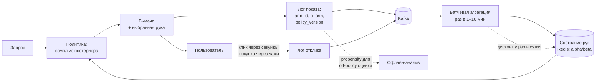

# Эксплорация и бандиты

> **Зачем эта глава.** Жадная система показывает то, что считает лучшим, и поэтому никогда
> не узнаёт, что лучшее на самом деле. Бандиты — формальный ответ на вопрос «сколько трафика
> отдать на разведку и кому именно». Здесь: регрет как валюта, вывод границы UCB через неравенство
> Хёфдинга, полный разбор Thompson sampling для Бернулли, LinUCB для контекста, off-policy оценка
> с её допущениями и честный разбор, когда бандит уместнее A/B, а когда он ломает вам аналитику.

**Уровень:** 🎯 middle → 🧠 middle+
**Предварительно нужно:** [холодный старт и смещения](12-cold-start-and-bias.md), [теория вероятностей](../01-math/02-probability.md), [статистика и вывод](../01-math/03-statistics.md), [дизайн эксперимента](../10-ab-testing/01-experiment-design.md)
**Как проработать:** чтение + реализация трёх алгоритмов + сравнение регрета

---

## Карта главы

- [1. Зачем платить за разведку](#1-зачем-платить-за-разведку)
- [2. Формализация и регрет](#2-формализация-и-регрет)
- [3. ε-greedy: простое, что работает](#3-ε-greedy-простое-что-работает)
- [4. UCB: вывод границы через неравенство Хёфдинга](#4-ucb-вывод-границы-через-неравенство-хёфдинга)
- [5. Thompson sampling](#5-thompson-sampling)
- [6. Сравнение на честной симуляции](#6-сравнение-на-честной-симуляции)
- [7. Контекстные бандиты и LinUCB](#7-контекстные-бандиты-и-linucb)
- [8. Off-policy оценка: IPS, SNIPS, DR](#8-off-policy-оценка-ips-snips-dr)
- [9. Когда бандиты уместнее A/B, а когда вредят](#9-когда-бандиты-уместнее-ab-а-когда-вредят)
- [10. Инженерия: что ломается в проде](#10-инженерия-что-ломается-в-проде)
- [11. Подводные камни](#11-подводные-камни)
- [12. Проверь себя](#12-проверь-себя)
- [13. Практика](#13-практика)
- [14. Что читать дальше](#14-что-читать-дальше)

---

## 1. Зачем платить за разведку

В [прошлой главе](12-cold-start-and-bias.md) симуляция показала неприятную вещь: жадная система,
которая всегда показывает лучшее по текущей оценке, за два месяца сузила каталог с 1731 до 198
айтемов и застряла на среднем CTR 0,109 при достижимом 0,198. Она не ошиблась в вычислениях —
она просто никогда не проверяла айтемы, которым не повезло на первых сотнях показов.

Задача формулируется так: у нас есть **бюджет показов**, и каждый показ можно потратить либо
на то, что уже проверено и приносит клики (**эксплуатация**, exploitation), либо на то, про что
мы мало знаем и что может оказаться лучше (**эксплорация**, exploration). Одновременно нельзя.
Это не философия, а буквальный размен: каждый разведочный показ — это недополученные сегодня
клики в обмен на информацию, которая принесёт клики завтра.

Типичные места в рекомендательной системе, где этот размен возникает:

- новый айтем без статистики (см. квоту трафика в [прошлой главе](12-cold-start-and-bias.md));
- выбор обложки/заголовка/креатива из нескольких вариантов;
- выбор источника кандидатов или стратегии смешивания в ленте;
- подбор баннера или промо для сегмента;
- перебор вариантов реранкинга (сила диверсификации, доля свежего).

Обратите внимание: почти нигде «рукой» не является отдельный товар из 50 млн. Бандит хорош,
когда рук **десятки или сотни**, а не миллионы, — на миллионах он вырождается в задачу обучения
с признаками, то есть в контекстный бандит или просто в ранжирование с примесью эксплорации.

---

## 2. Формализация и регрет

**Многорукий бандит** (multi-armed bandit): есть $K$ рук (arms). На шаге $t = 1, \dots, T$
мы выбираем руку $a_t \in \{1, \dots, K\}$ и получаем случайную награду $r_t$ с распределением,
зависящим только от выбранной руки. Обозначим $\mu_a = \mathbb{E}[r \mid a]$ — ожидаемую награду
руки $a$, $\mu^* = \max_a \mu_a$ — награду лучшей руки, $\Delta_a = \mu^* - \mu_a \ge 0$ —
её **зазор** (gap).

В рекомендациях награда обычно бернуллиевская: $r_t \in \{0, 1\}$ — был клик или нет,
$\mu_a$ — это CTR руки $a$.

Качество стратегии меряется **регретом** (regret) — суммарной недополученной наградой
относительно того, кто с самого начала знал лучшую руку:

$$
R(T) \;=\; T\mu^* - \mathbb{E}\left[\sum_{t=1}^{T} r_t\right]
\;=\; \sum_{a=1}^{K} \Delta_a \, \mathbb{E}[n_a(T)]
$$

где $T$ — горизонт (число показов), $n_a(T)$ — сколько раз рука $a$ была выбрана за $T$ шагов,
$\mathbb{E}$ — математическое ожидание по случайности наград и по случайности самой стратегии.
Правое равенство — просто перегруппировка суммы: каждый выбор руки $a$ стоит нам ровно $\Delta_a$.

Из этой формулы сразу читается вся теория бандитов: **регрет — это зазор, умноженный на число
ошибок**. Хорошая стратегия обязана тратить мало показов на плохие руки, но при этом не может
потратить на них ноль — иначе не отличит плохие от хороших.

Как быстро может расти регрет?

- Если стратегия не исследует вообще, она с ненулевой вероятностью навсегда застрянет на плохой
  руке, и $R(T)$ растёт **линейно** по $T$. Это провал.
- Если стратегия исследует фиксированной долей $\varepsilon$ трафика вечно, регрет тоже растёт
  линейно: $R(T) \approx \varepsilon T \cdot \overline{\Delta}$, где $\overline{\Delta}$ — средний
  зазор по рукам. Медленнее, но всё равно линейно.
- Нижняя граница (результат Lai и Robbins, 1985): любая разумная стратегия имеет
  $R(T) = \Omega(\log T)$. Логарифм — это физический предел, лучше нельзя.

Поэтому цель — стратегии с регретом порядка $\log T$: UCB и Thompson sampling их и дают.

> 📐 **Разбор формулы.** $R(T) = \sum_a \Delta_a \mathbb{E}[n_a(T)]$ полезно читать в обе стороны.
> Слева направо: чтобы уменьшить регрет, надо уменьшить число показов плохих рук. Справа налево:
> если зазор $\Delta_a$ крошечный, то показывать эту руку почти не жалко — регрет от неё копится
> медленно, и различать её с оптимальной дорого и незачем. Отсюда важное практическое следствие:
> **бандит не обязан находить лучшую руку**, он обязан не тратить много на заметно худшие.

---

## 3. ε-greedy: простое, что работает

Алгоритм в одну строку: с вероятностью $\varepsilon$ выбираем случайную руку равномерно,
с вероятностью $1 - \varepsilon$ — руку с максимальной текущей средней наградой $\hat\mu_a = s_a / n_a$,
где $s_a$ — число полученных кликов по руке $a$, $n_a$ — число её показов.

Его свойства стоит понимать точно.

**Регрет линеен при фиксированном $\varepsilon$.** Даже когда лучшая рука давно определена,
мы продолжаем тратить $\varepsilon$ долю показов на равномерный случайный выбор. За $T$ шагов
это $\varepsilon T (K-1)/K$ показов плохих рук — регрет растёт линейно навсегда.

**Лечится убыванием $\varepsilon_t$.** Классический вариант — $\varepsilon_t = \min\{1, cK/(d^2 t)\}$,
где $t$ — номер шага, $d$ — нижняя оценка минимального зазора, $c$ — константа; он даёт
логарифмический регрет. На практике проще: $\varepsilon_t = \varepsilon_0 / \sqrt{t}$ или
кусочное расписание (первую неделю 10%, дальше 2%).

**Главный дефект — равномерность разведки.** ε-greedy тратит одинаково на руку, которая
чуть-чуть хуже лидера, и на руку, которая хуже втрое и уже проверена на десятках тысяч показов.
Именно этим он проигрывает UCB и Thompson: те распределяют разведку пропорционально
**неопределённости**, а не поровну.

Почему им всё равно пользуются: он тривиально реализуется, не требует хранить ничего кроме двух
счётчиков, устойчив к задержке обратной связи и его невозможно неправильно настроить так, чтобы
он сломался незаметно. Для многих продуктовых задач с $K \le 5$ и коротким горизонтом этого хватает.

---

## 4. UCB: вывод границы через неравенство Хёфдинга

Идея, которая отличает UCB от ε-greedy: **оптимизм перед лицом неопределённости**. Вместо того
чтобы иногда выбирать случайно, будем всегда выбирать руку с максимальной *оптимистичной оценкой* —
верхней границей доверительного интервала. Рука, про которую мало известно, имеет широкий интервал
и поэтому получает шанс; рука, которая проверена и плоха, имеет узкий интервал и выпадает навсегда.

Осталось получить границу. Здесь нужно **неравенство Хёфдинга** (Hoeffding's inequality):
если $X_1, \dots, X_n$ независимы, одинаково распределены и принимают значения в $[0, 1]$,
их среднее $\bar X_n = \frac{1}{n}\sum_{i=1}^{n} X_i$, а истинное среднее $\mu = \mathbb{E}[X_1]$, то

$$
\mathbb{P}\bigl(\bar X_n \ge \mu + u\bigr) \le e^{-2nu^2},
\qquad
\mathbb{P}\bigl(\bar X_n \le \mu - u\bigr) \le e^{-2nu^2}
$$

где $u > 0$ — отклонение, $n$ — число наблюдений. Клики — бернуллиевские величины из $\{0,1\}$,
условие «значения в $[0,1]$» выполнено точно.

Теперь приравняем правую часть к желаемому уровню риска $\delta$ и выразим радиус:

$$
e^{-2 n_a u^2} = \delta
\;\;\Longrightarrow\;\;
2 n_a u^2 = \ln\frac{1}{\delta}
\;\;\Longrightarrow\;\;
u = \sqrt{\frac{\ln(1/\delta)}{2 n_a}}
$$

где $n_a$ — число показов руки $a$ к текущему моменту, $\delta$ — вероятность, с которой мы
допускаем ошибку границы. То есть с вероятностью не менее $1-\delta$ выполнено
$\mu_a \le \hat\mu_a + \sqrt{\ln(1/\delta) / (2 n_a)}$.

Какой $\delta$ брать? Нам нужно, чтобы граница держалась **одновременно** для всех рук и всех
шагов до $T$; при выборе $\delta$ фиксированным сумма вероятностей ошибок по всем проверкам
разойдётся. Стандартный приём — сделать $\delta$ убывающим по времени: $\delta_t = t^{-4}$.
Тогда $\ln(1/\delta_t) = 4\ln t$ и

$$
u_a(t) = \sqrt{\frac{4 \ln t}{2 n_a}} = \sqrt{\frac{2\ln t}{n_a}}
$$

Это и есть **бонус эксплорации** алгоритма UCB1 (Auer, Cesa-Bianchi, Fischer, 2002). Правило выбора:

$$
a_t = \arg\max_a \left( \hat\mu_a + \sqrt{\frac{2\ln t}{n_a}} \right)
$$

где $\hat\mu_a = s_a/n_a$ — эмпирическая средняя награда руки, $s_a$ — накопленные клики,
$n_a$ — показы, $t$ — номер текущего шага. Каждая рука сначала показывается один раз
(иначе $n_a = 0$ и бонус бесконечен — что, кстати, корректная интерпретация: непроверенная
рука бесконечно неопределённа).

**Почему отсюда получается $\log T$.** Рассуждение короткое, и его стоит уметь воспроизвести.
Пусть граница держится для всех рук (это верно с большой вероятностью). Рука $a$ выбирается
на шаге $t$ только если её оптимистичная оценка не меньше оценки оптимальной руки:

$$
\hat\mu_a + \sqrt{\frac{2\ln t}{n_a}} \;\ge\; \hat\mu_{a^*} + \sqrt{\frac{2\ln t}{n_{a^*}}} \;\ge\; \mu^*
$$

Второе неравенство — это как раз свойство верхней границы для оптимальной руки. С другой стороны,
для руки $a$ тоже держится $\hat\mu_a \le \mu_a + \sqrt{2\ln t / n_a}$. Подставляем:

$$
\mu_a + 2\sqrt{\frac{2\ln t}{n_a}} \;\ge\; \mu^*
\;\;\Longleftrightarrow\;\;
2\sqrt{\frac{2\ln t}{n_a}} \;\ge\; \Delta_a
\;\;\Longleftrightarrow\;\;
n_a \;\le\; \frac{8 \ln t}{\Delta_a^2}
$$

Иначе говоря, рука $a$ физически не может быть выбрана больше $8\ln T / \Delta_a^2$ раз.
Подставляя в формулу регрета $R(T) = \sum_a \Delta_a n_a(T)$, получаем

$$
R(T) \;\lesssim\; \sum_{a\,:\,\Delta_a > 0} \frac{8 \ln T}{\Delta_a}
$$

— логарифм по горизонту, с константой, обратно пропорциональной зазорам. Формула честно говорит,
где UCB тяжело: при близких руках ($\Delta_a \to 0$) константа взрывается. Но регрет от таких рук
и не страшен — мы теряем на каждом показе $\Delta_a$, то есть почти ничего.

> 💬 **На собеседовании.** Спросят: «Откуда в UCB берётся корень из логарифма?» Хороший ответ —
> вывод выше в четыре шага: (1) Хёфдинг даёт $\mathbb{P}(\bar X \ge \mu + u) \le e^{-2nu^2}$;
> (2) приравниваем к $\delta$ и получаем радиус $\sqrt{\ln(1/\delta)/(2n)}$; (3) чтобы граница
> держалась одновременно на всех шагах, берём $\delta_t = t^{-4}$, отсюда $\sqrt{2\ln t/n}$;
> (4) оптимизм заставляет тратить на плохую руку не более $8\ln T/\Delta^2$ показов, что даёт
> регрет $O(\log T)$. Плохой ответ: «это эвристика, которая уравновешивает разведку».

> ⚠️ **Типичная ошибка.** Применять UCB1 «как есть» к CTR порядка 1–3%. Хёфдинг калиброван на
> награды из всего отрезка $[0,1]$ и для редких событий чудовищно консервативен: при $n = 1000$
> бонус равен $\sqrt{2\ln t/1000} \approx 0{,}15$ — то есть в **пять раз больше**, чем сам CTR.
> Алгоритм будет бесконечно переисследовать. Что делать: масштабировать бонус константой
> $c \in [0{,}1;\,0{,}3]$, использовать бернштейновскую границу с $\sqrt{2\hat p(1-\hat p)\ln t/n}$
> (она учитывает, что дисперсия Бернулли равна $p(1-p)$, а не $1/4$), KL-UCB — или просто взять
> Thompson sampling, у которого этой проблемы нет по построению. Числа — в [§6](#6-сравнение-на-честной-симуляции).

---

## 5. Thompson sampling

### Идея

Вместо доверительной границы — байесовский подход. Держим **апостериорное распределение**
(posterior) параметра каждой руки, на каждом шаге берём по одному сэмплу из каждого распределения
и выбираем руку с максимальным сэмплом. Рука с широким постериором иногда «выпадает» высоко
и получает показ; рука с узким и низким постериором почти никогда.

Это называется **согласование вероятностей** (probability matching): рука выбирается ровно
с той вероятностью, с которой она, по нашим текущим убеждениям, является лучшей.

### Полный разбор для Бернулли с бета-априором

Пусть награда руки $a$ — бернуллиевская с неизвестным параметром $\theta_a \in [0,1]$
(это и есть CTR). Априорное распределение берём **бета**:

$$
p(\theta) = \frac{\theta^{\alpha - 1}(1-\theta)^{\beta - 1}}{B(\alpha, \beta)},
\qquad
B(\alpha,\beta) = \int_0^1 \theta^{\alpha-1}(1-\theta)^{\beta-1}\,d\theta
$$

где $\theta$ — вероятность клика, $\alpha > 0$ и $\beta > 0$ — параметры априора,
$B(\alpha,\beta)$ — бета-функция, играющая роль нормировочной константы. Среднее такого
распределения равно $\alpha/(\alpha+\beta)$. Выбор $\alpha = \beta = 1$ даёт равномерное
распределение на $[0,1]$ — «мы не знаем про эту руку ничего».

Пусть после $n$ показов руки мы наблюдали $s$ кликов и $n - s$ некликов. Правдоподобие:

$$
p(\text{данные} \mid \theta) = \theta^{s}(1-\theta)^{n-s}
$$

где $s$ — число кликов, $n - s$ — число показов без клика (биномиальный коэффициент опущен,
он не зависит от $\theta$ и уйдёт в нормировку). По теореме Байеса апостериорное распределение
пропорционально произведению:

$$
p(\theta \mid \text{данные}) \;\propto\; \underbrace{\theta^{\alpha-1}(1-\theta)^{\beta-1}}_{\text{априор}}
\cdot \underbrace{\theta^{s}(1-\theta)^{n-s}}_{\text{правдоподобие}}
\;=\; \theta^{(\alpha + s) - 1}\,(1-\theta)^{(\beta + n - s) - 1}
$$

Правая часть — с точностью до константы **та же самая бета-плотность**, только с параметрами
$\alpha + s$ и $\beta + n - s$. Значит,

$$
\theta \mid \text{данные} \;\sim\; \mathrm{Beta}\bigl(\alpha + s,\; \beta + n - s\bigr)
$$

В этом и состоит **сопряжённость** (conjugacy): семейство априоров подобрано так, что после
умножения на правдоподобие мы остаёмся в том же семействе. Причина здесь механическая — ядро
бета-плотности $\theta^{a}(1-\theta)^{b}$ и бернуллиевское правдоподобие имеют одинаковую
функциональную форму по $\theta$, поэтому перемножение просто складывает показатели.

Практические следствия, ради которых это всё и нужно:

1. **Состояние руки — два числа.** $(\alpha_a, \beta_a)$. Никакого хранения истории, никакого
   переобучения. Миллион рук — это 2 млн чисел, 16 МБ в Redis.
2. **Обновление — инкремент.** Пришёл клик: $\alpha_a \mathrel{+}= 1$. Не пришёл:
   $\beta_a \mathrel{+}= 1$. Операция $O(1)$.
3. **Обновления коммутативны и ассоциативны.** Порядок не важен, батчи можно агрегировать
   независимо на разных воркерах и складывать. Это редкое и очень удобное свойство для
   распределённого прода — ровно поэтому TS хорошо переживает батчевую и задержанную обратную связь.
4. **Ширина постериора сама подстраивается под масштаб.** Дисперсия
   $\mathrm{Var}[\theta] = \alpha\beta / ((\alpha+\beta)^2(\alpha+\beta+1))$ при малом CTR мала,
   и никакой лишней разведки, как у UCB1, не возникает.

```python
import numpy as np

def thompson_step(alpha: np.ndarray, beta: np.ndarray, rng) -> int:
    """Один шаг Thompson sampling для бернуллиевских рук. alpha, beta — состояние (K,)."""
    theta = rng.beta(alpha, beta)     # по одному сэмплу из постериора каждой руки
    return int(np.argmax(theta))      # выбираем руку с лучшим сэмплом

def thompson_update(alpha, beta, arm: int, reward: int) -> None:
    """Сопряжённость: обновление — просто инкремент счётчика. Коммутативно по батчам."""
    alpha[arm] += reward
    beta[arm] += 1 - reward
```

**Априор — это не формальность, а инструмент.** $\mathrm{Beta}(1,1)$ на CTR-задаче означает
«CTR новой руки в среднем 50%» — абсурдное убеждение, которое приводит к избыточной разведке
новых рук. Правильно задавать априор от категорийного бенчмарка: если типичный CTR категории
2%, а «уверенности» мы хотим на уровне 200 псевдопоказов, берём
$\alpha_0 = 0{,}02 \cdot 200 = 4$, $\beta_0 = 196$. Величина $\alpha_0 + \beta_0$ — это буквально
«сколько показов стоит наше априорное мнение», и это самый понятный способ его настроить.
Та же конструкция, что и байесовское сглаживание CTR в
[работе с признаками](../02-classic-ml/14-feature-engineering.md).

> 💬 **На собеседовании.** Спросят: «В чём разница между ε-greedy, UCB и Thompson sampling?»
> Хороший ответ по осям: **как распределяется разведка** (ε-greedy — поровну между всеми руками,
> UCB и TS — пропорционально неопределённости); **детерминированность** (UCB детерминирован при
> фиксированных счётчиках, TS стохастичен — и это плюс, потому что при батчевых обновлениях
> детерминированный UCB отдаёт весь батч одной руке, а TS естественно распределяет его);
> **регрет** (фиксированный ε — линейный, UCB и TS — $O(\log T)$); **чувствительность к масштабу
> награды** (UCB1 через Хёфдинга переисследует на малых CTR, TS адаптируется сам). Отдельный балл —
> сказать, что TS даёт готовые вероятности «рука лучшая», из которых легко строить продуктовые
> правила вроде «остановить разведку, когда $P(\text{лучшая}) > 0{,}95$».

---

## 6. Сравнение на честной симуляции

Мир, приближенный к рекламе/рекомендациям: $K = 10$ рук с CTR
$[2{,}0;\,2{,}2;\,2{,}5;\,3{,}0;\,2{,}1;\,1{,}9;\,2{,}4;\,1{,}8;\,2{,}3;\,2{,}6]$ процентов,
горизонт $T = 200\,000$ показов, 5 запусков с разными сидами. Идеальная политика собрала бы
$0{,}03 \cdot 200\,000 = 6000$ кликов; регрет считаем в **недополученных кликах**.

| Стратегия | Регрет (среднее ± ст. откл. по 5 сидам) | Доля от 6000 кликов |
|---|---|---|
| ε-greedy, $\varepsilon = 0{,}01$ | 1150 ± 641 | 19% |
| ε-greedy, $\varepsilon = 0{,}1$ | 372 ± 304 | 6,2% |
| UCB1 (бонус $\sqrt{2\ln t/n}$) | 1305 ± 19 | 22% |
| UCB с бонусом $0{,}2\sqrt{2\ln t/n}$ | 562 ± 54 | 9,4% |
| UCB с бернштейновским радиусом | 678 ± 81 | 11% |
| **Thompson sampling, Beta(1,1)** | **263 ± 43** | **4,4%** |

Три вывода, каждый практический.

**UCB1 «из учебника» здесь худший.** Ровно по причине из [§4](#4-ucb-вывод-границы-через-неравенство-хёфдинга): граница Хёфдинга не знает, что
дисперсия Бернулли при $p = 0{,}02$ равна $0{,}0196$, а не $0{,}25$, и бонус завышен в разы.
Простое масштабирование константой улучшает результат вдвое.

**У ε-greedy огромный разброс между запусками** (±304 при среднем 372). Это его главная опасность
в проде: на одном сиде он «повезло» нашёл лучшую руку, на другом застрял. UCB, наоборот,
предсказуем (±19) — просто предсказуемо плох при плохой калибровке.

**Thompson выигрывает и по среднему, и по стабильности.** Это согласуется с известным эмпирическим
исследованием Chapelle и Li (NIPS 2011), где TS оказался конкурентоспособным или лучше UCB
на рекламных данных, особенно при задержанной обратной связи.

> 🌱 **База.** Если вы внедряете свой первый бандит и не хотите разбираться в калибровках —
> берите Thompson sampling с бета-априором, заданным от категорийного бенчмарка. Он даёт
> почти оптимальный регрет, состоит из двух счётчиков на руку и не разваливается от того,
> что обратная связь приходит батчами раз в 10 минут.

---

## 7. Контекстные бандиты и LinUCB

### Зачем контекст

Обычный бандит ищет одну лучшую руку для всех. В рекомендациях это почти всегда неверно: лучший
баннер для 20-летнего в Москве в понедельник вечером — не тот же, что для 50-летнего в Перми
в субботу утром. Нужна лучшая рука **при данном контексте**.

**Контекстный бандит** (contextual bandit): на шаге $t$ мы наблюдаем контекст $x_t \in \mathbb{R}^d$
(признаки пользователя, времени, устройства, а иногда и пары «пользователь × рука»), выбираем
руку $a_t$ и получаем награду $r_t$. Ключевое отличие от полноценного обучения с подкреплением:
**действие не влияет на следующее состояние**. Показали баннер — следующий пользователь придёт
независимо от этого. Поэтому не нужны ни ценностные функции будущего, ни дисконтирование,
и задача остаётся статистической, а не динамической.

### LinUCB

Предполагаем, что ожидаемая награда линейна по контексту:

$$
\mathbb{E}[r_t \mid x_t, a] = x_t^\top \theta_a
$$

где $x_t \in \mathbb{R}^d$ — вектор признаков контекста, $\theta_a \in \mathbb{R}^d$ — неизвестный
вектор параметров руки $a$, $d$ — размерность признаков. Оцениваем $\theta_a$ гребневой регрессией
(ridge) по всем показам этой руки:

$$
A_a = \lambda I_d + \sum_{t \,:\, a_t = a} x_t x_t^\top,
\qquad
b_a = \sum_{t \,:\, a_t = a} r_t\, x_t,
\qquad
\hat\theta_a = A_a^{-1} b_a
$$

где $A_a \in \mathbb{R}^{d\times d}$ — регуляризованная матрица вторых моментов признаков,
$I_d$ — единичная матрица, $\lambda > 0$ — коэффициент регуляризации (обычно 1),
$b_a \in \mathbb{R}^d$ — накопленный вектор «признаки, взвешенные наградой».

Ключевой факт: для гребневой регрессии стандартное отклонение предсказания в точке $x$
пропорционально $\sqrt{x^\top A_a^{-1} x}$. Отсюда доверительная граница: с вероятностью
не менее $1-\delta$

$$
\bigl| x^\top \hat\theta_a - x^\top \theta_a \bigr| \;\le\; \alpha \sqrt{x^\top A_a^{-1} x},
\qquad \alpha = 1 + \sqrt{\tfrac{1}{2}\ln(2/\delta)}
$$

где $\alpha$ — параметр силы эксплорации. И правило выбора — тот же оптимизм, что в UCB,
только неопределённость теперь зависит от контекста:

$$
a_t = \arg\max_a \left( x_t^\top \hat\theta_a + \alpha\sqrt{x_t^\top A_a^{-1} x_t} \right)
$$

Величина $x^\top A_a^{-1} x$ мала, если мы уже много раз видели похожие контексты для этой руки,
и велика для непривычного направления в пространстве признаков. То есть LinUCB исследует не
«редкие руки», а **редкие сочетания руки и контекста** — это и есть весь смысл конструкции.
Алгоритм из работы Li, Chu, Langford, Schapire (WWW 2010) для рекомендаций новостей Yahoo!.

```python
import numpy as np

class LinUCB:
    """Disjoint LinUCB: у каждой руки свой theta. Состояние руки — (A^{-1}: d×d, b: d)."""

    def __init__(self, n_arms: int, d: int, alpha: float = 0.2, lam: float = 1.0):
        self.A_inv = np.stack([np.eye(d) / lam for _ in range(n_arms)])
        self.b = np.zeros((n_arms, d))
        self.alpha = alpha

    def select(self, x: np.ndarray) -> int:
        theta = np.einsum("kij,kj->ki", self.A_inv, self.b)          # (K, d)
        mean = theta @ x                                              # (K,)
        width = np.sqrt(np.einsum("i,kij,j->k", x, self.A_inv, x))    # (K,)
        return int(np.argmax(mean + self.alpha * width))

    def update(self, arm: int, x: np.ndarray, r: float) -> None:
        Ai = self.A_inv[arm]
        Aix = Ai @ x
        # Шерман–Моррисон: обновляем обратную матрицу за O(d^2), а не считаем инверсию заново
        self.A_inv[arm] = Ai - np.outer(Aix, Aix) / (1.0 + x @ Aix)
        self.b[arm] += r * x
```

**Цена в проде — считаем.** При $d = 20$ и $K = 50$ полный цикл «выбрать + обновить» занимает
около 57 мкс на numpy; `select` при $K = 1000$ — около 0,7 мс, память $K d^2 \cdot 8$ байт
(3,2 МБ на 1000 рук). Это укладывается в бюджет ранжирующей стадии, но растёт как $O(Kd^2)$:
при $d = 100$ и $K = 1000$ памяти уже 80 МБ и латентность за пределами разумного. Отсюда
инженерные варианты: shared-модель (один $\theta$ на все руки, рука кодируется признаками),
понижение размерности, или замена LinUCB на **Thompson sampling для линейной модели**
(сэмплируем $\tilde\theta_a \sim \mathcal{N}(\hat\theta_a,\; \nu^2 A_a^{-1})$, где $\nu^2$ —
оценка дисперсии шума награды, и берём argmax по $x^\top\tilde\theta_a$) —
он дешевле, стабильнее при батчах и обычно не хуже по регрету.

На синтетике ($K = 50$, $d = 20$, награда — Бернулли с вероятностью $1/(1 + e^{-x^\top\theta_a})$) регрет
на раунд падает примерно с 0,12 на первых 4000 раундах до 0,07 на последних 4000 из 40 000,
при 0,156 у случайного выбора. Это честная картинка: контекстный бандит **не находит оптимум**,
он постепенно сокращает потери — и это нормальный ожидаемый режим работы. Заодно видно, во что
упирается скорость: 50 рук × 20 признаков — это 1000 параметров, и на 40 тыс. раундов приходится
в среднем 800 наблюдений на руку.

> 🧠 **Middle+.** Линейность — сильное допущение, и на реальных признаках оно не выполняется.
> Индустриальные варианты: (а) линейная модель поверх выученных эмбеддингов — нейросеть даёт
> представление, бандит работает в его пространстве (neural-linear); (б) бутстрап-ансамбль из
> нескольких моделей, сэмпл модели вместо сэмпла параметров; (в) дропаут как приближение
> байесовской неопределённости. Известная эмпирическая проверка этих подходов — «Deep Bayesian
> Bandits Showdown» (Riquelme et al., 2018); её общий вывод в том, что аккуратная линейная
> модель на хороших признаках часто бьёт сложную байесовскую нейросеть.

---

## 8. Off-policy оценка: IPS, SNIPS, DR

Бандит уже собрал логи. Возникает вопрос, ради которого половина этой темы и существует:
**можно ли по логам одной политики оценить, сколько кликов принесла бы другая политика,
не выкатывая её?** Это off-policy (контрфактическая) оценка.

Данные: тройки $(x_t, a_t, r_t)$ плюс критически важное четвёртое поле — $p_t = \pi_0(a_t \mid x_t)$,
вероятность, с которой **логирующая политика** $\pi_0$ выбрала это действие. Оцениваем ценность
новой политики $\pi$:

$$
V(\pi) = \mathbb{E}_{x}\,\mathbb{E}_{a \sim \pi(\cdot\mid x)}\bigl[r(x,a)\bigr]
$$

где $V(\pi)$ — средняя награда на показ, $r(x,a)$ — ожидаемая награда действия $a$ в контексте $x$.

**IPS (inverse propensity scoring):**

$$
\hat V_{\mathrm{IPS}}(\pi) = \frac{1}{n}\sum_{t=1}^{n} r_t \cdot \frac{\pi(a_t \mid x_t)}{p_t}
$$

где $n$ — число залогированных показов, $w_t = \pi(a_t\mid x_t)/p_t$ — вес важности
(importance weight). Смысл: наблюдение, которое новая политика выбрала бы чаще логирующей,
считается с большим весом.

Допущения, без которых оценка неверна, и о которых обязательно спрашивают:

1. **Positivity (перекрытие).** Если $\pi(a\mid x) > 0$, то обязано быть $\pi_0(a\mid x) > 0$.
   Действие, которое старая политика никогда не показывала, оценить нельзя ничем. Отсюда
   требование рандомизации в логирующей политике — то самое из [прошлой главы](12-cold-start-and-bias.md).
2. **Известные (и верные) propensity.** $p_t$ должны логироваться в момент показа. Восстановить
   их постфактум моделью можно, но это вносит смещение и превращает оценку в приближённую.
3. **Отсутствие скрытых конфаундеров.** Действие выбиралось только по залогированному контексту
   и собственной случайности, а не по чему-то, чего в логе нет (например, по ручному правилу
   маркетолога, которое нигде не записано).
4. **Стационарность.** Мир между логированием и применением не изменился: тот же каталог,
   те же пользователи, тот же сезон.
5. **Отсутствие интерференции.** Награда за показ не зависит от того, что показано другим
   пользователям или в других слотах. В ленте и на маркетплейсе это допущение нарушается.

**SNIPS (self-normalized IPS):**

$$
\hat V_{\mathrm{SNIPS}}(\pi) = \frac{\sum_{t=1}^{n} w_t r_t}{\sum_{t=1}^{n} w_t}
$$

Делим не на $n$, а на сумму весов. Оценка слегка смещена, но **состоятельна** и заметно
устойчивее: она нечувствительна к общему масштабу весов и не «взрывается», когда в выборке
случайно оказалось мало наблюдений с большим весом. В проде по умолчанию берут её, а не чистый IPS.

**Doubly robust:** обучаем модель награды $\hat r(x,a)$ и комбинируем:

$$
\hat V_{\mathrm{DR}}(\pi) = \frac{1}{n}\sum_{t=1}^{n}\left[
\underbrace{\sum_{a}\pi(a\mid x_t)\,\hat r(x_t, a)}_{\text{прямая оценка}}
\;+\; w_t\bigl(r_t - \hat r(x_t, a_t)\bigr)\right]
$$

где $\hat r(x,a)$ — предсказание вспомогательной модели награды. Оценка несмещена, если верна
**хотя бы одна** из двух моделей (propensity или модель награды), — вывод тот же, что в [§10](#10-инженерия-что-ломается-в-проде)
[прошлой главы](12-cold-start-and-bias.md). Дисперсия ниже, чем у IPS, потому что взвешивается
только остаток $r_t - \hat r$.

**Главный практический диагностический показатель** — эффективный размер выборки:

$$
n_{\text{eff}} = \frac{\bigl(\sum_t w_t\bigr)^2}{\sum_t w_t^2}
$$

Пример, который стоит держать в голове. Логирующая политика равномерна по 10 рукам ($p_t = 0{,}1$),
новая политика детерминирована. Тогда $w_t = 10$ для совпавших действий и $0$ для остальных,
то есть работают только 10% логов: из 1 млн показов остаётся $n_{\text{eff}} = 100\,000$.
Чтобы различить CTR 2,0% и 2,2%, нужно порядка 80 тыс. наблюдений на вариант — то есть мы
на грани. Вывод: **чем сильнее новая политика отличается от логирующей, тем меньше данных
у вас на самом деле есть.** Практическое правило — не доверять оценке при
$n_{\text{eff}} / n < 0{,}1$ и всегда сопровождать оценку бутстрап-интервалом.

> 💬 **На собеседовании.** Спросят: «Что такое counterfactual / off-policy оценка и когда её
> применяют вместо A/B?» Хороший ответ: это оценка новой политики по логам старой через
> взвешивание важности; применяют, когда A/B дорог или медленен, а вариантов много — отсеять
> 50 конфигураций офлайн и вывести в A/B две. Дальше обязательно назвать допущения (перекрытие,
> известные propensity, отсутствие конфаундеров, стационарность) и $n_{\text{eff}}$ как проверку.
> И честно сказать, что off-policy **не заменяет** A/B: она не ловит долгосрочные и системные
> эффекты и ломается при сильном расхождении политик. Провал: «посчитаем IPS» без единого слова
> про то, откуда возьмутся $p_t$.

---

## 9. Когда бандиты уместнее A/B, а когда вредят

A/B-тест — это тоже эксплорация, просто с фиксированным расписанием: 50/50 до конца теста,
даже если на третий день понятно, что вариант B хуже на 30%. Бандит перераспределяет трафик
непрерывно. Отсюда правило: **бандит выигрывает, когда цена показа проигравшего варианта высока
относительно ценности точного знания о нём.**

**Где бандит уместнее:**

- **Много вариантов и короткая жизнь.** Обложки видео, заголовки новостей, промо-баннеры,
  push-тексты. 20 вариантов A/B-тестом — это 20 групп и месяц ожидания; к концу теста новость
  протухла.
- **Быстрая обратная связь.** Клик приходит за секунды. Если целевое событие — покупка через
  три дня, бандит обновляется на пустоте.
- **Решение — операционное, а не продуктовое.** «Какую из пяти обложек показывать» — вопрос
  без последствий для архитектуры. «Внедряем ли новую модель ранжирования» — вопрос с
  последствиями, и на него нужен надёжный ответ с доверительным интервалом.
- **Непрерывный поток новых вариантов.** Новые айтемы появляются каждый день, и «запустить A/B»
  для каждого физически невозможно. Бандит — естественная форма квоты трафика из
  [прошлой главы](12-cold-start-and-bias.md), только адаптивная.

**Где бандит вредит:**

- **Когда нужна честная оценка эффекта.** Это самое важное и самое недооценённое. При адаптивном
  распределении трафика классические критерии **невалидны**: выборочное среднее выигравшей руки
  систематически **завышено** (мы продолжали показывать руку именно потому, что ей везло),
  а число наблюдений в группе зависит от наблюдённых наград. Обычный t-тест по итогам бандита
  даст неверный p-value. Нужны специальные инструменты: всегда валидные доверительные интервалы,
  оценки с коррекцией на адаптивность или отдельный небольшой равномерный holdout, по которому
  и меряется эффект.
- **Отложенная награда.** Конверсия через дни, подписка через неделю, удержание через месяц.
  Бандит будет оптимизировать прокси (клик) и не увидит вреда.
- **Нестационарность без учёта.** Классический TS с накопленными счётчиками через месяц имеет
  такой узкий постериор, что перестаёт реагировать на изменения. Лечится дисконтированием
  или скользящим окном (см. [§10](#10-инженерия-что-ломается-в-проде)).
- **Сетевые эффекты и каннибализация.** На маркетплейсе показ одного товара отнимает продажи
  у другого; допущение о независимости наград нарушено, и «оптимальная» рука оптимальна только
  локально. См. [сложные схемы экспериментов](../10-ab-testing/05-complex-designs.md).
- **Когда вариантов два и трафика много.** Тогда A/B проще, даёт валидную статистику и не требует
  онлайн-состояния в сервинге. Бандит здесь — усложнение без выигрыша.

> 💬 **На собеседовании.** Спросят: «Зачем вообще A/B, если бандит сам находит лучший вариант?»
> Хороший ответ разделяет две задачи: бандит решает задачу **принятия решений** (куда направить
> следующий показ), A/B — задачу **вывода** (какой эффект у изменения и можно ли его нести
> в продуктовое решение). Бандит специально смещает сбор данных в пользу выигрывающих рук,
> и именно поэтому его выборочные средние нельзя нести в статистический критерий. Дальше стоит
> сказать про равномерный holdout как способ получить и то и другое. Провал: «бандит эффективнее,
> он не тратит трафик впустую» — это ответ только на половину вопроса.

Рабочая комбинация, которую стоит назвать на собеседовании: **бандит внутри, A/B снаружи.**
Бандит распределяет трафик между обложками; A/B сравнивает «система с бандитом» против «системы
без бандита» и даёт валидный ответ о бизнес-эффекте всей конструкции. Подробнее — в главе
[бандиты против A/B](../10-ab-testing/06-bandits-vs-ab.md).

---

## 10. Инженерия: что ломается в проде

Бандит в проде — это не функция, а контур с состоянием, и все его проблемы живут на стрелках
этой схемы.



**Задержка обратной связи.** Между показом и кликом проходят секунды, между показом и покупкой —
часы. За это время бандит успевает сделать тысячи выборов, не зная их исходов. Формально это
означает, что решения принимаются по устаревшему постериору. TS деградирует от этого мягко
(он и так стохастичен), UCB — резче: детерминированный argmax при неизменных счётчиках отдаёт
**весь батч** одной руке. Практическое решение: обновлять состояние батчами раз в 1–10 минут
и убедиться, что алгоритм стохастичен.

**Хранение состояния.** Для TS это `HINCRBY` в Redis по ключу `bandit:{arm_id}` с полями
`alpha`/`beta` — примерно 1 мс на поход, и его можно совместить с загрузкой признаков. Для
LinUCB — сериализованная матрица $d \times d$ на руку, что при $d = 20$ даёт 3,2 КБ на руку;
обновление требует блокировки или CRDT-подобной схемы сложения матриц. Разница в удобстве
эксплуатации между TS и LinUCB здесь больше, чем разница в регрете.

**Нестационарность.** CTR обложки в понедельник и в чёрную пятницу — разные величины. Два
стандартных приёма: дисконтирование ($\alpha \mathrel{*}= \gamma$, $\beta \mathrel{*}= \gamma$
раз в сутки с $\gamma \approx 0{,}95$–$0{,}99$, что даёт эффективное окно памяти
$1/(1-\gamma) = 20$–$100$ дней) и скользящее окно (считать только события за последние $N$ дней).
Дисконтирование дешевле: это одна операция умножения по всем ключам раз в сутки.

**Логирование.** Без него бандит бесполезен для последующего анализа. Обязательные поля на каждый
показ: `request_id`, `arm_id`, `p_arm` (вероятность выбора руки — для TS её оценивают
мини-симуляцией или считают долей из $M$ сэмплов), `policy_version`, `context_hash`,
`model_state_version`. Отсутствие `p_arm` делает невозможной любую off-policy оценку задним числом.

**Взаимодействие с ранжированием.** В реальной ленте бандит не выбирает единственный айтем —
он либо выбирает **стратегию** (какой источник кандидатов усилить), либо занимает **выделенные
слоты** (позиции 4 и 8 отдаются разведке), либо задаёт **вероятностную выдачу** (сэмплирование
из softmax по скорам вместо argmax — это, кстати, готовый источник известных propensity, потому
что вероятность выбора каждого айтема считается аналитически).

---

## 11. Подводные камни

**Бандит «сходится» к руке, которая просто первой набрала показы.**
Симптом: одна рука забирает 95% трафика на вторые сутки, остальные заморожены.
Причина: слишком узкий априор или детерминированный алгоритм при батчевых обновлениях.
Что делать: априор задать от бенчмарка с явным «весом» в псевдопоказах ($\alpha_0 + \beta_0$
порядка 100–300); проверить, что обновления приходят достаточно часто; предпочесть TS.

**Регрет считают в кликах, а бизнес теряет деньги.**
Симптом: бандит оптимизирует CTR, выручка не растёт или падает.
Причина: награда выбрана как прокси. Кликбейтная обложка выигрывает у честной.
Что делать: награда должна быть композитной (клик, досмотр, покупка с их бизнес-весами)
или отложенной с явным учётом задержки; guardrail-метрики обязательны.

**UCB1 переисследует на малых CTR.**
Симптом: трафик распределён почти равномерно даже после сотен тысяч показов.
Причина: граница Хёфдинга калибрована на награды из $[0,1]$, а у нас $p \approx 0{,}02$.
Что делать: масштабировать бонус ($c \approx 0{,}2$), взять бернштейновскую границу или TS.

**После бандита посчитали t-тест.**
Симптом: «выигравшая рука лучше на 12%, p < 0,01», а в A/B эффекта нет.
Причина: адаптивное распределение делает выборочные средние смещёнными вверх для выигравших рук,
а классические критерии предполагают фиксированный дизайн.
Что делать: держать небольшой равномерный holdout (5–10% трафика с фиксированным равным
распределением) и мерить эффект по нему; либо использовать всегда валидные интервалы.

**Off-policy оценка обещает +15%, A/B даёт ноль.**
Симптом: расхождение офлайн- и онлайн-оценки на порядок.
Причина: нарушено перекрытие ($n_{\text{eff}}$ мал), propensity восстановлены моделью,
или новая политика сильно отличается от логирующей.
Что делать: считать $n_{\text{eff}}$ и бутстрап-интервал; отбраковывать оценки при
$n_{\text{eff}}/n < 0{,}1$; логировать propensity в момент показа, а не восстанавливать потом.

**Бандит поверх нестационарного мира.**
Симптом: после сезонного пика система месяц продолжает показывать новогодние товары.
Причина: счётчики накопили десятки тысяч наблюдений, постериор узкий, реакции нет.
Что делать: дисконтирование $\gamma = 0{,}97$ в сутки или скользящее окно; мониторить
эффективный размер накопленной статистики по рукам.

---

## 12. Проверь себя

<details>
<summary><b>🎯 Вопрос.</b> Что такое регрет и почему он центральное понятие в бандитах?</summary>

**Короткий ответ.** Регрет — суммарная недополученная награда относительно политики, которая
с самого начала знала лучшую руку: $R(T) = T\mu^* - \mathbb{E}[\sum_t r_t] = \sum_a \Delta_a \mathbb{E}[n_a(T)]$. Он переводит «баланс разведки и эксплуатации» в измеримую величину.

**Развёрнуто.** Из разложения по рукам видно устройство задачи: регрет — это зазор, умноженный
на число ошибочных показов. Стратегия без разведки даёт линейный регрет (может навсегда застрять
на плохой руке), фиксированный $\varepsilon$ — тоже линейный ($\varepsilon T \overline{\Delta}$),
UCB и Thompson — $O(\log T)$, и $\log T$ есть теоретический минимум (нижняя граница Lai–Robbins).
Практическое следствие формулы: руки с крошечным зазором различать не нужно, потери от них
пренебрежимы.

**Чего ждёт интервьюер:** формулу и вывод, что бесконечная фиксированная эксплорация — это
линейный регрет.

**Провал:** «регрет — это ошибка модели».
</details>

<details>
<summary><b>🧠 Вопрос.</b> Выведите бонус эксплорации в UCB1.</summary>

**Короткий ответ.** Из неравенства Хёфдинга: $\mathbb{P}(\bar X_n \ge \mu + u) \le e^{-2nu^2}$;
приравнивая к $\delta$, получаем радиус $\sqrt{\ln(1/\delta)/(2n)}$; при $\delta_t = t^{-4}$
это даёт $\sqrt{2\ln t / n_a}$.

**Развёрнуто.** Хёфдинг применим, потому что клики лежат в $[0,1]$. Убывающий $\delta_t$ нужен,
чтобы граница держалась одновременно на всех шагах (иначе сумма вероятностей ошибок разойдётся).
Далее: рука $a$ выбирается, только пока $\mu_a + 2\sqrt{2\ln t/n_a} \ge \mu^*$, откуда
$n_a \le 8\ln t/\Delta_a^2$, и регрет $\sum_a \Delta_a n_a \lesssim \sum_a 8\ln T/\Delta_a$.
Практическая оговорка: для CTR порядка 2% граница Хёфдинга крайне консервативна (она подразумевает
дисперсию $1/4$ вместо $p(1-p) \approx 0{,}02$), поэтому UCB1 переисследует; берут
масштабированный бонус, бернштейновскую границу или KL-UCB.

**Чего ждёт интервьюер:** что вы назовёте именно Хёфдинга и покажете переход от $e^{-2nu^2}$
к радиусу, а не процитируете формулу.

**Провал:** «$\sqrt{2\ln t/n}$ — так в статье».
</details>

<details>
<summary><b>🧠 Вопрос.</b> Разберите Thompson sampling для бернуллиевской награды. Почему бета-априор?</summary>

**Короткий ответ.** Держим для каждой руки постериор $\mathrm{Beta}(\alpha_a, \beta_a)$, на каждом
шаге сэмплируем по одному $\theta_a$ и берём argmax. Бета сопряжена к Бернулли, поэтому обновление —
это $\alpha \mathrel{+}= $ клики, $\beta \mathrel{+}= $ неклики.

**Развёрнуто.** Апостериор $\propto \theta^{\alpha-1}(1-\theta)^{\beta-1}\cdot\theta^s(1-\theta)^{n-s} = \theta^{(\alpha+s)-1}(1-\theta)^{(\beta+n-s)-1}$ — то же бета-семейство с параметрами
$(\alpha+s,\ \beta+n-s)$. Сопряжённость здесь механическая: ядро бета-плотности и бернуллиевское
правдоподобие имеют одинаковую функциональную форму по $\theta$, поэтому показатели просто
складываются. Инженерные следствия: состояние руки — два числа, обновление $O(1)$, обновления
коммутативны (можно агрегировать батчи на разных воркерах), а ширина постериора сама подстраивается
под малые CTR. Априор задают от бенчмарка: при ожидаемом CTR 2% и «весе» 200 псевдопоказов —
$\mathrm{Beta}(4, 196)$.

**Чего ждёт интервьюер:** вывода апостериора в одну строку и понимания, что сопряжённость —
это про удобство обновления, а не про «правильность» априора.

**Провал:** «TS сэмплирует из распределения и выбирает лучшее» без формул и без слова «сопряжённость».
</details>

<details>
<summary><b>🎯 Вопрос.</b> ε-greedy, UCB, Thompson — в чём практическая разница?</summary>

**Короткий ответ.** В том, как распределяется разведка: ε-greedy — поровну между всеми руками
(поэтому линейный регрет при фиксированном $\varepsilon$), UCB и TS — пропорционально
неопределённости (регрет $O(\log T)$). TS вдобавок стохастичен, что критично при батчевых
обновлениях, и сам адаптируется к малым CTR.

**Развёрнуто.** ε-greedy: тривиален, но одинаково тратит на «чуть хуже» и «втрое хуже», и имеет
огромный разброс между запусками. UCB: детерминирован при фиксированных счётчиках, из-за чего
при батчевом обновлении отдаёт весь батч одной руке; калибровка бонуса критична — UCB1 с
$\sqrt{2\ln t/n}$ на CTR 2% сильно переисследует. TS: состояние — два счётчика, обновления
коммутативны, стохастичность естественно распределяет батч, эмпирически лучший регрет
(в симуляции из главы: 263 против 1305 у UCB1 и 372 у ε-greedy при $\varepsilon = 0{,}1$).

**Чего ждёт интервьюер:** сравнения по осям, а не пересказа трёх алгоритмов подряд.

**Провал:** «TS лучше, потому что байесовский».
</details>

<details>
<summary><b>🎯 Вопрос.</b> Чем контекстный бандит отличается от обычного и от обучения с подкреплением?</summary>

**Короткий ответ.** От обычного — тем, что оптимальная рука зависит от наблюдаемого контекста
$x_t$, и модель награды обучается по признакам. От RL — тем, что действие **не влияет
на следующее состояние**, поэтому нет ни дисконтирования будущего, ни ценностных функций.

**Развёрнуто.** В LinUCB предполагается $\mathbb{E}[r\mid x,a] = x^\top\theta_a$, параметры
оцениваются гребневой регрессией, а бонус эксплорации $\alpha\sqrt{x^\top A_a^{-1}x}$ — ширина
доверительного интервала предсказания в данной точке. Исследуются не редкие руки, а редкие
сочетания «рука × направление в пространстве признаков». Цена: $O(Kd^2)$ по памяти и времени.
Полноценный RL нужен там, где действие меняет состояние — например, если показы сегодня
формируют интересы пользователя завтра; в большинстве продуктовых задач этим пренебрегают
осознанно.

**Чего ждёт интервьюер:** чёткого «действие не меняет состояние» — это ключевое различие.

**Провал:** назвать контекстный бандит «упрощённым RL» без указания, что именно упрощено.
</details>

<details>
<summary><b>🧠 Вопрос.</b> Что такое off-policy оценка и какие у неё допущения?</summary>

**Короткий ответ.** Оценка ценности новой политики по логам старой через взвешивание важности:
$\hat V_{\mathrm{IPS}} = \frac{1}{n}\sum_t r_t \pi(a_t|x_t)/p_t$. Допущения: перекрытие
(positivity), известные и верные propensity, отсутствие скрытых конфаундеров, стационарность,
отсутствие интерференции.

**Развёрнуто.** Перекрытие — самое жёсткое: действие, которое логирующая политика никогда
не выбирала, оценить невозможно, поэтому рандомизацию надо закладывать заранее. Propensity должны
логироваться в момент показа. SNIPS (деление на сумму весов) слегка смещён, но устойчивее и
обычно используется по умолчанию. DR добавляет модель награды и несмещён, если верна хотя бы
одна из двух моделей. Проверка адекватности — $n_{\text{eff}} = (\sum w)^2/\sum w^2$: если новая
политика детерминирована, а старая равномерна по 10 рукам, работает лишь 10% логов.

**Чего ждёт интервьюер:** что вы назовёте перекрытие и логирование propensity, а не только формулу.

**Провал:** «взвесим на обратную вероятность» без единого допущения.
</details>

<details>
<summary><b>🎯 Вопрос.</b> Когда бандит лучше A/B-теста, а когда хуже?</summary>

**Короткий ответ.** Лучше — когда вариантов много, они живут недолго, обратная связь быстрая
и решение операционное (обложки, баннеры, новые айтемы). Хуже — когда нужна валидная оценка
эффекта, когда награда отложена, когда есть сетевые эффекты, и когда вариантов всего два.

**Развёрнуто.** Ключевой аргумент против бандита — статистический: адаптивное распределение
трафика смещает выборочные средние выигравших рук вверх и ломает классические критерии, поэтому
«результат бандита» нельзя нести в продуктовое решение как результат A/B. Обходные пути:
равномерный holdout 5–10% для честного измерения, всегда валидные доверительные интервалы.
Рабочая комбинация — бандит внутри (распределяет трафик между вариантами), A/B снаружи (сравнивает
систему с бандитом против системы без него).

**Чего ждёт интервьюер:** аргумента про невалидность обычной статистики после адаптивного сбора.

**Провал:** «бандит всегда лучше, он не тратит трафик на проигравшего».
</details>

<details>
<summary><b>🧠 Вопрос.</b> Как через бандиты давать стартовый трафик новым айтемам?</summary>

**Короткий ответ.** Новый айтем входит с априором от категорийного бенчмарка (например,
$\mathrm{Beta}(4, 196)$ при CTR категории 2%), получает показы через TS на выделенных слотах
выдачи и либо набирает статистику и переходит в общий пул, либо естественно затухает.

**Развёрнуто.** Отличие от фиксированной квоты («1000 показов каждому») в адаптивности: явно
плохой айтем перестаёт получать трафик после сотни показов, перспективный получает больше тысячи.
Бюджет ограничивается не числом показов на айтем, а долей позиций (например, слоты 4 и 8),
что делает расход предсказуемым при любом наплыве новинок. Априор можно уточнять контентной
моделью — предсказать ожидаемый CTR по признакам карточки и задать $\alpha_0/\beta_0$ от него;
это и есть мост от контекстного бандита к холодному старту. Обязательно логировать вероятность
выбора для последующей off-policy оценки.

**Чего ждёт интервьюер:** связи «холодный старт → эксплорация» и понимания, что бюджет удобнее
задавать в позициях, а не в показах на айтем.

**Провал:** «покажем новый айтем 1000 раз» без адаптивности и без расчёта доли трафика.
</details>

<details>
<summary><b>🎯 Вопрос.</b> Почему бандит перестал реагировать на изменения через два месяца работы?</summary>

**Короткий ответ.** Постериор стал слишком узким: при $\alpha + \beta$ порядка сотен тысяч
дисперсия почти нулевая, и новые наблюдения не сдвигают оценку. Лечится дисконтированием
или скользящим окном.

**Развёрнуто.** $\mathrm{Var}[\theta] = \alpha\beta/((\alpha+\beta)^2(\alpha+\beta+1))$ убывает
как $1/(\alpha+\beta)$; накопив 10⁵ показов, рука фактически «замораживается». Стандартное
решение — умножать счётчики на $\gamma \in [0{,}95;\,0{,}99]$ раз в сутки, что даёт эффективное
окно памяти $1/(1-\gamma)$, то есть 20–100 дней. Альтернатива — считать статистику по скользящему
окну. Мониторить надо не только регрет, но и $\alpha_a + \beta_a$ по рукам: их безграничный рост —
прямой признак того, что бандит превратился в статичное правило.

**Чего ждёт интервьюер:** понимания, что бандит — это система в нестационарном мире, а не
разовая оптимизация.

**Провал:** «переобучим модель» — здесь нет модели, которую переобучают.
</details>

<details>
<summary><b>🧠 Вопрос.</b> Почему нельзя просто посчитать t-тест по итогам работы бандита?</summary>

**Короткий ответ.** Потому что размер выборки в каждой руке зависит от наблюдённых наград.
Выборочное среднее выигравшей руки смещено вверх (её продолжали показывать именно потому,
что ей везло), и предположения классических критериев о фиксированном дизайне нарушены.

**Развёрнуто.** Это адаптивный сбор данных: и число наблюдений, и их отбор — случайные величины,
зависящие от самих наград. Итог — оптимистичное смещение оценок выигравших рук и неверные
p-value. Что делают на практике: (1) держат небольшой равномерный holdout (5–10% трафика
с фиксированным распределением) и меряют эффект только по нему; (2) применяют инференс,
корректный при адаптивном сборе (всегда валидные последовательные интервалы, оценки
с коррекцией смещения); (3) валидируют всю конструкцию отдельным A/B «с бандитом против
без бандита».

**Чего ждёт интервьюер:** названия механизма смещения, а не общего «бандит мешает статистике».

**Провал:** «просто увеличим выборку».
</details>

---

## 13. Практика

**Задача 1. Три алгоритма, один мир (60 минут).**
Реализуйте ε-greedy, UCB1 и Thompson sampling и воспроизведите таблицу из [§6](#6-сравнение-на-честной-симуляции): $K = 10$,
CTR от 1,8% до 3,0%, $T = 200\,000$, 5 сидов. Постройте графики накопленного регрета
и доли показов каждой руки по времени.
*Критерий: у вас получился тот же порядок (TS < ε-greedy(0,1) < UCB-масштабированный < UCB1);
вы можете объяснить, почему ε-greedy имеет разброс в сотни кликов между сидами, а UCB — единицы.*

**Задача 2. Калибровка UCB (30 минут).**
Прогоните UCB с бонусом $c\sqrt{2\ln t/n}$ для $c \in \{0{,}05;\,0{,}1;\,0{,}2;\,0{,}5;\,1{,}0\}$
и с бернштейновским радиусом. Постройте регрет как функцию $c$.
*Критерий: кривая U-образная, минимум лежит заметно ниже $c = 1$; вы можете связать положение
минимума с масштабом CTR (подсказка: сравните $\sqrt{p(1-p)}$ и $1/2$).*

**Задача 3. Априор решает (30 минут).**
Запустите TS с $\mathrm{Beta}(1,1)$, $\mathrm{Beta}(4,196)$ и $\mathrm{Beta}(40,1960)$
и сравните регрет и скорость «замерзания» распределения трафика.
*Критерий: вы можете сказать, при каком априоре бандит слишком быстро отсекает руки и почему
$\alpha_0 + \beta_0$ интерпретируется как число псевдопоказов.*

**Задача 4. Off-policy оценка (60 минут).**
Соберите лог равномерной политикой по 10 рукам на 100 тыс. показов. Оцените ценность трёх
политик (жадной по истинным CTR, случайной, softmax с температурой) через IPS, SNIPS и DR,
сравните с истиной, посчитайте $n_{\text{eff}}$ и бутстрап-интервалы.
*Критерий: у детерминированной политики $n_{\text{eff}} \approx n/10$; SNIPS даёт заметно
более узкий интервал, чем IPS; DR — самый узкий. Вы можете показать на графике, как ширина
интервала растёт с расхождением политик.*

**Задача 5. Нестационарность (40 минут).**
В симуляции поменяйте CTR лучшей руки на худшую в середине горизонта. Сравните TS без
дисконтирования, TS с $\gamma = 0{,}99$ и со скользящим окном.
*Критерий: TS без дисконтирования не восстанавливается за оставшуюся половину горизонта;
вы можете оценить время восстановления как функцию накопленного $\alpha + \beta$.*

---

## 14. Что читать дальше

- [Slivkins A. «Introduction to Multi-Armed Bandits»](https://arxiv.org/abs/1904.07272) —
  если нужен один источник, берите этот: аккуратные доказательства для UCB и Thompson sampling
  на уровне, который реально читается инженером. Главы 1–2 закрывают [§2](#2-формализация-и-регрет)–[§6](#6-сравнение-на-честной-симуляции) этой главы,
  глава про контекстные бандиты — [§7](#7-контекстные-бандиты-и-linucb).
- **Lattimore T., Szepesvári C. «Bandit Algorithms» (Cambridge University Press, 2020)** —
  полный и более тяжёлый справочник по всем видам бандитов, включая линейные и состязательные;
  свободно доступен на сайте первого автора. Брать как справочник, а не читать подряд.
- **Auer P., Cesa-Bianchi N., Fischer P. «Finite-time Analysis of the Multiarmed Bandit Problem»
  (Machine Learning, 2002)** — первоисточник UCB1 и его анализа. Вывод из [§4](#4-ucb-вывод-границы-через-неравенство-хёфдинга) — оттуда.
- [Li L., Chu W., Langford J., Schapire R. «A Contextual-Bandit Approach to Personalized News
  Article Recommendation» (WWW 2010)](https://arxiv.org/abs/1003.0146) — LinUCB и первая крупная
  индустриальная проверка контекстных бандитов (Yahoo! News). Читать вместе с [§7](#7-контекстные-бандиты-и-linucb).
- **Chapelle O., Li L. «An Empirical Evaluation of Thompson Sampling» (NIPS 2011)** — работа,
  вернувшая TS в практику: сравнение с UCB на рекламных данных, разбор поведения при задержанной
  обратной связи. Прямая опора для [§6](#6-сравнение-на-честной-симуляции) и [§10](#10-инженерия-что-ломается-в-проде).
- [Agrawal S., Goyal N. «Analysis of Thompson Sampling for the Multi-armed Bandit Problem» (2012)](https://arxiv.org/abs/1111.1797) —
  первое доказательство логарифмического регрета TS; там же линейная версия
  ([Thompson Sampling for Contextual Bandits with Linear Payoffs](https://arxiv.org/abs/1209.3352)).
- [Dudík M., Langford J., Li L. «Doubly Robust Policy Evaluation and Learning» (ICML 2011)](https://arxiv.org/abs/1103.4601) —
  DR-оценка для контекстных бандитов, разбор компромисса смещение/дисперсия. Основа [§8](#8-off-policy-оценка-ips-snips-dr).
- **Swaminathan A., Joachims T. «The Self-Normalized Estimator for Counterfactual Learning»
  (NIPS 2015)** — почему SNIPS устойчивее IPS и что такое propensity overfitting.
- [Open Bandit Pipeline (ZOZO)](https://github.com/st-tech/zr-obp) — библиотека и датасет
  с настоящими залогированными propensity: лучший способ потрогать off-policy оценку на реальных
  данных, а не на синтетике. Пригодится для задачи 4.
- [Vowpal Wabbit](https://vowpalwabbit.org/) — производственная реализация контекстных бандитов
  и off-policy обучения; полезна как референс того, как это устроено инженерно.

---

⬅️ [Холодный старт и смещения](12-cold-start-and-bias.md) | 🏠 [Оглавление](../index.md) | ➡️ [Рекомендации в продакшене](14-recsys-in-production.md)
