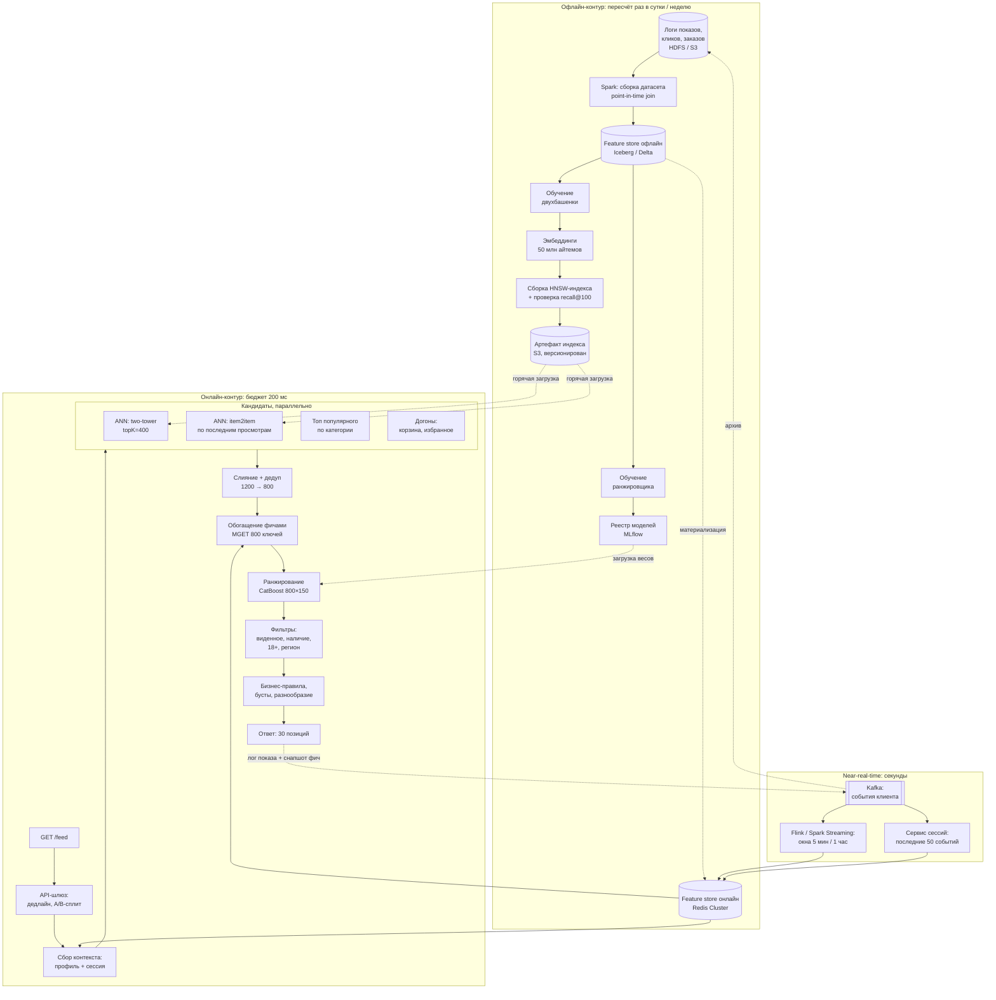
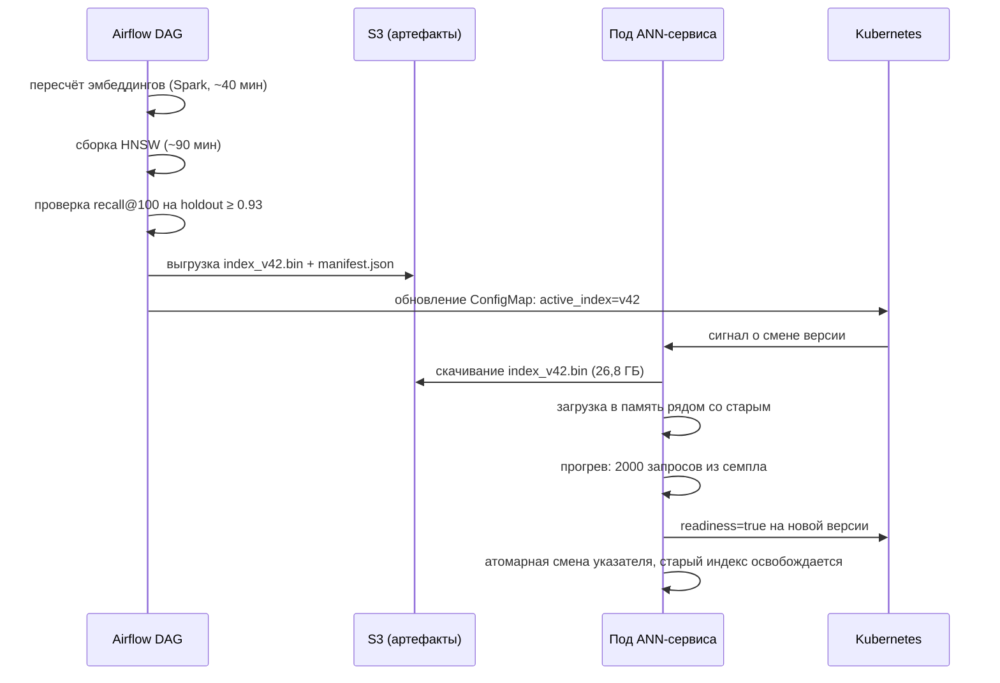

# Рекомендации в продакшене

> **Зачем эта глава.** Модель, которая на офлайне даёт +8% NDCG@10, в проде живёт внутри
> сервиса с бюджетом 200 мс, каталогом в 50 млн позиций, падающим Redis и требованием
> «не показывать то, чего нет на складе». Эта глава — про то, что находится между обученной
> моделью и HTTP-ответом: точный бюджет латентности по стадиям, feature store и point-in-time,
> обновление ANN-индекса без даунтайма, фильтры и дедупликация, лестница деградаций,
> кэширование и расчёт ёмкости. После неё вы сможете нарисовать архитектуру рекомендательного
> сервиса с числами на каждой стрелке и защитить её на ML System Design.

**Уровень:** 🎯 middle → 🧠 middle+
**Предварительно нужно:** [двухбашенные модели и ANN](06-two-tower-and-ann.md), [обучение ранжированию](07-learning-to-rank.md), [холодный старт и смещения](12-cold-start-and-bias.md), [архитектуры сервинга](../07-mlops/05-serving-architectures.md), [данные и feature store](../07-mlops/03-data-and-feature-store.md)
**Как проработать:** чтение + расчёт бюджета для своей системы + нагрузочный тест

---

## Карта главы

- [1. Что ломается между офлайном и продом](#1-что-ломается-между-офлайном-и-продом)
- [2. Полная архитектура сервиса](#2-полная-архитектура-сервиса)
- [3. Бюджет латентности по стадиям](#3-бюджет-латентности-по-стадиям)
- [4. Признаки: три горизонта свежести](#4-признаки-три-горизонта-свежести)
- [5. Feature store: онлайн, офлайн и point-in-time](#5-feature-store-онлайн-офлайн-и-point-in-time)
- [6. Батч или онлайн: где проходит граница предподсчёта](#6-батч-или-онлайн-где-проходит-граница-предподсчёта)
- [7. Обновление моделей, эмбеддингов и ANN-индекса](#7-обновление-моделей-эмбеддингов-и-ann-индекса)
- [8. Фильтры, дедупликация и бизнес-правила](#8-фильтры-дедупликация-и-бизнес-правила)
- [9. Кэширование](#9-кэширование)
- [10. Фолбэки и лестница деградаций](#10-фолбэки-и-лестница-деградаций)
- [11. Нагрузочное тестирование и ёмкость](#11-нагрузочное-тестирование-и-ёмкость)
- [12. Компромиссы и границы](#12-компромиссы-и-границы)
- [13. Подводные камни](#13-подводные-камни)
- [14. Проверь себя](#14-проверь-себя)
- [15. Практика](#15-практика)
- [16. Что читать дальше](#16-что-читать-дальше)

**Стенд, на числах которого построена вся глава.** Маркетплейс: 20 млн MAU, 3 млн DAU,
каталог 50 млн SKU (из них 8 млн доступны к заказу прямо сейчас), лента на главной странице,
пик 3000 RPS, SLA — 200 мс на p99 и 500 мс на p99.9, инфраструктура — Kubernetes, CPU-инференс.
Все расчёты дальше привязаны к этим цифрам; подставьте свои и пересчитайте — это и есть
основное упражнение главы.

---

## 1. Что ломается между офлайном и продом

Обученная модель — примерно 5% работы над рекомендательной системой. Остальные 95% выглядят так.

**Ломается время.** В ноутбуке вы вызываете `model.predict(X)` на матрице 100 000 × 150
и получаете ответ за 400 мс — «быстро». В проде это 3000 запросов в секунду, каждый со своим
набором кандидатов, и на весь ответ у вас 200 мс, из которых модели достанется 40. Разница
между «400 мс на батч» и «40 мс на запрос» — это не оптимизация, это другая архитектура.

**Ломается согласованность признаков.** В обучающем датасете признак
`item_orders_7d` посчитан SQL-запросом по всей истории. В проде тот же признак приходит
из Redis, куда его положил стриминговый джоб с окном в час и лагом в две минуты. Значения
разойдутся, модель увидит вход, которого не видела при обучении, и качество упадёт без
единой ошибки в логах. Это [train/serve skew](../07-mlops/03-data-and-feature-store.md),
и он убивает больше выкаток, чем плохие модели.

**Ломается каталог.** Модель обучалась на снапшоте, где товар был в наличии. За два часа
он закончился. Ранжировщик всё ещё ставит его первым, потому что не знает про склад.
Пользователь кликает — и получает «нет в наличии». Одна такая позиция в топ-3 стоит дороже,
чем 1% NDCG.

**Ломается инфраструктура.** Redis-шард уходит в rebalance на 8 секунд. ANN-сервис после
деплоя минуту греет индекс. Один товар оказывается в 40% всех выдач, потому что новая
модель схлопнула эмбеддинги. Всё это происходит регулярно, и вопрос не «как избежать»,
а «что показываем пользователю в этот момент».

Дальше — по порядку, начиная с общей картины.

---

## 2. Полная архитектура сервиса

Три контура: офлайн (часы—сутки), near-real-time (секунды—минуты) и онлайн (миллисекунды).
Главная ошибка на доске — рисовать их в одном ряду.



Три вещи на этой схеме важнее остальных.

**Стрелка «лог показа + снапшот фич» обязательна.** Логируется не только что показали,
но и **вектор признаков ровно в том виде, в каком его увидела модель**, плюс версия модели,
версия индекса, номер позиции и ветка A/B. Без этого невозможно ни воспроизвести инцидент,
ни обучить следующую версию без skew, ни посчитать позиционный биас. Объём: 3000 RPS × 30
позиций × ~400 байт ≈ 36 МБ/с ≈ 3 ТБ в сутки в сыром виде. Это дорого, поэтому обычно
логируют полный снапшот для сэмпла 1–5% трафика и урезанный (id + score + позиция) для 100%.

**Кандидаты идут параллельно, а не последовательно.** Четыре источника, каждый со своим
таймаутом; результат — объединение того, что успело ответить. Один упавший источник не должен
ронять выдачу.

**Feature store читается дважды.** Один раз — профиль пользователя (один ключ, до отбора
кандидатов), второй — признаки айтемов (800 ключей, после). Эти два похода принципиально
разные по стоимости и по стратегии деградации.

---

## 3. Бюджет латентности по стадиям

Бюджет — это таблица, которую вы должны уметь написать на доске за минуту. Вот она
для нашего стенда (миллисекунды, измерено на боевом трафике):

| Стадия | p50 | p99 | Таймаут | Что при таймауте |
|---|---|---|---|---|
| Приём, аутентификация, разбор запроса, A/B-сплит | 1 | 3 | — | — |
| Профиль пользователя + сессия из Redis (1 pipeline) | 1,5 | 6 | 15 | дефолтный профиль, флаг `degraded` |
| ANN two-tower, topK=400 (HNSW, `efSearch=128`) | 6 | 18 | 35 | источник пропускается |
| Остальные источники кандидатов (параллельно) | 3 | 10 | 25 | источник пропускается |
| Слияние и дедупликация 1200 → 800 | 1 | 3 | — | — |
| Обогащение фичами: MGET 800 ключей, 3 шарда | 4 | 14 | 30 | дефолты для непришедших |
| Ранжирование CatBoost, 800 объектов × 150 признаков | 12 | 35 | 60 | лёгкая модель на 20 признаках |
| Фильтры (виденное, наличие, ограничения) | 2 | 7 | 15 | мягкие фильтры пропускаются |
| Бизнес-правила, бусты, разнообразие, срезка топ-30 | 2 | 6 | — | — |
| Сериализация + сеть до клиента | 4 | 12 | — | — |
| **Итого end-to-end** | **~38** | **~120** | **200** | |

> ⚠️ **Типичная ошибка.** Сложить колонку p99 (получится 114 мс) и решить, что это p99 системы.
> Это неверно в обе стороны. Сумма p50 действительно близка к p50 суммы, а вот p99 суммы
> **меньше** суммы p99 (все стадии одновременно в хвосте — редкое событие), зато p99 системы
> **больше**, чем можно ожидать из компонент, из-за общих причин: GC, шумный сосед по ноде,
> ротация шарда. Единственный правильный ответ — измерять end-to-end и держать запас 40–50%
> к SLA. Стадийные числа нужны, чтобы знать, **что резать**, когда бюджет перестаёт сходиться.

**Эффект хвостов при fan-out.** Если запрос параллельно ходит в $N$ независимых сервисов
и ждёт всех, то вероятность уложиться в порог $t$ равна произведению:

$$
P\big(\max_{i=1..N} T_i \le t\big) = \prod_{i=1}^{N} P(T_i \le t) = q^{N}
$$

где $T_i$ — время ответа $i$-го вызова, $t$ — порог (например, p99 одного вызова), $q$ —
вероятность одного вызова уложиться в $t$ (для порога «p99» это $q = 0{,}99$), $N$ — число
параллельных вызовов. При $N = 20$ получаем $0{,}99^{20} = 0{,}82$: **18% запросов упрутся
в хвост хотя бы одного вызова**. Практический вывод: чем шире fan-out, тем более жёсткие
требования к хвостам компонент, и тем важнее hedged requests (послать дубль запроса,
если первый не ответил за p95) и возможность обойтись без части ответов.

**Дедлайн, а не таймаут.** Правильная реализация: на входе фиксируется абсолютный дедлайн
`now + 200 ms`, и каждая стадия получает не свой статический таймаут, а остаток бюджета.
Если кандидаты внезапно заняли 60 мс вместо 18, ранжирование должно узнать, что у него
осталось не 60 мс, а 25, и само переключиться на укороченный режим.

```python
# Дедлайн-ориентированная оркестрация стадий. Работает и как учебный пример, и как каркас.
import asyncio
import time
from dataclasses import dataclass

@dataclass
class Deadline:
    """Абсолютный дедлайн запроса. Каждая стадия спрашивает остаток, а не свой таймаут."""
    at: float  # монотонное время окончания

    @classmethod
    def after(cls, budget_ms: float) -> "Deadline":
        return cls(at=time.monotonic() + budget_ms / 1000.0)

    def left_ms(self) -> float:
        return max(0.0, (self.at - time.monotonic()) * 1000.0)

    def slice_ms(self, want_ms: float, reserve_ms: float) -> float:
        """Сколько реально дать стадии: не больше желаемого и не съедая резерв на хвост пайплайна."""
        return max(0.0, min(want_ms, self.left_ms() - reserve_ms))

async def with_budget(coro, budget_ms: float, fallback):
    """Запускает стадию с бюджетом; при исчерпании возвращает фолбэк, а не исключение."""
    if budget_ms <= 0:
        return fallback, True
    try:
        return await asyncio.wait_for(coro, timeout=budget_ms / 1000.0), False
    except (asyncio.TimeoutError, Exception):
        return fallback, True

async def build_feed(user_id: int, sources, rank_full, rank_light, budget_ms: float = 200.0):
    """sources: список корутин-фабрик; rank_full/rank_light: корутины ранжирования."""
    dl = Deadline.after(budget_ms)
    degraded = False

    # Кандидаты: все источники параллельно, каждому — свой кусок бюджета, но не больше остатка.
    per_source = dl.slice_ms(want_ms=35, reserve_ms=110)   # 110 мс резерв на фичи+ранжирование+фильтры
    results = await asyncio.gather(
        *[with_budget(src(user_id), per_source, fallback=[]) for src in sources]
    )
    candidates = []
    for items, failed in results:
        candidates.extend(items)
        degraded |= failed
    candidates = list(dict.fromkeys(candidates))          # дедупликация с сохранением порядка

    # Ранжирование: если бюджета осталось мало — лёгкая модель вместо полной.
    rank_budget = dl.slice_ms(want_ms=60, reserve_ms=25)   # 25 мс резерв на фильтры и сериализацию
    if rank_budget < 20:
        ranked, failed = await with_budget(rank_light(user_id, candidates), rank_budget, candidates)
        degraded = True
    else:
        ranked, failed = await with_budget(rank_full(user_id, candidates), rank_budget, None)
        if ranked is None:
            ranked, _ = await with_budget(rank_light(user_id, candidates), dl.left_ms() - 15, candidates)
            degraded = True
    return ranked[:30], degraded
```

> 💬 **На собеседовании.** Спросят: «У вас 200 мс на ответ. Как вы их потратите?»
> Хороший ответ — назвать таблицу по стадиям с числами и сразу проговорить три вещи:
> (1) кандидаты идут параллельно, поэтому их вклад — максимум, а не сумма; (2) бюджет
> распределяется дедлайном, а не фиксированными таймаутами, иначе последняя стадия
> всегда крайняя; (3) сумма p99 стадий — не p99 системы, измеряем end-to-end и держим
> 40% запаса. Плохой ответ: «уложимся, ранжирование быстрое».

---

## 4. Признаки: три горизонта свежести

Признаки в рекомендациях разделяются не по смыслу, а по тому, **как быстро они устаревают**.
Этот критерий определяет, где они считаются и где хранятся.

| Горизонт | Примеры | Источник | Задержка | Где хранится |
|---|---|---|---|---|
| **Статические / медленные** | категория, бренд, размер, эмбеддинг картинки, агрегаты за 30/90 дней | Spark, ночной DAG | 3–24 ч | онлайн-KV + локальный LRU в поде |
| **Near-real-time** | просмотры товара за час, конверсия за 15 мин, остаток на складе, цена | Flink/Kafka Streams, окна 1–15 мин | 5 с – 2 мин | Redis, TTL 1–24 ч |
| **Реального времени** | последние 20 событий сессии, текущий поисковый запрос, гео, устройство, что уже показали на этой странице | тело запроса + сервис сессий | 0–200 мс | in-request / Redis, TTL 30 мин |

**Реалтайм-признаки — единственная группа, которую нельзя предпосчитать в принципе.**
Именно они дают основной прирост на коротких сессиях: пользователь зашёл, посмотрел три
холодильника — следующий экран обязан это учесть. Ночной батч этого не умеет, поэтому
любая система, где сессия важна, вынуждена быть онлайновой хотя бы частично.

**Как реалтайм-признак попадает в модель.** Есть два способа, и они дают разную латентность.
Первый — «сырой»: последние $L$ id событий передаются в модель и агрегируются внутри
(pooling, attention к истории — см. [нейронное ранжирование](08-neural-ranking.md)).
Гибко, но дорого: последовательность приходится прогонять на каждый запрос. Второй —
«агрегированный»: сервис сессий поддерживает уже свёрнутое состояние (средний эмбеддинг
последних 20 событий, счётчики по категориям), и в модель уходит фиксированный вектор.
Дешевле на порядок, но теряет порядок событий. На практике комбинируют: агрегаты — для
стадии кандидатов, сырая последовательность — для топ-200 на ранжировании.

**Стоимость свежести.** Уменьшение лага стриминговых фич с 5 минут до 5 секунд — это переход
от микробатчей Spark Structured Streaming к Flink с событийным временем, отдельная команда
на поддержку и заметный рост счёта за инфраструктуру. Прежде чем это делать, измерьте:
возьмите текущие признаки, искусственно состарьте их на 5 минут в офлайн-эксперименте
и посмотрите, сколько теряет метрика. Часто оказывается, что между 5 минутами и 5 секундами
разницы почти нет, а между сутками и 5 минутами — есть, и большая.

---

## 5. Feature store: онлайн, офлайн и point-in-time

Feature store — это не «ещё одна база». Это механизм, который гарантирует, что признак,
использованный при обучении, и признак, использованный в проде, **вычислены одним и тем же
кодом**, и что при обучении не подсмотрено будущее.

**Два хранилища, одно определение.** Определение признака (SQL/Python-трансформация) —
одно. Из него материализуются:
- **офлайн-хранилище** — колоночное (Iceberg/Delta/Parquet), хранит историю значений
  с временными метками, читается при сборке обучающего датасета;
- **онлайн-хранилище** — KV (Redis, Aerospike, DynamoDB), хранит **только последнее** значение,
  читается на инференсе за миллисекунды.

**Расчёт размера онлайн-хранилища.** Это тот вопрос, где кандидаты обычно машут руками.
Считаем для нашего стенда:

$$
S_{\text{online}} = \underbrace{N_u \cdot d_u \cdot b}_{\text{профили}} + \underbrace{N_i \cdot d_i \cdot b}_{\text{айтемы}} + \underbrace{(N_u + N_i) \cdot o}_{\text{накладные}}
$$

где $N_u$ — число пользователей в онлайн-хранилище, $d_u$ — число признаков на пользователя,
$N_i$ — число айтемов, $d_i$ — число признаков на айтем, $b$ — байт на признак,
$o$ — накладные расходы Redis на один ключ (примерно 60–100 байт: заголовок объекта,
запись в словаре, указатели; при упаковке признаков в один бинарный blob это платится
один раз на сущность, а не на признак).

Подставляем: пользователи — храним только 6 млн (DAU за 14 дней), $d_u = 200$ признаков
во `float32` ($b=4$) → $6\cdot10^6 \cdot 200 \cdot 4 = 4{,}8$ ГБ. Айтемы — все 50 млн,
$d_i = 100$ в `float16` ($b=2$) → $50\cdot10^6\cdot100\cdot2 = 10$ ГБ. Накладные:
$56\cdot10^6 \cdot 80 \approx 4{,}5$ ГБ. Итого ≈ **19,3 ГБ полезных данных**, а с учётом
фрагментации, репликации ×2 и запаса на пики — кластер на **6 шардов по 16 ГБ**.

Ключевые решения, которые следуют из этого расчёта:
- **Упаковывать признаки в один blob на сущность** (`msgpack`, `numpy.tobytes()`, protobuf),
  а не хранить 200 отдельных ключей: иначе накладные съедают больше, чем данные, и вместо
  одного `GET` нужен `HMGET` на 200 полей.
- **`float16` для айтемных признаков** экономит 5 ГБ и почти никогда не влияет на качество
  бустинга (он всё равно бинаризует признаки в 254 корзины).
- **TTL для пользовательских профилей** (14–30 дней) — иначе хранилище растёт вместе
  с историей регистраций, а не с активной аудиторией.

**Пропускная способность.** Один шард Redis отдаёт порядка 80–150 тыс. простых операций
в секунду на ядро; с конвейеризацией (pipelining) по 100–1000 команд — до 0,7–1,5 млн.
Нам нужно 3000 RPS × 800 ключей = 2,4 млн чтений в секунду. Это ровно та точка, где
наивная реализация («цикл по кандидатам с `GET`») даёт 2,4 млн round-trip'ов и умирает,
а правильная (`MGET` по 800 ключей, разбитый по шардам, 3 сетевых похода на запрос)
даёт 9000 round-trip'ов в секунду. Разница — три порядка.

### Point-in-time correctness

Главная ловушка обучения. Формально: при сборке обучающей строки для события,
произошедшего в момент $t$, значение признака должно быть таким, **каким оно было
в момент $t$**, а не сегодня.

$$
x_j^{(\text{train})}(u, i, t) = f_j\big(\mathcal{D}_{\le t}\big), \qquad \mathcal{D}_{\le t} = \{e \in \mathcal{D} : \tau(e) \le t\}
$$

где $x_j^{(\text{train})}(u,i,t)$ — значение $j$-го признака для пары «пользователь $u$,
айтем $i$» в обучающей строке события в момент $t$; $f_j$ — функция вычисления признака;
$\mathcal{D}$ — все события в логах; $\tau(e)$ — время события $e$; $\mathcal{D}_{\le t}$ —
подмножество событий, случившихся не позже $t$.

Нарушение выглядит безобидно. Классический пример: признак `item_ctr_30d` посчитан одним
`GROUP BY` по всей таблице показов и приджойнен ко всем обучающим строкам. Товар, который
взлетел на прошлой неделе, получает высокий CTR **во всех строках, включая те, что были
месяц назад, когда он был никому не известен**. Модель обучается на «знании о будущем»,
офлайн-метрика прекрасна, в проде эффекта ноль.

Технически это лечится **as-of join** (join по ключу с условием «последнее значение
не позже метки времени строки»):

```sql
-- Spark SQL / Trino: сборка обучающей строки без утечки будущего.
-- imp — лог показов (user_id, item_id, ts, label)
-- item_feat — снапшоты признаков айтема (item_id, valid_from, ctr_30d, orders_7d)
SELECT
    imp.user_id, imp.item_id, imp.ts, imp.label,
    f.ctr_30d, f.orders_7d
FROM impressions imp
LEFT JOIN LATERAL (
    SELECT ctr_30d, orders_7d
    FROM item_feat
    WHERE item_feat.item_id = imp.item_id
      AND item_feat.valid_from <= imp.ts          -- ключевое условие: никакого будущего
    ORDER BY item_feat.valid_from DESC
    LIMIT 1
) f ON TRUE
WHERE imp.ts >= DATE '2026-05-01';
```

Но есть способ надёжнее и дешевле: **логировать признаки в момент предсказания**.
Сервис уже прочитал вектор из онлайн-хранилища — он и пишется в лог рядом с показом.
Тогда обучающий датасет собирается простым join'ом по `request_id`, point-in-time
выполняется по построению, а train/serve skew становится равен нулю по определению.
Цена — объём логов (см. §2). На практике это единственный способ, который держится
годами; as-of join нужен там, где исторические логи фич уже потеряны или добавляется
новый признак задним числом.

> 💬 **На собеседовании.** Спросят: «Как вы гарантируете, что признаки при обучении
> и в проде одинаковые?» Хороший ответ: одно определение признака на два хранилища
> + логирование фактического вектора признаков в момент предсказания + регулярная
> сверка (берём сэмпл запросов, пересчитываем офлайн-путём, сравниваем распределения
> и долю расхождений, алерт при росте). И отдельно — point-in-time при бэкфилле новых
> признаков через as-of join. Плохой ответ: «используем Feast» — название инструмента
> не отвечает на вопрос, а skew в Feast возникает так же легко, как и без него.

---

## 6. Батч или онлайн: где проходит граница предподсчёта

Соблазн: посчитать рекомендации для всех пользователей ночью и раздавать из KV
за 2 мс. Иногда это правильно. Разберёмся, когда.

**Батчевый предподсчёт работает, когда** выдача не зависит от текущей сессии
(еженедельная e-mail-рассылка, пуш, стартовый экран для редко заходящих),
пользователей не слишком много, и допустима свежесть в сутки.

**Стоимость батча против онлайна.** Пусть $c$ — стоимость одного инференса
(в ядро-секундах или деньгах), $N_u$ — число пользователей, для которых считаем заранее,
$R$ — средний RPS онлайн-сервиса, $h \in [0,1]$ — доля запросов, закрытых кэшем.
За сутки:

$$
C_{\text{batch}} = N_u \cdot c, \qquad C_{\text{online}} = R \cdot 86400 \cdot (1-h) \cdot c
$$

Батч дешевле, когда $N_u < R \cdot 86400 \cdot (1-h)$. Для стенда: $R = 1200$ RPS в среднем
за сутки (пик 3000), $h = 0{,}3$ → правая часть $= 1200 \cdot 86400 \cdot 0{,}7 \approx 72{,}6$ млн
инференсов. Пользователей, которым имеет смысл считать заранее, — 3 млн DAU.
Батч в 24 раза дешевле по вычислениям.

И всё равно чистый батч в ленте не используют. Причина не в деньгах:

- **Свежесть.** Пользователь только что купил телевизор. Батчевая выдача до завтрашнего
  утра будет предлагать телевизоры. Потеря конверсии больше экономии на CPU.
- **Фильтры.** Наличие, цена, регион, возрастные ограничения меняются в течение дня.
  Предпосчитанный список приходится всё равно фильтровать на лету — а после фильтрации
  30 позиций может остаться 11.
- **Взрыв комбинаций.** Выдача зависит не только от пользователя, но и от поверхности,
  категории, точки входа, A/B-ветки. Предподсчёт по всем комбинациям — это
  $N_u \times$ (число контекстов), и число быстро перестаёт быть реалистичным.

**Практическая граница проходит по стадиям, а не по системе.** Предпосчитывается то,
что не зависит от текущего запроса:

| Что | Режим | Периодичность | Почему так |
|---|---|---|---|
| Эмбеддинги айтемов | батч | 1 раз в сутки | зависят только от контента и агрегатов |
| ANN-индекс | батч | 1 раз в сутки + инкремент каждый час | сборка дорогая, каталог меняется медленно |
| item2item-соседи (топ-200 к каждому айтему) | батч | 1 раз в сутки | $50\text{ млн} \times 200$ строк, но считается один раз |
| Агрегаты пользователя за 30/90 дней | батч | 1 раз в сутки | по определению медленные |
| Эмбеддинг пользователя | **онлайн** | на запрос | зависит от текущей сессии |
| Скоры ранжировщика | **онлайн** | на запрос | зависят от контекста и от набора кандидатов |
| Фильтры и бизнес-правила | **онлайн** | на запрос | меняются в течение дня |

Это и есть ответ на вопрос «батч или онлайн»: **батч — для всего, что зависит только
от каталога и от долгой истории; онлайн — для всего, что зависит от текущего запроса.**
Гибрид: для холодных и низкоактивных пользователей (заходят раз в месяц) держат
предпосчитанный список как фолбэк и как способ не греть ANN ради одного запроса.

---

## 7. Обновление моделей, эмбеддингов и ANN-индекса

Здесь ломается тише всего и больнее всего.

**Правило номер один: эмбеддинги и индекс — один атомарный артефакт.** Двухбашенная
модель после переобучения задаёт **новое пространство**. Векторы старой и новой версии
несопоставимы: скалярное произведение между эмбеддингом пользователя из модели $v_{42}$
и эмбеддингом айтема из модели $v_{41}$ — случайное число. Если вы обновили башню
пользователя, но забыли перестроить индекс айтемов, качество не упадёт до нуля с алертом,
а просто станет ощутимо хуже, и вы будете неделю искать причину.

Отсюда версионирование: артефакт индекса содержит `model_version`, сервис при загрузке
проверяет, что версия совпадает с версией загруженной башни пользователя, и **отказывается
подниматься** при расхождении. Это одна строка кода и половина потенциальных инцидентов.

**Стоимость перестройки.** Для 50 млн айтемов, $d = 64$, HNSW с $M = 32$:

$$
S_{\text{HNSW}} \approx N\big(4d + 8M + c_0\big)
$$

где $N$ — число векторов, $d$ — размерность (по 4 байта на `float32`), $M$ — параметр
графа (число связей на узел на верхних уровнях; на нулевом уровне их $2M$, идентификатор
соседа — 4 байта, отсюда $2M \cdot 4 = 8M$), $c_0$ — накладные на узел (метка уровня,
смещения), порядка 16–32 байт. Подставляем: $50\cdot10^6 (256 + 256 + 24) \approx 26{,}8$ ГБ.
Сборка такого индекса при `efConstruction=200` на 32 vCPU — примерно 60–120 минут,
и это ночная джоба, а не «пересоберём на лету».

**Схема обновления без даунтайма.**



Что здесь принципиально:

1. **Гейт на recall.** Индекс не выкатывается, если `recall@100` относительно точного
   перебора на отложенном сэмпле из 10 тыс. запросов упал ниже порога (0,93 — типичное
   значение). Дефект сборки — вещь обыденная: плохо сошлась квантизация, потерялась часть
   векторов, изменилась размерность.
2. **Двойная память на время смены.** Под должен вмещать 2 индекса: 26,8 ГБ × 2 + рантайм ≈
   64 ГБ `memory.limit`. Иначе OOMKill ровно в момент обновления — раз в сутки, стабильно.
3. **Прогрев до `readiness`.** Свежезагруженный индекс отвечает в 3–5 раз медленнее первые
   секунды (страницы не в page cache, ветвления не предсказаны). Если под встаёт в балансировку
   до прогрева, вы получаете всплеск p99 при каждом деплое.
4. **Раскатка по подам поочерёдно** (`maxUnavailable: 1`), иначе просядет ёмкость.

**Инкрементальные обновления.** Полная пересборка раз в сутки не решает задачу новых
товаров: SKU, появившийся в 10 утра, не должен ждать до ночи. HNSW поддерживает вставку,
поэтому каждый час в индекс доливаются новые айтемы (их эмбеддинги считаются той же
башней контента, что и ночью, — она не меняется между пересборками). Удаления в HNSW
делаются мягко: айтем помечается как удалённый и отфильтровывается после поиска, поэтому
`topK` берут с запасом (просим 400, чтобы после фильтрации осталось ≥300). Накопленный
мусор — ещё один аргумент за ночную полную пересборку.

**Каденция обновлений всей системы:**

| Компонент | Как часто | Триггер |
|---|---|---|
| Ранжировщик (CatBoost) | 1 раз в неделю | расписание + гейт по офлайн-метрике |
| Двухбашенка + эмбеддинги + индекс | 1 раз в сутки | расписание |
| Инкремент индекса (новые SKU) | 1 раз в час | появление новых айтемов |
| Признаки-агрегаты | 1 раз в сутки | завершение ETL |
| Стриминговые счётчики | непрерывно | Kafka |
| Популярное (фолбэк) | 1 раз в 15 мин | расписание |

Ниже — сокращённый Airflow DAG ночного контура. Обратите внимание на гейт и на то,
что публикация версии — **последний** шаг.

```python
# dags/recsys_nightly_index.py — ночная пересборка эмбеддингов и ANN-индекса
from datetime import datetime, timedelta
from airflow import DAG
from airflow.operators.python import PythonOperator, BranchPythonOperator
from airflow.operators.empty import EmptyOperator
from airflow.providers.apache.spark.operators.spark_submit import SparkSubmitOperator

default_args = {"retries": 2, "retry_delay": timedelta(minutes=10), "sla": timedelta(hours=4)}

with DAG(
    dag_id="recsys_nightly_index",
    start_date=datetime(2026, 1, 1),
    schedule="0 1 * * *",          # 01:00 UTC — после закрытия суточного ETL
    catchup=False,                  # исторические индексы никому не нужны
    max_active_runs=1,              # два одновременных билда убьют кластер по памяти
    default_args=default_args,
) as dag:

    embed = SparkSubmitOperator(
        task_id="embed_items",
        application="/opt/jobs/embed_items.py",
        conf={
            "spark.executor.instances": "40",
            "spark.executor.cores": "4",
            "spark.executor.memory": "16g",
            "spark.sql.shuffle.partitions": "800",   # ~50 млн строк / 800 ≈ 62 тыс. на партицию
        },
        application_args=["--date", "{{ ds }}", "--out", "s3://ml/emb/{{ ds }}"],
    )

    build = PythonOperator(
        task_id="build_hnsw",
        python_callable=lambda **c: __import__("jobs.build_hnsw", fromlist=["run"]).run(
            src=f"s3://ml/emb/{c['ds']}", dst=f"s3://ml/index/{c['ds']}",
            M=32, ef_construction=200, threads=32,
        ),
        execution_timeout=timedelta(hours=3),
    )

    def check_recall(**ctx):
        from jobs.eval_index import recall_at_k
        r = recall_at_k(index=f"s3://ml/index/{ctx['ds']}", queries="s3://ml/eval/queries.parquet", k=100)
        ctx["ti"].xcom_push(key="recall", value=r)
        return "publish" if r >= 0.93 else "alert_and_stop"   # гейт: не выкатываем плохой индекс

    gate = BranchPythonOperator(task_id="gate_recall", python_callable=check_recall)
    publish = PythonOperator(
        task_id="publish",
        python_callable=lambda **c: __import__("jobs.publish", fromlist=["set_active"]).set_active(
            version=c["ds"], configmap="recsys-ann-config",
        ),
    )
    stop = EmptyOperator(task_id="alert_and_stop")

    embed >> build >> gate >> [publish, stop]
```

> 💬 **На собеседовании.** Спросят: «Как обновить ANN-индекс на 50 млн векторов без даунтайма?»
> Хороший ответ: собрать новый артефакт офлайн, прогнать гейт по recall относительно точного
> поиска, выложить в объектное хранилище с версией, поды скачивают и загружают его **рядом**
> со старым (значит, лимит памяти вдвое больше индекса), прогревают, переключают указатель
> атомарно, старый освобождают; раскатка поочерёдная, версия индекса обязана совпадать
> с версией башни. Плохой ответ: «перезальём индекс и перезапустим поды» — это минуты
> недоступности каждую ночь и всплеск p99.

---

## 8. Фильтры, дедупликация и бизнес-правила

Ранжировщик выдал 800 отсортированных айтемов. До ответа доживут 30, и то, что происходит
между ними, — это отдельная система со своими багами.

### Жёсткие фильтры

Порядок применения — от дешёвых к дорогим и от обязательных к желательным:

1. **Юридические и возрастные ограничения** (алкоголь, 18+, региональные запреты) — нарушение
   стоит штрафа, поэтому фильтр применяется и на кандидатах, и после ранжирования, дважды.
2. **Доступность**: в наличии, доставляется в регион пользователя, цена не `null`.
   Источник — **только самый свежий**: Redis, обновляемый из стрима остатков, а не ночной
   снапшот. Лаг здесь измеряется секундами.
3. **Уже виденное** — самый дорогой фильтр, о нём ниже.
4. **Уже купленное** (для нереgular-товаров: холодильник не нужен второй раз; для расходников —
   наоборот, покупка повышает вероятность повторной).

**Как отфильтровать виденное за 2 мс.** У активного пользователя за 14 дней накапливается
3–10 тыс. показанных айтемов. Хранить множество целиком: 5000 × 8 байт = 40 КБ на пользователя,
6 млн активных → 240 ГБ. Дорого. Стандартное решение — **фильтр Блума** на пользователя:

$$
\varepsilon = \Big(1 - e^{-kn/m}\Big)^{k}, \qquad k^{*} = \frac{m}{n}\ln 2, \qquad \varepsilon^{*} = 2^{-k^{*}}
$$

где $\varepsilon$ — вероятность ложноположительного срабатывания (сказать «виден»
про невиданный айтем), $n$ — число вставленных элементов, $m$ — размер битового массива,
$k$ — число хеш-функций, $k^*$ — оптимальное число хеш-функций при заданных $m$ и $n$,
$\varepsilon^*$ — соответствующая ему ошибка.

При $m/n = 10$ бит на элемент: $k^* = 10\ln 2 \approx 7$, $\varepsilon^* = 2^{-7} \approx 0{,}008$.
То есть 6,25 КБ на пользователя с 5000 показов и **0,8% хороших айтемов будут выброшены зря** —
цена, которую платят охотно. Ложноотрицательных у Блума не бывает по построению: виденный
айтем никогда не просочится. Память: 6 млн × 6,25 КБ ≈ 37,5 ГБ, TTL 14 дней.

```python
# Оценка параметров фильтра Блума под свои объёмы — считайте это, а не берите "стандартные" 8 бит.
import math

def bloom_params(n: int, target_fp: float):
    """n — сколько показов помним на пользователя; target_fp — допустимая доля зря отфильтрованного."""
    m = math.ceil(-n * math.log(target_fp) / (math.log(2) ** 2))   # бит
    k = max(1, round(m / n * math.log(2)))                          # число хеш-функций
    real_fp = (1 - math.exp(-k * n / m)) ** k
    return {"bits": m, "bytes_per_user": math.ceil(m / 8), "k": k, "fp": round(real_fp, 4)}

for n in (1_000, 5_000, 20_000):
    print(n, bloom_params(n, target_fp=0.01))
# 1000  {'bits': 9586,   'bytes_per_user': 1199,  'k': 7, 'fp': 0.0098}
# 5000  {'bits': 47926,  'bytes_per_user': 5991,  'k': 7, 'fp': 0.0098}
# 20000 {'bits': 191702, 'bytes_per_user': 23963, 'k': 7, 'fp': 0.0098}
```

> ⚠️ **Типичная ошибка.** Применить фильтр виденного **после** срезки в топ-30. Тогда
> из 30 позиций 12 окажутся отфильтрованными и пользователь получит выдачу из 18 карточек
> с дырами. Фильтры применяются к полному отранжированному списку, срезка — последней.
> И запас кандидатов должен покрывать долю отсева: если фильтры выбивают 60%, то для
> 30 позиций нужно не 50 кандидатов, а 300+.

### Дедупликация

Три уровня, все нужны:

- **По id** — тривиально, но обязательно: разные источники кандидатов возвращают пересекающиеся
  множества (совпадение 20–40% — норма).
- **По товарной сущности** — один и тот же телефон от пяти продавцов с разными SKU.
  Схлопывается по `product_id`/кластеру, оставляется лучшее предложение по цене и рейтингу.
  Без этого топ-10 превращается в десять карточек одного iPhone — самый частый и самый
  заметный дефект рекомендаций на маркетплейсе.
- **По разнообразию** — не больше $c$ айтемов одного продавца/бренда/категории в окне
  из $w$ позиций. Реализуется жадным проходом по отранжированному списку с квотами.

```python
def diversify(ranked, group_of, max_per_group=2, window=10):
    """Жадная пост-обработка: не больше max_per_group айтемов одной группы в скользящем окне.
    ranked — список item_id по убыванию скора; group_of — item_id -> ключ группы (бренд/продавец)."""
    out, deferred = [], []
    for item in ranked:
        g = group_of(item)
        recent = [group_of(x) for x in out[-window:]]
        if recent.count(g) < max_per_group:
            out.append(item)
        else:
            deferred.append(item)                # не выбрасываем: пригодится ниже по списку
        if deferred and len(out) % window == 0:  # периодически пытаемся вернуть отложенные
            still = []
            for item2 in deferred:
                recent = [group_of(x) for x in out[-window:]]
                (out if recent.count(group_of(item2)) < max_per_group else still).append(item2)
            deferred = still
    return out + deferred
```

### Бизнес-правила и бусты

Бизнес всегда придёт с требованием «поднять свои бренды», «продвинуть распродажу»,
«показывать новинки». Есть три способа это сделать, и они очень разные по последствиям.

**Способ 1: множитель к скору.** Простой и самый популярный:

$$
s_{\text{final}}(u,i) = \hat p_{\text{click}}(u,i)^{\alpha}\cdot \hat p_{\text{order}\mid\text{click}}(u,i)^{\beta}\cdot \text{margin}(i)^{\gamma}\cdot \prod_{r \in \mathcal{R}} b_r(i)
$$

где $\hat p_{\text{click}}$ — предсказанная вероятность клика, $\hat p_{\text{order}\mid\text{click}}$ —
вероятность заказа при условии клика, $\text{margin}(i)$ — маржа или ожидаемая ценность айтема
в деньгах, $\alpha,\beta,\gamma \ge 0$ — веса, подбираемые A/B-тестом, $\mathcal{R}$ — набор
активных бизнес-правил, $b_r(i) \ge 0$ — множитель правила $r$ для айтема $i$
(например, 1,15 для товаров распродажи и 1,0 для остальных).

Логарифмируя, вы получаете линейную комбинацию — так удобнее и настраивать, и логировать
вклад каждой компоненты. Важно: **множители ломают калибровку**. После умножения на $b_r$
величина перестаёт быть вероятностью, поэтому все места, где вероятность нужна честной
(расчёт ожидаемой выручки, аукцион рекламы), должны работать с исходным $\hat p$,
а не с $s_{\text{final}}$.

**Способ 2: квоты и слоты.** «В топ-10 должно быть ровно 2 новинки». Предсказуемо для бизнеса,
но грубо: слот займёт лучшая новинка даже если она в 20 раз хуже соседа по релевантности.
Применяйте, когда требование действительно жёсткое (юридическое, контрактное).

**Способ 3: правильно поставить задачу.** Если бизнес хочет GMV, а модель предсказывает клики,
то правильный ответ — не множитель, а многозадачная модель с целью
$\hat p_{\text{order}} \cdot \text{price}$ (см. [нейронное ранжирование](08-neural-ranking.md)).
Множители — это заплатка над неправильной целевой функцией; каждая новая заплатка
делает систему менее предсказуемой.

> 🧠 **Middle+.** Заведите **реестр правил** с обязательными полями: кто владелец, дата
> окончания, множитель, метрика, ради которой введено. Правила без даты окончания живут
> вечно; через два года в системе двадцать множителей, никто не помнит зачем, и суммарно
> они перевешивают модель. Реальная практика: раз в квартал все правила выключаются
> в A/B-тесте на 5% трафика, и остаются только те, отключение которых что-то ухудшило.

---

## 9. Кэширование

Кэш в рекомендациях — самый спорный компонент: он экономит железо и одновременно
персонализация, свежесть и фильтры сопротивляются кэшированию по своей природе.

**Что кэшировать можно и нужно:**

| Уровень | Что | Ключ | TTL | Ожидаемый hit rate |
|---|---|---|---|---|
| L1: in-process LRU | статические признаки айтемов | `item_id` | 10 мин | 85–95% (закон Ципфа: 1% айтемов даёт 50%+ показов) |
| L1: in-process LRU | эмбеддинги горячих айтемов | `item_id` | 30 мин | 90% |
| L2: Redis | список кандидатов | `user_id:surface:model_ver` | 60–300 с | 25–40% |
| L2: Redis | выдача для анонимов | `geo:device:category:model_ver` | 5–15 мин | 90%+ |
| L2: Redis | тяжёлые агрегаты (топ популярного) | `category:hour` | 15 мин | 99% |

**Что кэшировать нельзя:** финальную выдачу для авторизованного пользователя. Причины
конкретные: (1) фильтр виденного меняется после каждого показа — кэш немедленно даст
повтор; (2) наличие товара меняется в течение минут; (3) пользователь совершает действие
и ждёт реакции — залипшая на 5 минут лента читается как «система меня не видит».

**Практический компромисс: кэшировать стадию кандидатов, а не результат.** Кандидаты
меняются медленно (это ~800 айтемов, «примерно релевантных» пользователю), а ранжирование,
фильтры и дедупликация выполняются каждый раз. Это снимает самую дорогую часть (ANN + слияние
источников: ~25 мс p50) и не портит свежесть. При TTL 120 с и типичной длине сессии hit rate
получается 30–40%, экономия — примерно четверть CPU-бюджета.

**Ключ кэша обязан содержать версии.** `model_version`, `index_version`, `feature_schema_version`,
`ab_bucket`. Забыли — и после выката новой модели половина трафика ещё пять минут обслуживается
старыми результатами; A/B-тест при этом «размывается» и показывает эффект меньше настоящего.
Это неочевидный, но очень частый источник расхождения между ожидаемым и наблюдаемым эффектом.

**Cache stampede.** Когда истекает TTL популярного ключа (например, «топ категории»),
все параллельные запросы одновременно идут пересчитывать. При 3000 RPS это мгновенный
всплеск нагрузки на бэкенд. Лечится двумя приёмами: **single-flight** (первый запрос считает,
остальные ждут его результата) и **jitter в TTL** (`ttl = 300 ± uniform(0, 60)` секунд,
чтобы ключи не протухали синхронно). Плюс стратегия «отдай устаревшее, обнови в фоне»
(stale-while-revalidate) — для рекомендаций почти всегда лучше вернуть 5-минутной давности
список за 2 мс, чем свежий за 150 мс.

> 💬 **На собеседовании.** Спросят: «Можно ли кэшировать рекомендации?»
> Хороший ответ: кэшируем стадии, а не результат — статические фичи айтемов в памяти пода,
> кандидатов в Redis с коротким TTL, выдачу целиком — только для анонимов и холодных сегментов.
> Ключ включает версии модели, индекса и схемы фич, иначе после деплоя часть трафика живёт
> в прошлом и A/B врёт. Отдельно — single-flight и jitter против stampede. Плохой ответ:
> «закэшируем ответ на 5 минут» — вы только что сделали ленту, которая не реагирует
> на действия пользователя, и сломали фильтр виденного.

---

## 10. Фолбэки и лестница деградаций

Правильная рекомендательная система **не умеет возвращать ошибку пользователю**.
Пустая лента — это тоже инцидент, просто менее заметный, чем 500-я ошибка.

Лестница деградаций, от полного качества к минимальному:

| Уровень | Что отвалилось | Что делаем | Ожидаемая потеря CTR |
|---|---|---|---|
| **L0** | ничего | полная персонализация | 0 |
| **L1** | стриминговые фичи / сервис сессий | ранжируем без реалтайм-признаков, дефолты из обучения | −3…8% |
| **L2** | онлайн-хранилище признаков | лёгкая модель на признаках из запроса (гео, устройство, время) + кандидаты из кэша | −15…25% |
| **L3** | ANN-сервис или ранжировщик | предпосчитанный ночной список для этого пользователя | −20…35% |
| **L4** | всё персональное | топ популярного по категории/региону, обновляемый раз в 15 мин | −40…60% |
| **L5** | Redis целиком недоступен | статический список из файла в образе (мерчендайзинг), в памяти пода | −60…80% |

Числа в последнем столбце — порядок из практики маркетплейсов; **измерьте свои**,
специально запустив A/B с принудительной деградацией. Это единственный способ узнать,
сколько на самом деле стоит каждый компонент, и одновременно — самый убедительный
аргумент в разговоре о приоритетах.

**Ключевые инженерные требования к фолбэкам:**

- **L5 обязан работать без сети.** Список зашит в образ контейнера. Если ваш последний
  фолбэк ходит в Redis — у вас нет последнего фолбэка.
- **Дефолтные значения признаков = те же, что при обучении.** Если пропуск в обучении
  кодировался как `NaN` (и CatBoost/LightGBM учили для него отдельную ветку), то в проде
  тоже нужен `NaN`, а не 0. Подстановка нулей вместо `NaN` — классический способ получить
  неадекватные предсказания именно в момент аварии, когда всё и так плохо.
- **Флаг деградации в ответе и в логах.** Каждая выдача помечается уровнем деградации.
  Это даёт метрику `degradation_rate` и позволяет **исключить деградированные показы
  из A/B-анализа**, чтобы авария не выглядела как проигрыш новой модели.
- **Circuit breaker.** Если зависимость отвечает ошибками в >50% случаев в окне 10 с —
  размыкаем: 30 секунд вообще не ходим туда, сразу используем фолбэк, потом пробуем
  одиночным запросом. Иначе каждый запрос платит полный таймаут и вы кладёте сервис
  собственными ретраями.
- **Ретраи — только с бюджетом и джиттером.** Один ретрай, только если остаток дедлайна
  больше p99 вызова. «Ретраить три раза» при массовом отказе — это способ утроить нагрузку
  на уже упавшую зависимость.

Конфигурация пода, которая всё это учитывает:

```yaml
# k8s/recsys-api-deployment.yaml — фрагмент, значения привязаны к расчётам главы
apiVersion: apps/v1
kind: Deployment
metadata:
  name: recsys-api
spec:
  replicas: 33                       # см. расчёт ёмкости в §11
  strategy:
    rollingUpdate:
      maxUnavailable: 1              # не проседаем по ёмкости во время выката
      maxSurge: 2
  template:
    spec:
      terminationGracePeriodSeconds: 45   # дольше самого длинного запроса + дренаж
      containers:
        - name: api
          image: registry.internal/recsys-api:2026.07.21
          resources:
            requests: {cpu: "4", memory: "12Gi"}
            limits:   {cpu: "6", memory: "16Gi"}   # limit > request: терпим короткие всплески
          env:
            - name: REQUEST_BUDGET_MS
              value: "200"
            - name: FEATURE_STORE_TIMEOUT_MS
              value: "30"
            - name: OMP_NUM_THREADS       # иначе CatBoost захватит все ядра ноды, а не пода
              value: "4"
          readinessProbe:               # не пускаем трафик, пока модель и кэш не прогреты
            httpGet: {path: /ready, port: 8080}
            periodSeconds: 5
            failureThreshold: 3
          livenessProbe:                # перезапуск только при реальном зависании
            httpGet: {path: /live, port: 8080}
            initialDelaySeconds: 90     # больше времени полного прогрева
            periodSeconds: 15
          lifecycle:
            preStop:
              exec: {command: ["sleep", "10"]}   # даём балансировщику убрать под из ротации
---
apiVersion: autoscaling/v2
kind: HorizontalPodAutoscaler
metadata:
  name: recsys-api
spec:
  scaleTargetRef: {apiVersion: apps/v1, kind: Deployment, name: recsys-api}
  minReplicas: 20
  maxReplicas: 60
  metrics:
    - type: Pods
      pods:
        metric: {name: inflight_requests}   # инфлайт реагирует быстрее, чем CPU
        target: {type: AverageValue, averageValue: "40"}
  behavior:
    scaleUp:   {stabilizationWindowSeconds: 30}    # вверх — быстро
    scaleDown: {stabilizationWindowSeconds: 600}   # вниз — медленно, чтобы не пилило
```

Мониторинг деградаций (Prometheus):

```promql
# 1. Доля деградированных ответов. Норма < 0.5%, алерт при > 2% пять минут подряд.
sum(rate(recsys_responses_total{degradation!="L0"}[5m]))
  / sum(rate(recsys_responses_total[5m]))

# 2. Латентность p99 end-to-end по стадиям (histogram_quantile по гистограмме с меткой stage).
histogram_quantile(0.99,
  sum by (le, stage) (rate(recsys_stage_duration_seconds_bucket[5m])))

# 3. Доля запросов, где часть признаков заменена дефолтами, — ранний признак проблем со стором.
sum(rate(recsys_feature_default_used_total[5m]))
  / sum(rate(recsys_feature_lookups_total[5m]))

# 4. Пустые и короткие выдачи — то, что пользователь видит как "сломалось".
sum(rate(recsys_responses_total{n_items="0"}[5m])) / sum(rate(recsys_responses_total[5m]))

# 5. Возраст активного ANN-индекса в часах: ловит незаметно упавший ночной DAG.
(time() - recsys_index_built_timestamp_seconds) / 3600 > 30
```

> 💬 **На собеседовании.** Спросят: «Что покажете пользователю, если модель ранжирования
> недоступна?» Хороший ответ — назвать лестницу с уровнями и потерями в процентах,
> подчеркнуть, что последний уровень не зависит от сети, что деградации помечаются в логах
> и исключаются из A/B-анализа, и что доля деградаций — отдельная алертируемая метрика.
> Плохой ответ: «вернём 500 и клиент покажет заглушку» — это перекладывание своей
> ответственности на фронтенд.

---

## 11. Нагрузочное тестирование и ёмкость

**Сколько подов нужно.** Считается элементарно, но почти никто не считает:

$$
N_{\text{pods}} = \Big\lceil \frac{R_{\text{peak}}}{r_{\text{pod}} \cdot \rho} \Big\rceil \cdot (1 + \text{headroom}), \qquad r_{\text{pod}} \approx \frac{C_{\text{cores}}}{T_{\text{cpu}}}
$$

где $R_{\text{peak}}$ — пиковый RPS, $r_{\text{pod}}$ — RPS, который держит один под
при целевом p99, $\rho$ — целевая утилизация (0,6–0,7: выше начинают расти хвосты
из-за очередей), $\text{headroom}$ — запас на отказ зоны и на всплески (0,3),
$C_{\text{cores}}$ — доступных ядер на под, $T_{\text{cpu}}$ — CPU-время на один запрос
(не wall-clock: часть латентности — ожидание сети, ядра в это время свободны).

Для стенда: $T_{\text{cpu}} = 30$ мс (в основном CatBoost на 800 объектах), $C_{\text{cores}} = 4$
→ $r_{\text{pod}} = 4/0{,}03 \approx 133$ RPS теоретически, но при $\rho = 0{,}65$ реально
берём 86 RPS. Тогда $N = \lceil 3000/86 \rceil \cdot 1{,}3 = 35 \cdot 1{,}3 \approx 45$.
Проверка нагрузочным тестом обычно даёт число на 10–30% хуже расчётного —
поэтому расчёт нужен для планирования, а тест для правды.

**Главное правило нагрузочного тестирования рекомендаций: синтетика врёт.**
Если генерировать запросы с равномерно случайными `user_id`, вы получите hit rate кэша
близкий к нулю и промахи по page cache — сервис покажет вдвое худшие цифры, чем в проде.
Если брать один и тот же `user_id`, всё закэшируется и вы получите вдвое лучшие.
Правильный вход — **реплей боевого трафика**: выгрузка `user_id` и контекстов за час пика,
проигранная с сохранением распределения (закон Ципфа по пользователям и категориям).

```javascript
// loadtest/feed.js — k6, реплей распределения пользователей из боевого лога
import http from 'k6/http';
import { check } from 'k6';
import { SharedArray } from 'k6/data';

// users.json — выгрузка user_id за час пика, с сохранением частот (повторы = реальный трафик)
const users = new SharedArray('users', () => JSON.parse(open('./users.json')));

export const options = {
  scenarios: {
    ramp: {
      executor: 'ramping-arrival-rate',   // фиксируем RPS, а не число VU: так ищут точку насыщения
      startRate: 200, timeUnit: '1s',
      preAllocatedVUs: 400, maxVUs: 3000,
      stages: [
        { target: 1000, duration: '3m' },
        { target: 2000, duration: '3m' },
        { target: 3000, duration: '5m' },   // целевой пик
        { target: 4500, duration: '5m' },   // 1.5x пика: ищем, где ломается
      ],
    },
  },
  thresholds: {
    'http_req_duration{expected_response:true}': ['p(99)<200', 'p(99.9)<500'],
    'http_req_failed': ['rate<0.001'],
    'checks{type:nonempty}': ['rate>0.999'],   // пустая выдача — это отказ, даже если код 200
  },
};

export default function () {
  const u = users[Math.floor(Math.random() * users.length)];
  const res = http.get(`http://recsys-api/feed?user_id=${u.id}&surface=main&limit=30`,
                       { tags: { name: 'feed' } });
  check(res, {
    'status 200': (r) => r.status === 200,
    'nonempty': (r) => r.json('items.length') >= 30,
  }, { type: 'nonempty' });
}
```

**Что искать в результатах.** Не «выдержали 3000 RPS», а **точку излома**: RPS, после которого
p99 растёт быстрее линейного, а `inflight` начинает копиться. Она обычно наступает
при 70–80% номинала — там очереди начинают доминировать. Рабочая ёмкость = 60–65% от точки
излома. Отдельно прогоняются три сценария, о которых обычно забывают:

1. **Тест деградаций.** Прямо во время нагрузки отключить Redis с признаками. Ожидаемое
   поведение: `degradation_rate` подскакивает до 100%, p99 **не растёт** (таймаут срабатывает
   быстро), пустых выдач нет. Если p99 улетает — у вас последовательные таймауты вместо дедлайна.
2. **Тест деплоя под нагрузкой.** Выкатить новую версию, пока идёт пик. Ожидаемое поведение:
   p99 не превышает SLA. Если превышает — не работает прогрев или неверный `preStop`.
3. **Холодный старт пода.** Убить все поды и замерить время до полного восстановления
   ёмкости. Это ваше время восстановления при аварии зоны; типичное узкое место —
   загрузка 27-гигабайтного индекса из S3 (на 1 Гбит/с это 3,5 минуты только на скачивание).

---

## 12. Компромиссы и границы

**Свежесть против стоимости.** Каждый шаг к реальному времени — стриминговые фичи, онлайн-башня,
почасовое обновление индекса — умножает сложность эксплуатации. Порядок внедрения по отношению
«польза / стоимость поддержки»: реалтайм-фильтры (наличие) → сессионные признаки →
почасовой инкремент индекса → стриминговые счётчики с лагом секунды → онлайн-обучение.
Начинать с последнего, потому что это интересно, — самая дорогая ошибка в разделе.

**Персонализация против кэшируемости.** Чем персональнее выдача, тем меньше hit rate и тем
дороже железо. У этого есть точка равновесия: для холодных и низкоактивных пользователей
персонализация всё равно слабая, поэтому их выгодно обслуживать из кэша сегментов —
качество почти то же, стоимость в разы ниже.

**Много источников кандидатов против хвостов.** Каждый новый источник — плюс к recall
и минус к p99 из-за fan-out (см. формулу $q^N$ в §3). Практический предел — 4–6 источников;
дальше выигрыш по recall становится меньше потерь от таймаутов.

**Бизнес-правила против качества модели.** Каждый множитель локально помогает и глобально
портит: смещает распределение показов, ломает калибровку, создаёт обучающие данные,
на которых следующая модель выучит эффект правила и усилит его. Правило с истекающим сроком —
единственный способ жить с этим долго.

**Где эта архитектура избыточна.** При каталоге меньше ~100 тыс. айтемов и трафике меньше
100 RPS вся стадия ANN не нужна: полный перебор с матричным умножением на 100 тыс. векторов
размерности 64 — это 6,4 млн операций, единицы миллисекунд на numpy. Стадия кандидатов
появляется тогда, когда полный перебор перестаёт влезать в бюджет, а не потому,
что «так строят рекомендации».

---

## 13. Подводные камни

**Выдача одинаковая при обновлении страницы, но пользователь ждал новизны.**
Симптом: жалобы «лента не меняется», низкая глубина просмотра.
Причина: детерминированное ранжирование + кэш кандидатов, показанное не исключается.
Что делать: исключать показанное на текущей сессии (сервис сессий, не только Блум за 14 дней),
добавить контролируемую стохастику — сэмплирование из топ-$k$ по softmax от скора
с температурой, подобранной A/B-тестом. Заодно это даёт данные для эксплорации
(см. [эксплорацию и бандиты](13-exploration-and-bandits.md)).

**После ночного обновления модели p99 растёт в 3 раза на 10 минут.**
Симптом: ежедневный всплеск латентности в одно и то же время.
Причина: нет прогрева; свежий индекс не в page cache, JIT/ветвления холодные,
`readinessProbe` пропускает трафик сразу.
Что делать: прогрев из сэмпла боевых запросов до `readiness=true`, поочерёдная раскатка,
предзагрузка индекса в память (`mmap` + `MAP_POPULATE` или явный проход по файлу).

**Метрика упала ровно после выката, но модель ни при чём.**
Симптом: A/B показывает −4%, офлайн-метрика новой модели выше.
Причина: рассогласование версий — новая башня пользователя с индексом от старой модели,
либо кэш без `model_version` в ключе, либо схема признаков изменилась, а онлайн-стор
ещё отдаёт старую.
Что делать: проверка совместимости версий при старте (отказ подниматься при расхождении),
версии в ключе кэша, отдельный алерт «доля запросов с неизвестной версией фич».

**Топ выдачи занят одним продавцом.**
Симптом: 8 из 10 карточек — один магазин; жалобы; рост доли одного селлера в GMV.
Причина: дедупликация только по `item_id`, нет ограничения по группе; модель нашла
сильный сигнал (у продавца лучшая логистика) и усилила его.
Что делать: квоты по продавцу/бренду в скользящем окне (§8), мониторинг концентрации
(доля топ-1% продавцов в показах, индекс Херфиндаля по выдаче).

**Товар в топе, но его нет в наличии.**
Симптом: конверсия падает, растут переходы на «нет в наличии».
Причина: фильтр наличия читает ночной снапшот или кэш с длинным TTL.
Что делать: наличие — отдельный источник с лагом в секунды и TTL не больше 60 с;
проверка дважды (на кандидатах и после ранжирования); в мониторинг — доля показов
недоступных товаров, алерт при > 0,1%.

**Redis отдаёт таймауты, и сервис ложится вместе с ним.**
Симптом: отказ хранилища признаков превращается в 100% ошибок API.
Причина: нет таймаута (или он равен 5 с), нет фолбэка, ретраи без ограничения,
пул соединений исчерпан ожидающими.
Что делать: таймаут 20–30 мс, дефолты признаков при промахе, circuit breaker,
один ретрай только при наличии бюджета, ограниченный пул с быстрым отказом при переполнении.

**Логи показов не бьются с логами кликов.**
Симптом: расчётный CTR отличается от продуктового дашборда на 15%.
Причина: показ логируется на сервере (отправили в ответе), а клик — на клиенте;
часть «показов» пользователь никогда не увидел (не доскроллил, ушёл со страницы).
Что делать: логировать **видимые** показы (viewability-событие с клиента) отдельно
от «отданных в ответе» и явно различать их в расчёте метрик. Модель обучать
на видимых показах — иначе негативы засоряются тем, чего никто не видел.

**Новый признак «сломал» офлайн-метрику в лучшую сторону на 20%.**
Симптом: подозрительно большой прирост NDCG.
Причина: почти всегда утечка — нарушен point-in-time (§5) или признак содержит
информацию из будущего (например, «число заказов этого товара за сутки» посчитано
на дату целиком, включая часы после показа).
Что делать: правило «прирост больше 5% — сначала ищем утечку, потом радуемся»;
проверка через as-of join и через обучение на данных до $T$ с валидацией строго после $T$.

---

## 14. Проверь себя

<details>
<summary><b>🎯 Вопрос.</b> Распишите бюджет 200 мс по стадиям рекомендательного сервиса.</summary>

**Короткий ответ.** Приём и контекст ~3 мс, профиль из Redis ~6 мс (p99), кандидаты
параллельно ~18 мс, обогащение фичами 800 кандидатов ~14 мс, ранжирование ~35 мс,
фильтры и правила ~13 мс, сериализация и сеть ~12 мс. p50 около 40 мс, p99 около 120,
остальное — запас на хвосты.

**Развёрнуто.** Три содержательных момента, которые отличают хороший ответ от списка чисел.
Первое: источники кандидатов работают параллельно, поэтому в бюджет входит максимум,
а не сумма. Второе: бюджет распределяется дедлайном — каждая стадия получает остаток,
а не фиксированный таймаут, иначе последняя стадия всегда крайняя. Третье: p99 системы
не равен сумме p99 стадий; сумму считать нельзя ни как верхнюю, ни как нижнюю оценку,
измеряется end-to-end, и к SLA держится запас 40–50%, потому что общие причины (GC,
шумный сосед, ротация шарда) бьют по всем стадиям сразу.

**Чего ждёт интервьюер:** что вы мыслите числами и понимаете разницу между суммой,
максимумом и хвостами.

**Провал:** «Всё быстро, уложимся» или сложение p99 без комментария.
</details>

<details>
<summary><b>🧠 Вопрос.</b> Что такое point-in-time correctness и как её обеспечить?</summary>

**Короткий ответ.** Признак в обучающей строке должен иметь значение, каким оно было
в момент события, а не сегодняшнее. Обеспечивается либо логированием фактического вектора
признаков в момент предсказания, либо as-of join по снапшотам с условием `valid_from <= ts`.

**Развёрнуто.** Типичное нарушение: `item_ctr_30d` считается одним `GROUP BY` по всей
истории и джойнится ко всем строкам. Товар, взлетевший на прошлой неделе, получает высокий
CTR и в строках месячной давности — модель учится на знании о будущем, офлайн-метрика растёт,
в проде эффекта нет. Надёжнее всего логировать признаки прямо из сервиса: тогда обучающий
датасет собирается join'ом по `request_id`, point-in-time выполняется по построению,
а train/serve skew равен нулю. Цена — объём логов (на 3000 RPS × 30 позиций это единицы
терабайт в сутки), поэтому полный снапшот пишут для 1–5% трафика. As-of join нужен,
когда исторических логов фичи нет и её добавляют задним числом.

**Чего ждёт интервьюер:** понимания, что это про утечку времени, и знания обоих способов —
логирования и as-of join.

**Провал:** «мы используем feature store, там это само» — инструмент не спасает
от неправильно написанного джойна.
</details>

<details>
<summary><b>🎯 Вопрос.</b> Что предпосчитывать батчем, а что считать онлайн?</summary>

**Короткий ответ.** Батчем — всё, что зависит только от каталога и долгой истории:
эмбеддинги айтемов, ANN-индекс, item2item-соседей, агрегаты за 30/90 дней. Онлайн —
всё, что зависит от текущего запроса: эмбеддинг пользователя, скоры ранжировщика,
фильтры, бизнес-правила.

**Развёрнуто.** Экономически батч почти всегда дешевле: сравниваем $N_u \cdot c$
и $R \cdot 86400 \cdot (1-h) \cdot c$, и при 3 млн DAU против 72 млн запросов в сутки
батч выигрывает в 24 раза. Но полный предподсчёт выдачи не применяют по трём причинам:
свежесть (только что купленный телевизор), фильтры (наличие меняется в течение дня,
после фильтрации от 30 позиций остаётся 11) и взрыв комбинаций (поверхность × категория ×
A/B-ветка). Практический гибрид: предпосчитанный список держат как фолбэк уровня L3
и как основной путь для низкоактивных пользователей.

**Чего ждёт интервьюер:** что вы разделяете по критерию «зависит ли от текущего запроса»,
а не по критерию «дорого/дёшево».

**Провал:** «посчитаем всё ночью, будет быстро» без разговора про свежесть и фильтры.
</details>

<details>
<summary><b>🧠 Вопрос.</b> Как обновлять ANN-индекс на 50 млн векторов, не роняя сервис?</summary>

**Короткий ответ.** Собрать новый артефакт офлайн, прогнать гейт по recall@100 против
точного поиска, выложить с версией, поды загружают его рядом со старым, прогревают,
атомарно переключают указатель, старый освобождают. Раскатка поочерёдная, версия индекса
должна совпадать с версией башни.

**Развёрнуто.** Ключевые детали, за которые ставят балл: (1) лимит памяти пода вдвое
больше индекса, иначе OOMKill ровно в момент обновления — 27 ГБ индекса требуют ~64 ГБ лимита;
(2) прогрев до `readiness=true`, иначе всплеск p99 при каждом деплое; (3) гейт по recall —
битая сборка встречается регулярно; (4) новые айтемы доливаются инкрементально каждый час,
удаления делаются мягко (помечаем и фильтруем после поиска), поэтому `topK` берётся с запасом;
(5) эмбеддинги и индекс — один атомарный артефакт: башня пользователя от новой модели
и индекс от старой дают несопоставимые скалярные произведения и тихую деградацию качества.

**Чего ждёт интервьюер:** понимания, что «перезалить и перезапустить» — это ежедневная
недоступность, и что версии модели и индекса связаны.

**Провал:** «перестроим индекс на лету, HNSW поддерживает вставку» — поддерживает,
но полная замена пространства через вставки не делается.
</details>

<details>
<summary><b>🎯 Вопрос.</b> Как за пару миллисекунд отфильтровать уже показанное?</summary>

**Короткий ответ.** Фильтр Блума на пользователя: при 10 битах на элемент — 7 хеш-функций
и ~0,8% ложноположительных, 6,25 КБ на пользователя с 5000 показов. Ложноотрицательных
не бывает, поэтому виденное не просочится; цена — меньше процента хороших айтемов
отсеивается зря.

**Развёрнуто.** Формула $\varepsilon = (1-e^{-kn/m})^k$ при оптимальном $k=(m/n)\ln 2$
даёт $\varepsilon = 2^{-k}$. Для 6 млн активных пользователей это ~37,5 ГБ с TTL 14 дней —
приемлемо, тогда как точное множество (8 байт на id) стоило бы 240 ГБ. Два важных
практических момента: фильтр применяется к полному отранжированному списку, а срезка
в топ-30 делается последней (иначе получите дыры в выдаче), и запас кандидатов должен
покрывать долю отсева — если фильтры выбивают 60%, для 30 позиций нужно 300+ кандидатов.
Отдельно от «виденного за 14 дней» нужен более точный список показанного в текущей сессии:
там ошибка заметнее.

**Чего ждёт интервьюер:** знания вероятностной структуры данных и понимания, какая ошибка
здесь допустима, а какая нет.

**Провал:** «сходим в базу за историей показов» — это десятки миллисекунд и лишний
источник отказа в горячем пути.
</details>

<details>
<summary><b>🎯 Вопрос.</b> Что показывать, если ранжирующая модель недоступна?</summary>

**Короткий ответ.** Лестница деградаций: без реалтайм-фичей → лёгкая модель на признаках
из запроса → предпосчитанный ночной список → топ популярного по категории и региону →
статический список из образа контейнера. Каждая ступень помечается в ответе и логах.

**Развёрнуто.** Требования к реализации: последняя ступень не должна зависеть от сети
(иначе это не фолбэк); дефолтные значения признаков обязаны совпадать с тем, чем кодировались
пропуски при обучении (`NaN`, а не 0, если модель училась на `NaN`); доля деградаций —
отдельная метрика с алертом при превышении 2%; деградированные показы исключаются
из A/B-анализа, чтобы авария не выглядела как проигрыш новой модели. И circuit breaker,
иначе каждый запрос платит полный таймаут упавшей зависимости. Стоимость каждой ступени
в CTR стоит измерить экспериментом с принудительной деградацией — это лучший аргумент
в разговоре о приоритетах.

**Чего ждёт интервьюер:** что система деградирует, а не падает, и что деградация наблюдаема.

**Провал:** «вернём ошибку» или «покажем случайные товары».
</details>

<details>
<summary><b>🧠 Вопрос.</b> Сколько подов нужно на 3000 RPS и как вы это проверите?</summary>

**Короткий ответ.** $N = \lceil R_{\text{peak}} / (r_{\text{pod}}\rho)\rceil (1+\text{headroom})$.
При CPU-времени 30 мс на запрос и 4 ядрах на под теоретический потолок 133 RPS, при целевой
утилизации 0,65 — 86 RPS, отсюда 35 подов плюс 30% запаса ≈ 45. Проверяется нагрузочным
тестом на реплее боевого трафика.

**Развёрнуто.** Важно разделять CPU-время и wall-clock: часть латентности — ожидание сети,
ядра в это время свободны, поэтому ёмкость считается по CPU-времени. Тест обязан идти
на реплее реальных `user_id` с сохранением частот: равномерно случайные пользователи обнуляют
кэш и дают вдвое худшие числа, один и тот же пользователь — вдвое лучшие. Ищем не «выдержали
3000», а точку излома, где p99 растёт быстрее линейного и копится inflight; рабочая ёмкость —
60–65% от неё. Отдельно прогоняются три сценария: отказ Redis под нагрузкой (p99 не должен
расти, если работает дедлайн), деплой под нагрузкой (проверка прогрева и `preStop`)
и холодный старт всех подов (это ваше время восстановления при аварии зоны; узкое место —
скачивание индекса).

**Чего ждёт интервьюер:** расчёт с числами и понимание, что синтетическая нагрузка врёт.

**Провал:** «поставим автоскейлер, он разберётся» — HPA по CPU реагирует с задержкой
в минуты, а пик приходит за секунды.
</details>

<details>
<summary><b>🎯 Вопрос.</b> Можно ли кэшировать рекомендации и как?</summary>

**Короткий ответ.** Кэшируются стадии, а не финальная выдача: статические признаки айтемов
в памяти пода (hit rate 85–95%), кандидаты в Redis с TTL 60–300 с (25–40%), выдача целиком —
только для анонимов и холодных сегментов (90%+).

**Развёрнуто.** Финальную выдачу авторизованного пользователя кэшировать нельзя: ломается
фильтр виденного (немедленные повторы), устаревает наличие, и лента перестаёт реагировать
на действия. Кэш кандидатов снимает самую дорогую часть — ANN и слияние источников —
и не портит свежесть, потому что ранжирование и фильтры выполняются каждый раз. Ключ
обязательно содержит `model_version`, `index_version`, `feature_schema_version` и ветку A/B;
без этого после выката часть трафика ещё несколько минут живёт на старых результатах,
и измеренный эффект A/B оказывается меньше настоящего. Против stampede — single-flight
и jitter в TTL; для тяжёлых агрегатов полезен stale-while-revalidate.

**Чего ждёт интервьюер:** понимания конфликта «персонализация против кэшируемости»
и знания про версии в ключе.

**Провал:** «закэшируем ответ на 5 минут».
</details>

<details>
<summary><b>🧠 Вопрос.</b> Бизнес просит поднять свои бренды в выдаче. Как вы это сделаете?</summary>

**Короткий ответ.** Три варианта: множитель к скору, жёсткая квота на слоты или изменение
целевой функции модели. По умолчанию — множитель с обязательной датой окончания
и обязательным A/B-замером, потому что он даёт наименьшее искажение при наименьшей сложности.

**Развёрнуто.** Множитель $b_r(i)$ в произведении с калиброванными вероятностями удобен
и логируем покомпонентно (в логарифмах это линейная комбинация), но ломает калибровку:
после умножения величина перестаёт быть вероятностью, поэтому расчёты ожидаемой выручки
и аукционы должны использовать исходное $\hat p$. Квоты предсказуемы, но грубы: слот займёт
лучший из группы, даже если он сильно хуже соседей. Самый правильный вариант — если бизнес
хочет денег, а модель предсказывает клики, менять цель модели на
$\hat p_{\text{order}} \cdot \text{price}$, а не наращивать множители. Отдельно про
эксплуатацию: реестр правил с владельцем и датой окончания и квартальная чистка через
A/B с отключением всех правил на 5% трафика — без этого через два года множители
перевешивают модель.

**Чего ждёт интервьюер:** что вы не откажетесь и не согласитесь слепо, а обсудите
последствия и способ измерить.

**Провал:** «умножу скор на 2» без разговора о калибровке, замере и сроке жизни правила.
</details>

<details>
<summary><b>🎯 Вопрос.</b> Что именно вы логируете на каждый показ и зачем?</summary>

**Короткий ответ.** `request_id`, `user_id`, список показанных `item_id` с позициями
и скорами, вектор признаков в том виде, в каком его увидела модель, версии модели/индекса/схемы,
ветку A/B, флаг деградации и таймстемп. Плюс отдельно — событие видимости с клиента.

**Развёрнуто.** Каждое поле закрывает конкретную задачу: снапшот признаков — обучение
без skew и point-in-time по построению; позиции — коррекция позиционного биаса и IPS;
версии — разбор инцидентов и корректный A/B; флаг деградации — исключение аварийных показов
из анализа; видимость — честный CTR (отданное в ответе и увиденное отличаются заметно,
и негативы из невидимых показов засоряют обучение). Объём при 3000 RPS × 30 позиций
и ~400 байтах на строку — около 3 ТБ в сутки, поэтому полный снапшот пишут для 1–5% трафика,
а урезанную версию (id, позиция, скор) — для всех.

**Чего ждёт интервьюер:** что вы проектируете логирование как часть системы обучения,
а не как отладочный вывод.

**Провал:** «логируем клики».
</details>

<details>
<summary><b>🧠 Вопрос.</b> Почему сумма p99 по стадиям — не p99 сервиса?</summary>

**Короткий ответ.** Потому что стадии не попадают в хвост одновременно: вероятность этого
мала, поэтому сумма p99 завышает оценку. Но у сервиса есть общие для всех стадий причины
замедления (GC, соседи по ноде, ротация шарда, сетевые всплески), которые двигают хвост
вверх сильнее, чем предсказывает независимая модель.

**Развёрнуто.** Если стадии независимы, для суммы работает скорее сложение дисперсий,
чем сложение квантилей. Практический ориентир для параллельных вызовов даёт формула
$P(\max_i T_i \le t) = q^N$: при 20 параллельных вызовах с $q=0{,}99$ в хвост уходит 18%
запросов, поэтому широкий fan-out требует либо очень хороших хвостов у компонент, либо
готовности обходиться без части ответов, либо hedged requests. Вывод для работы: стадийные
p99 нужны, чтобы понимать, что резать, а SLA проверяется только сквозным измерением
с запасом 40–50%.

**Чего ждёт интервьюер:** понимания статистики хвостов, а не механического сложения.

**Провал:** «сложим и получим p99».
</details>

---

## 15. Практика

**Задача 1. Бюджет латентности своей системы (60 минут).**
Возьмите систему, которую делаете (или наш стенд), и составьте таблицу из §3: стадии,
p50, p99, таймаут, поведение при таймауте. Затем инструментируйте код гистограммами
Prometheus с меткой `stage` и сравните с оценками.
*Сделано правильно: расхождение оценки и измерения не больше 2× ни на одной стадии;
вы нашли минимум одну стадию, где реальность заметно хуже ожидания, и знаете почему.*

**Задача 2. Дедлайн вместо таймаутов (90 минут).**
Реализуйте класс `Deadline` из §3 и оберните им три стадии учебного сервиса. Проверьте
тестом: при искусственной задержке первой стадии на 100 мс общий ответ всё равно приходит
за 200 мс, а не за 300, и содержит флаг деградации.
*Сделано правильно: тест зелёный, при задержке любой стадии сервис не превышает бюджет,
последняя стадия не оказывается «крайней».*

**Задача 3. Point-in-time на своём датасете (2 часа).**
Соберите обучающий датасет двумя способами: наивным `GROUP BY` по всей истории
и as-of join'ом из §5. Обучите одну и ту же модель на обоих и сравните офлайн-метрику.
*Сделано правильно: наивный вариант даёт заметно более высокую метрику; вы можете
назвать конкретный признак, дающий утечку, и объяснить механизм.*

**Задача 4. Фильтр Блума (60 минут).**
Реализуйте фильтр Блума поверх `bitarray` или `numpy`, подберите параметры под 5000 показов
и 1% ошибки, измерьте реальную долю ложноположительных на синтетике и время проверки
1000 кандидатов.
*Сделано правильно: измеренная ошибка отличается от формулы меньше чем на 20%,
проверка 1000 кандидатов укладывается в 1 мс.*

**Задача 5. Тест деградаций (2 часа).**
Поднимите сервис локально с Redis в docker-compose, запустите k6 из §11 на 300 RPS
и остановите Redis на 60 секунд.
*Сделано правильно: доля ошибок остаётся ниже 0,1%, p99 не превышает SLA, метрика
`degradation_rate` показывает всплеск до ~100% и возвращается к нулю после восстановления,
пустых выдач нет.*

**Задача 6. Ёмкость (45 минут).**
Замерьте CPU-время одного запроса (профилировщиком, не по wall-clock), посчитайте
$N_{\text{pods}}$ по формуле из §11 и проверьте нагрузочным тестом, найдя точку излома.
*Сделано правильно: расчёт и измерение расходятся не больше чем на 30%; вы знаете,
какая стадия является узким местом, и что произойдёт при удвоении трафика.*

---

## 16. Что читать дальше

- **Chip Huyen. «Designing Machine Learning Systems» (O'Reilly, 2022)** — главы про feature
  engineering, батч/онлайн-инференс и мониторинг закрывают §4–6 этой главы на более общем
  материале, не только рекомендациях.
- [Google. «Rules of Machine Learning»](https://developers.google.com/machine-learning/guides/rules-of-ml) —
  правила 29–32 прямо про train/serve skew и логирование признаков в момент предсказания;
  это ровно §5.
- [Malkov, Yashunin. «Efficient and robust approximate nearest neighbor search using HNSW» (arXiv:1603.09320)](https://arxiv.org/abs/1603.09320) —
  первоисточник по HNSW: параметры $M$, `efConstruction`, `efSearch` и их влияние
  на память и recall, из которого выведена оценка размера индекса в §7.
- [Документация Feast](https://docs.feast.dev/) — хорошая иллюстрация разделения офлайн-
  и онлайн-хранилищ и механики point-in-time join; читать как референс архитектуры,
  даже если внедрять будете не Feast.
- [Faiss wiki](https://github.com/facebookresearch/faiss/wiki) — практические рецепты выбора
  типа индекса под объём и память; полезно вместе с §7 при выборе между HNSW и IVF-PQ.
- [Документация k6](https://k6.io/docs/) — сценарии `ramping-arrival-rate` и пороги,
  на которых построен §11.
- **Covington, Adams, Sargin. «Deep Neural Networks for YouTube Recommendations» (RecSys 2016)** —
  классика про двухстадийность и про то, как продуктовые ограничения формируют архитектуру;
  ищите по названию, статья есть в свободном доступе в материалах RecSys.
- [Eugene Yan. «Applied ML»](https://github.com/eugeneyan/applied-ml) — раздел про
  рекомендации: десятки инженерных разборов от компаний с реальными числами по латентности,
  объёмам индексов и каденции обновлений.

---

⬅️ [Эксплорация и бандиты](13-exploration-and-bandits.md) | 🏠 [Оглавление](../index.md) | ➡️ [Онлайн-оценка рекомендаций](15-recsys-online-evaluation.md)
