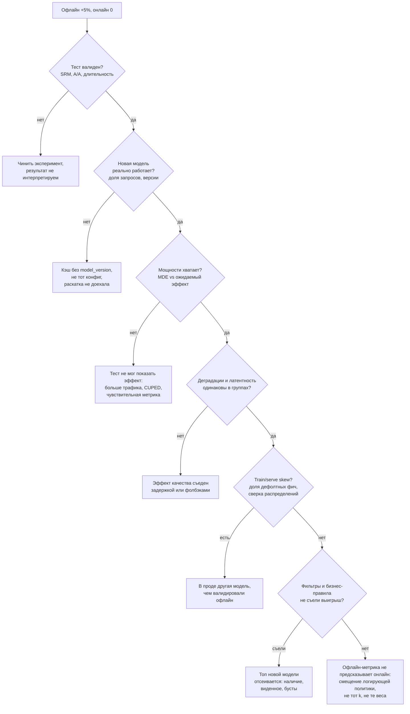

# Онлайн-оценка рекомендаций

> **Зачем эта глава.** Офлайн-метрика выросла, A/B ничего не показал — это самая частая
> ситуация в работе рекомендательной команды и любимый вопрос на собеседовании. Здесь разбирается,
> какие метрики реально двигают и сколько трафика нужно на каждую, почему CTR обманчив, как
> устроен интерливинг и почему он на порядок чувствительнее A/B, какие интерференции ломают
> A/B именно в рекомендациях, зачем нужны долгосрочные holdout-группы, как проверить связь
> офлайн↔онлайн числом и как шаг за шагом диагностировать расхождение.

**Уровень:** 🎯 middle → 🧠 middle+
**Предварительно нужно:** [офлайн-метрики рекомендаций](02-metrics-offline.md), [дизайн эксперимента](../10-ab-testing/01-experiment-design.md), [статистические критерии](../10-ab-testing/02-statistical-criteria.md), [ловушки A/B](../10-ab-testing/04-pitfalls.md), [рекомендации в продакшене](14-recsys-in-production.md)
**Время на проработку:** ~5 часов (чтение + расчёт MDE для своих метрик + сборка таблицы офлайн↔онлайн)

---

## Карта главы

- [1. Почему в рекомендациях мерить труднее, чем в любой другой ML-задаче](#1-почему-в-рекомендациях-мерить-труднее-чем-в-любой-другой-ml-задаче)
- [2. Какие метрики двигают](#2-какие-метрики-двигают)
- [3. Почему CTR обманчив](#3-почему-ctr-обманчив)
- [4. Краткосрочные и долгосрочные метрики](#4-краткосрочные-и-долгосрочные-метрики)
- [5. Интерливинг](#5-интерливинг)
- [6. Что ломает A/B именно в рекомендациях](#6-что-ломает-ab-именно-в-рекомендациях)
- [7. Holdout-группы и долгосрочный эффект](#7-holdout-группы-и-долгосрочный-эффект)
- [8. Связь офлайн и онлайн: как проверить числом](#8-связь-офлайн-и-онлайн-как-проверить-числом)
- [9. Диагностика: офлайн вырос, онлайн нет](#9-диагностика-офлайн-вырос-онлайн-нет)
- [10. Компромиссы и границы](#10-компромиссы-и-границы)
- [11. Подводные камни](#11-подводные-камни)
- [12. Проверь себя](#12-проверь-себя)
- [13. Практика](#13-практика)
- [14. Что читать дальше](#14-что-читать-дальше)

---

## 1. Почему в рекомендациях мерить труднее, чем в любой другой ML-задаче

В классификации отклика на кредит вы обучаете модель, считаете ROC-AUC на отложенной выборке
и примерно знаете, что получите в проде. В рекомендациях эта цепочка рвётся в трёх местах сразу.

**Данные для офлайн-оценки собраны предыдущей версией системы.** Вы видите отклик только
на то, что показала старая модель. Новая модель поднимает в топ объекты, которых старая
не показывала, — и для них в логах просто нет меток. Офлайн-метрика такую модель оценить
не может: она наказывает её за «не угадала то, что уже показывали». Формально это off-policy
задача (см. [эксплорацию и бандиты](13-exploration-and-bandits.md)), и именно она — корень
большинства расхождений.

**Система влияет на данные, на которых учится следующая версия.** Показали товар — получили
клик — товар стал популярнее — модель показывает его чаще. Петля обратной связи означает,
что эффект изменения растянут во времени и накапливается: за две недели теста вы видите
часть эффекта, а не весь.

**Единица рандомизации и единица предъявления не совпадают.** Рандомизируем пользователей,
а качество проявляется в отдельных показах, которых у одного пользователя сотни. Наблюдения
внутри пользователя зависимы, дисперсия ratio-метрик считается дельта-методом, и наивный
t-тест по показам даёт доверительные интервалы в разы уже настоящих.

Дальше — по порядку: сначала что мерить, потом чем мерить, потом почему это ломается.

---

## 2. Какие метрики двигают

Иерархия та же, что в любой ML-системе, но наполнение специфическое. Разберём на стенде
из [предыдущей главы](14-recsys-in-production.md): маркетплейс, 20 млн MAU, 3 млн DAU,
тест на 20% трафика — это ~1,5 млн пользователей в группе за 14 дней.

Минимальный детектируемый эффект при $\alpha = 0{,}05$, мощности $0{,}8$ и равных группах:

$$
\text{MDE} = \big(z_{1-\alpha/2} + z_{1-\beta}\big)\,\sigma\,\sqrt{\frac{2}{n}} \approx 2{,}8\,\sigma\,\sqrt{\frac{2}{n}}
$$

где $\text{MDE}$ — минимальный эффект в абсолютных единицах метрики, который тест
зафиксирует с вероятностью $1-\beta$; $z_{1-\alpha/2} = 1{,}96$ — квантиль стандартного
нормального распределения для двустороннего уровня значимости $\alpha=0{,}05$;
$z_{1-\beta} = 0{,}84$ — квантиль для мощности $1-\beta = 0{,}8$; $\sigma$ — стандартное
отклонение пользовательской метрики; $n$ — число пользователей **в одной группе**.

Подставляем $n = 1{,}5\cdot10^6$, то есть $\sqrt{2/n} = 1{,}15\cdot10^{-3}$:

| Метрика (на пользователя за 14 дней) | Среднее | $\sigma$ | MDE, абс. | MDE, отн. | Когда доступна |
|---|---|---|---|---|---|
| Клики в ленте | 12 | 20 | 0,065 | **0,54%** | сразу |
| Сессии | 9 | 11 | 0,036 | **0,40%** | сразу |
| Заказы | 0,90 | 2,4 | 0,0078 | **0,86%** | 1–3 дня (лаг доставки корзины) |
| GMV, руб. | 4200 | 21000 | 68 | **1,6%** | 1–3 дня |
| Возврат на 28-й день | 0,45 | 0,50 | 0,0016 | **0,36%** (0,16 п.п.) | 42 дня |

Эта таблица — главный практический вывод главы, и её стоит уметь воспроизвести на доске.
Из неё сразу следует несколько вещей.

**Метрики различаются по чувствительности на порядок.** Клики ловятся на уровне полпроцента,
GMV — только от 1,5%. Причина в коэффициенте вариации: у GMV $\sigma/\mu = 5$ против $1{,}7$
у кликов, потому что большинство пользователей за две недели не покупает ничего, а несколько
покупают на сотни тысяч. Тяжёлый хвост — не аномалия, а свойство метрики; винзоризация
(обрезка верхнего 0,1%) снижает дисперсию заметно и обычно оправдана, но её надо
зафиксировать заранее и применить одинаково к обеим группам.

**Удержание почти не измеримо в рамках одного теста.** Не потому, что MDE большой — он как раз
маленький, — а потому что нужно 42 календарных дня (14 дней набора + 28 дней окна возврата),
и за это время в системе успевает произойти три других выката. Удержание меряют
холдаутами (§7), а не обычными A/B.

**Единица рандомизации — только пользователь.** Соблазн рандомизировать сессии или запросы
велик: наблюдений больше, дисперсия меньше, MDE лучше в разы. Но в рекомендациях это ломает
эксперимент сразу по трём линиям. Во-первых, один и тот же человек попадает в обе группы
и переносит опыт между ними: увидел товар в тестовой сессии, купил в контрольной — эффект
размазался. Во-вторых, фильтр виденного и история сессии — общие для пользователя, то есть
группы физически взаимодействуют через состояние. В-третьих, все метрики удержания
и возврата определены на пользователе, и по сессиям их просто не посчитать. Рандомизация
по сессии допустима ровно в одном случае — когда изменение не оставляет следа в состоянии
пользователя (например, сравнение двух вариантов оформления одного блока без влияния
на историю). Всё, что касается модели, — по пользователю.

**Guardrail-метрики.** Отдельный список того, что не должно упасть: доля сессий без клика,
доля пустых и коротких выдач, разнообразие (число уникальных категорий в топ-10), покрытие
каталога (доля айтемов, получивших хотя бы один показ за сутки), доля показов недоступных
товаров, p99 латентности, доля деградаций. Guardrails проверяются односторонне и с более
мягким порогом: цель — поймать катастрофу, а не доказать улучшение.

> 💬 **На собеседовании.** Спросят: «Какую метрику вы будете двигать в A/B рекомендаций?»
> Хороший ответ — назвать лестницу и **сразу привязать к чувствительности**: «Ключевая —
> заказы или GMV, но при нашем трафике MDE по GMV около 1,5%, а типичный эффект итерации
> ранжирования — доли процента. Поэтому решение принимаем по более чувствительной прокси
> (клики, сессии, глубина), GMV держим как guardrail, чтобы не улететь в минус, а истинный
> эффект по деньгам меряем накопленно на holdout-группе». Плохой ответ: «CTR» — без
> объяснения, почему именно он и чем это опасно.

---

## 3. Почему CTR обманчив

CTR — самая удобная метрика в рекомендациях: считается мгновенно, чувствительна, напрямую
связана с тем, что оптимизирует модель. И ровно поэтому она чаще всего врёт.

**Проблема 1: знаменатель управляем.** CTR = клики / показы. Модель может увеличить CTR,
показав **меньше**: сократить выдачу с 30 карточек до 10, убрав хвост. Клики почти не упадут
(хвост и так не кликали), показы упадут втрое, CTR вырастет на десятки процентов. Абсолютное
число кликов при этом не изменилось, а пользователь получил меньше товара. Отсюда правило:
**в паре с CTR всегда смотрят абсолютные клики и показы**, а лучше — метрику на пользователя,
а не на показ.

**Проблема 2: кликбейт.** Оптимизация клика подтягивает вверх заголовки-обманки, дешёвые
товары «за 99 рублей», провокационный контент. Клики растут, заказы и удовлетворённость
падают. Это не гипотетика — это стандартный сценарий, из-за которого команды переходят
на многозадачные модели с целью $\hat p_{\text{order}} \cdot \text{price}$
(см. [нейронное ранжирование](08-neural-ranking.md)).

**Проблема 3: CTR — ratio-метрика с зависимыми наблюдениями.** Если считать t-тест
по показам, вы неявно предполагаете независимость, а показы одного пользователя сильно
скоррелированы. Правильный расчёт дисперсии для $\bar R = \sum_i c_i / \sum_i s_i$
(где $c_i$ — клики $i$-го пользователя, $s_i$ — его показы) даётся дельта-методом:

$$
\widehat{\operatorname{Var}}(\bar R) \approx \frac{1}{n\,\bar s^{2}}\Big(\hat\sigma_c^{2} - 2\bar R\,\hat\sigma_{cs} + \bar R^{2}\hat\sigma_s^{2}\Big)
$$

где $n$ — число пользователей, $\bar s$ — среднее число показов на пользователя,
$\hat\sigma_c^2$ и $\hat\sigma_s^2$ — выборочные дисперсии кликов и показов на пользователя,
$\hat\sigma_{cs}$ — их выборочная ковариация, $\bar R$ — общее отношение (глобальный CTR).
Игнорирование этой поправки — самая частая техническая ошибка в A/B-отчётах по рекомендациям:
интервалы получаются в 2–5 раз уже настоящих, и половина «значимых» результатов оказывается
шумом. Подробный вывод — в [статистических критериях](../10-ab-testing/02-statistical-criteria.md).

**Проблема 4: позиция.** CTR зависит от позиции сильнее, чем от релевантности. Если новая
модель изменила длину выдачи, размер карточек или порядок блоков на странице, CTR изменится
без всякого улучшения ранжирования. Сравнивать CTR можно только при неизменной раскладке.

> ⚠️ **Типичная ошибка.** Отчитаться «CTR +6%» и не заметить, что показов стало на 20% меньше,
> потому что новая модель чаще упирается в фильтры и отдаёт короткую выдачу. Всегда смотрите
> числитель и знаменатель раздельно — это правило спасает от большинства ложных побед
> на ratio-метриках.

---

## 4. Краткосрочные и долгосрочные метрики

Эффект рекомендательного изменения меняется во времени, и это не шум, а закономерность.

### Прокси удовлетворённости: как приблизить долгосрок краткосрочными сигналами

Удержание меряется 42 дня, клик — мгновенно, и между ними лежит слой сигналов, который
и вытягивает практическую оценку. Идея простая: искать в поведении **признаки того,
что клик оказался ошибкой**.

| Сигнал | Как считается | Что означает |
|---|---|---|
| Короткий просмотр (dwell time < 10 с с возвратом к выдаче) | доля кликов с быстрым возвратом | клик был, ценности не было — прямой аналог «отказа» |
| Длинный просмотр (dwell > 60 с, добавление в корзину/избранное) | доля кликов с положительным продолжением | взвешенный «хороший клик» |
| Явный негатив | скрытия, «не интересно», жалобы, отписки | сильный, но очень редкий сигнал |
| Сессия без клика | доля сессий, где не кликнули ничего | выдача не попала совсем |
| Возврат к поиску после ленты | доля сессий с переходом лента → поиск | рекомендации не решили задачу |

Порог «короткого просмотра» подбирается по данным, а не берётся из статьи: постройте
распределение dwell time для кликов, закончившихся заказом, и для кликов с немедленным
возвратом — граница обычно видна как провал между двумя модами (для маркетплейса это
5–15 с, для видеосервисов — десятки секунд или доля просмотра ролика). Дальше вместо
сырого CTR используют **взвешенный клик**: короткий просмотр весит 0 или отрицательно,
длинный — 1, заказ — больше. Это одно изменение обычно поднимает согласованность
онлайн-метрики с удержанием заметно сильнее, чем любая замена модели, и стоит одного
дня работы аналитика.

**Эффект новизны (novelty effect).** Пользователь замечает изменение и реагирует на сам факт
изменения. Выдача стала другой → больше кликов в первые дни. Через 1–2 недели эффект тает.
Симптом — убывающий по дням эффект. Диагностика: строим эффект по дням теста и смотрим
на тренд; если он падает и выходит на плато, ориентируемся на плато, а не на среднее.

**Эффект привыкания (primacy).** Обратная ситуация: изменение сначала мешает (сломан привычный
паттерн — «мои закладки были вот здесь»), эффект отрицательный, потом восстанавливается
и уходит в плюс. Особенно характерно для изменений интерфейса выдачи.

**Эффект обучения системы.** Специфичный для рекомендаций: новая модель начинает показывать
другие товары, эти показы попадают в логи, счётчики популярности и, при частом переобучении,
в следующую версию модели. Эффект растёт со временем. Тест на 3 дня систематически
недооценивает такие изменения.

**Практическое правило.** Минимум 14 дней (две полные недели, чтобы захватить недельную
сезонность), эффект смотрится в разбивке по дням, решение принимается по последней неделе,
если тренд явный. Отдельно считается эффект на новых пользователях — у них нет привычки,
поэтому у них нет ни новизны, ни привыкания; это чистый срез.

> 🧠 **Middle+.** Признак зрелости — сказать, что **краткосрочная и долгосрочная метрики
> могут иметь разный знак**. Агрессивная эксплуатация (показывать только то, что точно
> кликнут) даёт мгновенный рост CTR и медленно сужает интересы пользователя, снижая
> удержание через месяцы. Ровно из-за этого крупные рекомендательные команды держат
> постоянные holdout-группы (§7): это единственный способ увидеть накопленный эффект
> продукта, а не отдельной итерации.

---

## 5. Интерливинг

A/B в рекомендациях страдает от того, что пользователи очень разные: один делает 200 показов
в день, другой два. Межпользовательская дисперсия огромна и почти вся — шум относительно
эффекта ранжирования. **Интерливинг (interleaving)** убирает эту дисперсию, сравнивая два
ранжирования **внутри одной выдачи одного пользователя**.

### Team-draft interleaving

Идея из школьного дворового футбола: две команды по очереди выбирают игроков.

```python
import random

def team_draft_interleave(ranking_a, ranking_b, k=30, rng=None):
    """Team-draft interleaving (Radlinski et al., 2008).

    ranking_a, ranking_b — списки item_id, отсортированные по убыванию качества
    двумя сравниваемыми моделями. Возвращает объединённую выдачу и разметку
    'кто поставил этот айтем' — она нужна для присвоения клика.
    """
    rng = rng or random.Random()
    result, owner, used = [], [], set()
    ia = ib = 0
    while len(result) < k and (ia < len(ranking_a) or ib < len(ranking_b)):
        # Кто выбирает следующим: тот, у кого меньше выбранных; при равенстве — монетка.
        na, nb = owner.count("A"), owner.count("B")
        pick_a = na < nb or (na == nb and rng.random() < 0.5)
        src, idx = (ranking_a, ia) if pick_a else (ranking_b, ib)
        while idx < len(src) and src[idx] in used:      # пропускаем уже добавленные
            idx += 1
        if idx >= len(src):                              # источник исчерпан — отдаём ход другому
            if pick_a:
                ia = idx
                if ib >= len(ranking_b):
                    break
                pick_a = False
                src, idx = ranking_b, ib
            else:
                ib = idx
                if ia >= len(ranking_a):
                    break
                src, idx = ranking_a, ia
        item = src[idx]
        used.add(item)
        result.append(item)
        owner.append("A" if src is ranking_a else "B")
        if src is ranking_a:
            ia = idx + 1
        else:
            ib = idx + 1
    return result, owner


def preference(sessions):
    """sessions — список пар (owner, clicked) по каждой позиции каждой сессии.
    Возвращает долю сессий, где A выиграл, среди сессий с определённым исходом."""
    wins_a = wins_b = ties = 0
    for sess in sessions:
        ca = sum(1 for o, c in sess if o == "A" and c)
        cb = sum(1 for o, c in sess if o == "B" and c)
        if ca > cb:   wins_a += 1
        elif cb > ca: wins_b += 1
        elif ca + cb: ties += 1          # клики были, но поровну
    total = wins_a + wins_b + ties
    return (wins_a + 0.5 * ties) / total if total else 0.5
```

Итоговая статистика — доля побед модели A:

$$
\Delta_{AB} = \frac{w_A + \tfrac{1}{2}w_t}{w_A + w_B + w_t} - \frac{1}{2}
$$

где $w_A$ — число сессий, в которых кликов по айтемам от модели A строго больше;
$w_B$ — то же для B; $w_t$ — число сессий с ненулевым, но равным числом кликов;
$\Delta_{AB} > 0$ означает победу A. Значимость проверяется биномиальным тестом
или бутстрапом по пользователям (не по сессиям — сессии одного пользователя зависимы).

### Почему интерливинг чувствительнее

Формально — потому что это парное сравнение, а в парном сравнении вычитается общая
для обеих «рук» дисперсия:

$$
\operatorname{Var}(\bar X_A - \bar X_B) = \frac{\sigma_A^2 + \sigma_B^2 - 2\rho\,\sigma_A\sigma_B}{n}
$$

где $\bar X_A, \bar X_B$ — средние отклика на айтемы моделей A и B, $\sigma_A, \sigma_B$ —
стандартные отклонения, $\rho$ — корреляция между откликами A и B, $n$ — число единиц
наблюдения. В обычном A/B пользователи в группах разные, $\rho = 0$, и дисперсия разности
равна $2\sigma^2/n$. В интерливинге обе модели показываются **одному и тому же пользователю
в одной и той же сессии**, поэтому вся пользовательская активность («сегодня я много кликаю»)
общая, и $\rho$ доходит до $0{,}8$–$0{,}95$. При $\rho = 0{,}9$ дисперсия разности падает
в 10 раз, а так как $n \propto \operatorname{Var}$ при фиксированном MDE, **трафика нужно
в 10 раз меньше**. Публичные оценки (Chapelle и соавторы, 2012; инженерные отчёты Netflix
и Яндекса) дают выигрыш от одного до двух порядков — то есть эксперимент, требующий
двух недель в A/B, в интерливинге сходится за день.

### Чего интерливинг не умеет

- **Меряет только относительное предпочтение по кликам.** Он отвечает на вопрос «какое
  ранжирование пользователю нравится больше», а не «на сколько вырастет GMV». Абсолютного
  эффекта у него нет по построению.
- **Не ловит эффекты, зависящие от целой выдачи.** Разнообразие, длину списка, изменения
  интерфейса — нет: обе модели живут в одном перемешанном списке.
- **Не работает для непересекающихся выдач.** Если A и B отбирают совсем разные кандидаты,
  перемешивание порождает список, который не показала бы ни одна из моделей, и результат
  плохо переносится на реальность.
- **Не ловит долгосрочные эффекты** — пользователь в обеих «руках» одновременно.
- **Дороже в инженерии:** нужно на каждый запрос считать два ранжирования и корректно
  логировать авторство каждой позиции.

**Как это используют на практике.** Интерливинг — быстрый фильтр: прогнать 20 гипотез
ранжирования за неделю, отсеять 17, и только выжившие 3 отправить в полноценный A/B,
где меряется GMV, удержание и guardrails. Такая двухступенчатая схема даёт кратный рост
скорости итераций при том же трафике.

> 💬 **На собеседовании.** Спросят: «Что такое интерливинг и почему он чувствительнее A/B?»
> Хороший ответ: это внутрисессионное парное сравнение двух ранжирований, клики присваиваются
> модели-автору позиции; выигрыш по дисперсии — из-за высокой корреляции откликов внутри
> пользователя, при $\rho \approx 0{,}9$ трафика нужно на порядок меньше. И обязательно —
> ограничения: только относительное предпочтение по кликам, не меряет деньги и долгосрок,
> не работает при сильно различающихся кандидатах. Поэтому используется как быстрый
> предфильтр перед A/B, а не вместо него. Плохой ответ: «интерливинг лучше A/B».

---

## 6. Что ломает A/B именно в рекомендациях

Стандартные ловушки A/B (подглядывание, множественные сравнения, SRM) разбираются
в [ловушках A/B](../10-ab-testing/04-pitfalls.md). Здесь — то, что специфично для рекомендаций.

**Общий пул контента (интерференция через каталог).** Классическое допущение A/B — SUTVA:
исход пользователя зависит только от его группы. В рекомендациях оно нарушается через
разделяемые сущности. Тестовая группа начала активно показывать товар X → у X выросли
счётчики популярности → эти счётчики являются признаками и для контрольной модели → контроль
тоже начал показывать X. Эффект «протекает» в контроль, измеренная разница занижена
(иногда вдвое). Лечится изоляцией: счётчики и признаки популярности считаются **отдельно
по группам** (дорого, но правильно), либо для чувствительных экспериментов используется
кластерная рандомизация.

**Ограниченное предложение.** На маркетплейсе, в доставке, в аренде жилья количество товара
конечно. Если тестовая группа лучше находит дефицитные позиции, она их выкупает, и контроль
получает худший ассортимент. Эффект **завышен**: часть выигрыша — это переток, а не создание
ценности. Признак проблемы: эффект в тесте на 5% трафика заметно больше, чем в тесте на 50%.
Диагностика так и делается — прогон одного изменения на разных долях трафика.

**Каннибализация поверхностей.** Улучшили рекомендации на главной — пользователи стали меньше
пользоваться поиском. Метрика главной выросла на 8%, суммарная активность — на 0,3%.
Поэтому ключевая метрика A/B в рекомендациях всегда **общая по пользователю**, а не
по поверхности; метрика поверхности идёт вторым эшелоном, для понимания механизма.

**Обучение на данных обеих групп.** Если модель переобучается ежедневно на общих логах,
она учится на данных, порождённых обеими политиками. Это стирает границу между группами
и разбавляет эффект. Строгое решение — обучать модель теста только на данных теста
(и признавать, что данных меньше); прагматичное — фиксировать модель на время эксперимента
и не переобучать её.

**Эффект новизны** — см. §4.

**Деградации, попавшие в анализ.** Если во время теста была авария и часть выдач ушла
на фолбэк, эти показы нужно уметь исключить. Отсюда требование к логированию из
[предыдущей главы](14-recsys-in-production.md): каждая выдача помечена уровнем деградации.
Без этого получасовая проблема с Redis может стоить вам ложного отрицательного результата.

**Разная латентность у групп.** Новая модель тяжелее на 40 мс — и часть эффекта, который
вы измеряете, это эффект замедления, а не качества. Латентность — обязательный guardrail
и обязательная строка в отчёте по эксперименту.

> 💬 **На собеседовании.** Спросят: «Какие проблемы A/B специфичны для рекомендаций?»
> Хороший ответ — назвать интерференцию через общие счётчики популярности и общий каталог
> (нарушение SUTVA, эффект занижен или завышен в зависимости от механизма), каннибализацию
> поверхностей (мерим общую метрику пользователя, а не поверхности), эффект новизны,
> протечку через переобучение модели на смешанных логах и разницу в латентности.
> И назвать диагностику: прогон на разных долях трафика ловит интерференцию,
> разбивка по дням ловит новизну. Плохой ответ: перечислить общие ловушки A/B
> без привязки к рекомендациям.

---

## 7. Holdout-группы и долгосрочный эффект

Отдельные A/B меряют отдельные итерации. Но продукту нужно знать другое: **сколько всего
даёт рекомендательная система и растёт ли эта величина**. Сумма эффектов двадцати выигранных
тестов за год почти всегда сильно больше реального накопленного эффекта — из-за новизны,
взаимного перекрытия улучшений и отбора по значимости (мы фиксируем только победы,
а победы систематически завышены — эффект «проклятия победителя»).

**Долгосрочный holdout** — фиксированные 1–5% пользователей, которые в течение квартала
или года **не получают никаких улучшений** рекомендательной системы: у них заморожена версия
модели на дату начала. Разница между holdout и остальными и есть накопленный эффект команды.

Практические требования:
- **Стабильная идентификация.** Разбиение по устойчивому `user_id`, а не по кукам; иначе
  пользователи перетекают между группами и эффект размывается.
- **Заморожена вся система**, а не одна модель: индекс, признаки, правила. Иначе через месяц
  вы не сможете сказать, что именно сравниваете.
- **Изоляция признаков** — иначе счётчики популярности, порождённые основной группой,
  протекут в холдаут (см. §6) и занизят измеренный эффект.
- **Ротация раз в квартал** с периодом «отдыха»: жить с деградированным продуктом год —
  измеримый ущерб для этих пользователей и повод для оттока внутри самой holdout-группы,
  что смещает оценку.
- **Явная цена.** Холдаут в 2% при годовом эффекте рекомендаций в 10% GMV стоит
  примерно $0{,}02 \times 0{,}10 = 0{,}2\%$ годового GMV. Это надо посчитать и назвать вслух:
  холдаут — осознанная плата за знание, и разговор с бизнесом строится вокруг этой цифры.

**Почему сумма A/B не равна накопленному эффекту.** Пусть за год команда выиграла $m$
экспериментов с заявленными приростами $\hat\delta_j$. Наивная оценка годового эффекта —
$\prod_j (1+\hat\delta_j) - 1$. Реальность систематически ниже:

$$
\delta_{\text{накопл}} \;<\; \prod_{j=1}^{m}\big(1 + \hat\delta_j\big) - 1
$$

где $\delta_{\text{накопл}}$ — истинный накопленный эффект (то, что показывает холдаут);
$\hat\delta_j$ — измеренный относительный прирост $j$-го выигравшего эксперимента;
$m$ — число выкаченных изменений. Три причины разрыва: (1) **проклятие победителя** —
выкатываются только эксперименты, прошедшие порог значимости, а такой отбор смещает оценку
вверх тем сильнее, чем ближе истинный эффект к MDE; (2) **перекрытие** — два улучшения,
чинящие одну и ту же проблему, не складываются; (3) **новизна** — часть измеренного эффекта
не пережила месяц. Численно: 20 выигранных тестов по 0,3% дают наивные 6,2%, а холдаут
типично показывает 2–4%. Это не повод не запускать эксперименты, это повод не складывать
их в отчёт для руководства без холдаута.

**Обратный холдаут (reverse holdout)** — вариант для оценки цены отключения: небольшой группе,
наоборот, отключают персонализацию совсем (показывают популярное). Даёт ответ на вопрос
«сколько стоит вся персонализация», который регулярно задаёт руководство. Запускается
на короткое время и на очень малой доле — эффект обычно огромен.

---

## 8. Связь офлайн и онлайн: как проверить числом

Все выбирают модели по офлайн-метрике, потому что A/B на каждую гипотезу невозможен.
Вопрос в том, **имеет ли право эта офлайн-метрика быть гейтом**. Это проверяемо.

**Процедура.** Соберите таблицу всех проведённых экспериментов: для каждого — изменение
офлайн-метрики $\Delta_{\text{off}}$ (например, NDCG@10 на временном сплите) и изменение
ключевой онлайн-метрики $\Delta_{\text{on}}$ с доверительным интервалом. Нужно минимум
15–20 экспериментов, включая проигравшие и нейтральные, — иначе выборка отобрана по успеху
и корреляция будет фиктивной.

Считаем две вещи:

$$
\text{SA} = \frac{1}{m}\sum_{j=1}^{m}\mathbb{1}\big[\operatorname{sign}(\Delta_{\text{off}}^{(j)}) = \operatorname{sign}(\Delta_{\text{on}}^{(j)})\big], \qquad
\tau = \frac{C - D}{\tbinom{m}{2}}
$$

где $\text{SA}$ (sign agreement) — доля экспериментов, где знаки офлайн- и онлайн-изменения
совпали; $m$ — число экспериментов; $\mathbb{1}[\cdot]$ — индикатор; $\tau$ — коэффициент
ранговой корреляции Кендалла; $C$ — число согласованных пар экспериментов (одна выше другой
и по офлайну, и по онлайну), $D$ — число инверсий, $\binom{m}{2}$ — общее число пар.

**Как читать результат:**

| $\text{SA}$ | Что это значит | Что делать |
|---|---|---|
| > 0,85 | метрика — надёжный гейт | использовать как основной критерий отбора |
| 0,70–0,85 | сигнал есть, но шумный | гейт с запасом: пропускать только $\Delta_{\text{off}}$ выше порога |
| 0,5–0,7 | метрика почти не информативна | менять метрику или протокол офлайн-оценки |
| < 0,5 | метрика антикоррелирует | искать ошибку: почти всегда утечка или несоответствие протоколов |

**Что делать, если связь плохая.** По порядку вероятности причины:

1. **Офлайн-метрика считается не на том, что показывается.** NDCG@100, а пользователь видит
   10 позиций. Считайте метрику на том $k$, который реально виден.
2. **Офлайн-оценка смещена логирующей политикой.** Модель, поднимающая невиданные объекты,
   штрафуется. Лечение — контрфактуальная оценка (IPS/DR из
   [эксплорации и бандитов](13-exploration-and-bandits.md)) и небольшая доля случайной
   эксплорации в проде, дающая непредвзятый сэмпл для честной офлайн-оценки. Такой сэмпл
   в 1% трафика — самая недооценённая инвестиция рекомендательной команды.
3. **Разные распределения.** Офлайн-выборка — все пользователи, A/B — только активные
   за период. Считайте офлайн-метрику на том же срезе.
4. **Метрика не учитывает бизнес-веса.** NDCG с релевантностью «клик = 1» не знает, что заказ
   на 100 тыс. руб. ценнее клика по чехлу. Взвешенная релевантность
   (`gain = order_value`) обычно резко улучшает согласованность.
5. **Онлайн ломается по инженерным причинам** — это §9.

> 🧠 **Middle+.** Эту таблицу экспериментов стоит вести как продукт: она нужна не только
> для валидации гейта, но и для оценки «проклятия победителя». Регрессия
> $\Delta_{\text{on}}$ на $\Delta_{\text{off}}$ по историческим данным даёт коэффициент
> сжатия: если на 1% NDCG исторически приходилось 0,15% кликов, то заявленный прирост
> NDCG в 3% даёт ожидание 0,45% — и вы заранее знаете, хватит ли мощности теста.
> Это превращает разговор «давайте выкатим и посмотрим» в планирование.

---

## 9. Диагностика: офлайн вырос, онлайн нет

Самый частый сценарий в работе и один из самых частых вопросов на собеседовании.
Проходить строго по порядку — от дешёвых проверок к дорогим.



Разберём узлы содержательно.

**Шаг 1. Валиден ли сам тест.** SRM (соотношение групп отличается от заданного —
хи-квадрат на счётчиках), результаты A/A, попадание пользователей в обе группы, длительность
меньше двух недель, подглядывание. Пока это не проверено, обсуждать модель бессмысленно.

**Шаг 2. Работает ли то, что вы выкатили.** Проверяется по логам: доля ответов
с `model_version = new` в тестовой группе. Реальные причины провала на этом шаге:
ключ кэша не содержит версию модели (§9 предыдущей главы) и часть трафика обслуживается
старыми результатами; фича-флаг не долетел до части подов; конфиг с порогом не тот.

**Шаг 3. Хватало ли мощности.** Сравните MDE вашей метрики (таблица §2) с эффектом,
который вы ожидали по регрессии офлайн→онлайн (§8). Если MDE = 1,6%, а ожидаемый
эффект 0,4%, то «онлайн нет» — это не результат, это отсутствие результата.
Что делать: чувствительная прокси-метрика, CUPED (обычно −20…40% дисперсии,
см. [снижение дисперсии](../10-ab-testing/03-variance-reduction.md)), интерливинг (§5),
больше трафика или дольше тест.

**Шаг 4. Латентность и деградации.** Сравните p50/p99 и `degradation_rate` между группами.
Более тяжёлая модель может съесть весь выигрыш: замедление на сотню миллисекунд стоит
заметной части конверсии в любой крупной системе — этот эффект многократно воспроизводился
в публичных экспериментах поисковиков и маркетплейсов.

**Шаг 5. Train/serve skew.** Возьмите сэмпл боевых запросов, пересчитайте признаки офлайн-путём
и сравните с тем, что реально ушло в модель. Смотрите долю дефолтов/`NaN`, расхождение
распределений (PSI, см. [дрифт данных](../09-monitoring/03-drift-detection.md)) и
предсказания: гистограмма скоров в проде должна совпадать с гистограммой на валидации.
Если не совпадает — вы валидировали одну модель, а в проде работает другая.

**Шаг 6. Фильтры и правила съели выигрыш.** Очень частая и очень незаметная причина.
Новая модель подняла в топ товары, которые отсеиваются на постобработке: нет в наличии,
уже виденные, ограниченные по региону. Проверка: доля отсева топ-10 до фильтров, отдельно
по группам. Второй вариант той же болезни — **изменился масштаб скоров**: новая модель
калибрована иначе, и множители бизнес-правил $b_r$ из §8 предыдущей главы теперь дают
совсем другой сдвиг. Проверка: сравните распределение финального скора и долю позиций,
где решение определилось правилом, а не моделью.

**Шаг 7. Офлайн-метрика просто не предсказывает онлайн.** Если предыдущие шесть проверок
чистые, проблема в метрике или протоколе: не тот $k$, не те веса релевантности, смещение
логирующей политики, случайный сплит вместо временного. Это §8.

> 💬 **На собеседовании.** Спросят: «Офлайн NDCG вырос на 5%, A/B не показал ничего.
> Что делаете?» Хороший ответ — назвать порядок проверок, а не гипотезу: сначала валидность
> теста (SRM, длительность, A/A), потом «доехала ли модель» (версии в логах, кэш без версии),
> потом мощность (MDE против ожидаемого эффекта по исторической регрессии офлайн→онлайн),
> потом латентность и деградации, потом train/serve skew, потом фильтры и бизнес-правила,
> и только в конце — сомнение в самой офлайн-метрике. Отдельный балл — упомянуть,
> что метрика на позициях, которых пользователь не видит, растёт «бесплатно».
> Плохой ответ: «значит, офлайн-метрика плохая» первой фразой — это последняя гипотеза,
> а не первая.

---

## 10. Компромиссы и границы

Сводка, какой инструмент под какую задачу — её удобно держать в голове целиком:

| Инструмент | Что меряет | Типичный срок | Когда выбирают | Чего не даст |
|---|---|---|---|---|
| Офлайн-метрика | порядок на исторических логах | часы | отбор из десятков вариантов, гейт CI | смещена логирующей политикой, не даёт денег |
| Интерливинг | относительное предпочтение по кликам | 1–3 дня | быстрый отсев гипотез ранжирования | абсолютного эффекта, денег, долгосрока |
| A/B по пользователям | абсолютный эффект на все метрики | 14 дней | решение о выкате | эффектов меньше MDE, долгосрока |
| Кластерный A/B / switchback | эффект при сильной интерференции | 2–4 недели | конкуренция за предложение, маркетплейсы | мощность заметно ниже обычного A/B |
| Бандиты | распределение трафика в пользу лучшего | непрерывно | много вариантов, короткий горизонт, контент с быстрым устареванием | честной оценки эффекта каждого варианта |
| Долгосрочный holdout | накопленный эффект системы | квартал–год | отчёт о ценности команды, долгие эффекты | эффекта отдельной итерации |

Про бандиты и границу «бандиты вместо A/B» — [эксплорация и бандиты](13-exploration-and-bandits.md)
и [бандиты против A/B](../10-ab-testing/06-bandits-vs-ab.md).

**Чувствительность против валидности.** Чем ближе метрика к модели (клики, интерливинг),
тем быстрее вы её двигаете и тем меньше уверенность, что двигаете нужное. Чем ближе к деньгам
и удержанию, тем медленнее и дороже. Рабочая схема — двухступенчатая: чувствительная метрика
для отбора, деньги и удержание для подтверждения и как guardrail.

**Скорость итераций против накопленного качества.** Двадцать выигранных A/B по 0,3% не дают
6%. Единственный способ узнать реальную сумму — holdout, и он стоит денег. Команды,
которые его не держат, через год не могут ответить на вопрос «а сколько вы вообще принесли»,
и это регулярно заканчивается сокращением команды.

**Интерливинг против A/B.** Интерливинг заменяет A/B только на этапе отбора ранжирующих
гипотез. Всё, что меняет набор кандидатов, длину выдачи, интерфейс или экономику,
меряется только A/B.

**Где онлайн-оценка не нужна.** При трафике меньше нескольких тысяч пользователей в сутки
A/B на 1% эффекта нереализуем в принципе: MDE будет десятки процентов. В такой ситуации
честнее принимать решения по офлайн-метрике и здравому смыслу, оставив A/B для больших
изменений, и прямо сказать об этом, а не имитировать статистику.

---

## 11. Подводные камни

**Победа на метрике поверхности при нулевой общей.**
Симптом: CTR ленты +8%, общее число заказов не изменилось.
Причина: каннибализация — пользователи перешли из поиска в ленту.
Что делать: ключевая метрика — общая по пользователю; метрика поверхности только
для объяснения механизма. Обязательно смотреть метрики соседних поверхностей как guardrails.

**Значимость появилась на 4-й день и исчезла на 10-й.**
Симптом: «мы победили» в понедельник, «мы проиграли» в четверг.
Причина: подглядывание с множественными проверками, эффект новизны.
Что делать: фиксировать длительность заранее; при необходимости смотреть промежуточно —
использовать последовательные тесты с корректными границами; смотреть эффект по дням.

**Эффект уменьшается при увеличении доли трафика.**
Симптом: на 5% трафика +2%, на 50% +0,7%.
Причина: интерференция через общий каталог или через счётчики популярности.
Что делать: изолировать признаки по группам, рассматривать кластерную рандомизацию,
считать «правдой» результат на большей доле.

**Доверительные интервалы подозрительно узкие.**
Симптом: значимость на эффекте 0,05%.
Причина: дисперсия ratio-метрики посчитана по показам, а не по пользователям (§3).
Что делать: дельта-метод или бутстрап по пользователям; A/A-тест как проверка —
если в A/A есть «значимые» различия, ваш критерий сломан.

**Holdout-группа со временем «догоняет» основную.**
Симптом: измеряемый эффект холдаута падает без причин.
Причина: протечка — общие признаки популярности, общие модели соседних поверхностей,
пользователи меняют устройства и перетекают между группами.
Что делать: изоляция признаков, устойчивая идентификация, регулярный A/A внутри холдаута.

**Метрика разнообразия упала, никто не заметил.**
Симптом: через три месяца выдача выродилась в один сегмент товаров, жалобы, отток.
Причина: guardrails по разнообразию и покрытию каталога не были в отчёте по эксперименту.
Что делать: включить в стандартный отчёт покрытие каталога, долю хвостовых товаров,
число уникальных категорий в топ-10 и концентрацию по продавцам. Обратная связь
рекомендательных систем схлопывает выдачу медленно, отдельный A/B этого не показывает
(см. [холодный старт и смещения](12-cold-start-and-bias.md)).

---

## 12. Проверь себя

<details>
<summary><b>🎯 Вопрос.</b> Почему CTR — плохая ключевая метрика рекомендаций?</summary>

**Короткий ответ.** Знаменатель управляем (можно вырастить CTR, показав меньше), оптимизация
клика тянет к кликбейту и дешёвым товарам, это ratio-метрика с зависимыми наблюдениями
(нужен дельта-метод), и она сильно зависит от позиции и раскладки, а не только от качества.

**Развёрнуто.** Самый простой способ «выиграть» по CTR — сократить выдачу с 30 карточек
до 10: клики почти не упадут, показы упадут втрое. Поэтому CTR всегда смотрится вместе
с абсолютными кликами и показами, а лучше заменяется метрикой на пользователя. Второй
уровень проблемы — расхождение с бизнесом: клик по товару за 99 рублей и заказ на 100 тысяч
весят одинаково. Третий — техника: t-тест по показам занижает дисперсию в разы, потому
что показы одного пользователя зависимы. CTR остаётся полезен как чувствительная прокси
и как диагностический инструмент, но не как единственный критерий решения.

**Чего ждёт интервьюер:** что вы понимаете и продуктовую, и статистическую сторону.

**Провал:** «CTR — стандартная метрика рекомендаций» без оговорок.
</details>

<details>
<summary><b>🎯 Вопрос.</b> Какие метрики вы будете смотреть в A/B рекомендательной модели?</summary>

**Короткий ответ.** Ключевая — заказы или GMV на пользователя; чувствительные прокси —
клики, сессии, глубина просмотра; guardrails — латентность p99, доля деградаций, доля
сессий без клика, разнообразие и покрытие каталога, доля показов недоступных товаров,
метрики соседних поверхностей.

**Развёрнуто.** Выбор ключевой метрики упирается в мощность. При 1,5 млн пользователей
в группе MDE по кликам ~0,5%, по GMV ~1,6%, потому что коэффициент вариации у GMV в три
раза выше (большинство не покупает, единицы покупают на сотни тысяч). Типичный эффект
итерации ранжирования — доли процента, поэтому решение принимается по прокси, а GMV
работает как guardrail «не улетели в минус». Долгосрочный эффект по деньгам и удержанию
меряется накопленно на holdout-группе, а не отдельным тестом. Метрики соседних поверхностей
обязательны из-за каннибализации.

**Чего ждёт интервьюер:** привязку выбора метрики к чувствительности и объёму трафика.

**Провал:** список метрик без разговора о том, какую из них тест физически способен уловить.
</details>

<details>
<summary><b>🧠 Вопрос.</b> Что такое интерливинг и за счёт чего он чувствительнее A/B?</summary>

**Короткий ответ.** Перемешивание двух ранжирований в одной выдаче с запоминанием авторства
каждой позиции; клики присваиваются модели-автору. Чувствительнее, потому что это парное
сравнение внутри пользователя: общая пользовательская дисперсия сокращается.

**Развёрнуто.** Team-draft interleaving: модели по очереди «выбирают игроков» в общий список,
очерёдность рандомизируется, дубликаты пропускаются; сессия засчитывается победой той модели,
по чьим позициям было больше кликов. Математика выигрыша:
$\operatorname{Var}(\bar X_A - \bar X_B) = (\sigma_A^2+\sigma_B^2-2\rho\sigma_A\sigma_B)/n$;
в A/B $\rho=0$, в интерливинге $\rho \approx 0{,}9$, дисперсия падает примерно в 10 раз,
а значит и трафика нужно в 10 раз меньше. Публичные оценки дают выигрыш от 10 до 100 раз.
Ограничения обязательны к упоминанию: меряет только относительное предпочтение по кликам,
не даёт абсолютного эффекта на деньги, не работает для эффектов уровня всей выдачи
(разнообразие, длина списка, интерфейс), не ловит долгосрочные эффекты. Используется
как быстрый предфильтр перед A/B.

**Чего ждёт интервьюер:** механику присвоения кликов и объяснение через корреляцию,
а не «он просто точнее».

**Провал:** «интерливинг лучше A/B, им всё и меряем».
</details>

<details>
<summary><b>🧠 Вопрос.</b> Офлайн-метрика выросла на 5%, A/B не показал эффекта. Ваши действия?</summary>

**Короткий ответ.** Иду по чек-листу от дешёвого к дорогому: валидность теста (SRM,
длительность, A/A) → доехала ли модель (версии в логах, кэш без `model_version`) →
хватало ли мощности (MDE против ожидаемого эффекта) → латентность и деградации →
train/serve skew → фильтры и бизнес-правила → и только в конце сомнение в офлайн-метрике.

**Развёрнуто.** Порядок важнее списка. Самые частые находки на практике: кэш без версии
модели (треть трафика обслуживается старым результатом), тест без мощности (MDE 1,6%
при ожидаемом эффекте 0,4%), новая модель на 40 мс медленнее, и постобработка съедает
выигрыш — новая модель поднимает в топ то, что отсеивается фильтром наличия или виденного.
Отдельная тонкая причина: у новой модели другой масштаб скоров, и множители бизнес-правил
теперь сдвигают выдачу иначе, чем на валидации. Если всё чисто — проблема в самой
офлайн-метрике: считается на $k$, который пользователь не видит; смещена логирующей политикой
(новая модель поднимает то, что никогда не показывалось, и меток для этого нет);
не учитывает бизнес-веса.

**Чего ждёт интервьюер:** систематичность. Кандидат, который сразу говорит «офлайн-метрика
плохая», не умеет отлаживать продакшен.

**Провал:** одна гипотеза вместо процедуры.
</details>

<details>
<summary><b>🎯 Вопрос.</b> Как проверить, что офлайн-метрика вообще предсказывает онлайн?</summary>

**Короткий ответ.** Собрать историю 15–20 экспериментов с парами
$(\Delta_{\text{offline}}, \Delta_{\text{online}})$, включая проигравшие, и посчитать долю
совпадения знаков и ранговую корреляцию Кендалла. SA выше 0,85 — метрика годится как гейт,
0,5–0,7 — почти не информативна.

**Развёрнуто.** Ключевая деталь — включать в таблицу **все** эксперименты, а не только
успешные: выборка, отобранная по успеху, даст фиктивную корреляцию. Дополнительная польза:
регрессия $\Delta_{\text{on}}$ на $\Delta_{\text{off}}$ даёт коэффициент пересчёта
и позволяет заранее оценить, хватит ли мощности теста. Если связь плохая, причины
по убыванию вероятности: метрика считается на позициях, которых пользователь не видит;
офлайн-оценка смещена логирующей политикой (лечится IPS/DR и долей случайной эксплорации
в проде); разные срезы пользователей офлайн и в A/B; релевантность без бизнес-весов.

**Чего ждёт интервьюер:** что вы относитесь к офлайн-метрике как к гипотезе, требующей
проверки, а не как к данности.

**Провал:** «NDCG — стандартная метрика, она коррелирует».
</details>

<details>
<summary><b>🧠 Вопрос.</b> Как измерить долгосрочный эффект рекомендательной системы?</summary>

**Короткий ответ.** Долгосрочный holdout: 1–5% пользователей с замороженной версией системы
на квартал или год; разница с остальными — накопленный эффект. Отдельно — обратный холдаут
с полностью отключённой персонализацией для оценки цены всей системы.

**Развёрнуто.** Нужен потому, что сумма эффектов выигранных A/B систематически больше
реального накопленного: мешают новизна, перекрытие улучшений и «проклятие победителя»
(фиксируются только значимые результаты, а они смещены вверх). Требования к реализации:
устойчивая идентификация пользователей (не куки), заморозка всей системы, а не одной модели,
изоляция признаков и счётчиков (иначе эффект основной группы протечёт в холдаут),
ротация раз в квартал. И обязательно — назвать цену: холдаут 2% при эффекте рекомендаций
10% GMV стоит около 0,2% годового GMV; это осознанная плата за знание, и с бизнесом
разговор ведётся именно в этих цифрах.

**Чего ждёт интервьюер:** понимания, что отдельные A/B не складываются, и умения назвать
стоимость решения.

**Провал:** «будем смотреть удержание в A/B» — за 14 дней его не увидеть.
</details>

<details>
<summary><b>🧠 Вопрос.</b> Что такое эффект новизны и как его отличить от настоящего эффекта?</summary>

**Короткий ответ.** Пользователь реагирует на сам факт изменения, а не на его качество:
эффект большой в первые дни и тает за 1–2 недели. Диагностика — эффект в разбивке по дням
и отдельный срез новых пользователей, у которых привычки нет.

**Развёрнуто.** Бывает и обратный эффект — привыкания: изменение сначала ломает привычный
паттерн, эффект отрицательный, потом восстанавливается. И третий, специфичный для
рекомендаций: эффект обучения системы, когда изменение накапливается через логи и счётчики
и **растёт** со временем — короткий тест его недооценивает. Практика: минимум 14 дней,
эффект по дням, решение по последней неделе при явном тренде, срез новых пользователей
как контроль. Если эффект целиком лежит в первых трёх днях и уходит в ноль — это новизна,
и выкатывать нечего.

**Чего ждёт интервьюер:** что вы не принимаете решение по первым дням теста.

**Провал:** «через три дня эффект +5%, катим».
</details>

<details>
<summary><b>🎯 Вопрос.</b> Почему нельзя считать значимость CTR t-тестом по показам?</summary>

**Короткий ответ.** Показы одного пользователя зависимы, а единица рандомизации —
пользователь. Тест по показам считает их независимыми, занижает дисперсию в разы и даёт
ложную значимость.

**Развёрнуто.** CTR — отношение сумм: $\bar R = \sum_i c_i/\sum_i s_i$. Его дисперсия
считается дельта-методом через дисперсии и ковариацию кликов и показов на пользователя,
либо бутстрапом по пользователям. Практическая проверка исправности критерия — A/A-тест:
если в A/A вы регулярно получаете «значимые» различия, дисперсия посчитана неверно.
Ошибка настолько распространена, что её стоит проверять в чужих отчётах первым делом.

**Чего ждёт интервьюер:** знания, что единица анализа должна совпадать с единицей
рандомизации, и что для ratio-метрик нужна поправка.

**Провал:** «показов много, ЦПТ работает» — ЦПТ здесь ни при чём, проблема в зависимости.
</details>

<details>
<summary><b>🧠 Вопрос.</b> Эффект на 5% трафика +2%, на 50% трафика +0,7%. Что происходит?</summary>

**Короткий ответ.** Интерференция между группами: нарушено допущение SUTVA. Скорее всего
конкуренция за ограниченное предложение (тестовая группа выкупает дефицитные позиции)
или протечка через общие признаки популярности.

**Развёрнуто.** Два механизма дают разное направление ошибки. Конкуренция за предложение
**завышает** эффект на малой доле: выигрыш частично состоит из перетока товара
от контрольной группы, а не из создания ценности; при 50% перетекать некуда, и эффект
падает до истинного. Протечка через общие счётчики популярности, наоборот, **занижает**
эффект: контроль подхватывает поведение теста через признаки. Практическое правило:
верить результату на большей доле, а для чувствительных экспериментов изолировать
счётчики по группам или переходить к кластерной рандомизации; на маркетплейсах
с сильной конкуренцией за предложение — рассматривать switchback
(см. [сложные схемы](../10-ab-testing/05-complex-designs.md)).

**Чего ждёт интервьюер:** узнавания интерференции и понимания, в какую сторону она смещает.

**Провал:** «на 50% просто больше шума» — это ровно наоборот.
</details>

<details>
<summary><b>🎯 Вопрос.</b> Какие guardrail-метрики обязательны в A/B рекомендаций?</summary>

**Короткий ответ.** Латентность p99, доля деградаций, доля сессий без клика, доля пустых
и коротких выдач, разнообразие (уникальные категории в топ-10) и покрытие каталога,
доля показов недоступных товаров, метрики соседних поверхностей.

**Развёрнуто.** Логика такая: guardrails ловят катастрофы и системные побочные эффекты,
которые ключевая метрика не видит. Латентность — потому что более тяжёлая модель съедает
собственный выигрыш. Разнообразие и покрытие — потому что схлопывание выдачи развивается
месяцами и в отдельном A/B незаметно, но именно оно убивает систему в долгую через петлю
обратной связи. Метрики соседних поверхностей — из-за каннибализации: рост ленты может
быть переносом активности из поиска. Проверяются односторонне и с более мягким порогом,
чем ключевая метрика: задача — не пропустить катастрофу, а не доказать улучшение.

**Чего ждёт интервьюер:** что вы думаете о побочных эффектах, а не только о целевой метрике.

**Провал:** назвать только латентность и ошибки.
</details>

---

## 13. Практика

**Задача 1. Таблица MDE для своих метрик (60 минут).**
Возьмите выгрузку пользовательских метрик за 14 дней, посчитайте среднее и стандартное
отклонение для 5 ключевых метрик и заполните таблицу из §2 для своих объёмов трафика.
*Сделано правильно: вы можете назвать, какой эффект ваш стандартный тест физически способен
уловить по каждой метрике, и обнаружили минимум одну метрику, по которой обычные тесты
не имеют мощности вовсе.*

**Задача 2. Дельта-метод против наивного теста (90 минут).**
На тех же данных проведите 200 A/A-тестов (случайное разбиение пользователей пополам)
и посчитайте долю «значимых» различий по CTR двумя способами: t-тестом по показам
и дельта-методом (или бутстрапом) по пользователям.
*Сделано правильно: по дельта-методу доля значимых близка к 5%, по показам — заметно выше
(обычно 15–40%). Вы измерили цену ошибки, а не поверили на слово.*

**Задача 3. Team-draft interleaving (2 часа).**
Реализуйте функции из §5, прогоните на двух ранжированиях (например, популярное против
персонального) на логах, посчитайте $\Delta_{AB}$ и доверительный интервал бутстрапом
по пользователям. Затем оцените, сколько пользователей понадобилось бы на тот же эффект
в A/B.
*Сделано правильно: интервал не накрывает 0 при заведомо разных моделях; оценка выигрыша
по трафику получилась в диапазоне 5–50 раз.*

**Задача 4. Таблица офлайн↔онлайн (2 часа, командная).**
Соберите историю последних 20 экспериментов вашей команды с парами
$(\Delta_{\text{offline}}, \Delta_{\text{online}})$, включая проигравшие, посчитайте
sign agreement и $\tau$ Кендалла, постройте регрессию.
*Сделано правильно: у вас есть число, а не мнение; вы можете сказать, во сколько раз
«переводится» офлайн-прирост в онлайновый, и знаете, годится ли метрика как гейт.*

**Задача 5. Разбор реального теста (60 минут).**
Возьмите последний эксперимент, где офлайн вырос, а онлайн нет, и пройдите чек-лист §9
по всем семи узлам, записывая проверку и результат.
*Сделано правильно: вы нашли, на каком узле останавливается диагностика, и знаете
следующий шаг; если дошли до седьмого узла — у вас есть конкретная гипотеза о том,
что менять в офлайн-протоколе.*

---

## 14. Что читать дальше

- **Kohavi, Tang, Xu. «Trustworthy Online Controlled Experiments» (Cambridge University Press, 2020)** —
  основная книга по онлайн-экспериментам. Главы про метрики, интерференцию и долгосрочные
  эффекты продолжают §4, §6 и §7.
- **Radlinski, Kurup, Joachims. «How Does Clickthrough Data Reflect Retrieval Quality?» (CIKM 2008)** —
  первоисточник team-draft interleaving; там же разобрано, почему наивное перемешивание
  даёт смещение.
- **Chapelle, Joachims, Radlinski, Yue. «Large-Scale Validation and Analysis of Interleaved
  Search Evaluation» (ACM TOIS, 2012)** — масштабная проверка интерливинга на боевом трафике
  и количественные оценки выигрыша по чувствительности; ищите по названию.
- **Dmitriev, Gupta, Kim, Vaz. «A Dirty Dozen: Twelve Common Metric Interpretation Pitfalls
  in Online Controlled Experiments» (KDD 2017)** — двенадцать разобранных ошибок интерпретации,
  большая часть из которых встречается именно в рекомендациях.
- **Deng, Xu, Kohavi, Walker. «Improving the Sensitivity of Online Controlled Experiments
  by Utilizing Pre-Experiment Data» (WSDM 2013)** — оригинальная статья про CUPED;
  прямое продолжение §9, шаг «не хватило мощности». См. также
  [снижение дисперсии](../10-ab-testing/03-variance-reduction.md).
- **Gomez-Uribe, Hunt. «The Netflix Recommender System: Algorithms, Business Value,
  and Innovation» (ACM TMIS, 2015)** — как рекомендательная команда связывает офлайн-оценку,
  A/B и долгосрочную бизнес-ценность; полезно как образец разговора о деньгах.
- [Eugene Yan. «Applied ML»](https://github.com/eugeneyan/applied-ml) — раздел про
  эксперименты и метрики: инженерные разборы от компаний с описанием реальных протоколов
  онлайн-оценки.

---

⬅️ [Рекомендации в продакшене](14-recsys-in-production.md) | 🏠 [Оглавление](../index.md) | ➡️ [Жизненный цикл ML-системы](../07-mlops/01-ml-lifecycle.md)
