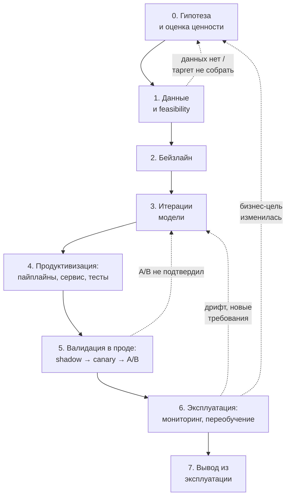

# Жизненный цикл ML-системы

> **Зачем эта глава.** Обучение модели занимает 5–10% времени жизни ML-системы и почти ничего
> не стоит по сравнению с её эксплуатацией. Здесь разбираем полный цикл — от гипотезы
> до вывода из эксплуатации, кто за что отвечает, какие виды технического долга накапливает
> ML-система (по классической статье Google) и как понять, на каком уровне зрелости MLOps
> находится ваша команда. После главы вы сможете внятно ответить на вопрос «расскажите,
> как у вас устроен путь модели от идеи до прода» — его задают почти на каждом собеседовании.

**Уровень:** 🎯 middle → 🧠 middle+
**Предварительно нужно:** [валидация и утечки](../02-classic-ml/13-validation-and-leakage.md), [метрики](../02-classic-ml/04-metrics.md), [ML System Design](../11-system-design/01-framework.md)
**Время на проработку:** ~3 часа

---

## Карта главы

- [1. Почему «обучил модель» — это ещё не система](#1-почему-обучил-модель--это-ещё-не-система)
- [2. Восемь стадий жизненного цикла](#2-восемь-стадий-жизненного-цикла)
- [3. Роли и зоны ответственности](#3-роли-и-зоны-ответственности)
- [4. Технический долг ML: разбор статьи Google](#4-технический-долг-ml-разбор-статьи-google)
- [5. Стоимость владения в числах](#5-стоимость-владения-в-числах)
- [6. Уровни зрелости MLOps 0 / 1 / 2](#6-уровни-зрелости-mlops-0--1--2)
- [7. Что ломается на каждой стадии](#7-что-ломается-на-каждой-стадии)
- [8. Антипаттерн «ноутбук в проде»](#8-антипаттерн-ноутбук-в-проде)
- [9. Вывод из эксплуатации](#9-вывод-из-эксплуатации)
- [10. Подводные камни](#10-подводные-камни)
- [11. Проверь себя](#11-проверь-себя)
- [12. Практика](#12-практика)
- [13. Что читать дальше](#13-что-читать-дальше)

---

## 1. Почему «обучил модель» — это ещё не система

Возьмём конкретную ситуацию. Данные-сайентист за три недели собрал датасет из 40 млн транзакций,
обучил CatBoost, получил ROC-AUC 0.94 против 0.87 у текущего правила, показал ноутбук
на демо. Все довольны. Дальше начинается то, что занимает следующие четыре месяца:

- признак `chargeback_cnt_90d` в проде недоступен: чарджбэки приезжают из банка с задержкой
  3–14 дней, а в обучающем датасете они лежали уже посчитанными на дату транзакции
  (см. [point-in-time correctness](03-data-and-feature-store.md));
- пайплайн подготовки данных — это шесть ячеек ноутбука, которые надо переписать так, чтобы
  они выполнялись при 3000 RPS за 40 мс, а не за 12 минут на pandas;
- модель весит 180 МБ, стартует 8 секунд, а Kubernetes убивает под, если readiness-проба
  не отвечает за 5 секунд;
- никто не знает, на какой именно версии данных получен AUC 0.94, потому что таблица
  `dwh.transactions` с тех пор дважды пересчитывалась задним числом;
- когда через два месяца модель просядет, никто не поймёт этого, потому что метрику качества
  в проде считать не с чем — разметки нет.

Классическая иллюстрация к этому — рисунок из статьи Sculley et al. «Hidden Technical Debt
in Machine Learning Systems» (NeurIPS 2015): маленькая коробочка «ML Code» в окружении
десятка больших коробок — сбор данных, конфигурация, сервинг, мониторинг, управление ресурсами,
инфраструктура. Авторы формулируют это прямо: зрелая ML-система состоит **максимум на 5%
из ML-кода и минимум на 95% из связующего кода**.

Отсюда практический вывод, который стоит держать в голове весь раздел: **основная стоимость
ML-системы — не обучение, а владение.** Модель, которую нельзя переобучить одной командой,
нельзя откатить за пять минут и нельзя продиагностировать при инциденте, стоит компании
дороже, чем приносит, — независимо от её AUC.

> 💬 **На собеседовании.** Спросят: «Сколько времени в ML-проекте занимает собственно обучение
> модели?» Хороший ответ: по нашему опыту — порядка 10–20% календарного времени и заметно
> меньше по трудозатратам на горизонте года; основное уходит на данные (доступ, качество,
> point-in-time-корректность), на продуктивизацию (сервинг, пайплайны, тесты) и на эксплуатацию
> (мониторинг, инциденты, переобучение). И дальше — конкретика: «В последнем проекте
> из 5 месяцев до первого A/B обучение заняло 3 недели, а сборка корректного датасета — 7».
> Плохой ответ: «Ну, основное время — подбор гиперпараметров».

---

## 2. Восемь стадий жизненного цикла

Цикл не линейный — он с обратными связями, и это принципиально. Стрелка «назад» из эксплуатации
в постановку задачи — не признак провала, а нормальный режим работы.



У каждой стадии должен быть **критерий выхода** — иначе проект зависает. Ниже — рабочая таблица
с типовыми сроками для команды из 2–3 человек и продуктовой задачи среднего размера.

| Стадия | Что делаем | Критерий выхода | Типичный срок |
|---|---|---|---|
| **0. Гипотеза** | формулируем бизнес-задачу, оцениваем размер эффекта, ищем неML-решение | есть оценка «сколько денег/времени это принесёт» и решение «не делать ML» отвергнуто осознанно | 3–10 дней |
| **1. Данные** | ищем источники, проверяем, что таргет вообще собирается, считаем объёмы | датасет собран, утечек нет, известны задержки прихода признаков и таргета | 2–5 недель |
| **2. Бейзлайн** | правило / популярное / логрег на 10 признаках | есть число, с которым сравниваем всё дальнейшее, и оно посчитано на честном временном сплите | 3–7 дней |
| **3. Итерации** | признаки, модели, тюнинг | офлайн-метрика перестала расти быстрее, чем на 0.5% за неделю работы | 3–8 недель |
| **4. Продуктивизация** | пайплайн обучения, сервис, тесты, CI/CD, логирование | модель поднимается из реестра одной командой, есть тесты и дашборд | 3–6 недель |
| **5. Валидация в проде** | shadow → канарейка 1–5% → A/B | A/B показал эффект с нужной мощностью, guardrails не упали | 2–6 недель |
| **6. Эксплуатация** | мониторинг, инциденты, переобучение | (стадия не заканчивается) | месяцы–годы |
| **7. Вывод** | отключение, архивация, снятие зависимостей | ни один потребитель не читает выход модели, данные и артефакты заархивированы | 1–3 недели |

> 🌱 **База.** Если запомнить из главы одну вещь — вот она: **стадия 2 (бейзлайн) не пропускается
> никогда.** Без числа, с которым сравнивают, любые дальнейшие 0.93 AUC бессмысленны: может
> оказаться, что правило «сумма > 50 000 и новый получатель» даёт 0.91 и не требует ни обучения,
> ни мониторинга, ни дежурства.

Обратите внимание на асимметрию сроков: стадии 0–3 (то, чему учат) занимают примерно половину
времени до первого запуска, а стадии 4–5 (то, чему не учат) — вторую половину. Стадия 6 длиннее
всех остальных вместе взятых.

> 🧠 **Middle+.** Есть тонкость про порядок стадий. Каноническая схема предполагает
> «сначала модель, потом продуктивизация», и это часто ошибка. Более здоровый порядок:
> **сначала пустая труба, потом модель.** То есть на стадии 2 в прод выкатывается бейзлайн
> (пусть даже константа или правило) через тот самый пайплайн, который потом будет носить
> нормальную модель. Так вы за неделю узнаёте про недоступные в проде признаки, про
> задержки, про лимиты латентности — вместо того чтобы узнать про них через три месяца,
> когда переделывать дорого. Это же ответ на популярный вопрос «как бы вы снизили риск
> ML-проекта».

---

## 3. Роли и зоны ответственности

На собеседовании часто спрашивают: «Чем MLE отличается от DS и от DE?» Ответ «MLE больше
кодит» — слабый. Правильная рамка — **по зоне ответственности за артефакт**.

| Роль | Владеет артефактом | Отвечает за | Ключевой вопрос к ней |
|---|---|---|---|
| **DE** (data engineer) | таблицы в DWH, ETL, стриминг | свежесть, полнота, схема, SLA на поставку данных | «данные приехали вовремя и в нужном формате?» |
| **DS** (data scientist) | гипотезы, датасет для обучения, модель | корректность постановки, отсутствие утечек, качество офлайн | «модель вообще решает бизнес-задачу?» |
| **MLE** (ML engineer) | пайплайн обучения, сервис инференса, фичи в проде | воспроизводимость, латентность, отсутствие train/serve skew, откат | «эту модель можно пересобрать и откатить?» |
| **SRE / Platform** | кластер, деплой, наблюдаемость | доступность, ресурсы, алерты инфраструктуры, дежурство | «сервис жив и укладывается в SLO?» |
| **Аналитик / PM** | метрики продукта, A/B | правильность эксперимента и решения по нему | «эффект реальный и он нам нужен?» |

Границы в реальных компаниях плавают, и это нормально. Что **не** нормально — когда зона
между DS и MLE ничья. Классический разрыв: DS считает, что его работа закончилась на ноутбуке
с метрикой, MLE считает, что его работа начинается с готовой модели, а между ними лежит
сборка обучающего датасета — самая уязвимая часть системы. Практическое правило:
**за обучающий датасет и за фичи в проде отвечает один человек или одна пара**, иначе
train/serve skew неизбежен.

Способ закрыть разрыв дёшево — договориться не о зонах, а об **артефактах передачи**.
Что именно передаётся между ролями, чтобы приёмка была объективной:

| Переход | Артефакт передачи | Критерий приёмки |
|---|---|---|
| DE → DS | таблица + контракт данных (схема, SLA свежести, владелец) | данные за 30 дней приходят к 06:00, доля `NULL` по ключевым полям стабильна |
| DS → MLE | обучающий датасет + скрипт его сборки + список признаков с задержками доступности | датасет пересобирается одной командой из репозитория, все признаки доступны в проде |
| MLE → SRE | образ + манифесты + probes + дашборд + runbook | нагрузочный тест: p99 в бюджете при пиковом RPS; под переживает рестарт |
| MLE → аналитик | модель в реестре + описание изменений + гипотеза A/B | понятно, какая метрика должна вырасти и на сколько |

Строка «DS → MLE» — самая важная. Формулировка «список признаков **с задержками
доступности**» стоит того, чтобы её произнести на собеседовании: именно этот столбец
таблицы предотвращает половину провалов при продуктивизации.

Отдельная зона ответственности, про которую забывают на собеседовании: **кто дежурит,
когда модель сломалась в три часа ночи?** Если ответ «никто» — у вас нет продакшена,
у вас есть демо. Здоровая схема: SRE держит инфраструктурный слой (сервис не отвечает,
поды падают, кончилась память), MLE держит модельный слой (предсказания уехали, фичи протухли,
пайплайн не отработал), и у обоих есть runbook. Подробно — в главе про
[инциденты](../09-monitoring/06-incidents-and-runbooks.md).

> 💬 **На собеседовании.** Спросят: «Вы DS или MLE?» — и это не про формальный тайтл.
> Хороший ответ описывает **границу ответственности**: «Я закрываю цикл целиком до прода:
> собираю датасет с point-in-time-корректностью, обучаю, упаковываю в сервис, выкатываю
> через канарейку, настраиваю мониторинг и дежурю по модельному слою. Инфраструктуру кластера
> держит платформенная команда». Такой ответ сразу задаёт грейд. Плохой ответ:
> «Я больше DS, но в проде тоже разбираюсь».

---

## 4. Технический долг ML: разбор статьи Google

Sculley et al., «Hidden Technical Debt in Machine Learning Systems» (NeurIPS 2015) — статья,
которую спрашивают напрямую. Её тезис: ML-системы накапливают **все обычные виды технического
долга плюс несколько специфических, для которых у нас нет инструментов**. Ниже — виды долга
с примерами, которые можно рассказать.

### 4.1. CACE: Changing Anything Changes Everything

Главный принцип статьи. **ML-модели не имеют границ абстракции по входу**: любой признак
влияет на веса всех остальных, потому что модель обучается совместно.

Пример. В модели скоринга 120 признаков. Вы удаляете признак `days_since_last_login`,
потому что источник устарел. Ожидание: метрика чуть просядет, остальное как было.
Реальность: модель перераспределила вес на коррелирующий признак `sessions_7d`, у которого
другое распределение по сегментам, и точность на сегменте «пользователи мобильного приложения»
упала с 0.88 до 0.79, хотя суммарный AUC изменился на 0.004 и это никто не заметил.

То же самое произойдёт, если:
- изменить гиперпараметр (глубину дерева) — изменится всё разбиение;
- изменить порог отсечения — изменится состав того, что уходит на ручную проверку,
  и через месяц изменится распределение обучающей выборки;
- перекалибровать вероятности — «поедут» все потребители, которые завязались на конкретное
  значение скора.

**Что с этим делать.** Полностью убрать CACE нельзя, но можно ограничить:
1. Мониторить метрики **по сегментам**, а не только агрегат.
2. Изолировать модели: если для разных сегментов нужны разные решения — лучше две модели
  с явной границей, чем одна с признаком-сегментом и надеждой.
3. Ставить **гейт-метрики** в CI: если на любом из 8 ключевых сегментов качество упало
  более чем на 2% относительно чемпиона — пайплайн не пропускает модель.

> ⚠️ **Типичная ошибка.** Выкатывать изменение фичи и смотреть только на агрегированный AUC.
> Агрегат прячет ровно те регрессии, которые больнее всего бьют по продукту, потому что они
> сконцентрированы в небольших, но ценных сегментах.

### 4.2. Correction cascades (каскады поправок)

У вас есть модель $A$, решающая задачу. Приходит смежная задача, похожая, но чуть другая.
Соблазн: взять выход $A$ и накрутить сверху поправку — модель $A'$, обучающуюся на остатке.
Потом появляется задача для другой страны — и рождается $A''$ поверх $A'$.

Что ломается: улучшение базовой модели $A$ теперь **ухудшает** систему, потому что поправки
обучены компенсировать конкретные ошибки старой $A$. Вы оказались в ловушке: улучшать нельзя,
откатывать нельзя, разбирать дорого.

**Что делать.** Либо обучать отдельную модель на своих данных (дублирование, но развязка),
либо добавить признак-идентификатор задачи/страны в одну модель и обучать её совместно.
Каскад — почти всегда результат экономии двух недель, за которую платят два года.

### 4.3. Undeclared consumers (незадекларированные потребители)

Модель отдаёт скор в топик Kafka или пишет в таблицу. Через полгода на этот скор незаметно
завязались: дашборд маркетинга, правило в антифроде, признак в другой модели и выгрузка
в CRM. Вы об этом не знаете.

Дальше вы делаете нормальную вещь — перекалибровываете модель, и распределение скора
сдвигается со среднего 0.03 на 0.07. У антифрода порог был жёстко зашит как `score > 0.05` —
и поток на ручную проверку вырастает в 4 раза. Вам звонят в субботу.

Это **долг видимости** (visibility debt): в обычном софте потребителей API видно
по вызовам, а тут доступ идёт через данные и его никто не отслеживает.

**Что делать, конкретно:**
- **Контракт на выход модели**: версия в имени топика/таблицы (`fraud_score_v3`),
  документированный диапазон, обещание про калибровку («скор — калиброванная вероятность,
  ±0.01 между релизами; если ломаем — новая мажорная версия»).
- **Access control и логирование чтений**: кто читал таблицу за последние 30 дней —
  это буквально ответ на вопрос «кого сломаю».
- **Депрекация через объявление**: новая версия рядом со старой, срок жизни старой — 1–2 квартала.

> 💬 **На собеседовании.** Спросят: «Вы улучшили модель, офлайн-метрика выросла. Что может
> пойти не так при выкатке?» Сильный ответ обязательно упоминает незадекларированных
> потребителей и сдвиг распределения предсказаний: «Даже при росте ранжирующей метрики
> может измениться калибровка и распределение скора, а на конкретные значения скора
> завязаны пороги в смежных системах. Поэтому в чек-листе выката — сравнение гистограмм
> предсказаний старой и новой модели и список известных потребителей выхода».

### 4.4. Glue code и pipeline jungles

**Glue code** — код, который существует только чтобы соединить готовые компоненты: конвертеры
форматов, обёртки, адаптеры. Статья говорит про соотношение 95/5. Симптом: чтобы поменять
библиотеку бустинга, нужно править 14 файлов, и половина из них — про перекладывание данных
из формата в формат.

**Pipeline jungles** — частный случай в подготовке данных. Признаки добавлялись по одному,
каждый — своим скриптом/джобой, и через два года получается граф из 60 узлов, в котором
ни один человек не держит целиком картинку. Признак `user_ltv_180d` считается из таблицы,
которая строится из вьюхи, которая читает выгрузку, которую делает cron на чьей-то виртуалке.

Практический признак джунглей: **время сборки датасета с нуля > 1 суток** и **никто
не может ответить, что сломается, если убрать джобу X**.

**Что делать.** Статья прямо советует радикальный рецепт: не рефакторить джунгли, а
**переписать пайплайн целиком** после того, как задача и признаки устоялись. Плюс:
- единый оркестратор ([Airflow](../08-big-data/06-orchestration.md)) вместо cron в разных местах;
- декларативные определения фич в одном месте (см. [feature store](03-data-and-feature-store.md));
- запрет на «ещё один скрипт рядом» — новый признак добавляется в существующий пайплайн.

### 4.5. Dead experimental codepaths

Экспериментальные ветки внутри прод-кода: `if config.use_new_encoder: ... else: ...`.
Каждая по отдельности безобидна, вместе они дают экспоненциальный рост числа состояний.
Классический разбор из статьи — знаменитый инцидент Knight Capital (2012), где мёртвая
ветка кода, активированная переиспользованным флагом, стоила компании около 465 млн долларов
за 45 минут. Это не ML-история, но механизм ровно тот же.

**Что делать.** Флаги живут не дольше одного релизного цикла; на каждый флаг заводится задача
на удаление одновременно с его созданием; периодическая ревизия — «какие ветки не выполнялись
ни разу за 90 дней по логам».

### 4.6. Configuration debt

Самый недооценённый вид долга. В зрелой ML-системе конфигурация — это сотни строк:
какие фичи включены, какие версии данных, какой диапазон дат, какие гиперпараметры,
какая логика препроцессинга, какие пороги, сколько ресурсов.

Статья формулирует требования к системе конфигурации, и их полезно назвать на собеседовании:
- легко сделать **малое изменение** относительно предыдущей конфигурации;
- **трудно ошибиться** руками;
- **визуально сравнимо**: должно быть видно диффом, чем конфиг A отличается от конфига B;
- **автоматически проверяемо**: типы, диапазоны, существование указанных фич;
- конфиги **версионируются и ревьюятся как код**.

Практика: `params.yaml` / Hydra-конфиги в git, проходят code review, валидируются схемой
(pydantic / dataclass), а не «правим переменную в ноутбуке перед запуском».
Подробнее — в [следующей главе](02-reproducibility-and-tracking.md).

### 4.7. Зависимости от данных дороже зависимостей от кода

Тезис, который стоит запомнить дословно, потому что он объясняет всю специфику ML-долга:
**зависимости от данных стоят дороже зависимостей от кода, потому что для них нет
инструментов анализа.**

Для кода есть компилятор, линтер, поиск использований: удалили функцию — сборка упала,
и вы узнали об этом за 30 секунд. Для данных ничего этого нет. Убрали колонку из таблицы —
никакой инструмент не скажет, что она была признаком в четырёх моделях; вы узнаете об этом
через две недели, когда кто-то заметит просадку конверсии.

Отсюда практическое требование, которое статья формулирует прямо: нужен **аналог статического
анализа для зависимостей от данных**. Минимальная рабочая версия, которую можно построить
за неделю:
- каждая модель декларирует список используемых фич машиночитаемо (в конфиге, а не в коде);
- есть автоматический отчёт «фича → список моделей-потребителей» и обратный;
- CI-проверка на стороне производителя данных: попытка удалить или переименовать колонку,
  у которой есть потребители, роняет пайплайн с указанием, кого сломает.

Дальше — два конкретных вида таких зависимостей.

**Нестабильные зависимости.** Вы используете как признак выход *другой* модели или таблицу,
которую ведёт другая команда. Они её улучшили — ваша модель тихо поехала. Лечение:
версионирование входа (брать зафиксированный снапшот `v3` вместо «текущего») либо явный
контракт со смежниками.

**Недоиспользуемые зависимости.** Признаки, которые почти ничего не дают, но тянут за собой
пайплайн и риск. Статья выделяет виды:
- *legacy* — были нужны, остались по инерции;
- *bundled* — добавили пачку из 30 признаков, полезны 5, оставили все;
- *ε-features* — дают +0.0002 AUC, взяли, потому что «не мешает»;
- *correlated* — два коррелирующих признака, модель случайно выбрала «неправильный»
  (не причинный) — он поедет первым при сдвиге распределения.

Лечение: регулярный **leave-one-feature-out** аудит. Не важность из модели (она врёт,
см. [интерпретируемость](../02-classic-ml/15-interpretability.md)), а честная переобучёнка
без признака и замер дельты. Признаки с дельтой в пределах шума — выкидываем,
это прямая экономия на поддержке.

### 4.8. Петли обратной связи

**Прямая петля**: модель влияет на данные, на которых будет обучена следующая версия.
Рекомендательная система показывает то, что предсказала популярным, — оно становится популярным.
Антифрод блокирует транзакции — и мы никогда не узнаем, были ли они мошенническими.

**Скрытая петля**: две системы влияют друг на друга через мир, а не через код. Модель ранжирования
товаров меняет поведение продавцов (они подстраивают заголовки), а изменение заголовков меняет
признаки модели поиска.

Лечение прямой петли: доля случайной эксплорации (1–5% трафика), логирование того, что было
показано и на какой позиции, IPS-взвешивание. Полностью — в главе
[холодный старт и смещения](../06-recsys/12-cold-start-and-bias.md).

### 4.9. Долг абстракции и «запахи» ML-кода

Отдельный тезис статьи, который редко пересказывают: **в ML нет устоявшихся абстракций**.
В базах данных есть реляционная модель, в распределённых системах — MapReduce и его наследники,
а «что такое ML-модель как интерфейс» — вопрос без общепринятого ответа. Отсюда каждая
команда изобретает свои границы, и они плохо стыкуются.

Практические «запахи», по которым долг опознаётся в коде:

- **Plain-Old-Data smell.** Всё, чем оперирует ML-код, — это `float` и `int`. Модель
  не отличает вероятность от логита, рубли от копеек, а порог 0.05 — от доли трафика 0.05.
  Лечение: типы-обёртки или хотя бы соглашение об именах (`amount_kopecks`, `proba`, `logit`).
- **Multiple-language smell.** Признаки на SQL, обучение на Python, сервинг на Java,
  препроцессинг на Scala. Каждый переход — место, где рождается train/serve skew.
  Иногда это оправдано, но цена должна быть осознанной.
- **Prototype smell.** Прод-система тестируется только через прототипную среду
  («у нас есть ноутбук, там всё проверяется»). Это сигнал, что прод-путь слишком неудобен,
  чтобы им пользоваться, — и его будут обходить.

---

## 5. Стоимость владения в числах

Аргумент «ML дорог в поддержке» звучит убедительнее с цифрами. Прикидка для одной
средней прод-модели с ежедневным переобучением и онлайн-инференсом на 1000 RPS:

| Статья | Порядок величины | Комментарий |
|---|---|---|
| Обучение (разовое) | 10–100 GPU-часов или 50–500 CPU-часов | часто вообще незаметно в бюджете |
| Ежедневный пайплайн подготовки данных | 2–8 часов кластера ×365 | обычно **самая дорогая** статья |
| Онлайн-инференс, 1000 RPS, бустинг | 4–10 подов по 2 CPU | плюс запас 2× на пики и отказы |
| Онлайн-хранилище признаков | 20–100 ГБ памяти | см. [расчёт](03-data-and-feature-store.md) |
| Хранение логов и артефактов | 1–10 ТБ/год | логи фич + предсказаний + чекпоинты |
| Человеческое время | 0.2–0.5 FTE на модель в год | мониторинг, инциденты, переобучение, миграции |

Последняя строка обычно решает. **0.3 FTE на модель** означает, что команда из трёх
человек физически не может владеть двадцатью моделями — при десяти она уже занята только
поддержкой. Это и есть содержательный ответ на вопрос «зачем вам MLOps-платформа»:
не ради модности, а чтобы стоимость владения одной моделью падала с ростом их числа,
а не росла линейно.

> 💬 **На собеседовании.** Спросят: «Сколько стоит поддерживать модель в проде?»
> Сильный ответ разделяет **инфраструктуру** и **людей** и говорит, что вторая статья
> обычно больше первой: «Инфраструктура для средней модели — десятки тысяч рублей
> в месяц, из которых основное это ежедневный пайплайн подготовки данных, а не инференс.
> Люди — 0.2–0.5 FTE в год на модель: мониторинг, разбор инцидентов, переобучение,
> миграции зависимостей. Поэтому решение "добавить ещё одну модель" — это решение
> на годы, и его стоит принимать, только если она окупает примерно треть инженера».
> Плохой ответ: «зависит от объёма данных».

---

## 6. Уровни зрелости MLOps 0 / 1 / 2

Классификация из документа Google Cloud «MLOps: Continuous delivery and automation pipelines
in machine learning». Её спрашивают почти дословно, поэтому разберём с признаками,
по которым уровень определяется на практике.

| | **Уровень 0** | **Уровень 1** | **Уровень 2** |
|---|---|---|---|
| Что автоматизировано | ничего, всё вручную | **пайплайн обучения** | **пайплайн сборки пайплайна** (CI/CD) |
| Артефакт деплоя | обученная модель | обучающий пайплайн | компоненты пайплайна |
| Частота релизов | 1–4 раза в год | еженедельно/ежедневно | по коммиту, несколько раз в день |
| Переобучение | вручную по звонку | автоматически по триггеру/расписанию | так же + автоматическая пересборка пайплайна |
| Симметрия эксперимент/прод | нет: ноутбук ≠ прод | есть: один и тот же код | есть + версионирование компонентов |
| Есть feature store | обычно нет | часто да | да |
| Метаданные экспериментов | в голове и в названиях файлов | трекер (MLflow) | трекер + реестр моделей + ML metadata store |
| Мониторинг качества | нет или ручной | базовый, есть триггер на дрифт | полный, с автоматическим откатом |

**Как определить свой уровень за 30 секунд** — три вопроса:

1. Чтобы переобучить модель на свежих данных, нужен человек, который помнит порядок ячеек? →
   уровень 0.
2. Переобучение запускается само, но чтобы поменять код пайплайна, нужно вручную его
   пересобрать и залить? → уровень 1.
3. Мердж в `main` автоматически прогоняет тесты, пересобирает пайплайн, обучает модель,
   гоняет гейт-метрики и предлагает её к продвижению? → уровень 2.

> 🧠 **Middle+.** Уровень 2 — **не цель по умолчанию**. Он окупается, когда у вас десятки
> моделей и/или требуется переобучение чаще раза в неделю. Для команды с тремя моделями,
> которые переобучаются раз в квартал, честный уровень 1 с хорошим мониторингом лучше,
> чем недоделанный уровень 2, который никто не умеет чинить. На собеседовании умение сказать
> «нам достаточно уровня 1, потому что <причина>» ценится выше, чем перечисление компонентов
> уровня 2.

> 💬 **На собеседовании.** Спросят: «Какой уровень MLOps у вас был и почему?» Хороший ответ
> привязывает уровень к **темпу устаревания данных**: «Уровень 1. Данные устаревают за 2–3 недели
> (проверили: модель, обученная 3 недели назад, теряет ~4% recall при фиксированном precision),
> поэтому переобучение по расписанию раз в неделю плюс триггер на PSI > 0.2. Уровень 2 не строили:
> моделей три, и пайплайн меняется раз в месяц — CI/CD для пайплайна не окупился бы».
> Плохой ответ: «У нас был MLOps».

---

## 7. Что ломается на каждой стадии

Таблица, которую полезно держать в голове на System Design-секции: она даёт готовые
«риски» для восьмого шага ответа.

| Стадия | Типичный отказ | По какому сигналу видно | Что делать |
|---|---|---|---|
| 0. Гипотеза | решаем задачу, у которой нет ценности или нет способа измерить успех | никто не может назвать метрику, которая изменится | не начинать, пока нет метрики и её текущего значения |
| 1. Данные | таргет собрать нельзя / приходит с задержкой 30 дней | «а откуда мы узнаем, что это был фрод?» — нет ответа | пересмотреть постановку: прокси-таргет, отложенная оценка |
| 1. Данные | утечка через признак из будущего | подозрительно высокая метрика (AUC > 0.97 на реальной задаче) | ablation по признакам, проверка временных меток |
| 2. Бейзлайн | бейзлайн не построен | сравнение «модель против ничего» | построить, даже если это константа |
| 3. Итерации | переобучение на валидации (тюнинг на тестовой выборке) | метрика растёт офлайн, не растёт в A/B | отдельный holdout, трогаемый один раз |
| 4. Продуктивизация | train/serve skew | предсказания в проде распределены иначе, чем офлайн | сравнение фич из лога инференса с пересчётом офлайн |
| 4. Продуктивизация | модель не влезает в бюджет латентности | p99 выше SLA на нагрузочном тесте | квантизация, батчинг, сокращение признаков, кэш |
| 5. Валидация | A/B без мощности: «эффект не значим» на любом исходе | доверительный интервал шире MDE | считать размер выборки **до** запуска |
| 5. Валидация | SRM (перекос трафика) | доля групп 51/49 при ожидаемых 50/50 | остановить тест, искать баг в сплиттере |
| 6. Эксплуатация | молчаливая деградация | метрика падает, алерта нет, узнаём от бизнеса | прокси-метрики: дрифт, распределение предсказаний, доля фолбэков |
| 6. Эксплуатация | пайплайн отработал «успешно» на пустых данных | строк 0, статус SUCCESS | ассерты на объём: `count` в пределах ±30% от медианы за 14 дней |
| 7. Вывод | модель отключили, а её выход кто-то читал | инцидент у смежников | инвентаризация потребителей до отключения |

> ⚠️ **Типичная ошибка.** Пайплайн, который считает «успехом» отработку без исключений.
> Джоба прочитала пустой партишен (upstream опоздал), посчитала агрегаты по нулю строк,
> записала таблицу с нулями, обновила онлайн-хранилище — и модель сутки работает
> на нулевых признаках, не падая. Лечится ассертами на объём и на долю пропусков **внутри**
> джобы, а не глазами на дашборде.

---

## 8. Антипаттерн «ноутбук в проде»

Отдельный разговор, потому что это самая частая реальная ситуация и любимая тема собеседований.

**Что называют «ноутбуком в проде»:** обучение (а иногда и инференс) выполняется запуском
`.ipynb` — вручную, по расписанию через papermill, или, в худшем варианте, через
постоянно живущее ядро на чьей-то машине.

**Почему это ломается, по пунктам:**

1. **Скрытое состояние.** Результат зависит от *порядка выполнения ячеек*, а не от текста
   файла. Ячейку с фильтром выполнили дважды — датасет урезался дважды. Переменная,
   определённая в удалённой ячейке, живёт в ядре. Проверка: перезапустите ядро и выполните
   Run All — примерно в половине случаев ноутбук упадёт.
2. **Нет тестируемых единиц.** Нельзя написать unit-тест на ячейку. Значит, нет тестов
   на препроцессинг — а это ровно то место, где рождается train/serve skew.
3. **Плохие диффы.** JSON с base64-картинками в git: ревью невозможно, конфликты слияния
   разрешаются вручную и с ошибками.
4. **Нет обработки отказов.** Нет ретраев, идемпотентности, чекпоинтов. Джоба на 6 часов
   упала на пятом — начинаем сначала.
5. **Окружение — с машины автора.** «У меня работает» в чистом виде.
6. **Нет наблюдаемости.** Ни структурированных логов, ни метрик, ни трейсов.

**Как выглядит правильный переход** (это и есть содержательный ответ на собесе):

```text
notebooks/            # разведка и одноразовый анализ — живут вечно, это нормально
  01-eda.ipynb
src/myproj/           # всё, что попадает в прод, — обычный python-пакет
  data.py             # загрузка + валидация схемы
  features.py         # ОДНА реализация фич: её же вызывает сервис инференса
  train.py            # CLI: python -m myproj.train --config conf/train.yaml
  predict.py
  service.py          # FastAPI
tests/
  test_features.py    # unit: инварианты и граничные случаи
  test_pipeline.py    # end-to-end на 100 строках фикстуры
conf/                 # версионируемая конфигурация (Hydra/YAML)
dags/                 # Airflow DAG, который дёргает те же CLI-точки входа
```

Ключевой принцип: **ноутбук может импортировать `src/`, но `src/` никогда не импортирует
ноутбук.** Ноутбук — тонкий слой для разведки поверх библиотечного кода. Как только кусок
логики из ноутбука понадобился второй раз — он переезжает в `src/` с тестом.

> ⌨️ **Руками.** Возьмите свой последний рабочий ноутбук и за 40 минут вынесите из него
> функцию подготовки признаков в модуль `features.py` с сигнатурой
> `make_features(df: pd.DataFrame, cfg: FeatureConfig) -> pd.DataFrame`, напишите два теста:
> (1) на 20 строках фикстуры выход имеет ожидаемые колонки и dtypes; (2) функция идемпотентна —
> `make_features(make_features(df))` падает или даёт тот же результат (осознанно выберите,
> что правильно). Ноутбук после этого должен импортировать функцию, а не содержать её.

> 💬 **На собеседовании.** Спросят: «Чем плох ноутбук в продакшене?» Плохой ответ:
> «Это непрофессионально / так не принято». Хороший ответ начинается со **скрытого состояния**:
> результат определяется историей выполнения ячеек, а не содержимым файла, поэтому
> воспроизводимости нет по построению. Дальше — отсутствие тестов на препроцессинг,
> отсутствие ретраев и идемпотентности, невозможность ревью. И обязательно — **что вместо**:
> код в пакет с CLI-точками входа, ноутбук остаётся для разведки и импортирует пакет,
> оркестрация в Airflow.

---

## 9. Вывод из эксплуатации

Стадия, которой нет ни в одном курсе, но которая регулярно всплывает в вопросе
«а что вы делали с моделями, которые больше не нужны?».

Отключение модели — это не «удалить деплой». Чек-лист:

1. **Инвентаризация потребителей.** Кто читает выход: сервисы (по логам доступа), таблицы
   (по логам запросов к DWH за 90 дней), дашборды, другие модели. Разослать уведомление
   с датой отключения.
2. **Постепенный вывод**, а не рубильник: сначала перевести трафик на замену/фолбэк,
   подержать модель в shadow-режиме неделю, потом отключить.
3. **Архивация артефактов.** Веса, конфиг, обучающий датасет (или его версия/хеш), метрики,
   код на коммите. Это нужно не из аккуратности: при регуляторной проверке или разборе
   старого инцидента спросят «на основании чего было принято решение по клиенту X
   в марте прошлого года».
4. **Снятие зависимостей.** Отключить фичи, которые считались только для этой модели —
   иначе пайплайн будет годами считать 12 признаков, которые никто не читает
   (это буквально деньги: одна тяжёлая ежедневная джоба на Spark — это десятки тысяч рублей
   в месяц).
5. **Пометить в реестре** статус `Archived`, чтобы модель нельзя было случайно поднять.

---

## 10. Подводные камни

**Метрика в проде посчитана на не тех данных.**
Симптом: офлайн-мониторинг показывает AUC 0.93, продукт жалуется на качество.
Причина: мониторинг считает метрику на всех событиях, а модель применяется только к части
трафика (после фильтров и бизнес-правил) — распределения разные.
Что делать: считать прод-метрику ровно на том срезе, к которому применялась модель, и брать
предсказание из **лога инференса**, а не пересчитывать модель офлайн.

**«Успешный» пайплайн на пустых данных.**
Симптом: все зелёное, признаки нулевые.
Причина: отсутствие ассертов на объём; upstream опоздал, партишен пустой.
Что делать: в каждой джобе — проверка `count` относительно скользящей медианы за 14 дней
и проверка доли `NULL` по ключевым колонкам; при провале — фейлить джобу, а не писать результат.

**Модель улучшили — смежная система сломалась.**
Симптом: после релиза вырос поток на ручную проверку в 4 раза.
Причина: незадекларированные потребители, завязанные на абсолютное значение скора.
Что делать: контракт на выход (версия, диапазон, обещание про калибровку), сравнение гистограмм
предсказаний в чек-листе выката, реестр потребителей.

**Каскад поправок вместо переобучения.**
Симптом: улучшение базовой модели ухудшает итоговое качество.
Причина: сверху навешаны модели-поправки, обученные компенсировать ошибки старой версии.
Что делать: разорвать каскад — либо отдельная модель на своих данных, либо один совместный
обучающий прогон с признаком-идентификатором сегмента.

**Проект без критерия остановки итераций.**
Симптом: четвёртый месяц «улучшаем модель», в проде ничего нет.
Причина: нет заранее оговорённого порога «этого достаточно для выката».
Что делать: на стадии 0 фиксировать «выкатываем, если офлайн-метрика лучше бейзлайна на X%»,
и таймбокс на итерации; дальше — в прод и итерировать на живом трафике.

**Признаки, которых нет в проде.**
Симптом: при продуктивизации выясняется, что 15 из 80 признаков недоступны онлайн
или доступны с задержкой в дни.
Причина: датасет собирался из DWH, где всё уже посчитано задним числом.
Что делать: на стадии 1 для каждого признака заполнить три поля — «источник», «задержка
доступности», «доступен ли онлайн». Признаки, недоступные в проде, не участвуют в обучении.

**Ротация людей уносит систему.**
Симптом: автор ушёл, модель никто не трогает, она тихо деградирует год.
Причина: знание не материализовано (нет README, runbook, схемы пайплайна).
Что делать: правило «bus factor ≥ 2» на каждую прод-модель; обязательные артефакты —
карточка модели, runbook на 5 типовых инцидентов, схема пайплайна.

---

## 11. Проверь себя

<details>
<summary><b>🎯 Вопрос.</b> Расскажите, как у вас устроен путь модели от идеи до продакшена.</summary>

**Короткий ответ.** Восемь стадий: гипотеза и оценка ценности → данные и feasibility →
неML-бейзлайн → итерации модели → продуктивизация (пайплайн, сервис, тесты, CI/CD) →
валидация в проде (shadow → канарейка → A/B) → эксплуатация (мониторинг + переобучение) →
вывод из эксплуатации. У каждой стадии — критерий выхода.

**Развёрнуто.** Сильный ответ добавляет три вещи. Первая — **числа**: сколько времени занимает
каждая стадия у вас (например, «до первого A/B — 4 месяца, из них 7 недель на сборку корректного
датасета»). Вторая — **обратные связи**: A/B не подтвердил → возврат к итерациям; дрифт →
переобучение; изменилась бизнес-цель → возврат к постановке. Третья — **приём снижения риска**:
выкатывать бейзлайн через боевой пайплайн на ранней стадии, чтобы узнать про недоступные
признаки и лимиты латентности за неделю, а не за три месяца.

**Чего ждёт интервьюер:** что вы видели полный цикл, а не только обучение. Ключевые маркеры —
упоминание бейзлайна, shadow/канарейки, мониторинга и переобучения.

**Провал:** «собираем данные, обучаем модель, выкатываем в прод» — три стадии из восьми,
и все три самые лёгкие.
</details>

<details>
<summary><b>🧠 Вопрос.</b> Что такое CACE-принцип и какие практические последствия он имеет?</summary>

**Короткий ответ.** Changing Anything Changes Everything: у ML-модели нет границ абстракции
по входу — изменение любого признака, гиперпараметра или порога перераспределяет веса всех
остальных, поэтому «локальных» изменений в ML не бывает.

**Развёрнуто.** Пример: удаление признака `days_since_last_login` перераспределило вес
на коррелирующий `sessions_7d`, суммарный AUC изменился на 0.004, а на сегменте мобильных
пользователей качество упало с 0.88 до 0.79. Практические следствия: (1) мониторить и гейтить
метрики **по сегментам**, а не только агрегат; (2) не смешивать в одной модели сущностно
разные режимы, если можно развязать их отдельными моделями; (3) любое изменение фич проходит
полный цикл валидации, а не «мелкая правка, зальём без A/B»; (4) вход модели нужно
версионировать — если признак приходит от смежной команды, брать зафиксированный снапшот.

**Чего ждёт интервьюер:** понимания, что ML-компоненты не изолируются как обычные модули,
и что отсюда следует режим тестирования и выката.

**Провал:** пересказать расшифровку аббревиатуры без единого следствия.
</details>

<details>
<summary><b>🎯 Вопрос.</b> Что такое незадекларированные потребители и чем они опасны?</summary>

**Короткий ответ.** Системы, которые читают выход вашей модели, о существовании которых вы
не знаете: дашборды, правила смежных сервисов, признаки в других моделях, выгрузки.
Опасны тем, что вы ломаете их, не подозревая об этом, — обратная связь приходит инцидентом.

**Развёрнуто.** Механизм: доступ идёт через данные (таблица, топик, файл), а не через
вызов API, поэтому обычные инструменты (кто вызывает эту функцию) не работают — это долг
видимости. Классический сценарий: перекалибровали модель, среднее значение скора сдвинулось
с 0.03 до 0.07, а в антифроде был зашит порог `score > 0.05` — поток на ручную проверку
вырос вчетверо. Лечение: версионировать выход (`fraud_score_v3`), документировать контракт
(диапазон, семантика, обещание про калибровку между релизами), включить логирование чтений
и раз в квартал делать инвентаризацию, депрекировать старые версии с объявленным сроком.

**Чего ждёт интервьюер:** что вы думаете о модели как о части системы с потребителями,
а не как об изолированном артефакте.

**Провал:** «мы бы всех предупредили» — вы не знаете, кого предупреждать, в этом и проблема.
</details>

<details>
<summary><b>🎯 Вопрос.</b> Опишите уровни зрелости MLOps 0, 1 и 2. На каком был ваш проект?</summary>

**Короткий ответ.** Уровень 0 — всё вручную, артефакт деплоя — обученная модель, релизы
несколько раз в год. Уровень 1 — автоматизирован **пайплайн обучения**, деплоится пайплайн,
есть непрерывное переобучение и симметрия эксперимент/прод. Уровень 2 — добавлен CI/CD
для самого пайплайна: коммит автоматически пересобирает и тестирует компоненты.

**Развёрнуто.** Различие по ключевому вопросу «что именно вы деплоите»: модель → пайплайн →
компоненты пайплайна. Сопутствующие компоненты растут вместе с уровнем: трекинг экспериментов,
реестр моделей, feature store, метаданные, автоматические гейт-метрики. Важная часть ответа —
**обоснование уровня**: уровень 2 окупается при десятках моделей и частом переобучении;
для трёх моделей с квартальным циклом честный уровень 1 с хорошим мониторингом лучше,
чем недоделанный уровень 2.

**Чего ждёт интервьюер:** что вы можете диагностировать зрелость по признакам («переобучение
запускается само?», «чтобы поменять пайплайн, нужны ручные действия?») и что вы не считаете
уровень 2 обязательным.

**Провал:** перечислить компоненты уровня 2 как «правильный MLOps» без слова о стоимости.
</details>

<details>
<summary><b>🎯 Вопрос.</b> Чем плох ноутбук в продакшене и что вместо него?</summary>

**Короткий ответ.** Скрытое состояние (результат зависит от порядка выполнения ячеек, а не
от содержимого файла), невозможность юнит-тестов на препроцессинг, нечитаемые диффы,
отсутствие ретраев и идемпотентности, окружение с машины автора. Вместо — python-пакет
с CLI-точками входа, тесты, конфиги в git, оркестрация в Airflow; ноутбук остаётся
для разведки и импортирует пакет.

**Развёрнуто.** Самое дорогое последствие — отсутствие тестов на код подготовки признаков.
Именно там рождается train/serve skew: в ноутбуке одна реализация, в сервисе — вторая,
написанная по памяти. Правильная структура даёт **одну** функцию `make_features`, которую
вызывают и обучение, и сервис, и на неё есть тесты. Практический критерий здоровья ноутбука:
«Restart kernel → Run All» проходит; если нет — в нём живёт скрытое состояние.

**Чего ждёт интервьюер:** конкретных механизмов поломки, а не оценочных суждений,
и внятного описания того, что вместо.

**Провал:** «ноутбуки — это несерьёзно».
</details>

<details>
<summary><b>🧠 Вопрос.</b> Как разграничены зоны ответственности DS, MLE, DE и SRE?</summary>

**Короткий ответ.** По владению артефактом: DE владеет таблицами и ETL (свежесть, схема, SLA),
DS — постановкой и обучающим датасетом (корректность, отсутствие утечек), MLE — пайплайном
обучения и сервисом (воспроизводимость, латентность, отсутствие skew, откат),
SRE/платформа — кластером и наблюдаемостью (доступность, ресурсы, дежурство по инфраструктуре).

**Развёрнуто.** Самая опасная точка — граница DS/MLE: если сборкой обучающего датасета
не владеет никто конкретно, train/serve skew возникает гарантированно. Практическое правило:
за обучающий датасет и за расчёт фич в проде отвечает один человек или одна пара, а определение
фичи существует в единственном экземпляре. Второй важный вопрос — дежурство: инфраструктурный
слой на SRE (под падает, память кончилась), модельный на MLE (предсказания уехали, фичи
протухли, пайплайн не отработал), и на каждый — runbook.

**Чего ждёт интервьюер:** что вы мыслите зонами ответственности и знаете, где обычно рвётся.

**Провал:** описывать роли по инструментам («DE пишет на Spark, MLE — на Python»).
</details>

<details>
<summary><b>🧠 Вопрос.</b> Что такое pipeline jungles и как их лечить?</summary>

**Короткий ответ.** Граф подготовки данных, выросший из добавления признаков по одному,
где каждый признак принёс свой скрипт или джобу. Симптом: сборка датасета с нуля занимает
больше суток, и никто не может сказать, что сломается при удалении конкретной джобы.
Лечится не рефакторингом, а переписыванием пайплайна целиком, когда набор признаков устоялся.

**Развёрнуто.** Джунгли — это долг, который растёт нелинейно: каждый новый узел добавляет
рёбра, а не просто вершину. Практические меры: единый оркестратор вместо cron в разных местах,
декларативное определение фич в одном месте (feature store или хотя бы единый модуль),
явный запрет на «ещё один скрипт рядом», регулярный аудит недоиспользуемых признаков
(leave-one-feature-out, а не важность из модели). Ключевая мысль из статьи Google: попытка
чинить джунгли инкрементально обычно дороже, чем чистая пересборка.

**Чего ждёт интервьюер:** понимания, что технический долг в данных дороже долга в коде,
потому что его не видно статическим анализом.

**Провал:** «надо рефакторить» без критерия и без упоминания оркестрации.
</details>

<details>
<summary><b>🎯 Вопрос.</b> Модель работает в проде год. Что должно быть настроено, чтобы вы узнали о её деградации раньше бизнеса?</summary>

**Короткий ответ.** Прокси-сигналы, не требующие разметки: дрифт входных признаков (PSI),
сдвиг распределения предсказаний, доля запросов с дефолтными/пропущенными фичами, свежесть
фич, доля фолбэков; плюс метрика качества на той части данных, где разметка приходит
с задержкой, — с поправкой на эту задержку.

**Развёрнуто.** Ключевая сложность: истинная метрика недоступна в реальном времени. Поэтому
строится лестница: (1) инфраструктура — латентность, ошибки; (2) данные — свежесть, доля
пропусков, дрифт; (3) модель — распределение скора, калибровка, качество по мере прихода
разметки; (4) бизнес — конверсия, потери. Раньше всего обычно срабатывает пара «доля
дефолтных значений фич» и «сдвиг распределения предсказаний» — они видят поломку пайплайна
за часы, тогда как бизнес-метрика заметит её за дни. Подробно — в разделе
[мониторинг](../09-monitoring/01-what-to-monitor.md).

**Чего ждёт интервьюер:** понимания, что мониторинг ML ≠ мониторинг сервиса и что метрика
качества обычно приходит с задержкой.

**Провал:** «настроим алерт на accuracy».
</details>

<details>
<summary><b>🧠 Вопрос.</b> Что такое configuration debt и как его избежать?</summary>

**Короткий ответ.** Долг, который накапливается в конфигурации: сотни параметров (список фич,
диапазон дат, гиперпараметры, пороги, ресурсы), которые правятся вручную, не ревьюятся
и не валидируются. Лечится тем, что конфигурация становится кодом: версионируется в git,
проходит ревью, валидируется схемой, читается диффом.

**Развёрнуто.** Требования к системе конфигурации из статьи Google: легко сделать малое
изменение относительно предыдущей конфигурации; трудно ошибиться руками; конфигурации
визуально сравнимы диффом; возможна автоматическая проверка (типы, диапазоны, существование
указанных фич); мёртвые и устаревшие параметры удаляются. На практике это `params.yaml`
или Hydra-конфиги в репозитории плюс валидация через pydantic/dataclass в момент старта.
Симптом долга: чтобы запустить обучение «как в прошлый раз», нужно спросить у коллеги,
какие значения он ставил.

**Чего ждёт интервьюер:** что вы относитесь к конфигу как к коду и понимаете, что большинство
инцидентов в ML — это конфигурационные ошибки, а не ошибки алгоритмов.

**Провал:** «храним параметры в constants.py» без ревью и валидации.
</details>

<details>
<summary><b>🎯 Вопрос.</b> Как вы выводите модель из эксплуатации?</summary>

**Короткий ответ.** Инвентаризация потребителей выхода → уведомление со сроком →
перевод трафика на замену или фолбэк → неделя в shadow-режиме → отключение → архивация
артефактов (веса, конфиг, версия данных, метрики, коммит) → снятие зависимостей (фичи
и джобы, нужные только ей) → статус `Archived` в реестре.

**Развёрнуто.** Два неочевидных пункта. Первый — архивация нужна не из аккуратности:
при регуляторной проверке или разборе старого инцидента спрашивают, на каком основании
было принято конкретное решение, и надо уметь восстановить состояние системы на ту дату.
Второй — снятие зависимостей: пайплайны продолжают считать признаки, которые никто
не читает, и это реальные деньги (тяжёлая ежедневная Spark-джоба — десятки тысяч рублей
в месяц) плюс источник ложных алертов.

**Чего ждёт интервьюер:** что вы видели полный цикл, включая конец. Это редкость,
и она хорошо отличает опыт от начитанности.

**Провал:** «удалили деплоймент».
</details>

---

## 12. Практика

**Задача 1. Аудит зрелости (60 минут).**
Возьмите любой свой ML-проект (учебный тоже подойдёт) и заполните таблицу из §5 по всем
восьми строкам. Для каждой строки, где вы на уровне 0, напишите **одно** минимальное действие,
которое поднимет её на уровень 1.
*Сделано правильно: у вас получился список из 3–8 конкретных действий, каждое формулируется
как задача на 1–3 дня, и вы можете назвать, какой риск оно закрывает.*

**Задача 2. Карта потребителей (40 минут).**
Для одной прод-модели (или для гипотетической — рекомендации на главной странице маркетплейса)
выпишите всех возможных потребителей её выхода и для каждого — что сломается при: (а) сдвиге
распределения скора; (б) изменении набора возвращаемых полей; (в) росте латентности вдвое.
*Сделано правильно: нашлось минимум 4 потребителя, из них минимум 1 — «незадекларированный»
(дашборд, выгрузка, ручной анализ), и для каждого сформулирован контракт в одну строку.*

**Задача 3. Вынести логику из ноутбука (2 часа).**
Возьмите ноутбук, обучающий любую модель, и приведите проект к структуре из §7: пакет `src/`,
одна функция подготовки признаков, CLI `python -m proj.train --config conf/train.yaml`,
два теста, ноутбук импортирует пакет.
*Сделано правильно: `pytest` зелёный; `python -m proj.train` отрабатывает на чистой машине
после `pip install -r requirements.txt`; в ноутбуке не осталось ни одной строки логики
подготовки данных.*

**Задача 4. Ablation недоиспользуемых признаков (90 минут).**
Возьмите модель с ≥ 20 признаками. Для 5 признаков с наименьшей важностью проведите честный
leave-one-out: переобучите без признака, замерьте метрику на отложенной выборке, повторите
с 3 разными сидами и посчитайте разброс.
*Сделано правильно: вы можете сказать про каждый из пяти признаков «дельта укладывается
в разброс по сидам, признак можно удалить» или «дельта больше разброса, оставляем», и вы
понимаете, почему важность из модели давала другой ответ.*

**Задача 5. Ассерты в пайплайн (45 минут).**
Добавьте в любую свою джобу подготовки данных три проверки: (1) число строк в пределах
±30% от медианы за 14 предыдущих запусков; (2) доля `NULL` по ключевым колонкам не выше
исторической плюс 5 п.п.; (3) максимальная временная метка не старше ожидаемого лага.
При провале — падение джобы с внятным сообщением.
*Сделано правильно: вы искусственно подсунули пустой вход и джоба упала с сообщением,
из которого понятно, какая проверка и на сколько не сошлась.*

---

## 13. Что читать дальше

- [Sculley et al. «Hidden Technical Debt in Machine Learning Systems» (NeurIPS 2015)](https://papers.nips.cc/paper/2015/hash/86df7dcfd896fcaf2674f757a2463eba-Abstract.html) —
  первоисточник §4. Короткая (9 страниц) и её реально спрашивают. Читать целиком,
  особенно разделы про CACE, glue code и configuration debt.
- [Google Cloud. «MLOps: Continuous delivery and automation pipelines in machine learning»](https://cloud.google.com/architecture/mlops-continuous-delivery-and-automation-pipelines-in-machine-learning) —
  первоисточник классификации уровней 0/1/2 из §5, со схемами компонентов каждого уровня.
- [Google. «Rules of Machine Learning»](https://developers.google.com/machine-learning/guides/rules-of-ml) —
  43 правила из практики. Для этой главы особенно правила 1–8 (не делайте ML, пока не нужно;
  сначала инфраструктура, потом модель) и 29–32 (про train/serve skew).
- **Breck et al. «The ML Test Score: A Rubric for ML Production Readiness and Technical Debt
  Reduction» (IEEE Big Data, 2017)** — 28 конкретных проверок готовности ML-системы к проду,
  сгруппированных по данным, модели, инфраструктуре и мониторингу. Отличный чек-лист
  для аудита из задачи 1; используется в главе [CI/CD для ML](07-ci-cd-for-ml.md).
- **Chip Huyen. «Designing Machine Learning Systems» (O'Reilly, 2022)** — главы 1–2
  и 8–9 закрывают жизненный цикл и эксплуатацию с большим количеством практических деталей.
- **Martin Kleppmann. «Designing Data-Intensive Applications»** — не про ML, но глава
  про эволюцию схем и совместимость данных — обязательное чтение перед
  [следующей главой](02-reproducibility-and-tracking.md) и главой про
  [контракты данных](03-data-and-feature-store.md).

---

⬅️ [Онлайн-оценка рекомендаций](../06-recsys/15-recsys-online-evaluation.md) | 🏠 [Оглавление](../index.md) | ➡️ [Воспроизводимость и трекинг](02-reproducibility-and-tracking.md)
