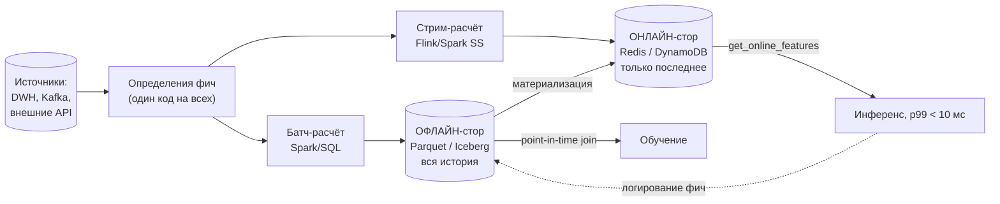

# Данные и feature store

> **Зачем эта глава.** Модель, которая на валидации давала ROC-AUC 0.94, в проде даёт 0.78 —
> и это почти никогда не про модель. Это про то, что признаки в обучении и в проде считались
> по-разному или брались из будущего. Здесь разбираем контракты данных, зачем хранилищ
> признаков два, что такое point-in-time correctness (главная тема главы) и как ловить
> train/serve skew до того, как его поймает бизнес.

**Уровень:** 🎯 middle → 🧠 middle+
**Предварительно нужно:** [валидация и утечки](../02-classic-ml/13-validation-and-leakage.md), [работа с признаками](../02-classic-ml/14-feature-engineering.md), [жизненный цикл](01-ml-lifecycle.md)
**Как проработать:** чтение + упражнения

---

## Карта главы

- [1. Интуиция: почему 0.94 превратилось в 0.78](#1-интуиция-почему-094-превратилось-в-078)
- [2. Контракты данных и эволюция схемы](#2-контракты-данных-и-эволюция-схемы)
- [3. Почему хранилищ признаков два](#3-почему-хранилищ-признаков-два)
- [4. Point-in-time correctness](#4-point-in-time-correctness)
- [5. Train/serve skew: все механизмы и как их ловить](#5-trainserve-skew-все-механизмы-и-как-их-ловить)
- [6. Материализация, TTL, свежесть](#6-материализация-ttl-свежесть)
- [7. Backfill](#7-backfill)
- [8. Владение фичей и переиспользование](#8-владение-фичей-и-переиспользование)
- [9. Когда feature store не нужен](#9-когда-feature-store-не-нужен)
- [10. Подводные камни](#10-подводные-камни)
- [11. Проверь себя](#11-проверь-себя)
- [12. Практика](#12-практика)
- [13. Что читать дальше](#13-что-читать-дальше)

---

## 1. Интуиция: почему 0.94 превратилось в 0.78

Разберём конкретный случай, к которому будем возвращаться всю главу.

Задача: антифрод на транзакциях. Есть таблица событий и есть витрина признаков по пользователю,
которая пересчитывается ежедневно ночью:

```sql
-- dwh.user_features: снапшот на каждую дату
-- user_id | feature_date | txn_cnt_7d | avg_amount_7d | chargeback_cnt_90d
```

Датасайентист собирает обучающую выборку одним джойном:

```sql
-- ❌ ТАК ДЕЛАТЬ НЕЛЬЗЯ
SELECT t.txn_id, t.user_id, t.ts, t.is_fraud,
       f.txn_cnt_7d, f.avg_amount_7d, f.chargeback_cnt_90d
FROM dwh.transactions t
JOIN dwh.user_features f USING (user_id);   -- берём "текущий" снапшот
```

Получает ROC-AUC 0.94. В проде — 0.78. Что произошло?

Признак `chargeback_cnt_90d` — количество чарджбэков (оспоренных платежей) за 90 дней.
Чарджбэк приходит от банка **через 5–45 дней** после транзакции. Если транзакция была
мошеннической, то через месяц по ней придёт чарджбэк, и он попадёт в `chargeback_cnt_90d`
пользователя в **более поздних** снапшотах.

Посмотрим на одного пользователя:

| user_id | feature_date | chargeback_cnt_90d |
|---|---|---|
| U-771 | 2026-03-13 | 0 |
| U-771 | 2026-03-14 | 0 |
| U-771 | 2026-04-02 | **1** |
| U-771 | 2026-04-20 | **3** |

Транзакция U-771 произошла 2026-03-14 11:42 и оказалась мошеннической (`is_fraud = 1`).
Джойн «по user_id» взял произвольный (на практике — последний) снапшот и подставил
`chargeback_cnt_90d = 3`. То есть в признак попал **след самого таргета**.

Модель честно выучила правило «если `chargeback_cnt_90d > 0`, то фрод» — на обучающей выборке
оно почти идеально. В проде на момент предсказания у пользователя `chargeback_cnt_90d = 0`
всегда (чарджбэк ещё не пришёл), признак бесполезен, и модель падает до качества оставшихся
признаков.

Это **нарушение point-in-time correctness** — самый дорогой и самый частый класс ошибок
в ML-инженерии. Он не ловится ни кросс-валидацией, ни разделением на train/test, потому что
испорчены обе части.

> 🌱 **База.** Если вы впервые видите тему, держите в голове одну проверку, которая ловит
> большую часть таких ошибок. Возьмите пять самых важных (по любой мере важности) признаков
> вашей модели и для каждого спросите: **«в момент, когда модель должна была бы дать ответ,
> это значение уже существовало и было доступно системе?»** Если для какого-то признака
> ответ «не уверен» — идите смотреть, когда именно он вычисляется и когда попадает в таблицу.
> Дальше можно читать [§4](#4-point-in-time-correctness) медленно; всё остальное в главе — про то, как сделать эту проверку
> свойством системы, а не ритуалом.

> ⚠️ **Типичная ошибка.** Считать, что временной сплит защищает от утечки. Не защищает:
> если признак на дату $t$ посчитан по данным из $t + 30$, то и train, и test одинаково
> испорчены, и валидация покажет прекрасные числа. Защищает только корректный по времени
> джойн.

> 💬 **На собеседовании.** Спросят: «Офлайн-метрика отличная, в проде хуже на 15 п.п.
> Ваши гипотезы?» Хороший ответ — упорядоченный список, начинающийся не с модели:
> (1) утечка через признаки из будущего — нарушен point-in-time; (2) train/serve skew —
> в проде фичи считаются другим кодом или из другого источника; (3) сдвиг распределения
> между периодом обучения и текущим; (4) прод применяет модель к другому срезу трафика,
> чем валидация (после фильтров); (5) техническая ошибка — перепутан порядок признаков,
> другие дефолты для пропусков. И сразу — как проверить первую гипотезу: залогировать
> вектор признаков на инференсе и сравнить с офлайн-пересчётом на ту же временную точку.
> Плохой ответ: «переобучение, надо добавить регуляризации».

---

## 2. Контракты данных и эволюция схемы

Модель зависит от данных, которые производит **другая команда**. Без явного контракта эта
зависимость — самая нестабильная часть системы (см. «нестабильные зависимости» в
[главе про технический долг](01-ml-lifecycle.md)).

**Контракт данных (data contract)** — это соглашение между производителем и потребителем
данных, зафиксированное машиночитаемо и проверяемое в CI. Что в нём должно быть:

| Раздел | Что фиксирует | Пример |
|---|---|---|
| **Схема** | поля, типы, обязательность | `amount: decimal(18,2) NOT NULL` |
| **Семантика** | что значит поле, единицы, часовой пояс | «сумма в копейках, всегда > 0; `ts` в UTC» |
| **Качество** | допустимые диапазоны, доля NULL, уникальность | `0 < amount < 10^9`, `NULL(user_id) = 0`, `txn_id` уникален |
| **Свежесть (SLA)** | к какому времени данные за день доступны | «партиция за D доступна к D+1 06:00 MSK, p99» |
| **Полнота** | ожидаемый объём | «±30% от медианы за 14 дней» |
| **Владелец** | кто чинит в 3 часа ночи | команда, канал, дежурный |
| **Политика изменений** | как ломают и с каким уведомлением | «удаление поля — за 60 дней с объявлением» |

### Эволюция схемы: три режима совместимости

Терминология из мира Avro/Protobuf (и Schema Registry в Kafka), её спрашивают:

- **Backward compatible** — новая схема может читать данные, записанные **старой**.
  Разрешено: добавить поле с дефолтом, удалить необязательное поле.
  Нужно, когда потребители обновляются раньше производителей.
- **Forward compatible** — старая схема может читать данные, записанные **новой**.
  Разрешено: добавить необязательное поле (старый читатель его проигнорирует),
  удалить поле с дефолтом.
  Нужно, когда производитель обновляется раньше потребителей — типичная ситуация в Kafka.
- **Full** — и то и другое одновременно. Самый безопасный и самый ограничивающий режим.

Что ломается **всегда**, независимо от режима:

| Изменение | Почему ломает | Как правильно |
|---|---|---|
| Смена типа `int32 → string` | десериализация падает или молча приводит | новое поле рядом, миграция, удаление старого через квартал |
| Переиспользование имени поля под другой смысл | молчаливая порча данных, худший случай | никогда; только новое имя |
| Смена единиц (рубли → копейки) | схема та же, значения в 100 раз другие | новое имя поля (`amount_kopecks`) |
| Смена часового пояса `ts` | сдвиг всех временных признаков | хранить в UTC всегда, зону — отдельным полем |
| Изменение семантики enum (`status = 3` теперь значит другое) | модель выучила старое значение | новые коды, старые не переиспользовать |

> 🧠 **Middle+.** Для ML есть отдельная категория поломок, которых нет у обычного потребителя:
> **изменение распределения при неизменной схеме**. Продуктовая команда включила новый способ
> оплаты — доля `payment_type = 'sbp'` выросла с 2% до 40% за неделю. Схема валидна,
> контракт формально не нарушен, модель уехала. Отсюда: в контракт для ML-потребителя
> добавляют **статистический раздел** — ожидаемые доли категорий и квантили числовых полей
> с допуском, и проверку на них ставят в тот же пайплайн, что и проверку схемы.
> Подробнее — [дрифт данных](../09-monitoring/03-drift-detection.md).

Практическая реализация проверок — в пайплайне, а не «на дашборде»:

```python
# checks.py: ассерты как код, версионируются вместе с моделью
import pandas as pd

FEATURE_SPEC = {
    "amount_kopecks": {"dtype": "int64", "min": 1, "max": 10**11, "null_frac_max": 0.0},
    "txn_cnt_7d":     {"dtype": "int64", "min": 0, "max": 10_000, "null_frac_max": 0.02},
    "avg_amount_7d":  {"dtype": "float64", "min": 0, "max": 10**9, "null_frac_max": 0.05},
}

def validate(df: pd.DataFrame, spec: dict) -> None:
    problems: list[str] = []
    for col, rule in spec.items():
        if col not in df.columns:
            problems.append(f"{col}: колонка отсутствует")
            continue
        if str(df[col].dtype) != rule["dtype"]:
            # Тип важнее, чем кажется: int64 -> float64 меняет поведение NULL и
            # ломает бинарную сериализацию в сервинге.
            problems.append(f"{col}: dtype {df[col].dtype}, ожидался {rule['dtype']}")
        null_frac = df[col].isna().mean()
        if null_frac > rule["null_frac_max"]:
            problems.append(f"{col}: доля NULL {null_frac:.3f} > {rule['null_frac_max']}")
        finite = df[col].dropna()
        if len(finite) and (finite.min() < rule["min"] or finite.max() > rule["max"]):
            problems.append(f"{col}: диапазон [{finite.min()}, {finite.max()}] вне [{rule['min']}, {rule['max']}]")
    if problems:
        # Падаем ДО записи результата: лучше пустая витрина, чем витрина с мусором,
        # которую уже прочитал онлайн-стор.
        raise ValueError("Нарушен контракт данных:\n" + "\n".join(problems))
```

---

## 3. Почему хранилищ признаков два

Feature store — это не одна база. Это две базы плюс слой определений фич, и понимание,
**почему их две**, — стандартный вопрос на собеседовании.



Разница не в технологии, а в **паттерне доступа**, и она принципиальна:

| | **Офлайн-стор** | **Онлайн-стор** |
|---|---|---|
| Запрос | «дай 200 млн строк с фичами на их индивидуальные моменты времени» | «дай 40 фич для одного user_id **сейчас**» |
| Что хранит | всю историю значений с временными метками | только последнее значение на ключ |
| Объём | 10–500 ТБ | 10–500 ГБ |
| Латентность | минуты–часы (это нормально) | p99 < 5 мс |
| Пропускная способность | сотни ГБ/с последовательного чтения | 10⁴–10⁶ запросов/с случайного доступа |
| Технология | Parquet/Iceberg/Delta на S3, ClickHouse, BigQuery | Redis, DynamoDB, Cassandra, Aerospike |
| Стоимость на ГБ/мес | ~1–3 ₽ (объектное хранилище) | ~150–400 ₽ (память) | 

Числа делают вопрос очевидным. 200 млн пользователей × 40 признаков float32 = 32 ГБ полезной
нагрузки. В памяти Redis с накладными расходами (ключи, структуры, фрагментация) это
реально 60–90 ГБ — то есть кластер на 6–8 нод по 16 ГБ, и это дорого. Хранить там же
два года истории (≈ 730 снапшотов) — 40–60 ТБ в памяти, что не делает никто.

И наоборот: получить 40 признаков для одного пользователя из Parquet на S3 — это
чтение файла на десятки мегабайт (row group читается целиком), сотни миллисекунд,
и при 3000 RPS вы просто сожжёте сеть.

Отсюда обязанности:
- **офлайн-стор** обслуживает обучение и батч-скоринг, умеет отвечать на вопрос
  «какое значение фичи было на момент $t$» (см. [§4](#4-point-in-time-correctness));
- **онлайн-стор** обслуживает инференс, умеет только «какое значение сейчас»;
- **общий слой определений** гарантирует, что и то и другое считается **одним кодом** —
  это и есть главная ценность feature store, а не хранилища сами по себе.

> 💬 **На собеседовании.** Спросят: «Зачем нужен feature store?» Слабый ответ: «чтобы хранить
> признаки». Сильный ответ называет три задачи, которые он решает, и одну, которую не решает.
> Решает: (1) **консистентность обучения и инференса** — одно определение фичи на оба контура;
> (2) **point-in-time-корректная сборка обучающих выборок** — из истории значений с временными
> метками; (3) **переиспользование** — фича, посчитанная одной командой, доступна другой
> с известной семантикой и владельцем. Не решает: качество самих данных — мусор на входе
> останется мусором, feature store просто раздаст его консистентно.

---

## 4. Point-in-time correctness

Это ядро главы. Разберём медленно.

### 4.1. Формулировка

Обучающая строка — это пара «событие + признаки». Событие произошло в момент $t_e$.
Признак $x$ имеет историю значений $\{(t_1, v_1), (t_2, v_2), \dots\}$.

**Требование point-in-time correctness:** в обучающую строку подставляется то значение
признака, которое **было бы доступно системе** в момент $t_e$:

$$
x(t_e) = v_{j}, \qquad j = \arg\max_{k} \{\, t_k^{\text{avail}} \le t_e \,\}
$$

где $t_e$ — момент события (когда модель должна была бы сделать предсказание),
$t_k^{\text{avail}}$ — момент, когда значение $v_k$ стало **доступно** системе,
$v_j$ — последнее значение, доступное к $t_e$.

Обратите внимание на слово **доступно**. Здесь прячется тонкость, которая отделяет
средний ответ от сильного.

### 4.2. Две временные метки, а не одна

У каждой строки фичи есть **два** времени:

- **event time** ($t^{\text{event}}$) — когда факт произошёл в реальном мире.
  Транзакция совершена в 11:42.
- **available time / processing time** ($t^{\text{avail}}$) — когда система об этом узнала
  и записала. Джоба, агрегирующая транзакции за сутки, стартует в 03:00 следующего дня
  и заканчивается в 03:40 — значит, агрегат за вчера стал доступен в 03:40.

Правильный PIT-джойн использует **available time**, а не event time. Разница огромна:

| Признак | event_time | available_time | Задержка |
|---|---|---|---|
| `txn_cnt_7d` (дневной батч) | 2026-03-14 23:59 | 2026-03-15 03:40 | ~4 ч |
| `session_clicks_5m` (стрим) | 2026-03-14 11:41 | 2026-03-14 11:41:12 | ~12 с |
| `chargeback_cnt_90d` (внешний источник) | 2026-03-14 11:42 | 2026-04-02 06:00 | **19 дней** |
| `credit_score` (внешнее бюро, раз в месяц) | 2026-03-01 | 2026-03-05 | 4 дня |

Если джойнить по event time, то для события 2026-03-15 в 04:00 вы подставите агрегат
`txn_cnt_7d` за 14 марта — а он в 03:40 уже был доступен, всё честно. Но для события
2026-03-15 в 02:00 джойн по event time тоже подставит агрегат за 14 марта, которого
в 02:00 **ещё не существовало**. Утечка на 1.5 часа. Для антифрода с признаками,
меняющимися за минуты, это уже критично.

> 🧠 **Middle+.** Практическое следствие: в витрине признаков нужно хранить обе метки.
> Минимальная схема строки офлайн-стора:
> `entity_id | feature_name | value | event_ts | available_ts | version`.
> Feast и подобные системы называют это `event_timestamp` и `created_timestamp`
> и используют вторую для разрешения ситуации «два значения с одинаковым event_ts»
> (например, после backfill). На собеседовании упоминание второй метки —
> сильный сигнал реального опыта.

### 4.3. Неправильный джойн и правильный: код

Продолжим пример с антифродом.

**Вариант 1. ❌ Джойн по ключу (берёт последний снапшот):**

```sql
SELECT t.txn_id, t.is_fraud, f.chargeback_cnt_90d
FROM transactions t
JOIN user_features f USING (user_id);
```
Даёт декартово произведение по всем снапшотам или (с `qualify`/`distinct`) последний.
Утечка максимальная.

**Вариант 2. ❌ Джойн по дате:**

```sql
SELECT t.txn_id, t.is_fraud, f.chargeback_cnt_90d
FROM transactions t
JOIN user_features f
  ON f.user_id = t.user_id
 AND f.feature_date = DATE(t.ts);   -- "снапшот того же дня"
```
Выглядит правдоподобно и **всё равно течёт**: снапшот за 14 марта считается ночью
15 марта по всем событиям 14 марта — включая саму эту транзакцию. Признак
`txn_cnt_7d` содержит текущую транзакцию, `avg_amount_7d` — её сумму. Для транзакции
на нетипично большую сумму это буквально подсказка.

**Вариант 3. ✅ AS OF join (корректно):**

```sql
-- PostgreSQL / любой движок с LATERAL: для каждого события берём
-- последнюю строку фич, СТАВШУЮ ДОСТУПНОЙ строго до момента события.
SELECT t.txn_id, t.ts, t.is_fraud,
       f.txn_cnt_7d, f.avg_amount_7d, f.chargeback_cnt_90d,
       f.available_ts AS feature_available_ts   -- логируем возраст фичи: пригодится
FROM transactions t
LEFT JOIN LATERAL (
    SELECT *
    FROM user_features uf
    WHERE uf.user_id = t.user_id
      AND uf.available_ts <= t.ts               -- ключевое условие PIT
      AND uf.available_ts >  t.ts - INTERVAL '7 days'  -- ограничение TTL, см. ниже
    ORDER BY uf.available_ts DESC
    LIMIT 1
) f ON TRUE;
```

**То же на Spark SQL** (нет `LATERAL` с корреляцией в нужной форме — используем окно):

```sql
SELECT txn_id, ts, is_fraud, txn_cnt_7d, avg_amount_7d, chargeback_cnt_90d
FROM (
    SELECT t.txn_id, t.ts, t.is_fraud,
           f.txn_cnt_7d, f.avg_amount_7d, f.chargeback_cnt_90d,
           ROW_NUMBER() OVER (
               PARTITION BY t.txn_id
               ORDER BY f.available_ts DESC
           ) AS rn
    FROM transactions t
    JOIN user_features f
      ON f.user_id = t.user_id
     AND f.available_ts <= t.ts
     -- НИЖНЯЯ ГРАНИЦА ОБЯЗАТЕЛЬНА: без неё промежуточный результат взрывается.
     -- 100 млн событий x 180 суточных снапшотов на пользователя = 18 млрд строк,
     -- шаффл на десятки ТБ и падение по диску. С границей в 7 дней - 700 млн строк.
     AND f.available_ts >  t.ts - INTERVAL 7 DAYS
) x
WHERE rn = 1;
```

Комментарий про кардинальность — не украшение. Это самая частая причина, по которой
корректный PIT-джойн «не влезает в кластер», и на собеседовании про это спрашивают
как про задачу оптимизации. Приёмы:
1. **Нижняя граница окна** — как выше. Если фичи суточные и TTL 7 дней, ограничиваем 7 днями.
2. **Бакетирование по ключу** (`user_id`) обеих таблиц с одинаковым числом бакетов —
   убирает шаффл.
3. **Range join hint** (в Databricks — `RANGE_JOIN` с `binSize`), либо ручное
   добавление колонки-бакета по времени (`date_trunc('day', ts)`) и джойн по паре
   (ключ, день) с последующим уточнением.
4. **Union-and-forward-fill**: объединить события и снапшоты в одну таблицу, отсортировать
   по (`user_id`, `ts`) и протянуть значения фич вперёд оконной функцией `last(..., ignoreNulls=true)`.
   Это O(n log n) вместо джойна и часто быстрее всего.

**Вариант 4. ✅ Через feature store (Feast):**

```python
from datetime import datetime
import pandas as pd
from feast import FeatureStore

store = FeatureStore(repo_path="feature_repo/")

# entity_df задаёт СОБЫТИЯ и их моменты времени.
# Колонка event_timestamp обязательна: по ней и делается PIT-джойн.
entity_df = pd.read_parquet("s3://ml/labels/fraud_2026h1.parquet")  # txn_id, user_id, event_timestamp, is_fraud

training_df = store.get_historical_features(
    entity_df=entity_df,
    features=[
        "user_txn_stats:txn_cnt_7d",
        "user_txn_stats:avg_amount_7d",
        "user_risk:chargeback_cnt_90d",
        "merchant_stats:fraud_rate_30d",
    ],
).to_df()
```

`get_historical_features` внутри делает ровно тот AS OF join, который мы писали руками,
для каждой feature view отдельно, с учётом её TTL. Это и есть та часть, ради которой
feature store покупают: **корректность по времени становится свойством системы,
а не дисциплины конкретного человека**.

### 4.4. Утечка через таргет: вторая ось

PIT-корректность признаков — не всё. Есть симметричная проблема со стороны таргета:
**окно наблюдения**.

Если таргет «пользователь оформил заказ в течение 7 дней после визита», то для события
от 2026-07-24 (три дня назад) ответ ещё не определён: он может стать 1 в ближайшие 4 дня.
Включив такие события в обучение с меткой 0, вы систематически занижаете долю позитивов
на «хвосте» датасета — и модель учится, что недавние события менее склонны к конверсии.

Правило: **последние $W$ дней датасета отрезаются**, где $W$ — окно определения таргета.
Для антифрода с чарджбэками $W$ может быть 45–90 дней, и это означает, что вы обучаетесь
на данных как минимум трёхмесячной давности. Это надо проговаривать на System Design:

$$
t_{\text{конец обучения}} \le t_{\text{сегодня}} - W_{\text{таргет}}
$$

где $W_{\text{таргет}}$ — максимальная задержка появления метки.

> 💬 **На собеседовании.** Спросят: «Что такое point-in-time correctness?» Хороший ответ:
> «Для каждой обучающей строки признаки берутся в том значении, которое **было доступно
> системе** в момент, когда модель должна была бы сделать предсказание. Ключевое слово —
> "доступно": у строки фичи два времени, event time и available time, и джойнить надо
> по второму, потому что агрегат за вчера появляется в 03:40, а не в 00:00». Дальше —
> пример утечки (чарджбэк, приходящий через месяц) и пример того, почему джойн «по той же
> дате» тоже течёт (снапшот считается по всем событиям дня, включая текущее).
> И упоминание второй оси — обрезки хвоста датасета на окно определения таргета.
> Плохой ответ: «это когда данные берутся на нужную дату».

---

## 5. Train/serve skew: все механизмы и как их ловить

**Train/serve skew** — расхождение между тем, что модель видит при обучении, и тем,
что она видит в проде. PIT-нарушение — один из механизмов, но не единственный.
Полный список, который стоит уметь перечислить:

| # | Механизм | Конкретный пример | Симптом |
|---|---|---|---|
| 1 | **Разные реализации** | офлайн — pandas на Python, онлайн — Java-сервис; в pandas `mean()` игнорирует NaN, в Java NaN даёт NaN | расхождение на подмножестве строк с пропусками |
| 2 | **Разные источники** | обучение из DWH (очищенные данные), прод из сырого потока (с дублями) | распределение сдвинуто в хвостах |
| 3 | **Нарушение PIT** | признак из будущего | огромный разрыв офлайн/онлайн-качества |
| 4 | **Разная свежесть** | в обучении фича «свежая на момент события», в проде — вчерашняя из-за задержки материализации | деградация в утренние часы (до прихода ночного батча) |
| 5 | **Разные дефолты для пропусков** | офлайн `fillna(0)`, онлайн — `None` → библиотека подставляет `NaN` и уходит в другую ветку дерева | резкий сдвиг предсказаний для новых пользователей |
| 6 | **Порядок и имена признаков** | модель принимает массив, порядок колонок в сервисе другой | предсказания похожи на шум, но сервис не падает |
| 7 | **Версии энкодеров/словарей** | `TargetEncoder` пересчитали, а в сервисе старый pickle | смещение по категориальным |
| 8 | **Типы и единицы** | float64 → float32, рубли → копейки, локальное время → UTC | систематический сдвиг |
| 9 | **Обратная связь** | модель влияет на трафик, распределение уезжает после выката | постепенная деградация за недели |

Пункт 6 стоит отдельного комментария: он **не вызывает ошибки**. Сервис отдаёт числа,
латентность в норме, все графики зелёные — и качество на дне. Именно поэтому в контракте
модели должна быть **именованная** схема входа (см. `mlflow.models.infer_signature`
в [предыдущей главе](02-reproducibility-and-tracking.md)), а не позиционный массив.

### 5.1. Как ловить: три уровня защиты

**Уровень 1. Одно определение фичи (профилактика).**
Единственный надёжный способ убрать механизмы 1, 5, 7, 8 — не иметь двух реализаций.
Практически: функция `make_features` живёт в общей библиотеке, её импортируют и обучающий
пайплайн, и сервис. Если сервис на другом языке — определение фичи декларативное (SQL/DSL
feature store), и оба контура исполняют одно и то же определение.

**Уровень 2. Логирование фич на инференсе + сверка (детекция).**
Самый ценный механизм, и его надо уметь описать на собеседовании.

```python
# В сервисе: логируем ИМЕННО ТОТ вектор, который ушёл в модель.
# Сэмплируем, чтобы не утопить хранилище: 1% при 3000 RPS = 30 записей/с,
# ~2.6 млн строк в сутки, ~1 ГБ в паркете. Приемлемо.
import random, json, time

def predict(request):
    features = build_features(request)          # тот же код, что в обучении
    proba = model.predict_proba(features)[0, 1]
    if random.random() < 0.01:
        feature_log.send({
            "request_id": request.id,
            "model_version": MODEL_VERSION,
            "ts": time.time(),
            "entity_id": request.user_id,
            "features": {k: _to_json(v) for k, v in features.items()},
            "prediction": float(proba),
        })
    return proba
```

Ночная сверочная джоба берёт эти логи и **пересчитывает те же признаки офлайн
на тот же момент времени** (PIT-джойн по `ts` из лога), после чего считает по каждому
признаку:

```python
# skew_report.py: суть проверки
import numpy as np

def skew_report(online: "pd.DataFrame", offline: "pd.DataFrame", feature_cols: list[str]):
    rows = []
    for col in feature_cols:
        a, b = online[col].to_numpy(float), offline[col].to_numpy(float)
        both_nan = np.isnan(a) & np.isnan(b)
        one_nan = np.isnan(a) ^ np.isnan(b)
        # Относительная разница устойчивее абсолютной для фич разного масштаба.
        denom = np.maximum(np.abs(a), np.abs(b))
        rel = np.where(both_nan, 0.0, np.abs(a - b) / np.where(denom > 0, denom, 1.0))
        rows.append({
            "feature": col,
            "mismatch_rate": float(np.mean((rel > 1e-6) | one_nan)),   # доля расхождений
            "p99_rel_diff": float(np.nanpercentile(rel, 99)),
            "null_only_online": float(np.mean(np.isnan(a) & ~np.isnan(b))),
        })
    return rows
```

Пороги, которые работают на практике:
- `mismatch_rate > 0.001` (0.1% строк) по любому признаку — **алерт**, это баг, а не шум;
- `mismatch_rate > 0` по категориальным — почти всегда баг (там не бывает погрешности);
- `null_only_online > 0.01` — онлайн-стор не отдаёт значения, которые есть офлайн:
  либо не материализовалось, либо истёк TTL.

Небольшие расхождения по float (1e-7) — норма, это разная точность вычислений.
Расхождения на 1e-3 и больше — нет.

**Уровень 3. Реплей (гарантия перед выкаткой).**
Перед релизом берём 10 000 строк из обучающей выборки, прогоняем их **через боевой
HTTP-эндпоинт** и сравниваем предсказания с офлайновыми:

```python
# test_serving_parity.py - обязательный тест в CI
def test_serving_matches_offline(sample_df, offline_preds, client):
    online = [client.post("/predict", json=row).json()["proba"] for row in sample_df.to_dict("records")]
    max_abs_diff = np.max(np.abs(np.array(online) - offline_preds))
    # 1e-6 - реалистичный порог: разница float32/float64 в сериализации.
    assert max_abs_diff < 1e-6, f"serving parity нарушен: max|Δ| = {max_abs_diff:.2e}"
```

Этот тест ловит механизмы 5, 6, 7, 8 полностью и стоит 5 минут в CI.

> 💬 **На собеседовании.** Спросят: «Как вы обнаружите train/serve skew?» Сильный ответ
> описывает три уровня: профилактика (одно определение фичи на оба контура), детекция
> (сэмплированное логирование вектора признаков на инференсе + ночная сверка с офлайн-пересчётом
> на ту же временную точку, с порогом по доле расхождений), гарантия (тест паритета в CI:
> реплей обучающих строк через боевой эндпоинт, `max|Δ| < 1e-6`). И обязательно — что
> логировать надо **вектор, ушедший в модель**, а не входной запрос: иначе вы проверяете
> не то место. Плохой ответ: «сравню распределения признаков».

---

## 6. Материализация, TTL, свежесть

**Материализация** — перенос значений из офлайн-стора в онлайн. Это регулярная джоба,
и её надо уметь посчитать.

**Расчёт объёма.** Возьмём 200 млн зарегистрированных пользователей, 40 признаков float32.

- Полезная нагрузка: $200 \cdot 10^6 \times 40 \times 4\ \text{Б} = 32\ \text{ГБ}$.
- В Redis: одна запись как hash из 40 полей — накладные расходы примерно 2–3× (ключ,
  метаданные hash, выравнивание). Реально **70–100 ГБ**.
- Оптимизация 1: **сериализовать все фичи одним значением** (msgpack/protobuf) вместо
  40 полей — накладные падают до ~1.3×, получаем ~45 ГБ. Плюс один `GET` вместо `HMGET`.
- Оптимизация 2: **материализовать только активных**. Пользователей, заходивших
  за 30 дней, обычно 10–20% от базы: 20–40 млн вместо 200 млн → **5–10 ГБ**.
  Для остальных сервис использует дефолты (те же, что при обучении для пропусков).
  Это снижает стоимость кластера в 10 раз при потере качества на «спящих» пользователях,
  которых в трафике почти нет.

**Расчёт времени записи.** Redis на одной ноде — порядка 10⁵ операций/с при использовании
pipelining батчами по 500–1000 команд (без pipelining — в 5–10 раз меньше из-за RTT).

$$
T = \frac{N}{p \cdot r}
$$

где $N$ — число ключей, $p$ — число шардов/нод, $r$ — скорость записи на ноду (оп/с).
Для $N = 40\cdot10^6$, $p = 8$, $r = 10^5$: $T = 50$ с — быстро. Для $N = 200\cdot10^6$
на одной ноде: $T = 2000$ с ≈ 33 минуты — уже влияет на окно материализации.

**TTL.** У каждой фичи должен быть срок жизни, и он выполняет две разные функции:

1. **В онлайн-сторе** TTL — это защита от протухших значений и способ не платить за память.
   Если материализация суточная, разумный TTL — 2–3 суток: одна пропущенная джоба
   не роняет сервис, но недельные значения не выдаются как свежие.
2. **В PIT-джойне** TTL — это **нижняя граница окна поиска**. Если TTL фичи 7 дней,
   то в обучении значение старше 7 дней не подставляется, а ставится NULL —
   ровно так же, как в проде, где TTL его удалил. Без согласования этих двух TTL
   вы получаете skew механизма 4.

Согласование TTL офлайн и онлайн — неочевидная и важная деталь; в Feast TTL задаётся
в определении feature view и используется обеими сторонами.

**Свежесть как SLI.** Для каждой группы фич определяется метрика «возраст значения»
и SLO на неё:

| Группа фич | Способ расчёта | Целевой возраст (p99) | Что делаем при нарушении |
|---|---|---|---|
| Профиль (демография) | батч, еженедельно | < 8 суток | алерт, не критично |
| Агрегаты 7/30 дней | батч, ежесуточно | < 26 часов | алерт + метрика «доля запросов с устаревшей фичей» |
| Счётчики за час | стрим | < 90 с | критический алерт, деградация модели |
| Сессионные | из запроса | 0 | — |

Мониторится это буквально так (Prometheus, экспортируем возраст из сервиса):

```promql
# p99 возраста фичи в секундах по группам - основной SLI свежести
histogram_quantile(0.99, sum by (le, feature_group) (rate(feature_age_seconds_bucket[5m])))

# Доля запросов, где хотя бы одна фича отсутствовала в онлайн-сторе (сработал дефолт).
# Растёт РАНЬШЕ, чем падает бизнес-метрика, - лучший ранний индикатор поломки пайплайна.
sum(rate(feature_lookup_miss_total[5m])) / sum(rate(feature_lookup_total[5m]))

# Отставание материализации: сколько прошло с успешного завершения последней джобы
time() - max(feature_materialization_last_success_timestamp_seconds) > 26 * 3600
```

> ⚠️ **Типичная ошибка.** Считать, что «фича есть в онлайн-сторе» = «фича актуальна».
> Материализация упала три дня назад, TTL не выставлен, Redis честно отдаёт трёхдневные
> значения, сервис отвечает 200 OK, счётчик промахов нулевой. Обнаруживается по падению
> конверсии через неделю. Лечится: TTL обязателен + отдельная метрика возраста значения,
> а не только факта наличия.

---

## 7. Backfill

**Backfill** — пересчёт истории признака: вы добавили новую фичу и хотите обучиться
на двух годах данных, где её никогда не считали.

Что нужно понимать:

**1. Backfill должен воспроизводить логику того времени, а не сегодняшнюю.**
Классическая ловушка: фича «доля отменённых заказов за 30 дней» пересчитывается сегодня
по текущей таблице заказов. Но статус части старых заказов с тех пор изменился
(отмена оформилась позже). Пересчёт даст значения, которых в тот момент не существовало —
снова утечка, только более коварная. Правильно: считать по таблице с временем изменения
статуса (`status_changed_at`) и брать состояние на момент $t$, а не текущее.
Если такой таблицы нет — фича не поддаётся честному backfill, и это надо признать.

**2. Backfill дорог, считайте заранее.**
Пересчёт суточных агрегатов за 730 дней — это 730 запусков джобы (или один запуск
с окном по всей истории, что часто тяжелее). Прикидка: если суточная джоба обрабатывает
50 ГБ за 12 минут на кластере из 20 экзекьюторов, то 730 дней — это ~150 часов
кластерного времени; при цене ~200 ₽/час за такой кластер — около 30 000 ₽ и двое суток
календарного времени при последовательном запуске. Параллелить по датам можно,
но упрётесь в квоты.

Рабочий Airflow-DAG для backfill выглядит так:

```python
from datetime import datetime, timedelta
from airflow import DAG
from airflow.providers.apache.spark.operators.spark_submit import SparkSubmitOperator

# catchup=True + логическая дата = Airflow сам сгенерирует запуски за всю историю.
# Идемпотентность обязательна: джоба ПЕРЕЗАПИСЫВАЕТ партицию за свою дату,
# а не дописывает - иначе повторный запуск удвоит данные.
with DAG(
    dag_id="user_features_daily",
    start_date=datetime(2024, 8, 1),
    schedule="0 3 * * *",
    catchup=True,
    max_active_runs=8,          # ограничиваем параллелизм backfill: иначе съедим весь кластер
    default_args={"retries": 2, "retry_delay": timedelta(minutes=10)},
    tags=["features", "fraud"],
) as dag:
    build = SparkSubmitOperator(
        task_id="build_user_features",
        application="s3://ml/jobs/user_features.py",
        # Логическая дата, а НЕ datetime.now(): джоба должна давать один и тот же
        # результат при перезапуске через год.
        application_args=["--date", "{{ ds }}", "--mode", "overwrite"],
        conf={
            "spark.sql.sources.partitionOverwriteMode": "dynamic",  # перезапись только своей партиции
            "spark.sql.shuffle.partitions": "400",
            "spark.executor.memory": "8g",
            "spark.executor.cores": "4",
            "spark.dynamicAllocation.enabled": "true",
            "spark.dynamicAllocation.maxExecutors": "40",
        },
    )
```

Два комментария в этом DAG — суть темы. **Идемпотентность** (`overwrite` своей партиции)
и **логическая дата вместо `now()`** — без них backfill порождает дубли и невоспроизводимые
значения. Подробнее — [оркестрация](../08-big-data/06-orchestration.md).

**3. После backfill — сверка.** Пересчитайте последние 7 дней, для которых фича уже
считалась в обычном режиме, и сравните: значения должны совпасть. Расхождение означает,
что логика backfill отличается от продовой, и весь пересчёт нужно выбросить.

---

## 8. Владение фичей и переиспользование

Feature store продают в первую очередь как **инструмент переиспользования**: одна команда
посчитала `user_ltv_180d`, десять других её используют. На практике переиспользование
работает только при выполненных условиях.

**Что должно быть у каждой фичи:**

| Поле | Пример | Зачем |
|---|---|---|
| Имя и версия | `user_txn_stats:txn_cnt_7d:v2` | версия — потому что смысл меняется |
| Владелец | команда `antifraud`, канал `#af-oncall` | кто чинит |
| Определение | ссылка на код/SQL | что именно считается |
| Семантика | «число успешных транзакций за 7 календарных дней, не включая текущую» | без этого фича бесполезна для чужой команды |
| Источник и задержка | `dwh.transactions`, доступна к 03:40 | планирование PIT и SLA |
| TTL и частота обновления | 7 дней / раз в сутки | согласование офлайн и онлайн |
| Онлайн доступна? | да / нет | можно ли использовать в реалтайм-модели |
| Потребители | список моделей | кого сломаю при изменении |

Последняя строка — прямое лекарство от «незадекларированных потребителей» из
[первой главы](01-ml-lifecycle.md). Технически это реализуется требованием регистрировать
использование фичи в определении модели (в Feast — через `FeatureService`).

**Правила владения, которые работают:**

1. **Фича принадлежит команде-источнику данных**, а не команде, которой она первой
   понадобилась. Иначе антифрод владеет фичей про доставку и не может её починить.
2. **Изменение семантики = новая версия.** Никогда не менять смысл существующего имени —
   это ровно тот механизм, из-за которого чужая модель молча ломается.
3. **Депрекация с объявленным сроком.** Старая версия живёт минимум квартал после
   объявления, потребители мигрируют.
4. **У фичи без потребителей есть срок жизни.** Раз в квартал — ревизия: фичи, которые
   никто не читает 90 дней, отключаются. Это прямая экономия: одна ежедневная тяжёлая
   Spark-джоба — десятки тысяч рублей в месяц.

> 🧠 **Middle+.** Скрытый риск переиспользования, о котором редко говорят: **связанность
> команд по данным**. Когда десять моделей зависят от вашей фичи, вы больше не можете её
> улучшить — любое изменение требует согласования с десятью потребителями и десяти A/B-тестов.
> Это тот же CACE, но на организационном уровне. Практический вывод: переиспользовать стоит
> **стабильные, семантически простые** фичи (агрегаты, счётчики, атрибуты сущности)
> и не стоит — сложные производные и выходы моделей. Хороший ответ на собеседовании
> обязательно содержит эту оговорку.

---

## 9. Когда feature store не нужен

Честный раздел, который сильно повышает оценку на собеседовании, потому что показывает,
что вы считаете стоимость владения.

Feature store — это как минимум: два хранилища, джобы материализации, реестр определений,
мониторинг свежести, дежурство. Реалистичная оценка внедрения готового решения (Feast
поверх существующей инфраструктуры) — 1–3 человеко-месяца до продакшена плюс постоянная
поддержка. Своя разработка — от полугода.

**Не нужен, если:**

1. **Онлайн-инференса нет.** Всё скорится батчем раз в сутки. Тогда «feature store» —
   это одна таблица в DWH с корректным PIT-джойном в SQL, и этого достаточно.
   Второе хранилище решает проблему, которой у вас нет.
2. **Все признаки приходят в запросе.** Модель ранжирования, которой на вход подают
   готовый набор полей из вызывающего сервиса, — feature store не нужен вообще.
3. **Одна модель и одна команда.** Переиспользование — главная ценность feature store;
   при одном потребителе она равна нулю. Остаётся только консистентность, которую
   дешевле обеспечить общей библиотекой функций.
4. **Признаков мало и они простые.** 15 признаков, считающихся одним SQL-запросом, —
   тут инфраструктура дороже задачи.
5. **Нет людей на поддержку.** Feature store, который никто не мониторит, хуже,
   чем его отсутствие: он создаёт иллюзию корректности.

**Нужен, если:** есть онлайн-инференс с жёсткой латентностью **и** (десятки признаков
из разных источников **или** несколько команд, переиспользующих фичи, **или** несколько
моделей на общем наборе признаков). Практический порог, который называют в индустрии: —
от 3–5 продовых моделей с онлайн-инференсом.

**Промежуточный вариант, который часто оптимален:** взять из feature store только
**дисциплину**, а не платформу:
- одно определение фичи в общем модуле, импортируется обучением и сервисом;
- витрина признаков в DWH с колонками `event_ts` и `available_ts`;
- одна PIT-джойн функция, которой пользуются все;
- материализация в Redis простой джобой с TTL;
- метрики свежести и промахов в Prometheus.

Это 80% ценности за 20% усилий и не требует новой платформы.

> 💬 **На собеседовании.** Спросят: «Внедрили бы вы feature store?» Сильный ответ —
> с условием и с числом: «Зависит от того, есть ли онлайн-инференс и сколько команд
> переиспользуют признаки. При одной модели и батч-скоринге не стал бы: вся ценность
> сводится к PIT-джойну, а его можно написать одной функцией. При 5+ онлайн-моделях
> и двух-трёх командах — да, потому что там начинают доминировать стоимость дублирования
> определений и train/serve skew. Внедрение готового решения — примерно 1–3 человеко-месяца
> плюс постоянная поддержка, и это надо закладывать». Плохой ответ: «Да, это best practice».

---

## 10. Подводные камни

**Джойн «по той же дате» вместо PIT.**
Симптом: офлайн-метрика заметно выше прода, разрыв 10–20 п.п.
Причина: суточный снапшот фич считается ночью по всем событиям дня, включая текущее.
Что делать: AS OF join по `available_ts < event_ts`; проверка — отсортировать признаки
по корреляции с таргетом и вручную проверить топ-3 на «а мог ли я это знать в тот момент».

**Признак с длинной задержкой прихода.**
Симптом: один признак имеет аномально высокую важность и «объясняет» почти всё.
Причина: он частично содержит таргет (чарджбэки, возвраты, подтверждённые жалобы).
Что делать: для каждого признака заполнить поле «задержка доступности»; признаки
с задержкой больше горизонта предсказания либо исключить, либо считать
на сдвинутом окне (`chargeback_cnt_90d` с лагом 45 дней — честный признак).

**Материализация упала, значения протухли, метрик нет.**
Симптом: конверсия падает на 3% в течение недели, ошибок нет.
Причина: TTL не выставлен, онлайн-стор отдаёт старые значения, счётчик промахов нулевой.
Что делать: TTL на каждую группу фич; метрика возраста значения (`feature_age_seconds`)
и алерт на p99; алерт на `time() - last_materialization_success > 26h`.

**Порядок признаков разъехался.**
Симптом: качество в проде на уровне случайного, ошибок нет, латентность в норме.
Причина: модель принимает позиционный массив, в сервисе список колонок собран отдельно.
Что делать: именованная схема входа (сигнатура модели), тест паритета в CI, отказ
от позиционных массивов на границе сервиса.

**Онлайн-стор не выдерживает материализацию.**
Симптом: во время ночной джобы p99 инференса растёт с 8 до 120 мс.
Причина: массовая запись конкурирует с чтением; в Redis это ещё и блокировки на больших
пайплайнах, и рост памяти при `BGSAVE`.
Что делать: троттлинг записи (батчи по 500 с паузами), запись в отдельную реплику
с переключением, либо материализация в «теневой» префикс ключей и атомарное переключение
указателя версии.

**Backfill переписал историю сегодняшней логикой.**
Симптом: после добавления фичи офлайн-метрика подскочила, в A/B эффекта нет.
Причина: backfill посчитан по текущему состоянию таблиц, где статусы старых записей
уже изменились.
Что делать: считать по таблице с историей изменений (`status_changed_at`); обязательная
сверка пересчитанных последних 7 дней с фактически посчитанными в тот момент.

**Фича сломалась у соседей.**
Симптом: чужая модель просела после вашего релиза.
Причина: изменили семантику фичи, сохранив имя.
Что делать: версионирование имени (`:v2`), реестр потребителей, депрекация
с объявленным сроком; тест в CI, проверяющий, что определение фичи не менялось
без изменения версии.

**Разные дефолты для пропусков.**
Симптом: предсказания для новых пользователей систематически смещены.
Причина: офлайн `fillna(0)`, онлайн — отсутствие ключа → `None` → другая ветка дерева.
Что делать: дефолты — часть определения фичи, лежат в конфиге, применяются обеими
сторонами; в тесте паритета отдельный кейс «сущности нет в онлайн-сторе».

**Кардинальность взорвала PIT-джойн.**
Симптом: Spark-джоба падает по диску на шаффле, промежуточный результат десятки ТБ.
Причина: `available_ts <= event_ts` без нижней границы даёт декартово произведение
события на всю историю снапшотов.
Что делать: нижняя граница по TTL, бакетирование по ключу, либо union-and-forward-fill
вместо джойна.

---

## 11. Проверь себя

<details>
<summary><b>🧠 Вопрос.</b> Что такое point-in-time correctness и почему обычного временного сплита недостаточно?</summary>

**Короткий ответ.** Требование, чтобы в каждую обучающую строку подставлялось то значение
признака, которое **было доступно системе** в момент предполагаемого предсказания.
Временной сплит не спасает: если признак на дату $t$ посчитан по данным из $t + \Delta$,
испорчены и train, и test одинаково, и валидация покажет прекрасные числа.

**Развёрнуто.** У строки признака два времени: event time (когда факт произошёл)
и available time (когда система об этом узнала). Джойнить надо по второму: агрегат
за вчерашний день становится доступен в 03:40, а не в 00:00, и событие в 02:00
не могло его видеть. Классический пример утечки: `chargeback_cnt_90d`, где чарджбэк
приходит через 5–45 дней после транзакции, — джойн «по последнему снапшоту» подставляет
след самого таргета, ROC-AUC 0.94 офлайн превращается в 0.78 в проде.
Джойн «по той же дате» тоже течёт: суточный снапшот считается ночью по всем событиям дня,
включая текущее. Корректно — AS OF join: `available_ts <= event_ts`, взять последнее,
с нижней границей по TTL. Есть и вторая ось: окно определения таргета — последние
$W$ дней датасета надо отрезать, иначе метки на хвосте систематически занижены.

**Чего ждёт интервьюер:** различения двух временных меток и понимания, что «сплит
по времени» и «PIT-корректность» — разные вещи.

**Провал:** «это когда мы берём данные на нужную дату».
</details>

<details>
<summary><b>🎯 Вопрос.</b> Зачем в feature store два хранилища?</summary>

**Короткий ответ.** Потому что паттерны доступа несовместимы. Обучение просит
«200 млн строк с фичами на индивидуальные моменты времени» — это последовательное чтение
терабайтов, минуты допустимы. Инференс просит «40 фич для одного ключа сейчас» —
случайный доступ, p99 < 5 мс, десятки тысяч запросов в секунду. Одна технология
не закрывает оба.

**Развёрнуто.** Офлайн — колоночный формат на объектном хранилище (Parquet/Iceberg/Delta),
хранит всю историю с временными метками, обслуживает PIT-джойны. Онлайн — KV-хранилище
в памяти (Redis/DynamoDB/Aerospike), хранит только последнее значение на ключ.
Числа делают это очевидным: 200 млн пользователей × 40 float32 — это 32 ГБ полезной
нагрузки, в Redis реально 70–100 ГБ, а два года истории в памяти — 40–60 ТБ,
чего не делает никто. Обратно: достать 40 фич из Parquet — это чтение row group
на десятки мегабайт и сотни миллисекунд. Главная ценность feature store при этом —
не хранилища, а **общий слой определений**, который гарантирует, что обе стороны считают
фичу одним кодом.

**Чего ждёт интервьюер:** обоснования через паттерн доступа и числа, а не через названия
технологий.

**Провал:** «одно для обучения, другое для прода» без объяснения почему.
</details>

<details>
<summary><b>🎯 Вопрос.</b> Что такое train/serve skew? Назовите механизмы возникновения.</summary>

**Короткий ответ.** Расхождение между тем, что модель видит при обучении, и тем, что
она видит в проде. Механизмы: разные реализации фич, разные источники данных, нарушение
PIT, разная свежесть, разные дефолты для пропусков, разъехавшийся порядок признаков,
разные версии энкодеров, разные типы и единицы, петля обратной связи.

**Развёрнуто.** Самый коварный механизм — порядок и имена признаков: он не вызывает
ошибки, сервис отдаёт числа, латентность в норме, все графики зелёные, а качество на дне.
Второй по коварности — дефолты для пропусков: офлайн `fillna(0)`, онлайн — отсутствие
ключа даёт `None`, и бустинг уходит в другую ветку дерева; смещение проявляется только
на новых сущностях. Профилактика от большинства механизмов одна: **одно определение
фичи**, импортируемое обоими контурами, либо декларативное определение, исполняемое
обеими сторонами.

**Чего ждёт интервьюер:** списка механизмов, а не общего слова «расхождение»,
и понимания, что часть из них не вызывает никаких ошибок.

**Провал:** назвать только «разные данные».
</details>

<details>
<summary><b>🧠 Вопрос.</b> Как вы обнаружите train/serve skew в работающей системе?</summary>

**Короткий ответ.** Три уровня: профилактика — одно определение фичи; детекция —
сэмплированное (1%) логирование **вектора признаков, ушедшего в модель**, и ночная сверка
с офлайн-пересчётом на ту же временную точку по каждому признаку; гарантия — тест паритета
в CI: реплей обучающих строк через боевой эндпоинт с проверкой `max|Δ| < 1e-6`.

**Развёрнуто.** Ключевая деталь детекции — логировать надо именно вектор, поступивший
в модель, а не входной запрос: иначе вы проверяете не то место. Метрики сверки:
доля строк с относительным расхождением выше 1e-6 по каждому признаку, p99 относительной
разницы, доля «NULL только онлайн» (признак не материализовался или истёк TTL).
Пороги: `mismatch_rate > 0.1%` — алерт по числовым, любое расхождение по категориальным —
баг. Объём логирования при 3000 RPS и 1% сэмплировании — около 2.6 млн строк в сутки,
порядка гигабайта в Parquet, что вполне приемлемо. Тест паритета в CI дополнительно
закрывает перепутанный порядок признаков, разные дефолты и рассинхрон энкодеров
и стоит 5 минут.

**Чего ждёт интервьюер:** конкретной процедуры с порогами и объёмами, а не «сравню
распределения».

**Провал:** «настрою мониторинг дрифта» — дрифт и skew это разные вещи.
</details>

<details>
<summary><b>🎯 Вопрос.</b> Что такое контракт данных и что в нём должно быть?</summary>

**Короткий ответ.** Машиночитаемое соглашение между производителем и потребителем данных:
схема (поля, типы, обязательность), семантика (смысл, единицы, часовой пояс), качество
(диапазоны, доля NULL, уникальность), SLA на свежесть, ожидаемая полнота, владелец,
политика изменений с сроком уведомления. Проверяется в пайплайне, а не глазами.

**Развёрнуто.** Режимы совместимости при эволюции схемы: backward (новая схема читает
старые данные — можно добавить поле с дефолтом), forward (старая схема читает новые
данные — можно добавить необязательное поле), full (оба сразу). Что ломает всегда:
смена типа, переиспользование имени под другой смысл, смена единиц или часового пояса,
изменение семантики enum. Для ML есть специфический вид поломки, которого нет у обычного
потребителя: **изменение распределения при валидной схеме** — продукт включил новый
способ оплаты, доля категории выросла с 2% до 40%, контракт формально не нарушен,
модель уехала. Поэтому в ML-контракт добавляют статистический раздел: ожидаемые доли
категорий и квантили числовых полей с допуском.

**Чего ждёт интервьюер:** знания режимов совместимости и понимания, что для ML схемы
недостаточно.

**Провал:** «описание таблицы в вики».
</details>

<details>
<summary><b>🧠 Вопрос.</b> PIT-джойн на 100 млн событий и суточных снапшотах падает в Spark. Что делать?</summary>

**Короткий ответ.** Проблема в кардинальности: условие `available_ts <= event_ts` без нижней
границы даёт каждому событию всю историю снапшотов. 100 млн событий × 180 снапшотов =
18 млрд промежуточных строк. Лечение: нижняя граница окна по TTL фичи, бакетирование
обеих таблиц по ключу, либо замена джойна на union-and-forward-fill.

**Развёрнуто.** По порядку: (1) добавить `available_ts > event_ts - INTERVAL 7 DAYS`
(TTL фичи) — сокращает промежуточный результат в 25 раз; (2) бакетировать обе таблицы
по `user_id` с одинаковым числом бакетов — убирает шаффл при джойне; (3) добавить
колонку-бакет по времени (`date_trunc('day', ts)`) и джойнить по паре (ключ, день),
уточняя внутри; (4) альтернатива без джойна: объединить события и снапшоты в одну таблицу,
отсортировать по (`user_id`, `ts`) и протянуть значения вперёд оконной функцией
`last(..., ignoreNulls=true)` — это O(n log n) и часто быстрее. Плюс общие приёмы:
AQE, увеличение `spark.sql.shuffle.partitions`, борьба со skew по «тяжёлым»
пользователям (см. [Spark: производительность](../08-big-data/04-spark-tuning.md)).

**Чего ждёт интервьюер:** что вы понимаете природу взрыва кардинальности в range-join,
а не просто «добавлю памяти».

**Провал:** «увеличу executor memory».
</details>

<details>
<summary><b>🎯 Вопрос.</b> Что такое TTL у фичи и почему он должен быть согласован между обучением и продом?</summary>

**Короткий ответ.** Срок жизни значения. В онлайн-сторе он не даёт выдавать протухшие
значения и экономит память; в PIT-джойне он задаёт нижнюю границу поиска — значение
старше TTL в обучение не подставляется, а ставится NULL. Если TTL офлайн и онлайн
разные, возникает skew: в обучении фича есть, в проде уже удалена (или наоборот).

**Развёрнуто.** Практические значения: для суточной материализации TTL 2–3 суток —
одна пропущенная джоба не роняет сервис, но недельные значения не выдаются как свежие.
Для стриминговых счётчиков — минуты. В Feast TTL задаётся в определении feature view
и используется обеими сторонами, что и есть правильная модель. Отдельно важно понимать,
что «фича есть в онлайн-сторе» ≠ «фича актуальна»: без TTL материализация может упасть
на три дня, Redis будет честно отдавать старые значения, сервис — отвечать 200 OK,
счётчик промахов останется нулевым, а конверсия просядет через неделю. Поэтому кроме TTL
нужна отдельная метрика **возраста** значения и алерт на p99 и на время последней
успешной материализации.

**Чего ждёт интервьюер:** понимания двойной роли TTL и разницы между «есть» и «актуально».

**Провал:** «TTL нужен, чтобы не переполнить Redis».
</details>

<details>
<summary><b>🧠 Вопрос.</b> Вы добавили новую фичу и хотите обучиться на двух годах истории. Как сделать backfill корректно?</summary>

**Короткий ответ.** Считать логику **того времени**, а не сегодняшнюю: брать состояние
источников на момент $t$ (по таблице с историей изменений), а не текущее. Джоба должна
быть идемпотентной (перезаписывает свою партицию) и использовать логическую дату,
а не `now()`. После пересчёта — обязательная сверка последних 7 дней с фактически
посчитанными значениями.

**Развёрнуто.** Главная ловушка: статусы старых записей с тех пор изменились. Фича
«доля отменённых заказов за 30 дней», пересчитанная сегодня, использует отмены, которые
оформились позже, — это утечка, более коварная, чем прямая, потому что её не видно
по важности признака. Если таблицы с историей изменений (`status_changed_at`) нет,
честный backfill невозможен, и это надо признать. Второй аспект — стоимость: 730 суточных
запусков при 12 минутах на кластере из 20 экзекьюторов — около 150 часов кластерного
времени, десятки тысяч рублей и двое суток календаря; параллелизм ограничивают
через `max_active_runs`, чтобы не съесть кластер. Реализуется через Airflow с `catchup=True`
и `partitionOverwriteMode=dynamic`.

**Чего ждёт интервьюер:** упоминания «логики того времени» и идемпотентности.

**Провал:** «запущу джобу на всю историю».
</details>

<details>
<summary><b>🎯 Вопрос.</b> Кто должен владеть фичей и как организовать переиспользование?</summary>

**Короткий ответ.** Владеет **команда-источник данных**, а не та, которой фича первой
понадобилась. У фичи обязательны: имя с версией, владелец с каналом связи, определение,
семантика словами, источник и задержка доступности, TTL и частота обновления, флаг
доступности онлайн, список потребителей.

**Развёрнуто.** Правила: изменение семантики = новая версия (никогда не менять смысл
существующего имени); депрекация с объявленным сроком минимум в квартал; ревизия раз
в квартал с отключением фич без потребителей (одна тяжёлая ежедневная Spark-джоба —
десятки тысяч рублей в месяц). Список потребителей — прямое лекарство от
«незадекларированных потребителей»: технически это требование регистрировать использование
фичи в определении модели. Важная оговорка, которую стоит произнести: переиспользование
создаёт **связанность команд по данным** — когда от вашей фичи зависят десять моделей,
вы больше не можете её улучшать без десяти согласований. Поэтому переиспользовать стоит
стабильные семантически простые фичи (агрегаты, счётчики, атрибуты), а не сложные
производные и выходы моделей.

**Чего ждёт интервьюер:** организационной зрелости и понимания обратной стороны
переиспользования.

**Провал:** «фичей владеет тот, кто её написал».
</details>

<details>
<summary><b>🧠 Вопрос.</b> Когда feature store не нужен?</summary>

**Короткий ответ.** Когда нет онлайн-инференса (всё скорится батчем), когда все признаки
приходят в запросе, когда модель одна и команда одна, когда признаков мало, и когда
некому поддерживать. Во всех этих случаях вся ценность сводится к корректному PIT-джойну,
а его можно написать одной функцией.

**Развёрнуто.** Считаем стоимость: feature store — это два хранилища, джобы материализации,
реестр определений, мониторинг свежести и дежурство; внедрение готового решения поверх
существующей инфраструктуры — порядка 1–3 человеко-месяцев до прода плюс постоянная
поддержка, своя разработка — от полугода. Окупается при онлайн-инференсе **и**
(десятках признаков из разных источников **или** нескольких командах-потребителях
**или** нескольких моделях на общем наборе); практический порог — от 3–5 продовых
онлайн-моделей. Часто оптимален промежуточный вариант: взять из feature store дисциплину,
а не платформу — одно определение фичи в общем модуле, витрина с `event_ts`
и `available_ts`, одна PIT-функция для всех, простая материализация в Redis с TTL,
метрики свежести и промахов. Это примерно 80% ценности за 20% усилий.

**Чего ждёт интервьюер:** что вы считаете стоимость владения и не внедряете инструменты
по инерции.

**Провал:** «feature store нужен всегда, это best practice».
</details>

<details>
<summary><b>🎯 Вопрос.</b> Модель в проде показывает качество хуже офлайн-оценки на 15 п.п. Ваши шаги?</summary>

**Короткий ответ.** По порядку убывания вероятности: (1) нарушение PIT — признаки
из будущего; (2) train/serve skew — разные реализации, дефолты, порядок признаков;
(3) устаревшие фичи в онлайн-сторе; (4) разный срез трафика — прод применяет модель
после фильтров, валидация считалась на всех событиях; (5) сдвиг распределения между
периодом обучения и текущим.

**Развёрнуто.** Диагностика по шагам. Первое: залогировать вектор признаков на инференсе
и пересчитать те же признаки офлайн на тот же момент времени — сравнение по каждому
признаку даёт ответ за час. Второе: посмотреть на топ признаков по важности и для каждого
ответить «мог ли я знать это значение в момент предсказания» — так ловится PIT. Третье:
проверить, что прод-метрика считается на том же срезе, что офлайн, и что предсказание
берётся из **лога инференса**, а не пересчитывается офлайн-моделью. Четвёртое:
сравнить гистограммы признаков и предсказаний офлайн и онлайн. Пятое (только после
всего перечисленного) — гипотезы про модель: переобучение, сдвиг распределения, дрифт.
Порядок важен: в 80% случаев дело в данных, а не в модели.

**Чего ждёт интервьюер:** упорядоченного диагностического протокола, начинающегося
не с модели.

**Провал:** «добавлю регуляризации и переобучу».
</details>

---

## 12. Практика

**Задача 1. Сломать и починить PIT (2 часа).**
Возьмите любой датасет с временными метками (или сгенерируйте: 100k событий, 10k сущностей,
суточные снапшоты фич). Соберите обучающую выборку двумя способами: наивным джойном
по ключу и корректным AS OF join. Обучите модель на обеих и сравните качество
на честном временном тесте, собранном PIT-корректно.
*Сделано правильно: наивная версия показывает заметно более высокую метрику на своей
валидации и заметно более низкую на честном тесте; вы можете назвать конкретный признак,
через который течёт, и объяснить механизм.*

**Задача 2. Тест паритета (90 минут).**
Возьмите обученную модель, поднимите FastAPI-сервис, напишите тест, который берёт 1000
строк обучающей выборки, отправляет их через HTTP и сравнивает с офлайновыми
предсказаниями.
*Сделано правильно: тест зелёный при `max|Δ| < 1e-6`; вы намеренно поменяли порядок
двух признаков в сервисе и убедились, что тест краснеет; вы намеренно поменяли дефолт
для пропуска и убедились, что тест краснеет.*

**Задача 3. Расчёт онлайн-стора (45 минут).**
Для системы с 50 млн пользователей, 60 признаками (40 float32, 15 int32, 5 категориальных
по 8 байт) посчитайте: объём полезной нагрузки, реальный объём в Redis при хранении
одним сериализованным значением и при хранении hash из 60 полей, время полной
материализации на 4 и на 12 нодах, месячную стоимость памяти.
*Сделано правильно: у вас есть таблица с числами, и вы можете обосновать выбор между
«материализовать всех» и «материализовать 30-дневных активных», назвав экономию
и потерю качества.*

**Задача 4. Контракт данных (60 минут).**
Напишите контракт для одной таблицы-источника: схема с типами, семантика каждого поля
словами, диапазоны, доля NULL, SLA свежести, владелец, политика изменений. Реализуйте
проверки кодом (по образцу [§2](#2-контракты-данных-и-эволюция-схемы) или через Great Expectations) и встройте их в пайплайн
так, чтобы при нарушении джоба падала до записи результата.
*Сделано правильно: вы подсунули данные с нарушением каждого пункта и получили внятное
сообщение об ошибке; джоба не записала испорченный результат.*

**Задача 5. Мониторинг свежести (60 минут).**
Добавьте в сервис инференса три метрики Prometheus: `feature_age_seconds` (гистограмма
по группам фич), `feature_lookup_miss_total`, `feature_lookup_total`. Напишите PromQL
для p99 возраста и для доли промахов, настройте алерт на отставание материализации.
*Сделано правильно: вы остановили джобу материализации и увидели рост p99 возраста
на графике до срабатывания алерта; доля промахов растёт при удалении части ключей.*

**Задача 6. Backfill с проверкой (90 минут).**
Напишите Airflow DAG для суточного расчёта фичи с `catchup=True` и идемпотентной
перезаписью партиции. Запустите backfill за 30 дней, затем повторите запуск за те же
даты и проверьте, что результат не изменился.
*Сделано правильно: повторный запуск даёт побитово тот же результат (сравните хеши
партиций); в джобе нет ни одного обращения к `datetime.now()`; `max_active_runs`
ограничен и вы можете объяснить, почему.*

---

## 13. Что читать дальше

- [Feast. Документация](https://docs.feast.dev/) — открытый feature store. Читать разделы
  про концепции (entity, feature view, feature service), про point-in-time joins
  и про материализацию: там формализовано ровно то, что разобрано в [§4](#4-point-in-time-correctness) и [§6](#6-материализация-ttl-свежесть), включая
  роль второй временной метки.
- [Google. «Rules of Machine Learning»](https://developers.google.com/machine-learning/guides/rules-of-ml) —
  правила 29–32 посвящены train/serve skew напрямую. Правило 29 («лучший способ добиться
  того, чтобы обучение соответствовало сервингу, — сохранять набор признаков, использованный
  во время сервинга, и подавать эти признаки в лог») — это ровно механизм из [§5](#5-trainserve-skew-все-механизмы-и-как-их-ловить).
- **Chip Huyen. «Designing Machine Learning Systems» (O'Reilly, 2022)** — главы 3–5
  (Data Engineering Fundamentals, Training Data, Feature Engineering). Раздел про
  data leakage и про train/serve skew с большим количеством примеров из индустрии.
- [Uber Engineering. «Michelangelo: Uber's Machine Learning Platform»](https://www.uber.com/blog/michelangelo-machine-learning-platform/) —
  описание первой широко известной production-платформы с feature store; полезно
  как источник архитектурных решений и чисел.
- [Airbnb. Chronon (ранее Zipline) — открытый feature engineering framework](https://github.com/airbnb/chronon) —
  особенно материалы про backfill и про согласование батчевых и стриминговых определений
  одной фичи; это самая сложная часть темы.
- **Martin Kleppmann. «Designing Data-Intensive Applications»** — глава 4 (Encoding
  and Evolution) — первоисточник по режимам совместимости схем из [§2](#2-контракты-данных-и-эволюция-схемы), разобранный
  гораздо подробнее.
- [Apache Iceberg. Документация](https://iceberg.apache.org/docs/latest/) — раздел
  про снапшоты и time travel: механика того, как версионируется таблица, о которой
  шла речь в [предыдущей главе](02-reproducibility-and-tracking.md).
- [Great Expectations. Документация](https://docs.greatexpectations.io/) — практическая
  реализация проверок контракта данных как кода; см. также
  [качество данных](../09-monitoring/02-data-quality.md).

---

⬅️ [Воспроизводимость и трекинг](02-reproducibility-and-tracking.md) | 🏠 [Оглавление](../index.md) | ➡️ [Упаковка модели](04-model-packaging.md)
