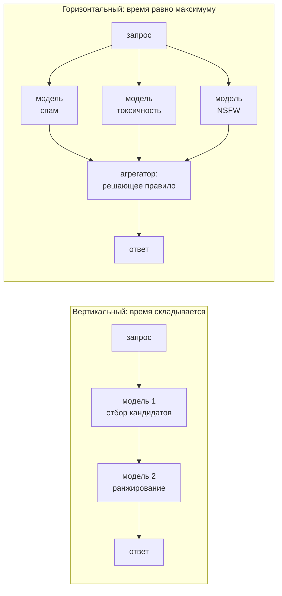

# Архитектуры сервинга

> **Зачем эта глава.** «Модель обучена» — это половина работы; вторая половина в том, чтобы
> она отвечала под нагрузкой, в бюджете латентности и за разумные деньги. Здесь: как выбрать
> между батчем, онлайном и стримингом; когда REST, а когда gRPC; полный рабочий FastAPI-сервис
> с батчингом, метриками и корректным завершением; почему воркеров именно столько; как считать
> число реплик под заданный RPS и почему автоскейлинг не спасает ML-сервис от всплеска трафика.

**Уровень:** 🎯 middle → 🧠 middle+
**Предварительно нужно:** [упаковка модели](04-model-packaging.md), [данные и feature store](03-data-and-feature-store.md), [Python для MLE (GIL, конкурентность)](../12-coding/01-python-for-mle.md)
**Как проработать:** чтение + поднять сервис + нагрузочный тест

---

## Карта главы

- [1. Три режима инференса и как между ними выбирать](#1-три-режима-инференса-и-как-между-ними-выбирать)
- [2. Каталог паттернов: язык, которым описывают решения](#2-каталог-паттернов-язык-которым-описывают-решения)
- [3. Бюджет латентности: считаем, а не угадываем](#3-бюджет-латентности-считаем-а-не-угадываем)
- [4. Сколько нужно реплик: формула и вывод](#4-сколько-нужно-реплик-формула-и-вывод)
- [5. REST против gRPC](#5-rest-против-grpc)
- [6. FastAPI-сервис целиком](#6-fastapi-сервис-целиком)
- [7. GIL, воркеры и потоки: откуда берутся числа](#7-gil-воркеры-и-потоки-откуда-берутся-числа)
- [8. Динамический батчинг: latency против throughput](#8-динамический-батчинг-latency-против-throughput)
- [9. Triton и TorchServe: когда они оправданы](#9-triton-и-torchserve-когда-они-оправданы)
- [10. Кэш предсказаний](#10-кэш-предсказаний)
- [11. Таймауты, ретраи и SLA](#11-таймауты-ретраи-и-sla)
- [12. Автоскейлинг и холодный старт](#12-автоскейлинг-и-холодный-старт)
- [13. Подводные камни](#13-подводные-камни)
- [14. Проверь себя](#14-проверь-себя)
- [15. Практика](#15-практика)
- [16. Что читать дальше](#16-что-читать-дальше)

---

## 1. Три режима инференса и как между ними выбирать

Начнём с вопроса, который надо задавать первым и который кандидаты пропускают: **а нужен ли
онлайн-инференс вообще?** Огромная доля продуктовых ML-задач прекрасно решается ночным
пересчётом, и выбор онлайна «потому что современно» — это в разы более дорогая и хрупкая
система без выигрыша.

**Батчевый инференс (batch / offline).** Предсказания считаются пачкой по расписанию
и складываются в хранилище, откуда сервис их просто читает. Типичный масштаб: 50 млн
пользователей × 200 признаков, LightGBM, Spark на 100 экзекьюторах по 4 ядра — порядка
15–25 минут и копейки по деньгам, потому что железо занято 20 минут в сутки, а не круглосуточно.
Латентность ответа пользователю при этом — время похода в Redis, 1–3 мс. Плата: предсказание
устарело на срок до периода пересчёта.

**Онлайн-инференс (online / real-time).** Модель вызывается в момент запроса. Нужен, когда
предсказание зависит от того, что нельзя посчитать заранее: текст запроса, содержимое корзины,
контекст сессии, только что загруженная картинка. Стоит дорого: сервис должен быть поднят
круглосуточно с запасом на пик, к нему нужны мониторинг, автоскейлинг, фолбэки.

**Потоковый инференс (streaming).** Предсказание считается по событию из очереди
(Kafka → консьюмер → модель → выход в другой топик или в хранилище). Никто не ждёт ответа
синхронно, но задержка измеряется секундами, а не часами. Классика: антифрод-скоринг транзакций,
пересчёт признаков реального времени, обогащение событий.

Критерии выбора — не «что современнее», а ответы на четыре вопроса:

| Вопрос | Батч | Стриминг | Онлайн |
|---|---|---|---|
| Известен ли вход заранее? | да, вход — это состояние пользователя | вход приходит событием | вход рождается в момент запроса |
| Допустима ли устареваемость? | часы–сутки | секунды–минуты | нет |
| Сколько объектов надо предсказать? | все (десятки–сотни млн) | все события потока | только запрошенные (доли процента) |
| Что дешевле? | дешевле всего: железо занято минуты в сутки | средне | дороже всего: круглосуточный запас на пик |

Отдельный практический приём, который стоит знать: **гибрид**. Тяжёлая часть считается батчем
(эмбеддинги товаров, кандидаты, агрегаты за 30 дней), лёгкая — онлайн (финальное ранжирование
100 кандидатов с учётом текущей сессии). Так устроено большинство продовых рекомендательных
систем, см. [рекомендации в продакшене](../06-recsys/14-recsys-in-production.md).

> 💬 **На собеседовании.** Спросят: «Как вы задеплоите модель оттока?»
> Хороший ответ начинается с уточнения: «Отток — медленно меняющаяся характеристика, скор
> актуален неделю. Значит, батчевый пересчёт раз в сутки, результат в Redis/ClickHouse,
> сервис отдаёт готовое за миллисекунды. Онлайн-инференс здесь не нужен, он дал бы тот же
> ответ дороже. Онлайн понадобится, если появится сценарий с реакцией на действие в сессии —
> тогда я бы сделал гибрид: базовый скор батчем, поправка онлайн».
> Плохой ответ: сразу описывать FastAPI и Kubernetes, не спросив, нужна ли синхронность.

---

## 2. Каталог паттернов: язык, которым описывают решения

Ситуация, знакомая по секции ML System Design. Кандидат говорит: «Я бы сделал так: один сервис принимает
запрос и готовит признаки, потом отдаёт их другому сервису, который держит модель, а тот
возвращает скор». Интервьюер спрашивает: «А зачем два сервиса?» — и следующие пять минут уходят
на восстановление мотивации, которая в голове была, но в речи не прозвучала.

Тот же ответ, но с именем: «Беру prep-pred — подготовку признаков и предсказание разными
сервисами. Мотив: разный профиль ресурсов, декодирование картинок ест CPU, модель живёт на карте,
масштабировать их надо независимо. Плачу сетевым хопом в 0.3 мс и обязательством выкатывать
препроцессор и модель одной парой». Тридцать секунд — и разговор перешёл на цену решения,
а не на его расшифровку.

В этом и есть единственная ценность имён: они сжимают контекст. Наиболее систематичный каталог
для ML-систем собрал Yusuke Shibui в репозитории `mercari/ml-system-design-pattern`; ниже — пять
паттернов оттуда, которые действительно встречаются в продуктовых системах, и отдельно список
антипаттернов. Каждый паттерн разбираем по трём вопросам: какую задачу решает, чем платит,
когда его берут по инерции.

### 2.1. prep-pred: подготовка признаков отдельно от предсказания

**Что ломается без разделения.** Сервис классификации изображений. На один запрос: декодирование
JPEG, ресайз, нормализация — 12 мс на ядре CPU; инференс ResNet-50 на батче 32 на карте A10 —
9 мс на батч, то есть 0.28 мс на картинку. При 500 RPS препроцессинг требует
$500 \cdot 0.012 = 6$ ядер, а инференс — $500 \cdot 0.00028 \approx 0.14$ карты. Если всё живёт
в одном процессе, реплик нужно столько, сколько требует **дорогая по ядрам** часть, и в каждой
из них будет карта, загруженная на несколько процентов. Вы платите за шесть карт вместо одной.

**Что делает паттерн.** Препроцессинг и предсказание разносятся по разным деплойментам: первый
масштабируется по CPU, второй — по картам. Шесть CPU-подов и один GPU-под вместо шести
GPU-подов — это и есть содержательный аргумент за prep-pred, а не «чистота архитектуры».

**Чем платит.** Во-первых, хопом: 0.2–0.5 мс, если это sidecar в том же поде, 1–3 мс, если
отдельный сервис. Во-вторых — и об этом забывают — **объёмом на проводе**. После препроцессинга
картинка превращается в тензор $3 \times 224 \times 224$ во float32, а это 602 КБ против 60–120 КБ
исходного JPEG: по сети поехало в пять-десять раз больше, чем пришло от клиента. Лечится
передачей в uint8 (150 КБ) с нормализацией на стороне модели или fp16 (301 КБ). В-третьих,
версионированием: препроцессор и модель обязаны выкатываться **парой**, иначе вы получаете
train/serve skew в чистейшем виде — модель обучалась на одной нормализации, а получает другую.
Практика: одна версия контракта на оба образа, и деплой обоих в одной транзакции.

**Когда берут зря.** Табличная модель, где препроцессинг — двадцать строк numpy на 0.1 мс.
Хоп в 0.3 мс дороже всей работы, которую вы вынесли, а компонентов стало два.

### 2.2. Вертикальный и горизонтальный микросервис

Когда моделей в ответе несколько, есть ровно две топологии, и они отличаются тем, как
складывается латентность.



**Вертикальный** (последовательный) — каждая следующая модель получает на вход результат
предыдущей. Это единственный вариант, когда зависимость по данным реальна: отбор кандидатов →
ранжирование → переранжирование с учётом бизнес-правил; детектор объектов → классификатор
на вырезанной области. Платит суммой времён и тем, что отказ любого звена рвёт всю цепочку,
поэтому фолбэк нужен на каждом.

**Горизонтальный** (параллельный веер) — модели независимы, вызываются одновременно, результаты
сводит агрегатор. Классика: несколько моделей на разные аспекты одного контента, ансамбль,
чемпион и челленджер бок о бок. Латентность равна максимуму, а не сумме.

> 🧠 **Middle+.** «Максимум вместо суммы» звучит как чистый выигрыш, но у веера своя проблема
> с хвостами, и она хуже, чем у цепочки. Латентность агрегата — это максимум по $k$ вызовам,
> а максимум определяется хвостом, а не медианой: чтобы p99 агрегата равнялся 10 мс, нужно,
> чтобы **все** $k$ вызовов уложились в 10 мс с вероятностью 0.99, то есть каждый отдельный
> должен укладываться с вероятностью $0.99^{1/k}$. При $k = 5$ это квантиль 0.998 — вам нужен
> не p99, а p99.8 каждого сервиса. Отсюда практическое следствие: у горизонтального паттерна
> **обязателен** частичный ответ — дедлайн на весь веер, и кто не успел, того агрегатор
> считает по дефолту с пометкой в ответе. Иначе самая медленная модель определяет хвост всей
> системы. Про сложение хвостов в последовательной цепочке — в [§3](#3-бюджет-латентности-считаем-а-не-угадываем).

**Когда берут зря.** Две модели на 50 RPS, обе по 3 мс: разносить их по сервисам — это два
деплоймента, два дашборда и два способа сломаться ради экономии трёх миллисекунд. Держите
в одном процессе, пока не разойдутся профили ресурсов или темпы релизов.

### 2.3. Prediction circuit break: размыкание предсказания

Классический circuit breaker размыкает вызов **зависимости**, когда та начала сыпаться
(см. [§11](#11-таймауты-ретраи-и-sla)). Prediction circuit break размыкает вызов **собственной модели**, когда
перегружен сам сервис. Разница принципиальная: здесь нет внешнего виноватого — вы осознанно
жертвуете качеством части ответов, чтобы удержать латентность остальных.

**Триггер — не ошибки, а очередь.** Считаем число запросов в обработке (in-flight). Если реплика
рассчитана на $c$ одновременных запросов при целевой утилизации, то при превышении $c$ вы уже
в зоне, где время ожидания растёт как $1/(1-\rho)$ (вывод — в [§4](#4-сколько-нужно-реплик-формула-и-вывод)). Значит, дальше
принимать запросы в модель бессмысленно: они всё равно не уложатся в дедлайн, но успеют
испортить латентность тем, кто уже в очереди. Вместо этого — мгновенный фолбэк: кэш, популярное,
упрощённая модель на признаках из запроса.

**Чем платит.** Тихой деградацией. Сервис зелёный, ошибок нет, p99 в норме — а качество
предсказаний на части трафика упало, и никто этого не видит. Поэтому доля размыканий —
обязательная метрика с алертом, и её надо помнить при чтении результатов A/B: если 5% трафика
ушло на фолбэк, наблюдаемый эффект эксперимента размыт примерно на те же 5%.

**Когда неуместен.** Когда fail-open недопустим. Антифрод, отдающий «не мошенник», потому что
перегружен, — это прямой убыток, причём именно в момент атаки, когда нагрузка и растёт.
Правильный фолбэк здесь консервативный: отправить на ручную проверку, придержать операцию,
применить жёсткое правило. Формулировка «размыкание всегда в сторону более безопасного исхода,
а не более дешёвого» — хороший ответ на уточняющий вопрос интервьюера.

### 2.4. Многоступенчатое предсказание: дешёвая модель отсекает, дорогая уточняет

**Задача — деньги.** Модерация пользовательского контента, 2000 объектов в секунду в пике.
Энкодер уровня BERT-base на батче 32 обрабатывает 1280 объектов в секунду на одной карте
([§8](#8-динамический-батчинг-latency-против-throughput)), при целевой утилизации 0.6 — 768. Значит, весь поток требует
$\lceil 2000/768 \rceil = 3$ карты, а с запасом на отказ зоны и выкатку — пять-шесть.

Ставим впереди бустинг на 40 табличных признаках: 0.3 мс на объект, весь поток — 0.6 ядра CPU.
Порог подбираем так, чтобы дальше проходило 8% объектов: на вторую ступень остаётся 160 в секунду,
это 0.21 карты, то есть достаточно двух — и то по соображениям отказоустойчивости, а не нагрузки.
Разница в три-четыре карты; при цене карты этого класса порядка 1–1.5 доллара в час это около
трёх с половиной тысяч долларов в месяц.

Средняя стоимость объекта в каскаде:

$$
C = c_1 + p \cdot c_2
$$

где $c_1$ — стоимость первой (дешёвой) ступени на объект, $c_2$ — стоимость второй (дорогой),
$p$ — доля объектов, которую первая ступень пропускает дальше. Выигрыш появляется только при
одновременном выполнении двух условий: $c_1 \ll c_2$ и $p$ мало. Если первая ступень пропускает
дальше 60% потока, каскад не окупает своей сложности.

**Чем платит — и это главное.** Потолок качества задаёт **recall первой ступени**, а не точность
второй: объект, отброшенный на первом шаге, вторая модель уже не увидит. Поэтому порог первой
ступени подбирают не по F1 и не по accuracy, а по recall при заданной доле пропуска: типичная
цель — 0.99–0.995. В нашем примере это означает, что каскад теряет 0.5% нарушений, которые
поймал бы BERT в одиночку, и это число нужно назвать вслух, а не спрятать.

> ⚠️ **Типичная ошибка.** Обучить вторую ступень на полном потоке, а применять — только к тому,
> что пропустила первая. Вторая модель работает на **отфильтрованном** распределении, где нет
> лёгких случаев, и её калибровка на нём другая. Хуже того, при переобучении первой ступени
> вход второй незаметно уезжает — это CACE в чистом виде
> (см. [жизненный цикл](01-ml-lifecycle.md)). Как правильно: обучать вторую ступень на выходе
> первой (той её версии, что поедет в прод), переобучать пару вместе и оценивать каскад
> **сквозным** офлайн-прогоном, а не по метрикам ступеней по отдельности.

### 2.5. Модель в образе против загрузки при старте

Два способа связать веса с контейнером, и выбор между ними определяет, что именно вы откатываете
при инциденте.

| | **model-in-image** (веса в образе) | **model-load** (веса тянутся при старте) |
|---|---|---|
| Что однозначно задаёт поведение | тег образа | тег образа **плюс** переменные окружения |
| Откат | откат деплоймента, одна операция | откат деплоймента + проверка, какая версия весов подтянется |
| Размер образа | базовый + веса (LightGBM 50 МБ — незаметно; 7B в fp16 — плюс 14 ГБ) | базовый, обычно 0.3–8 ГБ |
| Холодный старт | скачивание образа дольше, дальше сразу готов | образ уже на ноде, но плюс 10–90 с на выкачку весов |
| Зависимость на пути старта | нет | реестр моделей или S3 обязаны быть доступны, иначе под не поднимается |
| Пересборка при переобучении | нужна каждый раз | не нужна: меняется значение переменной |
| Несколько моделей на один код | отдельный образ на каждую | один образ, разные конфиги |

**Как выбирают на практике.** Для лёгких моделей (бустинг, логрег, небольшой энкодер) —
model-in-image: воспроизводимость получается бесплатно, а плюс 50 МБ к образу никого не волнует.
Для больших весов и для частого переобучения — model-load, но с двумя обязательными подпорками:
версия весов фиксируется в манифесте деплоймента явным значением, а не тегом `latest`
(иначе два пода одного деплоймента поднимут разные модели), и на старте проверяется контрольная
сумма артефакта — ровно как в коде из [§6](#6-fastapi-сервис-целиком).

> 💬 **На собеседовании.** Спросят: «Где вы храните веса модели — в образе или во внешнем
> хранилище?» Хороший ответ формулирует это как выбор точки версионирования: «model-in-image
> даёт один неизменяемый артефакт: тег образа однозначно определяет поведение, откат — одна
> операция. Плата — пересборка образа на каждую переобучёнку и раздутый регистр, поэтому для
> весов в гигабайты так не делают. Для больших моделей беру model-load, но тогда версию весов
> фиксирую в манифесте явным значением, а не `latest`, и проверяю sha256 на старте — иначе
> при выкатке разные поды одного деплоймента поднимут разные модели, и вы будете ловить
> плавающее качество без единой ошибки в логах». Плохой ответ: «складываем в S3, оттуда
> и берём» — без слова о том, что тогда определяет версию.

### 2.6. Антипаттерны и их симптомы

Здесь важнее не названия, а **симптомы**: по ним вы опознаёте проблему в чужой системе за
пять минут разговора, и ровно этого ждут, когда на секции просят покритиковать предложенную схему.

**Всё в одном сервисе (all-in-one).** Симптом: в одном деплойменте живут обучение, подготовка
признаков, онлайн-инференс, батчевые джобы и админка; образ весит 12 ГБ; выкатка новой модели
требует релиза всего сервиса; профилирование показывает, что на сам инференс уходит меньше
трети CPU. Причина обычно историческая: начали с одного файла и не резали по мере роста.
Как правильно: граница проводится по **частоте изменений** и по **профилю ресурсов** —
компоненты, которые релизятся с разной частотой или упираются в разные ресурсы, живут отдельно.

**Обучающий код в сервинге (training code in serving).** Симптом: в образ сервиса приезжают
`optuna`, `mlflow`, ноутбучные утилиты и половина стека обучения — потому что сервису нужна
одна функция подготовки признаков из обучающего модуля. Следствия: старт 40 секунд вместо пяти,
десятки лишних CVE в сканере образов, и невозможность обновить библиотеку обучения, не трогая
прод. Самый опасный подвид — сервис, умеющий «дообучиться на лету» по HTTP-запросу: он
превращает инференс в stateful-компонент, поведение которого зависит от того, какие поды
принимали трафик. Как правильно: определение признаков выносится в отдельный маленький пакет,
который импортируют и обучение, и сервис; обучающий код в сервинг не попадает вовсе.

**Слишком много промежуточных хранилищ (too many pipes).** Симптом: признак едет по маршруту
DWH → S3 → Kafka → Redis → сервис, на каждом переходе слегка меняя форму; чтобы объяснить,
откуда взялось конкретное значение, нужно собрать четырёх человек; заявленная свежесть —
минуты, фактическая — часы, и никто не может сказать, на каком звене теряется время. Как
правильно: у каждого признака один канонический путь, и каждый переход обязан добавлять
**свойство** (персистентность, индекс по ключу, скорость чтения), а не просто формат. Переход,
который только перекладывает данные, — кандидат на удаление.

**«Работает только у меня» (only-me).** Симптом: модель обучена на ноутбуке автора, версии
библиотек нигде не зафиксированы, в реестре лежит артефакт без коммита и без хеша обучающих
данных, и ни одного успешного прогона обучения на CI не было. Проверяется одним вопросом:
«пересоберите эту модель на чистой машине». Как правильно — в главах про
[воспроизводимость](02-reproducibility-and-tracking.md) и [упаковку](04-model-packaging.md).

**Отсутствие логирования предсказаний (no logging).** Симптом: сервис не пишет ни входной вектор,
ни ответ. Обнаруживается это всегда одинаково и всегда поздно — когда приходит вопрос «почему
клиенту X отказали третьего марта», когда нужно посчитать метрику качества в проде или собрать
датасет для следующей версии. Пересчитать признаки задним числом обычно нельзя: состояние
источников уже другое. Логировать надо `request_id`, версию модели, вектор признаков **ровно
в том виде, в котором он ушёл в модель**, предсказание, флаг `degraded` и метку времени;
на большом потоке — с сэмплированием, но с полным покрытием редких сегментов. Это же
единственный способ поймать train/serve skew: сравнить залогированные фичи с офлайновым
пересчётом на тех же объектах.

> 💬 **На собеседовании.** Спросят: «Посмотрите на нашу схему — что бы вы здесь изменили?»
> Сильный ответ идёт по симптомам, а не по вкусам: «Первое, чего я не вижу, — логирования
> предсказаний и признаков в момент инференса. Без него нельзя ни посчитать прод-метрику,
> ни собрать датасет для следующей версии, ни доказать отсутствие skew; я бы добавил это
> раньше всего остального, потому что данные, которые сейчас не пишутся, потом не восстановятся.
> Второе: обучение и сервинг в одном образе — это связывает релизы и раздувает поверхность
> атаки. Третье, вопрос: сколько промежуточных хранилищ проходит признак от источника
> до модели и что каждое из них добавляет?» Плохой ответ: перечислить технологии, которые
> вы бы поменяли на более современные.

---

## 3. Бюджет латентности: считаем, а не угадываем

Прежде чем выбирать технологии, разложите SLA по стадиям. Возьмём типичное требование:
**p99 ≤ 200 мс** на ответ ранжирующего сервиса.

| Стадия | Типичное время (p50) | Комментарий |
|---|---|---|
| Сеть клиент↔сервис внутри ДЦ | 0.5–2 мс | между ДЦ — 5–40 мс, и это меняет всё |
| Разбор запроса, валидация pydantic | 0.3–2 мс | на батче 1000 объектов JSON разбирается 10–40 мс |
| Поход в онлайн feature store (Redis, 1 round-trip) | 0.5–1.5 мс | p99 ~3–5 мс; батчить через `MGET`/pipeline |
| Отбор кандидатов, HNSW по 10 млн векторов, k=1000 | 5–15 мс | зависит от `ef_search` |
| Инференс бустинга, 1000 объектов × 200 фич × 500 деревьев | 20–50 мс | на одном ядре; линейно по числу деревьев |
| Инференс BERT-base, батч 32, seq 128, GPU A10 | 10–20 мс | на CPU те же 32 примера — 250–600 мс |
| Бизнес-правила, дедупликация, сборка ответа | 1–5 мс | |
| Сериализация ответа (100 объектов JSON) | 0.5–2 мс | |

Сумма p50 обычно составляет 30–50% от бюджета p99 — остальное съедают хвосты: сборка мусора,
попадание в занятый воркер, ретрай, промах кэша. **Правило большого пальца: сумма медиан
стадий должна укладываться в треть бюджета p99.** Если сумма медиан 150 мс при бюджете
p99 200 мс — вы не уложитесь никогда.

> 🧠 **Middle+.** Хвосты складываются хуже, чем медианы. Если ответ требует последовательных
> походов в $k$ независимых сервисов, и каждый имеет p99 = 10 мс, то вероятность, что хотя бы
> один попадёт в свой хвост, растёт как $1-(0.99)^k$: при $k=10$ это уже 9.6%, то есть p99
> всей цепочки определяется не суммой p99, а тем, что почти каждый десятый запрос ловит
> медленный поход. Отсюда два вывода: минимизировать число последовательных сетевых вызовов
> (батчить, распараллеливать `asyncio.gather`) и ставить на каждый вызов таймаут с фолбэком,
> иначе один медленный сервис определяет хвост всей системы.

---

## 4. Сколько нужно реплик: формула и вывод

Это любимый вопрос интервьюеров, потому что он мгновенно отличает человека, который поднимал
сервис, от того, кто читал про это.

Основа — **закон Литтла**: в стационарном режиме среднее число заявок в системе равно
интенсивности потока, умноженной на среднее время пребывания:

$$
L = \lambda \cdot W
$$

где $\lambda$ — интенсивность входящего потока (запросов в секунду), $W$ — среднее время
обработки одного запроса (секунды), $L$ — среднее число одновременно обрабатываемых запросов.

Если одна реплика способна обрабатывать $c$ запросов параллельно (для CPU-bound инференса
$c$ = число процессов-воркеров), а мы хотим держать загрузку на уровне $u \in (0,1)$,
то число реплик:

$$
N = \left\lceil \frac{\lambda_{\text{peak}} \cdot \bar{t}}{c \cdot u} \right\rceil \cdot (1 + h)
$$

где $\lambda_{\text{peak}}$ — RPS в пике (не средний!), $\bar{t}$ — среднее время обработки
одного запроса на одном воркере в секундах, $c$ — конкурентность одной реплики, $u$ — целевая
утилизация, $h$ — запас на выкатку и отказ зоны (обычно 0.25–0.5).

**Почему $u$ не может быть близко к 1.** Это не перестраховка, а следствие теории очередей.
Для простейшей модели M/M/1 среднее время ожидания в очереди растёт как

$$
W = \frac{\bar{t}}{1 - \rho}
$$

где $\rho$ — утилизация. Отсюда таблица, которую полезно помнить наизусть:

| Утилизация $\rho$ | Во сколько раз растёт время ответа |
|---|---|
| 0.5 | ×2 |
| 0.7 | ×3.3 |
| 0.8 | ×5 |
| 0.9 | ×10 |
| 0.95 | ×20 |

Поэтому целевая утилизация ML-сервиса — **0.5–0.7**. Планировать на 0.9 «чтобы не платить
за простой» означает получить p99 в десять раз хуже p50 и алерты при малейшем всплеске.

**Разбор примера.** Ранжирующий сервис, пик 3000 RPS, один запрос = скоринг 500 кандидатов
бустингом, что занимает 22 мс CPU. Под — 4 CPU, ставим 4 воркера, $u = 0.6$, $h = 0.3$.

$$
N = \left\lceil \frac{3000 \cdot 0.022}{4 \cdot 0.6} \right\rceil \cdot 1.3
= \left\lceil \frac{66}{2.4} \right\rceil \cdot 1.3 = 28 \cdot 1.3 \approx 37
$$

37 подов по 4 CPU — 148 ядер. Дальше начинается инженерия: если сократить время скоринга
вдвое (ONNX Runtime, меньше деревьев, ранняя отсечка кандидатов), железо сократится вдвое.
Именно поэтому оптимизация инференса — это не эстетика, а прямая экономия
(см. [оптимизация инференса](09-inference-optimization.md) и
[стоимость и ёмкость](10-cost-and-capacity.md)).

> 💬 **На собеседовании.** Спросят: «Сколько машин нужно под 5000 RPS?»
> Хороший ответ: «Мне нужны три числа: время обработки одного запроса, конкурентность реплики
> и целевая утилизация. Допустим, 30 мс на запрос, 4 воркера на под, целевая утилизация 60% —
> тогда по закону Литтла 5000 × 0.03 = 150 запросов одновременно, делим на 4 × 0.6 = 2.4 →
> 63 пода, плюс 30% на выкатку и отказ зоны → округляю до 80. Утилизацию беру 60%, а не 90%,
> потому что время ожидания растёт как 1/(1−ρ) и на 0.9 хвост распухнет в десять раз».
> Плохой ответ: «зависит от нагрузки» или конкретное число без расчёта.

---

## 5. REST против gRPC

Разница не в моде, а в трёх вещах: формат сериализации, транспорт и наличие схемы.

**Сериализация.** Возьмём типичный для ML запрос: 1000 объектов по 100 float-признаков.

| | JSON | Protobuf (packed float) |
|---|---|---|
| Размер тела | 1.5–2.5 МБ (число печатается 12–18 символами) | ~400 КБ (4 байта на float) |
| Разбор в Python | 40–70 мс стандартным `json`, 8–15 мс через `orjson` | 2–5 мс |
| Читается глазами | да | нет, нужен `grpcurl` со схемой |

Для одиночного запроса на 20 признаков разница между JSON и protobuf — доли миллисекунды,
и она никого не волнует. Для батчевых вызовов с матрицами разница в разбор — это десятки
миллисекунд, то есть половина бюджета.

**Транспорт.** gRPC работает поверх HTTP/2 с мультиплексированием: много запросов в одном
TCP-соединении без блокировки друг друга. REST поверх HTTP/1.1 требует пула соединений,
и внутри одного соединения запросы идут строго по очереди.

**Схема.** В gRPC контракт описан в `.proto` и из него генерируется код клиента и сервера.
Ошибку «переименовали поле» вы получите на этапе компиляции, а не в проде.

```protobuf
// scoring.proto — контракт как код, из него генерируются клиент и сервер
syntax = "proto3";
package scoring.v1;

message ScoreRequest {
  string user_id  = 1;
  repeated float features = 2;   // packed по умолчанию в proto3: 4 байта на значение
  string model_alias = 3;        // champion / challenger
}

message ScoreResponse {
  float score = 1;
  string model_version = 2;
  bool degraded = 3;
}

service Scoring {
  rpc Score (ScoreRequest) returns (ScoreResponse);
  rpc ScoreStream (stream ScoreRequest) returns (stream ScoreResponse);  // потоковый режим
}
```

**Когда что выбирать:**

- **REST/JSON** — внешние API, интеграция с фронтендом, редкие запросы с маленьким телом,
  ситуация «нужно, чтобы любая команда могла дёрнуть curl'ом». Это правильный дефолт для
  первой версии сервиса.
- **gRPC** — внутренние сервис-сервисные вызовы с высоким RPS, большие числовые payload'ы,
  потоковые сценарии (стриминг токенов LLM), необходимость строгой схемы и встроенных
  дедлайнов.

> ⚠️ **Типичная ошибка.** Поставить gRPC-сервис за обычный Kubernetes Service и удивиться,
> что нагрузка распределяется неравномерно. Причина: `Service` балансирует на уровне L4,
> то есть распределяет **соединения**, а HTTP/2-соединение долгоживущее — клиент установил
> одно соединение с одним подом и шлёт в него всё. Итог: два пода из десяти в полке,
> остальные простаивают. Лечится клиентской балансировкой (`round_robin` в gRPC-клиенте
> с `headless` Service и DNS-резолвом всех подов), сервис-мешом или L7-прокси.

---

## 6. FastAPI-сервис целиком

Ниже — сервис, который можно запустить. В нём реализованы: загрузка модели на старте с прогревом,
валидация контракта, микробатчинг, метрики Prometheus, раздельные liveness/readiness и корректное
завершение. Схема `ScoreRequest`/`ScoreResponse` — из [главы про упаковку](04-model-packaging.md).

```python
# app/main.py — прод-скелет сервиса инференса. Запуск: uvicorn app.main:app
from __future__ import annotations

import asyncio
import hashlib
import os
import time
from contextlib import asynccontextmanager
from dataclasses import dataclass

import lightgbm as lgb
import numpy as np
from fastapi import FastAPI, HTTPException, Response
from prometheus_client import CONTENT_TYPE_LATEST, Counter, Gauge, Histogram, generate_latest

from app.schema import FEATURE_ORDER, ScoreRequest, ScoreResponse

MODEL_PATH = os.environ["MODEL_PATH"]
MODEL_VERSION = os.environ["MODEL_VERSION"]
MODEL_SHA256 = os.environ["MODEL_SHA256"]
MAX_BATCH = int(os.getenv("MAX_BATCH_SIZE", "64"))
MAX_WAIT_S = float(os.getenv("MAX_BATCH_WAIT_MS", "5")) / 1000
REQUEST_TIMEOUT_S = float(os.getenv("REQUEST_TIMEOUT_S", "0.12"))

# --- Метрики. Бакеты гистограммы задаются ПОД ВАШ SLA, дефолтные почти всегда бесполезны:
# если SLA 200 мс, нужны бакеты вокруг 200 мс, иначе p99 будет считаться по огрызку. ---
REQUESTS = Counter("inference_requests_total", "Запросы инференса", ["endpoint", "status"])
LATENCY = Histogram(
    "inference_latency_seconds", "Латентность запроса целиком", ["endpoint"],
    buckets=(0.005, 0.01, 0.025, 0.05, 0.075, 0.1, 0.15, 0.2, 0.3, 0.5, 1.0),
)
BATCH_SIZE = Histogram(
    "inference_batch_size", "Фактический размер собранного батча",
    buckets=(1, 2, 4, 8, 16, 32, 64, 128),
)
QUEUE_DEPTH = Gauge("inference_queue_depth", "Длина очереди батчера")
DEGRADED = Counter("inference_degraded_total", "Ответы с дефолтными признаками")
MODEL_INFO = Gauge("model_info", "Версия загруженной модели", ["version"])


@dataclass
class _Job:
    features: np.ndarray          # (d,) float32
    future: asyncio.Future


class Batcher:
    """Микробатчинг: склеивает одиночные запросы в матрицу, чтобы амортизировать
    постоянные издержки вызова модели (переход в C++, аллокации, поднятие OpenMP-пула)."""

    def __init__(self, predict_fn, max_batch: int, max_wait_s: float):
        self._predict = predict_fn
        self._max_batch = max_batch
        self._max_wait = max_wait_s
        self._queue: asyncio.Queue[_Job] = asyncio.Queue()
        self._task: asyncio.Task | None = None

    def start(self) -> None:
        self._task = asyncio.create_task(self._loop())

    async def stop(self) -> None:
        if self._task:
            self._task.cancel()
            # Ждём завершения, чтобы не оборвать батч, который уже считается.
            await asyncio.gather(self._task, return_exceptions=True)

    async def submit(self, feats: np.ndarray) -> float:
        fut: asyncio.Future = asyncio.get_running_loop().create_future()
        await self._queue.put(_Job(feats, fut))
        QUEUE_DEPTH.set(self._queue.qsize())
        return await fut

    async def _loop(self) -> None:
        while True:
            job = await self._queue.get()          # блокируемся, пока батч пуст
            batch = [job]
            deadline = time.perf_counter() + self._max_wait
            # Добираем батч, но не дольше max_wait: это и есть ручка latency<->throughput.
            while len(batch) < self._max_batch:
                left = deadline - time.perf_counter()
                if left <= 0:
                    break
                try:
                    batch.append(await asyncio.wait_for(self._queue.get(), left))
                except asyncio.TimeoutError:
                    break

            BATCH_SIZE.observe(len(batch))
            QUEUE_DEPTH.set(self._queue.qsize())
            X = np.stack([j.features for j in batch])
            try:
                # to_thread обязателен: predict — CPU-bound C++-код на десятки миллисекунд.
                # В event loop он заблокировал бы ВСЕ остальные корутины, включая /health.
                # LightGBM отпускает GIL внутри predict, поэтому поток реально работает.
                preds = await asyncio.to_thread(self._predict, X)
            except Exception as exc:                     # noqa: BLE001
                for j in batch:
                    if not j.future.done():
                        j.future.set_exception(exc)
                continue
            for j, p in zip(batch, preds):
                if not j.future.done():                  # клиент мог уже отвалиться по таймауту
                    j.future.set_result(float(p))


class State:
    model: lgb.Booster | None = None
    batcher: Batcher | None = None
    ready: bool = False           # readiness: можно ли слать трафик
    alive: bool = True            # liveness: процесс не деградировал безвозвратно


state = State()


def _load_model(path: str, expected_sha: str) -> lgb.Booster:
    # Проверка целостности артефакта: защищает от порчи при выкачке и от подмены.
    digest = hashlib.sha256(open(path, "rb").read()).hexdigest()
    if digest != expected_sha:
        raise RuntimeError(f"sha256 артефакта не совпал: {digest} != {expected_sha}")
    return lgb.Booster(model_file=path)


def _predict(X: np.ndarray) -> np.ndarray:
    assert state.model is not None
    return state.model.predict(X, num_threads=1)   # см. §6: потоки контролируем снаружи


@asynccontextmanager
async def lifespan(app: FastAPI):
    # --- Старт: пока модель не прогрета, readiness=False и трафик в под не идёт. ---
    state.model = _load_model(MODEL_PATH, MODEL_SHA256)
    MODEL_INFO.labels(version=MODEL_VERSION).set(1)

    # Прогрев. Первые вызовы медленнее в 10-50 раз: аллокации буферов, поднятие OpenMP-пула,
    # page faults по mmap-нутым весам. Без прогрева первые сотни запросов после старта
    # улетают в хвост p99, и это видно на каждом деплое как всплеск латентности.
    warm = np.zeros((1, len(FEATURE_ORDER)), dtype=np.float32)
    for _ in range(50):
        state.model.predict(warm, num_threads=1)

    state.batcher = Batcher(_predict, MAX_BATCH, MAX_WAIT_S)
    state.batcher.start()
    state.ready = True
    yield
    # --- Остановка: сначала снимаем readiness, чтобы балансировщик перестал слать новое. ---
    state.ready = False
    await asyncio.sleep(float(os.getenv("DRAIN_SECONDS", "5")))  # даём LB заметить
    await state.batcher.stop()
    state.model = None


app = FastAPI(lifespan=lifespan, title="scoring", version=MODEL_VERSION)


@app.post("/v1/score", response_model=ScoreResponse)
async def score(req: ScoreRequest) -> ScoreResponse:
    started = time.perf_counter()
    degraded = req.days_since_last_order is None
    if degraded:
        DEGRADED.inc()
    x = np.array(
        [[getattr(req, f) if getattr(req, f) is not None else -1.0 for f in FEATURE_ORDER]],
        dtype=np.float32,
    )[0]
    try:
        # Таймаут на стороне сервиса обязателен: он освобождает ресурс, даже если клиент
        # продолжает ждать. Без него очередь растёт, и сервис уходит в лавину.
        p = await asyncio.wait_for(state.batcher.submit(x), REQUEST_TIMEOUT_S)
    except asyncio.TimeoutError:
        REQUESTS.labels("score", "timeout").inc()
        raise HTTPException(status_code=503, detail="inference timeout")
    REQUESTS.labels("score", "ok").inc()
    LATENCY.labels("score").observe(time.perf_counter() - started)
    return ScoreResponse(
        user_id=req.user_id, score=p, model_version=MODEL_VERSION, degraded=degraded
    )


@app.get("/health")
async def health() -> dict[str, str]:
    # LIVENESS: отвечает ли процесс вообще. Ничего тяжёлого здесь быть не должно —
    # иначе probe будет падать под нагрузкой и k8s начнёт перезапускать здоровые поды.
    if not state.alive:
        raise HTTPException(status_code=500, detail="dead")
    return {"status": "ok"}


@app.get("/ready")
async def ready() -> dict[str, str]:
    # READINESS: можно ли слать трафик. Разделение с liveness принципиально:
    # при перегрузке нужно ВРЕМЕННО убрать под из балансировки, а не убить его.
    if not state.ready:
        raise HTTPException(status_code=503, detail="not ready")
    return {"status": "ready", "model_version": MODEL_VERSION}


@app.get("/metrics")
async def metrics() -> Response:
    return Response(generate_latest(), media_type=CONTENT_TYPE_LATEST)
```

Запуск и типовой набор переменных окружения:

```bash
OMP_NUM_THREADS=1 \
MODEL_PATH=/models/churn-2.3.7/model.txt \
MODEL_VERSION=2.3.7 \
MODEL_SHA256=c1d9...f30a \
MAX_BATCH_SIZE=64 MAX_BATCH_WAIT_MS=5 REQUEST_TIMEOUT_S=0.12 \
uvicorn app.main:app --host 0.0.0.0 --port 8000 \
  --workers 4 \
  --timeout-graceful-shutdown 30 \
  --no-access-log            # access-лог на 3000 RPS съедает заметную долю CPU
```

Четыре решения в этом коде стоит объяснить отдельно.

**Разделение `/health` и `/ready`.** Liveness отвечает на вопрос «процесс не завис»,
readiness — «можно ли слать трафик». Если объединить их в один эндпоинт, то при временной
перегрузке Kubernetes начнёт **убивать** поды вместо того, чтобы убрать их из балансировки,
и вы получите каскадное падение: убитый под возвращается через две минуты холодного старта,
нагрузка перераспределяется на оставшиеся, убивает и их.

**Прогрев перед `ready = True`.** Без него первые запросы после каждого деплоя обслуживаются
в десятки раз медленнее. При выкатке 40 подов это гарантированный всплеск p99 на каждом релизе,
который потом ищут в мониторинге как «загадочные пики».

**`asyncio.to_thread` вокруг `predict`.** Event loop однопоточный: если внутри корутины
выполнить 40 мс синхронного C++-кода, весь loop встанет — не обработаются ни другие запросы,
ни `/health`. Вынос в поток работает именно потому, что LightGBM отпускает GIL внутри
нативного вызова (см. [§7](#7-gil-воркеры-и-потоки-откуда-берутся-числа)).

**Пауза перед остановкой батчера.** Между тем, как под перестал быть ready, и тем, как
балансировщик это заметил, проходит время (в Kubernetes — обновление Endpoints плюс период
readinessProbe). Если оборвать приём сразу, часть запросов получит ошибку соединения. Пять
секунд паузы решают проблему; детали — в [главе про k8s](06-docker-and-k8s.md).

> ⚠️ **Типичная ошибка.** Запустить `uvicorn --workers 4` и удивиться, что `/metrics` показывает
> то падающие, то растущие значения счётчиков. Причина: каждый воркер — отдельный процесс
> со своим реестром метрик, а Prometheus скрейпит случайный из них. Решения два:
> либо `prometheus_client` в multiprocess-режиме (переменная `PROMETHEUS_MULTIPROC_DIR`
> и `MultiProcessCollector`), либо — что чаще правильнее в Kubernetes — **один воркер на под**
> и масштабирование подами: тогда метрики честные, память не дублируется, а балансировку
> делает k8s.

---

## 7. GIL, воркеры и потоки: откуда берутся числа

Это место, где на собеседовании ловят почти всех.

**Что делает GIL.** В CPython глобальная блокировка интерпретатора гарантирует, что байт-код
Python в каждый момент исполняет ровно один поток. Значит, два потока, крутящих питоновские
циклы, не ускорят вычисление — они будут по очереди отдавать друг другу GIL.

**Ключевая деталь, которую забывают.** Нативные библиотеки **отпускают GIL** на время
вычислений: numpy в матричных операциях, LightGBM/XGBoost в `predict`, PyTorch, ONNX Runtime.
Пока работает C++-код, GIL свободен, и другой поток может исполнять Python. Именно поэтому
`asyncio.to_thread(model.predict, X)` из [§6](#6-fastapi-сервис-целиком) действительно распараллеливается, а
`asyncio.to_thread(my_pure_python_loop)` — нет.

**Что остаётся под GIL.** Валидация pydantic, сборка словарей, разбор и сериализация JSON,
логирование. На маленьких моделях это может составлять половину времени обработки — и вот
эта половина не масштабируется потоками, только процессами.

**Отсюда конфигурация.** Число процессов-воркеров uvicorn:

$$
W \approx \min\left( \left\lfloor \frac{C_{\text{limit}}}{T_{\text{intra}}} \right\rfloor,\ \left\lfloor \frac{M_{\text{limit}} - M_{\text{rt}}}{M_{\text{model}}} \right\rfloor \right)
$$

где $C_{\text{limit}}$ — CPU-лимит контейнера в ядрах, $T_{\text{intra}}$ — число внутренних
потоков одного инференса (`OMP_NUM_THREADS`, `num_threads` в LightGBM, `torch.set_num_threads`),
$M_{\text{limit}}$ — лимит памяти пода, $M_{\text{rt}}$ — память рантайма и зависимостей
(для Python + torch это 400–900 МБ), $M_{\text{model}}$ — размер модели в памяти.

**Пример.** Под с лимитом 4 CPU и 4 ГиБ, модель 400 МБ, `OMP_NUM_THREADS=1`.
По CPU: $4/1 = 4$. По памяти: $(4096 - 700)/400 = 8.5$. Берём минимум: 4 воркера.
Если модель весила бы 1.5 ГБ, ограничением стала бы память: $(4096-700)/1500 = 2$ воркера,
и два ядра простаивали бы — сигнал, что нужно либо `mmap`-разделение весов
(`joblib.load(mmap_mode="r")`, см. [упаковку](04-model-packaging.md)), либо один воркер
с `OMP_NUM_THREADS=4`.

> ⚠️ **Типичная ошибка (самая дорогая в этой главе).** Оставить `OMP_NUM_THREADS` по умолчанию
> и поднять 8 воркеров. Каждый воркер создаёт OpenMP-пул по числу ядер **хоста** — а хост
> может иметь 64 ядра, тогда как под ограничен двумя. Получается 8 × 64 = 512 потоков,
> дерущихся за 2 ядра: переключений контекста больше, чем полезной работы, латентность
> вырастает в 3–10 раз, а CPU throttling в cgroup добивает остальное. Правило:
> **`W × T_intra ≤ CPU limit`**, и `OMP_NUM_THREADS` задаётся явно всегда.

Простое эмпирическое правило выбора конфигурации:

- **много мелких запросов, лёгкая модель** (бустинг, логрег): много воркеров ×
  `OMP_NUM_THREADS=1`. Так лучше утилизируется CPU и меньше хвост.
- **редкие тяжёлые запросы** (большая нейросеть на CPU, длинные тексты): один-два воркера ×
  `OMP_NUM_THREADS = CPU limit`. Так меньше латентность одного запроса.
- **GPU-модель**: один процесс на GPU. Несколько процессов на одну карту дерутся за память
  и контекст; параллелизм добывается батчингом внутри процесса или через Triton ([§9](#9-triton-и-torchserve-когда-они-оправданы)).

---

## 8. Динамический батчинг: latency против throughput

Инференс почти всегда лучше масштабируется по батчу, чем линейно: постоянные издержки (переход
Python → C++, аллокации, запуск ядер CUDA) амортизируются, а на GPU батч ещё и переводит
вычисление из memory-bound в compute-bound режим.

Возьмём реальную форму зависимости для небольшого трансформера на GPU (порядки, типичные
для энкодера уровня BERT-base, seq 128, A10):

| Размер батча $B$ | Время вычисления $T(B)$, мс | Пропускная способность $B/T$, RPS |
|---|---|---|
| 1 | 7 | 143 |
| 8 | 11 | 727 |
| 16 | 15 | 1067 |
| 32 | 25 | 1280 |
| 64 | 46 | 1391 |
| 128 | 89 | 1438 |

Видно главное: **throughput растёт с насыщением, а латентность растёт линейно.** Переход
с батча 32 на 128 даёт +12% пропускной способности и +256% времени вычисления. Оптимум почти
всегда находится в точке, после которой кривая throughput выполаживается — здесь это 32–64.

Динамический батчинг добавляет к времени вычисления **время ожидания**. Если ждём не дольше
$T_{\text{wait}}$ и поток запросов имеет интенсивность $\lambda$, то батч наполняется за время
$B/\lambda$. Итоговая латентность:

$$
T_{\text{total}} \approx \min\left(\frac{B_{\max}}{\lambda},\ T_{\text{wait}}\right) \cdot \alpha + T(B_{\text{факт}})
$$

где $B_{\max}$ — максимальный размер батча, $T_{\text{wait}}$ — максимальное время ожидания,
$\alpha \approx 0.5$ — коэффициент, отражающий, что средний запрос ждёт примерно половину
времени наполнения (первый пришедший ждёт всё, последний — ничего), $B_{\text{факт}}$ —
фактически собранный размер батча.

**Разбор на числах.** $\lambda = 800$ RPS, $B_{\max} = 32$, $T_{\text{wait}} = 5$ мс.
Батч на 32 наполняется за $32/800 = 40$ мс — это дольше, чем 5 мс, значит батч закрывается
по таймауту, и фактический размер $B_{\text{факт}} \approx 800 \cdot 0.005 = 4$.
Латентность: $0.5 \cdot 5 + T(4) \approx 2.5 + 9 = 11.5$ мс.

Если поднять $T_{\text{wait}}$ до 40 мс, батч будет собираться полным: латентность
$0.5 \cdot 40 + 25 = 45$ мс, зато пропускная способность одного экземпляра модели
вырастет с ~440 до 1280 RPS, то есть железа нужно втрое меньше.

**Это и есть ручка «деньги против латентности».** Правило настройки: выбирайте
$T_{\text{wait}}$ так, чтобы он съедал не больше 10–15% бюджета p99, и подбирайте $B_{\max}$
по точке выполаживания кривой throughput.

> 💬 **На собеседовании.** Спросят: «Как динамический батчинг влияет на латентность?»
> Хороший ответ: он её ухудшает для одиночного запроса и улучшает стоимость на запрос;
> это осознанный размен. Латентность складывается из ожидания наполнения батча (в среднем
> половина `max_queue_delay`) и времени вычисления, растущего с размером батча.
> Выигрыш максимален при низком и среднем RPS на GPU, где одиночный инференс упирается
> в пропускную способность памяти и утилизация карты составляет 10–30%; батч 32 поднимает её
> до 70–85%, то есть втрое сокращает число карт. При очень высоком RPS батч и так наполняется
> мгновенно, и время ожидания стремится к нулю — батчинг становится бесплатным.
> Плохой ответ: «батчинг всегда ускоряет».

---

## 9. Triton и TorchServe: когда они оправданы

Специализированные серверы инференса решают задачи, которые в самописном FastAPI приходится
делать руками и плохо.

**Что даёт NVIDIA Triton Inference Server:**

- динамический батчинг из коробки с настраиваемым `max_queue_delay_microseconds`;
- **instance groups** — несколько экземпляров модели на одной карте, чтобы перекрывать
  копирование данных и вычисление; так утилизация GPU поднимается с 30–40% до 70–90%;
- несколько фреймворков в одном сервере (ONNX, TensorRT, PyTorch, TensorFlow, а также
  Python-backend и FIL-backend для бустингов);
- ансамбли и пайплайны (препроцессинг → модель → постпроцессинг) внутри сервера, без
  сетевых переходов между стадиями;
- одновременное обслуживание нескольких версий модели и горячая подгрузка;
- готовые метрики Prometheus, включая утилизацию GPU и время в очереди;
- REST и gRPC одновременно.

```text
# config.pbtxt — конфигурация модели для Triton
name: "ranker"
platform: "onnxruntime_onnx"
max_batch_size: 64            # верхняя граница батча

input  [ { name: "features", data_type: TYPE_FP32, dims: [ 200 ] } ]
output [ { name: "score",    data_type: TYPE_FP32, dims: [ 1 ] } ]

dynamic_batching {
  preferred_batch_size: [ 16, 32 ]   # предпочтительные размеры: под них оптимизированы ядра
  max_queue_delay_microseconds: 3000 # ждём не дольше 3 мс — 1.5% бюджета p99 в 200 мс
}

instance_group [ { count: 2, kind: KIND_GPU } ]  # 2 экземпляра на карту: перекрываем H2D-копии
```

**Когда Triton/TorchServe оправданы:**

- модель на GPU и её утилизация ниже 50% — это прямой перевод железа в деньги;
- несколько моделей делят одну карту;
- нужна поддержка нескольких фреймворков или частая смена версий без передеплоя;
- высокий RPS, где оверхед Python-слоя становится заметным.

**Когда не оправданы:**

- модель на CPU и лёгкая (бустинг, логрег): выигрыш от батчинга мал, а сложность
  эксплуатации вырастает заметно;
- масштаб до сотен RPS: сэкономите два пода, потратите две недели;
- много бизнес-логики вокруг модели (походы в feature store, фильтры, правила) — её всё
  равно придётся держать в отдельном сервисе, и вы получите два компонента вместо одного;
- команда без опыта эксплуатации: Triton — ещё один сервис со своей конфигурацией,
  своими метриками и своими способами сломаться.

Практичная промежуточная схема: **тонкий FastAPI-сервис с бизнес-логикой + Triton как бэкенд
инференса по gRPC**. Первый занимается фичами, фильтрами и контрактом, второй — только
матрицами. Сетевой хоп внутри одного пода (sidecar) стоит 0.2–0.5 мс.

---

## 10. Кэш предсказаний

Кэш работает ровно тогда, когда **ключи повторяются**. Это очевидно и постоянно игнорируется:
кэшировать предсказания для уникальной тройки (пользователь, товар, момент времени)
бессмысленно, hit rate будет около нуля, а вы заплатите за поход в Redis на каждом запросе.

Что кэшируется хорошо:

| Сценарий | Ключ | Типичный hit rate | TTL |
|---|---|---|---|
| Скор пользователя, медленно меняющийся | `model_ver:user_id` | 70–90% | минуты–часы |
| Эмбеддинг текста/товара | `model_ver:sha1(text)` | 40–80% | сутки и больше |
| Ранжирование популярных запросов | `model_ver:query_norm:filters` | 30–60% (зипфово распределение запросов) | минуты |
| Ответ LLM на типовой вопрос | `model_ver:prompt_hash` | 10–40% | часы |

Выигрыш считается просто. Пусть $r$ — доля попаданий, $t_{\text{cache}}$ — время похода
в кэш, $t_{\text{model}}$ — время инференса. Средняя латентность:

$$
\bar{t} = t_{\text{cache}} + (1 - r)\, t_{\text{model}}
$$

При $t_{\text{cache}} = 1$ мс, $t_{\text{model}} = 40$ мс и $r = 0.7$: $\bar{t} = 1 + 12 = 13$ мс
вместо 40, а нагрузка на модель падает в 3.3 раза — то есть реплик нужно втрое меньше.
Важно: **p99 при этом не улучшается** (промах кэша стоит столько же плюс поход в Redis),
улучшаются медиана и стоимость.

Три правила, за нарушение которых бьют больно:

1. **Версия модели — часть ключа.** Иначе после выкатки новой версии вы часами отдаёте
   предсказания старой, и A/B-тест показывает шум вместо эффекта.
2. **TTL не длиннее свежести признаков.** Если фичи обновляются раз в час, TTL в сутки означает,
   что вы отдаёте предсказание по вчерашним данным, не зная об этом.
3. **Промах кэша не должен вызывать «эффект грохота»** (cache stampede): когда популярный ключ
   протухает, сотня одновременных запросов идёт считать одно и то же. Лечится блокировкой
   на пересчёт по ключу или вероятностным ранним обновлением.

---

## 11. Таймауты, ретраи и SLA

**Бюджет вместо таймаутов «на глазок».** Дедлайн задаёт клиент, и каждый следующий сервис
в цепочке получает **остаток**, а не свой фиксированный таймаут. В gRPC это встроено
(`deadline` едет в метаданных), в HTTP делается заголовком вроде `X-Request-Deadline`.
Без распространения дедлайна получается абсурд: клиент отвалился по таймауту 200 мс,
а цепочка сервисов продолжает считать 3 секунды и жечь CPU на никому не нужный ответ.

Разложение для SLA p99 = 200 мс:

```
клиент               timeout 250 мс   (чуть больше серверного: клиент не должен рвать
                                        соединение раньше, чем сервер успеет ответить ошибкой)
  API-gateway        timeout 220 мс
    scoring-service  внутренний дедлайн 180 мс
      feature store  timeout 20 мс,  фолбэк: дефолтные значения фич, degraded=true
      inference      timeout 120 мс, фолбэк: упрощённая модель или популярное
      бизнес-правила timeout 15 мс
```

**Ретраи — источник аварий.** Наивная политика «три попытки на любую ошибку» при деградации
сервиса умножает нагрузку в 4 раза ровно в тот момент, когда он и так не справляется —
классическая «ретрай-лавина» (retry storm). Правила:

- ретраить только идемпотентные вызовы и только сетевые ошибки/таймауты соединения,
  никогда не 4xx;
- не больше одного ретрая, с экспоненциальной задержкой и **джиттером** (без джиттера все
  клиенты повторят синхронно и создадут второй всплеск);
- **бюджет ретраев**: суммарная доля повторов не выше 10% от трафика; превысили — перестаём
  ретраить вовсе;
- **circuit breaker**: после N ошибок подряд перестаём ходить в сервис на T секунд
  и сразу отдаём фолбэк. Это защищает и клиента (быстрый ответ), и упавший сервис
  (даём ему подняться).

**Деградация вместо отказа.** Правильно спроектированный ML-сервис при недоступности любой
зависимости отдаёт худший, но валидный ответ: дефолтные значения признаков, упрощённая модель
на признаках из запроса, популярное. И обязательно помечает это флагом `degraded` плюс
счётчиком-метрикой: доля деградаций растёт **раньше**, чем падает бизнес-метрика, и это
один из лучших ранних сигналов (см. [мониторинг](../09-monitoring/01-what-to-monitor.md)).

---

## 12. Автоскейлинг и холодный старт

Автоскейлинг ML-сервиса ломается о простой факт: **новая реплика начинает отвечать не сразу.**
Разложим типичный холодный старт GPU-сервиса:

| Этап | Типичное время |
|---|---|
| Реакция HPA (сбор метрик + цикл контроллера) | 15–60 с |
| Планирование пода, поиск узла (или запуск нового узла кластера) | 5 с … 3 мин |
| Скачивание образа 6 ГБ при 200 МБ/с, если его нет на узле | 30–60 с |
| Старт контейнера, импорт torch/CUDA-контекст | 10–20 с |
| Скачивание весов 2 ГБ из S3 | 10–30 с |
| Прогрев модели (первые инференсы) | 5–30 с |
| **Итого до первого полезного ответа** | **1.5–6 минут** |

Всплеск трафика в пуш-рассылке нарастает за 10–30 секунд. Вывод жёсткий: **HPA не успевает
за всплеском ML-трафика, и рассчитывать на него как на защиту нельзя.**

Что делать реально:

- **Держать запас (headroom).** Целевая утилизация 50–60% из [§4](#4-сколько-нужно-реплик-формула-и-вывод) — это и есть запас: он
  поглощает всплеск, пока подъезжают новые поды.
- **Скейлиться по правильной метрике.** CPU для GPU-сервиса бесполезен: карта в полке,
  CPU на 20%. Скейлиться надо по глубине очереди инференса или по RPS на реплику —
  через Prometheus Adapter или KEDA.
- **Скейлиться заранее по расписанию.** Если пик предсказуем (вечер, пуш-кампания,
  распродажа), поднимайте реплики за 15 минут до него cron'ом. Это неромантично и работает
  лучше любого автоскейлера.
- **Сокращать сам холодный старт.** Веса в образе или на локальном томе узла вместо S3;
  `safetensors` с mmap вместо распаковки pickle; предварительно скачанный образ на узлах
  (DaemonSet-прогрев или `imagePullPolicy: IfNotPresent` с закреплённым тегом).
- **Асимметричные пороги.** Наращивать быстро, сокращать медленно: в Kubernetes HPA это
  `behavior.scaleDown.stabilizationWindowSeconds` порядка 300–600 с. Иначе получите
  «пилу»: сервис то скейлится вверх, то вниз, каждый цикл платя холодным стартом.

> 💬 **На собеседовании.** Спросят: «Настроим HPA по CPU — этого хватит?»
> Хороший ответ: для CPU-bound бустинга — почти да, но с оговорками про целевое значение
> (50–60%, не 90%) и про окно стабилизации на уменьшение. Для GPU-сервиса — нет: CPU
> не отражает загрузку карты, скейлиться надо по глубине очереди или RPS на реплику
> через custom metrics. И в любом случае HPA не спасает от резкого всплеска: цикл реакции
> плюс холодный старт дают минуты, а всплеск нарастает за десятки секунд, поэтому основная
> защита — запас по утилизации и предварительный скейлинг по расписанию, а HPA снимает
> усреднённую суточную волну.
> Плохой ответ: «поставим target 80% CPU и всё будет хорошо».

---

## 13. Подводные камни

**Латентность выросла в 5 раз после переезда в Kubernetes, код не менялся.**
Симптом: локально 20 мс, в кластере 100 мс, CPU пода не в полке.
Причина: CPU throttling. Лимит контейнера 1 CPU, а процесс поднял OpenMP-пул на число ядер
узла; cgroup режет его квотой, и потоки простаивают в throttling.
Что делать: выставить `OMP_NUM_THREADS`/`num_threads` под CPU-лимит, проверить метрику
`container_cpu_cfs_throttled_seconds_total` (детали — в [главе про k8s](06-docker-and-k8s.md)).

**p99 в 20 раз хуже p50 при нормальной средней загрузке.**
Симптом: p50 = 15 мс, p99 = 300 мс.
Причина: утилизация держится около 0.9. Время ожидания растёт как $1/(1-\rho)$ — при 0.9
это ×10 к очереди, и любой всплеск даёт хвост.
Что делать: снизить целевую утилизацию до 0.5–0.6, добавив реплик; параллельно проверить
паузы сборщика мусора и наличие блокирующих вызовов в event loop.

**Всплеск p99 ровно в момент каждого деплоя.**
Симптом: пик латентности на 30–60 секунд при каждой выкатке.
Причина: новые поды принимают трафик до прогрева модели; первые инференсы в 10–50 раз медленнее.
Что делать: прогрев в lifespan **до** установки readiness, `startupProbe` в k8s,
`maxSurge`/`maxUnavailable` так, чтобы одновременно поднималась малая доля подов.

**Сервис перестал отвечать на `/health`, хотя процесс жив.**
Симптом: liveness-probe падает, поды перезапускаются по кругу под нагрузкой.
Причина: синхронный `model.predict` вызван прямо в `async def` и заблокировал event loop
на десятки миллисекунд; при высоком RPS loop не успевает обработать probe.
Что делать: любой блокирующий вызов — через `asyncio.to_thread` или `run_in_executor`;
`/health` должен быть тривиальным; проверять `asyncio` debug-режимом на нагрузочном тесте.

**После включения ретраев сервис лёг полностью.**
Симптом: небольшая деградация превратилась в полный отказ за минуту.
Причина: ретрай-лавина — три попытки на каждый таймаут дали четырёхкратную нагрузку
на и без того перегруженный сервис.
Что делать: один ретрай, только на сетевые ошибки, с джиттером, с бюджетом ретраев
и circuit breaker.

**Метрики Prometheus «прыгают» и p99 считается неправильно.**
Симптом: график латентности рваный, `histogram_quantile` даёт ровно значение границы бакета.
Причина: во-первых, несколько uvicorn-воркеров с отдельными реестрами метрик; во-вторых,
дефолтные бакеты гистограммы не покрывают ваш SLA — все значения падают в один бакет,
и квантиль вырождается в его границу.
Что делать: один воркер на под либо multiprocess-режим `prometheus_client`; бакеты подбирать
под SLA (см. код в [§6](#6-fastapi-сервис-целиком) и [стек наблюдаемости](../09-monitoring/05-observability-stack.md)).

**Кэш отдаёт предсказания старой модели после выката.**
Симптом: A/B не показывает эффекта, хотя офлайн разница большая.
Причина: ключ кэша не содержит версию модели.
Что делать: версия модели — обязательная часть ключа; при выкатке новой версии кэш
естественным образом обновляется, старые ключи уходят по TTL.

**OOMKilled после увеличения числа воркеров.**
Симптом: под с 4 ГиБ падает с кодом 137 при `--workers 8`.
Причина: модель загружается в каждый процесс: 8 × 400 МБ + рантайм.
Что делать: считать память по формуле из [§7](#7-gil-воркеры-и-потоки-откуда-берутся-числа); `joblib.load(mmap_mode="r")` для разделения
страниц между процессами; либо меньше воркеров с большим `OMP_NUM_THREADS`.

**gRPC-сервис нагружен неравномерно: два пода в полке, восемь простаивают.**
Симптом: разброс CPU между подами в 5–10 раз.
Причина: L4-балансировка распределяет соединения, а HTTP/2-соединения долгоживущие.
Что делать: клиентская балансировка с headless Service, либо L7-прокси/сервис-меш.

---

## 14. Проверь себя

<details>
<summary><b>🎯 Вопрос.</b> Батч, стриминг или онлайн — как выбрать?</summary>

**Короткий ответ.** По двум вопросам: известен ли вход заранее и какая допустима устареваемость
предсказания. Если вход — это состояние пользователя и скор актуален часы, берём батч:
он в разы дешевле. Если вход рождается в момент запроса — онлайн. Если реакция нужна за
секунды на поток событий, но синхронного ответа никто не ждёт — стриминг.

**Развёрнуто.** Батч считает предсказания для всех объектов по расписанию и кладёт в хранилище;
сервис читает готовое за 1–3 мс, а железо занято минуты в сутки. Онлайн стоит дороже всего:
круглосуточный запас на пик при целевой утилизации 50–60%, автоскейлинг, фолбэки, мониторинг.
Стриминг — компромисс для событийных сценариев (антифрод, реалтайм-фичи). На практике
побеждает гибрид: тяжёлое (эмбеддинги, кандидаты, агрегаты) — батчем, лёгкое (финальное
ранжирование с учётом сессии) — онлайн. Отдельный аргумент за батч: его гораздо проще
отлаживать и переигрывать, потому что нет требования отвечать за 100 мс.

**Чего ждёт интервьюер:** что вы не выберете онлайн по умолчанию и обоснуете выбор
свойствами задачи, а не технологической модой.

**Провал:** сразу начать проектировать онлайн-сервис, не спросив про требуемую свежесть.
</details>

<details>
<summary><b>🧠 Вопрос.</b> Зачем разносить подготовку признаков и предсказание по разным сервисам? И когда этого делать не надо?</summary>

**Короткий ответ.** Ради независимого масштабирования: у препроцессинга и у модели разный
профиль ресурсов. Если декодирование картинки стоит 12 мс CPU, а инференс — 0.28 мс карты,
то в едином сервисе число реплик задаёт CPU-часть, и в каждой реплике простаивает карта.
Не надо разносить, когда препроцессинг дешевле сетевого хопа: для табличной модели с двадцатью
строками numpy вы платите 0.3 мс за то, чтобы вынести 0.1 мс работы.

**Развёрнуто.** Паттерн называется prep-pred. Помимо ресурсов у него есть второй мотив: разные
темпы релизов — определение признаков меняется чаще, чем сама модель. Два обязательных
последствия, которые надо назвать самому. Первое: препроцессор и модель выкатываются **парой**
под одной версией контракта, иначе получаете train/serve skew — модель обучалась на одной
нормализации, а получает другую. Второе: между сервисами едет уже развёрнутый тензор, и он
может быть больше исходного входа — картинка $3 \times 224 \times 224$ во float32 занимает
602 КБ против 60–120 КБ JPEG. Лечится передачей в uint8 с нормализацией на стороне модели.

**Чего ждёт интервьюер:** мотива в терминах ресурсов и денег, а не «так чище», плюс осознания
платы — хопа, объёма на проводе и связанного версионирования.

**Провал:** «микросервисы — это хорошая практика».
</details>

<details>
<summary><b>🎯 Вопрос.</b> Что вы будете логировать в сервисе инференса и зачем?</summary>

**Короткий ответ.** `request_id`, версию модели, вектор признаков ровно в том виде, в котором
он ушёл в модель, само предсказание, флаг деградации и метку времени. Без этого нельзя
ни посчитать метрику качества в проде, ни собрать датасет для следующей версии, ни доказать
отсутствие train/serve skew, ни объяснить конкретное решение постфактум.

**Развёрнуто.** Ключевой аргумент — необратимость: пересчитать признаки задним числом обычно
невозможно, потому что состояние источников уже другое, а значит, данные, которые сегодня
не пишутся, завтра не восстановятся. Логировать надо именно **финальный** вектор, а не сырой
запрос: skew ловится сравнением залогированных фич с офлайновым пересчётом на тех же объектах,
и для этого нужны обе стороны. На большом потоке применяют сэмплирование, но с полным покрытием
редких сегментов, иначе именно там мониторинг ослепнет. Отдельно стоит писать флаг `degraded`
и источник фолбэка: доля деградаций растёт раньше, чем падает бизнес-метрика.

**Чего ждёт интервьюер:** что логирование предсказаний для вас — часть архитектуры, а не
опциональная гигиена. Отсутствие логов входит в короткий список антипаттернов, по которым
опознают незрелую систему.

**Провал:** «пишем ошибки в лог» — это про сервис, а не про модель.
</details>

<details>
<summary><b>🧠 Вопрос.</b> Сколько реплик нужно под 3000 RPS?</summary>

**Короткий ответ.** По закону Литтла: число одновременно обрабатываемых запросов равно
RPS × время обработки. Делим на конкурентность реплики и на целевую утилизацию, добавляем
запас на выкатку. При 22 мс, 4 воркерах и утилизации 0.6 получается 28 подов, с запасом 30% — 37.

**Развёрнуто.** $N = \lceil \lambda \bar{t} / (c u) \rceil \cdot (1+h)$. Три числа надо
спросить или измерить: $\bar{t}$ — время обработки на одном воркере (нагрузочным тестом,
не «на глазок»), $c$ — сколько запросов реплика тянет параллельно, $u$ — целевая утилизация.
Ключевое, что нужно объяснить: почему $u$ = 0.5–0.7, а не 0.9. Из теории очередей время
ожидания растёт как $\bar{t}/(1-\rho)$: при 0.9 это десятикратный рост хвоста, а всплески
трафика превращаются в отказы. Запас $h$ нужен потому, что при rolling update часть подов
недоступна, и потому что отказ зоны не должен ронять сервис. И обязательно: считать надо
по пику, а не по среднему — отношение пика к среднему в продуктовых сервисах обычно 2–4.

**Чего ждёт интервьюер:** формулу, названные допущения и понимание, почему нельзя планировать
на 90% загрузки.

**Провал:** назвать число без расчёта или сказать «поставим HPA, он разберётся».
</details>

<details>
<summary><b>🧠 Вопрос.</b> Как GIL влияет на выбор конфигурации сервиса инференса?</summary>

**Короткий ответ.** Питоновский код не параллелится потоками, поэтому конкурентность даётся
процессами-воркерами. Но нативный код (numpy, LightGBM, torch, ONNX Runtime) GIL отпускает,
поэтому сам инференс в пуле потоков распараллеливается, и его обязательно надо выносить
из event loop.

**Развёрнуто.** Практических следствий три. Первое: `model.predict` нельзя вызывать
синхронно внутри `async def` — он заблокирует event loop на десятки миллисекунд, и перестанут
обрабатываться все корутины, включая health-probe; нужен `asyncio.to_thread`. Второе: число
воркеров ограничено и CPU, и памятью, потому что каждый процесс держит свою копию модели;
формула — минимум из $C_{limit}/T_{intra}$ и $(M_{limit}-M_{rt})/M_{model}$. Третье, самое
дорогое на практике: `OMP_NUM_THREADS` надо задавать явно, иначе каждый воркер поднимет
пул по числу ядер узла, и десятки потоков будут драться за пару выделенных ядер — латентность
вырастает в разы. Инвариант: $W \times T_{intra} \le$ CPU limit.

**Чего ждёт интервьюер:** знания, что нативные библиотеки отпускают GIL (это отличает
теоретическое знание от практического), и понимания связи «воркеры → память → OOM».

**Провал:** «GIL мешает многопоточности, поэтому используем процессы» — верно наполовину
и не объясняет, почему батчинг в потоке работает.
</details>

<details>
<summary><b>🎯 Вопрос.</b> Зачем разделять liveness и readiness?</summary>

**Короткий ответ.** Liveness отвечает «процесс не завис» и его провал ведёт к перезапуску;
readiness отвечает «можно слать трафик» и её провал только убирает под из балансировки.
Смешение приводит к тому, что перегруженный сервис начинают убивать, и падение становится
каскадным.

**Развёрнуто.** Сценарий отказа при смешении: нагрузка выросла, ответы замедлились, probe
не уложился в таймаут, k8s перезапустил под; под возвращается через минуты холодного старта,
его трафик перераспределился на соседей, они тоже замедлились — и так до полного отказа.
Правильно: readiness = false при перегрузке (под выпадает из балансировки, приходит в себя,
возвращается), liveness = false только при неисправимом состоянии (дедлок, повреждённое
внутреннее состояние). Плюс третья probe — startup: она даёт модели время загрузиться,
не позволяя liveness убить под во время старта. Readiness должна становиться true только
после прогрева, иначе каждый деплой даёт всплеск p99.

**Чего ждёт интервьюер:** понимания разной семантики и конкретного сценария каскадного отказа.

**Провал:** «это одно и то же, просто две ручки».
</details>

<details>
<summary><b>🧠 Вопрос.</b> Динамический батчинг: как настроить и что он ухудшает?</summary>

**Короткий ответ.** Две ручки: максимальный размер батча (по точке выполаживания кривой
throughput, обычно 16–64) и максимальное время ожидания (не больше 10–15% бюджета p99).
Ухудшает латентность одиночного запроса, улучшает стоимость на запрос.

**Развёрнуто.** Латентность = время ожидания наполнения (в среднем половина `max_queue_delay`,
если батч закрывается по таймауту) + время вычисления, растущее с размером батча. Throughput
растёт с насыщением: для типичного энкодера переход с батча 32 на 128 даёт +12% RPS и +250%
времени вычисления. Максимальный выигрыш — на GPU при низком и среднем RPS, где одиночный
инференс memory-bound и утилизация карты 10–30%; батч поднимает её до 70–90%, сокращая
число карт в разы. При очень высоком RPS батч наполняется мгновенно и ожидание стремится
к нулю — батчинг становится бесплатным. Отдельный нюанс: на переменной длине входа (тексты)
батч выравнивается паддингом по самому длинному, поэтому полезно группировать по близким
длинам, иначе часть вычислений уходит впустую.

**Чего ждёт интервьюер:** формулировки как размена, конкретных ручек и понимания, где
выигрыш максимален.

**Провал:** «батчинг делает быстрее».
</details>

<details>
<summary><b>🎯 Вопрос.</b> REST или gRPC для внутреннего сервиса инференса?</summary>

**Короткий ответ.** Для сервис-сервисных вызовов с большими числовыми payload'ами и высоким
RPS — gRPC: protobuf вместо JSON экономит десятки миллисекунд на разбор и в 4–5 раз объём,
HTTP/2 мультиплексирует, схема проверяется на компиляции. Для внешних API и первой версии
сервиса — REST, потому что его проще отлаживать и интегрировать.

**Развёрнуто.** На батче 1000 × 100 float JSON занимает 1.5–2.5 МБ и разбирается 40–70 мс
стандартной библиотекой, protobuf — 400 КБ и 2–5 мс; для одиночного запроса на 20 признаков
разницы нет. Дополнительно gRPC даёт дедлайны, распространяющиеся по цепочке, и потоковый
режим. Обязательная оговорка на собеседовании: gRPC требует L7-балансировки. Обычный
Kubernetes Service балансирует соединения, а HTTP/2-соединения долгоживущие — трафик
залипает на нескольких подах. Решается клиентской балансировкой через headless Service,
сервис-мешом или прокси.

**Чего ждёт интервьюер:** чисел вместо «gRPC быстрее» и знания про проблему балансировки —
это признак того, что вы это эксплуатировали.

**Провал:** «gRPC быстрее, берём его везде».
</details>

<details>
<summary><b>🧠 Вопрос.</b> Почему автоскейлинг не спасает ML-сервис при всплеске трафика?</summary>

**Короткий ответ.** Потому что от решения о скейлинге до первого полезного ответа новой
реплики проходит 1.5–6 минут (реакция HPA, планирование, скачивание образа, старт рантайма,
загрузка весов, прогрев), а всплеск нарастает за десятки секунд.

**Развёрнуто.** Разложение по этапам: 15–60 с на реакцию HPA, до 3 минут на планирование
и подъём узла, 30–60 с на скачивание образа в несколько гигабайт, 10–20 с на импорт torch
и инициализацию CUDA, 10–30 с на загрузку весов, 5–30 с на прогрев. Отсюда практический набор
мер: запас по утилизации 50–60% как основная защита; предварительный скейлинг по расписанию
для предсказуемых пиков; сокращение самого холодного старта (веса в образе, safetensors
с mmap, предзагруженные образы на узлах); скейлинг по правильной метрике (глубина очереди
или RPS на реплику, а не CPU для GPU-сервиса); асимметричные пороги — вверх быстро, вниз
медленно, иначе получите «пилу» с постоянной оплатой холодного старта.

**Чего ждёт интервьюер:** конкретных чисел по этапам холодного старта и понимания, что HPA
снимает суточную волну, а не защищает от спайка.

**Провал:** «настроим HPA, он справится».
</details>

<details>
<summary><b>🎯 Вопрос.</b> Что делать, если feature store не ответил за таймаут?</summary>

**Короткий ответ.** Деградировать, а не падать: подставить дефолтные значения признаков —
ровно те, что использовались при обучении для пропусков, — либо переключиться на упрощённую
модель на признаках из запроса; ответ пометить `degraded=true` и увеличить счётчик-метрику.

**Развёрнуто.** Три уровня. Таймаут на поход в хранилище задаётся из бюджета (например,
20 мс из 200) и обязателен, иначе медленный Redis определяет хвост всего сервиса. Фолбэк
должен быть заранее обученным сценарием: дефолты для пропусков берутся из артефакта, а не
придумываются в коде сервиса, иначе получите train/serve skew. Наблюдаемость: `degraded`
в ответе и в логе предсказаний, метрика доли деградаций с алертом — она растёт раньше,
чем падает бизнес-метрика, и служит ранним индикатором. Отдельно: при систематических
таймаутах включается circuit breaker, чтобы не добивать хранилище и отвечать быстро.

**Чего ждёт интервьюер:** что вы проектируете деградацию, а не только «счастливый путь».

**Провал:** «вернём 500».
</details>

<details>
<summary><b>🌱 Вопрос.</b> Зачем прогревать модель перед приёмом трафика?</summary>

**Короткий ответ.** Первые вызовы в 10–50 раз медленнее: аллоцируются буферы, поднимается
пул потоков, происходят page faults по mmap-нутым весам, на GPU инициализируется контекст
и подбираются алгоритмы свёрток. Без прогрева каждый деплой даёт всплеск p99.

**Развёрнуто.** Прогрев делается в момент старта, до того как readiness станет true: несколько
десятков инференсов на данных реалистичной формы (важно — той же формы и того же типа, что
в проде: на GPU другая форма входа заново запускает подбор алгоритма). Для сервисов
с динамическим батчингом полезно прогреть несколько типовых размеров батча. Проверить, что
прогрев работает, просто: сравните латентность первых 100 запросов после старта с установившейся;
разница больше чем в полтора раза означает, что прогрев недостаточный.

**Чего ждёт интервьюер:** связки «прогрев → readiness → отсутствие пиков на деплое».

**Провал:** не знать, что первые вызовы медленнее.
</details>

<details>
<summary><b>🧠 Вопрос.</b> Когда имеет смысл переходить с FastAPI на Triton?</summary>

**Короткий ответ.** Когда модель на GPU и её утилизация ниже 50%, когда на одной карте
живут несколько моделей, когда нужны частые смены версий без передеплоя. Для CPU-модели
на сотнях RPS переход не окупается.

**Развёрнуто.** Triton даёт то, что руками делается плохо: динамический батчинг с настраиваемой
задержкой очереди, несколько экземпляров модели на карту для перекрытия копирования и счёта
(утилизация с 30–40% до 70–90%), ансамбли внутри сервера без сетевых хопов, одновременное
обслуживание версий, готовые GPU-метрики. Цена — ещё один сервис в эксплуатации со своей
конфигурацией и своими режимами отказа. Практичная промежуточная схема, которую стоит назвать:
тонкий FastAPI с бизнес-логикой (фичи, фильтры, контракт) плюс Triton как бэкенд по gRPC;
хоп внутри пода стоит 0.2–0.5 мс, а ответственность разделена чисто.

**Чего ждёт интервьюер:** критерия в терминах утилизации железа и денег, а не «Triton
современнее».

**Провал:** «Triton быстрее, надо всегда его».
</details>

---

## 15. Практика

**Задача 1. Поднять сервис и снять кривую нагрузки (90 минут).**
Возьмите код из [§6](#6-fastapi-сервис-целиком), обучите любой LightGBM на табличных данных, запустите сервис. Прогоните
нагрузочный тест (`wrk`, `k6` или `locust`) при 50, 200, 500, 1000 RPS и постройте таблицу
«RPS → p50 / p95 / p99 / доля ошибок».
*Сделано правильно: у вас есть точка, после которой p99 начинает расти нелинейно; вы можете
показать, что она соответствует утилизации около 0.7, и посчитать по формуле [§4](#4-сколько-нужно-реплик-формула-и-вывод), сколько
реплик нужно под 3000 RPS.*

**Задача 2. Найти цену блокировки event loop (30 минут).**
Уберите `asyncio.to_thread` — вызовите `predict` прямо в корутине. Повторите нагрузочный тест
и параллельно опрашивайте `/health` раз в 100 мс.
*Сделано правильно: вы зафиксировали рост латентности `/health` в разы и можете объяснить,
почему в Kubernetes это привело бы к перезапуску здорового пода.*

**Задача 3. Настроить батчинг по кривой (60 минут).**
Замерьте $T(B)$ для B = 1, 2, 4, 8, 16, 32, 64, 128 (по 200 повторов, медиана). Постройте
throughput $B/T(B)$. Выберите $B_{\max}$ по точке выполаживания и $T_{\text{wait}}$ так,
чтобы он был не больше 10% вашего бюджета p99. Проверьте нагрузкой.
*Сделано правильно: у вас есть таблица «B → T(B) → RPS», обоснованный выбор двух параметров
и измеренное подтверждение, что при выбранных значениях p99 остался в бюджете, а RPS
на реплику вырос.*

**Задача 4. Смоделировать ретрай-лавину (40 минут).**
Добавьте в сервис искусственную задержку, срабатывающую на 20% запросов, и клиента
с политикой «3 ретрая без задержки». Замерьте фактический RPS на сервисе.
*Сделано правильно: вы видите умножение нагрузки, а после включения одного ретрая с джиттером
и бюджета ретраев — возврат к норме. Вы можете назвать, какая метрика показала бы это
в проде (отношение исходящих запросов клиента к входящим).*

**Задача 5. Кэш и его ключ (40 минут).**
Добавьте кэш предсказаний в Redis с TTL 60 с. Прогоните трафик с зипфовым распределением
пользователей, измерьте hit rate и среднюю латентность. Затем выкатите «новую версию модели»,
не меняя ключ кэша.
*Сделано правильно: вы измерили формулу $\bar{t} = t_{cache} + (1-r)t_{model}$ на практике
и наблюдали, как без версии в ключе новая модель до минуты отдаёт ответы старой.*

**Задача 6. Каскад из двух ступеней (75 минут).**
Возьмите датасет для бинарной классификации с дисбалансом. Обучите две модели: дешёвую
(логрег или бустинг на 20 признаках) и дорогую (бустинг на 300 деревьев или небольшой энкодер,
если данные текстовые). Постройте таблицу «порог первой ступени → доля потока, ушедшая
на вторую ($p$) → recall каскада → средняя стоимость объекта $c_1 + p\,c_2$ в миллисекундах».
*Сделано правильно: у вас есть порог, при котором recall каскада падает не более чем на 0.5%
относительно одной дорогой модели, и вы можете назвать соответствующее $p$ и выигрыш
по стоимости. Отдельно проверьте, что будет, если вторую ступень обучить на полном потоке,
а применять только к отфильтрованному, — измерьте разницу в калибровке.*

**Задача 7. Расчёт ёмкости на бумаге (25 минут).**
Дано: пик 8000 RPS, время обработки 35 мс, под — 2 CPU, `OMP_NUM_THREADS=1`, модель 900 МБ,
лимит памяти 4 ГиБ. Посчитайте число воркеров на под и число подов.
*Сделано правильно: воркеров 2 (CPU-лимит), проверка по памяти (4096−700)/900 = 3.7 — не
ограничивает; подов $\lceil 8000 \cdot 0.035 / (2 \cdot 0.6)\rceil = 234$, с запасом 30% ≈ 304.
Вы также заметили, что это очень много, и предложили, что сокращать в первую очередь.*

---

## 16. Что читать дальше

- [FastAPI — официальная документация](https://fastapi.tiangolo.com/) — разделы про lifespan,
  зависимости и фоновые задачи. Читать перед тем, как писать свой сервис.
- [Uvicorn — документация](https://www.uvicorn.org/) — раздел про деплой: воркеры,
  graceful shutdown, работа за прокси.
- [NVIDIA Triton Inference Server (репозиторий и документация)](https://github.com/triton-inference-server/server) —
  начните с раздела Model Configuration: dynamic batching и instance groups объясняют,
  как выжимать GPU.
- [TorchServe — документация PyTorch](https://pytorch.org/serve/) — более простая альтернатива
  Triton для чисто-PyTorch стека.
- [gRPC — «Introduction to gRPC»](https://grpc.io/docs/what-is-grpc/introduction/) — устройство
  протокола, дедлайны, стриминг. Обязательно прочитать про балансировку.
- [Prometheus: типы метрик](https://prometheus.io/docs/concepts/metric_types/) и
  [практика работы с гистограммами](https://prometheus.io/docs/practices/histograms/) —
  почему `histogram_quantile` даёт приближение и как выбирать бакеты. Это ровно та деталь,
  из-за которой у людей «неправильный p99».
- [Pydantic — документация](https://docs.pydantic.dev/latest/) — валидаторы и настройки
  модели: `extra="forbid"`, `field_validator`, работа с типами.
- [mercari/ml-system-design-pattern (Yusuke Shibui)](https://github.com/mercari/ml-system-design-pattern) —
  каталог паттернов и антипаттернов ML-систем из [§2](#2-каталог-паттернов-язык-которым-описывают-решения), с диаграммами и примерами кода
  на каждый. Читать ради общего словаря: это те имена, которыми решения называют на секции
  system design.
- **Chip Huyen. «Designing Machine Learning Systems» (O'Reilly, 2022)** — глава Model Deployment
  and Prediction Service: систематизация батч/онлайн и разбор компромиссов.
- **Google SRE Book, главы «Handling Overload» и «Addressing Cascading Failures»** —
  первоисточник по ретрай-бюджетам, деградации и каскадным отказам. Читается быстро
  и полностью применимо к ML-сервисам.
- [Google. «Rules of Machine Learning»](https://developers.google.com/machine-learning/guides/rules-of-ml) —
  правила про train/serve skew и логирование фич в момент предсказания напрямую относятся
  к дизайну сервиса.

---

⬅️ [Упаковка модели](04-model-packaging.md) | 🏠 [Оглавление](../index.md) | ➡️ [Docker и Kubernetes для MLE](06-docker-and-k8s.md)
