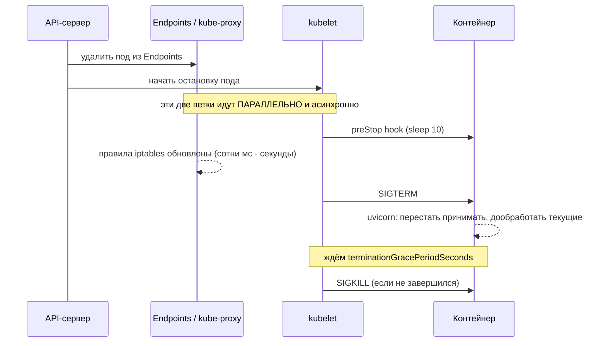

# Docker и Kubernetes для MLE

> **Зачем эта глава.** MLE не обязан быть инфраструктурщиком, но обязан уметь собрать образ,
> который не весит 12 ГБ и не пересобирается 20 минут на каждое изменение строчки кода,
> и уметь описать деплой так, чтобы под не убивали во время загрузки модели, а поды не дрались
> за одно ядро. Здесь — ровно тот минимум, который спрашивают на собеседовании и который
> реально нужен в работе: слои и кэш, multi-stage, размер образа, requests/limits, три вида
> probe, HPA, GPU в кластере и настройка rolling update.

**Уровень:** 🌱 база → 🎯 middle → 🧠 middle+
**Предварительно нужно:** [упаковка модели](04-model-packaging.md), [архитектуры сервинга](05-serving-architectures.md)
**Время на проработку:** ~5 часов (чтение + собрать образ + поднять в minikube/kind)

---

## Карта главы

- [1. Зачем контейнер именно в ML](#1-зачем-контейнер-именно-в-ml)
- [2. Слои, кэш и порядок инструкций](#2-слои-кэш-и-порядок-инструкций)
- [3. Размер образа: откуда берутся гигабайты](#3-размер-образа-откуда-берутся-гигабайты)
- [4. Рабочий Dockerfile](#4-рабочий-dockerfile)
- [5. GPU-образ и базы с CUDA](#5-gpu-образ-и-базы-с-cuda)
- [6. docker compose для локальной разработки](#6-docker-compose-для-локальной-разработки)
- [7. Kubernetes: минимальная модель мира](#7-kubernetes-минимальная-модель-мира)
- [8. requests и limits](#8-requests-и-limits)
- [9. Три probe и почему для ML критичен startup](#9-три-probe-и-почему-для-ml-критичен-startup)
- [10. Полный манифест сервиса](#10-полный-манифест-сервиса)
- [11. ConfigMap и Secret](#11-configmap-и-secret)
- [12. HPA: по какой метрике скейлиться](#12-hpa-по-какой-метрике-скейлиться)
- [13. GPU в Kubernetes](#13-gpu-в-kubernetes)
- [14. Rolling update и корректное завершение](#14-rolling-update-и-корректное-завершение)
- [15. Подводные камни](#15-подводные-камни)
- [16. Проверь себя](#16-проверь-себя)
- [17. Практика](#17-практика)
- [18. Что читать дальше](#18-что-читать-дальше)

---

## 1. Зачем контейнер именно в ML

Контейнер решает три проблемы, и все три в ML острее, чем в обычном бэкенде.

**Зависимости.** Питоновский ML-стек связан с системными библиотеками сильнее, чем кажется:
`lightgbm` требует OpenMP, `opencv` — набор графических библиотек, `torch` — конкретную ветку
CUDA и совместимый драйвер. Артефакт pickle привязан к версиям библиотек
(см. [упаковку модели](04-model-packaging.md)), а значит воспроизводимость модели невозможна
без воспроизводимости окружения.

**Изоляция ресурсов.** ML-процессы прожорливы и склонны занимать всё, до чего дотянутся:
OpenMP по умолчанию поднимает пул по числу ядер машины, а не по выделенной квоте. Без явных
границ один сервис инференса задушит соседей на том же узле.

**Единица выката.** Образ с digest — это то, что можно откатить одной командой. Без него
откат превращается в «а какая версия библиотек была в прошлый вторник».

Ключевая идея: **образ — это не «место, где лежит код», а иммутабельный снимок окружения**.
Всё, что меняется без пересборки образа (веса из S3, конфиг, ключи), — это осознанное решение
с плюсами (быстрый откат модели) и минусами (сетевая зависимость при старте).

---

## 2. Слои, кэш и порядок инструкций

Образ Docker — стопка слоёв, по одному на инструкцию `RUN`, `COPY`, `ADD`. Каждый слой — набор
изменений файловой системы. Два следствия определяют всё остальное.

**Слои аддитивны.** Файл, созданный в одном слое и удалённый в следующем, **остаётся в образе** —
просто скрывается. Отсюда классика:

```dockerfile
# ПЛОХО: 300 МБ кэша apt останутся в образе навсегда
RUN apt-get update && apt-get install -y build-essential
RUN rm -rf /var/lib/apt/lists/*        # этот слой ничего не уменьшит

# ХОРОШО: создание и удаление в одном слое
RUN apt-get update && apt-get install -y --no-install-recommends build-essential \
    && rm -rf /var/lib/apt/lists/*
```

**Кэш инвалидируется каскадом.** Если слой изменился, все последующие пересобираются.
Значит, инструкции надо располагать **от редко меняющихся к часто меняющимся**:

```dockerfile
# ПЛОХО: любое изменение любого файла проекта убивает кэш pip install (это 3-8 минут)
COPY . /srv
RUN pip install -r /srv/requirements.txt

# ХОРОШО: pip install переиспользуется, пока не изменился requirements.txt
COPY requirements.txt /srv/requirements.txt
RUN pip install -r /srv/requirements.txt
COPY . /srv
```

Разница на практике: пересборка после правки одной строки в `main.py` — 8 секунд вместо
5 минут. За рабочий день это десятки минут.

**Почему нельзя ставить всё в один RUN.** Здесь два противоположных соображения, и путать
их — типичная ошибка на собеседовании.

- `apt-get update` и `apt-get install` **обязаны** быть в одном `RUN`. Иначе слой с `update`
  закэшируется, и через месяц `install` пойдёт по устаревшему индексу пакетов — получите
  «пакет не найден» на сборке, которая раньше работала.
- А вот установку системных пакетов, установку Python-зависимостей и копирование кода
  **нельзя** сваливать в один `RUN`: тогда любое изменение кода приведёт к переустановке всего,
  и кэш перестанет работать. Гранулярность кэша = гранулярность слоёв.

Правило: **в один слой объединяем то, что должно инвалидироваться вместе; разделяем то,
что меняется с разной частотой.**

**`.dockerignore` обязателен.** Без него в контекст сборки уезжают `.git` (сотни мегабайт
истории), `data/`, `notebooks/`, `.venv`, чекпоинты. Контекст передаётся демону целиком
перед сборкой — это и время, и риск утечки секретов в образ.

```text
# .dockerignore
.git
.venv
__pycache__/
*.pyc
data/
notebooks/
mlruns/
.pytest_cache/
*.ipynb
.env
```

---

## 3. Размер образа: откуда берутся гигабайты

Размер важен не из эстетики: он напрямую превращается во время холодного старта пода
(см. [сервинг, §11](05-serving-architectures.md)) и в стоимость хранения реестра.
Порядок величин, который стоит помнить:

| Компонента | Размер |
|---|---|
| `python:3.11` (полный) | ~1.0 ГБ |
| `python:3.11-slim-bookworm` | ~130 МБ |
| numpy + pandas + scikit-learn + lightgbm | +300–400 МБ |
| `torch` CPU-колесо (индекс `whl/cpu`) | +350–500 МБ |
| `torch` обычное колесо с PyPI (тянет CUDA-библиотеки) | +2.5–3.5 ГБ |
| `nvidia/cuda:12.4.1-runtime-ubuntu22.04` | ~2 ГБ |
| `nvidia/cuda:12.4.1-devel-ubuntu22.04` | ~6 ГБ |

Отсюда типичные итоговые размеры: сервис на бустинге — **400–600 МБ**, сервис на torch CPU —
**1.0–1.5 ГБ**, GPU-сервис — **5–9 ГБ**, и он же, собранный неаккуратно, легко становится
12–15 ГБ.

Что реально уменьшает размер, по убыванию эффекта:

1. **CPU-колесо torch вместо дефолтного.** Если инференс на CPU, установка с
   `--index-url https://download.pytorch.org/whl/cpu` экономит 2–3 ГБ. Это самая крупная
   и самая часто пропускаемая экономия.
2. **`-runtime`, а не `-devel` база CUDA.** Компиляторы и заголовки нужны на сборке,
   а не в проде: −4 ГБ.
3. **Multi-stage build.** Собираем в образе с `build-essential`, копируем готовый venv
   в чистый slim: −200–400 МБ и минус вся поверхность атаки компиляторов.
4. **`--no-install-recommends` и очистка apt-кэша** в том же слое: −50–200 МБ.
5. **`pip install --no-cache-dir`** (или cache mount BuildKit, который не попадает в слой):
   −100–300 МБ.

> ⚠️ **Типичная ошибка.** Взять `python:3.11-alpine` «потому что он маленький». Alpine
> использует musl вместо glibc, а колёса Python для Linux собираются под стандарт manylinux,
> то есть под glibc. Итог: pip начинает собирать numpy, scipy и lightgbm из исходников —
> сборка вместо 40 секунд идёт 20 минут, — а для `torch` колёс под musl попросту нет.
> Итоговый образ часто оказывается **больше** slim-варианта. Для ML правильная база —
> `python:X.Y-slim-bookworm` или `debian:bookworm-slim`.

Проверять размер надо инструментом, а не догадками: `docker history <image>` показывает вклад
каждого слоя, утилита `dive` — что именно лежит внутри.

---

## 4. Рабочий Dockerfile

```dockerfile
# syntax=docker/dockerfile:1.7
# Директива syntax включает BuildKit-расширения: cache mounts и secret mounts.

###########################  СТАДИЯ СБОРКИ  ###########################
FROM python:3.11-slim-bookworm AS builder

# update и install строго в одном RUN: иначе закешированный слой update
# оставит устаревший индекс пакетов и install однажды упадёт на ровном месте.
# --no-install-recommends убирает десятки мегабайт необязательных зависимостей.
RUN apt-get update && apt-get install -y --no-install-recommends \
        build-essential \
        libgomp1 \
    && rm -rf /var/lib/apt/lists/*

ENV VIRTUAL_ENV=/opt/venv \
    PATH="/opt/venv/bin:$PATH" \
    PIP_DISABLE_PIP_VERSION_CHECK=1
RUN python -m venv "$VIRTUAL_ENV"

# Копируем ТОЛЬКО файл зависимостей: слой с pip install переиспользуется из кэша,
# пока requirements.txt не изменился. Код меняется в сотни раз чаще зависимостей.
COPY requirements.txt .

# cache mount: кэш pip живёт между сборками, но НЕ попадает в слой образа.
# --require-hashes падает, если содержимое пакета не совпало с локом (см. главу 04).
RUN --mount=type=cache,target=/root/.cache/pip \
    pip install --require-hashes -r requirements.txt

###########################  РАНТАЙМ  ###########################
FROM python:3.11-slim-bookworm AS runtime

# libgomp1 нужен LightGBM/XGBoost в рантайме; build-essential — НЕ нужен,
# и именно поэтому мы разделили стадии: компиляторы остались в builder.
RUN apt-get update && apt-get install -y --no-install-recommends \
        libgomp1 \
    && rm -rf /var/lib/apt/lists/* \
    && groupadd -r app && useradd -r -g app -u 10001 app

ENV PATH="/opt/venv/bin:$PATH" \
    PYTHONUNBUFFERED=1 \
    PYTHONDONTWRITEBYTECODE=1 \
    # Число внутренних потоков задаём ЯВНО. Без этого OpenMP поднимет пул
    # по числу ядер УЗЛА (может быть 64), не зная про cgroup-лимит пода.
    OMP_NUM_THREADS=1 \
    OPENBLAS_NUM_THREADS=1

COPY --from=builder /opt/venv /opt/venv
COPY --chown=app:app app/ /srv/app/
# Веса кладём в образ: старт без сетевой зависимости и полная воспроизводимость.
# Плата — размер образа и необходимость пересборки при смене модели (см. §14 главы 04).
COPY --chown=app:app models/churn-2.3.7/model.txt /models/churn-2.3.7/model.txt

WORKDIR /srv
# Непривилегированный пользователь: root в контейнере — лишний риск и нарушение
# типового PodSecurity-профиля restricted.
USER app
EXPOSE 8000

# exec-форма (JSON-массив) обязательна: процесс становится PID 1 и получает SIGTERM
# напрямую. В shell-форме сигнал пришёл бы /bin/sh, uvicorn его не увидел бы,
# и graceful shutdown превратился бы в SIGKILL через 30 секунд.
CMD ["uvicorn", "app.main:app", \
     "--host", "0.0.0.0", "--port", "8000", \
     "--workers", "1", \
     "--timeout-graceful-shutdown", "30", \
     "--no-access-log"]
```

Сборка и проверка:

```bash
docker build -t registry.internal/scoring:2.3.7 .
docker history registry.internal/scoring:2.3.7   # вклад каждого слоя в размер
docker run --rm -p 8000:8000 \
  -e MODEL_PATH=/models/churn-2.3.7/model.txt \
  -e MODEL_VERSION=2.3.7 -e MODEL_SHA256=c1d9...f30a \
  --cpus 2 --memory 2g \
  registry.internal/scoring:2.3.7
```

Флаги `--cpus`/`--memory` при локальном запуске — не формальность: они воспроизводят
прод-ограничения и ловят проблемы с потоками и памятью до выката.

> 💬 **На собеседовании.** Спросят: «Как уменьшить время сборки образа?»
> Хороший ответ: правильный порядок слоёв (зависимости отдельно от кода, чтобы `pip install`
> брался из кэша), `.dockerignore`, cache mount BuildKit для кэша pip, multi-stage чтобы
> не тащить компиляторы, и общий базовый образ с зависимостями для всех сервисов команды —
> тогда его собирают раз в неделю, а не на каждый коммит. Числа: пересборка при правке кода
> должна занимать секунды, а не минуты; если она занимает минуты — значит `COPY . .` стоит
> раньше `pip install`.
> Плохой ответ: «использовать alpine».

---

## 5. GPU-образ и базы с CUDA

Для GPU-инференса база берётся из образов NVIDIA. Ключевой выбор — тег:

- `nvidia/cuda:12.4.1-base-*` — только рантайм CUDA-драйверного слоя, ~250 МБ;
- `nvidia/cuda:12.4.1-runtime-*` — плюс библиотеки CUDA (cuBLAS, cuFFT), ~2 ГБ. **Это дефолт
  для инференса.**
- `nvidia/cuda:12.4.1-devel-*` — плюс компилятор `nvcc` и заголовки, ~6 ГБ. Нужен только
  если вы компилируете кастомные CUDA-ядра или собираете что-то из исходников; в рантайм
  такой образ тащить не надо.

```dockerfile
FROM nvidia/cuda:12.4.1-runtime-ubuntu22.04 AS runtime

# В базах NVIDIA нет Python — ставим сами.
RUN apt-get update && apt-get install -y --no-install-recommends \
        python3.11 python3.11-venv \
    && rm -rf /var/lib/apt/lists/*
```

Два факта, которые надо знать твёрдо:

1. **Драйвер NVIDIA живёт на хосте, а не в образе.** В контейнер он пробрасывается
   NVIDIA Container Toolkit (`docker run --gpus all`) или, в Kubernetes, device plugin'ом.
   Версия CUDA в образе должна быть не выше той, что поддерживает драйвер узла — иначе
   получите `CUDA driver version is insufficient` при первом обращении к карте.
2. **Совместимость проверяется на этапе сборки, а не в проде.** Смоук-тест
   `python -c "import torch; assert torch.cuda.is_available()"` в CI на GPU-раннере снимает
   90% проблем этого класса.

---

## 6. docker compose для локальной разработки

Смысл compose — поднять локально то же, что в проде: сервис, кэш, метрики, дашборд.
Это позволяет отлаживать не только код, но и наблюдаемость.

```yaml
# docker-compose.yml — локальная среда, повторяющая контур прода
services:
  scoring:
    build:
      context: .
      target: runtime
    environment:
      MODEL_PATH: /models/churn-2.3.7/model.txt
      MODEL_VERSION: "2.3.7"
      MODEL_SHA256: "c1d9...f30a"
      REDIS_URL: redis://redis:6379/0
      OMP_NUM_THREADS: "1"
      MAX_BATCH_SIZE: "64"
      MAX_BATCH_WAIT_MS: "5"
    ports: ["8000:8000"]
    volumes:
      # Монтируем код внутрь, чтобы --reload подхватывал правки без пересборки образа.
      - ./app:/srv/app:ro
      - ./models:/models:ro
    command: ["uvicorn", "app.main:app", "--host", "0.0.0.0", "--port", "8000", "--reload"]
    depends_on:
      redis:
        condition: service_healthy
    deploy:
      resources:
        limits:
          # Воспроизводим прод-лимиты локально: половина проблем с потоками
          # и памятью видна только под ограничением.
          cpus: "2"
          memory: 2g

  redis:
    image: redis:7.4-alpine
    command: ["redis-server", "--maxmemory", "512mb", "--maxmemory-policy", "allkeys-lru"]
    healthcheck:
      test: ["CMD", "redis-cli", "ping"]
      interval: 5s
      timeout: 3s
      retries: 5

  prometheus:
    image: prom/prometheus:v2.55.1
    volumes:
      - ./ops/prometheus.yml:/etc/prometheus/prometheus.yml:ro
    ports: ["9090:9090"]

  grafana:
    image: grafana/grafana:11.3.0
    environment:
      GF_AUTH_ANONYMOUS_ENABLED: "true"
      GF_AUTH_ANONYMOUS_ORG_ROLE: Admin
    ports: ["3000:3000"]
    depends_on: [prometheus]
```

```yaml
# ops/prometheus.yml
global:
  scrape_interval: 5s        # локально чаще, чем в проде (15-30s), чтобы быстрее видеть эффект
scrape_configs:
  - job_name: scoring
    static_configs:
      - targets: ["scoring:8000"]
```

Полезные PromQL-запросы, которые сразу можно проверить в локальной Grafana (подробнее —
в главе [стек наблюдаемости](../09-monitoring/05-observability-stack.md)):

```promql
# p99 латентности инференса за 5 минут
histogram_quantile(0.99, sum(rate(inference_latency_seconds_bucket[5m])) by (le))

# RPS по статусам
sum(rate(inference_requests_total[1m])) by (status)

# доля таймаутов
sum(rate(inference_requests_total{status="timeout"}[5m]))
  / sum(rate(inference_requests_total[5m]))

# средний фактический размер батча — проверка, что батчинг вообще работает
rate(inference_batch_size_sum[5m]) / rate(inference_batch_size_count[5m])
```

---

## 7. Kubernetes: минимальная модель мира

MLE не пишет операторы и не настраивает CNI. Нужно понимать пять объектов и связи между ними.

```mermaid
flowchart TB
    ING["Ingress<br/>внешний HTTP-роутинг<br/>по хосту и пути"]
    SVC["Service<br/>стабильные имя и IP,<br/>балансировка L4"]
    DEP["Deployment<br/>желаемое состояние:<br/>образ + число реплик"]
    RS["ReplicaSet<br/>создаётся Deployment'ом<br/>на каждую версию"]
    P1["Pod scoring-abc<br/>контейнер + ресурсы"]
    P2["Pod scoring-def"]
    P3["Pod scoring-ghi"]
    CM["ConfigMap<br/>неsecret-конфиг"]
    SEC["Secret<br/>токены, пароли"]
    HPA["HPA<br/>меняет replicas<br/>по метрике"]

    ING --> SVC
    SVC --> P1 & P2 & P3
    DEP --> RS --> P1 & P2 & P3
    CM -.env / файлы.-> P1
    SEC -.env / файлы.-> P1
    HPA -.правит spec.replicas.-> DEP
```

- **Pod** — минимальная единица планирования: один или несколько контейнеров с общими сетью
  и томами. Поды **эфемерны**: их убивают и пересоздают, IP меняется. Никогда не обращайтесь
  к поду напрямую.
- **Deployment** — декларация «хочу N подов с таким образом». Он создаёт ReplicaSet и управляет
  выкаткой новой версии (§14).
- **Service** — стабильное DNS-имя (`scoring.ml.svc.cluster.local`) и виртуальный IP,
  за которым живут поды, отобранные по label selector. Балансировка — L4, то есть по
  соединениям (важное следствие для gRPC — см. [сервинг, §4](05-serving-architectures.md)).
- **Ingress** — правила внешнего HTTP-роутинга: какой хост и путь ведут в какой Service,
  плюс TLS.
- **ConfigMap / Secret** — конфигурация отдельно от образа (§11).

---

## 8. requests и limits

Самая частая тема на собеседовании по k8s и самая частая причина странного поведения
ML-сервисов.

**`requests` — для планировщика.** Это гарантия: под не будет размещён на узле, где нет
столько свободных ресурсов. Сумма requests всех подов узла не превышает его ёмкости.

**`limits` — для рантайма.** Это потолок, который применяется по-разному к CPU и памяти,
и разница принципиальна.

### CPU: сжимаемый ресурс, механизм — троттлинг

CPU-лимит реализуется квотой CFS в cgroup. Период по умолчанию — 100 мс; лимит `2` означает
квоту 200 мс процессорного времени за каждые 100 мс реального. Исчерпали квоту в середине
периода — все потоки контейнера **замораживаются** до начала следующего периода.

Отсюда самый неприятный эффект в ML: сервис показывает среднюю загрузку CPU 40%,
а латентность в три раза хуже локальной. Причина — троттлинг: 8 потоков OpenMP при лимите
1 CPU выбирают квоту за 12 мс и стоят оставшиеся 88 мс. Диагностика — одна метрика:

```promql
# доля периодов, в которых контейнер был затроттлен; > 0.05 - уже проблема
rate(container_cpu_cfs_throttled_periods_total{pod=~"scoring-.*"}[5m])
  / rate(container_cpu_cfs_periods_total{pod=~"scoring-.*"}[5m])
```

Лечение — не «поднять лимит», а привести число потоков в соответствие с лимитом:
`OMP_NUM_THREADS`, `torch.set_num_threads()`, `num_threads` в LightGBM, число воркеров
uvicorn. Инвариант из [главы про сервинг](05-serving-architectures.md):
$W \times T_{\text{intra}} \le$ CPU limit.

### Память: несжимаемый ресурс, механизм — убийство

Памятью нельзя «поделиться во времени». Превысил лимит — ядро немедленно убивает процесс
сигналом SIGKILL, статус пода становится `OOMKilled`, код выхода **137** (128 + 9). Никакого
предупреждения, никакого шанса записать лог.

```bash
kubectl describe pod scoring-abc | grep -A3 "Last State"
#   Last State:     Terminated
#     Reason:       OOMKilled
#     Exit Code:    137
```

Типичные причины OOM именно в ML-сервисе: несколько воркеров, каждый со своей копией модели
(см. формулу в [сервинге, §6](05-serving-architectures.md)); большой батч, аллоцирующий
временную матрицу; утечка в кэше без ограничения размера; распаковка сжатого артефакта в память.

### QoS-классы и порядок вытеснения

| Класс | Условие | Что означает на практике |
|---|---|---|
| **Guaranteed** | у всех контейнеров requests == limits для CPU и памяти | вытесняется последним; предсказуемая производительность |
| **Burstable** | requests заданы, но меньше limits | вытесняется при нехватке памяти на узле, если превысил requests |
| **BestEffort** | requests и limits не заданы вовсе | вытесняется первым; для прод-сервиса недопустимо |

**Что бывает при отсутствии requests/limits.** Под получает класс BestEffort. Планировщик
считает, что он ничего не потребляет, и упаковывает узел плотно. Дальше сервис инференса
занимает всю память и все ядра, соседи начинают троттлиться и вытесняться, а при нехватке
памяти на узле kubelet убивает именно ваш под первым. Разбор такого инцидента занимает
часы, а причина в двух отсутствующих строчках манифеста.

**Практические рекомендации для ML-сервиса:**

- память: `requests == limits` (память не эластична, «занять больше» всё равно не выйдет
  безопасно). Значение = измеренный RSS под нагрузкой × 1.3.
- CPU: `requests` = типичное потребление, `limits` = 1.5–2 × requests, чтобы пережить всплеск.
  Для сервиса с жёстким SLA лучше `requests == limits` (класс Guaranteed): предсказуемость
  важнее утилизации.
- **Не ставить CPU-лимит вовсе** — обсуждаемая практика: она убирает троттлинг, но делает
  латентность зависимой от соседей по узлу. Для ML-сервиса с SLA я бы лимит ставил.

> 💬 **На собеседовании.** Спросят: «Что будет, если не указать requests и limits?»
> Хороший ответ: под попадёт в класс BestEffort — планировщик разместит его как «нулевой»
> и упакует узел плотно, а при нехватке памяти kubelet вытеснит его первым. CPU при этом
> не ограничен, поэтому OpenMP-пул поднимется по числу ядер узла и задушит соседей;
> память тоже не ограничена, и OOM на узле убьёт случайные процессы. Правильно: память
> requests == limits (несжимаемый ресурс, превышение = мгновенный SIGKILL и код 137),
> CPU requests из измеренного потребления, лимит — с запасом, и обязательно согласовать
> число потоков библиотек с CPU-лимитом, иначе получите троттлинг при видимой загрузке 40%.
> Плохой ответ: «k8s сам разберётся».

---

## 9. Три probe и почему для ML критичен startup

| Probe | Вопрос | Что происходит при провале |
|---|---|---|
| **startupProbe** | завершился ли старт? | пока не прошла — liveness и readiness **не выполняются**; при исчерпании попыток контейнер перезапускается |
| **livenessProbe** | процесс жив и не завис? | контейнер **перезапускается** |
| **readinessProbe** | можно ли слать трафик? | под убирается из Endpoints Service, но **не перезапускается** |

**Почему startup критичен именно для ML.** Обычный веб-сервис стартует за 1–3 секунды,
ML-сервис — за 30–300: скачивание весов, импорт torch, инициализация CUDA-контекста, прогрев.

Без startupProbe у вас конфликт требований. Liveness должна срабатывать быстро, чтобы
зависший процесс не висел минутами; но `initialDelaySeconds` должен покрывать самый долгий
старт. Поставите 30 секунд — kubelet убьёт под, который честно грузит модель 90 секунд,
и вы получите бесконечный `CrashLoopBackOff`, где под никогда не доживает до готовности.
Поставите 300 секунд — реальное зависание будет обнаружено только через пять минут.

startupProbe разрывает этот конфликт: она даёт старту сколько угодно времени, а после её
успеха liveness работает с агрессивными настройками.

```yaml
startupProbe:
  httpGet: { path: /ready, port: 8000 }
  periodSeconds: 10
  # Бюджет старта = failureThreshold * periodSeconds = 30 * 10 = 300 секунд.
  # Берём с запасом ×2 к худшему измеренному старту.
  failureThreshold: 30

livenessProbe:
  httpGet: { path: /health, port: 8000 }   # лёгкий эндпоинт, без обращения к модели
  periodSeconds: 10
  timeoutSeconds: 2
  failureThreshold: 3      # зависание обнаруживается за ~30 секунд

readinessProbe:
  httpGet: { path: /ready, port: 8000 }
  periodSeconds: 5
  timeoutSeconds: 2
  failureThreshold: 2      # быстро выводим перегруженный под из балансировки
  successThreshold: 1
```

> ⚠️ **Типичная ошибка.** Сделать liveness-probe «умной»: проверять в ней доступность Redis,
> базы и делать тестовый инференс. Итог: когда Redis моргнул, Kubernetes перезапустил **все**
> поды сервиса одновременно, и вместо частичной деградации вы получили полный отказ
> на несколько минут холодного старта. Liveness проверяет **только сам процесс**; проверка
> зависимостей — дело readiness, и то осторожно.

---

## 10. Полный манифест сервиса

```yaml
apiVersion: apps/v1
kind: Deployment
metadata:
  name: scoring
  namespace: ml
  labels: { app: scoring }
spec:
  replicas: 12
  revisionHistoryLimit: 5     # храним 5 прошлых ReplicaSet -> есть куда откатываться
  selector:
    matchLabels: { app: scoring }
  strategy:
    type: RollingUpdate
    rollingUpdate:
      maxSurge: 2             # поднимаем максимум 2 лишних пода сверх replicas
      maxUnavailable: 0       # ни одного пода не гасим, пока новый не стал ready
  template:
    metadata:
      labels: { app: scoring }
      annotations:
        prometheus.io/scrape: "true"
        prometheus.io/port: "8000"
        prometheus.io/path: "/metrics"
    spec:
      # Время на graceful shutdown: должно быть больше самого долгого запроса
      # плюс preStop-пауза. Меньше -> SIGKILL посреди обработки.
      terminationGracePeriodSeconds: 45
      securityContext:
        runAsNonRoot: true
        runAsUser: 10001
      # Растаскиваем реплики по узлам: падение одного узла не должно унести半 сервиса.
      topologySpreadConstraints:
        - maxSkew: 1
          topologyKey: kubernetes.io/hostname
          whenUnsatisfiable: ScheduleAnyway
          labelSelector:
            matchLabels: { app: scoring }
      containers:
        - name: app
          image: registry.internal/scoring:2.3.7@sha256:9c1f...      # пин по digest, не по тегу
          imagePullPolicy: IfNotPresent
          ports:
            - { name: http, containerPort: 8000 }
          env:
            - name: MODEL_VERSION
              value: "2.3.7"
            - name: OMP_NUM_THREADS
              value: "1"                # см. §8: число потоков согласовано с CPU-лимитом
            - name: POD_NAME
              valueFrom: { fieldRef: { fieldPath: metadata.name } }
          envFrom:
            - configMapRef: { name: scoring-config }
            - secretRef:    { name: scoring-secrets }
          resources:
            requests: { cpu: "2", memory: "3Gi" }
            limits:   { cpu: "2", memory: "3Gi" }   # Guaranteed QoS: предсказуемость важнее плотности
          startupProbe:
            httpGet: { path: /ready, port: http }
            periodSeconds: 10
            failureThreshold: 30                    # до 300 секунд на загрузку и прогрев
          livenessProbe:
            httpGet: { path: /health, port: http }
            periodSeconds: 10
            timeoutSeconds: 2
            failureThreshold: 3
          readinessProbe:
            httpGet: { path: /ready, port: http }
            periodSeconds: 5
            timeoutSeconds: 2
            failureThreshold: 2
          lifecycle:
            preStop:
              exec:
                # Пауза перед SIGTERM. Удаление пода из Endpoints и остановка контейнера
                # запускаются ПАРАЛЛЕЛЬНО: без паузы часть трафика прилетит в уже
                # закрывающийся под и получит connection refused.
                command: ["sleep", "10"]
---
apiVersion: v1
kind: Service
metadata:
  name: scoring
  namespace: ml
spec:
  type: ClusterIP
  selector: { app: scoring }
  ports:
    - { name: http, port: 80, targetPort: http }
---
apiVersion: networking.k8s.io/v1
kind: Ingress
metadata:
  name: scoring
  namespace: ml
  annotations:
    nginx.ingress.kubernetes.io/proxy-read-timeout: "5"    # согласовано с SLA сервиса
spec:
  ingressClassName: nginx
  rules:
    - host: scoring.ml.internal
      http:
        paths:
          - path: /v1
            pathType: Prefix
            backend:
              service:
                name: scoring
                port: { name: http }
---
apiVersion: policy/v1
kind: PodDisruptionBudget
metadata:
  name: scoring
  namespace: ml
spec:
  minAvailable: 75%          # при обслуживании узлов кластера не уронят больше четверти
  selector:
    matchLabels: { app: scoring }
```

Обратите внимание на две вещи, которые обычно забывают: **образ пинится по digest**, а не
по тегу (тег можно перезаписать, и вы получите разные образы под одной версией), и есть
**PodDisruptionBudget** — без него плановое обслуживание узлов может увести половину реплик
одновременно.

---

## 11. ConfigMap и Secret

Разделение простое: **ConfigMap — конфигурация, Secret — то, что нельзя показывать**.

```yaml
apiVersion: v1
kind: ConfigMap
metadata: { name: scoring-config, namespace: ml }
data:
  MODEL_PATH: "/models/churn-2.3.7/model.txt"
  MAX_BATCH_SIZE: "64"
  MAX_BATCH_WAIT_MS: "5"
  REQUEST_TIMEOUT_S: "0.12"
  FEATURE_STORE_TIMEOUT_MS: "20"
---
apiVersion: v1
kind: Secret
metadata: { name: scoring-secrets, namespace: ml }
type: Opaque
stringData:                  # stringData принимает обычный текст; в etcd попадёт base64
  S3_ACCESS_KEY: "AKIA..."
  REDIS_PASSWORD: "..."
```

Три вещи, которые надо знать про Secret:

1. **Secret не зашифрован по умолчанию** — это base64, то есть кодирование, а не шифрование.
   Шифрование etcd at rest настраивается отдельно администратором кластера. Не считайте
   Secret надёжной защитой сам по себе.
2. **Секреты не коммитятся в git.** Манифест Secret с реальными значениями в репозитории —
   типовая находка на аудите. Правильно: внешний менеджер (Vault, облачный secret manager)
   с оператором, который синхронизирует секреты в кластер, либо sealed secrets.
3. **ConfigMap, подключённый через `envFrom`, не обновляется на лету.** Переменные окружения
   читаются при старте процесса; чтобы применить изменение, нужен перезапуск подов
   (`kubectl rollout restart deployment/scoring`). Смонтированный как том ConfigMap
   обновляется, но с задержкой до минуты, и приложение должно уметь перечитывать файл.

---

## 12. HPA: по какой метрике скейлиться

```yaml
apiVersion: autoscaling/v2
kind: HorizontalPodAutoscaler
metadata: { name: scoring, namespace: ml }
spec:
  scaleTargetRef: { apiVersion: apps/v1, kind: Deployment, name: scoring }
  minReplicas: 12          # минимум держим базовую ёмкость: холодный старт слишком дорог
  maxReplicas: 60
  metrics:
    - type: Resource
      resource:
        name: cpu
        target: { type: Utilization, averageUtilization: 60 }   # не 90: см. очереди в главе 05
    - type: Pods
      pods:
        metric: { name: inference_rps_per_pod }   # кастомная метрика из Prometheus Adapter
        target: { type: AverageValue, averageValue: "180" }
  behavior:
    scaleUp:
      stabilizationWindowSeconds: 0        # вверх реагируем сразу
      policies:
        - { type: Percent, value: 100, periodSeconds: 60 }   # не более чем удвоение за минуту
    scaleDown:
      stabilizationWindowSeconds: 600      # вниз — только если 10 минут спокойно
      policies:
        - { type: Percent, value: 20, periodSeconds: 120 }
```

Формула HPA:

$$
R_{\text{new}} = \left\lceil R_{\text{cur}} \cdot \frac{m_{\text{cur}}}{m_{\text{target}}} \right\rceil
$$

где $R$ — число реплик, $m_{\text{cur}}$ — текущее среднее значение метрики по подам,
$m_{\text{target}}$ — целевое. Изменение применяется только если отклонение больше 10%
(встроенный порог нечувствительности, чтобы не дёргать деплой на шуме).

**Почему CPU часто плохая метрика для ML.** Для GPU-сервиса CPU покажет 15–25% при полностью
загруженной карте — HPA не отреагирует никогда. Для сервиса с внешними походами (feature store,
векторный индекс) CPU низкий, а очередь растёт. Правильные метрики:

- **RPS на под** — самая понятная и напрямую связанная с расчётом из
  [сервинга, §3](05-serving-architectures.md);
- **глубина очереди инференса** (`inference_queue_depth` из нашего сервиса) — реагирует
  раньше латентности;
- **утилизация GPU** (`DCGM_FI_DEV_GPU_UTIL` из экспортера NVIDIA DCGM);
- **длина очереди в Kafka** для стримингового инференса — здесь удобнее KEDA, который умеет
  скейлить по лагу консьюмер-группы.

Асимметрия окон обязательна: вверх — мгновенно, вниз — с окном 5–10 минут. Иначе после
короткого спада поды удаляются, тут же снова нужны, и вы платите холодным стартом
на каждом цикле «пилы».

---

## 13. GPU в Kubernetes

Kubernetes сам по себе про GPU ничего не знает. Карты появляются в кластере через
**device plugin** — DaemonSet от NVIDIA, который обнаруживает карты на узле и регистрирует
их как расширенный ресурс `nvidia.com/gpu`.

```yaml
    spec:
      nodeSelector:
        nvidia.com/gpu.product: NVIDIA-A10       # выбираем нужный тип карты
      tolerations:
        - key: nvidia.com/gpu                    # GPU-узлы обычно помечены taint,
          operator: Exists                       # чтобы на них не сели обычные поды
          effect: NoSchedule
      containers:
        - name: app
          resources:
            limits:
              nvidia.com/gpu: 1     # ТОЛЬКО целое число, и requests автоматически = limits
              cpu: "8"
              memory: "32Gi"
            requests:
              cpu: "8"
              memory: "32Gi"
```

Четыре факта, которые спрашивают:

**GPU нельзя разделить по умолчанию.** Расширенные ресурсы целочисленны: `nvidia.com/gpu: 0.5`
недопустимо. Один под получает карту целиком в эксклюзивное пользование. Если ваша модель
занимает 3 ГБ из 24 ГБ памяти A10, остальные 21 ГБ простаивают — и это самая частая причина
безобразной GPU-экономики в ML-командах.

**Для requests и limits расширенного ресурса действует правило: они должны совпадать.**
Указав только `limits`, вы получаете `requests` равными автоматически.

**Варианты разделения карты — все с оговорками:**

| Механизм | Как работает | Ограничение |
|---|---|---|
| **Time-slicing** (в конфиге device plugin) | карта объявляется как несколько «виртуальных», процессы делят её по времени | **нет изоляции памяти**: один под может исчерпать VRAM и уронить соседей; латентность непредсказуема |
| **MPS** (Multi-Process Service) | процессы делят контексты, вычисления перекрываются | изоляции по памяти по-прежнему нет; сбой одного процесса может задеть остальные |
| **MIG** (Multi-Instance GPU) | аппаратное разбиение карты на изолированные инстансы | только A100/H100 и подобные; фиксированные профили; перенастройка требует освобождения карты |
| **Один сервер инференса на карту** (Triton) | несколько моделей внутри одного процесса | не изоляция, а совместное использование — но чаще всего это правильный ответ |

**k8s не ограничивает память GPU.** `limits.memory` — про оперативную память хоста.
VRAM ограничивается только логикой приложения (например, `torch.cuda.set_per_process_memory_fraction`).
При time-slicing это означает, что «шумный сосед» — реальная и часто встречающаяся проблема.

> 💬 **На собеседовании.** Спросят: «Как в Kubernetes дать двум сервисам одну GPU?»
> Хороший ответ: штатно — никак, расширенные ресурсы целочисленны и карта отдаётся поду
> целиком. Варианта три: time-slicing в конфигурации device plugin (делит по времени,
> но не изолирует память — годится для dev-окружений и для мелких моделей с известным
> потреблением), MIG на A100/H100 (аппаратная изоляция, фиксированные профили), либо —
> обычно правильный ответ — не делить карту между подами, а поставить на неё один сервер
> инференса (Triton) с несколькими моделями и instance groups: тогда батчинг общий,
> утилизация поднимается с 30% до 70–90%, и изоляция не нужна, потому что процесс один.
> Плохой ответ: «поставим requests 0.5».

---

## 14. Rolling update и корректное завершение

По умолчанию Deployment обновляется стратегией RollingUpdate с `maxSurge: 25%`
и `maxUnavailable: 25%`. Для ML-сервиса дефолты редко подходят.

**`maxUnavailable: 0`, `maxSurge: 1..2` — правильный дефолт для сервиса с SLA.** Ни один
под не гасится, пока новый не стал ready; ёмкость не проседает. Плата — выкатка идёт дольше
и требует запаса ресурсов в кластере.

**Для GPU-сервиса всё наоборот.** Если карт ровно столько, сколько подов, `maxSurge: 1`
невозможен: новому поду негде разместиться, выкатка встанет намертво с подом в состоянии
`Pending`. Здесь нужно `maxSurge: 0, maxUnavailable: 1` и осознанная просадка ёмкости
на время выкатки — либо резервная карта под surge.

**Скорость выкатки.** Полная замена 40 подов при старте 90 секунд и `maxSurge: 2` займёт
$40 / 2 \times 90 \approx 30$ минут. Это надо знать заранее: столько же займёт и откат,
если он делается через `rollout undo`. Если требуется откат за секунды, нужна другая схема —
переключение алиаса модели без передеплоя (см. [упаковку модели, §11](04-model-packaging.md))
или blue-green (см. [стратегии выкатки](08-deployment-strategies.md)).

### Как на самом деле умирает под

Порядок событий при удалении пода — источник самых загадочных 502-х:



Ключевое: **удаление из балансировки и остановка контейнера не синхронизированы**. Без
`preStop` контейнер может получить SIGTERM и закрыть слушающий сокет **раньше**, чем
kube-proxy на всех узлах обновит правила — и часть запросов упрётся в `connection refused`.
Пауза в `preStop` на 5–15 секунд закрывает эту гонку. Плюс к этому:

- `terminationGracePeriodSeconds` должен быть больше, чем `preStop` + самый долгий запрос.
  У нас: 10 + 30 = 40, поставили 45.
- Приложение обязано обрабатывать SIGTERM: снять readiness, дообработать текущие запросы,
  закрыть соединения (в нашем FastAPI-сервисе это делает `lifespan`, см.
  [сервинг, §5](05-serving-architectures.md)).
- В образе процесс должен быть PID 1 и получать сигнал напрямую — отсюда exec-форма `CMD` (§4).

Проверка и откат:

```bash
kubectl rollout status  deployment/scoring -n ml --timeout=15m
kubectl rollout history deployment/scoring -n ml
kubectl rollout undo    deployment/scoring -n ml --to-revision=4
```

---

## 15. Подводные камни

**Образ пересобирается 6 минут при правке одной строки.**
Симптом: медленный CI, разработчики избегают частых коммитов.
Причина: `COPY . .` стоит до `pip install`, любое изменение файла инвалидирует кэш зависимостей.
Что делать: сначала `COPY requirements.txt`, потом `pip install`, потом `COPY` кода; добавить
`.dockerignore`; включить cache mount BuildKit.

**Латентность в кластере втрое хуже локальной при загрузке CPU 40%.**
Симптом: p99 растёт, ядра не в полке.
Причина: CPU throttling — потоков библиотек больше, чем позволяет CFS-квота.
Что делать: посмотреть `container_cpu_cfs_throttled_periods_total / container_cpu_cfs_periods_total`;
выставить `OMP_NUM_THREADS` и число воркеров так, чтобы их произведение не превышало CPU-лимит.

**`CrashLoopBackOff` у сервиса, который локально работает.**
Симптом: под перезапускается, в логах ничего криминального.
Причина: liveness-probe с `initialDelaySeconds: 30` при загрузке модели 90 секунд — kubelet
убивает под до готовности, и так по кругу.
Что делать: добавить `startupProbe` с бюджетом `failureThreshold × periodSeconds`, вдвое
превышающим худший измеренный старт.

**Под `OOMKilled`, код 137, в логах — ничего.**
Симптом: под падает под нагрузкой без сообщения об ошибке.
Причина: превышен лимит памяти; SIGKILL не даёт приложению записать лог. Частые источники —
воркеры с копиями модели, большой батч, неограниченный кэш.
Что делать: посчитать память по формуле из [сервинга, §6](05-serving-architectures.md);
`requests == limits` для памяти; измерить RSS под нагрузкой и заложить ×1.3.

**После каждого деплоя всплеск 502-х на несколько секунд.**
Симптом: короткие ошибки соединения при выкатке.
Причина: гонка между удалением из Endpoints и остановкой контейнера.
Что делать: `preStop: sleep 10`, `terminationGracePeriodSeconds` больше суммы паузы и самого
долгого запроса, `maxUnavailable: 0`.

**GPU-под висит в `Pending`, хотя карты свободны.**
Симптом: `0/12 nodes are available: insufficient nvidia.com/gpu`.
Причина: варианты — не установлен device plugin; на GPU-узлах taint, а в поде нет toleration;
`maxSurge: 1` при полностью занятых картах.
Что делать: `kubectl describe node <gpu-node>` и проверить, зарегистрирован ли ресурс
`nvidia.com/gpu` в Allocatable; добавить toleration; для GPU-деплоя ставить
`maxSurge: 0, maxUnavailable: 1`.

**HPA не реагирует на рост нагрузки GPU-сервиса.**
Симптом: карта в полке, латентность растёт, реплик по-прежнему минимум.
Причина: HPA настроен на CPU, который при загруженной карте показывает 20%.
Что делать: скейлиться по RPS на под, глубине очереди или метрикам DCGM через Prometheus
Adapter / KEDA.

**Обновили тег образа `:latest`, часть подов работает на старом коде.**
Симптом: непредсказуемое поведение части реплик.
Причина: `imagePullPolicy: IfNotPresent` плюс перезаписываемый тег — на узлах, где образ уже
был, он не перекачивается.
Что делать: никогда не использовать `latest` в проде; пинить образ по digest
(`image: repo/name:2.3.7@sha256:...`).

**Секрет с ключом от S3 нашли в git.**
Симптом: находка на аудите или инцидент.
Причина: манифест Secret с `stringData` закоммичен в репозиторий.
Что делать: внешний менеджер секретов с оператором синхронизации либо sealed secrets;
ротация скомпрометированного ключа; сканер секретов в pre-commit и в CI
(см. [CI/CD для ML](07-ci-cd-for-ml.md)).

---

## 16. Проверь себя

<details>
<summary><b>🎯 Вопрос.</b> Как устроено кэширование слоёв в Docker и как этим пользоваться?</summary>

**Короткий ответ.** Каждая инструкция создаёт слой; изменение слоя инвалидирует все
последующие. Поэтому инструкции располагают от редко меняющихся к часто меняющимся:
сначала системные пакеты, потом `COPY requirements.txt` и `pip install`, и только потом
`COPY` кода.

**Развёрнуто.** Практический эффект: пересборка после правки строки кода занимает секунды
вместо минут, потому что тяжёлый слой с зависимостями берётся из кэша. Второе свойство слоёв —
аддитивность: файл, созданный в одном слое и удалённый в следующем, остаётся в образе,
поэтому `apt-get update`, `install` и `rm -rf /var/lib/apt/lists/*` пишутся в одном `RUN`.
Третье — `.dockerignore`: без него в контекст сборки уезжают `.git`, данные и ноутбуки,
что и замедляет сборку, и рискует утечкой. Отдельно: `apt-get update` нельзя отделять
от `install`, иначе закешированный индекс пакетов однажды сломает сборку.

**Чего ждёт интервьюер:** что вы объясните и порядок инструкций, и правило одного RUN
для apt, не перепутав их между собой.

**Провал:** «надо всё делать в одном RUN, чтобы было меньше слоёв».
</details>

<details>
<summary><b>🎯 Вопрос.</b> Зачем multi-stage build в ML-образе?</summary>

**Короткий ответ.** Чтобы компиляторы и заголовки, нужные для установки колёс из исходников,
остались в стадии сборки, а в рантайм уехал только готовый venv. Экономия 200–400 МБ
и меньшая поверхность атаки.

**Развёрнуто.** Схема: первая стадия на slim-базе ставит `build-essential`, создаёт
виртуальное окружение и `pip install`; вторая стадия — чистая slim-база, куда копируется
`/opt/venv` и код. Для GPU эффект больше: сборка на `nvidia/cuda:*-devel` (~6 ГБ),
рантайм на `nvidia/cuda:*-runtime` (~2 ГБ) — минус 4 ГБ, то есть десятки секунд холодного
старта на каждом поде. Второй, не менее важный эффект — безопасность: в прод-образе нет
компилятора, что заметно сужает возможности эксплуатации.

**Чего ждёт интервьюер:** конкретных чисел и понимания, что размер образа — это время
холодного старта, а не эстетика.

**Провал:** знать слово «multi-stage», но не уметь назвать, что именно остаётся в первой стадии.
</details>

<details>
<summary><b>🧠 Вопрос.</b> Чем отличаются requests и limits и что происходит при их превышении?</summary>

**Короткий ответ.** requests — для планировщика (гарантия размещения), limits — для рантайма
(потолок). CPU при превышении троттлится, память — приводит к мгновенному SIGKILL
и статусу OOMKilled с кодом 137.

**Развёрнуто.** CPU — сжимаемый ресурс: лимит реализуется квотой CFS (период 100 мс, лимит 2 =
квота 200 мс), и при исчерпании квоты все потоки контейнера замораживаются до следующего
периода. Это даёт характерный симптом: средняя загрузка 40%, а латентность втрое хуже —
диагностируется отношением `container_cpu_cfs_throttled_periods_total` к
`container_cpu_cfs_periods_total`. Память несжимаема: превышение = немедленное убийство
без шанса залогировать. Соотношение requests и limits определяет QoS-класс: Guaranteed
(равны) вытесняется последним, BestEffort (не заданы) — первым. Для ML-сервиса рекомендую
память requests == limits, а CPU — Guaranteed при жёстком SLA, и обязательно согласовать
`OMP_NUM_THREADS` с CPU-лимитом.

**Чего ждёт интервьюер:** различия сжимаемого и несжимаемого ресурса и знания кода 137.

**Провал:** «limits — это просто ограничение сверху» без различия поведения CPU и памяти.
</details>

<details>
<summary><b>🎯 Вопрос.</b> Зачем нужен startupProbe, если есть liveness и readiness?</summary>

**Короткий ответ.** Чтобы развести два конфликтующих требования: дать медленному старту
(загрузка модели 30–300 с) сколько нужно времени и при этом обнаруживать реальное зависание
за десятки секунд.

**Развёрнуто.** Без startupProbe `initialDelaySeconds` у liveness должен покрывать худший
старт. Поставите мало — kubelet убьёт под, честно грузящий модель, и получите бесконечный
CrashLoopBackOff. Поставите много — зависание будет обнаружено через минуты. startupProbe
работает первой, и пока она не прошла, liveness и readiness не выполняются вовсе; её бюджет =
`failureThreshold × periodSeconds` (например, 30 × 10 = 300 с). После её успеха liveness
работает агрессивно: период 10 с, три провала. Для ML это существенно чаще, чем для обычного
бэкенда, потому что старт включает скачивание весов, инициализацию CUDA и прогрев.

**Чего ждёт интервьюер:** формулировки конфликта, который startupProbe разрешает,
и умения посчитать бюджет старта.

**Провал:** перечислить три probe, не объяснив, зачем нужна третья.
</details>

<details>
<summary><b>🧠 Вопрос.</b> Почему при выкатке появляются 502-е, хотя maxUnavailable = 0?</summary>

**Короткий ответ.** Потому что удаление пода из Endpoints и остановка контейнера идут
параллельно и асинхронно: контейнер может закрыть сокет раньше, чем kube-proxy на всех узлах
обновит правила. Лечится `preStop`-паузой на 5–15 секунд.

**Развёрнуто.** Полная последовательность: API-сервер одновременно инициирует удаление из
Endpoints и остановку пода; kubelet выполняет preStop-хук, затем шлёт SIGTERM, затем ждёт
`terminationGracePeriodSeconds` и шлёт SIGKILL. Пока правила iptables обновляются (сотни
миллисекунд — секунды, и тем дольше, чем больше узлов), трафик продолжает приходить.
Пауза в preStop даёт этому процессу завершиться. Дополнительные условия: приложение
обрабатывает SIGTERM (снимает readiness, дообрабатывает текущие запросы),
`terminationGracePeriodSeconds` больше суммы preStop и самого долгого запроса, а `CMD`
записан в exec-форме — иначе сигнал получит `/bin/sh`, а не uvicorn.

**Чего ждёт интервьюер:** понимания асинхронности и знания про exec-форму CMD — это признак
человека, который это отлаживал.

**Провал:** «поставим побольше terminationGracePeriodSeconds» — это не решает гонку.
</details>

<details>
<summary><b>🧠 Вопрос.</b> Как дать одну GPU двум подам?</summary>

**Короткий ответ.** Штатно нельзя: `nvidia.com/gpu` — целочисленный расширенный ресурс,
карта отдаётся поду целиком. Варианты: time-slicing (без изоляции памяти), MIG (аппаратно,
только на A100/H100), либо один сервер инференса на карту с несколькими моделями.

**Развёрнуто.** Карты появляются в кластере через device plugin, регистрирующий их как
расширенный ресурс; для расширенных ресурсов requests обязаны равняться limits и должны быть
целыми. Time-slicing включается в конфигурации плагина и делит карту по времени, но VRAM
не изолируется — один под может исчерпать память и уронить соседа, а латентность становится
непредсказуемой; для прода с SLA это плохо. MIG даёт настоящую аппаратную изоляцию, но только
на поддерживаемых картах и с фиксированными профилями. Правильный ответ для большинства
случаев: не делить карту между подами, а поставить Triton с несколькими моделями и instance
groups — тогда батчинг общий, утилизация растёт с 30% до 70–90%, а изоляция не нужна,
потому что процесс один. Отдельно стоит помнить: `limits.memory` в k8s — это RAM хоста,
VRAM Kubernetes не ограничивает вообще.

**Чего ждёт интервьюер:** знания, что дробные GPU невозможны, и умения предложить рабочую
альтернативу, а не только назвать ограничение.

**Провал:** «поставим `nvidia.com/gpu: 0.5`».
</details>

<details>
<summary><b>🎯 Вопрос.</b> По какой метрике настраивать HPA для сервиса инференса?</summary>

**Короткий ответ.** Для CPU-модели — по CPU с целевым значением 50–60%, для GPU-сервиса
и сервисов с внешними походами — по RPS на под, глубине очереди инференса или метрикам DCGM
через Prometheus Adapter либо KEDA.

**Развёрнуто.** CPU обманывает в двух случаях: при GPU-инференсе он показывает 15–25% при
загруженной карте, при походах в feature store он низкий, а очередь растёт. Целевое значение
берётся из теории очередей: время ожидания растёт как $1/(1-\rho)$, поэтому 60%, а не 90%.
Формула HPA: $R_{new} = \lceil R_{cur} \cdot m_{cur}/m_{target}\rceil$ с порогом
нечувствительности 10%. Обязательна асимметрия окон: `scaleUp.stabilizationWindowSeconds: 0`,
`scaleDown` — 300–600 с, иначе получите «пилу» с оплатой холодного старта на каждом цикле.
И главное ограничение, которое надо назвать: HPA не спасает от резкого всплеска, потому что
от решения до первого ответа новой реплики проходят минуты; основная защита — запас
по утилизации и `minReplicas`.

**Чего ждёт интервьюер:** что вы не остановитесь на «CPU 80%» и назовёте ограничение HPA
по времени реакции.

**Провал:** «HPA по CPU с target 80%».
</details>

<details>
<summary><b>🌱 Вопрос.</b> Почему для ML-образа не берут alpine?</summary>

**Короткий ответ.** Alpine собран на musl, а колёса Python для Linux собираются под стандарт
manylinux, то есть под glibc. Pip начинает собирать numpy/scipy/lightgbm из исходников
(20+ минут вместо 40 секунд), а для torch колёс под musl нет вовсе.

**Развёрнуто.** Итоговый образ на alpine для ML-стека часто оказывается больше slim-варианта,
потому что для сборки из исходников нужны компиляторы и заголовки. Плюс musl-реализация
malloc и потоков даёт другую производительность на многопоточных численных нагрузках,
что для инференса нежелательно. Правильная база — `python:X.Y-slim-bookworm` (~130 МБ)
или `debian:bookworm-slim`. Реальную экономию дают другие вещи: CPU-колесо torch вместо
дефолтного (−2..3 ГБ), `-runtime` вместо `-devel` базы CUDA (−4 ГБ), multi-stage,
`--no-install-recommends` и отсутствие кэша pip в слое.

**Чего ждёт интервьюер:** понимания причины (musl vs glibc и manylinux), а не заученного
«alpine не подходит».

**Провал:** «alpine самый маленький, поэтому его и берём».
</details>

<details>
<summary><b>🎯 Вопрос.</b> Чем Service отличается от Ingress и зачем нужны оба?</summary>

**Короткий ответ.** Service — стабильное имя и балансировка на уровне L4 внутри кластера
для набора эфемерных подов. Ingress — правила внешнего HTTP-роутинга (хост, путь, TLS),
которые направляют трафик в Service.

**Развёрнуто.** Поды эфемерны: их IP меняется при каждом пересоздании, поэтому обращаться
к ним напрямую нельзя. Service даёт постоянное DNS-имя вида
`scoring.ml.svc.cluster.local` и виртуальный IP, за которым стоят поды, отобранные по label
selector. Балансировка L4 означает распределение соединений, а не запросов — важное следствие
для gRPC и HTTP/2, где долгоживущее соединение залипает на одном поде и нагрузка становится
неравномерной; лечится headless Service с клиентской балансировкой или L7-прокси. Ingress
работает выше: это набор правил для контроллера (nginx, traefik), который терминирует TLS
и маршрутизирует по хосту и пути. Внутренние сервис-сервисные вызовы Ingress не используют —
они идут прямо в Service.

**Чего ждёт интервьюер:** понимания эфемерности подов и уровня, на котором работает каждый
объект.

**Провал:** «Service — это внутри, Ingress — снаружи» без объяснения L4/L7 и label selector.
</details>

<details>
<summary><b>🧠 Вопрос.</b> Как настроить rolling update для GPU-сервиса и почему не как для CPU?</summary>

**Короткий ответ.** Для CPU-сервиса — `maxUnavailable: 0, maxSurge: 1..2` (ёмкость не
проседает). Для GPU при полностью занятых картах это невозможно: новому поду негде
разместиться, выкатка встанет в Pending. Нужно `maxSurge: 0, maxUnavailable: 1` либо
резервная карта.

**Развёрнуто.** Ограничение возникает из того, что GPU — эксклюзивный целочисленный ресурс:
пока старый под держит карту, новый на неё не встанет. Практические следствия: выкатка
GPU-сервиса всегда идёт с просадкой ёмкости, поэтому её планируют на низкий трафик или
держат запас карт; время выкатки считается как (число подов / шаг) × время старта — при
40 подах, шаге 1 и старте 90 секунд это час, столько же займёт и `rollout undo`. Отсюда
вывод, важный для дизайна: если нужен откат за секунды, он не должен идти через передеплой —
лучше переключение алиаса модели в реестре или blue-green. Дополнительно: PodDisruptionBudget,
чтобы обслуживание узлов не унесло реплики, и terminationGracePeriodSeconds с preStop
для корректного слива трафика.

**Чего ждёт интервьюер:** осознания, что дефолты k8s рассчитаны на stateless-веб и для ML
их надо менять, плюс расчёта времени выкатки.

**Провал:** предложить одни и те же настройки для CPU и GPU.
</details>

---

## 17. Практика

**Задача 1. Ускорить сборку (40 минут).**
Возьмите проект с `COPY . .` перед `pip install`. Замерьте время пересборки после правки
одной строки в коде. Переставьте инструкции, добавьте `.dockerignore` и cache mount.
Замерьте снова.
*Сделано правильно: пересборка после правки кода занимает менее 15 секунд; вы можете
показать по `docker history`, какой слой взялся из кэша.*

**Задача 2. Уменьшить образ вдвое (60 минут).**
Соберите образ для сервиса на PyTorch CPU обычным способом (`pip install torch` с PyPI),
замерьте размер. Затем: slim-база, CPU-индекс torch, multi-stage, `--no-install-recommends`.
*Сделано правильно: размер сократился с ~3.5 ГБ до ~1.2 ГБ или меньше; вы можете назвать
вклад каждой меры и проверить его через `docker history`.*

**Задача 3. Воспроизвести троттлинг (45 минут).**
Запустите сервис локально с `--cpus 1`, но без `OMP_NUM_THREADS`. Подайте нагрузку, замерьте
p99. Затем выставьте `OMP_NUM_THREADS=1` и повторите.
*Сделано правильно: вы видите разницу в разы и можете объяснить механизм через CFS-квоту.
Бонус: воспроизвели то же в kind/minikube и нашли метрику троттлинга.*

**Задача 4. Спровоцировать CrashLoopBackOff и починить (45 минут).**
Разверните сервис в kind с искусственной задержкой старта 60 секунд и liveness-probe
с `initialDelaySeconds: 20`. Убедитесь в CrashLoopBackOff. Почините через startupProbe.
*Сделано правильно: вы можете по `kubectl describe pod` показать причину перезапуска
и посчитать бюджет startupProbe для вашего времени старта.*

**Задача 5. Поймать 502 на выкатке (60 минут).**
Разверните сервис в kind, подайте постоянную нагрузку (`hey`/`k6`), сделайте
`kubectl set image` без preStop-хука и посчитайте ошибки. Добавьте `preStop: sleep 10`
и `maxUnavailable: 0`, повторите.
*Сделано правильно: в первом случае ошибки есть, во втором — ноль; вы можете нарисовать
последовательность событий при удалении пода и указать, где именно была гонка.*

**Задача 6. Полный манифест с нуля (90 минут).**
Напишите Deployment + Service + ConfigMap + HPA для своего сервиса из
[главы 05](05-serving-architectures.md), не подглядывая в §10. Значения requests/limits
посчитайте по измеренному потреблению, бюджет startupProbe — по измеренному времени старта.
*Сделано правильно: манифест применяется без ошибок, под становится ready, `/metrics`
скрейпится, а вы можете обосновать каждое число, а не сказать «взял из примера».*

---

## 18. Что читать дальше

- [Dockerfile reference (docs.docker.com)](https://docs.docker.com/reference/dockerfile/) —
  справочник по инструкциям. Читать целиком не нужно; нужны разделы про `RUN`, `COPY`,
  `CMD`/`ENTRYPOINT` (особенно разница exec- и shell-формы) и про `--mount`.
- [Docker build cache (docs.docker.com)](https://docs.docker.com/build/cache/) —
  как именно инвалидируется кэш и как им управлять. Прямо отвечает на §2.
- [Docker Compose (docs.docker.com)](https://docs.docker.com/compose/) — раздел про
  `healthcheck` и `depends_on: condition` для корректного порядка запуска зависимостей.
- [Kubernetes: управление ресурсами контейнеров](https://kubernetes.io/docs/concepts/configuration/manage-resources-containers/) —
  первоисточник по requests/limits, QoS-классам и поведению при превышении.
- [Kubernetes: liveness, readiness и startup probes](https://kubernetes.io/docs/tasks/configure-pod-container/configure-liveness-readiness-startup-probes/) —
  все параметры и их семантика. Обратите внимание на то, что startupProbe отключает
  остальные до своего успеха.
- [Kubernetes: Deployments](https://kubernetes.io/docs/concepts/workloads/controllers/deployment/) —
  раздел про стратегии обновления, `maxSurge`/`maxUnavailable` и `rollout undo`.
- [Kubernetes: Horizontal Pod Autoscaling](https://kubernetes.io/docs/tasks/run-application/horizontal-pod-autoscale/) —
  формула расчёта реплик, `behavior`, окна стабилизации.
- [Kubernetes: планирование GPU](https://kubernetes.io/docs/tasks/manage-gpus/scheduling-gpus/) —
  device plugin, целочисленность расширенных ресурсов, ограничения совместного использования.
- [NVIDIA k8s-device-plugin (репозиторий)](https://github.com/NVIDIA/k8s-device-plugin) —
  конфигурация time-slicing и MIG. Читать перед тем, как обещать «поделим карту».
- [KEDA](https://keda.sh/) — скейлинг по внешним метрикам (лаг Kafka, длина очереди),
  включая scale-to-zero. Полезно для стримингового и батчевого инференса.
- **Kubernetes Patterns (Ibryam, Huß, O'Reilly)** — паттерны Health Probe, Managed Lifecycle,
  Predictable Demands изложены ровно на том уровне абстракции, который нужен прикладному
  инженеру.

---

⬅️ [Архитектуры сервинга](05-serving-architectures.md) | 🏠 [Оглавление](../index.md) | ➡️ [CI/CD для ML](07-ci-cd-for-ml.md)
